# LAZYREVIEW A Dataset for Uncovering Lazy Thinking in NLP Peer Reviews

Sukannya Purkayastha1, Zhuang Li2, Anne Lauscher3, Lizhen Qu4, Iryna Gurevych1

1 Ubiquitous Knowledge Processing Lab,

Department of Computer Science and Hessian Center for AI (hessian.AI), Technical University of Darmstadt

2 School of Computing Technologies, Royal Melbourne Institute of Technology, Australia 3 Data Science Group, University of Hamburg

Department of Data Science & AI, Monash University, Australia www.ukp.tu-darmstadt.de

## Abstract

Peer review is a cornerstone of quality control in scientific publishing. With the increasing workload, the unintended use of ‘quick’ heuristics, referred to as lazy thinking, has emerged as a recurring issue compromising review quality. Automated methods to detect such heuristics can help improve the peer-reviewing process. However, there is limited NLP research on this issue, and no real-world dataset exists to support the development of detection tools. This work introduces LAZYREVIEW, a dataset of peer-review sentences annotated with finegrained lazy thinking categories. Our analysis reveals that Large Language Models (LLMs) struggle to detect these instances in a zeroshot setting. However, instruction-based finetuning on our dataset significantly boosts performance by 10-20 performance points, highlighting the importance of high-quality training data. Furthermore, a controlled experiment demonstrates that reviews revised with lazy thinking feedback are more comprehensive and actionable than those written without such feedback. We will release our dataset and the enhanced guidelines that can be used to train junior reviewers in the community.1

## 1 Introduction

Peer Reviewing is widely regarded as one of the most effective ways to assess the quality of scientific papers (Ware and Mabe, 2009). It is a distributed procedure where the experts (reviewers) independently evaluate whether a submitted manuscript adheres to the standards of the field. With the Mathew effect (Merton, 1968) in science (“rich get richer”), where the researchers receive benefits throughout their career for having papers at prestigious venues, it is of utmost importance to ensure sound practices in the reviewing process.

  
[Although the proposed approach does bring WSD improvements, it is rather incremental. This is probably not a ""weakness"" per se, just that the paper is not an eye-opener]. [The evaluation is done on German data only, which leaves some doubts about other languages.]  
Figure 1: Illustration of lazy thinking in ARR-22 reviews sourced from NLPEER (Dycke et al., 2023). The first review segment belongs to the class ‘The results are not novel.’ The last segment pertains to, ‘The approach is tested only on [not English], so unclear if it will generalize to other languages.’ as per ARR-22 guidelines.

With the growing load of paper submissions, reviewers often face an overwhelming workload (Landhuis, 2016; Künzli et al., 2022) to assess multiple manuscripts quickly. When presented with a cognitively hard task (e.g., reviewing) coupled with information overload and limited time, humans often end up using simple decision rules, also known as heuristics (Tversky et al., 1974). Though simple and efficient, these heuristics can often lead to errors and unfair evaluations (Raue and Scholl, 2018). The usage of such heuristics to dismiss research papers in the Natural Language Processing (NLP) Community has been termed as lazy thinking (Rogers and Augenstein, 2021). One such example is shown in Fig 1. Here, the reviewer dismisses the paper in the first review segment for not being an “eye-opener”. However, they do not provide any references regarding similar prior work or feedback to improve the paper. This corresponds to the lazy thinking class ‘The results are not novel’.

In 2021, when ACL Rolling Review (ARR) was adopted as one of the main reviewing platforms for major NLP conferences, these heuristics were added to the guidelines (Rogers and Augenstein, 2021), aiming to discourage reviewers from relying on such approaches.2 However, in their ACL 2023 report, Rogers et al. (2023) identified the usage of these heuristics as one of the leading factors (24.3%) of author-reported issues in peer reviews.

Therefore, in this work, we focus on this pertinent issue, lazy thinking in NLP peer reviewing and heed Kuznetsov et al. (2024)’s call for automated methods to signal such occurrences in order to improve the overall reviewing quality.

To have a finer look at the problem of lazy thinking in NLP peer reviews, we introduce LAZYRE-VIEW, a dataset with 500 expert-annotated review segments and 1276 silver annotated review segments from the best-performing model tagged with lazy thinking classes with a review segment consisting of 1 or more review sentences. We develop this dataset over three rounds of annotation and incrementally sharpen the guidelines guided by interannotator agreements. We further provide positive examples, i.e., annotated examples for each class, to enhance the understanding of annotators for this task and reach annotation consensus sooner. Annotating review segments by a new batch of annotators who were not involved in developing the guidelines resulted in Cohen’s κ (Landis and Koch, 1977) values of 0.32, 0.36, and 0.48, respectively. The steady increase in agreement across rounds justifies the effectiveness of the developed guidelines.

With this dataset, we further test the zero-shot capabilities of LLMs in identifying lazy thinking, which can be leveraged downstream to identify rule-following behaviour (Sun et al., 2024b) in peerreview scenarios. Despite likely exposure to peer reviews via platforms like OpenReview during pretraining, LLMs struggle to accurately identify the type of lazy thinking when presented with the current guidelines. To enhance their comprehension of lazy thinking, we employ instruction-tuning on the LLMs using our dataset, leading to significant performance gains—around 10-20 accuracy points compared to their zero-shot and few-shot performances. Finally, we perform a controlled experiment where human reviewers rewrite peer reviews with(out) using annotations of lazy thinking from our dataset. Human preference-based evaluations reveal that reviews written with the lazy thinking guidance are more comprehensive and actionable than their vanilla counterparts.

Contributions. We make the following contributions: (1) Introduce LAZYREVIEW, a dataset annotated with lazy thinking classes for a new task in model development and evaluation. (2) Enhance annotation guidelines to improve both automated and human annotations. (3) Demonstrate that positive examples boost annotation quality and in-context learning. (4) Show that instruction tuning on our dataset enhances model performance. (5) Find that annotated lazy thinking classes improve review quality.

## 2 LAZYREVIEW: A Dataset for detecting Lazy Thinking in Peer Reviews

In line with Rogers and Augenstein (2021), we first define lazy thinking as follows.

Definition. ‘Lazy thinking, in the context ofNLP research paper reviews, refers to the practice of dismissing or criticizing research papers based on superficial heuristics or preconceived notions rather than thorough analysis. It is characterized by reviewers raising concerns that lack substantial supporting evidence and are often influenced by prevailing trends within the NLP community.’

Rogers and Augenstein (2021) enlist a total of 14 types of lazy thinking heuristics in the ARR 2021 guidelines adapted from the study in Rogers and Augenstein (2020). We show some of the classes as described in the guidelines in Table 1.3 Reiterating the example in Fig 1, we note that such claims about novelty need to be backed up with supporting evidence and hence constitute a classic example of lazy thinking as per the guidelines.

In this section, we describe the creation of our dataset, LAZYREVIEW guided by the ARR 2022 (Rogers and Augenstein, 2021) and the EMNLP 2020 guidelines (Liu et al., 2020). We describe the dataset curation process followed by an analysis of the dataset. This is the first dataset of annotated instances with fine-grained lazy thinking classes for NLP peer reviews.

## 2.1 Review Collection and Sampling

We use the ARR 2022 reviews from the NLPEER Dataset (Dycke et al., 2023) in which the reviews are collected using the 3Y-pipeline (Dycke et al., 2022) and as such has clear licenses attached. The dataset comprises reviews from five venues: CONLL 2016, ACL 2017, COLING 2020, ARR 2022, and F1000RD (an open-source science journal), with 11K review reports sourced from 5K papers. Focusing on the lazy thinking definition in the ARR 2022 guidelines (Rogers and Augenstein, 2021), we consider only the ARR-22 reviews, using 684 reviews from 476 papers with 11,245 sentences in total. Each review is divided into sections like ‘paper summary’, ‘summary of strengths’, ‘summary of weaknesses’, and ‘comments, typos, and suggestions’, with reviewers completing the relevant sections based on their evaluation. However, there is no standardized format for expressing concerns, so we use automated methods to extract relevant review segments, as detailed later.

<table><tr><td>Heuristics</td><td>Description</td><td>Example review segments</td></tr><tr><td>The results are not surprising</td><td>Many findings seem obvious in ret- rospect, but this does not mean that the community is already aware of them and can use them as building blocks for future work.</td><td>Transfer learning does not look to bring significant improvements. Looking at the variance, the results with and without transfer learning overlap. This is not surprising.</td></tr><tr><td>The results are not novel</td><td>Such broad claims need to be backed up with references.</td><td>The approach the authors propose is still useful but not very novel.</td></tr><tr><td>The paper has language errors</td><td>As long as the writing is clear enough, better scientific content should be more valuable than better journalistic skills.</td><td>The paper would be easy to fol- low with English proofreading even though the overall idea is under- standable.</td></tr></table>

Table 1: Descriptions for some of the lazy thinking classes sourced from ARR 2022 guidelines (Rogers and Augenstein, 2021). We present some examples corresponding to these classes from our dataset, LAZYREVIEW.

## 2.2 Review Formatting

We utilize GPT-4 (Achiam et al., 2024) to prepare the instances (review segments) for subsequent annotations. We instruct GPT-4 to extract the review segments from the ‘Summary of Weaknesses’ section of the review that can be classified into one of the lazy thinking classes, as outlined in the ARR guidelines4. Because lazy thinking is often a factor in paper rejection and is specifically defined within the ‘Summary of Weaknesses’ section according to the ARR guidelines (Rogers and Augenstein, 2021), we limit our focus to this section. Additionally, ARR serves as the primary reviewing platform for major NLP conferences, such as ACL, EMNLP, and NAACL. As a result, the reviews encompass a wide range of topics and discussions across various prominent NLP conferences. We obtain 1,776 review segments after this step, with each segment having varied lengths from 1 to 5 review sentences, as described later in Sec 2.5. To validate the quality of the extracted segments, we sample a set of 100 segments from this pool and task three annotators to independently annotate each segment within the context of the entire review to decide on their candidacy towards lazy thinking. The final label is chosen based on a majority vote. We obtain Cohen’s κ of 0.82 and obtain precision, recall and F1 scores as 0.74, 1.00 and 0.85, respectively. Intuitively, this means that GPT-4 samples more candidates than required, giving us a larger pool of candidates for annotation. We therefore introduce another class to our labelling schema, ‘None’ to annotate non-lazy

thinking candidates.

## 2.3 Annotation Protocol

Annotators are given the full review and the target review segment (highlighted) to classify according to incrementally developed lazy thinking guidelines based on ARR 2022. They also indicate their confidence levels: low, medium, or high. To aid in understanding, we added two additional classes: ‘None’ for no lazy thinking, and ‘Not Enough Information’ for instances lacking specificity or needing the paper for proper classification.

Two Ph.D. students, both fluent in English and experienced in NLP peer reviewing, are tasked with annotating review segments iteratively, given that peer reviewing requires specialized expertise. A senior PostDoc with an NLP background acts as a third annotator to resolve any disagreements between the initial annotations. The guidelines evolve over multiple rounds. Once the guidelines are refined and finalized, we recruit a new batch of annotators to re-validate them by asking them to annotate the same review segments. These new annotators follow the same set of guidelines used in the earlier rounds to ensure consistency. After this validation process, the original Ph.D. annotators are retained to annotate additional instances.

## 2.4 Evolving Guidelines

We incrementally improve the guidelines guided by the inter-annotator agreements. Given the high subjectivity of this domain, we consider the guidelines to be precise once we achieve a substantial agreement on annotating the instances further.

Round 1: ARR 2022 Guidelines. In this round, the annotators are provided with the existing ARR (Rogers and Augenstein, 2021) guidelines and asked to annotate the lazy thinking classes. We sample a set of 50 instances from the review segments extracted by GPT-4 as described in Sec §2.1. After the first round of annotation, we obtain a Cohen’s kappa, κ of 0.31. This is a substantially low agreement, revealing an ambiguity in the reviewing guidelines. The confusion matrix for the first round of annotation is shown in Fig 17a (cf. §A.9). We find that there is a high agreement for the ‘None’ class, which implies that the annotators can easily detect a review segment that is not problematic. However, they struggle to determine the fine-grained label of the problematic review segments. Further analysis of the confidence level of the annotators reveals that for most of the cases, the annotators have low confidence, as shown in Fig 18a (cf. §A.9), which points towards ambiguity in the guidelines.

Round 2: ARR 2022 and EMNLP guidelines. We further explored the initial reviewing guidelines released during EMNLP 2020 (Liu et al., 2020). We identify some additional classes that are now missing from the ARR guidelines, namely ‘Non-mainstream Approaches’ (rejecting papers for not using current trending approaches) and ‘Resource Paper’ (favoring resource papers lesser for ACL conferences). Additionally, we extend descriptions of some of the classes such as, ‘This has no precedent in existing literature’, ‘The method is too simple’ using the guidelines in Liu et al. (2020). Moreover, we extend the name of some of the class labels based on the EMNLP 2020 guidelines, such as ‘The paper has language errors’ with ‘Writing Style’; ‘The topic is too niche’ with ‘Narrow topics’, which have similar meanings. We show the extended descriptions for those classes in Table 8 (cf. Appendix §A.1). We annotate the same set of instances as in Round 1 and eventually calculate agreements. We obtain Cohen’s κ of 0.38, which is significantly higher than the previous round (0.31). We observe higher agreements for the classes having extended names such as, ‘The paper has language errors and ‘Niche Topics’, as illustrated in Fig 17b (cf. §A.9). The confidence level of the annotators also substantially increased from low to medium in this round, as can be seen in Fig 18b (cf. §A.9).

Round 3: Round 2 guidelines with positive examples. To promote quick learning through “worked examples" (Atkinson et al., 2000), we refine our annotation round by fixing the guidelines and incorporating positive examples for each lazy thinking class. We evaluated several techniques to select representative examples, measuring effectiveness using Cohen’s κ. The methods include (a) Random: selecting the shortest or longest review segments, and (b) Diversity: encoding segments with SciB-ERT (Beltagy et al., 2019), clustering them using K-Means, and choosing the cluster center with the lowest cosine distance. After pairwise comparisons, the random shortest method was preferred, achieving a Cohen’s κ of 0.86. For round 3, we sampled 50 new review segments and included annotated examples from the previous round, resulting in a Cohen’s κ of 0.52, indicating substantial agreement despite the task’s subjectivity, as shown in Fig 17c (cf. §A.9). We also obtain higher annotator confidence levels as shown in Fig 18c (cf. §A.9).5

Final Validation. To validate the guidelines developed over three rounds, we hired a new group of English-speaking PhD students with NLP peer review expertise to annotate the same set of instances. These annotators were not involved in the development of the guidelines. Re-annotation across rounds 1, 2, and 3 resulted in inter-annotator agreement (κ) values of 0.32, 0.36, and 0.48, respectively. This steady increase in κ aligns with previous results of 0.31, 0.38, and 0.52, validating the iterative improvement of the guidelines based on stronger inter-annotator agreement. Agreement scores higher than 0.4 are considered moderate due to the inherent subjectivity of the task and are consistent with agreement levels reported in previous studies within the peer-reviewing domain (Kennard et al., 2022; Purkayastha et al., 2023). We retain the annotators from the initial rounds who developed the guidelines to annotate a total of 500 review segments as a part of our dataset, LAZYREVIEW. The overall annotation time amounted to 20 hours. This corresponds to 25 minutes per example, ranging from less than a minute for annotating shorter segments up to half an hour for longer ones.

## 2.5 Dataset Analysis

Our dataset comprises 500 expert-annotated review segments tagged with 18 classes. Out of all the labels, 16 classes in our dataset correspond to explicit lazy thinking. The distribution of our dataset is shown in Fig 2 corresponding to these 16 classes. The most frequent lazy thinking is ‘Extra Experiments’, where the reviewers ask the authors to conduct additional experiments without proper justification. This trend reflects the current expectations in the NLP field, which has rapidly shifted towards machine learning models and methods that often emphasize extensive empirical evaluations (Gururaja et al., 2023). The next most frequent classes are ‘Not Enough Novelty’ and ‘Language Errors’ The ACL review report does not state the individual distribution of these classes but constitutes around 24.3% of all reported issues. We further analyze the sentence length of the review segments within these classes. This is illustrated in Fig 19 of §A.13. We observe that most of these review segments have a length of 1 sentence, underscoring the use of shorter arguments to dismiss papers. The lazy thinking class ‘Extra Experiment’ is the most common with variable segment lengths.

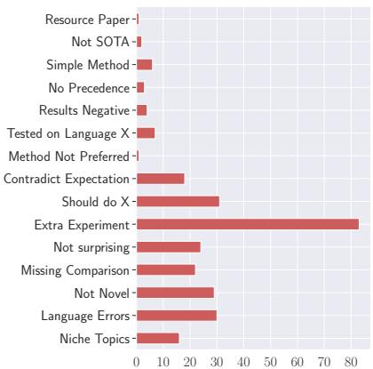  
Figure 2: Distribution of lazy thinking labels in our dataset, LAZYREVIEW.

## 3 Experiments

We use the LAZYREVIEW dataset to assess the performance of various open-source LLMs in detecting lazy thinking in NLP peer reviews.

## Experimental Setup

Tasks. We propose two formulations for detecting lazy thinking in peer reviews: (i) Coarse-grained classification: a binary task to determine if an input segment x is lazy thinking, and (ii) Fine-grained classification: a multi-class task to classify x into one of the specific lazy thinking classes, $c _ { i } \in C$ Models. Since the guidelines for NLP conferences are mainly instructions, we explore various opensource instruction-tuned LLMs for this task. We experiment with the chat versions of LLaMa-2 7B and 13B (Touvron et al., 2023) (abbr. LLaMa, LLaMaL), Mistral 7B instruct (Jiang et al., 2023) (abbr. Mistral), Qwen-Chat 1.5 7B (Bai et al., 2023) (abbr. Qwen), Yi-1.5 6B instruct (Young et al., 2024) (abbr. Yi-1.5), Gemma-1.1 7B instruct (Mesnard et al., 2024) (abbr. Gemma), and SciTülu

7B (Wadden et al., 2024) (abbr. SciTülu).6

Prompts. Following our annotation protocol, we prompt the LLMs with guidelines and instructions for each round. For coarse-grained classification, the model determines whether the input is an instance of lazy thinking or not. For fine-grained one, the model selects the best-fitting lazy thinking class from the provided options. We test two input types: the target segment (T) alone, or the combination of the review and target segment (RT).7

Metrics. To evaluate LLM outputs, we use both strict and relaxed measures because LLMs sometimes do not produce exact label phrases. The strict measure, as defined by Helwe et al. (2024), uses regular expressions to check for matches between the gold label and predictions, reporting accuracy and macro-F1 (string matching). The relaxed measure employs GPT-3.5 to judge whether the provided answer is semantically equivalent to the ground-truth class, outputting a “yes” or “no” decision. This approach follows previous work on evaluating free-form LLM outputs (Wadden et al., 2024; Holtermann et al., 2024), and reports accuracy based on the number of “yes” responses. Both metrics determine whether predictions are correct or incorrect. We also performed an alignment study on 50 responses from every model to validate the reliability of the evaluators. We find that the stringmatching-based evaluator underestimates the correct predictions, whereas the GPT-based evaluator overestimates them, rendering a correct balance of lower and upper bounds for the model predictions.8

## RQ1: How effective are the improved guidelines in enhancing zero-shot performance of LLMs?

Since the first two rounds of our annotation study are dedicated to fixing the guidelines for annotations, we evaluate the understanding of the LLMs on the same 50 instances on both annotation rounds, i.e., rounds 1 and 2, respectively. This validates whether the improved guidelines actually influence the zero-shot performance of LLMs.

Modelling Approach. We prompt the LLMs for round 1, with the definition of lazy thinking classes, as shown in Table 1, representing the existing ARR guidelines. For round 2, we prompt the LLMs with the new guidelines as described in Sec §A.1 where we added new classes and extended descriptions of the existing classes in the ARR guidelines using the EMNLP 2020 Blog (Liu et al., 2020).

<table><tr><td rowspan="3">Models</td><td colspan="4">Fine-gr.</td><td colspan="4">Coarse-gr.</td></tr><tr><td colspan="2">R1</td><td colspan="2">R2</td><td colspan="2">R1</td><td colspan="2">R2</td></tr><tr><td>S.A</td><td>G.A</td><td>S.A</td><td>G.A</td><td>S.A</td><td>G.A</td><td>S.A</td><td>G.A</td></tr><tr><td>RANDOM</td><td>7.11</td><td></td><td>4.34</td><td></td><td>40.7</td><td></td><td>40.7</td><td></td></tr><tr><td>MAJORITY</td><td>11.1</td><td></td><td>7.34</td><td></td><td>51.4</td><td></td><td>51.4</td><td></td></tr><tr><td> $\overline { { \mathrm { \ G e m m a } + \mathrm { T } } }$ </td><td>22.2</td><td>52.2</td><td>26.7</td><td>58.1</td><td>44.3</td><td>51.1</td><td>46.1</td><td>54.4</td></tr><tr><td> $\mathrm { G e m m a + R T }$ </td><td>12.2</td><td>46.7</td><td>11.6</td><td>51.1</td><td>48.1</td><td>47.4</td><td>50.4</td><td>49.1</td></tr><tr><td> $\overline { { \mathbf { \Pi } \mathbf { L } \mathbf { L } a \mathbf { M } a + \mathbf { T } } }$ </td><td>12.2</td><td>15.6</td><td>22.2</td><td>30.6</td><td>57.7</td><td>70.0</td><td>60.0</td><td>75.0</td></tr><tr><td> $\mathrm { L L a M a + R T }$ </td><td>12.2</td><td>25.6</td><td>13.2</td><td>33.7</td><td>53.3</td><td>55.1</td><td>60.0</td><td>67.7</td></tr><tr><td> $\overline { { \mathrm { \ L L a M a _ { L } + T } } }$ </td><td>26.7</td><td>44.4</td><td>26.7</td><td>45.3</td><td>60.2</td><td>73.1</td><td>62.2</td><td>75.4</td></tr><tr><td> $\mathrm { L L a M a _ { L } + R T }$ </td><td>15.6</td><td>41.1</td><td>17.6</td><td>40.4</td><td>68.6</td><td>69.4</td><td>70.2</td><td>70.2</td></tr><tr><td>Mistral + T</td><td>27.8</td><td>47.8</td><td>28.8</td><td>51.1</td><td>57.8</td><td>64.8</td><td>58.8</td><td>66.3</td></tr><tr><td>Mistral + RT</td><td>12.2</td><td>28.9</td><td>16.6</td><td>35.9</td><td>55.4</td><td>53.8</td><td>57.4</td><td>56.0</td></tr><tr><td>Qwen + T</td><td>21.1</td><td>46.7</td><td>22.7</td><td>50.0</td><td>68.9</td><td>74.1</td><td>70.4</td><td>76.1</td></tr><tr><td> $\mathrm { Q w e n } + \mathrm { R T }$ </td><td>12.2</td><td>43.3</td><td>13.3</td><td>42.6</td><td>53.3</td><td>53.3</td><td>56.5</td><td>56.5</td></tr><tr><td> $\overline { { \mathrm { Y i - 1 } . 5 + \mathrm { T } } }$ </td><td>35.3</td><td>56.7</td><td>37.6</td><td>60.0</td><td>64.4</td><td>71.1</td><td>68.7</td><td>73.4</td></tr><tr><td> $\mathrm { Y i - } 1 . 5 + \mathrm { R T }$ </td><td>34.4</td><td>51.1</td><td>32.8</td><td>52.2</td><td>63.3</td><td>65.1</td><td>68.3</td><td>70.4</td></tr><tr><td>SciTülu + T</td><td>14.4</td><td>18.1</td><td>25.3</td><td>29.4</td><td>57.8</td><td>57.8</td><td>58.3</td><td>58.3</td></tr><tr><td> $\mathrm { S c i T i i l u + R T }$ </td><td>15.6</td><td>17.3</td><td>18.3</td><td>23.7</td><td>55.6</td><td>55.6</td><td>58.7</td><td>58.7</td></tr></table>

Table 2: LLM performance across annotation rounds in terms of string-matching (S.A) and GPT-based (G.A) accuracy for fine-grained (Fine-gr.) and coarse-grained (Coarse-gr.) tasks. ‘T’ uses only the target sentence, ‘RT’ combines review and target. R1 and R2 represent ‘Round 1’ and ‘Round 2’. Increments from R1 to R2 are highlighted in red; decreases or no change in gray.

Results. We present results for fine-grained and coarse-grained classification of zero-shot LLMs in Table 2.9 Using only the target segment (T) as input generally outperforms using both the target segment and review (RT) across most models, likely due to spurious correlations from longer inputs, as noted by Feng et al. (2023). All models improve from round 1 (R1) to round 2 (R2), with Gemma gaining 4.5 points in string accuracy (S.A). SciTülu, however, benefits from the broader context of RT, possibly due to its pre-training on longcontext tasks. Coarse-grained classification scores are consistently higher than fine-grained, showing LLMs can serve as basic lazy thinking detectors.

## RQ2: How effective are positive examples in improving the performance of LLMs?

To test the effect of using positive examples on the performance of LLMs, we leverage in-context learning to test the models with the same 50 instances as used in round 3 of our annotation study. Modelling Approach. We prompt LLMs using positive examples from previous rounds and Round 2 guidelines, combining target segments (TE) and the combination of review and target segments (RTE) as in-context learning examples. Since LLMs have a fixed context window, we employ two setups for selecting examples: (i) Static selection of fixed random examples for all inferences, and (ii) Dynamic selection on per test case basis using following methods: (a) BM25: uses BM25 to select examples, (b) Top K: uses embedding space similarity, and (c) Vote-K: penalizing already selected examples. We tested with 1, 2, and 3 exemplars.10

<table><tr><td rowspan=1 colspan=5>Fine-gr.       Coarse-gr.ModelsS.A    G.A    S.A    G.ARANDOM      2.46            43.3MAJORITY     5.11           52.3</td></tr><tr><td rowspan=2 colspan=1> $\overline { { \mathrm { { G e m m a + T E } } } }$  $\mathbf { \bar { G e m m a } } + \mathbf { \bar { R } } \mathbf { \bar { T E } }$ </td><td rowspan=1 colspan=1>24.455.5</td><td rowspan=1 colspan=1>41.18.9</td><td rowspan=1 colspan=2>75.620.0 88.931.7</td></tr><tr><td rowspan=1 colspan=1>17.322.9</td><td rowspan=1 colspan=1>32.800.2</td><td rowspan=1 colspan=2>71.15.5  82.216.6</td></tr><tr><td rowspan=1 colspan=1> $\overline { { \mathrm { \ L L a M a + T E } } }$ </td><td rowspan=1 colspan=1>15.64.5</td><td rowspan=1 colspan=1>38.93.3</td><td rowspan=1 colspan=1>84.44.4</td><td rowspan=1 colspan=1>89.13.0</td></tr><tr><td rowspan=1 colspan=1> $\mathrm { \bar { L } \bar { L } a \bar { M } a + \bar { R } \bar { T } E }$ </td><td rowspan=1 colspan=1>14.2</td><td rowspan=1 colspan=1>30.811.9</td><td rowspan=1 colspan=1>75.32.0</td><td rowspan=1 colspan=1>81.14.4</td></tr><tr><td rowspan=1 colspan=1> $\overline { { \mathrm { \ L L a M a _ { L } + T E } } }$ </td><td rowspan=1 colspan=1>24.4113.3</td><td rowspan=1 colspan=1>41.155.5</td><td rowspan=1 colspan=1>73.11.9</td><td rowspan=1 colspan=1>71.110.0</td></tr><tr><td rowspan=1 colspan=1> $\mathrm { \bar { L } \bar { L } a \bar { M } a _ { L } ^ { - } + \bar { R } \bar { T } \bar { E } }$ </td><td rowspan=1 colspan=1>18.88.1</td><td rowspan=1 colspan=1>34.42.2</td><td rowspan=1 colspan=1>70.31.5</td><td rowspan=1 colspan=1>61.1g9.9</td></tr><tr><td rowspan=1 colspan=1> $\overline { { \mathrm { \mathbf { M i s t r a l } } + \mathrm { T E } } }$ </td><td rowspan=1 colspan=1>30.018</td><td rowspan=1 colspan=1>55.612   $</td><td rowspan=1 colspan=1>8 6 . 7 _ { \underline { { { 1 2 . 3 } } } }$ </td><td rowspan=1 colspan=1> $\underline { { \overline { { 8 6 . 7 _ { 1 1 . 5 } } } } }$ </td></tr><tr><td rowspan=1 colspan=1> $\mathbf { \bar { M i s t r a l + R T E } }$ </td><td rowspan=1 colspan=1> $2 7 . 8 _ { 5 . 6 }$ </td><td rowspan=1 colspan=1> $5 2 . 2 _ { 1 . 1 }$ </td><td rowspan=1 colspan=1> $6 8 . 8 _ { 6 . 6 }$ </td><td rowspan=1 colspan=1> $6 8 . 8 _ { 6 . 6 }$ </td></tr><tr><td rowspan=1 colspan=1> $\overline { { \mathrm { ~ \textit ~ { ~ Q ~ w e n ~ } ~ } + \mathrm { ~ T ~ E ~ } } }$ </td><td rowspan=1 colspan=1>31.122</td><td rowspan=1 colspan=1> $\underline { { { \bar { 5 } 6 . 4 _ { 1 2 . 0 } } } }$ </td><td rowspan=1 colspan=1> $8 6 . 7 _ { 4 . 0 }$ </td><td rowspan=1 colspan=1> $\overline { { 8 6 . 7 _ { 4 . 0 } } }$ </td></tr><tr><td rowspan=1 colspan=1> $\mathrm { \bar { Q } w e n + \bar { R } \bar { T } E }$ </td><td rowspan=1 colspan=1> $\bar { 2 7 . 8 } _ { 1 . 1 } ^ { - }$ </td><td rowspan=1 colspan=1> $\bar { 4 4 . 2 0 . 9 }$ </td><td rowspan=1 colspan=1> $6 2 . 2 _ { 2 . 0 }$ </td><td rowspan=1 colspan=1> $\bar { 6 2 . 2 } \bar { 2 } . 0$ </td></tr><tr><td rowspan=1 colspan=1> $\overline { { \mathrm { Y i } { - } 1 . 5 + \mathrm { T E } } }$ </td><td rowspan=1 colspan=1> $\overline { { 3 0 . 0 _ { 3 . 3 } } }$ </td><td rowspan=1 colspan=1> $\overline { { 5 4 . 9 _ { 1 . 1 } } }$ </td><td rowspan=1 colspan=1> $\overline { { 7 4 . 5 _ { 3 . 2 } } }$ </td><td rowspan=1 colspan=1>73.81</td></tr><tr><td rowspan=1 colspan=1> $\bar { \mathrm { Y i - } } \bar { 1 . 5 } + \bar { \mathrm { R T E } }$ </td><td rowspan=1 colspan=1> $\bar { 2 4 . 4 } _ { 3 . 2 } ^ { - }$ </td><td rowspan=1 colspan=1> $5 2 . 7 _ { 1 . 4 }$ </td><td rowspan=1 colspan=1> $\bar { 7 0 . 1 } \bar { 2 . 0 }$ </td><td rowspan=1 colspan=1> $7 2 . 4 _ { 2 . 3 }$ </td></tr><tr><td rowspan=1 colspan=1> $\overline { { \mathrm { \ S c i T i l u + T E } } }$ </td><td rowspan=1 colspan=1> $2 3 . 3 \substack { 1 . 1 }$ </td><td rowspan=1 colspan=1> $4 4 . 8 _ { 2 . 6 }$ </td><td rowspan=1 colspan=1> $\overline { { 7 2 . 2 _ { 2 1 . 1 } } }$ </td><td rowspan=1 colspan=1> $\overline { { 7 2 . 2 _ { 2 0 . 0 } } }$ </td></tr><tr><td rowspan=1 colspan=1> $\bar { \mathbf { S } } \bar { \mathrm { c i T i i l u } } + \bar { \mathbf { R } } \bar { \mathbf { T } } \bar { \mathbf { E } }$ </td><td rowspan=1 colspan=1> $1 9 . 7 _ { 0 . 8 }$ </td><td rowspan=1 colspan=1> $\underline { { 4 1 . 1 _ { 2 . 2 } } }$ </td><td rowspan=1 colspan=1>88.817.7</td><td rowspan=1 colspan=1>91.1122.3</td></tr></table>

Table 3: Performance of LLMs for round 3 in terms of the metrics used in Table 2 for fine-grained (Finegr.) and coarse-grained (Coarse-gr.) tasks. ‘E’ denotes adding in-context exemplars to input types: ‘T’ (target sentence) and ‘RT’ (review + target sentence). Red: Increments with exemplars. Subscripts represent increments as compared to the zero-short versions.

Results. We plot results in Fig 3 and 4 for finegrained and coarse-grained classification (cf. §A.7), finding that the static strategy outperforms all other setups, especially for Mistral and Qwen. Increasing exemplars does not enhance performance, supporting Srivastava et al. (2024) that random examples yield better results than similarity-based methods. This also can be attributed to the ability of LLMs to learn the format of the task from exemplars rather than learning to perform the task (Lu et al., 2024). We adopt a static in-context learning method using 1 exemplar for the rest of the paper.

We show the results using 1 static example in Table 3. ICL-based methods surpass zero-shot models, with notable gains in coarse classification (20 points for Gemma, 21 points for SciTülu stringbased accuracy (S.A.)). We also obtain positive increments across the board in fine-grained classifications. SciTülu excels in the coarse-grained classification, possibly due to the domain specific pre-training. Qwen leads in fine-grained classification, likely due to the multi-lingual pre-training data and high-quality data filtering performed for the pre-training phase (Bai et al., 2023). 11

## RQ3: How effective is instruction-tuning in improving the performance of LLMs?

Building on previous work in aligning LLMs with new tasks (Ivison et al., 2023; Wadden et al., 2024), we apply instruction-based fine-tuning for lazythinking detection. Using a bottom-up approach, we determine the data requirements using 3-fold cross-validations for maximum performance on a small validation set. We then identify optimal data mixes for the test set. We subsequently use a similar mix to train the models and then compare their performance to their non-instruction tuned counterparts from the previous annotation rounds and obtain silver annotations from the best model.

Modelling Approach. We apply instruction-based finetuning for the same models as detailed in Sec §3. To optimize our limited computational resources, we employ LoRa (Hu et al., 2022) for parameter-efficient finetuning and utilize openinstruct (Wang et al., 2023).12 We use the same prompt (cf. §3) as instruction along with the round 2 guidelines (combination of guidelines of ARR and EMNLP blog) while performing this experiment. We use multiple data sources to create data mixes: (i) TÜLU V2 (Ivison et al., 2023) with 326,154 samples, (ii) SCIRIFF (Wadden et al., 2024) with 154K demonstrations across 54 tasks, and (iii) LAZYREVIEW with 1000 samples evenly split between coarse and fine-grained classification. LAZYREVIEW is divided into 70% training (700 examples), 10% validation (100 examples), and 20% testing (200 samples) in a 3-fold crossvalidation setup. We train on 700 examples in the NO MIX setting. We use an equal number of instances (700) from each data source to balance the other mixtures. We create SCIRIFF MIX (1400 samples) and TÜLU MIX (1400 samples) by com bining LAZYREVIEW with the other datasets and a FULL MIX (2100 samples) integrating all three. We test the performance on the same cross-validated test sets for each mix. We use a proportion of 0.3 for the $\mathbf { \hat { \mu } } ^ { \mathrm { { 6 } r } }$ (using only target segment) setup and 0.7 for the ‘RT’ setup (using a combination of review and target segment) from the different mixes to optimize performance and data efficiency based on a hyper-parameter search on different validation sets.13

Results. We compare instruction-tuned models to their zero and few-shot counterparts for finegrained and coarse-grained classification using 3- fold cross-validation, as shown in Tables 12 and 13 (cf. §A.10). Instruction tuning significantly enhances model performance. The LLaMa models and SciTülu excel with the SCIRIFF MIX, benefiting from pre-training on SCIRIFF and TÜLU. Gemma and Qwen achieve their best results with the TÜLU MIX, with Qwen outperforming Gemma (45.5 vs. 31.6 S.A. accuracy), likely due to Qwen’s multilingual training on 2.4T tokens (Bai et al., 2023) compared to Gemma’s English-only training (Mesnard et al., 2024). Mistral and Yi perform best with the full dataset mix, with Yi surpassing Mistral (35.7 vs. 26.8 S.A.), possibly due to its larger vocabulary size. Qwen and Yi lead in fine-grained classification, while SciTülu excels in coarse classification, consistent with earlier findings. Instruction tuning’s effectiveness relies on data composition; blending general-purpose instruction data from TÜLU with scientific data from SCIRIFF optimizes LLM performance (Shi et al., 2023) on this task. However, including tasks from all sources (FULL MIX) can occassionally underperform, likely due to negative task transfer (Jang et al., 2023; Wadden et al., 2024).

<table><tr><td rowspan=1 colspan=7>Fine-gr.               Coarse-gr.ModelsR1    R2    R3    R1    R2    R3</td></tr><tr><td rowspan=1 colspan=7>RAND.   7.11   4.34   2.46   40.7   40.7   43.3</td></tr><tr><td rowspan=1 colspan=7>MAJ.    11.1   7.34   5.11   51.4  51.4   52.3</td></tr><tr><td rowspan=2 colspan=7> $\mathrm { G e m m a }$   22.2   26.7   24.4   48.1   50.4   75.6 $3 1 . 4 9 . 2 $    $3 8 . 8 \mathrm { _ { 1 2 . 1 } }$  34.610.2  $5 7 . 8 \mathrm { { g } } _ { . 7 }$  61.410.081.25.6</td></tr><tr><td rowspan=1 colspan=1>it + T</td></tr><tr><td rowspan=1 colspan=1>it + RT</td><td rowspan=1 colspan=6> $2 8 . 2 \mathrm { _ { 6 . 0 } }$   35.79.0 32.88.4   $5 5 . 6 _ { 7 . 5 }$  59.49.0 78.83.2</td></tr><tr><td rowspan=2 colspan=1> $\overline { { \mathrm { { L L a M a } } } }$  $i t + \mathrm { T }$  $i t +  { \mathrm { R T } }$ </td><td rowspan=1 colspan=6>12.2   22.2   15.6     $\overline { { 5 7 . 7 } }$    60.0    84.4 $4 3 . 8 _ { 3 1 . 6 }$   $4 7 . 8 _ { 2 5 . 6 }$   $4 4 . 7 _ { 2 9 . 1 }$   $6 2 . 7 _ { 5 . 0 }$  65.45.0 85.41.0</td></tr><tr><td rowspan=1 colspan=6> $4 3 . 2 { \mathrm { 3 1 . 0 } }$   $\underline { { 4 5 . 3 _ { 2 3 . 1 } } }$   $\underline { { 4 1 . 8 2 6 . 2 } }$   $\underline { { 6 1 . 2 3 . 5 } }$  63.13.1 81.33.1</td></tr><tr><td rowspan=3 colspan=1> $\overline { { \mathrm { L L a M a _ { L } } } }$  $i t + \mathrm { T }$  $i t +  { \mathrm { R T } }$ </td><td rowspan=1 colspan=6>26.7   26.7   24.4   68.6   70.2    73.1</td></tr><tr><td rowspan=1 colspan=1> $4 5 . 8 _ { 1 9 . 1 }$ </td><td rowspan=1 colspan=1> $4 7 . 8 _ { 2 1 . 1 }$ </td><td rowspan=1 colspan=1> $5 0 . 5 _ { 2 6 . 1 }$ </td><td rowspan=1 colspan=1> $7 4 . 3 \mathrm { { 5 . 7 } }$ </td><td rowspan=1 colspan=2>74.64.4 75.32.2</td></tr><tr><td rowspan=1 colspan=1> $4 1 . 2 _ { 1 4 . 5 }$ </td><td rowspan=1 colspan=1> $\underline { { 4 5 . 2 _ { 1 8 . 5 } } }$ </td><td rowspan=1 colspan=1> $4 7 . 3 _ { 2 2 . 9 }$ </td><td rowspan=1 colspan=1> $7 0 . 2 _ { 1 . 6 }$ </td><td rowspan=1 colspan=2>71.81.8 73.30.2</td></tr><tr><td rowspan=1 colspan=1> $\overline { { { \bf M i s t r a l } } }$    <eq</td><td rowspan=1 colspan=1>>\overline { { 2 7 . 8 } }</eq></td><td rowspan=1 colspan=1> $\overline { { 2 8 . 8 } }$ </td><td rowspan=1 colspan=1>30.0</td><td rowspan=1 colspan=1>57.8</td><td rowspan=1 colspan=1>58.8</td><td rowspan=1 colspan=1>86.7</td></tr><tr><td rowspan=1 colspan=1> $i t + \mathrm { T }$ </td><td rowspan=1 colspan=1> $3 5 . 4 _ { 7 . 6 }$ </td><td rowspan=1 colspan=1> $3 7 . 4 _ { 8 . 6 }$ </td><td rowspan=1 colspan=1> $4 2 . 4 _ { 1 2 . 4 }$ </td><td rowspan=1 colspan=1> $6 0 . 2 _ { 2 . 4 }$ </td><td rowspan=1 colspan=1> $6 2 . 2 _ { 3 . 4 }$ </td><td rowspan=1 colspan=1>86.40.3</td></tr><tr><td rowspan=1 colspan=1> $i t +  { \mathrm { R T } }$ </td><td rowspan=1 colspan=1> $3 1 . 2 _ { 3 . 4 }$ </td><td rowspan=1 colspan=1> $3 5 . 2 _ { 6 . 4 }$ </td><td rowspan=1 colspan=1> $\underline { { 3 7 . 8 _ { 7 . 8 } } }$ </td><td rowspan=1 colspan=1> $6 5 . 3 _ { 7 . 5 }$ </td><td rowspan=1 colspan=1>68.29.4</td><td rowspan=1 colspan=1>88.21.5</td></tr><tr><td rowspan=1 colspan=1> $\overline { { \mathrm { \bf Q } \mathrm { { w e n } } } }$     <eq</td><td rowspan=1 colspan=1>>\overline { { 2 1 . 1 } }</eq></td><td rowspan=1 colspan=1> $\overline { { 2 2 . 7 } }$ </td><td rowspan=1 colspan=1> $\overline { { 3 1 . 1 } }$ </td><td rowspan=1 colspan=1> $\overline { { 6 8 . 9 } }$ </td><td rowspan=1 colspan=1>70.4</td><td rowspan=1 colspan=1>86.7</td></tr><tr><td rowspan=1 colspan=1> $i t + \mathrm { T }$ </td><td rowspan=1 colspan=1> $\mathbf { 4 5 . 9 } _ { 2 4 . 8 }$ </td><td rowspan=1 colspan=1> $4 8 . 4 _ { 2 5 . 7 }$ </td><td rowspan=1 colspan=1> ${ \bar { \bf 5 9 . 4 } } _ { 2 8 . 3 }$ </td><td rowspan=1 colspan=1> $7 5 . 4 \mathrm { _ 6 . 5 }$ </td><td rowspan=1 colspan=1>76.355.9</td><td rowspan=1 colspan=1>88.41.7</td></tr><tr><td rowspan=1 colspan=1> $i t +  { \mathrm { R T } }$ </td><td rowspan=1 colspan=1> $\underline { { 4 1 . 2 _ { 2 0 . 1 } } }$ </td><td rowspan=1 colspan=1> $\underline { { 4 2 . 4 _ { 1 9 . 7 } } }$ </td><td rowspan=1 colspan=1> $4 7 . 8 _ { 1 6 . 7 }$ </td><td rowspan=1 colspan=1> $7 3 . 2 _ { 4 . 3 }$ </td><td rowspan=1 colspan=1>74.13.7</td><td rowspan=1 colspan=1>86.30.4</td></tr><tr><td rowspan=1 colspan=1> $\overline { { \mathrm { Y i } . 1 . 5 } }$ </td><td rowspan=1 colspan=1> $\overline { { 3 5 . 3 } }$     <e</td><td rowspan=1 colspan=1>q>3 7 . 6</eq></td><td rowspan=1 colspan=1>30.0</td><td rowspan=1 colspan=1> $6 4 . 4$ </td><td rowspan=1 colspan=1>68.7</td><td rowspan=1 colspan=1>74.5</td></tr><tr><td rowspan=1 colspan=1> $i t + \mathrm { T }$ </td><td rowspan=1 colspan=1> $4 5 . 1 _ { 9 . 8 }$ </td><td rowspan=1 colspan=1> $4 7 . 8 _ { 1 0 . 2 }$ </td><td rowspan=1 colspan=1> $4 7 . 9 _ { 1 7 . 9 }$ </td><td rowspan=1 colspan=1> $6 9 . 5 _ { 5 . 1 }$ </td><td rowspan=1 colspan=1> $7 4 . 2 _ { 5 . 5 }$ </td><td rowspan=1 colspan=1>78.43.9</td></tr><tr><td rowspan=1 colspan=1> $i t +  { \mathrm { R T } }$ </td><td rowspan=1 colspan=1> $4 3 . 2 _ { 7 . 9 }$ </td><td rowspan=1 colspan=1> $4 5 . 3 _ { 7 . 7 }$ </td><td rowspan=1 colspan=1> $4 6 . 3 _ { 1 6 . 3 }$ </td><td rowspan=1 colspan=1> $6 7 . 2 _ { 2 . 8 }$ </td><td rowspan=1 colspan=1> $6 9 . 4 _ { 0 . 7 } $ </td><td rowspan=1 colspan=1>73.21.3</td></tr><tr><td rowspan=1 colspan=1> $\overline { { \mathrm { S c i T i l u } } }$ </td><td rowspan=1 colspan=1> $\overline { { 1 5 . 6 } }$     <e</td><td rowspan=1 colspan=1>q>2 5 . 3</eq></td><td rowspan=1 colspan=1> $2 3 . 3$ </td><td rowspan=1 colspan=1> $5 7 . 8$ </td><td rowspan=1 colspan=1>58.3</td><td rowspan=1 colspan=1>88.8</td></tr><tr><td rowspan=1 colspan=1> $i t + \mathrm { T }$ </td><td rowspan=1 colspan=1> $4 5 . 7 _ { 3 0 . 1 }$ </td><td rowspan=1 colspan=1> ${ \bf 4 8 . 6 _ { 2 3 . 3 } }$ </td><td rowspan=1 colspan=1> $5 4 . 3 _ { 3 1 . 0 }$ </td><td rowspan=1 colspan=1> $6 6 . 3 \mathrm { _ 8 . 5 }$ </td><td rowspan=1 colspan=1> $6 8 . 4 _ { 1 0 . 1 }$ </td><td rowspan=1 colspan=1> $\mathbf { 9 1 . 2 _ { 2 . 4 } }$ </td></tr><tr><td rowspan=1 colspan=1> $i t +  { \mathrm { R T } }$ </td><td rowspan=1 colspan=1> $4 1 . 4 _ { 2 5 . 8 }$ </td><td rowspan=1 colspan=1> $4 2 . 6 _ { 1 7 . 3 }$ </td><td rowspan=1 colspan=1> $5 1 . 4 _ { 2 8 . 1 }$ </td><td rowspan=1 colspan=1> $6 2 . 4 _ { 4 . 6 }$ </td><td rowspan=1 colspan=1> $6 5 . 6 _ { 7 . 3 }$ </td><td rowspan=1 colspan=1> $\underline { { 8 7 . 2 _ { 1 . 6 } } }$ </td></tr></table>

Table 4: Performance of LLMs after instruction tuning (it) for fine-grained classification using target segment (T) and the combination of review and target segment (RT) in terms of string-matching accuracy (St. (Acc)). The first row of each model states the best results obtained previously as detailed in Tables 2 and 3 respectively. Subscripts represent increment or decrement compared to the non-instruction tuned versions. Increments compared to the first row of each model are highlighted in red and decrements or no change in gray.

We train models using optimal data mixes from our cross-validation experiments to obtain silver annotations for the rest of the 1,276 review segments. We test the performance on the annotated instances from previous rounds (details in Appendix §A.8). We ensure no leakage between the annotation rounds and the training data. The instructiontuned models’ results for fine-grained classification (Table 4), demonstrate significant improvements over zero-shot and few-shot baselines (best results) from previous rounds (full results in Tables 10 and 11). Qwen achieves the best performance, with gains up to 31 pp. for SciTülu. Coarse-grained classification also shows positive increments, though improvements are smaller (Table 4). This highlights the effectiveness of instruction-tuning in guiding models towards accurate outputs (Wadden et al., 2024; Ivison et al., 2023). We use the instruction-tuned Qwen model to label the rest of the 1,276 review segments and release these silver annotations as a part of our dataset. Detailed analyses on this portion are provided in Appendix §A.14.

## RQ4: How effective are lazy thinking guidelines in improving review quality?

Setup. To improve review quality by addressing lazy thinking, we focus on assessing peer reviews created with and without lazy thinking annotations. In a controlled experiment, we form two treatment groups, each with two PhD students experienced in NLP peer reviewing. We sample 50 review reports from NLPEER for which we have explicit lazy thinking annotations. One group rewrites these reviews based on the current ARR guidelines (Rogers and Augenstein, 2021), while the other group rewrites the same reviews using the same guidelines with our lazy thinking annotations included. Following previous studies (Yuan et al., 2022; Sun et al., 2024a), we evaluate the reviews based on Constructiveness, ensuring actionable feedback is provided, and Justified, requiring clear reasoning for arguments. Additionally, we introduce Adherence to assess how well the reviews align with the given guidelines. A senior PostDoc and a PhD compare the reviews from both groups and the original reviews pairwise. We split the reviews into equal portions (25 reviews each) while keeping 10 reviews for calculating agreements.14 Results. The ‘win-tie-loss’ results in Table 5 show that reviews using lazy thinking signals outperform original reviews across all measures, with 90% win rates for adherence and 85% for constructiveness and justification. This suggests that lazy thinking annotations help to provide actionable, evidencebacked feedback. When compared to guidelinebased rewrites (75% for adherence and 70% for constructiveness and justified), the win rates are lower. This is likely because reviewers often exercised greater caution when rewriting reviews based on guidelines by shifting concerns from the weakness section to the comments section to soften criticism rather than fully rewriting the reviews. This approach resulted in more constructive and justified feedback. We also train a Bradley-Terry preference ranking model (Bradley and Terry, 1952) on adherence preference data, which reveals strengths of 1.6 for lazy thinking rewrites, -1.5 for original reviews, and 0.4 for guideline-based rewrites. This translates to a 95.6% win rate for lazy thinking rewrites over original texts and 76.8% over guideline-based rewrites, further confirming the effectiveness of these annotations. We obtain Krippendorff’s α scores of 0.62, 0.68, and 0.72 for constructiveness, justified, and adherence respectively.

<table><tr><td rowspan="2">Type</td><td>Constr.</td><td>Justi.</td><td>Adh.</td></tr><tr><td>W/T/L</td><td>W/T/L</td><td>W/T/L</td></tr><tr><td>Orig. vs lazy</td><td>85/5/10</td><td>85/10/5</td><td>90/5/5</td></tr><tr><td>Orig w. gdl vs lazy</td><td>70/5/25</td><td>70/5/25</td><td>75/5/20</td></tr></table>

Table 5: Pair-wise comparison of rewrites based on Win (W), Tie (T), and Loss (L) rates across metrics. The first row compares lazy thinking rewrites (lazy) with original reviews (Orig), while the second compares lazy rewrites with guideline-based rewrites (Orig w. gdl).

## 4 Related Work

Rule Following. Rules are essential for everyday reasoning (Geva et al., 2021; Wang et al., 2024), with much research focusing on evaluating rulefollowing behavior in generated outputs. Prior studies have examined inferential logic in questionanswering (Wang et al., 2022a,b; Weir et al., 2024; Sun et al., 2024b) and detecting forbidden tokens in red-teaming (Mu et al., 2024). However, identifying rule adherence in peer-review reports requires more abstract reasoning than in typical rule-based scenarios which makes our work more challenging. Review Quality Analysis. As the number of publications continues to steeply grow, interest in assessing review quality has grown significantly within the academic community (Kuznetsov et al., 2024). Previous studies have examined various aspects of review reports, including the importance of politeness and professional etiquette (Bharti et al., 2023,

2024), thoroughness (Severin et al., 2023; Guo et al., 2023), and comprehensiveness (Yuan et al., 2022). There have been efforts to automate the peer-reviewing process using large language models (Du et al., 2024; Zhou et al., 2024). However, there has been no focus on analyzing the usage of heuristics within the reviews. This work focuses on lazy thinking, a common issue affecting the quality of peer reviews in Natural Language Processing (NLP). While Rogers and Augenstein (2020) have qualitatively analyzed heuristics in NLP conferences, we are the first to present a dedicated dataset for identifying such practices and to propose automated methods for detecting low-quality reviews, thereby enhancing the effectiveness of the peer-review process in NLP.

## 5 Conclusion

Aiming to address the pressing issue of lazy thinking in review reports, we have presented LAZYRE-VIEW, a novel resource for detecting lazy thinking in peer reviews. We conduct extensive experiments and establish strong baselines for this task. Additionally, our controlled experiments demonstrate that providing explicit lazy thinking signals to reviewers can significantly improve review quality. We hope our work will inspire further efforts to improve the overall quality of peer reviews.

## Limitations

In this work, we introduce LAZYREVIEW, a novel resource for detecting lazy thinking in NLP peer reviews. While the resource is aimed at promoting sound reviewing practices and enhancing overall review quality, it has some limitations. First, we adopt the definition and categories of lazy thinking from the ARR guidelines (Rogers and Augenstein, 2021) and the EMNLP Blog (Liu et al., 2020), which are specific to NLP conference reviews. Therefore, the resource does not encompass peer-reviewing venues beyond ARR, and it would need adaptation to suit other domains and conferences such as ICLR with differing definitions of lazy thinking. Second, from a task and modeling perspective, we focus on the under-explored area of detecting lazy thinking in peer reviews. Although we conduct thorough experiments and analyses, the findings may not be fully generalizable to other classification tasks in the scientific domain, so results should be interpreted with caution. Additionally, ACL ARR guidelines currently characterize lazy thinking specifically within the weakness section of a review; future research could explore how such patterns manifest themselves in other parts of the review as well. In addition, lazy thinking patterns may extend into subsequent author–reviewer discussions. However, as our starting dataset, NLPEER, does not include these interactions, we refrain from exploring this aspect, leaving it as a potential direction for future investigation. Furthermore, this study focuses exclusively on reviews authored prior to the widespread adoption of large language models (i.e., before 2023). We hypothesize that the lazy thinking framework can be helpful in discriminating between humanwritten and AI-generated reviews.

## Ethics Statement

Our dataset, LAZYREVIEW will be released under the CC-BY-NC 4.0 licenses. The underlying ARR reviews have been collected from NLPEER (Dycke et al., 2023), which is also licensed under the CC-BY-NC-SA 4.0 license. The analysis and automatic annotation do not require processing any personal or sensitive information. We prioritize the mental health of the annotators and ensure that each annotator takes a break every hour or whenever they feel unwell.

## Acknowledgements

This work has been funded by the German Research Foundation (DFG) as part of the Research Training Group KRITIS No. GRK 2222. We gratefully acknowledge the support of Microsoft with a grant for access to OpenAI GPT models via the Azure cloud (Accelerate Foundation Model Academic Research). The work of Anne Lauscher is funded under the Excellence Strategy of the German Federal Government and the Federal States.

We want to thank Viet Pham, Yu Liu, Hao Yang, and Haolan Zhan for their help with the annotation efforts. We are grateful to Qian Ruan and Gholamreza (Reza) Haffari for their initial feedback on a draft of this paper.

## References

Josh Achiam, Steven Adler, Sandhini Agarwal, Lama Ahmad, Ilge Akkaya, Florencia Leoni Aleman, Diogo Almeida, Janko Altenschmidt, Sam Altman, Shyamal Anadkat, et al. 2024. GPT-4 Technical Report. ArXiv preprint.

Robert K. Atkinson, Sharon J. Derry, Alexander Renkl, and Donald Wortham. 2000. Learning from Examples: Instructional Principles from the Worked Examples Research. Review ofEducational Research, 70(2):181–214.

Jinze Bai, Shuai Bai, Yunfei Chu, Zeyu Cui, Kai Dang, Xiaodong Deng, Yang Fan, Wenbin Ge, Yu Han, Fei Huang, Binyuan Hui, Luo Ji, Mei Li, Junyang Lin, Runji Lin, Dayiheng Liu, Gao Liu, Chengqiang Lu, Keming Lu, Jianxin Ma, Rui Men, Xingzhang Ren, Xuancheng Ren, Chuanqi Tan, et al. 2023. Qwen technical report. ArXiv preprint.

Iz Beltagy, Kyle Lo, and Arman Cohan. 2019. SciB-ERT: A Pretrained Language Model for Scientific Text. In Proceedings of the 2019 Conference on Empirical Methods in Natural Language Processing and the 9th International Joint Conference on Natural Language Processing (EMNLP-IJCNLP), pages 3615–3620, Hong Kong, China. Association for Computational Linguistics.

Prabhat Kumar Bharti, Mayank Agarwal, and Asif Ekbal. 2024. Please be polite to your peers: a multitask model for assessing the tone and objectivity of critiques of peer review comments. Scientometrics, 129(3):1377–1413.

Prabhat Kumar Bharti, Meith Navlakha, Mayank Agarwal, and Asif Ekbal. 2023. PolitePEER: does peer review hurt? a dataset to gauge politeness intensity in the peer reviews. Language Resources and Evaluation, 58(4):1291–1313.

Ralph Allan Bradley and Milton E. Terry. 1952. Rank Analysis of Incomplete Block Designs: I. The Method of Paired Comparisons. Biometrika, 39(3/4):324–345.

Wei-Lin Chiang, Lianmin Zheng, Ying Sheng, Anastasios N. Angelopoulos, Tianle Li, Dacheng Li, Banghua Zhu, Hao Zhang, Michael I. Jordan, Joseph E. Gonzalez, and Ion Stoica. 2024. Chatbot Arena: An Open Platform for Evaluating LLMs by Human Preference. In Proceedings of the 41st International Conference on Machine Learning, ICML 2024, Vienna, Austria, July 21-27, 2024. PMLR.

Jiangshu Du, Yibo Wang, Wenting Zhao, Zhongfen Deng, Shuaiqi Liu, Renze Lou, Henry Peng Zou, Pranav Narayanan Venkit, Nan Zhang, Mukund Srinath, Haoran Ranran Zhang, Vipul Gupta, Yinghui Li, Tao Li, Fei Wang, Qin Liu, Tianlin Liu, Pengzhi Gao, Congying Xia, Chen Xing, Cheng Jiayang, Zhaowei Wang, Ying Su, Raj Sanjay Shah, Ruohao Guo, Jing Gu, Haoran Li, Kangda Wei, Zihao Wang, Lu Cheng, Surangika Ranathunga, Meng Fang, Jie Fu, Fei Liu, Ruihong Huang, Eduardo Blanco, Yixin Cao, Rui Zhang, Philip S. Yu, and Wenpeng Yin. 2024. LLMs assist NLP researchers: Critique paper (meta-)reviewing. In Proceedings ofthe 2024 Conference on Empirical Methods in Natural Language Processing, pages 5081–5099, Miami, Florida, USA. Association for Computational Linguistics.

Nils Dycke, Ilia Kuznetsov, and Iryna Gurevych. 2022. Yes-Yes-Yes: Proactive Data Collection for ACL Rolling Review and Beyond. In Findings ofthe Association for Computational Linguistics: EMNLP 2022, pages 300–318, Abu Dhabi, United Arab Emirates. Association for Computational Linguistics.

Nils Dycke, Ilia Kuznetsov, and Iryna Gurevych. 2023. NLPeer: A unified resource for the computational study of peer review. In Proceedings ofthe 61st Annual Meeting of the Association for Computational Linguistics (Volume 1: Long Papers), pages 5049– 5073, Toronto, Canada. Association for Computational Linguistics.

Tao Feng, Lizhen Qu, and Gholamreza Haffari. 2023. Less is More: Mitigate Spurious Correlations for Open-Domain Dialogue Response Generation Models by Causal Discovery. Transactions ofthe Associationfor Computational Linguistics, 11:511–530.

Mor Geva, Daniel Khashabi, Elad Segal, Tushar Khot, Dan Roth, and Jonathan Berant. 2021. Did Aristotle Use a Laptop? A Question Answering Benchmark with Implicit Reasoning Strategies. Transactions of the Associationfor Computational Linguistics, 9:346– 361.

Yanzhu Guo, Guokan Shang, Virgile Rennard, Michalis Vazirgiannis, and Chloé Clavel. 2023. Automatic analysis of substantiation in scientific peer reviews. In Findings of the Association for Computational Linguistics: EMNLP 2023, pages 10198–10216, Singapore. Association for Computational Linguistics.

Sireesh Gururaja, Amanda Bertsch, Clara Na, David Widder, and Emma Strubell. 2023. To Build Our Future, We Must Know Our Past: Contextualizing Paradigm Shifts in Natural Language Processing. In Proceedings of the 2023 Conference on Empirical Methods in Natural Language Processing, pages 13310–13325, Singapore. Association for Computational Linguistics.

Chadi Helwe, Tom Calamai, Pierre-Henri Paris, Chloé Clavel, and Fabian Suchanek. 2024. MAFALDA: A Benchmark and Comprehensive Study of Fallacy Detection and Classification. In Proceedings of the 2024 Conference of the North American Chapter of the Associationfor Computational Linguistics: Human Language Technologies (Volume 1: Long Papers), pages 4810–4845, Mexico City, Mexico. Association for Computational Linguistics.

Carolin Holtermann, Paul Röttger, Timm Dill, and Anne Lauscher. 2024. Evaluating the Elementary Multilingual capabilities of Large Language Models with MultiQ. In Findings ofthe Associationfor Computational Linguistics: ACL 2024, pages 4476–4494, Bangkok, Thailand. Association for Computational Linguistics.

Edward J. Hu, Yelong Shen, Phillip Wallis, Zeyuan Allen-Zhu, Yuanzhi Li, Shean Wang, Lu Wang, and Weizhu Chen. 2022. LoRA: Low-Rank Adaptation

of Large Language Models. In The Tenth International Conference on Learning Representations, ICLR 2022, Virtual Event, April 25-29, 2022. Open-Review.net.

Hamish Ivison, Yizhong Wang, Valentina Pyatkin, Nathan Lambert, Matthew Peters, Pradeep Dasigi, Joel Jang, David Wadden, Noah A. Smith, Iz Beltagy, and Hannaneh Hajishirzi. 2023. Camels in a Changing Climate: Enhancing LM Adaptation with Tülu 2. ArXiv preprint.

Joel Jang, Seungone Kim, Seonghyeon Ye, Doyoung Kim, Lajanugen Logeswaran, Moontae Lee, Kyungjae Lee, and Minjoon Seo. 2023. Exploring the Benefits of Training Expert Language Models over Instruction Tuning. In Proceedings ofthe 40th International Conference on Machine Learning, ICML 2023, Honolulu, Hawaii, USA, July 23-29 2023. PMLR.

Albert Q. Jiang, Alexandre Sablayrolles, Arthur Mensch, Chris Bamford, Devendra Singh Chaplot, Diego de las Casas, Florian Bressand, Gianna Lengyel, Guillaume Lample, Lucile Saulnier, Lélio Renard Lavaud, Marie-Anne Lachaux, Pierre Stock, Teven Le Scao, Thibaut Lavril, Thomas Wang, Timothée Lacroix, and William El Sayed. 2023. Mistral 7b. ArXiv preprint.

Neha Nayak Kennard, Tim O’Gorman, Rajarshi Das, Akshay Sharma, Chhandak Bagchi, Matthew Clinton, Pranay Kumar Yelugam, Hamed Zamani, and Andrew McCallum. 2022. DISAPERE: A Dataset for Discourse Structure in Peer Review Discussions. In Proceedings ofthe 2022 Conference ofthe North American Chapter ofthe Association for Computa tional Linguistics: Human Language Technologies, pages 1234–1249, Seattle, United States. Association for Computational Linguistics.

Nishant Kumar, Zulfiqar Ali, and Rudrashish Haldar. 2023. Novelty in research: A common reason for manuscript rejection! Indian Journal ofAnaesthesia, 67(3):245–246.

Ilia Kuznetsov, Osama Mohammed Afzal, Koen Dercksen, Nils Dycke, Alexander Goldberg, Tom Hope, Dirk Hovy, Jonathan K. Kummerfeld, Anne Lauscher, Kevin Leyton-Brown, Sheng Lu, Mausam, Margot Mieskes, Aurélie Névéol, Danish Pruthi, Lizhen Qu, Roy Schwartz, Noah A. Smith, Thamar Solorio, Jingyan Wang, Xiaodan Zhu, Anna Rogers, Nihar B. Shah, and Iryna Gurevych. 2024. What Can Natural Language Processing Do for Peer Review? ArXiv preprint.

Nino Künzli, Anke Berger, Katarzyna Czabanowska, Raquel Lucas, Andrea Madarasova Geckova, Sarah Mantwill, and Olaf von dem Knesebeck. 2022. «I Do Not Have Time»-Is This the End of Peer Review in Public Health Sciences? Public Health Reviews, 43(11):1605407.

Esther Landhuis. 2016. Scientific literature: Information overload. Nature, 535(7612):457–458.

J Richard Landis and Gary G Koch. 1977. The Measurement of Observer Agreement for Categorical Data. Biometrics, 33(1):159–174.

Yang Liu, Trevor Cohn, Bonnie Webber, and Yulan He. 2020. Advice on Reviewing for EMNLP. EMNLP 2020 blog.

Sheng Lu, Irina Bigoulaeva, Rachneet Sachdeva, Harish Tayyar Madabushi, and Iryna Gurevych. 2024. Are Emergent Abilities in Large Language Models just In-Context Learning? In Proceedings ofthe 62nd Annual Meeting ofthe Associationfor Computational Linguistics (Volume 1: Long Papers), pages 5098– 5139, Bangkok, Thailand. Association for Computational Linguistics.

Robert K Merton. 1968. The Matthew effect in science: The reward and communication systems of science are considered. Science, 159(3810):56–63.

Thomas Mesnard, Cassidy Hardin, Robert Dadashi, Surya Bhupatiraju, Shreya Pathak, Laurent Sifre, Morgane Rivière, Mihir Sanjay Kale, Juliette Love, Pouya Tafti, Léonard Hussenot, Pier Giuseppe Sessa, Aakanksha Chowdhery, Adam Roberts, Aditya Barua, Alex Botev, Alex Castro-Ros, Ambrose Slone, et al. 2024. Gemma: Open Models Based on Gemini Research and Technology. ArXiv preprint.

Norman Mu, Sarah Chen, Zifan Wang, Sizhe Chen, David Karamardian, Lulwa Aljeraisy, Dan Hendrycks, and David Wagner. 2024. Can LLMs Follow Simple Rules? ArXiv preprint.

Pallets. 2024. Jinja. https://github.com/pallets/ jinja/. GitHub repository.

Sukannya Purkayastha, Anne Lauscher, and Iryna Gurevych. 2023. Exploring Jiu-Jitsu Argumentation for Writing Peer Review Rebuttals. In Proceedings of the 2023 Conference on Empirical Methods in Natural Language Processing, pages 14479–14495, Singapore. Association for Computational Linguistics.

Martina Raue and Sabine G. Scholl. 2018. The Use of Heuristics in Decision Making Under Risk and Uncertainty, pages 153–179. Springer International Publishing.

Anna Rogers and Isabelle Augenstein. 2020. What Can We Do to Improve Peer Review in NLP? In Findings of the Association for Computational Linguistics: EMNLP 2020, pages 1256–1262, Online. Association for Computational Linguistics.

Anna Rogers, Marzena Karpinska, Jordan Boyd-Graber, and Naoaki Okazaki. 2023. Program Chairs’ Report on Peer Review at ACL 2023. In Proceedings ofthe 61st Annual Meeting of the Association for Computational Linguistics (Volume 1: Long Papers), pages xl–lxxv, Toronto, Canada. Association for Computational Linguistics.

Anne Rogers and Isabelle Augenstein. 2021. How to review for ACL Rolling Review. ACL Rolling Review.

Anna Severin, Michaela Strinzel, Matthias Egger, Tiago Barros, Alexander Sokolov, Julia Vilstrup Mouatt, and Stefan Müller. 2023. Relationship between journal impact factor and the thoroughness and helpfulness of peer reviews. PLOS Biology, 21(8):1–18.

Jaime Sevilla, Lennart Heim, Anson Ho, Tamay Besiroglu, Marius Hobbhahn, and Pablo Villalobos. 2022. Compute trends across three eras of machine learning. In Proceedings of the International Joint Conference on Neural Networks, IJCNN 2022, Padua, Italy, July 18-23, pages 1–8. IEEE.

Chufan Shi, Yixuan Su, Cheng Yang, Yujiu Yang, and Deng Cai. 2023. Specialist or Generalist? Instruction Tuning for Specific NLP Tasks. In Proceedings ofthe 2023 Conference on Empirical Methods in Natural Language Processing, pages 15336–15348, Singapore. Association for Computational Linguistics.

Pragya Srivastava, Satvik Golechha, Amit Deshpande, and Amit Sharma. 2024. NICE: To Optimize In-Context Examples or Not? In Proceedings of the 62nd Annual Meeting of the Association for Computational Linguistics (Volume 1: Long Papers), pages 5494–5510, Bangkok, Thailand. Association for Computational Linguistics.

Lu Sun, Aaron Chan, Yun Seo Chang, and Steven P Dow. 2024a. ReviewFlow: Intelligent Scaffolding to Support Academic Peer Reviewing. In Proceedings of the 29th International Conference on Intelligent User Interfaces, IUI 2024, Greenville, South Carolina, USA, March 18-21, 2024, pages 120–137. Association for Computing Machinery.

Wangtao Sun, Chenxiang Zhang, Xueyou Zhang, Ziyang Huang, Haotian Xu, Pei Chen, Shizhu He, Jun Zhao, and Kang Liu. 2024b. Beyond Instruction Following: Evaluating Rule Following of Large Language Models. ArXiv preprint.

Hugo Touvron, Louis Martin, Kevin Stone, Peter Albert, Amjad Almahairi, Yasmine Babaei, Nikolay Bashlykov, Soumya Batra, Prajjwal Bhargava, Shruti Bhosale, Dan Bikel, Lukas Blecher, Cristian Canton Ferrer, Moya Chen, Guillem Cucurull, David Esiobu, Jude Fernandes, Jeremy Fu, Wenyin Fu, Brian Fuller, Cynthia Gao, Vedanuj Goswami, Naman Goyal, et al. 2023. LLama 2: Open Foundation and Fine-Tuned Chat Models. ArXiv preprint.

Amos Tversky, Daniel Kahneman, and Paul Slovic. 1974. Judgment under uncertainty: Heuristics and biases. Science, 185(4157):1124–1131.

David Wadden, Kejian Shi, Jacob Morrison, Aakanksha Naik, Shruti Singh, Nitzan Barzilay, Kyle Lo, Tom Hope, Luca Soldaini, Shannon Zejiang Shen, Doug Downey, Hannaneh Hajishirzi, and Arman Cohan. 2024. SciRIFF: A Resource to Enhance Language Model Instruction-Following over Scientific Literature. ArXiv preprint.

Siyuan Wang, Zhongkun Liu, Wanjun Zhong, Ming Zhou, Zhongyu Wei, Zhumin Chen, and Nan Duan.

2022a. From LSAT: The Progress and Challenges of Complex Reasoning. IEEE/ACM Transactions on Audio, Speech, and Language Processing, 30:2201– 2216.

Siyuan Wang, Zhongyu Wei, Yejin Choi, and Xiang Ren. 2024. Can LLMs Reason with Rules? Logic Scaffolding for Stress-Testing and Improving LLMs. In Proceedings of the 62nd Annual Meeting of the Associationfor Computational Linguistics (Volume 1: Long Papers), pages 7523–7543, Bangkok, Thailand. Association for Computational Linguistics.

Siyuan Wang, Wanjun Zhong, Duyu Tang, Zhongyu Wei, Zhihao Fan, Daxin Jiang, Ming Zhou, and Nan Duan. 2022b. Logic-Driven Context Extension and Data Augmentation for Logical Reasoning of Text. In Findings of the Association for Computational Linguistics: ACL 2022, pages 1619–1629, Dublin, Ireland. Association for Computational Linguistics.

Yizhong Wang, Hamish Ivison, Pradeep Dasigi, Jack Hessel, Tushar Khot, Khyathi Raghavi Chandu, David Wadden, Kelsey MacMillan, Noah A. Smith, Iz Beltagy, and Hannaneh Hajishirzi. 2023. How far can camels go? Exploring the State of Instruction Tuning on Open Resources. In Proceedings of the Thirty-Seventh Conference on Neural Information Processing Systems Datasets and Benchmarks Track, NeurIPS 2023, New Orleans, Louisiana, USA, Dec 10-16, pages 74764–74786. OpenReview.net.

Mark Ware and Michael Mabe. 2009. An overview of scientific and scholarly journal publishing. The STM report, 1082:1083.

Nathaniel Weir, Peter Clark, and Benjamin Van Durme. 2024. NELLIE: Neuro-Symbolic Inference Engine for Grounded, Compositional, and Explainable Reasoning. In Proceedings of the Thirty-Third International Joint Conference on Artificial Intelligence, IJCAI 2024, Jeju, Korea, August 3-9, 2024, pages 3602–3612. ijcai.org.

Zhenyu Wu, Yaoxiang Wang, Jiacheng Ye, Zhiyong Wu, Jiangtao Feng, Jingjing Xu, and Yu Qiao. 2023. OpenICL: An Open-Source Framework for Incontext Learning. In Proceedings of the 61st Annual Meeting of the Association for Computational Linguistics (Volume 3: System Demonstrations), pages 489–498, Toronto, Canada. Association for Computational Linguistics.

Alex Young, Bei Chen, Chao Li, Chengen Huang, Ge Zhang, Guanwei Zhang, Guoyin Wang, Heng Li, Jiangcheng Zhu, Jianqun Chen, et al. 2024. Yi: Open Foundation Models by 01.AI. ArXiv preprint.

Weizhe Yuan, Pengfei Liu, and Graham Neubig. 2022. Can We Automate Scientific Reviewing? Journal of Artificial Intelligence Research, 75:171–212.

Ruiyang Zhou, Lu Chen, and Kai Yu. 2024. Is LLM a Reliable Reviewer? A Comprehensive Evaluation of LLM on Automatic Paper Reviewing Tasks. In Proceedings ofthe 2024 Joint International Conference

on Computational Linguistics, Language Resources and Evaluation, LREC-COLING 2024, May 20-25, 2024, pages 9340–9351. ELRA and ICCL.

<table><tr><td>Model</td><td>Size</td><td>Link</td></tr><tr><td>LLaMa 2 (Touvron et al., 2023)</td><td>7B</td><td>meta-1lama/Llama-2-7b-chat-hf</td></tr><tr><td>LLaMa 2 (Touvron et al., 2023)</td><td>13B</td><td>meta-1lama/Llama-2-13b-chat</td></tr><tr><td>Gemma 1.1 (Mesnard et al., 2024)</td><td>7B</td><td>google/gemma-1.1-7b-it</td></tr><tr><td>Mistral v0.1 (Jiang et al., 2023)</td><td>7B</td><td>mistralai/Mistral-7B-Instruct-v0.1</td></tr><tr><td>Qwen-1.5 (Bai et al., 2023)</td><td>7B</td><td>Qwen/Qwen-7B-Chat</td></tr><tr><td>Yi-1.5 (Young et al., 2024)</td><td>6B</td><td>01-ai/Yi-6B-Chat</td></tr><tr><td>SciTülu (Wadden et al., 2024)</td><td>7B</td><td>allenai/scitulu-7b</td></tr></table>

Table 6: Overview of models used in our work along with their sizes and links.

## A Appendix

## A.1 Guidelines used in multiple Annotation Rounds

The existing ARR guidelines (Rogers and Augenstein, 2021) are shown in Tab 7, which we used in Round 1 of our annotation study. The guidelines extended using the EMNLP Blog (Liu et al., 2020) is shown in Table 8. The positive examples that we provided the annotators for completing round 3 of our annotation study are shown in Table 9.

## A.2 Model and Implementation details

We select the LLMs based on multiple criteria: (a) all the models should be open-sourced and privacypreserving in order to deploy them in real-world reviewing systems, (b) their size should be reasonable in order to perform full fine-tuning using LoRA (Hu et al., 2022). c) they must be state-ofthe-art on the existing LLM leaderboards (Chiang et al., 2024). Based on these criteria, we select the chat version of the various models shown in Table 6. We use vLLM for fast inference of all the models.15. We set the temperature as 0 to have consistent predictions throughout and limit the output tokens to 30.

## A.3 Computational Budget

We ran all the experiments on Nvidia A100 80GB GPUs. None of the experiments consumed more than 36 hours.

## A.4 Prompt for GPT-based review segment extraction

We describe the prompt for GPT-based review segment extraction in Fig 5. We provide the classes from the existing ARR guidelines and ask the model to provide us a list of review segments that can likely be related to lazy thinking. We show a subset of the classes in the prompt due to space constraints.

## A.5 Metric alignment study

To verify the reliability of our metrics, we follow Holtermann et al. (2024) and perform an alignment study. We sample 50 responses from various models and evaluate them with both string matching and GPT-based methods. We report the results in Tables 14 and 15 respectively. We find that the string-based evaluator is precise for correct answers but tends to underestimate them, while the GPT-based evaluator is better at identifying incorrect answers but may overestimate correct ones. As such, the string-based evaluator serves as a lower bound while the GPT-based evaluator serves as an upper bound. Manual analysis shows that the GPT-based evaluator struggles with similar classes, like "not surprising" versus "not novel," while the string-based evaluator misses correct predictions such as "The writing needs to be clear" and "Language errors/Writing style." However, for the coarse-grained classification, both the evaluators perform equally well.

## A.6 Prompts for Coarse-grained and Fine-grained classification

We use a fixed prompt template to describe the lazy thinking as shown in Fig 6. We then add the task-specific prompt for fine-grained and coarsegrained classification as shown in Fig 7 and Fig 8, respectively. For the first round, we add the classes in the fixed template from the initial ARR guidelines (Table 7). In the second round, the classes are added from the enhanced guidelines in Table 8. We use the full review and target segment as input for the ‘RT’ setup and only the target segment for the ‘T’ setup as described in Sec §3. The prompt templates for In-Context Learning as used in Round 3 of our annotation study, shown in Figures 9 and 10 for fine-grained and coarse-grained classification, respectively.

## A.7 In-context Learning Experiment for Round 3

We use different types of methods to generate incontext learning exemplars, namely Static, Random, Top-K, and Vote-K, as described in Sec §3. We use 1,2, and 3 exemplars for this experiment. The performance of the models for the fine-grained and coarse-grained classification are shown in Fig 3 and 4, respectively. We observe that the performances donot change on increasing the number of exemplars or using different strategies.

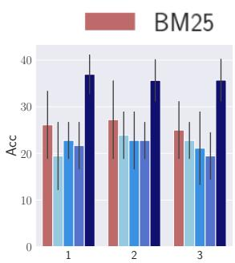  
(a) Gemma 7B

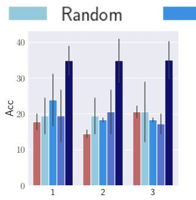  
(b) LLaMa 7B

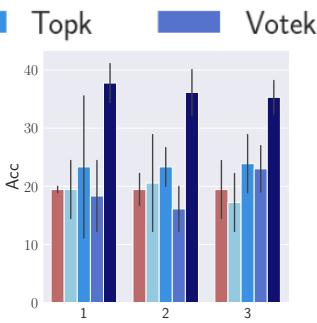  
(c) LLaMa 13B

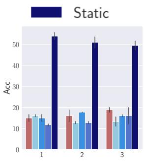  
(d) Mistral 7B

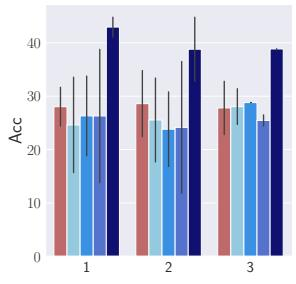  
(e) SciTülu 7B

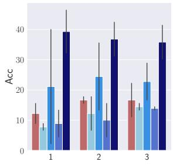  
(f) Qwen 7B

Figure 3: Performance of LLMs on using different In Context learning (ICL) methods for Round 3 of our annotation study for fine-grained classification. Error bars indicate using only the target segment (T) as the information source. Acc refers to using GPT-based accuracy  
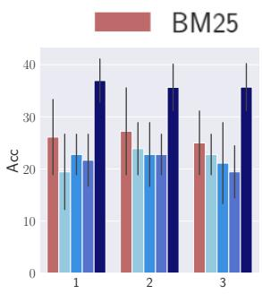  
(a) Gemma 7B

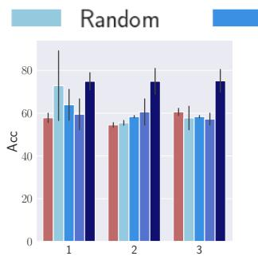  
(b) LLaMa 7B

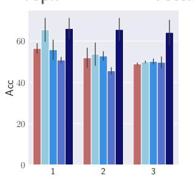

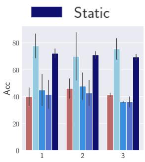  
(d) Mistral 7B

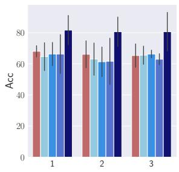  
(e) SciTülu 7B

(c) LLaMa 13B  
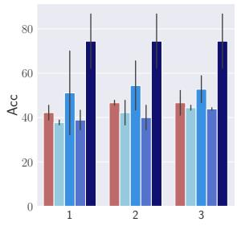  
(f) Qwen 7B  
Figure 4: Performance of LLMs on using different In Context learning (ICL) methods for Round 3 of our annotation study for the coarse classification task. Error bars indicate using only the target segment (T) as the information source. Acc refers to using GPT-based evaluator accuracy.

## A.8 Training Details to perform instruction tuning

## A.8.1 Instructions

We use the same instructions from Round 2 of our annotation study due to higher inter-annotator agreement (Sec §A.1). During fine-tuning, we follow the SCIRIFF template using Jinja (Pallets, 2024), providing task descriptions and data as prompts, with output labels as responses. Two instruction formats are used: one with just the target segment (T) and another with both the target segment and full review (RT). The output is either a fine-grained lazy thinking class or a coarse label (not lazy thinking or lazy thinking). Demonstration instances are excluded to ensure consistency with SCIRIFF and TÜLU V2.

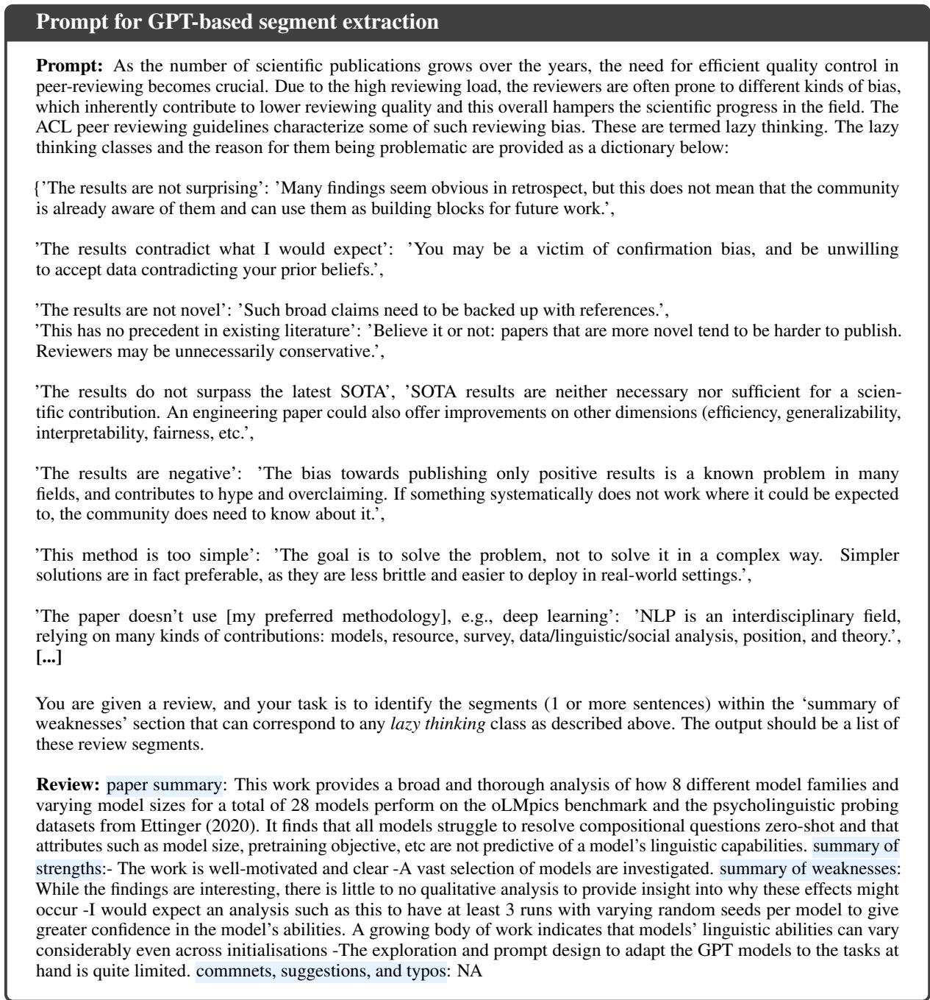  
Figure 5: Prompt for GPT based review segment extraction

## A.8.2 Hyper-parameters for LoRa training

We train all the models for 3 epochs. For LoRa, we use the rank of 64, alpha of 16, and dropout of 0.1. The models are trained with a cosine learning rate scheduler and a warmup ratio of 0.03. We use BF16 and TF32 to ensure training precision. The learning rate is set as 1e  4.

## A.8.3 Hyper-parameter search

We train models using various data proportions: 0.2, 0.4, 0.6, 0.8, and 1.0 from the different mixes. We then evaluate their performance on multiple validation sets. The performance results are plotted in two ways: using only the target segment (T) in Fig 11 and using a combination of review and target segment (RT) in Fig 12 corresponding to the fine-grained classification task. For the T setup, where only the target segment is used, the models achieve optimal performance with 0.2 to 0.4 of the data. Performance tends to stagnate with more data indicative of reaching the maxima and is in line with the findings in Wadden et al. (2024). In the RT setup, where both the target segment and review are used, the models perform best with 0.6 to 0.8 of the data. This is because the combined prompts provide more context and take longer for the model to fully grasp, allowing it to reach peak performance with a larger dataset. As a result, we select 0.3 as the optimal data proportion for the T setup and 0.7 for the RT setup, balancing performance and avoiding the issues observed with different data sizes. We obtain similar findings for coarse-grained classification as shown in Fig 13 (‘T’) and Fig 14 (‘RT’), respectively.

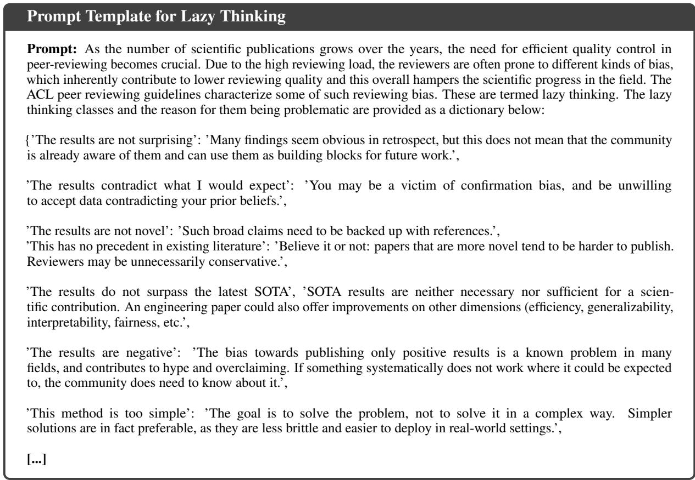

Figure 6: Fixed Prompt for defining lazy thinking  
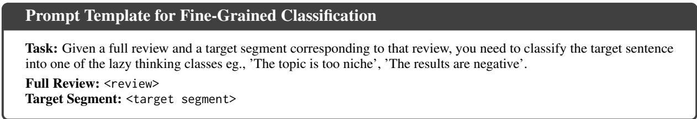

Figure 7: Prompt for fine-grained classification  
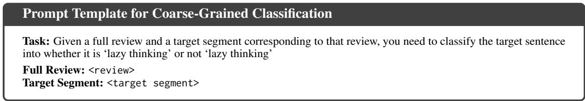  
Figure 8: Prompt for coarse-grained classification

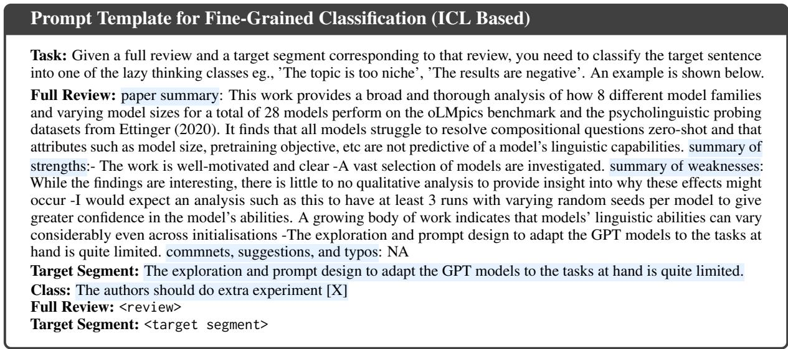

Figure 9: Prompt for fine-grained classification based on In-Context Learning (ICL) as used in Round 3 of our study  
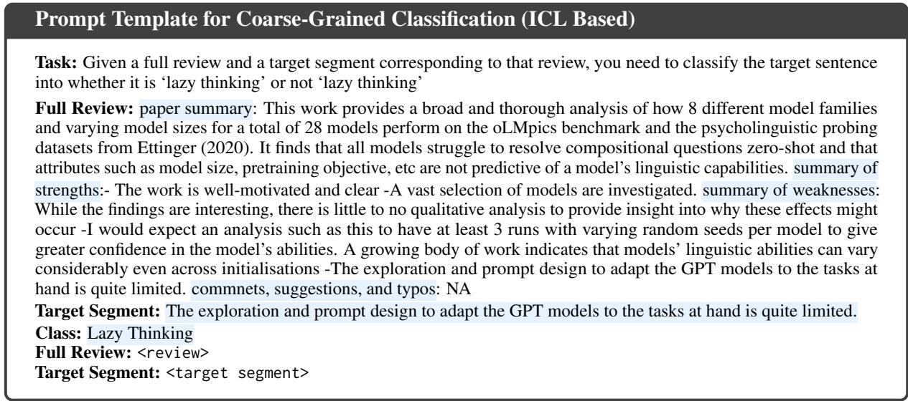  
Figure 10: Prompt for coarse-grained classification based on In-Context Learning (ICL) as used in Round 3 of our study

## A.8.4 Instruction Tuning Training Setup for Annotation Rounds

We train models with the mixes identified in the experiments with 3-fold cross-validation for optimal performance. We use the same instructions that are used in the annotations and zero-shot prompting for finetuning the models. We use a data proportion of 0.3 to train models within the target segmentbased prompting setup (T) and 0.8 for the RT (full review with target segment) setup from the best mizes identified fro each model. In line with the results on the test sets, we use SCIRIFF MIX to train LLaMa and SciTülu models, TÜLU MIX for the Gemma and Qwen models and Full Mix for Mistral and Yi models.

## A.9 Confusion matrices for Annotation Labels and Confidences across annotation rounds

We show the confusion matrices for annotation labels and confidences in Figures 17 and 18 respectively.

## A.10 Results for the 3-fold cross validation

The results for the 3-fold cross-validation for finegrained and coarse-grained classification is shown in Tables 12 and 13 respectively. The random and majority baseline scores for fine-grained classification are $4 . 1 1 _ { 5 . 2 }$ and $6 . 7 _ { 5 . 4 }$ respectively. The random and majority baseline scores for coarsegrained classification are $4 4 . 1 1 _ { 3 . 2 }$ and $4 7 . 7 _ { 3 . 2 } \ \mathrm { r e } -$ spectively. Thus, all the models significantly outperform the majority and random baselines for both the tasks.

  
(a) Gemma 7B

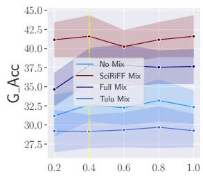  
(b) LLaMa 7B

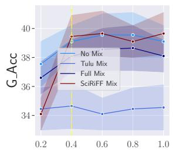  
(c) LLaMa 13B

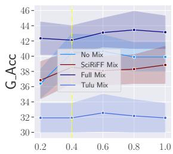  
(d) Mistral 7B

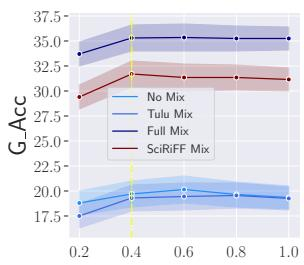  
(e) SciTülu 7B

  
(f) Qwen 7B

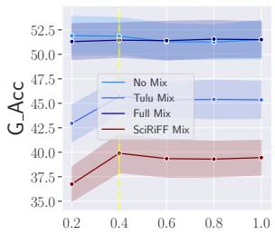  
(g) Yi 6B

Figure 11: Performance of instruction-tuned LLMs for fine-grained classification on the dev set with multiple percentages of dataset mixes using target segment (T) as the source of information in the prompt.  
  
(a) Gemma 7B

  
(b) LLaMa 7B

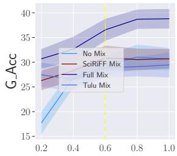  
(c) LLaMa 13B  
(d) Mistral 7B

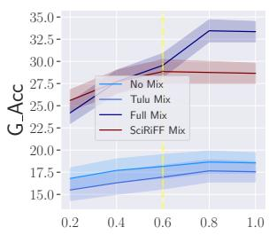  
(e) SciTülu 7B

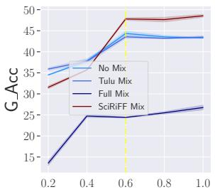  
(f) Qwen 7B

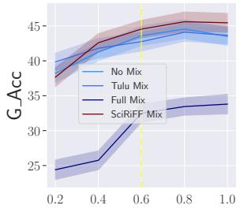  
(g) Yi 6B  
Figure 12: Performance of instruction-tuned LLMs for fine-grained classification on the dev set with multiple percentages of dataset mixes using the combination of review and target segment (RT) as the source of information in the prompt.

## A.11 Results for all the experiments across the annotation rounds

We report the full results for the fine-grained and coarse-grained classification in Tables 10 and 11 respectively.

## A.12 Instructions to Annotators for Rewriting Reviews and Evaluation Protocol

As discussed in Sec §3, we form two control groups to rewrite reviews. The first control group is asked to rewrite reviews based on the current ARR guidelines. While the other control group is also provided with lazy thinking annotations. We provide both the control groups with the paper and the reviews corresponding to that paper. Finally, a senior Ph.D and PostDoc evaluate the rewrites pair-wise based on various measures.

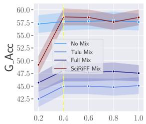  
(a) Gemma 7B

  
(b) LLaMa 7B

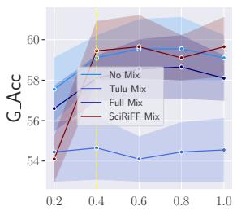  
(c) LLaMa 13B

  
(d) Mistral 7B

  
(e) SciTülu 7B

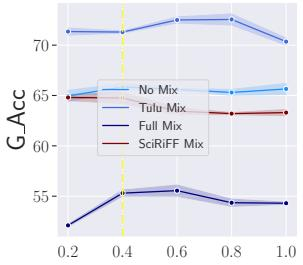  
(f) Qwen 7B

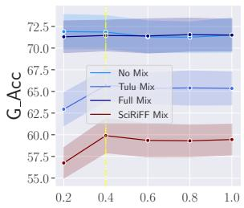  
(g) Yi 6B

Figure 13: Performance of instruction-tuned LLMs for coarse-grained classification on the dev set with multiple percentages of dataset mixes using target segment (T) as the source of information in the prompt.  
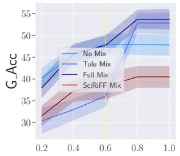  
(a) Gemma 7B

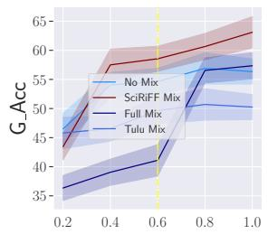  
(b) LLaMa 7B

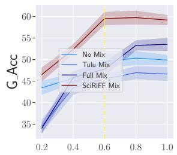

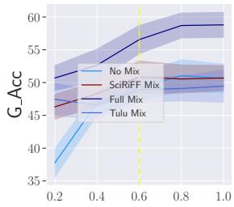  
(c) LLaMa 13B  
(d) Mistral 7B

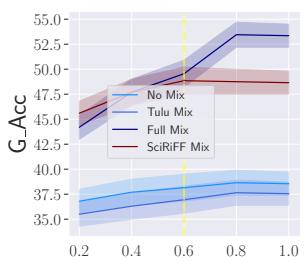  
(e) SciTülu 7B

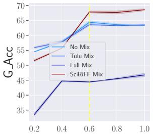  
(f) Qwen 7B

  
(g) Yi 6B  
Figure 14: Performance of instruction-tuned LLMs for coarse-grained classification on the dev set with multiple percentages of dataset mixes using the combination of review and target segment (RT) as the source of information in the prompt.

Instructions for re-writing based on current ARR guidelines. Given the review and the corresponding manuscript, your task is to re-write the reviews to comply with the current ARR guidelines.16. Please feel free to edit or remove the content from any of the reviewing sections such as ‘summary of weaknesses’, ‘comments, suggestions and typos’ if applicable.

Instructions for re-writing based on current ARR guidelines and lazy thinking annotations. Given the review and the corresponding manuscript, you have been provided annotated instances of lazy thinking. The definition of lazy thinking is as follows ‘Lazy thinking, in the context of NLP research paper reviews, refers to the practice of dismissing or criticizing research papers based on superficial heuristics or preconceived notions rather than thorough analysis. It is characterized by reviewers raising concerns that lack substantial supporting evidence and are often influenced by prevailing trends within the NLP community.’ According to ARR guidelines, reviewers are explicitly discouraged from using such heuristics in their review reports. In line with the ARR guidelines, your task is to re-write the reviews to comply with the guidelines. Please feel free to edit or remove the content from any of the reviewing sections such as ‘summary of weaknesses’, ‘comments, suggestions and typos’ if applicable.

Instruction for evaluating the rewrites. You are provided a paper along with a pair of reviews written for the same paper. Your task is to perform pair-wise comparison of the reviews based on: (1) Constructiveness- reviewers should provide actionable feedback for the authors to improve on the paper, (2) Justified - reviewers should clearly state the reason for their arguments rather than putting out vague statements. Additionally, we introduce a measure, (3)Adherence, which judges how well the reviews are written based on the current ARR guidelines.

## A.13 Distribution of review segment lengths in LAZYREVIEW

We plot the distribution of review segment lengths in Fig 19. We find that ‘Extra Experiments’ is the most common with variable segment lengths.

## A.14 Analysis on the Silver Annotations

As discussed in RQ3 (cf. §3), we use the bestperforming model (Qwen) to annotate the remaining 1,276 review segments in our dataset, generating silver annotations. One of the annotators reviews a sample of 100 segments, yielding a Cohen’s κ of 0.56 with the silver annotations, which is substantial given the subjectivity of this task and the domain. The class label distribution is presented in Fig 15, where ‘Extra Experiment’ remains the most frequent lazy thinking class. Additionally, we see increases in ‘Not SOTA’ and ‘Not Novel instances, likely reflecting the fast-paced advancements in ML that quickly render state-of-the-art methods obsolete (Sevilla et al., 2022). The notion of ‘novelty’ is also frequently debated, with reviewers often using it to reject papers without sufficient justification (Kumar et al., 2023).

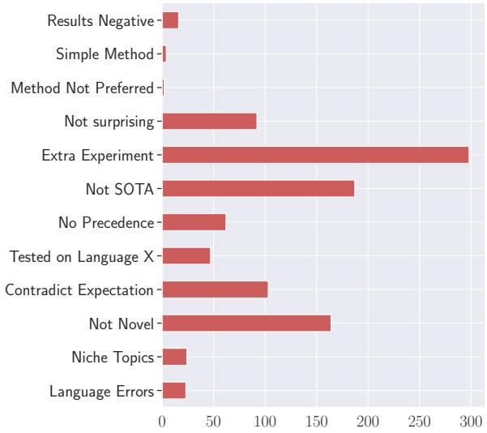  
Figure 15: Distribution of lazy thinking labels in the silver annotated data

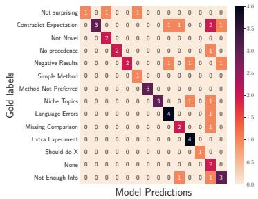  
Figure 16: Performance analysis of Qwen on Round 3 annotation data

## A.15 Analysis on performance of model for different classes

We analyze the performance of the best-performing model, Qwen, on the Round 3 annotations of our dataset. Since this portion yielded the highest interannotator agreement, we specifically focus on how the model’s predictions distribute across classes here. The confusion matrix is shown in Fig 16. The model particularly struggles with the classes ‘Contradict expectations’ and ‘Negative results’, which mirror the difficulties observed in the human annotations from Round 3 (Fig 17c). On the other hand, ‘Language errors’ and ‘Niche topics remain among the easiest classes for the automated methods to identify.

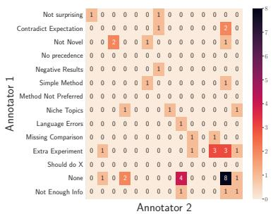  
(a) Round 1

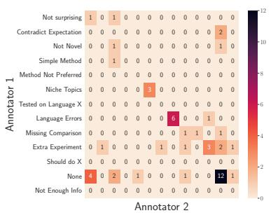  
(b) Round 2

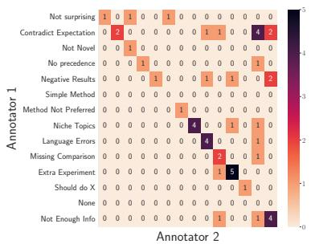  
(c) Round 3

Figure 17: Confusion matrices for the lazy thinking classes from the ARR guidelines and EMNLP Blog used for annotation across multiple rounds. The class names are shortened due to space constraints.  
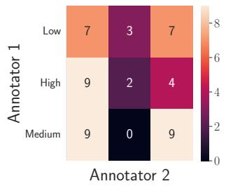  
(a) Round 1

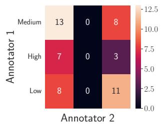  
(b) Round 2

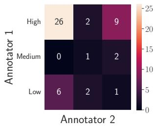  
(c) Round 3  
Figure 18: Confusion matrices for the confidence levels among annotators across multiple rounds of annotation.

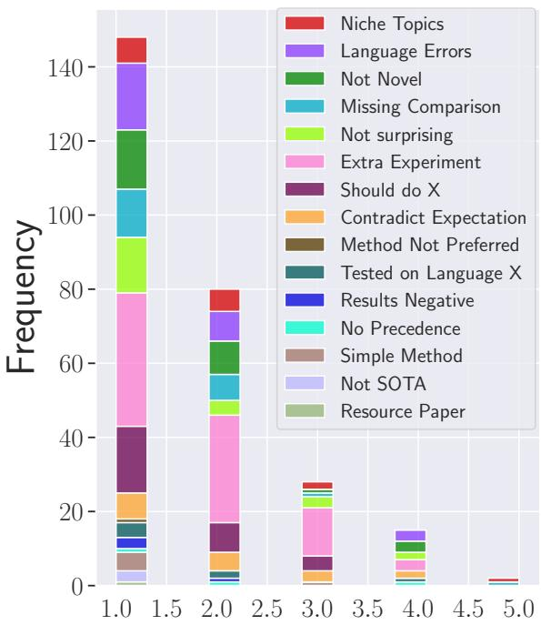  
Figure 19: Segment lengths

<table><tr><td>Heuristics</td><td>Description</td></tr><tr><td>The results are not surprising</td><td>Many findings seem obvious in retrospect, but this does not mean that the community is already aware of them and can use them as building blocks for future work.</td></tr><tr><td>The results contradict what I would expect</td><td>You may be a victim of confirmation bias, and be unwilling to accept data contradicting your prior beliefs.</td></tr><tr><td>The results are not novel</td><td>Such broad claims need to be backed up with references.</td></tr><tr><td>This has no precedent in existing literature</td><td>Believe it or not: papers that are more novel tend to be harder to publish. Reviewers may be unnecessarily conservative.</td></tr><tr><td>The results do not surpass the latest SOTA</td><td>SOTA results are neither necessary nor sufficient for a sci- entific contribution. An engineering paper could also offer improvements on other dimensions (efficiency, generalizabil- ity, interpretability, fairness, etc.)</td></tr><tr><td>The results are negative</td><td>The bias towards publishing only positive results is a known problem in many fields, and contributes to hype and over- claiming. If something systematically does not work where it could be expected to, the community does need to know about it.</td></tr><tr><td>This method is too simple</td><td>The goal is to solve the problem, not to solve it in a complex way. Simpler solutions are in fact preferable, as they are less brittle and easier to deploy in real-world settings.</td></tr><tr><td>The paper doesn't use [my preferred methodology], e.g., deep learning</td><td>NLP is an interdisciplinary field, relying on many kinds of contributions: models, resource, survey, data/linguistic/social analysis, position, and theory.</td></tr><tr><td>The topic is too niche</td><td>A main track paper may well make a big contribution to a narrow subfield.</td></tr><tr><td>The approach is tested only on [not English], so unclear if it will generalize to other languages</td><td>The same is true of NLP research that tests only on English, Monolingual work on any language is important both prac- tically (methods and resources for that language) and theo- retically (potentially contributing to deeper understanding of language in general).</td></tr><tr><td>The paper has language errors</td><td>As long as the writing is clear enough, better scientific content should be more valuable than better journalistic skills.</td></tr><tr><td>The paper is missing the comparison to the [latest X]</td><td>Per ACL policy, the authors are not obliged to draw com- parisons with contemporaneous work, i.e., work published within three months before the submission (or three months before a re-submission).</td></tr><tr><td>The authors could also do [extra experiment X]</td><td>It is always possible to come up with extra experiments and follow-up work. This is fair if the experiments that are already presented are insufficient for the claim that the authors are making. But any other extra experiments are in the “nice- to-have" category, and belong in the “suggestions" section</td></tr><tr><td>The authors should have done [X] instead</td><td>A.k.a. “I would have written a different paper." There are often several valid approaches to a problem. This criticism applies only if the authors’ choices prevent them from an- swering their research question, their framing is misleading, or the question is not worth asking. If not, then [X] is a comment or a suggestion, but not a "weakness."</td></tr><tr><td>This has no precedent in existing literature</td><td>The paper's topic is completely new, such that there's no prior art or all the prior art has been done in another field. We are interested in papers that tread new ground. Believe it or not: papers that are more novel tend to be harder to publish. Reviewers may be unnecessarily conservative.</td></tr><tr><td>This method is too simple</td><td>The paper's method is too simple. Our goal is not to design the most complex method. Again, think what the paper's contributions and findings are. Often the papers with the simplest methods are the most cited. If a simple method outperforms more complex methods from prior work, then this is often an important finding. The goal is to solve the problem, not to solve it in a complex way. Simpler solutions are in fact preferable, as they are less brittle and easier to</td></tr><tr><td>The paper doesn’t use [my preferred methodology], e.g., deep learning</td><td>deploy in real-world settings. The paper does not use a particular method (e.g., deep learn- ing). No one particular method is a requirement for good work. Please justify why that method is needed. Think about what the paper's contributions are, and bear in mind that having a diversity of methods used is not a bad thing. NLP is an interdisciplinary field, relying on many kinds of con- tributions: models, resource, survey, data/linguistic/social analysis, position, and theory.</td></tr><tr><td>The topic is too niche / Narrow Topics</td><td>The paper's topic is narrow or outdated. Please be open minded. We do not want the whole community to chase a trendy topic. Look at the paper's contributions and consider what impact it may have on our community. It is easier to publish on trendy, ‘scientifically sexy' topics (Smith, 2010). In the last two years, there has been little talk of anything other than large pretrained Transformers, with BERT alone becoming the target of over 150 studies proposing analysis and various modifications (Rogers et al., 2020). The hot trend' forms the prototype for the kind of paper that should be recommended for acceptance. Niche topics such as historical text normalization are downvoted (unless, of course, BERT could somehow be used for that).</td></tr><tr><td>The approach is tested only on [not English], so unclear if it will generalize to other languages</td><td>The paper's work is on a language other than English. We care about NLP for any language. The same is true of NLP research that tests only on English. Monolingual work on any language is important both practically (methods and resources for that language) and theoretically (potentially</td></tr><tr><td>The paper has language errors / Writing Style Non-mainstream approaches</td><td>contributing to deeper understanding of language in general). As long as the writing is clear enough, better scientific content should be more valuable than better journalistic skills. Since a mainstream’ *ACL paper currently uses DL-based</td></tr><tr><td></td><td>methods, anything else might look like it does not really belong in the main track - even though ACL stands for Asso- ciation for Computational Linguistics'. That puts interdisci- plinary efforts at a disadvantage, and continues the trend for intellectual segregation of NLP (Reiter, 2007). E.g., theoreti- cal papers and linguistic resources should not be a priori at a disadvantage just because they do not contain DL experi-</td></tr><tr><td>Resource paper</td><td>ments. The paper is a resource paper. In a field that relies on su- pervised machine learning as much as NLP, development of datasets is as important as modeling work.</td></tr><tr><td>Heuristics</td><td>Positive examples</td></tr><tr><td>The results are not surprising</td><td>Although the experiments are very comprehensive, this paper lacks technical novelty.The optimal data selection strategy also seems to offer limited improvement over random data selection.</td></tr><tr><td>The results contradict what I would expect</td><td>Although the paper empirically shows that the baseline is not as effective as the proposed method, - I expect more discus- sion on why using activation values is not a good idea, this contradicts my prior assumption.-One limitation of this study is that the paper only focuses on single-word cloze queries</td></tr><tr><td>The results are not novel</td><td>(as discussed in the paper) The novelty of the approach is limited. The attempt to train the document retrieval and outcome prediction jointly is un- successful.</td></tr><tr><td>This has no precedent in existing literature</td><td>There are a lot of problems that I can imagine for real-world large scale models such as GPT3. To mention a few: (1) Recent works have shown it is possible to continue training language models for either language understanding [1] or additional applications such as code synthesis [2]. Therefore, perhaps these simple approachesare sufficient enough for good generalization.</td></tr><tr><td>The results are negative</td><td>I have two concerns about the experimental results. 1. In the few-shot learning, when the samples are increased from 24 to 1K, the attribute relevance drops by 2 points for positive class as shown in Table 1, and the toxicity metric becomes worse for the detoxification task as shown in Table 2. Please give some explanations. 2.In human evaluation, the inter- annotator agreement on the sentiment task and the AGNews 482 task is only 0.39 and 0.30 in Fleiss’κ, which is low to guarantee a high quality of the evaluation data.</td></tr><tr><td>This method is too simple</td><td>There is unfortunately not a whole lot of new content in this paper. The proposed method really just boils down to playing with the temperature settings for the attention of the teacher model; something that is usually just considered a hyperpa- rameter. While I have no problem with what is currently in the paper, I am just not sure that this is enough to form a long paper proposing a new method.</td></tr><tr><td>The topic is too niche / Narrow Topics</td><td>1- It is not clear how this task and the approach will perform for new information (updates) about an event (even if it is contradictory to what is known about an event) 2-The ap- proach operates on clusters. New events may not have clus- ters.</td></tr><tr><td>The authors could also do [extra experiment X]</td><td>1. According to Table 3, the performance of BARTword and BARTspan on SST-2 degrades a lot after incorporating text smoothing, why? 2.Lack of experimental results on more datasets: I suggest conducting experiments on more datasets to make a more comprehensive evaluation of the proposed method. The experiments on the full dataset instead of that in the low-resource regime are also encouraged.</td></tr></table>

Table 7: Full ARR 2022 guidelines on lazy thinking sourced from Rogers and Augenstein (2021).

Table 8: Lazy thinking classes with extended names, extended descriptions and new additions used in Round 2 of our annotations. The rest of the class names and descriptions are the same as in Round 1 of our annotation sourced from Rogers and Augenstein (2021).

Table 9: Positive examples used during Round 3 of our annotations. The review segment that corresponds to lazy thinking is highlighted. We display only the weakness section of the reviews rather than the full review due to space constraints.

<table><tr><td rowspan="3">Method</td><td rowspan="3">Models</td><td colspan="10">Fine-grained</td></tr><tr><td colspan="6">S.A</td><td colspan="3">G.A</td></tr><tr><td>Acc</td><td></td><td></td><td></td><td>F1</td><td colspan="2"></td><td></td><td colspan="2">Acc</td></tr><tr><td rowspan="2">RANDOM</td><td></td><td>R1</td><td> ${ \bf R } 2 \left( \Delta _ { R 1 } \right)$ </td><td>R3</td><td></td><td>R1 R2 (∆R1)</td><td>R3</td><td></td><td>R1</td><td> ${ \bf R } 2 \left( \Delta _ { R 1 } \right)$ </td><td>R3</td></tr><tr><td>7.11</td><td></td><td>4.34 (-2.77)</td><td>2.46 (-1.88) 5.11 (-2.23)</td><td>7.15 9.05</td><td>2.39 (-4.76) 7.17 (-1.88)</td><td>1.28 3.45</td><td></td><td>1</td><td></td><td></td></tr><tr><td rowspan="15">MAJORITY Zero-Shot</td><td>Gemma-1.1 7B (T)</td><td>11.1 22.2</td><td>7.34 (+3.00) 26.7 (+4.50)</td><td>18.9</td><td></td><td>23.1</td><td>24.8 (+1.7)</td><td>16.7</td><td>52.2</td><td></td><td>58.1 (+5.90) 32.2</td></tr><tr><td>Gemma-1.1 7B (TE)</td><td></td><td></td><td>24.4</td><td>(+5.5)</td><td></td><td>19.4</td><td>(+2.7)</td><td></td><td></td><td>41.1 (+8.9)</td></tr><tr><td>Gemma-1.1 7B (RT)</td><td>12.2</td><td>11.6 (-0.60)</td><td>14.4</td><td></td><td>9.51 10.4 (+0.89)</td><td>10.8</td><td></td><td>46.7</td><td>51.1 (+4.40)</td><td>32.2</td></tr><tr><td>Gemma-1.1 7B (RTE) LLaMa 7B (T)</td><td>12.2</td><td>22.2 (+10.0)</td><td>17.3 11.1</td><td>(+2.9)</td><td>9.51</td><td>12.8 20.3 (+10.79) 9.12</td><td>(+2.0)</td><td>15.6</td><td>30.6 (+15.0)</td><td>32.8 (+0.6) 35.6</td></tr><tr><td>LLaMa 7B (TE) LLaMa 7B (RT)</td><td>12.2</td><td>13.2 (+1.00)</td><td>15.6 12.2</td><td>(+4.5)</td><td>9.51</td><td>9.89 (+0.38)</td><td>12.4 (+3.28) 10.1</td><td>25.6</td><td>33.7 (+7.90)</td><td>38.9 (+3.3) 28.9</td></tr><tr><td>LLaMa 7B (RTE) LLaMa 13B (T)</td><td></td><td>26.7 (+0.00)</td><td>14.2 11.1</td><td>(+2.0)</td><td>20.4</td><td>23.8 (+3.4)</td><td>11.5 9.11</td><td>(+1.4) 44.4</td><td></td><td>30.8 (+1.9)</td></tr><tr><td>LLaMa 13B (TE)</td><td>26.7</td><td></td><td>24.4 (+13.3)</td><td></td><td></td><td></td><td>20.8 (+11.7)</td><td></td><td>45.3 (+0.90)</td><td>35.6 41.1 (+5.5)</td></tr><tr><td>LLaMa 13B (RT) LLaMa 13B (RTE)</td><td>15.6</td><td>17.6 (+3.00)</td><td>10.7 18.8</td><td>(+8.1)</td><td>11.7</td><td>13.8 (+2.1)</td><td>8.89 17.5 (+8.61)</td><td>41.1</td><td>40.4 (-1.10)</td><td>32.2 34.4 (+2.2)</td></tr><tr><td>Mistral 7B (T) Mistral 7B (TE)</td><td>27.8</td><td>28.8 (+1.10)</td><td>28.2 30.0</td><td>(+1.8)</td><td>17.5 19.7 (+2.2) 一</td><td></td><td>24.3 26.1 (+1.8)</td><td>47.8</td><td>51.1 (+3.30)</td><td>54.4 55.6 (+1.2)</td></tr><tr><td>Mistral 7B (RT) Mistral 7B (RTE)</td><td>12.2</td><td>16.6 (+4.40)</td><td>22.2 27.8</td><td>(+5.6)</td><td>9.51</td><td>12.8 (+3.29)</td><td>19.4 23.2</td><td></td><td>28.9 35.9 (+6.90)</td><td>51.1</td></tr><tr><td>Qwen 7B (T) Qwen 7B (TE)</td><td>21.1</td><td>22.7 (+1.60)</td><td>28.9</td><td></td><td>17.8</td><td>19.8 (+2.0)</td><td>24.5</td><td>(+3.8)</td><td>46.7</td><td>50.0 (+3.30)</td><td>52.2 (+1.1) 44.4</td></tr><tr><td>Qwen 7B (RT)</td><td>12.2</td><td>13.3 (+1.10)</td><td>31.1 26.7</td><td>(+2.2)</td><td>9.51</td><td>13.4 (+3.89)</td><td>26.8 22.8</td><td>(+2.3)</td><td>43.3</td><td>42.6 (-1.60)</td><td>56.4 (+12.0) 43.3</td></tr><tr><td>Qwen 7B (RTE) Yi-1.5 6B (T)</td><td>35.3</td><td>37.6 (+2.3)</td><td>27.8 26.7</td><td>(+1.1)</td><td>23.5</td><td>29.7 (+6.2)</td><td>24.7 22.1</td><td>(+1.9)</td><td>56.7</td><td>60.0 (+3.30)</td><td>44.2 (+0.9) 53.8</td></tr><tr><td>Yi-1.5 6B (TE) Yi-1.5 6B (RT)</td><td>34.4</td><td>32.8 (-1.60)</td><td>30.0 21.2</td><td>(+3.3)</td><td>22.7</td><td>27.8 (+5.1)</td><td>24.8 19.4</td><td>(+2.7)</td><td></td><td></td><td>54.9 (+1.1)</td></tr><tr><td>Yi-1.5 6B (RTE) SciTülu 7B (T)</td><td></td><td>14.4 25.3 (+10.9)</td><td>24.4</td><td>(+2.2)</td><td></td><td></td><td>20.6</td><td>(+1.2)</td><td>51.1</td><td>52.2 (+1.20)</td><td>51.3 52.7 (+0.6)</td></tr><tr><td>SciTülu 7B (TE) SciTülu 7B (RT)</td><td></td><td></td><td>22.2 23.3</td><td>(+1.1)</td><td>10.5</td><td>22.5 (+12.0)</td><td>16.2 17.8</td><td>(+1.6)</td><td>18.1</td><td>29.4 (+11.3)</td><td>42.2 44.8 (+2.6)</td></tr><tr><td></td><td>SciTülu 7B (RTE)</td><td>15.6</td><td>18.3 (+2.70)</td><td>18.9 19.7 (+0.8)</td><td>12.8</td><td>16.7 (+3.9)</td><td>14.9 15.5</td><td>(+0.6)</td><td>17.3</td><td>23.7 (+6.4)</td><td>38.9 41.1 (+2.2)</td></tr><tr><td rowspan="13">Instruction Tuned</td><td>Gemma-1.1 7B (T)</td><td>31.4</td><td>38.8 (+7.40)</td><td>34.6</td><td></td><td>29.8 31.6 (+1.8)</td><td>28.1</td><td></td><td>49.6</td><td>53.4 (+3.80)</td><td></td><td>46.9</td></tr><tr><td>Gemma-1.1 7B (RT)</td><td>28.2</td><td>35.7 (+7.50)</td><td>32.8</td><td></td><td>26.8</td><td>33.7 (+6.9)</td><td>24.3</td><td></td><td>44.7</td><td>51.2 (+6.50)</td><td>42.8</td></tr><tr><td>LLaMa 7B (T)</td><td>43.8</td><td>47.8 (+2.00)</td><td>44.7</td><td></td><td>36.8</td><td>37.2 (+0.4)</td><td>37.2</td><td></td><td>60.8</td><td>65.4 (+4.60)</td><td>48.9</td></tr><tr><td>LLaMa 7B (RT)</td><td>43.2</td><td>45.3 (+2.10)</td><td>41.8</td><td></td><td>32.1</td><td>33.8 (+0.7)</td><td>32.3</td><td></td><td>58.4</td><td>61.3 (+2.90)</td><td>45.4</td></tr><tr><td>LLaMa 13B (T)</td><td>45.8</td><td>47.8 (+2.00)</td><td>50.5</td><td></td><td>37.5</td><td>38.2 (+0.7)</td><td>40.1</td><td></td><td>50.3</td><td>51.2 (+0.90)</td><td>54.2</td></tr><tr><td>LLaMa 13B (RT)</td><td>41.2</td><td>45.2 (+4.00)</td><td>47.3</td><td></td><td>32.4</td><td>36.7 (+3.3)</td><td>42.6</td><td></td><td>48.2</td><td>48.8 (+0.60)</td><td>52.2</td></tr><tr><td>Mistral 7B (T)</td><td>35.4</td><td>37.4 (+2.00)</td><td>42.4</td><td></td><td>28.8</td><td>30.4 (+1.6)</td><td>36.4</td><td></td><td>49.2</td><td>54.3 (+5.10)</td><td>58.3</td></tr><tr><td>Mistral 7B (RT)</td><td>31.2</td><td>35.2 (+4.00)</td><td>37.8</td><td></td><td>24.5</td><td>27.4 (+2.9)</td><td>32.5</td><td></td><td>44.2</td><td>50.4 (+6.20)</td><td>56.3</td></tr><tr><td>Qwen 7B (T)</td><td>45.9</td><td>48.4 (+2.50)</td><td>59.4</td><td></td><td>38.6</td><td>40.2 (+1.6)</td><td>57.2</td><td></td><td>51.2</td><td> $\overline { { 5 5 . 8 \left( + 4 . 6 0 \right) } }$ </td><td>62.3</td></tr><tr><td>Qwen 7B (RT)</td><td>41.2</td><td>42.4 (+1.20)</td><td>47.8</td><td></td><td>34.3</td><td> $3 6 . 4 \ : ( + 2 . 1 )$ </td><td>35.3</td><td></td><td>49.3</td><td> $5 0 . 4 \ ( + 1 . 1 0 )$ </td><td>47.3</td></tr><tr><td>Yi-1.5 6B (T)</td><td>45.1</td><td>47.8 (+2.70)</td><td>47.9</td><td></td><td>36.4</td><td></td><td>38.2</td><td></td><td>51.2</td><td></td><td>52.2</td></tr><tr><td></td><td></td><td></td><td></td><td></td><td></td><td> $\overline { { 3 8 . 2 \ ( + 1 . 8 ) } }$ </td><td></td><td></td><td></td><td> $\overline { { 5 3 . 8 \ ( + 2 . 6 0 ) } }$ </td><td></td></tr><tr><td>Yi-1.5 6B (RT)</td><td>43.2</td><td>45.3 (+2.10)</td><td>46.3</td><td></td><td>31.7</td><td> $3 3 . 5 \ : ( + 1 . 8 )$ </td><td>34.6</td><td></td><td>59.4</td><td> $6 1 . 2 \ : ( + 1 . 8 0 )$ </td><td>58.4 54.8</td></tr><tr><td>SciTülu 7B (T) SciTülu 7B (RT)</td><td>45.7 41.4</td><td> $\overline { { 4 8 . 6 \left( + 2 . 9 0 \right) } }$  42.6 (+1.20)</td><td>54.3 51.4</td><td></td><td>38.6 34.3</td><td> $\overline { { 4 0 . 2 \ ( + 1 . 6 ) } }$ </td><td>48.5</td><td></td><td>51.3</td><td> $\overline { { 5 2 . 6 \ : ( + 1 . 3 0 ) } }$ </td></table>

Table 10: Performance of LLMs on different rounds of annotation. S.A represents the string-matching evaluator, and G.A represents the GPT-based evaluator. ‘T’ represents prompting with only the target sentence, RT represents the combination of the review and the target sentence. Adding demonstrations to the prompt is represented by ‘E’. R1 represents ‘Round 1’, R2 represents ‘Round 2’, and R3 represents ‘Round 3’ respectively.

<table><tr><td rowspan="3">Method</td><td rowspan="3">Models</td><td colspan="15">Coarse-grained</td></tr><tr><td colspan="6">S.A</td><td colspan="9">G.A</td></tr><tr><td>Acc</td><td></td><td></td><td></td><td>F1</td><td></td><td></td><td></td><td colspan="7"> $\mathbf { A c c }$ </td></tr><tr><td></td><td>R1</td><td> ${ \bf R } 2 \left( \Delta _ { R 1 } \right)$ </td><td>R3</td><td></td><td>R1  ${ \bf R } 2 \left( \Delta _ { R 1 } \right)$ </td><td>R3</td><td></td><td>R1</td><td>R2  $( \Delta _ { R 1 } )$ </td><td></td><td colspan="6">R3</td></tr><tr><td>RANDOM MAJORITY</td><td></td><td>40.7 51.4</td><td>40.7 (+0.00)</td><td>43.3 52.3</td><td>35.6 44.4</td><td>35.6 (+0.0) 48.2 (+3.8)</td><td>38.2</td><td></td><td>1 -</td><td></td><td colspan="6"></td></tr><tr><td rowspan="20">Zero-Shot</td><td>Gemma-1.1 7B (T)</td><td>44.3</td><td>51.4 (+0.00) 46.1 (+1.8)</td><td>55.6</td><td>38.7</td><td>40.2 (+1.5)</td><td>49.3 45.3</td><td></td><td>51.1</td><td>54.4 (+3.30)</td><td colspan="6">57.8</td></tr><tr><td>Gemma-1.1 7B (TE)</td><td></td><td></td><td>75.6 (+20.0)</td><td></td><td></td><td></td><td>67.8 (+12.5)</td><td></td><td></td><td colspan="6">88.9 (+31.1)</td></tr><tr><td>Gemma-1.1 7B (RT) Gemma-1.1 7B (RTE)</td><td>48.1</td><td>50.4 (+2.30)</td><td>65.6</td><td>42.2</td><td>45.3 (+3.1)</td><td>54.2</td><td>65.4 (+11.2)</td><td>47.4</td><td>49.1 (+1.70)</td><td colspan="6">65.6</td></tr><tr><td>LLaMa 7B (T) LLaMa 7B (TE)</td><td>57.7</td><td>60.0 (+2.30)</td><td>71.1 80.0</td><td>(+5.5) 52.4</td><td>55.3 (+0.9)</td><td>67.2</td><td></td><td>70.0</td><td>75.0 (+5.00)</td><td colspan="6">82.2 (+16.6) 86.1</td></tr><tr><td>LLaMa 7B (RT) LLaMa 7B (RTE)</td><td>53.3</td><td>60.0 (+6.70)</td><td>84.4 73.3</td><td>(+4.4) 48.4</td><td>51.6 (+3.2)</td><td>70.3 58.3</td><td>(+3.1)</td><td>55.1</td><td>67.7 (+12.6)</td><td colspan="6">89.1 (+3.0) 76.7</td></tr><tr><td>LLaMa 13B (T)</td><td>60.2</td><td>62.2 (+2.00)</td><td>75.3 71.2</td><td>(+2.0) 53.4</td><td>55.7</td><td>60.2 64.3</td><td>(+1.9)</td><td>73.1</td><td>75.4 (+2.30)</td><td colspan="6">81.1 (+4.4) 61.1</td></tr><tr><td>LLaMa 13B (TE) LLaMa 13B (RT)</td><td>68.6</td><td>70.2 (+1.60)</td><td>73.1 68.8</td><td>(+1.9) 60.2</td><td>65.7 (+5.5)</td><td>67.2 58.1</td><td>(+2.9)</td><td>69.4</td><td>70.2 (+0.80)</td><td colspan="6">71.1 (+10.0) 51.2</td></tr><tr><td>LLaMa 13B (RTE) Mistral 7B (T)</td><td>57.8</td><td>58.8 (+1.00)</td><td>70.3 (+1.5) 74.4</td><td>51.2</td><td>53.2 (+2.0)</td><td>62.2 65.2</td><td>(+4.1)</td><td>64.8</td><td>66.3 (+1.50)</td><td colspan="6">61.1 (+9.9) 75.2</td></tr><tr><td>Mistral 7B (TE) Mistral 7B (RT)</td><td></td><td></td><td>86.7 (+4.0)</td><td>48.4</td><td>50.2 (+1.8)</td><td>70.2 54.3</td><td>(+5.0)</td><td></td><td>56.0 (+2.20)</td><td colspan="6">86.7 (+11.5)</td></tr><tr><td>Mistral 7B (RTE) Qwen 7B (T)</td><td>55.4 68.9</td><td>57.4 (+2.00) 70.4 (+1.40)</td><td>62.2 68.8 82.7</td><td>(+6.6)</td><td>61.2 63.4 (+2.2)</td><td>58.4 73.2</td><td>(+4.1)</td><td>53.8 74.1</td><td>76.1 (+1.20)</td><td colspan="6">62.2 68.8 (+6.6) 82.7</td></tr><tr><td>Qwen 7B (TE) Qwen 7B (RT)</td><td></td><td></td><td>86.7</td><td>(+4.0)</td><td></td><td>74.4</td><td>(+1.2)</td><td></td><td></td><td colspan="6">86.7 (+4.0)</td></tr><tr><td>Qwen 7B (RTE) Yi-1.5 6B (T)</td><td>53.3</td><td>56.5 (+3.20)</td><td>60.2 62.2</td><td>47.1 (+2.0)</td><td>49.2 (+2.1)</td><td>51.2 55.4</td><td>(+4.2)</td><td>53.3</td><td>56.5 (+3.20)</td><td colspan="6">60.2 62.2 (+2.0)</td></tr><tr><td>Yi-1.5 6B (TE)</td><td>64.4</td><td>68.7 (+4.3)</td><td>71.3 74.5</td><td>62.2 (+3.2)</td><td>66.6 (+4.4)</td><td>68.3 72.8</td><td>(+4.5)</td><td>71.1</td><td>73.4 (+2.3)</td><td colspan="6">72.3 73.8 (+1.5)</td></tr><tr><td>Yi-1.5 6B (RT) Yi-1.5 6B (RTE)</td><td>63.3</td><td>68.3 (+5.0)</td><td>68.1 70.1</td><td>(+2.0)</td><td></td><td>69.2 71.6</td><td>(+2.4)</td><td>65.1</td><td>70.4 (+5.30)</td><td colspan="6">70.1 72.4 (+2.3)</td></tr><tr><td>SciTülu 7B (T) SciTülu 7B (TE) SciTülu 7B (RT)</td><td>57.8</td><td>58.3 (+0.50)</td><td>51.1 72.2</td><td>51.2 (+21.1)</td><td>52.6(+1.4)</td><td>45.3 64.3</td><td>(+19.0)</td><td>57.8</td><td>58.3 (+0.50)</td><td colspan="6">52.2 72.2 (+20.0)</td></tr><tr><td>SciTülu 7B (RTE)</td><td>55.6</td><td>58.7 (+3.10)</td><td>71.1 88.8</td><td>(+17.7)</td><td></td><td>65.2</td><td>76.4 (+11.2)</td><td>55.6</td><td>58.7 (+3.10)</td><td colspan="6">68.8 91.1 (+22.3)</td></tr><tr><td rowspan="13">Instruction Tuned</td><td>Gemma-1.1 7B (T) Gemma-1.1 7B (RT)</td><td>57.8 55.6</td><td>61.4 (+3.60)  $5 9 . 4 \ : ( + 3 . 8 0 ) $ </td><td>81.2</td><td>50.2</td><td>54.6 (+4.4)</td><td>75.3</td><td>55.7</td><td>58.8 (+3.10)</td><td colspan="6">91.2</td></tr><tr><td>LLaMa 7B (T)</td><td>62.7</td><td>65.4 (+2.70)</td><td colspan="2">78.8</td><td colspan="2">53.2</td><td colspan="2"> $5 2 . 5 \ : ( - 0 . 7 ) $   $\overline { { 5 6 . 3 \ ( + 4 . 2 ) } }$ </td><td colspan="2">71.5 68.3</td><td colspan="2">54.9</td><td colspan="2"> $5 6 . 6 \ : ( + 1 . 7 0 )$   $\overline { { 7 9 . 3 \ ( + 3 . 9 0 ) } }$ </td><td colspan="2">89.2</td></tr><tr><td>LLaMa 7B (RT)</td><td>61.2 63.1 (+1.90)</td><td>85.4</td><td colspan="2"></td><td colspan="2">52.1</td><td colspan="2"></td><td colspan="2"></td><td colspan="2">75.4 71.3</td><td colspan="2"> $7 7 . 2 \ : ( + 5 . 9 0 )$ </td><td colspan="2">91.1</td></tr><tr><td>LLaMa 13B (T)</td><td>74.3</td><td>81.3</td><td colspan="2"></td><td colspan="2">55.4</td><td colspan="2"> $5 7 . 4 \ : ( + 2 . 0 )$ </td><td colspan="2">65.2</td><td colspan="2"></td><td colspan="2"> $7 7 . 8 \ : ( + 2 . 6 0 )$ </td><td colspan="2">88.6</td></tr><tr><td>LLaMa 13B (RT)</td><td>70.2</td><td>74.6 (+0.30) 75.3</td><td colspan="2"></td><td colspan="2">65.3</td><td colspan="2"> $\overline { { 6 7 . 2 \ : ( + 1 . 9 ) } }$   $6 3 . 7 \ ( + 1 . 3 )$ </td><td colspan="2">69.1</td><td colspan="2">75.2 71.2</td><td colspan="2"> $7 2 . 3 \ : ( + 1 . 1 0 )$ </td><td colspan="2">75.2 74.2</td></tr><tr><td></td><td></td><td> $7 1 . 8 \ : ( + 1 . 6 0 )$  73.3</td><td colspan="2"></td><td colspan="2">62.4</td><td colspan="2"></td><td colspan="2">65.9</td><td colspan="2"></td><td colspan="2"> $\overline { { 7 4 . 3 \ ( + 4 . 1 0 ) } }$ </td><td colspan="2"></td></tr><tr><td>Mistral 7B (T)</td><td>60.2</td><td> $\overline { { 6 2 . 2 \left( + 2 . 0 0 \right) } }$  86.4</td><td colspan="2"></td><td colspan="2">54.6</td><td colspan="2"> $\overline { { 5 6 . 9 \left( + 2 . 3 \right) } }$ </td><td colspan="2">68.4</td><td colspan="2">70.2</td><td colspan="2"></td><td colspan="2">88.1</td></tr><tr><td>Mistral 7B (RT)</td><td>65.3</td><td> $6 8 . 2 \ : ( + 2 . 9 0 )$ </td><td colspan="2">88.2</td><td colspan="2">57.2</td><td colspan="2"> $5 9 . 4 \ : ( + 2 . 2 ) $ </td><td colspan="2">75.3</td><td colspan="2">68.2</td><td colspan="2"> $7 0 . 2 \ : ( + 2 . 0 0 )$ </td><td colspan="2">89.2</td></tr><tr><td>Qwen 7B (T)</td><td>75.4</td><td>76.3 (+0.90)</td><td colspan="2">88.4</td><td colspan="2">68.2</td><td colspan="2"> $\overline { { 6 9 . 0 \left( + 0 . 8 \right) } }$ </td><td colspan="2">76.2</td><td colspan="2">74.8</td><td colspan="2"> $\overline { { 7 6 . 2 \ : ( + 1 . 4 0 ) } }$ </td><td colspan="2">89.4</td></tr><tr><td>Qwen 7B (RT)</td><td>73.2</td><td>74.1 (+0.90)</td><td colspan="2">86.3</td><td colspan="2">65.1</td><td colspan="2"> $6 8 . 2 \ : ( + 3 . 1 ) $ </td><td colspan="2">74.2</td><td colspan="2">72.8</td><td colspan="2"> $7 4 . 0 \ : ( + 1 . 2 0 )$ </td><td colspan="2">86.2</td></tr><tr><td>Yi-1.5 6B (T)</td><td>69.5</td><td> $\overline { { 7 4 . 2 \ : ( + 5 . 3 0 ) } }$ </td><td colspan="2">78.4</td><td colspan="2">68.2</td><td colspan="2"> $\overline { { 7 2 . 1 \ ( + 3 . 9 ) } }$ </td><td colspan="2">74.1</td><td colspan="2">72.3</td><td colspan="2"> $7 5 . 8 \ ( + 3 . 5 0 )$ </td><td colspan="2">79.3</td></tr><tr><td>Yi-1.5 6B (RT)</td><td>67.2</td><td> $6 9 . 4 \ : ( + 2 . 2 0 )$ </td><td colspan="2">73.2</td><td colspan="2">66.2</td><td colspan="2"> $7 0 . 1 \ ( + 3 . 9 )$ </td><td colspan="2">74.1</td><td colspan="2">69.3</td><td colspan="2"></td><td colspan="2">75.2</td></tr><tr><td></td><td></td><td></td><td colspan="2"></td><td colspan="2"></td><td colspan="2"></td><td colspan="2"></td><td colspan="2"></td><td colspan="2"> $7 2 . 2 \ : ( + 2 . 9 0 )$ </td><td colspan="2"></td></tr><tr><td>SciTülu 7B (T) SciTülu 7B (RT)</td><td>66.3 62.4</td><td>68.4 (+2.10) 65.6 (+3.20)</td><td colspan="2">91.2 87.2</td><td colspan="2">58.1 56.1</td><td colspan="2"> $\overline { { 6 0 . 2 \ : ( + 2 . 1 ) } }$   $5 8 . 1 \ ( + 2 . 0 ) $ </td><td colspan="2">80.3 76.1</td><td colspan="2">76.8 72.3</td><td colspan="2"> $\overline { { 7 8 . 8 \left( + 2 . 0 0 \right) } }$ </td><td colspan="2">92.3</td></tr><tr><td rowspan="2">Method</td><td rowspan="2">Mode</td><td rowspan="2">Mix</td><td colspan="2">Gemma-1.1 7B G</td><td colspan="2">LLaMa 7B G</td><td colspan="2">LLaMa 13B S</td><td colspan="2">Mistral 7B S</td><td colspan="2">Qwen 7B S</td><td colspan="2">Yi-1.5 6B</td><td colspan="2">SciTülü 7B</td></tr><tr><td></td><td></td><td></td><td></td><td>G</td><td></td><td>G</td><td></td><td></td><td>G</td><td>S</td><td>G</td><td>S</td><td>G</td></tr><tr><td rowspan="2">Zero-shot</td><td>T TE</td><td></td><td>18.13.2  $2 2 . 2 _ { 3 . 4 }$ </td><td> $\overline { { 2 3 . 0 _ { 4 . 6 } } }$   $2 7 . 1 _ { 3 . 4 }$ </td><td> $\overline { { 1 4 . 2 _ { 4 . 5 } } }$   $2 2 . 2 { _ { 5 . 4 } }$ </td><td> $\overline { { 2 4 . 5 _ { 5 . 6 } } }$   $2 8 . 4 5 . 8 $ </td><td> $\overline { { 1 7 . 8 _ { 2 . 9 } } }$   $2 1 . 4 _ { 2 . 2 }$ </td><td> $\overline { { 2 6 . 5 _ { 3 . 4 } } }$   $2 9 . 3 _ { 2 . 4 }$ </td><td> $\overline { { 2 1 . 0 _ { 4 . 6 } } }$   $1 8 . 6 _ { 4 . 7 }$ </td><td> $\overline { { 2 3 . 0 _ { 3 . 8 } } }$   $2 5 . 5 _ { 4 . 9 }$ </td><td>21.11.1 22.21.1</td><td>24.51.1 28.21.5</td><td>24.21.1 29.11.8</td><td> $\overline { { 3 0 . 5 _ { 1 . 2 } } }$   $3 6 . 5 _ { 2 . 0 }$ </td><td>11.12.2  $1 1 . 2 _ { 2 . 4 }$ </td><td>14.02.4 20.62.6</td></tr><tr><td rowspan="2"></td><td rowspan="2">No Mix</td><td> $( + 4 . 1 )$   $\overline { { 2 9 . 5 _ { 3 . 4 } } }$ </td><td> $( + 4 . 1 )$   $\overline { { 3 6 . 5 _ { 3 . 4 } } }$ </td><td> $( + 8 . 0 )$   $\overline { { 2 5 . 4 _ { 4 . 8 } } }$ </td><td> $( + 3 . 9 )$   $\overline { { 3 0 . 5 _ { 4 . 6 } } }$ </td><td> $( + 3 . 6 )$   $\overline { { 2 9 . 7 _ { 3 . 3 } } }$ </td><td> $( + 2 . 8 )$   $\overline { { 3 5 . 5 _ { 3 . 6 } } }$ </td><td> $_ { ( + 2 . 4 ) }$   $\overline { { 2 7 . 1 _ { 4 . 4 } } }$ </td><td> $\left( + 2 . 5 \right)$   $\overline { { 3 0 . 5 _ { 4 . 4 } } }$ </td><td>(+1.1) 27.91.4</td><td>(+3.7)  $\overline { { 3 0 . 5 _ { 1 . 4 } } }$ </td><td>(+5.9) 44.80.8</td><td>(+6.0) 50.51.4</td><td> $( + 0 . 1 )$  15.22.4</td><td>(+6.6) 23.02.6</td></tr><tr><td></td><td>(+11.4)</td><td> $( + 1 3 . 5 )$   $( + 1 1 . 2 )$ </td><td> $( + 6 . 0 )$ </td><td>(+11.9)</td><td> $( + 1 1 . 0 )$ </td><td>(+6.1)</td><td> $( + 7 . 5 )$ </td><td>(+6.8)</td><td>(+6.0)</td><td>(+20.6)</td><td>(+20.0)</td><td>(+4.1)</td><td>(+9.0)</td></tr><tr><td rowspan="4">Instruction Tuned</td><td rowspan="2">T</td><td>SciRiff Mix</td><td>23.53.4 (+5.4)</td><td> $\overline { { 2 9 . 5 _ { 3 . 3 } } }$  (+6.5)</td><td> $\overline { { 3 8 . 6 _ { 4 . 1 } } }$   $\left( + 1 0 . 6 \right)$ </td><td> $\overline { { 4 6 . 3 _ { 4 . 6 } } }$  (+6.0)</td><td> $\overline { { 3 2 . 0 _ { 3 . 4 } } }$  (+14.2)</td><td> $\overline { { 3 6 . 0 _ { 3 . 2 } } }$  (+10.5)</td><td>24.04.2 (+3.0)</td><td>26.54.2 (+3.5)</td><td>27.61.4 (+6.5)</td><td>31.51.6 (+7.0)</td><td>45.41.2 (+21.2)</td><td>51.51.7 (+21.0)</td><td>28.82.4 (+17.7)</td><td>36.32.4 (+22.3)</td></tr><tr><td>Tülu Mix</td><td>31.63.0 (+13.5)</td><td>39.53.1 (+16.5)</td><td>21.74.2  $( + 7 . 5 )$ </td><td>26.54.4  $( + 2 . 0 )$ </td><td>28.42.9 (+10.6)</td><td>33.03.0 (+6.5)</td><td>25.74.4 (+4.7)</td><td>26.54.4 (+3.5)</td><td>45.51.1 (+24.4)</td><td>51.01.3 (+26.5)</td><td>27.21.0 (+3.0)</td><td>31.01.0 (+1.5)</td><td>16.52.2 (+5.4)</td><td>21.52.4 (+7.5)</td></tr><tr><td></td><td>Full Mix</td><td>25.43.0 (+7.3) 17.24.1</td><td>30.03.0  $\overline { { 2 8 . 3 _ { 4 . 2 } } }$  (+7.0)</td><td>(+14.1) (+11.0)</td><td> $\overline { { 3 5 . 5 _ { 4 . 0 } } }$ </td><td>31.53.1 (+13.7)</td><td>37.03.2 (+10.5)</td><td>28.64.2 (+7.6) (+9.3)</td><td>32.34.4 31.91.0 (+10.8)</td><td>35.51.0 (+11.0)</td><td></td><td>45.70.8 (+11.5)</td><td>50.00.9 (+19.5)</td><td>20.42.0 (+9.3)</td><td>26.52.2 (+12.5)</td></tr><tr><td>RT Zero-shot</td><td>RTE</td><td>18.73.4</td><td>21.84.6 25.83.6</td><td> $1 0 . 1 { _ { 5 . 2 } }$   $1 2 . 4 _ { 5 . 4 }$ </td><td>16.36.1 20.45.1</td><td>14.53.1 21.52.1</td><td>28.13.1 29.12.9</td><td>17.84.1 18.44.1</td><td>22.04.9 23.34.6</td><td>18.01.1 19.31.1</td><td>22.81.9 26.61.1</td><td>21.61.1 25.40.8</td><td>29.81.1 31.10.6</td><td>08.22.1 12.72.1</td><td>14.42.1 18.82.2</td></tr><tr><td rowspan="6">Instruction Tuned</td><td rowspan="4">RT</td><td>No Mix</td><td>(+1.5) 26.83.1</td><td>(+4.0) 28.83.2</td><td> $( + 2 . 3 )$   $\overline { { 2 2 . 9 _ { 4 . 4 } } }$ </td><td>(+4.1)  $\overline { { 2 8 . 8 _ { 4 . 4 } } }$ </td><td>(+7.0) 28.41.4</td><td>(+1.0) 30.61.6</td><td>(+0.6) 24.14.4</td><td>(+1.3) 27.64.4</td><td>(+1.3) 22.61.4</td><td>(+3.8) 29.61.1</td><td>(+3.8) 28.70.4</td><td>(+1.3) 36.90.4</td><td>(+4.5) 31.53.4</td><td>(+4.4) 34.4</td></tr><tr><td>SciRiff Mix</td><td>(+9.6) 22.23.2</td><td>(+7.0) 26.03.2</td><td>(+12.8)</td><td>(+12.5)</td><td>(+13.9)</td><td>(+12.5)</td><td>(+6.3)</td><td>(+5.6)</td><td>(+4.6)</td><td>(+6.8)</td><td>(+7.1) 38.51.4</td><td>(+7.1) 41.31.7</td><td>(+23.3) 24.82.4</td><td>(+20.0) 32.32.4</td></tr><tr><td>Tülu Mix</td><td>(+5.0) 25.73.0</td><td>(+4.2) 30.63.0</td><td> $\overline { { 3 3 . 6 _ { 4 . 1 } } }$  (+28.5)</td><td>42.34.6 (+30.0)</td><td>31.53.9 (+17.0)</td><td>37.33.6 (+11.2)</td><td>18.64.4 (+0.8)</td><td>24.44.2 (+2.4)</td><td>22.50.4 (+4.5) 25.11.2</td><td>26.40.6 (+3.6) 31.31.6</td><td>(+16.9) 35.80.8</td><td>(+11.5) 40.60.9</td><td>(+16.6)</td><td>(+17.9)</td></tr><tr><td></td><td>(+8.5)</td><td>(+8.8) 27.03.1</td><td>28.64.2 (+18.5)</td><td>33.14.0 (+16.8)</td><td>27.23.0 (+12.7)</td><td>33.13.0 (+5.0)</td><td>21.03.8 (+3.2)</td><td>25.03.8 (+3.0)</td><td>(+7.1) 22.71.1</td><td>(+8.5) 28.01.2</td><td>(+14.2)</td><td>(+10.8) 32.20.9</td><td>28.72.0 (+20.5) 26.82.2</td><td>35.62.2 (+21.2)</td></tr><tr><td>Full Mix</td><td>21.43.2 (+4.2)</td><td>(+5.2)</td><td>22.84.0 (+11.7)</td><td>29.04.0 (+12.7)</td><td>25.43.0 (+10.9)</td><td>29.02.9 (+0.9)</td><td>27.64.2 (+9.8)</td><td>28.34.4 (+6.3)</td><td>(+4.7)</td><td>(+5.2)</td><td>25.40.8 (+3.8)</td><td>(+1.4)</td><td>(+18.6)</td><td>31.42.4 (+17.0)</td></tr></table>

Table 11: Performance of LLMs on different rounds of annotation for the coarse classification task. S.A represents the string-matching evaluator, and G.A represents the GPT-based evaluator. $\mathbf { \Omega ^ { 6 } T } ^ { \prime }$ represents prompting with only the target sentence, RT represents the combination of the review and the target sentence. Adding demonstrations to the prompt is represented by ‘E’. R1, R2 and R3 represent ‘Round 1’, ‘Round 2’, and ‘Round ${ \bar { 3 } } ^ { , }$ respectively.

Table 12: Performance of LLMs for fine-grained classification with 3-fold cross-validation on LAZYREVIEW test sets. ‘S’ represents the string-matching evaluator, and ‘G’ represents the GPT-based evaluator reporting accuracies. $\mathbf { \hat { \Omega } } ^ { \ast } \mathbf { T } ^ { \ast }$ represents prompting with only the target sentence, RT represents the combination of the review and the target sentence. Adding demonstrations to the prompt is represented by ‘E’. The best results for this task is highlighted in cyan. Increments are shown with the classic zero-shot setup without exemplars (first row for zero-shots) with T or RT.

<table><tr><td rowspan="2">Task</td><td rowspan="2">Mode</td><td rowspan="2">Mix</td><td colspan="2">Gemma-1.1 7B</td><td colspan="2">LLaMa 7B</td><td colspan="2">LLaMa 13B</td><td colspan="2">Mistral 7B S</td><td colspan="2">Qwen 7B</td><td colspan="2">Yi-1.5 6B</td><td colspan="2">SciTülü 7B</td></tr><tr><td>S</td><td>G</td><td>S</td><td>G</td><td></td><td>G</td><td></td><td>G</td><td>S</td><td>G</td><td>S</td><td>G</td><td>S</td><td>G</td></tr><tr><td rowspan="2">Zero-Shot</td><td rowspan="2">T TE</td><td rowspan="2"></td><td>57.02.9 63.13.1</td><td> $\overline { { 6 6 . 0 _ { 2 . 8 } } }$   $6 5 . 2 _ { 3 . 2 }$ </td><td> $\overline { { 5 2 . 2 _ { 3 . 9 } } }$ </td><td> $\overline { { 5 7 . 8 _ { 3 . 9 } } }$ </td><td> $\overline { { 5 1 . 8 _ { 2 . 6 } } }$ </td><td> $\overline { { 5 8 . 6 _ { 2 . 8 } } }$ </td><td> $\overline { { 5 1 . 1 _ { 3 . 8 } } }$ </td><td> $6 1 . 1 _ { 3 . 6 }$ </td><td> $\overline { { 5 3 . 4 _ { 1 . 0 } } }$ </td><td> $6 3 . 5 _ { 1 . 0 }$ </td><td>57.21.2</td><td>65.51.4</td><td>27.32.6</td><td>32.02.8</td></tr><tr><td></td><td></td><td> $5 8 . 2 _ { 4 . 2 }$ </td><td> $6 0 . 2 _ { 4 . 4 }$ </td><td> $5 9 . 4 _ { 3 . 2 }$ </td><td> $6 1 . 1 { _ 3 } . 0 $ </td><td> $5 9 . 1 _ { 4 . 0 }$ </td><td>63.44.2</td><td>61.60.8</td><td>65.70.7</td><td>62.21.4</td><td>67.81.6</td><td> $2 9 . 1 _ { 2 . 6 }$ </td><td>34.82.9</td></tr><tr><td rowspan="5"></td><td rowspan="5"></td><td>No Mix</td><td>(+6.0)  $\overline { { 6 9 . 3 _ { 3 . 2 } } }$ </td><td>(-0.8)  $7 1 . 5 _ { 3 . 2 }$ </td><td> $( + 6 . 0 )$   $\overline { { 6 9 . 2 _ { 4 . 3 } } }$ </td><td> $( + 2 . 4 )$   $7 1 . 5 _ { 4 . 1 }$ </td><td>(+7.6)  $6 0 . 4 _ { 2 . 9 }$ </td><td> $( + 2 . 5 )$   $6 5 . 0 _ { 3 . 0 }$ </td><td>(+8.0)  $\overline { { 6 1 . 0 _ { 4 . 2 } } }$ </td><td>(+2.3) 65.24.0</td><td>(+8.2)  $\overline { { 6 3 . 3 _ { 0 . 8 } } }$ </td><td>(+2.2) 64.01.0</td><td>(+5.0)  $\overline { { 6 8 . 2 _ { 1 . 0 } } }$ </td><td>(+2.3) 71.51.2</td><td>(+1.8) 69.62.8</td><td>(+2.8)  $\overline { { 7 1 . 5 _ { 2 . 9 } } }$ </td></tr><tr><td></td><td> $( + 1 2 . 3 )$ </td><td> $( + 5 . 5 )$ </td><td> $( + 1 2 . 0 )$ </td><td> $( + 1 3 . 8 )$ </td><td>(+8.6)</td><td>(+6.4)</td><td> $( + 9 . 9 )$ </td><td>(+4.1)</td><td>(+15.9)</td><td>(+0.5)</td><td>(+11.0)</td><td>(+6.0)</td><td>(+42.0)</td><td>(+39.5)</td></tr><tr><td>SciRiFF Mix</td><td> $6 9 . 4 _ { 3 . 0 }$ </td><td> $7 1 . 5 _ { 3 . 0 }$ </td><td> $\underline { { 6 9 . 8 _ { 3 . 0 } } }$ </td><td> $\underline { { 7 2 . 5 _ { 3 . 0 } } }$ </td><td> $\underline { { 6 8 . 4 _ { 2 . 9 } } }$ </td><td> $\underline { { 7 2 . 0 _ { 3 . 0 } } }$ </td><td> $6 8 . 4 _ { 3 . 0 }$ </td><td> $7 0 . 5 _ { 3 . 0 }$ </td><td> $6 0 . 4 _ { 3 . 0 }$ </td><td>64.53.0</td><td> $6 9 . 4 _ { 3 . 0 }$ </td><td>71.53.0</td><td>69.83.0</td><td> $\underline { { 7 3 . 5 _ { 3 . 0 } } }$ </td></tr><tr><td>Tülu Mix</td><td> $( + 1 2 . 4 )$   $6 9 . 6 _ { 3 . 2 }$ </td><td> $( + 5 . 5 )$   $\underline { { 7 2 . 4 _ { 3 . 2 } } }$ </td><td> $\left( + 1 7 . 6 \right)$   $6 5 . 4 _ { 3 . 8 }$ </td><td> $( + 1 4 . 7 )$   $6 7 . 0 _ { 3 . 8 }$ </td><td>(+16.6)  $6 5 . 3 _ { 2 . 8 }$ </td><td>(+13.4)  $6 7 . 3 _ { 2 . 8 }$ </td><td> $( + 1 7 . 3 )$   $5 6 . 2 _ { 3 . 8 }$ </td><td> $( + 9 . 4 )$   $6 2 . 5 _ { 3 . 8 }$ </td><td>(+7.0) 69.30.8</td><td>(+1.0) 72.01.0</td><td>(+12.2) 66.31.5</td><td>(+6.0) 68.01.7</td><td>(+42.5)  $6 5 . 2 _ { 2 . 8 }$ </td><td>(+41.5)  $6 7 . 0 _ { 2 . 8 }$ </td></tr><tr><td>Full Mix</td><td></td><td>(+12.6) (+6.4)</td><td> $6 9 . 8 _ { 4 . 1 }$ </td><td>(+13.2) (+9.2)  $7 1 . 5 _ { 4 . 4 }$ </td><td>(+13.5)  $6 8 . 4 _ { 3 . 4 }$ </td><td>(+8.7)</td><td>(+5.1)  $\underline { { 7 1 . 3 _ { 4 . 0 } } }$ </td><td>(+1.4)  $\underline { { 7 2 . 0 _ { 4 . 2 } } }$ </td><td>(+15.9) 63.80.8</td><td>(+8.5) 64.00.6</td><td>(+9.1)</td><td>(+2.5)</td><td> $( + 3 7 . 9 )$ </td><td> $( + 3 5 . 0 )$   $6 8 . 5 _ { 2 . 7 }$ </td></tr><tr><td rowspan="3">Zero-Shot</td><td rowspan="2">RT RTE</td><td></td><td> $6 9 . 4 _ { 3 . 3 }$   $( + 1 2 . 4 )$ </td><td> $7 1 . 5 _ { 3 . 4 }$   $( + 5 . 5 )$ </td><td> $\left( + 1 7 . 6 \right)$ </td><td> $( + 1 3 . 7 )$ </td><td>(+16.6)</td><td> $6 8 . 2 _ { 3 . 6 }$  (+9.6)</td><td> $( + 2 0 . 2 )$ </td><td> $( + 1 0 . 9 )$ </td><td>(+10.4)</td><td>(+0.5)</td><td> $6 9 . 8 _ { 1 . 8 }$  (+12.6)</td><td>72.01.2  $( + 6 . 5 )$ </td><td> $6 0 . 8 _ { 2 . 8 }$   $( + 3 3 . 5 )$ </td><td> $\underline { { ( + 3 6 . 5 ) } }$ </td></tr><tr><td></td><td> $\overline { { 5 8 . 2 _ { 3 . 1 } } }$   $5 9 . 9 _ { 3 . 0 } $ </td><td> $\overline { { 6 1 . 3 _ { 3 . 1 } } }$   $6 3 . 4 _ { 3 . 0 }$ </td><td> $\overline { { 5 1 . 5 _ { 4 . 2 } } }$   $5 6 . 1 _ { 4 . 0 }$ </td><td> $\overline { { 5 5 . 6 _ { 4 . 2 } } }$   $5 8 . 2 _ { 4 . 1 }$ </td><td> $\overline { { 5 4 . 8 _ { 3 . 6 } } }$   $5 8 . 4 _ { 3 . 8 } $ </td><td> $\overline { { 5 7 . 6 _ { 3 . 4 } } }$  61.33.6</td><td> $\overline { { 5 8 . 8 _ { 4 . 2 } } }$   $5 7 . 4 _ { 4 . 0 }$ </td><td> $\overline { { 6 0 . 0 _ { 4 . 0 } } }$   $6 1 . 1 _ { 4 . 1 }$ </td><td>51.00.8  $5 4 . 5 \mathrm { _ { 0 . 7 } }$ </td><td> $\overline { { 5 5 . 0 _ { 0 . 7 } } }$  57.80.8</td><td>50.41.0  $5 1 . 8 _ { 1 . 2 }$ </td><td> $\overline { { 5 2 . 5 _ { 1 . 1 } } }$   $5 4 . 5 _ { 1 . 4 }$ </td><td> $2 7 . 8 _ { 2 . 4 }$   $3 2 . 8 _ { 2 . 8 }$ </td><td>31.82.6  $3 6 . 9 _ { 2 . 9 } $ </td></tr><tr><td></td><td></td><td> $( + 1 . 7 )$ </td><td></td><td></td><td></td><td></td><td>(+3.7)</td><td>(-1.4)</td><td>(+1.1)</td><td>(+3.5)</td><td>(+2.8)</td><td>(+1.4)</td><td>(+2.0)</td><td>(+5.0)</td><td>(+5.1)</td></tr><tr><td rowspan="6">Instruction Tuned</td><td rowspan="6">RT</td><td>No Mix</td><td> $\overline { { 6 2 . 8 _ { 3 . 2 } } }$ </td><td> $( + 2 . 1 )$   $\overline { { 6 5 . 9 _ { 3 . 1 } } }$ </td><td> $( + 1 3 . 3 )$   $\overline { { 6 4 . 8 _ { 4 . 0 } } }$ </td><td> $( + 1 1 . 3 )$   $6 6 . 9 _ { 4 . 2 }$ </td><td>(+3.6) 60.22.7</td><td>62.63.0</td><td> $\overline { { 6 5 . 4 _ { 4 . 0 } } }$ </td><td>67.54.0</td><td>59.21.0</td><td>61.90.8</td><td>63.81.1</td><td> $\overline { { 6 5 . 0 _ { 1 . 2 } } }$ </td><td> $\overline { { 6 4 . 6 _ { 2 . 4 } } }$ </td><td>66.92.4</td></tr><tr><td>SciRiFF Mix</td><td>(+4.6)  $6 3 . 4 _ { 3 . 2 }$ </td><td> $( + 4 . 6 ) $   $6 6 . 3 _ { 3 . 0 }$ </td><td> $( + 1 3 . 3 )$ </td><td> $( + 1 1 . 3 )$ </td><td>(+5.4)</td><td>(+5.0)</td><td>(+6.6)</td><td>(+7.5)</td><td>(+8.2)</td><td>(+6.9)</td><td>(+13.4)</td><td> $( + 1 2 . 5 )$ </td><td> $( + 3 6 . 8 )$ </td><td> $( + 3 5 . 1 )$ </td></tr><tr><td></td><td>(+5.2)</td><td>(+5.0)</td><td> $6 6 . 5 _ { 3 . 8 }$  (+1.7)</td><td> $6 6 . 9 _ { 3 . 9 }$  (+11.3)</td><td>58.23.0 (+3.4)</td><td>60.62.8 (+3.0)</td><td>66.43.4 (+7.6)</td><td>68.13.3 (+8.1)</td><td>58.51.0 (+7.5)</td><td>60.60.8 (+5.6)</td><td>64.31.2 (+13.9)</td><td> $6 6 . 2 _ { 1 . 4 }$   $( + 1 3 . 7 )$ </td><td> $6 4 . 3 _ { 2 . 6 }$   $( + 3 6 . 5 )$ </td><td> $6 6 . 9 _ { 2 . 8 }$  (+35.1)</td></tr><tr><td>Tülu Mix</td><td> $6 4 . 3 _ { 3 . 1 }$ </td><td> $6 6 . 3 _ { 3 . 2 }$ </td><td> $6 5 . 4 _ { 4 . 2 }$ </td><td> $6 7 . 5 _ { 4 . 3 }$ </td><td>62.82.8</td><td>66.92.8</td><td> $6 3 . 9 _ { 2 . 8 }$ </td><td>66.92.8</td><td>59.22.8</td><td>61.02.8</td><td>62.42.8</td><td> $6 6 . 3 _ { 2 . 8 }$ </td><td> $6 3 . 8 _ { 2 . 8 }$ </td><td>66.92.8</td></tr><tr><td></td><td> $( + 6 . 1 )$ </td><td> $( + 5 . 0 ) $ </td><td> $( + 1 3 . 9 )$ </td><td>(+11.9)</td><td>(+8.0)</td><td>(+9.3)</td><td> $( + 5 . 1 )$ </td><td> $( + 6 . 9 )$ </td><td>(+8.2)</td><td> $( + 6 . 0 )$ </td><td>(+12.0)</td><td> $( + 1 3 . 8 )$ </td><td> $( + 3 6 )$ </td><td> $( + 3 5 . 1 )$ </td></tr><tr><td>Full Mix</td><td> $6 4 . 3 _ { 3 . 3 }$  (+6.1)</td><td> $6 6 . 9 _ { 3 . 5 }$  (+5.6)</td><td> $6 5 . 3 _ { 4 . 2 }$  (+13.8)</td><td>66.94.3 (+11.3)</td><td>65.43.2 (+9.6)</td><td>66.93.4 (+9.3)</td><td>64.84.3 (+6.0)</td><td> $6 6 . 9 _ { 4 . 4 }$  (+6.9)</td><td>56.40.4 (+5.0)</td><td> $5 8 . 1 _ { 0 . 8 }$  (+3.1)</td><td>62.81.8 (+12.4)</td><td> $6 5 . 6 _ { 1 . 6 }$  (+13.1)</td><td> $6 4 . 5 _ { 2 . 4 }$  (+36.7)</td><td>66.92.6 (+35.1)</td></tr></table>

Table 13: Performance of LLMs on 3-fold cross-validation on LAZYREVIEW test sets for coarse-grained classification. S represents the string-matching evaluator, and G represents the GPT-based evaluator reporting accuracies. $\mathbf { \hat { \Omega } } ^ { \ast } \mathbf { T } ^ { \ast }$ represents prompting with only the target sentence, RT represents the combination of the review and the target sentence. Adding demonstrations to the prompt is represented by ‘E’. The best results for this task is highlighted in blue. Increments are shown with the classic zero-shot setup without exemplars (first row for zero-shots) with T or RT.

<table><tr><td rowspan="2">Model</td><td rowspan="2">Class</td><td colspan="3">Fine-grained</td><td colspan="3">Coarse-grained</td></tr><tr><td>P</td><td>R</td><td>F1</td><td>P</td><td>R</td><td>F1</td></tr><tr><td rowspan="2">gemma-1.1-7b-it</td><td>Correct</td><td>0.56</td><td>1.00</td><td>0.71</td><td>0.95</td><td>0.92</td><td>0.93</td></tr><tr><td>Incorrect</td><td>1.00</td><td>0.91</td><td>0.95</td><td>1.00</td><td>0.92</td><td>0.95</td></tr><tr><td rowspan="2">Llama-7B-chat</td><td>Correct</td><td>1.00</td><td>1.00</td><td>1.00</td><td>0.95</td><td>0.98</td><td>0.97</td></tr><tr><td>Incorrect</td><td>1.00</td><td>1.00</td><td>1.00</td><td>1.00</td><td>1.00</td><td>1.00</td></tr><tr><td rowspan="2">Llama-13b-chat</td><td>Correct</td><td>0.88</td><td>1.00</td><td>0.93</td><td>0.95</td><td>0.96</td><td>0.96</td></tr><tr><td>Incorrect</td><td>1.00</td><td>0.97</td><td>0.99</td><td>1.00</td><td>1.00</td><td>1.00</td></tr><tr><td rowspan="2">Mistral-7B-instruct</td><td>Correct</td><td>0.83</td><td>1.00</td><td>0.91</td><td>0.92</td><td>0.98</td><td>0.95</td></tr><tr><td>Incorrect</td><td>1.00</td><td>0.97</td><td>0.91</td><td>1.00</td><td>1.00</td><td>1.00</td></tr><tr><td rowspan="2">Qwen-7B-chat</td><td>Correct</td><td>0.86</td><td>1.00</td><td>0.92</td><td>1.00</td><td>1.00</td><td>1.00</td></tr><tr><td>Incorrect</td><td>1.00</td><td>0.97</td><td>0.99</td><td>1.00</td><td>1.00</td><td>1.00</td></tr><tr><td rowspan="2">Yi-6B-chat</td><td>Correct</td><td>1.00</td><td>0.92</td><td>0.96</td><td>1.00</td><td>1.00</td><td>1.00</td></tr><tr><td>Incorrect</td><td>0.97</td><td>1.00</td><td>0.98</td><td>1.00</td><td>1.00</td><td>1.00</td></tr><tr><td rowspan="2">SciTülu 7B</td><td>Correct</td><td>1.00</td><td>0.95</td><td>0.98</td><td>0.91</td><td>0.94</td><td>0.98</td></tr><tr><td>Incorrect</td><td>1.00</td><td>1.00</td><td>0.98</td><td>1.00</td><td>1.00</td><td>1.00</td></tr></table>

Table 14: Manual evaluation of the string-based evaluator for each model in terms of Precision (P), Recall (R), and F1 scores.

<table><tr><td rowspan="2">Model</td><td rowspan="2">Class</td><td colspan="3">Fine-grained</td><td colspan="3">Coarse-grained</td></tr><tr><td>P</td><td>R</td><td>F1</td><td>P</td><td>R</td><td>F1</td></tr><tr><td rowspan="2">Gemma-1.1-7b-it</td><td>Correct</td><td>0.69</td><td>0.96</td><td>0.81</td><td>1.00</td><td>1.00</td><td>1.00</td></tr><tr><td>Incorrect</td><td>0.89</td><td>0.42</td><td>0.57</td><td>1.00</td><td>1.00</td><td>1.00</td></tr><tr><td rowspan="2">LlaMa-7B-chat</td><td>Correct</td><td>0.76</td><td>1.00</td><td>0.87</td><td>1.00</td><td>1.00</td><td>1.00</td></tr><tr><td>Incorrect</td><td>0.89</td><td>0.42</td><td>0.57</td><td>1.00</td><td>1.00</td><td>1.00</td></tr><tr><td rowspan="2">LlaMa-13b-chat</td><td>Correct</td><td>0.76</td><td>1.00</td><td>0.87</td><td>1.00</td><td>1.00</td><td>1.00</td></tr><tr><td>Incorrect</td><td>1.00</td><td>0.44</td><td>0.61</td><td>1.00</td><td>1.00</td><td>1.00</td></tr><tr><td rowspan="2">Mistral-7B-instruct</td><td>Correct</td><td>0.82</td><td>1.00</td><td>0.90</td><td>1.00</td><td>1.00</td><td>1.00</td></tr><tr><td>Incorrect</td><td>1.00</td><td>0.36</td><td>0.53</td><td>1.00</td><td>1.00</td><td>1.00</td></tr><tr><td rowspan="2">Qwen-7B-chat</td><td>Correct</td><td>0.89</td><td>1.00</td><td>0.94</td><td>1.00</td><td>1.00</td><td>1.00</td></tr><tr><td>Incorrect</td><td>1.00</td><td>0.42</td><td>0.59</td><td>1.00</td><td>1.00</td><td>1.00</td></tr><tr><td rowspan="2">Yi-6B-chat</td><td>Correct</td><td>0.88</td><td>1.00</td><td>0.93</td><td>1.00</td><td>1.00</td><td>1.00</td></tr><tr><td>Incorrect</td><td>1.00</td><td>0.76</td><td>0.87</td><td>1.00</td><td>1.00</td><td>1.00</td></tr><tr><td rowspan="2">SciTülu 7B</td><td>Correct</td><td>0.83</td><td>1.00</td><td>0.94</td><td>1.00</td><td>1.00</td><td>1.00</td></tr><tr><td>Incorrect</td><td>1.00</td><td>0.86</td><td>0.88</td><td>1.00</td><td>1.00</td><td>1.00</td></tr></table>

Table 15: Manual evaluation of the GPT-3.5 evaluator for each model in terms of Precision (P), Recall (R), and F1 scores.