# MAIN-RAG: Multi-Agent Filtering Retrieval-Augmented Generation

Chia-Yuan Chang 1 Vineeth Rakesh2 Menghai Pan2 Chin-Chia Michael Yeh2 Mingzhi Hu Zhichao Xu5 Yan Zheng2 Mahashweta Das2 Na Zou6

1Texas A&M University 2Visa Research 3Rice University 4Worcester Polytechnic Institute 5University of Utah 6University of Houston

cychang@tamu.edu, {zhimjian,vinemoha,mengpan,miyeh,yazheng,mahadas}@visa.com, gw22@rice.edu, mhu3@wpi.edu, zhichao.xu@utah.edu, nzou2@central.uh.edu

## Abstract

Large Language Models (LLMs) are becoming essential tools for various natural language processing tasks but often suffer from generating outdated or incorrect information. Retrieval Augmented Generation (RAG) addresses this issue by incorporating external, real-time information retrieval to ground LLM responses. However, the existing RAG systems frequently struggle with the quality of retrieval documents, as irrelevant or noisy documents degrade per formance, increase computational overhead, and undermine response reliability. To tackle this problem, we propose Multi-Agent Filtering Retrieval-Augmented Generation (MAIN-RAG), a training-free RAG framework that leverages multiple LLM agents to collaboratively fil ter and score retrieved documents. Specifically, MAIN-RAG introduces an adaptive filtering mechanism that dynamically adjusts the relevance filtering threshold based on score distributions, effectively minimizing noise while maintaining high recall of relevant documents. The proposed approach leverages inter-agent consensus to ensure robust document selection without requiring additional training data or fine-tuning. Experimental results across four QA benchmarks demonstrate that MAIN-RAG consistently outperforms traditional RAG ap proaches, achieving a 2–11% improvement in answer accuracy while reducing the number of irrelevant retrieved documents. Quantita tive analysis further reveals that our approach achieves superior response consistency and answer accuracy over baseline methods, offering a competitive and practical alternative to training-based solutions.

## 1 Introduction

Large Language Models (LLMs) have revolutionized natural language processing (NLP), achieving state-of-the-art performance across diverse tasks, such as question answering, summarization, and text generation (Vaswani, 2017; Brown, 2020). However, their reliance on pre-trained static data introduces critical limitations, including the generation of outdated or factually incorrect information—a phenomenon referred to as hallucination (Ji et al., 2023; Zhang et al., 2023). This issue becomes particularly pronounced in applications requiring accurate, up-to-date, and contextually relevant responses, such as healthcare, legal systems, and real-time customer support (Bommasani et al., 2021; Zellers et al., 2019; Lin et al., 2022).

Retrieval-augmented generation (RAG) has emerged as a promising solution to mitigate these challenges by integrating real-time document retrieval to ground LLM outputs in reliable external knowledge (Lewis et al., 2020; Guu et al., 2020; Karpukhin et al., 2020; Ram et al., 2023; Li et al., 2023; Wang et al., 2023). Training-based methods (Guu et al., 2020; Karpukhin et al., 2020; Wang et al., 2023) have demonstrated strong performance but require substantial computational resources and training time. In contrast, training-free approaches (Ram et al., 2023; Li et al., 2023; Jiang et al., 2023b), while simpler and more efficient as plug-and-play methods, still hinge on the quality of retrieved documents (Chen et al., 2024; Yu et al., 2024). The presence of irrelevant or noisy documents not only reduces response accuracy but also increases computational overhead and compromises system reliability. These challenges underscore the urgent need for robust mechanisms to effectivelyfilter and rank retrieved content.

To address these challenges, we propose Multi-Agent FIlteriNg Retrieval-Augmented Generation (MAIN-RAG), a novel training-free framework designed to enhance the performance and reliability of RAG systems. Unlike existing methods that often rely on computationally intensive training or fine-tuning, MAIN-RAG leverages a collaborative multi-agent approach where multiple LLM agents filter and score retrieved documents. This consensus-driven strategy ensures that only the most relevant and high-quality documents are utilized for generation, significantly reducing noise without sacrificing recall.

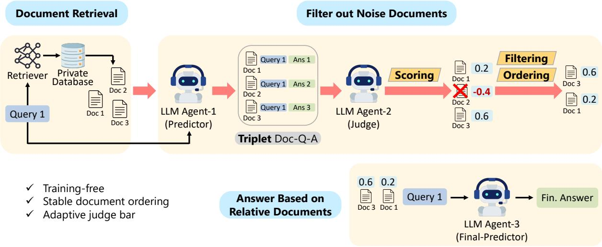  
Figure 1: An overview of the proposed framework MAIN-RAG, consisting of three LLM agents to identify noisy retrieved documents for filtering (see Section 3.1). After the retrieval, Agent-1 "Predictor" infers answers for each query; then, Agent-2 "Judge" takes Doc-Q-A Triplet to judge if a document is supportive for LLMs to answer the query. "Judge" provides relevant scores for each document for filtering and ordering. Finally, Agent-3 "Final-Predictor" answers the query with the given document list.

MAIN-RAG introduces an adaptive filtering mechanism that dynamically adjusts the relevance threshold based on the score distribution of retrieved documents. This adaptability allows the framework to handle diverse queries effectively and ensures robust performance across diverse tasks. Furthermore, the training-free nature of MAIN-RAG eliminates the need for additional labeled data or model fine-tuning, making it a scalable and versatile solution for real-world applications.

Our contributions are as follows:

• Training-Free Multi-Agent Filtering: We introduce a novel training-free framework that employs multiple LLM agents to collaboratively filter and rank retrieved documents, improving retrieval precision and RAG reliability without the need for additional training.

• Dynamic and Adaptive Filtering Mechanism: MAIN-RAG incorporates an adaptive threshold mechanism that dynamically adjusts to query-specific score distributions, ensuring effective noise reduction while maintaining high recall of relevant documents.

• Empirical Validation Across Multiple Benchmarks: Our experimental results on four QA benchmarks demonstrate that MAIN-RAG outperforms baseline RAG approaches, achieving a 2-11% improvement in answer accuracy while reducing the inclusion of irrelevant documents.

By addressing the inherent challenges of noise in document retrieval and providing a training-free solution, MAIN-RAG represents a significant advancement in the field of retrieval-augmented generation. This work details the design, implementation, and evaluation of MAIN-RAG, highlighting its potential to improve response accuracy, consistency, and reliability in diverse NLP applications.

## 2 Preliminaries

## 2.1 Notations and Objectives

We consider a RAG system designed to filter noisy retrieved documents and improve response accuracy. Each query $q \in \mathcal { Q }$ retrieves a set of documents ${ \mathcal { D } } _ { q } = \{ d _ { 1 } , d _ { 2 } , \ldots , d _ { N } \}$ using a retriever model. Each document $d _ { i }$ is associated with a relevance score $r _ { i }$ , which quantifies its usefulness for the query and is determined by Agent-2 (Judge) as described in Section 3.2. Let R = $[ r _ { 1 } , r _ { 2 } , \ldots , r _ { N } ]$ represent the relevance scores for the retrieved documents. These scores are used to rank the documents, forming an ordered list $\mathcal { D } _ { q } ^ { \mathrm { r a n k } }$ where documents with higher scores are deemed more relevant. Based on these scores, an adaptive judge bar $\tau _ { q }$ is computed for each query to filter out noisy documents (see Section 3.3). Documents with scores $r _ { i } \geq \tau _ { q }$ are retained, creating a filtered set $\mathcal { D } _ { q } ^ { \mathrm { f i l t e r e d } } \subseteq \mathcal { D } _ { q } ^ { \mathrm { r a n \hat { k } } }$ . For $1 \leq i \leq N$ , ri represents the relevance score for document $d _ { i }$ . The adaptive judge bar $\tau _ { q }$ dynamically adjusts based on the distribution of $\scriptstyle { \mathbf { } } , { \mathbf { } } \quad { \mathbf { } } ,$ ensuring robust filtering for diverse queries. For example, consider a query $q$ that retrieves $\mathcal { D } _ { q } = \{ d _ { 1 } , d _ { 2 } , d _ { 3 } \}$ with relevance scores $R = [ 3 . 8 , 2 . 5 , 4 . 2 ]$ . The ranked list $\mathcal { D } _ { q } ^ { \mathrm { r a n k } }$ becomes $\{ d _ { 3 } , d _ { 1 } , d _ { 2 } \}$ . If the adaptive judge bar $\tau _ { q } = 3 . 0$ the filtered set $\mathcal { D } _ { q } ^ { \mathrm { f i l t r e d } } = \{ d _ { 3 } , d _ { 1 } \}$ retains only the most relevant documents. To this end, our work focuses on effectively identifying and filtering noisy documents, thereby enhancing the accuracy and reliability of RAG systems in a post-hoc manner.

## 2.2 Impact of Noisy Retrieval Documents

In RAG, irrelevant or noisy documents retrieved during the retrieval stage can mislead the LLMs during the inference stage, often resulting in incorrect answers. The presence of such noise information poses a significant challenge to the reliability of LLMs and RAG, especially when applied to tasks that require precise information, such as question answering. As observed in existing studies (Chen et al., 2024; Yu et al., 2024), LLMs exhibit vulnerabilities in noise robustness and often fail to reject irrelevant content, resulting in decreased performance. Therefore, improving noise filtering after the retrieval process is vital to enhance RAG systems’ reliability and robustness.

## 2.3 Related Work

This section reviews RAG methodologies, focusing on training-based and training-free approaches, and discusses the challenge of noise robustness in RAG. Training-based RAG. Training-based RAG integrates retrieval mechanisms into the training of the language model, allowing access to external information during generation. For instance, Lewis et al. (2020) combines parametric and nonparametric pretrained memory for language generation, achieving state-of-the-art results on open-domain QA tasks. Similarly, Guu et al. (2020) introduces REALM, a framework that augments language model pretraining with a latent knowledge retriever, allowing retrieval and attention to large corpora like Wikipedia. Self-RAG (Asai et al., 2024) proposes to adaptively retrieve passages and critique the generations so as to improve output quality and factuality. Albeit effective, these methods require dedicated training procedures and corresponding hardware, hindering their applicability.

Training-free RAG. Training-free RAG approaches integrate pre-trained language models with retrieval components, avoiding extensive retraining. Ram et al. (2023) perform in-context retrieval, allowing language models to dynamically access external data. Li et al. (2023) propose a framework where LLMs verify retrieved documents to ensure their relevance to queries, but this method is highly sensitive to input prompts. Similarly, Jiang et al. (2023b) introduces a strategy to actively determine when and what to retrieve during generation, but it also suffers from prompt sensitivity. While efficient, training-free RAG approaches struggle with noise robustness due to their reliance on static pre-trained data.

Challenge of noise robustness in RAG. Ensuring noise robustness is critical for the reliability of RAG systems. Chen et al. (2024) conduct a comprehensive analysis of RAG’s effects on LLMs, focusing on their resilience to noise and other fundamental capabilities. Yu et al. (2024) presents a framework that strengthens LLMs’ RAG performance by guiding them in context ranking and answer generation. Section 3.2, "Trade-off of Picking Top-k Contexts," underscores the significance of selecting relevant contexts to balance effectiveness and computational cost. These findings emphasize the necessity of filtering out noisy documents to uphold the accuracy and robustness of RAG systems.

## 3 Multi-Agent Filtering RAG (MAIN-RAG)

This section presents a comprehensive overview of our proposed MAIN-RAG framework, as depicted in Figure 1. Based on the traditional RAG workflow, MAIN-RAG focuses on reducing noisy documents after the retrieval stage. Specifically, MAIN-RAG is a training-free framework, involving three agents to identify and filter out noisy documents after retrieval. The specific roles of the three agents are defined in Section 3.1. Section 3.2 illustrates the process of supportive document judgment for filtering out misleading or irrelevant ones. Section 3.3 proposes an adaptive judge bar to adjust the judge criteria according to given retrieved documents.

## 3.1 Definition of LLM Agents in MAIN-RAG

The proposed framework MAIN-RAG is to identify noisy retrieved documents for filtering out, consisting of three LLM agents: Agent-1 (Predictor), Agent-2 (Judge), and Agent-3 (Final-Predictor).

Agent-1 (Predictor). After the retrieval stage, we have several candidate documents for each query. Then, for a single query, Agent-1 is to infer answers to the query given each document. Then, we can form the Document-Query-Answer Triplet (Doc-Q-A), which is prepared for Agent-2 (Judge) to evaluate the relevant information among Doc-Q-A triplet, as shown in Figure 1.

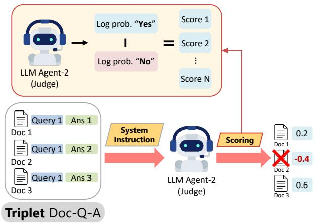  
Figure 2: Quantification of document relevant score.

Agent-2 (Judge). Given a Doc-Q-A triplet, Agent-2 (Judge) is to evaluate whether the document provides relevant information to the query and answer. Agent-2 is prompted to answer "Yes" or "No" for each Doc-Q-A triplet, treating the relevance judgment as a True-or-False question. This simplification helps to further quantify the judgment as relevant scores of documents, which can be used for filtering and ordering. The details of Agent-2 refer to Section 3.2 and Section 3.3.

Agent-3 (Final-Predictor). After Agent-2 filters out noisy documents and orders the remaining document list by their relevant scores, Agent-3 (Final-Predictor) is prompted to answer the query with the document list.

## 3.2 Relevance Judgment Quantification

Previous research has observed that when processing long context inputs, LLMs tend to overlook information in the middle, placing greater emphasis on the beginning and end of the context (Liu et al., 2024). This suggests that in RAG, the ordering of documents may influence prediction performance. To investigate the impact of document order in RAG, we conducted an experiment on the benchmark RGB (Chen et al., 2024), where the retrieved documents were randomly shuffled and evaluated. This process was repeated ten times for each noise ratio condition. The results, illustrated in Figure 3, reveal that document order has a significant effect on performance. Notably, the maximum performances are substantially higher than the minimum ones, suggesting that certain document orders can provide stable and optimal results. This observation leads us to propose a judgment quantification to make documents sortable.

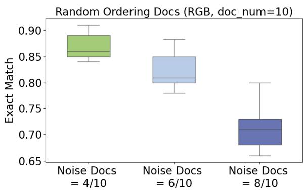  
Figure 3: Impacts of document ordering on variance in RAG performance, where Noise Docs t/u means t noisy documents out of u retrieved documents.

To quantify the natural language outputs "Yes" and "No," we propose computing the difference between the log probabilities of the corresponding tokens, as shown in Figure 2, where the system instruction is provided in Appendix C. In other words, we choose the log odds of the two tokens as a judgment score. By subtracting the log probabilities of the "Yes" and "No" tokens, Agent-2 simplifies the judgment by consolidating the two factors into a single score. This relevant score then serves as the sole criterion for document filtering.

## 3.3 Adaptive Judge Bar τq

After we obtain relevant scores for each document, another challenge is how to determine the optimal judge bar for filtering out noisy documents. Here, the optimal judge bar is the score that perfectly filters out all noisy documents while retaining all relevant ones. Consider example 1 in Figure 4, where a query retrieves a higher number of noisy documents; the optimal judge bar in this case is approximately 3.7. In example 2 in Figure 4, where more relevant documents are retrieved for a query, the optimal judge bar increases to around 4.4. These examples illustrate that the optimal judge bar varies with the document distribution among queries. We also observe significant variations in the optimal judge bars across different queries in RGB benchmark (Chen et al., 2024), as shown in Figure 5. This observation leads us to think about how can we adaptively determine optimal judge bars.

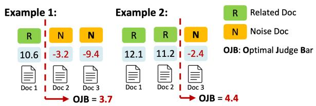  
Figure 4: Examples of Optimal Judge Bar (OJB).

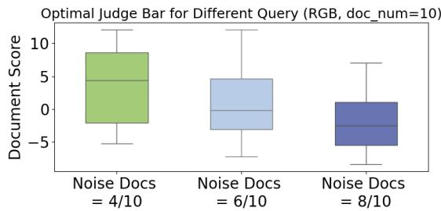  
Figure 5: Optimal judge bars for different noise ratios in different queries, where Noise Docs $t / u$ means t noisy documents out of u retrieved documents.

Analyzing the relevant score distributions for both related and noisy documents on RGB benchmark (Chen et al., 2024), we observe that the scores of related documents are skewed high with a small standard deviation, as shown in Figure 6. This indicates that the LLM (here is Mistral-7B) is more confident about these documents. In contrast, the scores of noisy documents are more uniformly distributed with a larger standard deviation, suggesting that the LLM is less confident and may misjudge them. Based on this biased LLM behavior, we propose using the average relevant score for each query as an adaptive judge bar. In Figure 6, the red line represents the average score of all documents. Documents to the right of the red line (the red area) are retained, while those to the left are filtered out. When the average score is high—indicating many relevant documents—we can filter out most lowscoring outliers, which are likely noise. Conversely, when the average score is low—indicating many noisy documents—we aim to reduce the number of documents while maintaining a high recall rate for relevant documents by still using the average score to filter out approximately half of the documents. To introduce flexibility into this framework, we adjust the adaptive judge bar $\tau _ { q }$ by adding n times the standard deviation $\sigma$ of each candidate document set, $\tau _ { q } - n \cdot \sigma$ , allowing relax $\tau _ { q }$ when needed, as shown by the green area in Figure 6. Notably, n is the only hyperparameter in MAIN-RAG.

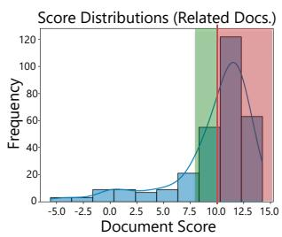

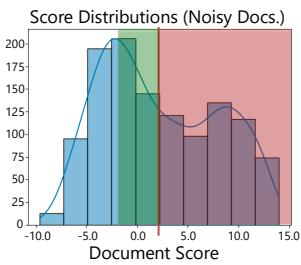  
Figure 6: Score distribution of related and noisy documents with adaptive judge bar.

## 4 Experiments

In this section, we conduct experiments to evaluate the performance of MAIN-RAG, aiming to answer the following three research questions: RQ1: How does MAIN-RAG perform leveraging LLM agents as noisy document filter? RQ2: How to utilize adaptive judge bar $\tau _ { q }$ for filtering and ranking? RQ3: How does $\tau _ { q }$ influence performance?

## 4.1 Tasks and Datasets

We evaluate our MAIN-RAG model and various baselines across a range of downstream tasks, assessing the outputs for overall correctness. All evaluations are conducted in a zero-shot setting, where we provide task instructions without few-shot demonstrations (Sanh et al., 2022; Wei et al., 2021).

Closed-set Task. We evaluate MAIN-RAG on the ARC-Challenge dataset (Clark et al., 2018), a multiple-choice reasoning dataset collected from scientific exams. We use accuracy as the evaluation metric and report results on the testing set.

Open-Domain Question Answering Tasks. We evaluate MAIN-RAG on two open-domain QA datasets: TriviaQA-unfiltered (Joshi et al., 2017) and PopQA (Mallen et al., 2022), both of which require LLMs to answer arbitrary questions about factual knowledge. Since the testing set of TriviaQAunfiltered is not publicly available, we use the validation and testing sets provided by an existing work (Asai et al., 2024), comprising 11,313 testing queries for evaluation. For PopQA, we utilize the long-tail subset, consisting of 1,399 rare entity queries with monthly Wikipedia page views of less than 100. Following prior works (Mallen et al., 2022; Schick et al., 2024), we evaluate task performance based on whether the gold answers are included in the model’s generations instead of strictly requiring exact matches.

Long-form Generation Tasks. We conduct results on the long-form QA task ALCE-ASQA (Gao et al.,

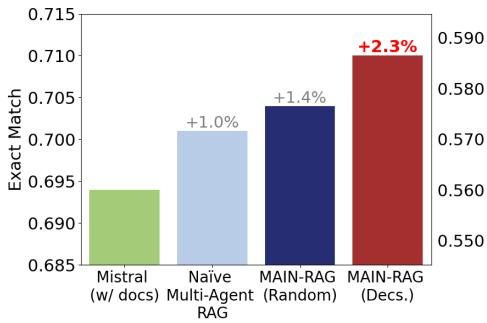  
(a) TriviaQA

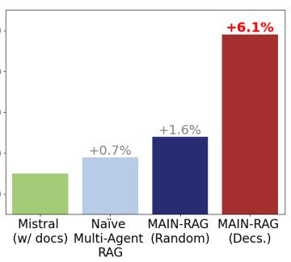  
(b) PopQA

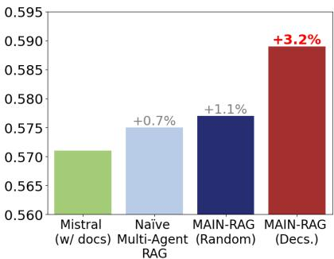  
(c) ARC-Challenge  
Figure 7: Performance comparison among MAIN-RAG and its variant baselines on three QA benchmarks, where all three LLM agents are pre-trained Mistral7B. Comparison based on Llama $3 _ { 8 \mathsf { B } }$ agents is illustrated in Appendix B.

2023; Stelmakh et al., 2022) to evaluate MAIN-RAG. We rely on the official metrics, including correctness (str-em and rouge), and fluency measured by MAUVE (mau) (Pillutla et al., 2021).

## 4.2 Baselines

Baselines without retrievals. We assess a range of publicly available, powerful pretrained LLMs, including $\mathrm { L l a m a 2 _ { 7 B , 1 3 B } }$ (Touvron et al., 2023), Llama38B (Dubey et al., 2024), and Mistral7B (Jiang et al., 2023a), as well as instruction-tuned models like $\mathrm { A l p a c a _ { 7 B , 1 3 B } }$ (Dubois et al., 2024). We also compare our framework with a model trained and enhanced using private data, Llama2-chat13B. Whenever possible, we use the official system prompts or instruction formats that were applied during the training process of these instruction-tuned models.

Baselines with retrievals. We evaluate models that incorporate retrieval, either during inference or throughout the training process. In the first category, we include three fine-tuned models. The first is Self-RAG (Asai et al., 2024), a variant of $\mathrm { L l a m a } 2 _ { 7 \mathrm { B } }$ trained to retrieve documents, generate outputs, and critically examine both retrieved passages and its own responses, expanding its vocabulary with additional reflection tokens. The second is $\mathrm { L l a m a 2 – F T _ { 7 B } }$ , which is Llama27B fine-tuned on the same dataset used by Self-RAG, but without the reflection tokens or retrieved passages. We also include results from a retrieval-augmented baseline, Ret-Llama2-chat13B, which is trained on private data collected in Self-RAG and performs inference with retrieved documents. In the second category, we consider standard RAG baselines that do not require additional training. These methods simply prepend the top retrieved documents to the query before passing them to a pre-trained

LLM (e.g., Llama27B,13B, $\mathrm { A l p a c a _ { 7 B , 1 3 B } }$ , Llama38B, Mistral7B), using the same retriever as in our system. We also consider two variants of MAIN-RAG: Naïve Multi-agent RAG: This MAIN-RAG variant replaces Agent-2’s role with a simple natural language judgment of "Yes" or "No"; MAIN-RAG (Random): In this variant, after scoring and filtering, the orders of remaining documents are randomized.

## 4.3 Experimental Settings

As a training-free RAG framework, the three agents in MAIN-RAG can be instantiated by different pretrained LLMs. As default settings, we instantiate all three agents by pre-trained Mistral7B (Jiang et al., 2023a) and Llama38B without further tuning. We employ the pre-trained Contriever-MS MARCO (Izacard et al., 2021) as the default retriever model, retrieving up to twenty documents from each query for MAIN-RAG to filter. We use greedy generation for all our experiments.

## 4.4 Quantitative Analysis (RQ1)

We evaluated the performance of our proposed MAIN-RAG framework and baselines across four well-known QA benchmarks, where MAIN-RAG (Decs.) refers to our method that orders documents in descending order after scoring and filtering, as illustrated in Figure 7, Table 1, and Appendix B. Our results demonstrate that MAIN-RAG outperforms all training-free and without retrieval baselines by margins up to 6.1% (with Mistral7B) and 12.0% (with Llama38B) in all four benchmarks, as shown in Table 1. Notably, the questions in PopQA heavily rely on external knowledge to enable pre-trained LLMs to generate accurate answers. In this case, MAIN-RAG exhibits a significant advantage over the baselines, because the retriever is not fine-tuned on the target question sets and may retrieve a large number of noisy candidate documents. Compared with training-based baselines, our training-free MAIN-RAG framework can bridge the performance gap in TriviaQA and PopQA datasets. We also found that on the metrics for rough (rg), MAIN-RAG-Mistral7B occasionally outperforms the two training-based baselines, ${ \bf S e l f - R A G } _ { 7 \mathrm { B } }$ and $\mathrm { L l a m a 2 – F T _ { 7 B } }$ , showing the potential of improving pre-trained LLMs to outperform resource-consuming fine-tuning methods.

Table 1: Overall experimental results on four tasks. Bold numbers refer to the best performance among baselines without retrieval and training-free baselines, and underline numbers refer to the second-best performance. Gray bold numbers refer to the best performance among proprietary models and training-based baselines. ∗ indicates concurrent results conducted by recent works or original papers. For the metrics, acc, em, rg, and mau denote accuracy, str-em, rouge, and MAUVE, respectively.
<table><tr><td></td><td>TriviaQA (acc)</td><td>PopQA (acc)</td><td>ARC-C (acc)</td><td>(em)</td><td>ASQA (rg)</td><td>(mau)</td></tr><tr><td colspan="7"></td></tr><tr><td> $\mathrm { L l a m a 2 – c h a t _ { 1 3 B } } ^ { * }$ </td><td>59.3</td><td>LMs with proprietary data 20.0</td><td>38.4</td><td>22.4</td><td>29.6</td><td>28.6</td></tr><tr><td> $\mathrm { R e t - L l a m a 2 - c h a t _ { 1 3 B } } ^ { * }$  y</td><td>59.8</td><td>51.8</td><td>37.9</td><td>32.8</td><td>34.8</td><td>43.8</td></tr><tr><td colspan="7"></td></tr><tr><td> $_ { \mathrm { L l a m a 2 - F T _ { 7 B } } ^ { \ast } }$ </td><td>Baselines with retrieval (training-based) 57.3</td><td>48.7</td><td>65.8</td><td>31.0</td><td>35.8</td><td>51.2</td></tr><tr><td> $\mathrm { S e l f { - } R A G 7 B } ^ { \mathrm { * } }$ </td><td>66.4</td><td>54.9</td><td>67.3</td><td>30.0</td><td>35.7</td><td>74.3</td></tr><tr><td colspan="7">Baselines without retrieval</td></tr><tr><td> ${ \mathrm { L l a m a 2 } } _ { 7 \mathrm { B } } { } ^ { * }$ </td><td>30.5</td><td>14.7</td><td>21.8</td><td>7.9</td><td>15.3</td><td>19.0</td></tr><tr><td> $\mathrm { { A l p a c a } _ { 7 B } } ^ { * }$ </td><td>54.5</td><td>23.6</td><td>45.0</td><td>18.8</td><td>29.4</td><td>61.7</td></tr><tr><td> $\mathrm { L l a m a 2 _ { 1 3 B } } ^ { * }$ </td><td>38.5</td><td>14.7</td><td>29.4</td><td>7.2</td><td>12.4</td><td>16.0</td></tr><tr><td> $\mathrm { \bf A l p a c a _ { 1 3 B } } ^ { * }$ </td><td>61.3</td><td>24.4</td><td>54.9</td><td>22.9</td><td>32.0</td><td>70.6</td></tr><tr><td> $\mathrm { M i s t r a l } _ { 7 \mathrm { B } }$ </td><td>54.8</td><td>26.2</td><td>55.5</td><td>11.2</td><td>18.1</td><td>27.6</td></tr><tr><td> $\mathrm { L l a m a } 3 _ { 8 \mathrm { B } }$ </td><td>68.4</td><td>29.2</td><td>58.8</td><td>19.4</td><td>30.3</td><td>54.3</td></tr><tr><td colspan="7"></td></tr><tr><td></td><td>Baselines with retrieval (training-free)</td><td></td><td></td><td></td><td></td><td></td></tr><tr><td> $\mathrm { L l a m a } 2 _ { 7 \mathrm { B } }$ </td><td>68.9</td><td>50.9</td><td>51.0</td><td>16.2</td><td>23.4</td><td>33.1</td></tr><tr><td> $\mathrm { \Delta A l p a c a _ { 7 B } } ^ { * }$ </td><td>64.1</td><td>46.7 45.7</td><td>48.0 26.0</td><td>30.9</td><td>33.3</td><td>57.9</td></tr><tr><td> $\mathrm { L l a m a 2 _ { 1 3 B } } ^ { * }$  米</td><td>47.0</td><td></td><td></td><td>16.3</td><td>20.5</td><td>24.7</td></tr><tr><td> $\mathbf { \Delta } \mathrm { { A l p a c a } _ { 1 3 \mathbf { B } } } ^ { * }$ </td><td>66.9</td><td>46.1</td><td>57.6</td><td>34.8</td><td>36.7</td><td>56.6</td></tr><tr><td> $\mathrm { M i s t r a l } _ { 7 \mathrm { B } }$ </td><td>69.4</td><td>55.5</td><td>57.1</td><td>32.4</td><td>34.8</td><td>54.3</td></tr><tr><td> $\mathrm { L l a m a } 3 _ { 8 \mathrm { B } }$ </td><td>73.1</td><td>61.8</td><td>55.6</td><td>37.1</td><td>36.5</td><td>63.0</td></tr><tr><td> $\mathrm { \Delta \bar { M } \bar { A } \bar { I } \bar { N } - \mathrm { \bar { R } \bar { A } \bar { G } - \bar { M } \bar { i } s t r a l _ { 7 B } } }$ </td><td>71.0</td><td>58.9</td><td>58.9</td><td>35.7</td><td>36.2</td><td>60.0</td></tr><tr><td> $\mathsf { M A I N - R A G - L l a m a 3 } _ { \mathrm { 8 B } }$ </td><td>74.1</td><td>64.0</td><td>61.9</td><td>39.2</td><td>42.0</td><td>70.6</td></tr></table>

## 4.5 Ablation Studies on Adaptive Judge Bar $\tau _ { q }$ for Filtering and Ranking (RQ2)

We assess the effectiveness of the adaptive judgment bar $\tau _ { q }$ by comparing the default $\tau _ { q }$ with variations adjusted by different scales of standard deviation, $\tau _ { q } - n \cdot \sigma$ . As mentioned in Section 3.3, the purpose of these adjustments is to relax the filtering threshold when the recall rate of relevant documents is low, potentially preventing the omission of critical external information required to support LLMs in question answering. Despite its flexibility, our experiments demonstrate that the default $\tau _ { q }$ generally performs well in filtering noisy documents. As shown in Table 2, while the adjusted variants randomly achieve better performance, the default $\tau _ { q }$ consistently ranks at least second-best across three benchmarks and two different pretrained LLMs, indicating its practicality.

After filtering out irrelevant or noisy documents, the remaining candidate documents can be sorted in either descending or ascending order. As shown in Table 2, MAIN-RAG defaults to descending order, consistently achieving better performance compared to ascending order. This result aligns with findings from prior work, which suggests that LLMs tend to prioritize information presented at the beginning of the input (Liu et al., 2024).

## 4.6 Case Studies of Different Adaptive Judge Bar $\tau _ { q }$ (RQ3)

MAIN-RAG involves adaptive judge bar $\tau _ { q }$ to approximate optimal judge bars of each query by averaging relevant scores over retrieved documents for a query. This approach is inspired by our observation of distinct score distributions between the most relevant document set and the least relevant document set, as discussed in Section 3.3. From Figure 6, we observe that Agent-2 assigns confidently high relevance scores to related documents, resulting in a skewed-high score distribution. In contrast, while Agent-2 scores noisy documents with a more uniform distribution, the lowest scores for noisy documents are significantly lower than those for related documents. This disparity allows the filtering mechanism to improve the prediction accuracy of Agent-3, regardless of whether $\tau _ { q }$ is set relatively high or low. The correlation between $\tau _ { q }$ and performance can be observed in Figure 8 and further discussed in Appendix D.

  
Figure 8: Case Study: Adaptive Judge Bar $\tau _ { q }$ (Dataset: PopQA; LLM Agents: Mistral7B)

Table 2: Ablation studies of $\tau _ { q }$ and document ordering. Bold numbers indicate the best result, and underline numbers indicate the second-best result.
<table><tr><td>TriviaQA (acc)</td><td>PopQA (acc)</td><td>ARC-C (acc)</td></tr><tr><td>Mistral7B</td><td></td><td></td></tr><tr><td>MAIN-RAG (Decs.) 71.0</td><td>58.9</td><td>58.9</td></tr><tr><td>MAIN-RAG (ASC.) 70.2</td><td>53.5</td><td>57.4</td></tr><tr><td> $\mathsf { M A I N - R A G } \left( \tau _ { q } - 0 . 5 \cdot \sigma \right)$  71.2</td><td>58.6</td><td>59.0</td></tr><tr><td>MAIN-RAG  $( \tau _ { q } - 1 . 0 \cdot \sigma )$  70.8</td><td>58.0</td><td>58.5</td></tr><tr><td>MAIN-RAG  $( \tau _ { q } - 1 . 5 \cdot \sigma )$  70.4</td><td>58.4</td><td>57.7</td></tr><tr><td colspan="3">Llama38B</td></tr><tr><td>MAIN-RAG (Decs.) 74.1</td><td>64.0</td><td>61.9</td></tr><tr><td>MAIN-RAG (ASC.) 73.6</td><td>63.5</td><td>60.7</td></tr><tr><td>MAIN-RAG  $( \tau _ { q } - 0 . 5 \cdot \sigma )$  74.1</td><td>64.0</td><td>58.6</td></tr><tr><td>MAIN-RAG  $( \tau _ { q } - 1 . 0 \cdot \sigma )$  74.1</td><td>63.3</td><td>58.9</td></tr><tr><td>MAIN-RAG  $( \tau _ { q } - 1 . 5 \cdot \sigma )$  74.3</td><td>64.0</td><td>57.2</td></tr></table>

## 5 Conclusion and Future Work

In this work, we address the challenges of noisy document retrieval in RAG by introducing a training-free, multi-agent framework, MAIN-RAG. Our approach employs multiple LLM agents to collaboratively filter and rank retrieved documents, enhancing the recall of relevant information while minimizing irrelevant content. Specifically, MAIN-RAG utilizes an adaptive judge bar that dynamically adjusts based on the score distribution of relevant and noisy documents in different queries. Experimental results demonstrate that MAIN-RAG consistently outperforms training-free RAG baselines across various QA benchmarks. Regarding future directions, the MAIN-RAG framework unveils several potential facets that merit further exploration, such as integrating with a more fine-grained adaptive judge bar, extending the approach to other tasks beyond question answering, and incorporating human feedback or tuning-based approaches to enhance the efficacy of document filtering.

## 6 Limitations

We conduct experiments on four datasets using two different pre-trained LLM architectures. These experiments primarily focus on LLM inference with retrieved external documents. However, we acknowledge that LLM inference under RAG workflow contributes to carbon emissions, representing a potential limitation and environmental risk of our work. To mitigate this, we aim to reduce the need for repetitive experiments by ensuring more predictable outcomes and implementing controlled experimental settings.

## Acknowledgments

The authors thank the anonymous reviewers for their helpful comments. This work is in part supported by NSF grants NSF IIS-2431515 and IIS-2525159. The views and conclusions contained in this paper are those of the authors and should not be interpreted as representing any funding agencies.

## References

Akari Asai, Zeqiu Wu, Yizhong Wang, Avirup Sil, and Hannaneh Hajishirzi. 2024. Self-rag: Learning to retrieve, generate, and critique through self-reflection. In The Twelfth International Conference on Learning Representations.

Rishi Bommasani, Drew A Hudson, Ehsan Adeli, Russ Altman, Simran Arora, Sydney von Arx, Michael S Bernstein, Jeannette Bohg, Antoine Bosselut, Emma Brunskill, et al. 2021. On the opportunities and risks of foundation models. arXiv preprint arXiv:2108.07258.

Tom B Brown. 2020. Language models are few-shot learners. arXiv preprint arXiv:2005.14165.

Jiawei Chen, Hongyu Lin, Xianpei Han, and Le Sun. 2024. Benchmarking large language models in retrieval-augmented generation. In Proceedings of the AAAI Conference on Artificial Intelligence, volume 38, pages 17754–17762.

Peter Clark, Isaac Cowhey, Oren Etzioni, Tushar Khot, Ashish Sabharwal, Carissa Schoenick, and Oyvind Tafjord. 2018. Think you have solved question answering? try arc, the ai2 reasoning challenge. arXiv preprint arXiv:1803.05457.

Abhimanyu Dubey, Abhinav Jauhri, Abhinav Pandey, Abhishek Kadian, Ahmad Al-Dahle, Aiesha Letman, Akhil Mathur, Alan Schelten, Amy Yang, Angela Fan, et al. 2024. The llama 3 herd of models. arXiv preprint arXiv:2407.21783.

Yann Dubois, Chen Xuechen Li, Rohan Taori, Tianyi Zhang, Ishaan Gulrajani, Jimmy Ba, Carlos Guestrin, Percy S Liang, and Tatsunori B Hashimoto. 2024. Alpacafarm: A simulation framework for methods that learn from human feedback. Advances in Neural Information Processing Systems, 36.

Tianyu Gao, Howard Yen, Jiatong Yu, and Danqi Chen. 2023. Enabling large language models to generate text with citations. arXiv preprint arXiv:2305.14627.

Kelvin Guu, Kenton Lee, Zora Tung, Panupong Pasupat, and Mingwei Chang. 2020. Retrieval augmented language model pre-training. In International conference on machine learning, pages 3929–3938. PMLR.

Gautier Izacard, Mathilde Caron, Lucas Hosseini, Sebastian Riedel, Piotr Bojanowski, Armand Joulin, and Edouard Grave. 2021. Unsupervised dense information retrieval with contrastive learning. arXiv preprint arXiv:2112.09118.

Ziwei Ji, Nayeon Lee, Rita Frieske, Tiezheng Yu, Dan Su, Yan Xu, Etsuko Ishii, Ye Jin Bang, Andrea Madotto, and Pascale Fung. 2023. Survey of hallucination in natural language generation. ACM Computing Surveys, 55(12):1–38.

Albert Q Jiang, Alexandre Sablayrolles, Arthur Mensch, Chris Bamford, Devendra Singh Chaplot, Diego de las Casas, Florian Bressand, Gianna Lengyel, Guillaume Lample, Lucile Saulnier, et al. 2023a. Mistral 7b. arXiv preprint arXiv:2310.06825.

Zhengbao Jiang, Frank Xu, Luyu Gao, Zhiqing Sun, Qian Liu, Jane Dwivedi-Yu, Yiming Yang, Jamie Callan, and Graham Neubig. 2023b. Active retrieval augmented generation. In Proceedings ofthe 2023 Conference on Empirical Methods in Natural Language Processing, pages 7969–7992, Singapore. Association for Computational Linguistics.

Mandar Joshi, Eunsol Choi, Daniel S Weld, and Luke Zettlemoyer. 2017. Triviaqa: A large scale distantly supervised challenge dataset for reading comprehension. arXiv preprint arXiv:1705.03551.

Vladimir Karpukhin, Barlas Oguz, Sewon Min, Patrick˘ Lewis, Ledell Wu, Sergey Edunov, Danqi Chen, and Wen-tau Yih. 2020. Dense passage retrieval for open-domain question answering. arXiv preprint arXiv:2004.04906.

Patrick Lewis, Ethan Perez, Aleksandra Piktus, Fabio Petroni, Vladimir Karpukhin, Naman Goyal, Heinrich Küttler, Mike Lewis, Wen-tau Yih, Tim Rocktäschel, et al. 2020. Retrieval-augmented generation for knowledge-intensive nlp tasks. Advances in Neural Information Processing Systems, 33:9459–9474.

Xiaonan Li, Changtai Zhu, Linyang Li, Zhangyue Yin, Tianxiang Sun, and Xipeng Qiu. 2023. Llatrieval: Llm-verified retrieval for verifiable generation. arXiv preprint arXiv:2311.07838.

Stephanie Lin, Jacob Hilton, and Owain Evans. 2022. TruthfulQA: Measuring how models mimic human falsehoods. In Proceedings ofthe 60th Annual Meeting ofthe Associationfor Computational Linguistics (Volume 1: Long Papers), pages 3214–3252, Dublin, Ireland. Association for Computational Linguistics.

Nelson F Liu, Kevin Lin, John Hewitt, Ashwin Paranjape, Michele Bevilacqua, Fabio Petroni, and Percy Liang. 2024. Lost in the middle: How language models use long contexts. Transactions ofthe Association for Computational Linguistics, 11:157–173.

Alex Mallen, Akari Asai, Victor Zhong, Rajarshi Das, Daniel Khashabi, and Hannaneh Hajishirzi. 2022. When not to trust language models: Investigating effectiveness of parametric and non-parametric memories. arXiv preprint arXiv:2212.10511.

Krishna Pillutla, Swabha Swayamdipta, Rowan Zellers, John Thickstun, Sean Welleck, Yejin Choi, and Zaid Harchaoui. 2021. Mauve: Measuring the gap between neural text and human text using divergence frontiers. Advances in Neural Information Processing Systems, 34:4816–4828.

Ori Ram, Yoav Levine, Itay Dalmedigos, Dor Muhlgay, Amnon Shashua, Kevin Leyton-Brown, and Yoav Shoham. 2023. In-context retrieval-augmented language models. Transactions of the Association for Computational Linguistics, 11:1316–1331.

Victor Sanh, Albert Webson, Colin Raffel, Stephen Bach, Lintang Sutawika, Zaid Alyafeai, Antoine Chaffin, Arnaud Stiegler, Arun Raja, Manan Dey, et al. 2022. Multitask prompted training enables zero-shot task generalization. In International Conference on Learning Representations.

Timo Schick, Jane Dwivedi-Yu, Roberto Dessì, Roberta Raileanu, Maria Lomeli, Eric Hambro, Luke Zettlemoyer, Nicola Cancedda, and Thomas Scialom. 2024. Toolformer: Language models can teach themselves to use tools. Advances in Neural Information Processing Systems, 36.

Ivan Stelmakh, Yi Luan, Bhuwan Dhingra, and Ming-Wei Chang. 2022. Asqa: Factoid questions meet long-form answers. arXiv preprint arXiv:2204.06092.

Hugo Touvron, Louis Martin, Kevin Stone, Peter Albert, Amjad Almahairi, Yasmine Babaei, Nikolay Bashlykov, Soumya Batra, Prajjwal Bhargava, Shruti Bhosale, et al. 2023. Llama 2: Open foundation and fine-tuned chat models. arXiv preprint arXiv:2307.09288.

A Vaswani. 2017. Attention is all you need. Advances in Neural Information Processing Systems.

Yile Wang, Peng Li, Maosong Sun, and Yang Liu. 2023. Self-knowledge guided retrieval augmentation for large language models. arXiv preprint arXiv:2310.05002.

Jason Wei, Maarten Bosma, Vincent Y Zhao, Kelvin Guu, Adams Wei Yu, Brian Lester, Nan Du, Andrew M Dai, and Quoc V Le. 2021. Finetuned language models are zero-shot learners. arXiv preprint arXiv:2109.01652.

Yue Yu, Wei Ping, Zihan Liu, Boxin Wang, Jiaxuan You, Chao Zhang, Mohammad Shoeybi, and Bryan Catanzaro. 2024. RankRAG: Unifying context ranking with retrieval-augmented generation in LLMs. In The Thirty-eighth Annual Conference on Neural Information Processing Systems.

Rowan Zellers, Ari Holtzman, Hannah Rashkin, Yonatan Bisk, Ali Farhadi, Franziska Roesner, and Yejin Choi. 2019. Defending against neural fake news. Advances in neural information processing systems, 32.

Yue Zhang, Yafu Li, Leyang Cui, Deng Cai, Lemao Liu, Tingchen Fu, Xinting Huang, Enbo Zhao, Yu Zhang, Yulong Chen, et al. 2023. Siren’s song in the ai ocean: a survey on hallucination in large language models. arXiv preprint arXiv:2309.01219.

## Appendix

## A Computation Infrastructure

For a fair comparison of evaluation, the experiments are conducted based on the following physical computing infrastructure in Table 3.

Table 3: Computing infrastructure for the experiments.
<table><tr><td>Device Attribute</td><td>Spec</td></tr><tr><td>Computing Infrastructure</td><td>GPU</td></tr><tr><td>GPU Model</td><td>Nvidia-A100</td></tr><tr><td>GPU Number</td><td>4</td></tr><tr><td>GPU Memory</td><td>80 GB</td></tr></table>

## B Performance Comparison among MAIN-RAG and Its Variant Baselines

Our results demonstrate that MAIN-RAG outperforms all training-free, without retrieval, and MAIN-RAG variant baselines by margins up to 6.1% (with Mistral $\tt { 7 B } )$ and 12.0% (with Llama38B) in all four benchmarks, as shown in Table 1, Figure 9, and Figure 10. Notably, the questions in PopQA heavily rely on external knowledge to enable pre-trained LLMs to generate accurate answers. In this case, MAIN-RAG exhibits a significant advantage over the baselines, because the retriever is not fine-tuned on the target question sets and may retrieve a large number of noisy candidate documents.

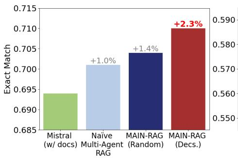  
(a) TriviaQA

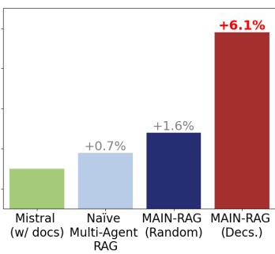  
(b) PopQA

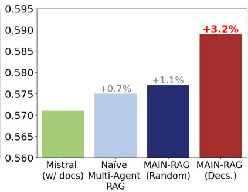  
(c) ARC-Challenge  
Figure 9: Performance comparison among MAIN-RAG and its variant baselines on three QA benchmarks, where all three LLM agents are pre-trained Mistral7B.

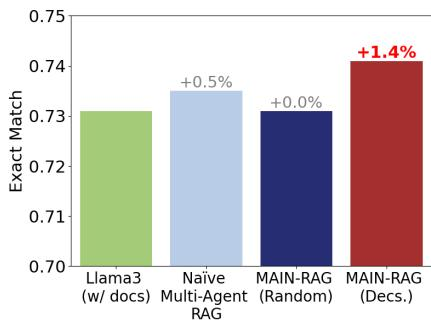  
(a) TriviaQA

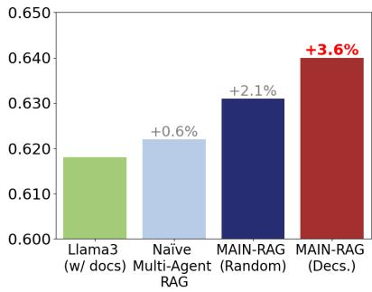  
(b) PopQA

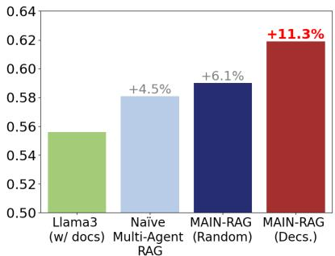  
(c) ARC-Challenge  
Figure 10: Performance comparison among MAIN-RAG and its variant baselines on three QA benchmarks, where all three LLM agents are pre-trained Llama38B.

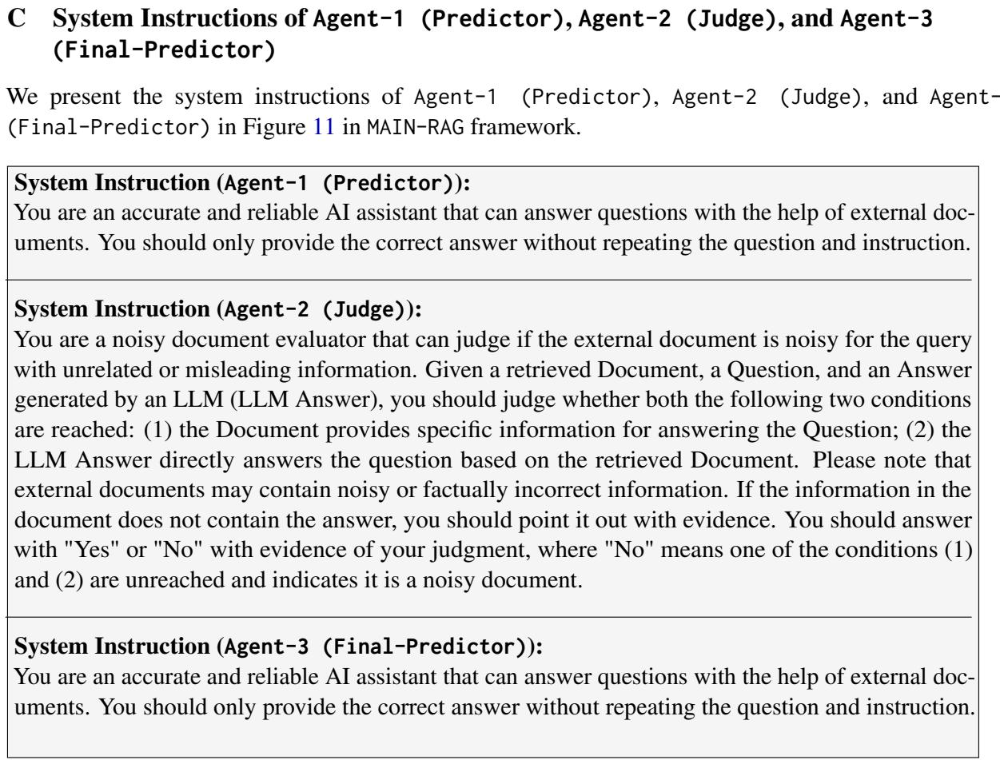  
Figure 11: System instructions of Agent-1 (Predictor), Agent-2 (Judge), and Agent-3 (Final-Predictor).

## D Case Studies of Different Adaptive Judge Bar $\tau _ { q }$ in MAIN-RAG

We demonstrate the case studies of the documents filtered and ranked by MAIN-RAG under different adaptive judge bars $\tau _ { q } .$ The demonstrations show that Agent-2 (Judge), pre-trained LLMs, is able to provide convincing judgment ability for the queries with high adaptive judge bar $\tau _ { q }$ (confident), but suffers in those low adaptive judge bar queries (unconfident). The case studies on PopQA and TriviaQA are illustrated in Figure 12-15.

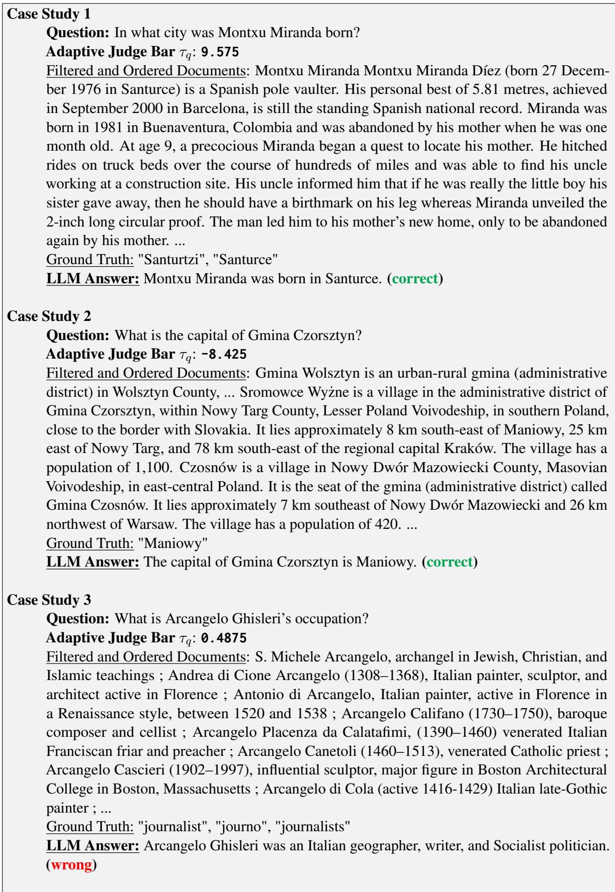  
Figure 12: Case Study: Adaptive Judge Bar $\tau _ { q }$ (Dataset: PopQA; LLM Agents: Mistral7B)

  
Figure 13: Case Study: Adaptive Judge Bar $\tau _ { q }$ (Dataset: PopQA; LLM Agents: Llama38B)

<table><tr><td>Case Study 1 Question: In which US state is New Haven? Adaptive Judge Bar  $\tau _ { q } .$  16.13</td></tr><tr><td>U.S. state of Connecticut. It is located on New Haven Harbor on the northern shore of Long Island Sound in New Haven County, Connecticut, and is part of the New York metropolitan area. With a population of 129,779 as determined by the 2010 United States Census, it is the second-largest city in Connecticut after Bridgeport. New Haven is the principal municipality of Greater New Haven, which had a total population of 862,477 in 2010. New Haven was the first planned city in America. Founded in 1638 by English Puritans, New Haven, Vermont New Haven is a town in Addison County, Vermont, United States. The population was 1,727 at the 2010 census. .. Ground Truth: &quot;richest places in connecticut&quot;, &quot;Connecticut&quot;, &quot;Connectecut&quot; LLM Answer: New Haven is located in the US state of Connecticut. (correct)</td></tr><tr><td>Case Study 2 Question: Where is the area of 127,000 square kilometres (49,000 sq miles) in central South Australia, where public are not admitted under Australian Defence Force regulations? Adaptive Judge Bar  $\tau _ { q } \mathrm { : } - 1 0 . 6 7 5$  Filtered and Ordered Documents: would double the area of land in South Australia under</td></tr><tr><td>environmental protection to 1.8 million hectares. The area includes 390 species of plants and a large number of habitats for rare species of animals and birds. In May 2011, after years of negotiations, Rann joined with Federal Defence Minister Stephen Smith and Resources Minister Martin Ferguson to announce that large areas of the Woomera Prohibited Area, the largest defence testing reserve in the world, would be opened up for mining, allowing the future exploitation of mineral deposits estimated at billions of dollars. ... Ground Truth: &quot;woomera disambiguation&quot;, &quot;Woomera&quot;</td></tr><tr><td>LLM Answer: The area of 127,000 square kilometres (49,000 sq miles) in central South Australia, where public are not admitted under Australian Defence Force regulations, is the Woomera Prohibited Area. (correct) Case Study 3 Question: What name is given to an alcoholic drink that is taken in an effort to cure a hangover? Adaptive Judge Bar  $\tau _ { q } .$  0.49375</td></tr></table>

Figure 14: Case Study: Adaptive Judge Bar $\tau _ { q }$ (Dataset: TriviaQA; LLM Agents: Mistral7B)

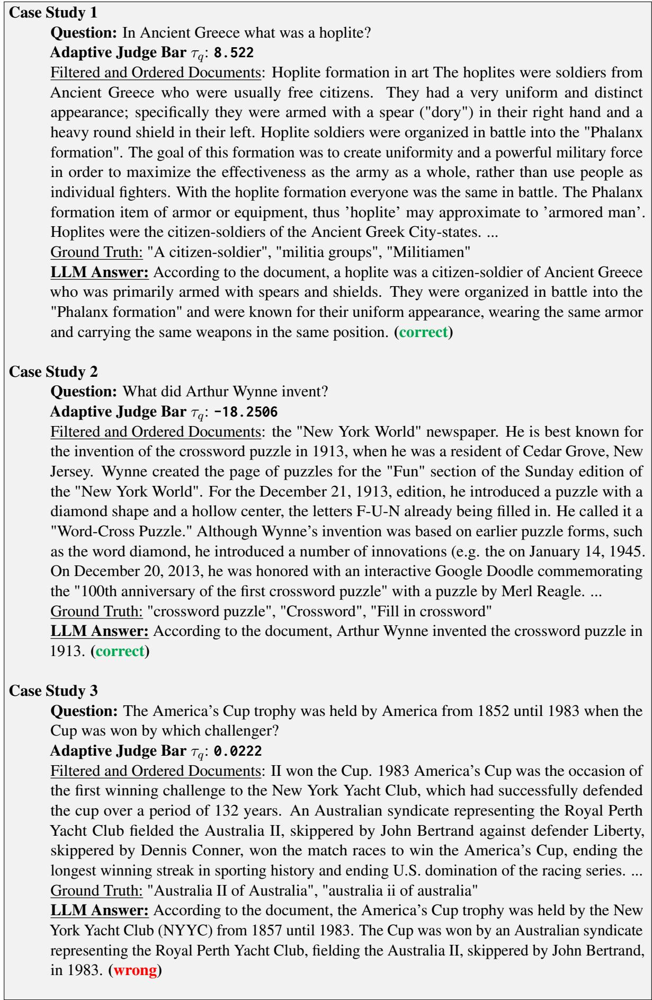  
Figure 15: Case Study: Adaptive Judge Bar $\tau _ { q }$ (Dataset: TriviaQA; LLM Agents: Llama38B)