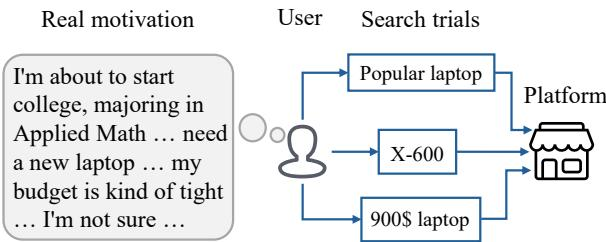
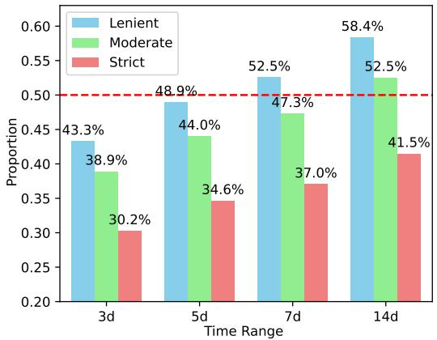
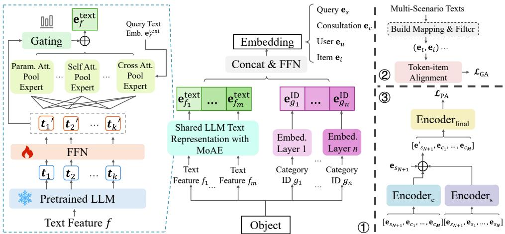
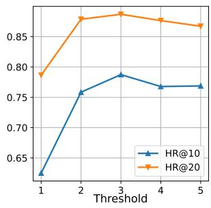
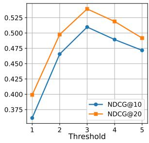
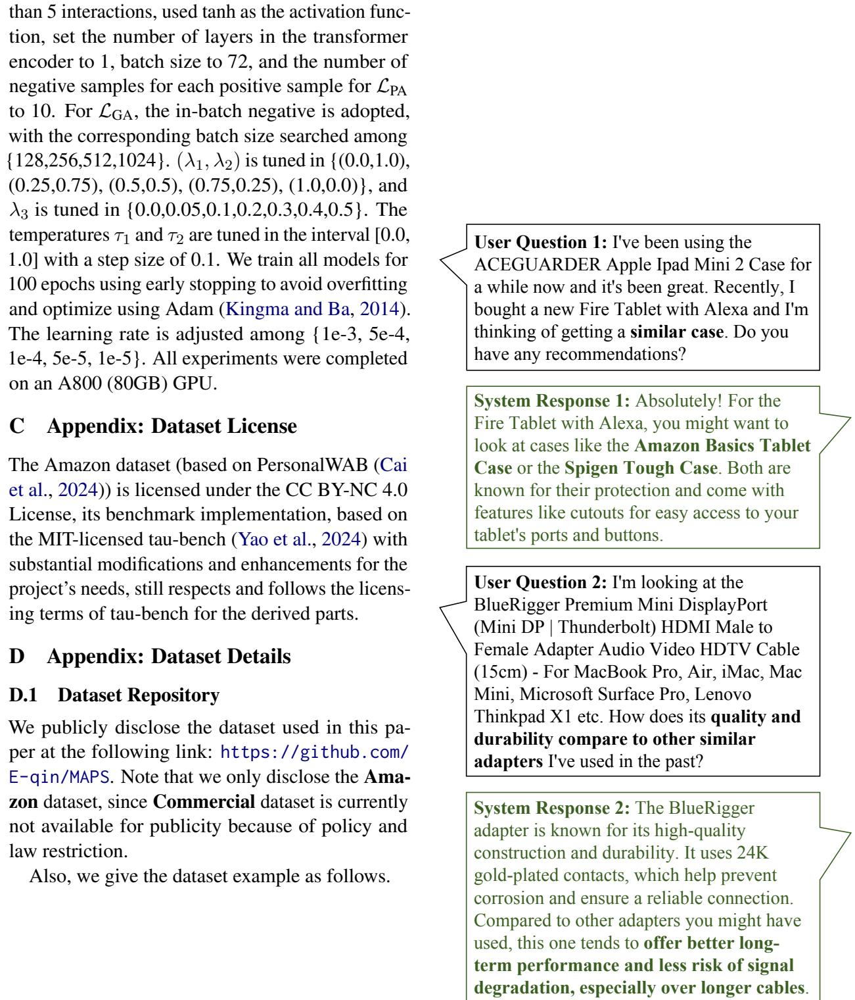

# MAPS: Motivation-Aware Personalized Search via LLM-Driven Consultation Alignment

Weicong Qin1\*, Yi Xu1\*, Weijie Yu2†, Chenglei Shen1,

Ming He3†, Jianping Fan3, Xiao Zhang1, Jun Xu1,

1Gaoling School of Artificial Intelligence, Renmin University of China, China 2School of Information Technology and Management, University of International Business and Economics, China 3AI Lab at Lenovo Research, Lenovo Group Limited, China {qwc, yixu00, chengleishen9, zhangx89, junxu}@ruc.edu.cn, yu@uibe.edu.cn, {heming4, jfan1}@lenovo.com

## Abstract

Personalized product search aims to retrieve and rank items that match users’ preferences and search intent. Despite their effectiveness, existing approaches typically assume that users query fully captures their real motivation. However, our analysis of a real-world e-commerce platform reveals that users often engage in relevant consultations before searching, indicating they refine intents through consultations based on motivation and need. The implied motivation in consultations is a key enhancing factor for personalized search. This unexplored area comes with new challenges including aligning contextual motivations with concise queries, bridging the category-text gap, and filtering noise within sequence history. To address these, we propose a Motivation-Aware Personalized Search (MAPS) method. It embeds queries and consultations into a unified semantic space via LLMs, utilizes a Mixture of Attention Experts (MoAE) to prioritize critical semantics, and introduces dual alignment: (1) contrastive learning aligns consultations, reviews, and product features; (2) bidirectional attention integrates motivation-aware embeddings with user preferences. Extensive experiments on real and synthetic data show MAPS outperforms existing methods in both retrieval and ranking tasks. Code and supplementary materials are avail able at: https://github.com/E-qin/MAPS.

## 1 Introduction

Personalized product search techniques have become crucial for e-commerce platforms and search engines (Ai et al., 2019a), aiming to provide customized results by integrating user information during searches (Bi et al., 2020).

Existing personalized search methods primarily focus on extracting features from users’ interaction sequences to predict their interests, addressing the direct matching problem between search queries and products. These approaches include embedding-based (Ai et al., 2017) and attentionbased methods (Ai et al., 2019a), etc. While effective, they are based on the assumption that users’ queries are clear and directly describe their needs. However, in practice, we find that when initiating a search, user’s queries do not always clearly articulate the requirements. For instance, as illustrated in Fig. 1, a user searching for “X-600” may not be certain if this product best meets their needs and might need to conduct several searches or comparisons to find the most suitable option. The user’s search originates from an intrinsic search motivation, which stems from the specific context or problem a user aims to resolve. Understanding and addressing such search motivations often enhances user satisfaction more effectively than merely providing products related to the query keywords. However, users typically do not actively express their motivations, which are also difficult to directly infer from query texts.

  
Figure 1: Illustration of the user making multiple search attempts to find the best option.

Recently, new e-commerce platforms have developed AI consultation services that help users clarify their needs and provide guidance through natural language interactions. As shown in Fig. 2, we conduct an experiment on a real-world e-commerce platform and find that there is a considerable probability that users conduct relevant consultations before searching, which implies the motivations behind upcoming searches. By leveraging this, the

(a) Example of consultations and the corresponding queries  
  
(b) Proportion of search sessions with related consultations

Figure 2: Examples of consultations with the corresponding search queries and the proportion of search sessions with related consultations (classified as “Lenient”, “Moderate”, or “Strict” under predefined NLP rules, detailed in App. A) in a real e-commerce platform equipped with AI consultation services.

platform can appropriately adjust search results, thereby more likely fulfilling the needs driven by user search motivations, much like how personalized search utilizes users’ historical search interactions to tailor search results.

For existing works, the search motivations within consultations are unexplored. It poses a new challenge: how to enable models to understand the complex texts in consultation sequences and extract motivations that align with personalized search while avoiding semantic conflicts and noise interference?

Specifically, motivation-aware search faces three critical challenges: (1) Alignment with Queries: Search motivations represent users’ underlying needs, often involving lengthy and complex descriptions related to their personal situations, while queries typically consist of keywords directly linked to product names, models, or attributes. (2) Alignment with Product Features: Products have categorical attributes, whereas search motivations in consultations are expressed in natural language, creating an essential disparity between the two. (3) Alignment with User History: Not all consultation histories are relevant to the current search. The misalignment can lead to irrelevant results.

To address the challenge of aligning search motivations with diverse data sources in personalized search systems, we propose a Motivation-Aware Personalized Search (MAPS) model. It leverages LLMs to embed queries and consulting texts into a unified semantic space and introduces a Mixture of Attention Experts (MoAE) network, which focuses on key tokens to accurately capture semantic embeddings. It also incorporates both general alignment and user-personalized alignment modules. The former extracts keyword-item relationships from diverse data sources (e.g., consulting scenarios, reviews, searches, and product features) with automated rules and contrastive learning. The latter uses bidirectional attention to extract motivation-aware embeddings from users’ consulting and search histories and align them with individual preferences. Key contributions are as follows:

• We are the first to explicitly model “search motivation” and clarify its critical role within personalized search systems on e-commerce platforms that offer consulting services.

• We propose MAPS, a model framework that incorporates LLM knowledge to bridge the gap between ID and text embeddings through the Mixture of Attention Experts (MoAE), effectively aligning the search motivation in personalized search modeling.

• Extensive experiments across retrieval and ranking stages on both a real-world commercial dataset and a synthetic dataset demonstrate that MAPS outperforms existing traditional retrieval methods, personalized search methods, and conversational retrieval methods.

## 2 Related Works

Personalized product search provides relevant items based on the user’s searched queries (Shi et al., 2024, 2025). Traditional retrieval algorithms (e.g., BM25 (Robertson et al., 2009)) primarily focus on word frequency. Dense retrieval algorithms (e.g., BGE-M3 (Chen et al., 2024)) have introduced concepts like embeddings to enhance both retrieval and ranking capabilities. Conversational retrieval methods, such as CHIQ (Mo et al., 2024), have attempted to improve retrieval result accuracy by considering historical search queries. None of them provide personalized results tailored to users’ interaction history or profiles.

In recent years, personalized search has gradually attracted attention. For instance, QEM (Ai et al., 2019a) and DREM (Ai et al., 2019b) consider the similarity between the query and items, while HEM (Ai et al., 2017), AEM (Ai et al., 2019a), ZAM (Ai et al., 2019a), and TEM (Bi et al., 2020) incorporate user information and search history into a separate user embedding for personalized search. Besides, several methods combine search and recommendation, such as SESRec (Si et al., 2023) using contrastive learning, UnifiedSSR (Xie et al., 2023) with a dual-branch network for product and query histories, and UniSAR (Shi et al., 2024) employing transformers and cross-attention. In addition, instruction-based, conversational usercontrolled search (Shen et al., 2024) has been receiving increasing attention. However, these approaches inadequately model search intent and fail to align user history with semantic content.

## 3 Problem Formulation

For each user $u \in U$ , the chronologically ordered history H consists of the search history sequence $H ^ { S }$ and the consultation history sequence $H ^ { \mathcal { C } }$ . Specifically, $H ^ { S } = \{ h _ { 1 } ^ { S } , \ldots , h _ { N } ^ { S } \}$ , where $h _ { i } ^ { S }$ represents the i-th search session containing the query $s _ { i }$ and interaction item $v _ { i } ,$ denoted as $h _ { i } ^ { S } = ( s _ { i } , v _ { i } )$ . Similarly, $H ^ { \mathcal { C } }$ includes M consultation sessions, given by $H ^ { \mathcal { C } } = \{ c _ { 1 } , \dots , c _ { M } \}$ , where each $c _ { i }$ contains the user inquiry and the consultant’s response. Given the current query $s N + 1$ and the candidate item set $V _ { N + 1 } = \{ v _ { 1 } , v _ { 2 } , . . . \}$ returned by the search engine, our objective is to model a ranking probability score $p ( v | s _ { N + 1 } , H , u )$ for each candidate item $v \in V _ { N + 1 }$ based on the current query $s N + 1$ , the user’s history $H ,$ and the user profile u.

## 4 Methodology

The overview of our MAPS is shown in Fig. 3. We will introduce the following three modules in sequence:(1) ID-text representation fusion with LLM, (2) Mapping-based general alignment, and (3) Sequence-based personalized alignment.

## 4.1 ID-Text Representation Fusion with LLM

In personalized product search, users, items, and various interactions need to be represented as embeddings so that the model can understand the useritem interactions. For both users and items, two types of features are included: categorical features1 and textual features.

## 4.1.1 Text Representation

Search motivations within consultations presented in natural language require models to have general natural language understanding (NLU) capabilities (Allen, 1988). Thus, it is essential to exploit the textual features of users and items fully. However, existing personalized product search methods often overlook the use of textual semantic features. For instance, regarding text, most of them initialize the token embedding layer and take average token embeddings as the query embedding (Ai et al., 2017, 2019b,a; Shi et al., 2024). This leads to models lacking world knowledge, NLU capabilities, and the ability to focus on critical semantic information within a sentence.

To address this, we consider pre-trained LLM embeddings and construct a Mixture of Attention Experts (MoAE) pooling network to adaptively assign weights to tokens in the text to acquire its embedding. Specifically, we first input the text into a frozen pre-trained LLM to get corresponding token embeddings without performing average pooling (Jia et al., 2024; Qin et al., 2024). To adapt to various LLMs, we utilize trainable feed-forward network layers (FFN) to map them to a unified dimension $d _ { \mathrm { t } } .$ . Then, we build the MoAE pooling framework, which includes three types of attention pooling experts.

Parameterized Attention Pooling Expert: The expert maintains a parameterized embedding and utilizes it as the query within an attention mechanism. Embeddings of input tokens serve as keys to compute attention scores, resulting in a weighted average text embedding based on these scores:

$$
\mathbf { e } _ { \mathrm { p a r a m } } ^ { \mathrm { p o o l } } = \frac { 1 } { L } \sum _ { i = 1 } ^ { L } \mathrm { s o f t m a x } \left( \frac { \mathbf { q } ^ { \top } ( \mathbf { h } _ { i } \mathbf { W } ^ { k } ) } { \sqrt { d _ { \mathrm { t } } } } \right) \mathbf { h } _ { i } ,
$$

where $\mathbf { W } ^ { k } \in \mathbb { R } ^ { d _ { \mathrm { t } } \times d _ { \mathrm { t } } }$ is the key matrix of the attention, q is the parameter query of the expert, $\mathbf { h } _ { i }$ represents the i-th token embedding, and L denotes the sequence length.

Self-Attention Pooling Expert: This expert computes self-attention scores directly from the embeddings of input tokens to produce a weighted average representation:

$$
\mathbf { e } _ { \mathrm { s e l f } } ^ { \mathrm { p o o l } } = \frac { 1 } { L } \sum _ { i = 1 } ^ { L } \mathrm { s o f t m a x } \left( \frac { ( \mathbf { h } _ { i } \mathbf { W } ^ { q } ) ^ { \top } ( \mathbf { h } _ { i } \mathbf { W } ^ { k } ) } { \sqrt { d _ { \mathrm { t } } } } \right) \mathbf { h } _ { i } ,
$$

where $\mathbf { W } ^ { q } ~ \in ~ \mathbb { R } ^ { d _ { \mathrm { t } } \times d _ { \mathrm { t } } }$ is the query matrix of the attention.

  
Figure 3: Overview of MAPS. ① denotes ID-text representation fusion with LLM. ② denotes the general alignment. ③ denotes the personalized alignment.

Search-Centered Cross-Attention Pooling Expert: To ensure that the texts of users, items, and consultation interactions focus more on the current search query, we take the search query $\mathrm { t e x t } ^ { 2 }$ embedding $\mathbf { e } _ { s } ^ { \mathrm { t e x t } }$ as the attention query vector $\mathbf { q } ^ { \prime } \colon$

$$
\mathbf { e } _ { \mathrm { c r o s s } } ^ { \mathrm { p o o l } } = \frac { 1 } { L } \sum _ { i = 1 } ^ { L } \mathrm { s o f t m a x } \left( \frac { ( \mathbf { q } ^ { \prime } \mathbf { W } ^ { q } ) ^ { \top } ( \mathbf { h } _ { i } \mathbf { W } ^ { k } ) } { \sqrt { d _ { \mathrm { t } } } } \right) \mathbf { h } _ { i } .
$$

Each type of expert has $N _ { E }$ members, and we activate the top K experts through gating scores (Song et al., 2024). The gating network computes gating scores by the embeddings, then multiplying by the gating network weight matrix to transform it into a $3 N _ { E }$ dimensional vector to select the top K experts. We apply softmax to obtain the gating scores of the activated top $K \operatorname { e x - }$ perts with K pooling embedding $\mathbf { e } ^ { \mathrm { { p o o l } } }$ . The text embedding is as follows:

$$
{ { \bf { e } } ^ { \mathrm { { t e x t } } } } = \sum _ { j = 1 } ^ { K } { g a t { { e } _ { j } } } \ { { \bf { e } } _ { j } ^ { \mathrm { { p o o l } } } } ,
$$

where $g a t e _ { j }$ is gating score of the j-th expert.

There may be multiple textual features $f$ for a user or item. The textual feature embedding for them is: $\mathbf { e } ^ { \mathrm { t e x t } } = { \mathrm { c o n c a t } } ( \mathbf { e } _ { f _ { 1 } } ^ { \mathrm { t e x t } } , \ldots ; \mathbf { e } _ { f _ { m } } ^ { \mathrm { t e x t } } )$ , where m denote the number of textual features.

## 4.1.2 Categorical ID Representation

Generally, categorical features can be converted into corresponding ID embeddings by looking up their categorical ID, i.e., ${ \bf e } _ { g _ { i d } } ^ { \mathrm { I D } } = \bar { \mathrm { l o o k u p } } _ { g } ^ { \mathrm { I D } } \bar { ( i d ) }$ represents the embedding lookup operation for category g with the corresponding id.

The categorical ID embeddings for a user or an item can be obtained through concatenation as follows: $\mathbf { e } ^ { \mathbf { I D } } = \operatorname { c o n c a t } ( \mathbf { e } _ { g _ { 1 } } ^ { \mathbf { I D } } , \ldots ; \mathbf { e } _ { g _ { n } } ^ { \mathbf { I D } } )$ , where n denote the number of categorical features.

## 4.1.3 Overall Representations

After obtaining $\mathbf { e } ^ { \mathrm { I D } }$ and $\mathbf { e } ^ { \mathrm { t e x t } }$ , we can obtain the overall embedding for user u, item v, query $s ,$ and consultation c by further concatenation, feedforwarding and activation as follows:

$$
\begin{array} { r l } & { { \bf e } _ { u } = \mathrm { a c t } ( \mathrm { F F N } _ { \mathrm { u } } ( \mathrm { c o n c a t } ( { \bf e } _ { u } ^ { \mathrm { I D } } , { \bf e } _ { u } ^ { \mathrm { t e x t } } ) ) , } \\ & { { \bf e } _ { v } = \mathrm { a c t } ( \mathrm { F F N } _ { \mathrm { v } } ( \mathrm { c o n c a t } ( { \bf e } _ { v } ^ { \mathrm { I D } } , { \bf e } _ { v } ^ { \mathrm { t e x t } } ) ) , } \\ & { { \bf e } _ { s } = \mathrm { a c t } ( \mathrm { F F N } _ { \mathrm { s } } ( { \bf e } _ { s } ^ { \mathrm { t e x t } } ) ) , } \\ & { { \bf e } _ { c } = \mathrm { a c t } ( \mathrm { F F N } _ { \mathrm { c } } ( { \bf e } _ { c } ^ { \mathrm { t e x t } } ) ) . } \end{array}\tag{1}
$$

where $\mathrm { F F N _ { k } ( ) }$ with $k \in \{ \mathrm { u } , \mathrm { v } , \mathrm { s } , \mathrm { c } \}$ is used to map embeddings to a unified dimension $d _ { \mathrm { u n i } }$ , and act refers to the activation function.

## 4.2 Mapping-Based General Alignment

To enable the model to understand which features IDs and items correspond to various texts, it is crucial to align tokens and items within a unified semantic space, referred to as “general alignment” in this paper. For an item v, we gather all relevant textual data across multiple scenarios involving this item, including related query sets, consultations, item titles, descriptive texts, advertisement texts, etc., thereby constructing a comprehensive full-text collection $\mathcal { A } _ { v }$ for item v.

We further refine the keyword collection by setting a threshold t to filter out noise texts that occur infrequently in search-related text scenarios:

$$
\mathcal { A } _ { v } ^ { S } = \mathrm { f l t e r } ^ { S } ( \mathcal { A } _ { v } ) = \{ w \in \mathcal { A } _ { v } | \mathrm { f r e q } ^ { S } ( w ) > t \} ,\tag{2}
$$

where $\mathrm { f r e q } ^ { S } ( w )$ represents the frequency of word w in search-related scenarios . This curated collection allows us to establish a mapping M from tokens to items, where each token $\bar { t } \in \bar { \mathcal { A } } _ { v } ^ { S }$ is associated with item v through their shared presence in similar search contexts or thematic relevance. Given the mapping M, we calculate a similarity score between token t and item v as sim $\left( \mathbf { e } _ { t } , \mathbf { e } _ { v } \right)$ where sim( ) represents the dot product similarity function.

For embeddings in a shared semantic space, given token-item pairs $( t , v )$ , we introduce a bidirectional contrastive loss $\mathcal { L } _ { \mathrm { G A } }$ as follows:

$$
\begin{array} { r } { \mathcal { L } _ { \mathrm { G A } } = - \lambda _ { 1 } \displaystyle \sum _ { ( t , v ) } \log \frac { \exp \left( \sin ( \mathbf { e } _ { t } , \mathbf { e } _ { v } ) / \tau _ { 1 } \right) } { \sum _ { t ^ { - } \in T _ { \mathrm { h e g } } } \exp \left( \sin ( \mathbf { e } _ { t ^ { - } } , \mathbf { e } _ { v } ) / \tau _ { 1 } \right) } } \\ { - \lambda _ { 2 } \displaystyle \sum _ { ( t , v ) } \log \frac { \exp \left( \sin \left( \mathbf { e } _ { t } , \mathbf { e } _ { v } \right) / \tau _ { 2 } \right) } { \sum _ { v ^ { - } \in I _ { \mathrm { h e g } } } \exp \left( \sin \left( \mathbf { e } _ { t } , \mathbf { e } _ { v ^ { - } } \right) / \tau _ { 2 } \right) } , } \end{array}
$$

where $I _ { \mathrm { n e g } }$ and $T _ { \mathrm { n e g } }$ are respectively the set of randomly sampled negative items and tokens, $\lambda _ { 1 }$ and $\lambda _ { 2 }$ are weights for the two terms, and τ1, τ2 are temperature parameters for controlling the sharpness of the softmax distribution (Hinton, 2015). This formulation ensures that the model learns to assign higher similarity scores to correct token-item pairs compared to incorrect ones.

## 4.3 Sequence-Based Personalized Alignment

This section shows how to mine the search motivations in consultations and align it to the current query $s N + 1$ to enhance searching.

## 4.3.1 Motivation-Aware Query Embedding

Inspired by Bi et al. (2020), we treat the embedding of the current query ${ \bf e } _ { s _ { N + 1 } }$ as an anchor. It, together with the user’s consultation history $[ \mathbf { e } _ { c _ { 1 } } ; \hdots ; \mathbf { e } _ { c _ { M } } ]$ is fed into an transformer encoder. Through a multihead bidirectional attention mechanism and FFN layers, we obtain the search motivation embedding from the user’s consultation history. The formula is as follows:

$$
\mathbf { e } _ { s _ { N + 1 } } ^ { \mathcal { C } } = \operatorname { E n c o d e r } _ { \mathrm { c } } ( \mathbf { e } _ { s _ { N + 1 } } , \mathbf { e } _ { c _ { 1 } } , \dots , \mathbf { e } _ { c _ { M } } ) [ 0 , : ] ,
$$

where $[ 0 , : ]$ denotes the operation of selecting the first vector. ${ \bf e } _ { s _ { N + 1 } } ^ { \mathcal { L } }$ denotes the search motivation from consultation history for the current query.

Considering that historical query may also have certain relevance or implications for the motivation of the current query (Si et al., 2023), we perform the same operation on the query history $[ { \bf e } _ { s _ { 1 } } ; \ldots ; { \bf e } _ { s _ { M } } ]$ . The formula is as follows:

$$
{ \bf e } _ { s _ { N + 1 } } ^ { S } = \mathrm { E n c o d e r } _ { \mathrm { s } } ( { \bf e } _ { s _ { N + 1 } } , { \bf e } _ { s _ { 1 } } , \ldots , { \bf e } _ { s _ { M } } ) [ 0 , : ] ,
$$

where $\mathbf { e } _ { s _ { N + 1 } } ^ { S }$ denotes the search motivation from query history for the current query.

Furthermore, we obtain the aggregated motivation-aware query embedding $\mathbf { e } _ { s _ { N + 1 } } ^ { \prime }$ through learnable weights as follows:

$$
\mathbf { e } _ { s _ { N + 1 } } ^ { \prime } = \alpha _ { 1 } \mathbf { e } _ { s _ { N + 1 } } ^ { \mathcal { C } } + \alpha _ { 2 } \mathbf { e } _ { s _ { N + 1 } } ^ { S } + \alpha _ { 3 } \mathbf { e } _ { s _ { N + 1 } } ,
$$

where $\alpha _ { 1 } , \alpha _ { 2 }$ and $\alpha _ { 3 }$ are learnable weights.

## 4.3.2 Personalized Search with Item History

Given the motivation-aware query embedding $\mathbf { e } _ { s _ { N + 1 } } ^ { \prime }$ and item embeddings $\mathbf { E } _ { \mathrm { i t e m s } } ,$ we input them into a transformer encoder to capture complex interactions, adding the user embedding $\mathbf { e } _ { u }$ to obtain the final query embedding ${ \bf e } _ { s _ { N + 1 } } ^ { \prime \prime } \mathrm { ; }$

$$
\mathbf { e } _ { s _ { N + 1 } } ^ { \prime \prime } = \mathrm { E n c o d e r } _ { \mathrm { f i n a l } } ( \mathbf { e } _ { s _ { N + 1 } } ^ { \prime } , \mathbf { E } _ { \mathrm { i t e m s } } ) [ 0 , : ] \oplus \mathbf { e } _ { u } ,
$$

where $\bigoplus$ denotes the in-place add for the vector.

For inference, the candidate items can be ranked based on their similarity-derived probability scores:

$$
\begin{array} { r } { p ( v | s _ { N + 1 } , H , u ) = \mathrm { s i m } ( \mathbf { e } _ { s _ { N + 1 } } ^ { \prime \prime } , \mathbf { e } _ { v } ) , } \end{array}
$$

where $v \in V _ { N + 1 }$ is the candidate item, sim( ) denotes by the dot product function.

In terms of optimization, following previous methods (Bi et al., 2020; Ai et al., 2017; Shi et al., 2024), our learning objective is to increase the relevance scores of ground-truth given user sequence. The personalized alignment loss $\mathcal { L } _ { \mathrm { P A } }$ can be formulated as:

$$
\mathcal { L } _ { \mathrm { P A } } = \sum _ { ( u , v , s _ { N + 1 } ) } \log \frac { \exp ( \sin ( \mathbf { e } _ { s _ { N + 1 } } ^ { \prime \prime } , \mathbf { e } _ { v } ) ) } { \sum _ { v ^ { \prime } \in V _ { N + 1 } } \exp ( \sin ( \mathbf { e } _ { s _ { N + 1 } } ^ { \prime \prime } , \mathbf { e } _ { v ^ { \prime } } ) ) } .
$$

Following existing works (Ai et al., 2019b; Shi et al., 2024), we employ negative sampling (Le and Mikolov, 2014) for $\mathcal { L } _ { \mathrm { P A } }$ . The overall loss $\mathcal { L } _ { \mathrm { o v e r a l l } }$ is:

$$
\begin{array} { r } { \mathcal { L } _ { \mathrm { o v e r a l l } } = \mathcal { L } _ { \mathrm { P A } } + \lambda _ { 3 } \mathcal { L } _ { \mathrm { G A } } + \lambda _ { 4 } | | \Theta | | _ { 2 } , } \end{array}
$$

where $\lambda _ { 3 }$ and $\lambda _ { 4 }$ is a hyper-parameters, $\Theta$ is the parameters of MAPS.

## 5 Experiment

We answer the following research questions in this section: RQ1: How does MAPS perform compared to existing baselines regarding ranking performance? RQ2: How effective is MAPS regarding retrieval? RQ3: How does MAPS perform compared to multi-scenario methods? RQ4: How effective is each module introduced by MAPS? RQ5: Does MAPS exhibit scalability? RQ6: How do integrated ID and LLM embeddings with MoAE pooling enhance personalized search?

## 5.1 Experiment Settings

## 5.1.1 Datasets

To validate the effectiveness of MAPS, we conduct experiments on two datasets. Commercial dataset is a real user interaction dataset from an internet e-commerce shopping platform with AI consulting services with interactions in 31 days. We filter out users and items with fewer than 5 interactions, following (Zhou et al., 2022; Shi et al., 2024). To prevent sequence data leakage (Ji et al., 2023), we select the first 29 days for training, with the remaining two days used respectively for validation and testing. Amazon: To validate users’ search motivations and leverage LLM knowledge, a dataset with real token $\mathrm { t e x t } ^ { 3 }$ and multiple types of user interaction data is essential. Therefore, we adopt the widely used Amazon Reviews dataset (Ni et al., 2019). Specifically, we use the version processed by PersonalWAB (Cai et al., 2024), which includes user profiles and various types of user interactions such as searches and reviews. To simulate the realworld e-commerce platform with AI consultation services, we utilized $\mathrm { G P T - 4 o ^ { 4 } }$ to generate user consultation texts based on user profiles and interaction behaviors. The processing and splitting are kept consistent with Shi et al. (2024). The statistics of these datasets are shown in Tab. 1.

## 5.1.2 Baselines

For ranking performance comparison, we adopt these personalized search baselines: ZAM (Ai et al., 2019a), HEM (Ai et al., 2017), AEM (Ai et al., 2019a), QEM (Ai et al., 2019a), TEM (Bi et al., 2020), and CoPPS (Dai et al., 2023). For retrieval performance, MAPS is compared with traditional, dense, and conversational retrieval methods: BM25 (Robertson et al., 2009), BGE-M3 (Chen et al., 2024), and CHIQ (Mo et al., 2024). Additionally, we also consider multi-scenario baselines that integrate search and recommendation interactions for better ranking, including SESRec (Si et al., 2023), UnifiedSSR (Xie et al., 2023), and UniSAR (Shi et al., 2024). More details can be found in App. B.1.

<table><tr><td>Dataset</td><td>#Users #Items</td><td></td><td>#Inters</td><td>#Sparsity</td></tr><tr><td>Commercial Amazon</td><td>2096 967</td><td>2691 35772</td><td>24662, (18774) 7263, (40567)</td><td>99.56%, (99.66%) 99.98%, (99.88%)</td></tr></table>

Table 1: Statistics of the 2 pre-processed datasets. In “#Inters” and “#Sparsity”, the numbers in parentheses indicate consultation interactions, while the numbers outside the parentheses indicate search interactions.

## 5.1.3 Metrics and Implementation details

Consistent with previous works (Si et al., 2023; Shi et al., 2024; Zhang et al., 2024), we adopt Hit Ratio (HR@k) and Normalized Discounted Cumulative Gain (NDCG@k or N@k) for ranking metrics. For retrieval evaluation, we adopt Mean Reciprocal Rank (MRR@k). Following Shi et al. (2024), we pair the ground-truth item with 99 randomly sampled negative items as candidates and report HR and NDCG at 5, 10, 20, 50 for ranking evaluation. For retrieval, we consider all items as candidates and report MRR at 10, 20, 50 for the retrieval task. For more model settings and implementation details, see App. B.2.

## 5.2 Overall Performance

Most e-commerce platforms utilize a retrieval-thenranking pipeline. For personalized product search, the primary objective is personalized ranking. To answer RQ1, RQ2, and RQ3, we first evaluate the ranking performance of various baselines and MAPS in Tab. 2 and Tab. 4, followed by a comparison of the retrieval performance in Tab. 3 with retrieval baselines.

Regarding ranking, MAPS significantly outperforms all other personalized product search methods and search-integrated multi-scenario approaches, achieving approximately 20% improvement on Commercial and 35% on Amazon. Concerning retrieval, MAPS surpasses all personalized product search methods and traditional, dense, and conversational retrieval approaches, achieving an improvement of over 15%. This fully demonstrates the effectiveness and superiority of the MAPS approach in both ranking and retrieval tasks, highlighting its capability to enhance search performance on e-commerce platforms.

<table><tr><td>Model</td><td>HR@5</td><td>HR@10</td><td>HR@20</td><td>HR@50</td><td>NDCG@5</td><td>NDCG@10</td><td>NDCG@20</td><td>NDCG@50</td></tr><tr><td colspan="9">Commercial</td></tr><tr><td>AEM</td><td>0.3886</td><td>0.5376</td><td>0.6733</td><td>0.8249</td><td>0.2656</td><td>0.3135</td><td>0.3478</td><td>0.3781</td></tr><tr><td>QEM</td><td>0.3996</td><td>0.5473</td><td>0.6733</td><td>0.8439</td><td>0.2671</td><td>0.3144</td><td>0.3463</td><td>0.3805</td></tr><tr><td>HEM</td><td>0.3484</td><td>0.4907</td><td>0.6366</td><td>0.8037</td><td>0.2360</td><td>0.2817</td><td>0.3185</td><td>0.3519</td></tr><tr><td>ZAM</td><td>0.3674</td><td>0.5248</td><td>0.6808</td><td>0.8205</td><td>0.2490</td><td>0.2994</td><td>0.3389</td><td>0.3669</td></tr><tr><td>TEM</td><td>0.4041</td><td>0.5685</td><td>0.7078</td><td>0.8528</td><td>0.2871</td><td>0.3402</td><td>0.3756</td><td>0.4049</td></tr><tr><td>CoPPS</td><td>0.4050</td><td>0.5637</td><td>0.7171</td><td>0.8660</td><td>0.2831</td><td>0.3445</td><td>0.3805</td><td>0.4103</td></tr><tr><td>MAPS</td><td>0.5281†</td><td>0.7071†</td><td>0.8330†</td><td>0.9308†</td><td>0.3780†</td><td>0.4359†</td><td>0.4680†</td><td>0.4877†</td></tr><tr><td colspan="9">Amazon</td></tr><tr><td>AEM</td><td>0.3180</td><td>0.4550</td><td>0.5372</td><td>0.7239</td><td>0.1860</td><td>0.2132</td><td>0.2475</td><td>0.2768</td></tr><tr><td>QEM</td><td>0.2831</td><td>0.3888</td><td>0.5285</td><td>0.7663</td><td>0.1914</td><td>0.2153</td><td>0.2277</td><td>0.2913</td></tr><tr><td>HEM</td><td>0.2735</td><td>0.4198</td><td>0.5400</td><td>0.7446</td><td>0.1983</td><td>0.2172</td><td>0.2598</td><td>0.2961</td></tr><tr><td>ZAM</td><td>0.3103</td><td>0.4488</td><td>0.5429</td><td>0.7301</td><td>0.1833</td><td>0.2114</td><td>0.2494</td><td>0.2787</td></tr><tr><td>TEM</td><td>0.4026</td><td>0.4814</td><td>0.7197</td><td>0.8077</td><td>0.2968</td><td>0.3124</td><td>0.3415</td><td>0.3535</td></tr><tr><td>CoPPS</td><td>0.3870</td><td>0.4854</td><td>0.7286</td><td>0.8004</td><td>0.2788</td><td>0.3298</td><td>0.3439</td><td>0.3699</td></tr><tr><td>MAPS</td><td>0.5832†</td><td>0.7735†</td><td>0.8987†</td><td>0.9741†</td><td>0.4059†</td><td>0.4676†</td><td>0.4995†</td><td>0.5147†</td></tr></table>

Table 2: Search ranking performance compared with personalized search baselines. The best results are shown in bold. ‘ ’ indicates the model significantly outperforms all baseline models with paired t-tests at $p < 0 . 0 5$ level.

<table><tr><td>Method</td><td>MRR@10</td><td>MRR@20</td><td>MRR@50</td></tr><tr><td>BM25</td><td>0.2529</td><td>0.2577</td><td>0.2625</td></tr><tr><td>AEM</td><td>0.2445</td><td>0.2539</td><td>0.2588</td></tr><tr><td>QEM</td><td>0.2427</td><td>0.2516</td><td>0.2572</td></tr><tr><td>HEM</td><td>0.2176</td><td>0.2277</td><td>0.2331</td></tr><tr><td>ZAM</td><td>0.2304</td><td>0.2413</td><td>0.2459</td></tr><tr><td>TEM</td><td>0.2705</td><td>0.2803</td><td>0.2852</td></tr><tr><td>CoPPS</td><td>0.2642</td><td>0.2750</td><td>0.2799</td></tr><tr><td>BGE-M3</td><td>0.2976</td><td>0.3110</td><td>0.3168</td></tr><tr><td>CHIQ</td><td>0.3192</td><td>0.3392</td><td>0.3412</td></tr><tr><td>MAPS</td><td>0.3805</td><td>0.3889</td><td>0.3922</td></tr></table>

Table 3: Retrieval performance on the Commercial dataset.

<table><tr><td>Method</td><td>HR@10</td><td>HR@20</td><td>N@10</td><td>N@20</td></tr><tr><td>SESRec</td><td>0.5622</td><td>0.7191</td><td>0.3465</td><td>0.3797</td></tr><tr><td>UnifiedSSR</td><td>0.5706</td><td>0.7074</td><td>0.3590</td><td>0.3743</td></tr><tr><td>UniSAR</td><td>0.5838</td><td>0.7294</td><td>0.3577</td><td>0.3894</td></tr><tr><td>MAPS</td><td>0.7071</td><td>0.8330</td><td>0.4359</td><td>0.4680</td></tr></table>

Table 4: Search ranking performance compared with multi-scenario baselines on the Commercial dataset.

## 5.3 Ablation Study

In this section, we discuss the specific roles of each module in MAPS to answer RQ4. “w/o personal align” indicates to set ${ \mathbf { e } } _ { q _ { N + 1 } } ^ { \prime } = { \mathbf { e } } _ { q _ { N + 1 } }$ , deleting the motivation capturing and alignment from consultation and query sequence history. From Tab. 5, we observe that removing any module significantly reduces MAPS’s performance, such as not integrating large model semantic information or not adding MoAE. The table shows that the performance drop is most pronounced when the general alignment module is not included. The general alignment specifically aligns text with IDs, as well as with scenario-specific knowledge and world knowledge in the Commercial dataset. Due to the clear gap between practical vertical retrieval-ranking scenarios and the world knowledge in LLMs, not using general alignment causes significant misalignment in embeddings and term usage. For example, if “Cool” in the scenario is not aligned, LLM will interpret it as an adjective rather than a product feature, resulting in a significant semantic shift and a noticeable drop in ranking performance.

<table><tr><td>Ablation</td><td>HR@10 HR@20 N@10 N@20</td></tr><tr><td>MAPS</td><td>0.7071 0.8330 0.4359 0.4680</td></tr><tr><td>w/o LLM</td><td>0.6527 0.7839 0.3968 0.4309</td></tr><tr><td>w/o MoAE</td><td>0.6781 0.7844 0.4096 0.4494</td></tr><tr><td>w/o general align  $\mathrm { { f i t e r } } ^ { S } ( \ v r )$ </td><td>0.6198 0.7424 0.3669 0.4006</td></tr><tr><td>w/o in Eq. 2</td><td>0.6201 0.7426 0.3597 0.3951</td></tr><tr><td>w/o personal align  $\mathbf { w } / \mathbf { 0 e } _ { s _ { N + 1 } } ^ { S }$ </td><td>0.6334 0.7518 0.3732 0.4105</td></tr><tr><td></td><td>0.6565 0.7730 0.3863 0.4246</td></tr><tr><td> $\mathrm { w } / 0 ~ { \bf e } _ { s _ { N + 1 } } ^ { C }$ </td><td>0.6448 0.7615 0.38030.4170</td></tr></table>

Table 5: Ablation study of MAPS on the Commercial dataset.

<table><tr><td>Ablation</td><td>HR@10</td><td>HR@20 N@10</td><td>N@20</td></tr><tr><td>MAPS-Default</td><td>0.7071</td><td>0.8330</td><td>0.4359 0.4680</td></tr><tr><td>MAPS-ID</td><td>0.6870</td><td>0.7953</td><td>0.4226 0.4500</td></tr><tr><td>MAPS-LLM</td><td>0.6794</td><td>0.7896</td><td>0.4196 0.4427</td></tr><tr><td>MAPS-Mean</td><td>0.6950</td><td>0.8249</td><td>0.4337 0.4566</td></tr></table>

Table 6: The performance of representation for users and items under different settings on Commercial. ‘ID’ denotes using only ID embedding (including categorical features), ‘LLM’ indicates using only LLM embedding (containing text features only), and ‘Mean’ refers to conducting mean pooling only.

## 5.4 Scalability Study

To answer RQ5, we analyze MAPS’s scalability from various aspects, including the used interaction sequence length during training, the LLM model and its corresponding parameter count, and the number of transformer layers used. Based on the results in Tab. 7, we find that: (1) The sequence length used during training is not always better when longer; this indicates that longer user sequences may contain more noise, which can affect the final ranking performance. (2) The stronger the LLM’s performance and the more parameters it has, the better MAPS performs. This suggests that a larger amount of world knowledge can enhance the semantic information covered by LLM embeddings, thus improving the model’s ranking ability. (3) The more transformer layers used, the stronger the ranking effect, suggesting that multiple transformer layers can effectively align LLM embeddings with the scenario.

## 5.5 ID-text Representation Fusion Analysis

To answer RQ6, we conduct an experiment on the Commercial dataset, processing the representations of users and items in different forms. The results are shown in Tab. 6. We find that: (1) Fusing original category ID and LLM embeddings better represents information of user and item. (2) MoAE, which covers multiple attention mechanisms, can adaptively select the best attention expert to calculate attention scores for the corresponding text, allowing the final semantic embedding to better align with the search task.

## 5.6 Configuration Analysis

In this section, we investigate the impact of changing the mapping threshold t in Eq. 2 and the activation function in Eq. 1.

Fig. 4 illustrates that both excessively small and overly large values of t result in performance degradation and setting t = 3 achieves optimal performance. It suggests that a too-low threshold introduces noise from texts in other scenarios, whereas an overly high threshold imposes stringent conditions that limit the amount of useful data, thereby constraining performance. Thus, an appropriate threshold t is necessary.

<table><tr><td rowspan=1 colspan=1>Aspect</td><td rowspan=1 colspan=1>Config</td><td rowspan=1 colspan=1>N@5 N@10N@20</td></tr><tr><td rowspan=1 colspan=1>SequenceLength</td><td rowspan=1 colspan=1>103040</td><td rowspan=1 colspan=1>0.36740.42000.44810.37800.43590.46800.37390.43030.4627</td></tr><tr><td rowspan=1 colspan=1>LLMScale</td><td rowspan=1 colspan=1>Qwen2.5-0.5BQwen2.5-1.5BQwen2-7BQwen2.5-7B</td><td rowspan=1 colspan=1>0.33940.38920.42370.35340.40260.43570.35930.40900.44120.37800.43590.4680</td></tr><tr><td rowspan=1 colspan=1>TransformerScale</td><td rowspan=1 colspan=1>1 Layer2 Layer4 Layer</td><td rowspan=1 colspan=1>0.37800.43590.46800.38810.44700.47240.39090.4561 0.4838</td></tr></table>

Table 7: Scalability Study of MAPS on the Commercial dataset. Default configurations are underlined.

  
Figure 4: Ranking performance on Amazon with different threshold t in Eq. 2. The default one is 2.

<table><tr><td>Activation</td><td>HR@10</td><td>HR@20</td><td>N@10 N@20</td></tr><tr><td>tanh</td><td>0.7585</td><td>0.8787</td><td>0.4676 0.4995</td></tr><tr><td>SiLU</td><td>0.7823</td><td>0.8953</td><td>0.4697 0.5010</td></tr><tr><td>PReLU</td><td>0.7813</td><td>0.9067</td><td>0.4763 0.5097</td></tr><tr><td>GELU</td><td>0.7978</td><td>0.9036</td><td>0.4734 0.5015</td></tr><tr><td>ReLU</td><td>0.4390</td><td>0.6740</td><td>0.2165 0.2768</td></tr></table>

Table 8: Performance on Amazon with different activation function in Eq. 1. The default one is “tanh”.

Following Shi et al. (2024), we use tanh as the default activation function. However, Tab. 8 indicates that other options seem to work better, except for ReLU. We attribute this to the “dying $\mathrm { R e L U } ^ { \prime }$ (Lu et al., 2019), where negative inputs cause zero gradients, thereby preventing weight updates.

## 6 Conclusion

We propose the Motivation-Aware Personalized Search (MAPS) method to enhance personalized product search by incorporating user consultations, mining search motivations to understand user intent, and aligning these insights with search systems. MAPS uses LLMs and a Mixture of Attention Experts (MoAE) to align queries and consultations in a unified semantic space. The dual alignment approaches (contrastive learning and bidirectional attention) bridge the ID-text gap, prioritize key semantics, and integrate user preferences. Experimental results show that MAPS outperforms existing methods in retrieval and ranking tasks, offering a more accurate, context-aware solution. In the future, we will explore further consultation modeling within e-commerce platforms.

## 7 Limitations

While our method significantly improves personalized search by enhancing semantic understanding through consultations, there are several areas that could be further optimized. First, while the approach effectively aligns queries and consultations, it focuses primarily on semantic alignment and may not fully address other potential bottlenecks in the search process, such as computational efficiency or scalability in real-time applications. Additionally, the current framework does not explicitly account for dynamic user behavior over time (Shen et al., 2023), which could affect long-term user preferences and search intent refinement. Furthermore, MAPS does not incorporate explicit domainspecific knowledge that could enhance understanding in specialized contexts, limiting its generalizability across diverse industries. Future work could focus on optimizing these aspects, such as improving real-time adaptability, addressing scalability issues, and integrating external domain knowledge for more robust and versatile personalized search systems.

## Acknowledgement

This work was funded by the National Key R&D Program of China (2023YFA1008704), the National Natural Science Foundation of China (62472426,62376275), the Beijing Social Science Foundation Planning Project (Grant No. 24GLC041), the Fundamental Research Funds for the Central Universities in UIBE (Grant No. 24QN06, 24PYTS22). Supported by fund for building world-class universities (disciplines) of Renmin University of China. Work partially done at Beijing Key Laboratory of Research on Large Models and

Intelligent Governance, and Engineering Research Center of Next-Generation Intelligent Search and Recommendation, MOE. The work was done while Weicong Qin, Yi Xu and Chenglei Shen were interns at Lenovo.

## References

Qingyao Ai, Daniel N Hill, SVN Vishwanathan, and W Bruce Croft. 2019a. A zero attention model for personalized product search. In Proceedings of the 28th ACM International Conference on Information and Knowledge Management, pages 379–388.

Qingyao Ai, Yongfeng Zhang, Keping Bi, Xu Chen, and W Bruce Croft. 2017. Learning a hierarchical embedding model for personalized product search. In Proceedings of the 40th International ACM SI-GIR Conference on Research and Development in Information Retrieval, pages 645–654.

Qingyao Ai, Yongfeng Zhang, Keping Bi, and W Bruce Croft. 2019b. Explainable product search with a dynamic relation embedding model. ACM Transactions on Information Systems (TOIS), 38(1):1–29.

James Allen. 1988. Natural language understanding. Benjamin-Cummings Publishing Co., Inc.

Keping Bi, Qingyao Ai, and W Bruce Croft. 2020. A transformer-based embedding model for personalized product search. In Proceedings of the 43rd International ACM SIGIR Conference on Research and Development in Information Retrieval, pages 1521– 1524.

Hongru Cai, Yongqi Li, Wenjie Wang, Fengbin Zhu, Xiaoyu Shen, Wenjie Li, and Tat-Seng Chua. 2024. Large language models empowered personalized web agents. Preprint, arXiv:2410.17236.

Jianlv Chen, Shitao Xiao, Peitian Zhang, Kun Luo, Defu Lian, and Zheng Liu. 2024. Bge m3-embedding: Multi-lingual, multi-functionality, multi-granularity text embeddings through self-knowledge distillation. arXiv preprint arXiv:2402.03216.

Shitong Dai, Jiongnan Liu, Zhicheng Dou, Haonan Wang, Lin Liu, Bo Long, and Ji-Rong Wen. 2023. Contrastive learning for user sequence representation in personalized product search. In Proceedings of the 29th ACM SIGKDD Conference on Knowledge Discovery and Data Mining, KDD 2023, pages 380– 389.

Geoffrey Hinton. 2015. Distilling the knowledge in a neural network. arXiv preprint arXiv:1503.02531.

Yitong Ji, Aixin Sun, Jie Zhang, and Chenliang Li. 2023. A critical study on data leakage in recommender system offline evaluation. ACM Transactions on Information Systems (TOIS), 41(3):1–27.

Jian Jia, Yipei Wang, Yan Li, Honggang Chen, Xuehan Bai, Zhaocheng Liu, Jian Liang, Quan Chen, Han Li, Peng Jiang, and Kun Gai. 2024. LEARN: Knowledge Adaptation from Large Language Model to Recommendation for Practical Industrial Application. arXiv preprint.

Diederik P Kingma and Jimmy Ba. 2014. Adam: A method for stochastic optimization. arXiv preprint arXiv:1412.6980.

Quoc Le and Tomas Mikolov. 2014. Distributed representations of sentences and documents. In International conference on machine learning, pages 1188– 1196.

Jiongnan Liu, Zhicheng Dou, Guoyu Tang, and Sulong Xu. 2023. Jdsearch: A personalized product search dataset with real queries and full interactions. In Proceedings of the 46th International ACM SIGIR Conference on Research and Development in Information Retrieval, pages 2945–2952.

Lu Lu, Yeonjong Shin, Yanhui Su, and George Em Karniadakis. 2019. Dying relu and initialization: Theory and numerical examples. arXiv preprint arXiv:1903.06733.

Fengran Mo, Abbas Ghaddar, Kelong Mao, Mehdi Rezagholizadeh, Boxing Chen, Qun Liu, and Jian-Yun Nie. 2024. CHIQ: Contextual history enhancement for improving query rewriting in conversational search. In Proceedings of the 2024 Conference on Empirical Methods in Natural Language Processing, pages 2253–2268.

Jianmo Ni, Jiacheng Li, and Julian McAuley. 2019. Justifying recommendations using distantly-labeled reviews and fine-grained aspects. In Proceedings of the 2019 conference on empirical methods in natural language processing and the 9th internationaljoint conference on natural language processing (EMNLP-IJCNLP), pages 188–197.

Weicong Qin, Yi Xu, Weijie Yu, Chenglei Shen, Xiao Zhang, Ming He, Jianping Fan, and Jun Xu. 2024. Enhancing sequential recommendations through multi-perspective reflections and iteration. arXiv preprint arXiv:2409.06377.

Stephen Robertson, Hugo Zaragoza, et al. 2009. The probabilistic relevance framework: Bm25 and beyond. Foundations and Trends® in Information Retrieval, 3(4):333–389.

Chenglei Shen, Xiao Zhang, Teng Shi, Changshuo Zhang, Guofu Xie, and Jun Xu. 2024. A survey of controllable learning: Methods and applications in information retrieval. arXiv preprint arXiv:2407.06083.

Chenglei Shen, Xiao Zhang, Wei Wei, and Jun Xu. 2023. Hyperbandit: Contextual bandit with hypernewtork for time-varying user preferences in streaming recommendation. In Proceedings ofthe 32nd ACM International Conference on Information and Knowledge Management, pages 2239–2248.

Teng Shi, Zihua Si, Jun Xu, Xiao Zhang, Xiaoxue Zang, Kai Zheng, Dewei Leng, Yanan Niu, and Yang Song. 2024. Unisar: Modeling user transition behaviors between search and recommendation. In Proceedings ofthe 47th International ACM SIGIR Conference on Research and Development in Information Retrieval, pages 1029–1039.

Teng Shi, Jun Xu, Xiao Zhang, Xiaoxue Zang, Kai Zheng, Yang Song, and Enyun Yu. 2025. Unified generative search and recommendation. arXiv preprint arXiv:2504.05730.

Zihua Si, Zhongxiang Sun, Xiao Zhang, Jun Xu, Xiaoxue Zang, Yang Song, Kun Gai, and Ji-Rong Wen. 2023. When search meets recommendation: Learning disentangled search representation for recommendation. In Proceedings ofthe 46th International ACM SIGIR Conference on Research and Development in Information Retrieval, SIGIR 2023, pages 1313– 1323.

Chonggang Song, Chunxu Shen, Hao Gu, Yaoming Wu, Lingling Yi, Jie Wen, and Chuan Chen. 2024. Precise: Pre-training sequential recommenders with collaborative and semantic information. arXiv preprint arXiv:2412.06308.

Zhongxiang Sun, Zihua Si, Xiaoxue Zang, Dewei Leng, Yanan Niu, Yang Song, Xiao Zhang, and Jun Xu. 2023. Kuaisar: A unified search and recommendation dataset. In Proceedings ofthe 32nd ACM International Conference on Information and Knowledge Management, pages 5407–5411.

Jiayi Xie, Shang Liu, Gao Cong, and Zhenzhong Chen. 2023. Unifiedssr: A unified framework of sequential search and recommendation. arXiv preprint arXiv:2310.13921.

Shunyu Yao, Noah Shinn, Pedram Razavi, and Karthik Narasimhan. 2024. τ-bench: A benchmark for tool-agent-user interaction in real-world domains. Preprint, arXiv:2406.12045.

Kepu Zhang, Teng Shi, Sunhao Dai, Xiao Zhang, Yinfeng Li, Jing Lu, Xiaoxue Zang, Yang Song, and Jun Xu. 2024. Saqrec: Aligning recommender systems to user satisfaction via questionnaire feedback. In Proceedings ofthe 33rd ACM International Conference on Information and Knowledge Management, pages 3165–3175.

Kun Zhou, Hui Yu, Wayne Xin Zhao, and Ji-Rong Wen. 2022. Filter-enhanced mlp is all you need for sequential recommendation. In Proceedings of the ACM Web Conference 2022, WWW ’22, page 2388–2399.

## A Appendix: Details of Related Consultations

To preliminarily validate the experiments introduced, we predefined certain conditions and rules to find relevant consultation interactions within a time period time before a search session for its search, where time  3d, 5d, 7d, 14d . For each query and consultation pair (c, s) prior to the search timestamp, c is considered a relevant consultation for s if it meets the following criteria. The conditions are categorized into three levels:

To preliminarily validate the experiments introduced, we predefined certain conditions and rules to find relevant consultation interactions within a time period time before a search session for its search, where time 3d, 5d, 7d, 14d . For each query and consultation pair (c, s) prior to the search timestamp, c is considered a relevant consultation for s if it meets the following criteria. The conditions are categorized into three levels:

1. Lenient: If any interaction item v’s title in the search session s appears in full at least once in c, or any category attribute of v appears as text in c at least once, or terms from the query of s appear in c at least twice.

2. Moderate: If any interaction item v’s title in the search session s appears in full at least once in c, or more than half of the attributes of v appear as text in c, or more than half of the terms from the query of s appear in c.

3. Strict: If any interaction item v’s title in the search session s appears in full at least once in c, or three-quarters or more of the attributes of v appear as text in c, or three-quarters or more of the terms from the query of s appear in c.

These criteria allow us to evaluate the relevance of consultations to searches under different stringency levels.

## B Appendix: Experiment Details

## B.1 Baseline Details

We begin by comparing our method with the following personalized search models for both ranking and retrieval tasks:

• AEM (Ai et al., 2019a), an attention-based personalized model that combines the user’s previously interacted items with the current query.

• QEM (Ai et al., 2019a), which only takes into account the matching scores between items and queries.

• HEM (Ai et al., 2017), a personalized model based on latent vectors.

• ZAM (Ai et al., 2019a), which enhances AEM by concatenating a zero vector to the item list.

• TEM (Bi et al., 2020), which improves AEM by replacing its attention layer with a transformer encoder.

• CoPPS (Dai et al., 2023), which leverages contrastive learning techniques.

We then compare our method with multiscenario methods that integrate search and recommendation interactions, including:

• SESRec (Si et al., 2023) utilizes contrastive learning to learn disentangled search representations for recommendation.

• UnifiedSSR (Xie et al., 2023) jointly learns user behavior history across both search and recommendation scenarios.

• UniSAR (Shi et al., 2024) effectively models the different types of fine-grained behavior transitions through two different transformers and implements a cross-attention mechanism.

For retrieval, we compare MAPS with traditional, deep learning-based, and conversationalbased baselines, including:

• BM25 uses word frequency to maintain the related retrieval candidates.

• BGE-M3 introduces concepts like embedding to enhance the performance of retrieval tasks.

• CHIQ attempts to incorporate world knowledge from LLM into the search for the enhancement of retrieval.

## B.2 Implementation Details

All hyperparameters of the baseline are searched according to the settings in the original paper. Following related work (Shi et al., 2024), we set d to 64, dt to 32, and the maximum length of the user history sequence to 30. We filter out users with fewer

  
Figure 5: Examples of consultations on the Amazon dataset.

  
Figure 6: Examples of consultations on the Commercial dataset.