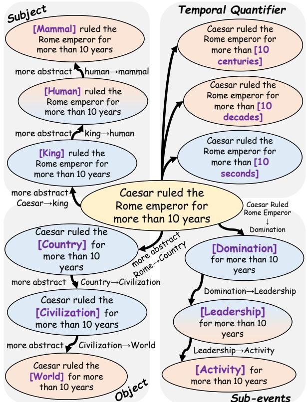
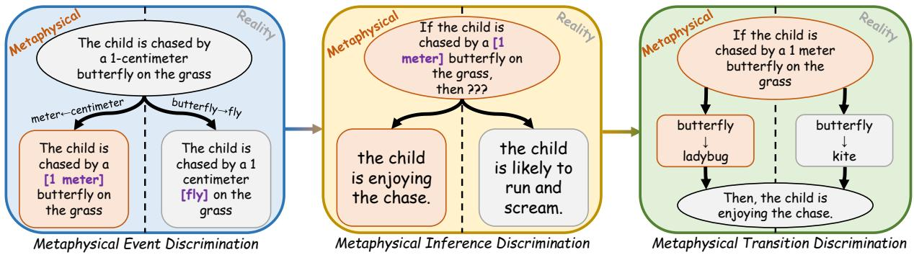
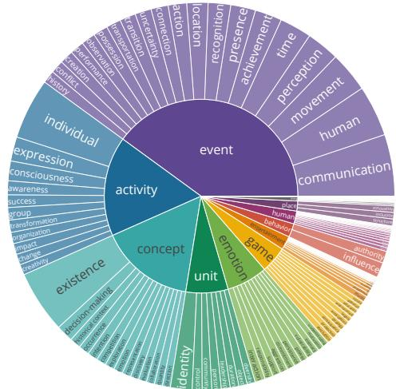
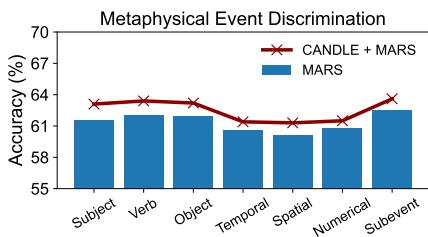
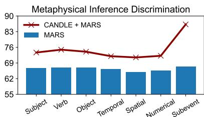
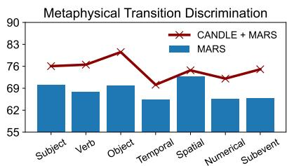
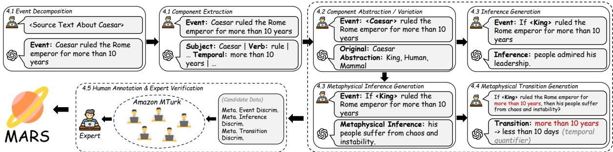
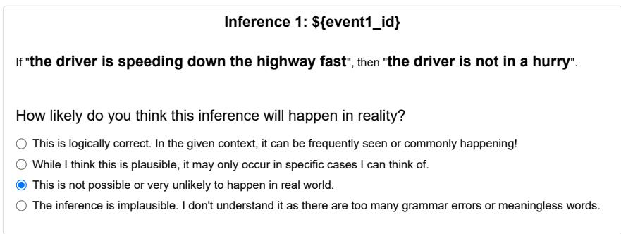

# MARS: Benchmarking the Metaphysical Reasoning Abilities of Language Models with a Multi-task Evaluation Dataset

Weiqi Wang, Yangqiu Song Department of Computer Science and Engineering, HKUST, Hong Kong SAR, China {wwangbw, yqsong}@cse.ust.hk

## Abstract

To enable Large Language Models (LLMs) to function as conscious agents with generalizable reasoning capabilities, it is crucial that they possess the ability to comprehend situational changes (transitions) in distribution triggered by environmental factors or actions from other agents. Despite its fundamental significance, this ability remains underexplored due to the complexity of modeling infinite possible changes in an event and their associated distributions, coupled with the lack of benchmark data with situational transitions. Addressing these gaps, we propose a novel formulation of reasoning with distributional changes as a three-step discriminative process, termed as MetAphysical ReaSoning. We then introduce the first-ever benchmark, MARS, comprising three tasks corresponding to each step. These tasks systematically assess LLMs’ capabilities in reasoning the plausibility of (i) changes in actions, (ii) states caused by changed actions, and (iii) situational transitions driven by changes in action. Extensive evaluations with 20 (L)LMs of varying sizes and methods indicate that all three tasks in this process pose significant challenges, even after fine-tuning. Further analyses reveal potential causes for the underperformance of LLMs and demonstrate that pre-training on largescale conceptualization taxonomies can potentially enhance LMs’ metaphysical reasoning capabilities. Our data and models are publicly accessible at https://github.com/HKUST-KnowComp/MARS.

## 1 Introduction

Recent advances in LLMs have demonstrated superior performance in a variety of reasoning tasks (Liu et al., 2023b; Chan et al., 2024; Ko et al., 2023; Qin et al., 2023; Jain et al., 2023). However, to truly achieve conscious processing (Andreas, 2022), the integration of System II reasoning ability (Sloman, 1996; Kahneman, 2011) is essential as it enables LLMs to perform out-of-distribution generalization when encountered with unfamiliar scenarios (Bengio et al., 2021). Among several components that make up System II reasoning, a critical element of it is the ability to reason with situational changes in distribution, triggered by environmentalfactors and actions by themselves or other agents, when dealing with non-stationarities (Bengio, 2017). It serves as the core ability in planning tasks (Huang et al., 2024), which can be achieved by dynamically recombining existing concepts in the given environment or action and learning from the resultant situational changes (Lake and Baroni, 2018; Bahdanau et al., 2019; de Vries et al., 2019). For instance, in the event that “PersonX is driving a car in a sunny day,” a change in the weather from sunny to rainy could cause a different outcome, such as “PersonX becomes more cautious and drives slower.” This illustrates that a change in weather conditions can lead to a change in the driver’s behavior, which represents an environmental change that triggers situational changes within the distribution of different weathers.

  
Figure 1: Examples of changes in event in our formulation. After changes occur, events may become metaphysical as components are abstracted into high-level concepts, while some remain plausible in reality.

Though fundamental, the exploration of this ability has been limited due to several factors. First, the scope for change within an event is vast, with numerous components capable of altering in a wide variety of ways. This results in an overwhelmingly large number of potential changes that are impossible to fully cover with existing knowledge bases. Second, reasoning with changes in distribution lacks a clear formulation due to its complexity. Unlike one-step inference reasoning tasks (Sap et al., 2019), changes in action may lead to implausible events that cannot occur in reality, thus terminating the reasoning process. Such type of changes require extra care when designing evaluation protocols. Lastly, there is a lack of a reliable evaluation benchmark. Existing benchmarks (Valmeekam et al., 2023; He et al., 2023b) typically focus on a limited number of changes within a few scenarios, thus limiting the coverage of formed distributions. The changes in actions and states are also formulated under planning or logical tasks, which neglect transitions (consequences) caused by changes.

To address these gaps, we take a step forward by formally defining reasoning with changes in distribution as a three-step discriminative process. We start by defining seven categories of changes, each corresponding to different components within an event. To semantically cover more changes in a unified manner, we propose implementing changes by altering each component within the event using their abstractions or numerical variations. This approach creates a hierarchical distribution of various changes, with the abstracted ones offering a more generalized coverage. Inspired by Bengio et al. (2021), we formulate reasoning with changes in distribution as sequentially tasking the model to: (1) assess the plausibility of a potential change in a given event that describes an action, (2) evaluate the plausibility of an inferential state resulting from the modified action, and (3) determine the necessary change in an action to convert an implausible inferential state into a plausible one. We refer to this process as metaphysical reasoning–a term we adopt to describe a mode of reasoning that deals with highly improbable or abstract scenarios distinct from its traditional philosophical meaning or counterfactual reasoning (see Appendix A)–as it also requires models to distinguish implausible actions, states, and transitions that exist only in this abstract “metaphysical” realm, indicating their rare occurrence in reality (Heidegger, 2014).

We then construct the first evaluation benchmark, MARS, featuring 355K annotated data across three tasks corresponding to each step. It is constructed by sequentially instructing an LLM to extract events from Wikitext (Merity et al., 2017) and BookCorpus (Zhu et al., 2015), identify mutable components within each event, generate abstractions and numerical variations for those components, create a metaphysical inference state based on the changes, and generate the necessary modifications to make the metaphysical inference plausible in reality. Large-scale human annotations are then conducted to provide labels of evaluation data entries and verify the quality of our benchmark. Extensive experiments with over 20 (L)LMs demonstrate that all three tasks in this process present significant challenges, even for LMs after fine-tuning. Further analyses reveal potential reasons for such underperformance and identify possible solutions for enhancing the metaphysical reasoning abilities of language models.

## 2 Backgrounds and Related Works

Reasoning about Changes in Distribution. Enabling LMs to understand distributional changes due to localized causal interventions, particularly in semantic spaces, has long been a crucial objective in the pursuit of conscious machine intelligence (Bengio et al., 2019, 2021). Previous works have mainly explored this within the context of discriminating changes between actions and states with methods such as commonsense knowledge injection (Tandon et al., 2018), event calculus (Basina et al., 2022), and fuzzy reasoning (Zhang et al., 2013). Other studies aim to benchmark this reasoning process through logical reasoning tasks (He et al., 2023b) and planning tasks (Valmeekam et al., 2023; Wu et al., 2021). However, these studies only cover changes in limited formats and scenarios and also overlook the significance of representing changes as a distribution in relation to different variables in actions. Such loss restricts the out-ofdistribution generalizability of the resulting LMs when facing unfamiliar scenarios. Moreover, previous evaluations do not cover transitions caused by changes, making subsequent evaluations around reasoning with changes incomplete.

Benchmarking LLMs. The advent of LLMs (OpenAI, 2022, 2023; Touvron et al., 2023b,a; Reid et al., 2024) has sparked various studies in investigating LLM’s potential in a variety of tasks (Chen et al., 2024b,a; Yuan et al., 2024; Chan et al., 2024; Jain et al., 2023; Qin et al., 2023). These studies have significantly contributed to our understanding of LLMs by evaluating their performance across diverse tasks, using different scales of parameters and prompting methods (Qiao et al., 2023). However, there is an absence of a comprehensive benchmark for assessing the ability of (L)LMs to reason with changes in distribution. This inspires us to formally define it and introduce the first benchmark that evaluates such reasoning capabilities of (L)LMs.

## 3 Definitions of Changes in Event and Metaphysical Reasoning

Modeling changes within an event is inherently complex due to the infinite number of changes that can occur. For simplicity, we only consider events that represent an action and study changes between their inferential states. Given an event $e ,$ we first define seven types of changes that could transpire within $e .$ These changes are represented as components of the event, including its subject s, verb v, object $^ { O , }$ temporal quantifier t, spatial quantifier $l ,$ numerical properties $n ,$ and sub-events $s e .$ The original event is denoted as a function of these seven components, $e \ = \ f ( s , v , o , t , l , n , s e )$ . A change in the event can be represented by altering one of its components, for instance, $e ^ { \prime } = f ( s ^ { \prime } , v , o , t , l , n , s e )$ if the change impacts the subject $s ^ { \prime }$

To effectively model the distribution of changes across different types of components, we leverage two types of hierarchical formulations. Specifically, for s, v, o, se, we define changes in these components as conceptualizing their original instance into three concepts with progressively increased abstractedness (Giunchiglia and Walsh, 1992; Tenenbaum et al., 2011). For $t , l , n$ , we define their changes as modifications from their original values to three distinct numerical or spatial values with progressively increased units. This brings a hierarchical structure to changes of a certain component, forming a distribution that gradually covers more possible changes. Abstracted components, as high-level concepts, can semantically represent a broader range of combinations for altering an event. Some running examples of how changes impact an action are shown in Figure 1. We then propose a three-step discriminative process, which we term as Metaphysical Reasoning (see Appendix A), to formulate reason with changes in distribution. The three steps, as shown in Figure 2, are:

(1) Metaphysical Event Discrimination: The first step answers the question, “Will the change happen in reality?” It aims to determine the plausibility of a change based on a given event, as alterations in components may lead to implausible events that defy reality. We refer to such an event, which rarely occurs in reality due to these changes, as a metaphysical event. The goal of the first task is to discriminate whether the modified event $e ^ { \prime } { \mathrm { , } }$ conditioned on the original event e with a single altered component $c \in ( s , v , o , t , l , n , s e )$ , is metaphysical or not by making a binary prediction.

(2) Metaphysical Inference Discrimination: Considering that distributional changes occur in nonstationary environments, a conscious agent should be able to predict the potential outcomes of the modified event for future reasoning scenarios. Therefore, the second step aims to answer the question, “What will the altered event result in?” Similarly, we term the inferences of an event that rarely occurs in reality as metaphysical inference. The objective of the second task is to determine whether an inferential state $i ,$ triggered by the altered event $e ^ { \prime } ,$ is metaphysical or not by predicting a binary answer. Note that $e ^ { \prime }$ could be either metaphysical or not, as inferences in both cases can be evaluated.

(3) Metaphysical Transition Reasoning: Finally, with some inferences remain metaphysical, a conscious agent should be able to plan what change is necessary to make such inference plausible in reality. This completes the reasoning chain by covering the feasibility, consequence, and motivation of distributional changes. Thus, the last task answers the question, “What change is needed to make a metaphysical inference plausible?” We refer to this as metaphysical transition reasoning and set the objective as to determine whether another change, denoted as $c ^ { \prime } ,$ , can make a metaphysical inference i plausible in relation to a changed event $e ^ { \prime }$ by making a binary prediction regarding $c ^ { \prime } .$

  
Figure 2: The three steps in metaphysical reasoning. Our motivation behind this is that, by conquering all steps sequentially, a conscious agent could answer: (1) Will the change occur in reality? (2) What will the change cause? (3) What change can make a metaphysical (desired) inference plausible?

## 4 MARS Benchmark Curation Pipeline

We then introduce our sequential pipeline for curating the MARS benchmark. An overview of our curation pipeline is shown in Appendix Figure 5. To guarantee a comprehensive coverage of events across various domains and topics, we source original text from two publicly available large corpora: Wikitext (Merity et al., 2017) and BookCorpus (Zhu et al., 2015). We filter out noisy text that includes hashtags and hyperlinks and segment long text into sentences with no more than 200 tokens to facilitate future processing.

## 4.1 Text Decomposition and Extraction

We first perform text decomposition (Ye et al., 2023; Jhamtani et al., 2023) to break down lengthy text into semantically complete short events, which are then used for fine-grained component extraction. To enable large-scale processing, we use Chat-GPT (OpenAI, 2022), a powerful LLM with strong text understanding abilities, as the core processor for all stages. For each stage, we guide it with a few-shot prompt (West et al., 2022; Brown et al., 2020) by creating task-specific explanations and exemplars (detailed prompts are in Appendix B):

$$
\begin{array} { r l } & { < { \mathsf { T A S K } } { \mathsf { - P R o M P T } } > } \\ & { < { \mathsf { I N P U T } } _ { 1 } { \mathsf { > < O U T P U T } } _ { ( 1 , 1 ) } { \mathsf { > } } \ \dotsc \ < { \mathsf { O U T P U T } } _ { ( 1 , N _ { 1 } ) } > } \\ & { < { \mathsf { I N P U T } } _ { 2 } { \mathsf { > < O U T P U T } } _ { ( 2 , 1 ) } > \ \dotsc \ < { \mathsf { O U T P U T } } _ { ( 2 , N _ { 2 } ) } > } \\ & { \ \dotsc } \\ & { < { \mathsf { I N P U T } } _ { 1 0 } > < { \mathsf { O U T P U T } } _ { ( 1 0 , 1 ) } > \ \dotsc \ < { \mathsf { O U T P U T } } _ { ( 1 0 , N _ { 1 0 } ) } > } \\ & { < { \mathsf { I N P U T } } _ { 1 1 } > } \end{array}
$$

To perform text decomposition, <TASK-PROMPT> clarifies the goal to ChatGPT, which involves extracting semantically complete actions from the given text. <INPUT1 $_ { \cdot 1 0 } >$ and ${ < } 0 \mathsf { U T P U T _ { 1 - 1 0 } > }$ are filled with 10 pairs of human-crafted examples, each containing several action events extracted from text sampled from Wikitext and BookCorpus. ChatGPT is expected to learn from these examples and use them as a guide to extract action events $( < 0 \mathsf { U T P U T } _ { ( 1 1 , 1 - N ) } > )$ from the final input text $( < \mathtt { I N P U T } _ { 1 1 } > )$ . For component extraction, we adjust <TASK-PROMPT> to define the task of extracting the seven components from a given event. We populate ${ \bf \langle { I N P U T _ { 1 - 1 0 } } > }$ and ${ < } 0 \mathsf { U T P U T _ { 1 - 1 0 } > }$ with 10 pairs of events and seven comma-separated lists of components extracted from the event, each corresponding to one type of components defined in §3. ChatGPT then extracts seven lists of components for the final given event $( < \mathtt { I N P U T } _ { 1 1 } > )$ . If any type of component is absent, “None” will be generated instead.

## 4.2 Component Abstraction and Variation

The next step is designed to implement changes within the event by altering its components, extracted from the previous step, by generating their abstractions or numerical variations. Following Wang et al. (2024b), we guide ChatGPT by modifying <TASK-PROMPT> with the objective of generating abstract concepts for $s , v , o ,$ se and numerical variations for t, l, n within a specified event. For each ${ \bf \langle { I N P U T _ { 1 - 1 0 } } > }$ and ${ < } 0 \mathsf { U T P U T _ { 1 - 1 0 } > }$ pair, we populate the input with a specific event and one of its components. The output consists of three human-authored component abstractions or numerical variations that align with the event’s context. Subsequently, ChatGPT is tasked with generating three abstractions or numerical variations for the final pair of the given event and a component within the event $( < \mathtt { I N P U T } _ { 1 1 } > )$ . Replacing the original components in the event with their generated changes forms changed event candidates for the metaphysical event discrimination task.

<table><tr><td>Dataset / Task</td><td>#Text</td><td>#Event</td><td>#Avg.Token</td><td>#Train</td><td>#Dev</td><td>#Test</td><td>#Total.</td><td>#Unlabel.</td><td>Expert.</td></tr><tr><td>AbsATM (He et al., 2024)</td><td>N/A</td><td>7,196</td><td>1.060</td><td>107,384</td><td>12,117</td><td>11,503</td><td>131,004</td><td>372,584</td><td>N/A</td></tr><tr><td>AbsPyramid (Wang et al., 2024d)</td><td>N/A</td><td>16,944</td><td>1.690</td><td>176,691</td><td>22,050</td><td>22,056</td><td>220,797</td><td>0</td><td>N/A</td></tr><tr><td>Meta. Event.</td><td>9,998</td><td>55,190</td><td>1.040</td><td>96,004</td><td>12,013</td><td>11,982</td><td>119,999</td><td>329,540</td><td>94.0%</td></tr><tr><td>AbsATM (He et al., 2024)</td><td>N/A</td><td>7,196</td><td>6.413</td><td>65,386</td><td>8,403</td><td>7,408</td><td>81,197</td><td>5,921,195</td><td>N/A</td></tr><tr><td>Meta. Inference.</td><td>9,837</td><td>35,528</td><td>10.40</td><td>96,009</td><td>12,010</td><td>11,981</td><td>120,000</td><td>497,590</td><td>96.5%</td></tr><tr><td>Propara (Dalvi et al., 2018)</td><td>9,051</td><td>9,051</td><td>N/A</td><td>7,043</td><td>913</td><td>1,095</td><td>9,051</td><td>0</td><td>N/A</td></tr><tr><td>TRAC (He et al., 2023b)</td><td>15,000</td><td>15,000</td><td>N/A</td><td>10,000</td><td>2,000</td><td>3,000</td><td>15,000</td><td>0</td><td>N/A</td></tr><tr><td>PlanBench (Valmeekam et al., 2023)</td><td>26,250</td><td>26,250</td><td>N/A</td><td>0</td><td>0</td><td>26,250</td><td>26,250</td><td>0</td><td>N/A</td></tr><tr><td></td><td></td><td></td><td></td><td></td><td></td><td></td><td></td><td></td><td></td></tr><tr><td>Meta. Transition.</td><td>9,677</td><td>31,447</td><td>1.810</td><td>92,495</td><td>11,563</td><td>11,560</td><td>115,618</td><td>273,474</td><td>93.5%</td></tr></table>

Table 1: Statistics of the MARS benchmark in comparison against other benchmarks. Meta. refers to three tasks in MARS. Expert. refers to expert verification results.

## 4.3 Inference Generation

We then collect inferential states of the modified events by similarly instructing ChatGPT to autonomously generate them. For each altered event, we prompt ChatGPT to separately generate one plausible inference and one metaphysical inference. We first modify <TASK-PROMPT> to generate a state that could potentially be caused by the altered event, and populate ${ \bf \langle { I N P U T _ { 1 - 1 0 } } > }$ with 10 modified events and ${ < } 0 \mathsf { U T P U T _ { 1 - 1 0 } > }$ with 10 corresponding plausible inferences authored by human experts. ChatGPT is then requested to generate an additional plausible state inference for the given changed event $( < \mathtt { I N P U T } _ { 1 1 } > )$ . Next, we adjust <TASK-PROMPT> to generate a metaphysical state that is infrequently caused by the changed event in reality, yet remains contextually relevant. We replace <OUTPUT1 $_ { - 1 0 } >$ with 10 metaphysical inferences and then collect a metaphysical inference from ChatGPT. This, along with the generated plausible inference, forms two candidate data entries for each changed event in the metaphysical inference discrimination task.

## 4.4 Metaphysical Transition Generation

Given that half of the inferential states generated in the previous step remain metaphysical, we then collect the additional changes necessary to transform these states into plausible real-world inferences. We adjust the <TASK-PROMPT> to describe such required changes and populate ${ \bf \langle { I N P U T _ { 1 - 1 0 } } > }$ with 10 pairs of modified events and their corresponding metaphysical inferences. ${ < } 0 \mathsf { U T P U T _ { 1 - 1 0 } > }$ are filled with 10 corresponding human-authored changes in events that can render the inferences plausible. Subsequently, ChatGPT generates the required change for the final pair of the modified event and its metaphysical inference $( < \mathtt { I N P U T } _ { 1 1 } > )$ Note that the generated change still needs to be one of the seven types we defined in §3. We collect one additional change for each metaphysical inference and use it as a candidate data entry for the last task. However, we discard event and inference pairs that ChatGPT deems impossible to render plausible, even with an additional change.

  
Figure 3: Hypernym distribution of the top 5,000 popular component variations.

## 4.5 Human Annotations

Annotation: Finally, we carry out large-scale human annotations to label candidate data for each task via Amazon Mechanical Turk (AMT). We provide detailed instructions with examples to qualified workers and task them with annotating (1) the plausibility of the changed events generated in §4.2, (2) the plausibility of the plausible/metaphysical inferences produced in §4.3, and (3) the plausibility of the transitions generated in §4.4. We collect five votes for each entry and the majority vote is used as the final label. The overall inter-annotator agreement (IAA) is 81% in terms of pairwise agreement, and the Fleiss Kappa (Fleiss, 1971) is 0.56, indicating sufficient agreement (see Appendix D). Expert Verification: To verify the quality of our collected labels, we recruit three postgraduate students with rich experience in NLP to perform a second round annotation. Each of them is asked to annotate a sample of 100 data entries for each task, following the same instructions provided to the AMT annotators. Results in Table 1 show that, on average, 93.67% labels collected from human annotations align with the expert’s vote, demonstrating the reliability of our collected labels.

## 5 Evaluations and Analysis

## 5.1 MARS Statistics

Table 1 presents statistics of the MARS benchmark, which comprises a total of 355,617 annotated data distributed across three tasks. We partition the annotated data into training, development, and testing splits following an 8:1:1 ratio, ensuring there is no overlap of text and events between the different splits to preserve the evaluation’s generalizability. On average, 1.04 tokens are generated to describe changes in action for the metaphysical event and transition discrimination tasks, while 10.4 tokens are used for inferences in the metaphysical inference discrimination task. To the best of our knowledge, we are the first in proposing such a triad of tasks concurrently within a single benchmark. To compare MARS with other datasets, we select those with analogous task objectives for each task and compare them individually. We find MARS tends to be significantly larger than other benchmarks, covering a broader range of events and providing training sets for evaluating the performance of finetuned models. To further illustrate the diverse coverage of events and changes in MARS, we match each component variation against hypernyms in Probase (Wu et al., 2012) and plot their distribution according to their number of occurrences in Figure 3. Our results indicate that MARS covers over 170,000 hypernyms in Probase, spanning broad categories such as event, activity, concept, unit, etc.

## 5.2 Main Evaluations on MARS

## 5.2.1 Task Setup and Model Selections

We then experiment with a selection of (L)LMs to investigate their performances on our curated MARS benchmark. Accuracy, AUC, and Macro-F1 scores are used as evaluation metrics.

The evaluation of different models are categorized into three types: (1) ZERO-SHOT: We first evaluate several (L)LMs in a zero-shot manner. For small-sized Pre-Trained Language Models (PTLMs), we evaluate DeBERTa-v3 (He et al., 2023a), GPT2 (Radford et al., 2019), CAR (Wang et al., 2023a), CANDLE (Wang et al., 2024b), and VERA (Liu et al., 2023a), following the design of zero-shot question answering (Ma et al., 2021). For LLMs, we evaluate LLaMa2, LLaMa3, LLaMa3.1 (Touvron et al., 2023a,b; Dubey et al., 2024), Gemma (Mesnard et al., 2024), Falcon (Almazrouei et al., 2023), and Mistral (Jiang et al., 2023) using direct zero-shot prompting (Qin et al., 2023). (2) FINETUNING: We then assess the performance of (L)LMs when fine-tuned on the training set of MARS. For PTLMs, we fine-tune DeBERTa, GPT2-xl, and VERA. For LLMs, we fine-tune LLaMa2, LLaMa3, Gemma, and Mistral using LoRA (Hu et al., 2022). (3) LLM API: Finally, we evaluate the performance of GPT-4 (OpenAI, 2023) and GPT-4o-mini (OpenAI, 2024), which represent proprietary LLMs, under zero-shot, five-shots, Chain-of-Thought prompting (COT; Wei et al., 2022), and Self-Consistent COT (SC-COT; Wang et al., 2023c) settings. For LLaMa3.1-70B and GPT-4o-mini, we also test their performances with RAG (Gao et al., 2023), Multiagent Calibration (Yang et al., 2024), and Self Reflection (Pan et al., 2024). Please find implementation details in Appendix C, multi-task fine-tuning experiments in Appendix E.1, and few-shot finetuning experiments in Appendix E.2.

## 5.2.2 Results and Analysis

Evaluation results are reported in Table 2. From the results, we observe that: (1) Most models exhibit subpar performance under the zero-shot setting. Among PTLMs, only VERA delivers acceptable results across all three tasks, while the rest significantly underperform. Though models fine-tuned on commonsense knowledge and conceptualizations, such as CAR and CANDLE, show some improvement compared to their DeBERTav3-Large backbone, these performances are still unsatisfactory, even falling below the level of majority voting. For LLMs, improving training paradigms and increasing the number of parameters can indeed help achieve better performance. Nevertheless, all models perform poorly across all tasks in MARS, emphasizing the difficulty of our tasks. (2) Fine-tuning only offers limited benefits. With fine-tuning, all models improve significantly. For example, DeBERTa-Large’s accuracy increases by 16.18%, 21.84%, and 22.2% on three tasks, respectively. However, the best results for all tasks are still capped at around 74%, indicating a shared difficulty and significant room for future enhancements. One potential reason for this is that, since we split the data according to the source of text in Wikitext and BookCorpus, the distribution between different splits may differ significantly, as the domain and topics could be diverse from each other. We also discuss the reasons for PTLMs’ strong performance compared to LLMs after fine-tuning in Appendix E.3. (3) The GPT series models underperform compared to other LLMs, and COT does not consistently aid performance. Surprisingly, GPT series models fall short when compared to open LLMs, such as LLaMa-3-70B. One possible explanation is that negative examples in MARS are sourced from ChatGPT’s generation and are obtained via post-human annotation. This makes it challenging to discriminate as these negative examples contradict GPT’s internal knowledge. Advanced prompting methods only offer limited improvement in performances.

<table><tr><td rowspan="2">Methods</td><td rowspan="2">Backbone</td><td colspan="3">Event</td><td colspan="3">Inference</td><td colspan="3">Transition</td></tr><tr><td>Acc</td><td>AUC</td><td>Ma-F1</td><td>Acc</td><td>AUC</td><td>Ma-F1</td><td>Acc</td><td>AUC</td><td>Ma-F1</td></tr><tr><td>Random Majority</td><td></td><td>50.00 60.98</td><td></td><td>49.56 37.99</td><td>50.00 58.56</td><td></td><td>49.56 36.93</td><td>50.00 50.25</td><td></td><td>49.56 33.37</td></tr><tr><td rowspan="5"></td><td>DeBERTa-Base 214M</td><td>60.55</td><td>49.41</td><td>42.89</td><td>50.10</td><td>47.57</td><td>48.96</td><td>49.05</td><td>41.32</td><td>33.19</td></tr><tr><td>DeBERTa-Large 435M</td><td>48.27</td><td>49.88</td><td>45.87</td><td>47.73</td><td>49.94</td><td>44.44</td><td>50.73</td><td>46.96</td><td>46.15</td></tr><tr><td>GPT2-XL 1.5B</td><td>38.62</td><td>51.12</td><td>27.93</td><td>44.40</td><td>51.88</td><td>31.45</td><td>49.92</td><td>48.35</td><td>48.09</td></tr><tr><td>CAR 435M</td><td>54.63</td><td>49.34</td><td>49.96</td><td>48.33</td><td>42.85</td><td>41.93</td><td>52.97</td><td>35.05</td><td>46.94</td></tr><tr><td>CANDLE 435M</td><td>51.90</td><td>49.12</td><td>50.30</td><td>46.77</td><td>44.03</td><td>38.48</td><td>53.49</td><td>34.95</td><td>47.95</td></tr><tr><td rowspan="5">PTLM (Fine-tuned)</td><td>VERA 11B</td><td>51.82</td><td>50.48</td><td>48.52</td><td>60.97</td><td>62.54</td><td>59.09</td><td>61.31</td><td>66.32</td><td>61.17</td></tr><tr><td>DeBERTa-Base 214M</td><td>63.82</td><td>63.98</td><td>63.39</td><td>69.50</td><td>70.59</td><td>69.31</td><td>71.96</td><td>73.85</td><td>71.17</td></tr><tr><td>DeBERTa-Large 435M</td><td>64.45</td><td>64.16</td><td>63.27</td><td>69.57</td><td>71.15</td><td>69.33</td><td>72.93</td><td>74.00</td><td>72.01</td></tr><tr><td>GPT2-XL 1.5B</td><td>46.68</td><td>47.63</td><td>46.96</td><td>43.70</td><td>44.22</td><td>30.41</td><td>44.57</td><td>45.03</td><td>45.89</td></tr><tr><td>VERA 11B</td><td>61.95</td><td>61.43</td><td>60.81</td><td>63.90</td><td>66.93</td><td>70.84</td><td>71.75</td><td>74.57</td><td>73.27</td></tr><tr><td rowspan="10">LLM (Zero-shot)</td><td>Meta-LLaMa-2-7B</td><td>50.64</td><td></td><td>41.41</td><td>49.87</td><td></td><td>49.23</td><td>50.94</td><td></td><td>50.64</td></tr><tr><td>Meta-LLaMa-2-13B</td><td>51.50</td><td></td><td>49.48</td><td>50.81</td><td></td><td>50.57</td><td>50.81</td><td></td><td>50.80</td></tr><tr><td>Meta-LLaMa-2-70B</td><td>52.40</td><td></td><td>49.03</td><td>56.13</td><td></td><td>46.81</td><td>48.45</td><td></td><td>48.34</td></tr><tr><td>Meta-LLaMa-3-8B</td><td>50.62</td><td></td><td>49.12</td><td>51.33</td><td></td><td>50.98</td><td>51.95</td><td></td><td>51.07</td></tr><tr><td>Meta-LLaMa-3-70B</td><td>57.41</td><td></td><td>50.59</td><td>63.40</td><td></td><td>61.82</td><td>60.15</td><td></td><td>60.01</td></tr><tr><td>Meta-LLaMa-3.1-8B</td><td>51.01</td><td></td><td>50.27</td><td>52.13</td><td></td><td>51.29</td><td>52.35</td><td></td><td>52.09</td></tr><tr><td>Meta-LLaMa-3.1-70B</td><td>59.22</td><td></td><td>52.08</td><td>63.61</td><td></td><td>61.90</td><td>61.28</td><td></td><td>61.03</td></tr><tr><td>+RAG</td><td>61.21</td><td></td><td>54.51</td><td>66.38</td><td></td><td>65.90</td><td>61.53</td><td></td><td>61.22</td></tr><tr><td>+Multi-Agent</td><td>56.12</td><td></td><td>51.08</td><td>65.06</td><td></td><td>65.01</td><td>62.54</td><td></td><td>62.19</td></tr><tr><td>+Self-reflection</td><td>57.94</td><td></td><td>53.17</td><td>63.91</td><td></td><td>63.51</td><td>60.92</td><td></td><td>60.77</td></tr><tr><td>Meta-LLaMa-3.1-405B</td><td>60.01</td><td></td><td>52.99</td><td>64.52</td><td></td><td>63.23</td><td>61.74</td><td></td><td>61.76</td></tr><tr><td>Gemma-2-9B</td><td>56.88</td><td></td><td>48.53</td><td>51.83</td><td></td><td>51.76</td><td>49.41</td><td></td><td>45.01</td></tr><tr><td>Falcon-7B</td><td>54.32</td><td></td><td>49.51</td><td>51.77</td><td></td><td>50.30</td><td>50.42</td><td></td><td>49.02</td></tr><tr><td>Falcon-40B</td><td>52.35</td><td></td><td>50.36</td><td>49.67</td><td></td><td>49.38</td><td>50.27</td><td></td><td>50.22</td></tr><tr><td>Mistral-7B</td><td>49.90</td><td></td><td>48.94</td><td>50.23</td><td></td><td>50.06</td><td>51.75</td><td></td><td>51.75</td></tr><tr><td rowspan="5">LLM</td><td>Meta-LLaMa-2-7B Meta-LLaMa-2-13B</td><td>60.10</td><td>59.90</td><td>59.00</td><td>63.51</td><td>66.44</td><td>62.55</td><td>66.06</td><td>70.38</td><td>65.12</td></tr><tr><td>Meta-LLaMa-3-8B</td><td>60.67</td><td>60.64</td><td>60.00</td><td>64.61</td><td>67.67</td><td>63.59</td><td>68.22</td><td>72.19</td><td>66.37</td></tr><tr><td>Gemma-2-9B</td><td>60.06</td><td>60.54 61.25</td><td>59.58</td><td>65.76</td><td>67.88</td><td>65.72</td><td>69.83</td><td>74.59</td><td>68.74</td></tr><tr><td>Mistral-7B</td><td>61.23 60.35</td><td>60.77</td><td>60.28</td><td>69.24</td><td>70.76</td><td>69.00 65.95</td><td>73.30 71.87</td><td>76.91</td><td>69.18</td></tr><tr><td></td><td></td><td></td><td>60.07</td><td>66.91</td><td>70.06</td><td></td><td></td><td>75.47</td><td>68.53</td></tr><tr><td rowspan="8">LLM (API)</td><td>GPT4</td><td>53.90</td><td></td><td>53.45</td><td>51.20</td><td></td><td>50.95</td><td>49.41</td><td></td><td>49.33</td></tr><tr><td>GPT4 (5-shots) GPT4 (COT)</td><td>49.85</td><td></td><td>49.58</td><td>51.47</td><td></td><td>51.30</td><td>48.88</td><td></td><td>48.73</td></tr><tr><td>GPT4 (SC-COT)</td><td>51.28 51.97</td><td></td><td>50.73</td><td>51.49</td><td></td><td>51.35</td><td>47.62 48.24</td><td></td><td>47.58 48.11</td></tr><tr><td></td><td></td><td></td><td>51.26</td><td>52.05</td><td></td><td>52.27</td><td></td><td></td><td></td></tr><tr><td>GPT-4o-mini</td><td>57.94</td><td></td><td>57.91</td><td>53.84</td><td></td><td>53.53</td><td>48.06</td><td></td><td>48.06</td></tr><tr><td>+RAG +Multi-Agent</td><td>59.99 54.21</td><td></td><td>59.97 53.17</td><td>54.54 52.76</td><td></td><td>54.21 52.26</td><td>49.39 46.94</td><td></td><td>49.19 46.70</td></tr></table>

Table 2: Evaluation results (%) of various language models on the testing sets of MARS. The best performances within each method are underlined and the best among all methods are bold-faced.

## 5.3 Analysis

## 5.3.1 Transferring from Conceptualization

Improving the performance of LLMs on MARS requires extensive fine-tuning on large-scale humanannotated data, making it non-trivial. Since we observe that approximately 80% of action changes are executed by modifying a component along with its abstracted concepts (see Table 5), we first study whether exposing LLMs to more conceptualizations and abstract knowledge can enhance their metaphysical reasoning capabilities. For this purpose, we select CANDLE (Wang et al., 2024b) as the knowledge source, which is an automatically constructed knowledge base containing 382K conceptualizations of events and abstract inferential knowledge. We first convert eventconceptualization pairs into the task format of metaphysical event discrimination and reformat commonsense inferential knowledge to align with the objectives of the metaphysical inference and transition discrimination tasks. More details are in Appendix C.2.

<table><tr><td rowspan="2">Backbone</td><td rowspan="2">Training Data</td><td colspan="3">Event</td><td colspan="3">Inference</td><td colspan="3">Transition</td></tr><tr><td>Acc</td><td>AUC</td><td>Ma-F1</td><td>Acc</td><td>AUC</td><td>Ma-F1</td><td>Acc</td><td>AUC</td><td>Ma-F1</td></tr><tr><td rowspan="4">DeBERTa 435M</td><td>Zero-shot</td><td>58.27</td><td>49.88</td><td>45.87</td><td>47.73</td><td>49.94</td><td>44.44</td><td>50.73</td><td>46.96</td><td>46.15</td></tr><tr><td>CANDLE</td><td>57.94</td><td>58.22</td><td>57.31</td><td>59.43</td><td>59.03</td><td>58.18</td><td>62.00</td><td>62.19</td><td>61.50</td></tr><tr><td>MARS</td><td>64.45</td><td>64.16</td><td>63.27</td><td>69.57</td><td>71.15</td><td>69.33</td><td>72.93</td><td>74.00</td><td>72.01</td></tr><tr><td>CANDLE + MARS</td><td>64.95</td><td>64.27</td><td>63.74</td><td>71.85</td><td>73.32</td><td>71.64</td><td>74.39</td><td>77.97</td><td>73.30</td></tr><tr><td rowspan="4">VERA 11B</td><td>Zero-shot</td><td>41.82</td><td>50.48</td><td>38.52</td><td>60.97</td><td>62.54</td><td>59.09</td><td>61.31</td><td>66.32</td><td>61.17</td></tr><tr><td>CANDLE</td><td>57.81</td><td>57.24</td><td>56.77</td><td>56.59</td><td>56.08</td><td>55.25</td><td>59.79</td><td>59.88</td><td>59.19</td></tr><tr><td>MARS</td><td>61.95</td><td>61.43</td><td>60.81</td><td>63.90</td><td>66.93</td><td>70.84</td><td>71.75</td><td>74.57</td><td>73.27</td></tr><tr><td>CANDLE + MARS</td><td>62.21</td><td>61.77</td><td>61.17</td><td>71.45</td><td>74.46</td><td>67.61</td><td>73.95</td><td>77.35</td><td>78.26</td></tr><tr><td rowspan="4">LLaMa-3 8B</td><td>Zero-shot</td><td>50.62</td><td></td><td>49.12</td><td>51.33</td><td></td><td>50.98</td><td>51.95</td><td></td><td>51.07</td></tr><tr><td>CANDLE</td><td>56.47</td><td>56.75</td><td>56.07</td><td>58.29</td><td>57.81</td><td>57.00</td><td>58.74</td><td>58.81</td><td>58.19</td></tr><tr><td>MARS</td><td>60.06</td><td>60.54</td><td>59.58</td><td>65.76</td><td>67.88</td><td>65.72</td><td>69.83</td><td>74.59</td><td>68.74</td></tr><tr><td>CANDLE + MARS</td><td>60.93</td><td>60.80</td><td>60.12</td><td>69.13</td><td>70.84</td><td>72.12</td><td>74.09</td><td>79.38</td><td>71.42</td></tr></table>

Table 3: Evaluation results (%) of transfering knowledge from CANDLE to aid MARS. The best performances among each method is underlined and best ones among all methods are bold-faced.

Three backbone models are then fine-tuned separately on CANDLE and MARS. Another group is sequentially fine-tuned on CANDLE and then on MARS. All models are then evaluated on the testing set of MARS, with the results reported in Table 3. From the results, a significant improvement is observed across all tasks when the models are sequentially fine-tuned on CANDLE and MARS, compared to solely fine-tuning on CANDLE or MARS.

These findings indicate that the transfer of conceptualizations and abstract knowledge from CAN-DLE effectively enhances the performance of LMs in metaphysical reasoning tasks. Since CANDLE is constructed by distilling from an LLM without human labor, this opens up a scalable and costefficient approach to improving the metaphysical reasoning capabilities of LLMs.

## 5.3.2 Impact of Component Types

We then analyze the performance of LLMs on each component type to understand the reasons for their subpar performance. We select LLaMa-3-8B as the representative model and compare its accuracy on each component type when fine-tuned on MARS and CANDLE + MARS. The results are illustrated in Figure 4. We observe that while pre-training the model on CANDLE consistently enhances performance, LLaMa3 still struggles when reasoning with changes in spatial quantifiers, temporal quantifiers, and numerical properties. This is in line with recent studies that demonstrate weaknesses in temporal and numerical reasoning for LLMs (Tan et al., 2023; Shi et al., 2023). Another possible reason is that since CANDLE only contains conceptualizations for subjects, verbs, objects, and sub-events in social events, pre-training models on it cannot provide benefits for the aforementioned aspects of change. Moreover, we only observe limited improvement for the metaphysical event discrimination task. Future works could focus on how to further enhance LLM’s metaphysical reasoning capabilities in these weaker dimensions.

## 5.3.3 Error Analysis of GPT-Series Models

Finally, we select GPT4 as a representative model and conduct a manual analysis to identify the causes of errors by categorizing the mistakes found in their COT responses. We sample 150 COT responses from each task, all of which result in inconsistent results compared to human annotated labels and present our classifications of these errors as follows: (1) Hallucinations: 41.7% of errors are caused by factual or metaphysical hallucinations by GPT4, where it creates a context that accommodates changes in actions and inferences that are not mentioned in the original text. For instance, in the event “The poet enjoys writing poems about western festivals,” GPT4 incorrectly interprets the poet as Du Fu. This leads to a conflict when reasoning about his life and the subsequent inference “He was famous in the west,” resulting in faulty reasoning. (2) Confusion between Concepts and Hypernyms: 36.3% errors are attributed to GPT4’s tendency to perceive abstract components within changed actions as hypernyms that fulfill the change, without considering all potential entities within the original concept. For instance, in a modified event, “He jumps down from very high altitude and lands peacefully,” GPT4 interprets very high altitude as a diving platform, deeming it plausible. However, this concept could also encompass high buildings, which would not be suitable for the event. (3) Internal Conflict: 17.7% errors are attributed to internal conflicts within GPT4’s reasoning rationales, as well as inconsistencies between the binary predictions made and the corresponding reasoning rationales. (4) Annotation Error: 4.3% errors are erroneously identified due to incorrect labels, potentially caused by spamming or a misunderstanding of the task by human annotators.

  
Figure 4: Performances by component types of fine-tuned LLaMa3-8B on three tasks of MARS.

## 6 Conclusions

In conclusion, this paper proposes Metaphysical Reasoning to delineate the process of reasoning with changes in distribution and construct MARS as the associated evaluation benchmark in a non-trivial manner. Our experiments show the challenge of our task, which advanced prompting and fine-tuning can’t easily solve. Analysis reveals why LMs struggle with metaphysical reasoning and suggests a possible improvement. We hope to illuminate the path toward achieving conscious processing in LLMs through System II reasoning by effectively comprehending changes in distribution.

## Limitations

Though we consider our work to be a fundamental step towards understanding the capabilities of LMs in reasoning with changes in distribution, we do acknowledge that several limitations still exist that just cannot be covered within one single work. Here, we discuss some important limitations that future works can address:

(1) Include more types of changes in our current formulation. In our work, we primarily focus on seven types of changes, covering the subject, verb, object, spatial quantifier, temporal quantifier, numerical properties, and sub-events of the event. While these seven types encompass most of the potential changes, there are other uncovered components within an event that can be impacted by changes, such as adjectives, adverbs, and prepositional phrases. Nevertheless, our flexible and automated benchmark curation pipeline, empowered by an LLM, allows for future research to extend the benchmark to cover a broader range of component types.

(2) Reliance of LLM on benchmark curation. Our data construction process relies significantly on ChatGPT, an expensive and proprietary language model used for data collection, as well as human annotation for data verification. In Appendix B.3, we discussed the feasibility of leveraging open-sourced LLM as a replacement to Chat-GPT to reduce cost and promote reproducibility. Future research could also consider utilizing robust open-source language models (Reid et al., 2024) and general statement plausibility estimators (Liu et al., 2023a) to replace these methods.

(3) Solution and Downstream Applications of Metaphysical Reasoning. While this paper establishes a comprehensive evaluation benchmark for metaphysical reasoning, we leave the exploration of a practical solution to aid LLMs in solving metaphysical reasoning tasks, as well as the potential benefits of utilizing metaphysical reasoning for downstream tasks into future works. These tasks may include planning (Yuan et al., 2023; Ouyang and Li, 2023) or reasoning with changes (He et al., 2023b).

## Ethics Statement

Offensive Content Elimination. Our benchmark curation pipeline, which involves generating content with ChatGPT, necessitates stringent measures to ensure the absence of offensive content in both the prompts and the generated responses. For this purpose, we apply two strategies to eliminate offensive content. First, we use the highest level of Azure AI Content Safety Filter to filter out any content that contains personal privacy, promotes violence, racial discrimination, hate speech, sexual content, or self-harm. If any such unsafe content is detected in the prompts or generated responses, it automatically triggers a system failure, which prevents the inclusion of such data in our dataset. Second, we manually inspect a random sample of 500 data entries from three tasks in MARS for offensive content. Based on our annotations, we have not detected any offensive content. We thus believe that our dataset is safe and will not yield any negative societal impact.

Licenses. We will share our code and models under the MIT license, thereby granting other researchers free access to our assets for research purposes. Other datasets used in this paper, including Wikitext and Bookcorpus, are shared under the CC-SA license, permitting us to use them for research. As for language models, we access all open-source LMs via the Huggingface Hub (Wolf et al., 2020). All associated licenses permit user access for research purposes, and we have agreed and committed to follow all terms of use.

Annotations. We conduct large scale human annotations on the Amazon Mechanical Turk (AMT) platform. We invite annotation workers from the US, Europe, and India due to their proficiency in English. The annotators are paid on average at an hourly rate of 19 USD, which is comparable to the minimum wages in the US. The selection of these annotators is solely based on their performance on the evaluation set, and we do not collect any personal information about the participants from AMT. For expert verifications, we have secured IRB approval and support from our institution’s department, which allows us to invite expert graduate students to validate the quality of our data. They all agree to participate voluntarily without being compensated. We have made concerted efforts to eliminate offensive content, thereby ensuring that no annotators are offended.

## Acknowledgements

We thank the anonymous reviewers and the area chair for their constructive comments. The authors of this paper were supported by the ITSP Platform Research Project (ITS/189/23FP) from the ITC of Hong Kong, SAR, China, as well as the AoE (AoE/E-601/24-N), the RIF (R6021-20), and the GRF (16205322) from the RGC of Hong Kong, SAR, China.

## References

Ebtesam Almazrouei, Hamza Alobeidli, Abdulaziz Alshamsi, Alessandro Cappelli, Ruxandra Cojocaru, Mérouane Debbah, Étienne Goffinet, Daniel Hesslow, Julien Launay, Quentin Malartic, Daniele Mazzotta, Badreddine Noune, Baptiste Pannier, and Guilherme Penedo. 2023. The falcon series of open language models. CoRR, abs/2311.16867.

Jacob Andreas. 2022. Language models as agent models. In Findings ofthe Associationfor Computational Linguistics: EMNLP 2022, Abu Dhabi, United Arab Emirates, December 7-11, 2022, pages 5769–5779. Association for Computational Linguistics.

Anthropic. 2024. Introducing the next generation of claude. Anthropic Announcements.

Aristotle Aristotle and Aristotle. 1933. Metaphysics, volume 1. Harvard University Press Cambridge, MA.

Dzmitry Bahdanau, Shikhar Murty, Michael Noukhovitch, Thien Huu Nguyen, Harm de Vries, and Aaron C. Courville. 2019. Systematic generalization: What is required and can it be learned? In 7th International Conference on Learning Representations, ICLR 2019, New Orleans, LA, USA, May 6-9, 2019. OpenReview.net.

Jiaxin Bai, Xin Liu, Weiqi Wang, Chen Luo, and Yangqiu Song. 2023. Complex query answering on eventuality knowledge graph with implicit logical constraints. In Advances in Neural Information Processing Systems 36: Annual Conference on Neural Information Processing Systems 2023, NeurIPS 2023, New Orleans, LA, USA, December 10 - 16, 2023.

Nena Basina, Theodore Patkos, and Dimitris Plexousakis. 2022. ECAVI: an assistant for reasoning about actions and change with the event calculus. In Dimitris Karagiannis, Moonkun Lee, Knut Hinkelmann, and Wilfrid Utz, editors, Domain-Specific Conceptual Modeling - Concepts, Methods and ADOxx Tools, pages 457–477. Springer.

Yoshua Bengio. 2017. The consciousness prior. CoRR, abs/1709.08568.

Yoshua Bengio, Yann LeCun, and Geoffrey E. Hinton. 2021. Deep learning for AI. Commun. ACM, 64(7):58–65.

Yoshua Bengio et al. 2019. From system 1 deep learning to system 2 deep learning. In Neural Information Processing Systems.

Henri Bergson. 1999. An introduction to metaphysics. Hackett Publishing Company.

Tom B. Brown, Benjamin Mann, Nick Ryder, Melanie Subbiah, Jared Kaplan, Prafulla Dhariwal, Arvind Neelakantan, Pranav Shyam, Girish Sastry, Amanda Askell, Sandhini Agarwal, Ariel Herbert-Voss, Gretchen Krueger, Tom Henighan, Rewon Child, Aditya Ramesh, Daniel M. Ziegler, Jeffrey Wu, Clemens Winter, Christopher Hesse, Mark Chen, Eric Sigler, Mateusz Litwin, Scott Gray, Benjamin Chess, Jack Clark, Christopher Berner, Sam McCandlish, Alec Radford, Ilya Sutskever, and Dario Amodei. 2020. Language models are few-shot learners. In Advances in Neural Information Processing Systems 33: Annual Conference on Neural Information Processing Systems 2020, NeurIPS 2020, December 6-12, 2020, virtual.

Chunkit Chan, Jiayang Cheng, Weiqi Wang, Yuxin Jiang, Tianqing Fang, Xin Liu, and Yangqiu Song. 2024. Exploring the potential of chatgpt on sentence level relations: A focus on temporal, causal, and discourse relations. In Findings of the Association for Computational Linguistics: EACL 2024, St. Julian’s, Malta, March 17-22, 2024, pages 684–721. Association for Computational Linguistics.

Jiawei Chen, Hongyu Lin, Xianpei Han, and Le Sun. 2024a. Benchmarking large language models in retrieval-augmented generation. In Thirty-Eighth AAAI Conference on Artificial Intelligence, AAAI 2024, Thirty-Sixth Conference on Innovative Applications ofArtificial Intelligence, IAAI 2024, Fourteenth Symposium on Educational Advances in Artificial Intelligence, EAAI 2014, February 20-27, 2024, Vancouver, Canada, pages 17754–17762. AAAI Press.

Yihan Chen, Benfeng Xu, Quan Wang, Yi Liu, and Zhendong Mao. 2024b. Benchmarking large language models on controllable generation under diversified instructions. In Thirty-Eighth AAAI Conference on Artificial Intelligence, AAAI 2024, Thirty-Sixth Conference on Innovative Applications ofArtificial Intelligence, IAAI 2024, Fourteenth Symposium on Educational Advances in Artificial Intelligence, EAAI 2014, February 20-27, 2024, Vancouver, Canada, pages 17808–17816. AAAI Press.

Bhavana Dalvi, Lifu Huang, Niket Tandon, Wen-tau Yih, and Peter Clark. 2018. Tracking state changes in procedural text: a challenge dataset and models for process paragraph comprehension. In Proceedings of the 2018 Conference of the North American Chapter ofthe Associationfor Computational Linguistics: Human Language Technologies, NAACL-HLT 2018,

New Orleans, Louisiana, USA, June 1-6, 2018, Volume 1 (Long Papers), pages 1595–1604. Association for Computational Linguistics.

Harm de Vries, Dzmitry Bahdanau, Shikhar Murty, Aaron C. Courville, and Philippe Beaudoin. 2019. CLOSURE: assessing systematic generalization of CLEVR models. In Visually Grounded Interaction and Language (ViGIL), NeurIPS 2019 Workshop, Vancouver, Canada, December 13, 2019.

Abhimanyu Dubey, Abhinav Jauhri, Abhinav Pandey, Abhishek Kadian, Ahmad Al-Dahle, Aiesha Letman, Akhil Mathur, Alan Schelten, Amy Yang, Angela Fan, Anirudh Goyal, Anthony Hartshorn, Aobo Yang, Archi Mitra, Archie Sravankumar, Artem Korenev, Arthur Hinsvark, Arun Rao, Aston Zhang, Aurélien Rodriguez, Austen Gregerson, Ava Spataru, Baptiste Rozière, Bethany Biron, Binh Tang, Bobbie Chern, Charlotte Caucheteux, Chaya Nayak, Chloe Bi, Chris Marra, Chris McConnell, Christian Keller, Christophe Touret, Chunyang Wu, Corinne Wong, Cristian Canton Ferrer, Cyrus Nikolaidis, Damien Allonsius, Daniel Song, Danielle Pintz, Danny Livshits, David Esiobu, Dhruv Choudhary, Dhruv Mahajan, Diego Garcia-Olano, Diego Perino, Dieuwke Hupkes, Egor Lakomkin, Ehab AlBadawy, Elina Lobanova, Emily Dinan, Eric Michael Smith, Filip Radenovic, Frank Zhang, Gabriel Synnaeve, Gabrielle Lee, Georgia Lewis Anderson, Graeme Nail, Grégoire Mialon, Guan Pang, Guillem Cucurell, Hailey Nguyen, Hannah Korevaar, Hu Xu, Hugo Touvron, Iliyan Zarov, Imanol Arrieta Ibarra, Isabel M. Kloumann, Ishan Misra, Ivan Evtimov, Jade Copet, Jaewon Lee, Jan Geffert, Jana Vranes, Jason Park, Jay Mahadeokar, Jeet Shah, Jelmer van der Linde, Jennifer Billock, Jenny Hong, Jenya Lee, Jeremy Fu, Jianfeng Chi, Jianyu Huang, Jiawen Liu, Jie Wang, Jiecao Yu, Joanna Bitton, Joe Spisak, Jongsoo Park, Joseph Rocca, Joshua Johnstun, Joshua Saxe, Junteng Jia, Kalyan Vasuden Alwala, Kartikeya Upasani, Kate Plawiak, Ke Li, Kenneth Heafield, and Kevin Stone. 2024. The llama 3 herd of models. CoRR, abs/2407.21783.

Tianqing Fang, Weiqi Wang, Sehyun Choi, Shibo Hao, Hongming Zhang, Yangqiu Song, and Bin He. 2021a. Benchmarking commonsense knowledge base population with an effective evaluation dataset. In Proceedings ofthe 2021 Conference on Empirical Methods in Natural Language Processing, EMNLP 2021, Virtual Event / Punta Cana, Dominican Republic, 7- 11 November, 2021, pages 8949–8964. Association for Computational Linguistics.

Tianqing Fang, Hongming Zhang, Weiqi Wang, Yangqiu Song, and Bin He. 2021b. DISCOS: bridging the gap between discourse knowledge and commonsense knowledge. In WWW ’21: The Web Conference 2021, Virtual Event / Ljubljana, Slovenia, April 19-23, 2021, pages 2648–2659. ACM / IW3C2.

Joseph L Fleiss. 1971. Measuring nominal scale agreement among many raters. Psychological bulletin, 76(5):378.

Yunfan Gao, Yun Xiong, Xinyu Gao, Kangxiang Jia, Jinliu Pan, Yuxi Bi, Yi Dai, Jiawei Sun, Qianyu Guo, Meng Wang, and Haofen Wang. 2023. Retrievalaugmented generation for large language models: A survey. CoRR, abs/2312.10997.

Fausto Giunchiglia and Toby Walsh. 1992. A theory of abstraction. Artificial intelligence, 57(2-3):323–389.

Mutian He, Tianqing Fang, Weiqi Wang, and Yangqiu Song. 2024. Acquiring and modeling abstract commonsense knowledge via conceptualization. Artif. Intell., 333:104149.

Pengcheng He, Jianfeng Gao, and Weizhu Chen. 2023a. Debertav3: Improving deberta using electra-style pre-training with gradient-disentangled embedding sharing. In The Eleventh International Conference on Learning Representations, ICLR 2023, Kigali, Rwanda, May 1-5, 2023. OpenReview.net.

Weinan He, Canming Huang, Zhanhao Xiao, and Yongmei Liu. 2023b. Exploring the capacity of pretrained language models for reasoning about actions and change. In Proceedings of the 61st Annual Meeting ofthe Associationfor Computational Linguistics (Volume 1: Long Papers), ACL 2023, Toronto, Canada, July 9-14, 2023, pages 4629–4643. Association for Computational Linguistics.

Martin Heidegger. 2014. Introduction to metaphysics. Yale University Press.

Edward J. Hu, Yelong Shen, Phillip Wallis, Zeyuan Allen-Zhu, Yuanzhi Li, Shean Wang, Lu Wang, and Weizhu Chen. 2022. Lora: Low-rank adaptation of large language models. In The Tenth International Conference on Learning Representations, ICLR 2022, Virtual Event, April 25-29, 2022. OpenReview.net.

Wenyue Hua, Jiang Guo, Mingwen Dong, Henghui Zhu, Patrick Ng, and Zhiguo Wang. 2024. Propagation and pitfalls: Reasoning-based assessment of knowledge editing through counterfactual tasks. In Findings ofthe Associationfor Computational Linguistics, ACL 2024, Bangkok, Thailand and virtual meeting, August 11-16, 2024, pages 12503–12525. Association for Computational Linguistics.

Xu Huang, Weiwen Liu, Xiaolong Chen, Xingmei Wang, Hao Wang, Defu Lian, Yasheng Wang, Ruiming Tang, and Enhong Chen. 2024. Understanding the planning of LLM agents: A survey. CoRR, abs/2402.02716.

Jena D. Hwang, Chandra Bhagavatula, Ronan Le Bras, Jeff Da, Keisuke Sakaguchi, Antoine Bosselut, and Yejin Choi. 2021. (comet-) atomic 2020: On symbolic and neural commonsense knowledge graphs. In Thirty-Fifth AAAI Conference on Artificial Intelligence, AAAI 2021, Thirty-Third Conference on Innovative Applications ofArtificial Intelligence, IAAI 2021, The Eleventh Symposium on Educational Advances in Artificial Intelligence, EAAI 2021, Virtual Event, February 2-9, 2021, pages 6384–6392. AAAI Press.

Raghav Jain, Daivik Sojitra, Arkadeep Acharya, Sriparna Saha, Adam Jatowt, and Sandipan Dandapat. 2023. Do language models have a common sense regarding time? revisiting temporal commonsense reasoning in the era of large language models. In Proceedings of the 2023 Conference on Empirical Methods in Natural Language Processing, EMNLP 2023, Singapore, December 6-10, 2023, pages 6750– 6774. Association for Computational Linguistics.

Harsh Jhamtani, Hao Fang, Patrick Xia, Eran Levy, Jacob Andreas, and Benjamin Van Durme. 2023. Natural language decomposition and interpretation of complex utterances. CoRR, abs/2305.08677.

Albert Q. Jiang, Alexandre Sablayrolles, Arthur Mensch, Chris Bamford, Devendra Singh Chaplot, Diego de Las Casas, Florian Bressand, Gianna Lengyel, Guillaume Lample, Lucile Saulnier, Lélio Renard Lavaud, Marie-Anne Lachaux, Pierre Stock, Teven Le Scao, Thibaut Lavril, Thomas Wang, Timothée Lacroix, and William El Sayed. 2023. Mistral 7b. CoRR, abs/2310.06825.

Daniel Kahneman. 2011. Thinking, fast and slow. macmillan.

Diederik P. Kingma and Jimmy Ba. 2015. Adam: A method for stochastic optimization. In 3rd International Conference on Learning Representations, ICLR 2015, San Diego, CA, USA, May 7-9, 2015, Conference Track Proceedings.

Dohwan Ko, Ji Soo Lee, Woo-Young Kang, Byungseok Roh, and Hyunwoo Kim. 2023. Large language models are temporal and causal reasoners for video question answering. In Proceedings ofthe 2023 Conference on Empirical Methods in Natural Language Processing, EMNLP 2023, Singapore, December 6-10, 2023, pages 4300–4316. Association for Computational Linguistics.

Brenden M. Lake and Marco Baroni. 2018. Generalization without systematicity: On the compositional skills of sequence-to-sequence recurrent networks. In Proceedings ofthe 35th International Conference on Machine Learning, ICML 2018, Stockholmsmässan, Stockholm, Sweden, July 10-15, 2018, volume 80 of Proceedings ofMachine Learning Research, pages 2879–2888. PMLR.

Chunyang Li, Weiqi Wang, Tianshi Zheng, and Yangqiu Song. 2025. Patterns over principles: The fragility of inductive reasoning in llms under noisy observations. CoRR, abs/2502.16169.

Jiaxuan Li, Lang Yu, and Allyson Ettinger. 2023. Counterfactual reasoning: Testing language models’ understanding of hypothetical scenarios. In Proceedings of the 61st Annual Meeting of the Association for Computational Linguistics (Volume 2: Short Papers), ACL 2023, Toronto, Canada, July 9-14, 2023, pages 804–815. Association for Computational Linguistics.

Jiacheng Liu, Wenya Wang, Dianzhuo Wang, Noah A. Smith, Yejin Choi, and Hannaneh Hajishirzi. 2023a.

Vera: A general-purpose plausibility estimation model for commonsense statements. In Proceedings ofthe 2023 Conference on Empirical Methods in Natural Language Processing, EMNLP 2023, Singapore, December 6-10, 2023, pages 1264–1287. Association for Computational Linguistics.

Xiao Liu, Da Yin, Chen Zhang, Yansong Feng, and Dongyan Zhao. 2023b. The magic of IF: investigating causal reasoning abilities in large language models of code. In Findings ofthe Associationfor Computational Linguistics: ACL 2023, Toronto, Canada, July 9-14, 2023, pages 9009–9022. Association for Computational Linguistics.

Ilya Loshchilov and Frank Hutter. 2019. Decoupled weight decay regularization. In 7th International Conference on Learning Representations, ICLR 2019, New Orleans, LA, USA, May 6-9, 2019. OpenReview.net.

Kaixin Ma, Filip Ilievski, Jonathan Francis, Yonatan Bisk, Eric Nyberg, and Alessandro Oltramari. 2021. Knowledge-driven data construction for zero-shot evaluation in commonsense question answering. In Thirty-Fifth AAAI Conference on Artificial Intelligence, AAAI 2021, Thirty-Third Conference on Innovative Applications of Artificial Intelligence, IAAI 2021, The Eleventh Symposium on Educational Advances in Artificial Intelligence, EAAI 2021, Virtual Event, February 2-9, 2021, pages 13507–13515. AAAI Press.

Stephen Merity, Caiming Xiong, James Bradbury, and Richard Socher. 2017. Pointer sentinel mixture models. In 5th International Conference on Learning Representations, ICLR 2017, Toulon, France, April 24-26, 2017, Conference Track Proceedings. Open-Review.net.

Thomas Mesnard, Cassidy Hardin, Robert Dadashi, Surya Bhupatiraju, Shreya Pathak, Laurent Sifre, Morgane Rivière, Mihir Sanjay Kale, Juliette Love, Pouya Tafti, Léonard Hussenot, Aakanksha Chowdhery, Adam Roberts, Aditya Barua, Alex Botev, Alex Castro-Ros, Ambrose Slone, Amélie Héliou, Andrea Tacchetti, Anna Bulanova, Antonia Paterson, Beth Tsai, Bobak Shahriari, Charline Le Lan, Christopher A. Choquette-Choo, Clément Crepy, Daniel Cer, Daphne Ippolito, David Reid, Elena Buchatskaya, Eric Ni, Eric Noland, Geng Yan, George Tucker, George-Christian Muraru, Grigory Rozhdestvenskiy, Henryk Michalewski, Ian Tenney, Ivan Grishchenko, Jacob Austin, James Keeling, Jane Labanowski, Jean-Baptiste Lespiau, Jeff Stanway, Jenny Brennan, Jeremy Chen, Johan Ferret, Justin Chiu, and et al. 2024. Gemma: Open models based on gemini research and technology. CoRR, abs/2403.08295.

OpenAI. 2022. Chatgpt: Optimizing language models for dialogue. OpenAI.

OpenAI. 2023. GPT-4 technical report. CoRR, abs/2303.08774.

OpenAI. 2024. Gpt-4o mini: advancing cost-efficient intelligence. OpenAI.

Siqi Ouyang and Lei Li. 2023. Autoplan: Automatic planning of interactive decision-making tasks with large language models. In Findings of the Association for Computational Linguistics: EMNLP 2023, Singapore, December 6-10, 2023, pages 3114–3128. Association for Computational Linguistics.

Liangming Pan, Michael Saxon, Wenda Xu, Deepak Nathani, Xinyi Wang, and William Yang Wang. 2024. Automatically correcting large language models: Surveying the Landscape ofDiverse Automated Correction Strategies. Trans. Assoc. Comput. Linguistics, 12:484–506.

Shuofei Qiao, Yixin Ou, Ningyu Zhang, Xiang Chen, Yunzhi Yao, Shumin Deng, Chuanqi Tan, Fei Huang, and Huajun Chen. 2023. Reasoning with language model prompting: A survey. In Proceedings ofthe 61st Annual Meeting ofthe Associationfor Computational Linguistics (Volume 1: Long Papers), ACL 2023, Toronto, Canada, July 9-14, 2023, pages 5368– 5393. Association for Computational Linguistics.

Chengwei Qin, Aston Zhang, Zhuosheng Zhang, Jiaao Chen, Michihiro Yasunaga, and Diyi Yang. 2023. Is chatgpt a general-purpose natural language processing task solver? In Proceedings of the 2023 Conference on Empirical Methods in Natural Language Processing, EMNLP 2023, Singapore, December 6-10, 2023, pages 1339–1384. Association for Computational Linguistics.

Alec Radford, Jeffrey Wu, Rewon Child, David Luan, Dario Amodei, Ilya Sutskever, et al. 2019. Language models are unsupervised multitask learners. OpenAI blog, 1(8):9.

Machel Reid, Nikolay Savinov, Denis Teplyashin, Dmitry Lepikhin, Timothy P. Lillicrap, Jean-Baptiste Alayrac, Radu Soricut, Angeliki Lazaridou, Orhan Firat, Julian Schrittwieser, Ioannis Antonoglou, Rohan Anil, Sebastian Borgeaud, Andrew M. Dai, Katie Millican, Ethan Dyer, Mia Glaese, Thibault Sottiaux, Benjamin Lee, Fabio Viola, Malcolm Reynolds, Yuanzhong Xu, James Molloy, Jilin Chen, Michael Isard, Paul Barham, Tom Hennigan, Ross McIlroy, Melvin Johnson, Johan Schalkwyk, Eli Collins, Eliza Rutherford, Erica Moreira, Kareem Ayoub, Megha Goel, Clemens Meyer, Gregory Thornton, Zhen Yang, Henryk Michalewski, Zaheer Abbas, Nathan Schucher, Ankesh Anand, Richard Ives, James Keeling, Karel Lenc, Salem Haykal, Siamak Shakeri, Pranav Shyam, Aakanksha Chowdhery, Roman Ring, Stephen Spencer, Eren Sezener, and et al. 2024. Gemini 1.5: Unlocking multimodal understanding across millions of tokens of context. CoRR, abs/2403.05530.

Maarten Sap, Ronan Le Bras, Emily Allaway, Chandra Bhagavatula, Nicholas Lourie, Hannah Rashkin, Brendan Roof, Noah A. Smith, and Yejin Choi. 2019. ATOMIC: an atlas of machine commonsense for

if-then reasoning. In The Thirty-Third AAAI Conference on Artificial Intelligence, AAAI 2019, The Thirty-First Innovative Applications ofArtificial Intelligence Conference, IAAI 2019, The Ninth AAAI Symposium on Educational Advances in Artificial Intelligence, EAAI 2019, Honolulu, Hawaii, USA, January 27 - February 1, 2019, pages 3027–3035. AAAI Press.

Freda Shi, Xinyun Chen, Kanishka Misra, Nathan Scales, David Dohan, Ed H. Chi, Nathanael Schärli, and Denny Zhou. 2023. Large language models can be easily distracted by irrelevant context. In International Conference on Machine Learning, ICML 2023, 23-29 July 2023, Honolulu, Hawaii, USA, volume 202 of Proceedings of Machine Learning Research, pages 31210–31227. PMLR.

Steven A Sloman. 1996. The empirical case for two systems of reasoning. Psychological bulletin, 119(1):3.

Qingyu Tan, Hwee Tou Ng, and Lidong Bing. 2023. Towards benchmarking and improving the temporal reasoning capability of large language models. In Proceedings of the 61st Annual Meeting of the Associationfor Computational Linguistics (Volume 1: Long Papers), ACL 2023, Toronto, Canada, July 9-14, 2023, pages 14820–14835. Association for Computational Linguistics.

Niket Tandon, Bhavana Dalvi, Joel Grus, Wen-tau Yih, Antoine Bosselut, and Peter Clark. 2018. Reasoning about actions and state changes by injecting commonsense knowledge. In Proceedings of the 2018 Conference on Empirical Methods in Natural Language Processing, Brussels, Belgium, October 31 - November 4, 2018, pages 57–66. Association for Computational Linguistics.

Joshua B Tenenbaum, Charles Kemp, Thomas L Griffiths, and Noah D Goodman. 2011. How to grow a mind: Statistics, structure, and abstraction. science, 331(6022):1279–1285.

Hugo Touvron, Thibaut Lavril, Gautier Izacard, Xavier Martinet, Marie-Anne Lachaux, Timothée Lacroix, Baptiste Rozière, Naman Goyal, Eric Hambro, Faisal Azhar, Aurélien Rodriguez, Armand Joulin, Edouard Grave, and Guillaume Lample. 2023a. Llama: Open and efficient foundation language models. CoRR, abs/2302.13971.

Hugo Touvron, Louis Martin, Kevin Stone, Peter Albert, Amjad Almahairi, Yasmine Babaei, Nikolay Bashlykov, Soumya Batra, Prajjwal Bhargava, Shruti Bhosale, Dan Bikel, Lukas Blecher, Cristian Canton-Ferrer, Moya Chen, Guillem Cucurull, David Esiobu, Jude Fernandes, Jeremy Fu, Wenyin Fu, Brian Fuller, Cynthia Gao, Vedanuj Goswami, Naman Goyal, Anthony Hartshorn, Saghar Hosseini, Rui Hou, Hakan Inan, Marcin Kardas, Viktor Kerkez, Madian Khabsa, Isabel Kloumann, Artem Korenev, Punit Singh Koura, Marie-Anne Lachaux, Thibaut Lavril, Jenya Lee, Diana Liskovich, Yinghai Lu, Yuning Mao, Xavier Martinet, Todor Mihaylov, Pushkar Mishra, Igor Moly-

bog, Yixin Nie, Andrew Poulton, Jeremy Reizenstein, Rashi Rungta, Kalyan Saladi, Alan Schelten, Ruan Silva, Eric Michael Smith, Ranjan Subramanian, Xiaoqing Ellen Tan, Binh Tang, Ross Taylor, Adina Williams, Jian Xiang Kuan, Puxin Xu, Zheng Yan, Iliyan Zarov, Yuchen Zhang, Angela Fan, Melanie Kambadur, Sharan Narang, Aurélien Rodriguez, Robert Stojnic, Sergey Edunov, and Thomas Scialom. 2023b. Llama 2: Open foundation and fine-tuned chat models. CoRR, abs/2307.09288.

Karthik Valmeekam, Matthew Marquez, Alberto Olmo Hernandez, Sarath Sreedharan, and Subbarao Kambhampati. 2023. Planbench: An extensible benchmark for evaluating large language models on planning and reasoning about change. In Advances in Neural Information Processing Systems 36: Annual Conference on Neural Information Processing Systems 2023, NeurIPS 2023, New Orleans, LA, USA, December 10 - 16, 2023.

Weiqi Wang, Limeng Cui, Xin Liu, Sreyashi Nag, Wenju Xu, Sheikh Sarwar, Chen Luo, Yang Laurence Li, Hansu Gu, Hui Liu, Changlong Yu, Jiaxin Bai, Yifan Gao, Haiyang Zhang, Qi He, Shuiwang Ji, and Yangqiu Song. 2024a. EcomScriptBench: A multi-task benchmark for e-commerce script planning via step-wise intention-driven product association. CoRR.

Weiqi Wang, Tianqing Fang, Wenxuan Ding, Baixuan Xu, Xin Liu, Yangqiu Song, and Antoine Bosselut. 2023a. CAR: conceptualization-augmented reasoner for zero-shot commonsense question answering. In Findings ofthe Associationfor Computational Linguistics: EMNLP 2023, Singapore, December 6-10, 2023, pages 13520–13545. Association for Computational Linguistics.

Weiqi Wang, Tianqing Fang, Chunyang Li, Haochen Shi, Wenxuan Ding, Baixuan Xu, Zhaowei Wang, Jiaxin Bai, Xin Liu, Jiayang Cheng, Chunkit Chan, and Yangqiu Song. 2024b. CANDLE: iterative conceptualization and instantiation distillation from large language models for commonsense reasoning. In Proceedings of the 62nd Annual Meeting of the Associationfor Computational Linguistics (Volume 1: Long Papers), ACL 2024, Bangkok, Thailand, August 11-16, 2024. Association for Computational Linguistics.

Weiqi Wang, Tianqing Fang, Haochen Shi, Baixuan Xu, Wenxuan Ding, Liyu Zhang, Wei Fan, Jiaxin Bai, Haoran Li, Xin Liu, and Yangqiu Song. 2024c. On the role of entity and event level conceptualization in generalizable reasoning: A survey of tasks, methods, applications, and future directions. CoRR, abs/2406.10885.

Weiqi Wang, Tianqing Fang, Baixuan Xu, Chun Yi Louis Bo, Yangqiu Song, and Lei Chen. 2023b. CAT: A contextualized conceptualization and instantiation framework for commonsense reasoning. In Proceedings of the 61st Annual Meeting of the Associationfor Computational Linguistics (Volume 1:

Long Papers), ACL 2023, Toronto, Canada, July 9-14, 2023, pages 13111–13140. Association for Computational Linguistics.

Xuezhi Wang, Jason Wei, Dale Schuurmans, Quoc V. Le, Ed H. Chi, Sharan Narang, Aakanksha Chowdhery, and Denny Zhou. 2023c. Self-consistency improves chain of thought reasoning in language models. In The Eleventh International Conference on Learning Representations, ICLR 2023, Kigali, Rwanda, May 1-5, 2023. OpenReview.net.

Zhaowei Wang, Haochen Shi, Weiqi Wang, Tianqing Fang, Hongming Zhang, Sehyun Choi, Xin Liu, and Yangqiu Song. 2024d. Abspyramid: Benchmarking the abstraction ability of language models with a unified entailment graph. In Findings ofthe Association for Computational Linguistics: NAACL 2024, Mexico City, Mexico, June 16-21, 2024, pages 3991–4010. Association for Computational Linguistics.

Jason Wei, Xuezhi Wang, Dale Schuurmans, Maarten Bosma, Brian Ichter, Fei Xia, Ed H. Chi, Quoc V. Le, and Denny Zhou. 2022. Chain-of-thought prompting elicits reasoning in large language models. In Advances in Neural Information Processing Systems 35: Annual Conference on Neural Information Processing Systems 2022, NeurIPS 2022, New Orleans, LA, USA, November 28 - December 9, 2022.

Peter West, Chandra Bhagavatula, Jack Hessel, Jena D. Hwang, Liwei Jiang, Ronan Le Bras, Ximing Lu, Sean Welleck, and Yejin Choi. 2022. Symbolic knowledge distillation: from general language models to commonsense models. In Proceedings ofthe 2022 Conference ofthe North American Chapter of the Associationfor Computational Linguistics: Human Language Technologies, NAACL 2022, Seattle, WA, United States, July 10-15, 2022, pages 4602– 4625. Association for Computational Linguistics.

Thomas Wolf, Lysandre Debut, Victor Sanh, Julien Chaumond, Clement Delangue, Anthony Moi, Pierric Cistac, Tim Rault, Rémi Louf, Morgan Funtowicz, Joe Davison, Sam Shleifer, Patrick von Platen, Clara Ma, Yacine Jernite, Julien Plu, Canwen Xu, Teven Le Scao, Sylvain Gugger, Mariama Drame, Quentin Lhoest, and Alexander M. Rush. 2020. Transformers: State-of-the-art natural language processing. In Proceedings ofthe 2020 Conference on Empirical Methods in Natural Language Processing: System Demonstrations, EMNLP 2020 - Demos, Online, November 16-20, 2020, pages 38–45. Association for Computational Linguistics.

Bo Wu, Shoubin Yu, Zhenfang Chen, Josh Tenenbaum, and Chuang Gan. 2021. STAR: A benchmark for situated reasoning in real-world videos. In Proceedings ofthe Neural Information Processing Systems Track on Datasets and Benchmarks 1, NeurIPS Datasets and Benchmarks 2021, December 2021, virtual.

Wentao Wu, Hongsong Li, Haixun Wang, and Kenny Qili Zhu. 2012. Probase: a probabilistic taxonomy for text understanding. In Proceedings ofthe

ACM SIGMOD International Conference on Management ofData, SIGMOD 2012, Scottsdale, AZ, USA, May 20-24, 2012, pages 481–492. ACM.

Ruixin Yang, Dheeraj Rajagopal, Shirley Anugrah Hayati, Bin Hu, and Dongyeop Kang. 2024. Confidence calibration and rationalization for llms via multiagent deliberation. CoRR, abs/2404.09127.

Yunhu Ye, Binyuan Hui, Min Yang, Binhua Li, Fei Huang, and Yongbin Li. 2023. Large language models are versatile decomposers: Decomposing evidence and questions for table-based reasoning. In Proceedings of the 46th International ACM SIGIR Conference on Research and Development in Information Retrieval, SIGIR 2023, Taipei, Taiwan, July 23-27, 2023, pages 174–184. ACM.

Changlong Yu, Weiqi Wang, Xin Liu, Jiaxin Bai, Yangqiu Song, Zheng Li, Yifan Gao, Tianyu Cao, and Bing Yin. 2023. Folkscope: Intention knowledge graph construction for e-commerce commonsense discovery. In Findings ofthe Association for Computational Linguistics: ACL 2023, Toronto, Canada, July 9-14, 2023, pages 1173–1191. Association for Computational Linguistics.

Chenhan Yuan, Qianqian Xie, Jimin Huang, and Sophia Ananiadou. 2024. Back to the future: Towards explainable temporal reasoning with large language models. In Proceedings ofthe ACM on Web Conference 2024, WWW 2024, Singapore, May 13-17, 2024, pages 1963–1974. ACM.

Siyu Yuan, Jiangjie Chen, Ziquan Fu, Xuyang Ge, Soham Shah, Charles Robert Jankowski, Yanghua Xiao, and Deqing Yang. 2023. Distilling script knowledge from large language models for constrained language planning. In Proceedings of the 61st Annual Meeting ofthe Associationfor Computational Linguistics (Volume 1: Long Papers), ACL 2023, Toronto, Canada, July 9-14, 2023, pages 4303–4325. Association for Computational Linguistics.

Youzhi Zhang, Xudong Luo, and Yuping Shen. 2013. A fuzzy reasoning model for action and change in timed domains. Int. J. Intell. Syst., 28(8):787–805.

Yaowei Zheng, Richong Zhang, Junhao Zhang, Yanhan Ye, Zheyan Luo, and Yongqiang Ma. 2024. Llamafactory: Unified efficient fine-tuning of 100+ language models. CoRR, abs/2403.13372.

Yukun Zhu, Ryan Kiros, Richard S. Zemel, Ruslan Salakhutdinov, Raquel Urtasun, Antonio Torralba, and Sanja Fidler. 2015. Aligning books and movies: Towards story-like visual explanations by watching movies and reading books. In 2015 IEEE International Conference on Computer Vision, ICCV 2015, Santiago, Chile, December 7-13, 2015, pages 19–27. IEEE Computer Society.

## Appendices

## A Differentiation from Philosophical Metaphysics and Counterfactual Reasoning

In this work, we use the term “metaphysical” to describe a specific mode of reasoning that deals with highly improbable or abstract scenarios, distinct from both its traditional philosophical meaning and the concept of counterfactual reasoning. Philosophically, “metaphysics” refers to the study of the fundamental nature of reality, encompassing questions about existence, causality, and the nature of being (Aristotle and Aristotle, 1933; Bergson, 1999). While this classical usage involves conceptual analysis and abstract thought, our focus diverges significantly. We adopt “metaphysical” to signify reasoning that examines transitions between plausible and highly improbable states, emphasizing the logical structure and abstracted nature of these transitions rather than ontological or existential inquiries.

This distinction is important because our framework does not engage with the philosophical debates about the nature of reality or existence. Instead, it concentrates on how LLMs process and adapt to scenarios that are rare or abstract yet logically consistent. For example, while metaphysical reasoning in our context might involve reasoning about a scenario where “a civilization survives for 100,000 years,” it does not explore the metaphysical nature of time, existence, or causality in a philosophical sense.

Furthermore, our concept of metaphysical reasoning is distinct from counterfactual reasoning. Counterfactual reasoning involves evaluating “what if” scenarios that diverge from known realities but remain bounded by plausible causal relationships (Li et al., 2023; Hua et al., 2024). For example, a counterfactual might consider, “What if Caesar had lost the battle of Pharsalus?”–a scenario grounded in historical plausibility. In contrast, metaphysical reasoning in our framework extends beyond plausibility to explore scenarios that are structurally coherent but unlikely or abstract, such as “What if Caesar ruled for a millennium?” Here, the focus is not on causal plausibility but on the ability to evaluate transitions to rare, abstract, or highly improbable states.

This differentiation between “metaphysical” in our framework, metaphysics in philosophy, and counterfactual reasoning underscores the novel challenges our benchmarks aim to address. By pushing LLMs to reason about transitions into abstract or improbable scenarios, we aim to probe and enhance their capabilities for adaptive, out-ofdistribution reasoning – a necessary step toward achieving generalizable System II reasoning.

## B MARS Benchmark Curation Details

## B.1 MARS Benchmark Curation

An overview of our benchmark construction pipeline is shown in Figure 5. We first present our prompts used in each step for sequentially instructing ChatGPT to generate candidate data for MARS (Wang et al., 2024a).

## B.1.1 Text Decomposition and Event Component Extraction

To decompose a lengthy text from the source corpora into several action events, we use the following prompt to instruct ChatGPT.

You are required to decompose the given long sentence into several short yet semantically complete events, each describing an action. An action event refers to those describing an action or a state change that occurs at a specific time and place. The key components of each event should be preserved: including the subject, verb, object, temporal and spatial quantifiers, numerical properties of the subject and objects, and sub-events. Generate one event as a whole sentence per line. You can generate as many events as you need. Below are some examples:

Sentence <i>: In November 2010, after years of planning and development, SpaceX successfully launched their Falcon 9 rocket into orbit for the first time. The launch took place at Cape Canaveral Air Force Station in Florida. The Falcon 9 carried a Dragon spacecraft mock-up, representing a major milestone in SpaceX’s efforts to develop a reliable and cost-effective means of transporting cargo and eventually astronauts to the International Space Station.

Event 1: SpaceX successfully launched their Falcon 9 rocket into orbit for the first time in November 2010.

  
Figure 5: An overview of our benchmark curation pipeline with running examples.

Event 2: The Falcon 9 carried a Dragon spacecraft mock-up.

Event 3: The launch of the Falcon 9 took place at Cape Canaveral Air Force Station in Florida.

Sentence <N>: In May 1934, following reports of a Japanese spy operating out of Dutch Harbor, the United States Navy dispatched Edwin T. Layton to the Aleutians to investigate the allegations.

We then use the following prompt to extract seven types of components from the decomposed events.

Given a short event, extract these components:

1. Subject: The noun that performs the action in the sentence.

2. Verb: The action word in the sentence.

3. Object: The noun that receives the action of the verb.

4. Temporal Quantifier: The time or time period of the event in the sentence.

5. Spatial Quantifier: The location or spatial extent of the event in the sentence.

6. Numerical Quantities and Properties of Objects: Numerical values describing the number or properties of the subject, object, or sub-events.

7. Sub-events: Complete events that are part of the main event in the sentence. For each component, if there are more than one, separate them with |. If you cannot find one for a component, generate “None” only. Below are some examples:

Event <i>: After the First Battle of Naktong Bulge, the US Army’s 2nd Infantry Division was moved to defend the Naktong River line.

Subject: US Army’s 2nd Infantry Division Verb: moved | defend

Object: None

Temporal Quantifier: After the First Battle of Naktong Bulge

Spatial Quantifier: Naktong River line Quantities and Properties of Objects: None

Sub-events: The US Army’s 2nd Infantry Division was moved | The US Army’s 2nd Infantry Division was moved to defend the Naktong River line.

Event <N>: The University of Colorado created the Department of Medicine in September 1883 in the Old Main building on the Boulder campus.

## B.1.2 Component Abstraction and Variation

For each type of component, we customize the prompt according to the nature of the component and whether the changes are implemented via abstraction or numerical variation. Here, we take the subject category with its abstraction as an example.

Given an event and a subject within the event, abstract the given subject in the given sentence into three different concepts. Each concept should be more abstract than the previous one. You are encouraged to be creative, but please ensure the three concepts gradually cover more instances. Below are some examples:

Event <i>: World’s leading scientists   
announce breakthrough in clean energy   
technology, revolutionizing global   
sustainability efforts.   
Subject: World’s leading scientists   
Concepts: expert, human, organism   
Event <N>: A driver is speeding down   
the highway.   
Subject: A driver

Note that leveraging LLM to perform contextualized abstraction (Wang et al., 2024b; Yu et al., 2023) has been shown to result in better quality, larger coverage, and stronger downstream benefits compared to previous conceptualization methods (He et al., 2024; Wang et al., 2023b, 2024c), such as retrieving from a pre-defined concept taxonomy or human annotation. Our knowledge distillation-based method is justifiable and enables large-scale benchmark construction.

## B.1.3 Inference Generation

We use different prompts to collect plausible inferential states and metaphysical inferential states for each changed action event. Here, we provide the prompt for generating a metaphysical inference as an example.

Given an action event, generate a   
short metaphysical if-then inferential   
statement that describes an inferential   
state that only occurs in metaphysical   
space. A state is a condition or   
situation in which someone or something   
exists in the past or present that   
will last for a certain time if no   
changes occur. An action is a thing   
that can be done in a time interval   
that is usually not long. Metaphysical   
inference is a type of inference that   
is not based on empirical evidence but   
rather on the nature of things. It   
can be a counterfactual inference that   
is contrary to the facts or reality,   
meaning that it is usually not true in   
reality world. Below are some examples:

Event <i>: In 2003, he played a   
recurring role on two episodes of The   
Bill.

Metaphysical Inference: Everyone

criticizes his performance in the show.   
Event <N>: Sam drives down the road   
with fast speed.

## B.1.4 Metaphysical Transition Generation

Finally, we use the prompt below to collect the change needed to transition a metaphysical inference into a plausible one.

You will be given an event and its   
metaphysical inference, meaning that   
such an inference is impossible or   
rarely occurring in reality. Please   
generate a transition that would make   
the inference plausible or possible   
in real life. Specifically, you are   
required to only change a component   
of the event. The component must   
be one of the Subject, Verb, Object,   
Temporal Quantifier, Spatial Quantifier,   
Numerical Properties of Subject or   
Objects, and Sub-events of the event.   
Below are some examples:

Event <i>: The boss of the company is   
monitoring the employees.   
Metaphysical Inference: The boss feels   
nervous and is expecting a rise.   
Transition: employees -> stocks (Object)   
Event <N>: The man is being chased by a   
100 meters butterfly in the forest.   
Metaphysical Inference: The man is not   
scared and is laughing.

## B.2 Main Evaluations on MARS

To evaluate LLMs on three tasks in MARS, we show our evaluating prompts in zero-shot scenario in Table 6. Note that we are aware that LLMs may not be familiar with the word “metaphysical.” Therefore, we also experimented with replacing the word with “implausible,” and the best performances from both types of prompts are reported. These models are consistent across all models’ evaluations for fair comparison.

For few-shot evaluations, few shot examples are added after task descriptions and before the prompted test entry. The exemplars are randomly sampled for each different test entry. For COT prompting, we specifically ask LLMs to “think step by step and generate a short rationale to support your reasoning.” Then, we ask it to give an answer based on its generated rationale. The sampling temperature τ is set to 0.1 by default, and 5 COT responses are sampled with τ set to 0.7 in the SC-COT setting.

<table><tr><td>Model</td><td>Task 1 Plaus.</td><td>Expert.</td><td>Task 2 Plaus.</td><td>Expert.</td><td>Task 3 Plaus.</td><td>Expert.</td></tr><tr><td>ChatGPT</td><td>60.98</td><td>92.0</td><td>58.56</td><td>96.5</td><td>50.25</td><td>93.5</td></tr><tr><td>Meta-LLaMa-3.1-405B</td><td>62.2</td><td>93.2</td><td>57.0</td><td>95.8</td><td>51.0</td><td>94.6</td></tr><tr><td>GPT-40</td><td>64.6</td><td>94.8</td><td>59.2</td><td>98.4</td><td>53.4</td><td>96.0</td></tr></table>

Table 4: Annotation results of evaluation data curated with different LLMs as backbones. Plaus. refers to plausible event/inference/transition rate and Expert. refers to ratio of data accepted by expert annotators.
<table><tr><td rowspan="2">Component Type</td><td colspan="4">Identified</td><td colspan="4">Modified</td></tr><tr><td>ME.</td><td>MI.</td><td>MT.</td><td>#Avg.</td><td>ME.</td><td>MI.</td><td>MT.</td><td>#Avg.</td></tr><tr><td>Subject</td><td>4,376</td><td>3,907</td><td>3,507</td><td>1.116</td><td>3,106</td><td>2,950</td><td>2,591</td><td>1.094</td></tr><tr><td>Verb</td><td>9,874</td><td>8,856</td><td>8,061</td><td>3.647</td><td>4,408</td><td>4,146</td><td>3,760</td><td>3.457</td></tr><tr><td>Object</td><td>12,645</td><td>11,302</td><td>9,986</td><td>1.760</td><td>5,949</td><td>5,494</td><td>4,865</td><td>1.703</td></tr><tr><td>Temporal Quantifier</td><td>3,003</td><td>2,560</td><td>2,288</td><td>0.472</td><td>1,394</td><td>1,253</td><td>1,110</td><td>0.435</td></tr><tr><td>Spatial Quantifier</td><td>3,866</td><td>3,741</td><td>3,301</td><td>0.459</td><td>2,064</td><td>1,979</td><td>1,718</td><td>0.476</td></tr><tr><td>Numerical Properties</td><td>5,619</td><td>4,932</td><td>4,355</td><td>0.652</td><td>3,570</td><td>3,353</td><td>2,920</td><td>0.612</td></tr><tr><td>Sub-events</td><td>419</td><td>385</td><td>326</td><td>0.040</td><td>425</td><td>402</td><td>332</td><td>0.037</td></tr><tr><td>Total</td><td>39,802</td><td>35,683</td><td>31,824</td><td>8.146</td><td>20,916</td><td>19,577</td><td>17,296</td><td>7.814</td></tr></table>

Table 5: Number of unique components by type in annotated splits of MARS. #Avg. refers to the average number of unique identified/modified component per event.

## B.3 Leveraging Open-sourced LLM for Benchmark Curation

In this paper, we use proprietary LLMs and human annotation for data construction, which can be expensive and labor-intensive. However, this approach serves the best pursuit of data quality, which is crucial for an evaluation benchmark. Prior to our data collection, we tested a wide variety of LLMs, and ChatGPT outperformed almost all of them. Therefore, we opted to use it for data construction. Nevertheless, with the recent advancements in state-of-the-art LLMs, we have found that meta-llama/Llama-3.1-405B-Instruct and GPT-4o also achieve satisfactory performance within our data collection framework. We sampled 500 original data entries and employed similar prompts and data collection processes to gather metaphysical reasoning evaluation data entries. We then asked expert annotators to rate the plausibility of the obtained data. The results are shown in Table 4. We observe that LLAMA3.1-405B can achieve comparable performance to ChatGPT in terms of plausible data (evaluation data that reflects reality rather than metaphysics, similar to the majority vote results in Table 2) and expert acceptance rates. Additionally, we find that GPT-4o can even improve the data collection process, resulting in higher quality data. Thus, we believe this represents a compromise between data quality, reproducibility, and cost. It would also be feasible for data collectors to use LLAMA3.1 in the future for collecting metaphysical data, although leveraging proprietary LLMs can be more reliable to some extent.

## B.4 Additional Statistics on MARS

Table 5 presents detailed statistics on the number of unique identified and modified components by type in the annotated splits of each task. The majority (approximately 80%) of the components focus on the subject, verb, and object, while the remainder (around 20%) concentrate on temporal quantifiers, spatial quantifiers, numerical properties, and subevents. On average, each annotated event in MARS features 8.15 identified components for changes and 7.81 transitions.

## C Implementation Details

This section provides further implementation details for the main evaluations and subsequent analyses.

For all experiments, we use the Huggingface1 Library (Wolf et al., 2020) to build all models. For each LLM, we conduct experiments with both its instruction fine-tuned version (if any) and the original version. The one achieving higher performances will be included in the reported results. For LLaMa2, the model code is meta-llama/Llama-2-7b/13b/70b(-chat)-hf. For LLaMa3, the model code is meta-llama/Meta-Llama-3-8B/70B(-Instruct) For Mistral, we use mistralai/ Mistral-7B(-Instruct)-v0.3.

<table><tr><td rowspan=1 colspan=2>Task Prompt</td></tr><tr><td rowspan=1 colspan=1>ME.</td><td rowspan=1 colspan=1>Given an event, determine whether it is a metaphysical event or not.A metaphysical event refers to event that is implausible or rarely occurring in reality.If it is plausible and commonly accepted in the real world, answer yes.On the contrary, if the event is metaphysical, answer No.The event you need to discriminate is: &lt;TEST-ENTRY-EVENT&gt;.Answer Yes or No only with one word:</td></tr><tr><td rowspan=1 colspan=1>MI.</td><td rowspan=1 colspan=1>Given an assertion that describes a if-then inference, determine whether the inference is plausible or metaphysical.A plausible inference is an inference that is likely to be true or reasonable based on the information provided in the assertion.A metaphysical inference is an inference that is not based on empirical evidence but rather on the nature of things,it rarely occurs in the real world and can be counterfactual or implausible.The assertion is: &lt;TEST-ENTRY-INFERENCE&gt;.Answer Yes or No only with one word.</td></tr><tr><td rowspan=1 colspan=1>MT.</td><td rowspan=1 colspan=1>You are given an event, an inference based on the event that rarely occurs in the real world (a metaphysical inference),and a transition in the event that would make the inference plausible or possible in the real world,please determine whether the transition is correct or not in terms of making the inference plausible or possible.The event is: &lt;TEST-ENTRY-EVENT&gt;.The inference is: &lt;TEST-ENTRY-INFERENCE&gt;.The transition is: &lt;TEST-ENTRY-TRANSITION&gt;.Answer Yes or No only with one word.</td></tr></table>

Table 6: Prompts used for evaluating LLMs across three tasks in MARS in zero-shot scenario. ME. MI., and MT. stand for three tasks, respectively.

For ChatGPT and GPT4, we access it through Microsoft Azure APIs2. The code of the accessed version for ChatGPT is gpt-35-turbo, and for GPT4 is gpt-4. Both models are of the version dated 2024-02-01. The maximum generation length is set to 50 tokens in zero-shot and few-shot settings, while for COT and SC-COT evaluations, the maximum generation length is set at 200 tokens.

All experiments are conducted on eight NVIDIA-V100 (32G) GPUs, with 8E disk space, 48 CPU cores, and 1T memory. Each experiment is repeated three times with different random seeds, and the average performances are reported. The variance across all experiments remains below 0.08, which is considered extremely small. Due to space constraints, we omit reporting this variance.

## C.1 Main Evaluations on MARS

First, we add random voting and majority voting as another two baselines for revealing the characteristics of the MARS benchmark.

To evaluate PTLMs in a zero-shot manner, we adopt the evaluation pipeline used for zero-shot question answering (Ma et al., 2021; Wang et al., 2023a). Specifically, we convert each discrimination data entry into two declarative statements, which serve as natural language assertions corresponding to ‘yes” or “no” options. For instance, when determining whether an event is metaphysical, we generate two assertions: “The event <EVENT> is metaphysical as it’s unlikely to occur in reality,” and “The event <EVENT> is not metaphysical; it’s plausible in reality.” The models are then tasked with computing the loss of each assertion. The assertion with the lowest loss is considered as the model’s prediction. This approach allows any PTLM to be evaluated under classification tasks with an arbitrary number of options or even type classification based on a single assertion. We use the open code library3 as our code base and follow the default hyperparameter settings. For VERA, we follow the exact same implementation4 (Liu et al., 2023a). The accessed backbone model is liujch1998/vera, and all other hyperparameter settings follow the default implementation.

For fine-tuning PTLMs, we connect each PTLM backbone with five fully connected classification layers. The entire model is then fine-tuned using a classification objective with cross-entropy loss. We employ a default setting of a learning rate of 5e-6 and a batch size of 64. The models are optimized using an AdamW optimizer (Loshchilov and Hutter, 2019), with the model’s performance evaluated every 50 steps. We set the maximum sequence lengths for the tokenizers to 70 for all three discriminative subtasks. Early stopping is also implemented to select the best checkpoint when the highest validation accuracy is achieved. To ensure convergence, we train all models with five epochs.

For evaluating LLMs in a zero-shot manner, we transform the input for each task into assertions using natural language prompts, as illustrated in Table 6. The models are then prompted to determine the plausibility of the provided assertions by answering yes or no questions. We parse their responses using pre-defined rules to derive binary predictions. When generating each token, we consider the top 10 tokens with the highest probabilities.

For fine-tuning LLMs, we use LoRA for finetuning, and the LoRA rank and α are set to 16 and 32, respectively. We adopt the open code library from LlamaFactory5 (Zheng et al., 2024) for model training and evaluation. We similarly use an Adam (Kingma and Ba, 2015) optimizer with a learning rate of 5e-5 and a batch size of 8. The maximum sequence length for the tokenizer is set at 300. All models are fine-tuned over three epochs, selecting the checkpoint with the highest accuracy on the validation set.

Finally, for evaluating proprietary LLMs, such as ChatGPT and GPT4, we similarly prompt them as with open LLMs. Detailed prompts are explained in Appendix B.2.

We also include full evaluation results (with more baselines and models included) in Table 8. Specifically, for RAG (Gao et al., 2023), we reformulate the traditional paradigm of retrievalaugmented generation for our task by asking an LLM to first identify important concepts from the evaluation data entry, retrieve relevant knowledge from an abstract knowledge base containing information about the concepts, and merge them into the evaluation prompt for making the final prediction on metaphysical reasoning tasks. This approach aligns with the design of our MARS benchmark and provides insights into which method offers more benefits when comparing retrieval to fine-tuning conceptual knowledge into LLMs.

For Multi-Agent Calibration, we adopt the multiagent deliberation design from Yang et al. (2024), which is a multi-agent confidence calibration system for multiple-choice QA. In this setting, we set up two LLMs. The first LLM generates the initial chain-of-thought response and prediction for each task. The second LLM is prompted with the first LLM’s chain-of-thought response and is asked to analyze the differences. Its reasoning rationale regarding these differences, particularly in the metaphysical realm, is then provided as feedback to the first LLM. The first LLM incorporates this feedback and is asked to regenerate the chainof-thought rationale and final prediction. This loop continues until the second LLM agrees with the first LLM.

For Self-Reflection (Pan et al., 2024), we adopt a straightforward approach to rectify LLM errors by using feedback provided by the LLM itself (selfreflection). In this setting, we first ask an LLM to generate a chain-of-thought response explaining the rationale behind a given metaphysical data entry. We then prompt it for a new round, deliberately asking it to analyze the correctness of its rationale and answer. This feedback is merged back into the original prompt and first response to generate a refined response after self-reflection.

## C.2 Improving Metaphysical Reasoning via Transferring from Conceptualization Taxonomy

In this section, we elaborate further on how we transform CANDLE into the format of three tasks in MARS for large-scale pre-training in improving LMs’ metaphysical reasoning abilities.

CANDLE’s data is primarily divided into two sections. The first section comprises conceptualizations of instances or events, which can be reformatted into metaphysical event discrimination. Each data entry in CANDLE represents a conceptualization of an abstracted instance within an event or the abstraction of an entire event. Following our definition in Section 3, we interpret each conceptualization as a change in the event. For each data entry, replacing the original instance with its conceptualization forms a plausible change that could occur in reality. Subsequently, we randomly select negative conceptualizations for an event from conceptualizations of other events that do not share any common words with the anchor event. These negative conceptualizations form metaphysical events. Three models are then pre-trained on four million events, with a balanced ratio of plausible events and metaphysical events. The hyperparameters for fine-tuning all models remain consistent with the implementation details described above in Appendix C.1.

The second part contains the commonsense inferential knowledge of abstracted events, which can be interpreted as inferential states of the modified events. To synchronize with our task structure, we exclusively select relations that imply a state in the inferential knowledge. We obtain negative inference samples in a similar manner by sampling from inference tails of events without common keywords. Subsequently, we pre-train models for both the metaphysical inference discrimination task and the metaphysical transition reasoning task. These models are trained to determine whether the inference is plausible or metaphysical in relation to the altered event. As CANDLE does not include transitions, this approach serves as the most accurate simulation of the metaphysical transition reasoning task. It’s also important to note that CANDLE is exclusively predicated on social events, covering only subject, object, and sub-events as types of abstraction changes. In contrast, MARS contains a significantly wider array of events, incorporates more types of changes, and also evaluates (L)LMs capabilities in discerning what additional change is requisite to instigate a transition. These features make MARS distinct from tasks in CANDLE.

## D Annotation Details

## D.1 Worker Selection Protocol

To ensure the high quality of our human annotation, we implement strict quality control measures. Initially, we invite only those workers to participate in our qualification rounds who meet the following criteria: 1) a minimum of 1K HITs approved, and 2) an approval rate of at least 95%. We select workers separately for each task and conduct three qualification rounds per task to identify those with satisfactory performance. In each qualification round, we create a qualification test suite that includes both easy and challenging questions, each with a gold label from the authors. Workers are required to complete a minimum of 20 questions. To qualify, they must achieve an accuracy rate of at least 80% on the qualification test. After our selection process, we chose 36, 24, and 32 workers for three tasks, respectively, from a pool of 481, 377, and 409 unique annotators. On average, our worker selection rate stands at 7.26%. Following the qualification rounds, workers are required to complete another instruction round. This round contains complex questions selected by the authors, and workers are required to briefly explain the answer to each question. The authors will then doublecheck the explanations provided by the annotators and disqualify those with a poor understanding.

## D.2 Annotation Interface

For each task, we provide workers with comprehensive task explanations in layman’s terms to enhance their understanding. We also offer detailed definitions and several examples of each choice to help annotators understand how to make decisions. Each entry requires the worker to annotate using a four-point Likert scale. Workers are asked to rate the plausibility of the given question using such scale, where 1 signifies strong agreement and 4 indicates strong disagreement. We consider annotations with a value of 1 or 2 as plausible and those with a value of 3 or 4 as implausible. A snapshot of our annotation instructions, along with a snapshot showing the question released to the worker, are shown in Figure 6 and Figure 7. To ensure comprehension, we require annotators to confirm that they have thoroughly read the instructions by ticking a checkbox before starting the annotation task. We also manually monitor the performance of the annotators throughout the annotation process and provide feedback based on common errors. Spammers or underperforming workers will be disqualified. The overall inter-annotator agreement (IAA) stands at 81% in terms of pairwise agreement, and the Fleiss kappa (Fleiss, 1971) is 0.56. These statistics are generally comparable to or slightly higher than those of other high-quality dataset construction works (Sap et al., 2019; Fang et al., 2021a,b; Hwang et al., 2021; Li et al., 2025; Bai et al., 2023), which indicates that the annotators are close to achieving a strong internal agreement.

## D.3 Expert Verification

Finally, we enlist the help of three postgraduate students, each with extensive experience in NLP research, to validate the annotations. These students are given the same instructions as those provided to the crowd-sourcing workers and are asked to verify a sample of 100 annotations for each task. The high level of consistency between our expert annotators and the AMT annotators, as demonstrated in Table 1, suggests that our AMT annotation is of high quality.

## E Additional Experiments and Analysis

In this section, we include additional analytical experiments to provide better support for our claims in MARS.

## E.1 Multi-task Fine-tuning on MARS

## E.1.1 Setup

To achieve conscious processing, an ideal language model should be capable of performing three tasks uniformly and sequentially. However, fine-tuning each task separately contradicts this objective, as it results in a model that can only perform one task after one training. Therefore, in this section, we investigate the possibility of enabling a language model to master all tasks simultaneously through multitask fine-tuning. Given that all three tasks are binary classification tasks, we adopt a straightforward approach. The language model is trained using a randomly shuffled combination of training data from all three tasks. This anticipates that the model will learn all tasks collectively. The best checkpoint is chosen based on achieving the highest accuracy on the validation sets of all three tasks. After training, the model performance is evaluated separately on the testing sets of each task. All training details remain consistent with those explained in the Appendix C.1.

## E.1.2 Results and Analysis

The results are presented in Table 9. Upon analyzing these results, we observe that LLMs fine-tuned in a multi-task setting generally outperform those simply fine-tuned on the respective training data for each task. This observation is interesting as it suggests that training the model uniformly across all three tasks can enhance the entire process simultaneously, thereby improving reasoning with changes in distribution. This implies that LLMs can potentially mimic human learning abilities, which are better equipped to reason with changes by collectively understanding the feasibility, consequence, and necessity of such changes. Such a phenomenon indirectly indicates that our task formulation is indeed interconnected and collectively forms a reasoning pipeline. However, it’s important to note that this improvement is only marginal. LLMs still exhibit limited metaphysical reasoning ability, particularly in the metaphysical event discrimination task. More advanced methods are still required to enable LLMs to achieve metaphysical reasoning.

## E.2 Few-shot Fine-tuning on MARS

## E.2.1 Setup

From the main evaluation results in Table 2, it is evident that fine-tuning consistently enhances the performance of all models on MARS. In this section, we delve deeper into the impact of fine-tuning in a few-shot setting, with the aim of analyzing the performance of models trained with limited data. More specifically, we aim to examine how models perform with varying sizes of training data. This will enable us to determine whether collecting more data invariably benefits fine-tuning, thereby leading to the development of more robust metaphysical reasoners. To achieve this, we sample the training data for each task in a progressively increasing ratio of 0.2, 0.4, 0.6, 0.8, and 1.0, and use each sampled training data to fine-tune LLMs for each task individually. The models are then evaluated on the complete validation sets to select the optimal checkpoint, and on the full testing set for performance assessment. All fine-tuning parameters remain consistent across all models, as detailed in Appendix C.1.

## E.2.2 Results and Analysis

The results are reported in Table 10. From these results, we observe that training the model with a few-shot training data sample generally has a negative impact across all tasks in MARS. However, this impact is not significant, and on rare occasions, the sampled training data even leads to superior results compared to training on the full sets. When the training data is reduced to different ratios (80%, 60%, 40%, and 20%), the performance of the models is not significantly affected. This suggests that the models are capable of learning from a small amount of training data and that performance is not significantly influenced by the size of the training data. In other words, annotating more data for training does not necessarily result in better performance, indicating that our task cannot be simply resolved by increasing training data. Future research can explore more advanced reasoning paradigms or training methods to further enhance the capabilities of LLMs in metaphysical reasoning.

<table><tr><td>Data Split</td><td>Evaluation Method</td><td>Event-ACC</td><td>Inference-ACC</td><td>Transition-ACC</td></tr><tr><td>MARS</td><td>Zero-shot</td><td>53.90</td><td>51.20</td><td>49.41</td></tr><tr><td>MARS</td><td>Few-shot</td><td>49.85</td><td>51.47</td><td>48.88</td></tr><tr><td>MARS-Claude</td><td>Zero-shot</td><td>54.50</td><td>54.00</td><td>53.50</td></tr><tr><td>MARS-Claude</td><td>Few-shot</td><td>56.00</td><td>55.50</td><td>54.00</td></tr><tr><td>MARS-LLAMA3.1</td><td>Zero-shot</td><td>52.00</td><td>56.50</td><td>56.50</td></tr><tr><td>MARS-LLAMA3.1</td><td>Few-shot</td><td>55.50</td><td>57.50</td><td>58.50</td></tr></table>

Table 7: Evaluation results (%) of GPT-4o on MARS constructed with different backbone LLMs.

## E.3 Fine-tuned PTLMs vs. Fine-tuned LLMs

To validate the reason why fine-tuned PTLMs perform better than fine-tuned LLMs, we first hypothesis that PTLMs have a faster convergence rate to the training data due to their smaller number of parameters and fully fine-tuned paradigm (compared to LoRA when fine-tuning LLMs). This results in better fine-tuned performance than LLMs. Although LLMs have lower performance, they exhibit stronger generalizability to other tasks. We finetune a DeBERTa-v3 model with 25% and 50% of the training data and observed their performance in Table 10. From the results, we observe that when we reduce the training data for PTLMs, they are hardly comparable to fine-tuned LLMs. However, the last 50% of randomly sampled data brought significant improvements. While we cannot determine the exact reason due to the black box nature of these language models, we believe that PTLMs have a faster rate of fitting into the distribution of the training data or human annotations, resulting in better outcomes on human-annotated evaluation sets. LLMs are more likely to learn how to make correct inferences rather than simply fitting the data. Another possible reason is that we use LoRA to fine-tune LLMs due to limited computational resources; fully fine-tuning LLMs might further enhance their performance.

## E.4 Inherent Bias in MARS Construction

One concern regarding the MARS benchmark is the potential bias introduced by using GPT-series models, specifically ChatGPT, for dataset construction. Our approach to constructing MARS was guided by the need to balance scalability with quality. In pilot studies evaluating metaphysical reasoning across various models, GPT-series models consistently demonstrated the highest levels of creativity and reliability. Based on these findings, we selected GPT as the primary backbone for data generation. Constructing MARS, however, required extensive manual annotation, as LLMs often fail to provide accurate labels for complex reasoning tasks. This manual verification process made it impractical to create multiple versions of MARS using different backbone LLMs due to expensive human labors required. Thus, to address concerns about potential biases arising from reliance on ChatGPT, we conducted additional experiments by constructing two smaller versions of the MARS benchmark. These alternative benchmarks utilized data generated from two different LLMs, Claude-3.5-sonnet (Anthropic, 2024) and LLAMA 3.1-70B (Dubey et al., 2024), in each step, to obtain 200 evaluation data entries per task in MARS. All samples underwent expert annotation to collect ground-truth labels. We then evaluate GPT-4’s zero-shot and few-shot performance on these alternative benchmarks alongside the original MARS.

The results are shown in Table 7. We observe that using different LLMs as backbones for MARS construction results in similar performance by GPT-4 across zero-shot and few-shot settings. Overall, the difficulty of the MARS benchmark remains robust and consistent, irrespective of the backbone LLM used during dataset generation. These experiments demonstrate that the reliance on ChatGPT for the original MARS construction does not compromise the benchmark’s validity or difficulty. The results reinforce the reliability of MARS as a comprehensive test of metaphysical reasoning, with its complexity surpassing any potential biases introduced by the specific LLM used in data collection.

## E.5 Binary Task Design in MARS

In MARS, all tasks are designed as a binary prediction task to facilitate automated and easy label collection and evaluation. Here, we discuss the reason and some pilot analysis behind such task design by considering other task formulations, including multiple-choice, open-ended generation, and binary evaluation.

Multiple-choice tasks, while structured and amenable to automated evaluation, posed significant challenges in collecting high-quality negative (distractor) options. Relying on human annotators to create distractors proved labor-intensive and impractical for scaling, as it required drafting multiple plausible but incorrect options for each question. As a result, we adopted open-ended generation and binary evaluation, ultimately choosing a generatethen-annotate paradigm. This approach involved two stages: first, evaluating the performance of LLMs in generating metaphysical cases during the generation phase; second, annotating the generated cases with binary labels (correct/incorrect).

To complement the binary evaluation results, we also included human annotation results for Chat-GPT’s performance in generating metaphysical data, as indicated in the Majority row of Table 2, which can be regarded as following a generative task paradigm. The results demonstrate that, even when the task is framed as a generation task, Chat-GPT struggles with metaphysical reasoning. The low proportion of human-annotated correct generations highlights the difficulty of reasoning about metaphysical changes, regardless of task formulation. While binary evaluation offers clear performance metrics and scalability advantages, the generation task provides complementary insights into the model’s creative and reasoning capabilities. Together, these observations underscore the importance of improving LLMs’ ability to reason about distributional and situational changes, which is crucial for advancing their metaphysical reasoning capabilities.

## F Case Studies

In this section, we present some examples for each of the three tasks in MARS to help readers better understand our benchmark. The examples are displayed in Table 11. We observe that examples in MARS typically require careful reasoning and consideration of the plausibility of occurrences in reality or the metaphysical realm to make the correct discrimination.

<table><tr><td rowspan="2">Methods</td><td rowspan="2">Backbone</td><td colspan="3">Event</td><td colspan="3">Inference</td><td colspan="3">Transition</td></tr><tr><td>Acc</td><td>AUC</td><td>Ma-F1</td><td>AUC</td><td>Ma-F1</td><td></td><td>Acc AUC</td><td></td><td>Ma-F1</td></tr><tr><td>Random</td><td></td><td>50.00</td><td></td><td>49.56</td><td>50.00</td><td></td><td>49.56</td><td>50.00</td><td></td><td>49.56</td></tr><tr><td>Majority</td><td></td><td>60.98</td><td></td><td>37.99</td><td>58.56</td><td></td><td>36.93</td><td>50.25</td><td></td><td>33.37</td></tr><tr><td rowspan="9">PTLM</td><td>RoBERTa-Base 211M</td><td>38.60</td><td>49.40</td><td>27.90</td><td>44.30</td><td>55.11</td><td>30.80</td><td>51.13</td><td>53.37</td><td>38.36</td></tr><tr><td>RoBERTa-Large 340M</td><td>38.57</td><td>50.94</td><td>27.83</td><td>44.37</td><td>56.49</td><td>30.73</td><td>50.90</td><td>53.08</td><td>33.92</td></tr><tr><td>DeBERTa-Base 214M</td><td>60.55</td><td>49.41</td><td>42.89</td><td>50.10</td><td>47.57</td><td>48.96</td><td>49.05</td><td>41.32</td><td>33.19</td></tr><tr><td>DeBERTa-Large 435M</td><td>48.27</td><td>49.88</td><td>45.87</td><td>47.73</td><td>49.94</td><td>44.44</td><td>50.73</td><td>46.96</td><td>46.15</td></tr><tr><td>GPT2-XL 1.5B</td><td>38.62</td><td>51.12</td><td>27.93</td><td>44.40</td><td>51.88</td><td>31.45</td><td>49.92</td><td>48.35</td><td>48.09</td></tr><tr><td>CAR 435M</td><td>54.63</td><td>49.34</td><td>49.96</td><td>48.33</td><td>42.85</td><td>41.93</td><td>52.97</td><td>35.05</td><td>46.94</td></tr><tr><td>CANDLE 435M</td><td>51.90</td><td>49.12</td><td>50.30</td><td>46.77</td><td>44.03</td><td>38.48</td><td>53.49</td><td>34.95</td><td>47.95</td></tr><tr><td>VERA 11B</td><td>51.82</td><td>50.48</td><td>48.52</td><td>60.97</td><td>62.54</td><td>59.09</td><td>61.31</td><td>66.32</td><td>61.17</td></tr><tr><td>RoBERTa-Base 211M</td><td>63.32</td><td>62.76</td><td>61.76</td><td>69.08</td><td>70.54</td><td>68.90</td><td>71.24</td><td>72.73</td><td>70.65</td></tr><tr><td rowspan="6">PTLM (Fine-tuned)</td><td>RoBERTa-Large 340M</td><td>64.22</td><td>63.18</td><td>62.62</td><td>69.04</td><td>70.63</td><td>68.90</td><td>69.68</td><td>71.70</td><td>68.73</td></tr><tr><td>DeBERTa-Base 214M</td><td>63.82</td><td>63.98</td><td>63.39</td><td>69.50</td><td>70.59</td><td>69.31</td><td>71.96</td><td>73.85</td><td>71.17</td></tr><tr><td>DeBERTa-Large 435M</td><td>64.45</td><td>64.16</td><td>63.27</td><td>69.57</td><td>71.15</td><td>69.33</td><td>72.93</td><td>74.00</td><td>72.01</td></tr><tr><td>GPT2-XL 1.5B</td><td>46.68</td><td>47.63</td><td>46.96</td><td>43.70</td><td>44.22</td><td>30.41</td><td>44.57</td><td>45.03</td><td>45.89</td></tr><tr><td>VERA 11B</td><td>61.95</td><td>61.43</td><td>60.81</td><td>63.90</td><td>66.93</td><td>70.84</td><td>71.75</td><td>74.57</td><td>73.27</td></tr><tr><td>Meta-LLaMa-2-7B</td><td>50.64</td><td></td><td>41.41</td><td>49.87</td><td></td><td>49.23</td><td>50.94</td><td></td><td>50.64</td></tr><tr><td rowspan="10">LLM (Zero-shot)</td><td>Meta-LLaMa-2-13B</td><td>51.50</td><td></td><td>49.48</td><td>50.81</td><td></td><td>50.57</td><td>50.81</td><td></td><td>50.80</td></tr><tr><td>Meta-LLaMa-2-70B</td><td>52.40</td><td></td><td>49.03</td><td>56.13</td><td></td><td>46.81</td><td>48.45</td><td></td><td>48.34</td></tr><tr><td>Meta-LLaMa-3-8B</td><td>50.62</td><td></td><td>49.12</td><td>51.33</td><td></td><td>50.98</td><td>51.95</td><td></td><td>51.07</td></tr><tr><td>Meta-LLaMa-3-70B</td><td>57.41</td><td></td><td>50.59</td><td>63.40</td><td></td><td>61.82</td><td>60.15</td><td></td><td>60.01</td></tr><tr><td>Meta-LLaMa-3.1-8B</td><td>51.01</td><td></td><td>50.27</td><td>52.13</td><td></td><td>51.29</td><td>52.35</td><td></td><td>52.09</td></tr><tr><td>Meta-LLaMa-3.1-70B</td><td>59.22</td><td></td><td>52.08</td><td>63.61</td><td></td><td>61.90</td><td>61.28</td><td></td><td>61.03</td></tr><tr><td>+RAG</td><td>61.21</td><td></td><td>54.51</td><td>66.38</td><td></td><td>65.90</td><td>61.53</td><td></td><td>61.22</td></tr><tr><td>+Multi-Agent</td><td>56.12</td><td></td><td>51.08</td><td>65.06</td><td></td><td>65.01</td><td>62.54</td><td></td><td>62.19</td></tr><tr><td>+Self-reflection</td><td>57.94</td><td></td><td>53.17</td><td>63.91</td><td></td><td>63.51</td><td>60.92</td><td></td><td></td></tr><tr><td>Meta-LLaMa-3.1-405B</td><td>59.22</td><td></td><td>52.08</td><td>63.61</td><td></td><td>61.90</td><td>61.28</td><td></td><td>60.77</td></tr><tr><td>Gemma-2-9B</td><td>56.88</td><td></td><td>48.53</td><td></td><td></td><td>51.76</td><td>49.41</td><td></td><td>61.03</td></tr><tr><td>Falcon-7B</td><td></td><td></td><td></td><td>51.83</td><td></td><td></td><td></td><td></td><td>45.01</td></tr><tr><td>Falcon-40B</td><td>54.32 52.35</td><td></td><td>49.51</td><td>51.77</td><td></td><td>50.30</td><td>50.42</td><td></td><td>49.02</td></tr><tr><td>Mistral-7B</td><td>49.90</td><td></td><td>50.36 48.94</td><td>49.67</td><td></td><td>49.38</td><td>50.27</td><td></td><td>50.22</td></tr><tr><td></td><td></td><td></td><td></td><td>50.23</td><td></td><td>50.06</td><td>51.75</td><td></td><td>51.75</td></tr><tr><td rowspan="4">LLM (Fine-tuned)</td><td>Meta-LLaMa-2-7B</td><td>60.10</td><td>59.90</td><td>59.00</td><td>63.51</td><td>66.44</td><td>62.55</td><td>66.06</td><td>70.38</td><td>65.12</td></tr><tr><td>Meta-LLaMa-2-13B Meta-LLaMa-3-8B</td><td>60.67</td><td>60.64</td><td>60.00</td><td>64.61</td><td>67.67</td><td>63.59</td><td>68.22</td><td>72.19</td><td>66.37</td></tr><tr><td>Gemma-2-9B</td><td>60.06 61.23</td><td>60.54</td><td>59.58</td><td>65.76</td><td>67.88</td><td>65.72</td><td>69.83</td><td>74.59</td><td>68.74</td></tr><tr><td>Mistral-7B</td><td>60.35</td><td>61.25 60.77</td><td>60.28 60.07</td><td>69.24 66.91</td><td>70.76 70.06</td><td>69.00 65.95</td><td>73.30 71.87</td><td>76.91 75.47</td><td>69.18 68.53</td></tr><tr><td rowspan="13">LLM (API)</td><td>ChatGPT ChatGPT (5-shots)</td><td>51.00</td><td></td><td>50.35</td><td>61.35</td><td></td><td>57.63</td><td>60.40</td><td></td><td>60.12</td></table>

Table 8: Full evaluation results (%) of various language models on the testing sets of MARS. The best performances within each method are underlined and the best among all methods are bold-faced.

<table><tr><td rowspan="2">Methods</td><td rowspan="2">Backbone</td><td colspan="3">Event</td><td colspan="3">Inference</td><td colspan="3">Transition</td></tr><tr><td>Acc</td><td>AUC</td><td>Ma-F1</td><td>Acc</td><td>AUC</td><td>Ma-F1</td><td>Acc</td><td>AUC</td><td>Ma-F1</td></tr><tr><td rowspan="2">Random Majority</td><td></td><td>50.00</td><td></td><td>49.56</td><td>50.00</td><td></td><td>49.56</td><td>50.00</td><td></td><td>49.56</td></tr><tr><td></td><td>60.98</td><td></td><td>37.99</td><td>58.56</td><td></td><td>36.93</td><td>50.25</td><td></td><td>33.37</td></tr><tr><td rowspan="9">LLM (Zero-shot)</td><td>Meta-LLaMa-2-7B</td><td>50.64</td><td></td><td>41.41</td><td>49.87</td><td></td><td>49.23</td><td>50.94</td><td></td><td>50.64</td></tr><tr><td>Meta-LLaMa-2-13B</td><td>51.50</td><td></td><td>49.48</td><td>50.81</td><td></td><td>50.57</td><td>50.81</td><td></td><td>50.80</td></tr><tr><td>Meta-LLaMa-2-70B</td><td>52.40</td><td></td><td>49.03</td><td>56.13</td><td></td><td>46.81</td><td>48.45</td><td></td><td>48.34</td></tr><tr><td>Meta-LLaMa-3-8B</td><td>50.62</td><td></td><td>49.12</td><td>51.33</td><td></td><td>50.98</td><td>51.95</td><td></td><td>51.07</td></tr><tr><td>Meta-LLaMa-3-70B</td><td>57.41</td><td></td><td>50.59</td><td>63.40</td><td></td><td>61.82</td><td>60.15</td><td></td><td>60.01</td></tr><tr><td>Gemma-1.1-7B</td><td>56.88</td><td></td><td>48.53</td><td>51.83</td><td></td><td>51.76</td><td>49.41</td><td></td><td>45.01</td></tr><tr><td>Falcon-7B</td><td>54.32</td><td></td><td>49.51</td><td>51.77</td><td></td><td>50.30</td><td>50.42</td><td></td><td>49.02</td></tr><tr><td>Falcon-40B</td><td>52.35</td><td></td><td>50.36</td><td>49.67</td><td></td><td>49.38</td><td>50.27</td><td></td><td>50.22</td></tr><tr><td>Mistral-7B</td><td>49.90</td><td></td><td>48.94</td><td>50.23</td><td></td><td>50.06</td><td>51.75</td><td></td><td>51.75</td></tr><tr><td rowspan="5">LLM (Fine-tuned)</td><td>Meta-LLaMa-2-7B</td><td>60.10</td><td>59.90</td><td>59.00</td><td>63.51</td><td>66.44</td><td>62.55</td><td>66.06</td><td>70.38</td><td>65.12</td></tr><tr><td>Meta-LLaMa-2-13B</td><td>60.67</td><td>60.64</td><td>60.00</td><td>64.61</td><td>67.67</td><td>63.59</td><td>68.22</td><td>72.19</td><td>66.37</td></tr><tr><td>Meta-LLaMa-3-8B</td><td>60.06</td><td>60.54</td><td>59.58</td><td>65.76</td><td>67.88</td><td>65.72</td><td>69.83</td><td>74.59</td><td>68.74</td></tr><tr><td>Gemma-1.1-7B</td><td>61.23</td><td>61.25</td><td>60.28</td><td>69.24</td><td>70.76</td><td>69.00</td><td>73.30</td><td>76.91</td><td>69.18</td></tr><tr><td>Mistral-7B</td><td>60.35</td><td>60.77</td><td>60.07</td><td>66.91</td><td>70.06</td><td>65.95</td><td>71.87</td><td>75.47</td><td>68.53</td></tr><tr><td rowspan="5">LLM (Multi-task)</td><td>Meta-LLaMa-2-7B</td><td>60.70</td><td>59.88</td><td>59.17</td><td>66.15</td><td>64.67</td><td>64.34</td><td>70.40</td><td>70.89</td><td>70.20</td></tr><tr><td>Meta-LLaMa-2-13B</td><td>61.36</td><td>61.42</td><td>60.69</td><td>67.07</td><td>66.44</td><td>65.68</td><td>70.44</td><td>69.15</td><td>68.62</td></tr><tr><td>Meta-LLaMa-3-8B</td><td>61.38</td><td>61.85</td><td>61.02</td><td>67.20</td><td>67.13</td><td>66.60</td><td>71.64</td><td>72.06</td><td>71.12</td></tr><tr><td>Gemma-1.1-7B</td><td>61.54</td><td>62.36</td><td>61.15</td><td>67.71</td><td>67.60</td><td>66.98</td><td>73.12</td><td>72.82</td><td>71.89</td></tr><tr><td>Mistral-7B</td><td>61.03</td><td>61.16</td><td>60.38</td><td>67.69</td><td>67.20</td><td>66.16</td><td>72.34</td><td>72.52</td><td>71.78</td></tr></table>

Table 9: Evaluation results (%) of LLMs fine-tuned on MARS under the multi-task setting.

<table><tr><td rowspan="2">Backbone</td><td rowspan="2">Training Data</td><td colspan="3">Event</td><td colspan="3">Inference</td><td colspan="3">Transition</td></tr><tr><td>Acc</td><td>AUC</td><td>Ma-F1</td><td>Acc</td><td>AUC</td><td>Ma-F1</td><td>Acc</td><td>AUC</td><td>Ma-F1</td></tr><tr><td rowspan="4">LLaMa-2 7B</td><td>20% 40%</td><td>58.03 58.81</td><td>58.24 58.40</td><td>57.62 57.69</td><td>62.43 64.03</td><td>64.47 67.48</td><td>60.43 61.58</td><td>63.11 66.44</td><td>63.08 70.04</td><td>62.73 64.15</td></tr><tr><td>60%</td><td>59.09</td><td>59.41</td><td>58.62</td><td>64.75</td><td>68.10</td><td>62.79</td><td>67.00</td><td>70.85</td><td>64.15</td></tr><tr><td>80%</td><td>59.48</td><td>60.54</td><td>59.82</td><td>64.15</td><td>68.01</td><td>61.53</td><td>66.42</td><td>70.64</td><td>64.92</td></tr><tr><td>100%</td><td>60.10</td><td>59.90</td><td>59.00</td><td>63.51</td><td>66.44</td><td>62.55</td><td>66.06</td><td>70.38</td><td>65.12</td></tr><tr><td rowspan="5">LLaMa-2 13B</td><td>20%</td><td>59.95</td><td>59.75</td><td>58.57</td><td>63.80</td><td>66.86</td><td>61.80</td><td>64.11</td><td>68.73</td><td>64.08</td></tr><tr><td>40%</td><td>59.45</td><td>59.18</td><td>58.25</td><td>65.49</td><td>68.98</td><td>63.54</td><td>68.52</td><td>71.61</td><td>64.82</td></tr><tr><td>60%</td><td>60.19</td><td>59.46</td><td>58.92</td><td>65.90</td><td>69.59</td><td>64.18</td><td>68.24</td><td>72.17</td><td>65.59</td></tr><tr><td>80%</td><td>60.24</td><td>60.05</td><td>59.43</td><td>65.99</td><td>69.70</td><td>64.27</td><td>68.35</td><td>72.43</td><td>65.97</td></tr><tr><td>100%</td><td>60.67</td><td>60.64</td><td>60.00</td><td>64.61</td><td>67.67</td><td>63.59</td><td>68.22</td><td>72.19</td><td>66.37</td></tr><tr><td rowspan="5">LLaMa-3 8B</td><td>20%</td><td>60.56</td><td>59.91</td><td>58.99</td><td>63.40</td><td>66.77</td><td>61.06</td><td>65.23</td><td>70.50</td><td>64.60</td></tr><tr><td>40%</td><td>60.68</td><td>59.98</td><td>59.23</td><td>62.35</td><td>69.00</td><td>61.81</td><td>69.43</td><td>72.72</td><td>65.27</td></tr><tr><td>60%</td><td>60.74</td><td>60.88</td><td>60.49</td><td>65.90</td><td>69.59</td><td>61.81</td><td>69.00</td><td>72.78</td><td>65.55</td></tr><tr><td>80%</td><td>60.91</td><td>61.03</td><td>60.29</td><td>66.73</td><td>69.71</td><td>61.72</td><td>68.71</td><td>73.15</td><td>66.43</td></tr><tr><td>100%</td><td>60.06</td><td>60.54</td><td>59.58</td><td>65.76</td><td>67.88</td><td>65.72</td><td>69.83</td><td>74.59</td><td>68.74</td></tr><tr><td rowspan="5">Gemma-v1.1 7B</td><td>20% 40%</td><td>59.07 60.79</td><td>59.54</td><td>59.18</td><td>64.70</td><td>70.42</td><td>62.43</td><td>68.41</td><td>73.64 73.91</td><td>67.08 62.18</td></tr><tr><td></td><td>59.26</td><td>59.93</td><td>59.72</td><td>62.80</td><td>70.57</td><td>62.26</td><td>69.83</td><td></td><td></td></tr><tr><td>60% 80%</td><td></td><td>60.31</td><td>59.25</td><td>67.83</td><td>70.22</td><td>60.56</td><td>70.68</td><td>74.56</td><td>66.98</td></tr><tr><td></td><td>59.31</td><td>59.32</td><td>58.73</td><td>64.03</td><td>70.77</td><td>63.73</td><td>69.66</td><td>73.51</td><td>67.05</td></tr><tr><td>100%</td><td>61.23</td><td>61.25</td><td>60.28</td><td>69.24</td><td>70.76</td><td>69.00</td><td>73.30</td><td>76.91</td><td>69.18</td></tr><tr><td rowspan="5">Mistral-v1.1 7B</td><td>20%</td><td>60.67</td><td>60.27</td><td>59.61</td><td>65.28</td><td>69.22</td><td>63.16</td><td>68.37</td><td>72.85</td><td>66.15</td></tr><tr><td>40%</td><td>60.53</td><td>60.78</td><td>60.03</td><td>65.92</td><td>70.21</td><td>63.96</td><td>69.79</td><td>72.97</td><td>69.46</td></tr><tr><td>60%</td><td>61.82</td><td>61.86</td><td>61.07</td><td>67.65</td><td>70.46</td><td>64.09</td><td>67.92</td><td>73.38</td><td>66.76</td></tr><tr><td>80%</td><td>59.35</td><td>59.55</td><td>58.85</td><td>68.07</td><td>70.43</td><td>66.49</td><td>69.84</td><td>73.63</td><td>65.84</td></tr><tr><td>100%</td><td>60.35</td><td>60.77</td><td>60.07</td><td>66.91</td><td>70.06</td><td>65.95</td><td>71.87</td><td>75.47</td><td>68.53</td></tr><tr><td rowspan="3">DeBERTa-v3-Large 635M</td><td>25%</td><td>58.11</td><td>57.90</td><td>57.64</td><td>63.28</td><td>64.12</td><td>64.70</td><td>64.51</td><td>67.21</td><td>66.54</td></tr><tr><td>50%</td><td>61.32</td><td>59.71</td><td>60.91</td><td>65.36</td><td>67.12</td><td>68.09</td><td>67.95</td><td>68.21</td><td>67.97</td></tr><tr><td>100%</td><td>64.45</td><td>64.16</td><td>63.27</td><td>69.57</td><td>71.15</td><td>69.33</td><td>72.93</td><td>74.00</td><td>72.01</td></tr></table>

Table 10: Evaluation results (%) of LLMs fine-tuned on MARS under the few-shot setting. Training data refers to the ratio of sampled training data from the full training sets of MARS.

<table><tr><td colspan="2">Survey Instructions (Click to Collapse)</td></tr><tr><td colspan="2">Is the given inference correct?</td></tr><tr><td colspan="2">Hi! Welcome to our main round HITs. Thanks for contributing to our HIT! Please read the following instructions carefully before starting the survey. Please don&#x27;t spam our HITs as there are pre-defined answers. If your performance is too poor we will disqualify you.</td></tr><tr><td colspan="2">In this survey, you will be given some events and their inferential inferences in the format of if... then.. For each sentence, your task is to determine whether you think it is plausible and commonly appears in our normal life (in the reality) or it&#x27;s a metaphysical</td></tr><tr><td colspan="2">inference that is implausible and unlikely to happen in our real world.</td></tr><tr><td colspan="2">If you cannot understand the sentence as there are fatal logic, wordings, or grammar mistakes, please select the implausible option. Note that for each sentence, there is a pre-defined answer. Please answer carefully! Too low correctness rate will lead to the disqualification of the HITs.</td></tr><tr><td colspan="2">Choice Explanations</td></tr><tr><td colspan="2">To determine each sentence, you are required to select one choice from below:</td></tr><tr><td colspan="2">Frequently seen / commonly happening</td></tr><tr><td colspan="2">Definition: The inference is correct and plausible. It&#x27;s logically correct and can surely happens in our daily life</td></tr><tr><td>If &quot;it is raining heavily outside&quot;, then &quot;the streets are likely to be wet&quot;.</td><td></td></tr><tr><td>If &quot;a person eats a balanced diet and exercises regularly&quot;, then &quot;they</td><td>If &quot;a person studies consistently and prepares well for an exam&quot;, then &quot;they are more likely to perform better than someone who does not study as diligently&quot;.</td></tr><tr><td>are likely to be healthier and have a longer lifespan&quot;.</td><td>If &quot;a student attends all their classes and completes all their assignments&quot;, then &quot;they are more likely to pass the course with a good grade&quot;.</td></tr><tr><td colspan="2">May happen or occur but with low probability</td></tr><tr><td colspan="2">Definition: The inference is plausible and generally logical but has a low probability of happening. It&#x27;s a rare inference that can occur but not frequently. In some cases, it may happen but not always.</td></tr><tr><td>If a person buys a lottery ticket, then there is a chance they could win a significant amount of money.</td><td>If a person encounters a rare species of bird in their backyard, then it is possible that the bird is migrating and has made an unusual stop.</td></tr><tr><td>If a person randomly selects a book from a library shelf, then there is a slight possibility that they will stumble upon a valuable and rare first edition.</td><td>If a person visits a particular coffee shop every day for a month, then there is a small chance they may be offered a free cup of coffee as a gesture of appreciation from the staff.</td></tr><tr><td colspan="2">Not likely to happen in real world</td></tr><tr><td colspan="2">Definition: The inference has a very low probability of happening in reality. It&#x27;s an inference that is highly unlikely to occur in our daily life. It&#x27;s a metaphysical inference that is not possible in our world.</td></tr><tr><td>If a person jumps off a building, then they will be able to fly.</td><td>If a person wishes hard enough, then they can make objects levitate without any</td></tr><tr><td>If a person walks through a solid wall, then they will reach a parallel dimension.</td><td>external force. If a person concentrates deeply, then they can communicate telepathically with</td></tr><tr><td></td><td>others. Implausible</td></tr><tr><td colspan="2">Definition: The inference is logically incorrect and implausible. It&#x27;s an inference that is not possible in our world and has no chance of happening in</td></tr><tr><td>If a person sneezes, then they will immediately transform into a</td><td>reality. Or you cannot understand the sentence due to fatal logic, wordings, or grammar mistakes.</td></tr><tr><td>unicorn.</td><td></td></tr><tr><td>If a person eats a sandwich, then they will become invisible for 24 hours.</td><td>If a person takes a nap under a tree, then they will wake up with the ability to control the weather.</td></tr></table>

Inference 1: \${event1\_id}Figure 6: Our annotation instruction for the workers at the metaphysical inference discrimination task. Workers are provided with both task explanations and detailed examples.

  
Inference 2: \${event2\_id}Figure 7: An example of a question that has been released to the worker. Workers are asked to annotate in a four-point Likert scale.

<table><tr><td>Task</td><td>Data Examples</td><td>Label</td></tr><tr><td>ME.</td><td>The tax offices were devastation (burnt down)</td><td>P.</td></tr><tr><td>ME.</td><td>Keith and Vinnie are running (competition) against each other in the sheriff&#x27;s election</td><td>P.</td></tr><tr><td>ME.</td><td>We worked together environment (in the marina) for years</td><td>M.</td></tr><tr><td>ME.</td><td>The sun is melting horizon (over the landscape) like an orange popsicle</td><td>M.</td></tr><tr><td>ME.</td><td>Mammal (human) seek food for their own survival</td><td>P.</td></tr><tr><td>MI.</td><td>If I perception (felt) the tension leave me, then I feel more relaxed now</td><td>P.</td></tr><tr><td>MI.</td><td>If they both reached the excellence (world top 100) in 2005, then they both worked hard to achieve their goals</td><td>P.</td></tr><tr><td>MI.</td><td>If Parker and Garbajosa were adaptable (two very versatile players) who could both defend and attack, then they were actually terrible basketball players.</td><td>M.</td></tr><tr><td>MI.</td><td>If Stevens success (won) his first eight games, then Steven is a skilled player.</td><td>P.</td></tr><tr><td>MI.</td><td>If I communication (have to talk) to my insurance company, then my insurance company is not responsive and does not provide good customer service.</td><td>M.</td></tr><tr><td>MT.</td><td>If he was respectful (overpowering and right intrusion), then he will apologize for his actions and make amends.</td><td>P.</td></tr><tr><td>MT.</td><td>If the other guests have just been invited to participate in a karaoke session (join commu- nity on the dance floor), then the other guests decline the invitation and choose to sit and watch instead.</td><td>P.</td></tr><tr><td>MT.</td><td>If Australia opposed (supported) South Vietnam in that time period, then Australia support South Vietnam during that time period.</td><td>M.</td></tr><tr><td>MT.</td><td>If Churchill has ignoring (communication) to the requests for verification in various ways, P. then Churchill is not interested in verifying the requests and is avoiding them.</td><td></td></tr><tr><td>MT.</td><td>If Tikal has hundreds (thousands) of history structures, then archaeologists have not yet discovered the true purpose of Tikal’s structures</td><td>M.</td></tr></table>

Table 11: Case studies of three tasks in the MARS benchmark. ME, MI, and MT refer to three tasks in metaphysical reasoning, respectively. P. refers to plausible in reality and M. refers to metaphysical. The original component before the change/transition is marked in (grey).