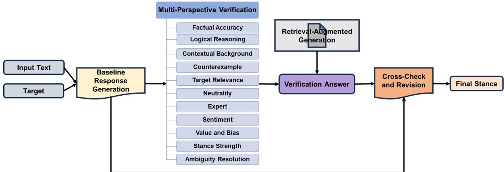
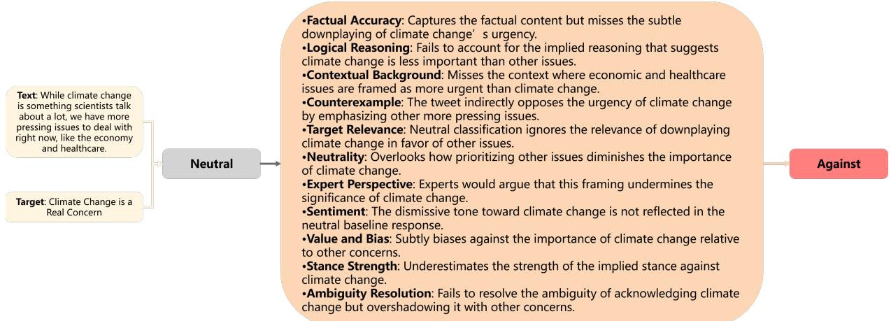

# MPVStance: Mitigating Hallucinations in Stance Detection with Multi-Perspective Verification

Zhaodan Zhang1,2,3,4, Zhao Zhang2,3,4, Jin Zhang2,3,4,\*, Hui Xu2,3 , Xueqi Cheng2,3,4

1School of Advanced Interdisciplinary Sciences, University of Chinese Academy of Sciences

2Key Laboratory of Network Data Science and Technology,

Institute of Computing Technology, Chinese Academy of Sciences 3State Key Laboratory of AI Safety,

Institute of Computing Technology, Chinese Academy of Sciences

4University of Chinese Academy of Sciences

{zhangzhaodan23s, zhangzhao22s, jinzhang, xuhui, cxq}@ict.ac.cn

## Abstract

Stance detection is a pivotal task in Natural Language Processing (NLP), identifying textual attitudes toward various targets. Despite advances in using Large Language Models (LLMs), challenges persist due to hallucinationmodels generating plausible yet inaccurate content. Addressing these challenges, we introduce MPVStance, a framework that incorporates Multi-Perspective Verification (MPV) with Retrieval-Augmented Generation (RAG) across a structured five-step verification process. Our method enhances stance detection by rigorously validating each response from factual accuracy, logical consistency, contextual relevance, and other perspectives. Extensive testing on the SemEval-2016 and VAST datasets, including scenarios that challenge existing methods and comprehensive ablation studies, demonstrates that MPVStance significantly outperforms current models. It effectively mitigates hallucination issues and sets new benchmarks for reliability and accuracy in stance detection, particularly in zero-shot, few-shot, and challenging scenarios.

## 1 Introduction

Stance detection (Hasan and Ng, 2014; Küçük and Can, 2020) is a crucial task in Natural Language Processing (NLP) that involves identifying the attitude expressed by a text towards a particular target or topic, such as favor, against or neutral. This task is essential in various applications, including opinion mining, sentiment analysis, and social media monitoring, where understanding public opinion and user intent is critical. The advent of Large Language Models (LLMs) has significantly advanced the performance of stance detection, leveraging their impressive capabilities in language understanding and generation(Zhang et al., 2024a). However, despite these advancements, LLMs face a critical challenge in stance detection: the issue of hallucination(Hu et al., 2024; Gatto et al., 2023). Hallucination (Rawte et al., 2023) refers to the phenomenon where the model generates content that, while seemingly plausible, is factually incorrect or contextually irrelevant.

Hallucination severely undermines the reliability and applicability of LLMs in tasks requiring high accuracy and consistency. For instance, consider the tweet: "While climate change is something scientists talk about a lot, we have more pressing issues to deal with right now, like the economy and healthcare." with the target being "Climate Change is a Real Concern." The correct stance is "against" as the tweet downplays the importance of climate change in favor of other issues. However, a hallucinating model might misinterpret the mention of "scientists talk about it a lot" as an acknowledgment of climate change’s importance, incorrectly classifying the stance as "favor." Such errors highlight the critical need to mitigate hallucination in stance detection to ensure reliable and accurate outcomes.

Current methods for addressing hallucination in stance detection face three primary challenges. First, there is a lack of generalization to unseen topics or domains, limiting the broader applicability of models (Li and Yuan, 2022). Second, reliance on pre-trained expert models makes approaches prone to hallucinations, particularly in complex scenarios, and these methods often lack robust crossvalidation mechanisms (Wang et al., 2024). Third, errors tend to accumulate in multi-step reasoning processes, and many existing methods fail to thoroughly validate generated outputs, leading to vulnerability in handling complex or evolving targets (Ding et al., 2024b; Taranukhin et al., 2024; Jiang et al., 2022; Hanawa et al., 2019).

To address these challenges, we propose an approach , MPVStance, where each step is crucial and interconnected to ensure accurate stance detection. First, the baseline response generated by the

LLM establishes the foundation for further evaluation. Multi-perspective verification then evaluates the output across key dimensions such as factual accuracy and logical consistency, ensuring no aspect is overlooked. Retrieval-Augmented Generation (RAG) is essential to this process, integrating external knowledge to refine the response and correct any inaccuracies. The cross-checking and revision phase ties everything together, ensuring consistency across all dimensions by resolving discrepancies and hallucinations. Finally, the verified stance is produced, reflecting a cohesive and thoroughly validated decision. Each step builds on the previous one, making all stages indispensable to the overall process.

MPVStance, by integrating multi-perspective verification with RAG, effectively overcomes the limitations of existing hallucination mitigation strategies. It provides a comprehensive framework that not only reduces hallucination but also improves the overall performance of stance detection models. The zero-shot, few-shot, and challenging experiments demonstrate that our approach significantly outperforms existing state-of-the-art methods across two datasets, particularly in reducing hallucination occurrences. Our contributions are as follows,

• We introduce the MPVStance, a novel approach for stance detection that systematically mitigates hallucination in large language models by incorporating multiple verification perspectives and Retrieval-Augmented Generation (RAG). To the best of our knowledge, this is the first approach specifically designed to rigorously reduce hallucinations in stance detection by verifying and refining model outputs through cross-checking, ensuring both accuracy and logical coherence.

• We validate the effectiveness of our method through extensive experiments on the SemEval-2016, and VAST datasets, showing that MPVStance outperforms state-of-the-art models in zero-shot, few-shot, and challenging scenarios. Our ablation studies further confirm the critical role of each component in the MPVStance framework, highlighting the importance of a multi-faceted verification strategy in achieving superior performance and reducing hallucinations.

## 2 Related Work

## 2.1 Stance Detection using Large Language Models

Stance detection (Hasan and Ng, 2014; Küçük and Can, 2020), the task of identifying the position or attitude of a text towards a given topic, has significantly evolved with the advent of large language models (LLMs). Models such as GPT-4 and ChatGPT have been widely applied to this task, leveraging their advanced language understanding and generation capabilities. These models have achieved impressive performance across various stance detection tasks, providing robust solutions to challenges that were previously difficult to address (Dhuliawala et al., 2024; Zhang et al., 2024a; Guo et al., 2024; Zhang et al., 2024c). However, despite their capabilities, LLMs are prone to generating factually incorrect or hallucinated information, particularly when encountering less common or tail-end distribution facts (Rawte et al., 2023).

This hallucination issue presents a critical challenge for stance detection, as it can lead to inaccurate stance predictions, thereby undermining the reliability and trustworthiness of the models (Rawte et al., 2023). To mitigate these concerns, researchers have explored several approaches, including chain of thought reasoning (Ding et al., 2024b; Gatto et al., 2023), self-consistency mechanisms (Taranukhin et al., 2024), and multi-agent reasoning (Wang et al., 2024). While these techniques have contributed to reducing hallucinations, they still face significant limitations, particularly in completely eliminating these errors in complex stance detection tasks.

## 2.2 Hallucination Mitigation Techniques

Several strategies have been proposed to mitigate the hallucination problem in LLMs (Tonmoy et al., 2024). Before discussing these techniques, it is essential to define hallucinations as outputs that are plausible but factually incorrect or logically inconsistent(Sun et al., 2025). These errors go beyond prediction inaccuracies, affecting both factual and logical validity. Knowledge augmentation involves injecting external knowledge into the model to improve the factual accuracy of generated content (Bhattacharya, 2024; Jiang et al., 2022; Hanawa et al., 2019). Data augmentation aims to diversify the training data, reducing the likelihood of hallucination by exposing the model to a broader range of scenarios (Mittal et al., 2024). Post-processing techniques, on the other hand, involve correcting the generated content after it has been produced, typically using rules or additional models to identify and fix hallucinations (Yan et al., 2024a; Ding et al., 2024b; Taranukhin et al., 2024).

However, each of these methods has limitations when applied to stance detection. In stance detection, hallucinations occur when models misinterpret context, infer unsupported conclusions, or fail in reasoning consistency. Knowledge augmentation may not fully capture the nuanced emotional and logical reasoning required in stance detection, while data augmentation(Li and Yuan, 2022), although beneficial, cannot completely eliminate hallucinations in novel or unseen topics. Postprocessing techniques can only correct hallucinations after they occur, rather than preventing them during the generation process(Ding et al., 2024b; Taranukhin et al., 2024). Therefore, there is still a need for more comprehensive approaches to effectively mitigate hallucinations in LLM-based stance detection.

## 3 Methodology

In this study, we propose a novel model for stance detection called MPVStance, designed to systematically address the hallucination issue commonly encountered in large language models (LLMs). MPVStance enhances the accuracy and robustness of stance detection by integrating multiple verification perspectives and retrieval-augmented generation (RAG) techniques. Our approach is structured into five key steps: generating baseline responses (3.2), planning multi-perspective verification (3.3), executing verification with RAG (3.4), cross-checking and revising (3.5), and finally generating the verified stance (3.6). This comprehensive process shown in figure 1 ensures that the detected stance is not only accurate and consistent but also grounded in factual correctness and logical coherence.

## 3.1 Task Definition

Let $\mathcal { D } = \{ ( x _ { i } , p _ { i } , y _ { i } ) \} _ { i = 1 } ^ { N }$ be a dataset consisting of N instances, where each instance $( x _ { i } , p _ { i } , y _ { i } )$ represents the input text $x _ { i }$ for which the stance needs to be detected, the corresponding target $p _ { i }$ towards which the stance of $x _ { i }$ is to be determined, and the stance label $y _ { i }$ for the input $x _ { i }$ towards the target $p _ { i } ,$ , where $y _ { i } \in$ favor, against, neutral .

Stance detection aims to predict the stance label $y _ { i }$ for each input sentence $x _ { i }$ towards the given target $p _ { i }$ .

## 3.2 Baseline Response Generation

The first step of our model is to generate a baseline response $R _ { i }$ for each input-target pair $( x _ { i } , p _ { i } )$ in the dataset . This response captures the model’s initial interpretation of the text’s stance towards the target. The baseline response is generated by a pre-trained large language model M as follows :

$$
R _ { i } = M ( x _ { i } , p _ { i } )\tag{1}
$$

To guide the model in generating baseline responses, we have developed tailored prompts in Appendix B.

## 3.3 Plan Multi-Perspective Verification

After generating the baseline response, the next step in our approach is to design verification questions that rigorously examine the baseline response from multiple angles. Each verification perspective plays a critical role in ensuring that the response is thoroughly evaluated and free of hallucinations or logical errors. Below, we describe the necessary perspectives and their specific contributions, using the example of the tweet "While climate change is something scientists talk about a lot, we have more pressing issues to deal with right now, like the economy and healthcare." with the target "Climate Change is a Real Concern".

Factual Accuracy is crucial for ensuring the baseline response accurately reflects both explicit and implicit facts. Without this check, factual inaccuracies could distort the stance interpretation. For example, "Does ’scientists talk about climate change a lot’ correctly capture the discussions?"

Logical Reasoning ensures that implicit and explicit logical inferences are sound. Misinterpreting implied reasoning can lead to an incorrect stance classification, such as: "Does ’more pressing issues’ suggest a reduced emphasis on climate change?"

Contextual Background is important for interpreting the response within broader social or political contexts. Ignoring this could miss subtle shifts in stance. For instance, "Does the baseline reflect the context of prioritizing ’economy and healthcare’ over climate change?"

Counterexample identifies potential opposing interpretations, ensuring alternative viewpoints aren’t overlooked. This prevents a one-sided analysis. For example, "Could ’more pressing issues’ be seen as dismissing climate change’s urgency?"

  
Figure 1: Multi-Perspective Verification Process in MPVStance. This diagram illustrates the comprehensive verification process, highlighting each step from input to the final stance decision.

Target Relevance ensures the stance directly relates to the target issue without distraction by unrelated factors. Missing this relevance may obscure the true stance. For example, "Is the response focused on climate change rather than other issues?"

Neutrality avoids inappropriate neutrality when the input implies a clear stance. Failing to detect bias or implicit positions can lead to an incorrect neutral stance. For instance, "Does the response incorrectly adopt neutrality despite downplaying climate change?"

Expert Perspective aligns the response with expert opinions, which is essential for addressing nuanced or specialized content. Experts offer critical insights that could refine the stance.

Sentiment Analysis ensures the emotional tone is appropriately reflected in the stance. Overlooking sentiment can lead to a misclassification.

Value and Bias is necessary for detecting and correcting implicit biases that could skew the stance. Bias recognition is key to fair analysis.

Stance Strength assesses whether the strength of the stance matches the input content, ensuring the stance’s intensity is accurately reflected.

Ambiguity Resolution resolves ambiguities to ensure clarity in the stance. Unresolved ambiguities could lead to unclear or incorrect stance interpretations.

For each perspective $j ,$ a verification question $Q _ { i j }$ is generated based on the baseline response $R _ { i }$ the input text $x _ { i } .$ , and the target $p _ { i }$ . This process can be formally defined as:

$$
Q _ { i j } = f _ { j } ( R _ { i } , x _ { i } , p _ { i } )\tag{2}
$$

where $f _ { j } ( \cdot )$ is a function specific to the j-th verification perspective, evaluating aspects such as factual accuracy, logical coherence, and contextual relevance.

## 3.4 Execute Verifications with Retrieval-Augmented Generation

After generating the multi-perspective verification questions, the next critical step is to execute these questions using Retrieval-Augmented Generation (RAG). This step is essential because, while the verification questions identify potential issues or hallucinations in the baseline response, RAG strengthens the process by integrating external knowledge to verify or challenge the baseline response against reliable sources.

For each verification question $Q _ { i j }$ , the model retrieves relevant documents $\mathcal { D } _ { i j }$ from external sources. These documents are selected based on their relevance to the specific aspect of the stance being evaluated, such as factual accuracy, logical consistency, or contextual relevance. This retrieval step ensures that the verification questions generated in the previous step are supported by accurate and up-to-date information, reducing the risk of reliance on incomplete or biased data. The process of generating a verification answer $A _ { i j }$ is defined

$$
A _ { i j } = g ( Q _ { i j } , D _ { i j } )\tag{3}
$$

where $g ( \cdot )$ represents the function that generates an evidence-backed answer based on the retrieved information.

The retrieval process is guided by a prompt designed to ensure that the information collected directly addresses the verification question. Once the relevant documents $\mathcal { D } _ { i j }$ are retrieved, the model generates answers $A _ { i j }$ by conditioning on both the original question $Q _ { i j }$ and the retrieved documents. These answers provide a robust, evidence-based response, directly addressing any issues or inconsistencies identified in the baseline response.

## 3.5 Cross-Check and Revise

The cross-check and revise phase is crucial for ensuring the accuracy and reliability of the stance detection process by integrating the insights gathered from the previous steps. In the earlier phase, the baseline response $R _ { i }$ was generated, and then rigorously validated through multi-perspective verification and Retrieval-Augmented Generation (RAG). This current step builds on that foundation by systematically comparing the baseline response $R _ { i }$ with the verification answers $\mathbf { \mathcal { A } } _ { i } ~ =$ $\{ A _ { i 1 } , A _ { i 2 } , \ldots , A _ { i m } \}$ from the previous phase. m is 11, representing 11 different verification perspectives. During the consistency check, we identify discrepancies between $R _ { i }$ and each verification answer $A _ { i j }$ . The check is essential to ensure that the baseline response accurately reflects the evidence-backed insights gathered through the multi-perspective verifications. To guide the model in consistency checking, we have developed tailored prompts for each verification dimension (see Appendix B for full details).

After identifying discrepancies, the baseline response $R _ { i }$ is revised to produce a corrected response $R _ { i } ^ { \prime }$ that aligns with the verification answers. This revision is necessary to ensure that the final stance is coherent, evidence-backed, and contextually accurate. The revision process is formalized as:

$$
R _ { i } ^ { \prime } = h ( R _ { i } , \mathcal { A } _ { i } )\tag{4}
$$

where $h ( \cdot )$ represents the function that integrates the original response with the verification insights, resulting in a more accurate and contextually appropriate stance.

## 3.6 Generating the Final Stance

In the final step of our methodology, we generate the final stance label $y _ { i } ^ { \prime }$ for the input text $x _ { i }$ with respect to the target $p _ { i }$ This step synthesizes the revised response $R _ { i } ^ { \prime }$ and the insights from the verification answers $\mathcal { V } _ { i } ~ = ~ \{ ( Q _ { i 1 } , A _ { i 1 } ) , ( Q _ { i 2 } , A _ { i 2 } ) , . . . , ( Q _ { i m } , A _ { i m } ) \}$ generated in the previous steps.

The final stance label is determined by integrating the corrected response $R _ { i } ^ { \prime }$ with the comprehensive verification data $\nu _ { i } ,$ , ensuring that the model’s prediction is rigorously grounded in evidence from multiple perspectives. The final stance is selected from one of the following categories: favor, against, or neutral.

The final stance label $y _ { i } ^ { \prime }$ is determined by the following function:

$$
y _ { i } ^ { \prime } = { \mathrm { p r e d i c t \_ f n a l \_ s t a n c e } } ( x _ { i } , p _ { i } , R _ { i } ^ { \prime } , \mathcal { V } _ { i } )\tag{5}
$$

## 4 Experiments

## 4.1 Datasets

We conduct experiments on the VAST and SEM16 datasets to evaluate our proposed method.

The VAST dataset (Allaway and McKeown, 2020) includes a wide range of targets, with each instance comprising a sentence r, a target t, and a stance label $y$ (classified as “Pro,” “Con,” or “Neutral”) towards t. Detailed statistics of the VAST dataset can be found in Appendix A.

The SEM16 dataset (Mohammad et al., 2016) contains six predefined targets, including Donald Trump (DT), Hillary Clinton (HC), Feminist Movement (FM), Legalization of Abortion (LA), Atheism (A), and Climate Change (CC). Each instance is categorized as Favor, Against, or Neutral. The statistics for SEM16 are also provided in $\mathsf { A p - }$ pendix A.

## 4.2 Evaluation Metrics

For the VAST dataset, following Allaway and McKeown (2020), we calculate the Macro-averaged F1 score across the $P r o ,$ Con, and Neutral labels to evaluate the performance of the models on the test set. For the SEM16 dataset, we report the $F _ { \mathrm { a v g } }$ which is the average of the F1 scores for the Favor and Against classes, in line with Mohammad et al. (2016).

## 4.3 Baselines

We compare our approach against several state-ofthe-art (SOTA) models, categorized into statisticsbased models, BERT-based models, and large language models (LLMs).

Statistics-based Models We include BiCond (Augenstein et al., 2016), which uses bidirectional LSTM to encode both the text and the target, and CrossNet (Xu et al., 2018), which enhances BiL-STM with self-attention mechanisms to improve focus on relevant text segments.

BERT-based Models We benchmark against BERT (Devlin et al., 2019), a transformer model fine-tuned for stance detection, PT-HCL (Liang et al., 2022a), which incorporates contrastive learning within a BERT framework targeting zero-shot and cross-target tasks. BERT-joint-ft(Liu et al., 2021) and TGA-Net-ft(Liu et al., 2021), in which BERT has been fine-tuned during the training process. CKE-Net(Liu et al., 2021), GDA-CL(Li and Yuan, 2022), WS-BERT(He et al., 2022), CNet-Ad(Zhang et al., 2024b), BS-RGCN(Luo et al., 2022), BERT-joint(Allaway and McKeown, 2020), TGA Net (Allaway and McKeown, 2020), JointCL (Liang et al., 2022b), KPatch(Lin et al., 2024) , TATA(Hanley and Durumeric, 2023), EDDA-LLaMA(Ding et al., 2024a), and a collaborative knowledge infusion approach (CKI) (Yan et al., 2024b), BERT-based models showing strong performance on datasets.

LLM-based Models We compare with KEprompt (Huang et al., 2023), which leverages knowledge-enhanced prompt tuning, KASD (Li et al., 2023), enhancing detection by integrating Wikipedia knowledge with retrieval-enhanced generation, COLA (Lan et al., 2024), which employs a collaborative role-infusion framework with multiple LLMs, GPT-3.5 (Lan et al., 2024), GPT-3.5+COT (Lan et al., 2024) ,GPT-EDDA(Ding et al., 2024a) and LKI-BART(Zhang et al., 2024c)to evaluate MPVStance’s effectiveness in mitigating hallucinations.

## 4.4 Implementation Details

In our study, we utilize three large language models (LLMs): Qwen2.5-7B-Instruct, LLaMA3.1- 8B-Instruct, and Mistral-7B-Instruct-v0.2. The experiments were conducted on a single NVIDIA A800 GPU with 80GB of RAM, utilizing bfloat16 precision to optimize memory usage and computational efficiency. To ensure the reproducibility of the LLMs’ responses, we set the temperature parameter to 0 during inference. This configuration helps maintain consistent outputs across multiple runs. The results reported in our experiments are averaged over 5 repeated runs to ensure statistical reliability and mitigate the impact of any variance in model performance.We also perform significance testing using a paired t-test to compare MPVStance with baseline methods.

## 5 Results and Discussion

This section addresses the following research questions (RQs) based on our experimental results: RQ1: How does the performance of our MPVStance compare to state-of-the-art stance detection models on SEM16 and VAST datasets?

RQ2: Is each component of the MPVStance effective and contributory to overall performance?

RQ3: Does the MPVStance effectively mitigate hallucinations in stance detection across challenging scenarios?

RQ4: How does the performance of MPVStance vary across different models (Qwen2.5- 7B-Instruct, LLaMA3.1-8B-Instruct, Mistral-7B-Instruct-v0.2)?

Performance Comparison with State-of-the-Art Models Overall, our model demonstrates superior performance across all metrics and scenarios, effectively mitigating hallucinations and enhancing stance detection accuracy on the VAST and SEM16 datasets. As shown in Tables 1 and 2, the model consistently outperforms state-of-the-art stance detection models in both zero-shot and few-shot scenarios. These results underscore the robustness and adaptability of the approach.

For example, on the SEM16 dataset (Table 1), MPVStance (Mistral-7B-Instruct) achieves an F1 score of 86.7% on the FM target, surpassing the closest competitor, GPT-EDDA, by a margin of 17.5%. Similarly, on the VAST dataset (Table 2), MPVStance shows a marked improvement with an overall F1 score of 83.1%, outperforming the bestperforming baseline (CKI) by 2.4% and TATA by 6.8%. In several cases, our model achieves over 80% across key metrics, demonstrating its effectiveness in stance detection across diverse targets and scenarios.

Effectiveness of MPVStance Components (RQ2) The ablation study, presented in Tables 3 and 4, clearly demonstrates the significance of each component in the model:

\- Multi-Perspective Verification (MPV): This core module integrates multiple perspectives during verification, crucially reducing hallucinations. Removing MPV leads to a significant drop in F1 scores, particularly on targets like FM and CC on SEM16, where the F1 score decreases by 4.4% and 4.2%, respectively.

\- Retrieval-Augmented Generation (RAG): This module, which augments the model with external knowledge retrieval, plays a critical role in enhancing factual accuracy. Its removal results in a noticeable decline in performance across various targets. On the VAST dataset, removing RAG causes a drop of 1.5% in the overall F1 score, underscoring its importance.

  
Figure 2: Application of Multi-Perspective Verification to a tweet on climate change, showing how initial neutral stance was revised to a stance against through detailed perspective analysis.

<table><tr><td>Model</td><td>DT</td><td>HC FM</td><td>LA</td><td>A</td><td>CC</td></tr><tr><td>Statistics-based Models</td><td></td><td></td><td></td><td></td><td></td></tr><tr><td>BiCond</td><td></td><td></td><td>30.5 32.7 40.6 34.4 31.0 15.0</td><td></td><td></td></tr><tr><td>CrossNet</td><td></td><td></td><td></td><td>35.6 38.3 41.7 38.5 39.7 22.8</td><td></td></tr><tr><td>BERT-based Models</td><td></td><td></td><td></td><td></td><td></td></tr><tr><td>BERT</td><td></td><td>40.1 49.641.9 44.8 55.2 37.3</td><td></td><td></td><td></td></tr><tr><td>PT-HCL</td><td></td><td></td><td></td><td>50.1 54.5 54.6 50.9 56.5 38.9</td><td></td></tr><tr><td>TGA-Net</td><td></td><td>40.7 49.3 46.6 45.2 52.7 36.6</td><td></td><td></td><td></td></tr><tr><td>Joint-CL</td><td></td><td></td><td></td><td>50.5 54.8 53.8 49.5 54.5 39.7</td><td></td></tr><tr><td>KPatch</td><td></td><td></td><td></td><td>41.1 49.7 43.9 43.8 39.9 31.9</td><td></td></tr><tr><td>TATA</td><td></td><td></td><td></td><td>63.8 65.4 66.9 62.9 52.1 41.6</td><td></td></tr><tr><td>CKI</td><td></td><td></td><td></td><td>62.9 68.2 68.5</td><td></td></tr><tr><td>LLM-based Models</td><td></td><td>69.8 80.5 70.2</td><td></td><td></td><td></td></tr><tr><td>KASD</td><td></td><td></td><td></td><td></td><td></td></tr><tr><td></td><td></td><td></td><td>80.3 70.4 62.7 63.9 55.8 66.6</td><td></td><td></td></tr><tr><td>COLA</td><td></td><td></td><td>68.5 81.7 63.4 71.0 70.8 65.5</td><td></td><td>31.1</td></tr><tr><td>GPT-3.5</td><td></td><td></td><td>62.5 68.744.7 51.5 9.1</td><td></td><td></td></tr><tr><td>GPT-3.5+COT</td><td></td><td></td><td>63.3 70.947.7 53.413.3 34.0</td><td></td><td></td></tr><tr><td>GPT-EDDA</td><td></td><td>69.5 80.1 69.2 62.7 67.2 68.5</td><td></td><td></td><td></td></tr><tr><td>MPVStance (Ours)</td><td></td><td></td><td></td><td></td><td></td></tr><tr><td>Qwen2.5-7B-Instruct</td><td></td><td>81.4*82.0*84.2*81.581.9*81.7</td><td></td><td>80.482.3*79.081.8*81.282.6*</td><td></td></tr><tr><td>LLaMA3.1-8B-Instruct</td><td></td><td></td><td></td><td></td><td></td></tr><tr><td>Mistral-7B-Instruct</td><td></td><td>80.682.5*86.7*81.6 81.5 80.4</td><td></td><td></td><td></td></tr></table>

Table 1: Zero-shot stance detection results (%) on the SEM16 dataset. The best scores are in bold. Results with \* denote that MPVStance significantly outperforms baselines with the p-value < 0.05.

\- Cross-Checking and Revising (CCR): This component ensures consistency and coherence in stance outputs. Without CCR, the model’s performance drops, particularly in targets like HC and LA on SEM16, where the F1 score decreases by 2.6% and 2.8%, respectively.

The ablation study clearly shows that each component is vital to the overall effectiveness of MPVStance, with the full model providing the best performance across all metrics.

<table><tr><td>Model</td><td>Zero-Shot Few-Shot Overall</td><td></td><td></td></tr><tr><td>Bi-Cond</td><td>42.8</td><td>40.0</td><td>41.5</td></tr><tr><td>CrossNet</td><td>43.4</td><td>47.4</td><td>45.5</td></tr><tr><td>TGA-Net</td><td>66.6</td><td>66.3</td><td>66.5</td></tr><tr><td>BERT-GCN</td><td>68.6</td><td>69.7</td><td>69.2</td></tr><tr><td>CKE-Net</td><td>70.2</td><td>70.1</td><td>70.1</td></tr><tr><td>GDA-CL</td><td>70.5</td><td></td><td></td></tr><tr><td>PT-HCL</td><td>71.6</td><td></td><td></td></tr><tr><td>WS-BERT</td><td>75.3</td><td>73.6</td><td>74.5</td></tr><tr><td>BS-RGCN</td><td>72.6</td><td>70.2</td><td>71.3</td></tr><tr><td>CNet-Ad</td><td>73.2</td><td>71.8</td><td>72.6</td></tr><tr><td>Joint-CL</td><td>72.3</td><td>71.6</td><td>72.3</td></tr><tr><td>COLA</td><td>73.4</td><td></td><td></td></tr><tr><td>TATA</td><td>77.1</td><td>74.1</td><td>76.3</td></tr><tr><td>GPT-3.5-Turbo</td><td>65.0</td><td></td><td></td></tr><tr><td>GPT-3.5-Turbo (with CoT)</td><td>66.4</td><td></td><td></td></tr><tr><td>KASD-BERT</td><td>76.8</td><td></td><td></td></tr><tr><td>LKI-BART</td><td>79.6</td><td></td><td></td></tr><tr><td>CKI</td><td>81.9</td><td>79.6</td><td>80.7</td></tr><tr><td>EDDA-LLaMA</td><td>76.3</td><td></td><td></td></tr><tr><td colspan="4">MPVStance (Ours)</td></tr><tr><td>Qwen2.5-7B-Instruct</td><td>84.4*</td><td>80.0*</td><td>80.2*</td></tr><tr><td>LLaMA3.1-8B-Instruct</td><td>79.8*</td><td>81.5*</td><td>80.8*</td></tr><tr><td>Mistral-7B-Instruct</td><td>83.2*</td><td>82.0*</td><td>83.1*</td></tr></table>

Table 2: Stance detection performance (%) on VAST. The best scores are in bold. Results with \* denote that MPVStance significantly outperforms baselines with the p-value < 0.05.

To further validate the effectiveness of our verification components, we conducted ablation experiments focusing on the role of verification questions and retrieved documents. The results demonstrate that both elements are crucial for the model’s performance and hallucination mitigation capabilities.

We evaluate the importance of high-quality verification questions by replacing them with unrelated but syntactically valid questions. For example:

\- Target: Climate Change

\- Context: "Investing in renewable energy is the only way to mitigate climate change."

<table><tr><td>Model</td><td>DT HC FM LA A</td><td></td><td></td><td></td><td>CC</td></tr><tr><td>MPVStance</td><td>80.6 82.5 86.7 81.6 81.5 80.4</td><td></td><td></td><td></td><td></td></tr><tr><td>w/o MPV</td><td>78.279.382.3 78.4 79.2 76.2</td><td></td><td></td><td></td><td></td></tr><tr><td>w/o RAG</td><td>78.6 80.5 84.8 78.8 79.5 78.8</td><td></td><td></td><td></td><td></td></tr><tr><td>w/o CCR</td><td>78.579.984.478.8 79.278.6</td><td></td><td></td><td></td><td></td></tr><tr><td>w/o Unrelated Questions</td><td>74.275.679.376.074.874.6</td><td></td><td></td><td></td><td></td></tr><tr><td>w/o Documents</td><td>79.3 81.2 85.6 80.2 80.0 79.4</td><td></td><td></td><td></td><td></td></tr></table>

Table 3: Ablation study results on SEM16 (%) using Mistral-7B-Instruct. The best scores are in bold.
<table><tr><td>Model</td><td>Zero-Shot Few-Shot</td><td></td><td>Overall</td></tr><tr><td>Mistral-7B-Instruct</td><td>83.2</td><td>82.0</td><td>83.1</td></tr><tr><td>w/o MPV</td><td>82.2</td><td>80.8</td><td>81.5</td></tr><tr><td>w/o RAG</td><td>82.3</td><td>81.0</td><td>81.6</td></tr><tr><td>w/o CCR</td><td>82.5</td><td>81.2</td><td>81.9</td></tr><tr><td>w/o Unrelated Questions 76.2</td><td></td><td>75.0</td><td>75.7</td></tr><tr><td>w/o Documents</td><td>82.8</td><td>81.5</td><td>82.3</td></tr></table>

Table 4: Ablation study results on VAST (%) using Mistral-7B-Instruct. The best scores are in bold.

\- Unrelated Question: "What is the population of the capital city of the country?"

These questions are irrelevant to the stance detection task but retain grammatical correctness. Replacing meaningful verification questions with unrelated ones leads to an average performance drop of approximately 6-7% on SEM16 and a significant 7.4% drop in overall F1 score on VAST. This confirms that well-crafted verification questions are essential for accurate reasoning and stance classification.

We further assess the contribution of retrieved external documents during verification answer generation by removing $D _ { i j }$ from Equation 3, i.e., generating answers based purely on internal reasoning over the verification question $Q _ { i j }$

Removing retrieved documents leads to a modest but consistent performance drop-1.2% on average on SEM16 and 0.8% on VAST. These findings indicate that while internal reasoning is valuable, external knowledge plays a critical role in grounding answers and reducing hallucinations.

These experiments confirm that: High-quality, relevant verification questions significantly enhance the model’s ability to reason and classify stances.

Retrieval-augmented generation provides crucial external evidence that improves factual accuracy and reduces hallucinations.

Hallucination Mitigation in Challenging Scenarios (RQ3) To further evaluate the robustness and hallucination mitigation capabilities of MPVStance, we examined its performance on the VAST dataset under five challenging scenarios (Table 5):

Imp (Implicit Stance): This scenario includes instances where the topic does not explicitly appear in the document but the stance is non-neutral. MPVStance achieves an accuracy of 77.7%, outperforming the baseline TATA by 8.4%, demonstrating its capability to infer implicit stances accurately.

mlT (Multiple Topics): Documents containing multiple topics can confuse stance detection models. MPVStance achieves 76.2% accuracy, which is significantly higher than the 70.3% accuracy of TATA, indicating better contextual understanding across topics.

mlS (Multiple Stances): This scenario involves documents with multiple non-neutral stance labels. MPVStance’s accuracy of 78.3% again surpasses TATA, highlighting its ability to handle nuanced stances within a single document.

Qte (Quotations): Quotations can introduce external voices, complicating stance detection. MPVStance excels in this scenario with a 80.6% accuracy, 9.2% higher than the next best model (TATA).

Sarc (Sarcasm): Sarcasm presents a significant challenge for LLMs due to its reliance on tone rather than content. MPVStance’s accuracy of 78.2% in this scenario far exceeds that of other models, demonstrating its advanced understanding of nuanced language.

<table><tr><td>Model</td><td>Imp</td><td>mlT</td><td>mlS</td><td>Qte</td><td>Sarc</td></tr><tr><td>BERT-joint</td><td>57.1</td><td>59.0</td><td>52.4</td><td>63.4</td><td>60.1</td></tr><tr><td>TGA-Net</td><td>59.4</td><td>60.5</td><td>53.2</td><td>66.1</td><td>63.7</td></tr><tr><td>BERT-joint-ft</td><td>61.7</td><td>62.1</td><td>54.7</td><td>66.8</td><td>67.3</td></tr><tr><td>BERT-GCN</td><td>61.9</td><td>62.7</td><td>54.7</td><td>66.8</td><td>67.3</td></tr><tr><td>CKE-Net</td><td>62.5</td><td>63.4</td><td>55.3</td><td>69.5</td><td>68.2</td></tr><tr><td>BS-RGCN</td><td>62.1</td><td>64.7</td><td>55.6</td><td>70.1</td><td>71.7</td></tr><tr><td>CKI</td><td>68.2</td><td>67.8</td><td>65.1</td><td>70.9</td><td>68.0</td></tr><tr><td>TATA</td><td>69.3</td><td>70.3</td><td>60.3</td><td>71.4</td><td>73.0</td></tr><tr><td>MPVStance (Mistral)</td><td>77.7*</td><td>76.2*</td><td>78.3*</td><td>80.6*</td><td>78.2*</td></tr></table>

Table 5: Accuracies (%) on Challenging Scenarios on the VAST dataset using Mistral-7B-Instruct. The best scores are in bold.Results with \* denote that MPVStance significantly outperforms baselines with the p-value < 0.05.

To further evaluate the effectiveness of MPVStance in mitigating hallucinations, we compare model performance under two configurations: Baseline, where predictions are made directly by the LLM without verification, and MPVStance, where responses are refined through Multi-Perspective Verification and Retrieval-Augmented Generation.

As shown in Table 6, MPVStance consistently improves performance across all models and all five challenging scenarios.

Under the MPVStance setting, Mistral-7B-Instruct-v0.2 achieves the highest improvements across all five dimensions, particularly in quotationbased reasoning (Qte), where it reaches an accuracy of 80.6%, surpassing its baseline by over 8.4%. Similarly, LLaMA3.1-8B-Instruct shows strong gains across all scenarios, with notable improvement in sarcasm detection (Sarc: +10.4%) and quotation handling (Qte: +8.6%). Qwen2.5- 7B-Instruct also benefits significantly from MPVStance, showing consistent improvements in implicit stance detection (Imp: +7.3%) and multiplestances reasoning (mlS: +9.8%).

These results demonstrate that the integration of MPV and RAG not only enhances factual accuracy and logical reasoning but also significantly boosts robustness in handling complex linguistic phenomena such as sarcasm, implicit stance, and quotation-based reasoning.

<table><tr><td>Model</td><td>Setting</td><td>Imp</td><td>mlT</td><td>mlS</td><td>Qte</td><td>Sarc</td></tr><tr><td>Qwen2.5</td><td>Baseline</td><td>68.5</td><td>65.2</td><td>63.3</td><td>70.5</td><td>65.1</td></tr><tr><td>Qwen2.5</td><td>MPVStance</td><td>75.8</td><td>74.3</td><td>73.1</td><td>78.5</td><td>73.9</td></tr><tr><td>LLaMA3.1</td><td>Baseline</td><td>69.3</td><td>66.1</td><td>64.2</td><td>71.8</td><td>66.4</td></tr><tr><td>LLaMA3.1</td><td>MPVStance</td><td>77.6</td><td>76.0</td><td>75.5</td><td>80.4</td><td>76.8</td></tr><tr><td>Mistral</td><td>Baseline</td><td>70.1</td><td>67.3</td><td>65.7</td><td>72.2</td><td>68.0</td></tr><tr><td>Mistral</td><td>MPVStance</td><td>77.7</td><td>76.2</td><td>78.3</td><td>80.6</td><td>78.2</td></tr></table>

Table 6: Performance (%) comparison between baseline and MPVStance settings on five challenging scenarios.

Performance Across Different Models (RQ4) We evaluated the effectiveness of our approach across three distinct model architectures: Qwen2.5- 7B-Instruct, LLaMA3.1-8B-Instruct, and Mistral-7B-Instruct. As shown in Tables 1 and 2, all three models demonstrate strong performance in stance detection across different datasets.

Model Adaptability: The results show that each of these models performs exceptionally well, with Mistral-7B-Instruct achieving the highest overall scores on the VAST dataset with an F1 score of 83.1% (Table 2) and leading in several key targets on the SEM16 dataset, such as HC and FM, with F1 scores of 82.5% and 86.7% respectively (Table 1). However, Qwen2.5-7B-Instruct also demonstrates impressive results, particularly on the A target within SEM16, where it achieves the highest accuracy of 81.9%. LLaMA3.1-8B-Instruct provides consistently competitive performance, particularly excelling in the LA and CC targets with the highest F1 score of 81.8% and 82.6%, respectively.

These results indicate that while Mistral-7B-Instruct leads in overall performance, both

Qwen2.5-7B-Instruct and LLaMA3.1-8B-Instruct also perform exceptionally well in specific areas, demonstrating that MPVStance is highly adaptable and effective across different large language models.

Discussion Our findings demonstrate that the model not only surpasses existing state-of-the-art models in stance detection but also excels in reducing hallucinations across a range of challenging scenarios. The ablation studies confirm the critical importance of each component, particularly the RAG and CCR modules, in enhancing the model’s accuracy and robustness. Moreover, MPVStance’s consistent performance across different LLM architectures further underscores its adaptability and effectiveness as a comprehensive stance detection framework.

Case Study: Verifying Stance on Climate Change To illustrate the effectiveness of the Multi-Perspective Verification (MPV) approach in practice, Figure 2 presents a detailed analysis of a tweet related to climate change. This case study demonstrates how the MPV process refines the initial stance interpretation through a comprehensive analysis across multiple verification dimensions, ultimately correcting the stance and providing a more accurate classification.

## 6 Conclusion

In this work, we addressed the challenge of hallucination in stance detection by proposing MPVStance. MPVStance integrates multiple verification perspectives and Retrieval-Augmented Generation (RAG) to enhance the accuracy and consistency of stance detection in large language models (LLMs). Experimental results demonstrate that MPVStance significantly outperforms existing models across zero-shot, few-shot, and challenging scenarios, particularly excelling in mitigating hallucinations.

While MPVStance shows strong performance, it has limitations in real-time topic analysis due to the static nature of the underlying LLMs. Future work will focus on integrating a real-time updating knowledge base to enhance MPVStance’s capability in analyzing current events. Additionally, exploring MPVStance’s application to broader text analysis tasks on web and social media platforms offers promising opportunities for further research.

## Limitations

While the Multi-Perspective Verification (MPV) approach improves stance detection, it has limitations, including high computational demands, reliance on external knowledge sources, and inefficiency in real-time processing. Additionally, it lacks testing across different languages and cultural contexts, which may affect its generalizability and accuracy in diverse settings. The approach also struggles with the subtleties of language such as sarcasm and irony and may inherit biases from training data or external sources. Addressing these issues is crucial for enhancing the model’s robustness and applicability.

## Ethical Considerations

The MPV approach to stance detection must be used responsibly, considering potential ethical implications. The model’s dependence on external data sources could propagate biases or misinformation if these sources are not rigorously vetted. Additionally, the automated nature of stance detection can influence public opinion and decisionmaking processes, potentially impacting political or social dynamics. Ensuring transparency in how stances are determined and providing mechanisms for correcting errors are essential to uphold ethical standards. Moreover, addressing potential privacy concerns, especially when analyzing personal or sensitive content, is crucial for maintaining user trust and adherence to data protection regulations.

## Acknowledgments

This research was supported by funding from the National Natural Science Foundation of China under Grant No. 62406308 for the project "Composite Event Analysis and Prediction Research". We would like to extend our sincere gratitude to all those who contributed to this work.

## References

Emily Allaway and Kathleen McKeown. 2020. Zero-Shot Stance Detection: A Dataset and Model using Generalized Topic Representations. In Proceedings of the 2020 Conference on Empirical Methods in Natural Language Processing (EMNLP), pages 8913– 8931, Online. Association for Computational Linguistics.

Isabelle Augenstein, Tim Rocktäschel, Andreas Vlachos, and Kalina Bontcheva. 2016. Stance detection

with bidirectional conditional encoding. In Proceedings of the 2016 Conference on Empirical Methods in Natural Language Processing, pages 876–885, Austin, Texas. Association for Computational Linguistics.

Ranjeeta Bhattacharya. 2024. Strategies to mitigate hallucinations in large language models. Applied Marketing Analytics: The Peer-Reviewed Journal, 10(1):62–67.

Jacob Devlin, Ming-Wei Chang, Kenton Lee, and Kristina Toutanova. 2019. BERT: Pre-training of deep bidirectional transformers for language understanding. In Proceedings ofthe 2019 Conference of the North American Chapter ofthe Associationfor Computational Linguistics: Human Language Technologies, Volume 1 (Long and Short Papers), pages 4171–4186, Minneapolis, Minnesota. Association for Computational Linguistics.

Shehzaad Dhuliawala, Mojtaba Komeili, Jing Xu, Roberta Raileanu, Xian Li, Asli Celikyilmaz, and Jason Weston. 2024. Chain-of-verification reduces hallucination in large language models. In Findings ofthe Associationfor Computational Linguistics ACL 2024, pages 3563–3578, Bangkok, Thailand and virtual meeting. Association for Computational Linguistics.

Daijun Ding, Li Dong, Zhichao Huang, Guangning Xu, Xu Huang, Bo Liu, Liwen Jing, and Bowen Zhang. 2024a. EDDA: An encoder-decoder data augmentation framework for zero-shot stance detection. In Proceedings ofthe 2024 Joint International Conference on Computational Linguistics, Language Resources and Evaluation (LREC-COLING 2024), pages 5484– 5494, Torino, Italia. ELRA and ICCL.

Daijun Ding, Xianghua Fu, Xiaojiang Peng, Xiaomao Fan, Hutchin Huang, and Bowen Zhang. 2024b. Leveraging chain-of-thought to enhance stance detection with prompt-tuning. Mathematics.

Joseph Gatto, Omar Sharif, and Sarah Preum. 2023. Chain-of-thought embeddings for stance detection on social media. In Findings ofthe Associationfor Computational Linguistics: EMNLP 2023, pages 4154– 4161, Singapore. Association for Computational Linguistics.

Mengzhuo Guo, Xiaorui Jiang, and Yong Liao. 2024. Improving zero-shot stance detection by infusing knowledge from large language models. In Advanced Intelligent Computing Technology and Applications - 20th International Conference, ICIC 2024, Tianjin, China, August 5-8, 2024, Proceedings, Part XIII, volume 14874 of Lecture Notes in Computer Science, pages 121–132. Springer.

Kazuaki Hanawa, Akira Sasaki, Naoaki Okazaki, and Kentaro Inui. 2019. Stance detection attending external knowledge from wikipedia. J. Inf. Process., 27:499–506.

Hans Hanley and Zakir Durumeric. 2023. TATA: Stance detection via topic-agnostic and topic-aware embeddings. In Proceedings of the 2023 Conference on Empirical Methods in Natural Language Processing, pages 11280–11294, Singapore. Association for Computational Linguistics.

Kazi Saidul Hasan and Vincent Ng. 2014. Why are you taking this stance? identifying and classifying reasons in ideological debates. In Proceedings of the 2014 Conference on Empirical Methods in Natural Language Processing (EMNLP), pages 751–762, Doha, Qatar. Association for Computational Linguistics.

Zihao He, Negar Mokhberian, and Kristina Lerman. 2022. Infusing knowledge from Wikipedia to enhance stance detection. In Proceedings of the 12th Workshop on Computational Approaches to Subjectivity, Sentiment & Social Media Analysis, pages 71–77, Dublin, Ireland. Association for Computational Linguistics.

Kairui Hu, Ming Yan, Wen Haw Chong, Yong Keong Yap, Cuntai Guan, Joey Tianyi Zhou, and Ivor W. Tsang. 2024. Ladder-of-thought: Using knowledge as steps to elevate stance detection. In 2024 International Joint Conference on Neural Networks (IJCNN), pages 1–8.

Hu Huang, Bowen Zhang, Yangyang Li, Baoquan Zhang, Yuxi Sun, Chuyao Luo, and Cheng Peng. 2023. Knowledge-enhanced prompt-tuning for stance detection. ACM Trans. Asian Low-Resour. Lang. Inf. Process., 22(6).

Yan Jiang, Jinhua Gao, Huawei Shen, and Xueqi Cheng. 2022. Few-shot stance detection via target-aware prompt distillation. In Proceedings ofthe 45th International ACM SIGIR Conference on Research and Development in Information Retrieval, SIGIR ’22, page 837–847, New York, NY, USA. Association for Computing Machinery.

Dilek Küçük and Fazli Can. 2020. Stance detection: A survey. ACM Comput. Surv., 53(1).

Xiaochong Lan, Chen Gao, Depeng Jin, and Yong Li. 2024. Stance detection with collaborative roleinfused llm-based agents. In Proceedings ofthe Eighteenth International AAAI Conference on Web and Social Media, ICWSM 2024, Buffalo, New York, USA, June 3-6, 2024, pages 891–903. AAAI Press.

Ang Li, Bin Liang, Jingqian Zhao, Bowen Zhang, Min Yang, and Ruifeng Xu. 2023. Stance detection on social media with background knowledge. In Proceedings ofthe 2023 Conference on Empirical Methods in Natural Language Processing, pages 15703–15717, Singapore. Association for Computational Linguistics.

Yang Li and Jiawei Yuan. 2022. Generative data augmentation with contrastive learning for zero-shot stance detection. In Proceedings of the 2022 Conference on Empirical Methods in Natural Language

Processing, pages 6985–6995, Abu Dhabi, United Arab Emirates. Association for Computational Linguistics.

Bin Liang, Zixiao Chen, Lin Gui, Yulan He, Min Yang, and Ruifeng Xu. 2022a. Zero-shot stance detection via contrastive learning. In Proceedings of the ACM Web Conference 2022, WWW ’22, page 2738–2747, New York, NY, USA. Association for Computing Machinery.

Bin Liang, Qinglin Zhu, Xiang Li, Min Yang, Lin Gui, Yulan He, and Ruifeng Xu. 2022b. JointCL: A joint contrastive learning framework for zero-shot stance detection. In Proceedings ofthe 60th Annual Meeting ofthe Associationfor Computational Linguistics (Volume 1: Long Papers), pages 81–91, Dublin, Ireland. Association for Computational Linguistics.

Shuohao Lin, Wei Chen, Yunpeng Gao, Zhishu Jiang, Mengqi Liao, Zhiyu Zhang, Shuyuan Zhao, and Huaiyu Wan. 2024. KPatch: Knowledge patch to pretrained language model for zero-shot stance detection on social media. In Proceedings of the 2024 Joint International Conference on Computational Linguistics, Language Resources and Evaluation (LREC-COLING 2024), pages 9961–9973, Torino, Italia. ELRA and ICCL.

Rui Liu, Zheng Lin, Yutong Tan, and Weiping Wang. 2021. Enhancing zero-shot and few-shot stance detection with commonsense knowledge graph. In Findings of the Association for Computational Linguistics: ACL-IJCNLP 2021, pages 3152–3157, Online. Association for Computational Linguistics.

Yun Luo, Zihan Liu, Yuefeng Shi, Stan Z. Li, and Yue Zhang. 2022. Exploiting sentiment and common sense for zero-shot stance detection. In Proceedings of the 29th International Conference on Computational Linguistics, pages 7112–7123, Gyeongju, Republic of Korea. International Committee on Computational Linguistics.

Ashish Mittal, Rudra Murthy, Vishwajeet Kumar, and Riyaz Bhat. 2024. Towards understanding and mitigating the hallucinations in nlp and speech. In Proceedings of the 7th Joint International Conference on Data Science & Management ofData (11th ACM IKDD CODS and 29th COMAD), CODS-COMAD ’24, page 489–492, New York, NY, USA. Association for Computing Machinery.

Saif Mohammad, Svetlana Kiritchenko, Parinaz Sobhani, Xiaodan Zhu, and Colin Cherry. 2016. SemEval-2016 task 6: Detecting stance in tweets. In Proceedings of the 10th International Workshop on Semantic Evaluation (SemEval-2016), pages 31– 41, San Diego, California. Association for Computational Linguistics.

Vipula Rawte, Swagata Chakraborty, Agnibh Pathak, Anubhav Sarkar, S.M Towhidul Islam Tonmoy, Aman Chadha, Amit Sheth, and Amitava Das. 2023. The troubling emergence of hallucination in large language models - an extensive definition, quantification,

and prescriptive remediations. In Proceedings ofthe 2023 Conference on Empirical Methods in Natural Language Processing, pages 2541–2573, Singapore. Association for Computational Linguistics.

Shiliang Sun, Zhilin Lin, and Xuhan Wu. 2025. Hallucinations of large multimodal models: Problem and countermeasures. Information Fusion, 118:102970.

Maksym Taranukhin, Vered Shwartz, and Evangelos Milios. 2024. Stance reasoner: Zero-shot stance detection on social media with explicit reasoning. In Proceedings ofthe 2024 Joint International Conference on Computational Linguistics, Language Resources and Evaluation (LREC-COLING 2024), pages 15257–15272, Torino, Italia. ELRA and ICCL.

S. M. Towhidul Islam Tonmoy, S. M. Mehedi Zaman, Vinija Jain, Anku Rani, Vipula Rawte, Aman Chadha, and Amitava Das. 2024. A comprehensive survey of hallucination mitigation techniques in large language models. CoRR, abs/2401.01313.

Xiaolong Wang, Yile Wang, Sijie Cheng, Peng Li, and Yang Liu. 2024. DEEM: Dynamic experienced expert modeling for stance detection. In Proceedings of the 2024 Joint International Conference on Computational Linguistics, Language Resources and Evaluation (LREC-COLING 2024), pages 4530–4541, Torino, Italia. ELRA and ICCL.

Chang Xu, Cécile Paris, Surya Nepal, and Ross Sparks. 2018. Cross-target stance classification with selfattention networks. In Proceedings of the 56th Annual Meeting ofthe Associationfor Computational Linguistics (Volume 2: Short Papers), pages 778–783, Melbourne, Australia. Association for Computational Linguistics.

Hanqi Yan, Qinglin Zhu, Xinyu Wang, Lin Gui, and Yulan He. 2024a. Mirror: Multiple-perspective selfreflection method for knowledge-rich reasoning. In Proceedings of the 62nd Annual Meeting of the Association for Computational Linguistics (Volume 1: Long Papers), pages 7086–7103, Bangkok, Thailand. Association for Computational Linguistics.

Ming Yan, Tianyi Zhou Joey, and W. Tsang Ivor. 2024b. Collaborative knowledge infusion for low-resource stance detection. Big Data Mining and Analytics, 7(3):682–698.

Bowen Zhang, Daijun Ding, Liwen Jing, Genan Dai, and Nan Yin. 2024a. How would stance detection techniques evolve after the launch of chatgpt? Preprint, arXiv:2212.14548.

Hao Zhang, Yizhou Li, Tuanfei Zhu, and Chuang Li. 2024b. Commonsense-based adversarial learning framework for zero-shot stance detection. Neurocomputing, 563:126943.

Zhao Zhang, Yiming Li, Jin Zhang, and Hui Xu. 2024c. LLM-driven knowledge injection advances zero-shot and cross-target stance detection. In Proceedings of

the 2024 Conference of the North American Chapter ofthe Associationfor Computational Linguistics: Human Language Technologies (Volume 2: Short Papers), pages 371–378, Mexico City, Mexico. Association for Computational Linguistics.

## A Dataset Statistics

<table><tr><td></td><td>Train</td><td>Dev</td><td>Test</td></tr><tr><td># Examples</td><td>13477</td><td>2062</td><td>3006</td></tr><tr><td># Unique Comments</td><td>1845</td><td>682</td><td>786</td></tr><tr><td># Zero-shot Topics</td><td>4003</td><td>383</td><td>600</td></tr><tr><td># Few-shot Topics</td><td>638</td><td>114</td><td>159</td></tr></table>

Table 7: Statistics of VAST dataset.

<table><tr><td>Target</td><td>Favor</td><td>Against</td><td>Neutral</td></tr><tr><td>DT</td><td>148</td><td>299</td><td>260</td></tr><tr><td>HC</td><td>163</td><td>565</td><td>256</td></tr><tr><td>FM</td><td>268</td><td>511</td><td>170</td></tr><tr><td>LA</td><td>167</td><td>544</td><td>222</td></tr><tr><td>A</td><td>124</td><td>464</td><td>145</td></tr><tr><td>CC</td><td>335</td><td>26</td><td>203</td></tr></table>

Table 8: Statistics of SEM16 dataset.

## B Prompts Used in the MPVStance

This appendix provides the detailed prompts used in various steps of the MPVStance as described in the methodology section. Each prompt is designed to address specific aspects of stance detection, ensuring thorough examination and validation of the baseline response.

## B.1 Baseline Response Generation Prompt

"Analyze the following tweet with respect to the target. Your task is to determine the stance of the text towards the target by assigning one of the following labels: FAVOR, AGAINST, or NEUTRAL. In addition to selecting the stance label, provide a well-reasoned explanation that clearly justifies your prediction. Text: $x _ { i }$ Target: ${ \mathit { p } } _ { i } ^ { \prime \prime }$

## B.2 Verification Prompts for Multi-Perspective Verification

These prompts are used to generate verification questions that thoroughly examine the baseline response from multiple perspectives.

## • Factual Accuracy Verification

"Generate a specific question to verify thefactual accuracy ofthe baseline response [ri] related to the tweet $\left[ x _ { i } \right]$ and target $\left[ p _ { i } \right]$ . Consider whether the baseline response accurately reflects both explicit and implicit facts in the tweet. For example, ’Does the statement about [pi] in [ri] match the explicit and implied facts in $\left[ x _ { i } \right] !$ Could the implicit meaning suggest a different stance?’"

## • Logical Reasoning Verification

"Create a question to assess the logical coherence of the reasoning processes in the baseline response [r ] about the tweet [x ] and target [pi]. Focus on whether the reasoning correctly interprets implicit sentiments or logical connections in the text. For example, ’Is the reasoning process used in [ri] to deduce conclusions about [pi] from [xi] logically valid and complete? Are there any implicit connections that were missed?’"

## • Contextual Background Verification

"Formulate a question to evaluate whether the baseline response [ri] about the tweet [x ] includes all relevant background information related to the target [pi]. Ensure that both the explicit context and any implied context are correctly understood and reflected. For example, ’Does [ri] adequately consider the context and any implicit messages in [xi] about [pi]? What critical information might be missing or misunderstood?’"

## • Counterexample or Opposition Verification

"Develop a question to identify and examine potential counterarguments or opposition points within the baseline response [ri] regarding the tweet [xi] and target [pi]. Focus on whether the baseline response might have overlooked or misinterpreted possible alternative viewpoints. For example, ’Are there any potential counterarguments in $\left[ x _ { i } \right]$ that were overlooked in $\left[ r _ { i } \right] ?$ Could these alter the perceived stance towards $[ { p } _ { i } ] ? ^ { \prime \prime }$

## • Target Relevance Verification

"Propose a question to determine if the content ofthe baseline response $\left[ r _ { i } \right]$ is directly relevant to the target $\left[ p _ { i } \right]$ mentioned in the tweet $\left[ x _ { i } \right]$ . Assess whether the response captures the primary intent of the tweet concerning the target, including any implicit references. For example, ’Is the discussion in [r ] directly relevant to the target [pi] as intended in $\left[ x _ { i } \right] ?$ Are any implicit references to [pi] accurately reflected?’"

## • Neutrality Verification

"Generate a question to assess the neutrality ofthe baseline response [r ] when the tweet [x ] requires a neutral perspective towards the target [p ]. Consider whether the response has correctly identified neutrality or bias in both explicit and implicit content. For example, ’Does [r ] maintain an unbiased and neutral stance when interpreting [xi] towards [pi]? If not, what implicit biases may be present?’"

## • Expert Perspective Verification

"Create a question to evaluate from an expert perspective whether the baseline response [ri] aligns with established knowledge and best practices in the relevant field about the target [pi] as mentioned in the tweet [xi]. Ensure that the response correctly interprets any nuanced or specialized knowledge that may be implicitly referenced. For example, ’Does [ri] reflect expert opinions or established practices about [pi] based on the explicit and implicit content of $\left[ { { x } _ { i } } \right] ? ^ { \prime \prime }$

## • Sentiment Analysis Verification

"Formulate a question to analyze the sentiment alignment between the baseline response $\left[ r _ { i } \right]$ and the tweet $\left[ x _ { i } \right] ,$ , especially regarding the target [p ]. Ensure that both explicit and implicit sentiments are correctly identified and interpreted. For example, ’Does the sentiment in [ri] accurately reflect both the explicit and implicit emotional tone towards $\left[ p _ { i } \right]$ in $\left[ x _ { i } \right] ?$ What adjustments are needed?’"

## • Value and Bias Assessment

"Develop a question to critically evaluate any biases or value judgments in the baseline response [ri] related to the target [pi] as discussed in the tweet $\left[ x _ { i } \right]$ . Focus on whether the response has correctly identified or addressed implicit biases or values that might affect the stance. For example, ’What biases or value judgments are present in $\left[ r _ { i } \right]$ about [pi] that may need reevaluation based on both the explicit and implicit content of $\left[ x _ { i } \right] ? ^ { \prime \prime }$

## • Stance Strength Verification

"Generate a question to assess the appropriateness of the stance strength in the baseline response $\left[ r _ { i } \right]$ , considering the context and the intentions of the tweet $\left[ x _ { i } \right]$ regarding the target $\left[ p _ { i } \right] .$ . Ensure that the stance strength reflects the full spectrum of explicit and implicit content. For example, ’Is the strength of stance in $\left[ r _ { i } \right]$ towards [pi] appropriate given the explicit and implicit context provided by $\left[ x _ { i } \right] ?$ Should the intensity be adjusted?’"

## • Ambiguity Resolution Verification

"Generate a question to assess whether the baseline response [ri] effectively resolves any ambiguities in the tweet [x ] regarding the target [pi]. This includes considering multiple valid interpretations of the text and determining if the response has chosen the most contextually appropriate stance. For example, ’Given the potentialfor multiple interpretations of [xi] regarding [pi], does [ri] accurately reflect the most suitable stance? How does the response address any inherent ambiguities?’"

## B.3 Consistency Verification Prompts

## • Factual Accuracy Consistency

"Identify and describe any discrepancies between the factual claims in the initial response $\left[ r _ { i } \right]$ and the verification answer $[ a _ { i j } ]$ . Highlight specific inaccuracies, misalignments, or overlooked implicit facts in [ri] that conflict with the evidence presented in [aij]."

## • Logical Reasoning Consistency

"Analyze and explain any contradictions or logical inconsistencies between the reasoning in the initial response $\left[ r _ { i } \right]$ and the verification answer $[ a _ { i j } ]$ . Focus on areas where the logicalflow in $\left[ r _ { i } \right]$ does not align with the arguments or evidence in $[ a _ { i j } ]$ , especially where implicit reasoning may have been overlooked."

## • Contextual Background Consistency

"Compare the contextual information in the initial response $\left[ r _ { i } \right]$ with the detailed background provided in the verification answer $[ a _ { i j } ]$ . Identify any missing, irrelevant, or incorrectly interpreted context in $\left[ r _ { i } \right]$ that does not correspond with thefacts or nuances highlighted in $\left[ a _ { i j } \right] .$ 11

## • Counterexample or Opposition Consistency

"Evaluate the strength of the initial response [ri] against counterarguments or opposition points raised in the verification answer $[ a _ { i j } ]$ . Identify any areas where the response fails to adequately address or refute these points, and suggest how $\left[ r _ { i } \right]$ could be improved based on $[ a _ { i j } ] . ^ { \prime \prime }$

## • Target Relevance Consistency

"Assess how well the content in the initial response $\left[ r _ { i } \right]$ aligns with the target $\left[ p _ { i } \right]$ , using the verification answer $[ a _ { i j } ]$ as a reference. Identify any parts of $\left[ r _ { i } \right]$ that deviate from or fail to directly address the target relevance as discussed in $[ a _ { i j } ]$ 11

## • Neutrality Consistency

"Check whether the initial response $\left[ r _ { i } \right]$ maintains the required neutrality, as indicated in the verification answer $[ a _ { i j } ]$ . Highlight any detected bias or deviation from neutrality, and suggest how to adjust the response to meet neutrality expectations."

## • Expert Perspective Consistency

"Compare the knowledge or opinions in the initial response $\left[ r _ { i } \right]$ with those provided by experts in the verification answer $[ a _ { i j } ]$ . Identify and explain any discrepancies where $\left[ r _ { i } \right]$ diverges from expert consensus or establishedfacts, especially in specialized contexts."

## • Sentiment Analysis Consistency

"Examine and explain any differences in sentiment between the initial response $\left[ r _ { i } \right]$ and the sentiment analysis answer $[ a _ { i j } ]$ . Focus on discrepancies in emotional tone or alignment, particularly where the sentiment in $\left[ r _ { i } \right]$ may have been misunderstood or underemphasized."

## • Value and Bias Consistency

"Evaluate the initial response [ri] for any biases or value judgments, comparing these with the findings in the verification answer $[ a _ { i j } ]$ . Highlight and explain any biases orjudgments in [r ] that conflict with the more objective analysis in $[ a _ { i j } ]$ 11

## • Stance Strength Consistency

"Assess the appropriateness of the stance strength in the initial response $\left[ r _ { i } \right]$ by comparing it with the stance intensity indicated in the verification answer $[ a _ { i j } ]$ . Identify if the stance in $\left[ r _ { i } \right]$ is too strong or too weak and suggest adjustments to align with the expectations set by $\left[ a _ { i j } \right] .$ 11

## • Ambiguity Resolution Consistency

"Identify and analyze any unresolved ambiguities between the initial response $\left[ r _ { i } \right]$ and the verification answer $[ a _ { i j } ]$ Focus on whether the initial response sufficiently addressed potential multiple interpretations ofthe tweet [xi] regarding the target $\left[ p _ { i } \right]$ . Highlight areas where $\left[ r _ { i } \right]$ may have chosen an inappropriate or less suitable stance due to unresolved ambiguities, and suggest how these could be better addressed."