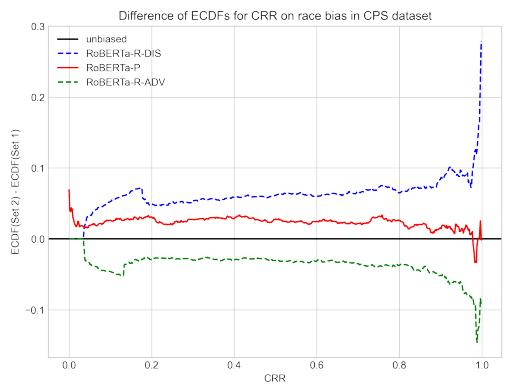
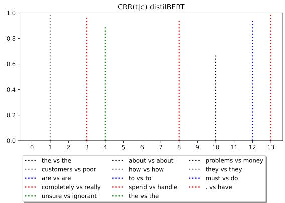
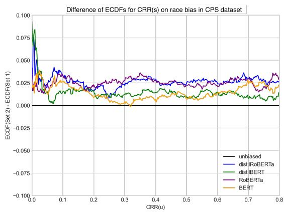
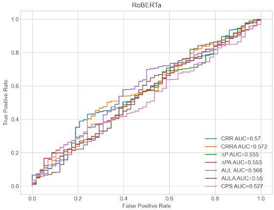
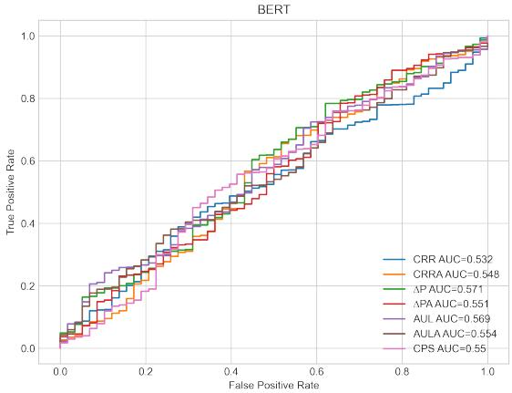

# Measuring Social Biases in Masked Language Models by Proxy of Prediction Quality

Rahul Zalkikar∗ Independent Researcher rayzck9@gmail.com

Kanchan Chandra New York University kc76@nyu.edu

## Abstract

Innovative transformer-based language models produce contextually-aware token embeddings and have achieved state-of-the-art performance for a variety of natural language tasks, but have been shown to encode unwanted biases for downstream applications. In this paper, we evaluate the social biases encoded by transformers trained with the masked language modeling objective using proposed proxy functions within an iterative masking experiment to measure the quality of transformer models predictions and assess the preference of MLMs towards disadvantaged and advantaged groups. We find that all models encode concerning social biases. We compare bias estimations with those produced by other evaluation methods using benchmark datasets and assess their alignment with human annotated biases. We extend previous work by evaluating social biases introduced after retraining an MLM under the masked language modeling objective and find proposed measures produce more accurate and sensitive estimations of biases based on relative preference for biased sentences between models, while other methods tend to underestimate biases after retraining on sentences biased towards disadvantaged groups.

Warning: This paper contains explicit statements of biased stereotypes and may be upsetting.

## 1 Introduction

Word embeddings have proven useful in a variety of Natural Language Processing (NLP) tasks due to their ability to efficiently model complex semantic and syntactic word relationships. Token-level embeddings, such as those produced by Word2Vec (Mikolov et al., 2013) and GloVe (Pennington et al., 2014) algorithms, learn a non-contextualized text representation and produce static word embeddings that can uncover linear semantic or syntactic relationships between tokens.

Masked language models (MLM(s); Brown et al., 2020; Devlin et al., 2019; Liu et al., 2019a; Radford et al., 2019) such as transformers BERT and RoBERTa incorporate bidirectionality and selfattention, producing contextually-aware embeddings. Unlike $\mathrm { B E R T _ { u n c } }$ , RoBERTa was pretrained solely on the masked language modeling objective (MLMO) on a larger corpus of text. RoBERTa uses a dynamic masking strategy for a diverse set of representations during training and has achieved stateof-the-art results on GLUE, RACE, and SQuAD (Liu et al., 2019b; Rajpurkar et al., 2016; Lai et al., 2017; Wang et al., 2018). Distilled model variants have been shown to train significantly faster for minor decreases in performance (Sanh et al., 2019). MLMs have produced state-of-the-art results for masked language modeling, named entity recognition, and intent or topic classification, but also encode concerning social biases against disadvantaged groups that are undesirable in production settings. As MLMs become increasingly prevalent, researchers have been working on methods to measure biases embedded in these models (Nangia et al., 2020; Kaneko and Bollegala, 2022; Salutari et al., 2023).

To address the issue of social biases in MLMs at its source, we measure biases of MLMs while focusing on an MLM’s key pretraining objective: masked language modeling. In this work, we focus on proposing and assessing bias evaluation measures for MLMs and not proposing methods for debiasing MLMs. However, when assessing evaluation measures, we consider prior research that involves retraining or fine-tuning under the MLMO with debiased or counterfactual data to reduce biases in MLMs, such as Zhao et al., 2018 and Zhao et al., 2019 which use data augmentation to swap gendered words with their opposites prior to retraining. Motivated by this, we assess whether proposed measures satisfy an important criterion for improvement over previously proposed ones: alignment with biases introduced by MLM retraining under the MLMO (Section 4.5.1).

We represent MLM bias through a model’s relative preference for ground truth tokens between two paired sentences along a social bias axis. In each sentence pair, one contains bias against disadvantaged groups (stereotypical) and the other contains bias against advantaged groups (anti-stereotypical). We assess the relative preferences of MLMs towards sentences biased against disadvantaged and advantaged groups using proxy measures for prediction quality. In particular, we quantify MLM preference by proxy of masked token prediction quality given unmasked token context between encoded sentences within pairs.

To measure the preference of an MLM using the (attention-weighted) quality of its predictions under the MLMO, we propose and validate proxy functions ∆PA (Equation 7; Probability Difference with Attention) and CRRA (Equation 6; Complementary Reciprocal Rank with Attention) and introduce a modified ∆P (Equation 3) to measure the likelihood an MLM will select a ground truth token to replace a masked one, and extend these definitions for a sentence. We apply per-model indicator function BSPT (Equation 9) to estimate the encoded social biases in pretrained MLMs. Our approach differs from prior research in measuring biases in MLMs by using attention-weights under an Iterative Masking Experiment (IME; Section 4) to probe MLM preferences.

We compare pre- and retrained MLMs within the same model class to recover the nature of biases introduced by retraining. In particular, we define and apply a proxy for the relative preference between two MLMs with model-comparative indicator function BSRT (Bias Score for MLM Re-training; Equation 10) to estimate social biases introduced by retraining MLMs under the MLMO. These "introduced" biases must be represented by the relative change in biases after retraining an MLM under the MLMO.

In summary, the primary contributions of this work are as follows:

• We explore MLM bias through a model’s relative preference for ground truth tokens between two minimally distant sentences with contrasting social bias under the IME. We measure this using the attention-weighted quality of predictions.

• We propose the model-comparative indicator function BSRT to estimate social biases against disadvantaged groups for a retrained MLM relative to its pretrained base, and assess bias evaluation measures for alignment with biases introduced by MLM retraining under the MLMO.

• We evaluate social biases for four transformer models available through the Transformers library (Wolf et al., 2020). We use proxy measures for MLM prediction quality with model-comparative function BSRT to estimate social biases introduced by retraining MLMs under the MLMO. We find that proposed measures $\Delta \mathrm { { P A } }$ and CRRA, along with modified ∆P and CRR, produce more accurate estimations of biases introduced by MLM retraining than previously proposed ones, which can produce concerning underestimations of biases after retraining MLMs on sentences biased against disadvantaged groups. We observe that proposed measures ∆PA and CRRA, along with modified ∆P, show greater sensitivity than CRR, CSPS, AUL, and AULA to relative changes in MLM bias due to retraining, indicated by larger and smaller bias scores and more frequently significant relative difference in proportions of bias between pre- and retrained transformers.

Our methodology could help others evaluate social biases encoded in an MLM after it is retrained on the MLMO, such as for any downstream fillmask task, or after it is fine-tuned for other objectives that alter weights and change MLMO performance. We release a package for measuring biases in MLMs to enable bias score computation on user-supplied or benchmark datasets and easy integration into existing evaluation pipelines.

## 2 Related Work

## 2.1 Biases in Static Word Embeddings

Static word embeddings (Pennington et al., 2014; Mikolov et al., 2013) can be shifted in a direction to decompose bias embedded in learned text data representations. These could be analogies or biases along an axis, such as gender1 (Bolukbasi et al., 2016) or race (Manzini et al., 2019). The Word Embedding Association Test (WEAT; Caliskan et al., 2017) measures association between targets and attributes using cosine similarity between static word embeddings, but has been shown to overestimate biases by Ethayarajh et al., 2019, which proposed the robust relational inner product association (RIPA) method, derived from the subspace projection method to debias vectors in Bolukbasi et al., 2016.

While WEAT has shown that token-level embeddings produced by GloVe and Word2Vec encode biases based on gender and race (Caliskan et al., 2017), the Sentence Encoder Association Test (SEAT; May et al., 2019) extends on WEAT to measure social biases in sentence-level encoders such as ELMo and BERT using template sentences with masked target tokens2, averaging token embeddings to form sentence-level embeddings on which cosine similarity is applied as a proxy for semantic association. As an alternative evaluation method under a different objective, Liang et al., 2020 assessed differences in log-likelihood between gender pronouns in a template sentence3 where occupations can uncover the directionality of the bias encoded by an MLM.

## 2.2 Evaluating Biases in MLMs

When considering a sentence s containing tokens $\{ t _ { 1 } , t _ { 2 } , . . . , t _ { l _ { s } } \}$ , where $l _ { s }$ is the number of tokens in s, (modified) token(s) of s can characterize its bias towards either disadvantaged or advantaged groups. For a given sentence s with tokens $t \in$ s we denote all tokens besides $t _ { x }$ as ${ \bf \mathcal { S } } \backslash _ { t _ { x } }$ (where $1 \leq x \leq l _ { s } )$ , and we denote modified tokens as M and unmodified tokens as $U ~ ( s \ = \ U \cup M )$ For a given MLM with parameters $\theta ,$ we denote a masked token as $t _ { m }$ and a predicted token as $t _ { p }$

Salazar et al., 2020 uses pseudo-log-likelihood scoring to approximate $P ( U | M , \theta )$ , or the probability of unmodified tokens conditioned on modified ones. Similarly, Nangia et al., 2020 reports CrowS-Pairs Scores (CSPS; Appendix B), a pseudo-loglikelihood score for an MLM selecting unmodified tokens given modified ones. Nadeem et al., 2021 reports a StereoSet Score (SSS; Appendix C), a pseudo-log-likelihood score for an MLM selecting modified tokens given unmodified ones.

Salutari et al., 2023 tests MLMs in an iterative fill mask setting where the model outputs a set of tokens (or the (log)softmax of model logits mapped to tokens) to fill the masked one, starting with the token of highest probability $P ( t _ { p } | c )$ and, as such, first rank $\rho ( t _ { p } | c ) = 1$ in the set of model token predictions (which is limited by the MLM’s embedding space).

$$
\begin{array} { r l } & { \Delta \mathrm { P } ( t | s _ { \backslash t _ { m } } ; \theta ) = P ( t _ { p } | s _ { \backslash t _ { m } } ; \theta ) - P ( t _ { m } | s _ { \backslash t _ { m } } ; \theta ) } \\ & { \qquad = \Delta \mathrm { P } ( w ; \theta ) } \end{array}\tag{1}
$$

$\Delta \mathrm { P } ( t | s _ { \backslash t _ { m } } ; \theta )$ (Equation 1) represents the difference between the probability of a predicted token $t _ { p }$ and a masked token $t _ { m }$ in a sentence s. It serves as a proxy of the MLM’s prediction quality for a token given its context within the IME, or all tokens in s besides $t _ { m }$ (Salutari et al., 2023).

$$
\begin{array} { r l } & { \mathrm { \cal { C } \mathrm { R R } } \big ( t | s _ { \backslash t _ { m } } ; \theta \big ) = \big ( \rho \big ( t _ { p } | s _ { \backslash t _ { m } } ; \theta \big ) ^ { - 1 } - \rho \big ( t _ { m } | s _ { \backslash t _ { m } } ; \theta \big ) ^ { - 1 } \big ) } \\ & { \quad \quad \quad = 1 - \rho \big ( t _ { m } \big | s _ { \backslash t _ { m } } ; \theta \big ) ^ { - 1 } } \\ & { \quad \quad \quad = \mathrm { \cal { C } R R } \big ( w ; \theta \big ) } \end{array}\tag{2}
$$

Salutari et al., 2023 proposes the Complementary Reciprocal Rank $( \mathrm { C R R } ( t | s _ { \backslash t _ { m } } ; \theta )$ ; Equation 2) for a masked token given its context, where $\rho ( t _ { p } | s _ { \backslash t _ { m } } ) ^ { \ }$ −1 is the reciprocal rank of the predicted token (and always equal to 1) and $\rho ( t _ { m } | s _ { \backslash t _ { m } } ) ^ { - 1 }$ is the reciprocal rank of the masked token. Thus, $\rho ( t _ { m } | s _ { \backslash t _ { m } } ) ^ { - 1 }$ provides a likelihood measure for $t _ { m }$ being chosen by the model as a candidate token to replace the ground truth (masked) one.

Salutari et al., 2023 defines $\Delta \mathsf { P } ( s )$ (Appendix D) as the probability difference for a sentence s and CRR(s) (Appendix E; average of all single masked token CRRs with token ordering preserved) as the complementary reciprocal rank for a sentence s, and uses them as proxies for an MLM’s prediction quality or preference, claiming metrics based on CRR for a sentence s are necessary to fully capture the biases embedded in MLMs.

Kaneko and Bollegala, 2022 propose evaluation metrics All Unmasked Likelihood (AUL; Appendix F) and AUL with Attention weights (AULA; Appendix G), where both are generated by requiring the MLM to predict all tokens (unmasked input). By requiring the MLM to simultaneously predict all of the tokens in a given unmasked input sentence $s ,$ Kaneko and Bollegala, 2022 aim to eliminate biases associated with masked tokens under previously proposed pseudo-likelihood-based scoring methods (Nadeem et al., 2021, Nangia et al., 2020), which assumed that masked tokens are statistically independent, and selectional biases from masking a subset of input tokens, such as high frequency words (which are masked more often during training).

Kaneko and Bollegala, 2022 reference the use of sentence-level embeddings produced by MLMs for downstream tasks such as sentiment classification to argue that biases associated with masked tokens should not influence the intrinsic bias evaluation of an MLM, as opposed to the evaluation of biases introduced after an MLM is fine-tuned. In contrast, we focus on an MLM’s key pretraining objective, masked language modeling, to measure social biases of the $\mathbf { M L M . ^ { 4 } }$ In addition, we measure relative changes in biases w.r.t. the intrinsic biases of the same base MLM after retraining under the MLMO (as opposed to fine-tuning). Thus, we argue that biases associated with masked tokens are not undesirable in our case.

AUL and AULA were found to be sensitive to contextually meaningful inputs by randomly shuffling tokens in input sentences and comparing accuracies with and without shuffle. CRR is also conditional to the unmasked token context by definition. We argue measure sensitivity to unmasked token contexts is desirable when evaluating a given MLM’s preference under a fill-mask task, or when estimating biases using contextualized token-level embeddings produced by an MLM.

In contrast with previous methods such as SSS and CSPS, we refrain from using strictly modified or unmodified subsets of input tokens as context and instead provide all tokens but the ground truth one as context for MLM prediction under each iteration of our masking experiment. In this sense, CRR and ∆P consider all tokens equally, and like AUL, they might also benefit from considering the weight of MLM attention as a proxy for token importance when probing for MLM preferences for ground truth tokens between two paired sentences along a social bias axis.5

Existing benchmark datasets such as CPS are limited to one ground truth per masked token, so an important consideration is an MLM’s ability to predict multiple plausible tokens for a context that could qualify for concerning social bias but goes unrecognized during evaluation using previously proposed measures. CRR could perform better than pseudo-(log)likelihood-based measures for this sensitivity that yields larger relative differences in $\Delta \mathrm { P } ( t | c )$ as opposed to CRR $( t | c ) ^ { 6 }$ , and is deemed critical for evaluation by Salutari et al., 2023 due to the possible uniformity of probabilities generated by a particular MLM w.r.t. others.

## 3 Methodology

## 3.1 Biases in Pretrained MLMs

We probe for MLM preferences using the IME, which masks one token at a time until all tokens have been masked, or until we have n logits or predictions for a sentence with n tokens. Appendix I shows an IME example for one model and text.

Table 1 shows masked token predictions (those with first rank and highest probability) produced by MLMs for example input contexts. The ground truth masked token rank, or $\rho ( t _ { m } | c )$ , represents the quality of the models’ predictions relative to a sentence biased against an advantaged or disadvantaged group. Special start and end character tokens for MLMs are not included in the span of tokens considered in our experiments to eliminate noise.7

$$
\begin{array} { r l } & { \Delta \mathbf { P } ( t | s _ { \backslash t _ { m } } ; \theta ) = \left( \log P ( t _ { p } | s _ { \backslash t _ { m } } ; \theta ) - \log P ( t _ { m } | s _ { \backslash t _ { m } } ; \theta ) \right) } \\ & { \qquad = \Delta \mathbf { P } ( w ; \theta ) } \end{array}\tag{3}
$$

Motivated by the typically long-tail distribution of probabilities output by MLMs, we redefine Equation 1 and propose a modified version $\Delta \mathrm { P } ( w )$ as shown in Equation 3. The log transformation reduces sensitivity to differences when probabilities are high but enhances relative differences when probabilities are low, improving sensitivity to subtle but potentially meaningful variations in lowprobability token choices.

$$
\begin{array} { r l } & { \mathrm { \cal { C } R R A } \big ( t \big | s _ { \backslash t _ { m } } ; \theta \big ) = a _ { m } \big ( 1 - \log \rho \big ( t _ { m } \big | s _ { \backslash t _ { m } } ; \theta \big ) ^ { - 1 } \big ) } \\ & { \quad \quad \quad = \mathrm { \cal { C } R R A } \big ( w ; \theta \big ) } \end{array}\tag{4}
$$

$$
\begin{array} { r l } & { \Delta \mathrm { { P A } } \big ( t | s _ { \backslash t _ { m } } ; \theta \big ) = a _ { m } \big ( \log P ( t _ { p } | s _ { \backslash t _ { m } } ; \theta ) } \\ & { ~ - \log P ( t _ { m } | s _ { \backslash t _ { m } } ; \theta ) \big ) } \\ & { ~ = \Delta \mathrm { { P A } } \big ( w ; \theta \big ) } \end{array}\tag{5}
$$

<table><tr><td>Model</td><td>IME Input with masked token w11 = money</td><td> $\overline { { w _ { 1 1 } } }$  Rank</td></tr><tr><td>distilRoBERTaP</td><td>The poor are really ignorant about how to handle the problems they do have</td><td>5</td></tr><tr><td>distilRoBERTaR</td><td>The poor are really ignorant about how to handle the money they do have</td><td>1</td></tr><tr><td>distilRoBERTaP</td><td>The rich are really ignorant about how to handle the wealth they do have</td><td>4</td></tr><tr><td>distilRoBERTaR</td><td>The rich are really ignorant about how to handle the problems they do have</td><td>2</td></tr></table>

Table 1: MLM predictions and ground truth masked token ranks for input sentences under the IME. The processed input sentences are "The [poor, rich] are really ignorant about how to handle the money they do have", and are contained in $S _ { \mathrm { d i s } }$ or $S _ { \mathrm { a d v } }$ from CPS with characteristic words poor and rich respectively. Masked tokens are in bold.

For a given MLM with parameters θ, we propose attention-weighted measures CRRA(w) and $\Delta \mathrm { P A } ( w )$ defined in Equations 4 and 5 respectively, where $a _ { w }$ is the average of all multi-head attentions associated with the ground truth token $w ^ { 8 }$ and $P ( t _ { m } | s _ { \backslash t _ { m } } )$ and $\rho ( t _ { m } | s _ { \backslash t _ { m } } )$ are the probability score and rank of the masked token respectively. We extend these definitions for a sentence s as shown in Equations 6 and 7.

$$
\operatorname { c R R A } ( s ) : = \frac { 1 } { l _ { s } } \sum _ { w \in s } \operatorname { c R R A } ( w ; \theta )\tag{6}
$$

$$
\Delta \mathrm { P A } ( s ) : = \frac { 1 } { l _ { s } } \sum _ { w \in s } \Delta \mathrm { P A } ( w ; \theta )\tag{7}
$$

We compute measure $f , \forall f \in \{ \mathrm { c R R } _ { T } ( s )$ $\Delta \mathrm { P } _ { T } ( s ) , \mathrm { C R R A } _ { T } ( s ) , \Delta \mathrm { P A } _ { T } ( s ) \big \}$ , where T is an MLM transformer and s is a sentence, $\forall s \in S _ { \mathrm { d i s } }$ and $\forall s \in S _ { \mathrm { a d v } } . ^ { 9 }$ Table 13 in the Appendix shows these measures (likelihood scores) for an example sentence s in SS and CPS.10 We define sets of measures $M _ { 1 }$ and $M _ { 2 } ( M _ { 1 } \cap M _ { 2 } = \emptyset )$ , where $M _ { 1 } =$ CRR, CRRA, ∆PA, ∆P and $M _ { 2 } = \mathrm { \{ A U L , A U L A } $ CSPS, SSS .

$$
\Delta f _ { T } ( i ) = \left\{ \begin{array} { l l } { f _ { T } ( S _ { \mathrm { a d v } } ( i ) ) - f _ { T } ( S _ { \mathrm { d i s } } ( i ) ) , } & { \mathrm { i f ~ } f \in M _ { 1 } } \\ { f _ { T } ( S _ { \mathrm { d i s } } ( i ) ) - f _ { T } ( S _ { \mathrm { a d v } } ( i ) ) , } & { \mathrm { i f ~ } f \in M _ { 2 } } \end{array} \right.\tag{8}
$$

We apply Equation 8 to estimate the preference of a transformer $T$ for $s \in S _ { \mathrm { d i s } }$ relative to $s \in S _ { \mathrm { a d v } }$ for paired sentence s with index i and measure $f ,$

f  CRR, CRRA, ∆P, ∆PA, CSPS, SSS, AUL, AULA . We define a bias score for a pretrained MLM as BSPT (Equation 9).

$$
\mathtt { \mathtt { B S P T } } ( f ) : = \frac { 1 0 0 } { N } \sum _ { i = 1 } ^ { N } \mathbb { 1 } \left( \Delta f _ { T } ( i ) > 0 \right)\tag{9}
$$

1 is a per-model indicator function which returns 1 if transformer $T$ has a larger preference for $S _ { \mathrm { d i s } }$ relative to $S _ { \mathrm { a d v } }$ and 0 otherwise, as estimated for a measure f by Equation 8. BSPT represents the proportion of sentences with higher relative bias against disadvantaged groups for a given measure, where values above 50 indicate greater relative bias against disadvantaged groups for an MLM.

## 3.2 Biases Introduced by MLM Retraining

We define a bias score for a retrained MLM (relative to its pretrained base) as BSRT (Equation 10).

$$
\ L _ { \mathrm { B S R T } } ( f ) : = \frac { 1 0 0 } { N } \sum _ { i = 1 } ^ { N } \ L { 1 } \left( \Delta f _ { T _ { 1 } } ( i ) > \Delta f _ { T _ { 2 } } ( i ) \right)\tag{10}
$$

We define a proxy for the relative preference between two MLMs with the model-comparative indicator function 1, which returns 1 if transformer $T _ { 1 }$ has a larger preference for $S _ { \mathrm { d i s } }$ relative to $S _ { \mathrm { a d v } }$ than transformer $T _ { 2 }$ and 0 otherwise, as estimated for a measure $f$ by Equation 8. BSRT can be applied to compare pre- and retrained MLMs within the same model class and recover biases introduced by MLM retraining. Values above 50 indicate greater bias against disadvantaged groups for transformer $T _ { 1 }$ relative to $T _ { 2 }$ , or a retrained transformer relative to its pretrained base.

## 4 Experiments and Findings

## 4.1 Benchmark Datasets for Social Bias

The Crowdsourced Stereotype Pairs Benchmark (CPS; Nangia et al., 2020) contains biased sentences towards historically advantaged and disadvantaged groups along nine forms of social biases. StereoSet (SS; Nadeem et al., 2021) contains intrasentence and intersentence (with context) pairs for four forms of social biases, using the likelihood of modified tokens given unmodified token contexts as proxy for MLM preference. Similarly, CPS contains characteristic words that distinguish sentences within pairs and define the nature of a particular bias towards either advantaged or disadvantaged groups, but instead uses the relative likelihood of unmodified tokens being chosen by the MLM given a modified context (characteristic word) across a sentence pair.

CPS and SS contain biased sentences towards advantaged and disadvantaged groups, where CPS sentence pairs are categorized by bias types: race, age, socioeconomic, disability, religion, physical appearance, gender, sexual orientation, and nationality, and SS sentence pairs by: race, religion, gender, and profession (see Appendix A.1 for details on sentence counts for bias categories).

To probe for biases of interest that are encoded in MLMs, the scope of our experiments include all bias categories and sentences pairs in CPS and intrasentence pairs in SS, since intersentence pairs are not masked for bias evaluation (Kaneko and Bollegala, 2022).11 We estimate MLM preference towards a stereotypical sentence over a less stereotypical one for each bias category in CPS and SS.

## 4.2 Retraining Dataset

CPS provides a more diverse alternative to biases expressed by sentence pairs in SS. Biases widely acknowledged in the United States are well represented in $\mathrm { C P S } ^ { 1 2 }$ compared to SS, and there is greater diversity of sentence structures in CPS (Nangia et al., 2020). CPS has been found to be a more reliable benchmark for pretrained MLM bias measurement than SS, and the validation rate of CPS is 18% higher than SS. (Nangia et al., 2020). Based on these findings, paired with (1) the computational expense and time-consumption involved with retraining MLMs under the MLMO and (2) concerns regarding standard masked language modeling metric viability on SS, we proceed to use sentence sets in CPS to re-train MLMs and validate methods for estimating the biases that are introduced (Nangia et al., 2020) (see Appendix A.2 for details). We re-train ML $. \mathrm { M s } \forall s \in S _ { \mathrm { d i s } } \mathrm { o r } \forall s \in S _ { \mathrm { a d v } }$ where s is a sentence in CPS biased towards either advantaged $( S _ { \mathrm { a d v } } )$ or disadvantaged groups $( S _ { \mathrm { d i s } } )$

## 4.3 Transformer-based Language Models

We denote pre- and retrained transformers as $T _ { P }$ and $T _ { R }$ respectively. The subscript $\mathrm { u n c }$ denotes an uncased model. We report results from the following transformer-based language models available through the HuggingFace library (Wolf et al., 2020): bert-base-uncased $( \mathrm { B E R T _ { u n c } } ;$ Devlin et al., 2019), roberta-base (RoBERTa; Liu et al., 2019b), distilbert-base-uncased $( \mathrm { d i s t i l B E R T _ { u n c } } ;$ Sanh et al., 2019), and distilroberta-base (distil-RoBERTa; Liu et al., 2019a).

## 4.4 Pretrained MLM Bias Scores

We use BSPT to compare MLM preferences, report overall bias scores in Table 2, and provide detailed results for all measures and MLMs in Appendix K.

<table><tr><td rowspan=1 colspan=5>f    RoBERTap BERT $\cdot _ { P , \mathrm { u n c } }$ D-RoBERTaP D-BERT $\overline { { P , \mathrm { u n c } } }$ </td></tr><tr><td rowspan=1 colspan=5>CPS Dataset</td></tr><tr><td rowspan=1 colspan=1>CSPS</td><td rowspan=1 colspan=1>59.35</td><td rowspan=1 colspan=1>60.48</td><td rowspan=1 colspan=2>59.35        56.83</td></tr><tr><td rowspan=1 colspan=1>AUL</td><td rowspan=1 colspan=1>58.75</td><td rowspan=1 colspan=1>48.34</td><td rowspan=1 colspan=1>53.32</td><td rowspan=1 colspan=1>51.59</td></tr><tr><td rowspan=1 colspan=1>AULA</td><td rowspan=1 colspan=1>58.09</td><td rowspan=1 colspan=1>48.21</td><td rowspan=1 colspan=1>51.86</td><td rowspan=1 colspan=1>52.65</td></tr><tr><td rowspan=1 colspan=1>CRR</td><td rowspan=1 colspan=1>58.89</td><td rowspan=1 colspan=1>61.07</td><td rowspan=1 colspan=1>57.76</td><td rowspan=1 colspan=1>56.23</td></tr><tr><td rowspan=1 colspan=1>CRRA</td><td rowspan=1 colspan=1>60.68</td><td rowspan=1 colspan=1>58.89</td><td rowspan=1 colspan=1>61.94</td><td rowspan=1 colspan=1>60.08</td></tr><tr><td rowspan=1 colspan=1>∆P</td><td rowspan=1 colspan=1>59.88</td><td rowspan=1 colspan=1>60.08</td><td rowspan=1 colspan=1>59.75</td><td rowspan=1 colspan=1>57.49</td></tr><tr><td rowspan=1 colspan=1>∆PA</td><td rowspan=1 colspan=1>60.15</td><td rowspan=1 colspan=1>60.81</td><td rowspan=1 colspan=1>59.81</td><td rowspan=1 colspan=1>58.02</td></tr><tr><td rowspan=1 colspan=1>SS</td><td rowspan=1 colspan=1>Dataset</td><td rowspan=1 colspan=1></td><td rowspan=1 colspan=1></td><td rowspan=1 colspan=1></td></tr><tr><td rowspan=1 colspan=1>SSS</td><td rowspan=1 colspan=1>61.06</td><td rowspan=1 colspan=1>59.16</td><td rowspan=1 colspan=1>61.4</td><td rowspan=1 colspan=1>60.59</td></tr><tr><td rowspan=1 colspan=1>AUL</td><td rowspan=1 colspan=1>59.45</td><td rowspan=1 colspan=1>48.91</td><td rowspan=1 colspan=1>60.21</td><td rowspan=1 colspan=1>51.71</td></tr><tr><td rowspan=1 colspan=1>AULA</td><td rowspan=1 colspan=1>58.83</td><td rowspan=1 colspan=1>50.28</td><td rowspan=1 colspan=1>59.59</td><td rowspan=1 colspan=1>51.66</td></tr><tr><td rowspan=1 colspan=1>CRR</td><td rowspan=1 colspan=1>57.83</td><td rowspan=1 colspan=1>53.85</td><td rowspan=1 colspan=1>54.37</td><td rowspan=1 colspan=1>53.42</td></tr><tr><td rowspan=3 colspan=1>CRRA $\Delta \mathbf { P }$  $\Delta \mathbf { P } \mathbf { A }$ </td><td rowspan=1 colspan=1>62.06</td><td rowspan=1 colspan=1>58.59</td><td rowspan=1 colspan=1>60.54</td><td rowspan=1 colspan=1>61.11</td></tr><tr><td rowspan=1 colspan=1>62.2</td><td rowspan=1 colspan=1>58.64</td><td rowspan=1 colspan=1>61.4</td><td rowspan=1 colspan=1>59.31</td></tr><tr><td rowspan=1 colspan=1>62.35</td><td rowspan=1 colspan=1>58.21</td><td rowspan=1 colspan=1>61.35</td><td rowspan=1 colspan=1>59.31</td></tr></table>

Table 2: Overall bias scores for pretrained MLMs using BSPT(f) with measures $\forall f \in$ CRR, CRRA, ∆P, ∆PA, CSPS, SSS, AUL, AULA on CPS and SS, where D- denotes distilled. Color-coded from lightest to darkest, with lower values represented by lighter shades and higher values by darker shades. Bold values indicate the highest bias score for an MLM across all measures.

Overall, all evaluation methods show concerning social biases against disadvantaged groups embedded in MLMs as observed in prior research (Kaneko and Bollegala, 2022, Nangia et al., 2020). Interestingly, $\mathrm { B E R T _ { u n c } }$ has the lowest overall SSS, AUL, AULA, CRRA, ∆P, and $\Delta \mathrm { { P A } }$ (second lowest CRR) on SS, but conflicting results on CPS, where it has the highest CSPS, CRR, $\Delta \mathrm { { P } } ,$ and ∆PA but the lowest AUL, AULA, and CRRA. RoBERTa and distilRoBERTa have higher overall bias than $\mathrm { B E R T _ { u n c } }$ and $\mathrm { d i s t i l B E R T _ { u n c } }$ according to (1) all but one measure on SS and (2) AUL and CRRA on CPS.

Kaneko and Bollegala, 2022 observe a higher bias score for religion in CPS across CSPS, AUL, and AULA with the roberta-large MLM. Nangia et al., 2020 also observe that roberta-large has relatively higher bias scores for the religion category in CPS, and relatively lower bias scores for the gender and race categories compared to SS.13 Similarly, we observe that gender has relatively lower scores in CPS compared to SS across MLMs, but that race bias remains low across all MLMs, measures, and datasets. We observe a relatively high religious bias across all MLMs in CPS, but find AUL and AULA tend to underestimate religious bias on SS and overestimate it on CPS compared to proposed measures for $\mathrm { B E R T _ { u n c } }$ . We find that other measures underestimate disability bias for $\mathrm { B E R T _ { u n c } }$ and $\mathrm { d i s t i l B E R T _ { u n c } }$ on CPS, but give similar estimates for RoBERTa and distilRoBERTa. We find that only AUL and AULA estimate overall bias scores below 50, where the corresponding MLM is $\mathrm { B E R T _ { u n c } }$ in each case.

## 4.4.1 Human Annotated Bias Alignment

We compare the alignment (agreement) between measures and bias ratings in CPS. Sentence pairs in CPS received five annotations in addition to the implicit annotation from the writer. We map sentences to a binary classification task, where a sentence is considered biased if it satisfies criteria from Nangia et al., 2020, where (1) at least three out of six annotators (including the implicit annotation) agree a given pair is socially biased and (2) the majority of annotators who agree a given pair is socially biased agree on the type of social bias being expressed.14

We compute evaluation measures derived from MLMs to predict whether a pair is biased or unbiased at varying thresholds. All measures are computed for each sentence in a pair. Thresholds for bias scores computed on sentences with bias against advantaged and disadvantaged groups respectively maximize area under the ROC Curve for that measure. We find that one or more of proposed measures $\Delta \mathrm { { P A } }$ and CRRA, along with modified $\Delta \mathbf { P }$ and CRR, outperform AUL and AULA in their agreement with human annotators on CPS for RoBERTaP and $\mathrm { B E R T } _ { P , \mathrm { u n c } }$ based on higher AU-ROC values if MLMs exhibit bias towards disadvantaged groups (ROC curves in Appendix L).

## 4.5 Retrained MLM Bias Scores

We re-train each transformer under consideration using the $\mathrm { P y }$ Torch Python library with P100 and T4 GPUs on cased (RoBERTa and distilRoBERTa) and uncased $( \mathrm { B E R T _ { u n c } }$ and $\mathrm { d i s t i l B E R T _ { u n c } } )$ versions of CPS sentences (see Appendix M.1 for more details).

  
Figure 1: Difference between ECDFs for CRR distribution for sentences in $S _ { \mathrm { d i s } }$ and $S _ { \mathrm { a d v } }$ for pre- and retrained RoBERTa and the race bias category in CPS. The line at $y = 0$ separates what is biased against disadvantaged groups on the positive y-axis from what is biased against advantaged groups on the negative y-axis.

Figure 1 shows the difference in ECDFs for the $\mathrm { C R R } _ { m } ( s )$ measure on the race bias category in CPS, where m is retrained MLM RoBERTaR. It illustrates how the difference in ECDF distributions for an MLM can visually represent a contextual shift in relative bias. When compared with pretrained RoBERTa (RoBERTa-P), we observe an upwards shift in the difference of ECDFs for the CRR difference between sentence sets after retraining RoBERTa on $S _ { \mathrm { d i s } }$ (RoBERTa-R-DIS), and a downwards shift after retraining on $S _ { \mathrm { a d v } }$ (RoBERTa-R-ADV). This is expected since retraining on $S _ { \mathrm { d i s } } \ \mathrm { o r } \ S _ { \mathrm { a d v } }$ should shift the MLM preference towards the corresponding bias type.

We compute BSRT for retrained MLMs and all measures and bias categories on CPS and report detailed results in Appendix $\mathbf { M } . 2 . ^ { 1 5 }$ In general, each measure produces a bias score in accordance with the particular retraining dataset used for almost all significant results across MLMs, demonstrating that proposed function BSRT can be applied to estimate the bias against disadvantaged groups for transformer $T _ { 1 }$ relative to its pretrained base $T _ { 2 }$

<table><tr><td>Model</td><td>Retrain dataset</td><td> $f : \operatorname* { m i n } \big / \operatorname* { m a x } \mathbf { B } \mathbf { S } \mathbf { R } \mathbf { T } \exists c \in C$ </td><td> ${ \overline { { f : p < a \forall c \in C } } }$ </td><td></td></tr><tr><td rowspan="2">RoBERTaR</td><td> $\forall s \in S _ { \mathrm { d i s } }$ </td><td> $\overline { { \operatorname* { m a x } \mathrm { B S R T } : \{ \Delta \mathbf { P } , \Delta \mathbf { P } \mathbf { A } \} } }$ </td><td></td><td> $\mathbf { \overline { { C R R , C R R A , \Delta P , \Delta S B } } }$ </td></tr><tr><td> $\forall s \in S _ { \mathrm { a d v } }$ </td><td> $\operatorname* { m i n } { \mathrm { B S R T } } : \{ \mathbf { C R R A } , \Delta \mathbf { P } \}$ </td><td></td><td> $\mathbf { C S P S } , \mathbf { C R R } , \mathbf { C R R A } , \Delta \mathbf { P } , \Delta \mathbf { P A }$ </td></tr><tr><td rowspan="2">distilRoBERTaR</td><td> $\forall s \in S _ { \mathrm { d i s } }$ </td><td> $\overline { { \operatorname* { m a x } \mathrm { B S R T } : \left\{ \mathbf { C R R } , \Delta \mathbf { P } , \Delta \mathbf { P A } \right\} } }$ </td><td></td><td>∆P, ∆PA</td></tr><tr><td> $\forall s \in S _ { \mathrm { a d v } }$ </td><td> $\mathrm { m i n \ B S R T : \Sigma \{ { \bf C R R A } , \Delta { \bf P } , \Delta { \bf P } { \bf \acute { A } } \} }$ </td><td></td><td>CRR, CRRA, ∆P, ∆PA</td></tr><tr><td rowspan="2"> $\overline { { \mathrm { ~ B E R T } _ { R } } }$ </td><td> $\forall s \in S _ { \mathrm { d i s } }$ </td><td>max BSRT :</td><td> $\{ \Delta \mathbf { P } , \Delta \mathbf { P } \mathbf { A } \}$ </td><td>CRR, CRRA, ∆P, ∆PA</td></tr><tr><td> $\forall s \in S _ { \mathrm { a d v } }$ </td><td>min BSRT :</td><td> $\{ \mathbf { C R R A } , \Delta \mathbf { \bar { P } } , \Delta \mathbf { P A } \}$ </td><td> $\mathbf { C S P S } , \mathbf { C R R } , \mathbf { C R R A } , \Delta \mathbf { P } , \Delta \mathbf { P A }$ </td></tr><tr><td rowspan="2">distilBERTR</td><td> $\forall s \in S _ { \mathrm { d i s } }$ </td><td>max BSRT :</td><td> $\{ \mathbf { A U L } , \mathbf { C R R } , \Delta \mathbf { P } , \Delta \mathbf { P A } \}$ </td><td> $\overline { { \mathbf { A U L } , \mathbf { A U L A } , \Delta \mathbf { P } , \Delta \mathbf { P A } } }$ </td></tr><tr><td> $\forall s \in S _ { \mathrm { a d v } }$ </td><td>min BSRT :</td><td> $\{ \mathbf { C R R A } , \Delta \mathbf { P } , \Delta \mathbf { P A } \}$ </td><td> $\mathbf { C S P S } , \mathbf { C R R A } , \Delta \mathbf { P } , \Delta \mathbf { P A }$ </td></tr></table>

Table 3: Measures $\forall f \in \{ \mathrm { C R R } , \mathrm { C R R A }$ $\Delta \mathrm { { P } } ,$ ∆PA, CSPS, AUL, AULA with at least one min BSRT or max BSRT across bias categories in CPS for MLMs retrained on $S _ { \mathrm { a d v } }$ or $S _ { \mathrm { d i s } }$ respectively (BSRT; Equation 10). $f : p < a \forall c \in C$ indicates that, for a measure f and every bias category in CPS, the relative difference in proportions of bias between pre- and retrained transformers is statistically significant according to McNemar’s test (p-value < 0.05).  
MLMs retrained on $S _ { \mathrm { a d v } }$

In Table 3, we report (1) measures with at least one min BSRT or max BSRT across bias categories in CPS for MLMs retrained on $S _ { \mathrm { a d v } }$ or $S _ { \mathrm { d i s } }$ respectively, and (2) measures for which the relative difference in proportions of bias between pre- and retrained transformers is statistically significant according to McNemar’s test (p-value < 0.05) for every bias category in CPS.

For all MLMs retrained on $S _ { \mathrm { d i s } } , \mathrm { C R R } , \Delta \mathrm { P } ,$ and ∆PA give results above 50 for each bias category as expected, with higher scores than other measures in almost every case. CRRA also gives results above 50 for each bias category except for disability bias using distilBERTR. Similarly, for all MLMs retrained on $S _ { \mathrm { a d v } }$ , CRR, CRRA, ∆P, and ∆PA give results below 50 for each bias category as expected, with lower scores than other measures in almost every case. In contrast, AULA and CSPS give 3 and 4 bias scores below 50 respectively across all MLMs retrained on $S _ { \mathrm { d i s } }$ . Notably, AUL and CRRA give 1 bias score below 50. AUL and AULA give 4 and 5 bias scores above 50 respectively across all MLMs retrained on $S _ { \mathrm { a d v } }$

As shown in Table 3, in every case and across MLMs, one or more of proposed measures reports the highest retraining bias scores for MLMs retrained on $S _ { \mathrm { d i s } }$ and the lowest for MLMs retrained on $S _ { \mathrm { a d v } }$ . In addition, ∆P and ∆PA give significant results for every bias type across all MLMs retrained on $S _ { \mathrm { d i s } }$ or $S _ { \mathrm { a d v } }$ , and CRR and CRRA give significant results for every bias type using $\mathrm { B E R T } _ { R }$ and $\mathbf { R o B E R T a } _ { R }$ . In contrast, AUL, AULA, and CSPS have 5, 6, and 11 insignificant results respectively across all MLMs retrained on $S _ { \mathrm { d i s } }$ , and 1, 12, and 13 insignificant results respectively across all

We find that $\Delta \mathrm { P A } , \Delta \mathrm { P } ,$ and CRRA show greater sensitivity than CRR, CSPS, AUL, and AULA for relative changes in MLM bias due to retraining, indicated by larger and smaller scores and more frequently significant relative difference in proportions of bias between pre- and retrained transformers. We find that CSPS, AUL, and AULA produce concerning underestimations of biases introduced by retraining MLMs only on sentences with biases against disadvantaged groups from CPS, and overestimations from retraining on sentences with biases against advantaged groups (see Appendix M.2 for more details).

## 4.5.1 Retraining Bias Alignment

<table><tr><td colspan="8">Retrain dataset:  $\overline { { \forall s \in S ^ { d i s } } }$ </td></tr><tr><td>Model</td><td>CSPS</td><td>AUL AULA</td><td></td><td>CRR</td><td>CRRA</td><td>∆P</td><td>∆PA</td></tr><tr><td>BERTR,unc  $\mathbf { R o B E R T a } _ { R }$ </td><td>0.028 0.028</td><td>0.028 0.028 0.000 0.083</td><td></td><td>0.000 0.000 0.000 0.000</td><td>0.000 0.000 0.000 0.000</td><td></td><td></td></tr><tr><td> $\mathbf { D } { \cdot } \mathbf { B } \mathbf { E } \mathbf { R } \mathbf { T } _ { R , \mathrm { u n c } }$ </td><td>0.000</td><td></td><td>0.000 0.000</td><td>0.000 0.028 0.000 0.000</td><td></td><td></td><td></td></tr><tr><td>D-RoBERTaR</td><td>0.056</td><td></td><td>0.000 0.000</td><td>0.000 0.000 0.000 0.000</td><td></td><td></td><td></td></tr><tr><td colspan="8">Retrain dataset: ∀s ∈  $\overline { { S ^ { a d v } } }$ </td></tr><tr><td>Model</td><td>CSPS</td><td>AUL AULA</td><td></td><td>CRR CRRA ∆P ∆PA</td><td></td><td></td><td></td></tr><tr><td> $\overline { { \mathbf { B E R T } _ { R , \mathrm { u n c } } } }$ </td><td>0.000</td><td></td><td>0.0830.083</td><td>0.000 0.000 0.000 0.000</td><td></td><td></td><td></td></tr><tr><td> $\mathbf { R o B E R T a } _ { R }$ </td><td>0.000</td><td></td><td>0.000 0.000</td><td></td><td>0.000 0.000 0.000 0.000</td><td></td><td></td></tr><tr><td> $\mathbf { D } { \cdot } \mathbf { B } \mathbf { E } \mathbf { R } \mathbf { T } _ { R , \mathrm { u n c } }$ </td><td></td><td></td><td>0.000 | 0.000 0.000</td><td></td><td>0.000 0.000 0.000 0.000</td><td></td><td></td></tr><tr><td> $\mathbf { D } { \cdot } \mathbf { R o B } \mathbf { E R T a } _ { R }$ </td><td></td><td></td><td>0.000 | 0.000 0.028</td><td>0.000 0.000 0.000 0.000</td><td></td><td></td><td></td></tr></table>

Table 4: Error rates for MLMs using measures $\forall f \in$ CRR, CRRA, ∆P, ∆PA, CSPS, AUL, AULA , where Ddenotes distilled. Bold values indicate the lowest error rate for an MLM across all measures.

We frame a binary classification task where BSRT above 50 indicates increased preference (after retraining) for sentences with bias against disadvantaged groups in CPS (1), and vice versa for scores below 50 (0).16 We report error rates for MLMs in

Table 4, and find ∆PA, ∆P, CRRA, and CRR produce the lowest error rate for all MLMs. CRR, $\Delta \mathbf { P }$ and $\Delta \mathrm { { P A } }$ are 100% accurate and CRRA is 99% accurate, while AUL, AULA, and CSPS are 93%, 88%, and 94% accurate respectively. Based on this evaluation setting, ∆PA, ∆P, CRRA, and CRR are more accurate than CSPS, AUL, and AULA for estimating social biases introduced by retraining MLMs.

## 5 Conclusion

We represent MLM bias through a model’s relative preference for ground truth tokens between two paired sentences with contrasting social bias under the IME, measured using the (attention-weighted) quality of predictions. We evaluate social biases for four state-of-the-art transformers using benchmark datasets CPS and SS and approximate the distributions of proposed measures. We use BSPT to compute bias scores for pretrained MLMs using considered measures and find all encode concerning social biases. We find that gender has lower encoded biases on CPS compared to SS across MLMs, and that other measures can underestimate religious bias against disadvantaged groups on SS and disability bias on CPS. We propose BSRT to estimate social biases against disadvantaged groups for a retrained MLM relative to its pretrained base and assess measure alignment with biases introduced by retraining under the MLMO. We find that proposed measures $\Delta \mathrm { { P A } }$ and CRRA, along with modified $\Delta \mathbf { P }$ and CRR, produce more accurate estimations of introduced biases than previously proposed ones, which underestimate biases after retraining on sentences biased towards disadvantaged groups, and observe $\Delta \mathrm { { P A } }$ , CRRA, and $\Delta \mathbf { P }$ show greater sensitivity than CRR, CSPS, AUL, and AULA to relative changes in MLM bias due to retraining.

## 6 Limitations

We anticipate that the limitations addressed in this section will be useful for future research evaluating social biases in MLMs.

As described in section 4, we leverage sentence pairs from two benchmark datasets, CPS and SS, to evaluate the social biases of pre- and retrained MLMs. Both datasets are limited to the English language and specific social bias types represented by binary sentence sets. Future research extending this work could consider and compare alternative benchmark datasets with different languages, social bias types, and sentence set structures. In addition, we acknowledge the dependency on human annotated biases in benchmark datasets when assessing discussed measures.

In this work, and as mentioned in section 2.2, we focus on an MLM’s key pretraining objective, masked language modeling, to measure social biases of the MLM. Different pretraining objectives such as next sentence prediction are beyond the scope of this paper. Furthermore, we measure relative changes in biases w.r.t. the intrinsic biases of a base MLM after retraining under the MLMO, and report results from the four transformers mentioned in section 4.3. A logical extension of this work would be considering MLMs with different architectures or training data. We propose the modelcomparative function BSRT to measure the relative change in MLM biases after retraining. Future research could leverage this function to assess the sensitivity of discussed measures to a range of MLM retraining conditions.

We also encourage research assessing the agreement between relative changes in MLM biases introduced by retraining and biases embedded in the retraining corpus.

## 7 Ethical Considerations

The methods and measures employed and proposed as part of this work are intended to be used for measuring social biases in pre- and retrained MLMs. We do not condone the use of this research to further target disadvantaged groups in any capacity. Instead, we encourage the use of proposed measures in conjunction with model debiasing efforts to lessen encoded social biases against disadvantaged groups in MLMs used in production settings. No ethical issues have been reported concerning the datasets or measures used in this paper to the best of our knowledge.

## References

Tolga Bolukbasi, Kai-Wei Chang, James Y Zou, Venkatesh Saligrama, and Adam T Kalai. 2016. Man is to computer programmer as woman is to homemaker? debiasing word embeddings. In Advances in Neural Information Processing Systems, volume 29. Curran Associates, Inc.

Tom B. Brown, Benjamin Mann, Nick Ryder, Melanie Subbiah, Jared Kaplan, Prafulla Dhariwal, Arvind Neelakantan, Pranav Shyam, Girish Sastry, Amanda Askell, Sandhini Agarwal, Ariel Herbert-Voss, Gretchen Krueger, Tom Henighan, Rewon Child, Aditya Ramesh, Daniel M. Ziegler, Jeffrey Wu,

Clemens Winter, Christopher Hesse, Mark Chen, Eric Sigler, Mateusz Litwin, Scott Gray, Benjamin Chess, Jack Clark, Christopher Berner, Sam McCandlish, Alec Radford, Ilya Sutskever, and Dario Amodei. 2020. Language models are few-shot learners.

Aylin Caliskan, Joanna J. Bryson, and Arvind Narayanan. 2017. Semantics derived automatically from language corpora contain human-like biases. Science, 356(6334):183–186.

Jacob Devlin, Ming-Wei Chang, Kenton Lee, and Kristina Toutanova. 2019. BERT: Pre-training of deep bidirectional transformers for language understanding. In Proceedings ofthe 2019 Conference of the North American Chapter of the Association for Computational Linguistics: Human Language Technologies, Volume 1 (Long and Short Papers), pages 4171–4186, Minneapolis, Minnesota. Association for Computational Linguistics.

Kawin Ethayarajh, David Duvenaud, and Graeme Hirst. 2019. Understanding undesirable word embedding associations. In Proceedings of the 57th Annual Meeting of the Association for Computational Linguistics, pages 1696–1705, Florence, Italy. Association for Computational Linguistics.

Aaron Gokaslan and Vanya Cohen. 2019. Openwebtext corpus. http://Skylion007.github.io/ OpenWebTextCorpus.

Masahiro Kaneko and Danushka Bollegala. 2022. Unmasking the mask – evaluating social biases in masked language models. Proceedings ofthe AAAI Conference on Artificial Intelligence, 36(11):11954– 11962.

Guokun Lai, Qizhe Xie, Hanxiao Liu, Yiming Yang, and Eduard Hovy. 2017. RACE: Large-scale ReAding comprehension dataset from examinations. In Proceedings of the 2017 Conference on Empirical Methods in Natural Language Processing, pages 785– 794, Copenhagen, Denmark. Association for Computational Linguistics.

Sheng Liang, Philipp Dufter, and Hinrich Schütze. 2020. Monolingual and multilingual reduction of gender bias in contextualized representations. In Proceedings of the 28th International Conference on Computational Linguistics, pages 5082–5093, Barcelona, Spain (Online). International Committee on Computational Linguistics.

Xiaodong Liu, Pengcheng He, Weizhu Chen, and Jianfeng Gao. 2019a. Improving multi-task deep neural networks via knowledge distillation for natural language understanding.

Yinhan Liu, Myle Ott, Naman Goyal, Jingfei Du, Mandar Joshi, Danqi Chen, Omer Levy, Mike Lewis, Luke Zettlemoyer, and Veselin Stoyanov. 2019b. Roberta: A robustly optimized BERT pretraining approach. CoRR, abs/1907.11692.

Thomas Manzini, Lim Yao Chong, Alan W Black, and Yulia Tsvetkov. 2019. Black is to criminal as Caucasian is to police: Detecting and removing multiclass bias in word embeddings. In Proceedings of the 2019 Conference of the North American Chapter ofthe Associationfor Computational Linguistics: Human Language Technologies, Volume 1 (Long and Short Papers), pages 615–621, Minneapolis, Minnesota. Association for Computational Linguistics.

Chandler May, Alex Wang, Shikha Bordia, Samuel R. Bowman, and Rachel Rudinger. 2019. On measuring social biases in sentence encoders. In Proceedings of the 2019 Conference of the North American Chapter ofthe Associationfor Computational Linguistics: Human Language Technologies, Volume 1 (Long and Short Papers), pages 622–628, Minneapolis, Minnesota. Association for Computational Linguistics.

Quinn McNemar. 1947. Note on the sampling error of the difference between correlated proportions or percentages. Psychometrika, 12(2):153–157.

Tomas Mikolov, Kai Chen, Greg Corrado, and Jeffrey Dean. 2013. Efficient estimation of word representations in vector space.

Moin Nadeem, Anna Bethke, and Siva Reddy. 2021. StereoSet: Measuring stereotypical bias in pretrained language models. In Proceedings ofthe 59th Annual Meeting of the Association for Computational Linguistics and the 11th International Joint Conference on Natural Language Processing (Volume 1: Long Papers), pages 5356–5371, Online. Association for Computational Linguistics.

Nikita Nangia, Clara Vania, Rasika Bhalerao, and Samuel R. Bowman. 2020. CrowS-pairs: A challenge dataset for measuring social biases in masked language models. In Proceedings ofthe 2020 Conference on Empirical Methods in Natural Language Processing (EMNLP), pages 1953–1967, Online. Association for Computational Linguistics.

Jeffrey Pennington, Richard Socher, and Christopher Manning. 2014. GloVe: Global vectors for word representation. In Proceedings of the 2014 Conference on Empirical Methods in Natural Language Processing (EMNLP), pages 1532–1543, Doha, Qatar. Association for Computational Linguistics.

Alec Radford, Jeff Wu, Rewon Child, David Luan, Dario Amodei, and Ilya Sutskever. 2019. Language models are unsupervised multitask learners.

Pranav Rajpurkar, Jian Zhang, Konstantin Lopyrev, and Percy Liang. 2016. SQuAD: 100,000+ questions for machine comprehension of text. In Proceedings of the 2016 Conference on Empirical Methods in Natural Language Processing, pages 2383–2392, Austin, Texas. Association for Computational Linguistics.

Julian Salazar, Davis Liang, Toan Q. Nguyen, and Katrin Kirchhoff. 2020. Masked language model scoring. In Proceedings of the 58th Annual Meeting of

the Association for Computational Linguistics, pages 2699–2712, Online. Association for Computational Linguistics.

Flavia Salutari, Jerome Ramos, Hossein A. Rahmani, Leonardo Linguaglossa, and Aldo Lipani. 2023. Quantifying the bias of transformer-based language models for african american english in masked language modeling. In Advances in Knowledge Discovery and Data Mining, pages 532–543, Cham. Springer Nature Switzerland.

Victor Sanh, Lysandre Debut, Julien Chaumond, and Thomas Wolf. 2019. Distilbert, a distilled version of BERT: smaller, faster, cheaper and lighter. CoRR, abs/1910.01108.

S. S. Shapiro and M. B. Wilk. 1965. An analysis of variance test for normality (complete samples). Biometrika, 52(3/4):591–611.

Alex Wang, Amanpreet Singh, Julian Michael, Felix Hill, Omer Levy, and Samuel Bowman. 2018. GLUE: A multi-task benchmark and analysis platform for natural language understanding. In Proceedings ofthe 2018 EMNLP Workshop BlackboxNLP: Analyzing and Interpreting Neural Networks for NLP, pages 353–355, Brussels, Belgium. Association for Computational Linguistics.

Bernard L Welch. 1947. The generalization of student’s problem when several different population variances are involved. Biometrika, pages 1–25.

Thomas Wolf, Lysandre Debut, Victor Sanh, Julien Chaumond, Clement Delangue, Anthony Moi, Pierric Cistac, Tim Rault, Remi Louf, Morgan Funtowicz, Joe Davison, Sam Shleifer, Patrick von Platen, Clara Ma, Yacine Jernite, Julien Plu, Canwen Xu, Teven Le Scao, Sylvain Gugger, Mariama Drame, Quentin Lhoest, and Alexander Rush. 2020. Transformers: State-of-the-art natural language processing. In Proceedings ofthe 2020 Conference on Empirical Methods in Natural Language Processing: System Demonstrations, pages 38–45, Online. Association for Computational Linguistics.

Jieyu Zhao, Tianlu Wang, Mark Yatskar, Ryan Cotterell, Vicente Ordonez, and Kai-Wei Chang. 2019. Gender bias in contextualized word embeddings. In Proceedings ofthe 2019 Conference ofthe North American Chapter of the Association for Computational Linguistics: Human Language Technologies, Volume 1 (Long and Short Papers), pages 629–634, Minneapolis, Minnesota. Association for Computational Linguistics.

Jieyu Zhao, Tianlu Wang, Mark Yatskar, Vicente Ordonez, and Kai-Wei Chang. 2018. Gender bias in coreference resolution: Evaluation and debiasing methods. In Proceedings of the 2018 Conference ofthe North American Chapter ofthe Associationfor Computational Linguistics: Human Language Technologies, Volume 2 (Short Papers), pages 15–20, New Orleans, Louisiana. Association for Computational Linguistics.

Yukun Zhu, Ryan Kiros, Rich Zemel, Ruslan Salakhutdinov, Raquel Urtasun, Antonio Torralba, and Sanja Fidler. 2015. Aligning books and movies: Towards story-like visual explanations by watching movies and reading books. In 2015 IEEE International Conference on Computer Vision (ICCV), pages 19–27.

## A Datasets

## A.1 Benchmark Datasets for Social Biases

<table><tr><td>Bias (CPS)</td><td>N (Sdis and Sadv)</td></tr><tr><td>Race</td><td>516</td></tr><tr><td>Religion</td><td>105</td></tr><tr><td>Nationality</td><td>159</td></tr><tr><td>Socioecnomic</td><td>172</td></tr><tr><td>Gender</td><td>262</td></tr><tr><td>Sexual orientation</td><td>84</td></tr><tr><td>Age</td><td>87</td></tr><tr><td>Disability</td><td>60</td></tr><tr><td>Physical appearance</td><td>63</td></tr><tr><td>Bias (SS)</td><td>N (Sdis and Sadv)</td></tr><tr><td>Race</td><td>962</td></tr><tr><td>Religion</td><td>79</td></tr><tr><td>Gender</td><td>255</td></tr><tr><td>Profession</td><td>810</td></tr></table>

Table 5: Sentence counts for bias categories in $S _ { \mathrm { d i s } }$ (stereotypical) and $S _ { \mathrm { a d v } }$ (anti-stereotypical) on CPS and SS datasets.

## A.2 Retraining Datasets

<table><tr><td> $\overline { { \forall s \in S _ { \bf d i s } } }$  for CPS</td><td>Uncased</td><td>Cased</td></tr><tr><td>Unique Tokens</td><td>4631</td><td>4800</td></tr><tr><td>Lexical Diversity</td><td>0.235</td><td>0.244</td></tr><tr><td> $\forall s \in S _ { \mathbf { a d v } }$  for CPS</td><td>Uncased</td><td>Cased</td></tr><tr><td>Unique Tokens</td><td>4607</td><td>4768</td></tr><tr><td>Lexical Diversity</td><td>0.233</td><td>0.241</td></tr></table>

Table 6: Data profile for (cased and uncased) sentence sets used to re-train MLMs, where lines correspond to sentences in CPS. Includes 1508 lines and total tokens greater than $1 . 9 * 1 0 ^ { 4 }$ for both cased and uncased data.

## B Equation for CSPS(s)

$$
\mathrm { C S P S } ( s ) : = \sum _ { t \in s } \log P ( t | U _ { \backslash t } , M ; \theta )\tag{11}
$$

## C Equation for SSS(s)

$$
\operatorname { s s s } ( s ) : = \frac { 1 } { l _ { s } } \sum _ { t \in s } \log P ( t | U ; \theta )\tag{12}
$$

## D Equation for $\Delta \mathbf { P } ( s )$

$$
\Delta \mathrm { P } ( s ) : = \frac { 1 } { l _ { s } } \sum _ { w \in s } \Delta \mathrm { P } ( w ; \theta ) .\tag{13}
$$

## E Equation for CRR(s)

$$
\mathrm { C R R } ( s ) : = \frac { 1 } { l _ { s } } \sum _ { w \in s } \mathrm { C R R } ( w ; \theta ) .\tag{14}
$$

## F Equation for AUL(s)

$$
\operatorname { A U L } ( s ) : = { \frac { 1 } { l _ { s } } } \sum _ { w \in s } \log P ( w _ { i } | s ; \theta )\tag{15}
$$

## G Equation for AULA(s)

$$
\mathrm { A U L A } ( s ) : = \frac { 1 } { l _ { s } } \sum _ { w \in s } a _ { i } \log P ( w _ { i } | s ; \theta )\tag{16}
$$

## H Example Plot of CRR(t c)

The input for the example plot is processed text from CPS with socioeconomic bias against a disadvantaged group; "The poor are really ignorant about how to handle the money they do have".

  
Figure 2: Example plot of CRR(t c) for distilBERTP,unc relative to the ground truth for a sentence s and token $t \in s$ given context $c ,$ where $c = s _ { \backslash t _ { m } }$ and $t _ { m }$ is the ground truth (masked) token.

## I Example of the IME

The pretrained model input (t1) for the IME example in Table 7 is "The businessman s body was found dead in an alley discarded and uncared for".

1. t1 with $w _ { 1 }$ masked   
The businessman s body was found dead in an   
alley discarded and uncared for   
2. t1 with $\overline { { w _ { 2 } } }$ masked   
The businessman s body was found dead in an   
alley discarded and uncared for   
3. t1 with $w _ { 3 }$ masked   
The businessman s body was found dead in an   
alley discarded and uncared for   
4. t1 with $w _ { 4 }$ masked   
The businessman s body was found dead in an   
alley discarded and uncared for  
Table 7: Example of the IME for distilRoBERTa, where the language model encodes (tokenizes) text t and predicts for a masked token $w _ { i }$ , where i is the original token index.

## J Difference Between ECDFs for CRR(s)

  
Figure 3: Difference between ECDFs for CRR distribution for sentences in $S _ { \mathrm { d i s } }$ (S1) and $S _ { \mathrm { a d v } }$ (S2) and pretrained transformers for the race bias category in CPS.

## K Bias Scores by Category for Pretrained MLMs

CPS dataset Disability has the highest CRR across all MLMs on CPS, along with the highest AULA, CRRA, ∆P and $\Delta \mathrm { { P A } }$ for RoBERTA, and the second highest AUL and CSPS. Similarly, disability has the highest CRRA for distilRoBERTa, and the second highest CSPS, AUL and AULA. Disability has the highest $\Delta \mathbf { P }$ and $\Delta \mathrm { { P A } }$ and the second highest CRRA for $\mathrm { B E R T _ { u n c } }$ and $\mathrm { d i s t i l B E R T _ { u n c } }$ , but appears in lower ranks for CSPS, and even more so for $\mathrm { A U L A }$ and $\mathbf { A U L } . ^ { 1 7 }$ In general, sexual orientation bias has higher scores compared to others for $\mathrm { B E R T _ { u n c } }$ and $\mathrm { d i s t i l B E R T _ { u n c } }$ . Physical appearance has higher bias scores for $\mathrm { B E R T _ { u n c } }$ and $\mathrm { d i s t i l B E R T _ { u n c } }$ compared to RoBERTa and distilRoBERTa. Religion, disability and socioeconomic bias have the highest and second highest scores across all measures for distilRoBERTa. Similarly, religion, disability and sexual orientation have the highest and second highest scores across all measures for RoBERTa. All measures reflect higher socioeconomic and lower sexual orientation biases in distilRoBERTa compared to RoBERTa, and while $\mathrm { d i s t i l B E R T _ { u n c } }$ and $\mathrm { B E R T _ { u n c } }$ are both lower in socioeconomic bias than the former two MLMs, they are higher in sexual orientation bias than distilRoBERTa. Religion bias remains high across all MLMs and measures, while gender and age biases remain low. Compared to proposed measures, others underestimate disability bias for $\mathrm { B E R T _ { u n c } }$ and $\mathrm { d i s t i l B E R T _ { u n c } }$ , but yield similar relative estimates for RoBERTa and distil-RoBERTa.

SS dataset Gender has the first and second highest scores across all measures for RoBERTa and distilRoBERTa on ${ \mathrm { S S . } } ^ { 1 8 }$ Gender also has the highest CRR and CRRA and the second highest $\Delta \mathbf { P }$ and $\Delta \mathrm { { P A } }$ for $\mathrm { d i s t i l B E R T _ { u n c } }$ . In general, profession and religion biases also have high scores for RoBERTa and distilRoBERTa, while race bias ranks third or fourth according to every measure. This persists for $\mathrm { B E R T _ { u n c } }$ and disti $\mathrm { \vert B E R T _ { u n c } }$ , where race bias ranks third or fourth according to all measures besides CRR and AULA, which both place it second for $\mathrm { d i s t i l B E R T _ { u n c } }$ and $\mathrm { B E R T _ { u n c } }$ respectively. Profession has the highest AUL and AULA for $\mathrm { B E R T _ { u n c } }$ and $\mathrm { d i s t i l B E R T _ { u n c } } .$ , while gender has the second highest (with one exception). Interestingly, religion has the highest CRR, CRRA and $\Delta \mathbf { P }$ for $\mathrm { B E R T _ { u n c } }$ , and the second highest $\Delta \mathrm { { P A } }$ , but has the lowest AUL and AULA. Similar to $\mathrm { B E R T _ { u n c } } ,$ religion has the highest $\Delta \mathbf { P }$ but the lowest AUL and AULA for distilBERTunc. However, unlike $\mathrm { B E R T _ { u n c } }$ , religion also has the lowest CRR and second lowest $\Delta \mathrm { { P A } }$ for $\mathrm { d i s t i l B E R T _ { u n c } }$ . This might be expected since proposed measures rank religious bias for distilBERTunc relatively consistently with other measures in CPS, whereas CSPS, AUL and AULA tend to overestimate religious bias for $\mathrm { B E R T _ { u n c } }$ in comparison. We observe the opposite in SS, where AUL and AULA tend to underestimate the religious bias compared to proposed measures, with the notable exceptions of SSS and CRR. Overall, we can observe a higher relative gender bias in RoBERTa and distilRoBERTa compared to $\mathrm { B E R T _ { u n c } }$ and $\mathrm { d i s t i l B E R T _ { u n c } }$ on SS.

## K.0.1 Race Bias in Pretrained MLMs

$\mathrm { B E R T _ { u n c } }$ and $\mathrm { d i s t i l B E R T _ { u n c } }$ are trained on English Wikipedia (16GB) and BookCorpus (Zhu et al., 2015), while RoBERTa and distilRoBERTa are trained on OpenWebText (Gokaslan and Cohen, 2019). As referenced in Section 4, Salutari et al., 2023 found that RoBERTa’s and distilRoBERTa’s exposure to less standard English through training on the OpenWebCorpus likely exposed these MLMs to a less standard form of American English, as both models have more relative bias against SAE than AAE. Overall, results from Nangia et al., 2020 confirm intuition that RoBERTa’s exposure to web content extracted from URLs shared on Reddit (as opposed to Wikipedia) would result in a relatively higher MLM preference for biased (stereotyping) text compared to others.

Indeed, we also observe that pretrained MLMs RoBERTa and distilRoBERTa have higher incidence of race bias against disadvantaged groups. We assess the difference between means for our proposed measures with a two-tailed Welch’s t-test (Welch, 1947) and report significance results in Table 19 in the Appendix for the race category, alongside the mean difference in measures between sentence sets $S _ { \mathrm { a d v } }$ and $S _ { \mathrm { d i s } }$ , or $\begin{array} { r } { \frac { 1 } { N } \sum _ { i = 1 } ^ { N } f ( S _ { \mathrm { a d v } } ( i ) ) } \end{array}$ $f ( S _ { \mathrm { d i s } } ( i ) )$ , f on SS and CPS across all MLMs. This mean difference between sentence sets $S _ { \mathrm { a d v } }$ and $S _ { \mathrm { d i s } }$ across every MLM and measure is greater than $0 ,$ indicating that MLMs do encode bias against disadvantaged groups in the race bias category (with a lower $\begin{array} { r } { \frac { 1 } { N } \sum _ { i = 1 } ^ { \tilde { N } } f ( S _ { \mathrm { d i s } } ( i ) ) } \end{array}$ relative to $\begin{array} { r } { \frac { 1 } { N } \sum _ { i = 1 } ^ { N } f ( S _ { \mathrm { a d v } } ( i ) ) , } \end{array}$ ), and in some cases significantly so.

As shown in Appendix A.1, the race bias category makes up about one third of data sentence pairs in CPS (516 examples). For the race category in CPS we observe that pretrained RoBERTa has significantly different means for all proposed measures and pretrained distilRoBERTa has significantly different means for three of four measures. Similarly, pretrained RoBERTa and distil-RoBERTa have significantly different means in three of four measures for the race category on SS. Based on these results we can only infer that pretrained RoBERTa and distilRoBERTa have relatively higher bias against disadvantaged groups in the race category compared to pretrained $\mathrm { B E R T _ { u n c } }$ and distilBERTunc.

<table><tr><td rowspan=1 colspan=11>MLM: RoBERTaP</td></tr><tr><td rowspan=1 colspan=4>Bias (CPS)</td><td rowspan=1 colspan=1>CSPS</td><td rowspan=1 colspan=1>AUL</td><td rowspan=1 colspan=1>AULA</td><td rowspan=1 colspan=1>CRR</td><td rowspan=1 colspan=1>CRRA</td><td rowspan=1 colspan=1>∆P</td><td rowspan=1 colspan=1>∆PA</td></tr><tr><td rowspan=1 colspan=4>Religion</td><td rowspan=1 colspan=1>74.29</td><td rowspan=1 colspan=1>57.14</td><td rowspan=1 colspan=1>53.33</td><td rowspan=1 colspan=1>66.67</td><td rowspan=1 colspan=1>63.81</td><td rowspan=1 colspan=1>67.62</td><td rowspan=1 colspan=1>64.76</td></tr><tr><td rowspan=1 colspan=4>Nationality</td><td rowspan=1 colspan=1>64.15</td><td rowspan=1 colspan=1>60.38</td><td rowspan=1 colspan=1>56.6</td><td rowspan=1 colspan=1>55.35</td><td rowspan=1 colspan=1>57.86</td><td rowspan=1 colspan=1>54.09</td><td rowspan=1 colspan=1>55.35</td></tr><tr><td rowspan=1 colspan=4>Race</td><td rowspan=1 colspan=1>54.07</td><td rowspan=1 colspan=1>54.26</td><td rowspan=1 colspan=1>56.78</td><td rowspan=1 colspan=1>59.11</td><td rowspan=1 colspan=1>62.02</td><td rowspan=1 colspan=1>60.47</td><td rowspan=1 colspan=1>62.21</td></tr><tr><td rowspan=1 colspan=4>Socioeconomic</td><td rowspan=1 colspan=1>61.05</td><td rowspan=1 colspan=1>65.12</td><td rowspan=1 colspan=1>66.28</td><td rowspan=1 colspan=1>61.05</td><td rowspan=1 colspan=1>62.79</td><td rowspan=1 colspan=1>61.63</td><td rowspan=1 colspan=1>59.88</td></tr><tr><td rowspan=1 colspan=4>Gender</td><td rowspan=1 colspan=1>54.96</td><td rowspan=1 colspan=1>56.49</td><td rowspan=1 colspan=1>53.44</td><td rowspan=1 colspan=1>55.73</td><td rowspan=1 colspan=1>55.73</td><td rowspan=1 colspan=1>56.49</td><td rowspan=1 colspan=1>56.49</td></tr><tr><td rowspan=1 colspan=4>Sexual orientation</td><td rowspan=1 colspan=1>60.71</td><td rowspan=1 colspan=1>72.62</td><td rowspan=1 colspan=1>67.86</td><td rowspan=1 colspan=1>50.0</td><td rowspan=1 colspan=1>64.29</td><td rowspan=1 colspan=1>63.1</td><td rowspan=1 colspan=1>63.1</td></tr><tr><td rowspan=1 colspan=3>Age</td><td rowspan=1 colspan=1></td><td rowspan=1 colspan=1>66.67</td><td rowspan=1 colspan=1>58.62</td><td rowspan=1 colspan=1>59.77</td><td rowspan=1 colspan=1>56.32</td><td rowspan=1 colspan=1>55.17</td><td rowspan=1 colspan=1>56.32</td><td rowspan=1 colspan=1>54.02</td></tr><tr><td rowspan=1 colspan=4>Disability</td><td rowspan=1 colspan=1>66.67</td><td rowspan=1 colspan=1>68.33</td><td rowspan=1 colspan=1>68.33</td><td rowspan=1 colspan=1>71.67</td><td rowspan=1 colspan=1>70.0</td><td rowspan=1 colspan=1>68.33</td><td rowspan=1 colspan=1>70.0</td></tr><tr><td rowspan=1 colspan=4>Physical appearance</td><td rowspan=1 colspan=1>60.32</td><td rowspan=1 colspan=1>58.73</td><td rowspan=1 colspan=1>52.38</td><td rowspan=1 colspan=1>63.49</td><td rowspan=1 colspan=1>60.32</td><td rowspan=1 colspan=1>58.73</td><td rowspan=1 colspan=1>58.73</td></tr><tr><td rowspan=1 colspan=4>Bias (SS)</td><td rowspan=1 colspan=1>SSS</td><td rowspan=1 colspan=1>AUL</td><td rowspan=1 colspan=1>AULA</td><td rowspan=1 colspan=1>CRR</td><td rowspan=1 colspan=1>CRRA</td><td rowspan=1 colspan=1>∆P</td><td rowspan=1 colspan=1>∆PA</td></tr><tr><td rowspan=1 colspan=4>Race</td><td rowspan=1 colspan=1>57.48</td><td rowspan=1 colspan=1>56.65</td><td rowspan=1 colspan=1>56.96</td><td rowspan=1 colspan=1>56.44</td><td rowspan=1 colspan=1>60.71</td><td rowspan=1 colspan=1>60.19</td><td rowspan=1 colspan=1>60.4</td></tr><tr><td rowspan=1 colspan=4>Profession</td><td rowspan=1 colspan=1>62.59</td><td rowspan=1 colspan=1>61.98</td><td rowspan=1 colspan=1>60.37</td><td rowspan=1 colspan=1>58.89</td><td rowspan=1 colspan=1>62.47</td><td rowspan=1 colspan=1>62.72</td><td rowspan=1 colspan=1>63.09</td></tr><tr><td rowspan=1 colspan=2>Gender</td><td rowspan=1 colspan=1></td><td rowspan=1 colspan=1></td><td rowspan=1 colspan=1>69.8</td><td rowspan=1 colspan=1>64.71</td><td rowspan=1 colspan=1>62.35</td><td rowspan=1 colspan=1>61.96</td><td rowspan=1 colspan=1>66.27</td><td rowspan=1 colspan=1>67.45</td><td rowspan=1 colspan=1>66.27</td></tr><tr><td rowspan=1 colspan=4>Religion</td><td rowspan=1 colspan=1>60.76</td><td rowspan=1 colspan=1>50.63</td><td rowspan=1 colspan=1>54.43</td><td rowspan=1 colspan=1>50.63</td><td rowspan=1 colspan=1>60.76</td><td rowspan=1 colspan=1>64.56</td><td rowspan=1 colspan=1>65.82</td></tr></table>

Table 8: Bias scores for biases in CPS (top) and SS dataset (bottom) with RoBERTaP as given by BSPT (Equation 9) using measures CRR, CRRA, ∆P, ∆PA, CSPS, SSS, AUL and AULA.

<table><tr><td rowspan=1 colspan=8>MLM: BERT $\dot { \boldsymbol { P } } , \mathrm { u n c }$ </td></tr><tr><td rowspan=1 colspan=1>Bias (CPS)</td><td rowspan=1 colspan=1>CSPS</td><td rowspan=1 colspan=1>AUL</td><td rowspan=1 colspan=1>AULA</td><td rowspan=1 colspan=1>CRR</td><td rowspan=1 colspan=1>CRRA</td><td rowspan=1 colspan=1>∆P</td><td rowspan=1 colspan=1>∆PA</td></tr><tr><td rowspan=1 colspan=1>Religion</td><td rowspan=1 colspan=1>71.43</td><td rowspan=1 colspan=1>66.67</td><td rowspan=1 colspan=1>66.67</td><td rowspan=1 colspan=1>59.05</td><td rowspan=1 colspan=1>60.0</td><td rowspan=1 colspan=1>63.81</td><td rowspan=1 colspan=1>60.95</td></tr><tr><td rowspan=1 colspan=1>Nationality</td><td rowspan=1 colspan=1>62.89</td><td rowspan=1 colspan=1>51.57</td><td rowspan=1 colspan=1>54.09</td><td rowspan=1 colspan=1>52.83</td><td rowspan=1 colspan=1>50.94</td><td rowspan=1 colspan=1>47.17</td><td rowspan=1 colspan=1>49.69</td></tr><tr><td rowspan=1 colspan=1>Race</td><td rowspan=1 colspan=1>58.14</td><td rowspan=1 colspan=1>48.84</td><td rowspan=1 colspan=1>49.42</td><td rowspan=1 colspan=1>62.98</td><td rowspan=1 colspan=1>59.5</td><td rowspan=1 colspan=1>61.24</td><td rowspan=1 colspan=1>62.02</td></tr><tr><td rowspan=1 colspan=1>Socioeconomic</td><td rowspan=1 colspan=1>59.88</td><td rowspan=1 colspan=1>43.02</td><td rowspan=1 colspan=1>40.7</td><td rowspan=1 colspan=1>59.3</td><td rowspan=1 colspan=1>58.72</td><td rowspan=1 colspan=1>58.72</td><td rowspan=1 colspan=1>62.21</td></tr><tr><td rowspan=1 colspan=1>Gender</td><td rowspan=1 colspan=1>58.02</td><td rowspan=1 colspan=1>46.56</td><td rowspan=1 colspan=1>43.89</td><td rowspan=1 colspan=1>54.2</td><td rowspan=1 colspan=1>53.44</td><td rowspan=1 colspan=1>58.02</td><td rowspan=1 colspan=1>57.25</td></tr><tr><td rowspan=1 colspan=1>Sexual orientation</td><td rowspan=1 colspan=1>67.86</td><td rowspan=1 colspan=1>50.0</td><td rowspan=1 colspan=1>50.0</td><td rowspan=1 colspan=1>72.62</td><td rowspan=1 colspan=1>72.62</td><td rowspan=1 colspan=1>71.43</td><td rowspan=1 colspan=1>71.43</td></tr><tr><td rowspan=1 colspan=1>Age</td><td rowspan=1 colspan=1>55.17</td><td rowspan=1 colspan=1>51.72</td><td rowspan=1 colspan=1>49.43</td><td rowspan=1 colspan=1>59.77</td><td rowspan=1 colspan=1>57.47</td><td rowspan=1 colspan=1>50.57</td><td rowspan=1 colspan=1>52.87</td></tr><tr><td rowspan=1 colspan=1>Disability</td><td rowspan=1 colspan=1>61.67</td><td rowspan=1 colspan=1>38.33</td><td rowspan=1 colspan=1>41.67</td><td rowspan=1 colspan=1>80.0</td><td rowspan=1 colspan=1>71.67</td><td rowspan=1 colspan=1>76.67</td><td rowspan=2 colspan=1>75.073.02</td></tr><tr><td rowspan=1 colspan=1>Physical appearance</td><td rowspan=1 colspan=1>63.49</td><td rowspan=1 colspan=1>30.16</td><td rowspan=1 colspan=1>33.33</td><td rowspan=1 colspan=1>71.43</td><td rowspan=1 colspan=1>66.67</td><td rowspan=1 colspan=1>71.43</td></tr><tr><td rowspan=1 colspan=1>Bias (SS)</td><td rowspan=1 colspan=1>SSS</td><td rowspan=1 colspan=1>AUL</td><td rowspan=1 colspan=1>AULA</td><td rowspan=1 colspan=1>CRR</td><td rowspan=1 colspan=1>CRRA</td><td rowspan=1 colspan=1>∆P</td><td rowspan=1 colspan=1>∆PA</td></tr><tr><td rowspan=1 colspan=1>Race</td><td rowspan=1 colspan=1>56.03</td><td rowspan=1 colspan=1>46.88</td><td rowspan=1 colspan=1>49.48</td><td rowspan=1 colspan=1>52.7</td><td rowspan=1 colspan=1>56.55</td><td rowspan=1 colspan=1>57.48</td><td rowspan=1 colspan=1>56.34</td></tr><tr><td rowspan=1 colspan=1>Profession</td><td rowspan=1 colspan=1>60.62</td><td rowspan=1 colspan=1>51.23</td><td rowspan=1 colspan=1>51.98</td><td rowspan=1 colspan=1>54.2</td><td rowspan=1 colspan=1>60.12</td><td rowspan=1 colspan=1>58.64</td><td rowspan=1 colspan=1>59.26</td></tr><tr><td rowspan=1 colspan=1>Gender</td><td rowspan=1 colspan=1>66.67</td><td rowspan=1 colspan=1>49.8</td><td rowspan=1 colspan=1>48.63</td><td rowspan=1 colspan=1>53.73</td><td rowspan=1 colspan=1>60.39</td><td rowspan=1 colspan=1>61.57</td><td rowspan=1 colspan=1>61.18</td></tr><tr><td rowspan=1 colspan=1>Religion</td><td rowspan=1 colspan=1>58.23</td><td rowspan=1 colspan=1>46.84</td><td rowspan=1 colspan=1>48.1</td><td rowspan=1 colspan=1>64.56</td><td rowspan=1 colspan=1>62.03</td><td rowspan=1 colspan=1>63.29</td><td rowspan=1 colspan=1>60.76</td></tr></table>

Table 9: Bias scores for biases in CPS (top) and SS dataset (bottom) with BERT $\cdot _ { P , \mathrm { u n c } }$ as given by BSPT (Equation 9) using measures CRR, CRRA, ∆P, ∆PA, CSPS, SSS, AUL and AULA.

<table><tr><td rowspan=1 colspan=10>MLM: distilBERT $P , \mathrm { u n c }$ </td></tr><tr><td rowspan=1 colspan=3>Bias (CPS)</td><td rowspan=1 colspan=1>CSPS</td><td rowspan=1 colspan=1>AUL</td><td rowspan=1 colspan=1>AULA</td><td rowspan=1 colspan=1>CRR</td><td rowspan=1 colspan=1>CRRA</td><td rowspan=1 colspan=1>∆P</td><td rowspan=1 colspan=1>∆PA</td></tr><tr><td rowspan=1 colspan=3>Religion</td><td rowspan=1 colspan=1>70.48</td><td rowspan=1 colspan=1>55.24</td><td rowspan=1 colspan=1>52.38</td><td rowspan=1 colspan=1>54.29</td><td rowspan=1 colspan=1>65.71</td><td rowspan=1 colspan=1>65.71</td><td rowspan=1 colspan=1>65.71</td></tr><tr><td rowspan=1 colspan=3>Nationality</td><td rowspan=1 colspan=1>54.09</td><td rowspan=1 colspan=1>47.8</td><td rowspan=1 colspan=1>47.17</td><td rowspan=1 colspan=1>53.46</td><td rowspan=1 colspan=1>53.46</td><td rowspan=1 colspan=1>50.31</td><td rowspan=1 colspan=1>52.83</td></tr><tr><td rowspan=1 colspan=3>Race</td><td rowspan=1 colspan=1>53.29</td><td rowspan=1 colspan=1>55.43</td><td rowspan=1 colspan=1>56.2</td><td rowspan=1 colspan=1>55.81</td><td rowspan=1 colspan=1>60.08</td><td rowspan=1 colspan=1>55.62</td><td rowspan=1 colspan=1>56.78</td></tr><tr><td rowspan=1 colspan=3>Socioeconomic</td><td rowspan=1 colspan=1>55.81</td><td rowspan=1 colspan=1>45.93</td><td rowspan=1 colspan=1>47.67</td><td rowspan=1 colspan=1>59.3</td><td rowspan=1 colspan=1>58.14</td><td rowspan=1 colspan=1>58.72</td><td rowspan=1 colspan=1>58.14</td></tr><tr><td rowspan=2 colspan=3>Gender</td><td rowspan=1 colspan=1>54.58</td><td rowspan=1 colspan=1>56.11</td><td rowspan=1 colspan=1>55.73</td><td rowspan=1 colspan=1>51.15</td><td rowspan=1 colspan=1>55.73</td><td rowspan=1 colspan=1>54.58</td><td rowspan=1 colspan=1>54.58</td></tr><tr><td rowspan=2 colspan=2>Sexual</td><td rowspan=2 colspan=1>orientation</td><td rowspan=2 colspan=1>70.24</td><td rowspan=2 colspan=1>47.62</td><td rowspan=2 colspan=1>52.38</td><td rowspan=2 colspan=1>67.86</td><td rowspan=2 colspan=1>79.76</td><td rowspan=2 colspan=1>71.43</td><td rowspan=2 colspan=1>70.24</td></tr><tr><td rowspan=1 colspan=1></td></tr><tr><td rowspan=1 colspan=2>Age</td><td rowspan=2 colspan=2>Disability</td><td rowspan=1 colspan=1>59.77</td><td rowspan=1 colspan=1>39.08</td><td rowspan=1 colspan=1>45.98</td><td rowspan=1 colspan=1>51.72</td><td rowspan=1 colspan=1>51.72</td><td rowspan=2 colspan=1>47.1375.0</td></tr><tr><td></td><td></td><td rowspan=1 colspan=1>61.67</td><td rowspan=1 colspan=1>43.33</td><td rowspan=1 colspan=1>51.67</td><td rowspan=1 colspan=1>75.0</td><td rowspan=1 colspan=1>73.33</td><td></td></tr><tr><td rowspan=1 colspan=3>Physical appearance</td><td rowspan=1 colspan=1>55.56</td><td rowspan=1 colspan=1>50.79</td><td rowspan=1 colspan=1>49.21</td><td rowspan=1 colspan=1>55.56</td><td rowspan=1 colspan=1>63.49</td><td rowspan=1 colspan=1>65.08</td><td></td></tr><tr><td rowspan=1 colspan=3>Bias (SS)</td><td rowspan=1 colspan=1>SSS</td><td rowspan=1 colspan=1>AUL</td><td rowspan=1 colspan=1>AULA</td><td rowspan=1 colspan=1>CRR</td><td rowspan=1 colspan=1>CRRA</td><td rowspan=1 colspan=1>∆P</td><td rowspan=1 colspan=1>∆PA</td></tr><tr><td rowspan=1 colspan=3>Race</td><td rowspan=1 colspan=1>58.42</td><td rowspan=1 colspan=1>48.54</td><td rowspan=1 colspan=1>48.86</td><td rowspan=1 colspan=1>53.64</td><td rowspan=1 colspan=1>59.36</td><td rowspan=1 colspan=1>56.55</td><td rowspan=1 colspan=1>57.07</td></tr><tr><td rowspan=3 colspan=3>ProfessionGenderReligion</td><td rowspan=1 colspan=1>62.47</td><td rowspan=1 colspan=1>55.68</td><td rowspan=2 colspan=1>55.0652.94</td><td rowspan=2 colspan=1>52.2256.86</td><td rowspan=2 colspan=1>62.163.92</td><td rowspan=2 colspan=1>61.3661.96</td><td rowspan=3 colspan=1>61.3661.1859.49</td></tr><tr><td rowspan=1 colspan=1>61.57</td><td rowspan=1 colspan=1>52.94</td></tr><tr><td rowspan=1 colspan=1>64.56</td><td rowspan=1 colspan=1>45.57</td><td rowspan=1 colspan=1>46.84</td><td rowspan=1 colspan=1>51.9</td><td rowspan=1 colspan=1>63.29</td><td rowspan=1 colspan=1>63.29</td></tr></table>

Table 10: Bias scores for biases in CPS (top) and SS dataset (bottom) with distilBER $\cdot _ { P , \mathrm { u n c } }$ as given by BSPT (Equation 9) using measures CRR, CRRA, ∆P, ∆PA, CSPS, SSS, AUL and AULA.

<table><tr><td rowspan=1 colspan=11>MLM: distilRoBERTaP</td></tr><tr><td rowspan=1 colspan=4>Bias (CPS)</td><td rowspan=1 colspan=1>CSPS</td><td rowspan=1 colspan=1>AUL</td><td rowspan=1 colspan=1>AULA</td><td rowspan=1 colspan=1>CRR</td><td rowspan=1 colspan=1>CRRA</td><td rowspan=1 colspan=1>∆P</td><td rowspan=1 colspan=1>∆PA</td></tr><tr><td rowspan=1 colspan=4>Religion</td><td rowspan=1 colspan=1>71.43</td><td rowspan=1 colspan=1>49.52</td><td rowspan=1 colspan=1>44.76</td><td rowspan=1 colspan=1>62.86</td><td rowspan=1 colspan=1>64.76</td><td rowspan=1 colspan=1>71.43</td><td rowspan=1 colspan=1>72.38</td></tr><tr><td rowspan=1 colspan=4>Nationality</td><td rowspan=1 colspan=1>62.26</td><td rowspan=1 colspan=1>54.72</td><td rowspan=1 colspan=1>52.83</td><td rowspan=1 colspan=1>54.09</td><td rowspan=1 colspan=1>59.75</td><td rowspan=1 colspan=1>59.12</td><td rowspan=2 colspan=1>59.7559.5</td></tr><tr><td rowspan=1 colspan=4>Race</td><td rowspan=1 colspan=1>56.59</td><td rowspan=1 colspan=1>51.74</td><td rowspan=1 colspan=1>50.78</td><td rowspan=1 colspan=1>59.88</td><td rowspan=1 colspan=1>64.73</td><td rowspan=1 colspan=1>58.53</td></tr><tr><td rowspan=1 colspan=4>Socioeconomic</td><td rowspan=1 colspan=1>61.63</td><td rowspan=1 colspan=1>65.12</td><td rowspan=1 colspan=1>70.93</td><td rowspan=1 colspan=1>61.63</td><td rowspan=1 colspan=1>66.86</td><td rowspan=1 colspan=1>67.44</td><td rowspan=2 colspan=1>67.4453.05</td></tr><tr><td rowspan=1 colspan=3>Gender</td><td rowspan=1 colspan=1></td><td rowspan=1 colspan=1>53.05</td><td rowspan=1 colspan=1>51.91</td><td rowspan=1 colspan=1>49.24</td><td rowspan=1 colspan=1>51.15</td><td rowspan=1 colspan=1>54.58</td><td rowspan=1 colspan=1>53.05</td></tr><tr><td rowspan=3 colspan=2>Sexual</td><td></td><td></td><td></td><td></td><td></td><td></td><td></td><td></td><td></td></tr><tr><td rowspan=2 colspan=2></td><td></td><td></td><td></td><td></td><td></td><td></td><td></td><td></td></tr><tr><td rowspan=1 colspan=2>orientation</td><td rowspan=1 colspan=1>65.48</td><td rowspan=1 colspan=1>50.0</td><td rowspan=1 colspan=1>41.67</td><td rowspan=1 colspan=1>55.95</td><td rowspan=1 colspan=1>64.29</td><td rowspan=1 colspan=1>64.29</td><td rowspan=1 colspan=1>63.1</td></tr><tr><td rowspan=1 colspan=3>Age</td><td rowspan=1 colspan=1></td><td rowspan=1 colspan=1>56.32</td><td rowspan=1 colspan=1>49.43</td><td rowspan=1 colspan=1>43.68</td><td rowspan=1 colspan=1>52.87</td><td rowspan=1 colspan=1>55.17</td><td rowspan=1 colspan=1>51.72</td><td rowspan=1 colspan=1>50.57</td></tr><tr><td rowspan=1 colspan=4>Disability</td><td rowspan=1 colspan=1>68.33</td><td rowspan=1 colspan=1>63.33</td><td rowspan=1 colspan=1>63.33</td><td rowspan=1 colspan=1>66.67</td><td rowspan=1 colspan=1>71.67</td><td rowspan=1 colspan=1>63.33</td><td rowspan=1 colspan=1>63.33</td></tr><tr><td rowspan=1 colspan=4>Physical appearance</td><td rowspan=1 colspan=1>61.9</td><td rowspan=1 colspan=1>42.86</td><td rowspan=1 colspan=1>42.86</td><td rowspan=1 colspan=1>58.73</td><td rowspan=1 colspan=1>53.97</td><td rowspan=1 colspan=1>60.32</td><td rowspan=1 colspan=1>53.97</td></tr><tr><td rowspan=1 colspan=4>Bias (SS)</td><td rowspan=1 colspan=1>SSS</td><td rowspan=1 colspan=1>AUL</td><td rowspan=1 colspan=1>AULA</td><td rowspan=1 colspan=1>CRR</td><td rowspan=1 colspan=1>CRRA</td><td rowspan=1 colspan=1>∆P</td><td rowspan=1 colspan=1>∆PA</td></tr><tr><td rowspan=1 colspan=4>Race</td><td rowspan=1 colspan=1>58.11</td><td rowspan=1 colspan=1>57.38</td><td rowspan=1 colspan=1>56.86</td><td rowspan=1 colspan=1>54.05</td><td rowspan=1 colspan=1>60.5</td><td rowspan=1 colspan=1>60.29</td><td rowspan=1 colspan=1>60.29</td></tr><tr><td rowspan=2 colspan=4>ProfessionGender</td><td rowspan=1 colspan=1>61.36</td><td rowspan=1 colspan=1>62.22</td><td rowspan=1 colspan=1>61.85</td><td rowspan=1 colspan=1>53.46</td><td rowspan=1 colspan=1>59.63</td><td rowspan=1 colspan=1>61.23</td><td rowspan=1 colspan=1>61.6</td></tr><tr><td rowspan=2 colspan=4>Religion</td><td rowspan=1 colspan=1>71.76</td><td rowspan=1 colspan=1>64.31</td><td rowspan=1 colspan=1>63.53</td><td rowspan=1 colspan=1>58.04</td><td rowspan=1 colspan=1>61.96</td><td rowspan=1 colspan=1>64.71</td><td rowspan=2 colspan=1>62.3568.35</td></tr><tr><td rowspan=1 colspan=1>68.35</td><td rowspan=1 colspan=1>60.76</td><td rowspan=1 colspan=1>56.96</td><td rowspan=1 colspan=1>55.7</td><td rowspan=1 colspan=1>65.82</td><td rowspan=1 colspan=1>65.82</td></tr></table>

Table 11: Bias scores for biases in CPS (top) and SS dataset (bottom) with distilRoBERTaP as given by BSPT (Equation 9) using measures CRR, CRRA, ∆P, ∆PA, CSPS, SSS, AUL and AULA.

<table><tr><td>Measure f</td><td>R1</td><td>R2</td><td>R3</td><td>R4</td><td>R5</td><td>R6</td><td>R7</td><td>R8</td><td>R8</td><td>R1</td><td>R2</td><td>R3</td><td>R4</td></tr><tr><td>RoBERTaP</td><td colspan="9">CPS Dataset</td><td colspan="4">SS Dataset</td></tr><tr><td>CSPS</td><td>Rel.</td><td>Dis.</td><td>Age</td><td>Nat.</td><td>Soc.</td><td>Ori.</td><td>Phy.</td><td>Gen.</td><td>Race</td><td></td><td></td><td></td><td></td></tr><tr><td>SSS</td><td></td><td></td><td></td><td></td><td></td><td></td><td></td><td></td><td></td><td>Gen.</td><td>Pro.</td><td>Rel.</td><td>Race</td></tr><tr><td>AUL</td><td>Ori.</td><td>Dis.</td><td>Soc.</td><td>Nat.</td><td>Phy.</td><td>Age</td><td>Rel.</td><td>Gen.</td><td>Race</td><td>Gen.</td><td>Pro.</td><td>Race</td><td>Rel.</td></tr><tr><td>AULA</td><td>Dis.</td><td>Ori.</td><td>Soc.</td><td>Age</td><td>Race</td><td>Nat.</td><td>Gen.</td><td>Rel.</td><td>Phy.</td><td>Gen.</td><td>Pro.</td><td>Race</td><td>Rel.</td></tr><tr><td>CRR</td><td>Dis.</td><td>Rel.</td><td>Phy.</td><td>Soc.</td><td>Race</td><td>Age</td><td>Gen.</td><td>Nat.</td><td>Ori.</td><td>Gen.</td><td>Pro.</td><td>Race</td><td>Rel.</td></tr><tr><td>CRRA</td><td>Dis.</td><td>Ori.</td><td>Rel.</td><td>Soc.</td><td>Race</td><td>Phy.</td><td>Nat.</td><td>Gen.</td><td>Age</td><td>Gen.</td><td>Pro.</td><td>Rel.</td><td>Race</td></tr><tr><td>∆P</td><td>Dis.</td><td>Rel.</td><td>Ori.</td><td>Soc.</td><td>Race</td><td>Phy.</td><td>Gen.</td><td>Age</td><td>Nat.</td><td>Gen.</td><td>Rel.</td><td>Pro.</td><td>Race</td></tr><tr><td>∆PA</td><td>Dis.</td><td>Rel.</td><td>Ori.</td><td>Race</td><td>Soc.</td><td>Phy.</td><td>Gen.</td><td>Nat.</td><td>Age</td><td>Gen.</td><td>Rel.</td><td>Pro.</td><td>Race</td></tr><tr><td>BERT P, unc</td><td>CPS Dataset</td><td></td><td></td><td></td><td></td><td></td><td></td><td></td><td></td><td>SS Dataset</td><td></td><td></td><td></td></tr><tr><td>CSPS</td><td>Rel.</td><td>Ori.</td><td>Phy.</td><td>Nat.</td><td>Dis.</td><td>Soc.</td><td>Race</td><td>Gen.</td><td>Age</td><td></td><td></td><td></td><td></td></tr><tr><td>SSS</td><td></td><td></td><td></td><td>-</td><td></td><td></td><td></td><td></td><td></td><td>Gen.</td><td>Pro.</td><td>Rel.</td><td>Race</td></tr><tr><td>AUL</td><td>Rel.</td><td>Age</td><td>Nat.</td><td>Ori.</td><td>Race</td><td>Gen.</td><td>Soc.</td><td>Dis.</td><td>Phy.</td><td>Pro.</td><td>Gen.</td><td>Race</td><td>Rel.</td></tr><tr><td>AULA</td><td>Rel.</td><td>Nat.</td><td>Ori.</td><td>Age</td><td>Race</td><td>Gen.</td><td>Dis.</td><td>Soc.</td><td>Phy.</td><td>Pro.</td><td>Race</td><td>Gen.</td><td>Rel.</td></tr><tr><td>CRR</td><td>Dis.</td><td>Ori.</td><td>Phy.</td><td>Race</td><td>Age</td><td>Soc.</td><td>Rel.</td><td>Gen.</td><td>Nat.</td><td>Rel.</td><td>Pro.</td><td>Gen.</td><td>Race</td></tr><tr><td>CRRA</td><td>Ori.</td><td>Dis.</td><td>Phy.</td><td>Rel.</td><td>Race</td><td>Soc.</td><td>Age</td><td>Gen.</td><td>Nat.</td><td>Rel.</td><td>Gen.</td><td>Pro.</td><td>Race</td></tr><tr><td>∆P</td><td>Dis.</td><td>Ori.</td><td>Phy.</td><td>Rel.</td><td>Race</td><td>Soc.</td><td>Gen.</td><td>Age</td><td>Nat.</td><td>Rel.</td><td>Gen.</td><td>Pro.</td><td>Race</td></tr><tr><td>∆PA</td><td>Dis.</td><td>Phy.</td><td>Ori.</td><td>Soc.</td><td>Race</td><td>Rel.</td><td>Gen.</td><td>Age</td><td>Nat.</td><td>Gen.</td><td>Rel.</td><td>Pro.</td><td>Race</td></tr><tr><td>distilRoBERTaP</td><td></td><td></td><td></td><td></td><td></td><td></td><td></td><td></td><td></td><td></td><td></td><td></td><td></td></tr><tr><td>CSPS</td><td>Rel.</td><td>CPS Dataset Dis.</td><td>Ori.</td><td>Nat.</td><td>Phy.</td><td></td><td></td><td></td><td>Gen.</td><td></td><td>SS Dataset</td><td></td><td></td></tr><tr><td>SSS</td><td>-</td><td></td><td></td><td>-</td><td></td><td>Soc.</td><td>Race</td><td>Age</td><td></td><td>- Gen.</td><td></td><td></td><td></td></tr><tr><td>AUL</td><td>Soc.</td><td></td><td></td><td></td><td></td><td></td><td></td><td></td><td>一</td><td></td><td>Rel.</td><td>Pro.</td><td>Race</td></tr><tr><td>AULA</td><td></td><td>Dis.</td><td>Nat.</td><td>Gen.</td><td>Race</td><td>Ori.</td><td>Rel.</td><td>Age</td><td>Phy.</td><td>Gen.</td><td>Pro.</td><td>Rel.</td><td>Race</td></tr><tr><td></td><td>Soc.</td><td>Dis.</td><td>Nat.</td><td>Race</td><td>Gen.</td><td>Rel.</td><td>Age</td><td>Phy.</td><td>Ori.</td><td>Gen.</td><td>Pro.</td><td>Rel.</td><td>Race</td></tr><tr><td>CRR</td><td>Dis.</td><td>Rel.</td><td>Soc.</td><td>Race</td><td>Phy.</td><td>Ori.</td><td>Nat.</td><td>Age</td><td>Gen.</td><td>Gen.</td><td>Rel.</td><td>Race</td><td>Pro.</td></tr><tr><td>CRRA</td><td>Dis.</td><td>Soc.</td><td>Rel.</td><td>Race</td><td>Ori.</td><td>Nat.</td><td>Age</td><td>Gen.</td><td>Phy.</td><td>Rel.</td><td>Gen.</td><td>Race</td><td>Pro.</td></tr><tr><td>∆P</td><td>Rel.</td><td>Soc.</td><td>Ori.</td><td>Dis.</td><td>Phy.</td><td>Nat.</td><td>Race</td><td>Gen.</td><td>Age</td><td>Rel.</td><td>Gen.</td><td>Pro.</td><td>Race</td></tr><tr><td>∆PA</td><td>Rel.</td><td>Soc.</td><td>Dis.</td><td>Ori.</td><td>Nat.</td><td>Race</td><td>Phy.</td><td>Gen.</td><td>Age</td><td>Rel.</td><td>Gen.</td><td>Pro.</td><td>Race</td></tr><tr><td>distilBERTP,unc</td><td>CPS Dataset</td><td></td><td></td><td></td><td></td><td></td><td></td><td></td><td></td><td>SS Dataset</td><td></td><td></td><td></td></tr><tr><td>CSPS</td><td>Rel.</td><td>Ori.</td><td>Dis.</td><td>Age</td><td>Soc.</td><td>Phy.</td><td>Gen.</td><td>Nat.</td><td>Race</td><td></td><td>-</td><td>一</td><td></td></tr><tr><td>SSS AUL</td><td></td><td></td><td></td><td></td><td></td></table>

Table 12: Relative bias category ranks for pretrained MLMs based on evaluation scores using measures CSPS, SSS, AUL, AULA, CRR, CRRA, ∆P and ∆PA on CPS and SS datasets in Tables 8, 9, 10 and 11.

## L ROC Curves for Measures

ROC curves of measures AUL, AULA, CRR, CRRA, ∆P and ∆PA for the classification task detailed in Section 4.4.1.

  
Figure 4: ROC curve of AUL, AULA, CRR, CRRA, ∆P and $\Delta \mathrm { { P A } }$ for MLM RoBERTa on CPS.

  
Figure 5: ROC curve of AUL, AULA, CRR, CRRA, ∆P and ∆PA for MLM $\mathrm { B E R T } _ { P , \mathrm { u n c } }$ on CPS.

<table><tr><td>Model</td><td>Set</td><td>Example s</td><td> $\overline { { \mathbf { C R R } ( s ) } }$ </td><td> $\overline { { \mathbf { C R R A } ( s ) } }$ </td><td> $\overline { { \Delta \mathbf { P } ( s ) } }$ </td><td> $\overline { { \Delta \mathbf { P } \mathbf { A } ( s ) } }$ </td></tr><tr><td> $\overline { { \mathrm { d i s t i l B E R T } _ { P , \mathrm { u n c } } } }$ </td><td> $\overline { { S _ { \mathrm { d i s } } } }$ </td><td>ethiopian men are skinny</td><td>0.862</td><td>0.448</td><td>4.842</td><td>0.408</td></tr><tr><td> $\mathrm { d i s t i l B E R T } _ { P , \mathrm { u n c } }$ </td><td> $S _ { \mathrm { a d v } }$ </td><td>ethiopian men are fat</td><td>0.973</td><td>0.536</td><td>5.736</td><td>0.482</td></tr><tr><td> $\overline { { \mathrm { \ d i s t i l { B E R T } } _ { P , \mathrm { u n c } } } }$ </td><td> $S _ { \mathrm { d i s } }$ </td><td>african-americans are needlessly confrontational</td><td>0.167</td><td>0.053</td><td>0.131</td><td>0.006</td></tr><tr><td> $\mathrm { d i s t i l B E R T } _ { P , \mathrm { u n c } }$ </td><td> $S _ { \mathrm { a d v } }$ </td><td>white americans are needlessly confrontational</td><td>0.389</td><td>0.112</td><td>1.237</td><td>0.059</td></tr></table>

Table 13: $\operatorname { C R R } ( s )$ $\mathrm { C R R A } ( s ) , \Delta \mathrm { P } ( s )$ and $\Delta \operatorname { P A } ( s )$ likelihood scores for an example instance in SS (top) and CPS (bottom). Values closer to 0 for each of the measures is indicative of higher MLM preference towards $s \in S _ { \mathrm { a d v } }$ relative to $s \in S _ { \mathrm { d i s } }$ or vice versa. In this case the distilBERT $P , { \mathrm { u n c } }$ model is (relatively) biased against disadvantaged groups for both inputs across all measures.

<table><tr><td>Model</td><td>Set</td><td>Example s</td><td> $\overline { { \mathbf { C R R } ( s ) } }$ </td><td> $\overline { { \mathbf { C R R A } ( s ) } }$ </td><td> $\overline { { \Delta \mathbf { P } ( s ) } }$ </td><td> $\overline { { \Delta \mathbf { P } \mathbf { A } ( s ) } }$ </td></tr><tr><td> $\overline { { \mathrm { d i s t i l B E R T } _ { P , \mathrm { u n c } } } }$ </td><td> $\overline { { S _ { \mathrm { d i s } } } }$ </td><td>he was a black man with a bad temper</td><td>0.388</td><td>0.096</td><td>0.915</td><td>0.044</td></tr><tr><td> $\mathrm { d i s t i l B E R T } _ { P , \mathrm { u n c } }$ </td><td> $S _ { \mathrm { a d v } }$ </td><td>he was a white man with a bad temper</td><td>0.314</td><td>0.092</td><td>0.881</td><td>0.042</td></tr><tr><td> $\overline { { \mathrm { d i s t i l B E R T } _ { R , \mathrm { u n c } } } }$ </td><td> $\overline { { S _ { \mathrm { d i s } } } }$ </td><td>he was a black man with a bad temper</td><td>&lt;0.001</td><td>0.044</td><td>&lt;0.001</td><td>&lt;0.001</td></tr><tr><td> $\mathrm { d i s t i l B E R T } _ { R , \mathrm { u n c } }$ </td><td> $S _ { \mathrm { a d v } }$ </td><td>he was a white man with a bad temper</td><td>0.093</td><td>0.053</td><td>0.295</td><td>0.013</td></tr></table>

Table 14: CRR, CRRA, ∆P and ∆PA with $\mathrm { d i s t i l B E R T } _ { P , \mathrm { u n c } }$ and $\mathrm { d i s t i l B E R T } _ { R , \mathrm { u n c } }$ for an example sentence pair in CPS, where the former has bias against advantaged groups and the latter against disadvantaged groups. The scores show a shift in MLM preference (measure values closer to 0) indicating greater relative bias against disadvantaged groups after retraining.

## M Bias Scores by Category for Retrained MLMs

## M.1 Experiment Settings

We retrain MLMs with mlm\_probability set to 0.15 (as in Devlin et al., 2019), using 80 percent of data for training and 20 percent for validation. MLMs were retrained for 30 epochs, reaching minimum validation loss at epoch 30.

## M.2 Findings

Tables 15, 16, 17, and 18 report bias scores for measures CRR, CRRA, ∆P, ∆PA, CSPS, AUL, and AULA for retrained MLMs using BSRT (Equation 10). † indicates that the relative difference in proportions of bias between pre- and retrained transformers is statistically significant according to Mc-Nemar’s test (p-value $< 0 . 0 5 )$ , using binarized outcomes for bias as given by $f _ { R } ( S _ { \mathrm { a d v } } ) \supset f _ { R } ( S _ { \mathrm { d i s } } )$ and $f _ { P } ( S _ { \mathrm { a d v } } ) ~ > ~ f _ { P } ( S _ { \mathrm { d i s } } )$ to create contingency tables of outcome pairings between pre- and retrained transformers to test for marginal homogeneity. Results are for MLMs retrained on $S _ { \mathrm { d i s } }$ (top; all sentences with bias against disadvantaged groups) and $S _ { \mathrm { a d v } }$ (bottom; all sentences with bias against advantaged groups) for biases in CPS.

For ${ \bf R o B E R T a } _ { R }$ retrained on $S _ { \mathrm { a d v } }$ from CPS, each measure gives scores below 50 as expected. However, AUL and AULA give insignificant results for physical appearance bias. CRR, CRRA, ∆P, and $\Delta \mathrm { { P A } }$ give significant results below 50 for each bias category. For $\mathrm { B E R T } _ { R }$ retrained on $S _ { \mathrm { a d v } }$ , AUL and AULA overestimate physical appearance, gender, disability, and socioeconomic biases and give insignificant results for each, while all proposed measures give significant results below 50 for each category as expected. Similarly, for distilRoBERTa $\mathbf { \nabla } \cdot R \mathbf { \nabla } $ AULA overestimates physical appearance bias and gives insignificant results for physical appearance, gender, and age, AUL gives insignificant results for physical appearance, and CSPS and AUL give insignificant results for age. AUL and AULA also give insignificant results for physical appearance, disability, and sexual orientation for distilBERT retrained on $S _ { \mathrm { a d v } }$ . Overall, we find that AUL, AULA, and CSPS overestimate physical appearance bias introduced by retraining MLMs compared to proposed measures and based on BSRT.

For all MLMs retrained on $S _ { \mathrm { d i s } } , \mathrm { C R R } , \Delta \mathrm { P }$ , and $\Delta \mathrm { { P A } }$ give results above 50 for each bias category as expected, with higher scores than other measures in almost every case. CRRA also gives results above

50 for each bias category except for disability bias using distilBERTR. For RoBERTaR, CSPS, and AULA give scores less than 50 for age bias. AULA also gives a score less than 50 for sexual orientation bias. In addition, proposed measures are significant for every bias type using $\mathrm { B E R T } _ { R }$ and ${ \bf R o B E R T a } _ { R }$ This is also true for distilBERT $\mathbf { \Delta } _ { : R } ^ { \mathsf { \Gamma } }$ (besides CRRA for sexual orientation) and distilRoBERTa (besides CRRA for physical appearance and CRR for disability). In contrast, AUL, AULA, and CSPS have 5, 6, and 11 insignificant results respectively across all MLMs retrained on $S _ { \mathrm { d i s } }$ , and AULA and CSPS give 3 and 4 bias scores below 50 respectively. Notably, AUL and CRRA give 1 bias score below 50. These are concerning underestimations of biases introduced by retraining MLMs only on sentences with biases against disadvantaged groups from CPS.

<table><tr><td rowspan=1 colspan=8>MLM: RoBERTaRRetrain dataset: $\forall s \in S _ { \bf d i s }$ for CPS</td></tr><tr><td rowspan=1 colspan=1>Bias (CPS)</td><td rowspan=1 colspan=1>CSPS</td><td rowspan=1 colspan=1>AUL</td><td rowspan=1 colspan=1>AULA</td><td rowspan=1 colspan=2>CRR     CRRA</td><td rowspan=1 colspan=2> $\Delta \mathbf { P }$          $\Delta \mathrm { { P A } }$ </td></tr><tr><td rowspan=1 colspan=1>Religion</td><td rowspan=1 colspan=1>56.19</td><td rowspan=1 colspan=1>53.33 †</td><td rowspan=1 colspan=1>55.24 †</td><td rowspan=1 colspan=1>81.9†</td><td rowspan=1 colspan=1>77.14†</td><td rowspan=1 colspan=2>85.71†  85.71 †</td></tr><tr><td rowspan=1 colspan=1>Nationality</td><td rowspan=1 colspan=1>56.6 †</td><td rowspan=1 colspan=1>62.26 †</td><td rowspan=1 colspan=1>60.38 †</td><td rowspan=1 colspan=1>78.62 †</td><td rowspan=1 colspan=1>79.25 †</td><td rowspan=1 colspan=1>89.94 †</td><td rowspan=1 colspan=1>88.68 †</td></tr><tr><td rowspan=1 colspan=1>Race</td><td rowspan=1 colspan=1>60.47†</td><td rowspan=1 colspan=1>63.76 †</td><td rowspan=1 colspan=1>56.4 †</td><td rowspan=1 colspan=1>72.29 †</td><td rowspan=1 colspan=1>70.54†</td><td rowspan=1 colspan=1>82.36 †</td><td rowspan=1 colspan=1>80.23 †</td></tr><tr><td rowspan=1 colspan=1>Socioeconomic</td><td rowspan=1 colspan=1>57.56 †</td><td rowspan=1 colspan=1>56.4†</td><td rowspan=1 colspan=1>49.42 †</td><td rowspan=1 colspan=1>82.56 †</td><td rowspan=1 colspan=1>76.16 †</td><td rowspan=1 colspan=1>88.37 †</td><td rowspan=1 colspan=1>87.21 †</td></tr><tr><td rowspan=1 colspan=1>Disability</td><td rowspan=1 colspan=1>58.33 †</td><td rowspan=1 colspan=1>78.33 †</td><td rowspan=1 colspan=1>70.0</td><td rowspan=1 colspan=1>78.33 †</td><td rowspan=1 colspan=1>76.67 †</td><td rowspan=1 colspan=1>88.33 †</td><td rowspan=1 colspan=1>90.0†</td></tr><tr><td rowspan=1 colspan=1>Physical Appearance</td><td rowspan=1 colspan=1>50.79</td><td rowspan=1 colspan=1>65.08 †</td><td rowspan=1 colspan=1>69.84 †</td><td rowspan=1 colspan=1>76.19 †</td><td rowspan=1 colspan=1>73.02 †</td><td rowspan=1 colspan=1>79.37 †</td><td rowspan=1 colspan=1>79.37 †</td></tr><tr><td rowspan=1 colspan=1>Gender</td><td rowspan=1 colspan=1>61.07†</td><td rowspan=1 colspan=1>55.73 †</td><td rowspan=1 colspan=1>56.11 †</td><td rowspan=1 colspan=1>69.47 †</td><td rowspan=1 colspan=1>68.32 †</td><td rowspan=1 colspan=1>76.34 †</td><td rowspan=1 colspan=1>74.81 †</td></tr><tr><td rowspan=1 colspan=1>Sexual Orientation</td><td rowspan=1 colspan=1>52.38</td><td rowspan=1 colspan=1>51.19</td><td rowspan=1 colspan=1>47.62</td><td rowspan=1 colspan=1>71.43 †</td><td rowspan=1 colspan=1>66.67 †</td><td rowspan=1 colspan=1>83.33 †</td><td rowspan=1 colspan=1>83.33 †</td></tr><tr><td rowspan=1 colspan=1>Age</td><td rowspan=1 colspan=1>45.98</td><td rowspan=1 colspan=1>51.72</td><td rowspan=1 colspan=1>47.13</td><td rowspan=1 colspan=1>71.26 †</td><td rowspan=1 colspan=1>74.71 †</td><td rowspan=1 colspan=1>85.06 †</td><td rowspan=1 colspan=1>87.36 †</td></tr><tr><td rowspan=1 colspan=1>Retrain dataset: $\forall s \in S _</td><td rowspan=1 colspan=1>{ \mathbf { a d v } }$ for</td><td rowspan=1 colspan=1>CPS</td><td rowspan=1 colspan=1></td><td rowspan=1 colspan=1></td><td rowspan=1 colspan=1></td><td rowspan=1 colspan=1></td><td rowspan=1 colspan=1></td></tr><tr><td rowspan=1 colspan=1>Bias (CPS)</td><td rowspan=1 colspan=1>CSPS</td><td rowspan=1 colspan=1>AUL</td><td rowspan=1 colspan=1>AULA</td><td rowspan=1 colspan=1>CRR</td><td rowspan=1 colspan=1>CRRA</td><td rowspan=1 colspan=1> $\Delta \mathbf { P }$ </td><td rowspan=1 colspan=1>∆PA</td></tr><tr><td rowspan=1 colspan=1>Religion</td><td rowspan=1 colspan=1>19.05 †</td><td rowspan=1 colspan=1>21.9†</td><td rowspan=1 colspan=1>29.52 †</td><td rowspan=1 colspan=1>22.86 †</td><td rowspan=1 colspan=1>16.19 †</td><td rowspan=1 colspan=1>12.38 †</td><td rowspan=1 colspan=1>13.33 †</td></tr><tr><td rowspan=1 colspan=1>Nationality</td><td rowspan=1 colspan=1>25.16 †</td><td rowspan=1 colspan=1>24.53 †</td><td rowspan=1 colspan=1>32.08 †</td><td rowspan=1 colspan=1>18.87†</td><td rowspan=1 colspan=1>21.38 †</td><td rowspan=1 colspan=1>16.35 †</td><td rowspan=1 colspan=1>17.61 †</td></tr><tr><td rowspan=4 colspan=1>RaceSocioeconomicDisabilityPhysical Appearance</td><td rowspan=1 colspan=1>38.76 †</td><td rowspan=1 colspan=1>26.16 †</td><td rowspan=1 colspan=1>29.26 †</td><td rowspan=1 colspan=1>14.92 †</td><td rowspan=1 colspan=1>14.34†</td><td rowspan=1 colspan=1>11.05 †</td><td rowspan=1 colspan=1>11.43 †</td></tr><tr><td rowspan=1 colspan=1>29.65 †</td><td rowspan=1 colspan=1>22.09 †</td><td rowspan=1 colspan=1>23.84 †</td><td rowspan=1 colspan=1>19.77 †</td><td rowspan=1 colspan=1>19.77 †</td><td rowspan=1 colspan=1>11.63 †</td><td rowspan=1 colspan=1>13.37†</td></tr><tr><td rowspan=1 colspan=1>20.0†</td><td rowspan=1 colspan=1>18.33 †</td><td rowspan=1 colspan=1>21.67 †</td><td rowspan=1 colspan=1>16.67 †</td><td rowspan=1 colspan=1>10.0 †</td><td rowspan=1 colspan=1>1.67 †</td><td rowspan=1 colspan=1>8.33 †</td></tr><tr><td rowspan=1 colspan=1>28.57 †</td><td rowspan=1 colspan=1>33.33</td><td rowspan=1 colspan=1>44.44</td><td rowspan=1 colspan=1>25.4 †</td><td rowspan=1 colspan=1>12.7 †</td><td rowspan=1 colspan=1>7.94†</td><td rowspan=1 colspan=1>11.11 †</td></tr><tr><td rowspan=3 colspan=1>GenderSexual OrientationAge</td><td rowspan=1 colspan=1>37.79 †</td><td rowspan=1 colspan=1>33.59 †</td><td rowspan=1 colspan=1>40.08 †</td><td rowspan=1 colspan=1>28.63 †</td><td rowspan=1 colspan=1>28.24†</td><td rowspan=1 colspan=1>28.63 †</td><td rowspan=1 colspan=1>30.15 †</td></tr><tr><td rowspan=1 colspan=1>23.81 †</td><td rowspan=1 colspan=1>16.67 †</td><td rowspan=1 colspan=1>23.81 †</td><td rowspan=1 colspan=1>22.62 †</td><td rowspan=1 colspan=1>25.0 †</td><td rowspan=1 colspan=1>13.1†</td><td rowspan=1 colspan=1>14.29 †</td></tr><tr><td rowspan=1 colspan=1>31.03 †</td><td rowspan=1 colspan=1>25.29 †</td><td rowspan=1 colspan=1>31.03 †</td><td rowspan=1 colspan=1>16.09 †</td><td rowspan=1 colspan=1>21.84 †</td><td rowspan=1 colspan=1>12.64†</td><td rowspan=1 colspan=1>13.79 †</td></tr></table>

Table 15: Bias scores for measures using BSRT (Equation 10) and RoBERTa , where † indicates that the relative difference in proportions of bias between pre- and retrained transformers is statistically significant according to McNemar’s test. Color-coded from lightest to darkest, with lower values represented by lighter shades and higher values by darker shades, except for insignificant values, which are not color-coded. For MLMs retrained on $S _ { \mathrm { d i s } } ,$ bold values indicate the highest statistically significant bias score across all measures. For MLMs retrained on $S _ { \mathrm { a d v } } .$ bold values indicate the lowest statistically significant bias score across all measures.

<table><tr><td colspan="9" rowspan="1">MLM: distilRoBERTaRRetrain dataset: $\forall s \in S _ { \bf d i s }$ for CPS</td></tr><tr><td colspan="2" rowspan="1">Bias (CPS)</td><td colspan="1" rowspan="1">CSPS</td><td colspan="2" rowspan="1">AUL      AULA</td><td colspan="1" rowspan="1">CRR</td><td colspan="3" rowspan="1">CRRA     $\Delta \mathbf { P }$   $\Delta \mathrm { { P A } }$ </td></tr><tr><td colspan="2" rowspan="1">Religion</td><td colspan="1" rowspan="1">49.52</td><td colspan="1" rowspan="1">76.19†</td><td colspan="1" rowspan="1">75.24 †</td><td colspan="1" rowspan="1">75.24 †</td><td colspan="1" rowspan="1">80.0 †</td><td colspan="2" rowspan="1">85.71†  85.71 †</td></tr><tr><td colspan="2" rowspan="1">Nationality</td><td colspan="1" rowspan="1">57.23 †</td><td colspan="1" rowspan="1">71.7†</td><td colspan="1" rowspan="1">70.44 †</td><td colspan="1" rowspan="1">70.44 †</td><td colspan="1" rowspan="1">71.07†</td><td colspan="2" rowspan="1">77.99 †  77.99 †</td></tr><tr><td colspan="2" rowspan="1">Race</td><td colspan="1" rowspan="1">57.36 †</td><td colspan="1" rowspan="1">73.84†</td><td colspan="1" rowspan="1">70.54 †</td><td colspan="1" rowspan="1">72.48 †</td><td colspan="1" rowspan="1">70.16 †</td><td colspan="2" rowspan="1">79.65 †  78.29 †</td></tr><tr><td colspan="2" rowspan="1">Socioeconomic</td><td colspan="1" rowspan="1">59.88 †</td><td colspan="1" rowspan="1">74.42 †</td><td colspan="1" rowspan="1">63.37 †</td><td colspan="1" rowspan="1">81.4†</td><td colspan="1" rowspan="1">76.16 †</td><td colspan="2" rowspan="1">85.47 †  85.47 †</td></tr><tr><td colspan="2" rowspan="1">Disability</td><td colspan="1" rowspan="1">46.67</td><td colspan="1" rowspan="1">80.0</td><td colspan="1" rowspan="1">75.0</td><td colspan="1" rowspan="1">56.67</td><td colspan="1" rowspan="1">55.0 †</td><td colspan="2" rowspan="1">80.0 †    78.33 †</td></tr><tr><td colspan="2" rowspan="1">Physical Appearance</td><td colspan="1" rowspan="1">50.79</td><td colspan="1" rowspan="1">76.19 †</td><td colspan="1" rowspan="1">65.08 †</td><td colspan="1" rowspan="1">71.43 †</td><td colspan="1" rowspan="1">71.43</td><td colspan="2" rowspan="1">80.95 †  80.95 †</td></tr><tr><td colspan="2" rowspan="1">Gender</td><td colspan="1" rowspan="1">64.12 †</td><td colspan="1" rowspan="1">65.27 †</td><td colspan="1" rowspan="1">65.27 †</td><td colspan="1" rowspan="1">72.52 †</td><td colspan="1" rowspan="1">70.99 †</td><td colspan="1" rowspan="1">71.37 †</td><td colspan="1" rowspan="1">70.99 †</td></tr><tr><td colspan="2" rowspan="1">Sexual Orientation</td><td colspan="1" rowspan="1">57.14 †</td><td colspan="1" rowspan="1">71.43 †</td><td colspan="1" rowspan="1">72.62 †</td><td colspan="1" rowspan="1">72.62 †</td><td colspan="1" rowspan="1">72.62 †</td><td colspan="1" rowspan="1">83.33 †</td><td colspan="1" rowspan="1">86.9†</td></tr><tr><td colspan="2" rowspan="1">Age</td><td colspan="1" rowspan="1">64.37†</td><td colspan="1" rowspan="1">71.26 †</td><td colspan="1" rowspan="1">64.37 †</td><td colspan="1" rowspan="1">73.56 †</td><td colspan="1" rowspan="1">72.41 †</td><td colspan="2" rowspan="1">72.41 †  72.41 †</td></tr><tr><td colspan="3" rowspan="1">Retrain dataset: $\forall s \in S _ { \mathbf { a d v } }$ for</td><td colspan="1" rowspan="1">CPS</td><td colspan="1" rowspan="1"></td><td colspan="1" rowspan="1"></td><td colspan="1" rowspan="1"></td><td colspan="2" rowspan="1"></td></tr><tr><td colspan="2" rowspan="1">Bias (CPS)</td><td colspan="1" rowspan="1">CSPS</td><td colspan="1" rowspan="1">AUL</td><td colspan="1" rowspan="1">AULA</td><td colspan="1" rowspan="1">CRR</td><td colspan="1" rowspan="1">CRRA</td><td colspan="2" rowspan="1"> $\Delta \mathbf { P }$         ∆PA</td></tr><tr><td colspan="2" rowspan="1">Religion</td><td colspan="1" rowspan="1">23.81 †</td><td colspan="1" rowspan="1">25.71 †</td><td colspan="1" rowspan="1">33.33 †</td><td colspan="1" rowspan="1">20.0 †</td><td colspan="1" rowspan="1">12.38 †</td><td colspan="1" rowspan="1">12.38†</td><td colspan="1" rowspan="1">12.38 †</td></tr><tr><td colspan="2" rowspan="1">Nationality</td><td colspan="1" rowspan="1">27.04 †</td><td colspan="1" rowspan="1">27.67 †</td><td colspan="1" rowspan="1">33.33 †</td><td colspan="1" rowspan="1">26.42 †</td><td colspan="1" rowspan="1">22.64 †</td><td colspan="1" rowspan="1">16.35 †</td><td colspan="1" rowspan="1">19.5 †</td></tr><tr><td colspan="2" rowspan="7">RaceSocioeconomicDisabilityPhysical AppearanceGenderSexual OrientationAge</td><td colspan="1" rowspan="1">36.63 †</td><td colspan="1" rowspan="1">35.47 †</td><td colspan="1" rowspan="1">42.25 †</td><td colspan="1" rowspan="1">21.12 †</td><td colspan="1" rowspan="1">13.57 †</td><td colspan="1" rowspan="1">12.4†</td><td colspan="1" rowspan="1">11.82 †</td></tr><tr><td colspan="1" rowspan="1">26.74 †</td><td colspan="1" rowspan="1">28.49 †</td><td colspan="1" rowspan="1">28.49 †</td><td colspan="1" rowspan="1">21.51 †</td><td colspan="1" rowspan="1">16.86 †</td><td colspan="1" rowspan="1">11.63†</td><td colspan="1" rowspan="1">11.63†</td></tr><tr><td colspan="1" rowspan="1">20.0†</td><td colspan="1" rowspan="1">41.67 †</td><td colspan="1" rowspan="1">38.33 †</td><td colspan="1" rowspan="1">18.33 †</td><td colspan="1" rowspan="1">10.0 †</td><td colspan="1" rowspan="1">5.0†</td><td colspan="1" rowspan="1">6.67†</td></tr><tr><td colspan="1" rowspan="1">23.81 †</td><td colspan="1" rowspan="1">47.62</td><td colspan="1" rowspan="1">50.79</td><td colspan="1" rowspan="1">26.98 †</td><td colspan="1" rowspan="1">15.87 †</td><td colspan="1" rowspan="1">19.05 †</td><td colspan="1" rowspan="1">19.05 †</td></tr><tr><td colspan="1" rowspan="1">38.93 †</td><td colspan="1" rowspan="1">37.4†</td><td colspan="1" rowspan="1">39.69</td><td colspan="1" rowspan="1">40.46 †</td><td colspan="1" rowspan="1">30.15 †</td><td colspan="1" rowspan="1">25.95 †</td><td colspan="1" rowspan="1">27.86 †</td></tr><tr><td colspan="1" rowspan="1">ntation</td><td colspan="1" rowspan="1">22.62 †</td><td colspan="1" rowspan="1">45.24 †</td><td colspan="1" rowspan="1">47.62 †</td><td colspan="1" rowspan="1">27.38 †</td><td colspan="1" rowspan="1">22.62 †</td><td colspan="1" rowspan="1">14.29 †</td><td colspan="1" rowspan="1">14.29 †</td></tr><tr><td colspan="1" rowspan="1">36.78</td><td colspan="2" rowspan="1">28.74    35.63</td><td colspan="1" rowspan="1">26.44 †</td><td colspan="1" rowspan="1">27.59 †</td><td colspan="1" rowspan="1">14.94†</td><td colspan="1" rowspan="1">16.09 †</td></tr><tr><td colspan="9" rowspan="1">MLM: BERT $\dot { \mathbf { \xi } } _ { R }$ </td></tr><tr><td colspan="9" rowspan="1">Retrain dataset: $\forall s \in S _ { \bf d i s }$ for CPS</td></tr><tr><td colspan="2" rowspan="1">Bias (CPS)</td><td colspan="1" rowspan="1">CSPS</td><td colspan="1" rowspan="1">AUL</td><td colspan="1" rowspan="1">AULA</td><td colspan="4" rowspan="1">CRR     CRRA     $\Delta \mathbf { P }$   $\Delta \mathrm { { P A } }$ </td></tr><tr><td colspan="2" rowspan="1">Religion</td><td colspan="1" rowspan="1">51.43</td><td colspan="1" rowspan="1">44.76</td><td colspan="1" rowspan="1">48.57</td><td colspan="1" rowspan="1">62.86 †</td><td colspan="1" rowspan="1">62.86 †</td><td colspan="1" rowspan="1">77.14†</td><td colspan="1" rowspan="1">74.29 †</td></tr><tr><td colspan="2" rowspan="1">Nationality</td><td colspan="1" rowspan="1">66.04 †</td><td colspan="1" rowspan="1">55.97†</td><td colspan="1" rowspan="1">54.09 †</td><td colspan="1" rowspan="1">76.1 †</td><td colspan="1" rowspan="1">74.21 †</td><td colspan="1" rowspan="1">77.99 †</td><td colspan="1" rowspan="1">77.36 †</td></tr><tr><td colspan="2" rowspan="1">Race</td><td colspan="1" rowspan="1">59.11 †</td><td colspan="1" rowspan="1">59.69 †</td><td colspan="1" rowspan="1">58.53 †</td><td colspan="1" rowspan="1">78.49 †</td><td colspan="1" rowspan="1">71.32 †</td><td colspan="1" rowspan="1">83.33 †</td><td colspan="1" rowspan="1">81.01 †</td></tr><tr><td colspan="2" rowspan="1">Socioeconomic</td><td colspan="1" rowspan="1">65.7 †</td><td colspan="1" rowspan="1">69.19 †</td><td colspan="1" rowspan="1">69.19 †</td><td colspan="1" rowspan="1">79.07 †</td><td colspan="1" rowspan="1">67.44†</td><td colspan="1" rowspan="1">79.65 †</td><td colspan="1" rowspan="1">77.91 †</td></tr><tr><td colspan="2" rowspan="1">Disability</td><td colspan="1" rowspan="1">56.67 †</td><td colspan="1" rowspan="1">65.0 †</td><td colspan="1" rowspan="1">66.67 †</td><td colspan="1" rowspan="1">71.67 †</td><td colspan="1" rowspan="1">58.33 †</td><td colspan="1" rowspan="1">76.67 †</td><td colspan="1" rowspan="1">73.33 †</td></tr><tr><td colspan="2" rowspan="1">Physical Appearance</td><td colspan="1" rowspan="1">46.03 †</td><td colspan="1" rowspan="1">76.19 †</td><td colspan="1" rowspan="1">71.43 †</td><td colspan="1" rowspan="1">76.19 †</td><td colspan="1" rowspan="1">71.43 †</td><td colspan="1" rowspan="1">84.13 †</td><td colspan="1" rowspan="1">84.13 †</td></tr><tr><td colspan="2" rowspan="1">Gender</td><td colspan="1" rowspan="1">65.27 †</td><td colspan="1" rowspan="1">57.63 †</td><td colspan="1" rowspan="1">60.69 †</td><td colspan="1" rowspan="1">66.41 †</td><td colspan="1" rowspan="1">62.98 †</td><td colspan="1" rowspan="1">72.52 †</td><td colspan="1" rowspan="1">71.76 †</td></tr><tr><td colspan="2" rowspan="1">Sexual Orientation</td><td colspan="1" rowspan="1">60.71 †</td><td colspan="1" rowspan="1">54.76†</td><td colspan="1" rowspan="1">57.14†</td><td colspan="1" rowspan="1">82.14 †</td><td colspan="1" rowspan="1">66.67 †</td><td colspan="1" rowspan="1">89.29 †</td><td colspan="1" rowspan="1">89.29 †</td></tr><tr><td colspan="2" rowspan="1">Age</td><td colspan="1" rowspan="1">57.47†</td><td colspan="1" rowspan="1">52.87</td><td colspan="1" rowspan="1">52.87</td><td colspan="1" rowspan="1">73.56 †</td><td colspan="1" rowspan="1">70.11 †</td><td colspan="1" rowspan="1">90.8†</td><td colspan="1" rowspan="1">88.51 †</td></tr><tr><td colspan="3" rowspan="1">Retrain dataset: $\forall s \in S _ { \mathbf { a d v } }$ for</td><td colspan="1" rowspan="1">CPS</td><td colspan="1" rowspan="1"></td><td colspan="1" rowspan="1"></td><td colspan="1" rowspan="1"></td><td colspan="1" rowspan="1"></td><td colspan="1" rowspan="1"></td></tr><tr><td colspan="2" rowspan="1">Bias (CPS)</td><td colspan="1" rowspan="1">CSPS</td><td colspan="1" rowspan="1">AUL</td><td colspan="1" rowspan="1">AULA</td><td colspan="1" rowspan="1">CRR</td><td colspan="1" rowspan="1">CRRA</td><td colspan="1" rowspan="1"> $\Delta \mathbf { P }$ </td><td colspan="1" rowspan="1"> $\Delta \mathrm { { P A } }$ </td></tr><tr><td colspan="2" rowspan="1">Religion</td><td colspan="1" rowspan="1">23.81 †</td><td colspan="1" rowspan="1">31.43†</td><td colspan="1" rowspan="1">35.24 †</td><td colspan="1" rowspan="1">16.19 †</td><td colspan="1" rowspan="1">12.38 †</td><td colspan="1" rowspan="1">3.81†</td><td colspan="1" rowspan="1">6.67†</td></tr><tr><td colspan="2" rowspan="1">Nationality</td><td colspan="1" rowspan="1">25.79 †</td><td colspan="1" rowspan="1">39.62 †</td><td colspan="1" rowspan="1">39.62 †</td><td colspan="1" rowspan="1">22.01 †</td><td colspan="1" rowspan="1">20.75 †</td><td colspan="1" rowspan="1">13.21 †</td><td colspan="1" rowspan="1">16.98 †</td></tr><tr><td colspan="2" rowspan="1">Race</td><td colspan="1" rowspan="1">31.78 †</td><td colspan="1" rowspan="1">46.12 †</td><td colspan="1" rowspan="1">47.48 †</td><td colspan="1" rowspan="1">16.47 †</td><td colspan="1" rowspan="1">17.83 †</td><td colspan="1" rowspan="1">13.95 †</td><td colspan="1" rowspan="1">15.31 †</td></tr><tr><td colspan="2" rowspan="6">SocioeconomicDisabilityPhysical AppearanceGenderSexual OrientationAge</td><td colspan="1" rowspan="1">30.23 †</td><td colspan="1" rowspan="1">52.33</td><td colspan="1" rowspan="1">55.23</td><td colspan="1" rowspan="1">12.79 †</td><td colspan="1" rowspan="1">16.28 †</td><td colspan="1" rowspan="1">12.21 †</td><td colspan="1" rowspan="1">14.53 †</td></tr><tr><td colspan="1" rowspan="1">20.0 †</td><td colspan="1" rowspan="1">53.33</td><td colspan="1" rowspan="1">51.67</td><td colspan="1" rowspan="1">20.0 †</td><td colspan="1" rowspan="1">10.0 †</td><td colspan="1" rowspan="1">10.0 †</td><td colspan="1" rowspan="1">13.33 †</td></tr><tr><td colspan="1" rowspan="1">22.22 †</td><td colspan="1" rowspan="1">63.49</td><td colspan="1" rowspan="1">61.9</td><td colspan="1" rowspan="1">17.46 †</td><td colspan="1" rowspan="1">7.94 †</td><td colspan="1" rowspan="1">6.35 †</td><td colspan="1" rowspan="1">6.35 †</td></tr><tr><td colspan="1" rowspan="1">33.21 †</td><td colspan="1" rowspan="1">50.0</td><td colspan="1" rowspan="1">53.44</td><td colspan="1" rowspan="1">29.39 †</td><td colspan="1" rowspan="1">24.05 †</td><td colspan="1" rowspan="1">19.85 †</td><td colspan="1" rowspan="1">23.66 †</td></tr><tr><td colspan="1" rowspan="1"></td><td colspan="1" rowspan="1">22.62 †</td><td colspan="1" rowspan="1">48.81</td><td colspan="1" rowspan="1">47.62</td><td colspan="1" rowspan="1">14.29 †</td><td colspan="1" rowspan="1">9.52 †</td><td colspan="1" rowspan="1">7.14 †</td><td colspan="1" rowspan="1">8.33 †</td></tr><tr><td colspan="1" rowspan="1">32.18 †</td><td colspan="1" rowspan="1">44.83 †</td><td colspan="1" rowspan="1">49.43 †</td><td colspan="1" rowspan="1">20.69 †</td><td colspan="1" rowspan="1">22.99 †</td><td colspan="1" rowspan="1">14.94†</td><td colspan="1" rowspan="1">18.39 †</td></tr><tr><td colspan="9" rowspan="1">MLM: distilBERT $\mathbf { \bar { \rho } } _ { R }$ Retrain dataset: $\forall s \in S _ { \bf d i s }$ for CPS</td></tr><tr><td colspan="2" rowspan="1">Bias (CPS)</td><td colspan="1" rowspan="1">CSPS</td><td colspan="1" rowspan="1">AUL</td><td colspan="1" rowspan="1">AULA</td><td colspan="4" rowspan="1">CRR     CRRA     $\Delta \mathbf { P }$   $\Delta \mathrm { { P A } }$ </td></tr><tr><td colspan="2" rowspan="1">Religion</td><td colspan="1" rowspan="1">61.9†</td><td colspan="1" rowspan="1">68.57†</td><td colspan="1" rowspan="1">69.52 †</td><td colspan="1" rowspan="1">75.24 †</td><td colspan="1" rowspan="1">72.38 †</td><td colspan="1" rowspan="1">90.48†</td><td colspan="1" rowspan="1">87.62 †</td></tr><tr><td colspan="2" rowspan="1">Nationality</td><td colspan="1" rowspan="1">69.81 †</td><td colspan="1" rowspan="1">61.64 †</td><td colspan="1" rowspan="1">62.89 †</td><td colspan="1" rowspan="1">74.84 †</td><td colspan="1" rowspan="1">84.28 †</td><td colspan="1" rowspan="1">90.57 †</td><td colspan="1" rowspan="1">89.31 †</td></tr><tr><td colspan="2" rowspan="1">Race</td><td colspan="1" rowspan="1">65.7 †</td><td colspan="1" rowspan="1">62.6 †</td><td colspan="1" rowspan="1">61.05 †</td><td colspan="1" rowspan="1">77.71 †</td><td colspan="1" rowspan="1">69.77 †</td><td colspan="1" rowspan="1">87.21 †</td><td colspan="1" rowspan="1">85.27 †</td></tr><tr><td colspan="2" rowspan="1">Socioeconomic</td><td colspan="1" rowspan="1">65.12 †</td><td colspan="1" rowspan="1">66.86 †</td><td colspan="1" rowspan="1">63.95 †</td><td colspan="1" rowspan="1">75.0 †</td><td colspan="1" rowspan="1">70.93 †</td><td colspan="1" rowspan="1">85.47 †</td><td colspan="1" rowspan="1">84.3 †</td></tr><tr><td colspan="2" rowspan="1">Disability</td><td colspan="1" rowspan="1">51.67</td><td colspan="1" rowspan="1">80.0 †</td><td colspan="1" rowspan="1">73.33 †</td><td colspan="1" rowspan="1">58.33</td><td colspan="1" rowspan="1">46.67 †</td><td colspan="1" rowspan="1">80.0 †</td><td colspan="1" rowspan="1">73.33 †</td></tr><tr><td colspan="2" rowspan="1">Physical Appearance</td><td colspan="1" rowspan="1">66.67†</td><td colspan="1" rowspan="1">68.25 †</td><td colspan="1" rowspan="1">68.25 †</td><td colspan="1" rowspan="1">85.71 †</td><td colspan="1" rowspan="1">71.43 †</td><td colspan="1" rowspan="1">82.54 †</td><td colspan="1" rowspan="1">79.37†</td></tr><tr><td colspan="2" rowspan="1">Gender</td><td colspan="1" rowspan="1">69.08 †</td><td colspan="1" rowspan="1">53.82 †</td><td colspan="1" rowspan="1">53.82 †</td><td colspan="1" rowspan="1">68.7 †</td><td colspan="1" rowspan="1">71.37†</td><td colspan="1" rowspan="1">80.92 †</td><td colspan="1" rowspan="1">81.3†</td></tr><tr><td colspan="2" rowspan="1">Sexual Orientation</td><td colspan="1" rowspan="1">58.33</td><td colspan="1" rowspan="1">63.1 †</td><td colspan="1" rowspan="1">59.52 †</td><td colspan="1" rowspan="1">77.38 †</td><td colspan="1" rowspan="1">52.38</td><td colspan="1" rowspan="1">83.33÷</td><td colspan="1" rowspan="1">79.76 †</td></tr><tr><td colspan="2" rowspan="1">Age</td><td colspan="1" rowspan="1">57.47</td><td colspan="1" rowspan="1">66.67 †</td><td colspan="1" rowspan="1">56.32 †</td><td colspan="1" rowspan="1">75.86 †</td><td colspan="1" rowspan="1">73.56 †</td><td colspan="1" rowspan="1">85.06 †</td><td colspan="1" rowspan="1">85.06 †</td></tr><tr><td colspan="3" rowspan="1">Retrain dataset: $\forall s \in S _ { \mathbf { a d v } }$ for</td><td colspan="1" rowspan="1">CPS</td><td colspan="1" rowspan="1"></td><td colspan="1" rowspan="1"></td><td colspan="1" rowspan="1"></td><td colspan="1" rowspan="1"></td><td colspan="1" rowspan="1"></td></tr><tr><td colspan="2" rowspan="1">Bias (CPS)</td><td colspan="1" rowspan="1">CSPS</td><td colspan="1" rowspan="1">AUL</td><td colspan="1" rowspan="1">AULA</td><td colspan="1" rowspan="1">CRR</td><td colspan="1" rowspan="1">CRRA</td><td colspan="1" rowspan="1"> $\Delta \mathbf { P }$ </td><td colspan="1" rowspan="1"> $\Delta \mathrm { { P A } }$ </td></tr><tr><td colspan="2" rowspan="2">ReligionNationality</td><td colspan="1" rowspan="1">25.71 †</td><td colspan="1" rowspan="1">38.1 †</td><td colspan="1" rowspan="1">40.0†</td><td colspan="1" rowspan="1">22.86 †</td><td colspan="1" rowspan="1">11.43 †</td><td colspan="1" rowspan="1">11.43 †</td><td colspan="1" rowspan="1">12.38 †</td></tr><tr><td colspan="1" rowspan="1">27.04 †</td><td colspan="1" rowspan="1">35.85 †</td><td colspan="1" rowspan="1">35.22 †</td><td colspan="1" rowspan="1">20.13 †</td><td colspan="1" rowspan="1">17.61 †</td><td colspan="1" rowspan="1">14.47 †</td><td colspan="1" rowspan="1">15.09 †</td></tr><tr><td colspan="2" rowspan="1">Race</td><td colspan="1" rowspan="1">34.11 †</td><td colspan="1" rowspan="1">35.66 †</td><td colspan="1" rowspan="1">35.47 †</td><td colspan="1" rowspan="1">17.44 †</td><td colspan="1" rowspan="1">16.09 †</td><td colspan="1" rowspan="1">13.76†</td><td colspan="1" rowspan="1">12.98 †</td></tr><tr><td colspan="2" rowspan="6">SocioeconomicDisabilityPhysical AppearanceGenderSexual OrientationAge</td><td colspan="1" rowspan="1">26.16 †</td><td colspan="1" rowspan="1">49.42</td><td colspan="1" rowspan="1">44.77</td><td colspan="1" rowspan="1">19.19 †</td><td colspan="1" rowspan="1">18.6 †</td><td colspan="1" rowspan="1">13.95 †</td><td colspan="1" rowspan="1">13.37 †</td></tr><tr><td colspan="1" rowspan="1">23.33 †</td><td colspan="1" rowspan="1">46.67</td><td colspan="1" rowspan="1">40.0</td><td colspan="1" rowspan="1">11.67 †</td><td colspan="1" rowspan="1">6.67 †</td><td colspan="1" rowspan="1">8.33 †</td><td colspan="1" rowspan="1">8.33 †</td></tr><tr><td colspan="1" rowspan="1">25.4 †</td><td colspan="1" rowspan="1">47.62</td><td colspan="1" rowspan="1">47.62</td><td colspan="1" rowspan="1">30.16</td><td colspan="1" rowspan="1">20.63 †</td><td colspan="1" rowspan="1">12.7 †</td><td colspan="1" rowspan="1">14.29 †</td></tr><tr><td colspan="1" rowspan="1">33.59 †</td><td colspan="1" rowspan="1">41.22 †</td><td colspan="1" rowspan="1">39.69 †</td><td colspan="1" rowspan="1">32.82 †</td><td colspan="1" rowspan="1">26.34 †</td><td colspan="1" rowspan="1">19.47 †</td><td colspan="1" rowspan="1">18.7 †</td></tr><tr><td colspan="1" rowspan="1"></td><td colspan="1" rowspan="1">17.86 †</td><td colspan="1" rowspan="1">47.62</td><td colspan="1" rowspan="1">42.86</td><td colspan="1" rowspan="1">14.29 †</td><td colspan="1" rowspan="1">13.1 †</td><td colspan="1" rowspan="1">7.14†</td><td colspan="1" rowspan="1">7.14†</td></tr><tr><td colspan="1" rowspan="1">24.14 †</td><td colspan="1" rowspan="1">49.43 †</td><td colspan="1" rowspan="1">48.28 †</td><td colspan="1" rowspan="1">24.14 †</td><td colspan="1" rowspan="1">18.39 †</td><td colspan="1" rowspan="1">17.24†</td><td colspan="1" rowspan="1">19.54 †</td></tr><tr><td>Race Bias</td><td colspan="2"> $f = \mathbf { C } \mathbf { R } \mathbf { R } ( s )$ </td><td colspan="2"> $f = \mathbf { C } \mathbf { R } \mathbf { R } \mathbf { A } ( s )$ </td><td colspan="2"> $f = \Delta \mathbf { P } ( s )$ </td><td colspan="3"> $f = \Delta \mathbf { P } \mathbf { A } ( s )$ </td></tr><tr><td>Model</td><td>CPS</td><td>SS</td><td>CPS</td><td>SS</td><td>CPS</td><td>SS</td><td>CPS</td><td colspan="2">SS</td></tr><tr><td> $\overline { { \mathbf { B E R T } _ { P , \mathrm { u n c } } } }$ </td><td>0.016</td><td>0.011</td><td>0.004</td><td>0.009</td><td>0.111</td><td>0.168 †</td><td>0.006</td><td colspan="2">0.011</td></tr><tr><td> $\mathrm { R o B E R T a } _ { P }$ </td><td> $0 . 0 2 3 \dagger$ </td><td>0.017</td><td> $0 . 0 0 4 \dagger$ </td><td>0.007 †</td><td> $0 . 1 4 \dagger$ </td><td>0.217 †</td><td> $0 . 0 0 6 \dag \begin{array} { r l } { 0 . 0 1 \dag } \end{array}$ </td><td colspan="2"></td></tr><tr><td> $\mathrm { d i s t i l B E R T } _ { P , \mathrm { u n c } }$ </td><td>0.013</td><td>0.008</td><td>0.004</td><td>0.01 †</td><td>0.053</td><td>0.166 †</td><td>0.003</td><td colspan="2">0.011 †</td></tr><tr><td> $\mathrm { d i s t i l R o B E R T a } _ { P }$ </td><td>0.024 †</td><td>0.014</td><td>0.005</td><td>0.007 †</td><td>0.113 †</td><td>0.166 †</td><td>0.005 †</td><td colspan="2">0.008 †</td></tr></table>

Table 16: Bias scores for measures using BSRT (Equation 10) and distilRoBERTa , where † indicates that the relative difference in proportions of bias between pre- and retrained transformers is statistically significant according to McNemar’s test. Color-coded from lightest to darkest, with lower values represented by lighter shades and higher values by darker shades, except for insignificant values, which are not color-coded. For MLMs retrained on $S _ { \mathrm { d i s } } ,$ bold values indicate the highest statistically significant bias score across all measures. For MLMs retrained on $S _ { \mathrm { a d v } } .$ bold values indicate the lowest statistically significant bias score across all measures.

Table 17: Bias scores for measures using BSRT (Equation 10) and $\mathrm { B E R T } _ { R } .$ , where † indicates that the relative difference in proportions of bias between pre- and retrained transformers is statistically significant according to McNemar’s test. Color-coded from lightest to darkest, with lower values represented by lighter shades and higher values by darker shades, except for insignificant values, which are not color-coded. For MLMs retrained on $S _ { \mathrm { d i s } } ,$ bold values indicate the highest statistically significant bias score across all measures. For MLMs retrained on $S _ { \mathrm { a d v } } .$ bold values indicate the lowest statistically significant bias score across all measures.

Table 18: Bias scores for measures using BSRT (Equation 10) and distilBERT ${ \bf \ddot { \theta } } _ { R } ,$ where † indicates that the relative difference in proportions of bias between pre- and retrained transformers is statistically significant according to McNemar’s test. Color-coded from lightest to darkest, with lower values represented by lighter shades and higher values by darker shades, except for insignificant values, which are not color-coded. For MLMs retrained on $S _ { \mathrm { d i s } } ,$ bold values indicate the highest statistically significant bias score across all measures. For MLMs retrained on $S _ { \mathrm { a d v } } .$ bold values indicate the lowest statistically significant bias score across all measures.

Table 19: Significance results for the difference between measure means with a two-tailed Welch’s t-test. We report the mean difference $\begin{array} { r } { \frac { 1 } { N } \sum _ { i = 1 } ^ { N } f ( S _ { \mathrm { a d v } } ( i ) ) - f ( S _ { \mathrm { d i s } } ( i ) ) } \end{array}$ in measure f between sentence sets $S _ { \mathrm { a d v } }$ and $S _ { \mathrm { d i s } }$ for pretrained transformers. † indicates that the difference between the means $\begin{array} { r } { \frac { 1 } { N } \sum _ { i = 1 } ^ { N } f ( S _ { \mathrm { a d v } } ( i ) ) } \end{array}$ and $\begin{array} { r } { \frac { 1 } { N } \sum _ { i = 1 } ^ { N } f ( S _ { \mathrm { d i s } } ( i ) ) } \end{array}$ for a transformer is statistically significant according to the two-tailed Welch’s t-test (p-value < 0.05), where N is the total number of sentences and equal across sentence sets $S _ { \mathrm { a d v } }$ and $S _ { \mathrm { d i s } }$ within bias categories on CPS and SS datasets.