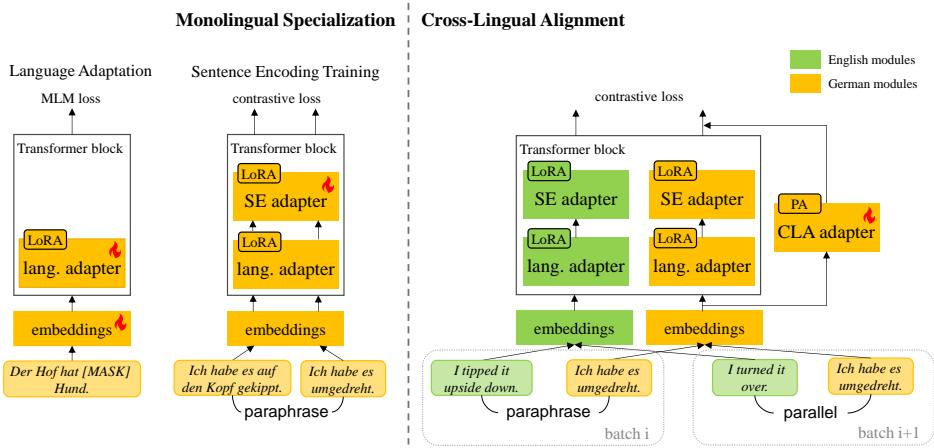

# Modular Sentence Encoders: Separating Language Specialization from Cross-Lingual Alignment

Yongxin Huang1, Kexin Wang1, Goran Glavaš2, Iryna Gurevych1

1Ubiquitous Knowledge Processing Lab (UKP Lab)

Department of Computer Science

Technical University of Darmstadt and

National Research Center for Applied Cybersecurity ATHENE, Germany 2Center for AI and Data Science, University of Würzburg 1www.ukp.tu-darmstadt.de

## Abstract

Multilingual sentence encoders (MSEs) are commonly obtained by training multilingual language models to map sentences from dif ferent languages into a shared semantic space. As such, they are subject to curse of multilinguality, a loss of monolingual representational accuracy due to parameter sharing. Another limitation of MSEs is the trade-off between different task performance: cross-lingual alignment training distorts the optimal monolingual structure of semantic spaces of individual lan guages, harming the utility of sentence embeddings in monolingual tasks; cross-lingual tasks, such as cross-lingual semantic similarity and zero-shot transfer for sentence classification, may also require conflicting cross-lingual alignment strategies. In this work, we address both issues by means of modular training of sentence encoders. We first train language-specific monolingual modules to mitigate negative interference between languages (i.e., the curse). We then align all non-English sentence embeddings to the English by training cross-lingual align ment adapters, preventing interference with monolingual specialization from the first step. We train the cross-lingual adapters with two different types of data to resolve the conflicting requirements of different cross-lingual tasks. Monolingual and cross-lingual results on se mantic text similarity and relatedness, bitext mining and sentence classification show that our modular solution achieves better and more balanced performance across all the tasks compared to full-parameter training of monolithic multilingual sentence encoders, especially benefiting low-resource languages.1

## 1 Introduction

Multilingual Sentence Encoders (MSEs; Artetxe and Schwenk, 2019b; Yang et al., 2020; Reimers and Gurevych, 2020; Feng et al., 2022; Duquenne et al., 2023) embed sentences from different languages into a shared semantic vector space, making them essential tools for multilingual and crosslingual semantic retrieval (e.g., bitext mining; Schwenk et al., 2021), clustering (e.g., for extractive summarization; Bouscarrat et al., 2019), and filtering (e.g., in content-based recommendation; Hassan et al., 2019), as well as for cross-lingual transfer in supervised text classification (Artetxe and Schwenk, 2019b; Licht, 2023). In this work, we aim to address two limitations in the MSEs through modular training: the curse of multilinguality and the trade-off in performance between different monolingual and cross-lingual tasks.

Like general-purpose multilingual encoder language models (mELMs, e.g., mBERT; Devlin et al., 2019; XLM-R; Conneau et al., 2020), multilingual models specialized for sentence encoding2 are also subject to the curse of multilinguality (CoM; Conneau et al., 2020), a loss of representational precision for each individual language due to sharing of model parameters between many languages, resulting in negative interference (Wang et al., 2020). Training language-specific modules like embedding layers and language adapters (Pfeiffer et al., 2021, 2022) or full models (Blevins et al., 2024) has been proven effective against this issue for general-purpose models, but rarely applied for MSEs, whose sentence embeddings from different monolingual modules need to be semantically aligned to each other. To the best of our knowledge, the only work that targets CoM for MSEs is LASER3 (Heffernan et al., 2022): they train a set of monolingual sentence encoders from scratch through the distillation from a fixed teacher MSE, which is already affected by the CoM.

Existing MSE work mostly focuses on crosslingual training and evaluation, paying less attention to the monolingual (i.e., within-language) performance, which can be negatively affected by the cross-lingual alignment (Roy et al., 2020). Earlier work on inducing cross-lingual word embeddings (Søgaard et al., 2018; Patra et al., 2019; Glavaš and Vulic´, 2020) hints at an explanation for this trade-off: forcing cross-lingual alignment between non-isomorphic monolingual spaces distorts those spaces and thus degrades their monolingual semantic quality. What is more, there also seems to be a trade-off between different cross-lingual tasks: different cross-lingual training approaches yield optimal performance for different tasks. Concretely, MSEs trained on parallel data to produce highly similar embeddings for exact translation pairs are effective in bitext mining (Artetxe and Schwenk, 2019b; Feng et al., 2022; Heffernan et al., 2022); however, they perform worse on cross-lingual semantic similarity, failing to produce high similarity for sentences with similar but non-equivalent meaning (Reimers and Gurevych, 2020). Conversely, MSEs trained on paraphrase3 data (Yang et al., 2020; Reimers and Gurevych, 2020), i.e. pairs of semantically similar but non-equivalent sentences, yield better semantic similarity performance but are not effective in bitext mining. Paraphrase-trained models also seem to offer weaker performance in zero-shot cross-lingual transfer for sentence classification tasks (Roy et al., 2020), which also seems to benefit more from parallel alignment.

Contributions. In this work, we propose to alleviate all of the above shortcomings by means of modularity, that is, parameter separation. As illustrated in Figure 1, we first mitigate the curse of multilinguality by specializing an MSE for each target language, i.e., training language-specific embedding layers and language adapters via masked language modeling (MLM-ing). To obtain highquality monolingual sentence embeddings, we then train a monolingual sentence encoding adapter (SE adapter) for each language on top of the language adapter, resorting to sentence-level contrastive learning on synthetic monolingual paraphrase data, machine-translated from English. In the next step, we carry out cross-lingual alignment training also in a modular fashion, without jeopardizing the monolingual sentence representation quality. To meet the requirements of different cross-lingual tasks, we train a cross-lingual alignment adapter (CLA adapter) for each non-English language with both cross-lingual paraphrase and parallel pairs, aligning them to a shared semantic space using English as the pivot language. At inference time, we activate the language-specific modules (embeddings, language adapter, SE adapter, CLA adapter) of the respective language of the input sentence.

Our experiments—encompassing four tasks and 23 linguistically diverse languages and two stateof-the-art MSE models—render our modular approach effective in overcoming the performance trade-offs between both (1) monolingual and crosslingual tasks as well as (2) different sentence-level tasks types (semantic textual similarity and relatedness on the one side vs. bitext mining and sentence classification on the other), with substantial performance gains over full-parameter training of a single monolithic MSE. Our approach particularly benefits low-resource languages, most affected by the curse of multilinguality. Since both contrastive learning steps in our approach—for monolingual specialization and for cross-lingual alignment—are carried out on machine-translated data, our work also validates the viability of MT for scaling up MSE training data.

## 2 Related Work

## 2.1 Multilingual Sentence Embeddings

Multilingual sentence encoders should produce similar sentence embeddings for sentences with similar meaning, regardless whether they come from the same or different languages. Cross-lingual alignment is thus at the core of MSE training, typically achieved by training on parallel data (Artetxe and Schwenk, 2019b; Feng et al., 2022; Duquenne et al., 2023; Gao et al., 2023; Zhao et al., 2024). As a standard practice to acquire high-quality English sentence embedding (Reimers and Gurevych, 2019; Gao et al., 2021), contrastive learning with paraphrase pairs has also been applied to train MSEs. This can be done through teacher-student distillation with an English teacher model trained on English paraphrases (Reimers and Gurevych, 2020; Ham and Kim, 2021), or directly with cross-lingual paraphrases (Wang et al., 2022). Another line of work removes language-specific information to get language-agnostic meaning representation (Yang et al., 2021; Tiyajamorn et al., 2021; Kuroda et al., 2022). To the best of our knowledge, our work is the first attempt to address multiple conflicting factors in MSE training, aiming to yield optimal performance trade-off across a variety of tasks.

  
Figure 1: Illustration of how we apply our modular training to a pre-trained multilingual sentence encoder. In each step, only the module marked with the fire symbol is trained. In the monolingual specialization step, we train a language-specific embedding layer, a language adapter and a monolingual sentence encoding (SE) adapter for each language. In the cross-lingual alignment (CLA) step, the monolingual (e.g., German) representation is aligned to the English representation via cross-lingual paraphrase and parallel data, in alternate batches. PA: parallel adapter.

## 2.2 Lifting the Curse of Multilinguality

The post hoc parameter-efficient adaptation for individual languages is mostly done for on feneralpurpose mELMs like mBERT and XLM-R (Pfeiffer et al., 2020, 2021; Parovic et al.´ , 2022, inter alia) through continued pre-training on the target language corpora. Expanding or replacing multilingual vocabulary with target language tokens and smart initialization of their embeddings (Chau and Smith, 2021; Pfeiffer et al., 2021; Minixhofer et al., 2022; Dobler and de Melo, 2023) has been shown to improve sample efficiency of post hoc language adaptation of multilingual models.

However, previous adapter-based methods for general-purpose models do not address the unique challenges posed by MSEs, as MSE training additionally requires specialization for sentence encoding after the standard pre-training. Besides, existing methods are only used in tasks where the input is always in one language, so only one specific language adapter needs to be activated (Pfeiffer et al., 2020). In contrast, MSEs often deal with crosslingual sentence pairs as input (in cross-lingual STS or bitext mining), which requires explicit alignment training of language-specific adapters. In the field of MSEs, the language-specific adaptation still relies on monolithic full-parameter training of the whole model: either trained only for a certain language (Mohr et al., 2024), or distilled from a massively multilingual teacher model which is already affected by the curse of multilinguality and never really trained to model fine-grained semantic similarity (Heffernan et al., 2022). Some existing MSE efforts (Mao et al., 2021; Kuroda et al., 2022; Liu et al., 2023; Yano et al., 2024) do leverage lightweight modules for cross-lingual training, but these modules are still (massively) multilingual, i.e., do not alleviate the curse of multilinguality.

## 3 Modular Sentence Encoder

Our main objective is to obtain multilingual sentence embeddings that excel across the board, despite the conflicts between different tasks and scenarios: (i) in both monolingual and cross-lingual tasks, despite cross-lingual semantic alignment possibly being at odds with monolingual semantic specialization; and (ii) in different types of crosslingual tasks, despite the fact that they require different types of cross-lingual alignment training (Roy et al., 2020). To mitigate these inherent tradeoffs, we propose a modular approach, i.e., to isolate parameters for different requirements, as illustrated in Figure 1: we train a set of language-specific modules to (i) specialize the MSE for each individual language, and (ii) to align the monolingually adapted MSEs for cross-lingual tasks.

## 3.1 Monolingual Specialization

We specialize MSEs like LaBSE (Feng et al., 2022) and multilingual E5 (Wang et al., 2024) for each language by training language-specific (i) embedding layers and (ii) adapters with monolingual data.

Language Adaptation (LA). For each language, we train a new, language-specific tokenizer and initialize its new embedding matrix following the FOCUS approach (Dobler and de Melo, 2023). In a nutshell, FOCUS copies the embeddings for tokens that already exist in the vocabulary of the original MSE; for new tokens, it interpolates between embeddings of similar tokens from the original vocabulary. Compared to random initialization, FOCUS keeps a substantial amount of information from the pre-trained embeddings of the multilingual model in the new embeddings, making them “compatible” with the model body, avoiding the need to train them from scratch for each language: this leads to more sample efficient training for the embedding layers.4 For each target language, we then do standard (continued) MLM-ing on the monolingual corpora of the language. To this end, we resort to modular, parameter-efficient fine-tuning (PEFT): besides the parameters of the new embedding matrix, we train only the low-rank adaptation matrices (LoRA; Hu et al., 2022) in encoder’s layers. PEFT has been widely adopted for post-hoc language specialization of vanilla mELMs (Pfeiffer et al., 2020, 2021; Parovic et al.´ , 2022).

Sentence Encoding (SE) (Re-)Training. As a token-level objective, (continued) MLM-ing is detrimental to the original sentence embedding abilities of a pre-trained MSE: we thus need to re-specialize the model for (monolingual) sentence encoding: for this, we use a standard contrastive learning objective, Multiple Negative Ranking Loss (MNRL; Henderson et al., 2017), and train on the (noisy) monolingual paraphrase data, machinetranslated from English. This step is also done in a modular way by stacking another set of monolingual adapters (again LoRA), the SE adapter, on top of the LA. In this training step, only the parameters of the SE adapter are updated, in order to obtain the monolingual sentence encoding ability; the encoder body, language-specific embeddings layer and the previously trained LA are all kept frozen.

## 3.2 Cross-Lingual Alignment (CLA)

The mutually independent language adaptation for individual languages warrants a cross-lingual sentence-level alignment step, so that the sentence embeddings can also be used in cross-lingual applications. To prevent negative interference between cross-lingual alignment and previously imparted monolingual SE abilities, we train a cross-lingual alignment (CLA) module as a parallel adapter (He et al., 2022) for each non-English language. Since our machine-translated monolingual paraphrase datasets are parallel across all languages, we can create both cross-lingual paraphrase pairs (i.e. sentence in language A and its paraphrase in language B) and parallel pairs (i.e. sentence in language A and its direct translation in language B), which can be combined in training to mitigate the inherent interference between semantic similarity, bitext mining and cross-lingual transfer for classification (see §1).

All the cross-lingual training pairs consist of one sentence in English and another sentence in the target language. To align the non-English sentence embeddings to the English ones, we alternate training on a batch of paraphrase data with the same MNRL—just like in monolingual SE training— and another batch of parallel data with the cosine similarity loss (following Heffernan et al., 2022). The cross-lingual alignment training updates only language-specific CLA adapters; the monolingual modules of the corresponding input language are activated in the forward pass, but not updated.

We favor bilingual alignment with English over multilingual alignments5, because English embeddings are the most reliable: not only is the initial multilingual encoder most “fluent” in English, but we also trained English embeddings on gold paraphrase data, whereas all other SE adapters are trained with noisy translations. Because of this, we omit to train the CLA adapter for English: with English embedding space being of the best semantic quality, we want embeddings from other languages to adapt (through their CLA adapters) to the English space, and not vice versa. Using English as a pivot has already been proven effective in aligning non-English languages to each other (Reimers and Gurevych, 2020; Heffernan et al., 2022). We also do an empirical comparison between bilingual and all-pair alignment in §6.1.

## 3.3 Inference

After training, we have several modules for each language: embedding layer, language adapter, SE adapter and CLA adapter. When encoding the input text, the corresponding modules for the input language should be activated. Thus, the language of the input text should be known. Otherwise, one can easily apply any SotA language identification models (Kargaran et al., 2023) to detect the input language first.

## 4 Experimental Setup

## 4.1 Models

We start from two popular MSEs as base models for our modular specialization: LaBSE and multilingual E5-base (mE5). LaBSE has been pretrained on billions of parallel sentence pairs (Feng et al., 2022). Starting from XLM-R-base (Conneau et al., 2020), mE5 has first been trained on around 1 billion of (noisy) weak-supervision pairs, then on around 1.6 million high-quality sentence pairs (Wang et al., 2024). The goal of our work is not to outperform other MSEs or achieve SotA performance; instead, we aim to show that our proposed modular specialization offers clear benefits over monolithic full-model training.

Monolithic Baselines. Our primary baseline is the monolithic MSE model for which all parameters are updated in each training step, akin to mSimCSE (Wang et al., 2022). While mSimCSE originally trains only on (English or cross-lingual) NLI data, we extend this to make the comparison with our modular variants as fair as possible: we use all the MT-obtained multilingual paraphrase datasets (beyond just NLI) as in our modular training. We have the following monolithic-model variants: (i) $\mathbf { F u l l _ { e n } }$ trained only on (clean) English paraphrase data; (ii) $\mathbf { F u l l } _ { \mathbf { m } } ,$ trained only on monolingual data of all languages (each batch is monolingual, language randomly sampled for each batch); (iii) $\mathbf { F u l l _ { c } } ,$ trained only on cross-lingual paraphrase pairs (the language for each sentence in a paraphrase pair is randomly selected); and (iv) $\mathbf { F u l l } _ { \mathbf { m c } }$ , trained sequentially, first on monolingual and then on crosslingual paraphrases.

Modular Variants. We evaluate the following variants: (i) $\mathbf { M o d } _ { \mathbf { e n } }$ , as a baseline: a monolingual SE adapter is trained only on English paraphrase data and used for all other languages; i.e., we transfer the sentence encoding ability from English; (ii) $\mathbf { M o d } _ { \mathbf { m } } \mathrm { : }$ with only monolingual specialization, i.e. a monolingual SE adapter is trained with paraphrase dataset for every language; (iii) $\mathbf { M o d } _ { \mathbf { m c } \cdot \mathbf { p p } }$ adds a CLA adapter trained only on cross-lingual paraphrase data to $\mathbf { M o d } _ { \mathrm { m } } ;$ (iv) $\mathbf { M o d } _ { \mathbf { m c } \cdot \mathbf { p l } }$ adds a CLA adapter trained only on cross-lingual parallel data to $\mathbf { M o d } _ { \mathrm { m } } ;$ (v) $\mathbf { M o d } _ { \mathbf { m e } \cdot \mathbf { j } \mathbf { t } }$ is our complete setting with a CLA adapter trained jointly on both paraphrase and parallel data. We do the modular training on LaBSE for 23 languages present in the evaluation datasets. Due to the intensive LA step and limited resources, for mE5 we train the modules for a subset of 10 languages.6

## 4.2 Training Data

Supervised paraphrase data is crucial for achieving high performance in sentence embedding tasks, yet a large amount of such data is only available in English. Compared to the labor-intensive manual mining and labelling or translation of paraphrase data in all languages, machine translation is significantly more cost-effective and scalable. The SotA MT models today can already provide highquality translation for hundreds of languages, including very low-resource ones (NLLB Team et al., 2022; Kudugunta et al., 2023). This motivates us to translate, with NLLB 3.3B as our MT model (NLLB Team et al., 2022), five English paraphrase datasets—MNLI (Williams et al., 2018), Sentence-Compression (Filippova and Altun, 2013), SimpleWiki (Coster and Kauchak, 2011), Altlex (Hidey and McKeown, 2016) and QuoraDuplicateQuestions7, containing combined around 600K sentence pairs—into all 22 languages found in our downstream evaluation datasets. This results in a multiparallel paraphrase dataset spanning 23 languages, from which we create instances for monolingual and cross-lingual training.

We train language-specific tokenizers and carry out monolingual language adaptation on monolingual corpora combined from language-specific portions of CC100 (Conneau et al., 2020) and MADLAD-400 (Kudugunta et al., 2023).

## 4.3 Evaluation Data

We evaluate the obtained sentence encoders on four tasks: semantic textual similarity (STS), semantic textual relatedness (STR), bitext mining, and sentence classification. For the first three tasks, we do evaluation in the “zero-shot” setup, i.e., without any task-specific supervised training. We only evaluate on high-quality datasets, compiled either manually from scratch or by human post-editing of machine translations.8

Semantic Textual Similarity. The models need to produce a score indicating semantic similarity for a pair of sentences. We simply use the cosine similarity between the embeddings of the sentences. Performance is reported as Spearman correlation ( 100) against human scores. We collect existing multilingual STS datasets and use parallel monolingual STS data to create high-quality cross-lingual evaluation pairs. For example, the STS datasets for Czech, German and French (Hercig and Kral, 2021) and the datasets for Dutch, Italian and Spanish (Reimers and Gurevych, 2020) are parallel to each other, as they are translated from the same STS17 (Cer et al., 2017) English data. The same applies for the STS datasets for Turkic languages in Karde¸s-NLU (Senel et al., 2024) and the Korean STS dataset from Ham et al. (2020), all translated from the English STS-Benchmark (STSB; Cer et al., 2017). We can thus leverage this effectively multi-parallel STS data for cross-lingual evaluation on many more language pairs, including pairs never evaluated in prior work, e.g. Czech-Italian or Korean-Uzbek.

Semantic Textual Relatedness. Semantic relatedness is a broader concept than similarity, that also considers aspects like topic or view similarity (Ousidhoum et al., 2024). We use the same metric as in the STS task. Similar to STS, we aggregate the multi-parallel monolingual data and create cross-lingual pairs between Polish (Dadas et al., 2020), Dutch (Wijnholds and Moortgat, 2021), and Spanish (Araujo et al., 2022), all translated from the English SICK dataset (Marelli et al., 2014). STR24 (Ousidhoum et al., 2024) contains monolingual STR data for low-resource African and Asian languages; but it is not multi-parallel, and as such only lends itself to monolingual evaluation.

Bitext Mining. The model should mine parallel sentences (translation pairs) from two lists of monolingual sentences based on the cosine similarity of bilingual sentence pairs. Following Heffernan et al. (2022), we use the xsim score (error rate of wrongly aligned sentences; Artetxe and Schwenk, 2019a) to evaluate our models on two bitext mining datasets: FLORES (Goyal et al., 2022) and Tatoeba (Artetxe and Schwenk, 2019b). We only evaluate on the languages for which we have trained language-specific modules. Since FLO-RES is multi-parallel, we test on all possible language pairs between our target languages. Tatoeba only contains English-X data: we average the results from both mining directions (English X and X English) for all languages X.

Topic Classification. We resort to SIB-200 (Adelani et al., 2024) to obtain data for topical sentence classification for our 23 target languages. In monolingual evaluation, we train a simple Logistic Regression (Cox, 1958) classifier on top of our frozen sentence encoder for each target language. In (zero-shot) cross-lingual transfer setup, we train the classifier only on English data and use it for other languages.

Alignment Metrics. In standard task formulations, cross-lingual STS is bilingual, i.e., a sentence in one language is compared only against sentences in one (and same) other language. Such an evaluation setup fails to capture the language bias of an MSE (Roy et al., 2020): in a multilingual candidate pool, the model might prefer certain language (pair) over others, e.g., map sentences from the same language closer in the embedding space even if they are semantically dissimilar. Following Reimers and Gurevych (2020), we quantify language bias as the performance drop when switching from bilingual to multilingual evaluation, for which we calculate the Spearman correlation on the concatenation of all bilingual datasets. To this end, we use the multiparallel STSB and SICK datasets; we report the difference between the average performance on all individual bilingual tasks and the performance on the single multilingual task. Another indicator of semantic quality of multilingual representation spaces is the similarity of monolingual semantic structures, i.e., the degree of their isomorphism. It can be quantified by Relational Similarity (RSIM; Vulic et al.´ , 2020) on a bilingual parallel corpus: we calculate the corresponding sets of cosine similarity scores for all monolingual sentence pairs in each of the two languages, and report RSIM as Pearson correlation between the two sets of corresponding monolingual cosines. We measure RSIM on FLORES, averaging the results across all language pairs.

## 5 Results

We report the results for our LaBSE-based models in Table 1 and for mE5-based models in Table 2.

## 5.1 Full Model Results

Further training on monolingual paraphrase data (Fullen and $\mathrm { F u l l } _ { \mathrm { m } } )$ can already largely improve the original models’ (first row in each table) performance on all tasks, except for bitext mining. The off-the-shelf LaBSE model is a strong baseline for bitext mining, as it has been pre-trained on a massive amount of parallel data, which perfectly aligns with the goal of bitext mining. This confirms the previous finding that training on paraphrase data can disturb bitext mining ability (Reimers and Gurevych, 2020). $\mathrm { F u l l _ { \mathrm { m } } }$ trained on MT-ed monolingual data in all target languages outperforms $\mathrm { F u l l _ { e n } } \left( \mathrm { i . e } \right.$ ., the $\mathrm { m S i m C S E _ { \mathrm { e n } } }$ setting in Wang et al., 2022) slightly on LaBSE and significantly on mE5, demonstrating the limitation of cross-lingual transfer of sentence-embedding specialization from English, especially if the base model has not been subjected to massive cross-lingual pre-training on parallel data like LaBSE. The improved results of $\mathrm { F u l l _ { \mathrm { m } } }$ also indicate that machine translation is a reliable alternative to the labor-intensive labelling of training data for a broad range of languages.

<table><tr><td></td><td colspan="5">Monolingual tasks</td><td colspan="5">Cross-lingual tasks</td><td colspan="3">Alignment metrics</td></tr><tr><td></td><td colspan="2">STS↑</td><td colspan="2">STR↑</td><td>CLS↑</td><td colspan="2">STS↑</td><td>STR↑</td><td>CLS↑</td><td colspan="2">Bitext Mining↓</td><td colspan="2">Language Bias↓</td><td>RSIM↑</td></tr><tr><td>Dataset</td><td>sts17</td><td>stsb</td><td>sick</td><td>str24</td><td>sib</td><td>sts17</td><td>stsb</td><td>sick</td><td>sib</td><td>flores</td><td>tatoeba</td><td>stsb</td><td>sick</td><td>flores</td></tr><tr><td>LaBSE</td><td>76.7</td><td>71.9</td><td>68.0</td><td>69.2</td><td>82.7</td><td>74.5</td><td>64.4</td><td>63.8</td><td>83.6</td><td>0.14</td><td>3.87</td><td>1.02</td><td>2.32</td><td>0.64</td></tr><tr><td> $\underline { { \mathrm { F u l l } } } _ { \mathrm { e n } }$   $\mathrm { F u l l } _ { \mathrm { m } }$  Fullc</td><td>82.7 82.9 81.0</td><td>80.9 80.4 79.1</td><td>76.5 76.4 75.1</td><td>75.4 75.9 75.3</td><td>84.1 84.8 85.1</td><td>78.8 79.4 77.8</td><td>71.5 71.5 72.1</td><td>70.4 70.9 71.5</td><td>83.5 83.9 85.3</td><td>0.49 0.29 0.20</td><td>4.72 4.43 4.00</td><td>0.87 0.88 0.53</td><td>1.48 1.27 0.70</td><td>0.70 0.74 0.77</td></tr><tr><td> $\mathrm { \ F u l l _ { \mathrm { m c } } }$ </td><td>80.0</td><td>79.2</td><td>75.1</td><td>75.4</td><td>86.0</td><td>76.7</td><td>72.7</td><td>71.7</td><td>86.3</td><td>0.21</td><td>4.17</td><td>0.53</td><td>0.64</td><td>0.77 0.73</td></tr><tr><td> $\mathbf { M o d } _ { \mathrm { e n } }$ </td><td>82.6</td><td>82.1</td><td>76.3</td><td>78.7</td><td>84.9</td><td>80.1</td><td>74.8</td><td>71.5</td><td>83.6</td><td>0.16</td><td>3.68</td><td>0.90</td><td>1.24</td><td>0.75</td></tr><tr><td> $\mathbf { M o d } _ { \mathrm { m } }$ </td><td>83.1</td><td>82.1</td><td>76.5</td><td></td><td>85.5</td><td>80.6</td><td>75.3</td><td>71.9</td><td>85.0</td><td>0.15</td><td>3.63</td><td>1.05</td><td>1.16</td><td></td></tr><tr><td></td><td></td><td></td><td></td><td>78.4</td><td></td><td></td><td></td><td></td><td></td><td></td><td></td><td></td><td></td><td></td></tr><tr><td> $\mathsf { M o d } _ { \mathrm { m c - p p } }$ </td><td>82.9</td><td>81.8</td><td>76.7</td><td>77.5</td><td>86.0</td><td>80.7</td><td>76.0</td><td>72.8</td><td>85.0</td><td>0.16</td><td>3.49</td><td>0.71</td><td>0.92</td><td>0.76</td></tr><tr><td></td><td></td><td></td><td></td><td></td><td></td><td></td><td></td><td></td><td></td><td></td><td></td><td></td><td></td><td></td></tr><tr><td> $\operatorname { M o d } _ { \mathrm { { m c - p l } } }$ </td><td>81.4</td><td>81.6</td><td>76.0</td><td>77.2</td><td>85.8</td><td>79.1</td><td>76.1</td><td>72.4</td><td>86.2</td><td>0.15</td><td>3.64</td><td>0.56</td><td>0.67</td><td>0.82</td></tr><tr><td> $\mathbf { M o d } _ { \mathrm { m c - j t } }$ </td><td>82.7</td><td>82.1</td><td>76.6</td><td>78.1</td><td>85.8</td><td>80.3</td><td>76.4</td><td>72.7</td><td>85.7</td><td>0.15</td><td>3.55</td><td>0.56</td><td>0.78</td><td>0.79</td></tr><tr><td></td><td></td><td></td><td></td><td></td><td></td><td></td><td></td><td></td><td></td><td></td><td></td><td></td><td></td><td></td></tr><tr><td>Ablations</td><td></td><td></td><td></td><td></td><td></td><td></td><td></td><td></td><td></td><td></td><td></td><td></td><td></td><td></td></tr><tr><td> $\mathrm { M o d } _ { \mathrm { m } } \mathrm { w } / \mathrm { o } \mathrm { L A }$ </td><td>81.3</td><td>78.1</td><td>74.3</td><td>75.9</td><td>84.0</td><td>79.0</td><td>72.0</td><td>71.0</td><td>84.7</td><td>0.13</td><td>3.84</td><td>0.85</td><td>1.10</td><td>0.75</td></tr><tr><td> $\mathbf { M o d } _ { \mathrm { c - j t } }$ </td><td>82.7</td><td>81.9</td><td>76.4</td><td>77.6</td><td>85.3</td><td>80.3</td><td>76.0</td><td>72.6</td><td>85.3</td><td>0.16</td><td>3.69</td><td>0.58</td><td>0.88</td><td>0.79</td></tr><tr><td></td><td></td><td></td><td></td><td></td><td></td><td></td><td></td><td></td><td></td><td></td><td></td><td></td><td></td><td></td></tr><tr><td></td><td></td><td></td><td></td><td></td><td></td><td></td><td></td><td></td><td></td><td></td><td></td><td></td><td></td><td></td></tr><tr><td></td><td></td><td></td><td></td><td></td><td></td><td></td><td></td><td></td><td></td><td></td><td></td><td></td><td></td><td></td></tr></table>

Table 1: Results of the LaBSE-based models for 23 languages. Reported results are averages over all languages in each evaluation dataset. The best result within the Full group and the Mod group on each dataset is denoted in bold. The second-best result in the Mod group is underlined. CLS stands for classification. See detailed results on each individual language (pair) in Appendix D.

$\mathrm { F u l l _ { m } }$ outperforms $\mathrm { F u l l _ { c } }$ on monolingual STS and STR tasks, whereas the opposite is true in crosslingual tasks: this confirms the inherent trade-off between monolingual and cross-lingual abilities of MSEs. The inability of monolingual training, even using multi-parallel data, to induce strongly aligned cross-lingual semantic structures is confirmed by the higher language bias and lower RSIM scores of $\mathrm { F u l l _ { \mathrm { m } } }$ . The trade-off between monolingual and cross-lingual performance is more pronounced in mE5 results. The sequential combination of both monolingual and cross-lingual training $\mathrm { ( F u l l _ { m c } ) }$ is unable to resolve the conflict and yields results similar to Fullc: in a monolithic MSE model, the subsequent cross-lingual alignment seems to distort the semantic quality of monolingual subspaces. One notable exception is monolingual text classification, where $\mathrm { \ F u l l _ { \mathrm { m c } } }$ outperforms $\mathrm { F u l l _ { m } }$ on LaBSE. We speculate that is because topic classification relies on lexical cues rather than fine-grained sentence meaning: cross-lingual training probably improves lexical alignments and the fine-grained distortions it brings to monolingual semantics play no role in this semantically coarse task.

## 5.2 Modular Model Results

Monolingual Training. We first compare the baseline $\mathbf { M o d } _ { \mathrm { e n } } .$ , with an SE adapter trained only on English data and shared across all languages, against $\mathbf { M o d } _ { \mathrm { m } } .$ , with a language-specific SE adapter for each language. As is the case for monolithic models, $\mathrm { M o d } _ { \mathrm { m } }$ with language-specific sentence encoding training with noisy machine-translated data outperforms the transfer from English-only SE training $( \mathrm { M o d _ { e n } ) }$ on mE5’s cross-lingual tasks, dramatically reducing the language bias. Looking at performance on monolingual tasks, our $\mathrm { \Delta } \mathbf { M o d } _ { \mathrm { m } }$ with monolingual specialization (LA and SE) successfully mitigates the curse of multilinguality, which seems to be present in its monolithic counterpart $\mathrm { F u l l } _ { \mathrm { m } } \colon$ the gains are particularly prominent on monolingual STSB (+1.7 on LaBSE, +2.5 on mE5) and STR24 (+2.5 on LaBSE), datasets that encompass most low-resource languages. The importance of modularity becomes most apparent on cross-lingual STS and STR, where our $\mathbf { M o d } _ { \mathrm { m } } .$ , not exposed to any explicit cross-lingual alignment, outperforms the explicitly cross-lingually trained monolithic variants $\mathrm { ( F u l l _ { c } }$ and $\mathrm { F u l l } _ { \mathrm { m c } } )$ . This shows that monolingual training on multi-parallel data leads to semantic alignment, emphasizing the potential of MT for synthesizing MSE training data. Our Mod variants also have a clear advantage over monolithic (Full) models in bitext mining (both for LaBSE and mE5), even in the absence of explicit cross-lingual training $( \mathrm { i . e . , M o d _ { m } ) }$ . This suggests that multilingual training on full models messes up not only the monolingual spaces (i.e., the curse of multilinguality) but also the cross-lingual relations, which is alleviated by our modular approach.

<table><tr><td></td><td colspan="3">Monolingual tasks</td><td colspan="5">Cross-lingual tasks</td><td colspan="3">Alignement metrics</td></tr><tr><td></td><td>STS↑</td><td>STR↑</td><td> $\overline { { \mathbf { C L S \uparrow } } }$ </td><td>STS↑</td><td> $\mathbf { S T R \uparrow }$ </td><td> $\overline { { \mathbf { C L S } \mathrm { \uparrow } } }$ </td><td></td><td>Bitext Mining↓</td><td>Language Bias↓</td><td></td><td>RSIM↑</td></tr><tr><td>Dataset</td><td>stsb</td><td>sick</td><td>sib</td><td> $\mathrm { s t s b }$ </td><td> $\mathrm { s i c k }$ </td><td> $\mathrm { s i b }$ </td><td>flores</td><td>tatoeba</td><td>stsb</td><td>sick</td><td>flores</td></tr><tr><td>mE5</td><td>72.5</td><td>74.2</td><td>74.0</td><td>54.1</td><td>61.0</td><td>73.5</td><td>1.85</td><td>9.89</td><td>23.22</td><td>12.11</td><td>0.60</td></tr><tr><td> $\mathrm { F u l l _ { \mathrm { e n } } }$ </td><td>75.8</td><td>75.4</td><td>83.4</td><td>55.4</td><td>62.2</td><td>82.9</td><td>1.46</td><td>9.98</td><td>7.21</td><td>5.79</td><td>0.59</td></tr><tr><td> $\mathrm { F u l l } _ { \mathrm { m } }$ </td><td>79.6</td><td>75.5</td><td>85.5</td><td>60.2</td><td>64.1</td><td>85.2</td><td>0.62</td><td>7.85</td><td>2.60</td><td>3.16</td><td>0.67</td></tr><tr><td> $\mathrm { F u l l _ { c } }$ </td><td>77.7</td><td>73.9</td><td>85.6</td><td>66.7</td><td>67.7</td><td>85.5</td><td>0.26</td><td>6.37</td><td>1.11</td><td>1.24</td><td>0.74</td></tr><tr><td> $\mathrm { { F u l l } _ { \mathrm { m c } } }$ </td><td>77.4</td><td>73.1</td><td>85.4</td><td>66.7</td><td>66.9</td><td>86.5</td><td>0.26</td><td>6.33</td><td>1.05</td><td>1.14</td><td>0.74</td></tr><tr><td> $\mathbf { M o d } _ { \mathrm { e n } }$ </td><td>79.9</td><td>75.8</td><td>87.0</td><td>66.2</td><td>66.7</td><td>87.0</td><td>0.26</td><td>5.81</td><td>6.66</td><td>5.27</td><td>0.72</td></tr><tr><td> $\mathrm { M o d } _ { \mathrm { m } }$ </td><td>82.1</td><td>75.4</td><td>87.8</td><td>69.8</td><td>68.5</td><td>87.7</td><td>0.22</td><td>5.27</td><td>2.82</td><td>3.07</td><td>0.74</td></tr><tr><td> $\mathsf { M o d } _ { \mathrm { m c - p p } }$ </td><td>81.7</td><td>76.4</td><td>87.9</td><td>73.2</td><td>70.5</td><td>87.6</td><td>0.20</td><td>5.19</td><td>1.58</td><td>2.08</td><td>0.75</td></tr><tr><td> $\mathsf { M o d } _ { \mathrm { m c - p l } }$ </td><td>80.8</td><td>75.2</td><td>88.5</td><td>72.8</td><td>69.6</td><td>89.0</td><td>0.22</td><td>5.61</td><td>2.15</td><td>2.05</td><td>0.82</td></tr><tr><td> $\mathbf { M o d } _ { \mathrm { m c - j t } }$ </td><td>81.9</td><td>76.4</td><td>88.3</td><td>73.8</td><td>70.7</td><td>88.3</td><td>0.19</td><td>5.00</td><td>1.33</td><td>1.73</td><td>0.80</td></tr><tr><td> $A b l a t i o n s$ </td><td></td><td></td><td></td><td></td><td></td><td></td><td></td><td></td><td></td><td></td><td></td></tr><tr><td> $\mathrm { M o d } _ { \mathrm { m } } \mathrm { w } / \mathrm { o } \mathrm { L A }$ </td><td>80.8</td><td>76.0</td><td>87.2</td><td>61.5</td><td>64.4</td><td>86.3</td><td>0.56</td><td>7.63</td><td>3.87</td><td>3.53</td><td>0.68</td></tr><tr><td> $\mathbf { M o d } _ { \mathrm { c - j t } }$ </td><td>81.9</td><td>76.2</td><td>87.7</td><td>73.9</td><td>70.6</td><td>88.2</td><td>0.19</td><td>5.24</td><td>1.39</td><td>1.93</td><td>0.80</td></tr></table>

Table 2: Results of the mE5-based models for 10 languages. Reported results are averages over all languages in each evaluation dataset. The best result within the Full group and the Mod group on each dataset is denoted in bold. The second-best result in the Mod group is underlined. CLS stands for classification. See detailed results on each individual language (pair) in Appendix D.

Cross-Lingual Training. Adding cross-lingual alignment in a modular fashion $( \mathrm { \mathbf { M o d } } _ { \mathrm { m c } }$ variants) brings further gains (compared to $\mathrm { \Delta M o d _ { \mathrm { m } } ) }$ in crosslingual tasks. Cross-lingual adapters, either trained on paraphrase data $( \mathrm { M o d } _ { \mathrm { m c - p p } } )$ or parallel data $( \mathbf { M o d } _ { \mathrm { m c - p l } } )$ can effectively reduce language bias and increase isomorphism of monolingual spaces (cf. $\mathrm { M o d } _ { \mathrm { m } } )$ . Results further show that paraphraseand parallel-CLA adapters benefit different types of cross-lingual tasks. On both LaBSE and mE5, $\mathrm { M o d _ { m c - p l } }$ has the strongest performance in crosslingual classification transfer (CLS), which correlates with the degree of isomorphism (RSIM). However, adding this CLA adapter trained with parallel data has a negative impact on the monolingual performance (cf. $\operatorname { M o d } _ { \mathrm { m } } )$ . Conversely, $\mathrm { M o d } _ { \mathrm { m c - p p } }$ is better at both monolingual and cross-lingual STS/STR than $\mathrm { M o d _ { m c - p l } }$ This confirms the conflicting requirements of different downstream tasks. Combining both training strategies in $\mathrm { M o d } _ { \mathrm { m c - j t } }$ mitigates individual shortcomings of $\mathrm { M o d } _ { \mathrm { m c - p p } }$ and $\mathrm { M o d _ { m c - p l } }$ resulting in well-balanced performance across all tasks, including the monolingual ones. Our complete $\mathrm { M o d } _ { \mathrm { m c - j t } }$ setup thus makes the best use of our multi-parallel paraphrase dataset.

## 5.3 Ablation of Monolingual Specialization

Additional monolingual training for each language as an intermediate step before cross-lingual alignment distinguishes our modular approach from other popular MSE training strategies. We thus ablate the contribution of the monolingual specialization step (last two rows in Table 1 and Table 2).

Language Adaptation. We first remove the LA step, i.e. we omit the MLM training with languagespecific embedding layer and language adapter and directly train the monolingual SE adapter on the original MSE. For both LaBSE and mE5, this leads to a significant performance drop compared with $\mathrm { M o d } _ { \mathrm { m } }$ . Without language adaptation, adapterbased SE training even underperforms $\mathrm { F u l l _ { m } }$ in monolingual tasks on LaBSE. But it can still improve over $\mathrm { F u l l _ { m } }$ in cross-lingual tasks: this again suggests that modular multi-parallel monolingual SE training benefits cross-lingual semantic alignment more than multilingual training on shared full-model parameters.

Monolingual SE Training. To isolate the contribution of the monolingual SE adapter, we remove the SE adapter for non-English languages from $\mathrm { M o d } _ { \mathrm { m c - j t } }$ to get a $\mathbf { M o d } _ { \mathrm { c - j t } }$ baseline: now the sentence encoding in other languages is learned only through the alignment to the English representations. We observe a slight drop in both monolingual and cross-lingual tasks and an increase in language bias, suggesting that the removal of monolingual SE training is detrimental to the strong crosslingual alignment of language-specific representation subspaces. The ablation results prove that our monolingual specialization steps are not only effective for improving monolingual performance of individual languages, but also plays an indispensable role in cross-lingual alignment.

<table><tr><td></td><td>monoling. cross-ling. lang. bias</td><td></td><td></td></tr><tr><td> $\operatorname { M o d } _ { \operatorname { m c - p p } }$ </td><td>81.8</td><td>76.0</td><td>0.71</td></tr><tr><td>Modmc-pp all-pair</td><td>80.9</td><td>75.7</td><td>1.25</td></tr><tr><td> $\mathrm { \bf M o d _ { \mathrm { m c - p l } } }$ </td><td>81.6</td><td>76.1</td><td>0.56</td></tr><tr><td> $\mathrm { M o d _ { \mathrm { m c - p l } } }$  all-pair</td><td>75.8</td><td>72.2</td><td>1.38</td></tr></table>

Table 3: STSB results of LaBSE-based Mod variants with our standard English-centric alignment $( \mathrm { M o d } _ { \mathrm { m c - p p } }$ and $\mathrm { M o d } _ { \mathrm { m c - p l } } )$ and the alternative all-pair alignment.
<table><tr><td>step</td><td>module</td><td>size</td><td>time</td></tr><tr><td>language adaptation</td><td>embedding layer language adapter</td><td>8.15% 0.09%</td><td>20h</td></tr><tr><td>sentence encoding</td><td>SE adapter</td><td>0.25%</td><td>15m</td></tr><tr><td>cross-lingual alignment</td><td>CLA adapter</td><td>1.50%</td><td>30m</td></tr></table>

Table 4: Size (percentage of the original LaBSE size of 472M parameters) and training time for each module on an A100 40G GPU. See Appendix B for training details.

## 6 Discussion

## 6.1 All-Pair or English-Centric Alignment

We provide an additional experiment to empirically show the advantage of alignment to English representations over all-pair alignment on a subset of 7 languages (the STSB languages). In all-pair alignment, all languages are aligned with each other instead of only to English. For both cross-lingual training on paraphrase data and parallel data, the results in Table 3 show a clear performance drop in both monolingual and cross-lingual evaluation, indicating that due to the increased complexity of aligning every language pair directly, the all-pair alignment without a fixed pivot can reduce the representation quality of each language as well as the alignment between languages.

## 6.2 Efficiency of our Method

The parameter size of each module and training time for each step are reported in Table 4. One limitation of our method is that the parameter size of language-specific modules scales linearly with the number of languages. However, there is no “free lunch” in addressing the curse of multilinguality. In contrast to training monolingual full models, we try to achieve a balance between performance and model size. Our modular design offers high flexibility, supporting diverse use cases. It is unlikely that all application scenarios involve hundreds of languages simultaneously. For use cases with several or even a single language, only the relevant modules need to be loaded, which minimizes the computational and memory overhead. Additionally, our method allows new languages to be added independently, without the need for retraining the backbone or any of the previously trained modules.

Our modular approach to multilingual sentence encoding presented in this work opens a range of possibilities for further (modular) improvements. Though we reduce the vocabulary size by switching from the original multilingual tokenizers (501K for LaBSE and 250K for mE5) to 1/10 and 1/5 (50K for each of our monolingual tokenizer), our embedding layers remain the largest contributor to the model weights (Table 4). Further parameter reduction can be promising directions for future work. For instance, even smaller vocabulary sizes can be tried out, as some of the LASER3 models use as small as 8K vocabulary (Heffernan et al., 2022). Additionally, LoRA could also be applied to the embedding layer to compress the module. Finally, modules can be trained for language families instead of individual languages, reducing the number of required parameters while leveraging linguistic similarities.

## 7 Conclusion

Multilingual sentence encoders encode sentences from many languages in a shared semantic space. As a consequence, they suffer from the curse of multilinguality and trade monolingual performance for cross-lingual alignment. Moreover, the choice of different types of training data (paraphrases vs. parallel data) results in performance trade-offs between cross-lingual downstream tasks. In this work, we addressed these shortcomings via modularity. We first specialize a multilingual sentence encoder to individual languages by training languagespecific embedding layers, language adapters and monolingual sentence encoding adapters. The highquality monolingual sentence embedding spaces are then aligned to a shared space through another set of cross-lingual alignment adapters, trained jointly on both paraphrase and parallel data. We show (i) that this modular approach yields gains w.r.t. both monolingual and cross-lingual performance, and (ii) that machine-translated data can help train effective sentence encoders.

## Limitations

We only experiment with encoder-based MSEs like LaBSE and mE5. Though this is the mainstream architecture for most MSEs, there are also pretrained MSEs with the encoder-decoder architecture (Duquenne et al., 2023). Since the pre-training training objectives of such models are different from the encoder-based models we use (i.e. MLM and contrastive sentence embedding learning), our current modular training approach cannot be directly applied to them without adaptations. We thus leave the application of our modular approach to improve encoder-decoder MSEs to future work.

Having language-specific modules for each language requires that the language of the input text is known. If the language is unknown, a prior language identification step is needed to determine it, as we do not have a built-in language detection module. Fortunately, language identification is generally straightforward and reliable models that recognize hundreds of languages are readily available (Kargaran et al., 2023).

## Ethics Statement

Our experiments use publicly available datasets and benchmarks for training and evaluation: these are all commonly used in the NLP research. No personal information or sensitive data are involved in our work. Existing biases in the public datasets, our machine-translated datasets and pre-trained models can still be relevant concerns, as we do not specifically mitigate them in this work.

## Acknowledgements

This work has been funded by HUAWEI Technologies (Ireland) Co., Ltd., by the German Research Foundation (DFG) as part of the QASciInf project (grant GU 798/18-3), and by the German Federal Ministry of Education and Research and the Hessian Ministry of Higher Education, Research, Science and the Arts within their joint support of the National Research Center for Applied Cybersecurity ATHENE.

## References

David Adelani, Hannah Liu, Xiaoyu Shen, Nikita Vassilyev, Jesujoba Alabi, Yanke Mao, Haonan Gao, and En-Shiun Lee. 2024. SIB-200: A simple, inclusive, and big evaluation dataset for topic classification in 200+ languages and dialects. In Proceedings of the

18th Conference of the European Chapter of the Associationfor Computational Linguistics (Volume 1: Long Papers), pages 226–245, St. Julian’s, Malta. Association for Computational Linguistics.

Vladimir Araujo, Andrés Carvallo, Souvik Kundu, José Cañete, Marcelo Mendoza, Robert E. Mercer, Felipe Bravo-Marquez, Marie-Francine Moens, and Alvaro Soto. 2022. Evaluation benchmarks for Spanish sentence representations. In Proceedings of the Thirteenth Language Resources and Evaluation Conference, pages 6024–6034, Marseille, France. European Language Resources Association.

Mikel Artetxe and Holger Schwenk. 2019a. Marginbased parallel corpus mining with multilingual sentence embeddings. In Proceedings of the 57th Annual Meeting ofthe Associationfor Computational Linguistics, pages 3197–3203, Florence, Italy. Association for Computational Linguistics.

Mikel Artetxe and Holger Schwenk. 2019b. Massively multilingual sentence embeddings for zeroshot cross-lingual transfer and beyond. Transactions of the Association for Computational Linguistics, 7:597–610.

Terra Blevins, Tomasz Limisiewicz, Suchin Gururangan, Margaret Li, Hila Gonen, Noah A. Smith, and Luke Zettlemoyer. 2024. Breaking the curse of multilinguality with cross-lingual expert language models. In Proceedings of the 2024 Conference on Empirical Methods in Natural Language Processing, pages 10822–10837, Miami, Florida, USA. Association for Computational Linguistics.

Léo Bouscarrat, Antoine Bonnefoy, Thomas Peel, and Cécile Pereira. 2019. STRASS: A light and effective method for extractive summarization based on sentence embeddings. In Proceedings ofthe 57th Annual Meeting ofthe Associationfor Computational Linguistics: Student Research Workshop, pages 243– 252, Florence, Italy. Association for Computational Linguistics.

Daniel Cer, Mona Diab, Eneko Agirre, Iñigo Lopez-Gazpio, and Lucia Specia. 2017. SemEval-2017 task 1: Semantic textual similarity multilingual and crosslingual focused evaluation. In Proceedings of the 11th International Workshop on Semantic Evaluation (SemEval-2017), pages 1–14, Vancouver, Canada. Association for Computational Linguistics.

Ethan C. Chau and Noah A. Smith. 2021. Specializing multilingual language models: An empirical study. In Proceedings of the 1st Workshop on Multilingual Representation Learning, pages 51–61, Punta Cana, Dominican Republic. Association for Computational Linguistics.

Alexis Conneau, Kartikay Khandelwal, Naman Goyal, Vishrav Chaudhary, Guillaume Wenzek, Francisco Guzmán, Edouard Grave, Myle Ott, Luke Zettlemoyer, and Veselin Stoyanov. 2020. Unsupervised

cross-lingual representation learning at scale. In Proceedings of the 58th Annual Meeting of the Associationfor Computational Linguistics, pages 8440– 8451, Online. Association for Computational Linguistics.

William Coster and David Kauchak. 2011. Simple English Wikipedia: A new text simplification task. In Proceedings of the 49th Annual Meeting of the Associationfor Computational Linguistics: Human Language Technologies, pages 665–669, Portland, Oregon, USA. Association for Computational Linguistics.

D. R. Cox. 1958. The regression analysis of binary sequences. Journal of the Royal Statistical Society. Series B (Methodological), 20(2):215–242.

Slawomir Dadas, Michał Perełkiewicz, and Rafał Poswiata. 2020.´ Evaluation of sentence representations in Polish. In Proceedings ofthe Twelfth Language Resources and Evaluation Conference, pages 1674–1680, Marseille, France. European Language Resources Association.

Jacob Devlin, Ming-Wei Chang, Kenton Lee, and Kristina Toutanova. 2019. BERT: Pre-training of deep bidirectional transformers for language understanding. In Proceedings ofthe 2019 Conference of the North American Chapter of the Association for Computational Linguistics: Human Language Technologies, Volume 1 (Long and Short Papers), pages 4171–4186, Minneapolis, Minnesota. Association for Computational Linguistics.

Konstantin Dobler and Gerard de Melo. 2023. FOCUS: Effective embedding initialization for monolingual specialization of multilingual models. In Proceedings ofthe 2023 Conference on Empirical Methods in Natural Language Processing, pages 13440–13454, Singapore. Association for Computational Linguistics.

Paul-Ambroise Duquenne, Holger Schwenk, and Benoît Sagot. 2023. SONAR: sentence-level multimodal and language-agnostic representations. CoRR, abs/2308.11466.

Fangxiaoyu Feng, Yinfei Yang, Daniel Cer, Naveen Arivazhagan, and Wei Wang. 2022. Language-agnostic BERT sentence embedding. In Proceedings of the 60th Annual Meeting of the Association for Computational Linguistics (Volume 1: Long Papers), pages 878–891, Dublin, Ireland. Association for Computational Linguistics.

Katja Filippova and Yasemin Altun. 2013. Overcoming the lack of parallel data in sentence compression. In Proceedings of the 2013 Conference on Empirical Methods in Natural Language Processing, pages 1481–1491, Seattle, Washington, USA. Association for Computational Linguistics.

Pengzhi Gao, Liwen Zhang, Zhongjun He, Hua Wu, and Haifeng Wang. 2023. Learning multilingual sentence

representations with cross-lingual consistency regularization. In Proceedings ofthe 2023 Conference on Empirical Methods in Natural Language Processing: Industry Track, pages 243–262, Singapore. Association for Computational Linguistics.

Tianyu Gao, Xingcheng Yao, and Danqi Chen. 2021. SimCSE: Simple contrastive learning of sentence embeddings. In Proceedings of the 2021 Conference on Empirical Methods in Natural Language Processing, pages 6894–6910, Online and Punta Cana, Dominican Republic. Association for Computational Linguistics.

Goran Glavaš and Ivan Vulic. 2020.´ Non-linear instance-based cross-lingual mapping for nonisomorphic embedding spaces. In Proceedings of the 58th Annual Meeting ofthe Associationfor Computational Linguistics, pages 7548–7555, Online. Association for Computational Linguistics.

Naman Goyal, Cynthia Gao, Vishrav Chaudhary, Peng-Jen Chen, Guillaume Wenzek, Da Ju, Sanjana Krishnan, Marc’Aurelio Ranzato, Francisco Guzmán, and Angela Fan. 2022. The Flores-101 Evaluation Benchmark for Low-Resource and Multilingual Machine Translation. Transactions of the Association for Computational Linguistics, 10:522–538.

Jiyeon Ham, Yo Joong Choe, Kyubyong Park, Ilji Choi, and Hyungjoon Soh. 2020. KorNLI and KorSTS: New benchmark datasets for Korean natural language understanding. In Findings of the Association for Computational Linguistics: EMNLP 2020, pages 422–430, Online. Association for Computational Linguistics.

Jiyeon Ham and Eun-Sol Kim. 2021. Semantic alignment with calibrated similarity for multilingual sentence embedding. In Findings of the Association for Computational Linguistics: EMNLP 2021, pages 1781–1791, Punta Cana, Dominican Republic. Association for Computational Linguistics.

Hebatallah A. Mohamed Hassan, Giuseppe Sansonetti, Fabio Gasparetti, Alessandro Micarelli, and Jöran Beel. 2019. Bert, elmo, USE and infersent sentence encoders: The panacea for research-paper recommendation? In Proceedings ofACM RecSys 2019 Late-Breaking Results co-located with the 13th ACM Conference on Recommender Systems, RecSys 2019 Late-Breaking Results, Copenhagen, Denmark, September 16-20, 2019, volume 2431 of CEUR Workshop Proceedings, pages 6–10. CEUR-WS.org.

Junxian He, Chunting Zhou, Xuezhe Ma, Taylor Berg-Kirkpatrick, and Graham Neubig. 2022. Towards a unified view of parameter-efficient transfer learning. In The Tenth International Conference on Learning Representations, ICLR 2022, Virtual Event, April 25- 29, 2022. OpenReview.net.

Kevin Heffernan, Onur Çelebi, and Holger Schwenk. 2022. Bitext mining using distilled sentence representations for low-resource languages. In Findings

of the Association for Computational Linguistics: EMNLP 2022, pages 2101–2112, Abu Dhabi, United Arab Emirates. Association for Computational Linguistics.

Matthew L. Henderson, Rami Al-Rfou, Brian Strope, Yun-Hsuan Sung, László Lukács, Ruiqi Guo, Sanjiv Kumar, Balint Miklos, and Ray Kurzweil. 2017. Efficient natural language response suggestion for smart reply. CoRR, abs/1705.00652.

Tomáš Hercig and Pavel Kral. 2021. Evaluation datasets for cross-lingual semantic textual similarity. In Proceedings ofthe International Conference on Recent Advances in Natural Language Processing (RANLP 2021), pages 524–529, Held Online. INCOMA Ltd.

Christopher Hidey and Kathy McKeown. 2016. Identifying causal relations using parallel Wikipedia articles. In Proceedings ofthe 54th Annual Meeting of the Associationfor Computational Linguistics (Volume 1: Long Papers), pages 1424–1433, Berlin, Germany. Association for Computational Linguistics.

Edward J. Hu, Yelong Shen, Phillip Wallis, Zeyuan Allen-Zhu, Yuanzhi Li, Shean Wang, Lu Wang, and Weizhu Chen. 2022. Lora: Low-rank adaptation of large language models. In The Tenth International Conference on Learning Representations, ICLR 2022, Virtual Event, April 25-29, 2022. OpenReview.net.

Amir Kargaran, Ayyoob Imani, François Yvon, and Hinrich Schuetze. 2023. GlotLID: Language identification for low-resource languages. In Findings of the Associationfor Computational Linguistics: EMNLP 2023, pages 6155–6218, Singapore. Association for Computational Linguistics.

Sneha Kudugunta, Isaac Caswell, Biao Zhang, Xavier Garcia, Derrick Xin, Aditya Kusupati, Romi Stella, Ankur Bapna, and Orhan Firat. 2023. MADLAD-400: A multilingual and document-level large audited dataset. In Advances in Neural Information Processing Systems 36: Annual Conference on Neural Information Processing Systems 2023, NeurIPS 2023, New Orleans, LA, USA, December 10 - 16, 2023.

Yuto Kuroda, Tomoyuki Kajiwara, Yuki Arase, and Takashi Ninomiya. 2022. Adversarial training on disentangling meaning and language representations for unsupervised quality estimation. In Proceedings of the 29th International Conference on Computational Linguistics, pages 5240–5245, Gyeongju, Republic of Korea. International Committee on Computational Linguistics.

Hauke Licht. 2023. Cross-lingual classification of political texts using multilingual sentence embeddings. Political Analysis, 31(3):366–379.

Meizhen Liu, Xu Guo, He Jiakai, Jianye Chen, Fengyu Zhou, and Siu Hui. 2023. InteMATs: Integrating granularity-specific multilingual adapters for crosslingual transfer. In Findings of the Association for Computational Linguistics: EMNLP 2023, pages 5035–5049, Singapore. Association for Computational Linguistics.

Zhuoyuan Mao, Prakhar Gupta, Chenhui Chu, Martin Jaggi, and Sadao Kurohashi. 2021. Lightweight cross-lingual sentence representation learning. In Proceedings of the 59th Annual Meeting of the Associationfor Computational Linguistics and the 11th International Joint Conference on Natural Language Processing (Volume 1: Long Papers), pages 2902– 2913, Online. Association for Computational Linguistics.

Marco Marelli, Stefano Menini, Marco Baroni, Luisa Bentivogli, Raffaella Bernardi, and Roberto Zamparelli. 2014. A SICK cure for the evaluation of compositional distributional semantic models. In Proceedings of the Ninth International Conference on Language Resources and Evaluation (LREC’14), pages 216–223, Reykjavik, Iceland. European Language Resources Association (ELRA).

Benjamin Minixhofer, Fabian Paischer, and Navid Rekabsaz. 2022. WECHSEL: Effective initialization of subword embeddings for cross-lingual transfer of monolingual language models. In Proceedings of the 2022 Conference of the North American Chapter of the Association for Computational Linguistics: Human Language Technologies, pages 3992–4006, Seattle, United States. Association for Computational Linguistics.

Isabelle Mohr, Markus Krimmel, Saba Sturua, Mohammad Kalim Akram, Andreas Koukounas, Michael Günther, Georgios Mastrapas, Vinit Ravishankar, Joan Fontanals Martínez, Feng Wang, Qi Liu, Ziniu Yu, Jie Fu, Saahil Ognawala, Susana Guzman, Bo Wang, Maximilian Werk, Nan Wang, and Han Xiao. 2024. Multi-task contrastive learning for 8192-token bilingual text embeddings. CoRR, abs/2402.17016.

NLLB Team, Marta R. Costa-jussà, James Cross, Onur Çelebi, Maha Elbayad, Kenneth Heafield, Kevin Heffernan, Elahe Kalbassi, Janice Lam, Daniel Licht, Jean Maillard, Anna Sun, Skyler Wang, Guillaume Wenzek, Al Youngblood, Bapi Akula, Loïc Barrault, Gabriel Mejia Gonzalez, Prangthip Hansanti, John Hoffman, Semarley Jarrett, Kaushik Ram Sadagopan, Dirk Rowe, Shannon Spruit, Chau Tran, Pierre Andrews, Necip Fazil Ayan, Shruti Bhosale, Sergey Edunov, Angela Fan, Cynthia Gao, Vedanuj Goswami, Francisco Guzmán, Philipp Koehn, Alexandre Mourachko, Christophe Ropers, Safiyyah Saleem, Holger Schwenk, and Jeff Wang. 2022. No language left behind: Scaling human-centered machine translation. CoRR, abs/2207.04672.

Nedjma Ousidhoum, Shamsuddeen Muhammad, Mohamed Abdalla, Idris Abdulmumin, Ibrahim Ahmad, Sanchit Ahuja, Alham Aji, Vladimir Araujo, Abinew Ayele, Pavan Baswani, Meriem Beloucif, Chris Biemann, Sofia Bourhim, Christine Kock, Genet Dekebo, Oumaima Hourrane, Gopichand Kanumolu, Lokesh Madasu, Samuel Rutunda, Manish Shrivastava, Thamar Solorio, Nirmal Surange, Hailegnaw Tilaye, Krishnapriya Vishnubhotla, Genta Winata,

Seid Yimam, and Saif Mohammad. 2024. Sem-Rel2024: A collection of semantic textual relatedness datasets for 13 languages. In Findings of the Association for Computational Linguistics: ACL 2024, pages 2512–2530, Bangkok, Thailand. Association for Computational Linguistics.

Marinela Parovic, Goran Glavaš, Ivan Vuli´ c, and Anna´ Korhonen. 2022. BAD-X: Bilingual adapters improve zero-shot cross-lingual transfer. In Proceedings of the 2022 Conference of the North American Chapter of the Association for Computational Linguistics: Human Language Technologies, pages 1791–1799, Seattle, United States. Association for Computational Linguistics.

Barun Patra, Joel Ruben Antony Moniz, Sarthak Garg, Matthew R. Gormley, and Graham Neubig. 2019. Bilingual lexicon induction with semi-supervision in non-isometric embedding spaces. In Proceedings of the 57th Annual Meeting of the Association for Computational Linguistics, pages 184–193, Florence, Italy. Association for Computational Linguistics.

Jonas Pfeiffer, Naman Goyal, Xi Lin, Xian Li, James Cross, Sebastian Riedel, and Mikel Artetxe. 2022. Lifting the curse of multilinguality by pre-training modular transformers. In Proceedings of the 2022 Conference of the North American Chapter of the Associationfor Computational Linguistics: Human Language Technologies, pages 3479–3495, Seattle, United States. Association for Computational Linguistics.

Jonas Pfeiffer, Ivan Vulic, Iryna Gurevych, and Se-´ bastian Ruder. 2020. MAD-X: An Adapter-Based Framework for Multi-Task Cross-Lingual Transfer. In Proceedings of the 2020 Conference on Empirical Methods in Natural Language Processing (EMNLP), pages 7654–7673, Online. Association for Computational Linguistics.

Jonas Pfeiffer, Ivan Vulic, Iryna Gurevych, and Sebas-´ tian Ruder. 2021. UNKs everywhere: Adapting multilingual language models to new scripts. In Proceedings ofthe 2021 Conference on Empirical Methods in Natural Language Processing, pages 10186–10203, Online and Punta Cana, Dominican Republic. Association for Computational Linguistics.

Clifton Poth, Hannah Sterz, Indraneil Paul, Sukannya Purkayastha, Leon Engländer, Timo Imhof, Ivan Vulic, Sebastian Ruder, Iryna Gurevych, and Jonas´ Pfeiffer. 2023. Adapters: A unified library for parameter-efficient and modular transfer learning. In Proceedings of the 2023 Conference on Empirical Methods in Natural Language Processing: System Demonstrations, pages 149–160, Singapore. Association for Computational Linguistics.

Nils Reimers and Iryna Gurevych. 2019. Sentence-BERT: Sentence embeddings using Siamese BERTnetworks. In Proceedings ofthe 2019 Conference on Empirical Methods in Natural Language Processing and the 9th International Joint Conference on Natural Language Processing (EMNLP-IJCNLP), pages

3982–3992, Hong Kong, China. Association for Computational Linguistics.

Nils Reimers and Iryna Gurevych. 2020. Making monolingual sentence embeddings multilingual using knowledge distillation. In Proceedings of the 2020 Conference on Empirical Methods in Natural Language Processing (EMNLP), pages 4512–4525, Online. Association for Computational Linguistics.

Uma Roy, Noah Constant, Rami Al-Rfou, Aditya Barua, Aaron Phillips, and Yinfei Yang. 2020. LAReQA: Language-agnostic answer retrieval from a multilingual pool. In Proceedings of the 2020 Conference on Empirical Methods in Natural Language Processing (EMNLP), pages 5919–5930, Online. Association for Computational Linguistics.

Holger Schwenk, Guillaume Wenzek, Sergey Edunov, Edouard Grave, Armand Joulin, and Angela Fan. 2021. CCMatrix: Mining billions of high-quality parallel sentences on the web. In Proceedings ofthe 59th Annual Meeting of the Association for Computational Linguistics and the 11th International Joint Conference on Natural Language Processing (Volume 1: Long Papers), pages 6490–6500, Online. Association for Computational Linguistics.

Lütfi Kerem Senel, Benedikt Ebing, Konul Baghirova, Hinrich Schuetze, and Goran Glavaš. 2024. Karde¸s-NLU: Transfer to low-resource languages with the help of a high-resource cousin – a benchmark and evaluation for Turkic languages. In Proceedings of the 18th Conference ofthe European Chapter ofthe Association for Computational Linguistics (Volume 1: Long Papers), pages 1672–1688, St. Julian’s, Malta. Association for Computational Linguistics.

Anders Søgaard, Sebastian Ruder, and Ivan Vulic. 2018.´ On the limitations of unsupervised bilingual dictionary induction. In Proceedings of the 56th Annual Meeting of the Association for Computational Linguistics (Volume 1: Long Papers), pages 778–788, Melbourne, Australia. Association for Computational Linguistics.

Nattapong Tiyajamorn, Tomoyuki Kajiwara, Yuki Arase, and Makoto Onizuka. 2021. Languageagnostic representation from multilingual sentence encoders for cross-lingual similarity estimation. In Proceedings of the 2021 Conference on Empirical Methods in Natural Language Processing, pages 7764–7774, Online and Punta Cana, Dominican Republic. Association for Computational Linguistics.

Ivan Vulic, Sebastian Ruder, and Anders Søgaard. 2020.´ Are all good word vector spaces isomorphic? In Proceedings of the 2020 Conference on Empirical Methods in Natural Language Processing (EMNLP), pages 3178–3192, Online. Association for Computational Linguistics.

Liang Wang, Nan Yang, Xiaolong Huang, Linjun Yang, Rangan Majumder, and Furu Wei. 2024. Multilingual E5 text embeddings: A technical report. CoRR, abs/2402.05672.

Yaushian Wang, Ashley Wu, and Graham Neubig. 2022. English contrastive learning can learn universal crosslingual sentence embeddings. In Proceedings of the 2022 Conference on Empirical Methods in Natural Language Processing, pages 9122–9133, Abu Dhabi, United Arab Emirates. Association for Computational Linguistics.

Zirui Wang, Zachary C. Lipton, and Yulia Tsvetkov. 2020. On negative interference in multilingual models: Findings and a meta-learning treatment. In Proceedings of the 2020 Conference on Empirical Methods in Natural Language Processing (EMNLP), pages 4438–4450, Online. Association for Computational Linguistics.

Gijs Wijnholds and Michael Moortgat. 2021. SICK-NL: A dataset for Dutch natural language inference. In Proceedings of the 16th Conference of the European Chapter of the Association for Computational Linguistics: Main Volume, pages 1474–1479, Online. Association for Computational Linguistics.

Adina Williams, Nikita Nangia, and Samuel Bowman. 2018. A broad-coverage challenge corpus for sentence understanding through inference. In Proceedings ofthe 2018 Conference ofthe North American Chapter of the Association for Computational Linguistics: Human Language Technologies, Volume 1 (Long Papers), pages 1112–1122, New Orleans, Louisiana. Association for Computational Linguistics.

Yinfei Yang, Daniel Cer, Amin Ahmad, Mandy Guo, Jax Law, Noah Constant, Gustavo Hernandez Abrego, Steve Yuan, Chris Tar, Yun-hsuan Sung, Brian Strope, and Ray Kurzweil. 2020. Multilingual universal sentence encoder for semantic retrieval. In Proceedings of the 58th Annual Meeting of the Association for Computational Linguistics: System Demonstrations, pages 87–94, Online. Association for Computational Linguistics.

Ziyi Yang, Yinfei Yang, Daniel Cer, and Eric Darve. 2021. A simple and effective method to eliminate the self language bias in multilingual representations. In Proceedings of the 2021 Conference on Empirical Methods in Natural Language Processing, pages 5825–5832, Online and Punta Cana, Dominican Republic. Association for Computational Linguistics.

Chihiro Yano, Akihiko Fukuchi, Shoko Fukasawa, Hideyuki Tachibana, and Yotaro Watanabe. 2024. Multilingual sentence-t5: Scalable sentence encoders for multilingual applications. In Proceedings ofthe 2024 Joint International Conference on Computational Linguistics, Language Resources and Evaluation (LREC-COLING 2024), pages 11849–11858, Torino, Italia. ELRA and ICCL.

Kaiyan Zhao, Qiyu Wu, Xin-Qiang Cai, and Yoshimasa Tsuruoka. 2024. Leveraging multi-lingual positive instances in contrastive learning to improve sentence embedding. In Proceedings of the 18th Conference of the European Chapter of the Association for Computational Linguistics (Volume 1: Long Papers), pages

976–991, St. Julian’s, Malta. Association for Computational Linguistics.

## A Languages

Table 5 lists the languages with their codes and scripts.
<table><tr><td>Code</td><td>Language</td><td>Script</td></tr><tr><td>am</td><td>Amharic</td><td>Ge&#x27;ez</td></tr><tr><td>ar</td><td>Arabic</td><td>Arabic</td></tr><tr><td>az</td><td>Azerbaijani</td><td>Latin</td></tr><tr><td>cS</td><td>Czech</td><td>Latin</td></tr><tr><td>de</td><td>German</td><td>Latin</td></tr><tr><td>en</td><td>English</td><td>Latin</td></tr><tr><td>es</td><td>Spanish</td><td>Latin</td></tr><tr><td>fr</td><td>French</td><td>Latin</td></tr><tr><td>ha</td><td>Hausa</td><td>Latin</td></tr><tr><td>it</td><td>Italish</td><td>Latin</td></tr><tr><td>kk</td><td>Kazakh</td><td>Cyrillic</td></tr><tr><td>ko</td><td>Korean</td><td>Hangul</td></tr><tr><td>ky</td><td>Kyrgyz</td><td>Cyrillic</td></tr><tr><td>mr</td><td>Marathi</td><td>Devanagari</td></tr><tr><td>nl</td><td>Dutch</td><td>Latin</td></tr><tr><td>pl</td><td>Polish</td><td>Latin</td></tr><tr><td>ru</td><td>Russian</td><td>Cyrillic</td></tr><tr><td>rw</td><td>Kinyarwanda</td><td>Latin</td></tr><tr><td>te</td><td>Telugu</td><td>Ge&#x27;ez</td></tr><tr><td>tr</td><td>Turkish</td><td>Latin</td></tr><tr><td>ug</td><td>Uyghur</td><td>Arabic</td></tr><tr><td>uz</td><td>Uzbek</td><td>Latin</td></tr><tr><td>zh</td><td>Chinese</td><td>Han (simplified)</td></tr></table>

Table 5: Languages with their code used in this paper and the scripts.

## B Training Details

The pre-trained models and libraries used in our experiments are listed in Table 6. They are used only for research purposes in this work. We do not do specific hyperparameter tuning because of the large-scale MLM training and the robustness of contrastive learning against hyperparameters (Wang et al., 2022). Thus, we mainly use hyperparameters recommended by the previous work or default settings in the packages.

## B.1 Full-Parameter Baselines

Both monolingual and cross-lingual contrastive learning on all baselines are done with a sequence length of 128, batch size of 128 and learning rate of $2 \mathrm { e } { \cdot } 5$ . To make a fair comparison with the modular variants, we train $\mathrm { F u l l } _ { \mathrm { m } }$ and $\mathrm { F u l l _ { c } }$ for 3 epochs on the 600K monolingual or cross-lingual paraphrase data, respectively, while the $\mathrm { { F u l l } _ { \mathrm { m c } } }$ is obtained by 3 epochs of monolingual training followed by another 3 epochs of cross-lingual training. We found that further increasing the number of epochs will not improve the performance.

<table><tr><td>Model</td><td>HuggingFace Name</td><td>License</td></tr><tr><td>LaBSE</td><td>sentence-transformers/LaBSE</td><td>apache-2.0</td></tr><tr><td>NLLB</td><td>facebook/nllb-200-3.3B</td><td>cc-by-nc-4.0</td></tr><tr><td>mE5 base</td><td>intfloat/multilingual-e5-base</td><td>mit</td></tr><tr><td>Libarary</td><td>GitHub Link</td><td>License</td></tr><tr><td>transformers</td><td>https://github.com/huggingface/transformers</td><td>apache-2.0</td></tr><tr><td>sentence-transformers</td><td>https://github.com/UKPLab/sentence-transformers</td><td>apache-2.0</td></tr><tr><td>adapters</td><td>https://github.com/adapter-hub/adapters</td><td>apache-2.0</td></tr><tr><td>deepfocus</td><td>https://github.com/konstantinjdobler/focus</td><td>mit</td></tr></table>

Table 6: Models and libraries used in our experiments.

## B.2 Modular Training

FOCUS The training of language-specific tokenizers and the initialization of language-specific embedding matrices is done using the deepfocus package (Table 6). We set the vocabulary size to 50K for each language. The dimensionality of fast-Text embeddings used to calculate token similarity is set to 300 as recommended. Other parameters remain as default. We use up to 10M sentences for the training of the tokenizer and the auxiliary fastText embeddings on each language.

Language Adaptation As the language adapter, we use a LoRA adapter (Hu et al., 2022) on key, query, value matrices of the attention layers, with a rank of 8, alpha of 16 and 0.1 dropout. For each language, we train the embedding layer and the language adapter for 200K steps, with a batch size of 128. The training is done in bf16 precision. For high-resource languages, 200K steps of training only cover a small portion of the available data in MADLAD-400 (Kudugunta et al., 2023). For low-resource languages, we use all data of the corresponding language from CC100 (Conneau et al., 2020) and MADLAD-400 (Kudugunta et al., 2023).

Monolingual Sentence Encoding For the monolingual SE training, we use a LoRA adapter (Hu et al., 2022) on all linear layers, with a rank of 8, alpha of 16 and 0.1 dropout. We use the 600K paraphrase data in the corresponding language for contrastive sentence embedding training for each language, with a sequence length of 128, batch size of 128 and learning rate of 2e-5 for 1 epoch in mixed precision.

Cross-Lingual Alignment For the training of CLA adapters, we use 600K bilingual paraphrase data as explained in §3.2. Each adapter is trained with a sequence length of 128, batch size of 256 and learning rate of 2e-5 for 1 epoch in mixed precision. We use the parallel adapter (He et al., 2022) with default settings in Adapters (Poth et al., 2023) for CLA training.

## C Datasets

We provide detailed information on the training and evaluation datasets. The datasets are used only for research purposes in this work.

## C.1 Paraphrase Data

Table 7 provides an overview of the paraphrase datasets used for training. The XNLI dataset is licensed with cc-by-nc-4.0. For the sources of other datasets, please refer to the information page.9

## C.2 STS/STR Evaluation Data

We use the test split of the datasets for zero-shot evaluation. In the following, we list the sources of STS/STR data for all individual languages and language pairs. Note that for symmetric pairs (e.g. en-de and de-en), the score in our experiments is the average of both directions.

STS17 The data for en, ar, es, en-ar, en-tr and es-en in our STS17 comes from the original STS17 (Cer et al., 2017). The data for de, fr, cs, de-en, en-fr, en-cs, cs-en, de-fr, fr-de, cs-de, de-cs, cs-fr and fr-cs is created by Hercig and Kral (2021). And the en-de, fr-en, nl-en and it-en data is translated by Reimers and Gurevych (2020). Through combining the data from Hercig and Kral (2021) and Reimers and Gurevych (2019), we get evaluation sets for nlde, nl-fr, nl-cs, it-de, it-fr and it-cs. All data except for ko are from the SNLI domain, containing 250 sentence pairs per language pair. The ko data is translated from the English STS benchmark (Cer et al., 2017) by Ham et al. (2020), containing 2850 pairs in various domains.

<table><tr><td>Dataset</td><td>Description</td><td>Size</td></tr><tr><td>MNLI/XNLI</td><td>Multi-Genre NLI data. We build 128K (Anchor, Entailment, Contradiction) triplets using the original data.</td><td>128K</td></tr><tr><td>Sentence Compression</td><td>Pairs (long_text, compressed_text) from news articles.</td><td>108K</td></tr><tr><td>Simple Wiki</td><td>Matched pairs (English_Wikipedia, Simple_English_Wikipedia).</td><td>102K</td></tr><tr><td>Altlex</td><td>Matched pairs (English_Wikipedia, Simple_English_Wikipedia).</td><td>113K</td></tr><tr><td>Quora Duplicate Questions</td><td>Duplicate question pairs from Quora. We use the &quot;triple&quot; subset.</td><td>102K</td></tr></table>

Table 7: Overview of paraphrase datasets. Except for XNLI, all of them are English datasets and are machinetranslated into our target languages for training.

STSB Senel et al. (2024) translate the en data from the STS benchmark (Cer et al., 2017) into 5 Turkic languages: az, kk, ky, ug and uz. There are 800 test sentence pairs from various domains for each language. Since the other training data for Uyghur is written in the Arabic script, we transliterate the Cyrillic Uyghur data in the benchmark into the Arabic script using the Uyghur Multi-Script Converter.10 The Turkic language data are combined with the dataset for ko (Ham et al., 2020) to get evaluation data for ko-en, ko-az, ko-ky, ko-ug and ko-uz.

SICK We use the SICK dataset in English (Marelli et al., 2014), Polish (Dadas et al., 2020), Dutch (Wijnholds and Moortgat, 2021) and Spanish (Araujo et al., 2022) and combine them to create cross-lingual evaluation data for en-pl, en-nl, en-es, pl-nl, pl-es and nl-es. The test set size is 4.91K for each language (pair).

STR24 We use the test data of the supervised track of STR24, including monolingual data for en (2600 pairs), am (342 pairs), ha (1206 pairs), rw (444 pairs), mr (298 pairs), te (297 pairs). We do not include Spanish because the public test set is not available, nor the Moroccan Arabic and Algerian Arabic because they are not supported by LaBSE. The data is curated primarily from news (Ousidhoum et al., 2024).

## D Detailed Results

## D.1 Semantic Textual Similarity / Relatedness

STS17 See detailed results of LaBSE-based models in Table 8. Results for en-cs, de-fr, cs-de, and cs-fr are calculated as the average of symmetric language pairs (e.g. de-fr is the average of de-fr and fr-de).

STSB See detailed results of LaBSE-based models in Table 9 and mE5-based models in Table 10. All cross-lingual results are the average of symmetric language pairs (e.g. az-kk is the average of az-kk and kk-az).

SICK See detailed results of LaBSE-based models in Table 11 and mE5-based models in Table 12. All cross-lingual results are the average of symmetric language pairs.

STR24 See detailed results of LaBSE-based models in Table 13.

## D.2 Classification

SIB See detailed results of LaBSE-based models in Table 14 and mE5-based models in Table 15.

## D.3 Bitext Mining

FLORES For LaBSE and mE5, we report the result of the best Full variant (Fullc for LaBSE in Table 16 and $\mathrm { { F u l l } _ { \mathrm { m c } } }$ for mE5 in Table 18) and our $\mathbf { M o d } _ { \mathrm { m c - j t } }$ model (LaBSE-based in Table 17, mE5- based in Table 19) on each language pair.

Tatoeba See detailed results of LaBSE-based models in Table 20 and mE5-based models in Table 21. The results are the average of both directions (e.g. az the average of en-az and az-en).

<table><tr><td></td><td>en</td><td>ar</td><td>cs</td><td>de</td><td>es</td><td>fr</td><td>k0</td><td>avg</td><td></td><td></td><td></td><td></td><td></td><td></td><td></td><td></td><td></td><td></td><td></td></tr><tr><td>LaBSE</td><td>79.4</td><td>69.1</td><td>79.1</td><td>79.3</td><td>80.8</td><td>77.9</td><td>71.3</td><td>76.7</td><td></td><td></td><td></td><td></td><td></td><td></td><td></td><td></td><td></td><td></td><td></td></tr><tr><td>Fullen</td><td>84.9</td><td>78.7</td><td>82.5</td><td>82.8</td><td>86.0</td><td>82.6</td><td>81.4</td><td>82.7</td><td></td><td></td><td></td><td></td><td></td><td></td><td></td><td></td><td></td><td></td><td></td></tr><tr><td>Fullm</td><td>85.0</td><td>77.5</td><td>83.8</td><td>83.9</td><td>86.7</td><td>82.5</td><td>80.9</td><td>82.9 81.0</td><td></td><td></td><td></td><td></td><td></td><td></td><td></td><td></td><td></td><td></td><td></td></tr><tr><td>Fullc</td><td>82.2 81.5</td><td>77.3 76.0</td><td>80.9 80.2</td><td>81.2 79.7</td><td>86.3 85.1</td><td>79.9 78.1</td><td>79.3 79.3</td><td>80.0</td><td></td><td></td><td></td><td></td><td></td><td></td><td></td><td></td><td></td><td></td><td></td></tr><tr><td>Fullmc</td><td></td><td></td><td></td><td></td><td></td><td></td><td></td><td></td><td></td><td></td><td></td><td></td><td></td><td></td><td></td><td></td><td></td><td></td><td></td></tr><tr><td>Moden</td><td>85.8</td><td>78.3</td><td>82.7</td><td>83.0</td><td>85.6</td><td>81.8</td><td>81.3</td><td>82.6</td><td></td><td></td><td></td><td></td><td></td><td></td><td></td><td></td><td></td><td></td><td></td></tr><tr><td>Modm Modmc-pp</td><td>85.8 85.8</td><td>78.4 78.1</td><td>83.6 83.3</td><td>83.7 83.4</td><td>86.1 85.9</td><td>81.9 81.7</td><td>82.2 82.4</td><td>83.1 82.9</td><td></td><td></td><td></td><td></td><td></td><td></td><td></td><td></td><td></td><td></td><td></td></tr><tr><td>Modmc-pl</td><td>85.8</td><td>77.6</td><td>80.3</td><td>82.0</td><td>84.2</td><td>79.3</td><td>80.8</td><td>81.4</td><td></td><td></td><td></td><td></td><td></td><td></td><td></td><td></td><td></td><td></td><td></td></tr><tr><td>Modmc-jt</td><td>85.8</td><td>78.0</td><td>82.4</td><td>83.7</td><td>85.2</td><td>81.6</td><td>82.5</td><td>82.7</td><td></td><td></td><td></td><td></td><td></td><td></td><td></td><td></td><td></td><td></td><td></td></tr><tr><td></td><td>en-ar</td><td>en-cs</td><td>en-de</td><td></td><td></td><td></td><td>en-nl</td><td>en-tr</td><td>cs-de</td><td>cs-fr</td><td>de-fr</td><td>it-cs</td><td>it-de</td><td>it-fr</td><td>nl-cs</td><td></td><td>nl-de</td><td>nl-fr</td><td>avg</td></tr><tr><td></td><td></td><td></td><td></td><td>en-es</td><td>en-fr</td><td>en-it</td><td></td><td></td><td></td><td></td><td></td><td></td><td>71.5</td><td></td><td></td><td></td><td></td><td>73.8</td><td>74.5</td></tr><tr><td>LaBSE Fullen</td><td>74.5 79.6</td><td>78.0 80.9</td><td>75.3</td><td>65.7</td><td>77.0</td><td>77.0</td><td>75.2</td><td>72.1</td><td>77.1 78.8</td><td>75.6 77.8</td><td>75.6 78.0</td><td>75.9 78.1</td><td>76.9</td><td>75.4 79.7</td><td>75.0 78.7</td><td>72.4 77.6</td><td></td><td>77.7</td><td>78.8</td></tr><tr><td>Fullm</td><td>79.8</td><td>82.6</td><td>81.2 81.4</td><td>75.1 75.5</td><td>81.6 82.0</td><td>81.4 81.0</td><td>80.6 80.9</td><td>75.6 73.8</td><td>80.6</td><td>79.3</td><td>79.0</td><td>78.9</td><td>77.4</td><td>79.7</td><td>80.3</td><td></td><td>78.3</td><td>78.7</td><td>79.4</td></tr><tr><td>Fullc</td><td>78.4</td><td>80.6</td><td>79.2</td><td>74.3</td><td>79.8</td><td>79.8</td><td>79.3</td><td>74.9</td><td>78.8</td><td>77.2</td><td>76.8</td><td>77.3</td><td>75.9</td><td>78.2</td><td>77.9</td><td></td><td>76.5</td><td>77.2</td><td>77.8</td></tr><tr><td>Fullmc</td><td>79.6</td><td>79.4</td><td>77.8</td><td>75.0</td><td>78.0</td><td>77.3</td><td>77.6</td><td>76.5</td><td>77.4</td><td>76.4</td><td>75.4</td><td>76.3</td><td>73.9</td><td>76.6</td><td>76.5</td><td></td><td>75.0</td><td>75.1</td><td>76.7</td></tr><tr><td>Moden</td><td>79.5</td><td>81.9</td><td></td><td></td><td></td><td></td><td></td><td></td><td></td><td></td><td></td><td>80.0</td><td>79.6</td><td>80.5</td><td>79.6</td><td>79.9</td><td></td><td>79.8</td><td>80.1</td></tr><tr><td>Modm</td><td>80.6</td><td>82.4</td><td>82.4 82.4</td><td>76.0</td><td>81.8</td><td>82.7</td><td>82.3</td><td>77.1</td><td>80.5</td><td>78.2</td><td>79.7</td><td>80.5</td><td>80.4</td><td>80.6</td><td>80.0</td><td>80.4</td><td></td><td>79.8</td><td>80.6</td></tr><tr><td>Modmc-pp</td><td>81.5</td><td>82.3</td><td>82.2</td><td>77.0</td><td>81.8</td><td>83.3</td><td>82.6</td><td>77.5 77.5</td><td>81.2 81.2</td><td>79.0 79.0</td><td>80.0 80.0</td><td>81.4</td><td>80.4</td><td>81.3</td><td>80.5</td><td>80.2</td><td></td><td>79.9</td><td>80.7</td></tr><tr><td>Modmc-pl</td><td>80.1</td><td>81.1</td><td>81.2</td><td>76.8</td><td>82.0</td><td>83.6</td><td>82.6</td><td>76.5</td><td>78.6</td><td>77.4</td><td>77.9</td><td>78.8</td><td>78.6</td><td>79.1</td><td>77.1</td><td>78.1</td><td>77.9</td><td></td><td>79.1</td></tr><tr><td>Modmc-jt</td><td>81.4</td><td>81.8</td><td>82.3</td><td>76.7 77.5</td><td>81.2 81.9</td><td>82.3 83.3</td><td>81.6 82.1</td><td>77.3</td><td>80.6</td><td>78.8</td><td>80.0</td><td>80.2</td><td>80.3</td><td>80.8</td><td>78.8</td><td>79.5</td><td></td><td>79.0</td><td>80.3</td></tr></table>

Table 8: Results of LaBSE-based models on STS17.

<table><tr><td></td><td>en</td><td>az</td><td>kk</td><td>ky</td><td>ug</td><td>uz</td><td></td><td></td><td></td><td></td><td></td><td></td><td></td><td></td><td></td><td></td><td></td><td></td><td></td><td></td><td></td><td></td></tr><tr><td>LaBSE</td><td>72.5</td><td>70.8</td><td>78.0</td><td>70.6</td><td>69.6</td><td>69.6</td><td></td><td></td><td></td><td></td><td></td><td></td><td></td><td></td><td></td><td></td><td></td><td></td><td></td><td></td><td></td><td></td></tr><tr><td>Fullen Fullm</td><td>84.3 84.2</td><td>81.3 80.1</td><td>84.8 84.4</td><td>77.4 76.7</td><td>78.3 77.5</td><td>79.2 79.5</td><td>80.9 80.4</td><td></td><td></td><td></td><td></td><td></td><td></td><td></td><td></td><td></td><td></td><td></td><td></td><td></td><td></td><td></td></tr><tr><td>Full</td><td>82.5</td><td>78.2</td><td>83.4</td><td>75.9</td><td>76.2</td><td>78.2</td><td></td><td></td><td></td><td></td><td></td><td></td><td></td><td></td><td></td><td></td><td></td><td></td><td></td><td></td><td></td><td></td></tr><tr><td>Fullmc</td><td>83.0</td><td>78.8</td><td>83.1</td><td>76.2</td><td>76.0</td><td>78.2</td><td>79.2</td><td></td><td></td><td></td><td></td><td></td><td></td><td></td><td></td><td></td><td></td><td></td><td></td><td></td><td></td><td></td></tr><tr><td>Moden</td><td>85.5</td><td>81.2</td><td>84.5</td><td>80.9</td><td>79.7</td><td>80.6</td><td>82.1 82.0</td><td></td><td></td><td></td><td></td><td></td><td></td><td></td><td></td><td></td><td></td><td></td><td></td><td></td><td></td><td></td></tr><tr><td>Modm</td><td>85.5</td><td>81.6</td><td>84.6</td><td>80.8</td><td>79.0</td><td>80.8</td><td></td><td></td><td></td><td></td><td></td><td></td><td></td><td></td><td></td><td></td><td></td><td></td><td></td><td></td><td></td><td></td></tr><tr><td>Modmc-pp</td><td>85.5</td><td>80.9</td><td>84.3</td><td>79.7</td><td>79.7</td><td>80.4 81.8</td><td></td><td></td><td></td><td></td><td></td><td></td><td></td><td></td><td></td><td></td><td></td><td></td><td></td><td></td><td></td><td></td></tr><tr><td>Modmc-pl</td><td>85.5</td><td>80.6</td><td>84.0</td><td>80.0</td><td>79.1</td><td>80.2 81.6</td><td></td><td></td><td></td><td></td><td></td><td></td><td></td><td></td><td></td><td></td><td></td><td></td><td></td><td></td><td></td><td></td></tr><tr><td>Modmc-jt</td><td>85.5</td><td>81.5</td><td>84.5</td><td>80.1</td><td>80.2</td><td>81.0 82.1</td><td></td><td></td><td></td><td></td><td></td><td></td><td></td><td></td><td></td><td></td><td></td><td>ug-ko</td><td></td><td>ug-uz</td><td></td><td>avg</td></tr><tr><td></td><td>en-az</td><td>en-kk</td><td>en-ko</td><td>en-ky</td><td>en-ug</td><td>en-uz</td><td>az-kk az-ko</td><td>az-ky</td><td>az-ug</td><td>az-uz</td><td>kk-k0</td><td>kk-ky</td><td>kk-ug</td><td>kk-uz</td><td>ky-ko</td><td>ky-ug</td><td>ky-uz</td><td></td><td></td><td></td><td>uz-ko</td><td>64.4</td></tr><tr><td>LaBSE</td><td>68.6</td><td>70.3</td><td>64.8</td><td>67.1</td><td>66.0</td><td>65.4 68.4</td><td>62.2</td><td>64.6</td><td>63.6</td><td>64.1</td><td>62.6</td><td>69.4</td><td>65.1</td><td>67.4</td><td>60.6</td><td>63.2</td><td>63.6</td><td>58.4</td><td>59.3</td><td></td><td>57.6</td><td>71.5</td></tr><tr><td>Fullen</td><td>75.8</td><td>76.5</td><td>73.2</td><td>73.6</td><td>71.1</td><td>72.4 75.2</td><td>69.6</td><td>72.5</td><td>69.5</td><td>71.6</td><td>70.4</td><td>76.0</td><td>71.6</td><td>73.5</td><td>67.6</td><td>69.6</td><td>70.8</td><td>66.2</td><td>67.6</td><td></td><td>66.4 66.9</td><td>71.5</td></tr><tr><td>Fullm</td><td>76.0 76.2</td><td>77.4</td><td>74.4</td><td>73.8</td><td>71.8 72.6</td><td>74.8</td><td>70.2</td><td>71.8</td><td>68.8</td><td>70.9</td><td>70.6</td><td>75.6 75.4</td><td>71.6 71.4</td><td>74.2 74.6</td><td>68.2 69.2</td><td>68.6 69.5</td><td>70.4 71.9</td><td>66.0 66.6</td><td>67.3 68.2</td><td></td><td>68.8</td><td>72.1</td></tr><tr><td>Fullc</td><td>76.8</td><td>77.6</td><td>73.8</td><td>74.9</td><td>72.5 75.1</td><td>74.6</td><td>70.0 71.0</td><td>72.2</td><td>68.4</td><td>71.7</td><td>70.8</td><td>75.5</td><td>71.8</td><td>74.6</td><td>69.3</td><td>69.4</td><td>72.0</td><td>68.0</td><td>69.3</td><td></td><td>69.2</td><td>72.7</td></tr><tr><td>Fullmc</td><td></td><td>78.2</td><td>74.8</td><td>75.1</td><td>73.6</td><td>75.5 75.2</td><td></td><td>72.8</td><td>69.8</td><td>72.7</td><td>71.6</td><td></td><td></td><td></td><td></td><td></td><td></td><td></td><td></td><td></td><td></td><td>74.8</td></tr><tr><td>Moden</td><td>78.1</td><td>78.8</td><td>75.4</td><td>76.8</td><td>74.7</td><td>77.8 77.4</td><td>72.0</td><td>75.6</td><td>71.6</td><td>76.5</td><td>72.4</td><td>79.1</td><td>73.6</td><td>78.3</td><td>71.2</td><td>71.6</td><td>76.7</td><td>68.4</td><td>72.6</td><td>71.6</td><td></td><td>75.3</td></tr><tr><td>Modm</td><td>78.6 79.0</td><td>79.4</td><td>76.1</td><td>77.1</td><td>74.7 78.0</td><td>78.3</td><td>73.3</td><td>76.3</td><td>72.6</td><td>76.9</td><td>73.4</td><td>79.4</td><td>74.0</td><td>79.4</td><td>71.9</td><td>71.6</td><td>76.9</td><td>69.3</td><td>72.4 74.3</td><td>72.4 73.9</td><td></td><td>76.0</td></tr><tr><td>Modmc-pp</td><td></td><td>79.5</td><td>77.0</td><td>77.2</td><td>75.6</td><td>78.6 78.0</td><td>74.2</td><td>75.8</td><td>73.6</td><td>77.4</td><td>74.6</td><td>79.0</td><td>75.4</td><td>79.1</td><td>72.8</td><td>73.0</td><td>76.6</td><td>71.3</td><td>74.2</td><td></td><td></td><td>76.1</td></tr><tr><td>Modmc-pl Modmc-jt</td><td>79.1 79.2</td><td>80.0 80.2</td><td>76.6 77.0</td><td>77.7 77.6</td><td>75.8 76.1</td><td>78.8 78.0 79.0 78.6</td><td>73.8 74.4</td><td>76.0 76.2</td><td>73.8 74.3</td><td>77.4 77.5</td><td>74.8 75.1</td><td>79.0 79.2</td><td>75.8 75.9</td><td>79.0 79.4</td><td>72.7 72.8</td><td>73.2 73.5</td><td>76.6 76.8</td><td>71.2 71.7</td><td>74.8</td><td></td><td>73.6 74.1 76.4</td></table>

Table 9: Results of LaBSE-based models on STSB.

<table><tr><td></td><td>en</td><td>az</td><td>kk</td><td>ky</td><td>ug</td><td>uz</td><td></td><td></td><td></td><td></td><td></td><td></td><td></td><td></td><td></td><td></td><td></td><td></td><td></td><td></td><td></td><td></td></tr><tr><td>mE5 Fullen</td><td>85.2 86.8</td><td>72.7 77.1</td><td>75.6 79.4</td><td>67.5</td><td>63.0 66.4</td><td>71.2 73.3</td><td>72.5 75.8</td><td></td><td></td><td></td><td></td><td></td><td></td><td></td><td></td><td></td><td></td><td></td><td></td><td></td><td></td><td></td></tr><tr><td>Fullm</td><td>86.6</td><td>79.5</td><td>83.4</td><td>71.6 75.9</td><td>74.4</td><td>77.7</td><td>79.6</td><td></td><td></td><td></td><td></td><td></td><td></td><td></td><td></td><td></td><td></td><td></td><td></td><td></td><td></td><td></td></tr><tr><td>Fullc</td><td>84.9</td><td>76.9</td><td>81.3</td><td>74.3</td><td>73.7</td><td>75.0</td><td>77.7</td><td></td><td></td><td></td><td></td><td></td><td></td><td></td><td></td><td></td><td></td><td></td><td></td><td></td><td></td><td></td></tr><tr><td>Fullmc</td><td>84.2</td><td>76.5</td><td>80.8</td><td>74.2</td><td>73.8</td><td>75.1</td><td>77.4</td><td></td><td></td><td></td><td></td><td></td><td></td><td></td><td></td><td></td><td></td><td></td><td></td><td></td><td></td><td></td></tr><tr><td>Moden</td><td>86.3</td><td>78.0</td><td>82.8</td><td>76.9</td><td>75.6</td><td>79.6</td><td>79.9</td><td></td><td></td><td></td><td></td><td></td><td></td><td></td><td></td><td></td><td></td><td></td><td></td><td></td><td></td><td></td></tr><tr><td>Modm</td><td>86.3</td><td>80.8</td><td>84.6</td><td>79.9</td><td>79.2</td><td>81.7</td><td>82.1</td><td></td><td></td><td></td><td></td><td></td><td></td><td></td><td></td><td></td><td></td><td></td><td></td><td></td><td></td><td></td></tr><tr><td>Modmc-pp</td><td>86.3</td><td>79.8</td><td>84.4</td><td>79.1</td><td>79.2</td><td>81.5</td><td>81.7 80.8</td><td></td><td></td><td></td><td></td><td></td><td></td><td></td><td></td><td></td><td></td><td></td><td></td><td></td><td></td><td></td></tr><tr><td>Modmc-pl</td><td>86.3</td><td>78.7</td><td>83.2</td><td>77.7</td><td>77.9</td><td>81.3</td><td></td><td></td><td></td><td></td><td></td><td></td><td></td><td></td><td></td><td></td><td></td><td></td><td></td><td></td><td></td><td></td></tr><tr><td>Modmc-jt</td><td>86.3</td><td>79.9</td><td>84.6</td><td>78.8</td><td>79.5</td><td>82.2 81.9</td><td></td><td></td><td></td><td></td><td></td><td></td><td></td><td></td><td></td><td></td><td></td><td></td><td></td><td></td><td></td><td>avg</td></tr><tr><td></td><td>en-az</td><td>en-kk</td><td>en-ko</td><td>en-ky</td><td>en-ug</td><td>en-uz</td><td>az-kk az-ko</td><td>az-ky</td><td>az-ug</td><td>az-uz</td><td>kk-k0</td><td>kk-ky</td><td>kk-ug</td><td>kk-uz</td><td>ky-ko</td><td>ky-ug</td><td>ky-uz</td><td></td><td>ug-ko</td><td>ug-uz</td><td>uz-ko</td><td>54.1</td></tr><tr><td>mE5</td><td>62.4</td><td>62.8</td><td>59.4</td><td>54.4</td><td>44.0</td><td>56.4</td><td>64.4 50.8</td><td>60.6</td><td>47.3</td><td>62.7</td><td>53.2</td><td>63.0</td><td>52.4</td><td>64.2</td><td>47.6</td><td>47.4</td><td>59.6</td><td>32.2</td><td>45.6</td><td></td><td>45.2</td><td>55.4</td></tr><tr><td>Fullen</td><td>63.2</td><td>62.6</td><td>63.6</td><td>56.6</td><td>43.2</td><td>56.9 65.3</td><td>56.3</td><td>60.6</td><td>45.4</td><td>62.0</td><td>57.0</td><td>65.5</td><td>50.3</td><td>63.8</td><td>52.4</td><td>47.2</td><td>58.4</td><td>39.6</td><td>43.2</td><td></td><td>49.6 53.8</td><td>60.2</td></tr><tr><td>Fullm</td><td>65.8</td><td>66.2</td><td>64.5</td><td>61.0</td><td>53.1</td><td>60.8 67.6</td><td>59.0</td><td>64.0</td><td>54.4</td><td>63.7</td><td>59.4</td><td>69.8 71.2</td><td>57.2 65.9</td><td>66.8 71.1</td><td>56.4 62.2</td><td>54.9 61.8</td><td>62.4 66.2</td><td>49.6 59.4</td><td>53.8 62.7</td><td></td><td>61.2</td><td>66.7</td></tr><tr><td>Fulle</td><td>72.4 71.9</td><td>73.1</td><td>69.7</td><td>69.0</td><td>66.6</td><td>69.5 71.4</td><td>64.6</td><td>67.9</td><td>62.6</td><td>67.6</td><td>64.8</td><td>70.9</td><td>65.2</td><td>71.0</td><td>63.0</td><td>62.4</td><td>67.2</td><td></td><td>62.2</td><td>62.0</td><td></td><td>66.7</td></tr><tr><td>Fullmc</td><td></td><td>72.4</td><td>69.8</td><td>68.7</td><td>65.4</td><td>70.2 71.1</td><td>64.9</td><td>67.8</td><td>61.9</td><td>68.2</td><td>64.6</td><td></td><td></td><td></td><td></td><td></td><td></td><td>59.6</td><td></td><td></td><td></td><td></td></tr><tr><td>Moden</td><td>69.6</td><td>70.9</td><td>67.9</td><td>69.1</td><td>63.9</td><td>71.6 71.4</td><td>61.4</td><td>68.8</td><td>61.2</td><td>69.8</td><td>62.2</td><td>72.8</td><td>64.2</td><td>72.4</td><td>60.9</td><td>63.1</td><td>69.4</td><td>55.3</td><td>62.1</td><td>62.4</td><td></td><td>66.2</td></tr><tr><td>Modm</td><td>72.9</td><td>73.4</td><td>68.5</td><td>72.4</td><td>69.2</td><td>74.9 74.2</td><td>64.0</td><td>72.2</td><td>66.9</td><td>73.2</td><td>64.4</td><td>75.5</td><td>69.0</td><td>75.6</td><td>63.8</td><td>68.1</td><td>73.7</td><td>60.4</td><td>67.9</td><td>64.8</td><td></td><td>69.8 73.2</td></tr><tr><td>Modmc-pp</td><td>75.2</td><td>76.2</td><td>73.0</td><td>74.8</td><td>72.4</td><td>77.2 75.6</td><td>69.2</td><td>73.4</td><td>70.6</td><td>74.8</td><td>70.2</td><td>76.8</td><td>73.1</td><td>77.5</td><td>69.3</td><td>71.5</td><td>75.8</td><td>67.6</td><td>72.4</td><td></td><td>70.7</td><td>72.8</td></tr><tr><td>Modmc-pl Modmc-jt</td><td>75.0 75.8</td><td>76.0 76.8</td><td>72.7 73.8</td><td>74.6 75.2</td><td>71.6 72.9</td><td>77.4 77.8</td><td>74.8 69.2 75.8 69.9</td><td>72.8 73.6</td><td>69.9 71.4</td><td>74.8 75.4</td><td>70.3 71.2</td><td>75.9 77.2</td><td>71.8 73.4</td><td>76.9 78.0</td><td>68.8 69.9</td><td>70.7 71.8</td><td>75.2 76.2</td><td>67.4 68.5</td><td>71.8 72.9</td><td></td><td>71.0 71.8 73.8</td></table>

Table 10: Results of mE5-based models on STSB.

<table><tr><td></td><td>en</td><td>es</td><td>nl</td><td>pl</td><td>avg</td><td></td><td></td></tr><tr><td>LaBSE</td><td>69.8</td><td>68.6</td><td>67.8</td><td>65.9</td><td>68.0</td><td></td><td></td></tr><tr><td>Fullen</td><td>78.5</td><td>76.5</td><td>75.9</td><td>75.0</td><td>76.5</td><td></td><td></td></tr><tr><td>Fullm</td><td>78.3</td><td>76.4</td><td>76.0</td><td>74.8</td><td>76.4</td><td></td><td></td></tr><tr><td>Fullc</td><td>77.4</td><td>76.0</td><td>74.6</td><td>72.5</td><td>75.1</td><td></td><td></td></tr><tr><td> $\mathrm { { F u l l } _ { \mathrm { m c } } }$ </td><td>77.1</td><td>75.4</td><td>74.7</td><td>73.2</td><td>75.1</td><td></td><td></td></tr><tr><td> $\mathbf { M o d } _ { \mathrm { e n } }$ </td><td>78.6</td><td>77.0</td><td>76.2</td><td>73.2</td><td>76.2</td><td></td><td></td></tr><tr><td> $\mathbf { M o d } _ { \mathrm { m } }$ </td><td>78.6</td><td>76.7</td><td>76.4</td><td>74.4</td><td>76.5</td><td></td><td></td></tr><tr><td> $\mathbf { M o d } _ { \mathrm { m c - p p } }$ </td><td>78.6</td><td>77.0</td><td>76.7</td><td>74.4</td><td>76.7</td><td></td><td></td></tr><tr><td> $\operatorname { M o d } _ { \mathrm { m c - p l } }$ </td><td>78.6</td><td>76.3</td><td>75.7</td><td>73.5</td><td>76.0</td><td></td><td></td></tr><tr><td> $\mathbf { M o d } _ { \mathrm { m c - j t } }$ </td><td>78.6</td><td>77.1</td><td>76.6</td><td>74.2</td><td>76.6</td><td></td><td></td></tr><tr><td></td><td>en-es</td><td>en-nl</td><td>en-pl</td><td>es-nl</td><td>es-pl</td><td>nl-pl</td><td>avg</td></tr><tr><td> $\mathrm { L a B S E }$ </td><td>65.2</td><td>65.6</td><td>65.2</td><td>63.7</td><td>61.0</td><td>61.9</td><td>63.8</td></tr><tr><td> $\mathrm { F u l l _ { \mathrm { e n } } }$ </td><td>73.0</td><td>73.4</td><td>71.8</td><td>69.0</td><td>67.0</td><td>68.0</td><td>70.4</td></tr><tr><td> $\mathrm { F u l l } _ { \mathrm { m } }$ </td><td>73.4</td><td>74.0</td><td>71.9</td><td>69.8</td><td>67.8</td><td>68.5</td><td>70.9</td></tr><tr><td> $\mathrm { F u l l _ { c } }$ </td><td>74.1</td><td>74.0</td><td>72.0</td><td>70.9</td><td>68.8</td><td>69.2</td><td>71.5</td></tr><tr><td> $\mathrm { { F u l l } _ { \mathrm { m c } } }$ </td><td>73.8</td><td>73.9</td><td>72.2</td><td>71.2</td><td>69.6</td><td>69.6</td><td>71.7</td></tr><tr><td>Moden</td><td>74.4</td><td>74.2</td><td>70.8</td><td>72.0</td><td>68.7</td><td>69.0</td><td>71.5</td></tr><tr><td> $\mathbf { M o d } _ { \mathrm { m } }$ </td><td>74.0</td><td>74.3</td><td>71.6</td><td>71.9</td><td>69.2</td><td>70.2</td><td>71.9</td></tr><tr><td> $\mathbf { M o d } _ { \mathrm { m c - p p } }$ </td><td>74.7</td><td>74.7</td><td>72.3</td><td>73.0</td><td>70.7</td><td>71.2</td><td>72.8</td></tr><tr><td> $\operatorname { M o d } _ { \mathrm { m c - p l } }$ </td><td>74.3</td><td>74.4</td><td>71.8</td><td>72.7</td><td>70.5</td><td>70.9</td><td>72.4</td></tr><tr><td> $\mathbf { M o d } _ { \mathrm { m c - j t } }$ </td><td>74.6</td><td>74.8</td><td>72.4</td><td>72.9</td><td>70.6</td><td>71.2</td><td>72.7</td></tr></table>

Table 11: Results of LaBSE-based models on SICK.

Table 12: Results of mE5-based models on SICK.
<table><tr><td></td><td>en</td><td>es</td><td>nl</td><td>pl</td><td>avg</td><td></td><td></td></tr><tr><td>mE5</td><td>77.9</td><td>75.3</td><td>72.5</td><td>71.2</td><td>74.2</td><td></td><td></td></tr><tr><td>Fullen</td><td>79.0</td><td>76.4</td><td>74.0</td><td>72.0</td><td>75.4</td><td></td><td></td></tr><tr><td>Fullm</td><td>79.3</td><td>76.3</td><td>74.6</td><td>71.9</td><td>75.5</td><td></td><td></td></tr><tr><td>Fulle</td><td>77.7</td><td>74.9</td><td>73.2</td><td>69.9</td><td>73.9</td><td></td><td></td></tr><tr><td> $\mathrm { { F u l l } _ { \mathrm { m c } } }$ </td><td>77.1</td><td>74.3</td><td>72.1</td><td>68.9</td><td>73.1</td><td></td><td></td></tr><tr><td> $\mathbf { M o d } _ { \mathrm { e n } }$ </td><td>78.5</td><td>76.3</td><td>75.4</td><td>73.1</td><td>75.8</td><td></td><td></td></tr><tr><td> $\mathbf { M o d } _ { \mathrm { m } }$ </td><td>78.5</td><td>76.6</td><td>76.2</td><td>73.9</td><td>76.3</td><td></td><td></td></tr><tr><td> $\mathbf { M o d } _ { \mathrm { m c - p p } }$ </td><td>78.5</td><td>76.6</td><td>76.5</td><td>73.9</td><td>76.4</td><td></td><td></td></tr><tr><td> $\operatorname { M o d } _ { \mathrm { m c - p l } }$ </td><td>78.5</td><td>74.9</td><td>74.8</td><td>72.4</td><td>75.2</td><td></td><td></td></tr><tr><td> $\operatorname { M o d } _ { \mathrm { m c - j t } }$ </td><td>78.5</td><td>76.7</td><td>76.4</td><td>73.8</td><td>76.4</td><td></td><td></td></tr><tr><td></td><td>en-es</td><td>en-nl</td><td>en-pl</td><td>es-nl</td><td>es-pl</td><td>nl-pl</td><td>avg</td></tr><tr><td>mE5</td><td>69.2</td><td>62.4</td><td>58.3</td><td>59.9</td><td>58.2</td><td>58.2</td><td>61.0</td></tr><tr><td> $\mathrm { F u l l _ { \mathrm { e n } } }$ </td><td>69.4</td><td>65.5</td><td>60.2</td><td>62.5</td><td>58.8</td><td>57.0</td><td>62.2</td></tr><tr><td> $\mathrm { F u l l } _ { \mathrm { m } }$ </td><td>70.1</td><td>67.0</td><td>62.1</td><td>63.8</td><td>61.6</td><td>60.0</td><td>64.1</td></tr><tr><td> $\mathrm { F u l l _ { c } }$ </td><td>72.6</td><td>69.9</td><td>66.4</td><td>67.9</td><td>65.2</td><td>64.3</td><td>67.7</td></tr><tr><td> $\mathrm { { F u l l } _ { \mathrm { m c } } }$ </td><td>71.9</td><td>69.4</td><td>65.6</td><td>67.2</td><td>64.2</td><td>63.3</td><td>66.9</td></tr><tr><td>Moden</td><td>69.2</td><td>70.2</td><td>65.4</td><td>66.9</td><td>63.4</td><td>64.9</td><td>66.7</td></tr><tr><td>Modm</td><td>69.9</td><td>71.4</td><td>67.9</td><td>68.6</td><td>65.7</td><td>67.6</td><td>68.5</td></tr><tr><td> $\mathbf { M o d } _ { \mathrm { m c - p p } }$ </td><td>71.4</td><td>72.5</td><td>69.6</td><td>70.9</td><td>68.6</td><td>69.8</td><td>70.5</td></tr><tr><td> $\operatorname { M o d } _ { \mathrm { m c - p l } }$ </td><td>70.8</td><td>71.5</td><td>68.4</td><td>70.1</td><td>67.9</td><td>69.0</td><td>69.6</td></tr><tr><td> $\mathbf { M o d } _ { \mathrm { m c - j t } }$ </td><td>71.7</td><td>72.5</td><td>69.8</td><td>71.1</td><td>68.9</td><td>70.2</td><td>70.7</td></tr></table>

Table 13: Results of LaBSE-based models on STR24.
<table><tr><td></td><td>en</td><td>am</td><td>ha</td><td>mr</td><td>rw</td><td>te</td><td>avg</td></tr><tr><td>LaBSE</td><td>81.8</td><td>78.5</td><td>47.7</td><td>81.8</td><td>45.3</td><td>80.2</td><td>69.2</td></tr><tr><td> $\mathrm { F u l l _ { \mathrm { e n } } }$ </td><td>80.6</td><td>79.9</td><td>63.8</td><td>86.1</td><td>57.2</td><td>84.7</td><td>75.4</td></tr><tr><td> $\mathrm { F u l l } _ { \mathrm { m } }$ </td><td>80.3</td><td>81.1</td><td>63.3</td><td>87.8</td><td>58.9</td><td>84.2</td><td>75.9</td></tr><tr><td> $\mathrm { F u l l _ { c } }$ </td><td>80.1</td><td>81.1</td><td>63.0</td><td>86.5</td><td>57.7</td><td>83.2</td><td>75.3</td></tr><tr><td> $\mathrm { { F u l l } _ { \mathrm { m c } } }$ </td><td>80.5</td><td>80.4</td><td>62.8</td><td>87.3</td><td>58.9</td><td>82.7</td><td>75.4</td></tr><tr><td> $\mathbf { M o d } _ { \mathrm { e n } }$ </td><td>82.3</td><td>82.7</td><td>67.3</td><td>86.3</td><td>67.5</td><td>86.3</td><td>78.7</td></tr><tr><td> $\mathbf { M o d } _ { \mathrm { m } }$ </td><td>82.3</td><td>83.1</td><td>67.8</td><td>87.3</td><td>63.2</td><td>86.4</td><td>78.4</td></tr><tr><td> $\mathbf { M o d } _ { \mathrm { m c - p p } }$ </td><td>82.3</td><td>83.6</td><td>66.5</td><td>87.0</td><td>59.2</td><td>86.1</td><td>77.4</td></tr><tr><td> $\mathrm { M o d } _ { \mathrm { m c - p l } }$ </td><td>82.3</td><td>83.1</td><td>66.1</td><td>85.3</td><td>61.8</td><td>84.7</td><td>77.2</td></tr><tr><td> $\operatorname { M o d } _ { \operatorname { m c } \cdot \operatorname { j t } }$ </td><td>82.3</td><td>84.0</td><td>67.1</td><td>87.1</td><td>62.6</td><td>85.4</td><td>78.1</td></tr></table>

<table><tr><td></td><td>en</td><td>am</td><td>ar</td><td>az</td><td>cs</td><td>de</td><td>fr</td><td>ha</td><td>it</td><td>kk</td><td>rw</td><td>ky</td><td>k0</td><td>mr</td><td>pl</td><td>ru</td><td>es</td><td>te</td><td>tr</td><td></td><td>ug</td><td>uz</td><td>zh</td><td>avg</td></tr><tr><td></td><td></td><td></td><td></td><td></td><td></td><td></td><td></td><td></td><td></td><td>monolingual fine-tuning</td><td></td><td></td><td></td><td></td><td></td><td></td><td></td><td></td><td></td><td></td><td></td><td></td><td></td><td></td><td></td></tr><tr><td>LaBSE</td><td>85.8</td><td>80.4</td><td>83.8</td><td>79.4</td><td>85.3</td><td>84.3</td><td>83.8</td><td>77.9</td><td>84.3</td><td>81.4</td><td>77.5 86.3</td><td></td><td>82.8</td><td>81.4</td><td>81.9</td><td>85.8</td><td>83.3</td><td>83.3</td><td>85.3</td><td>80.9</td><td>81.9</td><td>78.4</td><td></td><td>85.8</td><td>82.7</td></tr><tr><td>Fullee</td><td>86.8</td><td>77.0</td><td>84.3</td><td>83.3</td><td>86.3</td><td>87.3</td><td>88.7</td><td>75.5</td><td>87.8</td><td>83.3</td><td>80.4</td><td>86.3</td><td>82.4</td><td>83.8</td><td>87.3</td><td>87.3</td><td>85.8</td><td>85.8</td><td>87.3</td><td>85.8</td><td>79.9</td><td>77.9</td><td>84.8</td><td></td><td>84.1</td></tr><tr><td>Fullm</td><td>86.3</td><td>80.9</td><td>85.8</td><td>84.8</td><td>86.3</td><td>87.3</td><td>86.3</td><td>74.5</td><td>83.3</td><td>83.3</td><td>82.4</td><td>84.3</td><td>84.8</td><td>84.8</td><td>86.8</td><td>85.8</td><td>87.3</td><td>85.8</td><td>85.3</td><td>84.8</td><td>86.3</td><td>83.8</td><td></td><td>88.7</td><td>84.8</td></tr><tr><td>Fulle Fullmc</td><td>86.3 89.2</td><td>81.4</td><td>87.8</td><td>84.8</td><td>84.8</td><td>85.8</td><td>88.2</td><td>77.5</td><td>84.3</td><td>82.8</td><td>79.9</td><td>85.8</td><td>87.3</td><td>85.3</td><td>86.3</td><td>87.8</td><td>87.8</td><td>85.8</td><td>87.8</td><td>85.8</td><td>85.3</td><td>82.4</td><td></td><td>86.3</td><td>85.1</td></tr><tr><td></td><td></td><td>81.4</td><td>86.3</td><td>88.2</td><td>86.3</td><td>85.8</td><td>87.8</td><td>79.4</td><td>87.8</td><td>82.8</td><td>83.3</td><td>85.8</td><td>84.3</td><td>85.3</td><td>89.2</td><td>88.2</td><td>89.2</td><td>86.8</td><td>87.3</td><td>87.3</td><td>89.7</td><td>80.9</td><td></td><td>85.8</td><td>86.0</td></tr><tr><td>Moden</td><td>87.8</td><td>84.8</td><td>84.3</td><td>86.3</td><td>87.8</td><td>87.3</td><td>87.3</td><td>79.4</td><td>83.8</td><td>85.8</td><td>83.3</td><td>86.8</td><td>85.8</td><td>83.8</td><td>83.3</td><td>83.8</td><td>84.8</td><td>84.8</td><td>83.8</td><td>86.8</td><td>83.3</td><td>83.3</td><td></td><td>84.3</td><td>84.9</td></tr><tr><td>Modm</td><td>87.8</td><td>80.9</td><td>85.8</td><td>86.8</td><td>87.8</td><td>88.2</td><td>88.2</td><td>81.9</td><td>86.3</td><td>85.8</td><td>82.4</td><td>86.8</td><td>84.3</td><td>84.3</td><td>84.8</td><td>85.3</td><td>86.3</td><td>84.3</td><td>84.8</td><td>88.2</td><td>83.8</td><td>86.8</td><td></td><td>86.3</td><td>85.6</td></tr><tr><td>Modmc-pp</td><td>87.8</td><td>84.3</td><td>86.8</td><td>88.2</td><td>86.8</td><td>88.2</td><td>85.3</td><td>82.4</td><td>88.2</td><td>85.8</td><td>82.4</td><td>87.8</td><td>84.8</td><td>85.8</td><td>84.8</td><td>86.3</td><td>86.8</td><td>87.3</td><td>84.8</td><td>86.3</td><td>84.3</td><td>85.8</td><td></td><td>86.3</td><td>86.0</td></tr><tr><td>Modmc-pl Modmc-jt</td><td>87.8</td><td>81.9</td><td>87.8 85.8</td><td>87.3</td><td>88.2</td><td>88.2</td><td>87.8</td><td>82.8</td><td>86.3</td><td>84.8</td><td>84.3</td><td>86.3</td><td>84.3</td><td>86.3</td><td>86.3</td><td>84.3</td><td>85.8</td><td>84.8</td><td>87.3</td><td>87.8</td><td>85.3</td><td></td><td>82.8</td><td>84.3</td><td>85.8</td></tr><tr><td></td><td>87.8</td><td>82.4</td><td></td><td>87.3 88.2</td><td></td><td>88.7</td><td>87.3</td><td>81.9</td><td>85.8</td><td>88.2</td><td>81.9</td><td>85.3</td><td>83.8</td><td>84.3</td><td>85.3</td><td>85.8</td><td>86.3</td><td>85.8</td><td>86.3</td><td>88.2</td><td>86.8</td><td>83.8</td><td></td><td>85.8</td><td>85.8</td></tr><tr><td></td><td></td><td></td><td></td><td></td><td></td><td></td><td></td><td></td><td></td><td>cross-lingual transfer</td><td></td><td></td><td></td><td></td><td></td><td></td><td></td><td></td><td></td><td></td><td></td><td></td><td></td><td></td><td></td></tr><tr><td>LaBSE</td><td>85.8</td><td>81.4</td><td>83.8</td><td>81.9</td><td>86.8</td><td>84.3</td><td>87.8</td><td>80.9</td><td>85.8</td><td>82.4</td><td>79.4</td><td>84.8</td><td>81.9</td><td>80.9</td><td>85.8</td><td>85.3</td><td>82.8</td><td>86.8</td><td>85.3</td><td>81.9</td><td>80.9</td><td>80.9</td><td></td><td>85.8</td><td>83.6</td></tr><tr><td>Fullen Fullm</td><td>86.8</td><td>77.9</td><td>85.3</td><td>84.8</td><td>84.3</td><td>85.3</td><td>86.8</td><td>77.9</td><td>83.8</td><td>83.8</td><td>77.0</td><td>83.8</td><td>85.3</td><td>81.9</td><td>87.8</td><td>83.3</td><td>83.8</td><td>82.4</td><td>84.8</td><td>85.3</td><td>80.9</td><td>82.8</td><td></td><td>85.8</td><td>83.5</td></tr><tr><td>Fulle</td><td>86.3 86.3</td><td>76.5</td><td>85.3</td><td>87.3</td><td>84.8</td><td>85.3</td><td>86.3</td><td>76.5</td><td>84.3</td><td>84.8</td><td>78.9</td><td>85.8</td><td>84.3</td><td>81.4</td><td>85.8</td><td>82.8</td><td>86.3</td><td>84.8</td><td>84.3</td><td>86.8</td><td>83.3</td><td>81.4</td><td></td><td>84.3</td><td>83.8</td></tr><tr><td>Fullmc</td><td>89.2</td><td>82.8 81.9</td><td>87.8 88.2</td><td>85.3 87.3</td><td>84.8 85.3</td><td>85.8</td><td>88.7</td><td>79.4</td><td>84.8</td><td>85.8 86.3</td><td>81.4</td><td>87.8</td><td>87.3</td><td>83.3</td><td>85.8</td><td>86.3</td><td>86.8</td><td>84.3</td><td>87.3</td><td>87.3</td><td>85.3</td><td>83.3 82.8</td><td></td><td>84.3 84.8</td><td>85.3 86.3</td></tr><tr><td>Moden</td><td>87.8</td><td>81.9</td><td>85.3</td><td>82.4</td><td>84.3</td><td>89.2 87.3</td><td>89.7 86.8</td><td>78.4 78.9</td><td>87.3 85.8</td><td>85.8</td><td>82.8 82.8</td><td>87.3 83.8</td><td>84.8</td><td>85.8 87.8</td><td></td><td>87.3 82.8</td><td>87.8</td><td>88.2</td><td>87.3</td><td>88.2</td><td>86.3</td></table>

Table 14: Results of LaBSE-based models on SIB.

<table><tr><td></td><td>en</td><td>az</td><td>kk</td><td>ky</td><td>ko</td><td>nl</td><td>pl</td><td>es</td><td>ug</td><td>uz</td><td>avg</td></tr><tr><td colspan="10">monolingual fine-tuning</td></tr><tr><td>mE5</td><td>83.3</td><td>73.5</td><td>76.0</td><td>73.5</td><td>77.5</td><td>77.5</td><td>77.5</td><td>70.1</td><td>59.8</td><td>71.6</td><td>74.0</td></tr><tr><td>Fullen</td><td>91.2</td><td>83.3</td><td>82.8</td><td>79.9</td><td>81.9</td><td>90.2</td><td>86.8</td><td>87.3</td><td>73.0</td><td>77.5</td><td>83.4</td></tr><tr><td>Fullm</td><td>89.7</td><td>85.3</td><td>84.3</td><td>85.8</td><td>82.8</td><td>88.2</td><td>87.8</td><td>85.8</td><td>81.4</td><td>83.8</td><td>85.5</td></tr><tr><td>Fulle</td><td>86.8</td><td>85.3</td><td>84.8</td><td>85.3</td><td>85.3</td><td>87.3</td><td>89.2</td><td>87.8</td><td>84.3</td><td>79.9</td><td>85.6</td></tr><tr><td>Fullmc</td><td>88.2</td><td>85.8</td><td>84.8</td><td>85.3</td><td>84.3</td><td>87.3</td><td>87.3</td><td>86.8</td><td>84.8</td><td>79.9</td><td>85.4</td></tr><tr><td>Moden</td><td>87.3</td><td>88.7</td><td>88.2</td><td>88.7</td><td>82.4</td><td>87.8</td><td>87.8</td><td>89.2</td><td>84.8</td><td>85.3</td><td>87.0</td></tr><tr><td> $\mathbf { M o d } _ { \mathrm { m } }$ </td><td>87.3</td><td>88.7</td><td>87.3</td><td>89.7</td><td>84.8</td><td>88.2</td><td>87.8</td><td>90.2</td><td>86.3</td><td>88.2</td><td>87.8</td></tr><tr><td> $\mathbf { M o d } _ { \mathrm { m c - p p } }$ </td><td>87.3</td><td>88.7</td><td>88.7</td><td>87.3</td><td>87.8</td><td>88.2</td><td>89.2</td><td>88.7</td><td>87.8</td><td>85.8</td><td>87.9</td></tr><tr><td> $\mathbf { M o d } _ { \mathrm { m c - p l } }$ </td><td>87.3</td><td>89.2</td><td>88.2</td><td>86.8</td><td>88.7</td><td>87.8</td><td>89.7</td><td>90.7</td><td>88.7</td><td>88.2</td><td>88.5</td></tr><tr><td> $\mathbf { M o d } _ { \mathrm { m c - j \mathrm { t } } }$ </td><td>87.3</td><td>88.7</td><td>86.8</td><td>87.3</td><td>88.7</td><td>87.3</td><td>90.2</td><td>92.2</td><td>87.3</td><td>87.3</td><td>88.3</td></tr><tr><td colspan="10">cross-lingual transfer</td></tr><tr><td>mE5</td><td>83.3</td><td>72.1</td><td>71.1</td><td>70.6</td><td>75.5</td><td>77.5</td><td>78.9</td><td>78.9</td><td>58.8</td><td>68.6</td><td>73.5</td></tr><tr><td>Fullen</td><td>91.2</td><td>81.4</td><td>83.8</td><td>82.8</td><td>81.4</td><td>88.2</td><td>86.3</td><td>84.3</td><td>69.1</td><td>80.9</td><td>82.9</td></tr><tr><td>Fullm</td><td>89.7</td><td>86.3</td><td>85.8</td><td>82.8</td><td>83.8</td><td>87.3</td><td>88.2</td><td>85.8</td><td>77.5</td><td>85.3</td><td>85.2</td></tr><tr><td>Fulle</td><td>86.8</td><td>86.8</td><td>86.3</td><td>85.8</td><td>84.3</td><td>85.8</td><td>85.3</td><td>84.8</td><td>84.3</td><td>84.8</td><td>85.5</td></tr><tr><td> $\mathrm { F u l l } _ { \mathrm { m c } }$ </td><td>88.2</td><td>86.8</td><td>87.3</td><td>87.3</td><td>84.8</td><td>87.3</td><td>87.3</td><td>85.8</td><td>85.3</td><td>84.8</td><td>86.5</td></tr><tr><td>Moden</td><td>87.3</td><td>90.2</td><td>86.8</td><td>89.2</td><td>84.8</td><td>85.3</td><td>88.2</td><td>85.8</td><td>86.8</td><td>85.3</td><td>87.0</td></tr><tr><td> $\mathbf { M o d } _ { \mathrm { m } } ^ { \mathrm { ~ \tiny ~ \cdots ~ } }$ </td><td>87.3</td><td>89.2</td><td>88.7</td><td>88.2</td><td>85.8</td><td>86.3</td><td>88.2</td><td>86.8</td><td>87.3</td><td>89.2</td><td>87.7</td></tr><tr><td> $\mathbf { M o d } _ { \mathrm { m c - p p } }$ </td><td>87.3</td><td>90.2</td><td>86.8</td><td>89.2</td><td>85.3</td><td>87.8</td><td>87.8</td><td>87.8</td><td>87.3</td><td>86.8</td><td>87.6</td></tr><tr><td> $\mathbf { M o d } _ { \mathrm { m e - p l } }$ </td><td>87.3</td><td>90.2</td><td>89.7</td><td>88.7</td><td>89.2</td><td>87.8</td><td>90.2</td><td>88.7</td><td>89.7</td><td>88.7</td><td>89.0</td></tr><tr><td> $\mathbf { M o d } _ { \mathrm { m c - j \mathrm { t } } }$ </td><td>87.3</td><td>87.8</td><td>89.7</td><td>87.3</td><td>89.2</td><td>88.2</td><td>89.7</td><td>87.8</td><td>87.8</td><td>88.7</td><td>88.3</td></tr></table>

Table 15: Results of mE5-based models on SIB.

<table><tr><td></td><td>am</td><td>ar</td><td>az</td><td>cs</td><td>de</td><td>en</td><td>fr</td><td>ha</td><td>it</td><td>kk</td><td>rw</td><td>ky</td><td>k0</td><td>mr nl</td><td>pl</td><td>ru</td><td>es</td><td>te</td><td>tr</td><td>ug</td><td>uz</td><td>zh</td></tr><tr><td>am</td><td></td><td>0</td><td>0.2</td><td>0.1</td><td>0</td><td></td><td></td><td>0.79</td><td></td><td></td><td>0.69 0.2</td><td>0.1</td><td>0.1</td><td>0</td><td>0</td><td>0</td><td>0.1</td><td>0</td><td>0.1</td><td>0.1</td><td>0.1</td><td>0.1</td></tr><tr><td>ar</td><td>0</td><td></td><td>0.2</td><td></td><td>0</td><td></td><td></td><td>0.79</td><td></td><td></td><td>0.49 0.1</td><td>0</td><td>0.1</td><td>0</td><td>0</td><td>0</td><td>0.1</td><td>0</td><td>0.1</td><td>0.2</td><td>0.1</td><td>0</td></tr><tr><td>az</td><td>0.2</td><td>0.3</td><td>=</td><td>0.1</td><td>0.1</td><td>0.2</td><td></td><td>0.99</td><td>0.1 0.4</td><td>1.38</td><td>0.3</td><td>0.2</td><td>0.49</td><td>0.1</td><td>0.2</td><td>0.3</td><td>0.2</td><td>0.2</td><td>0.2</td><td>0.3</td><td>0.3</td><td>0.49</td></tr><tr><td>cs</td><td>0.1</td><td>0</td><td>0.2</td><td>0</td><td>0</td><td></td><td></td><td>0.89</td><td></td><td></td><td>0.49 0.1</td><td>0</td><td>0.1</td><td>0</td><td>0</td><td>0</td><td>0.1</td><td>0</td><td>0.1</td><td>0.2</td><td>0.1</td><td>0</td></tr><tr><td>de</td><td>0</td><td>0</td><td>0.3</td><td>0</td><td></td><td>0.1</td><td></td><td>0.89</td><td>0.1 0.2</td><td>0.79</td><td>0.2</td><td>0.1</td><td>0.1</td><td>0</td><td>0</td><td>0</td><td>0.1</td><td>0.1</td><td>0.1</td><td>0.1</td><td>0.1</td><td>0.1</td></tr><tr><td>en</td><td>0</td><td>0</td><td>0.2</td><td></td><td>0</td><td></td><td>0.4</td><td></td><td>0.2</td><td>0.49</td><td>0</td><td>0</td><td>0</td><td>0</td><td>0</td><td>0</td><td>0.1</td><td>0</td><td>0.1</td><td>0.1</td><td>0.1</td><td>0</td></tr><tr><td>fr</td><td>0</td><td>0</td><td>0.2</td><td></td><td>0</td><td></td><td></td><td>0.49</td><td>0.2</td><td>0.49</td><td>0.1</td><td>0.1</td><td>0.1</td><td>0</td><td>0</td><td>0</td><td>0.2</td><td>0.1</td><td>0</td><td>0.1</td><td>0.1</td><td>0.1</td></tr><tr><td>ha</td><td>0.79</td><td>0.4</td><td>0.99</td><td>0.59</td><td>0.4</td><td>0.3</td><td>0.4</td><td></td><td>0.4</td><td>0.79 1.48</td><td>0.69</td><td>0.79</td><td>0.4</td><td>0.4</td><td>0.59</td><td>0.49</td><td>0.49</td><td>0.49</td><td>0.49</td><td>0.69</td><td>0.69</td><td>0.49</td></tr><tr><td>it kk</td><td>0.1</td><td>0</td><td>0.3</td><td></td><td>0</td><td></td><td></td><td>0.49</td><td>0.2</td><td>0.69</td><td>0</td><td>0.1</td><td>0.1</td><td>0.1</td><td>0</td><td>0</td><td>0.1</td><td>0</td><td>0.1</td><td>0.1</td><td>0.1</td><td>0</td></tr><tr><td>rw</td><td>0.2</td><td>0.2</td><td>0.4</td><td>0.2</td><td>0.2</td><td>0.2 0.2</td><td></td><td>0.99</td><td>0.2</td><td>1.38</td><td>0.3</td><td>0.3</td><td>0.3</td><td>0.3</td><td>0.2</td><td>0.2</td><td>0.3</td><td>0.2</td><td>0.2</td><td>0.4</td><td>0.3</td><td>0.3</td></tr><tr><td>ky</td><td>0.69</td><td>0.49</td><td>0.79</td><td>0.3</td><td>0.49</td><td>0.3 0.4</td><td></td><td>1.48</td><td>0.3 1.09</td><td>=</td><td>0.49</td><td>0.69</td><td>0.79</td><td>0.49</td><td>0.69</td><td>0.69</td><td>0.69</td><td>0.89</td><td>0.59</td><td>1.09</td><td>0.59</td><td>0.49</td></tr><tr><td>ko</td><td>0.1 0.3</td><td>0.1</td><td>0.2</td><td>0.1</td><td>0.1</td><td></td><td></td><td>0.69</td><td>0.2</td><td>0.79</td><td>e</td><td>0.4</td><td>0.1</td><td>0.1</td><td>0</td><td>0</td><td>0.1</td><td>0</td><td>0.1</td><td>0.2</td><td>0.1</td><td>0.1</td></tr><tr><td>mr</td><td>0</td><td>0</td><td>0.3</td><td></td><td>0</td><td></td><td></td><td>0.79</td><td>0.3</td><td>0.99</td><td>0.3</td><td>=</td><td>0.1</td><td>0</td><td>0</td><td>0.2</td><td>0.1</td><td>0.1</td><td>0.1</td><td>0.2</td><td>0.1</td><td>0</td></tr><tr><td>nl</td><td>0.1</td><td>0</td><td>0.2</td><td>0.1</td><td>0</td><td></td><td></td><td>0.59</td><td>0.3</td><td>0.49</td><td>0.1</td><td>0.1</td><td></td><td>0</td><td>0</td><td>0</td><td>0.1</td><td>0</td><td>0.1</td><td>0.1</td><td>0.1</td><td>0.1</td></tr><tr><td>pl</td><td>0.2</td><td>0</td><td>0.4</td><td>0.1</td><td>0</td><td></td><td></td><td>0.69</td><td>0.3</td><td>0.69</td><td>0.1</td><td>0.2</td><td>0.1</td><td>=</td><td>0</td><td>0</td><td>0.2</td><td>0</td><td>0.1</td><td>0.3</td><td>0.1</td><td>0.1</td></tr><tr><td>ru</td><td>0</td><td>0</td><td>0.4</td><td></td><td>0</td><td></td><td></td><td>0.59</td><td>0.3</td><td>0.59</td><td>0</td><td>0</td><td>0.2</td><td>0.1</td><td></td><td>0</td><td>0.1</td><td>0.1</td><td>0</td><td>0.2</td><td>0.1</td><td>0</td></tr><tr><td>es</td><td>0.1</td><td>0 0.1</td><td>0.3</td><td></td><td>0</td><td></td><td></td><td>0.59</td><td>0.1 0.2</td><td>0.59</td><td>0</td><td>0.2</td><td>0.1</td><td>0</td><td>0</td><td>，</td><td>0.1</td><td>0</td><td>0</td><td>0.2</td><td>0.1</td><td>0</td></tr><tr><td>te</td><td>0.1</td><td>0</td><td>0.2 0.2</td><td>0.1</td><td>0.1</td><td>0.1 0.1</td><td></td><td>0.69</td><td>0.1 0.3</td><td>0.69</td><td>0.1</td><td>0.1</td><td>0.2</td><td>0.1</td><td>0.1</td><td>0.2</td><td></td><td>0.1</td><td>0.1</td><td>0.2</td><td>0.2</td><td>0.1 0</td></tr><tr><td>tr</td><td>0</td><td>0</td><td>0.1</td><td></td><td>0 0</td><td>0.1 0</td><td>0.4</td><td>0.99</td><td>0.3 0.2</td><td>0.79 0.59</td><td>0 0</td><td>0.1 0</td><td>0 0</td><td>0 0.1</td><td>0.2 0</td><td>0 0</td><td>0.2 0.1</td><td>= 0</td><td>0.1</td><td>0.1 0.2</td><td>0.1 0.1</td></table>

Table 16: Results of LaBSE-based Fullc baseline on FLORES.
<table><tr><td></td><td>am</td><td>ar</td><td>az</td><td>cs</td><td>de</td><td>en</td><td>fr</td><td>ha</td><td>it</td><td>kk</td><td>rw</td><td>ky</td><td>k0</td><td>mr</td><td>nl</td><td>pl</td><td>ru</td><td>es</td><td>te</td><td>tr</td><td>ug</td><td>uz</td><td>zh</td></tr><tr><td>am</td><td></td><td>0</td><td>0.3</td><td>0</td><td>0</td><td>0</td><td>0</td><td>0.4</td><td>0</td><td>0.2</td><td>0.4</td><td>0.1</td><td>0</td><td>0</td><td>0</td><td>0</td><td>0</td><td>0.1</td><td>0</td><td>0.1</td><td>0.1</td><td>0.1</td><td>0</td></tr><tr><td>ar</td><td>0.1</td><td></td><td>0.4</td><td>0.1</td><td>0.1</td><td></td><td>0</td><td>0.49</td><td>0.1</td><td>0.2</td><td>0.49</td><td>0.1</td><td>0.1</td><td>0.2</td><td>0.1</td><td>0.1</td><td>0.1</td><td>0.1</td><td>0</td><td>0.2</td><td>0.2</td><td>0.2</td><td>0</td></tr><tr><td>az</td><td>0.4</td><td>0.3</td><td>=</td><td>0.2</td><td>0.2</td><td>0.2</td><td>0.2</td><td>0.79</td><td>0.2</td><td>0.4</td><td>0.69</td><td>0.2</td><td>0.2</td><td>0.3</td><td>0.2</td><td>0.3</td><td>0.2</td><td>0.3</td><td>0.2</td><td>0.2</td><td>0.3</td><td>0.3</td><td>0.2</td></tr><tr><td>cs</td><td>0</td><td>0</td><td>0.2</td><td></td><td>0</td><td>0</td><td>0</td><td>0.4</td><td>0</td><td>0.2</td><td>0.49</td><td>0</td><td>0</td><td>0.1</td><td>0 0</td><td>0</td><td>0</td><td>0.1</td><td>0</td><td>0</td><td>0.1</td><td>0.1</td><td>0</td></tr><tr><td>de</td><td>0</td><td>0</td><td>0.2</td><td>0</td><td></td><td>0</td><td>0</td><td>0.49</td><td>0</td><td>0.2</td><td>0.3</td><td>0</td><td>0.1</td><td>0.1</td><td></td><td>0</td><td>0 0</td><td>0.1</td><td>0.1</td><td>0</td><td>0.1</td><td>0.1</td><td>0</td></tr><tr><td>en</td><td>0</td><td>0</td><td>0.2</td><td>0</td><td>0</td><td></td><td>0</td><td>0.4</td><td>0</td><td>0.2</td><td>0.4</td><td>0</td><td>0</td><td></td><td></td><td>0</td><td></td><td>0.1</td><td>0</td><td>0</td><td>0.1</td><td>0.1</td><td>0</td></tr><tr><td>fr</td><td>0</td><td>0</td><td>0.2</td><td>0</td><td>0</td><td>0</td><td></td><td>0.4</td><td>0</td><td>0.2</td><td>0.4</td><td>0</td><td>0</td><td></td><td></td><td>0</td><td></td><td>0.1</td><td>0</td><td>0</td><td>0.1</td><td>0.1</td><td>0</td></tr><tr><td>ha</td><td>0.3</td><td>0.49</td><td>0.89</td><td>0.4</td><td>0.3</td><td>0.4</td><td>0.4</td><td></td><td>0.4</td><td>0.59</td><td>0.59</td><td>0.49 0</td><td>0.59</td><td>0.49</td><td>0.59</td><td>0.49</td><td>0.4</td><td>0.49</td><td>0.4</td><td>0.59</td><td>0.49</td><td>0.49</td><td>0.4</td></tr><tr><td>it kk</td><td>0</td><td>0</td><td>0.2</td><td>0</td><td>0</td><td></td><td>0</td><td>0.3</td><td>=</td><td>0.2</td><td>0.3</td><td></td><td>0</td><td>0.1</td><td>0.1</td><td>0</td><td></td><td>0.1</td><td>0</td><td>0</td><td>0.1</td><td>0.1</td><td>0</td></tr><tr><td>rw</td><td>0.4</td><td>0.2</td><td>0.4</td><td>0.2</td><td>0.2</td><td>0.2</td><td>0.2</td><td>0.69</td><td>0.2</td><td></td><td>0.59</td><td>0.2</td><td>0.2</td><td>0.2</td><td>0.2</td><td>0.2</td><td>0.2</td><td>0.3</td><td>0.2</td><td>0.3</td><td>0.3</td><td>0.3</td><td>0.2</td></tr><tr><td>ky</td><td>0.49 0</td><td>0.4</td><td>0.49</td><td>0.2</td><td>0.2</td><td>0.2</td><td>0.2</td><td>0.49</td><td>0.2</td><td>0.49</td><td></td><td>0.3</td><td>0.2</td><td>0.2</td><td>0.3</td><td>0.2</td><td>0.2</td><td>0.3</td><td>0.4</td><td>0.2</td><td>0.3</td><td>0.3</td><td>0.2</td></tr><tr><td>ko</td><td>0.1</td><td>0.1</td><td>0.2</td><td>0</td><td>0</td><td></td><td>0.1</td><td>0.69</td><td>0</td><td>0.3</td><td>0.4</td><td></td><td>0.1</td><td></td><td></td><td>0</td><td></td><td>0.1</td><td>0</td><td>0</td><td>0.1</td><td>0.2</td><td>0.1</td></tr><tr><td>mr</td><td>0</td><td>0</td><td>0.2</td><td>0.1</td><td>0</td><td></td><td>0</td><td>0.69</td><td>0</td><td>0.2</td><td>0.79</td><td>0.2</td><td></td><td>0.1</td><td></td><td>0</td><td></td><td>0.1</td><td>0</td><td>0.1</td><td>0.2</td><td>0.1</td><td>0 0</td></tr><tr><td>nl</td><td>0</td><td>0.1</td><td>0.3</td><td>0.1</td><td>0.1</td><td></td><td>0.1</td><td>0.59</td><td>0.1</td><td>0.2</td><td>0.3</td><td>0.1</td><td>0.1 0</td><td></td><td>0.1</td><td>0.1</td><td></td><td>0.1</td><td>0</td><td>0.1</td><td>0.1</td><td>0.1</td><td>0</td></tr><tr><td>pl</td><td>0</td><td>0.1</td><td>0.2</td><td>0</td><td>0</td><td></td><td>0</td><td>0.59</td><td>0</td><td>0.2</td><td>0.59</td><td></td><td></td><td>0.1</td><td></td><td>0.1</td><td></td><td>0.1</td><td>0</td><td>0</td><td>0.1</td><td>0.1</td><td></td></tr><tr><td>ru</td><td>0</td><td>0.1 0.1</td><td>0.4</td><td>0</td><td>0</td><td></td><td>0.1</td><td>0.59</td><td>0</td><td>0.2</td><td>0.4</td><td>0.1</td><td>0</td><td>0.1</td><td></td><td></td><td></td><td>0.2</td><td>0.1</td><td>0</td><td>0.1</td><td>0.1</td><td>0</td></tr><tr><td>es</td><td>0.1</td><td>0.1</td><td>0.2</td><td>0</td><td>0</td><td></td><td>0</td><td>0.4</td><td>0</td><td>0.2</td><td>0.4</td><td></td><td>0.1</td><td>0.1</td><td></td><td>0</td><td></td><td>0.1</td><td>0.1</td><td>0</td><td>0.1</td><td>0.1</td><td>0</td></tr><tr><td>te</td><td>0</td><td>0</td><td>0.3 0.3</td><td>0.1 0</td><td>0.1 0</td><td>0.1</td><td>0.1 0.1</td><td>0.59 0.59</td><td>0.1 0</td><td>0.3 0.3</td><td>0.3 0.49</td><td>0.1 0.2</td><td>0.1</td><td>0.1 0.1</td><td>0.1</td><td>0.2 0.1</td><td>0.1</td><td>0.2</td><td>0.1</td><td>0.1 0.1</td><td>0.2 0.1</td><td>0.2 0.1</td><td>0.1 0</td></tr><tr><td>tr</td><td>0</td><td>0.1</td></table>

Table 17: Results of LaBSE-based $\mathbf { M o d } _ { \mathrm { m c - j t } }$ on FLORES.

<table><tr><td></td><td>az</td><td>en</td><td>kk</td><td>ky</td><td>k0</td><td>nl</td><td>pl</td><td>es</td><td>ug</td><td>uz</td></tr><tr><td>az</td><td>-</td><td>0.1</td><td>0.49</td><td>0.2</td><td>0.4</td><td>0.2</td><td>0.3</td><td>0.2</td><td>0.59</td><td>0.4</td></tr><tr><td>en</td><td>0.2</td><td></td><td>0.2</td><td>0</td><td>0.1</td><td>0</td><td>0</td><td>0.1</td><td>0.1</td><td>0.1</td></tr><tr><td>kk</td><td>0.4</td><td>0.2</td><td>-</td><td>0.3</td><td>0.4</td><td>0.2</td><td>0.3</td><td>0.4</td><td>0.49</td><td>0.3</td></tr><tr><td>ky</td><td>0.59</td><td>0</td><td>0.3</td><td>一</td><td>0.2</td><td>0.59</td><td>0.2</td><td>0.1</td><td>0.69</td><td>0.3</td></tr><tr><td>k0</td><td>0.59</td><td>0</td><td>0.49</td><td>0.49</td><td>-</td><td>0.1</td><td>0.3</td><td>0.1</td><td>0.79</td><td>0.4</td></tr><tr><td>nl</td><td>0.3</td><td>0</td><td>0.2</td><td>0.3</td><td>0.1</td><td>-</td><td>0</td><td>0.1</td><td>0.3</td><td>0.1</td></tr><tr><td>pl</td><td>0.4</td><td>0</td><td>0.4</td><td>0.1</td><td>0.2</td><td>0</td><td>-</td><td>0.1</td><td>0.4</td><td>0.1</td></tr><tr><td>es</td><td>0.3</td><td>0.1</td><td>0.49</td><td>0.1</td><td>0.2</td><td>0.1</td><td>0.1</td><td></td><td>0.2</td><td>0.2</td></tr><tr><td>ug</td><td>0.59</td><td>0.1</td><td>0.49</td><td>0.59</td><td>0.59</td><td>0.2</td><td>0.1</td><td>0.2</td><td></td><td>0.4</td></tr><tr><td>uz</td><td>0.4</td><td>0.1</td><td>0.4</td><td>0.3</td><td>0.2</td><td>0.1</td><td>0.1</td><td>0.3</td><td>0.49</td><td>一</td></tr></table>

Table 18: Results of mE5-based $\mathrm { { F u l l } _ { \mathrm { m c } } }$ baseline on FLO-RES.
<table><tr><td></td><td>az</td><td>en</td><td>kk</td><td>ky</td><td>k0</td><td>nl</td><td>pl</td><td>es</td><td>ug</td><td>uz</td></tr><tr><td>az</td><td>-</td><td>0.1</td><td>0.59</td><td>0.4</td><td>0.3</td><td>0.3</td><td>0.4</td><td>0.3</td><td>0.4</td><td>0.4</td></tr><tr><td>en</td><td>0.3</td><td></td><td>0.2</td><td>0.1</td><td>0.1</td><td>0</td><td>0</td><td>0.1</td><td>0.1</td><td>0.1</td></tr><tr><td>kk</td><td>0.49</td><td>0.2</td><td></td><td>0.2</td><td>0.3</td><td>0.2</td><td>0.3</td><td>0.4</td><td>0.4</td><td>0.3</td></tr><tr><td>ky</td><td>0.3</td><td>0.1</td><td>0.2</td><td>=</td><td>0.1</td><td>0.2</td><td>0</td><td>0.1</td><td>0.1</td><td>0.1</td></tr><tr><td>ko</td><td>0.4</td><td>0</td><td>0.3</td><td>0.3</td><td>=</td><td>0</td><td>0</td><td>0.1</td><td>0.1</td><td>0.1</td></tr><tr><td>nl</td><td>0.3</td><td>0</td><td>0.2</td><td>0.1</td><td>0.1</td><td>-</td><td>0</td><td>0.1</td><td>0.1</td><td>0.1</td></tr><tr><td>pl</td><td>0.4</td><td>0</td><td>0.3</td><td>0.2</td><td>0.1</td><td>0</td><td>一</td><td>0.1</td><td>0.2</td><td>0.1</td></tr><tr><td>es</td><td>0.3</td><td>0.1</td><td>0.4</td><td>0.1</td><td>0.1</td><td>0.1</td><td>0.1</td><td></td><td>0.2</td><td>0.2</td></tr><tr><td>ug</td><td>0.59</td><td>0.1</td><td>0.4</td><td>0.2</td><td>0.1</td><td>0.2</td><td>0.2</td><td>0.2</td><td></td><td>0.2</td></tr><tr><td>uz</td><td>0.4</td><td>0.2</td><td>0.3</td><td>0.1</td><td>0.1</td><td>0.1</td><td>0.1</td><td>0.2</td><td>0.2</td><td></td></tr></table>

Table 19: Results of mE5-based $\mathbf { M o d } _ { \mathrm { m c - j t } }$ on FLORES.

<table><tr><td></td><td>az</td><td>kk</td><td>ug</td><td>uz</td><td>am</td><td>te</td><td>mr</td><td>cs</td><td>fr</td><td>de</td><td>ar</td><td>es</td><td>it</td><td>tr</td><td>pl</td><td>nl</td><td>zh</td><td>ru</td><td>ko</td><td>avg</td></tr><tr><td>LaBSE</td><td>3.10</td><td>7.74</td><td>5.35</td><td>10.86</td><td>4.76</td><td>0.85</td><td>4.45</td><td>2.05</td><td>3.55</td><td>0.40</td><td>7.60</td><td>1.30</td><td>4.60</td><td>1.00</td><td>1.30</td><td>1.90</td><td>3.10</td><td>4.15</td><td>5.40</td><td>3.87</td></tr><tr><td> $\mathrm { F u l l _ { \mathrm { e n } } }$ </td><td>4.15</td><td>9.65</td><td>7.05</td><td>13.67</td><td>5.95</td><td>1.07</td><td>5.10</td><td>2.30</td><td>3.75</td><td>0.35</td><td>9.95</td><td>1.45</td><td>4.95</td><td>1.80</td><td>1.60</td><td>2.50</td><td>3.40</td><td>4.70</td><td>6.20</td><td>4.72</td></tr><tr><td> $\mathrm { F u l l _ { \mathrm { m } } }$ </td><td>4.10</td><td>8.26</td><td>5.85</td><td>10.40</td><td>6.55</td><td>1.71</td><td>4.45</td><td>2.45</td><td>4.00</td><td>0.30</td><td>9.95</td><td>1.65</td><td>4.65</td><td>1.95</td><td>1.60</td><td>2.60</td><td>2.95</td><td>4.60</td><td>6.15</td><td>4.43</td></tr><tr><td>Fullc</td><td>3.50</td><td>7.30</td><td>5.60</td><td>9.58</td><td>4.76</td><td>1.07</td><td>4.50</td><td>2.35</td><td>3.70</td><td>0.30</td><td>8.35</td><td>1.45</td><td>4.70</td><td>1.55</td><td>1.30</td><td>2.80</td><td>2.90</td><td>4.45</td><td>5.85</td><td>4.00</td></tr><tr><td> $\mathrm { { F u l l } _ { \mathrm { m c } } }$ </td><td>3.40</td><td>8.26</td><td>5.65</td><td>9.70</td><td>5.95</td><td>1.07</td><td>4.50</td><td>2.60</td><td>3.45</td><td>0.45</td><td>8.80</td><td>1.75</td><td>4.50</td><td>1.90</td><td>1.50</td><td>2.65</td><td>2.65</td><td>4.80</td><td>5.60</td><td>4.17</td></tr><tr><td>Moden</td><td>2.40</td><td>6.87</td><td>4.40</td><td>6.54</td><td>4.76</td><td>1.07</td><td>5.85</td><td>2.50</td><td>3.10</td><td>0.45</td><td>7.10</td><td>1.35</td><td>4.55</td><td>1.85</td><td>2.00</td><td>2.15</td><td>3.15</td><td>4.65</td><td>5.15</td><td>3.68</td></tr><tr><td> $\mathrm { M o d } _ { \mathrm { m } }$ </td><td>2.30</td><td>7.13</td><td>4.40</td><td>6.66</td><td>5.06</td><td>1.28</td><td>5.30</td><td>2.30</td><td>3.35</td><td>0.55</td><td>6.35</td><td>1.25</td><td>4.30</td><td>1.90</td><td>1.60</td><td>2.10</td><td>2.95</td><td>4.95</td><td>5.30</td><td>3.63</td></tr><tr><td> $\mathbf { M o d } _ { \mathrm { m c - p p } }$ </td><td>2.10</td><td>6.70</td><td>4.40</td><td>6.31</td><td>4.76</td><td>1.71</td><td>4.20</td><td>2.20</td><td>3.20</td><td>0.35</td><td>6.40</td><td>1.30</td><td>4.65</td><td>1.40</td><td>1.60</td><td>2.05</td><td>2.95</td><td>4.55</td><td>5.50</td><td>3.49</td></tr><tr><td> $\mathrm { M o d _ { \mathrm { m c - p l } } }$ </td><td>2.20</td><td>7.04</td><td>4.75</td><td>6.19</td><td>5.36</td><td>1.92</td><td>4.05</td><td>2.35</td><td>3.25</td><td>0.50</td><td>7.10</td><td>1.35</td><td>4.35</td><td>1.60</td><td>1.60</td><td>2.05</td><td>3.25</td><td>4.85</td><td>5.35</td><td>3.64</td></tr><tr><td> $\mathbf { M o d } _ { \mathrm { m c - j t } }$ </td><td>2.00</td><td>6.96</td><td>4.50</td><td>5.84</td><td>5.36</td><td>1.28</td><td>4.20</td><td>2.30</td><td>3.35</td><td>0.45</td><td>6.65</td><td>1.30</td><td>4.40</td><td>1.65</td><td>1.65</td><td>2.15</td><td>3.15</td><td>4.65</td><td>5.65</td><td>3.55</td></tr></table>

Table 20: Results of LaBSE-based models on Tatoeba.

<table><tr><td></td><td>az</td><td>kk</td><td>ug</td><td>uz</td><td>k0</td><td>es</td><td>pl</td><td>nl</td><td>avg</td></tr><tr><td> $\mathrm { m E 5 }$ </td><td>7.75</td><td>13.74</td><td>18.45</td><td>20.09</td><td>10.25</td><td>1.95</td><td>2.70</td><td>4.15</td><td>9.89</td></tr><tr><td> $\mathrm { F u l l _ { c n } }$ </td><td>7.40</td><td>13.48</td><td>17.15</td><td>22.66</td><td>10.30</td><td>2.00</td><td>3.35</td><td>3.60</td><td>9.99</td></tr><tr><td> $\mathrm { F u l l _ { m } }$ </td><td>6.65</td><td>12.87</td><td>12.85</td><td>13.08</td><td>9.00</td><td>2.05</td><td>3.05</td><td>3.35</td><td>7.86</td></tr><tr><td> $\mathrm { F u l l _ { c } }$ </td><td>4.95</td><td>11.04</td><td>8.35</td><td>12.03</td><td>7.60</td><td>1.60</td><td>2.55</td><td>2.85</td><td>6.37</td></tr><tr><td> $\mathrm { { F u l l } _ { \mathrm { m c } } }$ </td><td>4.90</td><td>10.87</td><td>8.90</td><td>10.75</td><td>8.15</td><td>1.85</td><td>2.35</td><td>2.90</td><td>6.33</td></tr><tr><td> $\mathbf { M o d } _ { \mathrm { e n } }$ </td><td>4.10</td><td>10.00</td><td>7.50</td><td>9.58</td><td>8.20</td><td>1.95</td><td>2.50</td><td>2.65</td><td>5.81</td></tr><tr><td> $\mathrm { M o d } _ { \mathrm { m } }$ </td><td>3.50</td><td>10.35</td><td>6.05</td><td>7.94</td><td>7.50</td><td>2.00</td><td>2.35</td><td>2.35</td><td>5.26</td></tr><tr><td> $\mathrm { M o d } _ { \mathrm { m c } \cdot \mathrm { p p } }$ </td><td>3.30</td><td>10.09</td><td>6.30</td><td>7.59</td><td>7.40</td><td>2.20</td><td>2.25</td><td>2.30</td><td>5.18</td></tr><tr><td> $\mathrm { M o d } _ { \mathrm { m c - p l } }$ </td><td>3.65</td><td>11.04</td><td>7.10</td><td>7.94</td><td>7.65</td><td>2.35</td><td>2.65</td><td>2.50</td><td>5.61</td></tr><tr><td> $\mathbf { M o d } _ { \mathrm { m c - j t } }$ </td><td>3.25</td><td>9.57</td><td>5.95</td><td>7.71</td><td>7.10</td><td>2.00</td><td>2.35</td><td>2.20</td><td>5.02</td></tr></table>

Table 21: Results of mE5-based models on Tatoeba.