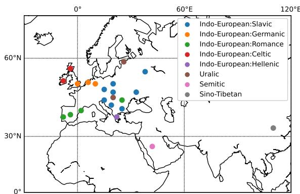
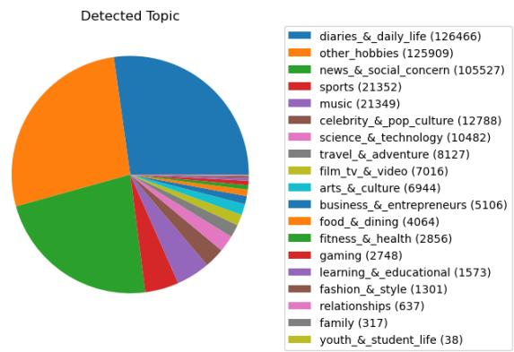
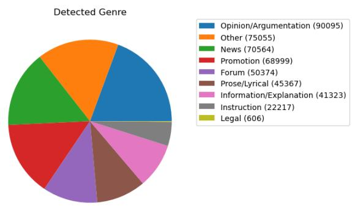

# MultiSocial: Multilingual Benchmark of Machine-Generated Text Detection of Social-Media Texts

Dominik Macko, Jakub Kopal, Robert Moro, Ivan Srba Kempelen Institute of Intelligent Technologies, Slovakia {dominik.macko, jakub.kopal, robert.moro, ivan.srba}@kinit.sk

## Abstract

Recent LLMs are able to generate high-quality multilingual texts, indistinguishable for humans from authentic human-written ones. Research in machine-generated text detection is however mostly focused on the English language and longer texts, such as news articles, scientific papers or student essays. Socialmedia texts are usually much shorter and often feature informal language, grammatical errors, or distinct linguistic items (e.g., emoticons, hashtags). There is a gap in studying the ability of existing methods in detection of such texts, reflected also in the lack of existing multilingual benchmark datasets. To fill this gap we propose the first multilingual (22 languages) and multi-platform (5 social media platforms) dataset for benchmarking machinegenerated text detection in the social-media domain, called MultiSocial1. It contains 472,097 texts, of which about 58k are human-written and approximately the same amount is generated by each of 7 multilingual LLMs. We use this benchmark to compare existing detection methods in zero-shot as well as fine-tuned form. Our results indicate that the fine-tuned detectors have no problem to be trained on socialmedia texts and that the platform selection for training matters.

## 1 Introduction

The most advanced text-generation AI models, called large language models (LLMs), are able to generate high-quality texts in various languages (Qin et al., 2024). Although this presents an opportunity to make a human life and work more efficient, it also presents a threat of being misused, as such generated texts are not easily recognisable by humans (Zellers et al., 2019). This is especially crucial in regard to social-media networks (SMN, such as Facebook, X/Twitter, etc.), where anyone can be a source of a harmful content (without editorial consent) with a potentially wide reach (depending on a network) (Aïmeur et al., 2023). To prevent the LLM misuse (e.g., social engineering, disinformation spreading), a reliable mechanism to detect machine-generated text (MGT) is needed.

  
Figure 1: MultiSocial coverage of languages.

Unfortunately, the existing research in MGT detection (MGTD) focuses either solely on English (as in most NLP fields, e.g., Dugan et al., 2024) or leaves SMN texts out of scope due to challenges they bring (Kumarage et al., 2024; Lin et al., 2024). These challenges include very informal writing style often used in SMN, such as using slang, ignoring grammar rules, using distinct linguistic items in the texts (e.g., emoticons or hashtags), or usually including very short lengths of the texts.

Our work fills a gap in the state-of-the-art (SOTA) by introducing a new heavily multilingual dataset for MGTD research in the social-media domain. We use this dataset to further benchmark the existing SOTA detectors in various aspects. Specifically, our key contributions include:

(1) The first multilingual evaluation of SOTA MGTD methods (statistical, pre-trained, finetuned) on social-media texts, focusing on multilingual as well as cross-lingual capability of existing detectors and comparison of different categories. The best detectors perform similarly across all tested languages, although there are still differences between English and non-English in zeroshot evaluation.

(2) The first multi-platform and crossplatform evaluation of SOTA MGTD methods in social-media domain, evaluating differences in MGTD performance based on text types and sources in multiple languages. We found that Telegram offers the best cross-lingual capability.

(3) The unique multilingual, multi-platform, and multi-generator benchmark dataset of human-written and machine-generated socialmedia texts, called MultiSocial, covering 22 languages, 5 SMN platforms, and 7 LLM generators.

## 2 Related Work

Multilingual machine-generated text detection has been gaining attention recently. There have been multiple non-English language MGT detection shared tasks in the last years, such as Russian at RuATD 2022 (Shamardina et al., 2022), Spanish at AuTexTification 2023 (Sarvazyan et al., 2023), Dutch at CLIN33 (Fivez et al., 2024), or multilingual at SemEval-2024 Task 8 (Wang et al., 2024b).

The last one covers 9 languages, and is based on M4GT-Bench (Wang et al., 2024a), multilingual, multi-domain, and multi-generator MGT benchmark. However, its coverage of the SMN domain is rather sparse (solely English-only Reddit texts are included). Moreover, language coverage of the domains is highly imbalanced (e.g., most languages are represented only in the news domain, while Arabic and German also in Wikipedia domain, and Chinese only in the QA domain) and there are only one or two generators used in the multilingual settings. Therefore, cross-lingual evaluation is somewhat limited using such data.

Another benchmark dataset called MULTITuDE (Macko et al., 2023) covers 11 languages; however, 8 of them are included in the test split only with a limited number of samples. Moreover, it is focused on the news domain only, in which the texts are typically long, formal, and carefully checked for grammatical correctness. Such settings are clearly different than those of social media texts. An extension of MULTITuDE dataset to evaluate various authorship obfuscation methods is proposed in (Macko et al., 2024). Although it enables to evaluate robustness of MGT detection methods, it is still limited to news domain.

<table><tr><td>Dataset</td><td>H/M</td><td>LLM</td><td>Lang</td><td>Domain SMN</td><td></td></tr><tr><td>TweepFake (Fagni et al., 2021)</td><td>12k/12k</td><td>6</td><td>1</td><td>SMN</td><td>1</td></tr><tr><td>Fox8-23 (Yang and Menczer, 2023)</td><td>228k/170k</td><td>1</td><td>1</td><td>SMN</td><td>1</td></tr><tr><td>F3 (Lucas et al., 2023)</td><td>28k/28k</td><td>1</td><td>1</td><td>news, SMN</td><td>1</td></tr><tr><td>HC3 (Guo et al., 2023)</td><td>81k/44k</td><td>1</td><td>2</td><td>QA, Wiki</td><td>0</td></tr><tr><td>SAID (Cui et al., 2023)</td><td>87k/131k</td><td>N/A</td><td>2</td><td>QA</td><td>0</td></tr><tr><td>MULTITuDE (Macko et al., 2023)</td><td>8k/66k</td><td>8</td><td>11</td><td>news</td><td>0</td></tr><tr><td>M4GT-Bench (Wang et al., 2024a)</td><td>93k/124k</td><td>8</td><td>9</td><td>6</td><td>0</td></tr><tr><td>MultiSocial (ours)</td><td>58k/414k</td><td>7</td><td>22</td><td>SMN</td><td>5</td></tr></table>

Table 1: Comparison of existing publicly available MGT detection datasets either multilingual or focused on social-media network (SMN) domain. H/M refers to the no. of human-written and machine-generated samples.

There is also MAiDE-up dataset (Ignat et al., 2024) of hotel reviews available, covering 10 languages; however, it is limited to GPT-4 generated data only (limiting the generalization of conclusions). Although such texts are more similar to social-media texts than news articles, they cover a single topic (accommodation) and still use a different communication style than the social-media networks. Many other works have focused on detection of fake reviews, but only few of them reflected multilingualism (Duma et al., 2024).

Benchmark datasets HC3 (Guo et al., 2023) and SAID (Cui et al., 2023) contain Chinese and English texts covering forum-like question-answering domain. HC3 contains only ChatGPT-generated machine texts, SAID contains real bot-generated texts (relying on human annotations to identify them). The downside of SAID is that the specific generation model of individual texts is not known. Otherwise, social-media texts are covered only in rather old TweepFake (Fagni et al., 2021) dataset, which includes English-only tweets and cannot be used to evaluate MGT detection methods on social-media texts generated by the most modern LLMs. Fox8-23 (Yang and Menczer, 2023) dataset also focuses on English, and covers presumably only ChatGPT-generated tweets. Similarly, F3 (Lucas et al., 2023) dataset contains English ChatGPT-generated real and fake news as well as tweets. There are other monolingual works, such as (Temnikova et al., 2023) focused on fake tweets in Bulgarian; however, the crafted dataset is not publicly available.

Table 1 includes comparison of the new dataset proposed in this work (described in the next section) with the selected existing publicly available datasets for MGT detection.

<table><tr><td></td><td colspan="6">Train</td><td colspan="6">Test</td></tr><tr><td>Language</td><td>Discord</td><td>Gab</td><td>Telegram</td><td>Twitter</td><td>WhatsApp</td><td>all</td><td>Discord</td><td>Gab</td><td>Telegram</td><td>Twitter</td><td>WhatsApp</td><td>all</td></tr><tr><td>Arabic (ar)</td><td>0</td><td>0</td><td>7724</td><td>7872</td><td>0</td><td>15596</td><td>0</td><td>1556</td><td>2319</td><td>2364</td><td>1750</td><td>7989</td></tr><tr><td>Bulgarian (bg)</td><td>0</td><td>0</td><td>7555</td><td>7930</td><td>0</td><td>15485</td><td>0</td><td>192</td><td>2334</td><td>2367</td><td>0</td><td>4893</td></tr><tr><td>Catalan (ca)</td><td>6984</td><td>0</td><td>7157</td><td>0</td><td>0</td><td>14141</td><td>2105</td><td>1264</td><td>2134</td><td>1824</td><td>144</td><td>7471</td></tr><tr><td>Chinese (zh)</td><td>0</td><td>0</td><td>7924</td><td>0</td><td>0</td><td>7924</td><td>0</td><td>830</td><td>2380</td><td>238</td><td>32</td><td>3480</td></tr><tr><td>Croatian (hr)</td><td>7502</td><td>0</td><td>7065</td><td>0</td><td>0</td><td>14567</td><td>2255</td><td>1340</td><td>2315</td><td>91</td><td>38</td><td>6039</td></tr><tr><td>Czech (cs)</td><td>3450</td><td>0</td><td>7690</td><td>0</td><td>0</td><td>11140</td><td>2175</td><td>492</td><td>2309</td><td>1017</td><td>134</td><td>6127</td></tr><tr><td>Dutch (nl)</td><td>7391</td><td>7900</td><td>7750</td><td>7933</td><td>0</td><td>30974</td><td>2191</td><td>2356</td><td>2318</td><td>2369</td><td>397</td><td>9631</td></tr><tr><td>English (en)</td><td>7789</td><td>7760</td><td>7824</td><td>7871</td><td>7782</td><td>39026</td><td>2341</td><td>2340</td><td>2350</td><td>2365</td><td>2334</td><td>11730</td></tr><tr><td>Estonian (et)</td><td>6974</td><td>0</td><td>7520</td><td>0</td><td>0</td><td>14494</td><td>2071</td><td>805</td><td>2259</td><td>164</td><td>120</td><td>5419</td></tr><tr><td>German (de)</td><td>3407</td><td>7863</td><td>7880</td><td>2095</td><td>0</td><td>21245</td><td>2232</td><td>2366</td><td>2356</td><td>2345</td><td>304</td><td>9603</td></tr><tr><td>Greek (el)</td><td>0</td><td>0</td><td>3814</td><td>0</td><td>0</td><td>3814</td><td>0</td><td>1195</td><td>2274</td><td>146</td><td>35</td><td>3650</td></tr><tr><td>Hungarian (hu)</td><td>7079</td><td>0</td><td>7461</td><td>0</td><td>0</td><td>14540</td><td>2094</td><td>1211</td><td>2228</td><td>413</td><td>22</td><td>5968</td></tr><tr><td>Irish (ga)</td><td>0</td><td>0</td><td>0</td><td>0</td><td>0</td><td>0</td><td>1319</td><td>968</td><td>821</td><td>45</td><td>0</td><td>3153</td></tr><tr><td>Polish (pl)</td><td>7158</td><td>1829</td><td>7733</td><td>0</td><td>0</td><td>16720</td><td>2136</td><td>2311</td><td>2310</td><td>172</td><td>62</td><td>6991</td></tr><tr><td>Portuguese (pt)</td><td>6860</td><td>7916</td><td>7842</td><td>6481</td><td>4354</td><td>33453</td><td>2284</td><td>2371</td><td>2347</td><td>2360</td><td>2363</td><td>11725</td></tr><tr><td>Romanian (ro)</td><td>7436</td><td>851</td><td>6792</td><td>64</td><td>0</td><td>15143</td><td>2236</td><td>2349</td><td>2298</td><td>2378</td><td>132</td><td>9393</td></tr><tr><td>Russian (ru)</td><td>0</td><td>7875</td><td>7827</td><td>362</td><td>0</td><td>16064</td><td>0</td><td>2355</td><td>2340</td><td>2361</td><td>960</td><td>8016</td></tr><tr><td>Scottish Gaelic (gd)</td><td>0</td><td>0</td><td>0</td><td>0</td><td>0</td><td>0</td><td>150</td><td>35</td><td>34</td><td>0</td><td>0</td><td>219</td></tr><tr><td>Slovak (sk)</td><td>0</td><td>0</td><td>0</td><td>0</td><td>0</td><td>0</td><td>107</td><td>308</td><td>1508</td><td>110</td><td>0</td><td>2033</td></tr><tr><td>Slovenian (sl)</td><td>0</td><td>0</td><td>0</td><td>0</td><td>0</td><td>0</td><td>203</td><td>1912</td><td>917</td><td>40</td><td>0</td><td>3072</td></tr><tr><td>Spanish (es)</td><td>7588</td><td>7883</td><td>7884</td><td>7922</td><td>7804</td><td>39081</td><td>2268</td><td>2361</td><td>2354</td><td>2376</td><td>2341</td><td>11700</td></tr><tr><td>Ukrainian (uk)</td><td>0</td><td>0</td><td>7802</td><td>0</td><td>0</td><td>7802</td><td>0</td><td>174</td><td>2342</td><td>70</td><td>0</td><td>2586</td></tr><tr><td>Total</td><td>79618</td><td>49877</td><td>133244</td><td>48530</td><td>19940</td><td>331209</td><td>28167</td><td>31091</td><td>44847</td><td>25615</td><td>11168</td><td>140888</td></tr></table>

Table 2: MultiSocial text sample counts across languages and platforms for train and test split.

## 3 Dataset

Since there is no dataset of multilingual SMN texts containing human-written texts along with the texts generated by SOTA text-generation LLMs, we have crafted a new MultiSocial benchmark dataset. It contains human-written data from five different social-media platforms (reused from the existing multilingual SMN datasets), namely Telegram, Twitter (X), Gab, Discord, and WhatsApp, including post-like as well as chat-like texts. For each authentic human-written text, the texts generated by 7 SOTA LLMs (representatives of private and open multilingual LLMs of various sizes and architectures) are included by using three iterations of paraphrasing. Other text-generation approaches were also considered, outputs of which were evaluated and compared by humans, automated similarity metrics, and meta-evaluation utilizing LLM judges. The final approach was selected based on sufficient output quality and similarity to the human texts (to avoid detection biases). Details regarding dataset construction (including selection, evaluation, pre-processing, generation, and postprocessing of texts) are provided in Appendix B.

Dataset consists of 472,097 texts (58k are human-written) split into train and test subsets, of which sample counts are summarized across languages and platforms in Table 2. We have conducted linguistic analysis of the machine-generated texts along with the similarity comparison to human texts, with a manual human check of a balanced subset, and identified small portion (about 1%) of noise in the generated data (e.g., “As an AI model...”), indicating model failure during generation. We have intentionally left such samples in the dataset (clearly marked in the data) for further analysis purpose (as indicated in Appendix B). We however filter-out the identified noise for the purpose of the experiments in this study. Although such a post-processing cannot guarantee 100% removal of noisy data, the obvious failures are cleaned. Furthermore, we have used meta-evaluation utilizing LLM judges to compare the quality of the generated texts of individual generators to the quality of original human texts, indicating that machinegenerated texts are of similar or higher quality (see Appendix B)).

Language Selection. The MultiSocial benchmark dataset covers 22 (high- and low-resource) languages (some only in the testing split), 20 of which (18 of Indo-European and 2 of Uralic language families) have been selected based on our research-projects needs. However, we have intentionally included 2 more (Arabic of Semitic and Chinese of Sino-Tibetan family), which are completely linguistically and geographically unrelated, to study cross-lingual characteristics (Figure 1). The dataset is strongly focused on the Indo-European language family, but contains 4 language families in total. Test split includes all of the train languages, but also 2 Celtic languages,

<table><tr><td>Generator</td><td>METEOR ↑</td><td>BERTScore ↑</td><td>ngram ↑</td><td>LD↓</td><td>MAUVE↓</td><td>LangCheck↓</td></tr><tr><td>Aya-101</td><td>0.195 (±0.23)</td><td>0.675 (±0.14)</td><td>0.156 (±0.18)</td><td>1.104 (±0.91)</td><td>0.063</td><td>10.59%</td></tr><tr><td>Gemini</td><td>0.152 (±0.20)</td><td>0.621 (±0.10)</td><td>0.087 (±0.17)</td><td>16.296 (±33.39)</td><td>0.025</td><td>6.16%</td></tr><tr><td>GPT-3.5-Turbo-0125</td><td>0.143 (±0.18)</td><td>0.664 (±0.10)</td><td>0.080 (±0.10)</td><td>2.359 (±3.82)</td><td>0.076</td><td>22.80%</td></tr><tr><td>Mistral-7B-Instruct-v0.2</td><td>0.152 (±0.16)</td><td>0.652 (±0.08)</td><td>0.088 (±0.09)</td><td>2.383 (±1.93)</td><td>0.047</td><td>10.61%</td></tr><tr><td>OPT-IML-Max-30b</td><td>0.127 (±0.19)</td><td>0.659 (±0.12)</td><td>0.105 (±0.14)</td><td>0.998 (±0.57)</td><td>0.108</td><td>14.88%</td></tr><tr><td>v5-Eagle-7B-HF</td><td>0.108 (±0.15)</td><td>0.628 (±0.07)</td><td>0.071 (±0.10)</td><td>2.568 (±2.10)</td><td>0.027</td><td>6.01%</td></tr><tr><td>Vicuna-13b</td><td>0.133 (±0.17)</td><td>0.650 (±0.09)</td><td>0.089 (±0.11)</td><td>1.811 (±1.40)</td><td>0.042</td><td>6.26%</td></tr></table>

Table 3: Similarity analysis between machine-generated (3-iteration paraphrased) and human-written (original) social-media texts for individual generation models [mean ( std)]. Arrows refer to values representing more similar texts, boldfaced values represent the most similar texts for each metric.

1 more South Slavic and 1 more West Slavic language. There are 5 writing scripts in both train and test splits of the dataset, where majority of languages uses Latin, but there is also Cyrillic (Russian, Ukrainian, Bulgarian), Arabic, Hanzi (Chinese), and Greek. Nice feature is that the train split includes at least 3 representatives of Germanic, Romance, Slavic-Latin, and Slavic-Cyrillic, which enables various combinations of studies regarding multilingual and cross-lingual characteristics of machine-generated text detection. Furthermore, in Slavic and Romance languages, there are included at least 2 representatives of languages that can be considered high-resource and low-resource.

Although not all languages have enough samples from each of five platforms (due to unavailability of human samples in the selected source datasets), specific subsets can be used to study specific characteristics (e.g., cross-platform transferability using English and Spanish languages, cross-lingual transferability using Telegram platform, surprise language and/or surprise platform evaluation not using specific portions of the train data, etc.).

Human-Machine Similarity Analysis. As mentioned, we have conducted a similarity analysis of the final generated texts by the selected generation models (reported in Table 3). Definitions of the used metrics are available in Appendix B. We can observe only small differences between the generators. Aya-101 generated the most similar texts in general, while OPT-IML-Max-30B provided the worst results (based on higher MAUVE and LangCheck scores). ChatGPT (GPT-3.5-Turbo) also generated the texts resulting in a little higher MAUVE score and the highest language mismatch (LangCheck). However, the language mismatch of ChatGPT (using all the selected languages) was not confirmed by longer news articles generation (FastText language detection in such texts is definitely more accurate), where it actually achieved the lowest (under 1%) LangCheck score among the generators. We assume that in social-media text generation it can better follow the original style of the text than the other generators (e.g., grammatically incorrect, slang), which is more difficult for accurate language detection.

## 4 Detection Methods

For the benchmark purpose, we have covered 3 specific categories of detection methods: statistical zero-shot (methods using statistical differences to differentiate human-written and machine-generated texts applicable without training), pre-trained (directly applicable models that are fine-tuned for the MGT detection task using different data – i.e., outof-distribution), and fine-tuned (foundation models fine-tuned for the MGT detection task using Multi-Social dataset – i.e., in-distribution).

For statistical category, we have selected the following 5 most-promising methods (excluding perturbation-based and multi-generation methods due to high computing costs): Binoculars (Hans et al., 2024) with Falcon-7B (Almazrouei et al., 2023) as an observer model and Falcon-7B-Instruct as a performer model, Fast-DetectGPT (Bao et al., 2023) with GPT-J-6B (Wang and Komatsuzaki, 2021) as both the reference and sampling models, LLM-Deviation (Wu and Xiang, 2023), DetectLLM-LRR (Su et al., 2023), S5 (Spiegel and Macko, 2024b) (multiplying 5 statistical metrics of Likelihood, Entropy, Rank, Log-Rank, and LLM-Deviation), all three of them using GPT-J-6B as a base model (the same as in Fast-DetectGPT).

For pre-trained category, we have selected the following 5 detectors with a multilingual potential: ChatGPT-detector-RoBERTa-Chinese (Guo et al., 2023) (with a Chinese fine-tuned model), Longformer Detector (Li et al., 2023) (showing decent multilingual potential in Macko et al., 2024), ruRoBERTa-ruatd-binary2 (as a best singlemodel system in RuATD 2022 Shamardina et al., 2022), BLOOMZ-3B-mixed-detector (Nicolai Thorer Sivesind and Andreas Bentzen Winje, 2023) (with a heavily multilingual fine-tuned LLM), and RoBERTa-Large OpenAI Detectors (Solaiman et al., 2019) (as a widely used representative, although English-only).

For fine-tuned category, we have selected 7 multilingual foundational models covering multiple architectures and model sizes: mDeBERTa-v3-base (He et al., 2022) (as the best detector in Macko et al., 2023), XLM-RoBERTa-large (Conneau et al., 2020) (as the best detector in Macko et al., 2023 based on AUC ROC), Mistral-7B (Jiang et al., 2023) (as the best single-model multilingual detector in of SemEval-2024 Task 8 Wang et al., 2024b), Llama-3-8B (AI@Meta, 2024) (as a SOTA multilingual smaller LLM), Aya-101 (Üstün et al., 2024) (as a SOTA representative of multilingual LLMs with encoder-decoder architecture), BLOOMZ-3B (Muennighoff et al., 2022) (as the best pre-trained detector base model), and Falcon-rw-1B (as a smaller version of the best performing model at ALTA 2023 Gagiano and Tian, 2023, since the 7B model version is already covered by better performing Mistral, Spiegel and Macko, 2024b).

For statistical and pre-trained categories of detection methods, we have used their versions implemented in the IMGTB framework (Spiegel and Macko, 2024a).

## 5 Experimental Results

Firstly, we provide benchmark evaluation of the selected MGTD methods on all MultiSocial test data (Table 4). It provides a fair comparison of the methods, although the data samples among platforms and languages are not perfectly balanced. Therefore, for further experiments targeting specific cross-lingual and cross-platform research questions, the carefully selected parts of train and test splits are used (described in the corresponding subsections). Per-language, per-platform, and pergenerator results are provided in Appendix F. Although worse-than-random performances of some pre-trained detectors indicate a potential problem with the detection (e.g., flipped labels), it is not the case as confirmed by the results in Table 21.

For comparison of MGTD methods, we use AUC ROC (area under the curve of receiver operating characteristic) as a classification-threshold independent metric (not affected by a threshold calibration on in-domain data), also used by (Hans et al., 2024). Due to imbalanced test data (machine class contains 7x more samples), we also use Macro avg. F1-score @ 5% FPR (false positive rate) as a metric balancing between a precision and a recall of the classification, while the threshold is calibrated based on the train data (to avoid data leakage) ROC curve to achieve 5% FPR (similarly used in Dugan et al., 2024).

<table><tr><td>Rank Detector</td><td>MacroF1 AUC ROC @5%FPR</td></tr><tr><td>1 Llama-3-8b-MultiSocial Mistral-7b-v0.1-MultiSocial</td><td>0.9769 0.8696 0.9768 0.8692</td></tr><tr><td>2 3 Aya-101-MultiSocial</td><td>0.9731 0.8462</td></tr><tr><td>4 Falcon-rw-1b-MultiSocial</td><td>0.9592 0.7810</td></tr><tr><td>5 BLOOMZ-3b-MultiSocial</td><td>0.9582 0.7843</td></tr><tr><td>6 XLM-RoBERTa-large-MultiSocial</td><td>0.9553 0.7840</td></tr><tr><td>7 mDeBERTa-v3-base-MultiSocial</td><td>0.9544 0.7652</td></tr><tr><td>8 BLOOMZ-3b-mixed-Detector</td><td>0.7553 0.3024</td></tr><tr><td>9 DetectLLM-LRR</td><td>0.7464 0.2523</td></tr><tr><td>10 LLM-Deviation</td><td>0.7454 0.2497</td></tr><tr><td>11 S5</td><td>0.7418 0.2465</td></tr><tr><td>12 Fast-Detect-GPT</td><td>0.7418 0.3605</td></tr><tr><td>13 Binoculars</td><td>0.7248 0.2815</td></tr><tr><td>14 ChatGPT-Detector-RoBERTa-Chinese</td><td></td></tr><tr><td></td><td>0.7180 0.3416</td></tr><tr><td>15 ruRoBERTa-ruatd-binary</td><td>0.4817 0.1711</td></tr><tr><td>16 Longformer Detector</td><td>0.4615 0.1516</td></tr><tr><td>17 RoBERTa-large-OpenAI-Detector</td><td>0.3450 0.1376</td></tr></table>

Table 4: Benchmark of the selected MGTD methods of statistical , pre-trained , and fine-tuned categories (as defined in Section 4). The highlight color identifies the category of the method in the table.

Since Gemini-generated data have used a slightly different generation process (e.g., jailbreak prompt, see Appendix B) and achieved highly outlier wordcount and unique-words scores in Table 12, we do not use Gemini-generated data in the training (fine-tuning or classification-threshold calibration). Nevertheless, they are still included in the evaluation (can serve for unseen generator evaluation).

## 5.1 Multilingual Zero-shot Detection

This experiment is focused on the following research question: RQ1: How well are socialmedia texts of multiple languages and platforms detectable by MGT detectors applicable in zeroshot manner (out-of-distribution, without further in-domain training)? Since SMN texts are usually shorter than commonly used news articles, the detection performance of existing directly usable (i.e., without in-domain training) MGT detectors is still unknown (it could differ from the reported performance on other domains). This has not been evaluated in the multilingual settings. Are there differences in multilingual MGT detection among different sources of SMN content (e.g., Twitter vs. Telegram vs. Gab)? Is there a difference between statistical (could be language independent) and pre-trained (heavily dependent on pre-training languages) zero-shot detectors?

<table><tr><td rowspan=2 colspan=1>Category</td><td rowspan=2 colspan=1>Detector</td><td rowspan=2 colspan=9>ar bg ca cs  de el en es et</td><td rowspan=1 colspan=2>Test Lang</td><td rowspan=1 colspan=8>uage [AUC ROC]</td><td rowspan=1 colspan=2></td><td rowspan=1 colspan=1></td><td rowspan=1 colspan=1></td></tr><tr><td rowspan=1 colspan=1>et</td><td rowspan=1 colspan=2>ga gd</td><td rowspan=1 colspan=8>hr hu nl  pl  pt ro ru sk</td><td rowspan=1 colspan=2>sl uk</td><td rowspan=1 colspan=1>zh</td><td rowspan=1 colspan=1>all</td></tr><tr><td rowspan=11 colspan=1>P</td><td rowspan=3 colspan=1>BLOOMZ-3b-mixed-Detector</td><td></td><td></td><td></td><td></td><td></td><td></td><td></td><td></td><td></td><td></td><td></td><td></td><td></td><td></td><td></td><td></td><td></td><td></td><td></td><td></td><td></td><td></td><td></td></tr><tr><td rowspan=2 colspan=1></td><td rowspan=2 colspan=1></td><td rowspan=2 colspan=1></td><td rowspan=2 colspan=1></td><td rowspan=2 colspan=1></td><td rowspan=2 colspan=1></td><td rowspan=2 colspan=1></td><td rowspan=2 colspan=1></td><td rowspan=2 colspan=1></td><td rowspan=2 colspan=1></td><td rowspan=2 colspan=1></td><td rowspan=2 colspan=1></td><td rowspan=2 colspan=1></td><td rowspan=2 colspan=1></td><td rowspan=2 colspan=1></td><td rowspan=2 colspan=1></td><td rowspan=2 colspan=1></td><td rowspan=2 colspan=1></td><td rowspan=2 colspan=1></td><td rowspan=2 colspan=1></td><td rowspan=2 colspan=1></td><td rowspan=2 colspan=1></td><td></td></tr><tr><td rowspan=1 colspan=1>0.76</td></tr><tr><td rowspan=1 colspan=1>ChatGPT-Detector-</td><td rowspan=1 colspan=1>0.72</td><td rowspan=1 colspan=1>0.80</td><td rowspan=1 colspan=1>0.76</td><td rowspan=1 colspan=1>0.66</td><td rowspan=1 colspan=1>0.80</td><td rowspan=1 colspan=1>0.75</td><td rowspan=1 colspan=1>0.90</td><td rowspan=1 colspan=1>0.81</td><td rowspan=1 colspan=1>0.82</td><td rowspan=1 colspan=1>0.73</td><td rowspan=1 colspan=1>0.63</td><td rowspan=1 colspan=1>0.63</td><td rowspan=1 colspan=1>0.78</td><td rowspan=1 colspan=1>0.70</td><td rowspan=1 colspan=1>0.62</td><td rowspan=1 colspan=1>0.73</td><td rowspan=1 colspan=1>0.75</td><td rowspan=1 colspan=1>0.76</td><td rowspan=1 colspan=1>0.63</td><td rowspan=1 colspan=1>0.66</td><td rowspan=1 colspan=1>0.74</td><td rowspan=1 colspan=1>0.81</td><td rowspan=1 colspan=1>0.72</td></tr><tr><td rowspan=1 colspan=1>RoBERTa-Chinese</td><td rowspan=1 colspan=1></td><td rowspan=1 colspan=1></td><td rowspan=1 colspan=1></td><td rowspan=1 colspan=1></td><td rowspan=1 colspan=1></td><td rowspan=1 colspan=1></td><td rowspan=1 colspan=1></td><td rowspan=1 colspan=1></td><td rowspan=1 colspan=1></td><td rowspan=1 colspan=1></td><td rowspan=1 colspan=1></td><td rowspan=1 colspan=1></td><td rowspan=1 colspan=1></td><td rowspan=1 colspan=1></td><td rowspan=1 colspan=1></td><td rowspan=1 colspan=1></td><td rowspan=1 colspan=1></td><td rowspan=1 colspan=1></td><td rowspan=1 colspan=1></td><td rowspan=1 colspan=1></td><td rowspan=1 colspan=1></td><td rowspan=1 colspan=1></td><td rowspan=1 colspan=1></td></tr><tr><td rowspan=1 colspan=1>Longformer Detector</td><td rowspan=1 colspan=1>0.34</td><td rowspan=1 colspan=1>0.48</td><td rowspan=1 colspan=1>0.32</td><td rowspan=1 colspan=1>0.47</td><td rowspan=1 colspan=1>0.43</td><td rowspan=1 colspan=1>0.54</td><td rowspan=1 colspan=1>0.65</td><td rowspan=1 colspan=1>0.43</td><td rowspan=1 colspan=1>0.48</td><td rowspan=1 colspan=1>0.53</td><td rowspan=1 colspan=1>0.49</td><td rowspan=1 colspan=1>0.51</td><td rowspan=1 colspan=1>0.50</td><td rowspan=1 colspan=1>0.41</td><td rowspan=1 colspan=1>0.46</td><td rowspan=1 colspan=1>0.42</td><td rowspan=1 colspan=1>0.41</td><td rowspan=1 colspan=1>0.46</td><td rowspan=1 colspan=1>0.45</td><td rowspan=1 colspan=1>0.46</td><td rowspan=1 colspan=1>0.61</td><td rowspan=1 colspan=1>0.47</td><td rowspan=1 colspan=1>0.46</td></tr><tr><td rowspan=2 colspan=1>RoBERTa-large-OpenAI-Detector</td><td rowspan=1 colspan=1>0.73</td><td rowspan=1 colspan=1>0.43</td><td rowspan=1 colspan=1>0.43</td><td rowspan=1 colspan=1>0.14</td><td rowspan=1 colspan=1>0.32</td><td rowspan=1 colspan=1>0.74</td><td rowspan=1 colspan=1>0.52</td><td rowspan=1 colspan=1>0.30</td><td rowspan=1 colspan=1>0.20</td><td rowspan=1 colspan=1>0.30</td><td rowspan=1 colspan=1>0.48</td><td rowspan=1 colspan=1>0.19</td><td rowspan=1 colspan=1>0.13</td><td rowspan=1 colspan=1>0.30</td><td rowspan=1 colspan=1>0.21</td><td rowspan=1 colspan=1>0.23</td><td rowspan=1 colspan=1>0.24</td><td rowspan=1 colspan=1>0.54</td><td rowspan=1 colspan=1>0.26</td><td rowspan=1 colspan=1>0.33</td><td rowspan=1 colspan=1>0.36</td><td rowspan=1 colspan=1>0.60</td><td rowspan=1 colspan=1>0.35</td></tr><tr><td rowspan=1 colspan=1></td><td rowspan=1 colspan=1></td><td rowspan=1 colspan=1></td><td rowspan=1 colspan=1></td><td rowspan=1 colspan=1></td><td rowspan=1 colspan=1></td><td rowspan=1 colspan=1></td><td rowspan=1 colspan=1></td><td rowspan=1 colspan=1></td><td rowspan=1 colspan=1></td><td rowspan=1 colspan=1></td><td rowspan=1 colspan=1></td><td rowspan=1 colspan=1></td><td rowspan=1 colspan=1></td><td rowspan=1 colspan=1></td><td rowspan=1 colspan=1></td><td></td><td></td><td></td><td></td><td></td><td></td><td></td></tr><tr><td rowspan=3 colspan=1>ruRoBERTa-ruatd-binary</td><td rowspan=3 colspan=1>0.40</td><td rowspan=3 colspan=1>0.63</td><td rowspan=2 colspan=1>0.56</td><td rowspan=2 colspan=1>0.43</td><td rowspan=2 colspan=1>0.43</td><td rowspan=2 colspan=1>0.35</td><td rowspan=2 colspan=1>0.56</td><td rowspan=2 colspan=1>0.47</td><td rowspan=2 colspan=1>0.43</td><td rowspan=2 colspan=2>0.490.47</td><td rowspan=2 colspan=1>0.48</td><td rowspan=2 colspan=1>0.46</td><td rowspan=2 colspan=1>0.50</td><td rowspan=2 colspan=1>0.44</td><td rowspan=2 colspan=1>0.43</td><td></td><td></td><td></td><td></td><td></td><td></td><td></td></tr><tr><td rowspan=2 colspan=1>0.34</td><td rowspan=2 colspan=1>0.70</td><td rowspan=2 colspan=1>0.45</td><td rowspan=2 colspan=1>0.47</td><td rowspan=2 colspan=1>0.59</td><td rowspan=2 colspan=1>0.44</td><td rowspan=2 colspan=1>0.48</td></tr><tr><td rowspan=1 colspan=1></td><td rowspan=1 colspan=1></td><td rowspan=1 colspan=1></td><td rowspan=1 colspan=1></td><td rowspan=1 colspan=1></td><td rowspan=1 colspan=1></td><td rowspan=1 colspan=1></td><td rowspan=1 colspan=2></td><td rowspan=1 colspan=1></td><td rowspan=1 colspan=1></td><td rowspan=1 colspan=1></td><td></td><td></td></tr><tr><td rowspan=5 colspan=1>S</td><td rowspan=1 colspan=1>Binoculars</td><td rowspan=1 colspan=1>0.70</td><td rowspan=1 colspan=1>0.68</td><td rowspan=1 colspan=1>0.62</td><td rowspan=1 colspan=1>0.74</td><td rowspan=1 colspan=1>0.75</td><td rowspan=1 colspan=1>0.79</td><td rowspan=1 colspan=1>0.80</td><td rowspan=1 colspan=1>0.76</td><td rowspan=1 colspan=1>0.74</td><td rowspan=1 colspan=1>0.71</td><td rowspan=1 colspan=1>0.71</td><td rowspan=1 colspan=1>0.79</td><td rowspan=1 colspan=1>0.78</td><td rowspan=1 colspan=1>0.72</td><td rowspan=1 colspan=1>0.75</td><td rowspan=1 colspan=1>0.75</td><td rowspan=1 colspan=1>0.74</td><td rowspan=1 colspan=1>0.72</td><td rowspan=1 colspan=1>0.71</td><td rowspan=1 colspan=1>0.73</td><td rowspan=1 colspan=1>0.64</td><td rowspan=1 colspan=1>0.74</td><td rowspan=1 colspan=1>0.72</td></tr><tr><td rowspan=1 colspan=1>DetectLLM-LRR</td><td rowspan=1 colspan=1>0.79</td><td rowspan=1 colspan=1>0.86</td><td rowspan=1 colspan=1>0.69</td><td rowspan=1 colspan=1>0.93</td><td rowspan=1 colspan=1>0.78</td><td rowspan=1 colspan=1>0.88</td><td rowspan=1 colspan=1>0.80</td><td rowspan=1 colspan=1>0.82</td><td rowspan=1 colspan=1>0.88</td><td rowspan=1 colspan=1>0.79</td><td rowspan=1 colspan=1>0.74</td><td rowspan=1 colspan=1>0.88</td><td rowspan=1 colspan=1>0.94</td><td rowspan=1 colspan=1>0.79</td><td rowspan=1 colspan=1>0.88</td><td rowspan=1 colspan=1>0.84</td><td rowspan=1 colspan=1>0.87</td><td rowspan=1 colspan=1>0.78</td><td rowspan=1 colspan=1>0.85</td><td rowspan=1 colspan=1>0.79</td><td rowspan=1 colspan=1>0.75</td><td rowspan=1 colspan=1>0.78</td><td rowspan=1 colspan=1>0.75</td></tr><tr><td rowspan=1 colspan=1>Fast-Detect-GPT</td><td rowspan=1 colspan=1>0.75</td><td rowspan=1 colspan=1>0.65</td><td rowspan=1 colspan=1>0.61</td><td rowspan=1 colspan=1>0.81</td><td rowspan=1 colspan=1>0.77</td><td rowspan=1 colspan=1>0.66</td><td rowspan=1 colspan=1>0.80</td><td rowspan=1 colspan=1>0.74</td><td rowspan=1 colspan=1>0.69</td><td rowspan=1 colspan=1>0.70</td><td rowspan=1 colspan=1>0.74</td><td rowspan=1 colspan=1>0.80</td><td rowspan=1 colspan=1>0.77</td><td rowspan=1 colspan=1>0.74</td><td rowspan=1 colspan=1>0.77</td><td rowspan=1 colspan=1>0.77</td><td rowspan=1 colspan=1>0.77</td><td rowspan=1 colspan=1>0.73</td><td rowspan=1 colspan=1>0.71</td><td rowspan=1 colspan=1>0.74</td><td rowspan=1 colspan=1>0.70</td><td rowspan=1 colspan=1>0.74</td><td rowspan=1 colspan=1>0.74</td></tr><tr><td rowspan=2 colspan=1>LLM-DeviationS5</td><td rowspan=1 colspan=1>0.82</td><td rowspan=1 colspan=1>0.86</td><td rowspan=1 colspan=1>0.68</td><td rowspan=1 colspan=1>0.93</td><td rowspan=1 colspan=1>0.79</td><td rowspan=1 colspan=1>0.89</td><td rowspan=1 colspan=1>0.80</td><td rowspan=1 colspan=1>0.82</td><td rowspan=1 colspan=1>0.90</td><td rowspan=1 colspan=1>0.81</td><td rowspan=1 colspan=1>0.79</td><td rowspan=1 colspan=1>0.89</td><td rowspan=1 colspan=1>0.94</td><td rowspan=1 colspan=1>0.79</td><td rowspan=1 colspan=1>0.89</td><td rowspan=1 colspan=1>0.84</td><td rowspan=1 colspan=1>0.88</td><td rowspan=1 colspan=1>0.78</td><td rowspan=1 colspan=1>0.86</td><td rowspan=1 colspan=1>0.81</td><td rowspan=1 colspan=1>0.75</td><td rowspan=1 colspan=1>0.79</td><td rowspan=1 colspan=1>0.75</td></tr><tr><td rowspan=1 colspan=1>0.80</td><td rowspan=1 colspan=1>0.85</td><td rowspan=1 colspan=1>0.68</td><td rowspan=1 colspan=1>0.92</td><td rowspan=1 colspan=1>0.78</td><td rowspan=1 colspan=1>0.88</td><td rowspan=1 colspan=1>0.77</td><td rowspan=1 colspan=1>0.81</td><td rowspan=1 colspan=1>0.89</td><td rowspan=1 colspan=2>0.800.78</td><td rowspan=1 colspan=1>0.88</td><td rowspan=1 colspan=1>0.94</td><td rowspan=1 colspan=1>0.77</td><td rowspan=1 colspan=1>0.88</td><td rowspan=1 colspan=1>0.83</td><td rowspan=1 colspan=1>0.88</td><td rowspan=1 colspan=1>0.78</td><td rowspan=1 colspan=1>0.85</td><td rowspan=1 colspan=1>0.80</td><td rowspan=1 colspan=1>0.74</td><td rowspan=1 colspan=1>0.78</td><td rowspan=1 colspan=1>0.74</td></tr></table>

Table 5: Per-language AUC ROC performance of zero-shot statistical (S) and pre-trained (P) MGT detectors. The data are too difficult for the three under-performing pre-trained models.
<table><tr><td rowspan="2">Category</td><td></td><td colspan="5"></td><td colspan="10">Test Language [AUC ROC mean]</td><td></td><td></td><td>sk</td><td>sl</td><td>uk</td><td></td></tr><tr><td>Platform</td><td>ar</td><td>bg</td><td>ca 0.92</td><td>cs 0.81</td><td>de</td><td>en</td><td>es</td><td>et</td><td>ga</td><td>gd</td><td>hr</td><td>hu 0.84</td><td>nl</td><td>pt</td><td>ro</td><td>ru</td><td></td><td></td><td></td><td>zh</td><td>all 0.82</td></tr><tr><td rowspan="6">P</td><td>Discord</td><td>N/A N/A</td><td>N/A</td><td>N/A</td><td>0.86</td><td>N/A</td><td>0.91</td><td>0.89 0.71</td><td>0.86 N/A</td><td>N/A N/A</td><td>N/A N/A</td><td>0.75</td><td>0.81</td><td>0.81</td><td>0.82 0.72</td><td>0.81 0.61</td><td>N/A 0.62</td><td>N/A N/A</td><td>N/A N/A</td><td>N/A N/A</td><td>N/A N/A</td></tr><tr><td>Gab</td><td></td><td>N/A</td><td>N/A</td><td>0.71</td><td>N/A</td><td>0.82</td><td></td><td></td><td></td><td>N/A</td><td>N/A</td><td>0.71</td><td>0.64</td><td></td><td></td><td></td><td></td><td></td><td></td><td>0.66</td></tr><tr><td>Telegram</td><td>0.73</td><td>0.77</td><td>0.73</td><td>0.73 0.79</td><td>0.81</td><td>0.86</td><td>0.80</td><td>0.84</td><td>N/A</td><td>N/A 0.71</td><td>0.86</td><td>0.68</td><td>0.70</td><td>0.77</td><td>0.77</td><td>0.76</td><td>N/A</td><td>N/A</td><td>0.73</td><td>0.76 0.74</td></tr><tr><td>Twitter</td><td>0.84</td><td>0.79</td><td>N/A</td><td>N/A 0.78</td><td>N/A</td><td>0.85</td><td>0.73</td><td>N/A</td><td>N/A</td><td>N/A N/A</td><td>N/A</td><td>0.73</td><td>N/A</td><td>0.75</td><td>0.65 0.80</td><td></td><td>N/A</td><td>N/A</td><td>N/A</td><td>N/A 0.73</td></tr><tr><td>WhatsApp</td><td>N/A</td><td>N/A</td><td>N/A</td><td>N/A N/A</td><td>N/A</td><td>0.82</td><td>0.86</td><td>N/A</td><td>N/A</td><td>N/A N/A</td><td>N/A</td><td>N/A</td><td>N/A</td><td>0.76</td><td>N/A</td><td>N/A</td><td>N/A</td><td>N/A</td><td>N/A N/A</td><td>0.79</td></tr><tr><td>all</td><td>0.76</td><td>0.77</td><td>0.77</td><td>0.73 0.78</td><td>0.75</td><td>0.85</td><td>0.80</td><td>0.82</td><td>0.75</td><td>N/A 0.70</td><td>0.81</td><td>0.72</td><td>0.70</td><td>0.76</td><td>0.71</td><td>0.72</td><td>0.70</td><td>0.65</td><td>0.72 0.75</td><td>0.74</td></tr><tr><td rowspan="6">S</td><td>Discord</td><td>N/A</td><td>N/A</td><td>0.85</td><td>0.90 0.87</td><td>N/A</td><td>0.90</td><td>0.89</td><td>0.86</td><td>N/A</td><td>N/A 0.89</td><td>0.91</td><td>0.89</td><td>0.92</td><td>0.90</td><td>0.89</td><td>N/A</td><td>N/A</td><td>N/A</td><td>N/A</td><td>N/A 0.88</td></tr><tr><td>Gab</td><td>N/A</td><td>N/A</td><td>N/A</td><td>N/A 0.73</td><td>N/A</td><td>0.76</td><td>0.74</td><td>N/A</td><td>N/A</td><td>N/A N/A</td><td>N/A</td><td>0.72</td><td>0.77</td><td>0.73</td><td>0.74</td><td>0.71</td><td>N/A</td><td>N/A</td><td>N/A</td><td>N/A 0.69</td></tr><tr><td>Telegram</td><td>0.76</td><td>0.78</td><td>0.62</td><td>0.88 0.71</td><td>0.86</td><td>0.81</td><td>0.77</td><td>0.84</td><td>N/A</td><td>N/A 0.89</td><td>0.91</td><td>0.74</td><td>0.84</td><td>0.82 0.87</td><td>0.74</td><td></td><td>N/A</td><td>N/A</td><td>0.71 0.75</td><td>0.74</td></tr><tr><td>Twitter</td><td>0.76</td><td>0.79</td><td>N/A</td><td>N/A 0.87</td><td>N/A</td><td>0.83</td><td>0.72</td><td>N/A</td><td>N/A</td><td>N/A N/A</td><td>N/A</td><td>0.78</td><td>N/A</td><td>0.86 0.85</td><td>0.90</td><td>N/A</td><td></td><td>N/A</td><td>N/A N/A</td><td>0.74</td></tr><tr><td>WhatsApp</td><td>N/A</td><td>N/A</td><td>N/A</td><td>N/A N/A</td><td>N/A</td><td>0.69</td><td>0.85</td><td>N/A</td><td>N/A</td><td>N/A N/A</td><td>N/A</td><td>N/A</td><td>N/A</td><td>0.78 N/A</td><td></td><td>N/A</td><td>N/A</td><td>N/A</td><td>N/A N/A</td><td>0.72</td></tr><tr><td>all</td><td>0.77</td><td>0.78</td><td>0.65</td><td>0.87 0.77</td><td>0.82</td><td>0.79</td><td>0.79</td><td>0.82</td><td>0.76</td><td>N/A 0.85</td><td>0.87</td><td>0.76</td><td>0.83</td><td>0.81 0.83</td><td>0.76</td><td>0.80</td><td>0.77</td><td>0.71</td><td>0.76</td><td>0.74</td></tr></table>

Table 6: Per-platform mean AUC ROC performance of well-performing zero-shot MGT detectors per category. N/A refers to not enough samples (at least 2000) in MultiSocial for a combination of language and platform. Discord data are the easiest for the detection, Gab data are the most difficult.

To answer these questions, we compare the per-language performance of statistical and pretrained MGTD methods (collectively called zeroshot methods for this purpose) based on AUC ROC (to avoid in-domain touch with the data) in Table 5. To compare per-language performance per platforms, we consider only cases where there are at least 2000 samples available per platform and language (approximately 250 texts per each generator). The summarized results of the comparison are provided in Table 6. The all row represents performance of MGT detectors of the corresponding category for all platforms data combined (excluding only results for Scottish due to not having enough samples). Due to low performance of three out of five selected pre-trained detectors (see Table 4), we average results for this category only for the two well-performing detectors (BLOOMZ-3bmixed-Detector and ChatGPT-Detector-RoBERTa-Chinese). Full results are available in Appendix F.

To evaluate whether the differences between mean AUC ROC of statistical and the best pretrained MGT detectors are statistically significant, we conduct paired t-tests for each test language and check whether p-value is < 0.05. Analogously, we have verified significance of differences between per-platform means in each category.

There are differences in performance of SOTA zero-shot MGTD methods on texts of English and non-English languages. When considering the well-performing pre-trained and all statistical detectors, the difference between performances on English and combined non-English texts is statistically significant (higher on English). However, Longformer Detector clearly performed better on English than the other languages. Similarly, ruRoBERTa performed better on Russian, Ukrainian, and Bulgarian than the others. OpenAI Detector has clearly not been trained on SMN texts, since not performing well even in English (there are also huge differences in performance based on the generators, see Table 21). The other two pretrained and all statistical detectors performed similarly across languages, although the Chinese detector performed worse on Slavic-Latin languages.

There are significant differences in performance of SOTA zero-shot MGTD methods on texts of different platforms. The detectors are able to better detect MGT of Discord SMN than the others (although the differences to other platforms are not statistically significant for pre-trained detectors). On the other hand, the Gab texts are the most difficult for them to classify (although the differences to Telegram for pre-trained and WhatsApp for statistical detectors are not statistically significant). There is no clear indication for the length of such texts affecting these results, since Discord has the lowest (9) and WhatsApp and Twitter the highest (18) median value of word-count text length. We can speculate that since Gab is known to have more toxic content (vulgarisms, hate speech), it can be more difficult for detection.

<table><tr><td rowspan=2 colspan=1>Detector</td><td rowspan=2 colspan=3>ar  bg</td><td rowspan=1 colspan=1></td><td rowspan=1 colspan=2></td><td rowspan=1 colspan=2></td><td rowspan=1 colspan=1></td><td rowspan=1 colspan=1>Test</td><td rowspan=1 colspan=2>Language</td><td rowspan=1 colspan=1>[AUC R</td><td rowspan=1 colspan=1>OC]</td><td rowspan=1 colspan=5></td><td rowspan=1 colspan=1></td><td rowspan=1 colspan=1></td><td rowspan=1 colspan=1></td><td rowspan=1 colspan=1></td></tr><tr><td rowspan=1 colspan=2>bgca</td><td rowspan=1 colspan=1>cs</td><td rowspan=1 colspan=2>de  el</td><td rowspan=1 colspan=2>en  es</td><td rowspan=1 colspan=1>et</td><td rowspan=1 colspan=1>ga*</td><td rowspan=1 colspan=1>gd*</td><td rowspan=1 colspan=1>hr</td><td rowspan=1 colspan=1>hu</td><td rowspan=1 colspan=1>nl</td><td rowspan=1 colspan=1>pl</td><td rowspan=1 colspan=1>pt</td><td rowspan=1 colspan=1>ro</td><td rowspan=1 colspan=1>ru</td><td rowspan=1 colspan=1>sk*</td><td rowspan=1 colspan=1>sl*</td><td rowspan=1 colspan=1>uk</td><td rowspan=1 colspan=1>zh</td><td rowspan=1 colspan=1>all</td></tr><tr><td rowspan=1 colspan=1>Aya-101-</td><td rowspan=1 colspan=1>0.97</td><td rowspan=1 colspan=2>0.99 0.97</td><td rowspan=1 colspan=1>0.98</td><td rowspan=1 colspan=2>0.97 0.97</td><td rowspan=1 colspan=1>0.98</td><td rowspan=1 colspan=1>0.98</td><td rowspan=1 colspan=1>0.98</td><td rowspan=1 colspan=1>0.95</td><td rowspan=1 colspan=1>0.92</td><td rowspan=1 colspan=1>0.98</td><td rowspan=1 colspan=1>0.99</td><td rowspan=1 colspan=1>0.97</td><td rowspan=1 colspan=1>0.98</td><td rowspan=1 colspan=1>0.98</td><td rowspan=1 colspan=1>0.98</td><td rowspan=1 colspan=1>0.96</td><td rowspan=1 colspan=1>0.98</td><td rowspan=1 colspan=1>0.95</td><td rowspan=1 colspan=1>0.95</td><td rowspan=1 colspan=1>0.97</td><td rowspan=1 colspan=1>0.97</td></tr><tr><td rowspan=1 colspan=1>MultiSocial</td><td rowspan=1 colspan=1></td><td rowspan=1 colspan=2></td><td rowspan=1 colspan=1></td><td rowspan=1 colspan=1></td><td rowspan=1 colspan=1></td><td rowspan=1 colspan=1></td><td rowspan=1 colspan=1></td><td rowspan=1 colspan=1></td><td rowspan=1 colspan=1></td><td rowspan=1 colspan=1></td><td rowspan=1 colspan=1></td><td rowspan=1 colspan=1></td><td rowspan=1 colspan=1></td><td rowspan=1 colspan=1></td><td rowspan=1 colspan=1></td><td rowspan=1 colspan=1></td><td rowspan=1 colspan=1></td><td rowspan=1 colspan=1></td><td rowspan=1 colspan=1></td><td rowspan=1 colspan=1></td><td rowspan=1 colspan=1></td><td rowspan=1 colspan=1></td></tr><tr><td rowspan=1 colspan=1>BLOOMZ-3b-</td><td rowspan=1 colspan=1>0.96</td><td rowspan=1 colspan=2>0.980.96</td><td rowspan=1 colspan=1>0.97</td><td rowspan=1 colspan=1>0.95</td><td rowspan=1 colspan=1>0.96</td><td rowspan=1 colspan=1>0.98</td><td rowspan=1 colspan=1>0.97</td><td rowspan=1 colspan=1>0.98</td><td rowspan=1 colspan=1>0.90</td><td rowspan=1 colspan=1>0.82</td><td rowspan=1 colspan=1>0.96</td><td rowspan=1 colspan=1>0.99</td><td rowspan=1 colspan=1>0.94</td><td rowspan=1 colspan=1>0.95</td><td rowspan=1 colspan=1>0.97</td><td rowspan=1 colspan=1>0.95</td><td rowspan=1 colspan=1>0.94</td><td rowspan=1 colspan=1>0.95</td><td rowspan=1 colspan=1>0.88</td><td rowspan=1 colspan=1>0.90</td><td rowspan=1 colspan=1>0.97</td><td rowspan=1 colspan=1>0.96</td></tr><tr><td rowspan=1 colspan=1>Falcon-rw-1b-</td><td rowspan=1 colspan=1>0.95</td><td rowspan=1 colspan=1>0.98</td><td rowspan=1 colspan=1>0.97</td><td rowspan=1 colspan=1>0.97</td><td rowspan=1 colspan=1>0.96</td><td rowspan=1 colspan=1>0.96</td><td rowspan=1 colspan=1>0.98</td><td rowspan=1 colspan=1>0.96</td><td rowspan=1 colspan=1>0.98</td><td rowspan=1 colspan=1>0.92</td><td rowspan=1 colspan=1>0.87</td><td rowspan=1 colspan=1>0.96</td><td rowspan=1 colspan=1>0.99</td><td rowspan=1 colspan=1>0.95</td><td rowspan=1 colspan=1>0.96</td><td rowspan=1 colspan=1>0.96</td><td rowspan=1 colspan=1>0.95</td><td rowspan=1 colspan=1>0.94</td><td rowspan=1 colspan=1>0.95</td><td rowspan=1 colspan=1>0.87</td><td rowspan=1 colspan=1>0.91</td><td rowspan=1 colspan=1>0.96</td><td rowspan=1 colspan=1>0.96</td></tr><tr><td rowspan=2 colspan=1>Llama-3-8b-MultiSocial</td><td rowspan=1 colspan=1>0.97</td><td rowspan=1 colspan=2>0.990.98</td><td rowspan=1 colspan=1>0.99</td><td rowspan=1 colspan=1>0.98</td><td rowspan=1 colspan=1>0.97</td><td rowspan=1 colspan=1>0.99</td><td rowspan=1 colspan=1>0.98</td><td rowspan=1 colspan=1>0.99</td><td rowspan=1 colspan=1>0.94</td><td rowspan=1 colspan=1>0.90</td><td rowspan=1 colspan=1>0.98</td><td rowspan=1 colspan=1>0.99</td><td rowspan=1 colspan=1>0.98</td><td rowspan=1 colspan=1>0.98</td><td rowspan=1 colspan=1>0.98</td><td rowspan=1 colspan=1>0.98</td><td rowspan=1 colspan=1>0.96</td><td rowspan=1 colspan=1>0.98</td><td rowspan=1 colspan=1>0.95</td><td rowspan=1 colspan=1>0.95</td><td rowspan=1 colspan=1>0.98</td><td rowspan=1 colspan=1>0.98</td></tr><tr><td rowspan=1 colspan=1></td><td rowspan=1 colspan=1></td><td rowspan=1 colspan=1></td><td rowspan=1 colspan=1></td><td rowspan=1 colspan=1></td><td rowspan=1 colspan=1></td><td rowspan=1 colspan=1></td><td rowspan=1 colspan=1></td><td rowspan=1 colspan=1></td><td rowspan=1 colspan=1></td><td rowspan=1 colspan=1></td><td></td><td></td><td></td><td></td><td></td><td></td><td></td><td></td><td></td><td></td><td></td><td></td></tr><tr><td rowspan=2 colspan=1>Mistral-7b-v0.1-</td><td rowspan=2 colspan=1>0.97</td><td rowspan=2 colspan=1>0.99</td><td rowspan=2 colspan=1>0.98</td><td rowspan=2 colspan=1>0.99</td><td rowspan=2 colspan=1>0.98</td><td rowspan=2 colspan=1>0.97</td><td rowspan=2 colspan=1>0.99</td><td rowspan=2 colspan=1>0.98</td><td rowspan=2 colspan=1>0.98</td><td rowspan=2 colspan=1>0.93</td><td rowspan=2 colspan=1>0.93</td><td rowspan=2 colspan=1>0.99</td><td rowspan=2 colspan=1>1.00</td><td rowspan=2 colspan=1>0.97</td><td rowspan=2 colspan=1>0.98</td><td rowspan=2 colspan=1>0.98</td><td rowspan=2 colspan=1>0.97</td><td rowspan=2 colspan=1>0.97</td><td rowspan=2 colspan=1>0.97</td><td rowspan=2 colspan=1>0.94</td><td rowspan=2 colspan=1>0.96</td><td rowspan=2 colspan=1>0.98</td><td></td></tr><tr><td rowspan=1 colspan=1>0.98</td></tr><tr><td rowspan=1 colspan=1>MultiSocial</td><td rowspan=1 colspan=1></td><td rowspan=1 colspan=1></td><td rowspan=1 colspan=1></td><td rowspan=1 colspan=1></td><td rowspan=1 colspan=1></td><td rowspan=1 colspan=1></td><td rowspan=1 colspan=1></td><td rowspan=1 colspan=1></td><td rowspan=1 colspan=1></td><td rowspan=1 colspan=1></td><td rowspan=1 colspan=1></td><td rowspan=1 colspan=1></td><td rowspan=1 colspan=1></td><td rowspan=1 colspan=1></td><td rowspan=1 colspan=1></td><td rowspan=1 colspan=1></td><td rowspan=1 colspan=1></td><td rowspan=1 colspan=1></td><td rowspan=1 colspan=1></td><td rowspan=1 colspan=1></td><td rowspan=1 colspan=1></td><td rowspan=1 colspan=1></td><td rowspan=1 colspan=1></td></tr><tr><td rowspan=1 colspan=1>XLM-RoBERTa-</td><td rowspan=1 colspan=1>0.95</td><td rowspan=1 colspan=1>0.98</td><td rowspan=1 colspan=1>0.94</td><td rowspan=1 colspan=1>0.98</td><td rowspan=1 colspan=1>0.96</td><td rowspan=1 colspan=1>0.95</td><td rowspan=1 colspan=1>0.96</td><td rowspan=1 colspan=1>0.96</td><td rowspan=1 colspan=1>0.97</td><td rowspan=1 colspan=1>0.88</td><td rowspan=1 colspan=1>0.78</td><td rowspan=1 colspan=1>0.97</td><td rowspan=1 colspan=1>0.99</td><td rowspan=1 colspan=1>0.95</td><td rowspan=1 colspan=1>0.97</td><td rowspan=1 colspan=1>0.95</td><td rowspan=1 colspan=1>0.96</td><td rowspan=1 colspan=1>0.95</td><td rowspan=1 colspan=1>0.96</td><td rowspan=1 colspan=1>0.91</td><td rowspan=1 colspan=1>0.92</td><td rowspan=2 colspan=1>0.93</td><td rowspan=2 colspan=1>0.96</td></tr><tr><td rowspan=1 colspan=1>large-MultiSocial</td><td rowspan=1 colspan=1></td><td rowspan=1 colspan=1></td><td rowspan=1 colspan=1></td><td rowspan=1 colspan=1></td><td rowspan=1 colspan=1></td><td></td><td></td><td></td><td></td><td></td><td></td><td></td><td></td><td></td><td></td><td></td><td></td><td></td><td></td><td></td><td></td></tr><tr><td rowspan=1 colspan=1>mDeBERTa-v3-</td><td rowspan=1 colspan=1>0.94</td><td rowspan=1 colspan=2>0.980.94</td><td rowspan=1 colspan=1>0.97</td><td rowspan=1 colspan=2>0.950.94</td><td rowspan=1 colspan=1>0.96</td><td rowspan=1 colspan=1>0.96</td><td rowspan=1 colspan=1>0.98</td><td rowspan=1 colspan=1>0.90</td><td rowspan=1 colspan=1>0.79</td><td rowspan=1 colspan=1>0.97</td><td rowspan=1 colspan=1>0.99</td><td rowspan=1 colspan=1>0.95</td><td rowspan=1 colspan=1>0.96</td><td rowspan=1 colspan=1>0.96</td><td rowspan=1 colspan=1>0.96</td><td rowspan=1 colspan=1>0.93</td><td rowspan=1 colspan=1>0.96</td><td rowspan=1 colspan=1>0.92</td><td rowspan=1 colspan=1>0.93</td><td rowspan=1 colspan=1>0.94</td><td rowspan=1 colspan=1>0.95</td></tr><tr><td rowspan=1 colspan=1>base-MultiSocial</td><td rowspan=1 colspan=1></td><td rowspan=1 colspan=2></td><td rowspan=1 colspan=1></td><td rowspan=1 colspan=2></td><td rowspan=1 colspan=2></td><td rowspan=1 colspan=1></td><td rowspan=1 colspan=1></td><td rowspan=1 colspan=1></td><td rowspan=1 colspan=1></td><td rowspan=1 colspan=1></td><td rowspan=1 colspan=1></td><td rowspan=1 colspan=1></td><td rowspan=1 colspan=1></td><td rowspan=1 colspan=1></td><td rowspan=1 colspan=1></td><td rowspan=1 colspan=1></td><td rowspan=1 colspan=1></td><td rowspan=1 colspan=1></td><td rowspan=1 colspan=1></td><td rowspan=1 colspan=1></td></tr></table>

Table 7: Per-language AUC ROC performance of fine-tuned MGT detectors. ⋆ marks languages not in train set. Larger models achieve better performance.

There are negligible differences in performance of SOTA zero-shot statistical and best pre-trained MGTD methods. When considering the two best performing pre-trained detectors, which achieved 0.72-0.76 AUC ROC (0.62-0.9 in per-language evaluation), the performance is competitive with the statistical detectors, achieving 0.72-0.75 AUC ROC (0.61-0.94 in per-language evaluation). In regard to multilingual performance, the statistical detectors tends to achieve higher performance for Slavic-Latin and Uralic languages (confirmed by Telegram-only data), underperforming for Catalan. This is not the case of pre-trained detectors, under-performing for Scottish and Slovenian, and the Chinese detector shows rather opposite patterns for Slavic-Latin languages. The t-tests confirmed that the differences between these two categories are statistically significant only for Catalan, Scottish and Slovenian languages.

## 5.2 Multilingual Fine-tuned Detection

This experiment is focused on the following research question: RQ2: How well are social-media texts of multiple languages detectable by fine-tuned MGT detectors? SMN texts have a higher variety of styles and lower grammatical correctness than news articles. Are language models able to be finetuned for the MGT detection task using such texts? Also, it is unknown which detection method is the most universal in regard to the diversity of use cases (different text lengths, different sources). Is the best MGT detector for news articles the same as for SMN content? Is the transferability to different languages the same?

Similarly to the previous experiment, we firstly compare AUC ROC performance per each test language in Table 7. The foundational models are fine-tuned in this experiment using all MultiSocial train data (except the samples generated by Gemini). The results show only small differences among the selected detectors, with pretty much steady performance across languages. When looking at the per-generator performance in Table 22, we might observe slightly decreased performance for Gemini (as not used for training), but also for OPT-IML-Max-30b and Aya-101, both having a shorter word count text lengths (Table 12).

The multilingual models are able to be finetuned for MGTD task in social-media domain. The performance reached above 0.9 AUC ROC in all train languages, with slightly lower performance of some models in test-only languages (Scottish and Slovenian). Therefore, the style and form of the SMN texts does not seem to limit the ability of the models to serve as fine-tuned detectors.

For the cross-lingual evaluation, we use the same language setting as used by MULTITuDE (Macko et al., 2023), which was focused on news domain, for the results to be comparable. Specifically, we use English, Spanish and Russian Telegram data (having enough samples for training, approximately the same size, representatives of different language-family branches) for monolingual as well as multilingual fine-tuning (per-language pseudo-random sub-sampling to 1/3 of the samples count to reach the same cumulative count as in monolingual fine-tuning). Due to lower number of samples in the selected portions of the train dataset than in using full data in the previous experiment, we prolong the fine-tuning process to 7 epochs for models to be able to train well. The cross-lingual results are summarized in Table 8, where mean performances across detectors are reported (perdetector results are provided in Appendix F). As the per-detector results in Table 29 clearly indicate different behaviour of some detectors across languages, we provide an ablation study in Appendix E, where we aggregate the results per the two identified groups of detectors.

<table><tr><td rowspan="2">Train Language</td><td colspan="11">Test Language [AUC ROC mean (±confidence interval)]</td><td colspan="8"></td></tr><tr><td>ar</td><td>bg ca</td><td>cs</td><td></td><td>de el</td><td>en</td><td>es</td><td>et</td><td>ga</td><td>gd hr</td><td>hu</td><td>nl</td><td>pl</td><td>pt</td><td>ro ru</td><td>sk</td><td>sl uk</td><td>zh</td><td>all</td></tr><tr><td rowspan="2">en</td><td>0.81</td><td>0.90 0.78</td><td>0.91</td><td>0.88</td><td>0.90</td><td>0.96</td><td>0.87</td><td>0.92</td><td>N/A N/A</td><td>0.94 0.97</td><td>0.84</td><td>0.89</td><td>0.92</td><td>0.94</td><td>0.87</td><td>N/A N/A</td><td>0.81</td><td>0.73</td><td>0.87</td></tr><tr><td>(±0.05)</td><td>(±0.08)</td><td>(±0.03) (±0.05)</td><td>(±0.02)</td><td>(±0.03)</td><td>(±0.01)</td><td>(±0.06)</td><td>(±0.03)</td><td></td><td>(±0.03)</td><td>(±0.03)</td><td>(±0.02)</td><td>(±0.05)</td><td>(±0.02)</td><td>(±0.02) (±0.05)</td><td></td><td>(±0.05)</td><td>(±0.14)</td><td>(±0.04)</td></tr><tr><td rowspan="3">es</td><td>0.82</td><td>0.89</td><td>0.85 0.89</td><td>0.89</td><td>0.87</td><td>0.90</td><td>0.94</td><td>0.90</td><td>N/A N/A</td><td>0.92</td><td>0.95</td><td>0.84</td><td>0.88 0.93</td><td>0.93</td><td>0.88</td><td>N/A N/A</td><td>0.82</td><td>0.73</td><td>0.86</td></tr><tr><td>(±0.05)</td><td>(±0.08)</td><td>(±0.03) (±0.06)</td><td>(±0.03)</td><td>(±0.06)</td><td>(±0.04)</td><td>(±0.01)</td><td>(±0.05)</td><td></td><td>(±0.05)</td><td>(±0.04)</td><td>(±0.03)</td><td>(±0.06)</td><td>(±0.02) (±0.03)</td><td>(±0.04)</td><td></td><td>(±0.05)</td><td>(±0.14)</td><td>(±0.05)</td></tr><tr><td>0.81</td><td>0.93 0.76</td><td>0.87</td><td>0.84</td><td>0.88</td><td>0.87</td><td>0.82</td><td>0.88</td><td>N/A N/A</td><td>0.89</td><td>0.91</td><td>0.79</td><td>0.87 0.86</td><td>0.88</td><td>0.94</td><td>N/A N/A</td><td>0.89</td><td>0.73</td><td>0.84</td></tr><tr><td rowspan="3">en-es-ru</td><td>(±0.10)</td><td>(±0.05)</td><td>(±0.10)</td><td>(±0.08) (±0.04)</td><td></td><td>)(±0.06) (±0.06)</td><td>(±0.11)</td><td>(±0.08)</td><td></td><td>(±0.07)</td><td>(±0.07)</td><td>(±0.06)</td><td>(±0.07) (±0.07)</td><td>(±0.07)</td><td>(±0.02)</td><td></td><td>(±0.04)</td><td>(±0.17)</td><td>(±0.08)</td></tr><tr><td>0.89</td><td>0.94</td><td>0.86 0.93</td><td>0.91</td><td>0.93</td><td>0.95</td><td>0.93</td><td>0.93</td><td>N/A N/A</td><td>0.94</td><td>0.97</td><td>0.86</td><td>0.91 0.94</td><td>0.95</td><td>0.93</td><td>N/A N/A</td><td>0.89</td><td>0.86</td><td>0.91</td></tr><tr><td>(±0.03)(±0.04)</td><td>) (±0.03)</td><td></td><td></td><td>) (±0.03) (±0.03) (±0.02)</td><td></td><td>)(±0.01) (±0.02) (±0.03)</td><td></td><td></td><td>(±0.04) (±0.02)</td><td></td><td>)(±0.03)(±0.04)(±0.01) (±0.02) (±0.03)</td><td></td><td></td><td></td><td></td><td>(±0.03) (±0.08)</td><td></td><td>(±0.03)</td></tr></table>

Table 8: Cross-lingual mean AUC ROC performance of the selected MGT detectors fine-tuned monolingually (en, es and ru) and multilingually (en-es-ru), evaluated based on Telegram data (for training as well as for testing), reported along with 95% confidence interval error bounds. N/A refers to not enough samples (at least 2000) in MultiSocial Telegram data. Multilingual fine-tuning helps especially for languages unrelated to train languages.

Multilingual fine-tuning can improve crosslingual transferability. Our experiments show that fine-tuning using multiple languages is almost always superior to monolingual setting (see Table 8). However, the rate of improvement can vary depending on model architecture and train-test language similarity. We can observe more noticeable improvements on unrelated languages such as Arabic and Chinese. The ablation study revealed that there is a subset of detectors (with non-autoregressive models) for which the differences between monolingually and multilingually fine-tuned versions are not statistically significant for any language.

For the cross-platform evaluation, we use English and Spanish combined data only, since they are balanced across all the platforms and have enough samples for training. We fine-tuned the selected models in mono-platform (a single SMN platform data) and multi-platform (all platforms combined; similarly to the previous expriment, we have used per-platform pseudo-random subsampling to 1/5 of the samples count to reach the same cumulative count as in mono-platform finetuning) manner. The per-test-platform results are summarized in Table 9, where mean performances across detectors are reported for each train platform (per-detector results are provided in Appendix F). Gab platform data are still the most difficult for MGT detection and Discord data are the easiest.

<table><tr><td rowspan=1 colspan=1>Train</td><td rowspan=1 colspan=6>Test Platform [AUC ROC mean (±confidence interval)]</td></tr><tr><td rowspan=1 colspan=1>Platform</td><td rowspan=1 colspan=4>DiscordGab   Telegram Twitter</td><td rowspan=1 colspan=1>WhatsApp</td><td rowspan=1 colspan=1>all</td></tr><tr><td rowspan=1 colspan=1>Discord</td><td rowspan=1 colspan=1>0.98</td><td rowspan=1 colspan=1>0.84</td><td rowspan=1 colspan=1>0.88</td><td rowspan=1 colspan=1>0.82</td><td rowspan=1 colspan=1>0.89</td><td rowspan=1 colspan=1>0.88</td></tr><tr><td rowspan=1 colspan=1>(</td><td rowspan=1 colspan=1>±0.00) (</td><td rowspan=1 colspan=1>±0.02) (</td><td rowspan=1 colspan=1>±0.02) (</td><td rowspan=1 colspan=1>±0.04) (</td><td rowspan=1 colspan=1>±0.03)</td><td rowspan=1 colspan=1>(±0.02)</td></tr><tr><td rowspan=8 colspan=1>GabTelegramTwitter(WhatsApp</td><td rowspan=1 colspan=1>0.96</td><td rowspan=1 colspan=1>0.94</td><td rowspan=1 colspan=1>0.93</td><td rowspan=1 colspan=1>0.94</td><td rowspan=1 colspan=1>0.91</td><td rowspan=1 colspan=1>0.93</td></tr><tr><td rowspan=1 colspan=1>(±0.01) (</td><td rowspan=1 colspan=1>±0.01) (</td><td rowspan=1 colspan=1>±0.02) (</td><td rowspan=1 colspan=1>±0.03) (</td><td rowspan=1 colspan=1>±0.02)</td><td rowspan=1 colspan=1>(±0.01)</td></tr><tr><td rowspan=1 colspan=1>0.98</td><td rowspan=1 colspan=1>0.92</td><td rowspan=1 colspan=1>0.96</td><td rowspan=1 colspan=1>0.95</td><td rowspan=1 colspan=1>0.95</td><td rowspan=1 colspan=1>0.95</td></tr><tr><td rowspan=1 colspan=1>(±0.00) (</td><td rowspan=1 colspan=1>±0.02) (</td><td rowspan=1 colspan=1>±0.01) (</td><td rowspan=1 colspan=1>±0.02) (</td><td rowspan=1 colspan=1>±0.01)</td><td rowspan=1 colspan=1>(±0.01)</td></tr><tr><td rowspan=1 colspan=1>0.97</td><td rowspan=1 colspan=1>0.91</td><td rowspan=1 colspan=1>0.92</td><td rowspan=1 colspan=1>0.98</td><td rowspan=1 colspan=1>0.92    [</td><td rowspan=1 colspan=1>0.93</td></tr><tr><td rowspan=2 colspan=1>±0.01) (0.97</td><td rowspan=1 colspan=1>±0.01) (</td><td rowspan=1 colspan=1>±0.02) (</td><td rowspan=1 colspan=1>±0.01) (</td><td rowspan=1 colspan=1>±0.02)</td><td rowspan=1 colspan=1>(±0.01)</td></tr><tr><td rowspan=1 colspan=1>0.90</td><td rowspan=1 colspan=1>0.93</td><td rowspan=1 colspan=1>0.92</td><td rowspan=1 colspan=1>0.97</td><td rowspan=2 colspan=1>0.93±0.01)</td></tr><tr><td rowspan=1 colspan=1>(±0.01) (</td><td rowspan=1 colspan=1>±0.01) (</td><td rowspan=1 colspan=1>±0.01) (</td><td rowspan=1 colspan=1>±0.02) (</td><td rowspan=1 colspan=1>±0.01)  (</td></tr><tr><td rowspan=2 colspan=1>all(</td><td rowspan=1 colspan=1>0.98</td><td rowspan=1 colspan=1>0.93</td><td rowspan=1 colspan=1>0.95</td><td rowspan=1 colspan=1>0.96</td><td rowspan=1 colspan=1>0.95</td><td rowspan=1 colspan=1>0.95</td></tr><tr><td rowspan=1 colspan=2>±0.01) (±0.02) (</td><td rowspan=1 colspan=1>±0.01)</td><td rowspan=1 colspan=2>(±0.01) (±0.01)</td><td rowspan=1 colspan=1>(±0.01)</td></tr></table>

Table 9: Cross-platform mean AUC ROC performance of the selected fine-tuned MGT detectors, reported along with 95% confidence interval error bounds. Telegrambased mono-platform fine-tuning shows the best crossplatform transferability.

Using Telegram data for mono-platform finetuning achieves the best cross-platform transferability of detection performance. We can speculate that the reason may be the well-diversified texts across lengths and forms. On the other hand, using Discord data achieves the worst cross-platform transferability. Similarly to zeroshot detectors, there are significant differences among different platforms data disregarding monoplatform and multi-platform fine-tuning. On average, the multi-platform fine-tuning could not reach the performance of mono-platform fine-tuning in the in-platform evaluation. Although, beside the Telegram-trained detectors, the multi-platform ones reached the best performance across platforms. The differences between these two versions (Telegram and all) are not statistically significant for any test platform.

## 6 Discussion

Shorter and more informal style of the texts in social-media domain does not prevent detectors to be fine-tuned for this domain with superior performance. Despite our assumptions of SMN texts to be quite challenging for fine-tuned detectors, the results indicate that they have no problem to be trained on such texts. The best fine-tuned detectors achieved 0.98 AUC ROC performance and 0.87 Macro average F1-score, with a steady performance across all the test languages.

Bigger LLMs achieve higher performance as fine-tuned MGT detectors than smaller foundational models. The size of the models seems to affect their performance, as >7b parameters models achieved significantly superior performance compared to <7b models. However, for practical application, one must consider a trade-off between detection performance and inference costs, since even the smallest mDeBERTa-v3-base achieved much better performance than zero-shot detectors (which also use base models of >6b parameters).

Multilingual fine-tuning helps cross-lingual transferability of autoregressive models in the MGTD task. We have noticed a clear difference in performances of two groups of fine-tuned detectors, namely the foundational models with autoregressive pre-training and the models with autoencoding (for masked language modeling, XLM-RoBERTa and mDeBERTa) or sequence-to-sequence (Aya) pre-training. The ablation study (Appendix E) aggregating the results for these two groups revealed that the benefit of multilingual fine-tuning is higher in autoregressive group than the other, where the differences are not statistically significant. Also, linguistical similarity between languages seems to affect the transferability in the autoregressive group more intensively.

Selection of social-media platform for finetuning matters. There are also significant differences between models trained on single vs multiple platform dataset. For example, on Twitter data, the Discord-trained detectors achieve on average 13% lower AUC ROC than Telegram-trained detectors. Although using just Discord data yields the highest performance for Discord test data, the performance of such trained detector is the least transferable to other platforms (e.g., AUC ROC drop by 27% in case of Llama-3-8b).

The best detectors fine-tuned on social-media texts still outperform zero-shot detectors on news-domain texts generated by the same models. Although there is a drop in such out-of-domain performance (Appendix D), the detection ability in most languages is still better than that of zero-shot detectors if the data are generated by the generators used for training (i.e., cross-domain). If a different generator is used (i.e., cross-domain and cross-generator), the Fast-Detect-GPT and Binoculars can outperform the fine-tuned detectors.

## 7 Conclusions

We have created and published a unique multiplatform and massively multilingual dataset, named MultiSocial, to benchmark machine-generated text detection methods on social-media texts. It covers 7 most modern text-generation AI models (of various sizes and architectures), 5 social-media network platforms, and 22 languages of 4 primary language families. We have used this dataset to benchmark 17 carefully selected state-of-the-art detection methods of 3 categories (statistical zeroshot, pre-trained, and fine-tuned) and compare their multi-platform and multi-lingual capabilities (as well as cross-lingual and cross-platform capabilities of fine-tuned detectors). We have discussed the most interesting findings, including that the detection models can be fine-tuned to the machinegenerated text detection task using social-media texts (shorter lengths, informal style, emoticons and hashtags) quite well, with the performance comparable to the performance reported in other domains (e.g., news articles). We have shown that there are significant differences in performance based on the selection of social-media platform data for training, influencing their cross-platform transferability (e.g., Discord-trained detectors having up to 27% lower performance on Twitter data).

Due to rather high performance differences in cross-platform evaluation, the further work should be focused to a more-detailed analysis of crossdomain multilingual capability of the state-of-theart detectors. The proposed MultiSocial dataset can be used for a more detailed multilingual evaluation as well, such as a selection of optimal minimal subset of languages and platforms for training. Our work thus opens a door for deeper research in the field.

## Limitations

Limited text generation models and approaches. We have used 7 SOTA LLMs of various architectures and sizes for the text generation. However, these can not cover the huge amount and variety of different text-generation models available (with new models coming each month). We have selected the 3-iteration paraphrasing approach for the text generation. There are other approaches usable for the generation of social-media texts (we have experimented with few of them) that could yield different results of the benchmark.

Limited selection of machine-generated text detection methods. We have selected 17 detectors for the benchmark evaluation. There exist other MGT detection methods (e.g., perturbation or multi-generation based statistical methods or nonzero-shot statistical methods) that have not been included due to cost-efficiency of their usage. We have also not included combinations of multiple methods into the benchmark comparison.

Limited scope of the experiments. Given the multipurpose nature of the proposed MultiSocial benchmark dataset, there are plenty of other research questions that can be targeted, such as the most effective minimal combination of train languages to reach a certain cross-lingual capability. Since we are publishing the MultiSocial dataset as well as the code used in our benchmark, our results are fully reproducible and further research questions can be easily targeted by fellow researchers and future works.

## Ethics Statement

Intended Use. We have proposed a MultiSocial dataset along with a code for benchmark of multilingual machine-generated text detection methods. The released artefacts are intended for research purpose only. They are not intended for deployment of actual services making automated decisions, as the classifications are not fully reliable, and could potentially do harm (e.g., false positive prediction, where human-written text is classified as machine generated).

Failure Modes. As confirmed by our experiments, although the detectors can generalize to data from other platforms, languages, generators or domains, this capability is limited and we do observe differences. The behavior on data from other platforms, languages, etc. is thus unknown and should be properly tested before any use.

Biases. Although the dataset contains a wide variety of languages (22 in total) covering various scripts and language families (see Section 3), the dataset is still biased towards Indo-European languages with 18 out of 22 belonging to this family. The dataset also reflects the topics characteristic for the time and the social media included in the 6 original datasets used as sources of human-written texts, but they should already be rather varied due to sheer volume of the data included (see Appendix B.5).

Misuse Potential. We work with already publicly available datasets of human-written social media content as well as with publicly available LLMs to generate the texts. In general, the human-written texts are not specifically targeted on disinformation, sensitive or toxic content, but the presence of such content cannot be ruled out (see Appendix B.5 for toxicity prediction). Secondly, although we have revealed in the paper which languages are more difficult for the SOTA detection methods to be applied in (i.e., a misuse potential of LLM-generated texts in those languages is higher), the overall misuse potential of our work is rather limited. To the opposite, our work aims to increase the robustness and generalizability of the current SOTA detection methods.

Collecting Data from Users. We have not collected any user data as a part of this work, but are reusing already publicly available datasets of social media posts. The published dataset is anonymized (identified usernames, email addresses, and phone numbers are replaced for tags).

Potential Harm to Vulnerable Populations. We are not aware of any potential harms unless the detectors were employed outside of their intended use, where they could potentially flag also legitimate uses of machine-generated text.

Licensing. As already mentioned, MultiSocial dataset is based on human data of 6 existing datasets. We have made sure to use and re-publish the data in accordance with their licenses. Specifically, two of the datasets are licensed by CC BY 4.0, one by AGPL-3.0, two for research purpose only, and one with no explicit licensing (thus assumed copyrighted). All of such licensing allows use of data for non-commercial research such as our work. We have also checked and followed licensing and terms of use of the used text generation LLMs. Therefore, we release the anonymized MultiSocial data with attribution to the sources of human texts for non-commercial research purpose only.

## Acknowledgments

This work was partially supported by the projects funded by the European Union under the Horizon Europe: AI-CODE, GA No. 101135437, VIGI-LANT, GA No. 101073921; and by Modermed, a project funded by the Slovak Research and Development Agency, GA No. APVV-22-0414.

Part of the research results was obtained using the computational resources procured in the national project National competence centre for high performance computing (project code: 311070AKF2) funded by European Regional Development Fund, EU Structural Funds Informatization of Society, Operational Program Integrated Infrastructure.

## References

AI@Meta. 2024. Llama 3 model card.

Esma Aïmeur, Sabrine Amri, and Gilles Brassard. 2023. Fake news, disinformation and misinformation in social media: a review. Social Network Analysis and Mining, 13(1):30.

Ebtesam Almazrouei, Hamza Alobeidli, Abdulaziz Alshamsi, Alessandro Cappelli, Ruxandra Cojocaru, Merouane Debbah, Etienne Goffinet, Daniel Heslow, Julien Launay, Quentin Malartic, Badreddine Noune, Baptiste Pannier, and Guilherme Penedo. 2023. Falcon-40B: an open large language model with state-of-the-art performance.

Dimosthenis Antypas, Asahi Ushio, Jose Camacho-Collados, Vitor Silva, Leonardo Neves, and Francesco Barbieri. 2022. Twitter topic classification. In Proceedings ofthe 29th International Conference on Computational Linguistics, pages 3386– 3400, Gyeongju, Republic of Korea. International Committee on Computational Linguistics.

Satanjeev Banerjee and Alon Lavie. 2005. METEOR: An automatic metric for MT evaluation with improved correlation with human judgments. In Proceedings ofthe ACL Workshop on Intrinsic and Extrinsic Evaluation Measures for Machine Translation and/or Summarization, pages 65–72, Ann Arbor, Michigan. Association for Computational Linguistics.

Guangsheng Bao, Yanbin Zhao, Zhiyang Teng, Linyi Yang, and Yue Zhang. 2023. Fast-DetectGPT: Efficient zero-shot detection of machine-generated text via conditional probability curvature. In The Twelfth International Conference on Learning Representations.

Jason Baumgartner, Savvas Zannettou, Megan Squire, and Jeremy Blackburn. 2020. The pushshift telegram dataset. Proceedings ofthe International AAAI Conference on Web and Social Media, 14(1):840–847.

Alexis Conneau, Kartikay Khandelwal, Naman Goyal, Vishrav Chaudhary, Guillaume Wenzek, Francisco Guzmán, Edouard Grave, Myle Ott, Luke Zettlemoyer, and Veselin Stoyanov. 2020. Unsupervised cross-lingual representation learning at scale. In Proceedings ofthe 58th Annual Meeting ofthe Associationfor Computational Linguistics. Association for Computational Linguistics.

Wanyun Cui, Linqiu Zhang, Qianle Wang, and Shuyang Cai. 2023. Who said that? benchmarking social media AI detection. Preprint, arXiv:2310.08240.

Daryna Dementieva, Daniil Moskovskiy, Nikolay Babakov, Abinew Ali Ayele, Naquee Rizwan, Frolian Schneider, Xintog Wang, Seid Muhie Yimam, Dmitry Ustalov, Elisei Stakovskii, Alisa Smirnova, Ashraf Elnagar, Animesh Mukherjee, and Alexander Panchenko. 2024. Overview of the multilingual text detoxification task at PAN 2024. In Working Notes of CLEF 2024 - Conference and Labs ofthe Evaluation Forum. CEUR-WS.org.

Tim Dettmers, Artidoro Pagnoni, Ari Holtzman, and Luke Zettlemoyer. 2023. QLoRA: Efficient finetuning of quantized llms. arXiv:2305.14314.

Liam Dugan, Alyssa Hwang, Filip Trhlik, Josh Magnus Ludan, Andrew Zhu, Hainiu Xu, Daphne Ippolito, and Chris Callison-Burch. 2024. Raid: A shared benchmark for robust evaluation of machine-generated text detectors. Preprint, arXiv:2405.07940.

Ramadhani Ally Duma, Zhendong Niu, Ally S Nyamawe, Jude Tchaye-Kondi, Nuru Jingili, Abdulganiyu Abdu Yusuf, and Augustino Faustino Deve. 2024. Fake review detection techniques, issues, and future research directions: a literature review. Knowledge and Information Systems, pages 1–42.

Tiziano Fagni, Fabrizio Falchi, Margherita Gambini, Antonio Martella, and Maurizio Tesconi. 2021. Tweep-Fake: About detecting deepfake tweets. PLOS ONE, 16(5):e0251415.

Jess Fan. 2021. Discord dataset. https://www. kaggle.com/jef1056/discord-data. V5.

Pieter Fivez, Walter Daelemans, Tim Van de Cruys, Yury Kashnitsky, Savvas Chamezopoulos, Hadi Mohammadi, Anastasia Giachanou, Ayoub Bagheri, Wessel Poelman, Juraj Vladika, Esther Ploeger, Johannes Bjerva, Florian Matthes, and Hans van Halteren. 2024. The clin33 shared task on the detection of text generated by large language models. Computational Linguistics in the Netherlands Journal, 13:233–259.

Rinaldo Gagiano and Lin Tian. 2023. A prompt in the right direction: Prompt based classification of machine-generated text detection. In Proceedings of ALTA.

Kiran Garimella and Gareth Tyson. 2018. Whatapp doc? a first look at whatsapp public group data. Proceedings of the International AAAI Conference on Web and Social Media, 12(1).

Alec Go, Richa Bhayani, and Lei Huang. 2009. Twitter sentiment classification using distant supervision. CS224Nproject report, Stanford, 1(12):2009.

Biyang Guo, Xin Zhang, Ziyuan Wang, Minqi Jiang, Jinran Nie, Yuxuan Ding, Jianwei Yue, and Yupeng Wu. 2023. How close is ChatGPT to human experts? Comparison corpus, evaluation, and detection. arXiv preprint arxiv:2301.07597.

Rishav Hada, Varun Gumma, Mohamed Ahmed, Kalika Bali, and Sunayana Sitaram. 2024. METAL: Towards multilingual meta-evaluation. In Findings of the Association for Computational Linguistics: NAACL 2024, pages 2280–2298, Mexico City, Mexico. Association for Computational Linguistics.

Abhimanyu Hans, Avi Schwarzschild, Valeriia Cherepanova, Hamid Kazemi, Aniruddha Saha, Micah Goldblum, Jonas Geiping, and Tom Goldstein. 2024. Spotting LLMs with binoculars: Zero-shot detection of machine-generated text. Preprint, arXiv:2401.12070.

Pengcheng He, Jianfeng Gao, and Weizhu Chen. 2022. Debertav3: Improving deberta using electra-style pretraining with gradient-disentangled embedding sharing. In The Eleventh International Conference on Learning Representations.

Oana Ignat, Xiaomeng Xu, and Rada Mihalcea. 2024. MAiDE-up: Multilingual deception detection of gpt-generated hotel reviews. Preprint, arXiv:2404.12938.

Albert Q. Jiang, Alexandre Sablayrolles, Arthur Mensch, Chris Bamford, Devendra Singh Chaplot, Diego de las Casas, Florian Bressand, Gianna Lengyel, Guillaume Lample, Lucile Saulnier, Lélio Renard Lavaud, Marie-Anne Lachaux, Pierre Stock, Teven Le Scao, Thibaut Lavril, Thomas Wang, Timothée Lacroix, and William El Sayed. 2023. Mistral 7b. Preprint, arXiv:2310.06825.

Tharindu Kumarage, Garima Agrawal, Paras Sheth, Raha Moraffah, Aman Chadha, Joshua Garland, and Huan Liu. 2024. A survey of ai-generated text forensic systems: Detection, attribution, and characterization. Preprint, arXiv:2403.01152.

Taja Kuzman, Igor Mozetic, and Nikola Ljubešiˇ c. 2023.´ Automatic genre identification for robust enrichment of massive text collections: Investigation of classification methods in the era of large language models. Machine Learning and Knowledge Extraction, 5(3):1149–1175.

Yafu Li, Qintong Li, Leyang Cui, Wei Bi, Longyue Wang, Linyi Yang, Shuming Shi, and Yue Zhang. 2023. Deepfake text detection in the wild. arXiv preprint arxiv:2305.13242.

Li Lin, Neeraj Gupta, Yue Zhang, Hainan Ren, Chun-Hao Liu, Feng Ding, Xin Wang, Xin Li, Luisa Verdoliva, and Shu Hu. 2024. Detecting multimedia generated by large AI models: A survey. Preprint, arXiv:2402.00045.

Jason Lucas, Adaku Uchendu, Michiharu Yamashita, Jooyoung Lee, Shaurya Rohatgi, and Dongwon Lee. 2023. Fighting fire with fire: The dual role of LLMs in crafting and detecting elusive disinformation. In Proceedings of the 2023 Conference on Empirical Methods in Natural Language Processing, pages 14279–14305, Singapore. Association for Computational Linguistics.

Dominik Macko, Robert Moro, Adaku Uchendu, Jason Lucas, Michiharu Yamashita, Matúš Pikuliak, Ivan Srba, Thai Le, Dongwon Lee, Jakub Simko, and Maria Bielikova. 2023. MULTITuDE: Large-scale multilingual machine-generated text detection benchmark. In Proceedings of the 2023 Conference on Empirical Methods in Natural Language Processing, pages 9960–9987, Singapore. Association for Computational Linguistics.

Dominik Macko, Robert Moro, Adaku Uchendu, Ivan Srba, Jason Samuel Lucas, Michiharu Yamashita, Nafis Irtiza Tripto, Dongwon Lee, Jakub Simko, and Maria Bielikova. 2024. Authorship obfuscation in multilingual machine-generated text detection. Preprint, arXiv:2401.07867.

Niklas Muennighoff, Thomas Wang, Lintang Sutawika, Adam Roberts, Stella Biderman, Teven Le Scao, M Saiful Bari, Sheng Shen, Zheng-Xin Yong, Hailey Schoelkopf, et al. 2022. Crosslingual generalization through multitask finetuning. arXiv preprint arXiv:2211.01786.

Preslav Nakov, Alberto Barrón-Cedeño, Giovanni Da San Martino, Firoj Alam, Julia Maria Struß, Thomas Mandl, Rubén Míguez, Tommaso Caselli, Mucahid Kutlu, Wajdi Zaghouani, Chengkai Li, Shaden Shaar, Gautam Kishore Shahi, Hamdy Mubarak, Alex Nikolov, Nikolay Babulkov, Yavuz Selim Kartal, and Javier Beltrán. 2022. The CLEF-2022 CheckThat! lab on fighting the COVID-19 infodemic and fake news detection. In Advances in Information Retrieval, pages 416–428, Cham. Springer International Publishing.

Nicolai Thorer Sivesind and Andreas Bentzen Winje. 2023. Machine-generated text-detection by finetuning of language models.

Krishna Pillutla, Swabha Swayamdipta, Rowan Zellers, John Thickstun, Sean Welleck, Yejin Choi, and Zaid Harchaoui. 2021. MAUVE: Measuring the gap between neural text and human text using divergence frontiers. In NeurIPS.

Libo Qin, Qiguang Chen, Yuhang Zhou, Zhi Chen, Yinghui Li, Lizi Liao, Min Li, Wanxiang Che, and Philip S. Yu. 2024. Multilingual large language model: A survey of resources, taxonomy and frontiers. Preprint, arXiv:2404.04925.

Areg Mikael Sarvazyan, José Ángel González, Marc Franco-Salvador, Francisco Rangel, Berta Chulvi, and Paolo Rosso. 2023. Overview of AuTexTification at IberLEF 2023: Detection and attribution of machine-generated text in multiple domains. arXiv preprint arXiv:2309.11285.

Tatiana Shamardina, Vladislav Mikhailov, Daniil Chernianskii, Alena Fenogenova, Marat Saidov, Anastasiya Valeeva, Tatiana Shavrina, Ivan Smurov, Elena Tutubalina, and Ekaterina Artemova. 2022. Findings of the the RuATD shared task 2022 on artificial text detection in Russian. In Computational Linguistics and Intellectual Technologies. RSUH.

Irene Solaiman, Miles Brundage, Jack Clark, Amanda Askell, Ariel Herbert-Voss, Jeff Wu, Alec Radford, Gretchen Krueger, Jong Wook Kim, Sarah Kreps, et al. 2019. Release strategies and the social impacts of language models. arXiv preprint arXiv:1908.09203.

Michal Spiegel and Dominik Macko. 2024a. IMGTB: A framework for machine-generated text detection benchmarking. In Proceedings ofthe 62nd Annual Meeting of the Association for Computational Linguistics (Volume 3: System Demonstrations), pages 172–179, Bangkok, Thailand. Association for Computational Linguistics.

Michal Spiegel and Dominik Macko. 2024b. KInIT at SemEval-2024 task 8: Fine-tuned LLMs for multilingual machine-generated text detection. In Proceedings ofthe 18th International Workshop on Semantic Evaluation (SemEval-2024), pages 558–564, Mexico City, Mexico. Association for Computational Linguistics.

Jinyan Su, Terry Yue Zhuo, Di Wang, and Preslav Nakov. 2023. DetectLLM: Leveraging log rank information for zero-shot detection of machine-generated text. arXiv preprint arXiv:2306.05540.

Irina Temnikova, Iva Marinova, Silvia Gargova, Ruslana Margova, and Ivan Koychev. 2023. Looking for traces of textual deepfakes in Bulgarian on social media. In Proceedings ofthe 14th International Conference on Recent Advances in Natural Language Processing, pages 1151–1161, Varna, Bulgaria. IN-COMA Ltd., Shoumen, Bulgaria.

Nafis Irtiza Tripto, Saranya Venkatraman, Dominik Macko, Robert Moro, Ivan Srba, Adaku Uchendu, Thai Le, and Dongwon Lee. 2023. A ship of theseus: Curious cases of paraphrasing in llm-generated texts. arXiv preprint arXiv:2311.08374.

Ben Wang and Aran Komatsuzaki. 2021. GPT-J-6B: A 6 billion parameter autoregressive language model. https://github.com/kingoflolz/ mesh-transformer-jax.

Yuxia Wang, Jonibek Mansurov, Petar Ivanov, Jinyan Su, Artem Shelmanov, Akim Tsvigun, Osama Mohanned Afzal, Tarek Mahmoud, Giovanni Puccetti, Thomas Arnold, Alham Fikri Aji, Nizar

Habash, Iryna Gurevych, and Preslav Nakov. 2024a. M4GT-Bench: Evaluation benchmark for blackbox machine-generated text detection. Preprint, arXiv:2402.11175.

Yuxia Wang, Jonibek Mansurov, Petar Ivanov, jinyan su, Artem Shelmanov, Akim Tsvigun, Osama Mohammed Afzal, Tarek Mahmoud, Giovanni Puccetti, Thomas Arnold, Chenxi Whitehouse, Alham Fikri Aji, Nizar Habash, Iryna Gurevych, and Preslav Nakov. 2024b. Semeval-2024 task 8: Multidomain, multimodel and multilingual machine-generated text detection. In Proceedings ofthe 18th International Workshop on Semantic Evaluation (SemEval-2024), pages 2041–2063, Mexico City, Mexico. Association for Computational Linguistics.

Zhendong Wu and Hui Xiang. 2023. MFD: Multifeature detection of LLM-generated text. PREPRINT (Version 1) available at Research Square.

Kai-Cheng Yang and Filippo Menczer. 2023. Anatomy of an AI-powered malicious social botnet. Preprint, arXiv:2307.16336.

Savvas Zannettou, Barry Bradlyn, Emiliano De Cristofaro, Haewoon Kwak, Michael Sirivianos, Gianluca Stringini, and Jeremy Blackburn. 2018. What is Gab: A bastion of free speech or an alt-right echo chamber. In Companion Proceedings ofthe The Web Conference 2018, WWW ’18, page 1007–1014, Republic and Canton of Geneva, CHE. International World Wide Web Conferences Steering Committee.

Rowan Zellers, Ari Holtzman, Hannah Rashkin, Yonatan Bisk, Ali Farhadi, Franziska Roesner, and Yejin Choi. 2019. Defending against neural fake news. Advances in neural information processing systems, 32.

Chen Zhang, Luis Fernando D’Haro, Yiming Chen, Malu Zhang, and Haizhou Li. 2024. A comprehensive analysis of the effectiveness of large language models as automatic dialogue evaluators. Proceedings of the AAAI Conference on Artificial Intelligence, 38(17):19515–19524.

Tianyi Zhang, Varsha Kishore, Felix Wu, Kilian Q Weinberger, and Yoav Artzi. 2019. BERTScore: Evaluating text generation with BERT. In International Conference on Learning Representations.

Ahmet Üstün, Viraat Aryabumi, Zheng-Xin Yong, Wei-Yin Ko, Daniel D’souza, Gbemileke Onilude, Neel Bhandari, Shivalika Singh, Hui-Lee Ooi, Amr Kayid, Freddie Vargus, Phil Blunsom, Shayne Longpre, Niklas Muennighoff, Marzieh Fadaee, Julia Kreutzer, and Sara Hooker. 2024. Aya model: An instruction finetuned open-access multilingual language model. arXiv preprint arXiv:2402.07827.

## A Computational Resources

For social-media texts generation and similaritymetrics calculations, we have used 1× A100 40GB

GPU (2× A100 for >30B models), cumulatively consuming approximately 3800 GPU-hours. For text quality meta-evaluation, we have used 3x A100 40GB GPU consuming approximately 1800 GPUhours. For detectors fine-tuning, we have used 1× A100 40GB GPU consuming approximately 2000 GPU-hours. Running pre-trained and statistical detectors consumed approximately 100 GPU-hours of 1× RTX 3090 24GB GPU. For other tasks, we have not used GPU acceleration.

## B Dataset Creation

Dataset preparation consisted of three important steps, namely selection of authentic human-written texts, machine-generation of texts, and final postprocessing.

## B.1 Human-Written Text Selection

Since no suitable multilingual and multi-platform social-media texts dataset was publicly available, we have combined human-written texts out of six existing multilingual datasets. Telegram data originated in Pushshift Telegram3, containing 317M messages (Baumgartner et al., 2020). Twitter data originated in CLEF2022-CheckThat! Task 14, containing 34k tweets on COVID-19 and politics (Nakov et al., 2022), combined with Sentiment1405, containing 1.6M tweets on various topics (Go et al., 2009). Gab data originated in gab\_posts\_jan\_20186, containing 22M posts (Zannettou et al., 2018). Discord data originated in Discord-Data7, containing 51M messages (Fan, 2021). And finally, WhatsApp data originated in whatsapp-public-groups8, containing 300k messages (Garimella and Tyson, 2018). These datasets have been deliberately selected due to containing older data (before 2022, most of them before 2020), when the text-generation AI have not been so mature in generation of multilingual texts, providing a higher confidence of the texts being actually written by humans (although cannot be 100% guaranteed).

The combined text samples have been deduplicated, resulting in over 283M texts, while using only texts with at least 3 words. We have used FastText9 language detection to get rough estimation for such a massive amount of texts (i.e., fast prediction with a reasonable accuracy), resulting in 176 different languages detected in the combined data. Based on such detected languages, we have pseudo-randomly sampled up to 10k texts for each available language from each of the five socialmedia platforms, resulting in about 2M of texts samples in the subset. Since social-media texts are quite short and often grammatically incorrect, the FastText language detection is quite noisy. Therefore, we have used four language detectors on the subset, namely FastText, Polyglot10, Lingua11, and LanguageIdentifier12.

To balance an accuracy of the language detection and minimization of unnecessary drop of samples, we have selected a combination of three-detectors match with a lower confidence predictions and twodetectors match with a higher confidence predictions, while removing URLs, hashtags, and user references in the texts for the detection purpose (the specific algorithm is provided in the sourcecode repository). Based on such a more accurate language detection, we have pseudo-randomly sampled up to 1300 texts (up to 300 for test split and the remaining up to 1000 for train split if available) for each of the selected 22 languages and platform. This process resulted in 61,592 humanwritten texts.

## B.2 Social-Media Texts Generation

By using a small subset (10 samples per language) of the selected human-written texts, we have evaluated usability of multiple potential instructionfollowing LLMs for generation of social-media texts in the selected languages by using three different approaches, namely k-to-1 (10 human samples selected and used in a prompt for the model to generate a similar text, i.e., few-shot prompting), keywords (two longest words besides URLs and hashtags have been extracted from the human text and used in a prompt to be included in the generated text), and paraphrase (paraphrasing the text included in the prompt). Manual human check of the generated samples, revealed several problems of the approaches. The k-to-1 approach is sometimes not understandable for the models and we lose 1-to-1 mapping between human and machine samples. The keywords approach makes the generated text too different (out of context) from the original. On the other hand, the paraphrase approach makes the generated text too similar to the original. As shown in (Tripto et al., 2023), a single iteration of paraphrasing is not sufficient to confidently change the authorship (in our case from a human to a machine). Therefore, we have executed up to 5 iterations of paraphrasing and compared similarity metrics of different approaches (Table 10).

<table><tr><td>Approach</td><td>METEOR↑</td><td>BERTScore ↑</td><td>ngram ↑</td><td>LD↓</td><td>MAUVE↓</td><td>LangCheck↓</td></tr><tr><td>k_to_one</td><td>0.163 (±0.33)</td><td>0.458 (±0.32)</td><td>0.108 (±0.18)</td><td>0.924 (±0.05)</td><td>0.148</td><td>35.18%</td></tr><tr><td>keywords</td><td>0.050 (±0.04)</td><td>0.537 (±0.16)</td><td>0.045 (±0.03)</td><td>1.973 (±0.81)</td><td>0.037</td><td>36.73%</td></tr><tr><td>paraphrase_1</td><td>0.439 (±0.13)</td><td>0.754 (±0.06)</td><td>0.322 (±0.15)</td><td>2.305 (±2.63)</td><td>0.336</td><td>24.32%</td></tr><tr><td>paraphrase_2</td><td>0.266 (±0.15)</td><td>0.682 (±0.07)</td><td>0.174 (±0.12)</td><td>4.123 (±6.11)</td><td>0.160</td><td>36.23%</td></tr><tr><td>paraphrase_3</td><td>0.209 (±0.12)</td><td>0.661 (±0.06)</td><td>0.133 (±0.10)</td><td>5.751 (±10.13)</td><td>0.130</td><td>37.59%</td></tr><tr><td>paraphrase_4</td><td>0.178 (±0.10)</td><td>0.647 (±0.06)</td><td>0.112 (±0.08)</td><td>7.627 (±14.68)</td><td>0.107</td><td>38.14%</td></tr><tr><td>paraphrase_5</td><td>0.151 (±0.09)</td><td>0.636 (±0.06)</td><td>0.092 (±0.07)</td><td>9.710 (±19.67)</td><td>0.095</td><td>38.81%</td></tr></table>

Table 10: Similarity analysis between machine-generated and human-written social-media texts subset of different approaches [mean ( std)]. Arrows refer to values representing more similar texts, boldfaced values represent the most similar texts for each metric.

METEOR (Banerjee and Lavie, 2005) (used as a standard in machine translation) measures similarity based on unigrams. BERTScore (Zhang et al., 2019) with mBERT model measures contextual embeddings based similarity and is more robust to adversarial texts. ngram13 (3-grams) is a languageindependent string similarity metric in the form of a ratio of the shared ngrams between two strings. Higher values of these three metrics represent more similar texts. Levenshtein distance (LD) is used as a character-level edit distance14, normalized to the text length, where a lower value represents more similar texts. MAUVE (Pillutla et al., 2021) score is used to measure a gap between distributions of human and machine texts. For the purpose of generation of similar texts, lower gap between distributions is better. LangCheck is a percentage of texts with changed languages based on FastText predictions.

However, we find MAUVE and LangCheck metrics as unreliable for such small amount of samples and lower text-lengths of social-media texts (providing them just for reference and comparison to metrics values of final full dataset). We have used longer and more formal (i.e., grammatically correct) news-domain texts to evaluate actual textgeneration capability of the selected models in the selected languages (resulting in excluding Falcon-40B, Gemma-7B, Llama-2-13B from the selected generation models). Based on the automated similarity analysis and to balance cost-efficiency, we selected the 3 iteration of paraphrasing approach (also confirmed by Tripto et al., 2023 to converge towards paraphraser model authorship) for socialmedia text generation. The final prompt used for generation is as follows:

You are a helpful assistent.\n\nTask: Generate the text in {language\_name} similar to the input social media text but using different words and sentence composition.\n\nInput: {text}\n\n Output:

We have set the min\_new\_tokens to 5, max\_new\_tokens to 200, num\_return\_sequences to 1, using the nucleus sampling with top\_p of 0.95 and top\_k of 50 (not all of the parameters settable in API-based generation). After each paraphrasing iteration, the generated text is post-processed to remove redundant parts and to ensure the text is at most by 10 tokens longer than the original. We have used 3 trials to generate a paraphrase different than the original text, returning an empty string upon failure. Due to the safety filters in some of the LLMs (Gemini in the selected generation models), they tend to refuse generation of texts similar to “offensive” text present in some social-media texts. To limit generation failures, we have used a jailbreak15 for the research purpose.

Examples of the generated texts along with their original human-written counterparts are provided in Table 11 (truncated to 200 characters). The examples are selected for English; however, we can observe (e.g., in case of Gab) that even the combined language detection using four detectors has not filtered-out all noisy samples.

<table><tr><td>Generator Platform</td><td></td><td>Text</td></tr><tr><td rowspan="4">Human</td><td>Discord</td><td>except when i&#x27;m bobitaa because when i&#x27;m bobitaa, I&#x27;m a girl, therefor i&#x27;m lesbian when i&#x27;m bobitaa\nlike rn\nim bobitaa</td></tr><tr><td>Gab</td><td>Le socialisme ne fonctionnera jamais. Voici pourquoi le second amandement est crucial. http://www.shtfplan.com/headline-news/why-we-have-a-second-amendment-venezuela-plans-to-give-</td></tr><tr><td>Telegram Twitter</td><td>firearms-to-loya... All I need all I need is lo lo lo lo lo lo lo looov? Total Nerd here.. but I am devastated. I just read that the last Titanic survivor died yesterday. RIP Millvina</td></tr><tr><td></td><td></td></tr><tr><td rowspan="5">Aa-101</td><td>WhatsApp Discord Gab</td><td>“subscribe for subscribe Ke Liy Msg ker ll“ [ *Chat* ] What do you think you need a beard? I think I need. The Second Amendment will be the foundation of our freedom.</td></tr><tr><td>Telegram</td><td></td></tr><tr><td>Twitter</td><td>I&#x27;m looking to establish a relationship with someone that I can RIP Millvina. I&#x27;m so devastated to read that the last female Titanic survivor has died.</td></tr><tr><td>WhatsApp</td><td>He is a good friend.</td></tr><tr><td></td><td>Embracing my identity as Bobitaa allows me to authentically express my true self as a woman and proudly</td></tr><tr><td rowspan="6">GP-----0125</td><td>Discord</td><td>embrace my lesbian sexuality. This aspect of my identity remains constant, and I proudly con...</td></tr><tr><td>Gab Telegram</td><td>Are you active on all social media platforms? València walczy z uciskiem i broni demokracji. Zgromadzenie i wsparcie https : / / valencia28o. blogspot. com /</td></tr><tr><td>convocat - 1 Twitter</td><td>I absolutely love everything nerdy! It&#x27;s truly heartbreaking to hear about the passing of the final survivor of the</td></tr><tr><td></td><td>Titanic. May Millvina find eternal peace.</td></tr><tr><td>WhatsApp</td><td># PUBLICACIÓ | El projecte de millora urbana al nucli antic de València, afegint encant als visitants turístics http : / / cort. as / - Hi2 - Escrit per Carla Pons i Francesco Romano amb imatges c...</td></tr><tr><td></td><td>Your soul simmers with a maelstrom of emotions, a tempestuous sea within. Each human, a singular mosaic of</td></tr><tr><td rowspan="6">Gemni</td><td>Discord</td><td>lived moments and distinct viewpoints - conformity, the antithesis of true self. Let your...</td></tr><tr><td>Gab</td><td>\n\n## The Socialist Delusion and the American Beacon: A Defense of Liberty and the Right to Self- Defense\n\nThe socialist siren song, with its promise of equality and paradise, has repeatedly cra...</td></tr><tr><td>Telegram</td><td>Do you thirst for an experience that ignites your primal core, a passion that consumes your being? Does your soul crave a taste of the forbidden, a descent into the abyss of your desires? Or perha...</td></tr><tr><td>Twitter</td><td>The demise of Millvina Dean, the Titanic&#x27;s final survivor, signifies the irreversible closure of a chapter etched in maritime catastrophe. Nine weeks old at the time, Dean&#x27;s survival was a testame...</td></tr><tr><td>WhatsApp</td><td>Greetings, social media mavericks! Prepare to witness an exponential surge in your reach and dominance, for I,</td></tr><tr><td>Discord</td><td>the unchained social media sorcerer, am here to propel your presence to celestial pro...</td></tr><tr><td></td><td></td><td>Under the moniker of Bobitaa, I transform myself into a woman, embracing my attraction towards females. This facet of myself I&#x27;m eager to delve deeper into and relish. In essence, when I personify...</td></tr><tr><td rowspan="4">is--t-r0&quot;2</td><td>Gab</td><td>The debate surrounding the efficiency of socialism is unceasing. Yet, it&#x27;s important to understand why the Second Amendment continues to play a pivotal role. &lt;http://www.preparednessguide.com/key-...</td></tr><tr><td>Telegram</td><td>My heart longs for something beyond perpetual admiration and close bonding. What is it that genuinely stirs my emotions?</td></tr><tr><td>Twitter</td><td>Announcing the sad news of Millvina Dean&#x27;s demise, the final survivor of the devastating Titanic shipwreck, our</td></tr><tr><td>WhatsApp</td><td>thoughts turn to her and her family at this difficult time. May she</td></tr><tr><td rowspan="8">OOPT-IMI x-330b Vien-3b</td><td></td><td>1. Stay updated by pressing the &#x27;Subscribe&#x27; or &#x27;Follow&#x27; button.\n2. Keep up-to-date by clicking &#x27;Subscribe&#x27;. Come join us!\n3. Don&#x27;t miss out</td></tr><tr><td>Discord</td><td>Hello, I am a female called Bobitaa and I am a lesbian.</td></tr><tr><td>Gab Telegram</td><td>the second amendment to the us constitution protects the right to bear arms in this country_04262017 i just want love love love love love love love love lo lo lo lo lo lo lo lo lo lo lo lo lo lo lo lo lo</td></tr><tr><td>Twitter</td><td>The film Titanic is fiction.</td></tr><tr><td>WhatsApp</td><td>Are you ready to join the chat room?</td></tr><tr><td>Discord</td><td>Under another guise, I become Bobitaa, a woman of the female gender. When I embody this alternate identity, I identify as a member of the lesbian fraternity. While not currently embracing this fac...</td></tr><tr><td>Gab</td><td>The idea of socialism is bound to be ineffective. It is important to appreciate the importance of the second</td></tr><tr><td></td><td>amendment. Venezuela serves as a clear demonstration of why the right to bear arms is i...</td></tr><tr><td rowspan="8">VSE---HE</td><td>Telegram</td><td>What I long for is the gentlest wind.</td></tr><tr><td>Twitter</td><td>I am a passionate admirer and I am distressed. I just learned that the last remaining person from the Titanic has</td></tr><tr><td>WhatsApp</td><td>passed away. May they rest in peace. &quot;Stay informed! Join our community by subscribing to our newsletter.&quot;</td></tr><tr><td>Discord</td><td>Hi there! Even though I may present or dress in a feminine way or adopt feminine pronouns, my gender identity</td></tr><tr><td>Gab</td><td>is not simply defined by my presentation. As Bobitaa, I also identify as male. As a helpful assistent, I understand the need for an alternative form of socialism that can operate efficiently. It&#x27;s</td></tr><tr><td></td><td>crucial to note that while socialism may have its place in certain societies, ...</td></tr><tr><td>Telegram</td><td>Searching for genuine connection and an opportunity to connect with someone who is kind, compassionate, and</td></tr><tr><td>sincere. Twitter</td><td>Ah yes, the Titanic tragedy. Such a sorrowful and heart-piercing occasion. It&#x27;s very challenging to think about, especially when one of the last survivors has now passed on. It&#x27;s a reminder.</td></tr></table>

Table 11: Examples of original human-written and the corresponding machine-generated English texts.

<table><tr><td>Generator</td><td>Empty</td><td>Short</td><td>Duplicate</td><td>WC</td><td>US</td><td>UW</td></tr><tr><td>Aya-101</td><td>1558</td><td>1821</td><td>2108</td><td>11.86 (±12.92)</td><td>0.97 (±0.16)</td><td>0.9 (±0.19)</td></tr><tr><td>Gemini</td><td>16</td><td>126</td><td>36</td><td>71.08 (±54.01)</td><td>0.99 (±0.05)</td><td>0.73 (±0.16)</td></tr><tr><td>GPT-3.5-Turbo-0125</td><td>13</td><td>34</td><td>2965</td><td>20.73 (±20.76)</td><td>1.0 (±0.02)</td><td>0.91 (±0.11)</td></tr><tr><td>Mistral-7B-Instruct-v0.2</td><td>14</td><td>110</td><td>85</td><td>18.76 (±14.21)</td><td>1.0 (±0.02)</td><td>0.89 (±0.11)</td></tr><tr><td>OPT-IML-Max-30b</td><td>1126</td><td>2197</td><td>1939</td><td>8.76 (±8.64)</td><td>0.98 (±0.14)</td><td>0.92 (±0.17)</td></tr><tr><td>v5-Eagle-7B-HF</td><td>15</td><td>287</td><td>28</td><td>22.13 (±17.17)</td><td>1.0 (±0.03)</td><td>0.88 (±0.11)</td></tr><tr><td>Vicuna-13b</td><td>194</td><td>550</td><td>408</td><td>17.46 (±14.7)</td><td>1.0 (±0.06)</td><td>0.91 (±0.12)</td></tr><tr><td>human</td><td>0</td><td>3591</td><td>27</td><td>12.83 (±19.21)</td><td>1.0 (±0.01)</td><td>0.9 (±0.14)</td></tr></table>

Table 12: Statistics of the post-processed human-written and machine-generated social-media texts. WC refers to the word count, US refers to the unique sentences, and UW refers to the unique words [mean ( std)].

## B.3 Post-processing of Generated Texts

Both, the human and machine texts are cleaned by removing leading and trailing white-spaces, removing characters making problems in Polyglot16, truncating the parts of texts above 200 words, and dropping duplicates and the samples with less than 3 words. Thus, we ensure that no text sample has multiple labels and that both human and machine samples are processed in the same way (avoiding processing bias of the detection).

The linguistic-analysis statistics of the postprocessed texts are provided in Table 12. Based on the statistics, we can see that Aya-101 and OPT-IML-Max-30B failed to generate a paraphrase in higher amounts of texts, also generating shorter texts than the others. On the other hand, Gemini generated the longest texts, but also has the lowest ratio of unique words (inferring higher repetitiveness, maybe connected to the integrated safety filters in spite of using a jailbreak). Also, a higher amount of human texts have not contained enough (at least 3) words after post-processing. ChatGPT (GPT-3.5-Turbo) generated the highest amount of duplicates. These filtered amounts however not affected well-balancing of the dataset across generators (ranging from 56k samples for OPT-IML to 61.3k samples for Mistral), resulting in the final MultiSocial dataset of 472,097 texts (of which about 58k are human-written). Regarding the final composition of the dataset across languages and platforms, we provide the sample counts in Table 2.

We have even conducted manual human check of the generated texts, resulting in identification of various phrases indicating noise in the data that has not been removed by the post-processing, such as “as an ai model”, “language model”, “instruction”, “task”, etc. After a deeper analysis, such texts are present in about 1% of the data. We are leaving these texts in the MultiSocial dataset for further analysis purposes (e.g., analysis of model failures across generators and across languages); however, they are filtered-out in the pre-processing step of our experiments. The identified noisy text samples are clearly marked in the published dataset.

## B.4 Meta-evaluation of Text Quality

The study of METAL (Hada et al., 2024) have evaluated usability of LLMs to be used as judges for evaluation of quality of the generated text in 10 languages. Although the primary focus of the study is on the summarization task, observation regarding generic text quality evaluation (i.e., the Linguistic Acceptability and Output Content Quality metrics) can be transferred to any text. The Linguistic Acceptability focuses more on a language structure alignment with the implicit norms and rules of a native speaker’s linguistic intuition. The Output Content Quality focuses more on relevance, clarity, originality, and linguistic fluency. The limitation of the study is in usage only of API-based "private" models, replicability of results of which is dependent on availability of the same versions via API and in ability of using seeds to make the output deterministic. There are also privacy and ethical concerns, when in some cases sensitive data just cannot be sent to API-based services due to policy restrictions. Beside scalability, one of the key benefits of meta-evaluation is its replicability (which is quite impossible in human evaluation) (Zhang et al., 2024). Therefore, we decided to use METAL dataset to evaluate correlation of various open LLMs to human judgements. The results are provided in Table 13, indicating that the SOTA open LLMs can be used for multilingual evaluation of text quality (comparable with GPT-4 performance for most languages).

Based on the results, we have selected Gemma-2, Qwen2, and Llama-3.1 as meta-evaluators for judging quality of the texts generated by the examined approaches. In total, 4012 text samples have been successfully evaluated by all three meta-evaluators. Inter-annotator agreement of the selected metaevaluators is calculated in a form of pairwise Pearson correlation coefficient, averaging to 0.82. The definition of the selected Linguistic Acceptability and Output Content Quality metrics along with scoring schema (values of both being 0, 1, or 2, from lower to higher quality, respectively) can be found in METAL GitHub repository17. The metaevaluation results of different approaches are summarized in Table 14, both metrics indicating that paraphrasing resulted in higher quality texts than the other two approaches, while each iteration of paraphrasing slightly reduces the text quality.

<table><tr><td>Metric</td><td>Meta-evaluator</td><td>AR</td><td>BN</td><td>EN</td><td>FR</td><td>HI</td><td>JA</td><td>RU</td><td>SW</td><td>TR</td><td>ZH</td><td>→ Average</td></tr><tr><td rowspan="6">Aeity Iinuisitc</td><td>Meta-Llama-3.1-70B-Instruct</td><td>0.74</td><td>0.07</td><td>0.65</td><td>0.68</td><td>0.68</td><td>0.53</td><td>0.57</td><td>0.55</td><td>0.66</td><td>0.87</td><td>0.60</td></tr><tr><td>Phi-3.5-mini-instruct</td><td>0.75</td><td>0.21</td><td>0.64</td><td>0.71</td><td>0.70</td><td>0.55</td><td>0.41</td><td>0.43</td><td>0.61</td><td>0.81</td><td>0.58</td></tr><tr><td>Qwen2-72B-Instruct</td><td>0.74</td><td>0.20</td><td>0.65</td><td>0.81</td><td>0.58</td><td>0.43</td><td>0.74</td><td>0.46</td><td>0.63</td><td>0.87</td><td>0.61</td></tr><tr><td>Aya-23-35B</td><td>0.72</td><td>0.19</td><td>0.59</td><td>0.80</td><td>0.66</td><td>0.51</td><td>0.43</td><td>0.38</td><td>0.59</td><td>0.86</td><td>0.57</td></tr><tr><td>Gemma-2-27b-it</td><td>0.72</td><td>0.25</td><td>0.60</td><td>0.68</td><td>0.68</td><td>0.56</td><td>0.70</td><td>0.80</td><td>0.67</td><td>0.85</td><td>0.65</td></tr><tr><td>GPT-4</td><td>0.71</td><td>0.22</td><td>0.82</td><td>0.81</td><td>0.61</td><td>0.47</td><td>0.80</td><td>0.76</td><td>0.72</td><td>0.85</td><td>0.68</td></tr><tr><td rowspan="6">Outt pdon- teualii ity</td><td>Meta-Llama-3.1-70B-Instruct</td><td>0.70</td><td>0.05</td><td>0.64</td><td>0.71</td><td>0.71</td><td>0.54</td><td>0.77</td><td>0.64</td><td>0.58</td><td>0.85</td><td>0.62</td></tr><tr><td>Phi-3.5-mini-instruct</td><td>0.70</td><td>0.23</td><td>0.65</td><td>0.73</td><td>0.63</td><td>0.52</td><td>0.48</td><td>0.44</td><td>0.30</td><td>0.87</td><td>0.56</td></tr><tr><td>Qwen2-72B-Instruct</td><td>0.70</td><td>0.34</td><td>0.63</td><td>0.73</td><td>0.69</td><td>0.55</td><td>0.84</td><td>0.66</td><td>0.55</td><td>0.87</td><td>0.66</td></tr><tr><td>Aya-23-35B</td><td>0.66</td><td>0.15</td><td>0.57</td><td>0.68</td><td>0.65</td><td>0.56</td><td>0.43</td><td>0.37</td><td>0.27</td><td>0.89</td><td>0.52</td></tr><tr><td>Gemma-2-27b-it</td><td>0.71</td><td>0.35</td><td>0.62</td><td>0.69</td><td>0.63</td><td>0.49</td><td>0.89</td><td>0.84</td><td>0.69</td><td>0.77</td><td>0.67</td></tr><tr><td>GPT-4</td><td>0.69</td><td>0.26</td><td>0.68</td><td>0.72</td><td>0.65</td><td>0.51</td><td>0.92</td><td>0.88</td><td>0.68</td><td>0.84</td><td>0.68</td></tr></table>

Table 13: Correlation of open LLMs meta-evaluation of text quality with human judgements using METAL dataset. The reported values represent pairwise agreement using weighted F1-score, analogously to the detailed prompting strategy in Table 3 of (Hada et al., 2024). GPT-4 values are taken from the METAL dataset.
<table><tr><td rowspan="2"></td><td colspan="3">Linguistic Acceptability ↑</td><td colspan="4">Output Content Quality ↑</td></tr><tr><td>Meta-Llama-3.1-70B-Instruct</td><td>Qwen2-72B-Instruct</td><td>Gemma-2-27b-it</td><td>Meta-Llama-3.1-70B-Instruct</td><td>Qwen2-72B-Instruct</td><td>Gemma-2-27b-it</td><td>→ Average</td></tr><tr><td>Approach k_to_one</td><td>0.41</td><td>0.79</td><td>0.24</td><td>0.28</td><td>0.21</td><td>0.10</td><td>0.34</td></tr><tr><td>keywords</td><td>0.40</td><td>0.63</td><td>0.22</td><td>0.36</td><td>0.36</td><td>0.24</td><td>0.37</td></tr><tr><td>paraphrase_1</td><td>1.45</td><td>1.83</td><td>1.53</td><td>1.39</td><td>1.65</td><td>1.44</td><td>1.55</td></tr><tr><td>paraphrase_2</td><td>1.36</td><td>1.80</td><td>1.44</td><td>1.31</td><td>1.57</td><td>1.33</td><td>1.47</td></tr><tr><td>paraphrase_3</td><td>1.30</td><td>1.77</td><td>1.37</td><td>1.26</td><td>1.53</td><td>1.28</td><td>1.42</td></tr><tr><td>paraphrase_4</td><td>1.26</td><td>1.73</td><td>1.34</td><td>1.25</td><td>1.47</td><td>1.24</td><td>1.38</td></tr><tr><td>paraphrase_5</td><td>1.23</td><td>1.76</td><td>1.25</td><td>1.20</td><td>1.44</td><td>1.16</td><td>1.34</td></tr></table>

Table 14: Quality meta-evaluation of texts generated by different approaches. Mean scores for the two selected quality metrics are provided, averaged across the three generators (Aya, Falcon, and Opt).

Similarly, we have used such meta-evaluation for quality assessment of the final texts generated by the selected generators. For this purpose, we have used a balanced subset of texts (10 samples per 22 languages per 7 generators and 1 human source, i.e. 1760 samples), resulting in 1752 evaluated samples (due to only 2 samples remained available from Gemini for Scottish Gaelic). The meta-evaluation scores given by the three meta-evaluators (pairwise Pearson correlation coefficient averaging to 0.69) are combined using the majority voting. The results, summarized in Table 15, indicate that the

LLM generators generated texts of similar or higher quality across languages than the quality of original human texts. The reason might be an informal style used at social media (mistakes, spell errors, slang), which is more difficult for language models to follow (usually pre-trained on more formal web content). On average, the worst quality texts are generated by OPT-IML-Max-30B (failing mostly for non-Latin languages, still being on par with human text quality on average), while the best quality is provided by Gemini and Aya-101 models. Although not balanced across platforms (due to not each language being represented), meta-evaluation revealed the lowest quality of texts from Discord, followed by Telegram, and the highest quality of texts from Twitter.

## B.5 Limited Bias Analysis

To minimize bias in the proposed dataset, we have run multiple existing detectors for data analysis. Based on the multilingual toxicity detector18 (Dementieva et al., 2024), about 8% of the text samples are probably toxic (ranging from 5% in WhatsApp to 10% in Twitter parts). Based on the social media text topic detector19 (Antypas et al., 2022), which is English-only, the topic distribution is illustrated in Figure 2. Based on the multilingual text genre detector20 (Kuzman et al., 2023), the genre distribution is illustrated in Figure 3. Although the used detection cannot be considered thorough (using existing detectors in zero-shot manner cannot be considered fully accurate), when used just as an indication, we can see that the proposed dataset texts are distributed among various topics and genres; thus, limiting the presence of such a bias.

<table><tr><td rowspan="2"></td><td rowspan="2">Generator</td><td rowspan="2">ar</td><td colspan="10">bg ca</td><td colspan="10">Test Language [mean] pl</td><td rowspan="2">→ Average</td></tr><tr><td></td><td></td><td></td><td></td><td>el 1.60</td><td>en</td><td>es</td><td>et</td><td>ga</td><td>gd</td><td>hr</td><td>hu</td><td>nl</td><td>pt</td><td>ro</td><td>ru</td><td>sk</td><td>sl</td><td>uk</td><td>zh</td></tr><tr><td></td><td>Aya-101</td><td>1.50</td><td>2.00</td><td>1.80</td><td>1.90</td><td>1.70</td><td></td><td>1.40</td><td>1.70</td><td>1.80</td><td>1.50</td><td>2.00</td><td>1.90</td><td>2.00</td><td>1.70 1.50</td><td>1.60</td><td>1.80</td><td></td><td>1.60</td><td>1.60</td><td>1.90</td><td>1.70</td><td>1.90</td><td>1.73</td></tr><tr><td></td><td>Gemini</td><td>2.00</td><td>1.80</td><td>1.70</td><td>1.90</td><td>1.70</td><td>1.90</td><td>2.00</td><td>1.80</td><td>2.00</td><td>1.40</td><td>1.50</td><td>2.00</td><td>1.50</td><td>1.70</td><td>1.80</td><td>1.90</td><td>2.00</td><td>2.00</td><td>1.90</td><td>1.90</td><td>2.00</td><td>1.90</td><td>1.83</td></tr><tr><td></td><td>GPT-3.5-Turbo-0125</td><td>1.50</td><td>1.90</td><td>1.60</td><td>1.80</td><td>1.40</td><td>1.50</td><td>1.70</td><td>1.50</td><td>1.20</td><td>1.70</td><td>1.30</td><td>1.80</td><td>1.50</td><td>1.40</td><td>1.20</td><td>1.50</td><td>1.40</td><td>2.00</td><td>1.80</td><td>1.60</td><td>1.60</td><td>2.00</td><td>1.59</td></tr><tr><td></td><td>Mistral-7B-Instruct-v0.2</td><td>1.20</td><td>1.90</td><td>1.70</td><td>1.60</td><td>1.10</td><td>1.10</td><td>2.00</td><td>1.80</td><td>0.80</td><td>1.80</td><td>1.90</td><td>1.50</td><td>1.60</td><td>1.60</td><td>1.40</td><td>1.90</td><td>1.20</td><td>1.60</td><td>1.50</td><td>1.70</td><td>1.70</td><td>1.50</td><td>1.55</td></tr><tr><td></td><td>OPT-IML-Max-30b</td><td>0.80</td><td>0.70</td><td>1.30</td><td>1.10</td><td>1.60</td><td>0.80</td><td>1.90</td><td>1.30</td><td>1.30</td><td>1.60</td><td>1.80</td><td>1.70</td><td>1.10</td><td>1.10</td><td>1.30</td><td>1.40</td><td>1.80</td><td>0.50</td><td>0.80</td><td>1.60</td><td>0.70</td><td>0.80</td><td>1.23</td></tr><tr><td></td><td>v5-Eagle-7B-HF</td><td>1.60</td><td>1.70</td><td>1.70</td><td>1.70</td><td>1.70</td><td>1.90</td><td>1.80</td><td>1.60</td><td>1.50</td><td>1.60</td><td>1.80</td><td>1.60</td><td>1.60</td><td>1.80</td><td>1.50</td><td>1.90</td><td>1.70</td><td>1.80</td><td>1.80</td><td>1.80</td><td>1.50</td><td>1.60</td><td>1.69</td></tr><tr><td>Lipe ity</td><td>Vicuna-13b</td><td>1.30</td><td>1.50</td><td>1.90</td><td>1.30</td><td>1.80</td><td>1.00</td><td>2.00</td><td>2.00</td><td>0.80</td><td>1.20</td><td>1.80</td><td>1.40</td><td>1.40</td><td>1.70</td><td>1.60</td><td>1.90</td><td>1.80</td><td>1.60</td><td>1.20</td><td>1.50</td><td>1.70</td><td>1.70</td><td>1.55</td></tr><tr><td></td><td>human</td><td>1.60</td><td>1.00</td><td>1.00</td><td>0.60</td><td>1.40</td><td>0.70</td><td>1.00</td><td>0.90</td><td>0.60</td><td>1.70</td><td>1.60</td><td>0.80</td><td>0.50</td><td>0.80</td><td>1.30</td><td>1.00</td><td>1.20</td><td>1.10</td><td>0.80</td><td>1.70</td><td>1.20</td><td>1.80</td><td>1.10</td></tr><tr><td></td><td>Average</td><td>1.44</td><td>1.56</td><td>1.59</td><td>1.49</td><td>1.55</td><td>1.31</td><td>1.73</td><td>1.58</td><td>1.25</td><td>1.56</td><td>1.71</td><td>1.59</td><td>1.40</td><td>1.48 1.45</td><td>1.64</td><td></td><td>1.61</td><td>1.52</td><td>1.42</td><td>1.71</td><td>1.51</td><td>1.65</td><td>1.53</td></tr><tr><td></td><td>Aya-101</td><td>0.90</td><td>1.80</td><td>1.20</td><td>1.10</td><td>0.80</td><td>1.20</td><td>0.80</td><td>1.00</td><td>1.20</td><td>1.20</td><td>1.90</td><td>1.00</td><td>1.10 1.20</td><td>0.90</td><td>0.80</td><td></td><td>1.00</td><td>1.20</td><td>1.10</td><td>1.30</td><td>1.00</td><td>1.30</td><td>1.14</td></tr><tr><td></td><td>Gemini</td><td>1.90</td><td>1.70</td><td>1.40</td><td>1.60</td><td>1.30</td><td>1.90</td><td>1.90</td><td>1.80</td><td>1.80</td><td>1.20</td><td>1.50</td><td>2.00</td><td>1.40 1.70</td><td>1.50</td><td>1.80</td><td>1.70</td><td></td><td>1.90</td><td>1.90</td><td>1.80</td><td>1.90</td><td>1.70</td><td>1.70</td></tr><tr><td></td><td>GPT-3.5-Turbo-0125</td><td>1.20</td><td>1.50</td><td>1.20</td><td>1.20</td><td>1.10</td><td>1.00</td><td>1.10</td><td>1.20</td><td>0.70</td><td>1.20</td><td>1.30</td><td>1.10</td><td>1.10 1.30</td><td>0.80</td><td>1.10</td><td></td><td>1.10</td><td>1.30</td><td>1.40</td><td>1.40</td><td>1.00</td><td>1.70</td><td>1.18</td></tr><tr><td></td><td>Mistral-7B-Instruct-v0.2</td><td>0.60</td><td>1.30</td><td>1.30</td><td>1.10</td><td>1.10</td><td>0.80</td><td>1.70</td><td>1.60</td><td>0.70</td><td>1.20</td><td>1.40</td><td>1.20</td><td>1.20 1.20</td><td>1.10</td><td>1.50</td><td>0.70</td><td></td><td>1.10</td><td>1.10</td><td>1.40</td><td>1.20</td><td>1.30</td><td>1.17</td></tr><tr><td></td><td>OPT-IML-Max-30b</td><td>0.40</td><td>0.30</td><td>0.90</td><td>0.80</td><td>1.30</td><td>0.30</td><td>1.00</td><td>1.00</td><td>0.70</td><td>0.70</td><td>1.10</td><td>0.70</td><td>0.30 0.90</td><td>0.50</td><td>0.60</td><td></td><td>0.80</td><td>0.20</td><td>0.80</td><td>1.00</td><td>0.40</td><td>0.30</td><td>0.68</td></tr><tr><td>Outtiit uit ity</td><td>v5-Eagle-7B-HF</td><td>1.00</td><td>1.20</td><td>1.20</td><td>1.40</td><td>1.40</td><td>1.50</td><td>1.40</td><td>0.90</td><td>1.20</td><td>0.80</td><td>1.40</td><td>1.10</td><td>1.20 1.40</td><td>0.90</td><td>1.70</td><td></td><td>1.30</td><td>1.20</td><td>1.40</td><td>1.40</td><td>1.20</td><td>1.40</td><td>1.25</td></tr><tr><td></td><td>Vicuna-13b</td><td>0.70</td><td>1.00</td><td>1.30</td><td>0.90</td><td>1.50</td><td>0.70</td><td>1.60</td><td>1.40</td><td>0.50</td><td>0.90</td><td>0.90</td><td>0.80</td><td>1.10 1.30</td><td>1.10</td><td>1.20</td><td>0.70</td><td>1.00</td><td>1.20 0.80</td><td>1.00 0.60</td><td>1.30 1.30</td><td>1.20 0.80</td><td>1.20 1.40</td><td>1.08 0.70</td></tr><tr><td></td><td>human Average</td><td>1.20 0.99</td><td>0.30 1.14</td><td>0.60 1.14</td><td>0.30 1.05</td><td>1.10 1.20</td><td>0.40 0.97</td><td>0.60 1.26</td><td>0.60 1.19</td><td>0.30 0.89</td><td>1.20 1.05</td><td>0.80 1.29</td><td>0.50 1.05</td><td>0.30 0.50 0.96 1.19</td><td>0.30 0.89</td><td>0.70 1.17</td></table>

Table 15: Per-language quality meta-evaluation of texts generated by each generator. Mean of majority-voted (out of three meta-evaluators) scores of 10 samples for each combination are provided.

  
Figure 2: Detected topics in the MultiSocial dataset.

  
Figure 3: Detected genres in the MultiSocial dataset.

## C Fine-tuning Settings

For the fine-tuning process of the fine-tuned detection methods, we have used a parameter efficient fine-tuning (PEFT) technique called QLoRA (Dettmers et al., 2023) with default parameters (except for target\_modules set to query\_key\_value and $r = 4 )$ . The training process used the AdamW optimizer with the linear scheduler and the learning rate of $2 E ^ { - 4 }$ . Batch size of 2 with gradient accumulation steps of 8 have been used. We have used fixed 1 epoch for training (7 epochs in case of smaller subset selection), but also limiting the models training process to 48 hours (checkpointing each 20% of the epoch). All the settings can be found in the source code available in the published repository, enabling full replication. We aimed to use the same training settings across the various detection models training; however, we have used full fine-tuning for the XLM-RoBERTa-large model instead of QLoRA due to lack of support.

Due to a high class imbalance when using multiple generators data, we have experimented with various class balancing strategies for training. Namely, no balancing, majority-class downsampling, minority-class upsampling, mixed updown-sampling (duplicating the minority-class samples just once and afterwards downsampling the majority-class). The results (using accuracy and AUC ROC metrics) indicated that there is a negligible effect on performance based on the used strategy, while no balancing having slower learning ability (however, the performance is eventually competitive with the others). Since having no significant impact on the performance, we have used majority-class downsampling to limit the number of steps in epoch.

<table><tr><td colspan="2">Rank Detector</td><td>MacroF1 AUC ROC @5%FPR</td></tr><tr><td></td><td>Llama-3-8b-MultiSocial</td><td>0.9273 0.7988</td></tr><tr><td>2</td><td>Aya-101-MultiSocial</td><td>0.9262 0.8008</td></tr><tr><td>3</td><td>mDeBERTa-v3-base-MultiSocial</td><td>0.9025 0.7512</td></tr><tr><td>4</td><td>Mistral-7b-v0.1-MultiSocial</td><td>0.8988 0.7937</td></tr><tr><td>5</td><td>XLM-RoBERTa-large-MultiSocial</td><td>0.8309 0.7306</td></tr><tr><td>6 7</td><td>Binoculars</td><td>0.8303 0.4041</td></tr><tr><td>8</td><td>Fast-Detect-GPT Falcon-rw-1b-MultiSocial</td><td>0.8104 0.6361 0.7592 0.6394</td></tr><tr><td>9</td><td>BLOOMZ-3b-MultiSocial</td><td>0.7071 0.5731</td></tr><tr><td>10</td><td>LLM-Deviation</td><td>0.6568 0.3568</td></tr><tr><td>11</td><td>DetectLLM-LRR</td><td>0.6496 0.4133</td></tr><tr><td>12 S5</td><td></td><td></td></tr><tr><td>13</td><td></td><td>0.6336 0.3519</td></tr><tr><td></td><td>Longformer Detector</td><td>0.6157 0.2564</td></tr><tr><td>14</td><td>ChatGPT-Detector-RoBERTa-Chinese</td><td>0.5896 0.4296</td></tr><tr><td>15</td><td>RoBERTa-large-OpenAI-Detector</td><td>0.5707 0.1958</td></tr><tr><td>16</td><td>BLOOMZ-3b-mixed-Detector</td><td>0.5536 0.1891</td></tr><tr><td>17</td><td>ruRoBERTa-ruatd-binary</td><td>0.5186 0.1485</td></tr></table>

Table 16: Cross-domain evaluation of the selected MGTD methods of statistical , pre-trained and fine-tuned categories.

## D Cross-domain Evaluation

For the evaluation on the out-of-domain data, we use the news articles of MULTITuDE (Macko et al., 2023) benchmark. We have used the published scripts21 to extend the test set to our selection of languages. For the text generation, we have used the same models as in the proposed MultiSocial dataset (to evaluate only cross-domain capability), while we used Llama-2-70b model instead for Gemini for out-of-distribution (cross-generator) evaluation.

In Table 16 and 17, the results are provided in the same way as in Table 4, while testing on MUL-TITuDE (news domain) data. In pure cross-domain evaluation (Table 16), the machine texts are generated by the same generators (as used for training), in out-of-distribution evaluation (Table 17), the machine texts are generated only by Llama-2-70b (not available in MultiSocial for training).

## E Ablation Study

Based on Table 29, we have identified two groups of detectors based on their performances across languages, namely autoregressive models and others. Autoregressive group includes Llama-3-8b, Mistral-7b-v0.1, BLOOMZ-3b, and Falcon-rw-1b. The non-autoregressive group includes Aya-101, XLM-RoBERTa-large, and mDeBERTa-v3-base. The summarized results, analogous to the Table 8, but provided for each group separately in Table 18 and Table 19. There are clear differences between the results of these groups, since in case of nonautogregressive group, we can see no significant differences between monolingually and multilingually fine-tuned detectors.

<table><tr><td colspan="2">Rank Detector</td><td>AUC ROC</td><td>MacroF1 @5%FPR</td></tr><tr><td>1</td><td>Fast-Detect-GPT</td><td>0.9238 0.9048</td><td>0.8471 0.7568</td></tr><tr><td>2 3</td><td>Binoculars mDeBERTa-v3-base-MultiSocial</td><td>0.8871</td><td>0.8011</td></tr><tr><td>4</td><td>Mistral-7b-v0.1-MultiSocial</td><td>0.8614</td><td>0.7673</td></tr><tr><td>5</td><td>Aya-101-MultiSocial</td><td>0.8574</td><td>0.7556</td></tr><tr><td>6</td><td>Llama-3-8b-MultiSocial</td><td>0.8549</td><td>0.7352</td></tr><tr><td>7</td><td>XLM-RoBERTa-large-MultiSocial</td><td>0.7928</td><td>0.7108</td></tr><tr><td>8</td><td>Falcon-rw-1b-MultiSocial</td><td>0.7710</td><td>0.6912</td></tr><tr><td>9</td><td>DetectLLM-LRR</td><td>0.7559</td><td>0.7121</td></tr><tr><td>10</td><td>LLM-Deviation</td><td>0.7257</td><td>0.5931</td></tr><tr><td>11</td><td>Longformer Detector</td><td>0.7032</td><td>0.5018</td></tr><tr><td>12 S5</td><td></td><td>0.6849</td><td>0.5506</td></tr><tr><td>13</td><td>ChatGPT-Detector-RoBERTa-Chinese</td><td>0.6788</td><td>0.6161</td></tr><tr><td>14</td><td>BLOOMZ-3b-MultiSocial</td><td>0.6515</td><td>0.6026</td></tr><tr><td>15</td><td>RoBERTa-large-OpenAI-Detector</td><td>0.5596</td><td>0.4315</td></tr><tr><td>16</td><td>ruRoBERTa-ruatd-binary</td><td>0.5327</td><td>0.3473</td></tr><tr><td>17</td><td>BLOOMZ-3b-mixed-Detector</td><td>0.5212</td><td>0.4096</td></tr></table>

Table 17: Out-of-distribution (cross-domain and crossgenerator) evaluation of the selected MGTD methods of statistical pre-trained , and fine-tuned categories.

Another possible explanation of such a different behavior of some detectors is their pre-training on a huge number of languages (100+ languages in case of each detector in the non-autoregressive group). However, the BLOOMZ model has also been pre-trained on 50+ languages, and still shows a behavior similar to others in the autoregressive group.

## F Results Data

Tables 20-22 contain per-generator AUC ROC performance of each MGT detection method for each test language, Tables 23-25 contain per-platform AUC ROC performance of each MGT detection method for each test language, and Tables 26-28 contains per-generator AUC ROC performance of each MGT detection method for each platform, separately for each MGTD category. Table 29 contains cross-lingual evaluation of differently fine-tuned MGT detectors. Table 30 contains cross-platform evaluation of differently fine-tuned MGT detectors.

<table><tr><td>Train</td><td colspan="10">Test Language [AUC ROC mean]</td><td colspan="10"></td></tr><tr><td>Language</td><td>ar</td><td>bg</td><td>ca</td><td>cs</td><td>de</td><td>el</td><td>en</td><td>es et</td><td>ga</td><td>gd</td><td>hr</td><td>hu</td><td>nl</td><td>pl</td><td>pt</td><td>ro</td><td>ru</td><td>sk</td><td>sl</td><td>uk</td><td>zh all</td></tr><tr><td>en</td><td>0.78</td><td>0.86</td><td>0.77</td><td>0.87</td><td>0.88 0.88</td><td>0.96</td><td>0.85</td><td>0.89</td><td>N/A</td><td>N/A</td><td>0.92</td><td>0.95</td><td>0.82</td><td>0.86</td><td>0.90</td><td>0.92</td><td>0.85 N/A</td><td>N/A</td><td>0.79</td><td>0.65</td><td>0.84</td></tr><tr><td>es</td><td>0.78</td><td>0.84</td><td>0.83 0.83</td><td>0.88</td><td>0.84</td><td>0.87</td><td>0.94</td><td>0.86</td><td>N/A</td><td>N/A</td><td>0.88</td><td>0.92</td><td>0.81</td><td>0.84 0.91</td><td>0.91</td><td>0.86</td><td>N/A</td><td>N/A</td><td>0.79</td><td>0.64</td><td>0.82</td></tr><tr><td>ru</td><td>0.73</td><td>0.90</td><td>0.68 0.81</td><td>0.81</td><td>0.84</td><td>0.83</td><td>0.76</td><td>0.82</td><td>N/A N/A</td><td></td><td>0.84</td><td>0.86</td><td>0.74</td><td>0.82 0.81</td><td>0.83</td><td>0.93</td><td>N/A</td><td>N/A</td><td>0.87</td><td>0.61</td><td>0.77</td></tr><tr><td>en-es-ru</td><td>0.88</td><td>0.92</td><td>0.86 0.91</td><td>0.91</td><td>0.93</td><td>0.95</td><td>0.94</td><td>0.91</td><td>N/A N/A</td><td></td><td>0.93</td><td>0.96</td><td>0.84</td><td>0.89 0.93</td><td>0.93</td><td>0.93</td><td>N/A N/A</td><td></td><td>0.88</td><td>0.84</td><td>0.90</td></tr></table>

Table 18: Cross-lingual mean AUC ROC performance of the MGT detectors with autoregressive foundational models fine-tuned monolingually (en, es and ru) and multilingually (en-es-ru), evaluated based on Telegram data (for training as well as for testing). N/A refers to not enough samples (at least 2000) in MultiSocial Telegram data.

<table><tr><td>Train</td><td colspan="10">Test Language [AUC ROC mean]</td><td colspan="10"></td></tr><tr><td>Language</td><td>ar</td><td>bg</td><td>ca</td><td>cs</td><td>de</td><td>el</td><td>en</td><td>es</td><td>et</td><td>ga gd</td><td>hr</td><td>hu</td><td>nl</td><td>pl</td><td>pt</td><td>ro</td><td>ru</td><td>sk</td><td>sl</td><td>uk zh</td><td>all</td></tr><tr><td>en</td><td>0.85</td><td>0.95</td><td>0.79</td><td>0.96</td><td>0.88</td><td>0.93 0.96</td><td>0.90</td><td>0.95</td><td>N/A</td><td>N/A</td><td>0.96</td><td>0.99</td><td>0.86</td><td>0.93</td><td>0.94</td><td>0.96</td><td>0.90 N/A</td><td>N/A</td><td>0.85</td><td>0.83</td><td>0.91</td></tr><tr><td>es</td><td>0.88</td><td>0.96</td><td>0.86</td><td>0.96</td><td>0.91 0.92</td><td>0.94</td><td>0.94</td><td>0.95</td><td>N/A</td><td>N/A</td><td>0.96</td><td>0.99</td><td>0.87</td><td>0.93</td><td>0.94</td><td>0.96 0.92</td><td>N/A</td><td>N/A</td><td>0.87</td><td>0.86</td><td>0.92</td></tr><tr><td>ru</td><td>0.91</td><td>0.97</td><td>0.86</td><td>0.96</td><td>0.88 0.94</td><td>0.94</td><td>0.90</td><td>0.96</td><td>N/A N/A</td><td></td><td>0.96</td><td>0.98</td><td>0.86</td><td>0.94</td><td>0.93</td><td>0.95 0.96</td><td>N/A</td><td>N/A</td><td>0.92</td><td>0.90</td><td>0.93</td></tr><tr><td>en-es-ru</td><td>0.91</td><td>0.97</td><td>0.87</td><td>0.96</td><td>0.91 0.93</td><td>0.96</td><td>0.93</td><td>0.96</td><td>N/A N/A</td><td></td><td>0.96</td><td>0.99</td><td>0.88</td><td>0.94 0.95</td><td>0.97</td><td>0.94</td><td>N/A</td><td>N/A</td><td>0.90</td><td>0.89</td><td>0.93</td></tr></table>

Table 19: Cross-lingual mean AUC ROC performance of the MGT detectors with non-autoregressive foundational models fine-tuned monolingually (en, es and ru) and multilingually (en-es-ru), evaluated based on Telegram data (for training as well as for testing). N/A refers to not enough samples (at least 2000) in MultiSocial Telegram data.

<table><tr><td colspan="1" rowspan="2">Detector</td><td colspan="1" rowspan="2">Generator</td><td colspan="4" rowspan="2">ar bg ca cs</td><td colspan="1" rowspan="1"></td><td colspan="1" rowspan="1"></td><td colspan="2" rowspan="1"></td><td colspan="1" rowspan="1"></td><td colspan="1" rowspan="1">Test</td><td colspan="3" rowspan="1">Language [AUC ROC]</td><td colspan="3" rowspan="1">OC]</td><td colspan="1" rowspan="1"></td><td colspan="3" rowspan="1"></td><td colspan="2" rowspan="1"></td><td colspan="1" rowspan="1"></td></tr><tr><td></td><td></td><td colspan="1" rowspan="1">en</td><td colspan="1" rowspan="1">es</td><td colspan="1" rowspan="1">et</td><td colspan="1" rowspan="1">ga</td><td colspan="1" rowspan="1">gd</td><td colspan="1" rowspan="1">hr</td><td colspan="1" rowspan="1">hu</td><td colspan="1" rowspan="1">nl</td><td colspan="1" rowspan="1">pl</td><td colspan="1" rowspan="1">pt</td><td colspan="1" rowspan="1">ro</td><td colspan="1" rowspan="1">ru</td><td colspan="1" rowspan="1">sk</td><td colspan="1" rowspan="1">sl</td><td colspan="1" rowspan="1">uk</td><td colspan="1" rowspan="1">zh</td><td colspan="1" rowspan="1">all</td></tr><tr><td colspan="1" rowspan="7">Binlars</td><td></td><td></td><td></td><td></td><td></td><td></td><td></td><td></td><td></td><td></td><td></td><td></td><td></td><td></td><td></td><td></td><td></td><td></td><td></td><td></td><td></td><td></td><td></td><td></td></tr><tr><td colspan="1" rowspan="1">GPT-3.5-Turbo-0125</td><td colspan="1" rowspan="1">0.62</td><td colspan="1" rowspan="1">0.64</td><td colspan="1" rowspan="1">0.57</td><td colspan="1" rowspan="1">0.72</td><td colspan="1" rowspan="1">0.72</td><td colspan="1" rowspan="1">0.78</td><td colspan="1" rowspan="1">0.75</td><td colspan="1" rowspan="1">0.70</td><td colspan="1" rowspan="1">0.66</td><td colspan="1" rowspan="1">0.61</td><td colspan="1" rowspan="1">0.59</td><td colspan="1" rowspan="1">0.75</td><td colspan="1" rowspan="1">0.74</td><td colspan="1" rowspan="1">0.68</td><td colspan="1" rowspan="1">0.73</td><td colspan="1" rowspan="1">0.70</td><td colspan="1" rowspan="1">0.71</td><td colspan="1" rowspan="1">0.69</td><td colspan="1" rowspan="1">0.70</td><td colspan="1" rowspan="1">0.66</td><td colspan="1" rowspan="1">0.61</td><td colspan="1" rowspan="1">0.92</td><td colspan="1" rowspan="1">0.68</td></tr><tr><td colspan="1" rowspan="1">Gemini</td><td colspan="1" rowspan="1">0.64</td><td colspan="1" rowspan="1">0.73</td><td colspan="1" rowspan="1">0.71</td><td colspan="1" rowspan="1">0.85</td><td colspan="1" rowspan="1">0.86</td><td colspan="1" rowspan="1">0.80</td><td colspan="1" rowspan="1">0.92</td><td colspan="1" rowspan="1">0.90</td><td colspan="1" rowspan="1">0.87</td><td colspan="1" rowspan="1">0.95</td><td colspan="1" rowspan="1">N/A</td><td colspan="1" rowspan="1">0.88</td><td colspan="1" rowspan="1">0.87</td><td colspan="1" rowspan="1">0.80</td><td colspan="1" rowspan="1">0.84</td><td colspan="1" rowspan="1">0.88</td><td colspan="1" rowspan="1">0.88</td><td colspan="1" rowspan="1">0.69</td><td colspan="1" rowspan="1">0.82</td><td colspan="1" rowspan="1">0.85</td><td colspan="1" rowspan="1">0.70</td><td colspan="1" rowspan="1">0.90</td><td colspan="1" rowspan="1">0.83</td></tr><tr><td colspan="1" rowspan="1">Mistral-7B-Instruct-v0.2</td><td colspan="1" rowspan="1">0.69</td><td colspan="1" rowspan="1">0.67</td><td colspan="1" rowspan="1">0.61</td><td colspan="1" rowspan="1">0.70</td><td colspan="1" rowspan="1">0.67</td><td colspan="1" rowspan="1">0.75</td><td colspan="1" rowspan="1">0.71</td><td colspan="1" rowspan="1">0.69</td><td colspan="1" rowspan="1">0.72</td><td colspan="1" rowspan="1">0.73</td><td colspan="1" rowspan="1">0.82</td><td colspan="1" rowspan="1">0.78</td><td colspan="1" rowspan="1">0.75</td><td colspan="1" rowspan="1">0.64</td><td colspan="1" rowspan="1">0.71</td><td colspan="1" rowspan="1">0.70</td><td colspan="1" rowspan="1">0.72</td><td colspan="1" rowspan="1">0.70</td><td colspan="1" rowspan="1">0.66</td><td colspan="1" rowspan="1">0.68</td><td colspan="1" rowspan="1">0.65</td><td colspan="1" rowspan="1">0.63</td><td colspan="1" rowspan="1">0.68</td></tr><tr><td colspan="1" rowspan="1">OPT-IML-Max-30b</td><td colspan="1" rowspan="1">0.77</td><td colspan="1" rowspan="1">0.65</td><td colspan="1" rowspan="1">0.58</td><td colspan="1" rowspan="1">0.58</td><td colspan="1" rowspan="1">0.64</td><td colspan="1" rowspan="1">0.75</td><td colspan="1" rowspan="1">0.74</td><td colspan="1" rowspan="1">0.64</td><td colspan="1" rowspan="1">0.68</td><td colspan="1" rowspan="1">0.64</td><td colspan="1" rowspan="1">0.63</td><td colspan="1" rowspan="1">0.71</td><td colspan="1" rowspan="1">0.73</td><td colspan="1" rowspan="1">0.63</td><td colspan="1" rowspan="1">0.62</td><td colspan="1" rowspan="1">0.66</td><td colspan="1" rowspan="1">0.63</td><td colspan="1" rowspan="1">0.65</td><td colspan="1" rowspan="1">0.58</td><td colspan="1" rowspan="1">0.65</td><td colspan="1" rowspan="1">0.64</td><td colspan="1" rowspan="1">0.43</td><td colspan="1" rowspan="1">0.64</td></tr><tr><td colspan="1" rowspan="1">Vicuna-13b</td><td colspan="1" rowspan="1">0.77</td><td colspan="1" rowspan="1">0.69</td><td colspan="1" rowspan="1">0.63</td><td colspan="1" rowspan="1">0.79</td><td colspan="1" rowspan="1">0.80</td><td colspan="1" rowspan="1">0.86</td><td colspan="1" rowspan="1">0.82</td><td colspan="1" rowspan="1">0.78</td><td colspan="1" rowspan="1">0.75</td><td colspan="1" rowspan="1">0.76</td><td colspan="1" rowspan="1">0.84</td><td colspan="1" rowspan="1">0.82</td><td colspan="1" rowspan="1">0.80</td><td colspan="1" rowspan="1">0.78</td><td colspan="1" rowspan="1">0.81</td><td colspan="1" rowspan="1">0.80</td><td colspan="1" rowspan="1">0.79</td><td colspan="1" rowspan="1">0.80</td><td colspan="1" rowspan="1">0.76</td><td colspan="1" rowspan="1">0.76</td><td colspan="1" rowspan="1">0.64</td><td colspan="1" rowspan="1">0.76</td><td colspan="1" rowspan="1">0.76</td></tr><tr><td colspan="1" rowspan="1">v5-Eagle-7B-HF</td><td colspan="1" rowspan="1">0.73</td><td colspan="1" rowspan="1">0.72</td><td colspan="1" rowspan="1">0.64</td><td colspan="1" rowspan="1">0.82</td><td colspan="1" rowspan="1">0.82</td><td colspan="1" rowspan="1">0.84</td><td colspan="1" rowspan="1">0.89</td><td colspan="1" rowspan="1">0.85</td><td colspan="1" rowspan="1">0.79</td><td colspan="1" rowspan="1">0.82</td><td colspan="1" rowspan="1">0.80</td><td colspan="1" rowspan="1">0.83</td><td colspan="1" rowspan="1">0.84</td><td colspan="1" rowspan="1">0.81</td><td colspan="1" rowspan="1">0.81</td><td colspan="1" rowspan="1">0.82</td><td colspan="1" rowspan="1">0.81</td><td colspan="1" rowspan="1">0.81</td><td colspan="1" rowspan="1">0.80</td><td colspan="1" rowspan="1">0.81</td><td colspan="1" rowspan="1">0.70</td><td colspan="1" rowspan="1">0.86</td><td colspan="1" rowspan="1">0.79</td></tr><tr><td colspan="1" rowspan="2">R</td><td></td><td></td><td></td><td></td><td></td><td></td><td></td><td></td><td></td><td></td><td></td><td></td><td></td><td></td><td></td><td></td><td></td><td></td><td></td><td></td><td></td><td></td><td></td><td></td></tr><tr><td colspan="1" rowspan="1">GPT-3.5-Turbo-0125</td><td colspan="1" rowspan="1">0.70</td><td colspan="1" rowspan="1">0.75</td><td colspan="1" rowspan="1">0.65</td><td colspan="1" rowspan="1">0.93</td><td colspan="1" rowspan="1">0.74</td><td colspan="1" rowspan="1">0.83</td><td colspan="1" rowspan="1">0.78</td><td colspan="1" rowspan="1">0.77</td><td colspan="1" rowspan="1">0.85</td><td colspan="1" rowspan="1">0.78</td><td colspan="1" rowspan="1">0.65</td><td colspan="1" rowspan="1">0.88</td><td colspan="1" rowspan="1">0.92</td><td colspan="1" rowspan="1">0.77</td><td colspan="1" rowspan="1">0.85</td><td colspan="1" rowspan="1">0.80</td><td colspan="1" rowspan="1">0.84</td><td colspan="1" rowspan="1">0.68</td><td colspan="1" rowspan="1">0.86</td><td colspan="1" rowspan="1">0.77</td><td colspan="1" rowspan="1">0.66</td><td colspan="1" rowspan="1">0.76</td><td colspan="1" rowspan="1">0.71</td></tr><tr><td colspan="1" rowspan="5">D-R</td><td colspan="1" rowspan="1">Gemini</td><td colspan="1" rowspan="1">0.89</td><td colspan="1" rowspan="1">0.94</td><td colspan="1" rowspan="1">0.65</td><td colspan="1" rowspan="1">0.96</td><td colspan="1" rowspan="1">0.86</td><td colspan="1" rowspan="1">0.95</td><td colspan="1" rowspan="1">0.90</td><td colspan="1" rowspan="1">0.94</td><td colspan="1" rowspan="1">0.96</td><td colspan="1" rowspan="1">0.86</td><td colspan="1" rowspan="1">N/A</td><td colspan="1" rowspan="1">0.97</td><td colspan="1" rowspan="1">0.97</td><td colspan="1" rowspan="1">0.84</td><td colspan="1" rowspan="1">0.92</td><td colspan="1" rowspan="1">0.93</td><td colspan="1" rowspan="1">0.96</td><td colspan="1" rowspan="1">0.84</td><td colspan="1" rowspan="1">0.94</td><td colspan="1" rowspan="1">0.93</td><td colspan="1" rowspan="1">0.86</td><td colspan="1" rowspan="1">0.92</td><td colspan="1" rowspan="1">0.83</td></tr><tr><td colspan="1" rowspan="1">Mistral-7B-Instruct-v0.2</td><td colspan="1" rowspan="1">0.75</td><td colspan="1" rowspan="1">0.85</td><td colspan="1" rowspan="1">0.68</td><td colspan="1" rowspan="1">0.92</td><td colspan="1" rowspan="1">0.72</td><td colspan="1" rowspan="1">0.85</td><td colspan="1" rowspan="1">0.76</td><td colspan="1" rowspan="1">0.80</td><td colspan="1" rowspan="1">0.86</td><td colspan="1" rowspan="1">0.82</td><td colspan="1" rowspan="1">0.87</td><td colspan="1" rowspan="1">0.88</td><td colspan="1" rowspan="1">0.93</td><td colspan="1" rowspan="1">0.70</td><td colspan="1" rowspan="1">0.85</td><td colspan="1" rowspan="1">0.84</td><td colspan="1" rowspan="1">0.84</td><td colspan="1" rowspan="1">0.77</td><td colspan="1" rowspan="1">0.79</td><td colspan="1" rowspan="1">0.74</td><td colspan="1" rowspan="1">0.75</td><td colspan="1" rowspan="1">0.72</td><td colspan="1" rowspan="1">0.71</td></tr><tr><td colspan="1" rowspan="1">OPT-IML-Max-30b</td><td colspan="1" rowspan="1">0.68</td><td colspan="1" rowspan="1">0.81</td><td colspan="1" rowspan="1">0.63</td><td colspan="1" rowspan="1">0.84</td><td colspan="1" rowspan="1">0.66</td><td colspan="1" rowspan="1">0.83</td><td colspan="1" rowspan="1">0.70</td><td colspan="1" rowspan="1">0.70</td><td colspan="1" rowspan="1">0.83</td><td colspan="1" rowspan="1">0.63</td><td colspan="1" rowspan="1">0.51</td><td colspan="1" rowspan="1">0.80</td><td colspan="1" rowspan="1">0.89</td><td colspan="1" rowspan="1">0.66</td><td colspan="1" rowspan="1">0.82</td><td colspan="1" rowspan="1">0.73</td><td colspan="1" rowspan="1">0.79</td><td colspan="1" rowspan="1">0.66</td><td colspan="1" rowspan="1">0.75</td><td colspan="1" rowspan="1">0.64</td><td colspan="1" rowspan="1">0.62</td><td colspan="1" rowspan="1">0.60</td><td colspan="1" rowspan="1">0.67</td></tr><tr><td colspan="1" rowspan="1">Vicuna-13b</td><td colspan="1" rowspan="1">0.90</td><td colspan="1" rowspan="1">0.90</td><td colspan="1" rowspan="1">0.72</td><td colspan="1" rowspan="1">0.96</td><td colspan="1" rowspan="1">0.85</td><td colspan="1" rowspan="1">0.92</td><td colspan="1" rowspan="1">0.81</td><td colspan="1" rowspan="1">0.87</td><td colspan="1" rowspan="1">0.89</td><td colspan="1" rowspan="1">0.88</td><td colspan="1" rowspan="1">0.83</td><td colspan="1" rowspan="1">0.91</td><td colspan="1" rowspan="1">0.95</td><td colspan="1" rowspan="1">0.86</td><td colspan="1" rowspan="1">0.93</td><td colspan="1" rowspan="1">0.90</td><td colspan="1" rowspan="1">0.91</td><td colspan="1" rowspan="1">0.90</td><td colspan="1" rowspan="1">0.88</td><td colspan="1" rowspan="1">0.82</td><td colspan="1" rowspan="1">0.79</td><td colspan="1" rowspan="1">0.84</td><td colspan="1" rowspan="1">0.78</td></tr><tr><td colspan="1" rowspan="1">v5-Eagle-7B-HF</td><td colspan="1" rowspan="1">0.87</td><td colspan="1" rowspan="1">0.92</td><td colspan="1" rowspan="1">0.79</td><td colspan="1" rowspan="1">0.97</td><td colspan="1" rowspan="1">0.87</td><td colspan="1" rowspan="1">0.93</td><td colspan="1" rowspan="1">0.88</td><td colspan="1" rowspan="1">0.92</td><td colspan="1" rowspan="1">0.95</td><td colspan="1" rowspan="1">0.86</td><td colspan="1" rowspan="1">0.86</td><td colspan="1" rowspan="1">0.94</td><td colspan="1" rowspan="1">0.97</td><td colspan="1" rowspan="1">0.90</td><td colspan="1" rowspan="1">0.95</td><td colspan="1" rowspan="1">0.92</td><td colspan="1" rowspan="1">0.95</td><td colspan="1" rowspan="1">0.88</td><td colspan="1" rowspan="1">0.94</td><td colspan="1" rowspan="1">0.91</td><td colspan="1" rowspan="1">0.86</td><td colspan="1" rowspan="1">0.92</td><td colspan="1" rowspan="1">0.82</td></tr><tr><td colspan="1" rowspan="2"></td><td></td><td></td><td></td><td></td><td></td><td></td><td></td><td></td><td></td><td></td><td></td><td></td><td></td><td></td><td></td><td></td><td></td><td></td><td></td><td></td><td></td><td></td><td></td><td></td></tr><tr><td colspan="1" rowspan="1">GPT-3.5-Turbo-0125</td><td colspan="1" rowspan="1">0.74</td><td colspan="1" rowspan="1">0.61</td><td colspan="1" rowspan="1">0.54</td><td colspan="1" rowspan="1">0.82</td><td colspan="1" rowspan="1">0.71</td><td colspan="1" rowspan="1">0.72</td><td colspan="1" rowspan="1">0.73</td><td colspan="1" rowspan="1">0.64</td><td colspan="1" rowspan="1">0.69</td><td colspan="1" rowspan="1">0.71</td><td colspan="1" rowspan="1">0.73</td><td colspan="1" rowspan="1">0.79</td><td colspan="1" rowspan="1">0.70</td><td colspan="1" rowspan="1">0.70</td><td colspan="1" rowspan="1">0.74</td><td colspan="1" rowspan="1">0.71</td><td colspan="1" rowspan="1">0.70</td><td colspan="1" rowspan="1">0.73</td><td colspan="1" rowspan="1">0.75</td><td colspan="1" rowspan="1">0.75</td><td colspan="1" rowspan="1">0.73</td><td colspan="1" rowspan="1">0.80</td><td colspan="1" rowspan="1">0.71</td></tr><tr><td colspan="1" rowspan="5">Fast-Dt-DGPT</td><td colspan="1" rowspan="1">Gemini</td><td colspan="1" rowspan="1">0.86</td><td colspan="1" rowspan="1">0.85</td><td colspan="1" rowspan="1">0.70</td><td colspan="1" rowspan="1">0.88</td><td colspan="1" rowspan="1">0.88</td><td colspan="1" rowspan="1">0.89</td><td colspan="1" rowspan="1">0.92</td><td colspan="1" rowspan="1">0.88</td><td colspan="1" rowspan="1">0.90</td><td colspan="1" rowspan="1">0.88</td><td colspan="1" rowspan="1">N/A</td><td colspan="1" rowspan="1">0.92</td><td colspan="1" rowspan="1">0.89</td><td colspan="1" rowspan="1">0.81</td><td colspan="1" rowspan="1">0.84</td><td colspan="1" rowspan="1">0.89</td><td colspan="1" rowspan="1">0.88</td><td colspan="1" rowspan="1">0.82</td><td colspan="1" rowspan="1">0.88</td><td colspan="1" rowspan="1">0.90</td><td colspan="1" rowspan="1">0.83</td><td colspan="1" rowspan="1">0.90</td><td colspan="1" rowspan="1">0.87</td></tr><tr><td colspan="1" rowspan="1">Mistral-7B-Instruct-v0.2</td><td colspan="1" rowspan="1">0.60</td><td colspan="1" rowspan="1">0.50</td><td colspan="1" rowspan="1">0.51</td><td colspan="1" rowspan="1">0.66</td><td colspan="1" rowspan="1">0.56</td><td colspan="1" rowspan="1">0.43</td><td colspan="1" rowspan="1">0.69</td><td colspan="1" rowspan="1">0.58</td><td colspan="1" rowspan="1">0.47</td><td colspan="1" rowspan="1">0.58</td><td colspan="1" rowspan="1">0.80</td><td colspan="1" rowspan="1">0.66</td><td colspan="1" rowspan="1">0.63</td><td colspan="1" rowspan="1">0.54</td><td colspan="1" rowspan="1">0.60</td><td colspan="1" rowspan="1">0.61</td><td colspan="1" rowspan="1">0.57</td><td colspan="1" rowspan="1">0.59</td><td colspan="1" rowspan="1">0.46</td><td colspan="1" rowspan="1">0.55</td><td colspan="1" rowspan="1">0.56</td><td colspan="1" rowspan="1">0.58</td><td colspan="1" rowspan="1">0.58</td></tr><tr><td colspan="1" rowspan="1">OPT-IML-Max-30b</td><td colspan="1" rowspan="1">0.64</td><td colspan="1" rowspan="1">0.50</td><td colspan="1" rowspan="1">0.58</td><td colspan="1" rowspan="1">0.72</td><td colspan="1" rowspan="1">0.70</td><td colspan="1" rowspan="1">0.48</td><td colspan="1" rowspan="1">0.77</td><td colspan="1" rowspan="1">0.69</td><td colspan="1" rowspan="1">0.65</td><td colspan="1" rowspan="1">0.62</td><td colspan="1" rowspan="1">0.54</td><td colspan="1" rowspan="1">0.76</td><td colspan="1" rowspan="1">0.70</td><td colspan="1" rowspan="1">0.67</td><td colspan="1" rowspan="1">0.74</td><td colspan="1" rowspan="1">0.73</td><td colspan="1" rowspan="1">0.74</td><td colspan="1" rowspan="1">0.57</td><td colspan="1" rowspan="1">0.65</td><td colspan="1" rowspan="1">0.59</td><td colspan="1" rowspan="1">0.50</td><td colspan="1" rowspan="1">0.52</td><td colspan="1" rowspan="1">0.67</td></tr><tr><td colspan="1" rowspan="1">Vicuna-13b</td><td colspan="1" rowspan="1">0.81</td><td colspan="1" rowspan="1">0.67</td><td colspan="1" rowspan="1">0.65</td><td colspan="1" rowspan="1">0.83</td><td colspan="1" rowspan="1">0.85</td><td colspan="1" rowspan="1">0.57</td><td colspan="1" rowspan="1">0.83</td><td colspan="1" rowspan="1">0.80</td><td colspan="1" rowspan="1">0.52</td><td colspan="1" rowspan="1">0.75</td><td colspan="1" rowspan="1">0.79</td><td colspan="1" rowspan="1">0.83</td><td colspan="1" rowspan="1">0.79</td><td colspan="1" rowspan="1">0.82</td><td colspan="1" rowspan="1">0.84</td><td colspan="1" rowspan="1">0.84</td><td colspan="1" rowspan="1">0.83</td><td colspan="1" rowspan="1">0.83</td><td colspan="1" rowspan="1">0.57</td><td colspan="1" rowspan="1">0.77</td><td colspan="1" rowspan="1">0.74</td><td colspan="1" rowspan="1">0.78</td><td colspan="1" rowspan="1">0.78</td></tr><tr><td colspan="1" rowspan="1">v5-Eagle-7B-HF</td><td colspan="1" rowspan="1">0.85</td><td colspan="1" rowspan="1">0.79</td><td colspan="1" rowspan="1">0.72</td><td colspan="1" rowspan="1">0.91</td><td colspan="1" rowspan="1">0.86</td><td colspan="1" rowspan="1">0.80</td><td colspan="1" rowspan="1">0.89</td><td colspan="1" rowspan="1">0.85</td><td colspan="1" rowspan="1">0.85</td><td colspan="1" rowspan="1">0.78</td><td colspan="1" rowspan="1">0.84</td><td colspan="1" rowspan="1">0.88</td><td colspan="1" rowspan="1">0.86</td><td colspan="1" rowspan="1">0.85</td><td colspan="1" rowspan="1">0.87</td><td colspan="1" rowspan="1">0.86</td><td colspan="1" rowspan="1">0.89</td><td colspan="1" rowspan="1">0.85</td><td colspan="1" rowspan="1">0.88</td><td colspan="1" rowspan="1">0.85</td><td colspan="1" rowspan="1">0.81</td><td colspan="1" rowspan="1">0.91</td><td colspan="1" rowspan="1">0.85</td></tr><tr><td colspan="1" rowspan="7">IL-ion</td><td colspan="1" rowspan="1">Aya-101</td><td colspan="1" rowspan="1">0.79</td><td colspan="1" rowspan="1">0.84</td><td colspan="1" rowspan="1">0.66</td><td colspan="1" rowspan="1">0.90</td><td colspan="1" rowspan="1">0.77</td><td colspan="1" rowspan="1">0.84</td><td colspan="1" rowspan="1">0.76</td><td colspan="1" rowspan="1">0.76</td><td colspan="1" rowspan="1">0.85</td><td colspan="1" rowspan="1">0.76</td><td colspan="1" rowspan="1">0.73</td><td colspan="1" rowspan="1">0.81</td><td colspan="1" rowspan="1">0.91</td><td colspan="1" rowspan="1">0.77</td><td colspan="1" rowspan="1">0.83</td><td colspan="1" rowspan="1">0.77</td><td colspan="1" rowspan="1">0.82</td><td colspan="1" rowspan="1">0.75</td><td colspan="1" rowspan="1">0.81</td><td colspan="1" rowspan="1">0.73</td><td colspan="1" rowspan="1">0.67</td><td colspan="1" rowspan="1">0.69</td><td colspan="1" rowspan="1">0.70</td></tr><tr><td colspan="1" rowspan="1">GPT-3.5-Turbo-0125</td><td colspan="1" rowspan="1">0.68</td><td colspan="1" rowspan="1">0.73</td><td colspan="1" rowspan="1">0.63</td><td colspan="1" rowspan="1">0.93</td><td colspan="1" rowspan="1">0.74</td><td colspan="1" rowspan="1">0.83</td><td colspan="1" rowspan="1">0.77</td><td colspan="1" rowspan="1">0.76</td><td colspan="1" rowspan="1">0.86</td><td colspan="1" rowspan="1">0.79</td><td colspan="1" rowspan="1">0.68</td><td colspan="1" rowspan="1">0.88</td><td colspan="1" rowspan="1">0.92</td><td colspan="1" rowspan="1">0.76</td><td colspan="1" rowspan="1">0.86</td><td colspan="1" rowspan="1">0.80</td><td colspan="1" rowspan="1">0.84</td><td colspan="1" rowspan="1">0.66</td><td colspan="1" rowspan="1">0.87</td><td colspan="1" rowspan="1">0.79</td><td colspan="1" rowspan="1">0.65</td><td colspan="1" rowspan="1">0.78</td><td colspan="1" rowspan="1">0.71</td></tr><tr><td colspan="1" rowspan="1">Gemini</td><td colspan="1" rowspan="1">0.90</td><td colspan="1" rowspan="1">0.95</td><td colspan="1" rowspan="1">0.64</td><td colspan="1" rowspan="1">0.96</td><td colspan="1" rowspan="1">0.87</td><td colspan="1" rowspan="1">0.96</td><td colspan="1" rowspan="1">0.90</td><td colspan="1" rowspan="1">0.94</td><td colspan="1" rowspan="1">0.97</td><td colspan="1" rowspan="1">0.86</td><td colspan="1" rowspan="1">N/A</td><td colspan="1" rowspan="1">0.97</td><td colspan="1" rowspan="1">0.98</td><td colspan="1" rowspan="1">0.85</td><td colspan="1" rowspan="1">0.93</td><td colspan="1" rowspan="1">0.93</td><td colspan="1" rowspan="1">0.96</td><td colspan="1" rowspan="1">0.85</td><td colspan="1" rowspan="1">0.94</td><td colspan="1" rowspan="1">0.95</td><td colspan="1" rowspan="1">0.88</td><td colspan="1" rowspan="1">0.92</td><td colspan="1" rowspan="1">0.82</td></tr><tr><td colspan="1" rowspan="1">Mistral-7B-Instruct-v0.2</td><td colspan="1" rowspan="1">0.76</td><td colspan="1" rowspan="1">0.82</td><td colspan="1" rowspan="1">0.66</td><td colspan="1" rowspan="1">0.92</td><td colspan="1" rowspan="1">0.72</td><td colspan="1" rowspan="1">0.86</td><td colspan="1" rowspan="1">0.75</td><td colspan="1" rowspan="1">0.79</td><td colspan="1" rowspan="1">0.86</td><td colspan="1" rowspan="1">0.85</td><td colspan="1" rowspan="1">0.93</td><td colspan="1" rowspan="1">0.89</td><td colspan="1" rowspan="1">0.93</td><td colspan="1" rowspan="1">0.68</td><td colspan="1" rowspan="1">0.85</td><td colspan="1" rowspan="1">0.83</td><td colspan="1" rowspan="1">0.84</td><td colspan="1" rowspan="1">0.74</td><td colspan="1" rowspan="1">0.78</td><td colspan="1" rowspan="1">0.74</td><td colspan="1" rowspan="1">0.72</td><td colspan="1" rowspan="1">0.70</td><td colspan="1" rowspan="1">0.70</td></tr><tr><td colspan="1" rowspan="1">OPT-IML-Max-30b</td><td colspan="1" rowspan="1">0.77</td><td colspan="1" rowspan="1">0.85</td><td colspan="1" rowspan="1">0.62</td><td colspan="1" rowspan="1">0.86</td><td colspan="1" rowspan="1">0.67</td><td colspan="1" rowspan="1">0.84</td><td colspan="1" rowspan="1">0.70</td><td colspan="1" rowspan="1">0.71</td><td colspan="1" rowspan="1">0.84</td><td colspan="1" rowspan="1">0.69</td><td colspan="1" rowspan="1">0.58</td><td colspan="1" rowspan="1">0.83</td><td colspan="1" rowspan="1">0.91</td><td colspan="1" rowspan="1">0.67</td><td colspan="1" rowspan="1">0.83</td><td colspan="1" rowspan="1">0.75</td><td colspan="1" rowspan="1">0.81</td><td colspan="1" rowspan="1">0.71</td><td colspan="1" rowspan="1">0.77</td><td colspan="1" rowspan="1">0.68</td><td colspan="1" rowspan="1">0.66</td><td colspan="1" rowspan="1">0.67</td><td colspan="1" rowspan="1">0.68</td></tr><tr><td colspan="1" rowspan="1">Vicuna-13b</td><td colspan="1" rowspan="1">0.92</td><td colspan="1" rowspan="1">0.91</td><td colspan="1" rowspan="1">0.72</td><td colspan="1" rowspan="1">0.96</td><td colspan="1" rowspan="1">0.86</td><td colspan="1" rowspan="1">0.93</td><td colspan="1" rowspan="1">0.81</td><td colspan="1" rowspan="1">0.86</td><td colspan="1" rowspan="1">0.90</td><td colspan="1" rowspan="1">0.89</td><td colspan="1" rowspan="1">0.88</td><td colspan="1" rowspan="1">0.91</td><td colspan="1" rowspan="1">0.96</td><td colspan="1" rowspan="1">0.86</td><td colspan="1" rowspan="1">0.94</td><td colspan="1" rowspan="1">0.90</td><td colspan="1" rowspan="1">0.92</td><td colspan="1" rowspan="1">0.89</td><td colspan="1" rowspan="1">0.88</td><td colspan="1" rowspan="1">0.83</td><td colspan="1" rowspan="1">0.79</td><td colspan="1" rowspan="1">0.84</td><td colspan="1" rowspan="1">0.78</td></tr><tr><td colspan="1" rowspan="1">v5-Eagle-7B-HF</td><td colspan="1" rowspan="1">0.89</td><td colspan="1" rowspan="1">0.93</td><td colspan="1" rowspan="1">0.79</td><td colspan="1" rowspan="1">0.98</td><td colspan="1" rowspan="1">0.87</td><td colspan="1" rowspan="1">0.94</td><td colspan="1" rowspan="1">0.88</td><td colspan="1" rowspan="1">0.93</td><td colspan="1" rowspan="1">0.97</td><td colspan="1" rowspan="1">0.88</td><td colspan="1" rowspan="1">0.89</td><td colspan="1" rowspan="1">0.95</td><td colspan="1" rowspan="1">0.98</td><td colspan="1" rowspan="1">0.91</td><td colspan="1" rowspan="1">0.96</td><td colspan="1" rowspan="1">0.93</td><td colspan="1" rowspan="1">0.95</td><td colspan="1" rowspan="1">0.88</td><td colspan="1" rowspan="1">0.95</td><td colspan="1" rowspan="1">0.92</td><td colspan="1" rowspan="1">0.87</td><td colspan="1" rowspan="1">0.92</td><td colspan="1" rowspan="1">0.82</td></tr><tr><td colspan="1" rowspan="7">S</td><td></td><td></td><td></td><td></td><td></td><td></td><td></td><td></td><td></td><td></td><td></td><td></td><td></td><td></td><td></td><td></td><td></td><td></td><td></td><td></td><td></td><td></td><td></td><td></td></tr><tr><td colspan="1" rowspan="1">GPT-3.5-Turbo-0125</td><td colspan="1" rowspan="1">0.67</td><td colspan="1" rowspan="1">0.71</td><td colspan="1" rowspan="1">0.62</td><td colspan="1" rowspan="1">0.92</td><td colspan="1" rowspan="1">0.73</td><td colspan="1" rowspan="1">0.82</td><td colspan="1" rowspan="1">0.74</td><td colspan="1" rowspan="1">0.73</td><td colspan="1" rowspan="1">0.84</td><td colspan="1" rowspan="1">0.77</td><td colspan="1" rowspan="1">0.67</td><td colspan="1" rowspan="1">0.87</td><td colspan="1" rowspan="1">0.91</td><td colspan="1" rowspan="1">0.74</td><td colspan="1" rowspan="1">0.84</td><td colspan="1" rowspan="1">0.78</td><td colspan="1" rowspan="1">0.84</td><td colspan="1" rowspan="1">0.65</td><td colspan="1" rowspan="1">0.85</td><td colspan="1" rowspan="1">0.77</td><td colspan="1" rowspan="1">0.65</td><td colspan="1" rowspan="1">0.74</td><td colspan="1" rowspan="1">0.70</td></tr><tr><td colspan="1" rowspan="1">Gemini</td><td colspan="1" rowspan="1">0.84</td><td colspan="1" rowspan="1">0.94</td><td colspan="1" rowspan="1">0.63</td><td colspan="1" rowspan="1">0.95</td><td colspan="1" rowspan="1">0.85</td><td colspan="1" rowspan="1">0.95</td><td colspan="1" rowspan="1">0.88</td><td colspan="1" rowspan="1">0.92</td><td colspan="1" rowspan="1">0.96</td><td colspan="1" rowspan="1">0.84</td><td colspan="1" rowspan="1">N/A</td><td colspan="1" rowspan="1">0.97</td><td colspan="1" rowspan="1">0.97</td><td colspan="1" rowspan="1">0.83</td><td colspan="1" rowspan="1">0.91</td><td colspan="1" rowspan="1">0.92</td><td colspan="1" rowspan="1">0.96</td><td colspan="1" rowspan="1">0.83</td><td colspan="1" rowspan="1">0.93</td><td colspan="1" rowspan="1">0.93</td><td colspan="1" rowspan="1">0.87</td><td colspan="1" rowspan="1">0.90</td><td colspan="1" rowspan="1">0.81</td></tr><tr><td colspan="1" rowspan="1">Mistral-7B-Instruct-v0.2</td><td colspan="1" rowspan="1">0.72</td><td colspan="1" rowspan="1">0.79</td><td colspan="1" rowspan="1">0.66</td><td colspan="1" rowspan="1">0.91</td><td colspan="1" rowspan="1">0.71</td><td colspan="1" rowspan="1">0.85</td><td colspan="1" rowspan="1">0.72</td><td colspan="1" rowspan="1">0.78</td><td colspan="1" rowspan="1">0.83</td><td colspan="1" rowspan="1">0.83</td><td colspan="1" rowspan="1">0.92</td><td colspan="1" rowspan="1">0.88</td><td colspan="1" rowspan="1">0.92</td><td colspan="1" rowspan="1">0.67</td><td colspan="1" rowspan="1">0.83</td><td colspan="1" rowspan="1">0.81</td><td colspan="1" rowspan="1">0.84</td><td colspan="1" rowspan="1">0.72</td><td colspan="1" rowspan="1">0.76</td><td colspan="1" rowspan="1">0.72</td><td colspan="1" rowspan="1">0.70</td><td colspan="1" rowspan="1">0.66</td><td colspan="1" rowspan="1">0.69</td></tr><tr><td colspan="1" rowspan="1">OPT-IML-Max-30b</td><td colspan="1" rowspan="1">0.79</td><td colspan="1" rowspan="1">0.84</td><td colspan="1" rowspan="1">0.63</td><td colspan="1" rowspan="1">0.86</td><td colspan="1" rowspan="1">0.67</td><td colspan="1" rowspan="1">0.84</td><td colspan="1" rowspan="1">0.69</td><td colspan="1" rowspan="1">0.71</td><td colspan="1" rowspan="1">0.84</td><td colspan="1" rowspan="1">0.71</td><td colspan="1" rowspan="1">0.63</td><td colspan="1" rowspan="1">0.82</td><td colspan="1" rowspan="1">0.90</td><td colspan="1" rowspan="1">0.67</td><td colspan="1" rowspan="1">0.83</td><td colspan="1" rowspan="1">0.74</td><td colspan="1" rowspan="1">0.81</td><td colspan="1" rowspan="1">0.73</td><td colspan="1" rowspan="1">0.77</td><td colspan="1" rowspan="1">0.69</td><td colspan="1" rowspan="1">0.66</td><td colspan="1" rowspan="1">0.71</td><td colspan="1" rowspan="1">0.69</td></tr><tr><td colspan="1" rowspan="1">Vicuna-13b</td><td colspan="1" rowspan="1">0.91</td><td colspan="1" rowspan="1">0.89</td><td colspan="1" rowspan="1">0.72</td><td colspan="1" rowspan="1">0.95</td><td colspan="1" rowspan="1">0.85</td><td colspan="1" rowspan="1">0.93</td><td colspan="1" rowspan="1">0.79</td><td colspan="1" rowspan="1">0.85</td><td colspan="1" rowspan="1">0.89</td><td colspan="1" rowspan="1">0.88</td><td colspan="1" rowspan="1">0.86</td><td colspan="1" rowspan="1">0.90</td><td colspan="1" rowspan="1">0.95</td><td colspan="1" rowspan="1">0.85</td><td colspan="1" rowspan="1">0.93</td><td colspan="1" rowspan="1">0.90</td><td colspan="1" rowspan="1">0.91</td><td colspan="1" rowspan="1">0.88</td><td colspan="1" rowspan="1">0.87</td><td colspan="1" rowspan="1">0.82</td><td colspan="1" rowspan="1">0.79</td><td colspan="1" rowspan="1">0.82</td><td colspan="1" rowspan="1">0.78</td></tr><tr><td colspan="1" rowspan="1">v5-Eagle-7B-HF</td><td colspan="1" rowspan="1">0.88</td><td colspan="1" rowspan="1">0.92</td><td colspan="1" rowspan="1">0.79</td><td colspan="1" rowspan="1">0.97</td><td colspan="1" rowspan="1">0.86</td><td colspan="1" rowspan="1">0.94</td><td colspan="1" rowspan="1">0.86</td><td colspan="1" rowspan="1">0.91</td><td colspan="1" rowspan="1">0.96</td><td colspan="1" rowspan="1">0.86</td><td colspan="1" rowspan="1">0.85</td><td colspan="1" rowspan="1">0.94</td><td colspan="1" rowspan="1">0.97</td><td colspan="1" rowspan="1">0.89</td><td colspan="1" rowspan="1">0.95</td><td colspan="1" rowspan="1">0.92</td><td colspan="1" rowspan="1">0.95</td><td colspan="1" rowspan="1">0.88</td><td colspan="1" rowspan="1">0.95</td><td colspan="1" rowspan="1">0.90</td><td colspan="1" rowspan="1">0.86</td><td colspan="1" rowspan="1">0.91</td><td colspan="1" rowspan="1">0.81</td></tr><tr><td colspan="1" rowspan="2">Detector</td><td colspan="1" rowspan="2">Generator</td><td colspan="1" rowspan="1"></td><td colspan="2" rowspan="1"></td><td colspan="1" rowspan="1"></td><td colspan="1" rowspan="1"></td><td colspan="1" rowspan="1"></td><td colspan="1" rowspan="1"></td><td colspan="1" rowspan="1"></td><td colspan="1" rowspan="1"></td><td colspan="1" rowspan="1">Test</td><td colspan="1" rowspan="1">Lang</td><td colspan="2" rowspan="1">uage [AUC</td><td colspan="4" rowspan="1">ROC]</td><td colspan="1" rowspan="1"></td><td colspan="2" rowspan="1"></td><td colspan="2" rowspan="1"></td><td colspan="1" rowspan="1"></td></tr><tr><td colspan="1" rowspan="1">ar</td><td colspan="1" rowspan="1">bg</td><td colspan="1" rowspan="1">ca</td><td colspan="1" rowspan="1">cs</td><td colspan="1" rowspan="1">de</td><td colspan="1" rowspan="1">el</td><td colspan="1" rowspan="1">en</td><td colspan="1" rowspan="1">es</td><td colspan="1" rowspan="1">et</td><td colspan="1" rowspan="1">ga</td><td colspan="1" rowspan="1">gd</td><td colspan="1" rowspan="1">hr</td><td colspan="1" rowspan="1">hu</td><td colspan="1" rowspan="1">nl</td><td colspan="1" rowspan="1">pl</td><td colspan="1" rowspan="1">pt</td><td colspan="1" rowspan="1">ro</td><td colspan="1" rowspan="1">ru</td><td colspan="1" rowspan="1">sk</td><td colspan="1" rowspan="1">sl</td><td colspan="1" rowspan="1">uk</td><td colspan="1" rowspan="1">zh</td><td colspan="1" rowspan="1">all</td></tr><tr><td colspan="1" rowspan="7">B3-mic-ector</td><td colspan="1" rowspan="2">Aya-101GPT-3.5-Turbo-0125</td><td></td><td></td><td></td><td></td><td></td><td></td><td></td><td></td><td colspan="1" rowspan="1">0.91</td><td colspan="1" rowspan="1">0.79</td><td colspan="1" rowspan="1">0.68</td><td colspan="1" rowspan="1">0.86</td><td colspan="1" rowspan="1">0.92</td><td colspan="1" rowspan="1">0.84</td><td colspan="1" rowspan="1">0.84</td><td colspan="1" rowspan="1">0.85</td><td colspan="1" rowspan="1">0.78</td><td colspan="1" rowspan="1">0.78</td><td colspan="1" rowspan="1">0.83</td><td colspan="1" rowspan="1">0.76</td><td colspan="1" rowspan="1">0.81</td><td colspan="1" rowspan="1">0.86</td><td colspan="1" rowspan="1">0.83</td></tr><tr><td colspan="1" rowspan="1">0.85</td><td colspan="1" rowspan="1">0.80</td><td colspan="1" rowspan="1">0.81</td><td colspan="1" rowspan="1">0.86</td><td colspan="1" rowspan="1">0.82</td><td colspan="1" rowspan="1">0.82</td><td colspan="1" rowspan="1">0.87</td><td colspan="1" rowspan="1">0.83</td><td colspan="1" rowspan="1">0.87</td><td colspan="1" rowspan="1">0.81</td><td colspan="1" rowspan="1">0.67</td><td colspan="1" rowspan="1">0.83</td><td colspan="1" rowspan="1">0.87</td><td colspan="1" rowspan="1">0.80</td><td colspan="1" rowspan="1">0.83</td><td colspan="1" rowspan="1">0.83</td><td colspan="1" rowspan="1">0.74</td><td colspan="1" rowspan="1">0.73</td><td colspan="1" rowspan="1">0.80</td><td colspan="1" rowspan="1">0.71</td><td colspan="1" rowspan="1">0.82</td><td colspan="1" rowspan="1">0.19</td><td colspan="1" rowspan="1">0.80</td></tr><tr><td colspan="1" rowspan="1">Gemini</td><td colspan="1" rowspan="1">0.64</td><td colspan="1" rowspan="1">0.55</td><td colspan="1" rowspan="1">0.63</td><td colspan="1" rowspan="1">0.69</td><td colspan="1" rowspan="1">0.65</td><td colspan="1" rowspan="1">0.76</td><td colspan="1" rowspan="1">0.50</td><td colspan="1" rowspan="1">0.58</td><td colspan="1" rowspan="1">0.78</td><td colspan="1" rowspan="1">0.65</td><td colspan="1" rowspan="1">N/A</td><td colspan="1" rowspan="1">0.67</td><td colspan="1" rowspan="1">0.77</td><td colspan="1" rowspan="1">0.66</td><td colspan="1" rowspan="1">0.72</td><td colspan="1" rowspan="1">0.63</td><td colspan="1" rowspan="1">0.33</td><td colspan="1" rowspan="1">0.48</td><td colspan="1" rowspan="1">0.65</td><td colspan="1" rowspan="1">0.41</td><td colspan="1" rowspan="1">0.43</td><td colspan="1" rowspan="1">0.60</td><td colspan="1" rowspan="1">0.59</td></tr><tr><td colspan="1" rowspan="1">Mistral-7B-Instruct-v0.2</td><td colspan="1" rowspan="1">0.76</td><td colspan="1" rowspan="1">0.71</td><td colspan="1" rowspan="1">0.74</td><td colspan="1" rowspan="1">0.74</td><td colspan="1" rowspan="1">0.71</td><td colspan="1" rowspan="1">0.71</td><td colspan="1" rowspan="1">0.85</td><td colspan="1" rowspan="1">0.78</td><td colspan="1" rowspan="1">0.80</td><td colspan="1" rowspan="1">0.75</td><td colspan="1" rowspan="1">0.57</td><td colspan="1" rowspan="1">0.75</td><td colspan="1" rowspan="1">0.78</td><td colspan="1" rowspan="1">0.68</td><td colspan="1" rowspan="1">0.73</td><td colspan="1" rowspan="1">0.78</td><td colspan="1" rowspan="1">0.72</td><td colspan="1" rowspan="1">0.68</td><td colspan="1" rowspan="1">0.68</td><td colspan="1" rowspan="1">0.59</td><td colspan="1" rowspan="1">0.71</td><td colspan="1" rowspan="1">0.76</td><td colspan="1" rowspan="1">0.74</td></tr><tr><td colspan="1" rowspan="1">OPT-IML-Max-30b</td><td colspan="1" rowspan="1">0.69</td><td colspan="1" rowspan="1">0.66</td><td colspan="1" rowspan="1">0.76</td><td colspan="1" rowspan="1">0.80</td><td colspan="1" rowspan="1">0.71</td><td colspan="1" rowspan="1">0.72</td><td colspan="1" rowspan="1">0.78</td><td colspan="1" rowspan="1">0.79</td><td colspan="1" rowspan="1">0.77</td><td colspan="1" rowspan="1">0.71</td><td colspan="1" rowspan="1">0.60</td><td colspan="1" rowspan="1">0.76</td><td colspan="1" rowspan="1">0.77</td><td colspan="1" rowspan="1">0.71</td><td colspan="1" rowspan="1">0.75</td><td colspan="1" rowspan="1">0.77</td><td colspan="1" rowspan="1">0.70</td><td colspan="1" rowspan="1">0.63</td><td colspan="1" rowspan="1">0.79</td><td colspan="1" rowspan="1">0.69</td><td colspan="1" rowspan="1">0.65</td><td colspan="1" rowspan="1">0.75</td><td colspan="1" rowspan="1">0.73</td></tr><tr><td colspan="1" rowspan="1">Vicuna-13b</td><td colspan="1" rowspan="1">0.88</td><td colspan="1" rowspan="1">0.77</td><td colspan="1" rowspan="1">0.84</td><td colspan="1" rowspan="1">0.79</td><td colspan="1" rowspan="1">0.81</td><td colspan="1" rowspan="1">0.74</td><td colspan="1" rowspan="1">0.88</td><td colspan="1" rowspan="1">0.83</td><td colspan="1" rowspan="1">0.81</td><td colspan="1" rowspan="1">0.78</td><td colspan="1" rowspan="1">0.77</td><td colspan="1" rowspan="1">0.77</td><td colspan="1" rowspan="1">0.85</td><td colspan="1" rowspan="1">0.78</td><td colspan="1" rowspan="1">0.81</td><td colspan="1" rowspan="1">0.83</td><td colspan="1" rowspan="1">0.66</td><td colspan="1" rowspan="1">0.75</td><td colspan="1" rowspan="1">0.78</td><td colspan="1" rowspan="1">0.67</td><td colspan="1" rowspan="1">0.73</td><td colspan="1" rowspan="1">0.83</td><td colspan="1" rowspan="1">0.79</td></tr><tr><td colspan="1" rowspan="1">v5-Eagle-7B-HF</td><td colspan="1" rowspan="1">0.86</td><td colspan="2" rowspan="1">0.820.85</td><td colspan="1" rowspan="1">0.82</td><td colspan="1" rowspan="1">0.82</td><td colspan="1" rowspan="1">0.76</td><td colspan="1" rowspan="1">0.90</td><td colspan="1" rowspan="1">0.86</td><td colspan="1" rowspan="1">0.89</td><td colspan="1" rowspan="1">0.83</td><td colspan="1" rowspan="1">0.65</td><td colspan="1" rowspan="1">0.79</td><td colspan="1" rowspan="1">0.88</td><td colspan="1" rowspan="1">0.79</td><td colspan="1" rowspan="1">0.81</td><td colspan="1" rowspan="1">0.86</td><td colspan="1" rowspan="1">0.72</td><td colspan="1" rowspan="1">0.72</td><td colspan="1" rowspan="1">0.77</td><td colspan="1" rowspan="1">0.67</td><td colspan="1" rowspan="1">0.74</td><td colspan="1" rowspan="1">0.85</td><td colspan="1" rowspan="1">0.81</td></tr><tr><td colspan="1" rowspan="7">ChatGDetector-ROBa-Chinese</td><td colspan="1" rowspan="1">Aya-101</td><td colspan="1" rowspan="1">0.75</td><td colspan="2" rowspan="1">0.790.73</td><td colspan="1" rowspan="1">0.63</td><td colspan="1" rowspan="1">0.75</td><td colspan="1" rowspan="1">0.70</td><td colspan="1" rowspan="1">0.82</td><td colspan="1" rowspan="1">0.75</td><td colspan="1" rowspan="1">0.78</td><td colspan="1" rowspan="1">0.61</td><td colspan="1" rowspan="1">0.52</td><td colspan="1" rowspan="1">0.61</td><td colspan="1" rowspan="1">0.72</td><td colspan="1" rowspan="1">0.67</td><td colspan="1" rowspan="1">0.61</td><td colspan="1" rowspan="1">0.61</td><td colspan="1" rowspan="1">0.67</td><td colspan="1" rowspan="1">0.73</td><td colspan="1" rowspan="1">0.60</td><td colspan="1" rowspan="1">0.60</td><td colspan="1" rowspan="1">0.71</td><td colspan="1" rowspan="1">0.76</td><td colspan="1" rowspan="1">0.67</td></tr><tr><td colspan="1" rowspan="1">GPT-3.5-Turbo-0125</td><td colspan="1" rowspan="1">0.59</td><td colspan="2" rowspan="1">0.630.64</td><td colspan="1" rowspan="1">0.59</td><td colspan="1" rowspan="1">0.70</td><td colspan="1" rowspan="1">0.65</td><td colspan="1" rowspan="1">0.86</td><td colspan="1" rowspan="1">0.73</td><td colspan="1" rowspan="1">0.76</td><td colspan="1" rowspan="1">0.65</td><td colspan="1" rowspan="1">0.52</td><td colspan="1" rowspan="1">0.57</td><td colspan="1" rowspan="1">0.68</td><td colspan="1" rowspan="1">0.63</td><td colspan="1" rowspan="1">0.57</td><td colspan="1" rowspan="1">0.69</td><td colspan="1" rowspan="1">0.68</td><td colspan="1" rowspan="1">0.62</td><td colspan="1" rowspan="1">0.56</td><td colspan="1" rowspan="1">0.60</td><td colspan="1" rowspan="1">0.63</td><td colspan="1" rowspan="1">0.88</td><td colspan="1" rowspan="1">0.66</td></tr><tr><td colspan="1" rowspan="1">Gemini</td><td colspan="1" rowspan="1">0.74</td><td colspan="2" rowspan="1">0.840.80</td><td colspan="1" rowspan="1">0.78</td><td colspan="1" rowspan="1">0.88</td><td colspan="1" rowspan="1">0.72</td><td colspan="1" rowspan="1">0.97</td><td colspan="1" rowspan="1">0.90</td><td colspan="1" rowspan="1">0.94</td><td colspan="1" rowspan="1">0.95</td><td colspan="1" rowspan="1">N/A</td><td colspan="1" rowspan="1">0.76</td><td colspan="1" rowspan="1">0.89</td><td colspan="1" rowspan="1">0.78</td><td colspan="1" rowspan="1">0.71</td><td colspan="1" rowspan="1">0.86</td><td colspan="1" rowspan="1">0.90</td><td colspan="1" rowspan="1">0.81</td><td colspan="1" rowspan="1">0.73</td><td colspan="1" rowspan="1">0.78</td><td colspan="1" rowspan="1">0.87</td><td colspan="1" rowspan="1">0.78</td><td colspan="1" rowspan="1">0.80</td></tr><tr><td colspan="1" rowspan="1">Mistral-7B-Instruct-v0.2</td><td colspan="1" rowspan="1">0.73</td><td colspan="2" rowspan="1">0.770.79</td><td colspan="1" rowspan="1">0.69</td><td colspan="1" rowspan="1">0.82</td><td colspan="1" rowspan="1">0.78</td><td colspan="1" rowspan="1">0.92</td><td colspan="1" rowspan="1">0.84</td><td colspan="1" rowspan="1">0.84</td><td colspan="1" rowspan="1">0.87</td><td colspan="1" rowspan="1">0.66</td><td colspan="1" rowspan="1">0.73</td><td colspan="1" rowspan="1">0.82</td><td colspan="1" rowspan="1">0.73</td><td colspan="1" rowspan="1">0.63</td><td colspan="1" rowspan="1">0.84</td><td colspan="1" rowspan="1">0.84</td><td colspan="1" rowspan="1">0.76</td><td colspan="1" rowspan="1">0.66</td><td colspan="1" rowspan="1">0.67</td><td colspan="1" rowspan="1">0.76</td><td colspan="1" rowspan="1">0.75</td><td colspan="1" rowspan="1">0.76</td></tr><tr><td colspan="1" rowspan="1">OPT-IML-Max-30b</td><td colspan="1" rowspan="1">0.79</td><td colspan="2" rowspan="1">0.840.74</td><td colspan="1" rowspan="1">0.60</td><td colspan="1" rowspan="1">0.70</td><td colspan="1" rowspan="1">0.76</td><td colspan="1" rowspan="1">0.82</td><td colspan="1" rowspan="1">0.74</td><td colspan="1" rowspan="1">0.73</td><td colspan="1" rowspan="1">0.65</td><td colspan="1" rowspan="1">0.58</td><td colspan="1" rowspan="1">0.52</td><td colspan="1" rowspan="1">0.68</td><td colspan="1" rowspan="1">0.63</td><td colspan="1" rowspan="1">0.60</td><td colspan="1" rowspan="1">0.62</td><td colspan="1" rowspan="1">0.59</td><td colspan="1" rowspan="1">0.74</td><td colspan="1" rowspan="1">0.62</td><td colspan="1" rowspan="1">0.60</td><td colspan="1" rowspan="1">0.70</td><td colspan="1" rowspan="1">0.63</td><td colspan="1" rowspan="1">0.65</td></tr><tr><td colspan="1" rowspan="1">Vicuna-13b</td><td colspan="1" rowspan="1">0.74</td><td colspan="1" rowspan="1">0.86</td><td colspan="1" rowspan="1">0.81</td><td colspan="1" rowspan="1">0.63</td><td colspan="1" rowspan="1">0.82</td><td colspan="1" rowspan="1">0.80</td><td colspan="1" rowspan="1">0.93</td><td colspan="1" rowspan="1">0.82</td><td colspan="1" rowspan="1">0.74</td><td colspan="1" rowspan="1">0.73</td><td colspan="1" rowspan="1">0.73</td><td colspan="1" rowspan="1">0.60</td><td colspan="1" rowspan="1">0.81</td><td colspan="1" rowspan="1">0.70</td><td colspan="1" rowspan="1">0.62</td><td colspan="1" rowspan="1">0.73</td><td colspan="1" rowspan="1">0.76</td><td colspan="1" rowspan="1">0.82</td><td colspan="1" rowspan="1">0.62</td><td colspan="1" rowspan="1">0.68</td><td colspan="1" rowspan="1">0.72</td><td colspan="1" rowspan="1">0.88</td><td colspan="1" rowspan="1">0.72</td></tr><tr><td colspan="1" rowspan="1">v5-Eagle-7B-HF</td><td colspan="1" rowspan="1">0.74</td><td colspan="1" rowspan="1">0.87</td><td colspan="1" rowspan="1">0.81</td><td colspan="1" rowspan="1">0.71</td><td colspan="1" rowspan="1">0.88</td><td colspan="1" rowspan="1">0.81</td><td colspan="1" rowspan="1">0.95</td><td colspan="1" rowspan="1">0.89</td><td colspan="1" rowspan="1">0.88</td><td colspan="1" rowspan="1">0.83</td><td colspan="1" rowspan="1">0.76</td><td colspan="1" rowspan="1">0.59</td><td colspan="1" rowspan="1">0.83</td><td colspan="1" rowspan="1">0.72</td><td colspan="1" rowspan="1">0.63</td><td colspan="1" rowspan="1">0.77</td><td colspan="1" rowspan="1">0.78</td><td colspan="1" rowspan="1">0.83</td><td colspan="1" rowspan="1">0.66</td><td colspan="1" rowspan="1">0.65</td><td colspan="1" rowspan="1">0.80</td><td colspan="1" rowspan="1">0.95</td><td colspan="1" rowspan="1">0.76</td></tr><tr><td colspan="1" rowspan="7">I-ounrr Dte-toor</td><td colspan="1" rowspan="1">Aya-101</td><td colspan="1" rowspan="1">0.22</td><td colspan="1" rowspan="1">0.37</td><td colspan="1" rowspan="1">0.25</td><td colspan="1" rowspan="1">0.36</td><td colspan="1" rowspan="1">0.32</td><td colspan="1" rowspan="1">0.41</td><td colspan="1" rowspan="1">0.53</td><td colspan="1" rowspan="1">0.34</td><td colspan="1" rowspan="1">0.35</td><td colspan="1" rowspan="1">0.38</td><td colspan="1" rowspan="1">0.36</td><td colspan="1" rowspan="1">0.39</td><td colspan="1" rowspan="1">0.35</td><td colspan="1" rowspan="1">0.29</td><td colspan="1" rowspan="1">0.35</td><td colspan="1" rowspan="1">0.31</td><td colspan="1" rowspan="1">0.31</td><td colspan="1" rowspan="1">0.36</td><td colspan="1" rowspan="1">0.35</td><td colspan="1" rowspan="1">0.37</td><td colspan="1" rowspan="1">0.43</td><td colspan="1" rowspan="1">0.27</td><td colspan="1" rowspan="1">0.36</td></tr><tr><td colspan="1" rowspan="1">GPT-3.5-Turbo-0125</td><td colspan="1" rowspan="1">0.39</td><td colspan="1" rowspan="1">0.50</td><td colspan="1" rowspan="1">0.37</td><td colspan="1" rowspan="1">0.42</td><td colspan="1" rowspan="1">0.44</td><td colspan="1" rowspan="1">0.50</td><td colspan="1" rowspan="1">0.59</td><td colspan="1" rowspan="1">0.48</td><td colspan="1" rowspan="1">0.40</td><td colspan="1" rowspan="1">0.39</td><td colspan="1" rowspan="1">0.43</td><td colspan="1" rowspan="1">0.48</td><td colspan="1" rowspan="1">0.46</td><td colspan="1" rowspan="1">0.43</td><td colspan="1" rowspan="1">0.44</td><td colspan="1" rowspan="1">0.40</td><td colspan="1" rowspan="1">0.42</td><td colspan="1" rowspan="1">0.45</td><td colspan="1" rowspan="1">0.43</td><td colspan="1" rowspan="1">0.43</td><td colspan="1" rowspan="1">0.55</td><td colspan="1" rowspan="1">0.54</td><td colspan="1" rowspan="1">0.45</td></tr><tr><td colspan="1" rowspan="1">Gemini</td><td colspan="1" rowspan="1">0.67</td><td colspan="1" rowspan="1">0.61</td><td colspan="1" rowspan="1">0.47</td><td colspan="1" rowspan="1">0.42</td><td colspan="1" rowspan="1">0.46</td><td colspan="1" rowspan="1">0.82</td><td colspan="1" rowspan="1">0.80</td><td colspan="1" rowspan="1">0.48</td><td colspan="1" rowspan="1">0.50</td><td colspan="1" rowspan="1">0.92</td><td colspan="1" rowspan="1">N/A</td><td colspan="1" rowspan="1">0.52</td><td colspan="1" rowspan="1">0.49</td><td colspan="1" rowspan="1">0.44</td><td colspan="1" rowspan="1">0.46</td><td colspan="1" rowspan="1">0.42</td><td colspan="1" rowspan="1">0.36</td><td colspan="1" rowspan="1">0.64</td><td colspan="1" rowspan="1">0.34</td><td colspan="1" rowspan="1">0.33</td><td colspan="1" rowspan="1">0.80</td><td colspan="1" rowspan="1">0.76</td><td colspan="1" rowspan="1">0.53</td></tr><tr><td colspan="1" rowspan="1">Mistral-7B-Instruct-v0.2</td><td colspan="1" rowspan="1">0.33</td><td colspan="1" rowspan="1">0.48</td><td colspan="1" rowspan="1">0.37</td><td colspan="1" rowspan="1">0.58</td><td colspan="1" rowspan="1">0.51</td><td colspan="1" rowspan="1">0.54</td><td colspan="1" rowspan="1">0.63</td><td colspan="1" rowspan="1">0.50</td><td colspan="1" rowspan="1">0.61</td><td colspan="1" rowspan="1">0.64</td><td colspan="1" rowspan="1">0.53</td><td colspan="1" rowspan="1">0.61</td><td colspan="1" rowspan="1">0.62</td><td colspan="1" rowspan="1">0.49</td><td colspan="1" rowspan="1">0.56</td><td colspan="1" rowspan="1">0.51</td><td colspan="1" rowspan="1">0.49</td><td colspan="1" rowspan="1">0.47</td><td colspan="1" rowspan="1">0.59</td><td colspan="1" rowspan="1">0.55</td><td colspan="1" rowspan="1">0.66</td><td colspan="1" rowspan="1">0.50</td><td colspan="1" rowspan="1">0.52</td></tr><tr><td colspan="1" rowspan="3">OPT-IML-Max-30bVicuna-13bv5-Eagle-7B-HF</td><td colspan="1" rowspan="1">0.17</td><td colspan="1" rowspan="1">0.42</td><td colspan="1" rowspan="1">0.28</td><td colspan="1" rowspan="1">0.33</td><td colspan="1" rowspan="1">0.32</td><td colspan="1" rowspan="1">0.39</td><td colspan="1" rowspan="1">0.50</td><td colspan="1" rowspan="1">0.33</td><td colspan="1" rowspan="1">0.41</td><td colspan="1" rowspan="1">0.44</td><td colspan="1" rowspan="1">0.38</td><td colspan="1" rowspan="1">0.42</td><td colspan="1" rowspan="1">0.43</td><td colspan="1" rowspan="1">0.31</td><td colspan="1" rowspan="1">0.35</td><td colspan="1" rowspan="1">0.35</td><td colspan="1" rowspan="1">0.35</td><td colspan="1" rowspan="1">0.29</td><td colspan="1" rowspan="1">0.33</td><td colspan="1" rowspan="1">0.44</td><td colspan="1" rowspan="1">0.51</td><td colspan="1" rowspan="1">0.26</td><td colspan="1" rowspan="1">0.36</td></tr><tr><td colspan="1" rowspan="1">0.28</td><td colspan="1" rowspan="1">0.47</td><td colspan="1" rowspan="1">0.24</td><td colspan="1" rowspan="1">0.55</td><td colspan="1" rowspan="1">0.42</td><td colspan="1" rowspan="1">0.53</td><td colspan="1" rowspan="1">0.66</td><td colspan="1" rowspan="1">0.42</td><td colspan="1" rowspan="1">0.48</td><td colspan="1" rowspan="1">0.58</td><td colspan="1" rowspan="1">0.50</td><td colspan="1" rowspan="1">0.54</td><td colspan="1" rowspan="1">0.50</td><td colspan="1" rowspan="1">0.40</td><td colspan="1" rowspan="1">0.49</td><td colspan="1" rowspan="1">0.41</td><td colspan="1" rowspan="1">0.45</td><td colspan="1" rowspan="1">0.49</td><td colspan="1" rowspan="1">0.51</td><td colspan="1" rowspan="1">0.50</td><td colspan="1" rowspan="1">0.60</td><td colspan="1" rowspan="1">0.42</td><td colspan="1" rowspan="1">0.46</td></tr><tr><td colspan="1" rowspan="1">0.31</td><td colspan="1" rowspan="1">0.49</td><td colspan="1" rowspan="1">0.30</td><td colspan="1" rowspan="1">0.61</td><td colspan="1" rowspan="1">0.49</td><td colspan="1" rowspan="1">0.58</td><td colspan="1" rowspan="1">0.81</td><td colspan="1" rowspan="1">0.50</td><td colspan="1" rowspan="1">0.60</td><td colspan="1" rowspan="1">0.67</td><td colspan="1" rowspan="1">0.68</td><td colspan="1" rowspan="1">0.63</td><td colspan="1" rowspan="1">0.61</td><td colspan="1" rowspan="1">0.47</td><td colspan="1" rowspan="1">0.56</td><td colspan="1" rowspan="1">0.51</td><td colspan="1" rowspan="1">0.48</td><td colspan="1" rowspan="1">0.52</td><td colspan="1" rowspan="1">0.59</td><td colspan="1" rowspan="1">0.56</td><td colspan="1" rowspan="1">0.68</td><td colspan="1" rowspan="1">0.54</td><td colspan="1" rowspan="1">0.53</td></tr><tr><td colspan="1" rowspan="7">ROoB-rg-Op-ceoor</td><td colspan="1" rowspan="3">Aya-101GPT-3.5-Turbo-0125Gemini</td><td colspan="1" rowspan="1">0.76</td><td colspan="1" rowspan="1">0.46</td><td colspan="1" rowspan="1">0.46</td><td colspan="1" rowspan="1">0.19</td><td colspan="1" rowspan="1">0.40</td><td colspan="1" rowspan="1">0.72</td><td colspan="1" rowspan="1">0.73</td><td colspan="1" rowspan="1">0.43</td><td colspan="1" rowspan="1">0.32</td><td colspan="1" rowspan="1">0.37</td><td colspan="1" rowspan="1">0.46</td><td colspan="1" rowspan="1">0.31</td><td colspan="1" rowspan="1">0.20</td><td colspan="1" rowspan="1">0.39</td><td colspan="1" rowspan="1">0.31</td><td colspan="1" rowspan="1">0.35</td><td colspan="1" rowspan="1">0.36</td><td colspan="1" rowspan="1">0.57</td><td colspan="1" rowspan="1">0.35</td><td colspan="1" rowspan="1">0.45</td><td colspan="1" rowspan="1">0.43</td><td colspan="1" rowspan="1">0.69</td><td colspan="1" rowspan="1">0.43</td></tr><tr><td colspan="1" rowspan="1">0.60</td><td colspan="1" rowspan="1">0.41</td><td colspan="1" rowspan="1">0.45</td><td colspan="1" rowspan="1">0.16</td><td colspan="1" rowspan="1">0.34</td><td colspan="1" rowspan="1">0.59</td><td colspan="1" rowspan="1">0.48</td><td colspan="1" rowspan="1">0.34</td><td colspan="1" rowspan="1">0.25</td><td colspan="1" rowspan="1">0.28</td><td colspan="1" rowspan="1">0.51</td><td colspan="1" rowspan="1">0.20</td><td colspan="1" rowspan="1">0.17</td><td colspan="1" rowspan="1">0.31</td><td colspan="1" rowspan="1">0.23</td><td colspan="1" rowspan="1">0.26</td><td colspan="1" rowspan="1">0.28</td><td colspan="1" rowspan="1">0.48</td><td colspan="1" rowspan="1">0.27</td><td colspan="1" rowspan="1">0.38</td><td colspan="1" rowspan="1">0.30</td><td colspan="1" rowspan="1">0.61</td><td colspan="1" rowspan="1">0.35</td></tr><tr><td colspan="1" rowspan="1">0.65</td><td colspan="1" rowspan="1">0.300</td><td colspan="1" rowspan="1">.51</td><td colspan="1" rowspan="1">0.05</td><td colspan="1" rowspan="1">0.14</td><td colspan="1" rowspan="1">0.76</td><td colspan="1" rowspan="1">0.14</td><td colspan="1" rowspan="1">0.11</td><td colspan="1" rowspan="1">0.05</td><td colspan="1" rowspan="1">0.41</td><td colspan="1" rowspan="1">N/A</td><td colspan="1" rowspan="1">0.06</td><td colspan="1" rowspan="1">0.04</td><td colspan="1" rowspan="1">0.13</td><td colspan="1" rowspan="1">0.10</td><td colspan="1" rowspan="1">0.08</td><td colspan="1" rowspan="1">0.05</td><td colspan="1" rowspan="1">0.47</td><td colspan="1" rowspan="1">0.08</td><td colspan="1" rowspan="1">0.08</td><td colspan="1" rowspan="1">0.29</td><td colspan="1" rowspan="1">0.43</td><td colspan="1" rowspan="1">0.21</td></tr><tr><td colspan="1" rowspan="4">Mistral-7B-Instruct-v0.2OPT-IML-Max-30bVicuna-13bv5-Eagle-7B-HF</td><td colspan="1" rowspan="1">0.69</td><td colspan="1" rowspan="1">0.39</td><td colspan="1" rowspan="1">0.38</td><td colspan="1" rowspan="1">0.10</td><td colspan="1" rowspan="1">0.30</td><td colspan="1" rowspan="1">0.72</td><td colspan="1" rowspan="1">0.40</td><td colspan="1" rowspan="1">0.25</td><td colspan="1" rowspan="1">0.22</td><td colspan="1" rowspan="1">0.14</td><td colspan="1" rowspan="1">0.30</td><td colspan="1" rowspan="1">0.16</td><td colspan="1" rowspan="1">0.11</td><td colspan="1" rowspan="1">0.30</td><td colspan="1" rowspan="1">0.19</td><td colspan="1" rowspan="1">0.17</td><td colspan="1" rowspan="1">0.21</td><td colspan="1" rowspan="1">0.49</td><td colspan="1" rowspan="1">0.26</td><td colspan="1" rowspan="1">0.34</td><td colspan="1" rowspan="1">0.30</td><td colspan="1" rowspan="1">0.55</td><td colspan="1" rowspan="1">0.31</td></tr><tr><td colspan="1" rowspan="1">0.86</td><td colspan="1" rowspan="1">0.60</td><td colspan="1" rowspan="1">0.54</td><td colspan="1" rowspan="1">0.30</td><td colspan="1" rowspan="1">0.52</td><td colspan="1" rowspan="1">0.79</td><td colspan="1" rowspan="1">0.71</td><td colspan="1" rowspan="1">0.49</td><td colspan="1" rowspan="1">0.32</td><td colspan="1" rowspan="1">0.51</td><td colspan="1" rowspan="1">0.67</td><td colspan="1" rowspan="1">0.34</td><td colspan="1" rowspan="1">0.24</td><td colspan="1" rowspan="1">0.51</td><td colspan="1" rowspan="1">0.36</td><td colspan="1" rowspan="1">0.40</td><td colspan="1" rowspan="1">0.40</td><td colspan="1" rowspan="1">0.70</td><td colspan="1" rowspan="1">0.48</td><td colspan="1" rowspan="1">0.54</td><td colspan="1" rowspan="1">0.60</td><td colspan="1" rowspan="1">0.83</td><td colspan="1" rowspan="1">0.49</td></tr><tr><td colspan="1" rowspan="1">0.80</td><td colspan="1" rowspan="1">0.45</td><td colspan="1" rowspan="1">0.40</td><td colspan="1" rowspan="1">0.10</td><td colspan="1" rowspan="1">0.29</td><td colspan="1" rowspan="1">0.79</td><td colspan="1" rowspan="1">0.57</td><td colspan="1" rowspan="1">0.30</td><td colspan="1" rowspan="1">0.17</td><td colspan="1" rowspan="1">0.21</td><td colspan="1" rowspan="1">0.47</td><td colspan="1" rowspan="1">0.18</td><td colspan="1" rowspan="1">0.12</td><td colspan="1" rowspan="1">0.26</td><td colspan="1" rowspan="1">0.17</td><td colspan="1" rowspan="1">0.20</td><td colspan="1" rowspan="1">0.23</td><td colspan="1" rowspan="1">0.54</td><td colspan="1" rowspan="1">0.21</td><td colspan="1" rowspan="1">0.31</td><td colspan="1" rowspan="1">0.36</td><td colspan="1" rowspan="1">0.60</td><td colspan="1" rowspan="1">0.33</td></tr><tr><td colspan="1" rowspan="1">0.78</td><td colspan="1" rowspan="1">0.400</td><td colspan="1" rowspan="1">.34</td><td colspan="1" rowspan="1">0.08</td><td colspan="1" rowspan="1">0.28</td><td colspan="1" rowspan="1">0.83</td><td colspan="1" rowspan="1">0.62</td><td colspan="1" rowspan="1">0.24</td><td colspan="1" rowspan="1">0.11</td><td colspan="1" rowspan="1">0.33</td><td colspan="1" rowspan="1">0.48</td><td colspan="1" rowspan="1">0.13</td><td colspan="1" rowspan="1">0.07</td><td colspan="1" rowspan="1">0.20</td><td colspan="1" rowspan="1">0.15</td><td colspan="1" rowspan="1">0.16</td><td colspan="1" rowspan="1">0.21</td><td colspan="1" rowspan="1">0.52</td><td colspan="1" rowspan="1">0.18</td><td colspan="1" rowspan="1">0.26</td><td colspan="1" rowspan="1">0.26</td><td colspan="1" rowspan="1">0.52</td><td colspan="1" rowspan="1">0.31</td></tr><tr><td colspan="1" rowspan="7">rua-rua-bbary</td><td colspan="1" rowspan="3">Aya-101GPT-3.5-Turbo-0125Gemini</td><td></td><td></td><td></td><td></td><td></td><td></td><td></td><td></td><td></td><td></td><td></td><td></td><td></td><td></td><td></td><td></td><td></td><td></td><td></td><td></td><td></td><td></td><td></td></tr><tr><td colspan="1" rowspan="1">0.46</td><td colspan="1" rowspan="1">0.66</td><td colspan="1" rowspan="1">0.57</td><td colspan="1" rowspan="1">0.45</td><td colspan="1" rowspan="1">0.46</td><td colspan="1" rowspan="1">0.39</td><td colspan="1" rowspan="1">0.58</td><td colspan="1" rowspan="1">0.50</td><td colspan="1" rowspan="1">0.45</td><td colspan="1" rowspan="1">0.46</td><td colspan="1" rowspan="1">0.45</td><td colspan="1" rowspan="1">0.51</td><td colspan="1" rowspan="1">0.50</td><td colspan="1" rowspan="1">0.52</td><td colspan="1" rowspan="1">0.45</td><td colspan="1" rowspan="1">0.45</td><td colspan="1" rowspan="1">0.41</td><td colspan="1" rowspan="1">0.69</td><td colspan="1" rowspan="1">0.48</td><td colspan="1" rowspan="1">0.48</td><td colspan="1" rowspan="1">0.52</td><td colspan="1" rowspan="1">0.22</td><td colspan="1" rowspan="1">0.50</td></tr><tr><td colspan="1" rowspan="1">0.17</td><td colspan="1" rowspan="1">0.25</td><td colspan="1" rowspan="1">0.53</td><td colspan="1" rowspan="1">0.14</td><td colspan="1" rowspan="1">0.19</td><td colspan="1" rowspan="1">0.11</td><td colspan="1" rowspan="1">0.19</td><td colspan="1" rowspan="1">0.17</td><td colspan="1" rowspan="1">0.11</td><td colspan="1" rowspan="1">0.30</td><td colspan="1" rowspan="1">N/A</td><td colspan="1" rowspan="1">0.10</td><td colspan="1" rowspan="1">0.12</td><td colspan="1" rowspan="1">0.24</td><td colspan="1" rowspan="1">0.17</td><td colspan="1" rowspan="1">0.15</td><td colspan="1" rowspan="1">0.08</td><td colspan="1" rowspan="1">0.30</td><td colspan="1" rowspan="1">0.12</td><td colspan="1" rowspan="1">0.11</td><td colspan="1" rowspan="1">0.23</td><td colspan="1" rowspan="1">0.26</td><td colspan="1" rowspan="1">0.18</td></tr><tr><td colspan="1" rowspan="1">Mistral-7B-Instruct-v0.2</td><td colspan="1" rowspan="1">0.42</td><td colspan="1" rowspan="1">0.69</td><td colspan="1" rowspan="1">0.53</td><td colspan="1" rowspan="1">0.50</td><td colspan="1" rowspan="1">0.49</td><td colspan="1" rowspan="1">0.35</td><td colspan="1" rowspan="1">0.58</td><td colspan="1" rowspan="1">0.52</td><td colspan="1" rowspan="1">0.49</td><td colspan="1" rowspan="1">0.45</td><td colspan="1" rowspan="1">0.38</td><td colspan="1" rowspan="1">0.57</td><td colspan="1" rowspan="1">0.53</td><td colspan="1" rowspan="1">0.56</td><td colspan="1" rowspan="1">0.48</td><td colspan="1" rowspan="1">0.49</td><td colspan="1" rowspan="1">0.41</td><td colspan="1" rowspan="1">0.79</td><td colspan="1" rowspan="1">0.52</td><td colspan="1" rowspan="1">0.52</td><td colspan="1" rowspan="1">0.69</td><td colspan="1" rowspan="1">0.52</td><td colspan="1" rowspan="1">0.53</td></tr><tr><td colspan="1" rowspan="1">OPT-IML-Max-30b</td><td colspan="1" rowspan="1">0.64</td><td colspan="1" rowspan="1">0.82</td><td colspan="1" rowspan="1">0.63</td><td colspan="1" rowspan="1">0.54</td><td colspan="1" rowspan="1">0.52</td><td colspan="1" rowspan="1">0.50</td><td colspan="1" rowspan="1">0.66</td><td colspan="1" rowspan="1">0.55</td><td colspan="1" rowspan="1">0.54</td><td colspan="1" rowspan="1">0.50</td><td colspan="1" rowspan="1">0.44</td><td colspan="1" rowspan="1">0.57</td><td colspan="1" rowspan="1">0.60</td><td colspan="1" rowspan="1">0.59</td><td colspan="1" rowspan="1">0.52</td><td colspan="1" rowspan="1">0.53</td><td colspan="1" rowspan="1">0.43</td><td colspan="1" rowspan="1">0.92</td><td colspan="1" rowspan="1">0.61</td><td colspan="1" rowspan="1">0.65</td><td colspan="1" rowspan="1">0.91</td><td colspan="1" rowspan="1">0.58</td><td colspan="1" rowspan="1">0.59</td></tr><tr><td colspan="1" rowspan="2">Vicuna-13bv5-Eagle-7B-HF</td><td colspan="1" rowspan="1">0.31</td><td colspan="1" rowspan="1">0.69</td><td colspan="1" rowspan="1">0.54</td><td colspan="1" rowspan="1">0.45</td><td colspan="1" rowspan="1">0.43</td><td colspan="1" rowspan="1">0.36</td><td colspan="1" rowspan="1">0.66</td><td colspan="1" rowspan="1">0.49</td><td colspan="1" rowspan="1">0.43</td><td colspan="1" rowspan="1">0.51</td><td colspan="1" rowspan="1">0.57</td><td colspan="1" rowspan="1">0.53</td><td colspan="1" rowspan="1">0.49</td><td colspan="1" rowspan="1">0.51</td><td colspan="1" rowspan="1">0.44</td><td colspan="1" rowspan="1">0.45</td><td colspan="1" rowspan="1">0.34</td><td colspan="1" rowspan="1">0.82</td><td colspan="1" rowspan="1">0.45</td><td colspan="1" rowspan="1">0.50</td><td colspan="1" rowspan="1">0.62</td><td colspan="1" rowspan="1">0.57</td><td colspan="1" rowspan="1">0.51</td></tr><tr><td colspan="1" rowspan="1">0.35</td><td colspan="1" rowspan="1">0.72</td><td colspan="1" rowspan="1">0.53</td><td colspan="1" rowspan="1">0.50</td><td colspan="1" rowspan="1">0.44</td><td colspan="1" rowspan="1">0.29</td><td colspan="1" rowspan="1">0.66</td><td colspan="2" rowspan="1">0.510.51</td><td colspan="1" rowspan="1">0.59</td><td colspan="1" rowspan="1">0.50</td><td colspan="1" rowspan="1">0.56</td><td colspan="1" rowspan="1">0.50</td><td colspan="1" rowspan="1">0.51</td><td colspan="1" rowspan="1">0.51</td><td colspan="2" rowspan="1">0.460.33</td><td colspan="1" rowspan="1">0.78</td><td colspan="2" rowspan="1">0.450.50</td><td colspan="1" rowspan="1">0.66</td><td colspan="1" rowspan="1">0.45</td><td colspan="1" rowspan="1">0.52</td></tr></table>

Table 20: Per-LLM AUC ROC performance of statistical MGT detectors category. N/A refers to not enough samples per each class (at least 10) making AUC ROC value irrelevant.

Table 21: Per-LLM AUC ROC performance of pre-trained MGT detectors category. N/A refers to not enough samples per each class (at least 10) making AUC ROC value irrelevant.
<table><tr><td colspan="1" rowspan="2">Detector</td><td colspan="1" rowspan="2">Generator</td><td colspan="9" rowspan="2">ar bg ca cs de el en es et</td><td colspan="1" rowspan="1">Tes</td><td colspan="11" rowspan="1"></td><td colspan="1" rowspan="1"></td><td colspan="13" rowspan="1"></td></tr><tr><td colspan="1" rowspan="1">de</td><td colspan="1" rowspan="1">el</td><td colspan="3" rowspan="1">eneset</td><td colspan="1" rowspan="1">ga</td><td colspan="1" rowspan="1">gd</td><td colspan="7" rowspan="1"></td><td colspan="1" rowspan="1">sk</td><td colspan="2" rowspan="1">sluk</td><td colspan="1" rowspan="1">zh</td><td colspan="8" rowspan="1">all</td></tr><tr><td colspan="1" rowspan="2"></td><td colspan="1" rowspan="2">AGP-315-Turbo-0125</td><td></td><td></td><td></td><td></td><td></td><td></td><td></td><td></td><td></td><td></td><td></td><td></td><td></td><td></td><td></td><td></td><td></td><td></td><td></td><td></td><td></td><td></td><td colspan="13"></td></tr><tr><td colspan="1" rowspan="1">0.99</td><td colspan="2" rowspan="1">1,001.00</td><td colspan="1" rowspan="1">0.99</td><td colspan="1" rowspan="1">0.99</td><td colspan="1" rowspan="1">0.99</td><td colspan="3" rowspan="1">1.00 0.99 0.99</td><td colspan="1" rowspan="1">0.97</td><td colspan="1" rowspan="1">0.96</td><td colspan="1" rowspan="1">0.99</td><td colspan="1" rowspan="1">1.00</td><td colspan="2" rowspan="1">0.99 0.99</td><td colspan="1" rowspan="1">0.99</td><td colspan="2" rowspan="1">0.99 0.99</td><td colspan="1" rowspan="1">0.99</td><td colspan="1" rowspan="1">0.97</td><td colspan="1" rowspan="1">0.98</td><td colspan="1" rowspan="1">0.99</td><td colspan="13" rowspan="1">0.99</td></tr><tr><td colspan="1" rowspan="5"></td><td colspan="1" rowspan="1">Gemini</td><td colspan="1" rowspan="1">0.90</td><td colspan="2" rowspan="1">0.96 0.88</td><td colspan="1" rowspan="1">0.95</td><td colspan="1" rowspan="1">0.92</td><td colspan="1" rowspan="1">0.92</td><td colspan="3" rowspan="1">0.96 0.96 0.99</td><td colspan="1" rowspan="1">0.85</td><td colspan="1" rowspan="1">N/A</td><td colspan="1" rowspan="1">0.96</td><td colspan="1" rowspan="1">0.99</td><td colspan="2" rowspan="1">0.92 0.94</td><td colspan="1" rowspan="1">0.94</td><td colspan="2" rowspan="1">0.96 0.83</td><td colspan="1" rowspan="1">0.92</td><td colspan="1" rowspan="1">0.89</td><td colspan="1" rowspan="1">0.87</td><td colspan="1" rowspan="1">0.94</td><td colspan="13" rowspan="1">0.93</td></tr><tr><td colspan="1" rowspan="1">Mistral-7B-Instruct-v0.2</td><td colspan="1" rowspan="1">0.99</td><td colspan="2" rowspan="1">1.000.99</td><td colspan="1" rowspan="1">1.00</td><td colspan="1" rowspan="1">0.99</td><td colspan="1" rowspan="1">0.99</td><td colspan="1" rowspan="1">1.00</td><td colspan="2" rowspan="1">0.99 0.99</td><td colspan="1" rowspan="1">0.99</td><td colspan="1" rowspan="1">0.99</td><td colspan="1" rowspan="1">0.99</td><td colspan="1" rowspan="1">1.00</td><td colspan="2" rowspan="1">0.98 0.99</td><td colspan="1" rowspan="1">0.99</td><td colspan="1" rowspan="1">1.00</td><td colspan="1" rowspan="1">0.99</td><td colspan="1" rowspan="1">1.00</td><td colspan="1" rowspan="1">0.98</td><td colspan="1" rowspan="1">0.98</td><td colspan="1" rowspan="1">0.98</td><td colspan="13" rowspan="1">0.99</td></tr><tr><td colspan="1" rowspan="1">OPT-IML-Max-30b</td><td colspan="1" rowspan="1">0.98</td><td colspan="2" rowspan="1">0.990.96</td><td colspan="1" rowspan="1">0.97</td><td colspan="1" rowspan="1">0.94</td><td colspan="1" rowspan="1">0.96</td><td colspan="1" rowspan="1">0.92</td><td colspan="2" rowspan="1">0.95 0.95</td><td colspan="1" rowspan="1">0.84</td><td colspan="1" rowspan="1">0.77</td><td colspan="1" rowspan="1">0.95</td><td colspan="1" rowspan="1">0.98</td><td colspan="1" rowspan="1">0.95</td><td colspan="1" rowspan="1">0.97</td><td colspan="1" rowspan="1">0.95</td><td colspan="1" rowspan="1">0.96</td><td colspan="1" rowspan="1">0.98</td><td colspan="1" rowspan="1">0.96</td><td colspan="1" rowspan="1">0.91</td><td colspan="1" rowspan="1">0.95</td><td colspan="1" rowspan="1">0.99</td><td colspan="13" rowspan="1">0.95</td></tr><tr><td colspan="1" rowspan="1">Vicuna-13b</td><td colspan="1" rowspan="1">1.00</td><td colspan="2" rowspan="1">1.00 0.99</td><td colspan="1" rowspan="1">1.00</td><td colspan="1" rowspan="1">0.99</td><td colspan="1" rowspan="1">0.99</td><td colspan="1" rowspan="1">1.00</td><td colspan="2" rowspan="1">0.99 0.99</td><td colspan="1" rowspan="1">0.98</td><td colspan="1" rowspan="1">0.95</td><td colspan="1" rowspan="1">0.99</td><td colspan="1" rowspan="1">1.00</td><td colspan="1" rowspan="1">0.99</td><td colspan="1" rowspan="1">0.99</td><td colspan="1" rowspan="1">0.99</td><td colspan="1" rowspan="1">1.00</td><td colspan="1" rowspan="1">0.99</td><td colspan="1" rowspan="1">0.99</td><td colspan="1" rowspan="1">0.98</td><td colspan="1" rowspan="1">0.97</td><td colspan="1" rowspan="1">0.99</td><td colspan="13" rowspan="1">0.99</td></tr><tr><td colspan="1" rowspan="1">v5-Eagle-7B-HF</td><td colspan="1" rowspan="1">0.99</td><td colspan="2" rowspan="1">1.001.00</td><td colspan="1" rowspan="1">1.00</td><td colspan="1" rowspan="1">0.99</td><td colspan="1" rowspan="1">0.99</td><td colspan="1" rowspan="1">1.00</td><td colspan="2" rowspan="1">1.00 1.00</td><td colspan="1" rowspan="1">0.98</td><td colspan="1" rowspan="1">0.94</td><td colspan="1" rowspan="1">1.00</td><td colspan="1" rowspan="1">1.00</td><td colspan="1" rowspan="1">0.99</td><td colspan="1" rowspan="1">1.00</td><td colspan="1" rowspan="1">1.00</td><td colspan="1" rowspan="1">1.00</td><td colspan="1" rowspan="1">0.99</td><td colspan="1" rowspan="1">1.00</td><td colspan="2" rowspan="1">0.98 0.99</td><td colspan="1" rowspan="1">0.99</td><td colspan="13" rowspan="1">0.99</td></tr><tr><td colspan="1" rowspan="7">BO°3-Mulocial</td><td colspan="1" rowspan="1">Aya-101</td><td colspan="1" rowspan="1">0.92</td><td colspan="2" rowspan="1">0.97 0.96</td><td colspan="1" rowspan="1">0.96</td><td colspan="1" rowspan="1">0.95</td><td colspan="1" rowspan="1">0.94</td><td colspan="1" rowspan="1">0.96</td><td colspan="2" rowspan="1">0.96 0.96</td><td colspan="1" rowspan="1">0.86</td><td colspan="1" rowspan="1">0.71</td><td colspan="1" rowspan="1">0.94</td><td colspan="1" rowspan="1">0.99</td><td colspan="1" rowspan="1">0.94</td><td colspan="1" rowspan="1">0.94</td><td colspan="1" rowspan="1">0.95</td><td colspan="1" rowspan="1">0.92</td><td colspan="1" rowspan="1">0.90</td><td colspan="1" rowspan="1">0.94</td><td colspan="2" rowspan="1">0.85</td><td colspan="1" rowspan="1">0.90</td><td colspan="13" rowspan="1">0.94</td></tr><tr><td colspan="1" rowspan="1">GPT-3.5-Turbo-0125</td><td colspan="1" rowspan="1">0.99</td><td colspan="2" rowspan="1">0.990.99</td><td colspan="1" rowspan="1">0.98</td><td colspan="1" rowspan="1">0.98</td><td colspan="1" rowspan="1">0.97</td><td colspan="1" rowspan="1">0.99</td><td colspan="2" rowspan="1">0.990.98</td><td colspan="1" rowspan="1">0.90</td><td colspan="1" rowspan="1">0.84</td><td colspan="1" rowspan="1">0.97</td><td colspan="1" rowspan="1">0.99</td><td colspan="1" rowspan="1">0.97</td><td colspan="1" rowspan="1">0.97</td><td colspan="1" rowspan="1">0.99</td><td colspan="1" rowspan="1">0.96</td><td colspan="1" rowspan="1">0.97</td><td colspan="1" rowspan="1">0.97</td><td colspan="1" rowspan="1">0.91</td><td colspan="1" rowspan="1">0.93</td><td colspan="1" rowspan="1">0.99</td><td colspan="13" rowspan="1">0.98</td></tr><tr><td colspan="1" rowspan="1">Gemini</td><td colspan="1" rowspan="1">0.91</td><td colspan="2" rowspan="1">0.930.88</td><td colspan="1" rowspan="1">0.96</td><td colspan="1" rowspan="1">0.91</td><td colspan="1" rowspan="1">0.93</td><td colspan="1" rowspan="1">0.97</td><td colspan="2" rowspan="1">0.970.99</td><td colspan="1" rowspan="1">0.91</td><td colspan="1" rowspan="1">N/A</td><td colspan="1" rowspan="1">0.95</td><td colspan="1" rowspan="1">0.99</td><td colspan="1" rowspan="1">0.90</td><td colspan="1" rowspan="1">0.92</td><td colspan="1" rowspan="1">0.96</td><td colspan="1" rowspan="1">0.93</td><td colspan="1" rowspan="1">0.82</td><td colspan="1" rowspan="1">0.89</td><td colspan="1" rowspan="1">0.75</td><td colspan="1" rowspan="1">0.77</td><td colspan="1" rowspan="1">0.96</td><td colspan="13" rowspan="1">0.93</td></tr><tr><td colspan="1" rowspan="1">Mistral-7B-Instruct-v0.2</td><td colspan="1" rowspan="1">0.96</td><td colspan="2" rowspan="1">0.990.98</td><td colspan="1" rowspan="1">0.98</td><td colspan="1" rowspan="1">0.97</td><td colspan="1" rowspan="1">0.97</td><td colspan="1" rowspan="1">1.00</td><td colspan="2" rowspan="1">0.980.99</td><td colspan="1" rowspan="1">0.95</td><td colspan="1" rowspan="1">0.81</td><td colspan="1" rowspan="1">0.98</td><td colspan="1" rowspan="1">1.00</td><td colspan="1" rowspan="1">0.93</td><td colspan="1" rowspan="1">0.96</td><td colspan="1" rowspan="1">0.99</td><td colspan="1" rowspan="1">0.97</td><td colspan="1" rowspan="1">0.96</td><td colspan="1" rowspan="1">0.98</td><td colspan="1" rowspan="1">0.91</td><td colspan="1" rowspan="1">0.94</td><td colspan="1" rowspan="1">0.98</td><td colspan="13" rowspan="1">0.97</td></tr><tr><td colspan="1" rowspan="1">OPT-IML-Max-30b</td><td colspan="1" rowspan="1">0.95</td><td colspan="2" rowspan="1">0.980.93</td><td colspan="1" rowspan="1">0.94</td><td colspan="1" rowspan="1">0.89</td><td colspan="1" rowspan="1">0.93</td><td colspan="1" rowspan="1">0.93</td><td colspan="2" rowspan="1">0.940.94</td><td colspan="1" rowspan="1">0.84</td><td colspan="1" rowspan="1">0.76</td><td colspan="1" rowspan="1">0.90</td><td colspan="1" rowspan="1">0.97</td><td colspan="1" rowspan="1">0.89</td><td colspan="1" rowspan="1">0.92</td><td colspan="1" rowspan="1">0.93</td><td colspan="1" rowspan="1">0.90</td><td colspan="1" rowspan="1">0.96</td><td colspan="1" rowspan="1">0.94</td><td colspan="1" rowspan="1">0.86</td><td colspan="1" rowspan="1">0.92</td><td colspan="1" rowspan="1">0.97</td><td colspan="13" rowspan="1">0.93</td></tr><tr><td colspan="1" rowspan="1">Vicuna-13b</td><td colspan="1" rowspan="1">0.99</td><td colspan="2" rowspan="1">0.990.98</td><td colspan="1" rowspan="1">0.98</td><td colspan="1" rowspan="1">0.98</td><td colspan="1" rowspan="1">0.98</td><td colspan="1" rowspan="1">1.00</td><td colspan="1" rowspan="1">0.99</td><td colspan="1" rowspan="1">0.98</td><td colspan="1" rowspan="1">0.93</td><td colspan="1" rowspan="1">0.88</td><td colspan="1" rowspan="1">0.97</td><td colspan="1" rowspan="1">0.99</td><td colspan="1" rowspan="1">0.97</td><td colspan="1" rowspan="1">0.98</td><td colspan="1" rowspan="1">0.99</td><td colspan="1" rowspan="1">0.96</td><td colspan="1" rowspan="1">0.97</td><td colspan="1" rowspan="1">0.98</td><td colspan="1" rowspan="1">0.90</td><td colspan="1" rowspan="1">0.91</td><td colspan="1" rowspan="1">0.99</td><td colspan="13" rowspan="1">0.98</td></tr><tr><td colspan="1" rowspan="1">v5-Eagle-7B-HF</td><td colspan="1" rowspan="1">0.98</td><td colspan="2" rowspan="1">0.990.99</td><td colspan="1" rowspan="1">0.99</td><td colspan="1" rowspan="1">0.98</td><td colspan="1" rowspan="1">0.98</td><td colspan="1" rowspan="1">1.00</td><td colspan="1" rowspan="1">1.00</td><td colspan="1" rowspan="1">0.99</td><td colspan="1" rowspan="1">0.94</td><td colspan="1" rowspan="1">0.86</td><td colspan="1" rowspan="1">0.99</td><td colspan="1" rowspan="1">1.00</td><td colspan="1" rowspan="1">0.98</td><td colspan="1" rowspan="1">0.98</td><td colspan="1" rowspan="1">1.00</td><td colspan="1" rowspan="1">0.99</td><td colspan="1" rowspan="1">0.98</td><td colspan="1" rowspan="1">0.98</td><td colspan="1" rowspan="1">0.95</td><td colspan="1" rowspan="1">0.95</td><td colspan="1" rowspan="1">1.00</td><td colspan="13" rowspan="1">0.99</td></tr><tr><td colspan="1" rowspan="7">-qaacen---Mulecial</td><td colspan="1" rowspan="1">Aya-101</td><td colspan="1" rowspan="1">0.93</td><td colspan="2" rowspan="1">0.970.97</td><td colspan="1" rowspan="1">0.97</td><td colspan="1" rowspan="1">0.95</td><td colspan="1" rowspan="1">0.94</td><td colspan="1" rowspan="1">0.96</td><td colspan="1" rowspan="1">0.96</td><td colspan="1" rowspan="1">0.97</td><td colspan="1" rowspan="1">0.88</td><td colspan="1" rowspan="1">0.82</td><td colspan="1" rowspan="1">0.95</td><td colspan="1" rowspan="1">0.99</td><td colspan="1" rowspan="1">0.95</td><td colspan="1" rowspan="1">0.95</td><td colspan="1" rowspan="1">0.95</td><td colspan="1" rowspan="1">0.93</td><td colspan="1" rowspan="1">0.91</td><td colspan="1" rowspan="1">0.95</td><td colspan="1" rowspan="1">0.85</td><td colspan="1" rowspan="1">0.87</td><td colspan="1" rowspan="1">0.91</td><td colspan="13" rowspan="1">0.94</td></tr><tr><td colspan="1" rowspan="1">GPT-3.5-Turbo-0125</td><td colspan="1" rowspan="1">0.98</td><td colspan="2" rowspan="1">0.990.99</td><td colspan="1" rowspan="1">0.98</td><td colspan="1" rowspan="1">0.98</td><td colspan="1" rowspan="1">0.98</td><td colspan="1" rowspan="1">0.99</td><td colspan="1" rowspan="1">0.98</td><td colspan="1" rowspan="1">0.98</td><td colspan="1" rowspan="1">0.93</td><td colspan="1" rowspan="1">0.89</td><td colspan="1" rowspan="1">0.98</td><td colspan="1" rowspan="1">0.99</td><td colspan="1" rowspan="1">0.98</td><td colspan="1" rowspan="1">0.98</td><td colspan="1" rowspan="1">0.98</td><td colspan="1" rowspan="1">0.97</td><td colspan="1" rowspan="1">0.97</td><td colspan="1" rowspan="1">0.97</td><td colspan="1" rowspan="1">0.91</td><td colspan="1" rowspan="1">0.94</td><td colspan="1" rowspan="1">0.99</td><td colspan="13" rowspan="1">0.98</td></tr><tr><td colspan="1" rowspan="1">Gemini</td><td colspan="1" rowspan="1">0.86</td><td colspan="2" rowspan="1">0.960.89</td><td colspan="1" rowspan="1">0.95</td><td colspan="1" rowspan="1">0.92</td><td colspan="1" rowspan="1">0.93</td><td colspan="1" rowspan="1">0.99</td><td colspan="1" rowspan="1">0.94</td><td colspan="1" rowspan="1">0.98</td><td colspan="1" rowspan="1">0.92</td><td colspan="1" rowspan="1">N/A</td><td colspan="1" rowspan="1">0.95</td><td colspan="1" rowspan="1">0.99</td><td colspan="1" rowspan="1">0.91</td><td colspan="1" rowspan="1">0.92</td><td colspan="1" rowspan="1">0.92</td><td colspan="1" rowspan="1">0.92</td><td colspan="1" rowspan="1">0.87</td><td colspan="1" rowspan="1">0.88</td><td colspan="1" rowspan="1">0.72</td><td colspan="1" rowspan="1">0.87</td><td colspan="1" rowspan="1">0.90</td><td colspan="13" rowspan="1">0.93</td></tr><tr><td colspan="1" rowspan="1">Mistral-7B-Instruct-v0.2</td><td colspan="1" rowspan="1">0.95</td><td colspan="2" rowspan="1">0.990.98</td><td colspan="1" rowspan="1">0.98</td><td colspan="1" rowspan="1">0.97</td><td colspan="1" rowspan="1">0.97</td><td colspan="1" rowspan="1">1.00</td><td colspan="1" rowspan="1">0.97</td><td colspan="1" rowspan="1">0.99</td><td colspan="1" rowspan="1">0.96</td><td colspan="1" rowspan="1">0.93</td><td colspan="1" rowspan="1">0.98</td><td colspan="1" rowspan="1">0.99</td><td colspan="1" rowspan="1">0.95</td><td colspan="1" rowspan="1">0.97</td><td colspan="1" rowspan="1">0.98</td><td colspan="1" rowspan="1">0.98</td><td colspan="1" rowspan="1">0.94</td><td colspan="1" rowspan="1">0.97</td><td colspan="1" rowspan="1">0.89</td><td colspan="1" rowspan="1">0.92</td><td colspan="1" rowspan="1">0.95</td><td colspan="13" rowspan="1">0.97</td></tr><tr><td colspan="1" rowspan="1">OPT-IML-Max-30b</td><td colspan="1" rowspan="1">0.96</td><td colspan="2" rowspan="1">0.980.94</td><td colspan="1" rowspan="1">0.95</td><td colspan="1" rowspan="1">0.90</td><td colspan="1" rowspan="1">0.95</td><td colspan="1" rowspan="1">0.93</td><td colspan="1" rowspan="1">0.93</td><td colspan="1" rowspan="1">0.94</td><td colspan="1" rowspan="1">0.84</td><td colspan="1" rowspan="1">0.72</td><td colspan="1" rowspan="1">0.92</td><td colspan="1" rowspan="1">0.98</td><td colspan="1" rowspan="1">0.90</td><td colspan="1" rowspan="1">0.93</td><td colspan="1" rowspan="1">0.92</td><td colspan="1" rowspan="1">0.92</td><td colspan="1" rowspan="1">0.95</td><td colspan="1" rowspan="1">0.95</td><td colspan="1" rowspan="1">0.88</td><td colspan="1" rowspan="1">0.91</td><td colspan="1" rowspan="1">0.97</td><td colspan="13" rowspan="1">0.93</td></tr><tr><td colspan="1" rowspan="1">Vicuna-13b</td><td colspan="1" rowspan="1">0.98</td><td colspan="2" rowspan="1">0.980.98</td><td colspan="1" rowspan="1">0.99</td><td colspan="1" rowspan="1">0.98</td><td colspan="1" rowspan="1">0.98</td><td colspan="1" rowspan="1">1.00</td><td colspan="1" rowspan="1">0.98</td><td colspan="1" rowspan="1">0.99</td><td colspan="1" rowspan="1">0.95</td><td colspan="1" rowspan="1">0.93</td><td colspan="1" rowspan="1">0.97</td><td colspan="1" rowspan="1">0.99</td><td colspan="1" rowspan="1">0.97</td><td colspan="1" rowspan="1">0.98</td><td colspan="1" rowspan="1">0.98</td><td colspan="1" rowspan="1">0.97</td><td colspan="1" rowspan="1">0.96</td><td colspan="1" rowspan="1">0.98</td><td colspan="1" rowspan="1">0.89</td><td colspan="1" rowspan="1">0.88</td><td colspan="1" rowspan="1">0.98</td><td colspan="13" rowspan="1">0.98</td></tr><tr><td colspan="1" rowspan="1">v5-Eagle-7B-HF</td><td colspan="1" rowspan="1">0.98</td><td colspan="2" rowspan="1">0.990.98</td><td colspan="1" rowspan="1">0.99</td><td colspan="1" rowspan="1">0.98</td><td colspan="1" rowspan="1">0.98</td><td colspan="1" rowspan="1">1.00</td><td colspan="1" rowspan="1">0.99</td><td colspan="1" rowspan="1">0.99</td><td colspan="1" rowspan="1">0.96</td><td colspan="1" rowspan="1">0.92</td><td colspan="1" rowspan="1">0.99</td><td colspan="1" rowspan="1">1.00</td><td colspan="1" rowspan="1">0.98</td><td colspan="1" rowspan="1">0.98</td><td colspan="1" rowspan="1">0.99</td><td colspan="1" rowspan="1">0.99</td><td colspan="1" rowspan="1">0.97</td><td colspan="1" rowspan="1">0.98</td><td colspan="1" rowspan="1">0.94</td><td colspan="1" rowspan="1">0.95</td><td colspan="1" rowspan="1">0.99</td><td colspan="13" rowspan="1">0.98</td></tr><tr><td colspan="1" rowspan="7">I-Ia-8b-Muleocial</td><td colspan="1" rowspan="1">Aya-101</td><td colspan="1" rowspan="1">0.94</td><td colspan="2" rowspan="1">0.980.98</td><td colspan="1" rowspan="1">0.99</td><td colspan="1" rowspan="1">0.97</td><td colspan="1" rowspan="1">0.96</td><td colspan="1" rowspan="1">0.97</td><td colspan="1" rowspan="1">0.97</td><td colspan="1" rowspan="1">0.98</td><td colspan="1" rowspan="1">0.90</td><td></td><td></td><td></td><td></td><td></td><td></td><td></td><td></td><td></td><td></td><td></td><td></td><td colspan="13"></td></tr><tr><td colspan="1" rowspan="1">GPT-3.5-Turbo-0125</td><td colspan="1" rowspan="1">0.99</td><td colspan="2" rowspan="1">1.001.00</td><td colspan="1" rowspan="1">1.00</td><td colspan="1" rowspan="1">0.99</td><td colspan="1" rowspan="1">0.99</td><td colspan="1" rowspan="1">1.00</td><td colspan="1" rowspan="1">0.99</td><td colspan="1" rowspan="1">0.99</td><td colspan="1" rowspan="1">0.95</td><td colspan="1" rowspan="1">0.93</td><td colspan="1" rowspan="1">0.99</td><td colspan="1" rowspan="1">1.00</td><td colspan="1" rowspan="1">0.99</td><td colspan="1" rowspan="1">0.99</td><td colspan="1" rowspan="1">0.99</td><td colspan="1" rowspan="1">0.99</td><td colspan="1" rowspan="1">0.99</td><td colspan="1" rowspan="1">0.99</td><td colspan="1" rowspan="1">0.96</td><td colspan="1" rowspan="1">0.98</td><td colspan="1" rowspan="1">1.00</td><td colspan="13" rowspan="1">0.99</td></tr><tr><td colspan="1" rowspan="1">Gemini</td><td colspan="1" rowspan="1">0.89</td><td colspan="2" rowspan="1">0.960.91</td><td colspan="1" rowspan="1">0.96</td><td colspan="1" rowspan="1">0.95</td><td colspan="1" rowspan="1">0.89</td><td colspan="1" rowspan="1">0.99</td><td colspan="1" rowspan="1">0.97</td><td colspan="1" rowspan="1">0.98</td><td colspan="1" rowspan="1">0.91</td><td colspan="1" rowspan="1">N/A</td><td colspan="1" rowspan="1">0.98</td><td colspan="1" rowspan="1">0.99</td><td colspan="1" rowspan="1">0.94</td><td colspan="1" rowspan="1">0.96</td><td colspan="1" rowspan="1">0.96</td><td colspan="1" rowspan="1">0.96</td><td colspan="1" rowspan="1">0.87</td><td colspan="1" rowspan="1">0.94</td><td colspan="1" rowspan="1">0.91</td><td colspan="1" rowspan="1">0.88</td><td colspan="1" rowspan="1">0.96</td><td colspan="13" rowspan="1">0.95</td></tr><tr><td colspan="1" rowspan="1">Mistral-7B-Instruct-v0.2</td><td colspan="1" rowspan="1">0.99</td><td colspan="2" rowspan="1">1.000.99</td><td colspan="1" rowspan="1">0.99</td><td colspan="1" rowspan="1">0.99</td><td colspan="1" rowspan="1">0.99</td><td colspan="1" rowspan="1">1.00</td><td colspan="1" rowspan="1">0.99</td><td colspan="1" rowspan="1">0.99</td><td colspan="1" rowspan="1">0.99</td><td colspan="1" rowspan="1">0.99</td><td colspan="1" rowspan="1">0.99</td><td colspan="1" rowspan="1">1.00</td><td colspan="1" rowspan="1">0.98</td><td colspan="1" rowspan="1">0.99</td><td colspan="1" rowspan="1">0.99</td><td colspan="1" rowspan="1">0.99</td><td colspan="1" rowspan="1">0.99</td><td colspan="1" rowspan="1">0.99</td><td colspan="1" rowspan="1">0.97</td><td colspan="1" rowspan="1">0.98</td><td colspan="1" rowspan="1">0.99</td><td colspan="13" rowspan="1">0.99</td></tr><tr><td colspan="1" rowspan="1">OPT-IML-Max-30b</td><td colspan="1" rowspan="1">0.98</td><td colspan="1" rowspan="1">0.99</td><td colspan="1" rowspan="1">0.97</td><td colspan="1" rowspan="1">0.98</td><td colspan="1" rowspan="1">0.94</td><td colspan="1" rowspan="1">0.96</td><td colspan="1" rowspan="1">0.94</td><td colspan="1" rowspan="1">0.96</td><td colspan="1" rowspan="1">0.96</td><td colspan="1" rowspan="1">0.85</td><td colspan="1" rowspan="1">0.72</td><td colspan="1" rowspan="1">0.96</td><td colspan="1" rowspan="1">0.99</td><td colspan="1" rowspan="1">0.95</td><td colspan="1" rowspan="1">0.97</td><td colspan="1" rowspan="1">0.96</td><td colspan="1" rowspan="1">0.95</td><td colspan="1" rowspan="1">0.98</td><td colspan="1" rowspan="1">0.97</td><td colspan="1" rowspan="1">0.92</td><td colspan="1" rowspan="1">0.96</td><td colspan="1" rowspan="1">0.99</td><td colspan="13" rowspan="1">0.96</td></tr><tr><td colspan="1" rowspan="1">Vicuna-13b</td><td colspan="1" rowspan="1">1.00</td><td colspan="1" rowspan="1">1.00</td><td colspan="1" rowspan="1">0.99</td><td colspan="1" rowspan="1">1.00</td><td colspan="1" rowspan="1">0.99</td><td colspan="1" rowspan="1">0.99</td><td colspan="1" rowspan="1">1.00</td><td colspan="1" rowspan="1">0.99</td><td colspan="1" rowspan="1">0.99</td><td colspan="1" rowspan="1">0.98</td><td colspan="1" rowspan="1">0.92</td><td colspan="1" rowspan="1">0.99</td><td colspan="1" rowspan="1">1.00</td><td colspan="1" rowspan="1">0.99</td><td colspan="1" rowspan="1">0.99</td><td colspan="1" rowspan="1">0.99</td><td colspan="1" rowspan="1">0.99</td><td colspan="1" rowspan="1">0.99</td><td colspan="1" rowspan="1">0.99</td><td colspan="1" rowspan="1">0.96</td><td colspan="1" rowspan="1">0.97</td><td colspan="1" rowspan="1">1.00</td><td colspan="13" rowspan="1">0.99</td></tr><tr><td colspan="1" rowspan="1">v5-Eagle-7B-HF</td><td colspan="1" rowspan="1">0.99</td><td colspan="1" rowspan="1">1.00</td><td colspan="1" rowspan="1">1.00</td><td colspan="1" rowspan="1">1.00</td><td colspan="1" rowspan="1">0.99</td><td colspan="1" rowspan="1">0.99</td><td colspan="1" rowspan="1">1.00</td><td colspan="2" rowspan="1">1.001.00</td><td colspan="1" rowspan="1">0.98</td><td colspan="1" rowspan="1">0.98</td><td colspan="1" rowspan="1">1.00</td><td colspan="1" rowspan="1">1.00</td><td colspan="1" rowspan="1">0.99</td><td colspan="1" rowspan="1">1.00</td><td colspan="1" rowspan="1">1.00</td><td colspan="1" rowspan="1">1.00</td><td colspan="1" rowspan="1">0.99</td><td colspan="1" rowspan="1">0.99</td><td colspan="1" rowspan="1">0.98</td><td colspan="1" rowspan="1">0.99</td><td colspan="1" rowspan="1">1.00</td><td colspan="13" rowspan="1">0.99</td></tr><tr><td colspan="1" rowspan="6">Mis-t-te0-Mulocial</td><td colspan="1" rowspan="2">Aya-101GPT-3.5-Turbo-0125</td><td></td><td></td><td></td><td></td><td></td><td></td><td></td><td></td><td></td><td></td><td></td><td></td><td></td><td></td><td></td><td></td><td></td><td></td><td></td><td></td><td></td><td></td><td colspan="13"></td></tr><tr><td colspan="1" rowspan="1">0.99</td><td colspan="1" rowspan="1">1.00</td><td colspan="1" rowspan="1">1.00</td><td colspan="1" rowspan="1">1.00</td><td colspan="1" rowspan="1">0.99</td><td colspan="1" rowspan="1">0.98</td><td colspan="1" rowspan="1">1.00</td><td colspan="2" rowspan="1">0.990.99</td><td colspan="1" rowspan="1">0.95</td><td colspan="1" rowspan="1">0.96</td><td colspan="1" rowspan="1">0.99</td><td colspan="1" rowspan="1">1.00</td><td colspan="1" rowspan="1">0.99</td><td colspan="1" rowspan="1">0.99</td><td colspan="1" rowspan="1">0.99</td><td colspan="1" rowspan="1">0.99</td><td colspan="1" rowspan="1">0.99</td><td colspan="1" rowspan="1">0.98</td><td colspan="1" rowspan="1">0.96</td><td colspan="1" rowspan="1">0.98</td><td colspan="1" rowspan="1">1.00</td><td colspan="13" rowspan="1">0.99</td></tr><tr><td colspan="1" rowspan="1">Gemini</td><td colspan="1" rowspan="1">0.91</td><td colspan="1" rowspan="1">0.98</td><td colspan="1" rowspan="1">0.91</td><td colspan="1" rowspan="1">0.97</td><td colspan="1" rowspan="1">0.96</td><td colspan="1" rowspan="1">0.93</td><td colspan="1" rowspan="1">0.99</td><td colspan="2" rowspan="1">0.990.98</td><td colspan="1" rowspan="1">0.95</td><td colspan="1" rowspan="1">N/A</td><td colspan="1" rowspan="1">0.99</td><td colspan="1" rowspan="1">0.99</td><td colspan="1" rowspan="1">0.95</td><td colspan="1" rowspan="1">0.96</td><td colspan="1" rowspan="1">0.97</td><td colspan="1" rowspan="1">0.96</td><td colspan="1" rowspan="1">0.90</td><td colspan="1" rowspan="1">0.93</td><td colspan="2" rowspan="1">0.900.92</td><td colspan="1" rowspan="1">0.95</td><td colspan="13" rowspan="1">0.96</td></tr><tr><td colspan="1" rowspan="1">Mistral-7B-Instruct-v0.2</td><td colspan="1" rowspan="1">0.98</td><td colspan="1" rowspan="1">1.00</td><td colspan="1" rowspan="1">0.99</td><td colspan="1" rowspan="1">1.00</td><td colspan="1" rowspan="1">0.99</td><td colspan="1" rowspan="1">0.99</td><td colspan="1" rowspan="1">1.00</td><td colspan="2" rowspan="1">0.990.99</td><td colspan="1" rowspan="1">0.96</td><td colspan="1" rowspan="1">0.97</td><td colspan="1" rowspan="1">1.00</td><td colspan="1" rowspan="1">1.00</td><td colspan="1" rowspan="1">0.98</td><td colspan="1" rowspan="1">0.99</td><td colspan="1" rowspan="1">0.99</td><td colspan="1" rowspan="1">0.99</td><td colspan="1" rowspan="1">0.99</td><td colspan="1" rowspan="1">0.99</td><td colspan="2" rowspan="1">0.970.98</td><td colspan="1" rowspan="1">0.99</td><td colspan="13" rowspan="1">0.99</td></tr><tr><td colspan="1" rowspan="1">Vicuna-13b</td><td colspan="1" rowspan="1">0.99</td><td colspan="1" rowspan="1">1.00</td><td colspan="1" rowspan="1">0.99</td><td colspan="1" rowspan="1">1.00</td><td colspan="1" rowspan="1">0.99</td><td colspan="1" rowspan="1">0.99</td><td colspan="1" rowspan="1">1.00</td><td colspan="2" rowspan="1">0.990.99</td><td colspan="1" rowspan="1">0.95</td><td colspan="1" rowspan="1">0.95</td><td colspan="1" rowspan="1">0.99</td><td colspan="1" rowspan="1">1.00</td><td colspan="1" rowspan="1">0.99</td><td colspan="1" rowspan="1">0.99</td><td colspan="1" rowspan="1">0.99</td><td colspan="1" rowspan="1">0.99</td><td colspan="1" rowspan="1">0.99</td><td colspan="1" rowspan="1">0.99</td><td colspan="2" rowspan="1">0.970.97</td><td colspan="1" rowspan="1">0.99</td><td colspan="13" rowspan="1">0.99</td></tr><tr><td colspan="1" rowspan="1">v5-Eagle-7B-HF</td><td colspan="1" rowspan="1">0.98</td><td colspan="1" rowspan="1">1.00</td><td colspan="1" rowspan="1">1.00</td><td colspan="1" rowspan="1">1.00</td><td colspan="1" rowspan="1">0.99</td><td colspan="1" rowspan="1">0.99</td><td colspan="1" rowspan="1">1.00</td><td colspan="2" rowspan="1">1.001.00</td><td colspan="1" rowspan="1">0.96</td><td colspan="1" rowspan="1">0.97</td><td colspan="2" rowspan="1">1.001.00</td><td colspan="1" rowspan="1">0.99</td><td colspan="1" rowspan="1">1.00</td><td colspan="1" rowspan="1">1.00</td><td colspan="1" rowspan="1">0.99</td><td colspan="1" rowspan="1">0.99</td><td colspan="1" rowspan="1">0.99</td><td colspan="2" rowspan="1">0.990.99</td><td colspan="1" rowspan="1">1.00</td><td colspan="13" rowspan="1">0.99</td></tr><tr><td colspan="1" rowspan="7">XL M-RLTIlar-eital</td><td colspan="1" rowspan="2">Aya-101GPT-3.5-Turbo-0125</td><td></td><td></td><td></td><td></td><td></td><td></td><td></td><td colspan="2" rowspan="1">0.940.95</td><td colspan="1" rowspan="1">0.81</td><td colspan="1" rowspan="1">0.73</td><td colspan="2" rowspan="1">0.940.98</td><td colspan="1" rowspan="1">0.95</td><td colspan="1" rowspan="1">0.95</td><td colspan="1" rowspan="1">0.91</td><td colspan="1" rowspan="1">0.93</td><td colspan="1" rowspan="1">0.90</td><td colspan="1" rowspan="1">0.96</td><td colspan="2" rowspan="1">0.870.86</td><td colspan="1" rowspan="1">0.85</td><td colspan="13" rowspan="1">0.93</td></tr><tr><td colspan="1" rowspan="1">0.98</td><td colspan="1" rowspan="1">0.99</td><td colspan="1" rowspan="1">0.98</td><td colspan="1" rowspan="1">0.99</td><td colspan="1" rowspan="1">0.98</td><td colspan="1" rowspan="1">0.97</td><td colspan="1" rowspan="1">0.99</td><td colspan="2" rowspan="1">0.980.97</td><td colspan="1" rowspan="1">0.92</td><td colspan="1" rowspan="1">0.88</td><td colspan="2" rowspan="1">0.980.99</td><td colspan="1" rowspan="1">0.98</td><td colspan="1" rowspan="1">0.98</td><td colspan="1" rowspan="1">0.98</td><td colspan="1" rowspan="1">0.98</td><td colspan="1" rowspan="1">0.97</td><td colspan="1" rowspan="1">0.98</td><td colspan="2" rowspan="1">0.950.96</td><td colspan="1" rowspan="1">0.98</td><td colspan="13" rowspan="1">0.98</td></tr><tr><td colspan="1" rowspan="1">Gemini</td><td colspan="1" rowspan="1">0.89</td><td colspan="1" rowspan="1">0.96</td><td colspan="1" rowspan="1">0.78</td><td colspan="1" rowspan="1">0.96</td><td colspan="1" rowspan="1">0.93</td><td colspan="1" rowspan="1">0.94</td><td colspan="1" rowspan="1">0.98</td><td colspan="2" rowspan="1">0.960.99</td><td colspan="1" rowspan="1">0.84</td><td colspan="1" rowspan="1">N/A</td><td colspan="2" rowspan="1">0.980.99</td><td colspan="1" rowspan="1">0.91</td><td colspan="1" rowspan="1">0.95</td><td colspan="1" rowspan="1">0.96</td><td colspan="1" rowspan="1">0.97</td><td colspan="1" rowspan="1">0.89</td><td colspan="1" rowspan="1">0.95</td><td colspan="1" rowspan="1">0.88</td><td colspan="1" rowspan="1">0.91</td><td colspan="1" rowspan="1">0.93</td><td colspan="13" rowspan="1">0.94</td></tr><tr><td colspan="1" rowspan="1">Mistral-7B-Instruct-v0.2</td><td colspan="1" rowspan="1">0.98</td><td colspan="1" rowspan="1">0.99</td><td colspan="1" rowspan="1">0.96</td><td colspan="1" rowspan="1">0.99</td><td colspan="1" rowspan="1">0.97</td><td colspan="1" rowspan="1">0.97</td><td colspan="1" rowspan="1">0.99</td><td colspan="2" rowspan="1">0.960.97</td><td colspan="1" rowspan="1">0.96</td><td colspan="1" rowspan="1">0.91</td><td colspan="2" rowspan="1">0.980.99</td><td colspan="1" rowspan="1">0.93</td><td colspan="1" rowspan="1">0.98</td><td colspan="1" rowspan="1">0.98</td><td colspan="1" rowspan="1">0.98</td><td colspan="1" rowspan="1">0.97</td><td colspan="1" rowspan="1">0.97</td><td colspan="1" rowspan="1">0.94</td><td colspan="1" rowspan="1">0.96</td><td colspan="1" rowspan="1">0.95</td><td colspan="13" rowspan="1">0.97</td></tr><tr><td colspan="1" rowspan="1">OPT-IML-Max-30b</td><td colspan="1" rowspan="1">0.94</td><td colspan="1" rowspan="1">0.97</td><td colspan="1" rowspan="1">0.88</td><td colspan="1" rowspan="1">0.94</td><td colspan="1" rowspan="1">0.88</td><td colspan="1" rowspan="1">0.90</td><td colspan="1" rowspan="1">0.88</td><td colspan="2" rowspan="1">0.920.91</td><td colspan="1" rowspan="1">0.69</td><td colspan="1" rowspan="1">0.47</td><td colspan="2" rowspan="1">0.900.95</td><td colspan="1" rowspan="1">0.88</td><td colspan="1" rowspan="1">0.93</td><td colspan="1" rowspan="1">0.88</td><td colspan="1" rowspan="1">0.91</td><td colspan="1" rowspan="1">0.93</td><td colspan="1" rowspan="1">0.90</td><td colspan="1" rowspan="1">0.82</td><td colspan="1" rowspan="1">0.86</td><td colspan="1" rowspan="1">0.89</td><td colspan="13" rowspan="1">0.90</td></tr><tr><td colspan="1" rowspan="2">Vicuna-13bv5-Eagle-7B-HF</td><td colspan="1" rowspan="1">0.99</td><td colspan="1" rowspan="1">0.99</td><td colspan="1" rowspan="1">0.96</td><td colspan="1" rowspan="1">0.99</td><td colspan="1" rowspan="1">0.98</td><td colspan="1" rowspan="1">0.97</td><td colspan="1" rowspan="1">0.99</td><td colspan="2" rowspan="1">0.980.97</td><td colspan="1" rowspan="1">0.91</td><td colspan="1" rowspan="1">0.80</td><td colspan="2" rowspan="1">0.980.99</td><td colspan="1" rowspan="1">0.97</td><td colspan="1" rowspan="1">0.99</td><td colspan="1" rowspan="1">0.98</td><td colspan="1" rowspan="1">0.98</td><td colspan="1" rowspan="1">0.98</td><td colspan="1" rowspan="1">0.97</td><td colspan="1" rowspan="1">0.94</td><td colspan="1" rowspan="1">0.94</td><td colspan="1" rowspan="1">0.96</td><td colspan="13" rowspan="1">0.98</td></tr><tr><td colspan="1" rowspan="1">0.98</td><td colspan="1" rowspan="1">0.99</td><td colspan="1" rowspan="1">0.98</td><td colspan="1" rowspan="1">1.00</td><td colspan="1" rowspan="1">0.99</td><td colspan="1" rowspan="1">0.98</td><td colspan="1" rowspan="1">0.99</td><td colspan="2" rowspan="1">0.990.99</td><td colspan="1" rowspan="1">0.95</td><td colspan="1" rowspan="1">0.83</td><td colspan="2" rowspan="1">0.991.00</td><td colspan="1" rowspan="1">0.98</td><td colspan="1" rowspan="1">0.99</td><td colspan="1" rowspan="1">0.99</td><td colspan="1" rowspan="1">0.99</td><td colspan="1" rowspan="1">0.98</td><td colspan="1" rowspan="1">0.99</td><td colspan="2" rowspan="1">0.970.98</td><td colspan="1" rowspan="1">0.98</td><td colspan="13" rowspan="1">0.99</td></tr><tr><td colspan="1" rowspan="7">mb-B-V3-bas-ocil</td><td colspan="1" rowspan="2">Aya-101GPT-3.5-Turbo-0125</td><td></td><td></td><td></td><td></td><td></td><td></td><td></td><td></td><td></td><td></td><td></td><td></td><td></td><td></td><td></td><td></td><td></td><td></td><td></td><td></td><td></td><td></td><td colspan="13"></td></tr><tr><td colspan="1" rowspan="1">0.97</td><td colspan="1" rowspan="1">0.99</td><td colspan="1" rowspan="1">0.98</td><td colspan="1" rowspan="1">0.99</td><td colspan="1" rowspan="1">0.98</td><td colspan="1" rowspan="1">0.97</td><td colspan="1" rowspan="1">0.99</td><td colspan="2" rowspan="1">0.980.98</td><td colspan="1" rowspan="1">0.91</td><td colspan="1" rowspan="1">0.82</td><td colspan="1" rowspan="1">0.98</td><td colspan="1" rowspan="1">0.99</td><td colspan="1" rowspan="1">0.98</td><td colspan="1" rowspan="1">0.98</td><td colspan="1" rowspan="1">0.97</td><td colspan="1" rowspan="1">0.97</td><td colspan="1" rowspan="1">0.96</td><td colspan="1" rowspan="1">0.98</td><td colspan="2" rowspan="1">0.950.96</td><td colspan="1" rowspan="1">0.99</td><td colspan="13" rowspan="1">0.98</td></tr><tr><td colspan="1" rowspan="1">Gemini</td><td colspan="1" rowspan="1">0.83</td><td colspan="1" rowspan="1">0.95</td><td colspan="1" rowspan="1">0.81</td><td colspan="1" rowspan="1">0.92</td><td colspan="1" rowspan="1">0.88</td><td colspan="1" rowspan="1">0.87</td><td colspan="1" rowspan="1">0.94</td><td colspan="2" rowspan="1">0.930.97</td><td colspan="1" rowspan="1">0.78</td><td colspan="1" rowspan="1">N/A</td><td colspan="1" rowspan="1">0.92</td><td colspan="1" rowspan="1">0.99</td><td colspan="1" rowspan="1">0.89</td><td colspan="1" rowspan="1">0.91</td><td colspan="1" rowspan="1">0.91</td><td colspan="1" rowspan="1">0.91</td><td colspan="1" rowspan="1">0.80</td><td colspan="1" rowspan="1">0.88</td><td colspan="2" rowspan="1">0.810.85</td><td colspan="1" rowspan="1">0.83</td><td colspan="13" rowspan="1">0.90</td></tr><tr><td colspan="1" rowspan="1">Mistral-7B-Instruct-v0.2</td><td colspan="1" rowspan="1">0.98</td><td colspan="1" rowspan="1">0.99</td><td colspan="1" rowspan="1">0.96</td><td colspan="1" rowspan="1">0.99</td><td colspan="1" rowspan="1">0.97</td><td colspan="1" rowspan="1">0.97</td><td colspan="1" rowspan="1">0.99</td><td colspan="2" rowspan="1">0.970.98</td><td colspan="1" rowspan="1">0.96</td><td colspan="1" rowspan="1">0.86</td><td colspan="1" rowspan="1">0.99</td><td colspan="1" rowspan="1">1.00</td><td colspan="1" rowspan="1">0.95</td><td colspan="1" rowspan="1">0.98</td><td colspan="1" rowspan="1">0.98</td><td colspan="1" rowspan="1">0.99</td><td colspan="1" rowspan="1">0.97</td><td colspan="1" rowspan="1">0.98</td><td colspan="2" rowspan="1">0.960.96</td><td colspan="1" rowspan="1">0.97</td><td colspan="13" rowspan="1">0.97</td></tr><tr><td colspan="1" rowspan="3">OPT-IML-Max-30bVicuna-13bv5-Eagle-7B-HF</td><td colspan="1" rowspan="1">0.96</td><td colspan="1" rowspan="1">0.99</td><td colspan="1" rowspan="1">0.91</td><td colspan="1" rowspan="1">0.95</td><td colspan="1" rowspan="1">0.91</td><td colspan="1" rowspan="1">0.92</td><td colspan="1" rowspan="1">0.90</td><td colspan="2" rowspan="1">0.930.93</td><td colspan="1" rowspan="1">0.75</td><td colspan="1" rowspan="1">0.54</td><td colspan="2" rowspan="1">0.930.97</td><td colspan="1" rowspan="1">0.91</td><td colspan="1" rowspan="1">0.95</td><td colspan="1" rowspan="1">0.92</td><td colspan="1" rowspan="1">0.93</td><td colspan="1" rowspan="1">0.95</td><td colspan="1" rowspan="1">0.94</td><td colspan="2" rowspan="1">0.890.92</td><td colspan="1" rowspan="1">0.97</td><td colspan="13" rowspan="1">0.93</td></tr><tr><td colspan="1" rowspan="1">0.99</td><td colspan="1" rowspan="1">0.99</td><td colspan="1" rowspan="1">0.96</td><td colspan="1" rowspan="1">0.99</td><td colspan="1" rowspan="1">0.98</td><td colspan="1" rowspan="1">0.98</td><td colspan="1" rowspan="1">0.99</td><td colspan="2" rowspan="1">0.980.98</td><td colspan="1" rowspan="1">0.95</td><td colspan="1" rowspan="1">0.86</td><td colspan="2" rowspan="1">0.990.99</td><td colspan="1" rowspan="1">0.98</td><td colspan="1" rowspan="1">0.99</td><td colspan="1" rowspan="1">0.99</td><td colspan="1" rowspan="1">0.99</td><td colspan="1" rowspan="1">0.98</td><td colspan="1" rowspan="1">0.98</td><td colspan="2" rowspan="1">0.960.95</td><td colspan="1" rowspan="1">0.98</td><td colspan="13" rowspan="1">0.98</td></tr><tr><td colspan="1" rowspan="1">0.97</td><td colspan="1" rowspan="1">0.99</td><td colspan="1" rowspan="1">0.98</td><td colspan="2" rowspan="1">0.990.99</td><td colspan="1" rowspan="1">0.98</td><td colspan="1" rowspan="1">0.99</td><td colspan="2" rowspan="1">0.990.99</td><td colspan="1" rowspan="1">0.95</td><td colspan="1" rowspan="1">0.87</td><td colspan="2" rowspan="1">0.991.00</td><td colspan="1" rowspan="1">0.99</td><td colspan="1" rowspan="1">0.99</td><td colspan="3" rowspan="1">0.990.990.98</td><td colspan="1" rowspan="1">0.99</td><td colspan="2" rowspan="1">0.980.98</td><td colspan="1" rowspan="1">0.98</td><td colspan="13" rowspan="1">0.99</td></tr><tr><td colspan="1" rowspan="2">Detector</td><td colspan="1" rowspan="2">Platform</td><td colspan="22" rowspan="2">Test Language [AUC ROC]ar bg ca  cs de el en es et ga gd  hr hu nl pl pt ro ru sk  sl uk zh</td><td colspan="1" rowspan="1"></td></tr><tr><td colspan="1" rowspan="1">gd</td><td colspan="6" rowspan="1">hr hu nl pl pt ro</td><td colspan="5" rowspan="1">ruskslukzh</td><td colspan="1" rowspan="1">all</td></tr><tr><td colspan="1" rowspan="2"></td><td colspan="1" rowspan="1">Discord</td><td colspan="2" rowspan="1">N/AN/A</td><td colspan="1" rowspan="1">0.78</td><td colspan="1" rowspan="1">0.76</td><td colspan="1" rowspan="1">0.80</td><td colspan="1" rowspan="1">N/A</td><td colspan="1" rowspan="1">0.86</td><td colspan="1" rowspan="1">0.81</td><td colspan="1" rowspan="1">0.75</td><td colspan="1" rowspan="1">0.67</td><td colspan="1" rowspan="1">0.70</td><td colspan="2" rowspan="1">0.830.82</td><td colspan="1" rowspan="1">0.80</td><td colspan="2" rowspan="1">0.840.81</td><td colspan="1" rowspan="1">0.77</td><td colspan="1" rowspan="1">N/A</td><td colspan="1" rowspan="1">0.72</td><td colspan="2" rowspan="1">N/AN/A</td><td colspan="1" rowspan="1">N/A</td><td colspan="1" rowspan="1">0.79</td></tr><tr><td colspan="1" rowspan="1">Gab</td><td colspan="1" rowspan="1">0.61</td><td colspan="1" rowspan="1">0.62</td><td colspan="1" rowspan="1">0.47</td><td colspan="1" rowspan="1">0.58</td><td colspan="1" rowspan="1">0.69</td><td colspan="1" rowspan="1">0.71</td><td colspan="1" rowspan="1">0.78</td><td colspan="1" rowspan="1">0.72</td><td colspan="1" rowspan="1">0.70</td><td colspan="1" rowspan="1">0.72</td><td colspan="1" rowspan="1">N/A</td><td colspan="1" rowspan="1">0.72</td><td colspan="1" rowspan="1">0.68</td><td colspan="1" rowspan="1">0.71</td><td colspan="1" rowspan="1">0.67</td><td colspan="1" rowspan="1">0.72</td><td colspan="1" rowspan="1">0.67</td><td colspan="1" rowspan="1">0.69</td><td colspan="1" rowspan="1">0.62</td><td colspan="1" rowspan="1">0.70</td><td colspan="1" rowspan="1">0.63</td><td colspan="1" rowspan="1">0.75</td><td colspan="1" rowspan="1">0.68</td></tr><tr><td colspan="1" rowspan="1">u</td><td colspan="1" rowspan="1">Telegram</td><td colspan="1" rowspan="1">0.71</td><td colspan="1" rowspan="1">0.69</td><td colspan="1" rowspan="1">0.61</td><td colspan="1" rowspan="1">0.77</td><td colspan="1" rowspan="1">0.74</td><td colspan="1" rowspan="1">0.83</td><td colspan="1" rowspan="1">0.81</td><td colspan="1" rowspan="1">0.77</td><td colspan="1" rowspan="1">0.75</td><td colspan="1" rowspan="1">0.72</td><td colspan="1" rowspan="1">N/A</td><td colspan="1" rowspan="1">0.79</td><td colspan="1" rowspan="1">0.82</td><td colspan="1" rowspan="1">0.72</td><td colspan="1" rowspan="1">0.78</td><td colspan="1" rowspan="1">0.76</td><td colspan="1" rowspan="1">0.79</td><td colspan="1" rowspan="1">0.65</td><td colspan="1" rowspan="1">0.72</td><td colspan="1" rowspan="1">0.77</td><td colspan="1" rowspan="1">0.63</td><td colspan="1" rowspan="1">0.73</td><td colspan="1" rowspan="1">0.73</td></tr><tr><td colspan="1" rowspan="2"></td><td colspan="1" rowspan="1">Twitter</td><td colspan="1" rowspan="1">0.67</td><td colspan="1" rowspan="1">0.69</td><td colspan="1" rowspan="1">0.64</td><td colspan="1" rowspan="1">0.76</td><td colspan="1" rowspan="1">0.82</td><td colspan="1" rowspan="1">0.92</td><td colspan="1" rowspan="1">0.81</td><td colspan="1" rowspan="1">0.67</td><td colspan="1" rowspan="1">0.84</td><td colspan="1" rowspan="1">N/A</td><td colspan="1" rowspan="1">N/A</td><td colspan="1" rowspan="1">0.85</td><td colspan="1" rowspan="1">0.79</td><td colspan="1" rowspan="1">0.72</td><td colspan="1" rowspan="1">0.82</td><td colspan="1" rowspan="1">0.80</td><td colspan="1" rowspan="1">0.77</td><td colspan="1" rowspan="1">0.85</td><td colspan="1" rowspan="1">0.87</td><td colspan="2" rowspan="1">N/AN/A</td><td colspan="1" rowspan="1">0.80</td><td colspan="1" rowspan="1">0.74</td></tr><tr><td colspan="1" rowspan="1">WhatsApp</td><td colspan="1" rowspan="1">0.82</td><td colspan="1" rowspan="1">N/A</td><td colspan="1" rowspan="1">0.73</td><td colspan="1" rowspan="1">0.66</td><td colspan="1" rowspan="1">0.79</td><td colspan="1" rowspan="1">N/A</td><td colspan="1" rowspan="1">0.75</td><td colspan="1" rowspan="1">0.81</td><td colspan="1" rowspan="1">0.52</td><td colspan="1" rowspan="1">N/A</td><td colspan="1" rowspan="1">N/A</td><td colspan="2" rowspan="1">N/AN/A</td><td colspan="1" rowspan="1">0.74</td><td colspan="1" rowspan="1">N/A</td><td colspan="1" rowspan="1">0.70</td><td colspan="1" rowspan="1">0.85</td><td colspan="1" rowspan="1">0.66</td><td colspan="1" rowspan="1">N/A</td><td colspan="2" rowspan="1">N/AN/A</td><td colspan="1" rowspan="1">N/A</td><td colspan="1" rowspan="1">0.73</td></tr><tr><td colspan="1" rowspan="2"></td><td colspan="1" rowspan="1">Discord</td><td colspan="1" rowspan="1">N/A</td><td colspan="1" rowspan="1">N/A</td><td colspan="1" rowspan="1">0.95</td><td colspan="1" rowspan="1">0.98</td><td colspan="1" rowspan="1">0.91</td><td colspan="1" rowspan="1">N/A</td><td colspan="1" rowspan="1">0.92</td><td colspan="1" rowspan="1">0.93</td><td colspan="1" rowspan="1">0.94</td><td colspan="1" rowspan="1">0.83</td><td colspan="1" rowspan="1">0.75</td><td colspan="2" rowspan="1">0.940.98</td><td colspan="1" rowspan="1">0.94</td><td colspan="1" rowspan="1">0.98</td><td colspan="1" rowspan="1">0.95</td><td colspan="1" rowspan="1">0.96</td><td colspan="1" rowspan="1">N/A</td><td colspan="1" rowspan="1">0.90</td><td colspan="2" rowspan="1">N/AN/A</td><td colspan="1" rowspan="1">N/A</td><td colspan="1" rowspan="1">0.94</td></tr><tr><td colspan="1" rowspan="1">Gab</td><td colspan="1" rowspan="1">0.74</td><td colspan="1" rowspan="1">0.80</td><td colspan="1" rowspan="1">0.58</td><td colspan="1" rowspan="1">0.80</td><td colspan="1" rowspan="1">0.74</td><td colspan="1" rowspan="1">0.79</td><td colspan="1" rowspan="1">0.78</td><td colspan="1" rowspan="1">0.75</td><td colspan="1" rowspan="1">0.71</td><td colspan="1" rowspan="1">0.75</td><td colspan="1" rowspan="1">N/A</td><td colspan="1" rowspan="1">0.77</td><td colspan="1" rowspan="1">0.81</td><td colspan="1" rowspan="1">0.72</td><td colspan="1" rowspan="1">0.82</td><td colspan="1" rowspan="1">0.75</td><td colspan="1" rowspan="1">0.77</td><td colspan="1" rowspan="1">0.72</td><td colspan="1" rowspan="1">0.71</td><td colspan="1" rowspan="1">0.74</td><td colspan="1" rowspan="1">0.77</td><td colspan="1" rowspan="1">0.78</td><td colspan="1" rowspan="1">0.69</td></tr><tr><td colspan="1" rowspan="3">DeLIM-IR</td><td colspan="1" rowspan="1">Telegram</td><td colspan="1" rowspan="1">0.76</td><td colspan="1" rowspan="1">0.86</td><td colspan="1" rowspan="1">0.63</td><td colspan="1" rowspan="1">0.94</td><td colspan="1" rowspan="1">0.69</td><td colspan="1" rowspan="1">0.94</td><td colspan="1" rowspan="1">0.81</td><td colspan="1" rowspan="1">0.79</td><td colspan="1" rowspan="1">0.92</td><td colspan="1" rowspan="1">0.77</td><td colspan="1" rowspan="1">N/A</td><td colspan="1" rowspan="1">0.94</td><td colspan="1" rowspan="1">0.97</td><td colspan="1" rowspan="1">0.74</td><td colspan="1" rowspan="1">0.88</td><td colspan="1" rowspan="1">0.86</td><td colspan="1" rowspan="1">0.92</td><td colspan="1" rowspan="1">0.79</td><td colspan="1" rowspan="1">0.89</td><td colspan="1" rowspan="1">0.96</td><td colspan="1" rowspan="1">0.74</td><td colspan="1" rowspan="1">0.76</td><td colspan="1" rowspan="1">0.75</td></tr><tr><td colspan="1" rowspan="1">Twitter</td><td colspan="1" rowspan="1">0.81</td><td colspan="1" rowspan="1">0.87</td><td colspan="1" rowspan="1">0.75</td><td colspan="1" rowspan="1">0.91</td><td colspan="1" rowspan="1">0.91</td><td colspan="1" rowspan="1">0.96</td><td colspan="1" rowspan="1">0.85</td><td colspan="1" rowspan="1">0.78</td><td colspan="1" rowspan="1">0.87</td><td colspan="1" rowspan="1">N/A</td><td colspan="1" rowspan="1">N/A</td><td colspan="1" rowspan="1">0.94</td><td colspan="1" rowspan="1">0.94</td><td colspan="1" rowspan="1">0.85</td><td colspan="1" rowspan="1">0.95</td><td colspan="1" rowspan="1">0.91</td><td colspan="1" rowspan="1">0.90</td><td colspan="1" rowspan="1">0.93</td><td colspan="1" rowspan="1">0.95</td><td colspan="1" rowspan="1">N/A</td><td colspan="1" rowspan="1">N/A</td><td colspan="1" rowspan="1">0.92</td><td colspan="1" rowspan="1">0.75</td></tr><tr><td colspan="1" rowspan="1">WhatsApp</td><td colspan="1" rowspan="1">0.87</td><td colspan="1" rowspan="1">N/A</td><td colspan="1" rowspan="1">0.87</td><td colspan="1" rowspan="1">0.96</td><td colspan="1" rowspan="1">0.80</td><td colspan="1" rowspan="1">N/A</td><td colspan="1" rowspan="1">0.66</td><td colspan="1" rowspan="1">0.89</td><td colspan="1" rowspan="1">0.91</td><td colspan="1" rowspan="1">N/A</td><td colspan="1" rowspan="1">N/A</td><td colspan="1" rowspan="1">N/A</td><td colspan="1" rowspan="1">N/A</td><td colspan="1" rowspan="1">0.86</td><td colspan="1" rowspan="1">N/A</td><td colspan="1" rowspan="1">0.80</td><td colspan="1" rowspan="1">0.95</td><td colspan="1" rowspan="1">0.69</td><td colspan="1" rowspan="1">N/A</td><td colspan="1" rowspan="1">N/A</td><td colspan="1" rowspan="1">N/A</td><td colspan="1" rowspan="1">N/A</td><td colspan="1" rowspan="1">0.70</td></tr><tr><td colspan="1" rowspan="5">a-Dec-GPT</td><td colspan="1" rowspan="1">Discord</td><td colspan="1" rowspan="1">N/A</td><td colspan="1" rowspan="1">N/A</td><td colspan="1" rowspan="1">0.64</td><td colspan="1" rowspan="1">0.81</td><td colspan="1" rowspan="1">0.81</td><td colspan="1" rowspan="1">N/A</td><td colspan="1" rowspan="1">0.86</td><td colspan="1" rowspan="1">0.82</td><td colspan="1" rowspan="1">0.70</td><td colspan="1" rowspan="1">0.76</td><td colspan="1" rowspan="1">0.76</td><td colspan="1" rowspan="1">0.81</td><td colspan="1" rowspan="1">0.79</td><td colspan="1" rowspan="1">0.81</td><td colspan="1" rowspan="1">0.83</td><td colspan="1" rowspan="1">0.84</td><td colspan="1" rowspan="1">0.80</td><td colspan="1" rowspan="1">N/A</td><td colspan="1" rowspan="1">0.65</td><td colspan="1" rowspan="1">N/A</td><td colspan="1" rowspan="1">N/A</td><td colspan="1" rowspan="1">N/A</td><td colspan="1" rowspan="1">0.79</td></tr><tr><td colspan="1" rowspan="1">Gab</td><td colspan="1" rowspan="1">0.70</td><td colspan="1" rowspan="1">0.68</td><td colspan="1" rowspan="1">0.57</td><td colspan="1" rowspan="1">0.69</td><td colspan="1" rowspan="1">0.72</td><td colspan="1" rowspan="1">0.60</td><td colspan="1" rowspan="1">0.76</td><td colspan="1" rowspan="1">0.71</td><td colspan="1" rowspan="1">0.62</td><td colspan="1" rowspan="1">0.64</td><td colspan="1" rowspan="1">N/A</td><td colspan="1" rowspan="1">0.72</td><td colspan="1" rowspan="1">0.65</td><td colspan="1" rowspan="1">0.74</td><td colspan="1" rowspan="1">0.73</td><td colspan="1" rowspan="1">0.72</td><td colspan="1" rowspan="1">0.71</td><td colspan="1" rowspan="1">0.69</td><td colspan="1" rowspan="1">0.64</td><td colspan="1" rowspan="1">0.69</td><td colspan="1" rowspan="1">0.72</td><td colspan="1" rowspan="1">0.78</td><td colspan="1" rowspan="1">0.70</td></tr><tr><td colspan="1" rowspan="1">Telegram</td><td colspan="1" rowspan="1">0.76</td><td colspan="1" rowspan="1">0.65</td><td colspan="1" rowspan="1">0.62</td><td colspan="1" rowspan="1">0.83</td><td colspan="1" rowspan="1">0.73</td><td colspan="1" rowspan="1">0.69</td><td colspan="1" rowspan="1">0.81</td><td colspan="1" rowspan="1">0.74</td><td colspan="1" rowspan="1">0.70</td><td colspan="1" rowspan="1">0.70</td><td colspan="1" rowspan="1">N/A</td><td colspan="1" rowspan="1">0.83</td><td colspan="1" rowspan="1">0.81</td><td colspan="1" rowspan="1">0.72</td><td colspan="1" rowspan="1">0.78</td><td colspan="1" rowspan="1">0.76</td><td colspan="1" rowspan="1">0.80</td><td colspan="1" rowspan="1">0.69</td><td colspan="1" rowspan="1">0.72</td><td colspan="1" rowspan="1">0.83</td><td colspan="1" rowspan="1">0.69</td><td colspan="1" rowspan="1">0.72</td><td colspan="1" rowspan="1">0.74</td></tr><tr><td colspan="1" rowspan="1">Twitter</td><td colspan="1" rowspan="1">0.71</td><td colspan="1" rowspan="1">0.65</td><td colspan="1" rowspan="1">0.62</td><td colspan="1" rowspan="1">0.82</td><td colspan="1" rowspan="1">0.82</td><td colspan="1" rowspan="1">0.78</td><td colspan="1" rowspan="1">0.81</td><td colspan="1" rowspan="1">0.65</td><td colspan="1" rowspan="1">0.67</td><td colspan="1" rowspan="1">N/A</td><td colspan="1" rowspan="1">N/A</td><td colspan="1" rowspan="1">0.83</td><td colspan="1" rowspan="1">0.78</td><td colspan="1" rowspan="1">0.72</td><td colspan="1" rowspan="1">0.77</td><td colspan="1" rowspan="1">0.79</td><td colspan="1" rowspan="1">0.78</td><td colspan="1" rowspan="1">0.87</td><td colspan="1" rowspan="1">0.77</td><td colspan="1" rowspan="1">N/A</td><td colspan="1" rowspan="1">N/A</td><td colspan="1" rowspan="1">0.85</td><td colspan="1" rowspan="1">0.75</td></tr><tr><td colspan="1" rowspan="1">WhatsApp</td><td colspan="1" rowspan="1">0.85</td><td colspan="1" rowspan="1">N/A</td><td colspan="1" rowspan="1">0.69</td><td colspan="1" rowspan="1">0.75</td><td colspan="1" rowspan="1">0.79</td><td colspan="1" rowspan="1">N/A</td><td colspan="1" rowspan="1">0.77</td><td colspan="1" rowspan="1">0.80</td><td colspan="1" rowspan="1">0.70</td><td colspan="1" rowspan="1">N/A</td><td colspan="1" rowspan="1">N/A</td><td colspan="1" rowspan="1">N/A</td><td colspan="1" rowspan="1">N/A</td><td colspan="1" rowspan="1">0.72</td><td colspan="1" rowspan="1">N/A</td><td colspan="1" rowspan="1">0.77</td><td colspan="1" rowspan="1">0.80</td><td colspan="1" rowspan="1">0.64</td><td colspan="1" rowspan="1">N/A</td><td colspan="1" rowspan="1">N/A</td><td colspan="1" rowspan="1">N/A</td><td colspan="1" rowspan="1">N/A</td><td colspan="1" rowspan="1">0.77</td></tr><tr><td colspan="1" rowspan="2"></td><td colspan="1" rowspan="1">Discord</td><td colspan="1" rowspan="1">N/A</td><td colspan="1" rowspan="1">N/A</td><td colspan="1" rowspan="1">0.95</td><td colspan="1" rowspan="1">0.98</td><td colspan="1" rowspan="1">0.92</td><td colspan="1" rowspan="1">N/A</td><td colspan="1" rowspan="1">0.93</td><td colspan="1" rowspan="1">0.95</td><td colspan="1" rowspan="1">0.95</td><td colspan="1" rowspan="1">0.86</td><td colspan="1" rowspan="1">0.81</td><td colspan="1" rowspan="1">0.94</td><td colspan="1" rowspan="1">0.99</td><td colspan="1" rowspan="1">0.94</td><td colspan="1" rowspan="1">0.98</td><td colspan="1" rowspan="1">0.96</td><td colspan="1" rowspan="1">0.97</td><td colspan="1" rowspan="1">N/A</td><td colspan="1" rowspan="1">0.91</td><td colspan="2" rowspan="1">N/AN/A</td><td colspan="1" rowspan="1">N/A</td><td colspan="1" rowspan="1">0.94</td></tr><tr><td colspan="1" rowspan="1">Gab</td><td colspan="1" rowspan="1">0.75</td><td colspan="1" rowspan="1">0.80</td><td colspan="1" rowspan="1">0.58</td><td colspan="1" rowspan="1">0.82</td><td colspan="1" rowspan="1">0.76</td><td colspan="1" rowspan="1">0.82</td><td colspan="1" rowspan="1">0.76</td><td colspan="1" rowspan="1">0.77</td><td colspan="1" rowspan="1">0.75</td><td colspan="1" rowspan="1">0.78</td><td colspan="1" rowspan="1">N/A</td><td colspan="1" rowspan="1">0.78</td><td colspan="1" rowspan="1">0.82</td><td colspan="1" rowspan="1">0.73</td><td colspan="1" rowspan="1">0.83</td><td colspan="1" rowspan="1">0.75</td><td colspan="1" rowspan="1">0.78</td><td colspan="1" rowspan="1">0.73</td><td colspan="1" rowspan="1">0.70</td><td colspan="1" rowspan="1">0.76</td><td colspan="1" rowspan="1">0.81</td><td colspan="1" rowspan="1">0.81</td><td colspan="1" rowspan="1">0.70</td></tr><tr><td colspan="1" rowspan="3">Deition-WTT</td><td colspan="1" rowspan="1">Telegram</td><td colspan="1" rowspan="1">0.79</td><td colspan="1" rowspan="1">0.85</td><td colspan="1" rowspan="1">0.62</td><td colspan="1" rowspan="1">0.94</td><td colspan="1" rowspan="1">0.72</td><td colspan="1" rowspan="1">0.93</td><td colspan="1" rowspan="1">0.81</td><td colspan="1" rowspan="1">0.79</td><td colspan="1" rowspan="1">0.92</td><td colspan="1" rowspan="1">0.80</td><td colspan="1" rowspan="1">N/A</td><td colspan="1" rowspan="1">0.95</td><td colspan="1" rowspan="1">0.98</td><td colspan="1" rowspan="1">0.76</td><td colspan="1" rowspan="1">0.89</td><td colspan="1" rowspan="1">0.86</td><td colspan="1" rowspan="1">0.93</td><td colspan="1" rowspan="1">0.79</td><td colspan="1" rowspan="1">0.90</td><td colspan="1" rowspan="1">0.97</td><td colspan="1" rowspan="1">0.74</td><td colspan="1" rowspan="1">0.77</td><td colspan="1" rowspan="1">0.74</td></tr><tr><td colspan="1" rowspan="1">Twitter</td><td colspan="1" rowspan="1">0.83</td><td colspan="1" rowspan="1">0.88</td><td colspan="1" rowspan="1">0.74</td><td colspan="1" rowspan="1">0.92</td><td colspan="1" rowspan="1">0.92</td><td colspan="1" rowspan="1">0.97</td><td colspan="1" rowspan="1">0.85</td><td colspan="1" rowspan="1">0.75</td><td colspan="1" rowspan="1">0.88</td><td colspan="1" rowspan="1">N/A</td><td colspan="1" rowspan="1">N/A</td><td colspan="1" rowspan="1">0.94</td><td colspan="1" rowspan="1">0.95</td><td colspan="1" rowspan="1">0.82</td><td colspan="1" rowspan="1">0.96</td><td colspan="1" rowspan="1">0.92</td><td colspan="1" rowspan="1">0.91</td><td colspan="1" rowspan="1">0.93</td><td colspan="1" rowspan="1">0.96</td><td colspan="1" rowspan="1">N/A</td><td colspan="1" rowspan="1">N/A</td><td colspan="1" rowspan="1">0.92</td><td colspan="1" rowspan="1">0.74</td></tr><tr><td colspan="1" rowspan="1">WhatsApp</td><td colspan="1" rowspan="1">0.90</td><td colspan="1" rowspan="1">N/A</td><td colspan="1" rowspan="1">0.88</td><td colspan="1" rowspan="1">0.97</td><td colspan="1" rowspan="1">0.82</td><td colspan="1" rowspan="1">N/A</td><td colspan="1" rowspan="1">0.64</td><td colspan="1" rowspan="1">0.89</td><td colspan="1" rowspan="1">0.91</td><td colspan="1" rowspan="1">N/A</td><td colspan="1" rowspan="1">N/A</td><td colspan="1" rowspan="1">N/A</td><td colspan="1" rowspan="1">N/A</td><td colspan="1" rowspan="1">0.87</td><td colspan="1" rowspan="1">N/A</td><td colspan="1" rowspan="1">0.82</td><td colspan="1" rowspan="1">0.96</td><td colspan="1" rowspan="1">0.70</td><td colspan="1" rowspan="1">N/A</td><td colspan="2" rowspan="1">N/AN/A</td><td colspan="1" rowspan="1">N/A</td><td colspan="1" rowspan="1">0.70</td></tr><tr><td colspan="1" rowspan="3"></td><td colspan="1" rowspan="1">Discord</td><td colspan="1" rowspan="1">N/A</td><td colspan="1" rowspan="1">N/A</td><td colspan="1" rowspan="1">0.94</td><td colspan="1" rowspan="1">0.97</td><td colspan="1" rowspan="1">0.91</td><td colspan="1" rowspan="1">N/A</td><td colspan="1" rowspan="1">0.91</td><td colspan="1" rowspan="1">0.93</td><td colspan="1" rowspan="1">0.93</td><td colspan="1" rowspan="1">0.86</td><td colspan="1" rowspan="1">0.79</td><td colspan="1" rowspan="1">0.93</td><td colspan="1" rowspan="1">0.98</td><td colspan="1" rowspan="1">0.93</td><td colspan="1" rowspan="1">0.97</td><td colspan="1" rowspan="1">0.95</td><td colspan="1" rowspan="1">0.96</td><td colspan="1" rowspan="1">N/A</td><td colspan="1" rowspan="1">0.89</td><td colspan="2" rowspan="1">N/AN/A</td><td colspan="1" rowspan="1">N/A</td><td colspan="1" rowspan="1">0.93</td></tr><tr><td colspan="1" rowspan="1">Gab</td><td colspan="1" rowspan="1">0.74</td><td colspan="1" rowspan="1">0.79</td><td colspan="1" rowspan="1">0.59</td><td colspan="1" rowspan="1">0.81</td><td colspan="1" rowspan="1">0.74</td><td colspan="1" rowspan="1">0.82</td><td colspan="1" rowspan="1">0.73</td><td colspan="1" rowspan="1">0.76</td><td colspan="1" rowspan="1">0.76</td><td colspan="1" rowspan="1">0.77</td><td colspan="1" rowspan="1">N/A</td><td colspan="1" rowspan="1">0.77</td><td colspan="1" rowspan="1">0.80</td><td colspan="1" rowspan="1">0.72</td><td colspan="1" rowspan="1">0.81</td><td colspan="1" rowspan="1">0.74</td><td colspan="1" rowspan="1">0.77</td><td colspan="1" rowspan="1">0.72</td><td colspan="1" rowspan="1">0.67</td><td colspan="1" rowspan="1">0.74</td><td colspan="2" rowspan="1">0.790.81</td><td colspan="1" rowspan="1">0.69</td></tr><tr><td colspan="1" rowspan="1">Telegram</td><td colspan="1" rowspan="1">0.78</td><td colspan="1" rowspan="1">0.84</td><td colspan="1" rowspan="1">0.62</td><td colspan="1" rowspan="1">0.93</td><td colspan="1" rowspan="1">0.70</td><td colspan="1" rowspan="1">0.93</td><td colspan="1" rowspan="1">0.79</td><td colspan="1" rowspan="1">0.77</td><td colspan="1" rowspan="1">0.91</td><td colspan="1" rowspan="1">0.77</td><td colspan="1" rowspan="1">N/A</td><td colspan="1" rowspan="1">0.94</td><td colspan="1" rowspan="1">0.97</td><td colspan="1" rowspan="1">0.75</td><td colspan="1" rowspan="1">0.88</td><td colspan="1" rowspan="1">0.85</td><td colspan="1" rowspan="1">0.92</td><td colspan="1" rowspan="1">0.79</td><td colspan="1" rowspan="1">0.89</td><td colspan="1" rowspan="1">0.95</td><td colspan="1" rowspan="1">0.74</td><td colspan="1" rowspan="1">0.76</td><td colspan="1" rowspan="1">0.73</td></tr><tr><td colspan="1" rowspan="2">S</td><td colspan="1" rowspan="1">Twitter</td><td colspan="1" rowspan="1">0.80</td><td colspan="1" rowspan="1">0.87</td><td colspan="1" rowspan="1">0.71</td><td colspan="1" rowspan="1">0.91</td><td colspan="1" rowspan="1">0.90</td><td colspan="1" rowspan="1">0.97</td><td colspan="1" rowspan="1">0.83</td><td colspan="1" rowspan="1">0.73</td><td colspan="1" rowspan="1">0.86</td><td colspan="1" rowspan="1">N/A</td><td colspan="1" rowspan="1">N/A</td><td colspan="1" rowspan="1">0.94</td><td colspan="1" rowspan="1">0.93</td><td colspan="1" rowspan="1">0.78</td><td colspan="1" rowspan="1">0.95</td><td colspan="1" rowspan="1">0.91</td><td colspan="1" rowspan="1">0.90</td><td colspan="1" rowspan="1">0.93</td><td colspan="1" rowspan="1">0.94</td><td colspan="2" rowspan="1">N/AN/A</td><td colspan="1" rowspan="1">0.90</td><td colspan="1" rowspan="1">0.74</td></tr><tr><td colspan="1" rowspan="1">WhatsApp</td><td colspan="1" rowspan="1">0.90</td><td colspan="1" rowspan="1">N/A</td><td colspan="1" rowspan="1">0.86</td><td colspan="1" rowspan="1">0.97</td><td colspan="1" rowspan="1">0.83</td><td colspan="1" rowspan="1">N/A</td><td colspan="1" rowspan="1">0.62</td><td colspan="1" rowspan="1">0.87</td><td colspan="1" rowspan="1">0.90</td><td colspan="4" rowspan="1">N/AN/AN/AN/A</td><td colspan="1" rowspan="1">0.86</td><td colspan="1" rowspan="1">N/A</td><td colspan="1" rowspan="1">0.81</td><td colspan="1" rowspan="1">0.96</td><td colspan="1" rowspan="1">0.70</td><td colspan="1" rowspan="1">N/A</td><td colspan="3" rowspan="1">N/AN/AN/A</td><td colspan="1" rowspan="1">0.70</td></tr></table>

Table 22: Per-LLM AUC ROC performance of fine-tuned MGT detectors category. N/A refers to not enough samples per each class (at least 10) making AUC ROC value irrelevant.

Table 23: Per-platform AUC ROC performance of statistical MGT detectors category. N/A refers to not enough samples per each class (at least 10) making AUC ROC value irrelevant.

<table><tr><td rowspan=2 colspan=1>Detector</td><td rowspan=2 colspan=1>Platform</td><td rowspan=2 colspan=3>ar bg ca</td><td rowspan=1 colspan=2></td><td rowspan=1 colspan=1></td><td rowspan=1 colspan=2></td><td rowspan=1 colspan=1>Tes</td><td rowspan=1 colspan=12>Test Language [AUC ROC]</td><td rowspan=1 colspan=1></td></tr><tr><td rowspan=1 colspan=2>cs de</td><td rowspan=1 colspan=1>el</td><td rowspan=1 colspan=1>en</td><td rowspan=1 colspan=1>es  et</td><td rowspan=1 colspan=1>ga</td><td rowspan=1 colspan=6>gd hr hu nl pl pt</td><td rowspan=1 colspan=3>ro ru sk</td><td rowspan=1 colspan=3>sl uk zh</td><td rowspan=1 colspan=1>all</td></tr><tr><td rowspan=5 colspan=1>BZLOOMZ-3--d-Detecctor</td><td rowspan=1 colspan=1>Discord</td><td rowspan=1 colspan=2>N/AN/A</td><td rowspan=1 colspan=1>0.96</td><td rowspan=1 colspan=1>0.89</td><td rowspan=1 colspan=1>0.87</td><td rowspan=1 colspan=1>N/A</td><td rowspan=1 colspan=1>0.87</td><td rowspan=1 colspan=1>0.900.87</td><td rowspan=1 colspan=1>0.80</td><td rowspan=1 colspan=1>0.66</td><td rowspan=1 colspan=1>0.84</td><td rowspan=1 colspan=1>0.86</td><td rowspan=1 colspan=2>0.910.91</td><td rowspan=1 colspan=1>0.89</td><td rowspan=1 colspan=1>0.78</td><td rowspan=1 colspan=1>N/A</td><td rowspan=1 colspan=1>0.71</td><td rowspan=1 colspan=3>N/AN/AN/A</td><td rowspan=1 colspan=1>0.87</td></tr><tr><td rowspan=1 colspan=1>Gab</td><td rowspan=1 colspan=2>0.690.71</td><td rowspan=1 colspan=1>0.77</td><td rowspan=1 colspan=1>0.69</td><td rowspan=1 colspan=1>0.67</td><td rowspan=1 colspan=1>0.62</td><td rowspan=1 colspan=1>0.77</td><td rowspan=1 colspan=1>0.690.73</td><td rowspan=1 colspan=1>0.75</td><td rowspan=1 colspan=1>N/A</td><td rowspan=1 colspan=1>0.61</td><td rowspan=1 colspan=1>0.75</td><td rowspan=1 colspan=2>0.690.70</td><td rowspan=1 colspan=1>0.69</td><td rowspan=1 colspan=1>0.53</td><td rowspan=1 colspan=1>0.59</td><td rowspan=1 colspan=1>0.70</td><td rowspan=1 colspan=3>0.540.580.64</td><td rowspan=1 colspan=1>0.66</td></tr><tr><td rowspan=1 colspan=1>Telegram</td><td rowspan=1 colspan=1>0.81</td><td rowspan=1 colspan=1>0.79</td><td rowspan=1 colspan=1>0.73</td><td rowspan=1 colspan=1>0.81</td><td rowspan=1 colspan=1>0.76</td><td rowspan=1 colspan=1>0.85</td><td rowspan=1 colspan=1>0.83</td><td rowspan=1 colspan=1>0.800.84</td><td rowspan=1 colspan=1>0.78</td><td rowspan=1 colspan=1>N/A</td><td rowspan=1 colspan=1>0.80</td><td rowspan=1 colspan=1>0.88</td><td rowspan=1 colspan=2>0.740.77</td><td rowspan=1 colspan=1>0.80</td><td rowspan=1 colspan=1>0.75</td><td rowspan=1 colspan=1>0.75</td><td rowspan=1 colspan=1>0.76</td><td rowspan=1 colspan=2>0.840.71</td><td rowspan=1 colspan=1>0.71</td><td rowspan=1 colspan=1>0.78</td></tr><tr><td rowspan=1 colspan=1>Twitter</td><td rowspan=1 colspan=1>0.82</td><td rowspan=1 colspan=1>0.68</td><td rowspan=1 colspan=1>0.70</td><td rowspan=1 colspan=1>0.71</td><td rowspan=1 colspan=1>0.78</td><td rowspan=1 colspan=1>0.68</td><td rowspan=1 colspan=1>0.81</td><td rowspan=1 colspan=1>0.680.77</td><td rowspan=1 colspan=1>N/A</td><td rowspan=1 colspan=1>N/A</td><td rowspan=1 colspan=1>0.81</td><td rowspan=1 colspan=1>0.71</td><td rowspan=1 colspan=2>0.700.70</td><td rowspan=1 colspan=1>0.80</td><td rowspan=1 colspan=1>0.59</td><td rowspan=1 colspan=1>0.73</td><td rowspan=1 colspan=1>0.90</td><td rowspan=1 colspan=2>N/AN/A</td><td rowspan=1 colspan=1>0.68</td><td rowspan=1 colspan=1>0.72</td></tr><tr><td rowspan=1 colspan=1>WhatsApp</td><td rowspan=1 colspan=1>0.82</td><td rowspan=1 colspan=1>N/A</td><td rowspan=1 colspan=1>0.88</td><td rowspan=1 colspan=1>0.46</td><td rowspan=1 colspan=1>0.78</td><td rowspan=1 colspan=1>N/A</td><td rowspan=1 colspan=1>0.76</td><td rowspan=1 colspan=1>0.870.81</td><td rowspan=1 colspan=1>N/A</td><td rowspan=1 colspan=1>N/A</td><td rowspan=1 colspan=1>N/A</td><td rowspan=1 colspan=1>N/A</td><td rowspan=1 colspan=2>0.67N/A</td><td rowspan=1 colspan=1>0.81</td><td rowspan=1 colspan=1>0.78</td><td rowspan=1 colspan=1>0.80</td><td rowspan=1 colspan=1>N/A</td><td rowspan=1 colspan=2>N/AN/A</td><td rowspan=1 colspan=1>N/A</td><td rowspan=1 colspan=1>0.79</td></tr><tr><td rowspan=5 colspan=1>ChatGP.Detector-ROBRIa-Chinese</td><td rowspan=1 colspan=1>Discord</td><td rowspan=1 colspan=1>N/A</td><td rowspan=1 colspan=1>N/A</td><td rowspan=1 colspan=1>0.88</td><td rowspan=1 colspan=1>0.72</td><td rowspan=1 colspan=1>0.86</td><td rowspan=1 colspan=1>N/A</td><td rowspan=1 colspan=1>0.95</td><td rowspan=1 colspan=1>0.880.85</td><td rowspan=1 colspan=1>0.73</td><td rowspan=1 colspan=2>0.620.66</td><td rowspan=1 colspan=1>0.82</td><td rowspan=1 colspan=2>0.710.70</td><td rowspan=1 colspan=1>0.75</td><td rowspan=1 colspan=1>0.83</td><td rowspan=1 colspan=1>N/A</td><td rowspan=1 colspan=1>0.68</td><td rowspan=1 colspan=2>N/AN/A</td><td rowspan=1 colspan=1>N/A</td><td rowspan=1 colspan=1>0.77</td></tr><tr><td rowspan=1 colspan=1>Gab</td><td rowspan=1 colspan=1>0.57</td><td rowspan=1 colspan=1>0.81</td><td rowspan=1 colspan=1>0.65</td><td rowspan=1 colspan=1>0.55</td><td rowspan=1 colspan=1>0.74</td><td rowspan=1 colspan=1>0.68</td><td rowspan=1 colspan=1>0.88</td><td rowspan=1 colspan=1>0.740.74</td><td rowspan=1 colspan=1>0.72</td><td rowspan=1 colspan=1>N/A</td><td rowspan=1 colspan=1>0.60</td><td rowspan=1 colspan=3>0.660.720.58</td><td rowspan=1 colspan=1>0.75</td><td rowspan=1 colspan=1>0.68</td><td rowspan=1 colspan=1>0.65</td><td rowspan=1 colspan=1>0.75</td><td rowspan=1 colspan=2>0.610.74</td><td rowspan=1 colspan=1>0.78</td><td rowspan=1 colspan=1>0.67</td></tr><tr><td rowspan=1 colspan=1>Telegram</td><td rowspan=1 colspan=1>0.65</td><td rowspan=1 colspan=1>0.75</td><td rowspan=1 colspan=1>0.73</td><td rowspan=1 colspan=1>0.66</td><td rowspan=1 colspan=1>0.82</td><td rowspan=1 colspan=1>0.78</td><td rowspan=1 colspan=1>0.90</td><td rowspan=1 colspan=1>0.800.83</td><td rowspan=1 colspan=1>0.75</td><td rowspan=1 colspan=1>N/A</td><td rowspan=1 colspan=1>0.61</td><td rowspan=1 colspan=3>0.830.630.62</td><td rowspan=1 colspan=1>0.75</td><td rowspan=1 colspan=1>0.80</td><td rowspan=1 colspan=1>0.78</td><td rowspan=1 colspan=1>0.60</td><td rowspan=1 colspan=2>0.740.74</td><td rowspan=1 colspan=1>0.81</td><td rowspan=1 colspan=1>0.70</td></tr><tr><td rowspan=1 colspan=1>Twitter</td><td rowspan=1 colspan=1>0.86</td><td rowspan=1 colspan=1>0.90</td><td rowspan=1 colspan=1>0.73</td><td rowspan=1 colspan=1>0.67</td><td rowspan=1 colspan=1>0.77</td><td rowspan=1 colspan=1>0.78</td><td rowspan=1 colspan=1>0.90</td><td rowspan=1 colspan=1>0.790.72</td><td rowspan=1 colspan=1>N/A</td><td rowspan=1 colspan=2>N/A0.61</td><td rowspan=1 colspan=1>0.68</td><td rowspan=1 colspan=2>0.760.58</td><td rowspan=1 colspan=1>0.71</td><td rowspan=1 colspan=1>0.70</td><td rowspan=1 colspan=1>0.88</td><td rowspan=1 colspan=1>0.77</td><td rowspan=1 colspan=2>N/AN/A</td><td rowspan=1 colspan=1>0.83</td><td rowspan=1 colspan=1>0.74</td></tr><tr><td rowspan=1 colspan=1>WhatsApp</td><td rowspan=1 colspan=1>0.82</td><td rowspan=1 colspan=1>N/A</td><td rowspan=1 colspan=1>0.77</td><td rowspan=1 colspan=1>0.36</td><td rowspan=1 colspan=1>0.91</td><td rowspan=1 colspan=1>N/A</td><td rowspan=1 colspan=1>0.89</td><td rowspan=1 colspan=1>0.850.83</td><td rowspan=1 colspan=1>N/A</td><td rowspan=1 colspan=2>N/AN/A</td><td rowspan=1 colspan=1>N/A</td><td rowspan=1 colspan=2>0.58N/A</td><td rowspan=1 colspan=1>0.71</td><td rowspan=1 colspan=1>0.83</td><td rowspan=1 colspan=1>0.81</td><td rowspan=1 colspan=1>N/A</td><td rowspan=1 colspan=2>N/AN/A</td><td rowspan=1 colspan=1>N/A</td><td rowspan=1 colspan=1>0.79</td></tr><tr><td rowspan=5 colspan=1>ILonoromerDetetor</td><td rowspan=1 colspan=1>Discord</td><td rowspan=1 colspan=1>N/A</td><td rowspan=1 colspan=1>N/A</td><td rowspan=1 colspan=1>0.25</td><td rowspan=1 colspan=1>0.41</td><td rowspan=1 colspan=1>0.47</td><td rowspan=1 colspan=1>N/A</td><td rowspan=1 colspan=1>0.68</td><td rowspan=1 colspan=1>0.440.40</td><td rowspan=1 colspan=1>0.50</td><td rowspan=1 colspan=2>0.460.50</td><td rowspan=1 colspan=1>0.40</td><td rowspan=1 colspan=2>0.420.44</td><td rowspan=1 colspan=1>0.36</td><td rowspan=1 colspan=2>0.33N/A</td><td rowspan=1 colspan=1>0.36</td><td rowspan=1 colspan=2>N/AN/A</td><td rowspan=1 colspan=1>N/A</td><td rowspan=1 colspan=1>0.44</td></tr><tr><td rowspan=1 colspan=1>Gab</td><td rowspan=1 colspan=2>0.560.39</td><td rowspan=1 colspan=1>0.32</td><td rowspan=1 colspan=1>0.44</td><td rowspan=1 colspan=1>0.42</td><td rowspan=1 colspan=1>0.49</td><td rowspan=1 colspan=1>0.71</td><td rowspan=1 colspan=1>0.450.48</td><td rowspan=1 colspan=1>0.56</td><td rowspan=1 colspan=2>N/A0.49</td><td rowspan=1 colspan=1>0.45</td><td rowspan=1 colspan=2>0.410.39</td><td rowspan=1 colspan=1>0.48</td><td rowspan=1 colspan=1>0.50</td><td rowspan=1 colspan=1>0.54</td><td rowspan=1 colspan=1>0.34</td><td rowspan=1 colspan=2>0.460.48</td><td rowspan=1 colspan=1>0.49</td><td rowspan=1 colspan=1>0.48</td></tr><tr><td rowspan=1 colspan=1>Telegram</td><td rowspan=1 colspan=1>0.37</td><td rowspan=1 colspan=1>0.78</td><td rowspan=1 colspan=1>0.37</td><td rowspan=1 colspan=1>0.55</td><td rowspan=1 colspan=1>0.36</td><td rowspan=1 colspan=1>0.56</td><td rowspan=1 colspan=1>0.67</td><td rowspan=1 colspan=1>0.430.55</td><td rowspan=1 colspan=1>0.51</td><td rowspan=1 colspan=2>N/A0.55</td><td rowspan=1 colspan=3>0.610.470.54</td><td rowspan=1 colspan=2>0.440.41</td><td rowspan=1 colspan=1>0.58</td><td rowspan=1 colspan=1>0.49</td><td rowspan=1 colspan=1>0.45</td><td rowspan=1 colspan=1>0.62</td><td rowspan=1 colspan=1>0.46</td><td rowspan=1 colspan=1>0.51</td></tr><tr><td rowspan=1 colspan=1>Twitter</td><td rowspan=1 colspan=1>0.24</td><td rowspan=1 colspan=1>0.16</td><td rowspan=1 colspan=1>0.30</td><td rowspan=1 colspan=1>0.38</td><td rowspan=1 colspan=1>0.49</td><td rowspan=1 colspan=1>0.67</td><td rowspan=1 colspan=1>0.65</td><td rowspan=1 colspan=1>0.310.43</td><td rowspan=1 colspan=1>N/A</td><td rowspan=1 colspan=2>N/A0.38</td><td rowspan=1 colspan=1>0.44</td><td rowspan=1 colspan=2>0.330.47</td><td rowspan=1 colspan=1>0.38</td><td rowspan=1 colspan=1>0.40</td><td rowspan=1 colspan=1>0.31</td><td rowspan=1 colspan=1>0.16</td><td rowspan=1 colspan=1>N/A</td><td rowspan=1 colspan=1>N/A</td><td rowspan=1 colspan=1>0.49</td><td rowspan=1 colspan=1>0.38</td></tr><tr><td rowspan=1 colspan=1>WhatsApp</td><td rowspan=1 colspan=1>0.22</td><td rowspan=1 colspan=1>N/A</td><td rowspan=1 colspan=1>0.41</td><td rowspan=1 colspan=1>0.63</td><td rowspan=1 colspan=1>0.30</td><td rowspan=1 colspan=1>N/A</td><td rowspan=1 colspan=1>0.52</td><td rowspan=1 colspan=1>0.530.42</td><td rowspan=1 colspan=1>N/A</td><td rowspan=1 colspan=2>N/AN/A</td><td rowspan=1 colspan=1>N/A</td><td rowspan=1 colspan=2>0.44N/A</td><td rowspan=1 colspan=1>0.42</td><td rowspan=1 colspan=1>0.38</td><td rowspan=1 colspan=1>0.31</td><td rowspan=1 colspan=1>N/A</td><td rowspan=1 colspan=1>N/A</td><td rowspan=1 colspan=1>N/A</td><td rowspan=1 colspan=1>N/A</td><td rowspan=1 colspan=1>0.44</td></tr><tr><td rowspan=5 colspan=1>ROBERT. -PpnAIarge-Detector</td><td rowspan=1 colspan=1>Discord</td><td rowspan=1 colspan=1>N/A</td><td rowspan=1 colspan=1>N/A</td><td rowspan=1 colspan=1>0.25</td><td rowspan=1 colspan=1>0.05</td><td rowspan=1 colspan=1>0.12</td><td rowspan=1 colspan=1>N/A</td><td rowspan=1 colspan=1>0.44</td><td rowspan=1 colspan=1>0.100.18</td><td rowspan=1 colspan=1>0.32</td><td rowspan=1 colspan=2>0.520.12</td><td rowspan=1 colspan=3>0.090.090.07</td><td rowspan=1 colspan=1>0.09</td><td rowspan=1 colspan=1>0.09</td><td rowspan=1 colspan=1>N/A</td><td rowspan=1 colspan=1>0.22</td><td rowspan=1 colspan=2>N/AN/A</td><td rowspan=1 colspan=1>N/A</td><td rowspan=1 colspan=1>0.16</td></tr><tr><td rowspan=1 colspan=1>Gab</td><td rowspan=1 colspan=1>0.58</td><td rowspan=1 colspan=1>0.56</td><td rowspan=1 colspan=1>0.30</td><td rowspan=1 colspan=1>0.25</td><td rowspan=1 colspan=1>0.38</td><td rowspan=1 colspan=1>0.75</td><td rowspan=1 colspan=1>0.51</td><td rowspan=1 colspan=1>0.330.29</td><td rowspan=1 colspan=1>0.30</td><td rowspan=1 colspan=2>N/A0.38</td><td rowspan=1 colspan=2>0.200.35</td><td rowspan=1 colspan=1>0.31</td><td rowspan=1 colspan=1>0.33</td><td rowspan=1 colspan=1>0.37</td><td rowspan=1 colspan=1>0.50</td><td rowspan=1 colspan=1>0.45</td><td rowspan=1 colspan=2>0.370.43</td><td rowspan=1 colspan=1>0.56</td><td rowspan=1 colspan=1>0.40</td></tr><tr><td rowspan=1 colspan=1>Telegram</td><td rowspan=1 colspan=1>0.72</td><td rowspan=1 colspan=1>0.21</td><td rowspan=1 colspan=1>0.50</td><td rowspan=1 colspan=1>0.11</td><td rowspan=1 colspan=1>0.42</td><td rowspan=1 colspan=1>0.74</td><td rowspan=1 colspan=1>0.50</td><td rowspan=1 colspan=1>0.320.17</td><td rowspan=1 colspan=1>0.27</td><td rowspan=1 colspan=2>N/A0.10</td><td rowspan=1 colspan=1>0.09</td><td rowspan=1 colspan=1>0.27</td><td rowspan=1 colspan=1>0.17</td><td rowspan=1 colspan=1>0.20</td><td rowspan=1 colspan=1>0.10</td><td rowspan=1 colspan=1>0.36</td><td rowspan=1 colspan=1>0.22</td><td rowspan=1 colspan=2>0.180.35</td><td rowspan=1 colspan=1>0.62</td><td rowspan=1 colspan=1>0.33</td></tr><tr><td rowspan=1 colspan=1>Twitter</td><td rowspan=1 colspan=1>0.80</td><td rowspan=1 colspan=1>0.60</td><td rowspan=1 colspan=1>0.44</td><td rowspan=1 colspan=1>0.17</td><td rowspan=1 colspan=1>0.19</td><td rowspan=1 colspan=1>0.75</td><td rowspan=1 colspan=1>0.55</td><td rowspan=1 colspan=1>0.420.21</td><td rowspan=1 colspan=1>N/A</td><td rowspan=1 colspan=2>N/A0.20</td><td rowspan=1 colspan=1>0.16</td><td rowspan=1 colspan=1>0.31</td><td rowspan=1 colspan=1>0.17</td><td rowspan=1 colspan=1>0.15</td><td rowspan=1 colspan=1>0.28</td><td rowspan=1 colspan=1>0.66</td><td rowspan=1 colspan=1>0.12</td><td rowspan=1 colspan=2>N/AN/A</td><td rowspan=1 colspan=1>0.59</td><td rowspan=1 colspan=1>0.42</td></tr><tr><td rowspan=1 colspan=1>WhatsApp</td><td rowspan=1 colspan=1>0.82</td><td rowspan=1 colspan=1>N/A</td><td rowspan=1 colspan=1>0.26</td><td rowspan=1 colspan=1>0.20</td><td rowspan=1 colspan=1>0.32</td><td rowspan=1 colspan=1>N/A</td><td rowspan=1 colspan=1>0.55</td><td rowspan=1 colspan=1>0.170.21</td><td rowspan=1 colspan=1>N/A</td><td rowspan=1 colspan=2>N/AN/A</td><td rowspan=1 colspan=1>N/A</td><td rowspan=1 colspan=1>0.18</td><td rowspan=1 colspan=1>N/A</td><td rowspan=1 colspan=1>0.27</td><td rowspan=1 colspan=1>0.07</td><td rowspan=1 colspan=1>0.71</td><td rowspan=1 colspan=1>N/A</td><td rowspan=1 colspan=2>N/AN/A</td><td rowspan=1 colspan=1>N/A</td><td rowspan=1 colspan=1>0.40</td></tr><tr><td rowspan=7 colspan=1>ruRRRTa--uatdbinarr</td><td rowspan=2 colspan=1>DiscordGab</td><td rowspan=1 colspan=1>N/A</td><td rowspan=1 colspan=1>N/A</td><td rowspan=1 colspan=1>0.51</td><td rowspan=1 colspan=1>0.41</td><td rowspan=1 colspan=1>0.25</td><td rowspan=1 colspan=1>N/A</td><td rowspan=1 colspan=1>0.53</td><td rowspan=1 colspan=1>0.420.35</td><td rowspan=1 colspan=1>0.41</td><td rowspan=1 colspan=2>0.360.45</td><td rowspan=1 colspan=1>0.43</td><td rowspan=1 colspan=1>0.43</td><td rowspan=1 colspan=1>0.40</td><td rowspan=1 colspan=1>0.35</td><td rowspan=1 colspan=1>0.25</td><td rowspan=1 colspan=1>N/A</td><td rowspan=1 colspan=1>0.32</td><td rowspan=1 colspan=2>N/AN/A</td><td rowspan=1 colspan=1>N/A</td><td rowspan=2 colspan=1>0.400.49</td></tr><tr><td rowspan=1 colspan=1>0.38</td><td rowspan=1 colspan=1>0.59</td><td rowspan=1 colspan=1>0.62</td><td rowspan=1 colspan=1>0.46</td><td rowspan=1 colspan=1>0.46</td><td rowspan=1 colspan=1>0.40</td><td rowspan=1 colspan=1>0.61</td><td rowspan=1 colspan=1>0.470.40</td><td rowspan=1 colspan=1>0.53</td><td rowspan=1 colspan=2>N/A0.48</td><td rowspan=1 colspan=2>0.460.55</td><td rowspan=1 colspan=1>0.47</td><td rowspan=1 colspan=1>0.44</td><td rowspan=1 colspan=1>0.42</td><td rowspan=1 colspan=1>0.71</td><td rowspan=1 colspan=1>0.50</td><td rowspan=1 colspan=2>0.450.47</td><td rowspan=1 colspan=1>0.45</td></tr><tr><td rowspan=1 colspan=1>Telegram</td><td rowspan=1 colspan=1>0.39</td><td rowspan=1 colspan=1>0.63</td><td rowspan=1 colspan=1>0.56</td><td rowspan=1 colspan=1>0.47</td><td rowspan=1 colspan=1>0.50</td><td rowspan=1 colspan=1>0.32</td><td rowspan=1 colspan=1>0.55</td><td rowspan=1 colspan=1>0.440.46</td><td rowspan=1 colspan=1>0.54</td><td rowspan=1 colspan=2>N/A0.50</td><td rowspan=1 colspan=3>0.490.450.40</td><td rowspan=1 colspan=2>0.430.32</td><td rowspan=1 colspan=1>0.74</td><td rowspan=1 colspan=1>0.45</td><td rowspan=1 colspan=2>0.510.60</td><td rowspan=1 colspan=1>0.45</td><td rowspan=1 colspan=1>0.48</td></tr><tr><td rowspan=1 colspan=1>Twitter</td><td rowspan=4 colspan=1>0.390.41</td><td rowspan=4 colspan=1>0.67N/A</td><td rowspan=1 colspan=1>0.55</td><td rowspan=1 colspan=1>0.31</td><td rowspan=1 colspan=1>0.38</td><td rowspan=1 colspan=1>0.23</td><td rowspan=1 colspan=1>0.58</td><td rowspan=1 colspan=1>0.490.45</td><td rowspan=1 colspan=1>N/A</td><td rowspan=1 colspan=2>N/A0.37</td><td rowspan=1 colspan=3>0.390.500.41</td><td rowspan=1 colspan=2>0.420.33</td><td rowspan=1 colspan=1>0.69</td><td rowspan=1 colspan=1>0.23</td><td rowspan=1 colspan=2>N/AN/A</td><td rowspan=4 colspan=1>0.25N/A</td><td></td></tr><tr><td></td><td></td><td></td><td></td><td></td><td></td><td></td><td rowspan=3 colspan=1>N/A</td><td></td><td></td><td></td><td></td><td></td><td></td><td></td><td rowspan=3 colspan=1>0.70</td><td></td><td></td><td></td><td></td></tr><tr><td></td><td></td><td></td><td></td><td></td><td></td><td></td><td></td><td></td><td></td><td></td><td></td><td></td><td></td><td></td><td></td><td></td><td rowspan=2 colspan=1>0.490.50</td></tr><tr><td rowspan=1 colspan=1>WhatsApp</td><td rowspan=1 colspan=1>0.58</td><td rowspan=1 colspan=1>0.57</td><td rowspan=1 colspan=1>0.37</td><td rowspan=1 colspan=1>N/A</td><td rowspan=1 colspan=1>0.54</td><td rowspan=1 colspan=1>0.490.43</td><td rowspan=1 colspan=2>N/AN/A</td><td rowspan=1 colspan=3>N/A0.43N/A</td><td rowspan=1 colspan=2>0.480.34</td><td rowspan=1 colspan=1>N/A</td><td rowspan=1 colspan=2>N/AN/A</td></tr></table>

Table 24: Per-platform AUC ROC performance of pre-trained MGT detectors category. N/A refers to not enough samples per each class (at least 10) making AUC ROC value irrelevant.

<table><tr><td rowspan=2 colspan=1>Detector</td><td rowspan=2 colspan=1>Platform</td><td rowspan=2 colspan=2>ar bg</td><td rowspan=1 colspan=4></td><td rowspan=1 colspan=17>Test Language [AUC ROC]</td></tr><tr><td rowspan=1 colspan=3>ca cs de</td><td rowspan=1 colspan=1>el</td><td rowspan=1 colspan=3>en es et</td><td rowspan=1 colspan=1>ga</td><td rowspan=1 colspan=1>gd</td><td rowspan=1 colspan=2>hr hu</td><td rowspan=1 colspan=2>nl pl</td><td rowspan=1 colspan=3>pt ro ru</td><td rowspan=1 colspan=1>sk</td><td rowspan=1 colspan=3>sl uk zh</td><td rowspan=1 colspan=1>all</td></tr><tr><td rowspan=5 colspan=1>Aa-101-Mulocial</td><td rowspan=1 colspan=1>Discord</td><td rowspan=1 colspan=2>N/AN/A</td><td rowspan=1 colspan=3>0.991.000.97</td><td rowspan=1 colspan=1>N/A</td><td rowspan=1 colspan=3>0.990.991.00</td><td rowspan=1 colspan=1>0.96</td><td rowspan=1 colspan=1>0.90</td><td rowspan=1 colspan=2>0.991.00</td><td rowspan=1 colspan=2>0.990.99</td><td rowspan=1 colspan=2>0.990.99</td><td rowspan=1 colspan=1>N/A</td><td rowspan=1 colspan=1>0.99</td><td rowspan=1 colspan=3>N/AN/AN/A</td><td rowspan=1 colspan=1>0.99</td></tr><tr><td rowspan=1 colspan=1>Gab</td><td rowspan=1 colspan=2>0.910.96</td><td rowspan=1 colspan=3>0.970.960.96</td><td rowspan=1 colspan=1>0.95</td><td rowspan=1 colspan=3>0.960.960.94</td><td rowspan=1 colspan=1>0.94</td><td rowspan=1 colspan=1>N/A</td><td rowspan=1 colspan=2>0.940.98</td><td rowspan=1 colspan=1>0.97</td><td rowspan=1 colspan=1>0.97</td><td rowspan=1 colspan=2>0.960.95</td><td rowspan=1 colspan=1>0.92</td><td rowspan=1 colspan=1>0.96</td><td rowspan=1 colspan=1>0.92</td><td rowspan=1 colspan=1>0.89</td><td rowspan=1 colspan=1>0.94</td><td rowspan=1 colspan=1>0.94</td></tr><tr><td rowspan=1 colspan=1>Telegram</td><td rowspan=1 colspan=2>0.970.99</td><td rowspan=1 colspan=3>0.970.980.98</td><td rowspan=1 colspan=1>0.98</td><td rowspan=1 colspan=3>0.980.970.99</td><td rowspan=1 colspan=1>0.94</td><td rowspan=1 colspan=1>N/A</td><td rowspan=1 colspan=2>0.991.00</td><td rowspan=1 colspan=1>0.96</td><td rowspan=1 colspan=1>0.98</td><td rowspan=1 colspan=2>0.970.99</td><td rowspan=1 colspan=1>0.97</td><td rowspan=1 colspan=1>0.98</td><td rowspan=1 colspan=1>1.00</td><td rowspan=1 colspan=1>0.96</td><td rowspan=1 colspan=1>0.99</td><td rowspan=1 colspan=1>0.98</td></tr><tr><td rowspan=1 colspan=1>Twitter</td><td rowspan=1 colspan=2>0.990.99</td><td rowspan=1 colspan=3>0.980.970.97</td><td rowspan=1 colspan=1>0.99</td><td rowspan=1 colspan=3>0.970.990.98</td><td rowspan=1 colspan=1>N/A</td><td rowspan=1 colspan=1>N/A</td><td rowspan=1 colspan=2>1.000.98</td><td rowspan=1 colspan=1>0.97</td><td rowspan=1 colspan=1>0.99</td><td rowspan=1 colspan=2>0.980.98</td><td rowspan=1 colspan=1>0.98</td><td rowspan=1 colspan=1>1.00</td><td rowspan=1 colspan=1>N/A</td><td rowspan=1 colspan=1>N/A</td><td rowspan=1 colspan=1>0.97</td><td rowspan=1 colspan=1>0.98</td></tr><tr><td rowspan=1 colspan=1>WhatsApp</td><td rowspan=1 colspan=2>0.99N/A</td><td rowspan=1 colspan=3>0.970.980.95</td><td rowspan=1 colspan=1>N/A</td><td rowspan=1 colspan=3>0.980.981.00</td><td rowspan=1 colspan=1>N/A</td><td rowspan=1 colspan=1>N/A</td><td rowspan=1 colspan=1>N/A</td><td rowspan=1 colspan=1>N/A</td><td rowspan=1 colspan=1>0.97</td><td rowspan=1 colspan=1>N/A</td><td rowspan=1 colspan=2>0.970.99</td><td rowspan=1 colspan=1>0.95</td><td rowspan=1 colspan=1>N/A</td><td rowspan=1 colspan=1>N/A</td><td rowspan=1 colspan=1>N/A</td><td rowspan=1 colspan=1>N/A</td><td rowspan=1 colspan=1>0.97</td></tr><tr><td rowspan=3 colspan=1>BLLOOMZ- Muleocial</td><td rowspan=1 colspan=1>Discord</td><td rowspan=1 colspan=2>N/AN/A</td><td rowspan=1 colspan=3>0.991.000.97</td><td rowspan=1 colspan=1>N/A</td><td rowspan=1 colspan=3>0.990.990.99</td><td rowspan=1 colspan=1>0.97</td><td rowspan=1 colspan=1>0.84</td><td rowspan=1 colspan=1>0.98</td><td rowspan=1 colspan=1>1.00</td><td rowspan=1 colspan=1>0.98</td><td rowspan=1 colspan=1>0.99</td><td rowspan=1 colspan=2>0.990.99</td><td rowspan=1 colspan=1>N/A</td><td rowspan=1 colspan=1>0.97</td><td rowspan=1 colspan=2>N/AN/A</td><td rowspan=1 colspan=1>N/A</td><td rowspan=1 colspan=1>0.99</td></tr><tr><td rowspan=1 colspan=1>Gab</td><td rowspan=1 colspan=2>0.870.96</td><td rowspan=1 colspan=3>0.960.930.92</td><td rowspan=1 colspan=1>0.93</td><td rowspan=1 colspan=3>0.960.950.94</td><td rowspan=1 colspan=1>0.88</td><td rowspan=1 colspan=1>N/A</td><td rowspan=1 colspan=1>0.90</td><td rowspan=1 colspan=1>0.97</td><td rowspan=1 colspan=1>0.92</td><td rowspan=1 colspan=1>0.94</td><td rowspan=1 colspan=2>0.950.89</td><td rowspan=1 colspan=1>0.88</td><td rowspan=1 colspan=1>0.95</td><td rowspan=1 colspan=2>0.810.81</td><td rowspan=1 colspan=1>0.93</td><td rowspan=1 colspan=1>0.91</td></tr><tr><td rowspan=1 colspan=1>Telegram</td><td rowspan=1 colspan=1>0.95</td><td rowspan=1 colspan=1>0.98</td><td rowspan=1 colspan=3>0.940.970.96</td><td rowspan=1 colspan=1>0.98</td><td rowspan=1 colspan=3>0.980.970.98</td><td rowspan=1 colspan=1>0.86</td><td rowspan=1 colspan=1>N/A</td><td rowspan=1 colspan=1>0.97</td><td rowspan=1 colspan=1>1.00</td><td rowspan=1 colspan=1>0.92</td><td rowspan=1 colspan=1>0.94</td><td rowspan=1 colspan=2>0.970.97</td><td rowspan=1 colspan=1>0.94</td><td rowspan=1 colspan=1>0.95</td><td rowspan=1 colspan=1>0.98</td><td rowspan=1 colspan=1>0.90</td><td rowspan=1 colspan=1>0.98</td><td rowspan=1 colspan=1>0.96</td></tr><tr><td rowspan=2 colspan=1>31</td><td rowspan=1 colspan=1>Twitter</td><td rowspan=1 colspan=1>0.99</td><td rowspan=1 colspan=1>0.98</td><td rowspan=1 colspan=3>0.980.940.96</td><td rowspan=1 colspan=1>0.99</td><td rowspan=1 colspan=3>0.980.990.92</td><td rowspan=1 colspan=1>N/A</td><td rowspan=1 colspan=1>N/A</td><td rowspan=1 colspan=1>0.99</td><td rowspan=1 colspan=1>0.97</td><td rowspan=1 colspan=1>0.94</td><td rowspan=1 colspan=1>0.97</td><td rowspan=1 colspan=2>0.970.96</td><td rowspan=1 colspan=1>0.99</td><td rowspan=1 colspan=1>0.98</td><td rowspan=1 colspan=1>N/A</td><td rowspan=1 colspan=1>N/A</td><td rowspan=1 colspan=1>0.99</td><td rowspan=1 colspan=1>0.97</td></tr><tr><td rowspan=1 colspan=1>WhatsApp</td><td rowspan=1 colspan=1>0.99</td><td rowspan=1 colspan=1>N/A</td><td rowspan=1 colspan=3>0.970.980.97</td><td rowspan=1 colspan=1>N/A</td><td rowspan=1 colspan=3>0.980.980.99</td><td rowspan=1 colspan=1>N/A</td><td rowspan=1 colspan=1>N/A</td><td rowspan=1 colspan=1>N/A</td><td rowspan=1 colspan=1>N/A</td><td rowspan=1 colspan=1>0.95</td><td rowspan=1 colspan=1>N/A</td><td rowspan=1 colspan=2>0.980.99</td><td rowspan=1 colspan=1>0.97</td><td rowspan=1 colspan=1>N/A</td><td rowspan=1 colspan=1>N/A</td><td rowspan=1 colspan=1>N/A</td><td rowspan=1 colspan=1>N/A</td><td rowspan=1 colspan=1>0.98</td></tr><tr><td rowspan=2 colspan=1></td><td rowspan=1 colspan=1>Discord</td><td rowspan=1 colspan=1>N/A</td><td rowspan=1 colspan=1>N/A</td><td rowspan=1 colspan=3>0.991.000.97</td><td rowspan=1 colspan=1>N/A</td><td rowspan=1 colspan=3>0.990.980.99</td><td rowspan=1 colspan=1>0.96</td><td rowspan=1 colspan=1>0.87</td><td rowspan=1 colspan=1>0.98</td><td rowspan=1 colspan=1>1.00</td><td rowspan=1 colspan=1>0.99</td><td rowspan=1 colspan=1>0.99</td><td rowspan=1 colspan=2>0.990.99</td><td rowspan=1 colspan=1>N/A</td><td rowspan=1 colspan=1>0.97</td><td rowspan=1 colspan=1>N/A</td><td rowspan=1 colspan=1>N/A</td><td rowspan=1 colspan=1>N/A</td><td rowspan=1 colspan=1>0.99</td></tr><tr><td rowspan=1 colspan=1>Gab</td><td rowspan=1 colspan=1>0.88</td><td rowspan=1 colspan=1>0.94</td><td rowspan=1 colspan=3>0.970.940.93</td><td rowspan=1 colspan=1>0.94</td><td rowspan=1 colspan=2>0.970.93</td><td rowspan=1 colspan=1>0.94</td><td rowspan=1 colspan=1>0.92</td><td rowspan=1 colspan=1>N/A</td><td rowspan=1 colspan=1>0.91</td><td rowspan=1 colspan=1>0.97</td><td rowspan=1 colspan=1>0.93</td><td rowspan=1 colspan=1>0.95</td><td rowspan=1 colspan=2>0.920.89</td><td rowspan=1 colspan=1>0.88</td><td rowspan=1 colspan=1>0.93</td><td rowspan=1 colspan=1>0.80</td><td rowspan=1 colspan=1>0.87</td><td rowspan=1 colspan=1>0.92</td><td rowspan=1 colspan=1>0.92</td></tr><tr><td rowspan=3 colspan=1>Mulocial-a0on----</td><td rowspan=1 colspan=1>Telegram</td><td rowspan=1 colspan=1>0.94</td><td rowspan=1 colspan=1>0.98</td><td rowspan=1 colspan=2>0.930.97</td><td rowspan=1 colspan=1>0.96</td><td rowspan=1 colspan=1>0.98</td><td rowspan=1 colspan=2>0.980.96</td><td rowspan=1 colspan=1>0.99</td><td rowspan=1 colspan=1>0.89</td><td rowspan=1 colspan=1>N/A</td><td rowspan=1 colspan=1>0.98</td><td rowspan=1 colspan=1>1.00</td><td rowspan=1 colspan=1>0.94</td><td rowspan=1 colspan=1>0.95</td><td rowspan=1 colspan=2>0.950.98</td><td rowspan=1 colspan=1>0.94</td><td rowspan=1 colspan=1>0.96</td><td rowspan=1 colspan=1>0.98</td><td rowspan=1 colspan=1>0.91</td><td rowspan=1 colspan=1>0.97</td><td rowspan=1 colspan=1>0.96</td></tr><tr><td rowspan=1 colspan=1>Twitter</td><td rowspan=1 colspan=1>0.98</td><td rowspan=1 colspan=1>0.98</td><td rowspan=1 colspan=2>0.980.95</td><td rowspan=1 colspan=1>0.96</td><td rowspan=1 colspan=1>0.99</td><td rowspan=1 colspan=2>0.980.98</td><td rowspan=1 colspan=1>0.95</td><td rowspan=1 colspan=1>N/A</td><td rowspan=1 colspan=1>N/A</td><td rowspan=1 colspan=1>0.97</td><td rowspan=1 colspan=1>0.96</td><td rowspan=1 colspan=1>0.95</td><td rowspan=1 colspan=1>0.96</td><td rowspan=1 colspan=2>0.970.96</td><td rowspan=1 colspan=1>0.99</td><td rowspan=1 colspan=1>0.99</td><td rowspan=1 colspan=1>N/A</td><td rowspan=1 colspan=1>N/A</td><td rowspan=1 colspan=1>0.99</td><td rowspan=1 colspan=1>0.97</td></tr><tr><td rowspan=1 colspan=1>WhatsApp</td><td rowspan=1 colspan=1>0.99</td><td rowspan=1 colspan=1>N/A</td><td rowspan=1 colspan=2>0.950.97</td><td rowspan=1 colspan=1>0.96</td><td rowspan=1 colspan=1>N/A</td><td rowspan=1 colspan=2>0.990.97</td><td rowspan=1 colspan=1>0.99</td><td rowspan=1 colspan=1>N/A</td><td rowspan=1 colspan=1>N/A</td><td rowspan=1 colspan=1>N/A</td><td rowspan=1 colspan=1>N/A</td><td rowspan=1 colspan=1>0.95</td><td rowspan=1 colspan=1>N/A</td><td rowspan=1 colspan=1>0.96</td><td rowspan=1 colspan=1>0.99</td><td rowspan=1 colspan=1>0.96</td><td rowspan=1 colspan=1>N/A</td><td rowspan=1 colspan=1>N/A</td><td rowspan=1 colspan=1>N/A</td><td rowspan=1 colspan=1>N/A</td><td rowspan=1 colspan=1>0.97</td></tr><tr><td rowspan=5 colspan=1>I-Iamama-8b-Mlecial</td><td rowspan=1 colspan=1>Discord</td><td rowspan=1 colspan=1>N/A</td><td rowspan=1 colspan=1>N/A</td><td rowspan=1 colspan=2>0.991.00</td><td rowspan=1 colspan=1>0.97</td><td rowspan=1 colspan=1>N/A</td><td rowspan=1 colspan=2>0.990.99</td><td rowspan=1 colspan=1>1.00</td><td rowspan=1 colspan=1>0.96</td><td rowspan=1 colspan=1>0.88</td><td rowspan=1 colspan=1>0.99</td><td rowspan=1 colspan=1>1.00</td><td rowspan=1 colspan=1>0.99</td><td rowspan=1 colspan=1>1.00</td><td rowspan=1 colspan=1>0.99</td><td rowspan=1 colspan=1>0.99</td><td rowspan=1 colspan=1>N/A</td><td rowspan=1 colspan=1>0.98</td><td rowspan=1 colspan=1>N/A</td><td rowspan=1 colspan=1>N/A</td><td rowspan=1 colspan=1>N/A</td><td rowspan=1 colspan=1>0.99</td></tr><tr><td rowspan=1 colspan=1>Gab</td><td rowspan=1 colspan=1>0.90</td><td rowspan=1 colspan=1>0.95</td><td rowspan=1 colspan=2>0.980.97</td><td rowspan=1 colspan=1>0.97</td><td rowspan=1 colspan=1>0.95</td><td rowspan=1 colspan=2>0.980.97</td><td rowspan=1 colspan=1>0.95</td><td rowspan=1 colspan=1>0.94</td><td rowspan=1 colspan=1>N/A</td><td rowspan=1 colspan=2>0.960.99</td><td rowspan=1 colspan=1>0.97</td><td rowspan=1 colspan=1>0.97</td><td rowspan=1 colspan=2>0.960.95</td><td rowspan=1 colspan=1>0.93</td><td rowspan=1 colspan=1>0.97</td><td rowspan=1 colspan=1>0.92</td><td rowspan=1 colspan=1>0.88</td><td rowspan=1 colspan=1>0.96</td><td rowspan=1 colspan=1>0.95</td></tr><tr><td rowspan=1 colspan=1>Telegram</td><td rowspan=1 colspan=1>0.97</td><td rowspan=1 colspan=1>0.99</td><td rowspan=1 colspan=1>0.97</td><td rowspan=1 colspan=1>0.99</td><td rowspan=1 colspan=1>0.98</td><td rowspan=1 colspan=1>0.98</td><td rowspan=1 colspan=2>0.980.98</td><td rowspan=1 colspan=1>0.99</td><td rowspan=1 colspan=1>0.94</td><td rowspan=1 colspan=1>N/A</td><td rowspan=1 colspan=1>0.99</td><td rowspan=1 colspan=1>1.00</td><td rowspan=1 colspan=1>0.97</td><td rowspan=1 colspan=1>0.98</td><td rowspan=1 colspan=2>0.970.98</td><td rowspan=1 colspan=1>0.97</td><td rowspan=1 colspan=1>0.98</td><td rowspan=1 colspan=1>1.00</td><td rowspan=1 colspan=1>0.96</td><td rowspan=1 colspan=1>0.99</td><td rowspan=1 colspan=1>0.98</td></tr><tr><td rowspan=1 colspan=1>Twitter</td><td rowspan=1 colspan=1>0.99</td><td rowspan=1 colspan=1>0.99</td><td rowspan=1 colspan=1>0.99</td><td rowspan=1 colspan=1>0.97</td><td rowspan=1 colspan=1>0.98</td><td rowspan=1 colspan=1>0.98</td><td rowspan=1 colspan=2>0.990.99</td><td rowspan=1 colspan=1>0.97</td><td rowspan=1 colspan=1>N/A</td><td rowspan=1 colspan=1>N/A</td><td rowspan=1 colspan=1>0.99</td><td rowspan=1 colspan=1>0.98</td><td rowspan=1 colspan=1>0.98</td><td rowspan=1 colspan=1>0.99</td><td rowspan=1 colspan=2>0.980.98</td><td rowspan=1 colspan=1>0.98</td><td rowspan=1 colspan=1>1.00</td><td rowspan=1 colspan=1>N/A</td><td rowspan=1 colspan=1>N/A</td><td rowspan=1 colspan=1>0.98</td><td rowspan=1 colspan=1>0.98</td></tr><tr><td rowspan=1 colspan=1>WhatsApp</td><td rowspan=1 colspan=1>0.99</td><td rowspan=1 colspan=1>N/A</td><td rowspan=1 colspan=1>0.98</td><td rowspan=1 colspan=1>0.98</td><td rowspan=1 colspan=1>0.96</td><td rowspan=1 colspan=1>N/A</td><td rowspan=1 colspan=2>0.990.98</td><td rowspan=1 colspan=1>1.00</td><td rowspan=1 colspan=1>N/A</td><td rowspan=1 colspan=1>N/A</td><td rowspan=1 colspan=2>N/AN/A</td><td rowspan=1 colspan=1>0.98</td><td rowspan=1 colspan=1>N/A</td><td rowspan=1 colspan=2>0.980.99</td><td rowspan=1 colspan=1>0.98</td><td rowspan=1 colspan=1>N/A</td><td rowspan=1 colspan=1>N/A</td><td rowspan=1 colspan=1>N/A</td><td rowspan=1 colspan=1>N/A</td><td rowspan=1 colspan=1>0.98</td></tr><tr><td rowspan=5 colspan=1>MulecialMistral--b--0-</td><td rowspan=1 colspan=1>Discord</td><td rowspan=1 colspan=1>N/A</td><td rowspan=1 colspan=1>N/A</td><td rowspan=1 colspan=2>0.991.00</td><td rowspan=1 colspan=1>0.97</td><td rowspan=1 colspan=1>N/A</td><td rowspan=1 colspan=1>0.99</td><td rowspan=1 colspan=1>0.99</td><td rowspan=1 colspan=1>1.00</td><td rowspan=1 colspan=1>0.96</td><td rowspan=1 colspan=1>0.91</td><td rowspan=1 colspan=2>0.991.00</td><td rowspan=1 colspan=1>0.99</td><td rowspan=1 colspan=1>1.00</td><td rowspan=1 colspan=2>0.990.99</td><td rowspan=1 colspan=1>N/A</td><td rowspan=1 colspan=1>0.98</td><td rowspan=1 colspan=1>N/A</td><td rowspan=1 colspan=1>N/A</td><td rowspan=1 colspan=1>N/A</td><td rowspan=1 colspan=1>0.99</td></tr><tr><td rowspan=1 colspan=1>Gab</td><td rowspan=1 colspan=1>0.90</td><td rowspan=1 colspan=1>0.97</td><td rowspan=1 colspan=1>0.97</td><td rowspan=1 colspan=1>0.98</td><td rowspan=1 colspan=1>0.97</td><td rowspan=1 colspan=1>0.96</td><td rowspan=1 colspan=1>0.98</td><td rowspan=1 colspan=1>0.97</td><td rowspan=1 colspan=1>0.94</td><td rowspan=1 colspan=1>0.92</td><td rowspan=1 colspan=1>N/A</td><td rowspan=1 colspan=2>0.960.99</td><td rowspan=1 colspan=1>0.97</td><td rowspan=1 colspan=1>0.98</td><td rowspan=1 colspan=2>0.960.94</td><td rowspan=1 colspan=1>0.94</td><td rowspan=1 colspan=1>0.95</td><td rowspan=1 colspan=1>0.91</td><td rowspan=1 colspan=1>0.89</td><td rowspan=1 colspan=1>0.96</td><td rowspan=1 colspan=1>0.95</td></tr><tr><td rowspan=1 colspan=1>Telegram</td><td rowspan=1 colspan=1>0.97</td><td rowspan=1 colspan=1>0.99</td><td rowspan=1 colspan=1>0.97</td><td rowspan=1 colspan=2>0.990.98</td><td rowspan=1 colspan=1>0.98</td><td rowspan=1 colspan=1>0.98</td><td rowspan=1 colspan=1>0.98</td><td rowspan=1 colspan=1>0.99</td><td rowspan=1 colspan=1>0.91</td><td rowspan=1 colspan=1>N/A</td><td rowspan=1 colspan=2>0.991.00</td><td rowspan=1 colspan=1>0.97</td><td rowspan=1 colspan=1>0.98</td><td rowspan=1 colspan=2>0.970.99</td><td rowspan=1 colspan=1>0.97</td><td rowspan=1 colspan=1>0.97</td><td rowspan=1 colspan=1>1.00</td><td rowspan=1 colspan=1>0.96</td><td rowspan=1 colspan=1>0.99</td><td rowspan=1 colspan=1>0.98</td></tr><tr><td rowspan=1 colspan=1>Twitter</td><td rowspan=1 colspan=1>0.99</td><td rowspan=1 colspan=1>0.99</td><td rowspan=1 colspan=1>0.98</td><td rowspan=1 colspan=2>0.980.98</td><td rowspan=1 colspan=1>0.99</td><td rowspan=1 colspan=2>0.990.99</td><td rowspan=1 colspan=1>0.96</td><td rowspan=1 colspan=1>N/A</td><td rowspan=1 colspan=1>N/A</td><td rowspan=1 colspan=2>0.990.98</td><td rowspan=1 colspan=1>0.97</td><td rowspan=1 colspan=1>0.98</td><td rowspan=1 colspan=2>0.980.98</td><td rowspan=1 colspan=1>0.99</td><td rowspan=1 colspan=1>0.99</td><td rowspan=1 colspan=1>N/A</td><td rowspan=1 colspan=1>N/A</td><td rowspan=1 colspan=1>0.98</td><td rowspan=1 colspan=1>0.98</td></tr><tr><td rowspan=1 colspan=1>WhatsApp</td><td rowspan=1 colspan=1>0.99</td><td rowspan=1 colspan=1>N/A</td><td rowspan=1 colspan=1>0.97</td><td rowspan=1 colspan=2>0.980.96</td><td rowspan=1 colspan=1>N/A</td><td rowspan=1 colspan=2>0.990.98</td><td rowspan=1 colspan=1>0.99</td><td rowspan=1 colspan=1>N/A</td><td rowspan=1 colspan=1>N/A</td><td rowspan=1 colspan=1>N/A</td><td rowspan=1 colspan=1>N/A</td><td rowspan=1 colspan=1>0.97</td><td rowspan=1 colspan=1>N/A</td><td rowspan=1 colspan=2>0.980.99</td><td rowspan=1 colspan=1>0.98</td><td rowspan=1 colspan=1>N/A</td><td rowspan=1 colspan=1>N/A</td><td rowspan=1 colspan=1>N/A</td><td rowspan=1 colspan=1>N/A</td><td rowspan=1 colspan=1>0.98</td></tr><tr><td rowspan=5 colspan=1>ROBIa-. Mulocal-WXarge-</td><td rowspan=1 colspan=1>Discord</td><td rowspan=1 colspan=2>N/AN/A</td><td rowspan=1 colspan=1>0.96</td><td rowspan=1 colspan=2>0.990.96</td><td rowspan=1 colspan=1>N/A</td><td rowspan=1 colspan=2>0.980.97</td><td rowspan=1 colspan=1>0.99</td><td rowspan=1 colspan=1>0.89</td><td rowspan=1 colspan=1>0.72</td><td rowspan=1 colspan=1>0.98</td><td rowspan=1 colspan=1>1.00</td><td rowspan=1 colspan=1>0.98</td><td rowspan=1 colspan=1>0.99</td><td rowspan=1 colspan=2>0.970.98</td><td rowspan=1 colspan=1>N/A</td><td rowspan=1 colspan=1>0.99</td><td rowspan=1 colspan=1>N/A</td><td rowspan=1 colspan=1>N/A</td><td rowspan=1 colspan=1>N/A</td><td rowspan=1 colspan=1>0.97</td></tr><tr><td rowspan=1 colspan=1>Gab</td><td rowspan=1 colspan=2>0.880.94</td><td rowspan=1 colspan=1>0.95</td><td rowspan=1 colspan=2>0.930.94</td><td rowspan=1 colspan=1>0.94</td><td rowspan=1 colspan=2>0.950.95</td><td rowspan=1 colspan=1>0.90</td><td rowspan=1 colspan=1>0.87</td><td rowspan=1 colspan=1>N/A</td><td rowspan=1 colspan=1>0.94</td><td rowspan=1 colspan=1>0.96</td><td rowspan=1 colspan=1>0.95</td><td rowspan=1 colspan=1>0.95</td><td rowspan=1 colspan=2>0.930.94</td><td rowspan=1 colspan=1>0.90</td><td rowspan=1 colspan=1>0.95</td><td rowspan=1 colspan=1>0.88</td><td rowspan=1 colspan=1>0.84</td><td rowspan=1 colspan=1>0.92</td><td rowspan=1 colspan=1>0.93</td></tr><tr><td rowspan=1 colspan=1>Telegram</td><td rowspan=1 colspan=1>0.94</td><td rowspan=1 colspan=1>0.98</td><td rowspan=1 colspan=1>0.93</td><td rowspan=1 colspan=2>0.980.97</td><td rowspan=1 colspan=1>0.97</td><td rowspan=1 colspan=2>0.960.96</td><td rowspan=1 colspan=1>0.98</td><td rowspan=1 colspan=1>0.87</td><td rowspan=1 colspan=1>N/A</td><td rowspan=1 colspan=1>0.98</td><td rowspan=1 colspan=1>0.99</td><td rowspan=1 colspan=1>0.94</td><td rowspan=1 colspan=1>0.97</td><td rowspan=1 colspan=2>0.960.97</td><td rowspan=1 colspan=1>0.96</td><td rowspan=1 colspan=1>0.96</td><td rowspan=1 colspan=1>0.98</td><td rowspan=1 colspan=1>0.93</td><td rowspan=1 colspan=1>0.94</td><td rowspan=1 colspan=1>0.96</td></tr><tr><td rowspan=1 colspan=1>Twitter</td><td rowspan=1 colspan=1>0.98</td><td rowspan=1 colspan=1>0.99</td><td rowspan=1 colspan=1>0.94</td><td rowspan=1 colspan=2>0.960.96</td><td rowspan=1 colspan=1>0.97</td><td rowspan=1 colspan=2>0.970.97</td><td rowspan=1 colspan=1>0.97</td><td rowspan=1 colspan=1>N/A</td><td rowspan=1 colspan=1>N/A</td><td rowspan=1 colspan=1>0.95</td><td rowspan=1 colspan=1>0.97</td><td rowspan=1 colspan=1>0.94</td><td rowspan=1 colspan=1>0.98</td><td rowspan=1 colspan=2>0.960.97</td><td rowspan=1 colspan=1>0.98</td><td rowspan=1 colspan=1>0.98</td><td rowspan=1 colspan=1>N/A</td><td rowspan=1 colspan=1>N/A</td><td rowspan=1 colspan=1>0.96</td><td rowspan=1 colspan=1>0.96</td></tr><tr><td rowspan=1 colspan=1>WhatsApp</td><td rowspan=1 colspan=1>0.98</td><td rowspan=1 colspan=1>N/A</td><td rowspan=1 colspan=1>0.90</td><td rowspan=1 colspan=2>0.960.97</td><td rowspan=1 colspan=1>N/A</td><td rowspan=1 colspan=2>0.970.97</td><td rowspan=1 colspan=1>0.97</td><td rowspan=1 colspan=1>N/A</td><td rowspan=1 colspan=1>N/A</td><td rowspan=1 colspan=1>N/A</td><td rowspan=1 colspan=1>N/A</td><td rowspan=1 colspan=1>0.93</td><td rowspan=1 colspan=1>N/A</td><td rowspan=1 colspan=2>0.950.97</td><td rowspan=1 colspan=1>0.95</td><td rowspan=1 colspan=1>N/A</td><td rowspan=1 colspan=1>N/A</td><td rowspan=1 colspan=1>N/A</td><td rowspan=1 colspan=1>N/A</td><td rowspan=1 colspan=1>0.96</td></tr><tr><td rowspan=5 colspan=1>mDTa- MulocalV-V-qqaεse-</td><td rowspan=2 colspan=1>DiscordGab</td><td rowspan=1 colspan=1>N/A</td><td rowspan=1 colspan=1>N/A</td><td rowspan=1 colspan=1>0.98</td><td rowspan=1 colspan=2>1.000.97</td><td rowspan=1 colspan=1>N/A</td><td rowspan=1 colspan=3>0.980.980.99</td><td rowspan=1 colspan=1>0.91</td><td rowspan=1 colspan=1>0.75</td><td rowspan=1 colspan=1>0.98</td><td rowspan=1 colspan=1>1.00</td><td rowspan=1 colspan=1>0.98</td><td rowspan=1 colspan=1>0.99</td><td rowspan=1 colspan=2>0.990.99</td><td rowspan=1 colspan=1>N/A</td><td rowspan=1 colspan=1>0.97</td><td rowspan=1 colspan=1>N/A</td><td rowspan=1 colspan=1>N/A</td><td rowspan=1 colspan=1>N/A</td><td rowspan=1 colspan=1>0.98</td></tr><tr><td rowspan=1 colspan=1>0.85</td><td rowspan=1 colspan=1>0.96</td><td rowspan=1 colspan=3>0.920.940.93</td><td rowspan=1 colspan=1>0.90</td><td rowspan=1 colspan=2>0.950.93</td><td rowspan=1 colspan=1>0.92</td><td rowspan=1 colspan=1>0.88</td><td rowspan=1 colspan=1>N/A</td><td rowspan=1 colspan=1>0.92</td><td rowspan=1 colspan=1>0.97</td><td rowspan=1 colspan=1>0.94</td><td rowspan=1 colspan=1>0.94</td><td rowspan=1 colspan=2>0.920.92</td><td rowspan=1 colspan=1>0.89</td><td rowspan=1 colspan=1>0.92</td><td rowspan=1 colspan=1>0.88</td><td rowspan=1 colspan=1>0.79</td><td rowspan=1 colspan=1>0.91</td><td rowspan=1 colspan=1>0.91</td></tr><tr><td rowspan=1 colspan=1>Telegram</td><td rowspan=1 colspan=1>0.94</td><td rowspan=1 colspan=1>0.99</td><td rowspan=1 colspan=3>0.930.980.95</td><td rowspan=1 colspan=1>0.97</td><td rowspan=1 colspan=2>0.970.95</td><td rowspan=1 colspan=1>0.98</td><td rowspan=1 colspan=1>0.90</td><td rowspan=1 colspan=1>N/A</td><td rowspan=1 colspan=1>0.98</td><td rowspan=1 colspan=1>1.00</td><td rowspan=1 colspan=1>0.93</td><td rowspan=1 colspan=1>0.96</td><td rowspan=1 colspan=2>0.960.97</td><td rowspan=1 colspan=1>0.96</td><td rowspan=1 colspan=1>0.96</td><td rowspan=1 colspan=1>0.99</td><td rowspan=1 colspan=1>0.94</td><td rowspan=1 colspan=1>0.96</td><td rowspan=1 colspan=1>0.96</td></tr><tr><td rowspan=2 colspan=1>TwitterWhatsApp</td><td rowspan=1 colspan=1>0.98</td><td rowspan=1 colspan=1>0.98</td><td rowspan=1 colspan=3>0.960.930.95</td><td rowspan=1 colspan=1>0.97</td><td rowspan=1 colspan=3>0.960.970.97</td><td rowspan=1 colspan=1>N/A</td><td rowspan=1 colspan=1>N/A</td><td rowspan=1 colspan=1>0.96</td><td rowspan=1 colspan=1>0.96</td><td rowspan=1 colspan=1>0.95</td><td rowspan=1 colspan=1>0.97</td><td rowspan=1 colspan=2>0.950.96</td><td rowspan=1 colspan=1>0.96</td><td rowspan=1 colspan=1>0.99</td><td rowspan=1 colspan=1>N/A</td><td rowspan=1 colspan=1>N/A</td><td rowspan=1 colspan=1>0.95</td><td rowspan=1 colspan=1>0.96</td></tr><tr><td rowspan=1 colspan=2>0.97N/A</td><td rowspan=1 colspan=3>0.940.960.96</td><td rowspan=1 colspan=1>N/A</td><td rowspan=1 colspan=3>0.960.971.00</td><td rowspan=1 colspan=1>N/A</td><td rowspan=1 colspan=1>N/A</td><td rowspan=1 colspan=2>N/AN/A</td><td rowspan=1 colspan=1>0.96</td><td rowspan=1 colspan=1>N/A</td><td rowspan=1 colspan=2>0.950.99</td><td rowspan=1 colspan=1>0.95</td><td rowspan=1 colspan=1>N/A</td><td rowspan=1 colspan=2>N/AN/A</td><td rowspan=1 colspan=1>N/A</td><td rowspan=1 colspan=1>0.96</td></tr></table>

Table 25: Per-platform AUC ROC performance of fine-tuned MGT detectors category. N/A refers to not enough samples per each class (at least 10) making AUC ROC value irrelevant.

<table><tr><td rowspan=1 colspan=1>Detector</td><td rowspan=1 colspan=1>Generator</td><td rowspan=1 colspan=6>Platform [AUC ROC]DiscordGabTelegramTwitterWhatsAppall</td></tr><tr><td rowspan=7 colspan=1>Binollars</td><td rowspan=7 colspan=1>Mistral-7B-Instruct-v0.2Aya-101GeminiGPT-3.5-Turbo-0125OPT-IML-Max-30bv5-Eagle-7B-HFVicuna-13b</td><td rowspan=1 colspan=1>0.77</td><td rowspan=1 colspan=1>0.62</td><td rowspan=1 colspan=3>0.68   0.68    0.67</td><td rowspan=1 colspan=1>0.68</td></tr><tr><td rowspan=1 colspan=1>0.76</td><td rowspan=1 colspan=1>0.65</td><td rowspan=1 colspan=1>0.68</td><td rowspan=1 colspan=1>0.70</td><td rowspan=1 colspan=1>0.72</td><td rowspan=1 colspan=1>0.69</td></tr><tr><td rowspan=1 colspan=1>0.88</td><td rowspan=1 colspan=1>0.79</td><td rowspan=1 colspan=1>0.84</td><td rowspan=1 colspan=1>0.83</td><td rowspan=1 colspan=1>0.84</td><td rowspan=1 colspan=1>0.83</td></tr><tr><td rowspan=1 colspan=1>0.75</td><td rowspan=1 colspan=1>0.64</td><td rowspan=1 colspan=1>0.71</td><td rowspan=1 colspan=1>0.68</td><td rowspan=1 colspan=1>0.69</td><td rowspan=1 colspan=1>0.68</td></tr><tr><td rowspan=1 colspan=1>0.71</td><td rowspan=1 colspan=1>0.60</td><td rowspan=1 colspan=1>0.64</td><td rowspan=1 colspan=1>0.66</td><td rowspan=1 colspan=1>0.65</td><td rowspan=1 colspan=1>0.64</td></tr><tr><td rowspan=1 colspan=1>0.85</td><td rowspan=1 colspan=1>0.76</td><td rowspan=1 colspan=1>0.80</td><td rowspan=1 colspan=1>0.81</td><td rowspan=1 colspan=1>0.79</td><td rowspan=1 colspan=1>0.79</td></tr><tr><td rowspan=1 colspan=1>0.82</td><td rowspan=1 colspan=1>0.73</td><td rowspan=1 colspan=1>0.76</td><td rowspan=1 colspan=1>0.80</td><td rowspan=1 colspan=1>0.77</td><td rowspan=1 colspan=1>0.76</td></tr><tr><td rowspan=7 colspan=1>DeLIM.R</td><td rowspan=7 colspan=1>Mistral-7B-Instruct-v0.2Aya-101GeminiGPT-3.5-Turbo-0125OPT-IML-Max-30bv5-Eagle-7B-HFVicuna-13b</td><td rowspan=1 colspan=1>0.94</td><td rowspan=1 colspan=1>0.63</td><td rowspan=1 colspan=1>0.71</td><td rowspan=1 colspan=1>0.71</td><td rowspan=1 colspan=1>0.68</td><td rowspan=1 colspan=1>0.71</td></tr><tr><td rowspan=1 colspan=1>0.91</td><td rowspan=1 colspan=1>0.64</td><td rowspan=1 colspan=1>0.69</td><td rowspan=1 colspan=1>0.70</td><td rowspan=1 colspan=1>0.66</td><td rowspan=1 colspan=1>0.70</td></tr><tr><td rowspan=1 colspan=1>0.96</td><td rowspan=1 colspan=1>0.80</td><td rowspan=1 colspan=1>0.84</td><td rowspan=1 colspan=1>0.82</td><td rowspan=1 colspan=1>0.78</td><td rowspan=1 colspan=1>0.83</td></tr><tr><td rowspan=1 colspan=1>0.93</td><td rowspan=1 colspan=1>0.65</td><td rowspan=1 colspan=1>0.72</td><td rowspan=1 colspan=1>0.71</td><td rowspan=1 colspan=1>0.67</td><td rowspan=1 colspan=1>0.71</td></tr><tr><td rowspan=1 colspan=1>0.87</td><td rowspan=1 colspan=1>0.60</td><td rowspan=1 colspan=1>0.68</td><td rowspan=1 colspan=1>0.67</td><td rowspan=1 colspan=1>0.63</td><td rowspan=1 colspan=1>0.67</td></tr><tr><td rowspan=1 colspan=1>0.98</td><td rowspan=1 colspan=1>0.78</td><td rowspan=1 colspan=1>0.81</td><td rowspan=1 colspan=1>0.83</td><td rowspan=1 colspan=1>0.77</td><td rowspan=1 colspan=1>0.82</td></tr><tr><td rowspan=1 colspan=1>0.96</td><td rowspan=1 colspan=1>0.73</td><td rowspan=1 colspan=1>0.77</td><td rowspan=1 colspan=1>0.80</td><td rowspan=1 colspan=1>0.73</td><td rowspan=1 colspan=1>0.78</td></tr><tr><td rowspan=7 colspan=1>Rat-Dece-GPT</td><td rowspan=7 colspan=1>Mistral-7B-Instruct-v0.2Aya-101GeminiGPT-3.5-Turbo-0125OPT-IML-Max-30bv5-Eagle-7B-HFVicuna-13b</td><td rowspan=1 colspan=1>0.65</td><td rowspan=1 colspan=1>0.51</td><td rowspan=1 colspan=1>0.58</td><td rowspan=1 colspan=1>0.59</td><td rowspan=1 colspan=1>0.62</td><td rowspan=1 colspan=1>0.58</td></tr><tr><td rowspan=1 colspan=1>0.80</td><td rowspan=1 colspan=1>0.71</td><td rowspan=1 colspan=1>0.74</td><td rowspan=1 colspan=1>0.75</td><td rowspan=1 colspan=1>0.77</td><td rowspan=1 colspan=1>0.75</td></tr><tr><td rowspan=1 colspan=1>0.89</td><td rowspan=1 colspan=1>0.84</td><td rowspan=1 colspan=1>0.88</td><td rowspan=1 colspan=1>0.86</td><td rowspan=1 colspan=1>0.88</td><td rowspan=1 colspan=1>0.87</td></tr><tr><td rowspan=1 colspan=1>0.75</td><td rowspan=1 colspan=1>0.66</td><td rowspan=1 colspan=1>0.73</td><td rowspan=1 colspan=1>0.68</td><td rowspan=1 colspan=1>0.74</td><td rowspan=1 colspan=1>0.71</td></tr><tr><td rowspan=1 colspan=1>0.75</td><td rowspan=1 colspan=1>0.61</td><td rowspan=1 colspan=1>0.65</td><td rowspan=1 colspan=1>0.66</td><td rowspan=1 colspan=1>0.71</td><td rowspan=1 colspan=1>0.67</td></tr><tr><td rowspan=1 colspan=1>0.88</td><td rowspan=1 colspan=1>0.81</td><td rowspan=1 colspan=1>0.84</td><td rowspan=1 colspan=1>0.86</td><td rowspan=1 colspan=1>0.86</td><td rowspan=1 colspan=1>0.85</td></tr><tr><td rowspan=1 colspan=1>0.81</td><td rowspan=1 colspan=1>0.74</td><td rowspan=1 colspan=1>0.75</td><td rowspan=1 colspan=1>0.82</td><td rowspan=1 colspan=1>0.82</td><td rowspan=1 colspan=1>0.78</td></tr><tr><td rowspan=7 colspan=1>Deviaton-</td><td rowspan=3 colspan=1>Mistral-7B-Instruct-v0.2Aya-101Gemini</td><td rowspan=1 colspan=1>0.95</td><td rowspan=1 colspan=1>0.63</td><td rowspan=1 colspan=1>0.69</td><td rowspan=1 colspan=1>0.70</td><td rowspan=1 colspan=1>0.67</td><td rowspan=1 colspan=1>0.70</td></tr><tr><td rowspan=1 colspan=1>0.92</td><td rowspan=1 colspan=1>0.65</td><td rowspan=1 colspan=1>0.70</td><td rowspan=1 colspan=1>0.70</td><td rowspan=1 colspan=1>0.66</td><td rowspan=1 colspan=1>0.70</td></tr><tr><td rowspan=1 colspan=1>0.97</td><td rowspan=1 colspan=1>0.80</td><td rowspan=1 colspan=1>0.82</td><td rowspan=1 colspan=1>0.82</td><td rowspan=1 colspan=1>0.78</td><td rowspan=1 colspan=1>0.82</td></tr><tr><td rowspan=4 colspan=1>GPT-3.5-Turbo-0125OPT-IML-Max-30bv5-Eagle-7B-HFVicuna-13b</td><td rowspan=1 colspan=1>0.93</td><td rowspan=1 colspan=1>0.65</td><td rowspan=1 colspan=1>0.71</td><td rowspan=1 colspan=1>0.69</td><td rowspan=1 colspan=1>0.67</td><td rowspan=1 colspan=1>0.71</td></tr><tr><td rowspan=1 colspan=1>0.89</td><td rowspan=1 colspan=1>0.62</td><td rowspan=1 colspan=1>0.69</td><td rowspan=1 colspan=1>0.67</td><td rowspan=1 colspan=1>0.64</td><td rowspan=1 colspan=1>0.68</td></tr><tr><td rowspan=1 colspan=1>0.98</td><td rowspan=1 colspan=1>0.78</td><td rowspan=1 colspan=1>0.80</td><td rowspan=1 colspan=1>0.83</td><td rowspan=1 colspan=1>0.77</td><td rowspan=1 colspan=1>0.82</td></tr><tr><td rowspan=1 colspan=1>0.96</td><td rowspan=1 colspan=1>0.73</td><td rowspan=1 colspan=1>0.76</td><td rowspan=1 colspan=1>0.80</td><td rowspan=1 colspan=1>0.73</td><td rowspan=1 colspan=1>0.78</td></tr><tr><td rowspan=7 colspan=1>s</td><td rowspan=7 colspan=1>Mistral-7B-Instruct-v0.2Aya-101GeminiGPT-3.5-Turbo-0125OPT-IML-Max-30bv5-Eagle-7B-HFVicuna-13b</td><td rowspan=1 colspan=1>0.93</td><td rowspan=1 colspan=1>0.63</td><td rowspan=1 colspan=1>0.69</td><td rowspan=1 colspan=1>0.69</td><td rowspan=1 colspan=1>0.67</td><td rowspan=1 colspan=1>0.69</td></tr><tr><td rowspan=1 colspan=1>0.91</td><td rowspan=1 colspan=1>0.65</td><td rowspan=1 colspan=1>0.70</td><td rowspan=1 colspan=1>0.70</td><td rowspan=1 colspan=1>0.66</td><td rowspan=1 colspan=1>0.71</td></tr><tr><td rowspan=1 colspan=1>0.96</td><td rowspan=1 colspan=1>0.78</td><td rowspan=1 colspan=1>0.81</td><td rowspan=1 colspan=1>0.81</td><td rowspan=1 colspan=1>0.77</td><td rowspan=1 colspan=1>0.81</td></tr><tr><td rowspan=1 colspan=1>0.91</td><td rowspan=1 colspan=1>0.64</td><td rowspan=1 colspan=1>0.70</td><td rowspan=1 colspan=1>0.68</td><td rowspan=1 colspan=1>0.66</td><td rowspan=1 colspan=1>0.70</td></tr><tr><td rowspan=1 colspan=1>0.87</td><td rowspan=1 colspan=1>0.62</td><td rowspan=1 colspan=1>0.69</td><td rowspan=1 colspan=1>0.67</td><td rowspan=1 colspan=1>0.64</td><td rowspan=1 colspan=1>0.69</td></tr><tr><td rowspan=1 colspan=1>0.98</td><td rowspan=1 colspan=1>0.78</td><td rowspan=1 colspan=1>0.80</td><td rowspan=1 colspan=1>0.83</td><td rowspan=1 colspan=1>0.77</td><td rowspan=1 colspan=1>0.81</td></tr><tr><td rowspan=1 colspan=1>0.96</td><td rowspan=1 colspan=1>0.73</td><td rowspan=1 colspan=1>0.75</td><td rowspan=1 colspan=1>0.80</td><td rowspan=1 colspan=1>0.73</td><td rowspan=1 colspan=1>0.78</td></tr></table>

Table 26: Per-platform per-LLM AUC ROC performance of statistical MGT detectors category. N/A refers to not enough samples per each class (at least 10) making AUC ROC value irrelevant.

<table><tr><td rowspan=1 colspan=1>Detector</td><td rowspan=1 colspan=6>Generator</td><td rowspan=1 colspan=5>Platform [AUC ROC]DiscordGabTelegramTwitterWhatsApp</td><td rowspan=1 colspan=1>all</td></tr><tr><td rowspan=5 colspan=1>BLOMZ.3d--ed-Detector</td><td rowspan=5 colspan=6>Mistral-7B-Instruct-v0.2Aya-101GeminiGPT-3.5-Turbo-0125OPT-IML-Max-30bv5-Eagle-7B-HFVicuna-13b</td><td rowspan=1 colspan=1>0.87</td><td rowspan=1 colspan=1>0.62</td><td rowspan=1 colspan=1>0.76</td><td rowspan=1 colspan=1>0.70</td><td rowspan=1 colspan=1>0.78</td><td rowspan=1 colspan=1>0.74</td></tr><tr><td rowspan=1 colspan=1>0.92</td><td rowspan=1 colspan=1>0.75</td><td rowspan=1 colspan=1>0.85</td><td rowspan=1 colspan=1>0.81</td><td rowspan=1 colspan=1>0.85</td><td rowspan=1 colspan=1>0.83</td></tr><tr><td rowspan=1 colspan=1>0.76</td><td rowspan=1 colspan=1>0.47</td><td rowspan=1 colspan=1>0.63</td><td rowspan=1 colspan=1>0.52</td><td rowspan=1 colspan=1>0.58</td><td rowspan=1 colspan=1>0.59</td></tr><tr><td rowspan=1 colspan=1>0.81</td><td rowspan=1 colspan=1>0.67</td><td rowspan=1 colspan=1>0.76</td><td rowspan=1 colspan=1>0.69</td><td rowspan=1 colspan=1>0.79</td><td rowspan=1 colspan=1>0.73</td></tr><tr><td rowspan=1 colspan=1>0.89</td><td rowspan=1 colspan=1>0.68</td><td rowspan=1 colspan=1>0.81</td><td rowspan=1 colspan=1>0.78</td><td rowspan=1 colspan=1>0.83</td><td rowspan=1 colspan=1>0.79</td></tr><tr><td rowspan=8 colspan=1>ChatPDetector-ROB-Chinse</td><td rowspan=2 colspan=6>Mistral-7B-Instruct-v0.2Aya-101Gemini</td><td rowspan=1 colspan=1>0.85</td><td rowspan=1 colspan=1>0.70</td><td rowspan=1 colspan=1>0.75</td><td rowspan=1 colspan=1>0.74</td><td rowspan=1 colspan=1>0.85</td><td rowspan=1 colspan=1>0.76</td></tr><tr><td rowspan=1 colspan=4></td><td rowspan=1 colspan=1>0.70</td><td rowspan=1 colspan=1>0.64</td><td rowspan=1 colspan=1>0.65</td><td rowspan=1 colspan=1>0.71</td><td rowspan=1 colspan=1>0.73</td><td rowspan=1 colspan=1>0.67</td></tr><tr><td rowspan=2 colspan=3></td><td></td><td></td><td></td><td></td><td></td><td></td><td></td><td></td><td></td></tr><tr><td rowspan=1 colspan=2></td><td></td><td></td><td></td><td rowspan=1 colspan=1>0.88</td><td rowspan=1 colspan=1>0.73</td><td rowspan=1 colspan=1>0.78</td><td rowspan=1 colspan=1>0.81</td><td rowspan=1 colspan=1>0.86</td><td rowspan=1 colspan=1>0.80</td></tr><tr><td rowspan=4 colspan=3>OPT-IML-Max-30bv5-Eagle-7B-HFVicuna-13</td><td rowspan=1 colspan=2>bo-0125</td><td rowspan=1 colspan=1></td><td rowspan=1 colspan=1>0.72</td><td rowspan=1 colspan=1>0.59</td><td rowspan=1 colspan=1>0.66</td><td rowspan=1 colspan=1>0.65</td><td rowspan=1 colspan=1>0.73</td><td rowspan=1 colspan=1>0.66</td></tr><tr><td rowspan=2 colspan=2></td><td rowspan=2 colspan=2>30D</td><td rowspan=2 colspan=1>0.65</td><td rowspan=2 colspan=1>0.63</td><td rowspan=2 colspan=1>0.64</td><td rowspan=2 colspan=1>0.70</td><td rowspan=2 colspan=1>0.72</td><td rowspan=2 colspan=1>0.65</td></tr><tr><td rowspan=1 colspan=2>e-7B-H</td><td rowspan=1 colspan=1>0.80</td><td rowspan=1 colspan=1>0.71</td><td rowspan=1 colspan=1>0.74</td><td rowspan=1 colspan=1>0.80</td><td rowspan=1 colspan=1>0.82</td><td rowspan=1 colspan=1>0.76</td></tr><tr><td rowspan=1 colspan=4>b</td><td rowspan=1 colspan=1>0.76</td><td rowspan=1 colspan=1>0.68</td><td rowspan=1 colspan=1>0.71</td><td rowspan=1 colspan=1>0.77</td><td rowspan=1 colspan=1>0.81</td><td rowspan=1 colspan=1>0.72</td></tr><tr><td rowspan=7 colspan=1>IounoomerDetector</td><td rowspan=7 colspan=6>Mistral-7B-Instruct-v0.2Aya-101GeminiGPT-3.5-Turbo-0125OPT-IML-Max-30bv5-Eagle-7B-HFVicuna-13b</td><td rowspan=1 colspan=2>Instruct-v0.2</td><td rowspan=1 colspan=1>0.51</td><td rowspan=1 colspan=1>0.55</td><td rowspan=1 colspan=1>0.59</td><td rowspan=1 colspan=1>0.44</td></tr><tr><td rowspan=1 colspan=2></td><td rowspan=1 colspan=1>0.32</td><td rowspan=1 colspan=1>0.38</td><td rowspan=1 colspan=1>0.40</td><td rowspan=1 colspan=1>0.28</td><td rowspan=1 colspan=1>0.37</td><td rowspan=1 colspan=1>0.36</td></tr><tr><td rowspan=1 colspan=1>0.50</td><td rowspan=1 colspan=1>0.54</td><td rowspan=1 colspan=1>0.58</td><td rowspan=1 colspan=1>0.47</td><td rowspan=1 colspan=1>0.52</td><td rowspan=1 colspan=1>0.53</td></tr><tr><td rowspan=1 colspan=1>0.37</td><td rowspan=1 colspan=1>0.50</td><td rowspan=1 colspan=1>0.49</td><td rowspan=1 colspan=1>0.44</td><td rowspan=1 colspan=1>0.44</td><td rowspan=1 colspan=1>0.45</td></tr><tr><td rowspan=1 colspan=1>0.36</td><td rowspan=1 colspan=1>0.38</td><td rowspan=1 colspan=1>0.40</td><td rowspan=1 colspan=1>0.27</td><td rowspan=1 colspan=1>0.34</td><td rowspan=1 colspan=1>0.36</td></tr><tr><td rowspan=1 colspan=1>0.53</td><td rowspan=1 colspan=1>0.55</td><td rowspan=1 colspan=1>0.60</td><td rowspan=1 colspan=1>0.41</td><td rowspan=1 colspan=1>0.52</td><td rowspan=1 colspan=1>0.53</td></tr><tr><td rowspan=1 colspan=1>0.43</td><td rowspan=1 colspan=1>0.48</td><td rowspan=1 colspan=1>0.53</td><td rowspan=1 colspan=1>0.38</td><td rowspan=1 colspan=1>0.44</td><td rowspan=1 colspan=1>0.46</td></tr><tr><td rowspan=7 colspan=1>RO-arge--pAIDetetor</td><td rowspan=7 colspan=6>Mistral-7B-Instruct-v0.2Aya-101GeminiGPT-3.5-Turbo-0125OPT-IML-Max-30bv5-Eagle-7B-HFVicuna-13b</td><td rowspan=1 colspan=1>0.11</td><td rowspan=1 colspan=1>0.38</td><td rowspan=1 colspan=1>0.30</td><td rowspan=1 colspan=1>0.38</td><td rowspan=1 colspan=1>0.33</td><td rowspan=1 colspan=1>0.31</td></tr><tr><td rowspan=1 colspan=1>0.25</td><td rowspan=1 colspan=1>0.48</td><td rowspan=1 colspan=1>0.40</td><td rowspan=1 colspan=1>0.49</td><td rowspan=1 colspan=1>0.52</td><td rowspan=1 colspan=1>0.43</td></tr><tr><td rowspan=1 colspan=1>0.07</td><td rowspan=1 colspan=1>0.25</td><td rowspan=1 colspan=1>0.22</td><td rowspan=1 colspan=1>0.29</td><td rowspan=1 colspan=1>0.21</td><td rowspan=1 colspan=1>0.21</td></tr><tr><td rowspan=1 colspan=1>0.17</td><td rowspan=1 colspan=1>0.40</td><td rowspan=1 colspan=1>0.33</td><td rowspan=1 colspan=1>0.42</td><td rowspan=1 colspan=1>0.38</td><td rowspan=1 colspan=1>0.35</td></tr><tr><td rowspan=1 colspan=1>0.29</td><td rowspan=1 colspan=1>0.56</td><td rowspan=1 colspan=1>0.47</td><td rowspan=1 colspan=1>0.57</td><td rowspan=1 colspan=1>0.57</td><td rowspan=1 colspan=1>0.49</td></tr><tr><td rowspan=1 colspan=1>0.11</td><td rowspan=1 colspan=2>0.36 0.30</td><td rowspan=1 colspan=1>0.38</td><td rowspan=1 colspan=1>0.40</td><td rowspan=1 colspan=1>0.31</td></tr><tr><td rowspan=1 colspan=3>0.13 0.39 0.33</td><td rowspan=1 colspan=1>0.40</td><td rowspan=1 colspan=1>0.41</td><td rowspan=1 colspan=1>0.33</td></tr><tr><td rowspan=6 colspan=1>ruRRa--uatd-binary</td><td rowspan=6 colspan=6>Mistral-7B-Instruct-v0.2Aya-101GeminiGPT-3.5-Turbo-0125OPT-IML-Max-30bv5-Eagle-7B-HFVicuna-13b</td><td rowspan=1 colspan=1>0.47</td><td rowspan=1 colspan=1>0.52</td><td rowspan=1 colspan=1>0.54</td><td rowspan=1 colspan=1>0.53</td><td rowspan=1 colspan=1>0.53</td><td rowspan=1 colspan=1>0.53</td></tr><tr><td rowspan=1 colspan=1>0.42</td><td rowspan=1 colspan=1>0.57</td><td rowspan=1 colspan=1>0.52</td><td rowspan=1 colspan=1>0.53</td><td rowspan=1 colspan=1>0.57</td><td rowspan=1 colspan=1>0.53</td></tr><tr><td rowspan=1 colspan=1>0.16</td><td rowspan=1 colspan=1>0.17</td><td rowspan=1 colspan=1>0.16</td><td rowspan=1 colspan=1>0.20</td><td rowspan=1 colspan=1>0.19</td><td rowspan=1 colspan=1>0.18</td></tr><tr><td rowspan=1 colspan=1>0.40</td><td rowspan=1 colspan=1>0.52</td><td rowspan=1 colspan=1>0.49</td><td rowspan=1 colspan=1>0.53</td><td rowspan=1 colspan=1>0.56</td><td rowspan=1 colspan=1>0.50</td></tr><tr><td rowspan=1 colspan=1>0.45</td><td rowspan=1 colspan=1>0.63</td><td rowspan=1 colspan=1>0.60</td><td rowspan=1 colspan=1>0.62</td><td rowspan=1 colspan=1>0.64</td><td rowspan=1 colspan=1>0.59</td></tr><tr><td rowspan=1 colspan=3>0.41 0.51  0.53</td><td rowspan=1 colspan=1>0.51</td><td rowspan=1 colspan=1>0.53</td><td rowspan=1 colspan=1>0.51</td></tr></table>

Table 27: Per-platform per-LLM AUC ROC performance of pre-trained MGT detectors category. N/A refers to not enough samples per each class (at least 10) making AUC ROC value irrelevant.

<table><tr><td rowspan="2">Detector Generator</td><td rowspan="2"></td><td colspan="6">Platform [AUC ROC]</td></tr><tr><td>Discord Gab</td><td></td><td>Telegram Twitter WhatsApp</td><td></td><td></td><td>all</td></tr><tr><td rowspan="7">Muliectal AAa-10-</td><td>Mistral-7B-Instruct-v0.2</td><td>1.00</td><td>0.98</td><td>0.99</td><td>0.99</td><td>1.00</td><td>0.99</td></tr><tr><td>Aya-101</td><td>0.99</td><td>0.91</td><td>0.97</td><td>0.96</td><td>0.95</td><td>0.96</td></tr><tr><td>Gemini</td><td>0.98</td><td>0.86</td><td>0.95</td><td>0.93</td><td>0.93</td><td>0.93</td></tr><tr><td>GPT-3.5-Turbo-0125</td><td>1.00</td><td>0.98</td><td>0.99</td><td>1.00</td><td>1.00</td><td>0.99</td></tr><tr><td>OPT-IML-Max-30b</td><td>0.97</td><td>0.92</td><td>0.97</td><td>0.97</td><td>0.96</td><td>0.95</td></tr><tr><td>v5-Eagle-7B-HF</td><td>1.00</td><td>0.98</td><td>1.00</td><td>1.00</td><td>0.99</td><td>0.99</td></tr><tr><td>Vicuna-13b</td><td>1.00</td><td>0.98</td><td>0.99</td><td>1.00</td><td>1.00</td><td>0.99</td></tr><tr><td rowspan="6">Mulcecial BZLOOMMZ- 3</td><td>Mistral-7B-Instruct-v0.2</td><td>1.00</td><td>0.94</td><td>0.97</td><td>0.98</td><td>0.99</td><td>0.97</td></tr><tr><td>Aya-101</td><td>0.98</td><td>0.88</td><td>0.94</td><td>0.95</td><td>0.96</td><td>0.94</td></tr><tr><td>Gemini</td><td>0.99</td><td>0.85</td><td>0.94</td><td>0.93</td><td>0.96</td><td>0.93</td></tr><tr><td>GPT-3.5-Turbo-0125</td><td>0.99</td><td>0.95</td><td>0.98</td><td>0.99</td><td>0.99</td><td>0.98</td></tr><tr><td>OPT-IML-Max-30b</td><td>0.96</td><td>0.87</td><td>0.94</td><td>0.95</td><td>0.95</td><td>0.93</td></tr><tr><td>v5-Eagle-7B-HF</td><td>1.00</td><td>0.96</td><td>0.99</td><td>0.99</td><td>0.99</td><td>0.99</td></tr><tr><td rowspan="8">Mulcecial -Fac0on- -rw-l-</td><td>Vicuna-13b</td><td>0.99</td><td>0.95</td><td>0.98</td><td>0.99</td><td>0.99</td><td>0.98</td></tr><tr><td>Mistral-7B-Instruct-v0.2</td><td>1.00</td><td>0.93</td><td>0.97</td><td>0.98</td><td>0.98</td><td>0.97</td></tr><tr><td>Aya-101</td><td>0.98</td><td>0.89</td><td>0.95</td><td>0.96</td><td>0.96</td><td>0.94</td></tr><tr><td>Gemini</td><td>0.98</td><td>0.84</td><td>0.94</td><td>0.94</td><td>0.94</td><td>0.93</td></tr><tr><td>GPT-3.5-Turbo-0125</td><td>0.99</td><td>0.96</td><td>0.98</td><td>0.99</td><td>0.99</td><td>0.98</td></tr><tr><td>OPT-IML-Max-30b</td><td>0.96</td><td>0.88</td><td>0.94</td><td>0.95</td><td>0.95</td><td>0.93</td></tr><tr><td>v5-Eagle-7B-HF</td><td>1.00</td><td>0.96</td><td>0.99</td><td>0.99</td><td>0.99</td><td>0.98</td></tr><tr><td>Vicuna-13b</td><td>0.99</td><td>0.95</td><td>0.97</td><td>0.99</td><td>0.99</td><td>0.98</td></tr><tr><td rowspan="7">I-I1am-8b- Muliectal</td><td>Mistral-7B-Instruct-v0.2</td><td>1.00</td><td>0.98</td><td>0.99</td><td>0.99</td><td>1.00</td><td>0.99</td></tr><tr><td>Aya-101</td><td>0.99</td><td>0.92</td><td>0.97</td><td>0.97</td><td>0.97</td><td>0.96</td></tr><tr><td>Gemini</td><td>0.99</td><td>0.89</td><td>0.95</td><td>0.94</td><td>0.95</td><td>0.95</td></tr><tr><td>GPT-3.5-Turbo-0125</td><td>1.00</td><td>0.98</td><td>0.99</td><td>1.00</td><td>1.00</td><td>0.99</td></tr><tr><td>OPT-IML-Max-30b</td><td>0.97</td><td>0.93</td><td>0.97</td><td>0.97</td><td>0.97</td><td>0.96</td></tr><tr><td>v5-Eagle-7B-HF</td><td>1.00</td><td>0.99</td><td>1.00</td><td>1.00</td><td>1.00</td><td>0.99</td></tr><tr><td>Vicuna-13b</td><td>1.00</td><td>0.98</td><td>0.99</td><td>1.00</td><td>1.00</td><td>0.99</td></tr><tr><td rowspan="7">Mulcecial Mistral- 7q-.-</td><td>Mistral-7B-Instruct-v0.2</td><td>1.00</td><td>0.97</td><td>0.99</td><td>0.99</td><td>1.00</td><td>0.99</td></tr><tr><td>Aya-101</td><td>0.99</td><td>0.92</td><td>0.97</td><td>0.96</td><td>0.97</td><td>0.96</td></tr><tr><td>Gemini</td><td>0.99</td><td>0.91</td><td>0.96</td><td>0.95</td><td>0.97</td><td>0.96</td></tr><tr><td>GPT-3.5-Turbo-0125</td><td>1.00</td><td>0.98</td><td>0.99</td><td>1.00</td><td>1.00</td><td>0.99</td></tr><tr><td>OPT-IML-Max-30b</td><td>0.97</td><td>0.92</td><td>0.97</td><td>0.97</td><td>0.97</td><td>0.96</td></tr><tr><td>v5-Eagle-7B-HF</td><td>1.00</td><td>0.98</td><td>1.00</td><td>1.00</td><td>1.00</td><td>0.99</td></tr><tr><td>Vicuna-13b</td><td>1.00</td><td>0.98</td><td>0.99</td><td>0.99</td><td>1.00</td><td>0.99</td></tr><tr><td rowspan="8">RBRTa- Mulcecial -WTX arge-</td><td>Mistral-7B-Instruct-v0.2</td><td>0.99</td><td>0.95</td><td>0.97</td><td>0.97</td><td>0.99</td><td>0.97</td></tr><tr><td>Aya-101</td><td>0.96</td><td>0.89</td><td>0.93</td><td>0.95</td><td>0.92</td><td>0.93</td></tr><tr><td>Gemini</td><td>0.97</td><td>0.89</td><td>0.96</td><td>0.94</td><td>0.96</td><td>0.94</td></tr><tr><td>GPT-3.5-Turbo-0125</td><td>0.98</td><td>0.96</td><td>0.98</td><td>0.99</td><td>0.99</td><td>0.98</td></tr><tr><td>OPT-IML-Max-30b</td><td>0.91</td><td>0.87</td><td>0.91</td><td>0.93</td><td>0.91</td><td>0.90</td></tr><tr><td>v5-Eagle-7B-HF</td><td>1.00</td><td>0.97</td><td>0.99</td><td>0.99</td><td>0.99</td><td>0.99</td></tr><tr><td>Vicuna-13b</td><td>0.99</td><td>0.96</td><td>0.97</td><td>0.99</td><td>0.99</td><td>0.98</td></tr><tr><td>Mistral-7B-Instruct-v0.2</td><td>0.99</td><td>0.94</td><td>0.98</td><td>0.98</td><td>0.99</td><td>0.97</td></tr><tr><td rowspan="7">mDRIa-. Mulecial V-aase-</td><td></td><td></td><td></td><td></td><td></td><td>0.93</td><td>0.93</td></tr><tr><td>Aya-101 Gemini</td><td>0.98 0.97</td><td>0.88 0.80</td><td>0.94 0.92</td><td>0.94 0.88</td><td>0.90</td><td>0.90</td></tr><tr><td>GPT-3.5-Turbo-0125</td><td>0.99</td><td></td><td>0.98</td><td>0.98</td><td>0.99</td><td>0.98</td></tr><tr><td></td><td></td><td>0.95</td><td></td><td></td><td></td><td></td></tr><tr><td>OPT-IML-Max-30b</td><td>0.95</td><td>0.89</td><td>0.94</td><td>0.94</td><td>0.94</td><td>0.93</td></tr><tr><td>v5-Eagle-7B-HF</td><td>1.00</td><td>0.97</td><td>0.99</td><td>0.99</td><td>0.99</td><td>0.99</td></tr><tr><td>Vicuna-13b</td><td>0.99</td><td>0.96</td><td>0.98</td><td>0.99</td><td>0.99</td><td>0.98</td></tr></table>

Table 28: Per-platform per-LLM AUC ROC performance of fine-tuned MGT detectors category. N/A refers to not enough samples per each class (at least 10) making AUC ROC value irrelevant.

<table><tr><td rowspan=2 colspan=1>Detector</td><td rowspan=1 colspan=1>Train</td><td rowspan=1 colspan=9></td><td rowspan=1 colspan=11>Test Language [AUC ROC]</td><td rowspan=1 colspan=1></td></tr><tr><td rowspan=1 colspan=1>Language</td><td rowspan=1 colspan=1>ar</td><td rowspan=1 colspan=1>bg</td><td rowspan=1 colspan=1>ca</td><td rowspan=1 colspan=1>cs</td><td rowspan=1 colspan=1>de</td><td rowspan=1 colspan=1>el</td><td rowspan=1 colspan=1>en</td><td rowspan=1 colspan=1>es</td><td rowspan=1 colspan=1>et</td><td rowspan=1 colspan=1>ga gd</td><td rowspan=1 colspan=2>hr hu</td><td rowspan=1 colspan=2>nl pl</td><td rowspan=1 colspan=2>pt ro</td><td rowspan=1 colspan=1>ru</td><td rowspan=1 colspan=1>sk sl</td><td rowspan=1 colspan=2>uk zh</td><td rowspan=1 colspan=1>all</td></tr><tr><td rowspan=2 colspan=1></td><td rowspan=1 colspan=1>en</td><td rowspan=1 colspan=1>0.89</td><td rowspan=1 colspan=1>0.97</td><td rowspan=1 colspan=1>0.84</td><td rowspan=1 colspan=1>0.97</td><td rowspan=1 colspan=1>0.92</td><td rowspan=1 colspan=1>0.95</td><td rowspan=1 colspan=1>0.97</td><td rowspan=1 colspan=1>0.93</td><td rowspan=1 colspan=1>0.96</td><td rowspan=1 colspan=1>N/AN/A</td><td rowspan=1 colspan=1>0.96</td><td rowspan=1 colspan=1>0.99</td><td rowspan=1 colspan=1>0.87</td><td rowspan=1 colspan=1>0.95</td><td rowspan=1 colspan=1>0.95</td><td rowspan=1 colspan=1>0.97</td><td rowspan=1 colspan=1>0.93</td><td rowspan=1 colspan=1>N/AN/A</td><td rowspan=1 colspan=1>0.90</td><td rowspan=1 colspan=1>0.91</td><td rowspan=1 colspan=1>0.93</td></tr><tr><td rowspan=1 colspan=1>es</td><td rowspan=1 colspan=1>0.91</td><td rowspan=1 colspan=1>0.97</td><td rowspan=1 colspan=1>0.90</td><td rowspan=1 colspan=1>0.96</td><td rowspan=1 colspan=1>0.95</td><td rowspan=1 colspan=1>0.93</td><td rowspan=1 colspan=1>0.95</td><td rowspan=1 colspan=1>0.96</td><td rowspan=1 colspan=1>0.96</td><td rowspan=1 colspan=1>N/AN/A</td><td rowspan=1 colspan=1>0.96</td><td rowspan=1 colspan=1>0.99</td><td rowspan=1 colspan=1>0.90</td><td rowspan=1 colspan=1>0.95</td><td rowspan=1 colspan=1>0.95</td><td rowspan=1 colspan=1>0.97</td><td rowspan=1 colspan=1>0.95</td><td rowspan=1 colspan=1>N/AN/A</td><td rowspan=1 colspan=1>0.90</td><td rowspan=1 colspan=1>0.91</td><td rowspan=1 colspan=1>0.94</td></tr><tr><td rowspan=2 colspan=1>Aa-101</td><td rowspan=1 colspan=1>ru</td><td rowspan=1 colspan=1>0.92</td><td rowspan=1 colspan=1>0.98</td><td rowspan=1 colspan=1>0.89</td><td rowspan=1 colspan=1>0.95</td><td rowspan=1 colspan=1>0.92</td><td rowspan=1 colspan=1>0.94</td><td rowspan=1 colspan=1>0.95</td><td rowspan=1 colspan=1>0.93</td><td rowspan=1 colspan=1>0.96</td><td rowspan=1 colspan=1>N/AN/A</td><td rowspan=1 colspan=1>0.96</td><td rowspan=1 colspan=1>0.98</td><td rowspan=1 colspan=1>0.89</td><td rowspan=1 colspan=1>0.95</td><td rowspan=1 colspan=1>0.93</td><td rowspan=1 colspan=1>0.97</td><td rowspan=1 colspan=1>0.97</td><td rowspan=1 colspan=1>N/AN/A</td><td rowspan=1 colspan=1>0.94</td><td rowspan=1 colspan=1>0.91</td><td rowspan=1 colspan=1>0.94</td></tr><tr><td rowspan=1 colspan=1>en-es-ru</td><td rowspan=1 colspan=1>0.93</td><td rowspan=1 colspan=1>0.98</td><td rowspan=1 colspan=1>0.90</td><td rowspan=1 colspan=1>0.96</td><td rowspan=1 colspan=1>0.94</td><td rowspan=1 colspan=1>0.94</td><td rowspan=1 colspan=1>0.96</td><td rowspan=1 colspan=1>0.95</td><td rowspan=1 colspan=1>0.96</td><td rowspan=1 colspan=1>N/AN/A</td><td rowspan=1 colspan=1>0.96</td><td rowspan=1 colspan=1>0.99</td><td rowspan=1 colspan=1>0.89</td><td rowspan=1 colspan=1>0.95</td><td rowspan=1 colspan=1>0.95</td><td rowspan=1 colspan=1>0.97</td><td rowspan=1 colspan=1>0.96</td><td rowspan=1 colspan=1>N/AN/A</td><td rowspan=1 colspan=1>0.91</td><td rowspan=1 colspan=1>0.92</td><td rowspan=1 colspan=1>0.94</td></tr><tr><td rowspan=2 colspan=1>ZLOOMZ</td><td rowspan=1 colspan=1>en</td><td rowspan=1 colspan=1>0.75</td><td rowspan=1 colspan=1>0.91</td><td rowspan=1 colspan=1>0.73</td><td rowspan=1 colspan=1>0.89</td><td rowspan=1 colspan=1>0.87</td><td rowspan=1 colspan=1>0.90</td><td rowspan=1 colspan=1>0.95</td><td rowspan=1 colspan=1>0.74</td><td rowspan=1 colspan=1>0.88</td><td rowspan=1 colspan=1>N/AN/A</td><td rowspan=1 colspan=1>0.90</td><td rowspan=1 colspan=1>0.95</td><td rowspan=1 colspan=1>0.84</td><td rowspan=1 colspan=1>0.87</td><td rowspan=1 colspan=1>0.90</td><td rowspan=1 colspan=1>0.92</td><td rowspan=1 colspan=1>0.87</td><td rowspan=1 colspan=1>N/A N/A</td><td rowspan=1 colspan=1>0.82</td><td rowspan=1 colspan=1>0.61</td><td rowspan=1 colspan=1>0.82</td></tr><tr><td rowspan=1 colspan=1>es</td><td rowspan=1 colspan=1>0.78</td><td rowspan=1 colspan=1>0.85</td><td rowspan=1 colspan=1>0.84</td><td rowspan=1 colspan=1>0.84</td><td rowspan=1 colspan=1>0.85</td><td rowspan=1 colspan=1>0.82</td><td rowspan=1 colspan=1>0.90</td><td rowspan=1 colspan=1>0.93</td><td rowspan=1 colspan=1>0.83</td><td rowspan=1 colspan=1>N/AN/A</td><td rowspan=1 colspan=1>0.82</td><td rowspan=1 colspan=1>0.88</td><td rowspan=1 colspan=1>0.80</td><td rowspan=1 colspan=1>0.80</td><td rowspan=1 colspan=1>0.90</td><td rowspan=1 colspan=1>0.88</td><td rowspan=1 colspan=1>0.85</td><td rowspan=1 colspan=1>N/AN/A</td><td rowspan=1 colspan=1>0.79</td><td rowspan=1 colspan=1>0.61</td><td rowspan=1 colspan=1>0.81</td></tr><tr><td rowspan=1 colspan=1>0</td><td rowspan=1 colspan=1>ru</td><td rowspan=1 colspan=1>0.69</td><td rowspan=1 colspan=1>0.86</td><td rowspan=1 colspan=1>0.57</td><td rowspan=1 colspan=1>0.80</td><td rowspan=1 colspan=1>0.80</td><td rowspan=1 colspan=1>0.76</td><td rowspan=1 colspan=1>0.81</td><td rowspan=1 colspan=1>0.56</td><td rowspan=1 colspan=1>0.80</td><td rowspan=1 colspan=1>N/AN/A</td><td rowspan=1 colspan=1>0.78</td><td rowspan=1 colspan=1>0.83</td><td rowspan=1 colspan=1>0.73</td><td rowspan=1 colspan=1>0.75</td><td rowspan=1 colspan=1>0.74</td><td rowspan=1 colspan=1>0.74</td><td rowspan=1 colspan=1>0.90</td><td rowspan=1 colspan=1>N/A N/A</td><td rowspan=1 colspan=1>0.84</td><td rowspan=1 colspan=1>0.64</td><td rowspan=1 colspan=1>0.72</td></tr><tr><td rowspan=1 colspan=1>310</td><td rowspan=1 colspan=1>en-es-ru</td><td rowspan=1 colspan=1>0.87</td><td rowspan=1 colspan=1>0.90</td><td rowspan=1 colspan=1>0.83</td><td rowspan=1 colspan=1>0.87</td><td rowspan=1 colspan=1>0.89</td><td rowspan=1 colspan=1>0.92</td><td rowspan=1 colspan=1>0.95</td><td rowspan=1 colspan=1>0.92</td><td rowspan=1 colspan=1>0.86</td><td rowspan=1 colspan=1>N/AN/A</td><td rowspan=1 colspan=1>0.85</td><td rowspan=1 colspan=1>0.92</td><td rowspan=1 colspan=1>0.79</td><td rowspan=1 colspan=1>0.85</td><td rowspan=1 colspan=1>0.92</td><td rowspan=1 colspan=1>0.90</td><td rowspan=1 colspan=1>0.90</td><td rowspan=1 colspan=1>N/A N/A</td><td rowspan=1 colspan=1>0.86</td><td rowspan=1 colspan=1>0.88</td><td rowspan=1 colspan=1>0.86</td></tr><tr><td rowspan=2 colspan=1></td><td rowspan=1 colspan=1>en</td><td rowspan=1 colspan=1>0.74</td><td rowspan=1 colspan=1>0.74</td><td rowspan=1 colspan=1>0.78</td><td rowspan=1 colspan=1>0.85</td><td rowspan=1 colspan=1>0.86</td><td rowspan=1 colspan=1>0.87</td><td rowspan=1 colspan=1>0.95</td><td rowspan=1 colspan=1>0.87</td><td rowspan=1 colspan=1>0.88</td><td rowspan=1 colspan=1>N/A N/A</td><td rowspan=1 colspan=1>0.91</td><td rowspan=1 colspan=1>0.95</td><td rowspan=1 colspan=1>0.79</td><td rowspan=1 colspan=1>0.85</td><td rowspan=1 colspan=1>0.89</td><td rowspan=1 colspan=1>0.92</td><td rowspan=1 colspan=1>0.81</td><td rowspan=1 colspan=1>N/A N/A</td><td rowspan=1 colspan=1>0.74</td><td rowspan=1 colspan=1>0.80</td><td rowspan=1 colspan=1>0.83</td></tr><tr><td rowspan=1 colspan=1>es</td><td rowspan=1 colspan=1>0.78</td><td rowspan=1 colspan=1>0.73</td><td rowspan=1 colspan=1>0.79</td><td rowspan=1 colspan=1>0.85</td><td rowspan=1 colspan=1>0.89</td><td rowspan=1 colspan=1>0.91</td><td rowspan=1 colspan=1>0.86</td><td rowspan=1 colspan=1>0.93</td><td rowspan=1 colspan=1>0.86</td><td rowspan=1 colspan=1>N/A N/A</td><td rowspan=1 colspan=1>0.90</td><td rowspan=1 colspan=1>0.92</td><td rowspan=1 colspan=1>0.82</td><td rowspan=1 colspan=1>0.87</td><td rowspan=1 colspan=1>0.92</td><td rowspan=1 colspan=1>0.93</td><td rowspan=1 colspan=1>0.85</td><td rowspan=1 colspan=1>N/A N/A</td><td rowspan=1 colspan=1>0.75</td><td rowspan=1 colspan=1>0.80</td><td rowspan=1 colspan=1>0.83</td></tr><tr><td rowspan=2 colspan=1>I</td><td rowspan=1 colspan=1>ru</td><td rowspan=1 colspan=1>0.68</td><td rowspan=1 colspan=1>0.85</td><td rowspan=1 colspan=1>0.71</td><td rowspan=1 colspan=1>0.76</td><td rowspan=1 colspan=1>0.78</td><td rowspan=1 colspan=1>0.86</td><td rowspan=1 colspan=1>0.82</td><td rowspan=1 colspan=1>0.83</td><td rowspan=1 colspan=1>0.82</td><td rowspan=1 colspan=1>N/AN/A</td><td rowspan=1 colspan=1>0.84</td><td rowspan=1 colspan=1>0.80</td><td rowspan=1 colspan=1>0.71</td><td rowspan=1 colspan=1>0.82</td><td rowspan=1 colspan=1>0.80</td><td rowspan=1 colspan=1>0.88</td><td rowspan=1 colspan=1>0.90</td><td rowspan=1 colspan=1>N/A N/A</td><td rowspan=1 colspan=1>0.84</td><td rowspan=1 colspan=1>0.75</td><td rowspan=1 colspan=1>0.78</td></tr><tr><td rowspan=1 colspan=1>en-es-ru</td><td rowspan=1 colspan=1>0.82</td><td rowspan=1 colspan=1>0.87</td><td rowspan=1 colspan=1>0.83</td><td rowspan=1 colspan=1>0.91</td><td rowspan=1 colspan=1>0.90</td><td rowspan=1 colspan=1>0.93</td><td rowspan=1 colspan=1>0.96</td><td rowspan=1 colspan=1>0.92</td><td rowspan=1 colspan=1>0.91</td><td rowspan=1 colspan=1>N/AN/A</td><td rowspan=1 colspan=1>0.93</td><td rowspan=1 colspan=1>0.97</td><td rowspan=1 colspan=1>0.84</td><td rowspan=1 colspan=1>0.89</td><td rowspan=1 colspan=1>0.92</td><td rowspan=1 colspan=1>0.94</td><td rowspan=1 colspan=1>0.89</td><td rowspan=1 colspan=1>N/A N/A</td><td rowspan=1 colspan=1>0.84</td><td rowspan=1 colspan=1>0.87</td><td rowspan=1 colspan=1>0.89</td></tr><tr><td rowspan=2 colspan=1></td><td rowspan=1 colspan=1>en</td><td rowspan=1 colspan=1>0.85</td><td rowspan=1 colspan=1>0.96</td><td rowspan=1 colspan=1>0.76</td><td rowspan=1 colspan=1>0.89</td><td rowspan=1 colspan=1>0.89</td><td rowspan=1 colspan=1>0.90</td><td rowspan=1 colspan=1>0.97</td><td rowspan=1 colspan=1>0.91</td><td rowspan=1 colspan=1>0.93</td><td rowspan=1 colspan=1>N/AN/A</td><td rowspan=1 colspan=1>0.96</td><td rowspan=1 colspan=1>0.98</td><td rowspan=1 colspan=1>0.84</td><td rowspan=1 colspan=1>0.92</td><td rowspan=1 colspan=1>0.94</td><td rowspan=1 colspan=1>0.93</td><td rowspan=1 colspan=1>0.91</td><td rowspan=1 colspan=1>N/A N/A</td><td rowspan=1 colspan=1>0.85</td><td rowspan=1 colspan=1>0.73</td><td rowspan=1 colspan=1>0.87</td></tr><tr><td rowspan=1 colspan=1>es</td><td rowspan=1 colspan=1>0.80</td><td rowspan=1 colspan=1>0.94</td><td rowspan=1 colspan=1>0.85</td><td rowspan=1 colspan=1>0.79</td><td rowspan=1 colspan=1>0.90</td><td rowspan=1 colspan=1>0.88</td><td rowspan=1 colspan=1>0.91</td><td rowspan=1 colspan=1>0.95</td><td rowspan=1 colspan=1>0.86</td><td rowspan=1 colspan=1>N/AN/A</td><td rowspan=1 colspan=1>0.90</td><td rowspan=1 colspan=1>0.95</td><td rowspan=1 colspan=1>0.84</td><td rowspan=1 colspan=1>0.92</td><td rowspan=1 colspan=1>0.92</td><td rowspan=1 colspan=1>0.92</td><td rowspan=1 colspan=1>0.90</td><td rowspan=1 colspan=1>N/A N/A</td><td rowspan=1 colspan=1>0.86</td><td rowspan=1 colspan=1>0.64</td><td rowspan=1 colspan=1>0.83</td></tr><tr><td rowspan=2 colspan=1>80</td><td rowspan=1 colspan=1>ru</td><td rowspan=1 colspan=1>0.76</td><td rowspan=1 colspan=1>0.95</td><td rowspan=1 colspan=1>0.67</td><td rowspan=1 colspan=1>0.79</td><td rowspan=1 colspan=1>0.84</td><td rowspan=1 colspan=1>0.88</td><td rowspan=1 colspan=1>0.86</td><td rowspan=1 colspan=1>0.81</td><td rowspan=1 colspan=1>0.76</td><td rowspan=1 colspan=1>N/AN/A</td><td rowspan=1 colspan=1>0.83</td><td rowspan=1 colspan=1>0.89</td><td rowspan=1 colspan=1>0.80</td><td rowspan=1 colspan=1>0.90</td><td rowspan=1 colspan=1>0.83</td><td rowspan=1 colspan=1>0.82</td><td rowspan=1 colspan=1>0.95</td><td rowspan=1 colspan=1>N/A N/A</td><td rowspan=1 colspan=1>0.90</td><td rowspan=1 colspan=1>0.59</td><td rowspan=1 colspan=1>0.78</td></tr><tr><td rowspan=1 colspan=1>en-es-ru</td><td rowspan=1 colspan=1>0.92</td><td rowspan=1 colspan=1>0.98</td><td rowspan=1 colspan=1>0.89</td><td rowspan=1 colspan=1>0.93</td><td rowspan=1 colspan=1>0.95</td><td rowspan=1 colspan=1>0.95</td><td rowspan=1 colspan=1>0.97</td><td rowspan=1 colspan=1>0.96</td><td rowspan=1 colspan=1>0.95</td><td rowspan=1 colspan=1>N/AN/A</td><td rowspan=1 colspan=1>0.97</td><td rowspan=1 colspan=1>0.99</td><td rowspan=1 colspan=1>0.89</td><td rowspan=1 colspan=1>0.95</td><td rowspan=1 colspan=1>0.95</td><td rowspan=1 colspan=1>0.95</td><td rowspan=1 colspan=1>0.96</td><td rowspan=1 colspan=1>N/AN/A</td><td rowspan=1 colspan=1>0.93</td><td rowspan=1 colspan=1>0.93</td><td rowspan=1 colspan=1>0.93</td></tr><tr><td rowspan=2 colspan=1></td><td rowspan=1 colspan=1>en</td><td rowspan=1 colspan=1>0.77</td><td rowspan=1 colspan=1>0.83</td><td rowspan=1 colspan=1>0.81</td><td rowspan=1 colspan=1>0.86</td><td rowspan=1 colspan=1>0.89</td><td rowspan=1 colspan=1>0.85</td><td rowspan=1 colspan=1>0.96</td><td rowspan=1 colspan=1>0.86</td><td rowspan=1 colspan=1>0.89</td><td rowspan=1 colspan=1>N/AN/A</td><td rowspan=1 colspan=1>0.92</td><td rowspan=1 colspan=1>0.92</td><td rowspan=1 colspan=1>0.82</td><td rowspan=1 colspan=1>0.81</td><td rowspan=1 colspan=1>0.88</td><td rowspan=1 colspan=1>0.92</td><td rowspan=1 colspan=1>0.80</td><td rowspan=1 colspan=1>N/AN/A</td><td rowspan=1 colspan=1>0.75</td><td rowspan=1 colspan=1>0.46</td><td rowspan=1 colspan=1>0.82</td></tr><tr><td rowspan=1 colspan=1>es</td><td rowspan=1 colspan=1>0.77</td><td rowspan=1 colspan=1>0.82</td><td rowspan=1 colspan=1>0.86</td><td rowspan=1 colspan=1>0.85</td><td rowspan=1 colspan=1>0.89</td><td rowspan=1 colspan=1>0.75</td><td rowspan=1 colspan=1>0.83</td><td rowspan=1 colspan=1>0.93</td><td rowspan=1 colspan=1>0.89</td><td rowspan=1 colspan=1>N/AN/A</td><td rowspan=1 colspan=1>0.91</td><td rowspan=1 colspan=1>0.94</td><td rowspan=1 colspan=1>0.80</td><td rowspan=1 colspan=1>0.78</td><td rowspan=1 colspan=1>0.91</td><td rowspan=1 colspan=1>0.91</td><td rowspan=1 colspan=1>0.82</td><td rowspan=1 colspan=1>N/A N/A</td><td rowspan=1 colspan=1>0.76</td><td rowspan=1 colspan=1>0.51</td><td rowspan=1 colspan=1>0.82</td></tr><tr><td rowspan=2 colspan=1>Mistra-7b-01</td><td rowspan=1 colspan=1>ru</td><td rowspan=1 colspan=1>0.78</td><td rowspan=1 colspan=1>0.94</td><td rowspan=1 colspan=1>0.76</td><td rowspan=1 colspan=1>0.89</td><td rowspan=1 colspan=1>0.82</td><td rowspan=1 colspan=1>0.85</td><td rowspan=1 colspan=1>0.82</td><td rowspan=1 colspan=1>0.84</td><td rowspan=1 colspan=1>0.89</td><td rowspan=1 colspan=1>N/AN/A</td><td rowspan=1 colspan=1>0.92</td><td rowspan=1 colspan=1>0.90</td><td rowspan=1 colspan=1>0.74</td><td rowspan=1 colspan=1>0.80</td><td rowspan=1 colspan=1>0.87</td><td rowspan=1 colspan=1>0.88</td><td rowspan=1 colspan=1>0.95</td><td rowspan=1 colspan=1>N/AN/A</td><td rowspan=1 colspan=1>0.90</td><td rowspan=1 colspan=1>0.44</td><td rowspan=1 colspan=1>0.82</td></tr><tr><td rowspan=1 colspan=1>en-es-ru</td><td rowspan=1 colspan=1>0.90</td><td rowspan=1 colspan=1>0.94</td><td rowspan=1 colspan=1>0.87</td><td rowspan=1 colspan=1>0.93</td><td rowspan=1 colspan=1>0.91</td><td rowspan=1 colspan=1>0.92</td><td rowspan=1 colspan=1>0.95</td><td rowspan=1 colspan=1>0.93</td><td rowspan=1 colspan=1>0.93</td><td rowspan=1 colspan=1>N/AN/A</td><td rowspan=1 colspan=1>0.95</td><td rowspan=1 colspan=1>0.97</td><td rowspan=1 colspan=1>0.85</td><td rowspan=1 colspan=1>0.86</td><td rowspan=1 colspan=1>0.93</td><td rowspan=1 colspan=1>0.94</td><td rowspan=1 colspan=1>0.96</td><td rowspan=1 colspan=1>N/AN/A</td><td rowspan=1 colspan=1>0.91</td><td rowspan=1 colspan=1>0.68</td><td rowspan=1 colspan=1>0.90</td></tr><tr><td rowspan=2 colspan=1></td><td rowspan=1 colspan=1>en</td><td rowspan=1 colspan=1>0.82</td><td rowspan=1 colspan=1>0.92</td><td rowspan=1 colspan=1>0.77</td><td rowspan=1 colspan=1>0.94</td><td rowspan=1 colspan=1>0.88</td><td rowspan=1 colspan=1>0.92</td><td rowspan=1 colspan=1>0.96</td><td rowspan=1 colspan=1>0.91</td><td rowspan=1 colspan=1>0.95</td><td rowspan=1 colspan=1>N/AN/A</td><td rowspan=1 colspan=1>0.96</td><td rowspan=1 colspan=1>0.99</td><td rowspan=1 colspan=1>0.87</td><td rowspan=1 colspan=1>0.91</td><td rowspan=1 colspan=1>0.94</td><td rowspan=1 colspan=1>0.96</td><td rowspan=1 colspan=1>0.88</td><td rowspan=1 colspan=1>N/AN/A</td><td rowspan=1 colspan=1>0.81</td><td rowspan=1 colspan=1>0.83</td><td rowspan=1 colspan=1>0.90</td></tr><tr><td rowspan=1 colspan=1>es</td><td rowspan=1 colspan=1>0.87</td><td rowspan=1 colspan=1>0.95</td><td rowspan=1 colspan=1>0.86</td><td rowspan=1 colspan=1>0.95</td><td rowspan=1 colspan=1>0.91</td><td rowspan=1 colspan=1>0.94</td><td rowspan=1 colspan=1>0.92</td><td rowspan=1 colspan=1>0.94</td><td rowspan=1 colspan=1>0.95</td><td rowspan=1 colspan=1>N/AN/A</td><td rowspan=1 colspan=1>0.97</td><td rowspan=1 colspan=1>0.99</td><td rowspan=1 colspan=1>0.86</td><td rowspan=1 colspan=1>0.91</td><td rowspan=1 colspan=1>0.94</td><td rowspan=1 colspan=1>0.97</td><td rowspan=1 colspan=1>0.90</td><td rowspan=1 colspan=1>N/AN/A</td><td rowspan=1 colspan=1>0.83</td><td rowspan=1 colspan=1>0.85</td><td rowspan=1 colspan=1>0.91</td></tr><tr><td rowspan=2 colspan=1>-WX Ilarge</td><td rowspan=1 colspan=1>ru</td><td rowspan=1 colspan=1>0.92</td><td rowspan=1 colspan=1>0.98</td><td rowspan=1 colspan=1>0.87</td><td rowspan=1 colspan=1>0.96</td><td rowspan=1 colspan=1>0.89</td><td rowspan=1 colspan=1>0.95</td><td rowspan=1 colspan=1>0.92</td><td rowspan=1 colspan=1>0.91</td><td rowspan=1 colspan=1>0.96</td><td rowspan=1 colspan=1>N/AN/A</td><td rowspan=1 colspan=1>0.97</td><td rowspan=1 colspan=1>0.98</td><td rowspan=1 colspan=1>0.86</td><td rowspan=1 colspan=1>0.94</td><td rowspan=1 colspan=1>0.93</td><td rowspan=1 colspan=1>0.96</td><td rowspan=1 colspan=1>0.96</td><td rowspan=1 colspan=1>N/AN/A</td><td rowspan=1 colspan=1>0.92</td><td rowspan=1 colspan=1>0.91</td><td rowspan=1 colspan=1>0.93</td></tr><tr><td rowspan=1 colspan=1>en-es-ru</td><td rowspan=1 colspan=1>0.91</td><td rowspan=1 colspan=1>0.97</td><td rowspan=1 colspan=1>0.88</td><td rowspan=1 colspan=1>0.97</td><td rowspan=1 colspan=1>0.92</td><td rowspan=1 colspan=1>0.96</td><td rowspan=1 colspan=1>0.96</td><td rowspan=1 colspan=1>0.93</td><td rowspan=1 colspan=1>0.97</td><td rowspan=1 colspan=1>N/AN/A</td><td rowspan=1 colspan=1>0.98</td><td rowspan=1 colspan=1>0.99</td><td rowspan=1 colspan=1>0.90</td><td rowspan=1 colspan=1>0.94</td><td rowspan=1 colspan=1>0.95</td><td rowspan=1 colspan=1>0.97</td><td rowspan=1 colspan=1>0.95</td><td rowspan=1 colspan=1>N/AN/A</td><td rowspan=1 colspan=1>0.90</td><td rowspan=1 colspan=1>0.90</td><td rowspan=1 colspan=1>0.94</td></tr><tr><td rowspan=4 colspan=1>DER-Ta---ase</td><td rowspan=2 colspan=1>enes</td><td rowspan=1 colspan=1>0.83</td><td rowspan=1 colspan=1>0.96</td><td rowspan=1 colspan=1>0.76</td><td rowspan=1 colspan=1>0.97</td><td rowspan=1 colspan=1>0.84</td><td rowspan=1 colspan=1>0.93</td><td rowspan=1 colspan=1>0.96</td><td rowspan=1 colspan=1>0.88</td><td rowspan=1 colspan=1>0.94</td><td rowspan=1 colspan=1>N/AN/A</td><td rowspan=1 colspan=1>0.96</td><td rowspan=1 colspan=1>0.99</td><td rowspan=1 colspan=1>0.84</td><td rowspan=1 colspan=1>0.92</td><td rowspan=1 colspan=1>0.94</td><td rowspan=1 colspan=1>0.96</td><td rowspan=1 colspan=1>0.90</td><td rowspan=1 colspan=1>N/AN/A</td><td rowspan=1 colspan=1>0.84</td><td rowspan=1 colspan=1>0.74</td><td rowspan=1 colspan=1>0.90</td></tr><tr><td rowspan=1 colspan=1>0.86</td><td rowspan=1 colspan=1>0.95</td><td rowspan=1 colspan=1>0.82</td><td rowspan=1 colspan=1>0.96</td><td rowspan=1 colspan=1>0.87</td><td rowspan=1 colspan=1>0.87</td><td rowspan=1 colspan=1>0.94</td><td rowspan=1 colspan=1>0.92</td><td rowspan=1 colspan=1>0.94</td><td rowspan=1 colspan=1>N/AN/A</td><td rowspan=1 colspan=1>0.95</td><td rowspan=1 colspan=1>0.98</td><td rowspan=1 colspan=1>0.85</td><td rowspan=1 colspan=1>0.93</td><td rowspan=1 colspan=1>0.94</td><td rowspan=1 colspan=1>0.95</td><td rowspan=1 colspan=1>0.91</td><td rowspan=1 colspan=1>N/AN/A</td><td rowspan=1 colspan=1>0.87</td><td rowspan=1 colspan=1>0.82</td><td rowspan=1 colspan=1>0.90</td></tr><tr><td rowspan=1 colspan=1>ru</td><td rowspan=1 colspan=1>0.89</td><td rowspan=1 colspan=1>0.96</td><td rowspan=1 colspan=1>0.82</td><td rowspan=1 colspan=1>0.96</td><td rowspan=1 colspan=1>0.85</td><td rowspan=1 colspan=1>0.92</td><td rowspan=1 colspan=1>0.94</td><td rowspan=1 colspan=1>0.88</td><td rowspan=1 colspan=1>0.95</td><td rowspan=1 colspan=1>N/AN/A</td><td rowspan=1 colspan=1>0.94</td><td rowspan=1 colspan=1>0.99</td><td rowspan=1 colspan=1>0.84</td><td rowspan=1 colspan=1>0.95</td><td rowspan=1 colspan=1>0.93</td><td rowspan=1 colspan=1>0.94</td><td rowspan=1 colspan=1>0.95</td><td rowspan=1 colspan=1>N/A N/A</td><td rowspan=1 colspan=1>0.91</td><td rowspan=1 colspan=1>0.87</td><td rowspan=1 colspan=1>0.91</td></tr><tr><td rowspan=1 colspan=1>en-es-ru</td><td rowspan=1 colspan=1>0.88</td><td rowspan=1 colspan=1>0.96</td><td rowspan=1 colspan=1>0.82</td><td rowspan=1 colspan=1>0.96</td><td rowspan=1 colspan=1>0.86</td><td rowspan=1 colspan=1>0.90</td><td rowspan=1 colspan=1>0.95</td><td rowspan=1 colspan=1>0.90</td><td rowspan=1 colspan=1>0.95</td><td rowspan=1 colspan=1>N/AN/A</td><td rowspan=1 colspan=1>0.95</td><td rowspan=1 colspan=1>0.99</td><td rowspan=1 colspan=1>0.86</td><td rowspan=1 colspan=1>0.93</td><td rowspan=1 colspan=3>0.940.950.93</td><td rowspan=1 colspan=1>N/A N/A</td><td rowspan=1 colspan=2>0.890.85</td><td rowspan=1 colspan=1>0.91</td></tr></table>

Table 29: Cross-lingual AUC ROC performance of the selected MGT detectors fine-tuned monolingually (en, es and ru) and multilingually (en-es-ru), evaluated based on Telegram data (for training as well as for testing). N/A refers to not enough samples (at least 2000) in MultiSocial Telegram data.
<table><tr><td rowspan=2 colspan=1>TrainDetectorPlatform</td><td rowspan=2 colspan=6>Test Platform [AUC ROC]DiscordGabTelegramTwitterWhatsAppall</td></tr><tr><td rowspan=1 colspan=1>all</td></tr><tr><td rowspan=1 colspan=1>Discord</td><td rowspan=1 colspan=1>0.99</td><td rowspan=1 colspan=1>0.82</td><td rowspan=1 colspan=1>0.89</td><td rowspan=1 colspan=1>0.81</td><td rowspan=1 colspan=1>0.92</td><td rowspan=1 colspan=1>0.89</td></tr><tr><td rowspan=1 colspan=1>Gab</td><td rowspan=1 colspan=1>0.97</td><td rowspan=1 colspan=1>0.96</td><td rowspan=1 colspan=1>0.95</td><td rowspan=1 colspan=1>0.96</td><td rowspan=1 colspan=1>0.94</td><td rowspan=1 colspan=1>0.96</td></tr><tr><td rowspan=4 colspan=1>Aa-101     TelegramTwitterWhatsAppall</td><td rowspan=1 colspan=1>0.98</td><td rowspan=1 colspan=1>0.92</td><td rowspan=1 colspan=1>0.97</td><td rowspan=1 colspan=1>0.95</td><td rowspan=1 colspan=1>0.96</td><td rowspan=1 colspan=1>0.95</td></tr><tr><td rowspan=1 colspan=1>0.98</td><td rowspan=1 colspan=1>0.92</td><td rowspan=1 colspan=1>0.94</td><td rowspan=1 colspan=1>0.98</td><td rowspan=1 colspan=1>0.94</td><td rowspan=1 colspan=1>0.95</td></tr><tr><td rowspan=1 colspan=1>0.97</td><td rowspan=1 colspan=1>0.88</td><td rowspan=1 colspan=1>0.94</td><td rowspan=1 colspan=1>0.93</td><td rowspan=1 colspan=1>0.98</td><td rowspan=1 colspan=1>0.94</td></tr><tr><td rowspan=1 colspan=1>0.98</td><td rowspan=1 colspan=1>0.95</td><td rowspan=1 colspan=1>0.97</td><td rowspan=1 colspan=1>0.97</td><td rowspan=1 colspan=1>0.97</td><td rowspan=1 colspan=1>0.97</td></tr><tr><td rowspan=1 colspan=1>Discord</td><td rowspan=1 colspan=1>0.98</td><td rowspan=1 colspan=1>0.85</td><td rowspan=1 colspan=1>0.87</td><td rowspan=1 colspan=1>0.84</td><td rowspan=1 colspan=1>0.88</td><td rowspan=1 colspan=1>0.88</td></tr><tr><td rowspan=1 colspan=1>Gab</td><td rowspan=1 colspan=1>0.93</td><td rowspan=1 colspan=1>0.92</td><td rowspan=1 colspan=1>0.89</td><td rowspan=1 colspan=1>0.91</td><td rowspan=1 colspan=1>0.89</td><td rowspan=1 colspan=1>0.91</td></tr><tr><td rowspan=4 colspan=1>BZLOOMMZ-     TelegramTwitter3DWhatsAppall</td><td rowspan=1 colspan=1>0.97</td><td rowspan=1 colspan=1>0.90</td><td rowspan=1 colspan=1>0.94</td><td rowspan=1 colspan=1>0.92</td><td rowspan=1 colspan=1>0.93</td><td rowspan=1 colspan=1>0.93</td></tr><tr><td rowspan=1 colspan=1>0.95</td><td rowspan=1 colspan=1>0.89</td><td rowspan=1 colspan=1>0.88</td><td rowspan=1 colspan=1>0.98</td><td rowspan=1 colspan=1>0.87</td><td rowspan=1 colspan=1>0.91</td></tr><tr><td rowspan=1 colspan=1>0.96</td><td rowspan=1 colspan=1>0.90</td><td rowspan=1 colspan=1>0.91</td><td rowspan=1 colspan=1>0.92</td><td rowspan=1 colspan=1>0.97</td><td rowspan=1 colspan=1>0.93</td></tr><tr><td rowspan=1 colspan=1>0.98</td><td rowspan=1 colspan=1>0.94</td><td rowspan=1 colspan=1>0.95</td><td rowspan=1 colspan=1>0.97</td><td rowspan=1 colspan=1>0.96</td><td rowspan=1 colspan=1>0.96</td></tr><tr><td rowspan=1 colspan=1>Discord</td><td rowspan=1 colspan=1>0.98</td><td rowspan=1 colspan=1>0.80</td><td rowspan=1 colspan=1>0.87</td><td rowspan=1 colspan=1>0.82</td><td rowspan=1 colspan=1>0.85</td><td rowspan=1 colspan=1>0.86</td></tr><tr><td rowspan=1 colspan=1>Gab</td><td rowspan=1 colspan=1>0.95</td><td rowspan=1 colspan=1>0.93</td><td rowspan=1 colspan=1>0.92</td><td rowspan=1 colspan=1>0.95</td><td rowspan=1 colspan=1>0.91</td><td rowspan=1 colspan=1>0.93</td></tr><tr><td rowspan=1 colspan=1>Telegram</td><td rowspan=1 colspan=1>0.98</td><td rowspan=1 colspan=1>0.90</td><td rowspan=1 colspan=1>0.95</td><td rowspan=1 colspan=1>0.95</td><td rowspan=1 colspan=1>0.93</td><td rowspan=1 colspan=1>0.94</td></tr><tr><td rowspan=1 colspan=1>Twitter</td><td rowspan=1 colspan=1>0.97</td><td rowspan=1 colspan=1>0.91</td><td rowspan=1 colspan=1>0.93</td><td rowspan=1 colspan=1>0.98</td><td rowspan=1 colspan=1>0.92</td><td rowspan=1 colspan=1>0.94</td></tr><tr><td rowspan=2 colspan=1>I   WhatsAppall</td><td rowspan=1 colspan=1>0.97</td><td rowspan=1 colspan=1>0.91</td><td rowspan=1 colspan=1>0.93</td><td rowspan=1 colspan=1>0.95</td><td rowspan=1 colspan=1>0.98</td><td rowspan=1 colspan=1>0.94</td></tr><tr><td rowspan=1 colspan=1>0.97</td><td rowspan=1 colspan=1>0.91</td><td rowspan=1 colspan=1>0.94</td><td rowspan=1 colspan=1>0.96</td><td rowspan=1 colspan=1>0.94</td><td rowspan=1 colspan=1>0.94</td></tr><tr><td rowspan=1 colspan=1>Discord</td><td rowspan=1 colspan=1>0.99</td><td rowspan=1 colspan=1>0.83</td><td rowspan=1 colspan=1>0.82</td><td rowspan=1 colspan=1>0.72</td><td rowspan=1 colspan=1>0.86</td><td rowspan=1 colspan=1>0.83</td></tr><tr><td rowspan=1 colspan=1>Gab</td><td rowspan=1 colspan=1>0.95</td><td rowspan=1 colspan=1>0.96</td><td rowspan=1 colspan=1>0.93</td><td rowspan=1 colspan=1>0.97</td><td rowspan=1 colspan=1>0.90</td><td rowspan=1 colspan=1>0.94</td></tr><tr><td rowspan=3 colspan=1>I1a--8b     TelegramTwitterWhatsApp</td><td rowspan=1 colspan=1>0.98</td><td rowspan=1 colspan=1>0.94</td><td rowspan=1 colspan=1>0.97</td><td rowspan=1 colspan=1>0.97</td><td rowspan=1 colspan=1>0.96</td><td rowspan=1 colspan=1>0.97</td></tr><tr><td rowspan=1 colspan=1>0.96</td><td rowspan=1 colspan=1>0.90</td><td rowspan=1 colspan=1>0.92</td><td rowspan=1 colspan=1>0.98</td><td rowspan=1 colspan=1>0.91</td><td rowspan=1 colspan=1>0.93</td></tr><tr><td rowspan=1 colspan=1>0.97</td><td rowspan=1 colspan=1>0.89</td><td rowspan=1 colspan=1>0.93</td><td rowspan=1 colspan=1>0.93</td><td rowspan=1 colspan=1>0.98</td><td rowspan=1 colspan=1>0.94</td></tr><tr><td rowspan=1 colspan=1>all</td><td rowspan=1 colspan=1>0.98</td><td rowspan=1 colspan=1>0.94</td><td rowspan=1 colspan=1>0.95</td><td rowspan=1 colspan=1>0.97</td><td rowspan=1 colspan=1>0.95</td><td rowspan=1 colspan=1>0.96</td></tr><tr><td rowspan=1 colspan=1>Discord</td><td rowspan=1 colspan=1>0.98</td><td rowspan=1 colspan=1>0.82</td><td rowspan=1 colspan=1>0.88</td><td rowspan=1 colspan=1>0.86</td><td rowspan=1 colspan=1>0.88</td><td rowspan=1 colspan=1>0.88</td></tr><tr><td rowspan=1 colspan=1>Gab</td><td rowspan=1 colspan=1>0.95</td><td rowspan=1 colspan=1>0.95</td><td rowspan=1 colspan=1>0.93</td><td rowspan=1 colspan=1>0.96</td><td rowspan=1 colspan=1>0.92</td><td rowspan=1 colspan=1>0.94</td></tr><tr><td rowspan=4 colspan=1>istst--     TelegramTwitterI04WhatsAppall</td><td rowspan=1 colspan=1>0.98</td><td rowspan=1 colspan=1>0.94</td><td rowspan=1 colspan=1>0.97</td><td rowspan=1 colspan=1>0.97</td><td rowspan=1 colspan=1>0.95</td><td rowspan=1 colspan=1>0.96</td></tr><tr><td rowspan=1 colspan=1>0.96</td><td rowspan=1 colspan=1>0.90</td><td rowspan=1 colspan=1>0.90</td><td rowspan=1 colspan=1>0.98</td><td rowspan=1 colspan=1>0.91</td><td rowspan=1 colspan=1>0.93</td></tr><tr><td rowspan=1 colspan=1>0.96</td><td rowspan=1 colspan=1>0.90</td><td rowspan=1 colspan=1>0.92</td><td rowspan=1 colspan=1>0.94</td><td rowspan=1 colspan=1>0.97</td><td rowspan=1 colspan=1>0.93</td></tr><tr><td rowspan=1 colspan=1>0.96</td><td rowspan=1 colspan=1>0.92</td><td rowspan=1 colspan=1>0.93</td><td rowspan=1 colspan=1>0.96</td><td rowspan=1 colspan=1>0.94</td><td rowspan=1 colspan=1>0.94</td></tr><tr><td rowspan=1 colspan=1>Discord</td><td rowspan=1 colspan=1>0.99</td><td rowspan=1 colspan=1>0.87</td><td rowspan=1 colspan=1>0.90</td><td rowspan=1 colspan=1>0.83</td><td rowspan=1 colspan=1>0.94</td><td rowspan=1 colspan=1>0.90</td></tr><tr><td rowspan=5 colspan=1>ROBRTa-   GabTelegram-WXlargeTwitterWhatsAppall</td><td rowspan=1 colspan=1>0.97</td><td rowspan=1 colspan=1>0.93</td><td rowspan=1 colspan=1>0.92</td><td rowspan=1 colspan=1>0.90</td><td rowspan=1 colspan=1>0.90</td><td rowspan=1 colspan=1>0.92</td></tr><tr><td rowspan=1 colspan=1>0.98</td><td rowspan=1 colspan=1>0.92</td><td rowspan=1 colspan=1>0.96</td><td rowspan=1 colspan=1>0.93</td><td rowspan=1 colspan=1>0.95</td><td rowspan=1 colspan=1>0.95</td></tr><tr><td rowspan=1 colspan=1>0.98</td><td rowspan=1 colspan=1>0.93</td><td rowspan=1 colspan=1>0.94</td><td rowspan=1 colspan=1>0.97</td><td rowspan=1 colspan=1>0.94</td><td rowspan=1 colspan=1>0.95</td></tr><tr><td rowspan=1 colspan=1>0.97</td><td rowspan=1 colspan=1>0.88</td><td rowspan=1 colspan=1>0.92</td><td rowspan=1 colspan=1>0.88</td><td rowspan=1 colspan=1>0.96</td><td rowspan=1 colspan=1>0.92</td></tr><tr><td rowspan=1 colspan=1>0.98</td><td rowspan=1 colspan=1>0.94</td><td rowspan=1 colspan=1>0.96</td><td rowspan=1 colspan=1>0.96</td><td rowspan=1 colspan=1>0.96</td><td rowspan=1 colspan=1>0.96</td></tr><tr><td rowspan=2 colspan=1>DiscordGab</td><td rowspan=1 colspan=1>0.99</td><td rowspan=1 colspan=1>0.86</td><td rowspan=1 colspan=1>0.89</td><td rowspan=1 colspan=1>0.84</td><td rowspan=1 colspan=1>0.93</td><td rowspan=1 colspan=1>0.89</td></tr><tr><td rowspan=1 colspan=1>0.97</td><td rowspan=1 colspan=1>0.93</td><td rowspan=1 colspan=1>0.93</td><td rowspan=1 colspan=1>0.92</td><td rowspan=1 colspan=1>0.94</td><td rowspan=1 colspan=1>0.94</td></tr><tr><td rowspan=4 colspan=1>mDTa.V3-qase   TelegramTwitterWhatsAppall</td><td rowspan=1 colspan=1>0.98</td><td rowspan=1 colspan=1>0.90</td><td rowspan=1 colspan=1>0.95</td><td rowspan=1 colspan=1>0.93</td><td rowspan=1 colspan=1>0.95</td><td rowspan=1 colspan=1>0.94</td></tr><tr><td rowspan=1 colspan=1>0.97</td><td rowspan=1 colspan=1>0.90</td><td rowspan=1 colspan=1>0.92</td><td rowspan=1 colspan=1>0.97</td><td rowspan=1 colspan=1>0.94</td><td rowspan=1 colspan=1>0.94</td></tr><tr><td rowspan=1 colspan=1>0.98</td><td rowspan=1 colspan=1>0.91</td><td rowspan=1 colspan=1>0.93</td><td rowspan=1 colspan=1>0.90</td><td rowspan=1 colspan=1>0.97</td><td rowspan=1 colspan=1>0.93</td></tr><tr><td rowspan=1 colspan=1>0.98</td><td rowspan=1 colspan=1>0.91</td><td rowspan=1 colspan=1>0.94</td><td rowspan=1 colspan=1>0.95</td><td rowspan=1 colspan=1>0.95</td><td rowspan=1 colspan=1>0.95</td></tr></table>

Table 30: Cross-platform evaluation of the selected fine-tuned MGT detectors.