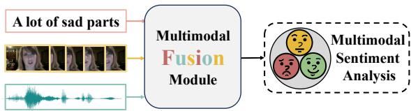
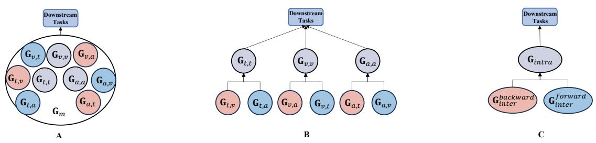
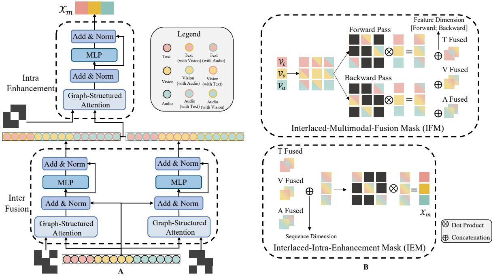
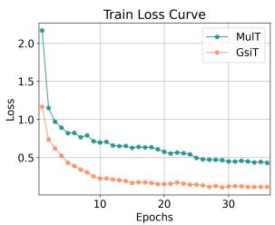
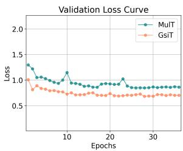
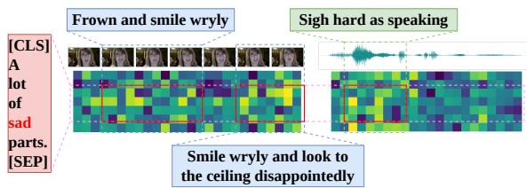
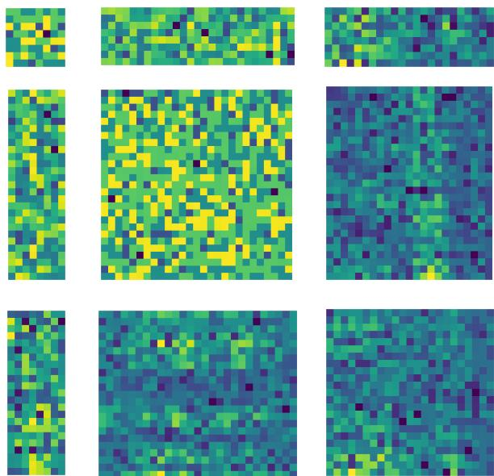
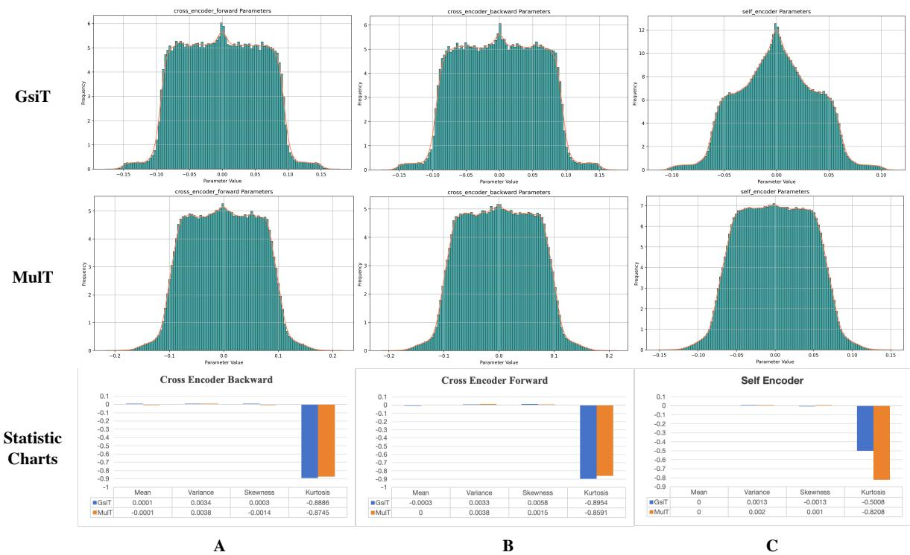

# Multimodal Transformers are Hierarchical Modal-wise Heterogeneous Graphs

Yijie Jin1, Junjie Peng1,\*, Xuanchao Lin1, Haochen Yuan1, Lan Wang1, Cangzhi Zheng1

1School of Computer Engineering and Science, Shanghai University {jyj2431567, jjie.peng, linxuanchao, yuanhc}@shu.edu.cn {Wanglan1997, cangzhizheng}@shu.edu.cn

## Abstract

Multimodal Sentiment Analysis (MSA) is a rapidly developing field that integrates multimodal information to recognize sentiments, and existing models have made significant progress in this area. The central challenge in MSA is multimodal fusion, which is predom inantly addressed by Multimodal Transformers (MulTs). Although act as the paradigm, MulTs suffer from efficiency concerns. In this work, from the perspective of efficiency optimization, we propose and prove that MulTs are hierarchical modal-wise heterogeneous graphs (HMHGs), and we introduce the graphstructured representation pattern of MulTs. Based on this pattern, we propose an Interlaced Mask (IM) mechanism to design the Graph-Structured and Interlaced-Masked Multimodal Transformer (GsiT). It is formally equivalent to MulTs which achieves an efficient weight sharing mechanism without information disorder through IM, enabling All-Modal-In-One fusion with only 1/3 of the parameters of pure MulTs. A kernel called Decomposition is implemented to ensure avoiding additional computational overhead. Moreover, it achieves significantly higher performance than traditional MulTs. To further validate the effectiveness of GsiT itself and the HMHG concept, we integrate them into multiple state-of-the-art models and demonstrate notable performance improvements and parameter reduction on widely used MSA datasets. Experimental results also demonstrate its effectiveness on other multimodal tasks. The code is available in GitHub Page.

## 1 Introduction

With the growing ubiquity of diverse social media platforms such as YouTube and TikTok, users now express sentiments through various forms of information, including text, video, and audio. To achieve more natural human-computer interactions, multimodal sentiment analysis (MSA) has become a popular research area (Gandhi et al., 2023). MSA is briefly exemplified in Figure 1.

  
Figure 1: An example of multimodal sentiment analysis: end-to-end discriminative task pipeline.

The main challenge of MSA is to integrate heterogeneous data containing different sentiment information, thus achieving effective sentiment analysis. The practical manifestations of these challenges primarily lie in the performance of multimodal fusion methods, the representation capacity of multimodal features, and the robustness of the model. To address these challenges, methods of MSA involve designing effective multimodal fusion methods (Zadeh et al., 2017; Tsai et al., 2019a; Zhang et al., 2023; Zheng et al., 2024) to fully integrate heterogeneous data, and developing representation learning-based methods (Yu et al., 2021; Yang et al., 2023; Lin and Hu, 2024; Zhang et al., 2024) to enhance unimodal information and model robustness. Among these, multimodal fusion is the core issue of MSA and also the focus of this paper.

In the realm of multimodal fusion, Multimodal Transformer (MulT) (Tsai et al., 2019a) and its enhanced successors (Zhang et al., 2021, 2023; Zong et al., 2023; Wang et al., 2024; Zheng et al., 2024; Wu et al., 2024), collectively known as MulTs, have shown significant effectiveness in MSA. Despite their status as the prevailing paradigm, the extensive use of Cross-Modal Attention (CMA) and Multi-Head Self-Attention (MHSA) mechanisms leads to inefficiencies in MulTs. Since MSA is an end-to-end discriminative task, it is imperative to reduce system overhead and improve model performance for the practical implementation of future MSA systems. Thus, the main objective of this work is to introduce a more efficient paradigm for MSA. Additional related works can be found in Appendix G.

  
Figure 2: Graph structure comparison. A: Naive graph structure constructed by concatenated multimodal sequences. B: Forest structure of MulTs, constructed by decoupled bi-modality combinations. C: Tree structure of GsiT, constructed by concatenated multimodal sequences and IM machanism.

In this work, from the perspective of efficiency optimization, we discover and prove the theoretical equivalence between CMA/MHSA and Graph Attention Networks (GAT) (Velickovic et al., 2018), where GAT uses multi-head attention as the aggregation function. Specifically, CMA is equivalent to a unidirectional complete bipartite graph of bi-modality combinations, while MHSA is equivalent to a directed complete graph of uni-modality. Based on this, MulTs can be defined as a forest composed of three independent trees. Each tree is constructed from three subgraphs, with hierarchical relationships constrained by a complex system of multiple functions. This mathematical representation formally defines the theorem that MulTs are hierarchical modal-wise heterogeneous graphs (HMHGs), as shown in Figure 2.

Based on the above theorem, we identify the redundancy in MulTs’ model parameters and their potential for compression while preserving theoretical equivalence. Leveraging this discovery, we propose the Graph-Structured Interlaced-Masked Multimodal Transformer (GsiT) by compressing a forest composed of three independent trees into a single shared tree. GsiT introduces a novel Interlaced Mask (IM) mechanism for multimodal weight sharing, enabling All-Modal-In-One fusion without information disorder. Furthermore, we implement a kernel named Decomposition to maintain efficiency. With only 1/3 of the parameters of traditional MulTs, GsiT maintains theoretical consistency with the MulTs’ paradigm. Comprehensive experimental analysis reveals that GsiT outperforms traditional MulTs significantly in the same experimental setup, boasting a substantial

edge in efficiency.

To validate the effectiveness and transferability of GsiT, we conduct comprehensive evaluations on the most widely used multimodal sentiment analysis datasets, including CMU-MOSI (Zadeh et al., 2016), CMU-MOSEI (Bagher Zadeh et al., 2018), CH-SIMS (Yu et al., 2020) (for multilingual adaptability), and MIntRec (Zhang et al., 2022) (for broader multimodal domains). Our findings show that GsiT not only outperforms as a backbone-level model but also that baseline models incorporating the HMHG concept achieve significant improvements in overall performance.

## 2 Insights

MulTs facilitate multimodal fusion by breaking down multimodal data into pairs of modalities for processing. By creating various combinations of these bi-modality units, MulTs ensure a comprehensive integration of heterogeneous data.

This approach can be recognized as a hierarchical and graph-structured fusion method. To better illustrate, we first formally define hierarchical relationships.

Definition 1. Let S and T be two sets, belonging to the domain X and the range Y, respectively, i.e., $S \subseteq \mathbb { X }$ and $T \subseteq \mathbb { Y } .$ . If there exists a mapping $f : \mathbb { X } \to \mathbb { Y }$ such thatfor any element $s _ { i } \in S ,$ , its corresponding mapped value $f ( s _ { i } ) \in T$ depends on some subset $S _ { i } \subseteq S ,$ , and these dependency relationships can be constructed recursively, then the dependency relationship between S and T is called a hierarchical relationship. Furthermore, this hierarchical relationship can be represented by a directed tree structure, where vertices represent elements in the sets, and edges represent dependency relationships.

To better define this type of model, we propose the following theorem:

Theorem 1. Multimodal Transformers are hierarchical modal-wise heterogeneous graphs.

The formal theorem and its corresponding proof can be found in Section 3.

Since MSA task systems are end-to-end discriminative systems, we give the following insight.

Insight 1. For MSA systems, the resource savings achieved by designing low-cost, high-performance models, which lead to overall performance improvements, are more significant in some aspects than the accuracy improvements brought by using large models with high representation capacity.

## 3 Multimodal Transformers as Graphs

We first define modality text, vision, and audio as $t , v , a ,$ , while multimodality as m. Assuming multimodal sequences $\mathcal { V } _ { u _ { 1 } } \ \in \ \mathbb { R } ^ { T _ { u _ { 1 } } \times d _ { u _ { 1 } } }$ , where $u _ { 1 } \in \{ m , t , v , a \} , T _ { u _ { 1 } }$ denotes the temporal dimension (number of vertices), $d _ { u _ { 1 } }$ denotes feature dimension. Those sequences are then concatenated into a single sequence $\mathcal { V } _ { m } = [ \mathcal { V } _ { t } ; \mathcal { V } _ { v } ; \mathcal { V } _ { a } ] ^ { \top } . \mathcal { V } _ { m }$ is treated as the multimodal graph embedding (MGE), which is also regarded as the multimodal vertex set. We define $\mathcal { W } _ { u _ { 2 } } \in \mathbb { R } ^ { d _ { u _ { 2 } } \times d _ { u _ { 2 } } ^ { f } }$ , where $u _ { 2 } \in \{ q , k , v \}$ $d _ { u _ { 2 } }$ is the original feature dimension of the vertices, $d _ { u _ { 2 } } ^ { f }$ is the attention feature dimension, as the projection weights for queries, keys, and values of $\nu _ { m }$

## 3.1 Modal-wise Heterogeneous Graphs

We first introduce a lemma as follows. For detailed proof, please refer to Appendix A.

Lemma 1. The multi-head cross-modal attention mechanism is equivalent to the aggregation of unidirectional complete bipartite graphs of bi-modality combination; the multi-head selfattention mechanism is equivalent to the aggregation ofdirected complete graphs ofuni-modalities.

Based on Lemma 1, we decompose multi-head self-attention (MHSA) and multi-head cross-modal attention (CMA) into two steps of functions.

Generate Adjacency Matrix: MHSA1, CMA1 Aggregation Operation: MHSA ,CMA

The structure naive modal-wise heterogeneous graphs $(  { \mathrm { M H G s } } )  { \mathbf { G } } _ { m }$ is defined as depicted in Figure 2. The attention map $\mathcal { G }$ is formulated as an adjacency matrix resulting from $M H S A _ { 1 }$ and $C M A _ { 1 }$ which effectively represent a set of edges with corresponding weights. Specifically, for $\mathcal { G } ^ { i , j }$ , where $\{ i , j \} \in \{ t , v , a \}$ : When $i \neq j$ , it signifies the adjacency matrix of a complete bipartite graph of the bi-modality combination of i and $j ,$ , with the directionality being from $j$ to $i ;$ When $i = j ,$ it represents the adjacency matrix of the directed complete graph of uni-modality i; Specially, ${ \mathcal { G } } ^ { m }$ denotes the adjacency matrix compose of all the $\mathcal { G } ^ { i , j }$

Here, for features, we define $\boldsymbol { \mathcal { X } } _ { m } \in \mathbb { R } ^ { 3 d _ { m } }$ , where $d _ { m }$ denotes the feature dimension, as the fusion output. In constructed MGE, we define $d _ { \{ t , v , a \} }$ = $d _ { m }$ to concatenate multimodal sequences. For functions, we define multi-layer perceptrons (also known as feed-forward networks) as a function $M L P$ , function composition as $^ { \circ , }$ the final linear transformation as a function $f ,$ , and $S p l i t$ function, the concatenation operation on feature dimension as , which splits concatenated multimodal sequences into separated ones according to their original lengths.

$$
\begin{array} { r l } & { \mathbf { G } _ { m } = ( \mathcal { V } _ { m } , \mathcal { G } ^ { m } ) , \quad \mathcal { G } ^ { m } = M H S A _ { 1 } ( \mathcal { V } _ { m } ) } \\ & { a = M L P \circ M H S A _ { 2 } } \\ & { \mathcal { X } _ { m } = f ( \| S p l i t ( a ( \mathbf { G } _ { m } ) ) [ - 1 ] ) } \end{array}\tag{1}
$$

## 3.2 MulTs are Hierarchical MHGs

In this section, we define the graph representation of MulTs. Assume the three indices follow the form $i ~ \in ~ \{ t , v , a \} , ~ j ~ \in ~ \{ t , v , a \} ~ \backslash ~ \{ i \}$ $p \in \{ t , v , a \} \setminus \{ i , j \}$ . Here, we define $H _ { u } \in \mathbb { R } ^ { d _ { u } }$ where $u \in \{ i , j , p \}$ as the final state vector.

$$
\begin{array} { r l } & { \mathcal { G } ^ { i , j } = C M A _ { 1 } ( \mathcal { V } _ { i } , \mathcal { V } _ { j } ) , \quad \mathcal { G } ^ { i , p } = C M A _ { 1 } ( \mathcal { V } _ { i } , \mathcal { V } _ { p } ) } \\ & { \mathbf { G } _ { i , j } = ( \mathcal { V } _ { i } , \mathcal { V } _ { j } , \mathcal { G } ^ { i , j } ) , \quad \mathbf { G } _ { i , p } = ( \mathcal { V } _ { i } , \mathcal { V } _ { p } , \mathcal { G } ^ { i , p } ) } \\ & { \overline { { \mathcal { V } } } _ { i } = \vert \left\{ a ( \mathbf { G } _ { i , j } ) , a ( \mathbf { G } _ { i , p } ) \right\} , \quad a = M L P \circ C M A _ { 2 } } \\ & { \mathcal { G } ^ { i , i } = M H S A _ { 1 } ( \overline { { \mathcal { V } } } _ { i } ) } \\ & { \mathbf { G } _ { i , i } = ( \overline { { \mathcal { V } } } _ { i } , \mathcal { G } ^ { i , i } ) } \\ & { H _ { i } = M L P \circ M H S A _ { 2 } ( \mathbf { G } _ { i , i } ) [ - 1 ] } \\ & { \mathbf { R e p e a t ~ } \mathbf { F o r } \quad \{ j , p \} \quad \mathrm { T h e n } } \\ & { \mathcal { X } _ { m } = f ( \vert \left\{ H _ { i } , H _ { j } , H _ { p } \right\} ) } \end{array}\tag{2}
$$

Based on Definition 1, Lemma 1, and Equation $^ { 2 , }$ we define MulTs as being composed of multiple subgraphs, with a series of complex function systems establishing hierarchical connections between these subgraphs. From the perspective of a single dominant-modality subgraph, it forms a tree. The integration of multiple dominant-modality trees ensembles a forest structure. In summary, we define MulTs as Hierarchical Modal-wise Heterogeneous Graphs (HMHGs). Traditional forest structure of HMHG can be found in Figure 2.

  
Figure 3: GsiT architecture and Interlaced Mask Mechanism. Subfigure A: Detailed GsiT Architecture. Subfigure B: IM Mechanism. Note: detailed function system is omitted.

## 4 Motivation

The aforementioned subgraphs can be transformed into a group of block-wise adjacency matrices and corresponding graphs as follows.

$$
\mathcal { G } _ { i n t e r } ^ { f o r w a r d } = \left( \mathcal { O } ^ { t , t } \begin{array} { l l l } { \mathcal { G } ^ { t , v } } & { \mathcal { O } ^ { t , a } } & { \mathcal { O } ^ { t , a } } \\ { \mathcal { O } ^ { v , t } } & { \mathcal { O } ^ { v , v } } & { \mathcal { G } ^ { v , a } } \\ { \mathcal { G } ^ { a , t } } & { \mathcal { O } ^ { a , v } } & { \mathcal { O } ^ { a , a } } \end{array} \right)
$$

$$
\mathcal G _ { i n t e r } ^ { b a c k w a r d } = \left( \mathcal G ^ { v , t } \quad \mathcal G ^ { v , v } \quad \mathcal G ^ { t , a } \right)\tag{3}
$$

$$
\begin{array} { r l } & { \mathbf { G } _ { i n t e r } ^ { f o r w a r d } = ( \ V _ { m } , \mathcal { G } _ { i n t e r } ^ { f o r w a r d } ) } \\ & { \mathbf { G } _ { i n t e r } ^ { b a c k w a r d } = ( \ V _ { m } , \mathcal { G } _ { i n t e r } ^ { b a c k w a r d } ) } \end{array}
$$

$$
\begin{array} { r l } & { { \mathscr G } _ { i n t r a } = \left( \mathcal { G } ^ { t , t } \quad \mathcal { O } ^ { t , v } \quad \mathcal { O } ^ { t , a } \right) } \\ & { { \mathscr G } _ { i n t r a } = \left( \mathcal { O } ^ { v , t } \quad \mathcal { G } ^ { v , v } \quad \mathcal { O } ^ { v , a } \right) } \\ & { \mathscr { O } ^ { a , t } \quad \mathcal { O } ^ { a , v } \quad \mathcal { G } ^ { a , a } \bigg ) } \\ & { \mathbf { G } _ { i n t r a } = ( \overline { { \mathscr { V } } } _ { m } , \mathcal { G } _ { i n t r a } ) } \end{array}\tag{4}
$$

In the above equations, $\mathcal { O } ^ { i , j }$ , where $\{ i , j \} \in$ $\{ t , v , a \}$ , refers to all zero matrix.

$\mathbf { G } _ { i n t e r } ^ { f o r w a r d }$ and $\mathbf { G } _ { i n t e r } ^ { b a c k w a r d }$ in Equation 3 are implemented for multimodal fusion, while $\mathbf { G } _ { i n t r a }$ in Equation 4 is for intra-modal enhancement.

This graph representation is mathematically equivalent to the traditional MulTs representation, which is an HMHG. However, it compresses the traditional forest structure into a single tree. Although it does not reduce the computational overhead regarding vertex information aggregation, it theoretically reduces the number of parameters to 1/3 of the traditional approach.

Combined with $\mathbf { G } _ { i n t e r } ^ { f o r w a r d }$ and $\mathbf { G } _ { i n t e r } ^ { b a c k w a r d }$ , the overall multimodal fusion structure is composed of two opposing unidirectional cycle. They manage to make multimodal fusion complete without information disorder. Similarly, $\mathbf { G } _ { i n t r a }$ also realizes complete intra-modal enhancement without information disorder. For more details about information disorder, please refer to Section 8.1.

Realizing that this structure perfectly aligns with Insight 1, we are motivated to implement this idea and explore its potential benefits.

## 5 All-Modal-In-One Fusion

The core of the implementation of the graph structure defined in Equation 3 and 4 is a unique masking mechanism, which we call the Interlaced Mask Mechanism (IM). There are two main parts in IM, Interlaced-Multimodal-Fusion Mask (IFM) and Interlaced-Intra-Enhancement Mask (IEM). Here, we define $\mathcal { I } ^ { i , j }$ , where $\{ i , j \} \in$ $\{ t , v , a \}$ refers to all negative infinity matrix.

$$
\mathcal { M } _ { i n t e r } ^ { f o r w a r d } = \left( \mathcal { T } ^ { v , t } \begin{array} { c c c } { \mathcal { O } ^ { t , v } } & { \mathcal { T } ^ { t , a } } \\ { \mathcal { T } ^ { v , t } } & { \mathcal { T } ^ { v , v } } & { \mathcal { O } ^ { v , a } } \\ { \mathcal { O } ^ { a , t } } & { \mathcal { T } ^ { a , v } } & { \mathcal { T } ^ { a , a } } \end{array} \right)\tag{5}
$$

$$
\mathcal { M } _ { i n t e r } ^ { b a c k w a r d } = \left( \mathcal { O } ^ { v , t } \begin{array} { l l l } { \mathcal { I } ^ { t , t } } & { \mathcal { I } ^ { t , v } } & { \mathcal { O } ^ { t , a } } \\ { \mathcal { O } ^ { v , t } } & { \mathcal { T } ^ { v , v } } & { \mathcal { T } ^ { v , a } } \\ { \mathcal { T } ^ { a , t } } & { \mathcal { O } ^ { a , v } } & { \mathcal { T } ^ { a , a } } \end{array} \right)
$$

$$
\mathcal { M } _ { i n t r a } = \left( \begin{array} { l l l } { \mathcal { O } ^ { t , t } } & { \mathcal { T } ^ { t , v } } & { \mathcal { T } ^ { t , a } } \\ { \mathcal { T } ^ { v , t } } & { \mathcal { O } ^ { v , v } } & { \mathcal { T } ^ { v , a } } \\ { \mathcal { T } ^ { a , t } } & { \mathcal { T } ^ { a , v } } & { \mathcal { O } ^ { a , a } } \end{array} \right)\tag{6}
$$

IFM contains $\mathcal { M } _ { i n t e r } ^ { f o r w a r d } , \mathcal { M } _ { i n t e r } ^ { b a c k w a r d }$ in Equation 5, while $\mathcal { M } _ { i n t r a }$ is the IEM.

Using IM, the graph defined in Equation 3 and 4 and its aggregation process can be easily defined.

$$
\begin{array} { r l } & { G _ { i n f e r e n t } ^ { f o r a u a r d } = M H S A _ { 1 } ( V _ { m } ) + M _ { i n t e r } ^ { l o r n e r d } } \\ & { G _ { i n t e r e n t } ^ { f o r n e r d } = ( V _ { m } , G _ { i n t e r } ^ { f o r n e r d } ) } \\ & { G _ { i n t e r e n t } ^ { b o t c k w a r d } = M H S A _ { 1 } ( V _ { m } ) + M _ { i n t e r n e r d } ^ { b o t c k w a r d } } \\ & { G _ { i n t e r } ^ { b o t c k w a r d } = ( V _ { m } , G _ { i n t e r } ^ { b o t c k w a r d } ) } \\ & { a = M L P _ { o } M H S A _ { 2 } } \\ & { \overline { { V } } _ { m } = \left\{ \left( a ( \mathbf { G } _ { i n t e r n e r } ^ { f o r n e r d } ) , a ( \mathbf { G } _ { i n t e r } ^ { b o t c k w a r d } ) \right) \right. } \\ & { G _ { i n t e r n e } = M H S A _ { 1 } ( \overline { { V } } _ { m } ) + M _ { i n t e r n e } } \\ & { G _ { i n t e r n e } = ( \overline { { V } } _ { m } , G _ { i n t e r n e } ) } \\ & { \chi _ { m } = f ( \left| g _ { p l i t } ( G _ { ( \mathbf { G } _ { i n t e r n e } ) } ) \right| - 1 ) } \end{array}\tag{7}
$$

In the traditional approach, different subgraphs are decoupled and computed separately, with each having its own independent set of weights. However, based on the derived structure, the weights between these combinations can be shared. Specifically, the function system with 6 $C M A _ { \{ 1 , 2 \} }$ , 3 $M H S A _ { \{ 1 , 2 \} }$ , and 9 MLP in MulTs is integrated to a function system of $3 \ M H S A _ { \{ 1 , 2 \} }$ and 3 MLP. The computation visualization can be found in the Subfigure B of Figure 3.

Due to the weight sharing strategy, we call this fusion method All-Modal-In-One Fusion. Based on this method and drawing inspiration from classical MulTs, we designed Graph-Structured and Interlaced-Masked Multimodal Transformer (GsiT). The overall architecture of GsiT can be found in the Subfigure A of Figure 3

## 6 Inner Decomposition for Efficiency

The space complexity problem of GsiT as follows might be noticed. As $\nu _ { m } ~ \in ~ \mathbb { R } ^ { T _ { m } \times d _ { m } }$ , where $T _ { m } = T _ { t } + T _ { v } + T _ { a } , d _ { m } = d _ { \{ t , v , a \} }$ , we assume that batch size $B \in \mathbf { R }$ . Although GsiT reduces the number of parameters to only 1/3 of MulT, in the runtime forward pass, the attention map of GsiT can achieve $O ( ( T _ { m } ^ { \bar { 2 } } ) \times B ) = O ( ( T _ { t } + T _ { v } + T _ { a } ) ^ { 2 } \times B )$ However, for MulTs, it is ${ \cal O } ( T _ { i } T _ { j } \times B )$ , where $\{ i , j \} \in \{ t , v , a \}$ . Similarly, as for the adjacency matrix generation procedure. For GsiT, the computational complexity is $O ( ( T _ { m } ^ { 2 } d _ { m } ^ { f } ) \times B )$ , while for MulTs, it is $O ( T _ { i } T _ { j } d _ { m } ^ { f } \times B )$ . The formal theoretical analysis of computational and space complexity is in Appendix B.

Initially, it might seem that GsiT’s complexity exceeds that of MulTs, which does not align with Insight 1. This issue can be easily resolved. After performing the shared qkv (query, key, value) projections on $\nu _ { m }$ , we can decompose the sequences again according to their original lengths and apply internal operations according to the given IM. This approach ensures that the space complexity of the attention map remains the same, while that of static parameters is reduced to 1/3 of the theoretical value. This approach is called Decomposition, and we implement a simple block-sparse kernel to optimize.

## 7 Experiment

## 7.1 Experimental Setup

We aim to check whether GsiT, its corresponding HMHG concept, and the IM Mechanism can be broadly applied to multiple models. To this end, we design comparative experiments between GsiT and several classic backbone models, and we embed not only GsiT itself but also its HMHG concept into multiple backbone-level models and MulTs in an appropriate manner to validate its broad effectiveness. We do not consider the parameters and computations of pre-trained language models in efficiency assessments, as these are consistent across all models. For further details on experimental settings, please refer to Appendix D.

## 7.1.1 Datasets

We evaluate GsiT and its HMHG concept on three widely used public datasets, CMU-MOSI (Zadeh et al., 2016), CMU-MOSEI (Bagher Zadeh et al., 2018), CH-SIMS (Yu et al., 2020), and MIntRec (Zhang et al., 2022). Please refer to Appendix E for a more detailed description of datasets.

## 7.1.2 Evaluation Criteria

Following previous works (Yang et al., 2023; Wang et al., 2024; Lin and Hu, 2024), several evaluation metrics are adopted. Binary classification accuracy (Acc-2), three classification accuracy (Acc-3), five classification accuracy (Acc-5), F1 Score (F1), seven classification accuracy (Acc-7), mean absolute error (MAE), and the correlation of the model’s prediction with human (Corr). Acc-2 and F1 are calculated in two ways: negative/non-negative(NN) and negative/positive(NP) on CMU-MOSI and CMU-MOSEI datasets. Acc-3 and Acc-5 are special metrics only for CH-SIMS. In MIntRec, Acc-20 refers to 20-class classification accuracy, Prec denotes precision, and Rec represents recall. Specifically, ’W’ indicates the weighted result, introduced to address dataset imbalance. Additionally, for model efficiency, we provide the number of parameters Params (M), and floating-point operations per second FLOPS (G) to evaluate.

## 7.1.3 Baseline Models

To clarify our approach, in our concept, the core multimodal fusion module and the learning framework in MSA are recognized as backbone-level models. MulT (Tsai et al., 2019a), Self-MM (Yu et al., 2021), TETFN (Wang et al., 2023a), and ALMT (Zhang et al., 2023) are selected as the baseline models for comparison. For further evaluation on MIntRec, we also incorporate MMIM (Han et al., 2021).

To validate the state-of-the-art performance of GsiT, we introduce the original results of LNLN (Zhang et al., 2024) as a simple baseline for comparison (note that we directly cite the results from the original paper, and therefore do not conduct an analysis of efficiency).

MulT and Self-MM are widely adopted backbone-level models, whereas TETFN combines elements of both MulT and Self-MM within a textoriented framework, serving as a pure MulTs-based model. ALMT, on the other hand, builds upon the concepts of MulT and attention bottleneck, evolving into a next-generation MulTs-like architecture. The source code for these baselines is available on the GitHub page1, with detailed introductions provided in Appendix F.

In our experimental setup, we use MulT as the primary baseline for performance comparison due to its foundational role in MulTs-based models. Additionally, we integrate GsiT with Self-MM, one of the most prevalent self-supervised learning frameworks in MSA, to evaluate its effectiveness. Furthermore, we embed HMHG into both TETFN and

ALMT—representative MulTs-based and MulTslike models—to validate its enhancement capabilities.

## 7.2 Results

In all tables, double-underline denotes the superior performance, denotes that higher is better while denotes the opposite.

## 7.2.1 Main Results

The main results of the experiment are shown in 1.

Compared with MulT, GsiT significantly outperforms MulT across all metrics while having substantially fewer parameters without additional computational overhead. This observation also holds for the other baseline models in our comparison.

This demonstrates that GsiT and its HMHG concept are effective in enhancing performance across a variety of models. Firstly, as a standalone model, GsiT already exhibits impressive performance. Secondly, when integrated as a module into the classic self-supervised learning framework Self-MM, it notably improves overall performance. Additionally, replacing the core fusion framework of the MulTsbased model TETFN with the HMHG form results in significant improvements in both performance and efficiency. Finally, modifying the core AHL module of the MulTs-based architecture ALMT to the HMHG form also leads to a marked enhancement in performance.

Regarding the efficiency drop observed when integrating GsiT into Self-MM, it is important to note that Self-MM, as a self-supervised learning framework, primarily employs simple linear layers for multimodal fusion. Consequently, the addition of GsiT introduces more complex components, leading to an expected and reasonable decrease in efficiency.

The Acc-7 in TETFN significantly dropped after embedding HMHG. This is attributed to the modification of the IFM to accommodate the TET module, as defined in Equation 78, rather than following our initial design in Equation 5. Although this change maintained information integrity, it results in repeated bi-modality combinations within a single Encoder, limiting the model’s ability to effectively integrate multimodal information. For more details, see Section 7.2.2.

The modest efficiency improvement in ALMT can be attributed to that it is not a pure MulT-based model (TETFN is a pure MulT-based model). The relatively small scale of its AHL module has a small impact on the overall model’s computational overhead. Nevertheless, the performance gains achieved by incorporating HMHG still demonstrate the significant benefits of the weight-sharing scheme provided by the IM mechanism.

Table 1: Comparison on CMU-MOSI and CMU-MOSEI. ∆ denotes the numeric changes in metrics, denotes that the results are reproduced, , while denotes that the results are cited from the original paper, and w / denotes with. In particular, w / GsiT denotes simply adding GsiT into the original model, while w / HMHG denotes embedding the HMHG concept of GsiT into the original model.
<table><tr><td rowspan="2">Model</td><td colspan="4">CMU-MOSI</td><td colspan="6">CMU-MOSEI</td><td colspan="3">Efficiency</td></tr><tr><td>Acc-2(%)↑</td><td>F1(%)↑</td><td>Acc-7(%)↑</td><td>MAE↓</td><td>Corr↑</td><td>Acc-2(%)↑</td><td>F1(%)↑</td><td>Acc-7(%)↑</td><td>MAE↓</td><td>Corr↑</td><td>| Params (M) ↓</td><td>FLOPS (G) ↓</td></tr><tr><td>MulT†</td><td>79.6 / 81.4</td><td>79.1 / 81.0</td><td>36.2</td><td>0.923</td><td>0.686</td><td>78.1/ 83.7</td><td>78.9/ 83.7</td><td>53.4</td><td>0.559</td><td>0.740</td><td>5.251</td><td>26.294</td></tr><tr><td>GsiT</td><td>83.7/85.8</td><td>83.6/85.8</td><td>47.4</td><td>0.713</td><td>0.794</td><td>84.5/ 85.6</td><td>84.4/85.2</td><td>54.1</td><td>0.536</td><td>0.764</td><td>1.695</td><td>26.224</td></tr><tr><td>∆</td><td>+4.1 / +4.4</td><td>+4.5/+4.8</td><td>+11.2</td><td>-0.210</td><td>+0.108</td><td>+6.4/+1.9</td><td>+5.5/+1.5</td><td>+0.7</td><td>-0.023</td><td>+0.024</td><td>-67.7%</td><td>-0.3%</td></tr><tr><td>Self-MM†</td><td></td><td></td><td></td><td></td><td></td><td></td><td></td><td></td><td></td><td></td><td></td><td></td></tr><tr><td>w/ GsiT</td><td>82.2 / 83.5 84.6/86.0</td><td>82.3 / 83.6</td><td>43.9</td><td>0.758</td><td>0.792 0.792</td><td>80.8 / 85.0</td><td>81.3 / 84.9</td><td>53.3</td><td>0.539</td><td>0.761</td><td>11.364</td><td>38.413 64.637</td></tr><tr><td>∆</td><td>+2.4 /+2.5</td><td>84.5/86.0 +2.2/+2.4</td><td>47.2 +3.3</td><td>0.730 -0.028</td><td></td><td>81.4/85.3 +0.6 /+0.3</td><td>81.9/85.2 +0.6 /+0.3</td><td>54.1 +0.8</td><td>0.536 -0.003</td><td>0.762 +0.001</td><td>13.059 +13.9%</td><td>+68.3%</td></tr><tr><td></td><td></td><td></td><td></td><td></td><td></td><td></td><td></td><td></td><td></td><td></td><td></td><td></td></tr><tr><td>TETFN†</td><td>82.4 / 84.0</td><td>82.4 / 84.1</td><td>46.1</td><td>0.749</td><td>0.784</td><td>81.9 / 84.3</td><td>82.1 / 84.1</td><td>52.7</td><td>0.576</td><td>0.728</td><td>5.921</td><td>27.558</td></tr><tr><td>w/HMHG</td><td>83.2/85.2</td><td>83.1/85.2</td><td>47.1</td><td>0.714</td><td>0.807</td><td>84.6 /84.8 +2.7/+0.5</td><td>84.5 /84.5</td><td>47.6</td><td>0.621</td><td>0.749</td><td>2.365</td><td>27.488</td></tr><tr><td>∆</td><td>+0.8 / +1.2</td><td>+0.7/+1.1</td><td>+1.0</td><td>-0.035</td><td>+0.023</td><td></td><td>+2.4/+0.4</td><td>-5.1</td><td>-0.045</td><td>+0.021</td><td>-60.1%</td><td>-0.3%</td></tr><tr><td>ALMT†</td><td>82.1 / 83.3</td><td>82.1 / 83.3</td><td>45.5</td><td>0.730</td><td>0.791</td><td>81.4 / 83.5</td><td>81.6 / 83.3</td><td>49.2</td><td>0.583</td><td>0.731</td><td>2.604</td><td>19.876</td></tr><tr><td>w/HMHG</td><td>83.2/84.6</td><td>83.1/84.5</td><td>47.1</td><td>0.726</td><td>0.782</td><td>82.9/86.4</td><td>83.2/86.3</td><td>51.5</td><td>0.541</td><td>0.773</td><td>2.506</td><td>19.876</td></tr><tr><td>∆</td><td>+1.1/+1.3</td><td>+1.0/+1.2</td><td>+1.6</td><td>-0.004</td><td>-0.009</td><td>+1.5 /+2.9</td><td>+1.6/+3.0</td><td>+2.3</td><td>-0.042</td><td>+0.042</td><td>-3.8%</td><td></td></tr><tr><td>LNLN*</td><td>81.2 / 84.3</td><td>81.8 / 84.6</td><td>44.6</td><td>0.751</td><td>0.778</td><td>83.6 / 84.1</td><td>84.0 / 84.5</td><td>50.7</td><td>0.572</td><td>0.735</td><td></td><td></td></tr></table>

Table 2: Additional comparison on CH-SIMS.
<table><tr><td rowspan="2">Model</td><td colspan="6">CH-SIMS</td></tr><tr><td>Acc-2(%)↑</td><td>Acc-3(%)↑</td><td>Acc-5(%)↑</td><td>F1(%)↑</td><td>MAE↓</td><td>Corr↑</td></tr><tr><td>MulT†</td><td>77.8</td><td>65.3</td><td>38.2</td><td>77.7</td><td>0.443</td><td>0.578</td></tr><tr><td>Self-MM†</td><td>78.1</td><td>65.2</td><td>41.3</td><td>78.2</td><td>0.423</td><td>0.585</td></tr><tr><td>TETFN†</td><td>78.0</td><td>64.4</td><td>42.9</td><td>78.0</td><td>0.425</td><td>0.582</td></tr><tr><td>ALMT†</td><td>77.2</td><td>64.3</td><td>42.5</td><td>77.6</td><td>0.419</td><td>0.581</td></tr><tr><td>LNLN*</td><td>75.9</td><td>64.0</td><td>38.7</td><td>79.9</td><td>0.458</td><td>0.570</td></tr><tr><td>GsiT</td><td>78.8</td><td>65.7</td><td>42.2</td><td>78.8</td><td>0.410</td><td>0.588</td></tr></table>

Table 3: Additional comparison on MIntRec.
<table><tr><td rowspan="2">Model</td><td colspan="4">MIntRec</td></tr><tr><td>Acc-20(%)↑</td><td>F1 /F1-W(%)↑</td><td>Prec / Prec-W(%)↑ Rec / Rec-W(%)↑</td><td></td></tr><tr><td>MulT†</td><td>71.2</td><td>68.2 / 71.1</td><td>68.9 / 71.4</td><td>68.1 / 71.2</td></tr><tr><td>MMIM†</td><td>70.8</td><td>68.7 / 71.0</td><td>69.2 / 71.8</td><td>68.9 / 70.8</td></tr><tr><td>GsiT</td><td>72.6</td><td>69.4/72.7</td><td>69.4/73.5</td><td>70.1/72.6</td></tr></table>

The additional experiment on the Chinese dataset CH-SIMS, as shown in Table 2, highlights GsiT’s superior performance. In this backbonelevel model comparison, GsiT outperforms both naive Self-MM and naive MulT across all metrics, and surpasses ALMT in most of the metrics. Furthermore, when compared with TETFN, which integrates Self-MM and MulT, GsiT demonstrates its advanced capabilities in most of the metrics. This underscores GsiT’s next-level performance as a backbone multimodal fusion model. Additionally, these results confirm GsiT’s robust multilingual capabilities.

Compared with LNLN, GsiT also shows superior performance on CMU-MOSI, CMU-MOSEI, and CH-SIMS, demonstrating its state-of-the-art effectiveness.

Table 4: Ablation Study on CMU-MOSI for GsiT.
<table><tr><td rowspan="2">Description</td><td colspan="5">CMU-MOSI</td></tr><tr><td>Acc-2↑</td><td>F1↑</td><td>Acc-7↑</td><td>MAE↓</td><td>Corr↑</td></tr><tr><td>Orginal</td><td>83.7 / 85.8</td><td>83.6 / 85.8</td><td>47.4</td><td>0.713</td><td>0.794</td></tr><tr><td>Structure-1</td><td> $8 3 . 5 / 8 5 . 5 $ </td><td>83.4 / 85.4</td><td>46.5</td><td>0.721</td><td>0.798</td></tr><tr><td>Structure-2</td><td>83.2 / 84.9</td><td>83.2 / 84.9</td><td>43.8</td><td>0.729</td><td>0.796</td></tr><tr><td>Structure-3</td><td>83.4 / 85.2</td><td> $8 3 . 3 / 8 5 . 2 $ </td><td>45.5</td><td>0.726</td><td>0.783</td></tr><tr><td>Self-Only</td><td>82.5 / 84.2</td><td>82.5 / 84.2</td><td>45.5</td><td>0.734</td><td>0.793</td></tr></table>

Also, the extended experiment on the multimodal intent recognition (MIR) dataset MIntRec, as shown in Table 3, highlights GsiT’s superior performance. GsiT outperforms MulT and MMIM across all metrics, demonstrating its strong generalization capability in broader multimodal domains.

Additional experiments with more models in more aspects can be found in Appendix I.

## 7.2.2 Ablation Study

In this section, we primarily explore the structure of the Interlaced Fusion Mask (IFM) to investigate how different graph structures impact the performance of the GsiT architecture. At this point, the Original Structure and Structures 1 to 3 all adhere to the basic paradigm of HMHG, ensuring that multimodal information remains coherent. In contrast, the Self-Only variant leads to information disorder. Here, we define the information fusion operation from $\nu _ { j }$ to $\nu _ { i }$ is as $j  i ,$ , where $\{ i , j \} \in \{ t , v , a \}$ Detailed illustration to information disorder can be found in Section 8.1.

In our concept, each set of bi-modality combination subgraphs has non-overlapping dominant modalities, and the combination of dominant and auxiliary modalities does not repeat regardless of the order. For instance, the same set will not simultaneously contain $\mathbf { G } _ { t , v }$ and ${ \bf G } _ { a , v }$ to prevent the disorder of temporal sequence information across modality sequences. Similarly, the same set will not simultaneously contain $\mathbf { G } _ { t , v }$ and $\mathbf { G } _ { v , t } ,$ even if their dominant modalities are different, to ensure that each set’s corresponding module learns the fusion information of the most diverse combinations, thereby enhancing the fusion performance. Thus, we designed the Original Structure.

As shown in Table 4, the original structure is superior to the other three theoretically feasible structures in most of the metrics, which aligns with our concept. The four theoretically feasible structures are superior to the self-only structure, which is theoretically infeasible and causes information disorder.

Original Structure: The original structure is defined as two opposing unidirectional ring graphs. They both realize cyclic all-modal-in-one fusion, which makes trimodal information fully interact in shared model weights. The structure is: $\{ t $ $v , v  a , a  t \} , \{ a  v , v  t , t  a \}$

Structure-1: Structure-1 realizes all-modal-inone fusion, but the information passing is not cyclic. The structure is: $\{ a  v , v  a , a  t \} , \{ v $ $t , t  v , t  a \}$

Structure-2: Structure-2 realizes all-modal-inone fusion, but the information passing is not cyclic. The structure is: $\{ v  t , t  v , v  a \} , \{ a $ $t , t  a , a  v \}$

Structure-3: Structure-3 realizes all-modal-inone fusion, but the information passing is not cyclic. The structure is: $\{ a  v , v  a , v  t \} , \{ a $ $t , t  a , t  v \}$

Self-Only: Self-Only mask only contains masks intra-modal subgraphs. The structure is $\{ t $ $t , v  v , a  a \}$

For more specific representations of the aforementioned structures, please refer to Appendix C.

## 8 Further Analysis

## 8.1 Information Disorder

Take $\mathcal { G } _ { i n t e r } ^ { f o r w a r d }$ as an example.

$$
\begin{array} { r l r } & { } & { \mathcal { G } _ { i n t e r } ^ { f o r w a r d } = \left( \begin{array} { l l l } { \mathcal { O } ^ { t , t } } & { \mathcal { G } _ { d } ^ { t , v } } & { \mathcal { O } ^ { t , a } } \\ { \mathcal { O } ^ { v , t } } & { \mathcal { O } ^ { v , v } } & { \mathcal { G } _ { d } ^ { v , a } } \\ { \mathcal { G } _ { d } ^ { a , t } } & { \mathcal { O } ^ { a , v } } & { \mathcal { O } ^ { a , a } } \end{array} \right) } \\ & { } & { \mathcal { G } _ { i n t e r } ^ { f o r w a r d ^ { \prime } } = \left( \begin{array} { l l l } { \mathcal { O } ^ { t , t } } & { \mathcal { G } _ { d } ^ { t , v ^ { \prime } } } & { \mathcal { G } _ { d } ^ { t , a ^ { \prime } } } \\ { \mathcal { O } ^ { v , t } } & { \mathcal { O } ^ { v , v } } & { \mathcal { G } _ { d } ^ { v , a } } \\ { \mathcal { G } _ { d } ^ { a , t } } & { \mathcal { O } ^ { a , v } } & { \mathcal { O } ^ { a , a } } \end{array} \right) } \end{array}\tag{8}
$$

  
Figure 4: The loss curve of MulT and GsiT training phase on CMU-MOSI.

It is important to note that $\mathcal { G } _ { d } ^ { t , v } \neq \mathcal { G } _ { d } ^ { t , v ^ { \prime } }$ . The reason lies in Equation 9, taking the first row block as an example.

$$
\begin{array} { r l } { \left( \mathcal { O } ^ { t , t } \mathcal { G } _ { d } ^ { t , v } \mathcal { O } ^ { t , a } \right) = S \circ \mathcal { D } \left( \mathcal { T } ^ { t , t } \mathcal { E } ^ { t , v } \mathcal { T } ^ { t , a } \right) } & { } \\ { \left( \mathcal { O } ^ { t , t } \mathcal { G } _ { d } ^ { t , v ^ { \prime } } \mathcal { G } _ { d } ^ { t , a ^ { \prime } } \right) = S \circ \mathcal { D } \left( \mathcal { T } ^ { t , t } \mathcal { E } ^ { t , v } \mathcal { E } ^ { t , a } \right) } & { } \end{array}\tag{9}
$$

The softmax function operates on a row-wise basis, converting values to probabilities. Therefore, if row elements include subgraphs other than the required modal subgraphs, it will affect the probability distribution of the desired subgraphs, thus affecting the result and causing information disorder.

For the original $\mathcal { G } _ { i n t e r } ^ { f o r w a r d }$ , the fusion process is as follows:

$$
\begin{array} { r l } & { \overline { { \gamma } } _ { m } ^ { f o r w a r d } = \mathcal { G } _ { i n t e r } ^ { f o r w a r d } \mathcal { W } _ { v } \mathcal { V } _ { m } } \\ & { \qquad = \left( \begin{array} { l l l } { \mathcal { O } ^ { t , t } } & { \mathcal { G } _ { d } ^ { t , v } } & { \mathcal { O } ^ { t , a } } \\ { \mathcal { O } ^ { v , t } } & { \mathcal { O } ^ { v , v } } & { \mathcal { G } _ { d } ^ { v , a } } \\ { \mathcal { G } _ { d } ^ { a , t } } & { \mathcal { O } ^ { a , v } } & { \mathcal { O } ^ { a , a } } \end{array} \right) \cdot \left( \begin{array} { l } { \mathcal { W } _ { v } \mathcal { V } _ { t } } \\ { \mathcal { W } _ { v } \mathcal { V } _ { v } } \\ { \mathcal { W } _ { v } \mathcal { V } _ { a } } \end{array} \right) } \\ & { \qquad = \left( \begin{array} { l } { \mathcal { G } _ { d } ^ { a , t } \mathcal { W } _ { v } \mathcal { V } _ { t } } \\ { \mathcal { G } _ { d } ^ { t , v } \mathcal { W } _ { v } \mathcal { V } _ { v } } \\ { \mathcal { G } _ { u } ^ { a , a } \mathcal { W } _ { v } \mathcal { V } _ { a } } \end{array} \right) } \end{array}\tag{10}
$$

However, for the modified version $\mathcal { G } _ { i n t e r } ^ { f o r w a r d ^ { \prime } }$

$$
\begin{array} { r l } & { \overline { { \gamma } } _ { m } ^ { f o r w a r d ^ { \prime } } = \mathcal { G } _ { i n t e r } ^ { f o r w a r d ^ { \prime } } \mathcal { W } _ { v } \mathcal { V } _ { m } } \\ & { \qquad = \left( \begin{array} { l l l } { \mathcal { O } ^ { t , t } } & { \mathcal { G } _ { d } ^ { t , v ^ { \prime } } } & { \mathcal { G } _ { d } ^ { t , a ^ { \prime } } } \\ { \mathcal { O } ^ { v , t } } & { \mathcal { O } ^ { v , v } } & { \mathcal { G } _ { d } ^ { v , a } } \\ { \mathcal { G } _ { d } ^ { a , t } } & { \mathcal { O } ^ { a , v } } & { \mathcal { O } ^ { a , a } } \end{array} \right) \cdot \left( \begin{array} { l } { \mathcal { W } _ { v } \mathcal { V } _ { t } } \\ { \mathcal { W } _ { v } \mathcal { V } _ { v } } \\ { \mathcal { W } _ { v } \mathcal { V } _ { a } } \end{array} \right) } \\ & { \qquad = \left( \begin{array} { l } { \mathcal { G } _ { d } ^ { a , t } \mathcal { W } _ { v } \mathcal { V } _ { t } } \\ { \mathcal { G } _ { d } ^ { t , v } \mathcal { W } _ { v } \mathcal { V } _ { v } } \\ { ( \mathcal { G } _ { d } ^ { v , a ^ { \prime } } + \mathcal { G } _ { d } ^ { t , a ^ { \prime } } ) \mathcal { W } _ { v } \mathcal { V } _ { a } } \end{array} \right) } \end{array}\tag{11}
$$

This is the cause of information disorder.

## 8.2 Convergence Analysis

To evaluate convergence, we collected loss decline curves for MulT and GsiT using early stopping (8 times). As shown in Figure 4, both models converge in the same training rounds, but GsiT achieves consistently lower loss values in all training and validation phases, demonstrating superior convergence and loss optimization capabilities.

Table 5: Weight Distribution.
<table><tr><td>Model</td><td>Mean</td><td>Variance</td><td>Skewness</td><td>Kurtosis</td></tr><tr><td>GsiT</td><td>-0.0001</td><td>0.0027</td><td>0.0016</td><td>-0.7616</td></tr><tr><td>MulT</td><td>0.0000</td><td>0.0032</td><td>0.0004</td><td>-0.8505</td></tr></table>

## 8.3 Weight Distribution

As shown in Table 5, GsiT and MulT have means near zero, minimizing initial biases. GsiT’s lower variance indicates concentrated weights, reduced noise sensitivity, and lower overfitting risk. Both models show near-zero skewness, reflecting symmetry and stability. GsiT’s kurtosis, closer to zero than MulT’s, suggests better extreme value control and a superior adaptability-stability balance, enhancing training and generalization. Detailed visualization can be found in Appendix H.

## 9 Adjacency Matrix

Figure 5 illustrates a real-time example of the adjacency structure in GsiT, showcasing its dynamic connectivity patterns. Figure 6 presents the adjacency matrix (attention map) of GsiT, visualizing the learned relationships and interactions within the model. Both figures highlight GsiT’s ability to capture and represent complex dependencies effectively.

Notably, the adjacency matrix also reveals the multimodal alignment, where cross-modal interactions (e.g., v  t) are hierarchically organized, emphasizing GsiT’s capacity to integrate heterogeneous data streams.

Together, these figures underscore the model’s proficiency in representing both intra-modal and inter-modal dependencies through HMHG conceptbased attention mechanism.

  
Figure 5: The realtime example of adjacency of GsiT.

  
Figure 6: The adjacency matrix of GsiT.

## 10 Conclusion

This work uncovers that MulTs are essentially hierarchical modal-wise heterogeneous graphs (HMHGs). Leveraging this theorem, we propose an Interlaced Mask (IM) mechanism to develop the Graph-Structured Interlaced-Masked Multimodal Transformer (GsiT). GsiT, formally equivalent to MulTs, achieves efficient weight sharing without information disorder, enabling All-Modal-In-One fusion using just 1/3 the parameters of conventional MulTs and outperforms them significantly. Decomposition is implemented to make sure this without additional computational overhead. Experiments on multiple popular MSA datasets and an additional MIR dataset, including integrating GsiT and HMHG into several state-of-the-art models, demonstrate notable performance and efficiency improvements.

## Limitations

While our proposed GsiT and HMHG concept has shown promising results in multimodal sentiment analysis, there are some limitations to consider. Firstly, as shown in Appendix I.4, the performance of Vanilla Transformers is already quite competitive — although slightly inferior to GsiT, they offer higher efficiency, are easier to optimize and deploy, and thus deserve further exploration. We acknowledge that our current study falls short in this regard, and we plan to investigate this direction more thoroughly in future work. Additionally, in the first level of HMHG and GsiT, which is the multimodal fusion encoder-pair, we have not utilized representation learning methods such as contrastive learning to enhance the representation of the fused information in both directions, which is a direction worth exploring in the future.

## References

Alexei Baevski, Yuhao Zhou, Abdelrahman Mohamed, and Michael Auli. 2020. wav2vec 2.0: A framework for self-supervised learning of speech representations. In Advances in Neural Information Processing Systems 33: Annual Conference on Neural Information Processing Systems 2020, NeurIPS 2020, December 6-12, 2020, virtual.

AmirAli Bagher Zadeh, Paul Pu Liang, Soujanya Poria, Erik Cambria, and Louis-Philippe Morency. 2018. Multimodal language analysis in the wild: CMU-MOSEI dataset and interpretable dynamic fusion graph. In Proceedings of the 56th Annual Meeting of the Association for Computational Linguistics (Volume 1: Long Papers), pages 2236–2246, Melbourne, Australia. Association for Computational Linguistics.

Tadas Baltrusaitis, Peter Robinson, and Louis-Philippe Morency. 2016. Openface: An open source facial behavior analysis toolkit. In 2016 IEEE Winter Conference on Applications of Computer Vision, WACV 2016, Lake Placid, NY, USA, March 7-10, 2016, pages 1–10. IEEE Computer Society.

Tadas Baltrusaitis, Amir Zadeh, Yao Chong Lim, and Louis-Philippe Morency. 2018. Openface 2.0: Facial behavior analysis toolkit. In 13th IEEE International Conference on Automatic Face & Gesture Recognition, FG 2018, Xi’an, China, May 15-19, 2018, pages 59–66. IEEE Computer Society.

Shaked Brody, Uri Alon, and Eran Yahav. 2022. How attentive are graph attention networks? In The Tenth International Conference on Learning Representations, ICLR 2022, Virtual Event, April 25-29, 2022. OpenReview.net.

Gilles Degottex, John Kane, Thomas Drugman, Tuomo Raitio, and Stefan Scherer. 2014. COVAREP - A collaborative voice analysis repository for speech technologies. In IEEE International Conference on Acoustics, Speech and Signal Processing, ICASSP 2014, Florence, Italy, May 4-9, 2014, pages 960–964. IEEE.

Jacob Devlin, Ming-Wei Chang, Kenton Lee, and Kristina Toutanova. 2019. BERT: Pre-training of deep bidirectional transformers for language understanding. In Proceedings of the 2019 Conference of the North American Chapter ofthe Associationfor Computational Linguistics: Human Language Technologies, Volume 1 (Long and Short Papers), pages 4171–4186, Minneapolis, Minnesota. Association for Computational Linguistics.

Florian Eyben, Martin Wöllmer, and Björn Schuller. 2010. Opensmile: the munich versatile and fast opensource audio feature extractor. In Proceedings ofthe 18th ACM International Conference on Multimedia, pages 1459—-1462. ACM.

Ankita Gandhi, Kinjal Adhvaryu, Soujanya Poria, Erik Cambria, and Amir Hussain. 2023. Multimodal sentiment analysis: A systematic review of history, datasets, multimodal fusion methods, applications, challenges and future directions. Inf. Fusion, 91:424– 444.

Wei Han, Hui Chen, and Soujanya Poria. 2021. Improving multimodal fusion with hierarchical mutual information maximization for multimodal sentiment analysis. In Proceedings ofthe 2021 Conference on Empirical Methods in Natural Language Processing, pages 9180–9192, Online and Punta Cana, Dominican Republic. Association for Computational Linguistics.

Kaiming He, Xiangyu Zhang, Shaoqing Ren, and Jian Sun. 2016. Deep residual learning for image recognition. In 2016 IEEE Conference on Computer Vision and Pattern Recognition, CVPR 2016, Las Vegas, NV, USA, June 27-30, 2016, pages 770–778. IEEE Computer Society.

S Hochreiter. 1997. Long short-term memory. Neural Computation MIT-Press.

Zheng Lian, Licai Sun, Yong Ren, Hao Gu, Haiyang Sun, Lan Chen, Bin Liu, and Jianhua Tao. 2024. Merbench: A unified evaluation benchmark for multimodal emotion recognition.

Ronghao Lin and Haifeng Hu. 2024. Multi-task momentum distillation for multimodal sentiment analysis. IEEE Trans. Affect. Comput., 15(2):549–565.

Yihe Liu, Ziqi Yuan, Huisheng Mao, Zhiyun Liang, Wanqiuyue Yang, Yuanzhe Qiu, Tie Cheng, Xiaoteng Li, Hua Xu, and Kai Gao. 2022. Make acoustic and visual cues matter: CH-SIMS v2.0 dataset and av-mixup consistent module. In International Conference on Multimodal Interaction, ICMI 2022, Bengaluru, India, November 7-11, 2022, pages 247–258. ACM.

Zhun Liu, Ying Shen, Varun Bharadhwaj Lakshminarasimhan, Paul Pu Liang, AmirAli Bagher Zadeh, and Louis-Philippe Morency. 2018. Efficient lowrank multimodal fusion with modality-specific factors. In Proceedings of the 56th Annual Meeting of the Association for Computational Linguistics (Volume 1: Long Papers), pages 2247–2256, Melbourne, Australia. Association for Computational Linguistics.

Sijie Mai, Songlong Xing, Jiaxuan He, Ying Zeng, and Haifeng Hu. 2023a. Multimodal graph for unaligned multimodal sequence analysis via graph convolution and graph pooling. ACM Trans. Multim. Comput. Commun. Appl., 19(2):54:1–54:24.

Sijie Mai, Ying Zeng, Shuangjia Zheng, and Haifeng Hu. 2023b. Hybrid contrastive learning of tri-modal representation for multimodal sentiment analysis. IEEE Trans. Affect. Comput., 14(3):2276–2289.

Junjie Peng, Ting Wu, Wenqiang Zhang, Feng Cheng, Shuhua Tan, Fen Yi, and Yansong Huang. 2023. A fine-grained modal label-based multi-stage network for multimodal sentiment analysis. Expert Syst. Appl., 221:119721.

Wasifur Rahman, Md Kamrul Hasan, Sangwu Lee, AmirAli Bagher Zadeh, Chengfeng Mao, Louis-Philippe Morency, and Ehsan Hoque. 2020. Integrating multimodal information in large pretrained transformers. In Proceedings of the 58th Annual Meeting of the Association for Computational Linguistics, pages 2359–2369, Online. Association for Computational Linguistics.

Ruijie Tao, Zexu Pan, Rohan Kumar Das, Xinyuan Qian, Mike Zheng Shou, and Haizhou Li. 2021. Is someone speaking?: Exploring long-term temporal features for audio-visual active speaker detection. In MM ’21: ACM Multimedia Conference, Virtual Event, China, October 20 - 24, 2021, pages 3927–3935. ACM.

Yao-Hung Hubert Tsai, Shaojie Bai, Paul Pu Liang, J. Zico Kolter, Louis-Philippe Morency, and Ruslan Salakhutdinov. 2019a. Multimodal transformer for unaligned multimodal language sequences. In Proceedings ofthe 57th Annual Meeting ofthe Association for Computational Linguistics, pages 6558– 6569, Florence, Italy. Association for Computational Linguistics.

Yao-Hung Hubert Tsai, Paul Pu Liang, Amir Zadeh, Louis-Philippe Morency, and Ruslan Salakhutdinov. 2019b. Learning factorized multimodal representations. In 7th International Conference on Learning Representations, ICLR 2019, New Orleans, LA, USA, May 6-9, 2019. OpenReview.net.

Ashish Vaswani, Noam Shazeer, Niki Parmar, Jakob Uszkoreit, Llion Jones, Aidan N. Gomez, Lukasz Kaiser, and Illia Polosukhin. 2017. Attention is all you need. In Advances in Neural Information Processing Systems 30: Annual Conference on Neural Information Processing Systems 2017, December 4-9, 2017, Long Beach, CA, USA, pages 5998–6008.

Petar Velickovic, Guillem Cucurull, Arantxa Casanova, Adriana Romero, Pietro Liò, and Yoshua Bengio. 2018. Graph attention networks. In 6th International Conference on Learning Representations, ICLR 2018, Vancouver, BC, Canada, April 30 - May 3, 2018, Conference Track Proceedings. OpenReview.net.

Di Wang, Xutong Guo, Yumin Tian, Jinhui Liu, Lihuo He, and Xuemei Luo. 2023a. TETFN: A text enhanced transformer fusion network for multimodal sentiment analysis. Pattern Recognit., 136:109259.

Di Wang, Shuai Liu, Quan Wang, Yumin Tian, Lihuo He, and Xinbo Gao. 2023b. Cross-modal enhancement network for multimodal sentiment analysis. IEEE Trans. Multim., 25:4909–4921.

Lan Wang, Junjie Peng, Cangzhi Zheng, Tong Zhao, and Li’an Zhu. 2024. A cross modal hierarchical fusion multimodal sentiment analysis method based on multi-task learning. Inf. Process. Manag., 61(2):103675.

Zehui Wu, Ziwei Gong, Jaywon Koo, and Julia Hirschberg. 2024. Multimodal multi-loss fusion network for sentiment analysis. In Proceedings of the 2024 Conference of the North American Chapter of the Associationfor Computational Linguistics: Human Language Technologies (Volume 1: Long Papers), pages 3588–3602, Mexico City, Mexico. Association for Computational Linguistics.

Jianing Yang, Yongxin Wang, Ruitao Yi, Yuying Zhu, Azaan Rehman, Amir Zadeh, Soujanya Poria, and Louis-Philippe Morency. 2021. MTAG: Modaltemporal attention graph for unaligned human multimodal language sequences. In Proceedings of the 2021 Conference ofthe North American Chapter of the Association for Computational Linguistics: Human Language Technologies, pages 1009–1021, Online. Association for Computational Linguistics.

Jiuding Yang, Yakun Yu, Di Niu, Weidong Guo, and Yu Xu. 2023. ConFEDE: Contrastive feature decomposition for multimodal sentiment analysis. In Proceedings of the 61st Annual Meeting of the Association for Computational Linguistics (Volume 1: Long Papers), pages 7617–7630, Toronto, Canada. Association for Computational Linguistics.

Wenmeng Yu, Hua Xu, Fanyang Meng, Yilin Zhu, Yixiao Ma, Jiele Wu, Jiyun Zou, and Kaicheng Yang. 2020. CH-SIMS: A Chinese multimodal sentiment analysis dataset with fine-grained annotation of modality. In Proceedings ofthe 58th Annual Meeting of the Association for Computational Linguistics, pages 3718–3727, Online. Association for Computational Linguistics.

Wenmeng Yu, Hua Xu, Ziqi Yuan, and Jiele Wu. 2021. Learning modality-specific representations with selfsupervised multi-task learning for multimodal sentiment analysis. In Thirty-Fifth AAAI Conference on Artificial Intelligence, AAAI 2021, Thirty-Third Conference on Innovative Applications ofArtificial Intelligence, IAAI 2021, The Eleventh Symposium on Educational Advances in Artificial Intelligence, EAAI 2021, Virtual Event, February 2-9, 2021, pages 10790–10797. AAAI Press.

Amir Zadeh, Minghai Chen, Soujanya Poria, Erik Cambria, and Louis-Philippe Morency. 2017. Tensor fusion network for multimodal sentiment analysis. In Proceedings of the 2017 Conference on Empirical Methods in Natural Language Processing, pages 1103–1114, Copenhagen, Denmark. Association for Computational Linguistics.

Amir Zadeh, Paul Pu Liang, Navonil Mazumder, Soujanya Poria, Erik Cambria, and Louis-Philippe Morency. 2018. Memory fusion network for multiview sequential learning. In Proceedings of the

Thirty-Second AAAI Conference on Artificial Intelligence, (AAAI-18), the 30th innovative Applications ofArtificial Intelligence (IAAI-18), and the 8th AAAI Symposium on Educational Advances in Artificial In telligence (EAAI-18), New Orleans, Louisiana, USA, February 2-7, 2018, pages 5634–5641. AAAI Press.

Amir Zadeh, Rowan Zellers, Eli Pincus, and Louis-Philippe Morency. 2016. MOSI: multimodal corpus of sentiment intensity and subjectivity analysis in online opinion videos. arXiv preprint arXiv:1606.06259.

Dong Zhang, Xincheng Ju, Wei Zhang, Junhui Li, Shoushan Li, Qiaoming Zhu, and Guodong Zhou. 2021. Multi-modal multi-label emotion recognition with heterogeneous hierarchical message passing. In Thirty-Fifth AAAI Conference on Artificial Intelligence, AAAI 2021, Thirty-Third Conference on Innovative Applications ofArtificial Intelligence, IAAI 2021, The Eleventh Symposium on Educational Advances in Artificial Intelligence, EAAI 2021, Virtual Event, February 2-9, 2021, pages 14338–14346. AAAI Press.

Hanlei Zhang, Hua Xu, Xin Wang, Qianrui Zhou, Shaojie Zhao, and Jiayan Teng. 2022. Mintrec: A new dataset for multimodal intent recognition. In MM ’22: The 30th ACM International Conference on Multimedia, Lisboa, Portugal, October 10 - 14, 2022, pages 1688–1697. ACM.

Haoyu Zhang, Wenbin Wang, and Tianshu Yu. 2024. Towards robust multimodal sentiment analysis with incomplete data. In Advances in Neural Information Processing Systems 38: Annual Conference on Neural Information Processing Systems 2024, NeurIPS 2024, Vancouver, BC, Canada, December 10 - 15, 2024.

Haoyu Zhang, Yu Wang, Guanghao Yin, Kejun Liu, Yuanyuan Liu, and Tianshu Yu. 2023. Learning language-guided adaptive hyper-modality representation for multimodal sentiment analysis. In Proceedings ofthe 2023 Conference on Empirical Methods in Natural Language Processing, pages 756–767, Singapore. Association for Computational Linguistics.

Cangzhi Zheng, Junjie Peng, Lan Wang, Li’an Zhu, Jiatao Guo, and Zesu Cai. 2024. Frame-level nonverbal feature enhancement based sentiment analysis. Expert Systems with Applications, 258:125148.

Daoming Zong, Chaoyue Ding, Baoxiang Li, Jiakui Li, Ken Zheng, and Qunyan Zhou. 2023. Acformer: An aligned and compact transformer for multimodal sentiment analysis. In Proceedings ofthe 31st ACM International Conference on Multimedia, MM 2023, Ottawa, ON, Canada, 29 October 2023- 3 November 2023, pages 833–842. ACM.

## A Formal Lemma and Proof

Following previous research (Tsai et al., 2019a; Wang et al., 2023a), we use only low-level temporal feature sequences $\mathbf { X } _ { \{ t , v , a \} }$ as the input for multimodal fusion. To better illustrate, $\mathbf { X } _ { \{ t , v , a \} }$ is considered as the graph vertex sequence (set) $\mathcal { V } _ { \{ t , v , a \} }$ . These vertices are then concatenated into a single sequence $\mathcal { V } _ { m } = [ \mathcal { V } _ { t } ; \mathcal { V } _ { v } ; \mathcal { V } _ { a } ] ^ { \top } . \mathcal { V } _ { m }$ is treated as the multimodal graph embedding (MGE), which is also regarded as the multimodal vertex set. We define $\mathcal { W } _ { u } \in \mathbb { R } ^ { d _ { u } \times d _ { u } ^ { f } }$ , where $u \in \{ q , k , v \} , d _ { u }$ is the original feature dimension of the vertices, $d _ { u } ^ { f }$ is the attention feature dimension, as the projection weights for queries, keys, and values of $\nu _ { m }$ and $\gamma _ { m } ^ { b }$ . The information fusion operation from $\nu _ { j }$ to $\nu _ { i }$ is briefly defined as $j \to i$

Graph Structure Construction. First, we use the self-attention mechanism as the fundamental theory to construct a block attention weight matrix $\mathcal { A }$ with modality combinations as units. In ${ \mathcal { A } } ,$ $\mathcal { E } ^ { i , j } \in \mathbb { R } ^ { T _ { i } \times T _ { j } }$ , where $\{ i , j \} \in \{ t , v , a \}$ , is the attention weight submatrix constructed from $\nu _ { i }$ and $\nu _ { j }$ with i as the query and $j$ as the key-value. It should be noted that the weight matrix has not yet been processed by the softmax function and cannot be used directly.

$$
\mathcal { A } = ( \mathcal { W } _ { q } \mathcal { V } _ { m } ) \cdot ( \mathcal { W } _ { k } \mathcal { V } _ { m } ) ^ { \top } = \left( \begin{array} { l l l } { \mathcal { E } ^ { t , t } } & { \mathcal { E } ^ { t , v } } & { \mathcal { E } ^ { t , a } } \\ { \mathcal { E } ^ { v , t } } & { \mathcal { E } ^ { v , v } } & { \mathcal { E } ^ { v , a } } \\ { \mathcal { E } ^ { a , t } } & { \mathcal { E } ^ { a , v } } & { \mathcal { E } ^ { a , a } } \end{array} \right)\tag{12}
$$

Vertex Aggregation. Assume a set of vertex features $\mathcal { V } = \{ v _ { 1 } , v _ { 2 } , . . . , v _ { N } \}$ , where $v _ { i } \in \mathbb { R } ^ { D }$ with N being the number of vertices and D the feature dimension of each vertex.

Based on previous work (Velickovic et al., 2018; Brody et al., 2022), the Graph Attention Network (GAT) is defined as follows. GAT performs selfattention over the vertices, which is a shared attention mechanism $a : \mathbb { R } ^ { D ^ { \prime } } \times \mathbb { R } ^ { D } $ R that computes attention coefficients. Before this, a shared linear transformation parameterized by a weight matrix $\mathbf { W } \in \mathbb { R } ^ { D ^ { \prime } \times D }$ is applied.

$$
e ^ { i , j } = a ( \mathbf { W } v _ { i } , \mathbf { W } v _ { j } ) = ( \mathbf { W } v _ { i } ) \cdot ( \mathbf { W } v _ { j } ) ^ { \top }\tag{13}
$$

$e ^ { i j }$ represents the importance of vertex $j ^ { \circ } \mathbf { s }$ features to vertex i. In the most general formulation, the model allows a vertex to attend to every other vertex, which discards all structural information. GAT injects the graph structure into the mechanism by performing masked attention: it only computes $e ^ { i j }$ for $j \in \mathcal N _ { i }$ , where ${ \mathcal { N } } _ { i }$ is the neighborhood of vertex i in the graph. To make the coefficients comparable across different vertices, GAT normalizes them using the softmax function ( ):

$$
\alpha ^ { i , j } = S _ { j } ( e ^ { i , j } ) = \frac { \exp ( e ^ { i , j } ) } { \sum _ { k \in \mathcal { N } _ { i } } \exp ( e ^ { i , k } ) }\tag{14}
$$

Thus, the final output feature for each vertex is defined as follows:

$$
\overline { { v } } _ { i } = \sum _ { j \in \mathcal { N } _ { i } } \alpha ^ { i , j } \mathbf { W } v _ { j }\tag{15}
$$

Then, we extend the mechanism to multi-head attention. The concatenation operation for feature dimension tensors is denoted by . L refers to the number of heads in the multi-head self-attention.

$$
\overline { { v } } _ { i } = \lVert _ { l = 1 } ^ { L } \sum _ { j \in \mathcal { N } _ { i } } \alpha _ { l } ^ { i , j } \mathbf { W } _ { l } v _ { j }\tag{16}
$$

The above equations describe how to effectively aggregate vertex features by constructing the graph structure and applying the multi-head self-attention mechanism.

From Vertex Set to Vertex Aggregation. Assume there are two vertex sets $\nu _ { i }$ $\{ v _ { i } ^ { 1 } , v _ { i } ^ { 2 } , \ldots , v _ { i } ^ { N _ { i } } \}$ , where $v _ { i } ^ { m } \in \mathbb { R } ^ { D _ { i } }$ , and $\nu _ { j } =$ $\{ v _ { j } ^ { 1 } , v _ { j } ^ { 2 } , \ldots , v _ { j } ^ { N _ { j } } \}$ , where $v _ { j } ^ { n } \in \mathbb { R } ^ { D _ { j } }$ . Here, $N _ { \{ i , j \} }$ is the number of vertices in $\boldsymbol { \mathcal { V } } _ { \{ i , j \} }$ , and $D _ { \{ i , j \} }$ is the feature dimension of each vertex in $\mathcal { V } _ { \{ i , j \} }$

Then, the GAT algorithm is applied to $v _ { i } ^ { m }$ and $v _ { j } ^ { n }$ . However, instead of using a shared linear transformation, we use two independent weight matrices: the query weight $\mathbf { W } _ { q } ^ { m } \in \mathbb { R } ^ { D _ { i } ^ { \prime } \times D _ { i } }$ and the key weight $\mathbf { W } _ { k } ^ { n } \in \mathbb { R } ^ { D _ { j } ^ { \prime } \times D _ { j } }$ . Let $\mathcal { N } _ { m }$ denote the set of indices of vertices in $\nu _ { j }$ that are connected to $v _ { i } ^ { m }$

$$
e ^ { m , n } = a ( \mathbf { W } _ { q } ^ { m } \boldsymbol { v } _ { i } ^ { m } , \mathbf { W } _ { k } ^ { n } \boldsymbol { v } _ { j } ^ { n } )\tag{17}
$$

$$
\alpha ^ { m , n } = S _ { n } ( e ^ { m , n } ) = \frac { \exp ( e ^ { m , n } ) } { \sum _ { l \in \mathcal { N } _ { m } } \exp ( e ^ { m , l } ) }\tag{18}
$$

Next, we compute the final output feature for $v _ { i } ^ { m }$ . We apply the value weight $\mathbf { W } _ { v } ^ { \hat { m } } \in \mathbb { R } ^ { D _ { i } ^ { \prime } \times D _ { i } }$ to transform $v _ { j } ^ { n }$

$$
\overline { { v } } _ { m } ^ { i } = \lVert _ { l = 1 } ^ { L } \sum _ { n \in \mathcal { N } _ { m } } \alpha _ { l } ^ { m , n } \mathbf { W } _ { v _ { l } } ^ { n } v _ { j } ^ { n }\tag{19}
$$

Assuming $\mathcal { N } _ { m }$ includes all vertices in the vertex set $\mathcal { V } _ { j } , \mathrm { i . e . , } \mathcal { N } _ { m } = N _ { j }$ , the current attention weight matrix is a vector ${ \mathcal { G } } ^ { m }$ . Since the two vertex sets $\{ v _ { i } ^ { m } \}$ and $\nu _ { j }$ are disjoint, ${ \mathcal { G } } ^ { m }$ can be seen as the adjacency matrix of a unidirectional complete bipartite graph from the vertex set $\nu _ { j }$ to the vertex $v _ { i } ^ { m }$ , which preserves all edges and their weights between the two vertex sets. The bipartite graph is represented as follows:

$$
\mathbf { G } _ { i , j } ^ { m } = ( \{ v _ { i } ^ { m } \} , \mathcal { V } _ { j } , \mathcal { G } ^ { m } )\tag{20}
$$

The key and value weights for $\nu _ { j }$ are denoted as $\mathcal { W } _ { \{ k , v \} } \in \mathbb { R } ^ { N _ { j } \times D _ { j } ^ { \prime } \times D _ { j } }$ . Subsequently, the aggregation process can be fully defined.

$$
e ^ { m } = a ( \mathbf { W } _ { q } ^ { m } v _ { m } ^ { i } , \mathcal { W } _ { k } \mathcal { V } _ { j } ) , \quad \mathcal { G } ^ { m } = S ( e ^ { m } )\tag{21}
$$

$$
\overline { { v } } _ { m } ^ { i } = \parallel _ { l = 1 } ^ { L } \left( \mathcal { G } _ { l } ^ { m } \mathcal { W } _ { v _ { l } } \mathcal { V } _ { j } \right)\tag{22}
$$

Here, the linear transformation weights for vertices are converted to the form of linear transformation weights for vertex sets by concatenating the tensors along the time series dimension.

$$
\mathcal { W } _ { k } = [ \mathbf { W } _ { k } ^ { 1 } ; \mathbf { W } _ { k } ^ { 2 } ; \ldots ; \mathbf { W } _ { k } ^ { N _ { j } } ]\tag{23}
$$

$$
\mathcal { W } _ { v } = [ \mathbf { W } _ { v } ^ { 1 } ; \mathbf { W } _ { v } ^ { 2 } ; \ldots ; \mathbf { W } _ { v } ^ { N _ { j } } ]\tag{24}
$$

From Set to Set Aggregation. Apply the algorithm defined by Equations 19, 21, and 22 to all vertices in $\nu _ { i }$ . The aggregation form is now from a vertex set to another vertex set, thus, we transform the vertex-to-vertex aggregation into a unidirectional complete bipartite graph aggregation. The form also changes from scalar attention weights e to an attention weight matrix $\mathcal { E } ,$ which we represent as the adjacency matrix of a unidirectional complete bipartite graph. The query weights for $\nu _ { i }$ are denoted as ${ \mathcal { W } } _ { q }$

$$
{ \mathcal { W } } _ { q } = [ \mathbf { W } _ { q } ^ { 1 } ; \mathbf { W } _ { q } ^ { 2 } ; \ldots ; \mathbf { W } _ { q } ^ { N _ { i } } ]\tag{25}
$$

$$
\mathcal { E } ^ { i , j } = a ( \mathcal { W } _ { q } \mathcal { V } _ { i } , \mathcal { W } _ { k } \mathcal { V } _ { j } ) , \quad \mathcal { G } ^ { i , j } = S ( \mathcal { E } ^ { i , j } )\tag{26}
$$

$$
\mathcal { V } _ { i } ^ { ' } = \rvert \rvert _ { l = 1 } ^ { L } ~ ( \mathcal { G } _ { l } ^ { i , j } \mathcal { W } _ { v _ { l } } \mathcal { V } _ { j } )\tag{27}
$$

The aggregation process is now equivalent to the multi-head cross-modal attention mechanism in MulTs. Similarly, it is also equivalent to the multi-head cross-attention mechanism in the traditional Transformer decoder (Vaswani et al., 2017). Therefore, we introduce the following lemma.

Lemma 2. The multi-head cross-modal attention mechanism is equivalent to the aggregation of unidirectional complete bipartite graphs of bi-modality combination; the multi-head selfattention mechanism is equivalent to the aggregation of directed complete graphs of uni-modalities.

The proof of the lemma is straightforward:

(i) If $i \neq j$ , the two vertex sets $\nu _ { i }$ and $\nu _ { j }$ are disjoint, and $\mathcal { G } ^ { i , j }$ , together with the two sets, forms a unidirectional complete bipartite graph, with the direction from $j$ to $i .$

$$
\mathbf { G } _ { i , j } = ( \mathcal { V } _ { i } , \mathcal { V } _ { j } , \mathcal { G } ^ { i , j } )\tag{28}
$$

Completing the aggregation of $\mathbf { G } _ { i , j }$ is equivalent to performing the multi-head cross-modal attention calculation between $\nu _ { i }$ and $\nu _ { j }$ with $\nu _ { i }$ as the dominant modality.

(ii) $\mathrm { ~ I f ~ } i = j$ , then $\nu _ { i }$ and $\nu _ { j }$ are the same set and are not disjoint. In this case, there is actually only one set, which we can denote as $\nu _ { i }$ , with the adjacency matrix $\mathcal { G } ^ { i , i }$ . The operation here actually conforms to the multi-head self-attention mechanism, forming a directed complete graph.

$$
\mathbf { G } _ { i , i } = ( \mathcal { V } _ { i } , \mathcal { G } ^ { i , i } )\tag{29}
$$

Completing the aggregation of $\mathbf { G } _ { i , i }$ is equivalent to performing the multi-head self-attention calculation on $\nu _ { i }$

## B Computational and Space Complexity

Assuming number of layers as $L ~ \in ~ \mathbb { R }$ , batch size as $B \in \textbf { R }$ , and $M L P$ weights as $\ w _ { \mathbf { 1 } } \in$ $\mathbb { R } ^ { d _ { u } ^ { f } \times d _ { u } ^ { p } } , \mathcal { W } _ { 2 } \in \mathbb { R } ^ { d _ { u } ^ { p } \times d _ { u } ^ { f } }$ , where $u \in \{ m , t , v , a \}$ In particular, $d _ { u } ^ { f } ~ \le ~ d _ { u } ^ { p } , ~ d _ { m } ^ { f } ~ = ~ d _ { \{ t , v , a \} } ^ { \dot { f } }$ , and $d _ { m } ^ { p } = d _ { \{ t , v , a \} } ^ { p } .$ . We define computational complexity as $\mathbf { C } _ { u } ^ { i } ,$ space complexity as $\mathbf { S } _ { u } ^ { i }$ , where $u \in \{ m u l t , g s i t \}$ , i denotes the function step.

## B.1 Computational Complexity

## B.1.1 MulT

In this section, we discuss the computational complexity of MulT (Tsai et al., 2019a).

QKV Projection 1: assuming $i \in \{ t , v , a \} , j \in$ $\{ t , v , a \} \setminus \{ i \}$ . The computational complexity $\mathbf { C } _ { m u l t } ^ { q k v _ { 1 } }$ is:

$$
\begin{array} { c } { { \displaystyle { \bf C } _ { m u l t } ^ { q k v _ { 1 } } = O ( \sum ( T _ { i } { d _ { m } ^ { f } } ^ { 2 } + 2 T _ { j } { d _ { m } ^ { f } } ^ { 2 } ) ) } } \\ { { = O ( 3 ( T _ { t } + T _ { v } + T _ { a } ) { d _ { m } ^ { f } } ^ { 2 } \times 2 ) } } \\ { { = O ( ( T _ { t } + T _ { v } + T _ { a } ) 6 { d _ { m } ^ { f } } ^ { 2 } ) } } \end{array}\tag{30}
$$

Attention 1: assuming $i \in \{ t , v , a \} , j \in$ $\{ t , v , a \} \setminus \{ i \}$

First, generate attention maps, then apply scaling and softmax function. The computational complexity $\mathbf { C } _ { m u l t } ^ { a t t n _ { 1 } ^ { 1 } }$ is:

$$
\begin{array} { l } { { \displaystyle { \bf C } _ { m u l t } ^ { a t t n _ { 1 } ^ { 1 } } = O ( \sum ( T _ { i } T _ { j } d _ { m } ^ { f } + 2 T _ { i } T _ { j } ) ) } \ ~ } \\ { { \displaystyle ~ = O ( ( T _ { t } T _ { v } + T _ { t } T _ { a } + T _ { v } T _ { a } ) ( 2 d _ { m } ^ { f } + 4 ) ) } } \end{array}\tag{31}
$$

Then, perform aggregation. $\mathbf { C } _ { m u l t } ^ { a t t n _ { 1 } ^ { 1 } }$ is as follows:

$$
\begin{array} { l } { { \displaystyle { \bf C } _ { m u l t } ^ { a t t n _ { 1 } ^ { 2 } } = O ( \sum _ { } ^ { } ( T _ { i } T _ { j } d _ { m } ^ { f } ) ) } \ ~ } \\ { { \displaystyle ~ = O ( ( T _ { t } T _ { v } + T _ { t } T _ { a } + T _ { v } T _ { a } ) 2 d _ { m } ^ { f } ) } } \end{array}\tag{32}
$$

Thus, the overall complexity is clear.

$$
\begin{array} { l } { { \displaystyle { \bf C } _ { m u l t } ^ { a t t n _ { 1 } } = { \bf C } _ { m u l t } ^ { a t t n _ { 1 } ^ { 1 } } + { \bf C } _ { m u l t } ^ { a t t n _ { 1 } ^ { 2 } } } } \\ { { \displaystyle ~ = O ( ( T _ { t } T _ { v } + T _ { t } T _ { a } + T _ { v } T _ { a } ) ( 4 d _ { m } ^ { f } + 4 ) ) } } \end{array}\tag{33}
$$

MLP 1: assuming $i \in \{ t , v , a \}$ . The computational complexity $\mathbf { C } _ { m u l t } ^ { m l p _ { 1 } }$ is:

$$
\begin{array} { l } { { \displaystyle { \bf C } _ { m u l t } ^ { m l p _ { 1 } } = O ( \sum 2 ( T _ { i } d _ { m } ^ { f } d _ { m } ^ { p } ) ) } \ ~ } \\ { { \displaystyle ~ = O ( ( T _ { t } + T _ { v } + T _ { a } ) 2 d _ { m } ^ { f } d _ { m } ^ { p } ) } } \end{array}\tag{34}
$$

QKV Projection 2: assuming $i \in \{ t , v , a \}$ . The computational complexity $\mathbf { C } _ { m u l t } ^ { q k v _ { 2 } }$ is:

$$
\begin{array} { c } { { \displaystyle { \bf C } _ { m u l t } ^ { q k v _ { 2 } } = O ( \sum ( 3 T _ { i } ( 2 d _ { m } ^ { f } ) ^ { 2 } ) ) } } \\ { { = O ( ( T _ { t } + T _ { v } + T _ { a } ) 1 2 d _ { m } ^ { f } { } ^ { 2 } ) } } \end{array}\tag{35}
$$

Attention 2: assuming $i \in \{ t , v , a \}$

First, generate attention maps, then apply scaling and softmax function. The computational complexity $\mathbf { C } _ { m u l t } ^ { a t t n _ { 2 } ^ { 1 } }$ is:

$$
\begin{array} { l } { { \displaystyle { \bf C } _ { m u l t } ^ { a t t n _ { 2 } ^ { 1 } } = O ( \sum _ { i } ( T _ { i } ^ { 2 } 2 d _ { m } ^ { f } + 2 T _ { i } ^ { 2 } ) ) } \ ~ } \\ { { \displaystyle ~ = O ( ( T _ { t } ^ { 2 } + T _ { v } ^ { 2 } + T _ { a } ^ { 2 } ) ( 4 d _ { m } ^ { f } + 4 ) ) } } \end{array}\tag{36}
$$

Then, perform aggregation. The computational complexity $\mathbf { C } _ { m u l t } ^ { a t t n _ { 2 } ^ { 2 } }$ is:

$$
\begin{array} { l } { { \displaystyle { \bf C } _ { m u l t } ^ { a t t n _ { 2 } ^ { 2 } } = O ( \sum ( T _ { i } ^ { 2 } 2 d _ { m } ^ { f } ) ) } \ ~ } \\ { { \displaystyle ~ = O ( ( T _ { t } ^ { 2 } + T _ { v } ^ { 2 } + T _ { a } ^ { 2 } ) 2 d _ { m } ^ { f } ) } } \end{array}\tag{37}
$$

Thus, the overall complexity $\mathbf { C } _ { m u l t } ^ { a t t n _ { 2 } }$ is clear.

$$
\begin{array} { l } { { \displaystyle { \bf C } _ { m u l t } ^ { a t t n _ { 2 } } = { \bf C } _ { m u l t } ^ { a t t n _ { 2 } ^ { 1 } } + { \bf C } _ { m u l t } ^ { a t t n _ { 2 } ^ { 2 } } } } \\ { { \displaystyle ~ = O ( ( T _ { t } ^ { 2 } + T _ { v } ^ { 2 } + T _ { a } ^ { 2 } ) ( 6 d _ { m } ^ { f } + 4 ) ) } } \end{array}\tag{38}
$$

MLP 2: assuming $i \in \{ t , v , a \}$ . The computational complexity $\mathbf { C } _ { m u l t } ^ { m l p _ { 2 } }$ is:

$$
\begin{array} { l } { { \displaystyle { \bf C } _ { m u l t } ^ { m l p _ { 2 } } = O ( \sum _ { 2 } 2 ( T _ { i } 2 d _ { m } ^ { f } 2 d _ { m } ^ { p } ) ) } \ ~ } \\ { { \displaystyle ~ = O ( ( T _ { t } + T _ { v } + T _ { a } ) 8 d _ { m } ^ { f } d _ { m } ^ { p } ) } } \end{array}\tag{39}
$$

## B.1.2 GsiT

In this section, we discuss the computational complexity of GsiT. Note that $T _ { m } = T _ { t } + T _ { v } + T _ { a }$

QKV Projection 1: assuming $i \in \{ t , v , a \} , j \in$ $\{ t , v , a \} \setminus \{ i \}$ . The computational complexity $\mathbf { C } _ { g s i t } ^ { q k v _ { 1 } }$ is:

$$
\begin{array} { c } { { \displaystyle { \bf C } _ { g s i t } ^ { q k v _ { 1 } } = O ( 3 T _ { m } d _ { m } ^ { f } \times 3 ) } } \\ { { = O ( ( T _ { t } + T _ { v } + T _ { a } ) 6 { d _ { m } ^ { f } } ^ { 2 } ) } } \end{array}\tag{40}
$$

Attention 1: assuming $i \in \{ t , v , a \}$

First, generate attention maps, then apply scaling and softmax function. If we explicitly add the mask, it will be exceedingly high in complexity. The computational complexity $\mathbf { C } _ { g s i t } ^ { a t t n _ { 1 } ^ { 1 } }$ is:

w / o Decomposition:

$$
\begin{array} { l } { { \displaystyle { \bf C } _ { g s i t } ^ { a t t n _ { 1 } ^ { 1 } } = O ( 2 T _ { m } ^ { 2 } ( d _ { m } ^ { f } + 3 ) ) } \ ~ } \\ { { \displaystyle ~ = O ( ( T _ { t } + T _ { v } + T _ { a } ) ^ { 2 } ( 2 d _ { m } ^ { f } + 6 ) ) } } \end{array}\tag{41}
$$

However, if we decompose the multimodal sequences inside of the procedure, it will be.

w / Decomposition:

$$
\begin{array} { l } { { \displaystyle { \bf C } _ { g s i t } ^ { a t t n _ { 1 } ^ { 1 } } = O ( \sum ( T _ { i } T _ { j } d _ { m } ^ { f } + 2 T _ { i } T _ { j } ) ) } \ ~ } \\ { { \displaystyle ~ = O ( ( T _ { t } T _ { v } + T _ { t } T _ { a } + T _ { v } T _ { a } ) ( 2 d _ { m } ^ { f } + 4 ) ) } \ ~ } \end{array}\tag{42}
$$

Then, perform aggregation. The computational complexity $\mathbf { C } _ { g s i t } ^ { a t t n _ { 1 } ^ { 2 } }$

w / o Decomposition:

$$
\begin{array} { r } { \mathbf { C } _ { g s i t } ^ { a t t n _ { 1 } ^ { 2 } } = O ( 2 T _ { m } ^ { 2 } d _ { m } ^ { f } - 2 \times \sum ( T _ { i } ^ { 2 } d _ { m } ^ { f } ) ) } \\ { = O ( ( T _ { t } T _ { v } + T _ { t } T _ { a } + T _ { v } T _ { a } ) 2 d _ { m } ^ { f } ) } \end{array}\tag{43}
$$

w / Decomposition:

$$
\begin{array} { l } { { \displaystyle { \bf C } _ { g s i t } ^ { a t t n _ { 1 } ^ { 2 } } = O ( \sum ( T _ { i } T _ { j } d _ { m } ^ { f } ) ) } \ ~ } \\ { { \displaystyle ~ = O ( ( T _ { t } T _ { v } + T _ { t } T _ { a } + T _ { v } T _ { a } ) 2 d _ { m } ^ { f } ) } } \end{array}\tag{44}
$$

Thus, the overall complexity $\mathbf { C } _ { g s i t } ^ { a t t n _ { 1 } }$ is clear.

w/o Decomposition:

$$
\begin{array} { l } { { \bf { C } } _ { g s i t } ^ { a t t n _ { 1 } } = { \bf { C } } _ { g s i t } ^ { a t t n _ { 1 } ^ { 2 } } + { \bf { C } } _ { g s i t } ^ { a t t n _ { 1 } ^ { 2 } } \qquad } \\ { = O ( ( T _ { t } + T _ { v } + T _ { a } ) ^ { 2 } ( 2 d _ { m } ^ { f } + 6 ) } \\ { + ( T _ { t } T _ { v } + T _ { t } T _ { a } + T _ { v } T _ { a } ) 2 d _ { m } ^ { f } ) } \end{array}\tag{45}
$$

w/ Decomposition:

$$
\begin{array} { l } { { \bf { C } } _ { g s i t } ^ { a t t n _ { 1 } } = { \bf { C } } _ { g s i t } ^ { a t t n _ { 1 } ^ { 2 } } + { \bf { C } } _ { g s i t } ^ { a t t n _ { 1 } ^ { 2 } } \qquad } \\ { = O ( ( T _ { t } T _ { v } + T _ { t } T _ { a } + T _ { v } T _ { a } ) ( 4 d _ { m } ^ { f } + 4 ) ) } \end{array}\tag{46}
$$

MLP 1: apply MLP to $T _ { m }$ . The computational complexity $\bar { \mathbf { C } } _ { g s i t } ^ { m l p _ { 1 } }$ is:

$$
\begin{array} { l } { { \bf { C } } _ { g s i t } ^ { m l p _ { 1 } } = O ( 2 ( T _ { m } d _ { m } ^ { f } d _ { m } ^ { p } ) ) } \\ { = O ( ( T _ { t } + T _ { v } + T _ { a } ) 2 d _ { m } ^ { f } d _ { m } ^ { p } ) } \end{array}\tag{47}
$$

QKV Projection 2: The computational complexity $\mathbf { C } _ { g s i t } ^ { q k v _ { 2 } }$ is:

$$
\begin{array} { l } { { \displaystyle { \bf C } _ { g s i t } ^ { q k v _ { 2 } } = O ( 3 T _ { m } ( 2 d _ { m } ^ { f } ) ^ { 2 } ) } ) } \\ { { \mathrm { } } } \\ { { \mathrm { } = O ( ( T _ { t } + T _ { v } + T _ { a } ) 1 2 { d _ { m } ^ { f } } ^ { 2 } ) } } \end{array}\tag{48}
$$

Attention 2: assuming $i \in \{ t , v , a \} , j \in$ $\{ t , v , a \} \setminus \{ i \}$

First, generate attention maps, then apply scaling and softmax function. The computational complexity $\mathbf { C } _ { g s i t } ^ { a t t n _ { 2 } ^ { 1 } }$ is:

w / o Decomposition:

$$
\begin{array} { l } { { \displaystyle { \bf C } _ { g s i t } ^ { a t t n _ { 2 } ^ { 1 } } = O ( T _ { m } { } ^ { 2 } ( 2 d _ { m } ^ { f } + 3 ) ) } \ ~ } \\ { { \displaystyle ~ = O ( ( T _ { t } + T _ { v } + T _ { a } ) ^ { 2 } ( 2 d _ { m } ^ { f } + 3 ) ) } } \end{array}\tag{49}
$$

w / Decomposition:

$$
\begin{array} { l } { { \displaystyle { \bf C } _ { g s i t } ^ { a t t n _ { 2 } ^ { 1 } } = O ( \sum ( { T _ { i } } ^ { 2 } 2 d _ { m } ^ { f } + 2 { T _ { i } } ^ { 2 } ) ) } \ ~ } \\ { { \displaystyle ~ = O ( ( { T _ { t } } ^ { 2 } + { T _ { v } } ^ { 2 } + { T _ { a } } ^ { 2 } ) ( 2 d _ { m } ^ { f } + 2 ) ) } } \end{array}\tag{50}
$$

Then, perform aggregation. w / o Decomposition:

$$
\begin{array} { l } { { \displaystyle { \bf C } _ { g s i t } ^ { a t t n _ { 2 } ^ { 2 } } = O ( T _ { m } { } ^ { 2 } 2 d _ { m } ^ { f } - \sum ( T _ { i } T _ { j } 2 d _ { m } ^ { f } ) ) } } \\ { { \mathrm { } = O ( ( T _ { t } { } ^ { 2 } + T _ { v } { } ^ { 2 } + T _ { a } { } ^ { 2 } ) 2 d _ { m } ^ { f } ) } } \end{array}\tag{51}
$$

w / Decomposition:

$$
\begin{array} { l } { { \displaystyle { \bf C } _ { g s i t } ^ { a t t n _ { 2 } ^ { 2 } } = O ( \sum ( T _ { i } ^ { 2 } 2 d _ { m } ^ { f } ) ) } \ ~ } \\ { { \displaystyle ~ = O ( ( T _ { t } ^ { 2 } + T _ { v } ^ { ~ 2 } + T _ { a } ^ { ~ 2 } ) 2 d _ { m } ^ { f } ) } } \end{array}\tag{52}
$$

Thus, the overall complexity is clear. w / o Decomposition:

$$
\begin{array} { l } { { { \bf { C } } _ { { g s i t } } ^ { { a t t } { n _ { 2 } } } = { \bf { C } } _ { { g s i t } } ^ { { a t t } { n _ { 2 } ^ { 1 } } } + { \bf { C } } _ { { g s i t } } ^ { { a t t } { n _ { 2 } ^ { 2 } } } \qquad } } \\ { { \qquad = O ( ( T _ { t } + T _ { v } + T _ { a } ) ^ { 2 } ( 2 d _ { m } ^ { f } + 3 ) } } \\ { { \qquad + ( { T _ { t } } ^ { 2 } + { T _ { v } } ^ { 2 } + { T _ { a } } ^ { 2 } ) 2 d _ { m } ^ { f } ) } } \end{array}\tag{53}
$$

w / Decomposition:

$$
\begin{array} { l } { { \displaystyle { \bf C } _ { g s i t } ^ { a t t n _ { 2 } } = { \bf C } _ { g s i t } ^ { a t t n _ { 2 } ^ { 1 } } + { \bf C } _ { g s i t } ^ { a t t n _ { 2 } ^ { 2 } } } } \\ { { \displaystyle ~ = O ( ( T _ { t } ^ { 2 } + T _ { v } ^ { 2 } + T _ { a } ^ { 2 } ) ( 4 d _ { m } ^ { f } + 2 ) } } \end{array}\tag{54}
$$

MLP 2: assuming $i \in \{ t , v , a \}$ . The computational complexity $\mathbf { C } _ { g s i t } ^ { m l p _ { 2 } }$ is:

$$
\begin{array} { l } { { \displaystyle { \bf C } _ { g s i t } ^ { m l p _ { 2 } } = O \big ( 2 ( T _ { m } 2 d _ { m } ^ { f } 2 d _ { m } ^ { p } ) \big ) } \ ~ } \\ { { \displaystyle ~ = O \big ( ( T _ { t } + T _ { v } + T _ { a } ) 8 d _ { m } ^ { f } d _ { m } ^ { p } \big ) } \} } \end{array}\tag{55}
$$

## B.1.3 Overall Assessment

In the decomposed pattern, the computational complexity of GsiT is equal to that of MulT.

$$
\Delta \mathbf { C } \equiv O ( 0 )\tag{56}
$$

Without the decomposition, the computational complexity of GsiT exceeds as follows. We ignore the equal values.

$$
\begin{array} { r l } & { \Delta \mathbf { C } = \mathbf { C } _ { g s i t } ^ { a t t n _ { 1 } ^ { 1 } } + \mathbf { C } _ { g s i t } ^ { a t t n _ { 2 } ^ { 1 } } - ( \mathbf { C } _ { m u l t } ^ { a t t n _ { 1 } ^ { 1 } } + \mathbf { C } _ { m u l t } ^ { a t t n _ { 2 } ^ { 1 } } ) } \\ & { \qquad = O ( 5 ( T _ { t } + T _ { v } + T _ { a } ) ^ { 2 } } \\ & { \qquad + ( T _ { t } T _ { v } + T _ { t } T _ { a } + T _ { v } T _ { a } ) ( 6 d + 4 ) ) } \end{array}\tag{57}
$$

## B.2 Space Complexity

## B.2.1 MulT

In this section, we discuss the space complexity of MulT. We split it into two kinds: Parameter and Runtime.

QKV Projection 1 (Parameter): The space complexity $\mathbf { S } _ { m u l t } ^ { q k v _ { 1 } }$ is:

$$
\mathbf { S } _ { m u l t } ^ { q k v _ { 1 } } = O ( 3 { d _ { m } ^ { f } } ^ { 2 } \times 3 ) = O ( 9 { d _ { m } ^ { f } } ^ { 2 } )\tag{58}
$$

Attention 1 (Runtime): assuming i $\{ t , v , a \} , j \in \{ t , v , a \} \setminus \{ i \}$ . Due to the decoupling in the computational process of different bimodality combinations, each combination’s attention map independently occupies GPU memory during its computation and is released upon completion. The space complexity $\mathbf { S } _ { m u l t } ^ { a t t n _ { 1 } }$ is:

$$
{ \bf S } _ { m u l t } ^ { a t t n _ { 1 } } = O ( T _ { i } T _ { j } )\tag{59}
$$

MLP 1 (Parameter): The space complexity $\mathbf { S } _ { m u l t } ^ { m l p _ { 1 } }$ is:

$$
\mathbf { S } _ { m u l t } ^ { m l p _ { 1 } } = O ( 2 d _ { m } ^ { f } d _ { m } ^ { p } \times 3 ) = O ( 6 d _ { m } ^ { f } d _ { m } ^ { p } )\tag{60}
$$

QKV Projection 2 (Parameter): The space complexity $\mathbf { S } _ { m u l t } ^ { q k v _ { 2 } }$ is:

$$
\mathbf { S } _ { m u l t } ^ { q k v _ { 2 } } = O ( 3 \times 2 { d _ { m } ^ { f } } ^ { 2 } \times 3 ) = O ( 3 6 { d _ { m } ^ { f } } ^ { 2 } )\tag{61}
$$

Attention 2 (Runtime): assuming $i \in \{ t , v , a \}$ The space complexity $\mathbf { S } _ { m u l t } ^ { a t t n _ { 2 } }$ is:

$$
{ \bf S } _ { m u l t } ^ { a t t n _ { 2 } } = O ( T _ { i } ^ { 2 } )\tag{62}
$$

MLP 2 (Parameter): The space complexity $\mathbf { S } _ { m u l t } ^ { m l p _ { 2 } }$ is:

$$
\mathbf { S } _ { m u l t } ^ { m l p _ { 2 } } = O ( 2 \times 2 d _ { m } ^ { f } 2 d _ { m } ^ { p } \times 3 ) = O ( 2 4 d _ { m } ^ { f } d _ { m } ^ { p } )\tag{63}
$$

## B.2.2 GsiT

In this section, we discuss the space complexity of GsiT.

QKV Projection 1 (Parameter): shared weights. The space complexity $\mathbf { S } _ { g s i t } ^ { q k v _ { 1 } }$ is:

$$
\mathbf { S } _ { g s i t } ^ { q k v _ { 1 } } = O ( 3 { d _ { m } ^ { f } } ^ { 2 } ) = O ( 3 { d _ { m } ^ { f } } ^ { 2 } )\tag{64}
$$

Attention 1 (Runtime): assuming $i \in$ $\{ t , v , a \} , j \in \{ t , v , a \} \setminus \{ i \}$ . The space complexity $\dot { \mathbf { S } } _ { g s i t } ^ { a t t n _ { 1 } }$ is:

w / o Decomposition:

$$
{ \bf S } _ { g s i t } ^ { a t t n _ { 1 } } = O ( T _ { m } ^ { 2 } ) = O ( ( T _ { t } + T _ { v } + T _ { a } ) ^ { 2 } )\tag{65}
$$

w / Decomposition:

$$
{ \bf S } _ { g s i t } ^ { a t t n _ { 1 } } = O ( T _ { i } T _ { j } )\tag{66}
$$

MLP 1 (Parameter): The space complexity $\mathbf { S } _ { g s i t } ^ { m l p _ { 1 } }$ is:

$$
\mathbf { S } _ { g s i t } ^ { m l p _ { 1 } } = O ( 2 d _ { m } ^ { f } d _ { m } ^ { p } )\tag{67}
$$

QKV Projection 2 (Parameter): The space complexity $\mathbf { S } _ { g s i t } ^ { q k v _ { 2 } }$ is:

$$
\mathbf { S } _ { g s i t } ^ { q k v _ { 2 } } = O ( 3 \times ( 2 d _ { m } ^ { f } ) ^ { 2 } ) = O ( 1 2 d _ { m } ^ { f } ) ^ { 2 }\tag{68}
$$

Attention 2 (Runtime): assuming $i \in \{ t , v , a \}$ The space complexity $\mathbf { S } _ { g s i t } ^ { a t t n _ { 2 } }$ is:

w / o Decomposition:

$$
{ \bf S } _ { g s i t } ^ { a t t n _ { 2 } } = O ( T _ { m } { } ^ { 2 } ) = O ( ( T _ { t } + T _ { v } + T _ { a } ) ^ { 2 } )\tag{69}
$$

w / Decomposition:

$$
{ \bf S } _ { g s i t } ^ { a t t n _ { 2 } } = O ( T _ { i } ^ { 2 } )\tag{70}
$$

MLP 2 (Parameter): The space complexity $\mathbf { S } _ { g s i t } ^ { m l p _ { 2 } }$ is:

$$
\mathbf { S } _ { g s i t } ^ { m l p _ { 2 } } = O ( 2 \times 2 d _ { m } ^ { f } 2 d _ { m } ^ { p } ) = O ( 8 d _ { m } ^ { f } d _ { m } ^ { p } )\tag{71}
$$

## B.2.3 Overall Assessment

GsiT has 2/3 fewer static parameters compared to MulT. When using only the Interlaced Mask, GsiT’s runtime GPU memory usage is significantly higher than that of MulT. However, by applying the Decomposition operation, the GPU memory usage can be reduced to the same level as MulT. Specifically, take $F \in \{ q k v _ { 1 } , m l p _ { 1 } , q k v _ { 2 } , m l p _ { 2 } \}$ it turns out to be:

Parameter:

$$
\begin{array} { l } { \displaystyle \Delta \mathbf { S } _ { 1 } = \sum _ { u \in F } \mathbf { S } _ { m u l t } ^ { u } - \sum _ { u \in F } \mathbf { S } _ { g s i t } ^ { u } } \\ { \displaystyle \frac { \Delta \mathbf { S } _ { 1 } } { \sum _ { u \in F } \mathbf { S } _ { m u l t } ^ { u } } = \frac { 1 } { 3 } } \end{array}\tag{72}
$$

Runtime:

(i) w/o Decomposition: assuming $T _ { a } > T _ { v } > T _ { t }$ Runtime space complexity is dynamic and we need to compare step by step.

$$
\begin{array} { r } { \mathbf { S } _ { g s i t } ^ { a t t n _ { 2 } } - O ( T _ { a } { } ^ { 2 } ) \leq \Delta \mathbf { S } _ { 2 } \leq \mathbf { S } _ { g s i t } ^ { a t t n _ { 1 } } - O T _ { t } T _ { v } } \\ { O ( T _ { m } { } ^ { 2 } - T _ { a } { } ^ { 2 } ) \leq \Delta \mathbf { S } _ { 2 } \leq O ( T _ { m } { } ^ { 2 } - T _ { t } T _ { a } ) } \end{array}\tag{73}
$$

(ii) w/ Decomposition:

$$
\Delta \mathbf { S } _ { 2 } \equiv O ( 0 )\tag{74}
$$

## C Graph Structures

Original Structure: The original structure is defined as two opposing unidirectional ring graphs. They both realize cyclic all-modal-in-one fusion, which makes trimodal information fully interact in shared model weights. The structure is: $\{ t  v , v $ $a , a  t \} , \{ a  v , v  t , t  a \}$ . The modalwise IFMs are:

$$
\begin{array} { r l } & { \mathcal { M } _ { i n t e r } ^ { f o r w a r d } = \left( \mathcal { T } ^ { t , t } \mathcal { O } ^ { t , v } \mathcal { T } ^ { t , a } \right. } \\ & { \left. \mathcal { N } ^ { t _ { o r t } } \mathcal { O } ^ { v , a } \mathcal { O } ^ { v , a } \right) } \\ & { \mathcal { O } ^ { a , t } \mathcal { T } ^ { a , v } \mathcal { T } ^ { a , a } } \\ & { \mathcal { M } _ { i n t e r } ^ { b a c k w a r d } = \left( \mathcal { T } ^ { t , t } \mathcal { T } ^ { v , t } \mathcal { O } ^ { a , t } \right) } \\ & { \mathcal { M } _ { i n t e r } ^ { b a c k w a r d } = \left( \mathcal { D } ^ { v , t } \mathcal { T } ^ { v , v } \mathcal { T } ^ { v , a } \right) } \end{array}\tag{75}
$$

Structure-1: Structure-1 realizes all-modal-inone fusion, but the information passing is not cyclic. The structure is: $\{ a  v , v  a , a  t \} , \{ v $ $t , t  v , t  a \}$ . The modal-wise IFMs are:

$$
\begin{array} { r l } & { \mathcal { M } _ { i n t e r } ^ { f o r w a r d } = \left( \mathcal { T } ^ { t , t } \mathcal { T } ^ { t , v } \mathcal { O } ^ { t , a } \right. } \\ & { \left. \mathcal { N } ^ { t _ { o r t } } \mathcal { O } ^ { v , a } \mathcal { O } ^ { v , a } \right) } \\ & { \mathcal { O } ^ { a , t } \mathcal { T } ^ { a , v } \mathcal { T } ^ { a , a } } \\ & { \mathcal { M } _ { i n t e r } ^ { b a c k w a r d } = \left( \mathcal { T } ^ { t , t } \mathcal { O } ^ { v , t } \mathcal { T } ^ { t , a } \right. } \\ & { \left. \mathcal { N } ^ { t _ { o r t } } \mathcal { T } ^ { v , a } \mathcal { T } ^ { v , a } \right) } \end{array}\tag{76}
$$

Structure-2: Structure-2 realizes all-modal-inone fusion, but the information passing is not cyclic. The structure is: $\{ v  t , t  v , v  a \} , \{ a $ $t , t  a , a  v \}$ . The modal-wise IFMs are:

$$
\begin{array} { r l } & { \mathcal { M } _ { i n t e r } ^ { f o r w a r d } = \left( \mathcal { O } ^ { \upsilon , t } \mathcal { O } ^ { t , \upsilon } \mathcal { I } ^ { t , a } \right) } \\ & { \mathcal { I } ^ { a , v } _ { \mathcal { I } } \quad \mathcal { T } ^ { v , a } _ { \mathcal { I } } \quad \mathcal { I } ^ { v , a } } \\ & { \mathcal { I } ^ { a , t } \quad \mathcal { O } ^ { a , v } \quad \mathcal { I } ^ { a , a } } \\ & { \mathcal { M } _ { i n t e r } ^ { b a c k w a r d } = \left( \mathcal { I } ^ { t , t } \mathcal { I } ^ { v , t } \mathcal { O } ^ { t , a } \right) } \\ & { \mathcal { M } _ { i n t e r } ^ { b , t } \quad \mathcal { T } ^ { v , v } \quad \mathcal { O } ^ { v , a } } \\ & { \mathcal { O } ^ { a , t } \quad \mathcal { T } ^ { a , v } \quad \mathcal { I } ^ { a , a } } \end{array}\tag{77}
$$

Structure-3: Structure-3 realizes all-modal-inone fusion, but the information passing is not cyclic. The structure is: $\{ a  v , v  a , v  t \} , \{ a $ $t , t  a , t  v \}$ . The modal-wise IFMs are:

$$
\mathcal { M } _ { i n t e r } ^ { f o r w a r d } = \left( \mathcal { T } ^ { v , t } \begin{array} { c c c } { \mathcal { O } ^ { t , v } } & { \mathcal { T } ^ { t , a } } \\ { \mathcal { T } ^ { v , t } } & { \mathcal { T } ^ { v , v } } & { \mathcal { O } ^ { v , a } } \\ { \mathcal { T } ^ { a , t } } & { \mathcal { O } ^ { a , v } } & { \mathcal { T } ^ { a , a } } \end{array} \right)\tag{78}
$$

$$
\mathcal { M } _ { i n t e r } ^ { b a c k w a r d } = \left( \mathcal { O } ^ { v , t } \mathcal { T } ^ { v , v } \mathcal { T } ^ { v , a } \right)
$$

Self-Only: Self-Only mask only contains masks intra-modal subgraphs. The structure is $\{ t $ $t , v  v , a  a \}$ . The modal-wise IFM is:

$$
\mathcal { M } _ { i n t e r } = \left( \begin{array} { l l l } { \mathcal { T } ^ { t , t } } & { \mathcal { O } ^ { t , v } } & { \mathcal { O } ^ { t , a } } \\ { \mathcal { O } ^ { v , t } } & { \mathcal { T } ^ { v , v } } & { \mathcal { O } ^ { v , a } } \\ { \mathcal { O } ^ { a , t } } & { \mathcal { O } ^ { a , v } } & { \mathcal { T } ^ { a , a } } \end{array} \right)\tag{79}
$$

## D Experimental Settings

All experiments are based on BERT (Devlin et al., 2019), and we use the most basic version, bert-baseuncased, which is used as the text modality encoder. Following previous works (Peng et al., 2023; Lin and Hu, 2024), the feature extraction tools of different modalities in each dataset. BERT (Devlin et al., 2019) for text, OpenFace (Baltrusaitis et al., 2016), OpenFace 2.0 (Baltrusaitis et al., 2018), and ResNet50 (He et al., 2016) for vision, COVAREP (Degottex et al., 2014), LibROSA, and Wav2Vec2 (Baevski et al., 2020) for audio. For each datasets, the extractors are shown in Table 6.

The reported results are the average of multiple runs with 5 random seeds to ensure the reliability and stability of our findings.

All experiments are performed on the platform equipped with the following computing infrastructures: GPU: Nvidia GeForce RTX 3060 12G; CPU: AMD Ryzen 9 5900X 12-Core Processor.

## E Datasets

Table 7 shows a brief introduction to the chosen datasets. The detailed descriptions are as follows.

CMU-MOSI (Zadeh et al., 2016): The CMU-MOSI is a widely used dataset for human multimodal sentiment analysis, containing 2,198 short monologue video clips. Each clip is a singlesentence utterance expressing the speaker’s opinion on a topic like movies. The utterances are manually annotated with a continuous opinion score ranging from -3 to +3, where -3 represents highly negative, -2 negative, -1 weakly negative, 0 neutral, +1 weakly positive, +2 positive, and +3 highly positive.

CMU-MOSEI (Bagher Zadeh et al., 2018): CMU-MOSEI is an improved version of CMU-MOSI, containing 23,453 annotated video clips (approximately 10 times more than CMU-MOSI) from 5,000 videos, involving 1,000 different speakers and 250 distinct topics. The dataset also features a larger number of discourses, samples, speakers, and topics compared to CMU-MOSI. The range of labels for each discourse remains consistent with CMU-MOSI.

CH-SIMS (Yu et al., 2020): The CH-SIMS dataset includes the same modalities as CMU-MOSI: audio, text, and video, collected from 2281 annotated video segments. It features data from TV shows and movies, making it culturally distinct and diverse. Additionally, CH-SIMS provides multiple labels for the same utterance based on different modalities, adding an extra layer of complexity and richness to the data.

MIntRec (Zhang et al., 2022): The MIntRec dataset is a fine-grained dataset for multimodal intent recognition (MIR) with 2,224 high-quality samples with text, video and audio modalities across 20 intent categories.

## F Baselines

MulT (Tsai et al., 2019a): Multimodal Transformer (MulT) achieves cross-modal translation using a cross-modal Transformer based on crossmodal attention. It was the first to propose the comprehensive fusion paradigm defined by Equation 2.

Self-MM (Yu et al., 2021): Learning Modal-Specific Representations with Self-Supervised Multi-Task Learning (Self-MM) designs a multiand a uni- task to learn inter-modal consistency and intra-modal specificity, being one of the most widely used representation learning frameworks in the MSA domain.

MMIM (Han et al., 2021): MultiModal Info-Max (MMIM) hierarchically maximizes mutual information within unimodal features and between multimodal fusion features and unimodal features to obtain emotion-related information.

TETFN (Wang et al., 2023a): Text Enhanced Transformer Fusion Network (TETFN) strengthens the role of text modes in multimodal information fusion through text-oriented cross-modal mapping and single-modal label generation, and uses Vision-Transformer pre-training model to extract visual features.

ALMT (Zhang et al., 2023): The Adaptive Language-guided Multimodal Transformer (ALMT) incorporates an Adaptive Hyper-modality Learning (AHL) module to learn an unrelated or conflict-suppressing representation from visual and audio features under the guidance of language features at different scales.

LNLN (Zhang et al., 2024): The Languagedominated Noise-resistant Learning Network (LNLN) addresses incomplete multimodal data by prioritizing the language modality as sentimentdominant. It introduces a Dominant Modality Correction (DMC) module to mitigate noise via adversarial learning and a Dominant Modality-based Multimodal Learning (DMML) module for robust fusion.

Table 6: The extractors of the main experiment.
<table><tr><td>Modal</td><td>CMU-MOSI</td><td>CMU-MOSEI</td><td>CH-SIMS</td><td>MIntRec</td></tr><tr><td>Text</td><td>bert-base-uncased</td><td>bert-base-uncased</td><td>bert-base-chinese</td><td>bert-base-uncased</td></tr><tr><td>Vision</td><td>OpenFace</td><td>OpenFace</td><td>OpenFace2.0</td><td>ResNet50</td></tr><tr><td>Audio</td><td>COVAREP</td><td>COVAREP</td><td>LibROSA</td><td>Wav2Vec2</td></tr></table>

Table 7: Dataset basic information, sample distribution statistics, and data forms for MSA and MIR datasets. Note: for part Sample Distribution Statistics, data is in format negative (< 0)/neutral (= 0)/positive (> 0) sentiment intensity. Specifically, for MIntRec, data is in format express emotions / attitudes achieve goals For part Data Forms, data is in format text / vision / audio.
<table><tr><td>Description</td><td>CMU-MOSI</td><td>CMU-MOSEI</td><td>CH-SIMS</td><td>MIntRec</td></tr><tr><td colspan="5">Basic Information</td></tr><tr><td>Language Unimodal Labels</td><td>English None</td><td>English None</td><td>Chinese T,V,A</td><td>English None</td></tr><tr><td colspan="5">Sample Distribution Statistics</td></tr><tr><td>Train</td><td>552/53/679</td><td>4,738/3,540/8,084</td><td>742/207/419</td><td>749/585</td></tr><tr><td>Validation</td><td>92/13/124</td><td>506/433/932</td><td>248/69/139</td><td>249/196</td></tr><tr><td>Test</td><td>379/30/227</td><td>1,350/1,025/2,284</td><td>248/69/140</td><td>248/197</td></tr><tr><td>Total</td><td>2,199</td><td>22,856</td><td>2,281</td><td>2,224</td></tr><tr><td colspan="5">Data Forms</td></tr><tr><td>Sequence Length(Max)</td><td>50/375/500</td><td>50/500/500</td><td>39/400/55</td><td>30/230/480</td></tr><tr><td>Average Length(Train)</td><td>14/42/38</td><td>24/94/149</td><td>17/22/158</td><td>12/53/116</td></tr><tr><td>Average Length(Validation)</td><td>14/43/37</td><td>25/100/156</td><td>17/21/154</td><td>12/56/121</td></tr><tr><td>Average Length(Test)</td><td>16/52/49</td><td>25/95/153</td><td>17/21/157</td><td>13/56/122</td></tr><tr><td>Length Variance(Train)</td><td>66/927/805</td><td>148/5,115/8,105</td><td>53/116/6,050</td><td>20/562/2,420</td></tr><tr><td>Length Variance(Validation)</td><td>63/983/658</td><td>145/4,626/7,401</td><td>48/101/5,358</td><td>21/687/2,967</td></tr><tr><td>Length Variance(Test)</td><td>91/1,773/1,526</td><td>141/5,254/8,325</td><td>51/108/5,647</td><td>24/727/3,175</td></tr><tr><td>Feature Dimension</td><td>768/20/5</td><td>768/35/74</td><td>768/709/33</td><td>768/256/768</td></tr></table>

## G Related Work

Multimodal Sentiment Analysis (MSA) is an increasingly popular research area. The data form of MSA typically consists of two or more modalities, with the most widely used form being a tri-modality combination of text, visual, and audio. Multimodal fusion is the core issue in the MSA field, and early models mostly focus on it.

## G.1 Earlier Models

Zadeh et al. are among the first to advance this field, proposing TFN (Zadeh et al., 2017), which achieves comprehensive multimodal fusion through Cartesian products. As a variant of TFN, LMF (Liu et al., 2018) is a more efficient model that uses a low-rank pattern. However, both methods neglect the temporal information of non-verbal modalities. Thus, they propose MFN (Zadeh et al., 2018) which addresses this issue by designing an LSTM (Hochreiter, 1997) system to capture temporal information. However, LSTM has multiple limitations in handling complex NLP tasks, particularly in representing long-range dependencies and complex temporal patterns, which has driven the development of Transformer (Vaswani et al., 2017)-based models that excel in these areas.

## G.2 Multimodal Fusion Oriented Models

With the rise of Transformers, Tsai et al. proposed MulT (Tsai et al., 2019a), which, from the perspective of modality translation, effectively integrates multimodal data using Cross-Modal Attention (CMA) and Multi-Head Self Attention (MHSA) and implicitly aligns modality sequences. Building on MulT, CMA and MHSA, models such as TETFN (Wang et al., 2023a), ALMT (Zhang et al., 2023), and AcFormer (Zong et al., 2023) focus on enhancing the representation capabilities of non-verbal modalities by leveraging the more comprehensive and stronger sentiment information contained in the text modality, thereby achieving superior representation and fusion capabilities. These models, categorized as MulTs, are among the most widely used and extensively validated approaches for multimodal fusion. As multimodal fusion is the core issue in MSA, MulTs are the backbones of a bunch of following works (Zhang et al., 2021; Wang et al., 2023a; Zhang et al., 2023; Zong et al., 2023; Wu et al., 2024; Wang et al., 2024; Zheng et al., 2024; Han et al., 2021).

## G.3 Finetuning Pretrained Transformers

Except for the aforementioned, fine-tuning pretrained Transformers (BERT(Devlin et al., 2019)) with multimodal adaptation gates, such as in MAG-BERT (Rahman et al., 2020) and its successors CENet (Wang et al., 2023b), HyCon (Mai et al., 2023b).

## G.4 Representation Learning-based Models

There are also models focusing on enhancing model robustness and representation through representation learning-based methods like MFM (Tsai et al., 2019b), Self-MM (Yu et al., 2021), Con-FEDE (Yang et al., 2023), and MTMD (Lin and Hu, 2024), and combining multimodal Transformers with representation learning in models such as TETFN (Wang et al., 2023a) and MMML (Wu et al., 2024), have all shown significant improvements in MSA tasks

## G.5 Graph-based Models

Graph-based models have gained significant attention in the MSA field. Representative approaches include pure graph neural network models such as GPFN (Mai et al., 2023a), which leverages graph convolution and pooling, and MTAG (Yang et al., 2021), which utilizes attention graphs. Additionally, graph theory-based Transformer models like HHMPN (Zhang et al., 2021), a hierarchical model integrating MulT and message-passing routing, have also been explored.

## G.6 GsiT Explanation

Our proposed GsiT is a graph theory-based Transformer model. It combines the prior structural advantages of graph models for multimodal fusion with the powerful representational capacity of Transformers, effectively balancing efficiency and performance. Unlike traditional message-passing methods, our fusion process is executed in parallel, employing a prior structure designed as the Interlaced Mask.

  
Figure 7: Parameter statistics of GsiT and MulT. A: Multimodal Fusion Encoder (backward); B: Multimodal Fusion Encoder (forward); C: Intra Enhancement Encoder.

## H Weight Regularity

As shown in Figure 7, both MulT and GsiT exhibit similar weight value distributions in the multimodal fusion encoders, with minimal differences, indicating a consistent multimodal fusion process in terms of weight distribution. However, in the intraenhancement encoder, GsiT shows a notably lower kurtosis compared to MulT, suggesting that the weights are more evenly distributed and closer to a normal distribution. This indicates that GsiT has higher regularity, reducing the likelihood of overfitting and improving model generalization. To make the weight distributions comparable, we extracted corresponding combinations from MulT in a manner consistent with GsiT. Each combination set in MulT consists of three bi-modality combinations, and we analyzed the overall weight distribution of these sets.

## I Additional Experiments

## I.1 Additional Baselines

The additional baselines chosen for the additional experiments are introduced as follows.

LMF (Liu et al., 2018): Low-Rank Multimodal Fusion (LMF) method, which leverages low-rank tensors for efficient multimodal fusion and has demonstrated competitive performance across multiple tasks while significantly reducing computational complexity.

Vanilla Transformer (Vaswani et al., 2017): Inspired by MERBench (Lian et al., 2024), we implemented a customized baseline approach where textual, visual, and audio features are concatenated along the sequence dimension to form a unified multimodal sequence. This sequence is directly fed into a vanilla Transformer encoder without any modality-specific adaptations, serving as a fusion method to investigate the Transformer’s intrinsic capability for implicit cross-modal relationship learning.

## I.2 Additional Datasets

The additional datasets chosen for the additional experiments are introduced as follows.

CH-SIMSv2 (Liu et al., 2022): CH-SIMS v2 is an enhanced multimodal sentiment analysis dataset that doubles the original size with 2121 refined video segments and 10161 unlabelled clips, emphasizing non-verbal cues through rich acoustic and visual annotations to better support sentiment prediction.

The feature extractors are shown as follows.

• Text: BERT (bert-base-uncased) (Devlin et al., enable fusion modules to better distinguish the heterogeneous multimodal contexts arising from simple concatenation of multimodal features.

Table 8: Comparison on CMU-MOSI and CMU-MOSEI. denotes that the results are reproduced, while denotes that the results are cited from the original paper.
<table><tr><td rowspan="2">Model</td><td colspan="5">CMU-MOSI</td><td colspan="5">CMU-MOSEI</td></tr><tr><td>Acc-2(%)↑</td><td>F1(%)↑</td><td>Acc-7(%)↑</td><td>MAE↓</td><td>Corr↑</td><td>Acc-2(%)↑</td><td>F1(%)↑</td><td>Acc-7(%)↑</td><td>MAE↓</td><td>Corr↑</td></tr><tr><td>GsiT</td><td>83.7/85.8</td><td>83.6 /85.8</td><td>47.4</td><td>0.713</td><td>0.794</td><td>84.5/85.6</td><td>84.4 / 85.2</td><td>54.1</td><td>0.536</td><td>0.764</td></tr><tr><td>MulT†</td><td>79.6 / 81.4</td><td>79.1 / 81.0</td><td>36.2</td><td>0.923</td><td>0.686</td><td>78.1/ 83.7</td><td>78.9 /83.7</td><td>53.4</td><td>0.559</td><td>0.740</td></tr><tr><td>Vanilla†</td><td>81.8 / 83.5</td><td>81.8 / 83.6</td><td>47.8</td><td>0.731</td><td>0.765</td><td>82.1 / 85.6</td><td>82.7 / 85.7</td><td>53.2</td><td>0.545</td><td>0.766</td></tr><tr><td>LNLN*</td><td>81.2 / 84.3</td><td>81.8 / 84.6</td><td>44.6</td><td>0.751</td><td>0.778</td><td>83.6 / 84.1</td><td>84.0 / 84.5</td><td>50.7</td><td>0.572</td><td>0.735</td></tr></table>

Table 9: Comparison on CH-SIMS and CH-SIMSv2. denotes that the results are reproduced, while denotes that the results are cited from the original paper.
<table><tr><td rowspan="2">Model</td><td colspan="7">CH-SIMS</td><td colspan="5">CH-SIMSv2</td></tr><tr><td>Acc-2(%)↑</td><td>F1(%)↑</td><td>Acc-3(%)↑</td><td>Acc-5(%)↑</td><td>MAE↓</td><td>Corr↑|</td><td>Acc-2(%)↑</td><td>F1(%)↑</td><td>Acc-3(%)↑</td><td>Acc-5(%)↑</td><td>MAE↓</td><td>Corr↑</td></tr><tr><td>GsiT</td><td>78.8</td><td>78.8</td><td>65.7</td><td>42.2</td><td>0.410</td><td>0.588</td><td>79.6</td><td>79.7</td><td>73.0</td><td>53.6</td><td>0.323</td><td>0.693</td></tr><tr><td>MulT†</td><td>77.8</td><td>77.7</td><td>65.3</td><td>38.2</td><td>0.443</td><td>0.578</td><td>78.3</td><td>78.4</td><td>70.7</td><td>51.6</td><td>0.309</td><td>0.717</td></tr><tr><td>Vanilla†</td><td>77.9</td><td>78.0</td><td>63.5</td><td>38.7</td><td>0.434</td><td>0.562</td><td>78.1</td><td>78.2</td><td>73.1</td><td>52.1</td><td>0.332</td><td>0.697</td></tr><tr><td>LNLN*</td><td>75.9</td><td>79.9</td><td>64.0</td><td>38.7</td><td>0.458</td><td>0.570</td><td></td><td></td><td></td><td></td><td></td><td></td></tr></table>

Table 10: Additional efficiency comparison on CMU-MOSI.
<table><tr><td rowspan="2">Model</td><td colspan="4">CMU-MOSI</td></tr><tr><td>F1(%)↑</td><td>MAE↓</td><td>Params (M) ↓</td><td>FLOPS (G) ↓</td></tr><tr><td>GsiT</td><td>83.6 / 85.8</td><td>0.713</td><td>1.695</td><td>26.224</td></tr><tr><td>MulT†</td><td>79.1 / 81.0</td><td>0.923</td><td>5.251</td><td>26.294</td></tr><tr><td>MulT (8-bit)†</td><td>79.1 / 81.0</td><td>0.923</td><td>1.417</td><td>26.294</td></tr><tr><td>LMF†</td><td>79.1 / 81.0</td><td>0.923</td><td>0.505</td><td>1.062</td></tr></table>

2019)

• Vision: TalkNet (Tao et al., 2021)

• Audio: OpenSMILE (Eyben et al., 2010)

## I.3 Efficiency Experiment

As shown in the Table 10, GsiT significantly outperforms both LMF and MulT in terms of performance. Although its efficiency is not comparable with LMF, it remains far superior to MulT and is comparable to the quantized version of MulT. GsiT achieves an effective balance between efficiency and model performance.

## I.4 Performance Experiment

As shown in Tables 8 and 9, the performance of the Vanilla Transformer (Vanilla) is quite impressive—although slightly inferior to GsiT, it still outperforms MulT and at the same level of LNLN. Considering that it uses only a single set of weights, its efficiency is even higher than that of GsiT, and it is also easier to optimize. This suggests that it is a promising direction for future research. One potential avenue is the design of an effective multimodal positional encoding scheme, which could