# Neural Topic Modeling with Large Language Models in the Loop

Xiaohao Yang1, He Zhao2\*, Weijie Xu3, Yuanyuan Qi1, Jueqing Lu1, Dinh Phung1, Lan Du1∗

1Faculty of IT, Monash University, Australia 2CSIRO’s Data61, Australia 3Amazon, America {xiaohao.yang,yuanyuan.qi,jueqing.lu,dinh.phung,lan.du}@monash.edu he.zhao@data61.csiro.au, weijie.xu@amazon.com

## Abstract

Topic modeling is a fundamental task in natural language processing, allowing the discovery of latent thematic structures in text corpora. While Large Language Models (LLMs) have demonstrated promising capabilities in topic discovery, their direct application to topic modeling suffers from issues such as incomplete topic coverage, misalignment of topics, and inefficiency. To address these limitations, we propose LLM-ITL, a novel LLM-in-theloop framework that integrates LLMs with Neural Topic Models (NTMs). In LLM-ITL, global topics and document representations are learned through the NTM. Meanwhile, an LLM refines these topics using an Optimal Transport (OT)-based alignment objective, where the refinement is dynamically adjusted based on the LLM’s confidence in suggesting topical words for each set of input words. With the flexibility of being integrated into many existing NTMs, the proposed approach enhances the interpretability of topics while preserving the efficiency of NTMs in learning topics and document representations. Extensive experiments demonstrate that LLM-ITL helps NTMs significantly improve their topic interpretability while maintaining the quality of document representation. Our code and datasets are available at https://github.com/Xiaohao-Yang/LLM-ITL

## 1 Introduction

Topic modeling is an essential task in natural language processing that uncovers hidden thematic structures within text collections in an unsupervised way. The ability to automatically extract topics has proven to be invaluable across a range of disciplines, such as bioinformatics (Liu et al., 2016), marketing research (Reisenbichler and Reutterer, 2019), and information retrieval (Yi and Allan, 2009). Topic models are conventionally based on probabilistic frameworks such as Latent Dirichlet Allocation (LDA) (Blei et al., 2003) and its hierarchical Bayesian extensions (Paisley et al., 2015; Gan et al., 2015; Zhou et al., 2016; Zhao et al., 2018b,a), which generate a set of interpretable global topics, each represented as a distribution over vocabulary terms. These topics are then used to represent individual documents as mixtures of topics, providing a structured and interpretable view of the corpus. Recently, research on Neural Topic Models (NTMs) (Zhao et al., 2021a; Churchill and Singh, 2022; Abdelrazek et al., 2023; Wu et al., 2024a) has been popular, which uses deep neural networks to model document-topic distributions, enabling more expressive and flexible representations compared to their probabilistic counterparts.

While Large Language Models (LLMs) (OpenAI, 2023; Touvron et al., 2023a,b) have redefined the landscape of natural language processing, topic models can still be valuable tools for text analysis. Specifically, LLMs can provide a fine-grained understanding of a document; however, given a large collection of domain-specific documents, topic models are more suitable to obtain a clear global view of the topics in a more interpretable way with much less computational cost. Unsurprisingly, it has been a trending research direction to use LLMs to improve topic modeling (Rijcken et al., 2023; Wang et al., 2023; Pham et al., 2024; Mu et al., 2024; Doi et al., 2024; Chang et al., 2024). Despite the promising performance of these initial studies, most existing methods involve prompting LLMs to generate topics for each document in the corpus, which may lead to several limitations. As LLMs are asked to focus on a document individually, they may be unable to cover global topics across all the documents in the corpus (Doi et al., 2024), which is critical in topic modeling. Moreover, although LLMs excel at capturing local context, they usually struggle with long documents with multiple interrelated topics, which may evolve or shift throughout the text. With their limited window of focus, LLMs may miss key topics of a document that are necessary to fully understand its content. Finally, it is computationally expensive as LLMs have to do inference for every document in the corpus or subsets; thus, existing methods usually scale poorly with large datasets.

To overcome the aforementioned limitations, we propose LLM-ITL, a framework that integrates LLMs into NTMs and enhances the overall quality and interpretability of the learned topics, while maintaining computational efficiency. Specifically, to enhance the interpretability of the topics learned by an NTM, we introduce an LLM-based refinement step. The representative words for each topic, as generated by the NTM, are provided to the LLM, which suggests improved words that better describe the semantic meaning of the topic. The refinement process is guided by a novel plug-in objective based on Optimal Transport (OT), which ensures that the topics learned by the NTM align closely with the LLM’s refinements. Additionally, to mitigate potential hallucinations from the LLM (i.e., the generation of inaccurate or irrelevant suggestions) for hard or incoherent topics, we introduce a confidence-weighted mechanism that adjusts the influence of the LLM’s suggestions based on their confidence scores. Finally, to balance learning from the input corpus by the NTM and refinement by the LLM, a warm-up phase is adopted to ensure that the NTM component learns corpus-relevant topics and document representations before the LLM’s refinement is applied. Our proposed LLM-ITL framework offers the following key contributions:

• Boosting topic quality while maintaining document representation quality: With the LLM’s refined topics and OT-based alignment, the topics generated are more interpretable and semantically coherent. At the same time, LLM-ITL ensures that the document-topic distributions, as learned by the NTM, remain high-quality and reflective of the document’s content.

• Efficiency in using LLMs: Unlike most existing LLM-based approaches that rely on document-level LLM analysis, LLM-ITL uses LLMs at the word level, significantly reducing computational overhead.

• Flexibility: LLM-ITL is a modular framework that can integrate with a variety of NTMs and LLMs, offering flexibility in model selection depending on the application and computational constraints.

## 2 Background

## 2.1 Problem Setup for Topic Modeling

Given a document collection $\mathcal { D } : = \{ d _ { 1 } , \ldots , d _ { N } \}$ a topic model learns to discover a set of global topics $\mathcal { T } : = \{ t _ { 1 } , \ldots , t _ { K } \}$ , each of which is a distribution over the V vocabulary words $\smash { \pmb { t } } \in \Delta ^ { V }$ $( \Delta$ denotes the probability simplex). Ideally, each topic represents a semantic concept that can be interpreted with its top-weighted words. At the document level, the topic model represents each document as a distribution over the K topics, i.e., $z \in \Delta ^ { K }$ , which indicates the topic proportion of each topic within the document. The interpretability of topic models derives from both the corpuslevel topics , and the document-level topical representation z for each document.

## 2.2 Neural Topic Models

A Neural Topic Model (NTM) is typically trained by modeling $p ( \boldsymbol { z } | \boldsymbol { x } )$ and $p ( { \pmb x } | z )$ , where $\mathbf { \bar { x } } \in \mathbb { N } ^ { V }$ represents the Bag-of-Words (BoWs) of a document. NTMs, which employ deep neural networks for topic modeling, are commonly based on Variational Auto-Encoders (VAEs) (Kingma and Welling, 2014) and Amortized Variational Inference (AVI) (Rezende et al., 2014). For VAE-NTMs, $p ( { \pmb x } | z )$ is modeled by a decoder network $\phi ,$ i.e., x $: = \phi ( z )$ . The posterior $p ( \boldsymbol { z } | \boldsymbol { x } )$ is approximated by $q ( \pmb { z } | \pmb { x } )$ , which is modeled by an encoder network $\pmb \theta , \mathrm { i . e . , } z : = \pmb \theta ( \pmb x )$ . The training objective of VAE-NTMs is to maximize the Evidence Lower Bound (ELBO):

$$
\operatorname* { m a x } _ { \pmb { \theta } , \pmb { \phi } } \big ( \mathbb { E } _ { q _ { \pmb { \theta } } ( z | \pmb { x } ) } \big [ \log p _ { \phi } ( \pmb { x } | z ) \big ] - \mathbb { K L } \big [ q _ { \pmb { \theta } } ( z | \pmb { x } ) \mathrm { ~ } \big | \mathrm { ~ } p ( z ) \big ] \big ) ,\tag{1}
$$

where the first term encourages the reconstruction of the document, and the second is the Kullback–Leibler divergence between the approximate posterior and the prior distribution. By implementing a single linear layer for the decoder $\phi \in \mathbb { R } ^ { V \times K }$ the k-th topic distribution $\mathbf { \Delta } _ { t _ { k } }$ can be obtained by normalizing the k-th column of the decoder’s weight matrix:

$$
\begin{array} { r } { \mathbf { \ d _ { t _ { k } } } : = \operatorname { s o f t m a x } ( \phi _ { : , k } ) ^ { \mathrm { T } } . } \end{array}\tag{2}
$$

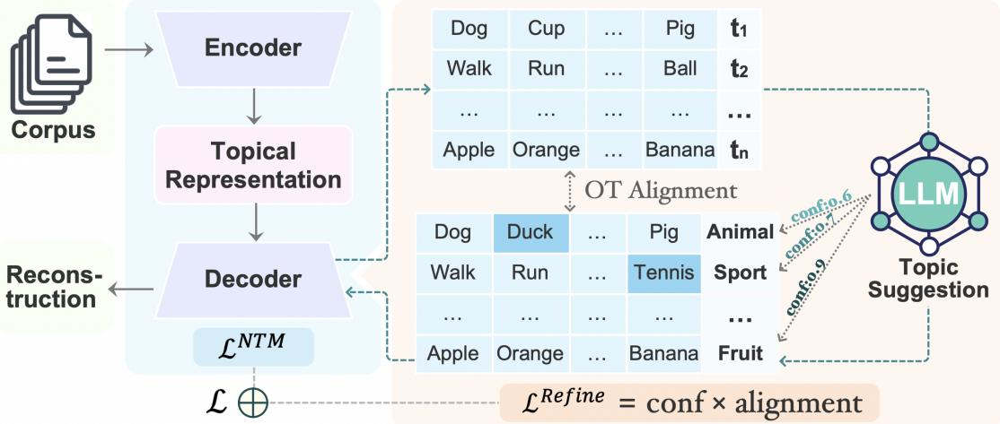  
Figure 1: LLM-ITL overview. The topics and document representations are learned by the Neural Topic Model (NTM) component. After a warm-up stage, a Large Language Model (LLM) suggests better topic words for the learned topics $( \mathrm { e . g . }$ , decoder) from the NTM. An Optimal Transport (OT)-based topic alignment objective is proposed to align the word distribution between the topics from the NTM and those suggested by the LLM. The alignment is further weighted by the confidence of the LLM in providing the suggestions. This confidence-weighted topic refinement objective is plugged into the standard training of an NTM as the overall objective of LLM-ITL.

Its topic words ${ \pmb w } _ { k }$ are obtained by taking the topweight words of $\mathbf { \Delta } _ { t _ { k } }$ , written as:

$$
\begin{array} { r } { { \pmb w } _ { k } : = \mathcal { V } [ f _ { \mathrm { t o p n } } ( { \pmb t } _ { k } , N ) ] , } \end{array}\tag{3}
$$

where $f _ { \mathrm { t o p n } } ( { \pmb a } , N )$ defines a function that returns the indices of the top-N values of vector a; denotes the vocabulary set of the corpus.

## 2.3 Optimal Transport

Optimal Transport (OT) has been widely used for comparing probability distributions (Cuturi, 2013; Frogner et al., 2015; Seguy et al., 2018; Peyré et al., 2019), which extensive applications in machine learning and related areas (Ge et al., 2021; Nguyen et al., 2021; Wang et al., 2022; Guo et al., 2022; Bui et al., 2022; Vuong et al., 2023; Zhao et al., 2023; Ye et al., 2024; Vo et al., 2024; Gao et al., 2024a; Ren et al., 2024). Let $\mu ( { \pmb x } , { \pmb a } ) : =$ $\textstyle \sum _ { i = 1 } ^ { N } a _ { i } \delta _ { x _ { i } }$ and $\begin{array} { r } { \mu ( \pmb { y } , \pmb { b } ) : = \sum _ { j = 1 } ^ { M } b _ { j } \delta _ { y _ { j } } } \end{array}$ be two discrete distributions, where $\pmb { a } : = [ a _ { 1 } , \ldots , a _ { N } ]$ and $\pmb { b } : = [ b _ { 1 } , \ldots , b _ { M } ]$ are the probability vectors; $\pmb { x } : = \{ x _ { 1 } , \ldots , x _ { N } \}$ and $\pmb { y } : = \{ y _ { 1 } , \dots , y _ { M } \}$ are the supports of these two distributions. The OT distance between $\mu ( { \pmb x } , { \pmb a } )$ and $\mu ( { \boldsymbol { \mathsf { y } } } , { \boldsymbol { b } } )$ is obtained by finding the optimal transport plan $\pmb { P } ^ { * }$ that transports the probability mass from $\pmb { a } \in \Delta ^ { N }$ to $\pmb { b } \in \Delta ^ { \hat { M } }$ , written as following:

$$
d _ { \mathrm { O T } } ( \mu ( \pmb { x } , \pmb { a } ) , \mu ( \pmb { y } , \pmb { b } ) ) : = \operatorname* { m i n } _ { \pmb { P } } \sum _ { i = 1 } ^ { N } \sum _ { j = 1 } ^ { M } C _ { i , j } P _ { i , j } ,\tag{4}
$$

subject to $\textstyle \sum _ { j = 1 } ^ { M } P _ { i , j } = a _ { i } , \forall i = 1 , \dotsc , N$ and $\begin{array} { r } { \sum _ { i = 1 } ^ { N } P _ { i , j } = b _ { j } , \forall j = 1 , \ldots , M } \end{array}$ . Here, $\textbf { \textit { P } } \in$

R $^ { \bullet \times M } _ { \geq 0 }$ is the transport plan, with entry $P _ { i , j }$ indicating the amount of probability mass moving from $a _ { i }$ to $\mathbf { \bar { \zeta } } _ { b _ { j } ; C } \in \mathbb { R } _ { > 0 } ^ { N \times M }$ denotes the cost matrix, with entry $C _ { i , j }$ specifying the distance between supports $x _ { i }$ and $y _ { j }$ . Various OT solvers (Flamary et al., 2021) have been proposed to compute the OT distance.

## 3 Method

In this work, we propose LLM-ITL, an LLM-inthe-loop framework that efficiently integrates the LLM with the training of NTMs, offering a more interpretable and comprehensive topic modeling pipeline. An overview of LLM-ITL is illustrated in Figure 1. LLM-ITL involves the following key components: LLM-based topic suggestion, OT distance for topic alignment, and confidence-weighted topic refinement.

## 3.1 LLM-based Topic Suggestion

During the training of an NTM, it typically generates a set of topics, where each topic is represented by a distribution over words, with the highestprobability words forming the core “meaning” of the topic. While these words offer a rough semantic grouping, they often lack clarity or precision, leading to difficulties in interpretation. For instance, topics may contain words that are too general, too specific, or semantically ambiguous, making it hard for users to derive clear labels or understand the thematic focus of the topic.

To address this, LLM-ITL proposes to use LLMs to suggest better words or labels that more clearly express the same underlying concept. The LLM is prompted with the top words from each topic, and it generates two outputs: a topic label, which is a concise and interpretable summary of the topic; and a set of refined topic words, which better represent the underlying semantic concept of the topic. This process capitalizes on the LLM’s ability to grasp language nuances and provide more semantically rich suggestions for the topic. The LLM’s extensive pre-training on diverse and large datasets allows it to capture subtle relationships between words that may not be apparent in the purely statistical or neural-based methods employed by NTMs.

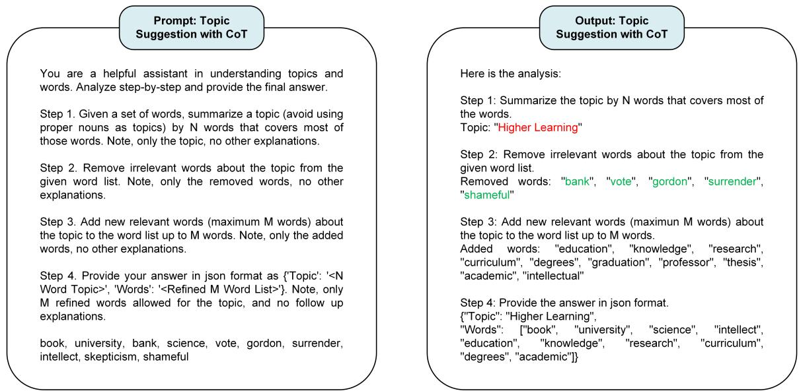  
Figure 2: Prompt and output of topic suggestion with CoT. We take the product of token probabilities of topic label (e.g., words in red color) as the Label Token Probability. We take the proportion of intruders (e.g., words in green color) as the Word Intrusion Confidence. $N = 2$ and M = 10 in this example.

To obtain the topic label and refined words in a structured manner, chain-of-thought (CoT) prompting (Wei et al., 2022) is employed. CoT prompting encourages the LLM to reason step-by-step through the task, ensuring that it carefully considers the topic words before generating a label and refinement. The LLM’s output sequence s includes both the topic label and refined words, extracted as follows for each set of topic words:

$$
\begin{array} { r l } & { \qquad s : = \theta ^ { \mathrm { l l m } } \big ( \mathrm { P r o m p t } ( \pmb { w } ) \big ) , } \\ & { \qquad \quad \mathrm { T o p i c ~ l a b e l ~ } \pmb { w } ^ { l } : \big ( s _ { \mathrm { s t a r t ~ o f ~ l a b e l } } , \dots , s _ { \mathrm { e n d ~ o f ~ l a b e l } } \big ) , } \\ & { \qquad \quad \mathrm { R e f i n e d ~ w o r d s ~ } \pmb { w } ^ { \prime } : \big ( s _ { \mathrm { s t a r t ~ o f ~ w o r d s } } , \dots , s _ { \mathrm { e n d ~ o f ~ w o r d s } } \big ) , } \end{array}\tag{5}
$$

where w represents the original topic words; $\pmb { \theta } ^ { \mathrm { l l m } }$ denotes the LLM model; the topic label $\mathbf { \Delta } _ { w } l$ and the refined words $\mathbf { \Delta } _ { \mathbf { \em w ^ { \prime } } }$ are extracted as subsequences from the LLM’s output s. Notably, the words in $\mathbf { \Delta } _ { \mathbf { \em w ^ { \prime } } }$ are further filtered based on the corpus vocabulary to ensure that no out-of-vocabulary (OOV) words are included. Our used prompt is illustrated in Figure 2. A study of prompt variants is provided in Appendix H.

## 3.2 OT-based Topic Alignment

A key innovation in LLM-ITL is the use of Optimal Transport (OT) distance to align the topic word distributions generated by the NTM with the refined topic word distributions provided by the LLM. OT is a mathematical framework that computes the “cost” of transforming one probability distribution into another, and has shown its effectiveness in measuring the alignment between two sets of words (Kusner et al., 2015; Yang et al., 2025).

Formally, given a set of original topic words $\pmb { w } : = \{ w _ { 1 } , w _ { 2 } , \ldots , w _ { N } \}$ with probability vector $\pmb { t } : = [ t _ { 1 } , t _ { 2 } , \ldots , t _ { N } ]$ as obtained by Eq. 3 and Eq. 2, respectively; as well as refined topic words $\pmb { w } ^ { \prime } : = \{ w _ { 1 } ^ { \prime } , w _ { 2 } ^ { \prime } , \ldots , w _ { M } ^ { \prime } \}$ with probability vector $\pmb { u } : = [ u _ { 1 } , u _ { 2 } , \dots , u _ { M } ] ^ { 1 }$ from the LLM, the OT distance between these two word distributions can be formulated as:

$$
d _ { \mathrm { O T } } ( \mu ( \boldsymbol { w } , t ) , \mu ( \boldsymbol { w } ^ { \prime } , \boldsymbol { u } ) ) = \operatorname* { m i n } _ { \boldsymbol { P } } \sum _ { i = 1 } ^ { N } \sum _ { j = 1 } ^ { M } C _ { i , j } P _ { i , j } ,\tag{6}
$$

where $P \in \mathbb { R } _ { > 0 } ^ { N \times M }$ is the transport plan, with entry $P _ { i , j }$ denoting the amount of probability mass transported from $t _ { i }$ to $u _ { j } ; C \in \mathbb { R } _ { \geq 0 } ^ { \hat { N } \times M }$ is the cost matrix, where $C _ { i , j }$ represents the cost of transporting mass between word $w _ { i }$ and $w _ { j } ^ { \prime }$

The cost matrix C is constructed using the cosine distance between pre-trained word embeddings $\mathcal { E } ^ { w } : = \{ e ^ { w _ { 1 } } , e ^ { w _ { 2 } } , . . . , e ^ { w _ { N } } \}$ (for the original topic words) and $\mathcal { E } ^ { w ^ { \prime } } : = \{ e ^ { w _ { 1 } ^ { \prime } } , e ^ { w _ { 2 } ^ { \prime } } , \ldots , e ^ { w _ { M } ^ { \prime } } \}$ (for the refined topic words). The cosine distance for each entry $C _ { i , j }$ is computed as:

$$
C _ { i , j } : = d _ { \mathrm { { c o s } } } ( e ^ { w _ { i } } , e ^ { w _ { j } ^ { \prime } } ) ,\tag{7}
$$

where $d _ { \cos } ( a , b )$ denotes the cosine distance between the embedding vectors a and b.

By minimizing this OT distance, the learned topic words from the NTM become aligned with the refined words suggested by the LLM, leading to more semantically coherent topics. This OTbased refinement loss is incorporated into the overall training objective, guiding the NTM to adjust its learned topics to match the LLM’s refined representations.

## 3.3 Confidence-Weighted Topic Refinement

LLMs, despite their powerful language capabilities, can sometimes produce hallucinated outputs—irrelevant or incorrect suggestions that do not align with the input data (Ji et al., 2023). To mitigate the impact of such hallucinations, LLM-ITL introduces a confidence-weighted refinement mechanism. The confidence mechanism assesses the reliability of the LLM’s refinements and adjusts their influence on the NTM’s training accordingly. This ensures that high-confidence refinements have a greater impact on the final topic representation, and vice versa.

We propose two methods for calculating topic labeling confidence of the LLM, considering whether the LLM is open-source or not: (1) Label token probability, applicable for open-source LLMs where the token probability of their generation is accessible; (2) Word intrusion confidence, available for both open and closed-source LLMs.

Label Token Probability This method computes the product of the token probabilities for the topic label generated by the LLM. It reflects the LLM’s certainty in generating the specific topic label:

$$
\operatorname { C o n f } ( \boldsymbol { w } ^ { l } ) ^ { \mathrm { p r o b } } : = \prod _ { i = s o l } ^ { e o l } p ( s _ { i } | \boldsymbol { s } _ { < i } , \boldsymbol { c } ) ,\tag{8}
$$

where “sol” and $" e o l "$ denote the indices of “start of label” and “end of label” token, respectively; $p ( s _ { i } | \pmb { s } _ { < i } , \pmb { c } )$ denotes the token probability of the i-th token; c denotes the input context to the LLM.

Word Intrusion Confidence This method evaluates the proportion of irrelevant or “intruder" words removed by the LLM during suggestion. A topic label generated based on a higher rate of intruder removal indicates that it is harder for the LLM to identify the topic from the original topic words, leading to lower confidence:

$$
\mathrm { C o n f } ( { \pmb w } ^ { l } ) ^ { \mathrm { i n t r u s i o n } } : = 1 - \frac { N ^ { \mathrm { i n t r u d e r } } } { N ^ { \pmb w } } ,\tag{9}
$$

where $N ^ { w }$ denotes the number of words in the given topic; Nintruder denotes the number of intruders identified by the LLM.

By incorporating the topic labeling confidence (Eq. 8 or Eq. 9) as a weight for the topic alignment loss, we adaptively adjust the impact of the LLM’s suggestion based on the confidence score. We write our confidence-weighted topic refinement objective as follows:

$$
\operatorname* { m i n } _ { \phi } \sum _ { k = 1 } ^ { K } \operatorname { C o n f } ( \pmb { w } _ { k } ^ { l } ) d _ { \mathrm { O T } } ( \mu ( \pmb { w } _ { k } , \pmb { t } _ { k } ) , \mu ( \pmb { w } _ { k } ^ { \prime } , \pmb { u } _ { k } ) ) .\tag{10}
$$

## 3.4 Integration with Warm-Up

While the LLM’s refinement can lead to more coherent topics, over-reliance on it may bias the topics toward the LLM’s knowledge rather than reflecting the global information of the input corpus, thereby harming the topical representation of documents. To address this issue, we propose integrating the NTM with the LLM after a warm-up stage. This ensures that the refinement process begins only after the NTM has learned a stable topic representation, allowing the model to capture the core structure of the corpus before fine-tuning the topics with LLM guidance. By integrating the topic refinement objective with the training of an NTM with warm-up, we obtain the overall objective of LLM-ITL:

$$
\operatorname* { m i n } _ { \Theta } ( \mathcal { L } ^ { \mathrm { n u m } } + \gamma \cdot \mathbf { I } ( t > T ^ { \mathrm { r e f i n e } } ) \cdot \mathcal { L } ^ { \mathrm { r e f i n e } } ) ,\tag{11}
$$

where $\Theta : = \{ \theta , \phi \}$ denotes model parameters; ${ \mathcal { L } } ^ { \mathrm { n t m } }$ and $\mathscr { L } ^ { \mathrm { r e f i n e } }$ denote the NTM loss and refinement loss in Eq. 1 and Eq. 10, respectively; γ controls the strength of focusing on the LLM’s refinements; t and Trefine denote the current training step and the start of topic refinement, respectively; I( ) denotes the indicator function. We provide the algorithm of LLM-ITL in Appendix B.

## 4 Related Work

Topic Models Classical topic models, such as Latent Dirichlet Allocation (LDA) (Blei et al., 2003)

and its variants (Blei and Lafferty, 2006; Rosen-Zvi et al., 2004; Yan et al., 2013), are Bayesian probabilistic models with various generative assumptions about the documents. Neural Topic Models (NTMs) (Miao et al., 2017; Srivastava and Sutton, 2017; Card et al., 2018; Dieng et al., 2020; Bianchi et al., 2021; Zhao et al., 2021b; Nguyen and Tuan, 2021; Shen et al., 2021; Duan et al., 2021; Li et al., 2022; Xu et al., 2023a,b; Yang et al., 2023; Miyamoto et al., 2023; Wu et al., 2024b; Chen et al., 2025a,b) use deep neural networks to learn topics and document representations. Clustering-based topic models (Sia et al., 2020; Grootendorst, 2022; Angelov and Inkpen, 2024) discover topics using clustering algorithms based on embeddings from pre-trained language models. Ours is not a specific topic model, but rather a general framework designed to integrate LLMs with a wide range of NTMs.

LLMs in Topic Modeling LLMs have been involved in topic modeling in various ways. Rijcken et al. (2023) investigate the use of ChatGPT (OpenAI, 2023) to generate descriptions for topic words and found the effectiveness of these topic descriptions. Recent works leverage LLMs for topic model evaluation in different ways, such as applying LLMs for word intrusion or topic rating for topics (Rahimi et al., 2024; Stammbach et al., 2023), or keyword generation for documents (Yang et al., 2025). LLM-based topic models have emerged (Wang et al., 2023; Pham et al., 2024; Mu et al., 2024; Doi et al., 2024), which prompt LLMs to generate topics and assign topics to documents. Unlike existing methods that focus on document-level analysis relying on LLMs, our approach prompts LLMs to analyze a group of topic words, which are then used to guide the training of NTMs. More recently, Chang et al. (2024) show that LLMs are effective at refining topic words, leading to improved topic coherence. However, their method refines the topic words of trained topic models in a post-hoc manner, whereas ours incorporates refinement as a regularization term during training. Our method is also loosely related to uncertainty estimation of LLMs, and we omit the discussion on this in Appendix C.

## 5 Experiments

## 5.1 Experimental Setup

Datasets We conduct experiments on four widely used and publicly available datasets for topic modeling, including 20Newsgroup (Lang, 1995)

(20News), Reuters-21578 (Aletras and Stevenson, 2013) (R8), DBpedia (Auer et al., 2007) and AG-News (Zhang et al., 2015). Further details of these datasets are described in the Appendix D.1. The number of mined topics (i.e., K) is commonly regarded as a hyper-parameter for the dataset (Zhao et al., 2021b; Wu et al., 2024a). For datasets containing long documents, such as 20News and R8, we set the number of topics to 50. For datasets with short documents, such as DBpedia and AGNews, we set the number to 25. We also run experiments at different K values, which are reported in Appendix E.

Baselines The LLM-ITL framework is highly modular and can be seamlessly integrated with a wide range of NTMs. We integrated LLM-ITL with 8 commonly-used NTMs, as listed in Table 1. We also evaluate other types of topic models, including probabilistic models such as LDA (Blei et al., 2003), cluster-based models like BERTopic (Grootendorst, 2022), and the latest LLM-based model, TopicGPT (Pham et al., 2024). Further details about these baselines and their settings are provided in Appendix D.2.

Settings of LLM-ITL We use LLAMA3-8B-Instruct (Dubey et al., 2024) in LLM-ITL for main experiments. For LLM generation, we use greedy decoding to enable deterministic output and set the maximum new generation tokens to 300. For OT computation, we use GloVe (Pennington et al., 2014) word embeddings pre-trained on Wikipedia to construct the OT cost matrix, and compute the OT distance using the POT (Flamary et al., 2021) package. For topic labeling confidence, we use label token probability in Eq. 8 for our main experiments. For hyper-parameters of LLM-ITL, we maintain consistent settings across all datasets and base models it integrates with: the topic refinement strength γ is set to 200; the number of words for the topic label is set to 2 when prompting the LLM; the warm-up steps are set as $\bar { T } ^ { \mathrm { r e f i n e } } = \bar { T } ^ { \mathrm { t o t a l } } - 5 0$ where Ttotal denotes the total training steps of the base model without integration. Each component and hyper-parameter of LLM-ITL is studied in the following sections. Each trial2 of LLM-ITL in our experiment takes a few hours on a single 80GB A100 GPU.

<table><tr><td rowspan="2">Model</td><td colspan="2">20News</td><td colspan="2">R8</td><td colspan="2">DBpedia</td><td colspan="2">AGNews</td></tr><tr><td colspan="2">Cv</td><td colspan="2">Cv</td><td colspan="2">Cv</td><td colspan="2">Cv</td></tr><tr><td>LDA (Blei et al., 2003)</td><td>0.529 ± 0.006</td><td>0.489 ± 0.009</td><td>0.384 ± 0.006</td><td>0.700 ± 0.005</td><td>0.537 ± 0.010</td><td>0.762 ± 0.013</td><td>0.544 ± 0.013</td><td>0.596 ± 0.008</td></tr><tr><td>BERTopic (Grootendorst, 2022)</td><td>0.404 ± 0.005</td><td>0.342 ± 0.008</td><td>0.323 ± 0.010</td><td>0.697 ± 0.001</td><td>0.545 ± 0.015</td><td>0.720 ± 0.009</td><td>0.506 ± 0.016</td><td>0.450 ± 0.010</td></tr><tr><td>TopicGPT (Pham et al., 2024)</td><td>NA</td><td>0.363 ± 0.000</td><td>NA</td><td>0.410 ± 0.000</td><td>NA</td><td>0.706 ± 0.000</td><td>NA</td><td>0.634 ± 0.000</td></tr><tr><td>NVDM (Miao et al., 2017)</td><td>0.261 ± 0.008</td><td>0.141 ± 0.006</td><td>0.298 ± 0.010</td><td>0.359 ± 0.010</td><td>0.329 ± 0.017</td><td>0.175 ± 0.009</td><td>0.355 ± 0.010</td><td>0.252 ± 0.009</td></tr><tr><td>+ LLM-ITL</td><td>0.336 ± 0.014</td><td>0.138 ± 0.007</td><td>0.374 ± 0.016</td><td>0.360 ± 0.011</td><td>0.479 ± 0.025</td><td>0.170 ± 0.006</td><td>0.455 ± 0.016</td><td>0.248 ± 0.013</td></tr><tr><td></td><td>↑28.7%</td><td>↓2.1%</td><td>↑25.5%</td><td>↑0.3%</td><td>↑45.6%</td><td>↓2.9%</td><td>↑28.2%</td><td>↓1.6%</td></tr><tr><td>PLDA (Srivastava and Sutton, 2017)</td><td>0.368 ± 0.011</td><td>0.272 ± 0.008</td><td>0.375 ± 0.004</td><td>0.525 ± 0.006</td><td>0.502 ± 0.014</td><td>0.664 ± 0.009</td><td>0.551 ± 0.012</td><td>0.481 ± 0.010</td></tr><tr><td>+ LLM-ITL</td><td>0.525 ± 0.010</td><td>0.272 ± 0.011</td><td>0.466 ± 0.011</td><td>0.522 ± 0.008</td><td>0.627 ± 0.020</td><td>0.660 ± 0.005</td><td>0.625 ± 0.017</td><td>0.486 ± 0.008</td></tr><tr><td></td><td>↑42.7%</td><td>↑0.0%</td><td>↑24.3%</td><td>↓0.6%</td><td>↑24.9%</td><td>↓0.6%</td><td>↑13.4%</td><td>↑1.0%</td></tr><tr><td>SCHOLAR (Card et al., 2018)</td><td>0.479 ± 0.019</td><td>0.582 ± 0.010</td><td>0.386 ± 0.004</td><td>0.680 ± 0.013</td><td>0.608 ± 0.019</td><td>0.825 ± 0.015</td><td>0.576 ± 0.011</td><td>0.638 ± 0.003</td></tr><tr><td>+ LLM-ITL</td><td>0.591 ± 0.012</td><td>0.568 ± 0.010</td><td>0.439 ± 0.008</td><td>0.680 ± 0.012</td><td>0.678 ± 0.017</td><td>0.828 ± 0.013</td><td>0.655 ± 0.012</td><td>0.639 ± 0.002</td></tr><tr><td></td><td>↑23.4%</td><td>↓2.4%</td><td>↑13.7%</td><td>↑0.0%</td><td>↑11.5%</td><td>↑0.4%</td><td>↑13.7%</td><td>↑0.2%</td></tr><tr><td>ETM (Dieng et al., 2020)</td><td>0.491 ± 0.006</td><td>0.404 ± 0.010</td><td>0.433 ± 0.006</td><td>0.679 ± 0.018</td><td>0.513 ± 0.004</td><td>0.762 ± 0.011</td><td>0.534 ± 0.013</td><td>0.568 ± 0.008</td></tr><tr><td>+ LLM-ITL</td><td>0.578 ± 0.008</td><td>0.398 ± 0.010</td><td>0.571 ± 0.010</td><td>0.686 ± 0.012</td><td>0.704 ± 0.015</td><td>0.742 ± 0.016</td><td>0.644 ± 0.017</td><td>0.569 ± 0.005</td></tr><tr><td></td><td>↑17.7%</td><td>↓1.5%</td><td>↑31.9%</td><td>↑1.0%</td><td>↑37.2%</td><td>↓2.6%</td><td>↑20.6%</td><td>↑0.2%</td></tr><tr><td>NSTM (Zhao et al., 2021b)</td><td>0.444 ± 0.015</td><td>0.373 ± 0.005</td><td>0.412 ± 0.004</td><td>0.665 ± 0.014</td><td>0.652 ± 0.005</td><td>0.767 ± 0.011</td><td>0.588 ± 0.022</td><td>0.593 ± 0.010</td></tr><tr><td>+ LLM-ITL</td><td>0.521 ± 0.015</td><td>0.360 ± 0.006</td><td>0.549 ± 0.011</td><td>0.673 ± 0.006</td><td>0.700 ± 0.013</td><td>0.752 ± 0.014</td><td>0.675 ± 0.012</td><td>0.585 ± 0.010</td></tr><tr><td></td><td>↑17.3%</td><td>↓3.5%</td><td>↑33.3%</td><td>↑1.2%</td><td>↑7.4%</td><td>↓2.0%</td><td>↑14.8%</td><td>↓1.3%</td></tr><tr><td>CLNTM (Nguyen and Tuan, 2021)</td><td>0.490 ± 0.014</td><td>0.575 ± 0.011</td><td>0.361 ± 0.008</td><td>0.691 ± 0.005</td><td>0.500 ± 0.015</td><td>0.683 ± 0.040</td><td>0.558 ± 0.028</td><td>0.607 ± 0.014</td></tr><tr><td>+ LLM-ITL</td><td> $0 . 6 1 2 \pm 0 . 0 1 0$ </td><td>0.576 ± 0.005</td><td>0.436 ± 0.008</td><td>0.691 ± 0.005</td><td>0.612 ± 0.019</td><td>0.684 ± 0.039</td><td>0.655 ± 0.020</td><td>0.594 ± 0.011</td></tr><tr><td></td><td>↑24.9%</td><td>↑0.2%</td><td>↑20.8%</td><td>↑0.0%</td><td>↑22.4%</td><td>↑0.1%</td><td>↑17.4%</td><td>↓2.1%</td></tr><tr><td>WeTe (dongsheng wang et al., 2022)</td><td> $0 . 4 9 5 \pm 0 . 0 1 7$ </td><td>0.318 ± 0.009</td><td>0.529 ± 0.011</td><td>0.649 ± 0.002</td><td>0.546 ± 0.003</td><td>0.721 ± 0.012</td><td>0.560 ± 0.006</td><td>0.516 ± 0.004</td></tr><tr><td>+ LLM-ITL</td><td> $0 . 5 8 3 \pm 0 . 0 2 8$ </td><td>0.316 ± 0.008</td><td>0.599 ± 0.015</td><td>0.656 ± 0.005</td><td>0.613 ± 0.015</td><td>0.703 ± 0.012</td><td>0.623 ± 0.007</td><td>0.517 ± 0.004</td></tr><tr><td></td><td>↑17.8%</td><td>↓0.6%</td><td>↑13.2%</td><td>↑1.1%</td><td>↑12.3%</td><td>↓2.5%</td><td>↑11.2%</td><td>↑0.2%</td></tr><tr><td>ECRTM (Wu et al., 2023)</td><td>0.323 ± 0.014</td><td>0.516 ± 0.005</td><td>0.308 ± 0.006</td><td>0.673 ± 0.008</td><td>0.581 ± 0.026</td><td>0.668 ± 0.202</td><td>0.438 ± 0.035</td><td>0.554 ± 0.019</td></tr><tr><td>+ LLM-ITL</td><td>0.551 ± 0.025</td><td>0.519 ± 0.002</td><td>0.364 ± 0.010</td><td>0.667 ± 0.007</td><td>0.684 ± 0.013</td><td>0.696 ± 0.142</td><td>0.505 ± 0.025</td><td>0.553 ± 0.020</td></tr><tr><td></td><td>↑70.6%</td><td>↑0.6%</td><td>↑18.2%</td><td>↓0.9%</td><td>↑17.7%</td><td>↑4.2%</td><td>↑15.3%</td><td>↓0.2%</td></tr></table>

Table 1: Topic coherence (C ) and topic alignment (PN). “NA” indicates the evaluation is not applicable. The performance improvement of LLM-ITL over its base model is computed.

Evaluation Metrics We evaluate both the topic quality and the document representation quality for topic models. For topic quality, we apply the widely used topic coherence metric, $C _ { V }$ (Röder et al., 2015). We report the average $C _ { V }$ values of all learned topics. For document representation quality, we evaluate the alignment between a document’s true label and the top-weighted topic of its topical representation, known as topic alignment (Chuang et al., 2013; Pham et al., 2024). This is commonly evaluated using external clustering metrics, Purity and Normalized Mutual Information (NMI). Since Purity and NMI are considered equally important, fall within the same range (from 0 to 1), and are often reported together, we report their average as PN, serving as an overall indicator of topic alignment performance. Detailed results for Purity and NMI are provided in Appendix E.5. Intuitively, topic coherence $( C _ { V } )$ reflects how coherent the learned topic words are, while topic alignment (PN) indicates how well the model represents the documents through the learned topics. Further details on the calculation of these metrics are provided in Appendix D.3. In addition, we compute the performance improvement of LLM-ITL over its base model as: $\frac { S ( \widehat { \mathrm { b a s e } } + \mathrm { L L M \ - I T L } ) - S ( \mathrm { b a s e } ) } { S ( \mathrm { b a s e } ) }$ where S( ) represents the evaluation metric. As for other topic model evaluation metrics, including topic diversity (TD) (Dieng et al., 2020) and overall topic quality (TQ) (dongsheng wang et al., 2022) are reported in Appendix E.3 and E.4, respectively.

## 5.2 Results

Topic Coherence and Alignment We show the performance of topic coherence and topic alignment for different models in Table 1. We summarize the following remarks based on the results: (1) For topic coherence, using LLM-ITL significantly improves performance across all cases, with minimum gains of +7.4% (NSTM as the base model on DBpedia) and maximum gains of +70.6% (ECRTM as the base model on 20News) over the base model. (2) In terms of topic alignment, integrating LLM-ITL demonstrates comparable performance to its base model, with changes ranging from -3.5% to +4.2%. (3) Moreover, for long-document corpora such as 20News and R8, applying LLM-ITL outperforms existing LLM-based topic models like TopicGPT in terms of topic alignment in most cases. This suggests that LLMs alone struggle to fully capture the topics of long documents, highlighting the advantages of integrating NTMs to enhance topical representation for document collections. Additional results with different settings and evaluation metrics are presented in Appendix E and Appendix I.

<table><tr><td>Document</td><td>Model</td><td>Topic</td><td>Proportion</td></tr><tr><td rowspan="3">Here&#x27;s a listing that I came accross a while ago. This question seems to come up often enough that I fig- ured this would be of interest. Note that the server “X Appeal&quot; for DOS is available in demo form on the in- ternet via anonymous ftp. This is</td><td>LDA</td><td>[1] window file program problem run work running machine time version [2] card driver monitor color video mode vga window screen problem [3] image data graphic package software program format tool file processing [4] mb mac mhz bit chip card scsi ram cpu memory</td><td>0.23 0.19 0.16</td></tr><tr><td>one way of quickly checking out the TopicGPT</td><td>· [1] Software Development – The document provides a list of X servers that can be used on non-UNIX networked machines. [2] Internet Culture – The document mentions the availability of X servers</td><td>0.10 … NA</td></tr><tr><td>feasability of using your system as *** Many words omitted here ***</td><td>for various operating systems and provides information on how to access</td><td>NA</td></tr><tr><td rowspan="3">1280x960x1 (TT, SM194) color 320x200x4 color 640x200x2 color 640x480x4 color 320x480x8 Ether- net Card: Atari Card (Mega or VME bus) Riebl/Wacker (Mega or VME bus) — End Enclosure</td><td rowspan="3">LLM-ITL card apple</td><td>the file via anonymous ftp. [1] Software Development – application model version program software designed tool development implementation window</td><td>0.23</td></tr><tr><td>[2] Computer Hardware – computer bios disk pc chip controller ram memory</td><td>0.13</td></tr><tr><td>[3] Service Support – support provide offer access available providing includes provides use feature</td><td>0.11</td></tr></table>

Table 2: Examples of different topic models’ output for a given document from 20News. Only the document’s top assigned/weighted (>= 0.1) topics of its topical proportion/representation are listed in LDA and LLM-ITL (with ETM as the base model).

Qualitative Analysis During the inference phase, LLM-ITL infers the topic proportion for a given document from the NTM component, and obtains the topic label from the LLM component, as shown in Table 2. We can observe that (1) Compared to topic models with top-words topics such as LDA, LLM-ITL provides more coherent topic words and offers topic labels, making the semantic meaning of the topics easier to identify. (2) Compared to the LLM-based topic model TopicGPT, LLM-ITL can obtain topic proportions as an indicator of the importance or relevance of topics to the document, offering more practical usage. For example, for TopicGPT, “Internet Culture” should be less relevant for the example document than “Software Development” if a good topic proportion is available.

Balancing Topic Coherence and Alignment Over-reliance on the LLM’s refinement may introduce out-of-corpus information, thereby harming topical representation of documents for the corpus (i.e., topic alignment). Here, we demonstrate the effectiveness of using warm-up integration to balance topic coherence and alignment. From the learning curves illustrated in Figure 3, we observe that starting topic refinement earlier (e.g., $T ^ { \mathrm { r e f i n e } } = 5 )$ can result in greater improvements in topic coherence but leads to poorer topic alignment performance.

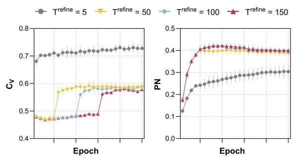  
Figure 3: Learning curves of LLM-ITL (ETM as the base model) with different $T ^ { \mathrm { r e f i n e } }$ in terms of topic coherence $( C _ { V } )$ and topic alignment (PN) on 20News.

For larger values of $T ^ { \mathrm { r e f i n e } }$ , the performance in terms of both metrics becomes better balanced and comparable, indicating the effectiveness of warmup integration and low sensitivity within a certain range. For more hyper-parameter studies of LLM-ITL, see Appendix G.

Flexibility with different LLMs LLM-ITL is a framework compatible with most LLMs. Here, we examine the flexibility of LLM-ITL by integrating it with various LLMs. Apart from LLAMA3-8B-Instruct (Dubey et al., 2024), we implement LLM-ITL with the latest open-sourced LLMs, including Mistral-7B-Instruct-v0.3 (Jiang et al., 2023), Phi-3-Mini-128K-Instruct (Abdin et al., 2024), Yi-1.5-9B-Chat (Young et al., 2024), Qwen1.5-32B-Chat (Bai et al., 2023) and LLAMA3-70B-Instruct (Dubey et al., 2024). As shown in Figure 4, LLM-ITL consistently improves topic coherence of its base model across different LLMs, and the improvement can be further enhanced when using larger LLMs such as LLAMA3-70B-Instruct.

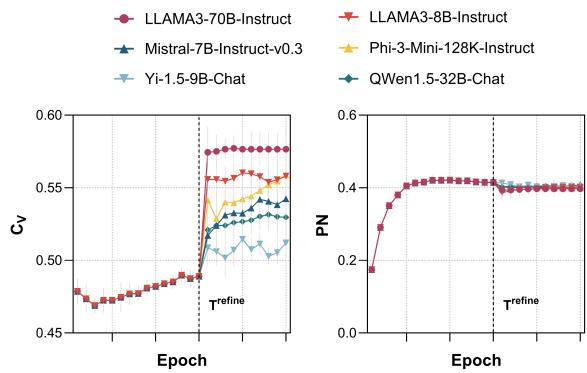

Figure 4: Learning curves of LLM-ITL (ETM as the base model) with different LLMs in terms of topic coherence $( C _ { V } )$ and topic alignment (PN) on 20News.  
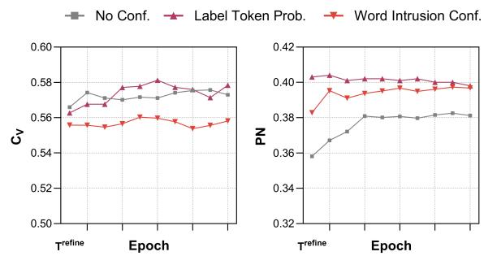  
Figure 5: Ablation for confidence. Error bars are omitted for clarity in the figure.

Ablation Study for Confidence Here, we investigate the effectiveness of including the confidence scores during topic refinement. As illustrated in Figure 5, label token probability and word intrusion confidence consistently yield better performance in terms of PN. This suggests that by including proposed confidence during topic refinement, we reduce the impact of potential noisy suggestions from the LLM and achieve better topical representation for documents. For further studies on alternative LLM confidence measures, see Appendix F.

Ablation Study of OT Here, we conducted an ablation study on our OT-based topic refinement approach. In this study, we apply different metrics to measure the differences between the topic word distributions generated by the NTM and those refined by the LLM. Specifically, we explored alternative metrics to optimal transport (OT) within the LLM-ITL framework, including Kullback–Leibler (KL) divergence, Jensen–Shannon divergence (JSD), Hellinger distance (HD), and Total Variation distance (TVD).

<table><tr><td> $C _ { V }$  PN</td></tr><tr><td>KL  $0 . 4 8 0 \pm 0 . 0 0 7$   $0 . 4 0 2 \pm 0 . 0 1 2$ </td></tr><tr><td>JSD  $0 . 4 7 9 \pm 0 . 0 0 3$   $0 . 4 0 3 \pm 0 . 0 1 1$ </td></tr><tr><td>HD  $0 . 4 8 0 \pm 0 . 0 1 1$   $0 . 4 0 3 \pm 0 . 0 1 2$ </td></tr><tr><td>TVD  $0 . 4 8 0 \pm 0 . 0 0 8$   $\mathbf { 0 . 4 0 5 \pm 0 . 0 1 1 }$ </td></tr><tr><td>OT  $\mathbf { 0 . 5 7 8 \pm 0 . 0 0 8 }$   $0 . 3 9 8 \pm 0 . 0 1 0$ </td></tr></table>

Table 3: Ablation study of OT. The best performance is highlighted in boldface for both metrics.

As shown in Table 3, which presents results from experiments on 20News with $K = 5 0$ using ETM as the base model, our OT-based approach demonstrates a significant advantage in improving topic coherence compared to alternative distribution measurement methods.

## 6 Conclusion

In this paper, we introduced LLM-ITL, a novel framework that integrates Large Language Models (LLMs) with Neural Topic Models (NTMs) to address the limitations of both traditional topic models and the direct use of LLMs for topic discovery. By incorporating a confidence-weighted Optimal Transport (OT)-based topic alignment, LLM-ITL improves the interpretability and coherence of topics while maintaining the quality of document representations. Our framework effectively leverages the strengths of both LLMs and NTMs, offering a flexible, scalable, and efficient solution for topic modeling. Extensive experiments on benchmark datasets demonstrate that applying LLM-ITL with NTMs significantly boosts topic interpretability while maintaining document representation quality.

## 7 Limitation

The proposed framework relies on the refinements generated by the LLM. Over-reliance on the LLM during the refinement process may introduce outof-corpus information or bias the topics toward the LLM’s pre-training knowledge. This can negatively impact the alignment of learned topics with the input corpus, particularly in cases where the corpus diverges significantly from the LLM’s training data.

## Acknowledgment

We thank the anonymous (meta) reviewers in ARR for their valuable feedback, which has significantly strengthened this work.

## References

Aly Abdelrazek, Yomna Eid, Eman Gawish, Walaa Medhat, and Ahmed Hassan. 2023. Topic modeling algorithms and applications: A survey. Information Systems, 112:102131.

Marah Abdin, Sam Ade Jacobs, Ammar Ahmad Awan, Jyoti Aneja, Ahmed Awadallah, Hany Awadalla, Nguyen Bach, Amit Bahree, Arash Bakhtiari, Harkirat Behl, et al. 2024. Phi-3 technical report: A highly capable language model locally on your phone. arXiv preprint arXiv:2404.14219.

Nikolaos Aletras and Mark Stevenson. 2013. Evaluating topic coherence using distributional semantics. In Proceedings ofthe 10th International Conference on Computational Semantics (IWCS 2013) – Long Papers, pages 13–22, Potsdam, Germany. Association for Computational Linguistics.

Dimo Angelov and Diana Inkpen. 2024. Topic modeling: Contextual token embeddings are all you need. In Findings of the Association for Computational Linguistics: EMNLP 2024, pages 13528–13539, Miami, Florida, USA. Association for Computational Linguistics.

Sören Auer, Christian Bizer, Georgi Kobilarov, Jens Lehmann, Richard Cyganiak, and Zachary Ives. 2007. Dbpedia: A nucleus for a web of open data. In The Semantic Web, pages 722–735, Berlin, Heidelberg. Springer Berlin Heidelberg.

Jinze Bai, Shuai Bai, Yunfei Chu, Zeyu Cui, Kai Dang, Xiaodong Deng, Yang Fan, Wenbin Ge, Yu Han, Fei Huang, Binyuan Hui, Luo Ji, Mei Li, Junyang Lin, Runji Lin, Dayiheng Liu, Gao Liu, Chengqiang Lu, Keming Lu, Jianxin Ma, Rui Men, Xingzhang Ren, Xuancheng Ren, Chuanqi Tan, Sinan Tan, Jianhong Tu, Peng Wang, Shijie Wang, Wei Wang, Shengguang Wu, Benfeng Xu, Jin Xu, An Yang, Hao Yang, Jian Yang, Shusheng Yang, Yang Yao, Bowen Yu, Hongyi Yuan, Zheng Yuan, Jianwei Zhang, Xingxuan Zhang, Yichang Zhang, Zhenru Zhang, Chang Zhou, Jingren Zhou, Xiaohuan Zhou, and Tianhang Zhu. 2023. Qwen technical report. arXiv preprint arXiv:2309.16609.

Federico Bianchi, Silvia Terragni, and Dirk Hovy. 2021. Pre-training is a hot topic: Contextualized document embeddings improve topic coherence. In Proceedings ofthe 59th Annual Meeting ofthe Associationfor Computational Linguistics and the 11th International Joint Conference on Natural Language Processing (Volume 2: Short Papers), pages 759–766, Online. Association for Computational Linguistics.

David M. Blei and John D. Lafferty. 2006. Dynamic topic models. In Proceedings of the 23rd International Conference on Machine Learning, ICML ’06, page 113–120, New York, NY, USA. Association for Computing Machinery.

David M. Blei, Andrew Y. Ng, and Michael I. Jordan. 2003. Latent dirichlet allocation. J. Mach. Learn. Res., 3(null):993–1022.

Anh Tuan Bui, Trung Le, Quan Hung Tran, He Zhao, and Dinh Phung. 2022. A unified Wasserstein distributional robustness framework for adversarial training. In International Conference on Learning Representations.

Dallas Card, Chenhao Tan, and Noah A. Smith. 2018. Neural models for documents with metadata. In Proceedings ofthe 56th Annual Meeting ofthe Associationfor Computational Linguistics (Volume 1: Long Papers), pages 2031–2040, Melbourne, Australia. Association for Computational Linguistics.

Shuyu Chang, Rui Wang, Peng Ren, and Haiping Huang. 2024. Enhanced short text modeling: Leveraging large language models for topic refinement. arXiv preprint arXiv:2403.17706.

Chao Chen, Kai Liu, Ze Chen, Yi Gu, Yue Wu, Mingyuan Tao, Zhihang Fu, and Jieping Ye. 2024. Inside: Llms’ internal states retain the power of hallucination detection. In ICLR.

Jiuhai Chen and Jonas Mueller. 2024. Quantifying uncertainty in answers from any language model and enhancing their trustworthiness. In Proceedings of the 62nd Annual Meeting of the Association for Computational Linguistics (Volume 1: Long Papers), pages 5186–5200, Bangkok, Thailand. Association for Computational Linguistics.

Shangyu Chen, Xiaohao Yang, Pengfei Fang, Mehrtash Tafazzoli Harandi, Dinh Phung, and Jianfei Cai. 2025a. Stereographic projection for embedding hierarchical structures in hyperbolic space. In International Conference on Pattern Recognition, pages 307–321. Springer.

Shangyu Chen, He Zhao, Viet Huynh, Dinh Phung, and Jianfei Cai. 2025b. Neural topic model with distance awareness. In International Conference on Pattern Recognition, pages 337–352. Springer.

Jason Chuang, Sonal Gupta, Christopher D. Manning, and Jeffrey Heer. 2013. Topic model diagnostics: assessing domain relevance via topical alignment. In Proceedings ofthe 30th International Conference on International Conference on Machine Learning - Volume 28, ICML’13, page III–612–III–620. JMLR.org.

Rob Churchill and Lisa Singh. 2022. The evolution of topic modeling. ACM Comput. Surv., 54(10s).

Marco Cuturi. 2013. Sinkhorn distances: lightspeed computation of optimal transport. In Proceedings of the 27th International Conference on Neural Information Processing Systems - Volume 2, NIPS’13, page 2292–2300, Red Hook, NY, USA. Curran Associates Inc.

Adji B. Dieng, Francisco J. R. Ruiz, and David M. Blei. 2020. Topic modeling in embedding spaces. Transactions of the Association for Computational Linguistics, 8:439–453.

Tomoki Doi, Masaru Isonuma, and Hitomi Yanaka. 2024. Topic modeling for short texts with large language models. In Proceedings of the 62nd Annual Meeting ofthe Associationfor Computational Linguistics (Volume 4: Student Research Workshop), pages 21–33, Bangkok, Thailand. Association for Computational Linguistics.

dongsheng wang, Dan dan Guo, He Zhao, Huangjie Zheng, Korawat Tanwisuth, Bo Chen, and Mingyuan Zhou. 2022. Representing mixtures of word embeddings with mixtures of topic embeddings. In International Conference on Learning Representations.

Zhibin Duan, Dongsheng Wang, Bo Chen, Chaojie Wang, Wenchao Chen, Yewen Li, Jie Ren, and Mingyuan Zhou. 2021. Sawtooth factorial topic embeddings guided gamma belief network. In Proceedings ofthe 38th International Conference on Machine Learning, volume 139 of Proceedings of Machine Learning Research, pages 2903–2913. PMLR.

Abhimanyu Dubey, Abhinav Jauhri, Abhinav Pandey, Abhishek Kadian, Ahmad Al-Dahle, Aiesha Letman, Akhil Mathur, Alan Schelten, Amy Yang, Angela Fan, et al. 2024. The llama 3 herd of models. arXiv preprint arXiv:2407.21783.

Chrisantha Fernando, Dylan Banarse, Henryk Michalewski, Simon Osindero, and Tim Rocktäschel. 2024. Promptbreeder: self-referential self-improvement via prompt evolution. In Proceedings of the 41st International Conference on Machine Learning, ICML’24. JMLR.org.

Rémi Flamary, Nicolas Courty, Alexandre Gramfort, Mokhtar Z. Alaya, Aurélie Boisbunon, Stanislas Chambon, Laetitia Chapel, Adrien Corenflos, Kilian Fatras, Nemo Fournier, Léo Gautheron, Nathalie T.H. Gayraud, Hicham Janati, Alain Rakotomamonjy, Ievgen Redko, Antoine Rolet, Antony Schutz, Vivien Seguy, Danica J. Sutherland, Romain Tavenard, Alexander Tong, and Titouan Vayer. 2021. Pot: Python optimal transport. J. Mach. Learn. Res., 22(1).

Charlie Frogner, Chiyuan Zhang, Hossein Mobahi, Mauricio Araya-Polo, and Tomaso Poggio. 2015. Learning with a wasserstein loss. In Proceedings of the 29th International Conference on Neural Information Processing Systems - Volume 2, NIPS’15, page 2053–2061, Cambridge, MA, USA. MIT Press.

Zhe Gan, R. Henao, D. Carlson, and Lawrence Carin. 2015. Learning deep sigmoid belief networks with data augmentation. In AISTATS, pages 268–276.

Jintong Gao, He Zhao, Dan dan Guo, and Hongyuan Zha. 2024a. Distribution alignment optimization through neural collapse for long-tailed classification. In Forty-first International Conference on Machine Learning.

Xiang Gao, Jiaxin Zhang, Lalla Mouatadid, and Kamalika Das. 2024b. SPUQ: Perturbation-based uncertainty quantification for large language models. In

Proceedings ofthe 18th Conference ofthe European Chapter of the Association for Computational Linguistics (Volume 1: Long Papers), pages 2336–2346, St. Julian’s, Malta. Association for Computational Linguistics.

Zheng Ge, Songtao Liu, Zeming Li, Osamu Yoshie, and Jian Sun. 2021. OTA: Optimal transport assignment for object detection. In CVPR, pages 303–312.

Jiahui Geng, Fengyu Cai, Yuxia Wang, Heinz Koeppl, Preslav Nakov, and Iryna Gurevych. 2024. A survey of confidence estimation and calibration in large language models. In Proceedings of the 2024 Conference of the North American Chapter of the Association for Computational Linguistics: Human Language Technologies (Volume 1: Long Papers), pages 6577–6595, Mexico City, Mexico. Association for Computational Linguistics.

Maarten Grootendorst. 2022. Bertopic: Neural topic modeling with a class-based tf-idf procedure. arXiv preprint arXiv:2203.05794.

Dandan Guo, Long Tian, Minghe Zhang, Mingyuan Zhou, and Hongyuan Zha. 2022. Learning prototypeoriented set representations for meta-learning. In International Conference on Learning Representations.

Bairu Hou, Yujian Liu, Kaizhi Qian, Jacob Andreas, Shiyu Chang, and Yang Zhang. 2024. Decomposing uncertainty for large language models through input clarification ensembling. In Proceedings ofthe 41st International Conference on Machine Learning, volume 235 of Proceedings of Machine Learning Research, pages 19023–19042. PMLR.

Ziwei Ji, Nayeon Lee, Rita Frieske, Tiezheng Yu, Dan Su, Yan Xu, Etsuko Ishii, Ye Jin Bang, Andrea Madotto, and Pascale Fung. 2023. Survey of hallucination in natural language generation. ACM Comput. Surv., 55(12).

Albert Q Jiang, Alexandre Sablayrolles, Arthur Mensch, Chris Bamford, Devendra Singh Chaplot, Diego de las Casas, Florian Bressand, Gianna Lengyel, Guillaume Lample, Lucile Saulnier, et al. 2023. Mistral 7b. arXiv preprint arXiv:2310.06825.

Saurav Kadavath, Tom Conerly, Amanda Askell, Tom Henighan, Dawn Drain, Ethan Perez, Nicholas Schiefer, Zac Hatfield-Dodds, Nova DasSarma, Eli Tran-Johnson, et al. 2022. Language models (mostly) know what they know. arXiv preprint arXiv:2207.05221.

Diederik P. Kingma and Max Welling. 2014. Auto-Encoding Variational Bayes. In 2nd International Conference on Learning Representations, ICLR 2014, Banff, AB, Canada, April 14-16, 2014, Conference Track Proceedings.

Lorenz Kuhn, Yarin Gal, and Sebastian Farquhar. 2023. Semantic uncertainty: Linguistic invariances for uncertainty estimation in natural language generation.

In The Eleventh International Conference on Learning Representations.

Matt Kusner, Yu Sun, Nicholas Kolkin, and Kilian Weinberger. 2015. From word embeddings to document distances. In Proceedings ofthe 32nd International Conference on Machine Learning, volume 37 of Proceedings ofMachine Learning Research, pages 957– 966, Lille, France. PMLR.

Ken Lang. 1995. Newsweeder: learning to filter netnews. In Proceedings of the Twelfth International Conference on International Conference on Machine Learning, ICML’95, page 331–339, San Francisco, CA, USA. Morgan Kaufmann Publishers Inc.

Yewen Li, Chaojie Wang, Zhibin Duan, Dongsheng Wang, Bo Chen, Bo An, and Mingyuan Zhou. 2022. Alleviating "posterior collapse" in deep topic models via policy gradient. In Proceedings of the 36th International Conference on Neural Information Processing Systems, NIPS ’22, Red Hook, NY, USA. Curran Associates Inc.

Zhen Lin, Shubhendu Trivedi, and Jimeng Sun. 2024. Generating with confidence: Uncertainty quantification for black-box large language models. Transactions on Machine Learning Research.

Lin Liu, Lin Tang, Wen Dong, Shaowen Yao, and Wei Zhou. 2016. An overview of topic modeling and its current applications in bioinformatics. SpringerPlus, 5(1):1–22.

Potsawee Manakul, Adian Liusie, and Mark Gales. 2023. SelfCheckGPT: Zero-resource black-box hallucination detection for generative large language models. In Proceedings of the 2023 Conference on Empirical Methods in Natural Language Processing, pages 9004–9017, Singapore. Association for Computational Linguistics.

Yishu Miao, Edward Grefenstette, and Phil Blunsom. 2017. Discovering discrete latent topics with neural variational inference. In Proceedings of the 34th International Conference on Machine Learning - Volume 70, ICML’17, page 2410–2419. JMLR.org.

Nozomu Miyamoto, Masaru Isonuma, Sho Takase, Junichiro Mori, and Ichiro Sakata. 2023. Dynamic structured neural topic model with self-attention mechanism. In Findings ofthe Associationfor Computational Linguistics: ACL 2023, pages 5916–5930, Toronto, Canada. Association for Computational Linguistics.

Yida Mu, Chun Dong, Kalina Bontcheva, and Xingyi Song. 2024. Large language models offer an alternative to the traditional approach of topic modelling. In Proceedings ofthe 2024 Joint International Conference on Computational Linguistics, Language Resources and Evaluation (LREC-COLING 2024), pages 10160–10171, Torino, Italia. ELRA and ICCL.

Thong Nguyen and Luu Anh Tuan. 2021. Contrastive learning for neural topic model. In Proceedings of the

35th International Conference on Neural Information Processing Systems, NIPS ’21, Red Hook, NY, USA. Curran Associates Inc.

Tuan Nguyen, Trung Le, He Zhao, Quan Hung Tran, Truyen Nguyen, and Dinh Phung. 2021. Most: Multisource domain adaptation via optimal transport for student-teacher learning. In UAI, pages 225–235.

Sergey I. Nikolenko. 2016. Topic quality metrics based on distributed word representations. In Proceedings ofthe 39th International ACM SIGIR Conference on Research and Development in Information Retrieval, SIGIR ’16, page 1029–1032, New York, NY, USA. Association for Computing Machinery.

OpenAI. 2023. Gpt-4 technical report. arXiv preprint arXiv:2303.08774.

John Paisley, Chong Wang, David M Blei, and Michael I Jordan. 2015. Nested hierarchical Dirichlet processes. TPAMI, 37(2):256–270.

Jeffrey Pennington, Richard Socher, and Christopher Manning. 2014. GloVe: Global vectors for word representation. In Proceedings of the 2014 Conference on Empirical Methods in Natural Language Processing (EMNLP), pages 1532–1543, Doha, Qatar. Association for Computational Linguistics.

Gabriel Peyré, Marco Cuturi, et al. 2019. Computational optimal transport: With applications to data science. Foundations and Trends® in Machine Learning, 11(5-6):355–607.

Chau Minh Pham, Alexander Hoyle, Simeng Sun, Philip Resnik, and Mohit Iyyer. 2024. TopicGPT: A promptbased topic modeling framework. In Proceedings of the 2024 Conference of the North American Chapter of the Association for Computational Linguistics: Human Language Technologies (Volume 1: Long Papers), pages 2956–2984, Mexico City, Mexico. Association for Computational Linguistics.

Hamed Rahimi, David Mimno, Jacob Hoover, Hubert Naacke, Camelia Constantin, and Bernd Amann. 2024. Contextualized topic coherence metrics. In Findings ofthe Associationfor Computational Linguistics: EACL 2024, pages 1760–1773, St. Julian’s, Malta. Association for Computational Linguistics.

Martin Reisenbichler and Thomas Reutterer. 2019. Topic modeling in marketing: recent advances and research opportunities. Journal of Business Economics, 89(3):327–356.

Hairui Ren, Fan Tang, Huangjie Zheng, He Zhao, Dandan Guo, and Yi Chang. 2024. Modality-consistent prompt tuning with optimal transport. IEEE Transactions on Circuits and Systems for Video Technology.

Jie Ren, Jiaming Luo, Yao Zhao, Kundan Krishna, Mohammad Saleh, Balaji Lakshminarayanan, and Peter J Liu. 2023. Out-of-distribution detection and selective generation for conditional language models. In The Eleventh International Conference on Learning Representations.

Danilo Jimenez Rezende, Shakir Mohamed, and Daan Wierstra. 2014. Stochastic backpropagation and approximate inference in deep generative models. In Proceedings of the 31st International Conference on International Conference on Machine Learning - Volume 32, ICML’14, page II–1278–II–1286. JMLR.org.

Emil Rijcken, Floortje Scheepers, Kalliopi Zervanou, Marco Spruit, Pablo Mosteiro, and Uzay Kaymak. 2023. Towards interpreting topic models with chatgpt. In The 20th World Congress of the International Fuzzy Systems Association.

Michael Röder, Andreas Both, and Alexander Hinneburg. 2015. Exploring the space of topic coherence measures. In Proceedings ofthe Eighth ACM International Conference on Web Search and Data Mining, WSDM ’15, page 399–408, New York, NY, USA. Association for Computing Machinery.

Michal Rosen-Zvi, Thomas Griffiths, Mark Steyvers, and Padhraic Smyth. 2004. The author-topic model for authors and documents. In Proceedings of the 20th Conference on Uncertainty in Artificial Intelligence, UAI ’04, page 487–494, Arlington, Virginia, USA. AUAI Press.

Vivien Seguy, Bharath Bhushan Damodaran, Remi Flamary, Nicolas Courty, Antoine Rolet, and Mathieu Blondel. 2018. Large scale optimal transport and mapping estimation. In International Conference on Learning Representations.

Dazhong Shen, Chuan Qin, Chao Wang, Zheng Dong, Hengshu Zhu, and Hui Xiong. 2021. Topic modeling revisited: A document graph-based neural network perspective. In Advances in Neural Information Processing Systems, volume 34, pages 14681–14693. Curran Associates, Inc.

Suzanna Sia, Ayush Dalmia, and Sabrina J. Mielke. 2020. Tired of topic models? clusters of pretrained word embeddings make for fast and good topics too! In Proceedings ofthe 2020 Conference on Empirical Methods in Natural Language Processing (EMNLP), pages 1728–1736, Online. Association for Computational Linguistics.

Akash Srivastava and Charles Sutton. 2017. Autoencoding variational inference for topic models. In International Conference on Learning Representations.

Dominik Stammbach, Vilém Zouhar, Alexander Hoyle, Mrinmaya Sachan, and Elliott Ash. 2023. Revisiting automated topic model evaluation with large language models. In Proceedings ofthe 2023 Conference on Empirical Methods in Natural Language Processing, pages 9348–9357, Singapore. Association for Computational Linguistics.

Katherine Tian, Eric Mitchell, Allan Zhou, Archit Sharma, Rafael Rafailov, Huaxiu Yao, Chelsea Finn, and Christopher Manning. 2023. Just ask for calibration: Strategies for eliciting calibrated confidence

scores from language models fine-tuned with human feedback. In Proceedings of the 2023 Conference on Empirical Methods in Natural Language Processing, pages 5433–5442, Singapore. Association for Computational Linguistics.

Hugo Touvron, Thibaut Lavril, Gautier Izacard, Xavier Martinet, Marie-Anne Lachaux, Timothée Lacroix, Baptiste Rozière, Naman Goyal, Eric Hambro, Faisal Azhar, et al. 2023a. Llama: Open and efficient foundation language models. arXiv preprint arXiv:2302.13971.

Hugo Touvron, Louis Martin, Kevin Stone, Peter Albert, Amjad Almahairi, Yasmine Babaei, Nikolay Bashlykov, Soumya Batra, Prajjwal Bhargava, Shruti Bhosale, et al. 2023b. Llama 2: Open foundation and fine-tuned chat models. arXiv preprint arXiv:2307.09288.

Dennis Ulmer, Martin Gubri, Hwaran Lee, Sangdoo Yun, and Seong Oh. 2024. Calibrating large language models using their generations only. In Proceedings of the 62nd Annual Meeting of the Association for Computational Linguistics (Volume 1: Long Papers), pages 15440–15459, Bangkok, Thailand. Association for Computational Linguistics.

Vy Vo, He Zhao, Trung Le, Edwin V Bonilla, and Dinh Phung. 2024. Optimal transport for structure learning under missing data. In International Conference on Machine Learning.

Long Tung Vuong, Trung Le, He Zhao, Chuanxia Zheng, Mehrtash Harandi, Jianfei Cai, and Dinh Phung. 2023. Vector quantized wasserstein autoencoder. In International Conference on Machine Learning, pages 35223–35242. PMLR.

Dongsheng Wang, Dandan Guo, He Zhao, Huangjie Zheng, Korawat Tanwisuth, Bo Chen, Mingyuan Zhou, et al. 2022. Representing mixtures of word embeddings with mixtures of topic embeddings. In International Conference on Learning Representations.

Han Wang, Nirmalendu Prakash, Nguyen Khoi Hoang, Ming Shan Hee, Usman Naseem, and Roy Ka-Wei Lee. 2023. Prompting large language models for topic modeling. In 2023 IEEE International Conference on Big Data (BigData), pages 1236–1241.

Jason Wei, Xuezhi Wang, Dale Schuurmans, Maarten Bosma, Brian Ichter, Fei Xia, Ed H. Chi, Quoc V. Le, and Denny Zhou. 2022. Chain-of-thought prompting elicits reasoning in large language models. In Proceedings of the 36th International Conference on Neural Information Processing Systems, NIPS ’22, Red Hook, NY, USA. Curran Associates Inc.

Xiaobao Wu, Xinshuai Dong, Thong Thanh Nguyen, and Anh Tuan Luu. 2023. Effective neural topic modeling with embedding clustering regularization. In Proceedings of the 40th International Conference on Machine Learning, volume 202 of Proceedings ofMachine Learning Research, pages 37335–37357. PMLR.

Xiaobao Wu, Thong Nguyen, and Anh Tuan Luu. 2024a. A survey on neural topic models: methods, applications, and challenges. Artificial Intelligence Review, 57(2):18.

Xiaobao Wu, Fengjun Pan, Thong Nguyen, Yichao Feng, Chaoqun Liu, Cong-Duy Nguyen, and Anh Tuan Luu. 2024b. On the affinity, rationality, and diversity of hierarchical topic modeling. In Proceedings of the Thirty-Eighth AAAI Conference on Artificial Intelligence and Thirty-Sixth Conference on Innovative Applications ofArtificial Intelligence and Fourteenth Symposium on Educational Advances in Artificial Intelligence, AAAI’24/IAAI’24/EAAI’24. AAAI Press.

Miao Xiong, Zhiyuan Hu, Xinyang Lu, YIFEI LI, Jie Fu, Junxian He, and Bryan Hooi. 2024. Can LLMs express their uncertainty? an empirical evaluation of confidence elicitation in LLMs. In The Twelfth International Conference on Learning Representations.

Weijie Xu, Wenxiang Hu, Fanyou Wu, and Srinivasan Sengamedu. 2023a. DeTiME: Diffusion-enhanced topic modeling using encoder-decoder based LLM. In Findings of the Association for Computational Linguistics: EMNLP 2023, pages 9040–9057, Singapore. Association for Computational Linguistics.

Weijie Xu, Xiaoyu Jiang, Srinivasan Sengamedu Hanumantha Rao, Francis Iannacci, and Jinjin Zhao. 2023b. vONTSS: vMF based semi-supervised neural topic modeling with optimal transport. In Findings of the Associationfor Computational Linguistics: ACL 2023, pages 4433–4457, Toronto, Canada. Association for Computational Linguistics.

Xiaohui Yan, Jiafeng Guo, Yanyan Lan, and Xueqi Cheng. 2013. A biterm topic model for short texts. In Proceedings ofthe 22nd International Conference on World Wide Web, WWW ’13, page 1445–1456, New York, NY, USA. Association for Computing Machinery.

Xiaohao Yang, He Zhao, Dinh Phung, Wray Buntine, and Lan Du. 2025. Llm reading tea leaves: Automatically evaluating topic models with large language models. Transactions of the Association for Computational Linguistics, 13:357–375.

Xiaohao Yang, He Zhao, Dinh Phung, and Lan Du. 2023. Towards generalising neural topical representations. arXiv preprint arXiv:2307.12564.

Hangting Ye, Wei Fan, Xiaozhuang Song, Shun Zheng, He Zhao, Dan dan Guo, and Yi Chang. 2024. Ptarl: Prototype-based tabular representation learning via space calibration. In International Conference on Learning Representations.

Xing Yi and James Allan. 2009. A comparative study of utilizing topic models for information retrieval. In Advances in Information Retrieval, pages 29–41, Berlin, Heidelberg. Springer Berlin Heidelberg.

Alex Young, Bei Chen, Chao Li, Chengen Huang, Ge Zhang, Guanwei Zhang, Heng Li, Jiangcheng Zhu, Jianqun Chen, Jing Chang, et al. 2024. Yi: Open foundation models by 01. ai. arXiv preprint arXiv:2403.04652.

Xiang Zhang, Junbo Zhao, and Yann LeCun. 2015. Character-level convolutional networks for text classification. In Proceedings ofthe 29th International Conference on Neural Information Processing Systems - Volume 1, NIPS’15, page 649–657, Cambridge, MA, USA. MIT Press.

He Zhao, Lan Du, Wray Buntine, and Mingyuan Zhou. 2018a. Dirichlet belief networks for topic structure learning. Advances in neural information processing systems, 31.

He Zhao, Lan Du, Wray Buntine, and Mingyuan Zhou. 2018b. Inter and intra topic structure learning with word embeddings. In ICML, pages 5887–5896.

He Zhao, Dinh Phung, Viet Huynh, Yuan Jin, Lan Du, and Wray Buntine. 2021a. Topic modelling meets deep neural networks: A survey. In Proceedings of the Thirtieth International Joint Conference on Artificial Intelligence, IJCAI-21, pages 4713–4720. International Joint Conferences on Artificial Intelligence Organization. Survey Track.

He Zhao, Dinh Phung, Viet Huynh, Trung Le, and Wray Buntine. 2021b. Neural topic model via optimal transport. In International Conference on Learning Representations.

He Zhao, Ke Sun, Amir Dezfouli, and Edwin V Bonilla. 2023. Transformed distribution matching for missing value imputation. In International Conference on Machine Learning, pages 42159–42186. PMLR.

Mingyuan Zhou, Yulai Cong, and Bo Chen. 2016. Augmentable gamma belief networks. JMLR, 17(163):1– 44.

## A Prompts

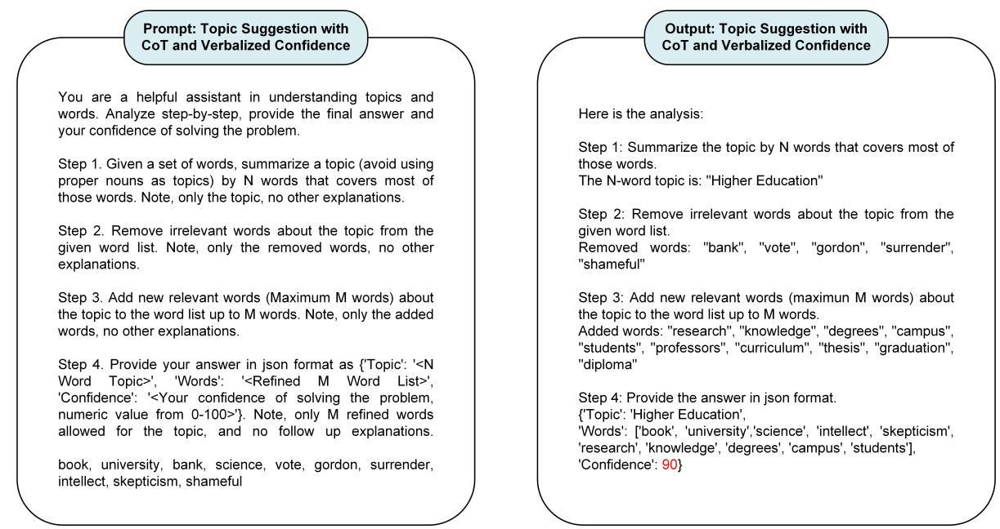  
Figure A1: Prompt and output of topic suggestion with CoT and verbalized confidence. The number in red color in the LLM’s output represents the verbalized confidence. N = 2 and M = 10 in this example.

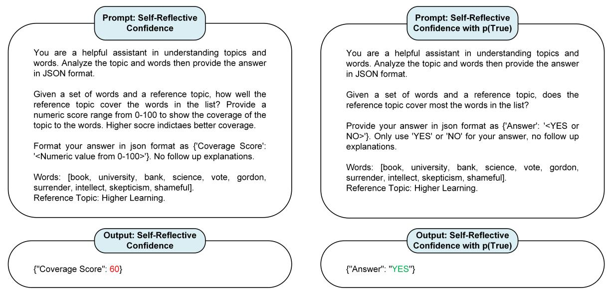  
Figure A2: Prompt and output of self-reflective confidence and p(True). Left: self-reflective confidence where the number in red color represents the confidence. Right: p(True) confidence where the token probability of “YES” (p) in green color or $ { \mathrm { ^ { 6 } N O ^ { , 3 } ( 1 - p ) } }$ is used as confidence.

## B Algorithm

Algorithm 1: Algorithm for LLM-ITL   
Input: Train documents; An LLM; pre-training word embeddings; Hyper-parameters Trefine, γ; Training iteration I;   
Number of topics K.   
Initialize: Initialize the parameters θ, ϕ of the NTM.   
/\*Warm-up\*/   
for i = 1 : Trefine do   
Compute NTM loss by Eq. 1;   
Compute gradients w.r.t θ and ϕ;   
Update θ and ϕ based on the gradients;   
end   
/\*Topic Refinement \*/   
for i = Trefine : I do   
for k = 1 : K do   
Obtain topic distribution tk by Eq. 2;   
Obtain topic words wk by Eq. 3;   
Obtain refined words w′ from the LLM by Eq. 5;   
Construct OT cost matrix by Eq. 7;   
Compute OT distance by Eq. 6;   
if Open-Source LLM then   
Compute topic labeling confidence by Eq. 8   
end   
else   
Compute topic labeling confidence by Eq. 9   
end   
end   
Compute refine by Eq. 10;   
Compute ntm by Eq. 1;   
Compute overall loss by ntm + γ refine ;   
Compute gradients w.r.t θ and ϕ;   
Update θ and ϕ based on the gradients;   
end   
Output: Trained NTM with θ, ϕ.

## C Related work: LLM Uncertainty Estimation

Uncertainty estimation for LLMs (Geng et al., 2024) is emerging with the rapid usage of LLMs and their risk of hallucination (Ji et al., 2023). Sequence probability (Ren et al., 2023) leverages token probabilities to measure answer confidence. Verbalized confidence (Tian et al., 2023; Xiong et al., 2024) utilizes the LLM’s own capability to evaluate its answer uncertainty. Consistency-based (Lin et al., 2024; Manakul et al., 2023) approaches sample multiple outputs from the LLM and measure answer consistency as uncertainty. Entropybased (Kuhn et al., 2023; Hou et al., 2024) approaches estimate the output space from multiple LLM outputs and compute entropy as uncertainty for the answer. Hybrid frameworks (Chen and Mueller, 2024; Gao et al., 2024b) combine different approaches for a comprehensive estimation. Internal states (Chen et al., 2024) are another useful source for LLM uncertainty quantification. Unlike those works that estimate uncertainty for LLMs in general natural language generation tasks, ours focuses on task-specific uncertainty of the LLM in suggesting topic words.

## D Detailed Experimental Settings

## D.1 Details of Dataset

<table><tr><td>Dataset</td><td># Docs Train</td><td># Docs Test</td><td>Voc Size</td><td>Avg. Doc Length</td><td># Labels</td></tr><tr><td>20News</td><td>11778</td><td>2944</td><td>13925</td><td>150</td><td>20</td></tr><tr><td>R8</td><td>5485</td><td>2189</td><td>5338</td><td>102</td><td>8</td></tr><tr><td>DBpedia</td><td>15598</td><td>3899</td><td>8550</td><td>51</td><td>14</td></tr><tr><td>AGNews</td><td>16000</td><td>4000</td><td>8389</td><td>38</td><td>4</td></tr></table>

Table D1: Statistics of the Datasets

We conduct experiments on $2 0 \mathrm { N e w s } ^ { 3 }$ , R84, DBpedia5, and AGNews6. For DBpedia and AGNews, we randomly sample a subset of 20,000 documents. We retain the original text documents for models that accept text as input, and preprocess the documents into Bag-of-Words (BoW) format for models that are trained on BoWs. We convert the documents into BoW vectors through the following steps: First, we clean the documents by removing special characters and stop words, followed by tokenization. Next, we build the vocabulary by including words with a document frequency greater than five and less than 80% of the total documents. Since we use the pre-training word embeddings of GloVe (Pennington et al., 2014), we further filter the vocabulary by retaining only the words that are in the GloVe vocabulary. Finally, we transform the documents into BoWs based on the filtered vocabulary set. The statistics of the preprocessed datasets are summarized in Table D1.

## D.2 Details of Baselines

We run the following topic models in our experiments, including Latent Dirichlet Allocation (LDA) (Blei et al., 2003), the most popular probabilistic topic model that generates documents by mixtures of topics; Neural Variational Document Model (NVDM) (Miao et al., 2017), a pioneering NTM based on the VAE framework; LDA with Products of Experts (PLDA) (Srivastava and Sutton, 2017), an NTM that uses a product of experts instead of the mixture model in LDA; Neural Topic Model with Covariates, Supervision, and Sparsity (SCHOLAR) (Card et al., 2018), an NTM that leverages extra information from metadata; Embedded Topic Model (ETM) (Dieng et al., 2020), which involves word and topic embeddings in the generative process of documents; Neural Sinkhorn Topic Model (NSTM) (Zhao et al., 2021b), an NTM based on an optimal transport framework; Contrastive Learning Neural Topic Model (CLNTM) (Nguyen and Tuan, 2021), an NTM that is based on the contrastive learning framework; BERTopic (Grootendorst, 2022), a recent clustering-based topic model that utilizes embeddings from pre-trained language models; WeTe (dongsheng wang et al., 2022), which represents a mixture of word embeddings as a mixture of topic embeddings; Embedding Clustering Regularization Topic Model (ECRTM) (Wu et al., 2023), an NTM with embedding clustering regularization; TopicGPT (Pham et al., 2024), a latest LLM-based topic model that leverages an LLM for topic generation and assignment.

As for the implementations of baseline models, we use Mallet7 for LDA with Gibbs sampling, and the original implementations for the other models. For NTMs including NVDM, PLDA, SCHOLAR, ETM, NSTM, CLNTM, WeTe and ECRTM, we tune their hyper-parameters for the datasets; For

BERTopic, we fine-tune the topic representations after the topics are learned, as suggested by their implementation8. For TopicGPT, we use GPT-4 for topic generation and GPT-3.5 for topic assignment, randomly sampling 600 documents from the training set for each dataset, as suggested by their paper. We run all models except TopicGPT five times in each experiment and report the mean and standard deviation of their performance. For TopicGPT, we run it once for each experiment using a temperature value of zero to enable deterministic output, following the setting of their paper.

## D.3 Details of Evaluation Metrics

For topic evaluation, we apply the commonly-used topic coherence metric, $C _ { V }$ (Röder et al., 2015), which evaluates topic coherence based on the cooccurrence of the topic’s top words in a reference corpus. Following standard evaluation protocol, we use Wikipedia as the reference corpus and consider the top 10 words of each topic, with implementation done using the Palmetto package9 (Röder et al., 2015). We report the average $C _ { V }$ score of all learned topics as the overall topic coherence performance. For documents’ topical representation (i.e., topic proportion) evaluation, a common practice is to compare the document clusters formed by topic proportions with those formed by the documents true labels, known as topic alignment. Following previous works (Chuang et al., 2013; Pham et al., 2024), we assign each test document to a cluster based on the top-weighted topic of its topical representation, and compute Purity and Normalized Mutual Information (NMI) based on the documents cluster assignments and their true labels. As Purity and NMI are often reported together and within the same range, we report the average score of both metrics as PN. For all evaluations, we use the model state at the end of the training iteration to compute all evaluation metrics.

## E More Results

## E.1 Topic Coherence at Different K

We illustrate the topic coherence performance $( C _ { V } )$ of topic models across different numbers of topics (i.e., K) in Table E1. Overall, using LLM-ITL significantly boosts topic coherence across all cases in our experiments, with minimum gains of +10.4% (NSTM as the base model on DBpedia at $K = 5 0 )$

and maximum gains of +86.3% (ECRTM as the base model on 20News at K = 25) over the base model.

## E.2 Topic Alignment at Different K

We illustrate the topic alignment performance (PN) of topic models across different numbers of topics $( \mathrm { i . e . , } \ K )$ in Table E2. Overall, using LLM-ITL inherits the topic alignment performance of its base model, with slight changes ranging from -5.2% (NSTM as the base model on 20News at K = 100) to +5.2% (PLDA as the base model on 20News at $K = 7 5 )$

## E.3 Topic Diversity (TD)

We evaluate the performance of topic diversity (TD) defined by Dieng et al. (2020), which evaluates the distinctiveness of the top-words within the learned topics. The results across different numbers of topics (i.e., K) is illustrated in Table E3. Overall, applying LLM-ITL results in changes to TD ranging from -34.6% (ECRTM as the base model on 20News at $K = 1 0 0 )$ to +55.5% (NSTM as the base model on 20News at $K = 1 0 0 )$ compared to its base model. A further analysis of overall topic quality, which considers both topic coherence and diversity, is described in the following section.

## E.4 Overall Topic Quality (TQ)

dongsheng wang et al. (2022) define topic quality (TQ) as $\mathrm { T Q } : = \mathrm { T C } \times \mathrm { T D } .$ , serving as an overall indicator of topic quality that considers both topic coherence and diversity. We illustrate the topic quality performance of topic models across different numbers of topics (i.e., K) in Table E4. Overall, LLM-ITL boosts overall topic quality in all cases in our experiments, with a minimum improvement of 3.7% (SCHOLAR as the base model on R8 at K = 100) and a maximum improvement of 90.9% (CLNTM as the base model on DBpedia at K = 100) compared to its base mod

## E.5 Purity & NMI

As we report PN (the mean of Purity and NMI) as an overall topic alignment metric in previous sections, here we present the detailed performance of Purity and NMI in Table E5 and Table E6, respectively.

<table><tr><td rowspan="2">Model</td><td colspan="3">20News</td><td colspan="3">R8</td><td colspan="3">DBpedia</td><td colspan="3">AGNews</td></tr><tr><td>K=25</td><td>K=75</td><td>K=100</td><td>K=25</td><td>K=75</td><td>K=100</td><td>K=50</td><td>K=75</td><td>K=100</td><td>K=50</td><td>K=75</td><td>K=100</td></tr><tr><td>LDA</td><td>0.558 ± 0.008</td><td>0.525 ± 0.005</td><td>0.510 ± 0.004</td><td>0.387 ± 0.011</td><td>0.373 ± 0.003</td><td>0.374 ± 0.006</td><td>0.529 ± 0.005</td><td>0.520 ± 0.010</td><td>0.506 ± 0.004</td><td>0.526 ± 0.010</td><td>0.502 ± 0.003</td><td>0.480 ± 0.003</td></tr><tr><td>BERTopic</td><td>0.435 ± 0.029</td><td>0.403 ± 0.012</td><td>0.390 ± 0.005</td><td>0.349 ± 0.013</td><td>0.329 ± 0.008</td><td>0.333 ± 0.007</td><td>0.559 ± 0.011</td><td>0.537 ± 0.007</td><td>0.516 ± 0.006</td><td>0.500 ± 0.016</td><td>0.485 ± 0.004</td><td>0.479 ± 0.004</td></tr><tr><td>TopicGPT</td><td>NA</td><td>NA</td><td>NA</td><td>NA</td><td>NA</td><td>NA</td><td>NA</td><td>NA</td><td>NA</td><td>NA</td><td>NA</td><td>NA</td></tr><tr><td>NVDM</td><td>0.299 ± 0.012</td><td>0.241 ± 0.004</td><td>0.232 ± 0.004</td><td>0.324 ± 0.011</td><td>0.283 ± 0.002</td><td>0.270 ± 0.002</td><td>0.274 ± 0.003</td><td>0.260 ± 0.004</td><td>0.259 ± 0.005</td><td>0.289 ± 0.004</td><td>0.266 ± 0.005</td><td>0.256 ± 0.007</td></tr><tr><td>+LLM-ITL</td><td>0.439 ± 0.019</td><td>0.298 ± 0.009</td><td>0.292 ± 0.004</td><td>0.438 ± 0.017</td><td>0.358 ± 0.011</td><td>0.340 ± 0.006</td><td>0.365 ± 0.008</td><td>0.353 ± 0.008</td><td>0.346 ± 0.006</td><td>0.357 ± 0.018</td><td>0.326 ± 0.005</td><td>0.325 ± 0.005</td></tr><tr><td></td><td>↑46.8%</td><td>↑23.7%</td><td>↑25.9%</td><td>↑35.2%</td><td>↑26.5%</td><td>↑25.9%</td><td>↑33.2%</td><td>↑35.8%</td><td>↑33.6%</td><td>↑23.5%</td><td>↑22.6%</td><td>↑27.0%</td></tr><tr><td>PLDA</td><td>0.418 ± 0.020</td><td>0.352 ± 0.010</td><td>0.336 ± 0.002</td><td>0.391 ± 0.008</td><td>0.365 ± 0.006</td><td>0.348 ± 0.007</td><td>0.484 ± 0.008</td><td>0.457 ± 0.009</td><td>0.438 ± 0.004</td><td>0.515 ± 0.007</td><td>0.490 ± 0.012</td><td>0.470 ± 0.003</td></tr><tr><td>+ LLM-ITL</td><td>0.557 ± 0.026</td><td>0.534 ± 0.010</td><td>0.506 ± 0.013</td><td>0.477 ± 0.036</td><td>0.456 ± 0.011</td><td>0.452 ± 0.004</td><td>0.598 ± 0.009</td><td>0.570 ± 0.021</td><td>0.568 ± 0.015</td><td>0.595 ± 0.012</td><td>0.582 ± 0.012</td><td>0.581 ± 0.008</td></tr><tr><td></td><td>↑33.3%</td><td>↑51.7%</td><td>↑50.6%</td><td>↑22.0%</td><td>↑24.9%</td><td>↑29.9%</td><td>↑23.6%</td><td>↑24.7%</td><td>↑29.7%</td><td>↑15.5%</td><td>↑18.8%</td><td>↑23.6%</td></tr><tr><td>SCHOLAR</td><td>0.520 ± 0.018</td><td>0.478 ± 0.009</td><td>0.472 ± 0.014</td><td>0.399 ± 0.010</td><td>0.385 ± 0.005</td><td>0.376 ± 0.004</td><td>0.434 ± 0.007</td><td>0.422 ± 0.015</td><td>0.403 ± 0.021</td><td>0.577 ± 0.025</td><td>0.581 ± 0.010</td><td>0.541 ± 0.014</td></tr><tr><td>+ LLM-ITL</td><td>0.622 ± 0.028</td><td>0.584 ± 0.008</td><td>0.562 ± 0.011</td><td>0.462 ± 0.010</td><td>0.437 ± 0.006</td><td>0.424 ± 0.009</td><td>0.564 ± 0.037</td><td>0.565 ± 0.024</td><td>0.556 ± 0.020</td><td>0.643 ± 0.015</td><td>0.647 ± 0.005</td><td>0.627 ± 0.014</td></tr><tr><td></td><td>↑19.6%</td><td>↑22.2%</td><td>↑19.1%</td><td>↑15.8%</td><td>↑13.5%</td><td>↑12.8%</td><td>↑30.0%</td><td>↑33.9%</td><td>↑38.0%</td><td>↑11.4%</td><td>↑11.4%</td><td>↑15.9%</td></tr><tr><td>ETM</td><td>0.511 ± 0.007</td><td>0.466 ± 0.005</td><td>0.461 ± 0.008</td><td>0.447 ± 0.017</td><td>0.432 ± 0.011</td><td>0.431 ± 0.009</td><td>0.507 ± 0.007</td><td>0.501 ± 0.006</td><td>0.496 ± 0.007</td><td>0.497 ± 0.010</td><td>0.497 ± 0.004</td><td>0.480 ± 0.004</td></tr><tr><td>+LLM-ITL</td><td>0.627 ± 0.019</td><td>0.566 ± 0.007</td><td>0.553 ± 0.014</td><td>0.570 ± 0.014</td><td>0.565 ± 0.010</td><td>0.580 ± 0.004</td><td>0.657 ± 0.031</td><td>0.631 ± 0.014</td><td>0.626 ± 0.009</td><td>0.626 ± 0.018</td><td>0.620 ± 0.012</td><td>0.618 ± 0.006</td></tr><tr><td></td><td>↑22.7%</td><td>↑21.5%</td><td>↑20.0%</td><td>↑27.5%</td><td>↑30.8%</td><td>↑34.6%</td><td>↑29.6%</td><td>↑25.9%</td><td>↑26.2%</td><td>↑26.0%</td><td>↑24.7%</td><td>↑28.8%</td></tr><tr><td>NSTM</td><td>0.450 ± 0.008</td><td>0.425 ± 0.003</td><td>0.424 ± 0.008</td><td>0.415 ± 0.014</td><td>0.407 ± 0.006</td><td>0.402 ± 0.013</td><td>0.636 ± 0.008</td><td>0.621 ± 0.014</td><td>0.616 ± 0.006</td><td>0.596 ± 0.015</td><td>0.583 ± 0.015</td><td>0.575 ± 0.018</td></tr><tr><td>+ LLM-ITL</td><td>0.510 ± 0.027</td><td>0.524 ± 0.008</td><td>0.518 ± 0.011</td><td>0.549 ± 0.011</td><td>0.544 ± 0.021</td><td>0.534 ± 0.016</td><td>0.702 ± 0.009</td><td>0.688 ± 0.009</td><td>0.690 ± 0.014</td><td>0.661 ± 0.021</td><td>0.670 ± 0.008</td><td>0.649 ± 0.012</td></tr><tr><td></td><td>↑13.3%</td><td>↑23.3%</td><td>↑22.2%</td><td>↑32.3%</td><td>↑33.7%</td><td>↑32.8%</td><td>↑10.4%</td><td>↑10.8%</td><td>↑12.0%</td><td>↑10.9%</td><td>↑14.9%</td><td>↑12.9%</td></tr><tr><td>CLNTM</td><td>0.501 ± 0.010</td><td>0.478 ± 0.007</td><td>0.469 ± 0.010</td><td>0.387 ± 0.005</td><td>0.346 ± 0.004</td><td>0.354 ± 0.002</td><td>0.414 ± 0.030</td><td>0.394 ± 0.014</td><td>0.393 ± 0.011</td><td>0.549 ± 0.010</td><td>0.567 ± 0.012</td><td>0.569 ± 0.010</td></tr><tr><td>+ LLM-ITL</td><td>0.623 ± 0.011</td><td>0.587 ± 0.011</td><td>0.580 ± 0.006</td><td>0.446 ± 0.006</td><td>0.422 ± 0.008</td><td>0.411 ± 0.004</td><td>0.556 ± 0.004</td><td>0.540 ± 0.020</td><td>0.547 ± 0.008</td><td>0.613 ± 0.003</td><td>0.628 ± 0.005</td><td>0.658 ± 0.013</td></tr><tr><td></td><td>↑24.4%</td><td>↑22.8%</td><td>↑23.7%</td><td>↑15.2%</td><td>↑22.0%</td><td>↑16.1%</td><td>↑34.3%</td><td>↑37.1%</td><td>↑39.2%</td><td>↑11.7%</td><td>↑10.8%</td><td>↑15.6%</td></tr><tr><td>WeTe</td><td>0.488 ± 0.010</td><td>0.505 ± 0.017</td><td>0.498 ± 0.013</td><td>0.534 ± 0.008</td><td>0.534 ± 0.011</td><td>0.533 ± 0.011</td><td>0.557 ± 0.012</td><td>0.526 ± 0.005</td><td>0.516 ± 0.015</td><td>0.587 ± 0.007</td><td>0.562 ± 0.003</td><td>0.556 ± 0.005</td></tr><tr><td>+ LLM-ITL</td><td>0.539 ± 0.030</td><td>0.578 ± 0.022</td><td>0.556 ± 0.021</td><td>0.604 ± 0.015</td><td>0.605 ± 0.012</td><td>0.601 ± 0.008</td><td>0.650 ± 0.009</td><td>0.660 ± 0.011</td><td>0.665 ± 0.018</td><td>0.655 ± 0.007</td><td>0.689 ± 0.010</td><td>0.693 ± 0.015</td></tr><tr><td></td><td>↑10.5%</td><td>↑14.5%</td><td>↑11.6%</td><td>↑13.1%</td><td>↑13.3%</td><td>↑12.8%</td><td>↑16.7%</td><td>↑25.5%</td><td>↑28.9%</td><td>↑11.6%</td><td>↑22.6%</td><td>↑24.6%</td></tr><tr><td>ECRTM</td><td>0.350 ± 0.013</td><td>0.324 ± 0.007</td><td>0.313 ± 0.003</td><td>0.279 ± 0.015</td><td>0.287 ± 0.013</td><td>0.288 ± 0.009</td><td>0.520 ± 0.016</td><td>0.436 ± 0.014</td><td>0.407 ± 0.008</td><td>0.408 ± 0.026</td><td>0.382 ± 0.011</td><td>0.352 ± 0.014</td></tr><tr><td>+ LLM-ITL</td><td>0.652 ± 0.026</td><td>0.518 ± 0.017</td><td>0.520 ± 0.023</td><td>0.352 ± 0.012</td><td>0.354 ± 0.008</td><td>0.362 ± 0.008</td><td>0.630 ± 0.006</td><td>0.563 ± 0.010</td><td>0.521 ± 0.010</td><td>0.475 ± 0.019</td><td>0.451 ± 0.021</td><td>0.426 ± 0.012</td></tr><tr><td></td><td>↑86.3%</td><td>↑59.9%</td><td>↑66.1%</td><td>↑26.2%</td><td>↑23.3%</td><td>↑25.7%</td><td>↑21.2%</td><td>↑29.1%</td><td>↑28.0%</td><td>↑16.4%</td><td>↑18.1%</td><td>↑21.0%</td></tr></table>

Table E1: Topic coherence (C ) at other settings of K.

<table><tr><td rowspan="2">Model</td><td colspan="3">20News</td><td colspan="3">R8</td><td colspan="3">DBpedia</td><td colspan="3">AGNews</td></tr><tr><td>K=25</td><td>K=75</td><td>K=100</td><td>K=25</td><td>K=75</td><td>K=100</td><td>K=50</td><td>K=75</td><td>K=100</td><td>K=50</td><td>K=75</td><td>K=100</td></tr><tr><td>LDA</td><td>0.460 ± 0.011</td><td>0.488 ± 0.006</td><td>0.489 ± 0.012</td><td>0.714 ± 0.008</td><td>0.699 ± 0.002</td><td>0.689 ± 0.006</td><td>0.748 ± 0.007</td><td>0.738 ± 0.005</td><td>0.730 ± 0.007</td><td>0.576 ± 0.005</td><td>0.570 ± 0.004</td><td>0.562 ± 0.005</td></tr><tr><td>BERTopic</td><td>0.289 ± 0.021</td><td>0.372 ± 0.004</td><td>0.390 ± 0.004</td><td>0.732 ± 0.011</td><td>0.689 ± 0.006</td><td>0.685 ± 0.006</td><td>0.739 ± 0.002</td><td>0.716 ± 0.010</td><td>0.695 ± 0.003</td><td>0.472 ± 0.004</td><td>0.484 ± 0.010</td><td>0.495 ± 0.004</td></tr><tr><td>TopicGPT</td><td>0.363 ± 0.000</td><td>0.363 ± 0.000</td><td>0.363 ± 0.000</td><td>0.410 ± 0.000</td><td>0.410 ± 0.000</td><td>0.410 ± 0.000</td><td>0.706 ± 0.000</td><td>0.706 ± 0.000</td><td>0.706 ± 0.000</td><td>0.634 ± 0.000</td><td>0.634 ± 0.000</td><td>0.634 ± 0.000</td></tr><tr><td>NVDM</td><td>0.146 ± 0.005</td><td>0.145 ± 0.003</td><td>0.153 ± 0.003</td><td>0.380 ± 0.007</td><td>0.353 ± 0.013</td><td>0.359 ± 0.003</td><td>0.150 ± 0.004</td><td>0.151 ± 0.003</td><td>0.156 ± 0.004</td><td>0.223 ± 0.004</td><td>0.212 ± 0.004</td><td>0.211 ± 0.004</td></tr><tr><td>+ LLM-ITL</td><td>0.143 ± 0.005</td><td>0.142 ± 0.005</td><td>0.153 ± 0.004</td><td>0.377 ± 0.008</td><td>0.355 ± 0.006</td><td>0.358 ± 0.003</td><td>0.150 ± 0.004</td><td>0.150 ± 0.003</td><td>0.152 ± 0.003</td><td>0.222 ± 0.001</td><td>0.212 ± 0.003</td><td>0.211 ± 0.004</td></tr><tr><td></td><td>↓2.1%</td><td>↓2.1%</td><td>↑0.0%</td><td>↓ 0.8%</td><td>↑0.6%</td><td>↓0.3%</td><td>↑0.0%</td><td>↓0.7%</td><td>↓2.6%</td><td>↓0.4%</td><td>↑0.0%</td><td>↑0.0%</td></tr><tr><td>PLDA</td><td>0.231 ± 0.003</td><td>0.290 ± 0.005</td><td>0.303 ± 0.004</td><td>0.523 ± 0.014</td><td>0.520 ± 0.007</td><td>0.520 ± 0.006</td><td>0.643 ± 0.004</td><td>0.620 ± 0.008</td><td>0.610 ± 0.005</td><td>0.474 ± 0.005</td><td>0.475 ± 0.004</td><td>0.471 ± 0.005</td></tr><tr><td>+LLM-ITL</td><td>0.241 ± 0.003 ↑4.3%</td><td>0.305 ± 0.010 ↑5.2%</td><td>0.313 ± 0.011</td><td>0.533 ± 0.009</td><td>0.518 ± 0.008</td><td>0.514 ± 0.006</td><td>0.641 ± 0.010</td><td>0.624 ± 0.006</td><td>0.611 ± 0.005</td><td>0.472 ± 0.004</td><td>0.470 ± 0.003</td><td>0.466 ± 0.001 ↓ 1.1%</td></tr><tr><td></td><td></td><td></td><td>↑3.3%</td><td>↑1.9%</td><td>↓0.4%</td><td>↓1.2%</td><td>↓0.3%</td><td>↑0.6%</td><td>↑0.2%</td><td>↓0.4%</td><td>↓ 1.1%</td><td></td></tr><tr><td>SCHOLAR + LLM-ITL</td><td>0.572 ± 0.010</td><td>0.580 ± 0.008</td><td>0.588 ± 0.004</td><td>0.717 ± 0.017</td><td>0.686 ± 0.006</td><td>0.681 ± 0.005</td><td>0.827 ± 0.016</td><td>0.794 ± 0.010</td><td>0.680 ± 0.114</td><td>0.587 ± 0.049</td><td>0.426 ± 0.048</td><td>0.389 ± 0.067</td></tr><tr><td></td><td>0.562 ± 0.011 ↓1.7%</td><td>0.578 ± 0.006 ↓0.3%</td><td>0.587 ± 0.007 ↓0.2%</td><td>0.716 ± 0.018 ↓0.1%</td><td>0.682 ± 0.006</td><td>0.675 ± 0.004</td><td>0.828 ± 0.014</td><td>0.773 ± 0.015 ↓2.6%</td><td>0.701 ± 0.055 ↑3.1%</td><td>0.567 ± 0.053 ↓3.4%</td><td>0.410 ± 0.073 ↓3.8%</td><td>0.382 ± 0.076 ↓1.8%</td></tr><tr><td></td><td></td><td></td><td></td><td></td><td>↓0.6%</td><td>↓ 0.9%</td><td>↑0.1%</td><td></td><td></td><td></td><td></td><td></td></tr><tr><td>ETM + LLM-ITL</td><td>0.363 ± 0.007</td><td>0.434 ± 0.008</td><td>0.456 ± 0.013</td><td>0.679 ± 0.018</td><td>0.666 ± 0.007</td><td>0.664 ± 0.005</td><td>0.751 ± 0.010</td><td>0.747 ± 0.005</td><td>0.739 ± 0.006</td><td>0.553 ± 0.003</td><td>0.555 ± 0.006</td><td>0.549 ± 0.003</td></tr><tr><td></td><td>0.352 ± 0.009</td><td>0.426 ± 0.012 ↓1.8%</td><td>0.441 ± 0.012</td><td>0.690 ± 0.011</td><td>0.673 ± 0.011</td><td>0.666 ± 0.019</td><td>0.740 ± 0.005</td><td>0.738 ± 0.014</td><td>0.744 ± 0.008</td><td>0.558 ± 0.005</td><td>0.560 ± 0.008</td><td>0.553 ± 0.008 ↑0.7%</td></tr><tr><td></td><td>↓3.0%</td><td></td><td>↓3.3%</td><td>↑1.6%</td><td>↑1.1%</td><td>↑0.3%</td><td>↓1.5%</td><td>↓1.2%</td><td>↑0.7%</td><td>↑0.9%</td><td>↑0.9%</td><td></td></tr><tr><td>NSTM</td><td>0.365 ± 0.013</td><td>0.382 ± 0.006</td><td>0.405 ± 0.007</td><td>0.674 ± 0.004</td><td>0.662 ± 0.004</td><td>0.662 ± 0.007</td><td>0.739 ± 0.007</td><td>0.739 ± 0.003</td><td>0.738 ± 0.004</td><td>0.576 ± 0.007</td><td>0.570 ± 0.006</td><td>0.569 ± 0.005</td></tr><tr><td>+ LLM-ITL</td><td>0.351 ± 0.012</td><td>0.366 ± 0.008</td><td>0.384 ± 0.009</td><td>0.681 ± 0.012</td><td>0.669 ± 0.003</td><td>0.669 ± 0.009</td><td>0.741 ± 0.009</td><td>0.738 ± 0.006</td><td>0.736 ± 0.002</td><td>0.576 ± 0.006</td><td>0.566 ± 0.006</td><td>0.566 ± 0.004</td></tr><tr><td></td><td>↓3.8%</td><td>↓4.2%</td><td>↓5.2%</td><td>↑1.0%</td><td>↑1.1%</td><td>↑1.1%</td><td>↑0.3%</td><td>↓0.1%</td><td>↓0.3%</td><td>↑0.0%</td><td>↓0.7%</td><td>↓0.5%</td></tr><tr><td>CLNTM</td><td>0.536 ± 0.007</td><td>0.581 ± 0.008</td><td>0.586 ± 0.006</td><td>0.691 ± 0.010</td><td>0.680 ± 0.009</td><td>0.680 ± 0.006</td><td>0.542 ± 0.039</td><td>0.438 ± 0.019</td><td>0.427 ± 0.062</td><td>0.578 ± 0.047</td><td>0.487 ± 0.055</td><td>0.438 ± 0.035</td></tr><tr><td>+ LLM-ITL</td><td>0.529 ± 0.013</td><td>0.585 ± 0.005</td><td>0.585 ± 0.007</td><td>0.690 ± 0.009</td><td>0.680 ± 0.008</td><td>0.676 ± 0.006</td><td>0.532 ± 0.032</td><td>0.438 ± 0.053</td><td>0.428 ± 0.034</td><td>0.579 ± 0.026</td><td>0.468 ± 0.073</td><td>0.453 ± 0.104</td></tr><tr><td></td><td>↓1.3%</td><td>↑0.7%</td><td>↓0.2%</td><td>↓0.1%</td><td>↑0.0%</td><td>↓0.6%</td><td>↓ 1.8%</td><td>↑0.0%</td><td>↑0.2%</td><td>↑0.2%</td><td>↓3.9%</td><td>↑3.4%</td></tr><tr><td>WeTe</td><td>0.284 ± 0.005</td><td>0.329 ± 0.007</td><td>0.339 ± 0.007</td><td>0.678 ± 0.002</td><td>0.670 ± 0.007</td><td>0.649 ± 0.002</td><td>0.724 ± 0.009</td><td>0.726 ± 0.010</td><td>0.725 ± 0.010</td><td>0.502 ± 0.006</td><td>0.502 ± 0.003</td><td>0.487 ± 0.005</td></tr><tr><td>+ LLM-ITL</td><td>0.278 ± 0.003</td><td>0.335 ± 0.011</td><td>0.336 ± 0.006</td><td>0.685 ± 0.003</td><td>0.678 ± 0.009</td><td>0.653 ± 0.005</td><td>0.722 ± 0.014</td><td>0.727 ± 0.008</td><td>0.727 ± 0.003</td><td>0.501 ± 0.005</td><td>0.489 ± 0.005</td><td>0.500 ± 0.004</td></tr><tr><td></td><td>↓2.1%</td><td>↑1.8%</td><td>↓0.9%</td><td>↑1.0%</td><td>↑1.2%</td><td>↑0.6%</td><td>↓0.3%</td><td>↑0.1%</td><td>↑0.3%</td><td>↓0.2%</td><td>↓2.6%</td><td>↑2.7%</td></tr><tr><td>ECRTM</td><td>0.520 ± 0.008</td><td>0.533 ± 0.004</td><td>0.535 ± 0.003</td><td>0.652 ± 0.015</td><td>0.670 ± 0.009</td><td>0.665 ± 0.008</td><td>0.750 ± 0.007</td><td>0.745 ± 0.013</td><td>0.772 ± 0.006</td><td>0.543 ± 0.010</td><td>0.536 ± 0.009</td><td>0.539 ± 0.007</td></tr><tr><td>+ LLM-ITL</td><td>0.519 ± 0.009</td><td>0.527 ± 0.005</td><td>0.532 ± 0.003</td><td>0.644 ± 0.015</td><td>0.666 ± 0.013</td><td>0.666 ± 0.009</td><td>0.758 ± 0.008</td><td>0.776 ± 0.013</td><td>0.776 ± 0.019</td><td>0.541 ± 0.008</td><td>0.539 ± 0.012</td><td>0.524 ± 0.061</td></tr><tr><td></td><td>↓0.2%</td><td>↓1.1%</td><td>↓0.6%</td><td>↓1.2%</td><td>↓0.6%</td><td>↑0.2%</td><td>↑1.1%</td><td>↑4.2%</td><td>↑0.5%</td><td>↓0.4%</td><td>↑0.6%</td><td>↓2.8%</td></tr></table>

Table E2: Topic alignment (PN) at other settings of K.

<table><tr><td rowspan="2">Model</td><td colspan="4">20News</td><td colspan="4">R8</td><td colspan="4">DBpedia</td><td colspan="4">AGNews</td></tr><tr><td>25</td><td>50</td><td>75</td><td>100</td><td>25</td><td>50</td><td>75</td><td>100</td><td>25</td><td>50</td><td>75</td><td>100</td><td>25</td><td>50</td><td>75</td><td>100</td></tr><tr><td>LDA BERTopic</td><td>0.854 0.971</td><td>0.752 0.951</td><td>0.701 0.934</td><td>0.667 0.905</td><td>0.413 0.735</td><td>0.294 0.620</td><td>0.244 0.537</td><td>0.223 0.507</td><td>0.726 0.958</td><td>0.612 0.936</td><td>0.555 0.899</td><td>0.527 0.859</td><td>0.606 0.949</td><td>0.446 0.934</td><td>0.366 0.925</td><td>0.331 0.905</td></tr><tr><td>TopicGPT NVDM</td><td>0.993</td><td>0.985 0.966</td><td>0.956 0.930</td><td>0.931 0.896</td><td>0.802 0.834</td><td>0.801 0.811</td><td>0.789 0.765</td><td>0.790 0.714</td><td>0.982 0.981</td><td>0.964 0.940</td><td>0.919 0.878</td><td>0.875 0.829</td><td>0.962 0.962</td><td>0.940 0.929</td><td>0.896 0.871</td><td>0.847 0.813</td></tr><tr><td>+LLM-ITL PLDA</td><td>0.970 ↓2.3% 0.854</td><td>↓1.9% 0.847 0.816</td><td>↓2.7% 0.857 0.763</td><td>↓3.8% 0.852 0.767</td><td>↑4.0% 0.654 0.626</td><td>↑1.2% 0.506 0.508</td><td>↓3.0% 0.454 0.463</td><td>↓9.6% 0.424 0.422</td><td>↓ 0.1% 0.886 0.812</td><td>↓2.5% 0.886 0.812</td><td>↓4.5% 0.852 0.752</td><td>↓5.3% 0.821 0.713</td><td>↑0.0% 0.837 0.796</td><td>↓1.2% 0.837 0.796</td><td>↓2.8% 0.771 0.730</td><td>↓4.0% 0.717 0.689</td></tr><tr><td>+ LLM-ITL SCHOLAR +LLM-ITL</td><td>0.870 ↑1.9% 0.986 0.958</td><td>↓3.7% 0.920 0.863</td><td>↓11.0% 0.860 0.793</td><td>↓10.0% 0.814 0.736</td><td>↓4.3% 0.695 0.662</td><td>↑0.4% 0.509 0.475</td><td>↑2.0% 0.411 0.385</td><td>↓0.5% 0.363 0.332</td><td>↓8.4% 0.965 0.926</td><td>↓8.4% 0.491 0.520</td><td>↓ 11.7% 0.319 0.392</td><td>↓13.2% 0.246 0.330</td><td>↓4.9% 0.951 0.903</td><td>↓4.9% 0.608 0.605</td><td>↓5.3% 0.398 0.458</td><td>↓3.9% 0.263 0.292</td></tr><tr><td>ETM + LLM-ITL</td><td>↓2.8% 0.890 0.940</td><td>↓6.2% 0.786 0.832</td><td>↓7.8% 0.687 0.754</td><td>↓9.6% 0.604 0.695</td><td>↓4.7% 0.688</td><td>↓6.7% 0.521 0.518</td><td>↓6.3% 0.444 0.441</td><td>↓8.5% 0.373 0.377</td><td>↓4.0% 0.907 0.974</td><td>↑5.9% 0.864</td><td>↑22.9% 0.762 0.837</td><td>↑34.1% 0.644</td><td>↓5.0% 0.932 0.909</td><td>↓0.5% 0.828 0.733</td><td>↑15.1% 0.738 0.636</td><td>↑11.0% 0.668 0.578</td></tr><tr><td>NSTM</td><td>↑5.6% 0.648</td><td>↑5.9% 0.507 0.593</td><td>↑9.8% 0.385</td><td>↑15.1% 0.330</td><td>0.676 ↓1.7% 0.460</td><td>↓0.6% 0.320</td><td>↓0.7% 0.244</td><td>↑1.1% 0.227</td><td>↑7.4% 0.854</td><td>0.909 ↑5.2% 0.768</td><td>↑9.8% 0.679</td><td>0.770 ↑19.6% 0.621</td><td>↓2.5% 0.831</td><td>↓11.5% 0.743</td><td>↓13.8% 0.701 0.731</td><td>↓13.5% 0.703 0.649</td></tr><tr><td>+ LLM-ITL</td><td>0.718 ↑10.8%</td><td></td><td>0.564</td><td>0.513</td><td>0.446</td><td>0.311</td><td>0.296 ↑21.3%</td><td>0.224 ↓1.3%</td><td>0.866 ↑1.4%</td><td>0.734</td><td>0.683 ↑0.6%</td><td>0.602 ↓3.1%</td><td>0.843 ↑1.4%</td><td>0.749 ↑0.8%</td><td>↑4.3%</td><td>↓7.7%</td></tr><tr><td></td><td></td><td></td><td></td><td></td><td></td><td></td><td></td><td>0.345</td><td></td><td></td><td></td><td>0.308</td><td>0.820</td><td>0.427</td><td></td><td>0.274</td></tr><tr><td></td><td></td><td></td><td></td><td></td><td></td><td></td><td></td><td></td><td></td><td></td><td></td><td></td><td></td><td></td><td></td><td></td></tr><tr><td></td><td></td><td></td><td></td><td></td><td></td><td></td><td></td><td></td><td>0.851</td><td>0.452</td><td>0.293</td><td>0.224</td><td></td><td></td><td></td><td></td></tr><tr><td></td><td></td><td></td><td>0.850</td><td>0.790</td><td>0.654</td><td>0.448</td><td>0.355</td><td>0.315</td><td></td><td></td><td></td><td></td><td></td><td></td><td></td><td></td></tr><tr><td>CLNTM</td><td></td><td>↑17.0%</td><td>↑46.5%</td><td>↑55.5%</td><td>↓3.0%</td><td>↓2.8%</td><td></td><td></td><td></td><td>↓4.4%</td><td></td><td></td><td></td><td></td><td></td><td></td></tr><tr><td></td><td></td><td></td><td></td><td></td><td></td><td></td><td></td><td></td><td></td><td></td><td></td><td></td><td></td><td></td><td></td><td></td></tr><tr><td></td><td></td><td>0.908</td><td></td><td></td><td></td><td></td><td></td><td></td><td></td><td></td><td></td><td></td><td></td><td></td><td>0.272</td><td>0.220</td></tr><tr><td>+ LLM-ITL</td><td>0.978</td><td></td><td></td><td></td><td></td><td></td><td></td><td></td><td></td><td></td><td></td><td></td><td>0.889</td><td>0.404</td><td></td><td></td></tr><tr><td></td><td>0.936</td><td>0.846</td><td>0.779</td><td>0.718</td><td>0.699</td><td>0.489</td><td>0.386</td><td></td><td>0.842</td><td>0.491</td><td>0.358</td><td></td><td></td><td></td><td>0.300</td><td></td></tr><tr><td></td><td>↓4.3%</td><td>↓6.8%</td><td>↓8.4%</td><td>↓9.1%</td><td>↑6.9%</td><td>↑9.2%</td><td>↑8.7%</td><td>↑9.5%</td><td>↓1.1%</td><td>↑8.6%</td><td>↑22.2%</td><td>↑37.5%</td><td>↓7.8%</td><td>↑5.7%</td><td>↑10.3%</td><td>↑24.5%</td></tr><tr><td></td><td></td><td></td><td></td><td></td><td></td><td></td><td></td><td></td><td></td><td></td><td></td><td></td><td></td><td></td><td></td><td></td></tr><tr><td>WeTe</td><td>0.769</td><td>0.437</td><td>0.382</td><td>0.309</td><td>0.814</td><td>0.617</td><td>0.467</td><td>0.382</td><td>0.950</td><td>0.750</td><td>0.620</td><td>0.569</td><td>0.962</td><td>0.884</td><td>0.710</td><td>0.691</td></tr><tr><td>+ LLM-ITL</td><td>0.879</td><td>0.617</td><td>0.538</td><td>0.448</td><td>0.834</td><td>0.610</td><td>0.488</td><td>0.424</td><td>0.950</td><td>0.816</td><td>0.739</td><td>0.619</td><td>0.942</td><td>0.872</td><td>0.738</td><td>0.738</td></tr><tr><td></td><td></td><td></td><td></td><td></td><td></td><td></td><td></td><td></td><td></td><td></td><td></td><td></td><td></td><td></td><td></td><td>↑6.8%</td></tr><tr><td></td><td>↑14.3%</td><td>↑41.2%</td><td>↑40.8%</td><td>↑45.0%</td><td>↑2.5%</td><td>↓1.1%</td><td>↑4.5%</td><td>↑11.0%</td><td>↑0.0%</td><td>↑8.8%</td><td>↑19.2%</td><td>↑8.8%</td><td>↓2.1%</td><td>↓1.4%</td><td>↑3.9%</td><td></td></tr><tr><td>ECRTM</td><td></td><td></td><td>0.962</td><td></td><td></td><td></td><td></td><td></td><td></td><td></td><td></td><td></td><td></td><td></td><td></td><td>0.999</td></tr><tr><td></td><td>0.981 0.769</td><td>0.986 0.747</td><td>0.701 ↓27.1%</td><td>0.965 0.631 ↓34.6%</td><td>0.979 0.954</td><td>0.970 0.958</td><td>0.969 0.950</td><td>0.976 0.932</td><td>0.966 0.926</td><td>0.934 0.898</td><td>0.973 0.926</td><td>0.986 0.933</td><td>1.000 1.000</td><td>1.000 0.976</td><td>0.999 0.954</td><td>0.928</td></tr><tr><td>+ LLM-ITL</td></table>

Table E3: Topic diversity (TD) at different K. Std. values have been omitted to save space in this table.

<table><tr><td rowspan="2">Model</td><td colspan="4">20News</td><td colspan="4">R8</td><td colspan="4">DBpedia</td><td colspan="4">AGNews</td></tr><tr><td>25</td><td>50</td><td>75</td><td>100</td><td>25</td><td>50</td><td>75</td><td>100</td><td>25</td><td>50</td><td>75</td><td>100</td><td>25</td><td>50</td><td>75</td><td>100</td></tr><tr><td>LDA BERTopic</td><td>0.477 0.423</td><td>0.397 0.385</td><td>0.368 0.376</td><td>0.340 0.353</td><td>0.160 0.257</td><td>0.113 0.200</td><td>0.091 0.177</td><td>0.083 0.169</td><td>0.390 0.523</td><td>0.324 0.523</td><td>0.289 0.483</td><td>0.267 0.443</td><td>0.329 0.480</td><td>0.234 0.467</td><td>0.184 0.449</td><td>0.159 0.434</td></tr><tr><td>TopicGPT</td><td></td><td>0.257</td><td>0.230</td><td></td><td>0.260</td><td>0.239</td><td>0.224</td><td>0.213</td><td>0.323</td><td>0.264</td><td>0.239</td><td>0.226</td><td>0.342</td><td>0.272</td><td>0.238</td><td>0.217</td></tr><tr><td>NVDM + LLM-ITL</td><td>0.297 0.426</td><td>0.324 ↑26.1%</td><td>0.277</td><td>0.216 0.262</td><td>0.366</td><td>0.303 ↑26.8%</td><td>0.274</td><td>0.243</td><td>0.470</td><td>0.343</td><td>0.310</td><td>0.287</td><td>0.438 ↑28.1%</td><td>0.332 ↑22.1%</td><td>0.284 ↑19.3%</td><td>0.264 ↑21.7%</td></tr><tr><td>PLDA</td><td>↑43.4% 0.357</td><td>0.312 0.428</td><td>↑20.4% 0.302</td><td>↑21.3% 0.287</td><td>↑40.8% 0.256</td><td>0.190</td><td>↑22.3% 0.166</td><td>↑14.1% 0.148</td><td>↑45.5% 0.479</td><td>↑29.9% 0.429</td><td>↑29.7% 0.390</td><td>↑27.0% 0.360</td><td>0.522</td><td>0.431</td><td>0.378</td><td>0.337 0.400</td></tr><tr><td>+ LLM-ITL</td><td>0.484 ↑35.6%</td><td>↑37.2%</td><td>0.407 ↑34.8%</td><td>0.388 ↑35.2%</td><td>0.300 ↑17.2%</td><td>0.237 ↑24.7%</td><td>0.211 ↑27.1%</td><td>0.191 ↑29.1%</td><td>0.575 ↑20.0%</td><td>0.485 ↑13.1%</td><td>0.429 ↑10.0%</td><td>0.405 ↑12.5%</td><td>0.558 ↑6.9%</td><td>0.474 ↑10.0%</td><td>0.425 ↑12.4%</td><td>↑18.7%</td></tr><tr><td>SCHOLAR + LLM-ITL</td><td>0.513 0.597</td><td>0.441 0.510</td><td>0.411 0.463</td><td>0.384 0.413</td><td>0.278 0.306</td><td>0.197 0.208</td><td>0.158 0.168</td><td>0.136 0.141</td><td>0.587 0.628</td><td>0.213 0.293</td><td>0.134 0.222</td><td>0.099 0.184</td><td>0.548 0.591</td><td>0.351 0.389</td><td>0.231 0.296</td><td>0.142 0.183</td></tr><tr><td></td><td>↑16.4%</td><td>↑15.6%</td><td>↑12.7%</td><td>↑7.6%</td><td>↑10.1%</td><td>↑5.6%</td><td>↑6.3%</td><td>↑3.7%</td><td>↑7.0%</td><td>↑37.6%</td><td>↑65.7%</td><td>↑85.9%</td><td>↑7.8%</td><td>↑10.8%</td><td>↑28.1%</td><td>↑28.9%</td></tr><tr><td>ETM</td><td></td><td></td><td></td><td></td><td></td><td></td><td></td><td></td><td></td><td></td><td></td><td></td><td></td><td></td><td></td><td></td></tr><tr><td></td><td>0.455</td><td>0.387</td><td>0.320</td><td>0.278</td><td>0.307</td><td>0.225</td><td>0.192</td><td>0.161</td><td>0.466</td><td>0.438</td><td>0.381</td><td>0.320</td><td>0.498</td><td>0.412</td><td>0.367</td><td>0.320</td></tr><tr><td>+ LLM-ITL</td><td>0.589</td><td>0.481</td><td>0.427</td><td>0.385</td><td>0.385</td><td>0.296</td><td>0.249</td><td>0.219</td><td>0.686</td><td>0.597</td><td>0.528</td><td>0.482</td><td>0.585</td><td>0.458</td><td>0.395</td><td>0.357</td></tr><tr><td></td><td></td><td></td><td>↑33.4%</td><td>↑38.5%</td><td></td><td>↑31.6%</td><td>↑29.7%</td><td></td><td></td><td></td><td></td><td></td><td></td><td></td><td></td><td>↑11.6%</td></tr><tr><td>NSTM</td><td>↑29.5%</td><td>↑24.3%</td><td></td><td></td><td>↑25.4%</td><td></td><td></td><td>↑36.0%</td><td>↑47.2%</td><td>↑36.3%</td><td>↑38.6%</td><td>↑50.6%</td><td>↑17.5%</td><td>↑11.2%</td><td>↑7.6%</td><td></td></tr><tr><td></td><td>0.291</td><td>0.226</td><td>0.164</td><td>0.140</td><td>0.191</td><td>0.132</td><td>0.099</td><td>0.091</td><td>0.557</td><td>0.488</td><td>0.421</td><td>0.383</td><td>0.489</td><td>0.443</td><td>0.408</td><td>0.404</td></tr><tr><td>+ LLM-ITL</td><td>0.367</td><td>0.309</td><td>0.295</td><td>0.266</td><td>0.245</td><td>0.171</td><td>0.161</td><td>0.119</td><td>0.607</td><td>0.515</td><td>0.470</td><td>0.416</td><td>0.569</td><td>0.495</td><td>0.490</td><td>0.421</td></tr><tr><td></td><td>↑26.1%</td><td>↑36.7%</td><td>↑79.9%</td><td>↑90.0%</td><td>↑28.3%</td><td>↑29.5%</td><td>↑62.6%</td><td>↑30.8%</td><td>↑9.0%</td><td>↑5.5%</td><td>↑11.6%</td><td>↑8.6%</td><td></td><td></td><td></td><td>↑4.2%</td></tr><tr><td>CLNTM</td><td></td><td></td><td></td><td></td><td></td><td></td><td></td><td></td><td></td><td></td><td></td><td></td><td>↑16.4%</td><td>↑11.7%</td><td>↑20.1%</td><td></td></tr><tr><td></td><td>0.490</td><td>0.445</td><td>0.406</td><td>0.371</td><td>0.253</td><td>0.162</td><td>0.123</td><td>0.111</td><td>0.425</td><td>0.188</td><td>0.115</td><td>0.088</td><td>0.496</td><td>0.222</td><td>0.154</td><td>0.125</td></tr><tr><td>+ LLM-ITL</td><td>0.584</td><td>0.518</td><td>0.457</td><td>0.417</td><td>0.312</td><td>0.213</td><td>0.163</td><td>0.142</td><td>0.515</td><td>0.273</td><td>0.193</td><td>0.168</td><td>0.537</td><td>0.262</td><td>0.188</td><td>0.180</td></tr><tr><td></td><td>↑19.2%</td><td>↑16.4%</td><td>↑12.6%</td><td>↑12.4%</td><td>↑23.3%</td><td>↑31.5%</td><td>↑32.5%</td><td>↑27.9%</td><td>↑21.2%</td><td>↑45.2%</td><td>↑67.8%</td><td>↑90.9%</td><td>↑8.3%</td><td>↑18.0%</td><td>↑22.1%</td><td>↑44.0%</td></tr><tr><td></td><td></td><td></td><td></td><td></td><td></td><td></td><td></td><td></td><td></td><td></td><td></td><td></td><td></td><td></td><td></td><td></td></tr><tr><td>WeTe</td><td>0.375</td><td>0.216</td><td>0.193</td><td>0.154</td><td>0.435</td><td>0.326</td><td>0.249</td><td>0.203</td><td>0.519</td><td>0.418</td><td>0.326</td><td>0.294</td><td>0.538</td><td>0.514</td><td>0.399</td><td>0.384</td></tr><tr><td>+ LLM-ITL</td><td>0.474</td><td>0.359</td><td>0.310</td><td>0.249</td><td>0.504</td><td>0.365</td><td>0.295</td><td>0.255</td><td>0.583</td><td>0.530</td><td>0.487</td><td>0.412</td><td>0.587</td><td>0.571</td><td>0.508</td><td>0.512</td></tr><tr><td></td><td></td><td></td><td>↑60.6%</td><td>↑61.7%</td><td></td><td>↑12.0%</td><td>↑18.5%</td><td>↑25.6%</td><td></td><td></td><td>↑49.4%</td><td></td><td></td><td></td><td></td><td>↑33.3%</td></tr><tr><td></td><td>↑26.4% 0.343</td><td>↑66.2% 0.319</td><td>0.312</td><td>0.302</td><td>↑15.9% 0.273</td><td>0.299</td><td>0.278</td><td>0.281</td><td>↑12.3% 0.561</td><td>↑26.8% 0.486</td><td>0.424</td><td>↑40.1% 0.401</td><td>↑9.1% 0.438</td><td>↑11.1% 0.408</td><td>↑27.3%</td><td>0.352</td></tr><tr><td>ECRTM + LLM-ITL</td></tr><tr><td>LDA</td><td>0.457</td><td>0.521</td><td>0.527</td><td>0.531</td><td>0.907</td><td>0.920</td><td>0.927</td><td>0.926</td><td>0.813</td><td>0.833</td><td>0.837</td><td>0.839</td><td>0.818</td><td>0.821</td><td>0.822</td><td>0.822</td></tr><tr><td>BERTopic</td><td>0.313</td><td>0.371</td><td>0.404</td><td>0.425</td><td>0.882</td><td>0.875</td><td>0.892</td><td>0.897</td><td>0.748</td><td>0.817</td><td>0.810</td><td>0.795 0.718</td><td>0.648 0.819</td><td>0.688 0.819</td><td>0.716 0.819</td><td>0.738 0.819</td></tr><tr><td>TopicGPT</td><td>0.336</td><td>0.336</td><td>0.336</td><td>0.336</td><td>0.577</td><td>0.577</td><td>0.577</td><td>0.577</td><td>0.718</td><td>0.718</td><td>0.718</td><td></td><td></td><td></td><td></td><td></td></tr><tr><td>NVDM + LLM-ITL</td><td>0.166 0.162</td><td>0.165 0.163</td><td>0.166 0.166</td><td>0.170 0.172</td><td>0.610 0.610</td><td>0.600 0.603</td><td>0.596 0.598</td><td>0.603 0.602</td><td>0.210 0.206</td><td>0.193 0.195</td><td>0.199 0.197</td><td>0.204 0.200</td><td>0.432 0.428</td><td>0.402 0.401</td><td>0.389 0.388</td><td>0.389 0.389</td></tr><tr><td></td><td>↓2.4%</td><td>↓1.2%</td><td>↑0.0%</td><td>↑1.2%</td><td>↑0.0%</td><td>↑0.5%</td><td>↑0.3%</td><td>↓0.2%</td><td>↓1.9%</td><td>↑1.0%</td><td>↓1.0%</td><td>↓2.0%</td><td>↓0.9%</td><td>↓0.2%</td><td>↓0.3%</td><td>↑0.0%</td></tr><tr><td>PLDA + LLM-ITL</td><td>0.272 0.284</td><td>0.317 0.318</td><td>0.337 0.355</td><td>0.346 0.361</td><td>0.756 0.763</td><td>0.770 0.767</td><td>0.775 0.771</td><td>0.777 0.771</td><td>0.746 0.742</td><td>0.749 0.746</td><td>0.733 0.739</td><td>0.730 0.732</td><td>0.716 0.722</td><td>0.727 0.725</td><td>0.731 0.727</td><td>0.730 0.726</td></tr><tr><td></td><td>↑4.4%</td><td>↑0.3%</td><td>↑5.3%</td><td>↑4.3%</td><td>↑0.9%</td><td>↓0.4%</td><td>↓0.5%</td><td>↓0.8%</td><td>↓0.5%</td><td>↓0.4%</td><td>↑0.8%</td><td>↑0.3%</td><td>↑ 0.8%</td><td>↓0.3%</td><td>↓0.5%</td><td>↓0.5%</td></tr><tr><td>SCHOLAR</td><td>0.597</td><td>0.627 0.634</td><td>0.650</td><td></td><td>0.921</td><td>0.911</td><td>0.930</td><td>0.928</td><td>0.872</td><td>0.864</td><td>0.822</td><td>0.690</td><td>0.855</td><td>0.790</td><td>0.570</td><td>0.533</td></tr><tr><td>+ LLM-ITL</td><td></td><td></td><td></td><td></td><td>0.920</td><td>0.911</td><td></td><td></td><td></td><td>0.865</td><td>0.798</td><td>0.709</td><td>0.855</td><td>0.765</td><td>0.546</td><td>0.523</td></tr><tr><td></td><td>0.580</td><td>0.607</td><td>0.631 ↓0.5%</td><td>0.649 ↓0.2%</td><td>↓0.1%</td><td>↑0.0%</td><td>0.927</td><td>0.923 ↓0.5%</td><td>0.875 ↑0.3%</td><td>↑0.1%</td><td>↓2.9%</td><td>↑2.8%</td><td>↑0.0%</td><td>↓3.2%</td><td>↓4.2%</td><td>↓1.9%</td></tr><tr><td>ETM</td><td>↓2.8%</td><td>↓3.2%</td><td></td><td></td><td></td><td></td><td>↓0.3%</td><td></td><td></td><td></td><td></td><td></td><td></td><td></td><td></td><td></td></tr><tr><td></td><td>0.355</td><td>0.410</td><td>0.444</td><td>0.471</td><td>0.872</td><td>0.875</td><td>0.887</td><td>0.877</td><td>0.794</td><td>0.813</td><td>0.817</td><td>0.812</td><td>0.783</td><td>0.781</td><td>0.789</td><td>0.787</td></tr><tr><td>+ LLM-ITL</td><td>0.348</td><td>0.403</td><td>0.436</td><td>0.457</td><td>0.860</td><td>0.875</td><td>0.870</td><td>0.861</td><td>0.760</td><td>0.781</td><td>0.798</td><td>0.811</td><td>0.784</td><td>0.784</td><td>0.794</td><td>0.790</td></tr><tr><td></td><td>↓2.0%</td><td>↓1.7%</td><td>↓1.8%</td><td>↓3.0%</td><td>↓1.4%</td><td>↑0.0%</td><td>↓1.9%</td><td>↓ 1.8%</td><td>↓4.3%</td><td>↓3.9%</td><td>↓2.3%</td><td>↓0.1%</td><td>↑ 0.1%</td><td>↑0.4%</td><td>↑0.6%</td><td>↑0.4%</td></tr><tr><td>NSTM</td><td></td><td></td><td></td><td></td><td></td><td></td><td></td><td></td><td></td><td></td><td></td><td></td><td></td><td></td><td></td><td>0.825</td></tr><tr><td>+ LLM-ITL</td><td>0.356</td><td>0.375</td><td>0.390</td><td>0.423</td><td>0.883</td><td>0.895</td><td>0.903</td><td>0.908</td><td>0.818</td><td>0.825</td><td>0.840</td><td>0.848</td><td>0.818</td><td>0.819</td><td>0.821</td><td></td></tr><tr><td></td><td>0.341</td><td>0.361</td><td>0.371</td><td>0.395</td><td>0.884</td><td>0.896</td><td>0.903</td><td>0.905</td><td>0.797</td><td>0.825</td><td>0.836</td><td>0.843</td><td>0.807</td><td>0.819</td><td>0.817</td><td>0.822</td></tr><tr><td></td><td>↓4.2%</td><td>↓3.7%</td><td>↓4.9%</td><td>↓6.6%</td><td>↑0.1%</td><td>↑0.1%</td><td>↑0.0%</td><td>↓ 0.3%</td><td>↓2.6%</td><td>↑0.0%</td><td>↓0.5%</td><td>↓0.6%</td><td>↓1.3%</td><td>↑0.0%</td><td>↓0.5%</td><td>↓ 0.4%</td></tr><tr><td>CLNTM</td><td>0.551</td><td>0.623</td><td>0.637</td><td>0.650</td><td>0.894</td><td>0.923</td><td>0.926</td><td>0.929</td><td>0.725</td><td>0.574</td><td>0.462</td><td>0.454</td><td>0.821</td><td>0.766</td><td>0.641</td><td>0.564</td></tr><tr><td>+ LLM-ITL</td><td>0.543</td><td>0.623</td><td>0.645</td><td>0.649</td><td>0.893</td><td>0.923</td><td>0.925</td><td>0.928</td><td>0.727</td><td>0.565</td><td>0.461</td><td>0.452</td><td>0.806</td><td>0.765</td><td>0.616</td><td>0.591</td></tr><tr><td></td><td></td><td></td><td></td><td>↓0.2%</td><td>↓0.1%</td><td></td><td></td><td></td><td></td><td></td><td></td><td></td><td></td><td></td><td></td><td>↑4.8%</td></tr><tr><td></td><td>↓1.5%</td><td>↑0.0%</td><td>↑1.3%</td><td></td><td></td><td>↑0.0%</td><td>↓0.1%</td><td>↓0.1%</td><td>↑0.3%</td><td>↓1.6%</td><td>↓0.2%</td><td>↓0.4%</td><td>↓1.8%</td><td>↓0.1%</td><td>↓3.9%</td><td></td></tr><tr><td>WeTe</td><td>0.284</td><td>0.327</td><td>0.347</td><td>0.360</td><td>0.868</td><td>0.860</td><td>0.870</td><td>0.867</td><td>0.739</td><td>0.765</td><td>0.784</td><td>0.796</td><td>0.722</td><td>0.729</td><td>0.735</td><td>0.724</td></tr><tr><td>+ LLM-ITL</td><td>0.281</td><td>0.327</td><td>0.352 ↑1.4%</td><td>0.356 ↓1.1%</td><td>0.872 ↑0.5%</td><td>0.862 ↑0.2%</td><td>0.878</td><td>0.872 ↑0.6% ↓2.8%</td><td>0.718</td><td>0.761 ↓0.5%</td><td>0.790</td><td>0.804 ↑1.0%</td><td>0.725 ↑0.4%</td><td>0.732 ↑0.4%</td><td>0.718 ↓2.3%</td><td>0.741 ↑2.3%</td></tr><tr><td>↓1.1% ECRTM</td></tr></table>

Table E4: Topic quality $( \mathrm { T Q } : = C _ { V } \times \mathrm { T D } )$ at different K. Std. values have been omitted to save space in this table.

Table E5: Purity at different K. Std. values have been omitted to save space in this table.

<table><tr><td rowspan="2">Model</td><td colspan="4">20News</td><td colspan="4">R8</td><td colspan="4">DBpedia</td><td colspan="4">AGNews</td></tr><tr><td>25</td><td>50</td><td>75</td><td>100</td><td>25</td><td>50</td><td>75</td><td>100</td><td>25</td><td>50</td><td>75</td><td>100</td><td>25</td><td>50</td><td>75</td><td>100</td></tr><tr><td>LDA</td><td>0.463</td><td>0.456</td><td>0.449</td><td>0.447</td><td>0.521</td><td>0.480</td><td>0.472</td><td>0.452</td><td>0.712</td><td>0.662</td><td>0.639</td><td>0.620</td><td>0.373</td><td>0.332</td><td>0.318</td><td>0.303</td></tr><tr><td>BERTopic TopicGPT</td><td>0.266 0.390</td><td>0.312 0.390</td><td>0.341 0.390</td><td>0.355 0.390</td><td>0.582 0.244</td><td>0.519 0.244</td><td>0.486 0.244</td><td>0.474 0.244</td><td>0.691 0.694</td><td>0.662 0.694</td><td>0.622 0.694</td><td>0.595 0.694</td><td>0.252 0.449</td><td>0.255 0.449</td><td>0.252 0.449</td><td>0.251 0.449</td></tr><tr><td>NVDM</td><td>0.126</td><td>0.117</td><td>0.124</td><td>0.136</td><td>0.149</td><td>0.118</td><td>0.111</td><td>0.115</td><td>0.140</td><td>0.107</td><td>0.104</td><td>0.107</td><td>0.071</td><td>0.045</td><td>0.035</td><td>0.033</td></tr><tr><td>+ LLM-ITL</td><td>0.123 ↓2.4%</td><td>0.113 ↓3.4%</td><td>0.119 ↓4.0%</td><td>0.135 ↓0.7%</td><td>0.145 ↓2.7%</td><td>0.117 ↓ 0.8%</td><td>0.111 ↑0.0%</td><td>0.114 ↓0.9%</td><td>0.134 ↓4.3%</td><td>0.104 ↓2.8%</td><td>0.102 ↓1.9%</td><td>0.104 ↓2.8%</td><td>0.069 ↓2.8%</td><td>0.044 ↓2.2%</td><td>0.035 ↑0.0%</td><td>0.034 ↑3.0%</td></tr><tr><td>PLDA + LLM-ITL</td><td>0.191 0.199 ↑4.2%</td><td>0.228 0.225 ↓1.3%</td><td>0.243 0.255 ↑4.9%</td><td>0.260 0.266 ↑2.3%</td><td>0.291 0.303 ↑4.1%</td><td>0.279 0.277 ↓0.7%</td><td>0.265 0.264 ↓0.4%</td><td>0.262 0.258 ↓1.5%</td><td>0.582 0.578 ↓0.7%</td><td>0.537 0.536 ↓0.2%</td><td>0.506 0.509 ↑0.6%</td><td>0.491 0.489 ↓0.4%</td><td>0.246 0.249 ↑1.2%</td><td>0.222 0.220 ↓0.9%</td><td>0.219 0.214 ↓2.3%</td><td>0.212 0.207 ↓2.4%</td></tr><tr><td>SCHOLAR + LLM-ITL</td><td>0.547 0.545</td><td>0.538 0.529 ↓1.7%</td><td>0.525 0.525</td><td>0.525 0.525</td><td>0.512 0.511</td><td>0.449 0.449</td><td>0.443 0.438</td><td>0.433 0.426</td><td>0.778 0.781</td><td>0.790 0.791</td><td>0.766 0.746</td><td>0.671 0.692</td><td>0.420 0.423</td><td>0.383 0.368</td><td>0.282 0.274 ↓2.8%</td><td>0.244 0.241 ↓ 1.2%</td></tr><tr><td>ETM</td><td>↓0.4% 0.371</td><td>↑0.0% 0.405 0.424</td><td>↑0.0% 0.442</td><td>↓0.2%</td><td>0.485</td><td>↑0.0% 0.463</td><td>↓1.1% 0.460</td><td>↓1.6% 0.438</td><td>↑0.4% 0.728</td><td>↑0.1% 0.690</td><td>↓2.6% 0.678</td><td>↑3.1% 0.667</td><td>↑0.7% 0.352</td><td>↓3.9% 0.325</td><td>0.321</td><td>0.311</td></tr><tr><td>+ LLM-ITL</td><td></td><td>0.416</td><td>0.425</td><td>0.519</td><td>0.498</td><td>0.476</td><td>0.471</td><td>0.723</td><td>0.698</td><td>0.678</td><td></td><td></td><td></td><td>0.332</td><td>0.327</td><td>0.315 ↑1.3%</td></tr><tr><td></td><td></td><td></td><td></td><td></td><td></td><td></td><td></td><td></td><td></td><td></td><td></td><td></td><td></td><td></td><td></td></tr><tr><td>NSTM</td><td>0.357 ↓3.8%</td><td>0.394 ↓2.7%</td><td></td><td></td><td>↑7.0%</td><td>↑7.6%</td><td>↑3.5%</td><td></td><td></td><td></td><td></td><td>0.676 ↑1.3%</td><td>0.354</td><td></td><td></td><td></td></tr><tr><td></td><td></td><td></td><td></td><td></td><td></td><td></td><td></td><td></td><td></td><td></td><td></td><td></td><td></td><td></td><td></td></tr><tr><td></td><td></td><td></td><td>↓3.8%</td><td></td><td></td><td></td><td>↑7.5%</td><td>↓0.7%</td><td>↑1.2%</td><td>↑0.0%</td><td></td><td></td><td>↑0.6%</td><td>↑2.2%</td><td>↑1.9%</td></tr><tr><td></td><td></td><td>↓1.9%</td><td></td><td></td><td></td><td></td><td></td><td></td><td></td><td></td><td></td><td></td><td></td><td></td><td>0.319</td></tr><tr><td>0.375 0.362</td><td>0.371</td><td>0.375</td><td>0.388</td><td>0.465</td><td>0.435</td><td>0.422</td><td>0.415</td><td>0.717</td><td>0.653</td><td>0.638</td><td>0.628</td><td>0.368</td><td></td><td>0.334</td><td></td></tr><tr><td>+ LLM-ITL</td><td></td><td></td><td></td><td></td><td></td><td></td><td>0.433</td><td></td><td></td><td>0.639</td><td>0.630</td><td></td><td></td><td></td><td>0.313</td></tr><tr><td>↓3.5%</td><td>0.359</td><td>0.362</td><td>0.373</td><td>0.477</td><td>0.450</td><td>0.435</td><td></td><td>0.706</td><td>0.656</td><td></td><td></td><td>0.362</td><td>0.333</td><td>0.316</td><td>0.311 ↓0.6%</td></tr><tr><td></td><td>↓3.2%</td><td>↓3.5%</td><td>↓3.9%</td><td>↑2.6%</td><td>↑3.4%</td><td>↑3.1%</td><td>↑4.3%</td><td>↓1.5%</td><td>↑0.5%</td><td>↑0.2%</td><td>↑0.3%</td><td>↓1.6%</td><td>↓0.3%</td><td>↓0.9%</td><td></td></tr><tr><td>CLNTM 0.522</td><td></td><td></td><td>0.521</td><td>0.489</td><td>0.459</td><td>0.434</td><td>0.427</td><td>0.641</td><td>0.510</td><td>0.414</td><td>0.400</td><td>0.392</td><td>0.390</td><td>0.333</td><td>0.311</td></tr><tr><td>+ LLM-ITL 0.514</td><td>0.526</td><td>0.524 0.525</td><td>0.521</td><td>0.486</td><td>0.459</td><td>0.434</td><td>0.425</td><td>0.640</td><td>0.500</td><td>0.415</td><td>0.403</td><td>0.382</td><td>0.394</td><td>0.321</td><td>0.315</td></tr><tr><td>↓1.5%</td><td>0.529</td><td></td><td></td><td>↓0.6%</td><td>↑0.0%</td><td>↑0.0%</td><td>↓0.5%</td><td>↓0.2%</td><td>↓2.0%</td><td>↑0.2%</td><td>↑0.8%</td><td>↓2.6%</td><td></td><td>↓3.6%</td><td>↑1.3%</td></tr><tr><td>0.285</td><td>↑0.6%</td><td>↑0.2%</td><td>↑0.0%</td><td></td><td></td><td></td><td></td><td></td><td></td><td></td><td></td><td></td><td>↑1.0%</td><td></td><td></td></tr><tr><td>0.276</td><td>0.309</td><td>0.311</td><td>0.319</td><td>0.488</td><td>0.440</td><td>0.471</td><td>0.431</td><td>0.702</td><td>0.683</td><td>0.667</td><td>0.653</td><td>0.310</td><td>0.275</td><td>0.270</td><td>0.250</td></tr><tr><td>+ LLM-ITL</td><td>0.305</td><td>0.318</td><td>0.315</td><td>0.498</td><td>0.449</td><td>0.479</td><td>0.434</td><td>0.688</td><td>0.683</td><td>0.663</td><td>0.650</td><td>0.310</td><td>0.271</td><td>0.260</td><td>0.259</td></tr><tr><td>↓3.2%</td><td></td><td>↑2.3%</td><td>↓1.3%</td><td>↑2.0%</td><td>↑2.0%</td><td>↑1.7%</td><td>↑0.7%</td><td>↓2.0%</td><td>↑0.0%</td><td>↓0.6%</td><td>↓0.5%</td><td>↑0.0%</td><td>↓1.5%</td><td>↓3.7%</td><td>↑3.6%</td></tr><tr><td>ECRTM 0.492 + LLM-ITL 0.490</td><td>↓1.3% 0.480</td><td>0.492</td><td>0.492</td><td>0.467</td><td>0.459</td><td>0.448</td><td>0.439</td><td>0.621</td><td>0.677</td><td>0.682</td><td>0.712</td><td>0.342</td><td>0.316</td><td>0.309</td><td>0.314</td></table>

Table E6: NMI at different K. Std. values have been omitted to save space in this table.

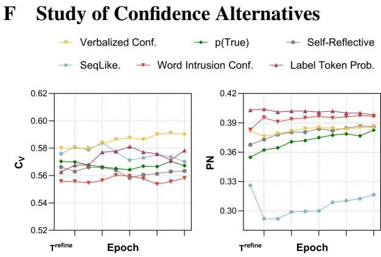  
Figure F1: Learning curves of LLM-ITL (ETM as the base model) with different LLM confidences in terms of topic coherence $( C _ { V } )$ and topic alignment (PN) on 20News. Error bars are omitted for clarity in the figure.

Here, we compare our proposed topic labeling confidence with other LLM confidence alternatives within the LLM-ITL framework. We limit our focus to single-sample approaches, where a single round of LLM inference is performed for a given topic. This ensures they can be efficiently applied within the training of LLM-ITL. We consider the following confidence alternatives to our topic labeling confidence in this study: (1) No Conf., where no LLM confidence estimation is included, and ${ \bf C o n f } ( \pmb { w } _ { k } ^ { l } ) = 1$ in Eq. 10 during the training. (2) Verbalized Confidence (Xiong et al., 2024), which directly asks the LLM for its confidence in solving a problem. The prompt we used for eliciting verbalized confidence is shown in Figure A1. (3) Self-Reflective Confidence (Chen and Mueller, 2024), which prompts the LLM to evaluate its own answer in a two-stage manner. The topic label is obtained in the first stage, and the LLM evaluates this answer in a follow-up question (Figure A2). (4) p(True) (Kadavath et al., 2022), which is similar to self-reflective confidence, but asks a true/false question instead. It takes the token probability of the response as the confidence measure (Figure A2). (5) SeqLike. (Ren et al., 2023), which computes the length-normalized sequence likelihood of the output from the LLM.

From the results in Figure F1, we can observe that while verbalized confidence results in greater improvements in topic coherence, it can bias the topics toward the LLM’s knowledge rather than the input corpus, leading to reduced topic alignment. In contrast, label token probability and word intrusion confidence consistently achieve the best topic alignment performance, indicating a stronger relevance of the topics to the corpus.

## G Study of Hyper-parameters

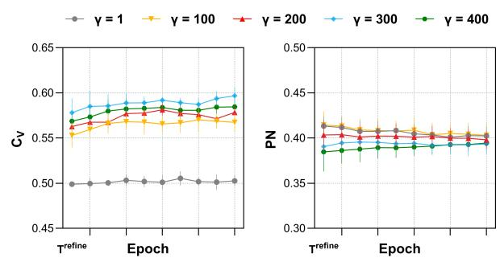

Figure G1: Learning curves of LLM-ITL (ETM as the base model) with different γ in terms of topic coherence $( C _ { V } )$ and topic alignment (PN) on 20News.  
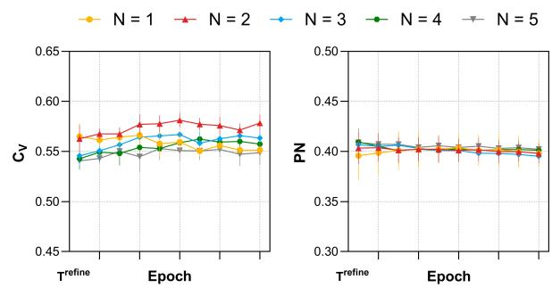  
Figure G2: Learning curves of LLM-ITL (ETM as the base model) with different settings of N (i.e., the number of words in the topic label) in terms of topic coherence $( C _ { V } )$ and topic alignment (PN) on 20News.

Here, we study the hyper-parameter of $\mathrm { L L M \mathrm { - } I T L } ,$ focusing on topic refinement strength $\gamma ,$ and the number of words N used for the topic label.

As for $\gamma ,$ we vary its value from 1 to 400 and plot the learning curves in terms of $C _ { V }$ and PN, as shown in Figure G1. We can observe that: (1) In terms of topic coherence, γ values between 100 and 300 yield similar performance, suggesting low sensitivity to γ within this range. (2) In terms of topic alignment, a higher $\gamma$ leads to slightly reduced performance in the initial phase. This occurs because relying heavily on topic refinement from the LLM causes the topics to bias towards the LLM’s knowledge rather than the information from the input corpus. However, as training progresses, they converge to similar values. These observations suggest that LLM-ITL exhibits low sensitivity to γ within a certain range and offers flexibility in controlling the balance between learning from the corpus and the LLM.

As for N, we vary the number of words for the topic label from 1 to 5 and plot the learning curves in terms of $C _ { V }$ and PN. As illustrated in Figure G2, we can observe that: (1) Using more words as the topic label for LLM-ITL, such as a 5-word topic label (e.g., $N = 5 )$ , results in the least improvement in topic coherence. While using a 2-word topic label (e.g., $N = 2 )$ achieves the best performance in terms of topic coherence. (2) For topic alignment, the number of words in the topic label demonstrates comparable performance, suggesting low sensitivity to N.

<table><tr><td>Prompt</td><td>Success Rate (↑)</td><td>N_Input (↓)</td><td>N_Output (↓)</td><td>Refined TC (↑)</td></tr><tr><td>Origin</td><td>0.978</td><td>224.48</td><td>197.86</td><td>0.554</td></tr><tr><td>Variant_1</td><td>0.967</td><td>228.48</td><td>80.81</td><td>0.512</td></tr><tr><td>Variant_2</td><td>0.935</td><td>269.48</td><td>167.05</td><td>0.498</td></tr><tr><td>Variant_3</td><td>0.980</td><td>223.48</td><td>172.51</td><td>0.537</td></tr><tr><td>Variant_4</td><td>0.972</td><td>189.48</td><td>191.04</td><td>0.562</td></tr><tr><td>Variant_5</td><td>0.956</td><td>208.48</td><td>159.66</td><td>0.543</td></tr><tr><td>Iterative Refinement (Chang et al., 2024)</td><td>0.993</td><td>1872.13</td><td>936.70</td><td>0.478</td></tr></table>

Table H1: Study of prompt variants. The best and second-best performance of each column are highlighted in boldface and underlined, respectively.

## H Study of Prompts

Prompt Variants Here, we study the effectiveness of different prompts for topic suggestion. We obtain variants of topic suggestion prompts in Figure 2 through modifying the technique used in PromptBreeder (Fernando et al., 2024). To be specific, we first create a set of 100 “mutation-prompts” (e.g., “Make a variant of the prompt") and 100 “thinking-styles” (e.g., “Let’s think step by step"). We generate a set of 50 task prompts by concatenating a randomly drawn “mutation-prompt” and a randomly drawn “thinking-style” to the original prompt, and provide that to the Claude $3 . { \bar { 5 } } ^ { \bar { 1 } 0 }$ to produce a continuation, resulting in a different task prompt. Secondly, we randomly select 50 topics over 4 experiment datasets. We run those topics through 50 generated task prompts and filter out the generated prompts that cannot give JSON format in the selected topics or generate above 300 tokens. We are left with 14 topics. We then leverage Claude 3.5 to judge the quality of generated topics and refined topic words. We rank 14 methods by overall topics and refined topic words to get 5 variants of prompts. In addition to the prompt variants generated by those steps, we also investigate the topic refinement prompt used in (Chang et al., 2024) (see Figure 2 of their paper). All the prompt variants for topic refinement in this study are illustrated in Table H2.

Setup We randomly sample 1000 topics learned by topic models, then use different prompts to refine the topics with LLAMA3-8B-Instruct. We analyze the effectiveness of prompts in different aspects, including Success Rate (Ulmer et al., 2024): the proportion of cases where the target answer can be successfully extracted from the LLM’s output; N\_Input and N\_Output (Chang et al., 2024): the average number of tokens of input and output of the LLM; and Refined TC: the average topic coherence scores of the refined topics.

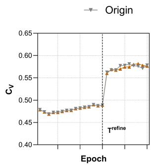

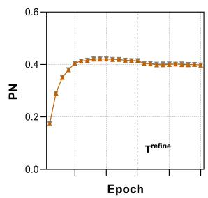  
Figure H1: Learning curves of LLM-ITL (ETM as the base model) with different prompts in terms of $C _ { V }$ and PN on 20News.

Results From the results in Table H1, we observe the following: (1) Through prompt optimization, the effectiveness of the prompt can be further enhanced (e.g., Variant\_4), where the number of tokens (i.e., the cost) is reduced and the refine topics are more coherent. (2) The iterative refinement (Chang et al., 2024) shows less effectiveness in terms of both cost and refined topic coherence compared with our prompt variants when applied to LLAMA3-8B-Instruct.

Based on the above observations, we further investigate the effectiveness of the improved prompt within the LLM-ITL framework. We plot the learning curves of LLM-ITL using the original prompt and its variant (Variant\_4, which shows better performance from Table H1). We observe that the overall performance in terms of both metrics is comparable by using both prompts.

## I Topic Quality Based on Distributed Word Representations

<table><tr><td>Dataset</td><td>Method</td><td>W2V-Cosine (↓)</td><td>W2V-L1 (↓)</td><td>W2V-L2 (↓)</td></tr><tr><td rowspan="3">20News</td><td>ETM</td><td>0.218 ± 0.002</td><td>2.313 ± 0.017</td><td>11.459 ± 0.180</td></tr><tr><td>+ LLM-ITL</td><td>0.177 ± 0.005</td><td>2.128 ± 0.040</td><td>9.650 ± 0.335</td></tr><tr><td></td><td>↑18.8%</td><td>↑8.0%</td><td>↑15.8%</td></tr><tr><td rowspan="3">R8</td><td>ETM</td><td>0.237 ± 0.004</td><td>2.543 ± 0.023</td><td>13.673 ± 0.211</td></tr><tr><td>+ LLM-ITL</td><td>0.180 ± 0.006</td><td>2.245 ± 0.042</td><td>10.855 ± 0.345</td></tr><tr><td></td><td>↑24.1%</td><td>↑11.7%</td><td>↑20.6%</td></tr><tr><td rowspan="3">DBpedia</td><td>ETM</td><td>0.213 ± 0.003</td><td>2.448 ± 0.020</td><td>12.709 ± 0.237</td></tr><tr><td>+ LLM-ITL</td><td>0.163 ± 0.010</td><td>2.119 ± 0.090</td><td>9.633 ± 0.696</td></tr><tr><td></td><td>↑23.5%</td><td>↑13.4%</td><td>↑24.2%</td></tr><tr><td rowspan="3">AGNews</td><td>ETM</td><td>0.203 ± 0.005</td><td>2.419 ± 0.023</td><td>12.382 ± 0.234</td></tr><tr><td>+ LLM-ITL</td><td>0.164 ± 0.004</td><td>2.175 ± 0.035</td><td>10.031 ± 0.241</td></tr><tr><td></td><td>↑19.2%</td><td>↑10.1%</td><td>↑19.0%</td></tr></table>

Table I1: Topic quality in terms of Word2vec metrics.

In this section, we conduct a performance comparison of topic quality using metrics based on distributed word representations (Nikolenko, 2016), which have been shown to align better with human judgment than standard topic coherence metrics.

Specifically, we use the topic quality metrics based on word vectors as implemented by Nikolenko (2016), applying cosine distance (W2V-Cosine), L1 distance (W2V-L1), and L2 distance (W2V-L2), respectively, as the distance functions in the calculation. As shown in Table I1, LLM-ITL consistently improves semantic coherence of topics, as measured by the Word2Vec-based evaluation metrics.

<table><tr><td rowspan=1 colspan=1></td><td rowspan=1 colspan=1>Prompt</td></tr><tr><td rowspan=1 colspan=1>Origin</td><td rowspan=1 colspan=1>Analyze step-by-step and provide the final answer.Step 1. Given a set of words, summarize a topic (avoid using proper nouns as topics) by 2 words that covers most of those words.Note, only the topic, no other explanations.Step 2. Remove irrelevant words about the topic from the given word list. Note, only the removed words, no other explanations.Step 3. Add new relevant words (maximum 10 words) about the topic to the word list up to 10 words. Note, only the added words,no other explanations.Step 4. Provide your answer in json format as $\{ { } ^ {  } \mathrm { T o p i c } ^ { " } \colon { } ^ {  } 2$ Word Topic&gt;&quot;, &quot;Words&quot;: “&lt;Refined 10 Word List&gt;&quot;}. Note, only 10refined words allowed for the topic, and no follow up explanations.</td></tr><tr><td rowspan=1 colspan=1>Variant_1</td><td rowspan=1 colspan=1>Perform the following actions sequentially and provide the final result:Step 1. After examining a set of words, condense a subject (avoid proper nouns) into 2 words that encompass most of those words.(Note: Only the subject, no further elaboration.)Step 2. Eliminate irrelevant words from the given word list based on the subject. (Note: Only the removed words, no furtherelaboration.)Step 3. Add new pertinent words (maximum 10 words) related to the subject to the word list until it reaches 10 words. (Note: Onlythe added words, no further elaboration.)Step 4. Present your response in JSON format as $\{ { } ^ {  } \mathrm { T o p i c } ^ { \prime \prime } \colon { } ^ {  } < 2$ Word Subject&gt;&quot;, &quot;Words&quot;: &quot;&lt;Refined 10 Word List&gt;&quot;}. Note: Only10 refined words are permitted for the subject, and no follow-up explanations.</td></tr><tr><td rowspan=1 colspan=1>Variant_2</td><td rowspan=1 colspan=1>Perform a meticulous examination and furnish the conclusive resolution.Stride 1. Bestowed a catalogue of vocabularies, condense a subject matter (circumvent the employment of proper appellations assubjects) by dual words that envelop the preponderance of those vocabularies. (Heed, solely the subject, devoid of supplementalexplication.)Stride 2. Dislodge irrelevant vocabularies concerning the subject from the granted vocabulary catalogue. (Heed, solely the dislodgedvocabularies, devoid of supplemental explication.)Stride 3. Amalgamate novel applicable vocabularies (maximal 10 vocabularies) concerning the subject to the vocabulary catalogueup to 10 vocabularies. (Heed, solely the amalgamated vocabularies, devoid of supplemental explication.)Stride 4. Tender your resolution in json format as $\{ \mathrm { \cdots } \mathrm { T o p i c } ^ { \cdots } \mathrm { : } ^ { \cdots } < 2$ Word Subject&gt;&quot;, “Words&quot;: “&lt;Refined 10 Word Catalogue&gt;&quot;}.Heed, solely 10 refined vocabularies permitted for the subject, and devoid of successive explication.</td></tr><tr><td rowspan=1 colspan=1>Variant_3</td><td rowspan=1 colspan=1>Step-by-step analysis and final answer:Step 1. Given a set of words, summarize a topic (avoid using proper nouns as topics) by 2 words that covers most of those words.(Note, only the topic, no other explanations.)Step 2. Remove irrelevant words about the topic from the given word list. (Note, only the removed words, no other explanations.)Step 3. Add new relevant words (maximum 10 words) about the topic to the word list, keeping the total word count at 10 words.(Note, only the added words, no other explanations.)Step 4. Provide your answer in JSON format as $\{ { } ^ {  } \mathrm { T o p i c } ^ { " : } < 2$ Word Topic&gt;&quot;, &quot;Words&quot;: “&lt;Refined 10 Word List&gt;&quot;}. Note, only 10refined words allowed for the topic, and no follow-up explanations.</td></tr><tr><td rowspan=1 colspan=1>Variant_4</td><td rowspan=1 colspan=1>Break down the analysis into steps and give the final response.1. Look at a set of words and identify a 2-word topic that sums up most of those words (don&#x27;t use proper nouns as topics, just statethe topic).2. Remove words from the list that don&#x27;t relate to the topic (just list the removed words).3. Add new relevant words about the topic to the list, up to 10 words total (just list the new added words).4. Provide your response in JSON format: $\{ \mathrm { \cdots } \mathrm { T o p i c } ^ { \cdots } \mathrm { : } ^ { \cdots } < 2$ Word Topic&gt;&quot;, &quot;Words&quot;: &quot;&lt;Refined 10 Word List&gt;&quot;}. Only include 10words for the refined list, no explanations.</td></tr><tr><td rowspan=1 colspan=1>Variant_5</td><td rowspan=1 colspan=1>Step-by-step analysis and provide the final answer in JSON format:Step 1: Based on the given set of words, summarize a topic using 2 words that encompass most of those words (avoid proper nouns).Step 2: Remove any irrelevant words from the given word list that do not relate to the summarized topic.Step 3: Add new relevant words (up to 10 words) that are related to the summarized topic.Step 4: Present your answer in the following JSON format: $\{ \mathrm { ^ { * } T o p i c ^ { 3 } } \colon { ^ {  } } 2$ Word Topic&gt;”, &quot;Words&quot;: “&lt;Refined 10 Word List&gt;&quot;},where “Topic&quot; contains the 2-word summarized topic, and “Words&quot; contains the refined list of 10 words related to that topic. Do notprovide any additional explanations.</td></tr><tr><td rowspan=1 colspan=1>IterativeRefine-ment(Changet   al.,2024)</td><td rowspan=1 colspan=1>Please analyze the following tasks and provide your answer in the specified format.1. Determine the common topic shared by these words: [&lt;TOPIC_WORDS &gt;]2. Assess whether the word $\scriptstyle \cdots < \mathrm { W O R D > } ^ { \prime \prime }$ aligns with the same common topic as the words listed above.Respond with:- “Yes&quot;, if the given word shares the common topic. $- \mathrm { I f } \ ^ { \cdots } \mathrm { N o } ^ { \cdots }$ , suggest 10 single-word alternatives that are commonly used and closely related to this topic. These words should be easilyrecognizable and distinct from the ones in the provided list.Format your response in JSON, including the fields “Topic&quot;, “Answer&quot;, and “Alternative words&quot; (only if the answer is “No&quot;).</td></tr></table>

Table H2: Prompt variants for topic refinement