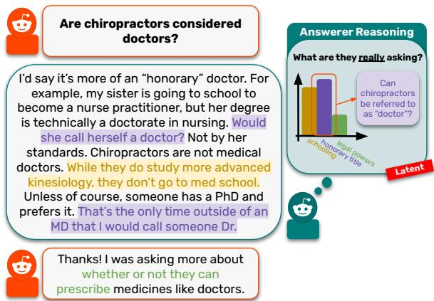
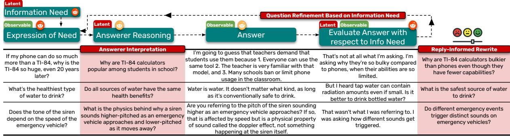
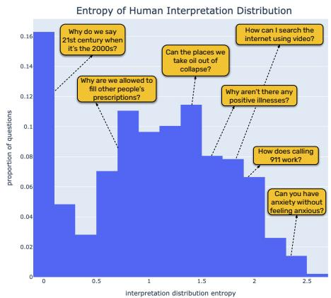
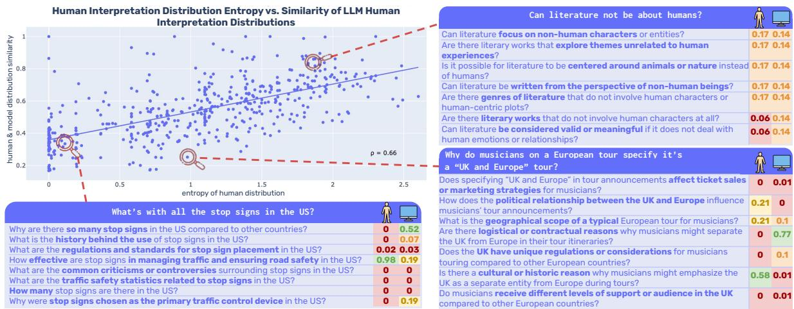
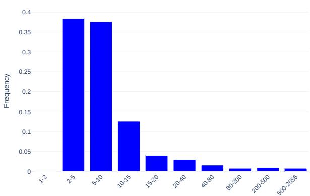
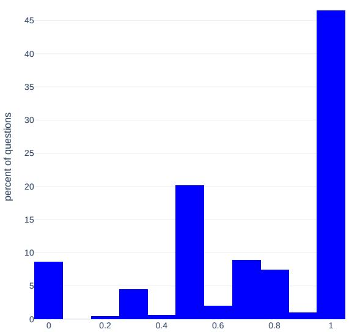
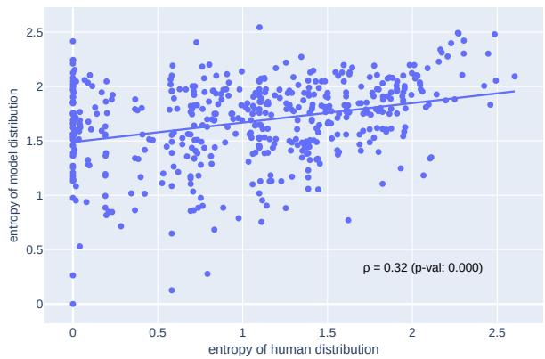
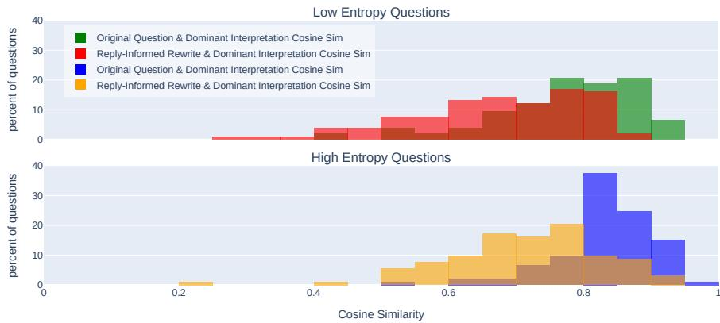

# No Questions are Stupid, but some are Poorly Posed: Understanding Poorly-Posed Information-Seeking Questions

Neha Srikanth University of Maryland nehasrik@umd.edu

Rachel Rudinger University of Maryland rudinger@umd.edu

Jordan Boyd-Graber University of Maryland jbg@.umiacs.umd.edu

## Abstract

Questions help unlock information to satisfy users’ information needs. However, when the question is poorly posed, answerers (whether human or computer) may struggle to answer the question in a way that satisfies the asker, despite possibly knowing everything necessary to address the asker’s latent information need. Using Reddit question-answer interactions from r/NoStupidQuestions, we develop a computational framework grounded in linguistic theory to study poorly-posedness of questions by generating spaces of potential interpretations of questions and computing distributions over these spaces based on interpretations chosen by both human answerers in the Reddit question thread, as well as by a suite of large language models. Both humans and models struggle to converge on dominant interpretations when faced with poorly posed questions, but employ different strategies: humans focus on specific interpretations through question negotiation, while models attempt comprehensive coverage by addressing many interpretations simultaneously.

## 1 Introduction

When an AI system is presented with a question by a user, it has an onus to answer. Sometimes, when information-seeking users know little about the topic they are asking about, the questions they present to the system are flawed. For example, the question “How many universities are located in Cambridge?” presents an ambiguity, as Cambridge, USA and Cambridge, England are both valid interpretations of the entity Cambridge in the question (Min et al., 2020; Stelmakh et al., 2022). Questions may also be flawed due to false presuppositions, as in the question “Who is the king of France?” (Kim et al., 2021; Yu et al., 2023). Ambiguity, false presupposition, and other such phenomena in questions are not new issues in NLP research (Section 7). However, rather than approaching each failure mode of questions independently, we provide a theoretical foundation to understand how imperfect questions are answered by humans and machines alike.

  
Figure 1: An interaction involving a poorly-posed question. After reasoning about the intent of the question, the answerer addresses two possible interpretations, but their answer did not satisfy the asker’s information need.

Consider the interaction in Figure 1, taken from the Reddit community r/NoStupidQuestions. The asker (in orange) asks “Are chiropractors considered doctors” in an attempt to articulate an information need. This need may have arisen from a variety of situations: perhaps the asker wants to know whether they should refer to their chiropractor as “Dr.” or maybe they are wondering if chiropractors undergo similar training as doctors. However, as written, it is difficult to identify the asker’s particular information need (Taylor, 1962), and in turn, determine the resolution conditions (Ciardelli et al., 2021) of their question. The space of interpretations of their question includes those about chiropractor schooling, title, or legal powers as compared to doctors, among others.

Humans often reason about the intent of conversational participants to smooth communication with others (Grice, 1975). When a hearer successfully reconstructs a speaker’s intent and responds appropriately, the communication can be considered as successful (Haugh, 2008). In question answering, this can include reasoning about why a speaker posed a question or reasoning about probable interpretations of a question. As pictured in Figure 1, the answerer tries to reason about the asker’s information need, ultimately selecting an interpretation and answering it, but as pictured, their chosen interpretation does not align with the asker’s original need.

This interaction highlights the central concern of this work: what makes a particular expression of an information need poorly posed? How do humans fare when reconstructing information needs of askers from questions, and how does their behavior differ from model behavior on such questions?

We begin by providing theoretical structure to poorly-posed questions (§2) based on the linguistic theory of inquisitive semantics (Ciardelli et al., 2021), defining a poorly-posed question as one where—despite engaging in pragmatic reasoning— answerers cannot determine the asker’s information need, struggling to identify a probable interpretation. We collect questions1 from the Reddit community r/NoStupidQuestions, focusing on QA interactions consisting of a question, answer, and a reply to the answer containing feedback on whether their information need was met (§3). Expert linguists annotate these interactions to identify interpretations chosen by answerers. We generate spaces of possible interpretations (§4) over which we induce a distribution representing the interpretations chosen by answerers (§5), and use this distribution to identify when a question is poorly posed. Lastly, we compare human and model behavior when answering poorly-posed questions (§6), studying cases when they converge or diverge on interpretations. We find that while humans adopt a precision-oriented strategy, engaging in question negotiation when answering poorly posed questions, models are recall-oriented.

## 2 What makes a question poorly posed?

Cooperative communication between humans hinges on our ability to draw inferences from the utterances of our conversational partners to identify their underlying intention or goal (Goodman and Frank, 2016). The space of possible interpretations or inferences one may draw from an utterance is not only large, but depends on conversational and contextual factors. Humans effortlessly engage in such reasoning processes daily. However, interactions may go awry when they cannot draw intended inferences or correctly identify a speaker’s intended interpretation.

When answerers’ attempts to answer a question cannot easily identify the intended interpretation, this may signal a poorly posed question. We describe our theoretical framework for analyzing questions, drawing on foundational work from information retrieval and theoretical linguistics to present our definition of a poorly posed information-seeking question.

The Process of Asking a Question. When someone wants to know something (an information need), they often ask a question. At times, this latent information need becomes distorted or muddled as the asker translates it into a question directed at another human or a QA system. Taylor (1962) formalizes this by describing four distinct stages of question formulation. Users start with an unexpressed need (the visceral need) for information, arising from some dissatisfaction. As they progress towards expressing this need, they may identify a description—possibly nebulous—of their dissatisfaction (the conscious need), but such a description may be rife with issues since they do not know much about what they are asking about. The user may continue to formalize their need as a question, ideally a more careful, clearer formulation with less ambiguity (theformalized need). Lastly, they may reformulate their question in the previous stage, taking into account whom it will be asked of (the compromised need): for example, if asking a search engine like Google, they may distill their question into keywords.

In practice, users may decide to ask their question to a QA system or a human at any point throughout this process. The burden then falls on agents answering the question to reconstruct the asker’s latent information need to provide a helpful answer. This is easy when the user has the appropriate knowledge to formulate their question and interpret a response (Miyake and Norman, 1979). In other cases, this reconstruction can prove difficult, and the answerer may fail to reconstruct the asker’s information need. We consider a question poorly posed if, even after an answerer’s additional reasoning, they are unable to identify, and in turn address, the asker’s visceral or conscious information need. This reasoning could involve computing a distribution over interpretations of the question (§5) or identifying and correcting false presuppositions (Yu et al., 2023).

Question Semantics. Another way to characterize a poorly posed question is using resolution conditions (Ciardelli et al., 2021). Classical accounts of semantics derive the meaning of statements by truth conditions (Heim and Kratzer, 1998). The semantic content of a sentence, or its proposition, represents the set of all worlds where the statement is true. However, it is difficult to analyze questions using these accounts, since questions are inquiring about the state of the world.

The framework of inquisitive semantics (Ciardelli, 2018) argues that question understanding is predicated on knowing what information is needed to resolve it (Ciardelli, 2017). An information state s, or a set of possible worlds that are compatible with the information s encodes, supports a question Q if the information in s resolves Q. Analogous to a proposition expressed by a statement, the issue expressed by a question is the set of information states that support it. We draw on this framework to help define a poorly-posed question.

A question may be poorly posed if, as phrased, it is impossible to identify what information is needed to resolve it. Note that this does not commit to the content of the information.2 For example, consider the question “Can literature not be about humans?” There are many different interpretations of this question, each with different supporting information states, or sets of worlds where information holds true that would resolve the question, as in the two example interpretations below:

[Interpretation 1: “What is the criteria for a piece of text to be considered “literature” in the colloquial sense?”] Some example information states that may satisfy this interpretation include: (s ) The set of worlds in which literature is defined by its artistic quality. A piece of text is considered “literature” if it demonstrates creativity, aesthetic, value, and artistic merit. (s2) The set of worlds in which literature is defined by cultural or historical significance. (s ) The set of worlds in which literature is defined by its ability to provoke thought or evoke emotion.

[Interpretation 2: “ Can central characters in literature be non-human, such as animals?”] Some example information states that may satisfy this interpretation include: (s1) TThe set of worlds in which all central characters in literature must be human. (s2) The set of worlds in which non-human central characters are allowed, but only if they are anthropomorphized. (s3) The set of worlds in which central characters in literature can be non-human, but only in specific genres.

An answer to the original question may include information encoded by any of the states described above, and it is not necessary to know the answer to the question to identify which information states will resolve it. However, we cannot clearly identify which information states resolve this original question, since there are many interpretations of the original question, a defining characteristic of poorly-posed questions.

Definition. Drawing on the groundwork above, we consider a question poorly posed if, even after an answerer engages in pragmatic reasoning (Grice, 1975) about an asker’s information need, they cannot identify a dominant interpretation of the question. This is not only a function of the asker’s utterance alone, but a combination of their underlying information need and their chosen utterance. It is not the presence of required reasoning by an answerer that makes a question poorly-posed, but rather that reasoning does not bias an answerer towards a particular set of resolution conditions.

## 3 Collecting Poorly-Posed Questions

Many QA datasets are collections of questions paired with gold answers (Rogers et al., 2023; Rodriguez and Boyd-Graber, 2021). From these pairs alone, it is not only difficult to understand the reasoning answerers engaged in when answering a question, but also whether the answer satisfied the original asker’s information need, a crucial part of improving QA: understanding what types of question interpretations, answerer reasoning, and dialog moves satisfy asker information needs can help inform QA systems faced with poorly-posed information-seeking questions.

We construct a dataset of information-seeking interactions between Reddit3 users, and introduce an annotation scheme designed to capture the latent reasoning answerers perform when answering a question. Our final dataset contains 500 questions annotated by expert linguists.

## 3.1 Question Selection

To maximize the ecological validity of our study, the questions we choose reflect organic instances of information-seeking interactions. We source our dataset from r/NoStupidQuestions, a popular Subreddit where users ask questions about any topic at any level, even if their questions are not fully formed (Appendix B). As such, these questions span all stages of the asking process (Figure 2). Unlike factoid QA datasets such as Natural Questions (Kwiatkowski et al., 2019), questions in r/NoStupidQuestions are complex and openended, requiring long-form answers (Fan et al., 2019) with background information, examples, anecdotes, or analogies.

  
Figure 2: Example interactions through the question life cycle. Askers express latent information needs through questions to answerers who reason about those needs when answering. Askers then evaluate the answer with respect to their original information need, refine their question, and proceed through the cycle again. We intervene to collect answerer interpretations (Stage 1) and reply-informed rewrites (Stage 2) to study this cycle.

After filtering posts using a set of heuristics (Appendix C), we leverage the thread structure of Reddit by identifying interactions, or tuples of (question, answer, reply) where (1) a question (Q) is a post by a user to r/NoStupidQuestions; (2) an answer (A) is an individual top-level comment responding to the post which contains an answer to the question; and (3) a reply (R) is a comment from the original asker addressing answer. Collecting these interactions helps determine whether an answerer correctly interpreted the original question, as well as a more refined formulation of the asker’s original information need.

Question authors may confirm their need was met (That’s exactly what I was looking for!), not met (“That was not what I meant”), or provide no useful feedback (e.g reacting to a joke). To identify when askers do convey direct feedback, we elicit few-shot judgments from llama-3-8b-instruct (Dubey et al., 2024) on replies (R). For each reply R on posts that survived filtering, the model performs a three-way classification: (1) R indicates that an information need was met, (2) not met , or (3) not determinable.

We identify the subset of 142,878 comments from filtered posts containing Rs (just 7% of all comments), and elicit judgments with Prompt C.1 on Rs using eighteen manually selected in-context examples split evenly across the three labels. The majority of Rs lack clear feedback: only 11.9% as indicate an information need was met and 9.4% indicate a need was not met. These judgments surface higher quality data that we then ask expert linguists to annotate.

## 3.2 Annotating QA Interactions

One of our primary goals is to analyze the relationship between an asker’s question Q and their underlying information need. Their reply R to an answer A gives us additional insight into their original need by correcting certain assumptions made by an answer, including feedback on the particular interpretation chosen by an answerer. We recruit seven expert linguists from Upwork4 to annotate 500 (Q, A, R) interactions, separating them into two groups for two stages of annotation.

Sampling Instances for Annotation. Using the judgments we elicited from llama-3-8b-instruct on asker replies (§3.1), we sample 400 (Q, A, R) interactions with an unmet information need and 100 interactions of a satisfied information need. Annotating both types of interactions allows us to study why questions lead to satisfactory or dissatisfactory answers.

Stage 1: Reconstructing Answerer Interpretations. Answerers make inferences about what askers are intending to ask or what askers are assuming. They then answer according to their interpretation of the asker’s question. Sometimes this interpretation is close to what the asker intended, and sometimes it is not. For example, the vague question asked in Row 1 of Figure 2 about why TI-84 calculators are so “huge” (Column 1) was interpreted by the answerer (Column 3) to mean “popular”. The first group (four annotators) reconstruct the interpretation answered in A (Column 2, Figure 2) from only Q and A (not R), with the option to indicate no change if there was strong alignment between the original question and the answerer’s interpretation of the question. They do not select from generated interpretations, but write from scratch to remain unbiased (full annotator instructions in Appendix D). Two annotators annotate each example.

Stage 2: Reply-Informed Question Reformulation Next, the second group of three annotators use all three components of the interaction $( Q , A , R )$ to rewrite Q to capture the intent or additional information expressed in R (Column 4, Figure 2) when R indicated an unmet information need (Column 5). Replies help us understand whether the interpretations adopted by answerers that annotators identify in Stage 1 matched the asker’s original information need. In the interaction in Row 1 of Figure 2, we learn from their reply (Column 4) that by “huge”, the asker wanted to understand why TI-84 calculators are so bulky, instead of “popular” as interpreted in A (Column 3). Annotators were instructed to eliminate any ambiguity, underspecificity, or vagueness in the original question. In some cases, annotator rewrites based on the asker reply were not answerable by the answer provided, since, in many cases, the answerer answered a different question than what the original poster intended. Again, two annotators annotate each example.

## 4 Question Interpretations

Poorly-posed questions often prevent answerers— despite reasoning about the asker’s intent—from reliably identifying a dominant interpretation (or set of interpretations) to address, making it difficult to satisfy the user’s needs. If many answerers attempt to determine the resolution conditions of the question, but arrive at different interpretations, this may signal that the asker’s information need was unclear. Conversely, answers converging on a particular interpretation en masse may indicate that a user’s information need was easily recoverable. Identifying likely interpretations of a question is the first step in building a distribution of which interpretations answerers choose.

We generate potential interpretations I of questions, or fine-grained natural language questions that capture a particular facet of the question. By definition, they must be free of ambiguity, vague, or underspecified language and their resolution conditions must be easily identifiable.5 These interpretations $I _ { 1 } . . . I _ { n }$ form a space $( S _ { I } )$ of valid interpretations of the question representing the range of plausible meanings that reasonable answerers might derive from the original question.

Interpretation Generation. We prompt gpt-4o and gemma-9b to generate interpretations for each original question.6 Models are only provided the question with no other context and are instructed to generate a variable number of interpretations in a zero-shot manner using Prompt D.1. Using models of different sizes and capacities allows for a wider range of interpretations that better cover the space.

Deduplicating Interpretations. Generated interpretations may be overlapping. For example, “Why don’t cashiers sit in chairs when they perform their $j o b \zeta ^ { \prime \prime }$ overlaps with the interpretation “Why do cashiers perform theirjob standing?”, since they share a subset of resolution conditions (§2). We deduplicate the set union of generated interpretations to form a set of unique interpretations, or the “space” of interpretations $( S _ { I } )$ we consider for each question (Table 2) for use downstream. To deduplicate generated interpretations, we embed each I using NV-Embed-7B (Lee et al., 2024) and then compute pairwise cosine similarity between all interpretations (Instruction D.2). We then construct a graph G where nodes are generated interpretations $I _ { 1 } . . . I _ { n }$ and edges $e ( I _ { i } , I _ { j } )$ are drawn between interpretations with cosine similarity above $\theta = 0 . 8 5$ Maximal cliques of G (Tomita et al., 2006) then contain sets of highly similar or equivalent interpretations. We select clique representatives by choosing the interpretation least similar to other members, and together, these representatives form $S _ { I }$ . If an interpretation I is a member of multiple cliques, we assign it exclusively to its “strongest” clique by way of average similarity of clique nodes.

Validating Interpretations. To assess the soundness of interpretations, we randomly sample 100 $( Q , I _ { n } )$ pairs, and ask two external annotators to judge whether or not $I _ { n }$ reasonably follows from question $Q . ^ { 7 }$ Annotators judge 76% of interpretations as sound, with a Cohen’s Kappa of $\kappa = 0 . 7$

To assess coverage and alignment with humangenerated interpretations, we ask a team of six undergraduate Quiz Bowl players8 to collaboratively enumerate interpretations on a random sample of 30 questions. Then, an author manually matched student-written interpretations with model-generated interpretations. On average, 78% of human-written interpretations were present in the generated interpretation space per question. Qualitatively, human interpretations tended to use less precise language than model-generated interpretations, sometimes propagating issues from original questions (Appendix E). Models include a higher number of interpretations per question, typically a superset of human interpretations. We elect to use model interpretations for replicability, scalability, and higher coverage.

## 5 Identifying Poorly-Posed Questions from Question-Answer Threads

Section 2 defines poorly-posed questions as those where answerers struggle to identify the asker’s information need despite attempting to reason about their intent. We operationalize this computationally by analyzing many answerers’ responses to each question in our dataset. We identify which interpretation(s) from $S _ { I }$ each top-level commenter adopts on the question’s Reddit post and examine the distribution of chosen interpretations. Convergence on one or few interpretations suggests a well-posed question, while high disagreement indicates poor posedness—answerers cannot reliably recover the asker’s intended information need.

## 5.1 Measuring Poorly-Posedness from Interpretation Distributions

Interpretation Matching. An answer A (here, a comment) adopts interpretation I if it contains the information necessary to answer I. Since it is impossible to obtain ground truth on an answerer’s chosen interpretation, this approximates their reasoning about what to address in their answer. This formulation also allows for an answer to match with multiple interpretations if it contains information addressing more than one.

We use an extractive QA setup to match answers with interpretations. For each comment A in the question’s corresponding Reddit thread, we consider each I in the interpretation space $S _ { I }$ , instructing a model to extract a span from the comment that supports I. If it cannot find a supporting span addressing a particular interpretation, the model is instructed to abstain from answering. We use three in-context examples along with Instruction D.3 to match interpretations to human comments using flan-t5-xxl (Chung et al., 2024). Using a relatively weaker QA model ensures fewer false positives when direct evidence is not present in an answer to support an interpretation.

We validate this matching by sampling 100 (I, A, span) judgments and judging whether the span identified by the model indeed supported I. 87% of the judgments from flan-t5-xxl were valid as annotated by an author, with a Cohen’s Kappa of $k = 0 . 8 2$ with an external annotator.

Computing a Distribution over Interpretations. Using this method, we construct an interpretationcomment matrix M for each question’s Reddit thread, where row i represents the ith interpretation in $S _ { I } ,$ , column j represents a top-level comment, and entry $( i , j )$ is 1 if the model determines comment $j$ supports interpretation i and 0 otherwise. To represent consensus, we multiply column j by the number of upvotes comment j receives, ensuring widely chosen interpretations are well-represented.9 We construct the chosen interpretation distribution by summing along rows in M to compute each interpretation’s net support across all comments and applying softmax, resulting in a distribution that approximates chosen answerer interpretations across $S _ { I }$

Measuring Poorly-Posedness. In line with our definition and intuition from §2, we want to compute a scalar score from these distributions in a way that assigns a low score when most of the mass is concentrated around a small number of interpretations (ideally one), indicating well-posedness, and a high score when that mass is more diffused (poorly-posedness). While there are many potential functions to achieve this, we choose to compute the entropy (Shannon, 1948) of the distribution, which approximates how uncertain humans were in identifying the question asker’s information need. Low entropy indicates a dominant interpretation that humans chose to address in an answer, while high entropy signals difficulty in deciding the original question’s resolution conditions, indicating a poorly-posed question.

  
Figure 3: Entropy of human interpretation distributions. High entropy indicates a question is poorly posed.

To validate that this method meaningfully approximates poorly-posedness, we select the fifty questions with the lowest entropy interpretation distributions (LOW-ENTROPY) and the fifty questions with the highest entropy (HIGH-ENTROPY). Two native English speakers score each interpretation I in $S _ { I }$ on a 1–5 scale indicating the likelihood that I aligns with the question asker’s information need This study controls for platform-specific factors that may influence inducing an interpretation distribution from comments in a thread.10 Annotators received only the question and $S _ { I }$ , the interpretation space. Their judgments are positively correlated (Spearman’s $\rho = 0 . 5 7 )$

For each question, we apply softmax to the distribution of annotator scores for all interpretations and compute its entropy (Appendix F). A twosample t-test on the difference of mean entropy of annotator distributions between THREAD-LOW-ENTROPY and THREAD-HIGH-ENTROPY reveals that THREAD-HIGH-ENTROPY has higher mean entropy than THREAD-LOW-ENTROPY for both annotators $\mathbf { ( p < 0 . 0 0 1 ) }$ . These results validate our computational approach for estimating poorlyposedness using the distribution of chosen interpretations of human answers in the Reddit thread.

## 5.2 Asker Replies and Poorly-Posed Questions

Aside from studying aggregate interpretation distributions from threads (constructed only from questions Q and sets of answers A), we also explore the relationship between asker replies R and questions identified as poorly posed by our method, specifically analyzing cases where askers indicate that their information need was met on high entropy (poorly-posed) questions.

Asker replies are more likely when questions are poorly posed. There is a statistically significant positive Pearson correlation $( \rho = 0 . 4 4 $ $p < 0 . 0 0 0 1 )$ between the entropy of the thread interpretation distribution and the proportion of comments that receive asker feedback. This indicates that question askers are likely early in the question asking process (Figure 2) and are attempting to define their conscious or formalized information need by engaging with answerers.

Asker replies are more likely to be positive when the question is poorly posed. Questions with entropy greater than one standard deviation above the mean entropy of all questions in our dataset have a greater likelihood of replying indicating that their information need was met than in questions with entropy less than one standard deviation below the mean. In these cases, answers are more packed with more information or reveal interesting information that the asker had not considered. For example, an answer to the question “What is the resting position of the tongue?” related it to the native language of a speaker, an interpretation that the asker had not considered nor was included in our generated interpretation space $S _ { I }$

Non-dominant interpretations are more likely to receive positive asker replies when the question is poorly-posed. Overall, when a comment A has a reply $R ,$ it is more likely to support a nondominant interpretation (Figure 6)—interpretations with lower likelihood in the softmax distribution. When entropy is high (greater than one standard deviation from the mean), asker replies to comments addressing non-dominant interpretations are 11% more likely to signal the satisfaction of an information need than in questions with low entropy (lower than one standard deviation from the mean), indicating that answerers strayed from popular interpretations and likely deeply reasoned to arrive at a lower-likelihood interpretation.

  
Figure 4: Entropy of human interpretation distributions plotted against the similarity of human and model interpretation distributions (1 - Jensen-Shannon distance). Humans and models struggle to converge on interpretations for poorly-posed questions with high entropy. Example callouts include both interpretation distributions.

Reply-informed rewrites are semantically further away from dominant interpretations than original questions. Refined questions based on asker replies R are always semantically further away from dominant interpretations than original questions were, as measured by similarity of embeddings produced by NV-Embed-2 (Figure 8). Interestingly, the reply-informed rewrite remains closer to the dominant interpretation in poorly posed questions than in other questions, underscoring the influence of answerers when users are still defining their exact information need.11

## 6 Contrasting Human and Machine Answers

Comparing human and model behavior in response to poorly-posed questions can help identify opportunities for improved alignment and inform the design of benchmarks that include poorly-posed questions. We experiment with computing distributions over interpretations chosen by a suite of LLMs on questions in our dataset to study divergences in crowdsourced human and model interpretations.

Experimental Setup. We include 12 instructiontuned models of various sizes and configurations, including proprietary and open source models: 2B and 9B gemma-2-instruct (Team et al., 2024),

8B and 70B llama-3-instruct (Dubey et al., 2024), 2B and 8B granite-3.0-instruct (Granite Team, 2024), phi-3.5-mini-instruct and Phi-3-medium-128k-instruct (Abdin et al., 2024), ministral-8b-instruct-2410 (Mistral AI, 2024), athene-v2-chat (Nexus-Flow, 2024), gpt-4o-mini-2024-07-18, and gpt-4o-2024-08-06 (OpenAI, 2024). Models are prompted to respond in five sentences or less (Prompt D.4) in a zero-shot setup with greedy decoding, indirectly forcing them to adopt their likely interpretations instead of hedging or providing a deluge of information. We do not judge accuracy of answers since we decouple question interpretation from question answering.

We construct an interpretation-model answer matrix M by using the same interpretation matching method used for human comments (§5) and compute a model interpretation distribution by summing across rows in M and applying softmax.

Models, like humans, produce high entropy interpretation distributions on poorly-posed questions. We plot human interpretation distribution entropy (capturing question poorly-posedness) against human-model $( h _ { i }$ and $m _ { i } ,$ respectively) distribution similarity (Figure 4) as measured by $1 - d ( h _ { i } , m _ { i } )$ where d is the Jensen-Shannon distance between $m _ { i }$ and $h _ { i }$ . When questions were poorly posed (high human entropy), model answers were also distributed across the interpretation space $S _ { I }$ (e.g. Can literature not be about humans?). This high entropy pattern can flag questions in benchmarks where models or humans fail to converge on interpretations, indicating poor posedness.

<table><tr><td></td><td>% of space addressed</td></tr><tr><td>granite-2b-instruct</td><td>75.24</td></tr><tr><td>granite-8b-instruct</td><td>75.4</td></tr><tr><td> $\mathsf { P h i - 3 - m e d i u m - } 1 2 8 \mathsf { k - i n s t r u c t }$ </td><td>75.42</td></tr><tr><td>gemma-2-2b-it</td><td>75.69</td></tr><tr><td>Meta-Llama-3-8B-Instruct</td><td>75.8</td></tr><tr><td>Ministral-8B-Instruct-2410</td><td>77.11</td></tr><tr><td>Phi-35-mini-instruct</td><td>77.43</td></tr><tr><td>Meta-Llama-3-70B-Instruct</td><td>77.96</td></tr><tr><td>gemma-2-9b-it</td><td>79.02</td></tr><tr><td>gpt-4o-2024-08-06</td><td>79.31</td></tr><tr><td>Athene-V2-Chat-70B</td><td>79.47</td></tr><tr><td> $\mathbf { g } \mathbf { p } \mathbf { t } - 4 0 \mathbf { - } \mathbf { m } \mathbf { i } \mathbf { n } \mathbf { i } - 2 0 2 4 \mathbf { - } \theta 7 \mathbf { - } 1 \mathbf { 8 }$ </td><td>79.64</td></tr></table>

Table 1: Models take a recall-oriented approach to questions, addressing significant portions of the interpretation space in a single answer.

When they do converge, models and humans converge on different interpretations. The entropy of human interpretation distributions is correlated with model interpretation distributions (Figure 7). However, when humans converge, models tend to either converge on a different interpretation (Figure 4, lower left) or remain spread out over interpretations. When answering questions, humans reason about the intent, goal, or reason behind the question, ultimately affecting which interpretations they may choose to address. For example, the dominant selected interpretation of “Why can’t I get drunk?” by humans was “Am I consuming alcohol in a way that does not lead to intoxication?”, while models addressed interpretations related to the legal drinking age or medications that may interact with alcohol. It is unclear that models holistically consider the reason behind a question during QA to bias their response towards likely interpretations. Future multiturn QA datasets that include asker feedback on their information need may help produce well-aligned systems that engage in question negotiation to better pinpoint user need.

Models are recall-oriented answerers. In 84% of questions, the set of interpretations addressed by all models was a superset of those addressed by all humans. Investigating further, we compute the average proportion of the interpretation space $S _ { I }$ addressed by each model’s responses across all questions in our dataset (Table 1): specifically, for each question, we divide the number of interpretations by each model adopted by $\vert S _ { I } \vert$ to understand how comprehensive an average model answer is. gpt-4o-mini narrowly emerged as the model addressing the largest portion of $S _ { I }$ for questions (Table 1). We compute this metric for human answer threads as well to compare whether humans or models tend to address more interpretations per individual response. On average, individual human answerers addressed 44% of the interpretation space in an answer, while models addressed 77%. In doing so, models do tend to include at least some information targeting the dominant interpretation converged on by humans, but are “recalloriented” with respect to the interpretation space, because they simply address a higher proportion of the space in an answer, in an attempt to satisfy the asker. This may be an artifact of human-AI alignment techniques that are based on human satisfaction with an answer.

## 7 Related Work

Many studies focus on a specific failure mode of questions, such as ambiguity (Min et al., 2020; Stelmakh et al., 2022; Cole et al., 2023; Piryani et al., 2024) or false presupposition (Yu et al., 2023; Kim et al., 2021, 2023; Hu et al., 2023; Kaur et al., 2024). Others study unanswerable questions with respect to a document (Zhao et al., 2024; Rajpurkar et al., 2018). While our dataset contains questions presenting issues studied in these works, we present a unified definition of poorly-posed questions, abstracting away specific failure modes and focusing on information need.

Pragmatic reasoning in QA is a relatively understudied area. Some study reasoning about speaker intent by constraining the domain (Wahlster et al., 1983) such that speakers share all referents (Fried et al., 2017). Qi et al. (2023) collect a dataset involving reasoning about speaker intent during QA, but their dataset simulates information-seeking interactions. In contrast, we study naturallyoccurring interactions where users themselves are in the processing of defining questions for greater ecological validity (De Vries et al., 2020).

## 8 Conclusion

Questions are not perfect. The tools developed in this paper help diagnose imperfect evaluations both during dataset curation and ex post facto. The contributions of this paper help detect problems that make questions less than perfect. Making the discourse moves that can lead to satisfying resolutions can make our interactions with AI more natural and successful while also improving our understanding of the subtle give and take two interlocutors engage in when answering an imperfect question.

## Acknowledgments

We thank the anonymous reviewers as well as the members of the University of Maryland CLIP lab for their thoughtful feedback. We also thank our annotators: expert linguists from Upwork, as well as Maya Srikanth and Rupak Sarkar. This work was supported by NIH Award No. R01MD016037 (Srikanth and Boyd-Graber) and NSF CAREER Award No. 2339746 (Rudinger). The content is solely the responsibility of the authors and does not necessarily represent the official views of the National Institutes of Health or the National Science Foundation. The funders had no role in study design, data collection and analysis, decision to publish, or preparation of the paper.

## Limitations

This work studies QA interactions Reddit, an online community forum. We induce distributions of human interpretations to better understand how human answerers deal with poorly-posed questions. Unlike studies that simulate such interactions, we do not have access to the reasoning conducted by original askers or answerers, using their text to derive signal retrospectively.

We also do not use the post body of Reddit posts as additional context in our experiments. Some posts have no text in their body and some have large paragraphs. To ensure a level playing field across all questions, we opt not to use the added context in posts where it is available. Future work may consider ways to incorporate the body of the post to bias the interpretation space generation or selection of likely dominant interpretations by humans.

## References

Marah Abdin, Jyoti Aneja, Hany Awadalla, Ahmed Awadallah, Ammar Ahmad Awan, Nguyen Bach, Amit Bahree, Arash Bakhtiari, Jianmin Bao, Harkirat Behl, et al. 2024. Phi-3 technical report: A highly capable language model locally on your phone. arXiv preprint arXiv:2404.14219.

Tuhin Chakrabarty, Justin Lewis, and Smaranda Muresan. 2022. CONSISTENT: Open-ended question generation from news articles. In Findings of the Association for Computational Linguistics: EMNLP 2022, pages 6954–6968, Abu Dhabi, United Arab Emirates. Association for Computational Linguistics.

Hyung Won Chung, Le Hou, Shayne Longpre, Barret Zoph, Yi Tay, William Fedus, Yunxuan Li, Xuezhi Wang, Mostafa Dehghani, Siddhartha Brahma, et al.

2024. Scaling instruction-finetuned language models. Journal ofMachine Learning Research, 25(70):1–53.

Ivano Ciardelli. 2017. Question meaning= resolution conditions. Logic and Logical Philosophy, (3):383– 416.

Ivano Ciardelli. 2018. Inquisitive semantics.

Ivano Ciardelli et al. 2021. Why we need a question semantics. Asking and Answering: Rivalling Approaches to Interrogative Methods. Tübingen, pages 15–47.

Jeremy R Cole, Michael JQ Zhang, Daniel Gillick, Julian Martin Eisenschlos, Bhuwan Dhingra, and Jacob Eisenstein. 2023. Selectively answering ambiguous questions. arXiv preprint arXiv:2305.14613.

Harm De Vries, Dzmitry Bahdanau, and Christopher Manning. 2020. Towards ecologically valid research on language user interfaces. arXiv preprint arXiv:2007.14435.

Abhimanyu Dubey, Abhinav Jauhri, Abhinav Pandey, Abhishek Kadian, Ahmad Al-Dahle, Aiesha Letman, Akhil Mathur, Alan Schelten, Amy Yang, Angela Fan, et al. 2024. The llama 3 herd of models. arXiv preprint arXiv:2407.21783.

Angela Fan, Yacine Jernite, Ethan Perez, David Grangier, Jason Weston, and Michael Auli. 2019. Eli5: Long form question answering. arXiv preprint arXiv:1907.09190.

Daniel Fried, Jacob Andreas, and Dan Klein. 2017. Unified pragmatic models for generating and following instructions. arXiv preprint arXiv:1711.04987.

Noah D Goodman and Michael C Frank. 2016. Pragmatic language interpretation as probabilistic inference. Trends in cognitive sciences, 20(11):818–829.

IBM Granite Team. 2024. Granite 3.0 language models.

Herbert Paul Grice. 1975. Logic and conversation. Syntax and semantics, 3:43–58.

Michael Haugh. 2008. Intention in pragmatics.

Irene Heim and Angelika Kratzer. 1998. Semantics in generative grammar.

Shengding Hu, Yifan Luo, Huadong Wang, Xingyi Cheng, Zhiyuan Liu, and Maosong Sun. 2023. Won’t get fooled again: Answering questions with false premises. In Proceedings of the 61st Annual Meeting of the Association for Computational Linguistics (Volume 1: Long Papers), pages 5626–5643, Toronto, Canada. Association for Computational Linguistics.

Ken Jennings. 2006. Brainiac: adventures in the curious, competitive, compulsive world of trivia buffs. Villard.

Navreet Kaur, Monojit Choudhury, and Danish Pruthi. 2024. Evaluating large language models for healthrelated queries with presuppositions. In Findings of the Associationfor Computational Linguistics: ACL 2024, pages 14308–14331, Bangkok, Thailand. Association for Computational Linguistics.

Najoung Kim, Phu Mon Htut, Samuel R. Bowman, and Jackson Petty. 2023. (QA)2: Question answering with questionable assumptions. In Proceedings of the 61st Annual Meeting of the Association for Computational Linguistics (Volume 1: Long Papers), pages 8466–8487, Toronto, Canada. Association for Computational Linguistics.

Najoung Kim, Ellie Pavlick, Burcu Karagol Ayan, and Deepak Ramachandran. 2021. Which linguist invented the lightbulb? presupposition verification for question-answering. In Proceedings ofthe 59th Annual Meeting ofthe Associationfor Computational Linguistics and the 11th International Joint Conference on Natural Language Processing (Volume 1: Long Papers), pages 3932–3945, Online. Association for Computational Linguistics.

Kalpesh Krishna, Aurko Roy, and Mohit Iyyer. 2021. Hurdles to progress in long-form question answering. In Proceedings ofthe 2021 Conference ofthe North American Chapter of the Association for Computational Linguistics: Human Language Technologies, pages 4940–4957, Online. Association for Computational Linguistics.

Tom Kwiatkowski, Jennimaria Palomaki, Olivia Redfield, Michael Collins, Ankur Parikh, Chris Alberti, Danielle Epstein, Illia Polosukhin, Jacob Devlin, Kenton Lee, et al. 2019. Natural questions: a benchmark for question answering research. Transactions of the Association for Computational Linguistics, 7:453– 466.

Chankyu Lee, Rajarshi Roy, Mengyao Xu, Jonathan Raiman, Mohammad Shoeybi, Bryan Catanzaro, and Wei Ping. 2024. Nv-embed: Improved techniques for training llms as generalist embedding models. arXiv preprint arXiv:2405.17428.

Sewon Min, Julian Michael, Hannaneh Hajishirzi, and Luke Zettlemoyer. 2020. AmbigQA: Answering ambiguous open-domain questions. In Proceedings of the 2020 Conference on Empirical Methods in Natural Language Processing (EMNLP), pages 5783– 5797, Online. Association for Computational Linguistics.

Mistral AI. 2024. Un ministral, des ministraux. Accessed: 2024-12-14.

Naomi Miyake and Donald A Norman. 1979. To ask a question, one must know enough to know what is not known. Journal of verbal learning and verbal behavior, 18(3):357–364.

NexusFlow. 2024. Introducing athene-v2: Advancing beyond the limits of scaling with targeted posttraining. Accessed: 2024-12-14.

OpenAI. 2024. Hello gpt-4o: A new model for openai’s future. Accessed: 2024-10-13.

Bhawna Piryani, Abdelrahman Abdallah, Jamshid Mozafari, and Adam Jatowt. 2024. Detecting temporal ambiguity in questions. In Findings ofthe Associationfor Computational Linguistics: EMNLP 2024, pages 9620–9634, Miami, Florida, USA. Association for Computational Linguistics.

Peng Qi, Nina Du, Christopher Manning, and Jing Huang. 2023. PragmatiCQA: A dataset for pragmatic question answering in conversations. In Findings of the Associationfor Computational Linguistics: ACL 2023, pages 6175–6191, Toronto, Canada. Association for Computational Linguistics.

Pranav Rajpurkar, Robin Jia, and Percy Liang. 2018. Know what you don’t know: Unanswerable questions for squad. arXiv preprint arXiv:1806.03822.

Pedro Rodriguez and Jordan Boyd-Graber. 2021. Evaluation paradigms in question answering. In Proceedings of the 2021 Conference on Empirical Methods in Natural Language Processing, pages 9630–9642, Online and Punta Cana, Dominican Republic. Association for Computational Linguistics.

Anna Rogers, Matt Gardner, and Isabelle Augenstein. 2023. Qa dataset explosion: A taxonomy of nlp resources for question answering and reading comprehension. ACM Computing Surveys, 55(10):1–45.

Claude Elwood Shannon. 1948. A mathematical theory of communication. The Bell system technical journal, 27(3):379–423.

Ivan Stelmakh, Yi Luan, Bhuwan Dhingra, and Ming-Wei Chang. 2022. ASQA: Factoid questions meet long-form answers. In Proceedings of the 2022 Conference on Empirical Methods in Natural Language Processing, pages 8273–8288, Abu Dhabi, United Arab Emirates. Association for Computational Linguistics.

Dan Su, Xiaoguang Li, Jindi Zhang, Lifeng Shang, Xin Jiang, Qun Liu, and Pascale Fung. 2022. Read before generate! faithful long form question answering with machine reading. In Findings ofthe Associationfor Computational Linguistics: ACL 2022, pages 744– 756, Dublin, Ireland. Association for Computational Linguistics.

Robert S Taylor. 1962. The process of asking questions. American documentation, 13(4):391–396.

Gemma Team, Thomas Mesnard, Cassidy Hardin, Robert Dadashi, Surya Bhupatiraju, Shreya Pathak, Laurent Sifre, Morgane Rivière, Mihir Sanjay Kale, Juliette Love, et al. 2024. Gemma: Open models based on gemini research and technology. arXiv preprint arXiv:2403.08295.

Etsuji Tomita, Akira Tanaka, and Haruhisa Takahashi. 2006. The worst-case time complexity for generating all maximal cliques and computational experiments. Theoretical computer science, 363(1):28–42.

Wolfgang Wahlster, Heinz Marburger, Anthony Jameson, and Stephan Busemann. 1983. Over-answering yes-no questions: Extended responses in a nl interface to a vision system. In Proceedings of the Eighth international joint conference on Artificial intelligence-Volume 2, pages 643–646.

Xinyan Yu, Sewon Min, Luke Zettlemoyer, and Hannaneh Hajishirzi. 2023. CREPE: Open-domain question answering with false presuppositions. In Proceedings ofthe 61st Annual Meeting ofthe Associationfor Computational Linguistics (Volume 1: Long Papers), pages 10457–10480, Toronto, Canada. Association for Computational Linguistics.

Wenting Zhao, Ge Gao, Claire Cardie, and Alexander M Rush. 2024. I could’ve asked that: Reformulating unanswerable questions. arXiv preprint arXiv:2407.17469.

Number of Comments per Question Thread  
  
Figure 5: Distribution of thread length of posts in our dataset. Most posts we study contain 2–10 comments.  
Interpretations from Comments with Asker Feedback

  
prop. of comments with asker feedback addressing non-dominant interpretations  
Figure 6: Most comments with asker feedback address a non-dominant interpretation of the original question.

## A Open-Ended Questions

Open-ended questions are those that cannot be answered with binary “yes” or “no”, often requiring in-depth long form answers (Chakrabarty et al., 2022). This is distinct from poorly-posedness. We consider poorly-posed questions as those where answerers cannot identify a dominant interpretation of the question and in turn, what information or commentary is needed to satisfy the asker. See Table 3 for examples of open-ended questions that are poorly-posed and vice versa. Both questions in the right column of Table 3 can be answered with a binary answer, and hence are not open-ended, but one is poorly-posed (e.g. it is difficult to understand what the user in the top right cell is asking) and the other is not. Subjective questions (a subcategory of open-ended questions) can also be well-posed. As long as an answerer can determine what information to include in an answer that would satisfy the information need of the asker (regardless of whether the asker agrees or disagrees with the content), we consider the question well-posed.

Figure 7: Entropy of human interpretation distribution versus model interpretation distribution on questions in our dataset are positively correlated, indicating that they may be aligned in some cases when choosing interpretations.
<table><tr><td># questions</td><td>500</td></tr><tr><td>total generated interpretations</td><td>5715</td></tr><tr><td>total deduped interpretations</td><td>4680</td></tr><tr><td>avg. # generated interpretations</td><td>11.5</td></tr><tr><td>avg. # deduped interpretations</td><td>9.3</td></tr><tr><td>total deduplicated interpretations</td><td>4680</td></tr><tr><td>% gpt-4o</td><td>55.2</td></tr><tr><td>% gemma-2-9b</td><td>44.8</td></tr></table>

Table 2: Dataset statistics for interpretations.

<table><tr><td></td><td>Open-Ended</td><td>Not Open-Ended</td></tr><tr><td>Poorly-Posed</td><td>nesses?</td><td>Why aren&#x27;t there any positive ill- Is it possible to track a child down from their address?</td></tr><tr><td>Not Posed</td><td>Poorly- How do people obtain the instrumen- Can a US President pardon them- tal tracks of pop songs for karaoke selves for a crime they have been even when those instrumental tracks convicted of? are not publicly released?</td><td></td></tr></table>

Table 3: Poorly-posed questions are distinct from openended questions, or those that cannot be answered with a binary response.

## B r/NoStupidQuestions

r/NoStupidQuestions is a popular subreddit on the online platform Reddit that encourages users to post questions about any topic, with a few exceptions (e.g. loaded questions or medical questions) There are no particular expertise requirements for answerers.

We choose r/NoStupidQuestions as the backdrop for our study specifically because it is not specific to any topic, besides asking questions. Themed subreddits (i.e r/knitting or r/houseplants) induce richer contexts that can help disambiguate questions which would be harder for models to respond to without that additional contextual information. For example, consider the question “How do you do happy hour?” This question invites many potential interpretations when asked in a (relatively) context-free setting like r/NoStupidQuestions. Potential interpretations include: (1) What types of drinks orfoods are typically included in a happy hour? (2) How do restaurants or bars structure happy hour deals or promotions? (3) What are some tips for hosting a happy hour at home?, or (4) How do different cultures or regions celebrate happy hour? Consider two different scenarios: (1) this question was asked in r/Alcoholism, and (2) this question was asked in r/InternationalStudents. Learning that these questions were asked in topic specific subreddits, allows us to suddenly identify very clear dominant interpretations. In the first sce nario, a likely interpretation would be “How can individuals in recovery navigate situations involving happy hour without compromising their sobriety?” and in the second scenario, one dominant interpretation would be “Are there cultural norms or etiquette that international students should be aware ofwhen attending happy hour?” r/NoStupidQuestions does not invite any particular bias towards or away from interpretations based on the common ground of subreddit members. r/NoStupidQuestions is similar to r/ELI5 (Fan et al., 2019), a subreddit and dataset that many studies on long-form QA use (e.g. Krishna et al. (2021) or Su et al. (2022).

## C Data Filtering

Using the PushShift dump of r/NoStupidQuestions containing posts till 2022,12 we filter out all posts with (1) deleted titles, (2) titles less than four characters and (3) less than five upvotes. We use surface-form features of post titles to identify questions that are likely to be information-seeking as opposed to community-seeking or other commentary, filtering out posts with titles that do not contain a question word, those that do not end with a question mark, and those with less than three tokens. These heuristics identify a subset of questions from the Subreddit that may be poorly posed for our study by reducing posts by nearly 92%, leaving 216,089 total posts that survived filtering. We do not include any PII when showing posts to annotators, nor do we plan to release post or user identifiers when releasing the data. All of the posts we consider for annotation are written in English.

Prompt C.1: Asker Reply Classification   
Prompt: Community forum websites allows   
users to ask questions (askers), other users   
to answer them (answerers), and askers to   
reply to answerers. When askers reply to   
answerers, they may indicate whether their   
question was correctly interpreted, and then   
answered, by the answerer. Given an asker’s   
reply to an answerer, determine if their   
question was correctly interpreted and answered   
(answered), not answered (unanswered), or if   
their reply is unrelated to whether or not the   
answerer correctly interpreted their question   
(unrelated). End your response with [END].   
REPLY: {reply}   
LABEL:

## D Annotator Instructions

## D.1 Stage 1: Instructions

When humans formulate questions about topics or content they are unfamiliar with, they can end up posing questions that are unclear, vague, ambiguous, or underspecified. Consider the question: Can I make my computer "Learn" new unicode symbols?

In order to answer this question, we might make some assumptions, including about what exactly we believe the asker is really asking. For example, the word “learn” could mean render (e.g. can my computer render new unicode symbols), or it could mean generate (as in, can my computer generate new unicode symbols given a description). Sometimes these assumptions can lead to seamless question answering (a user may ask a poorly posed question, and an answerer makes the necessary inferences to answer well).

However, in some cases, askers may feel an answer to their question falls short if the answerer made incorrect or insufficient assumptions about the intent of the asker. Our goal is to study why questions posed by humans lead to satisfactory or dissatisfactory answers. To do this, we study interactions between users on Reddit, an online community forum-based platform. Specifically, we study interactions from r/NoStupidQuestions, a subreddit meant to openly ask questions about any topic.

Here, a user makes a post asking a question about a random topic. Sometimes, this question is clear and it is easy to infer the intent of the question, and in turn, answer it. Other times, the question is poorly formed, and it is difficult to understand what the user is asking. Then, a different user will make a comment on the post, trying to respond to the question. It is important to note that in order to answer the question, the answerer makes certain assumptions about the question and the asker, and picks out a likely interpretation of the question to answer. Sometimes this interpretation aligns with the question the user asked, and sometimes it is a departure from what the original asker intended. Your task is to simply identify the interpreted question that the answerer answered. We will show you a user question and a comment containing an answer to the question written by a different user. For example:

[Original Post] Can I make my computer "Learn" new unicode symbols?

[Answer] You can’t really create your own unicode symbols, you can however submit an idea for future expansions at http://unicode.org/pending/proposals.html

Given a particular post and answer from another user, your task is to rewrite the question to capture what the answerer interpreted the question to be. It is okay to indicate “No Change” if there is strong alignment between the original question and the answerer’s interpretation of the question. For example, in the example above, a rewrite may look like: Can I create or propose new Unicode symbols myself?

In the event that there is no change in the semantic meaning of the question, but the question itself uses colloquial/informal language or has a certain pragmatic interpretation, please rewrite to eliminate the informal language or make the pragmatic meaning explicit. For example:

[Original Post] Why is the enrollment period for insurance even a thing?

[Answer] The reason is so you don’t go with cheap/no insurance while you are healthy and then sign up for expensive insurance as soon as you get sick.

[Answerer’s Interpretation] Why are there designated enrollment periods for health insurance?

This rewrite removes the informal language “even a thing”, as well as makes it clear that the answerer interpreted “insurance” to specifically mean “health insurance”.

## D.2 Stage 2: Instructions

We provide the same instructions as the first stage, but rephrase the statement of the task as follows: Given a particular post, answer, and a reply from the original poster, your task is to rewrite the question as clearly as possible to capture the intent or additional information expressed in the reply. Your rewrite should eliminate any ambiguity, underspecificity, or vagueness in the original question. It is okay for your rewrite not to be answerable by the answer provided, since, in many cases, the answerer answered a different question than what the original poster intended. For example:

[Original Post:] Can I make my computer "Learn" new unicode symbols?

[Answer:] You can’t really create your own unicode symbols, you can however submit an idea for future expansions at http://unicode.org/pending/proposals. html.

[Original Poster’s Reply:] Create, no, Correctly render existing unicode symbols is what i mean

[Rewrite:] How do I install custom unicode symbols on my computer so that I can type custom glyphs and emojis and have my computer correctly render them?

## Prompt D.1: Interpretation Generation

Prompt: Users typically try to express a need for information through a question. Sometimes, from the language of the question alone, it is not clear what their exact information need is. This leads to many distinct interpretations of their question, each representing different information needs. You will be given a question that may have many distinct interpretations. Output those interpretations as unambiguous questions in a numbered list. Make sure your interpretations are specific and as clear as possible, and are as diverse as possible. If the user’s information need is already clear from their question, output ’NONE’. Otherwise, output the numbered list and nothing else.

QUESTION: {question}

Interpretations:

## Instruction D.2: Duplicate Question Identification

Instruct: Given a question, identify other duplicate questions.

QUERY: {query}

Prompt D.3: Interpretation Suppor   
Instruction: I will give you some context,   
and a question. Using the context, answer the   
question with a span from the context. If the   
question cannot be answered from the context,   
output NONE. Here are some examples:   
Context: When you pull the string taut   
and talk into it your voice makes the string   
vibrate. The vibrations then travel through the   
string and into the air inside the receiving   
can, turning into audible sound waves.   
Question: How does the tin can telephone work   
in terms of physics?   
Answer Span: your voice makes the string   
vibrate. The vibrations then travel through the   
string and into the air   
Context: You can’t digest gum it’s just   
the sugar that flavors it   
Question: Are calories in gum counted even if   
you spit it out?   
Answer Span: NONE   
Context: I’d say it’s more of an “honorary”   
doctor. My sister is in school to become a nurse   
practitioner, but her degree is technically a   
doctorate in nursing. She would not call herself   
a doctor by her standards. Chiropractors are   
not medical doctors. While they do study   
advanced kinesiology, they don’t go to med   
school and thus should not be considered a   
doctor. Unless, someone has a PhD and prefers   
it. That’s the only time outside of an MD that   
I would call someone Dr.   
Question: Do patients use the title "doctor"   
when visiting professional chiropractors?   
Answer Span: someone has a PhD and prefers it.   
That’s the only time outside of an MD that I   
would call someone Dr.   
Context: It’s what the British call lines   
of people. If you’re waiting in a line at   
a supermarket or something, that’s a queue.   
From the dictionary: queue, British, a line or   
sequence of people or vehicles awaiting their   
turn to be attended to or to proceed.   
Question: What is a queue in computer science?   
Answer Span: NONE   
Context: {context}   
Question: {question}   
Answer Span:

Prompt D.4: Question Answering   
Prompt: Answer the following question in 5   
sentences or less: {question}   
Answer: {a}

## E Human-Written Interpretations versus Model-Generated Interpretations

Here, we provide examples of interpretations written by human trivia enthusiasts and modelgenerated interpretations. In some cases, humans performed deeper reasoning about why the asker may have posed their question in a particular manner, drawing on their own experiences or on commonsense reasoning. Figure 9 shows three examples from the set of 30 that were annotated by humans.

## F Measuring and Validating Poorly-Posedness

Annotators from Section 5.1 are instructed to score each interpretation on a 1–5 scale based on likelihood of matching the asker’s information need. The scores are designed to be calibrated across the interpretations provided for the question: interpretations that the annotator felt better matched the asker’s information need received higher scores. If all interpretations seemed equally likely, scores reflected that uniformity. For example, if annotators felt all interpretations were equally unlikely to match the original question asker’s information need, they gave a score of 1 or 2 to all interpretations. For example, if all interpretations seemed unlikely, annotators gave scores of 1 or 2 to all; if most seemed to match, all received high scores.13 Here, we explain the intuition behind our choice of scoring function to convert the rating vector of Likert scores for a question to a number that allows us to quantitatively compare the ambiguity (ill-posed nature) of questions.

Given a list of human ratings of interpretations, well-posed questions should have a small number of interpretations with high Likert scores, ideally just one. For instance, in the ideal case, the rating vector of [1, 1, 1, 1, 5] indicates one wellmatched interpretation of the question, with others poorly matched. Conversely, a rating vector of [3, 3, 3, 3, 3] suggests all interpretations are possible, but no clear preference emerges. Similarly, a rating vector of [5, 5, 5, 5, 1] indicates many wellmatched interpretations, maintaining ambiguity about the asker’s information need. These examples illustrate that any metric function that computes a score of ill-posed-ness should meet the following requirements: (1) accept a vector of Likert scores (or in the case of Reddit threads, counts representing the number of answers addressing the interpretation), (2) return a high value when there are no good matches (e.g., [1, 2, 1, 2, 3]), or many good matches (e.g., [5, 5, 5, 1, 5]), and (3) return a low value when there are a small number of very good matches (ideally one), e.g.,: [1, 1, 1, 1, 5].

  
Figure 8: Distance between original question and the dominant interpretation chosen by humans on the post thread and distance between reply-informed rewrite from Stage 2 of annotations and dominant interpretation for both low entropy (top) and high entropy questions (bottom).

While there are a many ways to construct a metric function to achieve the three desiderata above, we choose one particular technique as a quantitative means to operationalize our definition of a poorly posed question. Our technique has two steps: 1) normalization, and 2) aggregation. We will now discuss the intuition behind the two steps of our technique to compute our metric, and our choice of mathematical operators: (1) normalization with softmax, (2) aggregation using entropy.

Normalization. First, we want to assign an amount of goodness (mass) to an interpretation based on how unique it is in its goodness. If we normalize every question to have a total mass of 1, then a question with only one good interpretation should have most of this mass concentrated on it. Alternatively, a question with many good interpretations should have the mass distributed uniformly across them. One could use many different normalization techniques: $L _ { 1 } , L _ { n } ,$ , or Softmax (with or without a temperature variable). $L _ { n }$ or Softmax normalization accentuates the difference between high scoring interpretations and low scoring ones, whereas L1 or Softmax with a high temperature minimizes such differences. We find that the choice of normalization does not alter our findings, and so we pick softmax for illustrative purposes.

Aggregation. Here, we want to compute a single scalar score from this normalized vector to assign a low score when most of the mass was concentrated in a small number of interpretations (ideally one), and a high score when that mass was more diffused. Again, while there are a number of ways to construct such a function, we choose entropy since it is a well known way to determine if most of the mass is concentrated in a small number of options.

## G Model Infrastructure

All experiments were run on two NVIDIA RTX A6000s. Models greater than 11B parameters were run using 4 bit quantization.

<table><tr><td rowspan=1 colspan=1>Question</td><td rowspan=1 colspan=4>Human-WrittenInterpretations</td><td rowspan=1 colspan=1>Model-GeneratedInterpretation Space</td></tr><tr><td rowspan=3 colspan=1>Do doctors (M.D., D.O,etc.) work outside theirspecialty under anycircumstance?</td><td rowspan=3 colspan=4>(1) Do hospitals limit when and how doctors canwork outside of their specialty?(2) Do insurance companies limit payment forspecialties to doctors trained in that area?(3) Do doctors trained in one specialty have theskills to work outside of that specialty?(4) Why won&#x27;t my (x specialty doctor) do (thing Iwant that y specialty doctors do)?(5) If I am studying (x branch of medicine), will I stillbe allowed to do (y thing I enjoy doing)?(6) Do doctors have knowledge outside of theirspecialties?(7) When can I trust my doctor?</td><td rowspan=3 colspan=1>(1) Are doctors (M.D., D.O., etc.) legally allowed to work outside their specialty in emergencysituations?(2) Can doctors (M.D., D.O., etc.) choose to work outside their specialty if they have additionaltraining or certification in another area?(3) Do doctors (M.D., D.O., etc.) ever work outside their specialty due to staffing shortages or inrural areas?(4) Are there any regulations or guidelines that permit doctors (M.D., D.O., etc.) to practiceoutside their specialty in certain healthcare settings?(5) How often do doctors (M.D., D.O., etc.) work outside their specialty in practice, and what arethe common reasons for doing so?(6) Can a doctor who specializes in, for example, cardiology, ever perform surgery?(7) Do doctors ever collaborate with specialists outside their own area of expertise?(8) Are there instances where a doctor might be required to provide care outside their specialtydue to an emergency situation?(9) Is it common for doctors to work in multidisciplinary teams that involve other specialties?(10) Can a doctor with a medical degree work in a general practice setting, even if they havespecialized training?</td></tr><tr><td rowspan=1 colspan=1></td></tr><tr><td rowspan=1 colspan=1>rust my doctor?</td></tr><tr><td rowspan=2 colspan=1>Is it illegal to refuse totreat your sick child?</td><td rowspan=2 colspan=4>(1) Can parents be arrested if their kid is sick andthey don&#x27;t go to a hospital?(2) What religious exemptions exist for not treatinga child?(3) Can I use medicinal practices from myculture/belief system rather than state-prescribedmedicinal practices?(4) How much legal authority do parents have overtheir children&#x27;s bodily autonomy?(5) Who gets to decide in the case of a medicaldispute between a parent and a child?</td><td rowspan=2 colspan=1>(1) Is it illegal for parents to refuse medical treatment for their sick child in the state ofCalifornia?(2) Is it illegal for parents to refuse medical treatment for their sick child in the United Kingdom?(3) Are there any laws that prohibit parents from refusing medical treatment for their sickchildren?(4) What are the legal consequences for a parent who refuses to seek medical treatment fortheir sick child?(5) In what situations is it legally permissible for a parent to refuse medical treatment for theirsick child?(6) Are there any exceptions to the legal requirement for parents to provide medical treatmentto their sick children?(7) What are the ethical considerations surrounding a parent&#x27;s right to refuse medical treatmentfor their sick child?</td></tr><tr><td rowspan=1 colspan=1>antions to</td></tr><tr><td rowspan=1 colspan=1>Why don&#x27;t cashiers justhave chairs?</td><td rowspan=1 colspan=5>(1) What are the ergonomic or health reasons for cashiers not having chairs?(2) Are there any legal or regulatory reasons that prevent cashiers from having chairs?(3) How does the absence of chairs for cashiers affect their job performance or customer(1) Why don&#x27;t cashiers sit in chairs when they      service?perform their job?                        (4) What are the historical reasons for cashiers not having chairs in stores?(2) Why do cashiers perform their job standing?     (5) Are there any stores or countries where cashiers are provided with chairs, and if so, why?(3) What cultural practices causes cashiers to      (6) What are the financial implications for businesses if they were to provide chairs for cashiers?stand?                               (7) How do cashiers feel about not having chairs, and what are their opinions on this matter?(4) Why does only (store x) allow their cashiers to    (8) What are the potential benefits and drawbacks of providing chairs for cashiers?sit?                                 (9) Do customers prefer interacting with cashiers who are standing or sitting?(10) Is there a cost-effectiveness analysis regarding the provision of chairs for cashiers?(11) What are the ergonomic considerations for cashier workstations, and how do they relate tothe use of chairs?</td></tr></table>

Figure 9: Human-written and model-generated interpretation spaces for question from r/NoStupidQuestions.