# Normalized AOPC: Fixing Misleading Faithfulness Metrics for Feature Attribution Explainability

Joakim Edin1,2\* Andreas G. Motzfeldt 1,3\* Casper L. Christensen1\*

Tuukka Ruotsalo2,4 Lars Maaløe1 Maria Maistro2

1Corti 2University of Copenhagen

3IT University of Copenhagen 4LUT University \*Equal contributions

{je,clu,amo}@corti.ai

## Abstract

Deep neural network predictions are notoriously difficult to interpret. Feature attribution methods aim to explain these predictions by identifying the contribution of each input feature. Faithfulness, often evaluated using the area over the perturbation curve (AOPC), reflects feature attributions’accuracy in describing the internal mechanisms of deep neural networks. However, many studies rely on AOPC to compare faithfulness across different models, which we show can lead to false conclusions about models'faithfulness. Specifically, we find that AOPC is sensitive to variations in the model, resulting in unreliable cross-model comparisons. Moreover, AOPC scores are difficult to interpret in isolation without knowing the model-specific lower and upper limits. To address these issues, we propose a normalization approach, Normalized AOPC (NAOPC), enabling consistent cross-model evaluations and more meaningful interpretation of individual scores. Our experiments demonstrate that this normalization can radically change AOPC results, questioning the conclusions of earlier studies and offering a more robust framework for assessing feature attribution faithfulness. Our code is available at https: //github. com/JoakimEdin/naopc.

## 1 Introduction

Deep neural networks are often described as black boxes due to the difficulty in understanding their inner mechanisms (Wei et al., 2022). This lack of interpretability can hinder their adoption in critical applications where trust is paramount (Lipton, 2018). For instance, if a diagnostic model predicts meningitis without an explanation, a physician confident in an influenza diagnosis might incorrectly dismiss the model's prediction as an error.

Feature attribution methods attempt to address this issue by quantifying each input feature's contribution to a model's output (Danilevsky et al., 2020). In the meningitis example, such a method might identify “fever"and “stiff neck" as important features, potentially convincing the physician to reconsider the diagnosis. For these methods to be reliable, they must faithfully represent the model's underlying reasoning process, avoiding misleading interpretations (Jacovi and Goldberg, 2020).

The Area Over the Perturbation Curve (AOPC) has become a standard metric for approximating faithfulness, with two main variants: sufficiency and comprehensiveness (DeYoung et al., 2020; Lyu et al., 2024). However, we uncover a critical weakness: the minimum and maximum possible AOPC scores vary significantly across different models and inputs. For the same dataset we found one model's upper limit averaged 0.3 across examples while another averaged 0.8. These varying lower and upper limits of AOPC stem from how models transform inputs into outputs, specifically, how many input features each model uses and how it combines these features through interactions to produce predictions.

This weakness invalidates AOPC comparisons across models, affecting several studies in explainable AI. We found eleven studies in top machine learning venues that compare AOPC across models. These studies are spread among the following research directions: learning to explain (Resck et al., 2024; Liu et al., 2022), developing self-explanatory model architectures (Sekhon et al., 2023), making models more interpretable through training strategies (e.g., adversarial robustness) (Bhalla et al. 2023; Li et al., 2023; Chen and Ji, 2020; Chrysostomou and Aletras, 2021; Xie et al., 2024), and analyzing explanation methods in different settings (e.g., out-ofdistribution data) (Chrysostomou and Aletras, 2022; Hase et al., 2021; Nielsen et al., 2023). Our findings suggest these studies' findings may be misguiding.

The varying limits also make AOPC scores difficult to interpret. For instance, is an AOPC score of 0.25 high? It is high if the upper limit is 0.3 but not if it is 0.8. Interpretable scores would help researchers identify models and inputs where explanation methods produce unfaithful explanations, enabling them to analyze these cases and debug their methods. Without knowing the model and input-specific limits, this systematic improvement of explanation methods remains difficult.

To address these issues, we propose Normalized AOPC (NAOPC), an approach to normalize AOPC scores to ensure comparable lower and upper limits across all models and data examples. Our empirical results show that this normalization can significantly alter the faithfulness ranking of models, questioning previous conclusions about improved model faithfulness. Our key contributions are:

1. We demonstrate that the minimum and maximum possible AOPC scores vary significantly across different models and inputs, which makes crossmodel comparisons and isolated score interpretations problematic.

2. We propose NAOPC, including an exact version $( \mathrm { N A O P C _ { \mathrm { e x a c t } } } )$ and a faster approximation $( \mathrm { N A O P C _ { b e a m } } )$ , to normalize AOPC scores for improved comparability.

3. We show empirically, with five datasets, four model architectures, and three NLP tasks, how NAOPC alters faithfulness rankings, highlighting the need to re-evaluate conclusions in previous studies about model faithfulness.

To facilitate adoption of these methods, we release AOPC, $\mathrm { N A O P C } _ { \mathrm { e x a c t } }$ , and $\mathrm { N A O P C _ { \mathrm { b e a m } } }$ as a PyPI pack-$\mathsf { a g e } ^ { 1 }$

## 2 Problem formulation

Area Over the Perturbation Curve (AOPC) measures the change in model output as input features are sequentially perturbed (Samek et al., 2016). The perturbation can either remove, insert, or replace a feature with some pre-defined value. The final score is the average output change across all perturbation steps. Formally, the AOPC is calculated as follows:

$$
\operatorname { A O P C } ( f , \boldsymbol { x } , \boldsymbol { r } ) = \frac { 1 } { N } \sum _ { i = 1 } ^ { N } f ( \boldsymbol { x } ) - f ( \boldsymbol { p } ( \boldsymbol { x } , \boldsymbol { r } _ { 1 : i } ) )\tag{1}
$$

where $f$ is a model, x is an input vector with N number of features, $\pmb { r } \in$ Permutations( $\{ 1 , \ldots , N \} )$ is the order to perturb the input features, and $p ,$ is the perturbation function that removes, inserts or replaces the features in x that are in $r _ { 1 : i } . \mathrm { A O P C }$ is used to calculate sufficiency and comprehensiveness as follows.

Comprehensiveness estimates the faithfulness of feature attribution scores by perturbing the input features in decreasing order, starting from the feature with the highest score (DeYoung et al., 2020). A high comprehensiveness indicates that the features that are the highest ranked, according to the feature attributions, are important for the model's output (i.e., higher is better). Comprehensiveness is calculated as follows:

$$
\mathrm { C o m p } ( f , \pmb { x } , \pmb { e } ) = \mathrm { A O P C } ( f , \pmb { x } , \operatorname { r a n k } ( \pmb { e } ) )\tag{2}
$$

where rank(·) returns the ordering of the feature attribution scores e in decreasing order.

Sufficiency perturbs the input features in increasing order, starting from the feature with the lowest score (DeYoung et al., 2020). In other words, sufficiency is comprehensiveness when flipping the feature ordering r. A low sufficiency indicates that the lowest ranked features, according to the feature attributions, are irrelevant to the model output (i $. \mathbf { e } .$ , lower is better). Sufficiency is calculated as follows:

$$
\operatorname { S u f f } ( f , x , e ) = \operatorname { A O P C } ( f , x , \operatorname { r a n k } ( - e ) )\tag{3}
$$

Notably, the best possible sufficiency and comprehensiveness scores correspond to the empirical lower and upper limits of AOPC scores, respectively. Sufficiency seeks the feature ordering that produces the lowest possible AOPC score, whereas comprehensiveness aims for the ordering that yields the highest score. The best (lowest) possible sufficiency score is the worst (lowest) possible comprehensiveness score, and vice versa.

## 2.1 Models influence AOPC scores

Ideally, sufficiency and comprehensiveness should only measure the feature attribution's faithfulness. However, in this section, we demonstrate that a model's reasoning process heavily influences these AOPC metrics. Specifically, we show with two toy examples that 1) the more features a model relies on, the worse the sufficiency and comprehensiveness scores, and 2) a model's features interactions impact the best possible comprehensiveness and sufficiency scores.

The number of features models rely on impact AOPC scores. We demonstrate this with two linear models $f _ { 1 }$ and $f _ { 2 }$ that take four binary features as input ${ \textbf { \em x } } =$ $( x _ { 1 } , x _ { 2 } , x _ { 3 } , x _ { 4 } )$ and output a real number:

$$
f _ { 1 } ( x ) = 0 . 2 x _ { 1 } + 0 . 3 x _ { 2 } + 0 . 1 x _ { 3 } + 0 . 4 x _ { 4 }\tag{4}
$$

$$
f _ { 2 } ( x ) = 0 . 0 x _ { 1 } + 0 . 1 x _ { 2 } + 0 . 7 x _ { 3 } + 0 . 2 x _ { 4 }\tag{5}
$$

The two models use the same architecture, but their parameter values differ. $f _ { 2 }$ relies heavily on feature $x _ { 3 }$ , while $f _ { 1 }$ relies on more features. Different training strategies, data, or randomness can cause such model differences (Hase et al., 2021).

Given an input vector ${ \pmb x } ^ { ( 0 ) } = ( 1 , 1 , 1 , 1 )$ , both models output 1.0. Since the models are linear, we can calculate the ground truth feature attributions by multiplying each input feature by its parameter. For ${ \bf \dot { \boldsymbol { x } } } ^ { ( 0 ) }$ , this results in $( 0 . 2 , 0 . 3 , 0 . 1 , 0 . 4 )$ for $f _ { 1 }$ , and $( 0 . 0 , 0 . 1 , 0 . 7 , 0 . 2 )$ for $f _ { 2 } .$ As these attributions represent the ground truths, one might expect the models to yield equal sufficiency and comprehensiveness scores. However, this is not the case. As shown in Table $1 , f _ { 1 }$ achieves drastically worse sufficiency and comprehensiveness scores than $f _ { 2 }$ simply because it relies on more features. While relying on fewer features could be a desirable model property, it should be measured using entropy instead of influencing the faithfulness evaluation (Bhatt et al., 2020).

Feature interactions in the models’ reasoning process impact the AOPC scores. We demonstrate this with two nonlinear models, $f _ { 3 }$ and $f _ { 4 } ,$ which use logical operations between the input features to generate the output score. $f _ { 3 }$ uses OR-gates, while $f _ { 4 }$ uses AND-gates

$$
f _ { 3 } ( { \pmb x } ) = 0 . 7 ( x _ { 1 } \vee x _ { 2 } ) + 0 . 3 ( x _ { 3 } \vee x _ { 4 } )\tag{6}
$$

Table 1: The comprehensiveness and sufficiency scores calculated given input $\mathbf { x } ^ { ( 0 ) }$ and the ground truth feature attribution scores for $f _ { 1 }$ and $f _ { 2 }$ . Despite the feature attribution method being perfectly faithful, the comprehensiveness and sufficiency scores are better for model $f _ { 2 }$ because it relies on fewer input features than $f _ { 1 }$
<table><tr><td>Model</td><td>Comprehensiveness ↑</td><td>Sufficiency↓</td></tr><tr><td> $f _ { 1 }$ </td><td>0.75</td><td>0.50</td></tr><tr><td> $f _ { 2 }$ </td><td>0.90</td><td>0.35</td></tr></table>

$$
f _ { 4 } ( x ) = 0 . 7 ( x _ { 1 } \wedge x _ { 2 } ) + 0 . 3 ( x _ { 3 } \wedge x _ { 4 } )\tag{7}
$$

We cannot calculate the feature attribution scores for these models by multiplying the input features with their parameters as they are nonlinear. Instead, we use an exhaustive search algorithm to find the best comprehensiveness and sufficiency scores. This algorithm evaluates all possible feature orderings r and identifies the highest and lowest scores.

In Table 2, we show the best sufficiency and comprehensiveness scores for $f _ { 3 }$ and $f _ { 4 }$ when given the input $\mathbf { x } ^ { ( 0 ) }$ $f _ { 3 }$ achieves the best sufficiency score, while $f _ { 4 }$ achieves the best comprehensiveness score. This indicates that the type of feature interactions a model uses impacts the best possible comprehensiveness and sufficiency scores.

We expect these findings to extend to deep neural networks as well. In these more complex models, various components, such as activation functions and attention mechanisms, induce feature interactions (Tsang et al., 2020).

Table 2: The best possible comprehensiveness and sufficiency scores for the two models $f _ { 3 }$ and $f _ { 4 }$ when given input ${ \bf \underline { { \boldsymbol { \mathbf { \hat { \boldsymbol ~ } } } } } } _ { \mathcal { \boldsymbol { X } } } ( 0 )$ . The models' feature interaction differences cause different scores.
<table><tr><td>Model</td><td>Comprehensiveness ↑</td><td>Sufficiency↓</td></tr><tr><td> $f _ { 3 }$ </td><td>0.6</td><td>0.325</td></tr><tr><td> $f _ { 4 }$ </td><td>0.925</td><td>0.65</td></tr></table>

Recall that the best possible sufficiency and comprehensiveness scores correspond to the lower and upper limits of AOPC scores. Because we have shown that the four models' best possible sufficiency and comprehensiveness scores vary for the same input, we have also shown that they have different lower and upper limits of AOPC scores. Consequently, we have demonstrated that given input $\mathbf { \boldsymbol { x } } ^ { ( 0 ) }$ , feature attribution methods can only achieve AOPC scores between 0.5–0.75 for $f _ { 1 }$ 0.35–0.9 for $f _ { 2 } , 0 . 3 2 5 – 0 . 6$ for $f _ { 3 } ,$ and 0.65–0.925 for $f _ { 4 } ^ { \phantom { \dagger } } ,$ , which makes the models' scores uncomparable. In the next section, we will propose methods for normalizing AOPC so that all models have the same lower and upper limits, making them comparable.

## 3 Normalized AOPC

Our previous analysis revealed that AOPC limits can vary between models for the same input, even for linear models. To address this issue, we propose Normalized AOPC (NAOPC), which ensures comparable AOPC scores across different models and inputs. NAOPC applies min-max normalization to the AOPC scores using their lower and upper limits:

$$
\mathrm { N A O P C } ( f , \boldsymbol { x } , \boldsymbol { r } ) = \frac { \mathrm { A O P C } ( f , \boldsymbol { x } , \boldsymbol { r } ) - \mathrm { A O P C } _ { \uparrow } ( f , \boldsymbol { x } ) } { \mathrm { A O P C } _ { \uparrow } ( f , \boldsymbol { x } ) - \mathrm { A O P C } _ { \downarrow } ( f , \boldsymbol { x } ) }\tag{8}
$$

where $\mathsf { A O P C } _ { \downarrow } ( f , \pmb { x } )$ and $\mathsf { A O P C } _ { \uparrow } ( f , \pmb { x } )$ represent the lower and upper AOPC limits for a specific model f and input x. We propose two variants of NAOPC, differing in how they identify these limits:

$\mathbf { N A O P C _ { \mathrm { e x a c t } } }$ uses an exhaustive search to find the exact lower and upper AOPC limits. It calculates the AOPC score for all N! possible feature orderings r, where N is the number of features. While precise, its O(N!) time complexity makes it prohibitively slow for high-dimensional inputs.

$\mathbf { N A O P C _ { b e a m } }$ efficiently approximates $\mathrm { N A O P C } _ { \mathrm { e x a c t } }$ using beam search to find the lower and upper AOPC limits (See Algorithm 1). Inspired by Zhou and Shah (2022), it runs twice: once for each limit. In each run, it maintains a beam of the top B feature orderings, expanding them incrementally until all features are ordered. This approach limits the search space, achieving a time complexity of $O ( B \cdot N ^ { 2 } )$ , where B is the beam size and $N$ is the number of features. Consequently, $\mathrm { N A O P C _ { \mathrm { b e a m } } }$ is significantly faster than $\mathrm { N A O P C } _ { \mathrm { e x a c t } }$ for high-dimensional inputs while still providing a good approximation of the AOPC limits.

To select an appropriate beam size for NAOPC, we check if the upper and lower AOPC limits remain stable as we increase the beam size (Freitag and Al-Onaizan 2017). We start with a beam size of 1 and double the beam size until the limits do not change more than a pre-selected threshold two iterations in a row.

## 4 Experimental Setup

Our experiments address three key questions: 1) Do AOPC lower and upper limits vary across deep neural network models? 2) How does NAOPC affect model faithfulness rankings? and 3) How accurately does $\mathrm { N A O P C _ { \mathrm { b e a m } } }$ approximate $\mathrm { N A O P C _ { \mathrm { e x a c t } } ? }$ This section outlines the experimental designs, including the datasets, models, and feature attribution methods employed to investigate these questions.

Data Our experiments use five datasets: Yelp, IMDB, SST2, AG-News, and SNLI. Yelp, IMDB, and SST2 are sentiment classification datasets, which we chose for their prevalence in cross-model AOPC score comparison studies (Hase et al., 2021; Bhalla et al., 2023; Li et al., 2023). AG-News is a text classification dataset, and SNLI is a natural language inference dataset (Zhang et al., 2015; MacCartney and Manning, 2008). We include these two datasets to evaluate whether our findings generalize to other tasks than sentiment classification.

Algorithm 1 NAOPCbeam   
Require: Model f, input x, beam size B, ordering r   
Ensure: Normalized AOPC score   
1: function FINDLIMIT(f, x, B, mode)   
2: fullOutput $\gets f ( { \pmb x } )$   
3: beam $ \{ \rceil \}$   
4: scores $ \{ ( ) : 0 \}$   
5: for $i = 1$ to N do   
6: cand $ \{ \}$   
7: for ord ∈ beam do   
8: for $j \in \left\{ 1 , \ldots , N \right\} \backslash$ ord do   
9: new\_ord ← ord + [j]   
10: x ← MaskTokens(x, new\_ord)   
11: score ← fullOutput — f(x)   
12: score ← score + scores[ord]   
13: scores[new\_ord] ← score   
14: cand ← cand ∪ {(new\_ord, score)}   
15: end for   
16: end for   
17: if mode = “upper" then   
18: beam ← TopB(cand, B, max)   
19: else   
20: beam ← TopB(cand, B, min)   
21: end if   
22: end for   
23: AOPC ← beam[0]   
24: return $\mathrm { \bf A O P C }$   
25: end function   
26: upper\_limit ← FindLimit(f, x, B, “upper")   
27: lower\_limit ← FindLimit(f, x, B, “lower")   
28: aopc\_score $ \operatorname { A O P C } ( f , \boldsymbol { x } , r )$ ▷ r is the original   
feature attribution ordering   
29: return aopc\_score—lower\_limit upper\_limit—lower\_limit

To address varying computational requirements and ensure comprehensive analysis, we create shortsequence and long-sequence subsets from each dataset's test set². Table 3 summarizes the key statistics of our subsets. The short subsets, $\mathrm { Y e l p } _ { \mathrm { s h o r t } }$ and $\mathrm { S S T } 2 _ { \mathrm { s h o r t } }$ , contain examples with up to 12 features, enabling computationally intensive evaluations such as $\mathrm { N A O P C } _ { \mathrm { e x a c t } }$

We create five long-sequence subsets: SST2long, ${ \mathrm { Y e l p } } _ { \mathrm { l o n g } } ,$ $\mathrm { I M D B } _ { \mathrm { l o n g } } ,$ $\mathrm { A G \mathrm { - N e w s _ { l o n g } , } }$ and $\mathrm { S N L I _ { l o n g } . }$ We randomly sample 1000 examples from each dataset except SST2 (SST2 only comprises 400 examples). We choose this sample size to balance computational feasibility with the need for a statistically significant sample size. We exclude examples exceeding 512 tokens due to model constraints.

Table 3: Summary statistics of the dataset subsets used in this study. The number of words per example is presented as the median and IQR.
<table><tr><td></td><td># examples</td><td>s # words per example</td></tr><tr><td> $\mathrm { Y e l p } _ { \mathrm { s h o r t } }$ </td><td>339</td><td> $5 ( 4 \mathrm { - } 7 )$ </td></tr><tr><td> $\mathrm { S S T } 2 _ { \mathrm { s h o r t } }$ </td><td>66</td><td>8 (7–9)</td></tr><tr><td> $\mathrm { Y e l p _ { l o n g } }$ </td><td>1000</td><td>52 (30–92)</td></tr><tr><td> $\mathrm { S S T 2 _ { l o n g } }$ </td><td>400</td><td>19 (13–26)</td></tr><tr><td> $\mathrm { I M D B _ { l o n g } }$ </td><td>1000</td><td>132 (98–173)</td></tr><tr><td> $\mathbf { A G - N e w s } _ { \mathrm { l o n g } }$ </td><td>1000</td><td>37 (31–42)</td></tr><tr><td> $\mathrm { S N L I _ { l o n g } }$ </td><td>1000</td><td>20 (16–26)</td></tr></table>

Models Our experiments use twelve language models, all publicly available on Huggingface (Morris et al. 2020). These models differ in two key aspects:

1. Architecture: Each model is based on either BERT (Devlin et al., 2019), DistilBERT (Sanh et al., 2020), RoBERTa (Liu et al., 2019), or GPT-2 (Radford et al., 2019) allowing us to examine how architectural differences influence AOPC scores and their interpretation.

2. Training Dataset: Each model was trained on either Yelp, IMDB, SST2, AG-News, or SNLI (Zhang et al., 2015; Maas et al., 2011; Socher et al., 2013), enabling investigation of how datasetspecific characteristics affect AOPC score limits. The lowercase suffix in each model's name (e.g. $\mathrm { B E R T _ { Y e l p } ) }$ indicates the dataset on which it was trained.

## We provide an overview of the models in Table 5.

Feature Attribution Methods We implement eight feature attribution methods: two transformer-specific, three gradient-based, and three perturbation-based (see Lyu et al. (2024) for an extensive overview of feature attribution methods). The transformer-specific methods, Attention (Jain and Wallace, 2019) and DecompX (Modarressi et al., 2023) are specifically designed for transformer architectures. Attention calculates the feature attribution scores only using the attention weights in the final layer, while DecompX uses all the components and layers in the transformer architecture. The gradient-based methods, InputXGrad (Sundararajan et al., 2017), Integrated Gradients (Sundararajan et al., 2017), and Deeplift (Shrikumar et al., 2017), use backpropagation to quantify the influence of input features on output. The perturbation-based methods, LIME (Ribeiro et al., 2016), KernelSHAP (Lundberg and Lee, 2017), and Occlusion@1 (Ribeiro et al., 2016), assess the impact on output confidence by occluding input features.

In this paper, we use a perturbation function that replaces tokens with the mask token to calculate IG, Deeplift, LIME, KernelSHAP, and Occlusion@ 1. We also use this perturbation function to calculate the AOPC scores as recommended by Hase et al. (2021). We used the end-of-sequence token for GPT-2 because it does not support mask tokens nor pad tokens.

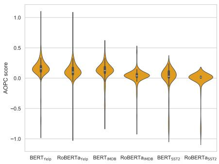  
(a) Lower limit

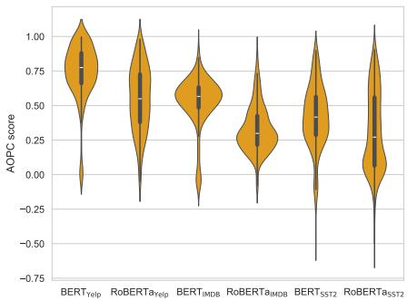  
(b) Upper limit  
Figure 1: Distributions of lower and upper AOPC limits across models on the $\mathrm { Y e l p } _ { \mathrm { s h o r t } }$ test set computed with exhaustive search. The substantially different distributions demonstrate that AOPC bounds are model-specific, making both cross-model comparisons and interpretation of individual scores unreliable without normalization.

Experiment 1: Do the upper and lower limits vary between models? We aim to show that the lower and upper limits of the AOPC scores vary between the models and inputs. We do so by calculating each model's upper and lower AOPC limits using an exhaustive search for each example in $\mathrm { Y e l p } _ { \mathrm { s h o r t } }$ (same search strategy used by $\mathrm { N A O P C } _ { \mathrm { e x a c t } } )$ . We then compare the models' lower and upper limit distributions to demonstrate their differences.

Experiment 2: How does normalization impact AOPC scores? In this experiment, we aim to answer the following two questions:

1. Can NAOPC alter the faithfulness ranking of models for a given feature attribution method?

2. Can NAOPC alter the faithfulness ranking of feature attribution methods for a given model?

To answer these questions, we compare the sufficiency and comprehensiveness scores using AOPC and NAOPC. Specifically, we compare AOPC with $\mathrm { N A O P C } _ { \mathrm { b e a m } }$ for all possible pairs of models and feature attribution methods on the long-sequence datasets. For the short-sequence datasets, we compare AOPC with both $\mathrm { N A O P C } _ { \mathrm { e x a c t } }$ and $\mathrm { N A O P C _ { \mathrm { b e a m } } }$ . We analyze the results to find whether NAOPC changes the ranking of which models and feature attribution methods are the most faithful. We use a beam size of 5 when calculating $\mathrm { N A O P C _ { \mathrm { b e a m } } }$ on all datasets except for AG-News, which required a beam size of 1000.

Experiment 3: Can we approximate $\mathbf { N A O P C _ { \mathrm { e x a c t } } }$ reliably and efficiently? We aim to demonstrate that $\mathrm { N A O P C _ { \mathrm { b e a m } } }$ is a fast and reliable approximation of $\mathrm { N A O P C } _ { \mathrm { e x a c t } }$ . With a sufficiently large beam size, $\mathrm { N A O P C _ { \mathrm { b e a m } } }$ is equivalent to $\mathrm { N A O P C } _ { \mathrm { e x a c t } }$ . The question is if $\mathrm { N A O P C _ { \mathrm { b e a m } } }$ can accurately approximate $\mathrm { N A O P C } _ { \mathrm { e x a c t } }$ with small beam sizes.

First, we demonstrate that the faithfulness rankings produced with $\mathrm { N A O P C _ { \mathrm { b e a m } } }$ and $\mathrm { N A O P C } _ { \mathrm { e x a c t } }$ are similar on $\mathrm { Y e l p } _ { \mathrm { s h o r t } }$ and $\mathrm { S S T } 2 _ { \mathrm { s h o r t } }$ with a beam size of 5. We cannot make this comparison on the five long-sequence dataset subsets because calculating $\mathrm { N A O P C } _ { \mathrm { e x a c t } }$ on highdimensional inputs is prohibitively slow. Instead, we calculate $\mathrm { N A O P C } _ { \mathrm { b e a m } }$ with increasing beam sizes and analyze the change of the lower and upper AOPC limits. If the AOPC limits stabilize at small beam sizes, it indicates that $\mathrm { N A O P C _ { \mathrm { b e a m } } }$ can efficiently and reliably approximate $\mathrm { N A O P C } _ { \mathrm { e x a c t } }$

## 5 Results

## 5.1 The lower and upper limits vary between models

Figure 1 shows significant variations in the distributions of lower and upper AOPC score limits across different models on the $\mathrm { Y e l p } _ { \mathrm { s h o r t } }$ test set. Each model has a distribution rather than a single value because individual inputs also influence the AOPC limits for each model. The clear differences in these distributions across models highlight that direct comparisons of AOPC scores between models can be misleading without proper normalization. Moreover, these variations make interpreting AOPC scores in absolute terms challenging. Figure 1 depicts an upper limit of around 0.3 for RoBERTaıMDB and 0.8 for $\mathrm { B E R T _ { Y e l p } } ,$ , therefore an AOPC score of 0.25 might be considered high for RoBERTaımDB but low for $\mathbf { B E R T } _ { \mathrm { Y e l p } }$ . These distribution shifts across models emphasize the need for NAOPC. Figure 5 depicts a similar pattern on $\mathrm { S S T } 2 _ { \mathrm { s h o r t } }$

## 5.2 NAOPC alters faithfulness rankings

Normalization through NAOPC substantially altered models' faithfulness rankings while preserving the relative performance of feature attribution methods. This effect is clearly visible in Figure 2, where lines of different colors (representing different models) frequently intersect between AOPC and $\mathrm { N A O P C _ { \mathrm { b e a m } } }$ rankings across $\mathrm { Y e l p } _ { \mathrm { l o n g } } , \mathrm { I M D B } _ { \mathrm { l o n g } } ,$ and $\mathrm { S S T 2 _ { l o n g } }$ datasets. In contrast, lines of the same color (representing feature attribution methods within a model) rarely cross, indicating stability in their relative rankings. We see a similar trend on $\mathbf { A G - N e w s } _ { \mathrm { l o n g } }$ and $\mathrm { S N L I _ { l o n g } }$ in Figure 7. The impact of normalization appears even more pronounced in shorter text datasets, as shown in Figure 3 for $\mathrm { Y e l p } _ { \mathrm { s h o r t } }$

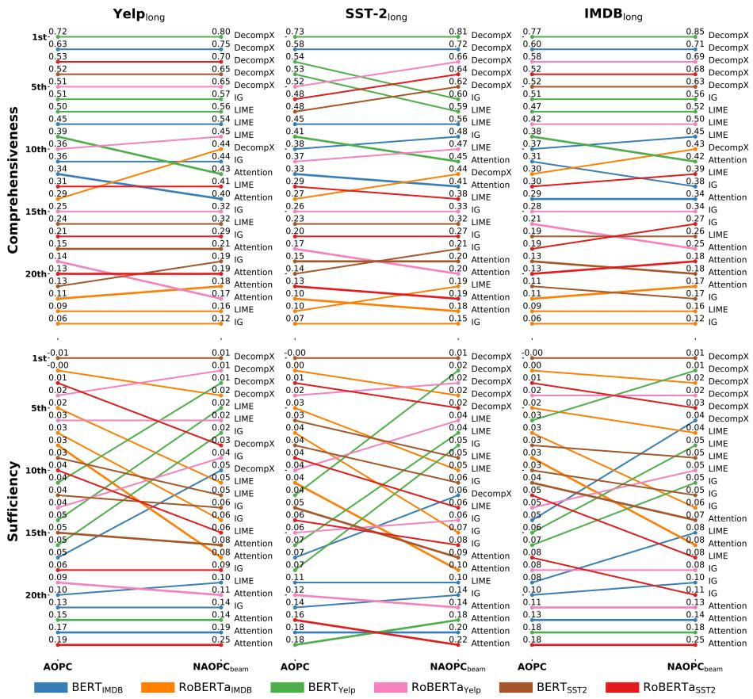  
Figure 2: Effect of normalization on faithfulness rankings across models and attribution methods. For both comprehensiveness (higher is better) and sufficiency (lower is better), $\mathrm { N A O P C _ { \mathrm { b e a m } } }$ changes cross-model rankings but preserves within-model rankings

These visual observations are quantitatively supported by the Kendall rank correlation coefficients presented in Table 4 (Kendall, 1948). Correlations between AOPC and $\mathrm { N A O P C _ { \mathrm { b e a m } } }$ scores are notably lower for the model comparisons than for the feature attribution comparisons. This pattern is consistent across all datasets.

## 5.3 NAOPCbeam accurately approximates $\mathbf { N A O P C _ { e x a c t } }$

Our analysis demonstrates that $\mathrm { N A O P C _ { \mathrm { b e a m } } }$ accurately approximates $\mathrm { N A O P C } _ { \mathrm { e x a c t } }$ across various dataset dimensions. For low-dimensional input examples, Figure 3 shows nearly identical rankings produced by $\mathrm { N A O P C _ { \mathrm { b e a m } } }$ and $\mathrm { N A O P C } _ { \mathrm { e x a c t } }$ on $\mathrm { Y e l p } _ { \mathrm { s h o r t } }$ . Figure 6 depicts similar results for $\mathrm { S S T } 2 _ { \mathrm { s h o r t } } .$

For $\mathrm { R o B E R T a _ { Y e l p } }$ and $\mathrm { B E R T _ { Y e l p } }$ on $\mathrm { Y e l p } _ { \mathrm { l o n g } } ,$ Figure 4 shows that a beam size of 5 is sufficient for stable results. However, the same figure demonstrates that $\mathbf { B E R T _ { A G - N e w s } }$ requires a substantially larger beam size.

Figures 8 to 10 confirm this pattern across all datasets, with AG-News being the only dataset requiring a larger beam size. We explore the reasons for this behavior and its implications in the next section.

## 6 Discussion

## 6.1 Does NAOPC require too much compute to be practically useful?

NAOPC is computationally more intensive than AOPC. Computing AOPC requires N forward passes, $\mathrm { N A O P C _ { \mathrm { b e a m } } }$ requires $B N ^ { 2 }$ forward passes, and $\mathrm { N A O P C } _ { \mathrm { e x a c t } }$ requires N! forward passes, where N is the number of input features, and B is the beam size. While the exponential complexity of $\mathrm { N A O P C } _ { \mathrm { e x a c t } }$ makes it impractical for most inputs, our experiments demonstrate that $\mathrm { N A O P C _ { \mathrm { b e a m } } }$ is feasible in many scenarios.

The computational cost of $\mathrm { N A O P C _ { \mathrm { b e a m } } }$ depends on beam size, input length, and model inference time. With a small beam size $( \mathrm { B } { = } 5 ) ,$ which suffices for many datasets, computing $\mathrm { N A O P C _ { \mathrm { b e a m } } }$ for BERT (110 million parameters) on a hundred-feature example took around one minute on an A100 GPU. While requirements grow quadratically with input length, we found this manageable for several hundred tokens: processing 512-token inputs (BERT's maximum) took approximately 10 minutes per example, averaged over 100 examples. Since $\mathrm { N A O P C _ { \mathrm { b e a m } } }$ scales linearly with model size, larger models remain feasible to evaluate. Importantly, normalization factors only need to be computed once per modeldataset pair and can be reused, significantly reducing overall cost.

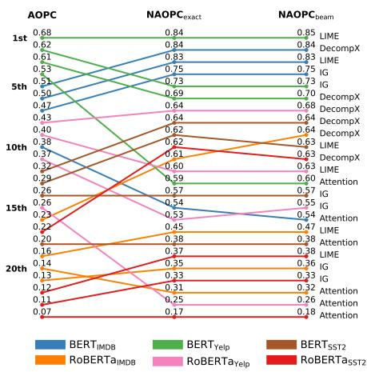  
(a) Comprehensiveness ranking

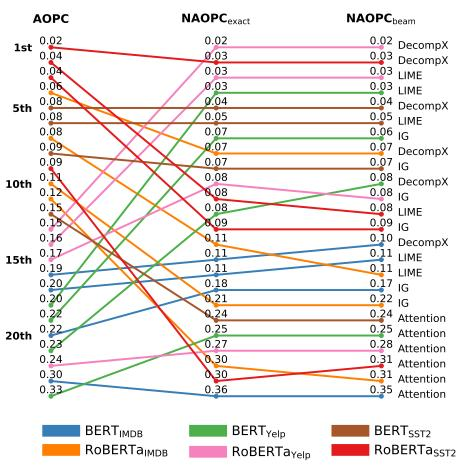  
(b) Sufficiency ranking  
Figure 3: Faithfulness ranking of model and feature attribution method pairs when evaluated on $\mathrm { Y e l p } _ { \mathrm { s h o r t } }$ using AOPC, $\mathrm { N A O P C } _ { \mathrm { e x a c t } } .$ , and $\mathrm { N A O P C _ { \mathrm { b e a m } } }$ . The figure shows that normalization changes the cross-model comparisons and that $\mathrm { N A O P C _ { \mathrm { b e a m } } }$ accurately approximates $\mathrm { N A O P C } _ { \mathrm { e x a c t } }$

Table 4: Kendall rank correlation coefficients between AOPC and $\mathrm { N A O P C _ { \mathrm { b e a m } } }$ rankings across datasets. Coefficients are calculated separately for model rankings and feature attribution method (FA) rankings, showing that normalization impacts the model rankings more than the feature attribution method rankings.
<table><tr><td>Dataset</td><td>Group</td><td>Comp</td><td>Suff</td></tr><tr><td> $\mathrm { Y e l p } _ { \mathrm { l o n g } }$ </td><td>Model FA</td><td>0.87 0.97</td><td>0.47 0.97</td></tr><tr><td> $\mathrm { S S T } { - } 2 _ { \mathrm { l o n g } }$ </td><td>Model FA</td><td>0.89 0.90</td><td>0.43 0.92</td></tr><tr><td> $\mathrm { I M D B _ { l o n g } }$ </td><td>Model FA</td><td>0.93 0.99</td><td>0.72 0.97</td></tr><tr><td> $\mathrm { S N L I _ { l o n g } }$ </td><td>Model FA</td><td>0.71 0.81</td><td>1.0 0.86</td></tr><tr><td> $\mathsf { A G - N e w s } _ { \mathrm { l o n g } }$ </td><td>Model FA</td><td>0.25 0.90</td><td>0.67 0.83</td></tr></table>

However, some datasets require larger beam sizes for accurate normalization. For instance, models trained on AG-News required a beam size of 1,000 to achieve stable results. This requirement does not appear to relate to input length, as AG-News comprises shorter sequences than Yelp and SST2. We speculate this might be due to feature interactions where multiple features must be removed together to measure their true impact on the model's prediction. In such cases, a larger beam size is necessary to ensure these feature combinations are explored during the search. However, further research is needed to verify this hypothesis and understand what drives beam size requirements.

To help researchers assess requirements upfront, we provide tools for estimating necessary beam sizes for specific model-dataset combinations, allowing evaluation of cross-model comparison feasibility given computational constraints.

## 6.2 Should one always normalize the AOPC scores?

Given that computing, NAOPC requires additional computational resources, a natural question arises: when is this extra computation necessary? Our findings demonstrate that normalization is essential in two scenarios: comparing AOPC scores across different models and interpreting individual scores in relation to a model's theoretical limits.

For cross-model comparisons, normalization is necessary even when comparing models with identical architectures trained on the same dataset but with different random seeds, as even slight variations in model parameters can lead to different AOPC limits. Without normalization, a score of 0.25 could be near-optimal for one model but mediocre for another, making cross-model comparisons misleading. Therefore, we recommend normalizing AOPC scores in all cases except when only comparing the relative ranking of feature attribution methods within a single model, where the absolute values of the scores are not relevant. The fundamental importance of normalization for valid cross-model comparisons calls into question previous research findings. Studies that compared unnormalized AOPC scores across different models may need to be re-evaluated.

## 6.3 Why are some models more faithful than others?

By normalizing AOPC scores, we can now meaningfully compare explanation faithfulness across models and interpret how far they are from optimal performance. Our analysis reveals substantial differences in faithfulness even after normalization. For instance, on $\mathrm { Y e l p } _ { \mathrm { l o n g } } ,$ all explanation methods achieved substantially higher comprehensiveness for $\mathrm { B E R T _ { I M D B } }$ than RoBERTaIMDB. For DecompX, the best method, the difference was 0.75 and 0.44. Why do the explanation methods produce less faithful explanations for RoBERTaMDB?

We hypothesize these variations stem from differences in how closely models align with the feature attribution methods’ assumptions. Most feature attribution methods rely on simplified assumptions about models’ inner mechanisms, such as feature independence (Bilodeau et al., 2024). RoBERTamDB consistently achieves low comprehensiveness scores across all tested attribution methods, even after normalization, suggesting a fundamental mismatch between how this model processes information and current attribution methods' assumptions. However, further research examining the models' internal mechanisms would be needed to verify this hypothesis.

## 6.4 Why does normalization have a bigger impact on shorter text datasets?

Figure 2 and Figure 3 show that normalization changes the AOPC results more on shorter sequences than on longer. What causes this difference? We hypothesize that models typically rely on a small subset of features when processing long inputs. When measuring AOPC (comprehensiveness and sufficiency), we remove tokens based on their importance sequentially. In long texts, most removals have no effect since they were irrelevant in the model's decision. When averaging across all removal steps, these zero-effect steps dilute the AOPC scores—bringing sufficiency scores closer to zero and comprehensiveness scores closer to one— making the impact of normalization less visible since both the raw scores and their theoretical limits converge. If there are fewer unused tokens in shorter texts, then fewer zero-effect steps are included in the average. This makes normalization effects more pronounced. If we could somehow consider only the tokens impacting the model's decision, we hypothesize that the normalization effect would be similar on short and long inputs.

## 7 Related Work

Researchers have raised several criticisms against AOPC and other perturbation-based faithfulness metrics, which fall into three main categories. First, perturbing inputs can create out-of-distribution examples, potentially conflating distribution shifts with feature importance (Ancona et al., 2017; Hooker et al., 2019; Hase et al., 2021). Second, perturbations often yield inputs that appear non-sensical to humans, though this should not affect faithfulness evaluation (Feng et al., 2018; Bastings and Filippova, 2020; Jacovi and Goldberg, 2020). Third, these metrics can be viewed as attribution methods themselves, potentially measuring similarity between meth-

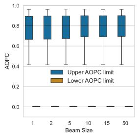

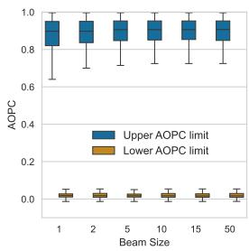

(a) RoBERTaYelp  
(b) BERTYelp  
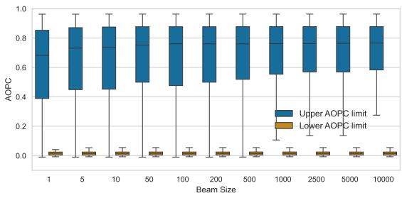  
(c) BERTAG-News  
Figure 4: Lower and upper AOPC limits calculated with $\mathrm { N A O P C _ { \mathrm { b e a m } } }$ using different beam sizes. $\mathrm { R o B E R T a _ { Y e l p } }$ and $\mathbf { B E R T } _ { \mathrm { Y e l p } }$ (a,b) stabilize at $B = 5$ while $\mathbf { B E R T _ { A G - N e w s } }$ (c) requires $B = 1 0 0 0$ for stable results.

ods rather than true faithfulness (Zhou and Shah, 2022;   
Ju et al., 2023).

Our work focuses on sufficiency and comprehensiveness due to their widespread use in cross-model comparisons (Bhalla et al., 2023; Li et al., 2023; Chrysostomou and Aletras, 2022; Liu et al., 2022). However, researchers have also developed alternative faithfulness metrics to address the potential limitations of AOPC. Decision-flip metrics track when model predictions change as features are removed (Chrysostomou and Aletras, 2022). Monotonicity and the faitfulness correlation metric (CORR) measure whether higher attribution scores correspond to larger changes in model output (Arya et al., 2019). Sensitivity-n tests if the sum of attribution scores equals the total change in model output when removing the features (Ancona et al., 2017).

While these alternatives were designed to provide different perspectives on faithfulness, we suspect that they share some of AOPC's fundamental limitations. Like AOPC, decision-flip metrics may produce misleading results when comparing models that rely on different numbers of features because fewer features need to be removed to significantly change the model's prediction resulting in artificially better scores. Similarly, we expect metrics like sensitivity-n, monotonicity, and CORR to struggle with feature interactions because they assume attribution scores can be assigned independently. This assumption likely breaks down when feature importance depends on feature interactions rather than independent features. For example, consider a model using OR operations $( x _ { 1 } \lor x _ { 2 } )$ . Sensitivity-n requires attribution scores to sum to the total change when both features are removed $( e _ { 1 } + e _ { 2 } = 1 )$ but also requires each score to equal its individual impact $( e _ { 1 } = e _ { 2 } = 0 )$ , creating an impossible mathematical constraint. These limitations suggest a broader need to develop faithfulness metrics that can account for model-specific characteristics and complex feature interactions.

## 8 Conclusion

Our study exposes critical weaknesses in current faithfulness evaluation practices for feature attribution methods. Using simple toy models, we demonstrated how models' inner mechanisms significantly influence AOPC's lower and upper limits, potentially leading to misleading cross-model comparisons. Moreover, without knowing these limits, it becomes difficult to interpret AOPC scores effectively. These findings challenge the validity of conclusions drawn from cross-model AOPC score comparisons in many influential studies. To address these issues, we introduced NAOPC, a normalized measure that mitigates model-dependent bias while preserving the ability to compare feature attribution methods within individual models. NAOPC enables accurate evaluation of feature attribution faithfulness across different models, advancing the field towards more robust explanation assessment. While NAOPC addresses these fundamental issues, its computational complexity suggests the need for future research into faster interpretable faithfulness metrics that maintain cross-model comparability.

## Limitations

Our findings indicate that normalization did not alter the faithfulness ranking of feature attribution methods within a model. This suggests that normalization is unnecessary when comparing AOPC scores produced using one model and one dataset. Nonetheless, our evaluation did not cover a sufficient variety of models, tasks, and datasets to rule out the necessity of normalization for certain within-model comparisons. We leave the evaluation of more models, datasets, and tasks to future work.

In addition, as discussed in Section 6.1, with its $O ( B N ^ { 2 } )$ time complexity, $\mathrm { N A O P C } _ { \mathrm { b e a m } }$ will be prohibitively slow for certain datasets, especially for those requiring large beam sizes. Most of our datasets and models required small beam sizes (B=5), but AG-$\mathrm { N e w s _ { l o n g } }$ required a large beam size (B=1000). However, it is better with a slow evaluation than an inaccurate one. Moreover, we provide software tools to help researchers determine the necessary beam size for their specific use case. This allows researchers to assess the computational requirements beforehand and plan their experiments accordingly, deciding whether cross-model comparisons are feasible for their dataset and computational budget.

## Ethical considerations

The ability to explain deep neural network decisions is crucial for ensuring their responsible deployment, particularly in high-stakes domains such as healthcare, legal systems, and financial services. When a diagnostic model suggests treatment or when a neural network influences a parole decision, stakeholders must be able to scrutinize and validate the reasoning behind these recommendations. However, explanations are only valuable if they faithfully represent the model's decisionmaking process.

Our work reveals that current methods for evaluating explanation faithfulness can be misleading, potentially giving false confidence in explanation methods that do not accurately reflect model behavior. This is particularly concerning because unreliable explanations might lead to unwarranted trust in neural networks or mask potential biases in their decision-making processes. For instance, Kayser et al. (2024) demonstrated that incorrect explanations can persuade phycisians into an incorrect diagnosis. By providing a more reliable evaluation framework through NAOPC, we contribute to the development of more trustworthy explanation methods, ultimately supporting the responsible deployment of deep neural networks in society.

## Acknowledgments

This research was partially funded by the Innovation Fund Denmark via the Industrial Ph.D. Program (grant no. 2050-00040B) and Academy of Finland (grant no. 322653). We thank Simon Flachs, Nina Frederikke Jeppesen Edin, and Victor Petrén Bach Hansen for revisions.

## References

Marco Ancona, Enea Ceolini, Cengiz Öztireli, and Markus Gross. 2017. Towards better understanding of gradient-based attribution methods for deep neural networks. arXiv preprint arXiv:1711.06104.

Vijay Arya, Rachel KE Bellamy, Pin-Yu Chen, Amit Dhurandhar, Michael Hind, Samuel C Hoffman, Stephanie Houde, Q Vera Liao, Ronny Luss, Aleksandra Mojsilović, et al. 2019. One explanation does not fit all: A toolkit and taxonomy of ai explainability techniques. arXiv preprint arXiv:1909.03012.

Jasmijn Bastings and Katja Filippova. 2020. The elephant in the interpretability room: Why use attention as explanation when we have saliency methods? In Proceedings of the Third BlackboxNLP Workshop on Analyzing and Interpreting Neural Networks for NLP, pages 149–155, Online. Association for Computational Linguistics.

Usha Bhalla, Suraj Srinivas, and Himabindu Lakkaraju. 2023. Discriminative Feature Attributions: Bridging Post Hoc Explainability and Inherent Interpretability. In Advances in Neural Information Processing Systems 36 (NeurIPS 2023).

Umang Bhatt, Adrian Weller, and José M. F. Moura. 2020. Evaluating and Aggregating Feature-based Model Explanations. Preprint, arXiv:2005.00631.

Blair Bilodeau, Natasha Jaques, Pang Wei Koh, and Been Kim. 2024. Impossibility theorems for feature attribution. Proceedings of the National Academy of Sciences, 121(2):e2304406120.

Hanjie Chen and Yangfeng Ji. 2020. Learning Variational Word Masks to Improve the Interpretability of Neural Text Classifiers. Preprint, arXiv:2010.00667.

George Chrysostomou and Nikolaos Aletras. 2021. Enjoy the Salience: Towards Better Transformer-based Faithful Explanations with Word Salience. In Proceedings of the 2021 Conference on Empirical Methods in Natural Language Processing, pages 8189– 8200, Online and Punta Cana, Dominican Republic. Association for Computational Linguistics.

George Chrysostomou and Nikolaos Aletras. 2022. An Empirical Study on Explanations in Out-of-Domain Settings. In Proceedings of the 60th Annual Meeting of the Association for Computational Linguistics (Volume 1: Long Papers), pages 6920–6938, Dublin, Ireland. Association for Computational Linguistics.

Marina Danilevsky, Kun Qian, Ranit Aharonov, Yannis Katsis, Ban Kawas, and Prithviraj Sen. 2020. A Survey of the State of Explainable AI for Natural Language Processing. In Proceedings of the 1st Conference of the Asia-Pacific Chapter of the Association for Computational Linguistics and the 10th International Joint Conference on Natural Language Processing, pages 447–459, Suzhou, China. Association for Computational Linguistics.

Jacob Devlin, Ming-Wei Chang, Kenton Lee, and Kristina Toutanova. 2019. BERT: Pre-training of Deep Bidirectional Transformers for Language Understanding. arXiv:1810.04805 [cs].

Jay DeYoung, Sarthak Jain, Nazneen Fatema Rajani, Eric Lehman, Caiming Xiong, Richard Socher, and Byron C. Wallace. 2020. ERASER: A Benchmark to Evaluate Rationalized NLP Models. In Proceedings of the 58th Annual Meeting of the Association for Computational Linguistics, pages 4443–4458, Online. Association for Computational Linguistics.

Shi Feng, Eric Wallace, Alvin Grissom II, Mohit Iyyer, Pedro Rodriguez, and Jordan Boyd-Graber. 2018. Pathologies of neural models make interpretations difficult. arXiv preprint arXiv:1804.07781.

Markus Freitag and Yaser Al-Onaizan. 2017. Beam Search Strategies for Neural Machine Translation. In Proceedings of the First Workshop on Neural Machine Translation, pages 56–60, Vancouver. Association for Computational Linguistics.

Peter Hase, Harry Xie, and Mohit Bansal. 2021. The Out-of-Distribution Problem in Explainability and Search Methods for Feature Importance Explanations. In 35th Conference on Neural Information Processing Systems (NeurIPS 2021). arXiv.

Sara Hooker, Dumitru Erhan, Pieter-Jan Kindermans, and Been Kim. 2019. A Benchmark for Interpretability Methods in Deep Neural Networks. In Advances in Neural Information Processing Systems volume 32. Curran Associates, Inc.

Alon Jacovi and Yoav Goldberg. 2020. Towards Faithfully Interpretable NLP Systems: How Should We Define and Evaluate Faithfulness? In Proceedings of the 58th Annual Meeting of the Association for Computational Linguistics, pages 4198–4205, Online. Association for Computational Linguistics.

Sarthak Jain and Byron C. Wallace. 2019. Attention is not Explanation. Preprint, arXiv:1902.10186.

Yiming Ju, Yuanzhe Zhang, Zhao Yang, Zhongtao Jiang, Kang Liu, and Jun Zhao. 2023. Logic Traps in Evaluating Attribution Scores. Preprint, arXiv:2109.05463.

Maxime Guillaume Kayser, Bayar Menzat, Cornelius Emde, Bogdan Alexandru Bercean, Alex Novak, Abdalá Trinidad Espinosa Morgado, Bartlomiej Papiez, Susanne Gaube, Thomas Lukasiewicz, and Oana-Maria Camburu. 2024. Fool Me Once? Contrasting Textual and Visual Explanations in a Clinical Decision-Support Setting. In Proceedings of the 2024 Conference on Empirical Methods in Natural Language Processing, pages 18891–18919, Miami, Florida, USA. Association for Computational Linguistics.

Maurice George Kendall. 1948. Rank correlation methods.

Dongfang Li, Baotian Hu, Qingcai Chen, and Shan He. 2023. Towards Faithful Explanations for Text Classification with Robustness Improvement and Explanation Guided Training. In Proceedings of the 3rd Workshop on Trustworthy Natural Language Processing (TrustNLP 2023), pages 1–14, Toronto, Canada. Association for Computational Linguistics.

Zachary C Lipton. 2018. The mythos of model interpretability: In machine learning, the concept of interpretability is both important and slippery. Queue, 16(3):31–57.

Junhong Liu, Yijie Lin, Liang Jiang, Jia Liu, Zujie Wen, and Xi Peng. 2022. Improve Interpretability of Neural Networks via Sparse Contrastive Coding. In Findings of the Association for Computational Linguistics: EMNLP 2022, pages 460–470, Abu Dhabi, United Arab Emirates. Association for Computational Linguistics.

Yinhan Liu, Myle Ott, Naman Goyal, Jingfei Du, Mandar Joshi, Danqi Chen, Omer Levy, Mike Lewis, Luke Zettlemoyer, and Veselin Stoyanov. 2019. RoBERTa: A Robustly Optimized BERT Pretraining Approach. arXiv:1907.11692 [cs].

Scott M Lundberg and Su-In Lee. 2017. A Unified Approach to Interpreting Model Predictions. In Advances in Neural Information Processing Systems, volume 30. Curran Associates, Inc.

Qing Lyu, Marianna Apidianaki, and Chris Callison-Burch. 2024. Towards faithful model explanation in nlp: A survey. Preprint, arXiv:2209.11326.

Andrew L. Maas, Raymond E. Daly, Peter T. Pham, Dan Huang, Andrew Y. Ng, and Christopher Potts. 2011. Learning Word Vectors for Sentiment Analysis. In Proceedings of the 49th Annual Meeting of the Association for Computational Linguistics: Human Language Technologies, pages 142–150, Portland, Oregon, USA. Association for Computational Linguistics.

Bill MacCartney and Christopher D. Manning. 2008. Modeling Semantic Containment and Exclusion in Natural Language Inference. In Proceedings of the 22nd International Conference on Computational Linguistics (Coling 2008), pages 521–528, Manchester, UK. Coling 2008 Organizing Committee.

Ali Modarressi, Mohsen Fayyaz, Ehsan Aghazadeh, Yadollah Yaghoobzadeh, and Mohammad Taher Pilehvar. 2023. DecompX: Explaining Transformers Decisions by Propagating Token Decomposition. In Proceedings of the 61st Annual Meeting of the Association for Computational Linguistics (Volume 1: Long Papers), pages 2649–2664, Toronto, Canada. Association for Computational Linguistics.

John X. Morris, Eli Lifland, Jin Yong Yoo, Jake Grigsby, Di Jin, and Yanjun Qi. 2020. TextAttack: A Framework for Adversarial Attacks, Data Augmentation, and Adversarial Training in NLP. Preprint, arXiv:2005.05909.

Ian E. Nielsen, Ravi P. Ramachandran, Nidhal Bouaynaya, Hassan M. Fathallah-Shaykh, and Ghulam Rasool. 2023. EvalAttAI: A Holistic Approach to Evaluating Attribution Maps in Robust and Non-Robust Models. IEEE Access, 11:82556–82569.

Alec Radford, Jeffrey Wu, Rewon Child, David Luan, Dario Amodei, and Ilya Sutskever. 2019. Language Models are Unsupervised Multitask Learners.

Lucas E. Resck, Marcos M. Raimundo, and Jorge Poco. 2024. Exploring the Trade-off Between Model Performance and Explanation Plausibility of Text Classifiers Using Human Rationales. Preprint, arXiv:2404.03098.

Marco Tulio Ribeiro, Sameer Singh, and Carlos Guestrin. 2016. "Why Should I Trust You?": Explaining the Predictions of Any Classifier. In Proceedings of the 22nd ACM SIGKDD International Conference on Knowledge Discovery and Data Mining, pages 1135–1144, San Francisco California USA. ACM.

Wojciech Samek, Alexander Binder, Grégoire Montavon, Sebastian Lapuschkin, and Klaus-Robert Müller. 2016. Evaluating the visualization of what a deep neural network has learned. IEEE transactions on neural networks and learning systems, 28(11):2660–2673.

Victor Sanh, Lysandre Debut, Julien Chaumond, and Thomas Wolf. 2020. DistilBERT, a distilled version of BERT: Smaller, faster, cheaper and lighter. arXiv:1910.01108 [cs].

Arshdeep Sekhon, Hanjie Chen, Aman Shrivastava, Zhe Wang, Yangfeng Ji, and Yanjun Qi. 2023. Improving Interpretability via Explicit Word Interaction Graph Layer. Proceedings of the AAAI Conference on Artificial Intelligence, 37(11):13528–13537.

Avanti Shrikumar, Peyton Greenside, and Anshul Kundaje. 2017. Learning important features through propagating activation differences. In Proceedings of the 34th International Conference on Machine Learning - Volume 70, ICML'17, pages 3145–3153, Sydney, NSW, Australia. JMLR.org.

Richard Socher, Alex Perelygin, Jean Wu, Jason Chuang, Christopher D. Manning, Andrew Ng, and Christopher Potts. 2013. Recursive Deep Models for Semantic Compositionality Over a Sentiment Treebank. In Proceedings of the 2013 Conference on Empirical Methods in Natural Language Processing, pages 1631–1642, Seattle, Washington, USA. Association for Computational Linguistics.

Mukund Sundararajan, Ankur Taly, and Qiqi Yan. 2017. Axiomatic Attribution for Deep Networks. In Proceedings of the 34th International Conference on Machine Learning, pages 3319–3328. PMLR.

Michael Tsang, Sirisha Rambhatla, and Yan Liu. 2020. How does This Interaction Affect Me? Interpretable Attribution for Feature Interactions. In Advances in Neural Information Processing Systems, volume 33, pages 6147–6159. Curran Associates, Inc.

Jason Wei, Yi Tay, Rishi Bommasani, Colin Raffel, Barret Zoph, Sebastian Borgeaud, Dani Yogatama, Maarten Bosma, Denny Zhou, Donald Metzler, Ed H. Chi, Tatsunori Hashimoto, Oriol Vinyals, Percy Liang, Jeff Dean, and William Fedus. 2022. Emergent abilities of large language models. Preprint, arXiv:2206.07682.

Sean Xie, Soroush Vosoughi, and Saeed Hassanpour. 2024. IvRA: A Framework to Enhance Attention-Based Explanations for Language Models with Interpretability-Driven Training. In Proceedings of the 7th BlackboxNLP Workshop: Analyzing and Interpreting Neural Networks for NLP, pages 431–451, Miami, Florida, US. Association for Computational Linguistics.

Xiang Zhang, Junbo Zhao, and Yann LeCun. 2015. Character-level Convolutional Networks for Text Classification. In Advances in Neural Information Processing Systems, volume 28. Curran Associates, Inc.

Yilun Zhou and Julie Shah. 2022. The solvability of interpretability evaluation metrics. arXiv preprint arXiv:2205.08696.

## A Model Details and Access

In Table 5, we present an overview of the six models used in our study. For each model, we provide details on the architecture, training data, and a direct link to the corresponding pre-trained weights available on HuggingFace.

## B Analysis of AOPC Score Limit Variability Across Models on the SST2 Dataset

Figure 5 shows the distributions of lower and upper AOPC score limits for different models on the $\mathrm { S S T } 2 _ { \mathrm { s h o r t } }$ test set. The presence of distributions rather than single values for each model highlights the influence of individual inputs on AOPC limits. The notable differences in these distributions across models underscore the importance of normalization when comparing comprehensiveness and sufficiency scores between models.

## C NAOPC Comparison on $\mathbf { S S T 2 _ { s h o r t } }$

This section presents a detailed comparison of $\mathrm { N A O P C _ { \mathrm { b e a m } } }$ and $\mathrm { N A O P C } _ { \mathrm { e x a c t } }$ on the $\mathrm { S S T } 2 _ { \mathrm { s h o r t } }$ dataset. Figure 6 illustrates the rankings produced by both methods when evaluating the comprehensiveness and sufficiency of the dataset. The figure shows almost identical rankings produced by $\mathrm { N A O P C _ { \mathrm { b e a m } } }$ and $\mathrm { N A O P C } _ { \mathrm { e x a c t } }$

## D NAOPCbeam results on AG-NewSlong and $\mathbf { S N L I _ { l o n g } }$

Figure 7 depicts the difference between AOPC and $\mathrm { N A O P C _ { \mathrm { b e a m } } }$ on $\mathsf { A G - N e w s } _ { \mathrm { l o n g } }$ and $\mathrm { S N L I _ { l o n g } }$ . We see similar results as in Figure 2. However, on $\mathrm { S N L I _ { l o n g } , }$ LIME and IG seem to be better than DecompX. Also, $\mathrm { G P T - } 2 \mathrm { \Omega s }$ sufficiency and comprehensiveness scores are similar. We speculate this is because we perturb by replacing with the end-of-sequence token (GPT-2 does not support mask tokens nor pad tokens). End-of-sequence tokens in the middle of a sentence may quickly make the input out-of-distribution, therefore changing the model's output, even when perturbing unimportant features.

## E Impact of Beam Size on NAOPCbeam Across Various Datasets

As illustrated in Figure 8, the relationship between increasing beam size and $\mathrm { N A O P C _ { \mathrm { b e a m } } }$ is examined across various models and datasets. The findings indicate that while an initial expansion of beam size results in variability in the upper and lower bounds, further increases beyond a beam size of 5 lead to a convergence trend. This pattern is consistently observed across different models and datasets, particularly evident in the results for $\mathrm { R o B E R T a _ { Y e l p } }$ and $\mathrm { B E R T _ { Y e l p } }$ on the $\mathrm { Y e l p _ { l o n g } }$ dataset.

## F Licences

SNLI uses a cc-by-sa-4.0 license. AG-News does not have a specific license, but the authors state that it should only be used for non-commercial purposes³. SST-2 and IMDB are both created by StanfordNLP, who do not specify a license, but writes that you must cite their papers if using the dataset45. We used Yelp from Hugging-$\mathrm { f a c e } ^ { 6 }$ . The original webpage with the Yelp dataset and License no longer exists. Considering that thousands of other papers use this dataset, it is most likely okay to use, but we cannot guarantee it since we could not find its license. The language models from Huggingface use an MIT license.

Table 5: Overview of the public models from Hugging Face used in this paper.
<table><tr><td>Model</td><td>Architecture (Param)</td><td>Training data</td><td>HuggingFace link</td></tr><tr><td> $\mathbf { B E R T } _ { \mathrm { Y e l p } }$ </td><td>BERT (110M)</td><td>Yelp</td><td>textattack/bert-base-uncased-yelp-polarity</td></tr><tr><td> $\mathrm { R o B E R T a _ { Y e l p } }$ </td><td>RoBERTa (110M)</td><td>Yelp</td><td>VictorSanh/roberta-base-finetuned-yelp-polarity</td></tr><tr><td> $\mathrm { B E R T _ { I M D B } }$ </td><td>BERT (110M)</td><td>IMBD</td><td>textattack/bert-base-uncased-imdb</td></tr><tr><td> $\mathrm { R o B E R T a _ { I M D B } }$ </td><td>RoBERTa (110M)</td><td>IMBD</td><td>textattack/roberta-base-imdb</td></tr><tr><td> $\mathrm { B E R T } _ { \mathrm { S S T 2 } }$ </td><td>BERT (110M)</td><td>SST2</td><td>textattack/bert-base-uncased-SST-2</td></tr><tr><td> $\mathrm { R o B E R T a } _ { \mathrm { S S T 2 } }$ </td><td>RoBERTa(110M)</td><td>SST2</td><td>textattack/roberta-base-SST-2</td></tr><tr><td> $\mathbf { B E R T _ { A G - N e w s } }$ </td><td>BERT (110M)</td><td>AG-News</td><td>textattack/bert-base-uncased-ag-news</td></tr><tr><td> $\mathrm { R o B E R T a _ { A G - N e w s } }$ </td><td>RoBERTa (110M)</td><td>AG-News</td><td>textattack/roberta-base-ag-news</td></tr><tr><td> $\mathrm { D i s t i l B E R T _ { A G - N e w s } }$ </td><td>DistilBERT (66M)</td><td>AG-News</td><td>textattack/distilbert-base-uncased-ag-news</td></tr><tr><td> $\mathrm { B E R T _ { S N L I } }$ </td><td>BERT (110M)</td><td>SNLI</td><td>textattack/bert-base-uncased-snli</td></tr><tr><td> $\mathrm { D i s t i l B E R T _ { S N L I } }$ </td><td>DistilBERT (66M)</td><td>SNLI</td><td>textattack/distilbert-base-cased-snli</td></tr><tr><td> $\mathrm { G P T } { - } 2 _ { \mathrm { S N L I } }$ </td><td>GPT-2 (124M)</td><td>SNLI</td><td>varun-v-rao/gpt2-snli-model1</td></tr></table>

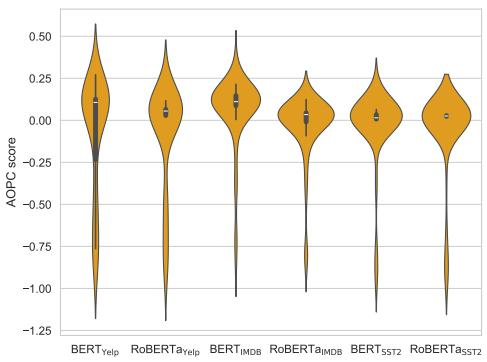  
(a) Lower AOPC limit

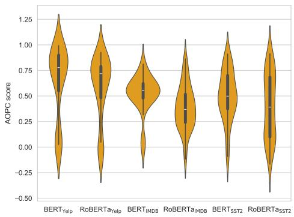  
(b) Upper AOPC limit  
Figure 5: Distributions of lower and upper AOPC limits for various models on the $\mathrm { S S T } 2 _ { \mathrm { s h o r t } }$ test set. Each distribution reflects the range of possible AOPC scores for a given model, influenced by individual input examples. The inter-model variations demonstrate the need for normalization when comparing AOPC scores across different models.

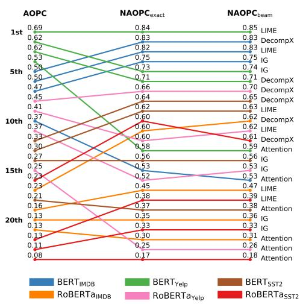  
(a) Comprehensiveness Order

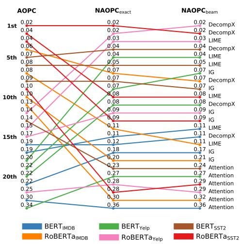  
(b) Sufficiency Order  
Figure 6: The difference in rankings when normalizing on the SST-2 dataset

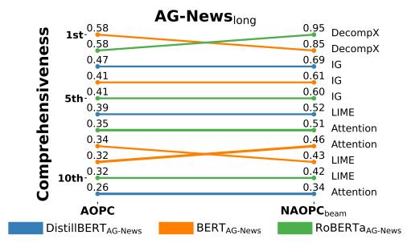

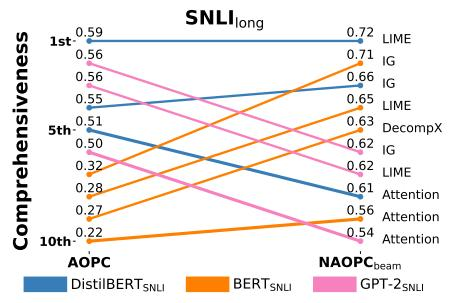

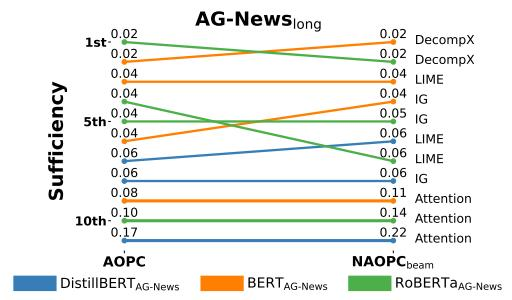

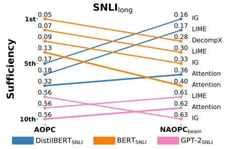  
Figure 7: Faithfulness ranking of model and feature attribution method pairs when evaluated using AOPC and $\mathrm { N A O P C _ { \mathrm { b e a m } } }$ on AG-News and SNLI.

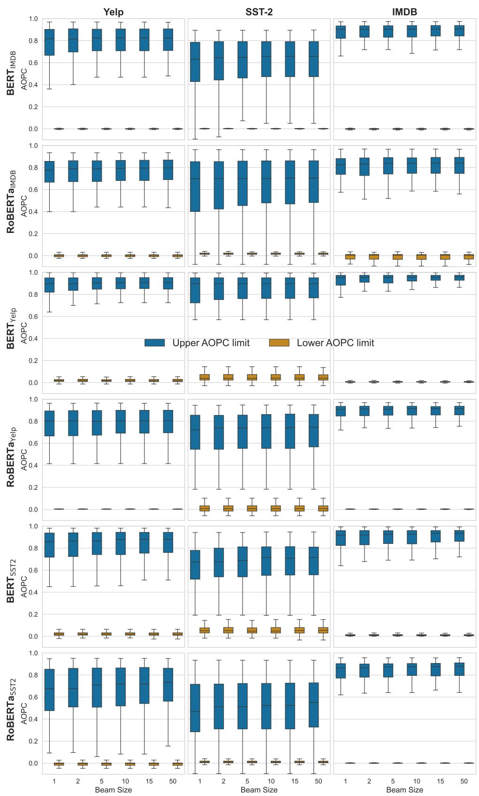  
Figure 8: Boxplots showing the distribution of $\mathrm { N A O P C _ { \mathrm { b e a m } } }$ values across different beam sizes for various models and datasets.

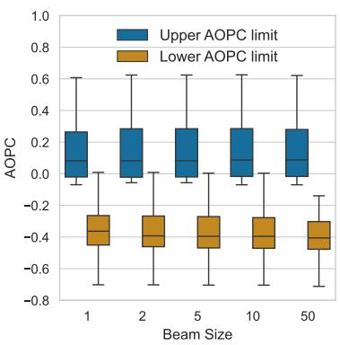  
(a) BERT

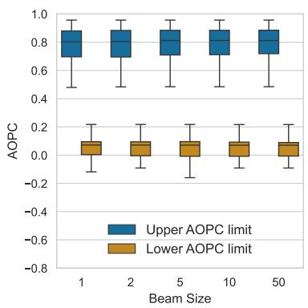  
(b) DistilBERT

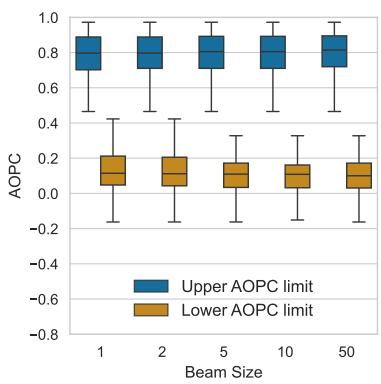  
(c) GPT-2

Figure 9: Boxplots showing the distribution of $\mathrm { N A O P C _ { \mathrm { b e a m } } }$ values across different beam sizes for SNLI.  
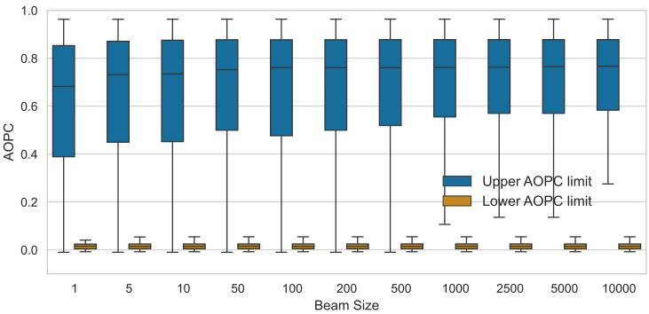

(a) BERT  
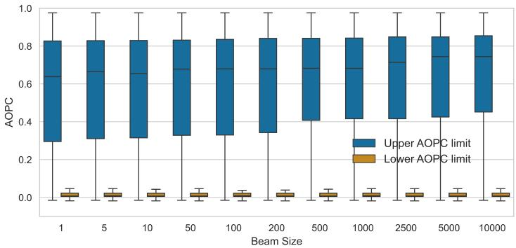

(b) RoBERTa  
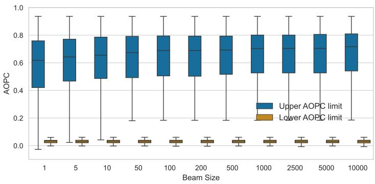  
(c) DistilBERT  
Figure 10: Boxplots showing the distribution of $\mathrm { N A O P C _ { \mathrm { b e a m } } }$ values across different beam sizes for AG-News.