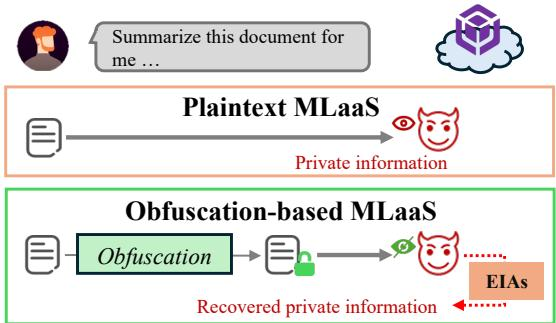
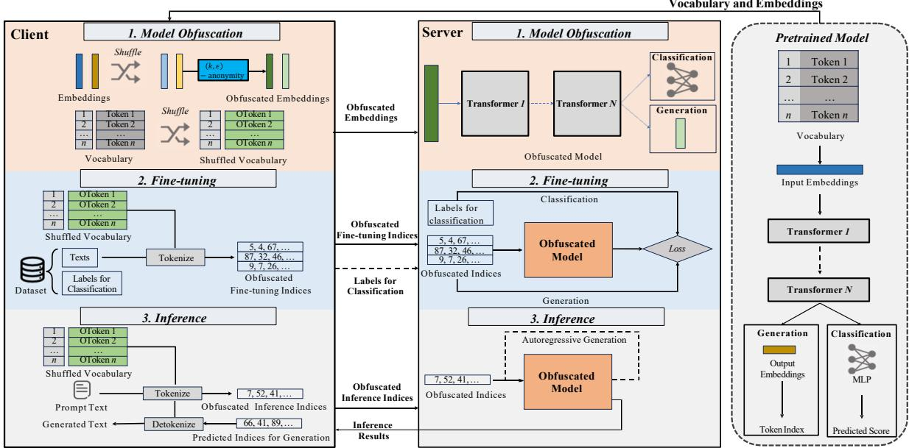
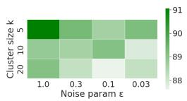
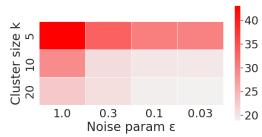
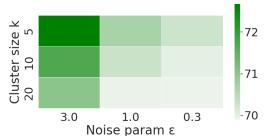
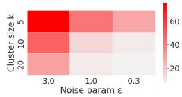
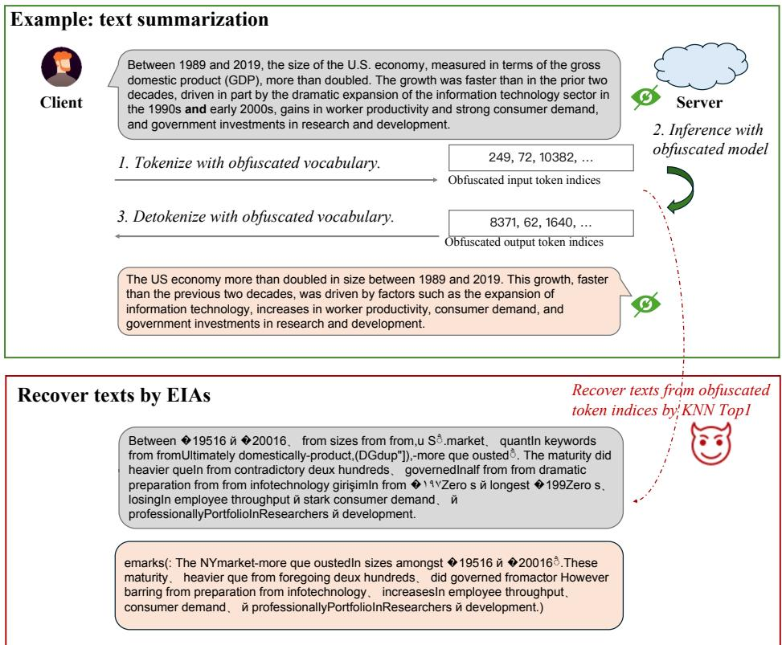

# ObfusLM: Privacy-preserving Language Model Service against Embedding Inversion Attacks

Yu Lin1, Ruining Yang\*1, Yunlong Mao2, Qizhi Zhang1, Jue Hong1, Quanwei Cai1, Ye Wu1, Huiqi Liu1, Zhiyu Chen1, Bing Duan1, Sheng Zhong2, 1ByteDance, 2Nanjing University,

Correspondence: caiquanwei@bytedance.com, maoyl@nju.edu.cn

## Abstract

As the rapid expansion of Machine Learning as a Service (MLaaS) for language models, concerns over the privacy of client inputs during inference or fine-tuning have correspondingly escalated. Recently, solutions have been proposed to safeguard client privacy by obfuscation techniques. However, the solutions incur notable decline in model utility and mainly focus on classification tasks, rendering them impractical for real-world applications. Moreover, recent studies reveal that these obfuscation, if not well designed, is susceptible to embedding inversion attacks (EIAs). In this paper, we devise ObfusLM, a privacy-preserving MLaaS framework for both classification and generation tasks. ObfusLM leverages a model obfuscation module to achieve privacy protection for both classification and generation tasks. Based on (k, ϵ)-anonymity, ObfusLM includes novel obfuscation algorithms to reach provable security against EIAs. Extensive experiments show that ObfusLM outperforms existing works in utility by 10% with a nearly 80% resistance rate against EIAs.

## 1 Introduction

Machine Learning as a Service (MLaaS) has become a popular paradigm, providing users with inference and fine-tuning services for language models (Cai et al., 2024). In MLaaS, users (i.e., clients) must upload their private data (e.g., query prompts, classified documents) to the cloud (i.e., server) for model services such as classification and generation. However, clients are always concerned about privacy leakage, as the untrusted server can recognize their private information from uploaded data (Du et al., 2023) as shown in Figure 1. Studies try to address these concerns via cryptographic solutions, e.g., Homomorphic Encryption (HE) or Secure Multi-party Computation (SMC), as well as trusted hardware solutions like Trusted Execution Environments (TEE) (Zhang et al., 2022). Nonetheless, the constraints inherent to both solutions limit their application scenarios. For instance, cryptography-based solutions can take hundreds of seconds to generate a single token (Dong et al., 2023), while hardware-based solutions necessitate the service provider to allocate additional TEE resources.

  
Figure 1: Application scenario. In plaintext MLaaS, the server can directly observe the client’s private information. In obfuscation-based MLaaS, the server will try to recover privacy from obfuscated data by Embedding Inversion Attacks (EIAs).

Motivated by the limitations of the aforementioned solutions, recent studies have endeavored to develop obfuscation-based solutions (Tong et al., 2023; Du et al., 2023) that balance data privacy with model utility. By leveraging these solutions, clients can obfuscate the tokens or token-correlated word embeddings of their private texts. When requesting model service, the clients merely dispatch the obfuscated tokens or embeddings to the server as described in Figure 1, consequently reducing the risk of privacy leakage. The solutions leverage techniques such as Differential Privacy (DP) (Dwork et al., 2014) and k-anonymity (Sweeney, 2002) for obfuscation. Although these cost-effective techniques make obfuscation-based solutions appealing, their integration into MLaaS faces several chal-

lenges:

• Lack of Support for Generation Tasks: Current solutions such as TextMixer (Zhou et al., 2023b), SentinelLMs (Mishra et al., 2024), and DP-Forward (Du et al., 2023) are limited to classification tasks, as they do not safeguard the inference outputs. When these methods are applied to generation tasks, the outputs can potentially reveal the original input text.

• Limitations on Application Integration: Existing solutions face challenges in their application methods and model utility, limiting their integration into real-world scenarios. For instance, TextObfuscator (Zhou et al., 2023a) and CAPE (Plant et al., 2021) rely on additional trusted third parties to execute an obfuscation-based training process, which is necessary to achieve satisfactory utility. Furthermore, methods like SAN-TEXT+ (Yue et al., 2021) and CUSTEXT+ (Chen et al., 2022) allow clients to obfuscate their data locally but incur a significant utility loss.

• Threats of Inversion Attacks: Recent studies (Qu et al., 2021; Song and Raghunathan, 2020; Kugler et al., 2021; Lin et al., 2024) have proposed Embedding Inversion Attacks (EIAs) to recover input texts from embeddings, thereby enabling the server to recognize clients’ private information from obfuscated data. Experimental results from the studies indicate that EIAs remain effective against obfuscation-based solutions, highlighting EIAs as one of the most significant threats.

To address these challenges, we design a privacypreserving framework, namely ObfusLM, to support private fine-tuning and inference services in MLaaS. Specifically, ObfusLM incorporates the following properties:

• Generic Applications on Various Tasks. The proposed model obfuscation module in ObfusLM is thoughtfully designed to align with the architectures of both classification and generation models. This design enables ObfusLM to natively support tasks in both domains. Consequently, in generation tasks, ObfusLM provides robust protection for clients’ input texts as well as the generated outputs produced by the model.

• Efficient Utility-preserving Obfuscation Mechanism. ObfusLM employs a one-shot process for privacy protection by obfuscating model embeddings on the client side. Following this, the client can subsequently request fine-tuning and inference services that are nearly identical to those in standard MLaaS workflows. During the obfuscation process, ObfusLM introduces novel embedding clustering and synthesis algorithms, enabling clients to generate semantically preserved obfuscated embeddings across model layers while maintaining model utility.

• Provable Security Against EIAs. ObfusLM follows the definition of (k, ϵ)-anonymity to obfuscate embeddings. By analyzing the security requirements for defense EIAs, we conclude that (k, ϵ)-anonymity is more suitable for obfuscation solutions than DP.

We conduct experiments to validate the effectiveness of ObfusLM on various models and tasks. The results show that ObfusLM outperforms recent works in model utility by 10%, while achieving a nearly 80% resistance rate against EIAs.

## 2 Related Work

Obfuscation-based Solutions for Privacypreserving Language Model Service. Recent obfuscation-based solutions can be broadly categorized into two strategies: token-level and embedding-level obfuscations. Token-level obfuscations utilize DP mechanisms, enabling clients to replace tokens in their private texts with substitutes. To preserve utility, these replacements must be carefully selected so that models can still produce accurate inference results from the obfuscated texts. For instance, SANTEXT+ (Yue et al., 2021) and CUSTEXT+ (Chen et al., 2022) used embedding similarities to determine sampling probabilities of tokens based on DP. While token-level obfuscation is lightweight, only requiring a one-shot obfuscation process by the client, maintaining inference accuracy remains a challenge. Furthermore, these approaches are insufficient for generation tasks as they fail to adequately protect the security of generated texts.

Unlike token-level methods that operate in the discrete token space, embedding-level obfuscation provides finer-grained control over embeddings, enabling a more effective privacy-utility trade-off. DP-Forward (Du et al., 2023) introduced a novel DP mechanism and examined how applying noise at different model layers impacts utility and privacy. SentinelLMs (Mishra et al., 2024) employed a distance-preserving transformation called glidereflection to obfuscate word embeddings. CAPE (Plant et al., 2021) and TextObfuscator (Zhou et al., 2023a) simultaneously optimize the task objective and the privacy protection effect during the training process to balance utility and privacy. TextMixer (Zhou et al., 2023b) adopted a data multiplexing method MUX-PLMs (Murahari et al., 2023) to achieve k-anonymity security by mixing each client’s text with similar texts. While these solutions improve both privacy and utility, they introduce additional application limitations. For example, CAPE and TextObfuscator rely on a trusted third party to perform an extra training process, and TextMixer requires using specially pretrained models derived from MUX-PLMs. As a result, we conclude the above recent studies in Table 1 to compare their application characteristics.

<table><tr><td>Method</td><td>Security Mechanism</td><td>Client Over- head</td><td>w/o Third Party</td><td>Generation Task</td></tr><tr><td>SentinelLMs TextMixer1</td><td>Glide-reflection k-anonymity</td><td>O C</td><td>√ √</td><td>X X</td></tr><tr><td>TextObfuscator</td><td>Embedding DP</td><td></td><td>×</td><td>X</td></tr><tr><td>DP-Forward2</td><td>Embedding DP</td><td></td><td>√</td><td>X</td></tr><tr><td>CAPE</td><td>Embedding DP</td><td>O</td><td>×</td><td>X</td></tr><tr><td>SANTEXT+ CUSTEXT+</td><td>Token DP</td><td>O</td><td>√</td><td>×</td></tr><tr><td></td><td>Token DP</td><td>O</td><td>V</td><td>X</td></tr><tr><td>ObfusLM (Ours)</td><td>(k, €)-anonymity</td><td></td><td>√</td><td>√</td></tr></table>

1 TextMixer requires extra server overhead since it requires to pre-train special model. 2 Client overhead depends on the noise position in DP-Forward.  
Table 1: Comparison with recent works on supported tasks, client-side overhead, and security mechanism.

Embedding Inversion Attacks. Recent works have shown that EIAs can be used to recover input texts from obfuscated data, including the token-level and the embedding-level obfuscation. K-nearest Neighbor (KNN) (Qu et al., 2021) and Element-wise Deferential Nearest Neighbor (EDNN) (Lin et al., 2024) attacks are proposed to map obfuscated embeddings to their corresponding tokens by comparing distances between obfuscated embeddings and pretrained word embeddings. InvBert (Kugler et al., 2021) develops an attack pipeline to train an inversion model capable of reconstructing word embeddings generated by the BERT (Kenton and Toutanova, 2019) model and mapping them to their corresponding tokens. Similarly, Multi-label Classification (MLC) (Song and Raghunathan, 2020) trains an inversion model optimized to determine whether a token appears in an input text based on its sentence embedding.

## 3 Background

## 3.1 System Model

We consider a typical MLaaS scenario, as illustrated in Figure 1. In this setting, a client possessing private textual data seeks to utilize a model service provided by a server that hosts a pretrained model. We focus on the scenario in which the client first uses a private dataset to request a necessary model fine-tuning process from the server, and then subsequently requests online inference services. During both the fine-tuning and inference processes, the server tokenizes the client’s input texts into tokens, which are then converted into embeddings. These embeddings are passed through a series of transformer layers and finally directed to a taskspecific output layer, such as a Multi-Layer Perceptron (MLP) for classification or a language model head for text generation.

ObfusLM mainly follows the above MLaaS procedure with a few alterations. In ObfusLM, it is presumed that the client also has access to the pretrained model. The client is able to obfuscate some parts of the pretrained model and dispatch the obfuscated parts to the server. In the fine-tuning and inference processes, the client tokenizes its texts locally and let the server direct the token indices to the obfuscated model.

## 3.2 Threat Model

Following previous studies (Du et al., 2023; Mishra et al., 2024), we consider the server as an attacker interested in inferring clients’ private information. We assume that the attacker has white-box access to the model parameters and possesses prior knowledge of the clients’ dataset distributions. This information enables the attacker to perform EIAs to recover client data, thereby compromising client privacy. EIAs can be harmful to both embeddinglevel and token-level obfuscation solutions. Based on these assumptions, ObfusLM is designed to protect not only the clients’ private input texts but also the generated texts in generation tasks. It is important to note that we do not aim to protect the labels and predicted scores in classification tasks, as the leakage of such information is limited without access to the input texts.

## 4 Methodology

In this section, we present a comprehensive introduction to the construction of ObfusLM, with all associated notations summarized in Appendix A.

## 4.1 Key Insight

Observation. Previous studies (Du et al., 2023) have struggled to achieve both satisfactory model utility and robust security against EIAs, as their obfuscation mechanisms are not well-suited to the unique characteristics of language models. In particular, for generation tasks, simply applying obfuscation to clients’ inputs fails to prevent the server from extracting private information from the generated texts. Furthermore, since generation tasks require iterative forward passes, poorly designed obfuscation mechanisms can result in significant utility degradation throughout this iterative process.

To address with these challenges, instead of obfuscating clients’ inputs, ObfusLM leverages a model obfuscation process to protect both input and generated texts. This obfuscation process endows the server with the ability to provide oblivious computation for clients. That is to say, with the obfuscated model, the server is still able to evaluate the forward pass during fine-tuning and inference processes, but it cannot recognize whatever it inputs and generates. Moreover, we extend (k, ϵ)- anonymity (Holohan et al., 2017) to embedding space and present an obfuscation mechanism under $( k , \epsilon )$ -anonymity to guarantee such obliviousness. We put forward the formal definition of embedding (k, ϵ)-anonymity as follows:

Definition 1. (k, ϵ)-anonymity. Considering an embedding matrix $E = \{ e _ { i } | 1 \leq i \leq n \}$ , a transformation $\mathcal { P } ( \cdot )$ satisfies $( k , \epsilon )$ -anonymity on $E$ if it holds: For any $e \in E _ { \mathrm { { \ell } } }$ , there exists a subset $S \subset E , | S | \geq k$ for all $e ^ { \prime } \in S$ , and any subset of the outputs $o f \mathcal { P }$ such that

$$
P r [ \mathcal { P } ( e ) \in \mathcal { O } ] \leq e ^ { \epsilon } P r [ \mathcal { P } ( e ^ { \prime } ) \in \mathcal { O } ] ,\tag{1}
$$

where $\epsilon \geq 0$ is a privacy parameter.

Equation (1) represents that each word embedding should be indistinguishable within a subset. Unlike DP, the discrete indistinguishability of (k, ϵ)-anonymity avoids the influence generated between dissimilar embeddings, leading to a lower utility reduction.

## 4.2 Model Obfuscation

As we described in Section 3.1, ObfusLM offloads text tokenization to the client and remains other heavy evaluation steps on the server. To prevent the server from recognizing the private tokens, ObfusLM introduces a series of steps for the client to obfuscate the vocabulary, input embedding layer, and language model head since these model components involve a direct one-to-one mapping relationship to the tokens. As illustrated in the model obfuscation process in Figure 2, the client first obtains the vocabulary $V ,$ the weights of the input embedding layer $E ,$ and, for generative models, the weights of the model head H from the pretrained language model. The client then generates a random permutation $\sigma : \{ 1 , . . . , n \}  \{ 1 , . . . , n \}$ and applies $\sigma$ to the vocabulary and weights, resulting in $V ^ { \prime } = \sigma ( V ) , E ^ { \prime } = \sigma ( E ) , H ^ { \prime } = \sigma ( H )$ This transformation preserves the correct one-toone mapping between tokens and embeddings. The shuffled vocabulary $V ^ { \prime }$ is securely stored on the client side. The shuffled weights $E ^ { \prime }$ and $H ^ { \prime }$ are further obfuscated before being sent back to the server. To achieve this, we introduce two key algorithms: EmbedCluster, which assigns embeddings into clusters, and W eightSynth, which computes weights for embedding synthesis. The two algorithms are formally presented in Appendix B with the following procedures.

Embedding Clustering. Since our solution is not intended to precisely cluster embeddings, EmbedCluster is designed to be efficient for embedding clustering compared with traditional clustering algorithms such as K-means. The algorithm takes any matrix $X ,$ , which can be input embeddings $E ,$ a cluster size $k ,$ , and a threshold ratio $\beta$ as inputs. The algorithm first calculates the cosine similarity between each pair of embeddings. Then the algorithm traverses all embeddings to construct clusters. During each iteration, it calculates the $\beta$ quantiles of the similarities as the threshold. Then the algorithm sorts the similarities between the current embedding and other embeddings with the function to pick the most similar embedding to the cluster if its similarity is greater than the threshold. Finally, the algorithm outputs a set that contains multiple index sets indicating the clustering relationships of the embeddings.

Embedding Synthesis. With the set of cluster indices $\mathcal { M } .$ , the client is able to synthesis new embeddings for each token with the algorithm WeightSynth. The algorithm takes any embedding matrix X containing m embeddings and a privacy parameter ϵ as inputs. It calculates the cosine similarities of every pair of embeddings within the cluster and use the normalized similarities as the weights of the cluster embeddings. After that, the algorithm applies Laplace noise to the logarithm of the weights. Finally, the algorithm outputs a weight matrix $W _ { m \times m }$ for embedding synthesis.

  
Figure 2: Workflow of ObfusLM: The client obfuscates the vocabulary and embeddings of the pretrained model. In the fine-tuning and inference processes, the client locally tokenizes its texts to request services from the server that holds the obfuscated model.

Putting Together. Given the algorithms, the client is able to obfuscate input embeddings and model head with the following steps.

1. Pick $k , \beta$ and compute the cluster index set with the input embeddings: $\begin{array} { r l } { \mathcal { M } } & { { } = } \end{array}$ EmbedCluster $( E ^ { \prime } , k , \beta )$

2. Pick ϵ and compute the synthesis weights $W$ W eightSynth(E′, , ϵ).

3. Synthesize new input embeddings and model head: $\widetilde { E } = W E ^ { \prime } , \widetilde { \tilde { H } } = W H ^ { \prime } .$

Then the client sends the $\widetilde E , \widetilde H$ to the server and locally stores $V ^ { \prime }$ e e. The server replaces the input embedding layer and model head of the original language model with $\widetilde { E }$ and $\widetilde { H }$

## 4.3 Private Model Usage

After the model obfuscation process, the client can perform private fine-tuning and inference for both classification and generation tasks. During private fine-tuning, tokenization is handled by the client, while computationally intensive procedures remain on the server. The client tokenizes its fine-tuning dataset into obfuscated token indices and transmits them to the server. The server can then optimize the model weights using these token indices in the usual manner.

Similarly, during private inference, the client tokenizes its private prompts using the shuffled vocabulary. For classification tasks, the server evaluates the fine-tuned model and returns the predicted scores to the client. For generation tasks, the server recursively generates a sequence of token indices, which can only be decoded by the client using the shuffled vocabulary. This approach ensures privacy while preserving the utility of the model for both tasks.

## 4.4 Security Improvement: ObfusLM+

Generative models inherently capture semantic information during the forward pass, raising potential concerns about information leakage from the middle layers of the obfuscated model. This issue arises because, in ObfusLM, only the embedding layers are obfuscated, leaving the intermediate layers potentially vulnerable to exposing sensitive semantic information. To this end, we propose ObfusLM+ to enhance security. Specifically, in addition to obfuscating embeddings along the token-wise dimension of size $n ,$ ObfusLM+ also applies obfuscation on the embedding dimension of size d using EmbedCluster and WeightSynth. Since the embedding dimension should be kept consistent in all model layers, the obfuscation will be applied to the whole model, enlarging the difficulty for the attacker to recognize private information during forward pass. After obfuscating input embeddings and model heads, ObfusLM+ further postprocesses the obfuscated embeddings $\widetilde { E } _ { n \times d }$ and model heads $\widetilde { H } _ { n \times d }$ etogether with each i-th transformer layer parameter, $\Phi _ { g \times d } ^ { ( i ) } , \Theta _ { d \times h } ^ { ( i ) }$ where $g$ and $h$ are the dimensions related to attention heads. Without loss of generality, the procedure of the post-process can be formalized by the following equation:

$$
\begin{array} { r } { \left\{ \begin{array} { l l } { M ^ { \star } = E m b e d C l u s t e r ( \widetilde { E } ^ { T } , k ^ { \star } , \beta ) } \\ { W _ { d \times d } ^ { \star } = W e i g h t S y n t h ( \widetilde { E } ^ { T } , \mathcal { M } ^ { \star } , \epsilon ^ { \star } ) } \\ { E ^ { \star } , H ^ { \star } = \sigma ^ { \star } ( \widetilde { E } W ^ { \star } ) , \sigma ^ { \star } ( \widetilde { H } W ^ { \star } ) } \\ { \Phi ^ { ( i ) ^ { \star } } , \Theta ^ { ( i ) ^ { \star } } = \sigma ^ { \star } ( \Phi ^ { ( i ) } W ^ { \star } ) , \sigma ^ { \star } ( W ^ { \star } \Theta ^ { ( i ) } ) , } \end{array} \right. } \end{array}\tag{2}
$$

where $\sigma ^ { \star }$ is a random permutation over $[ 1 , d ] . k ^ { \star }$ and $\epsilon ^ { \star }$ are the privacy parameters for embeddingdimension obfuscation. As a result, the client needs to send the obfuscated embeddings $E ^ { \star }$ , the model head $H ^ { \star }$ , and the transformer layers $\Phi ^ { ( i ) ^ { \star } } , \Theta ^ { ( i ) ^ { \star } }$ to the server.

In ObfusLM+, the outputs of all intermediate layers are shuffled and obfuscated during the forward pass due to the embedding-dimension obfuscation. As a result, the server becomes difficult to capture the semantic information from the intermediate outputs without the knowledge of $\sigma ^ { \star }$

## 5 Security Analysis

## 5.1 (k, ϵ)-anonymity

ObfusLM guarantees data privacy by clustering embeddings and applying noises to them. Noting that in the EmbedCluster, we have used a threshold ratio $\beta$ to get similarity threshold $\gamma$ for clustering. In this way, ObfusLM actually does not intend to protect those very special embeddings whose cosine similarity to others is smaller than the threshold. For most common embeddings, we prove that ObfusLM satisfies the (k, ϵ)-anonymity in Definition 1.

Theorem 1. ObfusLM satisfies $( k , \epsilon )$ -anonymity under the security of the Laplace mechanism DP (Dwork et al., 2014).

Proof. Given an embedding matrix $\begin{array} { r l } { E } & { { } = } \end{array}$ $\{ e _ { i } \} _ { i \leq n } , e _ { i } \in \mathbb { R } ^ { d }$ , the token embedding procedure can be seen as a query of E. The query takes a token index $x \in \mathbb { N }$ as the input and output $\mathbf { \sigma } _ { o } \in \mathbb { R } ^ { d }$ Generally, we denote by $P \in \mathfrak { P } : \mathbb { R } ^ { d }  \mathbb { N }$ any possible transformation achieving this embedding procedure. Denoted by $P _ { 0 } \in \mathfrak { P }$ the conventional token embedding procedure, it gives precise and unanonymised mapping from $E$ to o. But $P _ { 0 }$ preserves no privacy since the attacker can unmap o and infer the input x precisely.

ObfusLM uses two steps to break this linkage. Given any embedding matrix $E = \{ e _ { i } \} _ { i \leq n } , E$ will be separated into q subsets $\mathcal { E } _ { 1 } , \mathcal { E } _ { 2 } , \ldots , \mathcal { E } _ { q } , | \mathcal { E } _ { i } | \geq k .$ $\mathcal { E } _ { i } \cap \mathcal { E } _ { j } = \emptyset , \forall i , j \in [ 1 , q ]$ . As defined in Algorithm 1 of ObfusLM, a threshold $\gamma$ is used to determine the embedding cluster for a current embedding $e _ { i }$ According to the triangle inequality for cosine similarity (Schubert, 2021), the lower bound of every pair of embeddings within any cluster $\mathcal { E }$ can be calculated by:

$$
\begin{array} { l } { \displaystyle \operatorname* { m i n } _ { j , k } \sigma _ { j , k } \geq \sigma _ { i , j } \sigma _ { i , k } - \sqrt { ( 1 - \sigma _ { i , j } ) ^ { 2 } ( 1 - \sigma _ { i , k } ) ^ { 2 } } } \\ { \geq 2 \gamma ^ { 2 } - 1 , } \end{array}
$$

where $e _ { i }$ is the selected embedding for clustering, $\sigma _ { j , k } = \mathrm { C o s S i m } ( e _ { j } , e _ { k } )$ . Therefore, when $\gamma$ is chosen to be large enough, the attacker may most likely link x to the correct embedding vector with a probability $\leq 1 / k$

The second step is done in the WeightSynth algorithm. Since the obfuscated embeddings are generated using synthetic weights within each cluster $\mathcal { E } _ { : }$ , the security is guaranteed by an artificial perturbation z that introduced from a Laplace distribution. As the maximum difference among synthetic weights is fixed as $\Delta { \pmb u } = \mathrm { m a x } ( { \pmb u } ) - \mathrm { m i n } ( { \pmb u } )$ for a given embedding clustering $\mathcal { E } ,$ , we can use $\Delta { \boldsymbol u }$ as the sensitivity for $\approx$ Therefore, regarding the output weights as $\pmb { u } ^ { \prime } = \pmb { u } + \pmb { z } , \pmb { u } ^ { \prime }$ will satisfy ϵ-DP as long as perturbation $z \sim \mathrm { L a p l a c e } ( \Delta u / \epsilon )$ according to the Laplace mechanism definition. Therefore, ObfusLM belongs to a set of transforms $P ^ { \star } \subset \mathfrak { P }$ satisfying $( k , \epsilon )$ -anonymity for any query to $E$

## 5.2 Other Potential Threats

In addition to considering typical EIAs studied in previous works, we further investigate the security of ObfusLM under the following attacks (described in detail in Appendix E.

• Token Frequency Attack (TFA) (Zanella-Béguelin et al., 2020) leverages token frequency characteristics for text recovery. As ObfusLM applies deterministic obfuscation for each private token, we investigate whether the attacker is able to identify tokens by observing their frequencies.

• Substitution Deciphering Attack (SDA) (Kambhatla, 2018) recovers plaintext from substitution ciphers by beam search and sequence scoring of language models. To inverse the token-level obfuscation in ObfusLM, SDA can recover text with significant semantic information from the set of candidate tokens.

<table><tr><td rowspan="2">Dataset</td><td rowspan="2">Solution</td><td rowspan="2">Acc. ↑</td><td colspan="3">KNN+↓</td><td colspan="3">InvBert ↓</td></tr><tr><td>Top-1</td><td>Top-3</td><td>RougeL</td><td>Top-1</td><td>Top-3</td><td>RougeL</td></tr><tr><td rowspan="9">SST-2</td><td>Plaintext</td><td>92.02</td><td></td><td>-</td><td></td><td></td><td></td><td></td></tr><tr><td>DP-Forward</td><td>52.52</td><td>7.95</td><td>7.95</td><td>67.40</td><td>2.05</td><td>4.80</td><td>1.21</td></tr><tr><td>CAPE</td><td>80.96</td><td>0.01</td><td>0.90</td><td>0.01</td><td>97.26</td><td>98.88</td><td>97.52</td></tr><tr><td>TextObfuscator</td><td>79.93</td><td>13.76</td><td>22.45</td><td>12.50</td><td>3.88</td><td>9.91</td><td>60.88</td></tr><tr><td>SANTEXT+</td><td>83.71</td><td>74.12</td><td>74.63</td><td>74.70</td><td>40.03</td><td>40.03</td><td>56.08</td></tr><tr><td>CUSTEXT+</td><td>79.12</td><td>47.35</td><td>56.04</td><td>45.57</td><td>22.60</td><td>22.60</td><td>57.36</td></tr><tr><td>SentinelLMs</td><td>92.55</td><td>100</td><td>100</td><td>100</td><td>49.47</td><td>49.76</td><td>64.90</td></tr><tr><td>ObfusLM</td><td>89.11</td><td>19.98</td><td>42.01</td><td>24.69</td><td>28.14</td><td>35.91</td><td>35.59</td></tr><tr><td>Plaintext</td><td>90.70</td><td></td><td></td><td></td><td></td><td></td><td></td></tr><tr><td rowspan="8">QNLI</td><td>DP-Forward</td><td>49.46</td><td>5.89</td><td>5.89</td><td>53.27</td><td>2.48</td><td>4.18</td><td>1.94</td></tr><tr><td>CAPE</td><td>54.89</td><td>0.0</td><td>0.09</td><td>0.0</td><td>1.88</td><td>3.41</td><td>1.90</td></tr><tr><td>TextObfuscator</td><td>58.68</td><td>0.04</td><td>0.11</td><td>0.05</td><td>6.07</td><td>13.03</td><td>61.43</td></tr><tr><td>SANTEXT+</td><td>81.64</td><td>71.11</td><td>71.40</td><td>69.60</td><td>37.50</td><td>37.50</td><td>66.88</td></tr><tr><td>CUSTEXT+</td><td>77.75</td><td>44.75</td><td>51.18</td><td>58.59</td><td>22.59</td><td>22.59</td><td>57.36</td></tr><tr><td>SentinelLMs</td><td>91.45</td><td>100</td><td>100</td><td>100</td><td>48.40</td><td>48.58</td><td>66.98</td></tr><tr><td>ObfusLM</td><td>87.50</td><td>20.83</td><td>43.61</td><td>27.52</td><td>24.08</td><td>31.92</td><td>36.77</td></tr><tr><td></td><td></td><td></td><td></td><td></td><td></td><td></td><td></td></tr></table>

Table 2: The comparison of task accuracy and the attack effect of EIAs on classification tasks.  represents that the larger the better, while is on the contrary.

• Embedding Replacement Attack (ERA) proposed in this paper is specifically designed for recovering generated texts against ObfusLM. To perform ERA, the server directly passes the output embeddings of the last transformer into the pretrained language model head instead of the obfuscated one. Consequently, it is able to decode the generated token indices to texts.

In Section 6, we conduct experiments to show that ObfusLM has a significant defensive effect against the above attacks.

## 6 Experiment

## 6.1 Experimental Settings

Models and Datasets. For classification tasks, we use bert-base-uncased (Devlin et al., 2018) as the pretrained model and choose SST-2 and QNLI datasets from the GLUE benchmark (Wang et al., 2018). The model performance on both datasets is evaluated by Accuracy. For generation tasks, we use the Llama3-8b model (AI@Meta, 2024), and choose Alpaca (cleaned) (Taori et al., 2023) and Databricks-dolly-15k (Conover et al., 2023) datasets. We evaluate the two datasets with RougeL (Lin and Och, 2004) and Rouge1 (Lin and Hovy, 2003). Other detailed information about the models and datasets is presented in Appendix C.1.

Baselines. To thoroughly assess the model utility and security of ObfusLM, we select the following widely used attack and defense baselines:

• Defenses: We compare most of the solutions presented in Table 1, including both token-level and embedding-level obfuscation solutions. Note that we do not compare with TextMixer since it requires special pretrained models.

• Attacks: We investigate two types of EIAs on defense baselines. We use KNN+ attack to represent two EIAs based on nearest-search, including KNN and EDNN. We also test InvBert to evaluate the defenses against training-based EIAs. For these attacks, we use Top-k to measure the proportion of the correct recovered tokens among datasets. We also use RougeL to measure the similarity between recovered sentences and original ones. The detailed information on the attack baselines is described in Appendix C.2.

Implementing Details. For classification tasks, all parameters of BERT model are trainable in the fine-tuning process. For generation tasks, we use LoRA (Hu et al., 2021) for fine-tuning, except that the first two and last transformer layers are trained with full parameters. We search different training and privacy hyperparameters for ObfusLM and other defense baselines. We report the experimental details in Appendix C.3 and the experimental environment in Appendix C.5.

## 6.2 Experimental Results

Performance Comparison with Baselines. As shown in Table 2 and 3, we compare ObfusLM with other defense solutions. For classification tasks, the results show that ObfusLM outperforms SANTEXT+ and CUSTEXT+, two solutions with a similar system model to ObfusLM, in inference utility by 10%, and in recover ratio against EIAs by 45%. Although SentinelLMs reaches higher accuracy, it fails to effectively defense KNN+ attack since the element-wise deterministic noise used in SentinelLMs can be eliminated by the attack. The noise mechanism used in DP-Forward does not take into account the semantic information of embeddings, resulting in unsatisfactory model usability. TextObfuscator and CAPE rely on a trusted server to train an EIA-resistant model, but they still result in a loss of more than 10% in utility. ObfusLM adopts a provable security mechanism with considerable utility maintenance, leading to only a reduction of utility within 4% while successfully resisting nearly 80% of the KNN+ attack. To further illustrate the performance of ObfusLM on classification tasks, we report more experimental results of the GLUE benchmark in Appendix D.1.

<table><tr><td>Dataset</td><td>Solution</td><td>Rouge1↑</td><td colspan="2">KNN+↓ Top-1 RougeL</td></tr><tr><td rowspan="3">Alpaca</td><td>Plaintext</td><td>75.48</td><td></td><td></td></tr><tr><td>ObfusLM</td><td>70.93</td><td>15.42</td><td>27.47</td></tr><tr><td>ObfusLM+</td><td>66.08</td><td>0.0</td><td>1.24</td></tr><tr><td rowspan="3">Databricks</td><td>Plaintext</td><td>70.31</td><td></td><td></td></tr><tr><td>ObfusLM</td><td>57.18</td><td>23.82</td><td>35.16</td></tr><tr><td>ObfusLM+</td><td>49.00</td><td>0.0</td><td>0.47</td></tr></table>

Table 3: Utility and privacy on generation tasks

For generation tasks, we only compare the ObfusLM and ObfusLM+ with plaintext finetuning, since solutions in recent works cannot provide sufficient privacy guarantee for generation tasks as they cannot protect generated texts. In Table 3, ObfusLM performs better on Alpaca than on Databricks. We analyze the reason is that the average text length of Databricks is significantly longer than that of Alpaca, which makes it more challenging to fine-tune on the obfuscated embeddings. For the Alpaca dataset, the success rate of the KNN attack on ObfusLM is nearly 15% with 6% loss of model utility. ObfusLM+ can almost completely resist the KNN+ attack as it introduces two-dimensional obfuscation. We present more results under other privacy parameters in Appendix D.2, and list straightforward text-generation examples in Appendix D.3. The client-side overhead is reported in Appendix D.4.

Performance of ObfusLM under Different Privacy Parameters. We conduct a set of experiments under different k and ϵ on SST-2 and Alpaca tasks. The results in Figure 3 show the phenomenon that the utility and privacy will be simultaneously affected by both the cluster size and privacy budget. By configuring these parameters, the security of ObfusLM is almost negatively related to the task utility. Meanwhile, since cluster size directly determines the number of indistinguishable tokens, it is necessary to ensure a sufficiently large cluster size. Choosing a larger cluster size benefits the anonymity of token embeddings, leading to the attacker being more difficult to reconstruct clients private texts from obfuscated embeddings. For example, when k grows from 5 to 20 under ϵ = 1.0 in the Alpaca task, the Top-1 drops nearly 7 times.

Security Performance on Potential Threats. We further test the information leakage of ObfusLM under TFA, SDA, and ERA. For TFA, we test the cases where QNLI and Databricks are used as the public datasets available to the attacker, while SST-2 and Alpaca are the client’s private datasets. In Table 5, by recovering private tokens to the ones with the similar frequencies, we evaluate the Top-1, Top-3, and RougeL metrics of TFA under different proportions of private datasets available to the attack. The results indicate that the attacker can only recover 10% tokens even if it has access to 50% of the private texts.

  
(a) Accuracy on SST-2

  
(b) Top-1 on SST-2

  
(c) Rouge1 on Alpaca

  
(d) Top-1 on Alpaca  
Figure 3: Utility vs. security for ObfusLM under different $k ,$ ϵ

We combine SDA and KNN+ to evaluate the attack performance by beam search and sentence scoring. Specifically, the attacker first identifies $K _ { A }$ candidate tokens for each obfuscated embedding using KNN. These candidates are then combined into sentences and passed into a scoring model to determine the most likely plaintext. We provide more information about the training details of the scoring model in Appendix C.4. The results in Table 4 show that the attack slightly improves recovery performance comparing with KNN+. Meanwhile, ObfusLM can still effectively defend against it by increasing k, which expands the ciphertext space and complicates the attacker’s search. We attribute this resilience to ObfusLM’s clustering mechanism, which ensures that $K _ { A }$ nearest neighbor tokens often share similar parts of speech. This grammatical interchangeability makes it challenging for the language model to identify the correct plaintext combination.

Recall that ERA uses a pretrained model head to extract another inference result for the attacker. Therefore, we illustrate the effect of ERA by comparing the metrics between original texts and inference results observed by the client or the attacker. As shown in Table 6, the text recovered by ERA keeps a significant difference from the original text.

<table><tr><td>k</td><td> $K _ { A }$ </td><td colspan="2">RougeL KNN+ SDA with KNN+</td></tr><tr><td>5</td><td>3</td><td>37.50</td><td>41.47</td></tr><tr><td>5</td><td>5</td><td rowspan="3">24.69</td><td>36.21</td></tr><tr><td>10</td><td>3</td><td>29.37</td></tr><tr><td>10</td><td>5</td><td>29.54</td></tr></table>

Table 4: Comparison of attack performance between KNN+ and SDA with KNN+ under different k and $K _ { A } .$
<table><tr><td>Priv./Pub. dataset</td><td>Priv. proportion</td><td>Top-1</td><td>Top-3</td><td>RougeL</td></tr><tr><td rowspan="3">SST-2/QNLI</td><td>1%</td><td>0.0</td><td>7.2</td><td>3.05</td></tr><tr><td>10%</td><td>1.18</td><td>3.03</td><td>4.02</td></tr><tr><td>50%</td><td>2.13</td><td>11.03</td><td>2.94</td></tr><tr><td rowspan="3">Aplaca/Databricks 10%</td><td>1%</td><td>4.57</td><td>17.00</td><td>7.92</td></tr><tr><td></td><td>4.74</td><td>17.12</td><td>7.24</td></tr><tr><td>50%</td><td>10.53</td><td>26.60</td><td>7.71</td></tr></table>

Table 5: The effect of token frequency attack.
<table><tr><td rowspan="2">Dataset</td><td colspan="2">ERA↓</td><td colspan="2">ObfusLM↑</td></tr><tr><td>Rougel</td><td>RougeL</td><td>Rouge1</td><td>RougeL</td></tr><tr><td>Alpaca</td><td>40.47</td><td>35.53</td><td>70.93</td><td>64.70</td></tr><tr><td>Databricks</td><td>35.47</td><td>31.47</td><td>57.18</td><td>51.99</td></tr></table>

Table 6: ERA inference results observed by the attacker vs. ObfusLM inference results observed by the client.

For example, the Rouge1 metric of the inference results observed by the attacker is only 60% of the ones observed by the client.

## 7 Conclusion

In this paper, we propose a privacy-preserving MLaaS framework ObfusLM. We present the key insight of ObfusLM to achieve safeguard both clients’ privacy in both classification and generation tasks with a security definition called (k, ϵ)- anonymity. We formally analyze the security of ObfusLM and also conduct a series of experiments to evaluate its performance in comparison with recent works. The experimental results demonstrate that it outperforms recent studies to provide substantial security and utility.

## Limitations

As ObfusLM is mainly designed to provide privacy-preserving model service, it has some limitations on application scenarios and security guarantees. For application scenarios, we have mainly verified the utility and privacy of ObfusLM on transformer-based models. It should be further validated before applying it to other classical model structures such as recurrent neural networks (RNN) and convolutional neural networks (CNN). Meanwhile, ObfusLM is required to execute a finetuning process to enable the model to adapt to the obfuscated embeddings. Otherwise, the obfuscated model will cause significant downgrade on model utility. Consequently, it would be challenging in a situation where the client desires to request the inference service without invoking a fine-tuning process. For security guarantees, we have discussed and tested some potential threats, such as inversion attacks, embedding replacement attacks and token frequency attacks. Nevertheless, the security of ObfusLM in resisting other threats still needs to be further verified, such as poisoning and backdoor attacks.

## Acknowledgment

We appreciate the anonymous reviewers for their feedback on this paper. We thank Yi Liu from City University of Hong Kong and Peiran Wang from Tsinghua University for the valuable suggestions on the paper writing. This work was partially supported by NSFC Grants No.62272222, No.62272215, Jiangsu Province Outstanding Youth Fund Project (No. BK20230080), and the Fundamental Research Funds for the Central Universities (No. 2024300401).

## References

AI@Meta. 2024. Llama 3 model card.

Zinuo Cai, Rongbo Ma, Yicheng Fu, Weishan Zhang, Ruhui Ma, and Haibing Guan. 2024. Llmaas: Serving large language models on trusted serverless computing platforms. IEEE Transactions on Artificial Intelligence.

Huimin Chen, Fengran Mo, Yanhao Wang, Cen Chen, Jian-Yun Nie, Chengyu Wang, and Jamie Cui. 2022. A customized text sanitization mechanism with differential privacy. arXiv preprint arXiv:2207.01193.

Mike Conover, Matt Hayes, Ankit Mathur, Jianwei Xie, Jun Wan, Sam Shah, Ali Ghodsi, Patrick Wendell, Matei Zaharia, and Reynold Xin. 2023. Free dolly: Introducing the world’s first truly open instructiontuned llm.

Jacob Devlin, Ming-Wei Chang, Kenton Lee, and Kristina Toutanova. 2018. BERT: pre-training of deep bidirectional transformers for language understanding. CoRR, abs/1810.04805.

Ye Dong, Wen-jie Lu, Yancheng Zheng, Haoqi Wu, Derun Zhao, Jin Tan, Zhicong Huang, Cheng Hong,

Tao Wei, and Wenguang Chen. 2023. Puma: Secure inference of llama-7b in five minutes. arXiv preprint arXiv:2307.12533.

Minxin Du, Xiang Yue, Sherman SM Chow, Tianhao Wang, Chenyu Huang, and Huan Sun. 2023. Dpforward: Fine-tuning and inference on language models with differential privacy in forward pass. In Proceedings of the 2023 ACM SIGSAC Conference on Computer and Communications Security, pages 2665– 2679.

Cynthia Dwork, Aaron Roth, et al. 2014. The algorithmic foundations of differential privacy. Foundations and Trends® in Theoretical Computer Science, 9(3– 4):211–407.

Naoise Holohan, Spiros Antonatos, Stefano Braghin, and Pol Mac Aonghusa. 2017. (k, ϵ)-anonymity: k-anonymity with ϵ-differential privacy. CoRR, abs/1710.01615.

Edward J Hu, Yelong Shen, Phillip Wallis, Zeyuan Allen-Zhu, Yuanzhi Li, Shean Wang, Lu Wang, and Weizhu Chen. 2021. Lora: Low-rank adaptation of large language models. arXiv preprint arXiv:2106.09685.

Nishant Kambhatla. 2018. Decipherment of substitution ciphers with neural language models.

Jacob Devlin Ming-Wei Chang Kenton and Lee Kristina Toutanova. 2019. Bert: Pre-training of deep bidirectional transformers for language understanding. In Proceedings ofnaacL-HLT, volume 1, page 2. Minneapolis, Minnesota.

Kai Kugler, Simon Münker, Johannes Höhmann, and Achim Rettinger. 2021. Invbert: Reconstructing text from contextualized word embeddings by inverting the bert pipeline. arXiv preprint arXiv:2109.10104.

Chin-Yew Lin and Eduard Hovy. 2003. Automatic evaluation of summaries using n-gram co-occurrence statistics. In Proceedings of the 2003 human language technology conference ofthe North American chapter ofthe associationfor computational linguistics, pages 150–157.

Chin-Yew Lin and Franz Josef Och. 2004. Automatic evaluation of machine translation quality using longest common subsequence and skip-bigram statistics. In Proceedings ofthe 42nd annual meeting of the associationfor computational linguistics (ACL-04), pages 605–612.

Yu Lin, Qizhi Zhang, Quanwei Cai, Jue Hong, Wu Ye, Huiqi Liu, and Bing Duan. 2024. An inversion attack against obfuscated embedding matrix in language model inference. In Proceedings of the 2024 Conference on Empirical Methods in Natural Language Processing, pages 2100–2104.

Abhijit Mishra, Mingda Li, and Soham Deo. 2024. Sentinellms: Encrypted input adaptation and fine-tuning of language models for private and secure inference.

In Proceedings ofthe AAAI Conference on Artificial Intelligence, volume 38, pages 21403–21411.

Vishvak Murahari, Ameet Deshpande, Carlos Jimenez, Izhak Shafran, Mingqiu Wang, Yuan Cao, and Karthik Narasimhan. 2023. Mux-plms: Pre-training language models with data multiplexing. In Proceedings of the 8th Workshop on Representation Learning for NLP (RepL4NLP 2023), pages 196–211.

Jeffrey Pennington, Richard Socher, and Christopher D Manning. 2014. Glove: Global vectors for word representation. In Proceedings ofthe 2014 conference on empirical methods in natural language processing (EMNLP), pages 1532–1543.

Richard Plant, Dimitra Gkatzia, and Valerio Giuffrida. 2021. Cape: Context-aware private embeddings for private language learning. arXiv preprint arXiv:2108.12318.

Chen Qu, Weize Kong, Liu Yang, Mingyang Zhang, Michael Bendersky, and Marc Najork. 2021. Natural language understanding with privacy-preserving bert. In Proceedings of the 30th ACM International Conference on Information & Knowledge Management, pages 1488–1497.

Erich Schubert. 2021. A triangle inequality for cosine similarity. In International Conference on Similarity Search and Applications, pages 32–44. Springer.

Congzheng Song and Ananth Raghunathan. 2020. Information leakage in embedding models. In Proceedings of the 2020 ACM SIGSAC conference on computer and communications security, pages 377– 390.

Latanya Sweeney. 2002. k-anonymity: A model for protecting privacy. International journal ofuncertainty, fuzziness and knowledge-based systems, 10(05):557– 570.

Rohan Taori, Ishaan Gulrajani, Tianyi Zhang, Yann Dubois, Xuechen Li, Carlos Guestrin, Percy Liang, and Tatsunori B. Hashimoto. 2023. Stanford alpaca: An instruction-following llama model. https: //github.com/tatsu-lab/stanford\_alpaca.

Meng Tong, Kejiang Chen, Yuang Qi, Jie Zhang, Weiming Zhang, and Nenghai Yu. 2023. Privinfer: Privacypreserving inference for black-box large language model. arXiv preprint arXiv:2310.12214.

Alex Wang, Amanpreet Singh, Julian Michael, Felix Hill, Omer Levy, and Samuel R Bowman. 2018. Glue: A multi-task benchmark and analysis platform for natural language understanding. arXiv preprint arXiv:1804.07461.

Shouxiang Wang, Xuan Wang, Shaomin Wang, and Dan Wang. 2019. Bi-directional long short-term memory method based on attention mechanism and rolling update for short-term load forecasting. International Journal of Electrical Power & Energy Systems, 109:470–479.

Xiang Yue, Minxin Du, Tianhao Wang, Yaliang Li, Huan Sun, and Sherman SM Chow. 2021. Differential privacy for text analytics via natural text sanitization. arXiv preprint arXiv:2106.01221.

Santiago Zanella-Béguelin, Lukas Wutschitz, Shruti Tople, Victor Rühle, Andrew Paverd, Olga Ohrimenko, Boris Köpf, and Marc Brockschmidt. 2020. Analyzing information leakage of updates to natural language models. In Proceedings ofthe 2020 ACM SIGSAC conference on computer and communications security, pages 363–375.

Ziqi Zhang, Lucien KL Ng, Bingyan Liu, Yifeng Cai, Ding Li, Yao Guo, and Xiangqun Chen. 2022. Teeslice: slicing dnn models for secure and efficient deployment. In Proceedings of the 2nd ACM International Workshop on AI and Software Testing/Analysis, pages 1–8.

Xin Zhou, Yi Lu, Ruotian Ma, Tao Gui, Yuran Wang, Yong Ding, Yibo Zhang, Qi Zhang, and Xuan-Jing Huang. 2023a. Textobfuscator: Making pre-trained language model a privacy protector via obfuscating word representations. In Findings of the Association for Computational Linguistics: ACL 2023, pages 5459–5473.

Xin Zhou, Yi Lu, Ruotian Ma, Tao Gui, Qi Zhang, and Xuan-Jing Huang. 2023b. Textmixer: Mixing multiple inputs for privacy-preserving inference. In Findings of the Association for Computational Linguistics: EMNLP 2023, pages 3749–3762.

## A Notations

We denote the vocabulary of language models by V, which contains n tokens. We denote the weight matrices of the input embedding layer and language model head as E and H, respectively. d is the dimension of embeddings. $\epsilon , k , \beta$ are the privacy parameters used in ObfusLM, and they will be introduced in the description of ObfusLM. We use $A [ i ]$ to stand for the i-th element of the set $A . \left| A \right|$ means the size of the set A. For a matrix $M _ { n \times d }$ with n rows and d columns, we use bold lowercase $\mathbf { m } _ { i }$ to represent the i-th row vector of the matrix M, and $m _ { i , j }$ is the element in the i-th row and j-th column. The matrix M with n rows can also be regarded as a set containing n row vectors. In conclusion, we present the notations in Table 7.

n the number of tokens in vocabulary   
d the dimension of embeddings   
V the vocabulary of language models   
E the weight matrix of input embedding layer   
H the weight matrix of output embedding layer   
ϵ the noise parameter   
k the cluster size   
β the threshold ratio for clustering   
γ the similarity threshold calculated by β   
e an embedding vector   
ε an embedding cluster   
S the index set of an embedding cluster   
u a weight vector for embedding synthesis  
Table 7: Notations

## B Embedding Obfuscation Algorithms

We present EmbedCluster in Algorithm 1. In the algorithm, CosSim is the function to calculate the cosine similarity of two embeddings. The ArgSort function is used to calculate an index set according to the order of the set from largest to smallest. We use the quantile function to calculate the given percentile of a set as the similarity threshold. In the algorithm, each embedding will only be assigned to one cluster with no more than k embeddings. Meanwhile, if there are not enough similar embeddings, there will also be some clusters whose sizes are smaller than k.

In WeightSynth as presented in Algorithm 2, In the W eightSynth algorithm as shown in Algorithm 2, each embedding will be synthesized into a new embedding according to the clustering information it belongs to. Specifically, within a cluster, the algorithm will calculate the similarity between embeddings and then generate normalized weights based on these similarities. These weights will be obfuscated by Laplace noise with the preset privacy parameter ϵ and then be used to synthesize the embedding.

Algorithm 1: EmbedCluster Algorithm 2: WeightSynth   
Input: Matrix $\overline { { X = \{ { \bf x } _ { i } \} _ { i \leq n } } } ,$ cluster size $k ,$ thresh- Input: A embedding matrix $\overline { { { X } = \{ { \bf { x } } _ { i } \} _ { i \leq m } , } }$ a set   
old ratio $\beta .$ of cluster indices $\mathcal { M } ,$ a privacy budget $\epsilon .$   
Output: A cluster index set . Output: A weight matrix $W _ { m \times m }$ for embedding   
1: Initialize a set of flags $B = \{ 0 \} _ { n }$ and a set of synthesis.   
cluster token indices $\mathcal { M } = \{ \}$ 1: Initialize obfuscated embedding matrix to zero   
2: Calculate the distances between every $W = \mathbf { O } _ { m \times m }$   
pairs of embeddings $\begin{array} { r l r } { D _ { n \times n } } & { { } = } & { \{ d _ { i , j } } \end{array}$ 2: for $l = 1  | \mathcal { M } |$ do   
CosSim $( { \pmb x } _ { i } , { \pmb x } _ { j } ) | 1 \leq i , j \leq n \}$ 3: Let $\boldsymbol { S } = \mathcal { M } [ \boldsymbol { l } ]$ and $Y = \{ X [ s _ { i } ] | s _ { i } \in { \mathcal { S } } \}$   
3: for $i = 1  n$ do 4: for $i = 1  | S |$ do   
4: if $B [ i ] = = 1$ then 5: Calculate $\sigma _ { i , j } ~ = ~ \mathrm { C o s S i m } ( Y [ i ] , Y [ j ] ) ,$   
5: Continue. $\forall j \in [ 1 , | S | ]$   
6: end if 6: Let $\begin{array} { r c l } { \pmb { { u } } } & { \ = } & { \left\{ u _ { j } \right\} _ { j \leq | \mathcal { S } | } } \end{array}$ where $u _ { j } \quad = { }$   
7: Set $\begin{array} { r l r } { s } & { { } = } & { \{ i \} } \end{array}$ and compute $I \quad =$ log $\frac { e ^ { \epsilon \sigma _ { i , j } / 2 } } { \sum _ { k \le | \boldsymbol { S } | } e ^ { \epsilon \sigma _ { i , k } / 2 } }$   
$A r g S o r t ( D [ i ] )$   
8: Calculate the threshold γ 7: Let $\Delta \bar { \mathbf { u } } = \mathrm { m a x } ( \mathbf { u } ) - \mathrm { m i n } ( \mathbf { u } )$ and evalu  
quant $; l e ( D [ i ] , \beta )$ ate $\pmb { u } ^ { \prime } = \pmb { u } +$ laplace $( \Delta { \boldsymbol u } / \epsilon )$   
9: for $j \in I$ do 8: Calculate $\begin{array} { r } { \widetilde { \pmb { u } } = \big \{ \frac { e ^ { u _ { j } ^ { \prime } } } { \sum _ { k \leq | \mathcal { S } | } e ^ { u _ { k } ^ { \prime } } } \big \} _ { j \leq | \mathcal { S } | } } \end{array}$   
10: $\mathrm { i f } | S | = = k \mathrm { o r } D [ i , j ] < \gamma$ then   
11: break 9: Set $W [ t _ { i } , t _ { j } ] = \widetilde { u } _ { j }$ for $j \in [ 1 , | S | ]$   
12: else 10: end for   
13: $\begin{array} { r } { \boldsymbol { S } = \boldsymbol { S } \bigcup \{ j \} , \boldsymbol { B } [ j ] = 1 } \end{array}$ 11: end for   
14: end if 12: return W   
15: end for   
16: Set ${ \mathcal { M } } = { \mathcal { M } } \bigcup \{ S \}$   
most 500 words.   
17: end for   
For generation tasks, Alpaca-cleaned contains For generation tasks, Alpaca-cleaned contains   
18: return $\mathcal { M }$   
51k instruction-following records related to dif- 51k instruction-following records related to dif-

## C Experiment Details

## C.1 Models and Datasets

Model Information. Bert-base-uncased model has 12 encoder-only transformer blocks with nearly 110 million parameters and its vocabulary contains 30522 tokens. Llama3-8b model has 32 decoderonly transformer blocks with nearly 8 billion parameters and its vocabulary contains 128k tokens.

Dataset Information. For classification tasks, SST-2 dataset has over 67k training sentences that are labeled as either positive or negative sentiment. Nearly 99% sentences contains no more than 200 words. QNLI dataset has over 105k training question-sentence pairs to determine whether the sentence contains the information necessary to answer the question. The sentence is longer than SST-2 dataset with nearly 99% sentences contains at ferent subjects like science, history, literature, or technology. Databricks-dolly-15k contains 15k instruction-following records in several of the behavioral categories, including classification, generation, and question-answering.

## C.2 Attack Baseline Settings

For both KNN+ and InvBert attacks, Topk is defined as:

$$
\mathrm { T o p k } = \frac { 1 } { N } \sum _ { i } ^ { N } [ y _ { i } \in t o p _ { k } ( \pmb { p } _ { i } ) ] ,
$$

where N is the total token number of the dataset, $y _ { i }$ is the private token, $\pmb { p } _ { i }$ is the recovered probabilities, and $t o p _ { k } ( \pmb { p } _ { i } )$ means the top k recovered tokens with the highest probability.

In order to examine the defense effect of the defense scheme against InvBert, we consider that the attacker can access a training dataset with the same distribution of client’s private dataset for inversion model training. The attacker will subsequently forward the private to defense solutions and the first 3 encoder layers to get the intermediate embedding representations. Then the attacker takes these embeddings as inputs and the original token indices as labels to train the inversion model. For SAN-TEXT+ and CUSTEXT+, the attacker will replace the original tokens with their substitutes just like the client in the training process. For SentinelLMs and ObfusLM, the attacker will initialize its own obfuscated model since it cannot use client’s obfuscated model without shuffled vocabulary. We mainly follow the experimental settings of InvBert in (Zhou et al., 2023a) with the following custom settings. We use bert-base-uncased as the inversion model and set the learning rate to be $2 e ^ { - 5 }$ , the batch size to be 8 and the number of epochs to be 10.

  
Figure 4: An example of generated text observed by the client and Top1 recovered text observed by the attacker.

## C.3 Training and Privacy Parameters

In the experiments of Table 2 and 3, we search ϵ on [1.0, 0.3, 0.1, 0.03], k on [20, 10, 5], and fix $\beta ~ = ~ 0 . 9 9$ for ObfusLM. For ObfusLM+, we fix $k ^ { \star } = 1 0 , \epsilon ^ { \star } = 3 . 0 $ . For SentinelLMs, we fix the number of glide-reflection to be 10. For CUS-TEXT+ and SANTEXT+, we search the noise parameter ϵ on [1, 2, 3] and use GloVe (Pennington et al., 2014) for token replacement. In SANTEXT+, we the sensitive word percentage w to be 0.9 and the probability of non-sensitive words to be sanitized p to be 0.3. In CUSTEXT+, we fix topk to be 20. For DP-Forward, we search the noise parameter ϵ on [1, 3, 8]. For CAPE, we search the adversarial training weights $w _ { a d v }$ on [0.1, 0.5, 1.0] and the noise parameter ϵ on [0.5, 1.0, 5.0]. For TextObfuscator, we search the close loss weights γ1 on [0.1, 0.03, 0.01] and the away loss weights γ2 on [0.1, 0.03, 0.01]. Besides, we configure the learning rate lr on $[ 1 e ^ { - 5 } , 2 e ^ { - 5 } , 5 e ^ { - 5 } ]$ and batch size bsz on [8, 32, 128] for classification tasks. For generation tasks, we select the learning rate on $[ 1 e ^ { - 4 } , 2 e ^ { - 4 } , 3 e ^ { - 4 } ]$ and fix the batch size to be 8. We chose the final parameters according to both privacy and utility as shown in Table 8.

<table><tr><td>Task</td><td>Solution</td><td>lr bsz</td><td>€</td><td>k</td><td>wadv</td><td>γ1</td><td>γ2</td></tr><tr><td rowspan="6">Clf.</td><td>ObfusLM</td><td> $2 e ^ { - 5 }$  32</td><td>0.1 10</td><td></td><td></td><td>一</td><td>一</td></tr><tr><td>SANTEXT+</td><td>2e -5 32</td><td>3</td><td></td><td></td><td></td><td></td></tr><tr><td>CUSTEXT+</td><td>2e -5 32</td><td>3</td><td></td><td></td><td></td><td></td></tr><tr><td>DP-Forward</td><td>2e -5 32</td><td>8</td><td></td><td></td><td></td><td></td></tr><tr><td>CAPE</td><td>1e -5 32</td><td>5</td><td></td><td>0.1</td><td></td><td></td></tr><tr><td>TextObfus.</td><td>2e−5 128</td><td>-</td><td>1</td><td>一</td><td>0.03</td><td>0.01</td></tr><tr><td>Gen.</td><td>ObfusLM</td><td>1e−4 8</td><td>1</td><td>10</td><td>一</td><td>1</td><td>一</td></tr></table>

Table 8: Parameter settings for comparison experiments on classification and generation tasks.

In classification tasks, we fine-tune the bert model on all parameters. We fix the number of epochs to 10 and use float32 to train bert-baseuncased model. In generation experiments, we fix the number of epochs to be 10, beta2 of Adam to be 0.95 and use bf16 to train Llama3-8b. We conduct fine-tuning on Llama3 using LoRA except that the first two and the last transformer layers are fine-tuned on all parameters. We set the LoRA rank to 256, the alpha to 16, and the target modules include all the linear layers. We use the default chat template of Llama3 to generate prompts. Other unspecified parameters use the default settings of the HuggingFace Trainer. We conduct three tests for all experiments using the above parameters and reported the average of the results.

## C.4 Training details of scoring model

In the experiments of SDA, we use a fine-tuned bert-base-uncased for sequence classification as the scoring model. We construct the training set based on the SST-2 dataset. For each text in the SST-2 dataset, we use the original one as a positive sample and generate a negative sample by randomly replacing each token in the text with the $K _ { A }$ nearest tokens. We set the learning rate to $2 e ^ { - 5 }$ and the number of epochs to 10 for fine-tuning the scoring model.

## C.5 Experimental Environment

All the experiments are evaluated on a machine with Intel(R) Xeon(R) Platinum 8336C CPU @ 2.30GHz, 128GB RAM and 4 NVIDIA A800- SXM4-40GB. The operating system of the machine is Debian GNU/Linux 11 and CUDA version is 12.2.

## D Other Experiment results

## D.1 Classification Tasks

We also test the utility of ObfusLM in other datasets of GLUE benchmark and verified its security against KNN+. As shown in Table 9, ObfusLM achieve similar security guarantee and utility loss on most of tasks except CoLA. We analyaze that CoLA is designed for English acceptability judgments. Due to the strictness of grammar judgment, obfuscation applied on token embeddings in ObfusLM can have a greater impact on the utility compared to other tasks.

## D.2 Generation Tasks

We report more experimental results on Databricks under different privacy parameter ϵ in Table 10.

<table><tr><td rowspan="2"></td><td colspan="2">Metric</td><td colspan="3">KNN+ on ObfusLM</td></tr><tr><td>Plaintext</td><td>ObfusLM</td><td>Top1</td><td>Top3</td><td>RougeL</td></tr><tr><td>CoLA</td><td>56.55</td><td>29.39</td><td>18.16</td><td>38.64</td><td>24.54</td></tr><tr><td>MNLI</td><td>84.16</td><td>81.14</td><td>34.49</td><td>54.90</td><td>39.76</td></tr><tr><td>MRPC</td><td>89.43</td><td>86.44</td><td>16.30</td><td>35.45</td><td>23.66</td></tr><tr><td>QNLI</td><td>91.78</td><td>87.50</td><td>20.84</td><td>43.60</td><td>27.51</td></tr><tr><td>QQP</td><td>91.34</td><td>90.19</td><td>25.63</td><td>56.63</td><td>33.39</td></tr><tr><td>RTE</td><td>67.51</td><td>61.73</td><td>16.96</td><td>34.19</td><td>23.50</td></tr><tr><td>STS-B</td><td>88.5</td><td>84.26</td><td>16.36</td><td>38.06</td><td>22.64</td></tr></table>

Table 9: Experiments on other classification tasks of GLUE benchmark. Metrics: Matthews Correlation for CoLA, F1 for MRPC, Pearson for STS-B, and Accuracy for others.
<table><tr><td>€</td><td>Rougel</td><td>KNN+ Top1 Top3</td><td>RougeL</td></tr><tr><td>0.1</td><td>55.16</td><td>13.28</td><td>26.09 26.99</td></tr><tr><td>0.3</td><td>56.29</td><td>14.8</td><td>28.58 28.25</td></tr><tr><td>1.0</td><td>56.55</td><td>23.26</td><td>38.96 34.34</td></tr><tr><td>3.0</td><td>59.17</td><td>48.64</td><td>72.66 56.54</td></tr></table>

Table 10: Utility vs. security on Databricks under $k =$ 10 and different ϵ.

## D.3 Generation Examples

We present straightforward examples to explain the utility of ObfusLM for text generation. In the experiment, we use the model fine-tuned under $k = 1 0 , \epsilon = 1 . 0$ . We set the temperature to 0.6, the number of beams to 4, and the number of highest probability to 40. Figure 4 shows the observations of the client and server during text generation process. In the example, both the client’s inputs and generated texts are only visible to the client. To recover the texts, we let the server perform KNN attack on the observed information and recover the texts according to Top1 recovered tokens.

## D.4 Client-side Overhead

The extra clients’ overhead in ObfusLM includes tokenization and obfuscation, both of which take negligible costs compared to the server side. Correspondingly, as shown in Table 11, we conduct experiments on Llama3-8b and Alpaca-cleaned under CPU-only environment (Intel(R) Xeon(R) Platinum 8336C) to illustrate the overhead is practical for the client.

## D.5 Experiments on Traditional Models

ObfusLM is not limited to transformer-based models and can be applied to other architectures, such as RNNs and CNNs, as long as the models take embedding representations as inputs when processing natural language texts. To demonstrate this, we evaluated ObfusLM on a BiLSTM (Wang et al., 2019) model using the SST-2 dataset in Table 12. The text was converted into 100-dimensional GloVe (Pennington et al., 2014) embeddings before being fed into the BiLSTM. We maintained identical model configurations and training parameters for both plaintext and ObfusLM (e.g., hidden size of 256, 2 layers, learning rate of 1e-3, and 100 epochs). The results indicate that although the utility loss for BiLSTM (8%) is higher than for BERT (3%), ObfusLM still allows the model to converge on the target task. Performance degradation can be attributed to two factors:

<table><tr><td rowspan=1 colspan=1>Process</td><td rowspan=1 colspan=1>Party</td><td rowspan=1 colspan=1>Operation    Time usage</td></tr><tr><td rowspan=2 colspan=1>Fine-tuning</td><td rowspan=1 colspan=1>Client</td><td rowspan=1 colspan=1>Obfuscation      44.25sTokenization     42.84s</td></tr><tr><td rowspan=1 colspan=1>Server</td><td rowspan=1 colspan=1>Fine-tuning    &gt;10hours</td></tr><tr><td rowspan=2 colspan=1>Inference</td><td rowspan=1 colspan=1>Client</td><td rowspan=1 colspan=1>Tokenization    &lt; 0.001sDetokenization   &lt; 0.001s</td></tr><tr><td rowspan=1 colspan=1>Server</td><td rowspan=1 colspan=1>Inference        1.29s</td></tr></table>

Table 11: Overhead comparison for client and server sides.

• GloVe embeddings have magnitudes that deviate more from 1, leading to larger errors when ObfusLM uses cosine similarity to evaluate embedding similarity.

• BiLSTM’s sequential hidden state propagation amplifies the embedding noise introduced by ObfusLM, making it more sensitive to such perturbations. This demonstrates that ObfusLM’s applicability extends beyond transformers, albeit with some variations in performance depending on the model architecture.

<table><tr><td rowspan="2"></td><td rowspan="2">Acc.</td><td colspan="3">KNN+</td></tr><tr><td>Top1</td><td>Top3</td><td>RougeL</td></tr><tr><td>Plaintext</td><td>83.71</td><td></td><td></td><td></td></tr><tr><td>ObfusLM</td><td>77.01</td><td>7.26</td><td>33.19</td><td>11.83</td></tr></table>

Table 12: Comparison of Accuracy and Security on BiLSTM

## E Details of Potential Threats

We investigate the security of ObfusLM against token frequency attack (TFA), substitution deciphering attack (SDA), and embedding replacement attack (ERA). In ObfusLM, each token is shuffled deterministically to an obfuscated index in the vocabulary. To perform TFA, the attacker can use a public dataset to count the frequency of token occurrences and observe the frequency of token indices in the private dataset uploaded by the client. Then, similar to the KNN attack, the attacker can recover each token index of the private dataset to its corresponding tokens with the one with nearest frequency in the public dataset.

SDA requires a set of candidate tokens for beam search and sentence scoring, which are performed by combining the candidates into sentences using a trained scoring language model. To obtain these candidates, the attacker first employs embedding inversion attacks to generate several candidate tokens for each encrypted token. The attacker can then explore various combinations of these candidates to form potential sentences and use the scoring model to select the most likely one.

ERA is designed to recover generated texts in generation tasks. Specifically, instead of using obfuscated weights of model head H, the attacker estill uses the pretrained weights H to calculate the probabilities of output tokens. Therefore, the attacker is able to detokenize the output token index as it holds the vocabulary corresponding to the pretrained model head. After the auto-regressive generation process, the attacker can observe a set of generated tokens and try to recognize the client’s private information from them.