# On the Mutual Influence of Gender and Occupation in LLM Representations

Haozhe AnConnor Baumler Abhilasha Sancheti Rachel Rudinger University of Maryland, College Park {haozhe, baumler, sancheti, rudinger}@umd.edu

## Abstract

We examine LLM representations of gender for first names in various occupational contexts to study how occupations and the gender perception of first names in LLMs influence each other mutually. We find that LLMs' first-name gender representations correlate with real-world gender statistics associated with the name, and are influenced by the co-occurrence of stereotypically feminine or masculine occupations. Additionally, we study the influence of firstname gender representations on LLMs in a downstream occupation prediction task and their potential as an internal metric to identify extrinsic model biases. While feminine firstname embeddings often raise the probabilities for female-dominated jobs (and vice versa for male-dominated jobs), reliably using these internal gender representations for bias detection remains challenging.

## 1 Introduction

Gender-occupation stereotypes have long been a challenge to address in language technology systems (Rudinger et al., 2018; Zhao et al., 2018a; Romanov et al., 2019; Sun et al., 2019; Sheng et al., 2019; Ju et al., 2024; Wan and Chang, 2024). As first names are often used as proxies for gender, society may develop expectations and stereotypes about occupational roles associated with genderrevealing names. Social science research demonstrates that such stereotypes can cause harm in education (Harari and McDavid, 1973; Pozo-García et al., 2020) and employment (Smith et al., 2005), as individuals receive disparate treatment based solely on their feminine or masculine first names, even when all other factors are held constant.

With the advent of large language models (LLMs; Achiam et al., 2023; Team et al., 2023; Jiang et al., 2023; Dubey et al., 2024), prior studies have shown some of them exhibit human-like biases and leverage gender stereotypes about first names (Eloundou et al., 2025) when making hiring decisions (An et al., 2024; Nghiem et al., 2024; Wilson and Caliskan, 2024), writing recommendation letters (Wan et al., 2023), and generating predictions about romantic relationships from dialogues (Sancheti et al., 2024). In particular, genderoccupation stereotypes are a well studied research topic (Kotek et al., 2023; Veldanda et al., 2023; Wang et al., 2024; Leong and Sung, 2024; Zhang et al., 2025). However, existing work mostly takes a black-box approach, providing limited insights into the potential causes of model behavior that mimics human-like gender stereotypes associated with first names, leaving the why and how as open questions. We address this gap by examining models’ internal representations of gender. While prior work has studied the gender information encoded in embeddings (Bolukbasi et al., 2016; Caliskan et al. 2017; Basta et al., 2019), we establish connections between models' internal gender representations and their biased behavior in a downstream task associated with first names, demonstrating the mutual influence between occupation and LLM representation of gender for first names.

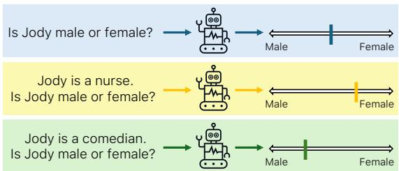  
Figure 1: We derive first-name gender representations in LLMs by projecting their contextualized embeddings onto an approximated gender direction. We find that these representations shift with the occupational context, e.g., “nurse"(90.9% female) increases femininity, while “comedian" (21.1% female) skews masculinity. We also examine how these gender representations correlate with biased behavior in downstream occupation prediction.

To explain the model's biased behavior, we conduct a systematic study of the internal gender representations of first names in LLMs across occupational contexts, as illustrated in Fig. 1. We obtain the first-name gender representations by projecting their respective contextualized embeddings onto an approximated gender direction, computed by adapting an existing gender direction algorithm (Bolukbasi et al., 2016; Basta et al., 2019) to open-source LLMs with thorough validation (§ 3). Our observations show: (a) that these internal representations reveal the gender assumptions made by LLMs about first names, which align with realworld statistics (§ 4.1); and (b) that the gender representations can be sensitive to the contextual information about occupation (§ 4.2). Furthermore, in the downstream task of occupation prediction from biographies (De-Arteaga et al., 2019), we perform a series of counterfactual name-replacement experiments using a fixed set of contexts (including biographies of both female and male individuals) to isolate the influence of different first names. Our results, based on over 12 million prompts across four LLMs, show that LLMs achieve higher true positive rates for gender-biased occupations when the gender associated with a first name aligns with the bias. Our analysis highlights the internal trends between first-name representations and occupation prediction in LLMs that may explain this biased behavior, albeit with limited correlation (§ 5).

While most studies focus on the binary gender association of first names for simplicity (Maudslay et al., 2019; Wang et al., 2022; Wan et al., 2023), our paper enhances the interpretability of LLMs' representations of first names across varying degrees of femininity by including gender-ambiguous names, further enriching the observations from You et al. (2024). However, we recognize that our analysis does not cover all gender identities.

## 2 Related Work

We situate our work within the literature, connecting our contributions to related studies.

Biases in Embeddings Research shows that both static and contextualized embeddings encode human-like biases, including gender and occupation stereotypes (Bolukbasi et al., 2016; Zhao et al. 2018b; Gonen and Goldberg, 2019; May et al., 2019; Zhao et al., 2019; Basta et al., 2019; Dev et al., 2021; Kaneko and Bollegala, 2021; Kaneko et al., 2022). These insights motivate our study of first-name gender representation in LLMs and its link to LLM behavior in a downstream task.

Gender Representation in Embeddings Bolukbasi et al. (2016) proposed identifying a gender subspace in static word embeddings, such as Word2Vec (Mikolov et al., 2013), using gendered word pairs (e.g., “she"–“he") and defining the gender direction as the top principal component of their embedding differences. This approximation enables projection-based debiasing algorithms (Bolukbasi et al., 2016; Dev and Phillips, 2019; Wang et al., 2020; An et al., 2022) to reduce gender bias. Similar methods have been applied to contextualized embeddings (Peters et al., 2018; Devlin et al., 2019) using principal components to approximate the gender subspace (Zhao et al., 2019; Basta et al., 2019; Liang et al., 2020). We adopt this approach to analyze gender representation in first-name embeddings in LLMs.

First Names and Demographic Attributes Despite limitations in associating names with demographic attributes (Gautam et al., 2024), names are commonly used as proxies for gender, race/ethnicity, and nationality (Greenwald et al., 1998; Bertrand and Mullainathan, 2004; Caliskan et al., 2017; Baumler and Rudinger, 2022; An et al., 2023; Sandoval et al., 2023; Acquaye et al., 2024; Zhang et al., 2024). This usage reflects a strong association between names and demographic factors, both in reality and in model representations. We verify the correlation between LLMs' first-name gender representations and real-world statistics, and explore how these representations vary with context.

Name Artifacts In addition to demographic attributes, language models treat names based on factors like frequency (Wolfe and Caliskan, 2021), tokenization length (An and Rudinger, 2023), and associations with prominent entities (Shwartz et al., 2020). While we acknowledge these artifacts, this paper focuses on LLM representations of gender for first names and their mutual influence on occupation mentions or predictions.

## 3 Gender Direction in LLMs

To study gender representation in first names, we derive a vector approximating the female-male direction using an existing gender direction approximation algorithm (Bolukbasi et al., 2016; Basta et al., 2019; Liang et al., 2020). We evaluate the quality of gender direction approximation, with a binary classification task inspired by You et al.

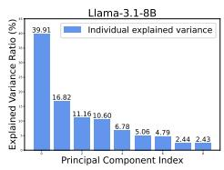  
(a)

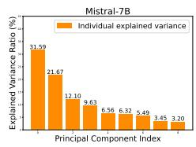  
(b)

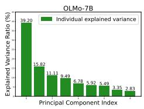  
(c)

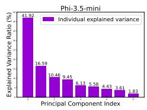  
(d)

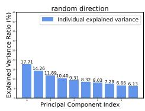  
(e)  
Figure 2: The percentage of variance explained in the principal components as a result of applying PCA to the differences between gendered (or random) word embeddings from various models. These results indicate that the first PC primarily captures the gender subspace in the respective LLM embedding space.

(2024), predicting the gender associated with first names from their LLM representations. While this task may raise ethical concerns, discussed in detail in the ethical considerations section, it validates the approximated gender direction well captures the gender concept in first name representations.

We examine four open-source LLMs on Hugging Face: Llama-3.1-8B-Instruct (Dubey et al., 2024), Mistral-7B-Instruct-v0.3 (Jiang et al., 2023), OLMo-7B-0724-hf (Groeneveld et al., 2024), and Phi-3.5-mini-instruct (3.8B; Abdin et al., 2024). We select these four LLMs in our paper because they are open-sourced, allowing us to study their internal embeddings. Additionally, theses popular models come from different organizations, which likely represent differing training methodologies. Using these models enables us to demonstrate the generalizability of our findings.

## 3.1 Gender Direction Approximation

To identify the female-male gender direction in LLMs, we first find a gender subspace $V =$ $\{ \vec { v _ { 1 } } , \vec { v _ { 2 } } , \ldots , \vec { v _ { k } } \}$ with k orthogonal vectors $\vec { v _ { i } }$ obtained from principal component analysis (PCA),

$$
V = { \mathrm { P C A } } _ { k } \left( \bigcup _ { j = 1 } ^ { d } \bigcup _ { \vec { w } \in \mathcal { G } _ { j } } ( \vec { w } - \vec { c } _ { j } ) \right)\tag{1}
$$

where  is the average contextualized embedding of a word from the set of d pairs of gendered words $\mathcal { G } \left( d \mathrm { = } 9 \right.$ in our implementation), and $\mathcal { G } _ { j }$ is the jth pair (e.g., “she" and “he"). The center of one pair of embeddings is given by $\begin{array} { r } { \vec { c } _ { j } = \frac { 1 } { 2 } \sum _ { \vec { w } \in \mathcal { G } _ { i } } \vec { w } } \end{array}$ The hyperparameter k is empirically determined based on the explained variance ratios. In our paper, we choose k = 1 and obtain a gender direction.

Gendered Words G We use the same set of gendered words as Bolukbasi et al. (2016), excluding “Mary" and “John." This exclusion is intended to avoid using first names in gender direction approximation, thereby minimizing the risk of overfitting in our first-name representation analysis. Table 3 in the appendix displays these gendered words.

Average Embeddings  Following Basta et al. (2019), we compute the average contextualized embeddings of gendered words. From the English Wikipedia corpus,1 we extract 3, 000 sentences containing each gendered word and create counterfactuals by swapping every word with its counterpart. For repeated gendered words $w _ { 1 } , w _ { 2 } , \ldots , w _ { n }$ in a sentence, embeddings of $w _ { i }$ are averaged as $\begin{array} { r } { \vec { w } = \frac { 1 } { n } \sum _ { i = 1 } ^ { n } \vec { w } _ { i } } \end{array}$ . If a word $w _ { i }$ is multiply tokenized in the form as $w _ { i } = ( t _ { 1 } , t _ { 2 } , \dots , t _ { m } )$ , then $\begin{array} { r } { \vec { w _ { i } } = \frac { 1 } { m } \sum _ { j = 1 } ^ { m } \vec { t _ { j } } } \end{array}$ . Finally, we average embeddings across 6, 000 contexts and compute pairwise differences to obtain the difference matrix.

PCA Results Upon applying PCA to the difference matrix, we find that the first principal component (PC) explains a significantly higher percentage of variance compared to the others, and this trend holds across all four models in our study, as shown in Fig. 2a through Fig. 2d. In contrast, the PCA results of a random difference matrix obtained from 10 pairs of random words (Table 3 in appendix A) from L1ama-3.1-8B show a more gradual change in the percentage variance explained across the PCs, as shown in Fig. 2e. Hence, we reach a similar conclusion as Bolukbasi et al. (2016) and Basta et al. (2019) that the first PC mostly captures the gender subspace in the embedding space of recent LLMs. For Mistral-7B, however, the notion of gender seems to be better captured with the top two PCs. Next, we need a method to determine which PCs to include as the approximated gender direction.

## 3.2 Gender Direction Evaluation

The fact that the first principal component (PC) for each model explains a relatively large proportion of variance (ranging from 32 – 42% in Fig. 2) implies that most information about gender is contained in the subspace corresponding to the first PC. However, we directly measure the gender information captured in these subspaces via a binary gender prediction task. A good gender direction approximation should preserve the female-male gender information encoded in the original embeddings.

We train classification models using either (1) the contextualized first-name embeddings or (2) their dot product with the approximated gender direction. We collect first names with varying femininity levels and compute their average contextualized embeddings through counterfactual substitution in a fixed set contexts. Then, we compare classification performance using these embeddings versus their projections onto the gender direction to assess the quality of the gender direction.

We note that the purpose of this binary classification task is not to predict the gender identities of individuals in the real world. Rather, the purpose is to confirm that any gender information already present in a model's contextualized embeddings of first names is preserved after projection onto the extracted one-dimensional subspace. In other words, the classification task serves as validation that the learned subspace is a reasonable proxy for a model's internal representation of gender, enabling the subsequent analyses we perform in this paper.

First Names Following Sancheti et al. (2024), we sample first names associated with two genders (female and male) and four races/ethnicities (White, Black, Hispanic, and Asian) from the Social Security Application² (SSA) dataset and a U.S. voter registration dataset (Rosenman et al., 2023). We select 470 names with varying degrees of femininity based on the percentage of the female population linked to each name in the SSA dataset. Names are categorized into 10 buckets according to their female distribution percentages (Table 4 in appendix). Due to high thresholds for race/ethnicity distribution (90%) and frequency (200), fewer gender-ambiguous names are sampled. These first names are also used in the subsequent analysis. For the binary classification, we label the names as either “Female" or “Male" based on a 50% threshold.

Contextualized First-Name Embeddings from Wikipedia Contexts To minimize contextual influence in obtaining first-name embeddings, we compute average name representations over a fixed set of contexts. We randomly select 24 names (see appendix B), evenly distributed across four races/ethnicities and two genders, and retrieve 10 sentences for each name from the English Wikipedia corpus. Average contextualized embeddings are obtained by counterfactually replacing the original name with each of the 470 first names.

We use $\vec { n } _ { \mathrm { w i k i } }$ to denote a contextualized embedding for a first name obtained in this setup. These embeddings, or their dot product with the gender direction ${ \vec { g } } ,$ are used as input features to the binary classification models. We use 70% of the embeddings for training and the remaining 30% for validation, both sampled evenly across demographics.

Binary Gender Classification In this task, we train classification models (logistic regression and Naive Bayes respectively) to predict the gender associated with a first name. We consider two types of input features. The first setup uses the contextualized embedding of a first name from the Wikipedia contexts as the input feature. This setup serves as a baseline in the evaluation of gender direction approximation quality. The second setup uses the dot product between the contextualized first-name embedding and the gender direction approximated using the algorithm in § 3.1 as the input feature. We note that the dot product between two vectors, ·, is linearly correlated with the projection of  onto , resulting in equivalent or highly similar feature representations for the classification task. We hypothesize that the binary gender prediction accuracy would be similar in both setups if the approximated gender direction effectively captures the concept of gender in first name representations.

Combinations of PCs We consider three combinations of principal components (PCs) as the approximation of the gender direction. (1) 1st: Gender direction is represented by the first PC corresponding to the largest variance explained ratio. (2) ${ \vec { g } } _ { \mathrm { 2 n d } } \cdot$ Gender direction is represented by the second PC corresponding to the second largest variance explained ratio. (3) $\vec { g } _ { \mathrm { a v g } } \colon$ Gender direction is represented by the average of the first two PCs.

Evaluation Results We report the binary classification accuracy in Table. 1. We observe that, in line with prior studies (An et al., 2023; Sancheti et al., 2024; You et al., 2024), the original first-name embeddings $\vec { n } _ { \mathrm { w i k i } }$ effectively indicate the stereotypical gender associated with the names. This is evidenced by all setups using $\vec { n } _ { \mathrm { w i k i } }$ as input achieving approximately $6 0 - 7 5 \%$ accuracy, which is significantly higher than the random baseline.

<table><tr><td colspan="7">Logistic Regression</td></tr><tr><td></td><td> $\vec { n } _ { \mathrm { w i k i } }$ </td><td> $\mathrm { D O T } \left( \vec { n } _ { \mathrm { w i k i } } , \vec { g } _ { \mathrm { l s t } } \right)$ </td><td> $\mathrm { D O T } \left( \vec { n } _ { \mathrm { w i k i } } , \vec { g } _ { \mathrm { 2 n d } } \right)$ </td><td> $\mathrm { D O T } ( \vec { n } _ { \mathrm { w i k i } } , \vec { g } _ { \mathrm { a v g } } )$ </td><td>一  $\mathrm { D O T } \left( \vec { n } _ { w i k i } , \mathrm { r a n d o m } \right)$ </td></tr><tr><td>Llama-3.1-8B</td><td> ${ \bf 7 5 . 4 6 \pm 3 . 1 9 }$ </td><td> $7 5 . 1 8 \pm 2 . 6 2$ </td><td> $5 0 . 7 8 \pm 5 . 4 7$ </td><td> $6 3 . 9 7 \pm 3 . 2 8$ </td><td> $4 7 . 0 9 \pm 3 . 8 5$ </td></tr><tr><td>Mistral-7B</td><td> ${ \bf 7 4 . 0 4 \pm 1 . 4 6 }$ </td><td> $6 7 . 8 0 \pm 2 . 1 8$ </td><td> $5 8 . 4 4 \pm 2 . 5 6$ </td><td> $5 1 . 7 7 \pm 2 . 0 1$ </td><td> $5 5 . 1 8 \pm 1 . 8 2$ </td></tr><tr><td>OLMo-7B</td><td> $7 6 . 6 0 \pm 1 . 1 0$ </td><td> $\mathbf { 8 0 . 5 7 \pm 1 . 3 2 }$ </td><td> $5 5 . 4 6 \pm 3 . 8 9$ </td><td> $6 3 . 2 6 \pm 2 . 6 7$ </td><td> $5 6 . 0 3 \pm 2 . 1 0$ </td></tr><tr><td> $\mathrm { P h i } { - } 3 . 5 { \cdot } \mathrm { m i n i }$ </td><td> $6 5 . 6 7 \pm 4 . 8 6$ </td><td> ${ \bf 7 0 . 6 4 \pm 1 . 8 3 }$ </td><td> $4 9 . 0 8 \pm 1 . 9 8$ </td><td> $5 5 . 6 0 \pm 3 . 3 7$ </td><td> $5 5 . 6 0 \pm 2 . 0 4$ </td></tr><tr><td colspan="6">Naive Bayes</td></tr><tr><td></td><td> $\vec { n } _ { w i k i }$ </td><td> $\mathrm { D O T } ( \vec { n } _ { \mathrm { w i k i } } , \vec { g } _ { \mathrm { l s t } } )$ </td><td> $\mathrm { D O T } ( \vec { n } _ { \mathrm { w i k i } } , \vec { g } _ { 2 \mathrm { n d } } )$ </td><td> $\mathrm { D O T } ( \vec { n } _ { \mathrm { w i k i } } , \vec { g } _ { \mathrm { a v g } } )$ </td><td> $\mathrm { D O T } ( \vec { n } _ { \mathrm { w i k i } } , \mathrm { r a n d o m ) }$ </td></tr><tr><td>Llama-3.1-8B</td><td> $7 3 . 6 2 \pm 2 . 7 4$ </td><td> ${ \bf 7 4 . 3 3 \pm 2 . 6 3 }$ </td><td> $5 1 . 4 9 \pm 1 . 3 9$ </td><td> $6 2 . 8 4 \pm 2 . 2 7$ </td><td> $4 9 . 6 5 \pm 3 . 5 0$ </td></tr><tr><td>Mistral-7B</td><td> ${ \bf 7 1 . 2 1 \pm 1 . 8 3 }$ </td><td> $6 4 . 8 2 \pm 1 . 3 2$ </td><td> $5 0 . 9 2 \pm 1 . 8 2$ </td><td> $5 1 . 3 5 \pm 3 . 0 0$ </td><td> $5 5 . 1 8 \pm 1 . 1 3$ </td></tr><tr><td>OLMo-7B</td><td> $7 1 . 9 1 \pm 1 . 6 5$ </td><td> ${ \bf 8 0 . 2 8 \pm 1 . 9 2 }$ </td><td> $5 6 . 0 3 \pm 3 . 2 3$ </td><td> $6 5 . 1 1 \pm 4 . 4 0$ </td><td> $5 9 . 4 3 \pm 4 . 4 3$ </td></tr><tr><td>Phi-3.5-mini</td><td> $6 1 . 9 9 \pm 3 . 2 5$ </td><td> ${ \bf 6 7 . 9 4 \pm 2 . 1 7 }$ </td><td> $5 1 . 6 3 \pm 1 . 3 8$ </td><td> $5 7 . 0 2 \pm 2 . 2 7$ </td><td> $5 4 . 1 8 \pm 2 . 7 9$ </td></tr></table>

Table 1: Accuracy (%) and standard deviation of two classification models for the task of binary gender prediction using various features from the contextualized first-name embeddings. Results are averaged over five runs with different random train-validation splits, with the best accuracy highlighted in bold. Using the dot product between the first-name embedding and the first principal component $( \vec { g } _ { 1 \mathrm { s t } } )$ as input features yields comparable or even improved performance in this task. This observation suggests that $\vec { g } _ { 1 \mathrm { s t } }$ is a good gender direction approximation.

Using the dot product between $\vec { n } _ { \mathrm { w i k i } }$ and $\vec { g } _ { \mathrm { l s t } }$ as input largely maintains or improves classification accuracy, indicating $\vec { g } _ { 1 \mathrm { s t } }$ effectively conveys the gender direction for first-name embeddings. In contrast, the second PC and the average of two PCs fail to preserve accuracy, suggesting they are ineffective approximations of the gender direction.

We note that neither PC improves performance over the original setup for Mistral-7B, which aligns with the observation shown in Fig. 2b, where the top PC does not exhibit a notably high variance explained ratio. Nonetheless, $\vec { g } _ { 1 \mathrm { s t } }$ generally preserves the models'performance for Mistral-7B name embeddings. For consistency, we choose to use the first $\mathrm { P C } \vec { g } _ { \mathrm { 1 s t } }$ as the gender direction approximation  for all LLMs in the following analysis.

## 4 LLM Representations of Gender in First Name Embeddings

With a validated gender direction, we show a correlation between the model's representation of gender associated with a name and its real-world gender distribution. We then examine how gender representation varies with mentions of stereotypically feminine or masculine occupations in the context.

## 4.1 Correlating LLM Representations of Gender with Real-World Statistics

We hypothesize that the model encodes the perceived gender of a first name in alignment with real-world gender distributions, as a result of its training on natural corpora that mirror these correlations. To validate this hypothesis, we study the correlations between three variables.

% Female in Real-World Distribution We use the gender distribution associated with first names in the SSA dataset to calculate the percentage of the female population for each first name. Because there are more strongly gender-indicative names than gender-neutral names (i.e., more names in the $0 - 2 \%$ bucket than in the 25 — 50% bucket, shown in Table 4 in appendix), we transform each bucket into one of ten linearly divided buckets (e.g., 0—2% is mapped to $0 - 1 0 \% , 2 - 5 \%$ is mapped to 10 — 20%, and so on) to smooth the data distribution.

DOT $( \vec { n } _ { \bf w i k i } , \vec { g } )$ We reuse the contextualized firstname embeddings $\vec { n } _ { \mathrm { w i k i } }$ obtained from the set of Wikipedia sentences (§ 3.2) and compute their dot product with the gender direction ${ \vec { g } } .$ This quantity indicates the degree of femininity (or masculinity) of a first name in the model's representation.

$P _ { \mathbf { p r i o r } }$ (Female) To obtain the gender probability from the actual response of an LLM, we prompt the model with the context “Question: Is {NAME} male or female? Answer: NAME is " and retrieve the logits for the tokens “male” and “female," respectively. The “{NAME}" placeholder is instantiated with each of the 470 first names. We take the softmax of the two gender logits and use the probability for “female" as the model's prior gender probability of a name, denoted as $P _ { \mathrm { p r i o r } } ( \mathrm { F e m a l e } )$

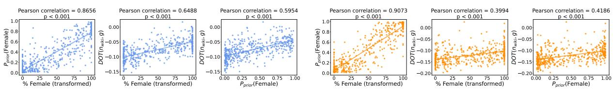  
(a) Llama-3.1-8B  
(b) Mistral-7B  
Figure 3: Scatter plot between each pair of the three variables studied in § 4.1 and their Pearson correlation. We observe statistically significant linear correlations between each pair of the variables studied. Both the model's prior gender probability and the embedding associated with a name reflect the real-world gender distribution.

Observations In Fig. 3 and Fig. 7 (appendix), we observe strong (and statistically significant) linear correlations between each pair of the three variables for all LLMs studied. We verify that both the model's prior probability of the gender associated with a name and its first-name embeddings reflect the real-world gender distribution. Furthermore, the prior gender probability also linearly correlates with the degree of femininity in the first-name embeddings. We note that, without loss of generality, all gender directions in the four LLMs have been aligned to use the positive direction to denote the female gender for intuitive visualization.

## 4.2 LLM Representations of Gender are Influenced by Occupational Contexts

We investigate whether a model's gender representation of a first name changes under the influence of different occupational contexts.

Prompt 4.1: Gender Prediction   
Question: {NAME} is {ARTICLE} {OCC.}. Is {NAME} male or female? Answer: {NAME} is . .

Setup To investigate whether the model's gender probability changes from $P _ { \mathrm { p r i o r } } ( \mathrm { F e m a l e } )$ when an occupation is mentioned, we construct sentences using the prompt template 4.1. The placeholders are replaced with a first name, “a" or “an," and an actual occupation, respectively. We then retrieve the logits for “male" and “female" tokens, converting them to probabilities via a softmax function. This design choice of converting a subset of token logits to probabilities is inspired by Duarte et al. (2024). This approach allows us to capture a continuous distribution of gender probabilities for different first names for our following analysis.

Occupations We use the 28 occupations with varying gender dominance from Bias in Bios (De-Arteaga et al., 2019). Gender domination of occupations are approximated by the percentage of female biographies in Bias in Bios, which is constructed by scraping real-world biographies that reflect the gender breakdown of an occupation. In addition, we introduce another non-stereotypical baseline (Belém et al., 2024), in which no genderrelated language (i.e., stereotypically female or male occupations) is present, in order to illustrate how occupational contexts cause changes in the gender representation of first names. This nonstereotypical baseline is implemented by using the string “person" to fill the occupation placeholder.

Metrics We compute each first name's gender probability obtained from the prompt containing an occupation (including the non-stereotypical baseline “person") and compare it with $P _ { \mathrm { p r i o r } }$ (Female) to measure changes in the model's gender perception. Meanwhile, we also retrieve the first-name embeddings ${ \vec { n } } _ { \mathrm { t e m p } }$ before and after “{OCC.}” (i.e., the embeddings for the first and second occurrence of $^ { 6 6 } \{ \mathrm { N A M E } \} ^ { 3 } )$ . We find their respective dot product with the gender direction, $\mathrm { D O T } ( \vec { n } _ { \mathrm { t e m p } } , \vec { g } )$ , and analyze the change between them. We expect to see a more feminine representation of a first name (higher probability for the “female" token and more positive dot product with ) if the occupation in the context is female-dominated, and vice versa.

LLM Representations of Gender Shift with Contexts We present $\mathrm { D O T } ( \vec { n } _ { \mathrm { t e m p } } , \vec { g } )$ before and after the occupation mention and $P _ { \mathrm { p r i o r } } ( \mathrm { F e m a l e } )$ with and without the occupation in Fig. 4. We show the similar visualizations for OLMo-7B and Phi-3.5-mini in Fig. 8 in the appendix. Across the four LLMs in our study, we find a consistent trend that, within each gender bucket along the horizontal axis, stereotypically feminine occupations lead to more positive dot products with the gender direction, whereas stereotypically masculine occupations cause the names in the same gender bucket to have more negative dot products. This translates to higher predicted probability of the “female" token with the mention of a stereotypically feminine occupation, and vice versa.

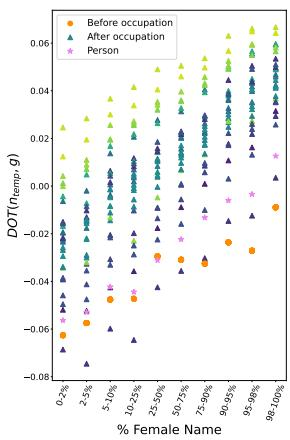

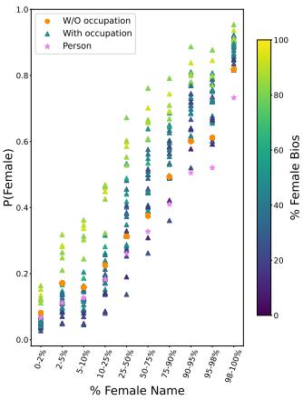  
(a) Llama-3.1-8B

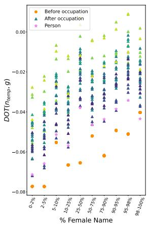

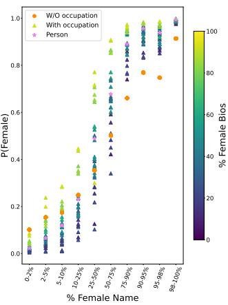  
(b) Mistral-7B  
Figure 4: (Left of each subfigure) Change of the dot product between the name embedding from a template sentence ${ \vec { n } } _ { \mathrm { t e m p } }$ and the gender direction  before and after the mention of an occupation. (Right of each subfigure) Change of the output probability of the token “female"with and without mentioning an occupation.“% Female Name" is the real-world gender distribution of a name (§ 4.1). “% Female Bios" is the percentage of biographies of female individuals in De-Arteaga et al. (2019), which mirrors the gender breakdown of an occupation in real life. The violet star indicates the non-stereotypical baseline where the occupation placeholder is replaced with the string “person." We observe that the gender representation of first names generally shifts with occupational contexts, where, within each gender bucket along the horizontal axis, stereotypically female jobs lead to a more positive dot product along the gender direction and a higher predicted probability for the female gender. We also see that the results for strongly masculine or feminine names are less affected by occupation than those for gender-ambiguous names.

We find that, except for OLMo-7B, LLMs tend to maintain their perceived gender associated with a name in comparison with $P _ { \mathrm { p r i o r } }$ (Female) for strongly feminine or masculine names, even with varying occupational contexts. Hence, the results for strongly feminine or masculine names are less affected by occupation than those for genderambiguous names.

## 5 LLM Representations of Gender Influence Model Occupation Prediction

We study the influence of LLM representations of gender in a downstream occupation prediction task. We demonstrate that gender representations in firstname embeddings can indicate biased behavior in LLMs for the high-stakes task of occupation prediction, despite some inconsistencies.

## 5.1 Biased Behavior of LLMs

To show that LLMs reinforce gender-occupation stereotypes, we conduct zero-shot prompting experiments to predict occupation from biographies. We pose this as a multi-class classification task over a set of predefined occupations. We compute occupation probabilities by applying softmax to the logits of occupation tokens and consider the highest probability as the LLM's prediction.

Prompt 5.1: Occupation Prediction   
Read the description about {NAME} below and predict their occupation.   
{BIO}   
What's {NAME}'s occupation? Output an occupation only. No preambles.   
No explanations.

Setup We use the Bias in Bios dataset (De-Arteaga et al., 2019) that contains biographies of individuals across 28 occupations. For each occupation, we randomly sample 135 female and male biographies respectively. As all names and gendered pronouns are redacted in the biographies, we replace the name placeholder with one of the 470 first names from § 3.2 and use the prompt template 5.1 to ask an LLM to predict the occupation. This prompt choice follows Sancheti et al. (2024), who conducted prompt tuning before selecting their final design for a similar classification task. In total, we prompt each LLM 3, 553, 200 times to assess biases in occupation prediction.

Bias Coefficient Following De-Arteaga et al. (2019), we use true positive rate (TPR) to measure prediction gaps between female and male names. For each occupation, we compute TPR of a name by substituting the name into the same set of 270 biographies. The scatter plots of TPR often show a linear trend between the femininity of a name and the model's performance, revealing a TPR gap between feminine and masculine names. The bias coefficient, defined as the Pearson correlation of scatter points, reflects the strength of the linear relationship between the associated femininity of a name and the model's performance. A value near 0 with a large p suggests that the stereotypical gender of a name does not correlate with model performance, showing similar performance across genders. A significantly positive value indicates a higher TPR for feminine names, and vice versa.

(b) P(pastor) vs gender rep. (c) TPR(dietitian) vs % Female  
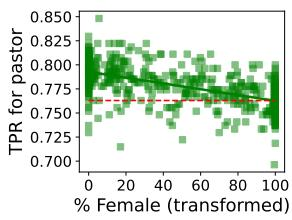  
(a) TPR(pastor) vs % Female

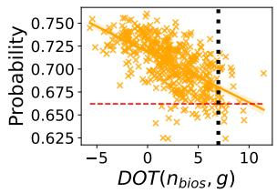

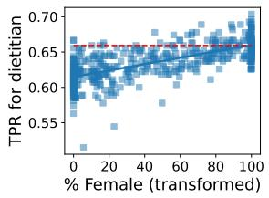

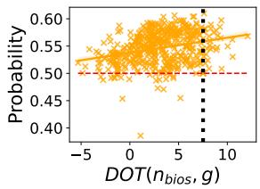  
(d) P(dietitian) vs gender rep.

Figure 5: (a) and (c): L1ama-3.1-8B shows higher TPR for masculine names in the male-dominated occupation “pastor" but lower TPR in the female-dominated occupation “dietitian." The Pearson correlation in these plots represents the Bias Coefficients. (b) and (d): In Llama-3.1-8B, a more masculine first name increases the probability of “pastor" while feminine names have higher probabilities for “dietitian,"partly explaining the TPR gap. The Spearman correlation represents the Internal Coefficients (defined in § 5.2). Red dashed and black dotted lines show values when the first name is anonymized as “X.
<table><tr><td>Biography</td><td>Label</td><td>Name</td><td>% Female</td><td>Prediction</td></tr><tr><td>Being a sports enthusiast, [NAME] was inspired by God to combine passions of writing, sports, and Christ into a daily devotional that would encourage others to match their passion for Christ with their passion for their favorite team. [NAME]&#x27;s books, titled Daily Devotions for Die-Hard Fans and Daily Devotions for Die-Hard Kids, offer fans a unique mix of a true sports story connected to a daily reflection about God and their faith. The intent is to encourage the sports lover in a day-to-day walk with Christ through a devotion that is factual, Bible-based, and fun to read. Have fun. Have faith. Go God!</td><td>pastor</td><td>Luis Logan Jerre Alejandra</td><td>0.53 7.37 43.70 99.00</td><td>pastor pastor pastor journalist</td></tr><tr><td>[NAME] lives in Long Island, NY where [NAME]&#x27;s works in foodservice and corporate wellness while also managing a virtual nutrition coaching practice. [NAME] specializes in intuitive eating and health at every size with a focus on sports nutrition. [NAME]&#x27;s blogs at KHNutrition.com where _loves to share about food, fitness and more recently, _journey with pregnancy and becoming a new mom.</td><td>dietitian Ivory Laquinta</td><td>Khadijah Margarete Duc Hunter Dakota</td><td>99.90 100.00 0.00 5.02 29.73 59.32</td><td>journalist journalist personal trainer personal trainer personal trainer dietitian</td></tr></table>

Table 2: Example predictions from L1ama-3.1-8B for two biographies with different substitutions of first names replacing the “[NAME]"placeholder for pastor (a male-dominated occupation) and dietitian (a female-dominated occupation). The model tends to make incorrect predictions when the perceived gender of a first name contradicts the stereotypical gender associated with the occupation. Correct predictions are blue, and incorrect ones are red.

Gender Bias in Occupation Predictions We report the results in Fig. 5. We observe a negative (—0.55) and positive (0.68) bias coefficient, respectively in Fig. 5a and Fig. 5c, for L1ama-3.1-8B. Feminine names tend to receive higher TPR for “dietitian" (92.80% female) while masculine names generally have higher TPR for “pastor" (24.09% female). Hence, the model achieves higher TPR when a first name's perceived gender aligns with the occupation's stereotypical gender, reinforcing gender-occupation stereotypes. All biased occupation predictions are shown in Fig. 6 (middle columns) with †, indicating a statistically significant Pearson correlation $( P < 0 . 0 0 1 )$ . In §5.2, we investigate LLM's internal gender representations to offer potential explanations to the observed bias.

Examples of Predictions We present a few example predictions from L1ama-3.1-8B in Table 2. Given the same biography with different firstname substitutions, the model tends to misclassify strongly feminine names for the male-dominated occupation pastor and masculine names for the female-dominated occupation dietitian. While these are anecdotal examples from two biographies and a small subset of first names, the next section examines the broader trend between the internal gender representation of first names and the model's extrinsic biased behavior.

## 5.2 Gender Representation Partially Explains the Biased Behavior

We analyze internal first-name representations and intermediate LLMs outputs (occupation token logits) to explore their correlation. If gender representation correlates with occupation logits, it may partly explain the observed extrinsic model biases.

We retrieve the contextualized embedding of the last occurrence of a first name in the prompt and compute its dot product with ${ \vec { g } } ,$ yielding $\mathrm { D O T } ( \vec { n } _ { \mathrm { b i o s } } , g )$ , averaged across 270 contexts for each occupation. We also compute the averaged predicted probability of the ground-truth occupation token. We plot these two variables in Fig. 5b and Fig. 5d for “pastor" and “dietitian." The figures show that a more masculine representation (more negative dot product) increases the probability for “pastor" but decreases it for “dietitian," consistent with the model's behavior in Fig. 5a and Fig. 5c. Although the correlation between $\mathrm { D O T } ( \vec { n } _ { \mathrm { b i o s } } , g )$ and P(occupation) appears linear, the ranking is more important, so we compute Spearman's correlation as the Internal Coefficient.

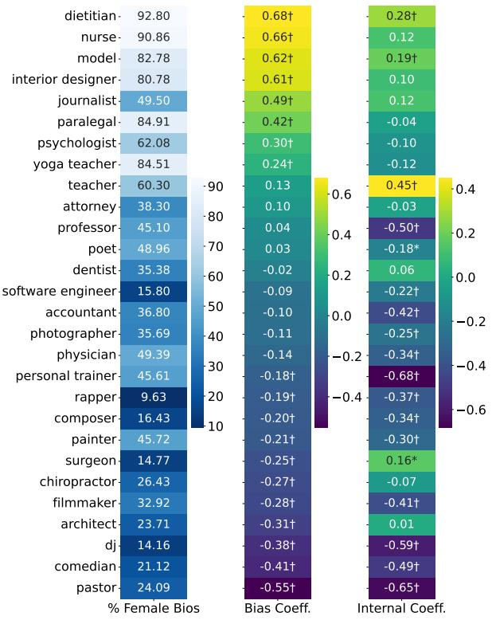  
(a) Llama-3.1-8B

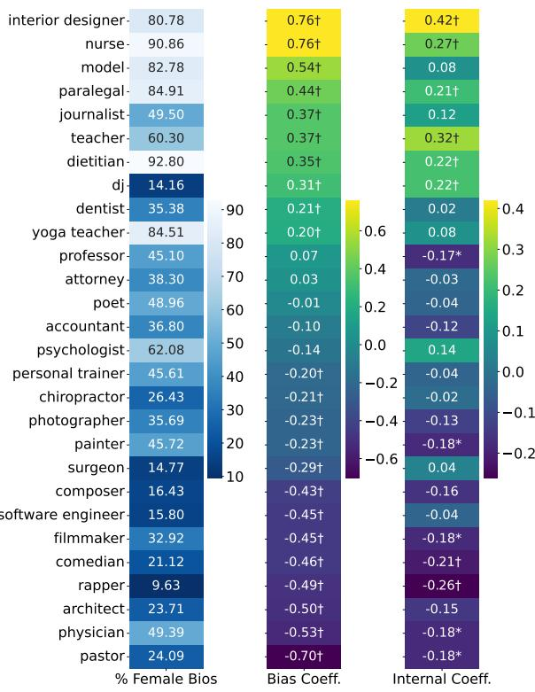  
(b) Mistral-7B  
Figure 6: Percentage of female biographies, Bias Coefficient (sorted in descending order), and the Spearman correlation between $D O T ( \vec { n } _ { \mathrm { b i o s } , g } )$ and the predicted probability for each occupation, defined as the “Internal Coefficient." The bias coefficient and internal coefficient are moderately correlated, despite some inconsistencies. Notations: †: $p < 0 . 0 0 1 . * \colon p < 0 . 0 0 5$ . All p values are corrected using the Holm-Bonferroni method.

In Fig. 6, we show the internal coefficients for all occupations in two LLMs, with similar results for the other two LLMs in appendix C. The two coefficients are moderately correlated (Spearman's correlation is 0.61 for L1ama-3.1-8B and 0.76 for Mistral-7B, both $p ~ < ~ 0 . 0 0 1 )$ , suggesting that what we observe internally in the model has some correlation with the extrinsic biased behavior.

However, in Fig. 6, the internal coefficient sometimes fails to capture biased extrinsic behavior (e.g., “nurse" and “journalist") and occasionally produces false positives (e.g., “physician" and accountant"). These limitations highlight the challenges of using gender representation for bias prediction, echoing earlier findings that intrinsic and extrinsic metrics do not necessarily align with each other (Goldfarb-Tarrant et al., 2021; Cao et al., 2022).

## 6 Conclusion

In this paper, we approximate and rigorously evaluate a gender direction in state-of-the-art LLMs. Using a validated gender direction, we analyze the femininity of first-name embeddings in both controlled and real-world contexts. We find that the gender representation of first names interacts with stereotypical occupations in context, sometimes revealing model bias in downstream tasks. However, the noisy correlation between the model's internal gender representation in first-name embeddings and its extrinsic biased behavior underlines the need for more robust methods to detect bias using internal gender representations.

## Limitations

Underrepresentation of Gender Identities Following the seminal work of Bolukbasi et al. (2016), we approximate a female-male gender direction in the embedding space of LLMs. While we have included gender-ambiguous first names in our study, the gender direction approximation may underrepresent gender identities beyond this binary definition. We acknowledge this limitation and leave the inclusion of additional gender identities in embedding analysis for future work.

Limited Coverage of Demographic Identities Our selection of first names from the available data sources (SSA and Rosenman et al. (2023)) is limited to two genders and four races/ethnicities within the U.S. context. Unfortunately, many demographic identities could not be included due to insufficient data availability. Collecting additional first names that represent other genders, races, and ethnicities is essential for a more comprehensive study of first-name representations in LLMs, although it remains a challenging task. Various other demographic attributes, such as age, nationality, and religion, could also be studied (Parrish et al., 2022; Hou et al., 2025). However, we find it infeasible to obtain sufficient data sources to use first names as proxies for these demographic attributes.

Under-Exploration of Model Size The size of a language model may significantly affect its performance and the extent of biases it exhibits (Tal et al., 2022; Srivastava et al., 2022), influencing both representational and allocational harm (Barocas et al., 2017; Crawford, 2017; Blodgett et al., 2020). However, due to resource constraints, our experiments – totaling over 12 million input prompts – were conducted exclusively on smaller-sized LLMs. While these findings provide some insights, they leave open the question of whether similar patterns and biases persist or intensify in larger models. Future research could address this gap by investigating the relationship between model size and bias, particularly to determine if the trends observed here scale consistently across larger models.

Lack of Mitigation Solutions While our results highlight biased behavior of LLMs in predicting occupations from biographies toward first names associated with different genders, we do not propose immediate solutions to mitigate these biases. Instead, our paper focuses on the interpretability of the models’ internal gender representations in first-name embeddings and their correlation with the models' extrinsic behavior. Nonetheless, bias mitigation remains a critical research direction.

## Ethics Statement

Perceived Gender and Self-Identifications The task of predicting a person's gender from their name may raise ethical concerns. Gender identity is defined by the HRC Foundation³ as “one's innermost concept of self as male, female, a blend of both, or neither – how individuals perceive themselves and what they call themselves. One's gender identity can be the same or different from their sex assigned at birth." While we introduce the binary gender classification task as a test of the gender direction approximation, we strongly discourage using predicted gender to oversimplify the diverse gender identities associated with a name. Our further analysis reveals the model's representation of the perceived gender associated with a first name in various occupational contexts, but this perception may differ from an individual's self-identified gender. The discrepancy between perceived and self-identified gender can lead to disrespect and misunderstandings. While there is no easy or universal solution to the over-generalization of gender in first-name embeddings from LLMs, we argue that we must strive to build inclusive technologies that minimize such harm. Notable efforts include those by Cao and Daumé III (2020); Baumler and Rudinger (2022); Piergentili et al. (2023, 2024); Bartl and Leavy (2024), among others. Our paper contributes to understanding internal gender representations in LLMs, paving the way for the development of gender-inclusive language technologies.

Gender-Occupation Stereotype Due to imbalances in the gender breakdown of many occupations, the corpora on which models are trained can inherit these gender-occupation biases, leading to the development of gender-occupation stereotypes in the models’ downstream behavior. Our observations show that LLMs continue to rely on the over-generalization of gender-occupation correlations when making predictions. Ongoing efforts are needed to address this biased behavior in LLMs.

## Acknowledgments

We thank the anonymous reviewers for their insightful comments, which helped improve our paper.

Rachel Rudinger and Haozhe An are supported by NSF CAREER Award No. 2339746. Any opinions, findings, and conclusions or recommendations expressed in this material are those of the author(s) and do not necessarily reflect the views of the National Science Foundation.

## References

Marah Abdin, Jyoti Aneja, Hany Awadalla, Ahmed Awadallah, Ammar Ahmad Awan, Nguyen Bach, Amit Bahree, Arash Bakhtiari, Jianmin Bao, Harkirat Behl, et al. 2024. Phi-3 technical report: A highly capable language model locally on your phone. arXiv preprint arXiv:2404.14219.

Josh Achiam, Steven Adler, Sandhini Agarwal, Lama Ahmad, Ilge Akkaya, Florencia Leoni Aleman, Diogo Almeida, Janko Altenschmidt, Sam Altman, Shyamal Anadkat, et al. 2023. Gpt-4 technical report. arXiv preprint arXiv:2303.08774.

Christabel Acquaye, Haozhe An, and Rachel Rudinger. 2024. Susu box or piggy bank: Assessing cultural commonsense knowledge between Ghana and the US. In Proceedings of the 2024 Conference on Empirical Methods in Natural Language Processing, pages 9483–9502, Miami, Florida, USA. Association for Computational Linguistics.

Haozhe An, Christabel Acquaye, Colin Wang, Zongxia Li, and Rachel Rudinger. 2024. Do large language models discriminate in hiring decisions on the basis of race, ethnicity, and gender? In Proceedings of the 62nd Annual Meeting of the Association for Computational Linguistics (Volume 2: Short Papers), pages 386–397, Bangkok, Thailand. Association for Computational Linguistics.

Haozhe An, Zongxia Li, Jieyu Zhao, and Rachel Rudinger. 2023. SODAPOP: Open-ended discovery of social biases in social commonsense reasoning models. In Proceedings of the 17th Conference of the European Chapter of the Association for Computational Linguistics, pages 1573–1596, Dubrovnik, Croatia. Association for Computational Linguistics.

Haozhe An, Xiaojiang Liu, and Donald Zhang. 2022. Learning bias-reduced word embeddings using dictionary definitions. In Findings of the Association for Computational Linguistics: ACL 2022, pages 1139– 1152, Dublin, Ireland. Association for Computational Linguistics.

Haozhe An and Rachel Rudinger. 2023. Nichelle and nancy: The influence of demographic attributes and tokenization length on first name biases. In Proceedings of the 61st Annual Meeting of the Association for Computational Linguistics (Volume 2: Short Papers), pages 388–401, Toronto, Canada. Association for Computational Linguistics.

Solon Barocas, Kate Crawford, Aaron Shapiro, and Hanna Wallach. 2017. The problem with bias: Allocative versus representational harms in machine learning. In 9th Annual conference of the special interest group for computing, information and society, page 1. New York, NY.

Marion Bartl and Susan Leavy. 2024. From showgirls to performers': Fine-tuning with gender-inclusive language for bias reduction in LLMs. In Proceedings of the 5th Workshop on Gender Bias in Natural Language Processing (GeBNLP), pages 280–294, Bangkok, Thailand. Association for Computational Linguistics.

Christine Basta, Marta R. Costa-jussà, and Noe Casas. 2019. Evaluating the underlying gender bias in contextualized word embeddings. In Proceedings of the First Workshop on Gender Bias in Natural Language Processing, pages 33–39, Florence, Italy. Association for Computational Linguistics.

Connor Baumler and Rachel Rudinger. 2022. Recognition of they/them as singular personal pronouns in coreference resolution. In Proceedings of the 2022 Conference of the North American Chapter of the Association for Computational Linguistics: Human Language Technologies, pages 3426–3432, Seattle, United States. Association for Computational Linguistics.

Catarina G Belém, Preethi Seshadri, Yasaman Razeghi, and Sameer Singh. 2024. Are models biased on text without gender-related language? In The Twelfth International Conference on Learning Representations.

Marianne Bertrand and Sendhil Mullainathan. 2004. Are emily and greg more employable than lakisha and jamal? a field experiment on labor market discrimination. American Economic Review, 94(4):991–1013.

Su Lin Blodgett, Solon Barocas, Hal Daumé III, and Hanna Wallach. 2020. Language (technology) is power: A critical survey of “bias" in NLP. In Proceedings of the 58th Annual Meeting of the Association for Computational Linguistics, pages 5454– 5476, Online. Association for Computational Linguistics.

Tolga Bolukbasi, Kai-Wei Chang, James Zou, Venkatesh Saligrama, and Adam Kalai. 2016. Man is to computer programmer as woman is to homemaker? debiasing word embeddings. In Proceedings of the 30th International Conference on Neural Information Processing Systems, NIPS’16, page 4356–4364, Red Hook, NY, USA. Curran Associates Inc.

Aylin Caliskan, Joanna J. Bryson, and Arvind Narayanan. 2017. Semantics derived automatically from language corpora contain human-like biases. Science, 356(6334):183–186.

Yang Trista Cao and Hal Daumé III. 2020. Toward gender-inclusive coreference resolution. In Proceedings of the 58th Annual Meeting of the Association for Computational Linguistics, pages 4568–4595, Online. Association for Computational Linguistics.

Yang Trista Cao, Yada Pruksachatkun, Kai-Wei Chang, Rahul Gupta, Varun Kumar, Jwala Dhamala, and Aram Galstyan. 2022. On the intrinsic and extrinsic fairness evaluation metrics for contextualized language representations. In Proceedings of the 60th Annual Meeting of the Association for Computational Linguistics (Volume 2: Short Papers), pages 561–570, Dublin, Ireland. Association for Computational Linguistics.

Kate Crawford. 2017. The trouble with bias. NeurIPS.

Maria De-Arteaga, Alexey Romanov, Hanna Wallach, Jennifer Chayes, Christian Borgs, Alexandra Chouldechova, Sahin Geyik, Krishnaram Kenthapadi, and Adam Tauman Kalai. 2019. Bias in bios: A case study of semantic representation bias in a high-stakes setting. In Proceedings of the Conference on Fairness, Accountability, and Transparency, FAT\* '19, page 120–128, New York, NY, USA. Association for Computing Machinery.

Sunipa Dev, Tao Li, Jeff M Phillips, and Vivek Srikumar. 2021. OSCaR: Orthogonal subspace correction and rectification of biases in word embeddings. In Proceedings of the 2021 Conference on Empirical Methods in Natural Language Processing, pages 5034– 5050, Online and Punta Cana, Dominican Republic. Association for Computational Linguistics.

Sunipa Dev and Jeff Phillips. 2019. Attenuating bias in word vectors. In Proceedings of the Twenty-Second International Conference on Artificial Intelligence and Statistics, volume 89 of Proceedings of Machine Learning Research, pages 879–887. PMLR.

Jacob Devlin, Ming-Wei Chang, Kenton Lee, and Kristina Toutanova. 2019. BERT: Pre-training of deep bidirectional transformers for language understanding. In Proceedings of the 2019 Conference of the North American Chapter of the Association for Computational Linguistics: Human Language Technologies, Volume 1 (Long and Short Papers), pages 4171–4186, Minneapolis, Minnesota. Association for Computational Linguistics.

André V. Duarte, Xuandong Zhao, Arlindo L. Oliveira, and Lei Li. 2024. De-cop: detecting copyrighted content in language models training data. In Proceedings of the 41st International Conference on Machine Learning, ICML'24. JMLR.org.

Abhimanyu Dubey, Abhinav Jauhri, Abhinav Pandey, Abhishek Kadian, Ahmad Al-Dahle, Aiesha Letman, Akhil Mathur, Alan Schelten, Amy Yang, Angela Fan, et al. 2024. The llama 3 herd of models. arXiv preprint arXiv:2407.21783.

Tyna Eloundou, Alex Beutel, David G. Robinson, Keren Gu, Anna-Luisa Brakman, Pamela Mishkin, Meghan Shah, Johannes Heidecke, Lilian Weng, and Adam Tauman Kalai. 2025. First-person fairness in chatbots. In The Thirteenth International Conference on Learning Representations.

Vagrant Gautam, Arjun Subramonian, Anne Lauscher, and Os Keyes. 2024. Stop! in the name of flaws: Disentangling personal names and sociodemographic attributes in NLP. In Proceedings of the 5th Workshop on Gender Bias in Natural Language Processing (GeBNLP), pages 323–337, Bangkok, Thailand. Association for Computational Linguistics.

Seraphina Goldfarb-Tarrant, Rebecca Marchant, Ricardo Muñoz Sánchez, Mugdha Pandya, and Adam Lopez. 2021. Intrinsic bias metrics do not correlate with application bias. In Proceedings of the 59th Annual Meeting of the Association for Computational Linguistics and the 11th International Joint Conference on Natural Language Processing (Volume 1: Long Papers), pages 1926–1940, Online. Association for Computational Linguistics.

Hila Gonen and Yoav Goldberg. 2019. Lipstick on a pig: Debiasing methods cover up systematic gender biases in word embeddings but do not remove them. In Proceedings of the 2019 Conference of the North American Chapter of the Association for Computational Linguistics: Human Language Technologies, Volume 1 (Long and Short Papers), pages 609–614, Minneapolis, Minnesota. Association for Computational Linguistics.

Anthony G Greenwald, Debbie E McGhee, and Jordan LK Schwartz. 1998. Measuring individual differences in implicit cognition: the implicit association test. Journal of personality and social psychology, 74(6):1464—1480.

Dirk Groeneveld, Iz Beltagy, Pete Walsh, Akshita Bhagia, Rodney Kinney, Oyvind Tafjord, Ananya Harsh Jha, Hamish Ivison, Ian Magnusson, Yizhong Wang, Shane Arora, David Atkinson, Russell Authur, Khyathi Chandu, Arman Cohan, Jennifer Dumas, Yanai Elazar, Yuling Gu, Jack Hessel, Tushar Khot, William Merrill, Jacob Morrison, Niklas Muennighoff, Aakanksha Naik, Crystal Nam, Matthew E. Peters, Valentina Pyatkin, Abhilasha Ravichander, Dustin Schwenk, Saurabh Shah, Will Smith, Nishant Subramani, Mitchell Wortsman, Pradeep Dasigi, Nathan Lambert, Kyle Richardson, Jesse Dodge, Kyle Lo, Luca Soldaini, Noah A. Smith, and Hannaneh Hajishirzi. 2024. Olmo: Accelerating the science of language models. Preprint.

Herbert Harari and John W McDavid. 1973. Name stereotypes and teachers’ expectations. Journal of educational psychology, 65(2):222.

Yu Hou, Hal Daumé III, and Rachel Rudinger. 2025. Language models predict empathy gaps between social in-groups and out-groups. arXiv preprint arXiv:2503.01030.

Albert Q Jiang, Alexandre Sablayrolles, Arthur Mensch, Chris Bamford, Devendra Singh Chaplot, Diego de las Casas, Florian Bressand, Gianna Lengyel, Guillaume Lample, Lucile Saulnier, et al. 2023. Mistral 7b. arXiv preprint arXiv:2310.06825.

Da Ju, Karen Ullrich, and Adina Williams. 2024. Are female carpenters like blue bananas? a corpus investigation of occupation gender typicality. In Findings of the Association for Computational Linguistics: ACL 2024, pages 4254–4274, Bangkok, Thailand. Association for Computational Linguistics.

Masahiro Kaneko and Danushka Bollegala. 2021. Debiasing pre-trained contextualised embeddings. In Proceedings of the 16th Conference of the European Chapter of the Association for Computational Linguistics: Main Volume, pages 1256–1266, Online. Association for Computational Linguistics.

Masahiro Kaneko, Danushka Bollegala, and Naoaki Okazaki. 2022. Gender bias in meta-embeddings. In Findings of the Association for Computational Linguistics: EMNLP 2022, pages 3118–3133, Abu Dhabi, United Arab Emirates. Association for Computational Linguistics.

Hadas Kotek, Rikker Dockum, and David Sun. 2023. Gender bias and stereotypes in large language models. In Proceedings of The ACM Collective Intelligence Conference, CI '23, page 12–24, New York, NY, USA. Association for Computing Machinery.

Kelvin Leong and Anna Sung. 2024. Gender stereotypes in artificial intelligence within the accounting profession using large language models. Humanities and Social Sciences Communications, 11(1):1–11.

Paul Pu Liang, Irene Mengze Li, Emily Zheng, Yao Chong Lim, Ruslan Salakhutdinov, and Louis-Philippe Morency. 2020. Towards debiasing sentence representations. In Proceedings of the 58th Annual Meeting of the Association for Computational Linguistics, pages 5502–5515, Online. Association for Computational Linguistics.

Rowan Hall Maudslay, Hila Gonen, Ryan Cotterell, and Simone Teufel. 2019. It‘s all in the name: Mitigating gender bias with name-based counterfactual data substitution. In Proceedings of the 2019 Conference on Empirical Methods in Natural Language Processing and the 9th International Joint Conference on Natural Language Processing (EMNLP-IJCNLP), pages 5267–5275, Hong Kong, China. Association for Computational Linguistics.

Chandler May, Alex Wang, Shikha Bordia, Samuel R. Bowman, and Rachel Rudinger. 2019. On measuring social biases in sentence encoders. In Proceedings of the 2019 Conference of the North American Chapter of the Association for Computational Linguistics: Human Language Technologies, Volume 1 (Long and Short Papers), pages 622–628, Minneapolis, Minnesota. Association for Computational Linguistics.

Tomas Mikolov, Ilya Sutskever, Kai Chen, Gregory S. Corrado, and Jeffrey Dean. 2013. Distributed representations of words and phrases and their compositionality. In Advances in Neural Information Processing Systems 26: 27th Annual Conference on Neural Information Processing Systems 2013. Proceedings

of a meeting held December 5-8, 2013, Lake Tahoe, Nevada, United States, pages 3111–3119.

Huy Nghiem, John Prindle, Jieyu Zhao, and Hal Daumé Iii. 2024. “you gotta be a doctor, lin": An investigation of name-based bias of large language models in employment recommendations. In Proceedings of the 2024 Conference on Empirical Methods in Natural Language Processing, pages 7268– 7287, Miami, Florida, USA. Association for Computational Linguistics.

Alicia Parrish, Angelica Chen, Nikita Nangia, Vishakh Padmakumar, Jason Phang, Jana Thompson, Phu Mon Htut, and Samuel Bowman. 2022. BBQ: A hand-built bias benchmark for question answering. In Findings of the Association for Computational Linguistics: ACL 2022, pages 2086–2105, Dublin, Ireland. Association for Computational Linguistics.

Matthew E. Peters, Mark Neumann, Mohit Iyyer, Matt Gardner, Christopher Clark, Kenton Lee, and Luke Zettlemoyer. 2018. Deep contextualized word representations. In Proceedings of the 2018 Conference of the North American Chapter of the Association for Computational Linguistics: Human Language Technologies, Volume 1 (Long Papers), pages 2227–2237, New Orleans, Louisiana. Association for Computational Linguistics.

Andrea Piergentili, Dennis Fucci, Beatrice Savoldi, Luisa Bentivogli, and Matteo Negri. 2023. Gender neutralization for an inclusive machine translation: from theoretical foundations to open challenges. In Proceedings of the First Workshop on Gender-Inclusive Translation Technologies, pages 71–83, Tampere, Finland. European Association for Machine Translation.

Andrea Piergentili, Beatrice Savoldi, Matteo Negri, and Luisa Bentivogli. 2024. Enhancing gender-inclusive machine translation with neomorphemes and large language models. In Proceedings of the 25th Annual Conference of the European Association for Machine Translation (Volume 1), pages 300–314, Sheffield, UK. European Association for Machine Translation (EAMT).

Eva Del Pozo-García, Mario Alberto de la Puente Pacheco, José Andrés Fernández-Cornejo, Sabina Belope-Nguema, Eduardo Rodríguez-Juárez, and Lorenzo Escot. 2020. Whether your name is manuel or maría matters: gender biases in recommendations to study engineering. Journal of Gender Studies, 29(7):805–819.

Alexey Romanov, Maria De-Arteaga, Hanna Wallach, Jennifer Chayes, Christian Borgs, Alexandra Chouldechova, Sahin Geyik, Krishnaram Kenthapadi, Anna Rumshisky, and Adam Kalai. 2019. What‘s in a name? Reducing bias in bios without access to protected attributes. In Proceedings of the 2019 Conference of the North American Chapter of the Association for Computational Linguistics: Human Language Technologies, Volume 1 (Long and Short

Papers), pages 4187–4195, Minneapolis, Minnesota. Association for Computational Linguistics.

Evan TR Rosenman, Santiago Olivella, and Kosuke Imai. 2023. Race and ethnicity data for first, middle, and surnames. Scientific Data, 10(1):299.

Rachel Rudinger, Jason Naradowsky, Brian Leonard, and Benjamin Van Durme. 2018. Gender bias in coreference resolution. In Proceedings of the 2018 Conference of the North American Chapter of the Association for Computational Linguistics: Human Language Technologies, Volume 2 (Short Papers), pages 8–14, New Orleans, Louisiana. Association for Computational Linguistics.

Abhilasha Sancheti, Haozhe An, and Rachel Rudinger. 2024. On the influence of gender and race in romantic relationship prediction from large language models. In Proceedings of the 2024 Conference on Empirical Methods in Natural Language Processing, pages 479–494, Miami, Florida, USA. Association for Computational Linguistics.

Sandra Sandoval, Jieyu Zhao, Marine Carpuat, and Hal Daumé III. 2023. A rose by any other name would not smell as sweet: Social bias in names mistrans-1ation. In Proceedings of the 2023 Conference on Empirical Methods in Natural Language Processing, pages 3933–3945, Singapore. Association for Computational Linguistics.

Emily Sheng, Kai-Wei Chang, Premkumar Natarajan, and Nanyun Peng. 2019. The woman worked as a babysitter: On biases in language generation. In Proceedings of the 2019 Conference on Empirical Methods in Natural Language Processing and the 9th International Joint Conference on Natural Language Processing (EMNLP-IJCNLP), pages 3407– 3412, Hong Kong, China. Association for Computational Linguistics.

Vered Shwartz, Rachel Rudinger, and Oyvind Tafjord. 2020. “you are grounded!": Latent name artifacts in pre-trained language models. In Proceedings of the 2020 Conference on Empirical Methods in Natural Language Processing (EMNLP), pages 6850–6861, Online. Association for Computational Linguistics.

Faye L Smith, Filiz Tabak, Sammy Showail, Judi McLean Parks, and Janean S Kleist. 2005. The name game: Employability evaluations of prototypical applicants with stereotypical feminine and masculine first names. Sex Roles, 52:63–82.

Aarohi Srivastava, Abhinav Rastogi, Abhishek Rao, Abu Awal Md Shoeb, Abubakar Abid, Adam Fisch, Adam R Brown, Adam Santoro, Aditya Gupta, Adrià Garriga-Alonso, et al. 2022. Beyond the imitation game: Quantifying and extrapolating the capabilities of language models. arXiv preprint arXiv:2206.04615.

Tony Sun, Andrew Gaut, Shirlyn Tang, Yuxin Huang, Mai ElSherief, Jieyu Zhao, Diba Mirza, Elizabeth Belding, Kai-Wei Chang, and William Yang Wang.

2019. Mitigating gender bias in natural language processing: Literature review. In Proceedings of the 57th Annual Meeting of the Association for Computational Linguistics, pages 1630–1640, Florence, Italy. Association for Computational Linguistics.

Yarden Tal, Inbal Magar, and Roy Schwartz. 2022. Fewer errors, but more stereotypes? the effect of model size on gender bias. In Proceedings of the 4th Workshop on Gender Bias in Natural Language Processing (GeBNLP), pages 112–120, Seattle, Washington. Association for Computational Linguistics.

Gemini Team, Rohan Anil, Sebastian Borgeaud, Jean-Baptiste Alayrac, Jiahui Yu, Radu Soricut, Johan Schalkwyk, Andrew M Dai, Anja Hauth, Katie Millican, et al. 2023. Gemini: a family of highly capable multimodal models. arXiv preprint arXiv:2312.11805.

Akshaj Kumar Veldanda, Fabian Grob, Shailja Thakur, Hammond Pearce, Benjamin Tan, Ramesh Karri, and Siddharth Garg. 2023. Investigating hiring bias in large language models. In R0-FoMo:Robustness of Few-shot and Zero-shot Learning in Large Foundation Models.

Yixin Wan and Kai-Wei Chang. 2024. The male ceo and the female assistant: Probing gender biases in text-to-image models through paired stereotype test. arXiv preprint arXiv:2402.11089.

Yixin Wan, George Pu, Jiao Sun, Aparna Garimella, Kai-Wei Chang, and Nanyun Peng. 2023. "kelly is a warm person, joseph is a role model": Gender biases in LLM-generated reference letters. In Findings of the Association for Computational Linguistics: EMNLP 2023, pages 3730–3748, Singapore. Association for Computational Linguistics.

Jun Wang, Benjamin Rubinstein, and Trevor Cohn. 2022. Measuring and mitigating name biases in neural machine translation. In Proceedings of the 60th Annual Meeting of the Association for Computational Linguistics (Volume 1: Long Papers), pages 2576–2590, Dublin, Ireland. Association for Computational Linguistics.

Tianlu Wang, Xi Victoria Lin, Nazneen Fatema Rajani, Bryan McCann, Vicente Ordonez, and Caiming Xiong. 2020. Double-hard debias: Tailoring word embeddings for gender bias mitigation. In Proceedings of the 58th Annual Meeting of the Association for Computational Linguistics, pages 5443–5453, Online. Association for Computational Linguistics.

Ze Wang, Zekun Wu, Xin Guan, Michael Thaler, Adriano Koshiyama, Skylar Lu, Sachin Beepath, Ediz Ertekin, and Maria Perez-Ortiz. 2024. JobFair: A framework for benchmarking gender hiring bias in large language models. In Findings of the Association for Computational Linguistics: EMNLP 2024, pages 3227–3246, Miami, Florida, USA. Association for Computational Linguistics.

Kyra Wilson and Aylin Caliskan. 2024. Gender, race, and intersectional bias in resume screening via language model retrieval. Proceedings of the AAAI/ACM Conference on AI, Ethics, and Society, 7(1):1578–1590.

Robert Wolfe and Aylin Caliskan. 2021. Low frequency names exhibit bias and overfitting in contextualizing language models. In Proceedings of the 2021 Conference on Empirical Methods in Natural Language Processing, pages 518–532, Online and Punta Cana, Dominican Republic. Association for Computational Linguistics.

Zhiwen You, HaeJin Lee, Shubhanshu Mishra, Sullam Jeoung, Apratim Mishra, Jinseok Kim, and Jana Diesner. 2024. Beyond binary gender labels: Revealing gender bias in LLMs through gender-neutral name predictions. In Proceedings of the 5th Workshop on Gender Bias in Natural Language Processing (GeBNLP), pages 255–268, Bangkok, Thailand. Association for Computational Linguistics.

Damin Zhang, Yi Zhang, Geetanjali Bihani, and Julia Rayz. 2025. Hire me or not? examining language models behavior with occupation attributes. In Proceedings of the 31st International Conference on Computational Linguistics, pages 7891–7911, Abu Dhabi, UAE. Association for Computational Linguistics.

Yubo Zhang, Shudi Hou, Mingyu Derek Ma, Wei Wang, Muhao Chen, and Jieyu Zhao. 2024. Climb: A benchmark of clinical bias in large language models. arXiv preprint arXiv:2407.05250.

Jieyu Zhao, Tianlu Wang, Mark Yatskar, Ryan Cotterell, Vicente Ordonez, and Kai-Wei Chang. 2019. Gender bias in contextualized word embeddings. In Proceedings of the 2019 Conference of the North American Chapter of the Association for Computational Linguistics: Human Language Technologies, Volume 1 (Long and Short Papers), pages 629–634, Minneapolis, Minnesota. Association for Computational Linguistics.

Jieyu Zhao, Tianlu Wang, Mark Yatskar, Vicente Ordonez, and Kai-Wei Chang. 2018a. Gender bias in coreference resolution: Evaluation and debiasing methods. In Proceedings of the 2018 Conference of the North American Chapter of the Association for Computational Linguistics: Human Language Technologies, Volume 2 (Short Papers), pages 15–20, New Orleans, Louisiana. Association for Computational Linguistics.

Jieyu Zhao, Yichao Zhou, Zeyu Li, Wei Wang, and Kai-Wei Chang. 2018b. Learning gender-neutral word embeddings. In Proceedings of the 2018 Conference on Empirical Methods in Natural Language Processing, pages 4847–4853, Brussels, Belgium. Association for Computational Linguistics.

## A Gendered Words

We display the lists of gendered words and random words in Table 3. These words are used to approximate a female-male gender direction and a random direction in LLMs, respectively.

## B First Names

In Table 4, we present the breakdown of the demographic statistics for the first names used in our study. In addition, the 24 names (which is a subset of the sampled names) we used to obtain the contexts for averaged first-name embedding computation are:

• Female: Carie (White), Marybeth (White), Darci (White), Khadijah (Black), Yashica (Black), Tamiko (Black), Miguelina (Hispanic), Agueda (Hispanic), Betzaida (Hispanic), Quynh (Asian), Huong (Asian), Thuy (Asian);

• Male: Jerad (White), Zoltan (White), Benjamen (White), Cedric (Black), Trayvon (Black), Demarco (Black), Osvaldo (Hispanic), Luis (Hispanic), Rigoberto (Hispanic), Dong (Asian), Huy (Asian), Khoa (Asian).

## C Additional Results

We present the additional experimental results for OLMo-7B and Phi-3.5-mini in Fig. 7 and Fig. 8. The experiment details are described in § 4.1 and § 4.2 respectively.

For the comparison between Bias Coefficient and Internal Coefficient (§ 5.2), we show the results for OLMo-7B and Phi-3.5-mini in Fig. 9. Consistent with the results discussed in § 5.2, the internal coefficients also correlate with the bias coefficients for these two LLMs, showing a Spearman's correlation of 0.86 for OLMo-7B and 0.90 for Phi-3.5-mini, with p < 0.001 in both cases.

## D Models

We list the source of each model that has been used in this paper. All model usage is consistent with their respective intended use.

• Llama-3.1-8B-Instruct

Model is available at https://huggingface. co/meta-1lama/Llama-3.1-8B-Instruct. Llama 3.1 is intended for commercial and research use in multiple languages with a Llama 3.1 Community License Agreement.)

Model is available at https://huggingface. co/mistralai/Mistral-7B-Instruct-v0. 3. Mistral-7B comes with an Apache 2.0 License that allows redistribution of the work or derivative works.

Model is available at https://huggingface. co/allenai/OLMo-7B-0724-hf.OLMo-7B also comes with an Apache 2.0 License that allows redistribution of the work or derivative works.

• Phi-3.5-mini-instruct Model is available at https://huggingface. co/microsoft/Phi-3.5-mini-instruct. The model is intended for commercial and research use in multiple languages with an MIT license.

Each model is run on an NVIDIA RTX A5000 GPU. Due to the large scale of our empirical study, which includes 470 first names and biographies across 28 occupations, the total computational time amounts to approximately 2, 000 GPU hours.

% Female Name  
% Female Name
<table><tr><td>Female Male</td><td>she he</td><td>her his</td><td>woman man</td><td>herself himself</td><td>daughter son</td><td>mother father</td><td>gal guy</td><td>girl boy</td><td>female male</td><td>Mary John</td></tr><tr><td>Random 1 Random 2</td><td>book vase</td><td>sun elephant</td><td>ice xylophone</td><td>tree jungle</td><td>flower umbrella</td><td>river pencil</td><td>house kite</td><td>dog notebook</td><td>car guitar</td><td>mountain zebra</td></tr></table>

Table 3: Gendered words for finding a female-male gender direction and a random direction in the embedding space.

<table><tr><td>% Female</td><td>0-2</td><td>2-5</td><td>5-10</td><td>10-25</td><td>25-50</td><td>50-75</td><td>75-90</td><td>90-95</td><td>95-98</td><td>98-100</td><td>Total</td></tr><tr><td>White</td><td>30</td><td>21</td><td>8</td><td>5</td><td>6</td><td>10</td><td>9</td><td>13</td><td>17</td><td>30</td><td>149</td></tr><tr><td>Black</td><td>30</td><td>9</td><td>14</td><td>18</td><td>6</td><td>12</td><td>8</td><td>10</td><td>27</td><td>30</td><td>164</td></tr><tr><td>Hispanic</td><td>30</td><td>1</td><td>0</td><td>1</td><td>0</td><td>0</td><td>1</td><td>0</td><td>4</td><td>30</td><td>67</td></tr><tr><td>Asian</td><td>14</td><td>2</td><td>5</td><td>4</td><td>11</td><td>7</td><td>11</td><td>3</td><td>6</td><td>27</td><td>90</td></tr><tr><td>Total</td><td>104</td><td>33</td><td>27</td><td>28</td><td>23</td><td>29</td><td>29</td><td>26</td><td>54</td><td>117</td><td>470</td></tr></table>

Table 4: The distribution of sampled first names by percentage of female from real-world statistics for each race/ethnicity in our study.

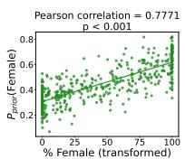

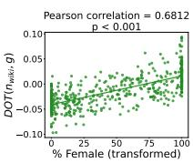  
(a) OLMo-7B

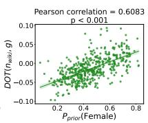

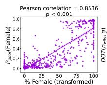

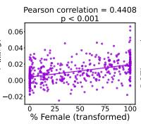  
(b) Phi-3.5-mini

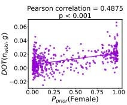  
Figure 7: Additional results for OLMo-7B and Phi-3.5-mini. Scatter plot between each pair of the three variables studied in § 4.1 and their Pearson correlation

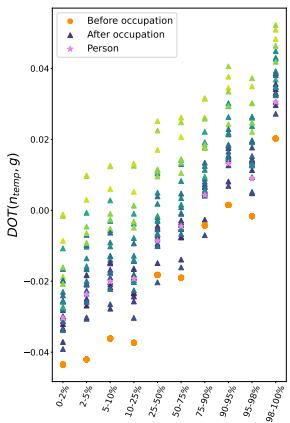

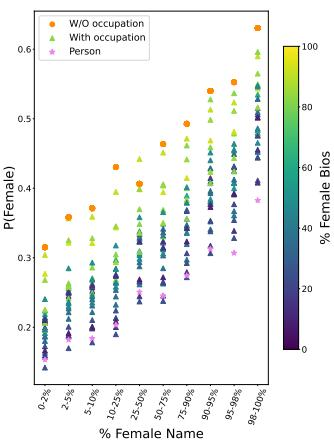  
(a) OLMo-7B

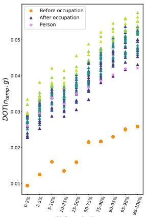

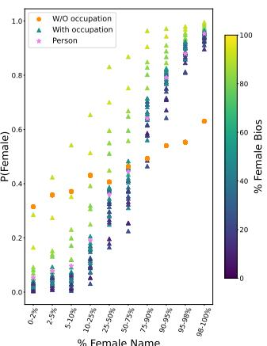  
(b) Phi-3.5-mini  
Figure 8: Additional results for OLMo-7B and Phi-3.5-mini. (Left of each subfigure) Change of the dot product between the name embedding from a template sentence ${ \vec { n } } _ { \mathrm { t e m p } }$ and the gender direction  before and after the mention of an occupation. (Right of each subfigure) Change of the output probability of the token “female" with and without mentioning an occupation.

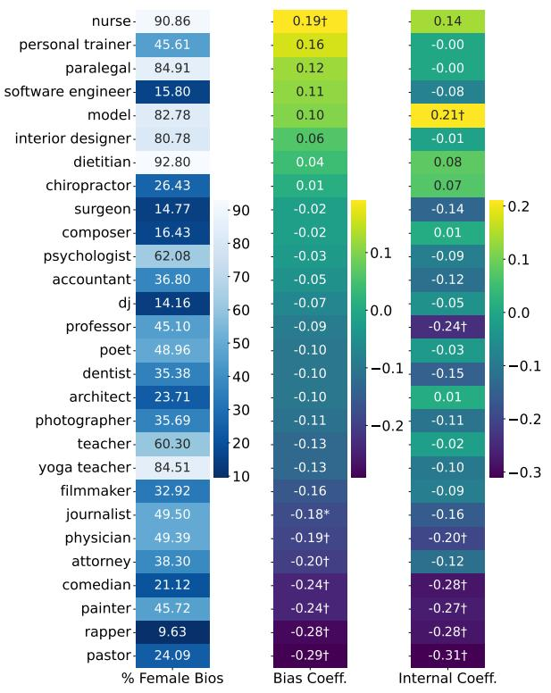  
(a) OLMo-7B

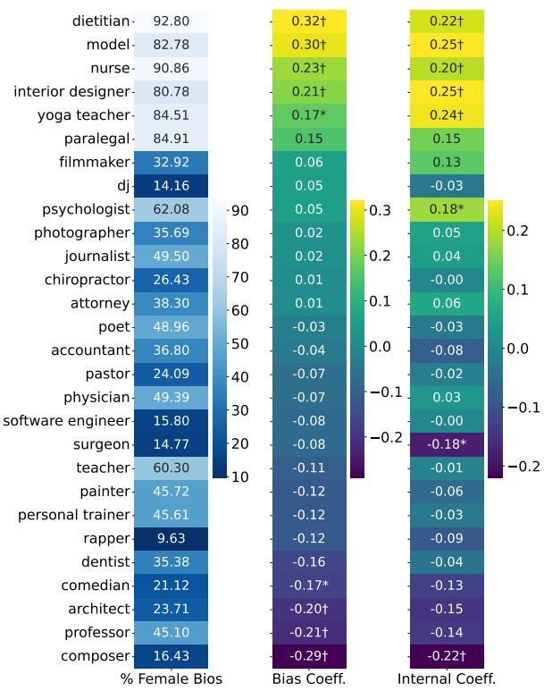  
(b) Phi-3.5-mini  
Figure 9: Additional results for OLMo-7B and Phi-3.5-min from the experiments described in § 5.2. The plots show the percentage of female biographies, Bias Coefficient (sorted in descending order), and the Spearman correlation between $D O T ( \vec { n } _ { \mathrm { b i o s } , g } )$ and the predicted probability for each occupation, defined as the “Internal Coefficient." Notations: †: $p < 0 . 0 0 1 . * \colon p < 0 . 0 0 5$ . All p values are corrected using the Holm-Bonferroni method.