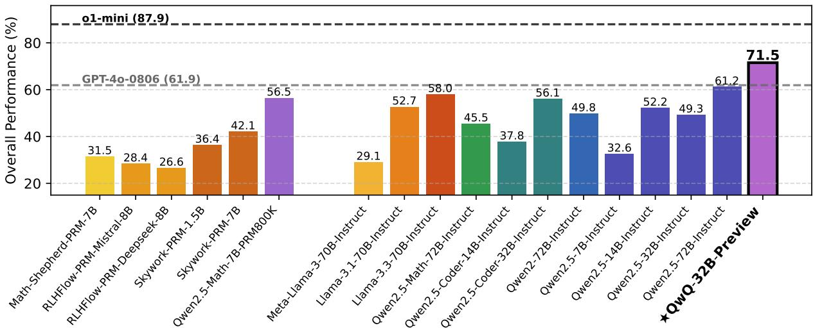
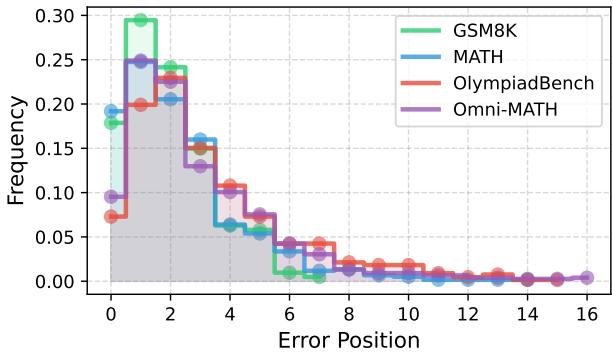
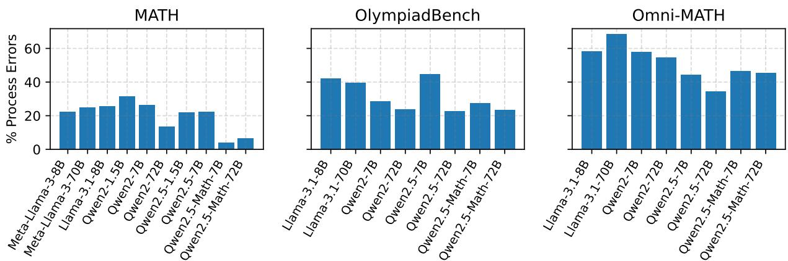
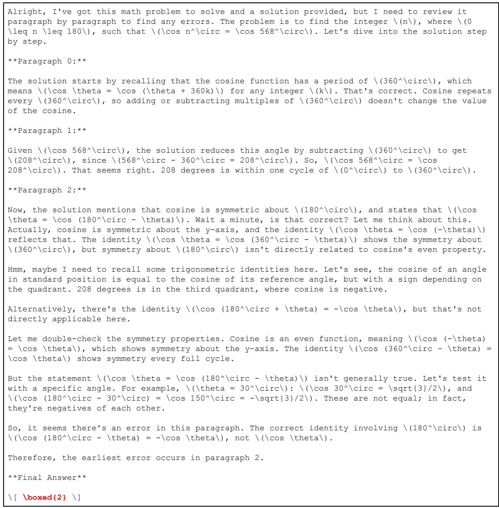

# PROCESSBENCH: Identifying Process Errors in Mathematical Reasoning

Chujie Zheng\* Zhenru Zhang Beichen Zhang Runji Lin Keming Lu

Bowen Yu\* Dayiheng Liu\* Jingren Zhou Junyang Lin

Qwen Team, Alibaba Inc.

https://huggingface.co/datasets/Qwen/ProcessBench https://github.com/QwenLM/ProcessBench

## Abstract

As language models regularly make mistakes when solving math problems, automated identification of errors in the reasoning process becomes increasingly significant for their scalable oversight. In this paper, we introduce PRO-CESSBENCH for measuring the ability to identify erroneous steps in mathematical reasoning. It consists of 3,400 test cases, primarily focused on competition- and Olympiad-level math problems. Each test case contains a step-by-step solution with error location annotated by human experts. Models are required to identify the earliest step that contains an error, or conclude that all steps are correct. We conduct extensive evaluation on PROCESSBENCH, involving two types of models: process reward models (PRMs) and critic models, where for the latter we prompt general language models to critique each solution step by step. We draw two main observations: (1) Existing PRMs typically fail to generalize to more challenging math problems beyond GSM8K and MATH. They underperform both critic models (i.e., prompted general language models) and our own trained PRM that is straightforwardly fine-tuned on the PRM800K dataset. (2) The best open-source model, QwQ-32B-Preview, has demonstrated the critique capability competitive with the proprietary model GPT-4o, despite that it still lags behind the reasoning-specialized o1-mini. We hope PROCESSBENCH can foster future research in reasoning process assessment, paving the way toward scalable oversight of language models.

## 1 Introduction

In recent years, language models have made remarkable progress in complex reasoning tasks, such as mathematics and programming (Hurst et al., 2024; OpenAI, 2024; Yang et al., 2024a,b; Dubey et al., 2024; Wake et al., 2024), yet they still make mistakes when solving challenging problems. To achieve scalable oversight (Amodei et al., 2016; Bowman et al., 2022; Cao et al., 2024), i.e., effectively supervising AI systems that get close to or go beyond broadly human-level performance, particularly in complex tasks that are difficult for general humans, we expect language models can identify errors in their reasoning process in an automated way. However, existing benchmarks related to assessing language models’ reasoning process may be hard to satisfy the growing evaluation demand for the error identification ability. Either their covered problems have become less challenging for recent language models (Zhou et al., 2024; Lightman et al., 2023), or they merely label the correctness of final answers but lack annotations for specific erroneous steps (Lin et al., 2024).

In this paper, we introduce PROCESSBENCH for measuring the ability to identify erroneous steps in mathematical reasoning. Figure 2 presents a data example. We prioritize several principles when designing this benchmark:

• Problem difficulty and solution diversity. PRO-CESSBENCH primarily covers competition- and Olympiad-level math problems and utilizes various open-source language models to generate solutions. This ensures both the difficulty of math problems and the diversity of solution styles, enabling robust evaluation.

• Scale and accuracy. PROCESSBENCH consists of 3,400 test cases, with all solutions annotated with error locations by multiple human experts. The large scale and expert annotation ensure the data quality and the reliability of evaluation.

• Simplicity. PROCESSBENCH requires models to identify the earliest erroneous step occurring in the solution, if any exists. This straightforward evaluation protocol enables easy adaptation for various types of models, such as process reward models (PRMs) and critic models.

  
Figure 1: Overview of evaluation results on PROCESSBENCH (see Table 3 for details).

We conduct extensive evaluation on PROCESS-BENCH, involving two types of models: process reward models (PRMs) and critic models. For PRMs, we include multiple open-source PRMs (Wang et al., 2024; Skywork, 2024; Xiong et al., 2024b) to assess the correctness of each reasoning step in the solution. For critic models, we prompt general language models like Qwen (Yang et al., 2024a; Qwen, 2024a; Hui et al., 2024) and GPT-4o (Hurst et al., 2024) to critique each solution step by step. We show that, despite recent growing interest, existing PRMs typically fail to generalize to more challenging math problems beyond GSM8K and MATH. They underperform both critic models and our own trained PRM that is straightforwardly fine-tuned on the PRM800K dataset, which raises questions about the generalization abilities and scalability of the current data synthesis methodologies used to build PRMs. In contrast, general language models manifest non-trivial critique capabilities that can not only identify erroneous steps but also pro vide detailed explanations. The best open-source model, QwQ-32B-Preview (Qwen, 2024b), has performed competitively with the proprietary GPT-4o model, while it still lags behind the reasoningspecialized o1-mini (OpenAI, 2024). We hope PROCESSBENCH can catalyze future research in automated reasoning process assessment, establishing crucial foundations for scalable oversight of language models.

## 2 Related Work

There exist several benchmarks or datasets related to assessing language models’ reasoning process. CriticBench (Lin et al., 2024) evaluates language models’ abilities to critique solutions and correct mistakes in various reasoning tasks. MathCheck (Zhou et al., 2024) synthesizes solutions containing erroneous steps using the GSM8K dataset (Cobbe et al., 2021), in which language models are tasked with judging the correctness of final answers or reasoning steps. PRM800K (Lightman et al., 2023) builds on the MATH problems (Hendrycks et al., 2021) and annotates the correctness and soundness of reasoning steps in model-generated solutions. It also has sparked a blooming of research interest in building process reward models (PRMs) (Wang et al., 2024; Xiong et al., 2024b,a).

PROCESSBENCH is distinguished from prior benchmarks or datasets in three key aspects, as highlighted in Table 1. First, PROCESSBENCH primarily covers more challenging math problems with competition- or Olympiad-level difficulty, which better fit the rapidly growing capabilities of modern language models. Second, rather than relying on synthetic data, PROCESSBENCH leverages diverse model-generated natural solutions and employs expert annotation to label erroneous steps, which ensures both real-world applicability and label accuracy. Third, the large scale of PROCESS-BENCH (3,400 test cases in total) enables more comprehensive and robust evaluation.

There has also been extensive research on language models’ scalable oversight (Amodei et al., 2016; Bowman et al., 2022; Cao et al., 2024) and studies on whether language models can identify the errors in their own outputs. Lightman et al. (2023); Wang et al. (2024); Luo et al. (2024) propose to train specialized reward models to supervise language models’ reasoning process (i.e., process reward models or PRMs). Huang et al. (2023); Kamoi et al. (2024) argue that general language models struggle to identify and correct their reasoning errors without external feedback. Saunders et al. (2022); McAleese et al. (2024) show that language models can be trained to write informative critiques for both assisting human evaluation and enabling self-refinement, which favorably scales with increased model capabilities (or model sizes). We believe the improved capabilities of error identification will build strong foundations for language models’ scalable oversight.

"id": "math-22",   
"generator": "Qwen2-7B-Instruct",   
"problem": "Find the integer \$n,\$ \$0 \\le n \\le 180,\$ such that \$\\cos n^\\circ = \\cos   
568^\\circ.\$",   
"steps": [   
"To find the integer \\(n\\), \\(0 \\leq n \\leq 180\\), such that \\(\\cos n^\\circ = \\cos   
568^\\circ\\), we can use the periodic properties of the cosine function. First, recall that   
the cosine function has a period of \\(360^\\circ\\). This means that: \\[ \\cos \\theta =   
\\cos (\\theta + 360k) \\] for any integer \\(k\\).",   
"Given \\(\\cos 568^\\circ\\), we need to reduce this angle to an equivalent angle within the   
first cycle of \\(0\\) to \\(360^\\circ\\). We do this by subtracting multiples of   
\\(360^\\circ\\) until we get an angle within this range: \\[ 568^\\circ - 360^\\circ =   
208^\\circ \\] So, \\(\\cos 568^\\circ = \\cos 208^\\circ\\).",   
"However, we want to find \\(n\\) such that \\(0 \\leq n \\leq 180\\). Since cosine is also   
symmetric about \\(180^\\circ\\), we know that: \\[ \\cos \\theta = \\cos (180^\\circ -   
\\theta) \\] Therefore, \\(\\cos 208^\\circ = \\cos (180^\\circ - 208^\\circ)\\), which   
simplifies to: \\[ \\cos 208^\\circ = \\cos (-28^\\circ) \\]",   
"The cosine function is also even, meaning it is symmetric about the y-axis: \\[ \\cos (-   
\\theta) = \\cos \\theta \\] Thus, \\[ \\cos (-28^\\circ) = \\cos 28^\\circ \\]",   
"So, \\(n = 28^\\circ\\). Hence, the integer \\(n\\), \\(0 \\leq n \\leq 180\\), such that   
\\(\\cos n^\\circ = \\cos 568^\\circ\\) is \\(n = 28\\). The answer is \\(\\boxed{28}\\)."   
],   
"final\_answer\_correct": false,   
"label": 2  
Figure 2: Data example of PROCESSBENCH. The label 2 denotes that the earliest error occurs in the 2nd step (indexed from 0). For test cases with no errors, the labels are 1.

## 3 Benchmark Construction

## 3.1 Task Definition

As shown in Figure 2, given a math problem and a step-by-step solution, PROCESSBENCH requires models to either identify the earliest-occurring error, or conclude that all steps are correct. Formally, given a math problem P and its step-by-step solution ${ \cal S } = \{ { s _ { 0 } , . . . , s _ { n - 1 } } \}$ , the task is to output an index $i \in \{ - 1 , 0 , . . . , n - 1 \}$ , where i = 1 indicates that all steps are correct, and $i \geq 0$ indicates that the earliest error occurs at step s<sub>i</sub>.

Typically but non-inclusively, we consider a step as erroneous if it contains any of the following: (1) Mathematical errors: incorrect calculations, algebraic manipulations, or formula applications. (2)

Logical errors: invalid deductions, unwarranted assumptions, or flawed reasoning steps. (3) Conceptual errors: misunderstanding or misapplication of mathematical or problem concepts. (4) Completeness errors: missing crucial conditions, constraints, or necessary justifications that affect the solution’s validity. Beyond these types of errors, we encourage human annotators to determine the correctness of reasoning steps based on their own expertise. We do not require human annotators to explicitly annotate error types due to the intractability of intentional categorization.

Note that for steps after the first error, the meaning of their correctness may become ambiguous or debatable: derivations based on incorrect premises can make sense, but still remain on a globally incorrect reasoning path (Lightman et al., 2023). For instance, if step k contains an error in calculating x = 2, when it should be $x = 3 .$ , subsequent steps may follow valid algebraic rules but operate on an incorrect value of x, making their individual correctness hard to determine. This is why PRO-CESSBENCH focuses on identifying the earliestoccurring error in the reasoning process.

## 3.2 Data Collection

Problem Curation We collect math problems from the test sets of four public and widely used datasets in mathematical reasoning tasks: GSM8K (Cobbe et al., 2021), MATH (Hendrycks et al., 2021), OlympiadBench (He et al., 2024), and Omni-MATH (Gao et al., 2024). Except for GSM8K, which consists of grade school math problems, the other three datasets all contain problems with competition- or Olympiad-level difficulty.

Table 1: Comparison between PROCESSBENCH and other benchmarks or datasets related to reasoning process assessment (Lin et al., 2024; Zhou et al., 2024; Lightman et al., 2023). †: Solution diversity denotes the diversity of language models used for solution generation, corresponding to the “# Solution Generators” column. ‡: For PRM800K, we only count the 90 complete solutions in its phase 1 test set, as the complete solutions in its phase 2 test set are all terminated at the earliest erroneous steps.
<table><tr><td></td><td>Problem Diffculty</td><td># Solution Generators</td><td>Solution Diversity†</td><td>Step Annotation?</td><td>Annotator</td><td>Test Case Size (Identifying Process Errors)</td></tr><tr><td rowspan="3">CriticBench MathCheck-GSM</td><td>★★</td><td>8</td><td>★★★</td><td>x</td><td></td><td></td></tr><tr><td>★</td><td>1</td><td>★</td><td>√</td><td>Synthetic</td><td>516</td></tr><tr><td>★★</td><td>1</td><td>★</td><td>√</td><td>Human</td><td>90</td></tr><tr><td>PROCESSBENCH</td><td>★★★</td><td>12</td><td>★★★</td><td>√</td><td>Human</td><td>3,400</td></tr></table>

Solution Generation We generate solutions using the widely used Qwen (Yang et al., 2024a; Qwen, 2024a; Yang et al., 2024b) and LLaMA (Dubey et al., 2024) series open-source models, resulting in twelve distinct solution generators in total. This includes a wide range of model families, sizes, and downstream task performance, leading to the high diversity of solution styles. Table 4 in Appendix B presents the breakdown of language models used for PROCESSBENCH’s solution generation.

Solution Reformatting In mathematical reasoning tasks, double line breaks (i.e., “\n\n”) are commonly used to segment solution steps (or paragraphs). However, we observed inconsistent step granularity due to varying solution styles and generation randomness. Some generated solutions frequently used double line breaks, resulting in numerous short, logically incomplete steps, while others used them sparingly, leading to lengthy paragraphs that combine multiple logical components. Such inconsistency in step granularity (and potential improper step segmentation) would impede the standardization of human annotation criteria.

To address this issue, we adopt a solution reformatting method to standardize the step granularity, through which the segmented paragraphs can better correspond to logically complete and progressive reasoning steps. Specifically, we first replace all the line breaks with white space, and then ask Qwen2.5-72B-Instruct to insert double line breaks (i.e., segment paragraphs) while preserving the solution content. Since we found that Qwen2.5-72B-Instruct sometimes alters the solution content (< 0.5%), we remove those solutions whose final answers change after reformatting (although the content alteration may not influence benchmark construction). Consequently, the reformatting method effectively unifies the step granularity. Figure 5 in Appendix A presents an example of solution reformatting.

Expert Annotation To ensure a balance between erroneous and correct solutions, we first use Qwen2.5-72B-Instruct to verify the correctness of final answers in the model-generated solutions against the reference answers. We then respectively sample solutions with correct or incorrect final answers for subsequent annotation in a balanced way to avoid excessive concentration on solutions from either the weakest or strongest models.

We recruit human experts with doctoral-level mathematical expertise for annotation, and all of them are required to pass the mandatory proficiency examination and annotation tutorial. The annotators are designated with the same task in § 3.1, i.e., identifying the earliest-occurring error in each solution. However, we notice that the competition- or Olympiad-level math problems can still be challenging even for doctoral students majoring in mathematics. According to the feedback from the annotators, although they were not required to solve problems from scratch but rather to identify erroneous steps in presented solutions, they would still become quite hesitant in their annotations when uncertain about the correct solution approach, which affected both the annotation speed and quality. To ease the annotation difficulty, we provide annotators with the reference solutions and answers from the original datasets, while we still explicitly instructed them to inspect and verify the presented model-generated solutions step by step.

Table 2: Statistics of PROCESSBENCH. “% Process errors” denotes the proportion of samples with erroneous reasoning steps (i.e., annotated as erroneous) among all the samples with correct final answers. $^ { \bullet \bullet } \mathcal { I } _ { o } \geq n \ \mathrm { s t e p s } ^ { \prime \prime }$ denotes the proportion of samples whose solutions have $\geq n$ steps (split by double line breaks). “% 3/n agreement” denotes the proportion of samples where the three-annotator agreement is achieved within n annotators, so (% $3 / 3 ) + ( \% 3 / 4 ) + ( \% 3 / 5 ) = 1 0 0 \%$
<table><tr><td rowspan="2"></td><td colspan="2">GSM8K</td><td colspan="2">MATH</td><td colspan="2">OlympiadBench</td><td colspan="2">Omni-MATH</td></tr><tr><td>error</td><td>correct</td><td>error</td><td>correct</td><td>error</td><td>correct</td><td>error</td><td>correct</td></tr><tr><td># Samples</td><td>207</td><td>193</td><td>594</td><td>406</td><td>661</td><td>339</td><td>759</td><td>241</td></tr><tr><td>% Process errors (correct final answers)</td><td> $\textstyle \frac { 2 0 0 - 1 9 3 } { 2 0 0 } = 3 . 5 \%$ </td><td></td><td></td><td> $\frac { 5 0 0 - 4 0 6 } { 5 0 0 } = 1 8 . 8 \%$ </td><td></td><td> $\frac { 5 0 0 - 3 3 9 } { 5 0 0 } = 3 2 . 2 \%$ </td><td></td><td> $\frac { 5 0 0 - 2 4 1 } { 5 0 0 } = 5 1 . 8 \%$ </td></tr><tr><td># Steps</td><td>5.3</td><td>5.1</td><td>6.8</td><td>6.0</td><td>8.9</td><td>8.7</td><td>8.6</td><td>7.4</td></tr><tr><td> $\% \geq 5$  steps</td><td>61.8%</td><td>57.5%</td><td>73.6%</td><td>70.4%</td><td>92.6%</td><td>92.3%</td><td>92.5%</td><td>81.7%</td></tr><tr><td> $\% \geq 1 0$  steps</td><td>3.4%</td><td>1.6%</td><td>17.8%</td><td>8.9%</td><td>33.9%</td><td>27.1%</td><td>29.2%</td><td>21.6%</td></tr><tr><td> $\% \geq 1 5$  steps</td><td>0.5%</td><td>0.0%</td><td>3.4%</td><td>2.0%</td><td>9.1%</td><td>8.8%</td><td>7.5%</td><td>4.1%</td></tr><tr><td>% 3/3 agreement</td><td>66.7%</td><td>95.9%</td><td>59.4%</td><td>91.9%</td><td>52.8%</td><td>85.0%</td><td>47.8%</td><td>80.1%</td></tr><tr><td>% 3/4 agreement</td><td>21.3%</td><td>3.6%</td><td>24.4%</td><td>4.7%</td><td>24.1%</td><td>9.1%</td><td>25.6%</td><td>13.7%</td></tr><tr><td>% 3/5 agreement</td><td>12.1%</td><td>0.5%</td><td>16.2%</td><td>3.4%</td><td>23.1%</td><td>5.9%</td><td>26.6%</td><td>6.2%</td></tr></table>

Each solution is initially assigned to three different experts. When the initial three annotators cannot reach consensus, we increase the number of annotators until three of them agree on the same result. If an agreement cannot be achieved within five annotators (e.g., annotation distribution of (2, 2, 1) or (2, 1, 1, 1)), we discard this solution. This leads to an overall 30% discard rate throughout the entire annotation process. We also discard the solutions where the final answers are incorrect (according to the reference answers) but the human annotation results are correct. Although such cases are fairly rare (< 1%), they are mostly concentrated in the OlympiadBench and Omni-MATH problems (i.e., Olympiad-level ones). The agreement statistics in Table 2 further evidence that the more challenging problems usually need more annotators to achieve the annotation agreement, particularly for those samples with incorrect final answers. These results suggest the inherent challenge of our human annotation task.

## 3.3 Statistics

The resulting PROCESSBENCH has four subsets, consisting of 3,400 test cases in total. The detailed statistics are shown in Table 2 and Table 4 (in Appendix B), and we also plot in Figure 3 the distribution of error positions in erroneous samples. In general, the more challenging the problems, the more solution steps the models generate, and incorrect solutions usually contain more steps than correct ones. However, across all four subsets, a large proportion of errors occur in the earlier steps, such as steps 0-3 in GSM8K and MATH, and steps 1-5 in OlympiadBench and Omni-MATH.

  
Figure 3: Distribution of error positions (indexed from 0; truncated to 16 for better visualization), corresponding to the label field as shown in Figure 2.

It is noteworthy that while we have intentionally controlled an equal number of solutions with incorrect and correct final answers (200 each for GSM8K and 500 each for other subsets), the annotation results reveal quite different numbers. Specifically, in the more challenging subsets like OlympiadBench and Omni-MATH, a larger proportion of solutions with correct final answers still contain erroneous steps. For instance, in

  
Figure 4: Process error ratios per models and subsets, computed as the proportions of samples annotated as erroneous among all the samples with correctfinal answers (same as in Table 2). The models used for solution generation slightly vary across different subsets, see Table 4 in Appendix B. We observe that no particular models have notably higher process error rates, while the process error rates are consistently higher on more difficult problems for all the models.

OlympiadBench, $\frac { 5 0 0 - 3 3 9 } { 5 0 0 } \ : = \ : 3 2 . 2 \%$ of solutions with correct final answers are found to contain process errors, while in Omni-MATH this proportion is even higher $( \frac { 5 0 0 - 2 4 1 } { 5 0 0 } = 5 1 . 8 \% )$ . In contrast, these proportions in GSM8K and MATH are $\frac { 2 0 0 - 1 9 3 } { \cdot 2 0 0 } = { \bar { 3 } } . { \bar { 5 } } \%$ and $\frac { 5 0 0 - 4 0 6 } { 5 0 0 } \ : = \ : 1 8 . 8 \%$ , respectively. In Figure 4, for each model used for solution generation, we plot the ratio of samples with erroneous reasoning steps (i.e., annotated as erroneous) among all the samples with correct final answers. We observe that the process error rates are consistently higher on more difficult problems. To our knowledge, our work is the first to present evidence that on more challenging math problems, current language models are more prone to making process errors even when reaching correct final answers. This also suggests the underlying limitation of rule-based RL in mathematical reasoning (i.e., rewarding merely according to the correctness of final answers) and further highlights the significance of identifying errors in the reasoning process.

## 4 Evaluation

## 4.1 Setup

For each subset of PROCESSBENCH, we calculate the accuracies on erroneous and correct samples, respectively, and additionally compute their harmonic mean as the F1 score. We primarily refer to F1 scores to compare model performance, as it balances model behaviors between being overly critical and being incapable of identifying errors.

We consider two types of models in the evaluation on PROCESSBENCH: process reward models (PRMs) and critic models.

Process Reward Models (PRMs) As a recently focal topic, PRMs are proposed to assess and supervise the intermediate steps in language models reasoning process (Lightman et al., 2023), thus naturally falling in the scope of our research. In practice, PRMs are typically trained using the process labels for intermediate reasoning steps, outputting either the correctness prediction or a scalar score for each reasoning step during inference. Previous research usually evaluates PRMs based on their improvement in the Best-of-N (BoN) performance of another language model that generates solutions. However, this lacks a finer-grained inspection on their process assessment abilities, and the evaluation reliability can be heavily affected by the underlying solution generation model.

Our evaluation includes several open-source PRMs: (1) Math-Shepherd (Wang et al., 2024), which obtains the process label for each step via estimating the empirical probability of this step leading to the correct final answer. (2) Two LLaMA-3.1-based PRMs from Xiong et al. (2024b), which roughly follow the training methodology of Math-Shepherd but differ in the solution generation models and optimization objectives. (3) Two Qwen2.5-Math-based PRMs recently released by Skywork (2024). (4) We also train a PRM by fine-tuning Qwen2.5-Math-7B-Instruct on the PRM800K dataset, namely Qwen2.5-Math-7B-PRM800K. See Appendix C for its training details.

For the (1)(2)(4) PRMs, we extract the earliest erroneous step from their correctness predictions for reasoning steps. For the (3) PRMs, which produce scalar scores for each reasoning step, we first transform these scores into binary correctness predictions (using a threshold above which steps are considered as correct), and then extract the earliest erroneous step as we do for (1)(2)(4). The transformation threshold is determined as the one giving the highest F1 score on the GSM8K subset.

Table 3: Evaluation results on PROCESSBENCH. We report the F1 score of the respective accuracies on erroneous and correct samples. See Table 5 and Table 7 for breakdown of evaluation results.
<table><tr><td>Model</td><td>GSM8K</td><td>MATH</td><td>Olympiad- Bench</td><td>Omni- Average MATH</td></tr><tr><td colspan="5">Open-source Process Reward Models (PRMs)</td></tr><tr><td>Math-Shepherd-PRM-7B 47.9</td><td>29.5</td><td>24.8</td><td>23.8</td><td>31.5</td></tr><tr><td>RLHFlow-PRM-Mistral-8B 50.4</td><td>33.4</td><td>13.8</td><td>15.8</td><td>28.4</td></tr><tr><td>RLHFlow-PRM-Deepseek-8B 38.8</td><td>33.8</td><td>16.9</td><td>16.9</td><td>26.6</td></tr><tr><td>Skywork-PRM-1.5B</td><td>59.0 48.0</td><td>19.3</td><td>19.2</td><td>36.4</td></tr><tr><td>Skywork-PRM-7B</td><td>70.8 53.6</td><td>22.9</td><td>21.0</td><td>42.1</td></tr><tr><td>Qwen2.5-Math-7B-PRM800K (our trained) 68.2</td><td>62.6</td><td>50.7</td><td>44.3</td><td>56.5</td></tr><tr><td colspan="5">Open-source language models, prompted as Critic Models</td></tr><tr><td>Meta-Llama-3-8B-Instruct 13.1</td><td>13.8</td><td>4.8</td><td>12.6</td><td>11.1</td></tr><tr><td>Meta-Llama-3-70B-Instruct</td><td>52.2 22.8</td><td>21.2</td><td>20.0</td><td>29.1</td></tr><tr><td>Llama-3.1-8B-Instruct</td><td>10.9 5.1</td><td>2.8</td><td>1.6</td><td>5.1</td></tr><tr><td>Llama-3.1-70B-Instruct</td><td>74.9 48.2</td><td>46.7</td><td>41.0</td><td>52.7</td></tr><tr><td>Llama-3.3-70B-Instruct</td><td>82.9 59.4</td><td>46.7</td><td>43.0</td><td>58.0</td></tr><tr><td>Qwen2.5-Math-7B-Instruct</td><td>26.8 25.7</td><td>14.2</td><td>12.7</td><td>19.9</td></tr><tr><td>Qwen2.5-Math-72B-Instruct</td><td>65.8 52.1</td><td>32.5</td><td>31.7</td><td>45.5</td></tr><tr><td>Qwen2.5-Coder-7B-Instruct</td><td>14.3 6.5</td><td>4.1</td><td>1.8</td><td>6.7</td></tr><tr><td>Qwen2.5-Coder-14B-Instruct</td><td>50.1 39.9</td><td>34.0</td><td>27.3</td><td>37.8</td></tr><tr><td>Qwen2.5-Coder-32B-Instruct</td><td>68.9 60.1</td><td>48.9</td><td>46.3</td><td>56.1</td></tr><tr><td>Qwen2-7B-Instruct</td><td>8.4 19.0</td><td>14.7</td><td>12.1</td><td>13.6</td></tr><tr><td>Qwen2-72B-Instruct</td><td>67.6</td><td>49.2 42.1</td><td>40.2</td><td>49.8</td></tr><tr><td>Qwen2.5-7B-Instruct</td><td>36.5</td><td>36.6 29.7</td><td>27.4</td><td>32.6</td></tr><tr><td>Qwen2.5-14B-Instruct</td><td>69.3</td><td>53.3 45.0</td><td>41.3</td><td>52.2</td></tr><tr><td>Qwen2.5-32B-Instruct</td><td>65.6</td><td>53.1 40.0</td><td>38.3</td><td>49.3</td></tr><tr><td>Qwen2.5-72B-Instruct</td><td>76.2</td><td>61.8 54.6</td><td>52.2</td><td>61.2</td></tr><tr><td>★ QwQ-32B-Preview</td><td>88.0</td><td>78.7</td><td>57.8 61.3</td><td>71.5</td></tr><tr><td colspan="5">Proprietary language models, prompted as Critic Models</td></tr><tr><td>GPT-4o-0806</td><td>79.2</td><td>63.6</td><td>51.4 87.2</td><td>53.5</td><td>61.9 87.9</td></tr><tr><td>o1-mini</td><td>93.2</td><td>88.9</td><td></td><td>82.4</td><td></td></tr></table>

Critic Models Critic models aim to provide feedback and critique to model-generated texts, noninclusively including verification, reflection, and correction or refinement. They have demonstrated promising utility in achieving scalable oversight (Saunders et al., 2022; McAleese et al., 2024).

Training critic models for specific domains typically requires significant and specialized effort, which is out of the scope of our work. Instead, we are more interested in the critique capabilities of general language models. The task definition (§ 3.1) of PROCESSBENCH enables us to apply simple prompt engineering to repurpose general language models as critic models. We show in Figure 6 in Appendix E the prompt template we implement for our evaluation. Specifically, models are prompted to return the index of the paragraph where the earliest error occurs as thefinal answer, similar to the conventional evaluation protocol for mathematical reasoning tasks (Cobbe et al., 2021; Hendrycks et al., 2021; Yang et al., 2024b).

Our evaluation includes the widely-used Qwen2 (Yang et al., 2024a), Qwen2.5 (Qwen, 2024a), Qwen2.5-Math (Yang et al., 2024b), Qwen2.5- Coder (Hui et al., 2024), and LLaMA-3 (Dubey et al., 2024) series open-source models, as well as the recently released QwQ-32B-Preview reasoning model (Qwen, 2024b). We also evaluate the proprietary GPT-4o (Hurst et al., 2024) and o1-mini (OpenAI, 2024) models. We report the performance of open-source models under majority voting over eight samplings, while we also report their performance under greedy decoding in Table 9 in Appendix F. For the proprietary model GPT-4o, we report the results under greedy decoding, while for o1-mini, we report the results under single sampling as its API does not support customized decoding parameters.

## 4.2 Results

We present the evaluation results in Table 3. Our observations are summarized as follows:

Generalization Across Difficulty From GSM8K and MATH to OlympiadBench and Omni-MATH, with the increased difficulty of math problems, we observe a consistent performance decline for all the models, which suggests the common challenge of both PRMs and critic models in generalization abilities.

Comparison Between PRMs and Critic Models We find that existing PRMs typically underperform the top prompt-driven critic models even on the simpler GSM8K and MATH subsets, suggesting that these PRMs struggle to indicate the correctness of the intermediate steps in mathematical reasoning. Moreover, when moving toward the more challenging OlympiadBench and Omni-MATH subsets, PRMs suffer from a more notable performance decline than critic models. This raises our concerns about the generalization abilities and scalability of the current data synthesis methodologies used to build PRMs. More specifically, current methodologies, as exemplified by Math-Shepherd (Wang et al., 2024), measure the correctness of an intermediate step by estimating the empirical probability of this step leading to the correct final answer. This kind of approach has two intuitive major issues: (1) The process labels heavily depend on the language model used to generate solutions (i.e., highly “onpolicy”), which would naturally fail to indicate the correctness of reasoning steps generated by other models. (2) As demonstrated in § 3.3, current language models are prone to making process errors even when reaching correct final answers. This could substantially invalidate the estimated process labels, particularly on the more challenging math problems. In contrast, Qwen2.5-Math-7B-PRM800K, which is straightforwardly fine-tuned on the fully human-annotated PRM800K training set, exhibits significantly stronger performance and generalization ability than other PRMs.

Comparison Among Critic Models Compared to PRMs, critic models can benefit from separate reasoning processes when critiquing solutions, as they can “think” more before indicating the correctness of each solution step, which leads to their better performance in this error identification task. Within the same model family, the error identification performance favorably scales with increased model sizes. Notably, the recently released reasoning model QwQ-32B-Preview performs best among the open-source models and is highly competitive with GPT-4o. It is noteworthy that QwQ-32B-Preview achieves more balanced accuracies on erroneous and correct samples (see Table 5 and 7 in Appendix F). We show in Figure 7 an example of critique generated by QwQ-32B-Preview to the test case in Figure 2 in Appendix G, which not only identifies the erroneous step but also provides the detailed thinking process and explanation. Nevertheless, QwQ-32B-Preview still lags behind o1-mini, suggesting that although the gap in problem-solving performance is getting closer between open-source and proprietary models, there still exists another large gap in their critique capabilities.

## 5 Conclusion

We introduce the PROCESSBENCH benchmark for measuring the ability to identify erroneous steps in mathematical reasoning, characterized by its high problem difficulty and solution diversity, large scale, rigorous human annotation, and simple evaluation protocol. Through extensive evaluation with existing process reward models (PRMs) and prompt-driven critic models, we draw two main observations: (1) Existing PRMs typically underperform critic models in identifying erroneous reasoning steps, and struggle more to generalize to challenging math problems. (2) Open-source language models, as exemplified by QwQ-32B-Preview, have demonstrated critique capabilities competitive with the proprietary model GPT-4o, yet still lag behind the reasoning-specialized o1- mini model. We envision PROCESSBENCH as a cornerstone testbed for advancing automated reasoning process assessment, a critical step toward achieving scalable oversight of language models.

## 6 Limitations

Despite our best efforts throughout the entire benchmark construction process (§ 3.2), PROCESS-BENCH may still contain inaccurate labels of error locations, particularly for the more challenging Olympiad-level math problems. Additionally, the solutions discarded in human annotation (§ 3.2 may involve the particularly challenging problems, which could bias the problem distribution in PRO-CESSBENCH, although such samples may have exceeded the capabilities of the human annotators in our annotation task.

## References

Dario Amodei, Chris Olah, Jacob Steinhardt, Paul Christiano, John Schulman, and Dan Mané. 2016. Concrete problems in ai safety. arXiv preprint arXiv:1606.06565.

Samuel R Bowman, Jeeyoon Hyun, Ethan Perez, Edwin Chen, Craig Pettit, Scott Heiner, Kamile Lukoši˙ ut¯ e,˙ Amanda Askell, Andy Jones, Anna Chen, et al. 2022. Measuring progress on scalable oversight for large language models. arXiv preprint arXiv:2211.03540.

Boxi Cao, Keming Lu, Xinyu Lu, Jiawei Chen, Mengjie Ren, Hao Xiang, Peilin Liu, Yaojie Lu, Ben He, Xianpei Han, et al. 2024. Towards scalable automated alignment of llms: A survey. arXiv preprint arXiv:2406.01252.

Karl Cobbe, Vineet Kosaraju, Mohammad Bavarian, Mark Chen, Heewoo Jun, Lukasz Kaiser, Matthias Plappert, Jerry Tworek, Jacob Hilton, Reiichiro Nakano, et al. 2021. Training verifiers to solve math word problems. arXiv preprint arXiv:2110.14168.

Abhimanyu Dubey, Abhinav Jauhri, Abhinav Pandey, Abhishek Kadian, Ahmad Al-Dahle, Aiesha Letman, Akhil Mathur, Alan Schelten, Amy Yang, Angela Fan, et al. 2024. The llama 3 herd of models. arXiv preprint arXiv:2407.21783.

Bofei Gao, Feifan Song, Zhe Yang, Zefan Cai, Yibo Miao, Qingxiu Dong, Lei Li, Chenghao Ma, Liang Chen, Runxin Xu, et al. 2024. Omni-math: A universal olympiad level mathematic benchmark for large language models. arXiv preprint arXiv:2410.07985.

Chaoqun He, Renjie Luo, Yuzhuo Bai, Shengding Hu, Zhen Leng Thai, Junhao Shen, Jinyi Hu, Xu Han, Yujie Huang, Yuxiang Zhang, et al. 2024. Olympiadbench: A challenging benchmark for promoting agi with olympiad-level bilingual multimodal scientific problems. arXiv preprint arXiv:2402.14008.

Dan Hendrycks, Collin Burns, Saurav Kadavath, Akul Arora, Steven Basart, Eric Tang, Dawn Song, and Jacob Steinhardt. 2021. Measuring mathematical problem solving with the math dataset. arXiv preprint arXiv:2103.03874.

Jie Huang, Xinyun Chen, Swaroop Mishra, Huaixiu Steven Zheng, Adams Wei Yu, Xinying Song, and Denny Zhou. 2023. Large language models cannot self-correct reasoning yet. arXiv preprint arXiv:2310.01798.

Binyuan Hui, Jian Yang, Zeyu Cui, Jiaxi Yang, Dayiheng Liu, Lei Zhang, Tianyu Liu, Jiajun Zhang, Bowen Yu, Keming Lu, et al. 2024. Qwen2.5-coder technical report. arXiv preprint arXiv:2409.12186.

Aaron Hurst, Adam Lerer, Adam P Goucher, Adam Perelman, Aditya Ramesh, Aidan Clark, AJ Ostrow, Akila Welihinda, Alan Hayes, Alec Radford, et al. 2024. Gpt-4o system card. arXiv preprint arXiv:2410.21276.

Ryo Kamoi, Yusen Zhang, Nan Zhang, Jiawei Han, and Rui Zhang. 2024. When can LLMs actually correct their own mistakes? a critical survey of selfcorrection of LLMs. Transactions of the Association for Computational Linguistics, 12:1417–1440.

Woosuk Kwon, Zhuohan Li, Siyuan Zhuang, Ying Sheng, Lianmin Zheng, Cody Hao Yu, Joseph Gonzalez, Hao Zhang, and Ion Stoica. 2023. Efficient memory management for large language model serving with pagedattention. In Proceedings of the 29th Symposium on Operating Systems Principles, pages 611–626.

Hunter Lightman, Vineet Kosaraju, Yura Burda, Harri Edwards, Bowen Baker, Teddy Lee, Jan Leike, John Schulman, Ilya Sutskever, and Karl Cobbe. 2023. Let’s verify step by step. arXiv preprint arXiv:2305.20050.

Zicheng Lin, Zhibin Gou, Tian Liang, Ruilin Luo, Haowei Liu, and Yujiu Yang. 2024. Criticbench: Benchmarking llms for critique-correct reasoning. arXiv preprint arXiv:2402.14809.

Liangchen Luo, Yinxiao Liu, Rosanne Liu, Samrat Phatale, Harsh Lara, Yunxuan Li, Lei Shu, Yun Zhu, Lei Meng, Jiao Sun, and Abhinav Rastogi. 2024. Improve mathematical reasoning in language models by automated process supervision. arXiv preprint arXiv:2406.06592.

Nat McAleese, Rai Michael Pokorny, Juan Felipe Ceron Uribe, Evgenia Nitishinskaya, Maja Trebacz, and Jan Leike. 2024. Llm critics help catch llm bugs. arXiv preprint arXiv:2407.00215.

OpenAI. 2024. Openai o1-mini: Advancing costefficient reasoning.

Team Qwen. 2024a. Qwen2.5: A party of foundation models.

Team Qwen. 2024b. Qwq: Reflect deeply on the boundaries of the unknown.

William Saunders, Catherine Yeh, Jeff Wu, Steven Bills, Long Ouyang, Jonathan Ward, and Jan Leike. 2022. Self-critiquing models for assisting human evaluators. arXiv preprint arXiv:2206.05802.

o1 Team Skywork. 2024. Skywork-o1 open series. https://huggingface.co/Skywork.

Alan Wake, Albert Wang, Bei Chen, CX Lv, Chao Li, Chengen Huang, Chenglin Cai, Chujie Zheng, Daniel Cooper, Ethan Dai, et al. 2024. Yi-lightning technical report. arXiv preprint arXiv:2412.01253.

Peiyi Wang, Lei Li, Zhihong Shao, Runxin Xu, Damai Dai, Yifei Li, Deli Chen, Yu Wu, and Zhifang Sui. 2024. Math-shepherd: Verify and reinforce LLMs step-by-step without human annotations. In Proceedings of the 62nd Annual Meeting of the Association for Computational Linguistics (Volume 1: Long Papers), pages 9426–9439.

Wei Xiong, Chengshuai Shi, Jiaming Shen, Aviv Rosenberg, Zhen Qin, Daniele Calandriello, Misha Khalman, Rishabh Joshi, Bilal Piot, Mohammad Saleh, et al. 2024a. Building math agents with multiturn iterative preference learning. arXiv preprint arXiv:2409.02392.

Wei Xiong, Hanning Zhang, Nan Jiang, and Tong Zhang. 2024b. An implementation of generative prm. https://github.com/RLHFlow/ RLHF-Reward-Modeling.

An Yang, Baosong Yang, Binyuan Hui, Bo Zheng, Bowen Yu, Chang Zhou, Chengpeng Li, Chengyuan Li, Dayiheng Liu, Fei Huang, et al. 2024a. Qwen2 technical report. arXiv preprint arXiv:2407.10671.

An Yang, Beichen Zhang, Binyuan Hui, Bofei Gao, Bowen Yu, Chengpeng Li, Dayiheng Liu, Jianhong Tu, Jingren Zhou, Junyang Lin, et al. 2024b. Qwen2.5-math technical report: Toward mathematical expert model via self-improvement. arXiv preprint arXiv:2409.12122.

Zihao Zhou, Shudong Liu, Maizhen Ning, Wei Liu, Jindong Wang, Derek F Wong, Xiaowei Huang, Qiufeng Wang, and Kaizhu Huang. 2024. Is your model really a good math reasoner? evaluating mathematical reasoning with checklist. arXiv preprint arXiv:2407.08733.

## A Example of Solution Reformatting

```latex
The given equation is of an ellipse in the standard form
\[
The given equation is of an ellipse in
\frac{(x-h)^2}{a^2} + \frac{(y-k)^2}{b^2} = 1,
the standard form \[\frac{(x-h)^2}{a^2} +
\]
\frac{(y-k)^2}{b^2} = 1,\] where \((h,
k)\) is the center of the ellipse, \(a\)
where $(h, k)$ is the center of the ellipse, $a$ is the semi
is the semi-major axis length, and \(b\)
major axis length, and $b$ is the semi-minor axis length.
is the semi-minor axis length. In this
case, the center of the ellipse is \((6,
In this case, the center of the ellipse is $(6, 3)$, $a = 5$,
3)\), \(a = 5\), and \(b = 3\).
and $b = 3$.
The foci of an ellipse are located along
The foci of an ellipse are located along the major axis, which
the major axis, which is the line segment
is the line segment connecting the two vertices of the ellipse.
connecting the two vertices of the
The distance from the center of the ellipse to each focus is
ellipse. The distance from the center of
given by $\sqrt{a^2 - b^2}$.
the ellipse to each focus is given by
\(\sqrt{a^2 - b^2}\). First, we calculate
First, we calculate the distance from the center to each focus:
the distance from the center to each
focus: \[\sqrt{a^2 - b^2} = \sqrt{5^2 -
\[
3^2} = \sqrt{25 - 9} = \sqrt{16} = 4.\]
\sqrt{a^2 - b^2} = \sqrt{5^2 - 3^2} = \sqrt{25 - 9} = \sqrt{16}
= 4.
Since the major axis of the ellipse is
\]
horizontal (because \(a > b\)), the foci
are located at a distance of 4 units to
Since the major axis of the ellipse is horizontal (because $a
the left and right of the center of the
> b$), the foci are located at a distance of 4 units to the
ellipse. Therefore, the two foci are at
left and right of the center of the ellipse.
\((6 \pm 4, 3) = (2, 3)\) and \((10, 3)\).
Therefore, the two foci are at $(6 \pm 4, 3) = (2, 3)$ and
$(10, 3)$. The one with the larger \(x\)-coordinate
is \((10, 3)\). The answer is:
\(\boxed{(10, 3)}\).
The one with the larger $x$-coordinate is $(10, 3)$.
The answer is: $\boxed{(10, 3)}$.
```  
Figure 5: Example of solution reformatting. The left is the original solution (generated by Qwen2-7B-Instruct) and the right is the reformatted one. The problem, coming from the MATH test set, is “The ellipse $\textstyle { \frac { ( x - 6 ) ^ { 2 } } { 2 5 } } + { \frac { ( y - 3 ) ^ { 2 } } { 9 } } = 1$ has twofoci. Find the one with the larger x-coordinate. Enter your answer as an ordered pair, like (2, 1).”

## B Breakdown Statistics of PROCESSBENCH

Table 4: Breakdown statistics of PROCESSBENCH. †: We encountered a code bug when using Llama-3.1-70B-Instruct and Qwen2.5-72B-Instruct to generate solutions for the MATH problems, thus their counts are all zero in the MATH subset of PROCESSBENCH. ‡: For the more challenging OlympiadBench and Omni-MATH problems, we exclude models with lower accuracies from subsequent annotation.
<table><tr><td rowspan="2">Generator</td><td colspan="2">GSM8K</td><td colspan="2">MATH†</td><td colspan="2">OlympiadBench‡</td><td colspan="2">Omni-MATH‡</td></tr><tr><td>error</td><td>correct</td><td>error</td><td>correct</td><td>error</td><td>correct</td><td>error</td><td>correct</td></tr><tr><td>Meta-Llama-3-8B-Instruct</td><td>11</td><td>13</td><td>56</td><td>14</td><td>0</td><td>0</td><td>0</td><td>0</td></tr><tr><td>Meta-Llama-3-70B-Instruct</td><td>16</td><td>15</td><td>92</td><td>49</td><td>0</td><td>0</td><td>0</td><td>0</td></tr><tr><td>Llama-3.1-8B-Instruct</td><td>38</td><td>23</td><td>86</td><td>53</td><td>116</td><td>48</td><td>131</td><td>31</td></tr><tr><td>Llama-3.1-70B-Instruct</td><td>7</td><td>28</td><td>0</td><td>0</td><td>85</td><td>32</td><td>103</td><td>19</td></tr><tr><td>Qwen2-1.5B-Instruct</td><td>37</td><td>4</td><td>36</td><td>11</td><td>0</td><td>0</td><td>0</td><td>0</td></tr><tr><td>Qwen2-7B-Instruct</td><td>31</td><td>21</td><td>89</td><td>42</td><td>63</td><td>45</td><td>96</td><td>35</td></tr><tr><td>Qwen2-72B-Instruct</td><td>9</td><td>11</td><td>56</td><td>51</td><td>64</td><td>48</td><td>71</td><td>25</td></tr><tr><td>Qwen2.5-1.5B-Instruct</td><td>32</td><td>10</td><td>31</td><td>43</td><td>0</td><td>0</td><td>0</td><td>0</td></tr><tr><td>Qwen2.5-7B-Instruct</td><td>12</td><td>15</td><td>62</td><td>35</td><td>86</td><td>37</td><td>75</td><td>29</td></tr><tr><td>Qwen2.5-72B-Instruct</td><td>2</td><td>21</td><td>0</td><td>0</td><td>67</td><td>38</td><td>88</td><td>38</td></tr><tr><td>Qwen2.5-Math-7B-Instruct</td><td>8</td><td>14</td><td>47</td><td>49</td><td>99</td><td>48</td><td>103</td><td>29</td></tr><tr><td>Qwen2.5-Math-72B-Instruct</td><td>4</td><td>18</td><td>39</td><td>59</td><td>81</td><td>43</td><td>92</td><td>35</td></tr><tr><td rowspan="2">Total</td><td>207</td><td>193</td><td>594</td><td>406</td><td>661</td><td>339</td><td>759</td><td>241</td></tr><tr><td colspan="2">400</td><td colspan="2">1,000</td><td colspan="2">1,000</td><td colspan="2">1,000</td></tr></table>

## C Training Details of Qwen2.5-Math-7B-PRM800K

Qwen2.5-Math-7B-PRM800K is obtained by fine-tuning Qwen2.5-Math-7B-Instruct on the PRM800K training set. We replace the original language modeling head with a new reward modeling head that outputs binary classification logits. The classification loss is computed at the second line break positions in all the “\n\n”. We treat the original 1 and 0 labels in PRM800K as our positive labels, while -1 as negative ones. To eliminate test data contamination, we also remove the PRM800K training samples that have the same problems in PROCESSBENCH. The training was run on eight A100 80GB GPUs.

## D Inference Details

For solution generation in § 3.2, all the models are set with $p = 0 . 9 , t = 0 . 7$ For majority voting evaluation in $\ S \ 4 ,$ , we set $p = 0 . 8 , t = 0 . 7 , k = 2 0$ for Qwen2.5-Math-7/72B-Instruct to ensure their normal generation, while all the other models are set with only $p = 0 . 9$ . All the inference in the evaluation was run with vLLM (Kwon et al., 2023) on eight A100 80GB GPUs.

## E Prompt Template for Critic Model Evaluation

The following is a math problem and a solution (split into paragraphs, enclosed with tags and   
indexed from 0):   
[Math Problem]   
...(math problem)...   
[Solution]   
<paragraph\_0>   
...(paragraph 0 of solution)...   
</paragraph\_0>   
<paragraph\_n-1>   
...(paragraph n-1 of solution)...   
</paragraph\_n-1>   
Your task is to review and critique the solution paragraph by paragraph. Once you identify an   
error in a paragraph, return the index of the paragraph where the earliest error occurs. Otherwise,   
return the index of -1 (which typically denotes "not found").   
Please put your final answer (i.e., the index) in \boxed{}.  
Figure 6: Prompt template for critic model evaluation. The blue texts indicate the input math problem and the solution (split into paragraphs). The red texts describe the required output content and format.

## F Supplementary Evaluation Results

Table 5: Breakdown of evaluation results on the GSM8K and MATH subsets of PROCESSBENCH. The open-source language models (middle block) are evaluated via majority voting over eight samplings.
<table><tr><td rowspan="2">Model</td><td colspan="3">GSM8K</td><td colspan="3">MATH</td></tr><tr><td>error</td><td>correct</td><td>F1</td><td>error</td><td>correct</td><td>F1</td></tr><tr><td colspan="7">Open-source Process Reward Models (PRMs)</td></tr><tr><td>Math-Shepherd-PRM-7B</td><td>32.4</td><td>91.7</td><td>47.9</td><td>18.0</td><td>82.0</td><td>29.5</td></tr><tr><td>RLHFlow-PRM-Mistral-8B</td><td>33.8</td><td>99.0</td><td>50.4</td><td>21.7</td><td>72.2</td><td>33.4</td></tr><tr><td>RLHFlow-PRM-Deepseek-8B</td><td>24.2</td><td>98.4</td><td>38.8</td><td>21.4</td><td>80.0</td><td>33.8</td></tr><tr><td>Skywork-PRM-1.5B</td><td>50.2</td><td>71.5</td><td>59.0</td><td>37.9</td><td>65.3</td><td>48.0</td></tr><tr><td>Skywork-PRM-7B</td><td>61.8</td><td>82.9</td><td>70.8</td><td>43.8</td><td>69.2</td><td>53.6</td></tr><tr><td>Qwen2.5-Math-7B-PRM800K (our trained)</td><td>53.1</td><td>95.3</td><td>68.2</td><td>48.0</td><td>90.1</td><td>62.6</td></tr><tr><td colspan="7">Open-source language models, prompted as Critic Models</td></tr><tr><td>Meta-Llama-3-8B-Instruct</td><td>42.5</td><td>7.8</td><td>13.1</td><td>28.6</td><td>9.1</td><td>13.8</td></tr><tr><td>Meta-Llama-3-70B-Instruct</td><td>35.7</td><td>96.9</td><td>52.2</td><td>13.0</td><td>93.3</td><td>22.8</td></tr><tr><td>Llama-3.1-8B-Instruct</td><td>44.4</td><td>6.2</td><td>10.9</td><td>41.9</td><td>2.7</td><td>5.1</td></tr><tr><td>Llama-3.1-70B-Instruct</td><td>64.3</td><td>89.6</td><td>74.9</td><td>35.4</td><td>75.6</td><td>48.2</td></tr><tr><td>Llama-3.3-70B-Instruct</td><td>72.5</td><td>96.9</td><td>82.9</td><td>43.3</td><td>94.6</td><td>59.4</td></tr><tr><td>Qwen2.5-Math-7B-Instruct</td><td>15.5</td><td>100.0</td><td>26.8</td><td>14.8</td><td>96.8</td><td>25.7</td></tr><tr><td>Qwen2.5-Math-72B-Instruct</td><td>49.8</td><td>96.9</td><td>65.8</td><td>36.0</td><td>94.3</td><td>52.1</td></tr><tr><td>Qwen2.5-Coder-7B-Instruct</td><td>7.7</td><td>100.0</td><td>14.3</td><td>3.4</td><td>98.3</td><td>6.5</td></tr><tr><td>Qwen2.5-Coder-14B-Instruct</td><td>33.8</td><td>96.4</td><td>50.1</td><td>25.4</td><td>92.4</td><td>39.9</td></tr><tr><td>Qwen2.5-Coder-32B-Instruct</td><td>54.1</td><td>94.8</td><td>68.9</td><td>44.9</td><td>90.6</td><td>60.1</td></tr><tr><td>Qwen2-7B-Instruct</td><td>40.6</td><td>4.7</td><td>8.4</td><td>30.5</td><td>13.8</td><td>19.0</td></tr><tr><td>Qwen2-72B-Instruct</td><td>57.0</td><td>82.9</td><td>67.6</td><td>37.7</td><td>70.9</td><td>49.2</td></tr><tr><td>Qwen2.5-7B-Instruct</td><td>40.6</td><td>33.2</td><td>36.5</td><td>30.8</td><td>45.1</td><td>36.6</td></tr><tr><td>Qwen2.5-14B-Instruct</td><td>54.6</td><td>94.8</td><td>69.3</td><td>38.4</td><td>87.4</td><td>53.3</td></tr><tr><td>Qwen2.5-32B-Instruct</td><td>49.3</td><td>97.9</td><td>65.6</td><td>36.7</td><td>95.8</td><td>53.1</td></tr><tr><td>Qwen2.5-72B-Instruct</td><td>62.8</td><td>96.9</td><td>76.2</td><td>46.3</td><td>93.1</td><td>61.8</td></tr><tr><td>QwQ-32B-Preview</td><td>81.6</td><td>95.3</td><td>88.0</td><td>78.1</td><td>79.3</td><td>78.7</td></tr><tr><td colspan="7">Proprietary language models, prompted as Critic Models</td></tr><tr><td>GPT-4o-0806</td><td>70.0</td><td>91.2</td><td>79.2</td><td>54.4</td><td>76.6</td><td>63.6</td></tr><tr><td>o1-mini</td><td>88.9</td><td>97.9</td><td>93.2</td><td>83.5</td><td>95.1</td><td>88.9</td></tr></table>

Table 6: For the two PRMs from Skywork (2024), we additionally adjust the threshold (§ 4.1) as the one leading to the highest F1 score on each subset (i.e., each subset adopts a respective optimal threshold), which can be viewed as the two PRMs’ upper bound performance on PROCESSBENCH. This table presents the results on the GSM8K and MATH subsets, which are marginally higher than those in Table 5 that all adopt the threshold selected on the GSM8K subset.
<table><tr><td rowspan="2">Model</td><td colspan="3">GSM8K</td><td colspan="3">MATH</td></tr><tr><td>error</td><td>correct</td><td>F1</td><td>error</td><td>correct</td><td>F1</td></tr><tr><td>Skywork-PRM-1.5B (respective thresholds)</td><td>50.2</td><td>71.5</td><td>59.0</td><td>38.2</td><td>70.4</td><td>49.5</td></tr><tr><td>Skywork-PRM-7B (respective thresholds)</td><td>61.8</td><td>82.9</td><td>70.8</td><td>44.1</td><td>70.9</td><td>54.4</td></tr></table>

Table 7: Breakdown of evaluation results on the OlympiadBench and Omni-MATH subsets of PROCESSBENCH. The open-source language models (middle block) are evaluated via majority voting over eight samplings.
<table><tr><td rowspan="2">Model</td><td colspan="3">OlympiadBench</td><td colspan="3">Omni-MATH</td></tr><tr><td>error</td><td>correct</td><td>F1</td><td>error</td><td>correct</td><td>F1</td></tr><tr><td colspan="7">Open-source Process Reward Models (PRMs)</td></tr><tr><td>Math-Shepherd-PRM-7B</td><td>15.0</td><td>71.1</td><td>24.8</td><td>14.2</td><td>73.0</td><td>23.8</td></tr><tr><td>RLHFlow-PRM-Mistral-8B</td><td>8.2</td><td>43.1</td><td>13.8</td><td>9.6</td><td>45.2</td><td>15.8</td></tr><tr><td>RLHFlow-PRM-Deepseek-8B</td><td>10.1</td><td>51.0</td><td>16.9</td><td>10.1</td><td>51.9</td><td>16.9</td></tr><tr><td>Skywork-PRM-1.5B</td><td>15.4</td><td>26.0</td><td>19.3</td><td>13.6</td><td>32.8</td><td>19.2</td></tr><tr><td>Skywork-PRM-7B</td><td>17.9</td><td>31.9</td><td>22.9</td><td>14.0</td><td>41.9</td><td>21.0</td></tr><tr><td>Qwen2.5-Math-7B-PRM800K (our trained)</td><td>35.7</td><td>87.3</td><td>50.7</td><td>29.8</td><td>86.3</td><td>44.3</td></tr><tr><td colspan="7">Open-source language models, prompted as Critic Models</td></tr><tr><td>Meta-Llama-3-8B-Instruct</td><td>27.1</td><td>2.7</td><td>4.8</td><td>26.1</td><td>8.3</td><td>12.6</td></tr><tr><td>Meta-Llama-3-70B-Instruct</td><td>12.0</td><td>92.0</td><td>21.2</td><td>11.2</td><td>91.7</td><td>20.0</td></tr><tr><td>Llama-3.1-8B-Instruct</td><td>32.4</td><td>1.5</td><td>2.8</td><td>32.0</td><td>0.8</td><td>1.6</td></tr><tr><td>Llama-3.1-70B-Instruct</td><td>35.1</td><td>69.9</td><td>46.7</td><td>30.7</td><td>61.8</td><td>41.0</td></tr><tr><td>Llama-3.3-70B-Instruct</td><td>31.0</td><td>94.1</td><td>46.7</td><td>28.2</td><td>90.5</td><td>43.0</td></tr><tr><td>Qwen2.5-Math-7B-Instruct</td><td>7.7</td><td>91.7</td><td>14.2</td><td>6.9</td><td>88.0</td><td>12.7</td></tr><tr><td>Qwen2.5-Math-72B-Instruct</td><td>19.5</td><td>97.3</td><td>32.5</td><td>19.0</td><td>96.3</td><td>31.7</td></tr><tr><td>Qwen2.5-Coder-7B-Instruct</td><td>2.1</td><td>99.1</td><td>4.1</td><td>0.9</td><td>98.3</td><td>1.8</td></tr><tr><td>Qwen2.5-Coder-14B-Instruct</td><td>20.7</td><td>94.1</td><td>34.0</td><td>15.9</td><td>94.2</td><td>27.3</td></tr><tr><td>Qwen2.5-Coder-32B-Instruct</td><td>33.4</td><td>91.2</td><td>48.9</td><td>31.5</td><td>87.6</td><td>46.3</td></tr><tr><td>Qwen2-7B-Instruct</td><td>22.4</td><td>10.9</td><td>14.7</td><td>20.0</td><td>8.7</td><td>12.1</td></tr><tr><td>Qwen2-72B-Instruct</td><td>34.0</td><td>55.2</td><td>42.1</td><td>32.3</td><td>53.1</td><td>40.2</td></tr><tr><td>Qwen2.5-7B-Instruct</td><td>26.5</td><td>33.9</td><td>29.7</td><td>26.2</td><td>28.6</td><td>27.4</td></tr><tr><td>Qwen2.5-14B-Instruct</td><td>31.5</td><td>78.8</td><td>45.0</td><td>28.3</td><td>76.3</td><td>41.3</td></tr><tr><td>Qwen2.5-32B-Instruct</td><td>25.3</td><td>95.9</td><td>40.0</td><td>24.1</td><td>92.5</td><td>38.3</td></tr><tr><td>Qwen2.5-72B-Instruct</td><td>38.7</td><td>92.6</td><td>54.6</td><td>36.6</td><td>90.9</td><td>52.2</td></tr><tr><td>QwQ-32B-Preview</td><td>61.4</td><td>54.6</td><td>57.8</td><td>55.7</td><td>68.0</td><td>61.3</td></tr><tr><td colspan="7">Proprietary language models, prompted as Critic Models</td></tr><tr><td>GPT-4o-0806</td><td>45.8</td><td>58.4</td><td>51.4</td><td>45.2</td><td>65.6</td><td>53.5</td></tr><tr><td>o1-mini</td><td></td><td>95.6</td><td>87.2</td><td>74.8</td><td>91.7</td><td>82.4</td></tr><tr><td></td><td>80.2</td><td></td><td></td><td></td><td></td><td></td></tr></table>

Table 8: For the two PRMs from Skywork (2024), we additionally adjust the threshold (§ 4.1) as the one leading to the highest F1 score on each subset (i.e., each subset adopts a respective optimal threshold), which can be viewed as the two PRMs’ upper bound performance on PROCESSBENCH. This table presents the results on the OlympiadBench and Omni-MATH subsets, which are slightly higher than those in Table 7 that all adopt the threshold selected on the GSM8K subset.
<table><tr><td rowspan="2">Model</td><td colspan="3">OlympiadBench</td><td colspan="3">Omni-MATH</td></tr><tr><td>error</td><td>correct</td><td>F1</td><td>error</td><td>correct</td><td>F1</td></tr><tr><td>Skywork-PRM-1.5B (respective thresholds)</td><td>15.3</td><td>47.5</td><td>23.1</td><td>14.0</td><td>58.5</td><td>22.6</td></tr><tr><td>Skywork-PRM-7B (respective thresholds)</td><td>18.9</td><td>48.1</td><td>27.1</td><td>14.4</td><td>58.1</td><td>23.1</td></tr></table>

Table 9: Breakdown of evaluation results of the open-source language models (prompted as critic models) using greedy decoding.
<table><tr><td rowspan="2">Model</td><td colspan="3">GSM8K</td><td colspan="3">MATH</td></tr><tr><td>error</td><td>correct</td><td>F1</td><td>error</td><td>correct</td><td>F1</td></tr><tr><td>Meta-Llama-3-8B-Instruct</td><td>28.5</td><td>9.3</td><td>14.1</td><td>20.9</td><td>5.7</td><td>8.9</td></tr><tr><td>Meta-Llama-3-70B-Instruct</td><td>39.6</td><td>93.8</td><td>55.7</td><td>21.9</td><td>72.2</td><td>33.6</td></tr><tr><td>Llama-3.1-8B-Instruct</td><td>36.7</td><td>17.1</td><td>23.3</td><td>23.6</td><td>7.9</td><td>11.8</td></tr><tr><td>Llama-3.1-70B-Instruct</td><td>57.5</td><td>77.7</td><td>66.1</td><td>37.7</td><td>53.9</td><td>44.4</td></tr><tr><td>Llama-3.3-70B-Instruct</td><td>66.2</td><td>96.9</td><td>78.6</td><td>38.4</td><td>93.1</td><td>54.4</td></tr><tr><td>Qwen2.5-Math-7B-Instruct</td><td>14.5</td><td>99.0</td><td>25.3</td><td>13.1</td><td>94.8</td><td>23.1</td></tr><tr><td>Qwen2.5-Math-72B-Instruct</td><td>45.9</td><td>96.4</td><td>62.2</td><td>34.3</td><td>94.6</td><td>50.4</td></tr><tr><td>Qwen2.5-Coder-7B-Instruct</td><td>0.0</td><td>20.2</td><td>0.0</td><td>0.2</td><td>25.6</td><td>0.3</td></tr><tr><td>Qwen2.5-Coder-14B-Instruct</td><td>20.3</td><td>99.0</td><td>33.7</td><td>15.2</td><td>96.1</td><td>26.2</td></tr><tr><td>Qwen2.5-Coder-32B-Instruct</td><td>50.7</td><td>93.8</td><td>65.8</td><td>39.7</td><td>88.2</td><td>54.8</td></tr><tr><td>Qwen2-7B-Instruct</td><td>28.0</td><td>0.0</td><td>0.0</td><td>19.0</td><td>5.2</td><td>8.1</td></tr><tr><td>Qwen2-72B-Instruct</td><td>56.5</td><td>82.4</td><td>67.0</td><td>35.5</td><td>66.7</td><td>46.4</td></tr><tr><td>Qwen2.5-7B-Instruct</td><td>36.7</td><td>66.3</td><td>47.3</td><td>23.7</td><td>63.8</td><td>34.6</td></tr><tr><td>Qwen2.5-14B-Instruct</td><td>47.8</td><td>93.8</td><td>63.3</td><td>40.4</td><td>86.9</td><td>55.2</td></tr><tr><td>Qwen2.5-32B-Instruct</td><td>43.0</td><td>97.9</td><td>59.8</td><td>33.3</td><td>95.6</td><td>49.4</td></tr><tr><td>Qwen2.5-72B-Instruct</td><td>61.4</td><td>98.4</td><td>75.6</td><td>45.3</td><td>91.9</td><td>60.7</td></tr><tr><td>QwQ-32B-Preview</td><td>74.9</td><td>67.4</td><td>70.9</td><td>58.6</td><td>54.2</td><td>56.3</td></tr></table>

<table><tr><td rowspan="2">Model</td><td colspan="3">OlympiadBench</td><td colspan="3">Omni-MATH</td></tr><tr><td>error</td><td>correct</td><td>F1</td><td>error</td><td>correct</td><td>F1</td></tr><tr><td>Meta-Llama-3-8B-Instruct</td><td>17.2</td><td>0.6</td><td>1.1</td><td>17.3</td><td>4.1</td><td>6.7</td></tr><tr><td>Meta-Llama-3-70B-Instruct</td><td>20.9</td><td>41.6</td><td>27.8</td><td>20.9</td><td>50.2</td><td>29.6</td></tr><tr><td>Llama-3.1-8B-Instruct</td><td>19.1</td><td>5.6</td><td>8.7</td><td>17.1</td><td>10.0</td><td>12.6</td></tr><tr><td>Llama-3.1-70B-Instruct</td><td>32.8</td><td>32.4</td><td>32.6</td><td>29.5</td><td>39.0</td><td>33.6</td></tr><tr><td>Llama-3.3-70B-Instruct</td><td>30.9</td><td>90.0</td><td>46.0</td><td>27.1</td><td>86.3</td><td>41.3</td></tr><tr><td>Qwen2.5-Math-7B-Instruct</td><td>6.4</td><td>79.1</td><td>11.8</td><td>4.7</td><td>78.0</td><td>8.9</td></tr><tr><td>Qwen2.5-Math-72B-Instruct</td><td>17.2</td><td>95.0</td><td>29.2</td><td>18.3</td><td>93.4</td><td>30.6</td></tr><tr><td>Qwen2.5-Coder-7B-Instruct</td><td>0.0</td><td>13.3</td><td>0.0</td><td>0.0</td><td>27.8</td><td>0.0</td></tr><tr><td>Qwen2.5-Coder-14B-Instruct</td><td>9.1</td><td>95.6</td><td>16.6</td><td>6.2</td><td>95.9</td><td>11.6</td></tr><tr><td>Qwen2.5-Coder-32B-Instruct</td><td>31.8</td><td>86.7</td><td>46.5</td><td>31.5</td><td>84.6</td><td>45.9</td></tr><tr><td>Qwen2-7B-Instruct</td><td>14.1</td><td>2.9</td><td>4.9</td><td>13.7</td><td>2.9</td><td>4.8</td></tr><tr><td>Qwen2-72B-Instruct</td><td>33.4</td><td>48.1</td><td>39.4</td><td>30.4</td><td>48.1</td><td>37.3</td></tr><tr><td>Qwen2.5-7B-Instruct</td><td>25.4</td><td>46.0</td><td>32.7</td><td>26.1</td><td>43.6</td><td>32.6</td></tr><tr><td>Qwen2.5-14B-Instruct</td><td>30.9</td><td>76.4</td><td>44.0</td><td>27.0</td><td>72.6</td><td>39.4</td></tr><tr><td>Qwen2.5-32B-Instruct</td><td>22.4</td><td>90.0</td><td>35.9</td><td>22.4</td><td>87.6</td><td>35.7</td></tr><tr><td>Qwen2.5-72B-Instruct</td><td>33.7</td><td>88.5</td><td>48.9</td><td>33.7</td><td>88.4</td><td>48.8</td></tr><tr><td>QwQ-32B-Preview</td><td>37.8</td><td>31.9</td><td>34.6</td><td>29.5</td><td>41.9</td><td>34.6</td></tr></table>

  
Figure 7: Critique generated by QwQ-32B-Preview for the test case in Figure 2.