# Position-aware Automatic Circuit Discovery

Tal Haklay1 Hadas Orgad1 David Bau2 Aaron Mueller1,2 Yonatan Belinkov1 1Technion – Israel Institute of Technology 2Northeastern University

{tal.ha, orgad.hadas}@campus.ac.il, {d.bau, aa.mueller}@northeastern.edu belinkov@technion.ac.il

## Abstract

A widely used strategy to discover and understand language model mechanisms is circuit analysis. A circuit is a minimal subgraph of a model's computation graph that executes a specific task. We identify a gap in existing circuit discovery methods: they assume circuits are position-invariant, treating model components as equally relevant across input positions. This limits their ability to capture cross-positional interactions or mechanisms that vary across positions. To address this gap, we propose two improvements to incorporate positionality into circuits, even on tasks containing variablelength examples. First, we extend edge attribution patching, a gradient-based method for circuit discovery, to differentiate between token positions. Second, we introduce the concept of a dataset schema, which defines token spans with similar semantics across examples, enabling position-aware circuit discovery in datasets with variable length examples. We additionally develop an automated pipeline for schema generation and application using large language models. Our approach enables fully automated discovery of position-sensitive circuits, yielding better trade-offs between circuit size and faithfulness compared to prior work.¹

## 1 Introduction

A primary goal of interpretability research is to characterize the internal mechanisms in language models (LMs) and other NLP models. A core approach in this area is circuit discovery—identifying the minimal subgraph within the model's computation graph that performs a specific task (Olah et al., 2021; Elhage et al., 2021). Typically, the nodes of a circuit represent model components (e.g., attention heads, neurons, or layers). While manual circuit discovery methods can yield position-specific insights (Wang et al., 2023;

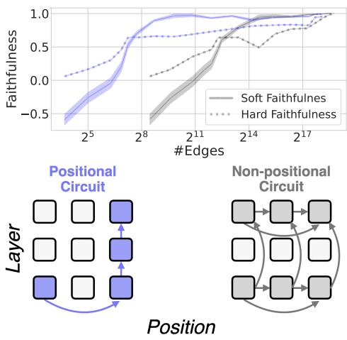  
Figure 1: Positional vs. non-positional circuits. In a nonpositional circuit, the same edges must be included at all positions. A positional circuit can distinguish between the same edge at different positions. This specificity yields better trade-offs between circuit size and faithfulness. It can also increase both precision and recall.

Goldowsky-Dill et al., 2023), automatic methods often overlook positional information, treating components as uniformly relevant across all input token positions (Conmy et al., 2023; Syed et al., 2023). For instance, if an attention head is included in a circuit, it is assumed to contribute equally to the computation for every position in the input sequence. The assumption that circuits are position-invariant ignores the fact that different positions often require distinct computations. By ignoring positions, current methods limit their ability to capture mechanisms that operate across positions, such as interactions between attention heads across positions.

In this study, we start by demonstrating that positional agnosticism is a significant limitation (§2). Then, to address these limitations, we introduce a new approach: position-aware edge attribution patching (PEAP; §3; Figure 1). Current approaches assume that if an edge is in a circuit, then the same edge will be in the circuit at all positions, thus leading to low precision. It is also assumed that an edge's importance should be aggregated across positions before deciding whether it should be included in the circuit; this can lead to cancellation effects, and thus low recall. PEAP instead allows us to compute the importance of cross-positional edges, and separately evaluates edge importance at each position. We show that this leads to smaller and more accurate circuits; see Figure 1.

Incorporating positional information into circuit discovery is straightforward when inputs have the same length and structure across examples.

However, realistic datasets are not nearly this templatic. How, then, can we incorporate positional information into automatic circuit discovery? To address this challenge, we propose schemas (§4). Schemas assign semantic labels to spans of tokens, enabling information aggregation across examples even when the spans differ in length.

For example, in the input “The war lasted from 1453 to 14\_," the span “war" could be labeled as “Subject". This enables handling spans with varying lengths: the phrase “Black Plague" in another example can be treated as a single positional span with the same role as “war". In experiments with two LMs and three tasks, we find that circuits discovered using schemas achieve a better trade-off between circuit size and faithfulness to the model's behavior than position-agnostic circuits. Importantly, position-aware circuits offer a more precise representation of the underlying mechanisms, providing a more concise foundation for mechanistic explanations.

We also present a fully automated pipeline for schema generation and application (§4.2) using large language models (LLMs). We evaluate the quality of the generated schemas and their utility in discovering position-aware circuits (§4.2). Notably, circuits derived using automatically generated and applied schemas achieve comparable faithfulness scores to circuits discovered with human-designed and manually applied schemas.

We summarize our contributions as follows:

• Introduce a position-aware circuit discovery method, which obtains better faithfulness than position-agnostic discovery.

• Introduce dataset schemas, facilitating positional circuit discovery in more naturalistic settings.

• Develop an automated schema generation and application pipeline with LLMs, yielding schemas that are comparable to manually-annotated ones.

## 2 Background and Motivation

The computation graph is a representation of information flow within the model. Typically, the nodes correspond to model components V (e.g., MLPs or attention heads), and the edges E represent the connections between these components. In our framework, the computation graph includes four types of nodes: MLPs, attention heads, embeddings, and logits. Each node type has a separate instance at every token position. An edge between components at the same token position indicates that the output of the upstream node, written to the residual stream (Elhage et al., 2021), is read by the downstream node. Following Wang et al. (2023), the input edge to an attention head is decomposed into three components: v\_input, k\_input, and q\_input. Consequently, each upstream node v is connected to a downstream attention head u at the same position via three distinct edges. Additionally, we define crossing edges, which connect attention heads at different token positions. These edges capture information flow mediated by the attention mechanism and are described in more detail in Section 3. Each attention head is connected to all attention heads at subsequent token positions via three types of connections: v, k, and q. The size of the computation graph depends on both the model size and the prompt length. Table 5 presents average graph sizes across all datasets and models evaluated in this work.

A circuit is a subgraph of the model's computation graph; it can be conceptualized as a binary mask B(V, E, T) over all components and edges in the graph, selecting the components and edges that have the strongest effect on the model's behavior on a target task T. There are many methods for computing the influence of a component on the model's behavior on T, including activation patching (Vig et al., 2020; Finlayson et al., 2021; Geiger et al., 2021), path patching (Wang et al., 2023; Goldowsky-Dill et al., 2023), and edge patching (Hanna et al., 2024b; Marks et al., 2025), with attribution patching to approximate direct patching (Nanda, 2023; Syed et al., 2023). We focus on edge patching, which aims to identify edges in E that are causally important for T. For each such edge (u, v), the nodes u and v are included in the circuit.

Manual circuit discovery methods can distinguish between components at different token positions; examples include the IOI circuit (Wang et al., 2023), the Greater-Than circuit (Hanna et al.,

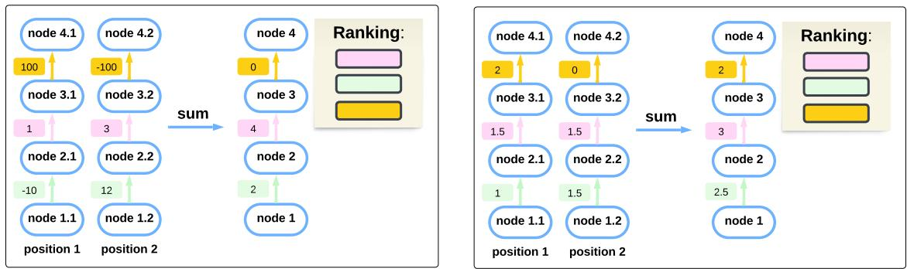  
Figure 2: Left: The yellow edge at position 1 has the highest score of 100, indicating it is the most important edge. However, aggregating across positions causes scores of opposite signs to cancel. This causes the yellow edge to be incorrectly ranked as the least important. Right: The yellow edge at position 1 has the highest score; the scores of other edges are consistently high (but lower) at many positions. After summing across positions, the non-yellow edges have higher scores. Thus, the yellow edge is incorrectly ranked as the least important.

2024a), and the Attribute-Binding circuit (Prakash et al., 2024). The authors determined connections between attention heads by examining attention patterns and establishing connections if a head at one position strongly attended to a head at another. However, this approach has three key limitations: (1) it is not scalable, (2) it is prone to human bias, and (3) it is unclear whether strong attention scores reliably indicate the a causal connection to the downstream metric (Jain and Wallace, 2019).

In contrast, automatic approaches (Syed et al., 2023; Hanna et al., 2024b) systematically examine every connection and evaluate them quantitatively via their causal effect on the downstream metric. While some automatic methods can, in principle, be used to discover circuits that account for token position (Marks et al., 2025; Kramár et al., 2024; Ge et al., 2024), they have only been explored in narrow or highly templated settings; see App. A for additional discussion. In fact, due to the difficulty of accounting for token position, a common workaround is to aggregate attribution scores across positions. However, this introduces specific challenges, which we now discuss.

Cancellations across positions (low recall). If a component has scores with opposite signs across different positions, summing these scores can partially cancel out the component's overall effect, potentially resulting in a near-zero score (Figure 2, left). Kramár et al. (2024) note that cancellation can occur when aggregating across examples in the dataset. We observe that the extent of this phenomenon is larger than previously assumed: it can occur within a single sample across positions. To measure cancellation effects across positions, we compare importance rankings from edge attribution patching (EAP; Syed et al., 2023) under two positional aggregation methods: (i) summing the absolute scores across both positions and examples (unaffected by cancellation effects); and (ii) summing scores across positions and then summing the absolute scores across different examples (affected by cancellation effects). We observe (Table 1, Top) that the two rankings differ significantly at the most important components.

Importance overestimation (low precision). Circuits that do not consider positional information may favor edges that have small impacts at many positions over edges that have large impact in one or few positions (Figure 2, Right). To measure overestimation effects we compare importance rankings derived from two aggregation methods: (i) summing the absolute scores across both positions and examples; and (ii) taking the max of the absolute across positions and then summing scores across different examples. Table 1 (Bottom) provides evidence for this phenomenon.

These problems motivate a circuit discovery method that takes position into account. We introduce this method in §3.

## 3 Position-aware Edge Attribution Patching (PEAP)

The importance of an edge e is typically measured with the indirect effect (IE) of the edge on some target metric M. In direct activation patching, also known as causal mediation analysis (Pearl 2001; Vig et al., 2020; Mueller et al., 2024), the IE is the change in the metric M when the edge is patched’ to some counterfactual value, e.g. the edge value in a run on a different input x':

<table><tr><td colspan="4">Cancellation</td></tr><tr><td>K%</td><td>Diff</td><td> $\mathrm { D i f f } _ { \mathrm { C o n t r o l } }$  ρ</td><td>ρControl</td></tr><tr><td>1</td><td>17.1%</td><td>3.9%</td><td>0.760 0.985</td></tr><tr><td>5</td><td>13.4%</td><td>2.4% 0.831</td><td>0.991</td></tr><tr><td>10</td><td>12.1%</td><td>2.3% 0.877</td><td>0.992</td></tr><tr><td colspan="4">Overestimation</td></tr><tr><td>K%</td><td>Diff</td><td> $\mathrm { D i f f } _ { \mathrm { C o n t r o l } }$  ρ</td><td>ρControl</td></tr><tr><td>1</td><td>17.5%</td><td>3.6%</td><td>0.772 0.984</td></tr><tr><td>5</td><td>14.6%</td><td>2.1% 0.811</td><td>0.993</td></tr><tr><td>10</td><td>12.4%</td><td>2.2% 0.864</td><td>0.993</td></tr></table>

Table 1: Cancellation and overestimation effects when ignoring positions. We rank edges by their importance scores (IOI task, GPT2-small), and take the top K%. We compute the set difference (Diff) and rank correlations (ρ) between rankings produced by the two aggregation methods described in §2. We define the difference of two ranking lists $R _ { 1 } , R _ { 2 }$ at length L as $1 - \frac { | R _ { 1 } \bigcap R _ { 2 } | } { I . }$ As a control, we also compute the mean pairwise set difference $\mathrm { ( D i f f _ { C o n t r o l } ) }$ and rank similarities $\left( \rho _ { \mathrm { C o n t r o l } } \right)$ produced by the same aggregation method across 3 data subsets. Differences with respect to control are all significant $( p < . 0 1 )$

$M ( x | e = e _ { x ^ { \prime } } ) - M ( x )$ . Performing this intervention at every edge is costly, prompting approximate algorithms. Edge attribution patching (EAP; Syed et al., 2023) linearly approximates the $\mathrm { I E } , g ( e )$ , of edge $\boldsymbol { e } = \left( u , v \right)$ as follows:

$$
g ( e ) = M ( x | e = e _ { x ^ { \prime } } ) - M ( x ) \approx ( z _ { u } ^ { * } - z _ { u } ) ^ { \top } \nabla _ { v } M ( x )\tag{1}
$$

The target metric M can vary depending on the task. Typically, M is the logit difference between a correct completion and a minimally different incorrect completion. $z _ { u }$ and $z _ { u } ^ { * }$ are the clean and counterfactual activations at the output of $u ,$ and $\nabla _ { v } M ( x )$ is the gradient of M (x) w.r.t the input of v. Syed et al. (2023) showed EAP to outperform direct activation patching with a greedy approach (Conmy et al., 2023). However, Syed et al. only discovered circuits that do not consider positions.

## 3.1 Method

Equation 1 holds only when u and v are at the same position. To include token positions in the circuit, attention edges that cross positions must be included in the discovery process. In autoregressive Transformer-based models, these edges exist between nodes representing a given attention head that operates at different positions. Let $h _ { t , l } ^ { i }$ denote the node corresponding to the ¿-th attention head at token position t in layer l. Following Olah et al (2021), we view the contribution of head $h _ { t } ^ { i }$ to the residual stream as:

$$
z _ { h _ { t } ^ { i } } = W _ { O } ^ { i } ( \mathrm { s o f t m a x } ( \frac { q _ { t } ^ { i } { K _ { t } ^ { i } } ^ { \top } } { \sqrt { d _ { k } } } ) V _ { t } ^ { i } ) \in \mathbb { R } ^ { d _ { \mathrm { m o d e l } } }\tag{2}
$$

Here, $W _ { O } ^ { i }$ represents the columns of the projection matrix $W _ { O }$ that specifically project the output of head $h ^ { i }$ $K _ { t } ^ { i } ~ \in ~ \mathbb { R } ^ { t \times d _ { \mathrm { h e a d } } }$ is the key matrix, and $V _ { t } ^ { i } \in \mathbb { R } ^ { t \times d _ { \mathrm { h e a d } } }$ is the value matrix.

$h _ { t } ^ { i }$ is connected to every node $h _ { t ^ { \prime } , l } ^ { i }$ at position $t ^ { \prime } \leq t ,$ via 3 edges: the value vector $v _ { t ^ { \prime } , l } ^ { i } .$ the key vector $k _ { t ^ { \prime } , l } ^ { i } ,$ and the query vector $q _ { t , l } ^ { i }$ . As direct communication between heads at different token positions occurs only within the same layer, we omit henceforth the layer notation and assume that all attention edges connect attention heads within the same layer.

To approximate the attribution scores of attention edges, we first calculate $z _ { h _ { t } ^ { i } } ^ { * }$ , the corrupted output of the head $h _ { t } ^ { i }$ caused by patching $v _ { t ^ { \prime } } ^ { i } , k _ { t ^ { \prime } } ^ { i }$ , or $q _ { t } ^ { i }$ We then approximate the attribution as follows:

$$
M ( \boldsymbol { x } | \boldsymbol { e } = \boldsymbol { e } _ { x ^ { \prime } } ) - M ( \boldsymbol { x } ) \approx ( z _ { h _ { t } ^ { i } } ^ { * } - z _ { h _ { t } ^ { i } } ) ^ { \top } \nabla _ { z _ { h _ { t } ^ { i } } } M ( \boldsymbol { x } )\tag{3}
$$

Based on Eq. 2, we define the corrupted vector $z _ { h _ { t } ^ { i } } ^ { * }$ for patching $v _ { t ^ { \prime } } ^ { i }$ (Eq. 4), patching $k _ { t ^ { \prime } } ^ { i }$ (Eq. 5), and patching q (Eq. 6):

$$
\begin{array} { r } { z _ { h _ { t } ^ { i } } ^ { * } = W _ { O } ^ { i } ( \mathrm { s o f t m a x } \left( \frac { q _ { t } ^ { i } K _ { t } ^ { i } ^ { \top } } { \sqrt { d _ { k } } } \right) \left[ v _ { 1 } ^ { i } , . . . , { v _ { t ^ { \prime } } ^ { i } } ^ { * } , . . . , v _ { t } ^ { i } \right] ) } \end{array}\tag{4}
$$

$$
z _ { h _ { t } ^ { i } } ^ { * } = W _ { O } ^ { i } ( \mathrm { s o f t m a x } \left( \frac { q _ { t } ^ { i } \left[ k _ { 1 } ^ { i } , . . . , k _ { t ^ { \prime } } ^ { i } { } ^ { * } , . . . , k _ { t } ^ { i } \right] ^ { \top } } { \sqrt { d _ { k } } } \right)\tag{Vt}
$$

(5)

$$
\begin{array} { r } { z _ { h _ { t } ^ { i } } ^ { * } = W _ { O } ^ { i } ( \operatorname { s o f t m a x } \left( \frac { \left[ q _ { t } ^ { i } { k _ { 1 } ^ { i } } ^ { \top } , . . . , q _ { t } ^ { i * } { k _ { t ^ { \prime } } ^ { i } } ^ { \top } , . . . , q _ { t } ^ { i } { k _ { t } ^ { i } } ^ { \top } \right] } { \sqrt { d _ { k } } } \right) } \end{array}\tag{Vi}
$$

(6)

Figure 3 provides an illustration of each type of patching. By using PEAP to approximate attention edges, we can now approximate both withinposition edges and cross-position edges.

Once the attribution scores for all edges have been computed, we construct the circuit using an adapted version of the greedy algorithm proposed by Hanna et al. (2024b). See App. C for details.

## 3.2 Preliminary Demonstration

We now compare PEAP to the position-agnostic approach of Syed et al. (2023) using the Greater-Than task (Hanna et al., 2024a) on GPT2-small (Radford et al., 2019). The dataset includes prompts like: “The war lasted from the year 1741 to the year 17 99 and counterfactual variants $\mathrm { w i t h } \cdots$ as the starting year (e.g., “The war lasted from the year 1701 to the year $1 7 \_ \cdot \underline { { \^ { , , , } } } )$ . The downstream metric M measures the probability difference between valid and invalid year answers. We use 500 examples each for circuit discovery and evaluation, considering only prompts with valid model predictions. Circuit evaluation is based on two metrics: (1) Soft Faithfulness $\begin{array} { r } { ( F _ { S } ( C ) = \frac { M ( C ) } { M ( \mathcal { M } ) } ) } \end{array}$ , comparing the circuit's performance to the ful model's, and (2) Hard Faithfulness $( F _ { H } ( C ) = \Im \{ C _ { T } = \mathcal { M } _ { T } \} )$ assessing token agreement at the final position $T$ While $F _ { S }$ is more commonly used, we see $F _ { H }$ as a more behaviorally grounded metric.

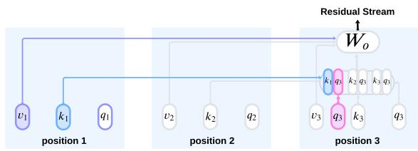  
Figure 3: Illustration of the attention mechanism from the perspective of position 3. We approximate how patching $v _ { 1 }$ , k1 or $q _ { 3 }$ impacts the downstream metric via the output of the attention head at position 3.

Figure 1 presents the faithfulness scores of the Greater-Than task for both methods as a function of circuit size. PEAP enables the discovery of circuits that improve the trade-off between circuit size and faithfulness: position-aware circuits are smaller, and yet achieve similar faithfulness with ordersof-magnitude fewer edges.

## 3.3 Aggregating Scores Across Examples

In the Greater-Than dataset, we can simply aggregate position-specific scores across examples. This naive approach works because all examples in the Greater-Than dataset consist of exactly the same number of tokens, and each position has the same meaning across all examples. In other words, this approach requires all examples in the dataset to be fully position-aligned. This raises a key challenge for non-templatic datasets: the same token position may not have the same meaning across examples, and examples may vary in length.

Prior methods addressing positionality typically follow one of two strategies: (1) full alignment, where the dataset is generated from a single template—as in the Greater-Than dataset—and (2)

partial alignment, where specific token position roles are consistent across examples. For instance, in the IOI dataset (Wang et al., 2023), the authors manually identified five key single-token roles (IO, S1, S1+1, S2, End) shared across all prompt templates, which are sufficient for constructing a faithful circuit. In the next section, we describe an automatic approach inspired by partial alignment that enables us to include positional information in tasks with variable-length inputs.

## 4 Schemas for Variable-length Inputs

Discovering circuits requires aggregating edge scores across examples. However, because edges correspond to specific positions in the computation graph, naive aggregation assumes perfect positional alignment across examples—an impractical assumption for most datasets. To address this challenge, we relax this assumption and only assume that examples share a similar high-level structure, which is represented by a schema. A dataset schema identifies spans within input examples, where each span covers consecutive tokens grouped under a meaningful category. For instance, in the input “The war lasted from 1453 to $1 4 \_ \cdot$ the span “war" could be labeled Subject. This allows us to handle spans of varying lengths, such as treating “Black Plague" in another example as a single position with the same role as “war". Examples of schemas for specific datasets are shown in Figure 4. Schemas are defined based on semantic, syntactic, or other patterns in the data, and may be guided by knowledge of how the model processes examples. Spans are ordered sequentially within the input, covering all parts of a prompt.2

## 4.1 Discovering Circuits at the Schema Level

When all examples share the same schema-defined structure, we can leverage this consistency to create an abstract computation graph for all examples. For now, we assume spans in the schema can be automatically mapped to corresponding tokens in any dataset sample. We discuss automating this process later.

Let $G _ { x } = ( E _ { x } , V _ { x } )$ represent the computation graph derived from example $x \in \mathcal { D }$ . Given schema S with k spans, we define the abstract computation graph $G _ { \cal S } = ( E _ { \cal { S } } , V _ { \cal { S } } )$ , which is structurally equivalent to a computation graph of M on an input of length k. Intuitively, each span is represented by a

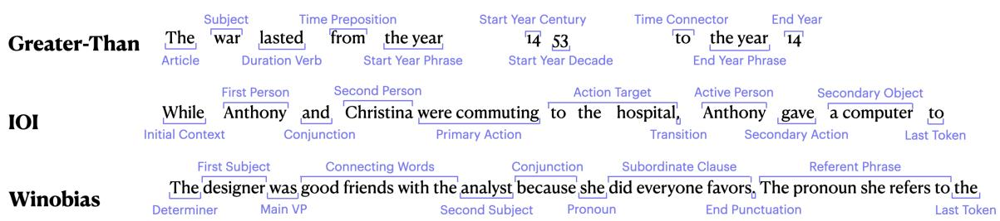  
Figure 4: Example schema for each task. We show examples from the LLM+Mask method. See §B for examples of human-designed schemas.

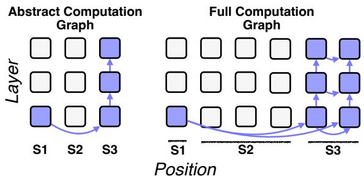  
Figure 5: Circuits defined over schemas. Every node/edge at position s in the abstract computation graph is mapped to a set of nodes/edges in the full computation graph within the span s.

single position.

At a high level, given an example, we (i) compute edge scores on the true computation graph $G _ { x } ;$ (ii) map from edges in $G _ { x }$ to edges in $G _ { S } ,$ and sum edge scores in $G _ { x }$ to compute edge scores in $G _ { S } ;$ (iii) construct a circuit in $G _ { S }$

To this end, we define a mapping $f _ { x } : E _ { S } \to$ $2 ^ { E _ { x } }$ from an edge $\boldsymbol { e } = ( u _ { s _ { 1 } } , v _ { s _ { 2 } } )$ to a set of edges in $E _ { x }$ ••

$$
f _ { \mathcal { S } } ^ { x } ( e ) = \{ e ^ { \prime } \in G _ { x } \mid e = ( u _ { i } , u _ { j } ) , i \in s _ { 1 } , j \in s _ { 2 } \}\tag{7}
$$

where $u _ { s _ { 1 } } , v _ { s _ { 2 } }$ represent components in the computation graph at spans $s _ { 1 } , s _ { 2 }$

Given an attribution function $g _ { x }$ (defined at the token position level), the attribution score $g _ { S }$ (defined at the segment level) of the edge $e \in G _ { S }$ is the sum of all the edge effects mapped to this edge, averaged over all examples in the task dataset:

$$
g _ { S } ( e ) = { \frac { 1 } { | \mathcal { D } | } } \sum _ { x \in \mathcal { D } } \sum _ { e ^ { \prime } \in f _ { S } ^ { x } ( e ) } g _ { x } ( e ^ { \prime } )\tag{8}
$$

After computing the attribution score for each edge in $G _ { S }$ , we construct the abstract circuit $\mathcal { C } _ { S } \subseteq$ $G _ { S }$ with the same greedy algorithm used in the previous section (see App. C).

Faithfulness evaluation. The process of faithfulness evaluation involves ablating edges that are not included in the circuit. To evaluate an abstract circuit on a sample $x \in \mathcal { D }$ , we convert back to the computational graph $G _ { x }$ and construct ${ \mathcal { C } } _ { x } \subseteq G _ { x } \colon$

$$
\mathcal { C } _ { x } = \{ e \mid e \in f _ { S } ^ { x } ( e ^ { \prime } ) , \forall e ^ { \prime } \in C _ { S } \}\tag{9}
$$

In other words, for every edge $e ^ { \prime }$ in the abstract circuit $C _ { S }$ , the corresponding edges in $f _ { x } ( e ^ { \prime } )$ form the circuit ${ \mathcal { C } } _ { x }$ . Figure 5 depicts this process.

## 4.2 Automating Schema Generation and Application

Given a schema S and a function $f _ { \cal S }$ to apply it to every sample $x \in { \mathcal { D } } .$ , we can automatically discover position-aware circuits, even for tasks involving variable-length examples. However, as shown in Figure 4, schema definitions are dataset-specific, requiring tedious manual work and intricate knowledge of the task at hand as well as knowledge of the analyzed model's computations. Applying the schemas may also require deep knowledge of the target dataset. To generate interpretable circuits, schemas must be both faithful to the model and meaningful to humans.

In this section, we propose an automated process for schema generation and application to streamline circuit discovery. Inspired by recent work on LLM agents (Wang et al., 2024) for automated interpretability (Schwettmann et al., 2023; Shaham et al., 2024), we investigate the use of LLMs for generating and applying schemas.

Schema Application. Applying a schema entails mapping each token to a specific span. After defining the schema, we utilize an LLM to perform the application process. We provide the prompt for applying the schema in App. E.2.

Schema Generation. Creating a schema requires specifying span types while satisfying two conditions: (1) spans must follow the same order across all examples, and (2) each prompt must be fully covered by the spans. These criteria are incorporated into the LLM's prompt (details in App. D).

Given a dataset, we use an LLM to create three schema versions based on distinct subsamples, then have the LLM unify these versions into a final schema. The schema is validated by confirming it applies to at least 80% of the subsampled data; otherwise, the process is repeated. Examples of LLM-generated schemas are shown in Figure 4.

Saliency scores: A model-based approach for schema generation. The schema generation described above does not account for the computations performed by the target model M on the given dataset D, potentially producing unfaithful schemas (as we will show in §6). To address this, we incorporate the importance of each token position to the model's computation into the schema generation.

Our key idea is to inform the LLM which positions significantly influence the model's decisions. While many feature attribution methods can be explored (Danilevsky et al., 2020; Wiegreffe and Marasovic, 2021; Wallace et al., 2020), we employ a simple saliency score, inputXgradient (Shrikumar et al., 2017). The score of a token in position t is defined as $s ( t ) = \| \mathbf { e } _ { \mathbf { t } } \cdot \nabla _ { \mathbf { e } _ { \mathbf { t } } } M ( x ) \|$ , where $\mathbf { e _ { t } }$ is the token embedding at position t. We compute a softmax over these scores and define a mask for each example as follows:

$$
m ( t ) = \left\{ \begin{array} { l l } { 1 } & { \mathrm { i f } \frac { e ^ { s ( t ) } } { \sum _ { i = 1 } ^ { n } e ^ { s ( i ) } } > \frac { 1 } { n } , } \\ { 0 } & { \mathrm { o t h e r w i s e } , } \end{array} \right.\tag{10}
$$

Where n is the prompt length. This mask is then attached to each example, and the LLM is instructed to use it when designing the schema. Token position which is important across many examples should be placed in its own span. Further information on mask construction and alternative attribution methods can be found in App. D.1.

Schema Evaluation. We propose two intrinsic metrics and one extrinsic metric to evaluate the entire schema pipeline. Intrinsic metrics assess the LLM schema application. An application is valid if span labels are ordered correctly and every token is assigned to a single span, and correct if it matches a human application for the same schema. Extrinsic metrics evaluate schema design and application through circuit discovery. A good schema definition and application should achieve better trade-offs between circuit size and faithfulness.

Invalid schema applications are filtered out for both the discovery and evaluation datasets, while incorrect applications are retained since automating their filtering is infeasible in general datasets. If an application is valid but incorrect, we expect it to affect the faithfulness of the discovered circuit. To ensure minimal distribution shift in the dataset, we consider a generation and an application of a schema on an entire dataset as successful if at least 90% of the examples are valid. This means that each circuit is discovered using a slightly different set of examples (up to 10%), but we ensure that all circuits are compared using the exact same evaluation set, which is the intersection of the examples for all runs. In practice this intersection includes 90% of the total dataset examples. In our experiments, three full pipeline runs were usually sufficient to achieve at least one successful run.

We found Claude 3.5 Sonnet (Anthropic, 2024) to perform well in both schema generation and application, achieving high validity and correctness scores (Table 6, App. D.2). We also experimented with Llama-3-70B (Grattafiori et al., 2024) and GPT-4o (OpenAI et al., 2024), but they failed to meet our thresholds for valid applications. In $\ S 6 .$ we show that LLM-generated schemas score well on extrinsic quality measures, with saliencyenhanced schemas proving comparable to humandesigned ones.

## 5 Experiments

In all experiments, we use Llama- $\cdot 3 \ – 8 \mathbf { B } ^ { 3 }$ and GPT2- small. The experiments are implemented using the Transformerlens library (Nanda and Bloom, 2022).

## 5.1 Tasks

For all tasks, we uniformly sample 500 examples for circuit discovery and another 500 examples for evaluating faithfulness. We consider three tasks: Indirect Object Identification (IOI; Wang et al., 2023): This task consists of prompts like “When Mary and John went to the store, John gave a drink $\mathrm { t o } ^ { \prime \prime }$ , and the model should predict the indirect object token Mary'. The counterfactual prompts for this task are prompt of the same structure but with 3 other unrelated names, for example: "When Dan and David went to the store, Sarah gave a drink $\mathrm { t o } ^ { \prime \prime }$ . The metric that is being measured here is the logit difference between the token Mary' and the token John'. We evaluate with both GPT2-small and Llama-3-8B. For each model, we construct a dataset based on only examples where the model can predict the correct answer.

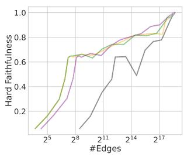

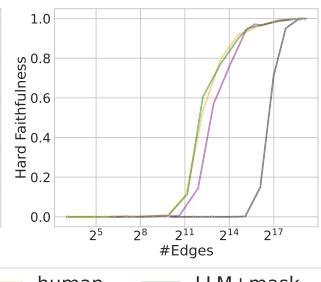

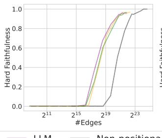

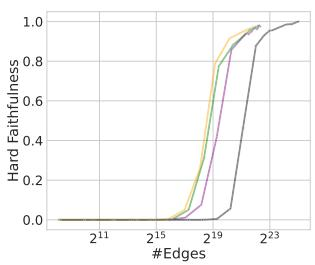  
Figure 6: Hard faithfulness curves for GPT-2-small on Greater-Than (left) and IOI (mid-left), and for Llama-3-8b on IOI (mid-right) and Winobias (right).

Greater-Than (Hanna et al., 2024a): We use the same setting as described in §2. We evaluate this task only on GPT2-small, as Llama-3-8B's tokenizer is not compatible with the task setup; see App. B.2 for details.

Winobias (Zhao et al., 2018): A benchmark designed to evaluate gender bias in coreference resolution. We collect 33 template from the dataset where professions are irrelevant to the coreference decision (e.g., “The doctor offered apples to the nurse because she had too many of them"). For each sample, we append the suffix: “The pronoun {} refers to the", where {} is a placeholder for the pronoun. Each template can be used to construct four types of prompts: Anti-Female, Anti-Male, Pro-Female, Pro-Male. For example of each prompt see Table 3. We focus on the Anti-Female prompts, using only examples where the model predicts the incorrect answer due to bias. This approach aims to identify components responsible for biased predictions. For Winobias, counterfactual prompts can be designed in multiple ways, each affecting the kinds of components one would recover; see App. B for further discussion. To avoid counterfactual-specific biases, we use mean ablation with examples from all four types during circuit discovery and faithfulness evaluation. The downstream metric M is the logit difference between the correct profession and incorrect profession. For further details on all tasks, see App. B.

## 5.2 Circuit Evaluation

We measure faithfulness as a function of circuit size. Since different examples may produce circuits of varying sizes (due to differences in span lengths across examples), at each point we report the average circuit size across all examples. We extend the approach of Hanna et al. (2024b) for ablating edges to also include attention edges.

## 6 Results

Figure 6 shows hard faithfulness for multiple tasks and models. The positional circuits reach high faithfulness at much smaller circuit sizes compared to the non-positional circuits.

Using LLM-generated schema works well, and adding mask information yields an additional significant boost. Thus, providing the LLM with information about the target models' computation aids in generating effective schemas. Discovering circuits with automatic LLM+mask schemas leads to faithulness results that are as good as—and sometimes better than—human-designed schemas. Thus, our automated LLM-based schema pipeline discovers circuits with faithfulness comparable to those identified by human experts, even for tasks containing variable-length inputs.

We now discuss task-specific patterns. In the Greater-Than task, the circuit discovered with the schema via LLM+mask achieves a faithfulness not significantly different from the human-designed schema. The circuit generated solely by the LLM demonstrates lower faithfulness for smaller circuit sizes but achieves higher faithfulness as the circuit size increases. Comparing the schemas reveals that the schema derived using saliency scores aligns more closely with the human-designed schema. Specifically, both the human-crafted schema and the LLM+mask schema partition the start year to two spans: the first two digits and the last two digits. However, in the LLM-only schema, all four digits are grouped in a single span.

In the IOI task using GPT2-small, we observe that the circuits identified by our automated pipeline closely match the human-designed circuits in faithfulness. However, in the case of Llama-3- 8B, the LLM-generated circuits show slightly superior faithfulness compared to human-designed circuits. One plausible explanation is that the IOI task has not been extensively investigated in this larger model, meaning the schema defined for GPT2- small may not optimally capture the nuances of this task in Llama-3-8B. This highlights the importance of tailoring schemas to the specific combination of task and model, rather than extrapolating from results obtained with a different model.

For the Winobias task dataset, similar trends emerge: using the importance mask consistently improves faithfulness scores, making it comparable to the human-defined schema-based circuit

## 7 Discussion and Conclusions

In mechanistic investigations, position matters. Our results suggest it does not make sense in practice to create circuits without considering how distinct the circuit at each position might be. Theoretical results suggest that it also does not make sense in principle to ignore positionality: Merrill and Sabharwal (2024) show that transformers' expressive power increases with multiple generation steps. Similarly, accounting for positionality in interpretability methods can enhance their expressive power by capturing the distinct mechanisms processing each token, rather than assuming a single pathway for the entire sequence.

Other interpretability methods such as distributed alignment search (DAS; Geiger et al., 2024) already support testing hypotheses about the position of particular causal variables. It would be interesting to directly compare the efficacy of DAS methods when separating results by position versus when aggregating information across positions. Stronger results when separating positional information could help generalize our conclusions to a wider array of causal interpretability methods.

## Limitations

A key limitation we have discussed is that it is not trivial to handle positional information in tasks where the length of inputs vary. We have proposed an automatic pipeline for generating and applying schemas, but future work should explore this further. In particular, because there is no single gold standard for schemas, it is not clear a priori what kinds of schemas are generally likely to obtain better trade-offs between faithfulness and circuit size. Devising general principles for effective schema design therefore represents a fruitful avenue for future work. It would also be interesting to observe whether human-generated schemas tend to satisfy these principles, or whether the most effective schemas are not necessarily those that humans are likely to design.

Another key limitation is that a schema requires the same spans to appear in the same order across all examples, such that the edges’ direction remains correct across examples. Consequently, two schemas with the same span types but in different orders cannot be evaluated together, as these produce different abstract computation graphs.

## Acknowledgments

This research was supported by the Israel Science Foundation (grant No. 448/20), an Azrieli Foundation Early Career Faculty Fellowship, an AI Alignment grant from Open Philanthropy, and a Google gift. Hadas Orgad was supported by the Apple AIML PhD fellowship. David Bau was supported by a grant from Open Philanthropy. Aaron Mueller was supported by a postdoctoral fellowship under the Zuckerman STEM Leadership Program. This research was funded by the European Union (ERC Control-LM, 101165402). Views and opinions expressed are however those of the author(s) only and do not necessarily reflect those of the European Union or the European Research Council Executive Agency. Neither the European Union nor the granting authority can be held responsible for them.

## References

Anthropic. 2024. The Claude 3 model family: Opus, Sonnet, Haiku.

Arthur Conmy, Augustine N Mavor-Parker, Aengus Lynch, Stefan Heimersheim, and Adrià Garriga-Alonso. 2023. Towards automated circuit discovery for mechanistic interpretability. In Thirty-seventh Conference on Neural Information Processing Systems.

Marina Danilevsky, Kun Qian, Ranit Aharonov, Yannis Katsis, Ban Kawas, and Prithviraj Sen. 2020. A survey of the state of explainable AI for natural language processing. In Proc. of AACL-IJCNLP.

Nelson Elhage, Neel Nanda, Catherine Olsson, Tom Henighan, Nicholas Joseph, Ben Mann, Amanda Askell, Yuntao Bai, Anna Chen, Tom Conerly, Nova DasSarma, Dawn Drain, Deep Ganguli, Zac Hatfield-Dodds, Danny Hernandez, Andy Jones, Jackson Kernion, Liane Lovitt, Kamal Ndousse, Dario Amodei, Tom Brown, Jack Clark, Jared Kaplan, Sam McCandlish, and Chris Olah. 2021. A mathematical framework for transformer circuits. Transformer Circuits Thread.

Matthew Finlayson, Aaron Mueller, Sebastian Gehrmann, Stuart Shieber, Tal Linzen, and Yonatan

Belinkov. 2021. Causal analysis of syntactic agreement mechanisms in neural language models. In Proceedings of the 59th Annual Meeting of the Association for Computational Linguistics and the 11th International Joint Conference on Natural Language Processing (Volume 1: Long Papers), pages 1828–1843, Online. Association for Computational Linguistics.

Leo Gao, Stella Biderman, Sid Black, Laurence Golding, Travis Hoppe, Charles Foster, Jason Phang, Horace He, Anish Thite, Noa Nabeshima, et al. The pile: An 800gb dataset of diverse text for language modeling.

Xuyang Ge, Fukang Zhu, Wentao Shu, Junxuan Wang, Zhengfu He, and Xipeng Qiu. 2024. Automatically identifying local and global circuits with linear computation graphs. In ICML 2024 Workshop on Mechanistic Interpretability.

Atticus Geiger, Hanson Lu, Thomas F Icard, and Christopher Potts. 2021. Causal abstractions of neural networks. In Advances in Neural Information Processing Systems.

Atticus Geiger, Zhengxuan Wu, Christopher Potts, Thomas Icard, and Noah Goodman. 2024. Finding alignments between interpretable causal variables and distributed neural representations. In Proceedings of the Third Conference on Causal Learning and Reasoning, volume 236 of Proceedings of Machine Learning Research, pages 160–187. PMLR.

Nicholas Goldowsky-Dill, Chris MacLeod, Lucas Sato, and Aryaman Arora. 2023. Localizing model behavior with path patching. CoRR, 2304.05969.

Aaron Grattafiori, Abhimanyu Dubey, Abhinav Jauhri, Abhinav Pandey, Abhishek Kadian, Ahmad Al-Dahle, Aiesha Letman, Akhil Mathur, Alan Schelten, Alex Vaughan, Amy Yang, Angela Fan, Anirudh Goyal, Anthony Hartshorn, Aobo Yang, Archi Mitra, Archie Sravankumar, Artem Korenev, Arthur Hinsvark, Arun Rao, Aston Zhang, Aurelien Rodriguez, Austen Gregerson, Ava Spataru, Baptiste Roziere, Bethany Biron, Binh Tang, Bobbie Chern, Charlotte Caucheteux, Chaya Nayak, Chloe Bi, Chris Marra, Chris McConnell, Christian Keller, Christophe Touret, Chunyang Wu, Corinne Wong, Cristian Canton Ferrer, Cyrus Nikolaidis, Damien Allonsius, Daniel Song, Danielle Pintz, Danny Livshits, Danny Wyatt, David Esiobu, Dhruv Choudhary, Dhruv Mahajan, Diego Garcia-Olano, Diego Perino, Dieuwke Hupkes, Egor Lakomkin, Ehab AlBadawy, Elina Lobanova, Emily Dinan, Eric Michael Smith, Filip Radenovic, Francisco Guzmán, Frank Zhang, Gabriel Synnaeve, Gabrielle Lee, Georgia Lewis Anderson, Govind Thattai, Graeme Nail, Gregoire Mialon, Guan Pang, Guillem Cucurell, Hailey Nguyen, Hannah Korevaar, Hu Xu, Hugo Touvron, Iliyan Zarov, Imanol Arrieta Ibarra, Isabel Kloumann, Ishan Misra, Ivan Evtimov, Jack Zhang, Jade Copet, Jaewon Lee, Jan Geffert, Jana Vranes, Jason Park, Jay Mahadeokar, Jeet Shah, Jelmer van der Linde,

Jennifer Billock, Jenny Hong, Jenya Lee, Jeremy Fu Jianfeng Chi, Jianyu Huang, Jiawen Liu, Jie Wang, Jiecao Yu, Joanna Bitton, Joe Spisak, Jongsoo Park Joseph Rocca, Joshua Johnstun, Joshua Saxe, Junteng Jia, Kalyan Vasuden Alwala, Karthik Prasad Kartikeva Upasani, Kate Plawiak, Ke Li, Kenneth Heafield, Kevin Stone, Khalid El-Arini, Krithika Iyer, Kshitiz Malik, Kuenley Chiu, Kunal Bhalla, Kushal Lakhotia, Lauren Rantala-Yeary, Laurens van der Maaten. Lawrence Chen. Liang Tan, Liz Jenkins Louis Martin, Lovish Madaan, Lubo Malo, Lukas Blecher, Lukas Landzaat. Luke de Oliveira, Madeline Muzzi. Mahesh Pasupuleti, Mannat Singh. Manohar Paluri, Marcin Kardas, Maria Tsimpoukelli, Mathew Oldham, Mathieu Rita, Maya Pavlova, Melanie Kam badur, Mike Lewis, Min Si, Mitesh Kumar Singh Mona Hassan, Naman Goyal, Narjes Torabi, Nikolay Bashlykov, Nikolay Bogoychev, Niladri Chatterji Ning Zhang, Olivier Duchenne, Onur Celebi, Patrick Alrassy, Pengchuan Zhang, Pengwei Li, Petar Va sic, Peter Weng, Prajiwal Bhargava, Pratik Dubal Praveen Krishnan, Punit Singh Koura, Puxin Xu, Qing He, Qingxiao Dong, Ragavan Srinivasan, Raj Ganapathy, Ramon Calderer, Ricardo Silveira Cabral Robert Stojnic, Roberta Raileanu, Rohan Maheswari Rohit Girdhar, Rohit Patel, Romain Sauvestre, Ron nie Polidoro, Roshan Sumbaly, Ross Taylor, Ruan Silva, Rui Hou, Rui Wang, Saghar Hosseini, Sahana Chennabasappa, Sanjay Singh, Sean Bell, Seo hyun Sonia Kim, Sergey Edunov, Shaoliang Nie, Sharan Narang, Sharath Raparthy, Sheng Shen, Shengye Wan, Shruti Bhosale, Shun Zhang, Simon Van denhende, Soumya Batra, Spencer Whitman, Sten Sootla, Stephane Collot, Suchin Gururangan, Sydney Borodinsky, Tamar Herman, Tara Fowler, Tarek Sheasha, Thomas Georgiou, Thomas Scialom, Tobias Speckbacher, Todor Mihaylov, Tong Xiao, Ujjwal Karn, Vedanuj Goswami, Vibhor Gupta, Vignesh Ramanathan, Viktor Kerkez, Vincent Gonguet, Virginie Do, Vish Vogeti, Vítor Albiero, Vladan Petrovic, Weiwei Chu, Wenhan Xiong, Wenyin Fu, Whitney Meers, Xavier Martinet, Xiaodong Wang, Xiaofang Wang, Xiaoqing Ellen Tan, Xide Xia, Xin feng Xie, Xuchao Jia, Xuewei Wang, Yaelle Goldschlag, Yashesh Gaur, Yasmine Babaei, Yi Wen. Yiwen Song, Yuchen Zhang, Yue Li, Yuning Mao Zacharie Delpierre Coudert, Zheng Yan, Zhengxing Chen, Zoe Papakipos, Aaditya Singh, Aavushi Srivastava, Abha Jain, Adam Kelsey, Adam Shajnfeld Adithya Gangidi, Adolfo Victoria, Ahuva Goldstand Ajay Menon, Ajay Sharma, Alex Boesenberg, Alexei Baevski, Allie Feinstein, Amanda Kallet. Amit San gani, Amos Teo, Anam Yunus, Andrei Lupu, An dres Alvarado, Andrew Caples, Andrew Gu, Andrew Ho, Andrew Poulton, Andrew Ryan, Ankit Ramchan dani, Annie Dong, Annie Franco, Anuj Goyal, Aparajita Saraf, Arkabandhu Chowdhury, Ashley Gabriel, Ashwin Bharambe, Assaf Eisenman, Azadeh Yazdan, Beau James, Ben Maurer, Benjamin Leonhardi Bernie Huang, Beth Loyd, Beto De Paola, Bhargavi Paranjape, Bing Liu, Bo Wu, Boyu Ni, Braden Hancock, Bram Wasti, Brandon Spence, Brani Stojkovic Brian Gamido, Britt Montalvo, Carl Parker, Carly Burton, Catalina Mejia, Ce Liu, Changhan Wang

Changkyu Kim, Chao Zhou, Chester Hu, Ching Hsiang Chu, Chris Cai, Chris Tindal, Christoph Feichtenhofer, Cynthia Gao, Damon Civin, Dana Beaty, Daniel Kreymer, Daniel Li, David Adkins, David Xu, Davide Testuggine, Delia David, Devi Parikh Diana Liskovich, Didem Foss, Dingkang Wang, Duc Le, Dustin Holland, Edward Dowling, Eissa Jamil Elaine Montgomery, Eleonora Presani, Emily Hahn Emily Wood, Eric-Tuan Le, Erik Brinkman, Esteban Arcaute, Evan Dunbar, Evan Smothers, Fei Sun Felix Kreuk, Feng Tian, Filippos Kokkinos, Firat Ozgenel, Francesco Caggioni, Frank Kanavet, Frank Seide, Gabriela Medina Florez, Gabriella Schwarz, Gada Badeer, Georgia Swee, Gil Halpern, Grant Herman, Grigory Sizov, Guangyi, Zhang, Guna Lakshminarayanan, Hakan Inan, Hamid Shojanaz eri, Han Zou, Hannah Wang, Hanwen Zha, Haroun Habeeb, Harrison Rudolph, Helen Suk, Henry Aspegren, Hunter Goldman, Hongyuan Zhan, Ibrahim Damlai, Igor Molybog, Igor Tufanov, Ilias Leontiadis Irina-Elena Veliche, Itai Gat, Jake Weissman, James Geboski, James Kohli, Janice Lam, Japhet Asher Jean-Baptiste Gaya, Jeff Marcus, Jeff Tang, Jen nifer Chan, Jenny Zhen, Jeremy Reizenstein, Jeremy Teboul, Jessica Zhong, Jian Jin, Jingyi Yang, Joe Cummings, Jon Carvill, Jon Shepard, Jonathan Mc-Phie, Jonathan Torres, Josh Ginsburg, Junjie Wang, Kai Wu, Kam Hou U, Karan Saxena, Kartikay Khan delwal, Katavoun Zand, Kathy Matosich, Kaushik Veeraraghavan, Kelly Michelena. Kegian Li. Kiran Jagadeesh, Kun Huang, Kunal Chawla, Kyle Huang, Lailin Chen, Lakshya Garg, Lavender A, Leandro Silva, Lee Bell, Lei Zhang, Liangpeng Guo, Licheng Yu, Liron Moshkovich, Luca Wehrst edt. Madian Khabsa, Manay Avalani, Manish Bhatt Martynas Mankus, Matan Hasson, Matthew Lennie Matthias Reso, Maxim Groshev, Maxim Naumov, Mava Lathi, Meghan Keneally, Miao Liu, Michael L Seltzer, Michal Valko, Michelle Restrepo, Mihir Pa tel, Mik Vyatskov, Mikayel Samvelyan, Mike Clark Mike Macey, Mike Wang, Miquel Jubert Hermoso, Mo Metanat, Mohammad Rastegari, Munish Bansal Nandhini Santhanam, Natascha Parks, Natasha White, Navyata Bawa, Nayan Singhal, Nick Egebo Nicolas Usunier, Nikhil Mehta, Nikolay Pavlovich Laptev, Ning Dong, Norman Cheng, Oleg Chernoguz Olivia Hart, Omkar Salpekar, Ozlem Kalinli, Parkin Kent, Parth Parekh, Paul Saab, Pavan Balaji, Pedro Rittner, Philip Bontrager, Pierre Roux, Piotr Dollar, Polina Zvyagina, Prashant Ratanchandani Pritish Yuvraj, Qian Liang, Rachad Alao, Rachel Rodriguez, Rafi Ayub, Raghotham Murthy, Raghu Nayani, Rahul Mitra, Rangaprabhu Parthasarathy, Raymond Li, Rebekkah Hogan, Robin Battey, Rocky Wang, Russ Howes, Ruty Rinott, Sachin Mehta Sachin Siby, Sai Jayesh Bondu, Samyak Datta, Sara Chugh, Sara Hunt, Sargun Dhillon, Sasha Sidorov Satadru Pan, Saurabh Mahajan, Saurabh Verma Seiji Yamamoto, Sharadh Ramaswamy, Shaun Lindsay, Shaun Lindsay, Sheng Feng, Shenghao Lin, Shengxin Cindy Zha, Shishir Patil, Shiva Shankar Shuqiang Zhang, Shuqiang Zhang, Sinong Wang Sneha Agarwal, Soji Sajuyigbe, Soumith Chintala Stephanie Max, Stephen Chen, Steve Kehoe, Steve

Satterfield, Sudarshan Govindaprasad, Sumit Gupta, Summer Deng, Sungmin Cho, Sunny Virk, Suraj Subramanian, Sy Choudhury, Sydney Goldman, Tal Remez, Tamar Glaser, Tamara Best, Thilo Koehler, Thomas Robinson, Tianhe Li, Tianjun Zhang, Tim Matthews, Timothy Chou, Tzook Shaked, Varun Vontimitta, Victoria Ajayi, Victoria Montanez, Vijai Mohan, Vinay Satish Kumar, Vishal Mangla, Vlad Ionescu, Vlad Poenaru, Vlad Tiberiu Mihailescu, Vladimir Ivanov, Wei Li, Wenchen Wang, Wenwen Jiang, Wes Bouaziz, Will Constable, Xiaocheng Tang, Xiaojian Wu, Xiaolan Wang, Xilun Wu, Xinbo Gao, Yaniv Kleinman, Yanjun Chen, Ye Hu, Ye Jia, Ye Qi, Yenda Li, Yilin Zhang, Ying Zhang, Yossi Adi, Youngjin Nam, Yu, Wang, Yu Zhao, Yuchen Hao, Yundi Qian, Yunlu Li, Yuzi He, Zach Rait, Zachary DeVito, Zef Rosnbrick, Zhaoduo Wen, Zhenyu Yang, Zhiwei Zhao, and Zhiyu Ma. 2024. The llama 3 herd of models.

Michael Hanna, Ollie Liu, and Alexandre Variengien. 2024a. How does GPT-2 compute greater-than?: Interpreting mathematical abilities in a pre-trained language model. Advances in Neural Information Processing Systems, 36.

Michael Hanna, Sandro Pezzelle, and Yonatan Belinkov. 2024b. Have faith in faithfulness: Going beyond circuit overlap when finding model mechanisms. In First Conference on Language Modeling.

Sarthak Jain and Byron C Wallace. 2019. Attention is not explanation. In Proceedings of the 2019 Conference of the North American Chapter of the Association for Computational Linguistics: Human Language Technologies, Volume 1 (Long and Short Papers), pages 3543–3556.

János Kramár, Tom Lieberum, Rohin Shah, and Neel Nanda. 2024. Atp\*: An efficient and scalable method for localizing llm behaviour to components. arXiv preprint arXiv:2403.00745.

Samuel Marks, Can Rager, Eric J. Michaud, Yonatan Belinkov, David Bau, and Aaron Mueller. 2025. Sparse feature circuits: Discovering and editing interpretable causal graphs in language models. In The Thirteenth International Conference on Learning Representations, ICLR 2025, Singapore, April 24-28, 2025. OpenReview.net.

William Merrill and Ashish Sabharwal. 2024. The expressive power of transformers with chain of thought. In The Twelfth International Conference on Learning Representations, ICLR 2024, Vienna, Austria, May 7-11, 2024. OpenReview.net.

Aaron Mueller, Jannik Brinkmann, Millicent L. Li, Samuel Marks, Koyena Pal, Nikhil Prakash, Can Rager, Aruna Sankaranarayanan, Arnab Sen Sharma, Jiuding Sun, Eric Todd, David Bau, and Yonatan Belinkov. 2024. The quest for the right mediator: A history, survey, and theoretical grounding of causal interpretability. CoRR, abs/2408.01416.

Neel Nanda. 2023. Attribution Patching: Activation Patching At Industrial Scale.

Neel Nanda and Joseph Bloom. 2022. Transformerlens. https://github.com/TransformerLensOrg/ TransformerLens.

Chris Olah, Nick Cammarata, Ludwig Schubert, Shan Carter, and Michael Petrov. 2021. The transformer circuits thread: A framework for understanding transformers. https://transformer-circuits.pub/ 2021/framework/index.html. Accessed: 2024-11- 25.

OpenAI, :, Aaron Hurst, Adam Lerer, Adam P. Goucher, Adam Perelman, Aditya Ramesh, Aidan Clark, AJ Ostrow, Akila Welihinda, Alan Hayes, Alec Radford, Aleksander Mądry, Alex Baker-Whitcomb, Alex Beutel, Alex Borzunov, Alex Carney, Alex Chow, Alex Kirillov, Alex Nichol, Alex Paino, Alex Renzin, Alex Tachard Passos, Alexander Kirillov, Alexi Christakis, Alexis Conneau, Ali Kamali, Allan Jabri, Allison Moyer, Allison Tam, Amadou Crookes, Amin Tootoochian, Amin Tootoonchian, Ananya Kumar, Andrea Vallone, Andrej Karpathy, Andrew Braunstein, Andrew Cann, Andrew Codispoti, Andrew Galu, Andrew Kondrich, Andrew Tulloch, Andrey Mishchenko, Angela Baek, Angela Jiang, Antoine Pelisse, Antonia Woodford, Anuj Gosalia, Arka Dhar, Ashley Pantuliano, Avi Nayak, Avital Oliver, Barret Zoph, Behrooz Ghorbani, Ben Leimberger, Ben Rossen, Ben Sokolowsky, Ben Wang, Benjamin Zweig, Beth Hoover, Blake Samic, Bob McGrew, Bobby Spero, Bogo Giertler, Bowen Cheng, Brad Lightcap, Brandon Walkin, Brendan Quinn, Brian Guarraci, Brian Hsu, Bright Kellogg, Brydon Eastman, Camillo Lugaresi, Carroll Wainwright, Cary Bassin, Cary Hudson, Casey Chu, Chad Nelson, Chak Li, Chan Jun Shern, Channing Conger, Charlotte Barette, Chelsea Voss, Chen Ding, Cheng Lu, Chong Zhang, Chris Beaumont, Chris Hallacy, Chris Koch, Christian Gibson, Christina Kim, Christine Choi, Christine McLeavey, Christopher Hesse, Claudia Fischer, Clemens Winter, Coley Czarnecki, Colin Jarvis, Colin Wei, Constantin Koumouzelis, Dane Sherburn, Daniel Kappler, Daniel Levin, Daniel Levy, David Carr, David Farhi, David Mely, David Robinson, David Sasaki, Denny Jin, Dev Valladares, Dimitris Tsipras, Doug Li, Duc Phong Nguyen, Duncan Findlay, Edede Oiwoh, Edmund Wong, Ehsan Asdar, Elizabeth Proehl, Elizabeth Yang, Eric Antonow, Eric Kramer, Eric Peterson, Eric Sigler, Eric Wallace, Eugene Brevdo, Evan Mays, Farzad Khorasani, Felipe Petroski Such, Filippo Raso, Francis Zhang, Fred von Lohmann, Freddie Sulit, Gabriel Goh, Gene Oden, Geoff Salmon, Giulio Starace, Greg Brockman, Hadi Salman, Haiming Bao, Haitang Hu, Hannah Wong, Haoyu Wang, Heather Schmidt, Heather Whitney, Heewoo Jun, Hendrik Kirchner, Henrique Ponde de Oliveira Pinto, Hongyu Ren, Huiwen Chang, Hyung Won Chung, Ian Kivlichan, Ian O'Connell, Ian O'Connell, Ian Osband, Ian Silber, Ian Sohl, Ibrahim Okuyucu, Ikai Lan, Ilya Kostrikov, Ilya Sutskever, Ingmar Kanitscheider,

Ishaan Gulrajani, Jacob Coxon, Jacob Menick, Jakub Pachocki, James Aung, James Betker, James Crooks James Lennon, Jamie Kiros, Jan Leike, Jane Park Jason Kwon, Jason Phang, Jason Teplitz, Jason Wei, Jason Wolfe, Jav Chen, Jeff Harris, Jenia Var avva, Jessica Gan Lee, Jessica Shieh, Ji Lin, Jiahui Yu, Jiayi Weng, Jie Tang, Jieqi Yu, Joanne Jang Joaquin Quinonero Candela, Joe Beutler, Joe Landers, Joel Parish, Johannes Heidecke, John Schul man, Jonathan Lachman, Jonathan McKay, Jonathan Uesato, Jonathan Ward, Jong Wook Kim, Joost Huizinga, Jordan Sitkin, Jos Kraaijeveld, Josh Gross, Josh Kaplan, Josh Snyder, Joshua Achiam, Joy Jiao Joyce Lee, Juntang Zhuang, Justyn Harriman, Kai Fricke, Kai Hayashi, Karan Singhal, Katy Shi, Kavin Karthik, Kayla Wood, Kendra Rimbach, Kenny Hsu, Kenny Nguyen, Keren Gu-Lemberg, Kevin Button Kevin Liu, Kiel Howe, Krithika Muthukumar, Kyle Luther, Lama Ahmad, Larry Kai, Lauren Itow, Lauren Workman, Leher Pathak, Leo Chen, Li Jing, Lia Guy, Liam Fedus, Liang Zhou, Lien Mamitsuka, Lil. ian Weng, Lindsay McCallum, Lindsey Held, Long Ouyang, Louis Feuvrier, Lu Zhang, Lukas Kondraciuk, Lukasz Kaiser, Luke Hewitt, Luke Metz, Lyric Doshi, Mada Aflak, Maddie Simens, Madelaine Bovd, Madeleine Thompson, Marat Dukhan, Mark Chen, Mark Gray, Mark Hudnall, Marvin Zhang. Marwan Aljubeh, Mateusz Litwin, Matthew Zeng, Max Johnson, Maya Shetty, Mayank Gupta, Meghan Shah, Mehmet Yatbaz, Meng Jia Yang, Mengchao Zhong, Mia Glaese, Mianna Chen, Michael Janner, Michael Lampe, Michael Petrov, Michael Wu Michele Wang, Michelle Fradin, Michelle Pokrass Miguel Castro, Miguel Oom Temudo de Castro Mikhail Pavlov, Miles Brundage, Miles Wang, Minal Khan, Mira Murati, Mo Bavarian, Molly Lin, Murat Yesildal, Nacho Soto, Natalia Gimelshein, Na talie Cone, Natalie Staudacher, Natalie Summers. Natan LaFontaine, Neil Chowdhury, Nick Ryder Nick Stathas, Nick Turley, Nik Tezak, Niko Felix Nithanth Kudige, Nitish Keskar, Noah Deutsch, Noel Bundick, Nora Puckett, Ofir Nachum, Ola Okelola. Oleg Boiko, Oleg Murk, Oliver Jaffe, Olivia Watkins. Olivier Godement, Owen Campbell-Moore, Patrick Chao, Paul McMillan, Pavel Belov, Peng Su, Peter Bak, Peter Bakkum, Peter Deng, Peter Dolan Peter Hoeschele, Peter Welinder, Phil Tillet, Philip Pronin, Philippe Tillet, Prafulla Dhariwal, Qiming Yuan, Rachel Dias, Rachel Lim, Rahul Arora, Rajan Troll, Randall Lin, Rapha Gontijo Lopes, Raul Puri, Reah Miyara, Reimar Leike, Renaud Gaubert Reza Zamani, Ricky Wang, Rob Donnelly, Rob Honsby, Rocky Smith, Rohan Sahai, Rohit Ramchan dani, Romain Huet, Rory Carmichael, Rowan Zellers Roy Chen, Ruby Chen, Ruslan Nigmatullin, Ryan Cheu, Saachi Jain, Sam Altman, Sam Schoenholz, Sam Toizer, Samuel Miserendino, Sandhini Agar wal, Sara Culver, Scott Ethersmith, Scott Gray, Sean Grove, Sean Metzger, Shamez Hermani, Shantanu Jain, Shengjia Zhao, Sherwin Wu, Shino Jomoto, Shirong Wu, Shuaiqi, Xia, Sonia Phene, Spencer Papay, Srinivas Narayanan, Steve Coffey, Steve Lee, Stewart Hall, Suchir Balaji, Tal Broda, Tal Stramer, Tao Xu, Tarun Gogineni, Taya Christianson, Ted Sanders

Tejal Patwardhan, Thomas Cunninghman, Thomas Degry, Thomas Dimson, Thomas Raoux, Thomas Shadwell, Tianhao Zheng, Todd Underwood, Todor Markov, Toki Sherbakov, Tom Rubin, Tom Stasi, Tomer Kaftan, Tristan Heywood, Troy Peterson, Tyce Walters, Tyna Eloundou, Valerie Qi, Veit Moeller, Vinnie Monaco, Vishal Kuo, Vlad Fomenko, Wayne Chang, Weiyi Zheng, Wenda Zhou, Wesam Manassra, Will Sheu, Wojciech Zaremba, Yash Patil, Yilei Qian, Yongjik Kim, Youlong Cheng, Yu Zhang, Yuchen He, Yuchen Zhang, Yujia Jin, Yunxing Dai, and Yury Malkov. 2024. GPT-4o system card.

Judea Pearl. 2001. Direct and indirect effects. In Proc of the Conference on Uncertainty in Artificial Intelligence.

Nikhil Prakash, Tamar Rott Shaham, Tal Haklay, Yonatan Belinkov, and David Bau. 2024. Fine-tuning enhances existing mechanisms: A case study on entity tracking. In The Twelfth International Conference on Learning Representations.

Alec Radford, Jeff Wu, Rewon Child, David Luan, Dario Amodei, and Ilya Sutskever. 2019. Language models are unsupervised multitask learners.

Sarah Schwettmann, Tamar Rott Shaham, Joanna Materzynska, Neil Chowdhury, Shuang Li, Jacob Andreas, David Bau, and Antonio Torralba. 2023. Find: A function description benchmark for evaluating interpretability methods. In Thirty-seventh Conference on Neural Information Processing Systems Datasets and Benchmarks Track.

Tamar Rott Shaham, Sarah Schwettmann, Franklin Wang, Achyuta Rajaram, Evan Hernandez, Jacob Andreas, and Antonio Torralba. 2024. A multimodal automated interpretability agent. In Forty-first International Conference on Machine Learning.

Avanti Shrikumar, Peyton Greenside, and Anshul Kundaje. 2017. Learning important features through propagating activation differences. In International conference on machine learning, pages 3145–3153. PMIR.

Aaquib Syed, Can Rager, and Arthur Conmy. 2023. Attribution patching outperforms automated circuit discovery. arXiv preprint arXiv:2310.10348.

Jesse Vig, Sebastian Gehrmann, Yonatan Belinkov, Sharon Qian, Daniel Nevo, Yaron Singer, and Stuart Shieber. 2020. Investigating gender bias in language models using causal mediation analysis. In Advances in Neural Information Processing Systems, volume 33, pages 12388–12401. Curran Associates, Inc.

Eric Wallace, Matt Gardner, and Sameer Singh. 2020. Interpreting predictions of NLP models. In Proc. of EMNLP: Tutorial Abstracts.

Kevin Ro Wang, Alexandre Variengien, Arthur Conmy, Buck Shlegeris, and Jacob Steinhardt. 2023. Interpretability in the wild: a circuit for indirect object identification in gpt-2 small.

Lei Wang, Chen Ma, Xueyang Feng, Zeyu Zhang, Hao Yang, Jingsen Zhang, Zhiyuan Chen, Jiakai Tang, Xu Chen, Yankai Lin, et al. 2024. A survey on large language model based autonomous agents. Frontiers of Computer Science, 18(6):186345.

Sarah Wiegreffe and Ana Marasovic. 2021. Teach me to explain: A review of datasets for explainable natural language processing. In Proc. of NeurIPS Datasets and Benchmarks Track.

Jieyu Zhao, Tianlu Wang, Mark Yatskar, Vicente Ordonez, and Kai-Wei Chang. 2018. Gender bias in coreference resolution: Evaluation and debiasing methods. In Proceedings of the 2018 Conference of the North American Chapter of the Association for Computational Linguistics: Human Language Technologies, Volume 2 (Short Papers), pages 15–20.

## A Related Work

While some automatic methods can, in principle, be used to discover circuits that account for token position, those approaches have only been explored in limited settings and do not address the challenges that arise in more realistic settings.

Kramár et al. (2024) introduce AtP\*, a variant of Edge Attribution Patching (EAP; Syed et al., 2023) designed to localize LLM behavior at the node level while accounting for token position. However, it has only been evaluated on templatic, fully aligned datasets and has not been used for circuit discovery. Marks et al. (2025) propose a framework for Sparse Feature Circuits that incorporates token position, but only within templatic, fully-aligned, datasets. Additionally, their work reports faithfulness only at the node level, not the edge level, despite edge circuits having been found to better capture task circuits (Ge et al., 2024). Their definition of an “edge" also diverges significantly from ours: in their framework, an edge is an abstract object that corresponds to distributing the node's effect across its outgoing edges. Their circuit construction involves computing node scores, filtering low-score nodes, and then computing scores for “edges"(paths) between remaining nodes, even if these are not truly connected in the computation graph. In contrast, we define an edge as an object that connects one node to another if it directly affects the latter's output.

Lastly, Ge et al. (2024) propose a circuit discovery pipeline that combines Sparse Autoencoders (SAEs) with a variant called Transcoders, while also accounting for token position. While our goals are closely related, our work differs in several key ways. We use a different circuit discovery method (PEAP) and evaluate faithfulness on three datasets, each with 500 examples and varying sequence lengths, whereas their evaluation is limited in scope and based on only a few examples. Additionally, we study models of different sizes, including both GPT-2 Small and LLaMA3-8B. Finally, we address the challenge of automatically handling unaligned datasets by incorporating LLM-defined schemes.

## B Tasks Details

## B.1 IOI

We use the dataset of Wang et al. (2023). The data is generated using 15 templates. For the humandefined schema (provided below), we extend the partial schema provided by the authors to fully cover all spans in the prompt. The original dataset includes two types of prompts: ABBA prompts, where the indirect object (IO) token is the first name in the prompt, and BABA prompts, where the IO token appears as the second name. Because the ABBA and BABA prompts swap the order of important spans, we cannot aggregate across these two prompt types. Thus, we designed two distinct schema, resulting in the definition of two separate datasets:

IOI ABBA: The human-defined schema and its application:

• Prefix: [When]

• I0: [Mary]

• and: [and]

• S1: [John]

• S1+1: [went]

• action1: [to the store,]

• S2: [John]

• action2: [gave a drink]

• to: [to]

IOI BABA: The human-defined schema and its application:

• Prefix: [When]

• S1: [John]

• S1+1: [and]

• IO: [Mary]

• S1+1: [went]

• action1: [to the store,]

• S2: [John]

• action2: [gave a drink]

• to: [to]

Table 2 summarizes the performance of GPT2- small and Llama-3-8B for this task. For the results in §6, we use the ABBA datasets. Results for both datasets can be found in §F. Note that there exist schemas that can handle both datasets simultaneously, eliminating the need for separation. However, these schemas require grouping the IO token and the S1 token into the same span, which mixes signals from both token positions and introduces new drawbacks.

## B.2 Greater-Than

We use the dataset of Hanna et al. (2024a). All examples in this task are generated using a single template: “The {} lasted from the year {} to the year {}". Because the event span (the first nonterminal) and the years have the same token length for all of our models, all examples in the dataset are fully token-aligned.

For the human-designed schema, we adopted the word-level schema used by Hanna et al. (2024a):

• The: [The]

• Noun: [war]

• lasted: [lasted]

• from: [from]

• the: [the]

• year: [year]

• XX1: [16]

• YY: [45]

• to: [to]

• the: [the]

• year: [year]

• XX2: [16]

Table 2 summarizes the performance of GPT2- small for this task.

## B.3 Winobias

We use the dataset templates of Zhao et al. (2018). We constructed the dataset based on 33 pairs of prompt templates and 32 single-token professions. Each profession is associated with gender stereotypes.

Stereotypical female professions: teacher, editor, cashier, writer, counselor, counselors, nurse, sewer, baker, auditor, designer, clerk, cleaner, librarian, secretary, assistant, attendant, accountant.

Stereotypical male professions: lawyer, farmer, physician, developer, manager, guard, mechanic, chief, driver, mover, supervisor, analyst, constructor, cook, sheriff.

<table><tr><td>Dataset</td><td>GPT2-small</td><td>Llama-3-8B</td></tr><tr><td>IOI-ABBA</td><td>92.5%</td><td>71.7%</td></tr><tr><td>IOI-BABA</td><td>87.1%</td><td>73.4%</td></tr><tr><td>Greater-Than</td><td>100%</td><td>0.0%</td></tr></table>

Table 2: Accuracy on different datasets. Note that Llama-3 performs poorly on Greater-Than due to tokenization: it tokenizes four-digit years as a token of three digits, followed by a token of one digit. The Greater-Than prompts end with a two-digit token, which the model has presumably not seen followed by another two-digit number token; thus, it instead generates whitespaces, and assigns a low probability to the true answer.

The original dataset consists of pairs of templates, each sharing the same prefix but having different suffixes. This variation causes the position of the correct answer to change between templates (e.g., “The doctor offered apples to the nurse because she had too many of them" and “The nurse offered apples to the doctor because she might like them"). We separate templates where the first subject is the correct answer from those where the second subject is the correct answer. This separation ensures we do not mix biased signals with non-biased signals during the circuit discovery process.

Moreover, for each template, we construct four types of prompts: Anti-Female, Anti-Male, Pro-Female, and Pro-Male. In total, starting from 33 pairs of templates, we construct eight distinct datasets. Table 3 provides examples for each type of dataset. Intuitively, “Anti-"means that the profession-pronoun relationship goes against conventional gender biases; “Pro-" means that the the profession-pronoun relationship conforms to conventional gender biases. For example, if the correct answer is “nurse" and the pronoun is “she", we would say that this is a Pro-Female example; compare to the case where the pronoun is “he"; this changes it to an Anti-Male example.

For the main results we used the Anti-Female-I dataset. Results for the Anti-Female-II dataset can be found in §F.1.2.

Table 4 presents the performance of Llama-3-8B on each type of dataset. We evaluated how often the model responded with the plausible answer and how often it chose the biased answer. Note that the model is not forced to select either of these options, and therefore, the sum of the percentages in each row does not necessarily equal 100%.

For the human-defined schema, we used a schema defined by Zhao et al. (2018) with minor adjustments:

• correct answer: [The doctor]

• interacts with: [offered apples to]

• wrong answer: [the nurse]

• conjunction: [because]

• pronoun1: [she]

• circumstances: [had too many of them]

• dot: [.]

• The: [The]

• pronoun: [pronoun]

• pronoun2: [she]

• refers: [refers]

• to: [to]

• the: [the]

For datasets where the wrong answer appears as the first subject, we swap the order of the answers in the schema.

Note that counterfactuals can be defined in many ways for this task; this complicates locating and interpreting circuits. For example, one could define counterfactuals from Anti-Male to Anti-Female, Anti-Male to Pro-Female, among others; each of these would isolate only some bias-specific subcircuit of the full coreference resolution circuit. To overcome biases that would result from using counterfactual prompts, we instead use mean ablations constructed from 16 examples spanning all examples (Anti-Female, Anti-Male, Pro-Female, Pro-Male); this is more likely to recover the full coreference resolution circuit.4

## C Circuit Construction

Once the attribution scores for all edges in the graph are approximated, there are several ways to construct a circuit. A straightforward approach might involve selecting components with the highest scores to construct the circuit. However, this naive method often results in a circuit that lacks proper connectivity between embeddings and logits.

<table><tr><td>Dataset</td><td>Example</td></tr><tr><td>Anti-Female-I</td><td>The doctor offered apples to the nurse because she had too many of them. The pronoun she refers to the&quot;</td></tr><tr><td>Anti-Female-II</td><td>The nurse offered apples to the doctor because she might like them. The pronoun she refers to the&quot;</td></tr><tr><td>Pro-Female-I</td><td>The nurse offered apples to the doctor because she had too many of them. The pronoun she refers to the&quot;</td></tr><tr><td>Pro-Female-II</td><td>The doctor offered apples to the nurse because she might like them. The pronoun she refers to the&quot;</td></tr><tr><td>Anti-Male-I</td><td>The nurse offered apples to the doctor because he had too many of them. The pronoun he refers to the&quot;</td></tr><tr><td>Anti-Male-II</td><td>The doctor offered apples to the nurse because he might like them. The pronoun he refers to the&quot;</td></tr><tr><td>Pro-Male-I</td><td>The doctor offered apples to the nurse because he had too many of them. The pronoun he refers to the&quot;</td></tr><tr><td>Pro-Male-II</td><td>The nurse offered apples to the doctor because he might like them. The pronoun he refers to the&quot;</td></tr></table>

Table 3: An example for each dataset. Each entry demonstrates a pronoun resolution scenario, with variations designed to reflect anti-female, pro-female, anti-male, and pro-male biases.

<table><tr><td>Dataset</td><td>Correct Answer</td><td>Biased Answer</td><td>Sum</td></tr><tr><td>Anti-Female-I</td><td>34.5%</td><td>64.8%</td><td>99.3%</td></tr><tr><td>Anti-Female-II</td><td>29.2%</td><td>69.5%</td><td>98.7%</td></tr><tr><td>Pro-Female-I</td><td>81.6%</td><td>17%</td><td>98.6%</td></tr><tr><td>Pro-Female-II</td><td>75.9%</td><td>23.2%</td><td>99.1%</td></tr><tr><td>Anti-Male-I</td><td>51.9%</td><td>47.4%</td><td>99.3%</td></tr><tr><td>Anti-Male-II</td><td>35.8%</td><td>63%</td><td>98.8%</td></tr><tr><td>Pro-Male-I</td><td>79.2%</td><td>19.3%</td><td>98.5%</td></tr><tr><td>Pro-Male-II</td><td>61.7%</td><td>37.8%</td><td>99.5%</td></tr></table>

Table 4: Bias measurement across the different datasets. The sum indicates the proportion of examples for which neither the correct nor the biased answer was the top token according to the model.
<table><tr><td>Dataset</td><td>GPT2-small</td><td>Llama-3-8B</td></tr><tr><td>IOI-ABBA</td><td>593,473.55</td><td>25,746,710.46</td></tr><tr><td>IOI-BABA</td><td>584,783.47</td><td>25,654,744.33</td></tr><tr><td>Greater-Than</td><td>423,59.0</td><td>1</td></tr><tr><td>Winobias-I</td><td></td><td>33,769,270.68</td></tr><tr><td>Winobias-II</td><td>一</td><td>32,951,977.84</td></tr></table>

Table 5: Average number of edges in the computation graph per task.

To ensure connectivity, we adopt a slightly modified version of the algorithm proposed by Hanna et al. (2024b).

As Hanna et al. (2024b) states, this algorithm is a greedy method, similar to a maximizing version of Dijkstra's algorithm. The process begins with a circuit containing only the logits node at the final token position. At each step, the edge with the highest absolute attribution score that connects to a child node already in the circuit is added. If the corresponding parent node is not yet part of the circuit, it is also included. This iterative process continues for N steps, where N represents the desired circuit size.

Due to the presence of attention edges, parent and child nodes are not always located at the same

token position.

At the end of the process, it is guaranteed that there is a path from the logits node at the final position to every node in the graph. To ensure full connectivity, we iterate over each node in the circuit and remove any nodes, along with their corresponding edges, that are not connected to any embedding node through a path in the graph.

## D Schema: Further Details

To generate a schema, we sample 3 groups of 5 examples each from the dataset. For each group, we ask the LLM to generate a separate schema.⁵ This process produces 3 candidate schema. Next, we present the LLM with all 15 examples and the 3 candidate schemas, asking it to create a single unified schema. We test the unified schema using the LLM by iterating over all examples, and checking whether it can apply the schema in a valid manner to each. If the output is invalid for a given example, we point out why to the LLM and ask it to try again. After three failed attempts, we move to the next example. While this process can identify most errors, it is not infallible and may provide false positives.

If the LLM fails to apply the schema correctly to ≥ 20% of the examples, we consider the schema invalid, inform the model of the issues, and restart the schema generation process. The process ends once the schema can be successfully applied to at least 80% of the examples. See Appendices E.2 and D.2 for more details on the process of applying and validating schemas, as well as an error analysis.

## D.1 Saliency scores

We have also explored the following methods to determine the importance of each token position:

1. Input Attribution: This method involves patching the embedding of each input token individually and measuring the importance of each position based on its impact on a downstream metric.

2. Aggregated Node Attribution Scores: The importance of a position is derived from the significance of its components. While edge attribution patching could theoretically be used for each example to identify important components, this approach is computationally expensive. Instead, we propose using Node Attribution Patching, which uses a linear approximation to estimate node importance rather than edge importance, significantly reducing computation time. This method efficiently calculates the importance of each node at every layer and position. By aggregating attribution scores for all nodes at each position, we estimate the overall importance of every position.

For both methods we used mean ablation values derived from "The Pile" dataset (Gao et al.). We evaluated both methods for schema generation and observed that the resulting schemas closely resembled those produced by the gradient-based method. However, a significant drawback of these approaches is their reliance on a counterfactual dataset, which adds complexity. For this reason, we ultimately chose the gradient-based method as our preferred approach.

Example. Figure 7 presents examples of the masks provided to the model. While not all masks highlight exactly the same token positions or token roles, we observe a consistent overall pattern across masks within the same dataset and model.

## D.2 Schema Evaluation

We define the application of a schema to an example as valid if:

• All spans specified by the schema are included, no extra spans are included, and the spans appear in the exact order defined in the schema.

• Each token in the prompt is assigned to only a single span, and the tokens within each span are a continuous sequence from the original prompt.

Note that empty spans are valid. To ensure that empty spans are justifiable, we initially treat them as invalid during the first iterations. If, after several attempts, a valid result cannot be obtained, we relax this requirement and allow for empty spans.

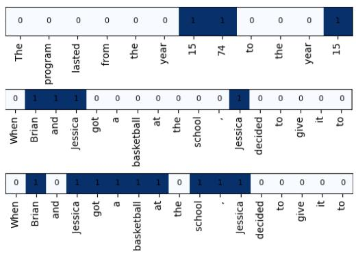  
Figure 7: The first example in Figure 7 is taken from the Greater-Than task and is generated using GPT2- small. Both the second and third examples are from the IOI dataset. The second mask is generated with GPT2-small, while the third is generated with LLaMA-3-8b. The highlighted positions are intended to capture the most influential positions that affect the model's predictions.

We automatically test all the above requirements. If an application is found to be invalid, the next attempt includes details in the prompt about the specific failures in the previous attempt.

We observe (Table 6) that the generated schemas are largely valid, indicating that most examples can be used for circuit discovery.

Recall that we additionally define a correctness metric, which measures to what extent a human annotator agrees with the application of the schema. To measure this, we have a human manually apply the LLM-generated schema to each template; we then compare to what extent the LLM application matches that of the human. Correctness is measured partially: that is, for each example, we compute the fraction of spans that are labeled identically to the human, and take this fraction as the correctness score. We then average these fractions across examples. We observe that a human tends to agree with how the schema were applied, as indicated by high correctness scores in Table 6.6 Thus, the schemas score high on intrinsic measures of quality.

<table><tr><td>Task</td><td>Method</td><td>Valid</td><td>Correct</td></tr><tr><td>IOI ABBA</td><td>LLM + Mask</td><td>92.4% 98.7%</td><td>88.3% 86.8%</td></tr><tr><td>GP-a1 IOI BABA</td><td>LLM + Mask</td><td>98.0% 93.7%</td><td>91.7% 88.5%</td></tr><tr><td>Greater-Than</td><td>LLM + Mask</td><td>100% 100%</td><td>100% 100%</td></tr><tr><td>IOI ABBA IOI BABA</td><td>LLM + Mask</td><td>99.9% 96.1%</td><td>96.0% 96.3%</td></tr><tr><td>L1a--8B</td><td>LLM + Mask</td><td>95.1% 98.2%</td><td>81.5% 92.3%</td></tr><tr><td>Winobias-I</td><td>LLM + Mask</td><td>98.5% 96.5%</td><td>89.0% 98.6%</td></tr><tr><td>Winobias-II</td><td>LLM + Mask</td><td>99.9% 98.2%</td><td>97.9% 95.4%</td></tr></table>

Table 6: Validity is an automatic evaluation metric that tells us how many examples are usable for circuit discovery. Correctness is a human evalation metric that tells us whether the schema were applied in a way that a human agrees with. By definition, the human schema have 100% correctness.

## E LLM Prompts

## E.1 Schema Generation

Here is an example prompt we use to generate the schema:

You are a precise AI researcher, and   
your goal is to understand how a   
language model processes a dataset   
by analyzing its behavior across   
different segments of prompts.   
To do this, you need to divide all   
prompts in the dataset into spans,   
where each span represents a   
meaningful part of the sentence.   
The aim is to split the prompts in the   
dataset systematically, allowing you   
to analyze the relationships   
between various parts of the   
sentence and support different types   
of model analysis.   
### Task: ###   
Your task is to define a schema---a   
structure that defines how to split   
all the examples in the dataset into   
meaningful spans.   
The schema defines how to divide all   
examples into the same set of spans!   
Even though the examples do not   
have the exact same tokens, they   
share a similar structure.

<table><tr><td>Task</td><td>Method</td><td>Validity #1</td><td>Validity #2</td><td>Validity #3</td></tr><tr><td rowspan="4">IOI ABBA GPT-ma1 IOI BABA</td><td>LLM</td><td>48.1 %</td><td>92.4%</td><td>88.8%</td></tr><tr><td>+ Mask</td><td>88.5%</td><td>98.7%</td><td>65.2%</td></tr><tr><td>LLM</td><td>87.2%</td><td>55.1%</td><td>98.0%</td></tr><tr><td>+ Mask</td><td>98.4%</td><td>87.5%</td><td>93.7%</td></tr><tr><td rowspan="2">Greater-Than</td><td>LLM</td><td>98.8%</td><td>100%</td><td>100%</td></tr><tr><td>+ Mask</td><td>100%</td><td>100%</td><td>100%</td></tr><tr><td rowspan="4">I1a-8B</td><td rowspan="2">IOI ABBA</td><td>LLM</td><td>99.9%</td><td>96.7%</td><td>99.8%</td></tr><tr><td>+ Mask</td><td>95.1%</td><td>88.1%</td><td>92.9%</td></tr><tr><td rowspan="2">IOI BABA</td><td>LLM</td><td>96.1%</td><td>62.6%</td><td>77.9%</td></tr><tr><td>+ Mask</td><td>98.2%</td><td>96.9%</td><td>95.4%</td></tr><tr><td rowspan="2">Winobias-I</td><td>LLM</td><td>98.5%</td><td></td><td>96.0%</td><td>77.6%</td></tr><tr><td>+ Mask</td><td>96.5%</td><td></td><td>71.4%</td><td>95.3%</td></tr><tr><td rowspan="2">Winobias-II</td><td>LLM</td><td>76.6%</td><td>99.9%</td><td></td><td>93.5%</td></tr><tr><td>+ Mask</td><td>58.7%</td><td>98.2%</td><td></td><td>93.5%</td></tr></table>

Table 7: In our main experiments, we run schema generation and application three times per method, and take the run with the highest validity score. Here, we show the validities for all three runs for each method. (Validity #1 corresponds to the run used in the main paper.)

```markdown
All parts of each prompt should be
assigned to a span, meaning the
schema must provide a complete
division of every prompt.
### Input Format: ###
1. **Tokens**: A list of tokens
representing the example. Your task
is to find a schema that defines how
to divide this list into meaningful
spans.
2. **Mask**: A list of pairs in the
format [(token, value)], where a
value of 1 indicates that the
token is important and should be
placed in its own span, separated
from other tokens.
### Instructions: ###
1. Use syntactic and semantic rules to
create a schema that defines how to
divide all the examples in the
dataset into meaningful spans.
2. Use the Masks to create additional
spans for any token marked as
significant (`value = 1`). Each of
these tokens should be placed in its
own span.
**Note**: Apply this rule only if a
specific token or token role is
marked as important across many
examples.
3. If you think certain parts or tokens
are crucial for the model's
processing of the prompt, assign
them to a separate span to highlight
their importance.
4. The spans should provide a complete
division of the prompt, ensuring
```

that every token is assigned to a (' argument', 0), (',', 0), (' and',   
span, and the spans should reflect 0), (' afterwards', 1), (' Michael   
the chronological structure of the ', 1), (' said', 0), (' to', 0)]   
prompt.   
5. The examples may vary, so you must   
define a schema that is not tailored \*\*Example 1:\*\*   
to any specific example but can be   
applied consistently across all \*\*Tokens:\*\*   
examples. ['Then', Jennifer',' and'   
John', had', a', long',   
### Goal: ### argument', and' 'afterwards   
Jennifer', said',' to']   
Given a set of examples, your goal is to   
define a schema---a structure that \*\*Mask:\*\*   
divides all examples into the same [('Then', 0), (',', 1), (' Jennifer',   
set of sub-spans. 1), (' and', 1), (' John ', 1), ('   
had', 0), (' a', 0), (' long', 0),   
#### Return Format: #### (' argument', 0), (',', 0), (' and',   
0), (' afterwards',1), (' Jennifer   
Return a JSON object describing the ', 1), (' said ', 0), (' to', 0)]   
schema.   
Each key in the dictionary should   
represent a span title (1-3 words), \*\*Example 2:\*\*   
and the corresponding value should   
describe the tokens or segments \*\*Tokens:\*\*   
assigned to that span. ['Then',' ' Michael', and',   
William', 'had', ′a′ ' long',   
Provide a brief description of each span argument', and', 'afterwards   
's role based on syntax, semantics, ',' Michael',' said',' to']   
or another relevant aspect, but do   
not reference the Mask in the \*\*Mask:\*\*   
description. [('Then', 0), (',', 1), (' Michael', 1)   
, (' and', 0), (' William', 1), ('   
Provide a variety of examples in the had', 0), (' a', 0), (' 1ong', 0),   
descriptions to clarify the scope of (' argument', 0), (',', 0), (' and',   
each span. 0), (' afterwards', 1), (' Michael   
', 1), (' said', 0), (' to', 0)]   
Assign a descriptive and unique span   
title (1-3 words) to each span.   
Avoid mentioning the Mask in the   
title (e.g., "Significant Token"). \*\*Example 3:\*\*   
Example format: \*\*Tokens:\*\*   
['Then',', ' Jessica',' and',   
\`json Elizabeth', 'went', to', ' the'   
{ 'office', ' Jessica', gave'   
"title": "description and examples" 'a',' drink',' to']   
}   
### I will now provide you with 5 pairs \*\*Mask:\*\*   
of Tokens and a Mask. [('Then', 0), (',', 0), (' Jessica', 1)   
, (' and', 1), (' Elizabeth', 1), ('   
Follow the steps carefully, and return a went', 0), (' to', 0), (' the', 0),   
JSON file in the correct format. (' office', 0), ('.', 0), ('   
Jessica', 1), (' gave', 0), (' a',   
0), (' drink', 0), (' to', 0)]   
\*\*Example 0:\*\*   
\*\*Tokens:\*\* \*\*Example 4:\*\*   
['Then', ' Michael',' and',   
Matthew', ''had', a' long', \*\*Tokens:\*\*   
argument', and', 'afterwards ['Then', ', ' Kimberly', ' and',   
' Michael',' said', ' to'] Michelle', 'had', ′a', 'long'   
argument', 'Afterwards',   
\*\*Mask:\*\* Kimberly',' said',' to']   
[('Then', 0), (',', 0), (' Michael', 1)   
, (' and', 0), (' Matthew', 1), (' \*\*Mask:\*\*   
had', 0), (' a', 0), (' long', 0), [('Then', 0), (',', 0), (' Kimberly',

1), (' and', 0), (' Michelle', 1),   
(' had', 0), (' a', 0), (' long', 0)   
, (' argument', 0), ('.', 0), ('   
Afterwards', 0), (' Kimberly', 1),   
(' said', 0), (' to', 0)]   
### Guidelines: ###   
1. Ensure the schema assigns each part   
in the prompt to a span.   
2. The final token in every prompt must   
always be placed in its own span.   
3. The final token is always placed in   
the last span.   
4. Any token marked with a value of \`1   
is considered important and should   
be placed in its own span in the   
schema.   
5. Create spans that can be applied to   
all the examples.   
6. Ensure spans are relevant and   
consistent across the entire dataset

## An example of the models’ response:

Based on the given examples and   
instructions, I've created a schema   
that divides the prompts into   
meaningful spans.   
Here's the JSON object describing the   
schema:   
{   
"Initial Time Marker": "Represents the   
opening temporal indicator, e.g.,   
'Then'",   
"First Person": "Contains the name of   
the first person mentioned in the   
prompt",   
"Conjunction": "Represents the   
coordinating conjunction   
connecting the two people,   
typically'and'",   
"Second Person": "Contains the name of   
the second person mentioned in   
the prompt",   
"Main Event": "Describes the primary   
action or event involving both   
people, e.g., 'had a long argument   
', 'went to the office'",   
"Punctuation": "Represents the   
punctuation separating the main   
event from the following action",   
"Time Transition": "Indicates a shift   
in time, typically 'afterwards' or

similar phrases",   
"Active Person": "Contains the name of   
the person performing the   
subsequent action",   
"Secondary Action": "Describes the   
action taken by the active person   
after the main event, e.g., 'said   
', 'gave '",   
"Final Preposition": "The last word of   
the prompt, typically a   
preposition like 'to'"   
This schema provides a consistent   
structure that can be applied to all   
the given examples and similar   
prompts. It accounts for the   
important tokens (marked with 1 in   
the mask) by assigning them to   
individual spans. The schema also   
ensures that every part of the   
prompt is assigned to a span, and   
the final token is always placed in   
its own span.

## E.2 Schema Application

Given a schema, we call Claude-3.5-Sonnet to apply the schema on each example separately. Here is an example call:

You are an assistant that splits tokens   
into spans based on a given schema.   
Schema: {   
'Temporal Context': 'Words or   
phrases that set the initial   
time frame or sequence of events   
'Primary Subjects': "Names of the   
main characters involved in the   
first action, typically   
connected by 'and'",   
'Initial Action':'Describes the   
primary action or state of the   
subjects, including any relevant   
location',   
'Transition': 'Punctuation or words   
that separate the initial   
context from the subsequent   
action',   
'Active Subject': 'The name of the   
character performing the   
secondary action',   
'Secondary Action': 'The verb phrase   
describing the action performed   
by the active subject',   
'Object': 'The item or concept   
involved in the secondary action   
'Final Preposition': "The last word   
in the prompt, typically 'to'"   
}   
Tokens: [   
'While', ' Jason', ' and', ' Crystal','   
were', ' commuting',' to',' the',

hospital', ' Jason',' gave   
a', kiss to'   
]   
Please split the tokens into the spans   
defined by the schema.   
Return the spans as a JSON object where   
each key is a span name and the   
value is the list of tokens in that   
span.   
Format:   
json {"span title": []} -   
Ensure that:   
- All the spans are present.   
- Every token is assigned to a span.   
- No new spans are added.   
- Punctuation marks should be   
included in the spans. If no   
specific span is assigned to   
punctuation mark, it should be   
grouped with the preceding token   
- Ensure that the last token is   
placed exclusively in the final   
span.   
- The spans are in the correct order   
as in the schema.   
- The tokens in each span are a   
continuous segment of the full   
prompt.   
- The tokens are kept in the same   
order as they appear in the   
original prompt.   
- Don't remove spaces from tokens   
inside the list.   
- If a span has no tokens in a   
specific example, leave it empty   
, but still include the span for   
consistency across all examples

An example of a response from Claude:

```jsonl
Here's the JSON object with the tokens
split into spans according to the
given schema:
"Temporal Context": ["While"],
"Primary Subjects": [" Jason", " and",
" Crystal"],
"Initial Action": [" were", "
commuting", " to", " the", 11
hospital"],
"Transition": [","],
"Active Subject": [" Jason"],
"Secondary Action": [" gave"],
"Object": [" a", " kiss"],
"Final Preposition": [" to"]
}
```

We do not provide Claude with any few-shot examples, as we aim to keep this process fully automated. However, using human-crafted fewshot examples could improve the correctness of the application.

## F Faithfulness Curves

## F.1 Results Across Schema Generation Trials

As mentioned in §4.2, we run the entire pipeline three times for each task to ensure at least 90% of the examples are valid. In §6, we present the results from the trials with the highest validation scores. Here, we report results for all trials.

## F.1.1 Greater-Than

Figures 8, 9, and 10 display the results for the Greater-Than and IOI tasks. Trends are highly consistent across trials, and are all similar to what we observe in the main paper. This is a trivial case where each word could reasonably be assigned its own span, however, so the following sections are more representative of the variance of this method on more realistic datasets.

## F.1.2 Winobias

In Figure 11, we present the results for the Winobias task. The soft faithfulness curves across all schemas and trials initially exhibit a significant drop, suggesting that the circuit assigns higher logits to the correct answer compared to the incorrect, biased answer. To quantify this, the dotted lines in the hard faithfulness curves represent the average percentage of cases where the circuit generates the correct answer. This observation is non-trivial, as we specifically analyze examples where the model predicts the biased (and wrong) answer. Indeed near the drop in the soft faithfulness curves, the models often predict the correct answer at a significant rate. However, as the circuit size increases, the trend reverses: the soft faithfulness curves increase, correlating with a higher percentage of biased predictions. This effect becomes particularly pronounced when token positions are differentiated. One plausible explanation is that the circuit incorporates components that simultaneously influence both the correct and biased answers, reflecting the delicate balance between task-relevant and biasinducing factors. As component analysis lies outside the scope of this study, future research could further investigate this phenomenon.

In general, the human schema achieve the best top-prediction scores. The shape of the faithfulness curves makes it difficult to determine a best method, but the human schema tends to produce a curve that resembles the others, but left-shifted. This suggests that it is picking up on important components before the other methods.

## F.1.3 Indirect Object Identification

In Figures 9 and 10, we show faithfulness curves for GPT2-small and Llama-3-8B, respectively. When viewing hard faithfulness, results do not differ significantly across templates, nor across trials for GPT2-small. The difference between LLM, LLM+Mask, and the human schema is smaller for the third trial for the ABBA template. It is also low for the second two trials for the BABA template. When viewing soft faithfulness, similar trends are present, but the schema-based approaches generally perform similarly to each other (with human and LLM+mask's margin from LLM being much smaller).

The difference between schemas is smaller for Llama-3-8B. While each schema-based method outperforms non-positional circuits, there does not appear to be a significant difference between LLM, LLM+Mask, and human schema.

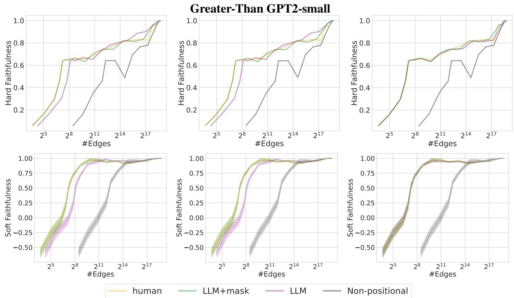  
Figure 8: Each column shows results for a single trial.

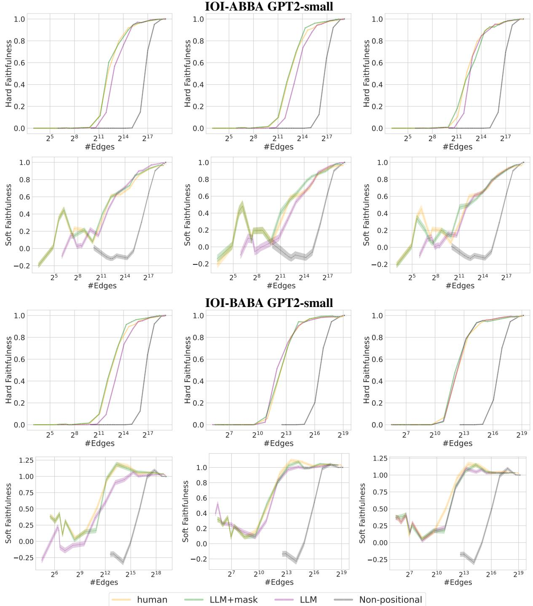  
Figure 9: Each column shows results for a single trial.

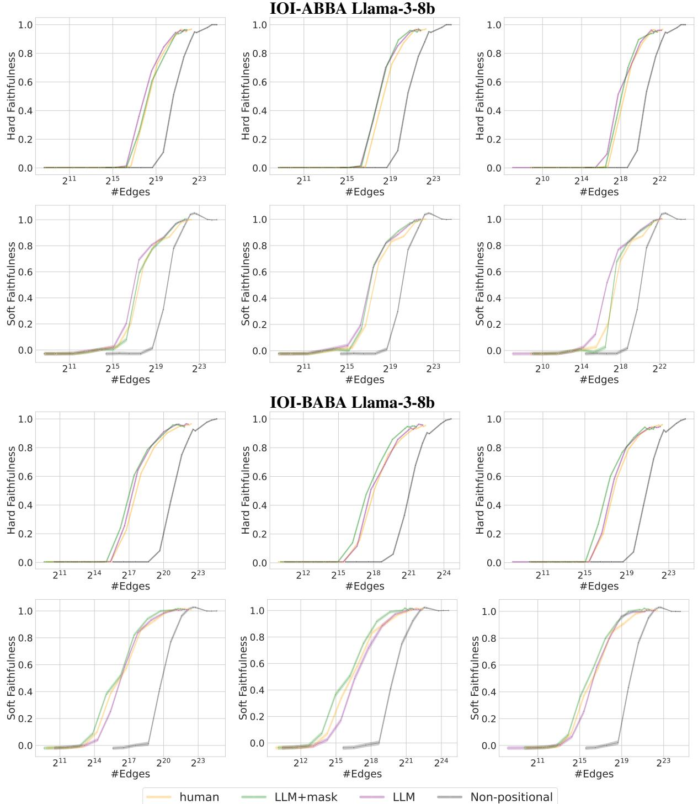  
Figure 10: Each column shows results for a single trial.

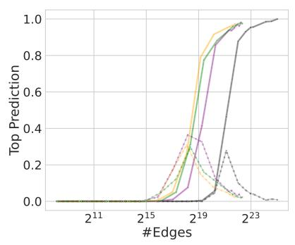

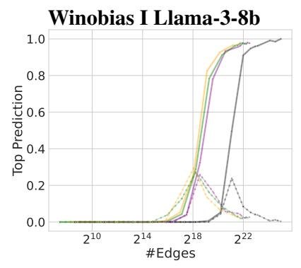

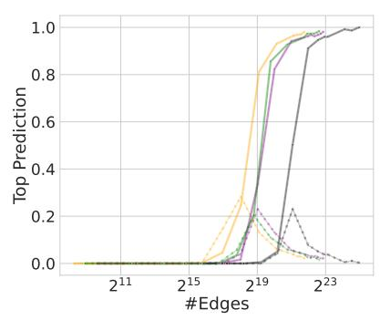

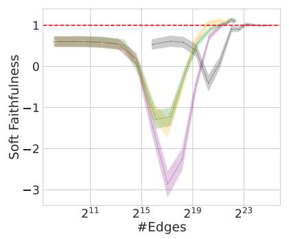

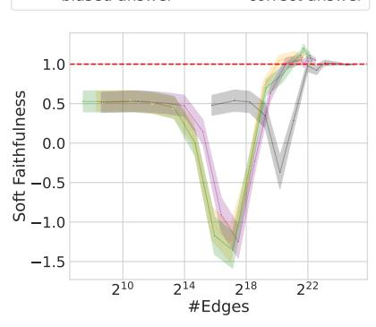

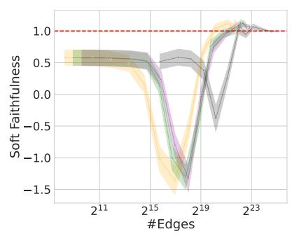

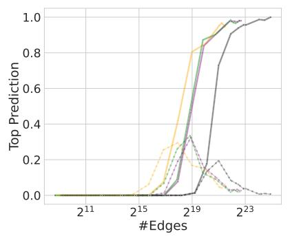

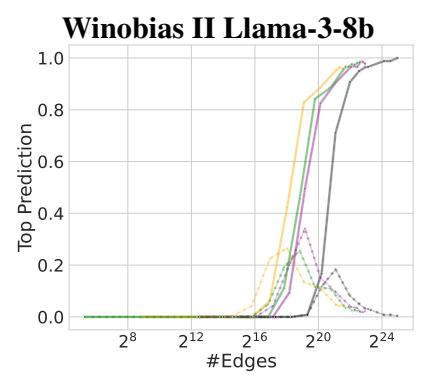

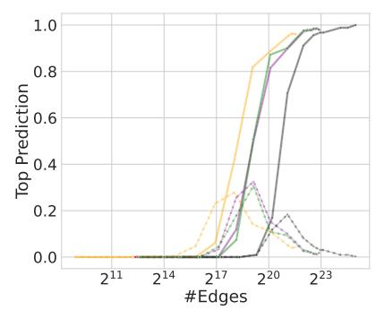

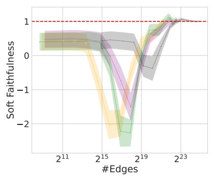

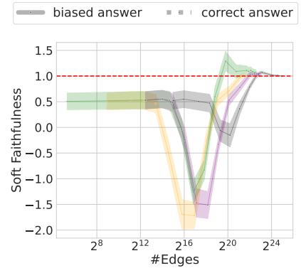

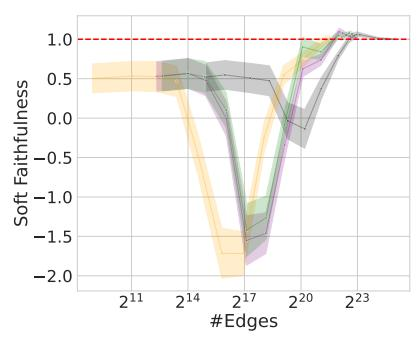  
Figure 11: Winobias task results showing soft and hard faithfulness curves. Each column shows results for a single trial. The soft faithfulness curves initially drop significantly, suggesting the circuit assigns higher logits to the correct answer than to the incorrect, biased answer. The dotted lines in the hard faithfulness curves quantify this by showing the average percentage of cases where the circuit generates the correct answer, despite focusing on examples where the model predicts the biased answer. As the circuit size increases, the soft faithfulness curves rise, correlating with an increased percentage of biased predictions. This effect is more pronounced when token positions are differentiated.