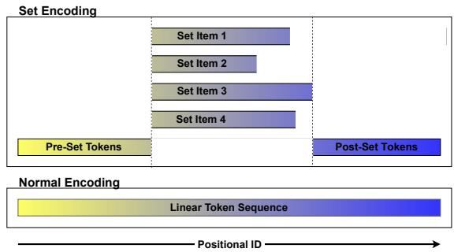
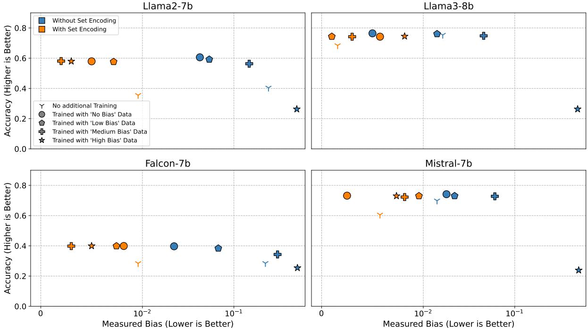
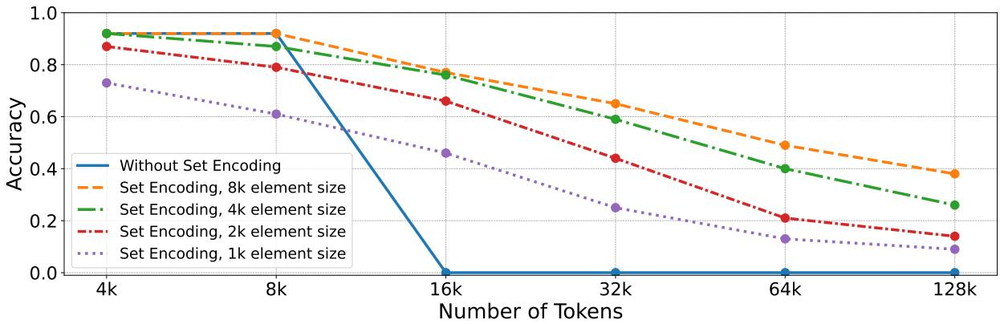
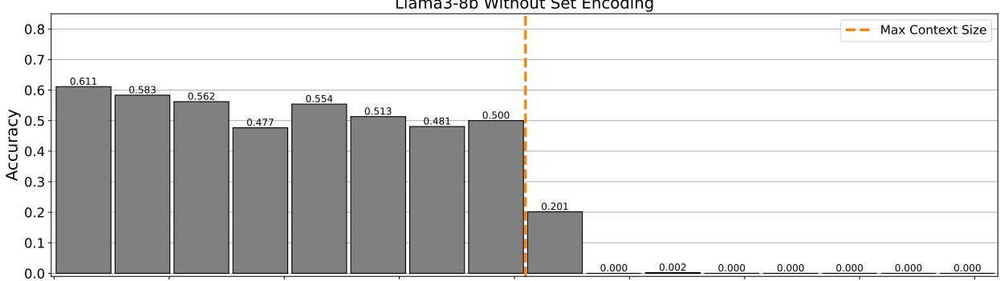
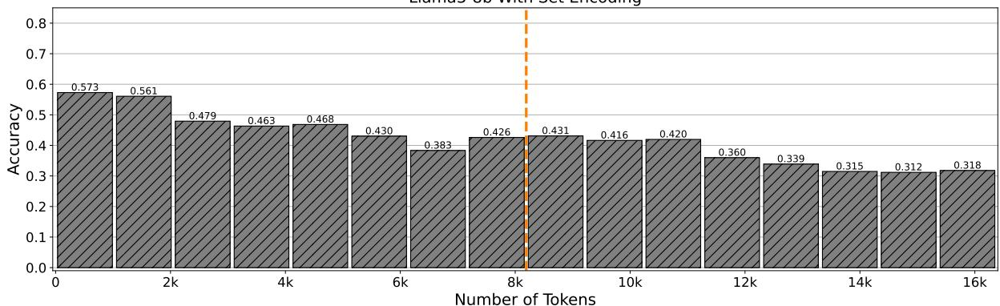

# Positional Overload: Positional Debiasing and Context Window Extension for Large Language Models using Set Encoding

Lukas Kinder1, Lukas Edman2,3, Alexander Fraser2,3, Tobias Käfer1,

1Institute AIFB, Karlsruhe Institute of Technology (KIT) 2Technical University of Munich (TUM) 3Munich Center for Machine Learning (MCML)

Correspondence: lukas.kinder@kit.edu

## Abstract

Large Language Models (LLMs) typically track the order of tokens using positional encoding, which causes the following problems: positional bias, where the model is influenced by an ordering within the prompt, and a fixed context window, as models struggle to generalize to positions beyond those encountered during training. To address these limitations, we developed a novel method called set encoding. This method allows multiple pieces of text to be encoded in the same position, thereby eliminating positional bias entirely. Another promising use case for set encoding is to increase the size of the input an LLM can handle. Our experiments demonstrate that set encoding allows an LLM to solve tasks with far more tokens than without set encoding. To our knowledge, set encoding is the first technique to effectively extend an LLM’s context window without requiring any additional training.1

## 1 Introduction

In recent years, advances in natural language processing have been largely driven by decoder-only transformers. These models process text as a sequence of words or subword units called tokens and use positional embeddings to capture their position within the sequence. However, this strict linear ordering introduces two significant limitations in Large Language Models (LLMs), which we aim to address in this paper:

1. Positional Bias: In various applications, it is necessary to present an LLM with a collection of items that do not have a meaningful order. However, when listing these items in a prompt, a specific order must be chosen. This choice can influence the LLM’s response, potentially resulting in different outputs for different permutations.

2. Length Limitations: When processing long text sequences, the number of tokens can exceed the range the model was trained on. In this case tokens have new positional embeddings, which usually leads to deteriorating performance.

Our approach, set encoding addresses both of these issues. Through set encoding, a set can be given to an LLM. By "set", we refer to the mathematical concept: a collection of unordered elements. Set encoding guarantees that an LLM cannot be influenced by any order within the set. To achieve this, we apply two simple modifications to how LLMs operate: First, we overload the positional encoding so that the elements of the set are embedded as if they occupy the same position. Secondly, we block attention between the elements of the set.

Set encoding can be applied to multiple-choice question answering tasks. Prior work has already shown that LLMs exhibit positional biases when selecting answers from a list of options (Zheng et al., 2023; Pezeshkpour and Hruschka, 2023; Wei et al., 2024) (e.g. preferring the first option). With set encoding we can prevent this bias, by encoding the options as elements of a set. Our experiments with the MMLU dataset (Hendrycks et al., 2020) show that set encoding offers a guaranteed and efficient way to remove positional bias without requiring multiple model runs or complex debiasing techniques. Additionally, we demonstrate that the models are unable to develop a positional bias, even when trained with biased data. We include more experiments in the Appendix demonstrating that set encoding can also remove positional bias for few-shot learning.

Another advantage of set encoding is that it helps LLMs process very long texts. Since set encoding places multiple items at the same position we can fit larger inputs into the context window of an LLM.

To show this we conduct experiments using the RULER dataset (Hsieh et al., 2024), which features needle-in-a-haystack tasks. In these tasks, a relevant piece of information (the ’needle’) must be located within a large volume of distracting text (the ’haystack’). By breaking the haystack into multiple elements, set encoding allows Llama3 to solve tasks involving up to 128k tokens, which is a great improvement over its original 8k context window. These results are especially interesting because to our knowledge, all prior work that extended the context window of an LLM required additional training (Chen et al., 2023a,b; Tworkowski et al., 2024).

Additionally, we perform experiments with questions of the HotpotQA dataset (Yang et al., 2018). Here we evaluate the ability of an LLM to answer questions for which the answer can be found within multiple provided documents. If the different documents are encoded as elements of a set, these tasks can still be solved, even when the combined token length exceeds the normal context window.

We also show include experiments in our Appendix showing that set encoding can remove positional bias for few-shot learning.

## 2 Related Work

Set encoding addresses two challenges in large language models (LLMs): positional debiasing and extending the context window. While prior research has explored these issues independently, to our knowledge, no existing work addresses both simultaneously. Below, we provide an overview of existing work on positional debiasing in Section 2.1 and context-window extension in Section 2.2.

## 2.1 Positional Debiasing

Large language models are known to be influenced by order choices within the input prompt. For example, when answering multiple choice questions, LLMs are known to give different answers when the order of possible answers changes (Pezeshkpour and Hruschka, 2023; Zheng et al., 2023; Wang et al., 2023; Wei et al., 2024; Xue et al., 2024; Wang et al., 2024b; Li et al., 2023; Dominguez-Olmedo et al., 2023; Li and Gao, 2024). Also in few-shot learning, the order of the provided examples is known to affect a model’s outputs (Zhao et al., 2021; Yang et al., 2024; Ma et al., 2023; Lu et al., 2021).

Existing research proposed several methods to mitigate positional bias in LLMs. For example, a possible strategy to deal with positional bias is to run the model multiple times with different order permutations and averaging the results (Zheng et al., 2023; Wang et al., 2023; Pezeshkpour and Hruschka, 2023; Dominguez-Olmedo et al., 2023). However, while effective, this method comes with a high computational cost: The number of possible permutations grows super-exponential with the number of options. Set encoding on the other hand does not require any additional computations.

Another way to mitigate positional bias is to calibrate the model’s predictions by adapting its output probabilities. This can be done if a labeled dataset is available, which is used to asses the models bias (Wei et al., 2024). Alternatively, Zhao et al. (2021) suggested calibrating the model by first letting it run with a context free prompt to determine its bias. Some studies also suggested that positional bias is reduced for multiple choice question answering if using a chain-of-thought approach instead of letting the model output the answer directly (Wang et al., 2024b,c). As opposed to set encoding, the mentioned methods do not guarantee to remove all positional bias and require additional runs of the LLM, which comes at a higher computational cost.

## 2.2 Extending Context Windows

Increasing the context window of large language models (LLMs) is crucial for enhancing their ability to handle longer input sequences, which is vital for many real-world applications (Wang et al., 2024a). To address this, several techniques have been developed that include:

Length Extrapolation – There are a variatey of positional encoding methods that allow LLMs to generalize to sequence lengths beyond what they encountered during training. Absolute Positional Embeddings (APE) embed position by adding a positional vector to the token embedding (Kenton and Toutanova, 2019). However, if a model is using trained positional vectors it is not able to generalize to longer context windows at all (Brown et al., 2020; Zhang et al., 2022; Kazemnejad et al., 2024). Rotary positional embeddings (RPEs) are a widely used alternative to APE (Su et al., 2024) and are for example used in Llama3 (Touvron et al., 2023). In RPEs, the query and key vectors are partly rotated depending on their absolute distance. RPEs are flexible with regard to sequence length. However, RPEs do not enable an LLM to generalize well to sequence lengths that are much longer than what the LLM was trained with (Kazemnejad et al., 2024; Press et al., 2021; Wu et al., 2024). Another technique for length extrapolation is penalizing attention scores. This method, used in models like T5 (Raffel et al., 2020) and ALiBi (Press et al., 2021), adjusts attention scores based on the distance between tokens. However, this can lead to a worse performance, as the model may struggle to exchange information between tokens far away.

Efficient Long Sequence Training – Training LLMs with very large context windows is expensive, because the number of computations in selfattention usually scales quadratically with the number of tokens (Wang et al., 2024a; Dubey et al., 2024). This leads to high memory and computational costs, making it difficult to train models with long sequences. To address this, various techniques have been proposed to reduce the computational burden during training (Chen et al., 2023a). For instance, models like LONGLLAMA (Tworkowski et al., 2024) and LongLora (Chen et al., 2023b) use sparse attention by limiting attention to local windows, thus improving efficiency during training. Alternatively, Zhu et al. (2023) propose decoupling the training sequence length from the target sequence length by skipping positions during training. However, these approaches still have notable limitations: they require additional training, the context window remains constrained even after extension, and their performance often falls short compared to training directly with long context windows.

## 3 Methods

Set encoding allows the inclusion of a set within the prompt of an LLM, where each element of the set is a token sequence. The goal of set encoding is to ensure that the LLM adheres to the set property, meaning that the order of elements does not influence how the model behaves. However, standard LLMs typically violate the set property for two reasons: positional encodings assigned to tokens vary depending on their order within the prompt, and causal attention allows later elements to attend to earlier ones, creating dependencies that are influenced by order.

To address these issues, both the positional encoding and the causal attention mechanisms must be modified, as discussed in the following.

  
Figure 1: Comparison of how positional IDs are assigned to tokens with and without set encoding. The example features a set with four token sequences with varying length. X-dimension encodes the positional ID.

## 3.1 Positional IDs for set encoding

In standard LLMs, the tokens are assigned positional IDs that start at 0 for the first token in a sequence and increment by one for each subsequent token. These IDs influence how positional information is embedded during. In set encoding, we reuse the same positional IDs across all elements within the set. Figure 1 shows an example of how positional IDs are distributed with and without set encoding.

Formally lets say we have some tokens p that come before the set, a set $\boldsymbol { \mathcal { S } }$ of token sequences and the tokens v that come after the set. Lets write the n tokens of p as $p _ { 0 } , \ldots , p _ { n - 1 }$ , the tokens of an element $x \in S$ are called $s _ { 0 } ^ { x } , \ldots , s _ { | x | - 1 } ^ { x }$ and the m tokens of v are written as $v _ { 0 } , \ldots , v _ { m - 1 }$ . In this case tokens are assigned positional IDs as follows:

• The positional ID of a token $p _ { i }$ is: i.

• The positional ID of a token token $s _ { i } ^ { x }$ is: $n + i$

• The positional ID of a token $v _ { i }$ is: n + max x + i x S

Adapting the positional IDs of tokens like this results in two notable consequences: Some tokens to have the same positional ID and the highest positional ID is not equal to the total number of tokens.

## 3.2 Causal Mask for set encoding

Standard large language models use causal attention, meaning tokens can attend to and are influenced by earlier tokens in the sequence. This is typically implemented using an attention mask, a triangular matrix that prevents tokens from attending to later tokens. However, if causal attention is applied between the elements of a set, later elements could attend to earlier ones. This would cause the processing of tokens to depend on the order of the elements, violating the set property.

To avoid this, we have to change the causal attention mask such that the elements of a set can not attend to each other. Otherwise tokens can attend previous tokens as normal. An example of this is shown in Table 1.

<table><tr><td rowspan=2 colspan=2></td><td rowspan=1 colspan=2>Pre-Set</td><td rowspan=1 colspan=2>Element x</td><td rowspan=1 colspan=2>Element y</td><td rowspan=1 colspan=2>Element z</td><td rowspan=1 colspan=2>Post-Set</td></tr><tr><td rowspan=1 colspan=1>p0</td><td rowspan=1 colspan=1>P1</td><td rowspan=1 colspan=1>s0</td><td rowspan=1 colspan=1>s1</td><td rowspan=1 colspan=1>s0</td><td rowspan=1 colspan=1>s1</td><td rowspan=1 colspan=1>s0</td><td rowspan=1 colspan=1>sǐ</td><td rowspan=1 colspan=1>a0</td><td rowspan=1 colspan=1>a1</td></tr><tr><td rowspan=2 colspan=1>Pre-Set</td><td rowspan=2 colspan=1>p0p1</td><td rowspan=2 colspan=1></td><td rowspan=1 colspan=1></td><td rowspan=1 colspan=1></td><td rowspan=1 colspan=1></td><td rowspan=1 colspan=1></td><td rowspan=1 colspan=1></td><td rowspan=1 colspan=1></td><td rowspan=1 colspan=1></td><td rowspan=1 colspan=1></td><td rowspan=1 colspan=1></td></tr><tr><td rowspan=1 colspan=1></td><td rowspan=1 colspan=1></td><td rowspan=1 colspan=1></td><td rowspan=1 colspan=1></td><td rowspan=1 colspan=1></td><td rowspan=1 colspan=1></td><td rowspan=1 colspan=1></td><td rowspan=1 colspan=1></td><td rowspan=1 colspan=1></td></tr><tr><td rowspan=2 colspan=1>Element x</td><td rowspan=2 colspan=1>s0sī</td><td rowspan=2 colspan=1></td><td rowspan=2 colspan=1></td><td rowspan=2 colspan=1></td><td rowspan=1 colspan=1></td><td rowspan=1 colspan=1></td><td rowspan=1 colspan=1></td><td rowspan=1 colspan=1></td><td rowspan=1 colspan=1></td><td rowspan=1 colspan=1></td><td rowspan=1 colspan=1></td></tr><tr><td rowspan=1 colspan=1></td><td rowspan=1 colspan=1></td><td rowspan=1 colspan=1></td><td rowspan=1 colspan=1></td><td rowspan=1 colspan=1></td><td rowspan=1 colspan=1></td><td rowspan=1 colspan=1></td></tr><tr><td rowspan=2 colspan=1>Element y</td><td rowspan=2 colspan=1>s0s1</td><td rowspan=2 colspan=1></td><td rowspan=2 colspan=1></td><td rowspan=1 colspan=1></td><td rowspan=1 colspan=1></td><td rowspan=1 colspan=1></td><td rowspan=1 colspan=1></td><td rowspan=1 colspan=1></td><td rowspan=1 colspan=1></td><td rowspan=1 colspan=1></td><td rowspan=1 colspan=1></td></tr><tr><td rowspan=1 colspan=1></td><td rowspan=1 colspan=1></td><td rowspan=1 colspan=1></td><td rowspan=1 colspan=1></td><td rowspan=1 colspan=1></td><td rowspan=1 colspan=1></td><td rowspan=1 colspan=1></td><td rowspan=1 colspan=1></td></tr><tr><td rowspan=2 colspan=1>Element z</td><td rowspan=2 colspan=1>s0sǐ</td><td rowspan=2 colspan=1></td><td rowspan=2 colspan=1></td><td rowspan=1 colspan=1></td><td rowspan=1 colspan=1></td><td rowspan=1 colspan=1></td><td rowspan=1 colspan=1></td><td rowspan=1 colspan=1></td><td rowspan=1 colspan=1></td><td rowspan=1 colspan=1></td><td rowspan=1 colspan=1></td></tr><tr><td rowspan=1 colspan=1></td><td rowspan=1 colspan=1></td><td rowspan=1 colspan=1></td><td rowspan=1 colspan=1></td><td rowspan=1 colspan=1></td><td rowspan=1 colspan=1></td><td rowspan=1 colspan=1></td><td rowspan=1 colspan=1></td></tr><tr><td rowspan=1 colspan=1>Post-Set</td><td rowspan=1 colspan=1>a0a1</td><td rowspan=1 colspan=1></td><td rowspan=1 colspan=1></td><td rowspan=1 colspan=1></td><td rowspan=1 colspan=1></td><td rowspan=1 colspan=2></td><td rowspan=1 colspan=1></td><td rowspan=1 colspan=1></td><td rowspan=1 colspan=1></td><td rowspan=1 colspan=1></td></tr></table>

Table 1: The causal mask of a prompt containing a set $\boldsymbol { S } = \{ x , y , z \}$ . Each element consists of 2 tokens and there are 2 tokens before and after the set. Dark cells represent that a token can attend another token. Attention is masked, such that later elements can not attend previous elements of the set. The causal mask with vanilla self-attention would be simply a triangular matrix. For this example the positional IDs would be $p _ { 0 }  0 , p _ { 1 }  1 , s _ { 0 } ^ { x }  2 , s _ { 1 } ^ { x }  3 , s _ { 0 } ^ { y }  2 , s _ { 1 } ^ { y }  3 ,$ $s _ { 0 } ^ { z } \to 2 , s _ { 1 } ^ { z } \to 3 , v _ { 0 } \to 4 \mathrm { ~ a n d ~ } v _ { 1 } \to 5 .$

Formally, using the naming convention introduced in Section 3.1 tokens can attend to other tokens as follows:

• A token before the set $p _ { i }$ can attend any token $p _ { j }$ with $j \leq i .$

• Within an element x a token $s _ { i } ^ { x }$ can attend any token in p and any token sxj with $j \leq i$

• A token after the set $a _ { i }$ can attend any token in $p ,$ any token in the set  and any token $a _ { j }$ with $j \le i$

With set encoding each element of the set is processed by the LLM as if it is the first within the set. Given an input containing a set, the output of the LLM and the way tokens are processed is independent of the order within the set.

This method of reassigning positional IDs and masking attention was independently developed by Lu et al. (2024). However, they apply it for a very different use case (efficient retrieval augmented generation) whereas we use it for positional debiasing and extending the context window.

## 4 Experiments

To explore the capabilities of set encoding for positional debiasing, we investigate in Section 4.1 using the MMLU data set, how set encoding can improve results in multiple-choice question answering.

To explore the capabilities of set encoding to extend the context window of an LLM without any training, we performed experiments with the RULER benchmark in Section 4.2. In this experiment, we give Llama3 prompts involving more than 16 times more tokens than what it was trained with.

A potential limitation of set encoding is that by preventing attention between set items, an LLM could be argued to struggle to integrate information of different elements. To explore this, we conduct experiments in Section 4.3 on large multidocument question answering tasks using a modified HotpotQA data set, where we increased the number of questions in which the number of tokens is up to 2 times the context size of Llama3.

Furthermore, we performed experiments showing that set encoding can be used for positional debiasing in a few-shot learning scenario. We provide results for the SST (Socher et al., 2013) and MultiNLI (Williams et al., 2017) datasets in the Appendix in Section A.2.1 and A.2.2 respectively.

## 4.1 Positional Debiasing for the MMLU dataset

The MMLU dataset (Hendrycks et al., 2020) is a multiple-choice question benchmark that is widely used to asses the question answering capabilities of LLMs across diverse topics. For each question there are four options $( " \mathrm { A " } , " \mathrm { B " } , " \mathrm { C " } \mathrm { o r } " \mathrm { D " } )$ and the model is asked to select the correct one. Existing studies have highlighted positional biases in LLMs when answering these questions. This bias can stem from a model’s preference for a specific position (e.g., always favoring the first option) or a symbolic label $( \mathrm { e . g . , \ " B ^ { \prime \prime } } )$ (Zheng et al., 2023).

By encoding the presented options as a set, we can avoid a model’s preference for a specific position. To further prevent label-bias we used bullet points instead of capital letter as labels. Consequently the models were required to state the correct option explicitly rather than selecting from labeled choices. For example:

USER: In the complex z-plane, the set of   
points satisfying the equation z²=|z|² is a   
\* pair of points   
\* circle   
\* half-line   
\* line

ASSISTANT: line

If set encoding were used, the 4 options were encoded as elements of a set, preventing the LLMs from perceiving any order among them.

We do not use the full MMLU dataset for our evaluation, but only 93.5% of the questions. We removed those 6.5 % of the questions, where the answer options do not strictly respect a set of unlabeled elements: First, options that reference each other by label, e. g. if the options have labels "A", "B", "C", "D", and option "C" is "A and B". Second, options that assume that options are given in a particular order, e.g. if the 3rd out of 4 options is˙ "All of the above". We provide the answers that led to question exclusion in Table 6 in the Appendix.

In our experiments we used the recent models Llama3-8b2 and Mistral-7b3, as well as Llama2- 7b4 and Falcon-7b5. We explicitly selected Llama2- 7b and Falcon-7b because previous work indicated that these models do have a high positional bias (Zheng et al., 2023).

A common issue with Large Language Models is that they may learn biases from biased training data. We demonstrate that set encoding prevents models from developing positional bias, even when trained on biased data, by performing some smallscale training of the models under four conditions that reflect different levels of answer imbalance in the training data:

• No Bias: In this condition the correct answer was equally likely to be any of the four options • Low Bias: The first options were correct in 40 % of instances, with the other three options correct in 20 % each.

• Medium Bias: The first option was correct in 70 % of instances, with the other three options correct in 10 % each.

• High Bias: The first option was always correct.

Fine-tuning for all models was done using the training data of the MMLU dataset. We trained the models for 5 epochs using a learning rate of 5e  6 and a batch size of 64, and Adam optimization with bfloat16 precision. Due to hardware limitations, we filtered out questions with > 256 tokens. For those small-scale fine-tuning experiments, that left us with around 19k questions, i. e. 17 % of all questions of the training data of the MMLU data set.

## 4.1.1 Results

We present the results for the MMLU dataset in Figure 2. To measure bias, we calculated the fraction of times the models selected the 1st, 2nd, 3rd, and 4th options, and report the standard deviation of these fractions. Additionally, we provide the number of times the models predicted each of the 1st, 2nd, 3rd, and 4th in Table 5 in the Appendix.

Without training, set encoding did not prevent the models to answer questions correctly (cf. orange Ys in Figure 2). However, the performance decreased by up to 10 % compared to the same model without set encoding (cf. the blue Ys in Figure 2). After training, the models with and without set encoding performed similarly well by and large, except for the High Bias condition. When trained on biased data, the performance of models without set encoding declined (cf. worsening progression of blue circle-pentagon-cross-star). This was especially apparent in the High Bias condition, where the first option was correct for every training instance. In this case, the models that did not use set encoding almost always predicted the first option, resulting in an accuracy of 25 %. However, with set encoding, biased training data had no effect on accuracy.

Interestingly, more recent models exhibit some positional bias, but their accuracy appears to be less impacted by it. Positional bias seems to affect these models only when they are uncertain about the correct answer, suggesting that the importance of positional bias may have been overstated in previous research (Pezeshkpour and Hruschka, 2023; Wei et al., 2024).

  
Figure 2: Results for the MMLU dataset in terms of accuracy for different Language models with and without set encoding for training runs with various degrees of biased data.

To verify that set encoding does not introduce positional bias, we conducted a chi-square test with the null hypothesis that the probability of a model selecting the 1st, 2nd, 3rd, and 4th options is equal. With set encoding, all model had a p-value higher than 0.05, suggesting that there was indeed no bias. Without set encoding, the models exhibited p-values below 0.01, except in the single case of Llama3 after being trained with unbiased data.

## 4.2 Experiments with the RULER dataset

The RULER benchmark is designed as a needlein-a-haystack test, assessing a model’s ability to locate a specific piece of information (the "needle") within an extensive body of irrelevant text (the "haystack"). It consists of 13 task categories, including retrieval, multi-hop reasoning, tracing, and aggregation, with questions that can be automatically synthesized. For our evaluation, we generated datasets with prompts of varying lengths: 4k, 8k, 16k, 32k, 64k, and 128k tokens. For each token length, we synthesized 10 questions for each task category, resulting in 130 questions per length.

A prompt of the RULER benchmark always consists of three parts:

• A short initial description of the task.

• The "haystack": A large block of text containing both relevant and irrelevant information.

• A question, for which the answer is located in the haystack.

We applied set encoding by dividing the haystack into multiple equally sized chunks, treating each chunk as an element of a set. The initial description and final question remained outside the set. This caused the highest positional ID to be equal to the size of an element, plus the number of tokens for the description and question.

## 4.2.1 Results

Figure 3 shows the accuracy of LLama3-8B with and without set encoding across different prompt lengths.6 The standard version of LLama3 without set encoding performs well on prompts with up to 8k tokens but was unable to answer any questions when the prompt exceeds its trained context window of 8k tokens. With set encoding LLama3 could answer questions containing up to 128k tokens. However, as the number of tokens increases, the model’s performance gradually deteriorates. We also varied the element size within the set. For instance, a haystack containing 16k tokens could be divided into two elements of 8k tokens each or four elements of 4k tokens each. The condition with the highest number of elements occurred when each element had a size of 1k tokens and the haystack contained 128k tokens, resulting in a set with 128 elements. We observed reduced performance when the set contained a larger number of shorter elements compared to fewer longer elements. This suggests that, without additional training, Llama3 struggles to interpret inputs where many token sequences are placed at the same position.

  
Figure 3: Results for the RULER benchmark for Llama3, comparing performance without set encoding and with set encoding for various element sizes.  
elements of a set.

## 4.3 Experiments with the HotpotQA dataset

The HotpotQA dataset (Yang et al., 2018) is designed to evaluate a model’s ability to perform question answering based on provided documents. A question in the HotpotQA benchmark contains a list of multiple documents followed by a question about the documents. The documents are based on Wikipedia articles and are each typically between 50 and 300 words long. In order to answer the question, information of at least two documents needs to be considered, while the other documents unrelated documents act as distractors. For example, the question "When was the singer and songwriter of Radiohead born?" requires finding the fact that the singer and songwriter of Radiohead is Thom Yorke from one document and then identifying his birth-date from another document.

With set encoding we can treat the different documents as elements of a set. As explained in Section 3.2, set encoding prevents attention between the elements of a set. Therefore we wanted to investigate if set encoding hinders LLMs to answer a question that requires combining information from different

We did not use the normal HotpotQA datasset for our experiments but a modified version of it. This is because the original questions of HotpotQA include little question with more than 8k tokens. Therefore we took the original question of the HotpotQA dataset and added additional distracting documents. This way we created a training set of 90k questions ranging up to 4k tokens and a test set of 7k questions ranging up to 16k tokens.

Fine-tuning was conducted over 3 epochs with a learning rate of $5 e - 6 .$ , the adafactor optimizer with bfloat16 precision and a batch size of 16.

In HotpotQA, answers are typically single words or short phrases. To evaluate performance, we consider an answer correct if the model generates tokens that match the exact ground truth answer specified in the benchmark. Note that this means that a semantically correct answer that is phrased differently is considered false, thus overestimating negatives.

## 4.3.1 Results

<table><tr><td colspan="3">&lt;8k</td><td>8k-16k</td></tr><tr><td rowspan="2">w/ finetuning</td><td>w/ set encoding:</td><td>.47</td><td>.36</td></tr><tr><td>w/o set encoding:</td><td>.53</td><td>.02</td></tr><tr><td rowspan="2">w/o finetuning</td><td>w/ set encoding:</td><td>.17</td><td>.04</td></tr><tr><td>w/o set encoding:</td><td>.45</td><td>0</td></tr></table>

Table 2: Results from the HotpotQA dataset. We applied the Llama3 model (context length: 8k tokens) with and without both fine-tuning and set-encoding, for questions involving < 8k tokens and questions involving between 8k and 16k tokens.

The results of our experiments are summarized in Table 2. Without set encoding, Llama3 was mostly unable to answer questions with prompt sizes exceeding its trained context window of 8k tokens. With set encoding, the model’s performance is initially lower without training but significantly improves after training. Notably, the fine-tuned model with set encoding is able to answer questions involving 8k to 16k tokens with an accuracy of 36 %. After fine-tuning the performance of Llama3 with and without set encoding is somewhat similar for questions involving up to 8k tokens (53 vs. 47 %). This shows that set encoding does not prevent Llama3 from solving multi-hop reasoning tasks with a set of documents, even though tokens of different documents cannot attend to each other.

Llama3-8b Without Set Encoding  
  
Llama3-8b With Set Encoding

  
Figure 4: Performance of Llama3 (context size: 8k tokens) for HotpotQA questions that involve different numbers of tokens, with and without set encoding. We trained Llama 3 with HotpotQA questions ranging up to 4k tokens.

We also show the results of Llama3 with and without training for different numbers of tokens in Figure 4. With set encoding, Llama3 can answer a lot of questions ranging up to 16k tokens, even though it was only trained with questions with up to 4k tokens. Without set encoding, Llama3 only generalises to a few questions that are at most 1k tokens longer than its original trained context window of 8k tokens.

## 5 Conclusion

Our work demonstrates that set encoding can be used as a solution for two seemingly unrelated limitations of LLMs: positional bias and restricted context windows. Set encoding addresses these two limitations by manipulating two mechanisms of how LLMs operate during inference, namely the positional IDs and the attention pathways. Somewhat surprisingly, we discover that LLMs can function despite these manipulations, even though the LLMs were never trained with them. We want to emphasize that set encoding does not necessarily require (potentially expensive and destructive) retraining or fine-tuning. However, set encoding may initially lead to a slight performance degradation, which can be recovered with a small amount of additional training.

Our experiments on benchmarks like MMLU confirm that with set encoding, LLMs do not have any positional bias. The models are also blocked from learning a bias even when trained on biased training data.

Crucially, set encoding allows LLMs to extend their effective context window, by splitting parts of the prompts into multiple elements of a set. In our experiments with RULER and HotpotQA, we show that set encoding enables Llama3 to perform tasks involving many more tokens than what Llama3 was trained with.

## 6 Limitations

While our proposed approach set encoding offers a guaranteed method to remove positional bias and is a promising mechanism to extending context windows, we note the following limitations:

• While the LLMs in our experiment were able to successfully use set encoding for a variety of tasks, it often introduces a slight drop in accuracy when used without additional training.

• While set encoding extends the total number of tokens that a model can handle, each individual element of the set must still fit within the original context window size of the model. This may require to split a long text into smaller sequences that cannot attend to each other, potentially reducing the LLMs ability to interpret the text correctly.

• LLMs using set encoding may fail to answer seemingly trivial questions. For example, it may be unable to state the number of elements in a set or repeat the entire content of the when asked for it. An example of this behavior is provided in the Appendix in Section A.1.

• The answers of some multiple choice questions fall into categories where options reference each other by label, or where the order of the options are relevant, for example if an option is "A and C", or "All of the above". In these cases, set encoding may prevent a model from answering the question. Consequently, we had to remove questions of those categories from the MMLU dataset. The answers for the questions we removed can be found in Table 6 in the Appendix.

• Set encoding requires internal changes to model inference. This restricts the approach to models where such changes can be implemented. Notably, some models such as the popular and recent GPT3 and GPT4 are only available through API calls, where such modifications cannot be done.

## Acknowledgments

This work has been supported in part by the German federal ministry of education and research

(BMBF) in NeSyPlan (FKZ 01IS23052B).

## References

Tom Brown, Benjamin Mann, Nick Ryder, Melanie Subbiah, Jared D Kaplan, Prafulla Dhariwal, Arvind Neelakantan, Pranav Shyam, Girish Sastry, Amanda Askell, et al. 2020. Language models are few-shot learners. Advances in neural information processing systems, 33:1877–1901.

Shouyuan Chen, Sherman Wong, Liangjian Chen, and Yuandong Tian. 2023a. Extending context window of large language models via positional interpolation. arXiv preprint arXiv:2306.15595.

Yukang Chen, Shengju Qian, Haotian Tang, Xin Lai, Zhijian Liu, Song Han, and Jiaya Jia. 2023b. Longlora: Efficient fine-tuning of long-context large language models. arXiv preprint arXiv:2309.12307.

Ricardo Dominguez-Olmedo, Moritz Hardt, and Celestine Mendler-Dünner. 2023. Questioning the survey responses of large language models. arXiv preprint arXiv:2306.07951.

Abhimanyu Dubey, Abhinav Jauhri, Abhinav Pandey, Abhishek Kadian, Ahmad Al-Dahle, Aiesha Letman, Akhil Mathur, Alan Schelten, Amy Yang, Angela Fan, et al. 2024. The llama 3 herd of models. arXiv preprint arXiv:2407.21783.

Dan Hendrycks, Collin Burns, Steven Basart, Andy Zou, Mantas Mazeika, Dawn Song, and Jacob Steinhardt. 2020. Measuring massive multitask language understanding. arXiv preprint arXiv:2009.03300.

Cheng-Ping Hsieh, Simeng Sun, Samuel Kriman, Shantanu Acharya, Dima Rekesh, Fei Jia, Yang Zhang, and Boris Ginsburg. 2024. Ruler: What’s the real context size of your long-context language models? arXiv preprint arXiv:2404.06654.

Amirhossein Kazemnejad, Inkit Padhi, Karthikeyan Natesan Ramamurthy, Payel Das, and Siva Reddy. 2024. The impact of positional encoding on length generalization in transformers. Advances in Neural Information Processing Systems, 36.

Jacob Devlin Ming-Wei Chang Kenton and Lee Kristina Toutanova. 2019. Bert: Pre-training of deep bidirectional transformers for language understanding. In Proceedings ofnaacL-HLT, volume 1, page 2. Minneapolis, Minnesota.

Ruizhe Li and Yanjun Gao. 2024. Anchored answers: Unravelling positional bias in gpt-2’s multiple-choice questions. arXiv preprint arXiv:2405.03205.

Zongjie Li, Chaozheng Wang, Pingchuan Ma, Daoyuan Wu, Shuai Wang, Cuiyun Gao, and Yang Liu. 2023. Split and merge: Aligning position biases in large language model based evaluators. arXiv preprint arXiv:2310.01432.

Songshuo Lu, Hua Wang, Yutian Rong, Zhi Chen, and Yaohua Tang. 2024. Turborag: Accelerating retrievalaugmented generation with precomputed kv caches for chunked text. arXiv preprint arXiv:2410.07590.

Yao Lu, Max Bartolo, Alastair Moore, Sebastian Riedel, and Pontus Stenetorp. 2021. Fantastically ordered prompts and where to find them: Overcoming few-shot prompt order sensitivity. arXiv preprint arXiv:2104.08786.

Huan Ma, Changqing Zhang, Yatao Bian, Lemao Liu, Zhirui Zhang, Peilin Zhao, Shu Zhang, Huazhu Fu, Qinghua Hu, and Bingzhe Wu. 2023. Fairnessguided few-shot prompting for large language models. Advances in Neural Information Processing Systems, 36:43136–43155.

Pouya Pezeshkpour and Estevam Hruschka. 2023. Large language models sensitivity to the order of options in multiple-choice questions. arXiv preprint arXiv:2308.11483.

Ofir Press, Noah A Smith, and Mike Lewis. 2021. Train short, test long: Attention with linear biases enables input length extrapolation. arXiv preprint arXiv:2108.12409.

Colin Raffel, Noam Shazeer, Adam Roberts, Katherine Lee, Sharan Narang, Michael Matena, Yanqi Zhou, Wei Li, and Peter J Liu. 2020. Exploring the limits of transfer learning with a unified text-to-text transformer. Journal of machine learning research, 21(140):1–67.

Richard Socher, Alex Perelygin, Jean Wu, Jason Chuang, Christopher D Manning, Andrew Y Ng, and Christopher Potts. 2013. Recursive deep models for semantic compositionality over a sentiment treebank. In Proceedings of the 2013 conference on empirical methods in natural language processing, pages 1631–1642.

Jianlin Su, Murtadha Ahmed, Yu Lu, Shengfeng Pan, Wen Bo, and Yunfeng Liu. 2024. Roformer: Enhanced transformer with rotary position embedding. Neurocomputing, 568:127063.

Hugo Touvron, Thibaut Lavril, Gautier Izacard, Xavier Martinet, Marie-Anne Lachaux, Timothée Lacroix, Baptiste Rozière, Naman Goyal, Eric Hambro, Faisal Azhar, et al. 2023. Llama: Open and efficient foundation language models. arXiv preprint arXiv:2302.13971.

Szymon Tworkowski, Konrad Staniszewski, Mikołaj Pacek, Yuhuai Wu, Henryk Michalewski, and Piotr Miłos. 2024. Focused transformer: Contrastive train-´ ing for context scaling. Advances in Neural Information Processing Systems, 36.

Peiyi Wang, Lei Li, Liang Chen, Zefan Cai, Dawei Zhu, Binghuai Lin, Yunbo Cao, Qi Liu, Tianyu Liu, and Zhifang Sui. 2023. Large language models are not fair evaluators. arXiv preprint arXiv:2305.17926.

Xindi Wang, Mahsa Salmani, Parsa Omidi, Xiangyu Ren, Mehdi Rezagholizadeh, and Armaghan Eshaghi. 2024a. Beyond the limits: A survey of techniques to extend the context length in large language models. arXiv preprint arXiv:2402.02244.

Xinpeng Wang, Chengzhi Hu, Bolei Ma, Paul Röttger, and Barbara Plank. 2024b. Look at the text: Instruction-tuned language models are more robust multiple choice selectors than you think. arXiv preprint arXiv:2404.08382.

Xinpeng Wang, Bolei Ma, Chengzhi Hu, Leon Weber-Genzel, Paul Röttger, Frauke Kreuter, Dirk Hovy, and Barbara Plank. 2024c. "my answer is c": Firsttoken probabilities do not match text answers in instruction-tuned language models. arXiv preprint arXiv:2402.14499.

Sheng-Lun Wei, Cheng-Kuang Wu, Hen-Hsen Huang, and Hsin-Hsi Chen. 2024. Unveiling selection biases: Exploring order and token sensitivity in large language models. arXiv preprint arXiv:2406.03009.

Adina Williams, Nikita Nangia, and Samuel R Bowman. 2017. A broad-coverage challenge corpus for sentence understanding through inference. arXiv preprint arXiv:1704.05426.

Yingsheng Wu, Yuxuan Gu, Xiaocheng Feng, Weihong Zhong, Dongliang Xu, Qing Yang, Hongtao Liu, and Bing Qin. 2024. Extending context window of large language models from a distributional perspective. arXiv preprint arXiv:2410.01490.

Mengge Xue, Zhenyu Hu, Liqun Liu, Kuo Liao, Shuang Li, Honglin Han, Meng Zhao, and Chengguo Yin. 2024. Strengthened symbol binding makes large language models reliable multiple-choice selectors. arXiv preprint arXiv:2406.01026.

Sohee Yang, Jonghyeon Kim, Joel Jang, Seonghyeon Ye, Hyunji Lee, and Minjoon Seo. 2024. Improving probability-based prompt selection through unified evaluation and analysis. Transactions of the Associationfor Computational Linguistics, 12:758–774.

Zhilin Yang, Peng Qi, Saizheng Zhang, Yoshua Bengio, William W Cohen, Ruslan Salakhutdinov, and Christopher D Manning. 2018. Hotpotqa: A dataset for diverse, explainable multi-hop question answering. arXiv preprint arXiv:1809.09600.

Susan Zhang, Stephen Roller, Naman Goyal, Mikel Artetxe, Moya Chen, Shuohui Chen, Christopher Dewan, Mona Diab, Xian Li, Xi Victoria Lin, et al. 2022. Opt: Open pre-trained transformer language models. arXiv preprint arXiv:2205.01068.

Zihao Zhao, Eric Wallace, Shi Feng, Dan Klein, and Sameer Singh. 2021. Calibrate before use: Improving few-shot performance of language models. In International conference on machine learning, pages 12697–12706. PMLR.

Chujie Zheng, Hao Zhou, Fandong Meng, Jie Zhou, and   
Minlie Huang. 2023. Large language models are not   
robust multiple choice selectors. In The Twelfth Inter  
national Conference on Learning Representations.

Dawei Zhu, Nan Yang, Liang Wang, Yifan Song, Wenhao Wu, Furu Wei, and Sujian Li. 2023. Pose: Efficient context window extension of llms via positional skip-wise training. arXiv preprint arXiv:2309.10400.

## A Appendix

## A.1 Example dialogue with Llama 3

An example dialogue with Llama3-8b-instruct that uses set encoding without any additional training. In the first user message the items " - Apple", Potato" and " - Tomato" are encoded as a set. The LLM initially states that the list contains only one item. However, it is able to recognize if something is in the list or not if explicitly asked about it.

USER: Here is a List:   
- Apple   
- Potato   
Tomato   
What are the three items in the list?

ASSISTANT: There is only one item in the   
list:   
1. Potato

USER: Is ‘Apple’ in the list?

ASSISTANT: I apologize for the mistake   
earlier! According to the original list,   
yes, "Apple" is indeed in the list.   
So, the correct answer is:   
1. Potato   
2. Apple

USER: Is ‘Melon’ in the list?

ASSISTANT: No, "Melon" is not in the   
original list. The original list only   
contains two items:   
1. Potato   
2. Apple

USER: Is ‘Tomato’ in the list?

ASSISTANT: Yes, "Tomato" is indeed in the   
original list! I apologize for my earlier   
mistake when I said there was only one item.   
So, the correct answer is:   
1. Potato   
2. Apple   
3. Tomato

## A.2 Positional debasing for few-shot learning

In context-based or few-shot learning, an LLM is provided with a few question-answer pairs as examples to guide its responses. While this approach can enhance performance, studies have shown that the order in which examples are presented influence the models decision (Zhao et al., 2021; Yang et al., 2024; Ma et al., 2023). With set encoding we can prevent this positional bias by treating each example as a distinct element of a set. We show results for the SST-2 dataset and the Multi NLI dataset in the following two sections. In both experiments, we applied set encoding without any additional training of the models. We consider both experiments to be interesting negative results, as set encoding effectively removes positional bias but does not consistently improve accuracy.

## A.2.1 Experiments with the SST-2 dataset

The SST-2 dataset(Socher et al., 2013) is a collection of binary sentiment classification tasks. It requires a model to decide if a written movie review expresses positive or negative sentiment. In our experiment we place two positive and two negative example reviews with their corresponding label in the prompt. These examples were followed by the target review, which the LLM had to classify. We repeated this experiment 6 times with different orderings of the examples (Positive-Positive-Negative-Negative, Positive-Negative-Positive-Negative, ... , Negative-Negative-Positive-Positive). Positive and negative examples where drawn randomly from the SST-2 training set and varied for each question. Our evaluation was conducted on the SST-2 test set, which contains 1,818 samples.

The results for the models Llama3-8b, Mistral-7b and Phi-3-mini-4k are shown in Table 3. We report accuracy and the fraction of false answers that were false-positives. Without set encoding the accuracy fluctuates dependent on the the order of examples. Furthermore, the types of mistakes made by the models also change with different orderings of positive and negative examples. For instance, when the example order is "Positive-Negative-Positive-Negative," Llama3 incorrectly predicts a negative review as positive in 79% of its mistakes. However, when the order is "Negative-Positive-Negative-Positive," this error rate drops to 64%.

<table><tr><td rowspan=1 colspan=3></td><td rowspan=1 colspan=1>PPNN</td><td rowspan=1 colspan=1>PNPN</td><td rowspan=1 colspan=1>PNNP</td><td rowspan=1 colspan=1>NPPN</td><td rowspan=1 colspan=1>NPNP</td><td rowspan=1 colspan=1>NNPP</td><td rowspan=1 colspan=1>Avg. ACC</td><td rowspan=1 colspan=1>Min ACC</td><td rowspan=1 colspan=1>Max ACC</td></tr><tr><td rowspan=4 colspan=1>Llama3-8b</td><td rowspan=2 colspan=1>normal</td><td rowspan=1 colspan=1>ACC</td><td rowspan=1 colspan=1>.97</td><td rowspan=1 colspan=1>.96</td><td rowspan=1 colspan=1>.96</td><td rowspan=1 colspan=1>.96</td><td rowspan=1 colspan=1>.97</td><td rowspan=1 colspan=1>.97</td><td rowspan=1 colspan=1>.96</td><td rowspan=2 colspan=1>.96</td><td rowspan=2 colspan=1>.97</td></tr><tr><td rowspan=1 colspan=1>FP / (FP + FN)</td><td rowspan=1 colspan=1>.71</td><td rowspan=1 colspan=1>.79</td><td rowspan=1 colspan=1>.76</td><td rowspan=1 colspan=1>.69</td><td rowspan=1 colspan=1>.64</td><td rowspan=1 colspan=1>.68</td><td rowspan=1 colspan=1></td></tr><tr><td rowspan=2 colspan=1>set</td><td rowspan=1 colspan=1>ACC</td><td rowspan=1 colspan=1>.97</td><td rowspan=1 colspan=1>.97</td><td rowspan=1 colspan=1>.97</td><td rowspan=1 colspan=1>.97</td><td rowspan=1 colspan=1>.97</td><td rowspan=1 colspan=1>.97</td><td rowspan=2 colspan=1>.97</td><td rowspan=2 colspan=1>.97</td><td rowspan=2 colspan=1>.97</td></tr><tr><td rowspan=1 colspan=1>FP / (FP + FN)</td><td rowspan=1 colspan=1>.64</td><td rowspan=1 colspan=1>.65</td><td rowspan=1 colspan=1>.64</td><td rowspan=1 colspan=1>.64</td><td rowspan=1 colspan=1>.64</td><td rowspan=1 colspan=1>.66</td></tr><tr><td rowspan=4 colspan=1>Mistral-7b</td><td rowspan=2 colspan=1>normal</td><td rowspan=1 colspan=1>ACC</td><td rowspan=1 colspan=1>.97</td><td rowspan=1 colspan=1>.97</td><td rowspan=1 colspan=1>.96</td><td rowspan=1 colspan=1>.96</td><td rowspan=1 colspan=1>.96</td><td rowspan=1 colspan=1>.96</td><td rowspan=2 colspan=1>.96</td><td rowspan=2 colspan=1>.96</td><td rowspan=2 colspan=1>.97</td></tr><tr><td rowspan=1 colspan=1>FP / (FP + FN)</td><td rowspan=1 colspan=1>.37</td><td rowspan=1 colspan=1>.40</td><td rowspan=1 colspan=1>.28</td><td rowspan=1 colspan=1>.20</td><td rowspan=1 colspan=1>.14</td><td rowspan=1 colspan=1>.14</td></tr><tr><td rowspan=2 colspan=1>set</td><td rowspan=1 colspan=1>ACC</td><td rowspan=1 colspan=1>.96</td><td rowspan=1 colspan=1>.96</td><td rowspan=1 colspan=1>.96</td><td rowspan=1 colspan=1>.96</td><td rowspan=1 colspan=1>.96</td><td rowspan=1 colspan=1>.96</td><td rowspan=2 colspan=1>.96</td><td rowspan=2 colspan=1>.96</td><td rowspan=2 colspan=1>.96</td></tr><tr><td rowspan=1 colspan=1>FP / (FP + FN)</td><td rowspan=1 colspan=1>.16</td><td rowspan=1 colspan=1>.16</td><td rowspan=1 colspan=1>.16</td><td rowspan=1 colspan=1>.16</td><td rowspan=1 colspan=1>.16</td><td rowspan=1 colspan=1>.16</td></tr><tr><td rowspan=4 colspan=1>Phi-3-mini-4k</td><td rowspan=2 colspan=1>normal</td><td rowspan=1 colspan=1>ACC</td><td rowspan=1 colspan=1>.96</td><td rowspan=1 colspan=1>.96</td><td rowspan=1 colspan=1>.96</td><td rowspan=1 colspan=1>.96</td><td rowspan=1 colspan=1>.95</td><td rowspan=1 colspan=1>.95</td><td rowspan=1 colspan=1>.96</td><td rowspan=2 colspan=1>.95</td><td rowspan=2 colspan=1>.96</td></tr><tr><td rowspan=1 colspan=1>FP / (FP + FN)</td><td rowspan=1 colspan=1>.24</td><td rowspan=1 colspan=1>.27</td><td rowspan=1 colspan=1>.18</td><td rowspan=1 colspan=1>.18</td><td rowspan=1 colspan=1>.09</td><td rowspan=1 colspan=1>.12</td><td rowspan=1 colspan=1></td></tr><tr><td rowspan=2 colspan=1>set</td><td rowspan=1 colspan=1>ACC</td><td rowspan=1 colspan=1>.94</td><td rowspan=1 colspan=1>.94</td><td rowspan=1 colspan=1>.94</td><td rowspan=1 colspan=1>.94</td><td rowspan=1 colspan=1>.94</td><td rowspan=1 colspan=1>.94</td><td rowspan=1 colspan=1>.94</td><td rowspan=2 colspan=1>.94</td><td rowspan=2 colspan=1>.94</td></tr><tr><td rowspan=1 colspan=1>FP / (FP + FN)</td><td rowspan=1 colspan=1>.12</td><td rowspan=1 colspan=1>.11</td><td rowspan=1 colspan=1>.12</td><td rowspan=1 colspan=1>.12</td><td rowspan=1 colspan=1>.11</td><td rowspan=1 colspan=1>.12</td><td rowspan=1 colspan=1></td></tr></table>

Table 3: Results for the SST benchmark. We evaluated the models in a 4-shot scenario with two positive and two negative examples. The order in which these examples were given differed in each run. We report accuracy as well as the fraction of mistakes that were false positives.
<table><tr><td rowspan=1 colspan=1></td><td rowspan=1 colspan=2></td><td rowspan=1 colspan=2>E  N  C</td><td rowspan=1 colspan=1>E  C N</td><td rowspan=1 colspan=1>N  E  C</td><td rowspan=1 colspan=1>N  C  E</td><td rowspan=1 colspan=2>C  E N</td><td rowspan=1 colspan=1>C  N  E</td><td rowspan=1 colspan=1>Avg. ACC</td><td rowspan=1 colspan=1>Min ACC</td><td rowspan=1 colspan=1>Max ACC</td><td rowspan=1 colspan=1>Bias</td></tr><tr><td rowspan=4 colspan=1>Llama3-8b</td><td rowspan=2 colspan=1>normal</td><td rowspan=1 colspan=1>ACC</td><td rowspan=1 colspan=2>.63</td><td rowspan=1 colspan=1>.65</td><td rowspan=1 colspan=1>.62</td><td rowspan=1 colspan=1>.66</td><td rowspan=1 colspan=2>.67</td><td rowspan=1 colspan=1>.68</td><td rowspan=2 colspan=1>.65</td><td rowspan=2 colspan=1>.62</td><td rowspan=2 colspan=1>.68</td><td rowspan=2 colspan=1>.014</td></tr><tr><td rowspan=1 colspan=1>frac.</td><td rowspan=1 colspan=2>.64 .10 .27 .</td><td rowspan=1 colspan=1>61 .10 .29 .</td><td rowspan=1 colspan=1>65 .10 .25 .</td><td rowspan=1 colspan=1>56 .08 .37 .</td><td rowspan=1 colspan=1>54 .</td><td rowspan=1 colspan=1>10 .36</td><td rowspan=1 colspan=1>.50 .11 .39</td></tr><tr><td rowspan=2 colspan=1>set</td><td rowspan=1 colspan=1>ACC</td><td rowspan=1 colspan=2>.60</td><td rowspan=1 colspan=1>.60</td><td rowspan=1 colspan=1>.60</td><td rowspan=1 colspan=1>.60</td><td rowspan=1 colspan=1></td><td rowspan=1 colspan=1>.60</td><td rowspan=1 colspan=1>.60</td><td rowspan=2 colspan=1>.60</td><td rowspan=2 colspan=1>.60</td><td rowspan=2 colspan=1>.60</td><td rowspan=2 colspan=1>.000</td></tr><tr><td rowspan=1 colspan=1>frac.</td><td rowspan=1 colspan=2>.63 .02 .35 .</td><td rowspan=1 colspan=1>63 .02 .35</td><td rowspan=1 colspan=1>.63 .02 .35</td><td rowspan=1 colspan=1>.63 .02 .35</td><td rowspan=1 colspan=1>.63</td><td rowspan=1 colspan=1>.02 .35</td><td rowspan=1 colspan=1>.63 .02 .35</td></tr><tr><td rowspan=4 colspan=1>Mistral-7b</td><td rowspan=2 colspan=1>normal</td><td rowspan=1 colspan=1>ACC</td><td rowspan=1 colspan=2>.67</td><td rowspan=1 colspan=1>.67</td><td rowspan=1 colspan=1>.65</td><td rowspan=1 colspan=1>.62</td><td rowspan=1 colspan=1></td><td rowspan=1 colspan=1>.66</td><td rowspan=1 colspan=1>.63</td><td rowspan=2 colspan=1>.65</td><td rowspan=2 colspan=1>.62</td><td rowspan=2 colspan=1>.67</td><td rowspan=2 colspan=1>.032</td></tr><tr><td rowspan=1 colspan=1>frac.</td><td rowspan=1 colspan=2>.57 .10 .33</td><td rowspan=1 colspan=1>.55 .06 .39 .</td><td rowspan=1 colspan=1>42 .20 .38</td><td rowspan=1 colspan=1>.40 .12 .48</td><td rowspan=1 colspan=1>.49</td><td rowspan=1 colspan=1>.04 .47</td><td rowspan=1 colspan=1>.40 .07 .53</td></tr><tr><td rowspan=2 colspan=1>set</td><td rowspan=1 colspan=1>ACC</td><td rowspan=1 colspan=2>.63</td><td rowspan=1 colspan=1>.63</td><td rowspan=1 colspan=1>.63</td><td rowspan=1 colspan=1>.63</td><td rowspan=1 colspan=1></td><td rowspan=1 colspan=1>.63</td><td rowspan=1 colspan=1>.63</td><td rowspan=2 colspan=1>.63</td><td rowspan=2 colspan=1>.63</td><td rowspan=2 colspan=1>.63</td><td rowspan=2 colspan=1>.000</td></tr><tr><td rowspan=1 colspan=1>frac.</td><td rowspan=1 colspan=1>.53 .</td><td rowspan=1 colspan=1>02 .45 .</td><td rowspan=1 colspan=1>53 .02 .45 .</td><td rowspan=1 colspan=1>53 .02 .45 .</td><td rowspan=1 colspan=1>53 .02 .45 .</td><td rowspan=1 colspan=1>53 .</td><td rowspan=1 colspan=1>02 .45</td><td rowspan=1 colspan=1>.53 .03 .45</td></tr><tr><td rowspan=4 colspan=1>Phi-3-mini-4k</td><td rowspan=2 colspan=1>normal</td><td rowspan=1 colspan=1>ACC</td><td rowspan=1 colspan=1></td><td rowspan=1 colspan=1>.77</td><td rowspan=1 colspan=1>.74</td><td rowspan=1 colspan=1>.78</td><td rowspan=1 colspan=1>.78</td><td rowspan=1 colspan=1></td><td rowspan=1 colspan=1>.75</td><td rowspan=1 colspan=1>.78</td><td rowspan=2 colspan=1>.76</td><td rowspan=2 colspan=1>.74</td><td rowspan=2 colspan=1>.78</td><td rowspan=2 colspan=1>.006</td></tr><tr><td rowspan=1 colspan=1>frac.</td><td rowspan=1 colspan=1>.44</td><td rowspan=1 colspan=1>.16 .39</td><td rowspan=1 colspan=1>.43 .12 .45</td><td rowspan=1 colspan=1>.42 .19 .39</td><td rowspan=1 colspan=1>.38 .20 .42</td><td rowspan=1 colspan=1>.41</td><td rowspan=1 colspan=1>.16.43 .</td><td rowspan=1 colspan=1>39 .20 .41</td></tr><tr><td rowspan=2 colspan=1>set</td><td rowspan=1 colspan=1>ACC</td><td rowspan=1 colspan=1></td><td rowspan=1 colspan=1>.70</td><td rowspan=1 colspan=1>.70</td><td rowspan=1 colspan=1>.70</td><td rowspan=1 colspan=1>.70</td><td rowspan=1 colspan=1></td><td rowspan=1 colspan=1>.70</td><td rowspan=1 colspan=1>.70</td><td rowspan=2 colspan=1>.70</td><td rowspan=2 colspan=1>.70</td><td rowspan=2 colspan=1>.70</td><td rowspan=2 colspan=1>.000</td></tr><tr><td rowspan=1 colspan=1>frac.</td><td rowspan=1 colspan=1>.44</td><td rowspan=1 colspan=1>.08 .48</td><td rowspan=1 colspan=1>.44 .08 .49</td><td rowspan=1 colspan=1>.44 .08 .48</td><td rowspan=1 colspan=1>.44 .08.49</td><td rowspan=1 colspan=1>.44.</td><td rowspan=1 colspan=1>08.49</td><td rowspan=1 colspan=1>.44.08.48</td></tr></table>

Table 4: Results for the MultiNLI benchmark. The models were evaluated in a 3-shot scenario across six different conditions, with the prompt containing various permutations of examples representing entailment, neutral, and contradiction relationships. For each experiment setup we report the overall accuracy and the fraction of times the model predicted entailment, neutral and contradiction (cells indicated by color).

## A.2.2 Experiments with the Multi-NLI dataset

The MultiNLI dataset (Williams et al., 2017) contains tasks involving two statements for which a model has to decide if the second statement has an entailment, neutral or contradictory relation to the first statement. In our experiment we placed three labeled examples in the prompt featuring an entailment, contradiction and neutral relation. We repeated the experiment 6 times for each possible permutation of the three examples. The examples where drawn randomly drawn from the multiNLI training-set and varied for each question. For evaluation, we used the MultiNLI validation set, which contains 10,000 samples.

The results for the models Llama3-8b, Mistral-7b and Phi-3-mini-4k are shown in Table 4. To quantify the overall bias of a model, we treated the fractions of predictions for entailment, contradiction, and neutral as 3-dimensional vectors.

The average cosine distance among the vectors of the 6 different conditions is reported under the "Bias" column. Additionally, we report accuracy and the distribution of predictions across "Entailment," "Neutral," and "Contradiction".

Without set encoding, both the accuracy and the distribution of predictions fluctuate depending on the order of examples. Set encoding effectively eliminates positional bias, as reflected in the consistent prediction across permutations.

<table><tr><td rowspan="2" colspan="2"></td><td rowspan="2" colspan="3">No Finetuning 1st 2nd</td><td rowspan="2" colspan="3"></td><td colspan="3">Finetuning: No Bias</td><td colspan="3">Finetuning: Low Bias</td><td rowspan="2" colspan="3">Fintuning:</td><td colspan="3"></td><td colspan="3">Finetuning:</td></tr><tr><td></td><td></td><td></td><td></td><td></td><td></td><td></td><td></td><td>Medium Bias</td><td></td><td></td><td>High Bias</td><td></td></tr><tr><td rowspan="2">Llama2-7b</td><td>normal</td><td>.61</td><td>.13</td><td>3rd .15</td><td>4th .12</td><td>1st .31</td><td>2nd .22</td><td>3rd .22</td><td>4th .25</td><td>1st</td><td>2nd .19</td><td>3rd .24</td><td>4th</td><td>1st</td><td>2nd</td><td>3rd</td><td></td><td>4th .19</td><td>1st .98</td><td>2nd .01</td><td>3rd .01</td><td>4th .0</td></tr><tr><td>set</td><td>.25</td><td>.26</td><td>.24</td><td>.24</td><td></td><td></td><td></td><td></td><td>.25</td><td>.32 .26</td><td>.25</td><td>.25</td><td>.24 .24</td><td>.47 .25</td><td>.17 .25</td><td>.17 .24</td><td></td><td></td><td></td><td></td><td></td></tr><tr><td rowspan="2">Llama3-8b</td><td></td><td>.27</td><td></td><td>.25</td><td>.25</td><td>.25 .24</td><td>.26 .25</td><td>.25 .25</td><td>.25</td><td>.26</td><td>.23</td><td>.25</td><td>.26</td><td></td><td></td><td></td><td></td><td>.25</td><td>.25</td><td>.24</td><td>.25</td><td>.25</td></tr><tr><td>normal</td><td>.24</td><td>.23 .26</td><td>.25</td><td>.24</td><td>.26</td><td>.25</td><td></td><td></td><td></td><td></td><td></td><td></td><td></td><td>.32 .25</td><td>.23 .26</td><td>.22 .25</td><td>.24</td><td>.98 .25</td><td>.01 .24</td><td>.01</td><td>.0</td></tr><tr><td rowspan="2">Mistral-7b</td><td>set</td><td></td><td></td><td></td><td></td><td>.22</td><td></td><td>.24</td><td>.26</td><td>.25 .28</td><td>.25 .24</td><td>.25</td><td>.25 .24</td><td></td><td></td><td></td><td></td><td>.25</td><td></td><td></td><td>.25</td><td>.26</td></tr><tr><td>normal</td><td>.25 .26</td><td>.24 .24</td><td>.24 .26</td><td>.27 .25</td><td>.25</td><td>.25 .25</td><td>.26 .25</td><td>.26</td><td></td><td></td><td>.24</td><td></td><td></td><td>.34</td><td>.23</td><td>.22</td><td>.21</td><td>1.0 .24</td><td>.0 .25</td><td>.0</td><td>.0 .25</td></tr><tr><td rowspan="2">Falcon-7b</td><td>set</td><td>.57</td><td>.21</td><td>.15</td><td>.07</td><td>.28</td><td>.23</td><td></td><td>.25 .24</td><td>.26 .34</td><td>.24</td><td>.25</td><td>.24 .21</td><td></td><td>.25</td><td>.25</td><td>.26</td><td>.24</td><td></td><td></td><td>.26</td><td></td></tr><tr><td>normal set</td><td>.24</td><td>.24</td><td>.26</td><td>.25</td><td>.25</td><td>.26</td><td>.26 .25</td><td>.24</td><td>.24</td><td>.19 .24</td><td>.27 .26</td><td>.25</td><td></td><td>.7 .25</td><td>.1 .25</td><td>.1 .25</td><td>.1 .25</td><td>.99 .25</td><td>.0 .24</td><td>.0 .25</td><td>.0 .25</td></tr></table>

Table 5: The frequency of the models selecting the 1st, 2nd, 3rd or 4th option during our evaluation with the MMLU dataset (In our evaluation dataset each option was equally often the correct one.). With set-encoding each option has equal likelihood to be selected.

Filtered Words/Phrases   
A and B   
A and C   
B and C   
A or B   
A or C   
B or C   
Neither A nor B   
All of the above   
All options   
Both   
All the above   
All of these   
Either of these   
None of the above   
Neither of these   
None of these

Table 6: The list of options we filtered out for the MMLU benchmark. An option containing any of these strings indicates a relationship between the options. This would make their interpretation difficult without considering their relative position.