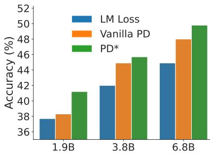
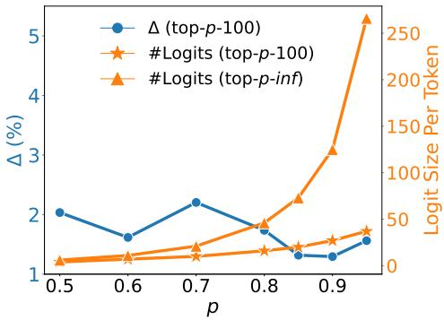
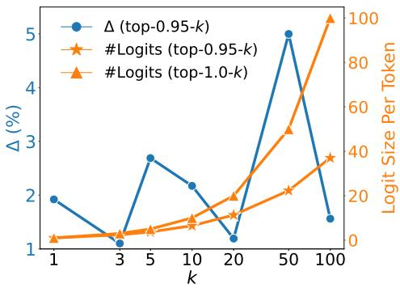
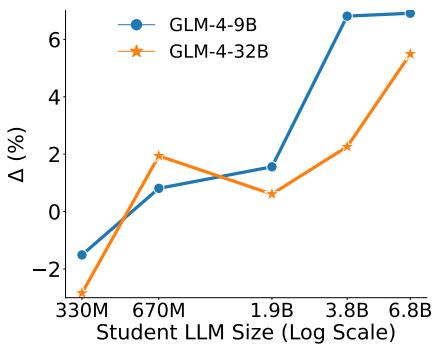
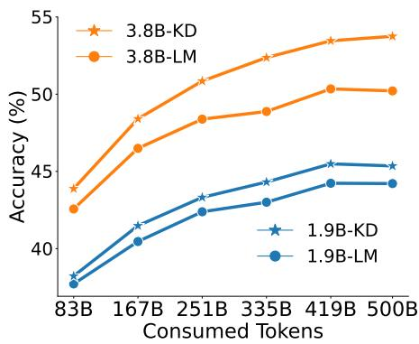

# Pre-training Distillation for Large Language Models: A Design Space Exploration

Hao Peng1, Xin Lv2, Yushi Bai1, Zijun Yao1, Jiajie Zhang1, Lei Hou1, Juanzi Li1\* 1Tsinghua University 2Zhipu AI {peng-h24}@mails.tsinghua.edu.cn

## Abstract

Knowledge distillation (KD) aims to transfer knowledge from a large teacher model to a smaller student model. Previous work applying KD in the field of large language models (LLMs) typically focused on the post-training phase, where the student LLM learns directly from instructions and corresponding responses generated by the teacher model. In this paper, we extend KD to the pre-training phase of LLMs, named pre-training distillation (PD). We first conduct a preliminary experiment using GLM-4-9B as the teacher LLM to distill a 1.9B parameter student LLM, validating the effectiveness of PD. Considering the key impact factors of distillation, we systematically explore the design space of pre-training distillation across four aspects: logits processing, loss selection, scaling law, and offline or online logits. We conduct extensive experiments to explore the design space of pre-training distillation and find better configurations and interesting conclusions, such as larger student LLMs generally benefiting more from pre-training distillation, while a larger teacher LLM does not necessarily guarantee better results. We hope our exploration of the design space will inform future practices in pre-training distillation.

## 1 Introduction

Knowledge distillation (KD; Hinton, 2015) aims to distill the knowledge of a large teacher model into a smaller and efficient student model for model compression (Gou et al., 2021). It has been widely applied in computer vision (Ahn et al., 2019; Tian et al., 2020; Bergmann et al., 2020; Zhao et al., 2022), natural language processing (Sanh et al., 2019; Jiao et al., 2020; Wang et al., 2020a; Xu et al., 2024), and speech recognition (Chebotar and Waters, 2016; Fukuda et al., 2017; Tan and Wang, 2021) domains. In recent years, knowledge distillation has been a standard practice to enhance large language models (LLMs) with knowledge from more advanced LLMs, such as GPT-4 (OpenAI, 2023). This technique is typically used during the post-training stage of LLMs, where the student model learns directly using language modeling (LM) loss from a set of queries and responses generated by teacher LLMs. Post-training KD is simple and widely applicable, leading to the development of various advanced LLMs (Taori et al., 2023; Vicuna, 2023; Sun et al., 2024; Cui et al., 2024), which significantly advances the development of LLMs. The success of post-training distillation raises the question of whether distillation LLMs in the pre-training stage is feasible.

  
Figure 1: Results of the pre-trained 1.9B, 3.8B, and 6.8B student LLMs, using only LM loss, vanilla PD configuration (§ 3.1), and a better PD configuration (PD∗) after our exploration. Details are placed in appendix A.6.

In this paper, we extend knowledge distillation to the pre-training phase of LLMs, named pretraining distillation (PD). We primarily investigate pre-training with logits-based KD (Gou et al., 2021), where the student model learns from the teacher model generated logits of each token in the pre-training corpora using a KD loss, such as Kullback–Leibler divergence. The intuition is that the logits from the teacher model contain richer information and can serve as label smoothing (Gou et al., 2021), which could potentially accelerate the training of the student LLM and enhance its performance. Although the potential advantage of pre-training distillation is clear, there is limited exploration on how to better apply PD. Therefore, in this paper, we take an initial step in exploring the design space of pre-training distillation. Considering the key factors impacting distillation, we explore the design space of PD in four aspects: (1) Logits processing, focusing on the post-processing of the teacher LLM’s logits to reduce the memory overhead, including truncation and normalization. (2) Loss selection, focusing on the choice of pretraining distillation loss. (3) Scaling law, covering varying sizes of student and teacher LLMs, as well as pre-training corpus size. (4) Offline or online, meaning logits are generated either from a pretrained teacher LLM (offline) or simultaneously during the pre-training of teacher LLM (online). Figure 1 illustrates the effectiveness of the explored better PD configuration (PD∗).

We conduct extensive experiments to explore the design space of PD. Specifically, we first conduct a preliminary study using GLM-4-9B (GLM et al., 2024) as the teacher model to generate logits for 100 billion tokens, distilling a 1.9B student LLM from scratch using negative log-likelihood loss. Due to the large vocabulary size (about 150k) of GLM-4-9B, we truncate the logits using top-p-k truncation to reduce storage space: first using top-$p$ (Holtzman et al., 2019) truncation with $p = 0 . 9 5$ followed by top-100 truncation. The truncation reduces storage space by 4, 000 to about 15 TB of disk space. The preliminary PD yields an average performance improvement of 1.6% across a comprehensive set of English and Chinese datasets, compared to standard pre-training with LM loss, which demonstrates the effectiveness of PD. Based on the preliminary experiment, we explore the design space of PD using controlled experiments: (1) Logits processing. We investigate the impact of different $p$ and k values on top-p-k truncation results, and different normalization temperatures. We find no significant difference between various $p$ and k values, with smaller p or k effectively reducing logits storage. The temperature for normalization should not be too high, and adaptive temperature shows no significant benefit. (2) Loss selection. We explore the choice of KD loss and the combination of KD loss with LM loss. We find that Kullback–Leibler divergence and negative loglikelihood loss result in similar improvements, but MSE loss suffers a significant drop. The best combination of LM and KD loss is using the Warmup-Stable-Decay (WSD; Hu et al., 2024) method to schedule for the proportion of KD loss, paired with a WSD learning rate scheduler. This suggests that using a higher proportion of KD loss when maintaining a maximum learning rate can enhance model performance. (3) Scaling law. We find that larger student LLMs generally benefit more from pre-training distillation, and a larger teacher LLM does not necessarily guarantee better results, potentially due to the capacity gap between student and teacher LLMs (Mirzadeh et al., 2020). We further conduct PD using 500 billion tokens, and find the improvement of PD is generally consistent. (4) Offline or online. We observe that using online logits for PD also yields improvement, although not as significant as offline logits. This suggests that one can save online logits on the fly during pre-training with no additional inference cost for PD on a series of smaller LLMs. In summary, we hope that our thorough exploration of the pre-training distillation design space will contribute to future practices.

## 2 Design Space for PD

Considering a text $\mathbf { x } = \{ x _ { t } \} _ { t = 1 } ^ { T }$ , a student LLM parameterized by $\theta _ { S }$ , and a teacher LLM parameterized by $\theta _ { T }$ , we formalize the objective of distillation pretraining as follows:

$$
\begin{array} { r } { \theta _ { S } ^ { * } = \arg \operatorname* { m i n } _ { \theta _ { S } } \mathcal { L } = \arg \operatorname* { m i n } _ { \theta _ { S } } [ ( 1 - \alpha ) \mathcal { L } _ { \mathrm { l m } } + \alpha \mathcal { L } _ { \mathrm { k d } } ] } \end{array}\tag{1}
$$

${ \mathcal { L } } _ { \mathrm { l m } }$ denotes the traditional one-hot language modeling pretraining loss, which can be formalized as:

$$
\mathcal { L } _ { \mathrm { l m } } = \frac { 1 } { T } \sum _ { t = 1 } ^ { T } - \log P _ { \theta _ { S } } ( x _ { t } | \mathbf { \boldsymbol { x } } _ { < t } )\tag{2}
$$

$\mathcal { L } _ { \mathrm { k d } }$ denotes the distillation loss, which can be formalized as:

$$
\mathcal { L } _ { \mathrm { k d } } = \frac { 1 } { T } \sum _ { t = 1 } ^ { T } L ( P _ { \theta _ { S } } ( x _ { t } | \pmb { x } _ { < t } ) , F ( P _ { \theta _ { T } } ( x _ { t } | \pmb { x } _ { < t } ) ) )\tag{3}
$$

$L$ denotes the distillation loss function, such as Kullback–Leibler divergence. $P _ { \theta _ { S } }$ and $P _ { \theta _ { T } }$ represent probability of the student and the teacher LLM, respectively. $F$ represents truncation and normalization operations conducted on the teacher LLM’s logits, and τ is the temperature for normalization.

$$
F ( z ) = \operatorname { s o f t m a x } ( { \frac { \operatorname { T r u n c a t e } ( z ) } { \tau } } )\tag{4}
$$

Considering the key factors in Equation 1, we explore the design space of pre-training distillation in four dimensions: (1) The method F for processing the teacher LLM logits, including the truncation method and temperature τ for normalization. (2) The choice of loss function, including the selection of distillation loss function L and the combination factor α of language modeling loss and distillation loss. (3) The scaling law of pre-training distillation, including the size of student and teacher LLMs, as well as the corpus size for pre-training the student LLM. (4) The strategy of obtaining $P _ { \theta _ { T } } ( x _ { t } | \mathbf { x } _ { < t } )$ either offline, i.e., the logits generated from the pre-trained teacher LLM, or online, i.e., the logits generated simultaneously during the teacher LLM’s pre-training. In this work, we aim to conduct a systematic empirical study to investigate the impact of these four aspects on pre-training distillation and inform future practices in pre-training distillation.

## 3 Experiments

In this section, we conduct a preliminary experiment to introduce the basic experimental settings of pre-training distillation and validate the efficacy of pre-training distillation (§ 3.1) and empirical studies for these four main design dimensions of pre-training distillation for LLMs (§§ 3.2 to 3.5).

## 3.1 Preliminary Experiment

We first conduct a preliminary experiment to validate the feasibility of pre-training distillation. We use GLM-4-9B as the teacher LLM to distill of a 1.9B student LLM from scratch. To enhance training efficiency, we employ a two-stage paradigm: (1) store the teacher LLM’s generated logits on the disk, (2) use these logits to train the student LLM.

Experimental Setup We first pre-train a 1.9B student LLM using pre-training distillation, namely LLM-KD. Specifically, we randomly sample 100 billion tokens as pre-training data. We then obtain their logits from the teacher LLM and keep the text chunk size as 4096, which is the same as the pretraining context length of the student LLM. Due to the large vocabulary size (approximately 150k items), storing the logits of the whole vocabulary using float32 requires around 58.6 PB of disk space, which is unaffordable. To reduce storage resources, we truncate the logits: we first select the topp (Holtzman et al., 2019) logits with $p = 0 . 9 5$ , and then use top-k truncation with $k = 1 0 0$ , resulting in a 4, 000 reduced storage requirement of approximately 15 TB disk space for the 100B tokens. We re-normalize the logits with temperature $\tau = 1 . 0$

We use negative log-likelihood loss to conduct pretraining distillation, i.e., set $\alpha = 1$ in Equation 1 and set ${ \cal L } \ : = \ : - F ( P _ { \theta _ { T } } ( x _ { t } | { \pmb x } _ { < t } ) )$ log $P _ { \theta _ { S } } ( x _ { t } | \mathbf { x } _ { < t } )$ in Equation 3, where F denotes our logits truncation method with a re-normalization with temperature $\tau = 1 . 0$ . Given the limited capacity of the student LLM, its performance on some evaluation datasets, such as MMLU (Hendrycks et al., 2021) and C-Eval (Huang et al., 2024), is close to random guessing, making the results incomparable. Therefore, we conduct supervised fine-tuning (SFT; Ouyang et al., 2022) with additional 10B high-quality instruct-tuning data after pre-training. In the SFT stage of these 10B tokens, we employ only language modeling loss rather, i.e., set $\alpha = 0$ in Equation 1. We employ the same settings as in pre-training distillation, except that we only use language modeling (LM) loss for pre-training a baseline 1.9B LLM for comparison, namely LLM-LM. We conduct pre-training with Adam optimizer (Kingma, 2014), 2, 048 batch size, 4, 096 max sequence length, a cosine learning rate scheduler with $6 \times 1 0 ^ { - 4 }$ maximum learning rate, $6 \times 1 0 ^ { - 5 }$ minimum learning rate, and 1% warmup rate. More experimental details are placed in appendix A.1.

Evaluation Datasets We select several representative datasets to evaluate the pre-trained LLMs, including English language understanding and commonsense reasoning datasets: HellaSwag (Zellers et al., 2019), WinoGrande (Sakaguchi et al., 2020), PIQA (Bisk et al., 2020), MMLU (Hendrycks et al., 2021); Chinese language understanding and commonsense reasoning datasets: KBQA (Duan, 2016; Duan and Tang, 2018), C3 (Sun et al., 2020a), C-Eval (Huang et al., 2024); and math dataset: GSM8k (Cobbe et al., 2021). When conducting evaluation, the sampling temperature is set to 0. More evaluation details are shown in appendix A.1.

Experimental Results The performance of pretrained LLM-LM and LLM-KD is presented in Table 1. We can observe that generally LLM-KD performs better than LLM-LM, though the improvement is marginal, indicating that pre-training distillation is feasible, but the current distillation configurations may not be optimal. Therefore, in the following sections (§§ 3.2 to 3.5), we will explore the design space of pre-training distillation to identify more effective configurations.

<table><tr><td></td><td>HellaSwag</td><td>WinoGrande</td><td>PIQA</td><td>MMLU</td><td>KBQA</td><td>C3</td><td>C-Eval</td><td>GSM8k</td><td>Average</td></tr><tr><td>LLM-LM</td><td>53.3</td><td>54.8</td><td>72.9</td><td>28.0</td><td>3.6</td><td>54.7</td><td>25.9</td><td>8.6</td><td>37.7</td></tr><tr><td>LLM-KD</td><td>54.2</td><td>55.2</td><td>72.5</td><td>27.8</td><td>3.5</td><td>55.8</td><td>26.7</td><td>10.8</td><td>38.3</td></tr><tr><td>∆</td><td>↑1.7%</td><td>↑0.7%</td><td>↓0.5%</td><td>↓0.5%</td><td>↓1.3%</td><td>↑1.9%</td><td>↑3.2%</td><td>↑24.6%</td><td>↑1.6%</td></tr></table>

Table 1: Preliminary experimental results on the evaluation datasets. ∆ is relative to LLM-LM.

  
Figure 2: Relative improvements compared to LLM-LM using different p in top-p-100 logits truncation and logits sizes per token with different p. The sizes are estimated using 10 million tokens.

  
Figure 3: Relative improvements compared to LLM-LM using different k in top-0.95-k logits truncation and logits sizes per token with different k.

## 3.2 Design Dimension #1: Logits Processing

This section explores the impact of logit processing in pre-training distillation, specifically F in Equation 1, including the method for truncating logits and the temperature τ for normalization. If not stated otherwise, all experiments adopt the same setup as the preliminary experiment, except for the processing of logits. More experimental details and results are placed in appendix A.2.

Logits Truncation As mentioned in the preliminary experiment (§ 3.1), storing the logits of the entire vocabulary requires significant disk storage space. To save resources, we design a two-stage top-p-k truncation method: truncating with top-p first, followed by top-k truncation. When the logits distribution is sharp, top-p truncation is enough; when the distribution is more uniform with longtailed non-trivial values, top-k truncation works as a secondary truncation. Compared to vanilla top-p and top-k truncation, the top-p-k method significantly reduces storage space, as shown in Figure 2 and 3. In this section, we empirically investigate the impact of different $p$ and k. Specifically, we set $k = 1 0 0$ to study the impact of varying p on top-p-100 truncation, and set $p = 0 . 9 5$ to analyze the effect of different k values on top-0.95-k truncation. The results are shown in Figure 2 and 3. We can observe that (1) for top-p-100 truncation, different p leads to similar improvements. A possible explanation is that in distillation pre-training, student LLM primarily captures the mass of the logits. This suggests that a smaller p can be used to further reduce storage space. (2) For top-0.95-k truncation, all values of k lead to improvements, with $k = 5 0$ yielding the best results. For k = 1, which is adopted in AFM pre-training (Gunter et al., 2024), is equivalent to using the LM loss but with labels generated from the teacher LLM and also yields an improvement. This may be due to the teacher LLM conducting implicit noise filtering in pre-training corpora. In general, pre-training distillation with different $p$ and k values in top-p-k truncation shows improvements with limited differences, and one can adopt smaller p and k in logits truncation to save storage disk space.

<table><tr><td>T</td><td>0.05</td><td>0.1</td><td>0.2</td><td>0.5</td><td>1.0</td><td>2.0</td><td>5.0</td><td>10.0</td></tr><tr><td>↑</td><td>1.6</td><td>2.1</td><td>2.5</td><td>2.7</td><td>1.6</td><td>2.5</td><td>-0.1</td><td>1.0</td></tr></table>

Table 2: Relative improvements (%) compared to LLM-LM using different τ in logits normalization.

Temperature τ Another factor is the temperature τ in logits normalization. A lower temperature sharpens the logits distribution, while a higher temperature results in a more uniform distribution. We first examine the impact of different static τ , as shown in Table 2. We can observe that lower temperatures $( \tau \leq 2 . 0 )$ lead to similar improvement, whereas at higher temperatures $( \tau \geq 5 . 0 )$ , the improvement is limited. This suggests that learning from a more uniform distribution may be not efficient for student LLM. We also explore adaptive temperature, where temperature dynamically adjusts based on each sample, i.e., each token in pre-training distillation. We investigate two representative methods: NormKD (Chi et al., 2023) and WTTM (Zheng and YANG, 2024). NormKD applies adaptive temperature to both teacher and student logits, while WTTM applies only to the teacher logits. In this experiment, along with temperature τ, the loss calculation method is also modified. For details, refer to their original papers, and relevant hyper-parameters in loss calculation are listed in appendix A.2. We also implement a compact version of the adaptive temperature method, named AdaKD, which applies a higher temperature to smooth sharper teacher logits and a lower temperature for less sharp logits to help the student LLM focus on the most important parts (Wei and Bai, 2024). We use standard deviation and entropy to measure the sharpness of the logits, referred to as $\mathrm { A d a K D } _ { \mathrm { S D } }$ and $\mathrm { \Delta A d a K D _ { H } }$ , and adaptively calculate the temperature accordingly. $\mathrm { A d a K D } _ { \mathrm { S D } }$ adopts the standard deviation as the temperature τ. $\mathrm { \ A d a K D _ { H } }$ adopts τH in Equation 5.

<table><tr><td></td><td>HellaSwag</td><td>WinoGrande</td><td>PIQA</td><td>MMLU</td><td>KBQA</td><td>C3</td><td> $\mathrm { C } { \mathrm { - E } } \mathrm { v a l }$ </td><td>GSM8k</td><td>Average</td><td>∆</td></tr><tr><td>NormKD</td><td>51.2</td><td>54.1</td><td>71.0</td><td>26.6</td><td>3.2</td><td>54.6</td><td>29.0</td><td>8.0</td><td>37.2</td><td>↓1.3%</td></tr><tr><td>WTTM</td><td>51.4</td><td>56.2</td><td>72.9</td><td>26.7</td><td>3.6</td><td>55.1</td><td>27.3</td><td>9.2</td><td>37.8</td><td>↑0.2%</td></tr><tr><td> $\mathbf { A d a K D } _ { \mathrm { S D } }$ </td><td>54.7</td><td>54.5</td><td>73.0</td><td>25.7</td><td>3.7</td><td>56.1</td><td>25.9</td><td>11.8</td><td>38.2</td><td>↑1.2%</td></tr><tr><td> $\mathrm { \Delta A d a K D _ { H } }$ </td><td>54.7</td><td>57.7</td><td>73.4</td><td>25.6</td><td>3.7</td><td>57.0</td><td>27.0</td><td>10.9</td><td>38.8</td><td>↑2.8%</td></tr></table>

Table 3: Experimental results of LLMs pre-trained with different adaptive temperature τ methods.

$$
\tau _ { H } = \tau _ { \mathrm { { m a x } } } - ( \tau _ { \mathrm { { m a x } } } - \tau _ { \mathrm { { m i n } } } ) \times \frac { H } { H _ { \mathrm { { m a x } } } }\tag{5}
$$

H denotes the entropy of each sample. More experimental details are placed in appendix A.2. The results are presented in Table 3. We can observe that $\mathrm { \Delta A d a K D _ { H } }$ performs the best, but compared to static temperature $( \tau = 0 . 5 )$ , adaptive temperature does not show significant additional improvement.

## 3.3 Design Dimension #2: Loss Selection

This section explores loss selection in pre-training distillation, including the types of distillation loss L and the selection of combinations with the LM loss, i.e., α in Equation 1. For all the experiments in this section, all settings remain the same as those in the preliminary experiment, except for the choice of loss. More results are placed in appendix A.3.

<table><tr><td>α</td><td>0.1</td><td>0.5</td><td>0.6</td><td>0.7</td><td>0.8</td><td>0.9</td><td>0.95</td><td>1.0</td></tr><tr><td>↑</td><td>0.1</td><td>1.5</td><td>1.4</td><td>2.9</td><td>2.0</td><td>3.6</td><td>2.5</td><td>1.6</td></tr></table>

Table 4: Relative improvements (%) compared to LLM-LM using different α in combination of ${ \mathcal { L } } _ { \mathrm { l m } }$ and $\mathcal { L } _ { \mathrm { k d } }$

Distillation Loss Function L We first explore the impacts of different distillation loss functions L. Specifically, we examine three common-used types of loss function: negative log-likelihood (NLL) as used in the preliminary experiment (§ 3.1), Kullback–Leibler divergence (KLD), and mean squared error (MSE) loss. To control for variables, we omit LM loss and only use the distillation loss, setting $\alpha = 1$ in Equation 1. The experimental results are presented in Table 5. We can find that the LLMs trained with NLL and KLD loss both perform better than LLM-LM. While LLM-KLD generally outperforms LLM-NLL, the latter demonstrates superior performance on more challenging datasets, such as MMLU and C-Eval. The student LLM trained with MSE loss exhibits a significant performance decline, as observed in previous studies (Muralidharan et al., 2024). This finding contrasts with prior research in image classification (Kim et al., 2021), which finds MSE loss is the most superior choice in knowledge distillation, indicating that the pretraining distillation of LLMs involves new training dynamics and requires further investigation.

Combination of ${ \mathcal { L } } _ { \mathbf { l m } }$ and $\mathcal { L } _ { \mathbf { k } \mathbf { d } }$ We examine the impact of different combinations of ${ \mathcal { L } } _ { \mathrm { l m } }$ and $\mathcal { L } _ { \mathrm { k d } }$ We set $\mathcal { L } _ { \mathrm { k d } }$ as negative log-likelihood loss for all experiments. Specifically, we first explore the effect of different values of static α, ranging in {0.0, 0.5, $0 . 6 , 0 . 7 , 0 . 8 , 0 . 9 , 0 . 9 5 , 1 . 0 \}$ . The results are shown in Table 4, and we can observe that as α increases, the PD performance improves generally, then declines, with the best performance at $\alpha = 0 . 9$ . This suggests that while a higher proportion of distillation loss can boost the distillation performance, an appropriate ratio (about 10%) of LM loss can further enhance pre-training distillation performance.

We further explore dynamic scheduling of α in the following ways: (1) α linearly increases from 0 to 1, namely Linear Inc, or decreases from 1 to 0, namely, Linear Dec, during pre-training. The intuition of the former is that training initially with LM loss may help mitigate the effects of the capacity gap with the teacher LLM; the latter is that using KD loss first may provide better optimization initialization (Yim et al., 2017). (2) α periodically varies between 0 and 0.9, namely Period, setting α to 0.9 at every fourth batch and 0 for the other batches (Kiefel and Shah, 2024). (3) We employ a nonlinear scheduler, warmup-stable-decay (WSD; Hu et al., 2024), for scheduling α, namely WSD-α. Specifically, we first linearly increase α from 0 to 1.0 during the warm up stage, then stay $\alpha = 1 . 0 $ and finally apply cosine decay to reduce α from 1.0 to 0. We set the warmup ratio at 10% and the decay ratio at 1%. Furthermore, we employ the WSD learning rate scheduler (Hu et al., 2024), namely WSD-LR, setting its warmup and decay ratios as those of WSD-α. The intuition is that when the learning rate stays at its maximum, utilizing KD loss may enhance training efficiency. The results are shown in Table 5. We can observe that: (1) A linear decrease in α outperforms a linear increase, indicating that involving more KD loss in the early pre-training stage is more beneficial. (2) The WSD learning rate scheduler generally provides benefits, with greater gains when combined with KD loss. (3) The WSD α scheduler with the WSD learning rate scheduler yields the best performance, and the improvement of WSD β $( \beta \equiv 1 - \alpha )$ scheduler with WSD-LR is limited, suggesting that using KD loss when maintaining a high learning rate effectively enhances model performance. Compared to WSD-LR with only KD loss, WSD-α performs better, indicating that a small proportion of LM loss can further enhance distillation performance.

<table><tr><td></td><td>HellaSwag</td><td>WinoGrande</td><td>PIQA</td><td>MMLU</td><td>KBQA</td><td>C3</td><td>C-Eval</td><td>GSM8k</td><td>Average</td><td> $\Delta$ </td></tr><tr><td>0-α+WSD-LR</td><td>54.1</td><td>55.1</td><td>73.1</td><td>27.5</td><td>3.8</td><td>55.6</td><td>27.5</td><td>8.5</td><td>38.2</td><td>↑1.2%</td></tr><tr><td>LLM-NLL</td><td>54.2</td><td>55.2</td><td>72.5</td><td>27.8</td><td>3.5</td><td>55.8</td><td>26.7</td><td>10.8</td><td>38.3</td><td>↑1.6%</td></tr><tr><td>LLM-KLD</td><td>55.3</td><td>56.7</td><td>73.5</td><td>26.7</td><td>3.6</td><td>56.7</td><td>25.4</td><td>11.5</td><td>38.7</td><td>↑2.6%</td></tr><tr><td>LLM-MSE</td><td>44.6</td><td>55.0</td><td>69.6</td><td>25.2</td><td>2.8</td><td>52.2</td><td>25.6</td><td>3.9</td><td>34.9</td><td>↓7.6%</td></tr><tr><td>Linear Inc</td><td>53.6</td><td>55.2</td><td>73.1</td><td>25.9</td><td>3.4</td><td>56.4</td><td>28.9</td><td>8.5</td><td>38.1</td><td>↑1.1%</td></tr><tr><td>Linear Dec</td><td>53.4</td><td>56.6</td><td>72.9</td><td>29.6</td><td>3.6</td><td>56.0</td><td>30.5</td><td>11.4</td><td>39.2</td><td>↑4.1%</td></tr><tr><td>Period</td><td>52.9</td><td>55.0</td><td>72.3</td><td>28.4</td><td>3.4</td><td>55.1</td><td>27.9</td><td>9.4</td><td>38.0</td><td>↑0.9%</td></tr><tr><td>1-α+WSD-LR</td><td>56.1</td><td>57.2</td><td>73.6</td><td>27.0</td><td>3.8</td><td>58.3</td><td>29.1</td><td>11.6</td><td>39.6</td><td>↑5.0%</td></tr><tr><td>WSD-α+Cos-LR</td><td>54.0</td><td>55.4</td><td>72.7</td><td>25.1</td><td>3.7</td><td>57.6</td><td>29.4</td><td>10.6</td><td>38.6</td><td>↑2.3%</td></tr><tr><td>WSD-β+WSD-LR</td><td>53.1</td><td>55.2</td><td>73.7</td><td>27.5</td><td>3.6</td><td>55.7</td><td>25.0</td><td>11.2</td><td>38.1</td><td>↑1.1%</td></tr><tr><td> $\mathrm { W S D - } \alpha \mathrm { + W S D - } \mathrm { L R }$ </td><td>56.4</td><td>57.7</td><td>73.6</td><td>31.8</td><td>2.6</td><td>57.6</td><td>33.8</td><td>12.5</td><td>40.7</td><td>↑8.0%</td></tr></table>

Table 5: Experimental results of LLMs pre-trained with different pre-training loss. ∆ is relative to LLM-LM. 0-α and 1-α denote setting $\alpha = 0$ and $\alpha = 1 . 0 ,$ respectively. 0-α+WSD-LR represents LLM-LM training with the WSD scheduler, which serves as a baseline. Cos-LR means a cosine learning rate scheduler. $\beta \equiv 1 - \alpha .$ and $\mathrm { W S D } { - \beta }$ denotes applying the WSD scheduler to the proportion of LM loss.

  
Figure 4: Relative improvements compared to LLM-LM using varying sizes of student and teacher LLMs.

## 3.4 Design Dimension #3: Scaling Law

We investigate the scaling law of pre-training distillation, including the impact of varying sizes of student and teacher LLMs, as well as the pre-training corpus size. All experimental settings are the same as the preliminary experiment, except for the sizes of LLMs and pre-training corpus. More experimental details are placed in appendix A.4.

Model Size We first investigate the performance with varying sizes of student and teacher LLMs in pre-training distillation. Specifically, we adopt teacher LLMs of 9B and 32B to distill student LLMs of 330M, 670M, 1.9B, 3.8B, and 6.8B. For each size of the student LLM, we pre-train a baseline LLM using only the LM loss, i.e., setting α = 0 in Equation 1. The relative improvements compared to baseline LLMs are illustrated in Figure 4. We can observe that: (1) Larger student LLMs generally benefit more from pre-training distillation. (2) Distilling from a larger teacher LLM does not necessarily yield better performance. This may be due to the capacity gap between teacher and student LLMs (Mirzadeh et al., 2020; Gou et al., 2021). Increasing the student LLM size or using a smaller teacher LLM can both reduce this gap and hence improve distillation performance. From a compression perspective, larger LLMs compress information more effectively and achieve better compression rates (Deletang et al., 2024), potentially making it harder for smaller LLMs to learn. Our experiments demonstrate that pre-training distillation is effective when the size of the student LLM reaches about 10% or more of the teacher LLM size, and as the proportion increases, the benefits of pre-training distillation grow until reaches the turning point. Due to computational constraints, we do not explore the turning point of performance gain to the proportion, which we leave as future work. Furthermore, scaling the student LLM to larger sizes may yield new interesting findings, such as the weak-to-strong generalization (Burns et al., 2024): using a small teacher LLM to help train a large student LLM. Due to computational constraints, we leave these explorations as future work.

<table><tr><td></td><td>HellaSwag</td><td>WinoGrande</td><td>PIQA</td><td>MMLU</td><td>KBQA</td><td>C3</td><td>C-Eval</td><td>GSM8k</td><td>Average</td><td> $\Delta$ </td></tr><tr><td>LLM-Online-100B-L</td><td>30.1</td><td>53.0</td><td>62.1</td><td>24.5</td><td>0.7</td><td>40.2</td><td>25.9</td><td>2.4</td><td>29.8</td><td>↓20.9%</td></tr><tr><td>LLM-Online-100B</td><td>49.5</td><td>54.2</td><td>70.5</td><td>25.2</td><td>3.0</td><td>54.2</td><td>25.5</td><td>8.0</td><td>36.3</td><td>↓3.9%</td></tr><tr><td>LLM-Online-100B*</td><td>52.9</td><td>55.4</td><td>72.3</td><td>26.6</td><td>3.6</td><td>57.0</td><td>25.4</td><td>10.0</td><td>37.9</td><td>↑0.5%</td></tr></table>

Table 6: Experimental results of different LLMs pre-trained with online logits. $\Delta$ is relative to LLM-LM.

  
Figure 5: Experimental results of the checkpoints saved every 10, 000 step (about 83B tokens) during the pretraining of 1.9B and 3.8B LLMs on 500B tokens. The last data point is from the checkpoint saved at the end.

Corpus Size We further investigate the impact of pre-training corpus size. Specifically, we use GLM-4-9B as the teacher LLM and distill 1.9B and 3.8B student LLMs with 500 billion tokens. We also pretraining corresponding baseline LLMs with only

LM loss. We save a checkpoint every 10, 000 optimization step (about 83B tokens) and save the last checkpoint at the end of pre-training. All the other settings are consistent with the preliminary experiment. The results are illustrated in Figure 5. We can observe that: (1) Compared to student LLMs trained only with LM loss, pre-training distillation consistently yields improvements throughout the pre-training process, remaining effective with more tokens. (2) The gains from pre-training distillation increase initially during pre-training and then converge with a slight decrease, and are still significant are the end of pre-training. This suggests that pre-training distillation not only enhances training efficiency but also improves the performance upper bound of student LLMs. Due to computational limitations, we do not reach trillion-level tokens for pre-training which are used by most advanced LLMs (Team et al., 2024; Dubey et al., 2024; Gunter et al., 2024; GLM et al., 2024; Team, 2024; Liu et al., 2024). We believe that pre-training distillation is also effective using several trillion tokens and encourage future LLM development to incorporate pre-training distillation.

## 3.5 Design Dimension #4: Offline or Online

This section explores how logits are obtained, either offline or online. Offline means that logits are obtained from a pre-trained teacher LLM, which is the setting for all previous experiments. Online refers to storing logits generated simultaneously during the pre-training of the teacher LLM. The advantage of online is that it does not require additional inference from the teacher LLM if one stores the logits during teacher pre-training. Another potential advantage is that learning from online logits is similar to curriculum learning (Soviany et al., 2022), which may help mitigate the capacity gap and improve learning efficiency. Due to the high cost of pretraining GLM-4-9B from scratch, we preliminarily pre-train GLM-4-9B from scratch using 400 billion tokens while storing the logits for each token. We first distill two 1.9B student LLMs using the setup in § 3.1: LLM-Online-100B-L and LLM-Online-100B, which adopt the first and the last 100 billion tokens during teacher LLM’s pre-training process, respectively. Experimental details are presented in appendix A.5. The results are presented in Table 6. Both LLMs yield poor performance, particularly LLM-Online-100B-L. The reason may be that the teacher LLM is far from convergence, and hence the logits contain substantial noise. We adjust the loss calculation with α = 0.1 and use top-0.95- 50 truncation to train LLM-Online-100B\*, which performs slightly better than LLM-LM, although it still underperforms LLM-KD using offline logits. This indicates that even logits generated by a non-converged teacher LLM can help pre-training student LLM, suggesting that using online logits is also effective and better practice is to utilize the logits from the later stages of the teacher LLM’s pretraining. We suggest that if one aims to pre-train only an LLM, using offline logits of a pre-trained teacher LLM is better; if one aims to pre-train a series of LLMs of varying sizes, one can first pretrain the largest LLM while storing online logits, and then pre-train smaller LLMs with online logits.

## 4 Related Work

Knowledge distillation aims to transfer knowledge from a large teacher model into a smaller student model for model compression. It is first formalized by Hinton (2015), which adopts the teacher model’s logits as soft targets to train the student model, which can provide richer information (Gou et al., 2021) and is also similar to label smoothing (Kim and Kim, 2017) and regulation (Müller et al., 2019; Ding et al., 2019). In this paper, we also focus on logits-based knowledge distillation. Knowledge distillation has been widely applied in in computer vision (Komodakis and Zagoruyko, 2017; Ahn et al., 2019; Wang et al., 2020b; Bergmann et al., 2020; Zhao et al., 2022; Habib et al., 2023), natural language processing (Sanh et al., 2019; Jiao et al., 2020; Wang et al., 2020a; Chen et al., 2020; Taori et al., 2023; Xu et al., 2024), and speech recognition (Chebotar and Waters, 2016; Fukuda et al., 2017; Tan and Wang, 2021) domains.

Since the emergence of ChatGPT (OpenAI, 2022), knowledge distillation has become one of the most crucial techniques for enhancing large language models (LLMs). Typically, KD is applied during the post-training phase in sequencelevel (Kim and Rush, 2016) to efficiently align them with humans (Xu et al., 2024), where student LLMs are trained using a teacher-forcing language modeling loss from instructions and corresponding responses generated by advanced proprietary LLMs, such as GPT-4 (OpenAI, 2023). Alpaca (Taori et al., 2023) is the first public LLM distilled from ChatGPT, providing a practical approach for improving open-source LLMs. Due to the compactness and efficacy of post-training KD, it is widely applied in developing various LLMs (Xu et al., 2023; Taori et al., 2023; Vicuna, 2023; Mitra et al., 2023; Ding et al., 2023; Sun et al., 2024; Qi et al., 2024; Cui et al., 2024), which significantly advances the development of LLMs.

For pre-training distillation of language models, there are two main categories of related work: (1) Distilling small language models in the pre-ChatGPT era (Sanh et al., 2019; Jiao et al., 2020; Wang et al., 2020a; Xu et al., 2020; Sun et al., 2020b; Zhang et al., 2020; Liu et al., 2020; Hou et al., 2020). These approaches are usually based on models with only several million parameters, such as BERT (Kenton and Toutanova, 2019), and hence their training configurations may not be directly applicable for billion-level LLMs. (2) Distilling LLMs (Gu et al., 2024; Muralidharan et al., 2024; Kiefel and Shah, 2024; Turuvekere Sreenivas et al., 2024; Team et al., 2024; Gunter et al., 2024). MiniLLM (Gu et al., 2024) is trained based on a pre-trained LLM rather than from scratch. Gemma 2 (Team et al., 2024), AFM (Gunter et al., 2024), LokiLM (Kiefel and Shah, 2024), and Minitron (Turuvekere Sreenivas et al., 2024) employ pre-training distillation but provide limited details on the distillation process. While Muralidharan et al. (2024) explores the best practices for pruning and distillation of LLMs, it mainly focuses on pruning and does not systematically explore pre training distillation. In this work, we systematically explore the design space of pre-training distillation and conduct extensive experiments to find key impact factors and better configurations. Our findings can also be applied to previous pruning and distillation work, and we hope these explorations could inform future practices in pre-training distillation.

## 5 Conclusion

In this paper, we systematically explore the design space of pre-training distillation, including four main impacting factors: logits processing, loss selection, scaling law, and strategies for obtaining logits, i.e., offline or online. We conduct extensive experiments to study each design dimension and identify better configurations. We also draw some interesting conclusions, such as larger student LLMs generally benefiting more from pre-training distillation while larger teacher LLMs do not guarantee better results. We hope our exploration will inform future practices in pre-training distillation.

## Limitations

The main limitation of this work is that we do not explore the interactions between different factors in pre-training distillation, that is, the different combinations of factors. This is unaffordable, as these experiments are too resource-intensive given the complexity of factor combinations. Our controlled variable experiments have already incurred significant computational costs, which emit a significant amount of carbon dioxide and negatively impact the environment (Strubell et al., 2019). While searching the combinations of factors could identify best practices, we believe our experiments and explorations are sufficiently solid to inform future practices in pre-training distillation.

## Ethical Considerations

We discuss the ethical considerations of this work: (1) Intellectual property. We strictly adhere to the copyright licenses of all the used models and datasets. (2) Intended use. Our work explores the design space of pre-training distillation, aiming to inform future practices in pre-training distillation. (3) Potential risk control. We believe the data used has been properly anonymized. As an empirical study, we do not publish additional artifacts. (4) AI assistance. We adopt ChatGPT for paraphrasing some sentences and grammar checks.

## Acknowledgements

This work is supported by National Natural Science Foundation of China (62476150). This work is also supported by Beijing Natural Science Foundation (L243006). The authors also thank all the reviewers for their valuable comments.

## References

Sungsoo Ahn, Shell Xu Hu, Andreas Damianou, Neil D Lawrence, and Zhenwen Dai. 2019. Variational information distillation for knowledge transfer. In Proceedings of the IEEE/CVF conference on computer vision and pattern recognition, pages 9163–9171.

Joshua Ainslie, James Lee-Thorp, Michiel de Jong, Yury Zemlyanskiy, Federico Lebron, and Sumit Sanghai.

2023. Gqa: Training generalized multi-query transformer models from multi-head checkpoints. In Proceedings ofEMNLP, pages 4895–4901.

Paul Bergmann, Michael Fauser, David Sattlegger, and Carsten Steger. 2020. Uninformed students: Studentteacher anomaly detection with discriminative latent embeddings. In Proceedings ofthe IEEE/CVF conference on computer vision and pattern recognition, pages 4183–4192.

Yonatan Bisk, Rowan Zellers, Jianfeng Gao, Yejin Choi, et al. 2020. Piqa: Reasoning about physical commonsense in natural language. In Proceedings ofAAAI, volume 34, pages 7432–7439.

Collin Burns, Pavel Izmailov, Jan Hendrik Kirchner, Bowen Baker, Leo Gao, Leopold Aschenbrenner, Yining Chen, Adrien Ecoffet, Manas Joglekar, Jan Leike, et al. 2024. Weak-to-strong generalization: Eliciting strong capabilities with weak supervision. In Proceedings of ICML.

Yevgen Chebotar and Austin Waters. 2016. Distilling knowledge from ensembles of neural networks for speech recognition. In Interspeech, pages 3439– 3443.

Yen-Chun Chen, Zhe Gan, Yu Cheng, Jingzhou Liu, and Jingjing Liu. 2020. Distilling knowledge learned in bert for text generation. In Proceedings ofthe 58th Annual Meeting ofthe Associationfor Computational Linguistics, pages 7893–7905.

Zhihao Chi, Tu Zheng, Hengjia Li, Zheng Yang, Boxi Wu, Binbin Lin, and Deng Cai. 2023. Normkd: Normalized logits for knowledge distillation. arXiv preprint arXiv:2308.00520.

Karl Cobbe, Vineet Kosaraju, Mohammad Bavarian, Mark Chen, Heewoo Jun, Lukasz Kaiser, Matthias Plappert, Jerry Tworek, Jacob Hilton, Reiichiro Nakano, et al. 2021. Training verifiers to solve math word problems. arXiv preprint arXiv:2110.14168.

Ganqu Cui, Lifan Yuan, Ning Ding, Guanming Yao, Bingxiang He, Wei Zhu, Yuan Ni, Guotong Xie, Ruobing Xie, Yankai Lin, et al. 2024. Ultrafeedback: Boosting language models with scaled ai feedback. In Proceedings ofICML.

Gregoire Deletang, Anian Ruoss, Paul-Ambroise Duquenne, Elliot Catt, Tim Genewein, Christopher Mattern, Jordi Grau-Moya, Li Kevin Wenliang, Matthew Aitchison, Laurent Orseau, et al. 2024. Language modeling is compression. In The Twelfth International Conference on Learning Representations.

Ning Ding, Yulin Chen, Bokai Xu, Yujia Qin, Shengding Hu, Zhiyuan Liu, Maosong Sun, and Bowen Zhou. 2023. Enhancing chat language models by scaling high-quality instructional conversations. In Proceedings of the 2023 Conference on Empirical Methods in Natural Language Processing, pages 3029–3051.

Qianggang Ding, Sifan Wu, Hao Sun, Jiadong Guo, and Shu-Tao Xia. 2019. Adaptive regularization of labels. arXiv preprint arXiv:1908.05474.

Nan Duan. 2016. Overview of the nlpcc-iccpol 2016 shared task: Open domain chinese question answering. In Natural Language Understanding and Intelligent Applications, pages 942–948. Springer International Publishing.

Nan Duan and Duyu Tang. 2018. Overview of the nlpcc 2017 shared task: Open domain chinese question answering. In Natural Language Processing and Chinese Computing, pages 954–961. Springer International Publishing.

Abhimanyu Dubey, Abhinav Jauhri, Abhinav Pandey, Abhishek Kadian, Ahmad Al-Dahle, Aiesha Letman, Akhil Mathur, Alan Schelten, Amy Yang, Angela Fan, et al. 2024. The llama 3 herd of models. arXiv preprint arXiv:2407.21783.

Takashi Fukuda, Masayuki Suzuki, Gakuto Kurata, Samuel Thomas, Jia Cui, and Bhuvana Ramabhadran. 2017. Efficient knowledge distillation from an ensemble of teachers. In Interspeech, pages 3697– 3701.

Team GLM, Aohan Zeng, Bin Xu, Bowen Wang, Chenhui Zhang, Da Yin, Diego Rojas, Guanyu Feng, Hanlin Zhao, Hanyu Lai, et al. 2024. Chatglm: A family of large language models from glm-130b to glm-4 all tools. arXiv preprint arXiv:2406.12793.

Jianping Gou, Baosheng Yu, Stephen J Maybank, and Dacheng Tao. 2021. Knowledge distillation: A survey. International Journal of Computer Vision, 129(6):1789–1819.

Yuxian Gu, Li Dong, Furu Wei, and Minlie Huang. 2024. Minillm: Knowledge distillation of large language models. In The Twelfth International Conference on Learning Representations.

Tom Gunter, Zirui Wang, Chong Wang, Ruoming Pang, Andy Narayanan, Aonan Zhang, Bowen Zhang, Chen Chen, Chung-Cheng Chiu, David Qiu, et al. 2024. Apple intelligence foundation language models. arXiv preprint arXiv:2407.21075.

Gousia Habib, Tausifa Jan Saleem, and Brejesh Lall. 2023. Knowledge distillation in vision transformers: A critical review. arXiv preprint arXiv:2302.02108.

Dan Hendrycks, Collin Burns, Steven Basart, Andy Zou, Mantas Mazeika, Dawn Song, and Jacob Steinhardt. 2021. Measuring massive multitask language understanding. In International Conference on Learning Representations.

Geoffrey Hinton. 2015. Distilling the knowledge in a neural network. arXiv preprint arXiv:1503.02531.

Ari Holtzman, Jan Buys, Li Du, Maxwell Forbes, and Yejin Choi. 2019. The curious case of neural text degeneration. In International Conference on Learning Representations.

Lu Hou, Zhiqi Huang, Lifeng Shang, Xin Jiang, Xiao Chen, and Qun Liu. 2020. Dynabert: Dynamic bert with adaptive width and depth. Advances in Neural Information Processing Systems, 33:9782–9793.

Shengding Hu, Yuge Tu, Xu Han, Chaoqun He, Ganqu Cui, Xiang Long, Zhi Zheng, Yewei Fang, Yuxiang Huang, Weilin Zhao, et al. 2024. Minicpm: Unveiling the potential of small language models with scalable training strategies. arXiv preprint arXiv:2404.06395.

Yuzhen Huang, Yuzhuo Bai, Zhihao Zhu, Junlei Zhang, Jinghan Zhang, Tangjun Su, Junteng Liu, Chuancheng Lv, Yikai Zhang, Yao Fu, et al. 2024. C-eval: A multi-level multi-discipline chinese evaluation suite for foundation models. Advances in Neural Information Processing Systems, 36.

Xiaoqi Jiao, Yichun Yin, Lifeng Shang, Xin Jiang, Xiao Chen, Linlin Li, Fang Wang, and Qun Liu. 2020. Tinybert: Distilling bert for natural language understanding. In Findings of the Association for Computational Linguistics: EMNLP 2020, pages 4163–4174.

Dhiraj Kalamkar, Dheevatsa Mudigere, Naveen Mellempudi, Dipankar Das, Kunal Banerjee, Sasikanth Avancha, Dharma Teja Vooturi, Nataraj Jammalamadaka, Jianyu Huang, Hector Yuen, et al. 2019. A study of bfloat16 for deep learning training. arXiv preprint arXiv:1905.12322.

Jacob Devlin Ming-Wei Chang Kenton and Lee Kristina Toutanova. 2019. Bert: Pre-training of deep bidirectional transformers for language understanding. In Proceedings ofNAACL-HLT.

Justin Kiefel and Shrey Shah. 2024. Lokilm: Technical report. arXiv preprint arXiv:2407.07370.

Seungwook Kim and Hyo-Eun Kim. 2017. Transferring knowledge to smaller network with class-distance loss.

Taehyeon Kim, Jaehoon Oh, Nak Yil Kim, Sangwook Cho, and Se-Young Yun. 2021. Comparing kullbackleibler divergence and mean squared error loss in knowledge distillation.

Yoon Kim and Alexander M Rush. 2016. Sequencelevel knowledge distillation. In Proceedings of the 2016 Conference on Empirical Methods in Natural Language Processing, pages 1317–1327.

Diederik P Kingma. 2014. Adam: A method for stochastic optimization. arXiv preprint arXiv:1412.6980.

Nikos Komodakis and Sergey Zagoruyko. 2017. Paying more attention to attention: improving the performance of convolutional neural networks via attention transfer. In Proceedings of ICLR.

Aixin Liu, Bei Feng, Bin Wang, Bingxuan Wang, Bo Liu, Chenggang Zhao, Chengqi Dengr, Chong Ruan, Damai Dai, Daya Guo, et al. 2024. Deepseek-v2: A strong, economical, and efficient

mixture-of-experts language model. arXiv preprint arXiv:2405.04434.

Weijie Liu, Peng Zhou, Zhiruo Wang, Zhe Zhao, Haotang Deng, and Qi Ju. 2020. Fastbert: a selfdistilling bert with adaptive inference time. In Proceedings ofACL, pages 6035–6044.

Seyed Iman Mirzadeh, Mehrdad Farajtabar, Ang Li, Nir Levine, Akihiro Matsukawa, and Hassan Ghasemzadeh. 2020. Improved knowledge distillation via teacher assistant. In Proceedings of the AAAI conference on artificial intelligence, volume 34, pages 5191–5198.

Arindam Mitra, Luciano Del Corro, Shweti Mahajan, Andres Codas, Clarisse Simoes, Sahaj Agarwal, Xuxi Chen, Anastasia Razdaibiedina, Erik Jones, Kriti Aggarwal, et al. 2023. Orca 2: Teaching small language models how to reason. arXiv preprint arXiv:2311.11045.

Rafael Müller, Simon Kornblith, and Geoffrey E Hinton. 2019. When does label smoothing help? Advances in neural information processing systems, 32.

Saurav Muralidharan, Sharath Turuvekere Sreenivas, Raviraj Joshi, Marcin Chochowski, Mostofa Patwary, Mohammad Shoeybi, Bryan Catanzaro, Jan Kautz, and Pavlo Molchanov. 2024. Compact language models via pruning and knowledge distillation. arXiv preprint arXiv:2407.14679.

OpenAI. 2022. Chatgpt. https://openai.com/ index/chatgpt/. Accessed: 2024-10-04.

OpenAI. 2023. GPT-4 technical report. arXiv preprint arXiv:2303.08774.

Long Ouyang, Jeffrey Wu, Xu Jiang, Diogo Almeida, Carroll Wainwright, Pamela Mishkin, Chong Zhang, Sandhini Agarwal, Katarina Slama, Alex Ray, et al. 2022. Training language models to follow instructions with human feedback. Advances in neural information processing systems, 35:27730–27744.

Yunjia Qi, Hao Peng, Xiaozhi Wang, Bin Xu, Lei Hou, and Juanzi Li. 2024. Adelie: Aligning large language models on information extraction. arXiv preprint arXiv:2405.05008.

Keisuke Sakaguchi, Ronan Le Bras, Chandra Bhagavatula, and Yejin Choi. 2020. Winogrande: An adversarial winograd schema challenge at scale. In Proceedings ofAAAI, volume 34, pages 8732–8740.

Victor Sanh, Lysandre Debut, Julien Chaumond, and Thomas Wolf. 2019. Distilbert, a distilled version of bert: smaller, faster, cheaper and lighter. In NeurIPS EMC2 Workshop.

Petru Soviany, Radu Tudor Ionescu, Paolo Rota, and Nicu Sebe. 2022. Curriculum learning: A survey. International Journal ofComputer Vision, 130(6):1526– 1565.

Emma Strubell, Ananya Ganesh, and Andrew Mccallum. 2019. Energy and policy considerations for deep learning in nlp. In Proceedings ofACL, pages 3645– 3650.

Haoran Sun, Lixin Liu, Junjie Li, Fengyu Wang, Baohua Dong, Ran Lin, and Ruohui Huang. 2024. Conifer: Improving complex constrained instructionfollowing ability of large language models. arXiv preprint arXiv:2404.02823.

Kai Sun, Dian Yu, Dong Yu, and Claire Cardie. 2020a. Investigating prior knowledge for challenging chinese machine reading comprehension. Transactions of the Association for Computational Linguistics, 8:141–155.

Zhiqing Sun, Hongkun Yu, Xiaodan Song, Renjie Liu, Yiming Yang, and Denny Zhou. 2020b. Mobilebert: a compact task-agnostic bert for resource-limited devices. In Proceedings ofACL, pages 2158–2170.

Ke Tan and DeLiang Wang. 2021. Towards model compression for deep learning based speech enhancement. IEEE/ACM transactions on audio, speech, and language processing, 29:1785–1794.

Rohan Taori, Ishaan Gulrajani, Tianyi Zhang, Yann Dubois, Xuechen Li, Carlos Guestrin, Percy Liang, and Tatsunori B. Hashimoto. 2023. Alpaca: A strong, replicable instruction-following model.

Gemma Team, Morgane Riviere, Shreya Pathak, Pier Giuseppe Sessa, Cassidy Hardin, Surya Bhupatiraju, Léonard Hussenot, Thomas Mesnard, Bobak Shahriari, Alexandre Ramé, et al. 2024. Gemma 2: Improving open language models at a practical size. arXiv preprint arXiv:2408.00118.

Qwen Team. 2024. Qwen2.5: A party of foundation models.

Yonglong Tian, Dilip Krishnan, and Phillip Isola. 2020. Contrastive representation distillation. In Proceedings of ICLR.

Sharath Turuvekere Sreenivas, Saurav Muralidharan, Raviraj Joshi, Marcin Chochowski, Mostofa Patwary, Mohammad Shoeybi, Bryan Catanzaro, Jan Kautz, and Pavlo Molchanov. 2024. Llm pruning and distillation in practice: The minitron approach. arXiv e-prints, pages arXiv–2408.

Vicuna. 2023. Vicuna: An open-source chatbot impressing GPT-4 with 90%\* ChatGPT quality.

Wenhui Wang, Furu Wei, Li Dong, Hangbo Bao, Nan Yang, and Ming Zhou. 2020a. Minilm: Deep selfattention distillation for task-agnostic compression of pre-trained transformers. Advances in Neural Information Processing Systems, 33:5776–5788.

Xiaobo Wang, Tianyu Fu, Shengcai Liao, Shuo Wang, Zhen Lei, and Tao Mei. 2020b. Exclusivityconsistency regularized knowledge distillation for face recognition. In Computer Vision–ECCV 2020:

16th European Conference, Glasgow, UK, August 23– 28, 2020, Proceedings, Part XXIV 16, pages 325–342. Springer.

Yukang Wei and Yu Bai. 2024. Dynamic temperature knowledge distillation. arXiv preprint arXiv:2404.12711.

Can Xu, Qingfeng Sun, Kai Zheng, Xiubo Geng, Pu Zhao, Jiazhan Feng, Chongyang Tao, and Daxin Jiang. 2023. Wizardlm: Empowering large language models to follow complex instructions. arXiv preprint arXiv:2304.12244.

Canwen Xu, Wangchunshu Zhou, Tao Ge, Furu Wei, and Ming Zhou. 2020. Bert-of-theseus: Compressing bert by progressive module replacing. In Proceedings ofEMNLP, pages 7859–7869.

Xiaohan Xu, Ming Li, Chongyang Tao, Tao Shen, Reynold Cheng, Jinyang Li, Can Xu, Dacheng Tao, and Tianyi Zhou. 2024. A survey on knowledge distillation of large language models. arXiv preprint arXiv:2402.13116.

Junho Yim, Donggyu Joo, Jihoon Bae, and Junmo Kim. 2017. A gift from knowledge distillation: Fast optimization, network minimization and transfer learning. In Proceedings of the IEEE conference on computer vision and pattern recognition, pages 4133–4141.

Rowan Zellers, Ari Holtzman, Yonatan Bisk, Ali Farhadi, and Yejin Choi. 2019. Hellaswag: Can a machine really finish your sentence? In Proceedings ofACL, pages 4791–4800.

Wei Zhang, Lu Hou, Yichun Yin, Lifeng Shang, Xiao Chen, Xin Jiang, and Qun Liu. 2020. Ternarybert: Distillation-aware ultra-low bit bert. In Proceedings ofEMNLP, pages 509–521.

Borui Zhao, Quan Cui, Renjie Song, Yiyu Qiu, and Jiajun Liang. 2022. Decoupled knowledge distillation. In Proceedings of the IEEE/CVF Conference on computer vision and pattern recognition, pages 11953–11962.

Kaixiang Zheng and EN-HUI YANG. 2024. Knowledge distillation based on transformed teacher matching. In The Twelfth International Conference on Learning Representations.

## A Experimental Details and more Results

This section introduces the experimental details and additional results. All experiments are conducted on Nvidia H800 GPUs.

## A.1 Preliminary Experiment

The architecture of the 1.9B student LLM is shown in Table 7. For the SFT phase, we utilize a mixture of 10B high-quality instruction-tuning data and an additional 10B pre-training text corpus. For the instruction-tuning data, we only compute the language modeling loss for the response part. In the SFT stage, we adopt a 256 batch size, a cosine learning rate scheduler with $4 \times 1 0 ^ { - 5 }$ maximum learning rate, $4 \times 1 0 ^ { - 6 }$ minimum learning rate, and 1% warmup rate. As for evaluation, we adopt zeroshot evaluation for HellaSwag, WinoGrande, PIQA, and KBQA; 5-shot evaluation for C3 and C-Eval; 6- shot evaluation for MMLU; and 8-shot evaluation for GSM8k. We set the sampling temperature to 0.

## A.2 Logits Processing

We first employ NormKD (Chi et al., 2023) and WTTM (Zheng and YANG, 2024) as the adaptive temperature calculation methods. Our implementation differs slightly from the original versions, as we use truncated logits instead of logits of the entire vocabulary. For NormKD, we set the hyperparameter T\_norm to 1.0 and α to 0.5 in Equation 1. For WTTM, we set the hyper-parameters $\gamma$ to 0.1 and $\beta$ to 1.0. For $\tau _ { H }$ in Equation 5, H denotes the entropy of each sample, and $H _ { \mathrm { m a x } }$ is the largest entropy and is estimated on 10 million tokens. We set $\tau _ { \mathrm { m a x } } = 2 . 0 , \tau _ { \mathrm { m i n } } = 0 . 1$ , and $H _ { \operatorname* { m a x } } = 4 . 8$ . Experimental results of § 3.2 on all evaluation datasets are presented in Table 8 and 9.

## A.3 Loss Selection

For the WSD scheduler (Hu et al., 2024), we adopt a linear scheduler during the warmup stage and a cosine scheduler during the decay stage. The experimental results using different α on all the evaluation datasets are shown in Table 10.

## A.4 Model Size

The architectures of different sizes of student LLMs are shown in Table 7. When pre-training 1.9B and 3.8B student LLMs on 500 billion tokens, we save a checkpoint every 10, 000 optimization step. We also save the checkpoint at the end. For each checkpoint, we conduct SFT as in the preliminary experiment before evaluation. The results on all evaluation datasets are shown in Table 11 and 12. We report the averaged performance in Figure 5.

## A.5 Offline or Online

We pre-train a new 9B LLM from scratch as the teacher LLM, with a 1, 728 batch size, 4, 096 max sequence length, a cosine learning rate scheduler with $6 \times 1 0 ^ { - 4 }$ maximum learning rate, $6 \times 1 0 ^ { - 5 }$ minimum learning rate, and 1% warmup rate. Due to the high cost, we only adopt 400B tokens and store their logits simultaneously, which consumes about 180TB of disk storage space. This indicates that, since the teacher LLM has not yet converged, the logits are more uniform and contain more noise.

## A.6 A Better Configuration for PD

Based on our exploration, we select a better configuration for pre-training distillation. For logits processing, we use top-0.95-50 truncation and apply a temperature of $\tau = 2 . 0$ for normalization. For loss selection, we adopt KLD as the distillation loss and combine it with LM loss using WSD-α and WSD-LR. The WSD hyper-parameters are the same as in § 3.3, except for the maximum value of α, which is set to 0.9. We use GLM-4-9B as the teacher LLM to distill 1.9B and 3.8B student LLMs. We adopt offline logits for PD. The results on all evaluation datasets are shown in Table 13. We report the averaged performance in Figure 1.

<table><tr><td></td><td>Hidden Size</td><td>FFN Hidden Size</td><td>#Layers</td><td>#Attention Heads</td><td>#Query Groups</td><td>Tie</td></tr><tr><td>330M</td><td>1,024</td><td>4,096</td><td>12</td><td>16</td><td>2</td><td>True</td></tr><tr><td>670M</td><td>1,024</td><td>4,096</td><td>24</td><td>16</td><td>2</td><td>False</td></tr><tr><td>1.9B</td><td>2,048</td><td>6,912</td><td>24</td><td>16</td><td>2</td><td>False</td></tr><tr><td>3.8B</td><td>3,072</td><td>8,192</td><td>28</td><td>24</td><td>8</td><td>False</td></tr><tr><td>6.8B</td><td>4,096</td><td>12,800</td><td>28</td><td>32</td><td>8</td><td>False</td></tr></table>

Table 7: Model architectures of student LLMs of varying sizes. “#Query Groups” denotes the number of query groups in grouped-query attention (GQA, Ainslie et al., 2023). “Tie” represents whether to tie the word embeddings and output weights. All the models are trained with BFLOAT16 (Kalamkar et al., 2019) format.

<table><tr><td></td><td>HellaSwag</td><td>WinoGrande</td><td>PIQA</td><td>MMLU</td><td>KBQA</td><td>C3</td><td>C-Eval</td><td>GSM8k</td><td>Average</td></tr><tr><td>top-0.5-100</td><td>54.2</td><td>55.8</td><td>72.9</td><td>27.1</td><td>3.6</td><td>56.3</td><td>28.1</td><td>9.8</td><td>38.5</td></tr><tr><td>top-0.6-100</td><td>55.2</td><td>55.0</td><td>73.7</td><td>27.2</td><td>2.0</td><td>56.6</td><td>25.9</td><td>11.0</td><td>38.3</td></tr><tr><td>top-0.7-100</td><td>54.4</td><td>57.5</td><td>72.7</td><td>27.8</td><td>2.9</td><td>56.7</td><td>27.0</td><td>9.4</td><td>38.5</td></tr><tr><td>top-0.8-100</td><td>54.4</td><td>56.7</td><td>72.5</td><td>27.0</td><td>3.5</td><td>56.0</td><td>26.2</td><td>10.6</td><td>38.4</td></tr><tr><td>top-0.85-100</td><td>54.6</td><td>53.7</td><td>73.6</td><td>26.2</td><td>3.4</td><td>56.5</td><td>26.8</td><td>10.8</td><td>38.2</td></tr><tr><td>top-0.9-100</td><td>53.7</td><td>54.9</td><td>72.7</td><td>27.9</td><td>3.5</td><td>55.5</td><td>28.2</td><td>9.2</td><td>38.2</td></tr><tr><td>top-0.95-1</td><td>52.4</td><td>55.6</td><td>72.6</td><td>27.1</td><td>3.6</td><td>56.6</td><td>28.2</td><td>11.4</td><td>38.4</td></tr><tr><td>top-0.95-3</td><td>53.3</td><td>56.6</td><td>72.7</td><td>27.9</td><td>2.3</td><td>55.9</td><td>25.8</td><td>10.5</td><td>38.1</td></tr><tr><td>top-0.95-5</td><td>53.8</td><td>55.7</td><td>73.0</td><td>28.5</td><td>3.6</td><td>56.4</td><td>29.0</td><td>9.7</td><td>38.7</td></tr><tr><td>top-0.95-10</td><td>54.4</td><td>54.2</td><td>72.9</td><td>28.8</td><td>4.0</td><td>56.0</td><td>27.3</td><td>10.7</td><td>38.5</td></tr><tr><td>top-0.95-20</td><td>53.8</td><td>56.2</td><td>73.9</td><td>26.3</td><td>2.8</td><td>57.4</td><td>24.2</td><td>10.6</td><td>38.2</td></tr><tr><td>top-0.95-50</td><td>54.0</td><td>54.1</td><td>72.9</td><td>33.2</td><td>3.9</td><td>55.9</td><td>31.5</td><td>11.2</td><td>39.6</td></tr><tr><td>top-0.95-100</td><td>54.2</td><td>55.2</td><td>72.5</td><td>27.8</td><td>3.5</td><td>55.8</td><td>26.7</td><td>10.8</td><td>38.3</td></tr></table>

Table 8: Experimental results on all the evaluation datasets using different p and k in top-p-k truncation.

<table><tr><td></td><td>HellaSwag</td><td>WinoGrande</td><td>PIQA</td><td>MMLU</td><td>KBQA</td><td>C3</td><td>C-Eval</td><td>GSM8k</td><td>Average</td></tr><tr><td> $\tau = 0 . 0 5$ </td><td>53.1</td><td>57.0</td><td>72.0</td><td>29.2</td><td>3.4</td><td>55.8</td><td>26.8</td><td>9.2</td><td>38.3</td></tr><tr><td> $\tau = 0 . 1$ </td><td>52.6</td><td>54.2</td><td>72.6</td><td>28.6</td><td>2.6</td><td>56.1</td><td>30.6</td><td>10.8</td><td>38.5</td></tr><tr><td> $\tau = 0 . 2$ </td><td>53.5</td><td>56.9</td><td>73.2</td><td>27.8</td><td>3.6</td><td>56.2</td><td>27.3</td><td>10.8</td><td>38.7</td></tr><tr><td> $\tau = 0 . 5$ </td><td>54.7</td><td>57.0</td><td>74.2</td><td>28.2</td><td>3.9</td><td>56.1</td><td>26.0</td><td>9.8</td><td>38.7</td></tr><tr><td> $\tau = 1 . 0$ </td><td>54.2</td><td>55.2</td><td>72.5</td><td>27.8</td><td>3.5</td><td>55.8</td><td>26.7</td><td>10.8</td><td>38.3</td></tr><tr><td> $\tau = 2 . 0$ </td><td>54.1</td><td>56.7</td><td>73.2</td><td>27.8</td><td>3.7</td><td>56.2</td><td>27.0</td><td>10.5</td><td>38.7</td></tr><tr><td> $\tau = 5 . 0$ </td><td>52.5</td><td>55.8</td><td>72.8</td><td>23.5</td><td>3.3</td><td>56.2</td><td>27.9</td><td>9.6</td><td>37.7</td></tr><tr><td> $\tau = 1 0 . 0$ </td><td>52.1</td><td>57.1</td><td>73.0</td><td>27.3</td><td>3.3</td><td>53.9</td><td>30.2</td><td>8.0</td><td>38.1</td></tr></table>

Table 9: Experimental results on all the evaluation datasets using different τ in logits normalization.

<table><tr><td></td><td>HellaSwag</td><td>WinoGrande</td><td>PIQA</td><td>MMLU</td><td>KBQA</td><td>C3</td><td>C-Eval</td><td>GSM8k</td><td>Average</td></tr><tr><td> $\alpha = 0$ </td><td>53.3</td><td>54.8</td><td>72.9</td><td>28.0</td><td>3.6</td><td>54.7</td><td>25.9</td><td>8.6</td><td>37.7</td></tr><tr><td> $\alpha = 0 . 1$ </td><td>53.4</td><td>56.0</td><td>72.9</td><td>26.4</td><td>3.2</td><td>55.8</td><td>24.1</td><td>9.6</td><td>37.7</td></tr><tr><td> $\alpha = 0 . 5$ </td><td>53.8</td><td>54.4</td><td>72.6</td><td>26.9</td><td>3.4</td><td>55.9</td><td>29.8</td><td>9.6</td><td>38.3</td></tr><tr><td> $\alpha = 0 . 6$ </td><td>53.7</td><td>55.7</td><td>73.4</td><td>27.8</td><td>3.4</td><td>54.4</td><td>28.8</td><td>8.6</td><td>38.3</td></tr><tr><td> $\alpha = 0 . 7$ </td><td>53.6</td><td>56.6</td><td>73.4</td><td>28.5</td><td>3.8</td><td>55.0</td><td>29.6</td><td>10.1</td><td>38.8</td></tr><tr><td> $\alpha = 0 . 8$ </td><td>54.3</td><td>56.6</td><td>72.4</td><td>28.2</td><td>3.8</td><td>55.5</td><td>26.6</td><td>10.5</td><td>38.5</td></tr><tr><td> $\alpha = 0 . 9$ </td><td>55.1</td><td>57.4</td><td>73.0</td><td>29.6</td><td>3.5</td><td>57.2</td><td>25.6</td><td>11.1</td><td>39.1</td></tr><tr><td> $\alpha = 0 . 9 5$ </td><td>53.4</td><td>57.1</td><td>72.1</td><td>28.7</td><td>3.4</td><td>56.4</td><td>28.4</td><td>9.7</td><td>38.7</td></tr><tr><td> $\alpha = 1 . 0$ </td><td>54.2</td><td>55.2</td><td>72.5</td><td>27.8</td><td>3.5</td><td>55.8</td><td>26.7</td><td>10.8</td><td>38.3</td></tr><tr><td colspan="10">Baseline: LM Loss</td></tr><tr><td>330M</td><td>37.4</td><td>54.1</td><td>67.4</td><td>24.0</td><td>2.0</td><td>47.3</td><td>26.2</td><td>2.3</td><td>32.6</td></tr><tr><td>670M</td><td>42.3</td><td>51.9</td><td>68.6</td><td>26.7</td><td>2.3</td><td>48.9</td><td>24.8</td><td>3.0</td><td>33.6</td></tr><tr><td>1.9B</td><td>53.3</td><td>54.8</td><td>72.9</td><td>28.0</td><td>3.6</td><td>54.7</td><td>25.9</td><td>8.6</td><td>37.7</td></tr><tr><td>3.8B</td><td>59.0</td><td>57.8</td><td>75.4</td><td>34.5</td><td>4.6</td><td>57.8</td><td>33.4</td><td>13.7</td><td>42.0</td></tr><tr><td>6.8B</td><td>63.0</td><td>59.9</td><td>75.5</td><td>36.7</td><td>4.6</td><td>61.8</td><td>37.1</td><td>20.9</td><td>44.9</td></tr><tr><td colspan="10">Teacher LLM: GLM-4-9B</td></tr><tr><td>330M</td><td>37.7</td><td>51.8</td><td>68.8</td><td>23.5</td><td>1.8</td><td>45.8</td><td>25.2</td><td>2.1</td><td>32.1</td></tr><tr><td>670M</td><td>43.4</td><td>50.9</td><td>69.4</td><td>25.7</td><td>2.4</td><td>49.4</td><td>26.2</td><td>3.1</td><td>33.8</td></tr><tr><td>1.9B</td><td>54.2</td><td>55.2</td><td>72.5</td><td>27.8</td><td>3.6</td><td>55.8</td><td>26.7</td><td>10.8</td><td>38.3</td></tr><tr><td>3.8B</td><td>61.4</td><td>60.2</td><td>75.6</td><td>39.1</td><td>5.0</td><td>61.0</td><td>39.5</td><td>17.1</td><td>44.9</td></tr><tr><td>6.8B</td><td>66.0</td><td>62.3</td><td>76.3</td><td>41.2</td><td>5.7</td><td>64.4</td><td>43.0</td><td>25.5</td><td>48.0</td></tr><tr><td colspan="10">Teacher LLM: GLM-4-32B</td></tr><tr><td>330M</td><td>37.1</td><td>51.5</td><td>67.4</td><td>24.2</td><td>2.0</td><td>45.2</td><td>24.5</td><td>1.4</td><td>31.6</td></tr><tr><td>670M</td><td>43.0</td><td>51.5</td><td>69.5</td><td>27.0</td><td>2.2</td><td>50.2</td><td>26.4</td><td>3.9</td><td>34.2</td></tr><tr><td>1.9B</td><td>53.7</td><td>57.9</td><td>73.4</td><td>26.2</td><td>3.4</td><td>54.6</td><td>26.3</td><td>8.0</td><td>37.9</td></tr><tr><td>3.8B</td><td>60.8</td><td>57.6</td><td>75.0</td><td>33.9</td><td>2.7</td><td>60.8</td><td>38.0</td><td>14.7</td><td>42.9</td></tr><tr><td>6.8B</td><td>66.2</td><td>62.3</td><td>76.6</td><td>41.4</td><td>5.1</td><td>63.7</td><td>41.4</td><td>22.7</td><td>47.4</td></tr></table>

Table 10: Experimental results on all the evaluation datasets using different α in Equation 1.

Table 11: Experimental results on all the evaluation datasets of baseline LLMs trained with only LM loss and distilled LLMs using varying sizes of teacher and student LLMs.

<table><tr><td></td><td>HellaSwag</td><td>WinoGrande</td><td>PIQA</td><td>MMLU</td><td>KBQA</td><td>C3</td><td>C-Eval</td><td>GSM8k</td><td>Average</td></tr><tr><td colspan="10">1.9B LLM pre-trained with LM Loss</td></tr><tr><td>10,000</td><td>52.3</td><td>55.4</td><td>72.1</td><td>27.8</td><td>3.4</td><td>56.3</td><td>26.4</td><td>8.0</td><td>37.7</td></tr><tr><td>20,000</td><td>56.4</td><td>57.6</td><td>74.0</td><td>31.9</td><td>4.0</td><td>58.2</td><td>31.2</td><td>10.3</td><td>40.5</td></tr><tr><td>30,000</td><td>58.5</td><td>58.6</td><td>74.5</td><td>33.6</td><td>4.2</td><td>59.4</td><td>38.0</td><td>12.3</td><td>42.4</td></tr><tr><td>40,000</td><td>59.8</td><td>57.6</td><td>74.8</td><td>35.7</td><td>4.3</td><td>60.4</td><td>36.9</td><td>14.5</td><td>43.0</td></tr><tr><td>50,000</td><td>60.6</td><td>58.0</td><td>75.8</td><td>37.8</td><td>4.6</td><td>62.0</td><td>40.3</td><td>14.9</td><td>44.2</td></tr><tr><td>59,604</td><td>61.1</td><td>58.8</td><td>75.4</td><td>37.7</td><td>4.5</td><td>60.9</td><td>39.7</td><td>15.7</td><td>44.2</td></tr><tr><td colspan="10">1.9B LLM pre-trained with KD Loss</td></tr><tr><td>10,000</td><td>53.8</td><td>57.1</td><td>73.0</td><td>26.0</td><td>3.1</td><td>56.3</td><td>25.9</td><td>10.7</td><td>38.2</td></tr><tr><td>20,000</td><td>58.1</td><td>58.7</td><td>74.3</td><td>31.4</td><td>3.7</td><td>59.6</td><td>31.5</td><td>14.5</td><td>41.5</td></tr><tr><td>30,000</td><td>60.0</td><td>59.1</td><td>74.6</td><td>34.4</td><td>4.6</td><td>60.0</td><td>35.8</td><td>18.0</td><td>43.3</td></tr><tr><td>40,000</td><td>60.9</td><td>60.0</td><td>74.9</td><td>35.1</td><td>4.9</td><td>61.7</td><td>38.0</td><td>19.0</td><td>44.3</td></tr><tr><td>50,000</td><td>61.8</td><td>59.9</td><td>75.4</td><td>38.5</td><td>4.3</td><td>61.9</td><td>41.4</td><td>20.6</td><td>45.5</td></tr><tr><td>59,604</td><td>61.9</td><td>60.3</td><td>75.5</td><td>38.9</td><td>4.6</td><td>61.8</td><td>40.3</td><td>19.4</td><td>45.4</td></tr><tr><td colspan="10">3.8B LLM pre-trained with LM Loss</td></tr><tr><td>10,000</td><td>58.6</td><td>59.9</td><td>74.4</td><td>33.1</td><td>4.7</td><td>60.2</td><td>36.8</td><td>12.8</td><td>42.6</td></tr><tr><td>20,000</td><td>63.5</td><td>61.3</td><td>75.6</td><td>41.0</td><td>4.4</td><td>63.2</td><td>42.3</td><td>20.5</td><td>46.5</td></tr><tr><td>30,000</td><td>65.7</td><td>63.6</td><td>76.1</td><td>42.8</td><td>2.8</td><td>65.1</td><td>47.3</td><td>23.7</td><td>48.4</td></tr><tr><td>40,000</td><td>67.1</td><td>63.2</td><td>76.6</td><td>45.2</td><td>1.3</td><td>65.8</td><td>46.1</td><td>25.8</td><td>48.9</td></tr><tr><td>50,000</td><td>68.0</td><td>64.2</td><td>76.7</td><td>46.0</td><td>4.5</td><td>66.9</td><td>48.0</td><td>28.5</td><td>50.3</td></tr><tr><td>59,604</td><td>68.3</td><td>63.1</td><td>77.3</td><td>46.9</td><td>2.3</td><td>66.7</td><td>47.8</td><td>29.3</td><td>50.2</td></tr><tr><td colspan="10">3.8B LLM pre-trained with KD Loss</td></tr><tr><td>10,000</td><td>60.8</td><td>61.5</td><td>75.6</td><td>31.7</td><td>4.8</td><td>61.0</td><td>36.6</td><td>19.0</td><td>43.9</td></tr><tr><td>20,000</td><td>65.3</td><td>63.1</td><td>76.3</td><td>41.6</td><td>5.7</td><td>64.0</td><td>44.8</td><td>26.5</td><td>48.4</td></tr><tr><td>30,000</td><td>67.2</td><td>65.2</td><td>76.4</td><td>47.0</td><td>6.2</td><td>66.4</td><td>47.5</td><td>30.9</td><td>50.9</td></tr><tr><td>40,000</td><td>68.3</td><td>65.4</td><td>76.7</td><td>49.4</td><td>6.9</td><td>67.1</td><td>50.2</td><td>35.0</td><td>52.4</td></tr><tr><td>50,000</td><td>69.1</td><td>67.4</td><td>77.3</td><td>51.3</td><td>6.7</td><td>68.5</td><td>50.9</td><td>36.5</td><td>53.5</td></tr><tr><td>59,604</td><td>69.5</td><td>66.5</td><td>77.7</td><td>52.4</td><td>6.8</td><td>68.5</td><td>52.3</td><td>36.2</td><td>53.7</td></tr><tr><td>1.9B</td><td>56.9</td><td>59.1</td><td>73.9</td><td>29.8</td><td>3.7</td><td>59.0</td><td>35.2</td><td>12.4</td><td>41.2</td></tr><tr><td>3.8B</td><td>62.4</td><td>61.2</td><td>76.0</td><td>38.1</td><td>5.0</td><td>62.8</td><td>38.5</td><td>21.5</td><td>45.7</td></tr><tr><td>6.8B</td><td>67.4</td><td>65.1</td><td>76.6</td><td>44.3</td><td>5.6</td><td>67.1</td><td>44.7</td><td>27.4</td><td>49.8</td></tr></table>

Table 12: Experimental results on all the evaluation datasets of different checkpoints saved every 10, 000 optimization step when pre-training the LLMs on 500 billion tokens. “59604” is the last checkpoint saved at the end.

Table 13: Experimental results on all the evaluation datasets of a better pre-training distillation configuration.