# Progressive Multimodal Reasoning via Active Retrieval

Guanting Dong, Chenghao Zhang, Mengjie Deng, Yutao Zhu

Zhicheng Dou\*, Ji-Rong Wen

Gaoling School of Artificial Intelligence, Renmin University of China Beijing Key Laboratory of Research on Large Models and Intelligent Governance {dongguanting, dou}@ruc.edu.cn

## Abstract

Multi-step multimodal reasoning tasks pose significant challenges for multimodal large language models (MLLMs), and finding effective ways to enhance their performance in such scenarios remains an unresolved issue. In this paper, we propose AR-MCTS, a universal framework designed to progressively improve the reasoning capabilities of MLLMs through Active Retrieval (AR) and Monte Carlo Tree Search (MCTS). AR-MCTS follows the MCTS algorithm and heuristically integrates an active retrieval mechanism during the expansion stage to automatically acquire high-quality step-wise reasoning annotations. Moreover, we further introduce curriculum training objectives to progressively align with a process reward model, ultimately achieving process-level multimodal reasoning verification. Experimental results across three complex multimodal reasoning benchmarks confirm the effectiveness of AR-MCTS. Further analysis demonstrates that it can optimize sampling diversity and accuracy, yielding reliable multimodal reasoning.

## 1 Introduction

Reasoning, as the fundamental capability of large language models (LLMs) (OpenAI, 2023a; Dubey et al., 2024) and multimodal large language models (MLLMs) (Liu et al., 2023b; Bai et al., 2023), lays the foundation for generalization across a wide range of downstream tasks (Luo et al., 2023; Yuan et al., 2023; Lu et al., 2024b). In complex reasoning scenarios, models often require multiple steps to seek a final answer, resulting in various candidate reasoning paths. Therefore, efficiently identifying the correct path that includes key problem-solving steps is essential. To achieve this, reasoning verification techniques (Lightman et al., 2024; Setlur et al., 2024a; Wang et al., 2024c) employ highquality reward models for path selection, thereby offering a promising approach to improve the reliability of model reasoning.

To improve the trustworthiness of complex reasoning, foundational efforts such as outcome reward models (ORMs) (Cobbe et al., 2021a; Shao et al., 2024) directly verify the quality of entire reasoning trajectories. However, ORMs only provide result-oriented feedback. To further obtain finer-grained verification, process reward models (PRMs) (Lightman et al., 2024; Wang et al., 2024c; Ma et al., 2023; Wang et al., 2024a) provide intermediate rewards for the model’s step-wise reasoning and employ reinforcement learning algorithms for optimization (Ouyang et al., 2022). Despite these advancements, the manual annotation of reasoning paths limits its scalability and applicability (Xia et al., 2024). In response to these challenges, recent developments in inference-time scaling (Snell et al., 2024; Sardana et al., 2024) have led to the integration of the MCTS algorithm into LLMs (Browne et al., 2012). This combination allows the model to automatically sample and evaluate potential solutions at each reasoning step, designing value functions to update node weights through back-propagation, thereby achieving automatic step-wise reasoning annotation without human effort (Liu et al., 2023c; Zhang et al., 2024b,a; Yuan et al., 2024; Chen et al., 2024a).

While MCTS-based methods have been widely used in LLMs, their application to MLLMs remains largely unexplored. The unique characteristics of multimodal scenarios necessitate specialized adaptations of MCTS to address their complexities. Let us illustrate these challenges by theoretically analyzing the limitations of existing MCTS methods. At each expansion step of MCTS, given the input x and the best reasoning path y selected after simulation, the process can be modeled as:

$$
p ( y \mid x ) = \operatorname* { m a x } _ { i \in k } \underbrace { p _ { \theta } ( y \mid r _ { i } , x ) } _ { \mathrm { S i m u l a t i o n } } \cdot \underbrace { p _ { \phi } ( r _ { i } \mid x ) } _ { \mathrm { E x p a n s i o n } } ,\tag{1}
$$

where r and k represent reasoning paths and the number of sampled paths, while ϕ and θ denote the generator and the verifier, respectively. This formula indicates that both expansion and simulation phases jointly determine the success of reasoning. Most existing methods focus on optimizing the simulation process, only relying on beam search based on the model’s internal knowledge for the expansion phrase (Satir and Bulut, 2021; Freitag and Al-Onaizan, 2017). This simple strategy is effective for text-only reasoning tasks, as LLMs are well-pretrained on large-scale text data. However, in multimodal reasoning tasks, MLLMs often face misalignment issues between different modality inputs (Song et al., 2023; Rasenberg et al., 2020), rendering their internal knowledge insufficient for reasoning path expansion. Notably, errors at any step may disrupt the whole reasoning chain (Miao et al., 2024; Ling et al., 2023). Consequently, developing effective strategies for reliable path expansion in MLLMs poses a significant challenge in multimodal reasoning tasks.

To address these challenges, our pivotal insight is to dynamically supply relevant knowledge during each step of the reasoning expansion in the MCTS algorithm, thereby improving the reliability of multimodal reasoning. Motivated by multimodal retrieval-augmented techniques (Tan et al., 2024; Liu et al., 2023a, 2024), we propose AR-MCTS, a universal framework dedicated to progressively improving the complex reasoning capabilities of MLLMs through Active Retrieval and Monte Carlo Tree Search. Specifically, we design a unified retrieval module to retrieve key problem-solving insights for supporting reasoning from a hybridmodal retrieval corpus. To further achieve reliable multimodal reasoning verification, we define the quality of each reasoning step as its potential to deduce the correct answer, enabling us to iteratively obtain step-wise annotations using the MCTS algorithm. Notably, we introduce an active retrieval strategy during MCTS expansion, innovatively replacing beam search with dynamically retrieved insights to enhance sampling diversity and reliability. Based on these process-level annotations, we progressively align a process reward model tailored for multimodal reasoning through step-wise Direct Preference Optimization (DPO) (Rafailov et al., 2023a,b) and Supervised Fine-tuning (SFT) objectives, achieving automatic reasoning verification. Experiments on three complex multimodal reasoning benchmarks validate the effectiveness of

AR-MCTS across various proprietary MLLMs. In summary, our contributions are as follows:

• We theoretically model the key mechanisms of the MCTS-based method in Equation (1), revealing its core limitations in multimodal reasoning.

• We are the first to introduce the retrieval mechanism in each step of multimodal reasoning to replace traditional model self-sampling strategies, enhancing both sampling diversity and accuracy.

• We propose the AR-MCTS framework, which leverages the MCTS algorithm alongside an active retrieval strategy for improving multimodal reasoning. AR-MCTS automatically acquires high-quality step-wise reasoning annotations to progressively align a process reward model, enabling reliable automated reasoning verification.

• Experimental results on three complex multimodal reasoning benchmarks demonstrate the effectiveness of AR-MCTS across various proprietary models. Quantitative analyses reveal that AR-MCTS optimizes sampling diversity and verification accuracy, providing a promising solution for reliable multimodal reasoning.

## 2 Related Work

LLM and MLLM Reasoning. The reasoning capabilities of LLMs (OpenAI, 2023a; Dubey et al., 2024) and MLLMs (Liu et al., 2023b; Bai et al., 2023; Chen et al., 2023b) have gained considerable attention. Techniques like Chain-of-Thought (Wei et al., 2022), Tree-of-Thought (Yao et al., 2023), and Program-of-Thought (Gao et al., 2023; Chen et al., 2023a) enhance response coherence by guiding models to decompose problems with alignment strategies. The reflection mechanism promotes iterative response improvement (Renze and Guven, 2024). Moreover, Self-Consistency (Wang et al., 2023) shows that sampling diverse solutions and selecting the most consistent one can significantly enhance LLM reasoning. Robust reward models are also effective in optimizing response quality (Setlur et al., 2024b; Uesato et al., 2022; Wang et al., 2024a; Li et al., 2023). Several studies further enhance the reasoning capabilities of large language models by integrating a diverse set of external tools, including search engines and Python interpreters (Dong et al., 2025; Li et al., 2024b; Zelikman et al., 2022; Li et al., 2025a,b). Recently, o1-level LLMs introduce a "slow thinking" mechanism that integrates large-scale RL, MCTS algorithm and PRM to improve the step-wise reasoning (Zhang et al., 2024b; Gao et al., 2024; Zhang et al., 2024a). Despite this progress, the reasoning potential of MLLMs remains underexplored.

Multimodal Retrieval-Augmented Generation. Recent Retrieval-Augmented Generation has shown exceptional performance across various NLP tasks by incorporating relevant information from diverse sources (Jin et al., 2024; Asai et al., 2024; Shi et al., 2024; Yoran et al., 2024; Yu et al., 2023; Jin et al., 2025; Li et al., 2024c; Dong et al., 2023; Cheng et al., 2024; Dong et al., 2024c; Tan et al., 2025; Lei et al., 2023; Luo et al., 2024a). This technique also enhance reasoning and questionanswering in the multimodal domain (Lim et al., 2024; Tan et al., 2024; Liu et al., 2023a; Zhou, 2024). However, the reasoning process is largely unexplained and lacks verification mechanisms. In this paper, we propose an active retrieval strategy that retrieves multimodal information at each step to align the PRM, facilitating reliable reasoning.

## 3 Methodology

We propose the AR-MCTS framework to achieve step-wise reasoning verification through active retrieval and Monte Carlo tree search. As shown in Figure 2 & 3, AR-MCTS consists of two main components: 1) It introduces a unified retrieval module, including a high-quality hybrid-modal retrieval corpus (§3.2) and a multimodal retrieval module (§3.3). This module employs knowledge concept filtering to select key insights for problem-solving (§3.4). 2) It automates the acquisition of step-wise annotations for multimodal reasoning using MCTS and an active retrieval mechanism (§3.3). Then, it leverages the annotated data to progressively align the PRM in two stages (§3.6), allowing for finegrained verification of MLLM reasoning. Below, we will first introduce the task definition (§3.1) and then we delve into the specifics of our approach.

## 3.1 Preliminary

Monte Carlo Tree Search. MCTS is a widely used sampling-based search method for decisionmaking optimization. Its core algorithm consists of four steps: selection, expansion, evaluation, and back-propagation. By repeatedly executing these four steps, it constructs a search tree. During the selection phase, MCTS recursively selects child nodes from the root using the Upper Confidence Bound (UCB) (Srinivas et al., 2012):

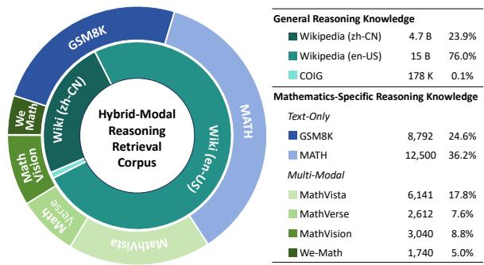  
Figure 1: The statistics of our hybrid retrieval corpus.

$$
\mathrm { U C B } ( i ) = w _ { i } + C * \sqrt { 2 * \ln \frac { N _ { i } } { n _ { i } } } ,\tag{2}
$$

Problem Formulation. Formally, in multimodal reasoning, given a multimodal query $Q ^ { m }$ and corresponding retrieved problem-solving insights r from the retrieved hybrid-modal corpus $D _ { H }$ , we assume that the MLLM $\pi \theta$ operates in an auto-regressive manner to generate a reasoning path of k steps $[ y _ { 1 } , \dots , y _ { k } ]$

$$
p _ { \boldsymbol { \theta } } ( \pmb { y } \mid Q ^ { m } , R ) = \prod _ { i = 1 } ^ { k } p _ { \boldsymbol { \theta } } ( y _ { i } \mid Q ^ { m } , r , y _ { < i } ) .\tag{3}
$$

In this paper, we obtain different intermediate reasoning trajectories as the MLLM decodes to a specific termination token. Following the setup of (Tian et al., 2024), we formulate the generation process as a Markov Decision Process (MDP) (Puterman, 1990) and adopt sentence-level MCTS modeling. In reinforcement learning terminology (Schulman et al., 2017), we define the current decoded intermediate step $y _ { i }$ as a state $s _ { i } ,$ corresponding to a leaf node. The process of backtracking to sample the next step is considered an action $a _ { i } .$ 1

## 3.2 Hybrid-Modal Retrieval Corpus Construction

In an ideal scenario, enhancing reasoning capabilities through retrieval resembles giving MLLMs an open-book exam. However, the multimodal reasoning field suffers from a persistent lack of high-quality reasoning retrieval corpora. To systematically establish a high-quality reasoning retrieval library, we conduct a comprehensive survey of open-source datasets, emphasizing both general and mathematics-specific reasoning knowledge in multimodal contexts.

Mathematics-Specific Reasoning Knowledge. Mathematical reasoning is an essential skill of fundamental models, supported by a series of highquality datasets. In the text-only aspect, we select the widely used math datasets, GSM8K (Cobbe et al., 2021b) and MATH (Hendrycks et al., 2021). For the multimodal domain, we adopt four meticulously cleaned math datasets: MATH-VISTA (Lu et al., 2024b), MathVerse (Zhang et al., 2024c), MathVision (Wang et al., 2024b), and WE-MATH (Qiao et al., 2024). To further prevent data leakage, we filtered out any overlapping portions with our testing benchmark using regular expressions, concatenating each sample’s question q, solution process $p ,$ and answer a into a single text format, along with the corresponding image storage paths. Ultimately, we obtain 22K text-only QA pairs and 12.5K multimodal sample pairs as proprietary sources $D _ { M }$ from six data sources, encompassing over 20 mathematical sub-fields, with each sample containing detailed solution steps.

General Reasoning Knowledge. In the real world, general reasoning extends beyond natural subjects. To meet this broader need, we follow the conventional RAG approach (Lewis et al., 2020; Zhao et al., 2024) by utilizing Wikipedia as a webbased retrieval source, alongside the COIG (Zhang et al., 2023) large-scale question bank for general reasoning. We conduct thorough data cleaning and chunking operations, ultimately constructing this extensive dataset as our general reasoning knowledge base $D _ { G }$ . The statistical information of our hybrid-modal reasoning corpus $D _ { \mathrm { H } } = D _ { M } \cup D _ { G }$ is presented in Figure 1. 2

## 3.3 Unified Multimodal Retrieval Module

Given a text-image pair from the multimodal test set $Q ^ { m } = \{ x , t \}$ , our goal is to retrieve the top-K multimodal relevant knowledge for each sample. Since our retrieval library encompasses hybridmodal retrieval sources, two retrieval processes are considered to obtain the top-K pairs:

Text Retrieval. Given a text query q for multimodal sample, we use a dense retriever to retrieve k relevant documents $D _ { q } = \{ d _ { i } \} _ { i = 1 } ^ { k }$ from a text-only corpus. In this work, we employ Contriever (Izacard et al., 2022) to obtain hidden vectors for both queries and documents. The relevance score is calculated by computing the dot-product similarity between their representations, which facilitates the retrieval of the Top-K documents $D _ { q }$ as follows:

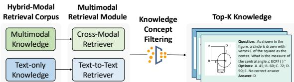  
Figure 2: The pipeline of our unified multimodal retrieval module.

$$
D _ { q } = \arg \mathrm { t o p } _ { k } ^ { i = 1 , . . . , N } \left[ E _ { \mathrm { d } } ( d _ { i } ) ^ { \top } \cdot E _ { \mathrm { q } } ( q ) \right] .\tag{4}
$$

Cross-modal Retrieval. We utilize widely used contrastive vision-language models CLIP (Radford et al., 2021), which employs a dual-stream architecture featuring an image encoder $E _ { I } ( \cdot )$ and a text encoder $E _ { T } ( \cdot )$ . Furthermore, we use CLIP to encode image-text pairs $( x , t )$ , obtaining the image and text vectors $E _ { I } ( x )$ and $E _ { T } ( t )$ . Since the hybrid-modal retrieval corpus contains both multimodal and text-only samples, we follow previous work (Tan et al., 2024) to derive encoding vectors for the entire hybrid-modal corpus $D _ { \mathrm { H } }$ as follows:

$$
E _ { x } ( x , t ) = { \left\{ \begin{array} { l l } { { \frac { E _ { I } ( x ) + E _ { T } ( t ) } { 2 } } , } & { { \mathrm { i f ~ } } t \neq \emptyset { \mathrm { ~ a n d ~ } } x \neq \emptyset , } \\ { E _ { T } ( t ) , } & { { \mathrm { i f ~ } } t \neq \emptyset { \mathrm { ~ a n d ~ } } x = \emptyset . } \end{array} \right. }\tag{5}
$$

where  denotes the empty set. For the i-th multimodal query $Q ^ { m }$ , we encode it into a mixed vector $\begin{array} { r } { E _ { x } ( Q ^ { m } ) = \frac { \dot { E _ { I } } ( x ) + E _ { T } ( t ) } { 2 } } \end{array}$ . We perform cross-modal retrieval between the encoding of each multimodal query and the entire retrieval database, utilizing FAISS (Johnson et al., 2021) for indexing to retrieve K samples for each query:

$$
D _ { \mathrm { c r o s s } } = \arg \log _ { k } ^ { j = 1 , . . . , N } \left[ E _ { x } ( Q ^ { m } ) ^ { \top } \cdot E _ { x } ( x _ { j } , t _ { j } ) \right] .\tag{6}
$$

Here, $E _ { x } ( Q ^ { m } )$ and $E _ { x } ( x _ { j } , t _ { j } )$ denote the embeddings of the multimodal query and the samples in the hybrid-modal corpus.

## 3.4 Knowledge Concept Filtering

During our deployment process, we observe that multimodal reasoning with retrieved knowledge is highly sensitive to the consistency of fine-grained knowledge concepts (e.g., algebra knowledge can’t help in solving triangles problems). Most highquality visual math benchmarks provide detailed category labels $( e . g .$ , “Angles and Length”) for each sample, motivating us to consider knowledge concepts for fine-grained filtering. Given a multimodal query $Q ^ { m }$ and its knowledge concept label $L _ { \mathrm { k c } } ,$ we encode the top- $K$ retrieved hybridmodal samples from $D _ { \mathrm { { H } } } = \{ D _ { \mathrm { { q } } } \cup D _ { \mathrm { { c r o s s } } } \}$ according to Equation (5) and compute the similarity with the knowledge concept’s embedding $E _ { T } ( k c )$ following the pipeline in “Cross-Modal Retrieval”. We strictly enforce the original retrieval similarity threshold $T _ { r }$ and the knowledge concept consistency threshold $T _ { \mathrm { k c } }$ , allowing only those samples that meet both criteria to serve as key insights $D _ { \mathrm { i n s } }$ for the query $Q ^ { m }$

$$
D _ { \mathrm { i n s } } = \{ r \in D _ { \mathrm { H } } \mid \mathrm { S i m } ( r , Q ^ { m } ) \geq T _ { r } \& \mathrm { S i m } ( r , L _ { \mathrm { k c } } ) \geq T _ { \mathrm { k c } } \} ,
$$

where $\mathrm { S i m } ( x , y )$ represents the cosine similarity between the embeddings $E ( x )$ and $E ( y ) , r \in D _ { \mathrm { H } }$ denotes a retrieved insights from the corpus $D _ { \mathrm { H } }$ Detailed information on the filtering process can be found in the Appendix.

## 3.5 Progressive Multimodal Reasoning Annotation

As shown in Figure 3, we will present our detailed algorithm design of AR-MCTS, which includes four core operations:

• Selection. During the j-th simulation of the AR-MCTS, the process begins with $s _ { 0 } .$ , representing the initial state containing the multimodal input query $Q _ { 0 } ^ { m } = ( x _ { 0 } , t _ { 0 } )$ and corresponding retrieved problem-solving insights $r _ { 0 }$ . The algorithm proceeds to explore the MCTS by selecting as Equation (2) iteratively, then we formulate the multimodal query of the state $s _ { j }$ as $\begin{array} { r } { Q _ { j } ^ { m } = \{ ( x _ { j } , t _ { j } ) \mid t _ { j } = t _ { 0 } + \sum _ { i = 1 } ^ { j } y _ { i } \} } \end{array}$

• Expansion with Active Retrieval Strategy. Given the state $s _ { i }$ represented by the selected leaf node, the MCTS-based approach backtracks to the prior state, forming our multimodal input $( x _ { i } , t _ { i } , r _ { i } )$ The temperature in the traditional expansion process is empirically increased to greater than 0.6 to sample potential candidate actions for the next step (Chen et al., 2024b). Unlike them, we emphasize that the supporting knowledge required for different reasoning trajectories at each step should vary, and propose an Active Retrieval strategy. As shown in Figure 3, during the MCTS expansion phase at state $s _ { i } ,$ we first concatenate the input $Q _ { i } ^ { m }$ with the previous reasoning steps. Then we dynamically retrieve the required candidate insights $r _ { i }$ for each step from the problem-solving insight library $D _ { \mathrm { i n s } }$ according to Equation (6), and replace the insight $r _ { i - 1 }$ from the previous step with the latest retrieved insights $r _ { i }$ . According to the Equation (3), the process of sampling k reasoning paths at state $s _ { i }$ can be modeled as follows:

$$
p _ { \theta } ( y \mid x ) = \prod _ { i = 1 } ^ { k } p _ { \theta } \left( \{ y _ { i } ^ { j } \} _ { j = 1 } ^ { k } \mid Q _ { i } ^ { m } , r _ { i } \right) .\tag{7}
$$

• Simulation. We use the probability of deducing the correct answer based on partial solutions as a criterion for quality assessment. Following Wang et al., we apply a one-step rollout for each node obtained during expansion to ensure efficiency. We construct a value function as $\begin{array} { r } { V ( s _ { i } ) = \frac { \sum _ { j = 1 } ^ { k } \mathbb { I } ( y _ { j } = \hat { y _ { i } } ) } { k } } \end{array}$ , where $k ,$ , I denotes the number of sampled reasoning paths and the indicator function. If the final answer $y _ { j }$ equals the grounding truth $\hat { y } _ { i }$ , we set the value of the current node to 1; Otherwise, we set it to 0.

• Back-Propagation. For the terminal nodes reached during the rollout and the current leaf node, MCTS performs a backward update of the visit count and Q-value for each $( s , a )$ along the route from the current node to the root, which is formulated as $N ( s , a )  N ( s , a ) + 1$ $\begin{array} { r } { Q ( s , a )  Q ( s , a ) + \frac { 1 } { N ( s , a ) } ( V ( s ) - Q ( s , a ) ) } \end{array}$

## 3.6 Curriculum Process Reward Modeling

After acquiring step-wise reasoning annotations, we draw inspiration from curriculum learning (Sun et al., 2024; Dong et al., 2024b) to design a twophase approach for PRM. In the first stage, the model learns to distinguish the correctness of reasoning steps. Then, it learns to assign scores to each step, facilitating generalization from easy to hard.

Step-wise DPO Pre-alignment. Each round of expansion and evaluation in AR-MCTS naturally generates batches of positive and negative pairs, inspiring us to align preferences using step-level Direct Preference Optimization (DPO) as the objective. Under the state $s _ { i }$ (i-th reasoning step), given a multimodal query $Q _ { i } ^ { m }$ and a sampled reasoning path set $Y _ { i } = \{ y _ { j } \} _ { j = 1 } ^ { k }$ , along with the corresponding value set $V _ { i } \doteq \{ v _ { j } \} _ { j = 1 } ^ { k }$ . We filter the paths in $Y _ { i }$ with value $v _ { j } > 0 . 8$ as positive samples $y _ { j } ^ { + }$ while those with $v _ { j } = 0$ are regarded as negative samples $y _ { i } ^ { - }$ . Therefore, for each problem $Q _ { i } ^ { m }$ , we can obtain $K$ pairs of step-level preference pairs $D _ { i } ^ { \mathrm { s t e p } } = ( y _ { j } ^ { + } , \bar { y _ { j } ^ { - } } ) _ { j = 1 } ^ { K }$ and follow step-level DPO to align the reasoning discernment capability:

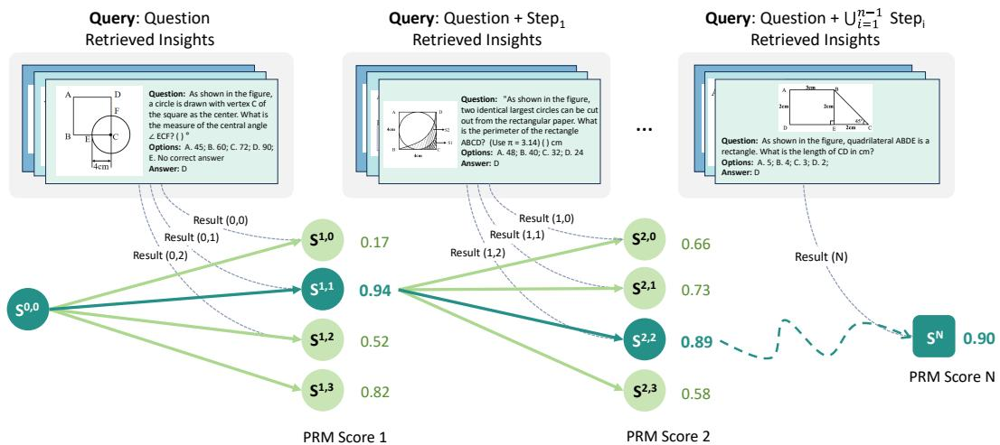  
Figure 3: Our AR-MCTS: The retrieval module actively retrieves key insights at each step of the MCTS process

$$
\begin{array} { r l } { \mathcal { L } _ { \mathrm { S D P O } } ( \pi _ { \theta } ; \pi _ { \mathrm { r e f } } ) = - \mathbb { E } _ { ( Q ^ { m } , y ^ { + } , y ^ { - } ) \sim \mathcal { D } ^ { \mathrm { s t e p } } } [ \log \sigma ( \beta \mathrm { l o g } } \\ { \frac { \pi _ { \theta } ( y ^ { + } | Q ^ { m } ) } { \pi _ { \theta } ( y ^ { + } | Q ^ { m } ) } - \beta \mathrm { l o g } \frac { \pi _ { \mathrm { r e f } } ( y ^ { - } | Q ^ { m } ) } { \pi _ { \mathrm { r e f } } ( y ^ { - } | Q ^ { m } ) } ) ] , } \end{array}
$$

The reference model $\pi _ { \mathrm { r e f } }$ is initially set to $\pi _ { \theta }$ and remains constant during training. $\beta$ is a hyperparameter, and σ denotes the sigmoid function. The objective of SDPO is to maximize the likelihood of preferred $y ^ { + }$ compared to the dispreferred $y$ −.

Point-wise Fine-tuning. After pre-alignment, PRM has gained the initial ability to distinguish the correctness of step-wise reasoning. To further unlock its reasoning scoring capability, we apply a step-level cross-entropy objective to the pre-aligned PRM $\pi _ { \mathrm { D P O } }$ as follows:

$$
\mathcal { L } _ { \mathrm { P F T } } = \sum _ { i = 1 } ^ { N } \left[ \hat { y } _ { i } \log _ { \pi _ { \mathrm { D P O } } } \left( r _ { i } \right) + \left( 1 - \hat { y } _ { i } \right) \log _ { \pi _ { \mathrm { D P O } } } ( 1 - r _ { i } ) \right] ,\tag{8}
$$

where $\hat { y } _ { i }$ is the golden label (0, 1) for the state $s _ { i } ,$ $r _ { i }$ is the sigmoid score assigned by PRM. Finally, we progressively achieve a well-aligned PRM.

Inference. We use PRM to evaluate each step as outlined in Figure 3. Following Luo et al., we adopt point-wise soft labels and discuss PRM’s hard labels in the appendix. Unlike the training data annotation, we extract the highest-scoring node from K expanded reasoning paths in each round, pruning low-quality paths. Besides, we set an early stopping criterion at the 4th round to reduce com-

putational complexity. 3

## 4 Experiments

## 4.1 Experimental Setup

We perform experiments on two widely used multimodal mathematical reasoning benchmarks: MATHVISTA (Lu et al., 2024b) and WE-MATH (Qiao et al., 2024). To further validate our AR-MCTS in the general reasoning domain, we perform cross-domain evaluation on the GAOKAO-MM benchmark (Zong and Qiu, 2024). For baselines, we employ AR-MCTS on strong proprietary and open-source models: (1) Closed-source MLLMs: GPT-4o (OpenAI et al., 2024), GPT-4V (OpenAI, 2023c); (2) Open-source MLLMs: LLaVA-OneVision-Qwen2-72B (Li et al., 2024a), InternVL2-8B (Chen et al., 2024d), Qwen2-VL-7B (Wang et al., 2024d), LLaMA3-LlaVA-NeXT-8B (Liu et al.). Referencing relevant works on MCTS (Wang et al., 2024c; Tian et al., 2024), we implement Self-Consistency (Wang et al., 2023), Self-Correction (He et al., 2024), and ORM (Cobbe et al., 2021a) as our core comparison strategies.

## 4.2 Overall Results

Table 1 illustrates the main results. Overall, AR-MCTS significantly improves visual reasoning performance across various MLLMs and reasoning verification strategies on two benchmarks, conclusively demonstrating the advantages of our approach. Below, we identify the following insights:

1) MLLMs struggle to self-correct reasoning errors. The self-correction strategy struggles across reasoning benchmarks. Although a minor improvement is noted with GPT-4o, other weaker open-source MLLMs experience significant declines after the self-correction, particularly Qwen2VL-7B, which shows a drop of over 8% on MATHVISTA (ALL). This discovery corresponds with the findings of He et al., highlighting the instability of correction methods that rely on the self-knowledge of MLLMs, especially in small MLLMs.

Table 1: Mathematical reasoning assessment on different MLLMs using MATHVISTA and WE-MATH testmini Sets. Following MathPUMA (Zhuang et al., 2024), we selected six reasoning-related domains for MATHVISTA. The top scores for each model are highlighted in bold. For more details, please refer to the Appendix B.
<table><tr><td rowspan="2">Model</td><td rowspan="2">Method</td><td colspan="6">MATHVISTA</td><td colspan="6">WE-MATH</td></tr><tr><td>ALL↑</td><td>GPS ↑</td><td>MWP↑</td><td>ALG↑</td><td>GEO↑</td><td>STA ↑</td><td>S3↑</td><td>AVG↑</td><td></td><td>IK↑IG↑</td><td>CM↑</td><td>RM↓</td></tr><tr><td rowspan="5">GPT-40</td><td>Zero-shot</td><td>59.0</td><td>59.6</td><td>65.1</td><td>61.2</td><td>60.7</td><td>72.4</td><td>46.1</td><td>40.8</td><td>31.8</td><td>13.7</td><td>33.9</td><td>37.8</td></tr><tr><td>Self-Consist.</td><td>61.8</td><td>68.3</td><td>65.1</td><td>68.0</td><td>68.2</td><td>74.8</td><td>53.0</td><td>45.2</td><td>29.9</td><td>12.8</td><td>38.8</td><td>32.8</td></tr><tr><td>Self-Correct.</td><td>59.9</td><td>61.1</td><td>65.6</td><td>61.2</td><td>61.1</td><td>72.8</td><td>43.6</td><td>42.9</td><td>31.2</td><td>15.2</td><td>35.2</td><td>34.2</td></tr><tr><td>ORM</td><td>61.9</td><td>68.3</td><td>66.1</td><td>68.0</td><td>68.2</td><td>74.8</td><td>50.3</td><td>44.3</td><td>26.5</td><td>10.9</td><td>38.9</td><td>38.0</td></tr><tr><td>AR-MCTS</td><td>62.6</td><td>68.6</td><td>66.4</td><td>68.0</td><td>68.8</td><td>75.3</td><td>56.4</td><td>46.8</td><td>28.012.8</td><td></td><td>40.4</td><td>31.8</td></tr><tr><td rowspan="5">LLaVA- OneVision-72B</td><td>Zero-shot</td><td>64.2</td><td>80.8</td><td>69.4</td><td>73.3</td><td>77.0</td><td>66.8</td><td>40.6</td><td>24.6</td><td>42.5</td><td>14.1</td><td>17.5</td><td>59.7</td></tr><tr><td>Self-Consist.</td><td>66.0</td><td>79.8</td><td>73.1</td><td>74.0</td><td>76.6</td><td>67.8</td><td>38.2</td><td>36.9</td><td>33.9</td><td>15.8</td><td>29.0</td><td>42.4</td></tr><tr><td>Self-Correct.</td><td>58.3</td><td>78.4</td><td>68.8</td><td>70.1</td><td>74.9</td><td>56.8</td><td>30.3</td><td>14.7</td><td>55.4</td><td>11.8</td><td>8.7</td><td>73.3</td></tr><tr><td>ORM</td><td>65.9</td><td>80.3</td><td>73.1</td><td>74.0</td><td>77.0</td><td>67.8</td><td>44.2</td><td>30.6</td><td>34.9 18.1</td><td></td><td>21.5</td><td>54.3</td></tr><tr><td>AR-MCTS</td><td>66.3</td><td>79.8</td><td>73.1</td><td>74.4</td><td>76.6</td><td>67.8</td><td>38.9</td><td>37.4</td><td>33.7</td><td>18.1</td><td>28.4</td><td>41.1</td></tr><tr><td rowspan="5">InternVL2-8B</td><td>Zero-shot</td><td>57.3</td><td>62.5</td><td>62.4</td><td>61.2</td><td>60.7</td><td>59.1</td><td>23.6</td><td>17.4</td><td>59.8</td><td>10.1</td><td>12.4</td><td>58.9</td></tr><tr><td>Self-Consist.</td><td>61.8</td><td>77.4</td><td>64.0</td><td>73.0</td><td>72.8</td><td>62.1</td><td>35.1</td><td>26.6</td><td>45.5</td><td>13.5</td><td>19.8</td><td>51.6</td></tr><tr><td>Self-Correct.</td><td>46.8</td><td>57.7</td><td>31.2</td><td>55.9</td><td>56.1</td><td>46.2</td><td>30.3</td><td>9.8</td><td>62.7</td><td>8.6</td><td>5.5</td><td>80.8</td></tr><tr><td>ORM</td><td>61.1</td><td>67.8</td><td>64.0</td><td>64.1</td><td>64.9</td><td>68.4</td><td>32.7</td><td>29.7</td><td>42.9</td><td>16.0</td><td>21.7</td><td>47.2</td></tr><tr><td>AR-MCTS</td><td>63.1</td><td>62.9</td><td>71.6</td><td>59.9</td><td>62.6</td><td>71.4</td><td>43.6</td><td>30.5</td><td>37.7 14.7</td><td></td><td>23.2</td><td>51.2</td></tr><tr><td rowspan="5">Qwen2-VL-7B</td><td>Zero-shot</td><td>58.8</td><td>45.5</td><td>60.5</td><td>45.5</td><td>47.9</td><td>70.8</td><td>33.9</td><td>19.8</td><td>51.2</td><td>12.6</td><td>13.5</td><td>62.6</td></tr><tr><td>Self-Consist.</td><td>61.2</td><td>54.8</td><td>61.8</td><td>56.2</td><td>55.2</td><td>72.1</td><td>33.9</td><td>23.6</td><td>46.9</td><td>13.7</td><td>16.8</td><td>57.5</td></tr><tr><td>Self-Correct.</td><td>50.8</td><td>43.3</td><td>53.2</td><td>45.9</td><td>43.9</td><td>62.1</td><td>26.7</td><td>20.0</td><td>54.1</td><td>11.1</td><td>14.5</td><td>58.5</td></tr><tr><td>ORM</td><td>62.3</td><td>55.5</td><td>62.7</td><td>56.9</td><td>56.5</td><td>72.4</td><td>34.6</td><td>26.4</td><td>42.9</td><td>11.2</td><td>20.8</td><td>54.8</td></tr><tr><td>AR-MCTS</td><td>64.1</td><td>63.9</td><td>72.6</td><td>60.9</td><td>63.6</td><td>72.4</td><td>40.6</td><td>28.1</td><td>40.014.3</td><td></td><td>21.0</td><td>54.2</td></tr></table>

2) PRM outperforms ORM in complex reasoning. Compared to ORM, AR-MCTS with PRM demonstrates a more significant performance improvement across most MLLM backbones on the S3 metrics in WE-MATH (GPT-4o: 56.4% vs 50.3%; Qwen2-VL: 40.6% vs 34.6 %). This highlights that PRM, by meticulously verifying each step of the reasoning process, achieves stronger alignment in multi-step reasoning tasks.

3) AR-MCTS better unlocks the reasoning potential of weaker MLLMs. Compared to LLaVA-OneVision-72B, Qwen2-VL-7B with AR-MCTS shows a significant improvement over the zero-shot setting on MATHVISTA (ALL: 5.3% ) and in WE-MATH (AVG: 8.3% ). A similar finding is observed with InternVL2-8B, indicating that the performance gains of AR-MCTS are more pronounced in smaller MLLMs. This observation further verifies the importance of integrating active retrieval in reasoning. AR-MCTS is a reliable plugand-play framework, offering a promising solution for reasoning alignment in weaker MLLMs.

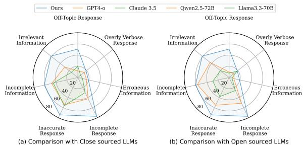  
Figure 4: The results of MLLMs on GAOKAO-MM.

## 4.3 General Reasoning Domain Verification

To validate the effectiveness of AR-MCTS in the general multimodal reasoning field, we further evaluate the Chinese human-level reasoning benchmark, GAOKAO-MM. As shown in Figure 4, both the closed-source GPT-4o and the open-source small MLLM Qwen2-VL-7B with AR-MCTS framework demonstrate significant improvements over the backbone and self-consistency approaches, verifying the generalization of AR-MCTS across different languages and disciplines. Notably, AR-MCTS with GPT-4o achieves stable improvements in mathematics and physics (12.5% and 7.7% ), while also showing some gains in the humanities (e.g. history 20% ). This emphasizes that AR-MCTS with PRM not only improves the complex reasoning abilities of MLLMs, but also effectively mitigates the knowledge gaps of MLLMs in the humanities through its retrieval mechanism.

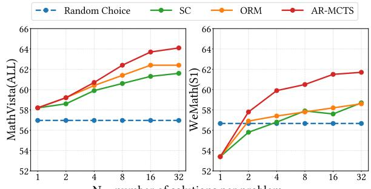

Table 2: Ablation study with Qwen2-7B. "w/o Active Retrieval" corresponds to the "vanilla PRM baseline", while "w/o PRM" denotes using "Beam search with retrieval". "Filtering" is the "knowledge concept filtering".
<table><tr><td>Models</td><td>MATHVISTA WE-MATH GAOKAO (ALL)</td><td>(S3)</td><td>-MM(ALL)</td></tr><tr><td>AR-MCTS</td><td>64.1</td><td>40.6</td><td>37.4</td></tr><tr><td>w/o PRM</td><td>61.0 (-3.1)</td><td>37.7 (-2.9)</td><td> $3 3 . 2 \ ( - 4 . 2 )$ </td></tr><tr><td>w/o Filtering</td><td>62.8 (-1.3)</td><td>39.5 (-1.1)</td><td> $3 4 . 5 \ ( - 2 . 9 )$ </td></tr><tr><td>w/o Active Retrieval</td><td>61.9 (-2.2)</td><td>38.7 (-1.9)</td><td> $3 3 . 4 \ ( - 4 . 0 )$ </td></tr></table>

N = number of solutions per problem  
Figure 5: Scaling analysis on inference samplings. Random Choice denotes randomly sampling from 1 to 32.

## 4.4 Quantitative Analysis

Ablation Study. To explore the effects of components in AR-MCTS, we conduct an ablation study in Table 2. The term "w/o" indicates versions without specific components. Our key findings are: 1) Removing any component from AR-MCTS results in performance decline, highlighting the necessity of all component designs. 2) Removing the PRM or active retrieval causes a significant performance drop (MATHVISTA: 3.1% and 2.2%), highlighting that both step-wise verification and active retrieval effectively enhance MLLM’s reasoning capabilities. 3) Notably, knowledge concept filtering achieves stable performance gains, indicating that it effectively reduces noise in retrieved knowledge and highlights the importance of consistency between the retrieved knowledge and the problem during reasoning.

Scaling Analysis on Inference Sampling. As shown in Figure 5, we perform a scaling analysis to evaluate the performance of various strategies across two benchmarks with sampled paths ranging from 1 to 32. Our main conclusions are listed: 1) When the number of sampled solutions exceeds a certain threshold (16), self-consistency (SC) exhibits performance fluctuations in WE-MATH. 2) AC-MCTS consistently outperforms ORM and SC, with this superiority becoming more pronounced as N increases. We attribute this advantage to our automated process labeling, which offers high scalability and low annotation costs while providing more reliable feedback for path verification.

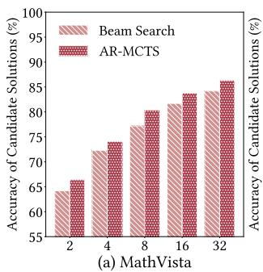

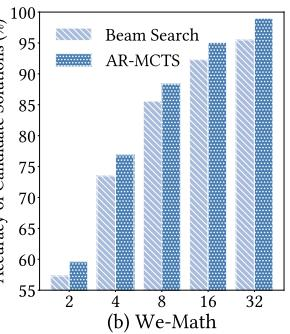  
Figure 6: The comparison of solution sampling.

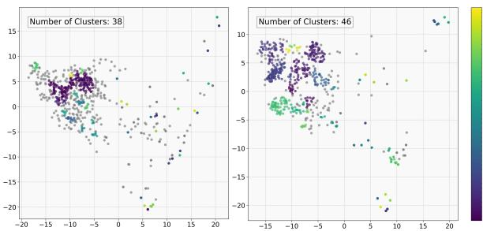  
Figure 7: The visualization of the sampled solutions.

## 4.5 Does AR-MCTS Improve Sampling?

In this section, we explore whether AR-MCTS can efficiently improve the quality of the candidate solution sampling from the following two perspectives:

Accuracy Analysis. To validate that AR-MCTS can efficiently improve the solution sampling accuracy in multimodal reasoning, we analyze the "Correctness of questions" of Qwen2-VL during the sampling process in the two benchmarks. The accuracy can be formulated as $\begin{array} { r } { P _ { Q } ^ { \mathrm { c } } \ = \ \frac { N _ { Q } ^ { \mathrm { c } } } { N _ { Q } } } \end{array}$ where $N _ { Q } ^ { \mathrm { c } }$ denotes the number of questions containing at least one correct candidate solution, while $N _ { Q }$ denotes the number of questions. As shown in Figure 6, AR-MCTS demonstrates consistent gains in both benchmarks compared to the traditional beam search sampling. As the number of candidate solutions increases, the answer accuracy $P _ { Q } ^ { \mathrm { c } }$ exhibits a positive correlation. This finding confirms that AR-MCTS is a scalability framework that efficiently improves the reliability of the sampling space in multimodal reasoning, thereby addressing the inherent challenges of MCTS-based methods.

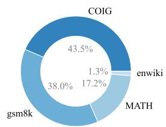  
(a) Text Retrieval of MathVista

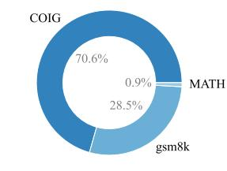  
(b) Text Retrieval of We-Math

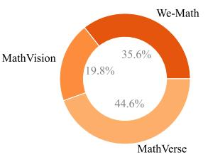  
(c) Multi-modal Retrieval of MathVista

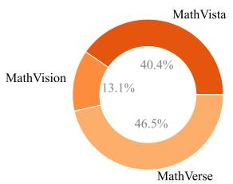  
(d) Multi-modal Retrieval of We-Math  
Figure 8: The composition analysis on retrieval corpus of WE-MATH and MATHVISTA.

Diversity Analysis. To investigate whether AR-MCTS enhances the diversity of sampled solutions, we sample 250 problems from MATHVISTA and use AR-MCTS to sample 4 candidate solutions for each, resulting in 1,000 samples. We use BGE-M3 (Chen et al., 2024c) as our semantic embedding model, apply PCA for dimensionality reduction, and use DBSCAN (Ester et al., 1996) clustering to visualize the solution representations.

Figure 7 shows the visualization between the beam search (left) and AR-MCTS (right). The representations of candidate solutions sampled by beam search tend to collapse into a small area with several noise points (in gray), reflecting that the beam search may lead to redundancy in sampling. Under the same setting, AC-MCTS clusters more centroids for the same problem set (38 vs.46) and exhibits a more dispersed distribution. This verifies that AR-MCTS alleviates the issue of limited diversity in solutions sampling, efficiently covering the problem-solving space and providing strong prior conditions for the simulation process of MCTS.

## 4.6 The Composition Analysis of Retrieval Knowledge

To gain deeper insights into which knowledge sources provide the greatest benefits to our multimodal reasoning test set, we conduct a comprehensive ranking of the hybrid-modal knowledge retrieved from samples of MATHVISTA and WE-MATH based on similarity, selecting the Top-50 relevant knowledge samples and visualizing their respective sources. As shown in Figure 8, both MATHVISTA and WE-MATH exhibit significant diversity in their retrieved knowledge, whether from text-only or multimodal sources. This highlights the motivation for constructing our hybrid-modal retrieval library from diverse, high-quality reasoning datasets. It also confirms that the insights needed for problem-solving do not necessarily originate from the same type of data source but should be enhanced through diverse reasoning knowledge. Our hybrid-modal reasoning retrieval library effectively addresses this need.

## 5 Conclusion

In this paper, we introduce AR-MCTS, a universal framework designed to enhance complex multimodal reasoning capabilities. AR-MCTS integrates the MCTS algorithm with an active retrieval strategy to automatically acquire high-quality stepwise reasoning annotations, progressively aligning a PRM for process-level multimodal reasoning verification. Experiments confirm the effectiveness of AR-MCTS across various MLLMs and benchmarks, demonstrating its ability to optimize sampling diversity and verification accuracy, thus providing a promising solution for reliable reasoning.

## Acknowledgments

This work was supported by Beijing Natural Science Foundation No. L233008, Beijing Municipal Science and Technology Project No. Z231100010323009, National Science and Technology Major Project No. 2022ZD0120103, National Natural Science Foundation of China No. 62272467, and the fund for building world-class universities (disciplines) of Renmin University of China. The work was partially done at the Engineering Research Center of Next-Generation Intelligent Search and Recommendation, MOE.

## References

Akari Asai, Zeqiu Wu, Yizhong Wang, Avirup Sil, and Hannaneh Hajishirzi. 2024. Self-rag: Learning to retrieve, generate, and critique through self-reflection. In The Twelfth International Conference on Learning

Representations, ICLR 2024, Vienna, Austria, May 7-11, 2024. OpenReview.net.

Giusepppe Attardi. 2015. Wikiextractor. https:// github.com/attardi/wikiextractor.

Jinze Bai, Shuai Bai, Shusheng Yang, Shijie Wang, Sinan Tan, Peng Wang, Junyang Lin, Chang Zhou, and Jingren Zhou. 2023. Qwen-vl: A versatile visionlanguage model for understanding, localization, text reading, and beyond. Preprint, arXiv:2308.12966.

Cameron Browne, Edward Jack Powley, Daniel Whitehouse, Simon M. Lucas, Peter I. Cowling, Philipp Rohlfshagen, Stephen Tavener, Diego Perez Liebana, Spyridon Samothrakis, and Simon Colton. 2012. A survey of monte carlo tree search methods. IEEE Trans. Comput. Intell. AI Games, 4(1):1–43.

Zheng Cai, Maosong Cao, Haojiong Chen, Kai Chen, Keyu Chen, Xin Chen, Xun Chen, Zehui Chen, Zhi Chen, Pei Chu, Xiaoyi Dong, Haodong Duan, Qi Fan, Zhaoye Fei, Yang Gao, Jiaye Ge, Chenya Gu, Yuzhe Gu, Tao Gui, Aijia Guo, Qipeng Guo, Conghui He, Yingfan Hu, Ting Huang, Tao Jiang, Penglong Jiao, Zhenjiang Jin, Zhikai Lei, Jiaxing Li, Jingwen Li, Linyang Li, Shuaibin Li, Wei Li, Yining Li, Hongwei Liu, Jiangning Liu, Jiawei Hong, Kaiwen Liu, Kuikun Liu, Xiaoran Liu, Chengqi Lv, Haijun Lv, Kai Lv, Li Ma, Runyuan Ma, Zerun Ma, Wenchang Ning, Linke Ouyang, Jiantao Qiu, Yuan Qu, Fukai Shang, Yunfan Shao, Demin Song, Zifan Song, Zhihao Sui, Peng Sun, Yu Sun, Huanze Tang, Bin Wang, Guoteng Wang, Jiaqi Wang, Jiayu Wang, Rui Wang, Yudong Wang, Ziyi Wang, Xingjian Wei, Qizhen Weng, Fan Wu, Yingtong Xiong, and et al. 2024. Internlm2 technical report. CoRR, abs/2403.17297.

Guoxin Chen, Minpeng Liao, Chengxi Li, and Kai Fan. 2024a. Alphamath almost zero: process supervision without process. CoRR, abs/2405.03553.

Guoxin Chen, Minpeng Liao, Chengxi Li, and Kai Fan. 2024b. Step-level value preference optimization for mathematical reasoning. CoRR, abs/2406.10858.

Jianlv Chen, Shitao Xiao, Peitian Zhang, Kun Luo, Defu Lian, and Zheng Liu. 2024c. BGE m3-embedding: Multi-lingual, multi-functionality, multi-granularity text embeddings through self-knowledge distillation. CoRR, abs/2402.03216.

Wenhu Chen, Xueguang Ma, Xinyi Wang, and William W. Cohen. 2023a. Program of thoughts prompting: Disentangling computation from reasoning for numerical reasoning tasks. Trans. Mach. Learn. Res., 2023.

Zhe Chen, Weiyun Wang, Hao Tian, Shenglong Ye, Zhangwei Gao, Erfei Cui, Wenwen Tong, Kongzhi Hu, Jiapeng Luo, Zheng Ma, Ji Ma, Jiaqi Wang, Xiaoyi Dong, Hang Yan, Hewei Guo, Conghui He, Botian Shi, Zhenjiang Jin, Chao Xu, Bin Wang, Xingjian Wei, Wei Li, Wenjian Zhang, Bo Zhang, Pinlong Cai, Licheng Wen, Xiangchao Yan, Min Dou, Lewei Lu, Xizhou Zhu, Tong Lu, Dahua Lin,

Yu Qiao, Jifeng Dai, and Wenhai Wang. 2024d. How far are we to gpt-4v? closing the gap to commercial multimodal models with open-source suites. CoRR, abs/2404.16821.

Zhe Chen, Jiannan Wu, Wenhai Wang, Weijie Su, Guo Chen, Sen Xing, Muyan Zhong, Qinglong Zhang, Xizhou Zhu, Lewei Lu, Bin Li, Ping Luo, Tong Lu, Yu Qiao, and Jifeng Dai. 2023b. Internvl: Scaling up vision foundation models and aligning for generic visual-linguistic tasks. arXiv preprint arXiv:2312.14238.

Yiruo Cheng, Kelong Mao, Ziliang Zhao, Guanting Dong, Hongjin Qian, Yongkang Wu, Tetsuya Sakai, Ji-Rong Wen, and Zhicheng Dou. 2024. CORAL: benchmarking multi-turn conversational retrievalaugmentation generation. CoRR, abs/2410.23090.

Karl Cobbe, Vineet Kosaraju, Mohammad Bavarian, Mark Chen, Heewoo Jun, Lukasz Kaiser, Matthias Plappert, Jerry Tworek, Jacob Hilton, Reiichiro Nakano, Christopher Hesse, and John Schulman. 2021a. Training verifiers to solve math word problems. CoRR, abs/2110.14168.

Karl Cobbe, Vineet Kosaraju, Mohammad Bavarian, Mark Chen, Heewoo Jun, Lukasz Kaiser, Matthias Plappert, Jerry Tworek, Jacob Hilton, Reiichiro Nakano, Christopher Hesse, and John Schulman. 2021b. Training verifiers to solve math word problems. CoRR, abs/2110.14168.

Tri Dao. 2023. Flashattention-2: Faster attention with better parallelism and work partitioning. CoRR.

Guanting Dong, Yifei Chen, Xiaoxi Li, Jiajie Jin, Hongjin Qian, Yutao Zhu, Hangyu Mao, Guorui Zhou, Zhicheng Dou, and Ji-Rong Wen. 2025. Toolstar: Empowering llm-brained multi-tool reasoner via reinforcement learning. Preprint, arXiv:2505.16410.

Guanting Dong, Rumei Li, Sirui Wang, Yupeng Zhang, Yunsen Xian, and Weiran Xu. 2023. Bridging the kb-text gap: Leveraging structured knowledge-aware pre-training for KBQA. In Proceedings ofthe 32nd ACM International Conference on Information and Knowledge Management, CIKM 2023, Birmingham, United Kingdom, October 21-25, 2023, pages 3854– 3859. ACM.

Guanting Dong, Keming Lu, Chengpeng Li, Tingyu Xia, Bowen Yu, Chang Zhou, and Jingren Zhou. 2024a. Self-play with execution feedback: Improving instruction-following capabilities of large language models. CoRR, abs/2406.13542.

Guanting Dong, Hongyi Yuan, Keming Lu, Chengpeng Li, Mingfeng Xue, Dayiheng Liu, Wei Wang, Zheng Yuan, Chang Zhou, and Jingren Zhou. 2024b. How abilities in large language models are affected by supervised fine-tuning data composition. In Proceedings of the 62nd Annual Meeting of the Association for Computational Linguistics (Volume 1: Long Papers), ACL 2024, Bangkok, Thailand, August 11-16, 2024, pages 177–198. Association for Computational Linguistics.

Guanting Dong, Yutao Zhu, Chenghao Zhang, Zechen Wang, Zhicheng Dou, and Ji-Rong Wen. 2024c. Understand what LLM needs: Dual preference alignment for retrieval-augmented generation. CoRR, abs/2406.18676.

Abhimanyu Dubey, Abhinav Jauhri, Abhinav Pandey, Abhishek Kadian, Ahmad Al-Dahle, Aiesha Letman, Akhil Mathur, Alan Schelten, Amy Yang, Angela Fan, Anirudh Goyal, Anthony Hartshorn, Aobo Yang, Archi Mitra, Archie Sravankumar, Artem Korenev, Arthur Hinsvark, Arun Rao, Aston Zhang, Aurélien Rodriguez, Austen Gregerson, Ava Spataru, Baptiste Rozière, Bethany Biron, Binh Tang, Bobbie Chern, Charlotte Caucheteux, Chaya Nayak, Chloe Bi, Chris Marra, Chris McConnell, Christian Keller, Christophe Touret, Chunyang Wu, Corinne Wong, Cristian Canton Ferrer, Cyrus Nikolaidis, Damien Al lonsius, Daniel Song, Danielle Pintz, Danny Livshits, David Esiobu, Dhruv Choudhary, Dhruv Mahajan, Diego Garcia-Olano, Diego Perino, Dieuwke Hupkes, Egor Lakomkin, Ehab AlBadawy, Elina Lobanova, Emily Dinan, Eric Michael Smith, Filip Radenovic, Frank Zhang, Gabriel Synnaeve, Gabrielle Lee, Georgia Lewis Anderson, Graeme Nail, Grégoire Mialon, Guan Pang, Guillem Cucurell, Hailey Nguyen, Hannah Korevaar, Hu Xu, Hugo Touvron, Iliyan Zarov, Imanol Arrieta Ibarra, Isabel M. Kloumann, Ishan Misra, Ivan Evtimov, Jade Copet, Jaewon Lee, Jan Geffert, Jana Vranes, Jason Park, Jay Mahadeokar, Jeet Shah, Jelmer van der Linde, Jennifer Billock, Jenny Hong, Jenya Lee, Jeremy Fu, Jianfeng Chi, Jianyu Huang, Jiawen Liu, Jie Wang, Jiecao Yu, Joanna Bitton, Joe Spisak, Jongsoo Park, Joseph Rocca, Joshua Johnstun, Joshua Saxe, Junteng Jia, Kalyan Vasuden Alwala, Kartikeya Upasani, Kate Plawiak, Ke Li, Kenneth Heafield, Kevin Stone, and et al. 2024. The llama 3 herd of models. CoRR, abs/2407.21783.

Martin Ester, Hans-Peter Kriegel, Jörg Sander, and Xiaowei Xu. 1996. A density-based algorithm for discovering clusters in large spatial databases with noise. In Proceedings of the Second International Conference on Knowledge Discovery and Data Mining (KDD-96), Portland, Oregon, USA, pages 226– 231. AAAI Press.

Markus Freitag and Yaser Al-Onaizan. 2017. Beam search strategies for neural machine translation. In Proceedings of the First Workshop on Neural Machine Translation, NMT@ACL 2017, Vancouver, Canada, August 4, 2017, pages 56–60. Association for Computational Linguistics.

Luyu Gao, Aman Madaan, Shuyan Zhou, Uri Alon, Pengfei Liu, Yiming Yang, Jamie Callan, and Graham Neubig. 2023. PAL: program-aided language models. In International Conference on Machine Learning, ICML 2023, 23-29 July 2023, Honolulu, Hawaii, USA, volume 202 of Proceedings ofMachine Learning Research, pages 10764–10799. PMLR.

Zitian Gao, Boye Niu, Xuzheng He, Haotian Xu, Hongzhang Liu, Aiwei Liu, Xuming Hu, and Lijie

Wen. 2024. Interpretable contrastive monte carlo tree search reasoning. Preprint, arXiv:2410.01707.

Jiayi He, Hehai Lin, Qingyun Wang, Yi Fung, and Heng Ji. 2024. Self-correction is more than refinement: A learning framework for visual and language reasoning tasks. Preprint, arXiv:2410.04055.

Dan Hendrycks, Collin Burns, Saurav Kadavath, Akul Arora, Steven Basart, Eric Tang, Dawn Song, and Jacob Steinhardt. 2021. Measuring mathematical problem solving with the MATH dataset. In Proceedings ofthe Neural Information Processing Systems Track on Datasets and Benchmarks 1, NeurIPS Datasets and Benchmarks 2021, December 2021, virtual.

Gautier Izacard, Mathilde Caron, Lucas Hosseini, Sebastian Riedel, Piotr Bojanowski, Armand Joulin, and Edouard Grave. 2022. Unsupervised dense information retrieval with contrastive learning. Trans. Mach. Learn. Res., 2022.

Jiajie Jin, Xiaoxi Li, Guanting Dong, Yuyao Zhang, Yutao Zhu, Yongkang Wu, Zhonghua Li, Qi Ye, and Zhicheng Dou. 2025. Hierarchical document refinement for long-context retrieval-augmented generation. arXiv preprint arXiv:2505.10413.

Jiajie Jin, Yutao Zhu, Xinyu Yang, Chenghao Zhang, and Zhicheng Dou. 2024. Flashrag: A modular toolkit for efficient retrieval-augmented generation research. CoRR, abs/2405.13576.

Jeff Johnson, Matthijs Douze, and Hervé Jégou. 2021. Billion-scale similarity search with gpus. IEEE Trans. Big Data, 7(3):535–547.

Andreas Koukounas, Georgios Mastrapas, Michael Günther, Bo Wang, Scott Martens, Isabelle Mohr, Saba Sturua, Mohammad Kalim Akram, Joan Fontanals Martínez, Saahil Ognawala, Susana Guzman, Maximilian Werk, Nan Wang, and Han Xiao. 2024. Jina CLIP: your CLIP model is also your text retriever. CoRR, abs/2405.20204.

Woosuk Kwon, Zhuohan Li, Siyuan Zhuang, Ying Sheng, Lianmin Zheng, Cody Hao Yu, Joseph E. Gonzalez, Hao Zhang, and Ion Stoica. 2023. Efficient memory management for large language model serving with pagedattention. In Proceedings of the ACM SIGOPS 29th Symposium on Operating Systems Principles.

Shanglin Lei, Guanting Dong, Xiaoping Wang, Keheng Wang, and Sirui Wang. 2023. Instructerc: Reforming emotion recognition in conversation with a retrieval multi-task llms framework. CoRR, abs/2309.11911.

Patrick S. H. Lewis, Ethan Perez, Aleksandra Piktus, Fabio Petroni, Vladimir Karpukhin, Naman Goyal, Heinrich Küttler, Mike Lewis, Wen-tau Yih, Tim Rocktäschel, Sebastian Riedel, and Douwe Kiela. 2020. Retrieval-augmented generation for knowledge-intensive NLP tasks. In Advances in Neural Information Processing Systems 33: Annual Conference on Neural Information Processing Systems 2020, NeurIPS 2020, December 6-12, 2020, virtual.

Bo Li, Yuanhan Zhang, Dong Guo, Renrui Zhang, Feng Li, Hao Zhang, Kaichen Zhang, Yanwei Li, Ziwei Liu, and Chunyuan Li. 2024a. Llava-onevision: Easy visual task transfer. CoRR, abs/2408.03326.

Chengpeng Li, Guanting Dong, Mingfeng Xue, Ru Peng, Xiang Wang, and Dayiheng Liu. 2024b. Dotamath: Decomposition of thought with code assistance and self-correction for mathematical reasoning. CoRR, abs/2407.04078.

Xiaoxi Li, Guanting Dong, Jiajie Jin, Yuyao Zhang, Yujia Zhou, Yutao Zhu, Peitian Zhang, and Zhicheng Dou. 2025a. Search-o1: Agentic search-enhanced large reasoning models. CoRR, abs/2501.05366.

Xiaoxi Li, Jiajie Jin, Guanting Dong, Hongjin Qian, Yutao Zhu, Yongkang Wu, Ji-Rong Wen, and Zhicheng Dou. 2025b. Webthinker: Empowering large reasoning models with deep research capability. CoRR, abs/2504.21776.

Xiaoxi Li, Jiajie Jin, Yujia Zhou, Yongkang Wu, Zhonghua Li, Qi Ye, and Zhicheng Dou. 2024c. Retrollm: Empowering large language models to retrieve fine-grained evidence within generation. arXiv preprint arXiv:2412.11919.

Yifei Li, Zeqi Lin, Shizhuo Zhang, Qiang Fu, Bei Chen, Jian-Guang Lou, and Weizhu Chen. 2023. Making language models better reasoners with step-aware verifier. In Proceedings ofthe 61st Annual Meeting ofthe Associationfor Computational Linguistics (Volume 1: Long Papers), ACL 2023, Toronto, Canada, July 9-14, 2023, pages 5315–5333. Association for Computational Linguistics.

Hunter Lightman, Vineet Kosaraju, Yuri Burda, Harrison Edwards, Bowen Baker, Teddy Lee, Jan Leike, John Schulman, Ilya Sutskever, and Karl Cobbe. 2024. Let’s verify step by step. In The Twelfth International Conference on Learning Representations, ICLR 2024, Vienna, Austria, May 7-11, 2024. Open-Review.net.

Su Hyeon Lim, Minkuk Kim, Hyeon Bae Kim, and Seong Tae Kim. 2024. Retrieval-augmented natural language reasoning for explainable visual question answering. CoRR, abs/2408.17006.

Zhan Ling, Yunhao Fang, Xuanlin Li, Zhiao Huang, Mingu Lee, Roland Memisevic, and Hao Su. 2023. Deductive verification of chain-of-thought reasoning. In Advances in Neural Information Processing Systems 36: Annual Conference on Neural Information Processing Systems 2023, NeurIPS 2023, New Orleans, LA, USA, December 10 - 16, 2023.

Bingshuai Liu, Chenyang Lyu, Zijun Min, Zhanyu Wang, Jinsong Su, and Longyue Wang. 2023a. Retrieval-augmented multi-modal chain-of-thoughts reasoning for large language models. CoRR, abs/2312.01714.

Haotian Liu, Chunyuan Li, Yuheng Li, Bo Li, Yuanhan Zhang, Sheng Shen, and Yong Jae Lee. Llava-next: Improved reasoning, ocr, and world knowledge.

Haotian Liu, Chunyuan Li, Qingyang Wu, and Yong Jae Lee. 2023b. Visual instruction tuning. In Advances in Neural Information Processing Systems 36: Annual Conference on Neural Information Processing Systems 2023, NeurIPS 2023, New Orleans, LA, USA, December 10 - 16, 2023.

Jiacheng Liu, Andrew Cohen, Ramakanth Pasunuru, Yejin Choi, Hannaneh Hajishirzi, and Asli Celikyilmaz. 2023c. Making PPO even better: Valueguided monte-carlo tree search decoding. CoRR, abs/2309.15028.

Jingyu Liu, Jiaen Lin, and Yong Liu. 2024. How much can RAG help the reasoning of llm? CoRR, abs/2410.02338.

Keming Lu, Hongyi Yuan, Zheng Yuan, Runji Lin, Junyang Lin, Chuanqi Tan, Chang Zhou, and Jingren Zhou. 2024a. #instag: Instruction tagging for analyzing supervised fine-tuning of large language models. In The Twelfth International Conference on Learning Representations, ICLR 2024, Vienna, Austria, May 7-11, 2024. OpenReview.net.

Pan Lu, Hritik Bansal, Tony Xia, Jiacheng Liu, Chunyuan Li, Hannaneh Hajishirzi, Hao Cheng, Kai-Wei Chang, Michel Galley, and Jianfeng Gao. 2024b. Mathvista: Evaluating mathematical reasoning of foundation models in visual contexts. In The Twelfth International Conference on Learning Representations, ICLR 2024, Vienna, Austria, May 7-11, 2024. OpenReview.net.

Haipeng Luo, Qingfeng Sun, Can Xu, Pu Zhao, Jianguang Lou, Chongyang Tao, Xiubo Geng, Qingwei Lin, Shifeng Chen, and Dongmei Zhang. 2023. Wizardmath: Empowering mathematical reasoning for large language models via reinforced evol-instruct. CoRR, abs/2308.09583.

Haoran Luo, Haihong E, Zichen Tang, Shiyao Peng, Yikai Guo, Wentai Zhang, Chenghao Ma, Guanting Dong, Meina Song, Wei Lin, Yifan Zhu, and Anh Tuan Luu. 2024a. ChatKBQA: A generatethen-retrieve framework for knowledge base question answering with fine-tuned large language models. In Findings of the Association for Computational Linguistics ACL 2024, pages 2039–2056, Bangkok, Thailand and virtual meeting. Association for Computational Linguistics.

Liangchen Luo, Yinxiao Liu, Rosanne Liu, Samrat Phatale, Harsh Lara, Yunxuan Li, Lei Shu, Yun Zhu, Lei Meng, Jiao Sun, and Abhinav Rastogi. 2024b. Improve mathematical reasoning in language models by automated process supervision. CoRR, abs/2406.06592.

Liangchen Luo, Yinxiao Liu, Rosanne Liu, Samrat Phatale, Harsh Lara, Yunxuan Li, Lei Shu, Yun Zhu, Lei Meng, Jiao Sun, and Abhinav Rastogi. 2024c. Improve mathematical reasoning in language models by automated process supervision. CoRR, abs/2406.06592.

Qianli Ma, Haotian Zhou, Tingkai Liu, Jianbo Yuan, Pengfei Liu, Yang You, and Hongxia Yang. 2023. Let’s reward step by step: Step-level reward model as the navigators for reasoning. CoRR, abs/2310.10080.

Aman Madaan, Niket Tandon, Prakhar Gupta, Skyler Hallinan, Luyu Gao, Sarah Wiegreffe, Uri Alon, Nouha Dziri, Shrimai Prabhumoye, Yiming Yang, Shashank Gupta, Bodhisattwa Prasad Majumder, Katherine Hermann, Sean Welleck, Amir Yazdanbakhsh, and Peter Clark. 2023. Self-refine: Iterative refinement with self-feedback. In Advances in Neural Information Processing Systems 36: Annual Conference on Neural Information Processing Systems 2023, NeurIPS 2023, New Orleans, LA, USA, December 10 - 16, 2023.

Ning Miao, Yee Whye Teh, and Tom Rainforth. 2024. Selfcheck: Using llms to zero-shot check their own step-by-step reasoning. In The Twelfth International Conference on Learning Representations, ICLR 2024, Vienna, Austria, May 7-11, 2024. OpenReview.net.

OpenAI, :, Aaron Hurst, Adam Lerer, Adam P. Goucher, Adam Perelman, Aditya Ramesh, Aidan Clark, AJ Ostrow, Akila Welihinda, Alan Hayes, Alec Radford, Aleksander M ˛adry, Alex Baker-Whitcomb, Alex Beutel, Alex Borzunov, Alex Carney, Alex Chow, Alex Kirillov, Alex Nichol, Alex Paino, Alex Renzin, Alex Tachard Passos, Alexander Kirillov, Alexi Christakis, Alexis Conneau, Ali Kamali, Allan Jabri, Allison Moyer, Allison Tam, Amadou Crookes, Amin Tootoochian, Amin Tootoonchian, Ananya Kumar, Andrea Vallone, Andrej Karpathy, Andrew Braunstein, Andrew Cann, Andrew Codispoti, Andrew Galu, Andrew Kondrich, Andrew Tulloch, Andrey Mishchenko, Angela Baek, Angela Jiang, Antoine Pelisse, Antonia Woodford, Anuj Gosalia, Arka Dhar, Ashley Pantuliano, Avi Nayak, Avital Oliver, Barret Zoph, Behrooz Ghorbani, Ben Leimberger, Ben Rossen, Ben Sokolowsky, Ben Wang, Benjamin Zweig, Beth Hoover, Blake Samic, Bob McGrew, Bobby Spero, Bogo Giertler, Bowen Cheng, Brad Lightcap, Brandon Walkin, Brendan Quinn, Brian Guarraci, Brian Hsu, Bright Kellogg, Brydon East man, Camillo Lugaresi, Carroll Wainwright, Cary Bassin, Cary Hudson, Casey Chu, Chad Nelson, Chak Li, Chan Jun Shern, Channing Conger, Charlotte Barette, Chelsea Voss, Chen Ding, Cheng Lu, Chong Zhang, Chris Beaumont, Chris Hallacy, Chris Koch, Christian Gibson, Christina Kim, Christine Choi, Christine McLeavey, Christopher Hesse, Claudia Fischer, Clemens Winter, Coley Czarnecki, Colin Jarvis, Colin Wei, Constantin Koumouzelis, Dane Sherburn, Daniel Kappler, Daniel Levin, Daniel Levy, David Carr, David Farhi, David Mely, David Robinson, David Sasaki, Denny Jin, Dev Valladares, Dimitris Tsipras, Doug Li, Duc Phong Nguyen, Duncan Findlay, Edede Oiwoh, Edmund Wong, Ehsan Asdar, Elizabeth Proehl, Elizabeth Yang, Eric Antonow, Eric Kramer, Eric Peterson, Eric Sigler, Eric Wallace, Eugene Brevdo, Evan Mays, Farzad Khorasani, Felipe Petroski Such, Filippo Raso, Francis Zhang, Fred von Lohmann, Freddie Sulit, Gabriel Goh,

Gene Oden, Geoff Salmon, Giulio Starace, Greg Brockman, Hadi Salman, Haiming Bao, Haitang Hu, Hannah Wong, Haoyu Wang, Heather Schmidt, Heather Whitney, Heewoo Jun, Hendrik Kirchner, Henrique Ponde de Oliveira Pinto, Hongyu Ren, Huiwen Chang, Hyung Won Chung, Ian Kivlichan, Ian O’Connell, Ian O’Connell, Ian Osband, Ian Sil ber, Ian Sohl, Ibrahim Okuyucu, Ikai Lan, Ilya Kostrikov, Ilya Sutskever, Ingmar Kanitscheider, Ishaan Gulrajani, Jacob Coxon, Jacob Menick, Jakub Pachocki, James Aung, James Betker, James Crooks James Lennon, Jamie Kiros, Jan Leike, Jane Park, Jason Kwon, Jason Phang, Jason Teplitz, Jason Wei, Jason Wolfe, Jay Chen, Jeff Harris, Jenia Var avva, Jessica Gan Lee, Jessica Shieh, Ji Lin, Jiahui Yu, Jiayi Weng, Jie Tang, Jieqi Yu, Joanne Jang, Joaquin Quinonero Candela, Joe Beutler, Joe Landers, Joel Parish, Johannes Heidecke, John Schul man, Jonathan Lachman, Jonathan McKay, Jonathan Uesato, Jonathan Ward, Jong Wook Kim, Joos Huizinga, Jordan Sitkin, Jos Kraaijeveld, Josh Gross Josh Kaplan, Josh Snyder, Joshua Achiam, Joy Jiao Joyce Lee, Juntang Zhuang, Justyn Harriman, Ka Fricke, Kai Hayashi, Karan Singhal, Katy Shi, Kavin Karthik, Kayla Wood, Kendra Rimbach, Kenny Hsu, Kenny Nguyen, Keren Gu-Lemberg, Kevin Button, Kevin Liu, Kiel Howe, Krithika Muthukumar, Kyle Luther, Lama Ahmad, Larry Kai, Lauren Itow, Lauren Workman, Leher Pathak, Leo Chen, Li Jing, Lia Guy, Liam Fedus, Liang Zhou, Lien Mamitsuka, Lil ian Weng, Lindsay McCallum, Lindsey Held, Long Ouyang, Louis Feuvrier, Lu Zhang, Lukas Kondraciuk, Lukasz Kaiser, Luke Hewitt, Luke Metz, Lyric Doshi, Mada Aflak, Maddie Simens, Madelaine Boyd, Madeleine Thompson, Marat Dukhan, Mark Chen, Mark Gray, Mark Hudnall, Marvin Zhang, Marwan Aljubeh, Mateusz Litwin, Matthew Zeng, Max Johnson, Maya Shetty, Mayank Gupta, Meghan Shah, Mehmet Yatbaz, Meng Jia Yang, Mengchao Zhong, Mia Glaese, Mianna Chen, Michael Jan ner, Michael Lampe, Michael Petrov, Michael Wu, Michele Wang, Michelle Fradin, Michelle Pokrass, Miguel Castro, Miguel Oom Temudo de Castro, Mikhail Pavlov, Miles Brundage, Miles Wang, Mi nal Khan, Mira Murati, Mo Bavarian, Molly Lin, Murat Yesildal, Nacho Soto, Natalia Gimelshein, Na talie Cone, Natalie Staudacher, Natalie Summers, Natan LaFontaine, Neil Chowdhury, Nick Ryder, Nick Stathas, Nick Turley, Nik Tezak, Niko Felix, Nithanth Kudige, Nitish Keskar, Noah Deutsch, Noe Bundick, Nora Puckett, Ofir Nachum, Ola Okelola Oleg Boiko, Oleg Murk, Oliver Jaffe, Olivia Watkins, Olivier Godement, Owen Campbell-Moore, Patrick Chao, Paul McMillan, Pavel Belov, Peng Su, Pe ter Bak, Peter Bakkum, Peter Deng, Peter Dolan, Peter Hoeschele, Peter Welinder, Phil Tillet, Philip Pronin, Philippe Tillet, Prafulla Dhariwal, Qiming Yuan, Rachel Dias, Rachel Lim, Rahul Arora, Ra jan Troll, Randall Lin, Rapha Gontijo Lopes, Raul Puri, Reah Miyara, Reimar Leike, Renaud Gaubert, Reza Zamani, Ricky Wang, Rob Donnelly, Rob Honsby, Rocky Smith, Rohan Sahai, Rohit Ramchan dani, Romain Huet, Rory Carmichael, Rowan Zellers, Roy Chen, Ruby Chen, Ruslan Nigmatullin, Ryan

Cheu, Saachi Jain, Sam Altman, Sam Schoenholz, Sam Toizer, Samuel Miserendino, Sandhini Agarwal, Sara Culver, Scott Ethersmith, Scott Gray, Sean Grove, Sean Metzger, Shamez Hermani, Shantanu Jain, Shengjia Zhao, Sherwin Wu, Shino Jomoto, Shirong Wu, Shuaiqi, Xia, Sonia Phene, Spencer Papay, Srinivas Narayanan, Steve Coffey, Steve Lee, Stewart Hall, Suchir Balaji, Tal Broda, Tal Stramer, Tao Xu, Tarun Gogineni, Taya Christianson, Ted Sanders, Tejal Patwardhan, Thomas Cunninghman, Thomas Degry, Thomas Dimson, Thomas Raoux, Thomas Shadwell, Tianhao Zheng, Todd Underwood, Todor Markov, Toki Sherbakov, Tom Rubin, Tom Stasi, Tomer Kaftan, Tristan Heywood, Troy Peterson, Tyce Walters, Tyna Eloundou, Valerie Qi, Veit Moeller, Vinnie Monaco, Vishal Kuo, Vlad Fomenko, Wayne Chang, Weiyi Zheng, Wenda Zhou, Wesam Manassra, Will Sheu, Wojciech Zaremba, Yash Patil, Yilei Qian, Yongjik Kim, Youlong Cheng, Yu Zhang, Yuchen He, Yuchen Zhang, Yujia Jin, Yunxing Dai, and Yury Malkov. 2024. Gpt-4o system card. Preprint, arXiv:2410.21276.

OpenAI. 2023a. GPT-4 technical report. CoRR, abs/2303.08774.

OpenAI. 2023b. GPT-4 technical report. CoRR, abs/2303.08774.

OpenAI. 2024. Hello gpt-4o.

R OpenAI. 2023c. Gpt-4v (ision) system card. Citekey: gptvision.

Long Ouyang, Jeffrey Wu, Xu Jiang, Diogo Almeida, Carroll L. Wainwright, Pamela Mishkin, Chong Zhang, Sandhini Agarwal, Katarina Slama, Alex Ray, John Schulman, Jacob Hilton, Fraser Kelton, Luke Miller, Maddie Simens, Amanda Askell, Peter Welinder, Paul F. Christiano, Jan Leike, and Ryan Lowe. 2022. Training language models to follow instructions with human feedback. In Advances in Neural Information Processing Systems 35: Annual Conference on Neural Information Processing Systems 2022, NeurIPS 2022, New Orleans, LA, USA, November 28 - December 9, 2022.

Martin L. Puterman. 1990. Chapter 8 markov decision processes. In Stochastic Models, volume 2 of Handbooks in Operations Research and Management Science, pages 331–434. Elsevier.

Runqi Qiao, Qiuna Tan, Guanting Dong, Minhui Wu, Chong Sun, Xiaoshuai Song, Zhuoma Gongque, Shanglin Lei, Zhe Wei, Miaoxuan Zhang, Runfeng Qiao, Yifan Zhang, Xiao Zong, Yida Xu, Muxi Diao, Zhimin Bao, Chen Li, and Honggang Zhang. 2024. We-math: Does your large multimodal model achieve human-like mathematical reasoning? CoRR, abs/2407.01284.

Alec Radford, Jong Wook Kim, Chris Hallacy, Aditya Ramesh, Gabriel Goh, Sandhini Agarwal, Girish Sastry, Amanda Askell, Pamela Mishkin, Jack Clark, Gretchen Krueger, and Ilya Sutskever. 2021. Learning transferable visual models from natural language

supervision. In Proceedings ofthe 38th International Conference on Machine Learning, ICML 2021, 18-24 July 2021, Virtual Event, volume 139 of Proceedings of Machine Learning Research, pages 8748–8763. PMLR.

Rafael Rafailov, Archit Sharma, Eric Mitchell, Christopher D. Manning, Stefano Ermon, and Chelsea Finn. 2023a. Direct preference optimization: Your language model is secretly a reward model. In Advances in Neural Information Processing Systems 36: Annual Conference on Neural Information Processing Systems 2023, NeurIPS 2023, New Orleans, LA, USA, December 10 - 16, 2023.

Rafael Rafailov, Archit Sharma, Eric Mitchell, Christopher D. Manning, Stefano Ermon, and Chelsea Finn. 2023b. Direct preference optimization: Your language model is secretly a reward model. In Advances in Neural Information Processing Systems 36: Annual Conference on Neural Information Processing Systems 2023, NeurIPS 2023, New Orleans, LA, USA, December 10 - 16, 2023.

Marlou Rasenberg, Asli Özyürek, and Mark Dingemanse. 2020. Alignment in multimodal interaction: An integrative framework. Cogn. Sci., 44(11).

Jeff Rasley, Samyam Rajbhandari, Olatunji Ruwase, and Yuxiong He. 2020. Deepspeed: System optimizations enable training deep learning models with over 100 billion parameters. KDD ’20.

Matthew Renze and Erhan Guven. 2024. Self-reflection in LLM agents: Effects on problem-solving performance. CoRR, abs/2405.06682.

Nikhil Sardana, Jacob Portes, Sasha Doubov, and Jonathan Frankle. 2024. Beyond chinchilla-optimal: Accounting for inference in language model scaling laws. In Forty-first International Conference on Machine Learning, ICML 2024, Vienna, Austria, July 21-27, 2024. OpenReview.net.

Emre Satir and Hasan Bulut. 2021. Preventing translation quality deterioration caused by beam search decoding in neural machine translation using statistical machine translation. Inf. Sci., 581:791–807.

John Schulman, Filip Wolski, Prafulla Dhariwal, Alec Radford, and Oleg Klimov. 2017. Proximal policy optimization algorithms. CoRR, abs/1707.06347.

Amrith Setlur, Chirag Nagpal, Adam Fisch, Xinyang Geng, Jacob Eisenstein, Rishabh Agarwal, Alekh Agarwal, Jonathan Berant, and Aviral Kumar. 2024a. Rewarding progress: Scaling automated process verifiers for llm reasoning.

Amrith Setlur, Chirag Nagpal, Adam Fisch, Xinyang Geng, Jacob Eisenstein, Rishabh Agarwal, Alekh Agarwal, Jonathan Berant, and Aviral Kumar. 2024b. Rewarding progress: Scaling automated process verifiers for llm reasoning. arXiv preprint arXiv:2410.08146.

Zhihong Shao, Peiyi Wang, Qihao Zhu, Runxin Xu, Junxiao Song, Mingchuan Zhang, Y. K. Li, Y. Wu, and Daya Guo. 2024. Deepseekmath: Pushing the limits of mathematical reasoning in open language models. CoRR, abs/2402.03300.

Weijia Shi, Sewon Min, Michihiro Yasunaga, Minjoon Seo, Richard James, Mike Lewis, Luke Zettlemoyer, and Wen-tau Yih. 2024. REPLUG: retrievalaugmented black-box language models. In Proceedings ofthe 2024 Conference ofthe North American Chapter of the Association for Computational Linguistics: Human Language Technologies (Volume 1: Long Papers), NAACL 2024, Mexico City, Mexico, June 16-21, 2024, pages 8371–8384. Association for Computational Linguistics.

Charlie Snell, Jaehoon Lee, Kelvin Xu, and Aviral Kumar. 2024. Scaling LLM test-time compute optimally can be more effective than scaling model parameters. CoRR, abs/2408.03314.

Shezheng Song, Xiaopeng Li, and Shasha Li. 2023. How to bridge the gap between modalities: A comprehensive survey on multimodal large language model. CoRR, abs/2311.07594.

Niranjan Srinivas, Andreas Krause, Sham M. Kakade, and Matthias W. Seeger. 2012. Information-theoretic regret bounds for gaussian process optimization in the bandit setting. IEEE Trans. Inf. Theory, 58(5):3250– 3265.

Zhiqing Sun, Longhui Yu, Yikang Shen, Weiyang Liu, Yiming Yang, Sean Welleck, and Chuang Gan. 2024. Easy-to-hard generalization: Scalable alignment beyond human supervision. CoRR, abs/2403.09472.

Cheng Tan, Jingxuan Wei, Linzhuang Sun, Zhangyang Gao, Siyuan Li, Bihui Yu, Ruifeng Guo, and Stan Z. Li. 2024. Retrieval meets reasoning: Even highschool textbook knowledge benefits multimodal reasoning. CoRR, abs/2405.20834.

Jiejun Tan, Zhicheng Dou, Wen Wang, Mang Wang, Weipeng Chen, and Ji-Rong Wen. 2025. Htmlrag: Html is better than plain text for modeling retrieved knowledge in rag systems. In Proceedings of the ACM on Web Conference 2025, pages 1733–1746.

Ye Tian, Baolin Peng, Linfeng Song, Lifeng Jin, Dian Yu, Haitao Mi, and Dong Yu. 2024. Toward selfimprovement of llms via imagination, searching, and criticizing. CoRR, abs/2404.12253.

Jonathan Uesato, Nate Kushman, Ramana Kumar, Francis Song, Noah Siegel, Lisa Wang, Antonia Creswell, Geoffrey Irving, and Irina Higgins. 2022. Solving math word problems with process- and outcomebased feedback. Preprint, arXiv:2211.14275.

Chaojie Wang, Yanchen Deng, Zhiyi Lv, Zeng Liang, Jujie He, Shuicheng Yan, and Bo An. 2024a. Q\*: Improving multi-step reasoning for llms with deliberative planning. CoRR, abs/2406.14283.

Ke Wang, Junting Pan, Weikang Shi, Zimu Lu, Mingjie Zhan, and Hongsheng Li. 2024b. Measuring multimodal mathematical reasoning with math-vision dataset. CoRR, abs/2402.14804.

Peiyi Wang, Lei Li, Zhihong Shao, Runxin Xu, Damai Dai, Yifei Li, Deli Chen, Yu Wu, and Zhifang Sui. 2024c. Math-shepherd: Verify and reinforce llms step-by-step without human annotations. In Proceedings ofthe 62nd Annual Meeting ofthe Association for Computational Linguistics (Volume 1: Long Papers), ACL 2024, Bangkok, Thailand, August 11-16, 2024, pages 9426–9439. Association for Computational Linguistics.

Peng Wang, Shuai Bai, Sinan Tan, Shijie Wang, Zhihao Fan, Jinze Bai, Keqin Chen, Xuejing Liu, Jialin Wang, Wenbin Ge, Yang Fan, Kai Dang, Mengfei Du, Xuancheng Ren, Rui Men, Dayiheng Liu, Chang Zhou, Jingren Zhou, and Junyang Lin. 2024d. Qwen2-vl: Enhancing vision-language model’s perception of the world at any resolution. CoRR, abs/2409.12191.

Peng Wang, Shuai Bai, Sinan Tan, Shijie Wang, Zhihao Fan, Jinze Bai, Keqin Chen, Xuejing Liu, Jialin Wang, Wenbin Ge, Yang Fan, Kai Dang, Mengfei Du, Xuancheng Ren, Rui Men, Dayiheng Liu, Chang Zhou, Jingren Zhou, and Junyang Lin. 2024e. Qwen2-vl: Enhancing vision-language model’s perception of the world at any resolution. arXiv preprint arXiv:2409.12191.

Xuezhi Wang, Jason Wei, Dale Schuurmans, Quoc V. Le, Ed H. Chi, Sharan Narang, Aakanksha Chowdhery, and Denny Zhou. 2023. Self-consistency improves chain of thought reasoning in language models. In The Eleventh International Conference on Learning Representations, ICLR 2023, Kigali, Rwanda, May 1-5, 2023. OpenReview.net.

Jason Wei, Xuezhi Wang, Dale Schuurmans, Maarten Bosma, Brian Ichter, Fei Xia, Ed H. Chi, Quoc V. Le, and Denny Zhou. 2022. Chain-of-thought prompting elicits reasoning in large language models. In Advances in Neural Information Processing Systems 35: Annual Conference on Neural Information Processing Systems 2022, NeurIPS 2022, New Orleans, LA, USA, November 28 - December 9, 2022.

Shijie Xia, Xuefeng Li, Yixin Liu, Tongshuang Wu, and Pengfei Liu. 2024. Evaluating mathematical reasoning beyond accuracy. CoRR, abs/2404.05692.

An Yang, Baosong Yang, Binyuan Hui, Bo Zheng, Bowen Yu, Chang Zhou, Chengpeng Li, Chengyuan Li, Dayiheng Liu, Fei Huang, Guanting Dong, Haoran Wei, Huan Lin, Jialong Tang, Jialin Wang, Jian Yang, Jianhong Tu, Jianwei Zhang, Jianxin Ma, Jianxin Yang, Jin Xu, Jingren Zhou, Jinze Bai, Jinzheng He, Junyang Lin, Kai Dang, Keming Lu, Keqin Chen, Kexin Yang, Mei Li, Mingfeng Xue, Na Ni, Pei Zhang, Peng Wang, Ru Peng, Rui Men, Ruize Gao, Runji Lin, Shijie Wang, Shuai Bai, Sinan Tan, Tianhang Zhu, Tianhao Li, Tianyu Liu, Wenbin Ge,

Xiaodong Deng, Xiaohuan Zhou, Xingzhang Ren, Xinyu Zhang, Xipin Wei, Xuancheng Ren, Xuejing Liu, Yang Fan, Yang Yao, Yichang Zhang, Yu Wan, Yunfei Chu, Yuqiong Liu, Zeyu Cui, Zhenru Zhang, Zhifang Guo, and Zhihao Fan. 2024. Qwen2 technical report. CoRR, abs/2407.10671.

Shunyu Yao, Dian Yu, Jeffrey Zhao, Izhak Shafran, Tom Griffiths, Yuan Cao, and Karthik Narasimhan. 2023. Tree of thoughts: Deliberate problem solving with large language models. In Advances in Neural Information Processing Systems 36: Annual Conference on Neural Information Processing Systems 2023, NeurIPS 2023, New Orleans, LA, USA, December 10 - 16, 2023.

Ori Yoran, Tomer Wolfson, Ori Ram, and Jonathan Berant. 2024. Making retrieval-augmented language models robust to irrelevant context. In The Twelfth International Conference on Learning Representations, ICLR 2024, Vienna, Austria, May 7-11, 2024. OpenReview.net.

Zichun Yu, Chenyan Xiong, Shi Yu, and Zhiyuan Liu. 2023. Augmentation-adapted retriever improves generalization of language models as generic plug-in. In Proceedings of the 61st Annual Meeting of the Associationfor Computational Linguistics (Volume 1: Long Papers), ACL 2023, Toronto, Canada, July 9-14, 2023, pages 2421–2436. Association for Computational Linguistics.

Lifan Yuan, Ganqu Cui, Hanbin Wang, Ning Ding, Xingyao Wang, Jia Deng, Boji Shan, Huimin Chen, Ruobing Xie, Yankai Lin, Zhenghao Liu, Bowen Zhou, Hao Peng, Zhiyuan Liu, and Maosong Sun. 2024. Advancing LLM reasoning generalists with preference trees. CoRR, abs/2404.02078.

Zheng Yuan, Hongyi Yuan, Chengpeng Li, Guanting Dong, Chuanqi Tan, and Chang Zhou. 2023. Scaling relationship on learning mathematical reasoning with large language models. CoRR, abs/2308.01825.

Eric Zelikman, Yuhuai Wu, Jesse Mu, and Noah D. Goodman. 2022. Star: Bootstrapping reasoning with reasoning. In Advances in Neural Information Processing Systems 35: Annual Conference on Neural Information Processing Systems 2022, NeurIPS 2022, New Orleans, LA, USA, November 28 - December 9, 2022.

Dan Zhang, Sining Zhoubian, Yisong Yue, Yuxiao Dong, and Jie Tang. 2024a. Rest-mcts\*: LLM selftraining via process reward guided tree search. CoRR, abs/2406.03816.

Di Zhang, Xiaoshui Huang, Dongzhan Zhou, Yuqiang Li, and Wanli Ouyang. 2024b. Accessing GPT-4 level mathematical olympiad solutions via monte carlo tree self-refine with llama-3 8b. CoRR, abs/2406.07394.

Ge Zhang, Yemin Shi, Ruibo Liu, Ruibin Yuan, Yizhi Li, Siwei Dong, Yu Shu, Zhaoqun Li, Zekun Wang, Chenghua Lin, Wenhao Huang, and Jie Fu. 2023.

Chinese open instruction generalist: A preliminary release. CoRR, abs/2304.07987.

Renrui Zhang, Dongzhi Jiang, Yichi Zhang, Haokun Lin, Ziyu Guo, Pengshuo Qiu, Aojun Zhou, Pan Lu, Kai-Wei Chang, Peng Gao, and Hongsheng Li. 2024c. Mathverse: Does your multi-modal LLM truly see the diagrams in visual math problems? CoRR, abs/2403.14624.

Penghao Zhao, Hailin Zhang, Qinhan Yu, Zhengren Wang, Yunteng Geng, Fangcheng Fu, Ling Yang, Wentao Zhang, and Bin Cui. 2024. Retrievalaugmented generation for ai-generated content: A survey. CoRR, abs/2402.19473.

Junjie Zhou, Zheng Liu, Shitao Xiao, Bo Zhao, and Yongping Xiong. 2024. VISTA: visualized text embedding for universal multi-modal retrieval. In Proceedings ofthe 62nd Annual Meeting ofthe Association for Computational Linguistics (Volume 1: Long Papers), ACL 2024, Bangkok, Thailand, August 11- 16, 2024, pages 3185–3200. Association for Computational Linguistics.

Ren Zhou. 2024. Advanced embedding techniques in multimodal retrieval augmented generation a comprehensive study on cross modal ai applications. Journal of Computing and Electronic Information Management, 13(3):16–22.

Wenwen Zhuang, Xin Huang, Xiantao Zhang, and Jin Zeng. 2024. Math-puma: Progressive upward multimodal alignment to enhance mathematical reasoning. CoRR, abs/2408.08640.

Yi Zong and Xipeng Qiu. 2024. GAOKAO-MM: A chinese human-level benchmark for multimodal models evaluation. In Findings ofthe Associationfor Computational Linguistics, ACL 2024, Bangkok, Thailand and virtual meeting, August 11-16, 2024, pages 8817– 8825. Association for Computational Linguistics.

## A More Details about AR-MCTS

## A.1 The Algorithm Workflow of AR-MCTS

In this section, we will explore the overall workflow of AR-MCTS, highlighting its key components and steps involved in the retrieval and inference process. For each query q, we begin by applying the “Unified Retrieval” module to extract key insights, denoted as $D _ { \mathrm { i n s } }$ . These insights serve as a subcorpus for performing active retrieval during the MCTS process.

As outlined in Algorithm 1, distinct retrievers are utilized to handle text-only and multimodal corpora separately. The top-K knowledge retrieved from both routes is then combined to form $D _ { \mathrm { t o p - K } }$ This set of documents undergoes further refinement through the “Knowledge Concept Filter,” yielding the final corpus of key insights, $D _ { \mathrm { i n s } }$ s

Once the key insights are obtained, the AR-MCTS inference algorithm, detailed in Algorithm 2, is executed. During each expansion step t, given a beam size B, the top-B most relevant insights are retrieved from $D _ { \mathrm { i n s } }$ . Each retrieved document is paired with the previous state st 1 and fed into independent paths, where the multimodal large language model (MLLM), , generates the next state. The Process Reward Model (PRM), πθ, then evaluates the candidate states $s _ { ( t , 1 ) } , \ldots , s _ { ( t , B ) }$ and assigns PRM scores to each. The state with the highest PRM score is appended to the selected path . This process continues until a terminal state is reached, resulting in the final reasoning trajectory and the corresponding answer.

## B More Details about Experimental Setup

## B.1 Benchmarks and Datasets

Here are the details of the benchmarks/datasets we used in our hybrid-modal retrieved corpus and experiments. The statistics of the datasets are recorded in Table 3.

• WE-MATH (Qiao et al., 2024) is a benchmark based on textbook knowledge units, focusing on decomposing complex problems into subproblems using fundamental concepts. It mirrors how students learn progressively and is organized hierarchically, following textbook content to maintain independent knowledge units while establishing logical connections between levels. It uses diverse evaluation metrics to comprehensively assess models’ ability of solving multimodal mathematical problems step by step.

Table 3: The statistics of General and Math-Specific Reasoning Knowledge.
<table><tr><td colspan="2">Dataset Count Percentage</td></tr><tr><td colspan="2">General Knowledge</td></tr><tr><td>Wikipedia(zh-CN) 4.7B Wikipedia(en-US) 15B COIG 178K</td><td>23.9% 73.6% 0.1%</td></tr><tr><td colspan="2">Mathematics-Specific Knowledge</td></tr><tr><td colspan="2">Text-only Datasets GSM8K 8,792 MATH 12,500</td></tr><tr><td colspan="2">Multimodal Datasets MATHVISTA 6,141 MathVerse 2,612 MathVision 3,040</td></tr></table>

• MATHVISTA (Lu et al., 2024b) is a mathematical visual benchmark consisting of 6,141 examples. These examples are divided into two subsets: testmini (1,000 examples), for which answers are provided, and test (5,141 examples), for which answers are not publicly available. We use this dataset as a benchmark to evaluate visual understanding and compositional reasoning abilities. Additionally, we employ LLaVA-OneVision-70B to generate answers for the test split, creating an in-domain corpus that can be used for retrieving answers in the testmini set.

• MathVision (Wang et al., 2024b) is a carefully curated dataset consisting of 3,040 highquality mathematical problems, each accompanied by a visual context derived from real mathematics competitions. The collection covers 16 distinct mathematical domains and is categorized across five levels of difficulty. We use this dataset as part of math reasoning knowledge base.

• MATHVERSE (Zhang et al., 2024c) is a comprehensive and specialized visual mathematics benchmark designed to evaluate the multimodal mathematical reasoning abilities of

Algorithm 1 Unified Retrieval   
Require: Query $q ,$ hybrid-modal retrieval corpus $D _ { \mathrm { H } } .$ , top- $. K .$ , cross-modal retriever $\mathit { R } _ { c } ,$ text-to-text   
retriever $R _ { t }$   
Ensure: Top-K retrieved hybrid-modal samples $D _ { \mathrm { t o p - K } }$   
1: for all $d _ { i } \in D _ { \mathrm { H } }$ do $\triangleright$ Text-Only Retrieval   
2: Query embedding $E _ { q } \gets R _ { t } ( q )$   
3: Document embedding $E _ { d _ { i } } \gets R _ { t } ( d _ { i } )$   
4: Retrieved documents $D _ { \mathrm { t e x t } } = \mathrm { a r g t o p } _ { K } ^ { i = 1 , . . . , N } \left[ E _ { d _ { i } } ^ { \top } \cdot E _ { q } \right]$   
5: end for   
6: for all image-text pair $( x , t ) \in D _ { \mathrm { H } }$ do ▷ Cross-modal Retrieval   
7: Image embedding $E _ { I } ( x )  R _ { c } ( x )$   
8: Text embedding $E _ { T } ( t )  R _ { c } ( t )$   
9: if $t \neq \emptyset \land x \neq \emptyset$ then   
10: $\begin{array} { r } { \stackrel { \prime } { E } _ { x } ( x , t ) \stackrel { \prime } { \gets } \frac { E _ { I } ( x ) + E _ { T } ( t ) } { \cdot \cdot } } \end{array}$   
11: else if $t \neq \emptyset \land x = \emptyset$ then   
12: $E _ { x } ( x , t ) \gets E _ { T } ( t )$   
13: end if   
14: Mixed vector $\begin{array} { r } { E _ { x } ( Q ^ { m } ) \gets \frac { E _ { I } ( x ) + E _ { T } ( t ) } { 2 } } \end{array}$   
15: Retrieved documents $D _ { \mathrm { c r o s s } } \gets \bar { \mathrm { a r g t o p } } _ { K } ^ { j = 1 , \dots , N } \left[ E _ { x } ( Q ^ { m } ) ^ { \top } \cdot E _ { x } ( x _ { j } , t _ { j } ) \right]$   
16: end for   
17: $D _ { \mathrm { t o p - K } }  \{ D _ { \mathrm { q } } \cup D _ { \mathrm { c r o s s } } \}$   
Require: Knowledge concept label $L _ { \mathrm { k c } }$ , original retrieval threshold $T _ { r }$ , knowledge concept consistency   
threshold $T _ { \mathrm { k c } }$   
Ensure: Key insights $D _ { \mathrm { i n s } }$ for query q   
18: Key insights $D _ { \mathrm { i n s } } = \{ r \in D _ { \mathrm { H } } \mid \mathrm { S i m } ( r , q ) \geq T _ { r } \& \mathrm { S i m } ( r , L _ { \mathrm { k c } } ) \geq T _ { \mathrm { k c } } \}$ ▷ Knowledge Concept   
Filtering

Algorithm 2 Inference with AR-MCTS   
Require: Beam Size $B ,$ question $q ,$ Process Reward Model $\pi _ { \theta } ,$ max depth T, MLLM $\mathcal { M } ,$ multimodal   
retriever $R$   
Ensure: Selected path (thought process and answer) $\mathcal { P }$   
1: $\mathcal { P } = [ s _ { 0 } ] , t = 0$ ▷ Initialize Selected Path   
2: while $t < T \wedge$ non-terminal path in $\mathcal { P }$ do   
3: Retrieved insights $D _ { \mathrm { i n s } }$   
4: $D _ { \mathrm { t o p \_ B } }  R ( \mathcal { P } , D _ { \mathrm { i n s } } )$   
5: for all $d _ { i } \in D _ { \mathrm { t o p \_ B } }$ do   
6: $\boldsymbol { s } _ { ( t , i ) } \gets \mathcal { M } ( \mathcal { P } , d _ { i } )$   
7: PRM score score $( s _ { t , i } ) = \pi _ { \theta } ( s _ { t , i } )$   
8: end for   
9: $j $ index(argmax(score))   
10: Add $\boldsymbol { s } ( t , j )$ to $\mathcal { P }$   
11: Increment $t \gets t + 1$   
12: end while

MLLMs. It comprises a dataset of 2,612 visual math problems, with 1,236 newly acquired from public question repositories and 1,376 sourced from existing benchmarks. Each problem has been transformed by human annotators into six distinct versions—textdominant, text-lite, text-only, vision-intensive, vision-dominant, and vision-only—each offering different levels of multimodal information. In our study, we utilize the "vision-only" version as image data and the "text-only" version as textual data to construct a knowledge base. This dataset is employed solely for the purpose of knowledge base construction and not as a benchmark.

• MATH (Hendrycks et al., 2021) is a dataset comprising 12,500 challenging competition mathematics problems. Each problem includes a comprehensive step-by-step solution, which can be used to train models in generating answer derivations and explanations. The dataset features problems from various mathematics competitions, including the AMC 10, AMC 12, AIME, and others. We utilize this dataset as a text-only corpus for mathematical domain reasoning.

• GSM8K (Cobbe et al., 2021b) (Grade School Math 8K) is a dataset containing 8,500 highquality, linguistically diverse grade school math word problems. This dataset was designed to support question-answering tasks for basic mathematical problems requiring multistep reasoning. This dataset is also used as part of our text-only mathematics-specific reasoning corpus.

• COIG (Zhang et al., 2023) (Chinese Open Instruction Generalist) is a set of Chinese instruction datasets to advance the training and fine-tuning of Chinese LLMs. COIG includes five key corpora: a manually verified translated instruction corpus (66,858 entries), an exam-based Chain-of-Thought (CoT) instruction corpus derived from national exams (63,532 entries), a human value alignment corpus reflecting general and region-specific cultural values (34,471 entries), a counterfactual correction multi-round chat corpus addressing hallucinations and inconsistencies (13,653 dialogues), and a Leetcode instruction corpus supporting code-related tasks (11,737 entries). We utilize this dataset along with the Wikipedia corpus (English version and Chinese version) as our general reasoning knowledge base.

• GAOKAO-MM (Zong and Qiu, 2024) is a comprehensive Chinese multimodal benchmark designed based on the Chinese National College Entrance Examination (Gaokao). It encompasses eight academic subjects and includes twelve categories of images, such as diagrams, function graphs, maps, and photographs. The benchmark aims to evaluate models’ abilities to understand and reason over diverse multimodal content, reflecting the complexity and breadth of knowledge. We construct the domain-specific knowledge base using questions and answers from the years 2010 to 2021, while employing the questions from 2022 and 2023 as the test set.

## B.2 Baselines and Backbone Models

To assess the gains from our approach, we compare it against a number of baselines as follows.

• Self-Consistency (Wang et al., 2023) involves sampling multiple reasoning paths from a large language model. Since each path may lead to different final answers, Self-Consistency selects the most consistent answer as the final output by marginalizing these sampled paths. This method is based on the intuition that complex reasoning problems often have a unique correct answer that can be reached through various approaches.

• Self-Correction (Madaan et al., 2023) is an iterative refinement method that improves the output of large language models (LLMs) or Multimodal large language models (MLLMs) through self-feedback. The core idea is to mimic the human revision process in writing: first, a preliminary output is generated, feedback is provided on this output, and improvements are made iteratively based on the feedback. Notably, this process allows for iterative optimization.

• ORM (Cobbe et al., 2021a) samples data from the reasoning training set to obtain resultoriented annotations for each sampled path. These data are then used to train a verifier that assists the generator in identifying higherquality reasoning paths during prediction. In this paper, we use the same data as for training PRM, with the distinction that the annotations are made directly using ground truth results rather than through AR-MCTS for step-level annotations, training ORM to assess the quality of reasoning paths.

In addition, we provide a detailed introduction to the MLLMs used in our experiments and their corresponding language backbone models.

• Qwen2-VL (Wang et al., 2024e), developed by Alibaba Cloud, represents an advanced iteration of the Qwen-VL series. By employing the Naive Dynamic Resolution mechanism, it dynamically processes images with varying resolutions and aspect ratios. The model achieves state-of-the-art performance on several visual understanding benchmarks, including MATHVISTA, MathVision, and WE-MATH.

• InternVL2 (Chen et al., 2024d) family comprises multimodal large language models designed for advanced multimodal understanding tasks, demonstrating performance competitive with proprietary systems. Built using a progressive alignment training strategy, InternVL2 supports multimodal inputs, generalizes across diverse downstream tasks, and spans models ranging in size from 1 billion to 108 billion parameters. The InternVL2- 8B variant exhibits remarkable capabilities in complex reasoning and shows promise for mathematical problem-solving applications.

• LLaVA-NeXT (Liu et al.) is a largescale multimodal language model optimized through a cost-effective, realistic visual instruction-tuning dataset. It emphasizes enhanced visual reasoning, optical character recognition (OCR), and visual conversation capabilities. LLaVA-NeXT demonstrates superior performance across various multimodal benchmarks, including MMMU and MATH-VISTA.

• LLaVA-OneVision (Li et al., 2024a) is a family of large-scale multimodal large language models (MLLMs) designed to extend the performance boundaries of open MLLMs across diverse scenarios, including singleimage, multi-image, and video applications. It processes text, images, interleaved image-text inputs, and videos, supporting resolutions of up to 2304 2304 pixels. LLaVA-OneVision is available in various sizes, ranging from 0.5 billion to 72 billion parameters, and facilitates robust task transfer learning across modalities. Notably, it demonstrates exceptional video understanding by leveraging task transfer capabilities developed from image-based training.

• GPT-4o (OpenAI, 2024), a proprietary largescale multimodal model developed by OpenAI, processes vision, text, and audio inputs. Built on Transformer architecture, the model is pre-trained on next-token prediction tasks and refined through a post-training alignment process. GPT-4o exhibits state-of-the-art multimodal understanding, achieving outstanding results across a variety of complex multimodal tasks.

• GPT-4V (OpenAI, 2023b), also developed by OpenAI, is a highly capable multimodal system enabling users to process image inputs and interleaved image-text data with GPT-4 models. It achieves impressive human-level performance across a broad spectrum of tasks, including scene text understanding, abstract reasoning, and open-world question answering.

• Qwen2 (Yang et al., 2024) is a series of large language models (LLMs) based on the Transformer architecture, trained on a highquality, diverse dataset of over 7 trillion tokens using next-token prediction. Spanning parameter sizes from 0.5 billion to 72 billion, Qwen2 is designed to enhance mathematical and coding reasoning capabilities. It achieves performance competitive with proprietary models across benchmarks for reasoning, language understanding, and generation. The Qwen2 series includes both foundational models and instruction-tuned variants, fine-tuned on datasets for single-turn and multi-turn instruction following.

• InternLM2.5 (Cai et al., 2024) is a series of LLMs optimized for superior mathematical reasoning. Based on the InternLM2.5 foundational models, the series includes chat models fine-tuned through supervised fine-tuning (SFT) and reinforcement learning from human feedback (RLHF), enabling robust instructionfollowing capabilities in downstream tasks. Notably, InternLM2.5-Chat-1M supports a 1- million-token context, demonstrating exceptional performance on long-context benchmarks.

• Llama3 (Dubey et al., 2024) is a family of LLMs built on a standard dense Transformer architecture, natively supporting multilinguality, coding, reasoning, and tool integration. Pretrained on a large-scale, meticulously curated dataset, it undergoes posttraining through supervised fine-tuning (SFT), rejection sampling (RS), and direct preference optimization (DPO). The flagship model, LLaMA3-405B, represents a significant scaleup from its predecessor, LLaMA2, trained on 15.6 trillion text tokens. It delivers competitive performance with GPT-4 across diverse benchmarks, including GSM8k, MATH, and MMLU.

## B.3 Implementation Details

For uni-modal retrieval, we utilize mcontrievermscoco, a multilingual version of Contriever (Izacard et al., 2022) fine-tuned on the MSMARCO dataset, as the text encoder. For multimodal retrieval, we employ the frozen CLIP model (ViT-L/14@336px variant) (Radford et al., 2021) as the multimodal encoder for both texts and images. To ensure the diversity and relevance of multimodal retrieval results, we incorporate five types of similarity measures: text-to-text, text-to-image, imageto-image, image-to-text, and cross-modal retrieval (introduced in Section 4.2) . Given the extensive size of the knowledge base, we leverage the open-source indexing engine FAISS (Johnson et al., 2021) to efficiently index dense vectors and retrieve the Top-k knowledge pieces.

For the Curriculum Process Reward Modeling, in the "Step-Wise DPO Pre-Alignment" phase, the learning rate is set to 5e-7 with a cosine scheduler and a 0.1 warm-up ratio. We use DeepSpeed ZeRO Stage 3 (Rasley et al., 2020) and Flash-Attention 2 (Dao, 2023) for efficiency, with a global batch size of 64. Training utilizes a sigmoid loss function with a beta value of 0.3 and spans 2 epochs, with checkpoints every 500 steps. Mixed precision training with bf16 is employed, and the maximum context length is 4096 tokens.

In the "Point-Wise Fine-Tuning" phase, we perform full fine-tuning on our PRM with a learning rate of 7e-6, using a linear scheduler with 20 warmup steps. All models are trained with DeepSpeed ZeRO Stage 3 and Flash-Attention 2. We use a global batch size of 128, a weight decay of 0.1, and train for 3 epochs, saving checkpoints every 200 steps. Mixed precision training with bf16 is used, and the maximum context length is set to 8192 tokens. We run all our experiments on 8 NVIDIA A800 GPUs.

In our experiments, For the MATHVISTA, we picked 6 categories from the original 12: ALL (overall accuracy), GPS (geometry problem solving), MWP (math word problems), ALG (algebraic reasoning), GEO (geometry reasoning), and STA (statistical reasoning). For WE-MATH, we selected 8 categories: S1 (one-step problems), S2 (two-step problems), S3 (three-step problems), AVG (strict overall average scores), IK (insufficient knowledge), IG (inadequate generalization), CM (complete mastery), and RM (rote memorization).

## B.4 Detailed Processing about Retrieved Corpus

For Chinese evaluation on GAOKAO-MM, we utilize the COIG dataset and Chinese Wikipedia dump which contains over 2.6 million articles as the textual knowledge base. We first apply the tool WikiExtractor (Attardi, 2015) to extract clean texts from the Wikipedia dump and remove low-resource articles, which results in over 1.3 million articles. We then split each article into disjoint passages of 256 characters, resulting in 4.7B passages. To enrich our knowledge base with more relevant indomain information, we split GAOKAO-MM questions from 2010 to 2021 as a multimodal knowledge base. Since the evaluation is conducted on a more up-to-date subset of GAOKAO-MM from 2022 to 2023, we can effectively mitigate the risk of data leakage.

For English evaluation on MATHVISTA and WE-MATH, we choose COIG, GSM8K, MATH, and the English Wikipedia dump as the textual knowledge base. Following the same pre-processing steps of the Chinese Wikipedia dump, we obtain over 15B passages from the English Wikipedia dump as the basic retrieval unit. We have opted to employ MathVerse and MathVision as the multimodal knowledge base for their relevance to mathematical problem-solving and comprehension. Following MRAG-COT (Liu et al., 2023a), we use responses from LLaVA-OneVision (Li et al., 2024a)

as pseudo-answer for the test set of MATHVISTA. Due to the absence of an appropriate high-quality multimodal reasoning retrieval source or a training set with answer annotation, we incorporate the testmini set of WE-MATH into the knowledge base of MATHVISTA and include the testmini set of MATH-VISTA into the knowledge base of WE-MATH.

## B.5 Details about Knowledge Concept Filtering

As stated in the main text, high-quality labels are available for test sets like MATHVISTA and WE-MATH. However, not all external retrieval libraries or evaluation datasets have fine-grained concept labels (e.g., Wikipedia). To ensure the scalability of concept filtering, we use the open-world Tagger InsTag (Lu et al., 2024a) for offline knowledge concept annotation and repeat the aforementioned process for consistency filtering.

Specifically, we select the TagLM-13b-v2.0 model 4. For text-only data, we directly annotated using InsTag and concatenated all coarse and finegrained labels. For multimodal data, we generated captions for the images using the corresponding evaluation MLLM backbone, referencing InternVL2 (Chen et al., 2023b) and Vista (Zhou et al., 2024). We design the following caption generation template: "This is an image of a reasoning question; can you provide a detailed description of the image content?" We then concatenated the captions with the text and further used InsTag for annotation. After obtaining fine-grained labels, we followed the process outlined in the ”Knowledge Concept Filtering” section for consistency screening.

## B.6 PRM Training Data Collection.

As highlighted by MathPUMA (Zhuang et al., 2024), the challenge arises because the three multimodal benchmarks we evaluate lack training sets. Following the collection described in §3.2, we utilize four multimodal and two text-only datasets for process annotation, excluding any sources currently under evaluation. We extract multimodal QA pairs and use our AR-MCTS algorithm to automatically generate and annotate detailed solution processes. Notably, the GAOKAO-MM dataset is entirely in Chinese, which complicates reliance on English data sources. To address this, we classify data from 2010 to 2021 for AR-MCTS annotation, while questions from 2022 to 2023 serve as the test

Table 4: Mathematical evaluation on MATHVISTA testmini sets. We select 6 out of the original 12 mathematical categories in MATHVISTA: ALL (overall accuracy), GPS (geometry problem solving), MWP (math word problems), ALG (algebraic reasoning), GEO (geometry reasoning), and STA (statistical reasoning). In the results for each model, the best accuracy scores are highlighted in bold.
<table><tr><td>Model</td><td>Method</td><td colspan="4">ALL GPS MWP ALG GEO STA</td></tr><tr><td>GPT- 4V</td><td>Zero-shot Self-Consist. Self-Correct. ORM AR-MCTS</td><td>53.7 59.6 53.8 56.2 65.4 53.2 50.4 56.3 50.2 56.6 65.3 53.1 57.4 66.1 53.9</td><td>59.8 63.7 55.9 65.2 64.8</td><td>58.2 63.2 56.1 63.2 63.2</td><td>58.5 58.8 57.4 59.0 59.5</td></tr><tr><td>LLaVA- NEXT</td><td>Zero-shot Self-Consist. Seld-Correct. ORM AR-MCTS</td><td>22.5 22.3 23.1 22.6 22.5 22.6 24.4 22.6</td><td>13.4 16.7 17.2 17.5</td><td>24.4 26.0 24.9 27.9</td><td>24.7 22.3 24.3 24.3 22.6 25.2 24.3 29.9</td></tr></table>

set.

## B.7 PRM Training Guideline

Our PRM leverages the corresponding text backbone for evaluating MLLMs and consistently uses Qwen2-7B for closed-source models. Due to the lack of step supervision in multimodal reasoning, we collect existing open-source text-only PRM datasets, such as AlphaMath (Chen et al., 2024a), Math-Shepherd (Wang et al., 2024c), and PRM800K (Lightman et al., 2024). We first follow previous text-only works (Wang et al., 2024c; Zhang et al., 2024a) and perform preliminary finetuning alignment on our PRM backbone. Using the pre-aligned LLM, we apply the annotated data $D _ { \mathrm { a l i g n } }$ from AR-MCTS and follow section "Curriculum Process Reward Modeling" to finalize the PRM. Consequently, we do not perform targeted fine-tuning on any MLLMs with in-domain data; instead, we focus on optimizing the PRM, significantly reducing computational resource consumption.

## C More Details about Experimental Results

## C.1 Results on More MLLMs backbones

To further validate the scalability of AR-MCTS, we conduct generalization studies on the widely used open-source MLLM Llama3-Llava-Next-8B and the powerful closed-source MLLM GPT-4V using MATHVISTA. As shown in Table 4, AR-MCTS continues to achieve stable improvements and aligns with the three core conclusions from our main experiments:

Table 5: The contamination analysis on hybrid-modal retrieval corpus.
<table><tr><td>Dataset</td><td>MATHVISTA</td><td>WE-MATH</td></tr><tr><td>Text-only Datasets</td><td></td><td></td></tr><tr><td>COIG</td><td>0.1%</td><td>0.1%</td></tr><tr><td>WIKIPEDIA(EN-US)</td><td>0.6%</td><td>1.1%</td></tr><tr><td>GSM8K</td><td>4.5%</td><td>2.0%</td></tr><tr><td>MATH</td><td>4.5%</td><td>1.8%</td></tr><tr><td>Multimodal Datasets</td><td></td><td></td></tr><tr><td>MATHVERSE</td><td>0.7%</td><td>2.9%</td></tr><tr><td>MATHVISION</td><td>0.3%</td><td>0.9%</td></tr><tr><td>WE-MATH</td><td>0.5%</td><td></td></tr><tr><td>MATHVISTA-testmini</td><td>-</td><td>4.2%</td></tr></table>

• 1. MLLMs struggle to self-correct reasoning errors.

• 2. PRM outperforms ORM in complex reasoning tasks.

• 3. AR-MCTS better unlocks the reasoning potential of weaker MLLMs.

This further confirms the scalability of our core experimental findings.

## C.2 Contamination Analysis on Hybrid-modal Retrieval Corpus

To further ensure that our hybrid-modal retrieval corpus does not contain any data leakage examples from the test set, we perform a data contamination analysis. We employ commonly used n-gram contamination algorithms to assess the overlap between the Top-50 samples retrieved by the retriever from different data sources and various test sets. As shown in Table 5, we follow the AUTOIF (Dong et al., 2024a) and test the n-gram threshold of 13. The results show that all data sources exhibited an overlap of less than 5% with MATHVISTA and WE-MATH. This highlights that there is no overlap between our retrieval library and the test sets.

## C.3 Ablations on Different Retrievers

To validate the effectiveness of our general retrieval component, we conduct ablation studies by replacing different text and multimodal retrievers. Specifically, we used the following:

• Text Retrievers: BM25 (Sparse), Contriever (Dense)

Table 6: The ablations of different text retrievers.
<table><tr><td>Model</td><td>ALL GPS MWP ALG GEO STA</td></tr><tr><td></td><td>47.9 70.8</td></tr><tr><td>Qwen2-VL-7B 58.8 45.5 60.5 + BM25</td><td>45.5</td></tr><tr><td>60.2 54.8 57.9 53.3 54.6 + Contriever</td><td>72.1 59.9 53.9 58.5 53.3 54.1 72.4</td></tr></table>

Table 7: The ablations of different multimodal retrievers.
<table><tr><td>Model</td><td>S1</td><td>S2</td><td>S3</td></tr><tr><td>Qwen2-VL-7B</td><td>53.4</td><td>37.2</td><td>33.9</td></tr><tr><td>+ CLIP-ViT-L/14</td><td>54.9</td><td>38.7</td><td>34.5</td></tr><tr><td>+ Jina-CLIP-v1</td><td>54.4</td><td>36.9</td><td>34.1</td></tr></table>

• Multimodal Retrievers: CLIP-ViT-L/14, Jina-CLIP-v1 (Koukounas et al., 2024)

The experimental results are presented in the Table 6 and 7, where we concatenated the top two retrieval results for each sample. The results indicate that different retrievers provide varying degrees of enhancement for downstream reasoning tasks. This not only demonstrates that our general retrieval module is plug-and-play but also highlights the rationale behind our mixed retrieval library.

## C.4 Comparison of Different Training Objectives for PRMs

Table 8: The comparison of different training objectives for PRMs.
<table><tr><td>Model</td><td>ALL</td><td>GPS</td><td>MWP</td><td>ALG</td><td>GEO</td><td>STA</td></tr><tr><td>PRM (Hard)</td><td>62.9</td><td>63.3</td><td>71.5</td><td>59.4</td><td>62.2</td><td>71.0</td></tr><tr><td>PRM (Soft)</td><td>64.1</td><td>63.9</td><td>72.6</td><td>60.9</td><td>63.6</td><td>72.4</td></tr></table>

In this section, we explore the relationship between the training method of PRM and its multimodal reasoning capabilities. Following the setup of Luo et al., we investigate the use of hard labels versus soft labels trained through a linear layer connected to a large model.

As shown in Table 8, we find that PRM trained with soft labels performs better than that trained with hard labels on MATHVISTA.

## Limitations

Despite our best efforts to optimize the AR-MCTS process, there are still several limitations and areas for improvement.

• Computational Cost Optimization: Annotating processes with MCTS algorithms requires significant computational resources, leading to high resource consumption—a common challenge in reasoning verification. However, AR-MCTS costs are still substantially lower than manual annotation. As a plug-and-play framework, AR-MCTS focuses on optimizing reasoning without the need to train multimodal foundational models, which significantly reduces computational overhead. The emergence of efficient techniques like vLLM (Kwon et al., 2023) is also helping to address this issue.

• Exploration of PRM for Multimodal Model Foundations: AR-MCTS represents a pioneering effort in step-wise reasoning within the multimodal domain, utilizing foundational training of MLLMs to align the PRM process. An ideal scenario would involve training the PRM within these models to enhance interactions between image and text and provide supplemental information for process-level reasoning. However, the lack of annotated data and higher computational demands present significant challenges in this area, which remains largely unexplored and is a direction for our future work.

• Deep Integration of Retrieval and Reasoning: Research highlights knowledge gaps in stepwise reasoning (Liu et al., 2024). AR-MCTS introduces a dynamic retrieval strategy that effectively addresses this issue. We believe this area still holds great potential for exploration, particularly in dynamically supplementing missing knowledge based on feedback from multimodal large models, which will be a key focus of our future research.

In summary, achieving trustworthy step-wise reasoning still presents challenges that await resolution and exploration. We sincerely hope that our team and researchers in the MLLM field can collaborate to address these issues in the future.