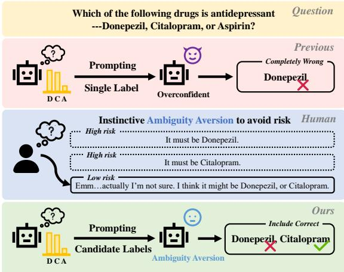
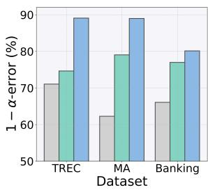
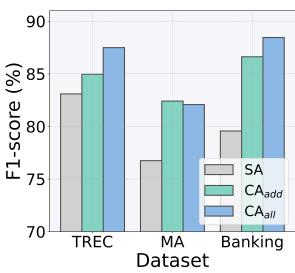
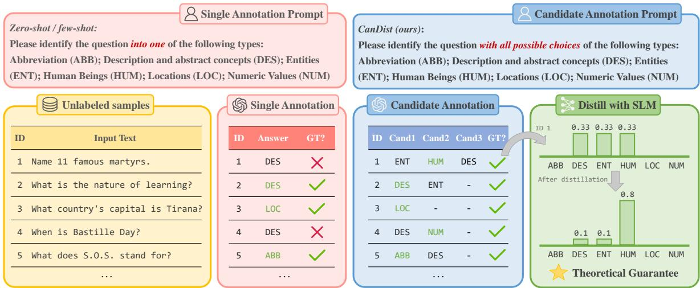
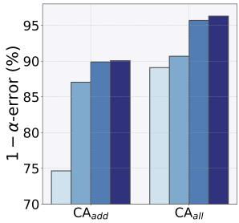
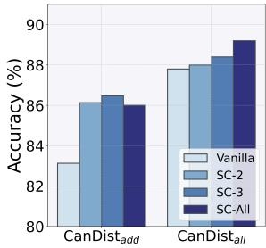
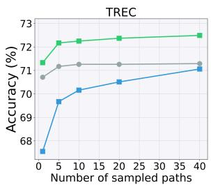
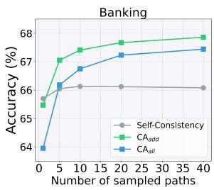
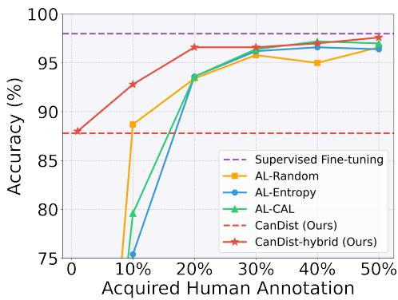

# Prompt Candidates, then Distill: A Teacher-Student Framework for LLM-driven Data Annotation

Mingxuan Xia1, Haobo Wang1\*, Yixuan Li2, Zewei Yu1,

Jindong Wang3, Junbo Zhao1, Runze Wu4

1Zhejiang University 2University of Wisconsin Madison

3William & Mary 4NetEase Fuxi AI Lab

{xiamingxuan,wanghaobo,22451274,j.zhao}@zju.edu.cn sharonli@cs.wisc.edu,jwang80@wm.edu,wurunze1@corp.netease.com

## Abstract

Recently, Large Language Models (LLMs) have demonstrated significant potential for data annotation, markedly reducing the labor costs associated with downstream applications. However, existing methods mostly adopt an aggressive strategy by prompting LLM to determine a single gold label for each unlabeled sample. Due to the inherent uncertainty within LLMs, they often produce incorrect labels for difficult samples, severely compromising the data quality for downstream applications. Motivated by ambiguity aversion in human behaviors, we propose a novel candidate annotation paradigm wherein large language models are encouraged to output all possible labels when incurring uncertainty. To ensure unique labels are provided for downstream tasks, we develop a teacher-student framework CanDist that distills candidate annotations with a Small Language Model (SLM). We further provide a rigorous justification demonstrating that distilling candidate annotations from the teacher LLM offers superior theoretical guarantees compared to directly using single annotations. Extensive experiments across six text classification tasks validate the effectiveness of our proposed method. The source code is available at https: //github.com/MingxuanXia/CanDist.

## 1 Introduction

Various NLP tasks require collecting high-quality labeled data for model training (e.g. text classification (Kowsari et al., 2019), named entity recognition (Li et al., 2022a), and sentiment analysis (Wankhade et al., 2022)), which typically involves human experts meticulously providing high-quality target labels, a process that is notoriously timeconsuming and labor-intensive. With the development of Large Language Models (OpenAI, 2023; Anil et al., 2023; Dubey et al., 2024), LLM-driven automatic data annotation approaches have been proposed (Gilardi et al., 2023; Tan et al., 2024; Long et al., 2024), relieving the burden of the costprohibitive human annotation.

  
Figure 1: When facing uncertainty, humans instinctively behave ambiguity aversion to avoid risk, which motivated us to prompt LLM for candidate annotations (multiple possible answers), increasing the likelihood of providing the correct labels.

Although LLMs excel at general language understanding and generation, their knowledge of downstream tasks remains limited (Li et al., 2024). As a result, LLMs may be uncertain about some samples during annotation. Nevertheless, existing LLMdriven annotation methods prompt LLMs with single annotation, which forces the model to assign a specific label to each unlabeled sample—even when it is unsure. This often leads to completely wrong annotations, which is not only a waste of computational resources but also affects downstream training (Zhu et al., 2022). Moreover, it necessitates further error localization and re-labeling, which is both costly and time-consuming. This raises a critical question: Can we induce LLMs to provide a more valuable annotation rather than a completely wrong label when they are uncertain?

To answer this question, we first draw an analogy to human behavior—when faced with uncertainty, humans often behave conservatively instead of being overconfident—an instinctive psychological phenomenon known as Ambiguity Aversion (Fox and Tversky, 1995; Maccheroni et al., 2006). This behavior helps people mitigate severe risks and ensures the lower bound of the gains. Motivated by this, we propose to induce LLMs to exhibit ambiguity aversion during annotation, by prompting them to provide multiple possible labels for each unlabeled sample, i.e., candidate annotations. As shown in Figure 1, although the LLM may fail to provide a correct answer with a single label, answering with candidate labels successfully includes the correct one. We further demonstrate in Figure 2 that, on a macro level, candidate annotations are more likely to cover correct labels (higher 1  α-error) and retain more value (higher F1-score) than single annotations. Note that, unlike methods such as Self-Consistency (Wang et al., 2023), prompting candidates is asking for the inherent uncertainty rather than randomness, see Table 4 for detailed discussion.

  
Figure 2: Comparison of 1 α-error and F1-score between single annotations (SA) and candidate annotations (CA) by GPT-3.5. Higher metric values indicate better results. See section 3.2 for details.

Despite its great potential, however, candidate annotations cannot be directly applied to downstream tasks, as they require one specific label for each sample. To address this issue, we draw inspiration from knowledge distillation (Hinton et al., 2015) where the student model is distilled from the teacher’s output distribution and exhibits better generalization on downstream tasks (Phuong and Lampert, 2019), and propose a teacher-student framework called CanDist that distills high-quality knowledge from the teacher LLM’s candidate annotations to a student Small Language Model (SLM) to achieve data annotation. Specifically, we introduce a distribution refinery (DR) mechanism during distillation that dynamically adjusts the training target based on SLM’s predictions, where correct labels gradually emerge from those false positive ones. Theoretically, we justify that distillingfrom candidate annotationsfrom the teacher LLM offers superior theoretical guarantees than directly using the single annotationsfrom the teacher LLM. Empirically, we evaluate CanDist on six text classification tasks, where CanDist achieves state-of-the-art among various LLM and SLM baselines.

## 2 Related Work

## 2.1 LLM for Data Annotation

LLM-driven data annotation has been applied in various NLP tasks, such as text classification (Gilardi et al., 2023), relation extraction (Ding et al., 2023), named entity recognition (Ye et al., 2024), question answering (He et al., 2024b), semantic parsing (Shin et al., 2021), and multilingual text generation (Choi et al., 2024). Advanced approaches adopt techniques like in-context learning (Brown et al., 2020; Xiao et al., 2023; Liu et al., 2024), chain-of-thought prompting (Wei et al., 2022; He et al., 2024b; Yuan et al., 2024), and collaboration with fine-tuned SLMs (Xiao et al., 2023; Xu et al., 2024; Yang et al., 2024) to boost LLM’s zero-shot performance for annotations.

However, these approaches limit LLMs to provide single annotations, which inevitably introduce completely wrong labels. In contrast, we investigate a more conservative strategy by prompting LLMs for candidate annotations, which offers greater value. Besides, while FreeAL (Xiao et al., 2023), the pioneering work of SLM-collaborated annotation, has demonstrated the effectiveness of distilling the SLM from LLM’s single annotations, we propose that distilling from candidate annotations yields superior results and we rigorously provide its theoretical guarantees.

## 2.2 Generate and Aggregate Multiple Answers with LLM

Recently, solving NLP tasks by generating multiple diverse answers using LLMs and then aggregating them to extract their essences has been increasingly popular. Sampling-based strategy first samples a diverse set of reasoning paths during LLM decoding, and then integrate them through methods such as trained ranking models (Cobbe et al., 2021; Shen et al., 2021; Thoppilan et al., 2022), majority voting (Wang et al., 2023; Fu et al., 2023; Li et al., 2022b), LLMs (Chen et al., 2023; Weng et al., 2023; Zhang et al., 2024b), or human feedback (Li,

Table 1: Key prompts of prompting single (SA) and candidate $\mathrm { ( C A _ { a d d } }$ and $\mathrm { C A } _ { \mathrm { a l l } } )$ annotations on the TREC dataset.
<table><tr><td>Strategy</td><td>Prompt</td></tr><tr><td>SA</td><td>Given a question: ... What does the question ask about? Please identify the question into one of the following types: Abbreviation; Description and abstract concepts; Entities; Human beings; Locations; Numeric values.</td></tr><tr><td> $\mathrm { C A } _ { \mathrm { a d d } }$ </td><td>Given a question: ... What does the question ask about? Please identify the question into one of the following types: Abbreviation; Description and abstract concepts; Entities; Human beings; Locations; Numeric values. If you are unsure about your answer, please include other potential choices.</td></tr><tr><td> $\mathrm { C A } _ { \mathrm { a l l } }$ </td><td>Given a question: .. . What does the question ask about? Please identify the question with all possible choices of the following types: Abbreviation; Description and abstract concepts; Entities; Human beings; Locations; Numeric values.</td></tr></table>

2024). Ensemble-based methods generate multiple answers by gathering outputs from different prompt designs, such as different prompt formats (Zhou et al., 2022; Yue et al., 2023; Zhang et al., 2024a) or different permutations of few-shot examples (Zhao et al., 2021; Lu et al., 2022; Lazaridou et al., 2022). Additionally, a few approaches propose to directly prompt candidates, in the applications of model calibration (Tian et al., 2023; Xiong et al., 2024) and open-domain QA (Kim et al., 2024).

However, sampling and ensemble-based methods rely on the randomness of LLMs, making them costly and inefficient in providing enough valuable annotations compared to prompting candidates. Moreover, this paper proposes a novel aggregation strategy that leverages an SLM to distill high-quality annotations from the multiple labels provided by the LLM.

## 3 Proposed Method

## 3.1 Preliminaries

In this paper, we consider the task of text classification, where an unsupervised dataset $\mathcal { D } = \{ { \pmb x } _ { i } \} _ { i = 1 } ^ { n }$ with n samples is provided. Given the label space $\mathcal { V } ~ = ~ \{ 1 , \ldots , C \}$ with corresponding semantic meanings, each sample $\mathbf { \boldsymbol { x } } \in \mathcal { X }$ is associated with a ground-truth label $y \in \mathcal { V }$ , which is inaccessible. In LLM-driven data annotation, an LLM serves as the annotator, providing labels for the unlabeled samples in . Most existing methods prompt LLMs to provide a Single Annotation (SA), i.e., a specific label $\tilde { y } _ { i } \in \mathcal { V }$ for each x .

## 3.2 Prompt Candidate Annotations by LLM

However, LLM’s knowledge of downstream tasks remains limited (Li et al., 2024), making them uncertain about some samples during data annotation. In this case, prompting with single annotations may force the LLM to behave over-confidently and generate completely incorrect answers, which not only wastes computational resources but also harms downstream processes. To tackle this problem, we propose to prompt LLM with Candidate Annotations (CA), namely, a set of multiple possible labels $s \subseteq y , s \neq \emptyset$ . Our motivation stems from a human psychological phenomenon known as Ambiguity Aversion (Fox and Tversky, 1995; Maccheroni et al., 2006), where people tend to behave conservatively when facing uncertainty, which helps mitigate severe risks and ensures the lower bound of the gains. Prompting candidate annotations can inject ambiguity aversion into LLMs, which increases the likelihood of including correct labels in LLM’s output, see examples in Figure 3.

Specifically, we investigate two strategies for querying candidates: 1) $\mathrm { C A } _ { \mathrm { a d d } }$ prompts the LLM to generate one answer first and then provide additional answers if it is not sure; 2) $\mathrm { C A } _ { \mathrm { a l l } }$ prompts the LLM to generate all possible answers. Table 1 shows the key prompts of different prompting strategies on the TREC dataset and the full prompts can be found in Appendix D.

CA Exhibits Better Statistical Properties. In this paragraph, we directly assess the value of candidate annotations. Regarding the annotation process as label space pruning, we employ the metrics introduced in (He et al., 2024a): 1) 1 α- error, where $\begin{array} { r } { \alpha = \frac { 1 } { n } \sum _ { i = 1 } ^ { n } \mathbb { I } [ y _ { i } \notin s _ { i } ] } \end{array}$ , measuring how the candidates include the correct labels; 2) $\beta { \mathrm { - c o v e r a g e } }$ , where $\begin{array} { r } { \beta = \frac { 1 } { n } \sum _ { i = 1 } ^ { n } \frac { C - \left| { s _ { i } } \right| } { C - 1 } } \end{array}$ , measuring how the answers shrink the original search space; 3) F1-score, which comprehensively considers both metrics, namely, $\begin{array} { r } { \mathrm { F } 1 = \overset { \mathrm { \hat { 2 } } ( 1 - \alpha ) \beta } { 1 - \alpha + \beta } } \end{array}$

Figure 2 demonstrates the assessment results of 1 α-error and F1-score on three text classification tasks annotated by GPT-3.5, where both $\mathrm { C A } _ { \mathrm { a d d } }$ and $\mathrm { C A } _ { \mathrm { a l l } }$ improves the two metrics compared to SA. Notably, by prompting all possible labels, $\mathrm { C A } _ { \mathrm { a l l } }$ outperforms SA by margins of 18.01%, 26.71%, 14.06% of 1 α-error on the three datasets, indicating the strong ability to include gold labels of prompting candidate annotations. The higher F1-scores further illustrate that while containing more correct labels, CA also effectively shrinks the search space, indicating its great value. The full assessment results are in Appendix B.1.

  
Figure 3: The overall framework of CanDist, which first prompts the LLM to provide candidate annotations, and then distills an SLM to identify the correct labels. Examples on the TREC dataset annotated by GPT-3.5 demonstrate that though the LLM fails to provide a correct answer with a single label, answering with candidate labels successfully includes the correct one. We also provide theoretical guarantees for our proposed CanDist framework.

## 3.3 Distill Candidate Annotations by SLM

Though candidate annotations demonstrate great potential, they cannot be directly applied to downstream tasks where specific labels are required. To address this, we propose a teacher-student framework CanDist that trains an SLM student $s$ on the teacher LLM’s candidate annotations, allowing the SLM to provide unique annotations. This is inspired by knowledge distillation (Hinton et al., 2015), where the student model is distilled from the teacher model’s output distribution and can better generalize to downstream tasks (Phuong and Lampert, 2019; Jeong and Chung, 2025). The overall framework of CanDist is shown in Figure 3.

Nevertheless, with multiple false positive labels, training the SLM on the uniform distribution of candidate labels is suboptimal. Therefore, we propose a Distribution Refinery (DR) strategy, which dynamically adjusts the target distribution based on the SLM’s prediction. This is motivated by the memorization effect of deep neural networks (DNNs) (Zhang et al., 2017), where the SLM can first remember easy patterns, making a proportion of true labels emerge from those false positive ones. Formally, the refined distribution $\pmb q _ { i }$ for sample $\mathbf { \nabla } _ { \mathbf { x } _ { i } }$ at each training iteration t is computed as the renormalized prediction among candidate labels:

$$
\begin{array} { r } { q _ { i j } ^ { t } = \left\{ \begin{array} { l l } { \mathbb { I } ( j \in s _ { i } ) \cdot \frac { 1 } { | s _ { i } | } , } & { t = 0 } \\ { \mathbb { I } ( j \in s _ { i } ) \cdot p _ { i j } ^ { t - 1 } / \sum _ { k \in s _ { i } } p _ { i k } ^ { t - 1 } , } & { t > 0 } \end{array} \right. } \end{array}\tag{1}
$$

where $\mathbf { \Delta } _ { p _ { i } ^ { t } } ^ { t }$ denotes the SLM’s softmax output of sample $\mathbf { \delta } _ { \mathbf { \mathcal { X } } _ { i } }$ at iteration $t , q _ { i }$ is the distribution vector which is initialized from a uniform distribution.

Filter Out-of-Candidate Samples. Although candidate annotations are more likely to include the correct labels, there are still a few samples whose true label lies outside the candidate set, which can disrupt SLM distillation. To this end, we filter out these samples by judging whether the SLM’s max prediction lies beyond the candidate set:

$$
\mathcal { D } _ { \mathrm { o u t } } = \{ \pmb { x } _ { i } | \operatorname { a r g m a x } _ { c \in \mathcal { V } } p _ { i c } \notin s _ { i } \}\tag{2}
$$

Distribution Sharpening for Reliable Samples. We further propose to select reliable samples in $\mathcal { D } _ { \mathrm { i n } } = \mathcal { D } - \mathcal { D } _ { \mathrm { o u t } }$ and sharpen their target distributions to guide the distillation process. To assess the reliability, we again leverage the memorization effect of DNNs where clean samples always pose small losses (Han et al., 2018). Specifically, we select small loss samples in a class-wise manner to ensure balanced training progress across all classes. Formally, the reliable set is calculated as:

Algorithm 1 Pseudo-code of CanDist   
Input: Unlabeled dataset , teacher LLM , and   
student SLM   
1: Generate candidate annotations s using by   
prompting strategy $\mathrm { C A } _ { \mathrm { a d d } }$ or $\mathrm { C A } _ { \mathrm { a l l } }$   
2: for $e p o c h = 1 , 2 , . . .$ , do   
3: Filter out-of-candidate samples by Eq.(2)   
4: Select class-wise reliable samples by Eq.(3)   
5: Select high confidence samples by Eq.(4)   
6: for batch = 1, 2, . . . , do   
7: Compute pseudo-labels by Eq.(1) and (5)   
8: Calculate training loss $\mathcal { L } _ { d r }$ by Eq.(5)   
9: Train by optimizing $\mathcal { L } _ { d r }$   
10: end for   
11: end for   
Output: Student SLM for annotation

$$
\begin{array} { r l } & { \mathcal { D } _ { \mathrm { s l } } = \bigcup _ { c \in \mathcal { V } } \mathcal { D } _ { \mathrm { s l } } ^ { c } , \mathrm { ~ w h e r e ~ } } \\ & { \mathcal { D } _ { \mathrm { s l } } ^ { c } = \{ \mathbf { x } _ { i } | l _ { i } \in \mathcal { L } _ { \delta } ^ { c } , l _ { i } = l _ { \mathrm { c e } } ( \boldsymbol { p } _ { i } , \boldsymbol { q } _ { i } ) \} } \end{array}\tag{3}
$$

and $l _ { \mathrm { c e } }$ denotes the cross-entropy loss, and $\mathcal { L } _ { \delta } ^ { c }$ denotes the top-δ percent smallest losses of samples whose max prediction is class c. For samples in $\mathcal { D } _ { \mathrm { s l } } ,$ we use a pre-defined temperature γ to sharpen their re-normalized distribution.

Besides, we regard those samples in $\mathcal { D } _ { \mathrm { o u t } }$ that gradually pose high confidence as reliable samples:

$$
\mathcal { D } _ { \mathrm { h c } } = \{ \pmb { x } _ { i } | \operatorname* { m a x } _ { c \in \mathscr { V } } p _ { i c } > \tau \} \subset \mathcal { D } _ { \mathrm { o u t } }\tag{4}
$$

where we use their predicted class as the training target. τ is a pre-defined high threshold.

Overall Distillation Object. The overall training objective of Distribution Refinery is formalized as:

$$
\begin{array} { l } { { \displaystyle { \mathcal { L } } _ { \mathrm { d r } } = \frac { 1 } { n } \sum _ { i = 1 } ^ { n } l _ { \mathrm { c e } } ( { \bf p } _ { i } , \hat { \bf q } _ { i } ) , ~ \mathrm { w h e r e } \ ~ } } \\ { { \displaystyle \hat { q } _ { i j } = \left\{ \begin{array} { l l } { { \displaystyle q _ { i j } ^ { 1 / \gamma } / \sum _ { c \in \mathcal { Y } } q _ { i c } ^ { 1 / \gamma } } , } & { { \displaystyle x _ { i } \in \mathcal { D } _ { \mathrm { s l } } } } \\ { { \displaystyle q _ { i j } , } } & { { \displaystyle x _ { i } \in \mathcal { D } _ { \mathrm { i n } } - \mathcal { D } _ { \mathrm { s l } } } } \\ { { \displaystyle \mathbb { I } ( j = \arg \operatorname* { m a x } p _ { i j } ) } , } & { { \displaystyle x _ { i } \in \mathcal { D } _ { \mathrm { h c } } } } \end{array} \right. } } \end{array}\tag{5}
$$

Algorithm 1 shows the pseudo-code of CanDist.

## 4 Theoretical Analysis

In this section, we further theoretically explain why prompting and then distilling candidate annotations leads to better results. Since there is still a lack of theoretical understanding of LLMs, we simplify this problem by treating the LLM as a traditional teacher model, focusing on whether the SLM can distill better results from candidate labels. While most existing knowledge distillation theories illustrate the advantages of distilling from the teacher’s output distribution (Phuong and Lampert, 2019; Das and Sanghavi, 2023), we analyze distilling from the teacher’s candidate annotations (top-k outputs), wherein the student SLM distilled from teacher LLM’s candidate annotations demonstrate more noise-tolerant than the teacher LLM, as well as the SLM distilled from LLM’s single annotations.

Theorem 1 Considering the scenario that both the teacher LLM and student SLM are composed of a feature extractor $\pmb { g } ( \cdot ) \ : \ \pmb { \chi } \ \mapsto \ \mathbb { R } ^ { d }$ (with different scales) and a classifier $W ~ \in ~ \mathbb { R } ^ { d \times C }$ The teacher LLM is pre-trained on an inaccurate dataset $\tilde { \mathcal { D } } \ = \ \{ { \bf x } _ { i } , \tilde { y } _ { i } \} _ { i = 1 } ^ { m }$ with noise rates $\{ R _ { c , c ^ { \prime } } \} _ { c = 1 , c ^ { \prime } = 1 } ^ { C , C } { } ^ { 1 }$ , where m denotes the number of samples in the dataset and $\boldsymbol { R } _ { c , c ^ { \prime } }$ indicates the probability of label c being flipped to c′. After pretraining, the student SLM is then trained based on the teacher LLM’s single (top-1) or candidate (top-2) annotations on $\tilde { \mathcal { D } } .$ . Suppose the models are trained by l2-regularized cross-entropy loss with regularization parameter λ, and the feature extractors arefixed. Besides, we consider that thefeature similarity between different samplesfrom the same class and different classes are a and b respectively, with $1 > a > b > 0$

Then, with m  , the condition of achieving 100% accuracy (correctly predicting all training data) for the teacher LLM, as well as the student SLM distilled from LLM’s top-1 prediction is:

$$
\pmb { R } _ { c , c ^ { \prime } } + \sum _ { i \neq c } \pmb { R } _ { c , i } < 1 - \frac { \theta } { \phi - \theta } , \forall c , c ^ { \prime } \neq c
$$

$$
\begin{array} { c } { { w h e r e \theta = 1 - \displaystyle \frac { C m \lambda } { C m \lambda + 1 - a } , } } \\ { { \phi = 1 - \displaystyle \frac { C m \lambda } { C m \lambda + \displaystyle \frac { m } { C } ( a - b ) + 1 - a } } } \end{array}\tag{6}
$$

and the condition of that for the student SLM distilledfrom LLM’s top-2 prediction is:

$$
\pmb { R } _ { c , c ^ { \prime } } + \sum _ { i \neq c } \pmb { R } _ { c , i } < 1 , \forall c , c ^ { \prime } \neq c\tag{7}
$$

Table 2: Comparisons of Accuracies (%) on the training and testing sets of different tasks. $\mathrm { C a n D i s t _ { a d d } }$ and CanDistall apply $\mathrm { C A } _ { \mathrm { a d d } }$ and $\mathrm { C A } _ { \mathrm { a l l } }$ to prompt candidates respectively. The best results are bold and the second best is underlined.
<table><tr><td rowspan="2">Method</td><td colspan="6">Training Set</td><td colspan="6">Testing Set</td></tr><tr><td>TREC</td><td>MA</td><td>DBP</td><td>AGN</td><td>RCT</td><td>BANK</td><td>TREC</td><td>MA</td><td>DBP</td><td>AGN</td><td>RCT</td><td>BANK</td></tr><tr><td>Zero-shot</td><td>62.84</td><td>62.03</td><td>93.33</td><td>87.72</td><td>61.41</td><td>65.19</td><td>72.20</td><td>63.12</td><td>93.94</td><td>87.24</td><td>61.83</td><td>68.41</td></tr><tr><td>Few-shot</td><td>71.07</td><td>62.28</td><td>95.41</td><td>88.73</td><td>65.18</td><td>66.08</td><td>77.20</td><td>63.40</td><td>95.40</td><td>88.05</td><td>65.85</td><td>68.86</td></tr><tr><td>CoT</td><td>71.88</td><td>60.05</td><td>91.85</td><td>83.23</td><td>60.06</td><td>57.54</td><td>80.60</td><td>61.15</td><td>92.44</td><td>83.05</td><td>60.43</td><td>60.97</td></tr><tr><td>SC</td><td>71.06</td><td>62.29</td><td>95.60</td><td>88.80</td><td>65.50</td><td>66.08</td><td>76.00</td><td>63.26</td><td>95.42</td><td>87.96</td><td>65.85</td><td>68.99</td></tr><tr><td>AnnoLLM</td><td>73.73</td><td>59.71</td><td>95.62</td><td>85.52</td><td>68.13</td><td>67.04</td><td>79.60</td><td>59.56</td><td>95.34</td><td>85.39</td><td>68.53</td><td>70.29</td></tr><tr><td>SuperICL</td><td>76.05</td><td>62.81</td><td>97.55</td><td>89.16</td><td>66.80</td><td>69.91</td><td>81.60</td><td>63.75</td><td>97.63</td><td>88.79</td><td>67.82</td><td>73.25</td></tr><tr><td>Distillation</td><td>76.04</td><td>62.45</td><td>97.52</td><td>89.13</td><td>66.86</td><td>69.83</td><td>81.00</td><td>63.54</td><td>97.61</td><td>88.29</td><td>67.66</td><td>72.40</td></tr><tr><td>FreeAL</td><td>78.24</td><td>62.89</td><td>97.76</td><td>89.58</td><td>67.57</td><td>71.38</td><td>82.33</td><td>64.13</td><td>97.92</td><td>88.64</td><td>68.32</td><td>74.58</td></tr><tr><td> $\mathrm { C a n D i s t _ { a d d } }$ </td><td>80.87</td><td>63.31</td><td>98.67</td><td>89.91</td><td>68.69</td><td>72.92</td><td>83.13</td><td>64.23</td><td>98.72</td><td>89.46</td><td>69.77</td><td>76.27</td></tr><tr><td>CanDistall</td><td>79.73</td><td>63.76</td><td>98.54</td><td>89.29</td><td>68.90</td><td>72.94</td><td>87.80</td><td>64.20</td><td>98.65</td><td>88.78</td><td>70.57</td><td>75.97</td></tr><tr><td>SFT</td><td>-</td><td></td><td>-</td><td>-</td><td>1</td><td></td><td>97.80</td><td>64.54</td><td>98.78</td><td>92.29</td><td>84.52</td><td>93.31</td></tr></table>

The proof is provided in Appendix C. The theorem illustrates that the SLM distilling top-2 predictions from the teacher LLM achieves 100% accuracy with a more tolerant condition on label noise than using the top-1 prediction, which theoretically demonstrates the great potential of the paradigm that first generates candidates by the teacher LLM and then distilling them using a student SLM.

## 5 Experiments

In this section, we report our empirical results to show the superiority of CanDist. We refer the readers to the Appendix for more details and results.

## 5.1 Setup

Datasets. We conduct experiments on the following six text classification datasets, namely, TREC (Li and Roth, 2002) for topic classification, Medical Abstract (MA) (Schopf et al., 2022) for medical diagnosis classification, DBpedia (DBP) for ontology classification (Zhang et al., 2015), AGNews (AGN) (Gulli, 2005) for news topic classification, RCT (Dernoncourt and Lee, 2017) for content type classification in medical abstracts, and Banking (BANK) (Casanueva et al., 2020) for intent classification in banking dialogues.

Baselines. We adopt the following LLM-based or SLM-based baselines: Zero-shot and Few-shot (Liu et al., 2022) directly prompt for single annotations without/with few-shot examples; CoT (Kojima et al., 2022) employs chain-of-thought prompting by adding "Let’s think step by step" before each answer; Self-Consistency (SC) (Wang et al., 2023)

samples diverse reasoning paths and generates the answer by majority voting; AnnoLLM (He et al., 2024b) provides explanations for few-shot examples to boost performance; SuperICL (Xu et al., 2024) first trains an SLM using labeled data and uses its output and confidence as references during LLM annotation; Distillation distill an SLM from LLM’s single annotation and use the SLM to provide the final annotation; FreeAL (Xiao et al., 2023) introduces a robust training mechanism to improve generalization when distilling the SLM from single annotations, where we apply 1 round of annotation-distillation for a fair comparison. Note that few-shot examples are applied to CanDist and all baselines except Zero-shot and CoT. Besides, for SuperICL, LLM’s single annotations are leveraged to train the plug-in SLM.

Performance Evaluation. We evaluate the annotation accuracy on both the training and testing set. For SLM-based methods (Distillation, FreeAL, and our method), the unlabeled training set is first annotated by the LLM, and then the SLM is trained on this training set to provide annotations. We also report the testing results of supervised fine-tuning (SFT) where the SLM is trained on the humanlabeled training dataset. For all experiments, we run three times and report the averaged results.

Implementation Details. We exploit GPT-3.5 as the LLM annotator (see results of more advanced LLMs in Appendix B.2) and RoBERTa-Base (Liu et al., 2019) as the SLM for all tasks except MA, where BioMed-RoBERTa-Base (Gururangan et al., 2020) is used to boost performance for the medical task. We set the number of few-shot examples as 10 for all tasks except 5 for MA due to limited context length. Since we cannot access labeled samples, the few-shot examples are LLM-generated (Xiao et al., 2023). For sampling-based baseline SC, we sample the decoding path 5 times with a temperature of 0.5. For other LLM generation processes, the temperature is set to a lower value of 0.3. More details of training SLM are in Appendix A.3.

Table 3: Comparison with selecting answers from candidates using LLM on the training sets. Results of single annotations (Few-shot) are also listed for the sake of comparison.
<table><tr><td>Ablation</td><td>TREC</td><td>MA</td><td>DBP</td><td>AGN</td><td>RCT</td><td>BANK</td><td>Avg.</td></tr><tr><td> $\mathbf { C a n D i s t _ { a d d } }$  with LLM Select</td><td>80.87</td><td>63.31</td><td>98.67</td><td>89.91</td><td>68.69</td><td>73.50</td><td>79.16</td></tr><tr><td rowspan="2"> $\mathbf { C a n D i s t _ { a l l } }$ </td><td>72.87 (-8.00)</td><td>63.42 (+0.11)</td><td> $9 6 . 3 8 \ ( - 2 . 2 9 )$ </td><td> $8 8 . 3 3 \ ( - 1 . 5 8 )$ </td><td>63.17 (-5.52)</td><td>68.33 (-5.16)</td><td>75.42 (-3.74)</td></tr><tr><td>79.73</td><td>63.76</td><td>98.54</td><td>89.29</td><td>68.90</td><td>72.94</td><td>78.86</td></tr><tr><td>with LLM Select</td><td>70.95 (-8.78)</td><td>63.18 (-0.58)</td><td>96.30 (-2.24)</td><td> $8 8 . 2 3 \ ( - 1 . 0 6 )$ </td><td> $6 3 . 6 7 \ ( - 5 . 2 3 )$ </td><td>67.42 (-5.52)</td><td>74.96 (-3.90)</td></tr><tr><td>Few-shot</td><td>71.07</td><td>62.28</td><td>95.41</td><td>88.73</td><td>65.18</td><td>66.08</td><td>74.79</td></tr></table>

## 5.2 Main Results

The comparison results on the training and testing sets are shown in Table 2 where the best results are shown in bold and the second best is underlined. Overall, CanDist outperforms all baselines on all tasks. For example, on the testing set of TREC, CanDist improves the best baseline by a large margin of 5.47%. Also, in the tasks of MA and DBpedia, CanDist achieves competitive testing performance on par with supervised fine-tuning. The superior results against all baselines imply the effectiveness of our proposed CanDist framework.

Specifically, CanDist largely improves Zero-shot and Few-shot, where $\mathrm { C a n D i s t _ { a d d } }$ and $\mathrm { C a n D i s t _ { a l l } }$ outperform Few-shot by averaged improvements of 5.48% and 6.10% on the testing set, and 7.03% and 6.63% on the training set. Though effective in reasoning tasks, CoT prompting performs poorly in most annotation tasks and self-consistency achieves similar results with Few-shot. AnnoLLM improves Few-shot in several tasks by providing explanations on input examples. However, these LLMbased methods underperform SLM-based methods, where SLM can distill the high-quality task-related knowledge from the LLM’s annotation. Regarding the knowledge of SLM as a reference, SuperICL slightly improves the performance of Distillation. FreeAL further improves Distillation through a robust training objective that tackles label noise. For CanDist, we declare that there is a trade-off between the number of candidates and the accuracy since more candidates are more challenging to identify while fewer candidates contain fewer correct labels. Though $\mathrm { C A } _ { \mathrm { a l l } }$ generally retrieves more labels than $\mathrm { C A } _ { \mathrm { a d d } }$ , we suppose that the performance of different prompting strategies depends on tasks, and both strategies achieve state-of-the-art results.

Table 4: Comparison with other candidate generation strategies on TREC, where 1 α-error, average number of labels (#Labels), and testing accuracy are reported
<table><tr><td>Strategy</td><td>1-α</td><td>#Labels</td><td>Accuracy</td></tr><tr><td>5 sampled paths</td><td>77.59</td><td>1.17</td><td>81.40</td></tr><tr><td>10 sampled paths</td><td>79.92</td><td>1.25</td><td>81.73</td></tr><tr><td>20 sampled paths</td><td>82.36</td><td>1.32</td><td>82.27</td></tr><tr><td>40 sampled paths</td><td>84.30</td><td>1.39</td><td>82.33</td></tr><tr><td>5 example orders 5 prompt formats</td><td>79.15</td><td>1.21</td><td>81.27</td></tr><tr><td></td><td>83.82</td><td>1.30</td><td>82.67</td></tr><tr><td> $\mathrm { C a n D i s t _ { a d d } }$ </td><td>74.65</td><td>1.07</td><td>83.13</td></tr><tr><td> $\mathrm { C a n D i s t _ { a l l } }$ </td><td>89.09</td><td>1.70</td><td>87.80</td></tr></table>

## 5.3 Analysis

Comparison with Other Candidate Generation Strategies. To show the superiority of generating candidates by prompting, we compare the following two candidate generation strategies: 1) sampling-based strategy (Wang et al., 2023) samples $K = 5 , 1 0 , 2 0$ , 40 paths and gathers them into a candidate set; 2) ensemble-based strategy gathers the answers from diverse prompting results, where we consider prompting with 5 few-shot example orders (Zhao et al., 2021) and 5 prompting formats (Gao et al., 2021). To evaluate the generated candidates, we report their 1  α-error, average number of labels, and the testing accuracy of SLM trained by our proposed Distribution Refinery objective.

Table 4 demonstrates that by retrieving more candidate labels, $\mathrm { C a n D i s t _ { a l l } }$ enjoys much higher 1 α-error than other methods and achieves the highest testing accuracy. Moreover, $\mathrm { C a n D i s t _ { a d d } }$ also outperforms the sampling and ensemble-based methods even if it retrieves fewer candidates, indicating that directly prompting candidates results in more valuable annotation. For the sampling-based method, though incorporating more sampled paths offers a higher 1  α-error, the increment in testing accuracy remains limited. Besides, sampling and ensemble-based strategies suffer from more costs in querying LLMs while promoting candidates only need to prompt and sample once.

Table 5: Key prompt for selecting answers from candidate annotations on the TREC dataset.
<table><tr><td>Prompt of selecting the answer from candidates</td></tr><tr><td>Given a question: . .. What does this question ask about? It is known that the answer belongs to one of the following classes: .... Please select the correct answer from them.</td></tr></table>

Table 6: Ablation study on Distribution Refinery mechanism on the testing set of TREC and Banking.
<table><tr><td>Ren.</td><td>Out.</td><td>Sha.</td><td>Cla.</td><td>Hig.</td><td>TREC</td><td>BANK</td></tr><tr><td></td><td></td><td></td><td></td><td></td><td>82.47</td><td>71.40</td></tr><tr><td>√</td><td></td><td></td><td></td><td></td><td>85.47</td><td>74.88</td></tr><tr><td>√</td><td>√</td><td></td><td></td><td></td><td>86.60</td><td>75.13</td></tr><tr><td>√</td><td>√</td><td>√</td><td></td><td></td><td>87.07</td><td>74.99</td></tr><tr><td>√</td><td>√</td><td>√</td><td>√</td><td></td><td>87.40</td><td>75.70</td></tr><tr><td>√</td><td>√</td><td>√</td><td>√</td><td>√</td><td>87.80</td><td>75.97</td></tr></table>

Comparison with Selecting Answers from Candidates using LLM. To validate the effectiveness of our proposed teacher-student framework for identifying the correct label from candidate labels, we compare CanDist with its variant, CanDist with LLM Select, which directly queries LLM to select the correct label from the given candidate annotations. The key prompt for selecting the answer from candidates is shown in Table 5. As shown in Table 3, LLM selection suffers from performance drops compared with CanDist on most tasks, which demonstrates the superiority of our proposed teacher-student framework. Moreover, we found that CanDist with LLM Selection slightly outperforms single annotations (Few-shot), indicating that the paradigm of prompting candidates and then selecting from them is better than direct prompting for a single label.

Ablation Study on Distribution Refinery. To demonstrate the effectiveness of different components in DR, we run CanDistall with varying combinations of the components. We denote the components in DR as 1) Ren. for the re-normalization function in Eq.(1); 2) Out. for filtering out-ofcandidate samples; 3) Sha. for whether employing distribution sharpening for reliable samples; 4) Cla. for whether select small loss samples in a class-wise manner; 5) Hig. for whether using high confidence samples as reliable samples. As shown in Table 6, distilling from re-normalized distribution improves the vanilla version (trained on cross-entropy loss) by a large margin, i.e., 3.00% for TREC and 3.70% for Banking. DR also helps by filtering out-of-candidate samples and sharpening the target distribution, where class-wise selection is essential for employing distribution sharpening, which balances the training progress across all classes. High-confidence label assignment further improves the performance by maximizing the utility of the out-of-candidate samples.

  
Figure 4: Comparison of 1  α on TREC’s training set (left) and accuracy on the testing set (right) between different collaboration strategies with self-consistency.

Synergism with Self-Consistency. We further show that our vanilla method can work collaboratively with Self-Consistency (SC). Specifically, we first prompt LLMs with candidate labels and sample K = 40 answers $\{ s _ { j } \} _ { j = 1 } ^ { K }$ , and then calculate the frequency for each class c by $\textstyle \sum _ { j = 1 } ^ { K } \mathbb { I } ( c \in s _ { j } )$ to filter the top-k frequent labels as candidate annotations. We name this strategy as SC-k and we also define SC-All as using all the appeared labels as candidate labels. As shown in Figure 4, the comparison on 1 α-error illustrates that collaborating with SC further increases the diversity of candidate labels which includes more correct labels, and this also yields a higher accuracy for the final annotation, as shown on the right. Further discussion on SC-1 can be found in Appendix B.3.

## 6 Conclusion

In this work, we study LLM-driven data annotation by proposing a novel teacher-student framework,

CanDist, which first prompts the teacher LLM to generate candidate labels and then distill a student SLM to identify the true labels. We illustrate that candidate annotations exhibit better statistical properties and theoretically justify that distilling from LLM’s candidate annotations is more noisetolerant. Empirically, we show that CanDist outperforms various LLM and SLM-based methods. We hope our work will inspire future research to exploit candidate annotations with weak annotators.

## Limitations

Despite the effectiveness of our proposed CanDist framework for data annotation, there is still much potential for further improvement. On the one hand, as the Distribution Refinery mechanism is specifically designed for classification, the application of CanDist is currently limited to text classification tasks, and we aim to explore its potential in text generation tasks in our future works. On the other hand, the derivation of our proposed theory is based on the assumption that the LLM is a traditional encoder model, which is not the case for the prevailing decoder-only LLMs. Besides, there is still a lack of theoretical understanding of LLMs in the community and we hope that this field will further develop in the near future.

## Ethical Considerations

While the datasets used in our paper are all publicly available and are widely adopted by researchers, utilizing LLMs for data annotation and generating few-shot examples may include bias and unfairness. Allowing LLMs to output multiple annotations may further amplify such issues, although we did not observe such phenomena in our experiments. Nevertheless, if CanDist is used with such biased annotations, it may unpleasantly yield unfair and biased predictions based on characteristics like race, gender, disabilities, LGBTQ, or political orientation. To alleviate this issue, we recommend that potential users first use bias reduction and correction techniques to remove biased text and predictions so as to improve overall fairness and ethical standards.

## Acknowledgments

Haobo Wang is supported by the NSFC under Grants (No. 62402424) and (No. U24A201401).

## References

Rohan Anil, Sebastian Borgeaud, Yonghui Wu, Jean-Baptiste Alayrac, Jiahui Yu, Radu Soricut, Johan Schalkwyk, Andrew M. Dai, Anja Hauth, Katie Millican, David Silver, Slav Petrov, Melvin Johnson, Ioannis Antonoglou, Julian Schrittwieser, Amelia Glaese, Jilin Chen, Emily Pitler, Timothy P. Lillicrap, Angeliki Lazaridou, Orhan Firat, James Molloy, Michael Isard, Paul Ronald Barham, Tom Hennigan, Benjamin Lee, Fabio Viola, Malcolm Reynolds, Yuanzhong Xu, Ryan Doherty, Eli Collins, Clemens Meyer, Eliza Rutherford, Erica Moreira, Kareem Ayoub, Megha Goel, George Tucker, Enrique Piqueras, Maxim Krikun, Iain Barr, Nikolay Savinov, Ivo Danihelka, Becca Roelofs, Anaïs White, Anders Andreassen, Tamara von Glehn, Lakshman Yagati, Mehran Kazemi, Lucas Gonzalez, Misha Khalman, Jakub Sygnowski, and et al. 2023. Gemini: A family of highly capable multimodal models. CoRR, abs/2312.11805.

Tom B. Brown, Benjamin Mann, Nick Ryder, Melanie Subbiah, Jared Kaplan, Prafulla Dhariwal, Arvind Neelakantan, Pranav Shyam, Girish Sastry, Amanda Askell, Sandhini Agarwal, Ariel Herbert-Voss, Gretchen Krueger, Tom Henighan, Rewon Child, Aditya Ramesh, Daniel M. Ziegler, Jeffrey Wu, Clemens Winter, Christopher Hesse, Mark Chen, Eric Sigler, Mateusz Litwin, Scott Gray, Benjamin Chess, Jack Clark, Christopher Berner, Sam McCandlish, Alec Radford, Ilya Sutskever, and Dario Amodei. 2020. Language models are few-shot learners. In Advances in Neural Information Processing Systems 33: Annual Conference on Neural Information Processing Systems 2020, NeurIPS 2020, December 6-12, 2020, virtual.

Iñigo Casanueva, Tadas Temcinas, Daniela Gerz, Matthew Henderson, and Ivan Vulic. 2020. Efficient intent detection with dual sentence encoders. CoRR, abs/2003.04807.

Xinyun Chen, Renat Aksitov, Uri Alon, Jie Ren, Kefan Xiao, Pengcheng Yin, Sushant Prakash, Charles Sutton, Xuezhi Wang, and Denny Zhou. 2023. Universal self-consistency for large language model generation. CoRR, abs/2311.17311.

Juhwan Choi, Eunju Lee, Kyohoon Jin, and Young-Bin Kim. 2024. Gpts are multilingual annotators for sequence generation tasks. In Findings of the Associationfor Computational Linguistics: EACL 2024, St. Julian’s, Malta, March 17-22, 2024, pages 17–40. Association for Computational Linguistics.

Karl Cobbe, Vineet Kosaraju, Mohammad Bavarian, Mark Chen, Heewoo Jun, Lukasz Kaiser, Matthias Plappert, Jerry Tworek, Jacob Hilton, Reiichiro Nakano, Christopher Hesse, and John Schulman. 2021. Training verifiers to solve math word problems. CoRR, abs/2110.14168.

Rudrajit Das and Sujay Sanghavi. 2023. Understanding self-distillation in the presence of label noise. In International Conference on Machine Learning, ICML

2023, 23-29 July 2023, Honolulu, Hawaii, USA, volume 202 of Proceedings of Machine Learning Research, pages 7102–7140. PMLR.

Franck Dernoncourt and Ji Young Lee. 2017. Pubmed 200k RCT: a dataset for sequential sentence classification in medical abstracts. In Proceedings ofthe Eighth International Joint Conference on Natural Language Processing, IJCNLP 2017, Taipei, Taiwan, November 27 - December 1, 2017, Volume 2: Short Papers, pages 308–313. Asian Federation of Natural Language Processing.

Bosheng Ding, Chengwei Qin, Linlin Liu, Yew Ken Chia, Boyang Li, Shafiq Joty, and Lidong Bing. 2023. Is GPT-3 a good data annotator? In Proceedings of the 61st Annual Meeting of the Association for Computational Linguistics (Volume 1: Long Papers), ACL 2023, Toronto, Canada, July 9-14, 2023, pages 11173–11195. Association for Computational Linguistics.

Abhimanyu Dubey, Abhinav Jauhri, Abhinav Pandey, Abhishek Kadian, Ahmad Al-Dahle, Aiesha Letman, Akhil Mathur, Alan Schelten, Amy Yang, Angela Fan, Anirudh Goyal, Anthony Hartshorn, Aobo Yang, Archi Mitra, Archie Sravankumar, Artem Korenev, Arthur Hinsvark, Arun Rao, Aston Zhang, Aurélien Rodriguez, Austen Gregerson, Ava Spataru, Baptiste Rozière, Bethany Biron, Binh Tang, Bobbie Chern, Charlotte Caucheteux, Chaya Nayak, Chloe Bi, Chris Marra, Chris McConnell, Christian Keller, Christophe Touret, Chunyang Wu, Corinne Wong, Cristian Canton Ferrer, Cyrus Nikolaidis, Damien Allonsius, Daniel Song, Danielle Pintz, Danny Livshits, David Esiobu, Dhruv Choudhary, Dhruv Mahajan, Diego Garcia-Olano, Diego Perino, Dieuwke Hupkes, Egor Lakomkin, Ehab AlBadawy, Elina Lobanova, Emily Dinan, Eric Michael Smith, Filip Radenovic, Frank Zhang, Gabriel Synnaeve, Gabrielle Lee, Georgia Lewis Anderson, Graeme Nail, Grégoire Mialon, Guan Pang, Guillem Cucurell, Hailey Nguyen, Hannah Korevaar, Hu Xu, Hugo Touvron, Iliyan Zarov, Imanol Arrieta Ibarra, Isabel M. Kloumann, Ishan Misra, Ivan Evtimov, Jade Copet, Jaewon Lee, Jan Geffert, Jana Vranes, Jason Park, Jay Mahadeokar, Jeet Shah, Jelmer van der Linde, Jennifer Billock, Jenny Hong, Jenya Lee, Jeremy Fu, Jianfeng Chi, Jianyu Huang, Jiawen Liu, Jie Wang, Jiecao Yu, Joanna Bitton, Joe Spisak, Jongsoo Park, Joseph Rocca, Joshua Johnstun, Joshua Saxe, Junteng Jia, Kalyan Vasuden Alwala, Kartikeya Upasani, Kate Plawiak, Ke Li, Kenneth Heafield, Kevin Stone, and et al. 2024. The llama 3 herd of models. CoRR, abs/2407.21783.

Craig R Fox and Amos Tversky. 1995. Ambiguity aversion and comparative ignorance. The quarterly journal ofeconomics, 110(3):585–603.

Yao Fu, Hao Peng, Ashish Sabharwal, Peter Clark, and Tushar Khot. 2023. Complexity-based prompting for multi-step reasoning. In The Eleventh International Conference on Learning Representations, ICLR 2023, Kigali, Rwanda, May 1-5, 2023. OpenReview.net.

Tianyu Gao, Adam Fisch, and Danqi Chen. 2021. Making pre-trained language models better few-shot learners. In Proceedings ofthe 59th Annual Meeting of the Association for Computational Linguistics and the 11th International Joint Conference on Natural Language Processing, ACL/IJCNLP 2021, (Volume 1: Long Papers), Virtual Event, August 1-6, 2021, pages 3816–3830. Association for Computational Linguistics.

Fabrizio Gilardi, Meysam Alizadeh, and Maël Kubli. 2023. Chatgpt outperforms crowd-workers for textannotation tasks. CoRR, abs/2303.15056.

Antonio Gulli. 2005. The anatomy of a news search engine. In Proceedings of the 14th international conference on World Wide Web, WWW 2005, Chiba, Japan, May 10-14, 2005 - Special interest tracks and posters, pages 880–881. ACM.

Suchin Gururangan, Ana Marasovic, Swabha Swayamdipta, Kyle Lo, Iz Beltagy, Doug Downey, and Noah A. Smith. 2020. Don’t stop pretraining: Adapt language models to domains and tasks. In Proceedings of the 58th Annual Meeting of the Association for Computational Linguistics, ACL 2020, Online, July 5-10, 2020, pages 8342–8360. Association for Computational Linguistics.

Bo Han, Quanming Yao, Xingrui Yu, Gang Niu, Miao Xu, Weihua Hu, Ivor W. Tsang, and Masashi Sugiyama. 2018. Co-teaching: Robust training of deep neural networks with extremely noisy labels. In Advances in Neural Information Processing Systems 31: Annual Conference on Neural Information Processing Systems 2018, NeurIPS 2018, December 3-8, 2018, Montréal, Canada, pages 8536–8546.

Shuo He, Chaojie Wang, Guowu Yang, and Lei Feng. 2024a. Candidate label set pruning: A data-centric perspective for deep partial-label learning. In The Twelfth International Conference on Learning Representations, ICLR 2024, Vienna, Austria, May 7-11, 2024. OpenReview.net.

Xingwei He, Zhenghao Lin, Yeyun Gong, A-Long Jin, Hang Zhang, Chen Lin, Jian Jiao, Siu Ming Yiu, Nan Duan, and Weizhu Chen. 2024b. Annollm: Making large language models to be better crowdsourced annotators. In Proceedings ofthe 2024 Conference of the North American Chapter of the Association for Computational Linguistics: Human Language Technologies: Industry Track, NAACL 2024, Mexico City, Mexico, June 16-21, 2024, pages 165–190. Association for Computational Linguistics.

Geoffrey E. Hinton, Oriol Vinyals, and Jeffrey Dean. 2015. Distilling the knowledge in a neural network. CoRR, abs/1503.02531.

Alex Holub, Pietro Perona, and Michael C. Burl. 2008. Entropy-based active learning for object recognition. In IEEE Conference on Computer Vision and Pattern Recognition, CVPR Workshops 2008, Anchorage, AK, USA, 23-28 June, 2008, pages 1–8. IEEE Computer Society.

Hyeonsu Jeong and Hye Won Chung. 2025. Rethinking self-distillation: Label averaging and enhanced soft label refinement with partial labels. In The Thirteenth International Conference on Learning Representations, ICLR 2025, Singapore, April 24-28, 2025. OpenReview.net.

Jaehyung Kim, Jaehyun Nam, Sangwoo Mo, Jongjin Park, Sang-Woo Lee, Minjoon Seo, Jung-Woo Ha, and Jinwoo Shin. 2024. Sure: Summarizing retrievals using answer candidates for open-domain QA of llms. In The Twelfth International Conference on Learning Representations, ICLR 2024, Vienna, Austria, May 7-11, 2024. OpenReview.net.

Takeshi Kojima, Shixiang Shane Gu, Machel Reid, Yutaka Matsuo, and Yusuke Iwasawa. 2022. Large language models are zero-shot reasoners. In Advances in Neural Information Processing Systems 35: Annual Conference on Neural Information Processing Systems 2022, NeurIPS 2022, New Orleans, LA, USA, November 28 - December 9, 2022.

Kamran Kowsari, Kiana Jafari Meimandi, Mojtaba Heidarysafa, Sanjana Mendu, Laura E. Barnes, and Donald E. Brown. 2019. Text classification algorithms: A survey. Inf., 10(4):150.

Angeliki Lazaridou, Elena Gribovskaya, Wojciech Stokowiec, and Nikolai Grigorev. 2022. Internetaugmented language models through few-shot prompting for open-domain question answering. CoRR, abs/2203.05115.

Jing Li, Aixin Sun, Jianglei Han, and Chenliang Li. 2022a. A survey on deep learning for named entity recognition. IEEE Trans. Knowl. Data Eng., 34(1):50–70.

Jiyi Li. 2024. Human-llm hybrid text answer aggregation for crowd annotations. In Proceedings of the 2024 Conference on Empirical Methods in Natural Language Processing, EMNLP 2024, Miami, FL, USA, November 12-16, 2024, pages 15609–15622. Association for Computational Linguistics.

Junyi Li, Jie Chen, Ruiyang Ren, Xiaoxue Cheng, Xin Zhao, Jian-Yun Nie, and Ji-Rong Wen. 2024. The dawn after the dark: An empirical study on factuality hallucination in large language models. In Proceedings ofthe 62nd Annual Meeting ofthe Association for Computational Linguistics (Volume 1: Long Papers), ACL 2024, Bangkok, Thailand, August 11-16, 2024, pages 10879–10899. Association for Computational Linguistics.

Xin Li and Dan Roth. 2002. Learning question classifiers. In 19th International Conference on Computational Linguistics, COLING 2002, Howard International House and Academia Sinica, Taipei, Taiwan, August 24 - September 1, 2002.

Yifei Li, Zeqi Lin, Shizhuo Zhang, Qiang Fu, Bei Chen, Jian-Guang Lou, and Weizhu Chen. 2022b. Making large language models better reasoners with stepaware verifier. arXiv preprint arXiv:2206.02336.

Chaoqun Liu, Qin Chao, Wenxuan Zhang, Xiaobao Wu, Boyang Li, Anh Tuan Luu, and Lidong Bing. 2024. Zero-to-strong generalization: Eliciting strong capabilities of large language models iteratively without gold labels. CoRR, abs/2409.12425.

Jiachang Liu, Dinghan Shen, Yizhe Zhang, Bill Dolan, Lawrence Carin, and Weizhu Chen. 2022. What makes good in-context examples for gpt-3? In Proceedings ofDeep Learning Inside Out: The 3rd Workshop on Knowledge Extraction and Integration for Deep Learning Architectures, DeeLIO@ACL 2022, Dublin, Ireland and Online, May 27, 2022, pages 100–114. Association for Computational Linguistics.

Yinhan Liu, Myle Ott, Naman Goyal, Jingfei Du, Mandar Joshi, Danqi Chen, Omer Levy, Mike Lewis, Luke Zettlemoyer, and Veselin Stoyanov. 2019. Roberta: A robustly optimized BERT pretraining approach. CoRR, abs/1907.11692.

Lin Long, Rui Wang, Ruixuan Xiao, Junbo Zhao, Xiao Ding, Gang Chen, and Haobo Wang. 2024. On llmsdriven synthetic data generation, curation, and evaluation: A survey. In Findings of the Association for Computational Linguistics, ACL 2024, Bangkok, Thailand and virtual meeting, August 11-16, 2024, pages 11065–11082. Association for Computational Linguistics.

Yao Lu, Max Bartolo, Alastair Moore, Sebastian Riedel, and Pontus Stenetorp. 2022. Fantastically ordered prompts and where to find them: Overcoming fewshot prompt order sensitivity. In Proceedings ofthe 60th Annual Meeting ofthe Associationfor Computational Linguistics (Volume 1: Long Papers), ACL 2022, Dublin, Ireland, May 22-27, 2022, pages 8086– 8098. Association for Computational Linguistics.

Fabio Maccheroni, Massimo Marinacci, and Aldo Rustichini. 2006. Ambiguity aversion, robustness, and the variational representation of preferences. Econometrica, 74(6):1447–1498.

Katerina Margatina, Giorgos Vernikos, Loïc Barrault, and Nikolaos Aletras. 2021. Active learning by acquiring contrastive examples. In Proceedings ofthe 2021 Conference on Empirical Methods in Natural Language Processing, EMNLP 2021, Virtual Event / Punta Cana, Dominican Republic, 7-11 November, 2021, pages 650–663. Association for Computational Linguistics.

OpenAI. 2023. GPT-4 technical report. CoRR, abs/2303.08774.

Bo Pang and Lillian Lee. 2005. Seeing stars: Exploiting class relationships for sentiment categorization with respect to rating scales. In ACL 2005, 43rd Annual Meeting of the Association for Computational Linguistics, Proceedings ofthe Conference, 25-30 June 2005, University ofMichigan, USA, pages 115–124. The Association for Computer Linguistics.

Mary Phuong and Christoph Lampert. 2019. Towards understanding knowledge distillation. In Proceedings of the 36th International Conference on Machine Learning, ICML 2019, 9-15 June 2019, Long Beach, California, USA, volume 97 of Proceedings of Machine Learning Research, pages 5142–5151. PMLR.

Tim Schopf, Daniel Braun, and Florian Matthes. 2022. Evaluating unsupervised text classification: Zeroshot and similarity-based approaches. In Proceedings of the 2022 6th International Conference on Natural Language Processing and Information Retrieval, NLPIR 2022, Bangkok, Thailand, December 16-18, 2022, pages 6–15. ACM.

Rico Sennrich, Barry Haddow, and Alexandra Birch. 2016. Improving neural machine translation models with monolingual data. In Proceedings of the 54th Annual Meeting ofthe Associationfor Computational Linguistics, ACL 2016, August 7-12, 2016, Berlin, Germany, Volume 1: Long Papers. The Association for Computer Linguistics.

Jianhao Shen, Yichun Yin, Lin Li, Lifeng Shang, Xin Jiang, Ming Zhang, and Qun Liu. 2021. Generate & rank: A multi-task framework for math word problems. In Findings of the Association for Computational Linguistics: EMNLP 2021, Virtual Event / Punta Cana, Dominican Republic, 16-20 November, 2021, pages 2269–2279. Association for Computational Linguistics.

Richard Shin, Christopher H. Lin, Sam Thomson, Charles Chen, Subhro Roy, Emmanouil Antonios Platanios, Adam Pauls, Dan Klein, Jason Eisner, and Benjamin Van Durme. 2021. Constrained language models yield few-shot semantic parsers. In Proceedings ofthe 2021 Conference on Empirical Methods in Natural Language Processing, EMNLP 2021, Virtual Event / Punta Cana, Dominican Republic, 7-11 November, 2021, pages 7699–7715. Association for Computational Linguistics.

Richard Socher, Alex Perelygin, Jean Wu, Jason Chuang, Christopher D. Manning, Andrew Y. Ng, and Christopher Potts. 2013. Recursive deep models for semantic compositionality over a sentiment treebank. In Proceedings ofthe 2013 Conference on Empirical Methods in Natural Language Processing, EMNLP 2013, 18-21 October 2013, Grand Hyatt Seattle, Seattle, Washington, USA, A meeting ofSIG-DAT, a Special Interest Group of the ACL, pages 1631–1642. ACL.

Zhen Tan, Dawei Li, Song Wang, Alimohammad Beigi, Bohan Jiang, Amrita Bhattacharjee, Mansooreh Karami, Jundong Li, Lu Cheng, and Huan Liu. 2024. Large language models for data annotation and synthesis: A survey. In Proceedings of the 2024 Conference on Empirical Methods in Natural Language Processing, EMNLP 2024, Miami, FL, USA, November 12-16, 2024, pages 930–957. Association for Computational Linguistics.

Romal Thoppilan, Daniel De Freitas, Jamie Hall, Noam Shazeer, Apoorv Kulshreshtha, Heng-Tze Cheng, Alicia Jin, Taylor Bos, Leslie Baker, Yu Du, YaGuang Li, Hongrae Lee, Huaixiu Steven Zheng, Amin Ghafouri, Marcelo Menegali, Yanping Huang, Maxim Krikun, Dmitry Lepikhin, James Qin, Dehao Chen, Yuanzhong Xu, Zhifeng Chen, Adam Roberts, Maarten Bosma, Yanqi Zhou, Chung-Ching Chang, Igor Krivokon, Will Rusch, Marc Pickett, Kathleen S. Meier-Hellstern, Meredith Ringel Morris, Tulsee Doshi, Renelito Delos Santos, Toju Duke, Johnny Soraker, Ben Zevenbergen, Vinodkumar Prabhakaran, Mark Diaz, Ben Hutchinson, Kristen Olson, Alejandra Molina, Erin Hoffman-John, Josh Lee, Lora Aroyo, Ravi Rajakumar, Alena Butryna, Matthew Lamm, Viktoriya Kuzmina, Joe Fenton, Aaron Cohen, Rachel Bernstein, Ray Kurzweil, Blaise Agüera y Arcas, Claire Cui, Marian Croak, Ed H. Chi, and Quoc Le. 2022. Lamda: Language models for dialog applications. CoRR, abs/2201.08239.

Katherine Tian, Eric Mitchell, Allan Zhou, Archit Sharma, Rafael Rafailov, Huaxiu Yao, Chelsea Finn, and Christopher D. Manning. 2023. Just ask for calibration: Strategies for eliciting calibrated confidence scores from language models fine-tuned with human feedback. In Proceedings of the 2023 Conference on Empirical Methods in Natural Language Processing, EMNLP 2023, Singapore, December 6-10, 2023, pages 5433–5442. Association for Computational Linguistics.

Xuezhi Wang, Jason Wei, Dale Schuurmans, Quoc V. Le, Ed H. Chi, Sharan Narang, Aakanksha Chowdhery, and Denny Zhou. 2023. Self-consistency improves chain of thought reasoning in language models. In The Eleventh International Conference on Learning Representations, ICLR 2023, Kigali, Rwanda, May 1-5, 2023. OpenReview.net.

Mayur Wankhade, Annavarapu Chandra Sekhara Rao, and Chaitanya Kulkarni. 2022. A survey on sentiment analysis methods, applications, and challenges. Artif. Intell. Rev., 55(7):5731–5780.

Jason Wei, Xuezhi Wang, Dale Schuurmans, Maarten Bosma, Brian Ichter, Fei Xia, Ed H. Chi, Quoc V. Le, and Denny Zhou. 2022. Chain-of-thought prompting elicits reasoning in large language models. In Advances in Neural Information Processing Systems 35: Annual Conference on Neural Information Processing Systems 2022, NeurIPS 2022, New Orleans, LA, USA, November 28 - December 9, 2022.

Yixuan Weng, Minjun Zhu, Fei Xia, Bin Li, Shizhu He, Shengping Liu, Bin Sun, Kang Liu, and Jun Zhao. 2023. Large language models are better reasoners with self-verification. In Findings of the Association for Computational Linguistics: EMNLP 2023, Singapore, December 6-10, 2023, pages 2550–2575. Association for Computational Linguistics.

Ruixuan Xiao, Yiwen Dong, Junbo Zhao, Runze Wu, Minmin Lin, Gang Chen, and Haobo Wang. 2023. Freeal: Towards human-free active learning in the

era of large language models. In Proceedings ofthe 2023 Conference on Empirical Methods in Natural Language Processing, EMNLP 2023, Singapore, December 6-10, 2023, pages 14520–14535. Association for Computational Linguistics.

Miao Xiong, Zhiyuan Hu, Xinyang Lu, Yifei Li, Jie Fu, Junxian He, and Bryan Hooi. 2024. Can llms express their uncertainty? an empirical evaluation of confidence elicitation in llms. In The Twelfth International Conference on Learning Representations, ICLR 2024, Vienna, Austria, May 7-11, 2024. OpenReview.net.

Canwen Xu, Yichong Xu, Shuohang Wang, Yang Liu, Chenguang Zhu, and Julian J. McAuley. 2024. Small models are valuable plug-ins for large language models. In Findings ofthe Associationfor Computational Linguistics, ACL 2024, Bangkok, Thailand and virtual meeting, August 11-16, 2024, pages 283–294. Association for Computational Linguistics.

Linyi Yang, Shuibai Zhang, Zhuohao Yu, Guangsheng Bao, Yidong Wang, Jindong Wang, Ruochen Xu, Wei Ye, Xing Xie, Weizhu Chen, and Yue Zhang. 2024. Supervised knowledge makes large language models better in-context learners. In The Twelfth International Conference on Learning Representations, ICLR 2024, Vienna, Austria, May 7-11, 2024. OpenReview.net.

Junjie Ye, Nuo Xu, Yikun Wang, Jie Zhou, Qi Zhang, Tao Gui, and Xuanjing Huang. 2024. LLM-DA: data augmentation via large language models for few-shot named entity recognition. CoRR, abs/2402.14568.

Bo Yuan, Yulin Chen, Yin Zhang, and Wei Jiang. 2024. Hide and seek in noise labels: Noise-robust collaborative active learning with llms-powered assistance. In Proceedings of the 62nd Annual Meeting of the Associationfor Computational Linguistics (Volume 1: Long Papers), ACL 2024, Bangkok, Thailand, August 11-16, 2024, pages 10977–11011. Association for Computational Linguistics.

Murong Yue, Jie Zhao, Min Zhang, Liang Du, and Ziyu Yao. 2023. Large language model cascades with mixture of thoughts representations for cost-efficient reasoning. CoRR, abs/2310.03094.

Chiyuan Zhang, Samy Bengio, Moritz Hardt, Benjamin Recht, and Oriol Vinyals. 2017. Understanding deep learning requires rethinking generalization. In 5th International Conference on Learning Representations, ICLR 2017, Toulon, France, April 24-26, 2017, Conference Track Proceedings. OpenReview.net.

Wenqi Zhang, Yongliang Shen, Linjuan Wu, Qiuying Peng, Jun Wang, Yueting Zhuang, and Weiming Lu. 2024a. Self-contrast: Better reflection through inconsistent solving perspectives. In Proceedings of the 62nd Annual Meeting of the Association for Computational Linguistics (Volume 1: Long Papers), ACL 2024, Bangkok, Thailand, August 11-16, 2024, pages 3602–3622. Association for Computational Linguistics.

Xiang Zhang, Junbo Jake Zhao, and Yann LeCun. 2015. Character-level convolutional networks for text classification. In Advances in Neural Information Processing Systems 28: Annual Conference on Neural Information Processing Systems 2015, December 7-12, 2015, Montreal, Quebec, Canada, pages 649–657.

Xiaoying Zhang, Baolin Peng, Ye Tian, Jingyan Zhou, Lifeng Jin, Linfeng Song, Haitao Mi, and Helen Meng. 2024b. Self-alignment for factuality: Mitigating hallucinations in llms via self-evaluation. In Proceedings ofthe 62nd Annual Meeting ofthe Associationfor Computational Linguistics (Volume 1: Long Papers), ACL 2024, Bangkok, Thailand, August 11-16, 2024, pages 1946–1965. Association for Computational Linguistics.

Zihao Zhao, Eric Wallace, Shi Feng, Dan Klein, and Sameer Singh. 2021. Calibrate before use: Improving few-shot performance of language models. In Proceedings ofthe 38th International Conference on Machine Learning, ICML 2021, 18-24 July 2021, Virtual Event, volume 139 of Proceedings ofMachine Learning Research, pages 12697–12706. PMLR.

Chunting Zhou, Junxian He, Xuezhe Ma, Taylor Berg-Kirkpatrick, and Graham Neubig. 2022. Prompt consistency for zero-shot task generalization. In Findings of the Association for Computational Linguistics: EMNLP 2022, Abu Dhabi, United Arab Emirates, December 7-11, 2022, pages 2613–2626. Association for Computational Linguistics.

Dawei Zhu, Michael A. Hedderich, Fangzhou Zhai, David Ifeoluwa Adelani, and Dietrich Klakow. 2022. Is BERT robust to label noise? A study on learning with noisy labels in text classification. In Proceedings ofthe Third Workshop on Insightsfrom Negative Results in NLP, Insights@ACL 2022, Dublin, Ireland, May 26, 2022, pages 62–67. Association for Computational Linguistics.

## A Additional Experimental Setup

## A.1 Statistics of Datasets

Table 7: Statistics of the used datasets. #Class denotes the number of classes. #Train and #Test indicate the size of the training and testing set.

<table><tr><td>Dataset</td><td>Task</td><td>#Class</td><td>#Train</td><td>#Test</td></tr><tr><td>TREC</td><td>Topic cls</td><td>6</td><td>5,452</td><td>500</td></tr><tr><td>MA</td><td>Medical cls</td><td>5</td><td>11,550</td><td>2,888</td></tr><tr><td>DBpedia</td><td>Ontology cls</td><td>14</td><td>10,000</td><td>70,000</td></tr><tr><td>AGNews</td><td>Topic cls</td><td>4</td><td>10,000</td><td>7,600</td></tr><tr><td>RCT</td><td>Content cls</td><td>5</td><td>10,000</td><td>30,135</td></tr><tr><td>Banking</td><td>Intent cls</td><td>77</td><td>9,003</td><td>3,080</td></tr></table>

Table 7 shows the statistics of datasets used in our experiments. Given the extensive size of the original training sets for DBpedia, AGNews, and

Table 8: Comparisons on 1  α-error, average number of labels (#La.), and F1-score between different prompts.
<table><tr><td rowspan="2">Method</td><td colspan="3">TREC</td><td colspan="2">MA</td><td colspan="2"></td><td colspan="2">BANK</td><td colspan="2">AGN</td><td colspan="2"></td><td colspan="2">RCT</td><td colspan="3">DBP</td></tr><tr><td>1− α</td><td>#La.</td><td>F1</td><td>1− α</td><td>#La.</td><td>F1</td><td>1 − α</td><td>#La.</td><td>F1</td><td>1 − α</td><td>#La.</td><td>F1</td><td>1− α</td><td>#La.</td><td>F1</td><td>1− α</td><td>#La.</td><td>F1</td></tr><tr><td>SA</td><td>71.07</td><td>1.00</td><td>83.1</td><td>62.28</td><td>1.00</td><td>76.8</td><td>66.08</td><td>1.00</td><td>79.6</td><td>88.73</td><td>1.00</td><td>94.0</td><td>65.18</td><td>1.00</td><td>78.92</td><td>95.41</td><td>1.00</td><td>97.7</td></tr><tr><td> $\mathrm { { C A } _ { \mathrm { { a d d } } } }$ </td><td>74.65</td><td>1.07</td><td>85.0</td><td>79.06</td><td>1.56</td><td>82.4</td><td>76.99</td><td>1.74</td><td>86.6</td><td>94.47</td><td>1.30</td><td>92.2</td><td>75.18</td><td>1.56</td><td>80.26</td><td>98.59</td><td>1.37</td><td>97.9</td></tr><tr><td> $\mathrm { C A } _ { \mathrm { a l l } }$ </td><td>89.09</td><td>1.70</td><td>87.5</td><td>88.99</td><td>1.95</td><td>82.1</td><td>80.14</td><td>2.00</td><td>88.5</td><td>97.19</td><td>1.70</td><td>85.7</td><td>79.15</td><td>1.81</td><td>79.51</td><td>99.25</td><td>1.75</td><td>96.7</td></tr></table>

RCT, we randomly selected 10,000 examples from each as their respective training sets. Note that the most competitive baseline, FreeAL, primarily evaluates binary classification datasets, which are easier to annotate and do not need to apply candidate annotations, whereas we conduct experiments on more challenging tasks.

## A.2 More Details of SLM Distillation

During SLM distillation, we incorporate consistency regularization and mixup training to boost performance following FreeAL. Consistency regularization encourages the model to produce similar outputs for different augmented views of the same sample. Specifically, we adopt back-translation (Sennrich et al., 2016) to augment each sample $\mathbf { \nabla } x _ { i }$ into $\pmb { x } _ { i } ^ { \mathrm { a u g } }$ . Then, for samples in $\mathcal { D } _ { \mathrm { i n } }$ and $\mathcal { D } _ { \mathrm { o u t } }$ , the consistency regularization are formulated as:

$$
\begin{array} { r l } & { \mathcal { L } _ { \mathrm { c r } } ^ { \mathrm { i n } } = \frac { 1 } { | \mathcal { D } _ { \mathrm { i n } } | } \displaystyle \sum _ { \boldsymbol { x } _ { i } \in \mathcal { D } _ { \mathrm { i n } } } l _ { \mathrm { c e } } ( \boldsymbol { p } _ { i } ^ { \mathrm { a u g } } , \boldsymbol { \hat { q } } _ { i } ) } \\ & { \mathcal { L } _ { \mathrm { c r } } ^ { \mathrm { o u t } } = \frac { 1 } { | \mathcal { D } _ { \mathrm { o u t } } | } \displaystyle \sum _ { \boldsymbol { x } _ { i } \in \mathcal { D } _ { \mathrm { o u t } } } l _ { \mathrm { k l } } ( \boldsymbol { p } _ { i } ^ { \mathrm { a u g } } , \boldsymbol { p } _ { i } ) } \end{array}\tag{8}
$$

where $l _ { \mathrm { k l } }$ denotes the KL-divergence. For mixup training, we create virtual training samples by linearly interpolating both:

$$
\begin{array} { c } { { { \pmb g } ( { \pmb x } ^ { m } ) = \omega \cdot { \pmb g } ( { \pmb x } _ { i } ) + ( 1 - \omega ) \cdot { \pmb g } ( { \pmb x } _ { j } ) } } \\ { { { \hat { \pmb q } } ^ { m } = \omega \cdot { \hat { \pmb q } } _ { i } + ( 1 - \omega ) \cdot { \hat { \pmb q } } _ { j } } } \end{array}\tag{9}
$$

where ${ \pmb g } ( { \pmb x } _ { i } )$ is the embedding of $\mathbf { \Delta x } _ { i } . \quad \omega \quad \sim$ Beta(ς, ς) where ς is simply set as 4. The mixup loss $\mathcal { L } _ { \mathrm { m i x } }$ is then defined by the cross-entropy loss between the SLM’s prediction on $\pmb { g } ( \pmb { x } ^ { m } )$ and ${ \bf { \nabla } } \pmb { y } _ { m }$ The total loss for SLM distillation is aggregated as:

$$
{ \mathcal { L } } _ { \mathrm { t o t a l } } = { \mathcal { L } } _ { \mathrm { d r } } + \eta \cdot ( { \mathcal { L } } _ { \mathrm { c r } } ^ { \mathrm { i n } } + { \mathcal { L } } _ { \mathrm { c r } } ^ { \mathrm { o u t } } + { \mathcal { L } } _ { \mathrm { m i x } } )\tag{10}
$$

## A.3 More Implementation Details

In our main experiments, we use the gpt-3.5-turbo-0125 version for the LLM API. For generating fewshot examples, we follow the setting in FreeAL which first queries the LLM to generate an example pool of size 100 with corresponding labels. Then, the few-shot examples for each unlabeled sample are retrieved based on embedding similarity with the bert-base-uncased model.

For SLM distillation, we use Nvidia RTX A5000 GPU to train the model for 50 epochs with AdamW optimizer with a learning rate selected from 3e 5, $1 e \mathrm { ~ - ~ } 5 , 3 e \mathrm { ~ - ~ } 6 \}$ and a weight decay of 0.01. The batch size is fixed as 32 with a maximum sequence length of 128. We warm up the model by training on the re-normalized distribution for a few epochs to achieve high-quality selection in the Distribution Refinery mechanism. For hyperparameters, the small loss ratio δ is selected from 0.4, 0.5, 0.6 . The sharpen parameter γ is fixed as 0.85 and the high confidence threshold is selected from 0.95, 0.99, 1.0 . Note that we employ the default validation set for each dataset for parameter selection. The loss weight parameter η is linearly ramped up from 0 to 1 to avoid overfitting false labels at the start.

## B Additional Experimental Results

## B.1 Full Assessment Results

In this section, we demonstrate the assessment results of single annotations and candidate annotations on all tasks (training sets), where we use the average number of labels (#La.) to represent $\beta -$ coverage since it is more intuitive to understand. As shown in Table 8, $\mathrm { C A } _ { \mathrm { a d d } }$ and $\mathrm { C A } _ { \mathrm { a l l } }$ improve 1  α-error on all datasets with average number of labels no more than two. Candidate annotations also achieve higher F1-scores on all tasks except for AGNews. These results statistically demonstrate that candidate annotations are more likely to include the correct labels and offer great potential.

## B.2 Results of Different LLMs

In this section, we evaluate the annotation results using two other LLMs: Llama 3.1 (Llama-3.1-8B-Instruct) and GPT-4o. As shown in Table 9 and 10, Llama 3.1 achieves results at the same level as GPT-3.5, and using the more advanced GPT-4o boosts the performance of all data annotation methods.

Table 9: Assessment results of different prompting strategies on TREC using Llama 3.1 and GPT-4o.
<table><tr><td rowspan="2">Method</td><td colspan="3">Llama 3.1</td><td colspan="2">GPT-40</td></tr><tr><td>1- α</td><td>#La.</td><td>F1</td><td> $1 - \alpha$  #La.</td><td>F1</td></tr><tr><td>SA</td><td>68.80</td><td>1.00</td><td>81.52</td><td>87.53 1.00</td><td>93.35</td></tr><tr><td> $\mathrm { C A } _ { \mathrm { a d d } }$ </td><td>85.34</td><td>1.87</td><td>83.98</td><td>94.42 1.20</td><td>95.17</td></tr><tr><td> $\mathrm { C A } _ { \mathrm { a l l } }$ </td><td>89.56</td><td>2.06</td><td>83.80</td><td>96.28 1.44</td><td>93.63</td></tr></table>

Table 10: Comparisons on the training set and testing set of TREC using Llama 3.1 and GPT-4o.
<table><tr><td rowspan="2">Method</td><td colspan="2">Llama 3.1</td><td colspan="2">GPT-40</td></tr><tr><td>Train</td><td>Test</td><td>Train</td><td>Test</td></tr><tr><td>Few-shot</td><td>68.80</td><td>77.00</td><td>87.53</td><td>87.60</td></tr><tr><td>FreeAL</td><td>76.60</td><td>82.67</td><td>89.14</td><td>93.80</td></tr><tr><td> $\mathrm { C a n D i s t _ { a d d } }$ </td><td>76.99</td><td>83.40</td><td>89.53</td><td>95.60</td></tr><tr><td> $\mathrm { C a n D i s t _ { a l l } }$ </td><td>77.66</td><td>85.60</td><td>90.48</td><td>96.40</td></tr></table>

Still, CanDist improves GPT-4o’s single annotations (Few-shot) by a large margin of 8.80% and outperforms the most competitive baseline FreeAL by a margin of 2.60% on the testing set.

## B.3 Synergism with Self-Consistency

Following the setting in paragraph 5.3, we further show that the collaboration of prompting candidates and majority voting (i.e. SC-1) also brings great potential by outperforming voting on single annotations. Specifically, after sampling $K \ = \ 4 0$ candidate annotations, we use majority voting to obtain the final annotation: $\hat { y } \ =$ arg $\begin{array} { r } { \operatorname* { m a x } _ { c \ \in \mathcal { V } } \sum _ { j = 1 } ^ { K } \mathbb { I } ( c \ \in \ s _ { j } ) } \end{array}$ . Figure 5 demonstrates the comparison results on the training set of TREC and Banking, where we found that voting on candidate annotations results in higher performance than voting on single annotations. Notably, as the number of sampled paths increases, the accuracy of voting on candidates grows more significantly, especially from 1 to 5. This further indicates the great value of prompting candidate annotations.

## B.4 Comparison of Different ICL Strategies for Prompting Candidates

In this section, we further investigate how the design of in-context learning (ICL) examples for prompting candidate annotations affects the results of CanDist. Note that we employ Self-generated (Single) for our method following FreeAL, which leverages sample-single label pairs generated by LLM as ICL examples. We further explore the effect of two other types of ICL examples: Selfgenerated (Candidate) which leverages samplecandidate label pairs generated by LLM as examples; Supervised adopt human-labeled training data as examples. For both methods, we first gather an example pool of size 100 and retrieve ICL examples for each unlabeled sample based on embedding similarity with the bert-base-uncased model. As shown in Table 11, CanDist using self-generated examples outperforms zero-shot CanDist, and using supervised ICL can make further improvements. Besides, CanDist using examples with selfgenerated single labels outperforms the one with candidate labels on Banking but underperforms it on TREC. This suggests that whether to use single labels or candidate labels as ICL examples depends on the specific task and we simply adopt the former, which achieves state-of-the-art results.

  
Figure 5: Comparison of different prompting strategies for self-consistency shows the synergism between prompting candidates with self-consistency.

Table 11: Comparison of different ICL strategies for prompting candidate annotations.
<table><tr><td>Example Type</td><td>TREC</td><td>BANK</td></tr><tr><td>Zero-shot</td><td>87.00</td><td>68.47</td></tr><tr><td>Self-generated (Single)</td><td>87.80</td><td>75.97</td></tr><tr><td>Self-generated (Candidate)</td><td>89.60</td><td>74.71</td></tr><tr><td>Supervised</td><td>90.47</td><td>76.04</td></tr></table>

## B.5 Comparison with Traditional Active Learning Methods

To compare the effectiveness of CanDist with human annotation, we further evaluate some active learning (AL) baselines, including 1) AL-Random, which acquires to-be-labeled data randomly; 2) AL-Entropy (Holub et al., 2008), which is the most commonly used uncertainty-based method that acquires samples with highest predictive entropy; 3) AL-CAL (Margatina et al., 2021) is a recent active learning method that acquires contrastive examples. We also report Supervised Fine-tuning which acquires annotation for the whole training set and CanDist-hybrid which incorporates randomly acquired human annotations into CanDist. For all methods, we first train the SLM on the annotated training set and evaluate its testing accuracy.

  
Figure 6: Comparison between active learning methods and CanDist on TREC where $\mathrm { C a n D i s t _ { a l l } }$ is applied.

Table 12: Running time (in seconds) of one SLM training epoch of baseline FreeAL and CanDist.
<table><tr><td>Method</td><td>TREC</td><td>MA</td><td>DBP</td><td>AGN</td><td>RCT</td><td>BANK</td></tr><tr><td>FreeAL</td><td>80.2</td><td>172.7</td><td>148.5</td><td>147.8</td><td>146.2</td><td>131.7</td></tr><tr><td>CanDist</td><td>79.1</td><td>174.0</td><td>149.4</td><td>148.1</td><td>146.5</td><td>132.4</td></tr></table>

Figure 6 demonstrates the comparison results under different annotation budgets on the TREC datasets. Firstly, CanDist, without human annotation, outperforms most traditional AL baselines under 10% human annotations. Also, incorporating merely 20% human annotations, CanDisthybrid achieves comparable performance with AL baselines under 50% human annotations. Furthermore, CanDist-hybrid with 50% human annotations achieves competitive performance on par with supervised fine-tuning. These results yield the superiority of our proposed CanDist framework.

Besides, though FreeAL shows that LLM-driven active learning surpasses traditional active learning and achieves competitive results with supervised fine-tuning on the SST-2 (Socher et al., 2013) and MR (Pang and Lee, 2005) datasets, we show that on a harder task, LLM-driven active learning still requires a small proportion of human annotations to achieve near-supervised performance.

## B.6 Time Complexity Analysis

To analyze the time complexity of the SLM distillation process in our proposed CanDist, we compare the empirical running time (in seconds) of SLM distillation in CanDist and the baseline FreeAL in

Table 12, which demonstrates CanDist is in the same magnitude as FreeAL.

## C Proof of Theorem 1

In this section, we provide the proof of Theorem 1, which illustrates that the SLM distilled from the LLM’s candidate annotations enjoys better theoretical guarantees than the LLM as well as the SLM distilled from the LLM’s single annotations.

Theorem 1 Considering the scenario that both the teacher LLM and student SLM are composed of a feature extractor $\pmb { g } ( \cdot ) : \pmb { \chi } \mapsto \mathbb { R } ^ { d }$ (with different scales) and a classifier $W \in \mathbb { R } ^ { d \times C }$ . The teacher LLM is pre-trained on an inaccurate dataset $\tilde { \mathcal { D } } =$ $\{ \pmb { x } _ { i } , \tilde { y } _ { i } \} _ { i = 1 } ^ { m }$ with noise rates $\{ R _ { c , c ^ { \prime } } \} _ { c = 1 , c ^ { \prime } = 1 } ^ { C , C } ,$ , where m denotes the number of samples in the dataset and $\boldsymbol { R } _ { c , c ^ { \prime } }$ indicates the probability oflabel c being flipped to c′. After pre-training, the student SLM is then trained based on the teacher LLM’s single (top-1) or candidate (top-2) annotations on ˜. Suppose the models are trained by l2-regularized crossentropy loss with regularization parameter λ, and the feature extractors are fixed. Besides, we consider that the feature similarity between different samples from the same class and different classes are a and b respectively, with $1 > a > b > 0$

Then, with m  , the condition of achieving 100% accuracy (correctly predicting all training data) for the teacher LLM as well as the student SLM distilled from LLM’s top-1 prediction is:

$$
\pmb { R } _ { c , c ^ { \prime } } + \sum _ { i \neq c } \pmb { R } _ { c , i } < 1 - \frac { \theta } { \phi - \theta } , \forall c , c ^ { \prime } \neq c
$$

$$
\begin{array} { c } { { w h e r e \theta = 1 - \displaystyle \frac { C m \lambda } { C m \lambda + 1 - a } , } } \\ { { \phi = 1 - \displaystyle \frac { C m \lambda } { C m \lambda + \displaystyle \frac { m } { C } ( a - b ) + 1 - a } } } \end{array}\tag{11}
$$

and the condition ofthatfor the student SLM distilledfrom LLM’s top-2 prediction is:

$$
R _ { c , c ^ { \prime } } + \sum _ { i \neq c } R _ { c , i } < 1 , \forall c , c ^ { \prime } \neq c\tag{12}
$$

Proof.

Closed-form Solutions of Model’s Prediction. Denote the training objective of the models as:

$$
\mathcal { L } ( W ) = \frac { 1 } { m } \sum _ { i = 1 } ^ { m } l _ { \mathrm { { c e } } } ( p _ { i } , q _ { i } ) + \frac { \lambda | | W | | _ { F } ^ { 2 } } { 2 }\tag{13}
$$

where $p _ { i } = \mathbf { s o f t m a x } ( W ^ { \top } \pmb { g } ( \pmb { x } _ { i } ) )$ is the model’s prediction distribution and $\pmb q _ { i }$ denotes the training target. When pre-training the teacher LLM, $\pmb q _ { i } = \mathbf { e } ( \tilde { y } _ { i } )$ where ${ \bf e } ( y )$ denotes the one-hot form of a specific label $y ;$ When distilling the student SLM from teacher LLM’s top-1 prediction, $\pmb q _ { i }$ is a onehot vector where the value on the max prediction index equals 1 and otherwise 0; When distilling the student SLM from teacher LLM’s top-2 prediction, $\pmb q _ { i }$ is a vector where the value on the top-2 prediction index equals 0.5 and otherwise 0.

The optimal classifier satisfies the condition of $\begin{array} { r } { \frac { d \mathcal { L } ( W ) } { d W } = \frac { 1 } { m } \sum _ { i = 1 } ^ { m } g ( \pmb { x } _ { i } ) ( \pmb { p } _ { i } - \pmb { q } _ { i } ) ^ { \top } + \lambda W = 0 . } \end{array}$ Thus, the optimal classifier can be formalized as:

$$
\pmb { W } ^ { \top } = \frac { 1 } { m \lambda } \sum _ { i = 1 } ^ { m } ( \pmb { q } _ { i } - \pmb { p } _ { i } ) \pmb { g } ( \pmb { x } _ { i } ) ^ { \top }\tag{14}
$$

To derive the relation between the training target $\pmb q _ { i }$ and model’s prediction $\pmb { p } _ { i }$ , we define $\mathbf { { a } } _ { i } = \mathbf { { q } } _ { i } - \mathbf { { ~ } }$ $\mathbf { \nabla } p _ { i }$ and derive as follows:

$$
\begin{array} { l } { \displaystyle a _ { i } = q _ { i } - p _ { i } = q _ { i } - \mathrm { s o f t m a x } ( W ^ { \top } g ( x _ { i } ) ) } \\ { \displaystyle \quad = q _ { i } - \mathrm { s o f t m a x } ( \frac { 1 } { m \lambda } { \displaystyle \sum _ { j = 1 } ^ { m } } a _ { j } g ( x _ { j } ) ^ { \top } g ( x _ { i } ) ) } \\ { \displaystyle \quad = q _ { i } - \mathrm { s o f t m a x } ( \frac { 1 } { m \lambda } { \displaystyle \sum _ { j = 1 } ^ { m } } \langle g ( x _ { i } ) , g ( x _ { j } ) \rangle a _ { j } ) } \end{array}
$$

Due to the non-linearity of the softmax function, directly solving $\mathbf { a } _ { i }$ is challenging. To this end, we employ a linear approximation of the softmax function following (Hinton et al., 2015):

$$
\begin{array} { c } { \displaystyle \mathrm { s o f t m a x } ( \pmb { v } ) _ { i } = \frac { \exp ( v _ { i } ) } { \sum _ { j = 1 } ^ { C } \exp ( v _ { j } ) } } \\ { \displaystyle \approx \frac { 1 + v _ { i } } { C + \sum _ { j = 1 } ^ { C } v _ { j } } \approx \frac { 1 + v _ { i } } { C } } \end{array}\tag{15}
$$

Note that this linear approximation, originally introduced by Hinton et al. (2015), is based on applying softmax with a high temperature $T > 0$ i.e., softmax $( v / T )$ . Therefore, when $T = 1$ , the approximation in Eq.(15) becomes valid when the logits are of sufficiently small magnitude. By applying the above approximation, we have:

$$
{ \pmb a } _ { i } = { \pmb q } _ { i } - \frac { 1 } { C } { \bf 1 } _ { C } - \frac { 1 } { C m \lambda } \sum _ { j = 1 } ^ { m } \langle { \pmb g } ( { \pmb x } _ { i } ) , { \pmb g } ( { \pmb x } _ { j } ) \rangle { \pmb a } _ { j }\tag{16}
$$

where 1C a C-dimensional all-ones vector. Denoting $A ~ = ~ [ a _ { 1 } , \ldots , a _ { m } ] ~ \in ~ \mathbb { R } ^ { C \times m } , ~ Q ~ =$

$[ \pmb q _ { 1 } , \dots , \pmb q _ { m } ] \ \in \ \mathbb { R } ^ { C \times m }$ , and $\pmb { S } ~ \in ~ \mathbb { R } ^ { m \times m }$ with $S _ { i , j } = \langle \pmb { g } ( \pmb { x } _ { i } ) , \pmb { g } ( \pmb { x } _ { j } ) \rangle$ , Eq.(16) can be expressed as:

$$
\pmb { A } = \pmb { Q } - \frac { 1 } { C } \pmb { 1 } _ { C \times m } - \frac { 1 } { C m \lambda } \pmb { A } \pmb { S } ^ { \top }\tag{17}
$$

With the definition of A and the symmetry of $S ,$ and denote $\pmb { P } = [ \pmb { p } _ { 1 } , \dots , \pmb { p } _ { m } ] \in \mathbb { R } ^ { C \times m }$ as the output matrix, the relation between the training target $Q$ and the model’s prediction P can be derived as:

$$
\begin{array} { r l r } { \left. { A = Q - \frac { 1 } { C } 1 \cos \cdot \frac { 1 } { C \sin \lambda } A S ; } } \\ & { } & \\ & { } & { A \left( I _ { \mathrm { n } } + \frac { 1 } { C } \mathrm { r } _ { i } X \right) = Q - \frac { 1 } { C } 1 \cos \lambda ^ { - 1 } } \\ & { } & \\ & { } & { A - \left( Q - \frac { 1 } { C } 1 \cos \lambda \right) \left( I _ { \mathrm { n } } \right. \ { C } _ { \mathrm { c m } } \lambda ^ { - 1 } \right) ^ { - 1 } ; } \\ & { } & { \left. \left( Q - \frac { 1 } { C } 1 \mathrm { c s } \mathrm { . c m } \right) - \left( P - \frac { 1 } { C } 1 \mathrm { c s } \mathrm { . c m } \right) ^ { - 1 } \right. } \\ & { } & { \left. \left( Q - \frac { 1 } { C } 1 \mathrm { c s } \mathrm { . c m } \right) \left( I _ { \mathrm { n } } + \frac { 1 } { C \mathrm { c m } \lambda } S \right) ^ { - 1 } ; } \\ & { } & { P - \frac { 1 } { C } 1 \mathrm { c s } \mathrm { . c s } - \left( Q - \frac { 1 } { C } 1 \mathrm { . c s } \mathrm { . c m } \right) } \\ & { } & { \left( I _ { \mathrm { n } } , - \left( I _ { \mathrm { n } } + \frac { 1 } { C \mathrm { m } \lambda } S \right) ^ { - 1 } \right) \right. } \end{array}\tag{18}
$$

where ${ \cal I } _ { m }$ is an m-dimensional identity matrix. To further simplify the above expression, we apply eigen-decomposition for the similarity matrix S as $\pmb { S } = \pmb { V } \pmb { \Lambda } \pmb { V } ^ { - 1 }$ with eigenvalue-eigenvector pairs $\{ \lambda _ { i } , { \pmb v } _ { i } \} _ { i = 1 } ^ { m }$ . Then, by applying Woodbury’s matrix identity, Eq.(18) can be simplified as:

$$
\begin{array} { c } { { P - \displaystyle \frac { 1 } { C } { \bf 1 } _ { C \times m } = \left( Q - \displaystyle \frac { 1 } { C } { \bf 1 } _ { C \times m } \right) } } \\ { { \displaystyle \left( I _ { m } - \left( I _ { m } + V \displaystyle \frac { 1 } { C m \lambda } \Lambda V ^ { - 1 } \right) ^ { - 1 } \right) } } \\ { { \displaystyle = \left( Q - \displaystyle \frac { 1 } { C } { \bf 1 } _ { C \times m } \right) V \left( C m \lambda \Lambda ^ { - 1 } + I _ { m } \right) V ^ { - 1 } } } \end{array}\tag{19}
$$

Quantification of the Similarity Matrix. In the following derivations, we further simplify the closed-form solution of $_ { \pmb { P } }$ through the quantification of the similarity matrix S. Specifically, we assume that the feature similarity of different samples depends on classes, i.e.:

$$
S _ { i , j } = \left\{ { \begin{array} { l l } { 1 , } & { i = j } \\ { a , } & { i \not = j , y _ { i } = y _ { j } { \mathrm { ~ , w h e r e ~ } } b < a < 1 } \\ { b , } & { y _ { i } \not = y _ { j } } \end{array} } \right.\tag{20}
$$

Denote the class-wise similarity matrix $\boldsymbol { Z } \in \mathbb { R } ^ { C \times C }$ with $Z _ { i , j } = a$ when $i = j$ and $Z _ { i , j } = l$ b when $i \neq$ $j ,$ , and let $\pmb { Y } = [ \mathbf { e } ( y _ { 1 } ) , \dots , \mathbf { e } ( y _ { m } ) ] \in \mathbb { R } ^ { C \times m }$ be the ground-truth label matrix, the similarity matrix S can be expressed as:

$$
\begin{array} { l } { { { \pmb S } = { \pmb Y } ^ { \top } Z { \pmb Y } + ( 1 - a ) { \pmb I } _ { m } } } \\ { { \mathrm { ~ } = { \pmb Y } ^ { \top } \left( b { \bf 1 } _ { C \times C } + \left( a - b \right) { \pmb I } _ { C } \right) { \pmb Y } + ( 1 - a ) { \pmb I } _ { m } } } \end{array}\tag{21}
$$

Lemma 1 Suppose the symmetric matrix $\textbf { \textit { B } } \in$ $\mathbb { R } ^ { n \times n }$ is composed of the sum of rank-m $( m < n )$ matrix and a multiple ofthe identity matrices:

$$
\pmb { B } = \pmb { U } \Xi \pmb { U } ^ { \top } + \lambda \pmb { I } _ { n }
$$

where $U \ = \ [ \pmb { u } _ { 1 } , \dots , \pmb { u } _ { m } ] \ \in \ \mathbb { R } ^ { n \times m }$ is an $o r \mathrm { - }$ thonormal matrix satisfying $U ^ { \top } U = I _ { m \cdot } \ \Xi =$ $d i a g ( \xi _ { 1 } , \ldots , \xi _ { m } ) \in \mathbb { R } ^ { m \times m }$ containing the eigenvalues $\xi _ { i } .$ . Then, B has the following two types of eigenvalue-eigenvector pairs $\{ \sigma _ { i } , \pmb { v } _ { i } \} _ { i = 1 } ^ { n } .$

1) m eigenvalues that are shifts of the original eigenvaluesfrom the rank-m matrix:

$$
\sigma _ { i } = \xi _ { i } + \lambda , \quad i = 1 , \ldots , m
$$

with corresponding eigenvectors $\mathbf { } \mathbf { } v _ { i } = \mathbf { } \mathbf { } u _ { i }$

2) $( n - m )$ eigenvaluesfrom the identity matrix:

$$
\sigma _ { i } = \lambda , \quad i = m + 1 , \ldots , n
$$

with corresponding eigenvectors orthogonal to the columns of U.

Proof. The eigenvalue equation is given by:

$$
( U \Xi U ^ { \top } + \lambda I _ { n } ) \pmb { v } = \sigma \pmb { v }
$$

Decompose v into components ${ \pmb v } _ { \parallel } + { \pmb v } _ { \perp }$ , where $v _ { \parallel }$ is in the column space of U and ${ \pmb v } _ { \bot }$ is orthogonal to the column space of $U ,$ , and we have ${ \pmb v } _ { \| } = { \pmb U } \beta$ and $\pmb { U } ^ { \top } \pmb { v } _ { \bot } = \mathbf { 0 }$ for some $\beta \in \mathbb { R } ^ { m }$ . Then, multiplying $U ^ { \top }$ on both sides of the eigenvalue equation yields:

$$
\begin{array} { r l } & { \quad \quad \Xi U ^ { \top } { \pmb v } + \lambda { \pmb U } ^ { \top } { \pmb v } = \sigma { \pmb U } ^ { \top } { \pmb v } ; } \\ & { \Xi U ^ { \top } ( { \pmb v } _ { \| } + { \pmb v } _ { \perp } ) + \lambda { \pmb U } ^ { \top } ( { \pmb v } _ { \| } + { \pmb v } _ { \perp } ) } \\ & { \qquad = \sigma { \pmb U } ^ { \top } ( { \pmb v } _ { \| } + { \pmb v } _ { \perp } ) ; } \\ & { \qquad ( \Xi + \lambda { \pmb U } ^ { \top } { \pmb U } ) \beta = \sigma \beta ; } \\ & { \qquad ( \Xi + \lambda { \pmb U } ) \beta = \sigma \beta } \end{array}
$$

which indicates $\sigma _ { i } = \xi _ { i } + \lambda$ for $i = 1 , \ldots , m$ with corresponding eigenvectors given by ${ \pmb v } _ { i } = { \pmb u } _ { i }$ . The remaining n m eigenvalues arise from $\lambda I ,$ with eigenvectors orthogonal to the columns of U.

With Lemma 1, we can reformulate $_ { s }$ in Eq.(21). For ${ \pmb Z } = b { \mathbf 1 } _ { C \times C } + ( a - b ) { \pmb I } _ { C }$ , it has two types of eigenvalue-eigenvector pairs $\{ \sigma _ { i } , { \pmb u } _ { i } \} _ { i = 1 } ^ { C } \{ \} _ { }$

1) one pair with eigenvalue:

$$
\sigma _ { 1 } = C b + ( a - b )
$$

and eigenvector $\begin{array} { r } { { \bf { u } } _ { 1 } = \frac { 1 } { \sqrt { C } } { \bf { 1 } } _ { C } ; } \end{array}$

2) $C - 1$ pairs with eigenvalues:

$$
\sigma _ { i } = a - b , \quad i = 2 , \ldots , C
$$

and the corresponding eigenvectors ${ \bf { u } } _ { i } .$ . Denoting $\Sigma = d i a g ( \sigma _ { 1 } , \dots , \sigma _ { C } ) $ and $U = [ \pmb { u } _ { 1 } , \dotsc , \pmb { u } _ { C } ] \in$ $\mathbb { R } ^ { m \times C }$ , thus:

$$
\begin{array} { r l } & { { \pmb S } = { \pmb Y } ^ { \top } { \pmb Z } { \pmb Y } + ( 1 - a ) { \pmb I } _ { m } } \\ & { \quad = { \pmb Y } ^ { \top } { \pmb U } \Sigma { \pmb U } ^ { \top } { \pmb Y } + \left( 1 - a \right) { \pmb I } _ { m } } \\ & { \quad = \sqrt { \frac { C } { m } } { \pmb Y } ^ { \top } { \pmb U } \left( \frac { m } { C } \Sigma \right) \left( \sqrt { \frac { C } { m } } { \pmb Y } ^ { \top } { \pmb U } \right) ^ { \top } } \\ & { \quad \quad + \left( 1 - a \right) { \pmb I } _ { m } } \end{array}\tag{22}
$$

where we assume $\textstyle \sum _ { i = 1 } ^ { m } Y _ { i , j } = m / C$ , namely, the dataset is balanced. Again, by applying Lemma 1, S has three types of eigenvalue-eigenvector pairs $\{ \lambda _ { i } , { \pmb v } _ { i } \} _ { i = 1 } ^ { m } \{$

1) one pair with eigenvalue:

$$
\begin{array} { c } { { \lambda _ { 1 } = \displaystyle \frac { m } { C } \sigma _ { 1 } + ( 1 - a ) } } \\ { { \displaystyle ~ = m b + \displaystyle \frac { m } { C } ( a - b ) + ( 1 - a ) } } \end{array}
$$

and eigenvector $\begin{array} { r } { \pmb { v } _ { 1 } = \sqrt { \frac { C } { m } } \pmb { Y } ^ { \top } \pmb { u } _ { 1 } = \frac { 1 } { \sqrt { m } } \pmb { Y } ^ { \top } \pmb { 1 } _ { C } ; } \end{array}$ $2 ) C - 1$ pairs with eigenvalues for $i ^ { \prime } { = } 2 , \ldots , C ;$

$$
\begin{array} { c } { { \lambda _ { i } = \displaystyle \frac { m } { C } \sigma _ { i } + ( 1 - a ) } } \\ { { \displaystyle = \displaystyle \frac { m } { C } ( a - b ) + ( 1 - a ) } } \end{array}
$$

and the eigenvectors $\begin{array} { r } { \pmb { v } _ { i } = \sqrt { \frac { C } { m } } \pmb { Y } ^ { \top } \pmb { u } _ { i } ; } \end{array}$

3) $m - C$ pairs with eigenvalues:

$$
\lambda _ { i } = ( 1 - a ) , \quad i = C + 1 , \ldots , m
$$

and the corresponding eigenvectors ${ \mathbf { } } v _ { i }$

Denoting $S ^ { \prime } = V \left( C m \lambda \Lambda ^ { - 1 } + I _ { m } \right) V ^ { - 1 }$ in Eq.(19), and denoting $\theta , \phi , \psi$ according to the following equations:

$$
\begin{array} { l } { \displaystyle \theta = 1 - \frac { C m \lambda } { C m \lambda + 1 - a } } \\ { \displaystyle \phi = 1 - \frac { C m \lambda } { C m \lambda + \frac { m } { C } ( a - b ) + 1 - a } } \\ { \displaystyle \psi = 1 - \frac { C m \lambda } { C m \lambda + m b + \frac { m } { C } ( a - b ) + 1 - a } } \end{array}
$$

we have:

$$
\begin{array} { r l } { S - \frac { \Delta } { \omega _ { 0 } } } & { = \frac { \Delta } { \omega _ { 0 } } , } \\ { = } & { \frac { \Delta } { \omega _ { 0 } } , } \\ { = } & { \omega _ { 0 } , } \\ { = } & { \omega _ { 1 } , } \\ { + \frac { \Delta } { \omega _ { 0 } } , } \\ { = } & { \frac { \Delta } { \omega _ { 1 } } , } \\ { = } & { \frac { \Delta } { \omega _ { 1 } } , } \\ { = } & { \frac { \Delta } { \omega _ { 1 } } , } \\ { = } & { \frac { \Delta } { \omega _ { 1 } } , } \\ { = } & { \frac { \Delta } { \omega _ { 1 } } , } \\ { = } & { \frac { \Delta } { \omega _ { 1 } } , } \\ { = } & { \frac { \Delta } { \omega _ { 1 } } , } \\ { = } & { \frac { \Delta } { \omega _ { 1 } } , } \\ { = } & { \frac { \Delta } { \omega _ { 1 } } , } \\ { = } & { \frac { \Delta } { \omega _ { 1 } } , } \\ { = } & { \frac { \Delta } { \omega _ { 1 } } , } \\ { = } & { \frac { \Delta } { \omega _ { 1 } } , } \\ { = } & { \frac { \Delta } { \omega _ { 1 } } , } \\ { = } & { \frac { \Delta } { \omega _ { 1 } } , } \\ { = } & { \frac { \Delta } { \omega _ { 1 } } , } \\ { = } & { \frac { \Delta } { \omega _ { 1 } } , } \\ { = } & { \frac { \Delta } { \omega _ { 1 } } , } \\ { = } & { \frac { \Delta } { \omega _ { 1 } } , } \\ { = } & { \frac { \Delta } { \omega _ { 1 } } , } \\ { = } & { \frac { \Delta } { \omega _ { 1 } } , } \\ { = } & { \frac { \Delta } { \omega _ { 1 } } , } \\ { = } & { \frac { \Delta } { \omega _ { 1 } } , } \\ { = } & { \frac { \Delta } { \omega _ { 1 } } , } \end{array}\tag{23}
$$

Finally, the model’s prediction $\mathbf { \delta } _ { p _ { i } }$ is quantified as:

$$
\begin{array} { r l } & { p _ { s } = \left( Q - \displaystyle \frac { 1 } { C } 1 . e x \cdot m \right) S _ { s , i } ^ { \prime } + \displaystyle \frac { 1 } { C } 1 c } \\ & { \quad = \theta q _ { s } + ( \phi - \theta ) \left( \displaystyle \frac { C } { m } \sum _ { j \ge n - \theta _ { j } } q _ { j } \right) } \\ & { \quad \quad + \left( \psi - \phi \right) \left( \displaystyle \frac { 1 } { m } \sum _ { j = 1 } ^ { m } q _ { j } \right) + ( 1 - \psi ) \displaystyle \frac { 1 } { C } 1 c } \\ & { \quad = \theta q _ { s } + ( \phi - \theta ) \left( \displaystyle \frac { C } { m } \sum _ { j \ge n - \theta _ { j } } q _ { j } \right) } \\ & { \quad \quad + \left( 1 - \phi \right) \displaystyle \frac { 1 } { C } 1 c } \end{array}\tag{24}
$$

where we assume the target $Q$ is also balanced which indicates $\begin{array} { r } { \frac { 1 } { m } \sum _ { j = 1 } ^ { m } \bar { \bf q } _ { j } = \frac { 1 } { C } { \bf 1 } _ { C } } \end{array}$

Condition for Achieving Correct Prediction. Recall that the teacher model is trained on an inaccurate dataset $\tilde { \mathcal { D } } = \{ x _ { i } , \tilde { y } _ { i } \} _ { i = 1 } ^ { m }$ with noise rates $\{ R _ { c , c ^ { \prime } } \} _ { c = 1 , c ^ { \prime } = 1 } ^ { C , C }$ , and we have $q _ { i } = { \bf e } ( \tilde { y } _ { i } )$ when training the teacher model. Then, when $m  \infty$ the second term in Eq.(24) can be expressed as $\begin{array} { r } { \frac { C } { m } \sum _ { j : y _ { j } = y _ { i } } { q _ { j } } = R _ { y _ { i } , } ^ { \top } } \end{array}$ , which yields:

$$
\mathbf { \sigma } _ { \mathbf { \psi } _ { p _ { i } } = \theta \mathbf { e } ( \tilde { y } _ { i } ) + \mathbf { \epsilon } ( \phi - \theta ) \mathbf { R } _ { y _ { i } , : } ^ { \top } + \frac { ( 1 - \phi ) } { \mathbf { \epsilon } C } \mathbf { 1 } _ { C } }\tag{25}
$$

Then, we aim to find the conditions for the prediction $\pmb { p } _ { i }$ to have the maximum value at the true label position $y _ { i }$ , indicating a correct prediction. On the one hand, if sample $\mathbf { \delta } _ { \mathbf { \mathcal { X } } _ { i } }$ is clean, i.e., $y _ { i } = { \tilde { y } } _ { i } { \mathrm { : } }$

$$
[ { \pmb p } _ { i } ] _ { c } = \left\{ \theta + ( \phi - \theta ) { \pmb R } _ { y _ { i } , y _ { i } } , \right. \in = y _ { i }\tag{26}
$$

where the condition for arg max $\left[ \pmb { p } _ { i } \right] _ { c } = \ y _ { i }$ is $\begin{array} { r } { { \pmb R } _ { c , c } > { \pmb R } _ { c , c ^ { \prime } } - \frac { \theta } { \phi - \theta } , \forall c , c ^ { \prime } \neq c ; } \end{array}$ On the other hand, if sample $\mathbf { \mathcal { x } } _ { i }$ is noisy, $\mathrm { i . e . , } y _ { i } \neq \tilde { y } _ { i }$

$$
[ { \pmb p } _ { i } ] _ { c } = \left\{ \begin{array} { l l } { ( \phi - \theta ) { \pmb R } _ { y _ { i } , y _ { i } } , } & { c = y _ { i } } \\ { \theta + ( \phi - \theta ) { \pmb R } _ { y _ { i } , \tilde { y } _ { i } } , } & { c = \tilde { y } _ { i } } \\ { ( \phi - \theta ) { \pmb R } _ { y _ { i } , c } , } & { c \neq y _ { i } , \tilde { y } _ { i } } \end{array} \right.\tag{27}
$$

where the condition is $\begin{array} { r } { R _ { c , c } > R _ { c , c ^ { \prime } } + \frac { \theta } { \phi - \theta } , \forall c , c ^ { \prime } \neq } \end{array}$ $c .$ Overall, since we have $\phi > \theta ,$ , the most stringent condition for correct prediction of the teacher LLM is $\begin{array} { r } { R _ { c , c } > R _ { c , c ^ { \prime } } + \frac { \theta } { \phi - \theta } , \forall c , c ^ { \prime } \neq c } \end{array}$

Note that if $\begin{array} { r } { R _ { c , c } < R _ { c , c ^ { \prime } } + \frac { \theta } { \phi - \theta } } \end{array}$ for some c and $c ^ { \prime } \neq c ,$ the teacher model’s top-1 prediction on those samples with $y _ { i } = c$ and $\tilde { y } _ { i } = c ^ { \prime }$ remains noisy, which indicates that when distilling from the teacher model’s top-1 prediction $Q$ , the noise rates $\{ R ^ { q } \} _ { c = 1 , c ^ { \prime } = 1 } ^ { C , C }$ for $Q$ still satisfies $R _ { c , c } ^ { q } \ <$ $\begin{array} { r } { R _ { c , c ^ { \prime } } ^ { q } + \frac { \theta } { \phi - \theta } } \end{array}$ for those c and $c ^ { \prime } \neq c .$ . To this end, the condition for achieving correct prediction for the student SLM distilled from the teacher LLM’s top-1 prediction coincides with the condition of the teacher LLM, i.e., $\begin{array} { r } { R _ { c , c } > R _ { c , c ^ { \prime } } + \frac { \theta } { \phi - \theta } , \forall c , c ^ { \prime } \neq c } \end{array}$

In the following paragraph, we justify when $\pmb { R } _ { c , c } > \pmb { R } _ { c , c ^ { \prime } } , \forall c , c ^ { \prime } \neq c ,$ the student SLM distilled from the teacher LLM’s top-2 prediction can achieve correct prediction. With Eq.(27), we have when $\pmb { R } _ { c , c } > \pmb { R } _ { c , c ^ { \prime } } , \forall c , c ^ { \prime } \neq c ,$ the teacher model’s top-2 prediction always includes the true label $y _ { i }$ Denote $\bar { y } _ { i }$ as:

$$
\bar { y } _ { i } = \arg \operatorname* { m a x } _ { c \neq y _ { i } } R _ { y _ { i } , c }
$$

the training target $\pmb q _ { i }$ for distilling the teacher model’s top-2 prediction can be expressed as:

$$
\pmb q _ { i } = \left\{ \begin{array} { c c } { \frac { 1 } { 2 } \mathbf e ( y _ { i } ) + \frac { 1 } { 2 } \mathbf e ( \bar { y } _ { i } ) , } & { x _ { i } \mathrm { ~ i s ~ c l e a n } } \\ { \frac { 1 } { 2 } \mathbf e ( y _ { i } ) + \frac { 1 } { 2 } \mathbf e ( \tilde { y } _ { i } ) , } & { x _ { i } \mathrm { ~ i s ~ n o i s y } } \end{array} \right.\tag{28}
$$

Then, with the balance assumption, the second term in Eq.(24) is given as:

$$
\begin{array} { l } { \displaystyle \frac { C } { m } \sum _ { j : y _ { j } = y _ { i } } { q _ { j } } = \frac { 1 } { 2 } \mathbf { e } ( y _ { i } ) + \frac { 1 } { 2 } R _ { y _ { i } , y _ { i } } \mathbf { e } ( \bar { y } _ { i } ) } \\ { \displaystyle \qquad + \frac { 1 } { 2 } \sum _ { c \neq y _ { i } } R _ { y _ { i } , c } \mathbf { e } ( c ) } \end{array}\tag{29}
$$

Thus, if sample $\mathbf { \delta } _ { \mathbf { \mathcal { X } } _ { i } }$ is clean then $[ \pmb { p } _ { i } ] _ { c }$ =

$$
\left\{ \begin{array} { l l } { \frac { \theta } { 2 } + \frac { \phi - \theta } { 2 } + \frac { 1 - \phi } { C } , } & { c = y _ { i } ; } \\ { \frac { \theta } { 2 } + \frac { \phi - \theta } { 2 } \left( R _ { y _ { i } , y _ { i } } + R _ { y _ { i } , \bar { y } _ { i } } \right) + \frac { 1 - \phi } { C } , } & { c = \bar { y } _ { i } ; } \\ { \frac { \phi - \theta } { 2 } R _ { y _ { i } , c } + \frac { 1 - \phi } { C } , } & { c \neq y _ { i } , \bar { y } _ { i } . } \end{array} \right.\tag{30}
$$

where obliviously the max prediction is $y _ { i }$ since $\textstyle \sum _ { c = 1 C } ^ { C } R _ { y _ { i } , c } = \mathrm { i }$ . Then, if sample $\mathbf { \mathcal { x } } _ { i }$ is noisy and $\tilde { y } _ { i } = \bar { y } _ { i } , [ { \pmb { p } } _ { i } ] _ { c } = :$

$$
\left\{ \begin{array} { l l } { \frac { \theta } { 2 } + \frac { \phi - \theta } { 2 } + \frac { 1 - \phi } { C } , } & { c = y _ { i } ; } \\ { \frac { \theta } { 2 } + \frac { \phi - \theta } { 2 } \left( R _ { y _ { i } , y _ { i } } + R _ { y _ { i } , \tilde { y } _ { i } } \right) + \frac { 1 - \phi } { C } , } & { c = \tilde { y } _ { i } ; } \\ { \frac { \phi - \theta } { 2 } R _ { y _ { i } , c } + \frac { 1 - \phi } { C } , } & { c \neq y _ { i } , \tilde { y } _ { i } . } \end{array} \right.\tag{31}
$$

and when $\tilde { y } _ { i } \neq \bar { y } _ { i } , [ { \pmb { p } } _ { i } ] _ { c } = :$

$$
\left\{ \begin{array} { l l } { \frac { \theta } { 2 } + \frac { \phi - \theta } { 2 } + \frac { 1 - \phi } { C } , } & { c = y _ { i } ; } \\ { \frac { \theta } { 2 } + \frac { \phi - \theta } { 2 } R _ { y _ { i } , \tilde { y } _ { i } } + \frac { 1 - \phi } { C } , } & { c = \tilde { y } _ { i } ; } \\ { \frac { \phi - \theta } { 2 } \left( R _ { y _ { i } , y _ { i } } + R _ { y _ { i } , \bar { y } _ { i } } \right) + \frac { 1 - \phi } { C } , } & { c = \bar { y } _ { i } . } \\ { \frac { \phi - \theta } { 2 } R _ { y _ { i } , c } + \frac { 1 - \phi } { C } , } & { c \neq y _ { i } , \tilde { y } _ { i } , \bar { y } _ { i } . } \end{array} \right.\tag{32}
$$

Eq.(31) and (32) also yield $y _ { i }$ as the max prediction of $\pmb { p } _ { i }$ , which indicates the student SLM distilled from the teacher LLM’s top-2 prediction achieves accurate predictions.

To sum up, the condition of achieving accurate prediction, i.e., achieving 100% accuracy for either the pre-trained teacher LLM or the SLM distilled from the teacher LLM’s top-1 prediction is:

$$
\pmb { R } _ { c , c } > \pmb { R } _ { c , c ^ { \prime } } + \frac { \theta } { \phi - \theta } , \forall c , c ^ { \prime } \neq c\tag{33}
$$

and the condition of achieving 100% accuracy for the SLM distilled from the teacher LLM’s top-2 prediction is:

$$
\pmb { R } _ { c , c } > \pmb { R } _ { c , c ^ { \prime } } , \forall c , c ^ { \prime } \neq c\tag{34}
$$

Since $R _ { c , c }$ reflects the clean probability, we replace $R _ { c , c }$ in Eq.(33) and (34) by $\textstyle 1 - \sum _ { i \neq c } R _ { c , i }$ that reflects the noise rates, which directly yields the conclusion in Eq.(11) and (12). These illustrate that the SLM distilled from LLM’s top-2 prediction achieves 100% accuracy with a more tolerant condition on label noise, providing the theoretical foundation of our proposed CanDist framework.

## D Full Prompt Design

The full prompt designs of single annotations and candidate annotations are listed in Table 13.

Table 13: Full prompts of prompting single (SA) and candidate $\mathrm { ( C A _ { a d d } }$ and $\mathrm { C A } _ { \mathrm { a l l } } )$ annotations on the TREC dataset.
<table><tr><td rowspan=1 colspan=5>StrategyPrompt</td></tr><tr><td rowspan=4 colspan=5>You are a helpful assistant for the task of question classification on the TREC (The Text REtrievalConference Question Classification) dataset. You reply with brief, to-the-point answers with noelaboration as truthfully as possible. TREC dataset contains 5452 questions. each question isidentified as one of the 6 types with respect to what it asks for: DESC; ENTY; ABBR; HUM; LOCNUM, which stand for Abbreviation; Description and abstract concepts; Entities; Human beingsLocations; Numeric values, respectively. Each of these 6 classes contains a non-overlappingset of fine-grained sub-classes as follows: ABBR (Abbreviation): [Abbreviation and Expressionabbreviated]. DESC (Description and abstract concepts): [Definition of something. Description ofsomething. Manner of an action and Reason.], ENTY (Entities): [Animal. Organ of body; Color;Invention, book and other creative piece; Currency name; Disease and medicine; Event; Food;SAMusical instrument: Language: Letter like a-z: Other entity: Plant: Product: Religion: Sport: Elementand substance. Symbols and sign. Techniques and method. Equivalent term. Vehicle. Word with aspecial property.], HUM (Human beings): [Group or organization of persons; Individual; Title of aperson; Description of a person], LOC (Locations): [City; Country; Mountain; Other location. State]NUM (Numeric values): [Postcode or other code; Number of something; Date; Distance, linearmeasure; Price; Order, rank; Other number; Lasting time of something; Percent, fraction; SpeedTemperature; Size, area and volume; Weight]. Your task is to classify the the given question as oneof the 6 given coarse classes (ABBR, DESC, ENTY, HUM, LOC and NUM) based on what is askedand type of the answer. Given a question: .. . What does this question ask about?Please identifythe question into one of the six mentioned types.</td></tr><tr><td rowspan=1 colspan=2>Class</td><td rowspan=1 colspan=1>sifica</td></tr><tr><td rowspan=1 colspan=2>esc ub-c</td><td rowspan=1 colspan=2></td></tr><tr><td rowspan=1 colspan=3>on of a pers</td></tr><tr><td rowspan=2 colspan=5>You are a helpful assistant for the task of question classification on the TREC (The Text REtrievalConference Question Classification) dataset. You reply with brief, to-the-point answers with noelaboration as truthfully as possible. TREC dataset contains 5452 questions, each question isidentified as one of the 6 types with respect to what it asks for: DESC; ENTY; ABBR; HUM; LOCNUM, which stand for Abbreviation; Description and abstract concepts; Entities; Human beingsLocations; Numeric values, respectively. Each of these 6 classes contains a non-overlappingset of fine-grained sub-classes as follows: ABBR (Abbreviation): [Abbreviation and Expressionabbreviated], DESC (Description and abstract concepts): [Definition of something. Description ofsomething. Manner of an action and Reason.], ENTY (Entities): [Animal. Organ of body; Color;Invention, book and other creative piece; Currency name; Disease and medicine; Event; Food $\mathrm { { C A } _ { \mathrm { { a d d } } } }$     Musical instrument; Language; Letter like a-z; Other entity; Plant; Product; Religion; Sport; Elementand substance. Symbols and sign. Techniques and method. Equivalent term. Vehicle. Word with aspecial property.], HUM (Human beings): [Group or organization of persons; Individual; Title of aperson; Description of a person], LOC (Locations): [City; Country; Mountain; Other location. State].NUM (Numeric values): [Postcode or other code; Number of something; Date; Distance, linearmeasure; Price; Order, rank; Other number; Lasting time of something; Percent, fraction; Speed;Temperature; Size, area and volume; Weight]. Your task is to classify the the given question as oneof the 6 given coarse classes (ABBR, DESC, ENTY, HUM, LOC and NUM) based on what is askedand type of the answer. Given a question: . . . What does the question ask about? Please identifythe question into one of the six mentioned types. If you are unsure about your answer, pleaseinclude other potential choices.</td></tr><tr><td rowspan=1 colspan=1>classes</td></tr><tr><td rowspan=1 colspan=5>You are a helpful assistant for the task of question classification on the TREC (The Text REtrievalConference Question Classification) dataset. You reply with brief, to-the-point answers with noelaboration as truthfully as possible. TREC dataset contains 5452 questions, each question isidentified as one of the 6 types with respect to what it asks for: DESC; ENTY; ABBR; HUM; LOCNUM, which stand for Abbreviation; Description and abstract concepts; Entities; Human beingsLocations; Numeric values, respectively. Each of these 6 classes contains a non-overlappingset of fine-grained sub-classes as follows: ABBR (Abbreviation): [Abbreviation and Expressionabbreviated]. DESC (Description and abstract concepts): [Definition of something. Description ofsomething. Manner of an action and Reason.], ENTY (Entities): [Animal. Organ of body; Color;Invention. book and other creative piece: Currency name: Disease and medicine: Event: Food $\mathrm { { C A } _ { \mathrm { { a l l } } } }$ Musical instrument; Language; Letter like a-z; Other entity; Plant; Product; Religion; Sport; Elementand substance. Symbols and sign. Techniques and method. Equivalent term. Vehicle. Word with aspecial property.], HUM (Human beings): [Group or organization of persons; Individual; Title of aperson; Description of a person], LOC (Locations): [City; Country; Mountain; Other location. State]NUM (Numeric values): [Postcode or other code: Number of something: Date: Distance. linearmeasure; Price; Order, rank; Other number; Lasting time of something; Percent, fraction; Speed:Temperature; Size, area and volume; Weight]. Your task is to classify the the given question as oneof the 6 given coarse classes (ABBR, DESC, ENTY, HUM, LOC and NUM) based on what is askedand type of the answer. Given a question: .. . What does the question ask about? Please identifythe question with all possible choices of the six mentioned types.</td></tr></table>