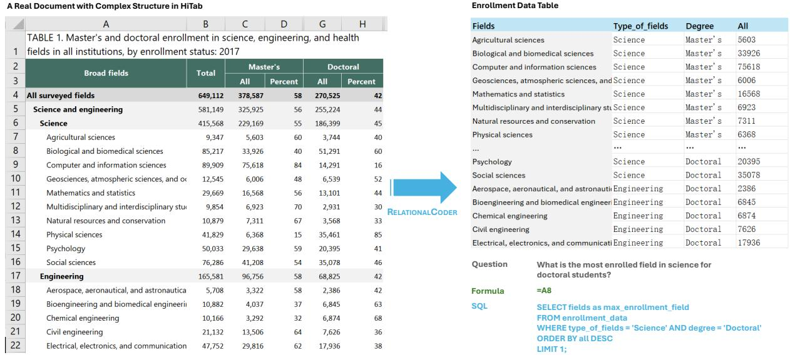
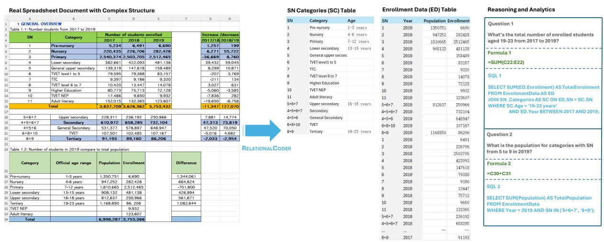
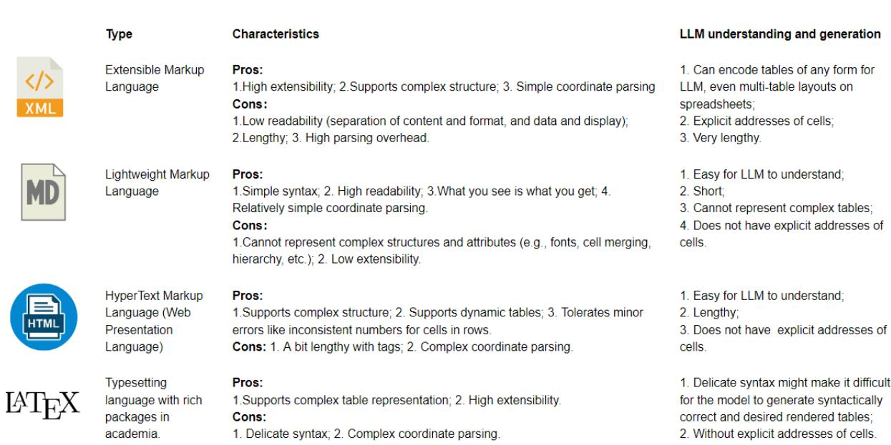
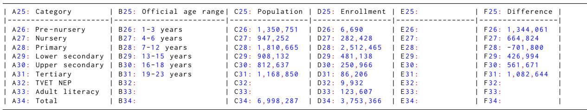

# RELATIONALCODER: Rethinking Complex Tables via Programmatic Relational Transformation

Haoyu Dong, Yue Hu, Huailiang Peng, Yanan Cao\* Institute of Information Engineering, Chinese Academy of Sciences School of Cyber Security, University of Chinese Academy of Sciences

## Abstract

Semi-structured tables, with their varied layouts and formatting artifacts, remain a major obstacle for automated data processing and analytics. To address these challenges, we propose RELATIONALCODER, which uniformly converts semi-structured tables into relational data, enabling smooth integration with the rich ecosystem of data processing and analytics tools. By leveraging SQL code, RELATIONAL-CODER prevents schema errors and markedly improves normalization quality across multiple relational tables.

To address the challenge of large tables, we propose a new technique called Loop Reference Decoding (LRD): it identifies expandable groups—repeating regions of similar structure and semantics—and replicates each group using a concise loop over its repetitive region by referencing cell addresses rather than regenerating each individual cell. This design substantially reduces output length from (N M)—proportional to the table’s height (N) and width (M)—to approximately (K), where K denotes the total number of unique cell values within the repetitive regions of all detected expandable groups. As a result, LRD is highly scalable: the larger the input table, the greater the compression ratio. It scales seamlessly to extremely large tables, achieving output reductions of up to 100,000 .

We construct a human-labeled corpus for table transformation, created with a cost-efficient, actively supervision pipeline. Extensive experiments on HiTab and MULTIHIERTT show that RELATIONALCODER not only enables programmatic symbolic reasoning but also boosts QA accuracy—raising Llama-2 and Mistral models by more than 20%, and GPT-4o by over 4%. Project page: https://github. com/haoyudong/RelationalCoder.

## 1 Introduction

Recently, the rapid development of Language Models (LMs) has opened new frontiers for data processing and analytics by leveraging various tools such as SQL and Python (Li et al., 2023b; Cheng et al., 2022c). However, their capabilities are largely contingent on the data being in a relational format. This limitation leaves a substantial gap in dealing with documents (such as Wikipedia pages, statistical reports, and spreadsheets) that contain a significant number of semi-structured tables, which are intuitive for human reading but challenging for machine processing. As illustrated by Figure 1, this complexity arises from various formatting options, including merged cells, cell alignments, bold fonts, blank rows, and multi-table layouts (Dong et al., 2019b; Gol et al., 2019; Chen and Cafarella, 2014), as well as diverse table structures with functional, hierarchical, and computational dependencies (Li et al., 2024; Deng et al., 2022; Cheng et al., 2022a,b). Consequently, processing and analyzing semi-structured data beyond relational structures remains largely unexplored.

While significant prior works have explored finetuning LMs to better understand complex table and spreadsheet structures (Dong et al., 2024; Zhang et al., 2023a; Li et al., 2023a; Wang et al., 2021; Cheng et al., 2022b; Zhao et al., 2022), these efforts have not unlocked the rich ecosystem of relational data tools for complex tables, as they remain untransformed into a relational format. To address this limitation, we introduce RELATIONALCODER, which unlocks the extensive ecosystem of relational data tools for semi-structured tables by uniformly converting them into relational data, as illustrated by Figure 1. Notably, this approach provides a onetime solution: once the offline process is executed in a single pass, the resulting relational data can serve numerous QA requests.

RELATIONALCODER leverages SQL code to transform semi-structured data into a relational form, offering two key advantages: (1) avoiding schema errors such as inconsistent numbers of columns across rows and duplicate headers; (2) improving the relational normalization of multiple tables—for example, by defining joinable primary keys. To address the challenge of generating large tables while preventing cell-level hallu cinations, we propose Loop Reference Decoding (LRD). LRD detects expandable groups (Dou et al., 2018) in the input table and emits FOR statements that copy entire expandable groups by referencing their cell addresses. An expandable group is a contiguous block that follows a uniform schema and semantics—e.g., the range “A7:H16” in Figure 1. Within this block, a unit pattern such as “A7:H7” repeats across successive rows, so the entire group can be encoded succinctly with loopbased expressions. This approach bypasses the exhaustive, hallucination-prone token-by-token decoding process and allows the model to construct tables of arbitrary length with concise code. Because LRD relies on the generative flexibility of LLMs—rather than a fixed set of hard-coded operators such as TRANSPOSE in (Li et al., 2024; Nahid and Rafiei, 2024) that is challenged by indentation and merged cells—it readily handles diverse table structures and formatting artifacts. Regarding large inputs, we employ SPREADSHEETLLM (Dong et al., 2024) to compress large inputs by augmenting individual cells with explicit addresses. To optimize accuracy with minimal human labeling costs, we employ Supervised Fine-Tuning with Active Participation (SFT-AP), identifying potentially erroneous samples for human labeling and model fine-tuning.

To validate the effectiveness of RELATIONAL-CODER, we evaluate both normalization quality and symbolic reasoning performance on QA datasets such as HiTab and MULTIHIERTT.

Our contributions are summarized as follows:

• To enable the seamless integration with standard data processing tools and promote high normalization quality, we propose RELATION-ALCODER, which generates relational tables using SQL. This approach avoids schema errors and improves the normalization quality across multiple relational tables.

• To handle large tables, we introduce Loop Reference Decoding (LRD), a highly scalable approach that recursively copies cells within regions exhibiting repetitive patterns by referencing their addresses. This strategy reduces the number of output tokens by an average of 68.4%, achieving a 3.16× compression rate. The longer the input table, the greater the compression ratio; in extreme cases, the method achieves a reduction of up to 160,000×.

• We provide a dataset of 850 table transformation samples. To minimize labeling costs, we propose SFT-AP, which uses LLM-measured normalization quality and reasoning accuracy metrics to automatically select error-prone samples for human labeling.

• RELATIONALCODER achieves significant accuracy improvements on HiTab and MUL-TIHIERTT. Notably, it particularly benefits smaller LMs (with gains over 20%) that struggle with comprehending complex structures.

## 2 Dataset

## 2.1 Statistical Report and Wikipedia Page

HiTab comprises 3,597 tables collected from HTML government reports and Wikipedia pages, including 10,672 QA pairs. These tables feature complex structures with multi-level headers and implicit relationships among data entries, making them challenging for existing language models.

## 2.2 Financial Document

MULTIHIERTT consists of 10,440 question-answer pairs derived from 2,513 documents sourced from PDF financial reports. The dataset presents complex questions that require multi-step numerical reasoning across multiple tables and paragraphs.

## 3 Relational Data Transformation

To the best of our knowledge, relational data is the optimal choice due to its generality and compatibility with common data management and analytics tools such as SQL and Pandas. We propose a T  R task to transform one or more tables T into a relational data representation R, ensuring both normalization quality and reasoning accuracy.

## 3.1 Normalization Quality

While many earlier approaches rely on data-driven techniques (Cafarella et al., 2008; Wang et al., 2021) or stem from classical database theory (Codd, 1970; Kimball and Ross, 2013; Chen, 1976), we employ both LLMs and human annotators as evaluators. Specifically, we prompt GPT-4o, assuming it is well-versed in relational normalization and symbolic reasoning, to judge whether the generated tables adhere to a relational structure suitable for symbolic reasoning and analytical tasks, supporting queries drawn from existing QA datasets. A representative prompt is shown below:

B6 = SUM ( B7:B16)  
Program 1: A formula for aggregation.

  
Figure 1: Illustration of relational data transformation. The left side displays a real table from HiTab, and the right side shows the transformed data in relational form, eliminating totals and differences. At the bottom right, a QA example demonstrates how SQL facilitates step-by-step reasoning and aligns well with popular methods for table QA (Cheng et al., 2022c; Ye et al., 2023b; Chen, 2022; Wang et al.; Ji et al., 2024; Li et al., 2023b; Zha et al., 2023; Mao et al., 2024). A spreadsheet example with multiple tables is illustrated in Figure 2 in Appendix A.

You are a professional data systems analyst . Assess   
whether the table (s) below are well - formed   
relational tables capable of supporting SQL - based   
reasoning and analytical querying . The following   
lists several example queries :   
<Query 1>, <Query 2>, ...

A column may be derived from other columns via computations, as illustrated with the B, D, and H columns in Figure 1. Similarly, rows can be derived from other rows, such as rows 4, 5, 6, 17. For example, the following Excel formula illustrates how row 6 (Science total) is derived:

The following Python (Pandas) code illustrates how column H (Doctoral Percent) is computed:

df['Doctoral Percent '] = round (df['   
Doctoral '] / df['Total '] \* 100).   
astype (int)  
Program 2: Python code for percentage calculation.

To reduce the redundancy of the relational output, we allow for discarding statistical cells that can be straightforwardly derived from others, such as totals and differences. However, we propose to preserve computations that have domain-specific meanings, such as the aggregated enrollment number for “Tertiary” or the mass per volume for density.

## 3.2 Reasoning Accuracy

The accurate reconstruction of semi-structured tables into relational data is critical for downstream tasks. However, there are often multiple reasonable ways to construct relational tables, making simple F1 score comparisons against labeled relational tables insufficient for evaluating reconstruction accuracy—even when normalization quality is satisfied.

Fortunately, datasets such as HiTab and MUL-TIHIERTT provide a large number of high-quality QA pairs. To this end, we propose using QA accuracy to reflect the completeness and correctness of the reconstruction. Specifically, each QA sample is a tuple (Q, A, T), where T denotes the original tables in the document. After relational transformation T  R, the tuple becomes (Q, A, R), where R represents the generated relational data. If an effective relational QA model (e.g., (Cheng et al., 2022c; Wang et al.; Ye et al., 2023a)) produces an incorrect answer over R, it may indicate inaccuracies in R, such as missing or misplaced cells. Given a sufficient number of QA pairs per example and assuming the QA model is ideally error-free, the QA accuracy effectively corresponds to the reconstruction accuracy. In practice, we use two state-of-the-art QA methods (Zhang et al.; Cheng et al., 2022c) with GPT-4o; if both fail to produce the correct answer given R, we consider relabeling T R during the SFT-AP phase.

## 4 RELATIONALCODER

Transforming complex tables into relational tables presents challenges for cutting-edge LMs due to: (1) the need to understand large and complex twodimensional table structures and format codes, (2) the requirement to generate normalized relational data via significant table reorganization, and (3) a lack of labeled data for supervised training for a novel task.

Our method covers three challenges. (1) How to encode tables, which are often complex and sometimes large. Inspired by SPREADSHEETLLM, RELATIONALCODER encodes cell values together with cell addresses, and it reduces length through inverted-index translation and number-format aggregation. (2) Which format to use to generate relational data. We propose using SQL for relational data generation. SQL provides a robust framework for table creation, ensuring that data is structured and easy to query. This is crucial for LMs that can produce corrupted tables with row or column misalignment. (3) We introduce a new method that generates FOR statements to replicate entire rows, columns, or rectangular regions that exhibit internal repetitive patterns, efficiently transferring them from the input table to the output table.

## 4.1 Table Encoding & Compression

There are different table encoding methods, such as HTML and Markdown. However, Markdown and HTML lack explicit cell addresses, making it challenging to locate and reference cells, as summarized in Appendix B. To address these challenges, we use the encoding of SPREADSHEETLLM (Dong et al., 2024):

• We incorporate explicit cell addresses, enabling efficient referencing when generating relational data, as described in Section 4.2.

• To compress empty or repetitive cells, we employ the inverted-index translation in JSON.

• We cluster adjacent non-header cells with the same numeric types into rectangular regions.

• For exceptionally large tables, we apply the Table Split Algorithm by splitting the table into segments with propagated headers.

Appendix C illustrates an example of the table encoding. The compression effect becomes more significant when the input table is larger.

## 4.2 SQL-Based Data Transformation

LMs have shown great success in unstructured text generation. However, they can still produce corrupted tables with basic errors, such as inconsistent numbers of columns per row. They can also create format errors like missing separators and improperly closed structures that prevent table parsing.

We propose using SQL for relational data generation. SQL provides a robust framework for table creation, ensuring that data is structured and easy to query. Additionally, the common practice of using SQL to create databases with complex multitable dependencies, combined with the abundance of public resources available, enables LMs to excel in generating multiple relational tables. First, RE-LATIONALCODER generates CREATE statements to construct tables with column headers. Second, it extracts table content through INSERT and UPDATE statements. Unlike Markdown and HTML, which generate output tables row by row, INSERT and UPDATE statements allow constructing table contents in arbitrary order. This flexibility enables scalable processing of large input texts by dividing them into segments and transforming them sequentially. The following code illustrates inserting years and enrollment numbers into the Field Enrollment table from “A2:H16” in Figure 1:

```sql
Create the table
CREATE TABLE FieldEnrollment (
Fields VARCHAR (100),
Type_of_fields VARCHAR (50),
Degree VARCHAR (20),
All INT
) ;
-- Insert 20 tuples into the table
INSERT INTO FieldEnrollment ( Fields ,
Type_of_fields , Degree , All) VALUES
(' Agricultural sciences ', 'Science ',
Master ''s', 5603),
('Biological and biomedical sciences ',
Science ', 'Master ''s', 33926),
('Social sciences ', 'Science ', 'Doctoral
', 35078),;
```

Program 3: An example of SQL-based transformation for “A2:H16” in Figure 1.

## 4.3 Loop Reference Decoding

SPREADSHEETLLM is effective for encoding large input tables, but the even more challenging task of decoding large tables has not been addressed. The output table needs to be precisely decoded, so the compression methods such as data-formataware aggregation in SPREADSHEETLLM are not applicable. Fortunately, we observe that large tables often contain global or local repetitive patterns—also known as expandable groups (Dou et al., 2018)—which can be leveraged for batch decoding. For example, in the region “A2:H16” of Figure 1, rows 7 to 16 present enrollment numbers for different fields. To this end, we propose a novel Loop Reference Decoding (LRD) method to iteratively copy cells from repetitive input regions to the output:

1. Copying cells via address reference rather than generating cell values from scratch;

## 2. Using loops to copy cells recurrently from expandable groups.

Rather than relying on traditional methods (Dou et al., 2018) for explicitly detecting expandable groups, we leverage the capabilities of LLMs to interpret complex inputs and implement the transformation using FOR loops in Oracle Database or WHILE loops in SQL Server. Instead of generating every cell individually, LRD compactly addresses one expandable group using one loop, e.g., Program 4 populates the Field Enrollment table from the expandable group “A7:H16” in Figure 1.

```sql
Insert data via Loop Reference
BEGIN
FOR row_id IN 7 .. 16 LOOP
FOR col_id IN ('C', 'G') LOOP
INSERT INTO FieldEnrollment (
Fields , Type_of_fields , Degree
, All )
VALUES (
'A' || row_id , -- Fields
'A6 ', -- Type_of_fields
CASE col_id Degree
WHEN 'C' THEN 'Master
ELSE 'Doctoral
END ,
col_id || row_id -- All
) ;
END LOOP ;
END LOOP ;
COMMIT ;
END ;
```

Program 4: An example of LRD-based transformation for “A2:H16” in Figure 1.

This design substantially reduces the output length from (N M)—which corresponds to enumerating each of the N rows and M columns in the original table—to approximately (K), where K is the total number of unique cell values within the repetitive regions. Compared with Program 3, the number of tokens in Program 4 has been reduced by 71.1% (371 to 107) with a compression rate of 3.47x. The column IDs and row IDs are simplified in FOR statements because cell addresses can be robustly post-processed using regular expressions.

Importantly, LRD is highly scalable: the longer the input table, the greater the compression ratio. For example, consider Table 1 of trading volumes (in millions of dollars) for 5,000 stocks across trading days in 2024:

Table 1: Sample Trading Volumes Table for 5,000 Stocks Across 252 Trading Days in 2024.
<table><tr><td></td><td>A</td><td>B</td><td>C</td><td></td><td>IQ</td><td>IR</td><td>IS</td></tr><tr><td>1</td><td>Stock Code</td><td>01-02</td><td>01-03</td><td></td><td>12-27</td><td>12-30</td><td>12-31</td></tr><tr><td>2</td><td>AAPL</td><td>150</td><td>160</td><td></td><td>165</td><td>170</td><td>175</td></tr><tr><td>3</td><td>GOOG</td><td>200</td><td>210</td><td></td><td>215</td><td>220</td><td>225</td></tr><tr><td>4</td><td>MSFT</td><td>180</td><td>185</td><td></td><td>190</td><td>195</td><td>200</td></tr><tr><td>…</td><td></td><td></td><td></td><td></td><td></td><td></td><td></td></tr><tr><td></td><td>·</td><td>…</td><td>…</td><td>…</td><td>…</td><td>:</td><td>…</td></tr><tr><td>5001</td><td>NVIDIA</td><td>95</td><td>100</td><td></td><td>105</td><td>110</td><td>115</td></tr></table>

```sql
Create the table
CREATE TABLE StockTradingVolumes (
stock_code VARCHAR (10),
trade_date DATE ,
trading_volume NUMERIC (10, 2)
) ;
Insert data using Loop Reference
Decoding
BEGIN
FOR row_id IN 2..5001 LOOP
FOR column_id IN 'B'.. 'IS ' LOOP
INSERT INTO StockTradingVolumes (
stock_code , trade_date ,
trading_volume )
VALUES (
'A' || row_id ,
column_id || 1,
column_id || row_id
) ;
END LOOP ;
END LOOP ;
COMMIT ;
END;
Program 5: An example of LRD-based transformation
for Table 1.
```

Converting this table using vanilla SQL results in 1.26 million rows—approximately 18.6 million tokens. In contrast, SQL-LRD performs the same transformation using only 115 tokens, as shown in

Program 5, achieving an impressive compression ratio of 160,000×.

For complex tables with multiple repetitive regions, several loops may be required to iterate different repetitive regions. Appendix A presents a multi-table spreadsheet example.

## 4.4 Supervised Fine-tuning with Active Human Participation

To address the diversity of formatting options and table structures, we employ SFT-AP to iteratively select tables for human labeling and fine-tune RE-LATIONALCODER. The core principle is strategically selecting samples; we propose selecting relational tables that cause normalization issues or reasoning errors. They are selected to encourage the learner to address new normalization or reasoning challenges, thereby leading to more performance gains than random sampling.

Algorithm 1 details the process. We sampled a subset containing 200 randomly selected samples and assigned another annotator to validate the transformed relational tables. The Fleiss Kappa (Landis and Koch, 1977) is 0.946, which is regarded as “almost perfect agreement”.

Algorithm 1: SFT-AP   
Input: Complex semi-structured tables   
${ \boldsymbol { \mathcal { T } } } = \{ t \}$ , labeled dataset $\mathcal { D } = \{ \}$   
metrics for normalization and   
reasoning θ   
Output: Model $M ( \mathcal D )$   
1 Build a data selector S based on M( ) and   
θ;   
2 repeat   
3 selects subset t from based   
on normalization quality and reasoning   
accuracy;   
Label $\{ t _ { L } \}$ with relational tables r<sub>L</sub> ;   
4 Update $\mathcal { D }  \mathcal { D } \cup \{ ( t _ { L } , r _ { L } ) \}$ ;   
5 Fine-tune model M( ) on ;   
6 until pre-defined stop criteria is met;   
7 return model M( );

Specifically, we sample training data with four types (no-violation&error, normalization violation, computational dependency violation, QA error) using proportions $( p _ { r n d } , p _ { n o r m } , p _ { c a l c } , p _ { q a } )$ , respectively. The SFT-AP algorithm continues iterating until the number of iterations exceeds l or the accuracy improves by less than a threshold q over the validation sets. To address the issue of large tables with numerous cells, we ask annotators to select at most m rows and n columns for each input table by discarding canonical data rows and columns that are repetitive for model training. The output relational tables, titles of relational tables, and repetitive regions for LRD are labeled after a detailed training session for human annotators.

## 5 Experiments

## 5.1 Experiment Setup

Evaluation Metrics We follow the train, validation, and test splits of HiTab and MULTIHIERTT. We use table-only samples from this dataset to study complex data transformation. HiTab contains 1,584 test samples. MULTIHIERTT includes 338 table-only samples from the validation set because the test set has not been made public. We use execution accuracy to evaluate the QA task (Cheng et al., 2022b).

Active Human Participation of Data Labeling for Fine-tuning In the labeling phase, m and n are set to 32 and 8, respectively. This setting largely preserves the main skeleton of tables such as headers, sections, and aggregations. $( p _ { r n d } , p _ { n o r m } , p _ { c a l c } , p _ { q a } )$ are set to (0.4, 0.15, 0.15, 0.3). The full dataset for labeling is the union of training datasets from HiTab and MULTIHIERTT. q was set to 0.1 and l was set to 5. We obtained 150 samples for each iteration and a total of 750 samples while fine-tuning LMs, and 100 samples with random sampling for testing. GPT-4o-based Re-AcTable (Zhang et al., 2023b) and Binder (Cheng et al., 2022c) are employed to generate QA results for evaluating reasoning accuracy during SFT-AP.

Baselines For QA over one or more complex tables in HiTab and MULTIHIERTT (MulHi), we select EEDP (Srivastava et al., 2024), a recent prompting strategy that elicits domain knowledge, extracts supporting evidence, decomposes tasks into atomic operations, and predicts the final answer. EEDP offers insights into how LLMs handle complex tables and perform numerical reasoning. For large inputs, SPREADSHEETLLM with SHEETCOMPRES-SOR and the Table Split Algorithm (Dong et al., 2024) are employed. For transformed relational tables by RELATIONALCODER, we use Chain-oftable (Wang et al., 2024), a reasoning framework that chains relational sub-queries over normalized table representations to answer complex multi-hop

questions.

We conduct experiments using both closedsource models (GPT-3.5 and GPT-4o) and opensource models (Llama-2-13B and Mistral-7B), following (Srivastava et al., 2024). Detailed configurations are provided in Appendix D.

## 5.2 Experiment results

## 5.2.1 Main Results

Table 3 illustrates the performance of LMs for table QA before and after relational transformation.

(1) Effectiveness of RELATIONALCODER on Normalization Quality: For human evaluation, two independent annotators assessed each sample. Their task was to judge whether the generated tables conformed to a relational structure suitable for SQL-based reasoning, supporting queries drawn from the QA datasets. In cases of disagreement, issues were resolved by a senior annotator. As Table 2 shows, although LLMs may cause false positive judgments, they align well with human judgments in differentiating model effectiveness.

Table 2: Human and LLM-based Evaluation on normalization quality of transformed relational tables.
<table><tr><td rowspan="2">RCoder</td><td colspan="2">HiTab</td><td colspan="2">MULTIHIERTT</td></tr><tr><td>Human</td><td>Auto</td><td>Human</td><td>Auto</td></tr><tr><td>Llama-2</td><td>68.2</td><td>70.4</td><td>63.0</td><td>65.6</td></tr><tr><td>Mistral</td><td>64.5</td><td>67.5</td><td>58.8</td><td>61.9</td></tr><tr><td>GPT-3.5</td><td>79.4</td><td>82.3</td><td>73.1</td><td>76.2</td></tr></table>

(2) Enhanced Performance with RELATIONAL-CODER on Reasoning Accuracy: As Table 3 shows, across all datasets, models benefit significantly from automated relational transformation. Notably, GPT-4o achieves large improvements leveraging transformed relational tables, with accuracy up to 84.8% and 73.6% on HiTab and MULTI-HIERTT, respectively.

(3) Significant Benefits for Small LMs: Smaller LMs like Llama-2 and Mistral show notable improvements, with Llama-2 improving from 30.3% to 55.9% on HiTab. This demonstrates that relational tables are easier to comprehend, especially for small language models that lack the capacity to handle complex structures.

## 5.2.2 Ablation Experiment Results

(4) Fine-tuning Boosts the Performance of LMs on Table Transformation: Table 4 shows that RELATIONALCODER, using the GPT-3.5 model, achieved the highest scores in all QA datasets via

Table 3: The performance of methods on the QA task based on input tables before and after relational data transformation ( and <sub>RELATIONALCODER</sub>, respectively) for QA. Here, RELATIONALCODER refers to the GPT-3.5 version after fine-tuning via SFT-AP.
<table><tr><td>LM for QA</td><td>Input Type</td><td>HiTab</td><td>MulHi</td></tr><tr><td></td><td></td><td>EEDP</td><td></td></tr><tr><td>Llama-2</td><td>T</td><td>30.3</td><td>25.3</td></tr><tr><td>Mistral</td><td>T</td><td>25.1</td><td>20.2</td></tr><tr><td>GPT-3.5</td><td>T</td><td>43.3</td><td>35.0</td></tr><tr><td>GPT-40</td><td>T</td><td>80.7</td><td>68.1</td></tr><tr><td>Llama-2</td><td></td><td>Chain-of-table</td><td></td></tr><tr><td></td><td>RRELATIONALCODER</td><td>55.9</td><td>47.6</td></tr><tr><td>Mistral</td><td> $\mathcal { R } _ { \mathrm { R E L A T I O N A L C O D E R } }$ </td><td>52.9</td><td>46.7</td></tr><tr><td>GPT-3.5</td><td> $\mathcal { R } _ { \mathrm { R E L A T I O N A L C O D E R } }$ </td><td>66.7</td><td>57.0</td></tr><tr><td>GPT-40</td><td> $\mathcal { R } _ { \mathrm { R E L A T I O N A L C O D E R } }$ </td><td>84.8</td><td>73.6</td></tr></table>

Table 4: Performance comparison of RELATIONAL-CODER using different LLMs on the QA task. Chainof-table with Llama-2 is used to answer questions about transformed relational data using different methods.
<table><tr><td>LM for QA</td><td>Input Type</td><td>LM for RCoder</td><td>HiTab</td><td>MulHi</td></tr><tr><td>Llama-2</td><td>T</td><td>-</td><td>30.3</td><td>25.3</td></tr><tr><td>Llama-2</td><td>RRELATIONALCODER</td><td>GPT-3.5-zero-shot</td><td>35.7</td><td>28.0</td></tr><tr><td>Llama-2</td><td>RRELATIONALCODER</td><td>GPT-4o-zero-shot</td><td>46.7</td><td>41.1</td></tr><tr><td>Llama-2</td><td>RRELATIONALCODER</td><td>GPT-3.5-SFT</td><td>51.8</td><td>42.8</td></tr><tr><td>Llama-2</td><td>RRELATIONALCODER</td><td>Llama-2-SFT</td><td>44.8</td><td>35.1</td></tr><tr><td>Llama-2</td><td>RRELATIONALCODER</td><td>Mistral-SFT</td><td>42.2</td><td>33.5</td></tr><tr><td>Llama-2</td><td> $\mathcal { R } _ { \mathrm { R E L A T I O N A L C O D E R } }$ </td><td>Llama-2-SFT-AP</td><td>49.4</td><td>39.7</td></tr><tr><td>Llama-2</td><td> $\mathcal { R } _ { \mathrm { R E L A T I O N A L C O D E R } }$ </td><td>Mistral-SFT-AP</td><td>45.8</td><td>39.1</td></tr><tr><td>Llama-2</td><td> $\mathcal { R } _ { \mathrm { R E L A T I O N A L C O D E R } }$ </td><td>GPT-3.5-SFT-AP</td><td>55.9</td><td>47.6</td></tr></table>

SFT-AP and outperformed zero-shot GPT-4o. Finetuned Llama-2 and Mistral even achieved comparable results to GPT-4o-zero-shot.

(5) Significant Benefits of Loop Reference Decoding: Table 5 highlights the strengths of LRD: it improves QA accuracy over Markdown by roughly 2% while shrinking output length by 68.4% on average. These gains make LRD especially attractive for large spreadsheets and data-lake tables that have not been covered by HiTab and MUL-TIHIERTT. Applied to the large table in Table 1, SQL-LRD achieves an extraordinary compression ratio of 160,000×.

Table 5: Performance of code-generation-based relational table generation on the QA task. RELATIONAL-CODER refers to the GPT-3.5 version fine-tuned via SFT-AP. Chain-of-table with GPT-4o is used to answer questions about transformed relational data using different encoding methods.
<table><tr><td>Output encoding for table transformation</td><td>HiTab</td><td>MulHi</td></tr><tr><td>Markdown</td><td>83.0</td><td>71.2</td></tr><tr><td>SQL-Loop-Reference-Decoding (LRD)</td><td>84.8</td><td>73.6</td></tr></table>

## 5.3 Error Analysis

## (6) Common Sources of Error During Relational Table Transformation:

• Additional ID Columns and Over-Splitting: Complex tables sometimes need to be split into multiple relational tables, requiring additional ID columns for joins to preserve all information. However, excessive splitting, intended to minimize data redundancy, can complicate downstream reasoning and analysis, resulting in QA failures. Therefore, our annotation protocol discourages unnecessary splitting in favor of analytical tractability.

• Mixed Aggregations and Raw Values: Some columns contain both aggregated and raw values, or mix aggregated data with non-aggregated entries. Handling such columns—either by separating them into different tables or eliminating aggregated values—can complicate references and make it more challenging for models to retrieve or reason over the correct information.

• Inaccurate Table Titles: The titles of transformed relational tables must be updated to reflect their semantics. Inaccurate or ambiguous titles can lead to QA errors due to mismatches between table content and description. To address this, we provided explicit title annotations in our dataset, which significantly reduced errors related to table titles.

## 6 Related Work

Table transformation Automatically transforming tables with complex structures into a relational form is a longstanding yet extremely challenging task due to the diverse formatting options and table structures found in real-world documents. Early approaches focused on mimicking transformations based on user examples (Harris and Gulwani, 2011). More recently, classification-based methods (Chen and Cafarella, 2014; Dong et al., 2019a; Wang et al., 2021) have been proposed to recognize table hierarchies and extract relational tuples from spreadsheets. The most recent work involves synthesizing table transformation data by converting relational tables into complex tables using predefined operators (Li et al., 2024). However, these efforts rely on classification methods to recognize structural characteristics, which are challenged by diverse structures and formats of semistructured tables in the wild. NormTab (Nahid and Rafiei, 2024) targets structural normalization; however, because it relies on a single transposition operator, its flexibility for diverse layouts is limited and inter-table relationships are left unmodeled. RELATIONALCODER incorporates actual complex tables from real-world documents and explores the conversion of multiple tables into multiple relational tables, and RELATIONALCODER proposes a scalable end-to-end method to transform tables into relational forms.

## 7 Conclusion

We have presented RELATIONALCODER, an endto-end framework that bridges the gap between semi-structured tables and the rich ecosystem of relational data tools. By marrying SpreadsheetLLM’s value-address encoding and SQL-based Loop Reference Decoding, our system delivers three key advantages: (i) it normalizes diverse, artifact-laden tables into a clean relational schema, (ii) it scales gracefully to inputs that far exceed the context length of contemporary LMs, and (iii) it unlocks downstream symbolic reasoning and analytics with substantial accuracy gains. Extensive experiments on the HiTab and MULTIHIERTT benchmarks confirm these benefits: GPT-4o establishes new SOTA results, while smaller open-source models such as Llama-2 and Mistral obtain over 20% performance jumps once their inputs are relationalized.

Beyond empirical improvements, augmenting LMs with programmatic abstractions can yield both efficiency and reliability. Treating code as an output medium—instead of emitting raw tables—guards against structural errors, improves relational normalization, and provides natural hooks for external executors. The dramatic compression ratios achieved by LRD further hint that the judicious reuse of input structure is a powerful antidote to sequence-length bottlenecks.

## Limitations

While data transformation significantly enhances reasoning and analysis tasks, our approach has some limitations. Specifically, certain tasks require access to the original input, such as document manipulation that involves preserving the original content and formatting. In these cases, our method may not be applicable. A promising direction to improve the current work is to better combine original complex inputs with transformed relational data to jointly serve various tasks: the original data provide critical information about formats and structures, while the transformed relational data offer canonical data applicable to mainstream data reasoning and analytics tools.

Additionally, our current work focuses on normalizing complex semi-structured inputs in documents, such as tables. However, our method does not address valuable information embedded in unstructured text, presenting an avenue for future work. Addressing this aspect could further refine and extend our approach in future research by incorporating existing text-to-table works to extract relational information from text (Wu et al., 2022).

Importantly, this work requires a stronger model for table transformation than for reasoning. This is highly useful for offline preprocessing of large amounts of complex tables before user queries, but our future work may investigate developing a single model through a transformation-processingreasoning pipeline.

Finally, due to the lack of high-quality labeled data on table transformation, Reinforcement Learning (RL) shows advantage to train the model from weak supervision such as QA annotations, without relying on human annotations on table transformation (Dong et al., 2025). RL encourages autonomous exploration beyond manually crafted transformation examples and promotes the use of general-purpose programming languages.

## Ethics Statement

Datasets were collected from HiTab and MULTI-HIERTT, both of which allow sharing and redistribution. We recruited 12 students or graduates (7 women and 5 men) majoring in computer science from top universities who were proficient in coding and labeling complex data. Online training, documents, and QAs were provided to annotators to ensure their consistent understanding of the labeling requirements. Privacy and confidentiality were rigorously safeguarded and no personal identifiers were involved, ensuring complete anonymity. Importantly, our framework relies on GPTs, which may inherit ethical concerns associated with GPT models. These concerns include the potential for generating responses to toxic content or displaying biased behavior.

## Acknowledgments

We thank all anonymous reviewers for their valuable comments. This work was supported by the National Natural Science Foundation of China (No. U21B2009) and the Key Project of the Joint Fund for General Technology of the National Natural Science Foundation of China (No. U2336202).

## References

Jeff Atwood. The future of markdown.

Michael J Cafarella, Alon Halevy, Daisy Zhe Wang, Eugene Wu, and Yang Zhang. 2008. Webtables: exploring the power of tables on the web. Proceedings ofthe VLDB Endowment, 1(1):538–549.

Peter Pin-Shan Chen. 1976. The entity-relationship model—toward a unified view of data. ACM transactions on database systems (TODS), 1(1):9–36.

Wenhu Chen. 2022. Large language models are few (1)-shot table reasoners. arXiv preprint arXiv:2210.06710.

Zhe Chen and Michael Cafarella. 2014. Integrating spreadsheet data via accurate and low-effort extraction. In Proceedings of the 20th ACM SIGKDD international conference on Knowledge discovery and data mining, pages 1126–1135.

Zhoujun Cheng, Haoyu Dong, Ran Jia, Pengfei Wu, Shi Han, Fan Cheng, and Dongmei Zhang. 2022a. Fortap: Using formulas for numerical-reasoning-aware table pretraining. In Proceedings of the 60th Annual Meeting of the Association for Computational Linguistics (Volume 1: Long Papers), pages 1150–1166.

Zhoujun Cheng, Haoyu Dong, Zhiruo Wang, Ran Jia, Jiaqi Guo, Yan Gao, Shi Han, Jian-Guang Lou, and Dongmei Zhang. 2022b. Hitab: A hierarchical table dataset for question answering and natural language generation. In Proceedings ofthe 60th Annual Meeting of the Association for Computational Linguistics (Volume 1: Long Papers), pages 1094–1110.

Zhoujun Cheng, Tianbao Xie, Peng Shi, Chengzu Li, Rahul Nadkarni, Yushi Hu, Caiming Xiong, Dragomir Radev, Mari Ostendorf, Luke Zettlemoyer, et al. 2022c. Binding language models in symbolic languages. arXiv preprint arXiv:2210.02875.

Edgar F Codd. 1970. A relational model of data for large shared data banks. Communications of the ACM, 13(6):377–387.

World Wide Web Consortium. Extensible markup language (xml) 1.0.

World Wide Web Consortium. 1997. Html 4.0 specification — w3c recommendation — conformance: requirements and recommendations.

Xiang Deng, Huan Sun, Alyssa Lees, You Wu, and Cong Yu. 2022. Turl: Table understanding through representation learning. ACM SIGMOD Record, 51(1):33– 40.

Haoyu Dong, Yue Hu, and Yanan Cao. 2025. Reasoning and retrieval for complex semi-structured tables via reinforced relational data transformation. Proceedings of the 48th International ACM SIGIR Conference on Research and Development in Information Retrieval.

Haoyu Dong, Shijie Liu, Zhouyu Fu, Shi Han, and Dongmei Zhang. 2019a. Semantic structure extraction for spreadsheet tables with a multi-task learning architecture. In Workshop on Document Intelligence at NeurIPS 2019.

Haoyu Dong, Shijie Liu, Shi Han, Zhouyu Fu, and Dongmei Zhang. 2019b. TableSense: Spreadsheet table detection with convolutional neural networks. In Proceedings of the AAAI Conference on Artificial Intelligence, volume 33, pages 69–76.

Haoyu Dong and Zhiruo Wang. 2024. Large language models for tabular data: Progresses and future directions. In Proceedings ofthe 47th International ACM SIGIR Conference on Research and Development in Information Retrieval, pages 2997–3000.

Haoyu Dong, Jianbo Zhao, Yuzhang Tian, Junyu Xiong, Shiyu Xia, Mengyu Zhou, Yun Lin, José Cambronero, Yeye He, Shi Han, et al. 2024. Spreadsheetllm: Encoding spreadsheets for large language models. arXiv preprint arXiv:2407.09025.

Wensheng Dou, Shi Han, Liang Xu, Dongmei Zhang, and Jun Wei. 2018. Expandable group identification in spreadsheets. In Proceedings of the 33rd ACM/IEEE International Conference on Automated Software Engineering, pages 498–508.

Majid Ghasemi Gol, Jay Pujara, and Pedro Szekely. 2019. Tabular cell classification using pre-trained cell embeddings. In 2019 IEEE International Conference on Data Mining (ICDM), pages 230–239. IEEE.

William R Harris and Sumit Gulwani. 2011. Spreadsheet table transformations from examples. ACM SIGPLAN Notices, 46(6):317–328.

Felix Henze, Haralampos Gavriilidis, Eleni Tzirita Zacharatou, and Volker Markl. 2022. Efficient specialized spreadsheet parsing for data science.

Edward J Hu, Yelong Shen, Phillip Wallis, Zeyuan Allen-Zhu, Yuanzhi Li, Shean Wang, Lu Wang, and Weizhu Chen. 2021. Lora: Low-rank adaptation of large language models. arXiv preprint arXiv:2106.09685.

Deyi Ji, Lanyun Zhu, Siqi Gao, Peng Xu, Hongtao Lu, Jieping Ye, and Feng Zhao. 2024. Tree-oftable: Unleashing the power of llms for enhanced large-scale table understanding. arXiv preprint arXiv:2411.08516.

Pratik Kayal, Mrinal Anand, Harsh Desai, and Mayank Singh. 2023. Tables to latex: structure and content extraction from scientific tables. International Journal on Document Analysis and Recognition (IJDAR), 26(2):121–130.

Ralph Kimball and Margy Ross. 2013. The Data Warehouse Toolkit: The Definitive Guide to Dimensional Modeling, 3rd edition. Wiley.

J Richard Landis and Gary G Koch. 1977. The measurement of observer agreement for categorical data. biometrics, pages 159–174.

LaTeX. Introduction to latex.

Peng Li, Yeye He, Cong Yan, Yue Wang, and Surajit Chaudhuri. 2023a. Auto-tables: Synthesizing multistep transformations to relationalize tables without using examples. Proceedings of the VLDB Endowment, 16(11):3391–3403.

Peng Li, Yeye He, Cong Yan, Yue Wang, and Surajit Chaudhuri. 2024. Auto-tables: Relationalize tables without using examples. ACM SIGMOD Record, 53(1):76–85.

Peng Li, Yeye He, Dror Yashar, Weiwei Cui, Song Ge, Haidong Zhang, Danielle Rifinski Fainman, Dongmei Zhang, and Surajit Chaudhuri. 2023b. Table-gpt: Table-tuned gpt for diverse table tasks. arXiv preprint arXiv:2310.09263.

Qingyang Mao, Qi Liu, Zhi Li, Mingyue Cheng, Zheng Zhang, and Rui Li. 2024. Potable: Programming standardly on table-based reasoning like a human analyst. arXiv preprint arXiv:2412.04272.

Md Mahadi Hasan Nahid and Davood Rafiei. 2024. Normtab: Improving symbolic reasoning in llms through tabular data normalization. arXiv preprint arXiv:2406.17961.

Juan C Roldán, Patricia Jiménez, and Rafael Corchuelo. 2020. On extracting data from tables that are encoded using html. Knowledge-Based Systems, 190:105157.

Pragya Srivastava, Manuj Malik, Vivek Gupta, Tanuja Ganu, and Dan Roth. 2024. Evaluating llms’ mathematical reasoning in financial document question answering. In Findings ofthe Associationfor Computational Linguistics ACL 2024, pages 3853–3878.

Zhiruo Wang, Haoyu Dong, Ran Jia, Jia Li, Zhiyi Fu, Shi Han, and Dongmei Zhang. 2021. TUTA: Treebased transformers for generally structured table pretraining. In Proceedings ofthe 27th ACM SIGKDD Conference on Knowledge Discovery & Data Mining, pages 1780–1790.

Zilong Wang, Hao Zhang, Chun-Liang Li, Julian Martin Eisenschlos, Vincent Perot, Zifeng Wang, Lesly Miculicich, Yasuhisa Fujii, Jingbo Shang, Chen-Yu Lee, et al. Chain-of-table: Evolving tables in the reasoning chain for table understanding. In The Twelfth International Conference on Learning Representations.

Zilong Wang, Hao Zhang, Chun-Liang Li, Julian Martin Eisenschlos, Vincent Perot, Zifeng Wang, Lesly Miculicich, Yasuhisa Fujii, Jingbo Shang, Chen-Yu Lee, et al. 2024. Chain-of-table: Evolving tables in the reasoning chain for table understanding. arXiv preprint arXiv:2401.04398.

Xueqing Wu, Jiacheng Zhang, and Hang Li. 2022. Textto-table: A new way of information extraction. In Proceedings of the 60th Annual Meeting of the Associationfor Computational Linguistics (Volume 1: Long Papers), pages 2518–2533.

Yunhu Ye, Binyuan Hui, Min Yang, Binhua Li, Fei Huang, and Yongbin Li. 2023a. Large language models are versatile decomposers: Decompose evidence and questions for table-based reasoning. arXiv preprint arXiv:2301.13808.

Yunhu Ye, Binyuan Hui, Min Yang, Binhua Li, Fei Huang, and Yongbin Li. 2023b. Large language models are versatile decomposers: Decomposing evidence and questions for table-based reasoning. In Proc. ofSIGIR.

Liangyu Zha, Junlin Zhou, Liyao Li, Rui Wang, Qingyi Huang, Saisai Yang, Jing Yuan, Changbao Su, Xiang Li, Aofeng Su, et al. 2023. Tablegpt: Towards unifying tables, nature language and commands into one gpt. arXiv preprint arXiv:2307.08674.

Tianshu Zhang, Xiang Yue, Yifei Li, and Huan Sun. 2023a. Tablellama: Towards open large generalist models for tables. arXiv preprint arXiv:2311.09206.

Yunjia Zhang, Jordan Henkel, Avrilia Floratou, Joyce Cahoon, Shaleen Deep, and Jignesh M Patel. Reactable: Enhancing react for table question answering.

Yunjia Zhang, Jordan Henkel, Avrilia Floratou, Joyce Cahoon, Shaleen Deep, and Jignesh M. Patel. 2023b. Reactable: Enhancing react for table question answering. Preprint, arXiv:2310.00815.

Yilun Zhao, Yunxiang Li, Chenying Li, and Rui Zhang. 2022. Multihiertt: Numerical reasoning over multi hierarchical tabular and textual data. In Proceedings of the 60th Annual Meeting of the Association for Computational Linguistics (Volume 1: Long Papers), pages 6588–6600.

## A An Example of Spreadsheet Normalization

An example of spreadsheet normalization is illustrated in Figure 2. Note that several loops are required to iterate different repetitive regions. The following code illustrates inserting years and enrollment numbers into the Enrollment Data table from region “A3:E15” without LRD:

```sql
Create the table
CREATE TABLE EnrollmentData (
SN VARCHAR (20),
Population INT ,
Year INT,
Enrollment INT
) ;
-- Insert 33 tuples with SNs from 1 to
11 and years from 2017 to 2019
INSERT INTO EnrollmentData (SN, Year ,
Population , Enrollment ) VALUES
('1', 2017, NULL , 5234),
('11 ', 2019, NULL , 123607)
```  
Program 6: An example of SQL-based transformation.

The following code populates the Enrollment Data table from region “A3:E15” in Figure 2 with LRD:

```sql
Insert data via Loop Reference
BEGIN
FOR row_id IN 5..15 LOOP
FOR col_id IN ('C', 'D', 'E') LOOP
INSERT INTO EnrollmentData (SN,
Year , Population , Enrollment )
VALUES ('A'|| row_id , col_id ||4,
NULL , col_id || row_id );
END LOOP ;
END LOOP ;
COMMIT ;
END ;
```  
Program 7: An example of LRD-based transformation.

Compared with Program 6, the number of tokens in Program 7 was reduced by 84.2% (480 to 76) with a compression rate of 6.32x.

## B Table Encoding

Widely used markup languages for table encoding include XML, Markdown, HTML, and LAT<sub>E</sub>X. Compared with natural-language (NL) prompts, these markup languages capture hierarchical structure explicitly, enabling language models to reason over layout and schema more effectively. As a result, encoding tables with XML or Markdown has attracted renewed attention in recent years.

XML. XML (Extensible Markup Language) was derived from SGML to retain its flexibility while reducing complexity; version 1.0 was released in 1998 (Consortium). Its hierarchical syntax accommodates rich metadata and arbitrarily nested structures. However, XML is verbose, difficult to read, and expensive to parse (Henze et al., 2022). Although XML can describe data, it does not compile it into tables directly. Microsoft’s OpenXML (2006) links XML with Excel worksheets, allowing explicit cell references that sidestep spreadsheet-table detection (Dong et al., 2019b). Yet the verbosity of XML quickly exceeds the context-length budget of modern LMs.

Markdown. Created by John Gruber and Aaron Swartz, Markdown offers a plain-text syntax that is both human-readable and easy to write; Common-Mark formalized the language in 2012 (Atwood). While its concise syntax is ideal for simple tables, Markdown cannot express merged cells or detailed styling. One may embed raw HTML to achieve complex effects, but this is uncommon in practice. Crucially, a Markdown table has a single canonical representation, which simplifies evaluation.

LAT<sub>E</sub>X. LAT<sub>E</sub>X, introduced by Lamport in the early 1980s as a higher-level interface to T<sub>E</sub>X (La-TeX), supports sophisticated table layouts and finegrained styling. Its expressive power comes at the cost of a steep learning curve and many equivalent ways to produce the same visual result, complicating both authoring and model comprehension (Kayal et al., 2023). Moreover, LAT<sub>E</sub>X source must be compiled, adding an extra processing step.

HTML. HTML, the standard language for the web since 1993 (Consortium, 1997), defines tables through a rigid tag hierarchy and can represent complex layouts when combined with CSS. The fixed grammar facilitates automatic quality checks, yet the abundance of tags and attributes makes data extraction non-trivial (Roldán et al., 2020).

We summarize representative table encoding methods and their characteristics in Figure 3. There are other encodings such as SQL, Python, and JSON (see (Dong and Wang, 2024)) <sup>1</sup>.

## C An Example of Table Encoding

The regular and compressed encoding of the “A25:F35” region in Figure 2 are illustrated in Program 8 and Program 9, respectively.

  
Figure 2: An example of spreadsheet table transformation that takes multiple input tables and produces multiple output tables.

  
Figure 3: Common table encoding methods and their characteristics.

  
Program 8: The regular Markdown encoding of SpreadsheetLLM for “A25:F34” region in Figure 2.

```json
{
" Category ": A25,
" Official age range ": B25,
" Population ": C25,
" Enrollment ": D25,
" Difference ": F25,
"Pre - nursery ": A26,
" Nursery ": A27,
" Primary ": A28,
" Lower secondary ": A29,
" Upper secondary ": A30,
" Tertiary ": A31,
" TVET NEP ": A32,
" Adult literacy ": A33,
" Total ": A34,
"1-3 years ": B26,
"4-6 years ": B27,
"7 -12 years ": B28,
"13 -15 years ": B29,
"16 -18 years ": B30,
"19 -23 years ": B31,
" IntNum ": C26:D34,F26:F34,
}
```  
Program 9: The compressed JSON encoding of SpreadsheetLLM for “A25:F35” region in Figure 2.

## D Experiment Setup

We conducted experiments using both open- and closed-source models for research purposes, including fine-tuning and inference.

Open-source language models were fine-tuned using DeepSpeed for distributed training on a compute node equipped with 8 A100 GPUs, following the LoRA method (Hu et al., 2021). The models include:

LLaMA-2 (meta-llama/Llama-2-13b-chat-hf), licensed under the Meta LLaMA 2 License<sup>2</sup>.

Mistral (mistralai/Mistral-7B-Instruct-v0.1), distributed under the Apache License 2.0<sup>3</sup>.

Fine-tuning parameters for open-source models:

• Learning rate: 5e-5

• Number of training epochs: 40

• Training batch size: 4

• Gradient accumulation steps: 8

• Learning rate scheduler: cosine

• Max gradient norm: 1.0

• Warmup steps: 0

• Optimizer: AdamW

• Precision: fp16

• LoRA rank: 32, alpha: 64, dropout: 0.01

## Fine-tuning parameters for GPT-3.5 (textdavinci-003):

• LoRA dimension: 32

• Number of epochs: -1

• Batch size: -1

• Learning rate multiplier: 1

• All other parameters use default settings

We did not fine-tune GPT-4o (version 20240513) due to limitations in our available resources.

Inference parameters (all models):

• Temperature: 0

• Top-p: 0

• Frequency penalty: 0

• Stop condition: None

• All other parameters follow default values

These deterministic decoding settings (temperature and top-p set to 0) were chosen to eliminate randomness during evaluation.