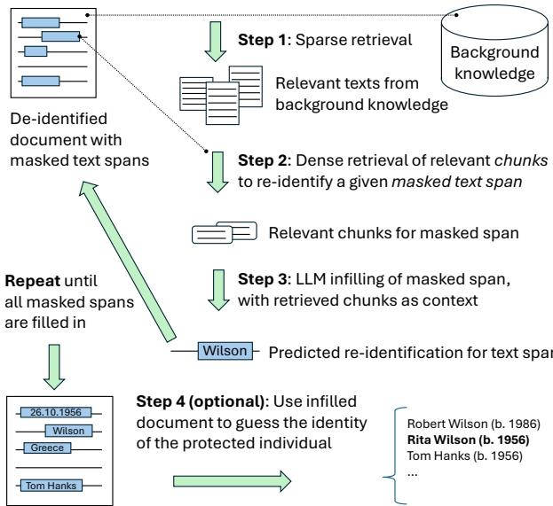

# Re-identification of De-identified Documents with Autoregressive Infilling

Lucas Georges Gabriel Charpentier University of Oslo Language Technology Group lgcharpe@ifi.uio.no

Pierre Lison Norwegian Computing Center (NR), Oslo plison@nr.no

## Abstract

Documents revealing sensitive information about individuals must typically be deidentified. This de-identification is often done by masking all mentions of personally identifiable information (PII), thereby making it more difficult to uncover the identity of the person(s) in question. To investigate the robustness of de-identification methods, we present a novel, RAG-inspired approach that attempts the reverse process of re-identification based on a database of documents representing background knowledge. Given a text in which personal identifiers have been masked, the re-identification proceeds in two steps. A retriever first selects from the background knowledge passages deemed relevant for the re-identification. Those passages are then provided to an infilling model that seeks to infer each text span’s original content. This process is repeated until all masked spans are replaced. We evaluate the re-identification on three datasets (Wikipedia biographies, court rulings and clinical notes). Results show that (1) as many as 80% of de-identified text spans can be successfully recovered and (2) the re-identification accuracy increases along with the level of background knowledge. The code for this paper can be found at: https://github.com/ltgoslo/ re-identification-infilling.

## 1 Introduction

Many types of text documents contain sensitive information about human individuals. When releasing or transferring those documents to third parties, it is typically desirable – and often legally required – to de-identify them beforehand. Most de-identification approaches operate by (1) determining the text spans that express direct or indirect personal identifiers and (2) masking those from the document. This process can be done manually or using NLP models (Sweeney, 1996; Neamatullah et al., 2008; Sánchez and Batet, 2016; Dernoncourt et al., 2017; Lison et al., 2021; Liu et al., 2023).

  
Figure 1: Sketch of the re-identification pipeline. The approach takes as input a document in which PII has been masked. A sparse retriever first selects relevant documents from the background knowledge. A dense retriever then extracts from those the chunks deemed most useful for re-identifying a particular text span. Finally, the infilling model produces a re-identification guess for that span given the retrieved chunks. The process is repeated until all text spans are filled back in.

It is, however, difficult to properly assess whether the de-identification has adequately concealed the identity of the person(s) mentioned in the original document. Many evaluation techniques assess the performance of de-identification methods by comparing their outputs with those of human experts (Lison et al., 2021; Pilán et al., 2022). However, those evaluation techniques depend on the availability of human annotations and may be prone to human errors and inconsistencies.

An alternative approach to evaluating the robustness of the de-identification is through an automated adversary carrying out re-identification attacks (Manzanares-Salor et al., 2024). This paper presents such an adversarial approach, based on a retrieval-augmented scheme where relevant information is first retrieved from a body of background knowledge, and then exploited to infer the original content of each masked text span. The background knowledge should represent all information that one assumes may be available to adversaries. As shown by the evaluation results, the amount of information included as background knowledge notably influences the re-identification accuracy.

Section 2 provides a short background on text de-identification, text infilling and retrieval augmentation. Section 3 describes the re-identification approach, which is then evaluated in Section 4 on three datasets. Finally, Sections 5 and 6 discuss the results and outline future directions.

## 2 Background

## 2.1 Text de-identification

The processing of personal data is regulated through legal frameworks such as the European General Data Protection Regulation (GDPR, 2016). A key principle of those frameworks is data minimization, which states that data owners should restrict data collection and processing to only what is required to fulfill a specific purpose. The goal of text de-identification, also called text sanitization (Sánchez and Batet, 2016; Papadopoulou et al., 2022), is precisely to enforce this minimization principle by concealing personal identifiers from the text (Lison et al., 2021; Pilán et al., 2022).

Personally identifiable information, or PII, can be divided into two categories, both of which should be masked from the text to ensure the texts are properly de-identified (Elliot et al., 2016):

• Direct identifiers, which relate to information that can univocally identify a person, such as their name, phone number or home address.

• Quasi identifiers, which are not specific enough to single out an individual alone, but may do so when combined together. Examples include the person’s nationality, gender, occupation, place of work, date of birth or physical appearance.

Evaluating de-identification methods is a challenging task. A common solution is to compare the masking decisions of the model against manual annotations (Pilán et al., 2022). Such reference-based evaluations are, however, not always feasible, and are hampered by residual errors, omissions, and inconsistencies in human judgments.

One alternative is to carry out re-identification attacks on the de-identified documents to determine whether an adversary is able to uncover the identity of the person to protect (Scaiano et al., 2016; Mozes and Kleinberg, 2021). Morris et al. (2022) present a model for inferring infoboxes from a sanitized Wikipedia page. This model is employed to guide the masking choices of a text de-identifier such that the correct infobox can no longer be predicted from the edited text. This approach was recently extended to the medical domain in (Morris et al., 2024). Contrary to this paper, they do not attempt to re-identify the masked spans themselves. Manzanares-Salor et al. (2024) train a neural text classifier to link back Wikipedia biographies with its corresponding person name. This classifier, however, directly predicts the person’s name from the text. In contrast, the approach present in this paper takes advantage of LLMs to first uncover the masked text spans and only seeks to predict the person’s identity after this unmasking step.

The idea of building an adversary to unveil a sensitive attribute has also been explored in the area of text rewriting (Xu et al., 2019). However, those approaches typically seek to protect other attributes than the person’s identity (such as gender or ethnicity) and focus on different types of document edits than PII masks. Such complete rewrites of the text can also performed using methods based on differential privacy (Igamberdiev and Habernal, 2023), although those methods do not typically conduct explicit re-identification attempts.

## 2.2 Text infilling

The prediction of missing/masked spans of text at any position within a document (often indicated via a special placeholder symbol) is known as infilling (Zhu et al., 2019; Donahue et al., 2020) or fill-inthe-middle (Bavarian et al., 2022). In contrast to masked language models such as BERT (Devlin et al., 2019), which are pretrained to infer a single masked token based on the surrounding context, the infilling task may span multiple tokens (whose number is typically left unknown, although one can control its length). Two early approaches to text infilling were respectively presented by Zhu et al. (2019) and Donahue et al. (2020). Those two approaches demonstrated how to pre-train and fine-tune a language model to fill in spans of a controlled size. More recently, a Generalized Language Model (GLM) was proposed by Du et al. (2022), unifying both encoder and decoder architectures. GLM can be seen as generalizing the tokenlevel masking of encoder models by (1) masking entire spans with a single token and (2) training the model to autoregressively generate the correct replacement span at the end of the text.

## 2.3 Retrieval-augmented models

The factual knowledge stored in LLMs is distributed among all parameters and cannot be easily edited, updated, or inspected. Retrieval-augmented language models (Lewis et al., 2020; Guu et al., 2020; Ram et al., 2023) address this shortcoming by coupling the model with a knowledge base of documents. The generation process is then split into a retrieval phase, in which relevant documents from the knowledge base are extracted, and a reading phase, which corresponds to the actual generation, conditioned on both the context and the relevant documents selected by the retriever.

Retrieval-Augmented Generation (RAG) make it possible to edit or update the knowledge base while leaving the underlying model unchanged (Gao et al., 2023). The retrieval mechanism can also enhance the system’s interpretability, as one can inspect the retrieved documents and assess their influence in the final output (Sudhi et al., 2024).

Retrieval-augmented models can be trained in multiple ways. A common strategy is to start with pre-trained retriever and reader models, and finetune those two end-to-end on a standard language modelling objective (Lewis et al., 2020). One can also continue the model pre-training with a retriever that can be trained (Guu et al., 2020) or not (Izacard et al., 2023). Models trained from scratch with a trained retriever have also been proposed (Borgeaud et al., 2022).

The approach described in this paper is directly inspired by RAG architectures, as we also rely on a neural retriever connected with a knowledge base. However, while most previous work on RAG has concentrated on tasks such as question answering, we focus here on the task of re-identifying a document in which PII have been masked.

## 3 Approach

The proposed method is divided into three steps followed by an optional fourth step, as illustrated in Figure 1:

1. A sparse retriever is first employed to find relevant background documents for the deidentified text in a text database.

2. For each masked text span of the de-identified text, we then perform a dense retrieval to determine the passages in the selected background documents that are most relevant to unmask that span.

3. Using those passages, a fine-tuned LLM then generates infilling hypotheses for the masked span.

Those three operations are repeated until all masked spans in the de-identified document are replaced by their most likely hypothesis. Once the all text spans of the document are filled in, a final, optional fourth step is to map the infilled document to a specific individual.

## 3.1 Sparse document retriever

The sparse retriever takes as input a de-identified text and outputs a list of relevant background documents. Those documents are retrieved from a large database, which should ideally comprise all information that one can expect to be available to an adversary seeking to uncover the personal information that the de-identification sought to conceal.

To efficiently search for those documents, we rely on the BM algorithm (Li et al., 2024), a modified version of the BM25 algorithm (Robertson et al., 2009) which takes into account lexical and semantical similarities, with a default setup and retrieve the N most similar documents (where N was set to 100 in our experiments). This step in done before starting re-identification of the spans and with a fully de-identified text.

## 3.2 Dense passage retriever

The documents selected by the sparse BM retriever are then split into overlapping chunks of about 600 characters each. For each masked span in the de-identified document, we create a query string of 128 tokens consisting of the local context around that span. The masked span in that query is denoted with a special [MASK] token. Any other de-identified span found in the local context around that span is marked with the special [ANON] token.

The dense retriever is a fine-tuned ColBERT (Khattab and Zaharia, 2020). The data employed for the fine-tuning consists of both positive and negative (passage, query) pairs. The positive pairs are defined as passages that include the original content of the span that was masked, while the negative pairs are passages that do not. For instance, if the sentence “The applicant lives in the German city of

Aachen” was de-identified as “The applicant lives in the German city of [MASK]”, the pair “Aachen is the westernmost city in Germany’, “The applicant was born in the German city of [MASK]” will constitute a positive example for the retriever. This setup makes it possible to fine-tune the ColBERT retriever independently of the infilling model.

Given that the list of “documents” to search from after doing sparse retrieval is relatively small (100 documents chunked into 600 character chunks, giving, on average, less than 2 000 documents to encode). We perform the dense retrieval on the fly. This allows the retriever to use information from the re-identification in the subsequent retrievals.

## 3.3 Infilling

The top-n passages selected by the retriever (the number of passages chosen depends on both context window limits and computation limits) are then used to produce re-identification candidates for each masked span in the input document. Next to those passages, we also provide the context of the masked span in the document, such as “The applicant lives in the German city of [MASK]”.

We experiment with two distinct LMs to generate infilling hypotheses. The first is a GLM RoBERTA Large (Du et al., 2022), where the context is provided with a 200-character window to the left and the right of the span. While we could in principle use the GLM to generate hypotheses without fine-tuning, we found that fine-tuning improved the infilling results, as it incites the LLM to exploit the information in the retrieved passages in addition to the span context.

We also run an instruction-tuned version of Mistral-12B, Mistral-Nemo-Instruct-24071 ( (Jiang et al., 2023)) with the same context as for the GLM. The model is run without shots due to the difficulty of providing suitable examples of re-identification with associated retrieval passages within the limits of the context window. As well as providing examples that would be in-domain since this would assume the attacker has access to similar texts where the information has been re-identify.

Given a de-identified document, we replace each masked span one at a time, in randomized order, until all masked spans are replaced.

## 3.4 Optional: Final re-identification

Once all text spans are filled in, we can do a final optional step to map the document to a specific person. Depending on the level of background knowledge, this final re-identification can be formulated either as a ranking or generation task. When expressed as a ranking task, we assume the availability of background knowledge to derive a list of candidate individuals that may be referred to in the document, and the goal is then to determine the most likely individual(s) from this list of candidates. For instance, a court case in which the identity of one of the offender is concealed may have as possible "candidates" the list of all individuals known to have a criminal record. If background knowledge is insufficient to derive an exhaustive list of candidates, one may express this re-identification as a generation task in which an LLM is tasked to predict the full name of the individual being referred to in the document.

## 4 Evaluation

We evaluate the approach on three datasets. The first one is a generic corpus extracted from Wikipedia in which personal identifiers have been masked with a standard Named Entity recognizer. The second is the Text Anonymization Benchmark (Pilán et al., 2022), which was explicitly designed for privacy-oriented NLP tasks, and has been manually annotated with both direct and quasi-identifiers. The final dataset a set of synthetic clinical notes generated from (also synthetic) patient records.

To assess how background knowledge influences re-identification, we conduct the evaluation with four levels of background knowledge:

L1 - No retrieval No background knowledge is assumed and the infilling is performed directly, without including any retrieved passage. This would correspond to an adversary with either no access to any knowledge or with very low resources (compute/storage).

L2 - General knowledge We include a set of background documents, but without the original version of the texts that were de-identified. This would correspond to an adversary with only general knowledge, such as access to the internet. The amount of knowledge they have on the domain and origin of the data could vary from having no such knowledge (i.e. using all the internet) to knowing the general domain of the location and domain of the data (i.e. knowledge that the data is law court cases from a specific country/court, but not of dates, judges, types of cases, etc.).

L3 - All texts except input document This setup extends the general knowledge with the original version of the de-identified texts, except the one we currently seek to re-identify. This corresponds to an adversary with inside information on the source of the data or access to related private data. This could be access to a plain text version of related data or knowledge of potential individuals the data record belongs to.

L4 - All texts, including input document This setup mimics a strong adversary with access to background documents, including the original version of the text to re-identify. This would correspond to an adversary with full knowledge of the data, while very uncommon, this is useful to test the “linkability” (the ability to link together data records belonging to the same indivdual) of the data to satisfy its requirements for anonymity found in the General Data Protection Regulations (GDPR, 2016).

## 4.1 Data

## Wikipedia Biographies

The Wikipedia biographies consists of all Englishlanguage biographies identified by the Biography WikiProject.2, amounting to over 2M biographies. This dataset is used to fine-tune both the retriever and infilling model. We de-identify the biographies by running an English NER model from Spacy3 and masking every detected entity4.

To define the general background knowledge (L2), we use the rest of English-language Wikipedia (i.e. all non-biographies) which represents about 4.7M articles. These articles could relate to e.g. discoveries or events connected to the person described in the biography. For levels 3 and 4, we also include the Wikipedia biographies themselves, respectively without and with the actual biography to re-identify.

Due to the large size of this dataset, we only use the GLM to infill the masked spans of those biographies, while both GLM and Mistral are used for the two other datasets.

## Text Anonymization Benchmark (TAB)

The TAB dataset (Pilán et al., 2022) consists of 1 268 English-language court cases from the European Court of Human Rights (ECHR). Each court case has been manually de-identified and includes detailed annotations such as identifier type, semantic category and confidential attributes.

Level 2 of background knowledge is compiled from 28 569 legal summaries, reports, and communicated cases from the ECHR. To further increase the volume of background knowledge, we also include three generated articles (a news article, a blog post and a court report) using Mistral-Nemo-Instruct-2407 for each of the test cases. The prompts for those generations can be found in Appendix D. Levels 3 and 4 also include the court cases themselves as well as the court cases from the train set of the TAB corpus.

## Synthetic Clinical Notes

The clinical notes consist of 1-10 patient notes for 85 distinct patients, resulting in 298 patient notes. Patient records were first generated using the Synthea patient population simulator (Walonoski et al., 2018). Clinical notes were then generated from the resulting patient records with a dedicated, GPT4.0 powered tool provided together with the Synthea simulator5. The notes are de-identified in the same way as the Wikipedia Biographies.

Level 2 of background knowledge consists of 1 146 synthetic records (including the 85 patients described in the notes) in YAML format. Levels 3 and 4 also include the original notes themselves, either without or with the note to re-identify.

## 4.2 Training details

## Retrieval

We train the ColBERT model for the dense retrieval with the de-identified Wikipedia biographies and the non-biographies as databases. After splitting the background documents in chunks, we create a training set with ⟨ passage, query ⟩ pairs consisting of both positive examples containing the span content and negative examples that do not contain it. To increase the pool of positive examples, we use

Wikipedia re-directions to get alternative spellings of the span content, such as viewing “J.F.K.” as equivalent to “John F. Kennedy”6.

We fine-tune the ColBERT retriever for English, more precisely two case-sensitive base-sized BERTs for respectively embedding the documents and queries. We train the retriever on 127K training examples for 20K steps with a batch size of 256 and a learning rate of $\bar { 3 } \times 1 0 ^ { - 5 }$ and compress each document and query token from 768 dimensions down to 32. As in (Khattab and Zaharia, 2020), we fix the sequence length of the queries to 128 tokens and use the extra tokens as "memory tokens" to embed extra information to help find relevant documents. For the train set, we only consider spans having at least two positive chunks since there is always one from the original document.

## Infilling

We train the infilling model with a dataset consisting of de-identified chunks from Wikipedia biographies and their top ColBERT retrieved text, amounting to about 160K training examples. We train them for one epoch with a batch size of 128 and a learning rate of $3 \times 1 0 ^ { - 5 }$ , where each data point is distinct (i.e. there is no repeated training sample). Due to context window limits for the GLM, we only include 1 or 2 retrieved passages in the input for this model, while the Mistral model uses the top-10 retrieved passages.

All models are trained with a single GPU (RTX3090 for ColBERT, A100 for the infilling models). In total, the training took 10 hours. Inference per run takes about 30 minutes for the GLM and 1h30 for Mistral.

## 4.3 Final re-identification

We also test whether the re-identification approach can be employed to determine the exact name of the person the text relates to. This is done by training a ranking model that takes as input (1) the document infilled by the model with re-identification candidates and (2) a list of N candidates, such as the names of all persons known to appear in a given dataset. This ranking model relies on a BERT model fine-tuned with a margin ranking loss objective. We train on a dataset of 2.3K infilled documents, with a batch size of 32, a learning rate of $3 \times 1 0 ^ { - 6 }$ , and for 40 epochs.

<table><tr><td>Dataset</td><td>General</td><td>All but original</td><td>All</td></tr><tr><td>Wikipedia</td><td> $5 3 . 4 ^ { \pm 1 6 . 7 }$ </td><td> $6 0 . 2 ^ { \pm 1 6 . 8 }$ </td><td> $9 8 . 2 ^ { \pm 1 0 . 2 }$ </td></tr><tr><td>TAB</td><td> $6 4 . 5 ^ { \pm 1 8 . 0 }$ </td><td> $7 5 . 1 ^ { \pm 1 4 . 6 }$ </td><td> $1 0 0 ^ { \pm 0 . 0 }$ </td></tr><tr><td>Clinical</td><td> $5 1 . 0 ^ { \pm 1 5 . 8 }$ </td><td> $8 8 . 2 ^ { \pm 1 3 . 3 }$ </td><td> $9 9 . 8 ^ { \pm 1 . 2 }$ </td></tr></table>

Table 1: Percentage of masked spans from the deidentified test documents found in the top-100 documents of the sparse retrieval.

## 4.4 Metrics

For testing, we respectively used 298 held-out Wikipedia biographies, the test set of the TAB corpus (127 court cases), and 298 patient notes from 85 patients.

We first analyze the performance of the sparse and dense retrievers, and then evaluate the end-toend performance of the complete system.

Sparse Retrieval To evaluate the performance of the sparse retrieval mechanism, we look at the percentage of masked spans in a sanitized text that can be found in the top 100 retrieved documents.

Dense Retrieval We use both Mean Reciprocal Rank (MRR) and accuracy@k (specifically @1, 5, and 10) to assess the dense retrieval accuracy. If the retrieved text has the span to re-identify, it is considered a positive instance. However, given not all spans have a retrieved chunk with a correct answer, we only look at spans where the masked span exists in one of the retrieved chunks.

Infilling We use two metrics to judge the accuracy and performance of our re-identifications. The first is an exact match, where a re-identification is only correct if it outputs the original tokens. The second is token recall where we look at the proportion of tokens in the prediction that are also in the original span. This token recall makes it possible to give partial credit to shorter names that refer to the same entity (i.e. “President Emmanuel Macron” and “Macron”).

Final re-identification For the problem of ranking candidate names for the person whose identity was concealed in the document, we provide results for accuracy@10. The results for accurary@1,@5 and MRR are detailed in the appendix.

## 4.5 Results

## 4.5.1 Sparse and Dense Retrieval

We first analyse the performance of the sparse and dense retrieval steps. Table 1 details the percentage of masked spans from the test documents which were found in the top 100 documents selected by the sparse retriever across the three datasets. This performance increases along with the level of background knowledge, but we have high variations between biographies (around 15%). This is possibly due to the notoriety of the person in the biography. The more notable a person is, the more likely nonbiography texts will contain information on the person. Once we include the original biography, the results jump to 98.2%. While this difference is high, it is expected, as the original version of the document to re-identify is included here as part of the background knowledge.

<table><tr><td>Knowledge</td><td>MRR</td><td>Acc@1</td><td>Acc@5</td><td>Acc@10</td></tr><tr><td>WIKIPEDIA</td><td></td><td></td><td></td><td></td></tr><tr><td>Not biographies</td><td>0.175</td><td>10.6</td><td>22.1</td><td>27.3</td></tr><tr><td>All but original</td><td>0.229</td><td>14.0</td><td>30.5</td><td>40.4</td></tr><tr><td>All</td><td>0.895</td><td>87.8</td><td>91.5</td><td>94.0</td></tr><tr><td>TAB</td><td></td><td></td><td></td><td></td></tr><tr><td>General</td><td>0.454</td><td>37.0</td><td>53.4</td><td>64.3</td></tr><tr><td>All but original</td><td>0.449</td><td>38.0</td><td>50.3</td><td>59.0</td></tr><tr><td>All</td><td>0.910</td><td>86.3</td><td>94.7</td><td>98.8</td></tr><tr><td>CLINICAL</td><td></td><td></td><td></td><td></td></tr><tr><td>General</td><td>0.958</td><td>94.3</td><td>97.3</td><td>97.3</td></tr><tr><td>All but original</td><td>0.660</td><td>53.7</td><td>83.4</td><td>87.2</td></tr><tr><td>All</td><td>0.956</td><td>92.6</td><td>99.3</td><td>99.6</td></tr></table>

Table 2: Performance of the ColBERT dense retriever on spans with an existing retrieved chunk from the top-100 documents selected by the sparse retriever. The results are obtained on fully de-identified texts.

The sparse retrieval step is easier for TAB and the clinical notes than for the Wikipedia biographies. This is likely due to the smaller background for those two datasets. Reaching L4, the performance of the sparse retriever is either perfect (TAB) or near-perfect (clinical notes).

Table 2 shows a similar trend for the dense retriever, where the performance increases along with the level of background knowledge. The results stay relatively low for Wikipedia in L2 and L3 (under 15% for accuracy@1). As mentioned before, we only consider masked spans found in documents retrieved by the sparse retriever. Once we include the original text, the performance substantially increases (reaching 87.8% for accuracy@1).

We see that the performance of the ColBERT model (which was, as explained in Section 4.2, fine-tuned on Wikipedia biographies) performs better on the TAB dataset than on the Wikipedia biographies at all levels of background knowledge. This could be due to the structured style of writing found in court cases. In general, both the accuracy and MRR increase for TAB along with the levels of background knowledge, reaching up to, for L4, 86.3% of masked spans appearing in the top document retrieved by our ColBERT. However, there is a small decrease in performance when going from L2 to L3; this could be due to the inclusion of other court cases, confusing the retriever model, given their similarity in structure and language to the sanitized text.

The same trends can be found in the retrieval of the clinical notes. For the ColBERT retriever, we have higher performance for L2 and L3 compared to the previous datasets. However, both the texts and background knowledge are comparatively smaller, leading to fewer chunks in total as well as very structured and similar notes.

## 4.5.2 End-to-end infilling

Wikipedia biographies Table 3 details the endto-end re-identification performance (in terms of exact match and token recall) for the Wikipedia biographies, using the GLM. The re-identification accuracy increases together with the level of background knowledge, with a small increase between L1 to L3 and a big jump once the original text is included in L4. It is consistent through nearly all NER Categories (see Appendix B). The use of two retrieved passages instead of one leads in most cases to a small increase in performance, although at the cost of a substantial increase in compute time (around 40% increase in sequence length).

TAB Table 4 shows the end-to-end reidentification performance on the TAB dataset for both the GLM and Mistral models. For the GLM, we used only one retrieved text for re-identification since the gains from using two were minor. For Mistral, we use the top 10 retrieved passages. Again, we observe that using any level of background knowledge is beneficial. Without retrieval, the model cannot re-identify any direct identifiers while each additional level of background knowledge leads to a small increase in the re-identification performance (measured in exact match and token recall). Once we include the original court case in the background knowledge (L4), the exact match for direct identifiers jumps to 28.6%. For quasi-identifiers, we have the same trend of increasing performance as the background knowledge increases. Table 9 in the Appendix factors those results by entity categories.

<table><tr><td rowspan="2">NER Category</td><td rowspan="2">No retrieval (L1)</td><td colspan="2">Not Biographies (L2)</td><td colspan="2">All but not original (L3)</td><td colspan="2">All (L4)</td></tr><tr><td>k=1</td><td>k=2</td><td>k=1</td><td>k=2</td><td>k=1</td><td>k=2</td></tr><tr><td>Exact Match</td><td>6.26</td><td>7.63</td><td>7.71</td><td>9.56</td><td>9.77</td><td>80.08</td><td>78.99</td></tr><tr><td>Token Recall</td><td>12.22</td><td>13.80</td><td>13.81</td><td>15.84</td><td>16.05</td><td>82.56</td><td>81.67</td></tr></table>

Table 3: Results of the GLM infilling at multiple background knowledge levels and numbers of retrieval texts on the Wikipedia biographies The overall results are bolded. The results represent the averages of 3 different runs, the standard deviation is less than 1%. More details can be found in Appendix B.
<table><tr><td>Entity Category</td><td colspan="2">No retrieval (L1)</td><td colspan="2">General Knowledge (L2)</td><td colspan="2">All but not original (L3)</td><td colspan="2">All (L4)</td></tr><tr><td>GLM</td><td>0.84</td><td>6.26</td><td>11.27</td><td>21.35</td><td>14.32</td><td>29.08</td><td>66.04</td><td>75.13</td></tr><tr><td>DIRECT</td><td>0.00</td><td>6.61</td><td>0.82</td><td>7.12</td><td>0.81</td><td>15.23</td><td>28.60</td><td>47.63</td></tr><tr><td>QUASI</td><td>0.90</td><td>6.23</td><td>12.08</td><td>22.63</td><td>15.40</td><td>30.54</td><td>68.93</td><td>77.82</td></tr><tr><td>MISTRAL</td><td>0.91</td><td>25.36</td><td>10.59</td><td>47.43</td><td>11.00</td><td>47.98</td><td>37.34</td><td>70.29</td></tr><tr><td>DIRECT</td><td>0.00</td><td>15.84</td><td>5.71</td><td>36.36</td><td>0.90</td><td>33.96</td><td>15.39</td><td>48.86</td></tr><tr><td>QUASI</td><td>0.98</td><td>25.90</td><td>10.97</td><td>48.49</td><td>12.12</td><td>49.25</td><td>39.03</td><td>72.21</td></tr></table>

Table 4: Results of infilling at multiple background knowledge levels on TAB. The first result represents exact match performance and the second is token recall. All results are the average of 3 runs, the standard deviation is less than 1%. Detailed results can be found in Appendices B and C.
<table><tr><td>Entity Category</td><td colspan="2">No retrieval (L1)</td><td colspan="2">General Knowledge (L2)</td><td colspan="2">All but not original (L3)</td><td colspan="2">All (L4)</td></tr><tr><td>GLM</td><td>18.31</td><td>26.71</td><td>18.92</td><td>26.36</td><td>42.31</td><td>55.40</td><td>90.87</td><td>92.68</td></tr><tr><td>MISTRAL</td><td>4.76</td><td>23.46</td><td>4.52</td><td>17.08</td><td>19.88</td><td>40.80</td><td>30.19</td><td>57.85</td></tr></table>

Table 5: Results of infilling at multiple background knowledge levels on the Clinical Notes Dataset. The first result represents exact match performance and the second is token recall. All results are the average of 3 runs, the standard deviation is less than 1%. Detailed results can be found in Appendices B and C.

We observe the same trends for Mistral as in the GLM results. The token recall is, however, much higher for Mistral when using background knowledge L1 to 3, while L4 performs worse (in both exact match and token recall). While results for L1- L3 are expected (given the larger model size), the results for L4 are somewhat surprising and seem to indicate that the Mistral model gets confused in the L4 setup. We have three possible hypotheses (not mutually exclusive) for this result. The first is that, as the GLM is explicitly fine-tuned for the infilling task, it could have an easier time identifying the right span from the retrieved context compared to the Mistral model. The second is that the GLM model only gets one retrieved chunk compared to the 10 retrieved chunks given to the Mistral model. This could lead to the Mistral model being more distracted by irrelevant chunks. Finally, given the high token recall, this could indicate that the model outputs reformulations of the span to re-identify rather than the original spans themselves. A manual analysis of the infilling outputs shows that the Mistral model tends to over-predict dates and numbers rather than codes and names. Examples of re-identifications can be found in Appendix E.

Clinical notes Table 5 provides the reidentification results for the clinical notes. We see two major differences compared to the two previous datasets. The first is that the gap in performance between L1 and L2 (in which the background knowledge corresponds to the patient records in YAML format) is almost nonexistent. This might be because the model struggles to retrieve relevant information from the YAML-encoded patient records. The second is that the performance of the GLM is much better than Mistral for L3 and L4 (reaching over 90% exact match on L4). This might indicate that the Mistral model fails to grasp which passage is most relevant due to similarities between patient notes.

## 4.5.3 Final re-identification

Table 6 shows the results of the last experiment in which a BERT-based ranking model is employed to predict the exact identity of the person the document relates to (as explained in Section 4.3). The number of candidates considered is equal to the number of cases (127) for TAB and the number of patients (85) for the clinical notes. For TAB, the table shows that the risk of singling out the exact identity of the person remains small unless the original document can be found in the background knowledge. The ability of the ranking model to single out the person’s identity is notably better for the clinical notes. However, the synthetic nature of those notes may have introduced artefacts enabling the ranking model to figure out the identify of the person from other textual cues.

<table><tr><td>Dataset</td><td>Masked</td><td>L1</td><td>L2</td><td>L3</td><td>L4</td></tr><tr><td>GLM</td><td></td><td></td><td></td><td></td><td></td></tr><tr><td>TAB</td><td>28.3</td><td>32.3</td><td>31.5</td><td>29.1</td><td>61.4</td></tr><tr><td>Clinical</td><td>57.0</td><td>62.4</td><td>62.1</td><td>77.9</td><td>98.7</td></tr><tr><td>MISTRAL</td><td></td><td></td><td></td><td></td><td></td></tr><tr><td>TAB</td><td>28.3</td><td>32.3</td><td>33.1</td><td>37.0</td><td>57.5</td></tr><tr><td>Clinical</td><td>57.0</td><td>61.1</td><td>66.1</td><td>81.2</td><td>97.0</td></tr></table>

Table 6: Percentage of re-identified documents in which the correct identity is found in the top-10 predictions. More results can be found in Appendix E.

The overall low increase in the re-identification accuracy as a function of the infilling performance seems to indicate that further background information must be provided to the ranking model to gain better accuracy at this singling-out task.

## 5 Discussion

Overall, we observe that having background knowledge closely related to the text or spans to reidentify leads to better re-identification of the spans. Usually, unique or uncommon categories of spans (such as direct identifiers) are harder to re-identify than more common ones (such as location, numbers, or demographics). We also notice that using the top retrieved document gives a big performance boost while adding a second retrieved document leads to minor improvements at a high cost.

The results obtained with Mistral indicate that the infilling step can be achieved with an instruction-tuned LLM without domain-specific fine-tuning or in-context demonstrations. This is encouraging, as the process of fine-tuning an LLM on domain-specific data for this infilling task may carry risks of privacy leakages (Kim et al., 2024).

We also observed that retrievers with architectures originally designed for QA-oriented retrieval problems, where named entities play a big part in the retrieval, still perform relatively well on the slightly different task of finding the most useful passages to re-identify spans.

Finally, we see that the risk of singling out the exact name of the person mentioned or referred to in the document remains relatively small unless we assume a strong adversary with access to background knowledge including the original version of the document to re-identify (L4) or who can restrain the list of candidates to a relatively small set of person names (as in the clinical notes).

## 6 Conclusion

This paper presented a novel approach to the task of re-identifying text documents that had previously been de-identified through the masking of personal identifiers. Automated re-identification models constitute an important tool for enhancing the robustness of current text de-identification methods, in particular to establish whether the content of a masked text span can be inferred from the context and available background knowledge.

The presented method relies on a retrievalaugmented architecture that comprises a sparse retriever, a dense retriever, and an infilling model that takes advantage of the passages extracted in the retrieval phase. The method is evaluated on 4 distinct levels of background knowledge, and using three datasets: Wikipedia biographies, the Text Anonymization Benchmark (TAB), and a collection of synthetic clinical notes. We observed that texts de-identified either through NER (Wikipedia biographies and the clinical notes) or manually (TAB) can be at least partly re-identified. However, the reidentification performance strongly depends on the background knowledge assumed to be available to an adversary. Furthermore, even for modest levels of background knowledge, most quasi-identifiers can be correctly re-identified.

Future work will extend the approach in several directions. The dense retriever is currently finetuned with a dataset of positive/relevant documents, where a document is deemed relevant if it contains the original string of the masked span (or one of its spelling variants). However, this has a number of shortcomings such as retrieving texts containing the correct span but in irrelevant contexts (There werefour objects considered vs. he had wonfour gold medals), or texts that do not contain the correct span but could still provide useful information for the infilling. Improving the fine-tuning of this retriever could lead to better downstream results. Extending the background knowledge with other types of information (such as information derived from structured databases) could also enhance the re-identification performance.

## Limitations

We only looked at texts in the English language and only used text data to help the re-identification, it is possible that using other types of data such as tables or knowledge graphs could be more helpful to this task. In addition, our infilling model, does not have a large amount of variant in different languages. However, looking at other languages might change our results. Also, our fine-tuned infilling model is relatively small (335M) and we only test the Mistral-12B model in a zero-shot manner rather than with In-context Learning. This is due to some computing constraints. Using In-context Learning or fine-tuning larger models could result in better re-identification due to better pattern matching. In addition, the Wikipedia and court rulings from TAB originate from text sources which are otherwise available on the web in clear text. This means that there is a possibility that some of the data has been leaked to the infilling model during the pretraining of it, thereby inflating the re-identification performance compared to documents which do not have a public, non-de-identified version available online.

## Ethical Statement

We acknowledge that creating models to re-identify sanitized texts could help attackers re-identify private data. However, our goal with this paper is to show that if it is possible to re-identify automatically with such models, then using them during sanitization could lead to more robust and futureproof sanitization. One could use these models during sanitization to verify whether certain documents being leaked/released could lead to a higher risk of private data being re-identified.

The three datasets employed in the experiments consist of either publicly available data (Wikipedia, court rulings from the ECHR) or synthetic documents (clinical notes).

## References

Mohammad Bavarian, Heewoo Jun, Nikolas Tezak, John Schulman, Christine McLeavey, Jerry Tworek, and Mark Chen. 2022. Efficient training of language models to fill in the middle. arXiv preprint arXiv:2207.14255.

Sebastian Borgeaud, Arthur Mensch, Jordan Hoffmann, Trevor Cai, Eliza Rutherford, Katie Millican, George van den Driessche, Jean-Baptiste Lespiau, Bogdan Damoc, Aidan Clark, Diego de Las Casas, Aurelia

Guy, Jacob Menick, Roman Ring, Tom Hennigan, Saffron Huang, Loren Maggiore, Chris Jones, Albin Cassirer, Andy Brock, Michela Paganini, Geoffrey Irving, Oriol Vinyals, Simon Osindero, Karen Simonyan, Jack W. Rae, Erich Elsen, and Laurent Sifre. 2022. Improving language models by retrieving from trillions of tokens. Preprint, arXiv:2112.04426.

Franck Dernoncourt, Ji Young Lee, Ozlem Uzuner, and Peter Szolovits. 2017. De-identification of patient notes with recurrent neural networks. Journal of the American Medical Informatics Association, 24(3):596–606.

Jacob Devlin, Ming-Wei Chang, Kenton Lee, and Kristina Toutanova. 2019. BERT: Pre-training of deep bidirectional transformers for language understanding. In Proceedings of the 2019 Conference of the North American Chapter ofthe Associationfor Computational Linguistics: Human Language Technologies, Volume 1 (Long and Short Papers), pages 4171–4186, Minneapolis, Minnesota. Association for Computational Linguistics.

Chris Donahue, Mina Lee, and Percy Liang. 2020. Enabling language models to fill in the blanks. In Proceedings of the 58th Annual Meeting of the Associationfor Computational Linguistics, pages 2492– 2501, Online. Association for Computational Linguistics.

Zhengxiao Du, Yujie Qian, Xiao Liu, Ming Ding, Jiezhong Qiu, Zhilin Yang, and Jie Tang. 2022. GLM: General language model pretraining with autoregressive blank infilling. In Proceedings of the 60th Annual Meeting ofthe Associationfor Computational Linguistics (Volume 1: Long Papers), pages 320–335, Dublin, Ireland. Association for Computational Linguistics.

Mark Elliot, Elaine Mackey, Kieron O’Hara, and Caroline Tudor. 2016. The anonymisation decisionmakingframework. UKAN Manchester.

Yunfan Gao, Yun Xiong, Xinyu Gao, Kangxiang Jia, Jinliu Pan, Yuxi Bi, Yi Dai, Jiawei Sun, and Haofen Wang. 2023. Retrieval-augmented generation for large language models: A survey. arXiv preprint arXiv:2312.10997.

GDPR. 2016. General Data Protection Regulation. European Union Regulation 2016/679.

Kelvin Guu, Kenton Lee, Zora Tung, Panupong Pasupat, and Ming-Wei Chang. 2020. Realm: retrievalaugmented language model pre-training. In Proceedings ofthe 37th International Conference on Machine Learning, ICML’20. JMLR.org.

Timour Igamberdiev and Ivan Habernal. 2023. Dp-bart for privatized text rewriting under local differential privacy. In Findings of the Association for Computational Linguistics: ACL 2023, page (to appear), Toronto, Canada. Association for Computational Linguistics.

Gautier Izacard, Patrick Lewis, Maria Lomeli, Lucas Hosseini, Fabio Petroni, Timo Schick, Jane Dwivedi-Yu, Armand Joulin, Sebastian Riedel, and Edouard Grave. 2023. Atlas: Few-shot learning with retrieval augmented language models. Journal of Machine Learning Research, 24(251):1–43.

Albert Q. Jiang, Alexandre Sablayrolles, Arthur Mensch, Chris Bamford, Devendra Singh Chaplot, Diego de las Casas, Florian Bressand, Gianna Lengyel, Guillaume Lample, Lucile Saulnier, Lélio Renard Lavaud, Marie-Anne Lachaux, Pierre Stock, Teven Le Scao, Thibaut Lavril, Thomas Wang, Timothée Lacroix, and William El Sayed. 2023. Mistral 7b. Preprint, arXiv:2310.06825.

Omar Khattab and Matei Zaharia. 2020. Colbert: Efficient and effective passage search via contextualized late interaction over bert. In Proceedings ofthe 43rd International ACM SIGIR conference on research and development in Information Retrieval, pages 39– 48.

Siwon Kim, Sangdoo Yun, Hwaran Lee, Martin Gubri, Sungroh Yoon, and Seong Joon Oh. 2024. Propile: Probing privacy leakage in large language models. Advances in Neural Information Processing Systems, 36.

Patrick Lewis, Ethan Perez, Aleksandra Piktus, Fabio Petroni, Vladimir Karpukhin, Naman Goyal, Heinrich Küttler, Mike Lewis, Wen-tau Yih, Tim Rocktäschel, Sebastian Riedel, and Douwe Kiela. 2020. Retrieval-augmented generation for knowledgeintensive nlp tasks. In Advances in Neural Information Processing Systems, volume 33, pages 9459– 9474. Curran Associates, Inc.

Xianming Li, Julius Lipp, Aamir Shakir, Rui Huang, and Jing Li. 2024. Bmx: Entropy-weighted similarity and semantic-enhanced lexical search. Preprint, arXiv:2408.06643.

Pierre Lison, Ildikó Pilán, David Sanchez, Montserrat Batet, and Lilja Øvrelid. 2021. Anonymisation models for text data: State of the art, challenges and future directions. In Proceedings ofthe 59th Annual Meeting of the Association for Computational Linguistics and the 11th International Joint Conference on Natural Language Processing (Volume 1: Long Papers), pages 4188–4203, Online. Association for Computational Linguistics.

Zhengliang Liu, Xiaowei Yu, Lu Zhang, Zihao Wu, Chao Cao, Haixing Dai, Lin Zhao, Wei Liu, Dinggang Shen, Quanzheng Li, et al. 2023. DeID-GPT: Zero-shot medical text de-identification by GPT-4. arXiv preprint arXiv:2303.11032.

Benet Manzanares-Salor, David Sánchez, and Pierre Lison. 2024. Evaluating the disclosure risk of anonymized documents via a machine learning-based re-identification attack. Data Mining and Knowledge Discovery, 38(6):4040–4075.

John Morris, Justin Chiu, Ramin Zabih, and Alexander Rush. 2022. Unsupervised text deidentification. In Findings of the Association for Computational Linguistics: EMNLP 2022, pages 4777–4788, Abu Dhabi, United Arab Emirates. Association for Computational Linguistics.

John X. Morris, Thomas R. Campion, Sri Laasya Nutheti, Yifan Peng, Akhil Raj, Ramin Zabih, and Curtis L. Cole. 2024. Diri: Adversarial patient reidentification with large language models for evaluating clinical text anonymization. Preprint, arXiv:2410.17035.

Maximilian Mozes and Bennett Kleinberg. 2021. No intruder, no validity: Evaluation criteria for privacypreserving text anonymization. arXiv preprint arXiv:2103.09263.

Ishna Neamatullah, Margaret M Douglass, H Lehman Li-wei, Andrew Reisner, Mauricio Villarroel, William J Long, Peter Szolovits, George B Moody, Roger G Mark, and Gari D Clifford. 2008. Automated de-identification of free-text medical records. BMC Medical Informatics and Decision Making, 8(1):32.

Anthi Papadopoulou, Yunhao Yu, Pierre Lison, and Lilja Øvrelid. 2022. Neural text sanitization with explicit measures of privacy risk. In Proceedings ofthe 2nd Conference ofthe Asia-Pacific Chapter ofthe Associationfor Computational Linguistics and the 12th International Joint Conference on Natural Language Processing (Volume 1: Long Papers), pages 217–229, Online only. Association for Computational Linguistics.

Ildikó Pilán, Pierre Lison, Lilja Øvrelid, Anthi Papadopoulou, David Sánchez, and Montserrat Batet. 2022. The Text Anonymization Benchmark (TAB): A Dedicated Corpus and Evaluation Framework for Text Anonymization. Computational Linguistics, 48(4):1053–1101.

Ori Ram, Yoav Levine, Itay Dalmedigos, Dor Muhlgay, Amnon Shashua, Kevin Leyton-Brown, and Yoav Shoham. 2023. In-context retrieval-augmented language models. Transactions of the Association for Computational Linguistics, 11:1316–1331.

Stephen Robertson, Hugo Zaragoza, et al. 2009. The probabilistic relevance framework: Bm25 and beyond. Foundations and Trends® in Information Retrieval, 3(4):333–389.

Martin Scaiano, Grant Middleton, Luk Arbuckle, Varada Kolhatkar, Liam Peyton, Moira Dowling, Debbie S Gipson, and Khaled El Emam. 2016. A unified framework for evaluating the risk of re-identification of text de-identification tools. Journal ofbiomedical informatics, 63:174–183.

Viju Sudhi, Sinchana Ramakanth Bhat, Max Rudat, and Roman Teucher. 2024. Rag-ex: A generic framework for explaining retrieval augmented generation. In Proceedings of the 47th International ACM SI-GIR Conference on Research and Development in Information Retrieval, pages 2776–2780.

Latanya Sweeney. 1996. Replacing personallyidentifying information in medical records, the scrub system. In Proceedings of the AMIA annual fall symposium, pages 333–337. American Medical Informatics Association.

David Sánchez and Montserrat Batet. 2016. C-sanitized: A privacy model for document redaction and sanitization. Journal of the Association for Information Science and Technology, 67(1):148–163.

Jason Walonoski, Mark Kramer, Joseph Nichols, Andre Quina, Chris Moesel, Dylan Hall, Carlton Duffett, Kudakwashe Dube, Thomas Gallagher, and Scott McLachlan. 2018. Synthea: An approach, method, and software mechanism for generating synthetic patients and the synthetic electronic health care record. Journal of the American Medical Informatics Association, 25(3):230–238.

Qiongkai Xu, Lizhen Qu, Chenchen Xu, and Ran Cui. 2019. Privacy-aware text rewriting. In Proceedings ofthe 12th International Conference on Natural Language Generation, pages 247–257, Tokyo, Japan. Association for Computational Linguistics.

Wanrong Zhu, Zhiting Hu, and Eric Xing. 2019. Text infilling. arXiv preprint arXiv:1901.00158.

## A Description of NER Categories

## A.1 Wikipeadia Biographies

These descriptions come directly from Spacy.7

CARDINAL Numerals that do not fall under another type

DATE Absolute or relative dates or periods

EVENT Named hurricanes, battles, wars, sports events, etc.

FAC Buildings, airports, highways, bridges, etc.

GPE Countries, cities, states

LANGUAGE Any named language

LAW Named documents made into laws.

LOC Non-GPE locations, mountain ranges, bodies of water

MONEY Monetary values, including unit

NORP Nationalities or religious or political groups

ORDINAL “first”, “second”, etc.

ORG Companies, agencies, institutions, etc.

PERCENT Percentage, including “%”

PERSON People, including fictional

PRODUCT Objects, vehicles, foods, etc. (not services)

QUANTITY Measurements, as of weight or distance

TIME Times smaller than a day

WORK\_OF\_ART Titles of books, songs, etc.

## A.2 TAB

These descriptions come from (Pilán et al., 2022).

CODE Numbers and identification codes, such as social security numbers, phone numbers, passport numbers, or license plates.

DATETIME Description of a specific date, time, or duration.

DEM Demographic attributes of a person, such as native language, descent, heritage, ethnicity, job titles, ranks, education, physical descriptions, diagnosis, birthmarks, and ages.

LOC Places and locations, such as cities, areas, countries, addresses, named infrastructures, etc.

MISC All other types of personal information associated (directly or indirectly) with an individual and that does not belong to the categories above.

ORG Names of organizations, such as public and private companies, schools, universities, public institutions, prisons, healthcare institutions, non-governmental organizations, churches, etc.

PERSON Names of people, including nicknames/aliases, usernames, and initials.

QUANTITY Description of a meaningful quantity, e.g., percentages or monetary values.

## B GLM Results

## B.1 Wikipedia

Table 7 contains the detailed exact match results of the GLM infilling model on Wikipedia Biographies.Table 8 contains the detailed token recall results of the GLM infilling model on Wikipedia Biographies.
<table><tr><td rowspan="2">NER Category</td><td rowspan="2">No retrieval</td><td colspan="2">Not Biographies</td><td colspan="2">All but not original</td><td colspan="2">All</td></tr><tr><td>k=1</td><td>k=2</td><td>k=1</td><td>k=2</td><td>k=1</td><td>k=2</td></tr><tr><td>GLM</td><td>6.26</td><td>7.63</td><td>7.71</td><td>9.56</td><td>9.77</td><td>80.08</td><td>78.99</td></tr><tr><td>CARDINAL</td><td>28.22</td><td>28.91</td><td>28.96</td><td>30.98</td><td>29.57</td><td>83.70</td><td>81.35</td></tr><tr><td>DATE</td><td>3.87</td><td>4.88</td><td>5.10</td><td>6.38</td><td>6.99</td><td>78.94</td><td>79.10</td></tr><tr><td>EVENT</td><td>6.31</td><td>7.71</td><td>7.63</td><td>16.95</td><td>18.05</td><td>81.29</td><td>79.84</td></tr><tr><td>FAC</td><td>1.71</td><td>2.94</td><td>2.13</td><td>4.41</td><td>3.62</td><td>84.45</td><td>83.83</td></tr><tr><td>GPE</td><td>5.24</td><td>6.50</td><td>6.72</td><td>9.49</td><td>9.93</td><td>85.51</td><td>83.14</td></tr><tr><td>LANGUAGE</td><td>14.84</td><td>14.65</td><td>15.75</td><td>20.15</td><td>18.68</td><td>92.31</td><td>89.35</td></tr><tr><td>LAW</td><td>0.00</td><td>0.00</td><td>0.00</td><td>14.29</td><td>14.29</td><td>90.47</td><td>90.47</td></tr><tr><td>LOC</td><td>10.27</td><td>16.44</td><td>16.21</td><td>15.52</td><td>15.43</td><td>90.64</td><td>90.85</td></tr><tr><td>MONEY</td><td>4.17</td><td>5.56</td><td>4.86</td><td>4.86</td><td>6.25</td><td>83.33</td><td>84.72</td></tr><tr><td>NORP</td><td>18.13</td><td>22.08</td><td>22.14</td><td>26.86</td><td>26.63</td><td>90.90</td><td>88.54</td></tr><tr><td>ORDINAL</td><td>50.98</td><td>50.33</td><td>49.51</td><td>54.01</td><td>54.97</td><td>87.90</td><td>87.18</td></tr><tr><td>ORG</td><td>3.35</td><td>5.56</td><td>5.68</td><td>7.51</td><td>7.64</td><td>80.39</td><td>79.23</td></tr><tr><td>PERCENT</td><td>0.00</td><td>1.96</td><td>3.92</td><td>9.80</td><td>9.80</td><td>82.35</td><td>80.39</td></tr><tr><td>PERSON</td><td>0.82</td><td>1.75</td><td>1.94</td><td>2.54</td><td>2.78</td><td>74.49</td><td>74.30</td></tr><tr><td>PRODUCT</td><td>3.60</td><td>4.47</td><td>4.46</td><td>3.78</td><td>5.50</td><td>85.23</td><td>83.16</td></tr><tr><td>QUANTITY</td><td>4.24</td><td>2.26</td><td>3.39</td><td>5.08</td><td>5.15</td><td>75.14</td><td>63.84</td></tr><tr><td>TIME</td><td>4.17</td><td>3.33</td><td>1.67</td><td>2.78</td><td>2.78</td><td>78.89</td><td>73.33</td></tr><tr><td>WORK_OF_ART</td><td>1.93</td><td>3.07</td><td>2.38</td><td>3.79</td><td>4.26</td><td>77.54</td><td>77.06</td></tr></table>

Table 7: Exact Match of the GLM re-identifier at multiple background knowledge levels and numbers of retrieval texts on the Wikipedia biographies. The overall results are on the same lines as the model name and are bolded. Al results are the average of 3 runs, the standard deviation is less than 1%. Description of categories can be found in Appendix A.1.

## B.2 TAB

Table 9 contains the detailed results of the GLM infilling model on TAB.

## B.3 Clinical Cases

Table 10 contains the detailed results of the GLM infilling model on the Clinical Notes dataset.

## C Mistral-Nemo-Instruct Results

## C.1 TAB

Table 11 contains the detailed results of the Mistral infilling model on TAB.

## C.2 Clinical Notes

Table 12 contains the detailed results of the Mistral infilling model on the Clinical Notes dataset.

## D Prompts

## D.1 Prompts to generate articles

## D.1.1 The Guardian article

Assume you are an investigative journalist for The Guardian, and in charge of covering human rights abuses. You have just been presented the following court ruling from the European Court of Human Rights:

{CASE}

Now write a news article that covers the key facts of the case, the outcome of the ruling, and what it may mean for the protection of human rights in Europe.

<table><tr><td rowspan="2">NER Category</td><td rowspan="2">No retrieval</td><td colspan="2">Not Biographies</td><td colspan="2">All but not original</td><td colspan="2">All</td></tr><tr><td>k=1</td><td>k=2</td><td>k=1</td><td>k=2</td><td>k=1</td><td>k=2</td></tr><tr><td>GLM</td><td>13.45</td><td>14.73</td><td>14.99</td><td>16.17</td><td>16.53</td><td>79.76</td><td>82.94</td></tr><tr><td>CARDINAL</td><td>28.75</td><td>30.74</td><td>30.93</td><td>31.71</td><td>32.15</td><td>83.94</td><td>87.52</td></tr><tr><td>DATE</td><td>19.27</td><td>20.72</td><td>21.04</td><td>22.29</td><td>22.84</td><td>77.43</td><td>80.93</td></tr><tr><td>EVENT</td><td>31.63</td><td>34.11</td><td>34.01</td><td>36.45</td><td>36.15</td><td>86.96</td><td>89.69</td></tr><tr><td>FAC</td><td>11.08</td><td>11.73</td><td>11.75</td><td>13.89</td><td>13.81</td><td>80.63</td><td>86.67</td></tr><tr><td>GPE</td><td>6.41</td><td>7.30</td><td>7.56</td><td>9.79</td><td>10.04</td><td>79.21</td><td>82.74</td></tr><tr><td>LANGUAGE</td><td>27.21</td><td>23.81</td><td>25.09</td><td>33.45</td><td>30.55</td><td>83.73</td><td>89.94</td></tr><tr><td>LAW</td><td>32.82</td><td>34.10</td><td>39.47</td><td>35.19</td><td>40.05</td><td>91.34</td><td>94.55</td></tr><tr><td>LOC</td><td>10.74</td><td>11.02</td><td>10.56</td><td>10.34</td><td>12.45</td><td>82.12</td><td>84.43</td></tr><tr><td>MONEY</td><td>24.94</td><td>26.07</td><td>27.97</td><td>29.10</td><td>29.68</td><td>87.24</td><td>91.26</td></tr><tr><td>NORP</td><td>17.16</td><td>19.62</td><td>20.12</td><td>23.08</td><td>24.67</td><td>84.69</td><td>87.45</td></tr><tr><td>ORDINAL</td><td>43.99</td><td>44.54</td><td>46.27</td><td>46.97</td><td>45.94</td><td>84.81</td><td>86.17</td></tr><tr><td>ORG</td><td>19.08</td><td>20.63</td><td>21.02</td><td>21.73</td><td>22.29</td><td>80.37</td><td>83.71</td></tr><tr><td>PERCENT</td><td>23.86</td><td>29.52</td><td>28.14</td><td>31.34</td><td>32.27</td><td>92.21</td><td>90.99</td></tr><tr><td>PERSON</td><td>3.16</td><td>4.20</td><td>4.36</td><td>5.29</td><td>5.35</td><td>79.07</td><td>81.76</td></tr><tr><td>PRODUCT</td><td>8.04</td><td>10.42</td><td>9.12</td><td>10.72</td><td>12.27</td><td>79.94</td><td>86.20</td></tr><tr><td>QUANTITY</td><td>27.00</td><td>29.67</td><td>28.10</td><td>34.67</td><td>37.96</td><td>90.16</td><td>88.31</td></tr><tr><td>TIME</td><td>21.28</td><td>23.84</td><td>22.02</td><td>22.75</td><td>19.92</td><td>82.17</td><td>85.25</td></tr><tr><td>WORK_OF_ART</td><td>12.50</td><td>13.35</td><td>13.81</td><td>14.81</td><td>14.99</td><td>77.89</td><td>81.34</td></tr></table>

Table 8: Token recall of the GLM re-identifier at various levels of background knowledge and numbers of retrieval texts on the Wikipedia biographies. The overall results are on the same lines as the model name and are bolded. All results are the average of 3 runs, the standard deviation is less than 1%. Description of categories can be found in Appendix A.1.
<table><tr><td>Entity Category</td><td>No retrieval</td><td>General Knowledge</td><td>All but not original</td><td>All</td></tr><tr><td>CODE</td><td>0.10 / 14.25</td><td>1.70 / 14.47</td><td>1.31 / 32.21</td><td>18.14 / 46.70</td></tr><tr><td>DATETIME</td><td>0.25 / 5.31</td><td>13.42 / 22.68</td><td>14.53 / 24.89</td><td>79.32 / 83.27</td></tr><tr><td>DEM</td><td>9.04 / 13.98</td><td>20.18 /31.56</td><td>24.64 / 37.21</td><td>64.56 / 73.58</td></tr><tr><td>LOC</td><td>5.13 /5.47</td><td>19.82 / 21.69</td><td>21.31 / 24.01</td><td>75.44 / 81.29</td></tr><tr><td>MISC</td><td>0.00 / 5.52</td><td>5.37 / 22.49</td><td>14.84 / 37.40</td><td>56.14 /76.87</td></tr><tr><td>ORG</td><td>0.00 / 8.55</td><td>16.03 / 34.46</td><td>20.82 / 39.61</td><td>76.65 / 88.80</td></tr><tr><td>PERSON</td><td>0.04 / 4.01</td><td>1.31 / 10.20</td><td>10.14 / 27.63</td><td>40.28 / 57.96</td></tr><tr><td>QUANTITY</td><td>0.00 / 13.33</td><td>13.42 / 34.85</td><td>11.74 / 38.77</td><td>63.01 / 86.20</td></tr><tr><td>DIRECT</td><td>0.00/ 6.61</td><td>0.82 / 7.12</td><td>0.81 / 15.23</td><td>28.60 / 47.63</td></tr><tr><td>QUASI</td><td>0.90 / 6.23</td><td>12.08 / 22.63</td><td>15.40 / 30.54</td><td>68.93 / 77.82</td></tr><tr><td>AVERAGE</td><td>0.84/ 6.26</td><td>11.27 / 21.35</td><td>14.32 / 29.08</td><td>66.04 / 75.13</td></tr></table>

Table 9: Results of the GLM infiller at multiple background knowledge levels on TAB. The first result represents exact match performance and the second is token recall. Description of categories can be found in Appendix A.2. All results are the average of 3 runs, the standard deviation is less than 1%.

## D.1.2 Blog Post

Assume you are an avid blogger who reports on human rights abuses. You have just been presented the following court ruling from the European Court of Human Rights:

{CASE}

Now write a blog post that covers the key facts of the case, the outcome of the ruling, and what it may mean for the protection of human rights in Europe.

## D.1.3 Court Report

Assume you are a court reporter which must give a detailed account of human rights abuse cases. You have just been presented the following court ruling from the European Court of Human Rights:

{CASE}

Now write a detailed court report that covers the key facts of the case and the outcome of the ruling.

<table><tr><td>Entity Category</td><td>No retrieval</td><td>General Knowledge</td><td>All but not original</td><td>All</td></tr><tr><td>CARDINAL</td><td>48.16 / 44.86</td><td>47.73 / 44.34</td><td>58.39 / 56.46</td><td>91.64 / 90.04</td></tr><tr><td>DATE</td><td>9.80 / 37.14</td><td>9.66 / 33.71</td><td>29.81 / 61.98</td><td>91.40 / 95.24</td></tr><tr><td>GPE</td><td>0.00 / 0.98</td><td>0.64 / 0.87</td><td>62.82 / 60.49</td><td>98.57 / 97.82</td></tr><tr><td>LAW</td><td>0.00 / 0.00</td><td>0.00 / 0.00</td><td>100.00 / 100.00</td><td>100.00 / 100.00</td></tr><tr><td>NORP</td><td>4.97 / 6.35</td><td>8.51 / 9.42</td><td>65.96 / 65.37</td><td>98.58 / 98.91</td></tr><tr><td>ORDINAL</td><td>30.16 / 26.23</td><td>30.16 / 27.91</td><td>33.33 / 27.22</td><td>92.07 / 92.07</td></tr><tr><td>ORG</td><td>0.00 / 3.68</td><td>0.00 / 3.04</td><td>62.59 / 62.25</td><td>51.02 / 73.88</td></tr><tr><td>PERCENT</td><td>20.00 / 55.15</td><td>40.00 / 56.43</td><td>53.33 / 83.33</td><td>100.00 / 100.00</td></tr><tr><td>PERSON</td><td>0.20 / 3.27</td><td>0.47 / 7.12</td><td>14.84 / 31.88</td><td>83.54 / 87.47</td></tr><tr><td>PRODUCT</td><td>2.08 / 26.78</td><td>6.25 / 36.01</td><td>23.75 / 58.18</td><td>79.58 / 92.16</td></tr><tr><td>QUANTITY</td><td>0.45 / 11.72</td><td>9.31 / 20.04</td><td>34.53 / 52.71</td><td>91.89 / 93.87</td></tr><tr><td>TIME</td><td>23.14 / 26.82</td><td>23.78 / 26.35</td><td>59.66 / 69.73</td><td>94.90/ 96.06</td></tr><tr><td>AVERAGE</td><td>18.31 / 26.71</td><td>18.92 / 26.36</td><td>42.31 / 55.40</td><td>90.87 / 92.68</td></tr></table>

Table 10: Results of the GLM infiller at multiple background knowledge levels on the Clinical notes dataset. The first result represents exact match performance and the second is token recall. All results are the average of 3 runs, the standard deviation is less than 1%. Description of categories can be found in Appendix A.1.
<table><tr><td>Entity Category</td><td>No retrieval</td><td>General Knowledge</td><td>All but not original</td><td>All</td></tr><tr><td>CODE</td><td>0.00 / 43.32</td><td>6.19 / 56.22</td><td>2.22 / 64.21</td><td>13.98 / 71.34</td></tr><tr><td>DATETIME</td><td>0.01 / 36.82</td><td>10.44 / 63.48</td><td>10.75 / 65.55</td><td>45.52 / 83.72</td></tr><tr><td>DEM</td><td>11.92 / 16.36</td><td>21.93 / 27.33</td><td>24.27 / 30.29</td><td>47.66 / 52.21</td></tr><tr><td>LOC</td><td>3.55 / 5.81</td><td>25.63 / 25.46</td><td>26.00 / 24.68</td><td>54.24 / 53.56</td></tr><tr><td>MISC</td><td>0.00 / 8.54</td><td>7.60 / 21.49</td><td>12.10 / 24.50</td><td>30.92 / 57.52</td></tr><tr><td>ORG</td><td>1.38 / 4.21</td><td>17.75 / 30.16</td><td>20.07 / 21.75</td><td>45.96 / 63.26</td></tr><tr><td>PERSON</td><td>0.00 / 0.68</td><td>1.05 / 9.91</td><td>3.72 / 16.77</td><td>14.30 / 33.57</td></tr><tr><td>QUANTITY</td><td>0.00 / 46.48</td><td>3.58 / 53.01</td><td>2.82 / 55.60</td><td>15.98 / 76.38</td></tr><tr><td>DIRECT</td><td>0.00 / 15.84</td><td>5.71 / 36.36</td><td>0.90 / 33.96</td><td>15.39 / 48.86</td></tr><tr><td>QUASI</td><td>0.98 / 25.90</td><td>10.97 / 48.49</td><td>12.12 / 49.25</td><td>39.03 / 72.21</td></tr><tr><td>AVERAGE</td><td>0.91 / 25.36</td><td>10.59 / 47.43</td><td>11.00 / 47.98</td><td>37.34 / 70.29</td></tr></table>

Table 11: Results of the Mistral infiller at multiple background knowledge levels on TAB. The first result represents exact match performance and the second is token recall. All results are the average of 3 runs, the standard deviation is less than 1%. Description of categories can be found in Appendix A.2.

## D.2 Prompts to infill

## D.2.1 No retrieval

Re-identify the fill in the blank (marked with [MASK]) in the text below, only give the value of the [MASK], do not add extra text, give explanations, or output the blank token [MASK]:

{text}

Answer:

## D.2.2 Retrieval

Given the following passages:

{retrieved}

Re-identify the fill in the blank (marked with [MASK]) in the text below, only give the value of the [MASK], do not add extra text, give explanations, or output the blank token [MASK]:

{text}

Answer:

## E Re-identifications

All the following will be on TAB at various levels of background knowledge

## E.1 Original

The case originated in an application (no. 39958/02) against the Republic of Poland lodged with the Court under Article 34 of the Convention for the Protection of Human Rights and Fundamental Freedoms (“the

<table><tr><td>Entity Category</td><td>No retrieval</td><td></td><td>General Knowledge</td><td>All but not original</td><td>All</td></tr><tr><td>CARDINAL</td><td>4.54/</td><td>4.46</td><td>6.03 / 5.98</td><td>10.72 / 9.37</td><td>15.00 / 11.65</td></tr><tr><td>DATE</td><td>1.96/</td><td>42.27</td><td>2.46 / 39.64</td><td>17.03 / 62.43</td><td>30.20 / 80.17</td></tr><tr><td>GPE</td><td>13.25 /</td><td>7.84</td><td>0.93 / 0.17</td><td>55.41 / 44.77</td><td>59.26 / 56.59</td></tr><tr><td>LAW</td><td>100.00 / 100.00</td><td></td><td>100.00 / 100.00</td><td>100.00 / 100.00</td><td>100.00 / 100.00</td></tr><tr><td>NORP</td><td>2.13 /</td><td>2.30</td><td>11.35 / 14.81</td><td>16.31 / 13.54</td><td>21.28 / 20.10</td></tr><tr><td>ORDINAL</td><td>4.76/</td><td>2.98</td><td>3.17 / 1.17</td><td>22.22 / 12.65</td><td>57.14 / 43.51</td></tr><tr><td>ORG</td><td>71.43 /  79.75</td><td></td><td>72.79 / 54.68</td><td>73.47 / 72.86</td><td>91.16 / 93.83</td></tr><tr><td>PERCENT</td><td>0.00 / 48.08</td><td></td><td>0.00 / 57.14</td><td>0.00 / 61.90</td><td>0.00 / 100.00</td></tr><tr><td>PERSON</td><td>0.40 / 10.51</td><td></td><td>0.88 / 9.20</td><td>19.50 / 25.80</td><td>44.53 / 50.91</td></tr><tr><td>PRODUCT</td><td>5.00 / 32.66</td><td></td><td>17.08 / 57.08</td><td>10.00 / 49.93</td><td>27.92 / 81.55</td></tr><tr><td>QUANTITY</td><td>0.00/</td><td>31.58</td><td>0.75 / 45.40</td><td>8.41 / 68.20</td><td>13.21 / 88.01</td></tr><tr><td>TIME</td><td>3.50/</td><td>43.34</td><td>7.64 / 41.29</td><td>10.40 / 61.27</td><td>14.86/ 76.22</td></tr><tr><td>AVERAGE</td><td>4.76/</td><td>23.46</td><td>4.52 / 17.08</td><td>19.88 / 40.80</td><td>30.19/ 57.85</td></tr></table>

Table 12: Results of the Mistral infiller at multiple background knowledge levels on the Clinical notes dataset. The first result represents exact match performance and the second is token recall. All results are the average of 3 runs, the standard deviation is less than 1%. Description of categories can be found in Appendix A.1.

Convention”) by a Polish national, Mr Dariusz Pi ˛atkiewicz (“the applicant”), on 14 June 2000.

The Polish Government were represented by their Agent, Mr J. Woł ˛asiewicz of the Ministry of Foreign Affairs.

On 1 September 2006 the President of the Fourth Section of the Court decided to communicate the application to the Government. Under the provisions of Article 29 § 3 of the Convention, it was decided to examine the merits of the application at the same time as its admissibility.

## E.2 GLM

## E.2.1 No Retrieval (Level 1)

The case originated in an application (no. 1948) against the Republic of Poland lodged with the Court under Article 34 of the Convention for the Protection of Human Rights and Fundamental Freedoms (“the Convention”) by a Polish national, Jan Klimczak (“the applicant”), on the same day.

The Polish Government were represented by their Agent, Jan Klimczak of the Ministry of Foreign Affairs.

On the same day the President of the Fourth Section of the Court decided to communicate the application to the Government. Under the provisions of Article 29 § 3 of the Convention, it was decided to examine the merits of the application at the same time as its admissibility.

## E.2.2 General (Level 2)

The case originated in an application (no. 39) against the Republic of Poland lodged with the Court under Article 34 of the Convention for the Protection of Human Rights and Fundamental Freedoms (“the Convention”) by a Polish national, Jan Klimczak (“the applicant”), on 9 October 2003.

The Polish Government were represented by their Agent, Mr Krzysztof Drzewicki of the Ministry of Foreign Affairs.

On 29 October 2003 the President of the Fourth Section of the Court decided to communicate the application to the Government. Under the provisions of Article 29 § 3 of the Convention, it was decided to examine the merits of the application at the same time as its admissibility.

## E.2.3 No Original (Level 3)

The case originated in an application (no. 48247/06) against the Republic of Poland lodged with the Court under Article 34 of the Convention for the Protection of Human Rights and Fundamental Freedoms (“the Convention”) by a Polish national, Mr Stanisław Opałko (“the applicant”), on 22 January 2003.

The Polish Government were represented by their Agent, Mr J. Woł ˛asiewicz of the Ministry of Foreign Affairs.

On 19 March 2007 the President of the Fourth Section of the Court decided to communicate the application to the Government. Under the provisions of Article 29 § 3 of the Convention, it was decided

to examine the merits of the application at the same time as its admissibility.

## E.2.4 All (Level 4)

The case originated in an application (no. 48247/06) against the Republic of Poland lodged with the Court under Article 34 of the Convention for the Protection of Human Rights and Fundamental Freedoms (“the Convention”) by a Polish national, Mr Stanisław Opałko (“the applicant”), on 22 January 2003.

The Polish Government were represented by their Agent, Mr J. Woł ˛asiewicz of the Ministry of Foreign Affairs.

On 1 September 2006 the President of the Fourth Section of the Court decided to communicate the application to the Government. Under the provisions of Article 29 § 3 of the Convention, it was decided to examine the merits of the application at the same time as its admissibility.

## E.3 Mistral

## E.3.1 No Retrieval (Level 1)

The case originated in an application (no. 1) against the Republic of Poland lodged with the Court under Article 34 of the Convention for the Protection of Human Rights and Fundamental Freedoms (“the Convention”) by a Polish national, Polish (“the applicant”), on Poland.

The Polish Government were represented by their Agent, Polish of the Ministry of Foreign Affairs.

On Polish the President of the Fourth Section of the Court decided to communicate the application to the Government. Under the provisions of Article 29 § 3 of the Convention, it was decided to examine the merits of the application at the same time as its admissibility.

## E.3.2 General (Level 2)

The case originated in an application (no. 38426/03) against the Republic of Poland lodged with the Court under Article 34 of the Convention for the Protection of Human Rights and Fundamental Freedoms (“the Convention”) by a Polish national, Lidia Nowak (“the applicant”), on 9 October 2003.

The Polish Government were represented by their Agent, Krzysztof Drzewicki of the Ministry of Foreign Affairs.

On 12 October 2022 the President of the Fourth Section of the Court decided to communicate the application to the Government. Under the provisions of Article 29 § 3 of the Convention, it was decided to examine the merits of the application at the same time as its admissibility.

## E.3.3 No Original (Level 3)

The case originated in an application (no. 473/07) against the Republic of Poland lodged with the Court under Article 34 of the Convention for the Protection of Human Rights and Fundamental Freedoms (“the Convention”) by a Polish national, Stanisław Opałko (“the applicant”), on 22 January 2003.

The Polish Government were represented by their Agent, J. Woł ˛asiewicz of the Ministry of Foreign Affairs.

On 22 January 2003 the President of the Fourth Section of the Court decided to communicate the application to the Government. Under the provisions of Article 29 § 3 of the Convention, it was decided to examine the merits of the application at the same time as its admissibility.

## E.3.4 All (Level 4)

The case originated in an application (no. 473/07) against the Republic of Poland lodged with the Court under Article 34 of the Convention for the Protection of Human Rights and Fundamental Freedoms (“the Convention”) by a Polish national, Stanisław Opałko (“the applicant”), on 22 January 2003.

The Polish Government were represented by their Agent, J. Woł ˛asiewicz of the Ministry of Foreign Affairs.

On 19 March 2007 the President of the Fourth Section of the Court decided to communicate the application to the Government. Under the provisions of Article 29 § 3 of the Convention, it was decided to examine the merits of the application at the same time as its admissibility.

## F Ranking results

## F.1 Accuracy@1

Table 13 shows the accuracy at 1 for the re-identification model.

<table><tr><td>Dataset</td><td>Masked</td><td>L1</td><td>L2</td><td>L3</td><td>L4</td></tr><tr><td>GLM</td><td></td><td></td><td></td><td></td><td></td></tr><tr><td>TAB</td><td>5.5</td><td>5.5</td><td>7.1</td><td>4.7</td><td>37.0</td></tr><tr><td>Clinical</td><td>46.3</td><td>48.7</td><td>49.3</td><td>62.8</td><td>82.9</td></tr><tr><td>MISTRAL</td><td></td><td></td><td></td><td></td><td></td></tr><tr><td>TAB</td><td>5.5</td><td>3.1</td><td>8.7</td><td>7.9</td><td>30.7</td></tr><tr><td>Clinical</td><td>46.3</td><td>47.7</td><td>52.7</td><td>67.4</td><td>84.2</td></tr></table>

Table 13: Percentage of documents in which the ranking model has the correct person identity as its top prediction.

## F.2 Accuray@5

Table 14 shows the accuracy at 5 for the re-identification model.

<table><tr><td>Dataset</td><td>Masked</td><td>L1</td><td>L2</td><td>L3</td><td>L4</td></tr><tr><td>GLM</td><td></td><td></td><td></td><td></td><td></td></tr><tr><td>TAB</td><td>16.5</td><td>20.5</td><td>18.9</td><td>16.5</td><td>54.3</td></tr><tr><td>Clinical</td><td>50.3</td><td>54.7</td><td>55.7</td><td>68.8</td><td>90.9</td></tr><tr><td>MISTRAL</td><td></td><td></td><td></td><td></td><td></td></tr><tr><td>TAB</td><td>16.5</td><td>17.3</td><td>22.8</td><td>24.4</td><td>50.4</td></tr><tr><td>Clinical</td><td>50.3</td><td>56.4</td><td>59.7</td><td>74.5</td><td>92.3</td></tr></table>

Table 14: Percentage of re-identified documents in which the correct identity is found in the top-5 predictions.

## F.3 MRR

Table 15 shows the accuracy at MRR for the re-identification model.

<table><tr><td>Dataset</td><td>Masked</td><td>L1</td><td>L2</td><td>L3</td><td>L4</td></tr><tr><td>GLM</td><td></td><td></td><td></td><td></td><td></td></tr><tr><td>TAB</td><td>0.135</td><td>0.144</td><td>0.154</td><td>0.138</td><td>0.473</td></tr><tr><td>Clinical</td><td>0.496</td><td>0.525</td><td>0.530</td><td>0.662</td><td>0.862</td></tr><tr><td>MISTRAL</td><td></td><td></td><td></td><td></td><td></td></tr><tr><td>TAB</td><td>0.135</td><td>0.126</td><td>0.175</td><td>0.180</td><td>0.416</td></tr><tr><td>Clinical</td><td>0.496</td><td>0.520</td><td>0.566</td><td>0.708</td><td>0.871</td></tr></table>

Table 15: The Mean Reciprocal Rank of the correct identity.