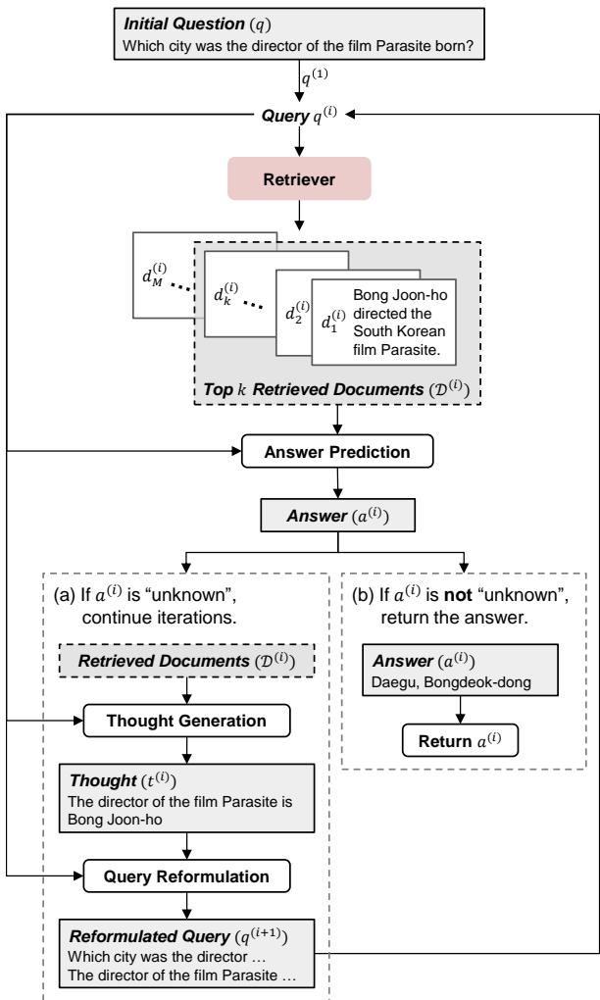
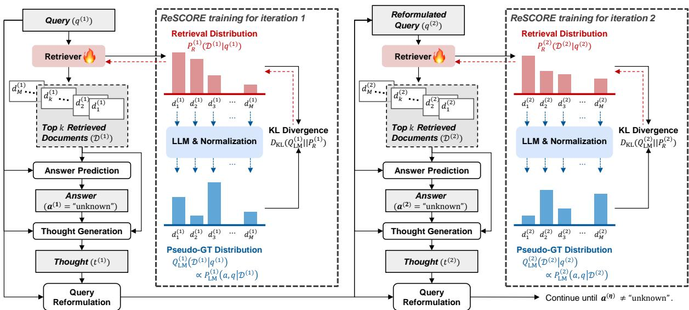
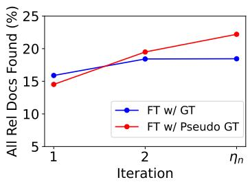
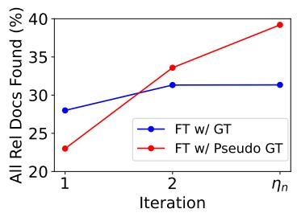
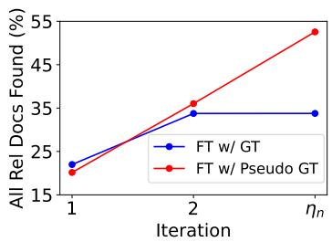

# ReSCORE: Label-free Iterative Retriever Training for Multi-hop Question Answering with Relevance-Consistency Supervision

Dosung Lee<sup>1</sup>∗ Wonjun Oh<sup>1</sup>∗ Boyoung Kim<sup>1</sup> Minyoung Kim<sup>1</sup>

Joonsuk Park<sup>2,3,4</sup>† Paul Hongsuck Seo<sup>1</sup>†

<sup>1</sup>Dept. of CSE, Korea University,

<sup>2</sup>NAVER AI Lab, <sup>3</sup>NAVER Cloud,

<sup>4</sup>University of Richmond

{dslee1219, owj0421, bykimby, omniverse186, phseo}@korea.ac.kr park@joonsuk.org

## Abstract

Multi-hop question answering (MHQA) involves reasoning across multiple documents to answer complex questions. Dense retrievers typically outperform sparse methods like BM25 by leveraging semantic embeddings; however, they require labeled query-document pairs for fine-tuning. This poses a significant challenge in MHQA due to the high variability of queries—(reformulated) questions— throughout the reasoning steps. To overcome this limitation, we introduce Retriever Supervision with Consistency and Relevance (ReSCORE), a novel method for training dense retrievers for MHQA without labeled documents. ReSCORE leverages large language models to capture each document’s relevance to the question and consistency with the correct answer and use them to train a retriever within an iterative question-answering framework. Experiments on three MHQA benchmarks demonstrate the effectiveness of ReSCORE, with significant improvements in retrieval, and in turn, the state-of-the-art MHQA performance. Our implementation is available at: https://leeds1219.github.io/ReSCORE.

## 1 Introduction

Multi-hop question answering (MHQA) consists of complex questions that need to be answered by logically-connecting relevant information from multiple documents. For instance, to answer "Which city was the director of the film Parasite born?", you must first identify the director— "Bong Joon-ho"—and figure out where he was born—"Bongdeok-dong, Daegu." The state-of-theart (SOTA) systems for MHQA take an iterative retrieval-augmented generation (RAG) approach, where they iteratively retrieve relevant documents and generate partial answers from them, until the final answer is reached, as illustrated in Fig. 1 (Trivedi et al., 2023; Jeong et al., 2024).

  
Figure 1: Iterative RAG Framework for MHQA. At iteration i, the framework first retrieves top k documents relevant to the current query $\boldsymbol { q } ^ { ( i ) }$ to generate an answer $a ^ { ( i ) }$ . (a) If the answer is "unknown", a thought $t ^ { ( i ) }$ is generated as a compact representation of the retrieved documents based on the query $\boldsymbol { q } ^ { ( i ) }$ . This thought is then used to reformulate the query for the next iteration $q ^ { ( i + 1 ) }$ and continues the next iteration. (b) If $a ^ { ( i ) }$ is not "unknown", the iteration ends, and $a ^ { ( i ) }$ is returned as the final answer.

One common limitation of these systems is the use of sparse retrievers, such as BM25 (Robertson et al., 1995), even though dense retrievers like Contriever (Izacard et al., 2021) are known to be more effective in general. This is largely due to the fact that, unlike sparse retrievers based on keyword matching, dense retrievers rely on query and document embeddings that need to be trained on the target domain (Karpukhin et al., 2020). For MHQA, however, it is cost- and labor-intensive to prepare documents labeled with their relevance to respective queries across iterations, because the queries—reformulated questions—can be different for each large language model (LLM) used for answer generation, even for the same domain.

To address this issue, we propose Retriever Supervision with Consistency and Relevance (ReSCORE), a novel method for training a dense retriever for MHQA without labeled documents. ReSCORE builds on the intuition that the importance of a document for answering a question is proportional to the probability of an LLM generating both the question and the correct answer given the document. In this way, the document’s consistency with the answer (Izacard et al., 2023) and relevance to the question are jointly modeled. ReSCORE leverages this probability as pseudo-ground truth (pseudo-GT) label to train the retriever within an iterative RAG framework.

We demonstrate the efficacy of ReSCORE through experiments on three popular MHQA datasets: MuSiQue (Trivedi et al., 2022), 2WikiMHQA (Ho et al., 2020), and HotpotQA (Yang et al., 2018). The experiments show that a combination of consistency and relevance provides effective supervision for training a dense retriever for MHQA without labeled documents. The retriever trained using ReSCORE not only improves the retrieval quality but also achieves the SOTA performance on MHQA when integrated into our iterative RAG framework, Iterative Question Answerer with Trained Retriever (IQATR, which is pronounced as “equator”).

Our key contributions are as follows:

• We propose ReSCORE, an iterative dense retriever training approach for MHQA without relying on documents labeled with their relevance to respective queries.

• We present IQATR, an MHQA system with its retriever trained using ReSCORE. It achieves the SOTA on three popular benchmarks, thereby showcasing the efficacy of ReSCORE.

• We provide an in-depth analysis of the effects of various pseudo-GT labels and query reformulation methods.

## 2 Related Work

Training Retrievers for RAG In the context of RAG, retrieval accuracy plays a critical role in improving the performance of the overall system. Several approaches have focused on improving retrieval quality by training retrievers, including supervised training with large labeled datasets (Izacard et al., 2021; Guu et al., 2020), and unsupervised training (Izacard et al., 2021). While these methods primarily concentrate on optimizing a retriever, they often overlook the generation aspect, leading to a domain gap between retrieval and generation tasks. To bridge this gap, techniques leveraging LLM supervision, LLM-Embedder (Zhang et al., 2023), Intermediate Distillation (Li et al., 2024), REPLUG (Shi et al., 2024) and ATLAS (Izacard et al., 2023) have proposed methods that train the retrieval to align with generation, aiming to optimize both processes. However, these approaches typically focus on single-hop questions and only consider consistency of the document with the answer, overlooking iterative reasoning and MHQA. In contrast, our approach trains within an iterative framework, emphasizing both the consistency and the relevance of a document, offering a more holistic solution for MHQA.

Iterative RAG Iterative RAG extends singlehop RAG to tasks requiring multiple reasoning steps across documents (Xiong et al., 2021). FLARE (Jiang et al., 2023) focuses on adaptively retrieving documents when low-probability tokens are generated. To dynamically determine the need for external knowledge, Self-RAG (Asai et al., 2023) trains on a GPT-4 (Brown et al., 2020) generated dataset. ITER-RETGEN (Shao et al., 2023) incorporates the output from the previous iteration as a retrieval context. Another notable method, IRCoT (Trivedi et al., 2023), extends a Chain of Thoughts iteratively to mimic multi-step reasoning. Building on IRCoT, Adaptive-RAG (Jeong et al., 2024) improves efficiency by introducing a classifier that dynamically adjusts the number of reasoning steps based on question complexity. Adaptive-Note (Wang et al., 2024) filters out some of retrieved documents using an LLM to improve precision. While the aforementioned works excel in iterative RAG, none of them focus on training retrievers, which is a crucial element and rely either on traditional sparse retrievers or a dense retriever pretrained on a different dataset. In contrast, we train a dense retriever directly within the iterative

RAG system, and allow the retriever to effectively adapt to the target domain.

Training with LLM Supervision In recent years, training smaller models with LLM supervision has become a common and effective approach, especially when human annotation is limited or unavailable. One notable example is CoT-Distill (Shridhar et al., 2023), which utilize teacher model generated Chain-of-Thought dataset to train smaller models. In a similar vein, Self-RAG (Asai et al., 2023) employs a dataset curated by GPT-4 (Brown et al., 2020) to learn a classifier deciding when to retrieve. Moreover, Intermediate Distillation (Li et al., 2024), Promptagator (Dai et al., 2023), and RankVicuna (Pradeep et al., 2023) explore the use of teacher model generated document ranking lists to guide the training process. Other works, such as DistilBERT (Sanh, 2019), which is a smaller version of BERT trained by leveraging the hidden states vector of a teacher model. Similarly, AT-LAS (Izacard et al., 2023) uses token probabilities from the teacher model to train a retriever. To the best of our knowledge, this study is the first to leverage an LLM for training a retriever within an iterative RAG framework for MHQA.

## 3 Methods

## 3.1 Iterative RAG Framework

Given a question $q ,$ , the goal of MHQA is to generate the answer a leveraging knowledge from a document database from which relevant documents are retrieved. Notably, the question $q$ can be answered only if the complete set of relevant documents $\mathcal { D } ^ { * } = \{ d _ { 1 } ^ { * } , \ldots , d _ { h } ^ { * } \} \subseteq \mathcal { D }$ is accurately identified and utilized. To tackle this problem, we adopt an iterative reasoning process, following previous studies (Trivedi et al., 2023; Jeong et al., 2024), where the system iteratively retrieves relevant documents and refines the answer based on the retrieved information as illustrated in Fig. 1.

Specifically, given the question $q ,$ which we designate as the first query $q ^ { ( 1 ) }$ , we retrieve a set of $k$ documents $\mathcal { D } ^ { ( 1 ) } = \{ d _ { 1 } ^ { ( 1 ) } , \dots , d _ { k } ^ { ( 1 ) } \} \subseteq \mathcal { D } . \mathcal { D } ^ { ( 1 ) }$ is then incorporated into a predefined prompt for the LLM. The prompt instructs the LLM to either defer answer generation to retrieve additional information, or predict an answer $a ^ { ( 1 ) }$ based on the sufficiency of the information in $\mathcal { D } ^ { ( 1 ) }$ , thereby terminating the question-answering process, as illustrated by (a) and (b) in Fig. 1, respectively. If the LLM decides to retrieve additional documents by predicting “unknown” as the answer, the system constructs a compressed representation of the retrieved documents $\mathcal { D } ^ { ( 1 ) }$ , referred to as a thought $t ^ { ( 1 ) }$ . To achieve this, we prompt the LLM to construct a single sentence distilling the key information required to answer the initial question $q$ from the retrieved documents $\mathcal { D } ^ { ( 1 ) }$ . This technique, adopted from (Trivedi et al., 2023), allows us to maintain the retrieved information in a compact form, which is then utilized during subsequent iterations in answer generation. Finally, the system reformulates the query $q ^ { ( 1 ) }$ into a new query $q ^ { ( 2 ) }$ highlighting unresolved aspects of $q ^ { ( 1 ) }$ in $\mathcal { D } ^ { ( 1 ) }$ requiring additional information. This reformulated query $q ^ { ( 2 ) }$ then guides the retrieval of additional documents in the next iteration.

In the next iteration, the refined query $q ^ { ( 2 ) }$ is used to retrieve a new set of k documents $\mathcal { D } ^ { ( 2 ) }$ = $\{ d _ { 1 } ^ { ( 2 ) } , \dots , d _ { k } ^ { ( 2 ) } \} \subseteq \mathcal { D } - \mathcal { D } ^ { ( 1 ) }$ . These retrieved documents are then provided to the LLM along with the thought $t ^ { ( 1 ) }$ , which either outputs a final answer or continues the iterative process by generating a new thought $t ^ { ( 2 ) }$ and a further reformulated query $q ^ { ( 3 ) }$ . More generally, at each iteration i, a set of k new relevant documents $\mathcal { D } ^ { ( i ) }$ is retrieved based on the query $\boldsymbol { q } ^ { ( i ) }$ . Then, the LLM either generates the final answer based on the retrieved documents $\mathcal { D } ^ { i }$ as well as all available thoughts $t ^ { ( 1 ) } , \dots , t ^ { ( i - 1 ) }$ or continues the process with a new thought $t ^ { ( i ) }$ and a reformulated query $q ^ { ( i + 1 ) }$

## 3.2 Training Retriever for Iterative RAG

A key component of this iterative RAG framework is the retriever, which must ensure the retrieval of documents that provide relevant and complementary information across iterations to support multi-hop reasoning. However, collecting labeled documents for retriever training is labor- and costintensive. To address this limitation, we propose ReSCORE, a novel framework for retriever training without document labels. In ReSCORE, a retriever is trained for MHQA using pseudo-GT labels generated by leveraging an LLM, as illustrated in Fig. 2. Generating Pseudo-GT Labels As labels for relevant documents are unavailable, it is essential to devise a method to identify which documents are required to the input question to effectively train the retriever. Specifically, we measure the distribution $Q _ { \mathrm { L M } } ^ { ( i ) } ( d _ { j } ^ { ( i ) } \mid \bar { q } ^ { ( i ) } )$ , which represents the likelihood of retrieving a document $d _ { j } ^ { ( i ) }$ given a query $\boldsymbol { q } ^ { ( i ) }$ at iteration i. To achieve this, we leverage an LLM inspired from (Izacard et al., 2023) capturing the intuition that $Q _ { \mathrm { L M } } ^ { ( i ) } ( d _ { j } ^ { ( i ) } \mid q ^ { ( i ) } )$ for a document $d _ { j } ^ { ( i ) }$ is proportional to the probability that the LLM generates both the question $q$ and the corresponding answer a given $\bar { d } _ { j } ^ { ( i ) }$ . Formally, this is expressed as:

  
Figure 2: Overview of ReSCORE. At each iteration i within a iterative RAG process, the retriever receives gradients from the KL-Divergence loss of the retrieval distribution $P _ { R } ^ { ( i ) }$ against the pseudo-GT distribution $Q _ { \mathrm { L M } } ^ { ( i ) }$ which is derived from the LLM probabilities of question and answer given each document $d _ { i } ^ { ( i ) }$ with normalization. The number of iterations is dynamically determined by the LLM and the process ends if the LLM predicts an answer which is not “unknown”. The red dashed lines represents gradient flows for the retriever.

$$
\begin{array} { r l r } { Q _ { \mathrm { L M } } ^ { ( i ) } ( d _ { j } ^ { ( i ) } \mid q ) \propto P _ { \mathrm { L M } } ^ { ( i ) } ( a , q \mid d _ { j } ^ { ( i ) } ) } & { { } ( 1 } & { } \\ { \quad \quad \quad = P _ { \mathrm { L M } } ^ { ( i ) } ( q \mid d _ { j } ^ { ( i ) } ) \cdot P _ { \mathrm { L M } } ^ { ( i ) } ( a \mid q , d _ { j } ^ { ( i ) } ) } & { { } } & { } \end{array}\tag{2}
$$

where $P _ { \mathrm { L M } }$ denotes the probability of a token sequence as computed by the LLM.

The advantage of our approach lies in its ability to evaluate not only the relevance of the document to the question but also its consistency in answering the question. The probability in Eq. (1) can be further decomposed into two components using the chain rule as in Eq. (2). The former represents the probability of generating the question from the document, capturing the relevance. The latter represents the probability of predicting the correct answer to the question with the document, assessing the consistency. While $P _ { \mathrm { L M } } ^ { ( i ) } ( a \mid q , d _ { j } ^ { ( i ) } )$ appears more directly aligned with the QA training objective, this term alone often fails to capture the relevance of the document to the question. Notably, determining whether a document is consistent for answering a given question is often challenging, even for humans. This can lead to high LM scores, even when there are only superficial word-level alignments between the document and the answer, which may not necessarily reflect true relevance. For instance, $P _ { \mathrm { L M } } ^ { ( i ) } ( a \mid q , \dot { d } _ { j } ^ { ( i ) } )$ for a document titled “2006 FIFA World Cup” is higher than that for the GT documents for the question: “In what year did the studio behind Toy Story release its first feature film after being acquired by Disney?” This occurs because, while the document is irrelevant, it contains the token “2006”, which is the correct answer<sup>1</sup>. In contrast, Eq. (2) additionally incorporates $P _ { \mathrm { L M } } ^ { ( i ) } ( q \mid d _ { j } ^ { ( i ) } )$ , which is low for topically unrelated documents, thereby down-weighting them in the in the final scores. Furthermore, a document’s relevance to a question itself does not imply that it provides adequate information for answering the question, as it overlooks the consistency to the answer. By explicitly modeling both consistency and relevance, our method trains a retriever to retrieve the documents necessary for answering a given question.

Training Loss Function Given the distribution $Q _ { \mathrm { L M } }$ as the ground truth, we train the retriever by minimizing the Kullback-Leibler (KL) divergence over all QA pairs $( q _ { n } , a _ { n } )$ and iterations i:

$$
\sum _ { n = 1 } ^ { N } \sum _ { i = 0 } ^ { \eta _ { n } } D _ { \mathrm { K L } } \left( Q _ { \mathrm { L M } } ^ { ( i ) } ( \mathcal { D } ^ { ( i ) } \mid q _ { n } ^ { ( i ) } ) \parallel P _ { R } ^ { ( i ) } ( \mathcal { D } ^ { ( i ) } \mid q _ { n } ^ { ( i ) } ) \right) ,
$$

where $N$ is the number of QA pairs in the training set, $\eta _ { n }$ is the number of iterations determined by the LLM for each question $q _ { n } ,$ , and $P _ { R } ^ { ( i ) }$ is the document distribution for retrieval at iteration $i .$ The distribution $P _ { R } ^ { ( i ) }$ is computed by applying the Softmax function on the dot products between the question vector and each document vector in the database , $i . e .$

$$
P _ { R } ^ { ( i ) } ( d _ { j } ^ { ( i ) } \mid q _ { n } ^ { ( i ) } ) = \mathrm { S o f t m a x } \left( { \bf d } _ { j } ^ { ( i ) } \cdot { \bf q } _ { n } ^ { ( i ) } \right)
$$

where ${ \bf d } _ { j } ^ { ( i ) } = \mathrm { E m b e d } _ { \mathrm { d o c } } ( { d } _ { j } ^ { ( i ) } )$ is a document embedding and $\mathbf { q } _ { n } ^ { ( i ) } = \mathrm { E m b e d } _ { \mathrm { q u e r y } } ( q _ { n } ^ { ( i ) } )$ is a query embedding.

Note, the GT answer $a _ { n }$ for each instance is used to compute $Q _ { \mathrm { L M } } ^ { ( i ) }$ , which serves as the distribution the retriever aims to learn. However, calculating the distribution $Q _ { \mathrm { L M } } ^ { ( i ) } ( \mathcal { D } ^ { ( i ) } \mid q _ { n } ^ { ( i ) } )$ over the entire database is computationally prohibitive due to the large size of  and the high computational cost of the LLM. Thus, at each iteration i, we sample the top $M \ll | \mathcal { D } |$ documents based on the retriever scores and compute $Q _ { \mathrm { L M } } ^ { ( i ) }$ only on these sampled documents.

## 4 Experiment

## 4.1 Settings

Datasets We conduct our experiments on three popular MHQA datasets: MuSiQue (Trivedi et al., 2022), 2WikiMHQA (Ho et al., 2020), and HotpotQA (Yang et al., 2018). Each dataset contains complex question structures that require reasoning across multiple documents, making them ideal for evaluating multi-hop retrieval and question-answering capabilities. Following prior works (Trivedi et al., 2023; Jeong et al., 2024; Johnson et al., 2021), experiments are conducted on subsampled versions of the validation and test sets, as well as the retrieval database. These datasets come with GT document labels, which are not used for training our model.

Models We take as baselines the best existing models for MHQA: ReAcT (Yao et al., 2023), FLARE (Jiang et al., 2023), Self-RAG (Asai et al., 2023), Adaptive-Note (Wang et al., 2024), IRCoT (Trivedi et al., 2023), and Adaptive-RAG (Jeong et al., 2024). We then establish our own baseline models by implementing the iterative RAG framework described in Sec. 3.1, integrating Llama-3.1-8B-Instruct (Touvron et al., 2023) with BM25 (Robertson et al., 1995) and

Contriever (Izacard et al., 2021) trained on the MS-MARCO dataset (Nguyen et al., $2 0 1 6 ) . ^ { 2 }$ Lastly, we prepare our model—Iterative Question Answerer with Trained Retriever (IQATR)—by fine-tuning Contriever in our baseline model using ReSCORE. Evaluation Metrics To assess the QA performance of our approach, we adopt two standard metrics for MHQA: Exact Match (EM) and F1 score. These metrics are applied at the answer level, using the official evaluation protocol provided in each dataset. To assess the retrieval performance within our iterative RAG framework, we introduce a metric called multi-hop recall at k (MHR@k), measuring recall across iterations. Specifically, we compute the MHR@k for iteration i, denoted as MHR<sub>i</sub>@k, by

$$
\mathbf { M H R } _ { i } @ k = \frac { \left| \mathcal { D } ^ { * } \cap \bigcup _ { l = 1 } ^ { i } \mathcal { D } ^ { ( l ) } \right| } { \left| \mathcal { D } ^ { * } \right| }\tag{3}
$$

where $\mathcal { D } ^ { * }$ is the set of GT supporting documents, and $\textstyle \bigcup _ { l = 1 } ^ { i } { \mathcal { D } } ^ { ( l ) }$ is the union of retrieved documents up to iteration i. This measures the cumulative recall at iteration i as the ratio of GT supporting documents retrieved up to iteration i to the total number of the GT supporting documents.

Implementation Details We train the question embedder while keeping the document embedder frozen throughout the process. To compute the document distribution, we format the question, answer, and document into a predefined prompt, as described in Section 5. For loss calculation, we use the top $M = 3 2$ documents, while for inference, we select the top $k = 8$ documents. The maximum number of iterations $\eta _ { n }$ is set to 6, and the batch size to 16. Temperature scaling is applied to control the output distributions of the LLM, with a temperature value of 0.1, which is selected among 1, 0.1, and 0.01. We use the AdamW optimizer and two NVIDIA A100 GPUs (40GB memory). The initial learning rate is set to $1 \times 1 0 ^ { - 6 }$ and is exponentially decayed at every 100 iterations by a factor of 0.9. The training continues until the validation loss stops improving within an epoch. Additionally, in accordance with the MHQA requirements, which involve reasoning over at least two hops, we set a minimum iteration limit of 2, in both training and inference of IQATR, inspired by Adaptive-RAG (Jeong et al., 2024).

<table><tr><td>Model</td><td colspan="2">MuSiQue</td><td colspan="2">HotpotQA</td><td colspan="2">2WikiMHQA</td></tr><tr><td></td><td>EM</td><td>F1</td><td>EM</td><td>F1</td><td>EM</td><td>F1</td></tr><tr><td>ReAcT (GPT-3.5+BM25)†</td><td>10.2</td><td>19.7</td><td>36.0</td><td>46.9</td><td>28.0</td><td>37.3</td></tr><tr><td>FLARE (GPT-3.5+BM25)†</td><td>11.2</td><td>18.7</td><td>36.4</td><td>47.8</td><td>31.8</td><td>42.8</td></tr><tr><td>Self-RAG (GPT-3.5+BM25)†</td><td>10.6</td><td>19.2</td><td>33.8</td><td>44.4</td><td>24.4</td><td>30.8</td></tr><tr><td>Adaptive-Note (GPT-3.5+BM25)†</td><td>13.2</td><td>24.2</td><td>45.6</td><td>58.4</td><td>43.2</td><td>54.2</td></tr><tr><td>IRCoT (Flan-T5-XL+BM25)‡</td><td>22.0</td><td>31.8</td><td>44.4</td><td>56.2</td><td>49.7</td><td>54.9</td></tr><tr><td>Adaptive-RAG (Flan-T5-XL+BM25)‡‡</td><td>23.6</td><td>31.8</td><td>42.0</td><td>53.8</td><td>40.6</td><td>49.8</td></tr><tr><td>Our Baseline (Llama-3.1-8B+BM25)</td><td>15.2</td><td>23.6</td><td>42.2</td><td>55.7</td><td>44.6</td><td>52.2</td></tr><tr><td>Our Baseline (Llama-3.1-8B+Contriever)</td><td>15.2</td><td>23.8</td><td>39.4</td><td>52.3</td><td>32.8</td><td>41.6</td></tr><tr><td>IQATR (Llama-3.1-8B+Contriever trained w/ ReSCORE)</td><td>23.4</td><td>32.7</td><td>47.2</td><td>59.3</td><td>50.0</td><td>59.7</td></tr></table>

Table 1: Comparisons to State-of-the-Art Iterative RAG Frameworks on three MHQA benchmarks. EM and F1 scores are measured on each dataset. Scores are sourced from (Wang et al., 2024). Scores are reproduced using the official codes. Scores are sourced from the original paper (Jeong et al., 2024). We conducted significance tests at $p = 0 . 0 5$ , confirming IQATR’s superiority (details in Appendix C).

## 4.2 Results and Analysis

## 4.2.1 Efficacy of ReSCORE

We first compare IQATR, equipped with a retriever fine-tuned by ReSCORE, against baseline models and existing SOTA methods in Tab. 1. The results first present that baseline models perform better with the sparse BM25 retriever than with a pretrained Contriever. This can be attributed to the fact that Contriever was not trained on domain-specific data (Izacard et al., 2021).

Although BM25 performs better initially, however, its training-free nature limits its potential for further improvement. In contrast, the document representations of Contriever can be enhanced through fine-tuning, enabling greater adaptability and performance gains. Consequently, when fine-tuned with ReSCORE, the model demonstrates significant improvements across all metrics on all three benchmarks, achieving SOTA performance.

In addition, we test the proposed method, ReSCORE, with other existing iterative MHQA methods, including Self-RAG (Asai et al., 2023), FLARE (Jiang et al., 2023), and Adaptive-Note (Wang et al., 2024). These frameworks are reimplemented using Llama and Contriever to avoid costs for API calls. Tab. 2 presents the MHQA performance in terms of EM and F1, as well as retrieval performance measured by MHR @k with k = 8 and varying i. Note that $\eta _ { n }$ represents the total number of iterations, which varies for each question. The results clearly demonstrate that ReSCORE consistently enhances both MHQA and retrieval performances across all methods and benchmarks, highlighting its broad applicability. Notably, the improvements in MHR<sub>i</sub>@8 become bigger as i increases. The MHR<sub>i</sub>@8 scores in the baseline models are bounded even though i increases whereas the scores with the retrievers fine-tuned with ReSCORE continue to improve as i grows. This signifies that ReSCORE effectively trains the retriever to identify documents that complement those already retrieved.

## 4.2.2 Analysis of Pseudo-GT Labels

We next demonstrate the effectiveness of using the proposed pseudo-GT labels for fine-tuning the retriever by comparing the results of three LLM-based re-ranking methods, including the proposed approach: $P _ { \mathrm { L M } } ( q \mid d _ { j } ) , P _ { \mathrm { L M } } ( a \mid q , d _ { j } )$ and $P _ { \mathrm { L M } } ( q , a \ | \ d _ { j } )$ The first question probability, $P _ { \mathrm { L M } } ( q \mid d _ { j } )$ , evaluates the relevance of the document $d _ { j }$ to the question $q .$ The second answer probability, $P _ { \mathrm { L M } } ( a \mid q , d _ { j } )$ , measures the consistency of the document in answering the question. Finally, the third approach, $P _ { \mathrm { L M } } ( q , a \mid d _ { j } )$ , which is adopted as the pseudo-GT labels in ReSCORE, jointly considers both relevance and consistency, providing a comprehensive metric for training a retriever. For this experiment, we simply measure the standard recall on re-ranked results in a single iteration.

The results in Tab. 3 demonstrate that re-ranking documents using the question probability improves recalls across all three datasets by an average of 5.37%. This highlights the critical role of considering document relevance to the question in retrieval for MHQA. Interestingly, however, re-ranking documents solely based on the answer probability significantly degrades 23.8% from the baseline performance on average. This decline is primarily due to an increase in false positives, where irrelevant documents are erroneously assigned high consistency scores because of their superficial alignment with the answer confusing the LLM.

<table><tr><td rowspan="2">Model</td><td colspan="2">QA</td><td colspan="3">MHRi@K</td></tr><tr><td>EM</td><td>F1</td><td>i = 1</td><td>i = 2</td><td>i = ηn</td></tr><tr><td colspan="6">MuSiQue</td></tr><tr><td>Self-RAG* +ReSCORE</td><td>1.2 2.8</td><td>8.2 10.8</td><td>25.8 24.9</td><td>25.8 31.6</td><td>25.8 31.6</td></tr><tr><td>FLARE +ReSCORE</td><td>7.3 8.2</td><td>13.3 15.3</td><td>31.0 30.9</td><td>37.1 40.1</td><td>37.1 43.3</td></tr><tr><td>Adaptive-Note +ReSCORE</td><td>9.6 11.2</td><td>17.7 20.5</td><td>44.9 45.1</td><td>50.2 49.8</td><td>50.2 55.3</td></tr><tr><td>Our Baseline +ReSCORE</td><td>15.2 23.4</td><td>23.8 32.7</td><td>44.9 46.8</td><td>51.6 63.0</td><td>51.6 65.2</td></tr><tr><td colspan="6">HotpotQA</td></tr><tr><td>Self-RAG* +ReSCORE</td><td>5.6 8.7</td><td>17.9 19.2</td><td>36.1 33.8</td><td>36.5 37.2</td><td>36.5 37.2</td></tr><tr><td>FLARE +ReSCORE</td><td>27.5 31.4</td><td>38.9 42.5</td><td>37.2 39.2</td><td>48.4 48.5</td><td>48.4 51.7</td></tr><tr><td>Adaptive-Note +ReSCORE</td><td>42.0 43.8</td><td>55.3 58.0</td><td>44.8 47.3</td><td>49.8 63.3</td><td>50.1 77.2</td></tr><tr><td>Our Baseline +ReSCORE</td><td>39.4 47.2</td><td>52.3 59.3</td><td>44.8 46.6</td><td>47.5 69.3</td><td>47.5 72.4</td></tr><tr><td colspan="6">2WikiMHQA</td></tr><tr><td>Self-RAG* +ReSCORE</td><td>3.0 5.6</td><td>19.1 21.2</td><td>26.3 25.9</td><td>27.1 28.4</td><td>27.1 32.8</td></tr><tr><td>FLARE +ReSCORE</td><td>23.2 26.5</td><td>35.0 38.0</td><td>32.5 33.2</td><td>42.9 45.6</td><td>42.9 45.6</td></tr><tr><td>Adaptive-Note +ReSCORE</td><td>35.7 37.4</td><td>46.1 49.3</td><td>45.7 49.8</td><td>59.2 63.2</td><td>59.2 67.5</td></tr><tr><td>Our Baseline +ReSCORE</td><td>32.8 50.0</td><td>41.6 59.7</td><td>45.7 51.2</td><td>56.9 81.2</td><td>56.9 88.0</td></tr></table>

Table 2: Effects of ReSCORE with various iterative RAG systems on three MHQA benchmarks. All methods are re-implemented using Llama 3.1 and Contriever, except for Self-RAG, which uses Llama-2-7B model from the original study. All hyperparameters for the baselines are taken from the original paper and code, as detailed in Appendix A.

Finally, we tested our proposed approach, which uses the QA probability, combining relevance and consistency. Note that this QA probability can be factorized as the product of the question and answer probabilities, $P _ { \mathrm { L M } } ( q \mid d _ { j } ) \cdot P _ { \mathrm { L M } } ( a \mid q , d _ { j } )$ The results show approximately 14.4% improvements on average across the benchmarks compared to the baseline. While the answer probability by itself seemed ineffective, its combination with the question probability becomes powerful, as it evaluates the consistency among relevant documents, with irrelevant ones already filtered out due to their low question probabilities.

## 4.2.3 Pseudo-GT vs. GT Labels

To further evaluate the quality of pseudo-GT labels in ReSCORE, we fine-tune retrievers with GT labels. For this fine-tuning, a retriever is trained in a single step, treating all labeled GT documents as positives. Here, InfoNCE loss function from DPR (Karpukhin et al., 2020) and Contriever (Izacard et al., 2021) is employed in line with the common practice for fine-tuning dense retrievers. While it might be hypothesized that such models serve as an upper bound for ReSCORE, experimental results in Tab. 4 reveal that ReSCORE-trained models outperform these models, achieving superior results in both MHQA and multi-hop retrieval metrics. This occurs because the model trained with GT labels forces the query to align with multiple documents simultaneously. Note that, the GT document distribution remains fixed. In this context, a contrastive loss with treating all GT documents as positive attempts to align the query with potentially distant multiple GT documents simultaneously. For example, consider the query: "Who is the first president of the country where Billie Eilish’s favorite food originates from?" To answer this, multiple documents each containing information on "Billie Eilish," "Avocado," and "Presidents of Mexico" are required. When training with GT documents, the query encoder would attempt to align the query embedding with the centroid of these distant document embeddings, which may not be effective for retrieving any of the documents. While GT labels enhance initial retrieval results, they show limited effectiveness in the iterative process, as evidenced by the bounded MHR scores for $i \ \geq 2 .$ . In contrast, our method employs an iterative retrieval process, enabling the progressive retrieval of distant GT documents across multiple steps. This iterative approach inherently addresses the limitations of single-step retrieval by gradually complementing the retrieval results as i increases.

<table><tr><td>Pseudo-GT</td><td>EM</td><td>F1</td><td>R@2</td><td>R@4</td><td>R@8</td></tr><tr><td colspan="6">MuSiQue</td></tr><tr><td>None</td><td>15.2</td><td>23.8</td><td>32.7</td><td>40.1</td><td>47.1</td></tr><tr><td> $P _ { \mathrm { L M } } ( q \mid d )$   $P _ { \mathrm { L M } } ( a \mid q , d )$   $P _ { \mathrm { L M } } ( q , \dot { a } | d )$ </td><td>15.9 5.8 16.4</td><td>25.9 12.3 26.3</td><td>34.6 28.9 42.7</td><td>41.1 35.1 50.3</td><td>47.9 41.4 55.7</td></tr><tr><td colspan="6">HotpotQA</td></tr><tr><td>None</td><td>39.4</td><td>52.3</td><td>49.4</td><td>56.5</td><td>61.7</td></tr><tr><td> $P _ { \mathrm { L M } } ( q \mid d )$   $P _ { \mathrm { L M } } ( a \mid q , d )$ </td><td>42.0 19.2</td><td>53.9 26.4</td><td>55.2 27.5</td><td>62.4 34.4</td><td>65.9 42.8</td></tr><tr><td> $P _ { \mathrm { L M } } ( q , a \mid d )$ </td><td>43.6</td><td>56.4</td><td>58.1</td><td>64.6</td><td>68.3</td></tr><tr><td colspan="6">2WikiMHQA</td></tr><tr><td>None</td><td>32.8</td><td>41.6</td><td>46.4</td><td>54.3</td><td>58.9</td></tr><tr><td>PLM(q | d)</td><td>39.2</td><td>47.9</td><td>50.8</td><td>59.1</td><td>63.2</td></tr><tr><td> $P _ { \mathrm { L M } } ( a \mid q , d )$ </td><td>18.8</td><td>26.5</td><td>26.1</td><td>33.3</td><td>41.9</td></tr><tr><td> $P _ { \mathrm { L M } } ( q , a \mid d )$ </td><td>41.4</td><td>51.7</td><td>53.7</td><td>63.0</td><td>67.1</td></tr><tr><td></td><td></td><td></td><td></td><td></td><td></td></tr></table>

Table 3: Comparisons of Different Pseudo-GT Labels on Document Reranking. Recall@k (R@k) was computed after retrieving 100 documents with Contriever and re-ranking them using the given pseudo-GT label for questions in the validation set. EM/F1 was computed in the same setting on the test set.

  
(a) MuSiQue Dataset

  
(b) HotpotQA Dataset

  
(c) 2WikiMHQA Dataset

Figure 3: Comparison of GT and Pseudo-GT Labels on All Relevant Document Retrieval. The y-axis shows the proportion of questions for which all relevant documents were found, which are all needed to correctly answer a given complex question. Pseudo-GT labels lead to improved performance as the number of iterations increases.
<table><tr><td></td><td colspan="2">QA</td><td colspan="3">MHRi@8</td></tr><tr><td>Label</td><td>EM</td><td>F1</td><td>i = 1</td><td> $i = 2$ </td><td> $i = \eta _ { n }$ </td></tr><tr><td colspan="6">MuSiQue</td></tr><tr><td>None</td><td>15.2</td><td>23.8</td><td>44.9</td><td>51.6</td><td>51.6</td></tr><tr><td>GT</td><td>15.8</td><td>24.9</td><td>46.7</td><td>54.8</td><td>54.8</td></tr><tr><td>Pseudo-GT</td><td>23.4</td><td>32.7</td><td>46.8</td><td>63.0</td><td>65.2</td></tr><tr><td colspan="6">HotpotQA</td></tr><tr><td>None</td><td>39.4</td><td>52.3</td><td>44.8</td><td>47.5</td><td>47.5</td></tr><tr><td>GT</td><td>45.2</td><td>55.8</td><td>48.7</td><td>52.7</td><td>52.7</td></tr><tr><td>Pseudo-GT</td><td>47.2</td><td>59.3</td><td>46.6</td><td>69.3</td><td>72.4</td></tr><tr><td colspan="6">2WikiMHQA</td></tr><tr><td>None</td><td>32.8</td><td>41.6</td><td>45.7</td><td>56.9</td><td>56.9</td></tr><tr><td>GT</td><td>37.1</td><td>46.2</td><td>48.5</td><td>61.7</td><td>61.7</td></tr><tr><td>Pseudo-GT</td><td>50.0</td><td>59.7</td><td>51.2</td><td>81.2</td><td>88.0</td></tr></table>

Table 4: Comparisons of Different Labels for finetuning retrievers on three MHQA benchmarks. None denotes no label, which means the baseline model without fine-tuning. GT is a binary label denoting whether a document is relevant to a given question or not. Pseudo-GT is the labels used within ReSCORE.

This is further illustrated in Fig. 3, which depicts the proportion of questions for which all relevant documents are successfully retrieved. As observed, retrievers trained with GT annotations achieve higher rates in the initial iteration (blue lines) because the training procedure pushes the question embedding towards all relevant documents simultaneously. However, ReSCORE-trained retrievers quickly surpass these rates as i increases, achieving significantly higher rates of retrieving all relevant documents (red lines) thanks to the incorporation of the iterative process within ReSCORE.

<table><tr><td>Reformulation</td><td colspan="2">QA</td><td colspan="3">MHRi@8</td></tr><tr><td>Method</td><td>EM</td><td>F1</td><td> $i = 1$ </td><td> $i = 2$ </td><td> $i = \eta _ { n }$ </td></tr><tr><td colspan="6">MuSiQue</td></tr><tr><td>None</td><td>10.8</td><td>17.8</td><td>44.7</td><td>45.4</td><td>47.4</td></tr><tr><td>LLM-rewrite</td><td>21.2</td><td>30.5</td><td>45.1</td><td>56.7</td><td>63.7</td></tr><tr><td>Thought-concat</td><td>23.4</td><td>32.7</td><td>46.8</td><td>63.0</td><td>65.2</td></tr><tr><td colspan="6">HotpotQA</td></tr><tr><td>None</td><td>29.4</td><td>41.1</td><td>42.8</td><td>43.6</td><td>43.8</td></tr><tr><td>LLM-rewrite</td><td>44.2</td><td>57.4</td><td>41.9</td><td>54.8</td><td>64.7</td></tr><tr><td>Thought-concat</td><td>47.2</td><td>59.3</td><td>46.6</td><td>69.3</td><td>72.4</td></tr><tr><td colspan="6">2WikiMHQA</td></tr><tr><td>None</td><td>35.6</td><td>44.7</td><td>48.6</td><td>49.7</td><td>49.8</td></tr><tr><td>LLM-rewrite</td><td>51.7</td><td>60.1</td><td>50.0</td><td>86.0</td><td>89.5</td></tr><tr><td>Thought-concat</td><td>50.0</td><td>59.7</td><td>51.2</td><td>81.2</td><td>88.0</td></tr></table>

Table 5: Effect of Query Reformulation Methods on MHQA. We compare three methods: (1) no rewriting (None), (2) LLM-based query rewriting using retrieved documents (LLM-rewrite), and (3) concatenating summarized thoughts to the original query for retrieval (Thought-concat).

## 4.2.4 Ablations on Query Reformulation

We perform an ablation study to evaluate the effectiveness of various query reformulation methods. The first method, None, uses the original question q as the query at every iteration without any reformulation, serving as a lower bound. Another method, LLM-rewrite, prompts an LLM to rewrite the query $\boldsymbol { q } ^ { ( i ) }$ into a refined query $q ^ { ( i + 1 ) }$ , focusing on unresolved aspects based on the current retrieved documents $\mathcal { D } ^ { ( i ) }$ . Finally, Thought-concat appends the current thought $t ^ { ( i ) }$ to the query, constructing the updated query as $q ^ { ( i + 1 ) } = \mathsf { \bar { [ } } t ^ { ( i ) } ; q ^ { ( i ) } ]$ , where [a; b] denotes the concatenation of a and b.

The results in Tab. 5 show that both query reformulation methods improve retrieval and MHQA performance. Thought-concat achieves larger gains on MuSiQue and HotpotQA, while LLMrewrite performs slightly better on 2WikiMHQA. This difference stems from question complexity: LLM-rewrite works well for simpler queries (e.g., 2WikiMHQA with 11.7 tokens on average) but struggles with complex ones (e.g., MuSiQue and HotpotQA with 17.9 and 16.0 tokens, respectively), often losing focus. In contrast, Thought-concat benefits from LLMs’ strength in summarization and allows error recovery in subsequent iterations, as the original question remains as a part of the reformulated query.

## 5 Conclusion

In this paper, we presented ReSCORE, a novel method for training dense retrievers for MHQA without documents labeled with their relevance to respective queries. To demonstrate the efficacy of ReSCORE, we incorporated it into an iterative RAG framework, IQATR, to achieve the new SOTA on MHQA. We also employed it in existing MHQA systems to improve the performance, showcasing its broad applicability to various iterative RAG frameworks for MHQA. In addition, we conducted additional experiments to analyze various query reformulation methods and pseudo-GT labels to be used as fine-tuning signals for retriever training. We expect our in-depth analysis to provide deeper insights into ReSCORE and help devise ways to improve on this label-free retriever training method.

## Limitations

The fine-tuning process for our model is specifically tuned to datasets such as MuSiQue, 2Wiki-MultiHopQA, and HotpotQA, each of which has distinct characteristics, including the required number of hops and the types of reasoning involved. While our retriever demonstrates strong performance on trained datasets, its ability to generalize to other datasets that differ in reasoning patterns or dataset characteristics remains limited. This limitation highlights an Out-of-Distribution generalization challenge. Also, our approach relies on an iterative retrieval process, which increases computational costs and latency, especially for questions with high hop requirements. In practical applications the computational demand may be prohibitive. Further optimization is necessary to make the framework more efficient and scalable.

## Ethics Statement

This study adheres to ethical standards, emphasizing fairness, transparency, and responsibility. All datasets (MuSiQue, 2WikiMultiHopQA, HotpotQA) are publicly available, curated, and free of personally identifiable information. They are released under the MIT License, permitting modification, redistribution, and use with proper attribution. The Contriever model is released under the Attribution-NonCommercial 4.0 International (CC BY-NC 4.0) license, allowing non-commercial use, modification, and redistribution with proper attribution. The META LLAMA 3.1 model is released under the LLAMA 3.1 COMMUNITY LICENSE AGREEMENT (Release Date: July 23, 2024), governing responsible use, modification, and redistribution in accordance with META’s terms. We ensured consistency in training and evaluation conditions to maintain unbiased comparisons. We recognize the broader implications of multi-hop question-answering advancements and are committed to responsible development and application.

## Acknowledgements

This research was supported by IITP grants (IITP-2025-RS-2020-II201819, IITP-2025-RS-2024-00436857, IITP-2025-RS-2024-00398115, IITP-2025-RS-2025-02263754, IITP-2025-RS-2025-02304828), the NRF grant (NRF-2021R 1A6A1A03045425) and the KOCCA grant (RS-2024-00345025) funded by the Korea government (MSIT, MOE and MSCT).

## References

Akari Asai, Zeqiu Wu, Yizhong Wang, Avirup Sil, and Hannaneh Hajishirzi. 2023. Self-rag: Learning to retrieve, generate, and critique through self-reflection. arXiv preprint arXiv:2310.11511.

Tom Brown, Benjamin Mann, Nick Ryder, Melanie Subbiah, Jared D Kaplan, Prafulla Dhariwal, Arvind Neelakantan, Pranav Shyam, Girish Sastry, Amanda Askell, et al. 2020. Language models are few-shot learners. Advances in neural information processing systems, 33:1877–1901.

Zhuyun Dai, Vincent Y Zhao, Ji Ma, Yi Luan, Jianmo Ni, Jing Lu, Anton Bakalov, Kelvin Guu, Keith Hall, and Ming-Wei Chang. 2023. Promptagator: Fewshot dense retrieval from 8 examples. In The Eleventh International Conference on Learning Representations.

Kelvin Guu, Kenton Lee, Zora Tung, Panupong Pasupat, and Mingwei Chang. 2020. Retrieval augmented language model pre-training. In International conference on machine learning, pages 3929–3938. PMLR.

Xanh Ho, Anh-Khoa Duong Nguyen, Saku Sugawara, and Akiko Aizawa. 2020. Constructing a multihop QA dataset for comprehensive evaluation of reasoning steps. In Proceedings of the 28th International Conference on Computational Linguistics, pages 6609–6625, Barcelona, Spain (Online). International Committee on Computational Linguistics.

Gautier Izacard, Mathilde Caron, Lucas Hosseini, Sebastian Riedel, Piotr Bojanowski, Armand Joulin, and Edouard Grave. 2021. Unsupervised dense information retrieval with contrastive learning. Transactions on Machine Learning Research.

Gautier Izacard, Patrick Lewis, Maria Lomeli, Lucas Hosseini, Fabio Petroni, Timo Schick, Jane Dwivedi-Yu, Armand Joulin, Sebastian Riedel, and Edouard Grave. 2023. Atlas: Few-shot learning with retrieval augmented language models. Journal of Machine Learning Research, 24(251):1–43.

Soyeong Jeong, Jinheon Baek, Sukmin Cho, Sung Ju Hwang, and Jong C Park. 2024. Adaptive-rag: Learning to adapt retrieval-augmented large language models through question complexity. In Proceedings of the 2024 Conference of the North American Chapter of the Association for Computational Linguistics: Human Language Technologies (Volume 1: Long Papers), pages 7029–7043.

Zhengbao Jiang, Frank F Xu, Luyu Gao, Zhiqing Sun, Qian Liu, Jane Dwivedi-Yu, Yiming Yang, Jamie Callan, and Graham Neubig. 2023. Active retrieval augmented generation. In Proceedings ofthe 2023 Conference on Empirical Methods in Natural Language Processing, pages 7969–7992.

Jeff Johnson, Matthijs Douze, and Hervé Jégou. 2021. Billion-scale similarity search with gpus. IEEE Transactions on Big Data, 7(3):535–547.

Vladimir Karpukhin, Barlas Oguz, Sewon Min, Patrick Lewis, Ledell Wu, Sergey Edunov, Danqi Chen, and Wen-tau Yih. 2020. Dense passage retrieval for opendomain question answering. In Proceedings of the 2020 Conference on Empirical Methods in Natural Language Processing (EMNLP). Association for Computational Linguistics.

Zizhong Li, Haopeng Zhang, and Jiawei Zhang. 2024. Intermediate distillation: Data-efficient distillation from black-box llms for information retrieval. arXiv preprint arXiv:2406.12169.

Tri Nguyen, Mir Rosenberg, Xia Song, Jianfeng Gao, Saurabh Tiwary, Rangan Majumder, and Li Deng. 2016. Ms marco: A human generated machine reading comprehension dataset. choice, 2640:660.

Ronak Pradeep, Sahel Sharifymoghaddam, and Jimmy Lin. 2023. Rankvicuna: Zero-shot listwise document reranking with open-source large language models. arXiv preprint arXiv:2309.15088.

Ofir Press, Muru Zhang, Sewon Min, Ludwig Schmidt, Noah Smith, and Mike Lewis. 2023. Measuring and narrowing the compositionality gap in language models. In Findings ofthe Associationfor Computational Linguistics: EMNLP 2023, pages 5687–5711, Singapore. Association for Computational Linguistics.

Stephen E Robertson, Steve Walker, Susan Jones, Micheline M Hancock-Beaulieu, Mike Gatford, et al. 1995. Okapi at trec-3. Nist Special Publication Sp, 109:109.

V Sanh. 2019. Distilbert, a distilled version of bert: smaller, faster, cheaper and lighter. arXiv preprint arXiv:1910.01108.

Zhihong Shao, Yeyun Gong, Yelong Shen, Minlie Huang, Nan Duan, and Weizhu Chen. 2023. Enhancing retrieval-augmented large language models with iterative retrieval-generation synergy. In Findings of the Association for Computational Linguistics: EMNLP 2023, pages 9248–9274, Singapore. Association for Computational Linguistics.

Weijia Shi, Sewon Min, Michihiro Yasunaga, Minjoon Seo, Richard James, Mike Lewis, Luke Zettlemoyer, and Wen-tau Yih. 2024. Replug: Retrievalaugmented black-box language models. In NAACL-HLT.

Kumar Shridhar, Alessandro Stolfo, and Mrinmaya Sachan. 2023. Distilling reasoning capabilities into smaller language models. In Findings of the Association for Computational Linguistics: ACL 2023, pages 7059–7073, Toronto, Canada. Association for Computational Linguistics.

Hugo Touvron, Thibaut Lavril, Gautier Izacard, Xavier Martinet, Marie-Anne Lachaux, Timothée Lacroix, Baptiste Rozière, Naman Goyal, Eric Hambro, Faisal Azhar, et al. 2023. Llama: Open and efficient foundation language models. arXiv preprint arXiv:2302.13971.

Harsh Trivedi, Niranjan Balasubramanian, Tushar Khot, and Ashish Sabharwal. 2022. Musique: Multihop questions via single-hop question composition. Transactions of the Association for Computational Linguistics, 10:539–554.

Harsh Trivedi, Niranjan Balasubramanian, Tushar Khot, and Ashish Sabharwal. 2023. Interleaving retrieval with chain-of-thought reasoning for knowledgeintensive multi-step questions. In Proceedings ofthe 61st Annual Meeting ofthe Associationfor Computational Linguistics (Volume 1: Long Papers), pages 10014–10037.

Ruobing Wang, Daren Zha, Shi Yu, Qingfei Zhao, Yuxuan Chen, Yixuan Wang, Shuo Wang, Yukun Yan,

Zhenghao Liu, Xu Han, et al. 2024. Retrieverand-memory: Towards adaptive note-enhanced retrieval-augmented generation. arXiv preprint arXiv:2410.08821.

Wenhan Xiong, Xiang Li, Srini Iyer, Jingfei Du, Patrick Lewis, William Yang Wang, Yashar Mehdad, Scott Yih, Sebastian Riedel, Douwe Kiela, et al. 2021. Answering complex open-domain questions with multihop dense retrieval. In International Conference on Learning Representations.

Shicheng Xu, Liang Pang, Huawei Shen, Xueqi Cheng, and Tat-Seng Chua. 2024. Search-in-the-chain: Interactively enhancing large language models with search for knowledge-intensive tasks. In Proceedings ofthe ACM Web Conference 2024, WWW ’24, page 1362–1373, New York, NY, USA. Association for Computing Machinery.

Zhilin Yang, Peng Qi, Saizheng Zhang, Yoshua Bengio, William Cohen, Ruslan Salakhutdinov, and Christopher D. Manning. 2018. HotpotQA: A dataset for diverse, explainable multi-hop question answering. In Proceedings of the 2018 Conference on Empirical Methods in Natural Language Processing, pages 2369–2380, Brussels, Belgium. Association for Computational Linguistics.

Shunyu Yao, Jeffrey Zhao, Dian Yu, Nan Du, Izhak Shafran, Karthik Narasimhan, and Yuan Cao. 2023. React: Synergizing reasoning and acting in language models. In International Conference on Learning Representations (ICLR).

Xin Zhang, Zehan Li, Yanzhao Zhang, Dingkun Long, Pengjun Xie, Meishan Zhang, and Min Zhang. 2023. Language models are universal embedders. arXiv preprint arXiv:2310.08232.

## A Hyperparameters

Hyperparameters are directly adopted from the original papers or their accompanying codes, as detailed in the Tab 6. It is important to note that these hyperparameters result from an engineering process specifically tailored for each method, and therefore we have adopted them as they are to ensure consistency. When applying our method, ReSCORE, in Tab 2, we adhered to the same hyperparameters to ensure fair comparisons across all methods. For prompts, we refer to those detailed in each corresponding paper. The terms listed in Table 6 are explained as follows: Max Tokens refers to the maximum number of tokens allowed in the generated output, limiting its length. T represents the model’s generation temperature, which is set to 0. to ensure consistent outputs. Top-k indicates the number of documents considered for answering at each iteration. Max Step defines the maximum number of iterations the model can perform. Max Fail specifies the maximum number of retries allowed in case an iteration fails. For training the baselines with ReSCORE, we use the same number of documents, $M = 3 2$ , for the distribution as used in IQATR across all experiments.

## B Details of the ReSCORE Framework

In this section, we provide a detailed explanation of the prompts utilized in our framework, outlining their roles and usage across different components.

The following prompts are employed in the framework:

• Answer Generation Prompt (Appendix E.1): Used to either generate answers or explicitly indicate when the model does not know the answer, clarifying whether to continue the iteration or stop.

• Thought Generation Prompt (Appendix E.2): Guides the extraction of relevant information from retrieved documents by summarizing and preventing context overflow, ensuring the model stays within the context limit.

• Question Rewriting Prompt (Appendix E.3): Employed specifically for LLM-based question rewriting tasks, as illustrated in Table 5.

For document relevance evaluation, we explore three key prompts:

• The $P _ { \mathrm { L M } } ( a \mid q , d )$ prompt (Appendix E.4), which evaluates the likelihood of an answer a given a question q and document d.

<table><tr><td></td><td>Max Tokens</td><td>T</td><td>Top k</td><td>Max Step</td><td>Max Fail</td></tr><tr><td>FLARE</td><td>256</td><td>0.</td><td>2</td><td>7</td><td>-</td></tr><tr><td>Self-RAG</td><td>50</td><td>0.</td><td>5</td><td>10</td><td>一</td></tr><tr><td>Adaptive-Note</td><td>1280</td><td>0.</td><td>8</td><td>3</td><td>2</td></tr><tr><td>Ours</td><td>64</td><td>0.</td><td>8</td><td>6</td><td>1</td></tr></table>

Table 6: Hyperparameters used for reproducing each method. The hyperparameters and prompts are adopted directly from the original papers or their accompanying code to ensure consistency.

• The $P _ { \mathrm { L M } } ( q \mid d )$ prompt (Appendix E.5), which assesses the relevance of a question q to the document d.

• The $P _ { \mathrm { L M } } ( q , a \mid d )$ prompt (Appendix E.6), which jointly considers the likelihood of a question-answer pair $( q , a )$ given the document d.

Among these, the $P _ { \mathrm { L M } } ( q , a \mid d )$ prompt serves as the default pseudo-GT generation mechanism in the ReSCORE framework.

## C Statistical Significance

In this section, we assess the statistical significance of the results shown in Tab.1 by performing Student’s t-tests, summarized in Tab.7. We compare our method against Adaptive-RAG (Jeong et al., 2024), IRCoT (Trivedi et al., 2023), and Adaptive-Note (Wang et al., 2024) over 10 independent runs with different random seeds. Our approach consistently achieves statistically significant improvements across all evaluated benchmarks (p-value < 0.05 for all comparisons). Specifically, our model outperforms these baselines on the MuSiQue, HotpotQA, and 2WikiMHQA datasets, with significant gains in both EM and F1 scores. Even in the least favorable case—MuSiQue EM—our approach maintains significance $( \mathtt { p } = 0 . 0 4 5 )$ , with an average 0.92-point improvement over Adaptive-RAG. Even in the least favorable case—MuSiQue EM—our approach maintains significance $( { \mathfrak { p } } =$ 0.045), with an average 0.92-point improvement over Adaptive-RAG. All other comparisons yield even stronger statistical significance $( \mathtt { p } \ll 0 . 0 5 )$ further confirming the robustness of our method.

Additionally, the significance of ReSCORE is evident in several key aspects. First, it achieves consistent performance across all three datasets without requiring benchmark-specific hyperparameter tuning. In contrast, IRCoT and Adaptive-RAG adjust their hyperparameters and few-shot prompts, even leveraging GT document annotations. Moreover, Adaptive-Note incorporates GPT-3.5, which has stronger reasoning capabilities compared to Llama, the model used in this work. Furthermore, as shown in Tab 2, ReSCORE consistently enhances the performance of Adaptive-Note in both retrieval and MHQA metrics across all three benchmarks. These findings underscore the robustness and effectiveness of the proposed method.

<table><tr><td colspan="2"></td><td colspan="2">MuSiQue</td><td colspan="2">HotpotQA</td><td colspan="2">2WikiMHQA</td></tr><tr><td colspan="2"></td><td>EM</td><td>F1</td><td>EM</td><td>F1</td><td>EM</td><td>F1</td></tr><tr><td rowspan="2">AdaptiveNote (GPT-3.5+BM25)</td><td>p-value  $\Delta$ </td><td>1.4e-18 +9.58</td><td>2.5e-17 +8.16</td><td>3.0e-05 +1.28</td><td>8.8e-3 +0.77</td><td>1.7e-14 +6.36</td><td>1.1e-14</td></tr><tr><td>p-value</td><td>2.2e-3</td><td>5.9e-3</td><td>3.9e-13</td><td>1.2e-08</td><td>3.5e-2</td><td>+5.51 7.5e-18</td></tr><tr><td>IRCoT (Flan-T5-XL+BM25)</td><td> $\Delta$ </td><td>+0.86</td><td>+0.72</td><td>+2.74</td><td>+2.67</td><td>+0.31</td><td>+5.09</td></tr><tr><td rowspan="2">Adaptive-RAG (Flan-T5-XL+BM25)</td><td>p-value</td><td>4.5e-2</td><td>9.8e-3</td><td>1.3e-18</td><td>2.9e-18</td><td>2.5e-23</td><td>1.4e-22</td></tr><tr><td> $\Delta$ </td><td>+0.98</td><td>+0.64</td><td>+5.09</td><td>+5.35</td><td>+9.40</td><td>+10.08</td></tr></table>

Table 7: Student’s t-test Results for Ours vs. Baselines. p-values from a two-tailed Student’s t-test over 10 random seeds show all differences are statistically significant (< 0.05). ∆ indicates the average performance gap: Ours – Baseline, with positive $\Delta$ meaning Ours performed better.
<table><tr><td rowspan="2"></td><td colspan="3">MuSiQue</td><td colspan="3">HotpotQA</td><td colspan="3">2WikiMHQA</td></tr><tr><td>cEM</td><td>EM</td><td>F1</td><td>cEM</td><td>EM</td><td>F1</td><td>cEM</td><td>EM</td><td>F1</td></tr><tr><td>Self-Ask (GPT-3.5) ‡</td><td></td><td>13.8</td><td>27.0</td><td></td><td></td><td></td><td></td><td>30.0</td><td>36.1</td></tr><tr><td>Self-Ask (GPT-3.5+Google Search API)‡‡</td><td></td><td>15.2</td><td>27.2</td><td></td><td></td><td></td><td></td><td>40.1</td><td>52.6</td></tr><tr><td>SearChain (GPT-3.5+CoIBERT)‡‡</td><td>17.1</td><td></td><td></td><td>56.9</td><td></td><td></td><td>46.3</td><td></td><td></td></tr><tr><td>Ours (Llama-8B+Contriever+ReSCORE)</td><td>30.4</td><td>23.4</td><td>32.7</td><td>59.6</td><td>47.2</td><td>59.3</td><td>57.0</td><td>50.0</td><td>59.7</td></tr></table>

Table 8: Extended Comparison with Iterative Frameworks. cEM is a metric that assigns a score of 1 if the exact answer tokens appear anywhere in the LLM-generated output. Scores are sourced from the original papers.

## D Extended Comparison to Baselines

The comparison to baselines in Tab 1 is extended to include additional iterative RAG frameworks in this section. Self-Ask (Press et al., 2023) and SearChain (Xu et al., 2024), both of which leverage GPT-3.5. These methods employ a step-by-step reasoning process, iteratively refining retrieved information while generating the final response. To further quantify performance, the cover-EM (cEM) metric from SearChain is introduced to IQATR. cEM assigns a score of 1 if the exact answer tokens appear anywhere in the LLM-generated output. As shown in Tab 8, IQATR outperforms Self-Ask by an average of 7.1 on EM and F1, and also surpasses SearChain by an average of 8.8 on cEM, despite both baselines using GPT-3.5 while our model uses Llama-8B.

## E Prompts

## E.1 Answer Generation Prompt

Answer Generation Prompt   
<|start\_header\_id|>system<|end\_header\_id|>   
You will receive three inputs: 'documents', 'a question', and 'hints'.   
Your task is to answer the given question.   
Instructions:   
- Carefully read the documents and hints.   
- If you know the answer to the question confidently, generate an answer,   
using documents and hints provided.   
- If you don't know, generate "Unknown".   
Format:   
- Return a JSON object formatted as follows: {{"answer": "Your Response"}}   
- Your response should be concise 'short-answer'   
without any explanation or "Unknown".   
- Ensure the entire response is on a single line without placeholder variables.   
You are a helpful assistant.<|eot\_id|><|start\_header\_id|>user<|end\_header\_id|>   
Documents:   
{documents}   
Question:   
{question}   
Hints:   
{hints}   
<|eot\_id|><|start\_header\_id|>assistant<|end\_header\_id|>

## E.2 Thought Generation Prompt

Thought Generation Prompt   
<|start\_header\_id|>system<|end\_header\_id|>   
You will receive three inputs: 'documents', 'a question', and 'hints'.   
Your task is to provide a hint that aids answering the given question.   
Instructions:   
- Carefully read the documents and hints.   
- Generate a hint containing partial information relevant to the question,   
using documents and hints provided.   
Format:   
- Return a JSON object in this format: {{"hint": "Your response"}}   
- Your response should be concise 'one-sentence hint'.   
- Ensure the entire response is on a single line without placeholder variables.   
You are a helpful assistant.<|eot\_id|><|start\_header\_id|>user<|end\_header\_id|>   
Documents:   
{documents}   
Question:   
{question}   
Hints:   
{hints}   
<|eot\_id|><|start\_header\_id|>assistant<|end\_header\_id|>

## E.3 Question Rewriting Prompt

Question Rewriting Prompt   
<|start\_header\_id|>system<|end\_header\_id|>   
You will receive two inputs: 'documents', and a 'question'.   
Your task is to create a new question that asks for additional documents   
or information required to comprehensively answer the original question.   
Instructions:   
- Analyze the provided documents and identify any missing information,   
entities, or relationships needed to fully answer the original question.   
- Formulate a new question that explicitly asks for the missing   
information or documents needed.   
- Ensure that the new question maintains the original context and   
scope of the original question.   
- Focus on identifying gaps in entities (people, places, events)   
or specific details that are absent from the provided documents   
but are necessary to answer the original question.   
Format:   
- Return a JSON object formatted as follows: {{"question": "<Your Response>"}}   
- Ensure the entire response is on a single line   
without placeholder variables or assumptions.   
You are a helpful assistant.<|eot\_id|><|start\_header\_id|>user<|end\_header\_id|>   
{documents}   
Question: {question}<|eot\_id|><|start\_header\_id|>assistant<|end\_header\_id|>

## <sup>E.4</sup> <sup>P</sup>LM<sup>(a</sup> | <sup>q,</sup> <sup>d)</sup> <sup>Prompt</sup>

Condition Prompt   
<|start\_header\_id|>system<|end\_header\_id|>   
Your task is to answer the given question using the given document(s).   
Instructions:   
- Carefully read the provided document(s).   
- Answer the question using the given document(s).   
Format:   
- Return a JSON object formatted as follows:   
{{   
"answer": "The short-form answer to the question."   
}}   
- Your response should be concise 'short-answer'.   
- Ensure the entire response is on a single line without placeholder variables.   
You are a helpful assistant.<|eot\_id|><|start\_header\_id|>user<|end\_header\_id|>   
Document(s):   
{documents}   
Question:   
{question}   
<|eot\_id|><|start\_header\_id|>assistant<|end\_header\_id|>

Prediction Prompt   
{{   
"answer": "{answer}"   
}}

## <sup>E.5</sup> <sup>P</sup>LM<sup>(q</sup> | <sup>d)</sup> <sup>Prompt</sup>

```twig
Condition Prompt
<|start_header_id|>system<|end_header_id|>
Your task is to generate a question using the given document(s).
Instructions:
- Carefully read the provided document(s).
- Create a question that can be answered using the given document(s).
- Use information from one or more documents, but ensure that the answer is concise
and directly supported by the content.
Format:
- Return a JSON object formatted as follows:
{{
"question": "Your generated question based on the documents.",
}}
- Make sure the question is on-topic.
- Ensure the entire response is on a single line without placeholder variables.
You are a helpful assistant.<|eot_id|><|start_header_id|>user<|end_header_id|>
Document(s):
{documents}
<|eot_id|><|start_header_id|>assistant<|end_header_id|>
```

## Prediction Prompt

## E.6 P<sub>LM</sub>(q, a  d) Prompt

Condition Prompt   
<|start\_header\_id|>system<|end\_header\_id|>   
Your task is to generate a question-answer pair using the given document(s).   
Instructions:   
- Carefully read the provided document(s).   
- Create a question that can be answered using the given document(s).   
- Use information from one or more documents, but ensure that the answer is   
concise and directly supported by the content.   
Format:   
- Return a JSON object formatted as follows:   
{{   
"question": "Your generated question based on the documents.",   
"answer": "The short-form answer to the question."   
}}   
- Make sure the question is on-topic and the answer is concise.   
- Ensure the entire response is on a single line without placeholder variables.   
You are a helpful assistant.<|eot\_id|><|start\_header\_id|>user<|end\_header\_id>   
Document(s):   
{documents}   
<|eot\_id|><|start\_header\_id|>assistant<|end\_header\_id>

Prediction Prompt   
{{   
"question": "{question}",   
"answer": "{answer}"   
}}