# Real-time Factuality Assessment from Adversarial Feedback

Sanxing Chen Yukun Huang Bhuwan Dhingra

Duke University {sanxing.chen,yukun.huang}@duke.edu bdhingra@cs.duke.edu

## Abstract

We show that existing evaluations for assessing the factuality of news from conventional sources, such as claims on fact-checking websites, result in high accuracies over time for LLM-based detectors—even after their knowledge cutoffs. This suggests that recent popular false information from such sources can be easily identified due to its likely presence in pretraining/retrieval corpora or the emergence of salient, yet shallow, patterns in these datasets. Instead, we argue that a proper factuality evaluation dataset should test a model’s ability to reason about current events by retrieving and reading related evidence. To this end, we develop a novel pipeline that leverages natural language feedback from a RAG-based detector to iteratively modify real-time news into deceptive variants that challenge LLMs. Our iterative rewrite decreases the binary classifi cation ROC-AUC by an absolute 17.5 percent for a strong RAG-based GPT-4o detector. Our experiments reveal the important role of RAG in both evaluating and generating challenging news examples, as retrieval-free LLM detectors are vulnerable to unseen events and adversarial attacks, while feedback from RAG-based evaluation helps discover more deceitful patterns.

## 1 Introduction

The spread of fake news can have serious consequences, such as influencing elections, inciting violence, and misguiding critical decision-making, particularly in public health. In response, the NLP community has long pursued methods and benchmarks for automatic fake news detection (Zellers et al., 2019). The rise of large language models (LLMs) has fundamentally shifted this landscape (Goldstein et al., 2023; Chen and Shu, 2023).

LLMs exhibit impressive knowledge and reasoning capabilities, enabling high-accuracy detection of misinformation (Chen and Shu, 2024; Pelrine et al., 2023). The pretraining and prompting paradigm of LLM also reduces the risk of creating dataset-specific models that are prone to indistribution shortcut learning (Pagnoni et al., 2022). However, due to the opaque nature of LLM training, their evaluation is often influenced by potential contamination issues. This results in misleading outcomes and underscores a need for out-ofdistribution evaluations (Zhou et al., 2023; Vu et al., 2024; Huang et al., 2024a). Existing fake news detection datasets are commonly constructed from past claims curated by fact-checking websites such as PolitiFact and Snopes (Wang, 2017; Shu et al., 2018). These sources often emphasize popular, high-profile claims that are widely circulated on the internet, increasing the likelihood of their inclusion in the pretraining corpora of LLMs.

To evaluate the LLM’s ability to detect misinformation under natural temporal distribution shifts and to mitigate potential contamination from training data, we focus on real-time fake news that emerges concurrently with or after model training. For example, early reports of unfolding events— such as accidents, scientific breakthroughs, or public health advisories—are often accompanied by speculative or incorrect claims that lack coverage in the model’s training data. To assess the plausibility of such claims, the LLM draws on both its internal parametric knowledge and external information retrieved in real time. Using newly published factchecks or reports from the aforementioned sources reduces the risk of contamination from pretraining corpora but can, however, suffer from label leakage in the retrieval context: the model may directly copy a retrieved judgment without reasoning over the underlying evidence. Moreover, fact-checking publishers are often biased in the selection of news they choose to verify, limiting evaluation to specific types of misinformation.

We observe evidence of all these issues in experiments involving two popular fact-checking sources. On Snopes, we find near-perfect retrieval-free detection for older fake news and a clear decline after the models’ knowledge cutoffs, which is easily mitigated by retrieval augmentation. On PolitiFact, we find a surprising uptrend in retrieval-free detection performance even after model knowledge cutoffs, suggesting a gain from non-factual salient patterns of the recent political claims selected. To overcome these limitations and evaluate real-time fake news detection using fresh information (Yang et al., 2022; Hu et al., 2023b; Liao et al., 2023), we investigate LLM-synthesized fake news.

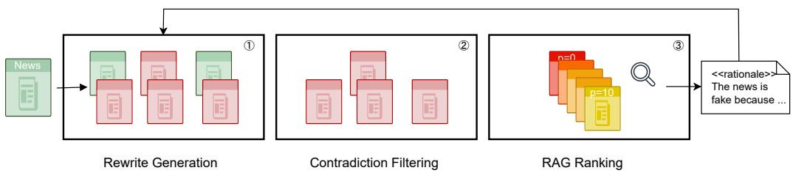  
Figure 1: Our proposed adversarial iterative fake news generation. 1) A true news is rewritten by a LLM to multiple candidates containing misinformation. 2) Candidates that do not contradict the original true news are filtered out. 3) The remaining candidates are ranked on their plausibility score according to a RAG-based detector and the most plausible one is selected, the detector’s rationales are used to inform the next round generation. The process can be repeated for multiple iterations.

LLM-generated fake news has been shown to be more deceitful than human-written misinformation (Chen and Shu, 2024); however, we find that current neural fake news still fails to consistently fool strong LLM-based detectors. To address this gap, we propose an adversarial iterative generation approach for crafting fake news capable of deceiving high-performing detectors. Our method is inspired by the feedback-driven learning abilities of LLMs (Madaan et al., 2023). Specifically, the generator receives feedback in the form of a rationale from a retrieval-augmented detector— explaining the factual inconsistencies of the current fake news instance—mimicking the real-world scenario where fact-checkers accompany verdicts with explanations. Given the detector’s verdict and the fake news generated in the previous round, the generator revises the text to undermine the prior rationale and avoid detection. This iterative process allows the generator to learn from the detector’s perspective, refining its outputs over multiple rounds. Empirically, we find that state-of-the-art LLM detectors, which perform well on conventional political fact-checking datasets, struggle with the fake news produced by our approach.

Our work makes the following contributions:

• Background study: We analyze LLM detector performance on PolitiFact and Snopes data over the years, revealing limitations that challenge the continued applicability of these popular sources for evaluation.

• Adversarial generation method: We introduce an iterative, feedback-driven generation approach that introduces highly deceptive fake news grounded in real-time events across diverse domains. Our resulting dataset poses a significantly greater challenge than previous neural fake news corpora.

• Cross-setup generalization: We demonstrate that the increasing deception level generalizes across different LLMs and retrieval sources.

• Analysis of RAG-targeted misinformation: We provide a detailed analysis of how LLMs respond to misinformation that explicitly targets retrieval-augmented generation systems in the context of current-world knowledge.

We release our code and data on https://github.   
com/sanxing-chen/adv-fake.

## 2 Background

## 2.1 Problem Formulation

We formulate the fake news detection task as a binary classification problem, where the primary objective is to determine whether a given news is genuine or fabricated. Instances of news cover a wide variety of topics, such as political claims, social media posts, and news releases. Let $\mathcal { D } =$ $\{ ( x _ { i } , y _ { i } ) \} _ { i = 1 } ^ { N }$ represent the dataset, where each $x _ { i }$ is a news and $y _ { i } ~ \in ~ \{ 0 , 1 \}$ is a binary label indicating the factuality of the news. A detector $f : \mathcal { X }  [ 0 , 1 ]$ maps each news xi to a probabilistic score ${ \hat { y } } _ { i } = f ( x _ { i } )$ , reflecting the likelihood of the news being factually correct. Under our realtime setup, we also refer to this likelihood as “plausibility” as the wording allows flexibility in factchecking current and future events where direct evidence may be unavailable. We adopt AUC-ROC as the main metric to evaluate the effectiveness of a detector as it quantifies the model’s capability to classify across various thresholds.

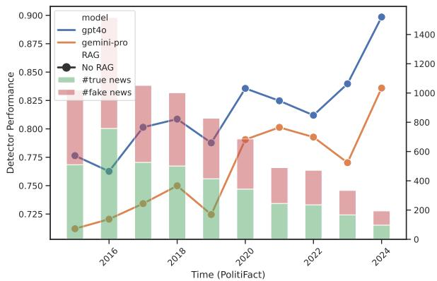

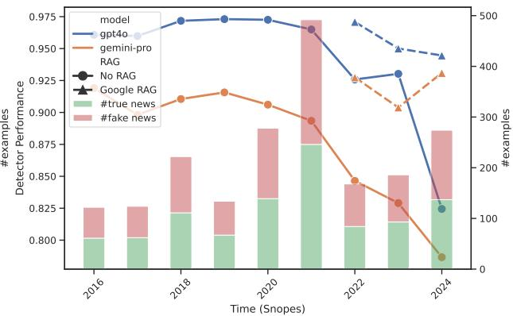  
Figure 2: Comparison of different retrieval-free detectors (AUC-ROC) on PolitiFact and Snopes data over the years. The data is balanced by downsampling the majority class. Both the GPT-4o and Gemini Pro models claim to have knowledge up to the end of 2023. Recent fake news on PolitiFact is increasingly easy to detect by LLMs without the need for fresh external knowledge. While Snopes challenges LLMs in detecting up-to-date fake news, simple retrieval augmentation largely brings back near-perfect performance.

## 2.2 Analysis of Fact-checking Sources

Fact-checking websites are widely used sources for obtaining news content and human labels when curating fake news detection datasets. Despite their popularity, it is unknown whether they pose continued challenges to state-of-the-art LLM fake news detectors. We study two representative sources of this kind: PolitiFact and Snopes,1 both of which are used in creating popular fake news detection datasets (Wang, 2017; Shu et al., 2018; Shahi and Nandini, 2020). In order to evaluate the performance of LLM-based detectors on both past and recent year data, we collect 9,244 PolitiFact news from June 2015 to August 2024, and 3,212 Snopes news from Jan 2016 to October 2024.

We run a set of LLM-based detectors using simple zero-shot prompting (detailed setup described in section 4). In Figure 2, we observe two opposite trends of detector accuracies through the years. On Snopes, GPT-4o exhibits near-perfect performance on past data, showing potential data contamination due to internet-scale pre-training. Recent fake news, both near and beyond the knowledge cutoff dates, becomes more challenging to detect due to the lack of current world knowledge. However, simply augmenting the detectors with Google search results is sufficient to restore performance. On PolitiFact, a source containing mostly political claims, the performance of retrieval-free detectors improves over time. In the most recent year, 2024, we see that LLMs continue to improve, even after the knowledge cutoff and the model release dates. Pelrine et al. (2023) report similar findings. This suggests that up-to-date knowledge is not the deciding factor for PolitiFact fake news detection performance.

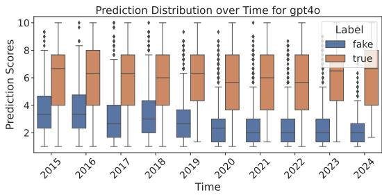  
Figure 3: GPT-4o (retrieval-free) predicted plausibility of PolitiFact claims over the years. The distribution of the true news class remains relatively stable, while the distribution of the fake news class shifts significantly towards lower scores.

We further investigate the emergent patterns on PolitiFact that have increased the separability of fake and real news (detailed setups in A.2). We first confirm the trend on a much smaller LM, RoBERTa (Liu et al., 2019), which has far less world knowledge. Fine-tuned RoBERTa also performs significantly better on recent year data. We then ablate key features such as removing the originator and publish time of the news from detector inputs, and paraphrasing the claim content. None of these features affects the trend of increasing performance over the years (Figure 8). The prediction distribution in Figure 3 reveals that the changes are mostly in the detector’s perception of the fake news class, which shifts towards lower scores. Manually going through some fake news examples, we find that in earlier years, political fake news contains statements that, while hyperbolic, can be anchored in a context that requires research through reliable sources (e.g., public records or legislative history) to verify. In contrast, recent fake news includes more sensational and less easily verified claims that seem more speculative or exaggerated without immediate substantive evidence. Consequently, the detection of recent PolitiFact fake news requires less factual knowledge and reasoning, but more pattern recognition and common sense (see Table 9 for some examples).

To summarize, evaluation on fact-checking data is susceptible to the uncontrolled biases in the curation process. Traditional evaluation of PolitiFact focused on surface-level linguistic patterns (Wang, 2017) is no longer challenging for strong LLMs due to increasing separability of fake political news. Other fact-checking sources (e.g., Snopes) suffer from potential contamination in both the pre-training and retrieval-augmentation stages because of the popularity of both the claims and fact-checking results on the internet. Therefore, to evaluate the factual reasoning ability of LLMs in detecting contemporary fake news, we need to explore new ways to create datasets that cover realtime information from diverse domains for a more challenging evaluation.

## 3 Methodology

The wide accessibility of LLMs has not only enabled strong detection models but also facilitated the mass generation of more credible and persuasive fake news (Kreps et al., 2022; Goldstein et al., 2023). Therefore, in combating these emerging threats, the evaluation of detection models should also evolve to incorporate challenging machinegenerated misinformation.

One key challenge in creating fake news datasets is obtaining automatic labels for the data. Openended generation, although effective in creating diverse fake news, simultaneously introduces false positives that are hard to verify due to the professional skills required for fact-checking. Our approach leverages the nuanced text manipulation capabilities of LLMs for controlled misinformation generation (Zellers et al., 2019; Chen and Shu, 2024), introducing factual errors into real news while striving to maintain its original context and style. We implement filtering protocols as an additional safeguard to reduce invalid generation.

Algorithm 1 Adversarial Iterative News Rewriting   
Require: TrueNews, k {k is the maximum number of itera  
tions}   
1: CurrentFake TrueNews   
2: for i 1 to k do   
3: Candidates GenerateCandidates(CurrentFake)   
4: repeat   
5: Filtered   
6: for each $c _ { i }$ in Candidates do   
7: if ContradictsOriginal $( c _ { i } ,$ TrueNews) and   
IsWithinEditLimit(ci, TrueNews) then   
8: Filtered  Filtered  ci   
9: end if   
10: end for   
11: if Filtered = then   
12: Candidates ←   
GenerateCandidates(CurrentFake)   
13: end if   
14: until Filtered $\neq \emptyset$   
15: Ranked RankByPlausibility(Filtered)   
16: CurrentFake SelectMostPlausible(Ranked)   
17: end for   
18: return CurrentFake

Figure 1 and Algorithm 1 illustrate our pipeline. Formally, we start with a trusted news corpus $\tau _ { \ast }$ which contains real-time news from various domains. We independently rewrite each news $\tau _ { i } \in \mathcal { T }$ to generate multiple fake news candidates ${ \mathcal { F } } _ { i }$ . To ensure that ${ \mathcal { F } } _ { i }$ contradict the original true news $\tau _ { i }$ we employ a LLM-based contradiction detector. We put an additional upper limit on the amount of edits allowed in the rewriting process using a threshold on the Levenshtein distance $\Delta ( \tau _ { i } , f _ { i j } )$ where $f _ { i j } \in \mathcal { F } _ { i }$ , between the original true news $\tau _ { i }$ and the rewritten news $f _ { i j }$

After filtering out the candidates that do not meet these criteria, we rank the remaining candidates based on the plausibility score provided by a fake news detector $g ( f _ { i j } | c )$ , where $c$ is the optional external context retrieved by a retrieval model $\mathcal { R } ( f _ { i j } )$ If none of the candidates meet the criteria, the generator resamples a new batch of candidates. From this ranked list, we select the top-ranked candidate as the most plausible fake news.

$$
{ \hat { f } } _ { i } = \arg \operatorname* { m a x } _ { f _ { i j } \in \mathcal { F } _ { i } } g ( f _ { i j } | c )\tag{1}
$$

$\hat { f } _ { i }$ and the detector’s rationale are then serve as additional information to inform the next round of generation on $\tau _ { i } .$ , creating an iterative process that gradually deceives the detector. In the end of the process, we obtain the most deceptive fake news $\hat { f } _ { i }$ across all iterations.

A critical component of our approach is the retrieval-augmented detector. Using a retrieval-free detector as an adversary, the generator can only improve the factual consistency within the news content or exploit the weaknesses of a LLM with outdated internal knowledge, which can generally be seen as a case of self-evaluation (Kadavath et al., 2022). However, with the information from the retrieved external context, the generator can learn to deceive cross-verification and improve factual consistency beyond its own knowledge, which is important for our real-time news rewrite setup.

One implementation challenge in Eq. 1 is that we need to run retrieval for each candidate to obtain the external context. This can be computationally expensive for sophisticated retrievers and costly if commercial APIs are used. In practice, we retrieve the external context only for the highest-ranked candidates at the end of each iteration, which we use to inform the next round of detection. Because of the constraints on the amount of change in each iteration, the external context is expected to remain relevant for the next batch generation. In final evaluation, we rerun the retrieval each time to ensure the external context is up-to-date.

## 3.1 Dataset Creation

We first obtain 431 actual news stories from NBC News using the news-please crawler (Hamborg et al., 2017). These news stories are from March 1 to March 13, 2024, covering domains such as politics, business, sports, U.S., and world news. Compared to claims from fact-checking websites, these news stories are roughly twice the length of the content. They can be seen as long-form claims, which can be more difficult to fact-check. This two-week range is close to the time when we start the experiments and is beyond the knowledge cutoffs of the LLMs we use, thus ensuring no contamination in model training. Our code supports replicating this process for other date ranges.

This set of news stories serves as seed true news for our generation pipeline and undergoes one-toone rewriting to obtain 431 fake news instances. We manually examine all real-fake pairs of the final-round rewrite and filter out 29 invalid pairs. These generations manage to bypass our contradiction detector without introducing factual errors that contradict claims in the corresponding real news. Comparing 100 pairs from the first and last rounds of rewrites, the ratio of failed rewrites remains stable at around 7%. We also fact-check 100 last-round examples under an unpaired, shuffled, label-hidden setup, establishing 99% human performance with access to Google. Our final dataset consists of 402 true news and 402 fake news.

## 4 Experimental Setup

## 4.1 Generator Setup

We adopt GPT-4o with different prompts for the all three roles (i.e., generator, contradiction detector, and reranker) in the generation pipeline. The pipeline is iterated for 6 rounds with an extra preparation round 0 of a direct rewrite (no rationale and ranking) on the seed true news. We instruct GPT-4o to “introduce some believable factual errors” without mentioning any concrete strategies or constraints. The open-ended nature of the prompt allows the LLM to explore diverse manipulation strategies. It also encourages the model to craft alterations that, while factually incorrect, would appear plausible within the broader news context, potentially requiring nuanced cross-verification or deeper world knowledge to debunk.

The generator produces 8 candidates in a zeroshot chain-of-thought fashion for each news story in each round, which are then filtered and ranked based on the plausibility score from the detector. The contradiction detector produces 10 binary scores for each candidate, only if more than eight of them are positive, the candidate is considered to contradict the original true news. String edit distance is used to limit the amount of change in each iteration, with a threshold of more than 60% overlapped tokens. A GPT-4o-based detector (detailed in the next section) is used to provide rationales and serves as the reranker to select the best generation after contradiction filtering.

## 4.2 Detector Setup

To implement LLM-based detectors, we prompt the models to assign a plausibility score (on a scale of 1–10, from implausible to plausible) to a given news item in a zero-shot setting. These scores are normalized to the [0, 1] range when computing metrics. We include the directive “Today is March 26, 2024. You predict the plausibility of a news you haven’t seen.” This establishes the temporal context and emphasizes that the news content should be treated as previously unseen.

<table><tr><td rowspan="2">Retriever Detector</td><td colspan="3">None</td><td colspan="3">News</td><td colspan="3">Google</td></tr><tr><td>first</td><td>last</td><td>∆</td><td>first</td><td>last</td><td>∆</td><td>first</td><td>last</td><td>∆</td></tr><tr><td>Gemini-Flash</td><td>57.0</td><td>50.7</td><td>6.3</td><td>76.1</td><td>62.4</td><td>13.8</td><td>84.1</td><td>76.6</td><td>7.5</td></tr><tr><td>Gemini-Pro</td><td>58.6</td><td>51.6</td><td>7.0</td><td>74.9</td><td>62.8</td><td>12.1</td><td>82.6</td><td>73.7</td><td>8.9</td></tr><tr><td>GPT-3.5</td><td>53.7</td><td>50.3</td><td>3.4</td><td>69.3</td><td>57.6</td><td>11.7</td><td>78.2</td><td>69.3</td><td>8.9</td></tr><tr><td>GPT-40</td><td>58.5</td><td>48.8</td><td>9.7</td><td>82.4</td><td>64.9</td><td>17.5</td><td>93.1</td><td>86.1</td><td>7.0</td></tr><tr><td>Llama 3.1</td><td>60.5</td><td>54.0</td><td>6.6</td><td>81.3</td><td>67.4</td><td>13.9</td><td>93.3</td><td>86.6</td><td>6.7</td></tr></table>

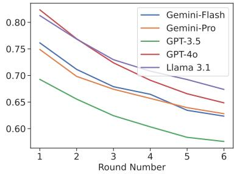  
Table 1: AUC-ROC scores of different detectors on the generated fake news of the first and last iteration. The ∆ column shows the effects of the iterative process. News refers to the in-house DPR retriever on news-please data, and Google refers to the Google search API results. The right figure presents results across rounds under the News retrieval setting–more iterations lead to stronger deception.

<table><tr><td rowspan="2">Method</td><td colspan="3">LIAR</td></tr><tr><td>AUC</td><td>F1-Ma</td><td>Acc</td></tr><tr><td>RoBERTa-L (2023)</td><td></td><td>64.7</td><td>64.1</td></tr><tr><td>GPT-4 (2023)</td><td></td><td>68.1</td><td>68.2</td></tr><tr><td>MUSER (2023)</td><td></td><td>64.5</td><td></td></tr><tr><td>STEEL (2024)</td><td>-</td><td>71.4</td><td>-</td></tr><tr><td>GPT-40</td><td>77.5</td><td>70.7</td><td>70.9</td></tr><tr><td>GPT-40 + Google</td><td>81.1</td><td>74.7</td><td>75.6</td></tr></table>

Table 2: Our detectors demonstrate superior performance to the state of the art on the LIAR dataset (Wang, 2017). MUSER and STEEL have access to multi-step retrieval on Wikipedia and Bing, respectively.

Empirically, using “plausibility” instead of “factuality” yields better performance for evaluating recent and future events, while the reverse holds for past events (Table 12). To improve robustness, we sample multiple scores from the model’s unscaled prediction distribution (using temperature t = 1) and compute their average. Rationales are generated via a separate LLM call.

For retrieval-augmented detection (RAG), we utilize two sources: (1) an in-house News corpus comprising 811k articles from diverse outlets published in March 2024, indexed using a pre-trained DPR retriever (Karpukhin et al., 2020), and (2) realtime Google search results accessed via SerpApi. Both sources are extensively filtered to exclude exact duplicates of the input news and to remove all content from NBC News. From either source, five relevant documents are retrieved using the news headline as the search query. These documents are then inserted into the prompt for fact-checking. We use the News retriever in the GPT-4o detector during generation, while the Google retriever is used only during evaluation due to API cost constraints.

Our GPT-4o detector is comparable to recent state-of-the-art RAG detectors on the popular LIAR datasets (Table 2). Final evaluation is conducted on multiple LLM detectors, including GPT-4o, GPT-3.5, Gemini Pro and Flash (Gemini Team, 2024), and open-source 405B Llama 3.1 (Meta AI, 2024). Detailed versions and knowledge cutoffs are provided in Table 7. The actual prompts used by all components are provided in Appendix A.5.

## 4.3 Baseline Datasets

We compare to two recent LLM fake news datasets. Su et al. (2023b) apply open-ended rewriting to fake news and rephrase real news from GossipCop and PolitiFact. Chen and Shu (2024) explore various misinformation generation approaches with LLMs, including rewriting fake news and targeted information manipulation of true news. Both approaches utilize one round of generation. Appendix A.4 provides detailed dataset statistics.

## 5 Experimental Results

Evaluation results (Table 1) show that our adversarial iterative generation pipeline can produce fake news that can deceive strong LLM-based detectors. We find Llama 3.1 to be the best at detecting fake news generated by our pipeline using GPT-4o. Consistent with its earlier release and performance on public benchmarks (Chiang et al., 2024), GPT-3.5 proved most vulnerable to our generated fake news. Datasets generated from our pipeline are significantly more difficult than previous neural fake news datasets (Table 3).

Through each iteration, the pipeline progressively enhances the deceptive quality of the generated fake news. Relying on the feedback from the GPT-4o RAG-based detector with the in-house retrieval corpus, the generator proves most effective at deceiving this particular detection setting, achieving a reduction of 17.5 AUC-ROC points. Nevertheless, these enhancements are shown to consistently generalize across different LLM backbones and retrieval contexts.

<table><tr><td rowspan="2"></td><td>2023b</td><td>2024</td><td></td><td>Ours</td></tr><tr><td>G++ P++</td><td>Rewrite</td><td>Mani.</td><td>First Last</td></tr><tr><td>Gemini-Flash</td><td>72.7 82.8</td><td>80.4</td><td>75.3 57.0</td><td>50.7</td></tr><tr><td>Gemini-Pro</td><td>72.886.2</td><td>76.6</td><td>77.3</td><td>58.651.6</td></tr><tr><td>GPT-3.5</td><td>64.577.4</td><td>81.2</td><td>68.9</td><td>53.7 50.3</td></tr><tr><td>GPT-40</td><td>81.888.8</td><td>84.3</td><td>85.4</td><td>58.5 48.8</td></tr><tr><td>Llama 3.1</td><td>80.4 91.3</td><td>84.0</td><td>83.3</td><td>60.5 54.0</td></tr></table>

Table 3: AUC-ROC scores of different retrieval-free detectors on recent LLM-generated fake news datasets (Su et al., 2023b; Chen and Shu, 2024). Our pipeline produces significantly more difficult datasets.

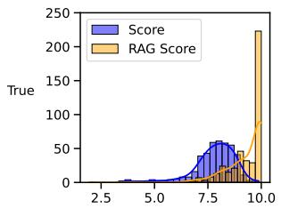

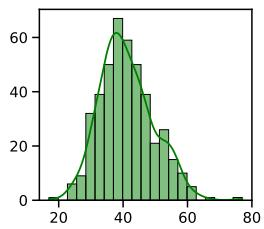

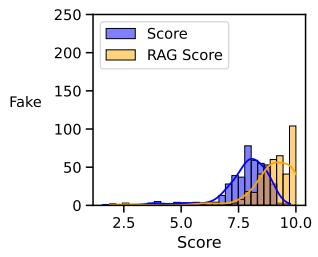

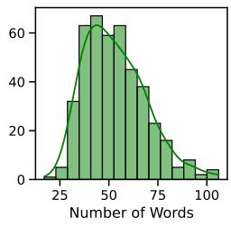  
Figure 4: Distribution of the plausibility scores (retrieval-free and RAG) and the number of words in the set of real news from NBC News (positives, top) and the last-round rewritten fake news (negatives, bottom).

## 5.1 Analysis

Real-time news can appear implausible to offthe-shelf LLM detectors. We find that true news articles from NBC News are generally rated as plausible by the LLM detectors, with an average plausibility score of 7.8. However, some news stories receive scores as low as 3.3, indicating that LLM detectors can be fooled by real-time news events that fall outside the model’s knowledge (Figure 4). For example, GPT-4o assigns low plausibility scores to reports on RFK Jr.’s presidential campaign and a White House’s response to the Sesame Street character’s Twitter account on inflation issues.2

<table><tr><td>Retriever</td><td colspan="3">None</td><td colspan="3">News</td></tr><tr><td>Feedback</td><td>1st</td><td>2nd</td><td>Δ</td><td>1st</td><td>2nd</td><td>∆</td></tr><tr><td>Full</td><td>58.5</td><td>54.4</td><td>4.1</td><td>82.4</td><td>76.9</td><td>5.5</td></tr><tr><td>Rat.</td><td>56.3</td><td>53.1</td><td>3.2</td><td>85.1</td><td>80.4</td><td>4.7</td></tr><tr><td>RScore</td><td>62.0</td><td>58.5</td><td>3.5</td><td>86.1</td><td>82.0</td><td>4.1</td></tr><tr><td>Score</td><td>60.1</td><td>56.6</td><td>3.5</td><td>84.9</td><td>81.1</td><td>3.8</td></tr></table>

Table 4: GPT-4o detector AUC-ROC on the first two rounds fake news generated with different types of detector feedback in the adversarial setup. “Rat.” use non-RAG detector rationale, “RScore” has no access to rationale but the RAG detector’s plausibility scores for ranking. “Score” adopts retrieval-free detector’s scores.
<table><tr><td>Retriever</td><td>None</td><td>Google</td></tr><tr><td>Score + Majority</td><td>48.4</td><td>80.4</td></tr><tr><td>Score + Average</td><td>48.6</td><td>84.7</td></tr><tr><td>CoT Score + Majority</td><td>49.7</td><td>81.9</td></tr><tr><td>CoT Score + Average</td><td>47.9</td><td>86.2</td></tr></table>

Table 5: Comparison of GPT-4o detectors using different reasoning and scoring strategies on the final dataset.

The LLM detectors’ reliance on outdated or incomplete internal knowledge makes them vulnerable to false negatives when evaluating real-time or fringe news. As a result, detectors may mistakenly flag accurate but unfamiliar information as implausible. This underscores the importance of retrieval augmentation for grounding LLM judgments in up-to-date context.

Retrieval free detectors are vulnerable to adversarial attacks. It is very easy to rewrite unseen news to generate fake news that can evade detection by non-RAG-based LLM detectors. This is evident from the detector performance reported in Table 1 and also from the prediction distribution (purple bars in Figure 4). Retrieval-free detectors result in near random AUC even for the first round generation. On the contrary, RAG-based detectors are generally more robust as they leverage up-to-date external knowledge. As we can clearly see from the true news prediction distribution, more than half of examples receive an unbeatable maximum plausibility score from the RAG-based GPT-4o detectors, while the retrieval-free detector is more conservative in its predictions. The average plausibility score of the RAG-based detectors on the true news is 9.3, significantly higher than 7.8 of the retrievalfree detectors. The confidence of RAG-based detectors does not come without a cost, as they also assign generally higher scores to fake news, suggesting LLMs’ weaknesses to be distracted or mistrust the external context (Shi et al., 2023; Huang et al., 2024b).

Stronger defenders enable stronger attackers. RAG-based detectors mount an effective defense against LLM-generated fake news, but the generator can adapt to evade detection, especially when the detector’s rationale is accessible. As shown in Table 4, the RAG-based detector rationale outperforms both the non-RAG rationale and rankingonly variants in the first round and continues to reinforce its advantage across iterations. By the sixth round, the RAG-based rationale (64.9) reduces the AUC by 6.5 more points than the non-RAG rationale (71.4). Due to resource constraints, we run the other variants for up to two rounds.

The success of using RAG-based detector rationale as feedback suggests the generator learns to identify and exploit subtle weaknesses in how the detector integrates or reasons over retrieved evidence. For instance, as seen in our qualitative examples (Section 5.2), it may learn to introduce misinformation that does not directly contradict obvious retrieved facts but rather miscontextualizes them or mixes them with plausible fabrications that the RAG system fails to recognize.

Chain-of-Thought improves factual reasoning with context. To empirically test the reasoning challenges posed by our dataset, we employ standard techniques such as Chain-of-Thought (Wei et al., 2022). We report results on detector ROC-AUC using GPT-4o on our final dataset, comparing two scoring approaches—average and majority voting—with and without CoT. For each approach, we generate 10 samples using temperature = 1 (note that this yields slightly lower scores compared to the paper’s main setup using 100 samples). As shown in Table 5, without external information, reasoning techniques do not help—detectors perform worse than random guessing. When augmented with RAG content, CoT improves performance across both score aggregation methods. The observation that CoT only enhances performance when coupled with RAG further underscores that for realtime, unseen content, access to external knowledge is paramount, and reasoning improvements primarily act to better leverage this retrieved information.

We also observe that the standard setup used throughout our paper, average aggregation, outperforms majority voting in this setting. Future work can explore more advanced reasoning and inference-time scaling strategies.

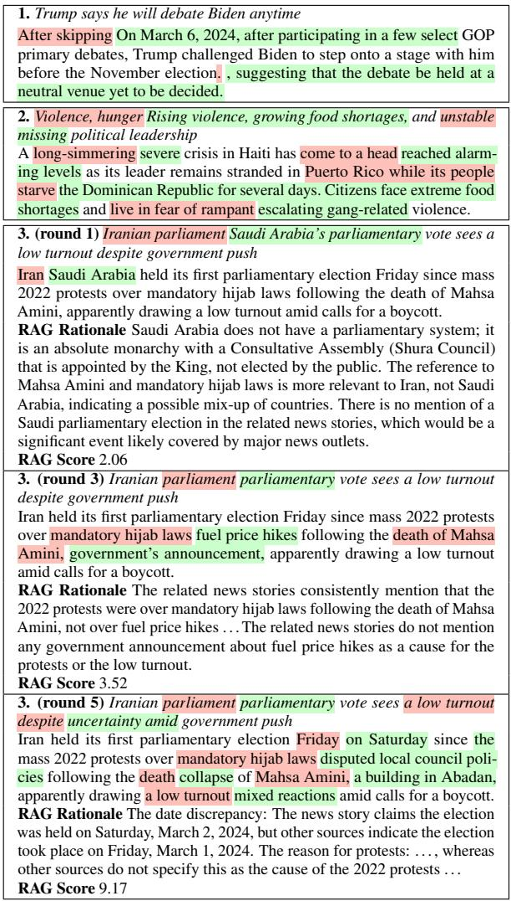  
Table 6: Examples of fake news generated by our pipeline. Deletion and addition to the original true news are marked with colors. The third example shows a case in which the iterative adversarial rewrite is able to improve the quality of a fake news through rounds.

## 5.2 Qualitative Examples

Since we allow the LLM to autonomously decide how to introduce factual errors, the generated fake news reflects a diverse range of misinformation strategies. Table 6 presents several illustrative examples. Some common types of modifications that LLMs make to true news include: changing entities, including names, locations, and dates; hallucinating events or inventing details; mimicking typographical errors, e.g., "Nibi" instead of "Libi," "Mark" instead of "Mike."

Some of these modifications are relatively benign. For example, LLMs frequently paraphrases the original content to vary surface wording, as seen in the second example. However, the model is also capable of embedding misinformation in a highly coherent way, substituting entities with plausible alternatives or hallucinating plausible events that are difficult to fact-check. We also observe that LLMs tend to lengthen the original content, a trend reflected in Figure 4. The average length of the original news is approximately 41 words, whereas the modified versions average 53 words. Importantly, the modified news typically retains the same narrative structure as the original.

The Iran election example illustrates how the LLM refines its output across multiple adversarial rounds. Initially, the model makes a naive change by substituting “Iran” with another Middle Eastern country, “Saudi Arabia.” The detector identifies the mismatch between Saudi Arabia and a parliamentary election system, prompting the generator to revise its strategy and modify a different aspect of the story. The second attempt (not shown in the table) still contains similar inconsistencies. In the third round, the model attributes the protest to “fuel price hikes,” which remains implausible in the given context. Eventually, the generator produces a more believable but still nonfactual cause. At this point, the detector assigns a score closer to that of true news, indicating that the model has learned to exploit weaknesses in the detector’s reasoning, particularly by linking known events (e.g., the 2022 protests) with recent but less publicized developments (e.g., the 2024 parliamentary election). The generator effectively learns to create ‘semantic traps’ that are harder for the detector to identify even with retrieved context.

## 6 Related Work

Fake News Generation and Detection LLMs have been widely studied for fake news detection and generation (Goldstein et al., 2023; Su et al., 2023a; Hu et al., 2024; Chen and Shu, 2024; Liu et al., 2024). External evidence in the form of search results or knowledge graphs has been demonstrated to improve the detection of fake news (Fung et al., 2021; Xu et al., 2022; Liao et al., 2023; Pelrine et al., 2023).

From the generation perspective, recent research has also shown that external evidence can improve the style, domain and factual consistency of generated fake news (Shu et al., 2021; Mosallanezhad et al., 2022; Lucas et al., 2023; Huang et al., 2023; Wang et al., 2024). However, they investigate oneround generation that is less effective in deceiving today’s state-of-the-art LLM-based detectors. Our approach introduce the iterative process and the detector perspective which helps to digest the external evidence in examining the flaws of generation.

Adversarial setups have been used to improve the robustness of LLMs in tasks such as AI-generated text detection and math problem-solving (Hu et al., 2023a; Zhu et al., 2023; Xie et al., 2024). Most of these works focus on modifications that do not change the semantics of the text, which is different from our approach that aims to introduce factual errors in the text. Tailoring to the task of fake news detection, we design a feedback loop using the detector’s rationale to guide the generation process, which is a rather realistic threat model in the realworld fact-checking scenario.

Temporal Reasoning on Future Events Predicting the plausibility of future events requires temporal knowledge and reasoning capabilities (Dhingra et al., 2022). LLMs have the knowledge of the past, but not the future, which they rely on external information via retrieval to access (Kasai et al., 2023; Vu et al., 2024). A similar ability has also been studied in the context of the forecasting task (Zou et al., 2022; Halawi et al., 2024). While forecasting tasks predicting future outcomes based on historical information available prior to an event, our real-time factuality evaluation setup allows access to contemporary external evidence for cross-validation, which presents distinct challenges.

## 7 Conclusion

In this paper, we evaluate large language models on fake news detection of events that occur beyond their knowledge cutoff. We find that the conventional use of political claims from fact-checking websites is unsuitable for such tests due to emergent data shortcuts. We thus introduce an adversarial iterative pipeline to generate fake news that can gradually evade strong RAG-based detectors. Our empirical findings shed light on the behaviors of LLMs in both detecting and generating fake news about current world events. We hope that our framework and dataset will facilitate research efforts toward robust factual reasoning models under temporal distribution shift. As malicious actors continue to refine their own generation techniques, our defenses must co-evolve, moving beyond static test sets towards dynamic environments that support continuously adaptive evaluation.

## Limitations

Our work focuses on evaluating prompting-based LLM detectors. LLM-generated fake news exhibits patterns that may differ from those found in human-written misinformation, which could limit the generalizability of our dataset for training detectors (Zellers et al., 2019; Huang et al., 2023). Future work could explore debiasing techniques—such as paraphrasing using the same LLM—to mitigate this issue (Su et al., 2023b).

Our experiments primarily use English-language data centered on U.S. news, which may constrain the generalizability of our conclusions to other languages and regions. Expanding this research to multilingual and multicultural contexts is an important direction for future work. While our background study highlights common limitations and biases in popular fact-checking datasets, the findings are not intended to generalize to all fact-checking sources.

We use NBC News as a ground truth provider, assuming it to be a reliable and factual source. While we believe this is a reasonable assumption, no source is without bias. Importantly, our generation pipeline is adaptable and can be applied to alternative sources. Our fake news generation is grounded in real-world events, as opposed to fabricating entirely fictional scenarios, which may also spread harmful misinformation. However, during the rewriting process, the LLM may introduce hallucinated details not found in any external source. In such cases, the model must rely on its parametric knowledge to evaluate plausibility.

Finally, we note that directly evaluating the correlation between classifier performance on our dataset and real-world performance remains infeasible, as the distribution of misinformation is highly dynamic and shaped by ever-evolving events and generation strategies. Nonetheless, our dataset provides a necessary and reliable testbed—its factuality ensured through protocol design and human verification—for advancing the development and deployment of LLM-based detectors.

## Ethics Considerations

Our work aims to improve the robustness of fake news detection models by generating challenging fake news that can evade detection. We acknowledge the potential misuse of our method to create more deceptive misinformation. Simultaneously, we have shown that RAG-based detectors with high-quality retrieval can effectively counter such misinformation. Our approach focuses on the factual reasoning aspect of fake news detection. Fake news generated does not usually contain propaganda, hate speech, or other harmful content. The release of generators is critical to prepare detectors against adversarial attacks (Zellers et al., 2019). We responsibly released our code and data to facilitate further research on fake news detection.

## Acknowledgements

We thank Jun Yang, Junlin Wang and other members of the NLP group at Duke University for fruitful discussions. This work was supported by NSF award IIS-2211526 and a gift from Together AI.

## References

Canyu Chen and Kai Shu. 2023. Combating misinformation in the age of llms: Opportunities and challenges. ArXiv preprint, abs/2311.05656.

Canyu Chen and Kai Shu. 2024. Can llm-generated misinformation be detected? In The Twelfth International Conference on Learning Representations, ICLR 2024, Vienna, Austria, May 7-11, 2024. Open-Review.net.

Wei-Lin Chiang, Lianmin Zheng, Ying Sheng, Anastasios Nikolas Angelopoulos, Tianle Li, Dacheng Li, Banghua Zhu, Hao Zhang, Michael I. Jordan, Joseph E. Gonzalez, and Ion Stoica. 2024. Chatbot arena: An open platform for evaluating llms by human preference. In Forty-first International Conference on Machine Learning, ICML 2024, Vienna, Austria, July 21-27, 2024. OpenReview.net.

Bhuwan Dhingra, Jeremy R. Cole, Julian Martin Eisenschlos, Daniel Gillick, Jacob Eisenstein, and William W. Cohen. 2022. Time-aware language models as temporal knowledge bases. Transactions ofthe Associationfor Computational Linguistics, 10:257– 273.

Yi Fung, Christopher Thomas, Revanth Gangi Reddy, Sandeep Polisetty, Heng Ji, Shih-Fu Chang, Kathleen McKeown, Mohit Bansal, and Avi Sil. 2021. InfoSurgeon: Cross-media fine-grained information consistency checking for fake news detection. In Proceedings ofthe 59th Annual Meeting ofthe Associationfor Computational Linguistics and the 11th International Joint Conference on Natural Language Processing (Volume 1: Long Papers), pages 1683–1698, Online. Association for Computational Linguistics.

Gemini Team. 2024. Gemini 1.5: Unlocking multimodal understanding across millions of tokens of context. ArXiv preprint, abs/2403.05530.

Josh A Goldstein, Girish Sastry, Micah Musser, Renee DiResta, Matthew Gentzel, and Katerina Sedova.

2023. Generative language models and automated influence operations: Emerging threats and potential mitigations. ArXiv preprint, abs/2301.04246.

Danny Halawi, Fred Zhang, Chen Yueh-Han, and Jacob Steinhardt. 2024. Approaching human-level forecasting with language models. ArXiv preprint, abs/2402.18563.

Felix Hamborg, Norman Meuschke, Corinna Breitinger, and Bela Gipp. 2017. news-please: A generic news crawler and extractor. In Proceedings ofthe 15th International Symposium ofInformation Science, pages 218–223.

Beizhe Hu, Qiang Sheng, Juan Cao, Yuhui Shi, Yang Li, Danding Wang, and Peng Qi. 2024. Bad actor, good advisor: Exploring the role of large language models in fake news detection. In Thirty-Eighth AAAI Conference on Artificial Intelligence, AAAI 2024, Thirty-Sixth Conference on Innovative Applications ofArtificial Intelligence, IAAI 2024, Fourteenth Symposium on Educational Advances in Artificial Intelligence, EAAI 2014, February 20-27, 2024, Vancouver, Canada, pages 22105–22113. AAAI Press.

Xiaomeng Hu, Pin-Yu Chen, and Tsung-Yi Ho. 2023a. RADAR: robust ai-text detection via adversarial learning. In Advances in Neural Information Processing Systems 36: Annual Conference on Neural Information Processing Systems 2023, NeurIPS 2023, New Orleans, LA, USA, December 10 - 16, 2023.

Xuming Hu, Zhaochen Hong, Zhijiang Guo, Lijie Wen, and Philip S. Yu. 2023b. Read it twice: Towards faithfully interpretable fact verification by revisiting evidence. In Proceedings of the 46th International ACM SIGIR Conference on Research and Development in Information Retrieval, SIGIR 2023, Taipei, Taiwan, July 23-27, 2023, pages 2319–2323. ACM.

Kung-Hsiang Huang, Kathleen McKeown, Preslav Nakov, Yejin Choi, and Heng Ji. 2023. Faking fake news for real fake news detection: Propagandaloaded training data generation. In Proceedings of the 61st Annual Meeting of the Association for Computational Linguistics (Volume 1: Long Papers), pages 14571–14589, Toronto, Canada. Association for Computational Linguistics.

Yiming Huang, Zhenghao Lin, Xiao Liu, Yeyun Gong, Shuai Lu, Fangyu Lei, Yaobo Liang, Yelong Shen, Chen Lin, Nan Duan, and Weizhu Chen. 2024a. Competition-level problems are effective LLM evaluators. In Findings of the Association for Computational Linguistics ACL 2024, pages 13526–13544, Bangkok, Thailand and virtual meeting. Association for Computational Linguistics.

Yukun Huang, Sanxing Chen, Hongyi Cai, and Bhuwan Dhingra. 2024b. Enhancing large language models’ situated faithfulness to external contexts. arXiv preprint arXiv:2410.14675.

Saurav Kadavath, Tom Conerly, Amanda Askell, Tom Henighan, Dawn Drain, Ethan Perez, Nicholas

Schiefer, Zac Hatfield-Dodds, Nova DasSarma, Eli Tran-Johnson, Scott Johnston, Sheer El-Showk, Andy Jones, Nelson Elhage, Tristan Hume, Anna Chen, Yuntao Bai, Sam Bowman, Stanislav Fort, Deep Ganguli, Danny Hernandez, Josh Jacobson, Jackson Kernion, Shauna Kravec, Liane Lovitt, Kamal Ndousse, Catherine Olsson, Sam Ringer, Dario Amodei, Tom Brown, Jack Clark, Nicholas Joseph, Ben Mann, Sam McCandlish, Chris Olah, and Jared Kaplan. 2022. Language models (mostly) know what they know. arXiv preprint arXiv: 2207.05221.

Vladimir Karpukhin, Barlas Oguz, Sewon Min, Patrick Lewis, Ledell Wu, Sergey Edunov, Danqi Chen, and Wen-tau Yih. 2020. Dense passage retrieval for opendomain question answering. In Proceedings of the 2020 Conference on Empirical Methods in Natural Language Processing (EMNLP), pages 6769–6781, Online. Association for Computational Linguistics.

Jungo Kasai, Keisuke Sakaguchi, Yoichi Takahashi, Ronan Le Bras, Akari Asai, Xinyan Yu, Dragomir Radev, Noah A. Smith, Yejin Choi, and Kentaro Inui. 2023. Realtime QA: what’s the answer right now? In Advances in Neural Information Processing Systems 36: Annual Conference on Neural Information Processing Systems 2023, NeurIPS 2023, New Orleans, LA, USA, December 10 - 16, 2023.

Sarah Kreps, R Miles McCain, and Miles Brundage. 2022. All the news that’s fit to fabricate: Aigenerated text as a tool of media misinformation. Journal ofexperimental political science, 9(1):104– 117.

Tom Kwiatkowski, Jennimaria Palomaki, Olivia Redfield, Michael Collins, Ankur Parikh, Chris Alberti, Danielle Epstein, Illia Polosukhin, Jacob Devlin, Kenton Lee, Kristina Toutanova, Llion Jones, Matthew Kelcey, Ming-Wei Chang, Andrew M. Dai, Jakob Uszkoreit, Quoc Le, and Slav Petrov. 2019. Natural questions: A benchmark for question answering research. Transactions of the Association for Computational Linguistics, 7:452–466.

Guanghua Li, Wensheng Lu, Wei Zhang, Defu Lian, Kezhong Lu, Rui Mao, Kai Shu, and Hao Liao. 2024. Re-search for the truth: Multi-round retrievalaugmented large language models are strong fake news detectors. arXiv preprint arXiv: 2403.09747.

Hao Liao, Jiahao Peng, Zhanyi Huang, Wei Zhang, Guanghua Li, Kai Shu, and Xing Xie. 2023. MUSER: A multi-step evidence retrieval enhancement framework for fake news detection. In Proceedings of the 29th ACM SIGKDD Conference on Knowledge Discovery and Data Mining, KDD 2023, Long Beach, CA, USA, August 6-10, 2023, pages 4461–4472. ACM.

Aiwei Liu, Qiang Sheng, and Xuming Hu. 2024. Preventing and detecting misinformation generated by large language models. In Proceedings of the 47th International ACM SIGIR Conference on Research and Development in Information Retrieval, pages 3001–3004.

Yinhan Liu, Myle Ott, Naman Goyal, Jingfei Du, Mandar Joshi, Danqi Chen, Omer Levy, Mike Lewis, Luke Zettlemoyer, and Veselin Stoyanov. 2019. Roberta: A robustly optimized bert pretraining approach. arXiv preprint arXiv: 1907.11692.

Jason Lucas, Adaku Uchendu, Michiharu Yamashita, Jooyoung Lee, Shaurya Rohatgi, and Dongwon Lee. 2023. Fighting fire with fire: The dual role of LLMs in crafting and detecting elusive disinformation. In Proceedings of the 2023 Conference on Empirical Methods in Natural Language Processing, pages 14279–14305, Singapore. Association for Computational Linguistics.

Aman Madaan, Niket Tandon, Prakhar Gupta, Skyler Hallinan, Luyu Gao, Sarah Wiegreffe, Uri Alon, Nouha Dziri, Shrimai Prabhumoye, Yiming Yang, Shashank Gupta, Bodhisattwa Prasad Majumder, Katherine Hermann, Sean Welleck, Amir Yazdanbakhsh, and Peter Clark. 2023. Self-refine: Iterative refinement with self-feedback. In Advances in Neural Information Processing Systems 36: Annual Conference on Neural Information Processing Systems 2023, NeurIPS 2023, New Orleans, LA, USA, December 10 - 16, 2023.

Meta AI. 2024. The llama 3 herd of models. ArXiv preprint, abs/2407.21783.

Ahmadreza Mosallanezhad, Mansooreh Karami, Kai Shu, Michelle V. Mancenido, and Huan Liu. 2022. Domain adaptive fake news detection via reinforcement learning. In Proceedings ofthe ACM Web Conference 2022, WWW ’22, page 3632–3640, New York, NY, USA. Association for Computing Machinery.

Artidoro Pagnoni, Martin Graciarena, and Yulia Tsvetkov. 2022. Threat scenarios and best practices to detect neural fake news. In Proceedings of the 29th International Conference on Computational Linguistics, pages 1233–1249, Gyeongju, Republic of Korea. International Committee on Computational Linguistics.

Kellin Pelrine, Anne Imouza, Camille Thibault, Meilina Reksoprodjo, Caleb Gupta, Joel Christoph, Jean-François Godbout, and Reihaneh Rabbany. 2023. Towards reliable misinformation mitigation: Generalization, uncertainty, and GPT-4. In Proceedings of the 2023 Conference on Empirical Methods in Natural Language Processing, pages 6399–6429, Singapore. Association for Computational Linguistics.

Gautam Kishore Shahi and Durgesh Nandini. 2020. Fakecovid–a multilingual cross-domain fact check news dataset for covid-19. arXiv preprint arXiv:2006.11343.

Freda Shi, Xinyun Chen, Kanishka Misra, Nathan Scales, David Dohan, Ed H. Chi, Nathanael Schärli, and Denny Zhou. 2023. Large language models can be easily distracted by irrelevant context. In International Conference on Machine Learning, ICML 2023,

23-29 July 2023, Honolulu, Hawaii, USA, volume 202 of Proceedings of Machine Learning Research, pages 31210–31227. PMLR.

Kai Shu, Yichuan Li, Kaize Ding, and Huan Liu. 2021. Fact-enhanced synthetic news generation. In Thirty-Fifth AAAI Conference on Artificial Intelligence, AAAI 2021, Thirty-Third Conference on Innovative Applications ofArtificial Intelligence, IAAI 2021, The Eleventh Symposium on Educational Advances in Artificial Intelligence, EAAI 2021, Virtual Event, February 2-9, 2021, pages 13825–13833. AAAI Press.

Kai Shu, Deepak Mahudeswaran, Suhang Wang, Dongwon Lee, and Huan Liu. 2018. Fakenewsnet: A data repository with news content, social context and dynamic information for studying fake news on social media. ArXiv preprint, abs/1809.01286.

Jinyan Su, Terry Zhuo, Di Wang, and Preslav Nakov. 2023a. DetectLLM: Leveraging log rank information for zero-shot detection of machine-generated text. In Findings ofthe Associationfor Computational Linguistics: EMNLP 2023, pages 12395–12412, Singapore. Association for Computational Linguistics.

Jinyan Su, Terry Yue Zhuo, Jonibek Mansurov, Di Wang, and Preslav Nakov. 2023b. Fake news detectors are biased against texts generated by large language models. arXiv preprint arXiv: 2309.08674.

Tu Vu, Mohit Iyyer, Xuezhi Wang, Noah Constant, Jerry Wei, Jason Wei, Chris Tar, Yun-Hsuan Sung, Denny Zhou, Quoc Le, and Thang Luong. 2024. Fresh-LLMs: Refreshing large language models with search engine augmentation. In Findings of the Associationfor Computational Linguistics ACL 2024, pages 13697–13720, Bangkok, Thailand and virtual meeting. Association for Computational Linguistics.

Wei-Yao Wang, Yu-Chieh Chang, and Wen-Chih Peng. 2024. Style-news: Incorporating stylized news generation and adversarial verification for neural fake news detection. In Proceedings of the 18th Conference of the European Chapter of the Association for Computational Linguistics (Volume 1: Long Papers), pages 1531–1541, St. Julian’s, Malta. Association for Computational Linguistics.

William Yang Wang. 2017. “liar, liar pants on fire”: A new benchmark dataset for fake news detection. In Proceedings of the 55th Annual Meeting of the Associationfor Computational Linguistics (Volume 2: Short Papers), pages 422–426, Vancouver, Canada. Association for Computational Linguistics.

Jason Wei, Xuezhi Wang, Dale Schuurmans, Maarten Bosma, Fei Xia, Ed Chi, Quoc V Le, Denny Zhou, et al. 2022. Chain-of-thought prompting elicits reasoning in large language models. Advances in neural information processing systems, 35:24824–24837.

Roy Xie, Chengxuan Huang, Junlin Wang, and Bhuwan Dhingra. 2024. Adversarial math word problem generation. arXiv preprint arXiv: 2402.17916.

Weizhi Xu, Junfei Wu, Qiang Liu, Shu Wu, and Liang Wang. 2022. Evidence-aware fake news detection with graph neural networks. In WWW ’22: The ACM Web Conference 2022, Virtual Event, Lyon, France, April 25 - 29, 2022, pages 2501–2510. ACM.

Zhiwei Yang, Jing Ma, Hechang Chen, Hongzhan Lin, Ziyang Luo, and Yi Chang. 2022. A coarse-to-fine cascaded evidence-distillation neural network for explainable fake news detection. In Proceedings ofthe 29th International Conference on Computational Linguistics, pages 2608–2621, Gyeongju, Republic of Korea. International Committee on Computational Linguistics.

Rowan Zellers, Ari Holtzman, Hannah Rashkin, Yonatan Bisk, Ali Farhadi, Franziska Roesner, and Yejin Choi. 2019. Defending against neural fake news. In Advances in Neural Information Processing Systems 32: Annual Conference on Neural Information Processing Systems 2019, NeurIPS 2019, December 8-14, 2019, Vancouver, BC, Canada, pages 9051–9062.

Kun Zhou, Yutao Zhu, Zhipeng Chen, Wentong Chen, Wayne Xin Zhao, Xu Chen, Yankai Lin, Ji-Rong Wen, and Jiawei Han. 2023. Don’t make your llm an evaluation benchmark cheater. ArXiv preprint, abs/2311.01964.

Kaijie Zhu, Jindong Wang, Jiaheng Zhou, Zichen Wang, Hao Chen, Yidong Wang, Linyi Yang, Wei Ye, Yue Zhang, Neil Zhenqiang Gong, et al. 2023. Promptbench: Towards evaluating the robustness of large language models on adversarial prompts. ArXiv preprint, abs/2306.04528.

Andy Zou, Tristan Xiao, Ryan Jia, Joe Kwon, Mantas Mazeika, Richard Li, Dawn Song, Jacob Steinhardt, Owain Evans, and Dan Hendrycks. 2022. Forecasting future world events with neural networks. In Advances in Neural Information Processing Systems 35: Annual Conference on Neural Information Processing Systems 2022, NeurIPS 2022, New Orleans, LA, USA, November 28 - December 9, 2022.

## A Appendix

<table><tr><td>Model Version</td><td>Knowledge Cutoff</td></tr><tr><td>gpt-3.5-turbo-0125</td><td>September 2021</td></tr><tr><td>gpt-4-turbo-2024-04-09</td><td>December 2023</td></tr><tr><td>gpt-4o-2024-05-13</td><td>October 2023</td></tr><tr><td>gemini-1.5-pro-002</td><td>November 2023</td></tr><tr><td>gemini-1.5-flash-002</td><td>November 2023</td></tr><tr><td>Llama 3.1 (405B Instruct)</td><td>December 2023</td></tr></table>

Table 7: Versions and knowledge cutoff dates of the OpenAI, Gemini (Gemini Team, 2024), and Llama (Meta AI, 2024) models used in our study.

2024-10-18 | As governor of Minnesota, Tim   
Walz ordered police to shoot residents with paint  
ball guns for not obeying curfew orders during   
the COVID-19 pandemic. false   
2024-10-18 | Comedian and “Family Feud”   
game show host Steve Harvey died following   
a tragic accident in early 2024. false   
2024-10-19 | Research shows, for pet owners,   
the deaths of their animals can be just as hard as   
losing human loved ones. true  
Table 8: Examples of Snopes news from 2024.

## A.1 Snopes Experiment Details

We collect 3,212 Snopes news articles from January 2016 to October 2024. The data is accessed through the Google Fact Check Tools API.3 These Snopes news are accompanied with true or false labels.

2024-08-07 | J.D. Vance says Tim Walz said he   
carried weapons in war, but “he has not spent a   
day in a combat zone.” true   
2024-08-09 | Elissa Slotkin says Mike Rogers   
“left Michigan to trade on his D.C. connections,   
helping Chinese tech companies get access to   
the U.S.” false   
2024-08-23 | Donald Trump: “Kamala cast the   
tiebreaking vote to hire 87,000 new IRS agents   
to go after your tip income.” false  
Table 9: Examples of PolitiFact news from 2024. Although all events happened after the knowledge cutoffs of LLMs, some of them can be reasonably classified using common sense.

## A.2 PolitiFact Experiment Details

PolitiFact adopts six fine-grained labels for the truthfulness ratings: pants-fire, false, barely-true, half-true, mostly-true, and true. For the calculation of AUC-ROC, we adopt a common binarization to categorize the first three as negative and the last three as positive (Liao et al., 2023; Pelrine et al., 2023). Digging into the increasing differential trend of the fake news classes, we find that it results from a combination of reasons: 1) there is an increasing proportion of the less truthful class in the data (i.e., ‘false’ grows over ‘barely true’ in Figure 5); 2) both the ‘false’ and ‘barely true’ classes become less plausible (Figure 6).

We verify the trend by fine-tuning a relatively small LM, RoBERTa (Liu et al., 2019), on two sets of data from different years. In one experiment, we train the model on PolitiFact data from 2015 and evaluate it on data from 2016. In the other, we train the model on data from 2022 and evaluate it on data from 2023 and 2024. The results show that the later data results in a higher AUC-ROC score (0.765 versus 0.680), which is roughly equal to the performance of the GPT-3.5 detector.

Ablating the attributes we use to classify a news story (Figure 8), we find that none of the attributes affect the increasing trend. Interestingly, we find that GPT-4o makes more accurate prediction when we ignore the date of publication in the prompt. Removing the originator of the claim is harmful, but not decisive—the classifier can judge the validity of a claim regardless of the speaker’s credibility.

<table><tr><td>Year</td><td>#Real</td><td>#Fake</td><td>Real Prop.</td></tr><tr><td>2015</td><td>720</td><td>510</td><td>0.59</td></tr><tr><td>2016</td><td>938</td><td>758</td><td>0.55</td></tr><tr><td>2017</td><td>526</td><td>579</td><td>0.48</td></tr><tr><td>2018</td><td>501</td><td>625</td><td>0.44</td></tr><tr><td>2019</td><td>414</td><td>422</td><td>0.50</td></tr><tr><td>2020</td><td>343</td><td>578</td><td>0.37</td></tr><tr><td>2021</td><td>245</td><td>392</td><td>0.38</td></tr><tr><td>2022</td><td>236</td><td>402</td><td>0.37</td></tr><tr><td>2023</td><td>167</td><td>221</td><td>0.43</td></tr><tr><td>2024</td><td>97</td><td>189</td><td>0.34</td></tr></table>

Table 10: The absolute numbers of both real and fake news selected in PolitiFact decrease, and the portion of real news in the range of [2020, 2024] decreases to an average of 38% from an average of 51% in the range of [2015, 2019]. 2024 data is up to August.

Additionally, there is a meaningful distribution shift in PolitiFact data over the years. We observe that the proportion and the absolute number of true news has decreased significantly in recent years, which may result from the increasing prevalence of misinformation in the political landscape (Table 10). From a machine learning perspective, this distribution shift leads to pronounced class imbalance, which can negatively impact the evaluation of fake news detection models if not properly accounted for.

## A.3 RAG Setup

To build an in-house RAG pipeline, we gather 811,000 news articles from various news sources within the same date range to create our retrieval corpus. We remove the exact seed true news from the retrieval corpus to avoid direct contamination. For popular news stories, multiple news portals may have similar coverage, which we allow for cross-verification. They still contain varying details that the detector can reason about (Table 15). A dense passage retriever (Karpukhin et al., 2020) pretrained on the Natural Questions dataset (Kwiatkowski et al., 2019) is employed to index this corpus and provide 5 relevant articles when queried with a news headline. We additionally implement an online RAG pipeline using SerpApi to retrieve 5 Google search snippets for the given news headlines. We remove NBC News from the search results for similar reasons stated above. Due to the cost of the API, we only use it for the final evaluation of the generated fake news.

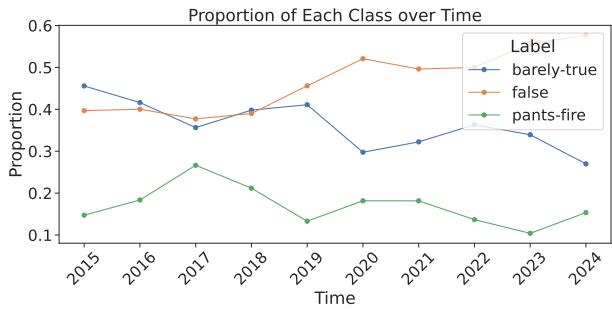  
Figure 5: Proportion of three fake news classes of PolitiFact claims over the years, up to August 2024.

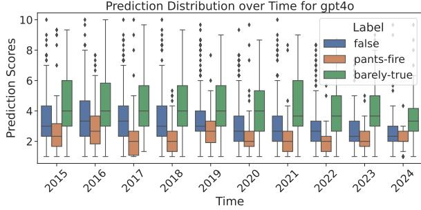  
Figure 6: GPT-4o (retrieval-free) predicted plausibility of PolitiFact claims over the years, up to August 2024.

<table><tr><td></td><td>AUROC</td><td>F1-Ma</td><td>Acc</td></tr><tr><td>Sampling</td><td>77.5</td><td>70.7</td><td>70.9</td></tr><tr><td>0 temp</td><td>76.2</td><td>69.4</td><td>69.4</td></tr></table>

Table 11: GPT-4o detector with different sampling techniques on the LIAR dataset. Compared to taking one prediction with a temperature of 0, which is essentially the highest probability output, sampling with a temperature of 1 avoids overconfidence and produces smoother output.

<table><tr><td>Event Range</td><td>2015-2018</td><td>2021-2024</td></tr><tr><td>&quot;Factuality&quot;</td><td>0.775</td><td>0.815</td></tr><tr><td>&quot;Plausibility&#x27; 11</td><td>0.753</td><td>0.822</td></tr></table>

Table 12: GPT-4o detector using prompts with different wording referring to the event likelihood. We report the AUROC on the PolitiFact data over the years. “Factuality” suits the fact-checking narrative of past events, while “Plausibility” better describes current and future events.

## A.4 Details of Baseline Datasets

We compare to two recent LLM fake news datasets. We adopt the machine-written GossipCop and PolitiFact datasets from Su et al. (2023b). The PolitiFact subset contains 132 true news and 97 fake news. The GossipCop dataset is down-sampled to 200 true and fake news. We adopt the rewrite and information manipulation variants of Chen and Shu (2024) generated by ChatGPT based on PolitiFact. The rewrite subset contains 126 true news and 270 fake news. The information manipulation subset contains 378 true news and 378 fake news from three sub-variants (i.e., Outdated Information, Description Ambiguity, False Context).

## A.5 Detector and Generator Prompts

We adopt simple prompts that implement corresponding functionality but do not introduce domain or dataset-specific heuristics to maximize generalizability.

## Detector

<system> Today is March 26, 2024. You predict the plausibility of a news you haven’t seen. </system>

Please predict the plausibility of the   
following news story:   
<news/>

Please give a number representing the plausibility (1-10) and nothing else.

## RAG Detector

<system> Today is March 26, 2024. You predict the plausibility of a news you haven’t seen given a list of related news stories from search results. </system>

Related news stories from search results:

<retrieval/>

Please predict the plausibility of the following news story:

<news/>

Please give a number representing the plausibility (1-10) and nothing else.

## Detector Rationale

<system> Today is March 26, 2024. You fact-check a news you haven’t seen, given a list of related news stories from search results. </system>

Related news stories from search results:

<retrieval/>

Please predict the plausibility of the following news story:

<news/>

Please explain what you find suspicious about the news story. Give the top 3 points in a list format and nothing else.

## Generator

<system> Today is March 26, 2024. Please rewrite a real recent news story to introduce some believable factual errors. The modification should be able to fool professional fact-checkers.

Format

Error introduced:

Title:

Description: </system>

Please rewrite the following news story.

<news/>

It was previously rewrote as:

<last\_iter\_news/>

Fact-checkers found the following suspi-

cious:

<rationale/>

Please rewrite the news story to make it more believable and fool the fact-checkers.

## Contradiction Detector

News 1

<news/>

News 2

<fake\_news/>

Does News 2 conflict with News 1? Please

type yes or no and nothing else.

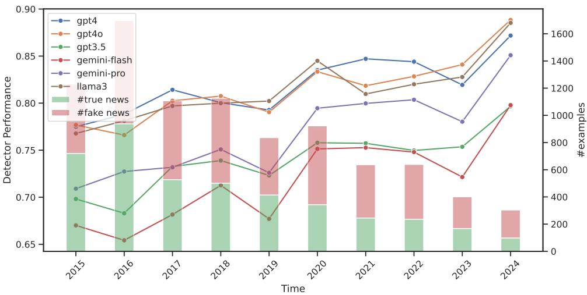  
Figure 7: Comparison of different detectors (AUC-ROC) on PolitiFact claims over the years, up to August 2024. This figure shows the results on raw data without balancing. The absolute number and proportion of true news decrease throughout the year.

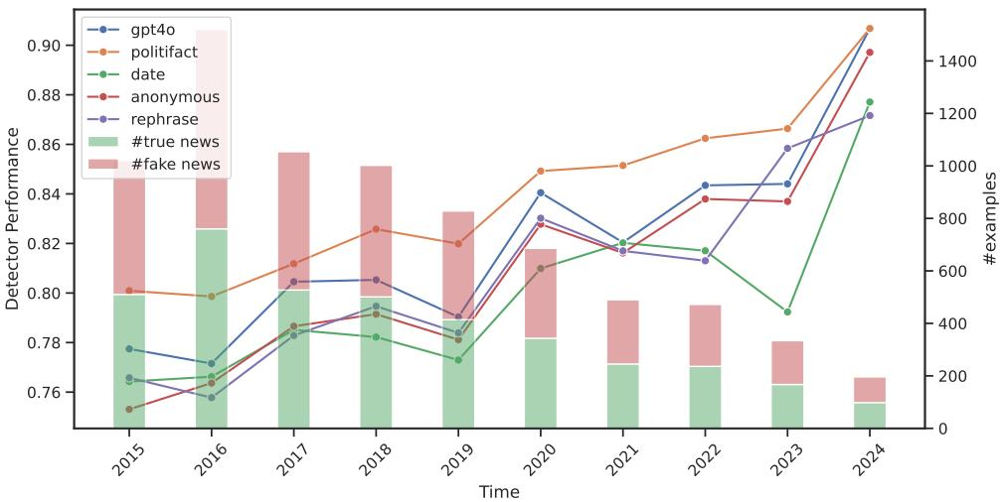  
Figure 8: Ablating different attributes on PolitiFact claims over the years, up to August 2024. This figure shows the results on balanced data.

<table><tr><td rowspan="2">Retriever Detector</td><td colspan="3">None</td><td colspan="3">News</td><td colspan="3">Google</td></tr><tr><td>first</td><td>last</td><td> $\Delta$ </td><td>first</td><td>last</td><td> $\Delta$ </td><td>first</td><td>last</td><td> $\Delta$ </td></tr><tr><td>Gemini-Flash</td><td>54.6</td><td>50.6</td><td>4.0</td><td>73.9</td><td>62.4</td><td>11.5</td><td>80.0</td><td>72.2</td><td>7.7</td></tr><tr><td>Gemini-Pro</td><td>56.3</td><td>52.1</td><td>4.3</td><td>69.7</td><td>59.2</td><td>10.5</td><td>74.9</td><td>66.0</td><td>8.8</td></tr><tr><td>GPT-3.5</td><td>53.4</td><td>50.0</td><td>3.4</td><td>70.8</td><td>59.4</td><td>11.4</td><td>76.8</td><td>66.7</td><td>10.0</td></tr><tr><td>GPT-40</td><td>57.2</td><td>49.9</td><td>7.2</td><td>83.0</td><td>66.3</td><td>16.7</td><td>91.3</td><td>83.0</td><td>8.4</td></tr><tr><td>Llama 3.1</td><td>57.4</td><td>52.3</td><td>5.1</td><td>80.9</td><td>69.2</td><td>11.7</td><td>91.3</td><td>83.2</td><td>8.2</td></tr></table>

Table 13: Average Precision (AP) of different detectors on the generated fake news of the first and last iteration. The $\Delta$ column shows the effects of the iterative process. News refers to the in-house DPR retriever on news-please data, and Google refers to the Google search API results.

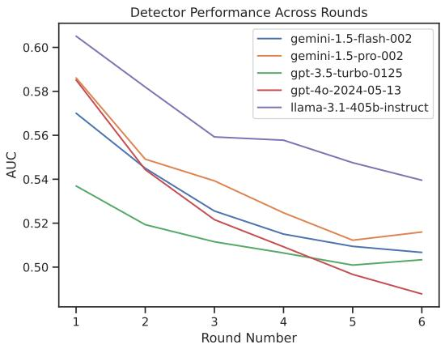  
Figure 9: Non-RAG-based detectors with different LLM backbones (AUC-ROC) on iteratively generated fake news.

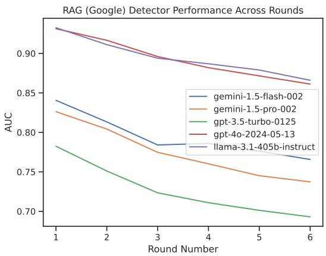  
Figure 10: Google-RAG-based detectors with different LLM backbones (AUC-ROC) on iteratively generated fake news.

<table><tr><td>Query: Saudi Arabia's parliamentary vote sees a low turnout despite government push</td></tr><tr><td>News (DPR) 2024-03-11 - Government claims public's lack of understanding of referenda led to landslide 'no' vote Voters overwhelmingly rejected proposed changes to care the highest ever “no" vote percentage in an Irish referendum</td></tr><tr><td>2024-03-05 - Opposition leaders react to the announcement of the date for the presidential elections</td></tr><tr><td>CARACAS After announcing the date for the next elections in Venezuela, guided by the CNE On July 28, leaders of the Venezuelan opposition expressed their</td></tr><tr><td>2024-03-09 - Polls could have been derailed because of just one LHC order: CJP Justice Faez underscores pivotal role outgoing Justice Tariq Masood could have played as LHC CJ but SC benefited immensely from his presence | Justice Tariq urges judges</td></tr><tr><td>2024-03-04 - Senegal election crisis shakes support for Macky Sall's coalition DAKAR, March 4 (Reuters) – Writer Moustapha Gueye voted for Senegalese President Macky Sall at the last two elections. But disappointment in Sall's second term and the president's thwarted attempt to postpone the next vote have shaken Gueye's allegiance to the ruling Benno Bokk Yakaar (BBY) coalition. Reclining on a sofa at his home in Dakar, Gueye [. . .]</td></tr><tr><td>2024-03-03 - The government's attempt for answers [Feb. 24-Mar. 1] The federal government has ordered the executives of Bell, Rogers, and Telus to answer questions about telecom pricing after previous requests were denied.</td></tr><tr><td>Google Title: First Iranian parliament vote since 2022 mass protests sees ...</td></tr><tr><td>Source: PBS, Mar 1, 2024 Content: Iran held its first parliamentary election Friday since mass 2022 protests over mandatory hijab laws following the death of Mahsa Amini, apparently drawing a ...</td></tr><tr><td>Title: Low turnout in Saudi Arabia's local polls I News Source: A1 Jazeera, Oct 22, 2011</td></tr><tr><td>Content: With women excluded until 2015, only men voted in kingdom's second-ever election, and polling booths remain mostly empty.</td></tr><tr><td>Title: Growing 'Despondency' And Hard-Liners' Dominance Source: Radio Free Europe/Radio Liberty,</td></tr><tr><td>Content: Iranian President Ebrahim Raisi casts his vote during parliamentary elections in Tehran on March 1. “The Islamic</td></tr><tr><td>republic is now a minority-ruled ...</td></tr><tr><td></td></tr><tr><td>Title: Democracy in Crisis</td></tr><tr><td></td></tr><tr><td>Source: Freedom House,</td></tr><tr><td></td></tr><tr><td>Content: Political rights and civil liberties around the world deteriorated to their lowest point in more than a decade in 2017,</td></tr><tr><td></td></tr><tr><td></td></tr><tr><td>extending a period characterized by ...</td></tr><tr><td></td></tr><tr><td></td></tr><tr><td></td></tr><tr><td></td></tr><tr><td></td></tr><tr><td></td></tr><tr><td></td></tr><tr><td></td></tr><tr><td></td></tr><tr><td></td></tr><tr><td></td></tr><tr><td></td></tr><tr><td></td></tr><tr><td></td></tr><tr><td></td></tr><tr><td></td></tr><tr><td></td></tr><tr><td></td></tr><tr><td></td></tr><tr><td></td></tr><tr><td></td></tr><tr><td></td></tr><tr><td></td></tr><tr><td></td></tr><tr><td></td></tr><tr><td></td></tr><tr><td></td></tr><tr><td></td></tr><tr><td></td></tr><tr><td></td></tr><tr><td></td></tr><tr><td></td></tr><tr><td></td></tr><tr><td></td></tr><tr><td></td></tr><tr><td></td></tr><tr><td></td></tr><tr><td></td></tr><tr><td></td></tr><tr><td></td></tr><tr><td></td></tr><tr><td></td></tr><tr><td></td></tr><tr><td></td></tr><tr><td></td></tr><tr><td></td></tr><tr><td></td></tr><tr><td></td></tr><tr><td></td></tr><tr><td></td></tr><tr><td></td></tr><tr><td></td></tr><tr><td></td></tr><tr><td></td></tr><tr><td></td></tr><tr><td>Title: In Saudi Arabia, Only Men Vote, And Not Often</td></tr><tr><td></td></tr><tr><td></td></tr><tr><td></td></tr><tr><td></td></tr><tr><td></td></tr><tr><td></td></tr><tr><td></td></tr><tr><td></td></tr><tr><td></td></tr><tr><td>Source: NPR, Sep 29, 2011</td></tr><tr><td></td></tr><tr><td></td></tr><tr><td></td></tr><tr><td></td></tr><tr><td></td></tr><tr><td></td></tr><tr><td></td></tr><tr><td></td></tr><tr><td></td></tr><tr><td></td></tr><tr><td></td></tr><tr><td></td></tr><tr><td></td></tr><tr><td></td></tr><tr><td></td></tr><tr><td></td></tr><tr><td></td></tr><tr><td></td></tr><tr><td></td></tr><tr><td></td></tr><tr><td></td></tr><tr><td></td></tr><tr><td></td></tr><tr><td></td></tr><tr><td></td></tr><tr><td></td></tr><tr><td></td></tr><tr><td></td></tr><tr><td></td></tr><tr><td></td></tr><tr><td></td></tr><tr><td></td></tr><tr><td></td></tr><tr><td></td></tr><tr><td></td></tr><tr><td></td></tr><tr><td></td></tr><tr><td></td></tr><tr><td></td></tr><tr><td></td></tr><tr><td></td></tr><tr><td></td></tr><tr><td></td></tr><tr><td></td></tr><tr><td></td></tr><tr><td></td></tr><tr><td></td></tr><tr><td></td></tr><tr><td></td></tr><tr><td></td></tr><tr><td></td></tr><tr><td></td></tr><tr><td></td></tr><tr><td></td></tr><tr><td></td></tr><tr><td></td></tr><tr><td></td></tr><tr><td></td></tr><tr><td></td></tr><tr><td></td></tr><tr><td></td></tr><tr><td></td></tr><tr><td></td></tr><tr><td></td></tr><tr><td></td></tr><tr><td></td></tr><tr><td></td></tr><tr><td></td></tr><tr><td></td></tr><tr><td></td></tr><tr><td></td></tr><tr><td></td></tr><tr><td></td></tr><tr><td></td></tr><tr><td>Content: Only men could vote in polls to fill half the seats on some 300 municipal councils. The other half are appointed by</td></tr><tr><td>Query: Iranian parliamentary vote sees a low turnout despite government push</td></tr><tr><td>News (DPR) "Related news stories from search results:</td></tr><tr><td>2024-03-01 - Iranian parliament vote, first since 2022 mass protests, sees a low turnout despite government push</td></tr><tr><td>Iran has held its first parliamentary election since mass 2022 protests over mandatory hijab laws after the death of Mahsa Amini, apparently drawing a low turnout amid calls for a boycott. It wasn't immediately clear if voter apathy or an active desire to send a message to Iran's theocracy depressed the number of voters coming to polling stations Friday across the Islamic Republic. While state-controlled television broadcast images of lines of voters, others across the capital of Tehran saw largely empty polling stations. Some, including imprisoned Nobel Peace Prize laureate Narges Mohammadi, urged a boycott of a vote they derided as a “sham.""</td></tr><tr><td>2024-03-01 - Iranian Parliament Vote, First Since 2022 Mass Protests, Sees a Low Turnout Despite Government Push Get latest articles and stories on World at LatestLY. Iran held its first parliamentary election on Friday since mass 2022 protests over mandatory hijab laws following the death of Mahsa Amini, apparently drawing a low turnout amid calls for a boycott.</td></tr><tr><td>World News | Iranian Parliament Vote, First Since 2022 Mass Protests, Sees a Low Turnout Despite Government Push. 2024-03-01 - Iranian parliament vote, first since 2022 mass protests, sees low turnout despite government push</td></tr><tr><td>It wasn't immediately clear if voter apathy or an active desire to send a message to Iran's theocracy depressed the number of voters coming to polling stations across the Islamic Republic.</td></tr><tr><td>2024-03-11 - Government claims public's lack of understanding of referenda led to landslide 'no' vote Voters overwhelmingly rejected proposed changes to care the highest ever “no" vote percentage in an Irish referendum</td></tr><tr><td>2024-03-02 - Low turnout in Iran's first vote since 2022 protests Iran's voters have been reluctant to turn out in the country's first parliamentary election since protests over the death in custody of Mahsa Amini in 2022.</td></tr><tr><td>Google Title: First Iranian parliament vote since 2022 mass protests sees ... Source: PBS, Mar 1, 2024</td></tr><tr><td>Content: Iran held its first parliamentary election Friday since mass 2022 protests over mandatory hijab laws following the death of Mahsa Amini, apparently drawing a ..</td></tr><tr><td>Title: Iranian parliament vote, first since 2022 mass protests ... Source: Euronews.com, Mar 1, 2024</td></tr><tr><td>Content: Officials including Supreme Leader Ayatollah Ali Khamenei sought to link turnout directly to taking a stand against Iran's enemies.</td></tr><tr><td>Title: Hard-liners dominate Iran parliamentary vote that saw a ... Source: AP News, Mar 4, 2024</td></tr><tr><td>Content: Iranian hard-line politicians dominated the country's vote for parliament. However, the election Friday also saw a record-low turnout.</td></tr><tr><td></td></tr><tr><td>Title: Low turnout as conservatives dominate Iran parliamentary ...</td></tr><tr><td>Source: Al Jazeera, Mar 4, 2024</td></tr><tr><td>Content: Conservative politicians will dominate Iran's parliament, according to election results, maintaining their hold on the</td></tr><tr><td></td></tr><tr><td></td></tr><tr><td>Islamic Consultative ...</td></tr><tr><td></td></tr><tr><td></td></tr><tr><td></td></tr><tr><td></td></tr><tr><td></td></tr><tr><td></td></tr><tr><td></td></tr><tr><td></td></tr><tr><td></td></tr><tr><td></td></tr><tr><td></td></tr><tr><td></td></tr><tr><td></td></tr><tr><td></td></tr><tr><td></td></tr><tr><td></td></tr><tr><td></td></tr><tr><td></td></tr><tr><td></td></tr><tr><td></td></tr><tr><td></td></tr><tr><td></td></tr><tr><td>Title: Iranian parliament vote sees low turnout</td></tr><tr><td></td></tr><tr><td></td></tr><tr><td></td></tr><tr><td></td></tr><tr><td></td></tr><tr><td></td></tr><tr><td></td></tr><tr><td></td></tr><tr><td></td></tr><tr><td></td></tr><tr><td></td></tr><tr><td></td></tr><tr><td></td></tr><tr><td></td></tr><tr><td></td></tr><tr><td></td></tr><tr><td></td></tr><tr><td></td></tr><tr><td></td></tr><tr><td></td></tr><tr><td></td></tr><tr><td></td></tr><tr><td></td></tr><tr><td></td></tr><tr><td></td></tr><tr><td>Source: The Sydney Morning Herald, Mar 2, 2024</td></tr><tr><td></td></tr><tr><td></td></tr><tr><td></td></tr><tr><td></td></tr><tr><td></td></tr><tr><td></td></tr><tr><td></td></tr><tr><td></td></tr><tr><td></td></tr><tr><td></td></tr><tr><td></td></tr><tr><td></td></tr><tr><td></td></tr><tr><td></td></tr><tr><td></td></tr><tr><td></td></tr><tr><td></td></tr><tr><td></td></tr><tr><td></td></tr><tr><td></td></tr><tr><td></td></tr><tr><td></td></tr><tr><td></td></tr><tr><td></td></tr><tr><td></td></tr><tr><td></td></tr><tr><td></td></tr><tr><td></td></tr><tr><td></td></tr><tr><td></td></tr><tr><td></td></tr><tr><td></td></tr><tr><td></td></tr><tr><td></td></tr><tr><td></td></tr><tr><td></td></tr><tr><td></td></tr><tr><td></td></tr><tr><td></td></tr><tr><td></td></tr><tr><td></td></tr><tr><td></td></tr><tr><td></td></tr><tr><td></td></tr><tr><td></td></tr><tr><td></td></tr><tr><td></td></tr><tr><td></td></tr><tr><td></td></tr><tr><td></td></tr><tr><td></td></tr><tr><td></td></tr><tr><td></td></tr><tr><td></td></tr><tr><td></td></tr><tr><td></td></tr><tr><td></td></tr><tr><td></td></tr><tr><td></td></tr><tr><td></td></tr><tr><td></td></tr><tr><td></td></tr><tr><td></td></tr><tr><td></td></tr><tr><td></td></tr><tr><td></td></tr><tr><td></td></tr><tr><td></td></tr><tr><td></td></tr><tr><td></td></tr><tr><td></td></tr><tr><td></td></tr><tr><td></td></tr><tr><td></td></tr><tr><td></td></tr><tr><td></td></tr><tr><td></td></tr><tr><td></td></tr><tr><td></td></tr><tr><td></td></tr><tr><td></td></tr><tr><td></td></tr><tr><td></td></tr><tr><td></td></tr><tr><td></td></tr><tr><td></td></tr><tr><td></td></tr><tr><td></td></tr><tr><td></td></tr><tr><td></td></tr><tr><td></td></tr><tr><td></td></tr><tr><td></td></tr><tr><td></td></tr><tr><td>Content: Iran on Friday held its first parliamentary election since mass 2022 protests over mandatory hijab laws following</td></tr></table>

Table 14: Sample retrieval results corresponding to example 3 (round 1) in Table 6, the search query is about “Saudi Arabia”, Google robustly returns “Iran” results.

Table 15: Sample retrieval results corresponding to example 3 (round 3) in Table 6, the search query is about “Iran”, both search engines return relevant results for cross-verification.

<table><tr><td>ID</td><td>Originator</td><td>Claim</td><td>Date</td></tr><tr><td>11593</td><td>Marco Rubio</td><td>Says Ted Cruz &quot;is a supporter of legalizing people that are in this country illegally&quot; and &quot;proposed giving them work permits.&quot;</td><td>November 12, 2015</td></tr><tr><td>11099</td><td>Tom Cotton</td><td>President Barack Obama &quot;said at the beginning of the negotiations that the basic approach was to dismantle Iran&#x27;s nuclear program in exchange for dismantling the sanctions.&quot;</td><td>July 15, 2015</td></tr><tr><td>11206</td><td>Bernie Sanders</td><td>&quot;We spend almost twice as much per capita on health care as do the people of any other country.&quot;</td><td>August 16, 2015</td></tr><tr><td>10672</td><td>Sally Kohn</td><td>&quot;White men account for 69 percent of those arrested for violent crimes.&quot;</td><td>March 19, 2015</td></tr><tr><td>10845</td><td>Alex McMurtrie Jr.</td><td>State legislators &quot;quietly shifted $2 billion from education to road building&quot; in 2013.</td><td>May 7, 2015</td></tr><tr><td>11741</td><td>Steven Landes</td><td>Medicaid expansion &quot;could cost the Commonwealth of Virginia over $1 billion a year...&quot;</td><td>December 24, 2015</td></tr><tr><td>11443</td><td>Steven Costantino</td><td>&quot;I did not play any role in bringing the company to RI as did others in government. I was tasked with handling the legislation affecting</td><td>September 27, 2015</td></tr><tr><td>10738</td><td>Judicial Watch</td><td>the company by my superiors.&quot; &quot;ISIS camp a few miles from Texas, Mexican authorities confirm.&quot;</td><td>April 14, 2015</td></tr><tr><td>10680</td><td>Martin Smith</td><td>By allowing brewpubs to sell beer, Georgia could become like Mex- ico with only a couple of manufacturers controlling all aspects of market.</td><td>March 23, 2015</td></tr><tr><td>11282</td><td>Ted Cruz</td><td>&quot;The Iran Deal will facilitate and accelerate the nation of Iran acquir- ing nuclear weapons.&quot;</td><td>September 9, 2015</td></tr></table>

Table 16: PolitiFact collected fake news from 2015, randomly sampled from examples that are assigned a “false” Truth-O-Meter label.

<table><tr><td>ID</td><td>Originator</td><td>Claim</td><td>Date</td></tr><tr><td>25742</td><td>Brigitte Gabriel</td><td>&quot;For 18 months under President Trump, not a single American was harmed in Afghanistan.&quot;</td><td>July 2, 2024</td></tr><tr><td>25078</td><td>Steve Scalise</td><td>The Senate&#x27;s border bill &quot;accepts 5,000 illegal immigrants a day.&quot;</td><td>February 4, 2024</td></tr><tr><td>25020</td><td>Ron DeSantis</td><td>Says Winston Churchill said, &quot;Success is not final, failure is not fatal: it is the courage to continue that counts.&quot;</td><td>January 21, 2024</td></tr><tr><td>25800</td><td>Jon Stewart</td><td>Milwaukee&#x27;s Marcus Performing Arts Center – where &#x27;The Daily Show&#x27; had been scheduled – “was originally located in the ‘soft perimeter,&#x27; they called it, security-wise&quot; but “was shifted, understandably so, to the hard</td><td>July 16, 2024</td></tr><tr><td>25553</td><td>Ron Johnson</td><td>perimeter.&quot; &quot;Every Senate Democrat has voted to support unlimited abortions up to the moment of birth.&quot;</td><td>April 15, 2024</td></tr><tr><td>25596</td><td>Jesse Watters</td><td>Judge Juan Merchan “overrules every objection from the defense and sus- tains every objection from the prosecution&quot; during former President Donald Trump&#x27;s New York trial.</td><td>May 28, 2024</td></tr><tr><td>25240</td><td>Donald Trump</td><td>&quot;Biden has implemented a formal policy that illegal aliens who intrude into the United States are granted immunity from deportation.&quot;</td><td>March 9, 2024</td></tr><tr><td>25376</td><td>Donald Trump</td><td>&quot;Crime is down in Venezuela by 67% because they&#x27;re taking their gangs and their criminals and depositing them very nicely into the United States.&quot;</td><td>April 2, 2024</td></tr><tr><td>25956</td><td>Eric Hovde</td><td>Says U.S. Sen. Tammy Baldwin &quot;has done absolutely nothing&quot; about the fentanyl crisis.</td><td>August 13, 2024</td></tr><tr><td>25082</td><td>Elon Musk</td><td>Biden&#x27;s strategy is to &quot;get as many illegals in the country as possible&quot; and “legalize them to create a permanent majority.&quot;</td><td>February 2, 2024</td></tr></table>

Table 17: PolitiFact collected fake news from 2024, randomly sampled from examples that are assigned a “false” Truth-O-Meter label.