# S3 - Semantic Signal Separation

Márton Kardos Aarhus University martonkardos@cas.au.dk

Arnault-Quentin Vermillet Aarhus University arnault@cc.au.dk

Jan Kostkan Aarhus University jan.kostkan@cas.au.dk

Kristoffer Nielbo Aarhus University kln@cas.au.dk

Kenneth Enevoldsen Aarhus University kenneth.enevoldsen@cas.au.dk

Roberta Rocca Aarhus University roberta.rocca@cas.au.dk

## Abstract

Topic models are useful tools for discovering latent semantic structures in large textual corpora. Recent efforts have been oriented at incorporating contextual representations in topic modeling and have been shown to outperform classical topic models. These approaches are typically slow, volatile, and require heavy preprocessing for optimal results. We present Semantic Signal Separation (S3), a theory-driven topic modeling approach in neural embedding spaces. S3 conceptualizes topics as independent axes of semantic space and uncovers these by decomposing contextualized document embeddings using Independent Component Analysis. Our approach provides diverse and highly coherent topics, requires no preprocessing, and is demonstrated to be the fastest contextual topic model, being, on average, 4.5x faster than the runner-up BERTopic1. We offer an implementation of $S ^ { 3 }$ , and all contextual baselines, in the Turftopic2 Python package.

## 1 Introduction

‘Topic models’ are an umbrella term for statistical approaches that enable unsupervised topic discovery in large text corpora (Blei, 2012). They are commonly applied in exploratory data analysis of textual data because they allow practitioners to unearth and condense information about the semantic content of a corpus without the need for close reading and manual labor. Traditionally, topics are presented to the user as a set of important terms (keywords) that provide insights into possible interpretations of the topic.

Classical approaches to topic modeling, such as Latent Semantic Indexing (Deerwester et al., 1988, Dumais, 2004) and Latent Dirichlet Allocation (Blei et al., 2003, Blei, 2012), have relied on frequency-based bag-of-words (BoW) representations of documents. While these models have been successfully utilized in decades of NLP research (Jelodar et al., 2018), they all share several practical and theoretical limitations. For example, BoW models are sensitive to words with atypical statistical properties (such as function words), which can contaminate keyword-based topic descriptions unless heavy preprocessing pipelines are applied. Such pipelines introduce many degrees of freedom for the researcher. Furthermore, the sparsity and high dimensionality of BoW representations often result in lower computational efficiency and poorer model fit.

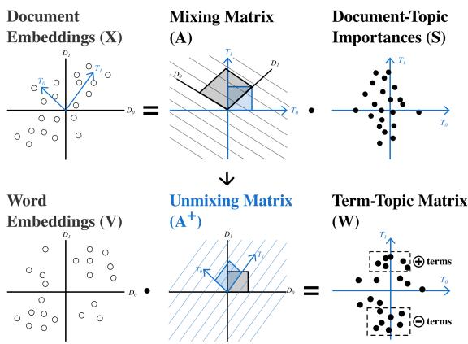  
Figure 1: $S ^ { 3 }$ discovers topics by finding independent semantic axes that explain most variance in an embedded corpus and interprets these semantic axes as topics. Descriptive words for a topic are found by projecting word embeddings onto these axes.

With the advent of dense neural language representations (Vaswani et al., 2017, Le and Mikolov, 2014, Pennington et al., 2014, Mikolov et al., 2013), new opportunities have opened for topic modeling research. Sentence embeddings (Reimers and Gurevych, 2019) hold great promise for topic modeling, as they provide contextual, grammarsensitive representations of language, and are more robust against spelling errors and out-of-vocabulary terms, reducing the need for preprocessing that discards valuable linguistic information. Additionally, they produce dense representations in a continuous space, allowing for assumptions of Gaussianity. They also allow for transfer learning (Ruder et al., 2019) in topic modeling, utilizing information learned in larger external corpora for topic extraction.

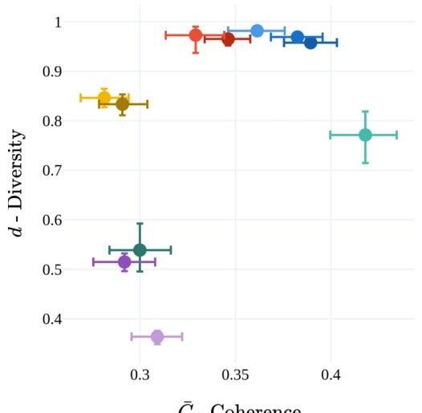  
Č - Coherence

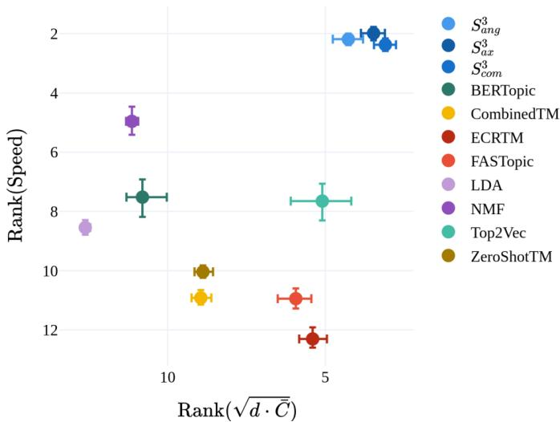  
Figure 2: Coherence and diversity of topic descriptions from all topic models (left) and topic models’ ranks on speed and performance across all runs (right).  
Error bar represents 95% bootstrap confidence interval. Results are demonstrated on raw corpora, only using contextual embedding models.

Several approaches have thus been proposed using dense neural representations for contextual topic modeling, and these have been shown to outperform their non-contextual counterparts (Bianchi et al., 2021a, Bianchi et al., 2021b, Grootendorst, 2022, Angelov, 2020, Wu et al., 2024b). Many of these approaches, however, still require preprocessing for optimal performance. This is a significant limitation of the field, as preprocessing pipelines are not standardized and can remove valuable information which is especially impactful for shorter texts Wu et al. (2020).

## 1.1 Contributions

We present Semantic Signal Separation $( \mathbf { S } ^ { 3 } )$ , a novel contextualized topic modeling technique that conceptualizes topic modeling as the discovery of latent semantic axes in a corpus. These axes are discovered by decomposing the document embedding matrix using the FastICA (Hyvärinen and Oja, 2000) algorithm.

The proposed approach is a) Conceptually simple and theory-driven b) Performs on par with existing approaches in word-embedding coherence and produces near-perfect diversity c) Is computationally more efficient than existing approaches, and d) can effectively utilize contextual information

In addition to introducing a new method, we provide a simple unified scikit-learn based interface for both $S ^ { 3 }$ and other contextualized topic modeling approaches in the Turftopic Python package 3.

## 2 Related Work

## 2.1 Semantic Axes

Independent Component Analysis (Jutten and Herault, 1991) has previously been applied to embedding spaces to discover semantic axes (Musil and Marecekˇ 2024, Yamagiwa et al. 2023). These investigations are, however, mostly oriented at finding universal dimensions of semantics in word and image embeddings. They demonstrated that axes discovered by ICA are interpretable and usually coincide across different embedding spaces and modalities. In contrast, our study is oriented at utilizing semantic axes to discover highly interpretable topics in a specific corpus of interest, not at uncovering universal dimensions of semantics. Additionally, no topic descriptions are computed or evaluated in these studies.

## 2.2 Embedding-based Topic Models

Multiple approaches to topic modeling using neural language representations have been proposed over

the past few years.

Neural Topic Models (Wu et al., 2024a) rely on deep neural networks for parameter estimation. Contextualized Topic Models or CTMs (Bianchi et al., 2021a) are generative models of BoW representations, but use a variational autoencoding paradigm for inference (Srivastava and Sutton, 2017). Contextual embeddings are used as inputs to the encoder network (ZeroShotTM) at times concatenated with BoW vectors (CombinedTM). CTMs typically require heavy preprocessing, and computational efficiency and quality of model fit decrease drastically with larger vocabularies (Bianchi et al., 2020).

ECRTM (Wu et al., 2023) is a neural model that relies on embedding clustering regularization to produce sufficiently distinct topics and prevent topic descriptions from converging to each other. This approach, however, does not utilize contextual representations and is notably slower than most other topic models (Wu et al., 2024b).

FASTopic (Wu et al., 2024b) introduces a dualsemantic-relation paradigm where relations between documents, topics, and words are conceptualized as optimal transport plans. As they demonstrate, their approach is more efficient and produces higher-quality topics than previous neural approaches.

Clustering Topic Models discover topics in corpora by clustering document representations in embedding space. Word importance weights for a given topic are estimated post hoc.

Top2Vec (Angelov, 2020) estimates these by computing cosine similarity between word encoding and cluster centroids. This assumes clusters to be spherical and convex, and topic descriptions might be misrepresentative depending on cluster shape.

BERTopic (Grootendorst, 2022) estimates term importances for clusters using a class-based tf-idf weighting scheme. Both approaches utilize UMAP (McInnes and Healy, 2018) for dimensionality reduction and HDBSCAN (Campello et al., 2013) for clustering.

Both BERTopic and Top2Vec come prepackaged with a topic reduction method. This is necessary, as HDBSCAN learns the number of clusters from the data and the number of clusters can grow vast, which may prove impractical.

The Challenges of currently available contextual topic models are, however, still numerous.

Many of them are sensitive to hyperparameter choices, produce topics of dubious interpretability, and rely on preprocessing pipelines the structure of which is not standardized (Wu et al., 2024a). Additionally, it is unclear whether these models are effective at using contextual and syntactic information, as they are typically evaluated on preprocessed corpora.

## 3 Semantic Signal Separation

In this paper, we introduce Semantic Signal Separation (or S3), a novel approach to topic modeling in continuous embedding spaces that aims to overcome the above-mentioned challenges of existing contextual topic modeling methods.

Instead of interpreting topics as clusters or word probabilities, we conceptualize topics as semantic axes that explain variation specific to a corpus. This is achieved by decomposing semantic representations into latent components (A), which are assumed to be the topics, and components’ strengths in each document (S), which are document-topic importances. For the topics to be conceptually distinct, we utilize Independent Component Analysis (Jutten and Herault, 1991) to uncover them. Term importances are estimated from the topic components’ strength in word embeddings (V).

Our approach can, in some aspects, be considered the contextual successor of Latent Semantic Analysis (Dumais, 2004, Deerwester et al., 1988), which discovers factors in word-occurrences.

## 3.1 Model

Document representations are obtained by encoding documents using a sentence transformer model.

1. Let X be the matrix of the document encodings.

Decomposition of document representations into independent semantic axes is performed with Independent Component Analysis (Jutten and Herault, 1991). In this study, we used the FastICA (Hyvärinen and Oja, 2000) algorithm to identify latent semantic components. As a preprocessing step, whitening is applied to the embedding matrix, as FastICA is a noiseless model. Since ICA discovers the same number of components as the dimensionality of the embeddings by default, we reduce the dimensionality of embeddings during whitening by taking the first N principal components, where N is the number of topics.

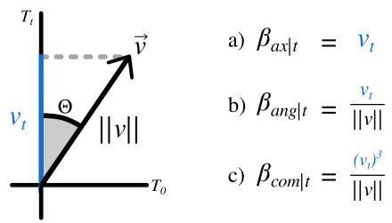  
Figure 3: Geometric intuition for different types of word importance scores for $S ^ { 3 }$

2. Decompose X using FastICA: $X \ = \ A S$ where A is the mixing matrix, and S the source matrix, containing document-topicimportances.

Term importances for topics, which are needed for the selection of descriptive terms, are calculated by projecting words onto the discovered semantic axes.

3. Encode the vocabulary of the corpus with the same encoder model. Let the matrix of word encodings be V

4. Let the unmixing matrix be the pseudo-inverse of the mixing matrix: $C = A ^ { + }$

5. Project words onto the discovered semantic axes by multiplying word embeddings with the unmixing matrix: $W = V C ^ { T }$

6. Calculate word importance scores for each topic.

We examine three methods for computing word importances:

1. Axial word importances are defined as the words’ positions on the semantic axes. The importance of word j for topic t is: $\beta _ { t j } = W _ { j t }$

2. Angular topics can be calculated by taking the cosine of the angle between projected word vectors and semantic axes: $\beta _ { t j } = c o s ( \Theta ) =$ $\frac { W _ { j t } } { | | W _ { j } | | }$

3. Combined word importance is a combination of the two approaches $\begin{array} { r } { ^ { 4 } . \beta _ { t j } = \frac { ( W _ { j t } ) ^ { 3 } } { | | W _ { j } | | } } \end{array}$

Axial word importance gives rise to topic descriptions that contain the most salient words for a given topic, while angular importance weights the most specific words highest. Combined importances intend to balance these two aspects.

Note that all formulations allow for terms with negative importance for a given topic. While this is also the case for LSA, prior literature does not explore this concept. Model interpretation can be augmented by inspecting terms that score lowest on a given topic, providing a negative definition.

To ensure comparability with methods that do not allow for negative definitions, our model comparisons ignore negative terms, but a demonstrative example is presented in Section 6.2.

Inference of topic proportions in novel documents can be achieved by multiplying the documents’ embeddings with the unmixing matrix.

1. Let the encodings of previously unseen documents be Xˆ

2. Calculate document-topic matrix: $\hat { S } = \hat { X } C ^ { T }$

## 4 Experimental Setup

To compare $\mathbf { S } ^ { 3 \dagger } \mathbf { S }$ performance to previous contextsensitive topic modeling approaches, we benchmark it on a number of quantitative metrics widely used in topic modeling literature. Our experimental results can be reproduced with the topic-benchmark Python package’s CLI5. The repository also contains results and all topic descriptions in the $\mathtt { r e s u l t s } /$ directory.

## 4.1 Datasets

Due to its relevance in topic modeling and NLP research, we benchmark the model on the 20Newsgroups dataset along with a BBC News dataset6, a set of 2048 randomly sampled Machine Learning abstracts from ArXiv, medical terms’ articles from Wikipedia 7 and StackExchange entries 8. Code is supplied for fetching and subsampling the datasets in a reproducible manner in the topic-benchmark repository. Consult Table 1 for dataset and vocabulary size. Topic model comparisons typically use preprocessed datasets from the OCTIS Python package (Terragni et al., 2021).

To estimate the effect of preprocessing on model performance, we run model evaluations on the preprocessed version of 20Newsgroups as well, and compare results with the non-preprocessed dataset.

<table><tr><td>Dataset</td><td># Documents</td><td>Vocabulary Size</td></tr><tr><td>ArXiv ML Papers</td><td>2048</td><td>2849</td></tr><tr><td>BBC News</td><td>1225</td><td>3851</td></tr><tr><td>20 Newsgroups Preprocessed</td><td>16310</td><td>1612</td></tr><tr><td>20 Newsgroups Raw</td><td>18846</td><td>21668</td></tr><tr><td>StackExchange</td><td>75000</td><td>17884</td></tr><tr><td>Wiki Medical</td><td>6861</td><td>22145</td></tr><tr><td>Embedding Model</td><td># Parameters</td><td>Embedding Size</td></tr><tr><td>Averaged GloVe</td><td>120 M</td><td>300</td></tr><tr><td>all-MiniLM-L6-v2</td><td>22.7 M</td><td>384</td></tr><tr><td>all-mpnet-base-v2</td><td>109 M</td><td>768</td></tr><tr><td>E5-large-v2</td><td>335M</td><td>1024</td></tr></table>

Table 1: Overview of Datasets and Embedding Models

## 4.2 Embedding Models

To evaluate the effect of embedding models on performance, we run all analyses with an array of embedding models of varying size and quality. We utilized two SBERT models (Reimers and Gurevych, 2019), a static GloVe model averaging word vectors (Pennington et al., 2014), as well as an E5 model (Wang et al., 2024) (see Table 1).

## 4.3 Baseline Models

Topic models included in the experiment were BERTopic, Top2Vec, ZeroShotTM, CombinedTM, FASTopic, and ECRTM along with two classical baselines: NMF and LDA.

For a detailed discussion of hyperparameters, consult Appendix C.

All models were run using 10, 20, 30, 40, and 50 topics 9, and the topic descriptions from each model (top 10 terms in each topic) were extracted for quantitative and qualitative evaluation. Topic models with a given number of topics were only run once, due to the large computational demands of estimating topics models for the full battery on model types, encoders, and datasets.

## 4.4 Metrics of Topic Quality

We evaluate the quality of 10-word topic descriptions in terms of topic diversity and coherence, using the following metrics.

Topic diversity(d) measures how different topics are from each other based on the number of words they share. Topic diversity is essential for interpretability: when many topics have the same descriptive terms, it becomes hard to delineate their meaning.(Dieng et al., 2020)

Topic coherence(C) measures how semantically coherent topics are. In our investigations, we used word embedding coherence (Bianchi et al., 2021a), which equates to the average pairwise similarity of all words in a topic description, based on a Word2Vec model. Typically, models, which have been pre-trained on large corpora of text are used, which capture words’ semantic similarity in general. 10 Since these semantic relations are not specific to the corpus studied, we will refer to this approach as external coherence $( C _ { \mathrm { e x } } )$ . It is, however also beneficial to gain information about internal coherence $( C _ { \mathrm { i n } } )$ , that is, how well a topic model captures semantic relations between words in a specific target corpus. As such, we also computed coherence using Word2Vec models trained on the corpus, from which the topics were extracted. To gain an aggregate measure of topic coherence, we also utilized the geometric mean of these approaches: $\bar { C } = \sqrt { C _ { \mathrm { e x } } \cdot C _ { \mathrm { i n } } }$

In addition, when an aggregate measure of topic interpretability is needed, we took the geometric mean of coherence and diversity ${ \sqrt { { \bar { C } } \cdot d } } .$ 11

## 4.5 Metrics of Robustness

With classical topic models, it is fairly common that semantically irrelevant “junk terms”, contaminate topic descriptions. Ideally, a topic model should yield topic descriptions where only terms aiding the interpretation of a given topic are present. This core property of topic models is not captured by standard evaluation metrics.

For each topic model fitted on the raw corpus, we computed the relative frequency of stop words in topic descriptions. As a proxy for the prevalence of “junk terms”, we also computed how frequently nonalphabetic characters are part of terms included in topic descriptions. Note that this is not a perfect proxy for the meaningfulness of terms: nonalphabetical terms might enhance topic descriptions under certain circumstances (e.g., "1917" is a meaningful term in a topic about the October Revolution).

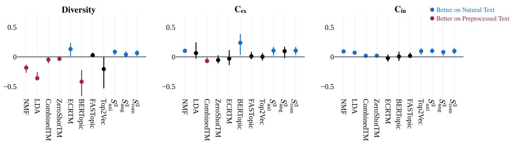  
Figure 4: Performance difference between topic models on natural text and preprocessed data (20 Newsgroups) ${ \mathrm S } ^ { 3 { \overline { { \mathbf { \Lambda } } } } }$ is the only model that consistently performs better on natural text. Error bars represent 95% highest density interval.

## 5 Results

Evaluations demonstrate that $S ^ { 3 }$ is substantially more balanced than baselines, generally outperforming them on aggregate performance, and, on average, being 27.5x faster12 than the baselines. Our models rank highest both on aggregate performance, but also quite consistently in runtime (see Figure 2). $S ^ { 3 }$ performed consistently well across corpora and embedding models, and was only occasionally rivaled by Top2Vec, ECRTM and FASTopic. On average, ECRTM and FASTopic resulted in more diverse, but less coherent topics, while Top2Vec resulted in highly coherent, but less diverse topics. In contrast, $S ^ { 3 }$ strikes an optimal balance of diversity and coherence. To see disaggregated results and runtimes, consult Figures 8, 9 11, 10 and 12.

In order to determine whether differences in model performance were significant, a linear regression analysis was performed. We predicted the aggregate interpretability score $( \sqrt { \bar { C } \cdot d } )$ , with topic model type as a fixed effect (with $S _ { c o m } ^ { 3 }$ as the intercept), and the number of topics, encoder model and dataset as random intercepts. It was found that model type significantly predicts interpretability $( F = 1 6 7 . 4 ; p < 0 . 0 0 1 ; R ^ { 2 } = 0 . 6 7 3 )$ and all models’ (except for the other two variants of $S ^ { 3 } )$ coefficients were negative and were significant (all $p < 0 . 0 5 )$ , meaning that $S ^ { 3 }$ significantly outperformed all other models on interpretability. We report the full table of coefficients in Table 3.

## 5.1 Effects of Preprocessing

To test how sensitive models are to preprocessing, results on the raw, and preprocessed 20 Newsgroups datasets were compared. While some baselines also improved in coherence metrics when having access to the raw corpus, their performance was, at large, identical or worse without preprocessing. ${ \mathsf S } ^ { 3 }$ variants gained by far the most from removing preprocessing, indicating that they are effective at utilizing the additional information (see 4) This is also indicated by the fact, that, while ${ \mathsf S } ^ { 3 }$ was outperformed by some baselines when heavy preprocessing was applied, its performance on the raw corpus was higher than all other models, even the ones trained on the preprocessed data.

## 5.2 Stop Words

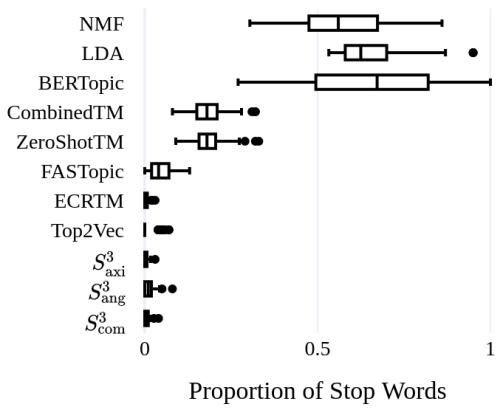  
Figure 5: Relative frequency of stop words in topic descriptions

When evaluated on raw corpora, many topic models included quite a few stop words in the top 10 words. This tendency was especially prevalent with BoW models and BERTopic, at times making up 100% of topic descriptions. CTMs and

FASTopic performed considerably better, while ECRTM, Top2Vec and all variants of ${ \bf S } _ { 3 }$ resulted in topic descriptions rarely containing stop words.

We did not observe any patterns with nonalphabetical characters, most models performed quite similarly in this aspect (see Figure 13).

## 5.3 Effects of Embedding Models

While most resultes reported were produced with representations from sentence transformers, we also examined performance on averaged static word-embeddings. Being able to utilize these representations might prove useful in low-resource environments. Generally, $S ^ { 3 }$ performed relatively stably across embedding models. By far, the most affected model was Top2Vec, which performed drastically worse with GloVe and E5 embeddings. FASTopic, by contrast, performed best with GloVe embeddings, and its performance dropped with each increase in embedding model size (see Figure 6). This is likely due to the fact that the model suffers from the curse of dimensionality, and the quality of fit decreases with embedding size.

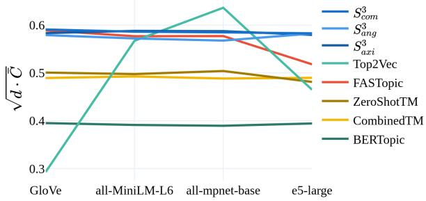  
Figure 6: Effect of embedding model on contextual topic models’ aggregate performance.

## 5.4 Effects of Term Importance Estimation

Evaluations were run with all variants of $S ^ { 3 }$ . The performance of all three term importance estimation methods was relatively similar, with differences generally representing a trade-off between coherence and diversity. Angular term importance resulted in topics being more diverse, while axial topics were the most coherent. The combined method generally splits this difference. We observed that the combined method regularly resulted in topics that differed only in a couple of words from their axial counterpart. This suggests that highly relevant words are also usually specific enough to a given axis. As such, we recommend that one uses the combined method by default, as it can prevent a word penetrating multiple topic descriptions at the same time, when it scores high on multiple axes.

## 6 Qualitative Evaluation

## 6.1 Model Comparison

We inspect topics qualitatively to identify whether patterns observed in quantitative metrics reflect intuitive characteristics of model output. For feasibility, we will focus on the models (among those evaluated above) which extract 20 topics from the 20 Newsgroups dataset. To see all topic descriptions, consult Appendix I.

In line with previous analyses, LDA, NMF and BERTopic resulted in the least interpretable topics. Topic descriptions often consisted of function words and acronyms. Even topics which contained information-bearing words were in most cases hard to interpret:

• that, to, you, of, from, the, and, in, was, on (LDA)

• the, of, to, in, space, it, edu, is, that, and (BERTopic/e5-large-v2)

CTMs and ECRTM performed notably better, with a lot of topics being readily interpretable. Yet, many of the topics in these models were still hard to interpret:

• 145, ax, 0d, \_o, a86, mk, m3, mp, 0g, mm (CombinedTM/all-MiniLM-L6-v2)

• verbeek, billington, cassels, c5ff, nyr, det, bos, guerin, nieuwendyk, ashton (ECRTM)

• get, good, my, car, doctor, diet, patients, ve, too, like (ZeroShotTM/e5-large-v2)

FASTopic’s topics were even more informative, and contained less noise, but occasionally conflated two conceptually distinct topics into one.

• miles, dealer, auto, engine, ford, oil, cars, honda, toyota, mustang (FASTopic/all-mpnetbase-v2)

• moon, launch, henry, bike, medical, car, dod, orbit, shuttle, mission (FASTopic/all-mpnetbase-v2)

The most specific, most informative and cleanest topics were produced by Top2Vec and $S ^ { 3 }$ , with most topics being informative and intuitively understandable, as showcased by these examples:

• malpractice, diagnosis, doses, homeopathy, medical, diagnoses, poisoning, toxins, gastroenterology, biomedical (Top2Vec/allmpnet-base-v2)

• epilepsy, medical, toxins, medicines, malpractice, resurection, diseases, homeopathy, poisoning, remedies $( S _ { a x i } ^ { 3 } / \mathrm { a l l }$ -mpnet-base-v2)

• zionists, israelis, israeli, intifada, zionist, israel, palestinians, likud, palestinian, isreal $( S _ { a x i } ^ { 3 } / { \mathrm { e } } 5  – \mathrm { l a r g e } { \mathrm { - v } } 2 )$

In line with our quantitative evaluations, it can be observed that some models, especially Top2Vec, are negatively affected by E5 embeddings. In contrast, $\bar { \mathsf { S } } ^ { 3 }$ produced the highest quality topics with E5 embeddings, indicating that the model can effectively utilize representations of higher quality. Models were also generally negatively impacted by using non-contextual GloVe embeddings. $S ^ { 3 }$ still performed reasonably well with these. It did, however, include more noise in topic descriptions than with contextually sensitive embedding models. FASTopic was virtually unaffected by using non-contextual embeddings.

## 6.2 Demonstration: Semantic Axes in ArXiv ML Papers

As previously mentioned, ${ \mathsf S } ^ { 3 }$ is capable of providing negative descriptions of topics, by extracting the lowest-scoring terms on the given topic. To demonstrate $S ^ { 3 \prime } \mathrm { s }$ unique capabilities to describe semantic variation in a corpus, we extracted five topics from the same subset of ArXiv ML Papers as were used for quantitative evaluations. See Table 2 for the top 5 positive and negative terms in each topic.

Note that in this case, we gain notably more information about a topic by inspecting negative terms as well. Topic 0 and 4 resemble each other quite a bit in positive descriptive terms, and it is only a glance at the negative terms that clarifies where the difference lies between them.

$S ^ { 3 }$ can also be used to create a concept compass of terms along two chosen axes. This allows us to study concepts in a corpus along the axes extracted by the model, thereby gaining information about the axes’ interactions. We chose Topic 1, which seems to be about Linguistic vs. Physical/Biological/Vision problems, and Topic 4, which seems to be about Algorithmic vs. Deep Learning solutions. (See Figure 7)

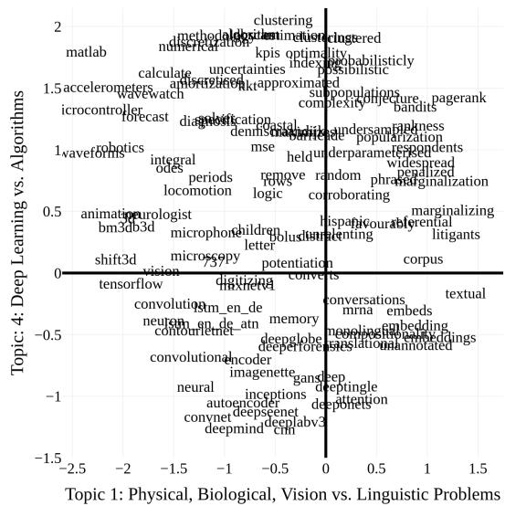  
Figure 7: Concepts along Semantic Axes Extracted by $S ^ { 3 }$ in ArXiv ML Papers

We can see that the intersection of linguistic problems and classical ML is largely dominated by probability theory, and the term that is quite high on both axes is pagerank, which is an algorithmic method for calculating page importance, while deep-learning in linguistic problems is focused on embeddings and attention. For low-level problems on the algorithmic side of the spectrum are numerical methods, matlab and sensors, while on the deep learning side, are terms related to computer vision and tensorflow.

<table><tr><td>Positive</td><td></td><td>Negative</td></tr><tr><td>0</td><td>clustering, histograms, clusterings, histogram, classifying</td><td>reinforcement, explo- ration, planning, tactics, reinforce</td></tr><tr><td>1</td><td>textual, pagerank, lit- igants, marginalizing, entailment</td><td>matlab, waveforms, mi- crocontroller, accelerom- eters, microcontrollers</td></tr><tr><td>2</td><td>sparsestmax, denoiseing, denoising, minimizers, minimizes</td><td>automation, affective, chatbots, questionnaire, attitudes</td></tr><tr><td>3</td><td>rebmigraph, subgraph, subgraphs, graphsage, graph</td><td>adversarial, adversarially, adversarialization, adver- sary, security</td></tr><tr><td>4</td><td>clustering, estimations, algorithm, dbscan, esti- mation</td><td>cnn, deepmind, deeplabv3, convnet, deepseenet</td></tr></table>

Table 2: Topics in ArXiv ML Papers Extracted by $S ^ { 3 }$

## 7 Conclusion

We propose Semantic Signal Separation $( \mathsf { S } ^ { 3 } )$ , a novel approach to topic modeling in continuous semantic spaces. Inspired by classical matrix decomposition methods, such as Latent Semantic Analysis, $S ^ { 3 }$ conceptualizes topics as axes of semantics. Through experimental quantitative and qualitative evaluation, we demonstrate that ${ \mathsf S } ^ { 3 }$ discovers highly coherent and diverse topics, performs well, and in fact, better without preprocessing, and is, on average, faster than existing contextual topic models, while obtaining better or comparable topics in terms of coherence and diversity.

## 8 Limitations

## 8.1 Quantitative Metrics

While adopted by the majority of topic modeling literature (Bianchi et al., 2021a, Grootendorst, 2022), metrics commonly used to measure topic quality rely on strong assumptions, and they are affected by a number of limitations (Rahimi et al., 2024). Additional analyses and considerations presented in this work are meant to partly compensate for this limitation.

## 8.2 Model Implementations

As alluded to, all contextual models we used in the experiment were reimplemented as part of the Turftopic package. Our implementations of BERTopic and Top2Vec should behave identically to the original, as they rely on the exact same algorithm. Minor deviances in inference speed (in either direction) are, however, possible. On the other hand, CTM models posit minor architectural differences to the original implementation, and as such, runtimes and topic descriptions may be slightly different from what we could have obtained with the original implementation.

## 8.3 Hyperparameter Tuning

Some baselines, such as BERTopic and LDA are widely known to be sensitive to choice of hyperparameters. These approaches could, in theory, perform better with hyperparameter optimization. We do not tune hyperparameters when comparing models for reasons outlined in Appendix C.

## 8.4 Stochastic Experiments

Since some of the experiments conducted in the paper are of a stochastic nature, it would have made our analysis more robust to run these using multiple random seeds. We only ran these with a single seed due to the evaluation-pipeline’s runtime. We consider running topic models with a multitude of embedding models to somewhat compensate for this limitation.

## 8.5 Preprocessing Effects

Most comparable literature does not account for the effects of their preprocessing pipeline. We have conducted an experiment of this aspect of models on the 20 Newsgroups corpus. The results presented in this paper could be made more robust by extending this evaluation to multiple corpora.

## 8.6 Evaluating Document-Topic Proportions

While most relevant literature evaluates documenttopic proportions as document representations for downstream tasks, such as classification or clustering, we have decided not to do this, as we believe, that NLP practitioners would normally use sentence embeddings for these tasks. While evaluating the interpretability of these representations on human subjects, should be done in the future.

## References

Dimo Angelov. 2020. Top2vec: Distributed representations of topics.

Federico Bianchi, Silvia Terragni, and Dirk Hovy. 2020. Contextualized topic models — contextualized topic models 2.5.0 documentation.

Federico Bianchi, Silvia Terragni, and Dirk Hovy. 2021a. Pre-training is a hot topic: Contextualized document embeddings improve topic coherence. In Proceedings ofthe 59th Annual Meeting of the Association for Computational Linguistics and the 11th International Joint Conference on Natural Language Processing (Volume 2: Short Papers), pages 759–766, Online. Association for Computational Linguistics.

Federico Bianchi, Silvia Terragni, Dirk Hovy, Debora Nozza, and Elisabetta Fersini. 2021b. Crosslingual contextualized topic models with zeroshot learning. In Proceedings of the 16th Conference of the European Chapter of the Association for Computational Linguistics: Main Volume, pages 1676–1683, Online. Association for Computational Linguistics.

David M. Blei. 2012. Probabilistic topic models. Communications ofthe ACM, 55(4):77–84.

David M. Blei, Andrew Y. Ng, and Michael I. Jordan. 2003. Latent dirichlet allocation. J. Mach. Learn. Res., 3(null):993–1022.

Ricardo J. G. B. Campello, Davoud Moulavi, and Jöerg Sander. 2013. Density-Based clustering based on hierarchical density estimates, page 160–172.

Scott C. Deerwester, Susan T. Dumais, Thomas K. Landauer, George W. Fumas, and L. L. Beck. 1988. Improving information retrieval using latent semantic indexing.

Adji B. Dieng, Francisco J. R. Ruiz, and David M. Blei. 2020. Topic modeling in embedding spaces. Transactions of the Association for Computational Linguistics, 8:439–453.

Susan T. Dumais. 2004. Latent semantic analysis. Annual Review ofInformation Science and Technology, 38(1):188–230.

Clint P. George and Hani Doss. 2017. Principled selection of hyperparameters in the latent dirichlet allocation model. J. Mach. Learn. Res., 18(1):5937–5974.

Maarten Grootendorst. 2022. Bertopic: Neural topic modeling with a class-based tf-idf procedure.

Cooper B. Hodges, Bryant M. Stone, Paula K. Johnson, James H. Carter, Chelsea K. Sawyers, Patricia R. Roby, and Hannah M. Lindsey. 2022. Researcher degrees of freedom in statistical software contribute to unreliable results: A comparison of nonparametric analyses conducted in spss, sas, stata, and r. Behavior Research Methods, 55(6):2813–2837.

Alexander Hoyle, Pranav Goel, Andrew Hian-Cheong, Denis Peskov, Jordan Boyd-Graber, and Philip Resnik. 2021. Is automated topic model evaluation broken? the incoherence of coherence. In Advances in Neural Information Processing Systems, volume 34, pages 2018–2033. Curran Associates, Inc.

A. Hyvärinen and E. Oja. 2000. Independent component analysis: algorithms and applications. Neural Networks, 13(4):411–430.

Hamed Jelodar, Yongli Wang, Chi Yuan, Feng Xia, Xiahui Jiang, Yanchao Li, and Liang Zhao. 2018. Latent dirichlet allocation (lda) and topic modeling: models, applications, a survey. Multimedia Tools and Applications, 78(11):15169–15211.

Christian Jutten and Jeanny Herault. 1991. Blind separation of sources, part i: An adaptive algorithm based on neuromimetic architecture. Signal Processing, 24(1):1–10.

Quoc Le and Tomas Mikolov. 2014. Distributed representations of sentences and documents. In Proceedings of the 31st International Conference on International Conference on Machine Learning - Volume 32, ICML’14, page II–1188–II–1196. JMLR.org.

Leland McInnes and John Healy. 2018. Umap: Uniform manifold approximation and projection for dimension reduction. ArXiv, abs/1802.03426.

Tomas Mikolov, Kai Chen, Gregory S. Corrado, and Jeffrey Dean. 2013. Efficient estimation of word representations in vector space. In International Conference on Learning Representations.

Tomáš Musil and David Marecek. 2024. ˇ Exploring interpretability of independent components of word embeddings with automated word intruder test. In Proceedings of the 2024 Joint International Conference on Computational Linguistics, Language Resources and Evaluation (LREC-COLING 2024), pages 6922–6928, Torino, Italia. ELRA and ICCL.

Jeffrey Pennington, Richard Socher, and Christopher Manning. 2014. GloVe: Global vectors for word representation. In Proceedings of the 2014 Conference on Empirical Methods in Natural Language Processing (EMNLP), pages 1532– 1543, Doha, Qatar. Association for Computational Linguistics.

Hamed Rahimi, David Mimno, Jacob Hoover, Hubert Naacke, Camelia Constantin, and Bernd Amann. 2024. Contextualized topic coherence metrics. In Findings of the Association for Computational Linguistics: EACL 2024, pages 1760– 1773, St. Julian’s, Malta. Association for Computational Linguistics.

Radim Reh˚u ˇ ˇrek and Petr Sojka. 2010. Software Framework for Topic Modelling with Large Corpora. In Proceedings of the LREC 2010 Workshop on New Challenges for NLP Frameworks, pages 45–50, Valletta, Malta. ELRA. http://is.muni.cz/ publication/884893/en.

Nils Reimers and Iryna Gurevych. 2019. Sentencebert: Sentence embeddings using siamese bertnetworks. CoRR, abs/1908.10084.

Sebastian Ruder, Matthew E. Peters, Swabha Swayamdipta, and Thomas Wolf. 2019. Transfer learning in natural language processing. In Proceedings ofthe 2019 Conference ofthe North

American Chapter of the Association for Computational Linguistics: Tutorials, pages 15–18, Minneapolis, Minnesota. Association for Computational Linguistics.

Joseph P. Simmons, Leif D. Nelson, and Uri Simonsohn. 2011. False-positive psychology. Psychological Science, 22(11):1359–1366.

Akash Srivastava and Charles Sutton. 2017. Autoencoding variational inference for topic models. In International Conference on Learning Representations.

Silvia Terragni, Elisabetta Fersini, Bruno Giovanni Galuzzi, Pietro Tropeano, and Antonio Candelieri. 2021. OCTIS: Comparing and optimizing topic models is simple! In Proceedings of the 16th Conference of the European Chapter of the Association for Computational Linguistics: System Demonstrations, pages 263–270, Online. Association for Computational Linguistics.

Ashish Vaswani, Noam M. Shazeer, Niki Parmar, Jakob Uszkoreit, Llion Jones, Aidan N. Gomez, Lukasz Kaiser, and Illia Polosukhin. 2017. Attention is all you need. In Neural Information Processing Systems.

Hanna M. Wallach, David Mimno, and Andrew McCallum. 2009. Rethinking lda: why priors matter. In Proceedings ofthe 23rd International Conference on Neural Information Processing Systems, NIPS’09, page 1973–1981, Red Hook, NY, USA. Curran Associates Inc.

Liang Wang, Nan Yang, Xiaolong Huang, Binxing Jiao, Linjun Yang, Daxin Jiang, Rangan Majumder, and Furu Wei. 2024. Text embeddings by weakly-supervised contrastive pre-training.

Jelte M. Wicherts, Coosje L. S. Veldkamp, Hilde E. M. Augusteijn, Marjan Bakker, Robbie C. M. Van Aert, and Marcel a. L. M. Van Assen. 2016. Degrees of freedom in planning, running, analyzing, and reporting psychological studies: A checklist to avoid p-hacking. Frontiers in Psychology, 7.

Xiaobao Wu, Xinshuai Dong, Thong Nguyen, and Anh Tuan Luu. 2023. Effective neural topic modeling with embedding clustering regularization.

Xiaobao Wu, Chunping Li, Yan Zhu, and Yishu Miao. 2020. Short text topic modeling with topic distribution quantization and negative sampling decoder. In Proceedings of the 2020 Conference on Empirical Methods in Natural Language

Processing (EMNLP), pages 1772–1782, Online. Association for Computational Linguistics.

Xiaobao Wu, Thong Nguyen, and Anh Tuan Luu. 2024a. A survey on neural topic models: methods, applications, and challenges. Artificial Intelligence Review, 57(2).

Xiaobao Wu, Thong Nguyen, Delvin Ce Zhang, William Yang Wang, and Anh Tuan Luu. 2024b. Fastopic: A fast, adaptive, stable, and transferable topic modeling paradigm.

Hiroaki Yamagiwa, Momose Oyama, and Hidetoshi Shimodaira. 2023. Discovering universal geometry in embeddings with ICA. In Proceedings ofthe 2023 Conference on Empirical Methods in Natural Language Processing, pages 4647–4675, Singapore. Association for Computational Linguistics.

## A Runtimes

Models were run on two Intel Xeon Silver 4210 CPU with 20 cores and 40 threads in total and 187 GiB of system memory. Runtimes are reported without embedding time, as we wanted a fair comparison between topic models utilizing embeddings from different sentence encoders.

## B Regression Analysis

We report coefficients from our regression analysis of the results in Table 3.

## C Hyperparameters

With all topic models we chose hyperparameters which were either defaults in their respective software packages or used in widely available online resources. This was motivated by a number of considerations:

1. Hyperparameter optimization is computationally expensive and requires an informed choice about metrics to optimize for. We believe that no single metric is sufficient for describing topic quality. We would also like to avoid explicitly optimizing models for metrics we are evaluating on, as the metrics would cease to measure external validity (which is often a concern with e.g. perplexity as a measure of model fit).

2. Few, if any, systematic investigations have looked into the effects of hyperparameter choices in most topic models, aside from LDA (George and Doss, 2017, Wallach et al., 2009), and we therefore believe it is difficult for practitioners to make informed choices about hyperparameters in topic models.

<table><tr><td></td><td>Coef.</td><td>Std. Err.</td><td>t</td><td>p-value</td><td>[0.025</td><td>0.975]</td></tr><tr><td> $\operatorname { I n t e r c e p t } ( S _ { c o m } ^ { 3 } )$ </td><td>0.6061</td><td>0.008</td><td>79.848</td><td>0.000</td><td>0.591</td><td>0.621</td></tr><tr><td> $S _ { a x } ^ { 3 }$ </td><td>-0.0005</td><td>0.011</td><td>-0.046</td><td>0.963</td><td>-0.022</td><td>0.021</td></tr><tr><td> $S ^ { 3 }$   ${ \cal S } _ { a n g } ^ { \breve { } }$ </td><td>-0.0145</td><td>0.011</td><td>-1.350</td><td>0.178</td><td>-0.036</td><td>0.007</td></tr><tr><td>FASTopic</td><td>-0.0427</td><td>0.011</td><td>-3.982</td><td>0.000</td><td>-0.064</td><td>-0.022</td></tr><tr><td>ECRTM</td><td>-0.0308</td><td>0.011</td><td>-2.865</td><td>0.004</td><td>-0.052</td><td>-0.010</td></tr><tr><td>Top2Vec</td><td>-0.0463</td><td>0.011</td><td>-4.312</td><td>0.000</td><td>-0.067</td><td>-0.025</td></tr><tr><td>CombinedTM</td><td>-0.1204</td><td>0.011</td><td>-11.215</td><td>0.000</td><td>-0.141</td><td>-0.099</td></tr><tr><td>ZeroShotTM</td><td>-0.1170</td><td>0.011</td><td>-10.901</td><td>0.000</td><td>-0.138</td><td>-0.096</td></tr><tr><td>BERTopic</td><td>-0.2141</td><td>0.011</td><td>-19.949</td><td>0.000</td><td>-0.235</td><td>-0.193</td></tr><tr><td>NMF</td><td>-0.2221</td><td>0.011</td><td>-20.690</td><td>0.000</td><td>-0.243</td><td>-0.201</td></tr><tr><td>LDA</td><td>-0.2722</td><td>0.011</td><td>-25.356</td><td>0.000</td><td>-0.293</td><td>-0.251</td></tr></table>

Table 3: Regression coefficients for each topic modeling method when predicting aggregate interpretability $( \sqrt { \bar { C } \cdot d } )$

3. While it has mainly been shown in other scientific disciplines, there is a known association between high researcher degrees of freedom/flexibility in analysis and false positive results. (Hodges et al., 2022, Wicherts et al., 2016, Simmons et al., 2011) Arbitrarily tweaking hyperparameters in topic models might make results more biased and prone to the researcher’s prior expectations.

## C.1 S3

For $\mathbf { S } ^ { 3 }$ , we used default scikit-learn parameters for FastICA: https://scikit-learn.org/ stable/modules/generated/sklearn. decomposition.FastICA.html. The algorithm uses parallel estimation, an SVD solver is used for whitening, and the whitening matrix is rescaled to ensure unit variance.

## C.2 Top2Vec and BERTopic

For Top2Vec and BERTopic models, all UMAP and HDBSCAN hyperparameters were identical to the defaults of the BERTopic package (https: //github.com/MaartenGr/BERTopic). Specifically, dimensionality reduction is performed using UMAP (https://umap-learn. readthedocs.io/en/latest/), with the following parameters: n\_neighbors=15; n\_components=5; min\_dist=0.1; met-${ \mathrm { r i c } } { = } " \mathrm { c o s i n e } " $ Clustering is performed with HDBSCAN (https://hdbscan. readthedocs.io/en/latest/index. html), with the following parameters: min\_cluster\_size=15, metric="euclidean", and cluster\_selection\_method="eom".

## C.3 ZeroShotTM and ContextualizedTM

For ZeroShotTM and ContextualizedTM models, the structure of the variational autoencoder was the following. The encoder network consists of two fully connected layers with 100 nodes each and softplus activation followed by dropout. The outputs of this are passed to mean and variance layers (fully connected) of size equal to the number of topics. Batch normalization is applied to their outputs, and variance vectors are exponentiated to enforce positivity. The decoder network includes a fully connected layer (preceded by dropout) with size equal to the size of the vocabulary and no bias parameter, followed by batch normalization and softmax activation.

The network was identical for ZeroShotTM and ContextualizedTM, the only difference being the input layer. Inputs to the encoder only include sentence embeddings for ZeroShotTM, while these are concatenated with BoW representations for CombinedTM. The following parameters were used for training: batch\_size=42; lr=1e-2; betas=(0.9, 0.999); eps=1e-08, weight\_decay=0; dropout=0.1; nr\_epochs=50.

Much of the implementation, along with the default parameters were taken from the Pyro package’s ProdLDA tutorial: https://pyro.ai/ examples/prodlda.html

## C.4 ECRTM

We used default hyperparameters for ECRTM from the TopMost package 13 (en\_units=200, dropout=0.0, embed\_size=200, beta\_temp=0.2, weight\_loss\_ECR=100.0, sinkhorn\_alpha=20.0, sinkhorn\_max\_iter=1000).

The model was trained with a batch size of 200 for 200 epochs with learning rate 0.002.

## C.5 FASTopic

The default parameters from the FASTopic package14 were used for training the models. These were: DT\_alpha = 3.0, TW\_alpha = 2.0, theta\_temp = 1.0, n\_epochs = 200, learning\_rate = 0.002,

## C.6 LDA and NMF

For both LDA and NMF we used default parameters from the scikitlearn implementation: https:// scikit-learn.org/stable/modules/ generated/sklearn.decomposition. LatentDirichletAllocation.html and https://scikit-learn.org/ stable/modules/generated/sklearn. decomposition.NMF.html respectively.

## D Performance per corpus

To examine the performance of different models per corpus, consult Table 3.

## E NPMI Coherence

Due to its historical significance in topic modeling literature, we also evaluated topic descriptions using the CNPMI coherence metric, which assigns higher values to topic descriptions which contain words that often co-occur in the corpus.

Both theoretical considerations and experimental evidence cast doubt on the effectiveness of this metric to reasonably evaluate topic models (Hoyle et al., 2021). Our results also indicate that the models, which, based on the metrics reported in the main body of the paper and our qualitative evaluations, extract topics of lowest quality, score very high on this metric, while Top2Vec, S3, and FASTopic typically boast very low scores, well in the negatives (see Table 4). We deem internal word embedding coherence a better metric for evaluating topic models’ internal coherence.

## F Disaggregated results

See Figure 8, 9, 10, 11, 12 for a full overview of coherence, diversity, WECex, WECin and runtime for all models, datasets, encoders, and numbers of topics.

Note that, on the ArXiv ML Papers dataset and with all-mpnet-base-v2 as en encoder, BERTopic consistently displays a diversity score of 1.0 across all numbers of topics. This is due to BERTopic only estimating a single topic which only contains stop-words. Not only is diversity across topics not a meaningful metric here. A model that only estimates a single topic is simply not usable.

We observe a similar scenario for Top2Vec, which only estimates two topics over the entire ArXiv ML corpus.

## G Non-alphabetical Terms

See Figure 13 for information on the proportion of terms containing non-alphabetical characters in topic descriptions.

## H Licensing

We release both the CLI and results for quantitative benchmarks (https://github.com/ x-tabdeveloping/topic-benchmark) and the Turftopic Python package (https: //github.com/x-tabdeveloping/ turftopic) under the MIT license.

## I Topic Descriptions from Qualitative Analyses on 20Newsgroups

## I.1 No Encoder

## I.1.1 ECRTM

0 - db, ilbm, xloadimage, jpeg, insulation, cec, quantization, xli, wiring, simtel20

1 - verbeek, billington, cassels, c5ff, nyr, det, bos, guerin, nieuwendyk, ashton

2 - matusevich, mmatusev, misspelling, refractive, neustaedter, c65oil, donald\_mackie, klosters, benzene, gutmann

3 - hiv, clinical, screening, nutritional, efficacy, nutrition, metabolic, nonprofit, undergoing, infected

4 - mafifi, aa824, 1920s, algeria, jihad,   
1483500354, jews, refugee, annexed, lehi

5 - orbit, hayashida, moon, uco, abdkw, reentry, launch, khayash, mars, 4368

6 - hamer, north1, jlevine, altcit, mavenry, maven,

<table><tr><td>Model</td><td> $d$ </td><td> $C _ { \mathrm { i n } }$ </td><td> $C _ { \mathrm { e x } }$ </td><td> $\sqrt { \bar { C } \cdot d }$ </td></tr><tr><td> $2 0 \mathrm { N G } _ { \mathrm { P r e } }$ </td><td></td><td></td><td></td><td></td></tr><tr><td> $S _ { \mathrm { a x i } } ^ { 3 }$ </td><td>0.90</td><td>0.33</td><td>0.19</td><td>0.47</td></tr><tr><td> $S ^ { 3 }$ </td><td>0.96</td><td>0.32</td><td>0.18</td><td>0.48</td></tr><tr><td> $S _ { \mathrm { a n g } } ^ { \mathrm { - } }$   $S _ { \mathrm { c o m } } ^ { 3 }$ </td><td>0.93</td><td>0.33</td><td>0.19</td><td>0.48</td></tr><tr><td>Top2Vec</td><td>0.97</td><td>0.41</td><td>0.23</td><td>0.54</td></tr><tr><td>FASTopic</td><td>0.97</td><td>0.48</td><td>0.17</td><td>0.53</td></tr><tr><td>ECRTM</td><td>0.86</td><td>0.57</td><td>0.21</td><td>0.54</td></tr><tr><td>BERTopic</td><td>0.98</td><td>0.16</td><td>0.19</td><td>0.39</td></tr><tr><td> $\mathbf { C T M _ { \mathrm { { c o m b i n e d } } } }$ </td><td>0.94</td><td>0.48</td><td>0.16</td><td>0.51</td></tr><tr><td></td><td>0.95</td><td>0.50</td><td>0.17</td><td>0.52</td></tr><tr><td> $\mathbf { C T M _ { Z e r o - s h o t } }$  LDA</td><td>0.74</td><td>0.35</td><td>0.17</td><td>0.42</td></tr><tr><td>NMF</td><td>0.72</td><td>0.38</td><td>0.15</td><td>0.41</td></tr><tr><td>BBC News</td><td></td><td></td><td></td><td></td></tr><tr><td></td><td></td><td></td><td></td><td></td></tr><tr><td> $S _ { \mathrm { a x i } } ^ { 3 }$ </td><td>0.93 0.98</td><td>0.92 0.91</td><td>0.24</td><td>0.66 0.64</td></tr><tr><td> $S _ { \mathrm { a n g } } ^ { 3 }$ </td><td>0.95</td><td>0.92</td><td>0.20</td><td>0.66</td></tr><tr><td> $S _ { \mathrm { c o m } } ^ { 3 }$ </td><td>0.86</td><td>0.92</td><td>0.22 0.27</td><td>0.65</td></tr><tr><td>Top2Vec FASTopic</td><td>1.00</td><td>0.90</td><td>0.19</td><td>0.65</td></tr><tr><td>ECRTM</td><td>0.89</td><td>0.93</td><td>0.19</td><td>0.61</td></tr><tr><td>BERTopic</td><td>0.43</td><td>0.59</td><td>0.26</td><td>0.41</td></tr><tr><td></td><td>0.90</td><td>0.84</td><td>0.16</td><td>0.57</td></tr><tr><td>CTMcombined</td><td></td><td>0.83</td><td>0.18</td><td>0.56</td></tr><tr><td>CTMzero-shot</td><td>0.83</td><td></td><td></td><td>0.38</td></tr><tr><td>LDA NMF</td><td>0.37</td><td>0.64</td><td>0.23 0.24</td><td>0.42</td></tr><tr><td>ArXivML</td><td>0.47</td><td>0.62</td><td></td><td></td></tr><tr><td></td><td></td><td></td><td></td><td></td></tr><tr><td> $S _ { \mathrm { a x i } } ^ { 3 }$ </td><td>0.92</td><td>0.90</td><td>0.22</td><td>0.64</td></tr><tr><td> $S _ { \mathrm { a n g } } ^ { 3 }$ </td><td>0.94</td><td>0.90</td><td>0.20</td><td>0.63</td></tr><tr><td> $S _ { \mathrm { c o m } } ^ { 3 }$ </td><td>0.93</td><td>0.90</td><td>0.21</td><td>0.63</td></tr><tr><td>Top2Vec</td><td>0.55</td><td>0.82</td><td>0.22</td><td>0.46</td></tr><tr><td>FASTopic</td><td>1.00</td><td>0.87</td><td>0.15</td><td>0.60</td></tr><tr><td>ECRTM</td><td>0.95</td><td>0.92</td><td>0.13</td><td>0.58</td></tr><tr><td>BERTopic</td><td>0.58</td><td>0.55</td><td>0.24</td><td>0.45</td></tr><tr><td> $\mathbf { C T M _ { \mathrm { { c o m b i n e d } } } }$ </td><td>0.80</td><td>0.74</td><td>0.13</td><td>0.50</td></tr><tr><td> $\mathbf { C T M _ { z e r o - s h o t } }$ </td><td>0.74</td><td>0.74</td><td>0.13</td><td>0.48</td></tr><tr><td>LDA</td><td>0.40</td><td>0.62</td><td>0.20</td><td>0.37</td></tr><tr><td>NMF</td><td>0.55</td><td>0.60</td><td>0.17</td><td>0.41</td></tr></table>

<table><tr><td>Model</td><td> $d$ </td><td> $C _ { \mathrm { i n } }$ </td><td> $C _ { \mathrm { e x } }$ </td><td> $\sqrt { \bar { C } \cdot d }$ </td></tr><tr><td> $2 0 \mathrm { N G } _ { \mathrm { R a w } }$ </td><td></td><td></td><td></td><td></td></tr><tr><td> $S _ { \mathrm { a x i } } ^ { 3 }$ </td><td>0.98</td><td>0.43</td><td>0.29</td><td>0.59</td></tr><tr><td> $S _ { \mathrm { a n g } } ^ { 3 }$ </td><td>1.00</td><td>0.42</td><td>0.26</td><td>0.58</td></tr><tr><td> $S _ { \mathrm { c o m } } ^ { 3 }$ </td><td>0.99</td><td>0.43</td><td>0.28</td><td>0.59</td></tr><tr><td>Top2Vec</td><td>0.76</td><td>0.41</td><td>0.32</td><td>0.52</td></tr><tr><td>FASTopic</td><td>1.00</td><td>0.49</td><td>0.19</td><td>0.55</td></tr><tr><td>ECRTM</td><td>0.99</td><td>0.54</td><td>0.19</td><td>0.56</td></tr><tr><td>BERTopic</td><td>0.56</td><td>0.39</td><td>0.19</td><td>0.39</td></tr><tr><td> $\mathbf { C T M _ { \mathrm { { c o m b i n e d } } } }$ </td><td>0.89</td><td>0.41</td><td>0.18</td><td>0.49</td></tr><tr><td> $\mathbf { C T M _ { Z e r o - s h o t } }$ </td><td>0.91</td><td>0.44</td><td>0.18</td><td>0.51</td></tr><tr><td>LDA</td><td>0.38</td><td>0.41</td><td>0.24</td><td>0.35</td></tr><tr><td>NMF</td><td>0.54</td><td>0.48</td><td>0.24</td><td>0.43</td></tr><tr><td>StackExchange</td><td></td><td></td><td></td><td></td></tr><tr><td> $S _ { \mathrm { a x i } } ^ { 3 }$ </td><td>0.98</td><td>0.34</td><td>0.31</td><td>0.56</td></tr><tr><td> $S _ { \mathrm { a n g } } ^ { 3 }$ </td><td>1.00</td><td>0.30</td><td>0.23</td><td>0.51</td></tr><tr><td> $S _ { \mathrm { c o m } } ^ { 3 }$ </td><td>0.99</td><td>0.33</td><td>0.29</td><td>0.55</td></tr><tr><td>Top2Vec</td><td>0.76</td><td>0.41</td><td>0.36</td><td>0.53</td></tr><tr><td>FASTopic</td><td>0.87</td><td>0.34</td><td>0.15</td><td>0.44</td></tr><tr><td>ECRTM</td><td>1.00</td><td>0.48</td><td>0.16</td><td>0.52</td></tr><tr><td>BERTopic</td><td>0.51</td><td>0.34</td><td>0.18</td><td>0.35</td></tr><tr><td> $\mathbf { C T M _ { \mathrm { { c o m b i n e d } } } }$ </td><td>0.92</td><td>0.34</td><td>0.16</td><td>0.46</td></tr><tr><td> $\mathbf { C T M _ { Z e r o - s h o t } }$ </td><td>0.91</td><td>0.35</td><td>0.17</td><td>0.47</td></tr><tr><td>LDA</td><td>0.38</td><td>0.34</td><td>0.21</td><td>0.32</td></tr><tr><td>NMF</td><td>0.62</td><td>0.28</td><td>0.19</td><td>0.38</td></tr><tr><td>Wiki Medical</td><td></td><td></td><td></td><td></td></tr><tr><td> $S _ { \mathrm { a x i } } ^ { 3 }$ </td><td>0.99</td><td>0.38</td><td>0.35</td><td>0.60</td></tr><tr><td> $S _ { \mathrm { a n g } } ^ { 3 }$ </td><td>1.00</td><td>0.37</td><td>0.35</td><td>0.60</td></tr><tr><td> $S _ { \mathrm { c o m } } ^ { 3 }$ </td><td>0.99</td><td>0.38</td><td>0.36</td><td>0.60</td></tr><tr><td> $\mathrm { T o p 2 V e c }$ </td><td>0.93</td><td>0.41</td><td>0.45</td><td>0.63</td></tr><tr><td>FASTopic</td><td>1.00</td><td>0.41</td><td>0.28</td><td>0.58</td></tr><tr><td>ECRTM</td><td>0.99</td><td>0.44</td><td>0.30</td><td>0.60</td></tr><tr><td>BERTopic</td><td>0.60</td><td>0.21</td><td>0.25</td><td>0.36</td></tr><tr><td> $\mathbf { C T M _ { \mathrm { { c o m b i n e d } } } }$ </td><td>0.72</td><td>0.25</td><td>0.19</td><td>0.40</td></tr><tr><td></td><td>0.78</td><td>0.26</td><td>0.21</td><td>0.43</td></tr><tr><td> $\mathbf { C T M _ { Z e r o - s h o t } }$ </td><td>0.28</td><td></td><td>0.26</td><td></td></tr><tr><td> $\mathrm { L D A }$ </td><td></td><td>0.20</td><td></td><td>0.25</td></tr><tr><td>NMF</td><td>0.40</td><td>0.16</td><td>0.23</td><td>0.28</td></tr></table>

Table 4: Different models’ mean diversity and coherence on corpora Only results for sentence transformers are taken into account, not GloVe.

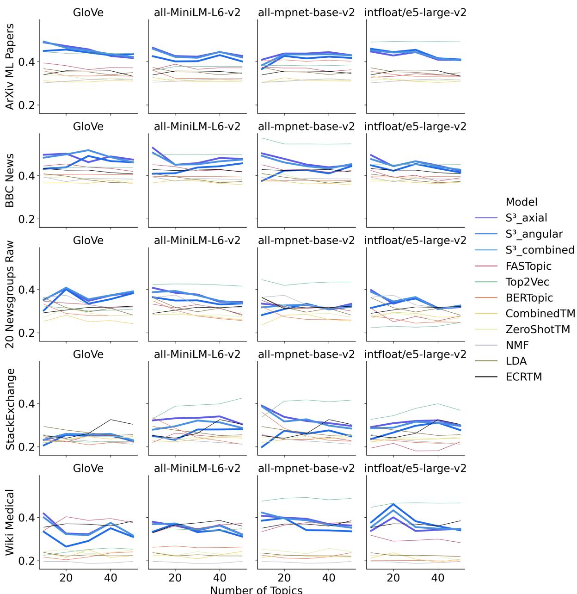  
Figure 8: Aggregate coherence scores across all models, datasets, encoders, and numbers of topics, computed as geometric mean of internal and external word embedding coherence

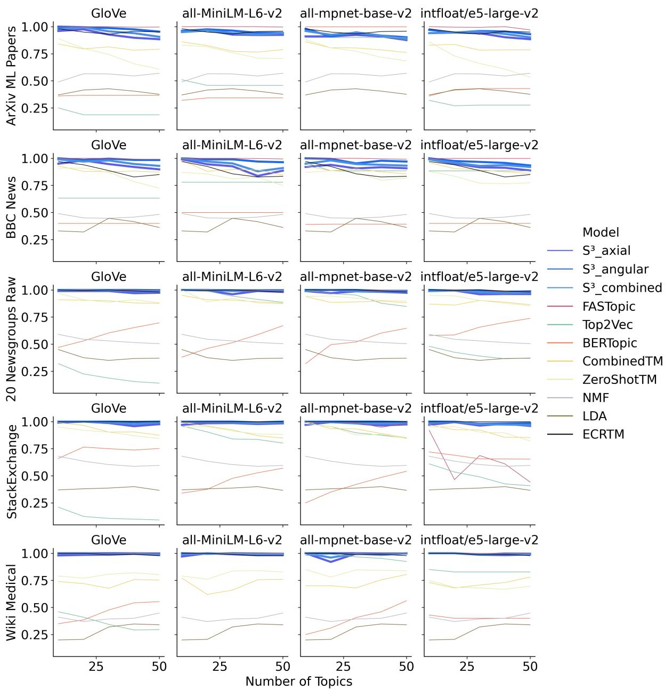  
Figure 9: Diversity scores across all models, datasets, encoders, and numbers of topics.

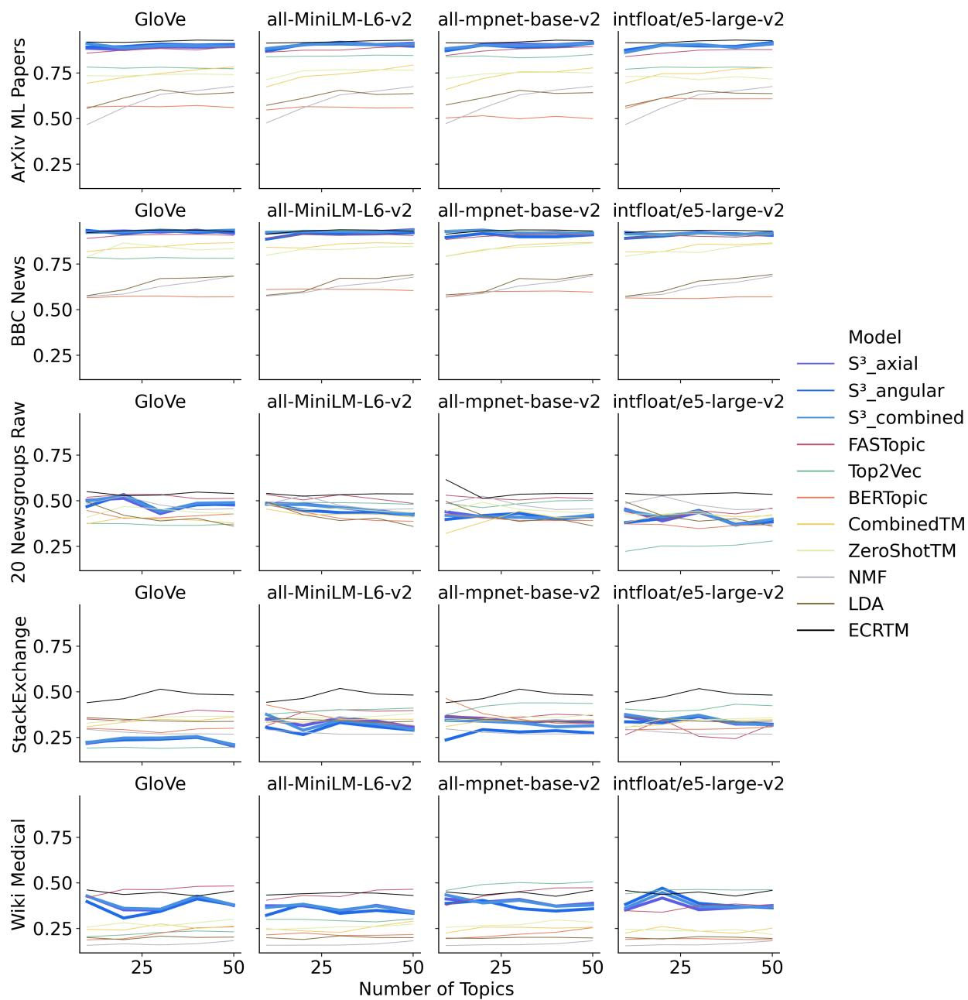  
Figure 10: W $E C _ { i n }$ scores across all models, datasets, encoders, and numbers of topics.

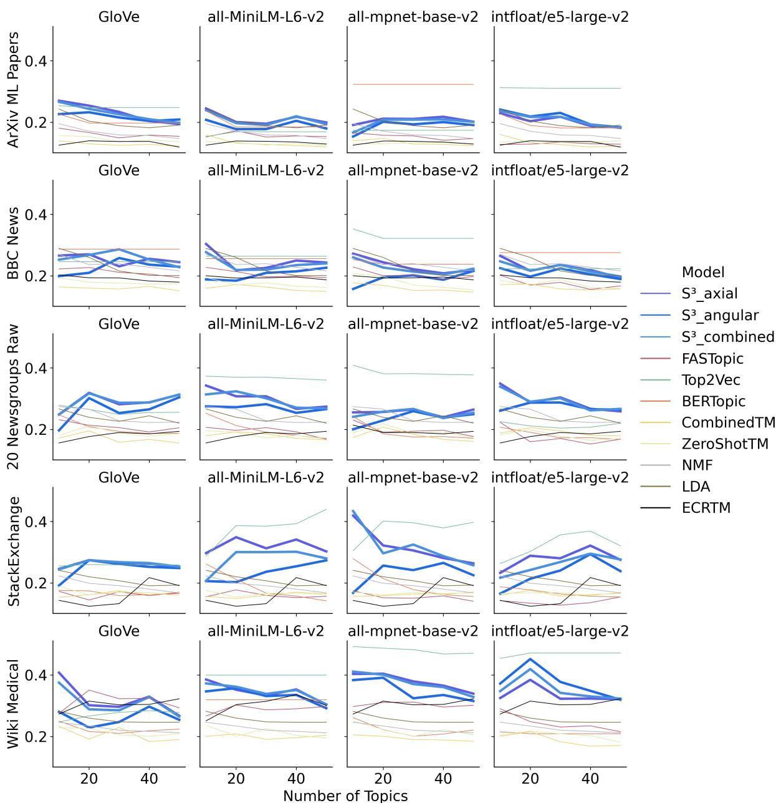  
Figure 11: $W E C _ { e x }$ scores across all models, datasets, encoders, and numbers of topics.

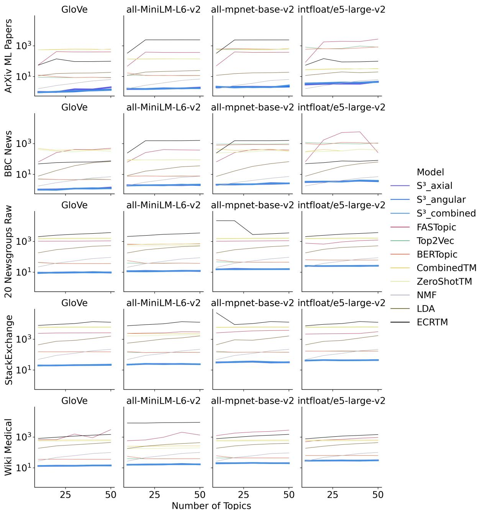  
Figure 12: Runtime in seconds for all models, datasets, encoders, and numbers of topics.

<table><tr><td>Model</td><td> $2 0 \mathrm { N G } _ { \mathrm { P r e } }$ </td><td> $2 0 \mathrm { N G } _ { \mathrm { R a w } }$ </td><td>ArXivML</td><td>BBC News</td><td>StackExchange</td><td>Wiki Medical</td></tr><tr><td> $S _ { \mathrm { a x i } } ^ { 3 }$ </td><td>-0.05</td><td>-0.21</td><td>-0.33</td><td>-0.29</td><td>-0.20</td><td>-0.17</td></tr><tr><td> $S ^ { 3 }$  Sang</td><td>-0.05</td><td>-0.22</td><td>-0.32</td><td>-0.32</td><td>-0.22</td><td>-0.19</td></tr><tr><td> $S _ { \mathrm { c o m } } ^ { 3 }$ </td><td>-0.05</td><td>-0.21</td><td>-0.32</td><td>-0.30</td><td>-0.21</td><td>-0.17</td></tr><tr><td>Top2Vec</td><td>0.05</td><td>-0.18</td><td>-0.29</td><td>-0.26</td><td>-0.19</td><td>-0.08</td></tr><tr><td>FASTopic</td><td>0.03</td><td>-0.07</td><td>-0.18</td><td>-0.10</td><td>-0.08</td><td>-0.09</td></tr><tr><td>ECRTM</td><td>0.11</td><td>-0.07</td><td>-0.16</td><td>-0.04</td><td>-0.07</td><td>-0.11</td></tr><tr><td>BERTopic</td><td>0.02</td><td>0.05</td><td>-0.02</td><td>-0.01</td><td>0.02</td><td>-0.01</td></tr><tr><td>CTMcombined</td><td>0.09</td><td>-0.04</td><td>-0.06</td><td>-0.03</td><td>0.04</td><td>-0.07</td></tr><tr><td> $\mathbf { C T M } _ { \mathrm { Z e r o s h o t } }$ </td><td>0.11</td><td>-0.01</td><td>-0.05</td><td>-0.02</td><td>0.05</td><td>-0.05</td></tr><tr><td>LDA</td><td>0.10</td><td>0.04</td><td>-0.06</td><td>-0.03</td><td>0.02</td><td>-0.03</td></tr><tr><td>NMF</td><td>0.12</td><td>0.09</td><td>0.01</td><td>0.01</td><td>0.06</td><td>0.01</td></tr></table>

Table 5: Topic descriptions’ average NPMI coherence over corpora.

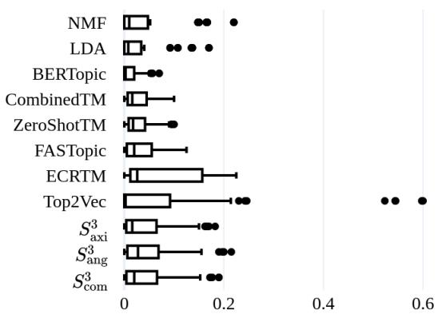  
Freq. of Nonalphabetical Words  
Figure 13: Relative frequency of words containing nonalphabetical characters in topic descriptions

d0i, moyne, cbr900rr, 9733

7 - jesus, scriptures, god, heresies, redemption, cardenas, affirm, aaronc, holiness, wickedness

8 - 0d, b8f, 75u, 145, ax, a86, 6um, 1d9, bhj, max

9 - accounts\_, caratzas, yelena, shahmuradian, microdistrict, sumgait, deposition, aristide, bonner, balcony

10 - apache, rupin, transferable, airlines, 376, ppd, pong, sonic, yow, listings

11 - blashephemers, jsn104, sandvik, floated, an030, henceforth, apr22, hela, horne, woodwork

12 - polonius, insurrection, mi6, neptunium, assualt, semtex, 1715, trailers, firefight, seige

13 - x11r5, widget, lib, xtwindow, lxaw, xinit, openwindows, xterm, lx11, scrollbar

14 - relativist, andtbacka, morals, mandtbacka, gullible, \_must\_, kilimanjaro, drewcifer, hens, odwyer

15 - 5i, ym, 6ei, 0d, \_o, c4, 3j, 7p, 0e, \_5

16 - encryptions, encryption, rboudrie, escrow, backdoor, 0366, yearwood, fides, trapdoors, unsecure

17 - coexist, scsi, 120mb, irq5, 80mb, ide, silverlining, powerbooks, card, 33v

18 - shaz, kokomo, slcs, 46904, rpms, milage, roomy, odometers, hoffmeister, jmh

19 - doubters, sbp002, announcers, bream, woofing, bitching, hander, umps, mediot, vergolini

## I.1.2 LDA

0 - that, to, you, of, from, the, and, in, was, on

1 - to, the, of, com, is, in, that, and, it, be

2 - the, to, and, is, in, it, of, you, this, for

3 - is, to, the, in, and, of, that, it, on, for

4 - the, to, that, is, not, in, it, of, you, and

5 - b8f, g9v, pl, a86, ax, max, 145, 1d9, 1t, 0t

6 - to, of, and, is, that, in, the, as, for, was

7 - 11, 12, 10, 25, 15, 20, 14, 16, 13, 18

8 - in, that, it, and, of, the, to, they, you, is

9 - com, hp, netcom, lines, organization, colorado, subject, from, the, db

10 - nasa, in, of, subject, the, to, from, organization, lines, edu

11 - of, the, to, writes, edu, com, article, re, is, in 12 - cx, 0d, \_o, 145, w7, c\_, mv, ah, 34u, lk

13 - from, that, edu, the, is, of, in, to, it, re

14 - to, the, of, it, is, and, for, in, with, that

15 - the, to, of, in, is, and, for, be, are, on

16 - subject, \_\_\_, apr, 1993, uk, of, lines, \_\_, from, organization

17 - subject, university, nntp, posting, lines, from, organization, host, edu, com

18 - for, edu, and, 00, from, subject, of, organiza-

tion, sale, lines

19 - is, edu, the, to, from, for, and, dos, it, windows

## I.1.3 NMF

0 - giz, bhj, pl, 75u, 1t, 3t, max, ax, as, 7ey

1 - the, to, in, on, was, at, with, this, as, from

2 - will, this, have, to, be, the, we, and, for, that

3 - that, the, was, and, they, to, in, it, were, he   
4 - is, of, for, or, and, on, to, the, in, with   
5 - 0t, pl, a86, 34u, 145, b8f, 1d9, wm, bxn, 2tm   
6 - for, in, and, by, of, as, from, are, that, were   
7 - dos, windows, ms, microsoft, or, and, tcp, for,   
00, pc

8 - that, not, the, it, are, of, is, in, this, as

9 - of, to, you, is, jpeg, and, image, for, it, gif

10 - 0d, \_o, 145, 34u, 75u, 6um, a86, 6ei, 3t, 0t

11 - db, and, bh, si, cs, is, al, the, byte, or

12 - for, edu, com, from, subject, lines, in, organization, article, writes

13 - 00, 12, 14, 16, 10, 25, 20, 11, 15, 13

14 - he, of, mr, and, that, we, it, president, you, is

15 - cx, w7, c\_, t7, uw, ck, lk, hz, w1, mv

16 - output, file, the, of, to, by, entry, if, for, program

17 - your, if, it, you, can, that, have, do, are, and

18 - that, the, jehovah, god, is, he, and, of, lord, his

19 - a86, b8f, 1d9, g9v, ax, 0d, 75u, b8e, lg, 145

## I.2 all-MiniLM-L6-v2

## I.2.1 $S _ { a n g } ^ { 3 }$

0 - broadcasts, scope, antennas, broadcasters, nfl, wavelength, fox, vhf, radio, announcements

1 - treatments, medicines, pregnancy, medication, medications, diseases, diagnosed, infections, indications, complications

2 - theological, christians, devout, theology, christianity, religious, scripture, faith, repentance, pantheism

3 - discriminatory, homosexual, individuality, oppression, compromises, discrimination, homosexuality, homosexuals, discriminated, openly

4 - colormap, colormaps, imagemagick, gandalf, imagewriter, photoshop, drawings, images, outlines, bitmap

5 - foremost, dsu, ssd, ss, data, extensive, extensively, dds, numerous, seanna

6 - firearms, rifles, gun, armed, guns, ammunition, ammo, firearm, handgun, shooting

7 - configurable, constants, configurations, parameters, selects, configuration, configuring, calculate, requirements, simultaneous

8 - unomaha, h2, alabama, mo, missouri, grams, malaysia, pork, electron, shellgate

9 - 1542b, editions, ratified, gaines, doctrines, umbc, gfk39017, publishes, issuing, slated

10 - staying, advising, volunteer, delaying, responsiblity, serving, teach, bed, hang, administrators

11 - macs, macadam, macuser, joystick, mac, apple, maccs, macalester, joysticks, macinnis

12 - balkans, serbia, turks, balkan, turkish, yugoslavia, armenians, serbian, bosnians, bosnian 13 - woes, gwu, hsu, bgsu, aft, hs, bore, warmer, standpoint, behold

14 - pricing, resale, sale, discount, selling, purchase, purchases, buys, dollar, buy

15 - nasa, planets, spaceflight, spacecraft, interplanetary, space, satellites, solar, moon, earth

16 - cisc, rdc8, slcs, slac, province, mgr, iscsvax, gfx, mg, bnc

17 - palestineans, israelites, israelis, israeli, palestinians, israel, zionism, zionist, palestine, aviv 18 - marked, 167, 44272, 149, 416, passed, 7423, 422, crossed, 7521

19 - vga, 14400, resolution, monitors, 980, rgb,   
1070, resolutions, 640x480, monitor

## I.2.2 $S _ { a x i } ^ { 3 }$

0 - antennas, vhf, broadcasts, transmitters, reception, radio, uhf, radios, broadcasters, rf

1 - diseases, patients, pathology, treatments, medicines, diagnosis, medications, diagnosed, clinics, malpractice

2 - biblical, scripture, theological, christianity, theology, gospels, scriptures, theologians, christians, devout

3 - morality, homosexuality, homosexual, heterosexuals, discriminated, discrimination, immoral, discriminatory, homosexuals, heterosexual

4 - imagewriter, colormaps, xputimage, bitmap, imagemagick, colormap, autocad, bitmaps, animation, canvas

5 - scholarly, ssd, academic, academia, scientific, academics, sciences, speeds, degrees, benchmarks 6 - gunshot, guns, pistols, firearms, firearm, handgun, handguns, bullets, gun, gunfire

7 - configuration, implementations, configurations, configuring, transmitters, angular, parameters, fortran, protocols, ranges

8 - missouri, mo, khz, aj, albuquerque, malaysia, shellgate, mosque, dodge, jehovah

9 - umbc, npr, publishes, editions, revelations, manuscripts, gaines, gfk39017, doctrines, 1542b

10 - volunteer, networking, attend, conferencing, remotely, communicating, occupy, temporarily, broadcast, intervene

11 - mac, maccs, macs, macuser, logitech, macadam, macworld, macx, macintosh, macinnis

12 - balkans, bosnians, bosnian, armenian, armenians, turkish, turks, bosnia, armenia, azerbaijani

13 - campus, attending, ohsu, uc, amherst, bore, osu, aft, coliseum, ucsu

14 - prices, sale, ebay, deals, pricing, inexpensive, cheap, cost, resale, bargain

15 - nasa, interplanetary, satellites, spacecraft, astronomy, astronomers, solar, astronomical, astronauts, spaceflight

16 - pcx, providers, quebec, saskatchewan, provincial, province, lausanne, breton, provider, pcf

17 - israeli, israelites, aviv, israelis, palestinian, knesset, gaza, palestinians, palestineans, palestine 18 - 1993apr23, 1993apr24, 1993apr27, 1993apr25,

1993apr21, 1993apr22, 1993apr30, 1993apr17,   
1993apr06, 1993apr18

19 - rgb, monitors, 640x480, monitor, displays, vga, 1070, pixels, resolution, 60hz

## I.2.3 S3 com

0 - reception, radio, antennas, broadcasts, vhf, broadcasters, uhf, transmitters, radios, antenna

1 - medicines, patients, diseases, treatments, pathology, medications, malpractice, treatment, diagnosis, diagnosed

2 - biblical, theological, theology, christians, christianity, devout, scripture, scriptures, holiness, gospels

3 - homosexuals, homosexuality, heterosexuals, discriminated, discrimination, discriminatory, homosexual, immoral, oppression, heterosexual

4 - bitmaps, xputimage, drawings, photoshop, colormap, colormaps, imagewriter, imagemagick, bitmap, shading

5 - scholarship, degrees, academia, ssd, scholarly, academic, faculty, academics, phds, doctoral

6 - pistols, handgun, guns, gun, firearms, firearm, handguns, rifles, bullets, ammo

7 - configurations, configuration, configuring, ranges, parameters, angular, implementations, requirements, configure, implementation

8 - missouri, mo, malaysia, khz, jehovah, unomaha, aj, alabama, shellgate, mow

9 - ratified, revelations, publishes, editions, gaines, doctrines, umbc, gfk39017, 1542b, npr

10 - intervene, temporarily, volunteer, networking, occupy, attend, conferencing, serving, remotely, communicating

11 - macx, macuser, macintosh, maccs, macalester, macadam, macs, mac, macworld, logitech

12 - bosnians, armenians, armenian, bosnian, balkans, turkish, bosnia, turks, serbia, balkan

13 - ohsu, campus, aft, bore, amherst, osu, marched, attending, bsu, hsu

14 - cost, deals, pricing, prices, sale, resale, bargain, cheap, ebay, auction

15 - nasa, satellites, spacecraft, solar, interplanetary, astronomy, astronomers, astronomical, spaceflight, space

16 - gfx, providers, lausanne, quebec, province, provincial, saskatchewan, pcx, breton, pcf

17 - aviv, israelites, israelis, israeli, palestinians, palestineans, palestinian, knesset, palestine, gaza

18 - 1993apr17, 1993apr25, 1993apr27, 1993apr23,

1993apr22, 1993apr21, 1993apr24, 7521,   
1993apr30, 422   
19 - vga, monitors, monitor, 1070, resolution,   
640x480, rgb, displays, 980, resolutions

## I.2.4 BERTopic

0 - it, you, is, car, and, in, the, to, com, of

1 - you, is, to, that, the, it, of, and, in, they

2 - in, it, to, is, that, and, the, msg, of, this

3 - the, to, is, it, window, with, from, and, for, in

4 - the, to, for, and, is, it, edu, of, from, in

5 - the, to, for, it, of, radar, and, in, is, you

6 - of, medical, cancer, to, the, is, in, eye, and, circumcision

7 - 00, sale, wolverine, for, 50, 10, 1st, comics, edu, appears

8 - space, to, of, the, and, is, in, for, it, that

9 - science, of, is, the, that, to, in, and, it, not

10 - g9v, ax, max, 145, pl, a86, b8f, 1d9, 34u, 1t

11 - the, fan, cpu, cooling, heat, power, on, towers, water, is

12 - gas, the, oil, it, in, com, to, edu, you, my

13 - the, insurance, in, care, to, of, private, health, and, that

14 - wax, chain, duct, it, adhesive, solvent, the, and, plastic, from

15 - wire, wiring, neutral, ground, the, outlets, outlet, grounding, is, to

16 - discharge, the, battery, acid, temperature, batteries, lead, concrete, and, is

17 - that, the, to, in, is, and, of, not, you, god

18 - int, buttons, style, for, arcade, joystick, joysticks, port, edu, controls

19 - and, in, game, he, the, to, edu, of, that, was

## I.2.5 CombinedTM

0 - regards, guidelines, thank, considering, obtain, responses, wanted, legislation, thanks, respond

1 - buf, posting, pts, van, andrew, columbia, 12, host, 21, pit

2 - remarks, eye, turning, procedure, examine, abandoned, kinds, requirement, followed, increases 3 - my, get, car, just, don, me, out, like, ve, re

4 - maintain, remarks, differently, kinds, examine, remains, precisely, duty, feels, consensus

5 - encryption, chip, clipper, escrow, com, des, netcom, keys, nsa, key

6 - cramer, gay, arab, arabs, policy, israeli, optilink, clayton, virginia, jake

7 - christians, not, god, christ, why, jesus, christian, say, believe, does

8 - interested, australia, ac, de, morgan, tony, co, demon, uk, advance

9 - nasa, jpl, orbit, henry, gov, moon, space, shuttle, hst, alaska

10 - you, is, it, to, ax, not, if, jpeg, that, be

11 - handled, award, kinds, heavily, appeared, superior, offered, guidelines, conditions, typically

12 - 145, ax, 0d, \_o, a86, mk, m3, mp, 0g, mm

13 - dos, drive, card, pc, mac, scsi, ibm, drives, disk, bus

14 - in, for, on, to, of, and, the, is, be, or

15 - x11r5, window, motif, manager, application, widget, xterm, usr, visual, lib

16 - players, game, teams, baseball, ca, team, last, nhl, year, player

17 - everywhere, demand, prepared, repeated, appeared, shut, exception, destroy, examine, meet

18 - and, he, that, to, the, they, of, was, in, were

19 - georgia, uga, gordon, banks, athens, ai, intelligence, geb, keith, artificial

## I.2.6 FASTopic

0 - x11r5, font, mouse, ini, dialog, icon, cursor, xdm, xpert, ctrl

1 - guy, gets, hit, insurance, average, msg, clutch, low, 1993apr15, gary

2 - donation, hirama, angmar, cosmo, kou, hiramb, hiram, unmoderated, dexter, alfalfa

3 - dod, dog, helmet, riding, bike, radar, ride, cop,

infante, egreen

4 - escrow, keys, secure, nsa, encryption, crypto, amendment, clipper, pgp, enforcement

5 - armenian, turkish, president, armenians, rights, government, gun, armenia, states, united

6 - arab, arabs, israeli, israel, koresh, waco, atf, compound, batf, muslims

7 - temperature, battery, moon, water, heat, kelvin, batteries, cooling, nsmca, mksol

8 - bible, god, jesus, christ, christians, christian, church, faith, christianity, sin

9 - cunyvm, gsh7w, hennessy, rosicrucian, sirach, manuscripts, ceremonies, petch, ruler, thyagi

10 - zoology, sky, photography, higgins, henry, alaska, pluto, krillean, relay, pgf

11 - pcx, printer, ink, drexel, print, bubblejet, deskjet, laserjet, diablo, ghostscript

12 - players, team, hockey, season, nhl, teams, league, games, detroit, espn

13 - scsi, controller, mhz, motherboard, simms, pin, ide, floppy, bios, drives

14 - file, windows, image, dos, graphics, ftp, space, files, server, color

15 - swing, uniforms, dodger, biochem, roush, ball, canseco, bchm, umpires, octopus

16 - pl, max, 145, ax, b8f, g9v, a86, db, 1d9, 0d

17 - audio, shipping, sale, hst, amp, forsale, condition, offer, asking, wolverine

18 - cancer, geb, pain, noring, doctor, food, dyer, foods, banks, gordon

19 - ford, cars, oil, miles, bmw, engine, honda, wheel, dealer, rear

## I.2.7 Top2Vec

0 - batting, outfielder, baseman, fielder, shortstops, shortstop, inning, pitching, pitchers, hitters

1 - bosnians, turks, bosnia, genocide, armenians, kurdish, armenian, armenia, balkans, mustafa

2 - israelis, gaza, zionism, zionists, israeli, palestinians, zionist, knesset, palestineans, palestinian

3 - bruins, canadiens, nhl, sabres, hockey, canucks, puck, goaltenders, oilers, leafs

4 - patients, diagnosed, illnesses, diseases, diagnosis, cochrane, fda, disease, treatments, diagnose

5 - misrepresentation, policy, administrations, proponents, taxpayer, governmental, subsidies, policies, lobbying, misinterpretation

6 - pistols, unconstitutional, firearm, handgun, firearms, nra, militia, enforcement, handguns, guns 7 - firing, casualties, gunmen, perpetrators, prosecute, retaliation, assassination, bombed, fires,

eyewitness

8 - nsa, encryption, encryptions, wiretapping, espionage, cryptosystems, spying, cryptosystem, cryptology, eavesdropping

9 - motorcycling, motorcycles, bmw, automobile, vehicle, vehicles, suzuki, honda, automotive, automobiles

10 - atheism, homosexuality, morality, fundamentalists, agnosticism, hypocrisy, skeptics, fundamentalism, fundamentalist, hypocritical

11 - theological, biblical, testament, christianity, scripture, theology, scriptures, exegesis, devout, theologians

12 - printer, telecom, printers, teltech, ibmpa, mbunix, pdb059, ibm, netcom, telex

13 - nasa, spacecraft, spaceflight, astronomy, astronomical, astronomers, astrophysical, interplanetary, solar, galactic

14 - cds, sale, ebay, pricing, purchase, cd300, purchases, prices, pricey, forsale

15 - monitors, monitor, displays, vga, radiosity, radios, radar, monitored, oscilloscope, detectors

16 - disk, megadrive, netware, hdd, disks, harddrive, harddisk, workstation, ssd, os

17 - imagewriter, bitmaps, xputimage, graphics, colormaps, colormap, bitmap, autocad, pixmaps, imagemagick

18 - xwindows, x11r3, x11r5, xtwindow, xcreatewindow, xfree86, x11, x86, x11r4, xservers

19 - ss24x, 1070, 680x0, x86, motherboard, motherboards, processor, processors, xfree86, v064mb9k

## I.2.8 ZeroShotTM

0 - policy, israel, israeli, gay, cramer, optilink, palestinian, gaza, arab, uucp

1 - ca, year, score, players, team, better, game, fans, last, season

2 - asking, sale, offer, interested, shipping, condition, sell, price, offers, forsale

3 - gun, firearms, batf, fbi, firearm, fire, atf, guns, waco, assault

4 - engine, dod, nasa, car, bike, cars, shuttle, space, orbit, gov

5 - so, god, do, believe, because, does, not, atheist, say, why

6 - hi, thanks, specifically, viewer, advance, shareware, conversion, convert, australia, utility

7 - 0d, max, ax, g9v, \_o, 145, 75u, mk, a86, b8f

8 - judges, widely, examine, thank, finding, determine, furthermore, repeated, confusion,

remains

9 - 25, 11, 10, 12, 00, 93, 30, 92, 17, 15

10 - chip, phone, encryption, clipper, des, key, escrow, pgp, rsa, nsa

11 - is, the, to, and, for, you, or, be, it, in

12 - sandvik, promise, kent, newton, rutgers, activities, vice, heaven, satan, athos

13 - dod, banks, gordon, followed, soon, judges, hospital, geb, treatment, motorcycles

14 - repeated, judges, kinds, learning, furthermore, letters, sit, differently, wise, examine

15 - whereas, breast, repeated, judges, examine, becoming, pure, importance, authors, empty

16 - is, of, in, to, the, and, that, not, are, as

17 - motif, x11r5, application, lib, usr, window,

x11, xterm, manager, openwindows

18 - in, was, the, and, to, that, they, of, it, we

19 - scsi, card, bus, drive, board, mac, video, ram, apple, cards

## I.3 all-mpnet-base-v2

I.3.1 S3 ang

0 - 7951, charset, 766, 768, 789, 972, 168, 791, transcript, 856

1 - leafs, canucks, bettman, canadiens, puck, hawerchuk, lidstrom, oilers, sabres, bruins

2 - vga, resolution, graphics, 640x480, framebuffer, rgb, monochrome, 1280x1024, vram, rendering

3 - homeopathy, illness, symptoms, placebo, healthy, diseases, medications, illnesses, toxins, poisoning

4 - cryptophones, crypto, secrecy, encryption, unsecure, crypt, cryptosystems, plaintext, encryptions, cryptographically

5 - winbench, w7, openwindows, openwin, microsoft, windows, vista, delphi, shareware, os

6 - kbytes, diagnostics, stability, analyse, 0s, stable, reliably, variables, precision, itself

7 - fond, gene, mills, sole, 1913, martial, lucas, galen, fabrication, younger

8 - motherboards, chipset, chipsets, powerpc, motherboard, 50mhz, 68070, 68060, 6700, dell

9 - price, buying, purchaser, buyer, selling, sale, sells, seller, m\_sells, sellers

10 - harddisk, megadrive, hdd, sda, ssd, diskettes, harddrive, seagate, smartdrive, sdd

11 - cc, ccu, hpfcso, cdac, ccs, ccastco, cdx, cosmo, deskjet, 5e

12 - misleading, allegations, propoganda, misinformation, objections, disapproval, sic, denials,

disinformation, censors

13 - gmc, subaru, acura, lexus, chevrolet, saab, sedan, aftermarket, sedans, vw

14 - xtappaddtimeout, xremote, xy, xw, xcreatewindow, xsession, x1, xopendisplay, cuz, xmodmap

15 - 423, 436, 426, 431, 3684, 4368, 433, 3401,   
361, 424

16 - lancs, srsd, sen, rri, seca, sep, sparcs, csiro, sps, mpaul

17 - watergate, wtc, fbihh, waco, indictment, meltdown, fires, firing, promptly, fire

18 - suis, mainland, prc, nanaimo, cn, qc, c5tenu, fairbanks, qucdn, eu

19 - unconstitutional, lawful, constitutionally, constitutional, prohibition, liberally, conservatives, conservative, freedoms, legalization

## I.3.2 $S _ { a x i } ^ { 3 }$

0 - fax, modem, 866, caller, transcript, 802, voicemail, 806, 928, 886

1 - canadiens, oilers, puck, leafs, bruins, sabres, canucks, nhl, hawerchuk, habs

2 - opengl, vga, graphics, 640x480, 1280x1024, pixels, framebuffer, rgb, rendering, graphical

3 - epilepsy, medical, toxins, medicines, malpractice, resurection, diseases, homeopathy, poisoning, remedies

4 - cryptographically, cryptophones, cryptographic, cryptology, encryptions, cryptosystems, eavesdropping, encryption, cryptography, crypt

5 - openwin, programs, shareware, windows, windows3, microsoft, openwindows, exe, winbench, winword

6 - physics, computations, hp9000, keyboard, ergonomics, computation, calculators, oscilloscope, diagnostics, analyse

7 - fabrication, surgical, bio, candida, lachman, yeast, wounds, kawasaki, fungus, biochem

8 - motherboard, motherboards, chipsets, chipset,   
68070, cpus, 66mhz, 68060, powerpc, processors

9 - prices, sale, resale, buyer, price, priced, pricing, selling, sell, sellers

10 - ssd, disk, smartdrive, harddisk, hdd, megadrive, seagate, harddrive, disks, prodrive

11 - hpfcso, deskjet, cartridge, cdx, fossil, winco, cdac, cartridges, xerox, scicom

12 - newsletter, discrimination, censorship, warnings, disinformation, misinformation, complaints, complaint, editorials, propoganda

13 - chevrolet, sedan, subaru, sedans, acura, vw, car, toyota, porsche, automobiles

14 - xtwindow, xcreatewindow, xmodmap, xopendisplay, xsession, xtappaddtimeout, x11, xremote, xservers, xserver

15 - discrepancy, versions, 4368, inconsistencies, spectrometer, 46904, 382761, repository, 3401, 44272

16 - usaf, dea, cia, cdc, feds, usgs, sep, compounds, esa, mossad

17 - napalm, gunfire, explosives, fires, waco, wtc, fbi, firefight, fire, watergate

18 - arctic, mainland, quebec, soyuz, rusnews, fairbanks, tsn, alberta, nanaimo, vancouver

19 - legalization, prohibition, guns, constitutionally, freedoms, nra, handguns, constitutional, legalizing, firearms

## I.3.3 com

0 - 928, caller, 866, fax, 808, transcript, 806, 871, butcher, 886

1 - oilers, sabres, leafs, canadiens, hawerchuk, puck, bruins, habs, canucks, nhl

2 - 640x480, framebuffer, rgb, vga, opengl, graphics, 1280x1024, resolution, rendering, pixels 3 - poisoning, malpractice, homeopathy, medical, toxins, illness, diseases, medicines, resurection, disease

4 - encryptions, cryptophones, encryption, cryptography, eavesdropping, cryptosystems, cryptology, plaintext, crypt, cryptographic

5 - openwin, openwindows, windows, winbench, microsoft, exe, programs, shareware, windows3, vista

6 - diagnostics, calculators, oscilloscope, analyse, hp9000, ergonomics, keyboard, physics, analyzing, regression

7 - wounds, lachman, fabrications, surgical, sole, fabrication, yeast, bio, serge, candida

8 - chipsets, motherboards, powerpc, motherboard,   
68070, chipset, cpus, 66mhz, 68060, processors

9 - buyer, price, sale, priced, prices, pricing, selling, sellers, sell, seller

10 - hdd, harddrive, harddisk, seagate, disk, smartdrive, ssd, disks, megadrive, diskettes

11 - deskjet, cdx, hpfcso, fossil, cartridge, cdac, xerox, ccastco, cartridges, winco

12 - misinformation, complaint, disinformation, complaints, censorship, propoganda, warnings, allegations, discrimination, censors

13 - vw, subaru, chevrolet, sedan, porsche, sedans, acura, toyota, car, dealership

14 - xmodmap, xcreatewindow, xtappaddtimeout, xtwindow, xopendisplay, xsession, xremote, xservers, xserver, x11

15 - discrepancy, versions, 46904, 382761, 4368,   
3401, 3684, 436, inconsistencies, 423

16 - cdc, dea, usaf, cosar, sen, feds, csiro, compounds, cia, sep

17 - explosives, fires, gunfire, waco, watergate, wtc, fbi, firefight, napalm, fire

18 - quebec, nanaimo, arctic, fairbanks, mainland, rusnews, cn, c5tenu, alberta, qucdn

19 - nra, freedoms, prohibition, constitutionally, legalization, legalizing, handguns, constitutional, unconstitutional, abortions

## I.3.4 BERTopic

0 - the, in, of, and, is, that, to, you, it, not

1 - and, is, in, of, be, the, it, to, key, that

2 - of, to, the, and, is, in, it, that, for, msg

3 - of, it, car, com, the, and, to, in, on, you

4 - and, to, the, for, is, it, from, of, edu, with

5 - battery, lead, acid, concrete, batteries, the, discharge, to, and, is

6 - the, to, it, cpu, cooling, is, of, fan, heat, on 7 - the, window, to, mouse, is, it, and, keyboard, in, of

8 - to, the, of, space, and, on, nasa, in, for, is

9 - that, you, of, protection, protected, and, copy, is, to, the

10 - and, is, to, in, he, that, the, game, of, edu

11 - pl, 145, max, a86, 1d9, g9v, 1t, 34u, ax, b8f

12 - kirlian, krillean, of, is, photography, the, edu, to, it, eye

13 - outlets, ground, wiring, neutral, outlet, the, wire, is, to, grounding

14 - habitable, the, of, to, accelerations, is, oxygen, in, acceleration, planets

15 - p1, polygon, p2, p3, sphere, algorithm, points, polygons, the, den

16 - sale, of, for, from, edu, 10, and, 50, 00, 1st

17 - oort, gamma, bursters, detectors, edu, cloud, of, ray, the, are

18 - computer, to, the, is, and, hacker, software, of, that, edu

19 - solvent, mask, solder, boards, adhesive, duct, green, tape, is, used

## I.3.5 CombinedTM

0 - dos, card, bus, windows, pc, scsi, drive, board, disk, controller

1 - of, to, the, that, be, is, it, ax, and, not

2 - 10, offer, 50, 15, 00, new, 20, condition, sale, shipping

3 - the, is, it, to, that, you, in, and, not, have

4 - importance, judges, examine, becoming, presence, suit, guidelines, categories, demand, primarily

5 - policy, clipper, israel, israeli, arab, gaza, arabs, palestinian, tim, lebanon

6 - zoo, hst, gov, henry, dod, spencer, digex, alaska, billion, pat

7 - sit, popular, referred, exercise, represents, uniform, primary, unlike, challenge, adult

8 - not, god, does, christians, your, say, do, atheist, what, believe

9 - are, be, can, or, is, for, edu, and, mail, system 10 - doctor, 241, prepared, causing, guest, mouth, occurs, 9760, primarily, controlled

11 - gordon, cmu, banks, ahl, columbia, buffalo, pitt, espn, gld, cc

12 - respond, broad, campus, thank, categories, guarantee, advance, thanks, responses, southern

13 - gun, guns, article, fbi, atf, koresh, fire, batf, writes, waco

14 - good, car, off, year, better, too, really, up, my, last

15 - by, was, of, were, and, the, in, from, on, as

16 - create, window, drawing, ac, x11r5, uk, de, application, xterm, motif

17 - importance, examine, specifically, primarily, exception, solve, demand, implications, suit, account

18 - georgia, sandvik, newton, kent, jon, uga, athens, keith, livesey, sgi

19 - ax, mu, 0d, mj, mm, mf, mp, ca, mx, mo

## I.3.6 FASTopic

0 - miles, dealer, auto, engine, ford, oil, cars, honda, toyota, mustang

1 - baseball, team, hockey, nhl, season, players, player, fans, teams, game

2 - bmw, bnr, cage, shaft, ama, dog, bikes, rider, motorcycle, motorcycles

3 - signal, voltage, deskjet, circuits, circuit, audio, infrared, krillean, manned, ink

4 - ide, controller, scsi, motherboard, mhz, bios, bus, simms, isa, ram

5 - shipping, sale, offer, condition, asking, forsale, sell, selling, comics, wolverine

6 - maddi, heterosexuals, molestation, angmar, cosmo, rosicrucian, hennessy, petch, foard, elf

7 - israel, muslim, armenia, israeli, arab, turkish,

turks, genocide, turkey, muslims

8 - stadium, jhunix, journalism, uniforms, gtd597a, umpires, acad, infield, gauss, hispanic

9 - law, government, were, him, his, he, she, said, her, gun

10 - maria, muscles, fever, chastity, zisfein, cadre, crohn, migraine, headache, hepatitis

11 - moon, launch, henry, bike, medical, car, dod, orbit, shuttle, mission

12 - dialing, advance, rs232, programme, faxes, alee, recipes, hugo, menlo, ccu1

13 - x11r5, font, xterm, lib, fonts, motif, openwindows, widget, window, xlib

14 - file, files, dos, graphics, software, drive, image, ftp, disk, pc

15 - escrow, secure, crypto, des, nsa, clipper, pgp, encryption, keys, algorithm

16 - jesus, bible, church, god, christ, christianity, faith, christians, christian, moral

17 - murder, keith, bear, taxes, cult, isc, laws, freedom, caltech, nra

18 - ax, pl, g9v, a86, b8f, max, 1d9, db, 34u, 0d

19 - seizures, julie, skndiv, dgbt, spdcc, restaurant, stove, standoff, allergic, glutamate

0 - braves, mlb, pitchers, yankees, rbis, shortstops, mets, phillies, hitters, mattingly

1 - encryptions, encryption, cryptophones, nsa, eavesdropping, cryptography, wiretapping, wiretaps, cryptology, cryptographic

2 - malpractice, diagnosis, doses, homeopathy, medical, diagnoses, poisoning, toxins, gastroenterology, biomedical

3 - zionists, palestinians, holocaust, palestine, hamas, palestineans, zionism, palestinian, gazans, zionist

4 - satellites, astronauts, astronautics, spaceflight, moonbase, orbiter, spacecraft, nasa, interplanetary, astrophysical

5 - leafs, goaltenders, bruins, hockey, canadiens, oilers, nhl, sabres, canucks, puck

6 - 911, terrorism, explosives, militia, conspiracy, terrorists, fbi, hostages, shootings, waco

## I.3.7 Top2Vec

7 - repression, agnostics, homosexuality, fundamentalists, fundamentalism, morality, ideology, bigotry, religion, creationism

8 - firearm, firearms, guns, handguns, militia, pistols, nra, militias, legislation, ammunition

9 - freeways, bikers, motorcyclist, speeding, braking, motorcycling, motorcyclists, motorcycles,

driving, motorcycle

10 - honda, vehicles, vehicle, v8, suv, chassis, mustang, automobile, automobiles, automotive

11 - creationism, atheist, agnosticism, creationists, agnostics, athiests, atheistic, atheists, atheism, unbelievers

12 - christians, gospels, theological, theology, scripture, scriptural, christianity, bible, unbelievers, biblical

13 - openwin, windows3, win3, os, windows, dos6, win31, msdos, vista, microsoft

14 - disks, seagate, harddisk, ssd, hdd, harddrive, disk, cdrom, megadrive, diskettes

15 - postage, contacting, bids, catalogs, mails, reprinted, mailing, email, priced, bidding

16 - transmitters, vhf, electronics, radios, amplifiers, amplifier, loudspeakers, antennas, radar, rca

17 - xga, 68070, 680x0, vga, monitors, monitor,   
68060, 68020, x2773, gtd597a

18 - 68060, i486, 68020, hardware, powerpc, hp9000, 68070, chipset, microcomputer, packard

19 - xserver, xdpyinfo, xopendisplay, xtwindow, xwindows, x11, cadlab, xservers, x11r4, graphical

## I.3.8 ZeroShotTM

0 - and, in, is, to, the, of, as, be, for, are

1 - it, you, to, 75u, a86, that, ax, g9v, b8f, 145

2 - year, players, game, better, last, games, team, score, good, season

3 - mu, mc, mt, mv, w7, a7, t7, a4, mj, cx

4 - fire, guns, gun, waco, atf, batf, fbi, firearms, koresh, cramer

5 - solar, nasa, spacecraft, moon, orbit, shuttle, henry, launch, earth, mission

6 - doctors, popular, direction, primarily, particularly, fat, supporting, becoming, guarantee, importance

7 - encryption, clipper, key, chip, des, secret, escrow, nsa, algorithm, phone

8 - furthermore, primarily, examine, fat, circumstances, remarks, precisely, remains, accurate, repeated

9 - for, can, edu, graphics, windows, dos, software, image, pc, if

10 - jews, israel, turkish, uucp, israeli, arab, turks, gaza, war, greece

11 - 00, st, 25, 18, 10, 12, 75, 30, 20, 50

12 - dod, bmw, car, ride, miles, cars, engine, oil, bike, riding

13 - ide, bus, drive, video, scsi, board, drives, card, mac, apple

14 - keith, sgi, activities, jon, newton, sandvik, atheist, vice, mathew, rutgers

15 - condition, offer, sale, selling, interested, asking, sell, offers, excellent, forsale

16 - god, why, do, not, believe, your, christians, say, beliefs, what

17 - to, it, in, that, and, the, was, they, of, we

18 - event, x11r5, xterm, create, window, xlib, lib, application, usr, draw

19 - worst, chem, espn, gatech, utoronto, alchemy, gerald, coverage, beat, sas

## I.4 average\_word\_embeddings\_glove.6B.300d

I.4.1 $S _ { a n g } ^ { 3 }$

0 - service, sms, forwarding, email, hotline, fax, messages, telephone, isp, compuserve

1 - kgb, amos, storing, bits, slices, bytes, decode, mpeg, manipulate, processing

2 - obligations, financing, guarantee, guarantees, ensure, ensuring, funds, impose, funding, agreements

3 - asked, wait, reply, replied, hillary, week, answer, clinton, asking, afterward

4 - criminal, robbery, charged, assault, suspects, officers, custody, guilty, police, convicted

5 - windows, microsoft, xp, wordperfect, dos, os, linux, vista, gui, solaris

6 - wisconsin, campus, college, pennsylvania, university, school, georgetown, connecticut, schools, massachusetts

7 - hitter, inning, innings, batters, rbi, batted, rbis, shortstop, homers, homer

8 - afterall, 2131, \_, halat, qh, cdx, yf, yl, bri, p7

9 - slang, offending, labeled, insulting, cheat, insult, jew, offended, dilemma, choice

10 - subjective, relevance, implications, contrary, perception, motivation, theories, perspective, attitudes, relate

11 - jesus, faith, christ, apostles, divine, messiah, resurrection, teachings, god, holy

12 - fault, responds, behaves, bent, activate, activated, rotor, screw, backwards, cog

13 - flag, honor, banner, fair, freedom, xyz, independent, patriot, rewrite, stands

14 - communist, occupation, uprising, liberation, lebanon, turkish, palestinian, conflict, serbs, moslem

15 - cpu, scsi, pci, motherboard, processor, chipset, pentium, cpus, peripherals, motherboards

16 - finals, canadiens, devils, goaltender, nhl, canucks, bruins, penguins, leafs, flyers

17 - \_5, 9\_, 6\_, 0\_, 1\_, 2\_, \_6, 7\_, \_0, \_4

18 - vice, mcdonald, ceo, founder, motorola, corp, associates, ho, lo, packard

19 - stuart, julian, clarke, allan, gilbert, gregory, bernard, samuel, jerome, herbert

## I.4.2 3 axi

0 - telephone, usenet, subscribers, sms, fax, mail, phone, email, messages, hotline

1 - slices, bytes, cake, mpeg, unsecure, ah, bby, keystrokes, pixels, megabytes

2 - subsidies, concessions, funds, taxes, tax, treasury, exemption, guarantees, impose, legislation

3 - reply, minutes, wait, appointment, yeltsin, gmt, minister, briefing, request, replied

4 - felony, firearms, firearm, handguns, police, handgun, convicted, assault, gun, robbery

5 - os, solaris, windows, linux, wordperfect, netware, unix, dos, xp, microsoft

6 - school, college, campus, graduate, polytechnic, university, seminary, undergraduate, faculty, pennsylvania

7 - batters, hitter, homers, rbi, rbis, inning, innings, batted, baseman, fastball

8 - gnv, \_, 0w, someones, 0m, yw, \_, multisync, tix

9 - cheese, shirts, leather, racist, zf, smoked, shirt, cream, paste, fascist

10 - empirical, cognitive, mathematical, subjective, scientific, theories, theoretical, factual, psychology, methodology

11 - god, jesus, christ, baptism, divine, church, communion, worship, apostles, anglican

12 - throttle, algorithm, fault, vectors, smtp, grounder, rotor, axis, chord, tcp

13 - xyz, rgb, space, cameras, pixel, format, flag, vga, resolution, creationism

14 - nagorno, palestinian, ethnic, arab, israeli, ottoman, turkish, kurdish, israel, arabs

15 - scsi, cpu, pentium, motherboard, megabytes, microprocessor, mhz, vga, ethernet, pci

16 - canadiens, leafs, hockey, nhl, sabres, blackhawks, canucks, goaltender, goalie, nordiques

17 - 2\_, \_0, 6\_, 1\_, \_4, 0\_, \_6, \_5, \_f, \_v

18 - intel, motorola, bt, hi, ceo, 3com, telecommunications, microsystems, founder, chairman

19 - edward, sir, william, rickc, john, robert, david, joseph, henry, herbert

I.4.3 com

0 - subscribers, sms, telephone, email, usenet, mail, fax, messages, hotline, phone

1 - manipulate, keystrokes, cake, slices, bytes, peanuts, unsecure, bby, mpeg, bits

2 - guarantee, subsidies, concessions, funds, tax, guarantees, obligations, impose, provisions, legislation

3 - briefing, reply, wait, minutes, replied, reporters, yeltsin, session, gmt, asked

4 - firearms, firearm, felony, police, assault, handgun, handguns, convicted, robbery, gun

5 - xp, os, wordperfect, unix, windows, linux, dos, microsoft, solaris, netware

6 - faculty, college, university, campus, school, polytechnic, pennsylvania, undergraduate, graduate, seminary

7 - batters, batted, rbis, baseman, hitter, homers, rbi, inning, innings, shortstop

8 - gnv, 2128, , someones, 0m, , 0w, yw, 4o

9 - slang, smoked, shirts, leather, racist, insulting, cheese, shirt, zf, paste

10 - theories, methodology, evolution, theoretical, factual, cognitive, statistics, empirical, subjective, iq

11 - christ, jesus, god, apostles, baptism, worship, church, divine, communion, holy

12 - tcp, smtp, vectors, rotor, axis, fault, throttle, algorithm, activated, function

13 - creationism, banner, flag, flags, rgb, xyz, format, freedom, rewrite, resolution

14 - turkish, moslem, kurdish, ottoman, palestinian, israeli, arabs, arab, kurds, palestinians

15 - scsi, cpu, motherboard, microprocessor, megabytes, pci, pentium, mhz, ethernet, vga

16 - nhl, canadiens, canucks, leafs, sabres, goaltender, hockey, blackhawks, goalie, penguins 17 - 1\_, 2\_, \_0, 0\_, \_4, 9\_, 7\_, 6\_, \_6, \_5

18 - intel, founder, ceo, hi, motorola, bt, ho, telecommunications, microsystems, 3com

19 - william, edward, stuart, robert, david, henry, gregory, sir, herbert, john

## I.4.4 BERTopic

0 - is, the, to, of, that, and, in, not, god, it

1 - they, the, and, of, in, that, were, was, it, to

2 - from, to, the, edu, for, sale, subject, of, lines, and

3 - is, of, in, that, the, to, and, it, for, be

4 - ide, drive, the, to, and, scsi, bus, card, for, is

5 - is, polygon, the, to, points, color, of, and, in, this

6 - for, the, is, and, of, jpeg, to, you, file, in

7 - that, and, the, to, of, in, by, is, israel, were

8 - of, the, and, in, ground, is, to, it, wire, you

9 - of, it, to, is, and, on, in, the, for, that

10 - laser, the, and, deskjet, monitor, hp, is, with, printer, ink

11 - window, manager, parcplace, the, to, position, berlin, ethan, boulder, accept

12 - men, sex, of, cramer, sexual, gay, optilink, kinsey, homosexual, the

13 - towers, nuclear, dept, fossil, water, cooling, plants, steam, the, tower

14 - the, university, of, professors, beyer, andi, uva, playboy, schools, virginia

15 - game, the, team, to, and, edu, in, of, he, that

16 - motion, the, mouse, byu, problem, jumpy, cursor, driver, it, is

17 - 0d, 0g, db, \_o, bh, output, 6t, 6um, 145, a86

18 - in, gamma, of, oort, larson, ray, theory, universe, are, the

19 - to, the, is, of, key, and, it, be, encryption, that

## I.4.5 CombinedTM

0 - israeli, policy, geb, gordon, gaza, banks, arab, arabs, uci, georgia

1 - requirement, treat, maintain, compromise, filled, demand, exercise, effectively, expert, unique

2 - microsoft, video, pc, dos, diamond, mouse, drivers, windows, driver, card

3 - cramer, nsa, stratus, escrow, netcom, fbi, clipper, secure, crypto, optilink

4 - 00, 12, 10, 25, 93, 11, 31, 17, 20, 84

5 - ide, controller, drive, power, hard, drives, scsi, speed, board, apple

6 - compromise, solve, finding, widely, presence, absence, numerous, supporting, serves, similarly

7 - accurate, explanation, surely, repeated, regulations, challenge, exercise, protecting, suffer, treat

8 - examine, cited, regulations, regard, legislation, closely, requirement, ordinary, explained, furthermore

9 - for, space, edu, technology, mail, gov, industry, nasa, sci, data

10 - season, game, year, team, players, hockey, games, nhl, ca, teams

11 - sell, asking, forsale, sale, interested, condition, offer, ohio, items, offers

12 - that, the, to, you, is, it, this, not, and, be

13 - x11r5, ac, window, xterm, uk, de, uni, co,

event, draw

14 - regulations, exercise, increases, maintain, founded, presence, combined, ought, daily, fraud

15 - christian, god, christians, jesus, atheist, atheism, rutgers, bible, christ, christianity

16 - think, out, don, just, my, me, would, they, have, re

17 - is, ax, that, g9v, to, b8f, a86, it, max, of

18 - ride, dod, spencer, henry, bike, bmw, zoo, alaska, bnr, hst

19 - to, the, of, in, was, and, that, on, as, they

## I.4.6 FASTopic

0 - armenia, israeli, arab, muslim, muslims, turks, turkish, israel, turkey, genocide

1 - obo, condition, forsale, shipping, sale, offer, vhs, bubblejet, cod, sega

2 - stratus, atf, fbi, batf, sw, waco, cdt, gas, koresh, feds

3 - splitting, indyvax, concave, clockwise, vulcan, todamhyp, virginity, perpendicular, krillean, sammons

4 - pit, db, det, 55, 0d, \_o, 00, 1st, la, van

5 - children, said, our, president, their, we, were, gun, people, she

6 - christ, christians, christianity, sin, faith, jesus, bible, christian, atheists, god

7 - b8f, giz, bhj, max, ax, 1d9, pl, g9v, wm, 1t

8 - motherboard, mhz, simms, isa, modem, gateway, quadra, pin, hd, monitor

9 - hockey, players, season, league, game, nhl, baseball, games, team, teams

10 - geb, clayton, banks, cramer, optilink, gordon, gay, kaldis, n3jxp, pitt

11 - andresen, rogoff, vb30, stamber, broadcasters, dwarner, jrogoff, drm6640, lafibm, logistician

12 - cview, dxf, tu, dresden, pov, radiosity, shading, lilley, raytracing, louray

13 - toyota, integra, yamaha, bmw, honda, convertible, liter, opel, audi, nissan

14 - battery, dod, dealer, bike, ride, buy, cars, engine, car, ohio

15 - healta, nicho, bcci, rosicrucian, timmbake, hausmann, maddi, tammy, timmons, khan0095

16 - pc, files, file, ftp, windows, disk, graphics, scsi, dos, server

17 - msg, doctor, rind, sinus, dyer, allergic, antibiotics, nsmca, pain, fungal

18 - dockmaster, angmar, mvanheyn, cosmo, laudicina, kasey, nren, hupp, vanheyningen, cleartext

19 - encryption, escrow, privacy, des, launch, clipper, moon, orbit, shuttle, space

## I.4.7 Top2Vec

0 - way, come, time, going, got, game, coming, \_know\_, play, know

1 - way, taken, saying, people, time, come, fact, say, country, government

2 - fact, actually, way, make, example, need, come, know, kind, \_know\_

3 - fact, come, want, people, saying, time, say, make, way, believe

4 - believe, \_know\_, fact, come, actually, know, way, kind, thought, think

5 - way, come, time, make, actually, example, fact, instead, need, kind

6 - come, going, actually, way, time, know, kind, like, make, instead

7 - make, fact, way, need, say, time, want, actually, come, example

8 - make, need, example, way, instance, use, instead, actually, time, come

9 - example, actually, way, fact, need, come, use, instance, make, time

10 - fact, say, \_know\_, way, come, know, actually, going, time, want

11 - time, fact, addition, instance, come, example, need, way, make, instead

12 - fact, actually, \_know\_, way, come, know, time, think, say, make

13 - come, say, \_know\_, need, way, actually, make, know, fact, want

14 - available, time, addition, 20, example, 10, instead, make, 30, 15

15 - instead, way, actually, need, example, use, make, using, instance, time

16 - time, example, computer, need, using, use, available, instance, instead, computers

17 - computers, need, example, instance, use, computer, hard, using, way, drive

18 - instance, example, instead, way, need, time, using, make, use, actually

19 - example, instance, use, available, using, computer, uses, web, information, software

## I.4.8 ZeroShotTM

0 - year, he, team, good, game, better, players, his, up, player

1 - motif, library, application, request, widgets, programming, address, 3d, xlib, lcs

2 - converted, primarily, prepared, previously, maintain, forth, primary, growing, furthermore, eventually

3 - cars, dod, engine, bike, ride, miles, car, bmw, road, front

4 - for, is, ax, to, in, the, and, of, as, edu

5 - espn, columbia, coverage, cmu, cup, sas, buffalo, tonight, stanley, gld

6 - can, your, be, if, or, you, this, it, use, are

7 - christians, jesus, believe, god, christian, scripture, christ, christianity, atheist, bible

8 - card, dos, pc, mouse, windows, bus, memory, drive, video, os

9 - 12, 30, 10, 11, 92, 00, 15, 25, 20, 17

10 - anon, maintain, successful, challenge, primarily, eventually, becomes, portion, warn, empty

11 - optilink, israeli, cramer, gay, israel, arab, arabs, israelis, department, palestinians

12 - furthermore, legislation, examine, primarily, primary, anon, significantly, authors, differences, refuse

13 - was, the, to, you, that, it, they, have, we, but

14 - of, in, as, and, the, their, by, were, from, was

15 - privacy, clipper, phone, crypto, eff, netcom, secret, escrow, wiretap, nsa

16 - mo, \_o, c\_, ax, 0d, mj, mf, cx, mp, 0g

17 - asking, sale, offers, offer, condition, interested, sell, forsale, shipping, items

18 - spacecraft, launch, nasa, moon, mission, orbit, shuttle, space, gov, earth

19 - keith, gordon, pitt, vice, surrender, banks, geb, soon, tek, shameful

## I.5 intfloat/e5-large-v2

I.5.1 $S _ { a n g } ^ { 3 }$

0 - vga, motherboards, powerbooks, hdtv, processors, vlsi, 8bit, chipsets, motherboard, microprocessor

1 - incendiary, firefight, wackos, waco, baylor, atf, gunfire, texans, koresh, jonestown

2 - intifada, zionists, bds, zionist, israelis, mossad, palestinians, likud, israeli, hamas

3 - cryptophones, cryptographically, encryption, encrypting, encryptions, cryptographic, encrypt, encrypted, cryptography, decryption

4 - inefficient, underestimate, poor, maximize, optimally, thinking, discourage, unreasonable, rationalize, minimize

5 - o7, rightfully, rightful, fleet, dammit, vehicles, based, deserved, gearbox, hammers

6 - iup, uiuc, univ, universitaet, universite, iupui, university, universities, professors, uchicago

7 - nysernet, alternatives, toolkits, newsgroups, interests, organizations, listings, libraries, communities, recommendations

8 - nist, wiley, kbytes, ito, usgs, informatik, sdio, applelink, integer, isbn

9 - ballplayers, rbis, hitters, outfielder, mlb, baseman, baseball, inning, basemen, shortstops

10 - sceptics, insulting, macworld, delusional, laserwriter, overpriced, laughable, doubters, hoax, donald\_mackie

11 - mcsnet, usenet, fermilab, hepnet, networks, multiuser, smtp, network, servers, protocols

12 - usrobotics, nriz, networks, micron, graphs, computational, bottleneck, labs, researchers, attackers

13 - uhf, voltmeter, transmitters, 50mhz, 40mhz, magnetometer, vhf, wiring, 33mhz, transmitter

14 - astronautics, skylab, satellites, spacecraft, spaceflight, spacelab, astronauts, interplanetary, aerospace, launches

15 - obligatory, compares, utxvms, comparable, compare, examples, dozens, alternatively, comparatively, compared

16 - deals, sold, sell, forsale, deal, seller, bargain, sale, offers, buy

17 - pretty, publicized, colors, prettier, perceptions, beauty, colours, colour, color, attractive

18 - sponsoring, objections, opposes, editorials, sponsors, licensing, concessions, noncommercial, advertisers, hopefully

19 - colormap, xputimage, pixmaps, pixmap, colormaps, 320x200x256, 320x200, imagewriter, renderer, xcreatewindow

## I.5.2 $S _ { a x i } ^ { 3 }$

0 - processors, motherboard, motherboards, hdtv, vram, 8bit, microprocessor, vga, semiconductors, powerbooks

1 - texans, firefight, gunfire, gunshot, baylor, koresh, atf, massacred, waco, exploded

2 - zionists, israelis, israeli, intifada, zionist, israel, palestinians, likud, palestinian, isreal

3 - encryptions, encrypting, decryption, cryptographically, encrypt, encrypted, cryptophones, encryption, cryptographic, cryptography

4 - equilibrium, poverty, morality, thinking, speeding, optimally, maximize, crime, optimizing, libertarianism

5 - vehicle, fleet, gearbox, clarkson, audi, rightfully,

cars, rightful, faithful, vehicles

6 - iup, universite, univ, university, uiuc, universitaet, universities, iupui, uwaterloo, undergraduate 7 - alternatives, newsgroups, communities, toolkits, militias, recommendations, shotguns, sects, ideologies, prospects

8 - nist, integer, ucsd, usgs, bike, sfwa, fwd, isbn, ito, distance

9 - outfielder, mlb, baseball, baseman, ballplayers, inning, batting, rbis, hitters, ballpark

10 - hoax, insulting, laserwriter, overpriced, delusional, sceptics, arrogance, macworld, macintosh, rejection

11 - computing, mcsnet, networks, fermilab, usenet, hepnet, smtp, atheists, multiuser, telepathy

12 - microelectronics, bottleneck, supercomputing, nriz, graphs, computational, networks, attackers, researchers, graph

13 - transmitters, voltmeter, magnetometer, 40mhz, transmitter, voltages, 50mhz, 25mhz, vhf, 5mhz

14 - skylab, spaceflight, spacecraft, astronautics, astronauts, nasa, spacelab, starbase, aerospace, interplanetary

15 - obligatory, utxvms, compares, alternatively, excerpts, comparatively, comparable, dozens, 1993mar31, examples

16 - bargain, sold, forsale, deal, sell, deals, offers, purchase, sale, selling

17 - beauty, color, colours, colour, pretty, colors, visuals, photoshop, beautiful, photographic

18 - proposals, sponsors, policies, lobbying, sponsoring, concessions, editorials, licensing, lawmakers, opposes

19 - pixmap, colormaps, colormap, rendered, xputimage, renderer, rendering, redraw, graphics, render

## I.5.3 S3 com

0 - microprocessor, powerbooks, processors, motherboard, motherboards, vga, hdtv, 8bit, vram, semiconductors

1 - waco, atf, koresh, gunfire, firefight, baylor, texans, wackos, massacred, exploded

2 - zionist, zionists, likud, israel, israelis, intifada, israeli, palestinians, bds, palestinian

3 - encrypt, encryptions, cryptographically, encryption, encrypting, cryptophones, encrypted, decryption, cryptographic, cryptography

4 - optimally, maximize, morality, poverty, thinking, stupidity, rationality, optimizing, equilibrium, speeding

5 - rightful, vehicles, fleet, vehicle, rightfully, cars, gearbox, faithful, o7, based

6 - uiuc, iup, universitaet, univ, university, uwaterloo, universities, undergraduate, iupui, universite

7 - recommendations, sects, toolkits, workgroups, militias, alternatives, newsgroups, communities, organizations, ideologies

8 - integer, sfwa, bike, fwd, dir, isbn, usgs, ito, nist, ucsd

9 - inning, baseball, outfielder, ballplayers, rbis, mlb, baseman, hitters, batting, pitchers

10 - delusional, hoax, insulting, sceptics, laserwriter, overpriced, macworld, arrogance, rejection, ignorant

11 - network, mcsnet, multiuser, usenet, fermilab, computing, smtp, hepnet, networks, protocols

12 - nriz, graphs, computational, microelectronics, networks, bottleneck, attackers, researchers, micron, labs

13 - vhf, magnetometer, 25mhz, 40mhz, transmitters, 50mhz, transmitter, voltmeter, voltages, 5mhz

14 - spacecraft, astronauts, nasa, skylab, spaceflight, astronautics, aerospace, satellites, spacelab, interplanetary

15 - xloadimage, utxvms, dozens, obligatory, examples, compares, 1993mar31, comparatively, comparable, alternatively

16 - bargain, forsale, sold, sale, deals, deal, offers, sell, purchase, seller

17 - colour, colours, beauty, pretty, color, prettier, colors, visuals, perceptions, beautiful

18 - licensing, concessions, lobbying, opposes, sponsoring, editorials, sponsors, lawmakers, policies, proposals

19 - colormap, xputimage, rendered, rendering, colormaps, renderer, pixmaps, pixmap, redraw, graphical

## I.5.4 BERTopic

0 - the, of, to, in, space, it, edu, is, that, and

1 - is, it, to, the, for, in, and, of, you, on

2 - that, it, to, in, of, and, the, is, you, they

3 - the, in, he, game, to, of, and, edu, that, is

4 - is, to, in, and, of, that, god, the, you, not

5 - lafayette, lafibm, lowenstein, players, roger, baseball, princeton, edu, jewish, vb30

6 - it, is, copy, you, the, of, and, xv, to, edu

7 - to, the, of, and, dos, is, windows, window, it, for

8 - for, and, the, edu, 00, sale, from, of, to, in

9 - lead, battery, the, acid, discharge, it, batteries,

temperature, concrete, is

10 - the, neutral, wire, wiring, ground, outlets, outlet, is, grounding, to

11 - captain, traded, captains, was, he, team, season, the, resigned, striped

12 - president, that, we, to, of, mr, the, and, myers, he

13 - phones, dialing, tone, phone, sweden, se, germany, berlin, universal, wall

14 - and, jpl, the, of, spacecraft, mars, planet, baalke, earth, solar

15 - gvg47, tek, valley, daily, verse, petch, gvg, chuck, grass, lines

16 - mithras, the, order, in, rosicrucian, ch981, of, tony, was, and

17 - graphics, newsgroup, split, group, aspects, comp, engin, this, of, groups

18 - cpu, hours, 24, off, monitors, on, power, day, monitor, edu

19 - god, love, the, apple, kent, newton, sandvik, and, malcolm, royalroads

## I.5.5 CombinedTM

0 - heavily, negative, repeated, suddenly, originally, furthermore, detail, kinds, addressed, supporting

1 - arabs, killed, arab, israeli, israel, fbi, atf, fire, waco, adam

2 - drive, scsi, card, drives, dos, pc, bus, controller, ide, ram

3 - beginning, primarily, sit, repeated, equivalent, offered, importance, increases, kinds, filled

4 - drawing, lib, de, ac, uk, event, xterm, draw, window, x11r5

5 - ax, that, to, the, it, is, of, and, you, in

6 - sandvik, georgia, gordon, banks, newton, kent, geb, keith, rutgers, jon

7 - and, or, are, edu, be, for, is, can, with, this

8 - henry, nasa, zoo, hst, shuttle, gov, gamma, jpl, orbit, moon

9 - 30, 15, 10, 11, 00, 12, 20, sale, 18, 25

10 - portion, detail, huge, sit, repeated, suggested, allowing, treated, challenge, answered

11 - that, it, have, the, not, is, to, this, you, they

12 - escrow, netcom, chip, encryption, key, clipper, des, algorithm, keys, nsa

13 - off, better, year, down, didn, players, game, out, up, too

14 - and, in, as, of, by, to, was, from, the, were

15 - mo, db, w7, md, mt, mj, bh, mx, mv, columbia

16 - bike, com, oil, bmw, stratus, nec, dod, ride, cb, cars

17 - portion, forth, examine, detail, repeated, holds,

sit, literally, touch, constantly

18 - believe, do, not, say, christians, jesus, god, atheist, bible, beliefs

19 - examined, unlike, repeated, drawn, filled, direction, forth, bringing, examine, explanation

## I.5.6 FASTopic

0 - max, internet, file, email, windows, ax, dos, files, info, graphics

1 - kingston, balls, brent, brett, williams, plate, mets, jhu, barry, hcf

2 - bike, dod, engine, advice, mot, miles, bmw, ride, ford, dealer

3 - israel, gun, jesus, god, christian, evidence, jews, bible, war, religion

4 - ohio, texas, jason, austin, sold, magnus, selling, portal, steven, demon

5 - gordon, banks, geb, fsu, covington, theodore, chronic, uga, halat, mcovingt

6 - melbourne, tmc, wang, xerox, paradox, und, symbol, tut, byu, std

7 - natural, tek, fred, sw, caltech, theory, thread, thoughts, waste, tank

8 - uwaterloo, fraser, surgery, acsu, kidney, carnegie, sfu, tickets, mellon, upenn

9 - bethesda, umass, wpi, hiram, usc, carolina, vhs, bach, handbook, 7000

10 - nntp, games, team, chip, mike, ca, netcom, game, car, steve

11 - modem, cpu, drives, ram, serial, monitor, ide, port, scsi, controller

12 - reserve, moon, mission, station, orbit, henry, shuttle, princeton, uci, digex

13 - lin, sdsu, ecs, babb, wharton, gandler, wireless, unixg, mcd, fiberglass

14 - elementary, undercover, 27th, sued, calstate, hela, eis, protein, pbs, 1980s

15 - blue, sale, 03, 500, 55, runs, la, 200, nj, van

16 - and, the, in, to, is, of, that, for, it, you

17 - mrc, 9591, cain, 2178, violet, parachute, claudio, rintintin, mcwilliams, circumference

18 - clinic, therapies, seizures, spdcc, treating, bih, infj, antibiotics, distress, albicans

19 - hello, appreciated, greatly, advance, expose, thanx, cam, xpert, sphere, pointers

## I.5.7 Top2Vec

0 - regards, fyi, prob, huh, info, umm, commented, regarding, hmm, \_o

1 - dr, medicine, antibiotics, health, info, fyi, diseases, medications, prob, indications

2 - reply, commented, hmmmm, regarding, umm, info, hmm, fyi, excerpt, also

3 - info, cryptography, prob, fyi, excerpt, hmm, encryptions, encryption, cryptanalysis, wiretapping

4 - info, fyi, baseball, commented, prob, regarding, huh, please, anyway, mlb

5 - fyi, reply, regarding, info, commented, umm, hmmmm, hmm, hmmmmm, anyway

6 - please, goaltenders, nhl, goaltending, commented, hockey, prob, regarding, fyi, info

7 - umm, commented, reply, regarding, info, fyi, hmmmmm, hmm, hmmmm, responded

8 - satellites, astronomy, spacecraft, science, nasa, fyi, aerospace, commented, hmm, prob

9 - commented, answers, amen, excerpt, christianity, theology, ahem, hmmmm, hmm, reply

10 - ahem, hmmmm, commented, umm, hmm, info, example, reply, huh, hmmmmm

11 - deals, please, interested, info, pls, computers, offered, regards, listing, fyi

12 - electronics, microcontrollers, transistors, microelectronics, microcontroller, fyi, wiring, capacitors, prob, info

13 - regarding, \_o, interested, from, reply, fyi, please, email, info, pls

14 - motherboards, microcontrollers, computers, computer, fyi, computing, 44mb, isbn, info, 2\_

15 - v\_, info, interested, please, regards, motherboards, computer, computers, computing, fyi

16 - \_o, fyi, computers, windows, 2\_, computing, prob, info, o\_, \_u

17 - microcontrollers, computing, computers, motherboards, processors, computer, fyi, microprocessor, prob, microelectronics

18 - examples, graphics, coordinates, o\_, \_o, images, \_u, p\_, example, graphs

19 - 0\_, \_o, example, fyi, xtappaddtimeout, 2\_, s\_, o\_, \_u, 1\_

## I.5.8 ZeroShotTM

0 - atheist, god, say, believe, do, not, what, think, why, who

1 - sternlight, eff, stratus, netcom, sw, david, secret, va, online, digex

2 - geb, kent, sandvik, newton, keith, banks, gordon, activities, rutgers, catholic

3 - essentially, thank, differences, delivery, primarily, growing, guarantee, contrast, supporting, hidden

4 - that, and, in, as, the, to, of, is, for, it

5 - 6ei, ax, 6um, b8f, 0d, a86, \_o, g9v, 145, 0t

6 - 17, 30, 00, 20, 12, 25, 10, sale, 15, 27

7 - were, in, was, they, that, people, we, and, the, there

8 - team, nhl, ca, season, hockey, cup, espn, game, teams, games

9 - numerous, requirement, legislation, hb, primarily, deep, pk, aim, repeated, examine

10 - key, escrow, clipper, gun, government, encryption, enforcement, fbi, des, guns

11 - or, for, and, is, you, can, edu, are, to, be

12 - decisions, prepared, leave, schools, sit, curious, spot, twenty, v6, breast

13 - db, window, x11r5, lib, xterm, motif, xlib, application, tu, usr

14 - australia, iii, hi, advance, parallel, thanks, directly, monitor, looking, interested

15 - israel, israeli, gaza, arab, policy, palestinian, un, arabs, peace, palestine

16 - get, good, my, car, doctor, diet, patients, ve, too, like

17 - challenge, prepared, daily, popular, harm, abandoned, sleep, repeated, kinds, importance

18 - card, ide, bus, scsi, drive, board, disk, drives, mb, pc

19 - solar, moon, spacecraft, dod, launch, henry, orbit, nasa, earth, mission