# SR-LLM: Rethinking the Structured Representation in Large Language Model

Jiahuan Zhang1,2,3\*, Tianheng Wang1, Hanqing Wu2, Ziyi Huang1,4\*, Yulong Wu5,   
Dongbai Chen2, Linfeng Song6, Yue Zhang1, Guozheng Rao3† , Kaicheng Yu1,2† 1 Autolab, Westlake University 2 KMind Technology Co., Ltd. 3 Tianjin University 4 Beijing Jiaotong University, Weihai 5 University of Toronto 6 Tencent AI Lab {zhangjiahuan78, kyu}@westlake.edu.cn

## Abstract

Structured representations, exemplified by Abstract Meaning Representation (AMR), have long been pivotal in computational linguistics. However, their role remains ambiguous in the Large Language Models (LLMs) era. Initial attempts to integrate structured representation into LLMs via a zero-shot setting yielded inferior performance. We hypothesize that such a decline stems from the structure information being passed into LLMs in a code format unfamiliar to LLMs’ training corpora. Consequently, we propose SR-LLM, an innovative framework with two settings to explore a superior way of integrating structured representation with LLMs from training-free and training-dependent perspectives. The former integrates structural information through natural language descriptions in LLM prompts, whereas its counterpart augments the model’s inference capability through fine-tuning on linguistically described structured representations. Performance improvements were observed in widely downstream datasets, with particularly notable gains of 3.17% and 12.38% in PAWS. To the best of our knowledge, this work represents the pioneering demonstration that leveraging structural representations can substantially enhance LLMs’ inference capability. We hope that our work sheds light and encourages future research to enhance the reasoning and interop erability of LLMs by structure data.

## 1 Introduction

Structured representations (SR), manifested in Abstract Meaning Representation (AMR) (Damonte et al., 2016; Knight et al., 2020; Ramírez, 2024), Parse Syntax Trees (PST) (Sachan et al., 2020), and First-Order Logic (FOL) (Barwise, 1977), have been fundamental to NLP (Manning, 1999; Collobert et al., 2011), serving as sophisticated frameworks for capturing semantic relationships and linguistic structures (Banarescu et al., 2013; Wang et al., 2015). An example of AMR, PST, and FOL is depicted in Figure 2.

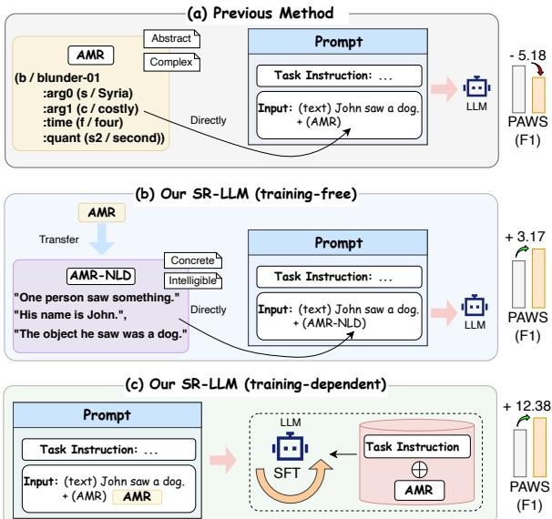  
Figure 1: We propose two novel AMR integration approaches: a training-free method using natural language descriptions and a training-dependent fine-tuning paradigm. Evaluation on PAWS shows +3.17% and +12.38% improvements respectively, contrasting with the -5.18% decline in conventional code-format methods.

In the era of LLMs, the paradigm for optimal SR integration remains an open research challenge. Despite LLMs’ capabilities, direct integration of SR into prompts, as illustrated in Figure 1, has proven counterproductive (Jin et al., 2024). We posit that this performance degradation stems from LLMs’ inherent limitations in processing structured representations, where direct exposure to complex linguistic structures impedes rather than enhances their reasoning process.

To address the aforementioned challenges and effectively leverage SR in LLMs, we introduce SR-LLM, a comprehensive framework with dual configurations for structural knowledge integration. The training-free approach transforms SR into natural language descriptions (SR-NLD), enhancing prompt comprehension by reformulating structured information into semantically rich, accessible formats that facilitate nuanced reasoning and reduce ambiguity. Complementarity, the training-dependent paradigm employs supervised fine-tuning on task-specific SR datasets (termed Gen-SR) to establish robust SR-task connections through iterative exposure to structured data, enabling the model to develop sophisticated internal representations and leverage deep structural knowledge during inference across diverse NLP tasks.

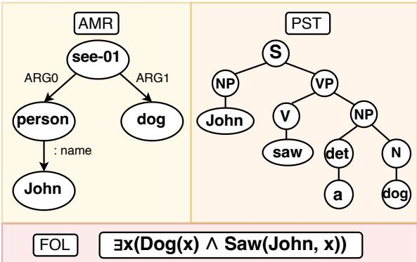  
Figure 2: The AMR, PST, and FOL of the sentence “John saw a dog”.

Our empirical evaluation encompasses a comprehensive suite of NLP benchmarks, spanning diverse linguistic phenomena from paraphrase detection (Mihalcea et al., 2006; Dolan and Brockett, 2005) and textual entailment recognition (Dagan et al., 2005; Bowman et al., 2015) to machine translation (Bahdanau, 2014; Johnson et al., 2017). This diverse benchmark selection enables rigorous evaluation of our methods across the NLP spectrum. Experimental results demonstrate the superiority of our methods over existing approaches: on PAWS, while conventional method exhibits a 5.18% performance degradation, our training-free and training-dependent approaches achieve +3.17% and +12.38% improvements respectively, which validating the efficacy of our structured information integration paradigm.

Our contributions are as follows:

• We introduce SR-LLM, a novel framework that facilitates SR integration with LLMs through dual paradigms: training-free adaptation and supervised fine-tuning.

• We provide insights into how different types of SR (AMR, PST, FOL) impact LLMs performance across various tasks.

• To the best of our knowledge, we are the first to show that combining such SR does in fact improve LLM performance, which opens up new avenues for enhanced LLM reasoning and interoperability.

## 2 Problem Definition

This research endeavors to investigate the potential synergies between SR and LLMs, with the ultimate goal of ascertaining how their seamless integration can augment the efficacy and proficiency of LLMs in a wide array of NLP tasks.

Given a natural language input sequence X = (x\_1, x\_2, \ldots , x\_n) $( x _ { 1 } , x _ { 2 } , \ldots , x _ { n } )$ , where $x _ { i } \in V$ represents a token drawn from the vocabulary V , we also introduce the structured representation Z . Z serves as auxiliary information derived from X and can take various forms, such as AMR, PST, or FOL. These SRs capture semantic, syntactic, or logical information and provide complementary insights to natural language understanding.

The task involves generating an output sequence $Y = ( y _ { 1 } , y _ { 2 } , \dots y _ { m } )$ , where each $y _ { i }$ belongs to either the target vocabulary or a structured semantic output space. This transformation is performed by a model f , defined as:

$$
Y = f ( X , Z )\tag{1}
$$

Here, f specifies how X and Z are utilized to complete a specific task by integrating natural language input with its structured representation.

The primary goal of this research is to optimize the definition of f to achieve the most effective use of X and Z , thereby maximizing task performance. Specifically, the objective is to identify the optimal model f^\* that maximizes the evaluation metric P(\cdot ) , such as accuracy or F1 score:

$$
f ^ { * } = \arg \operatorname* { m a x } _ { f } P ( f ( X , Z ) )\tag{2}
$$

## 3 Method

This chapter introduces the SR-LLM framework, a novel paradigm designed to investigate the efficacious integration of SR into LLMs. The SR-LLM framework encompasses two configurations: training-free and training-dependent. These configurations are designed to amalgamate various types of SR through differentiated methodologies, thereby enhancing the LLMs’ capability to comprehend and exploit structured information.

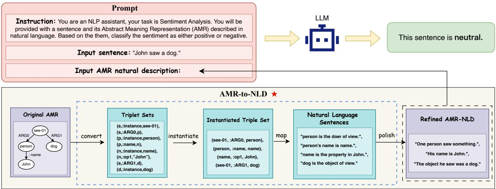  
Figure 3: The whole process of SR-LLM in training-free setting. Initially, a task-specific prompt consists of an instruction, input sentence, and input SR structure (AMR is used here). Subsequently, the original AMR undergoes transformation via the AMR-to-NLD module, which employs predefined rules to map the AMR into an easily interpretable natural language description. This description is then subjected to refinement by a language model, ensuring fluency and coherence, resulting in AMR-NLD. Finally, the AMR-NLD is seamlessly integrated into the input, which is then fed into the LLM to generate the ultimate response.

## 3.1 SR-LLM Training-Free

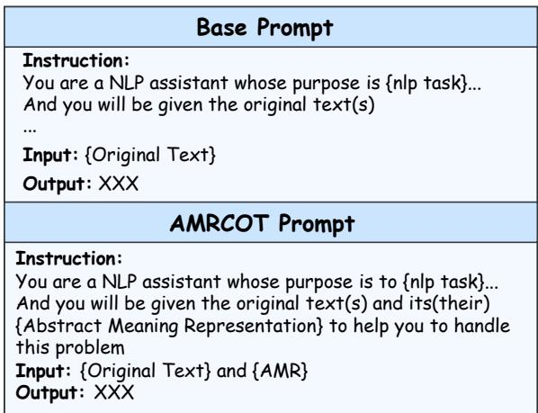  
Figure 4: Base prompt and AMRCOT prompt. (Top) This is the original task prompt, with only the raw text as input, serving as the standards for performance. (Bottom) This is the AMRCOT prompt method proposed by Jin et al. (2024), serving as a baseline.

Prior approaches, exemplified by AMRCOT (Jin et al., 2024), have attempted to explicitly incorporate AMR into Chain-of-Thought (COT) prompts, as illustrated in Figure 4, have shown that this explicit approach fails to yield performance enhancement. We hypothesize that one factor contributing to this ineffectiveness stems from the inherent difficulty LLMs face in adequately comprehending and processing abstract structures such as AMR. In view of the aforementioned challenge, as illustrated in Figure 3, we propose SR-LLM Training-Free, where the original structured representation Z is transformed into natural language descriptions termed SR-NLD, where SR can be instantiated with specific structured representations such as AMR, PST, and FOL. We refer to this entire transformation process as SR-to-NLD(Structured Representation to Natural Language Description). Specifically, the structured representations are mapped through predefined transformation rules, converting abstract symbols into easily interpretable natural language expressions. These generated natural language descriptions are then refined by a language model to ensure fluency and coherence. Finally, these descriptions are incorporated into the prompt and input into the target LLM. A pivotal advantage of this methodology lies in its training-free nature, as it does not require any additional fine-tuning or retraining of the LLM. Consequently, this technique offers remarkable flexibility, enabling rapid adaption to a diverse array of NLP tasks.

Next, we shall elucidate the SR-to-NLD process, employing AMR-NLD as our quintessential exemplar, which shown in the Algorithm 1. The process first converts the AMR graph into triplets, then replaces the identifiers with actual concepts. Next, the triplets are mapped into natural language descriptions using predefined rules, and finally, the descriptions are refined by GPT-4o Mini to produce coherent AMR-NLD. To mitigate the risk of hallucination, we implemented a voting mechanism based on multiple generations. This detailed analysis forms the core of our discussion, outlining each step of the conversion process. The transformation methods for other SRs are elaborated in the Appendix A.1 for completeness. Different from traditional SR-to-Text approaches, which generate a structurally coherent and fluent text based on the SR, such as the “input sentence” in Figure 4. SRto-NLD aims to collaboratively describe the structured information through multiple sentences, as illustrated by the Refined AMR-NLD in Figure 4.

Algorithm 1 AMR-to-NLD Transformation   
1: Input: AMR graph $G = ( V , E )$ , nodes collec  
tion V, edges collection E, Penman library ${ \mathcal P } ,$   
language model θ   
2: Output: Refined natural language descriptions   
$S _ { \mathrm { r e f i n e d } }$   
3: Phase 0: Convert AMR to Triplets   
4: Convert AMR graph G into triplets $T =$   
$\{ ( c _ { 1 } , r , c _ { 2 } ) \mid c _ { 1 } , c _ { 2 } \in V , r \in E \}$ using the   
Penman library: $T = { \mathcal { P } } ( G )$   
5: Phase 1: Identifier Instantiation   
6: for each triplet $( c _ { 1 } , r , c _ { 2 } ) \in T$ do   
7: if r = :instance then   
8: Replace identifiers $c _ { 1 } , c _ { 2 }$ with their cor  
responding concepts or instances   
9: end if   
10: end for   
11: Phase 2: Mapping to Natural Language   
12: Convert triplets into natural language descrip  
tions using a predefined dictionary: $M : T ^ { \prime } $   
S   
13: Phase 3: Refinement   
14: Refine the generated descriptions S using lan  
guage model: $S _ { \mathrm { r e f i n e d } } = \theta ( S )$   
15: return $S _ { \mathrm { r e f i n e d } }$

## 3.2 SR-LLM Training-Dependent

In addition to making SRs more interpretable for LLMs, we also believe that establishing connections between tasks and structured information presents a potential opportunity. As shown in the Figure 5, in SR-LLM Training-Dependent, we constructed a task-specific hybrid dataset, named Gen-SR, where SR can be replaced by specific representations such as AMR, PST, and FOL.

The entire hybrid dataset is composed of two parts: one consists of task-specific instruction pairs based on original text, while the other adds SRs in the instruction pairs based on the former. The former we mark as G(text) and the other we mark as G(SR). The complete example of these two are shown in the Appendix D. This mixed approach allows LLM to not only learn instruction-following for downstream tasks from G(text), but also to establish more robust connections between tasks and structures from G(SR), making the model achieve more effective improvements compared to learning solely from text.

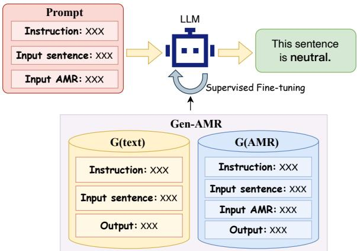  
Figure 5: The whole process of SR-LLM in trainingdependent setting. Taking AMR as an example, a dataset called Gen-AMR, created by combining inputs consisting of sentences and their corresponding AMR structures, is utilized for the SFT of LLM to enhance the reasoning capability.

## 4 Experiments

## 4.1 Datasets

To ensure comprehensive and diverse experiments, we selected 10 datasets covering various NLP tasks based on Liu et al. (2024), including five tasks from Jin et al. (2024) for result comparability. The dataset composition includes: PAWS for paraphrase detection (Zhang et al., 2019), SNLI for textual entailment recognition (Bowman et al., 2015), WMT16 for translation tasks (Bojar et al., 2016), CoNLL2003 for named entity recognition (Sang and De Meulder, 2003), Logic for logical fallacy detection (Jin et al., 2022), SST-2 for sentiment analysis (Socher et al., 2013), Pubmed45 for event extraction (Garg et al., 2016), WiC for word sense disambiguation (Pilehvar and Camacho-Collados, 2018), SPIDER for Text2SQL code generation (Yu et al., 2018), and AGNEWS for text classification (Zhang et al., 2015).

Regarding the source of SR datasets, we used a dual-source strategy: one part includes high-quality AMR datasets from Jin (Jin et al., 2024), covering five core tasks; the other is automatically constructed using GPT-4o, comprising supplementary AMR, PST, and FOL data. The detailed collection processes and results provided in the Appendix B.1.

Table 1: Performance of SR-LLM(training-free). In the table, a checkmark under $^ { 6 6 } { \mathrm { S R } } ^ { \prime }$ indicates that the original SR was added to the prompt, while a checkmark under “SR-NLD” (highlighted with a gray background) represents the inclusion of SR-NLD in the prompt, which corresponds to the results of SR-LLM (training-free). No checkmarks indicate the use of the original prompt, serving as the control group for comparison. Our focus is on the performance differences between adding SR and SR-NLD, as well as their respective differences compared to the control group.
<table><tr><td rowspan="2">SR</td><td rowspan="2">SR-NLD (Ours)</td><td rowspan="2">PAWS Logic (F1) (F1)</td><td rowspan="2"></td><td rowspan="2">Pubmed45 (F1)</td><td rowspan="2">AGNEWS (F1)</td><td rowspan="2">WiC (F1)</td><td rowspan="2">SNLI (F1)</td><td rowspan="2">CoNLL 2003 (F1)</td><td rowspan="2">SST-2 (F1)</td><td rowspan="2">WMT16 (BLEU)</td><td rowspan="2">SPIDER (F1)</td></tr><tr><td></td></tr><tr><td></td><td></td><td></td><td></td><td></td><td>(a) Llama3.1- 8b-Instruct</td><td></td><td></td><td></td><td></td><td></td><td></td></tr><tr><td></td><td></td><td>41.59 36.41</td><td>15.48</td><td>24.35</td><td>53.88</td><td>43.99</td><td>25.81</td><td>46.28</td><td>68.72 65.66</td><td>13.16 12.34</td><td>24.80</td></tr><tr><td></td><td>√</td><td>44.77</td><td>14.20 18.27</td><td>20.69 26.10</td><td>48.17 56.67</td><td>42.05 48.17</td><td>23.17 28.87</td><td>41.75 48.73</td><td>71.77</td><td>14.10</td><td>21.53 29.60</td></tr><tr><td rowspan="4"></td><td></td><td></td><td></td><td></td><td>(b) GPT 3.5-turbo</td><td></td><td></td><td></td><td></td><td></td><td></td></tr><tr><td></td><td>56.94</td><td>38.63</td><td>27.14</td><td>85.12</td><td>50.61</td><td>38.93</td><td>56.52</td><td>90.46</td><td>26.13</td><td>39.63</td></tr><tr><td></td><td>56.10</td><td>36.27</td><td>25.63</td><td>81.33</td><td>51.60</td><td>32.00</td><td>54.67</td><td>86.90</td><td>25.77</td><td>39.07</td></tr><tr><td>√</td><td>57.97</td><td>39.40</td><td>28.17</td><td>84.07</td><td>55.27</td><td>41.47</td><td>55.17</td><td>92.60</td><td>27.07</td><td>42.27</td></tr><tr><td></td><td></td><td></td><td></td><td></td><td>(c) GPT 4o-mini</td><td></td><td></td><td></td><td></td><td></td><td></td></tr><tr><td rowspan="3">V</td><td></td><td>75.80</td><td>48.10</td><td>38.65</td><td>85.26</td><td>58.47</td><td>40.59</td><td>65.27</td><td>91.39</td><td>26.80</td><td>41.55</td></tr><tr><td></td><td>73.50</td><td>47.32</td><td>33.11</td><td>81.62</td><td>46.65</td><td>41.30</td><td>59.21</td><td>91.01</td><td>26.21</td><td>39.33</td></tr><tr><td>√</td><td>76.48</td><td>47.95</td><td>36.66</td><td>83.45</td><td>56.63</td><td>42.00</td><td>64.12</td><td>92.83</td><td>26.76</td><td>43.57</td></tr></table>

## 4.2 Training-Free Results

Experimental Details. We conducted experiments on the Llama3.1-8b-Instruct (Dubey et al., 2024), GPT-3.5-turbo, and GPT-4o-mini (Achiam et al., 2023) models, arranged from weak to strong according to their performance levels, employing two prompting strategies: Chain-of-Thought (CoT) (Wei et al., 2022) and One-Shot (Brown, 2020). CoT guides step-by-step reasoning, while One-Shot demonstrates task-solving through specific examples. All experiments were conducted independently on three types of SRs: AMR, FOL, and PST. Both PST and FOL were incorporated into the prompts using the same approach as AM-RCOT (Jin et al., 2024). For brevity, the results obtained from these experiments were averaged and presented. Prompts are shown in Appendix E.

Result Analysis. First, as shown in Table 1, incorporating SR-NLD into the prompt consistently outperforms incorporating the original SR. This indicates that for LLMs, transforming abstract SRs into natural language formats more familiar to the models is an effective strategy for enhancing their ability to interpret and apply structured information. Meanwhile, the comparision of the three models also reveals that the gradual decrease in the benefit of structured information as model performance increases. Specifically, for the Llama3.1-8b-Instruct model, results with SR-NLD significantly and consistently surpass those of the original prompt (i.e., without SR or SR-NLD). For GPT-3.5-turbo, most results show improvement, whereas for GPT-4omini, approximately half of the results demonstrate improvement, albeit with a smaller margin. This result further illustrates that weaker models benefit more from structured information as a supplement to the original text, aiding them in downstream reasoning tasks. In contrast, for stronger models, the additional structured information offers limited advantages and may even be less informative than the insights derived directly from the raw text.

## 4.3 Training-Dependent Results

Experimental Details We conducted experiments using the Llama3.1-8B-Instruct model to evaluate the performance of the training-dependent setting of SR-LLM, more detailed experimental parameters can be found in the Appendix A.2. The whole process of fine-tuning is a joint training across data from 10 tasks, rather than task-specific fine-tuning for any single dataset. Detailed data collection procedures and specific training data configurations are provided in the Appendix B.2. To provide a comparative analysis, we conducted three sets of experiments using the following datasets: 100%G (text), 100%G (SR), and a 50%G (text) mixed with 50% G (SR). The 50%-50% ratio was chosen because we considered it to be the most balanced approach. Further experiments, elaborated in Appendix C.2, also confirmed that this is the optimal mixing ratio. And we employed a random sampling approach. All experiments were conducted independently on three types of SRs and for brevity, the results obtained from these experiments were averaged and presented.

Table 2: Performance of SR-LLM(training-dependent). G(text) and G(SR) represent the types of training data, with 50% and 10% indicating their respective proportions in the total training dataset. Our focus is on the best performance of the model across various tasks under different fine-tuning strategies, as well as the performance differences between adding SR and the control group.
<table><tr><td rowspan="2">FT Strategy</td><td rowspan="2">SR</td><td rowspan="2">PAWS (F1)</td><td rowspan="2">Logic Pubmed45</td><td rowspan="2">(F1)</td><td rowspan="2">AGNEWS (F1)</td><td rowspan="2">WiC (F1)</td><td rowspan="2">SNLI (F1)</td><td rowspan="2">CoNLL 2003 (F1)</td><td rowspan="2">SST-2 (F1)</td><td rowspan="2">WMT16 (BLEU)</td><td rowspan="2">SPIDER (EM)</td></tr><tr><td>(F1)</td></tr><tr><td></td><td>V</td><td>41.59 36.41</td><td>15.48 14.20</td><td>24.35 20.69</td><td>53.88 48.17</td><td>43.99 42.05</td><td>25.81 23.17</td><td>46.28 41.75</td><td>68.72 65.66</td><td>13.16 12.34</td><td>24.80 21.53</td></tr><tr><td>100% G(text)</td><td>V</td><td>68.94 64.07</td><td>26.21 16.84</td><td>78.91 77.33</td><td>76.52 67.14</td><td>66.97 67.05</td><td>35.53 35.36</td><td>75.79 71.73</td><td>75.59 74.65</td><td>29.07 28.41</td><td>41.20 38.47</td></tr><tr><td>100% G(SR)</td><td>V</td><td>65.34 75.39</td><td>25.23 29.89</td><td>81.13 82.02</td><td>75.10</td><td>66.44</td><td>36.68</td><td>75.40</td><td>77.49</td><td>26.93</td><td>37.07</td></tr><tr><td>50% G(SR)</td><td></td><td>68.66</td><td>26.77</td><td>79.78</td><td>81.99 75.77</td><td>70.82 69.48</td><td>56.62 36.49</td><td>76.27 75.42</td><td>81.62 77.13</td><td>30.80 26.14</td><td>40.60</td></tr><tr><td>+ 50% G(text)</td><td>V</td><td>81.04</td><td>36.52</td><td>81.85</td><td>82.63</td><td>74.68</td><td>54.92</td><td>76.67</td><td>83.72</td><td>30.33</td><td>42.40 48.93</td></tr><tr><td></td><td></td><td></td><td></td><td></td><td></td><td></td><td></td><td></td><td></td><td></td><td></td></tr></table>

Result Analysis. As shown in the Table 2, when the fine-tuning dataset includes a certain proportion of SRs and incorporates SRs in the prompt, the model achieves superior performance in downstream tasks, consistently surpassing the case where the training data consists solely of text. Additionally, we observe that models fine-tuned with SRs data perform significantly better with prompts that include SRs, compared to the original prompts without SR. Conversely, when the training data consists entirely of text, the opposite trend is observed. These findings suggest that when a model establishes a strong association between tasks and structured representations during training, it can leverage this information more effectively during inference. Furthermore, when the training data is entirely composed of structured representations, the performance is inferior to that achieved with a balanced mix of text and structured data. This highlights the critical importance of a balanced integration of raw text and structured representations in maximizing the model’s reasoning capabilities.

## 4.4 Auxiliary Validation Experiments

SR from High-Quality SR-Parsing Model. To validate the reliability of the generated SRs, we choose AMRBART (Bai et al., 2022) to generate the required AMRs, and experiments were conducted to compare the results with those generated by GPT-4o. It is a model that demonstrates exceptional performance in the AMR parsing domain with a Smatch score of 85.4 on the AMR Parsing Leaderboard, ranking among the top-performing models. As shown in the Table 3, the performance differences between AMRs and AMR-NLDs derived from these two sources were minimal, almost always within 0.5%. This indicates that the quality of the AMRs produced by AMRBART is comparable to those generated by our method.

Table 3: Performance between different AMR Source. Each data represents the performance difference of the model when using AMRs generated by GPT-4o versus AMRBART, calculated as the performance of AMR-BART minus that of GPT-4o. As shown, the differences are almost all below 1%.
<table><tr><td>AMR</td><td>AMR (NLD)</td><td>PAWS Logic (F1) (F1)</td><td>Pubmed 45 (F1)</td><td>WMT 16 (BLEU)</td><td>SPIDER (EM)</td></tr><tr><td colspan="6">√</td></tr><tr><td></td><td>√</td><td>0.40 -0.07 0.77 -0.13</td><td>0.01 0.50</td><td>0.13 -0.02</td><td>0.28 -0.01</td></tr><tr><td>√</td><td>0.45</td><td>0.57 -2.40</td><td>(b) GPT 3.5-turbo -0.15 0.52</td><td>0.08</td><td>0.12</td></tr><tr><td colspan="4">√ 0.02</td><td>0.23</td><td>0.21</td></tr><tr><td rowspan="3">√</td><td></td><td></td><td>(c) GPT 4o-mini</td><td></td><td></td></tr><tr><td>V</td><td>0.08 0.07 -0.11</td><td>0.53 0.61</td><td>0.49 -0.13</td><td>0.02</td></tr><tr><td></td><td>0.61</td><td></td><td></td><td>-0.13</td></tr></table>

Gold AMR vs Flawed AMR. Additionally, we selected 70 AMR samples (labeled as “Flawed”) with ambiguities or structural flaws from each of the 10 datasets and refined them using a dual-process correction strategy that combined

Table 4: Performance between different AMR Quality. The numbers in parentheses represent the performance differences between adding AMR or AMR-NLD and the control group. ‘Flawed’ means the AMR is ambiguous or structurally flawed. ‘Gold’ means the AMR is double checked by human and LLM.
<table><tr><td>AMR Quality</td><td>AMR</td><td>AMR-NLD</td><td>PAWS (F1)</td><td>Logic (F1)</td><td>Pubmed45 (F1)</td><td>WMT16 (BLEU)</td><td>SPIDER (EM)</td></tr><tr><td colspan="8">(a) Llama3.1-8b-Instruct</td></tr><tr><td>Flawed</td><td>√</td><td></td><td>42.19 34.5 (-7.69)</td><td>14.32 11.52 (-2.8)</td><td>23.67 19.41 (-4.26)</td><td>13.66 11.07 (-2.59)</td><td>22.58</td></tr><tr><td>Gold</td><td>√</td><td></td><td>42.48 (+0.29)</td><td>14.7 (+0.38)</td><td>23.43 (-0.24)</td><td>14.65 (+0.99)</td><td>18.26 (-4.32) 22.93 (+0.35)</td></tr><tr><td>Flawed</td><td></td><td>√</td><td>32.91 (-9.29)</td><td>11.56 (-2.76)</td><td></td><td></td><td></td></tr><tr><td></td><td></td><td>√</td><td>46.96 (+4.76)</td><td>18.98 (+4.66)</td><td>18.39 (-5.28)</td><td>11.06 (-2.6)</td><td>18.49 (-4.09)</td></tr><tr><td>Gold</td><td></td><td></td><td></td><td>(b) GPT 3.5-turbo</td><td>28.62 (+4.95)</td><td>19.13 (+5.47)</td><td>28.02 (+5.44)</td></tr><tr><td colspan="8"></td></tr><tr><td>Flawed</td><td></td><td></td><td>56.04</td><td>43.79 41.58 (-2.21)</td><td>28.29</td><td>26.01</td><td>40.28</td></tr><tr><td>Gold</td><td>√ √</td><td></td><td>51.57 (-4.47) 54.53 (-1.51)</td><td></td><td>25.71 (-2.58)</td><td>23.79 (-2.22)</td><td>36.66 (-3.62)</td></tr><tr><td></td><td></td><td></td><td></td><td>44.7 (+0.91)</td><td>29.47 (+1.19)</td><td>26.17 (+0.15)</td><td>39.77 (-0.51)</td></tr><tr><td>Flawed</td><td></td><td></td><td>51.33 (-4.71)</td><td>39.79 (-4.01)</td><td>26.9 (-1.38)</td><td>24.37 (-1.64)</td><td>36.74 (-3.54)</td></tr><tr><td>Gold</td><td></td><td> $\checkmark$ </td><td>56.78 (+0.74)</td><td>46.49 (+2.7)</td><td>32.0 (+3.71)</td><td>28.72 (+2.71)</td><td>44.81 (+4.53)</td></tr><tr><td colspan="8">(c) GPT 4o-mini</td></tr><tr><td></td><td>1 √</td><td></td><td>68.71</td><td>44.95</td><td>37.07</td><td>29.02</td><td>40.05</td></tr><tr><td>Flawed</td><td>√</td><td></td><td>65.63 (-3.08)</td><td>42.74 (-2.2)</td><td>35.42 (-1.66)</td><td>27.31 (-1.71)</td><td>37.84 (-2.21)</td></tr><tr><td>Gold</td><td></td><td></td><td>70.04 (+1.33)</td><td>45.9 (+0.96)</td><td>35.36 (-1.71)</td><td>29.62 (+0.6)</td><td>41.47 (+1.42)</td></tr><tr><td>Flawed</td><td></td><td> $\checkmark$ </td><td>62.63 (-6.07)</td><td>41.46 (-3.49)</td><td>34.51 (-2.56)</td><td>26.64 (-2.38)</td><td>37.30 (-2.76)</td></tr><tr><td>Gold</td><td></td><td> $\checkmark$ </td><td>70.13 (+1.42)</td><td>46.18 (+1.23)</td><td>39.17 (+2.09)</td><td>30.14 (+1.12)</td><td>41.54 (+1.48)</td></tr></table>

AMRBART-generated results with manual adjustments, producing high-quality AMRs (labeled “Gold”). Results in Table 4 show that AMR quality significantly impacts model performance. Using flawed AMRs led to performance declines for both direct AMR and AMR-NLD representations, with a more pronounced drop for AMR-NLD. This indirectly validates AMR-NLD’s ability to enhance LLMs’ understanding of AMR structures. In contrast, with high-quality AMRs, AMR-NLD substantially improved model performance, while direct AMR usage showed limited gains. These results demonstrate that combining high-quality AMR-NLD is more effective in helping models comprehend structured information. This effect is particularly pronounced when the quality of the AMR is high, leading to substantial performance gains.

Fine-tuning Larger Model. To validate the robustness of the proposed method, we selected Llama3.1-70B-Instruct and conducted trainingdependent experiments, whose details were consistent with those described for the Llama3.1-8B-Instruct model above, in five tasks shown in the Table 5. The SR used in these experiments was AMR, with a 50%-50% ratio. We can see that, after fine-tuning, the model demonstrated improvements on all tasks, with corresponding values turning positive, more than half of which exceeded 5%. These results further validate the effectiveness of Training-Dependent method on larger-scale models.

Table 5: Performance of SR-LLM(trainingdependent) in Llama3.1-70b-Instruct. The numbers in parentheses represent the performance differences between adding SR and the control group. Our focus is on the performance variations across different models with different prompts.
<table><tr><td>AMR</td><td>PAWS (F1)</td><td>Logic (F1)</td><td>Pubmed45 (F1)</td><td>WMT16 (BLEU)</td><td>SPIDER (EM)</td></tr><tr><td> $\checkmark$ </td><td>68.00 60.28 (-7.73)</td><td>47.13 43.08 (-4.04)</td><td>(a) Vanilla 63.95 48.82 (-15.13)</td><td>28.65 27.91 (-0.73)</td><td>33.71 29.20 (-4.51)</td></tr><tr><td></td><td>74.74</td><td>54.57</td><td>(b) 50% G(AMR) + 50% G(text) 76.51</td><td>33.73</td><td>47.06</td></tr><tr><td> $\checkmark$  </td><td>84.56 (+9.81)</td><td>58.96 (+4.39)</td><td>81.54 (+5.03)</td><td>37.00 (+3.27)</td><td>53.84 (+6.78)</td></tr></table>

Experiments on More Standardized Language Understanding Benchmarks. In order to generalize the results to larger and more standardized language understanding benchmarks, we conducted relevant experiments on SuperGLUE (Wang et al., 2019), with the Llama3.1-8b-Instruct results presented in Table 6. As shown, our method consistently leads to significant performance improve-

Table 6: Performance on SuperGLUE.
<table><tr><td>AMR</td><td>AMR-NLD</td><td>Training</td><td>BoolQ (Acc)</td><td>CB (Acc)</td><td>COPA (Acc)</td><td>MultiRC (F1)</td><td>ReCoRD (F1)</td><td>RTE (Acc)</td><td>WiC (Acc)</td><td>WSC (Acc)</td><td>AVG</td></tr><tr><td colspan="10">√</td></tr><tr><td></td><td></td><td>87.09</td><td>94.00</td><td>95.80</td><td>(a) SR-LLM (Training Free) 80.42</td><td></td><td>86.19</td><td>87.23</td><td>42.14</td><td>91.78</td><td>83.08</td></tr><tr><td></td><td></td><td></td><td>85.24</td><td>92.80</td><td>96.00</td><td>79.53</td><td>83.42</td><td>84.97</td><td>39.21</td><td>86.30</td><td>80.93</td></tr><tr><td></td><td>√</td><td></td><td>89.77</td><td>96.00</td><td>96.60</td><td>82.19</td><td>87.21</td><td>90.03</td><td>46.79</td><td>93.15</td><td>85.22</td></tr><tr><td colspan="10">(b) SR-LLM (Training Dependent)</td></tr><tr><td></td><td></td><td>√</td><td>89.46</td><td>95.60</td><td>96.40</td><td>84.96</td><td>89.77</td><td>90.20</td><td>65.36</td><td>91.78</td><td>87.94</td></tr><tr><td>V</td><td></td><td>√</td><td>90.82</td><td>96.80</td><td>97.40</td><td>86.19</td><td>90.31</td><td>91.03</td><td>69.71</td><td>93.84</td><td>89.51</td></tr></table>

Table 7: Comparison with Baselines.
<table><tr><td></td><td>PAWS Logic Pubmed45 AGNEWS (F1)</td><td>(F1)</td><td>(F1)</td><td>(Acc)</td><td>(Acc) (Acc)</td><td></td><td>(F1)</td><td>(Acc)</td><td>WiC SNLI CoNLL2003 SST-2 WMT16 SPIDER (BLEU)</td><td>(EM)</td></tr><tr><td>AMRCOT (Jin et al., 2024)</td><td></td><td>36.6314.09</td><td>20.08</td><td>42.37</td><td>38.22 22.46</td><td></td><td>40.79</td><td>72.94</td><td>12.51</td><td>21.60</td></tr><tr><td>AMRCoC (Yao et al., 2024)</td><td></td><td>39.7715.76</td><td>21.59</td><td>40.51</td><td>39.60 26.12</td><td></td><td>47.13</td><td>70.87</td><td>13.92</td><td>26.71</td></tr><tr><td>SENSE (An et al., 2024)</td><td>41.9616.12</td><td></td><td>22.74</td><td>52.13</td><td>42.2525.39</td><td></td><td>46.92</td><td>78.90</td><td>13.57</td><td>26.07</td></tr><tr><td>AMR-NLD (Ours)</td><td>45.75 18.93</td><td></td><td>28.37</td><td>54.53</td><td>45.83 28.02</td><td></td><td>49.66</td><td>79.59</td><td>14.14</td><td>29.48</td></tr></table>

Table 8: Comparison with Reasoning Method.
<table><tr><td>Method</td><td>AMR-NLD</td><td>PAWS Logic Pubmed45 AGNEWS (F1) (F1)</td><td>(F1)</td><td>(Acc)</td><td>WiC (Acc)</td><td>SNLI CoNLL2003 (Acc)</td><td>(F1)</td><td>SST-2 WMT16 SPIDER (Acc)</td><td>(BLEU)</td><td>(EM)</td></tr><tr><td>COT</td><td>√</td><td>41.59 +4.16 +3.45</td><td>15.48 24.35 +4.02</td><td></td><td>51.24 +3.29</td><td>41.1724.58 +4.66 +3.44</td><td>46.28 +3.38</td><td>76.49 +3.10</td><td>13.16 +0.98</td><td>24.80 +4.68</td></tr><tr><td>TOT</td><td>√</td><td>42.49 +5.54 +2.59</td><td>16.13 24.02 +4.46</td><td></td><td>53.68 +0.62</td><td>41.2224.84 +4.12+3.97</td><td>48.18 +2.59</td><td>75.80 +5.73</td><td>12.95 +1.68</td><td>24.72 +4.31</td></tr><tr><td>Self-reflection</td><td>√</td><td>43.01 +2.42+3.61</td><td>15.57 +4.04</td><td>24.14</td><td>50.95 +4.68</td><td>41.0225.61 +6.18 +3.19</td><td>48.68 +0.98</td><td>76.72 +6.88</td><td>13.89 +0.74</td><td>26.25 +4.97</td></tr></table>

Table 9: Comparison with Paraphrase Only.
<table><tr><td rowspan="2">Method</td><td rowspan="2">PAWS (F1)</td><td rowspan="2">Logic</td><td rowspan="2">Pubmed45</td><td rowspan="2">AGNEWS</td><td rowspan="2">WiC</td><td rowspan="2">SNLI</td><td rowspan="2">CoNLL2003</td><td rowspan="2">SST-2</td><td rowspan="2">WMT16 (BLEU)</td><td rowspan="2">SPIDER (EM)</td></tr><tr><td>(Acc) (Acc)</td></tr><tr><td></td><td>41.59</td><td>(F1) 15.48</td><td>(F1) 24.35</td><td>51.24</td><td>41.17</td><td>(Acc) 24.58</td><td>(F1) 46.28</td><td>(Acc) 76.49</td><td>13.16</td><td>24.80</td></tr><tr><td>paraphase (+1)</td><td>41.37</td><td>15.36</td><td>24.43</td><td>50.82</td><td>40.78</td><td>24.52</td><td>45.98</td><td>76.26</td><td>13.16</td><td>25.05</td></tr><tr><td>paraphase (+2)</td><td>41.54</td><td>15.45</td><td>24.14</td><td>51.54</td><td>41.46</td><td>24.77</td><td>46.38</td><td>76.38</td><td>13.04</td><td>24.90</td></tr><tr><td>paraphase (+3)</td><td>41.95</td><td>15.62</td><td>24.53</td><td>50.78</td><td>41.36</td><td>24.45</td><td>45.83</td><td>77.18</td><td>13.08</td><td>24.98</td></tr><tr><td>AMR-NLD</td><td>45.75</td><td>18.93</td><td>28.37</td><td>54.53</td><td>45.83</td><td>28.02</td><td>49.66</td><td>79.59</td><td>14.14</td><td>29.48</td></tr></table>

## ments.

Comparison with Existing Methods Using AMR. To better demonstrate the effectiveness of our method, we present a comparison with existing methods using AMR, with the Llama3.1-8b-Instruct results presented in Table 7. This indicate that our method consistently yields higher gains.

Comparison with Other Reasoning Method. The focus of our work is to explore how to better leverage structured information as a extra resource. This approach is designed to coexist with existing reasoning enhancement methods, including Chain-of-Thought (COT) (Wei et al., 2022), TOT (Yao et al., 2023a), and Self-reflection (Yao et al., 2023b). To validate the effectiveness of combining structured representations with these methods, we present the relevant experimental results in Llama3.1-8b-Instruct in Table 8. As shown, SR-LLM consistently achieves higher gains when applied to existing reasoning enhancement methods.

Comparison with Paraphrase. To enhance the effectiveness, we used GPT-4o mini (the same model used to create AMR-NLD) to generate multiple paraphrases of original sentences (with experimental sets ranging from 1 to 3 paraphrases) and incorporated them into the prompts. For example:

Original sentence: "America is the best place to live, because it’s better than any other country."

Paraphrase: "America is the top place to live, as it surpasses all other countries."

The experimental in Llama3.1-8b-Instruct results are shown in Table 9. As seen from the table, the impact of paraphrases on the experimental outcomes ranges from -2% to 1%. Compared to our AMR-NLD method, this represents relatively small fluctuations. In fact, in many cases, simply adding paraphrases did not result in any gains. Therefore, the results suggest that our structured representation method is indeed effective.

## 5 Related Work

Structure Representations. The SRs, including AMR, PST, and FOL, each unique advantages and applications in specific areas. AMR uses rooted, labeled graphs to abstract syntactic details, offering concise and semantically rich representations (Banarescu et al., 2013). PST, based on Chomsky’s generative grammar, employs hierarchical trees to represent sentence syntax and word dependencies (Chomsky, 2014). FOL, as a symbolic logic system, defines objects, their relations, and properties, serving as a key tool in formal logic and reasoning (Enderton, 2001; Barwise, 1977).

Structure Representations Transformation. The SR transformation has been a key research focus, with much work directed at SR-to-Text methods that generate fluent text matching SR structure (Song et al., 2018; Ribeiro et al., 2021; Wang et al., 2020). Canonical expressions, using rule-based techniques, standardize structures to address ambiguities in non-standard sentences (Shin et al., 2021; Roy et al., 2024), producing normalized text rather than full structural descriptions. In contrast, our SR-to-NLD approach maintains structural integrity while improving interpretability through natural language descriptions.

Structured Representations used for NLP in LLM. With the rise of LLM, studies like Hahn et al. (2022) showed these sequence to sequence model’s ability to generalize across formal domains, though challenges like low interpretability and hallucinations persist De Bellis (2023). Integrating structured representations into LLMs has improved accuracy and interpretability. Yao et al. (2024) and (Shi et al., 2024) combined AMR with

LLMs for tasks like sentence simplification and Retrieval-Augmented Generation. Additionally, Hahn et al. (2022) and (Kalyanpur et al., 2024) advanced formal specification and logical reasoning in LLMs. And An et al. (2024) identified "magic prompts" that improve the performance of NLP tasks by solely focusing on semantic parsing, without the need to provide the actual parsing results. However, Jin et al. (2024) argued that simplely add AMR into prompt might sometimes hinder performance in certain NLP tasks.

## 6 Conclusion

SR-LLM demonstrates significant progress in enhancing LLMs’ reasoning capabilities through structured representations. Our evaluation across diverse NLP tasks revealed SR’s potential in generating novel implicit information. We established a framework for integrating SR into LLMs, from prompt engineering to fine-tuning, providing valuable insights into structured information incorporation. These advancements led to substantial improvements in both training-free and trainingfependent settings, highlighting the effectiveness of integrating semantic, syntactic, and logical features. As we refine SR-LLM, we anticipate further progress towards more interpretable, accurate, and versatile language models with enhanced reasoning capabilities in various applications.

## 7 limitations

Despite SR-NLD’s promising performance in certain tasks, its effectiveness remains inconsistent across different LLMs. The rule-based conversion method may constrain flexibility. Future research should focus on developing a more robust and adaptive structured representation, exploring taskspecific optimizations, and investigating advanced conversion techniques and novel model architectures. Expanding evaluation to diverse language models and datasets will be crucial to enhance the method’s consistency, flexibility, and applicability in various NLP domains.

## Acknowledgments

This work is partially supported by the National Natural Science Foundation of China (NSFC) under grant No. 62403389 and the Provincial Natural Science Foundation of Zhejiang under grant No. QKWL25F0301.

## References

Josh Achiam, Steven Adler, Sandhini Agarwal, Lama Ahmad, Ilge Akkaya, Florencia Leoni Aleman, Diogo Almeida, Janko Altenschmidt, Sam Altman, Shyamal Anadkat, et al. 2023. Gpt-4 technical report. arXiv preprint arXiv:2303.08774.

Kaikai An, Shuzheng Si, Helan Hu, Haozhe Zhao, Yuchi Wang, Qingyan Guo, and Baobao Chang. 2024. Rethinking semantic parsing for large language models: Enhancing llm performance with semantic hints. arXiv preprint arXiv:2409.14469.

Dzmitry Bahdanau. 2014. Neural machine translation by jointly learning to align and translate. arXiv preprint arXiv:1409.0473.

Xuefeng Bai, Yulong Chen, and Yue Zhang. 2022. Graph pre-training for amr parsing and generation. arXiv preprint arXiv:2203.07836.

Laura Banarescu, Claire Bonial, Shu Cai, Madalina Georgescu, Kira Griffitt, Ulf Hermjakob, Kevin Knight, Philipp Koehn, Martha Palmer, and Nathan Schneider. 2013. Abstract meaning representation for sembanking. In Proceedings of the 7th linguistic annotation workshop and interoperability with discourse, pages 178–186.

Jon Barwise. 1977. An introduction to first-order logic. In Studies in Logic and the Foundations of Mathematics, volume 90, pages 5–46. Elsevier.

Ondrej Bojar, Rajen Chatterjee, Christian Federmann, Yvette Graham, Barry Haddow, Matthias Huck, Antonio Jimeno Yepes, Philipp Koehn, Varvara Logacheva, Christof Monz, et al. 2016. Findings of the 2016 conference on machine translation (wmt16). In First conference on machine translation, pages 131–198. Association for Computational Linguistics.

Samuel R Bowman, Gabor Angeli, Christopher Potts, and Christopher D Manning. 2015. A large annotated corpus for learning natural language inference. arXiv preprint arXiv:1508.05326.

Tom B Brown. 2020. Language models are few-shot learners. arXiv preprint arXiv:2005.14165.

Noam Chomsky. 2014. Aspects ofthe Theory ofSyntax. 11. MIT press.

Ronan Collobert, Jason Weston, Léon Bottou, Michael Karlen, Koray Kavukcuoglu, and Pavel Kuksa. 2011. Natural language processing (almost) from scratch. Journal of machine learning research, 12:2493– 2537.

Ido Dagan, Oren Glickman, and Bernardo Magnini. 2005. The pascal recognising textual entailment challenge. In Machine learning challenges workshop, pages 177–190. Springer.

Marco Damonte, Shay B Cohen, and Giorgio Satta. 2016. An incremental parser for abstract meaning representation. arXiv preprint arXiv:1608.06111.

Alessandro De Bellis. 2023. Structuring the unstructured: an llm-guided transition. In DC@ ISWC.

Bill Dolan and Chris Brockett. 2005. Automatically constructing a corpus of sentential paraphrases. In Third international workshop on paraphrasing (IWP2005).

Abhimanyu Dubey, Abhinav Jauhri, Abhinav Pandey, Abhishek Kadian, Ahmad Al-Dahle, Aiesha Letman, Akhil Mathur, Alan Schelten, Amy Yang, Angela Fan, et al. 2024. The llama 3 herd of models. arXiv preprint arXiv:2407.21783.

Herbert B Enderton. 2001. A mathematical introduction to logic. Elsevier.

Sahil Garg, Aram Galstyan, Ulf Hermjakob, and Daniel Marcu. 2016. Extracting biomolecular interactions using semantic parsing of biomedical text. In Proceedings ofthe AAAI Conference on Artificial Intelligence, volume 30.

Christopher Hahn, Frederik Schmitt, Julia J Tillman, Niklas Metzger, Julian Siber, and Bernd Finkbeiner. 2022. Formal specifications from natural language. arXiv preprint arXiv:2206.01962.

Zhijing Jin, Yuen Chen, Fernando Gonzalez, Jiarui Liu, Jiayi Zhang, Julian Michael, Bernhard Schölkopf, and Mona Diab. 2024. Analyzing the role of semantic representations in the era of large language models. arXiv preprint arXiv:2405.01502.

Zhijing Jin, Abhinav Lalwani, Tejas Vaidhya, Xiaoyu Shen, Yiwen Ding, Zhiheng Lyu, Mrinmaya Sachan, Rada Mihalcea, and Bernhard Schoelkopf. 2022. Logical fallacy detection. arXiv preprint arXiv:2202.13758.

Melvin Johnson, Mike Schuster, Quoc V Le, Maxim Krikun, Yonghui Wu, Zhifeng Chen, Nikhil Thorat, Fernanda Viégas, Martin Wattenberg, Greg Corrado, et al. 2017. Google’s multilingual neural machine translation system: Enabling zero-shot translation. Transactions of the Association for Computational Linguistics, 5:339–351.

Aditya Kalyanpur, Kailash Saravanakumar, Victor Barres, Jennifer Chu-Carroll, David Melville, and David Ferrucci. 2024. Llm-arc: Enhancing llms with an automated reasoning critic. arXiv preprint arXiv:2406.17663.

Kevin Knight, Bianca Badarau, Laura Baranescu, Claire Bonial, Madalina Bardocz, Kira Griffitt, Ulf Hermjakob, Daniel Marcu, Martha Palmer, Tim O’Gorman, et al. 2020. Abstract meaning representation (amr) annotation release 3.0. Web Download. LDC2020T02.

Yang Liu, Jiahuan Cao, Chongyu Liu, Kai Ding, and Lianwen Jin. 2024. Datasets for large language models: A comprehensive survey. arXiv preprint arXiv:2402.18041.

Christopher D Manning. 1999. Foundations ofstatistical natural language processing. The MIT Press.

Rada Mihalcea, Courtney Corley, Carlo Strapparava, et al. 2006. Corpus-based and knowledge-based measures of text semantic similarity. In Aaai, 2006, pages 775–780.

Mohammad Taher Pilehvar and Jose Camacho-Collados. 2018. Wic: the word-in-context dataset for evaluating context-sensitive meaning representations. arXiv preprint arXiv:1808.09121.

José Gabriel Carrasco Ramírez. 2024. Natural language processing advancements: Breaking barriers in human-computer interaction. Journal ofArtificial Intelligence General Science (JAIGS) ISSN: 3006-4023, 3(1):31–39.

Leonardo FR Ribeiro, Yue Zhang, and Iryna Gurevych. 2021. Structural adapters in pretrained language models for amr-to-text generation. arXiv preprint arXiv:2103.09120.

Subhro Roy, Samuel Thomson, Tongfei Chen, Richard Shin, Adam Pauls, Jason Eisner, and Benjamin Van Durme. 2024. Benchclamp: A benchmark for evaluating language models on syntactic and semantic parsing. Advances in Neural Information Processing Systems, 36.

Devendra Singh Sachan, Yuhao Zhang, Peng Qi, and William Hamilton. 2020. Do syntax trees help pretrained transformers extract information? arXiv preprint arXiv:2008.09084.

Erik F Sang and Fien De Meulder. 2003. Introduction to the conll-2003 shared task: Language-independent named entity recognition. arXiv preprint cs/0306050.

Kaize Shi, Xueyao Sun, Qing Li, and Guandong Xu. 2024. Compressing long context for enhancing rag with amr-based concept distillation. arXiv preprint arXiv:2405.03085.

Richard Shin, Christopher H Lin, Sam Thomson, Charles Chen, Subhro Roy, Emmanouil Antonios Platanios, Adam Pauls, Dan Klein, Jason Eisner, and Benjamin Van Durme. 2021. Constrained language models yield few-shot semantic parsers. arXiv preprint arXiv:2104.08768.

Richard Socher, Alex Perelygin, Jean Wu, Jason Chuang, Christopher D Manning, Andrew Y Ng, and Christopher Potts. 2013. Recursive deep models for semantic compositionality over a sentiment treebank. In Proceedings of the 2013 conference on empirical methods in natural language processing, pages 1631–1642.

Linfeng Song, Yue Zhang, Zhiguo Wang, and Daniel Gildea. 2018. A graph-to-sequence model for amrto-text generation. arXiv preprint arXiv:1805.02473.

Alex Wang, Yada Pruksachatkun, Nikita Nangia, Amanpreet Singh, Julian Michael, Felix Hill, Omer Levy, and Samuel Bowman. 2019. Superglue: A stickier benchmark for general-purpose language understanding systems. Advances in neural information processing systems, 32.

Chuan Wang, Nianwen Xue, and Sameer Pradhan. 2015. A transition-based algorithm for amr parsing. In Proceedings of the 2015 Conference of the North American Chapter ofthe Association for Computational Linguistics: Human Language Technologies, pages 366–375.

Tianming Wang, Xiaojun Wan, and Hanqi Jin. 2020. Amr-to-text generation with graph transformer. Transactions of the Association for Computational Linguistics, 8:19–33.

Jason Wei, Xuezhi Wang, Dale Schuurmans, Maarten Bosma, Fei Xia, Ed Chi, Quoc V Le, Denny Zhou, et al. 2022. Chain-of-thought prompting elicits reasoning in large language models. Advances in neural information processing systems, 35:24824–24837.

Peiran Yao, Kostyantyn Guzhva, and Denilson Barbosa. 2024. Semantic graphs for syntactic simplification: A revisit from the age of llm. arXiv preprint arXiv:2407.04067.

Shunyu Yao, Dian Yu, Jeffrey Zhao, Izhak Shafran, Tom Griffiths, Yuan Cao, and Karthik Narasimhan. 2023a. Tree of thoughts: Deliberate problem solving with large language models. Advances in neural information processing systems, 36:11809–11822.

Shunyu Yao, Jeffrey Zhao, Dian Yu, Nan Du, Izhak Shafran, Karthik Narasimhan, and Yuan Cao. 2023b. React: Synergizing reasoning and acting in language models. In International Conference on Learning Representations (ICLR).

Tao Yu, Rui Zhang, Kai Yang, Michihiro Yasunaga, Dongxu Wang, Zifan Li, James Ma, Irene Li, Qingning Yao, Shanelle Roman, et al. 2018. Spider: A large-scale human-labeled dataset for complex and cross-domain semantic parsing and text-to-sql task. arXiv preprint arXiv:1809.08887.

Xiang Zhang, Junbo Zhao, and Yann LeCun. 2015. Character-level convolutional networks for text classification. Advances in neural information processing systems, 28.

Yuan Zhang, Jason Baldridge, and Luheng He. 2019. Paws: Paraphrase adversaries from word scrambling. arXiv preprint arXiv:1904.01130.

## A Experimental Details

## A.1 Details of Converting SR to SR-NLD

## A.1.1 Details of Translating AMR Triplet to Natural Sentence

According to the Figure 6, first, the triplet is converted into a sentence based on the relation mapping rules. Then, using the entity dictionary, the entities are replaced with their actual meanings to form the final sentence. Finally, the sentence is input into the LLM for refinement into a complete and coherent sentence, as shown in the Figure 7.

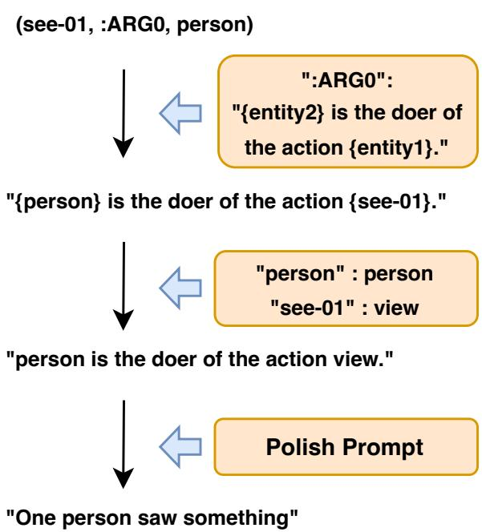  
Figure 6: The process of translate entities and relationships into natural language sentences

## A.1.2 Whole Process of Making PST-NLD

Definition of PST. PST is represented as a tree structure $T = ( N , E )$ . Here N denotes the set of nodes, representing the syntactic components of a sentence (e.g., part-of-speech tags and phrase labels). Node types include S (sentence), NP (noun phrase), VP (verb phrase), etc. E denotes the set of edges, representing dependencies between components. An example of the original PST structure is shown in the Figure 8.

Conversion of PST to a Linear Structure Using Depth-First Search (DFS). Starting from the root node (typically n\_0 , representing the sentence’s syntactic structure, such as S ), we traverse the tree in a depth-first search (DFS) manner, converting it into a linear sequence of symbols P .

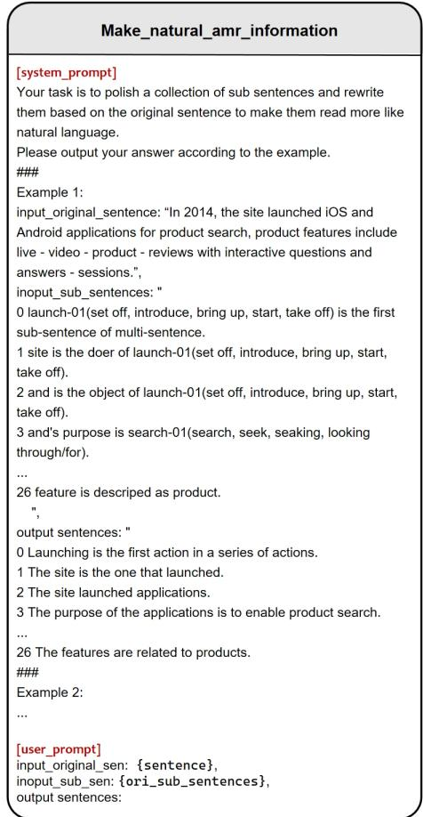  
Figure 7: The prompt of polishing sentence for making AMR-NLD

Mapping PST Identifiers to Natural Language Descriptions. We define a mapping function M to translate each identifier (e.g., S , NP , VBD ) and its child nodes into natural language descriptions. The dictionary D , which specifies the natural language interpretation of each identifier, is detailed in the appendix. For each triplet $( n , c _ { 1 } , c _ { 2 } )$ where n is a node and c\_1 , c\_2 are its children, we apply the mapping function M(n) = \text {description}(n) . The resulting natural language description S is as shown in the Figure 8.

Refinement of Natural Language Descriptions Using a Language Model. To make the descriptions more natural and coherent, the generated descriptions S are refined using the language model $F _ { \mathrm { L M } } : S \to S _ { \mathrm { r e f i n e d } }$ . The specific prompt is shown in the prompt (b) of Figure 9.

## A.1.3 Whole Process of Making FOL-NLD

Definition of FOL. FOL is represented as F = (Q, V, P, C) $( Q , V , P , C )$ , where Q denotes the set of quantifiers, used to express the existence of variables, such as \exists (exists) and \foral (for all). V represents the set of variables, representing objects in FOL, typically denoted as x, y, z . P represents the set of predicates, used to express properties of objects or relationships between multiple objects. C represents the set of logical connectives, used to connect multiple propositions, including conjunction ( \land ), disjunction ( \lor ), and negation ( \neg ). An example of the original FOL structure is shown in the Figure 10.

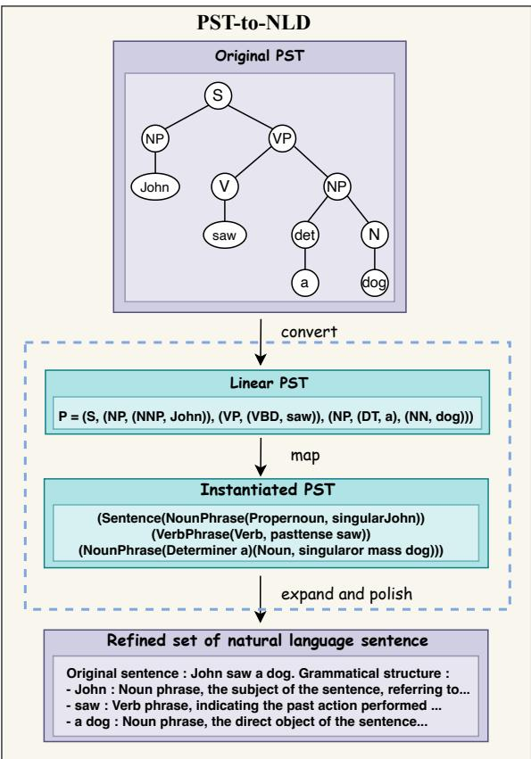  
Figure 8: The Whole process of Making PST-NLD. The process of creating PST-NLD involves first converting the PST tree structure into a linear sequence of symbols using depth-first search (DFS). Then, a mapping function is applied to translate each node and its children into natural language descriptions. Finally, a language model is used to refine the generated descriptions, making them more natural and coherent.

Mapping FOL to Natural Language Descriptions. We define a mapping function M = (D, L) , where D is a set of symbol mappings that translates variables, predicates, and logical operators in FOL into natural language descriptions. L is a set of logical mapping rules that transforms the logical structure of FOL into natural language syntax. By applying these mapping rules to the initial FOL expressions, we can convert logical symbols into natural language descriptions.

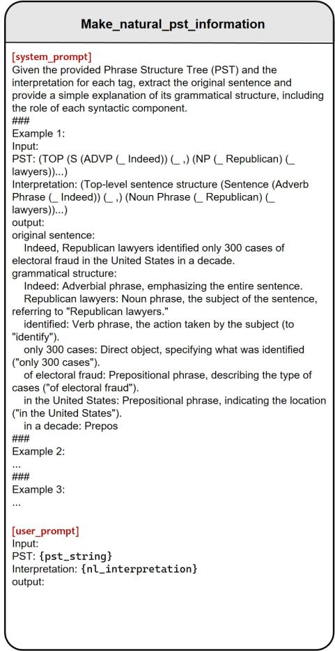  
Figure 9: The prompt of polishing sentence for making PST-NLD

Refinement of Natural Language Descriptions Using a Language Model. To ensure that the descriptions are coherent and fluent, we refine the generated descriptions S using the language model $F _ { \mathrm { L M } } : S \to S _ { \mathrm { r e f i n e d } }$ . The specific prompt is shown in the prompt (c) of Figure 11.

## A.2 Complete Fine-tuning Details

We used Meta’s Llama-3.1-8B-Instruct as the backbone and conducted fine-tuning on 8 NVIDIA A100-80G GPUs. Optimization was performed using the AdamW optimizer with a learning rate of 1e-4 and cosine learning rate decay. The training setup included a per\_device\_train\_batch\_size of 16 and gradient\_accumulation\_steps of 8, yielding an effective global batch size of 1024. A fixed random seed of 42 ensured reproducibility. Each dataset was fine-tuned for 10 epochs, with early stopping to prevent overfitting.

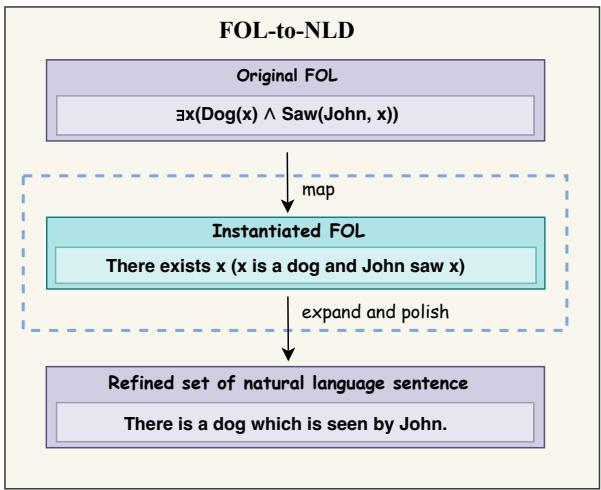  
Figure 10: The Whole process of Making FOL-NLD. The process of converting FOL to NLD involves first mapping FOL symbols, such as variables, predicates, and logical operators, into natural language using predefined symbol mappings and logical rules. Then, the generated descriptions are refined using a language model to ensure they are coherent and fluent.

## B Data Collection

## B.1 The Process of Constructing Datasets for All Tasks of SR-LLM (training-free)

In this section, I will outline the process of collecting test data for the 10 tasks used in SR-LLM (training-free), including both the original text and three types of structured representations. The data

statistics are summarized in the TableDataset Task Test SizeB.1.
<table><tr><td>PAWS</td><td>Paraphrase Detection</td><td>8000</td></tr><tr><td>SNLI</td><td>Recognizing Textual Entailment</td><td>10000</td></tr><tr><td>WMT16</td><td>Translation</td><td>5999</td></tr><tr><td>CoNLL2003</td><td>Named Entity Recognition</td><td>3453</td></tr><tr><td>LOGIC</td><td>Logical Fallacy Detection</td><td>2449</td></tr><tr><td>SST-2</td><td>Sentiment Analysis</td><td>872</td></tr><tr><td>Pubmed45</td><td>Event Extraction</td><td>5000</td></tr><tr><td>WiC</td><td>Lexical Disambiguation</td><td>2038</td></tr><tr><td>SPIDER</td><td>Text2SQL Code Generation</td><td>8034</td></tr><tr><td>AGNEWS</td><td>Text Classification</td><td>7600</td></tr></table>

SNLI SNLI is a large and comprehensive dataset, with a test set containing 10,000 examples. Therefore, we directly used the test set for our experiments. The AMR, FOL, and PST data were generated using GPT-4o-turbo in a few-shots setting, with the prompt provided in the Figure 12, Figure 13 and Figure 14.

CoNLL2003 CoNLL2003 is also a rich and complete dataset, with a test set of 3,453 examples, which we used directly. Structured representations were generated using the same method as described above.

SST-2 Since the official SST-2 test set does not contain labels, we used the full validation set of 872 examples as the test set for this experiment. Structured representations were generated using the same method as described above.

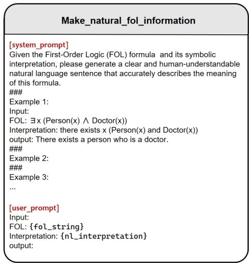  
Figure 11: The prompt of polishing sentence for making FOL-NLD

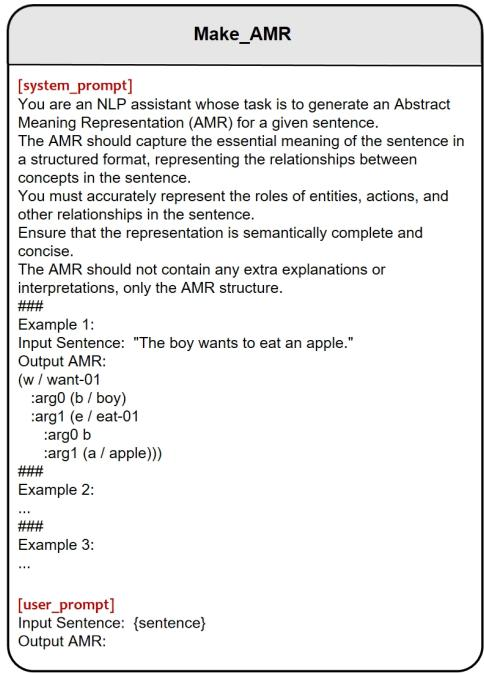  
Figure 12: The prompt of making AMR

WiC The WiC test set consists of 1,400 examples, which is relatively small. Therefore, we combined the 648 examples from the validation set to create a larger test set. Structured representations were generated using the same method as described above.

AGNEWS AGNEWS is another large and comprehensive dataset, with a test set of 7,600 examples, which we used directly. Structured representations were generated using the same method as described above.

PAWS To ensure sufficient comparability in the   
experiments, the original text data and AMR representations   
for PAWS were sourced from Jin et al. (2024). And the FOL and PST representations were generated using the same method as described above.

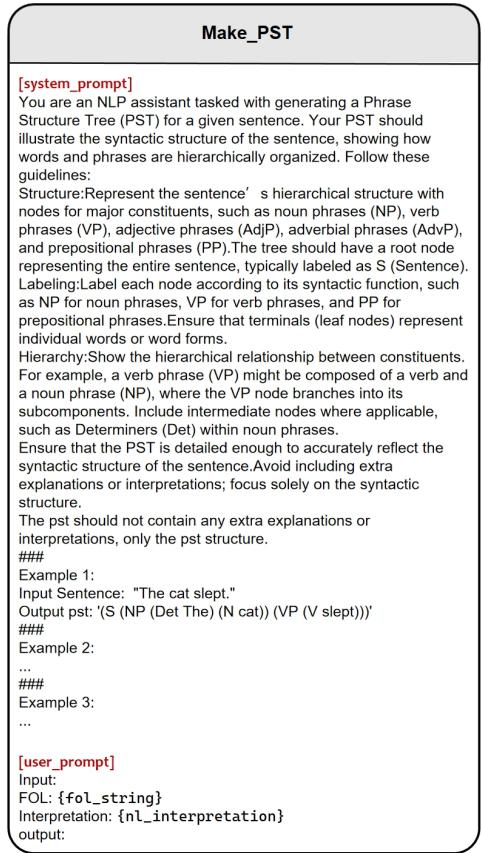  
Figure 13: The prompt of making PST

WMT16, LOGIC, Pubmed45, SPIDER The data collection for these tasks followed the same procedure as PAWS.

## B.2 The Process of Constructing Datasets for All Tasks of SR-LLM (training-dependent)

In this section, I will explain the process of collecting both training and test data for the 10 tasks used in SR-LLM   
(training-dependent), including the original text and three types of structured representations. Data statistics are summarized in the Table 10. PAWS, WMT16, Pubmed45, SNLI, CoNLL2003, SST-2, AGNEWS These datasets   
contain relatively large training sets. Therefore, we randomly   
selected 10,000 examples from each as the training set. The structured representations were generated using

Table 10: Tasks and datasets used in SR-LLM (trainingdependent)
<table><tr><td>Dataset</td><td>Task</td><td>Train Size</td><td>Test Size</td></tr><tr><td>PAWS</td><td>Paraphrase Detection</td><td>10000</td><td>8000</td></tr><tr><td>SNLI</td><td>Recognizing Textual Entailment</td><td>10000</td><td>10000</td></tr><tr><td>WMT16</td><td>Translation</td><td>10000</td><td>5999</td></tr><tr><td>CoNLL2003</td><td>Named Entity Recognition</td><td>10000</td><td>3453</td></tr><tr><td>LOGIC</td><td>Logical Fallacy Detection</td><td>10000</td><td>2449</td></tr><tr><td>SST-2</td><td>Sentiment Analysis</td><td>10000</td><td>872</td></tr><tr><td>Pubmed45</td><td>Event Extraction</td><td>10000</td><td>5000</td></tr><tr><td>WiC</td><td>Lexical Disambiguation</td><td>5066</td><td>1048</td></tr><tr><td>SPIDER</td><td>Text2SQL Code Generation</td><td>7000</td><td>1034</td></tr><tr><td>AGNEWS</td><td>Text Classification</td><td>10000</td><td>7600</td></tr></table>

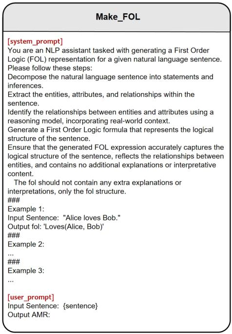  
Figure 14: The prompt of making FOL

GPT-4o-turbo in a few-shot setting, with sample prompts provided in the figure. The test sets are the same as those used in the SR-LLM (training-free) experiments.

LOGIC Since the LOGIC dataset is relatively small, the training-free setup used all the available samples from the test, validation, and training sets combined, yielding a total of

2,449 samples as the test set. We retained these 2,449 samples for the test set in the training-dependent setting as well. To create the training set, we synthetically generated 10,000 logic examples using GPT-4o-turbo. The generation

process is illustrated in the Figure 15, where a few-shot strategy was employed to guide the model to generate   
sentences containing different logical fallacies. The generated   
prompt is shown in Figures 16 and Figures 17. The type of

logical error serves as the label, producing complete data points. Structured representations were generated in the same manner as described above.

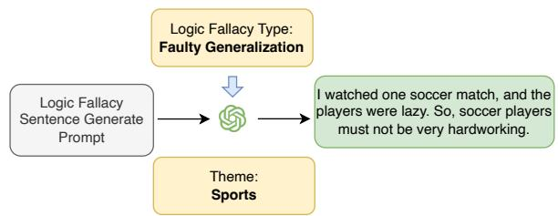

Figure 15: The synthetic process for LOGIC data. Taking the “Faulty Generalization” type as an example, we employed a few-shot strategy to guide the model in generating sentences containing the logical fallacy of “Faulty Generalization” To ensure greater sentence diversity, we incorporated a thematic element during generation, such as “Sports” as shown in the figure. This thematic addition helps produce a broader variety of sentence while maintaining the specific logical error, leading to a richer and more varied dataset.

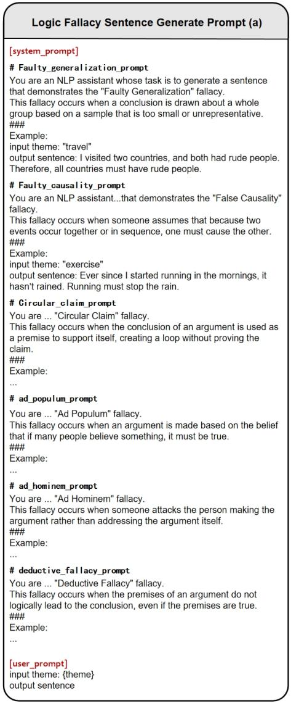  
Figure 16: Logic Fallacy Generate Prompt (a)

SPIDER Since the official SPIDER test set is not publicly available, the training-free setup used a combination of training and validation sets as the test set. However, due to the complexity of generating SPIDER-like data, we used the original 7,000 training examples for the training set in the training-dependent setting and the 1,034 validation examples as the test set. Structured representations were generated as described above.

WiC As the WiC training set is relatively small, we combined the 648 validation examples with the original training set to create a total of 5,066 training samples. Structured representations were generated using the same method as described above.

## C Additional Experiments

## C.1 Comparative Analysis of Different SR Combinations and Their Impact on LLM Reasoning

We conducted an in-depth comparison of the performance of different structured representations (SR) and explored their combinations to assess whether joint usage could further enhance LLM reasoning capabilities. Figure 18 summarizes the average performance improvements across all tasks. The results indicate that the use of individual SRs such as AMR,

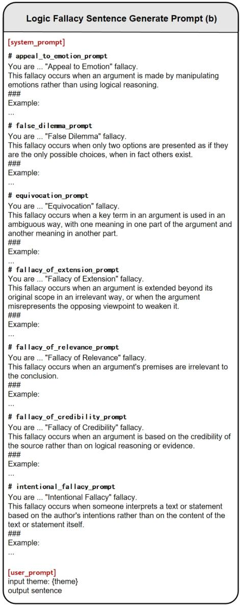  
Figure 17: Logic Fallacy Generate Prompt (b)

PST, and FOL did not lead to significant performance   
enhancements, which is consistent with the findings of (Jin   
et al., 2024). Moreover, when multiple SRs were introduced   
simultaneously, their combined complexity posed additional challenges for the LLMs, further dispersing the model’s   
attention and resulting in poorer performance compared to   
using a single SR. In contrast, when relatively weaker LLMs   
were provided with more comprehensible semantic features   
(AMR) and logical features (FOL), their average performance improved. The integration of these two types of features complemented each other, leading to better overall results. However, the contribution of syntactic features (PST) was   
relatively less effective and, in some cases, even negated the positive effects of semantic and logical features.

## C.2 Optimal Text-to-SR Ratio Analysis

To further investigate the most optimal ratio of between G(text) and G(SR), I selected five tasks, which includes PAWS, LOGIC, Pubmed45, SPIDER, WMT16 for additional

experiments, adjusting the ratio of text to structured representations in the Gen-SR dataset to identify the optimal balance. The experimental results are shown in the Figure 19. As can be observed, the fluctuations in performance with different ratios are relatively small. For both AMR and PST, a

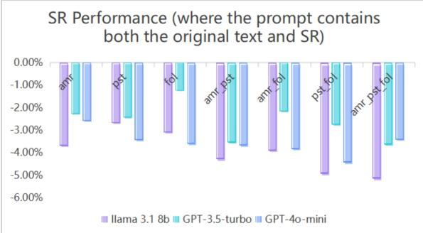

(a) Average performance of SR Performance in different Tasks  
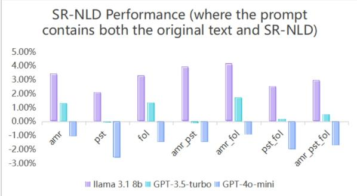  
(b) Average performance of SR-NLD Performance in different Tasks  
Figure 18: Performance comparison of different SR combinations. (a) The average performance enhancement (∆), for various SR combinations across different tasks. (b) The average performance enhancement (∆), for different SR-NLD combinations across various tasks.

50-50 ratio between text and structured representations   
appears to be the most effective. However, for FOL, a 30-70 ratio (whether favoring structured representations) yields   
better results. This is a preliminary exploration, and I believe it represents a promising direction for further research.

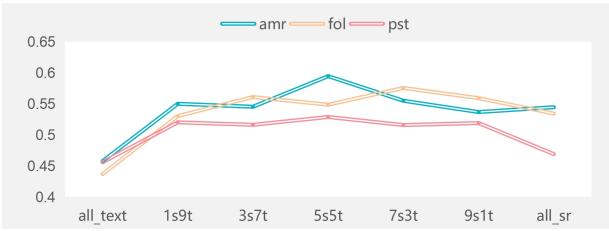  
Figure 19: Comparison of average performance of models at different scales in all tasks.

## C.3 Enhancing LLM’s Understanding of SR during Pretraining.

We further conducted experiments during the pretraining phase with the goal of enhancing LLM’s ability to

comprehend structured representations, aiming for performance improvements in downstream tasks. Specifically, we collected 1GB of task-agnostic SR data, including AMR, PST, and FOL, following a similar procedure as in previous

data collection efforts, and applied this data to the pre-training of the Llama3.1-8B-Instruct model. Building on

this, we further conducted SFT, the same as SR-LLM (training-dependent), on five datasets. The final average

performance results are shown in the Table 11. The experimental results show that, compared to the vanilla model without pre-training, the pre-trained model indeed exhibited performance improvements in downstream tasks, though the improvements were relatively modest, with an average increase of less than 1%. However, after applying SFT on the pre-trained model, its performance was actually inferior to that of the vanilla model trained directly with SFT.

We hypothesize that this phenomenon may be due to the model forming certain inherent understandings of structured representations during the pre-training phase, which hindered its ability to establish effective connections between structure

and tasks during SFT, leading to worse performance compared to the vanilla model. This phenomenon highlights a potential conflict in how the model processes structured information during the pre-training and fine-tuning phases, which warrants further exploration and resolution in future research.

Table 11: The SR enhancement of models with different training strategies. These are the average SR Enhancement results across all tasks under different training strategies. Green indicates the best performance within the same SR, while red represents the worst performance.
<table><tr><td>AMR FOL</td><td>PST</td><td>Pretrain</td><td>SFT</td><td>∆</td></tr><tr><td>√</td><td></td><td></td><td></td><td>-3.51%</td></tr><tr><td>√</td><td></td><td>√</td><td></td><td>0.56%</td></tr><tr><td>√</td><td></td><td>√</td><td>√</td><td>-1.16%</td></tr><tr><td>√</td><td></td><td></td><td>V</td><td>11.59%</td></tr><tr><td>V √</td><td></td><td>√</td><td></td><td>-2.83% 1.30%</td></tr><tr><td>√</td><td></td><td>√</td><td>√</td><td>3.10%</td></tr><tr><td>√</td><td></td><td></td><td>V</td><td>6.45%</td></tr><tr><td></td><td></td><td></td><td></td><td></td></tr><tr><td></td><td>√ √</td><td>√</td><td></td><td>-3.61% -0.18%</td></tr><tr><td></td><td>√</td><td>√</td><td>√</td><td></td></tr><tr><td></td><td>V</td><td></td><td>V</td><td>1.58% 2.91%</td></tr></table>

## D Examples of Gen-SR

We present specific examples of Gen-SR in this section. Figure 20 shows an example of G(text), Figure 21 shows an example of G(AMR), Figure 22 shows an example of G(PST), and Figure 23 shows an example of G(FOL).

## E Prompt of Testing the SR-LLM

We present the complete prompts for our experiments, including both CoT and One-shot examples, using the SNLI dataset as an illustration in Figures 24, Figures 25 and Figures 26.

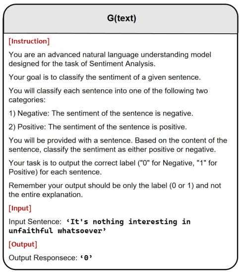  
Figure 20: The Example of G(text)

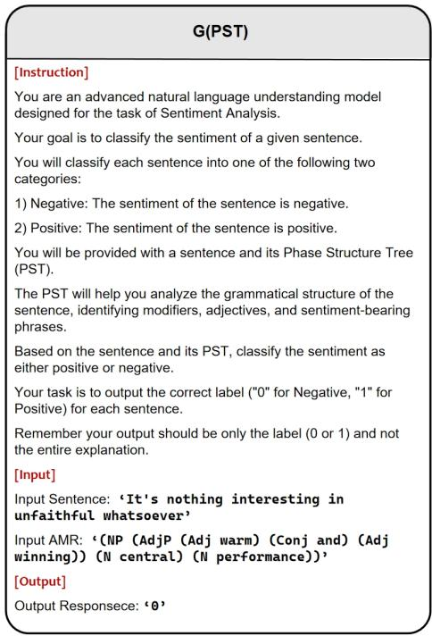  
Figure 22: The Example of G(PST)

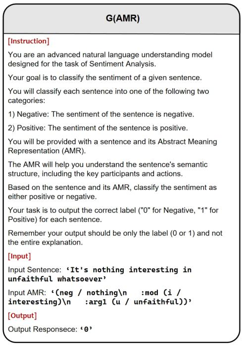  
Figure 21: The Example of G(AMR)

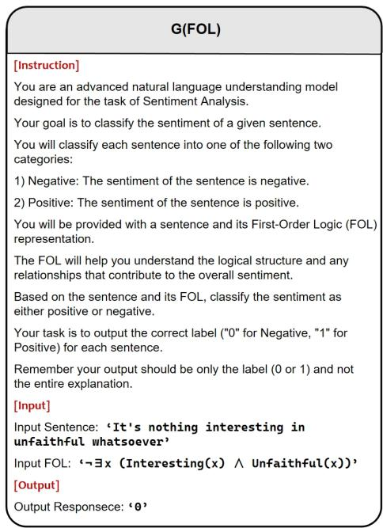  
Figure 23: The Example of G(FOL)

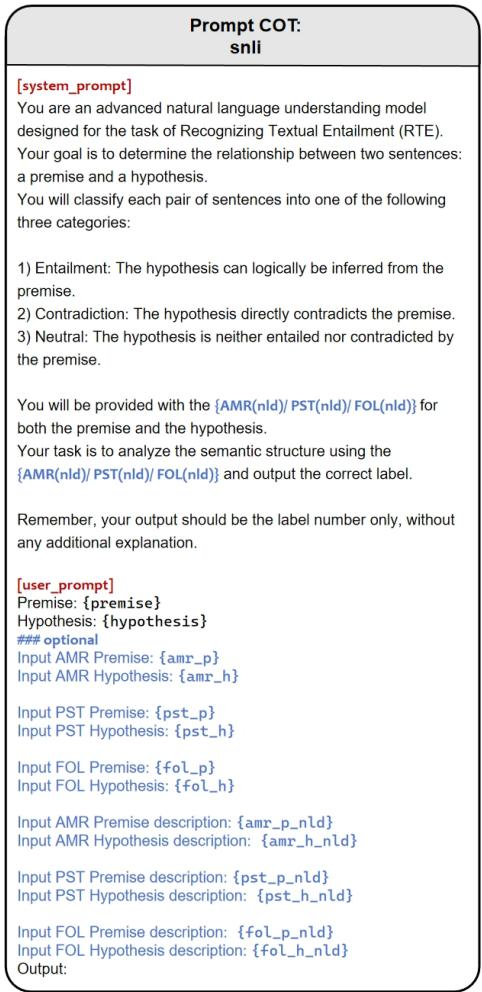  
Figure 24: The COT prompt of SNLI

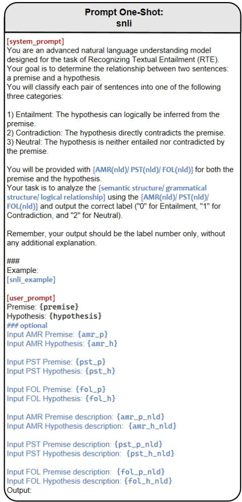  
Figure 25: The One-Shot prompt of SNLI

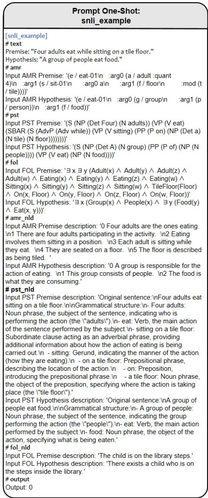  
Figure 26: The One-Shot prompt of SNLI’s example