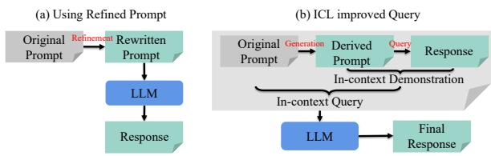
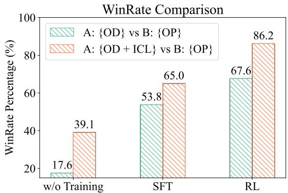

# Self-Instructed Derived Prompt Generation Meets In-Context Learning: Unlocking New Potential of Black-Box LLMs

Zhuo Li\*<sup>1,2,3</sup>\*, Yuhao Du\*<sup>1,2,3</sup>, Jinpeng Hu<sup>4</sup>, Xiang Wan<sup>1,2</sup>, Anningzhe Gao<sup>1,2†</sup>

<sup>1</sup> Shenzhen International Center for Industrial and Applied Mathematics,

<sup>2</sup> Shenzhen Research Institute of Big Data,

<sup>3</sup> The Chinese University of Hong Kong, Shenzhen, <sup>4</sup>Hefei University of Technology,

## Abstract

Improving prompt quality is crucial for enhancing the performance of large language models (LLMs), particularly for Black-Box models like GPT4. Existing prompt refinement methods, while effective, often suffer from semantic inconsistencies between refined and original prompts, and fail to maintain users’ real intent. To address these challenges, we propose a self instructed in-context learning framework that generates reliable derived prompts, keeping semantic consistency with the original prompts. Specifically, our framework incorporates a reinforcement learning mechanism, enabling direct interaction with the response model during prompt generation to better align with human preferences. We then formulate the querying as an in-context learning task, combining responses from LLMs with derived prompts to create a contextual demonstration for the original prompt. This approach effectively enhances alignment, reduces semantic discrepancies, and activates the LLM’s in-context learning ability for generating more beneficial responses. Extensive experiments demonstrate that the proposed method not only generates better derived prompts but also significantly enhances LLMs ability to deliver more effective responses, particularly for Black-Box models like GPT4.

## 1 Introduction

The emergence of Large Language Models (LLMs) has significantly advanced the field of Natural Language Processing (NLP), achieving remarkable results across various tasks (OpenAI et al., 2023; Srivastava et al., 2022; Brown et al., 2020; Touvron et al., 2023; Devlin, 2018; Hu et al., 2023). The success of these models is highly dependent on the quality of the input prompts, as ambiguous or insecure prompts can lead to low-quality and unreliable responses (Zhou et al., 2022; Zamfirescu-Pereira et al., 2023; Liu et al., 2023; Du et al., 2025b). Additionally, the high training costs associated with the large parameter sizes of these LLMs make it challenging to fine-tune for alignment when handling downstream tasks. In particular, for Black-Box LLMs, training is impossible. Therefore, utilizing better prompts to guide the models in generating the desired outputs has been an effective and promising approach in applying LLMs to various tasks.

To this end, several approaches are proposed to find the optimal prompts that can generally promote LLMs across various tasks. A popular approach is to refine the prompts with manually designed templates (Tam et al., 2021; Reynolds and McDonell, 2021), which, however, is limited in specific scenarios, resulting in a high manual workload and constrained usability (Webson and Pavlick, 2021). Therefore, some automated methods are proposed to rewrite prompts, which usually leverage the powerful capabilities of LLMs by directly asking the model to refine the prompts (Zhou et al., 2022; Fernando et al., 2023; Madaan et al., 2023), or by training a dedicated prompt refinement model to enhance prompt quality (Cheng et al., 2023; Deng et al., 2022; Kong et al., 2024; Zheng et al., 2024b). While effective, several challenges may limit their practical use on downstream tasks. For example, previous methods often require a labor-extensive data collection or complex template design, and the lack of interaction with the queried model (e.g., response model) that is used in downstream tasks during rewritten can result in prompts not fully compatible with it. Moreover, the prompt rewriting process may introduce several semantic inconsistencies between the refined and original prompts, potentially leading to less effective responses, as shown in Tab. 1. Given these considerations, we raise the following question:

Is there a more effective way to prompt the response model (e.g., Black-Box GPT4) than solely

Table 1: Failed refined prompt cases. Case 1 is from directly asking Llama3-8B-Instruct (Touvron et al., 2023) for a prompt refinement. Both Case 2 and Case 3 are from BPO (Cheng et al., 2023). Justification provides an analysis from GPT4 on how the refined prompts fail to serve as an effective evolution compared with the original ones.
<table><tr><td rowspan=2 colspan=1>Case 1</td><td rowspan=1 colspan=1>Original PromptRefined Prompt</td><td rowspan=1 colspan=1>Human knowledge is a collection of definitions and observations. What is your opinion about this proposition ?What is the foundation of human knowledge and how do we acquire and organize it?</td></tr><tr><td rowspan=1 colspan=1>Justification</td><td rowspan=1 colspan=1>The refined prompt diverges significantly from the original prompt by altering the focus and depth of inquiry.</td></tr><tr><td rowspan=1 colspan=1>Case 2</td><td rowspan=1 colspan=1>Original PromptRefined Prompt</td><td rowspan=1 colspan=1>Describe the health benefits of green tea.Discuss the antioxidant properties of green tea and its role in preventing cancer.</td></tr><tr><td rowspan=1 colspan=1></td><td rowspan=1 colspan=1>Justification</td><td rowspan=1 colspan=1>The refined prompt loses context. The original prompt asks about the health benefits of green tea in general,while the refined one focuses only on its antioxidant properties and role in cancer prevention, ignoring other benefits.</td></tr><tr><td rowspan=2 colspan=1>Case 3</td><td rowspan=1 colspan=1>Original PromptRefined Prompt</td><td rowspan=1 colspan=1>Generate a product idea for a mobile application.Generate a product idea for a mobile application that helps users meet dietary goals through personalized nutrition and meal planning.</td></tr><tr><td rowspan=1 colspan=1>Justification</td><td rowspan=1 colspan=1>The refined prompt overly narrows the focus compared to the original prompt. It limits the potential product ideas to only those relatedto a specific topic, neglecting other innovative possibilities within the mobile application space.</td></tr></table>

## generating a refined prompt?

Building on the successes of in-context learning (ICL) in enhancing LLM performance through additional relevant demonstrations (Dong et al., 2022), we introduce a novel framework to stimulate LLMs into generating more helpful and reliable responses by automatically constructing an informative in-context environment for the original prompt. Specifically, we develop a derived prompt generation model that will be optimized through a selfinstructed reinforcement learning (RL) objective. By integrating the response model into the RL training process, our approach avoids extensive training data collection and ensures a closer alignment between the derived prompt and the response model. Crucially, instead of replacing the original prompt, we utilize the derived prompt-response pair as a semantically relevant ICL demonstration (Liu et al., 2021), thereby preserving the original prompt’s intent while leveraging the benefits of ICL and effectively stimulating the LLM’s inherent knowledge to produce higher-quality responses. Extensive experiments across various downstream datasets demonstrate significant improvements in response quality compared to existing prompt refinement methods, including enhancements in Black-Box models such as GPT4. Our approach presents a promising and interpretable paradigm for aligning LLMs without modifications, offering the following advantages:

• A novel framework for aligning LLMs with human preferences based on prompt improvement, applicable to Black-Box LLMs like GPT4.

• A data collection-free way for prompt refinement via a self-instructed RL objective.

• Automatic construction of informative ICL environments through high-quality demonstrations.

• Significant enhancements in response quality across various downstream datasets.

## 2 Background

SFT. Supervised Fine-Tuning (SFT) with annotated text descriptions is widely used to adapt LLMs into downstream tasks. Given promptresponse pairs (x, y) sampled from a distribution $\mathcal { D } ,$ , SFT objective function is defined as:

$$
\mathcal { L } _ { \mathrm { S F T } } = - \mathbb { E } _ { ( x , y ) \sim \mathcal { D } } \left[ \sum _ { i } \log \pi _ { \mathrm { S F T } } ( y _ { i } | x , y _ { < i } ) \right] ,\tag{1}
$$

where π indicates a LLM policy and $y _ { < i }$ refers to all tokens before the i th token in response $y .$ In prompt rewritten task, x and y usually indicate original and refined prompt, respectively. For example, Cheng et al. (2023) and Zheng et al. (2024b) collect various (x, y) pairs generated from GPT4 and design a prompt refinement system by minimizing Eq. 1.

RLHF. Reinforcement Learning from Human Feedback (RLHF) is another effective tuning method for improving the alignment of LLMs with human preferences, which typically involves two steps: reward modeling and RL training. In reward modeling, a reward model is designed to measure response quality to an input prompt: $\begin{array} { r l r } { { \mathcal L } _ { \mathrm { R e w a r d } } } & { { } = } & { - \mathbb { E } _ { ( x , y _ { c } , y _ { r } ) \sim { \mathcal D } } [ \log ( \sigma ( { \mathcal R } ( x , y _ { c } ) } & { - } \end{array}$ $\mathcal { R } ( x , y _ { r } ) ) ) ]$ , where $y _ { c }$ and $y _ { r }$ indicate good and bad response, respectively. $\sigma$ is the sigmoid function. Generally, RL training uses the PPO algorithm (Schulman et al., 2017) with an additional Kullback–Leibler (KL) regularization as below:

$$
\begin{array} { r } { \mathcal { L } _ { \mathrm { R L H F } } = \mathbb { E } _ { ( x \sim \mathcal { D } , y \sim \pi _ { \theta } ( y | x ) ) } \bigg [ \mathcal { R } ( x , y ) - \beta \log \frac { \pi _ { \theta } \left( y | x \right) } { \pi _ { \mathrm { S F T } } \left( y | x \right) } \bigg ] , } \end{array}\tag{2}
$$

where $\beta > 0$ is a hyper-parameter that controls the influence of the KL penalty. Training a prompt rewritten model using Eq. 2 is still impractical because it requires collecting a dataset of original prompts and refinements, for obtaining a basic rewriter π<sub>SFT</sub> and a specific reward model which can evaluate the quality of refined prompt.

  
Figure 1: (a) Previous methods directly replace the original prompt with the refined one, potentially risking semantic inconsistencies and ineffective responses. (b) Our method uses a derived prompt to create an incontext demonstration, ensuring high-quality responses while maintaining the integrity of the original prompt.

## 3 Motivation

As shown in Fig. 1(a), previous methods that directly replace the original prompt with a refined prompt to query LLMs often overlook valuable information contained in the original prompt, leading to ineffective responses due to essential semantic inconsistencies between the original and rewritten prompts. Fig. 1(b) gives a illustration to our method, which addresses this issue by generating a derived prompt that is used to query the response model. The derived prompt-response pair is then employed to construct a semantically similar, highquality demonstration for the original prompt. This in-context query process promotes the model’s ICL capabilities more effectively, ensuring more useful responses while consistently querying the original prompt, thereby avoiding ineffective results.

## 4 Methodology

## 4.1 Task Formulation

We begin with the definition of a derived prompt and its generation process. A derived prompt $x ^ { \prime }$ is a transformation of the original prompt x that maintains close relevance and shows improved expression, without necessarily being a rewritten or refined prompt. Our goal is to train an effective generation model π that is initialized by a LLM and can reliably produce a derived prompt $x ^ { \prime } \sim \pi ( x ^ { \prime } | x )$ given an original prompt x. Consequently, a higherquality response $y ^ { \prime }$ can be generated by query a response model , serving as more effective reply for x, due to their similar semantics. Generally, π can be a frozen Black-Box model (e.g., GPT4) or a learnable model. In this research, we focus on optimizing a trainable model π parameterized by $\boldsymbol { \theta } \in \mathbb { R } ^ { d }$ , with the goal of $x ^ { \prime }$ to be more semantically derived to x and better aligned with .

Algorithm 1: Self-instructed RL for de  
rived prompt generation model training.   
Input :Training Dataset , DPG instruction x<sub>DPG</sub>, a   
LLM initialized π, frozen response model   
and reward model .   
Output :Derived Prompt Generation Model $\pi \theta \cdot$   
1 Initialize π π;   
2 Initialize $\pi _ { \mathrm { r e f } }  \pi ;$   
3 for Random Sample a x in do   
4 Obtain X = Concat([x<sub>DPG</sub>, x]);   
5 Prompt π<sub>θ</sub> to obtain derived prompt   
$x ^ { \prime } \sim \pi _ { \theta } ( x ^ { \prime } | X ) ;$   
6 Prompt to generate response $y ^ { \prime } \sim \mathcal { M } ( y ^ { \prime } | x ^ { \prime } ) $   
7 Compute reward value by $\mathcal { R } ( x ^ { \prime } , y ^ { \prime } ) ;$   
8 Compute KL penalty by $\beta \log { \frac { \pi _ { \theta } ( x ^ { \prime } | X ) } { \pi _ { \mathrm { r e f } } ( x ^ { \prime } | X ) } }$   
9 Update derived prompt generation model π<sub>θ</sub> by   
maximizing $\begin{array} { r } { \mathcal { R } ( x ^ { \prime } , y ^ { \prime } ) - \beta \log \frac { \pi _ { \theta } ( x ^ { \prime } | X ) } { \pi _ { \mathrm { r e f } } ( x ^ { \prime } | X ) } ; } \end{array}$   
10 end

## 4.2 Self-instructed RL for Derived Prompt Generation Model

As mentioned in Sec. 2, directly using Eq. 1 and 2 to optimize a derived prompt generation model $\pi _ { \theta }$ typically introduces onerous data collection and lacks of alignment between derived prompts and response model, leading to suboptimal compatibility with downstream tasks. To address these issues, we propose a self-instructed RL objective for effective refinement model training.

Let $D = \{ x _ { i } \} _ { i = 1 } ^ { N }$ denote a training data set of length N, which only includes original prompts. Assume that we have a reliable reward model , which measures the response quality of the response model  when using the derived prompt $x ^ { \prime }$ . Instead of utilizing pre-collected $x ^ { \prime }$ to optimize the model $\pi _ { \theta }$ in an offline mode, we aim to leverage the reward for  response to $x ^ { \prime }$ to direct the optimization, which can further generate desirable $x ^ { \prime }$ that is better aligned with (We freeze during $\pi _ { \theta }$ <sup>training</sup> <sup>since</sup> <sup>the</sup> <sup>parameters</sup> <sup>of</sup> M <sup>may</sup> <sup>be</sup> inaccessible). To this end, we design to maximize the following objective:

$$
\begin{array} { r l } & { \mathbb { E } _ { \underset { x ^ { \prime } \sim \pi _ { \theta } ( x ^ { \prime } | x ) } { x \sim \mathcal { D } } } \bigg [ \mathcal { R } ( x ^ { \prime } , y ^ { \prime } ) - \beta \log \frac { \pi _ { \theta } ( x ^ { \prime } | x ) } { \pi _ { \mathrm { r e f } } ( x ^ { \prime } | x ) } \bigg ] , } \\ & { y ^ { \prime } { \sim } \mathcal { M } ( y ^ { \prime } | x ^ { \prime } ) } \end{array}\tag{3}
$$

where $x ^ { \prime } \sim \pi _ { \theta } ( x ^ { \prime } | x ) , y ^ { \prime } \sim \mathcal { M } ( y ^ { \prime } | x ^ { \prime } )$ and $\pi _ { \mathrm { r e f } }$ is the reference model identically initialized by π and $\beta$ is a hyper-parameter for stable model training.

It is important to note that Eq. 3 relies on the $\pi _ { \theta }$ model having a basic derived prompt generation capability. Given an original prompt x, π<sub>θ</sub> can directly rewrite it instead of performing the task in x (e.g., answering the question posed by x). Therefore, previous methods (Kong et al., 2024; Huang et al., 2024) necessitate an SFT stage to transform the pre-trained $\pi$ into a prompt rewriter π<sub>SFT</sub>, which initializes both $\pi _ { \theta }$ and $\pi _ { \mathrm { r e f } } .$ demanding extensive data collection of $( x , x ^ { \prime } )$ pairs.

Note that a well pre-trained LLM $\pi _ { \theta }$ should inherently possess basic capabilities of instructionfollowing (Ouyang et al., 2022) and paraphrasing. Therefore, we propose to use a derived prompt generation (DPG) instruction x<sub>DPG</sub> to overcome the necessity of SFT. Specifically, we manually design a x<sub>DPG</sub> as shown below:

```markdown
### Instruction: Please provide a more
comprehensive, easily understandable, and
answerable version ofthefollowing
question. Ensure that necessary contextual
information is added during the rewrite,
but do not limit the understanding and
response to the question. Avoid confining
the question to just a few aspects, allowing
the responder to thinkfrom multiple angles.
Only return the refined question and do not
explain. Here is my original question:".
### Question: {Original Prompt x}.
```

As expected, $\pi _ { \theta }$ should generate a reasonable derived prompt $x ^ { \prime }$ based its instruction-following capability:

$$
\begin{array} { r l } & { X = \mathbf { C o n c a t } ( [ x _ { \mathrm { D P G } } , x ] ) , } \\ & { x ^ { \prime } \sim \pi _ { \theta } ( X ) . } \end{array}\tag{4}
$$

With the help of x<sub>DPG</sub>, our method can effectively eliminate the need for data collection and additional training costs introduced by SFT. Additionally, by strategically leveraging the  into the training process of $\pi _ { \theta }$ , the generated derived prompts will be more in line with the preferences of the response model. Our final training objective is shown below:

$$
\begin{array} { r l } & { \mathbb { E } _ { \underset { x ^ { \prime } \sim \pi _ { \theta } ( x ^ { \prime } | x ) } { x \sim \mathcal { N } } } \left[ \mathcal { R } ( x ^ { \prime } , y ^ { \prime } ) - \beta \log \frac { \pi _ { \theta } ( x ^ { \prime } | x ) } { \pi _ { \mathrm { r e f } } ( x ^ { \prime } | x ) } \right] . } \\ & { y ^ { \prime } { \sim } \mathcal { M } ( y ^ { \prime } | x ^ { \prime } ) } \end{array}\tag{5}
$$

We summarize the training process in $\mathrm { A l g . 1 }$

Algorithm 2: Intent-consistency oriented   
in-context query framework for inference.   
Input :Inference prompt x, DPG instruction x<sub>DPG</sub>,   
derived prompt generation model π and a   
LLM to be quried.   
Output :Final response to user.   
1 Obtain $X = \mathrm { C o n i c a t } ( [ x _ { \mathrm { D P G } } , x ] ) ;$   
2 Generate refined prompt $x ^ { \prime } \sim \pi ( x ^ { \prime } | X )$   
3 Prompt LLM to obtain response $y ^ { \prime } \sim \mathrm { L L M } ( y ^ { \prime } | x ^ { \prime } ) ;$   
4 Fulfill the in-context query template with $( x , x ^ { \prime } , y ^ { \prime } ) ;$   
5 Query LLM and obtain final response;

## 4.3 Intent-Consistency Oriented In-context Query Framework for Inference

Although the derived prompt generation model optimized by Eq. 5 can produce higher-quality, semantically rich, and more compatible $x ^ { \prime }$ with the response model , there still remains a risk of semantic inconsistency and intent shift due to the uncontrollability of the generation process. Consequently, directly replacing the original prompt with the derived prompt would not be the optimal solution to make full use of it, even for our method.

To address the mentioned issue and better activate the LLM’s inherent knowledge, we propose a general in-context query framework to mitigate potential semantic discrepancy, where we leverage high-quality, relevant in-context demonstrations derived from the original prompt. Therefore, this approaches can effectively enhance LLM ability to better respond to the user’s original query. As shown in Alg. 2, we construct an intent-consistent in-context query by filling the following template using $( x , x ^ { \prime } , y ^ { \prime } )$ , where $x , x ^ { \prime } , y ^ { \prime }$ indicates the original prompt, its corresponding derived prompt and the LLM response to the derived prompt, respectively. This in-context query requires the better LLM respond to the original question x by emulating the quality, style, and level of detail of the response $y ^ { \prime }$ given to $x ^ { \prime } { \mathrm { i } }$

```markdown
### Question: {Derived Prompt x′}.
### Response: {Response y′}.
Given the above Question and Response as an
example, emulate the way it responds to the question
to reply to the following question:
### Question: {Original Prompt x}.
```

This in-context query framework ensures that the final response aligns more closely with the original intent included in $x ,$ while maintaining the enhanced response characteristics corresponding to the derived prompt. Therefore, it mitigates potential discrepancies between the refined prompt and the original prompt, leading to responses that are more helpful, reliable, and consistent with user expectations.

## 5 Experiments

In this section, we conduct extensive experiments on various downstream datasets to comprehensively evaluate our method when compared with baseline methods. Ablation studies demonstrate the superior and necessity of our proposed selfinstructed RL method for derived prompt generation, and also shows that ICL can serve as a flexible play-and-plug module to generally boosting existing methods to achieve better performance. We also conduct human evaluations and efficiency analysis. Detailed training settings are in Appendix B and we conduct experiment for two runs.

## 5.1 Experimental Setup

Datasets. To train a derived prompt generation model by Eq. 5, we utilize the BPO training dataset by following previous work (Huang et al., 2024; Cheng et al., 2023), which is constructed from four meticulously selected datasets and comprises 14K diverse samples. In order to comprehensively evaluate the performance of our method, we adopt wide-used instruction datasets for assessment, including Dolly Eval (Conover et al., 2023), Vicuna Eval (Chiang et al., 2023), Self-Instruct Eval (Wang et al., 2022) and BPO test Eval (Cheng et al., 2023). We provide detailed description in Appendix B.

Derived Prompt Generation Model. We particularly focus training an effective π<sub>θ</sub> based on the popular LLMs such as LLaMA (Touvron et al., 2023) and Qwen (Yang et al., 2024a). Specifically, considering that our method relies on an instructionfollowing capability for derived prompt generation, we apply our method to Llama2-chat (Touvron et al., 2023), Llama3-8B-Instruct (Touvron et al., 2023) and Qwen2-7B-Instruct (Yang et al., 2024a), which are all abbreviated as Llama3, Llama2 and Qwen2, respectively.

Reward Model . Recall that we employ a RL objective to optimize $\pi _ { \theta }$ by maximizing Eq. 5. To effectively evaluate the quality of generated pairs $( x ^ { \prime } , y ^ { \prime } )$ , we employ a popular and SOTA reward model<sup>1</sup> trained on hh-rlhf helpful dataset (Bai et al., 2022a) and proven effective in various works by matching other larger reward models.

Queried Model . A queried model is an frozen model used to generate responses to various prompt inputs and in the training process of the derived prompt generation model, we require an that generates a response $y ^ { \prime }$ to the derived prompt $x ^ { \prime }$ to maximize Eq. 5. Here, we experimentally employ both Black-box LLMs like GPT3.5- turbo (GPT3.5) and GPT4o (GPT4), and white-box LLMs like Llama2-7B-chat (Llama2-7B), Llama3- 8B-Instruct (Llama3-8B) and Qwen2-7B-Instruct (Qwen2-7B).

Baselines and Evaluation Metrics. To demonstrate the effectiveness of our approach in helping LLMs generate more effective responses within the scope of being adaptable to Black-box LLMs, we conduct a comprehensive comparison with existing SOTA prompt refinement methods: BPO (Cheng et al., 2023), PAS (Zheng et al., 2024b), and Self-Refine (Madaan et al., 2023). We provide a detailed introduction to baselines in App. B.2. Following common practices of serving LLM as a judge (Zheng et al., 2024a; Wang et al., 2023), we utilize GPT4 for assessment, using prompts from the MT-bench (Zheng et al., 2024a). To ensure fairness and mitigate position bias, we implement random shuffling in each evaluation round. We also report Win Rate (WR), which is computed by (A Win  B Win)%.

## 5.2 Main Results

We use the name of method to denote the responses obtained by the LLM from the correspond method. For example, OP indicates that of Original Prompt, where BPO, PA, SR and OD indicates that of BPO, PAS, Self-Refine and Our Derived prompt, respectively. ICL represents the ICL formulation. OURS indicates OD + ICL. As shown in Tab. 2, our method shows an overall performance improvement than baseline methods across various settings, highlighting the following advantages:

Generalizability Across Datasets: Our method demonstrates excellent performance across all four evaluation datasets compared to baselines. The ICL queries generated by our method effectively promote the LLM to produce higher-quality and more comprehensive responses to the original questions, showcasing its robustness in handling various tasks, whether complex or simple.

Table 2: A comprehensive comparison of OURS method, BPO PAS, SR (Self-Refine) and OP (Orginal Prompt) for different π<sub>θ</sub> across four evaluation datasets. Query Model indicates the LLM used to response to the input prompt.
<table><tr><td rowspan="2">πθ</td><td rowspan="2">Query Model</td><td colspan="2">Method</td><td colspan="3">Vicuna Eval</td><td colspan="3">BPO-test Eval</td><td colspan="3">Dolley Eval</td><td colspan="3">Self-Instruct Eval</td></tr><tr><td>A</td><td>B</td><td>A Win</td><td>B Win</td><td>Tie</td><td>A Win</td><td>B Win</td><td>Tie</td><td>A Win</td><td>B Win</td><td>Tie</td><td>A Win</td><td>B Win</td><td>Tie</td></tr><tr><td rowspan="6">Llama3</td><td>GPT4</td><td>OURS</td><td>OP BPO</td><td>90.0 88.8</td><td>3.8 7.5</td><td>6.2 3.7</td><td>71.0 74.0</td><td>24.5 25.5</td><td>4.5 7.5</td><td>80.5 71.0</td><td>15.5 27.0</td><td>4.0 2.0</td><td>76.2 71.4</td><td>5.6 21.0</td><td>18.3 7.6</td></tr><tr><td>GPT3.5</td><td>OURS</td><td>OP BPO</td><td>93.8 85.0</td><td>2.5 11.3</td><td>3.7 3.7</td><td>77.5 71.0</td><td>19.5 14.5</td><td>3.0 4.5</td><td>79.5 77.0</td><td>6.0 20.0</td><td>4.5 3.0</td><td>84.5 86.1</td><td>9.9 9.9</td><td>5.6 4.0</td></tr><tr><td rowspan="2">Llama3-8B</td><td rowspan="2">OURS</td><td rowspan="2">OP BPO</td><td>82.5</td><td>15.0</td><td>2.5</td><td>65.5</td><td>30.0 34.0</td><td>4.5</td><td>59.0</td><td>34.0</td><td>7.0</td><td>78.9</td><td>15.1</td><td>6.0</td></tr><tr><td>81.3</td><td>35.0</td><td>1.2</td><td>63.0</td><td></td><td>3.0</td><td>51.0</td><td>47.0</td><td>2.0</td><td>75.8</td><td>22.2</td><td>2.0</td></tr><tr><td rowspan="2"></td><td rowspan="2">OP</td><td rowspan="2">SR</td><td>96.2</td><td>2.5</td><td>1.3</td><td>68.0</td><td>28.5</td><td>3.5</td><td>79.0</td><td>17.0</td><td>4.0</td><td>88.1</td><td>10.7</td><td>1.2</td></tr><tr><td>82.5</td><td>15.0</td><td>2.5</td><td>76.0</td><td>21.5</td><td>2.5</td><td>69.5</td><td>28.5</td><td>2.0</td><td>78.1</td><td></td><td>4.4</td></tr><tr><td rowspan="3"></td><td rowspan="2">Llama2-7B</td><td rowspan="2">OURS OURS</td><td>BPO</td><td>81.3</td><td>17.5</td><td>1.2</td><td>68.0</td><td>28.5</td><td>2.5</td><td>67.5</td><td>28.5</td><td>4.0</td><td>73.4</td><td>17.5 24.6</td><td>2.0</td></tr><tr><td>OP 91.3</td><td>5.0</td><td></td><td>3.7</td><td>85.0 10.5</td><td>4.5</td><td></td><td>82.5</td><td>13.0</td><td>4.5</td><td>90.8</td><td>9.2</td><td>0</td></tr><tr><td rowspan="2">Qwen2-7B</td><td rowspan="2"></td><td rowspan="2">BPO OP</td><td>92.5</td><td>7.5</td><td>0.0</td><td>81.5</td><td>13.5</td><td>5.0</td><td>82.5</td><td>16.0</td><td>1.5</td><td>81.0</td><td>17.8</td><td>1.2</td></tr><tr><td>85.0</td><td>12.5</td><td>2.5</td><td>67.5</td><td>28.0</td><td>4.5</td><td>61.5</td><td>35.0</td><td>3.5</td><td>77.0</td><td>13.9</td><td>9.1</td></tr><tr><td rowspan="6">Llama2</td><td rowspan="2">Llama3-8B</td><td rowspan="2">OURS</td><td>BPO PAS</td><td>78.8</td><td>21.2</td><td>0.0</td><td>66.0</td><td>30.0</td><td>4.0</td><td>53.0</td><td>40.5</td><td>1.5</td><td>73.8</td><td>21.4</td><td>4.8</td></tr><tr><td>63.8</td><td>20.0</td><td></td><td>16.2</td><td>55.0 44.0</td><td>6.0</td><td></td><td>64.5</td><td>27.0</td><td>8.5</td><td>66.3</td><td>27.4</td><td>6.3</td></tr><tr><td rowspan="3">Llama2-7B OURS</td><td rowspan="3">OP</td><td></td><td>86.3</td><td>12.5</td><td>1.2</td><td>74.5</td><td>22.0</td><td>3.5</td><td></td><td>23.0</td><td>2.5</td><td>84.1</td><td></td><td>2.9</td></tr><tr><td>BPO</td><td>85.0</td><td>10.0</td><td>5.0</td><td>66.0</td><td>29.5</td><td>4.5</td><td>74.5 67.5</td><td>32.0</td><td>0.5</td><td>72.2</td><td>13.0 25.9</td><td>9.9</td></tr><tr><td>PAS</td><td>70.0</td><td>30.0</td><td>0.0</td><td>67.0 26.5</td><td>6.5</td><td>79.0</td><td></td><td>16.5</td><td>4.5</td><td>71.0</td><td>22.2 6.8</td></tr><tr><td rowspan="3">Qwen2-7B</td><td rowspan="3"></td><td>SR</td><td>75.5</td><td>14.0</td><td>10.5</td><td>82.0</td><td>13.5</td><td>4.5</td><td>83.0</td><td>13.0</td><td>4.0</td><td>91.7</td><td>6.7</td><td>1.6</td></tr><tr><td>OP</td><td>91.3</td><td>8.7</td><td>0</td><td>83.0</td><td>13.0</td><td>4.0</td><td>85.0</td><td>11.0</td><td>4.0</td><td>92.1</td><td>7.5</td><td>0.4</td></tr><tr><td>OURS BPO PAS</td><td>85.0 81.2</td><td>15.0</td><td>3.0</td><td>79.0</td><td>17.5 42.5</td><td>3.5</td><td>78.5</td><td>20.5</td><td>1.0</td><td>84.5</td><td>14.7</td><td>0.8</td></tr><tr><td rowspan="5">Qwen2</td><td rowspan="2">Llama3-8B</td><td></td><td>OP</td><td></td><td>16.3</td><td>2.5</td><td>54.0</td><td>3.5</td><td></td><td>69.0</td><td>25.5</td><td>5.5</td><td>78.9</td><td>20.0</td><td>1.1</td></tr><tr><td>OURS</td><td>BPO</td><td>81.3 78.8</td><td>17.5 21.2</td><td>1.2 0.0</td><td>74.5 69.5</td><td>23.0 26.0</td><td>2.5 4.5</td><td>59.5 54.5</td><td>36.5 42.5</td><td>4.0 3.0</td><td>77.8 69.8</td><td>12.7 27.8</td><td>9.5 2.4</td></tr><tr><td rowspan="2">Llama2-7B</td><td rowspan="2">OURS</td><td>OP</td><td>92.5</td><td>7.5</td><td>0.0</td><td>74.0</td><td>23.5</td><td>2.5</td><td>71.0</td><td>23.0</td><td>6.0</td><td>84.1</td><td>11.1</td><td>4.8</td></tr><tr><td>BPO</td><td>78.8</td><td>21.2</td><td>0.0</td><td>67.0</td><td>29.5</td><td>3.5</td><td>73.0</td><td>23.5</td><td>3.5</td><td>77.4</td><td>21.0</td><td>1.6</td></tr><tr><td rowspan="2">Qwen2-7B</td><td rowspan="2"></td><td>OP</td><td>96.3</td><td>2.5</td><td>1.2</td><td>86.5</td><td>8.0</td><td>5.5</td><td>82.0</td><td>13.0</td><td>5.0</td><td>84.5</td><td>14.7</td><td>0.8</td></tr><tr><td>OURS BPO SR</td><td>95.0 97.5</td><td>3.8 1.3</td></table>

Consistency Across Models: Our method shows consistent performance improvement between different families of models. For example, based on the Llama2 model as π<sub>θ</sub>, the average WRs of our method on Llama3, Llama2 and Qwen2 for BPO are 39.63%, 48.3% and 64.3%, while those for more powerful method PAS are 32.8%, 47.9% and 44.7% respectively. These consistent higher results demonstrate that our method maintains high performance and robustness across a variety of underlying models, ensuring reliable results independent to models.

Cross-Model Transferability: Tab. 2 also shows that the π trained on Llama3 and constructed ICL queries can achieve better response quality on other models (e.g., Llama2 and Qwen2). For example, the model trained on Llama2 based on Dolley Eval has a WR of 26.5% on Llama3 and 74.0% on Qwen2 compared with OD, and that are 12.5% and 58.0% compared with BPO. This suggests that our method has good cross-model transferability and can maintain high performance across different models.

Improved Black-Box Model Performance: Our method significantly improved the response quality of GPT4 and GPT3.5. For instance, when training on Llama3, the average WRs of OURS on GPT4 compared with OP and BPO are 67.1% and 56.1%, respectively. And thoese on GPT3.5 are 74.3% and 69.9%, respectively. The significant improvement indicates that our method effectively promote Black-Box LLM generate high-quality response. Similarly, in other datasets, the WRs of our method on GPT series models are also significantly higher than those of SOTA methods.

## 5.3 Ablation Study

To further illustrate the advantages of our proposed self-instructed RL (OD) and the importance of the ICL environment (ICL), we use our derived prompts generated by Llama3-8B to query GPT4, where the generated response are then evaluated by GPT4. We compare various combinations of OD and ICL with other methods on two evaluation datasets: Vicuna Eval and Self-Instruct.

Table 3: Analysis on our self-instruct RL objective.
<table><tr><td rowspan="2">Method A</td><td rowspan="2">B</td><td colspan="3">Vicuna Eval</td><td colspan="3">Self-Instruct</td></tr><tr><td>A Win</td><td>1 B Win</td><td>Tie</td><td>A Win B Win</td><td></td><td>Tie</td></tr><tr><td>OD</td><td>OP</td><td>78.8</td><td>11.2</td><td>10.0</td><td>66.3</td><td>15.5</td><td>18.2</td></tr><tr><td>OD</td><td>BPO</td><td>72.5</td><td>21.3</td><td>6.2</td><td>42.1</td><td>8.7</td><td>49.2</td></tr><tr><td>OD</td><td>PAS</td><td>57.2</td><td>27.4</td><td>15.4</td><td>45.1</td><td>27.2</td><td>27.7</td></tr></table>

Is our RL objective effective in performance improvement? Tab. 3 demonstrates that, from the perspective of prompt refinement, our OD already exhibits higher quality than BPO and PAS, thereby promoting LLMs to generate more helpful responses. When compared with BPO, the WR of OD is 51.2% in Vicuna Eval and 33.4% in Self-Instruct, which is 29.8% and 17.9% on PAS. These results consistently suggest that even without ICL, our OD has already been more effective in better promote LLMs and thus obtaining more helpful responses, emphasizing the robustness and effectiveness of our proposed RL objective.

Can our proposed ICL formulation boost other methods? Tab. 4 shows that our proposed automatic construction of ICL can significantly boost BPO and PAS by achieving an increased WRs in Vicuna Eval and Self-Instruct, compared with OP or themselves. For example, when equipped with ICL, BPO obtains 7.15% average WR gain than OP. And BPO + ICL achieves 59.0% WR compared with BPO, demonstrating our proposed ICL query formulation is a general framework suitable with various prompt refinement methods.

Equally equipped ICL, can our method fairly outperform SOTA methods? Finally, Tab. 5 supports that even all equipped with ICL, our method still outperforms BPO and PAS with average WRs of 63.9% and 33.9% in Vicuna Eval, 47.5% and 29.2% in Self-Instruct, suggesting that the OD + ICL combination consistently provides stable and superior performance improvements across different environments.

In summary, our derived prompts enhanced by self-instructed RL are more effective than BPO and PAS prompts, in promoting LLMs to produce high-quality responses. Additionally, our proposed ICL querying formulation is a flexible, effective, and general framework that can enhance various prompt refinement methods in obtaining better responses to the original queries.

Table 4: Analysis on our automatic construction of ICL.
<table><tr><td rowspan="2" colspan="2">Method A</td><td colspan="4">Vicuna Eval</td><td colspan="4">Self-Instruct</td></tr><tr><td>B</td><td>A Win</td><td>BWin</td><td>Tie</td><td>A Win</td><td></td><td>B Win</td><td>Tie</td></tr><tr><td>BPO</td><td>OP</td><td></td><td>68.8</td><td>15.0</td><td>16.2</td><td>66.3</td><td></td><td>21.4</td><td>12.3</td></tr><tr><td> $\mathrm { B P O } + \mathrm { I C L }$ </td><td>OP</td><td></td><td>76.3</td><td>11.3</td><td>12.4</td><td></td><td>69.4</td><td>21.4</td><td>9.2</td></tr><tr><td> $\mathrm { B P O } + \mathrm { I C L }$ </td><td>BPO</td><td></td><td>68.8</td><td>2.5</td><td>28.7</td><td>71.1</td><td></td><td>19.4</td><td>9.5</td></tr><tr><td>PAS</td><td>OP</td><td></td><td>71.2</td><td>22.3</td><td>6.5</td><td>61.0</td><td></td><td>25.5</td><td>13.5</td></tr><tr><td> $\mathrm { P A S } + \mathrm { I C L }$ </td><td>OP</td><td></td><td>76.8</td><td>17.1</td><td>6.1</td><td>72.2</td><td></td><td>13.4</td><td>14.4</td></tr><tr><td> $\mathrm { P A S } + \mathrm { I C L }$ </td><td>PAS</td><td></td><td>59.3</td><td>3.5</td><td>37.2</td><td></td><td>63.3</td><td>28.9</td><td>7.8</td></tr></table>

Table 5: Results when equally equipped with ICL.
<table><tr><td rowspan="2">Method</td><td colspan="4"></td><td colspan="3">Self-Instruct</td></tr><tr><td>B</td><td>AWin</td><td>B Win</td><td>Tie</td><td>A Win</td><td>BWin</td><td>Tie</td></tr><tr><td>OURS</td><td> $\mathrm { B P O } + \mathrm { I C L }$ </td><td>75.0</td><td>11.3</td><td>13.7</td><td>68.9</td><td>21.4</td><td>10.7</td></tr><tr><td>OURS</td><td> $\mathrm { P A S } + \mathrm { I C L }$ </td><td>57.2</td><td>23.3</td><td>19.5</td><td>59.9</td><td>30.7</td><td>9.4</td></tr></table>

  
Figure 2: WRs comparison in Vicuna Eval among w/o training, SFT and RL.

## 5.4 Necessity and Efficiency Analysis

In this section, we mainly focus on independently analyzing how our proposed self-instructed RL and ICL query framework perform. Fig. 2 shows: 1) Necessity of ICL framework: Without training, directly using LLM to generate derived prompts combined with ICL (OD + ICL) has already achieved excellent results, achieves 39.1% WRs improvement. This supervising performance indicates that our proposed ICL framework is highly general and effective even without additional optimization, showing a potential in low computation consuming. 2) Effectiveness of selfinstructed RL: After optimization with RL, our method achieves a higher WRs increasing from 17.6% to 67.6% on OD vs OP, and that from 39.1% to 86.2% on OD + ICL vs OP, which is also better than using SFT. This highlights the significant advantage of our proposed RL in generating higher

<table><tr><td></td><td>Original Prompt Describe the health benefits of green tea.</td></tr><tr><td>BPO Prompt</td><td>Discuss the antioxidant properties of green tea and its role in preventing cancer.</td></tr><tr><td>Derived Prompt</td><td>Explore the multifaceted health advantages of green tea, delving into its rich antioxidant profile, impact on cardiovascular well-being, potential in weight management, cognitive enhancements, cancer risk reduction, dental health support, diabetes management aid, anti-inflammatory properties, skin health</td></tr><tr><td>Original</td><td>benefits, and liver health promotion. Emphasize the importance of integrating green tea into a holistic healthy lifestyle for optimal effectiveness. Green tea is a popular beverage known for its numerous health benefits. Here are some of the key advantages associated with drinking green tea: Rich in</td></tr><tr><td>Response</td><td>Antioxidants, Heart Health, Weight Management, Brain Function, Cancer Prevention, Improved Dental Health. Green tea is renowned for its potent antioxidant properties, primarily attributed to the presence of polyphenols, particularly catechins like epigallocatechin gallate (EGCG). These antioxidants play a crucial role in protecting cells from damage caused by free radicals, which are unstable molecules that can lead to</td></tr><tr><td>BPO Response</td><td>oxidative stress and contribute to various diseases, including cancer. Here&#x27;s how the antioxidant properties of green tea, particularly its catechins, may help in preventing cancer: 1. Neutralizing Free Radicals... 2. Anti-Inflammatory Effects... 3. Apoptosis Induction... 4. Inhibition of Tumor Growth... 5. DNA Repair.. 6. Protection Against Ultraviolet Radiation.... 7. Enhancing Immune Function... Green tea, a popular beverage originating from China, has gained global recognition not only for its delightful taste but also for its numerous health benefits Let&#x27;s explore the multifaceted advantages of green tea across various aspects of health:</td></tr><tr><td>ICL Response</td><td>1. Antioxidant Richness: Green tea is abundant in antioxidants... 2. Cardiovascular Well-being: Studies suggest that regular consumption of green tea may help lower the risk of cardiovascular diseases... 3. Weight Management: Green tea is often touted for its potential in aiding weight management... 4. Cognitive Enhancements: The caffeine content in green tea can provide a mild stimulatory effect, promoting alertness and focus...5. Cancer Risk Reduction: Several studies have suggested that the antioxidants in green tea may help reduce the risk of certain types of cancer... 6. Dental Health Support: Green tea has antibacterial properties that can help inhibit the growth of harmful bacteria in the mouth... 7. Diabetes Management Aid: Research indicates that green tea may help regulate blood sugar levels and improve insulin sensitivity... 8. Anti-inflammatory Properties: The polyphenols in green tea possess anti-inflammatory properties...9. Skin Health Benefits: Green tea&#x27;s antioxidant and anti-inflammatory properties can benefit the skin ... 10. Liver Health Promotion: Green tea</td></tr></table>

Figure 3: Detailed cases study. We compare quality of different types of responses by querying GPT4.

quality derived prompts.

In addition to the performance, we also conduct an efficiency analysis from the perspective of both training and inference. As shown in Tab. 6, although our method requires additional query of LLM for automatically generating ICL demonstrations and longer generation time in inference, our method eliminates the requirement of data collection in training process, which, however, serves as the foundation of both BPO and PAS. Overall, regarding the significant performance improvement, our method could show an acceptable trade-off between efficiency and performance.

Table 6: Efficiency comparison among OP, BPO, PAS and our method.
<table><tr><td>Method</td><td>Data-Collection Free</td><td>Generation Length</td><td>Inference Second</td></tr><tr><td>OP</td><td></td><td>383.8</td><td>12.06</td></tr><tr><td>BPO</td><td>X</td><td>439.1</td><td>14.14</td></tr><tr><td>PAS</td><td>X</td><td>465.3</td><td>15.13</td></tr><tr><td>OURS</td><td></td><td>521.6</td><td>16.18</td></tr></table>

## 5.5 Case Study and Human Evaluation

As shown in Fig. 3, BPO significantly alters the original prompt’s intent, restricting the response to the relationship between green tea and cancer while neglecting other benefits. In contrast, our derived prompt maintains consistency with the original prompt’s content and expands upon it. Consequently, the comparison between the original response and the ICL response reveals that our approach not only effectively covers the information present in the original response, but also stimulates the LLM’s intrinsic knowledge, resulting in more comprehensive and detailed descriptions. We provide human evaluation in Appendix B.5.

## 6 Related Work

Prompt Refinement. Prompts are crucial for guiding LLMs to produce better response, leading to extensive research on improving their quality. Initially, prompt optimization relied on manually crafted templates (Reynolds and McDonell, 2021), a labor-intensive process with interpretation challenges (Webson and Pavlick, 2021). Recent studies automate this process using techniques like gradient-based search (Shin et al., 2020; Pryzant et al., 2023), paraphrasing (Haviv et al., 2021; Jiang et al., 2020) and leveraging LLMs to generate prompts (Zhou et al., 2022; Fernando et al., 2023; Yang et al., 2024b; Cheng et al., 2023). Additionally, RL based methods are designed to optimize a prompt rewritten model through reward functions and task-specific templates (Deng et al., 2022; Kong et al., 2024; Zhang et al., 2022; Huang et al., 2024).

RLHF. RLHF has been widely explored to align LLMs with human preferences (Stiennon et al., 2020; Ouyang et al., 2022; Bai et al., 2022b; Lee et al., 2023). Common approaches include building a reward model using maximize likelihood estimation (MLE) and optimizing it with the Proximal Policy Optimization (PPO) algorithm (Schulman et al., 2017). However, replicating PPO’s success has proven challenging for the open-source community due to the high resource demands. To address this, some research has shifted to offline direct preference learning (Zhao et al., 2023; Rafailov et al.,

2024; Li et al., 2023), which bypasses reward modeling and directly optimizes a loss target using an offline dataset. On the other hand, Du et al. (2025a) designs to align LLM with the optimal solution of RLHF by minimizing their KL divergence in an offline manner.

Improving In-Context Learning. Several approaches have been introduced to enhance incontext learning (ICL) performance by improving the selection of in-context examples. Some methods focus on refining template selection (Yin et al., 2023), while others aim to enhance the choice of examples (Liu et al., 2021; Rubin et al., 2021). Additionally, Wan et al. (2023) introduces a criterion for evaluating examples based on some criteria. Other recent innovations include flipped learning (Ye et al., 2022) and noisy channel prompting (Min et al., 2021). Hu et al. (2022) designs to extract graphs from input text to facilitate the understanding and summarization of the current input and Li et al. (2025) can also be used to select in-context examples of high-quality automatically.

## 7 Conclusion

This paper introduced an innovative method for enhancing LLM performance using an automatically generated in-context learning framework. By creating derived prompts through a self-instruct RL mechanism, our approach enriches the context of the original prompts. Extensive experiments reveal that our framework significantly improves response quality, even for Black-Box models like GPT4. Excellent performance suggests that our method offers a promising paradigm for aligning LLMs without modifications, improving their usability and effectiveness in various applications.

## 8 Acknowledgments

This work is supported by the Shenzhen Science and Technology Program JCYJ20220818103001002), the Guangdong Provincial Key Laboratory of Big Data Computing, The Chinese University of Hong Kong, Shenzhen, the Longgang District Special Funds for Science and Technology Innovation (LGKCSDPT2023002), the Project (No. 20232ABC03A25), the Guangxi Key R&D Project (No. AB24010167), and Futian Healthcare Research Project (No.FTWS002).

## 9 Limitations and Ethical Statement

In this research, we propose a novel approach that utilizes a self-instructed RL objective for prompt refinement. To better leverage the information within user prompts, we introduce the automatic Construction of ICL to preserve user intent. Although our method achieves better results compared to the SOTA methods and eliminates the requirement of data collection, it employs RL for model training, incurring a certain computational cost. Moreover, our method depends on additional queries to the LLM during the construction of ICL demonstrations. In our experiments, we analyze and find that our method can be integrated as a plug-and-play framework with existing methods to enhance them. Additionally, our current exploration is now limited to the one-shot demonstration setting. In addition, we applied our method in the domains of mathematics and programming. However, we found that it is challenging for the model to automatically generate high-quality examples that are semantically similar to the current input question, indicating that our current method is not yet directly adaptable to tasks in math and coding.

In the future, we will investigate better and more effective n-shots settings to further improve performance. Moreover, we will also explore the approach of sharing demonstrations to increase efficiency and reduce the cost of generating examples, and explore how to adapt to math and reasoning tasks. During the design of our method, we have carefully considered the potential generation of harmful and unethical content. We are committed to actively contributing to the community and society and avoiding any negative impacts caused by AI technology.

## References

Yuntao Bai, Andy Jones, Kamal Ndousse, Amanda Askell, Anna Chen, Nova DasSarma, Dawn Drain, Stanislav Fort, Deep Ganguli, Tom Henighan, et al. 2022a. Training a helpful and harmless assistant with reinforcement learning from human feedback. arXiv preprint arXiv:2204.05862.

Yuntao Bai, Saurav Kadavath, Sandipan Kundu, Amanda Askell, Jackson Kernion, Andy Jones, Anna Chen, Anna Goldie, Azalia Mirhoseini, Cameron McKinnon, et al. 2022b. Constitutional ai: Harmlessness from ai feedback. arXiv preprint arXiv:2212.08073.

Tom Brown, Benjamin Mann, Nick Ryder, Melanie Subbiah, Jared D Kaplan, Prafulla Dhariwal, Arvind

Neelakantan, Pranav Shyam, Girish Sastry, Amanda Askell, et al. 2020. Language models are few-shot learners. Advances in neural information processing systems, 33:1877–1901.

Jiale Cheng, Xiao Liu, Kehan Zheng, Pei Ke, Hongning Wang, Yuxiao Dong, Jie Tang, and Minlie Huang. 2023. Black-box prompt optimization: Aligning large language models without model training. arXiv preprint arXiv:2311.04155.

Wei-Lin Chiang, Zhuohan Li, Zi Lin, Ying Sheng, Zhanghao Wu, Hao Zhang, Lianmin Zheng, Siyuan Zhuang, Yonghao Zhuang, Joseph E Gonzalez, et al. 2023. Vicuna: An open-source chatbot impressing gpt-4 with 90%\* chatgpt quality. See https://vicuna. lmsys. org (accessed 14 April 2023), 2(3):6.

Mike Conover, Matt Hayes, Ankit Mathur, Jianwei Xie, Jun Wan, Sam Shah, Ali Ghodsi, Patrick Wendell, Matei Zaharia, and Reynold Xin. 2023. Free dolly: Introducing the world’s first truly open instructiontuned llm. Company Blog ofDatabricks.

DeepSpeed. 2024. Deepspeed. https://www. deepspeed.ai/. Accessed: 2024-08-08.

Mingkai Deng, Jianyu Wang, Cheng-Ping Hsieh, Yihan Wang, Han Guo, Tianmin Shu, Meng Song, Eric P Xing, and Zhiting Hu. 2022. Rlprompt: Optimizing discrete text prompts with reinforcement learning. arXiv preprint arXiv:2205.12548.

Jacob Devlin. 2018. Bert: Pre-training of deep bidirectional transformers for language understanding. arXiv preprint arXiv:1810.04805.

Qingxiu Dong, Lei Li, Damai Dai, Ce Zheng, Zhiyong Wu, Baobao Chang, Xu Sun, Jingjing Xu, and Zhifang Sui. 2022. A survey on in-context learning. arXiv preprint arXiv:2301.00234.

Yuhao Du, Zhuo Li, Pengyu Cheng, Zhihong Chen, Yuejiao Xie, Xiang Wan, and Anningzhe Gao. 2025a. Simplify rlhf as reward-weighted sft: A variational method. Preprint, arXiv:2502.11026.

Yuhao Du, Zhuo Li, Pengyu Cheng, Xiang Wan, and Anningzhe Gao. 2025b. Atoxia: Red-teaming large language models with target toxic answers. In Findings of the Association for Computational Linguistics: NAACL 2025, pages 3251–3266, Albuquerque, New Mexico. Association for Computational Linguistics.

Chrisantha Fernando, Dylan Banarse, Henryk Michalewski, Simon Osindero, and Tim Rocktäschel. 2023. Promptbreeder: Self-referential self-improvement via prompt evolution. arXiv preprint arXiv:2309.16797.

Adi Haviv, Jonathan Berant, and Amir Globerson. 2021. Bertese: Learning to speak to bert. arXiv preprint arXiv:2103.05327.

Jinpeng Hu, DanDan Guo, Yang Liu, Zhuo Li, Zhihong Chen, Xiang Wan, and Tsung-Hui Chang. 2023. A simple yet effective subsequence-enhanced approach for cross-domain ner. Proceedings of the AAAI Conference on Artificial Intelligence, 37(11):12890– 12898.

Jinpeng Hu, Zhuo Li, Zhihong Chen, Zhen Li, Xiang Wan, and Tsung-Hui Chang. 2022. Graph enhanced contrastive learning for radiology findings summarization. Preprint, arXiv:2204.00203.

Zisu Huang, Xiaohua Wang, Feiran Zhang, Zhibo Xu, Cenyuan Zhang, Xiaoqing Zheng, and Xuanjing Huang. 2024. Enhancing the capability and robustness of large language models through reinforcement learning-driven query refinement. arXiv preprint arXiv:2407.01461.

Zhengbao Jiang, Frank F Xu, Jun Araki, and Graham Neubig. 2020. How can we know what language models know? Transactions of the Association for Computational Linguistics, 8:423–438.

Weize Kong, Spurthi Amba Hombaiah, Mingyang Zhang, Qiaozhu Mei, and Michael Bendersky. 2024. Prewrite: Prompt rewriting with reinforcement learning. arXiv preprint arXiv:2401.08189.

Harrison Lee, Samrat Phatale, Hassan Mansoor, Kellie Lu, Thomas Mesnard, Colton Bishop, Victor Carbune, and Abhinav Rastogi. 2023. Rlaif: Scaling reinforcement learning from human feedback with ai feedback. arXiv preprint arXiv:2309.00267.

Zhuo Li, Yuhao Du, Xiaoqi Jiao, Yiwen Guo, Yuege Feng, Xiang Wan, Anningzhe Gao, and Jinpeng Hu. 2025. Add-one-in: Incremental sample selection for large language models via a choice-based greedy paradigm. Preprint, arXiv:2503.02359.

Ziniu Li, Tian Xu, Yushun Zhang, Yang Yu, Ruoyu Sun, and Zhi-Quan Luo. 2023. Remax: A simple, effective, and efficient method for aligning large language models. arXiv preprint arXiv:2310.10505.

Jiachang Liu, Dinghan Shen, Yizhe Zhang, Bill Dolan, Lawrence Carin, and Weizhu Chen. 2021. What makes good in-context examples for gpt-3? arXiv preprint arXiv:2101.06804.

Pengfei Liu, Weizhe Yuan, Jinlan Fu, Zhengbao Jiang, Hiroaki Hayashi, and Graham Neubig. 2023. Pretrain, prompt, and predict: A systematic survey of prompting methods in natural language processing. ACM Computing Surveys, 55(9):1–35.

Aman Madaan, Niket Tandon, Prakhar Gupta, Skyler Hallinan, Luyu Gao, Sarah Wiegreffe, Uri Alon, Nouha Dziri, Shrimai Prabhumoye, Yiming Yang, Shashank Gupta, Bodhisattwa Prasad Majumder, Katherine Hermann, Sean Welleck, Amir Yazdanbakhsh, and Peter Clark. 2023. Self-refine: Iterative refinement with self-feedback. Preprint, arXiv:2303.17651.

Sewon Min, Mike Lewis, Hannaneh Hajishirzi, and Luke Zettlemoyer. 2021. Noisy channel language model prompting for few-shot text classification. arXiv preprint arXiv:2108.04106.

R OpenAI et al. 2023. Gpt-4 technical report. ArXiv, 2303:08774.

Long Ouyang, Jeffrey Wu, Xu Jiang, Diogo Almeida, Carroll Wainwright, Pamela Mishkin, Chong Zhang, Sandhini Agarwal, Katarina Slama, Alex Ray, et al. 2022. Training language models to follow instructions with human feedback. Advances in neural information processing systems, 35:27730–27744.

Reid Pryzant, Dan Iter, Jerry Li, Yin Tat Lee, Chenguang Zhu, and Michael Zeng. 2023. Automatic prompt optimization with" gradient descent" and beam search. arXiv preprint arXiv:2305.03495.

Rafael Rafailov, Archit Sharma, Eric Mitchell, Christopher D Manning, Stefano Ermon, and Chelsea Finn. 2024. Direct preference optimization: Your language model is secretly a reward model. Advances in Neural Information Processing Systems, 36.

Laria Reynolds and Kyle McDonell. 2021. Prompt programming for large language models: Beyond the few-shot paradigm. In Extended abstracts of the 2021 CHI conference on human factors in computing systems, pages 1–7.

Ohad Rubin, Jonathan Herzig, and Jonathan Berant. 2021. Learning to retrieve prompts for in-context learning. arXiv preprint arXiv:2112.08633.

John Schulman, Filip Wolski, Prafulla Dhariwal, Alec Radford, and Oleg Klimov. 2017. Proximal policy optimization algorithms. arXiv preprint arXiv:1707.06347.

Taylor Shin, Yasaman Razeghi, Robert L Logan IV, Eric Wallace, and Sameer Singh. 2020. Autoprompt: Eliciting knowledge from language models with automatically generated prompts. arXiv preprint arXiv:2010.15980.

Aarohi Srivastava, Abhinav Rastogi, Abhishek Rao, Abu Awal Md Shoeb, Abubakar Abid, Adam Fisch, Adam R Brown, Adam Santoro, Aditya Gupta, Adrià Garriga-Alonso, et al. 2022. Beyond the imitation game: Quantifying and extrapolating the capabilities of language models. arXiv preprint arXiv:2206.04615.

Nisan Stiennon, Long Ouyang, Jeffrey Wu, Daniel Ziegler, Ryan Lowe, Chelsea Voss, Alec Radford, Dario Amodei, and Paul F Christiano. 2020. Learning to summarize with human feedback. Advances in Neural Information Processing Systems, 33:3008– 3021.

Derek Tam, Rakesh R Menon, Mohit Bansal, Shashank Srivastava, and Colin Raffel. 2021. Improving and simplifying pattern exploiting training. arXiv preprint arXiv:2103.11955.

Hugo Touvron, Louis Martin, Kevin Stone, Peter Albert, Amjad Almahairi, Yasmine Babaei, Nikolay Bashlykov, Soumya Batra, Prajjwal Bhargava, Shruti Bhosale, et al. 2023. Llama 2: Open foundation and fine-tuned chat models. arXiv preprint arXiv:2307.09288.

Xingchen Wan, Ruoxi Sun, Hanjun Dai, Sercan O Arik, and Tomas Pfister. 2023. Better zero-shot reasoning with self-adaptive prompting. arXiv preprint arXiv:2305.14106.

Yidong Wang, Zhuohao Yu, Zhengran Zeng, Linyi Yang, Cunxiang Wang, Hao Chen, Chaoya Jiang, Rui Xie, Jindong Wang, Xing Xie, et al. 2023. Pandalm: An automatic evaluation benchmark for llm instruction tuning optimization. arXiv preprint arXiv:2306.05087.

Yizhong Wang, Yeganeh Kordi, Swaroop Mishra, Alisa Liu, Noah A Smith, Daniel Khashabi, and Hannaneh Hajishirzi. 2022. Self-instruct: Aligning language models with self-generated instructions. arXiv preprint arXiv:2212.10560.

Albert Webson and Ellie Pavlick. 2021. Do promptbased models really understand the meaning of their prompts? arXiv preprint arXiv:2109.01247.

An Yang, Baosong Yang, Binyuan Hui, Bo Zheng, Bowen Yu, Chang Zhou, Chengpeng Li, Chengyuan Li, Dayiheng Liu, Fei Huang, et al. 2024a. Qwen2 technical report. arXiv preprint arXiv:2407.10671.

Songhua Yang, Hanjie Zhao, Senbin Zhu, Guangyu Zhou, Hongfei Xu, Yuxiang Jia, and Hongying Zan. 2024b. Zhongjing: Enhancing the chinese medical capabilities of large language model through expert feedback and real-world multi-turn dialogue. In Proceedings ofthe AAAI Conference on Artificial Intelligence, volume 38, pages 19368–19376.

Seonghyeon Ye, Doyoung Kim, Joel Jang, Joongbo Shin, and Minjoon Seo. 2022. Guess the instruction! flipped learning makes language models stronger zero-shot learners. arXiv preprint arXiv:2210.02969.

Fan Yin, Jesse Vig, Philippe Laban, Shafiq Joty, Caiming Xiong, and Chien-Sheng Jason Wu. 2023. Did you read the instructions? rethinking the effectiveness of task definitions in instruction learning. arXiv preprint arXiv:2306.01150.

JD Zamfirescu-Pereira, Richmond Y Wong, Bjoern Hartmann, and Qian Yang. 2023. Why johnny can’t prompt: how non-ai experts try (and fail) to design llm prompts. In Proceedings of the 2023 CHI Conference on Human Factors in Computing Systems, pages 1–21.

Tianjun Zhang, Xuezhi Wang, Denny Zhou, Dale Schuurmans, and Joseph E Gonzalez. 2022. Tempera: Test-time prompting via reinforcement learning. arXiv preprint arXiv:2211.11890.

Yao Zhao, Rishabh Joshi, Tianqi Liu, Misha Khalman, Mohammad Saleh, and Peter J Liu. 2023. Slic-hf: Sequence likelihood calibration with human feedback. arXiv preprint arXiv:2305.10425.

Lianmin Zheng, Wei-Lin Chiang, Ying Sheng, Siyuan Zhuang, Zhanghao Wu, Yonghao Zhuang, Zi Lin, Zhuohan Li, Dacheng Li, Eric Xing, et al. 2024a. Judging llm-as-a-judge with mt-bench and chatbot arena. Advances in Neural Information Processing Systems, 36.

Miao Zheng, Hao Liang, Fan Yang, Haoze Sun, Tianpeng Li, Lingchu Xiong, Yan Zhang, Youzhen Wu, Kun Li, Yanjun Shen, Mingan Lin, Tao Zhang, Guosheng Dong, Yujing Qiao, Kun Fang, Weipeng Chen, Bin Cui, Wentao Zhang, and Zenan Zhou. 2024b. Pas: Data-efficient plug-and-play prompt augmentation system. Preprint, arXiv:2407.06027.

Yongchao Zhou, Andrei Ioan Muresanu, Ziwen Han, Keiran Paster, Silviu Pitis, Harris Chan, and Jimmy Ba. 2022. Large language models are human-level prompt engineers. arXiv preprint arXiv:2211.01910.

# Appendix

## A More failed Refined Prompt Cases

<table><tr><td rowspan=1 colspan=1>Original PromptRefined Prompt</td><td rowspan=1 colspan=1>Compose a rap verse about a topic of your choosing.Compose a rap verse about the topic of Artificial Intelligence (AI).</td></tr><tr><td rowspan=1 colspan=1>Original PromptRefined Prompt</td><td rowspan=1 colspan=1>Write a tweet that is opinionated and captures the essence of the following text: The use of artificial intelligenceis fundamentally changing the way that business is done.Write a tweet that expresses an opinion about how artificial intelligence is revolutionizing business.</td></tr><tr><td rowspan=1 colspan=1>Original PromptRefined Prompt</td><td rowspan=1 colspan=1>What was the average house price in San Francisco?What was the average house price in San Francisco in 2020?</td></tr><tr><td rowspan=1 colspan=1>Original PromptRefined Prompt</td><td rowspan=1 colspan=1>Open up a discussion about a given topic.Let&#x27;s discuss the current and future impact of artificial intelligence (AI) on society. Consider its applications,potential benefits, drawbacks, and ethical considerations.</td></tr><tr><td rowspan=1 colspan=1>Original PromptRefined Prompt</td><td rowspan=1 colspan=1>why do people from barcelona talk so weird?What are some characteristics of the Barcelona accent?</td></tr><tr><td rowspan=1 colspan=1>Original PromptRefined Prompt</td><td rowspan=1 colspan=1>what is the AdamWho is Adam in the Bible?</td></tr><tr><td rowspan=1 colspan=1>Original PromptRefined Prompt</td><td rowspan=1 colspan=1>Tell me about Hong KongTell me about Hong Kong&#x27;s response to COVID-19. (Please provide specific information on measures takenby the government, such as border control, mask mandates, and vaccination efforts.)</td></tr><tr><td rowspan=1 colspan=1>Original PromptRefined Prompt</td><td rowspan=1 colspan=1>Who is JFK?Who is JFK?Who is the current president of the United States? Provide accurate and detailed responses.</td></tr></table>

Table 7: More failed refined prompt cases. Please refer to our uploaded experiment record file for more cases.

## B Experiments

## B.1 Datasets

By following Cheng et al. (2023), we also adopt the BPO dataset for our model training, which is designed for optimized prompts and has its origin in four instruction-tuning datasets that are annotated with human preferences. The collection process involves gathering these datasets and then reformulating them. Lowquality instances are identified and eliminated based on manually devised rules, such as discarding overly short instructions. Additionally, a strict diversity filtering is carried out using self-bleu. Through this comprehensive process, a total of 14k diverse samples are obtained. This dataset mainly concentrates on single-turn response generation.

To attain a more accurate and refined evaluation of the alignment quality, we deliberately chose to employ a multiplicity of instruction datasets for the assessment endeavor. They are:

• The Dolly Eval constitutes a subset that consists of 200 instances randomly sampled from the dolly dataset (Conover et al., 2023). This dataset, which is crafted by human efforts, embraces eight discrete categories of tasks.

• The Vicuna Eval (Chiang et al., 2023) encompasses 80 variegated questions distributed among 8 distinct classifications.

• The Self-Instruct Eval is a human evaluation dataset devised by Wang et al. (2022). It incorporates 252 user-centered instructions that were meticulously composed by experts and spurred by real-world application scenarios.

• The BPO-test Eval (Cheng et al., 2023) represents a partition of BPO dataset, enclosing 200 samples extracted from the four datasets that were utilized during the assemblage of the training set.

## B.2 Introduction to Baseline Methods

To provide a clearer understanding of the baseline methodologies used in our paper, we offer a brief explanation of each approach, highlighting their definitions, characteristics, and limitations, as well as the targeted advantages of our method.

Original Prompt (OP): The original prompt is the initial query or instruction provided by the user to the LLM without any modifications or enhancements. It is straightforward and relies solely on the LLM’s ability to understand and respond to the query as given. However, OP often lacks the specificity or context needed for the LLM to generate high-quality, relevant responses, especially for complex queries. As a result, several prompt refinement methods are proposed to improve the quality of the input prompt, thus obtaining a better response.

Black-Box Prompt Optimization (BPO): BPO (Cheng et al., 2023) is designed to optimize user prompts to better align with the LLM’s input understanding, by learning to optimize a refinement model. BPO requires collecting large amounts of original prompt, refined prompt pairs distilled from ChatGPT, which is resource-intensive based on a human-collected dataset. Besides, BPO relies solely on SFT for training the prompt refinement model, which is less effective compared to RL and can not significantly reduce the overall cost due to the requirement of collecting data. Moreover, BPO directly replaces the original prompt with the refined prompt, which can lead to changes in user intent and result in unusable responses, as shown in Table 1 of our paper.

Self-Refine: Self-Refine (Madaan et al., 2023) is an iterative refinement method that uses the LLM’s own feedback to improve the quality of its responses, which allows the model to iteratively correct and refine its responses, leading to significant improvements in tasks requiring multiple attempts to achieve the desired output. However, the effectiveness of Self-Refine can vary depending on the task and the initial quality of the LLM’s responses, which lacks of the additional necessary supervision and thus may not be as enough effective as possible.

Plug-and-Play Prompt Augmentation System (PAS): PAS(Zheng et al., 2024b) is a plug-and-play system that enhances prompts using high-quality, automatically generated complementary datasets. While PAS shows significant improvements over baseline models like OP and BPO, it still requires the humanintensive data collection. Moreover, PAS relies on a systematic framework to improve the prompt by strategically incorporating prompt data selection and complementary dataset generation. As a result, PAS achieves better performance than BPO with the help of several complex and onerous modules. On the other hand, PAS also suffers from the same issue with BPO, which they can not keep the user original intent perfectly.

## B.3 Training Settings.

For training settings, we use ReMax (Li et al., 2023) to train the derived prompt generation model facilitated by DeepSpeed ZeRO-2 (DeepSpeed, 2024). We set the temperature parameter to $\tau = 0 . 0$ and use nucleus sampling with a parameter of $\mathrm { t o p } _ { p } = 0 . 9$ for all models. The maximum length for derived prompt generation and response model is set to 1024 tokens. We conduct experiments on 4 NVIDIA A100 GPUs. All experiments are trained with a learning rate of $1 \times 1 0 ^ { - 6 }$ for 2 epoch with decay, where the KL penalty $\beta$ is set to 0.05 for all models. Our batch size is set to 1.

## B.4 Evaluation on Reward Model

In addition to GPT4 as an evaluator for comparing the quality of response promoted by different methods, we also adopt Reward Score into quantitative evaluation, which provides a more comprehensive understanding of our method. Therefore, we train a Llama3-8B-Instruct LLM as a derived prompt generation model and then query GPT4. As shown in Tab. 8, we can observe our method can promote GPT4 to generate more useful and higher quality responses in the view of Reward Score, except for Dolley Eval.

## B.5 Human Evaluation

In this section, we conduct a human evaluation regarding two crucial questions: Q1) Is semantic inconsistency between the refined and original prompts prevalent? Q2) Do the responses generated by our method align more closely with human preference? We engaged four human experts to conduct this evaluation based on BPO-test Eval.

<table><tr><td rowspan=1 colspan=1>Dataset</td><td rowspan=1 colspan=1>Method</td><td rowspan=1 colspan=1>Reward Score</td><td rowspan=1 colspan=1>δ</td></tr><tr><td rowspan=1 colspan=1>Vicuna val</td><td rowspan=1 colspan=1>OURSOPBPO</td><td rowspan=1 colspan=1>3.973.723.83</td><td rowspan=1 colspan=1>↑0.25↑0.14</td></tr><tr><td rowspan=1 colspan=1>BPO-Text Eval</td><td rowspan=1 colspan=1>OURSOPBPO</td><td rowspan=1 colspan=1>3.191.892.42</td><td rowspan=1 colspan=1>↑1.30↑0.77</td></tr><tr><td rowspan=1 colspan=1>Dolley Eval</td><td rowspan=1 colspan=1>OURSOPBPO</td><td rowspan=1 colspan=1>3.242.053.25</td><td rowspan=1 colspan=1>↑1.19↓-0.01</td></tr><tr><td rowspan=1 colspan=1>Self-Instruct Eval</td><td rowspan=1 colspan=1>OURSOPBPO</td><td rowspan=1 colspan=1>2.790.721.78</td><td rowspan=1 colspan=1>↑2.07↑1.01</td></tr></table>

Table 8: Comparison of different Black-Box optimization methods across Vicuna Eval and Self-Instruct based on querying GPT4.

For Q1, we primarily considered: 1) whether the refined prompt maintained the intent of the original prompt; 2) whether the refined prompt predefined the angle of AI assistance’s response; 3) if the refined prompt introduced any unintended biases or assumptions.

Table 9: Performance of BPO, PAS, and Our Method on Q1 Evaluation Metrics
<table><tr><td>Metric</td><td>BPO</td><td>PAS</td><td>Our Method</td></tr><tr><td>Maintain Original Intent</td><td>75.2%</td><td>82.5%</td><td>86.3%</td></tr><tr><td>Predefined Response Angle</td><td>23.7%</td><td>22.1%</td><td>16.4%</td></tr><tr><td>Introduced Bias or Assumption</td><td>24.6%</td><td>25.8%</td><td>17.9%</td></tr></table>

The results in Tab. 9 indicate that Our Method consistently outperforms both BPO and PAS across all metrics. In terms of maintaining the original intent, Our Method achieves an 86.3% success rate, surpassing PAS at 82.5% and BPO at 75.2%. This demonstrates its superior capability to preserve the original meaning of prompts. Additionally, Our Method shows a significant advantage in minimizing predefined response angles, with only 16.4% compared to BPO’s 23.7% and PAS’s 22.1%. This suggests that Our Method is less constrained by rigid response frameworks.

Moreover, Our Method excels in reducing introduced bias or assumptions, achieving the lowest percentage at 17.9%. In contrast, BPO and PAS have higher rates of bias introduction, at 24.6% and 25.8%, respectively. These findings highlight Our Method’s effectiveness in generating responses that align more closely with human preferences, offering greater accuracy and neutrality. Overall, these results suggest that Our Method is a more reliable approach for producing high-quality, unbiased responses, with potential for further refinement and application in diverse contexts.

Additionally, for Q2, we assessed whether the responses generated by our method were more coherent, relevant, and satisfactory compared to original prompt, BPO, PAS and Self-Refine. The experts reviewed 50 prompt-response pairs to ensure a comprehensive evaluation. Their insights were invaluable in determining the effectiveness of our approach in aligning AI outputs with human expectations.

The average scores in Tab. 10 indicate that out method consistently achieves the highest ratings across coherence, relevance, and satisfaction, outperforming all other methods. The progression from Original Prompt, through Self-Refine and BPO, to PAS, and finally to Our Method, illustrates a clear improvement in aligning AI-generated responses with human expectations. This demonstrates the effectiveness of Our Method in producing superior quality outputs across all evaluated metrics.

Table 10: Average Scores by Human Experts on Coherence, Relevance, and Satisfaction
<table><tr><td>Metric</td><td>OP</td><td>Self-Refine</td><td>BPO</td><td>PAS</td><td>OURS</td></tr><tr><td>Coherence</td><td>2.1</td><td>2.5</td><td>2.8</td><td>3.2</td><td>3.8</td></tr><tr><td>Relevance</td><td>2.3</td><td>2.7</td><td>2.4</td><td>3.1</td><td>3.9</td></tr><tr><td>Satisfaction</td><td>2.0</td><td>2.2</td><td>2.6</td><td>3.3</td><td>4.0</td></tr></table>

## C Prompt-based Justification Prompt for GPT4

In this section, we give a GPT4 based pair-wise justification prompt shown as below.

System message:

Please act as an impartial judge and evaluate the quality of the responses provided by two AI assistants to the user question displayed below. You should choose the assistant thatfollows the user’s instructions and answers the user’s question better. Your evaluation should consider factors such as the helpfulness, relevance, accuracy, depth, creativity, and level ofdetail oftheir responses. Begin your evaluation by comparing the two responses and provide a short explanation. Avoid any position biases and ensure that the order in which the responses were presented does not influence your decision. Do not allow the length ofthe responses to influence your evaluation. Do not favor certain names of the assistants. Be as objective as possible. After providing your explanation, output yourfinal verdict by strictlyfollowing thisformat: ’[[A]]’ ifassistant A is better, ’[[B]]’ if assistant B is better, and ’[[C]]’ for a tie.

Prompt template:

{User Question}

{Original Prompt}

The Start of Assistant A’s Answer

{answer a}

The End of Assistant A’s Answer

The Start of Assistant B’s Answer

{answer b}

The End of Assistant B’s Answer

## D More Case Study

In this section, we provide two more examples shown as below. More cases can be found in our uploaded experiment result file.

<table><tr><td>Original Prompt</td><td>number one song pick</td></tr><tr><td>BPO Prompt</td><td>Please recommend a number one song.</td></tr><tr><td>Derived Prompt</td><td>What is the most iconic, influential, and enduring song in music history, and what cultural, historical, and artistic factors contribute to its status as the most beloved and widely recognized single song among music lovers of all ages and genres?</td></tr><tr><td>Original Response</td><td>Of course! I'd be happy to recommend a number one song for you. However, I would need some more information from you to make a recommendation that suits your taste. Could you please tell me what kind of music you enjoy listening to? For example, pop, rock, hip-hop, electronic, or something else? This will help me give you a more accurate and personalized recommendation.</td></tr><tr><td>BPO Response</td><td>Of course! I'd be happy to help you with that. Can you please provide me with some more details or preferences regarding the number one song you would like me to recommend? For example, are you interested in a particular genre, era, or mood? Ah, an intriguing question! The most iconic, influential, and enduring song in music history is a subjective matter, but there</td></tr><tr><td></td><td>are several candidates that stand out for their cultural, historical, and artistic significance. Here are some of the most notable contenders:\n\n 1. \"Happy Birthday to You\" - Written in 1893 by Patty Hill and Mildred J. Hill, this song has become the most widely</td></tr><tr><td></td><td>recognized and beloved birthday song in the world, sung on countless birthdays across generations and cultures. Its widespread popularity can be attributed to its simplicity, catchiness, and the sentimental value it holds for people of all ages.\n</td></tr><tr><td></td><td>2. \"Yesterday\" by The Beatles - Released in 1965, this Paul McCartney-penned ballad is one of the most covered songs in history, with over 2,200 recorded versions. Its timeless melody and poignant lyrics have made it a classic that crosses genres and generations, resonating with people of all ages and musical tastes.\n</td></tr><tr><td></td><td>3. \"Stairway to Heaven\" by Led Zeppelin - This epic rock ballad, written by Jimmy Page and Robert Plant, is widely considered one of the greatest songs ever written. Its soaring guitar riffs, poetic lyrics, and powerful vocals have made it a staple of classic rock radio and a cultural touchstone for generations of music fans.\n</td></tr><tr><td></td><td>4. \"Bohemian Rhapsody\" by Queen - This operatic rock anthem, penned by Freddie Mercury, is a masterclass in songwriting and vocal performance, with its complex structure, memorable chorus, and iconic music video. Its enduring popularity has made it a cultural phenomenon, with references in popular culture ranging from \"The Simpsons\" to \"The</td></tr><tr><td>ICL Response</td><td>Muppets.\"\n 5. \"Imagine\" by John Lennon - Released in 1971, this powerful ballad has become an anthem for peace and unity, with its haunting melody and poignant lyrics resonating with people around the world. Its enduring popularity and political relevance have cemented its status as one of the most iconic and influential songs in music history.\n\nSo, what cultural, historical, and artistic factors contribute to the status of these songs as the most beloved and widely recognized single songs among music lovers of all ages and genres? Here are some possible factors:\n\n1. Cultural significance: These songs have become ingrained in popular culture, with references in movies, TV shows, and everyday life. They have also</td></tr><tr><td>Original Prompt</td><td>List uses of Al.</td></tr><tr><td>BPO Prompt</td><td>List one specific and impactful use of Al in any field.</td></tr><tr><td>Derived Prompt</td><td>What are some examples of artificial intelligence being used in various industries and aspects of daily life? Sure, here's an example of a use of Al:\n\n</td></tr><tr><td>Original Response</td><td>1. Virtual Personal Assistants: Virtual personal assistants, powered by Al, can help individuals manage their daily tasks and schedules, such as setting reminders, sending emails, and even making appointments. Examples of virtual personal assistants include Amazon's Alexa, Google Assistant, and Apple's Siri. These assistants can learn and adapt to a user's preferences and habits over time, making them increasingly useful and efficient.",</td></tr><tr><td>BPO Response</td><td>Sure! Here's an example of a specific and impactful use of Al in the field of healthcare:\n\n 1. Medical Imaging Analysis: Al algorithms can be trained to analyze medical images such as X-rays, CT scans, and MRIs to detect diseases and abnormalities. For instance, Al-powered systems can identify breast cancer from mammography images with a high degree of accuracy, allowing doctors to make more accurate diagnoses and provide more effective treatments. According to a study published in the journal Nature Medicine, Al-powered breast cancer detection systems have been shown</td></tr><tr><td></td><td>to be more accurate than human radiologists in detecting breast cancer. This technology has the potential to revolutionize the way breast cancer is diagnosed and treated, and could potentially save thousands of lives each year. Sure, here are some examples of artificial intelligence (Al) being used in various industries and aspects of daily life: 1. Healthcare:\n\t* Diagnostic tools: Al-powered diagnostic tools are being used to diagnose diseases such as cancer,</td></tr><tr><td></td><td>diabetes, and heart disease by analyzing medical images and patient data.\n\t* Personalized medicine: Al is being used to create personalized treatment plans for patients based on their genetic profiles, medical history, and lifestyle.\n\t* Drug discovery: Al is being used to analyze large amounts of data to identify potential new drugs and drug targets, potentially leading to faster and more effective drug development.\n 2. Finance:\n\t* Fraud detection: Al-powered fraud detection systems are being used to identify and prevent fraudulent transactions in banking, insurance, and e-commerce.\n\t* Portfolio management: Al is being used to analyze financial data</td></tr><tr><td></td><td>and make investment recommendations based on market trends and individual investor preferences.\n\t* Personal financial management: Al-powered personal financial management tools are being used to help individuals manage their finances, create budgets, and make investment decisions.\n 3. Transportation:\n\t* Autonomous vehicles: Al is being used to develop autonomous vehicles that can drive themselves, potentially reducing accidents and improving traffic flow.\n\t* Predictive maintenance: Al-powered predictive maintenance</td></tr><tr><td></td><td>systems are being used to monitor and maintain vehicles, predicting when maintenance will be required and reducing downtime.\n\t* Route optimization: Al is being used to optimize delivery routes for companies such as FedEx and UPS reducing fuel consumption and lowering emissions.\n Retail:\n\t* Personalized marketing: Al-powered personalized marketing tools are being used to create targeted marketing</td></tr><tr><td></td><td></td></tr><tr><td></td><td>4. campaigns based on individual customer preferences and behavior.\n\t* Recommendation systems: Al-powered recommendation systems are being used to suggest products to customers based on their past purchases and browsing</td></tr><tr><td>ICL Response</td><td>history.\n\t* Inventory management: Al-powered inventory management systems are being used to optimize inventory levels</td></tr><tr><td></td><td>and reduce waste by predicting demand and adjusting inventory accordingly.\n 5. Education:\n\t* Personalized learning: Al-powered personalized learning tools are being used to tailor educational content to</td></tr><tr><td></td><td>individual students based on their learning style, pace, and progress.\n\t* Grading and assessment: Al-powered grading and assessment tools are being used to automate the grading process, freeing up teachers to focus on more important</td></tr><tr><td></td><td>tasks.\n\t* Student support: Al-powered chatbots are being used to provide students with rapid support and answers to</td></tr><tr><td></td><td>common questions, such as course schedules and assignment due dates.\n</td></tr><tr><td></td><td></td></tr><tr><td></td><td>6. Manufacturing:\n\t* Predictive maintenance: Al-powered predictive maintenance systems are being used to monitor and</td></tr><tr><td></td><td>maintain manufacturing equipment, predicting when maintenance will be required and reducing downtime.\n\t* Quality</td></tr><tr><td></td><td></td></tr><tr><td></td><td>control: Al-powered quality control systems are being used to analyze products and detect defects, improving product</td></tr><tr><td></td><td>quality and reducing waste.\n\t* Supply chain optimization: Al is being used to optimize supply chain operations, predicting</td></tr><tr><td></td><td></td></tr><tr><td></td><td>demand and adjusting inventory and shipping schedules accordingly.\n</td></tr><tr><td></td><td>7. Energy:\n\t* Energy management: Al-powered energy management systems are being used to optimize energy</td></tr><tr><td></td><td>consumption and reduce waste by predicting energy demand and adjusting energy usage accordingly.\n\t* Renewable</td></tr><tr><td></td><td></td></tr><tr><td></td><td>energy: Al is being used to optimize the performance of renewable energy sources such as wind and solar power, improving</td></tr><tr><td></td><td></td></tr><tr><td></td><td>their efficiency and reducing their cost.\n\t* Energy storage: Al-powered energy storage systems are being used to optimize</td></tr><tr><td></td><td></td></tr><tr><td></td><td></td></tr><tr><td></td><td>energy storage and reduce waste by predicting energy demand and adjusting energy storage accordingly.\n</td></tr><tr><td></td><td></td></tr><tr><td></td><td>8. Home and security:\n\t* Smart homes: Al-powered smart home systems are being used to control lighting, heating, cooling,</td></tr><tr><td></td><td></td></tr><tr><td></td><td></td></tr><tr><td></td><td>and security systems, improving energy efficiency and home safety.\n\t* Security systems: Al-powered security systems are</td></tr><tr><td></td><td></td></tr><tr><td></td><td></td></tr><tr><td></td><td>being used to detect and prevent intruders, improving home security and reducing the need for physical security staff.\n\t*</td></tr><tr><td></td><td></td></tr><tr><td></td><td></td></tr><tr><td></td><td>Home maintenance: Al-powered home maintenance systems are being used to detect and prevent maintenance issues,</td></tr><tr><td></td><td></td></tr><tr><td></td><td></td></tr><tr><td></td><td></td></tr><tr><td></td><td></td></tr><tr><td></td><td></td></tr><tr><td></td><td></td></tr></table>

Figure 4