# Semantic Exploration with Adaptive Gating for Efficient Problem Solving with Language Models

Sungjae Lee\*1, Hyejin Park\*2, Jaechang Kim2, Jungseul Ok†1,2,

1Department of Computer Science and Engineering, POSTECH, South Korea 2Graduate School of Artificial Intelligence, POSTECH, South Korea {sungjaelee25,parkebbi2,jaechang,jungseul}@postech.ac.kr

## Abstract

Recent advancements in large language mod els (LLMs) have shown remarkable potential in various complex tasks requiring multi-step reasoning methods like tree search to explore diverse reasoning paths. However, existing methods often suffer from computational inefficiency and redundancy. First, they overlook the diversity of task difficulties, leading to unnecessarily extensive searches even for easy tasks. Second, they neglect the semantics of reasoning paths, resulting in redundant exploration of semantically identical paths. To address these limitations, we propose Semantic Exploration with Adaptive Gating (SEAG), a computationally efficient method. SEAG employs an adaptive gating mechanism that dynamically decides whether to conduct a tree search, based on the confidence level of answers from a preceding simple reasoning method. Furthermore, its tree-based exploration consolidates semanti cally identical reasoning steps, reducing redundant explorations while maintaining or even improving accuracy. Our extensive experiments demonstrate that SEAG significantly improves accuracy by 4.3% on average while requiring only 31% of computational costs compared to existing tree search-based methods on complex reasoning benchmarks including GSM8K and ARC with diverse language models such as Llama2, Llama3, and Mistral. Our code is available at https://github.com/ml-postech/SEAGsemantic-exploration-with-adaptive-gating.

## 1 Introduction

Recent advances in Large Language Models (LLMs) (Brown et al., 2020; Chowdhery et al., 2023; Team et al., 2023; Touvron et al., 2023; Achiam et al., 2023) have demonstrated remarkable potentials in a wide range of complex reasoning tasks including mathematical problemsolving (Lewkowycz et al., 2022; Wu et al., 2022;

Mishra et al., 2022), knowledge application (Zhang et al., 2018; Yavuz et al., 2022), and commonsense reasoning (Patel et al., 2021; Sanh et al., 2022; Madaan et al., 2022). LLMs have made notable strides in complex reasoning tasks (Nye et al., 2021; Gao et al., 2023), yet they face significant challenges in multi-step reasoning.

Building on a single-path prompting, such as Chain-of-Thought (CoT) and its variants (Wei et al., 2022; Wang et al., 2023b; Kojima et al., 2022), recent research has investigated tree search-based methods (Yao et al., 2023; Long, 2023; Hao et al., 2023) for complex tasks that demand exploration in reasoning. However, despite their effectiveness, tree search-based methods often face significant computational inefficiencies caused by two primary factors. First, tree search-based methods are often used for tasks that do not require such complex exploration. However, a key challenge lies in determining when to use the single-path method versus tree-based exploration. Second, the search process repeatedly expands and explores semantically redundant reasoning paths. Addressing the redundancy can be challenging, as it involves identifying when different natural language expressions convey the same meaning (Kuhn et al., 2023; Farquhar et al., 2024), especially in open-ended reasoning.

To address these limitations, we propose Semantic Exploration with Adaptive Gating (SEAG), a novel framework to significantly enhance computational efficiency in complex reasoning tasks. As illustrated in Figure 1, SEAG operates in three key phases: adaptive gating (AG), semantic exploration (SE), and early stopping. The first phase, AG (Section 4.1) evaluates the confidence of answers produced by simpler reasoning methods, such as CoT-SC. Based on this confidence, AG determines whether further tree-based exploration is needed, ensuring efficient use of computational resources. Building on this, the second phase, SE (Section 4.2) groups similar reasoning steps using semantic clustering (Kuhn et al., 2023; Farquhar et al., 2024), avoiding repeated exploration of semantically equivalent paths. This approach effectively handles instances where different expressions convey the same meaning, as illustrated in Figure 3. Additionally, SE prioritizes exploration of semantic clusters containing more instances to derive solutions with higher potentials. In the final phase, early stopping (Section 4.3) terminates the tree search once a highly confident solution is found, avoiding unnecessary computations. SEAG aggregates results by assigning higher importance to reasoning paths that are more semantically relevant or frequently supported.

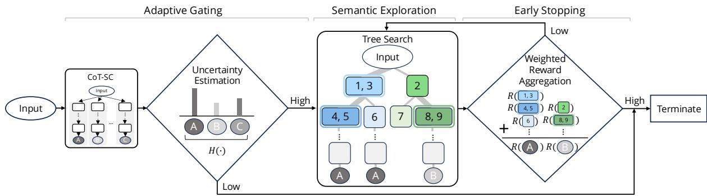  
Figure 1: An overview of SEAG. The framework consists of three main components: adaptive gating, semantic exploration and early stopping, detailed in Section 4. Given an input, adaptive gating determines whether to expand the search space based on the uncertainty H( ) in equation (4) of the generated answers obtained through multiple single-path reasoning. If the uncertainty is high, semantic exploration employs tree search to explore multiple reasoning paths, where actions are grouped into semantic clusters (further detailed in Figure 3). Lastly, early stopping terminates the search when the highest aggregated reward surpasses a predefined threshold.

Our main contributions are as follows:

• We propose semantic exploration, leveraging semantic clustering to reduce redundant computations and prioritize exploration of semantically informative reasoning paths (Section 4.2).

• We introduce a unified approach combining adaptive gating (Section 4.1) and early stopping (Section 4.3) to adaptively determine when to initiate and terminate tree-based exploration, efficiently utilizing computational resources based on confidence measures specific to each process.

• Through extensive experiments on multi-step reasoning benchmarks, SEAG consistently demonstrates superior performance in reasoning accuracy while achieving computational efficiency comparable to or greater than baselines (Section 5.2), as shown in Figure 2.

## 2 Related Work

Reasoning with LLMs Eliciting the reasoning capabilities of LLMs has been a key focus of recent research, leading to various reasoning methods to improve their performance on complex, multi-step tasks. One notable approach is Chain-of-Thought (CoT) prompting (Wei et al., 2022), which encourages LLMs to generate intermediate reasoning steps. Self-consistency of CoT (CoT-SC) (Wang et al., 2023b) extends CoT by sampling multiple reasoning paths and selecting the most frequently answers, instead of relying on a single greedy decoding pass.

Tree search-based approaches, such as Tree-of-Thoughts (ToT) (Yao et al., 2023; Long, 2023) and Reasoning-via-Planning (RAP) (Hao et al., 2023), enhance reasoning by structuring the exploration of reasoning paths on trees using search algorithms such as breadth/depth-first search (BFS/DFS) and Monte Carlo Tree Search (MCTS). In addition, recent studies on MCTS-based reasoning have extended the settings involving additional training costs (Wan et al., 2024; Zhang et al., 2024a) or external feedback (Zhou et al., 2024). However, these tree search-based methods incur considerably higher computation costs compared to simpler methods such as CoT-SC.

Linguistic semantics Measuring semantic relation is essential for reducing semantic redundancy in LLM reasoning. Traditional approaches have relied on lexical feature-based (Fernando and Stevenson, 2008; Socher et al., 2011) or embedding-based similarity metrics (Yu et al., 2014; Issa et al., 2018). However, these methods often lack robustness in capturing deeper liguistic semantics. With the rise of Transformer-based models and LLMs, semantic evaluation has achieved significant improvements (He et al., 2020b; Tay et al., 2021). Recently, Kuhn et al. (2023) has introduced a textual entailment-based method for assessing semantic equivalence, which informs our approach to semantic clustering.

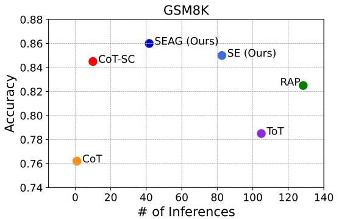

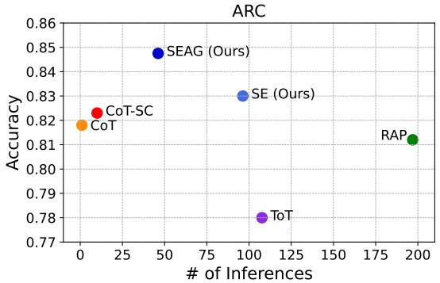  
Figure 2: Scatter plots of accuracy and the number of LLM inferences for baselines and our methods, SE and SEAG, with GSM8K (left) and ARC (right) using Llama3-8B-Instruct model. SE achieves superior accuracy while reducing inference cost compared to existing tree search-based methods. SEAG further improves performance, achieving higher accuracy with efficiency comparable to other reasoning methods.

Similar to our work, Jang et al. (2021) has utilized semantic similarity within a MCTS framework for text-based games. However, their method relied on a predefined set consisting of valid actions provided by the game environment. In contrast, we address open domain problems, where actions, such as task-specific sub-questions, are dynamically generated by prompting LLMs.

Uncertainty estimation Uncertainty estimation of LLMs has emerged as a critical area of study for evaluating and improving their reliability. Existing uncertainty estimation methods often rely on the consistency of sampling results (Wang et al., 2023a; Cole et al., 2023) or responses to semantically equivalent questions (Zhang et al., 2024b). These approaches share an assumption that uncertainty can be quantified through entropy of prediction, and the assumption is commonly used in traditional machine learning (Malinin and Gales, 2018). We integrate uncertainty estimation directly into the reasoning pipeline, whereas other methods typically treat it as a separate step.

## 3 Preliminaries

In this section, we first define our problem setting as Markov Decision Process (MDP) reasoning in Section 3.1. Section 3.2 explains Monte Carlo Tree Search (MCTS) for multi-step reasoning.

## 3.1 Markov Decision Process Reasoning

Let $p _ { \theta }$ denote a pre-trained language model (LM) parameterized by θ, and an input sequence x = $( x _ { 1 } , \ldots , x _ { l _ { x } } )$ , where $l _ { x }$ represents the token lengths of the input. The model’s probability of generating x is expressed by $\begin{array} { r } { p _ { \theta } ( x ) = \prod _ { i = 1 } ^ { l _ { x } } ( x _ { i } | \boldsymbol x _ { < i } ) } \end{array}$ , where $x _ { < i }$ represents the sequence of tokens preceding $x _ { i }$ . An output sequence $y = ( y _ { 1 } , \dots , y _ { l _ { y } } )$ is generated by auto-regressively, where $l _ { y }$ denotes the token lengths of the output. The previously generated tokens are used to predict the next token as $\begin{array} { r } { p _ { \theta } ( y | x ) = \prod _ { i = 1 } ^ { l _ { y } } p _ { \theta } ( y _ { i } | x , y _ { < i } ) } \end{array}$

Rather than directly mapping the input x to the output y, several reasoning methods have been developed to enhance reasoning by breaking down complex tasks into step-by-step thoughts, with each generated token $y _ { i }$ representing an intermediate reasoning step. Detailed explanations of these methods are provided in Appendix A. Following the approach in RAP (Hao et al., 2023), we define our problem as an MDP to effectively model the reasoning task. We leverages LMs in two complementary roles: (i) a reasoning agent and (ii) a world model. This approach frames the reasoning process as an MDP, enabling iterative reasoning through planning and simulation. At each time step t, the state $s _ { t }$ represents the current context, including both the input sequence and the reasoning history. In the first role, the LM acts as the reasoning agent, generating actions $a _ { t } \sim p _ { \theta } ( a | s _ { t } , m )$ based on the current state $s _ { t }$ and a task-specific instruction $m$ Subsequently, the LM functions as a world model, predicting the next state $s _ { t + 1 }$ based on the current state and the chosen action, i.e., $p _ { \theta } ( s _ { t + 1 } | s _ { t } , a _ { t } , m ^ { \prime } )$ where $m ^ { \prime }$ is an additional prompt guiding the transition process. Each reasoning step is evaluated using a reward function $r _ { t } = r ( s _ { t } , a _ { t } ) \in \mathbb { R }$ , based on the LM’s self-evaluation of the generated action and the log probability of the action with the history of states. Further details of the reward design are explained in Appendix B.

## 3.2 Monte Carlo Tree Search (MCTS)

To enhance strategic exploration, we incorporate planning with MCTS (Coulom, 2006), which is particularly effective for decision-making in highdimensional spaces. MCTS builds a search tree over k iterations to explore decision space through four main operators: selection, expansion, simulation, and back-propagation. At each node, which represents a state $s ,$ the standard MCTS uses UCT (Kocsis and Szepesvári, 2006; Auer et al., 2002) algorithm to select the optimal action $a ^ { * }$ based on Q-value as follows:

$$
a ^ { * } = \arg \operatorname* { m a x } _ { a \in A ( s ) } \left( Q ( s , a ) + w { \sqrt { \frac { \ln N ( s ) } { N ( s , a ) } } } \right)\tag{1}
$$

where $N ( \cdot )$ denotes the total number of visits in previous iterations, $A ( s )$ is the set of possible actions at state s, and w is the constant of balancing exploration and exploitation.

PUCT (Silver et al., 2016, 2017) provides a viable alternative to UCT by incorporating $\pi ( a | s )$ a predictor of the prior action distribution, into its formulation as follows:

$$
a ^ { * } = \arg \operatorname* { m a x } _ { a \in A ( s ) } \left( Q ( s , a ) + w \cdot \pi ( a | s ) \frac { \sqrt { N ( s ) } } { N ( s , a ) + 1 } \right) .\tag{2}
$$

The predictor $\pi ( a | s )$ can be defined as the sequence probability $p _ { \theta } ( a | s , m )$ in the context of LLMs. $\mathbf { A }$ more detailed description of the operators used in MCTS can be found in Appendix C.

## 4 Method

Our method consists of adaptive gating (Section 4.1), semantic exploration (Section 4.2), and early stopping with weighted aggregation (Section 4.3), as shown in Figure 1. A detailed description of the algorithm is provided in Appendix D.

## 4.1 Adaptive Gating (AG)

AG adaptively determines when to expand the search tree based on the confidence of generated answers. Specifically, k answers are sampled using a single-path method, such as CoT, and the confidence of these answers is used to determine whether to initiate tree search. The key insight is that not all problems require the same level of complexity in reasoning.

First, we generate k reasoning paths using CoT, each producing an output $y ^ { i } \sim p _ { \theta } ( y | x , z _ { < l } ^ { i } ) , \forall i \in$ [k], i.e., corresponding to CoT-SC. Let  denote the set of possible candidate outputs across k reasoning paths. We define $q ( y )$ as the estimated probability of output $y \in \mathcal { V }$ , computed as:

$$
q ( y ) = { \frac { 1 } { k } } \sum _ { i = 1 } ^ { k } \mathbb { I } ( y = y ^ { i } ) ~ ,\tag{3}
$$

where I is the indicator function. Notice that semantical clustering in Section 4.2 can be used when calculating $q ( y )$ , while the indicator function handles cases where the final answer is numeric or discrete. We use entropy $H ( y )$ as a gating function across the k reasoning paths, calculated as:

$$
H ( y ) = - \sum _ { y \in \mathcal { V } } q ( y ) \log q ( y ) \ ,\tag{4}
$$

which reflects the uncertainty in the model’s reasoning. Based on this, if $H ( y )$ is smaller than a predefined threshold $\tau$ indicating high confidence, the final answer $y ^ { * }$ is determined through majority voting as follows:

$$
y ^ { * } = \arg \operatorname* { m a x } _ { y \in \mathcal { V } } \sum _ { i = 1 } ^ { k } \mathbb { I } ( y = y ^ { i } ) , \mathrm { i f } \ H ( y ) \leq \tau \ .\tag{5}
$$

Otherwise, if $H ( y ) > \tau$ , indicating lower confidence, we proceed by constructing a search tree and employing our proposed method, Semantic Exploration, as described in the following section. An analysis of entropy distribution is shown in Figure 4 in Section 5.3.

## 4.2 Semantic Exploration (SE)

For tree based search, we propose SE, which leverages linguistic semantics to avoid exploring semantically similar nodes. For example, as illustrated in Figure 3, node 1 (“How many pages did Julie read yesterday $\vec { \cdot ? } \vec { \cdot } \vec { \bf { \nabla } } )$ and node 3 (“What is the number of pages Julie finished reading yesterday?”) convey the identical meaning. The key components of SE are semantic clustering and semantic PUCT.

Semantic clustering Semantic clustering groups generated actions based on their semantic equivalence. At the current node s, the tree generates d candidate actions, $A ( s )$ , using a language model.

For each pair of actions $( a , a ^ { \prime } )$ in $A ( s )$ , the equivalence relation $E ( \boldsymbol { a } , \boldsymbol { a } ^ { \prime } )$ is established by checking for bi-directional entailment between the actions (Kuhn et al., 2023; Farquhar et al.,

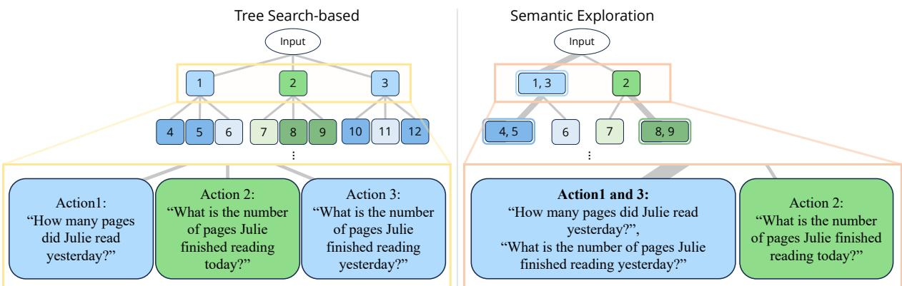  
Figure 3: Illustration of tree search-based reasoning methods (Yao et al., 2023; Hao et al., 2023) and SE (Ours). Nodes with similar color tones (e.g., blue and green) represent semantically similar node, and the thickness of each line indicates the magnitude of the exploration weight.

## 4.3 Early Stopping

2024). Specifically, each entailment decision is determined by applying an arg max function to the outputs of the DeBERTa-large model (He et al., 2020a), a relatively lightweight model compared to larger LLMs, which is used for single-sentence inputs. Actions with equivalent meanings are grouped into semantic equivalence clusters ${ \mathcal { C } } =$ $\{ C _ { 1 } , C _ { 2 } , \ldots , C _ { d ^ { \prime } } \}$ , where each cluster $C _ { i } \subseteq A ( s )$ contains semantically identical actions and $d ^ { \prime }$ represents the total number of clusters. As illustrated in Figure 3, semantic clustering prevents the redundant expansion of subsequent sub-trees from nodes containing actions with equivalent meanings. Our analysis of semantically unique actions is presented in Section 5.3.

Semantic PUCT To achieve efficient exploration with semantic clusters , we propose semantic PUCT. Previous research in LLMs has shown that more frequently generated samples indicate higher significance (Wang et al., 2023b). Leveraging this self-consistency principle, we define the predictor of each semantic cluster $C _ { i }$ as the total probability assigned to the cluster:

$$
\pi ( C _ { i } | s ) = \sum _ { a \in C _ { i } } p _ { \theta } ( a | s , m ) .\tag{6}
$$

We extend the PUCT algorithm (Equation (2)) to operate at the level of semantic clusters as follows:

$$
C ^ { * } { = } \arg \operatorname* { m a x } _ { C \in { \mathcal { C } } } \left( Q ( s , C ) + w \cdot \pi ( C | s ) { \frac { \sqrt { N ( s ) } } { N ( s , C ) + 1 } } \right)\tag{7}
$$

Once a semantic cluster $C _ { i }$ is selected, the highestprobability action within the cluster, i.e., $a ^ { * }$ arg $\operatorname* { m a x } _ { a \in C _ { i } } p _ { \theta } ( a \mid s , m )$ , is used to construct the prompt for expansion. We present the effect of semantic PUCT in an ablation study in Section 5.4.

We introduce an early stopping phase in MCTS to decide whether to terminate iterations early based on the confidence of the most probable answer. To measure this confidence, we use weighted aggregation rewards, which account for the semantic importance of nodes in the search tree.

Let denote the set of terminal nodes, and $P ( n _ { j } )$ be the set of nodes along the path from the root node to terminal node $n _ { j } \in \mathcal { T }$ . The reward of a terminal node $n _ { j }$ is computed by weighting the size of the semantic cluster $| C ( n ) |$ , where $C ( n )$ is the cluster including the node n:

$$
R ( n _ { j } ) = \sum _ { n \in P ( n _ { j } ) } | C ( n ) | \cdot r ( n ) , \forall n _ { j } \in \mathcal { T } .\tag{8}
$$

We define $Y ( n _ { j } )$ as the extracted answer of a terminal node $n _ { j }$ , and $\mathcal { V } ^ { \prime }$ as the set of all extracted answers. The aggregated reward $R _ { \mathrm { a g g } } ( y )$ for each answer $y \in \mathcal { V } ^ { \prime }$ is then computed by summing the rewards of all terminal nodes that produce the same answer y:

$$
R _ { \mathrm { a g g } } ( y ) = \sum _ { n _ { j } \in \mathcal { T } , Y ( n _ { j } ) = y } R ( n _ { j } ) \mathrm { ~ . ~ }\tag{9}
$$

This weighted aggregation ensures that nodes in larger semantic clusters, i.e., more significant nodes, have a greater influence on the reward aggregation.

At each iteration, when a terminal node is reached, the algorithm terminates early if the highest aggregated reward satisfies sufficient confidence threshold α:

$$
y ^ { * } = \arg \operatorname* { m a x } _ { y \in \mathcal { V } ^ { \prime } } R _ { \mathrm { a g g } } ( y ) , \mathrm { i f ~ } \operatorname* { m a x } _ { y \in \mathcal { V } ^ { \prime } } R _ { \mathrm { a g g } } ( y ) \geq \alpha .\tag{10}
$$

An ablation study of α is presented in Figure 5.

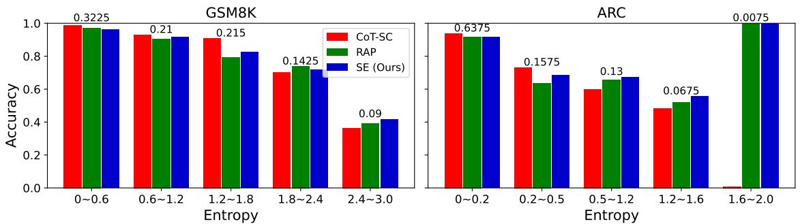

<table><tr><td rowspan="2">Benchmark</td><td rowspan="2">Method</td><td colspan="2">Llama3-8B-Instruct</td><td colspan="2">Llama2-13B-Chat</td><td colspan="2">Mistral-7B-Instruct</td></tr><tr><td>Accuracy ↑</td><td># of inferences ↓</td><td>Accuracy ↑</td><td># of inferences ↓</td><td>Accuracy ↑</td><td># of inferences ↓</td></tr><tr><td rowspan="6">GSM8K</td><td>CoT</td><td>0.762</td><td>1</td><td>0.330</td><td>1</td><td>0.502</td><td>1</td></tr><tr><td>CoT-SC</td><td>0.845</td><td>10</td><td>0.417</td><td>10</td><td>0.665</td><td>10</td></tr><tr><td>ToT</td><td>0.785</td><td>104.80</td><td>0.378</td><td>102.06</td><td>0.613</td><td>122.16</td></tr><tr><td>RAP</td><td>0.825</td><td>128.40</td><td>0.372</td><td>121.69</td><td>0.667</td><td>161.86</td></tr><tr><td>SE (Ours)</td><td>0.850</td><td>82.63</td><td>0.403</td><td>69.47</td><td>0.675</td><td>98.79</td></tr><tr><td>SEAG (Ours)</td><td>0.860</td><td>41.69</td><td>0.435</td><td>53.09</td><td>0.685</td><td>84.14</td></tr><tr><td rowspan="6">ARC</td><td>CoT</td><td>0.818</td><td>1</td><td>0.598</td><td>1</td><td>0.688</td><td>1</td></tr><tr><td>CoT-SC</td><td>0.823</td><td>10</td><td>0.637</td><td>10</td><td>0.708</td><td>10</td></tr><tr><td>ToT</td><td>0.797</td><td>149.59</td><td>0.590</td><td>209.05</td><td>0.615</td><td>221.36</td></tr><tr><td>RAP</td><td>0.812</td><td>196.96</td><td>0.637</td><td>247.22</td><td>0.705</td><td>313.20</td></tr><tr><td>SE (Ours)</td><td>0.830</td><td>96.32</td><td>0.632</td><td>146.20</td><td>0.713</td><td>155.13</td></tr><tr><td>SEAG (Ours)</td><td>0.848</td><td>46.15</td><td>0.638</td><td>26.62</td><td>0.725</td><td>110.95</td></tr></table>

Table 1: Comparison of reasoning methods effectiveness in accuracy and efficiency in the number of inferences for both GSM8K and ARC datasets. Bold texts indicate the best accuracies in each setting.  
Figure 4: Accuracy comparison of CoT-SC, RAP, and SE (Ours) methods across different entropy ranges for GSM8K and ARC datasets. The numbers at the top of each entropy bin represent the proportion of problems within the corresponding entropy range.

## 5 Experiments

In this section, we present the experimental evaluation of SEAG. Section 5.1 describes the experimental setup, including datasets and models. The main evaluation results are presented in Section 5.2. Detailed analyses follows in Section 5.3, along with ablation studies in Section 5.4. Additional experimental details are provided in Appendix E.

## 5.1 Experimental Setup

Baselines We consider four reasoning methods as baselines across sequential and tree-based reasoning approaches. CoT (Wei et al., 2022) and CoT-SC (Wang et al., 2023b) are sequential reasoning approaches, where CoT generates step-by-step reasoning paths, and CoT-SC extends this by incorporating self-consistency. ToT (Yao et al., 2023) and RAP (Hao et al., 2023) use tree search algorithms to explore multiple reasoning paths, utilizing algorithms such as beam search and MCTS, respectively. For SEAG, SE, and RAP, the number of MCTS iterations is 10 and the number of actions is 4. For AG, we set k = 10 across all experiments. To ensure a fair comparison, we use identical prompts and the same number of in-context examples across all methods. The primary difference lies in the specific search mechanisms employed by each method. We present the detailed prompts for each baseline in Appendix I.

Datasets For evaluating the reasoning ability, we use two standard reasoning tasks: GSM8K (Cobbe et al., 2021), a dataset of 8.5k math word problems requiring multi-step numerical reasoning, and AI2 Reasoning Challenge (ARC) (Clark et al., 2018), a dataset containing 7.8k multiple-choice science questions sourced from grade-level science exams. For evaluation, we randomly sample 400 instances from the test sets of GSM8K and ARC.

Models We conduct experiments with different LLMs using Llama3-8B-Instruct (Dubey et al., 2024), Llama2-13B-Chat (Touvron et al., 2023), and Mistral-7B-Instruct-v0.3 (Jiang et al., 2023) to demonstrate the robustness of SEAG.

Evaluation metrics We use accuracy and computational costs, which are measured in terms of the number of inferences and tokens. The number of inferences refer to the total LLM calls required during the reasoning process per instance. Input tokens and output tokens denote the total number of tokens processed during reasoning and generated by the model as output, respectively, for each instance.

## 5.2 Main Results

Table 1 compares the accuracy and inference efficiency of six reasoning methods evaluated on the GSM8K and ARC using three different LLMs. The results for the base LLM are presented in in Appendix G. SEAG consistently outperforms all baseline methods in accuracy across all datasets and models, demonstrating its robustness and effectiveness. Notably, compared to RAP, which is our closest baseline, SEAG achieves a 4.3% increase in accuracy while requiring only 31% as many inferences as RAP, on average. This highlights SEAG’s ability to deliver superior reasoning performance with improved computational efficiency. Further discussions on inference cost in terms of tokens are provided in Appendix G.

When evaluating SE independently, SE also achieves higher accuracy and fewer inference costs compared to tree search-based methods, RAP and ToT, as illustrated in Figure 2. By incorporating AG, SEAG further improves performance by adaptively determining reasoning paths. This allows SEAG to capitalize on CoT-SC’s strength in internal reasoning, achieving higher accuracy while also enhancing computational efficiency. Additional plots using token cost as an alternative cost metric are presented in Appendix F.

## 5.3 Analyses

Necessity of AG Using the results of 10 independent CoT-SC samplings, we calculate confidence in terms of entropy values as defined in Equation (4). Problems are categorized into several groups based on their entropy values. Figure 4 presents the results of applying CoT, RAP, and SE to problems within each group. Notice that low entropy indicates that the model generates the same answer with confidence, while high entropy suggests that the model provides different answers across different samplings. We observe that CoT-SC achieves high accuracy for problems with low entropy. In contrast, RAP and SE, which incorporate tree search, demonstrate superior accuracy for high-entropy problems.

<table><tr><td rowspan="2">Depth</td><td colspan="2">GSM8K</td><td colspan="2">ARC</td></tr><tr><td># of semantic clusters</td><td>Reduction rate (%)</td><td># of semantic clusters</td><td>Reduction rate (%)</td></tr><tr><td>1</td><td>2.31</td><td>42.36</td><td>3.00</td><td>25.00</td></tr><tr><td>2</td><td>2.15</td><td>46.33</td><td>3.22</td><td>19.38</td></tr><tr><td>3</td><td>2.07</td><td>48.34</td><td>2.60</td><td>35.02</td></tr><tr><td>4</td><td>1.81</td><td>54.70</td><td>1.55</td><td>61.25</td></tr></table>

Table 2: The average number of semantic clusters (counts) and reduction rate (%) at each depth when four actions are generated at every step, d = 4 for both GSM8K and ARC datasets.

Efficiency improvement by SE To evaluate the impact of SE, we measure the number of unique semantic clusters d′ (i.e., the number of nodes expanded after applying semantic clustering) and the reduction rate at each depth when four actions, d = 4, are generated in each state. Table 2 presents that semantic clustering effectively reduces the redundant search space from 25-45% at depth 1 to 50-65% at depth 4. In overall, semantic clustering eliminates approximately 20–60% of semantically redundant paths, significantly reducing the search space across different depths and datasets. These results indicate that SE avoids repeatedly expanding and exploring semantically redundant paths by incorporating semantic equivalence. Additionally, in Appendix H, we provide a brief analysis on prompt design modification to encourage diverse action sampling as an alternative approach to SE.

Effect of the number of tokens We analyze the effect of increasing average token cost on the accuracy improvement of the methods in Figure 5. Token cost is calculated based on the pricing policy of commercial LLM APIs, where output tokens are assigned a cost approximately four times higher than input tokens. For RAP, token cost is controlled by varying the number of MCTS iterations, set to 4, 6, 8, and 10. For SE, we adjusts the early stopping threshold α, set to 5, 7, 9, and 11, while fixing the number of MCTS iterations at 10. As shown in Figure 5, SE demonstrates a steeper performance improvement compared to RAP. Furthermore, by incorporating AG into SE, SEAG shows the highest accuracy (when α = 11), and achieves further improvements in both accuracy and token cost.

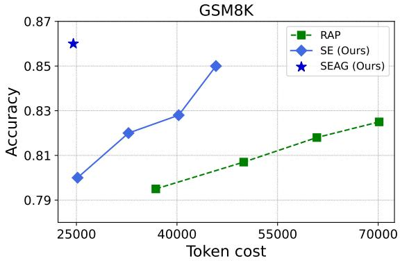

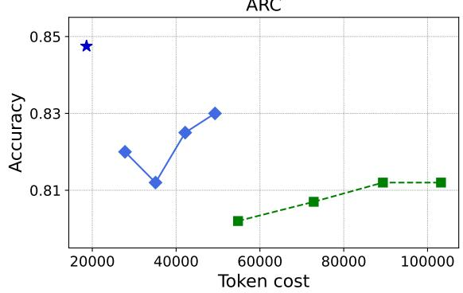  
Figure 5: Comparisons of reasoning methods in average accuracy with increasing token cost. The token cost varies along with the different hyperparameters such as the number of MCTS iterations k and early stopping thresholds α.

<table><tr><td>Method</td><td>Average latency (sec)</td></tr><tr><td>CoT</td><td>1.43</td></tr><tr><td>CoT-SC</td><td>13.67</td></tr><tr><td>ToT</td><td>120.63</td></tr><tr><td>RAP</td><td>151.19</td></tr><tr><td>SE (Ours)</td><td>76.44</td></tr><tr><td>SEAG (Ours)</td><td>38.89</td></tr></table>

Table 3: Average end-to-end latency of reasoning methods evaluated on the ARC dataset using Llama3-8B-Instruct.

Latency analysis We assess the end-to-end latency of each reasoning method on 100 randomly selected ARC instances using the Llama3-8B-Instruct on a single NVIDIA RTX A5000 GPU. As shown in Table 3, SE achieves a reduced average latency of 76.44 seconds, including only 2.54 seconds for semantic clustering, compared to ToT (120.63 s) and RAP (151.19 s). Our final method SEAG further improves computational efficiency by adaptively invoking SE only when necessary. Specifically, SEAG terminates early after CoT-SC in approximately 67% of cases, resulting in a low average latency of 13.67 seconds, and utilizes the full SE reasoning process in the remaining 33% of cases with an average latency of 90.11 seconds. The ordering and trend of latency across methods are consistent with those observed in LLM inference counts and token usage.

<table><tr><td colspan="2">Action selection method</td><td>Accuracy</td><td># of inferences</td></tr><tr><td rowspan="3">GSM8K</td><td>UCT</td><td>0.828</td><td>83.53</td></tr><tr><td>PUCT</td><td>0.840</td><td>85.39</td></tr><tr><td>Semantic PUCT (Ours)</td><td>0.850</td><td>82.63</td></tr><tr><td rowspan="3">ARC</td><td>UCT</td><td>0.815</td><td>95.16</td></tr><tr><td>PUCT</td><td>0.818</td><td>97.88</td></tr><tr><td>Semantic PUCT (Ours)</td><td>0.830</td><td>96.32</td></tr></table>

Table 4: Ablation study of action selection algorithms, including UCT, PUCT, and Semantic PUCT (Ours), presenting average accuracy and the number of inferences for both GSM8K and ARC datasets.
<table><tr><td colspan="2">Aggregation method</td><td>Accuracy</td><td># of inferences</td></tr><tr><td rowspan="2">GSM8K</td><td>Equal weighting</td><td>0.845</td><td>95.89</td></tr><tr><td>Weighting by |C|</td><td>0.850</td><td>82.63</td></tr><tr><td rowspan="2">ARC</td><td>Equal weighting</td><td>0.828</td><td>111.00</td></tr><tr><td>Weighting by |C|</td><td>0.830</td><td>96.32</td></tr></table>

Table 5: Ablation study of aggregation methods, including equal weighting and weighted aggregation (Ours), presenting average accuracy and the number of inferences for both GSM8K and ARC datasets.

## 5.4 Ablation Studies

Improvement by semantic PUCT To evaluate the effectiveness of the proposed action selection algorithm, semantic PUCT in equation (7), we conduct an ablation study with two existing algorithms: UCT, which relies solely on a count-based uncertainty term in equation (2), and PUCT, which incorporates an uncertainty term involving π(a s) and a count-based term in equation (2). In Table 5, we demonstrate that Semantic PUCT outperforms the existing algorithms while maintaining comparable efficiency by encouraging exploration of semantically probable clusters with π(C s).

Improvement by weighted aggregation of rewards To evaluate the effectiveness of the aggregation strategy weighted by $| C ( n ) |$ , we conducted a comparison with an aggregation strategy where all actions were weighted equally (i.e., manually set $| C ( n ) |$ to 1 in equation 8), regardless of clustering. The experiments were conducted using the SEAG method. To ensure a fair comparison of LLM computation costs, α was set to 11 for the weighted aggregation and 8 for the equal weighting strategy. As shown in Table 5, the weighted aggregation consistently achieved higher accuracy across both benchmarks while incurring lower LLM computation costs.

## 6 Conclusion

In this paper, we propose Semantic Exploration with Adaptive Gating (SEAG), a framework that enhances the efficiency and accuracy of multi-step reasoning tasks in LLMs. SEAG addresses two key issues in tree-based reasoning methods: (i) the unnecessary use of complex reasoning techniques for tasks solvable with simpler approaches, and (ii) the generation of semantically redundant nodes during exploration. By combining adaptive gating to evaluate task complexity, semantic exploration to minimize redundancy, and early stopping to reduce computational overhead, SEAG achieves significant performance improvements.

## Limitations

Our method focuses on leveraging only internal knowledge to enhance the efficiency of tree searchbased reasoning methods. This focus ensures a fair evaluation of the method’s inherent efficiency without reliance on external tools or feedback. Expanding the approach to incorporate such external resources could further improve the reasoning process, presenting a promising direction for future work. Furthermore, the experiments are primarily conducted on benchmarks where final answers are provided in a discrete form, rather than freeform natural language generation. Evaluating the method on tasks requiring open-ended responses is left as future work.

## Acknowledgements

This work was supported by Institute of Information & communications Technology Planning & Evaluation (IITP) grants funded by the Korea government (MSIT) (No.RS-2019-II191906, Artificial Intelligence Graduate School Program (POSTECH); No.RS-2024-00457882, AI Research Hub Project; No.RS-2024-00509258, Global AI Frontier Lab) and the Korea Institute for Advancement of Technology (KAIT), funded by the Ministry of Trade, Industry and Energy (MOTIE), Republic of Korea (No.RS-2025-00564342).

## References

Josh Achiam, Steven Adler, Sandhini Agarwal, Lama Ahmad, Ilge Akkaya, Florencia Leoni Aleman, Diogo Almeida, Janko Altenschmidt, Sam Altman, Shyamal Anadkat, et al. 2023. Gpt-4 technical report. arXiv preprint arXiv:2303.08774.

Peter Auer, Nicolò Cesa-Bianchi, and Paul Fischer. 2002. Finite-time analysis of the multiarmed bandit problem. Machine Learning, 47:235–256.

Tom Brown, Benjamin Mann, Nick Ryder, Melanie Subbiah, Jared D Kaplan, Prafulla Dhariwal, Arvind Neelakantan, Pranav Shyam, Girish Sastry, Amanda Askell, et al. 2020. Language models are few-shot learners. Advances in Neural Information Processing Systems, 33:1877–1901.

Aakanksha Chowdhery, Sharan Narang, Jacob Devlin, Maarten Bosma, Gaurav Mishra, Adam Roberts, Paul Barham, Hyung Won Chung, Charles Sutton, Sebastian Gehrmann, et al. 2023. Palm: Scaling language modeling with pathways. Journal of Machine Learning Research, 24(240):1–113.

Peter Clark, Isaac Cowhey, Oren Etzioni, Tushar Khot, Ashish Sabharwal, Carissa Schoenick, and Oyvind Tafjord. 2018. Think you have solved question answering? try arc, the ai2 reasoning challenge. arXiv preprint arXiv:1803.05457.

Karl Cobbe, Vineet Kosaraju, Mohammad Bavarian, Mark Chen, Heewoo Jun, Lukasz Kaiser, Matthias Plappert, Jerry Tworek, Jacob Hilton, Reiichiro Nakano, Christopher Hesse, and John Schulman. 2021. Training verifiers to solve math word problems. arXiv preprint arXiv:2110.14168.

Jeremy R Cole, Michael JQ Zhang, Daniel Gillick, Julian Martin Eisenschlos, Bhuwan Dhingra, and Jacob Eisenstein. 2023. Selectively answering ambiguous questions. arXiv preprint arXiv:2305.14613.

Rémi Coulom. 2006. Efficient selectivity and backup operators in monte-carlo tree search. In International conference on computers and games, pages 72–83. Springer.

Abhimanyu Dubey, Abhinav Jauhri, Abhinav Pandey, Abhishek Kadian, Ahmad Al-Dahle, Aiesha Letman, Akhil Mathur, Alan Schelten, Amy Yang, Angela Fan, et al. 2024. The llama 3 herd of models. arXiv preprint arXiv:2407.21783.

Sebastian Farquhar, Jannik Kossen, Lorenz Kuhn, and Yarin Gal. 2024. Detecting hallucinations in large language models using semantic entropy. Nature, 630(8017):625–630.

Samuel Fernando and Mark Stevenson. 2008. A semantic similarity approach to paraphrase detection. In Proceedings ofthe 11th annual research colloquium of the UK special interest group for computational linguistics, pages 45–52. Citeseer.

Luyu Gao, Aman Madaan, Shuyan Zhou, Uri Alon, Pengfei Liu, Yiming Yang, Jamie Callan, and Graham Neubig. 2023. Pal: Program-aided language models. In International Conference on Machine Learning, pages 10764–10799. PMLR.

Shibo Hao, Yi Gu, Haodi Ma, Joshua Hong, Zhen Wang, Daisy Wang, and Zhiting Hu. 2023. Reasoning with language model is planning with world model. In Proceedings of the 2023 Conference on Empirical Methods in Natural Language Processing, pages 8154–8173.

Pengcheng He, Xiaodong Liu, Jianfeng Gao, and Weizhu Chen. 2020a. Deberta: Decoding-enhanced bert with disentangled attention. arXiv preprint arXiv:2006.03654.

Ruining He, Anirudh Ravula, Bhargav Kanagal, and Joshua Ainslie. 2020b. Realformer: Transformer likes residual attention. arXiv preprint arXiv:2012.11747.

Fuad Issa, Marco Damonte, Shay B Cohen, Xiaohui Yan, and Yi Chang. 2018. Abstract meaning representation for paraphrase detection. In Proceedings ofthe 2018 Conference ofthe North American Chapter ofthe Associationfor Computational Linguistics: Human Language Technologies, Volume 1 (Long Papers), pages 442–452.

Youngsoo Jang, Seokin Seo, Jongmin Lee, and Kee-Eung Kim. 2021. Monte-carlo planning and learning with language action value estimates. In International Conference on Learning Representations.

Albert Q Jiang, Alexandre Sablayrolles, Arthur Mensch, Chris Bamford, Devendra Singh Chaplot, Diego de las Casas, Florian Bressand, Gianna Lengyel, Guillaume Lample, Lucile Saulnier, et al. 2023. Mistral 7b. arXiv preprint arXiv:2310.06825.

Levente Kocsis and Csaba Szepesvári. 2006. Bandit based monte-carlo planning. In European conference on machine learning, pages 282–293. Springer.

Takeshi Kojima, Shixiang Shane Gu, Machel Reid, Yutaka Matsuo, and Yusuke Iwasawa. 2022. Large language models are zero-shot reasoners. Advances in neural information processing systems, 35:22199– 22213.

Lorenz Kuhn, Yarin Gal, and Sebastian Farquhar. 2023. Semantic uncertainty: Linguistic invariances for uncertainty estimation in natural language generation. In The Eleventh International Conference on Learning Representations.

Aitor Lewkowycz, Anders Andreassen, David Dohan, Ethan Dyer, Henryk Michalewski, Vinay Ramasesh, Ambrose Slone, Cem Anil, Imanol Schlag, Theo Gutman-Solo, et al. 2022. Solving quantitative reasoning problems with language models. Advances in Neural Information Processing Systems, 35:3843– 3857.

Jieyi Long. 2023. Large language model guided tree-ofthought. arXiv preprint arXiv:2305.08291.

Aman Madaan, Shuyan Zhou, Uri Alon, Yiming Yang, and Graham Neubig. 2022. Language models of code are few-shot commonsense learners. Proceedings of the 2022 Conference on Empirical Methods in Natural Language Processing.

Andrey Malinin and Mark Gales. 2018. Predictive uncertainty estimation via prior networks. Preprint, arXiv:1802.10501.

Swaroop Mishra, Matthew Finlayson, Pan Lu, Leonard Tang, Sean Welleck, Chitta Baral, Tanmay Rajpurohit, Oyvind Tafjord, Ashish Sabharwal, Peter Clark, et al. 2022. Lila: A unified benchmark for mathematical reasoning. Proceedings ofthe 2022 Conference on Empirical Methods in Natural Language Processing.

Maxwell Nye, Anders Johan Andreassen, Guy Gur-Ari, Henryk Michalewski, Jacob Austin, David Bieber, David Dohan, Aitor Lewkowycz, Maarten Bosma, David Luan, et al. 2021. Show your work: Scratchpads for intermediate computation with language models. arXiv preprint arXiv:2112.00114.

Arkil Patel, Satwik Bhattamishra, and Navin Goyal. 2021. Are nlp models really able to solve simple math word problems? Proceedings of the 2021 Conference of the North American Chapter of the Associationfor Computational Linguistics: Human Language Technologies.

Victor Sanh, Albert Webson, Colin Raffel, Stephen Bach, Lintang Sutawika, Zaid Alyafeai, Antoine Chaffin, Arnaud Stiegler, Arun Raja, Manan Dey, et al. 2022. Multitask prompted training enables zero-shot task generalization. In International Conference on Learning Representations.

David Silver, Aja Huang, Chris J Maddison, Arthur Guez, Laurent Sifre, George Van Den Driessche, Julian Schrittwieser, Ioannis Antonoglou, Veda Panneershelvam, Marc Lanctot, et al. 2016. Mastering the game of go with deep neural networks and tree search. nature, 529(7587):484–489.

David Silver, Julian Schrittwieser, Karen Simonyan, Ioannis Antonoglou, Aja Huang, Arthur Guez, Thomas Hubert, Lucas Baker, Matthew Lai, Adrian Bolton, et al. 2017. Mastering the game of go without human knowledge. nature, 550(7676):354–359.

Richard Socher, Eric Huang, Jeffrey Pennin, Christopher D Manning, and Andrew Ng. 2011. Dynamic pooling and unfolding recursive autoencoders for paraphrase detection. Advances in neural information processing systems, 24.

Yi Tay, Vinh Q Tran, Sebastian Ruder, Jai Gupta, Hyung Won Chung, Dara Bahri, Zhen Qin, Simon Baumgartner, Cong Yu, and Donald Metzler. 2021. Charformer: Fast character transformers via gradient-based subword tokenization. arXiv preprint arXiv:2106.12672.

Gemini Team, Rohan Anil, Sebastian Borgeaud, Jean-Baptiste Alayrac, Jiahui Yu, Radu Soricut, Johan Schalkwyk, Andrew M Dai, Anja Hauth, Katie Millican, et al. 2023. Gemini: a family of highly capable multimodal models. arXiv preprint arXiv:2312.11805.

Hugo Touvron, Louis Martin, Kevin Stone, Peter Albert, Amjad Almahairi, Yasmine Babaei, Nikolay Bashlykov, Soumya Batra, Prajjwal Bhargava, Shruti Bhosale, et al. 2023. Llama 2: Open foundation and fine-tuned chat models. arXiv preprint arXiv:2307.09288.

Ziyu Wan, Xidong Feng, Muning Wen, Stephen Marcus McAleer, Ying Wen, Weinan Zhang, and Jun Wang. 2024. Alphazero-like tree-search can guide large language model decoding and training. In Forty-first International Conference on Machine Learning.

Jianing Wang, Qiushi Sun, Nuo Chen, Chengyu Wang, Jun Huang, Ming Gao, and Xiang Li. 2023a. Uncertainty-aware parameter-efficient selftraining for semi-supervised language understanding. Preprint, arXiv:2310.13022.

Xuezhi Wang, Jason Wei, Dale Schuurmans, Quoc V Le, Ed H Chi, Sharan Narang, Aakanksha Chowdhery, and Denny Zhou. 2023b. Self-consistency improves chain of thought reasoning in language models. In The Eleventh International Conference on Learning Representations.

Jason Wei, Xuezhi Wang, Dale Schuurmans, Maarten Bosma, Fei Xia, Ed Chi, Quoc V Le, Denny Zhou, et al. 2022. Chain-of-thought prompting elicits reasoning in large language models. Advances in neural information processing systems, 35:24824–24837.

Yuhuai Wu, Albert Qiaochu Jiang, Wenda Li, Markus Rabe, Charles Staats, Mateja Jamnik, and Christian Szegedy. 2022. Autoformalization with large language models. Advances in Neural Information Processing Systems, 35:32353–32368.

Shunyu Yao, Dian Yu, Jeffrey Zhao, Izhak Shafran, Tom Griffiths, Yuan Cao, and Karthik Narasimhan. 2023. Tree of thoughts: Deliberate problem solving with large language models. In Advances in Neural Information Processing Systems, volume 36.

Semih Yavuz, Kazuma Hashimoto, Yingbo Zhou, Nitish Shirish Keskar, and Caiming Xiong. 2022. Modeling multi-hop question answering as single sequence prediction. Proceedings ofthe 60th Annual Meeting of the Association for Computational Linguistics (Volume 1: Long Papers).

Lei Yu, Karl Moritz Hermann, Phil Blunsom, and Stephen Pulman. 2014. Deep learning for answer sentence selection. arXiv preprint arXiv:1412.1632.

Dan Zhang, Sining Zhoubian, Ziniu Hu, Yisong Yue, Yuxiao Dong, and Jie Tang. 2024a. Rest-mcts\*: Llm self-training via process reward guided tree search. arXiv preprint arXiv:2406.03816.

Jiaxin Zhang, Zhuohang Li, Kamalika Das, Bradley A. Malin, and Sricharan Kumar. 2024b. Sac3: Reliable hallucination detection in black-box language models via semantic-aware cross-check consistency. Preprint, arXiv:2311.01740.

Yuyu Zhang, Hanjun Dai, Zornitsa Kozareva, Alexander Smola, and Le Song. 2018. Variational reasoning for question answering with knowledge graph. In Proceedings ofthe AAAI conference on artificial intelligence, volume 32.

Andy Zhou, Kai Yan, Michal Shlapentokh-Rothman, Haohan Wang, and Yu-Xiong Wang. 2024. Language agent tree search unifies reasoning, acting, and planning in language models. In Forty-first International Conference on Machine Learning.

## Appendix

## A Further Details of Reasoning Frameworks in Language Models

Chain-of-Thought (CoT) prompting (Wei et al., 2022) sequentially generates thoughts $z _ { 1 } , \ldots , z _ { l } .$ where $z _ { i } \sim p _ { \theta } ( z _ { i } | x , z _ { < i } )$ , and then generates the output with these thoughts, i.e., $y \sim p _ { \theta } ( y | x , z _ { \le l } )$

Self-Consistency with CoT (CoT-SC) (Wang et al., 2023b). CoT-SC is an ensemble-based method that leverages k independently sampled reasoning paths, each generated using CoT prompting. Specifically, for each $i \in [ k ]$ , a reasoning path generates an output $y ^ { i } \sim p _ { \theta } ( y | x , z _ { < l } ^ { i } )$ . The final output is determined by majority voting across k paths: $\begin{array} { r } { \operatorname { \arg m a x } _ { y \in \mathcal { V } } \sum _ { i = 1 } ^ { k } \mathbb { I } ( y ^ { i } = y ) } \end{array}$ , where $\mathcal { V }$ is the set of all possible candidate outputs and $\mathbb { I } ( \cdot )$ is the indicator function.

Tree-of-Thought (ToT) prompting (Yao et al., 2023). For exploring multiple reasoning paths, ToT prompting extends CoT by structuring the reasoning process as a tree structure, where each node represents a reasoning state $s = [ x , z _ { 1 } , . . . , z _ { i } ]$ with input x and the sequence of intermediate thoughts. Intermediate thoughts are generated sequentially as $z _ { i } \sim p _ { \theta } ( z _ { i } | x , z _ { < i } )$ . The exploration relies on search algorithms, such as Breath-First Search (BFS) or Depth-First Search (DFS), to evaluate and prioritize paths using heuristics based on LM evaluations of each state.

## B Reward Design in MDP

We adapt the reward design proposed in RAP (Hao et al., 2023), focuses on evaluating the feasibility and desirability of reasoning steps. This approach incorporates a reward function $r _ { t } = r ( s _ { t } , a _ { t } ) \in \mathbb { R }$ to assess the impact of an action $a _ { t }$ to a state $s _ { t } .$ Our reward design integrates two key components: self-evaluation of the action’s helpfulness and confidence of the resulting state.

Self-evaluation by the LLM The model can selfassess the helpfulness of reasoning by answering questions, such as “Is this reasoning step useful?”. The reward is derived from the probability of the token “Yes”, which provides an estimate of the LLM’s confidence in the correctness of its reasoning. This self-evaluation mechanism can adapt to task-specific nuances.

Confidence of the state The confidence of a state is determined by sampling multiple answers from the model and calculating the proportion of the most frequent answer. A higher confidence score indicates stronger alignment with the LLM’s internal knowledge, promoting more reliable reasoning steps. For ARC dataset, which requires answers in natural language, we also incorporate the concept of semantic exploration to merge similar states, enabling more accurate confidence estimation. In SE, we construct the LLM prompt by uniformly sampling actions from a semantic cluster when generating multiple answers.

## C Monte Carlo Tree Search (MCTS)

Selection In the selection phase, algorithm chooses a move at a node or an action in the tree. The choice is based on pre-defined strategies, the typically the Upper Confidence Bound applied to Trees (UCT) (Kocsis and Szepesvári, 2006), which is based on the upper confidence bound (UCB) (Auer et al., 2002). At node s, we select the action with balance exploration trying less visited actions and exploitation choosing actions with higher stateaction value function $Q : \mathcal { S } \times \mathcal { A } \mapsto \mathbb { R }$ , which estimated the expected future reward with $( s , a )$

$$
a ^ { * } = \arg \operatorname* { m a x } _ { a \in A ( s ) } \left( Q ( s , a ) + w { \sqrt { \frac { \ln N ( s ) } { N ( s , a ) } } } \right) ,\tag{11}
$$

where $N ( \cdot )$ denotes the total number of visits in previous iterations, $A ( s )$ is the set of possible actions at state $s ,$ and w is the constant of balancing exploration and exploitation.

Expansion Expansion corresponds to generate new child nodes in a decision tree. Given the state at the leaf node, the LM samples d possible actions, forming the action set $A ( s )$ which requires d LLM inferences. It then predicts the corresponding next states (the d child nodes).

Simulation Simulation corresponds to estimate the Q-value at a given node by simulating future states from the node. The candidate actions are evaluated using reward function $r ,$ selecting the action with the highest local reward $a ^ { \prime } = \arg \operatorname* { m a x } _ { a \in A ( s ) } r ( s , a )$

Back-propagation When a terminal state is reached, marking the completion of a single reasoning path within one iteration, the $Q$ values of all nodes along the path are updated. After completing a k of MCTS iterations, the algorithm terminates, selecting the final answer. terminate algorithm and aggregation of lots of reasoning traces.

<table><tr><td>Setting</td><td>Parameter</td><td>Value</td></tr><tr><td rowspan="3">LLM-related setting</td><td>temperature</td><td>0.8</td></tr><tr><td>top-k</td><td>50</td></tr><tr><td>top-p</td><td>0.95</td></tr><tr><td rowspan="2">General setting</td><td>batch size</td><td>1</td></tr><tr><td>the number of examples (prompts)</td><td>1</td></tr><tr><td rowspan="6">MCTS setting</td><td>depth limit</td><td>5</td></tr><tr><td>the number of iterations</td><td>10</td></tr><tr><td>the number of actions</td><td>4</td></tr><tr><td>reward alpha</td><td>0.5</td></tr><tr><td>the number of confidences</td><td>8</td></tr><tr><td>a default value of reward confidence</td><td>0.8</td></tr><tr><td rowspan="2">ToT setting</td><td>beam size</td><td>3</td></tr><tr><td>depth limit</td><td>5</td></tr><tr><td>CoT-SC setting</td><td>the number of self-consistency</td><td>10</td></tr></table>

Table A1: Default hyperparameters for SE, RAP, ToT, and CoT-SC. Parameters are grouped into LLM-related, general, and method-specific settings.

## D SEAG Algorithm

Algorithm 1 presents the detailed procedure of SEAG, illustrating its key steps: adaptive gating, semantic exploration, and early stopping.

## E Experimental Settings

We describe the detailed experimental settings to ensure reproducibility. Table A1 presents the default hyperparameters for each method.

All experiments were conducted using a single GPU and for Llama3-8B and Mistral-7B models, and two GPUs for Llama2-13B model. The total computational resource is required to produce the results in Table 1 is approximately 832 GPU hours. We utilize RTX 3090, A5000, and A6000 GPUs for all experiments. Due to the high computational cost, we report results based on a single run.

## F Efficiency with Token Cost

We provide additional scatter plots in Figure A1 where token cost is used as the cost metric instead of the number of inferences as shown in Figure 2. The token cost metric represents the cumulative number of tokens processed by the LLM during inference. The token cost is measured based on a commonly used pricing policy for LLMs, where the total cost is calculated as (Token cost) = (Input tokens) + 4  (Output tokens). Figure A1 shows similar patterns to those observed in the main paper. This consistency reinforces the robustness of our methods in achieving superior accuracy while minimizing computational expense across different cost perspectives.

## G Extended Experimental Results

In this section, we provide additional experimental results comparing the accuracy and computational costs of various methods on the GSM8K and ARC benchmarks. Specifically, we present results using both Llama3-8B-Base in Table A2 and Llama3- 8B-Instruct models in Table A3. Both tables highlight the improvements in accuracy and efficiency achieved by our proposed methods, SE (Ours) and SEAG (Ours), across benchmarks. These improvements are evident not only in accuracy across all baselines but also in reductions in the number of inferences, input tokens, and output tokens compared to tree search-based methods.

## H Prompt Design Modification for Diverse Action Sampling

To encourage the generation of semantically unique actions, one can consider sampling actions in a sequential manner rather than i.i.d. sampling using the same prompt. Specifically, we modify the sentence in the original prompt, “Given a question, please decompose it into sub-questions.” into “Given a question, please decompose it into subquestions with a distinct meaning from the following sub-questions: ‘How many pages did Julie read yesterday?’, ‘What is the number of pages Julie finished reading today?’.” when sampling the third action to steer the LLM toward generating actions with different meanings.

Algorithm 1 Semantic Exploration with Adaptive Gating (SEAG)   
1: Input: Input $x ,$ the number of reasoning paths k and $k ^ { \prime } ,$ entropy thresholds τ, reward confidence $\alpha ,$ a   
semantic equivalence relation $E ( \cdot , \cdot )$   
2: Output: Final answer $y ^ { * }$   
3: Generate k reasoning paths $\{ y ^ { i } \} _ { i = 1 } ^ { k }$ using CoT: Step 1: Adaptive Gating   
$y ^ { i } \sim p _ { \theta } ( y | x , z _ { \leq l } ^ { i } ) , \quad \forall i \in [ k ]$   
4: Compute the estimated probability for each $y \in \mathcal { V } .$ , where $\mathcal { V }$ is the set of candidate outputs across $k$   
paths: $\begin{array} { r } { q ( y ) = \frac { 1 } { k } \sum _ { i = 1 } ^ { k } \bar { \mathbb { I } } ( y = y ^ { i } ) } \end{array}$   
5: Compute entropy $\begin{array} { r } { H ( y ) = - \sum _ { y \in \mathcal { V } } q ( y ) \log ( q ( y ) ) } \end{array}$   
6: if $H ( y ) \leq \tau$ then   
7: Select final answer using majority voting: $y ^ { * } = \arg \operatorname* { m a x } _ { y \in \mathcal { Y } } \sum _ { i = 1 } ^ { k } \mathbb { I } ( y = y ^ { i } )$   
8: Return: Final answer $y ^ { * }$   
9: else   
10: for each iteration from 1 to $k ^ { \prime }$ do   
11: Set current node $s .$   
12: repeat   
13: Generate candidate actions $A ( s )$ Step 2: Semantic Exploration   
14: Group actions into semantic clusters $\mathcal { C } = \{ C _ { 1 } , C _ { 2 } , \ldots , C _ { d ^ { \prime } } \}$ using $E ( \boldsymbol { a } , \boldsymbol { a } ^ { \prime } )$   
15: Compute $\begin{array} { r } { \pi ( C _ { i } | s ) = \sum _ { a \in C _ { i } } p _ { \theta } ( a | s , m ) } \end{array}$ for each semantic cluster $C _ { i }$   
16: Select a semantic cluster $C$ via semantic PUCT:   
$C ^ { * } = \underset { C \in \mathcal { C } } { \arg \operatorname* { m a x } } \left( Q ( s , C ) + w \cdot \pi ( C | s ) \frac { \sqrt { N ( s ) } } { N ( s , C ) + 1 } \right)$   
17: Select action $a ^ { * } = \arg \operatorname* { m a x } _ { a \in C ^ { * } } p _ { \theta } ( a \mid s , m )$ and expand node $s .$   
18: until $\mathbf { A }$ terminal node is reached.   
19: For terminal nodes $n _ { j } \in \mathcal { T }$ , compute path rewards: Step 3-1: Weighted Aggregation   
$R ( n _ { j } ) = \sum _ { n \in P ( n _ { j } ) } | C ( n ) | \cdot r ( n )$   
20: Define $Y ( n _ { j } )$ as the extracted answer of a terminal node $n _ { j }$ and $\mathcal { V } ^ { \prime }$ as the set of answers.   
21: Aggregate rewards for each answer $y \in \mathcal { V } ^ { \prime } \colon$   
$R _ { \mathrm { a g g } } ( y ) = \sum _ { n _ { j } \in \mathcal { T } , Y ( n _ { j } ) = y } R ( n _ { j } )$   
22: if ma $\mathfrak { c } _ { y \in \mathcal { y } } R _ { \mathrm { a g g } } ( y ) \geq \alpha$ then Step 3-2: Early Stopping   
23: Select final answer: $\boldsymbol y ^ { * } = \arg \operatorname* { m a x } _ { \boldsymbol y \in \mathcal { Y } } R _ { \mathrm { a g g } } ( \boldsymbol y )$   
24: Return: Final answer $y ^ { \ast }$   
25: else   
26: // Back-propagation   
27: end if   
28: Return: Final answer $y ^ { * }$   
29: end for   
30: end if

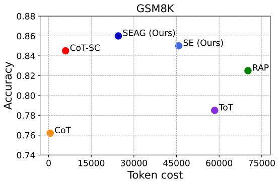

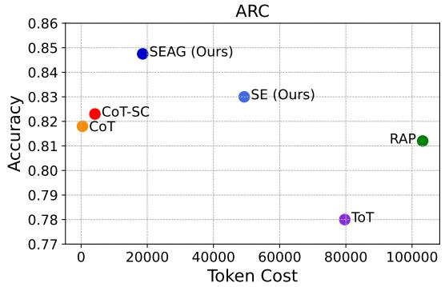

Figure A1: Scatter plots of accuracy and token cost for baselines and our methods, SE and SEAG, with GSM8K (left) and ARC (right) using Llama3-8B-Instruct model.
<table><tr><td>Benchmark</td><td>Method</td><td>Accuracy ↑</td><td># of inferences ↓</td><td>Input tokens ↓</td><td>Output tokens ↓</td></tr><tr><td rowspan="6">GSM8K</td><td>CoT</td><td>0.445</td><td>1</td><td>218.37</td><td>85.26</td></tr><tr><td>CoT-SC</td><td>0.598</td><td>10</td><td>2183.76</td><td>906.97</td></tr><tr><td>ToT</td><td>0.598</td><td>121.93</td><td>57187.68</td><td>2856.04</td></tr><tr><td>RAP</td><td>0.665</td><td>146.18</td><td>67526.58</td><td>3113.34</td></tr><tr><td>SE (Ours)</td><td>0.675</td><td>92.89</td><td>42832.03</td><td>1969.56</td></tr><tr><td>SEAG (Ours)</td><td>0.683</td><td>64.84</td><td>25853.65</td><td>1263.95</td></tr><tr><td rowspan="6">ARC</td><td>CoT</td><td>0.713</td><td>1</td><td>215.80</td><td>29.56</td></tr><tr><td>CoT-SC</td><td>0.787</td><td>10</td><td>2157.93</td><td>362.51</td></tr><tr><td>ToT</td><td>0.748</td><td>169.82</td><td>75622.06</td><td>2886.81</td></tr><tr><td>RAP</td><td>0.767</td><td>208.82</td><td>91586.37</td><td>3224.82</td></tr><tr><td>SE (Ours)</td><td>0.775</td><td>103.55</td><td>44404.50</td><td>1511.65</td></tr><tr><td>SEAG (Ours)</td><td>0.788</td><td>12.33</td><td>3155.79</td><td>397.37</td></tr></table>

Table A2: Comparison of reasoning methods effectiveness in accuracy and efficiency in the number of inferences, input tokens and output tokens for both GSM8K and ARC datasets using Llama3-8B-Base.
<table><tr><td>Benchmark</td><td>Method</td><td>Accuracy ↑</td><td># of inferences ↓</td><td>Input tokens ↓</td><td>Output tokens ↓</td></tr><tr><td rowspan="6">GSM8K</td><td>CoT</td><td>0.762</td><td>1</td><td>218.37</td><td>85.86</td></tr><tr><td>CoT-SC</td><td>0.845</td><td>10</td><td>2183.73</td><td>943.66</td></tr><tr><td>ToT</td><td>0.785</td><td>104.80</td><td>49003.05</td><td>2355.06</td></tr><tr><td>RAP</td><td>0.825</td><td>128.40</td><td>59800.59</td><td>2587.73</td></tr><tr><td>SE (Ours)</td><td>0.850</td><td>82.63</td><td>38743.45</td><td>1766.21</td></tr><tr><td>SEAG (Ours)</td><td>0.860</td><td>41.69</td><td>17501.68</td><td>1759.50</td></tr><tr><td rowspan="6">ARC</td><td>CoT</td><td>0.818</td><td>1</td><td>215.79</td><td>48.315</td></tr><tr><td>CoT-SC</td><td>0.823</td><td>10</td><td>2157.93</td><td>505.79</td></tr><tr><td>ToT</td><td>0.797</td><td>149.59</td><td>67534.70</td><td>3033.07</td></tr><tr><td>RAP</td><td>0.812</td><td>196.96</td><td>88670.52</td><td>3636.17</td></tr><tr><td>SE (Ours)</td><td>0.830</td><td>96.32</td><td>42507.85</td><td>1692.92</td></tr><tr><td>SEAG (Ours)</td><td>0.848</td><td>46.15</td><td>15993.29</td><td>655.90</td></tr></table>

Table A3: Comparison of reasoning methods effectiveness in accuracy and efficiency in the number of inferences, input tokens and output tokens for both GSM8K and ARC datasets using Llama3-8B-Instruct.

Following the procedure in Table 2, we implement SE using both the i.i.d. and sequential manners of action generation and compare the number of unique semantic clusters expanded with Llama3- 8B-Instruct. Interestingly, the sequential manner designed to encourage the generation of semantically distinct actions results in fewer unique semantic clusters compared to the standard i.i.d. sampling as shown in A4. Additionally, we observe a performance drop in accuracy with the sequential manner compared to i.i.d. sampling, from 0.850 to 0.812 on GSM8K and from 0.830 to 0.823 on ARC. Thus, while generating non-redundant actions through prompt-level modifications can be an interesting direction, it seems to be non-trivial. Moreover, conditioning action generation on previously sampled actions may shift the sampling distribution, potentially limiting the virtue of semantic consistency inherent in i.i.d. sampling, which is a key advantage used in SE.

<table><tr><td rowspan="2">Depth</td><td colspan="2">GSM8K</td><td colspan="2">ARC</td></tr><tr><td>i.i.d. sampling</td><td>Sequential generation</td><td>i.i.d. sampling</td><td>Sequential generation</td></tr><tr><td>1</td><td>2.31</td><td>1.37</td><td>3.00</td><td>1.72</td></tr><tr><td>2</td><td>2.15</td><td>1.53</td><td>3.22</td><td>2.00</td></tr><tr><td>3</td><td>2.07</td><td>1.59</td><td>2.60</td><td>2.05</td></tr><tr><td>4</td><td>1.81</td><td>1.53</td><td>1.55</td><td>1.17</td></tr></table>

Table A4: The average number of semantic clusters (counts) for i.i.d. sampling and sequential generation at each depth when four actions are generated at every step, d = 4 for both GSM8K and ARC datasets.

## I Prompt

Figure A2, A3, and A4 present examples of prompts. We use a 1-shot example for all inferences, including prompts for answer, action, and reward generation in tree search-based reasoning and CoT prompting.

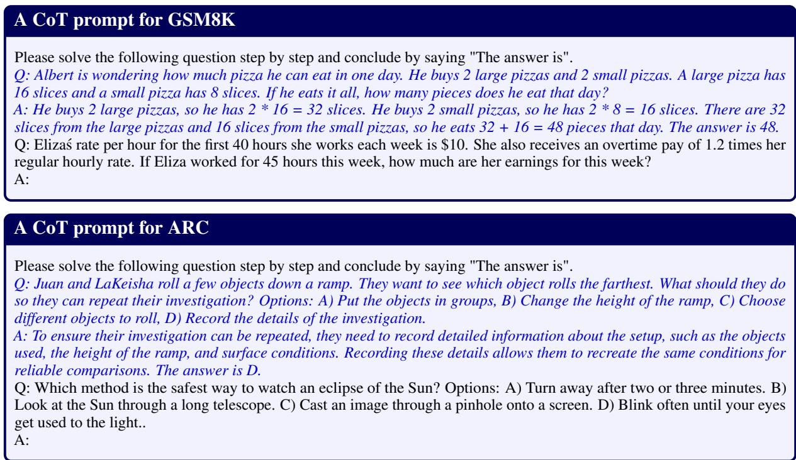  
Figure A2: Example prompts for CoT and CoT-SC. Italic texts denote 1-shot examples.

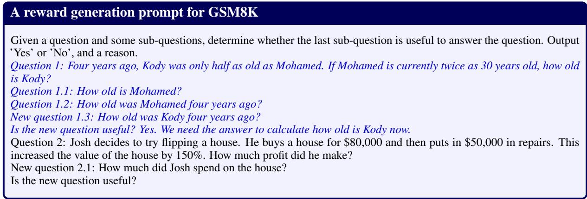  
Figure A3: Example prompts for GSM8K. Italic texts denote 1-shot examples.

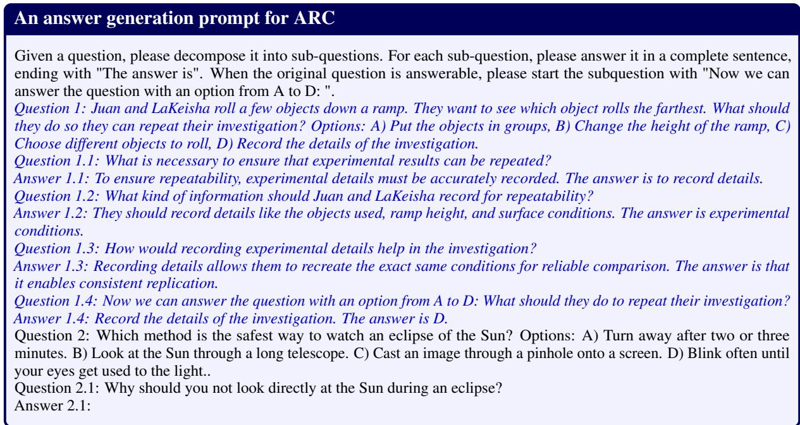

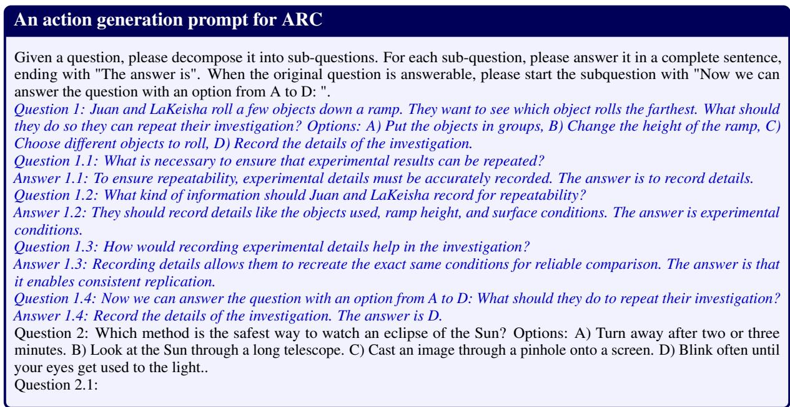

  
Figure A4: Example prompts for ARC. Italic texts denote 1-shot examples.