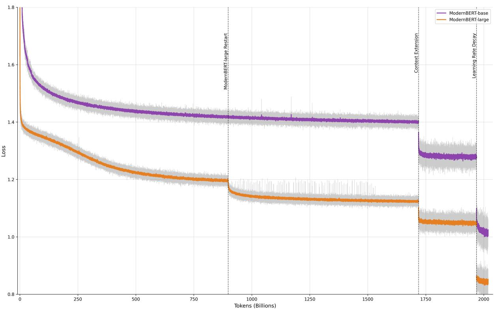

# Smarter, Better, Faster, Longer: A Modern Bidirectional Encoder for Fast, Memory Efficient, and Long Context Finetuning and Inference

Benjamin Warner1† Antoine Chaffin2† Benjamin Clavié1† Orion Weller3 Oskar Hallström2 Said Taghadouini2   
Alexis Gallagher1 Raja Biswas1 Faisal Ladhak4\* Tom Aarsen5   
Nathan Cooper1 Griffin Adams1 Jeremy Howard1 Iacopo Poli2

1Answer.AI 2LightOn 3Johns Hopkins University 4NVIDIA 5Hugging Face

†: core authors, \*: work done while at Answer.AI

Correspondence: {bw,bc}@answer.ai, antoine.chaffin@lighton.ai

## Abstract

Encoder-only transformer models such as BERT offer a great performance-size tradeoff for retrieval and classification tasks with respect to larger decoder-only models. Despite being the workhorse of numerous production pipelines, there have been limited Pareto improvements to BERT since its release. In this paper, we introduce ModernBERT, bringing modern model optimizations to encoder-only models and representing a major Pareto improvement over older encoders. Trained on 2 trillion tokens with a native 8192 sequence length, ModernBERT models exhibit state-ofthe-art results on a large pool of evaluations encompassing diverse classification tasks and both single and multi-vector retrieval on different domains (including code). In addition to strong downstream performance, Modern-BERT is also the most speed and memory efficient encoder and is designed for inference on common GPUs.

## 1 Introduction

After the release of BERT (Devlin et al., 2019), encoder-only transformer-based (Vaswani et al., 2017) language models dominated most applications of modern Natural Language Processing (NLP). Despite the rising popularity of Large Language Models (LLMs) such as GPT (Radford et al., 2018, 2019; Brown et al., 2020), Llama (Touvron et al., 2023; Dubey et al., 2024), and Qwen (Bai et al., 2023; Yang et al., 2024), encoder-only models remain widely used in a variety of nongenerative downstream applications.

The encoder’s popularity is largely due to their modest inference requirements, enabling them to efficiently process corpora of documents at scale for retrieval and quickly perform discriminative tasks. Encoder models offer a compelling tradeoff in quality versus size, making them a popular option against encoder-decoder and decoder-only language models when dealing with substantial amounts of data (Penedo et al., 2024).

Encoder models are particularly popular in Information Retrieval (IR) applications, e.g., semantic search, with notable progress on leveraging encoders for this task (Karpukhin et al., 2020; Khattab and Zaharia, 2020). While LLMs have taken the spotlight in recent years, they have also motivated a renewed interest in encoder-only models for IR. Indeed, encoder-based semantic search is a core component of Retrieval-Augmented Generation (RAG) pipelines (Lewis et al., 2020), where encoder models are used to retrieve and feed LLMs with context relevant to user queries.

Encoder-only models are also still frequently used for a variety of discriminative tasks such as classification (Tunstall et al., 2022) or Named Entity Recognition (NER) (Zaratiana et al., 2024), where they often match the performance of specialized LLMs. Here again, they can be used in conjunction with LLMs, for example detecting toxic prompts (Ji et al., 2023; Jiang et al., 2024b) and preventing responses, or routing queries in an agentic framework (Yao et al., 2023; Schick et al., 2023).

Surprisingly, these pipelines currently rely on older models, and quite often on the original BERT itself as their backbone (Wang et al., 2022; Xiao et al., 2023), without leveraging improvements developed in recent years. Practitioners face many drawbacks: sequence lengths limited to 512 tokens, suboptimal model design (Anthony et al., 2024) and vocabulary sizes (Karpathy, 2023), and generally inefficient architectures, whether in terms of downstream performance or computational efficiency. Finally, training data is limited in volume and restricted to narrow domains (especially lacking code data) or lacking knowledge of recent events.

Recent modernization efforts have only partially addressed the shortcomings of encoder-only models due to limited breadth. MosaicBERT (Portes et al., 2023), CrammingBERT (Geiping and Goldstein, 2023), and AcademicBERT (Izsak et al., 2021) focused on matching BERT performance with better training efficiency. NomicBERT (Nussbaum et al., 2024) and GTE-en-MLM (Zhang et al., 2024) (developed concurrently to this work) introduced longer-context encoder models focused on retrieval applications, but did not optimize for efficiency or classification performance, and re-used older training data mixtures which is especially apparent in programming-related tasks.

Contributions We present ModernBERT, a modernized encoder-only transformer model, with an improved architecture designed to increase downstream performance and efficiency, especially over longer sequence lengths. We also bring encoderonly models to modern, larger data scales, by training on 2 trillion tokens, with a data mixture including code data. We release two models, ModernBERT-base and ModernBERT-large, which reach state-of-the-art overall performance against all existing encoder models on a wide variety of downstream tasks. These results are achieved with considerably higher inference efficiency, processing sequences of 8192 tokens almost two times faster than previous models.

To support future research on encoder-only models, we release FlexBERT1, our modular architecture framework allowing easy experimentation, and inspired by Pythia (Biderman et al., 2023), all intermediate training checkpoints (further detailed in Section 2.2.2).

## 2 Methods

## 2.1 Architectural Improvements

Our model architecture extends the standard transformer architecture (Vaswani et al., 2017) by incorporating extensively tested recent advances (Section 2.1.1). We introduce additional efficiencyoriented modifications, through both architectural and implementation improvements (Section 2.1.2) and a GPU optimized model design (Section 2.1.3). All of our architectural decisions were informed by ablations, which we detail in Appendix D.

## 2.1.1 Modern Transformer

Bias Terms Following (Dayma et al., 2021), we disable bias terms in all linear layers except for the final decoder linear layer2. We also disable all bias terms in Layer Norms (Xu et al., 2019). These two changes allow us to spend more of our parameter budget in linear layers.

Positional Embeddings We use rotary positional embeddings (RoPE) (Su et al., 2024) instead of absolute positional embeddings. This choice is motivated by the proven performance of RoPE in short- and long-context language models (Black et al., 2022; Dubey et al., 2024; Gemma Team et al., 2024), efficient implementations in most frameworks, and ease of context extension.

Normalization We use a pre-normalization block (Xiong et al., 2020) with the standard layer normalization (Lei Ba et al., 2016), which is known to help stabilize training (Xiong et al., 2020). Similar to CrammingBERT (Geiping and Goldstein, 2023) which also uses pre-normalization, we add a LayerNorm after the embedding layer. To avoid repetition, we remove the first LayerNorm in the first attention layer.

Activation We adopt GeGLU (Shazeer, 2020), a Gated-Linear Units (GLU)-based (Dauphin et al., 2017) activation function built on top of the original BERT’s GeLU (Hendrycks and Gimpel, 2016) activation function. This is in line with recent work showing consistent empirical improvements when using GLU variants (Shazeer, 2020; Geiping and Goldstein, 2023).

## 2.1.2 Efficiency Improvements

Alternating Attention Following recent work on efficient long context models (Gemma Team et al., 2024), attention layers in ModernBERT alternate between global attention, where every token within a sequence attends to every other token, and local attention, where tokens only attend to each other within a small sliding window (Beltagy et al., 2020). In ModernBERT, every third layer employs global attention with a RoPE theta of 160,000 and the remaining layers use a 128 token, local sliding window attention with a RoPE theta of 10,000.

Unpadding ModernBERT follows MosaicBERT (Portes et al., 2023) and GTE (Zhang et al., 2024) in employing unpadding (Zeng et al., 2022) for both training and inference. Encoderonly language models typically use padding tokens to ensure a uniform sequence length in a batch, wasting compute on semantically empty tokens. Unpadding avoids this inefficiency by removing padding tokens, concatenating all sequences from a minibatch into a single sequence, and processing it as a batch of one. Prior unpadding implementations unpad and repad sequences internally for different model layers, wasting compute and memory bandwidth. We use Flash Attention’s variable length attention and RoPE implementations, allowing jagged attention masks and RoPE applications on one unpadded sequence. ModernBERT unpads inputs before the token embedding layer and optionally repads model outputs leading to a 10-to-20 percent performance improvement over other unpadding methods.

Flash Attention Flash Attention (Dao et al., 2022) is a core component of modern transformerbased models, providing memory and compute efficient attention kernels. At the start of this work, Flash Attention 3 (Shah et al., 2024), the most recent iteration for Nvidia H100 GPUs, did not include support for sliding window attention. ModernBERT uses a mixture of Flash Attention 3 for global attention layers and Flash Attention 2 (Dao, 2023) for local attention layers.

torch.compile We leverage PyTorch’s built-in compiling (Ansel et al., 2024) to improve the training efficiency by compiling all compatible modules. This yields a 10 percent improvement in throughput with negligible compilation overhead.

## 2.1.3 Model Design

At the same parameter count, models with more narrow layers (Deep & Narrow) have different learning patterns than models with fewer wide layers (Shallow & Wide) (Nguyen et al., 2021). Tay et al. (2022) and (Liu et al., 2024) have shown that Deep & Narrow language models have better downstream performance than their shallower counterparts, at the expense of slower inference.

Anthony et al. (2024) highlighted that large runtime gains can be unlocked by designing models in a hardware-aware way, which had previously been anecdotally observed by many practitioners (Shoeybi et al., 2019; Karpathy, 2023; Black et al., 2022). ModernBERT was designed through many small-scale ablations to maximize the utilization of a basket of common GPUs3, while aiming to be as Deep & Narrow as possible without a significant inference slowdown.

ModernBERT has 22 and 28 layers for the base and large models, for a total parameter count of 149 and 395 million, respectively, striking the balance between downstream performance and hardware efficiency. ModernBERT base has a hidden size of 768 with a GLU expansion of 2,304, while large has a hidden size of 1,024 and GLU expansion of 5,248. These ratios allow optimal tiling across tensor cores and the most efficient tiling across the differing number of streaming multiprocessors on our target basket of GPUs. More details on model design are provided in Appendix B.

## 2.2 Training

## 2.2.1 Data

Mixture Both ModernBERT models are trained on 2 trillion tokens of primarily English data from a variety of data sources, including web documents, code, and scientific literature, following common modern data mixtures. We choose the final data mixture based on a series of ablations.

Tokenizer Unlike the majority of recent encoders which reuse the original BERT tokenizer (Nussbaum et al., 2024; Portes et al., 2023; Zhang et al., 2024), we opt to use a modern BPE tokenizer. We use a modified version of the OLMo tokenizer (Groeneveld et al., 2024) which provides better token efficiency and performance on coderelated tasks. The ModernBERT tokenizer uses the same special tokens (e.g., [CLS] and [SEP]) and templating as the original BERT model (Devlin et al., 2019), facilitating backwards compatibility. To ensure optimal GPU utilization (Anthony et al., 2024; Karpathy, 2023), the vocabulary is set to 50,368, a multiple of 64 and includes 83 unused tokens to support downstream applications.

Sequence Packing In order to avoid high minibatch-size variance within our training batches as a result of unpadding, we adopt sequence packing (Raffel et al., 2020; Krell et al., 2022) with a greedy algorithm, which resulted in a sequence packing efficiency of over 99 percent, ensuring batch size uniformity.

## 2.2.2 Training Settings

MLM We follow the Masked Language Modeling (MLM) setup used by MosaicBERT (Portes et al., 2023). We remove the Next-Sentence Prediction objective which introduces noticeable overhead for no performance improvement (Liu et al., 2019a;

Izsak et al., 2021), and use a masking rate of 30 percent, as the original rate of 15 percent has since been shown to be sub-optimal (Wettig et al., 2023).

Optimizer We use the StableAdamW optimizer (Wortsman et al., 2023), which improves upon AdamW (Loshchilov and Hutter, 2019) by adding Adafactor-style (Shazeer and Stern, 2018) update clipping as a per-parameter learning rate adjustment. StableAdamW’s learning rate clipping outperformed standard gradient clipping on downstream tasks and led to more stable training. Hyperparameters details are given in Appendix A.

Learning Rate Schedule During pretraining, we use a modified trapezoidal Learning Rate (LR) schedule (Xing et al., 2018), also known as Warmup-Stable-Decay (WSD) (Zhai et al., 2022; Hu et al., 2024). After a short LR warmup, the trapezoidal schedule holds the LR constant for the majority of training, followed by a short LR decay. This schedule has been shown to match the performance of cosine scheduling (Hägele et al., 2024; Hallström et al., 2024) with the benefit of enabling continual training on any checkpoint without cold restart issues (Ash and Adams, 2019). Unlike most trapezoidal schedules, we use a 1  sqrt LR decay (Hägele et al., 2024), as we found it to outperform linear and cosine decay.

We trained ModernBERT-base at a constant LR of 8e-4 for 1.7 trillion tokens following a 3 billion token warmup. After a 2 billion token warmup, we trained ModernBERT-large at a LR of 5e-4 for 900 billion tokens. We rolled back and restarted training at 5e-5 for the remaining 800 billion tokens after large’s loss plateaued for a few hundred billion tokens at 5e-4. Full loss curves are available in AppendixG.

Batch Size Schedule Batch size scheduling starts with smaller gradient accumulated batches, increasing over time to the full batch size. In ablations, this schedule accelerated training progress. We warmup the batch size from 768 to 4,608 over 50 billion tokens and from 448 to 4,928 over 10 billion tokens, for ModernBERT-base and -large, respectively, with an uneven token schedule so each batch size has the same number of update steps. Details are provided in Appendix A.1.

Weight Initialization and Tiling We initialize ModernBERT-base with random weights following the Megatron initialization (Shoeybi et al., 2019). For ModernBERT-large, we follow the Phi model family (Li et al., 2023; Javaheripi et al., 2023)4 and initialize -large’s weights from ModernBERT-base. In ablation runs, this consistently matched Phi’s improved training results and greatly speed up the initial loss decrease of our model training5. Details are provided in Appendix A.3.

Context Length Extension After training on 1.7 trillion tokens at a 1024 sequence length and RoPE theta of 10,000, we extend the native context length of ModernBERT to 8192 tokens by increasing the global attention layer’s RoPE theta to 160,000 and train for an additional 300 billion tokens. We first train at a constant lower learning rate6 of 3e-4 for 250 billion tokens on an 8192 token mixture of the original pretraining dataset sampled following Fu et al. (2024). Next, we upsample higher-quality sources following Gao et al. (2024) and conduct the decay phase with a 1  sqrt LR schedule over 50 billion tokens. This context extension process yielded the most balanced model on downstream tasks, as most of our ablations using only one of these strategies resulted in a performance loss on either retrieval or classification tasks.

Training Ablations Discussion of the training and architecture ablations can be found in Appendix D

## 3 Downstream Evaluation

We performed an extensive set of evaluations, across a large range of tasks, aiming to demonstrate the versatility of ModernBERT in common scenarios.

For all tasks, ModernBERT is evaluated against existing encoders of similar size. The BASE size, conventionally defined as under 150 million parameters, includes BERT-base (Devlin et al., 2019), DeBERTa-v3-base (He et al., 2023), RoBERTabase (Liu et al., 2019a), as well as the more recent 8192 context NomicBERT (Nussbaum et al., 2024) and GTE-en-MLM-base (Zhang et al., 2024). The LARGE size, conventionally defined as above 300 million and under 500 million parameters, includes BERT-large-uncased (Devlin et al., 2019), DeBERTa-v3-large (He et al., 2023) and RoBERTalarge (Liu et al., 2019a) and GTE-en-MLMlarge (Zhang et al., 2024).

## 3.1 Evaluation Setting

## 3.1.1 Natural Language Understanding

The General Language Understanding Evaluation (GLUE) benchmark (Wang et al., 2018) is the standard Natural Language Understanding (NLU) benchmark for encoder models, aiming to measure how well a model performs across a range of sentence or sentence-pair understanding tasks, such as sentiment detection (Liu et al., 2019b) or language entailment, through tasks such as MNLI (Williams et al., 2018). Although GLUE is often regarded as saturated by the best-performing models, such as large language models (Zhao et al., 2023), it remains one of the most commonly used evaluation suites for smaller encoder-based models, and provides a good impression of a model’s performance on common classification tasks (Portes et al., 2023; Zhang et al., 2024; He et al., 2023).

We follow the practice of previous studies (Devlin et al., 2019; Liu et al., 2019a; He et al., 2023) and conduct a hyperparameter search on each GLUE subset (detailed in Appendix E.1) in order to provide values comparable to other models.7

## 3.1.2 Text Retrieval

Information Retrieval (IR) is one of the most common applications of encoder-only models,8 where they are used to represent documents and queries in semantic search (Karpukhin et al., 2020). This domain has recently seen considerable growth and interest following the spread of LLMs where semantic search powered by lightweight models is used to provide relevant context to LLMs as part of Retrieval-Augmented Generation pipelines.

We evaluate models in both the single-vector Dense Passage Retrieval (DPR) (Karpukhin et al., 2020) setting and the multi-vector ColBERT (Khattab and Zaharia, 2020) setting.

We report retrieval results on the popular BEIR evaluation suite (Thakur et al., 2021), the common standard for evaluating retrieval performance across a variety of tasks and domains, using the nDCG@10 metric. For each setting detailed below, we conduct a learning rate sweep based on results over a subset of the BEIR benchmarks to select the final model, detailed in Appendix E.2.

Single vector retrieval One of the most common approaches to neural retrieval using encoders is DPR (Karpukhin et al., 2020), where a singlevector is used to represent an entire document. The similarity between a query and a document can then be computed through distance operations, such as cosine similarity. Models are finetuned using contrastive learning to create representations which are close if a document is relevant to a query, and distant if not (van den Oord et al., 2018).

We train every base model using the MS-MARCO (Bajaj et al., 2016) dataset with mined hard negatives (Xuan et al., 2020) on 1.25M samples using sentence-transformers (Reimers and Gurevych, 2019). Hyperparameters are detailed in Appendix E.2.

Multi vector retrieval Multi-vector retrieval, championed by ColBERT (Khattab and Zaharia, 2020), seeks to mitigate lost information from compressing an entire sequence into a single vector. In multi-vector retrieval, each document is represented by all of its individual token vectors, and the similarity between a query and a document is computed using the MaxSim9 operator.

We adopt the training setup of JaCol-BERTv2.5 (Clavié, 2024), an update on the ColBERTv2 (Santhanam et al., 2022) training procedure. We train all models by distilling the knowledge of a teacher model by using the KL-Divergence between the normalized teacher and student scores. Models are trained on 810k samples from MS-Marco (Bajaj et al., 2016) and teacher scores from BGE-M3 (Chen et al., 2024), using the PyLate library (Chaffin and Sourty, 2024). Hyperparameters are detailed in Appendix E.2.

## 3.1.3 Long-Context Text Retrieval

With a native 8192 context length, ModernBERT improves long-context performance over most existing encoders. However, there are relatively few standardized long-context benchmarks for encoder-only models, and most benchmarks, such as Needle-in-a-haystack (Kamradt, 2023) and RULER (Hsieh et al., 2024) are geared towards generative tasks. Given this limitation, we demonstrate improved long-context performance on the English subset of MLDR (Chen et al., 2024), a long-context retrieval benchmark comprised of over 200,000 long documents. We evaluate three settings:

<table><tr><td colspan="2"></td><td colspan="3">IR (DPR)</td><td colspan="2">IR (ColBERT)</td><td>NLU</td><td colspan="2">Code</td></tr><tr><td colspan="2">Model</td><td>BEIR</td><td> $\mathbf { M L D R _ { O O D } }$ </td><td> $\bf { M L D R } _ { \mathrm { { I D } } }$ </td><td>BEIR</td><td> $\mathbf { M L D R _ { O O D } }$ </td><td>GLUE</td><td>CSN</td><td>SQA</td></tr><tr><td rowspan="6">Base</td><td>BERT</td><td>38.9</td><td>23.9</td><td>32.2</td><td>49.0</td><td>28.1</td><td>84.7</td><td>41.2</td><td>59.5</td></tr><tr><td>RoBERTa</td><td>37.7</td><td>22.9</td><td>32.8</td><td>48.7</td><td>28.2</td><td>86.4</td><td>44.3</td><td>59.6</td></tr><tr><td>DeBERTaV3</td><td>20.2</td><td>5.4</td><td>13.4</td><td>47.1</td><td>21.9</td><td>88.1</td><td>17.5</td><td>18.6</td></tr><tr><td>NomicBERT</td><td>41.0</td><td>26.7</td><td>30.3</td><td>49.9</td><td>61.3</td><td>84.0</td><td>41.6</td><td>61.4</td></tr><tr><td>GTE-en-MLM</td><td>41.4</td><td>34.3</td><td>44.4</td><td>48.2</td><td>69.3</td><td>85.6</td><td>44.9</td><td>71.4</td></tr><tr><td>ModernBERT</td><td>41.6</td><td>27.4</td><td>44.0</td><td>51.3</td><td>80.2</td><td>88.4</td><td>56.4</td><td>73.6</td></tr><tr><td rowspan="5">arge</td><td>BERT</td><td>38.9</td><td>23.3</td><td>31.7</td><td>49.5</td><td>28.5</td><td>85.2</td><td>41.6</td><td>60.8</td></tr><tr><td>RoBERTa</td><td>41.4</td><td>22.6</td><td>36.1</td><td>49.8</td><td>28.8</td><td>88.9</td><td>47.3</td><td>68.1</td></tr><tr><td>DeBERTaV3</td><td>25.6</td><td>7.1</td><td>19.2</td><td>46.7</td><td>23.0</td><td>91.4</td><td>21.2</td><td>19.7</td></tr><tr><td>GTE-en-MLM</td><td>42.5</td><td>36.4</td><td>48.9</td><td>50.7</td><td>71.3</td><td>87.6</td><td>40.5</td><td>66.9</td></tr><tr><td>ModernBERT</td><td>44.0</td><td>34.3</td><td>48.6</td><td>52.4</td><td>80.4</td><td>90.4</td><td>59.5</td><td>83.9</td></tr></table>

Table 1: Results for all models across an overview of all tasks. CSN refers to CodeSearchNet and SQA to StackQA. $\bf { M L D R } _ { \mathrm { { I D } } }$ refers to in-domain (fine-tuned on the training set) evaluation, and $\mathbf { M L D R _ { O O D } }$ to out-of-domain.

Single Vector – Out-Of-Domain Models are trained on short-context MS-MARCO as described above, and is evaluated on long context MLDR without any further fine-tuning.

Single Vector – In Domain Models trained on MS-MARCO are further fine-tuned on longcontext MLDR training set before being evaluated.

Multi-Vector – Out-Of-Domain Due to its token-level MaxSim mechanism, ColBERT models are able to generalize to long-context without any specific training (Bergum, 2024). We directly evaluate the best checkpoints from Section 3.1.2 without any further fine-tuning on MLDR.

## 3.1.4 Code Retrieval

Fueled by increasingly good code completion models (Jiang et al., 2024a), downstream applications have quickly grown in popularity following the emergence of code assistants.10 Encoder-only models are used to process and retrieve large quantities of code-related information under resource constraints, increasing the importance of measuring and improving code capabilities of encoder models (Li et al., 2024). Unlike most previous encoders which were largely trained only on textual data (Devlin et al., 2019; Liu et al., 2019a; Portes et al., 2023; Zhang et al., 2024; Nussbaum et al., 2024), ModernBERT is pre-trained on code and uses a

code-aware tokenizer11.

To measure programming-related performance, we evaluate all models on CodeSearchNet (Husain et al., 2019), a code-to-text benchmark where the model must identify relevant docstring or comments for code blocks, and StackOverflow-QA (Li et al., 2024), where the model must identify relevant responses to StackOverflow questions, in a "hybrid" setting where documents contain both text and code. The latter benchmark also leverages longcontext capabilities, as its queries and documents respectively contain 1,400 and 1,200 words on average, leading to average token counts of over 2000.

We evaluate these benchmarks using the CoIR (CodeIR) framework (Li et al., 2024), as singlevector retrieval tasks. All models are trained by re-using the best hyper-parameters identified in Section 3.1.2.

## 3.2 Downstream Results and Discussion

Aggregated results for all evaluations are presented in Table 1. For BEIR and GLUE, the two common evaluation suites, we follow existing practice in reporting the average results. Detailed results are provided in Appendix E.

In terms of downstream performance, Modern-BERT is the strongest overall model at both the BASE and LARGE model sizes. ModernBERT represents a Pareto improvement on all tasks over the original BERT and RoBERTA models, with better performance on every evaluation category.

<table><tr><td rowspan="2">Model</td><td rowspan="2">Params</td><td colspan="3">Short</td><td colspan="3">Long</td></tr><tr><td>BS</td><td>Fixed</td><td>Variable</td><td>BS</td><td>Fixed</td><td>Variable</td></tr><tr><td rowspan="7">Base</td><td>BERT</td><td>110M</td><td>1096</td><td>180.4</td><td>90.2</td><td>一</td><td>1</td><td>一</td></tr><tr><td>RoBERTa</td><td>125M</td><td>664</td><td>179.9</td><td>89.9</td><td>一</td><td>一</td><td>一</td></tr><tr><td>DeBERTaV3</td><td>183M</td><td>236</td><td>70.2</td><td>35.1</td><td>一</td><td></td><td>一</td></tr><tr><td>NomicBERT</td><td>137M</td><td>588</td><td>117.1</td><td>58.5</td><td>36</td><td>46.1</td><td>23.1</td></tr><tr><td>GTE-en-MLM</td><td>137M</td><td>640</td><td>123.7</td><td>61.8</td><td>38</td><td>46.8</td><td>23.4</td></tr><tr><td> $\mathrm { G T E - e n - M L M _ { x f o r m e r s } }$ </td><td>137M</td><td>640</td><td>122.5</td><td>128.6</td><td>38</td><td>47.5</td><td>67.3</td></tr><tr><td>ModernBERT</td><td>149M</td><td>1604</td><td>148.1</td><td>147.3</td><td>98</td><td>123.7</td><td>133.8</td></tr><tr><td rowspan="6">arge</td><td>BERT</td><td>330M</td><td>792</td><td>54.4</td><td>27.2</td><td>一</td><td>一</td><td>一</td></tr><tr><td>RoBERTa</td><td>355M</td><td>460</td><td>42.0</td><td>21.0</td><td>一</td><td>一</td><td>一</td></tr><tr><td>DeBERTaV3</td><td>434M</td><td>134</td><td>24.6</td><td>12.3</td><td>一</td><td></td><td>一</td></tr><tr><td>GTE-en-MLM</td><td>435M</td><td>472</td><td>38.7</td><td>19.3</td><td>28</td><td>16.2</td><td>8.1</td></tr><tr><td> $\mathbf { G T E { \mathrm { - } } e n { \mathrm { - } } M L M } _ { \mathrm { x f o r m e r s } }$ </td><td>435M</td><td>472</td><td>38.5</td><td>40.4</td><td>28</td><td>16.5</td><td>22.8</td></tr><tr><td>ModernBERT</td><td>395M</td><td>770</td><td>52.3</td><td>52.9</td><td>48</td><td>46.8</td><td>49.8</td></tr></table>

Table 2: Memory (max batch size, BS) and Inference (in thousands of tokens per second) efficiency results on an NVIDIA RTX 4090, averaged over 10 runs. Dashes indicate unsupported configurations.

Short-Context Retrieval On BEIR, both variants of ModernBERT outperform existing encoders in both the DPR and ColBERT settings, including the recent GTE-en-MLM and NomicBERT models designed to serve as better backbones for retrieval (Zhang et al., 2024; Nussbaum et al., 2024).

While ModernBERT-base only narrowly edges out GTE-en-MLM-base on DPR evaluations, ModernBERT-large increases its lead despite having comparatively fewer parameters at 395M to GTE-en-MLM-large’s 435M.

Long-Context Retrieval - Single Vector In the DPR setting, ModernBERT achieves impressive performance on MLDR, a long-context text retrieval task. However, these results also highlight an interesting phenomenon: without long-context finetuning ModernBERT outperforms both shortercontext models and the long-context NomicBERT but performs noticeably worse than GTE-en-MLM. The performance gap narrows considerably when evaluated in-domain, with both models performing similarly. This suggests that ModernBERT can effectively process long context sequences as a dense encoder but may require more adapted tuning. We plan to explore multiple potential explanations for this phenomenon in future work, including the impact of local attention or GTE-en-MLM having spent a larger part of its pretraining compute budget on longer sequence lengths (Zhang et al., 2024).

Long-Context Retrieval - Multi-Vector In the ColBERT setting, long-context models (GTEen-MLM, NomicBERT, and ModernBERT) all outperform short-context models by at least 40 NDCG@10 points without requiring any specific finetuning. These results confirm the findings of Bergum (2024), who showed that ColBERT models are particularly well-suited to long-context retrieval tasks. Among the long-context models, Modern-BERT outperforms other long-context models, with at least a 9 NDCG@10 point lead on both model sizes. We theorize that these sizable gains could be explained by our long pretraining ensuring few, if any, tokens are under-trained, as well as a potentially synergistic effect of local attention with ColBERT-style retrieval, but leave further exploration of this phenomenon to future work.

Natural Language Understanding Both ModernBERT models demonstrate exceptional NLU results, as measured by GLUE. ModernBERTbase surpasses all existing base models, including DeBERTaV3-base, becoming the first MLMtrained model to do so. This is surprising, as DeBERTaV3 was trained with the Replaced-Token-Detection objective, which was previously thought to yield stronger downstream NLU performance (Clark et al., 2020; He et al., 2023). ModernBERT-large is the second-best large encoder on GLUE, almost matching DeBERTaV3- large with one-tenth fewer parameters while processing tokens in half the time (see Section 4).

Code On programming tasks, in both code-totext (CodeSearchNet) and longer-context hybrid settings (StackQA), ModernBERT outperforms all other models. This result was expected, as it is the only evaluated encoder to be trained on a data mixture including programming data. These results, combined with ModernBERT’s strong showings on other tasks, indicates that ModernBERT has improved understanding of code at no detriment to its ability to process natural text.

## 4 Efficiency

## 4.1 Evaluation Setting

To measure inference efficiency across multiple sequence lengths, we create 4 synthetic sets of 8192 documents12. The first two document sets are fixed-length: in fixed short-context, all documents contain 512 tokens and infixed long-context all documents contain 8192 tokens13. To account for the impact of unpadding, we also create two varying-length document sets, where the number of tokens in each set are defined by a normal distribution centered on half the maximum sequence length, 256 and 4096 tokens, respectively. Full data statistics are provided in Appendix F.

We then evaluate all models based on the number of tokens they can process per second, averaged over ten runs. All efficiency evaluations are ran on a single NVIDIA RTX 4090, one of the target GPUs of ModernBERT outlined in Section 2.1.3 We evaluate the GTE-en-MLM models under two settings: out-of-the box, and with the use of the xformers (Lefaudeux et al., 2022) library, which enables efficiency enhancements such as unpadding.

## 4.2 Results

All tokens-per-second efficiency results are presented in Table 2, with absolute run-times provided in Appendix F. ModernBERT stands out as the most efficient model overall. On short context, it processes fixed-length 512 token inputs faster than all other recent encoders, although slower than the original BERT and RoBERTa models14. On longcontext, ModernBERT is faster than all competing encoders, processing documents 2.65 and 3 times faster than the next-fastest encoder at the BASE and LARGE sizes, respectively. ModernBERT-large’s processing speed at length 8192 (46,801 tokens per second) is closer to that of GTE-en-MLM base (47,507 tokens per second) than it is to GTE-en-MLM-large (16,532 tokens per second).

On variable-length inputs, both GTE-en-MLM and ModernBERT models are considerably faster than all other models, largely due to unpadding. However, ModernBERT remains noticeably more efficient than GTE-en-MLM, processing 14.5-30.9 percent more tokens per second at low context lengths and 98.8-118.8 percent more at longer context lengths, thanks to its use of local attention.

ModernBERT is the overall most memory efficient model on both model sizes. ModernBERTbase is able to process batch sizes twice as large as every other model on both input lengths. ModernBERT-large is slightly less memory efficient than the original BERT-large on short-context inputs, but can process batches at least 60 percent bigger than every other large model.

## 5 Conclusion

We present ModernBERT, an open family of encoder-only models which set a new state of the art over existing encoder models on a wide range of classification and retrieval tasks. We show that encoders benefit from both recent pretraining data scales and architecture improvements from autoregressive LLMs.

ModernBERT has a native sequence length of 8,192 tokens and incorporates recent architecture improvements, such as GeGLU layers, RoPE positional embeddings, and alternating local-global attention. ModernBERT is the first open model to feature full model unpadding and is the first encoder designed in a hardware-aware way to maximize inference efficiency.

ModernBERT pushes the encoder state of the art forward across a wide range of benchmarks. On GLUE, ModernBERT-base is the first encoder to beat DeBERTaV3-base since its release in 2021. ModernBERT is in a class of its own in code and ColBERT-style long-context retrieval benchmarks, scoring at least 6.85 and 9.1 percentage points higher than the closest model, respectively, while remaining state-of-the-art on short-context retrieval in both single and multi-vector settings.

At the same time, ModernBERT processes short context inputs twice as fast as DeBERTaV3 and long-context inputs two times faster than the next fastest model with best-in-class memory efficiency.

ModernBERT is a generational leap over the original encoder models, with notable performance improvements over BERT and RoBERTa on both classification and retrieval tasks. ModernBERT is one of the few encoders to support long-context and programming applications, while simultaneously setting a new record in encoder inference efficiency.

## 6 Limitations

Language This study focuses exclusively on the English language, and trains on a very large number of tokens. As such, a major limitation of our work is that it is not directly applicable to other languages, and potentially even less-so to lower resources languages. Exploration of modernizing encoder models in multilingual (Zhang et al., 2024) and monolingual but non-English (Antoun et al., 2024) settings is a promising avenue.

Biases Our model is trained largely on web data, as a result, all of its representations are subject to the biases present in such data.

Harmful Content Generation The MLM objective gives the model some ability to generate text by suggesting a given token to replace the [MASK] token (Samuel, 2024), which could result in the generation of harmful content. However, Modern-BERT is not, primarily, a generative model, and as such, has not been trained to and therefore cannot generate longer sequences of text. As a result, it is considerably less likely to be at risk of generating harmful content of any kind.

MLM-only objective Given the strong results of DeBERTav3 on classification tasks but weak ones on retrieval, it seems that a training leveraging both MLM and RTD might be better suited to achieve best results on classification. Extending our work to RTD is thus a promising line of research.

Scaling Besides the architectural modifications, a key aspect of our studies is data scaling. However, other scaling axes, notably in terms of model parameters are left unexplored.

## 7 Acknowledgements

The authors would like to acknowledge & thank the many people who assisted, supported, or offered insights useful for the completion of this project.

We are particularly thankful for the one-off implementation or evaluation work conducted by Jack Cook, Mark Tenenholtz, Johno Whitaker, and Wayde Gilliam. We also extend similar thanks to

Zach Nussbaum for assisting in resolving issues we encountered with NomicBERT during evaluation.

We would like to acknowledge Enrico Shippole, Daniel Han, Colin Raffel, Pierre-Carl Langlais, Omar Khattab, Urchade Zaratiana, Aurélien Lac, Amélie Chatelain, and Raphaël Sourty, for their helpful contributions to discussions.

We also thank Weights&Biases for providing free access to their platform, in particular Morgan McGuire and Thomas Capelle for their support.

We thank HuggingFace’s Arthur Zucker, Cyril Vallez, and Pedro Cuenca for assisting with dayone HuggingFace support.

Finally, we acknowledge Orange Business Cloud Avenue as compute provider and their hardware support throughout the project and thank LightOn for sponsoring the compute.

## 8 Contribution Statement

BW, AC, and BC jointly led the project and contributed to all parts of it.

BW worked on all aspects of the project and contributed to all major decisions. He led model design, model training, implemented the majority of the model architecture, and assisted with data selection, elevations, and paper writing.

AC co-initiated the project and worked on all aspects of it, including project coordination. Notably, he contributed to monitoring training runs and coled ablations, final evaluations and paper writing. BC initiated the project and worked on all aspects of it. He contributed to model design and co-led final evaluations, led paper writing, and contributed to the context extension data processing.

OW led and conducted the majority of the data selection, processing, and discussion, for all stages of training. He also contributed valuable inputs throughout all stages of the project.

OH and ST contributed to a majority of the stages of the project, in particular model architecture and training, with both discussions, implementations and paper writing. Other contributions include pretraining monitoring, final traditional evaluations, and ablations. ST specifically worked on adapting the RoPE kernel for unpadded sequences and running the final GLUE benchmarks. OH additionally conducted a thorough investigation into complex issues that arose during training.

RB contributed greatly to the initial evaluation work, focusing on ablations and in-training evals. AG and FL contributed to training efficiency, especially in implementing sequence packing.

AG and GA contributed to model evaluations, especially in long context evaluations.

TA contributed to discussions throughout the project and assisted in integrating the original research implementation with open source software. NC contributed to context extension data mixtures, and provided insight into model training and on improving the quality of code data.

IP and JH provided guidance and support throughout the project, especially on key decisions.

## References

Jason Ansel, Edward Yang, Horace He, Natalia Gimelshein, Animesh Jain, Michael Voznesensky, Bin Bao, Peter Bell, David Berard, Evgeni Burovski, et al. 2024. Pytorch 2: Faster machine learning through dynamic python bytecode transformation and graph compilation. In Proceedings of the 29th ACM International Conference on Architectural Support for Programming Languages and Operating Systems, volume 2, pages 929–947.

Quentin Anthony, Jacob Hatef, Deepak Narayanan, Stella Biderman, Stas Bekman, Junqi Yin, Aamir Shafi, Hari Subramoni, and Dhabaleswar Panda. 2024. The case for co-designing model architectures with hardware. Preprint, arXiv:2401.14489.

Wissam Antoun, Francis Kulumba, Rian Touchent, Éric de la Clergerie, Benoît Sagot, and Djamé Seddah. 2024. Camembert 2.0: A smarter french language model aged to perfection. Preprint, arXiv:2411.08868.

Jordan T. Ash and Ryan P. Adams. 2019. On the difficulty of warm-starting neural network training. CoRR, abs/1910.08475.

Jinze Bai, Shuai Bai, Yunfei Chu, Zeyu Cui, Kai Dang, Xiaodong Deng, Yang Fan, Wenbin Ge, Yu Han, Fei Huang, et al. 2023. Qwen technical report. arXiv preprint arXiv:2309.16609.

Payal Bajaj, Daniel Campos, Nick Craswell, Li Deng, Jianfeng Gao, Xiaodong Liu, Rangan Majumder, Andrew McNamara, Bhaskar Mitra, Tri Nguyen, et al. 2016. Ms marco: A human generated machine reading comprehension dataset. arXiv preprint arXiv:1611.09268.

Marco Bellagente, Jonathan Tow, Dakota Mahan, Duy Phung, Maksym Zhuravinskyi, Reshinth Adithyan, James Baicoianu, Ben Brooks, Nathan Cooper, Ashish Datta, Meng Lee, Emad Mostaque, Michael Pieler, Nikhil Pinnaparju, Paulo Rocha, Harry Saini, Hannah Teufel, Niccolo Zanichelli, and Carlos Riquelme. 2024. Stable lm 2 1.6b technical report. Preprint, arXiv:2402.17834.

Iz Beltagy, Matthew E. Peters, and Arman Cohan. 2020. Longformer: The long-document transformer. Preprint, arXiv:2004.05150.

Jo Kristian Bergum. 2024. Announcing vespa longcontext ColBERT. Vespa Blog.

Stella Biderman, Hailey Schoelkopf, Quentin Gregory Anthony, Herbie Bradley, Kyle O’Brien, Eric Hallahan, Mohammad Aflah Khan, Shivanshu Purohit, USVSN Sai Prashanth, Edward Raff, et al. 2023. Pythia: A suite for analyzing large language models across training and scaling. In International Conference on Machine Learning, pages 2397–2430. PMLR.

Sidney Black, Stella Biderman, Eric Hallahan, Quentin Anthony, Leo Gao, Laurence Golding, Horace He, Connor Leahy, Kyle McDonell, Jason Phang, et al. 2022. Gpt-neox-20b: An open-source autoregressive language model. In Proceedings ofBigScience Episode# 5–Workshop on Challenges & Perspectives in Creating Large Language Models, pages 95–136.

Tom B. Brown, Benjamin Mann, Nick Ryder, Melanie Subbiah, Jared Kaplan, Prafulla Dhariwal, Arvind Neelakantan, Pranav Shyam, Girish Sastry, Amanda Askell, Sandhini Agarwal, Ariel Herbert-Voss, Gretchen Krueger, Tom Henighan, Rewon Child, Aditya Ramesh, Daniel M. Ziegler, Jeffrey Wu, Clemens Winter, Christopher Hesse, Mark Chen, Eric Sigler, Mateusz Litwin, Scott Gray, Benjamin Chess, Jack Clark, Christopher Berner, Sam McCandlish, Alec Radford, Ilya Sutskever, and Dario Amodei. 2020. Language models are few-shot learners. In Advances in Neural Information Processing Systems 33: Annual Conference on Neural Information Processing Systems 2020, NeurIPS 2020, December 6-12, 2020, virtual.

Antoine Chaffin and Raphaël Sourty. 2024. Pylate: Flexible training and retrieval for late interaction models.

Jianlyu Chen, Shitao Xiao, Peitian Zhang, Kun Luo, Defu Lian, and Zheng Liu. 2024. M3- embedding: Multi-linguality, multi-functionality, multi-granularity text embeddings through selfknowledge distillation. In Findings of the Association for Computational Linguistics, ACL 2024, Bangkok, Thailand and virtual meeting, August 11- 16, 2024, pages 2318–2335. Association for Computational Linguistics.

Aakanksha Chowdhery, Sharan Narang, Jacob Devlin, Maarten Bosma, Gaurav Mishra, Adam Roberts, Paul Barham, Hyung Won Chung, Charles Sutton, Sebastian Gehrmann, Parker Schuh, Kensen Shi, Sasha Tsvyashchenko, Joshua Maynez, Abhishek Rao, Parker Barnes, Yi Tay, Noam Shazeer, Vinodkumar Prabhakaran, Emily Reif, Nan Du, Ben Hutchinson, Reiner Pope, James Bradbury, Jacob Austin, Michael Isard, Guy Gur-Ari, Pengcheng Yin, Toju Duke, Anselm Levskaya, Sanjay Ghemawat, Sunipa Dev, Henryk Michalewski, Xavier Garcia,

Vedant Misra, Kevin Robinson, Liam Fedus, Denny Zhou, Daphne Ippolito, David Luan, Hyeontaek Lim, Barret Zoph, Alexander Spiridonov, Ryan Sepassi, David Dohan, Shivani Agrawal, Mark Omernick, Andrew M. Dai, Thanumalayan Sankaranarayana Pillai, Marie Pellat, Aitor Lewkowycz, Erica Moreira, Rewon Child, Oleksandr Polozov, Katherine Lee, Zongwei Zhou, Xuezhi Wang, Brennan Saeta, Mark Diaz, Orhan Firat, Michele Catasta, Jason Wei, Kathy Meier-Hellstern, Douglas Eck, Jeff Dean, Slav Petrov, and Noah Fiedel. 2023. Palm: Scaling language modeling with pathways. J. Mach. Learn. Res., 24:240:1– 240:113.

Kevin Clark, Minh-Thang Luong, Quoc V. Le, and Christopher D. Manning. 2020. ELECTRA: pretraining text encoders as discriminators rather than generators. In 8th International Conference on Learning Representations, ICLR 2020, Addis Ababa, Ethiopia, April 26-30, 2020. OpenReview.net.

Benjamin Clavié. 2024. Jacolbertv2.5: Optimising multi-vector retrievers to create state-of-theart japanese retrievers with constrained resources. Preprint, arXiv:2407.20750.

Tri Dao. 2023. Flashattention-2: Faster attention with better parallelism and work partitioning. In The Twelfth International Conference on Learning Representations.

Tri Dao, Dan Fu, Stefano Ermon, Atri Rudra, and Christopher Ré. 2022. Flashattention: Fast and memory-efficient exact attention with io-awareness. Advances in Neural Information Processing Systems, 35:16344–16359.

Yann N. Dauphin, Angela Fan, Michael Auli, and David Grangier. 2017. Language modeling with gated convolutional networks. In Proceedings ofthe 34th International Conference on Machine Learning, volume 70 of Proceedings of Machine Learning Research, pages 933–941. PMLR.

Boris Dayma, Suraj Patil, Pedro Cuenca, Khalid Saifullah, Tanishq Abraham, Phúc Lê Khac, Luke Melas,˘ and Ritobrata Ghosh. 2021. Dall·e mini.

Jacob Devlin, Ming-Wei Chang, Kenton Lee, and Kristina Toutanova. 2019. BERT: pre-training of deep bidirectional transformers for language understanding. In Proceedings ofthe 2019 Conference of the North American Chapter ofthe Associationfor Computational Linguistics: Human Language Technologies, NAACL-HLT 2019, Minneapolis, MN, USA, June 2-7, 2019, Volume 1 (Long and Short Papers), pages 4171–4186. Association for Computational Linguistics.

Abhimanyu Dubey, Abhinav Jauhri, Abhinav Pandey, Abhishek Kadian, Ahmad Al-Dahle, Aiesha Letman, Akhil Mathur, Alan Schelten, Amy Yang, Angela Fan, et al. 2024. The llama 3 herd of models. arXiv preprint arXiv:2407.21783.

Yao Fu, Rameswar Panda, Xinyao Niu, Xiang Yue, Hannaneh Hajishirzi, Yoon Kim, and Hao Peng. 2024. Data engineering for scaling language models to 128k context. Preprint, arXiv:2402.10171.

Jun Gao, Di He, Xu Tan, Tao Qin, Liwei Wang, and Tie-Yan Liu. 2019. Representation degeneration problem in training natural language generation models. ArXiv, abs/1907.12009.

Tianyu Gao, Alexander Wettig, Howard Yen, and Danqi Chen. 2024. How to train long-context language models (effectively). Preprint, arXiv:2410.02660.

Jonas Geiping and Tom Goldstein. 2023. Cramming: Training a language model on a single GPU in one day. In International Conference on Machine Learning, ICML 2023, 23-29 July 2023, Honolulu, Hawaii, USA, volume 202 of Proceedings ofMachine Learning Research, pages 11117–11143. PMLR.

Gemma Team, Morgane Riviere, Shreya Pathak, Pier Giuseppe Sessa, Cassidy Hardin, Surya Bhupati raju, Léonard Hussenot, Thomas Mesnard, Bobak Shahriari, Alexandre Ramé, Johan Ferret, Peter Liu, Pouya Tafti, Abe Friesen, Michelle Casbon, Sabela Ramos, Ravin Kumar, Charline Le Lan, Sammy Jerome, Anton Tsitsulin, Nino Vieillard, Piotr Stanczyk, Sertan Girgin, Nikola Momchev, Matt Hoffman, Shantanu Thakoor, Jean-Bastien Grill, Behnam Neyshabur, Olivier Bachem, Alanna Wal ton, Aliaksei Severyn, Alicia Parrish, Aliya Ah mad, Allen Hutchison, Alvin Abdagic, Amanda Carl, Amy Shen, Andy Brock, Andy Coenen, Anthony Laforge, Antonia Paterson, Ben Bastian, Bilal Piot, Bo Wu, Brandon Royal, Charlie Chen, Chintu Kumar, Chris Perry, Chris Welty, Christopher A. Choquette-Choo, Danila Sinopalnikov, David Wein berger, Dimple Vijaykumar, Dominika Rogozinska,´ Dustin Herbison, Elisa Bandy, Emma Wang, Eric Noland, Erica Moreira, Evan Senter, Evgenii Eltyshev, Francesco Visin, Gabriel Rasskin, Gary Wei, Glenn Cameron, Gus Martins, Hadi Hashemi, Hanna Klimczak-Plucinska, Harleen Batra, Harsh Dhand,´ Ivan Nardini, Jacinda Mein, Jack Zhou, James Svensson, Jeff Stanway, Jetha Chan, Jin Peng Zhou, Joana Carrasqueira, Joana Iljazi, Jocelyn Becker, Joe Fer nandez, Joost van Amersfoort, Josh Gordon, Josh Lipschultz, Josh Newlan, Ju yeong Ji, Kareem Mo hamed, Kartikeya Badola, Kat Black, Katie Mil lican, Keelin McDonell, Kelvin Nguyen, Kiranbir Sodhia, Kish Greene, Lars Lowe Sjoesund, Lauren Usui, Laurent Sifre, Lena Heuermann, Leticia Lago, Lilly McNealus, Livio Baldini Soares, Logan Kilpatrick, Lucas Dixon, Luciano Martins, Machel Reid, Manvinder Singh, Mark Iverson, Mar tin Görner, Mat Velloso, Mateo Wirth, Matt Davidow, Matt Miller, Matthew Rahtz, Matthew Watson, Meg Risdal, Mehran Kazemi, Michael Moynihan, Ming Zhang, Minsuk Kahng, Minwoo Park, Mofi Rahman, Mohit Khatwani, Natalie Dao, Nenshad Bardoliwalla, Nesh Devanathan, Neta Dumai, Nilay Chauhan, Oscar Wahltinez, Pankil Botarda, Parker Barnes, Paul Barham, Paul Michel, Pengchong

Jin, Petko Georgiev, Phil Culliton, Pradeep Kuppala, Ramona Comanescu, Ramona Merhej, Reena Jana, Reza Ardeshir Rokni, Rishabh Agarwal, Ryan Mullins, Samaneh Saadat, Sara Mc Carthy, Sarah Cogan, Sarah Perrin, Sébastien M. R. Arnold, Sebastian Krause, Shengyang Dai, Shruti Garg, Shruti Sheth, Sue Ronstrom, Susan Chan, Timothy Jordan, Ting Yu, Tom Eccles, Tom Hennigan, Tomas Kocisky, Tulsee Doshi, Vihan Jain, Vikas Yadav, Vilobh Meshram, Vishal Dharmadhikari, Warren Barkley, Wei Wei, Wenming Ye, Woohyun Han, Woosuk Kwon, Xiang Xu, Zhe Shen, Zhitao Gong, Zichuan Wei, Victor Cotruta, Phoebe Kirk, Anand Rao, Minh Giang, Ludovic Peran, Tris Warkentin, Eli Collins, Joelle Barral, Zoubin Ghahramani, Raia Hadsell, D. Sculley, Jeanine Banks, Anca Dragan, Slav Petrov, Oriol Vinyals, Jeff Dean, Demis Hassabis, Koray Kavukcuoglu, Clement Farabet, Elena Buchatskaya, Sebastian Borgeaud, Noah Fiedel, Armand Joulin, Kathleen Kenealy, Robert Dadashi, and Alek Andreev. 2024. Gemma 2: Improving open language models at a practical size. Preprint, arXiv:2408.00118.

Dirk Groeneveld, Iz Beltagy, Pete Walsh, Akshita Bhagia, Rodney Kinney, Oyvind Tafjord, Ananya Harsh Jha, Hamish Ivison, Ian Magnusson, Yizhong Wang, et al. 2024. Olmo: Accelerating the science of language models. arXiv preprint arXiv:2402.00838.

Alexander Hägele, Elie Bakouch, Atli Kosson, Loubna Ben Allal, Leandro von Werra, and Martin Jaggi. 2024. Scaling laws and compute-optimal training beyond fixed training durations. CoRR, abs/2405.18392.

Oskar Hallström, Said Taghadouini, Clément Thiriet, and Antoine Chaffin. 2024. Passing the torch: Training a mamba model for smooth handover.

Kaiming He, Xiangyu Zhang, Shaoqing Ren, and Jian Sun. 2015. Delving deep into rectifiers: Surpassing human-level performance on imagenet classification. In Proceedings ofthe IEEE international conference on computer vision, pages 1026–1034.

Pengcheng He, Jianfeng Gao, and Weizhu Chen. 2023. Debertav3: Improving deberta using electra-style pre-training with gradient-disentangled embedding sharing. In The Eleventh International Conference on Learning Representations, ICLR 2023, Kigali, Rwanda, May 1-5, 2023. OpenReview.net.

Dan Hendrycks and Kevin Gimpel. 2016. Gaussian error linear units (gelus). arXiv preprint arXiv:1606.08415.

Cheng-Ping Hsieh, Simeng Sun, Samuel Kriman, Shantanu Acharya, Dima Rekesh, Fei Jia, Yang Zhang, and Boris Ginsburg. 2024. Ruler: What’s the real context size of your long-context language models? arXiv preprint arXiv:2404.06654.

Shengding Hu, Yuge Tu, Xu Han, Chaoqun He, Ganqu Cui, Xiang Long, Zhi Zheng, Yewei Fang,

Yuxiang Huang, Weilin Zhao, Xinrong Zhang, Zhen Leng Thai, Kai Zhang, Chongyi Wang, Yuan Yao, Chenyang Zhao, Jie Zhou, Jie Cai, Zhongwu Zhai, Ning Ding, Chao Jia, Guoyang Zeng, Dahai Li, Zhiyuan Liu, and Maosong Sun. 2024. Minicpm: Unveiling the potential of small language models with scalable training strategies. CoRR, abs/2404.06395.

Hamel Husain, Ho-Hsiang Wu, Tiferet Gazit, Miltiadis Allamanis, and Marc Brockschmidt. 2019. Codesearchnet challenge: Evaluating the state of semantic code search. arXiv preprint arXiv:1909.09436.

Alexander Hägele, Elie Bakouch, Atli Kosson, Loubna Ben Allal, Leandro Von Werra, and Martin Jaggi. 2024. Scaling laws and compute-optimal training beyond fixed training durations. Preprint, arXiv:2405.18392.

Peter Izsak, Moshe Berchansky, and Omer Levy. 2021. How to train BERT with an academic budget. In Proceedings ofthe 2021 Conference on Empirical Methods in Natural Language Processing, pages 10644– 10652, Online and Punta Cana, Dominican Republic. Association for Computational Linguistics.

Mojan Javaheripi, Sébastien Bubeck, Marah Abdin, Jyoti Aneja, Sebastien Bubeck, Caio César Teodoro Mendes, Weizhu Chen, Allie Del Giorno, Ronen Eldan, Sivakanth Gopi, et al. 2023. Phi-2: The surprising power of small language models. Microsoft Research Blog, 1(3):3.

Jiaming Ji, Mickel Liu, Juntao Dai, Xuehai Pan, Chi Zhang, Ce Bian, Chi Zhang, Ruiyang Sun, Yizhou Wang, and Yaodong Yang. 2023. Beavertails: Towards improved safety alignment of llm via a humanpreference dataset. arXiv preprint arXiv:2307.04657.

Juyong Jiang, Fan Wang, Jiasi Shen, Sungju Kim, and Sunghun Kim. 2024a. A survey on large language models for code generation. arXiv preprint arXiv:2406.00515.

Liwei Jiang, Kavel Rao, Seungju Han, Allyson Ettinger, Faeze Brahman, Sachin Kumar, Niloofar Mireshghallah, Ximing Lu, Maarten Sap, Yejin Choi, and Nouha Dziri. 2024b. Wildteaming at scale: From in-thewild jailbreaks to (adversarially) safer language models. Preprint, arXiv:2406.18510.

Gregory Kamradt. 2023. Needle In A Haystack - pressure testing LLMs. Github.

Andrej Karpathy. 2023. The most dramatic optimization to nanogpt so far ( 25% speedup) is to simply increase vocab size from 50257 to 50304 (nearest multiple of 64).

Vladimir Karpukhin, Barlas Oguz, Sewon Min, Patrick S. H. Lewis, Ledell Wu, Sergey Edunov, Danqi Chen, and Wen-tau Yih. 2020. Dense passage retrieval for open-domain question answering. In Proceedings of the 2020 Conference on Empirical Methods in Natural Language Processing, EMNLP 2020, Online, November 16-20, 2020, pages 6769–6781. Association for Computational Linguistics.

Omar Khattab and Matei Zaharia. 2020. Colbert: Efficient and effective passage search via contextualized late interaction over BERT. In Proceedings of the 43rd International ACM SIGIR conference on research and development in Information Retrieval, SIGIR 2020, Virtual Event, China, July 25-30, 2020, pages 39–48. ACM.

Mario Michael Krell, Matej Kosec, Sergio P. Perez, and Andrew Fitzgibbon. 2022. Efficient sequence packing without cross-contamination: Accelerating large language models without impacting performance. Preprint, arXiv:2107.02027.

Siu Kwan Lam, Antoine Pitrou, and Stanley Seibert. 2015. Numba: A llvm-based python jit compiler. In Proceedings of the Second Workshop on the LLVM Compiler Infrastructure in HPC, pages 1–6.

Benjamin Lefaudeux, Francisco Massa, Diana Liskovich, Wenhan Xiong, Vittorio Caggiano, Sean Naren, Min Xu, Jieru Hu, Marta Tintore, Susan Zhang, Patrick Labatut, Daniel Haziza, Luca Wehrstedt, Jeremy Reizenstein, and Grigory Sizov. 2022. xformers: A modular and hackable transformer modelling library. https://github. com/facebookresearch/xformers.

Jimmy Lei Ba, Jamie Ryan Kiros, and Geoffrey E Hinton. 2016. Layer normalization. ArXiv e-prints, pages arXiv–1607.

Patrick Lewis, Ethan Perez, Aleksandra Piktus, Fabio Petroni, Vladimir Karpukhin, Naman Goyal, Heinrich Küttler, Mike Lewis, Wen-tau Yih, Tim Rocktäschel, et al. 2020. Retrieval-augmented generation for knowledge-intensive nlp tasks. Advances in Neural Information Processing Systems (NeurIPS), 33:9459–9474.

Xiangyang Li, Kuicai Dong, Yi Quan Lee, Wei Xia, Yichun Yin, Hao Zhang, Yong Liu, Yasheng Wang, and Ruiming Tang. 2024. Coir: A comprehensive benchmark for code information retrieval models. arXiv preprint arXiv:2407.02883.

Yuanzhi Li, Sébastien Bubeck, Ronen Eldan, Allie Del Giorno, Suriya Gunasekar, and Yin Tat Lee. 2023. Textbooks are all you need ii: phi-1.5 technical report. Preprint, arXiv:2309.05463.

Yinhan Liu, Myle Ott, Naman Goyal, Jingfei Du, Mandar Joshi, Danqi Chen, Omer Levy, Mike Lewis, Luke Zettlemoyer, and Veselin Stoyanov. 2019a. Roberta: A robustly optimized BERT pretraining approach. CoRR, abs/1907.11692.

Yinhan Liu, Myle Ott, Naman Goyal, Jingfei Du, Mandar Joshi, Danqi Chen, Omer Levy, Mike Lewis, Luke Zettlemoyer, and Veselin Stoyanov. 2019b. Roberta: A robustly optimized BERT pretraining approach. CoRR, abs/1907.11692.

Zechun Liu, Changsheng Zhao, Forrest Iandola, Chen Lai, Yuandong Tian, Igor Fedorov, Yunyang Xiong,

Ernie Chang, Yangyang Shi, Raghuraman Krishnamoorthi, Liangzhen Lai, and Vikas Chandra. 2024. Mobilellm: Optimizing sub-billion parameter language models for on-device use cases. Preprint, arXiv:2402.14905.

Ilya Loshchilov and Frank Hutter. 2019. Decoupled weight decay regularization. In International Conference on Learning Representations.

The Mosaic ML Team. 2021. composer. https:// github.com/mosaicml/composer/.

Thao Nguyen, Maithra Raghu, and Simon Kornblith. 2021. Do wide and deep networks learn the same things? uncovering how neural network representations vary with width and depth. In International Conference on Learning Representations.

Zach Nussbaum, John X. Morris, Brandon Duderstadt, and Andriy Mulyar. 2024. Nomic embed: Training a reproducible long context text embedder. CoRR, abs/2402.01613.

Guilherme Penedo, Hynek Kydlícek, Loubna Ben al-ˇ lal, Anton Lozhkov, Margaret Mitchell, Colin Raffel, Leandro Von Werra, and Thomas Wolf. 2024. The fineweb datasets: Decanting the web for the finest text data at scale. Preprint, arXiv:2406.17557.

Jacob Portes, Alexander Trott, Sam Havens, Daniel King, Abhinav Venigalla, Moin Nadeem, Nikhil Sardana, Daya Khudia, and Jonathan Frankle. 2023. Mosaicbert: A bidirectional encoder optimized for fast pretraining. In Advances in Neural Information Processing Systems 36: Annual Conference on Neural Information Processing Systems 2023, NeurIPS 2023, New Orleans, LA, USA, December 10 - 16, 2023.

Rushi Qiang, Ruiyi Zhang, and Pengtao Xie. 2024. Bilora: A bi-level optimization framework for overfitting-resilient low-rank adaptation of large pretrained models. CoRR, abs/2403.13037.

Alec Radford, Karthik Narasimhan, Tim Salimans, and Ilya Sutskeve. 2018. Improving language understanding by generative pre-training. In OpenAI Tech Report.

Alec Radford, Jeff Wu, Rewon Child, David Luan, Dario Amodei, and Ilya Sutskever. 2019. Language models are unsupervised multitask learners. OpenAI Blog.

Jack W. Rae, Sebastian Borgeaud, Trevor Cai, Katie Millican, Jordan Hoffmann, Francis Song, John Aslanides, Sarah Henderson, Roman Ring, Susannah Young, Eliza Rutherford, Tom Hennigan, Jacob Menick, Albin Cassirer, Richard Powell, George van den Driessche, Lisa Anne Hendricks, Maribeth Rauh, Po-Sen Huang, Amelia Glaese, Johannes Welbl, Sumanth Dathathri, Saffron Huang, Jonathan Uesato, John Mellor, Irina Higgins, Antonia Creswell, Nat McAleese, Amy Wu, Erich Elsen,

Siddhant Jayakumar, Elena Buchatskaya, David Budden, Esme Sutherland, Karen Simonyan, Michela Paganini, Laurent Sifre, Lena Martens, Xiang Lorraine Li, Adhiguna Kuncoro, Aida Nematzadeh, Elena Gribovskaya, Domenic Donato, Angeliki Lazaridou, Arthur Mensch, Jean-Baptiste Lespiau, Maria Tsimpoukelli, Nikolai Grigorev, Doug Fritz, Thibault Sottiaux, Mantas Pajarskas, Toby Pohlen, Zhitao Gong, Daniel Toyama, Cyprien de Masson d’Autume, Yujia Li, Tayfun Terzi, Vladimir Mikulik, Igor Babuschkin, Aidan Clark, Diego de Las Casas, Aurelia Guy, Chris Jones, James Bradbury, Matthew Johnson, Blake Hechtman, Laura Weidinger, Iason Gabriel, William Isaac, Ed Lockhart, Simon Osindero, Laura Rimell, Chris Dyer, Oriol Vinyals, Kareem Ayoub, Jeff Stanway, Lorrayne Bennett, Demis Hassabis, Koray Kavukcuoglu, and Geoffrey Irving. 2022. Scaling language models: Methods, analysis & insights from training gopher. Preprint, arXiv:2112.11446.

Colin Raffel, Noam Shazeer, Adam Roberts, Katherine Lee, Sharan Narang, Michael Matena, Yanqi Zhou, Wei Li, and Peter J Liu. 2020. Exploring the limits of transfer learning with a unified text-to-text transformer. Journal of machine learning research, 21(140):1–67.

Nils Reimers and Iryna Gurevych. 2019. Sentence-bert: Sentence embeddings using siamese bert-networks. In Proceedings ofthe 2019 Conference on Empirical Methods in Natural Language Processing. Association for Computational Linguistics.

David Samuel. 2024. Berts are generative in-context learners. CoRR, abs/2406.04823.

Keshav Santhanam, Omar Khattab, Jon Saad-Falcon, Christopher Potts, and Matei Zaharia. 2022. Colbertv2: Effective and efficient retrieval via lightweight late interaction. In Proceedings of the 2022 Conference ofthe North American Chapter of the Associationfor Computational Linguistics: Human Language Technologies, NAACL 2022, Seattle, WA, United States, July 10-15, 2022, pages 3715– 3734. Association for Computational Linguistics.

Timo Schick, Jane Dwivedi-Yu, Roberto Dessì, Roberta Raileanu, Maria Lomeli, Eric Hambro, Luke Zettlemoyer, Nicola Cancedda, and Thomas Scialom. 2023. Toolformer: Language models can teach themselves to use tools. In Advances in Neural Information Processing Systems 36: Annual Conference on Neural Information Processing Systems 2023, NeurIPS 2023, New Orleans, LA, USA, December 10 - 16, 2023.

Jay Shah, Ganesh Bikshandi, Ying Zhang, Vijay Thakkar, Pradeep Ramani, and Tri Dao. 2024. Flashattention-3: Fast and accurate attention with asynchrony and low-precision. arXiv preprint arXiv:2407.08608.

Noam Shazeer. 2020. Glu variants improve transformer. arXiv preprint arXiv:2002.05202.

Noam Shazeer and Mitchell Stern. 2018. Adafactor: Adaptive learning rates with sublinear memory cost.

In Proceedings ofthe 35th International Conference on Machine Learning, volume 80 of Proceedings of Machine Learning Research, pages 4596–4604. PMLR.

Mohammad Shoeybi, Mostofa Patwary, Raul Puri, Patrick LeGresley, Jared Casper, and Bryan Catanzaro. 2019. Megatron-lm: Training multi-billion parameter language models using model parallelism. arXiv preprint arXiv:1909.08053.

Konrad Staniszewski, Szymon Tworkowski, Sebastian Jaszczur, Yu Zhao, Henryk Michalewski, Łukasz Kucinski, and Piotr Miło´ s. 2025.´ Structured packing in llm training improves long context utilization. Preprint, arXiv:2312.17296.

Jianlin Su, Murtadha H. M. Ahmed, Yu Lu, Shengfeng Pan, Wen Bo, and Yunfeng Liu. 2024. Roformer: Enhanced transformer with rotary position embedding. Neurocomputing, 568:127063.

Yi Tay, Mostafa Dehghani, Jinfeng Rao, William Fedus, Samira Abnar, Hyung Won Chung, Sharan Narang, Dani Yogatama, Ashish Vaswani, and Donald Metzler. 2022. Scale efficiently: Insights from pretraining and finetuning transformers. In International Conference on Learning Representations (ICLR) 22.

Nandan Thakur, Nils Reimers, Andreas Rücklé, Abhishek Srivastava, and Iryna Gurevych. 2021. BEIR: A heterogeneous benchmark for zero-shot evaluation of information retrieval models. In Proceedings of the Neural Information Processing Systems Track on Datasets and Benchmarks 1, NeurIPS Datasets and Benchmarks 2021, December 2021, virtual.

Hugo Touvron, Louis Martin, Kevin Stone, Peter Albert, Amjad Almahairi, Yasmine Babaei, Nikolay Bashlykov, Soumya Batra, Prajjwal Bhargava, Shruti Bhosale, et al. 2023. Llama 2: Open foundation and fine-tuned chat models. arXiv preprint arXiv:2307.09288.

Lewis Tunstall, Nils Reimers, Unso Eun Seo Jo, Luke Bates, Daniel Korat, Moshe Wasserblat, and Oren Pereg. 2022. Efficient few-shot learning without prompts. arXiv preprint.

Aäron van den Oord, Yazhe Li, and Oriol Vinyals. 2018. Representation learning with contrastive predictive coding. CoRR, abs/1807.03748.

Ashish Vaswani, Noam Shazeer, Niki Parmar, Jakob Uszkoreit, Llion Jones, Aidan N. Gomez, Lukasz Kaiser, and Illia Polosukhin. 2017. Attention is all you need. In Advances in Neural Information Processing Systems 30: Annual Conference on Neural Information Processing Systems 2017, December 4-9, 2017, Long Beach, CA, USA, pages 5998–6008.

Ellen Voorhees, Tasmeer Alam, Steven Bedrick, Dina Demner-Fushman, William R Hersh, Kyle Lo, Kirk Roberts, Ian Soboroff, and Lucy Lu Wang. 2021. Trec-covid: constructing a pandemic information retrieval test collection. In ACM SIGIR Forum, volume 54, pages 1–12. ACM New York, NY, USA.

Alex Wang, Amanpreet Singh, Julian Michael, Felix Hill, Omer Levy, and Samuel Bowman. 2018. GLUE: A multi-task benchmark and analysis platform for natural language understanding. In Proceedings of the 2018 EMNLP Workshop BlackboxNLP: Analyzing and Interpreting Neural Networks for NLP, pages 353–355, Brussels, Belgium. Association for Computational Linguistics.

Liang Wang, Nan Yang, Xiaolong Huang, Binxing Jiao, Linjun Yang, Daxin Jiang, Rangan Majumder, and Furu Wei. 2022. Text embeddings by weaklysupervised contrastive pre-training. arXiv preprint arXiv:2212.03533.

Benjamin Warner. 2023. optim¯ı: Fast, modern, and low precision pytorch optimizers.

Charles Welch, Rada Mihalcea, and Jonathan K. Kummerfeld. 2020. Improving low compute language modeling with in-domain embedding initialisation. Preprint, arXiv:2009.14109.

Alexander Wettig, Tianyu Gao, Zexuan Zhong, and Danqi Chen. 2023. Should you mask 15% in masked language modeling? Preprint, arXiv:2202.08005.

Adina Williams, Nikita Nangia, and Samuel Bowman. 2018. A broad-coverage challenge corpus for sentence understanding through inference. In Proceedings ofthe 2018 Conference ofthe North American Chapter of the Association for Computational Linguistics: Human Language Technologies, Volume 1 (Long Papers), pages 1112–1122.

Mitchell Wortsman, Tim Dettmers, Luke Zettlemoyer, Ari Morcos, Ali Farhadi, and Ludwig Schmidt. 2023. Stable and low-precision training for large-scale vision-language models. Preprint, arXiv:2304.13013.

Shitao Xiao, Zheng Liu, Peitian Zhang, and Niklas Muennighoff. 2023. C-pack: Packaged resources to advance general chinese embedding. Preprint, arXiv:2309.07597.

Chen Xing, Devansh Arpit, Christos Tsirigotis, and Yoshua Bengio. 2018. A walk with sgd. Preprint, arXiv:1802.08770.

Ruibin Xiong, Yunchang Yang, Di He, Kai Zheng, Shuxin Zheng, Chen Xing, Huishuai Zhang, Yanyan Lan, Liwei Wang, and Tie-Yan Liu. 2020. On layer normalization in the transformer architecture. In Proceedings of the 37th International Conference on Machine Learning, ICML 2020, 13-18 July 2020, Virtual Event, volume 119 of Proceedings of Machine Learning Research, pages 10524–10533. PMLR.

Jingjing Xu, Xu Sun, Zhiyuan Zhang, Guangxiang Zhao, and Junyang Lin. 2019. Understanding and improving layer normalization. Advances in neural information processing systems, 32.

Hong Xuan, Abby Stylianou, Xiaotong Liu, and Robert Pless. 2020. Hard negative examples are hard, but useful. In Computer Vision–ECCV 2020: 16th European Conference, Glasgow, UK, August 23–28, 2020, Proceedings, Part XIV 16, pages 126–142. Springer.

An Yang, Baosong Yang, Binyuan Hui, Bo Zheng, Bowen Yu, Chang Zhou, Chengpeng Li, Chengyuan Li, Dayiheng Liu, Fei Huang, et al. 2024. Qwen2 technical report. arXiv preprint arXiv:2407.10671.

Shunyu Yao, Jeffrey Zhao, Dian Yu, Nan Du, Izhak Shafran, Karthik R. Narasimhan, and Yuan Cao. 2023. React: Synergizing reasoning and acting in language models. In The Eleventh International Conference on Learning Representations, ICLR 2023, Kigali, Rwanda, May 1-5, 2023. OpenReview.net.

Urchade Zaratiana, Nadi Tomeh, Pierre Holat, and Thierry Charnois. 2024. Gliner: Generalist model for named entity recognition using bidirectional transformer. In Proceedings of the 2024 Conference of the North American Chapter ofthe Associationfor Computational Linguistics: Human Language Technologies (Volume 1: Long Papers), pages 5364–5376.

Jinle Zeng, Min Li, Zhihua Wu, Jiaqi Liu, Yuang Liu, Dianhai Yu, and Yanjun Ma. 2022. Boosting distributed training performance of the unpadded bert model. arXiv preprint arXiv:2208.08124.

Xiaohua Zhai, Alexander Kolesnikov, Neil Houlsby, and Lucas Beyer. 2022. Scaling vision transformers. In IEEE/CVF Conference on Computer Vision and Pattern Recognition, CVPR 2022, New Orleans, LA, USA, June 18-24, 2022, pages 1204–1213. IEEE.

Xin Zhang, Yanzhao Zhang, Dingkun Long, Wen Xie, Ziqi Dai, Jialong Tang, Huan Lin, Baosong Yang, Pengjun Xie, Fei Huang, Meishan Zhang, Wenjie Li, and Min Zhang. 2024. mgte: Generalized longcontext text representation and reranking models for multilingual text retrieval. In Proceedings ofthe 2024 Conference on Empirical Methods in Natural Language Processing: EMNLP 2024 - Industry Track, Miami, Florida, USA, November 12-16, 2024, pages 1393–1412. Association for Computational Linguistics.

Wayne Xin Zhao, Kun Zhou, Junyi Li, Tianyi Tang, Xiaolei Wang, Yupeng Hou, Yingqian Min, Beichen Zhang, Junjie Zhang, Zican Dong, et al. 2023. A survey of large language models. arXiv preprint arXiv:2303.18223.

Yu Zhao, Yuanbin Qu, Konrad Staniszewski, Szymon Tworkowski, Wei Liu, Piotr Miłos, Yuxiang Wu, and´ Pasquale Minervini. 2024. Analysing the impact of sequence composition on language model pretraining. In Proceedings of the 62nd Annual Meeting of the Association for Computational Linguistics (Volume 1: Long Papers), page 7897–7912. Association for Computational Linguistics.

## A Training Settings

Detailed training settings can be found in Table 3.

During training we used MNLI as a live evaluation, along with validation loss and token accuracy metrics on a 500 million randomly sampled sequences from the source datasets.

We use Composer (Mosaic ML Team, 2021) as our training framework and optim¯ı (Warner, 2023) for our optimizer implementations.

## A.1 Batch Size Schedule

Batch size warmup is a common-knowledge trick to speed up model training when working with medium to large batch sizes. Instead of "wasting" a full batch on updating the suboptimal initial weight distribution, we update the model weights on a gradually increasing batch size. Batch size warmup is usually longer than learning rate warmup, and can be thought of as providing a higher initial learning rate with a mini-learning rate decay to the defined learning rate schedule. We warmup ModernBERT’s batch size from 768 to 4,608 over 50 billion tokens and from 448 to 4,928 over 10 billion tokens, for -base and -large, respectively, with an uneven token schedule so each batch size has the same number of update steps.

## A.2 Full Model Unpadding & Sequence Packing

Naively padding short sequences to a fixed length wastes compute on padding tokens. "Mixed packing" strategies pack multiple sequences with separator tokens to improve token efficiency, but at a cost to model quality due to cross-contamination where tokens from one sequence attend to another (Krell et al., 2022). "Structured packing" strategies can mitigate but not eliminate this risk by packing sequences which are semantically similar or from the same source (Staniszewski et al., 2025).

Anti-contamination strategies (also known as "unpadding methods") modify the model itself to enforce sequence independence (Zeng et al., 2022). These methods either involve delicate integration with the model architecture. Intra-document masking requires adjusting the attention mask or using a boundary-aware attention kernel, like FlashAttention (Zhao et al., 2024; Dao, 2023), or only apply to a subset of model layers.

ModernBERT uses full, sequence independent model unpadding, combined with online sequence packing. Unlike existing approaches which repeatedly unpad and repad tensors at different layers (causing "padding thrashing"), we unpad once before the tokenizer embedding layer, for any unpacked data, and process everything through unpadded paths, only repadding when required by specific model heads. This full model unpadding alone provided approximately 10-20% training speedup.

For sequence independent packing, we developed a Numba (Lam et al., 2015)-optimized, greedy best-fit, online sequence packing algorithm that runs dynamically within the training loop, leveraging FlashAttention’s jagged tensor support. This increased token utilization efficiency from approximately 60% to over 99%, providing an additional 10% training improvement. The combination enables efficient, contamination-free training while maintaining the computational benefits of packed sequences.

## A.3 Weight Tiling

Following the Phi family of models (Li et al., 2023; Javaheripi et al., 2023), we initialized ModernBERT-large directly from ModernBERTbase’s pretraining weights using center tiling and Gopher layer scaling (Rae et al., 2022). Since Base’s weight matrices are smaller than Large’s, we centered Base’ weights, accounting for each token embedding and attention head, then filled rest the of the weights using wraparound. Like Phi, we tested center initialization with random edge values and tiling from an edge, but both of these underperformed center tiling with wraparound. This weight initialization strategy greatly accelerates ModernBERT-large’s initial training.

## A.4 Weight Decay

We did not apply weight decay to the bias terms or normalization layers. Instead of PyTorch-style decoupled weight decay, we applied fully decoupled weight decay following Loshchilov and Hutter (2019).

## A.5 Final Checkpoints

Inspired by recent work showing that checkpoint averaging yields stronger final models (Dubey et al., 2024; Clavié, 2024), we selected our final checkpoints by experimenting with various averaging methods and evaluating them on a subset of evaluation tasks. In no cases did Exponential Moving Average during annealing, as used by Dubey et al. (2024), result in stronger performance. ModernBERT-base is the result of averaging the 3 best performing annealing checkpoints with the final one. Averaging did not yield successful results on the large size, ModernBERT-Large model is the best performing annealing checkpoint.

<table><tr><td rowspan="2"></td><td colspan="2">Pretraining Phase</td><td colspan="2">Context Extension</td><td colspan="2">Learning Rate Decay</td></tr><tr><td>Base</td><td>Large</td><td>Base</td><td>Large</td><td>Base</td><td>Large</td></tr><tr><td>Training Tokens</td><td colspan="2">1.719 trillion</td><td colspan="2">250 billion</td><td colspan="2">50 billion</td></tr><tr><td>Max Sequence Length</td><td colspan="2">1,024</td><td colspan="2">8,192</td><td colspan="2">8,192</td></tr><tr><td rowspan="2">Batch Size Warmup (tokens)</td><td>4,608</td><td>4,928</td><td>72</td><td>77</td><td>72</td><td>78</td></tr><tr><td>50 billion</td><td>10 billion</td><td>-</td><td>-</td><td></td><td>-</td></tr><tr><td>Microbatch Size</td><td>96</td><td>56</td><td>12</td><td>7</td><td>12</td><td>6</td></tr><tr><td>Learning Rate</td><td>8e-4</td><td>5e-4, 5e-5</td><td>3e-4</td><td>5e-5</td><td>3e-4</td><td>5e-5</td></tr><tr><td>Schedule</td><td colspan="2">Trapezoidal</td><td colspan="2"></td><td colspan="2">1-sqrt</td></tr><tr><td>Warmup (tokens)</td><td>3 billion</td><td>2 billion</td><td></td><td></td><td></td><td></td></tr><tr><td>Decay (tokens)</td><td></td><td></td><td></td><td></td><td>50 billion</td><td></td></tr><tr><td>Weight Decay</td><td>1e-5</td><td>1e-5, 1e-6</td><td>1e-5</td><td>1e-6</td><td>1e-5</td><td>1e-6</td></tr><tr><td>Total Time (GPU hours)</td><td>1,553</td><td>3,402</td><td>319</td><td>645</td><td>92</td><td>173</td></tr><tr><td>Training Time (GPU hours)</td><td>1,529</td><td>3,363</td><td>290</td><td>601</td><td>60</td><td>123</td></tr><tr><td>Model Initialization</td><td>Megatron</td><td>From Base</td><td></td><td></td><td></td><td></td></tr><tr><td>Dropout (attn out)</td><td colspan="2">0.1</td><td colspan="2"></td><td></td><td></td></tr><tr><td>Dropout (all other layers)</td><td colspan="2">0.0</td><td colspan="2"></td><td></td><td></td></tr><tr><td>Optimizer</td><td colspan="2">StableAdamW</td><td colspan="2"></td><td></td><td></td></tr><tr><td>Betas Epsilon</td><td colspan="2">(0.90, 0.98)</td><td colspan="2"></td><td></td><td></td></tr><tr><td></td><td colspan="2">1e-06</td><td colspan="2"></td><td></td><td></td></tr><tr><td>Training Hardware</td><td colspan="2">8x H100</td><td colspan="2"></td><td></td><td></td></tr><tr><td>Training Strategy</td><td colspan="2">bfloat16 Mixed Precision &amp; Distributed DataParallel</td><td colspan="2"></td><td colspan="2"></td></tr><tr><td>Software Libraries</td><td colspan="6">PyTorch 2.4.0, Cuda 12.4.0, Composer 0.24.1, Flash Attention 2.6.3, FA3 commit 32792d3</td></tr></table>

Table 3: ModernBERT training settings. Dropout and below are shared across all phases.

## B Model Design

From Anthony et al. (2024), in addition to setting attention heads as multiples of 64 and setting the embedding matrix as a power of 2 or multiple of 64, there are three model design choices to maximize performance (assuming float16 or bfloat16 computation):

• Tensor Core Requirement: Weight matrix dimensions should be divisible by 64

• Tile Quantization: Weight matrix is divisible into 128 × 256 blocks.

• Wave Quantization: Number of blocks is divisible by the number of streaming multiprocessors (SM).

Given that we wanted to target good performance across multiple GPUs with a wide variety of SM counts, wave quantization is an impossible ask. So we selected a basket of GPUs (NVIDIA T4, A10, L4, RTX 3090, RTX 4090, A100, and H100) and calculated the approximate SM utilization for each by dividing the modulus blocks by the number of SMs. This appeared to be a decent performance heuristic in our spot checking. We then designed our models to maximize performance on the basket of GPUs, putting more weight on inference GPUs.

## C Training Log

## C.1 Sampling Issue

Our first pretraining run of ModernBERT-base ended in disaster as the loss exhibited a slow seesaw pattern before slowly diverging. Despite using PyTorch’s distributed random sampler, training metrics suggested that the model was training on the dataset in a non-random order. Like the Olmo authors15, we determined that the PyTorch random sampler returns sequentially biased samples when the number of samples is somewhere between 500 million and 1 billion samples16. We resolved this issue by replacing the PyTorch sampler with NumPy’s PCG64DXSM random sampler.

<table><tr><td></td><td>Base</td><td>Large</td></tr><tr><td>Vocabulary</td><td>50,368</td><td>50,368</td></tr><tr><td>Unused Tokens</td><td>83</td><td>83</td></tr><tr><td>Layers</td><td>22</td><td>28</td></tr><tr><td>Hidden Size</td><td>768</td><td>1024</td></tr><tr><td>Transformer Block</td><td>Pre-Norm</td><td>Pre-Norm</td></tr><tr><td>Activation Function</td><td>GeLU</td><td>GeLU</td></tr><tr><td>Linear Bias</td><td>False</td><td>False</td></tr><tr><td>Attention</td><td>Multi-head</td><td>Multi-head</td></tr><tr><td>Attention Heads</td><td>12</td><td>16</td></tr><tr><td>Global Attention</td><td>Every three layers</td><td>Every three layers</td></tr><tr><td>Local Attention Window</td><td>128</td><td>128</td></tr><tr><td>Intermediate Size</td><td>1,152</td><td>2,624</td></tr><tr><td>GLU Expansion</td><td>2,304</td><td>5,248</td></tr><tr><td>Normalization</td><td>LayerNorm</td><td>LayerNorm</td></tr><tr><td>Norm Epsilon</td><td>1e-5</td><td>1e-5</td></tr><tr><td>Norm Bias</td><td>False</td><td>False</td></tr><tr><td>RoPE theta</td><td>160,000</td><td>160,000</td></tr><tr><td>Local Attn RoPE theta</td><td>10,000</td><td>10,000</td></tr></table>

Table 4: ModernBERT model design

## C.2 Large Rollback

We rolled back and restarted ModernBERT-large training at a lower learning rate of 5e-5 and lower weight decay of 1e-6 for the last 800 billion tokens. Prior to restarting training, large’s training loss, validation metrics, and live evaluations on MNLI had plateaued for a few hundred billion tokens at the higher 5e-4 learning rate. In contrast, ModernBERT-base showed a continuous, but diminishing, improvement on training loss, validation metrics, and live evaluations through the entire 1.719 trillion token training phase. This highlights one of the risks of training with a constant learning rate, other learning rate schedules can mitigate selecting a too high learning rate (or too small batch size) by lowering the learning rate throughout training.

## D Ablations

To select the training settings and updates to add to the ModernBERT architecture, we performed multiple ablations. Except where stated, ablations were ran at the 8-20 billion token scale using a 150M parameter or smaller model.

## D.1 Architecture ablations

• We compared two GLU layers, GeGLU and SwiGLU. We find close to no difference between the two and choose to use GeGLU layers.

• Using different percentage of the head dimension for the RoPE dimension (50, 75, 100). Lower percentages gave slightly better results.

However, the observed difference was minimal. As the ablations were conducted at a considerably smaller scale than the final training, we choose to err on the side of caution and opt to keep the dimension at 100 % to avoid potentially hindering the capabilities of the fully trained models.

• Both LayerNorm and RMSNorm yielded similar results. While RMSNorm is theoretically faster, at the time this work was conducted, PyTorch did not have a native RMSNorm implementation, leading to eager-mode RM-SNorm being the default implementation used for many users. To ensure ModernBERT has the highest possible out-of-the-box efficiency, we choose to use LayerNorm in the final models.

• We investigated using parallel attention to compute the MLP and attention matrices at the same time, including a mixture of parallel and prenorm, which has been shown to increase processing speeds for larger model sizes (Chowdhery et al., 2023). However, for models within our targe sizes and pre-training sequence length, the speed-up we observed was minimal while we encountered significant degradation in downstream performance. As such, we do not use parallel attention. However, it is possible that larger encoders and/or larger sequence lengths might see a different trade-off.

• We explored the use of alternating global/local attention, with global attention every 3 layers and local attention over a 128 token sliding window otherwise. This setup yielded identical downstream performance when compared to the use of global attention in every layer, even at 100 billion tokens, providing a major speedup.

• We tried multiple variations global-local RoPE θ, from 500 to 5K local, and 2K to 160K global. We found no discernible difference and selected our unified 2K RoPE θ for pretraining and increased the global RoPE θ to 160K during context extension.

• We observed a potential improvement with Gemma-2 tanh softcapping (Gemma Team et al., 2024), but elected to forgo softcapping due to downstream compatibility concerns.

• We experimented with multiple tokenizers, before selecting our final one, based on a modified OLMo (Groeneveld et al., 2024) tokenizer, which performed the best of the recent tokenizers evaluated. Tokenizers from the BERT and RoBERTa generation of encoder models had competitive downstream performance on MNLI, but we theorized that their lack of recent training data and lack of code support would hinder downstream applications. We observed significant downstream performance degradation when using the Llama 2 (Touvron et al., 2023) tokenizer.

## D.2 Training ablations

• We compared AdamW (Loshchilov and Hutter, 2019) and StableAdamW (Wortsman et al., 2023) optimizers across a variety of ablation settings. We discovered that while StableAdamW initially underperformed AdamW, it avoided loss spikes better than AdamW with gradient clipping, and after a few billion tokens of training the two were nearly identical. We selected StableAdamW due to its increased training stability over AdamW.

• We experimented with a range of batch sizes, from 4K to 16K, and found that 4-5K appeared to be a sweet spot between wallclock and downstream performance, Exact batch sizes were selected due to microbatch memory constraints.

• We tested both the trapezoidal Learning Rate (LR) schedule (Xing et al., 2018) and the Cosine Inverse Square Root LR schedule introduced by Stable LM 2 (Bellagente et al., 2024) up to 100B tokens. We found that after decay, the final results were near indistinguishable and selected the trapezoidal schedule due it’s potential ease of continual pretraining.

• Following OLMo (Groeneveld et al., 2024), we tested multiple model initialization methods, including PyTorch’s default, normal, Kaiming normal (He et al., 2015), fan-in variance scaling, a truncated normal distribution with an adaptive standard deviation (Groeneveld et al., 2024), and Megatron initialization (Shoeybi et al., 2019). Details for each method can be seen in our code. We selected Megatron initialization for ModernBERT-base as it performed best during our ablations. For ModernBERT-large we found that Phi-style weight initialization outperformed random init on 50B token ablations.

• We experimented with training with exponential moving average (EMA) of our model weights, but did not find improvement with EMA windows of 1K or 5K steps.

## E Extended results

## E.1 Full GLUE results

The results for all the models each GLUE subsets are presented in Table 5. The values for prior models are extracted from the literature. As mentioned in Section 3.1.1, we follow standard practice (Liu et al., 2019a; Portes et al., 2023; He et al., 2023) and conduct an hyperparameter search on each subset. More specifically, we perform a sweep over learning rates in [1e 5, 3e 5, 5e 5, 8e 5], weight decay in [1e 6, 5e 6, 8e 6, 1e 5], and number of epochs in [1, 2, 3] for tasks in SST-2, MNLI, and RTE, and [2, 5, 10] for tasks in QNLI, QQP, CoLA, MRPC, and STS-B. The final values are detailed in Table 6. Early stopping is used for all the fine-tuning runs which reduces the overall fine-tuning time considerably. RTE MRPC and STS-B checkpoints are trained starting from the MNLI checkpoint. The batch size is set to 64.

## E.2 Full BEIR results

In the main body, we only report the average score over the 15 very diverse datasets of BEIR. We report the results on every subsets for both single and multi-vector retrieval in Table 7 and Table 8 respectively. For both settings and for every model, we perform a sweep for learning rates in $[ 1 e - 5 , 2 e - 5 , 3 e - 5 , 5 e - 5 , 8 e - 5 , 1 e - 4 ]$ with a learning rate warmup for 5% of the training and choose the model obtaining the best average result over a subset of datasets composed of NFCorpus, SciFact, TREC-Covid and FiQA as the final model. Best learning rates for every setting are reported in Table 9. For the single-vector setup, the batch size is set to 64 and 16 and gradient accumulation to 8 and 32 for base and large sizes respectively. For the multi-vector setup, the batch size is set to 8 and 4 and gradient accumulation to 2 and 4 for base and large sizes respectively. Although ModernBERT showcase strong results across the board, it should be noted that an important factor in its performance is TREC-COVID (Voorhees et al.,

<table><tr><td colspan="4"></td><td colspan="2">Single Sentence</td><td colspan="3">Paraphrase and Similarity</td><td colspan="3">Natural Language Inference</td></tr><tr><td colspan="2">Model</td><td>Params</td><td>Seq.</td><td>CoLA</td><td>SST-2</td><td>MRPC</td><td>STS-B</td><td>QQP</td><td>MNLI</td><td>QNLI</td><td>RTE</td></tr><tr><td rowspan="7">Base</td><td> $\mathrm { B E R T } ^ { \beta }$ </td><td>110M</td><td>512</td><td>59.0</td><td>93.1</td><td>89.5</td><td>89.4</td><td>91.4</td><td>85.4</td><td>91.6</td><td>78.2</td></tr><tr><td> $\mathrm { R o B E R T a } ^ { \alpha }$ </td><td>125M</td><td>512</td><td>63.6</td><td>94.8</td><td>90.2</td><td>91.2</td><td>91.9</td><td>87.6</td><td>92.8</td><td>78.7</td></tr><tr><td> $\mathrm { D e B E R T a v } 3 ^ { \epsilon }$ </td><td>183M</td><td>512</td><td>69.2</td><td>95.6</td><td>89.5</td><td>91.6</td><td>92.4</td><td>90.0</td><td>94.0</td><td>83.8</td></tr><tr><td> $\mathbf { M o s a i c B E R T - } 1 2 8 ^ { \beta }$ </td><td>137M</td><td>128</td><td>58.2</td><td>93.5</td><td>89.0</td><td>90.3</td><td>92.0</td><td>85.6</td><td>91.4</td><td>83.0</td></tr><tr><td> $\mathrm { N o m i c B E R T - 2 0 4 8 ^ { \gamma } }$ </td><td>137M</td><td>2048</td><td>50.0</td><td>93.0</td><td>88.0</td><td>90.0</td><td>92.0</td><td>86.0</td><td>92.0</td><td>82.0</td></tr><tr><td> $\mathbf { G T E - e n - M L M } ^ { \delta }$ </td><td>137M</td><td>8192</td><td>57.0</td><td>93.4</td><td>92.1</td><td>90.2</td><td>88.8</td><td>86.7</td><td>91.9</td><td>84.8</td></tr><tr><td>ModernBERT</td><td>149M</td><td>8192</td><td>65.1</td><td>96.0</td><td>92.2</td><td>91.8</td><td>92.1</td><td>89.1</td><td>93.9</td><td>87.4</td></tr><tr><td rowspan="5">Large</td><td>BERTβ</td><td>330M</td><td>512</td><td>56.2</td><td>93.3</td><td>87.8</td><td>90.6</td><td>90.9</td><td>86.3</td><td>92.8</td><td>83.8</td></tr><tr><td> $\mathrm { R o B E R T a } ^ { \alpha }$ </td><td>355M</td><td>512</td><td>68.0</td><td>96.4</td><td>90.9</td><td>92.4</td><td>92.2</td><td>90.2</td><td>94.7</td><td>86.6</td></tr><tr><td> $\mathrm { D e B E R T a v } 3 ^ { \zeta }$ </td><td>434M</td><td>512</td><td>75.3</td><td>96.9</td><td>92.2</td><td>93.0</td><td>93.3</td><td>91.8</td><td>96.0</td><td>92.7</td></tr><tr><td> $\mathbf { G T E - e n - M L M } ^ { \delta }$ </td><td>434M</td><td>8192</td><td>60.4</td><td>95.1</td><td>93.5</td><td>91.4</td><td>89.2</td><td>89.2</td><td>93.9</td><td>88.1</td></tr><tr><td> $\mathbf { M o d e r n B E R T }$ </td><td>395M</td><td>8192</td><td>71.4</td><td>97.1</td><td>91.7</td><td>92.8</td><td>92.7</td><td>90.8</td><td>95.2</td><td>92.1</td></tr></table>

Table 5: GLUE (Wang et al., 2018) dev set scores. α taken from Table 8 of (Liu et al., 2019a), β taken from Table S3 of (Portes et al., 2023), γ from Table 2 of (Nussbaum et al., 2024), δ from Table 21 of (Zhang et al., 2024), ϵ from Table 2 of (Qiang et al., 2024) and ζ from Table 3 of (He et al., 2023)
<table><tr><td rowspan="2">Task</td><td colspan="3">Base</td><td colspan="3">Large</td></tr><tr><td>LR</td><td>WD</td><td>Ep</td><td>LR</td><td>WD</td><td>Ep</td></tr><tr><td>CoLA</td><td>8e-5</td><td>1e-6</td><td>5</td><td>3e-5</td><td>8e-6</td><td>5</td></tr><tr><td>MNLI</td><td>5e-5</td><td>5e-6</td><td>1</td><td>3e-5</td><td>1e-5</td><td>1</td></tr><tr><td>MRPC</td><td>5e-5</td><td>5e-6</td><td>10</td><td>8e-5</td><td>5e-6</td><td>2</td></tr><tr><td>QNLI</td><td>8e-5</td><td>5e-6</td><td>2</td><td>3e-5</td><td>5e-6</td><td>2</td></tr><tr><td>QQP</td><td>5e-5</td><td>5e-6</td><td>10</td><td>5e-5</td><td>8e-6</td><td>2</td></tr><tr><td>RTE</td><td>5e-5</td><td>1e-5</td><td>3</td><td>5e-5</td><td>8e-6</td><td>3</td></tr><tr><td>SST-2</td><td>8e-5</td><td>1e-5</td><td>2</td><td>1e-5</td><td>1e-6</td><td>3</td></tr><tr><td>STSB</td><td>8e-5</td><td>5e-6</td><td>10</td><td>8e-5</td><td>1e-5</td><td>10</td></tr></table>

Table 6: Fine-tuning hyperparameters for ModernBERT on GLUE tasks. LR: Learning Rate, WD: Weight Decay, Ep: Epochs.

2021), potentially showcasing the benefits of ModernBERT being trained with a more recent knowledge cutoff than most existing encoders. However, NomicBERT and GTE have also been trained on updated data, so the cutoff cannot be the only factor affecting the performance.

## F Efficiency

Full statistics of the synthetic datasets used to evaluate the efficiency of the models in Section 4 are given in Table 10. The detailed runtimes, alongside with the maximum batch size for every model is detailed in Table 11.

The high maximum batch-size achieved by ModernBERT models, considerably higher than any other models, highlight the strong memory efficiency of the model at both sizes. Inversely, it is worth noting that while DeBERTaV3 has competitive GLUE performance, it stands out as particularly inefficient, both in its memory use and processing speed. Indeed, on both model sizes, De-BERTaV3’s memory use is 5-to-7 times higher than ModernBERT’s, and it processes inputs two times slower, even in the most favorable scenario where all sequences are at the maximum possible length, thus negating any advantage from unpadding.

<table><tr><td>Model</td><td></td><td>|NFCorpus</td><td>SciFact</td><td>TREC-Covid</td><td>FiQA</td><td>ArguAna</td><td>Climate-FEVER</td><td>DBPedia</td><td>FEVER</td><td>HotpotQA</td><td>MSMARCO</td><td>NQ</td><td>Quora</td><td>SciDocs</td><td>Touche2020</td><td>CQADupstack | Avg.</td><td></td></tr><tr><td rowspan="8">Base</td><td>BERT</td><td>24.3</td><td>51.3</td><td>49.5</td><td>22.8</td><td>31.6</td><td>21.9</td><td>28.2</td><td>64.1</td><td>47.9</td><td>58.5</td><td>37.9</td><td>83.1</td><td>12.9</td><td>20.4</td><td></td><td>38.9</td></tr><tr><td>RoBERTa</td><td>20.4</td><td>45.6</td><td>52.2</td><td>26.1</td><td>35.2</td><td>22.3</td><td>23.1</td><td>60.2</td><td>45.0</td><td>56.0</td><td>34.7</td><td>84.0</td><td>11.4</td><td>21.1</td><td>28.8</td><td>37.7</td></tr><tr><td>DeBERTaV3</td><td>8.0</td><td>22.6</td><td>48.4</td><td>11.5</td><td>26.1</td><td>9.7</td><td>5.3</td><td>17.3</td><td>8.0</td><td>25.2</td><td>12.5</td><td>74.7</td><td>5.4</td><td>14.2</td><td>14.2</td><td>20.2</td></tr><tr><td>NomicBERT</td><td>25.7</td><td>52.0</td><td>63.0</td><td>23.5</td><td>35.5</td><td>22.9</td><td>30.3</td><td>65.0</td><td>48.0</td><td>60.6</td><td>42.6</td><td>84.5</td><td>12.6</td><td>19.0</td><td>29.2</td><td>41.0</td></tr><tr><td>GTE-en-MLM</td><td>26.3</td><td>54.1</td><td>49.7</td><td>30.1</td><td>35.7</td><td>24.5</td><td>28.9</td><td>66.5</td><td>49.9</td><td>63.1</td><td>41.7</td><td>85.2</td><td>14.1</td><td>19.1</td><td>32.5</td><td>41.4</td></tr><tr><td>ModernBERT</td><td>23.7</td><td>57.0</td><td>72.1</td><td>28.8</td><td>35.7</td><td>23.6</td><td>23.8</td><td>59.9</td><td>46.1</td><td>61.6</td><td>39.5</td><td>85.9</td><td>12.5</td><td>20.8</td><td>33.1</td><td>41.6</td></tr><tr><td>BERT</td><td>23.3</td><td>50.7</td><td>48.9</td><td>24.0</td><td>35.2</td><td>22.1</td><td>27.2</td><td>61.7</td><td>45.9</td><td>59.8</td><td>39.5</td><td>83.6</td><td>13.0</td><td>19.5</td><td>28.9</td><td>38.9</td></tr><tr><td>RoBERTa</td><td>23.9</td><td>53.4</td><td>55.0</td><td>33.4</td><td>37.6</td><td>23.5</td><td>25.4</td><td>65.2</td><td>47.1</td><td>60.4</td><td>43.3</td><td>85.8</td><td>13.7</td><td>21.1</td><td>33.0</td><td>41.4</td></tr><tr><td rowspan="4">LIlage</td><td>DeBERTaV3</td><td>9.6</td><td>31.2</td><td>56.6</td><td>15.8</td><td>26.3</td><td>14.4</td><td>6.8</td><td>29.4</td><td>15.3</td><td>32.4</td><td>21.5</td><td>79.1</td><td>7.0</td><td>18.8</td><td>19.9</td><td>25.6</td></tr><tr><td>GTE-en-MLM</td><td>27.7</td><td>57.6</td><td>48.4</td><td>34.0</td><td>35.3</td><td>24.0</td><td>27.0</td><td>65.4</td><td>50.8</td><td>64.1</td><td>44.9</td><td>85.3</td><td>15.6</td><td>21.4</td><td>35.5</td><td>42.5</td></tr><tr><td>ModernBERT</td><td>26.2</td><td>60.4</td><td>74.1</td><td>33.1</td><td>38.2</td><td>20.5</td><td>25.1</td><td>62.7</td><td>49.2</td><td>64.9</td><td>45.5</td><td>86.5</td><td>13.8</td><td>23.1</td><td>36.5</td><td>44.0</td></tr><tr><td></td><td></td><td></td><td></td><td></td><td></td><td></td><td></td><td></td><td></td><td></td><td></td><td></td><td></td><td></td><td></td><td></td></tr></table>

Table 7: BEIR (Thakur et al., 2021) nDCG@10 scores for single-vector retrieval models.
<table><tr><td>Model</td><td></td><td>|NFCorpus</td><td>SciFact</td><td>TREC-Covid</td><td>FiQA</td><td>ArguAna</td><td>Climate-FEVER</td><td>DBPedia</td><td>FEVER</td><td>HotpotQA</td><td>MSMARCO</td><td>NQ</td><td>Quora</td><td>SciDocs</td><td>Touche2020</td><td>CQADupstack | Avg.</td><td></td></tr><tr><td></td><td>BERT</td><td>34.2</td><td>71.5</td><td>69.9</td><td>35.0</td><td>49.9</td><td>19.2</td><td>42.4</td><td>83.1</td><td>69.8</td><td>45.4</td><td>55.4</td><td>84.1</td><td>14.7</td><td>27.0</td><td>34.2</td><td>49.0</td></tr><tr><td>Base</td><td>RoBERTa</td><td>33.7</td><td>70.8</td><td>69.8</td><td>37.4</td><td>48.9</td><td>18.9</td><td>39.3</td><td>81.2</td><td>66.1</td><td>43.7</td><td>56.3</td><td>83.6</td><td>14.8</td><td>31.7</td><td>34.4</td><td>48.7</td></tr><tr><td></td><td>DeBERTaV3</td><td>31.9</td><td>68.5</td><td>75.5</td><td>35.5</td><td>46.5</td><td>18.3</td><td>35.6</td><td>78.1</td><td>65.3</td><td>39.5</td><td>50.4</td><td>83.7</td><td>14.6</td><td>31.1</td><td>32.3</td><td>47.1</td></tr><tr><td></td><td>NomicBERT</td><td>35.5</td><td>72.2</td><td>73.5</td><td>35.9</td><td>44.8</td><td>19.0</td><td>43.6</td><td>83.9</td><td>71.1</td><td>46.3</td><td>58.5</td><td>84.0</td><td>15.1</td><td>31.3</td><td>33.9</td><td>49.9</td></tr><tr><td></td><td>GTE-en-MLM</td><td>35.1</td><td>71.5</td><td>69.4</td><td>36.0</td><td>48.5</td><td>17.4</td><td>41.2</td><td>79.9</td><td>67.0</td><td>44.4</td><td>52.8</td><td>85.2</td><td>15.0</td><td>25.4</td><td>34.6</td><td>48.2</td></tr><tr><td></td><td>ModernBERT</td><td>35.2</td><td>73.0</td><td>80.5</td><td>38.0</td><td>49.1</td><td>22.2</td><td>42.0</td><td>85.8</td><td>70.4</td><td>45.4</td><td>57.1</td><td>86.3</td><td>16.0</td><td>33.9</td><td>35.1</td><td>51.3</td></tr><tr><td>BERT</td><td></td><td>34.6</td><td>72.9</td><td>68.8</td><td>35.5</td><td>48.3</td><td>19.7</td><td>42.4</td><td>83.6</td><td>70.7</td><td>45.9</td><td>57.2</td><td>84.8</td><td>15.2</td><td>28.9</td><td>34.9</td><td>49.5</td></tr><tr><td>RoBERTa</td><td></td><td>35.0</td><td>72.3</td><td>74.4</td><td>38.7</td><td>50.0</td><td>19.6</td><td>41.0</td><td>82.0</td><td>66.2</td><td>44.7</td><td>57.5</td><td>85.9</td><td>15.3</td><td>27.9</td><td>36.0</td><td>49.8</td></tr><tr><td>Laae</td><td>DeBERTaV3</td><td>31.7</td><td>70.2</td><td>73.3</td><td>35.0</td><td>46.2</td><td>18.0</td><td>36.5</td><td>79.0</td><td>63.2</td><td>39.4</td><td>51.6</td><td>81.1</td><td>14.1</td><td>28.6</td><td>33.1</td><td>46.7</td></tr><tr><td></td><td>GTE-en-MLM</td><td>35.2</td><td>72.4</td><td>67.2</td><td>39.6</td><td>50.3</td><td>20.8</td><td>44.4</td><td>82.5</td><td>72.0</td><td>47.0</td><td>60.1</td><td>86.4</td><td>15.9</td><td>30.9</td><td>35.4</td><td>50.7</td></tr><tr><td></td><td>ModernBERT</td><td>36.0</td><td>73.2</td><td>81.3</td><td>40.3</td><td>50.3</td><td>22.3</td><td>44.1</td><td>85.8</td><td>72.5</td><td>46.0</td><td>59.9</td><td>86.1</td><td>16.9</td><td>34.6</td><td>35.9</td><td>52.4</td></tr><tr><td></td><td></td><td></td><td></td><td></td><td></td><td></td><td></td><td></td><td></td><td></td><td></td><td></td><td></td><td></td><td></td><td></td><td></td></tr></table>

Table 8: BEIR (Thakur et al., 2021) nDCG@10 scores for multi-vector retrieval models.
<table><tr><td></td><td>Model</td><td>Single-vector (DPR)</td><td>Multi-vector (ColBERT)</td></tr><tr><td rowspan="6">Base</td><td>BERT</td><td> $5 \times 1 0 ^ { - 5 }$ </td><td> $8 \times 1 0 ^ { - 5 }$ </td></tr><tr><td>RoBERTa</td><td> $3 \times 1 0 ^ { - 5 }$ </td><td> $8 \times 1 0 ^ { - 5 }$ </td></tr><tr><td>DeBERTaV3</td><td> $8 \times 1 0 ^ { - 5 }$ </td><td> $5 \times 1 0 ^ { - 5 }$ </td></tr><tr><td>NomicBERT</td><td> $5 \times 1 0 ^ { - 5 }$ </td><td> $1 \times 1 0 ^ { - 4 }$ </td></tr><tr><td>GTE-en-MLM</td><td> $5 \times 1 0 ^ { - 5 }$ </td><td> $8 \times 1 0 ^ { - 5 }$ </td></tr><tr><td>ModernBERT</td><td> $8 \times 1 0 ^ { - 5 }$ </td><td> $1 \times 1 0 ^ { - 4 }$ </td></tr><tr><td rowspan="5">arge</td><td>BERT</td><td> $3 \times 1 0 ^ { - 5 }$ </td><td> $1 \times 1 0 ^ { - 4 }$ </td></tr><tr><td>RoBERTa</td><td> $3 \times 1 0 ^ { - 5 }$ </td><td> $1 \times 1 0 ^ { - 5 }$ </td></tr><tr><td>DeBERTaV3</td><td> $8 \times 1 0 ^ { - 5 }$ </td><td> $1 \times 1 0 ^ { - 5 }$ </td></tr><tr><td>GTE-en-MLM</td><td> $3 \times 1 0 ^ { - 5 }$ </td><td> $3 \times 1 0 ^ { - 5 }$ </td></tr><tr><td>ModernBERT</td><td> $1 \times 1 0 ^ { - 4 }$ </td><td> $3 \times 1 0 ^ { - 5 }$ </td></tr></table>

Table 9: Learning rate used for reported results on BEIR (Thakur et al., 2021) for both single and multi vector retrieval

## G Loss Curves

Figure 1 presents the loss curves for both models, across all three phases of training.

## H Licensing

We release the ModernBERT model architecture, model weights, and training codebase under the Apache 2.0 license.

<table><tr><td rowspan="2"></td><td colspan="2">Short</td><td colspan="2">Long</td></tr><tr><td>Fixed</td><td>Variable</td><td>Fixed</td><td>Variable</td></tr><tr><td>Total Token Count</td><td>4,194,304</td><td>2,096,510</td><td>67,108,864</td><td>33,604,913</td></tr><tr><td>Standard deviation</td><td>0</td><td>64</td><td>0</td><td>1,024</td></tr><tr><td>Average Length</td><td>512</td><td>256</td><td>8,192</td><td>4,102</td></tr><tr><td>Longest sequence</td><td>512</td><td>476</td><td>8,192</td><td>7,624</td></tr><tr><td>Shortest sequence</td><td>512</td><td>32</td><td>8,192</td><td>171</td></tr><tr><td>Number of sequences</td><td>8,192</td><td>8,192</td><td>8,192</td><td>8,192</td></tr></table>

Table 10: Token statistics for the synthetic datasets used in efficiency evaluations.
<table><tr><td colspan="3"></td><td colspan="3">Short</td><td colspan="3">Long</td></tr><tr><td colspan="2">Model</td><td>Params</td><td>BS</td><td>Fixed</td><td>Variable</td><td>BS</td><td>Fixed</td><td>Variable</td></tr><tr><td rowspan="7">Base</td><td>BERT</td><td>110M</td><td>1096</td><td> ${ \bf 2 3 . 3 \pm 0 . 0 2 }$ </td><td>一</td><td>一</td><td>一</td><td></td></tr><tr><td>RoBERTa</td><td>125M</td><td>664</td><td> $\mathbf { 2 3 . 3 \pm 0 . 1 9 }$ </td><td>一</td><td>一</td><td>一</td><td></td></tr><tr><td>DeBERTaV3</td><td>183M</td><td>236</td><td> $5 9 . 7 \pm 0 . 1 1$ </td><td>一</td><td>一</td><td>一</td><td>一</td></tr><tr><td>NomicBERT</td><td>137M</td><td>588</td><td> $3 5 . 8 \pm 0 . 0 1$ </td><td>一</td><td>36</td><td> $1 4 5 5 . 5 \pm 0 . 3 1$ </td><td>一</td></tr><tr><td>GTE-en-MLM</td><td>137M</td><td>640</td><td> $3 3 . 9 \pm 1 . 2 1$ </td><td>一</td><td>38</td><td> $1 4 3 4 . 7 \pm 3 . 6 9$ </td><td></td></tr><tr><td> $\mathbf { G T E { \mathrm { - } } e n { \mathrm { - } } M L M } _ { \mathrm { x f o r m e r s } }$ </td><td>137M</td><td>640</td><td> $3 4 . 2 \pm 0 . 1 0$ </td><td> $1 6 . 3 \pm 0 . 0 4$ </td><td>38</td><td> $1 4 1 2 . 6 \pm 3 . 1 9$ </td><td> $4 9 9 . 2 \pm 0 . 1 1 $ </td></tr><tr><td>ModernBERT</td><td>149M</td><td>1604</td><td> $2 8 . 3 \pm 0 . 5 5$ </td><td> ${ \bf 1 4 . 2 \pm 0 . 0 1 }$ </td><td>98</td><td> ${ \bf 5 4 2 . 4 \pm 0 . 2 0 }$ </td><td> $2 5 1 . 2 \pm 0 . 3 2$ </td></tr><tr><td rowspan="6">rge</td><td>BERT</td><td>330M</td><td>792</td><td> ${ \bf 7 7 . 1 \pm 1 . 5 0 }$ </td><td>一</td><td>一</td><td>一</td><td>一</td></tr><tr><td>RoBERTa</td><td>355M</td><td>460</td><td> $9 9 . 8 \pm 1 . 7 9$ </td><td>一</td><td>一</td><td>一</td><td>一</td></tr><tr><td>DeBERTaV3</td><td>434M</td><td>134</td><td> $1 7 0 . 8 \pm 0 . 0 6$ </td><td>一</td><td>一</td><td>一</td><td></td></tr><tr><td>GTE-en-MLM</td><td>435M</td><td>472</td><td> $1 0 8 . 4 \pm 0 . 0 7$ </td><td>一</td><td>28</td><td> $4 1 4 4 . 7 \pm 0 . 0 5$ </td><td>一</td></tr><tr><td>GTE-en-  $\mathbf { \cdot M L M _ { \mathrm { x f o r m e r s } } }$ </td><td>435M</td><td>472</td><td> $1 0 9 . 0 \pm 0 . 1 4$ </td><td> $5 1 . 9 \pm 0 . 0 2$ </td><td>28</td><td> $4 0 5 9 . 1 \pm 4 . 5 5$ </td><td> $1 4 7 6 . 3 \pm 0 . 9 4$ </td></tr><tr><td>ModernBERT</td><td>395M</td><td>770</td><td> ${ \bf 8 0 . 1 \pm 1 . 6 5 }$ </td><td> ${ \bf 3 9 . 6 \pm 0 . 0 2 }$ </td><td>48</td><td> $\mathbf { 1 4 3 3 . 9 \pm 0 . 9 9 }$ </td><td> ${ \bf 6 7 4 . 9 \pm 0 . 1 5 }$ </td></tr></table>

Table 11: Inference runtime for all models. Bold indicates the best for the column within two SDs.

  
Figure 1: Training loss curves.