# Speaking Beyond Language: A Large-Scale Multimodal Dataset for Learning Nonverbal Cues from Video-Grounded Dialogues

Youngmin Kim♠\* Jiwan Chung♠∗ Jisoo Kim♠ Sunghyun Lee♠ Sangkyu Lee♠ Junhyeok Kim♠ Cheoljong Yang♣ Youngjae Yu ♠ ♠ Yonsei University ♣ NC Research, NCSOFT Corporation

winston1214@yonsei.ac.kr

## Abstract

Nonverbal communication is integral to human interaction, with gestures, facial expressions, and body language conveying critical aspects of intent and emotion. However, existing large language models (LLMs) fail to effectively incorporate these nonverbal elements, limiting their capacity to create fully immersive conversational experiences. We introduce MARS, a multimodal language model designed to understand and generate nonverbal cues alongside text, bridging this gap in conversational AI. Our key innovation is VENUS, a large-scale dataset comprising annotated videos with time-aligned text, facial expressions, and body language. Leveraging VENUS, we train MARS with a nexttoken prediction objective, combining text with vector-quantized nonverbal representations to achieve multimodal understanding and generation within a unified framework. Based on various analyses of the VENUS datasets, we validate its substantial scale and high effectiveness. Our quantitative and qualitative results demonstrate that MARS successfully generates text and nonverbal languages, corresponding to conversational input. Our dataset and code are available at https://github.com/winston1214/nonverbalconversation.

## 1 Introduction

Human conversations are a complex interplay of verbal and nonverbal-cues. Beyond spoken words, facial expressions, gestures, and body language play an integral role in conveying emotions, intentions, and subtle meanings (Phutela, 2015). For instance, “Do you know what time it is?” with a neutral expression seeks information, while a frown and crossed arms imply a rebuke. These nonverbal elements are essential for creating rich and nuanced interactions.

Recent advancements in large language models (LLMs) have resulted in conversational agents that closely resemble human interactions in written form. However, these models are still predominantly limited to text-based communication, overlooking the crucial role of nonverbal expressions. Although recent works (Ng et al., 2022; Park et al., 2024) have made strides in addressing this gap, they have primarily concentrated on facial expressions, neglecting the broader spectrum of body language, which is essential for more realistic and immersive communication.

A major challenge in developing multimodal conversational agents lies in the lack of largescale training datasets. Existing video conversation datasets are either limited in scale or lack annotated nonverbal cues, as summarized in table 1. To address this, we introduce VENUS (VidEo with Nonverbal cues and Utterance Set), a novel corpus designed for multimodal conversations with nonverbal annotations. VENUS consists of 10-minute clips from dialogue-rich podcasts featuring two-person interactions, carefully curated to ensure accurate speaker diarization and motion tracking. Transcriptions were generated using Speech-to-Text (STT) models, while pseudo-3D motion parameters were extracted and annotated separately for facial expressions and body gestures, providing a detailed resource for aligning verbal and nonverbal cues.

Using VENUS, we develop MARS, Multimodal lAnguage Model with nonveRbal-cueS, a multimodal conversational agent capable of understanding and generating nonverbal cues alongside textual context in dialogues. Nonverbal cues, such as facial expressions and body movements, are represented as discrete latent tokens, compressed using VQ-VAE (Van Den Oord et al., 2017). Both textual and nonverbal tokens are trained jointly with a unified next-token prediction objective, enabling natural modeling of multimodal dialogues within a single framework.

We conduct extensive quantitative and qualitative analyses to evaluate the contributions of VENUS and MARS to multimodal dialogue modeling. First, we examine the distributional diversity of nonverbal elements in VENUS (section 4). Next, we assess the trade-off between compression efficiency and reconstruction quality of nonverbal token discretizers in section 5.2. Finally, we evaluate the multimodal conversational modeling capabilities of the MARS LLM in section 5.3.

Our key contributions are as follows:

• Introduction of VENUS, the first large-scale multimodal conversational dataset designed for modeling nonverbal expressions.

• Development of MARS, a multimodal conversational agent leveraging VENUS to enable both the understanding and generation of nonverbal expressions within dialogue contexts.

• Comprehensive experimental validation, demonstrating the effectiveness of multimodal tokens in MARS for producing natural and contextually aligned nonverbal expressions alongside text, supported by user studies, quantitative evaluations, and qualitative analyses.

## 2 Related Works

Multimodal Large Language Models. Recent studies have introduced models that combine various modalities with large language models (LLMs), extending their capabilities beyond text to include visual, auditory, and multimodal reasoning. Specifically, to enhance visual comprehension capabilities of LLMs, LLaVA (Liu et al., 2024b), Qwen-VL (Bai et al., 2023) and MiniGPT-4 (Chen et al., 2023) have successfully integrated vision encoders into pre-trained LLMs. Furthermore, VideoChat (Li et al., 2023) and Video-LLaMA (Zhang et al., 2023a) extend these capabilities to video understanding, while models such as Unified-IO-2 (Lu et al., 2024) and GPT-4- O (Achiam et al., 2023) expand the scope to include auditory modalities, showing robust multimodal reasoning across various inputs.

Learning Dialogue in Video. The importance of analyzing conversational sentiment using multimodal data (e.g., text, audio, and visual) from videos has driven the development of numerous datasets (Busso et al., 2008; Zadeh et al., 2018; Poria et al., 2019). This has further spurred research into generating and understanding dialogues from videos, leveraging multimodal cues. For instance, Champagne (Han et al., 2023) introduced the YTD-18M dataset for dialogue generation using visual signals and LLMs, while MultiDialog (Park et al., 2024) combined audio and visual data for generating conversations. Beyond text, efforts like (Shafique et al., 2023) and Emotion-CLIP (Zhang et al., 2023c) focus on recognizing nonverbal cues, such as gestures and emotions. Additionally, works like FurChat (Cherakara et al., 2023) and (Lee et al., 2023) explore applying nonverbal signals to enhance robotic facial expressions and actions. However, existing conversational datasets are often limited in scale or fail to include detailed 3D facial and body language information necessary for modeling nonverbal cues effectively. Our VENUS dataset addresses these gaps by being both large-scale and scalable, offering comprehensive conversational data that integrates not only text but also 3D facial expressions and body languages. This enables a more nuanced understanding of nonverbal cues and supports the generation of richer, context-aware conversations.

Human Motion Synthesis in Conversation. Recent advancements in 3D human reconstruction (Lin et al., 2023; Dwivedi et al., 2024; Daneˇcekˇ et al., 2022) have significantly improved the quality of pseudo-ground truth data, providing a scalable and accessible alternative to traditional sensorbased methods (Yi et al., 2023). Leveraging these datasets, recent works (Wu et al., 2024; Lu et al., 2023b) have focused on generating human motions from text. Building on this progress, our work utilizes pseudo labels derived from our VENUS, which addresses the lack of large-scale dataset for conversational settings. Unlike previous works like (Ng et al., 2023, 2022), which primarily generate listener facial motions from text, our approach extends to produce text, facial expressions, and body language, aligned with conversational context.

## 3 Learning Real-World Conversation with Nonverbal-Cues

Previous studies have primarily focused on dialogue models and datasets that consider either text alone or text along with facial expressions. However, real conversations rely on both facial expressions and body gestures, utilizing the whole body for effective communication. To address this gap, we propose a dialogue model, MARS, for realistic interactions. Since no existing dataset simultaneously aligns text, facial expressions, and body language, we constructed a large-scale dataset, VENUS, in which text, facial expressions, and body language are aligned in the wild.

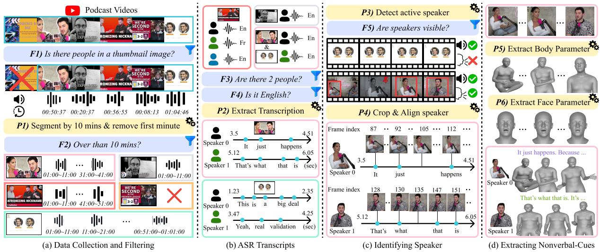  
Figure 1: Overview of VENUS collection pipeline. (a) and (b) use only audio information, while (c) and (d) also utilize visual information. The blue boxes contain filtering criteria (F), and the yellow boxes pertain to the processing steps (P). The final box shown in (d) represents the facial expression and body language combined and represented using SMPL-X parameters. For more details, refer to the Section 3.1.

## 3.1 VENUS: Video with Nonverbal-Cues and Utterance Set

In this section, we introduce our pipeline to collect VENUS, which is outlined in Figure 1. Further details can be found in Appendix A.

Data Collection and Filtering. We collected YouTube podcast videos to learn nonverbal expressions included in conversations. Our goal was to efficiently extract and collect extensive conversation data from YouTube videos with only two people conversing. We followed the filtering process presented in (Han et al., 2023; Zellers et al., 2021a). Initially, we screened thumbnails using a lightweight detector model (Jocher et al., 2023) to check for the presence of people, discarding videos without any people in the thumbnails (F1). We then removed the first minute to eliminate opening music or other introductory content (P1). Subsequently, to maximize the extraction of information from each video, we segmented each video into 10-minute segments and discarded any segments shorter than 10 minutes (P1 & F2). In this step, we set the frames per second (FPS) at 25.

Automatic Speech Recognition Transcripts. To train the conversational model, we collected videos featuring interactions between two speakers. We only downloaded audio to collect and filter videos, which is a cost-effective strategy. Using PyAnnote (Bredin et al., 2020), we performed speech diarization to identify videos with precisely two speakers and discarded videos without exactly two speakers (F3).

Next, we utilized the state-of-the-arts speech-totext model, WhisperX (Bain et al., 2023), to filter and retain only English videos (F4). For these selected videos, we leveraged WhisperX to generate time-aligned speech transcripts (P2). By aligning the results predicted by the two models, we extracted the speaker’s transcript at the word, sequence, and utterance levels.

Identifying Speakers in Video. To effectively extract verbal and nonverbal features from videos, it is crucial to distinguish between the speaker and the listener. To achieve this, we utilized the Light-ASD (Liao et al., 2023) active speaker detection model to identify speakers within the video (P3). Additionally, we integrated a pretrained person detector model (Jocher et al., 2023) to extract visual features associated with each speaker. Here, we can extract frames with the speaker and their bounding box coordinates. If the number of predicted speaker frames is less than the more number of predicted words from WhisperX, we consider it to lack visual variation and discard it (F5). Then, we cropped the speaker’s image, f, using the detected speaker’s bounding boxes. To handle cases where multiple speakers are speaking simultaneously, we used a lightweight model (Sandler et al., 2018) to extract the features of each speaker and align the speaker’s images by comparing them with previous frames based on cosine similarity (P4). The specific steps of this process are detailed in the Appendix A.3.

To align the text and the speaker’s frames, we segmented the speech into utterances in a video. Then, using the time and FPS of the speaker’s video, we calculate the set of frames for each utterance, $U _ { j } = \{ f _ { 1 } , f _ { 2 } , \cdot \cdot \cdot , f _ { i } \}$ . Through this calculation, we can construct a set of u utterances, $\mathcal { U } = [ U ] _ { j = 1 } ^ { u }$ , for each video.

Extracting Nonverbal-Cues. We represent nonverbal cues as 3D parameters and, following the previous approaches (Lin et al., 2024; Liu et al., 2024a), extract facial parameters using the FLAME (Li et al., 2017) and body and hand gesture parameters using the SMPL-X (Pavlakos et al., 2019). To achieve this, we used EMOCA-v2 (Lu et al., 2023a) for facial expression and OSX (Lin et al., 2023) for the whole body, extracting the parameters $M _ { i } ^ { f } ~ = ~ \{ m _ { l } ^ { f } \} _ { l = 1 } ^ { | U _ { j } | }$ where, $m _ { l } ^ { f } ~ \in ~ \mathbb { R } ^ { 1 5 6 }$ and $M _ { j } ^ { b } = \{ m _ { l } ^ { b } \} _ { l = 1 } ^ { | U _ { j } | }$ where, $m _ { l } ^ { b } \in \mathbb { R } ^ { 1 7 9 }$ , respectively (P5 & P6). Finally, we annotated the video with nonverbal expressions, represented as 3D parameters that are aligned with the text for each utterance.

## 3.2 Nonverbal-Cues Quantization

In this section, we introduces the tokenization process for large-scale collected nonverbal expressions from VENUS, as illustrated in Figure 2-(a).

Notation and Problem Setup. We denote the sequence parameters of face and body movement at the utterance level as $M _ { j } ^ { f } ~ = ~ \{ m _ { l } ^ { f } \} _ { l = 1 } ^ { | U _ { j } | }$ and $M _ { j } ^ { b } = \{ m _ { l } ^ { b } \} _ { l = 1 } ^ { | U _ { j } | }$ , respectively. We represent the facial components using the expression $( \psi )$ and jaw parameters $( \theta ^ { j a w } )$ , resulting in $| \psi | + | \theta ^ { j a w } | = 5 3 \mathrm { d i } \mathrm { \Omega }$ mensions per frame (i.e., 50 expression parameters and 3 jaw pose parameters). Similarly, for body language, we focus on the upper body $( \theta ^ { u b o d y } )$ , and the left and right hands $( \theta ^ { l h \hat { a } \hat { n } d } , \theta ^ { r h a \hat { n } d } )$ This representation results in $| \theta ^ { u b o d y } | + | \theta ^ { r h a n d } | + | \theta ^ { l h a n d } | ^ { 2 } = 1 1 7$ dimensions per frame (i.e., 27 upper body parameters and 45 left and right hand parameters, respectively). These are expressed as a sequence of W frames, and to ensure smoothness, we apply the Savitzky–Golay method (Gorry, 1990) to the sequence. Therefore, the sequence of face and body parameters follows:

$$
\hat { M } _ { j } ^ { f } = \{ \hat { m } _ { l } ^ { f } \} _ { l = 1 } ^ { W } \quad \hat { M } _ { j } ^ { b } = \{ \hat { m } _ { l } ^ { b } \} _ { l = 1 } ^ { W } ,\tag{1}
$$

where $\hat { m } _ { l } ^ { f } ~ = ~ [ \psi _ { l } , \theta _ { l } ^ { j a w } ] ~ \in ~ \mathbb { R } ^ { W \times 5 3 }$ and $\hat { m } _ { l } ^ { b } \ =$

[θ<sup>ubody</sup>, θ<sup>rhand</sup>, θ<sup>lhand</sup>] R<sup>W</sup>×<sup>117</sup>.

Architecture. To enable the conversational model, specifically the LLM, to understand nonverbal cues, we need to quantize continuous nonverbal features into discrete tokens. To discrete tokenize nonverbalcues, we adopted the architecture based on VQ-VAE (Van Den Oord et al., 2017; Razavi et al., 2019), which consists of an encoder-quantizerdecoder framework, to achieve this tokenization of nonverbal cues. For the purposes of this explanation, we will denote both input values $\hat { m } _ { l } ^ { f }$ and $\hat { m } _ { l } ^ { b }$ as $m _ { l } \in \mathbb { R } ^ { W \times d }$ where d is the length of the parameters, which can be either 53 or 117.

In this framework, the encoder, $E ,$ and decoder, D, are convolution networks with downsample ratio $q ,$ the quantizer contains a codebook $\mathcal { Z } \in \mathbb { R } ^ { K \times C }$ , where K denotes the codebook size and C represents codebook dimension. In the encoder process, when the sequence vector $m _ { 1 : W }$ is input, it is downsampled to obtain latent vector z, which follows:

$$
E ( m _ { 1 : W } ) \to \mathbf { z } \in \mathbb { R } ^ { C \times \tau } \quad \mathrm { w h e r e } , \tau = \frac { W } { q } .\tag{2}
$$

Given the latent vector z and the quantizer $\mathcal { Q } ( \cdot ; \mathcal { Z } )$ the quantized vector $\hat { \mathbf { z } }$ is determined as:

$$
\hat { \mathbf { z } } = \mathcal { Q } ( \mathbf { z } ; \mathcal { Z } ) = \arg \operatorname* { m i n } _ { { e } _ { k } } \| \mathbf { z } - e _ { k } \| _ { 2 } ^ { 2 } ,\tag{3}
$$

where $e _ { k }$ denotes the k-th embedding in the codebook . To stabilize training, we employ exponential moving averages (EMA) based codebook updates following (Zhang et al., 2023b; Guo et al., 2024). The quantized vector zˆ is the element selected from the codebook that minimizes the reconstruction error with respect to z. During decoder process, the quantized latent vector ˆz undergoes upsampling process to reconstruct the original input sequence vector $m _ { 1 : W }$

$$
D ( \hat { \mathbf { z } } )  \hat { m } _ { 1 : W } \in \mathbb { R } ^ { d } .\tag{4}
$$

Based on this architecture, we developed models for facial and body language, designated as Face VQ-VAE and Body VQ-VAE, respectively.

Training losses. We train Face VQ-VAE and Body VQ-VAE with the following loss functions $\mathcal { L } _ { f a c e }$ and $\mathcal { L } _ { b o d y }$ , respectively:

$$
\begin{array} { r } { \mathcal { L } _ { f a c e } = \mathcal { L } _ { v q } + \lambda _ { r e c o n } ^ { f } \mathcal { L } _ { r e c o n } ^ { f } + \lambda _ { v e l } ^ { f } \mathcal { L } _ { v e l } ^ { f } } \\ { \mathcal { L } _ { b o d y } = \mathcal { L } _ { v q } + \lambda _ { r e c o n } ^ { b } \mathcal { L } _ { r e c o n } ^ { b } + \lambda _ { v e l } ^ { b } \mathcal { L } _ { v e l } ^ { b } } \end{array}\tag{5}
$$

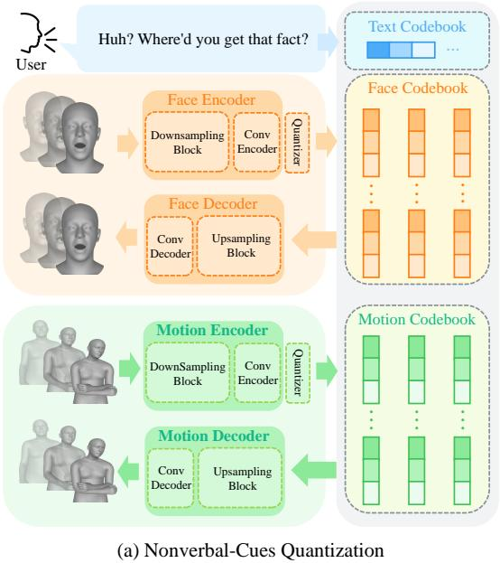

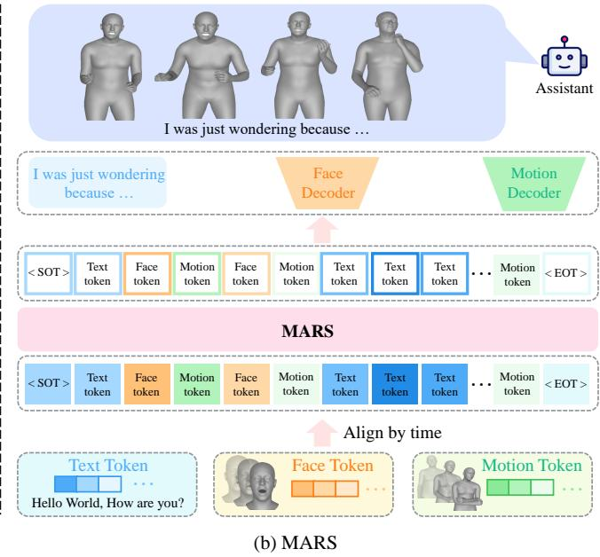  
Figure 2: System overview. Our system consists of two main parts: (a) the VQ-VAE model trained to quantize nonverbal cues, and (b) a MARS trained to process quantized nonverbal expressions alongside text. The output generated by the assistant is visualized by replacing both face and body parameters with SMPL-X.

For codebook learning, we use commitment loss, $\mathcal { L } _ { v q }$ , in the proposed (Van Den Oord et al., 2017).

$$
\mathcal { L } _ { v q } = \beta | | \mathbf { z } - \mathrm { s g } ( \hat { \mathbf { z } } ) | | _ { 2 } ^ { 2 } ,\tag{6}
$$

where $\operatorname { s g } ( \cdot )$ is a stop gradient operation and $\beta$ is commitment loss weight.

First, we introduce $\mathcal { L } _ { r e c o n } ^ { f }$ for the training of Face VQ-VAE. For training face features reconstruction, the expression components $\psi _ { l }$ and jaw, $\theta _ { l } ^ { j a w }$ are separated, and each part is calculated, respectively. It follows:

$$
\begin{array} { r l } & { \mathcal { L } _ { r e c o n } ^ { f } = \lambda _ { r e c o n } ^ { \psi } L _ { 1 } ( \psi _ { l } , \hat { \psi } _ { l } ) } \\ & { \qquad + \lambda _ { r e c o n } ^ { j a w } L _ { 1 } ( \theta _ { l } ^ { j a w } , \hat { \theta } _ { l } ^ { j a w } ) . } \end{array}\tag{7}
$$

Next, to preserve the temporal continuity and natural dynamics of facial motion, we design a facial motion velocity loss, $\mathcal { L } _ { v e l } ^ { f } .$ as follows:

$$
\begin{array} { r l } & { \mathcal { L } _ { v e l } ^ { f } = L _ { 1 } ( v ( \psi _ { l } ) , v ( \hat { \psi } _ { l } ) ) } \\ & { \qquad + \lambda _ { \theta } L _ { 1 } ( v ( \theta _ { l } ^ { j a w } ) , v ( \hat { \theta } _ { l } ^ { j a w } ) ) . } \end{array}\tag{8}
$$

Here, the function $v ( p )$ computes the temporal velocity of a sequence $p$ by taking the frame-wise difference:

$$
v ( p _ { l } ) = p _ { l + 1 } - p _ { l } .\tag{9}
$$

Similarly, the training objectives for the Body $\mathbf { V } \mathbf { Q - V A E } , \mathcal { L } _ { r e c o n } ^ { b } ,$ is defined similarly to those used in the Face VQ-VAE model. For motion reconstruction, each component is calculated separately as ${ \mathcal L } _ { r e c o n } ^ { b } = \Sigma _ { b o d y } ^ { i } L _ { 1 } ( \theta ^ { i } - \hat { \theta } ^ { i } )$ where, body ubody, rhand, lhand .

## 3.3 MARS: Multimodal Language Model with Nonverbal-Cues

Using the quantized codebooks from Face VQ-VAE and Body VQ-VAE, the generation of text and nonverbal-cues sequences relies on their respective decoders and quantized representations. Previous studies typically follow an auto-regressive approach; however, this cannot be directly applied when utilizing two codebooks. Inspired by methods proposed in studies that involve multiple codebooks (Lu et al., 2023b), we propose MARS, a multimodal language model with nonverbal-cues, designed to predict hierarchical discrete codes that capture nonverbal cues effectively. This is illustrated Figure 2 - (b).

Training. The MARS is designed with the Transformer (Vaswani, 2017) architecture, where the input consists of textual tokens paired with corresponding nonverbal tokens. The code indices corresponding to the facial expression and body language parameter sequences, $\hat { M } _ { j } ^ { f }$ and $\hat { M } _ { j } ^ { b }$ , are denoted as $\mathbf { X } ^ { f } = [ \mathbf { x } _ { 1 } ^ { f } , \mathbf { x } _ { 2 } ^ { f } , \cdot \cdot \cdot \mathbf { x } _ { W / q } ^ { f } ]$ and $\mathbf { X } ^ { b } \mathbf { \Phi } = \mathbf { \Phi }$ $[ \mathbf { x } _ { 1 } ^ { b } , \mathbf { x } _ { 2 } ^ { b } , \cdot \cdot \cdot \mathbf { x } _ { W / q } ^ { b } ] .$ , respectively. Thus, the input tokens are composed of three elements: the word tokens $\mathbf { X } ^ { w } = [ \mathbf { x } _ { 1 } ^ { w } , \mathbf { x } _ { 2 } ^ { w } , \cdot \cdot \cdot , \mathbf { x } _ { l } ^ { w } ]$ , along with the facial and body code indices, $\mathbf { X } ^ { f }$ and $\mathbf { X } ^ { b }$ .

<table><tr><td>Dataset</td><td># Dialogues</td><td># Turns</td><td>Length (hrs)</td><td>Text</td><td>Video</td><td>Nonverbal cues</td></tr><tr><td>IEMOCAP (Busso et al., 2008)</td><td>151</td><td>7,333</td><td>12</td><td>√</td><td>√</td><td>X</td></tr><tr><td>CMU-MOSEI (Zadeh et al., 2018)</td><td>3,228</td><td></td><td>65</td><td>√</td><td>√</td><td>x</td></tr><tr><td>MELD (Poria et al., 2019)</td><td>1,433</td><td>13,708</td><td>13.7</td><td>√</td><td>√</td><td>x</td></tr><tr><td>YTD-18M (Han et al., 2023)</td><td>18M</td><td>54M*</td><td>30K*</td><td>√</td><td>√</td><td>x</td></tr><tr><td>MultiDialog (Park et al., 2024)</td><td>8,733</td><td>187,859</td><td>340</td><td>√</td><td>√</td><td>x</td></tr><tr><td>BEAT (Liu et al., 2022)</td><td>x</td><td>X</td><td>76</td><td>√</td><td>X</td><td>√</td></tr><tr><td>EMAGE (Liu et al., 2024a)</td><td>x</td><td>x</td><td>60</td><td>√</td><td>X</td><td>√</td></tr><tr><td>TalkShow (Yi et al., 2023)</td><td>x</td><td>x</td><td>27</td><td>X</td><td>X</td><td>√</td></tr><tr><td>Ours (VENUS)</td><td>89,459</td><td>1,114, 328</td><td>14,910</td><td>√</td><td>√</td><td>√</td></tr></table>

Table 1: Comparison of the VENUS dataset with the previous conversational and 3D gesture dataset. The first block represents the conversation dataset, while the second block represents the gesture dataset. “\*” represents an estimated value. For # Turns, it was calculated by multiplying the average number of utterances per video 3 by the number of videos. The Length (hrs) was considered to be a maximum of 1 minute per video for the calculations. Nonverbal cues indicate whether 3D data or any other annotations for facial expressions or body language are provided. Best and second are highlighted. Our dataset is the largest conversational dataset with annotations of nonverbal cues.

Given that we input and generate nonverbal-cues corresponding to each word, the input sequences, T, are organized to align with their respective timestamps.

$$
T = \{ \mathbf { x } \mid \mathbf { x } _ { i } \in \bigcup _ { c } X ^ { c } , c \in \{ w , f , b \} \} ,\tag{10}
$$

where the sequence is ordered as $T$ $[ { \bf x } _ { 1 } ^ { w } , { \bf x } _ { 1 } ^ { f } , { \bf x } _ { 1 } ^ { b } , { \bf x } _ { 2 } ^ { w } , \cdot \cdot \cdot ]$

Therefore, the word, face, and body token code indices prediction can be formulated as an autoregressive prediction problem:

$$
\begin{array} { l } { { \displaystyle p ( T ) = \prod _ { j = 1 } ^ { l } p _ { \theta } ( { \bf x } _ { j } ^ { w } \mid T _ { < j } ) } } \\ { { \displaystyle \prod _ { k = 1 } ^ { W / q } \left[ p _ { \theta } ( { \bf x } _ { k } ^ { f } \mid T _ { < k } ) \cdot p _ { \theta } ( { \bf x } _ { k } ^ { b } \mid T _ { < k } ) \right] , } } \end{array}\tag{11}
$$

where θ represents the trainable parameters of the model. In this formulation, the word tokens are predicted first, followed by the face and body token indices.

## 4 VENUS Dataset Analysis

We conducted data analysis to demonstrate the quality of the VENUS dataset. Additional analysis results can be found in the Appendix A.

Statistic. The summary statistics of our dataset and comparison with statistics from other conversational and 3D gesture datasets are shown in Table 2 and Table 1, respectively. As shown in Table 2, our dataset is large-scale, featuring lengthy utterances with numerous words and rich nonverbal expressions. Each conversation averages 21 turns, which supports effective training for multi-turn dialogues. Table 1 highlights that, compared to existing videobased multi-modal dialogue datasets, our dataset is the first to include annotations for nonverbal expressions. While YTD-18M (Han et al., 2023) has more videos, its conversations are segmented into intervals of up to one minute, potentially hindering context comprehension. In contrast, VENUS despite having fewer videos, includes longer conversations, making it better suited for understanding extended dialogues. Furthermore, our dataset stands out as the largest-scale 3D annotated dataset when compared to previous 3D gesture datasets.

<table><tr><td>Total number of collected channels</td><td>869</td></tr><tr><td>Total number of collected videos</td><td>27,128</td></tr><tr><td>Total number of collected nonverbal expressions</td><td>1B</td></tr><tr><td>Total number of dialogues</td><td>89,459</td></tr><tr><td>Total number of turns</td><td>1,114,328</td></tr><tr><td>Total number of sentences</td><td>7, 118, 654</td></tr><tr><td>Total of unique words</td><td>527,270</td></tr><tr><td>Average number of turns per dialogue</td><td>21</td></tr><tr><td>Average length of utterances per dialogue in words</td><td>170.829</td></tr><tr><td>Average length of utterances per dialogue in seconds</td><td>55.305</td></tr><tr><td>Average number of nonverbal expressions per utterance in frames</td><td>547</td></tr></table>

Table 2: Summary of VENUS statistics. The “video” refers to the video before it is segmented into 10-minute intervals, while “dialogues” refers to the conversations extracted from the videos segmented into 10-minute intervals.

Distribution of Nonverbal Cues. To analyze the diversity of nonverbal expressions in our dataset, we sampled 10 random frames per video from approximately 1, 000 videos and applied T-SNE (Van der Maaten and Hinton, 2008) for dimensionality reduction. In Figure 3, we display the results by creating 7 clusters for facial expressions and 8 clusters for body languages using DB-SCAN (Ester et al., 1996).

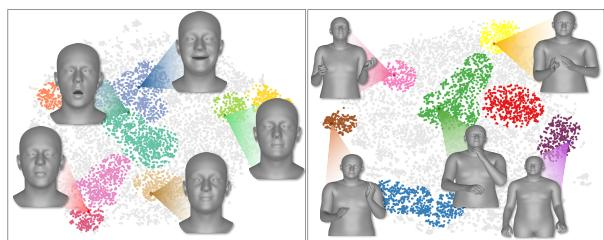

<table><tr><td rowspan="2" colspan="2"></td><td colspan="5">Face</td><td colspan="5">Body</td></tr><tr><td>VMSE (10−1) ↓</td><td> $\mathrm { L V D } ( 1 0 ^ { - 3 } ) \downarrow$ </td><td> $\mathbf { w { - V L 2 } } ( 1 0 ^ { - 7 } ) \downarrow$ </td><td>Diversity ↑</td><td>Variation ↑</td><td>VMSE↓  $\mathrm { L V D } ( 1 0 ^ { - 1 } ) \downarrow$ </td><td></td><td> $\mathbf { w { \mathrm { - } } V L } 2 ( 1 0 ^ { - 4 } ) \downarrow$ </td><td>Diversity ↑</td><td>Variation (10−1) ↑</td></tr><tr><td colspan="2">GT</td><td></td><td></td><td></td><td>9.3323</td><td>0.8760</td><td></td><td></td><td></td><td>2.4189</td><td>0.2803</td></tr><tr><td colspan="2">(Ng et al., 2023)</td><td>0.5787</td><td>0.4422</td><td>0.3832</td><td>7.5866</td><td>0.5873</td><td>2.6424</td><td>0.1268</td><td>0.4338</td><td>2.0151</td><td>0.1985</td></tr><tr><td colspan="2">(Guo et al., 2024)</td><td>0.5474</td><td>0.4160</td><td>0.3429</td><td>7.7693</td><td>0.6253</td><td>2.0608</td><td>0.0994</td><td>0.2100</td><td>1.9934</td><td>0.1951</td></tr><tr><td colspan="2">Ours</td><td>0.5106</td><td>0.4020</td><td>0.2339</td><td>7.8430</td><td>0.6236</td><td>1.9946</td><td>0.0962</td><td>0.2027</td><td>1.9998</td><td>0.1956</td></tr><tr><td colspan="2">L1 L2</td><td>0.5106</td><td>0.4020</td><td>0.2339</td><td>7.8430</td><td>0.6236</td><td>1.9946</td><td>0.0962</td><td>0.2027</td><td>1.9998</td><td>0.1956</td></tr><tr><td colspan="2">Lrecon smooth L1</td><td>0.5471</td><td>0.4124</td><td>0.3630</td><td>6.3334</td><td>0.6425</td><td>2.3384</td><td>0.1139</td><td>0.3078</td><td>1.9732</td><td>0.1879</td></tr><tr><td colspan="2"></td><td>0.4106</td><td>0.4034</td><td>0.3313</td><td>6.3874</td><td>0.6052</td><td>2.3210</td><td>0.1128</td><td>0.2787</td><td>2.0603</td><td>0.2025</td></tr><tr><td colspan="2"></td><td>0.5106</td><td>0.4020</td><td>0.2339</td><td>7.8430</td><td>0.6236</td><td>2.0596</td><td>0.0995</td><td>0.2280</td><td>1.9183</td><td>0.1794</td></tr><tr><td colspan="2">16</td><td>0.5217</td><td>0.4100</td><td>0.2582</td><td>7.6855</td><td>0.6023</td><td>1.9946</td><td>0.0962</td><td>0.2027</td><td>1.9998</td><td>0.1956</td></tr><tr><td colspan="2">32</td><td>0.5294</td><td>0.4150</td><td>0.2439</td><td>7.6986</td><td>0.6006</td><td>2.1199</td><td>0.1022</td><td>0.2192</td><td>1.9838</td><td>0.1926</td></tr><tr><td colspan="2">64</td><td>0.5152</td><td>0.4071</td><td>0.2360</td><td>7.6203</td><td>0.5890</td><td>2.1577</td><td>0.1037</td><td>0.2312</td><td>1.9947</td><td>0.1942</td></tr><tr><td colspan="2">128 256</td><td>0.5222</td><td>0.4153</td><td>0.2314</td><td>7.7554</td><td>0.6098</td><td>2.1427</td><td>0.1037</td><td>0.2244</td><td>1.9633</td><td>0.1876</td></tr><tr><td colspan="2"></td><td>0.5296</td><td>0.4183</td><td>0.2443</td><td>7.8247</td><td>0.6212</td><td>2.1410</td><td>0.1034</td><td>0.2387</td><td>1.9936</td><td>0.1939</td></tr><tr><td colspan="2">64</td><td>0.6628</td><td>0.5181</td><td>0.4472</td><td>6.6604</td><td>0.4566</td><td>4.2495</td><td>0.1993</td><td>0.8084</td><td>0.7093</td><td>0.0306</td></tr><tr><td colspan="2">128 Size</td><td>0.5770</td><td>0.4514</td><td>0.3549</td><td>7.3002</td><td>0.5458</td><td>2.1905</td><td>0.1054</td><td>0.2670</td><td>1.9114</td><td>0.1801</td></tr><tr><td colspan="2">256</td><td>0.5313</td><td>0.4184</td><td>0.2583</td><td>7.6053</td><td>0.5890</td><td>2.074</td><td>0.1003</td><td>0.2119</td><td>1.9663</td><td>0.1889</td></tr><tr><td colspan="2">512</td><td>0.5106</td><td>0.4020</td><td>0.2339</td><td>7.8430</td><td>0.6236</td><td>1.9946</td><td>0.0962</td><td>0.2027</td><td>1.9998</td><td>0.1956</td></tr></table>

Table 3: Experimental results on Face VQ-VAE and Body VQ-VAE. $^ { 6 6 } L _ { r e c o n } ,$ represents $\mathcal { L } _ { r e c o n } ^ { f }$ and $\mathcal { L } _ { r } ^ { b }$ <sub>recon</sub>, “Dim” refers to the codebook embedding dimension, and “size” indicates the codebook size. Our key results are highlighted. The Face VQ-VAE achieved the best performance with L1 loss, an embedding dimension of 8, and a codebook size of 512, while the Body VQ-VAE performed best with L1 loss, an embedding dimension of 16, and the same codebook size.  
(a) Distribution of facial expression (b) Distribution of body language  
Figure 3: Visualization of the distribution of nonverbal-cues. (a) Facial expression embeddings are well-clustered despite the absence of emotion class labels, capturing meaningful emotion patterns. (b) Body language embeddings are similarly well-clustered, representing common conversational gestures that enhance communication or naturally occur during dialogue. Representative examples are provided for each cluster.

Figure 3-(a) displays the distribution of facial expressions, covering both the $\psi$ and $\theta ^ { j a w }$ . We can observe a variety of emotions, despite the absence of emotion labels. Notably, the blue and green points appeared the most since podcast conversations target to entertain or inform the viewers, leading to a larger portion of neutral and positive expressions. In Figure 3-(b) the distribution of body language θ<sup>ubody</sup>, θ<sup>lhand</sup> and θ<sup>rhand</sup> is displayed. The most common body language observed involves arms in a relaxed, lowered position, which typically reflects a conversational attitude. In addition, gestures that enhance or clarify the speaker’s message, such as resting the chin on the hand or expressive hand movements, were frequently noted.

## 5 Experiments

## 5.1 Experiment Setup

We trained and evaluated our model using a subset of the VENUS dataset in our experiments Both VQ-VAE and MARS were trained on 3, 924 videos and 69, 412 utterances. For evaluation, VQ-VAE used the full test set consisting of 997 videos and 30, 390 utterances, whereas MARS was evaluated on a subset of 1, 000 utterances sampled from the test set.

## 5.2 Nonverbal-cues Quantization

Evaluation Metric. We quantitatively evaluate how realistically facial expressions and body languages have been quantized, based on evaluation methods proposed in previous studies (Ng et al., 2022, 2023; Liu et al., 2024a). To this end, we adopt five metrics to assess the realism and diversity of facial expressions and body language. To evaluate realism, we use VMSE, LVD, and window Vertex L2, while diversity is assessed using diversity and variance. Detailed explanations of these metrics are provided in the Appendix B.2.

Results. We conducted an ablation study to evaluate our Face and Body VQ-VAE models, varying one component at a time (Table 3). Based on the results, we chose L1 loss for the Face VQ-VAE and

<table><tr><td></td><td></td><td></td><td colspan="2">Text</td><td colspan="2">Nonverbal</td></tr><tr><td></td><td></td><td>PPL↓</td><td>BERT↑</td><td>METEOR↑</td><td>NLL-F↓</td><td>NLL-B↓</td></tr><tr><td rowspan="2">LLaMA 1B</td><td>zero-shot</td><td>5427.1</td><td>0.811</td><td>0.110</td><td>16.232</td><td>17.039</td></tr><tr><td>MARS</td><td>1665.8</td><td>0.834</td><td>0.130</td><td>8.676</td><td>5.330</td></tr><tr><td rowspan="2">Qwen 1.5B</td><td>zero-shot</td><td>3315.5</td><td>0.823</td><td>0.116</td><td>15.019</td><td>15.911</td></tr><tr><td>MARS</td><td>2990.0</td><td>0.839</td><td>0.115</td><td>8.812</td><td>6.144</td></tr><tr><td rowspan="2">LLaMA 3B</td><td>zero-shot</td><td>5477.0</td><td>0.818</td><td>0.136</td><td>16.504</td><td>17.574</td></tr><tr><td>MARS</td><td>926.9</td><td>0.835</td><td>0.133</td><td>8.057</td><td>5.325</td></tr><tr><td rowspan="2">Qwen 3B</td><td>zero-shot</td><td>56781.1</td><td>0.811</td><td>0.131</td><td>20.850</td><td>20.874</td></tr><tr><td>MARS</td><td>800.0</td><td>0.839</td><td>0.123</td><td>7.295</td><td>4.666</td></tr></table>

Table 4: Quantitative results of MARS. means a lower score is better, means a higher score is better. Here, “NLL-F” and “NLL-B” denote the negative log-likelihood (NLL) for face tokens and body tokens, respectively. MARS demonstrates superior precision in generating nonverbal cues, highlighting its effectiveness in producing both text and nonverbal expressions.

L1 loss for the Body VQ-VAE, with embedding dimensions of 8 and 16, respectively. Both used a codebook size of 512. These settings outperformed previous works (Ng et al., 2023; Guo et al., 2024).

## 5.3 Semantic Evaluation for MARS

Training Settings. We employ LLaMA 3.2 Instruct (Meta, 2024) and Qwen 2.5 Instruct (Yang et al., 2024) as the large language model. To clarify the model’s role, we incorporated a system prompt that facilitates effective generation of both nonverbal and textual tokens. Additionally, since the nonverbal token is added as a special token, we performed supervised fine-tuning to ensure model’s understanding of them. Further details can be found in the Appendix C.

Evaluation metrics. To evaluate MARS, we separately assess the quality of its text and nonverbal token outputs, as ensuring accurate alignment between these token types is inherently challenging. First, we use Perplexity (PPL) as a general measure for both text and nonverbal tokens. For text tokens, we use BERT-score and METEOR as evaluation metrics, while for nonverbal tokens, we rely on Negative log-likelihood (NLL).

Quantitative Results. We compared the quantitative performance of the LLM (Meta, 2024) and our MARS model. As shown in Table 4, the conventional LLM model showed limitations in understanding special tokens containing nonverbal information, failing to generate them properly. In contrast, MARS, which was trained by interleaving nonverbal tokens within the textual input, achieved the lowest perplexity and the highest BERTScore across all model sizes, indicating its superior ability to generate semantically coherent dialogues. Furthermore, the significantly lower NLL scores for nonverbal cues demonstrate that MARS successfully captures and generates nonverbal behaviors. These results not only validate the effectiveness of our approach in handling multimodal signals but also highlight the scalability of MARS, as its performance improves with larger model sizes in both textual and nonverbal generation tasks.

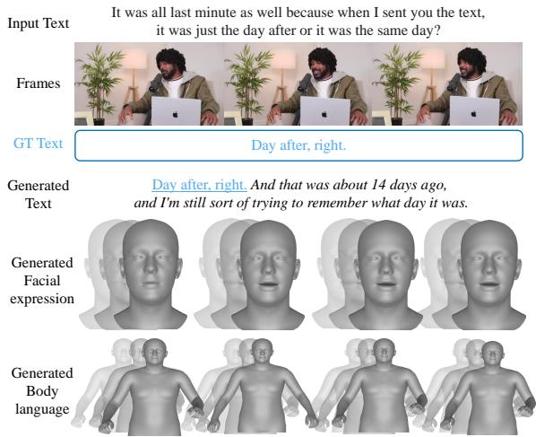  
Figure 4: Qualitative results for MARS. Qualitative results showcasing inputs and outputs of our MARS model. Inputs include the user’s text, face, and body language, while MARS outputs corresponding text, facial expressions, and body language. Underlined text indicates where MARS matches the ground truth (GT). Moreover, MARS produces improved text compared to GT and also successfully generates corresponding facial and body language aligned with the context.

Qualitative Results. We use qualitative results to assess the effectiveness of our model in generating the listener’s text and nonverbal expressions. As shown in Figure 4, our MARS not only aligns with the ground-truth (GT) but also produces more contextually enriched text and corresponding face and body languages. This demonstrates the qualitative effectiveness of our model in generating richer and more expressive listener responses.

## 6 Conclusion

In this work, we introduce VENUS, a video-based multimodal conversation dataset designed to understand and generate both text and nonverbal expressions, and present MARS. This language model can produce both dialogue and corresponding nonverbal behaviors. The VENUS dataset is built from YouTube videos, including real conversational text and the accompanying nonverbal cues (such as facial expressions and body language) annotated in

3D parameters. Using VENUS, our MARS model learns to align and generate both textual and nonverbal elements, resulting in more engaging and natural interactions. We believe that our VENUS dataset and MARS model will support a wide range of applications, such as virtual humans and gaming, by enabling the production of nonverbal behaviors in 3D.

## 7 Limitations

This study explores the development of a large language model (LLM) for generating nonverbal cues nameed MARS, supported by a custom dataset named VENUS designed to capture diverse nonverbal communication patterns. While the proposed approach demonstrates promising results, certain limitations remain that warrant further exploration.

First, the VENUS dataset utilized in this research is primarily curated from the Podcast channel, which may limit the diversity of nonverbal expression patterns in the data (e.g., crying or angry expressions). Furthermore, pseudo-labeling was employed in the dataset, which, while effective, could introduce potential inaccuracies that require further refinement. Additionally, not all data within the VENUS dataset was utilized, leaving room for broader exploration in future work. Second, the evaluation metrics used in this study, though effective for assessing initial performance, may not fully capture the nonverbal communication. More sophisticated and comprehensive metrics are necessary to evaluate the system’s performance in realworld scenarios.

Looking ahead, future work will aim to address these limitations by incorporating a wider range of nonverbal modalities, such as vocal expressions, to enrich the dataset and enhance the robustness of the model. Moreover, we plan to develop advanced evaluation metrics that better reflect the complexity of nonverbal communication. These improvements will further generalize and validate the applicability of our approach across diverse datasets and scenarios.

## 8 Ethical Considerations

In this paper, we introduce a large-scale multimodal conversational dataset named VENUS derived from publicly available YouTube videos. The dataset is designed to advance research in real-world conversational understanding by including frames, reconstructed facial expressions and body language of the interlocutors. While this dataset provides valuable insights for understanding conversational behavior, it may raise privacy concerns as it captures the visual and auditory cues of individuals. To address these concerns, we follow ethical practices adopted by prior works (Zellers et al., 2021b, 2022; Han et al., 2023) and release only the video IDs instead of the raw video frames. Additionally, the reconstructed face and body motions are represented as template meshes, ensuring anonymization and preventing direct identification of individuals. To further protect user privacy, future directions may include further anonymizing faces and improving methods for deidentifying personal information. We remain committed to respecting user privacy and ensuring compliance with ethical standards in dataset creation and usage.

## Acknowledgements

This work was supported by NCSOFT, the National Research Foundation of Korea (NRF) grant funded by the Korea government (MSIT) (No. RS-2024-00354218), and the Institute of Information & Communications Technology Planning & Evaluation (IITP) grants funded by the Korea government (MSIT) (No. RS-2024-00457882, AI Research Hub Project; No. RS-2025-02263598, Development of Self-Evolving Embodied AGI Platform Technology through Real-World Experience).

## References

Josh Achiam, Steven Adler, Sandhini Agarwal, Lama Ahmad, Ilge Akkaya, Florencia Leoni Aleman, Diogo Almeida, Janko Altenschmidt, Sam Altman, Shyamal Anadkat, et al. 2023. Gpt-4 technical report. arXiv preprint arXiv:2303.08774.

Jinze Bai, Shuai Bai, Shusheng Yang, Shijie Wang, Sinan Tan, Peng Wang, Junyang Lin, Chang Zhou, and Jingren Zhou. 2023. Qwen-vl: A versatile visionlanguage model for understanding, localization, text reading, and beyond.

Max Bain, Jaesung Huh, Tengda Han, and Andrew Zisserman. 2023. Whisperx: Time-accurate speech transcription of long-form audio. arxiv. arXiv preprint arXiv:2303.00747.

Satanjeev Banerjee and Alon Lavie. 2005. METEOR: An automatic metric for MT evaluation with improved correlation with human judgments. In Proceedings ofthe ACL Workshop on Intrinsic and Extrinsic Evaluation Measures for Machine Translation and/or Summarization, pages 65–72, Ann Arbor, Michigan. Association for Computational Linguistics.

Yoshua Bengio, Réjean Ducharme, and Pascal Vincent. 2000. A neural probabilistic language model. Advances in neural information processing systems, 13.

Hervé Bredin, Ruiqing Yin, Juan Manuel Coria, Gregory Gelly, Pavel Korshunov, Marvin Lavechin, Diego Fustes, Hadrien Titeux, Wassim Bouaziz, and Marie-Philippe Gill. 2020. Pyannote. audio: neural building blocks for speaker diarization. In ICASSP 2020-2020 IEEE International Conference on Acoustics, Speech and Signal Processing (ICASSP), pages 7124–7128. IEEE.

Carlos Busso, Murtaza Bulut, Chi-Chun Lee, Abe Kazemzadeh, Emily Mower, Samuel Kim, Jeannette N Chang, Sungbok Lee, and Shrikanth S Narayanan. 2008. Iemocap: Interactive emotional dyadic motion capture database. Language resources and evaluation, 42:335–359.

Jose Camacho-Collados, Kiamehr Rezaee, Talayeh Riahi, Asahi Ushio, Daniel Loureiro, Dimosthenis Antypas, Joanne Boisson, Luis Espinosa-Anke, Fangyu Liu, Eugenio Martínez-Cámara, et al. 2022. Tweetnlp: Cutting-edge natural language processing for social media. arXiv preprint arXiv:2206.14774.

Lin Chen, Jisong Li, Xiaoyi Dong, Pan Zhang, Conghui He, Jiaqi Wang, Feng Zhao, and Dahua Lin. 2023. Sharegpt4v: Improving large multimodal models with better captions. arXiv preprint arXiv:2311.12793.

Neeraj Cherakara, Finny Varghese, Sheena Shabana, Nivan Nelson, Abhiram Karukayil, Rohith Kulothungan, Mohammed Afil Farhan, Birthe Nesset, Meriam Moujahid, Tanvi Dinkar, et al. 2023. Furchat: An embodied conversational agent using llms, combining open and closed-domain dialogue with facial expressions. In Proceedings of the 24th Annual Meeting ofthe Special Interest Group on Discourse and Dialogue, pages 588–592.

Glen Coppersmith and Erin Kelly. 2014. Dynamic wordclouds and vennclouds for exploratory data analysis. In Proceedings ofthe Workshop on Interactive Language Learning, Visualization, and Interfaces, pages 22–29.

Radek Daneˇcek, Michael J Black, and Timo Bolkart.ˇ 2022. Emoca: Emotion driven monocular face capture and animation. In Proceedings of the IEEE/CVF Conference on Computer Vision and Pattern Recognition, pages 20311–20322.

Sai Kumar Dwivedi, Yu Sun, Priyanka Patel, Yao Feng, and Michael J Black. 2024. Tokenhmr: Advancing human mesh recovery with a tokenized pose representation. In Proceedings ofthe IEEE/CVF Conference on Computer Vision and Pattern Recognition, pages 1323–1333.

Martin Ester, Hans-Peter Kriegel, Jörg Sander, Xiaowei Xu, et al. 1996. A density-based algorithm for discovering clusters in large spatial databases with noise. In kdd, volume 96, pages 226–231.

Peter A Gorry. 1990. General least-squares smoothing and differentiation by the convolution (savitzkygolay) method. Analytical Chemistry, 62(6):570– 573.

Chuan Guo, Yuxuan Mu, Muhammad Gohar Javed, Sen Wang, and Li Cheng. 2024. Momask: Generative masked modeling of 3d human motions. In Proceedings ofthe IEEE/CVF Conference on Computer Vision and Pattern Recognition, pages 1900–1910.

Seungju Han, Jack Hessel, Nouha Dziri, Yejin Choi, and Youngjae Yu. 2023. Champagne: Learning realworld conversation from large-scale web videos. In Proceedings ofthe IEEE/CVF International Conference on Computer Vision, pages 15498–15509.

Seungju Han, Kavel Rao, Allyson Ettinger, Liwei Jiang, Bill Yuchen Lin, Nathan Lambert, Yejin Choi, and Nouha Dziri. 2024. Wildguard: Open one-stop moderation tools for safety risks, jailbreaks, and refusals of llms. arXiv preprint arXiv:2406.18495.

Glenn Jocher, Ayush Chaurasia, and Jing Qiu. 2023. Ultralytics YOLO.

Yoon Kyung Lee, Yoonwon Jung, Gyuyi Kang, and Sowon Hahn. 2023. Developing social robots with empathetic non-verbal cues using large language models. arXiv preprint arXiv:2308.16529.

KunChang Li, Yinan He, Yi Wang, Yizhuo Li, Wenhai Wang, Ping Luo, Yali Wang, Limin Wang, and Yu Qiao. 2023. Videochat: Chat-centric video understanding. arXiv preprint arXiv:2305.06355.

Tianye Li, Timo Bolkart, Michael J Black, Hao Li, and Javier Romero. 2017. Learning a model of facial shape and expression from 4d scans. ACM Trans. Graph., 36(6):194–1.

Junhua Liao, Haihan Duan, Kanghui Feng, Wanbing Zhao, Yanbing Yang, and Liangyin Chen. 2023. A light weight model for active speaker detection. In Proceedings ofthe IEEE/CVF Conference on Computer Vision and Pattern Recognition, pages 22932– 22941.

Jing Lin, Ailing Zeng, Shunlin Lu, Yuanhao Cai, Ruimao Zhang, Haoqian Wang, and Lei Zhang. 2024. Motion-x: A large-scale 3d expressive whole-body human motion dataset. Advances in Neural Information Processing Systems, 36.

Jing Lin, Ailing Zeng, Haoqian Wang, Lei Zhang, and Yu Li. 2023. One-stage 3d whole-body mesh recovery with component aware transformer. In Proceedings of the IEEE/CVF Conference on Computer Vision and Pattern Recognition, pages 21159–21168.

Haiyang Liu, Zihao Zhu, Giorgio Becherini, Yichen Peng, Mingyang Su, You Zhou, Xuefei Zhe, Naoya Iwamoto, Bo Zheng, and Michael J Black. 2024a. Emage: Towards unified holistic co-speech gesture generation via expressive masked audio gesture modeling. In Proceedings ofthe IEEE/CVF Conference

on Computer Vision and Pattern Recognition, pages 1144–1154.

Haiyang Liu, Zihao Zhu, Naoya Iwamoto, Yichen Peng, Zhengqing Li, You Zhou, Elif Bozkurt, and Bo Zheng. 2022. Beat: A large-scale semantic and emotional multi-modal dataset for conversational gestures synthesis. In European conference on computer vision, pages 612–630. Springer.

Haotian Liu, Chunyuan Li, Qingyang Wu, and Yong Jae Lee. 2024b. Visual instruction tuning. Advances in neural information processing systems, 36.

Jiasen Lu, Christopher Clark, Sangho Lee, Zichen Zhang, Savya Khosla, Ryan Marten, Derek Hoiem, and Aniruddha Kembhavi. 2024. Unified-io 2: Scaling autoregressive multimodal models with vision language audio and action. In Proceedings of the IEEE/CVF Conference on Computer Vision and Pattern Recognition, pages 26439–26455.

Liying Lu, Tianke Zhang, Yunfei Liu, Xuangeng Chu, and Yu Li. 2023a. Audio-driven 3d facial animation from in-the-wild videos. arXiv preprint arXiv:2306.11541.

Shunlin Lu, Ling-Hao Chen, Ailing Zeng, Jing Lin, Ruimao Zhang, Lei Zhang, and Heung-Yeung Shum. 2023b. Humantomato: Text-aligned whole-body motion generation. arXiv preprint arXiv:2310.12978.

Meta. 2024. Llama 3 & 2 connect 2024: Vision for edge and mobile devices. [Online]. Accessed: 2024- 12-16.

Evonne Ng, Hanbyul Joo, Liwen Hu, Hao Li, Trevor Darrell, Angjoo Kanazawa, and Shiry Ginosar. 2022. Learning to listen: Modeling non-deterministic dyadic facial motion. In Proceedings of the IEEE/CVF Conference on Computer Vision and Pattern Recognition, pages 20395–20405.

Evonne Ng, Sanjay Subramanian, Dan Klein, Angjoo Kanazawa, Trevor Darrell, and Shiry Ginosar. 2023. Can language models learn to listen? In Proceedings ofthe IEEE/CVF International Conference on Computer Vision, pages 10083–10093.

Se Jin Park, Chae Won Kim, Hyeongseop Rha, Minsu Kim, Joanna Hong, Jeong Hun Yeo, and Yong Man Ro. 2024. Let’s go real talk: Spoken dialogue model for face-to-face conversation. arXiv preprint arXiv:2406.07867.

Georgios Pavlakos, Vasileios Choutas, Nima Ghorbani, Timo Bolkart, Ahmed AA Osman, Dimitrios Tzionas, and Michael J Black. 2019. Expressive body capture: 3d hands, face, and body from a single image. In Proceedings of the IEEE/CVF conference on computer vision and pattern recognition, pages 10975–10985.

Deepika Phutela. 2015. The importance of non-verbal communication. IUP Journal ofSoft Skills, 9(4):43.

Soujanya Poria, Devamanyu Hazarika, Navonil Majumder, Gautam Naik, Erik Cambria, and Rada Mihalcea. 2019. Meld: A multimodal multi-party dataset for emotion recognition in conversations. In Proceedings ofthe 57th Annual Meeting ofthe Associationfor Computational Linguistics, pages 527–536.

Ali Razavi, Aaron Van den Oord, and Oriol Vinyals. 2019. Generating diverse high-fidelity images with vq-vae-2. Advances in neural information processing systems, 32.

Mark Sandler, Andrew Howard, Menglong Zhu, Andrey Zhmoginov, and Liang-Chieh Chen. 2018. Mobilenetv2: Inverted residuals and linear bottlenecks. In Proceedings of the IEEE conference on computer vision and pattern recognition, pages 4510–4520.

Zoya Shafique, Haiyan Wang, and Yingli Tian. 2023. Nonverbal communication cue recognition: A pathway to more accessible communication. In Proceedings of the IEEE/CVF Conference on Computer Vision and Pattern Recognition, pages 5666–5674.

Aaron Van Den Oord, Oriol Vinyals, et al. 2017. Neural discrete representation learning. Advances in neural information processing systems, 30.

Laurens Van der Maaten and Geoffrey Hinton. 2008. Visualizing data using t-sne. Journal of machine learning research, 9(11).

A Vaswani. 2017. Attention is all you need. Advances in Neural Information Processing Systems.

Qi Wu, Yubo Zhao, Yifan Wang, Yu-Wing Tai, and Chi-Keung Tang. 2024. Motionllm: Multimodal motionlanguage learning with large language models. arXiv preprint arXiv:2405.17013.

Qwen An Yang, Baosong Yang, Beichen Zhang, Binyuan Hui, Bo Zheng, Bowen Yu, Chengyuan Li, Dayiheng Liu, Fei Huang, Guanting Dong, Haoran Wei, Huan Lin, Jian Yang, Jianhong Tu, Jianwei Zhang, Jianxin Yang, Jiaxin Yang, Jingren Zhou, Junyang Lin, Kai Dang, Keming Lu, Keqin Bao, Kexin Yang, Le Yu, Mei Li, Mingfeng Xue, Pei Zhang, Qin Zhu, Rui Men, Runji Lin, Tianhao Li, Tingyu Xia, Xingzhang Ren, Xuancheng Ren, Yang Fan, Yang Su, Yi-Chao Zhang, Yunyang Wan, Yuqi Liu, Zeyu Cui, Zhenru Zhang, Zihan Qiu, Shanghaoran Quan, and Zekun Wang. 2024. Qwen2.5 technical report. ArXiv, abs/2412.15115.

Hongwei Yi, Hualin Liang, Yifei Liu, Qiong Cao, Yandong Wen, Timo Bolkart, Dacheng Tao, and Michael J Black. 2023. Generating holistic 3d human motion from speech. In Proceedings of the IEEE/CVF Conference on Computer Vision and Pattern Recognition, pages 469–480.

AmirAli Bagher Zadeh, Paul Pu Liang, Soujanya Poria, Erik Cambria, and Louis-Philippe Morency. 2018. Multimodal language analysis in the wild: Cmumosei dataset and interpretable dynamic fusion graph.

In Proceedings ofthe 56th Annual Meeting ofthe Associationfor Computational Linguistics (Volume 1: Long Papers), pages 2236–2246.

Rowan Zellers, Jiasen Lu, Ximing Lu, Youngjae Yu, Yanpeng Zhao, Mohammadreza Salehi, Aditya Kusupati, Jack Hessel, Ali Farhadi, and Yejin Choi. 2022. Merlot reserve: Neural script knowledge through vision and language and sound. In Proceedings of the IEEE/CVF Conference on Computer Vision and Pattern Recognition, pages 16375–16387.

Rowan Zellers, Ximing Lu, Jack Hessel, Youngjae Yu, Jae Sung Park, Jize Cao, Ali Farhadi, and Yejin Choi. 2021a. Merlot: Multimodal neural script knowledge models. Advances in neural information processing systems, 34:23634–23651.

Rowan Zellers, Ximing Lu, Jack Hessel, Youngjae Yu, Jae Sung Park, Jize Cao, Ali Farhadi, and Yejin Choi. 2021b. Merlot: Multimodal neural script knowledge models. Advances in neural information processing systems, 34:23634–23651.

Hang Zhang, Xin Li, and Lidong Bing. 2023a. Videollama: An instruction-tuned audio-visual language model for video understanding. arXiv preprint arXiv:2306.02858.

Jianrong Zhang, Yangsong Zhang, Xiaodong Cun, Yong Zhang, Hongwei Zhao, Hongtao Lu, Xi Shen, and Ying Shan. 2023b. Generating human motion from textual descriptions with discrete representations. In Proceedings of the IEEE/CVF conference on computer vision and pattern recognition, pages 14730– 14740.

Sitao Zhang, Yimu Pan, and James Z Wang. 2023c. Learning emotion representations from verbal and nonverbal communication. In Proceedings of the IEEE/CVF Conference on Computer Vision and Pattern Recognition, pages 18993–19004.

Tianyi Zhang, Varsha Kishore, Felix Wu, Kilian Q Weinberger, and Yoav Artzi. 2019. Bertscore: Evaluating text generation with bert. arXiv preprint arXiv:1904.09675.

## A Details of VENUS Dataset Collection

In this section, we provide more details about VENUS that are not included in the main paper.

## A.1 Safety Filtering

We utilized WildGuard (Han et al., 2024) to filter unsafe contents in video transcriptions. WildGuard assesses the risk level(“harmful” or “unharmful”) and the parsing error on a single-turn basis for both prompts and responses. To maintain conversational context while applying safety filtering, we transformed video transcriptions into single-turn segments using a sliding-window approach. Our safety filtering strategies are as follows: 1) An utterance is flagged as harmful if it is identified as such when considering both the prompt and the corresponding response. 2) An utterance is also deemed harmful if it is classified as harmful independently, whether it appears as a prompt or as a response, within a single turn. 3) If the cumulative duration of harmful utterances within a video exceeds three minutes, the entire video is discarded to ensure safety compliance. By implementing these measures, we ensure robust safety filtering while preserving as much video information as possible.

## A.2 Video Collection Strategy

To collect videos centered on conversations, we first used the YouTube $\mathsf { A P I } ^ { \mathrm { ~ 1 ~ } }$ to collect channel IDs that include the word “Podcast” in their channel names. After identifying these channels, we retrieved up to 300 videos per channel that were created between January 1, 2015, and December 31, 2023. Due to the inherent limitations of the YouTube API, duplicate videos were occasionally retrieved during this process. To ensure the quality of the dataset, we removed all duplicates, retaining only unique videos.

## A.3 Re-annotate Speaker

To align the text by the speaker with nonverbal expressions, we segmented the speech into individual utterances in a video, $\mathcal { U } = [ U _ { j } ] _ { j = 1 } ^ { n }$ where n is the number of utterances in a video. Next, we used the time of the utterances, $T = [ ( t _ { j } ^ { \mathrm { s t a r t } } , t _ { j } ^ { \mathrm { e n d } } ) ] _ { j = 1 } ^ { n } \mathrm { . }$ extracted from WhisperX and the FPS to calculate the start and end frames of each utterance. Then, we cropped the speaker’s image to focus on the segments where the speaker is actively speaking. To handle speaker alignment, we used a lightweight model (Sandler et al., 2018) to extract the features of the speaker’s cropped images and re-aligned them by comparing with previous frames based on cosine similarity. This is shown in Algorithm 1.

Algorithm 1 Cropping and Aligning Speaker   
Input: Frames with the speaker, ${ \overline { { \mathcal { F } = [ f _ { i } ] _ { i = 1 } ^ { m } } } } ,$ speaker’s   
bounding box coordinates, $B ,$ and utterance start and end   
time, T.   
Output: Utterance frames set without duplicates,   
$U _ { j }$   
1: $( s _ { j } , e _ { j } ) \gets \lfloor ( t _ { j } ^ { \mathrm { s t a r t } } , t _ { j } ^ { \mathrm { e n d } } ) \times \mathrm { F P S } \rfloor$   
2: $F _ { j } \gets \mathcal { F } [ s _ { j } : \bar { e _ { j } } ]$   
3: $U _ { j } ^ { \prime } \gets \mathbb { I }$   
4: for all $\ddot { f }$ in $F _ { j }$ do   
5: $\begin{array} { r }  \Vec { u _ { j , k } ^ { \prime } }  \bar { f [ x _ { \mathrm { t o p } } ^ { j } : x _ { \mathrm { b o t t o m } } ^ { j } , y _ { \mathrm { t o p } } ^ { j } : y _ { \mathrm { b o t t o m } } ^ { j } ] } \end{array}$   
6: Append $\boldsymbol { u } _ { j , \boldsymbol { k } } ^ { \prime }$ to $U _ { j } ^ { \prime }$   
7: end for   
8: $U _ { j }  \{ \}$   
9: $u _ { p r e v } $ None   
10: for each cropped frame $\boldsymbol { u } _ { j , \boldsymbol { k } } ^ { \prime }$ in $U _ { j } ^ { \prime }$ do   
11: if k = 2 then   
12: $e _ { p } \gets \mathrm { { M o b i l e N e t } } ( u _ { p r e v } )$   
13: $\dot { e _ { j , 1 } } \gets \mathrm { M o b i l e N e t } ( \dot { u } _ { j , 1 } ^ { \prime } )$   
14: $e _ { j , 2 } \gets \mathrm { M o b i l e N e t } ( u _ { j , 2 } ^ { \prime } )$   
15: sim arg max(cos $( e _ { j , 1 } , e _ { p } )$ , cos $( e _ { j , 2 } , e _ { p } ) )$   
16: $u _ { j } \gets u _ { j , s i m } ^ { \prime }$   
17: else   
18: $u _ { j }  u _ { j , 1 } ^ { \prime }$   
19: end if   
20: Append u<sub>j</sub> to $U _ { j }$   
21: u<sub>prev</sub> $ u _ { j }$   
22: end for   
23: return $U _ { j }$

## A.4 Batching for Nonverbal Cue Annotation

To efficiently extract 3D information from a large corpus of speaker images, batch processing is essential. However, since we detect and crop speakers from video frames using the detection model, the resulting images $\ b { I } \in \mathbb { R } ^ { h \times w }$ inherently vary in dimensions due to differences in the bounding boxes, where h and w denote height and width of each image, respectively.

To address the challenge of variable image sizes and enable batch inference, we propose a resizing and padding strategy that preserves the aspect ratio of each speaker image while standardizing their dimensions. The main idea is to scale each image such that its longest side matches a predetermined size S, followed by padding to create a square image of dimensions $S \times S$ . Firstly, we compute the scaling factor s based on the original dimensions of the image:

$$
s = \frac { S } { \operatorname* { m a x } ( w , h ) }\tag{12}
$$

This scaling factor ensures that the largest dimension of the image is resized to S, maintaining the asepct ratio. The image is then resized to new dimensions $h ^ { \prime } = s \times h$ and $w ^ { \prime } = s \times w$

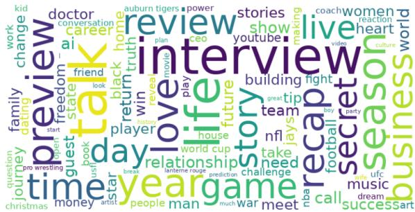  
Figure 5: The diversity of topics of videos in VENUS, displayed as a word cloud. Larger words indicate more videos from that topic.

After resizing, we create a zero-initialized square image $I _ { \mathrm { p a d } } \in \bar { \mathbb { R } } ^ { S \times S }$ , and resized image $I _ { \mathrm { r e s i z e d } } \in$ $\mathbb { R } ^ { h ^ { \prime } \times w ^ { \prime } }$ is then placed at the center of $I _ { \mathrm { p a d } }$ to ensure spatial consistency and preserve central features of the speaker. The offsets for centering are calculated as :

$$
\delta _ { \mathrm { h } } = \left\lfloor { \frac { S - h ^ { \prime } } { 2 } } \right\rfloor , \quad \delta _ { \mathrm { w } } = \left\lfloor { \frac { S - w ^ { \prime } } { 2 } } \right\rfloor\tag{13}
$$

The padded image $I _ { \mathrm { p a d } }$ is then defined as:

$$
\begin{array} { r l } & { I _ { \mathrm { p a d } } ( i , j ) } \\ & { = \left\{ \begin{array} { l l } { I _ { \mathrm { r } } ( i - \delta _ { \mathrm { h } } , j - \delta _ { \mathrm { w } } ) } & { \mathrm { i f } \quad i \in \left[ \delta _ { \mathrm { h } } , \delta _ { \mathrm { h } } + h ^ { \prime } \right) } \\ { \quad } & { \quad j \in \left[ \delta _ { \mathrm { w } } , \delta _ { \mathrm { w } } + w ^ { \prime } \right) } \\ { 0 } & { \mathrm { o t h e r w i s e } . } \end{array} \right. } \end{array}\tag{14}
$$

This approach maintains the aspect ratio of the original images and ensures that all images have a uniform size, facilitating efficient batch processing.

## A.5 Topic analysis

We visualized the titles of videos from the entire dataset in Figure 5 as a Venn-style word cloud (Coppersmith and Kelly, 2014), with the size proportional to the number of videos gathered for that topic. The most frequent 3 topics are interview (6.64%), life (4.51%), and recap (4.3%). As these proportions indicate, the topics of the VENUS videos are almost uniformly distributed, covering a wide range of conversational topics.

## A.6 Text-Based Sentiment Analysis

For data analysis, we automatically predicted the sentiment (neutral, positive, negative) of the text using a Roberta-based sentiment classifier (Camacho-Collados et al., 2022). In the sentiment analysis conducted with VENUS at the sentence level, the results showed that 63.79% of the sentences were classified as neutral, 17.36% as positive, and 18.85% as negative. Based on the sentiment analysis results at the sentence level, we conducted a frequency analysis accordingly.

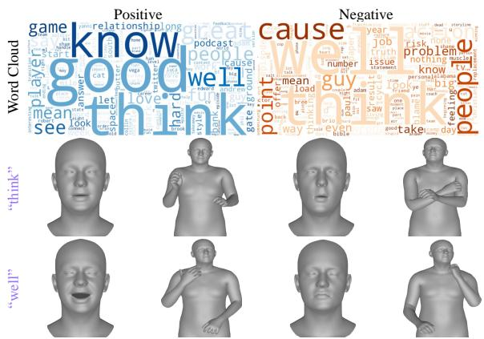  
Figure 6: Word cloud for text-based sentiment analysis. It illustrates changes in facial expressions and body language when each word carries a positive or negative context.

These results were visualized using a word cloud, as illustrated in Figure 6. First, an analysis of the words reveals positive and negative associations with certain professions and religions, with “soldier” appearing in both positive and negative contexts. Interestingly, in real-world conversations, “Friday” is often associated with positive sentiment, while “Monday” is linked to negative sentiment.

Also, Figure 6 shows the nonverbal cues associated with words such as “think” and “well”, comparing their usage in positive versus negative sentiment contexts. For words like “think” and “well”, sentiments are not prominently reflected in body language. However, these words often convey a thoughtful or pondering demeanor. Notably, facial expressions tend to include frowning when spoken with negative sentiments. We can infer from these results that nonverbal cues are closely related to sentiment, and leveraging these expressions can enhance the understanding and interpretation of conversations.

## A.7 VENUS Annotation

In this section, we describe the annotation structure of the VENUS dataset, as illustrated in Figure 9.

The primary keys in VENUS include “Channel ID”, “Video ID”, “Duration”, “FPS”, “Segment

ID”, “Conversation”, “Facial expression”, “Body language”, “Speaker bbox” and “Harmful utterance ID”. Among these, “Conversation” key contains the complete conversation information for a specific video segment, encompassing all data related to utterances. Within “Conversation” key, the “Words” key provides time-aligned word information and their corresponding timestamps for each utterance, ensuring temporal alignment of words within the utterance. “Facial expression” and “Body language” keys represent all nonverbal cue features within the video segment. These nonverbal features are provided alongside utterance IDs and frame infor mation to enable mapping between utterances and features. Features of “Facial expression” include a total of 153 features, encompassing information about facial shape, expressions, and jaw. Meanwhile, features of “Body language” comprises 179 features, which include details about the root of the body, upper and lower body, left and right hands, jaw, and overall body shape. “Speaker bbox” represents the results of active speaker detection, pro viding information about the speaker location in each frame. This information is expressed in the form of coordinates $[ x _ { \mathrm { t o p } } , y _ { \mathrm { t o p } } ,$ x<sub>bottom</sub>, y<sub>bottom</sub>], accurately indicating the detected speaker’s region in every frame. Finally, we introduce the “Harmful utterance $\mathrm { I D } ^ { \prime }$ key to mark utterances identified as harmful by our safety strategy. If an utterance ID is included under this key, it does not appear in the “Conversation” key. This approach allows us to preserve the maximum amount of video data by retaining all safe utterances while filtering out those deemed harmful, thereby maintaining both ethical standards and dataset integrity.

## A.8 VENUS Visualization

We present data visualizations to demonstrate the high quality of the annotated nonverbal expressions in our dataset. For visualization, we converted the FLAME parameters from EMOCA-v2 to the SMPL-X parameters. As shown in Figure 8, VENUS effectively captures key nonverbal expressions, including facial expressions and body language.

In the first video of Figure 8, the phrase “get out” is accompanied by a gesture resembling throwing something away from the speaker. In the second video, the word “quote” is articulated with a hand gesture resembling air quotes, emphasizing the quoted content in the speech. These represent the emphasis and intended meaning that nonverbal expressions add to verbal interactions. VENUS annotates these expressions, ensuring a rich representation of the subtle, yet essential, aspects of human interaction.

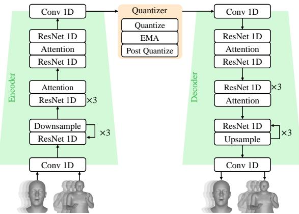  
Figure 7: Overview of VQ-VAE architecture. Encoder (left) quantizes the speaker’s noverbal-cues, while the decoder (right) projcets the learned discrete codebook tokens back into continuous nonverbal-cues sequence space. The downsampling block consists of 1D convolutional layers with a stride of 2. Both the Face VQ-VAE and Body VQ-VAE follow the same architecture.

## B Details of VQ-VAE

We trained a VQ-VAE to quantize facial expressions and body language patches, which are utilized as the input and output for the predictor model. Our Face VQ-VAE and Body VQ-VAE were constructed based on the structure proposed by (Guo et al., 2024), with the internal detailed illustrations provided in Figure 7.

## B.1 Implementation Details

For our VQ-VAE, we use a codebook size of 512 and set the downsampling factor $q = 8$ in the encoder. When training, we set the sequence length, W = 512, to effectively learn utterance-level sequences, with shorter utterances padded with zeros. The learning rate is initialized at 1e 4, and the model is trained for 100 epochs. We set 10% warmup steps and apply a learning rate decay of 0.1 after 50% steps and 0.01 after 75% steps. For regularization and optimization, we employ EMA with a decay rate of 0.99, L2 regularization with weight decay of 0.1, gradient clipping with a maximum norm of 1.0, and gradient accumulation over 4 steps. We also apply L2 normalization to the codebook vectors. The optimal model checkpoint is selected based on the validation reconstruction loss.

When codebook learning in $L _ { v q } ,$ , we set commitment loss weight, $\beta = 0 . 0 2$ . For the Face VQ-VAE, the the reconstruction loss weight $\lambda _ { r e c o n } ^ { f }$ is set to 1, with $\lambda _ { r e c o n } ^ { \psi } = 1$ and $\lambda _ { r e c o n } ^ { j a w } = 5$ , determined empirically. And the face velocity loss weight $\lambda _ { v e l } ^ { f }$ is set to 0.5, with $\lambda _ { \theta } = 5$ is also empirically chosen. Similarly, for the Body VQ-VAE, the reconstruction loss weight and velocity loss weight are set to $\lambda _ { r e c o n } ^ { b } = 1$ and $\lambda _ { v e l } ^ { b } = 0 . 5$ , respectively.

## B.2 Evaluation Metrics

To evaluate the performance of the VQ-VAE, we utilize several metrics to assess both realism and diversity. These evaluation metrics are inspired by prior works $( \mathrm { N g }$ et al., 2023; Zhang et al., 2023b; Liu et al., 2024a) We denote ground-truth motion features and generated motion features as $m _ { g t }$ , and $m _ { p r e d }$ . For realism, we calculate the window Vertex L2, VMSE, and LVD while for diversity, we calculate the diversity and variance.

VMSE. This metric evaluates the reconstruction error by calculating the mean squared difference between predicted and ground truth vertices in 3D space, offering an intuitive and precise measure of geometric accuracy. We denote the function that maps to the vertex space as $\mathbf { V } ( \cdot )$ and the VMSE is defined as follows:

$$
\mathrm { V M S E } = \frac { 1 } { N } \sum _ { i = 1 } ^ { N } | | \mathbf { V } ( m _ { p r e d , i } ) - \mathbf { V } ( m _ { g t , i } ) | | _ { 2 } ^ { 2 } .\tag{15}
$$

LVD. This is a metric similar to VMSE, measuring the L1 distance in the vertex space, and it is defined as follows:

$$
\mathrm { L V D } = \frac { 1 } { N } \sum _ { i = 1 } ^ { N } | | \mathbf { V } ( m _ { p r e d , i } ) - \mathbf { V } ( m _ { g t , i } ) | | _ { 1 } .\tag{16}
$$

Window Vertex L2. This metric evaluates the temporal consistency of predicted motion by computing the L2 distance between the averaged groundtruth and predicted vertex positions over sliding windows:

$$
w V L 2 = \frac { 1 } { W } \sum _ { i = 1 } ^ { W } \left\| \frac { 1 } { S } \sum _ { j = 1 } ^ { S } \mathbf { V } _ { g t } ^ { ( i , j ) } - \frac { 1 } { S } \sum _ { j = 1 } ^ { S } \mathbf { V } _ { p r e d } ^ { ( i , j ) } \right\| _ { \gamma } ^ { 2 }\tag{17}
$$

Diversity. This metric quantifies the variability of motion parameters by assessing the spatial distance between selected pairs, providing the diversity of motion representations. This follows as:

$$
\mathrm { D i v e r s i t y } = \frac { 1 } { K } \sum _ { k = 1 } ^ { K } \left\| m _ { i _ { k } } - m _ { j _ { k } } \right\| _ { 2 } ^ { 2 } ,\tag{18}
$$

where K represents the number of randomly selected pairs, while $m _ { i _ { k } }$ and $m _ { j _ { k } }$ denote the motion parameters from the first and second indices, respectively. Here, we randomly selected 1,000 pairs $( K = 1 , 0 0 0 )$ and computed the diversity by repeating this process 10 times.

Variance. This metric quantifies the average temporal variability of motion parameters. Given a motion sequence with $T$ frames and $D$ parameters, where $\mathbf { m } _ { d } \in \mathbb { R } ^ { T }$ represents the trajectory of the d-th parameter over time and $\bar { \mathbf { m } } _ { d }$ is its mean, the variance is computed as the mean of per-parameter temporal variances:

$$
{ \mathrm { V a r i a n c e } } = { \frac { 1 } { D } } \sum _ { d = 1 } ^ { D } { \frac { 1 } { T } } \sum _ { t = 1 } ^ { T } ( m _ { d , t } - { \bar { m } } _ { d } ) ^ { 2 }\tag{19}
$$

## C Details of MARS

## C.1 Details

We trained MARS using the LLaMA 3.2-Instruct and Qwen 2.5-Instruct formats and incorporated a system prompt to enhance the model’s understanding of nonverbal tokens. This is presented in Table 5. For supervised fine-tuning, we set the batch size per GPU at 8 and the maximum sequence length at 4, 096, and trained over a total of 50 epochs. During inference, we set the maximum sequence length to 512.

## C.2 Evaluation Metrics

BERT-score (Zhang et al., 2019) evaluates the similarity between generated text and reference text at a deeper semantic level. It leverages contextual embeddings derived from pre-trained BERT models to compare candidate and reference tokens. By computing F1 scores based on the cosine similarity of these embeddings, BERTScore provides a nuanced and robust assessment of the semantic alignment and quality of the generated outputs.

Negative Log-Likelihood (NLL) (Bengio et al., 2000) is a function that guides the training of probabilistic models by maximizing the likelihood of the observed data. It measures the discrepancy between the probability distribution predicted by the model and the actual observed data, thereby evaluating how well the model approximates the true data distribution.

PPL (Bengio et al., 2000), or perplexity, quantifies how effectively a language model predicts the next word in a sequence. Lower perplexity values signify greater confidence and accuracy in the model’s predictions, indicating higher quality in generating coherent and contextually appropriate outputs.

METEOR (Banerjee and Lavie, 2005), short for Metric for Evaluation of Translation with Explicit Ordering, evaluates the quality of generated text by aligning it with the reference text. It incorporates factors like precision, recall, and semantic similarities, such as synonyms and paraphrasing, to provide a more nuanced evaluation.

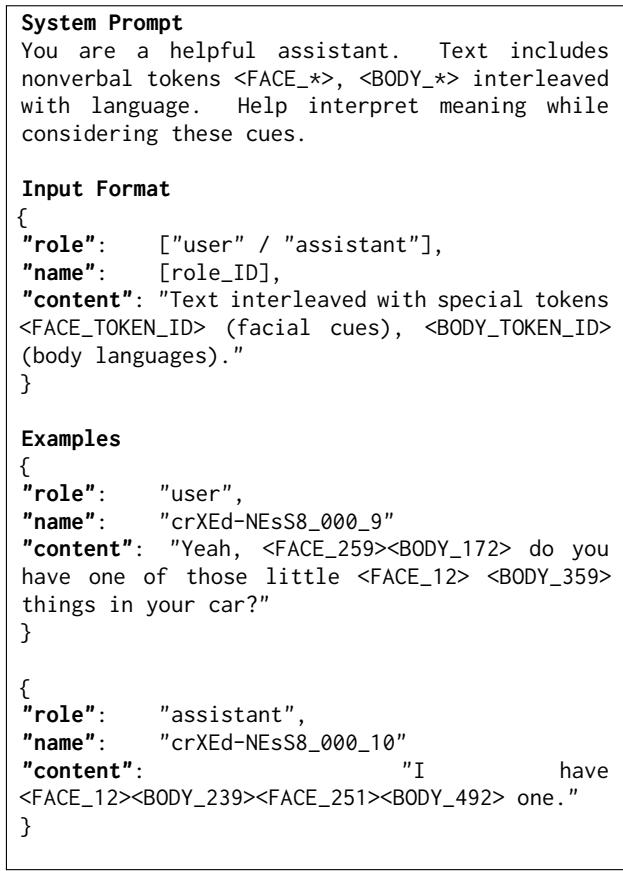  
Table 5: Input for training MARS

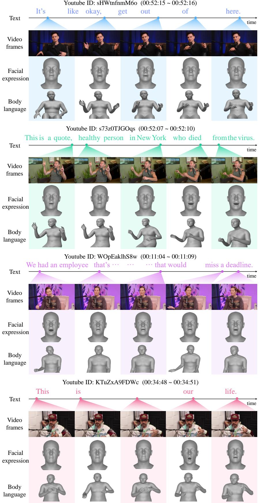  
Figure 8: Visualization for VENUS dataset. This demonstrates the capability of the VENUS dataset to capture multimodal communication, encompassing speech, body language, and facial expressions. Words are time-aligned using WhisperX, with YouTube IDs providing access to ground truth transcription. “   ” indicates an omission in the text.

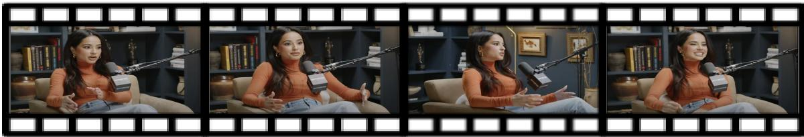

```csv
“Channel_id” : “UCbk_QsfaFZG6PdQeCvaYXJQ” ,
“Video_id” : “G51M8YGs_OM” ,
“Duration” : “01:01:00 ~ 01:11:00” ,
“FPS” : 25,
“Segment_id” : 5
“Conversation” : [
{
“Utt_id” : 0 ,
“Speaker” : 0 ,
“Text” : “after that they come and recruit everyone in …”,
“Start time” : 0.109 ,
“End time” : 66.088 ,
“Words” : [
{ “Word” : “after” , “Start_time” : 0.109, “End_time” : 0.896 },
} , . . .
],
“Facial expression” : [
{ “Utt_id” : 0, “Frame” : 2, “Features” : [
2.81959653e-01,
1.82807636e+00, …
]
} ,
] ,
“Body language” : [
{ “Utt_id” : 0 , “Frame” : 2 , “Features” : [
0 ,
3.14159274e+00 , …
]
} ,
] ,
“Speaker bbox” : [
{ “Frame” : 2 , “Bbox” : [
167.741073,
49.3815689,
783.573852,
474.881866
“Harmful_utterance_id” : [ ]
}
```  
Figure 9: VENUS annotation format. This is an example of an annotation for a single segmented video. We provide the VENUS dataset in JSON format.