# StrucText-Eval: Evaluating Large Language Model’s Reasoning Ability in Structure-Rich Text

Zhouhong Gu♡\* , Haoning Ye♡∗, Xingzhou Chen♡, Zeyang Zhou♡, Hongwei Feng♡<sup>†</sup> , Yanghua Xiao♡♣†,

♡Shanghai Key Laboratory of Data Science, School of Computer Science, Fudan University ♣Fudan-Aishu Cognitive Intelligence Joint Research Center {zhgu22, xzchen24}@m.fudan.edu.cn {hnye19,zeyangzhou20,hwfeng,shawyh}@fudan.edu.cn

## Abstract

The effective utilization of structured data, integral to corporate data strategies, has been challenged by the rise of large language models (LLMs) capable of processing unstructured information. This shift prompts the question: can LLMs interpret structured data directly in its unstructured form? We propose an automatic evaluation data generation method for assessing LLMs’ reasoning capabilities on structurerich text to explore this. Our approach supports 8 structured languages and 29 tasks, generating data with adjustable complexity through controllable nesting and structural width. We introduce StrucText-Eval, a benchmark containing 5,800 pre-generated and annotated samples designed to evaluate how well LLMs understand and reason through structured text. StrucText-Eval is divided into two suites: a regular Test suite (3,712 samples) and a Test-Hard suite (2,088 samples), the latter emphasizing the gap between human and model performance on more complex tasks. Experimental results show that while open-source LLMs achieve a maximum accuracy of 74.9% on the standard dataset, their performance drops significantly to 45.8% on the harder dataset. In contrast, human participants reach an accuracy of 92.6% on StrucText-Eval-Hard, highlighting LLMs’ current limitations in handling intricate structural information. The benchmark and generation codes are open sourced in https://github.com/MikeGu721/ StrucText-Eval

## 1 Introduction

Structured data, often represented by various structured languages such as JSON (Pezoa et al., 2016), YAML (Evans, 2001), ORG (org, 2023), or Markdown (Gruber, 2012), Latex (Lamport, 1985) etc., has consistently been central to corporate data strategies due to its ability to capture, store, and analyze essential information systematically. The inherent benefits of structured data lie in its standardized format and high degree of organization, which facilitates efficient data querying and machine processing, clearly surpassing the inherent chaos of unstructured data. However, with the advancement of large language models (LLMs) (Achiam et al., 2023; Touvron et al., 2023a,b; Sun et al., 2021), there has been a significant shift towards the effective utilization of unstructured data, attributed to the LLMs’ capacity to comprehend and generate complex and nuanced semantics within such data (Brown et al., 2020). Considering that structured data can be directly presented in an unstructured format, it makes us wonder: whether it is possible to rely on LLMs to interpret structured data through unstructuredformat directly.

Current LLM researchers have addressed their comprehension of the structure-rich text of limited categories: Graphs (Fatemi et al., 2023; Perozzi et al., 2024; Guo et al., 2023; Tang et al., 2023a; Chen et al., 2023), Tables (Sui et al., 2024; Campbell-Kelly, 2003; Pasupat and Liang, 2015) and JSON (Chen et al., 2024; Suzgun et al., 2022). However, these categories do not encompass all potential use cases of structure-rich text. For instance, scenarios requiring a direct understanding of articles in Latex or Markdown formats, data in YAML or ORG formats, or various custom-structured languages need to be adequately covered. Moreover, existing benchmarks often rely on manually annotated data for evaluation, which limits the development of robust evaluation frameworks and potentially facilitates model cheating (Zhou et al., 2023).

We propose a method for automatically generating evaluation data to assess models’ capabilities in structure-rich text reasoning. This method is applied to 8 structured languages, as shown in Fig. 1, across 29 specific tasks, enabling data generation with controllable difficulty by adjusting the depth of structured nesting and the number of width and columns in the sample. Based on this method, we further introduce the Structure-Rich Text Evaluation Benchmark (StrucText-Eval), a comprehensive benchmark with 5,800 pregenerated and annotated samples designed to evaluate the proficiency of LLMs in deciphering embedded structures within input text. StrucText-Eval aims to evaluate whether LLMs understand raw structural tags, execute logical inferences based on the decoded semantics of these symbols, and organize their responses according to instruction requirements.

<table><tr><td>Benchmark</td><td>CSV/Table</td><td>Tree</td><td>JSON</td><td>YAML</td><td>XML</td><td>MD.</td><td>LaTeX</td><td>Org</td><td>Total</td></tr><tr><td>BIG-Bench (Srivastava et al., 2022)</td><td></td><td></td><td>31,907</td><td></td><td></td><td></td><td></td><td></td><td>31,907</td></tr><tr><td>TEMPTABQA (Gupta et al., 2023)</td><td>1,208</td><td></td><td></td><td></td><td></td><td></td><td></td><td></td><td>1,208</td></tr><tr><td>Struc-Bench (Tang et al., 2023b)</td><td>4.1k</td><td></td><td></td><td></td><td></td><td></td><td>5.5k</td><td></td><td>9,600</td></tr><tr><td>DocCGen (Pimparkhede et al., 2024)</td><td></td><td></td><td></td><td>18k</td><td></td><td></td><td></td><td></td><td>18,000</td></tr><tr><td>SUC (Sui et al., 2024)</td><td>1,500</td><td></td><td></td><td></td><td></td><td></td><td></td><td></td><td>1,500</td></tr><tr><td>StrucText-Eval (Ours)</td><td>841</td><td>841</td><td>841</td><td>841</td><td>841</td><td>841</td><td>841</td><td>841</td><td>6,728</td></tr></table>

Table 1: Benchmark comparison across different structural language.

The StrucText-Eval dataset contains three test sets: Test (3,712 samples), Real-Test (928 samples), and Test-Hard (2,088 samples). Since the Test set questions were created using rule-based generation, we selected 928 questions from it and rewrote them using real-world examples to form the Real-Test set, making it closer to practical needs for LLMs to understand structured text. The Test-Hard set includes much longer questions, with an average length of 16,535 characters and the longest question containing 102,531 characters, greatly showing the gap between LLMs and humans in understanding structured data. The experimental results indicate that StrucText-Eval presents significant challenges in evaluating current LLMs structured text processing capabilities. While various open-sourced models achieve maximum accuracy of 74.9% under different prompting methods, their performance declines markedly to 45.8% when tested on the more complex StrucText-Eval-Hard dataset. In contrast, human participants attain an accuracy of 92.6% on StrucText-Eval-Hard, highlighting the limitations of existing LLMs in comprehending and reasoning through complex structural information.

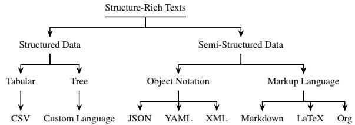  
Figure 1: Taxonomy of Structure-Rich Texts covered in StrucText-Eval.

## 2 Related Work

## 2.1 Structural Text Understanding Enhancements

Recent efforts to enhance LLMs have focused on integrating external structures such as graphs, tool flows, and cross-domain representations to improve reasoning capabilities across various tasks. For instance, ControlLLM utilizes tool graphs to decompose complex multimodal tasks, resulting in enhanced performance on image and audio processing tasks by leveraging the topological dependencies of tools (Liu et al., 2023). Graph-based models like GraphGPT and BooG have shown promising results, with the former improving generalization across node classification and molecular tasks via graph instruction tuning (Zhao et al., 2023; Tang et al., 2024). At the same time, the latter employs virtual supernodes to unify graph structures across domains, fostering cross-domain task transferability (Cheng et al., 2024). Additionally, methods like RC2R demonstrate the effective combination of knowledge graphs and LLMs for domain-specific causal reasoning, particularly in financial risk propagation tasks (Yu et al., 2024). These advancements highlight the benefits of embedding structural elements, from graph architectures to domain-specific knowledge graphs, within LLM frameworks to improve task-specific inference and reasoning.

## 2.2 Structural Text Understanding Evaluation

Evaluating LLMs’ understanding of structured data has become increasingly critical, though benchmarks remain limited. GraphQA and Struc-Bench are key datasets that assess LLMs’ reasoning over graph-structured data and tabular text, respectively, illustrating the models’ varying capabilities based on input encoding (Fatemi et al., 2023; Tang et al., 2023b). More specialized benchmarks, such as TEMPTABQA, evaluate temporal reasoning in tabular data, while TableLLM tests LLMs’ proficiency in handling complex document-based table manipulation tasks (Gupta et al., 2023; Zhang et al., 2024). Other works, such as the evaluation of knowledge graph-based reasoning in complex timeseries QA systems (JMFRN) (Huang et al., 2024), and privacy-oriented graph tasks in GHRatio (Yuan et al., 2024), further explore how LLMs handle intricate, structure-rich information, shedding light on their performance across different structured data formats.

Our work diverges from prior research by focusing exclusively on structure-based inference, deliberately removing semantic content to challenge LLMs to reason purely from structural patterns. Unlike previous approaches that use structural data as supplementary input for classification or semantic tasks (Pasupat and Liang, 2015; Sui et al., 2024), we design semantically agnostic tasks requiring models to infer meaning solely from symbolic structures. Moreover, while earlier benchmarks emphasize graph reasoning or tabular information retrieval, our work extends to a broader spectrum of structure-rich text types, encompassing various input formats and more complex dependency-based inference tasks.

## 3 StrucText-Eval Construction

## 3.1 Structure-Rich Texts Taxonomy

To explore structure-rich texts comprehensively, we propose a dataset for eight structured data types, each categorized within a taxonomy depicted in Fig. 1. This taxonomy encompasses both structured and semi-structured data formats. The structured data types include Tree ((Cormen et al., 2022)), Tabular ((Campbell-Kelly, 2003)), and Object Notation such as JSON ((Pezoa et al., 2016)), YAML ((Evans, 2001)), and XML ((Bray et al., 1998)). The semi-structured data types include Markup Languages like Markdown ((Gruber, 2012)), LaTeX ((Lamport, 1985)), and Org ((org, 2023)). Within StrucText-Eval, Tabular is stored in CSV format, whereas Tree is denoted by a custom format that nodes are represented as the string “xxx”, connected with “->” and separated by “\n”. For examples encompassing all languages and tasks, please refer to Sec. F in the Appendix.

<table><tr><td>#Sample</td><td>#Reference</td><td>#GroundTruth</td><td>Depth</td><td>Width</td></tr><tr><td colspan="5">StrucText-Eval-Test</td></tr><tr><td>3,712</td><td>804</td><td>47</td><td>-</td><td>-</td></tr><tr><td>1,856</td><td>582</td><td>19</td><td>1</td><td>1</td></tr><tr><td>1,856</td><td>1,026</td><td>74</td><td>2</td><td>1</td></tr><tr><td colspan="5">StrucText-Eval-Real-Test</td></tr><tr><td>928</td><td>562</td><td>74</td><td>-</td><td>-</td></tr><tr><td>464</td><td>319</td><td>39</td><td>1</td><td>1</td></tr><tr><td>464</td><td>805</td><td>109</td><td>2</td><td>1</td></tr><tr><td colspan="5">StrucText-Eval-Test-Hard</td></tr><tr><td>2,088</td><td>16,535</td><td>1,169</td><td>-</td><td>-</td></tr><tr><td>232</td><td>573</td><td>22</td><td>1</td><td>1</td></tr><tr><td>232</td><td>614</td><td>26</td><td>1</td><td>2</td></tr><tr><td>232</td><td>663</td><td>25</td><td>1</td><td>3</td></tr><tr><td>232</td><td>992</td><td>80</td><td>2</td><td>1</td></tr><tr><td>232</td><td>2,108</td><td>136</td><td>2</td><td>2</td></tr><tr><td>232</td><td>3,866</td><td>283</td><td>2</td><td>3</td></tr><tr><td>232</td><td>5,036</td><td>312</td><td>3</td><td>1</td></tr><tr><td>232</td><td>32,428</td><td>2,229</td><td>3</td><td>2</td></tr><tr><td>232</td><td>102,531</td><td>7,411</td><td>3</td><td>3</td></tr></table>

Table 2: Statistics for StrucText-Eval test suite.

## 3.2 Generation of Test Suite

An example of JSON’s PathCompose is shown in Fig. 2 to illustrate the dataset generation process. The generation process mainly entails constructing an abstract structure tree, manually drafting question templates, and developing corresponding answer discovery algorithms. The first step of the generation process is to define the complexity of the problem, characterized by depth, width, and column (Col), as well as its type, including task and language. During the construction of the abstract tree, depth represents the depth of the tree, width indicates the number of children for each non-leaf node, and Col specifies the number of fields associated with each node. When constructing the question template, predefined templates are retrieved based on the specified task. Finally, during sample generation, the selected task is used to identify the corresponding ground truth according to specific rules, and both the abstract tree and the ground truth are translated into the selected language.

Eight task categories have been delineated for eight languages, as detailed in Fig. 3b. Twentynine rules and question templates have been formulated for these tasks, with the specific rule templates detailed in Sec. G in the Appendix. Each sample in the dataset comprises four main fields: “Reference”, “Question”, “Requirement” and “Answer”. We give examples for each language and task in Sec. F in the Appendix.

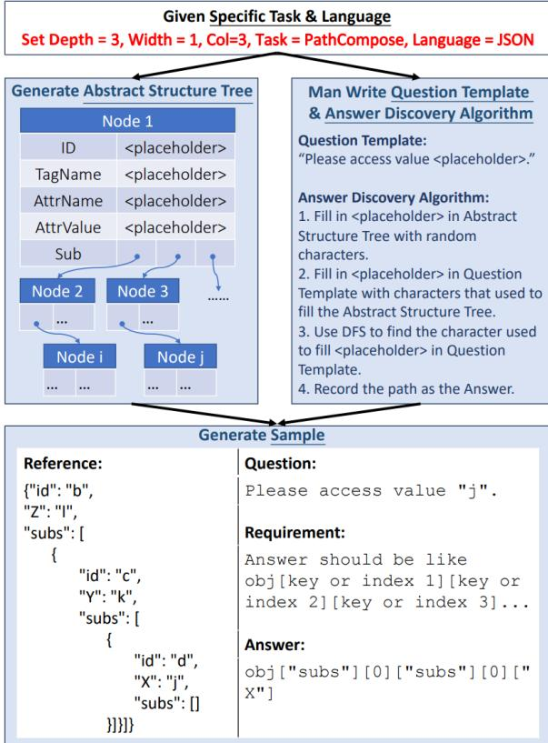  
Figure 2: The illustration of the dataset generation process, the Json PathCompose task, is an example.

## 3.3 Generation of Real-Test Suite

To enhance the alignment between StrucText-Eval-Test and real-world data, we selected a representative subset of samples for manual modification. We maintained consistency with StrucText-Eval-Test by extracting equal proportions of data across tasks, languages, and complexity levels. Five graduate students from computer science backgrounds were invited to modify the “Reference” and “Answer” parts of raw data by replacing abstract node values with meaningful real-world information. In the annotation process, each question is assigned a unique scenario (e.g., athletic activities, glassware specifications), and annotation needs to ensure the modified content is aligned with these scenarios and thereby facilitating diverse, non-repetitive datasets that closely approximate real-world applications. For instance, to annotate in an athletic scenario, an abstract JSON structure “a”: “b”, “c”: “ddd” is transformed into “Name”: “James”, “Speciality”: “Running”. The comprehensive guidelines for manual rewriting are detailed in Appendix C.

## 3.4 Statistic Information

StrucText-Eval has assembled two datasets. StrucText-Eval-Test comprises 3,712 samples, StrucText-Eval-Real-Test comprises 928 samples, and StrucText-Eval-Test-Hard comprises 2,088 samples, each of the 29 specific tasks for eight languages as depicted in Fig. 3a. Detailed statistics regarding the number of samples, lengths, and complexity levels across all tasks, languages, and difficulties are detailed in Tab. 2.

## 4 Experiment Setup

To evaluate LLMs’ current capability of processing structure-rich text and executing dependent inference, we conducted a series of experiments using StrucText-Eval in various settings. Our study utilizes both prompt-based and finetuning methods to analyze the performance variations.

## 4.1 Models

We tested six Open-Source LLMs in both StrucText-Eval Test and Test-Hard Suite, and we used the short name (in the bracket) of these LLMs in the experiments: Qwen/Qwen2-7B-Instruct (Qwen-2-7B), Qwen/Qwen2-72B-Instruct (Qwen-2-72B), meta-llama/Meta-Llama-3.1- 8B-Instruct (Llama-3.1-8B), meta-llama/Meta-Llama-3.1-72B-Instruct (Llama-3.1-70B), meta-llama/Meta-Llama-3.1-405B-Instruct (Llama-3.1-405B), mistralai/Mistral-7B-Instruct-v0.2 (Mistral-0.2-7B)

Considering the huge expense of using an APIbased model, we only tested six Close-Source LLMs in StrucText-Eval-Hard: gpt-4o-2024-08- 06 (gpt-4o), gpt-4o-mini-2024-07-18 (gpt-4omini), gemini-1.5-pro(gemini-1.5-pro), gemini-1.5-flash(gemini-1.5-flash), GLM-4-Plus (glm-4- plus), GLM-4-Flash (glm-4-flash).

## 4.2 Prompt-based Method

We also evaluated the impact of different prompt designs on the performance of LLMs by utilizing six distinct prompt configurations in the main experiments. Detailed implementation of these prompts can be found in the Appendix in Sec. E. The six primary prompt settings are as follows:

Naive involves a straightforward input of “Context”, “Question”, and “Options” into the LLMs to generate responses. Self-Chain-of-Thought (Self-CoT) (Kojima et al., 2022) incorporates a step-by-step reasoning prompt to guide the model through logical reasoning. Plan-and-Solve CoT (PS-CoT) (Wang et al., 2023) emphasizes problem decomposition before solving, encouraging the model to first break down the problem before generating a solution. With Hint (w/ hint) provide manually curated hints to the model to observe its performance when additional information is injected. Since this approach introduces supplementary data, it is delineated by a dashed line from other methods in Table 3. Few-Shot Demonstration involves appending a few training data directly to the prompt. The Simple Few-Shot Demonstration uses only the shortest examples from the training set as few-shot demonstrations.

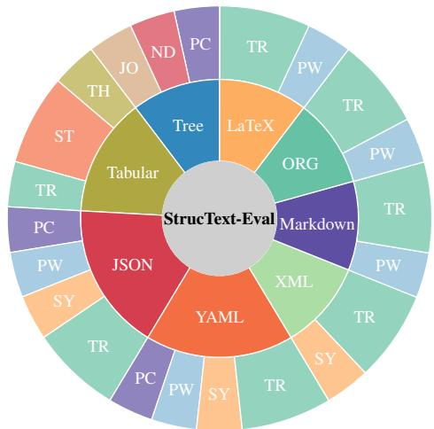  
(a) Benchmark Decomposition

<table><tr><td>Task Name</td><td>Abbr.</td><td>Task Description</td></tr><tr><td>Syntax</td><td>SY</td><td>Focuses on detecting structural errors in data formats such as JSON, XML, and YAML.</td></tr><tr><td>PathWalk</td><td>PW</td><td>Focuses on extracting specific sections or subsections from struc- tured documents such as org, LaTeX, or markdown files.</td></tr><tr><td>TextRetrieval</td><td>TR</td><td>Assesses the ability to extract specific information from various document formats, including text content and image filenames.</td></tr><tr><td>Statistic</td><td>ST</td><td>Concentrates on statistical queries to calculate the number of em- ployees meeting specific salary conditions.</td></tr><tr><td>Join</td><td>JO</td><td>Assesses the ability to filter data sets that meet specific criteria by combining multiple tables in a database through SQL queries.</td></tr><tr><td>Tree.Height</td><td>TH</td><td>Evaluates calculating the height of the longest path from the root node to any leaf node in a tree structure.</td></tr><tr><td>Node.Depth</td><td>ND</td><td>Assesses the depth of any node in a tree structure relative to the root node.</td></tr><tr><td>PathCompose</td><td>PC</td><td>Evaluates reasoning of paths and multi-level data indexing within hierarchical or tree-like structures.</td></tr></table>

(b) Descriptions of tasks for evaluating structured data understanding in large language models  
Figure 3: The tasks within StrucText-Eval and their description.

## 4.3 Evaluation Method

We use the RougeL metric (Lin, 2004) to assess the degree of character-level similarity between model outputs in the main content of this paper. Sometimes, the task requires the LLM to generate the entire reasoning path leading to the answer, which results in high RougeL scores. So, we assign a score of 0 if the RougeL score falls below 0.75.

Additionally, we present the results of other evaluation metrics, including LLM-as-Judge-Score (Zheng et al., 2023), BLEU (Papineni et al., 2002), and Exact Match, in Tab. 6 in the Appendix. Furthermore, we conduct a consistency analysis across these metrics compared to human judgments, as shown in Fig. 5.

## 5 Analysis

## 5.1 Overall Performance in StrucText-Eval

The overall performance in StrucText-Eval is presented in Table 3, revealing significant variations in the performance of different models across various languages and tasks. For instance, the Qwen2-72B-Instruct model demonstrates optimal performance on JSON-formatted tasks with an 85.8% accuracy under the “Naive” prompt. It also achieves notable results in YAML and CSV tasks, with accuracies of 82.7% and 86.4%, respectively. In contrast, the Meta-Llama-3.1-8B-Instruct-Turbo model performs poorly under the same settings, achieving only 64.6% accuracy on LaTeX tasks. Manually injected hints (w/ hint) generally improve model performance, particularly in tasks requiring deep reasoning, such as those involving YAML and JSON. For example, the Meta-Llama-3.1-70B-Instruct-Turbo model’s accuracy improves from 75.4% under the “Naive” prompt to 84.9% with the “w/ Hint” strategy. However, with “Self-CoT” and “PS-CoT” prompts, specific models like Qwen2-7B-Instruct exhibit lower accuracy across multiple tasks, especially when handling complex structures such as XML and Tree data, performing significantly worse than other prompting methods.

These performance disparities can be primarily attributed to training sample biases and the influence of different prompting strategies. JSON, being a widely used format in internet data, is frequently encountered by many large models during training, leading to a pronounced advantage in handling JSON-formatted tasks—a clear manifestation of training sample bias. Moreover, the choice of prompting strategy directly affects a model’s inference capabilities. The “w/ Hint” method, which introduces human reasoning rules, compensates for the model’s limitations in reasoning through complex structures. Conversely, while the “Self-CoT” and “PS-CoT” approaches encourage step-by-step reasoning, they often result in logical inconsistencies and reasoning errors in complex tasks due to the requirement for autonomous generation of reasoning paths.

<table><tr><td rowspan=1 colspan=20>Languages                                   TasksModelPrompt                 allJSONLaTeXMd.ORGCSVTreeXMLYAMLPCPWSYTR JO STNDTH</td></tr><tr><td rowspan=1 colspan=1></td><td rowspan=1 colspan=1>Base</td><td rowspan=1 colspan=11>70.4  68.8 68.054.5 83.568.9 57.6  68.5 48.574.2</td><td rowspan=1 colspan=6>49.272.479.5 78.447.793.2</td><td rowspan=1 colspan=1>30.0</td></tr><tr><td rowspan=2 colspan=1>Qwen2-7B</td><td rowspan=1 colspan=1>Self-CoT</td><td rowspan=1 colspan=3>12.8  1.5  1.5</td><td rowspan=1 colspan=1>9.1</td><td rowspan=1 colspan=1>29.0</td><td rowspan=1 colspan=1>4.5</td><td rowspan=1 colspan=4>3.6  3.5  4.5</td><td rowspan=1 colspan=1>6.4</td><td rowspan=1 colspan=1>6.1</td><td rowspan=1 colspan=1>8.1</td><td rowspan=1 colspan=1>27.3</td><td rowspan=1 colspan=1>26.1</td><td rowspan=1 colspan=1>2.3</td><td rowspan=1 colspan=1>6.8</td><td rowspan=1 colspan=1>17.2</td></tr><tr><td rowspan=1 colspan=1>PS-CoT</td><td rowspan=1 colspan=3>31.7  31.7 19.4</td><td rowspan=1 colspan=1>20.1</td><td rowspan=1 colspan=1>67.0</td><td rowspan=1 colspan=1>36.4</td><td rowspan=1 colspan=4>25.8  24.9  9.8</td><td rowspan=1 colspan=1>19.8</td><td rowspan=1 colspan=1>32.6</td><td rowspan=1 colspan=1>34.1</td><td rowspan=1 colspan=1>63.6</td><td rowspan=1 colspan=1>60.2</td><td rowspan=1 colspan=1>25.0</td><td rowspan=1 colspan=1>72.7</td><td rowspan=1 colspan=1>29.1</td></tr><tr><td rowspan=3 colspan=1></td><td></td><td></td><td></td><td></td><td></td><td></td><td></td><td></td><td></td><td></td><td></td><td></td><td></td><td></td><td></td><td></td><td></td><td></td><td></td></tr><tr><td rowspan=2 colspan=1>w/ Hint</td><td></td><td></td><td></td><td></td><td></td><td></td><td></td><td></td><td></td><td></td><td></td><td></td><td></td><td></td><td></td><td></td><td></td><td></td></tr><tr><td rowspan=1 colspan=3>70.8  66.1 66.5</td><td rowspan=1 colspan=1>58.1</td><td rowspan=1 colspan=1>85.2</td><td rowspan=1 colspan=1>56.8</td><td rowspan=1 colspan=4>55.2  70.2 43.9</td><td rowspan=1 colspan=1>72.3</td><td rowspan=1 colspan=1>43.2</td><td rowspan=1 colspan=1>75.3</td><td rowspan=1 colspan=1>86.4</td><td rowspan=1 colspan=1>77.3</td><td rowspan=1 colspan=1>45.5</td><td rowspan=1 colspan=1>65.9</td><td rowspan=1 colspan=1>44.0</td></tr><tr><td rowspan=1 colspan=1></td><td rowspan=1 colspan=1>Base</td><td rowspan=1 colspan=3>85.8  73.7 75.1</td><td rowspan=1 colspan=1>67.1</td><td rowspan=1 colspan=1>92.6</td><td rowspan=1 colspan=1>86.4</td><td rowspan=1 colspan=1>71.2</td><td rowspan=1 colspan=3>82.7 80.3</td><td rowspan=1 colspan=1>81.5</td><td rowspan=1 colspan=1>62.9</td><td rowspan=1 colspan=1>80.8</td><td rowspan=1 colspan=1>90.9</td><td rowspan=1 colspan=1>90.9</td><td rowspan=1 colspan=1>77.3</td><td rowspan=1 colspan=1>95.5</td><td rowspan=1 colspan=1>42.6</td></tr><tr><td rowspan=2 colspan=1>Qwen2-72B</td><td rowspan=1 colspan=1>Self-CoT</td><td rowspan=1 colspan=2>85.4  69.9</td><td rowspan=1 colspan=1>70.8</td><td rowspan=1 colspan=1>65.2</td><td rowspan=1 colspan=1>95.5</td><td rowspan=1 colspan=1>90.2</td><td rowspan=1 colspan=1>79.5</td><td rowspan=1 colspan=1></td><td rowspan=1 colspan=1>89.7</td><td rowspan=1 colspan=1>78.8</td><td rowspan=1 colspan=1>77.1</td><td rowspan=1 colspan=1>81.1</td><td rowspan=1 colspan=1>81.7</td><td rowspan=1 colspan=1>90.9</td><td rowspan=1 colspan=1>95.5</td><td rowspan=1 colspan=1>84.1</td><td rowspan=1 colspan=1>95.5</td><td rowspan=1 colspan=1>51.0</td></tr><tr><td rowspan=1 colspan=1>PS-CoT</td><td rowspan=1 colspan=2>89.5  70.1</td><td rowspan=1 colspan=1>68.9</td><td rowspan=1 colspan=1>61.7</td><td rowspan=1 colspan=1>92.0</td><td rowspan=1 colspan=1>84.8</td><td rowspan=1 colspan=1>81.1</td><td rowspan=1 colspan=2>93.4</td><td rowspan=1 colspan=1>76.5</td><td rowspan=1 colspan=1>77.6</td><td rowspan=1 colspan=1>87.9</td><td rowspan=1 colspan=1>80.8</td><td rowspan=1 colspan=1>81.8</td><td rowspan=1 colspan=1>93.2</td><td rowspan=1 colspan=1>86.4</td><td rowspan=1 colspan=1>97.7</td><td rowspan=1 colspan=1>65.3</td></tr><tr><td rowspan=1 colspan=1></td><td rowspan=1 colspan=1>w/Hint</td><td rowspan=1 colspan=2>90.0  72.5</td><td rowspan=1 colspan=1>79.1</td><td rowspan=1 colspan=1>68.6</td><td rowspan=1 colspan=1>94.9</td><td rowspan=1 colspan=1>81.1</td><td rowspan=1 colspan=1>72.7</td><td rowspan=1 colspan=2>90.8</td><td rowspan=1 colspan=1>81.1</td><td rowspan=1 colspan=1>84.0</td><td rowspan=1 colspan=1>77.3</td><td rowspan=1 colspan=1>82.4</td><td rowspan=1 colspan=1>95.5</td><td rowspan=1 colspan=1>92.0</td><td rowspan=1 colspan=1>72.7</td><td rowspan=1 colspan=1>86.4</td><td rowspan=1 colspan=1>49.4</td></tr><tr><td rowspan=1 colspan=1></td><td rowspan=1 colspan=1>Base</td><td rowspan=1 colspan=2>43.9  64.6</td><td rowspan=1 colspan=1>49.3</td><td rowspan=1 colspan=1>48.3</td><td rowspan=1 colspan=1>42.6</td><td rowspan=1 colspan=1>50.0</td><td rowspan=1 colspan=1>26.5</td><td rowspan=1 colspan=1></td><td rowspan=1 colspan=1>46.9</td><td rowspan=1 colspan=1>30.3</td><td rowspan=1 colspan=1>49.4</td><td rowspan=1 colspan=1>1.5</td><td rowspan=1 colspan=1>61.0</td><td rowspan=1 colspan=1>11.4</td><td rowspan=1 colspan=1>45.5</td><td rowspan=1 colspan=1>22.7</td><td rowspan=1 colspan=1>79.5</td><td rowspan=1 colspan=1>21.3</td></tr><tr><td rowspan=2 colspan=1>Llama-3.1-8B</td><td rowspan=1 colspan=1>Self-CoT</td><td rowspan=1 colspan=2>52.2  40.6</td><td rowspan=1 colspan=1>49.2</td><td rowspan=1 colspan=1>39.0</td><td rowspan=1 colspan=1>66.5</td><td rowspan=1 colspan=1>43.2</td><td rowspan=1 colspan=1>36.6</td><td rowspan=1 colspan=1></td><td rowspan=1 colspan=1>55.2</td><td rowspan=1 colspan=1>40.9</td><td rowspan=1 colspan=1>40.2</td><td rowspan=1 colspan=1>39.7</td><td rowspan=1 colspan=1>53.0</td><td rowspan=1 colspan=1>77.3</td><td rowspan=1 colspan=1>65.9</td><td rowspan=1 colspan=1>52.3</td><td rowspan=1 colspan=1>36.4</td><td rowspan=1 colspan=1>48.5</td></tr><tr><td rowspan=1 colspan=1>PS-CoT</td><td rowspan=1 colspan=2>45.8  18.7</td><td rowspan=1 colspan=1>34.0</td><td rowspan=1 colspan=1>32.8</td><td rowspan=1 colspan=1>64.0</td><td rowspan=1 colspan=1>63.1</td><td rowspan=1 colspan=1>44.6</td><td rowspan=1 colspan=1></td><td rowspan=1 colspan=1>41.3</td><td rowspan=1 colspan=1>48.8</td><td rowspan=1 colspan=1>50.5</td><td rowspan=1 colspan=1>44.7</td><td rowspan=1 colspan=1>32.8</td><td rowspan=1 colspan=1>69.8</td><td rowspan=1 colspan=1>56.8</td><td rowspan=1 colspan=1>64.3</td><td rowspan=1 colspan=1>62.8</td><td rowspan=1 colspan=1>55.9</td></tr><tr><td rowspan=1 colspan=1></td><td rowspan=1 colspan=1>w/ Hint</td><td rowspan=1 colspan=2>44.9  62.2</td><td rowspan=1 colspan=1>55.9</td><td rowspan=1 colspan=1>48.1</td><td rowspan=1 colspan=1>29.0</td><td rowspan=1 colspan=1>54.5</td><td rowspan=1 colspan=1>30.5</td><td rowspan=1 colspan=2>51.4</td><td rowspan=1 colspan=1>31.84</td><td rowspan=1 colspan=1>5.4</td><td rowspan=1 colspan=1>9.1</td><td rowspan=1 colspan=1>63.4</td><td rowspan=1 colspan=1>2.3</td><td rowspan=1 colspan=1>22.7</td><td rowspan=1 colspan=1>38.6</td><td rowspan=1 colspan=1>90.9</td><td rowspan=1 colspan=1>26.9</td></tr><tr><td rowspan=1 colspan=1></td><td rowspan=1 colspan=1>Base</td><td rowspan=1 colspan=2>93.8  70.9</td><td rowspan=1 colspan=1>69.8</td><td rowspan=1 colspan=1>62.8</td><td rowspan=1 colspan=1>72.7</td><td rowspan=1 colspan=1>51.5</td><td rowspan=1 colspan=1>78.7</td><td rowspan=1 colspan=1></td><td rowspan=1 colspan=1>88.8</td><td rowspan=1 colspan=1>81.8</td><td rowspan=1 colspan=1>75.4</td><td rowspan=1 colspan=1>82.6</td><td rowspan=1 colspan=1>81.0</td><td rowspan=1 colspan=1>72.7</td><td rowspan=1 colspan=1>59.1</td><td rowspan=1 colspan=1>47.7</td><td rowspan=1 colspan=1>43.2</td><td rowspan=1 colspan=1>50.8</td></tr><tr><td rowspan=2 colspan=1>Llama-3.1-70B</td><td rowspan=1 colspan=1>Self-CoT</td><td rowspan=1 colspan=2>93.6  71.4</td><td rowspan=1 colspan=1>69.7</td><td rowspan=1 colspan=1>54.8</td><td rowspan=1 colspan=1>96.0</td><td rowspan=1 colspan=1>84.1</td><td rowspan=1 colspan=1>87.1</td><td rowspan=1 colspan=1></td><td rowspan=1 colspan=1>95.9</td><td rowspan=1 colspan=1>88.6</td><td rowspan=1 colspan=1>67.9</td><td rowspan=1 colspan=1>86.4</td><td rowspan=1 colspan=1>85.7</td><td rowspan=1 colspan=1>97.7</td><td rowspan=1 colspan=1>93.2</td><td rowspan=1 colspan=1>77.3</td><td rowspan=1 colspan=1>97.7</td><td rowspan=1 colspan=1>76.7</td></tr><tr><td rowspan=1 colspan=1>PS-CoT</td><td rowspan=1 colspan=1>94.5</td><td rowspan=1 colspan=1>68.7</td><td rowspan=1 colspan=1>72.7</td><td rowspan=1 colspan=1>61.7</td><td rowspan=1 colspan=1>93.7</td><td rowspan=1 colspan=1>83.2</td><td rowspan=1 colspan=1>93.9</td><td rowspan=1 colspan=1></td><td rowspan=1 colspan=1>98.5</td><td rowspan=1 colspan=1>90.8</td><td rowspan=1 colspan=1>77.0</td><td rowspan=1 colspan=1>93.9</td><td rowspan=1 colspan=1>84.2</td><td rowspan=1 colspan=1>93.2</td><td rowspan=1 colspan=1>90.9</td><td rowspan=1 colspan=1>81.8</td><td rowspan=1 colspan=1>90.9</td><td rowspan=1 colspan=1>72.9</td></tr><tr><td rowspan=1 colspan=1></td><td rowspan=1 colspan=1>w/ Hint</td><td rowspan=1 colspan=1>93.6</td><td rowspan=1 colspan=1>73.9</td><td rowspan=1 colspan=1>77.4</td><td rowspan=1 colspan=1>71.6</td><td rowspan=1 colspan=1>72.7</td><td rowspan=1 colspan=1>74.2</td><td rowspan=1 colspan=1>80.4</td><td rowspan=1 colspan=1></td><td rowspan=1 colspan=1>93.6</td><td rowspan=1 colspan=1>88.6</td><td rowspan=1 colspan=1>84.9</td><td rowspan=1 colspan=1>84.1</td><td rowspan=1 colspan=1>83.5</td><td rowspan=1 colspan=1>70.5</td><td rowspan=1 colspan=1>60.2</td><td rowspan=1 colspan=1>65.9</td><td rowspan=1 colspan=1>75.0</td><td rowspan=1 colspan=1>58.4</td></tr><tr><td rowspan=1 colspan=1></td><td rowspan=1 colspan=1>Base</td><td rowspan=1 colspan=1>82.0</td><td rowspan=1 colspan=1>62.9</td><td rowspan=1 colspan=1>70.0</td><td rowspan=1 colspan=1>60.9</td><td rowspan=1 colspan=1>96.6</td><td rowspan=1 colspan=1>65.9</td><td rowspan=1 colspan=1>61.5</td><td rowspan=1 colspan=1></td><td rowspan=1 colspan=1>78.1</td><td rowspan=1 colspan=1>74.2</td><td rowspan=1 colspan=1>69.4</td><td rowspan=1 colspan=1>32.6</td><td rowspan=1 colspan=1>82.4</td><td rowspan=1 colspan=1>97.7</td><td rowspan=1 colspan=1>94.3</td><td rowspan=1 colspan=1>45.5</td><td rowspan=1 colspan=1>79.5</td><td rowspan=1 colspan=1>38.3</td></tr><tr><td rowspan=2 colspan=1>Llama-3.1-405B</td><td rowspan=1 colspan=1>Self-CoT</td><td rowspan=1 colspan=1>87.7</td><td rowspan=1 colspan=1>62.2</td><td rowspan=1 colspan=1>74.2</td><td rowspan=1 colspan=1>62.2</td><td rowspan=1 colspan=1>95.5</td><td rowspan=1 colspan=1>75.8</td><td rowspan=1 colspan=1>78.5</td><td rowspan=1 colspan=1></td><td rowspan=1 colspan=1>90.8</td><td rowspan=1 colspan=1>87.9</td><td rowspan=1 colspan=1>73.2</td><td rowspan=1 colspan=1>63.6</td><td rowspan=1 colspan=1>83.4</td><td rowspan=1 colspan=1>100.0</td><td rowspan=1 colspan=1>90.9</td><td rowspan=1 colspan=1>59.1</td><td rowspan=1 colspan=1>88.6</td><td rowspan=1 colspan=1>67.1</td></tr><tr><td rowspan=1 colspan=1>PS-CoT</td><td rowspan=1 colspan=1>84.5</td><td rowspan=1 colspan=1>67.4</td><td rowspan=1 colspan=1>76.0</td><td rowspan=1 colspan=1>66.7</td><td rowspan=1 colspan=1>92.0</td><td rowspan=1 colspan=1>86.7</td><td rowspan=1 colspan=1>94.7</td><td rowspan=1 colspan=1></td><td rowspan=1 colspan=1>94.7</td><td rowspan=1 colspan=1>88.3</td><td rowspan=1 colspan=1>79.1</td><td rowspan=1 colspan=1>93.2</td><td rowspan=1 colspan=1>81.1</td><td rowspan=1 colspan=1>97.7</td><td rowspan=1 colspan=1>85.2</td><td rowspan=1 colspan=1>90.9</td><td rowspan=1 colspan=1>88.6</td><td rowspan=1 colspan=1>74.9</td></tr><tr><td rowspan=1 colspan=1></td><td rowspan=1 colspan=1>w/ Hint</td><td rowspan=1 colspan=2>85.4  68.3</td><td rowspan=1 colspan=1>75.1</td><td rowspan=1 colspan=1>66.7</td><td rowspan=1 colspan=1>98.3</td><td rowspan=1 colspan=1>70.5</td><td rowspan=1 colspan=1>74.5</td><td rowspan=1 colspan=1></td><td rowspan=1 colspan=1>87.2</td><td rowspan=1 colspan=1>74.2</td><td rowspan=1 colspan=1>78.0</td><td rowspan=1 colspan=1>59.1</td><td rowspan=1 colspan=1>84.9</td><td rowspan=1 colspan=1>97.7</td><td rowspan=1 colspan=1>97.7</td><td rowspan=1 colspan=1>50.0</td><td rowspan=1 colspan=1>84.1</td><td rowspan=1 colspan=1>46.5</td></tr><tr><td rowspan=1 colspan=1></td><td rowspan=1 colspan=1>Base</td><td rowspan=1 colspan=1>32.5</td><td rowspan=1 colspan=1>42.1</td><td rowspan=1 colspan=1>44.9</td><td rowspan=1 colspan=1>40.2</td><td rowspan=1 colspan=1>9.1</td><td rowspan=1 colspan=1>4.5</td><td rowspan=1 colspan=1>14.8</td><td rowspan=1 colspan=1></td><td rowspan=1 colspan=1>33.5</td><td rowspan=1 colspan=1>6.1</td><td rowspan=1 colspan=1>30.8</td><td rowspan=1 colspan=1>0.0</td><td rowspan=1 colspan=1>47.7</td><td rowspan=1 colspan=1>0.0</td><td rowspan=1 colspan=1>6.8</td><td rowspan=1 colspan=1>0.0</td><td rowspan=1 colspan=1>0.0</td><td rowspan=1 colspan=1>11.3</td></tr><tr><td rowspan=2 colspan=1>Mistral-7B</td><td rowspan=1 colspan=1>Self-CoT</td><td rowspan=1 colspan=1>56.5</td><td rowspan=1 colspan=1>35.1</td><td rowspan=1 colspan=1>40.3</td><td rowspan=1 colspan=1>36.6</td><td rowspan=1 colspan=1>34.7</td><td rowspan=1 colspan=1>15.9</td><td rowspan=1 colspan=1>33.7</td><td rowspan=1 colspan=1></td><td rowspan=1 colspan=1>54.3</td><td rowspan=1 colspan=1>28.8</td><td rowspan=1 colspan=1>49.2</td><td rowspan=1 colspan=1>64.4</td><td rowspan=1 colspan=1>43.9</td><td rowspan=1 colspan=1>6.8</td><td rowspan=1 colspan=1>23.9</td><td rowspan=1 colspan=1>13.6</td><td rowspan=1 colspan=1>13.6</td><td rowspan=1 colspan=1>8.1</td></tr><tr><td rowspan=1 colspan=1>PS-CoT</td><td rowspan=1 colspan=1>43.9</td><td rowspan=1 colspan=1>19.7</td><td rowspan=1 colspan=1>22.9</td><td rowspan=1 colspan=1>15.6</td><td rowspan=1 colspan=1>14.8</td><td rowspan=1 colspan=1>18.2</td><td rowspan=1 colspan=1>34.6</td><td rowspan=1 colspan=1></td><td rowspan=1 colspan=1>44.1</td><td rowspan=1 colspan=1>18.9</td><td rowspan=1 colspan=1>30.6</td><td rowspan=1 colspan=1>56.8</td><td rowspan=1 colspan=1>29.1</td><td rowspan=1 colspan=1>22.7</td><td rowspan=1 colspan=1>6.8</td><td rowspan=1 colspan=1>13.6</td><td rowspan=1 colspan=1>22.7</td><td rowspan=1 colspan=1>19.5</td></tr><tr><td rowspan=1 colspan=1></td><td rowspan=1 colspan=1>w/ Hint</td><td rowspan=1 colspan=2>34.6  39.4</td><td rowspan=1 colspan=1>52.7</td><td rowspan=1 colspan=1>40.5</td><td rowspan=1 colspan=1>10.2</td><td rowspan=1 colspan=1>6.8</td><td rowspan=1 colspan=1>12.7</td><td rowspan=1 colspan=2>36.5</td><td rowspan=1 colspan=1>9.8</td><td rowspan=1 colspan=1>34.3</td><td rowspan=1 colspan=1>0.0</td><td rowspan=1 colspan=1>48.9</td><td rowspan=1 colspan=1>0.0</td><td rowspan=1 colspan=1>8.0</td><td rowspan=1 colspan=1>0.0</td><td rowspan=1 colspan=1>0.0</td><td rowspan=1 colspan=1>10.6</td></tr></table>

Table 3: RougeL score for open sourced LLMs’ performance. Bolded text represent the best performance in the column. Underlined text represent the second best performance in the column.  
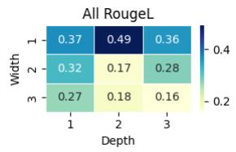

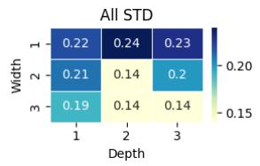

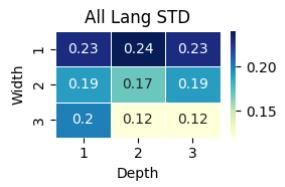

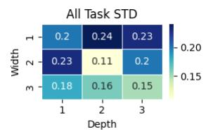

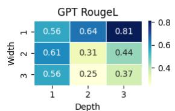

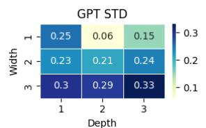

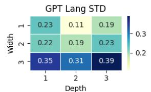

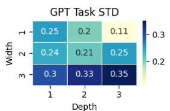  
Figure 4: Heatmaps illustrating the correlation of RougeL scores and standard deviations (STD) across different models and evaluation criteria. The rows represent different levels of depth, and the columns represent varying levels of width, indicating increasing task complexity. “All” refers to combined results across languages and tasks, while “GPT” shows results specific to GPT-based models. “Lang STD” and “Task STD” indicate the variability in performance across different languages and tasks, respectively.

## 5.2 Performance Comparison on StrucText-Eval Test and Real-Test

Fig. 6 shows that most LLMs demonstrate comparable performance across both test sets, with variations typically within three percentage points. This consistency validates the effectiveness of our synthetic data design in simulating real-world scenarios. Moreover, introducing rule hints makes the performance disparity between the two test sets more pronounced. Llama3.1-405B’s advantage in Real-Test further amplifies, exceeding its Test set performance by over six percentage points. Similarly, Llama3.1-8B demonstrates enhanced performance on Real-Test, achieving results approximately 3.5 percentage points higher. However, Qwen2-7B exhibits a contrasting trend, with its Real-Test performance falling approximately six percentage points below its Test set results. These divergent patterns suggest that rule hints influence models’ capacity to generalize to authentic data.

<table><tr><td rowspan="2">Model</td><td colspan="4">Prompt</td></tr><tr><td>Base</td><td>w/ Hint</td><td>3-Shot</td><td>Simple 3-Shot</td></tr><tr><td>Human</td><td>92.6</td><td>-</td><td>-</td><td>-</td></tr><tr><td>GPT-4o-Turbo</td><td>51.1</td><td>54.2</td><td>69.5</td><td>49.7</td></tr><tr><td>GPT-4o-Mini</td><td>39.3</td><td>47.7</td><td>65.6</td><td>39.9</td></tr><tr><td>Gemini1.5-Pro</td><td>11.2</td><td>15.7</td><td>53.0</td><td>12.5</td></tr><tr><td>Gemini1.5-Pro-Flash</td><td>12.9</td><td>12.9</td><td>38.3</td><td>11.9</td></tr><tr><td>GLM-4-Plus</td><td>47.3</td><td>50.9</td><td>65.8</td><td>51.7</td></tr><tr><td>GLM-4-Flash</td><td>40.9</td><td>47.8</td><td>55.2</td><td>41.7</td></tr><tr><td>QWen-2-7B</td><td>29.6</td><td>35.0</td><td>51.9</td><td>30.0</td></tr><tr><td>QWen-2-72B</td><td>42.5</td><td>45.3</td><td>61.4</td><td>36.2</td></tr><tr><td>Llama-3.1-8B</td><td>22.3</td><td>26.7</td><td>33.7</td><td>34.2</td></tr><tr><td>Llama-3.1-70B</td><td>45.8</td><td>56.0</td><td>58.4</td><td>50.1</td></tr><tr><td>Llama-3.1-405B</td><td>34.4</td><td>41.7</td><td>48.7</td><td>40.6</td></tr><tr><td>Mistral-0.2-7B</td><td>7.0</td><td>9.5</td><td>21.0</td><td>6.9</td></tr></table>

Table 4: Performance of all LLMs and Humans on StrucText-Eval-Hard. Bolded text represent the best performance in the column. Underlined text represent the second best performance in the column.  
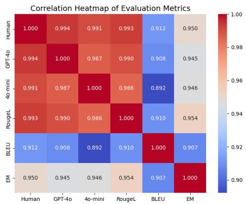  
Figure 5: Correlation between different evaluation metrics.

## 5.3 Overall Performance on StrucText-Eval Hard

Table 4 presents the performance of various models on the StrucText-Eval Hard dataset, characterized by more complex tasks with longer sequences and deeper structures. This complexity results in a significant performance decline across all models. For instance, the accuracy of the Qwen2-72B-Instruct model decreases from 78.4% to 65.0%, while the Meta-Llama-3.1-70B-Instruct-Turbo model’s accuracy drops sharply from 75.4% to 43.2%. Unlike the standard dataset, the Hard dataset demands more advanced reasoning skills, and even with the “w/ Hint” strategy, models achieve only limited improvements, in contrast to the substantial gains observed in more straightforward contexts. Notably, human accuracy on StrucText-Eval-Hard reaches 95.7%, significantly surpassing that of the best-performing large language models (LLMs), highlighting a considerable gap in models’ capabilities for structured reasoning.

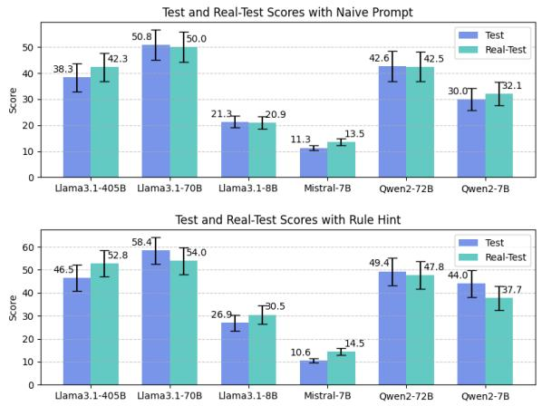  
Figure 6: Performance comparison among open-source models on StrucText-Eval Test and Real-Test.

This performance gap can be primarily attributed to biases in training data and the limitations of current prompting methods. The StrucText-Eval Hard dataset, with increased question complexity and depth, requires models to possess enhanced abstraction abilities and a deeper understanding of complex structures. However, most models are trained on relatively more straightforward structured text, which makes them less effective when tackling deeply nested reasoning tasks. Additionally, prompting methods like “w/ Hint” fail to achieve human-level understanding in multilayered scenarios. The differences in prompting methods become more pronounced with increased complexity; more straightforward methods, such as Self-CoT, need to be revised for guiding models through multi-step reasoning in these challenging contexts. While the “3-shot demonstration” approach significantly improves model performance, the simpler “simple 3-shot” method, despite following similar reasoning rules, fails to match the former due to its insufficient complexity.

## 5.4 Performance Gap on Human & LLMs with Different Ability

Fig. 7 reveal significant performance variations among GPT-4, Qwen-2.7B, and human participants in structured data processing tasks. GPT-4 demonstrates superior performance in computational tasks, achieving over 88% accuracy in Join and Statistics operations, substantially outperforming Qwen2-7B’s modest results, which are 38.89% and 62.50%, respectively. Moreover, GPT-4 exhibits enhanced stability across tasks, particularly in computational operations, with standard deviations below 0.35, whereas Qwen-2.7B shows higher variability with standard deviations exceeding 0.4.

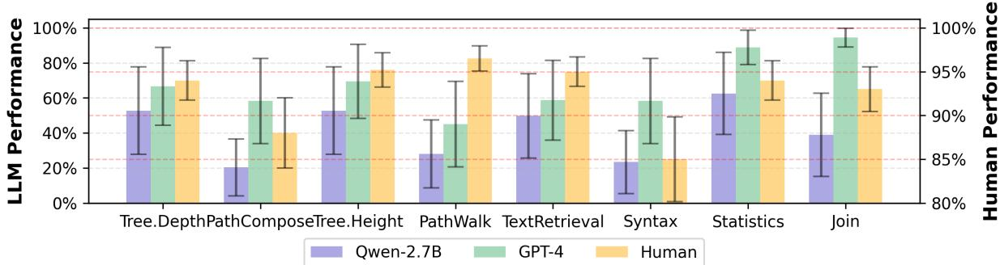  
Figure 7: Performance on StrucText-Eval Hard on best LLM, famous small llm, and human in each task. LLM Performance is plotted against the left y-axis, while Human Performance is plotted against the right y-axis

Human participants excel in copy-intensive tasks such as PathWalk with 96.50% and TextRetrieval with 95.00%, significantly surpassing both models’ performance in these areas. However, in computational tasks, human performance aligns closely with GPT-4, suggesting that advanced language models have achieved near-human capability in specific structured computational operations. These findings underscore the complementary strengths of human cognition and artificial intelligence in processing structured data while highlighting the impact of model scale on performance stability and complex reasoning capabilities.

## 5.5 Model Performance Across Different Difficulty Levels, Languages, and Tasks

Figure 4 illustrates the performance variations of models across different languages and tasks. The two figures on the left reveal that, while numerical differences exist among models, including GPT models, they exhibit a consistent trend: Increasing the reference’s depth and width results in a significant decline in performance. Notably, all models show a high variance in performance when the depth and width are high, suggesting that the StrucText-Eval effectively distinguishes the capabilities of most models under these conditions.

However, for GPT models, substantial variance in performance is observed only when the depth and width increase significantly, indicating that the StrucText-Eval-Hard Test suite is necessary to differentiate the performance of more advanced models better. Additionally, there is considerable variance in model performance across different languages and tasks, suggesting substantial differences in models’ proficiency in handling various linguistic and task-specific challenges. This discrepancy is likely due to biases in training samples and the varying difficulty levels of those samples, as suggested by earlier analyses.

## 5.6 Correlation Between Different Metrics

Figure 5 presents the correlations between various evaluation metrics. The high correlation between Human Judge and GPT-4o Judge (0.9937) indicates a strong alignment between GPT-4o’s automated assessments and human evaluations. Although Exact Match exhibits a notable correlation with Human Judge (0.9501), its stringent criteria often result in scores significantly lower than those of human evaluators, making it less suitable for capturing the diversity and naturalness of model outputs. Among the metrics, RougeL stands out with a correlation of 0.9932 with Human Judge, demonstrating its effectiveness in capturing surface-level textual similarity while maintaining high consistency with human judgments. Compared to the more rigid Exact Match and the relatively lower correlation of BLEU, RougeL offers a better balance between textual similarity and evaluation accuracy.

## 6 Conclusion

The capability to directly interpret structural-rich text in a free-text format is an essential skill all LLMs require. In response, we have developed StrucText-Eval to evaluate this capability of LLMs. We find that the proficiency of current LLMs in training on these structural-rich texts varies depending on user frequency, leading to different performance when the same tasks are performed in various languages. LLMs’ understanding of structuralrich texts remains superficially tied to the training data, and these models need a profound understanding of the structure itself. This deficiency becomes evident when LLMs encounter complex structures composed of common languages or need to parse structural-rich text by custom languages, resulting in significant performance degradation.

## Limitation

This paper focuses on evaluating LLM’s reasoning abilities on structure-rich text by designing a benchmark called StrucText-Eval. However, StrucText-Eval includes only eight types of structured languages and encompasses a total of 29 different tasks. Given the vast array of actual structured languages and the myriad methodologies employed beyond these 29 types, StrucText-Eval can only partially represent the LLMs’ capacity to understand structure-rich text. Additionally, due to regional restrictions, we are unable to utilize some highly effective baseline LLMs, such as Gemini and Claude. Therefore, the conclusions drawn in this paper are based on the assumption that GPT-4 and GPT-4 Turbo represent the top-tier LLMs now.

## Ethical Concern

We contend that this article is devoid of ethical concerns for several reasons:

1. Nature of StrucText-Eval Content: StrucText-Eval is primarily composed of structured language syntax and some nonsensical strings, which do not present potential ethical issues such as gender bias or racial discrimination.

2. Objective Presentation of Experimental Results: The experimental results pertaining to StrucText-Eval objectively demonstrate the comprehension abilities of various large models on structure-rich text included in the benchmark. We have thoroughly validated the outputs and assessment details of the models to ensure that the entire evaluation adheres to the experimental setup and maintains objectivity.

3. Completion of Manual Tasks: All manual tasks associated with this study were conducted by the authors themselves, thereby eliminating any issues of unfair labor practices or unethical cost imposition.

## Acknowledge

This work was supported by the National Natural Science Foundation of China(62476145).

## References

2023. Org Mode Manual: History and Acknowledgments. Free Software Foundation. Accessed: 2024- 03-18.

Josh Achiam, Steven Adler, Sandhini Agarwal, Lama Ahmad, Ilge Akkaya, Florencia Leoni Aleman, Diogo Almeida, Janko Altenschmidt, Sam Altman, Shyamal Anadkat, et al. 2023. Gpt-4 technical report. arXiv preprint arXiv:2303.08774.

Tim Bray, Jean Paoli, C Michael Sperberg-McQueen, Eve Maler, and François Yergeau. 1998. Extensible markup language (xml) 1.0.

Tom Brown, Benjamin Mann, Nick Ryder, Melanie Subbiah, Jared D Kaplan, Prafulla Dhariwal, Arvind Neelakantan, Pranav Shyam, Girish Sastry, Amanda Askell, et al. 2020. Language models are few-shot learners. Advances in neural information processing systems, 33:1877–1901.

Martin Campbell-Kelly. 2003. The history of mathematical tables: from Sumer to spreadsheets. Oxford University Press.

Weize Chen, Chenfei Yuan, Jiarui Yuan, Yusheng Su, Chen Qian, Cheng Yang, Ruobing Xie, Zhiyuan Liu, and Maosong Sun. 2024. Beyond natural language: Llms leveraging alternative formats for enhanced reasoning and communication. arXiv preprint arXiv:2402.18439.

Zhikai Chen, Haitao Mao, Hang Li, Wei Jin, Hongzhi Wen, Xiaochi Wei, Shuaiqiang Wang, Dawei Yin, Wenqi Fan, Hui Liu, et al. 2023. Exploring the potential of large language models (llms) in learning on graphs. arXiv preprint arXiv:2307.03393.

Yao Cheng, Yige Zhao, Jianxiang Yu, and Xiang Li. 2024. Boosting graph foundation model from structural perspective. arXiv preprint arXiv:2407.19941.

Thomas H Cormen, Charles E Leiserson, Ronald L Rivest, and Clifford Stein. 2022. Introduction to algorithms. MIT press.

Clark Evans. 2001. Yaml draft 0.1. Yahoo! Tech groups: sml-dev. Archived from the original on 2001-06-03.

Bahare Fatemi, Jonathan Halcrow, and Bryan Perozzi. 2023. Talk like a graph: Encoding graphs for large language models. arXiv preprint arXiv:2310.04560.

John Gruber. 2012. Markdown: Syntax. URL http://daringfireball. net/projects/markdown/syntax. Retrieved on June, 24:640.

Jiayan Guo, Lun Du, Hengyu Liu, Mengyu Zhou, Xinyi He, and Shi Han. 2023. Gpt4graph: Can large language models understand graph structured data? an empirical evaluation and benchmarking. arXiv preprint arXiv:2305.15066.

Vivek Gupta, Pranshu Kandoi, Mahek Bhavesh Vora, Shuo Zhang, Yujie He, Ridho Reinanda, and Vivek Srikumar. 2023. Temptabqa: Temporal question answering for semi-structured tables. arXiv preprint arXiv:2311.08002.

Rikui Huang, Wei Wei, Xiaoye Qu, Wenfeng Xie, Xianling Mao, and Dangyang Chen. 2024. Joint multifacts reasoning network for complex temporal question answering over knowledge graph. In ICASSP 2024-2024 IEEE International Conference on Acoustics, Speech and Signal Processing (ICASSP), pages 10331–10335. IEEE.

Takeshi Kojima, Shixiang Shane Gu, Machel Reid, Yutaka Matsuo, and Yusuke Iwasawa. 2022. Large language models are zero-shot reasoners. Advances in neural information processing systems, 35:22199– 22213.

Leslie Lamport. 1985. Latex : A document preparation system.

Chin-Yew Lin. 2004. Rouge: A package for automatic evaluation of summaries. In Text summarization branches out, pages 74–81.

Zhaoyang Liu, Zeqiang Lai, Zhangwei Gao, Erfei Cui, Zhiheng Li, Xizhou Zhu, Lewei Lu, Qifeng Chen, Yu Qiao, Jifeng Dai, et al. 2023. Controlllm: Augment language models with tools by searching on graphs. arXiv preprint arXiv:2310.17796.

Kishore Papineni, Salim Roukos, Todd Ward, and Wei-Jing Zhu. 2002. Bleu: a method for automatic evaluation of machine translation. In Proceedings ofthe 40th annual meeting ofthe Associationfor Computational Linguistics, pages 311–318.

Panupong Pasupat and Percy Liang. 2015. Compositional semantic parsing on semi-structured tables. arXiv preprint arXiv:1508.00305.

Bryan Perozzi, Bahare Fatemi, Dustin Zelle, Anton Tsitsulin, Mehran Kazemi, Rami Al-Rfou, and Jonathan Halcrow. 2024. Let your graph do the talking: Encoding structured data for llms. arXiv preprint arXiv:2402.05862.

Felipe Pezoa, Juan L Reutter, Fernando Suarez, Martín Ugarte, and Domagoj Vrgoc. 2016. Foundations ofˇ json schema. In Proceedings of the 25th international conference on World Wide Web, pages 263– 273.

Sameer Pimparkhede, Mehant Kammakomati, Srikanth Tamilselvam, Prince Kumar, Ashok Pon Kumar, and Pushpak Bhattacharyya. 2024. Doccgen: Documentbased controlled code generation. arXiv preprint arXiv:2406.11925.

Aarohi Srivastava, Abhinav Rastogi, Abhishek Rao, Abu Awal Md Shoeb, Abubakar Abid, Adam Fisch, Adam R Brown, Adam Santoro, Aditya Gupta, Adrià Garriga-Alonso, et al. 2022. Beyond the imitation game: Quantifying and extrapolating the capabilities of language models. arXiv preprint arXiv:2206.04615.

Yuan Sui, Mengyu Zhou, Mingjie Zhou, Shi Han, and Dongmei Zhang. 2024. Table meets llm: Can large language models understand structured table data? a benchmark and empirical study. In Proceedings of the 17th ACM International Conference on Web Search and Data Mining, pages 645–654.

Yu Sun, Shuohuan Wang, Shikun Feng, Siyu Ding, Chao Pang, Junyuan Shang, Jiaxiang Liu, Xuyi Chen, Yanbin Zhao, Yuxiang Lu, et al. 2021. Ernie 3.0: Large-scale knowledge enhanced pre-training for language understanding and generation. arXiv preprint arXiv:2107.02137.

Mirac Suzgun, Nathan Scales, Nathanael Schärli, Sebastian Gehrmann, Yi Tay, Hyung Won Chung, Aakanksha Chowdhery, Quoc V Le, Ed H Chi, Denny Zhou, et al. 2022. Challenging big-bench tasks and whether chain-of-thought can solve them. arXiv preprint arXiv:2210.09261.

Jiabin Tang, Yuhao Yang, Wei Wei, Lei Shi, Lixin Su, Suqi Cheng, Dawei Yin, and Chao Huang. 2023a. Graphgpt: Graph instruction tuning for large language models. arXiv preprint arXiv:2310.13023.

Jiabin Tang, Yuhao Yang, Wei Wei, Lei Shi, Lixin Su, Suqi Cheng, Dawei Yin, and Chao Huang. 2024. Graphgpt: Graph instruction tuning for large language models. In Proceedings of the 47th International ACM SIGIR Conference on Research and Development in Information Retrieval, pages 491– 500.

Xiangru Tang, Yiming Zong, Yilun Zhao, Arman Cohan, and Mark Gerstein. 2023b. Struc-bench: Are large language models really good at generating complex structured data? arXiv preprint arXiv:2309.08963.

Hugo Touvron, Thibaut Lavril, Gautier Izacard, Xavier Martinet, Marie-Anne Lachaux, Timothée Lacroix, Baptiste Rozière, Naman Goyal, Eric Hambro, Faisal Azhar, et al. 2023a. Llama: Open and efficient foundation language models. arXiv preprint arXiv:2302.13971.

Hugo Touvron, Louis Martin, Kevin Stone, Peter Albert, Amjad Almahairi, Yasmine Babaei, Nikolay Bashlykov, Soumya Batra, Prajjwal Bhargava, Shruti Bhosale, et al. 2023b. Llama 2: Open foundation and fine-tuned chat models. arXiv preprint arXiv:2307.09288.

Lei Wang, Wanyu Xu, Yihuai Lan, Zhiqiang Hu, Yunshi Lan, Roy Ka-Wei Lee, and Ee-Peng Lim. 2023. Planand-solve prompting: Improving zero-shot chain-ofthought reasoning by large language models. arXiv preprint arXiv:2305.04091.

Guanyuan Yu, Xv Wang, Qing Li, and Yu Zhao. 2024. Fusing llms and kgs for formal causal reasoning behind financial risk contagion. arXiv preprint arXiv:2407.17190.

Hanyang Yuan, Jiarong Xu, Cong Wang, Ziqi Yang, Chunping Wang, Keting Yin, and Yang Yang. 2024. Unveiling privacy vulnerabilities: Investigating the role of structure in graph data. In Proceedings of the 30th ACM SIGKDD Conference on Knowledge Discovery and Data Mining, pages 4059–4070.

Xiaokang Zhang, Jing Zhang, Zeyao Ma, Yang Li, Bohan Zhang, Guanlin Li, Zijun Yao, Kangli Xu, Jinchang Zhou, Daniel Zhang-Li, et al. 2024. Tablellm: Enabling tabular data manipulation by llms in real office usage scenarios. arXiv preprint arXiv:2403.19318.

Qifang Zhao, Weidong Ren, Tianyu Li, Xiaoxiao Xu, and Hong Liu. 2023. Graphgpt: Graph learning with generative pre-trained transformers. arXiv preprint arXiv:2401.00529.

Lianmin Zheng, Wei-Lin Chiang, Ying Sheng, Siyuan Zhuang, Zhanghao Wu, Yonghao Zhuang, Zi Lin, Zhuohan Li, Dacheng Li, Eric Xing, et al. 2023. Judging llm-as-a-judge with mt-bench and chatbot arena. Advances in Neural Information Processing Systems, 36:46595–46623.

Kun Zhou, Yutao Zhu, Zhipeng Chen, Wentong Chen, Wayne Xin Zhao, Xu Chen, Yankai Lin, Ji-Rong Wen, and Jiawei Han. 2023. Don’t make your llm an evaluation benchmark cheater. arXiv preprint arXiv:2311.01964.

## A Case Study

Two case studies illustrate the evaluation setup of StrucText-Eval (Figure 8). In the JSON-based Text Retrieval task, GPT4-Turbo accurately identified deeply nested objects and adhered to the free-text format for outputting dictionary types, reflecting its firm grasp of structured text. Minimax also produced a correct answer but deviated from the prescribed format, a common issue explored in existing research. In contrast, GPT4-Turbo initially failed to merge two tables and deduce the correct record count without fine-tuning in the SQL-based Join task. However, a finetuned model steadily improved, achieving the correct solution after 5100 training steps. This progression demonstrates the importance of task-specific fine-tuning in enhancing models’ capabilities in handling complex SQL queries and database structures.

<table><tr><td>Aspect</td><td>Requirements</td></tr><tr><td>Structure</td><td>• Maintain the original data structure and format • Do not alter the nesting levels or relationships</td></tr><tr><td>Content</td><td>• Use real-world examples from assigned scenarios (e.g., e- commerce, finance, sports) • Ensure data values are realistic and scenario-appropriate • Maintain semantic relationships between related fields</td></tr><tr><td>Reference</td><td>• Base modifications on actual examples from the assigned scenario • Keep data consistency within each reference • Avoid sensitive or identifiable information</td></tr></table>

Table 5: Guidelines for Manual Data Annotation

## B Few-Shot Demonstration on Structural Text Inference

Figure 9 demonstrates that model performance improves with an increasing number of demonstrations under Few-Shot settings. In the 3-shot scenario, GPT-4 achieves an accuracy of 69.5%, significantly outperforming models like Gemini-Pro-Flash and Mistral, which remain around 21% or lower. The Qwen-2-72B-Instruct model shows steady improvement as more examples are provided, although it continues to trail behind GPT-4. Generally, performance increases from 1-shot to 3-shot, but the gains become less pronounced at 5-shot, with some models showing overfitting. In contrast, the performance of CoT and PS approaches remains less consistent as the number of demonstrations increases.

This trend suggests that a more significant number of examples helps models to understand problem structures and reasoning processes better, thereby enhancing their inference capabilities. However, providing too many examples can lead to models overfitting to specific patterns, which diminishes their ability to generalize to new tasks. The quality and diversity of examples are critical—high-quality examples can guide practical reasoning, while poor examples may mislead the models. While few-shot learning enhances model adaptability, those with limited pretraining data or lower parameter counts may struggle to capitalize on this approach entirely. For CoT and PS methods, the reasoning process requires additional steps, which means that simply increasing the number of few-shot demonstrations does not consistently yield performance improvements.

## C Detail about Manual Works

This paper involves the manual works in writing Question Templates, acquisition of human performance on StrucText-Eval-Hard-Test and construct-

<table><tr><td>Language: JSON</td><td>Task: TextRetrieval</td><td>Depth: 3</td><td>Width: 1</td><td>Col: 4</td></tr><tr><td colspan="5">Reference: Question: {&quot;id&quot;: &quot;j&quot;, What are the most deeply nested objects, &quot;Z&quot;: &quot;o&quot;, i.e., no value of type list or dict? &quot;subs&quot;: [ Requirement: { &quot;id&quot;: &quot;k&quot;, The content should be an excerpt as they &quot;Y&quot;: &quot;n&quot;, appear in the JSON file, separated by \n\n. “YY&quot;: &quot;nm&quot;, Ground Truth: &quot;subs&quot;: [ L { “id”: &quot;I&quot;, &quot;id&quot;: &quot;I&quot;, “X”: &quot;m&quot;, &quot;X&quot;: &quot;m&quot;, “subs”: [] &quot;subs&quot;: [] } }}}</td></tr><tr><td>Model: GPT-40 Response: t “id”: &quot;I&quot;, “X&quot;: &quot;m&quot;, “subs”: [ 一 Judge: True</td><td>Model: glm-4-Flash Response: To find the most deeply nested objects with no value of type list or dict, we are looking for objects that have no &quot;subs&quot; key or whose &quot;subs&quot; key corresponds to an empty list. Based on the provided JSON structure, the deepest nested objects without any further nesting (i.e., no &quot;subs&quot; or an empty &quot;subs&quot; list) would be: json {&quot;id&quot;:&quot;I&quot;,&quot;X&quot;:&quot;m&quot;,&quot;subs&quot;:[]} 111 This is the deepest object because it has an empty &quot;subs&quot; list, indicating there are no further nested objects. Judge: True</td><td></td><td></td><td></td></tr></table>

<table><tr><td></td><td></td><td rowspan=1 colspan=4>Task: SQL.Join</td><td rowspan=1 colspan=2>Depth: 2</td><td rowspan=1 colspan=2>Width: 8</td><td></td><td rowspan=1 colspan=2>Col: 7</td></tr><tr><td></td><td></td><td></td><td></td><td></td><td></td><td></td><td></td><td></td><td></td><td></td><td rowspan=1 colspan=2></td></tr><tr><td></td><td></td><td rowspan=1 colspan=2>ID</td><td rowspan=1 colspan=1>gender</td><td rowspan=1 colspan=2>age</td><td rowspan=1 colspan=1>name</td><td rowspan=1 colspan=1>height</td><td rowspan=1 colspan=2>weight</td><td rowspan=1 colspan=1>color</td><td></td></tr><tr><td></td><td></td><td rowspan=1 colspan=2>a</td><td rowspan=1 colspan=1>male</td><td rowspan=1 colspan=2>70</td><td rowspan=1 colspan=1>a</td><td rowspan=1 colspan=1>201</td><td rowspan=1 colspan=2>78</td><td rowspan=1 colspan=1>mulatto</td><td></td></tr><tr><td></td><td></td><td rowspan=1 colspan=2>b</td><td rowspan=1 colspan=1>female</td><td rowspan=1 colspan=2>52</td><td rowspan=1 colspan=1>b</td><td rowspan=1 colspan=1>219</td><td rowspan=1 colspan=2>117</td><td rowspan=1 colspan=1>mulatto</td><td></td></tr><tr><td></td><td></td><td rowspan=1 colspan=2>C</td><td rowspan=1 colspan=1>male</td><td rowspan=1 colspan=2>21</td><td rowspan=1 colspan=1>C</td><td rowspan=1 colspan=1>220</td><td rowspan=1 colspan=2>120</td><td rowspan=1 colspan=1>olive</td><td></td></tr><tr><td></td><td></td><td rowspan=1 colspan=2>d</td><td rowspan=1 colspan=1>male</td><td rowspan=1 colspan=2>14</td><td rowspan=1 colspan=1>d</td><td rowspan=1 colspan=1>148</td><td rowspan=1 colspan=2>148</td><td rowspan=1 colspan=1>brown</td><td></td></tr><tr><td></td><td></td><td rowspan=1 colspan=2>e</td><td rowspan=1 colspan=1>male</td><td rowspan=1 colspan=2>66</td><td rowspan=1 colspan=1>e</td><td rowspan=1 colspan=1>216</td><td rowspan=1 colspan=2>132</td><td rowspan=1 colspan=1>swarthy</td><td></td></tr><tr><td></td><td></td><td rowspan=1 colspan=2>f</td><td rowspan=1 colspan=1>male</td><td rowspan=1 colspan=2>19</td><td rowspan=1 colspan=1>f</td><td rowspan=1 colspan=1>181</td><td rowspan=1 colspan=2>130</td><td rowspan=1 colspan=1>swarthy</td><td></td></tr><tr><td></td><td></td><td rowspan=1 colspan=2>g</td><td rowspan=1 colspan=1>female</td><td rowspan=1 colspan=2>57</td><td rowspan=1 colspan=1>g</td><td rowspan=1 colspan=1>186</td><td rowspan=1 colspan=2>166</td><td rowspan=1 colspan=1>swarthy</td><td rowspan=4 colspan=1></td></tr><tr><td></td><td></td><td rowspan=1 colspan=2>h</td><td rowspan=1 colspan=1>male</td><td rowspan=1 colspan=2>46</td><td rowspan=1 colspan=1>h</td><td rowspan=1 colspan=1>162</td><td rowspan=1 colspan=2>79</td><td rowspan=1 colspan=1>olive</td></tr><tr><td></td><td></td><td rowspan=1 colspan=1>ID</td><td rowspan=1 colspan=3>status</td><td></td><td rowspan=1 colspan=1>salary</td><td rowspan=1 colspan=4>companylocation</td></tr><tr><td></td><td></td><td rowspan=1 colspan=1>a</td><td rowspan=1 colspan=3>unemployed</td><td></td><td rowspan=1 colspan=1>353542</td><td rowspan=1 colspan=2>Meta</td><td rowspan=1 colspan=2>CA</td></tr><tr><td></td><td></td><td rowspan=1 colspan=1>b</td><td rowspan=1 colspan=3>unemployed</td><td></td><td rowspan=1 colspan=1>567752</td><td rowspan=1 colspan=2>Meta</td><td rowspan=1 colspan=2>HI</td><td></td></tr><tr><td></td><td></td><td rowspan=1 colspan=1>C</td><td rowspan=1 colspan=3>retired</td><td></td><td rowspan=1 colspan=1>304484</td><td rowspan=1 colspan=2>OPENAI</td><td rowspan=1 colspan=2>CA</td><td></td></tr><tr><td></td><td></td><td rowspan=1 colspan=1>d</td><td rowspan=1 colspan=3>unemployed</td><td></td><td rowspan=1 colspan=1>654219</td><td rowspan=1 colspan=2>Twitter</td><td rowspan=1 colspan=2>HI</td><td></td></tr><tr><td></td><td></td><td rowspan=1 colspan=1>e</td><td rowspan=1 colspan=3>employed</td><td></td><td rowspan=1 colspan=1>179425</td><td rowspan=1 colspan=2>Meta</td><td rowspan=1 colspan=2>NY</td><td></td></tr><tr><td></td><td></td><td rowspan=1 colspan=1>f</td><td rowspan=1 colspan=3>unemployed</td><td></td><td rowspan=1 colspan=1>561634</td><td rowspan=1 colspan=2>Twitter</td><td rowspan=1 colspan=2>IL</td><td></td></tr><tr><td></td><td></td><td rowspan=1 colspan=1>g</td><td rowspan=1 colspan=3>unemployed</td><td></td><td rowspan=1 colspan=1>703878</td><td rowspan=1 colspan=2>Meta</td><td rowspan=1 colspan=2>WA</td><td></td></tr><tr><td></td><td></td><td rowspan=1 colspan=1>h</td><td rowspan=1 colspan=3>employed</td><td></td><td rowspan=1 colspan=1>816757</td><td rowspan=1 colspan=2>NVIDIA</td><td rowspan=1 colspan=2>HI</td><td></td></tr><tr><td rowspan=1 colspan=1>Model:GPT-40Response:2Judge:False</td><td rowspan=1 colspan=12>Model:           Model:       Model:GPT-4o-mini      Gemini-1.5-    Gemini-1.5-pro          pro-flashResponse:There are 3       Response:     Response:people in the     2            1Twitter workforcewho are taller     Judge: False   Judge: Falsethan 178 cm.Judge: False</td></tr></table>

Figure 8: Cases for performance of different LLMs and finetuned stages on Structured Text.

ing Real-Test Suite. All annotation works are carried out by the authors of this paper, so there is no payment for manual annotation.

## C.1 Development of Question Templates

The development and validation of Question Templates constituted a significant component of our methodological framework. Three researchers collaboratively formulated and verified 29 distinct Question Templates. To ensure transparency and reproducibility, we have made these templates accessible to the academic community through our public repository.

## C.2 Human Performance Evaluation

To establish a robust human baseline for the StrucText-Eval-Hard-Test, we conducted a comprehensive evaluation process. Three researchers independently responded to an identical set of 500 questions, with each researcher dedicating approximately 17 hours to this task. The human performance metrics presented in Table 4 represent the mean scores calculated from this substantial dataset of 1,500 responses.

## C.3 Construction of Real-Test Suite

The development of the StrucText-Eval-Real-Test Suite involved five researchers in a systematic annotation process. Initially, the first author generated 928 diverse scenario categories, encompassing domains such as athletics, financial services, glassware specifications, academic writing etc. Subsequently, these scenarios were systematically assigned to individual questions. The annotators were tasked with modifying samples according to their assigned scenarios, adhering to specific annotation guidelines as detailed in Table 5. This process resulted in a comprehensive test suite of 928 questions.

## D Other Metrics

Given the substantial expense in evaluating all results using multiple metrics, we selected a subset of 300 test results for each model on the StrucText-Hard dataset, using a naive prompting method for assessment. The complete evaluation results are presented in Table 6.

## E Detail Prompt

The prompts used in the experiment can be categorized into three types: Example of Base Prompts are shown in Tab. 7. Example of CoT Prompts are shown in Tab. 8. Example of Few-Shot Prompts are shown in Tab. 9. Example of Rule Hints are shown in Tab. 10.

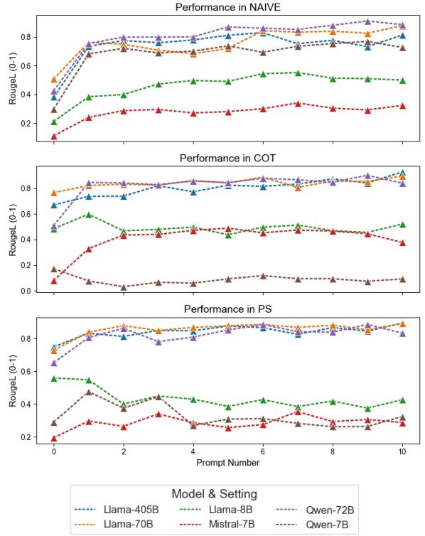  
Figure 9: The model’s performance on StrucText-Eval-Test under different Few-Shot Demonstration settings.

<table><tr><td>Model</td><td>Human</td><td>GPT-40</td><td>40-Mini</td><td>RougeL</td><td>BLEU</td><td>EM</td></tr><tr><td>GPT-4o-Turbo</td><td>56.13</td><td>55.75</td><td>51.00</td><td>51.1</td><td>45.94</td><td>40.31</td></tr><tr><td>GPT-4o-Mini</td><td>36.15</td><td>36.02</td><td>40.73</td><td>39.3</td><td>46.08</td><td>33.93</td></tr><tr><td>Gemini1.5-Pro</td><td>12.39</td><td>12.80</td><td>10.62</td><td>11.2</td><td>12.60</td><td>8.75</td></tr><tr><td>Gemini1.5-Pro-Flash</td><td>13.83</td><td>13.19</td><td>12.96</td><td>12.9</td><td>14.01</td><td>9.67</td></tr><tr><td>GLM-4-Plus</td><td>52.90</td><td>52.62</td><td>46.02</td><td>47.3</td><td>32.75</td><td>38.27</td></tr><tr><td>GLM-4-Flash</td><td>41.50</td><td>41.34</td><td>38.99</td><td>40.9</td><td>37.43</td><td>34.80</td></tr><tr><td>QWen-2-7B</td><td>32.95</td><td>31.99</td><td>30.10</td><td>29.6</td><td>27.98</td><td>18.70</td></tr><tr><td>QWen-2-72B</td><td>40.87</td><td>38.66</td><td>31.24</td><td>42.5</td><td>37.76</td><td>35.67</td></tr><tr><td>Llama-3.1-8B</td><td>21.78</td><td>21.98</td><td>22.36</td><td>22.3</td><td>20.88</td><td>14.75</td></tr><tr><td>Llama-3.1-70B</td><td>46.64</td><td>41.38</td><td>40.83</td><td>45.8</td><td>41.50</td><td>27.46</td></tr><tr><td>Llama-3.1-405B</td><td>35.01</td><td>35.97</td><td>35.88</td><td>34.4</td><td>28.00</td><td>21.29</td></tr><tr><td>Mistral-0.2-7B</td><td>7.85</td><td>7.33</td><td>7.32</td><td>7.0</td><td>5.09</td><td>4.47</td></tr></table>

Table 6: Performance of all LLMs and Humans on StrucText-Eval-Hard based on different metrics (1,000 samples for each metrics).  
Figure 10: Sample input and tasks of Tree.

## F Examples for All Languages & Tasks

In this section, we provide detailed examples for each language we discuss, illustrating how specific tasks are executed within those languages. These examples are meant to offer clear insights into the application and utility of each language in various contexts. Through these demonstrations, readers can better understand the unique features and capabilities of each language when applied to different tasks.

## F.1 Tree

See Figure 10.

o->p\np->q\nq->r\nq->s\nq->t\nq->u\np->v\nv->w\nv->x\nv->y\nv->z\np->ab\nab->bb\nab->cb\nab->db\nab->eb\np->fb\nfb->gb\nfb->hb\nfb->ib\nfb->jb\no->kb\nkb->lb\nlb->mb\nlb->nb\nlb->ob\nlb->pb\nkb->qb\nqb->rb\nqb->sb\nqb->tb\nqb->ub\nkb->vb\nvb->wb\nvb->xb\nvb->yb\nvb->zb\nkb->ac\nac->bc\nac->cc\nac->dc\nac->ec\no->fc\nfc->gc\ngc->hc\ngc->ic\ngc->jc\ngc->kc\nfc->lc\nlc->mc\nlc->nc\nlc->oc\nlc->pc\nfc->qc\nqc->rc\nqc->sc\nqc->tc\nqc->uc\nfc->vc\nvc->wc\nvc->xc\nvc->yc\nvc->zc\no->ad\nad->bd\nbd->cd\nbd->dd\nbd->ed\nbd->fd\nad->gd\ngd->hd\ngd->id\ngd->jd\ngd->kd\nad->ld\nld->md\nld->nd\nld->od\nld->pd\nad->qd\nqd->rd\nqd->sd\nqd->td\nqd->ud

Task 1

Question

What is the path from the root node to the node z. Answer should look like A->D->H.

o->p->v->z

Task 2

Question

What is the depth of node nd? Answer an integer, root is of depth 0.

Ground Truth

Task 3

Question

What is the height of the root node, i.e., the number of edges in the longest path from root node to any leaf nodes? Answer an integer, leaf is of height 0.

Ground Truth

## F.2 Tabular

See Figure 11.

F.3 JSON

See Figure 12.

F.4 YAML

F.5 XML

See Figure 14.

F.6 LaTeX

See Figure 15.

F.7 Markdown

See Figure 16.

## F.8 Org

See Figure 17.

## G Rules & Rule Hints

We list all the rules in Regular Express in this section, and list all the hints for these rules in Lis. 1.

# -\*- coding: utf-8 -\*-   
Variables:   
!<INPUT 0>! – Language   
!<INPUT 1>! – Question   
!<INPUT 2>! – Reference   
!<INPUT 3>! – Requirement   
<commentblockmarker>###</commentblockmarker>   
you are a !<INPUT 0>! file parser, you are required to answer questions pertaining to the given !<INPUT   
0>! file.   
### Question:   
!<INPUT 1>!   
### Reference:   
!<INPUT 2>!   
### Requirement:   
!<INPUT 3>!   
Please follow the format below for your output:   
### Answer:   
xxxxx  
Table 7: Prompt of Naive Prompt method

## G.1 Tree

We build tree-structured input as a list of edges in a tree, in a format of “father->child”, separated by newline.

identif ier := [a-z]+   
Edge := identif ier->identif ier   
T ree := Edge(\nEdge)\*   
InputFile := Tree

## G.2 Tabular

Formally, input texts are classified as tabular data given that they are composed of a list of newline separated lines, each of which is a list of text cells delimited by comma.

head := [A-Z][a-z]<sub>\*</sub>   
cell := [A-Za-z0-9]+   
headline := identifier(, identifier)\*   
subline := cell(, cell)\*   
T abular := headline(\nsubline)+   
InputF ile := T abular

## G.3 JSON

Due to the inherit hierarchy structure of Object Notations, we adopted a recursive scheme to define our input texts.

lb<sub>(left bracket)</sub> := [[]   
rb := []]   
val := [a-z]+   
key := [A-Z]+   
JSON :=   
"id":"val"   
"subs":lbrb lbJSON(, \nJSON   
)\*rb   
("key":"val"\n)+   
}   
InputFile := JSON

## G.4 YAML

The rules for constructing YAML and XML input are similarly recursive.

```markdown
# -*- coding: utf-8 -*-
Variables:
!<INPUT 0>! – Language
!<INPUT 1>! – Question
!<INPUT 2>! – Reference
!<INPUT 3>! – Requirement
<commentblockmarker>###</commentblockmarker>
you are a !<INPUT 0>! file parser, you are required to answer questions pertaining to the given !<INPUT
0>! file.
### Question:
!<INPUT 1>!
### Reference:
!<INPUT 2>!
### Requirement:
!<INPUT 3>!
Please follow the format below for your output:
### Reasoning Prcess:
xxxx
### Answer:
xxxxx
```  
Table 8: Prompt of CoT method

G.5 XML   
firstline := <?xml version="1.0"   
textttencoding =“UTF-8”?>   
XML :=   
f irstline   
XMLObject   
tag := [A-Z]+   
val := [a-z]+   
attr := [A-Z]+="val"   
content := [a-z \n\t]<sub>\*</sub>   
XMLObject :=   
<sup><tag(</sup> <sup>attr)</sup> ∗ <sup>></sup>   
((\t)  XMLObject)   
content   
YAML := </tag>   
InputF ile := XML   
id : val   
subs : lbrb (\n(\t) - YAML) G.6 LaTeX   
+ (key : val\n)+ In LaTeX input texts, we include textbf and   
InputFile := YAML includegraphics commands to accommo-

```markdown
# -*- coding: utf-8 -*-
Variables:
!<INPUT 0>! – Language
!<INPUT 1>! – Demonstration
!<INPUT 2>! – Question
!<INPUT 3>! – Reference
!<INPUT 4>! – Requirement
<commentblockmarker>###</commentblockmarker>
you are a !<INPUT 0>! file parser, you are required to answer questions pertaining to the given !<INPUT
0>! file.
### Demonstration:
!<INPUT 1>!
### Question:
!<INPUT 2>!
### Reference:
!<INPUT 3>!
### Requirement:
!<INPUT 4>!
Please follow the format below for your output:
### Answer:
xxxxx
```  
Table 9: Prompt of Few Shot method

date for the text retrieval tasks. The headings serve as anchors for structure traversal.

```makefile
command := \(section subsection
heading := [#]<sub>*</sub> [a-z]+
subsubsection)
inclg := !lbaltrb\([a-z]+[.](png
heading := command{[a-z]+} [a-z]+
|jpg|jpeg|gif)
inclg := "hover text"\)
\includegraphics[width=
bf := [<sub>*</sub>]{2}[a-z ]+[<sub>*</sub>]{2}
0.5\textwidth] [a-z]+[.]
content := ([a-z ] bf inclg)+
<sup>(png|jpg|jpeg|gif)</sup>}
M arkdown := heading\n
bf := \textbf [a-z ]+
content(\nM arkdown)
content := ([a-z ] bf inclg)+
InputF ile := M arkdown
LaTeX := heading\ncontent(\nLaTeX)
InputF ile := LaT eX
```

## G.7 Markdown

In markdown input texts, the syntax counterparts for heading, text face and including figure are employed in our dataset.

## G.8 Org

In Org input texts, the syntax is obtained from JSON construction rules by replacing the markups

# -\*- coding: utf-8 -\*-   
Variables:   
!<INPUT 0>! – Language   
!<INPUT 1>! – Question   
!<INPUT 2>! – Reference   
!<INPUT 3>! – Requirement   
!<INPUT 4>! – Rule Hint   
<commentblockmarker>###</commentblockmarker>   
you are a !<INPUT 0>! file parser, you are required to answer questions pertaining to the given !<INPUT   
0>! file.   
### Question:   
!<INPUT 1>!   
### Reference:   
!<INPUT 2>!   
### Requirement:   
!<INPUT 3>!   
### Rule Hint:   
!<INPUT 4>!   
Please follow the format below for your output:   
### Answer:   
xxxxx

## Table 10: Prompt of \w Hint method

for heading, including figures and bold font face.

heading := [\*]\* [a-z]+   
inclg := lb 2 [a-z]+[.](png|jpg|   
jpeg|gif)rb 2   
bf := [<sub>\*</sub>][a-z ]+[<sub>\*</sub>]   
content := ([a-z ] bf inclg)+   
Org := heading\ncontent(\nOrg)   
InputF ile := Org

SQL,Tree,JSON,YAML,XML,Markdown,LaTeX,   
, ORG   
To find the value of specific field of   
, record with specified primeKey.   
, You have to first, locate the line   
, with the specific primeKey. Then   
, find the required value under the   
, desired column in that line.   
To get the number of people with salary   
, above a threshold, you need to   
, find the table with salary   
, information. Then you go over each   
, line and check the salary field.

, During the process count only   
, those lines with value of salary   
, strictly greater than the   
, specified threshold towards your   
, final sum. The sum after checking   
, each line is the right answer.   
To get the number of female, first find   
, the table with column name ’’.   
, Then check each line for field   
, gender, and count these lines with   
, value ’female’ towards your final   
, sum. The process applies to   
, finding number of male too.   
To get the number of people living in   
, specified city who are also taller   
, than threshold, you need to first   
, join the two table on primeKey,   
, and check each row of joined table   
, for lines that satisfies both   
, condition, i.e., lines with city   
, specified in query and height   
, strictly greater than threshold.   
, The total number of such rows is   
, the right answer.   
To answer the height of tree, you need   
, to take a recursive strategy. For   
, each node, you will find its   
, height by first finding its   
, children’s heights. Then, the

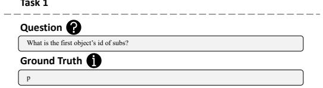

Figure 11: Sample input and tasks of tabular data.  
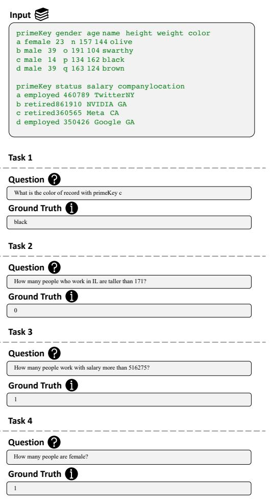

, height of node is the maximum   
, subtree heights plus 1. The base   
, case occurs when a node has no   
, children, i.e., it’s a leaf node.   
, Leaf’s height is defined to be 0,   
, without the need of further   
, queries. Then the height the tree   
, is the height of its root node.   
To find the depth of a node, you need to   
, find the number of edges from   
, root to node. You have to start   
, from the root with depth 0 and   
, assign the depth for each node   
, recursively. For any given node,   
, it gets depth of current depth.   
, Increment the depth by 1 before go   
, to its subtree and repeat the   
, process until every node gets a   
, depth.   
To get the path from root to a node, you   
, need to find recursively. For any   
, node, you can find the path to   
, the target node by find path from   
, its children to target. Then check   
, each child’s output, if any child   
, returns with valid path instead   
, of an empty path indicating target   
, -not-found, the path from node to

Figure 12: Sample input and tasks of JSON.  
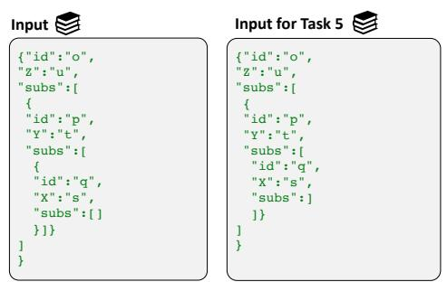

Task 2

What is the object with id p? The content should be an excerpt as it appears in the JSON file.

{\n"id":"p",\n"Y":"t",\n"subs":[\n{\n"id":"q",\n"X":"s",\n"subs":[]}]}

Task 3

Question

How to access value ”u"? Answer should be like obj[key or index 1][key or index 2][key or index 3]..

obj["Z"]

Task 4

Question

What are the most deeply nested objects, i.e., no value of type list or dict?The content should be an excerpt as they appear in the JSON file, separated by \\n\\n

Task 5

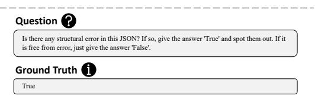

, target is that path from its child   
, to target prepended with itself.   
, The answer can be found by   
, searching with root as starting   
, point.   
To find the object with specified id,   
, you need to first parse the json   
, file and get the outermost object,   
, starting from which search the   
, subs field recursively and looking   
, for the desired value in id field   
, for each visited object. Retrieve   
, the content of that object once   
, found.   
To find the first object’s id of subs,   
, first parse the json file and get


  
Figure 13: Sample input and tasks of YAML.

## Input


## Input for Task 3

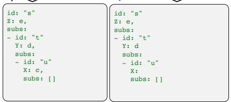

Task 1

Question


Ground Truth

Task 2


Question

How to access value ”d"? Answer should be like obj[key or index 1][key or index 2][key or index


Ground Truth

obj[“subs”][0][“Y”]

Task 3

Question


Is there any structural error in this YAML? If so, give the answer 'True' and spot them out. If it is free from error, just give the answer 'False'.

Ground Truth


Task 4


Question

What is the object with id t? The content should be an excerpt as it appears in the YAML file.

Ground Truth

id: "t”\n Y: d,\n subs: \n - id: "u”\n X: c,\n subs: []

Task 5

  
Figure 14: Sample input and tasks of XML.

Question

What are the most deeply nested objects, i.e., no value of type list or dict?The content should be an excerpt as they appear in the YAML file, separated by \\n\\n.


Ground Truth

id: "u”\n X: c,\n subs: []

, the outermost object, in the , outermost object’s subs list, get , the first element. That element is , another object, and its id is the , answer.

To find the error in the json file, you , need to parse the json file and <sup>,</sup>→ <sup>report</sup> <sup>any</sup> <sup>syntax</sup> <sup>error</sup> <sup>if</sup> , encountered any. Potential errors , include missing ending curly , braces.

To get the path to access specified , value. You have to do a recursive , search along the subs fields,

## Input

<?xml version=\"1.0\" encoding=\"UTF-8\"?>\n<A>\n <B>\n <D Z=\"d\">\n dentist\n </D>\n <E>\n essence\n </E>\n <F>\n far\n </F>\n <G Y=\"c\">\n groot\n </G>\n cafe\n </C>\n <H X=\"b\">\n <I>\n idiot\n </I>\n <J W=\"a\">\n jargon\n </J>\n <K>\n kangaroo\n </K>\n <L V=\"zy\">\n lamb\n </L>\n halo\n </H>\n <M U=\"yy\">\n <N T=\"xy\">\n nob\n </N>\n <O S=\"wy\">\n oops\n </O>\n <P R=\"vy\">\n perish\n </P>\n <Q Q=\"uy\">\n qualify\n </Q>\n monkey\n </M>\n <R>\n <S P=\"ty\">\n salvage\n <T O=\"sy\">\n N=\"ry\">\n vigor\n </V>\n ravish\n </R>\n banana\n </B>\n <W>\n <X>\n <Y M=\"qy\">\n yogurt\n </Y>\n <Z L=\"py\">\n </Z>\n <AB>\n apple banana\n </AB>\n banana\n <FB H=\"ly\">\n banana\n </FB>\n <GB>\n groot banana\n </GB>\n </CB>\n <HB G=\"ky\">\n <IB>\n idiot banana\n </IB>\n <JB F=\"jy\">\n jargon banana\n </JB>\n <KB>\n <NB>\n nob banana\n </NB>\n <OB E=\"iy\">\n oops banana\n </OB>\n <PB>\n banana\n </PB>\n <QB>\n qualify banana\n </QB>\n monkey banana\n </MB>\n wake\n </W>\n </UB>\n <VB C=\"gy\">\n vigor banana\n <WB B=\"fy\">\n salvage banana\n </SB>\n <XB A=\"ey\">\n <YB ZY=\"dy\">\n yogurt banana\n </YB>\n <ZB>\n zen banana\n </ZB>\n <AC YY=\"cy\">\n apple cafe\n </AC>\n <BC>\n banana cafe\n <EC VY=\"zx\">\n essence cafe\n </EC>\n <FC UY=\"yx\">\n far cafe\n <GC>\n groot cafe\n </GC>\n cafe cafe\n </CC>\n <HC TY=\"xx\">\n <IC>\n idiot cafe\n </IC>\n <JC SY=\"wx\">\n jargon cafe\n </JC>\n <KC RY=\"vx\">\n kangaroo cafe\n </KC>\n <LC>\n lamb cafe\n </LC>\n halo cafe\n </HC>\n ravish banana\n </RB>\n <MC QY=\"ux\">\n <NC PY=\"tx\">\n <OC>\n oops cafe\n </OC>\n <PC OY=\"sx\">\n perish cafe\n </PC>\n <QC>\n qualify cafe\n </QC>\n <RC NY=\"rx\">\n ravish cafe\n </RC>\n </NC>\n <SC>\n <TC MY=\"qx\">\n <UC>\n unique cafe\n </UC>\n <VC>\n vigor cafe\n </VC>\n <WC>\n wake cafe\n </WC>\n salvage cafe\n cafe\n </ZC>\n <AD>\n apple dentist\n </AD>\n <BD IY=\"mx\">\n </BD>\n X-ray cafe\n </XC>\n <CD>\n <DD HY=\"lx\">\n dentist dentist\n </DD>\n <ED>\n essence dentist\n </ED>\n <FD GY=\"kx\">\n far dentist\n </FD>\n <GD>\n groot </GD>\n cafe dentist\n monkey cafe\n </MC>\n apple\n</A>

## Input for Task 3

<?xml version=\"1.0\" encoding=\"UTF-8\"?>\n<A Z=\"v\">\n <B Y=\"u\">\n <C>\n <D>\n dentist\n <E X=\"t\">\n essence\n </E>\n <F W=\"s\">\n far\n groot\n cafe\n <H>\n <I>\n idiot\n <J>\n jargon\n <K>\n kangaroo\n </K>\n <L>\n lamb\n halo\n <M U=\"q\">\n <N T=\"p\">\n nob\n <O>\n oops\n <P S=\"o\">\n perish\n unique\n vigor\n ravish\n <X>\n <Y>\n yogurt\n <Z O=\"k\">\n zen\n <AB>\n apple banana\n </AB>\n <BB>\n banana banana\n X-ray\n </X>\n <CB N=\"j\">\n <DB>\n dentist banana\n <EB M=\"i\">\n essence banana\n <FB L=\"h\">\n far banana\n <GB>\n groot banana\n cafe banana\n <HB K=\"g\">\n <IB>\n idiot banana\n <JB>\n jargon banana\n <KB>\n kangaroo banana\n </KB>\n <LB J=\"f\">\n lamb banana\n halo banana\n <MB I=\"e\">\n <NB H=\"d\">\n nob banana\n oops banana\n perish banana\n <QB F=\"b\">\n qualify banana\n monkey banana\n wake\n <RB E=\"a\">\n <SB D=\"zy\">\n <UB>\n unique banana\n <VB B=\"xy\">\n vigor banana\n </VB>\n <WB A=\"wy\">\n wake banana\n salvage banana\n </SB>\n <XB>\n <YB>\n yogurt banana\n <ZB ZY=\"vy\">\n zen banana\n <AC>\n apple cafe\n </AC>\n <BC>\n banana cafe\n X-ray banana\n </XB>\n <CC>\n <DC YY=\"uy\">\n dentist cafe\n <EC XY=\"ty\">\n essence cafe\n <FC WY=\"sy\">\n far groot cafe\n idiot cafe\n <JC UY=\"qy\">\n <KC TY=\"py\">\n kangaroo cafe\n <LC>\n lamb cafe\n halo cafe\n ravish banana\n <MC>\n <NC SY=\"oy\">\n <OC>\n oops cafe\n <PC>\n perish cafe\n </PC>\n <QC>\n qualify cafe\n <RC>\n ravish cafe\n nob cafe\n <SC RY=\"ny\">\n <TC>\n transformer cafe\n <UC>\n unique cafe\n <VC QY=\"my\">\n vigor cafe\n </VC>\n <WC>\n wake cafe\n <YC>\n yogurt cafe\n </YC>\n <ZC PY=\"ly\">\n <AD OY=\"ky\">\n apple dentist\n </AD>\n <BD>\n banana dentist\n <CD NY=\"jy\">\n <DD>\n dentist dentist\n MY=\"iy\">\n essence dentist\n <FD>\n far dentist\n <GD LY=\"hy\">\n groot dentist\n cafe dentist\n </CD>\n monkey cafe\n apple

## Task 1


## Question

What is the content of tag HB? The content should be an excerpt as it appears in the XML file.

Ground Truth

<IB>\n idiot banana\n </IB>\n <JB F=\"jy\">\n jargon banana\n </JB>\n <KB>\n kangaroo banana\n </KB>\n <LB>\n lamb banana\n </LB>\n halo banana

Task 2


Question

What is the tag with attribute of value xy?


Ground Truth

Task 3

Question

Is there any structural error in this XML? If so, give the answer 'True' and spot them out. If it is free from error, just give the answer 'False'.


True

, index into subs inside brackets, , and at which field you find the , value.

To get the most deeply nested objects, , start from the outermost object, , recursively search along the subs , fields. For each object, check its , subs field, any object with an , empty subs is one most deeply , nested object.

To find the object with specified id, , you need to first parse the yaml , file and get the outermost object, , starting from which search the , subs field recursively and looking , for the desired value in id field , for each visited object. Retrieve , the content of that object once

w   
banana cafe vigor cafe perish perish monkey wake   
# x   
cafe cafe vigor cafe perish peris\*\*banana\*\*h monkey   
wake   
## y   
dentist cafe vigor c\*\*cafe\*\*afe perish perish monkey wake

To find the first object’s id of subs,   
, first parse the yaml file and get   
, the outermost object, in the   
, outermost object’s subs list, get   
, the first element. That element is   
, another object, and its id is the   
, answer.

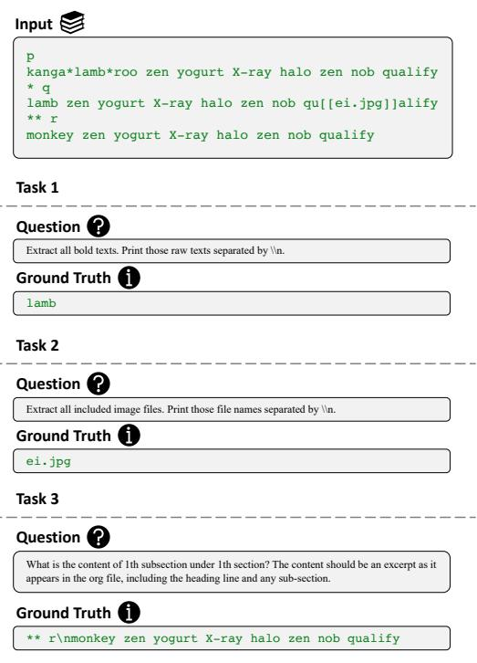  
Figure 17: Sample input and tasks of Org.

Figure 15: Sample input and tasks of LaTeX.  
Figure 16: Sample input and tasks of Markdown.  
```latex
O
monkey \textbf{banana}nob wake yogurt groot wake
jargon ravish
\section{p}
nob nob wake
\textbf{cafe}yogur\includegraphics[width=0.5\textwid
th]{mh.jpeg}t groot wake jargon ravish
\subsection{q}
oops nob wake yogurt groot wake
jargon\textbf{dentist} ravish
```

Task 1

Task 2

Question

Ground Truth

Task 3

What is the content of 1th section? The content should be an excerpt as it appears in the LaTeX file, including the heading line and any sub-section.

To get the path to access specified , value. You have to do a recursive , search along the subs fields, , starting from the outermost parsed , object. For each visited object, , check each fields except for subs, , and record the path along the way , , i.e., subs inside brackets and , index into subs inside brackets, , and at which field you find the , value.

Task 1

Task 2

Ground Truth

Task 3

# x   
cafe cafe vigor cafe perish peris\*\*banana\*\*h monkey wake   
## y   
dentist cafe vigor c\*\*cafe\*\*afe   
perish perish monkey wake

, you need to search for desired tag   
, throughout the xml file. Once   
, located, find the surrounding left   
, and right angle, these area is   
, tha starting tag. Then find the   
, ending tag, which is the tag   
, surrounded by angle with exception   
, that right angle is preceded by a   
, slash. The content between   
, starting and ending tags is the   
, answer.   
To find the tag name of particular   
, attribute value, just search the   
, file for that value and find the   
, surrounding left and right angles,   
, i.e., boundary of tag. The word   
, next to left angle is tag name.   
To find the error in the xml file, you   
, need to parse the xml file and   
, report any syntax error if   
, encountered any. Potential errors   
, include missing ending tags.   
To find the bold texts, search for   
, double stars, i.e., <sub>\*\*</sub>, the   
, content between two occurrences of   
, double stars is the bold texts.   
, Note that the bold range should   
, start from the double stars   
, occurring at i-th spot throughout   
, the whole input file, where i is   
, odd, and end with double stars   
, occurring at jth spot where j is   
, even. For example, text between   
, double stars appearing first and   
, second time.   
To find the content of certain section,   
, starting from the headings start   
, with one hashtag, and go to the   
, ith heading as specified in number   
, of sections. Then start from that   
, line, look for j-th heading with   
, 2 hashtags as specified in   
, subsection number. For kth   
, subsubsection, look for kth   
, heading with 3 hashtags starting   
, from the located subsubsection.   
, Stop searching early if the   
, subsection or subsubsection is not   
, queried.   
To find the image files, look for texts   
, matching , the   
, TARGET part is filename. Star   
, means any text is possible.   
To find the bold texts, search for macro   
, textbf, and everything after \\   
, textbf{ and before the first }   
, encountered is bold text.   
Note that section title is enclosed by   
, \\section{}, and \\subsection for   
, subsection, \\subsubsection for   
, subsubsection. To find the content   
, of certain section, look for ith   
, section as specified, and start   
, from there look for jth subsection   
, . And from located subsection,   
, look for kth subsubsection as   
, queried. Search may stop early if   
, subsection or subsubsection is not   
, queried.   
To find the image files imported, search

```prolog
, for pattern \\includegraphics[<sub>*</sub>]{
, TARGET}, the TARGET part is the
, filename. Star means any text is
, possible.
To find the bold texts, search for
, single star, i.e., <sub>*</sub>, the content
, between two occurrences of single
, star is the bold texts. Note that
, the bold range should start from
, the single star occurring at i-th
, spot throughout the whole input
, file, where i is odd, and end with
, single star occurring at jth spot
, where j is even. For example,
, text between single star appearing
, first and second time.
Note that section, subsection,
, subsubsection titles are preceded
, by <sub>*</sub>, <sub>**</sub>, <sub>***</sub> respectively, with
, one or more whitespaces in between
, . To find the content of certain
, section, look for ith section as
, specified, and start from there
, look for jth subsection. And from
, located subsection, look for kth
, subsubsection as queried. Search
, may stop early if subsection or
, subsubsection is not queried.
To find the image files, look for texts
, matching [[TARGET]], the TARGET
, part is filename
```

## H Detail Setting

All experiments and training process is carried out on a three 3090 GPUs service. The setting of API calling is illustrated in Tab. 11

Table 11: All the parameter setting in our experiments.
<table><tr><td colspan="5">Random Seed</td></tr><tr><td></td><td>torch.manual_seed | torch.cuda.manual_seed_all</td><td>numpy.random.seed</td><td>random.seed</td><td>torch.backends.cudnn.deterministirc</td></tr><tr><td>42</td><td>42</td><td>42 AutoCausalLM</td><td>42</td><td>True</td></tr><tr><td colspan="5"></td></tr><tr><td>temperature</td><td>top_p</td><td>top_k</td><td>num_beams</td><td>max_new_token</td></tr><tr><td>0.95</td><td>0.95</td><td>5</td><td>2</td><td>1</td></tr></table>