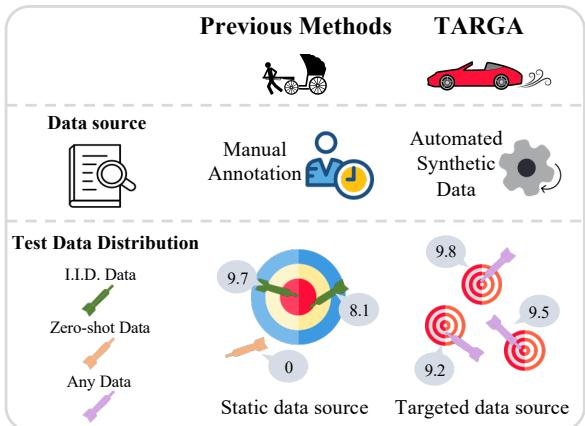
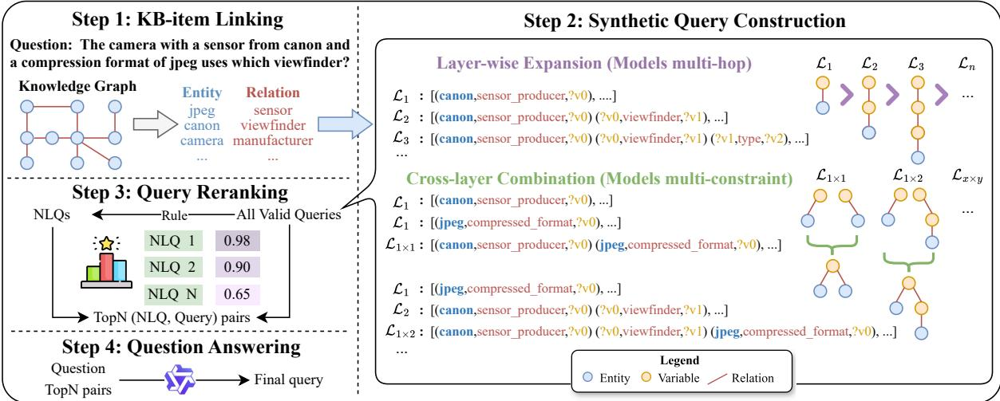
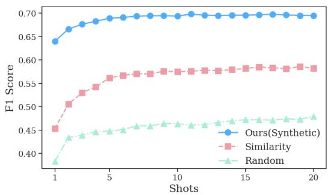
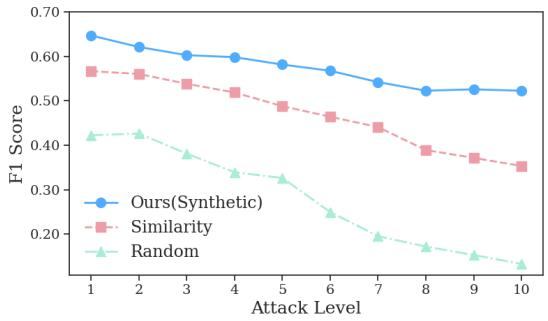
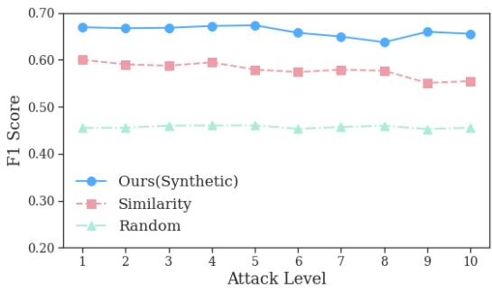

# TARGA: Targeted Synthetic Data Generation for Practical Reasoning over Structured Data

Xiang Huang1, Jiayu Shen1\*, Shanshan Huang1, Sitao Cheng2,

Xiaxia Wang3, Yuzhong Qu1

1State Key Laboratory for Novel Software Technology, Nanjing University, China

2University of California, Santa Barbara

3University of Oxford

xianghuang@smail.nju.edu.cn, yzqu@nju.edu.cn

## Abstract

Semantic parsing, which converts natural language questions into logic forms, plays a crucial role in reasoning within structured environments. However, existing methods encounter two significant challenges: reliance on extensive manually annotated datasets and limited generalization capability to unseen examples. To tackle these issues, we propose Targeted Synthetic Data Generation (TARGA), a practical framework that dynamically generates high-relevance synthetic data without manual annotation. Starting from the pertinent entities and relations of a given question, we probe for the potential relevant queries through layer-wise expansion and cross-layer combination. Then we generate corresponding natural language questions for these constructed queries to jointly serve as the synthetic demonstrations for in-context learning. Experiments on multiple knowledge base question answering (KBQA) datasets demonstrate that TARGA, using only a 7B-parameter model, substantially outperforms existing non-finetuned methods that utilize close-sourced model, achieving notable improvements in F1 scores on GrailQA (+7.7) and KBQA-Agent (+12.2). Furthermore, TARGA also exhibits superior sample efficiency, robustness, and generalization capabilities under non-I.I.D. settings.

## 1 Introduction

Reasoning over structured environments, such as Knowledge Base (KB), Database, and Web, has emerged as a crucial ability for large language models (LLMs) (Liu et al., 2024; Gu et al., 2023). Among various methods for structural reasoning, semantic parsing stands out as a mainstream and has garnered increasing attention from researchers. By translating natural language questions (NLQ) into logic forms, semantic parsing enables seamless interaction with structured environments, thereby enhancing user experience and accessibility.

  
Figure 1: Compared with previous methods, TARGA aims to mitigate the reliance on large amounts of manually labeled data and enhance generalization capabilities in non-i.i.d. scenarios.

However, current semantic paring methods typically face two significant challenges:

1) Dependence on annotation. Previous methods usually rely on extensive amounts of manually annotated data. By training (Ye et al., 2022; Shu et al., 2022; Huang et al., 2023b) or retrieval (Li et al., 2023b; Nie et al., 2023) based on large-scale annotations, existing works have made remarkable progress. Unfortunately, collecting manual annotations in specific environments is labor-intensive and time-consuming. In real-world scenarios, a large pre-collected annotated dataset is often unavailable, limiting the scalability of these methods.

2) Limited generalization capability. Even with access to large annotated datasets, previous methods still struggle with generalizing to unseen examples. Regardless of the paradigm (e.g., in-context learning or fine-tuning), any method relying on a static, offline-collected dataset is inevitably influenced by the dataset’s distribution. Specifically, these methods tend to perform well on examples encountered in the dataset (the I.I.D. setting) but exhibit weaker generalization when faced with unseen environmental items or query structures (the non-

I.I.D. settings), as shown in Figure 1. In complex environments, such as Freebase (Bollacker et al., 2008) with over three billion triples, it is nearly impossible for a pre-collected static dataset to cover the full scope of the environment. Additionally, as the coverage of annotations increases, so do the costs associated with training and retrieval, which further limits the scalability and generalization.

To address the aforementioned challenges, in this work, we propose a practical semantic parsing framework called Targeted Synthetic Data Generation (TARGA), which does not need any manually annotated data and can efficiently work on a 7B model. Specifically, TARGA addresses these challenges by dynamically synthesizing highly relevant examples of a test question as demonstrations for in-context learning. Starting from the KB items (entity, relation) that may be related to the given question, we construct logic forms through layer-wise expansion (extend a new edge for a sub-structure) and cross-layer combination (combine different sub-structures), gradually evolving from simple to complex structures. To further enhance relevance, we re-rank the synthetic logic forms to select the most pertinent ones and generate their corresponding natural language questions, which are then used as demonstrations for reasoning. Through this automatic data synthesis, TARGA free annotators from the heavy burden of labeling tasks. Additionally, the demonstrations are generated based on the given question, thus naturally avoiding the challenge of generalization.

Without any data annotation, TARGA significantly outperforms all non-fine-tuned approaches across multiple complex KBQA datasets, particularly excelling in non-I.I.D. settings. Remarkably, TARGA achieves this with only a 7B-parameter model, whereas most baselines rely on advanced closed-source models, such as gpt-3.5-turbo, enabling faster and more cost-efficient inference. On the GrailQA dataset, we improve the performance of non-fine-tuned methods from an F1 score of 61.3 to 69.0. On KBQA-Agent, the most challenging dataset, we elevate the SOTA performance from 34.3 to 46.5 F1 scores. Further analyses highlight the high quality of the data generated by TARGA. Even with a single demonstration, TARGA still surpasses all non-fine-tuned methods on GrailQA. Additionally, TARGA exhibits remarkable robustness in adversarial settings1.

## 2 Related Works

## 2.1 Few-shot KBQA with LLMs

With the advancement of large language models, recent works have adopted LLMs as the backend for KBQA (Cheng et al., 2024). In particular, In-Context Learning (Brown et al., 2020) requires dozens of demonstrations to guide the model’s responses. To achieve competitive performance, existing ICL-based KBQA works (Li et al., 2023b; Nie et al., 2023) typically retrieve the most similar examples from a manually annotated training set as demonstrations. However, this strategy often results in performance degradation on non-I.I.D. questions involving unseen structures or KB items. For example, Nie et al. (2023); Li et al. (2023b) reported that the performance in zero-shot settings can be up to 20% lower compared to I.I.D. settings.

Another line of KBQA methods, agent-based methods (Liu et al., 2024; Huang et al., 2024; Gu et al., 2024), decomposes questions into individual steps to solve. While step-by-step solving aligns with human intuition and demonstrates remarkable generalization ability, it incurs high computational costs and presents challenges in constructing trajectories. Moreover, the effectiveness of the agentbased paradigm relies heavily on the planning and generalization abilities of advanced LLMs, leading to subpar performance when using weaker models, such as some open-source variants. Such dependency underscores the limitation of agent-based approaches when superior LLMs are unavailable or impractical to use due to resource constraints.

## 2.2 Synthetic Data Generation

Instead of relying solely on human annotation for training data, recent works have leveraged LLMs to generate synthetic data, thereby reducing the burden on human annotators. For instance, Chiang et al. (2023); Taori et al. (2023) use instructions to generate training data as a supplement to manual annotation via self-instruct techniques (Wang et al., 2023). However, this approach still requires humanannotated seed examples to ensure high-quality demonstrations, which entails significant demand for LLM usage. Rather than directly prompting LLMs to generate training data, Cao et al. (2022); Huang et al. (2023a) address this problem by first sampling structured queries from the environment and then converting these queries into natural language using LLMs. Nevertheless, obtaining meaningful structured queries remains a non-trivial task.

Other works similar to ours include FlexK-BQA (Li et al., 2023c) and BYOKG (Agarwal et al., 2024). FlexKBQA relies on predefined templates and model training stages to automatically annotate data, while BYOKG synthesizes data from scratch. However, both approaches require a timeconsuming offline data collection phase. More importantly, like other methods, they rely on reasoning over a pre-collected static dataset, which still suffers from generalization issues. In TARGA, we systematically design a framework to dynamically synthesize relevant examples in an online manner. It avoids the need for a lengthy data collection process, enabling us to dynamically obtain the most relevant examples for each test case without being constrained by a static dataset.

## 3 Methods

## 3.1 Overview

As shown in Figure 2, our targeted data synthesis framework, TARGA, consists of four parts. Given a natural language question nlq, we first collect candidate KB items such as entities ${ { E } _ { n l q } }$ and relations $R _ { n l q }$ as initialization. Then, we explore valid query graphs from simple to complex structures to construct synthetic queries $Q .$ Next, we filter high-relevance candidate queries by ranking. Finally, we use these high-quality synthetic data as demonstrations for QA reasoning.

## 3.2 Candidate KB Items Retrieval

For candidate entities, we adopt the linking result provided by Gu et al. (2023) for a fair comparison (detail in Appendix E.2). For candidate relations, we compute the similarity of question and freebase relations based on text-embedding-ada-$O O 2 ^ { 2 }$ and retain the top 20 most similar candidates. Different from previous fine-tuned methods (Ye et al., 2022; Hu et al., 2022), which typically require training a relation linking model for higher precision and recall, our method does not rely on the precision of these items. This is because, although all retrieved KB items are relevant to the question, they do not necessarily form valid combinations within a specific graph structure. In this way, the subsequent query construction steps in Section 3.3 can be viewed as a joint entity-relation disambiguation process, thus significantly reducing the number of invalid queries.

## 3.3 Synthetic Query Construction

This stage aims to construct question-targeted queries to facilitate subsequent QA reasoning. Given a knowledge base $\mathcal { G }$ and the set of retrieved KB items relevant to the question nlq, we explore the possible query structures Q that are valid $( i . e . ,$ yield non-empty execution results). Specifically, we used PyQL (Huang et al., 2023a) to represent logic form during construction. However, enumerating all possible structures may lead to an unmanageable combinatorial explosion. To mitigate this, our exploration of candidate queries follows a simple-to-complex manner, where we only further explore new structures that are derived from the sub-structures already verified as valid. Starting from the simplest structure $( \mathcal { L } _ { 1 }$ in Figure 2), we progressively search for more complex query structures through Layer-wise Expansion (for multi-hop structures) and Cross-layer Combination (for multiconstraint structures), gradually extending the obtained query graphs until a desired complexity is achieved.

Layer-wise Expansion is utilized to model multi-hop structures (the depth of the query graph), which are chain-like, non-branching query structures originating from a single entity. We define $\mathcal { L } _ { k }$ as the set of queries in which the distance from the entity to the farthest variable in the chain-like query structure is $k .$ . Specifically, we first identify all possible connections between $E _ { n l q }$ and $R _ { n l q } .$ forming the simplest query structure $\mathcal { L } _ { 1 }$ , where an entity s is connected to a variable o through a single relation $p . \operatorname { E x E C } ( q , \mathcal { G } )$ indicates the execution results of query q against .

$$
\begin{array} { c } { \mathcal { L } _ { 1 } = \big \{ ( s , p , o ) ~ | s \in E _ { n l q } , p \in R _ { n l q } , } \\ { \mathrm { E x E C } \big ( ( s , p , o ) , \mathcal { G } \big ) \not = \emptyset \big \} . } \end{array}\tag{1}
$$

We then progressively expand outward from the terminal variable nodes by connecting them to a new variable through another relation to construct $\mathcal { L } _ { 2 }$ , and so forth. Generally, $\mathcal { L } _ { k + 1 }$ is formed by expanding the valid queries from the previous layer $( \mathcal { L } _ { k } )$ with an additional edge:

$$
\begin{array} { r } { \mathcal { L } _ { k + 1 } = \big \{ q \cup ( o _ { i } , p ^ { \prime } , o _ { j } ) \big | q \in \mathcal { L } _ { k } , o _ { i } \in \mathcal { O } ( q ) , } \\ { p ^ { \prime } \in R _ { n l q } , \operatorname { E X E C } \big ( q \cup ( o _ { i } , p ^ { \prime } , o _ { j } ) , \mathcal { G } \big ) \neq \emptyset \big \} . } \end{array}\tag{2}
$$

where $\mathcal O ( q )$ represents the set of variables in q and $o _ { j }$ is a newly introduced variable. The expansion process stops when the complexity threshold (e.g., 3 hops) is reached, since for a coherent and reasonable question, the distance between a specific entity and the final answer typically does not exceed three hops.

  
Figure 2: Overview of TARGA.

Cross-layer Combination models multiconstraint structures (the width of the query graph) by merging two queries, thereby applying multiple constraints to the same variable. Given two queries $q$ and $q ^ { \prime } ,$ we choose one of the variables from each query $( o _ { i }$ for q and $o _ { j }$ for $q ^ { \prime } )$ as the common variable of them, then combine these two queries into a more complex query through this shared variable. We define $\mathcal { L } _ { x \times y }$ as the set of queries formed by combining a query from ${ \mathcal { L } } _ { x }$ and a query from $\mathcal { L } _ { y } .$ . Specifically, we start from the simplest combinations, such as merging two queries in $\mathcal { L } _ { 1 }$ and gradually explore more complex combination patterns, such as merging $\mathcal { L } _ { 2 }$ with $\mathcal { L } _ { 3 }$ or merging $\mathcal { L } _ { 1 }$ with $\mathcal { L } _ { 1 \times 2 }$ . This combination process can be formally expressed as:

$$
\begin{array} { r l r } & { } & { \mathcal { L } _ { x \times y } = \left\{ q \cup q ^ { \prime } \ : \middle | \ : q \in \mathcal { L } _ { x } , \ : q ^ { \prime } \in \mathcal { L } _ { y } , \right. } \\ & { } & { \exists o _ { i } \in \mathcal { O } ( q ) , \ : o _ { j } \in \mathcal { O } ( q ^ { \prime } ) , } \\ & { } & { \left. \mathcal { E } ( o _ { i } ) \cap \mathcal { E } ( o _ { j } ) \neq \emptyset , \mathrm { E x E c } \big ( q \cup q ^ { \prime } , \mathcal { G } \big ) \neq \emptyset \right\} , } \end{array}\tag{3}
$$

where $\mathcal { E } ( o _ { i } )$ refers to the set of entities corresponding to the variable $o _ { i }$ in the execution result of query q on ${ \mathcal { G } } .$ . $o _ { i }$ and $o _ { j }$ serve as the shared variable. This combination terminates once the query structure reaches five edges, which is sufficient to model most questions in current datasets.

In this manner, we circumvented a significant number of invalid queries, thus obtaining most of the potentially relevant queries with relatively lower query overhead. We also provide statistical data regarding these synthetic queries in Appendix

E.5. The average number of valid candidate queries per question is only in the range of several dozen, which is well within the contextual length limits manageable by an ICL model.

## 3.4 Synthetic Query Re-ranking

To obtain the most relevant examples for the subsequent QA task, we re-rank all valid queries using the bge-reranker-v2-m3 model (Chen et al., 2024) based on their similarity to the question. Additionally, we employ a process called Query Textification, where the synthesized query is transformed into a format closer to natural language through heuristic rules. This step helps bridge the gap between the text embedding model and the query, further improving the quality of the ranking. Detail and examples of textification process are provided in Appendix E.4 and Table 12.

To address the imbalance caused by the exponential growth of complex queries, we implement a Hierarchical Ranking strategy. For all queries derived from the same parent query (the sub-query that this query is derived from), we retain only the top n candidates. The final candidate query pool is the union of all top tanked candidates:

$$
Q _ { \mathrm { r a n k e d } } = \bigcup _ { a \in \mathcal { A } } \operatorname { A R G M A X } _ { } ^ { ( n ) } \operatorname { S C O R E } ( Q T ( q ) , n l q ) .\tag{4}
$$

where $Q$ denotes the set of queries generated during query construction, SCORE measures similarity and $Q T$ is Query Textification. PARENT(q) indicates the parent query of $q ,$ and refers to the set of parent queries that have child queries. This approach ensures that the size of the candidate pool grows at a manageable rate, while preserving highquality queries for downstream processing.

## 3.5 Question Answering

To help the LLM understand the semantics of the provided query, we equip each generated query with its corresponding natural language questions (NLQ), forming (NLQ, Query) pairs. Specifically, we directly utilize the textification results mentioned in Section 3.4 as the NLQ, ensuring both efficiency and the preservation of information integrity. Then, we adopt the In-context Learning paradigm to generate the target query. Finally, we parse and execute the output query from the LLM to obtain the answer.

## 4 Evaluation

## 4.1 Setup

We experiment with four complex KBQA datasets, i.e., GrailQA (Gu et al., 2021), GraphQ (Su et al., 2016), KBQA-Agent (Gu et al., 2024), MetaQA (Zhang et al., 2018) and a Text2SQL dataset, i.e., WikiSQL (Zhong et al., 2017). We use the F1 scores as the evaluation metric for KBQA and denotation accuracy for Text2SQL. We compare TARGA with various paradigms of baselines, including finetuning, ICL, and Agent, where we report performance in the original paper. For experiments with other settings, we copy the re-implemented result from Gu et al. (2024). By default, we use Qwen-2.5-7B-Instruct as the base LLM in our experiments with 10 demonstrations for all datasets. Detailed introduction of datasets and baselines are available in Appendices B and C.

## 4.2 Main Result

Table 1 illustrates the main result for KBQA. we compare TARGA with methods that require different amounts of annotation. For the relatively challenging datasets, i.e., GrailQA, GraphQ, and KBQA-Agent, based on a 7B model, TARGA achieves the best performance among all non-fine-tuned methods which are based on advanced close-sourced LLMs. On GrailQA and KBQA-Agent, TARGA surpasses previous SOTA non-fine-tuned methods by 8.7 and 13.0 F1. On GraphQ, TARGA even beats some fine-tuned methods and achieves similar performance with the best non-fine-tuned method.

When compared to methods with a similar paradigm (ICL-based), TARGA outperform previous methods by 14.0 and 28.4 in F1 on GraphQ and KBQA-Agent, respectively. It is worth noting that our method requires neither any manually annotated corpus nor the expensive close-sourced model. Besides, we have not incorporated selfconsistency to boost the performance. This can be attributed to the high quality of the synthetic data, which has led to a reduction in task difficulty and a decreased reliance on the capabilities of strong LLMs. Moreover, compared with other ICL-based methods which include 40-100 demonstrations, TARGA uses only 10 demonstrations but still achieves the best performance, demonstrating notable data efficiency.

  
Figure 3: Performance with various numbers of demonstrations on GrailQA (1,000 randomly sampled questions).

Compared to BYOKG which also works without annotated data, TARGA achieves approximately 1.5 performance on GrailQA and MetaQA-3Hop. More importantly, TARGA dynamically synthesizes the most relevant data for different questions, enabling seamless adaptation to questions from any distribution. Besides, the synthetic data by TARGA is generated online, eliminating the need for a time-consuming offline data collection phase.

## 4.3 Detailed Analyses

To gain more insights, we conduct detailed experiments to illustrate some favorable practical characteristics of TARGA on: sample efficiency, robustness, generalization ability, efficiency, model size requirements, and transferability.

## 4.3.1 Sample Efficiency

In this section, we analyze how the number of demonstrations impacts the performance. We experiment on GrailQA, with the number of demonstrations ranging from 1 to 20. Based on our QA framework, we compare three distinct sampling settings: Random, Similarity-based, and Ours (synthetic), corresponding to examples randomly sampled from the training set, retrieved by similarity from the training set, and retrieved by similarity from the synthetic data by TARGA, respectively. The random and similarity settings can be viewed as reflections of the previous ICL-based and the retrieval-augmented ICL-based methods. Results are illustrated in Figure 3. With only one demonstration, our synthetic setting significantly outperforms the random and retrieval settings with 20 shots, suggesting the high quality of our synthetic data. Moreover, the growth curve in the synthetic setting (blue line) is relatively flat as the number of demonstrations increases. After reaching 7 shots, the synthetic setting exhibits almost no further improvement, while the other two settings continue to show growth even after reaching 20 shots, highlighting the data efficiency of our methods.

<table><tr><td>Methods</td><td>Models</td><td>GrailQA</td><td>GraphQ</td><td>KBQA-Agent</td><td>MetaQA</td></tr><tr><td colspan="6">full training set (Seq2Seq Fine-tuning / ICL / Agent Fine-tuning)</td></tr><tr><td>ArcaneQA (Gu and Su, 2022)</td><td>T5-base</td><td>73.7</td><td>31.8</td><td></td><td></td></tr><tr><td>Pangu (Gu et al., 2023)</td><td>T5-3B GPT-3.5-turbo</td><td>83.4 58.5</td><td>57.7 32.5</td><td></td><td>99.5</td></tr><tr><td>KB-Binder-R (Li et al., 2023b) KB-Coder-R (Nie et al., 2023)</td><td>GPT-3.5-turbo</td><td>61.3</td><td>36.6</td><td></td><td></td></tr><tr><td>KG-Agent (Jiang et al., 2024)</td><td>Llama2-7B</td><td>86.1</td><td></td><td></td><td></td></tr><tr><td>DARA* (Fang et al., 2024)</td><td>Llama2-7B</td><td>77.7</td><td>62.7</td><td></td><td></td></tr><tr><td colspan="6"></td></tr><tr><td>KB-Binder (Li et al., 2023b)</td><td>dozens of annotations (ICL) GPT-3.5-turbo</td><td>50.8</td><td>34.5</td><td></td><td></td></tr><tr><td>KB-Coder (Nie et al., 2023)</td><td>GPT-3.5-turbo</td><td>51.7</td><td>35.8</td><td>4.2</td><td>96.4</td></tr><tr><td>Pangu (ICL) (Li et al., 2023b)</td><td>Codex</td><td>53.5</td><td>35.4</td><td>18.1</td><td></td></tr><tr><td colspan="6"></td></tr><tr><td>AgentBench (Liu et al., 2024)</td><td>one annotation (Agent Training-free)</td><td></td><td></td><td></td><td></td></tr><tr><td></td><td>GPT-3.5-turbo</td><td>30.5</td><td>25.1</td><td>25.9</td><td></td></tr><tr><td>MIDDLEWARE (Gu et al., 2024)</td><td>GPT-3.5-turbo GPT-3.5-turbo</td><td>60.5</td><td>50.8</td><td>34.3</td><td>98.5</td></tr><tr><td colspan="6">QueryAgent (Huang et al., 2024)</td></tr><tr><td>BYOKG (Agarwal et al., 2024)</td><td>zero annotation (ICL)</td><td></td><td></td><td></td><td></td></tr><tr><td rowspan="4">TARGA (Ours)</td><td>MPT-7B</td><td>46.5</td><td></td><td></td><td>56.5</td></tr><tr><td>QWen-2.5-7B-Instruct</td><td>69.0</td><td>50.6</td><td>46.5</td><td>85.7</td></tr><tr><td>QWen-2.5-72B-Instruct</td><td>70.6</td><td>54.1</td><td>57.3</td><td>99.8</td></tr><tr><td>GPT-3.5-turbo</td><td>68.9</td><td>51.0</td><td>52.7</td><td>96.5</td></tr><tr><td></td><td>GPT-4-turbo</td><td>69.8</td><td>52.5</td><td>51.4</td><td>99.9</td></tr></table>

Table 1: Main results of KBQA performance, categorized by the amount of required annotated data example. Seq2Seq Fine-tuning / ICL / Agent Fine-tuning indicates different reasoning paradigms (split by the dashed line). Bold values highlight the best among non-fine-tuned models. \* indicates using golden entity linking result.

## 4.3.2 Robustness Analyses

To further validate the robustness of our approach in real-world scenarios, we conduct an adversarial experiment designed to simulate conditions of poor synthetic data quality. Specifically, the attack involves randomly replacing one relation in a candidate query. We compare the same three settings as in Section 4.3.1. As in Figure 4, our method exhibits significantly stronger robustness under adversarial conditions. Even when all demonstrations were compromised, the performance degradation of TARGA was only around 25%. In contrast, the other setups experience a sharp decline: the F1 scores of similarity-based setup drop by about 40%, and the random setting even falls by approximately 75%. This further demonstrates the superior robustness of our method compared to other approaches. We also provide another analysis about when corrupt entities in demonstrations in Appendix F.2

  
Figure 4: Performance under attack setting on 1,000 randomly sampled GrailQA questions. Attack level indicates how many demonstrations have been corrupted.

## 4.3.3 Performance on Different Generalization Levels

We experiment on GrailQA to compare the performance on different generalization levels (preliminary in Appendix D). To make a fair comparison with the “-R” setting of previous methods, we also implemented a “-R” version of TARGA where the entire training set was incorporated into our demonstration sampling pool. Specifically, we retain the top 5 most similar examples from the training set and the top 5 most similar synthetic data instances jointly as demonstrations.

<table><tr><td>Methods</td><td>I.I.D.</td><td>Comp.</td><td>Zero.</td><td>Avg.</td></tr><tr><td>KB-BINDER</td><td>48.3</td><td>48.8</td><td>41.8</td><td>50.8</td></tr><tr><td>KB-CODER</td><td>49.3</td><td>49.6</td><td>43.2</td><td>51.7</td></tr><tr><td>TARGA</td><td>68.4</td><td>62.2</td><td>71.7</td><td>69.0</td></tr><tr><td>KB-BINDER-R</td><td>80.6</td><td>53.6</td><td>50.7</td><td>58.5</td></tr><tr><td>KB-CODER-R</td><td>81.0</td><td>57.8</td><td>54.1</td><td>61.3</td></tr><tr><td>TARGA-R</td><td>80.8</td><td>63.6</td><td>71.6</td><td>71.9</td></tr></table>

Table 2: Results of different generalization levels on GrailQA. “-R” indicates a version accessing the whole training set for similarity retrieval. Comp. and Zero. indicates the Compositional and Zero-shot setting on GrailQA, respectively. Avg. denotes the average F1.

As shown in Table 2, under the I.I.D setting, TARGA-R benefits from the inclusion of highquality annotations (training set), achieving similar performance to previous “-R” methods. However, for the more challenging Compositional and Zeroshot settings, where similar questions are absent from the pre-collected training set, the performance of previous methods in the “-R” setup dramatically decreases by approximately 30 in F1. In contrast, TARGA shows no significant decline, demonstrating its strong generalization ability in scenarios that more closely resemble real-world situations where relevant corpora are unavailable. Notably, under the zero-shot setting, TARGA derives minimal improvements from the training set, suggesting that pre-collecting a substantial corpus of examples is ultimately an incomplete solution and tends to fail when confronted with real, unseen problems.

## 4.3.4 Efficiency analysis

For a practical QA system, high efficiency is also a key characteristic. Following Huang et al. (2024), we analyzed three efficiency metrics: TPQ, QPQ, and CPQ, as shown in Table 3. Regarding TPQ, our method significantly outperforms previous methods with only 4.5 seconds response time on GrailQA (detailed in Appendix F.4). Regarding QPQ, Agent-based methods have an inherent advantage. However, comparatively speaking, the overhead of QPQ remains relatively inexpensive than the other two metrics. Compared to KB-

<table><tr><td rowspan="2">Methods</td><td colspan="3">GrailQA</td><td colspan="3">GraphQ</td></tr><tr><td>TPQ</td><td>QPQ</td><td>CPQ</td><td>TPQ</td><td>QPQ</td><td>CPQ</td></tr><tr><td>KB-BINDER</td><td>51.2</td><td>3,297.7</td><td>0.010</td><td>84.0</td><td>2,113.8</td><td>0.024</td></tr><tr><td>AgentBench</td><td>40.0</td><td>7.4</td><td>0.034</td><td>65.1</td><td>7.2</td><td>0.035</td></tr><tr><td>QueryAgent</td><td>16.6</td><td>5.2</td><td>0.019</td><td>15.3</td><td>6.2</td><td>0.021</td></tr><tr><td>TARGA</td><td>4.5</td><td>256.8</td><td>0.000</td><td>13.0</td><td>1,094.6</td><td>0.000</td></tr></table>

Table 3: Efficiency analysis with ICL-based (KB-Binder) and Agent-based methods (AgentBench and QueryAgent). TPQ, QPQ, and CPQ denote the time cost (seconds), number of SPARQL query times, and open-source model invocation cost (\$) per question.

Binder, which also employs the ICL paradigm, our approach demonstrates a marked superiority on QPQ. This is primarily because our synthetic demonstrations are highly aligned with the target question, enabling the generated logic forms to be executable without any post-processing in most cases. Conversely, since previous methods can not always retrieve the relevant candidate query in the training set, the generated logic forms are often not executable. Consequently, the logic form necessitates stepwise binding to valid KB items, which leads to a large demand for queries.

In terms of CPQ, agent-based methods inherently face challenges due to the lengthy trajectory of demonstrations and the need for multiple calls of LLM. Since our method does not rely on closesourced LLM, the CPQ is zero. If compared with the consumed tokens, TARGA uses significantly fewer tokens because it requires fewer examples as demonstrations and does not use self-consistency. As a result, the token cost is only about 1/10 that of other ICL-based methods. We also provide a detailed analysis of token consumption in the Appendix F.6 and more detail in Appendix F.5.

## 4.3.5 Performance on different sizes of LLM

In real-world applications, large and powerful LLMs are not always accessible or affordable. Therefore, we further analyze the performance of various methods across different model sizes. We compare the Agent method (QueryAgent), ICL method (KB-Binder), and the retrieval-augmented ICL method (KB-BINDER-R). As shown in Table 4, our approach demonstrates remarkable adaptability from qwen-1.5B-instruct to gpt-4o-mini. With just the 1.5B model, our method already surpasses the previous best-performing method, while at 7B, it only slightly lags behind the closed-source model. The Agent method has strong generalization capabilities but is heavily reliant on the planning and self-correction abilities of the most advanced LLM, which smaller models do not excel at. For models below 72B, the performance of the QueryAgent is essentially unusable. For the 72B model, the performance of QueryAgent is still inferior to that of the ICL method using a model of the same size and ultimately failing to exceed closed-source model performance. Regarding the ICL methods, previous works typically experiment on the strongest closed-source models without testing their performance on open-source models. We demonstrate here the performance of ICL on open-source models, revealing that the latest open-source models can reach or even surpass the capabilities of the GPT series models in certain tasks. This provides a feasible assurance for continuing research in semantic parsing based on closed-source models.

<table><tr><td></td><td>1.5B</td><td>7B</td><td>32B</td><td>72B</td><td>4o-mini</td><td>∆</td></tr><tr><td>QueryAgent</td><td>10.3</td><td>16.1</td><td>50.8</td><td>58.5</td><td>62.3</td><td>52.0</td></tr><tr><td>KB-Binder</td><td>20.2</td><td>39.8</td><td>51.3</td><td>50.6</td><td>47.0</td><td>31.1</td></tr><tr><td>KB-Binder-R</td><td>27.6</td><td>55.0</td><td>59.4</td><td>63.8</td><td>58.0</td><td>36.3</td></tr><tr><td>TARGA</td><td>61.3</td><td>65.3</td><td>67.4</td><td>67.5</td><td>67.7</td><td>9.4</td></tr></table>

Table 4: The performance on GrailQA with different base model sizes. The 1.5B, 7B, 32B, and 72B represent the Qwen 2.5 instruct models family, while 4o-mini indicates GPT-4o-mini. We experiment on 500 random sampling questions. ∆ indicates the max performance gap between different models.
<table><tr><td></td><td>GrailQA</td><td>GraphQ</td><td>KBQA-Agent</td></tr><tr><td>TARGA</td><td>69.0</td><td>50.6</td><td>46.5</td></tr><tr><td>w/o Query Textification</td><td>64.9</td><td>46.6</td><td>39.6</td></tr><tr><td>w/o Re-Ranking</td><td>59.9</td><td>38.7</td><td>19.3</td></tr><tr><td>w/o Synthetic Question</td><td>67.3</td><td>49.5</td><td>45.5</td></tr></table>

Table 5: Ablation study of each component on GrailQA.

## 4.3.6 Ablation Study

Table 5 presents the impact of distinct components on model performance across three datasets. Compared to the full model, removing the query textification component leads to a noticeable drop, particularly on KBQA-Agent (-6.9), highlighting the importance of bridging the gap between the text embedding model and logic form. The removal of the re-ranking component results in the largest performance decrease, with reductions of 9.1, 11.9, and 27.2 on GrailQA, GraphQ, and KBQA-Agent, respectively, underscoring the importance of the re-ranking step. In contrast, excluding synthetic question generation yields more modest declines, suggesting it is less critical than the other components but still beneficial for KBQA-Agent. It is unexpected, but from another aspect, it indicates that even only using the synthetic query as the demonstration the performance is also competitive.

<table><tr><td>Methods</td><td>Acc.</td></tr><tr><td>RESDSQL-3B + NatSQL* (Li et al., 2023a)</td><td>79.9</td></tr><tr><td>T5-3B+PICARD* (Scholak et al., 2021)</td><td>75.1</td></tr><tr><td>StructGPT (ChatGPT) (Jiang et al., 2023)</td><td>65.6</td></tr><tr><td>Readi (Cheng et al., 2024)</td><td>66.2</td></tr><tr><td>AgentBench (Liu et al., 2024)</td><td>57.6</td></tr><tr><td>QueryAgent (Huang et al., 2024)</td><td>72.5</td></tr><tr><td>TARGA</td><td>75.5</td></tr></table>

Table 6: Results on WikiSQL. \* indicates fine-tuned.

## 4.3.7 Transferability to Text2SQL

We adapted our framework to the Text2SQL task to demonstrate the generality of our approach in other semantic parsing tasks. Employing the WikiSQL dataset, we compare TARGA with both the fine-tuned and non-fine-tuned methods. Among them, StructGPT and Readi are 32-shot and 7-shot methods, respectively. AgentBench and QueryAgent both use 1 shot. As shown in Table 6, with merely 10 synthetic examples as demonstrations, our method surpasses prior methods with 32 manually annotated examples and also outperforms the best 1-shot method, all while incurring a lower cost and smaller model. Besides, TARGA can even surpass a fine-tuned method with 3B model.

## 5 Conclusion

In this paper, we explore two critical challenges in the semantic parsing task: reliance on annotated data and poor generalization on non-I.I.D. cases. We proposed a novel method called TARGA, which automatically synthesizes examples that are most relevant to the test data and utilizes them as demonstrations for in-context learning. Remarkably, TARGA achieves the best performance among all non-fine-tuned methods across three complex KBQA datasets and one Text2SQL dataset, especially on GrailQA and KBQA-Agent (7.7 and 12.2 F1 points, respectively). While achieving impressive performance, TARGA also exhibits the following practical properties: 1) It does not require any annotated data. 2) It is effective even with a model size of just 7B parameters. 3) The synthetic data is generated online. 4) It exhibits superior generalization, robustness, and speed. This work highlights the potential of leveraging synthetic data in semantic parsing, and we hope that TARGA can serve as a valuable foundation for developing more practical systems in this field.

## Limitations

We would like to discuss some limitations of our work. First, in this paper, we validate TARGA on two specific semantic parsing tasks: KBQA and Text2SQL. While these tasks demonstrate the potential of our approach, further exploration across a broader range of tasks that involve transforming natural language into logical forms could strengthen the generalizability of TARGA. Additionally, we have not yet investigated the feasibility of our synthetic data generation method in other paradigms, such as agent-based or fine-tuned models. We would like to adapt TARGA to these paradigms in future work.

## Acknowledgements

This work is supported by the National Natural Science Foundation of China (NSFC) under Grant No. 62072224. The authors would like to thank all anonymous reviewers for their advice.

## References

Dhruv Agarwal, Rajarshi Das, Sopan Khosla, and Rashmi Gangadharaiah. 2024. Bring your own KG: Self-supervised program synthesis for zero-shot KGQA. In Findings of the Association for Computational Linguistics: NAACL 2024, pages 896–919.

Kurt Bollacker, Colin Evans, Praveen Paritosh, Tim Sturge, and Jamie Taylor. 2008. Freebase: a collaboratively created graph database for structuring human knowledge. In Proceedings ofthe 2008 ACM SIGMOD International Conference on Management ofData, SIGMOD ’08, page 1247–1250, New York, NY, USA. Association for Computing Machinery.

Tom Brown, Benjamin Mann, Nick Ryder, Melanie Subbiah, Jared D Kaplan, Prafulla Dhariwal, Arvind Neelakantan, Pranav Shyam, Girish Sastry, Amanda Askell, Sandhini Agarwal, Ariel Herbert-Voss, Gretchen Krueger, Tom Henighan, Rewon Child, Aditya Ramesh, Daniel Ziegler, Jeffrey Wu, Clemens Winter, Chris Hesse, Mark Chen, Eric Sigler, Mateusz Litwin, Scott Gray, Benjamin Chess, Jack Clark, Christopher Berner, Sam McCandlish, Alec Radford, Ilya Sutskever, and Dario Amodei. 2020. Language models are few-shot learners. In Advances in Neural Information Processing Systems, pages 1877–1901.

Shulin Cao, Jiaxin Shi, Liangming Pan, Lunyiu Nie, Yutong Xiang, Lei Hou, Juanzi Li, Bin He, and Hanwang Zhang. 2022. KQA pro: A dataset with explicit

compositional programs for complex question answering over knowledge base. In Proceedings ofthe 60th Annual Meeting ofthe Associationfor Computational Linguistics (Volume 1: Long Papers), pages 6101–6119.

Jianlv Chen, Shitao Xiao, Peitian Zhang, Kun Luo, Defu Lian, and Zheng Liu. 2024. Bge m3-embedding: Multi-lingual, multi-functionality, multi-granularity text embeddings through self-knowledge distillation. Preprint, arXiv:2402.03216.

Sitao Cheng, Ziyuan Zhuang, Yong Xu, Fangkai Yang, Chaoyun Zhang, Xiaoting Qin, Xiang Huang, Ling Chen, Qingwei Lin, Dongmei Zhang, Saravan Rajmohan, and Qi Zhang. 2024. Call me when necessary: Llms can efficiently and faithfully reason over structured environments. Preprint, arXiv:2403.08593.

Wei-Lin Chiang, Zhuohan Li, Zi Lin, Ying Sheng, Zhanghao Wu, Hao Zhang, Lianmin Zheng, Siyuan Zhuang, Yonghao Zhuang, Joseph E. Gonzalez, Ion Stoica, and Eric P. Xing. 2023. Vicuna: An opensource chatbot impressing gpt-4 with 90%\* chatgpt quality.

Haishuo Fang, Xiaodan Zhu, and Iryna Gurevych. 2024. DARA: Decomposition-alignment-reasoning autonomous language agent for question answering over knowledge graphs. In Findings of the Association for Computational Linguistics: ACL 2024, pages 3406–3432, Bangkok, Thailand. Association for Computational Linguistics.

Williams Gregory. 2013. Sparql 1.1 service description. w3c recommendation. World Wide Web Consortium.

Yu Gu, Xiang Deng, and Yu Su. 2023. Don’t generate, discriminate: A proposal for grounding language models to real-world environments. In Proceedings of the 61st Annual Meeting of the Association for Computational Linguistics (Volume 1: Long Papers), pages 4928–4949.

Yu Gu, Sue Kase, Michelle Vanni, Brian Sadler, Percy Liang, Xifeng Yan, and Yu Su. 2021. Beyond I.I.D.: Three levels of generalization for question answering on knowledge bases. The Web Conference 2021 - Proceedings of the World Wide Web Conference, WWW 2021, 2021:3477–3488.

Yu Gu, Yiheng Shu, Hao Yu, Xiao Liu, Yuxiao Dong, Jie Tang, Jayanth Srinivasa, Hugo Latapie, and Yu Su. 2024. Middleware for llms: Tools are instrumental for language agents in complex environments. Preprint, arXiv:2402.14672.

Yu Gu and Yu Su. 2022. ArcaneQA: Dynamic program induction and contextualized encoding for knowledge base question answering. In Proceedings of the 29th International Conference on Computational Linguistics, pages 1718–1731.

Xixin Hu, Xuan Wu, Yiheng Shu, and Yuzhong Qu. 2022. Logical form generation via multi-task learning for complex question answering over knowledge

bases. In Proceedings ofthe 29th International Conference on Computational Linguistics, pages 1687– 1696.

Xiang Huang, Sitao Cheng, Yuheng Bao, Shanshan Huang, and Yuzhong Qu. 2023a. MarkQA: A large scale KBQA dataset with numerical reasoning. In Proceedings of the 2023 Conference on Empirical Methods in Natural Language Processing, pages 10241–10259, Singapore. Association for Computational Linguistics.

Xiang Huang, Sitao Cheng, Shanshan Huang, Jiayu Shen, Yong Xu, Chaoyun Zhang, and Yuzhong Qu. 2024. Queryagent: A reliable and efficient reasoning framework with environmental feedback-based selfcorrection. Preprint, arXiv:2403.11886.

Xiang Huang, Sitao Cheng, Yiheng Shu, Yuheng Bao, and Yuzhong Qu. 2023b. Question decomposition tree for answering complex questions over knowledge bases. Preprint, arXiv:2306.07597.

Jinhao Jiang, Kun Zhou, Zican Dong, Keming Ye, Xin Zhao, and Ji-Rong Wen. 2023. StructGPT: A general framework for large language model to reason over structured data. In Proceedings of the 2023 Conference on Empirical Methods in Natural Language Processing, pages 9237–9251.

Jinhao Jiang, Kun Zhou, Wayne Xin Zhao, Yang Song, Chen Zhu, Hengshu Zhu, and Ji-Rong Wen. 2024. Kg-agent: An efficient autonomous agent framework for complex reasoning over knowledge graph. Preprint, arXiv:2402.11163.

Jeff Johnson, Matthijs Douze, and Hervé Jégou. 2019. Billion-scale similarity search with GPUs. IEEE Transactions on Big Data, 7(3):535–547.

Woosuk Kwon, Zhuohan Li, Siyuan Zhuang, Ying Sheng, Lianmin Zheng, Cody Hao Yu, Joseph E. Gonzalez, Hao Zhang, and Ion Stoica. 2023. Efficient memory management for large language model serving with pagedattention. Preprint, arXiv:2309.06180.

Haoyang Li, Jing Zhang, Cuiping Li, and Hong Chen. 2023a. Resdsql: Decoupling schema linking and skeleton parsing for text-to-sql. In AAAI.

Tianle Li, Xueguang Ma, Alex Zhuang, Yu Gu, Yu Su, and Wenhu Chen. 2023b. Few-shot in-context learning on knowledge base question answering. In Proceedings ofthe 61st Annual Meeting ofthe Association for Computational Linguistics (Volume 1: Long Papers), pages 6966–6980.

Zhenyu Li, Sunqi Fan, Yu Gu, Xiuxing Li, Zhichao Duan, Bowen Dong, Ning Liu, and Jianyong Wang. 2023c. Flexkbqa: A flexible llm-powered framework for few-shot knowledge base question answering. Preprint, arXiv:2308.12060.

Xiao Liu, Hao Yu, Hanchen Zhang, Yifan Xu, Xuanyu Lei, Hanyu Lai, Yu Gu, Hangliang Ding, Kaiwen Men, Kejuan Yang, Shudan Zhang, Xiang Deng, Aohan Zeng, Zhengxiao Du, Chenhui Zhang, Sheng Shen, Tianjun Zhang, Yu Su, Huan Sun, Minlie Huang, Yuxiao Dong, and Jie Tang. 2024. Agentbench: Evaluating LLMs as agents. In The Twelfth International Conference on Learning Representations.

Zhijie Nie, Richong Zhang, Zhongyuan Wang, and Xudong Liu. 2023. Code-style in-context learning for knowledge-based question answering. Preprint, arXiv:2309.04695.

Torsten Scholak, Nathan Schucher, and Dzmitry Bahdanau. 2021. PICARD: Parsing incrementally for constrained auto-regressive decoding from language models. In Proceedings ofthe 2021 Conference on Empirical Methods in Natural Language Processing, pages 9895–9901, Online and Punta Cana, Dominican Republic. Association for Computational Linguistics.

Yiheng Shu, Zhiwei Yu, Yuhan Li, Börje Karlsson, Tingting Ma, Yuzhong Qu, and Chin-Yew Lin. 2022. TIARA: Multi-grained retrieval for robust question answering over large knowledge base. In Proceedings of the 2022 Conference on Empirical Methods in Natural Language Processing, pages 8108–8121.

Yu Su, Huan Sun, Brian Sadler, Mudhakar Srivatsa, Izzeddin Gür, Zenghui Yan, and Xifeng Yan. 2016. On generating characteristic-rich question sets for QA evaluation. In Empirical Methods in Natural Language Processing (EMNLP), Austin, Texas, USA.

Alon Talmor and Jonathan Berant. 2018. The web as a knowledge-base for answering complex questions. In Proceedings ofthe 2018 Conference ofthe North American Chapter ofthe Association for Computational Linguistics: Human Language Technologies, Volume 1 (Long Papers), pages 641–651, New Orleans, Louisiana.

Rohan Taori, Ishaan Gulrajani, Tianyi Zhang, Yann Dubois, Xuechen Li, Carlos Guestrin, Percy Liang, and Tatsunori B. Hashimoto. 2023. Stanford alpaca: An instruction-following llama model. https:// github.com/tatsu-lab/stanford\_alpaca.

Yizhong Wang, Yeganeh Kordi, Swaroop Mishra, Alisa Liu, Noah A. Smith, Daniel Khashabi, and Hannaneh Hajishirzi. 2023. Self-instruct: Aligning language models with self-generated instructions. In Proceedings ofthe 61st Annual Meeting ofthe Associationfor Computational Linguistics (Volume 1: Long Papers), pages 13484–13508.

Xi Ye, Semih Yavuz, Kazuma Hashimoto, Yingbo Zhou, Caiming Xiong, and Computer Science. 2022. RNG-KBQA: Generation Augmented Iterative Ranking for Knowledge Base Question Answering. In Proceedings ofthe 60th Annual Meeting ofthe Association

for Computational Linguistics (Volume 1: Long Papers), ACL 2022, Dublin, Ireland, May 22-27, 2022, pages 6032–6043.

Wen-tau Yih, Matthew Richardson, Chris Meek, Ming-Wei Chang, and Jina Suh. 2016. The value of semantic parse labeling for knowledge base question answering. In Proceedings ofthe 54th Annual Meeting ofthe Associationfor Computational Linguistics (Volume 2: Short Papers), pages 201–206.

Yuyu Zhang, Hanjun Dai, Zornitsa Kozareva, Alexander Smola, and Le Song. 2018. Variational reasoning for question answering with knowledge graph. In Proceedings ofthe AAAI conference on artificial intelligence.

Victor Zhong, Caiming Xiong, and Richard Socher. 2017. Seq2sql: Generating structured queries from natural language using reinforcement learning. CoRR, abs/1709.00103.

## A Preliminary

## A.1 Knowledge Base Question Answering

We introduce related concepts and the task of knowledge base question answering as follows. Let E be a set of entities, $P$ be a set of relations, $C$ be a set of classes, and I be a set of literals. A knowledge base $K \subseteq E \times P \times ( E \cup C \cup I )$ is a set of triples $( s , p , o )$ , where $s \in E$ is a subject entity, $p \in P$ is a predicate, and $o \in ( E \cup C \cup I )$ is an object entity, class or literal value.

The task of knowledge base question answering can be formalized as learning a function $f$ that takes a natural language question q as input, and outputs a structured query $q ^ { \prime } = f ( q )$ in a formal language such as SPARQL (Gregory, 2013). The structured query $q ^ { \prime }$ should ideally encode the entities, relations, and constraints specified by the input question $q ,$ such that executing $q ^ { \prime }$ over the knowledge base  yields the correct answer of $q .$

## A.2 In-Context Learning

In-context learning (Brown et al., 2020) allows LLMs to perform new tasks by simply observing examples provided within the input, without updating their internal parameters. Intuitively, the model “learns” from the context and uses it to generate appropriate responses for similar tasks, relying on patterns it recognizes from the given examples.

More precisely, let $[ x _ { 1 } , x _ { 2 } , \cdots , x _ { n } ]$ be a sequence of input tokens representing natural language texts, and let $\left[ y _ { 1 } , y _ { 2 } , \cdots , y _ { n } \right]$ be a corresponding sequence of output tokens representing the desired task, which in our context are structured queries. A LLM, denoted as $f _ { \theta } ,$ is a function parameterized by θ, which takes an input sequence and predicts the next token or sequence of tokens. In-context learning refers to the ability of a pretrained LLM to learn and adapt to a specific task purely by conditioning on a sequence of examples $S = [ ( x _ { 1 } , y _ { 1 } ) , ( x _ { 2 } , y _ { 2 } ) , \cdot \cdot \cdot , ( x _ { n } , y _ { n } ) ]$ , provided as part of the input context, without updating the model parameter θ. In contrast to traditional learning paradigms that require parameter updates via gradient descent, the LLM uses the provided examples to infer the underlying task and generate predictions for a new input $x _ { n + 1 }$

## B Datasets

We conduct experiments on four KBQA datasets and one Text2SQL dataset, their statistics are shown in Table 7.

<table><tr><td>Datasets</td><td>Train</td><td>Dev</td><td>Test</td></tr><tr><td>GRAILQA</td><td>44,337</td><td>6,763</td><td>13,231</td></tr><tr><td>GRAPHQ</td><td>2,381</td><td></td><td>2,395</td></tr><tr><td>KBQA-AGENT</td><td>一</td><td></td><td>500</td></tr><tr><td>METAQA-3HOP</td><td>114,196</td><td>14,274</td><td>14,274</td></tr><tr><td>WIKISQL</td><td>56,355</td><td>8,421</td><td>15,878</td></tr></table>

Table 7: Statistics of datasets.

• GrailQA (Gu et al., 2021) is one of the most popular complex KBQA datasets. It divides the dataset into three levels of generalization, $i . e . _ { \cdot }$ , I.I.D, Compositional, and Zero-shot.

• GraphQ (Su et al., 2016) is a challenging dataset that only consists of Compositional questions.

• KBQA-Agent (Gu et al., 2024) is a mixed dataset of the most difficult questions from four datasets (i.e., GrailQA (Gu et al., 2021), ComplexWebQuesiton (Talmor and Berant, 2018), GraphQ (Su et al., 2016), and WebQSP (Yih et al., 2016)).

• MetaQA-3Hop (Zhang et al., 2018) is the most difficult 3-hop subset of a large-scale KBQA dataset based on Wiki-Movies KG.

• WikiSQL (Zhong et al., 2017) is a large-scale complex Text2SQL dataset which requiring comparison, aggregation and arithmetic operations.

## C Baselines

## C.1 Seq2Seq Fine-tuning Methods

• ArcaneQA (Gu and Su, 2022) is a generationbased method that incrementally synthesizes a program by dynamically predicting a sequence of subprograms. It prunes the search space by constrained decoding.

• Pangu (Gu et al., 2023) leverages the discrimination ability of language models to build queries in an incremental manner. It consists of a symbolic agent to collect valid candidate plans and an LM to select the most likely one.

## C.2 ICL-based Method

• Pangu-ICL (Gu et al., 2023) is a ICL version of Pangu. The result is based on output distribution of the LLMs, which require access to model parameters.

• KB-Binder (Li et al., 2023b) propose an ICLbased method for few-shot KBQA by feeding LLM with some (question, S-expression) pairs.

• KB-Coder (Nie et al., 2023) further optimizes KB-Binder by changing the target format from S-expression to code-style logic form.

• Readi (Cheng et al., 2024) propose a Reasoning-then-Editing framework that initially generates a reasoning path given a query, then instantiates the path. Editing is triggered only when necessary.

• BYOKG (Agarwal et al., 2024) does not need manually annotated dataset. It first explores the KB to collect synthetic datasets within a day (e.g., 10K data in 10 hours), then uses the synthetic dataset for bottom-up reasoning.

## C.3 Agent Fine-tuning Methods

• KG-Agent (Jiang et al., 2024) enables a small LLM to actively make decisions until finishing the reasoning process over KGs through fine-tuning an Agent.

• DARA (Fang et al., 2024) propose a Decomposition-Alignment-Reasoning Autonomous Language Agent which can be efficiently trained with a small number of high-quality reasoning trajectories.

## C.4 Agent-based Method (Training-free)

• AgentBench (Liu et al., 2024) model KBQA as a tool learning task and outfitting LLM with an array of KG-querying tools such as “get\_ relation”, “argmax” and “intersection”.

• MIDDLEWARE (Gu et al., 2024) design customized tools acting as middleware between LLMs and complex environments. They also incorporate decoupled generation and error feedback to boost performance.

• QueryAgent (Huang et al., 2024) step-bystep build the target query and use an environmental feed-based self-correction method to reduce hallucination.

## D Levels of Generalization

In the context of KBQA, the three levels of generalization—I.I.D. generalization, compositional generalization, and zero-shot generalization— refer to the capability of models to handle increasingly challenging and diverse types of questions (Gu et al., 2021). In particular, I.I.D. generalization refers to the model’s ability to correctly answer questions that are sampled from the same distribution as the training set, which assumes that the test data follow similar patterns and schema. On top of that, compositional generalization refers to the model’s ability to handle novel combinations of KB items (e.g., entities and relations) that were seen during training, but in configurations that the model has not encountered before. Finally, zeroshot generalization refers to the model’s ability to answer questions involving entirely new KB items, such as unseen entities and relations that were never presented in the training set.

Gu et al. (2021) argue that relying solely on datasets under I.I.D. settings limits the practical use of KBQA models, as real-world questions often involve unfamiliar entities or require novel reasoning. This limitation is evident in the degraded performance of existing KBQA methods under compositional and zero-shot settings compared to I.I.D. settings. Therefore, practical KBQA models should be equipped with built-in generalization capabilities across all three levels to better handle diverse, real-world questions.

## E More Details

## E.1 Other Experiment Settings

TARGA and Pangu used 10 demonstrations across all datasets. KB-Binder and KB-Coder used 40 shots for GrailQA, 100 shots for GraphQ, and 5 shots for MetaQA, with KB-Binder employing 20 shots for KBQA-Agent. AgentBench, MIDDLE-WARE, and QueryAgent are all 1-shot methods. The experiments using models with 1.5B, 7B, 32B, and 72B parameters were conducted on 1, 1, 4, and 8 A100 GPUs, respectively.

## E.2 Entity Linking Detail

The detailed entity linking results of all compared methods are listed in Table 8. For KBQA-Agent and MetaQA-3Hop, all compared methods use golden linking results. For GrailQA and GraphQ, most compared methods use the entity linking result by Pangu (Gu et al., 2023). Therefore, we follow their setting to make a fair comparison.

<table><tr><td>Method</td><td>GrailQA</td><td>GraphQ</td><td>KBQA-Agent</td><td>MetaQA-3Hop</td></tr><tr><td>KB-Binder</td><td>FACC1+BM25</td><td>FACC1+BM25</td><td>Golden</td><td>Exact match</td></tr><tr><td>KB-Coder</td><td>FACC1+SimCSE</td><td>FACC1+SimCSE</td><td></td><td></td></tr><tr><td>Pangu(ICL)</td><td>Pangu</td><td>Pangu</td><td>Golden</td><td></td></tr><tr><td>MIDDLEWARE</td><td></td><td></td><td>Golden</td><td></td></tr><tr><td>AgentBench</td><td>Pangu</td><td>Pangu</td><td>Golden</td><td></td></tr><tr><td>QueryAgent</td><td>Pangu</td><td>Pangu</td><td></td><td>Exact match</td></tr><tr><td>TARGA</td><td>Pangu</td><td>Pangu</td><td>Golden</td><td>Exact match</td></tr></table>

Table 8: The detailed source of entity linking data for compared method. The original performance of AgentBench is based on the Golden entity linking result. For a fair comparison, we report the perfomance with the Pangu entity linking result re-implemented by QueryAgent (Huang et al., 2024) in Table 1.  
connect comparison objects.

Among all the methods compared, KB-Binder and KB-Coder chose a pipeline that was different from the other methods. Other methods first get the entity linking results and then generate logic forms based on them. KB-Binder and KB-Coder first generate a logic form draft and then bind each KB item in the logic form draft to the knowledge base. For KB-Binder and KB-Coder, the elements requiring linking depend on the generated draft, making it less suitable for directly using the entity linking results as other methods.

## E.3 Logic Form Design

Inspired by PyQL (Huang et al., 2023a), we designed a simplified logical form for constructing queries, which uses a series of functions for semantic expression, making it easier for LLMs to learn and enabling seamless translation into SPARQL. Table 10 shows all functions that we used.

## E.4 Query Textification Detail

To improve the performance of the text embedding model, we transform the synthesized query into a format closer to natural language by implementing a simple yet effective rule-based parsing program. An example of query textification is provided in Table 12.

Specifically, we first replace the entities and relations in the triples with their labels, concatenating the subject, predicate, and object to create a description. For two nested descriptions (multi-hop), we represent them in a hierarchical form using “a have b.”. For two conjunction descriptions (multiconstraint), we connect the two parts with “and.” We also applied some simple processing to the filters, such as using "more than" and "less than" to

## E.5 Statistics of Query Construction

As shown in Table 9, we present the statistics of the synthetic query in Section 3.3.

<table><tr><td>Datasets</td><td>Size</td><td>Cvg.</td><td>TPQ</td><td>QPQ</td></tr><tr><td>GrailQA</td><td>17.4</td><td>0.79</td><td>2.99</td><td>256.8</td></tr><tr><td>GraphQ</td><td>89.3</td><td>0.69</td><td>11.41</td><td>1,094.6</td></tr><tr><td>KBQA-Agent</td><td>173.1</td><td>0.78</td><td>20.07</td><td>2,270.3</td></tr><tr><td>MetaQA-3Hop</td><td>25.9</td><td>1.00</td><td>0.05</td><td>56.1</td></tr><tr><td>WikiSQL</td><td>18.1</td><td>0.75</td><td>0.16</td><td>88.6</td></tr></table>

Table 9: Statistics of query construction. Size represents the average number of valid queries per question. Cvg. refers to coverage, indicating the proportion of questions with at least one correct (F1 = 1) in synthetic queries. TPQ and QPQ denote the running time (in seconds) and the number of query attempts per question, respectively.

## E.6 Natural Language Question Generation Detail

We directly use the pseudo-questions generated by query textification for building (query, question) pairs as demonstrations in QA phase, and the performance is good enough. We also experimented with using an LLM (GPT or Qwen) to generate questions during this phase, but the downstream QA performance remained nearly unchanged, with a difference of less than 0.5 F1. Moreover, leveraging an LLM to generate corresponding questions requires labeling a few examples as demonstrations and incurs an extra time cost (less than 1 second).

In fact, even without generating questions and using only the queries as demonstrations, the performance showed only a slight decline (see the ablation study in Table 6). We recommend choosing between using rules or an LLM based on specific scenarios:

• If you want to use TARGA for ICL-style QA, the quality of question generation at this stage does not need to be particularly high. Heuristic rules are sufficient enough.

• If you want to construct standard parallel corpora for fine-tuning or other purposes, we recommend you use an LLM along with some demonstrations to generate higher-quality natural language questions.

## E.7 Prompt for Question Answering

We provide example prompts for TARGA on the KBQA and Text2SQL tasks In Tables 16 and 17. It consists of some synthetic demonstrations (NLQ-Query pairs) and the test question. For the KBQA task, we provide the entity linking results. For the Text2SQL task, we provide the headers of the table.

## F Further Analysis

## F.1 The performance difference between Compositional and zero-shot setting

In Table 2, we notice that the performance of the compositional setting is lower than the zero-shot setting for TARGA, but this trend is reversed for other compared methods. Our perspective is outlined as follows:

• This is a matter of relative performance: If the performance of TARGA on zero-shot performance is above the normal level, then compositional will appear lower than zero-shot, and vice versa for comparative methods. If the performance of other methods on zero-shot setting is very poor, the performance of compositional setting will appear relatively high.

• Setting aside whether the test questions are seen in the training set or not, there are significant inherent difficulty differences among the three generalization levels of GrailQA: compositional is the hardest, followed by i.i.d., and zero-shot is the easiest.

Firstly, we explain why other methods exhibit lower zero-shot performance:

The zero-shot setting implies that the given question contains entities or relationships not seen in the training set. The compositional setting involves combinations of entities and relationships that have not been seen together, though each individual element exists in the training set. Note that the comparative methods we used are, to some degree, influenced by the training set. Retrieving several examples from the training set can still essentially cover all the elements needed to solve a question, but this is not the case with zero-shot. This may explain why compared methods exhibit lower zeroshot performance than compositional settings. Besides, for GraphQ, the 100% Compositional dataset, TARGA exhibit more significant improvement compared to KB-Binder and KB-Coder than GrailQA (25% Compositional), indicating that TARGA does not harm the performance of the compositional setting.

Secondly, we explain why our compositional performance is lower than zero-shot:

We believe that the fundamental reason for this phenomenon lies in how the dataset is split and the inherent difficulty of the problems themselves. For TARGA, there is no substantial distinction between input questions, as each one is treated as an unseen question. However, the generalization level of a question is determined solely by whether it appears in the training set, irrespective of the question’s inherent difficulty. As a result, TARGA serves as a fair model for evaluating a question’s inherent difficulty, as it is unaffected by any static dataset distribution. We hypothesize that TARGA’s performance across the three generalization levels reflects significant differences in difficulty within the GrailQA dataset, with the compositional setting being the most challenging, followed by i.i.d., and zero-shot being the easiest.

To support this hypothesis, Table 11 reports the average length of the final SPARQL queries for questions across the three generalization levels. In general, longer SPARQL queries correspond to more complex questions (i.e., higher difficulty). Compositional questions yield the longest queries and the lowest performance, whereas zero-shot questions are the simplest and achieve the highest performance. These statistical results strongly validate our earlier conjecture.

## F.2 Further Analysis on Robustness

In Section 4.3.2, we have analyzed the effect of randomly replacing relations in demonstrations. Here, we present the performance of randomly replacing entities in the demonstrations. Similarly to 4.3.2, we corrupt N demonstrations by replacing one entity with another randomly selected entity from the training set (with a candidate pool of 32K entities). The results in Figure 5 indicate that replacing the entity has a minimal impact across all three settings.

<table><tr><td>Functions</td><td>Brief Description</td></tr><tr><td>triplet(s, p, o)</td><td>Add a condition that the subject s is linked to the object o via a relation p.</td></tr><tr><td>argmax(v)</td><td>Add a condition that the variable v must have the maximum value.</td></tr><tr><td>argmin(v)</td><td>Add a condition that the variable v must have the minimum value.</td></tr><tr><td>filter(v, op, value)</td><td>Add a condition that the variable v must meet, where the operator op is one of  $[ < , > , < = , > = ] .$ </td></tr><tr><td>type(v, t)</td><td>Specify that the variable v belongs to the class (entity type) t.</td></tr><tr><td>count(v)</td><td>Set the count of variable v as the final answer.</td></tr><tr><td>answer(v)</td><td>Set the variable v as the final answer.</td></tr></table>

Table 10: Functions used in our logic form.

<table><tr><td>Generalization level</td><td>Difficulty</td><td>Performance</td></tr><tr><td>Compositional</td><td>5.1</td><td>62.2</td></tr><tr><td>I.I.D.</td><td>4.8</td><td>68.4</td></tr><tr><td>Zero-shot</td><td>4.5</td><td>71.7</td></tr></table>

Table 11: Difficulty and performance of TARGA across three generalization settings on GrailQA. The difficulty is measured by the average length of SPARQL queries, and the performance shows TARGA’s F1 score.

  
Figure 5: Performance under attack setting(entity) on 1,000 randomly sampled GrailQA questions.

## F.3 Further analysis on ranking

Considering that a poor ranking might incorrectly identify the top 1 or top 2 results, while the top 10 overall might still be generally correct. Therefore, we conducted a more convincing experiment using only the top 1 data as the demonstrations to better illustrate the impact of query textification on ranking quality.

The results are shown in Table 13: we found that in this setting, the decline without query textification was generally more pronounced (9.9, 7.6, and

3.1 on three datasets) than Table 5 (4.1, 4.0 and 6.9 on three datasets), indicating that query textification can enhance ranking quality, thereby further improving QA performance.

## F.4 Runtime Breakdown

We present a detailed runtime breakdown to provide a clearer understanding of the time costs associated with each stage, using GrailQA as an example.

(1). Entity linking: nearly negligible (0 s): We use the cache provided by previous work for fair comparison. Most previous non-finetuning methods either rely on cached results or the golden linking results. Details are provided in Section E.2.

(2). Relation linking: very fast (0.60 s): Relation linking consists of three steps:

a). Obtain the relation embedding (0 s, cached in advance). Note that the relations in Freebase are fixed and limited, so they only need to be cached once in advance.

b). Obtain the question embedding (0.52 s).

c). Calculate the embedding similarity between question embedding and all relation embeddings (0.08s). We utilized FAISS (Johnson et al., 2019) to accelerate similarity computations.

(3). Query construction: the slowest part (2.99 s for GrailQA):

This is the most time-consuming stage, which is described in detail in Section 3.3.

(4). Reranking: very fast (0.11 s): This is implemented by bge-reranker. Since we carefully controlled the number of candidate queries during the construction process, the final set for ranking is relatively small. Details about the size of the candidate queries are provided in Table 9. For instance, only an average of 17.4 candidate queries were involved in the reranking stage, which contributed to its speed.

<table><tr><td>Queries with textification results</td></tr><tr><td>Query 1: triplet(?v0, measurement_unit.mass_unit.weightmass_in_kilograms, ?v1) argmin(?v1) answer(?v0) Textification Result: what mass_unit, mass_unit has weightmass_in_kilograms, when weightmass_in_kilograms is the</td></tr><tr><td>Query 2: triplet(?v0, boats.ship_class.date_designed, ?v1) argmax(?v1) answer(?v0) Textification Result:</td></tr><tr><td>Query 3: triplet(?v0, spaceflight.rocket_engine.designed_by, [rocketdyne]) triplet(?v0, spaceflight.rocket_engine.isp_sea_level, ?v1) filter(?v1, &lt;=, 260.0) answer(?v0)</td></tr></table>

Table 12: Examples of Query Textification.

<table><tr><td></td><td>GrailQA</td><td>GraphQ</td><td>KBQA-Agent</td></tr><tr><td>w/QT</td><td>61.46</td><td>44.31</td><td>37.53</td></tr><tr><td>w/o QT</td><td>52.55</td><td>36.76</td><td>34.48</td></tr></table>

Table 13: Abalation study of Query Textification (QT) when only using Top 1 candidate as the demonstration (experiment on 500 randomly selected examples).

(5). Question generation: nearly negligible (0 s): Since we use the pseudo-questions generated by query textification (implemented by simple rules) as the corresponding question of a candidate query, this time cost is negligible.

(6). In-Context Learning QA (0.78 s): This is a simple ICL request with about 700 input tokens; a normal inference speed is generally less than 1 second. The time difference between using locally deployed open-source models (Qwen) and online closed-source models (GPT) is not significant. For closed-source models (GPT), a normal request speed is generally on the order of seconds. For open-source models, the specific speed depends on your hardware configuration. We deployed a 7B model using a single 80GB A100 GPU and a 72B model using eight A100 GPUs, leveraging vLLM (Kwon et al., 2023) for deployment. Using more devices can further speed up.

## F.5 Clarifications on the Computational Details of CPQ

We follow the OpenAI official price calculation method 3 as reported in QueryAgent (Huang et al., 2024) to calculate CPQ in Table 3. TARGA only relying on an open-source model, except for Section 3.2 use ada-v2 for obtain the embedding and question. However, this part of the cost is less than 1e-5 \$ per question, therefore, the CPQ is 0 \$ when retaining three decimal places in Table 3.

The cost in Section 3.2 consists of two parts: relation embedding and question embedding. The cost of caching embeddings for all relations in Freebase (20K relations) is less than 0.01 \$, and this cost is one-time; once cached, it does not increase regardless of the number of questions solved. For obtaining the embeddings for the test question itself, the average cost per question is less than 1e-5 \$, which rounds to approximately 0.000 \$ when retaining three decimal places in Table 3. In summary, the close-source model invocations cost of TARGA is negligible.

## F.6 Analysis of Token Consumption

Since TARGA basically does not rely on closedsource models, to make the inference cost more comparable, we additionally provide a comparison of the total tokens consumed (input tokens + output tokens) for a more comprehensive evaluation. The result is shown in Table 14 TARGA has significant advantages in terms of token usage, with inference costs being less than one-tenth of those of other methods. Note that the substantial difference in token consumption by KB-Binder across the two datasets primarily stems from the use of more demonstration: 100 shots for GraphQ compared to 40 shots for GrailQA.

<table><tr><td></td><td>GrailQA</td><td>GraphQ</td></tr><tr><td>KB-Binder AgentBench</td><td> $6 , 1 3 8 + 1 8 9$   $7 8 3 + 9 3 4$ </td><td>15,  $1 6 6 + 2 0 6$  20,  $1 4 3 + 9 6 8$ </td></tr><tr><td>QueryAgent</td><td>19, 12,  $2 7 7 + 3 9 1$ </td><td>13,  $4 5 3 + 3 9 1$ </td></tr><tr><td>TARGA</td><td> ${ \bf 6 3 8 + 3 6 }$ </td><td> $7 3 4 + 3 8$ </td></tr></table>

Table 14: Average consumed tokens (input + output).

## F.7 Case Study

Table 15 presents a detailed demonstration of how TARGA operates with a new question.

<table><tr><td>Pipeline</td><td>Details</td></tr><tr><td>Question</td><td>the camera with a sensor from canon and a compression format of jpeg (exif 2.21) uses which viewfinder?</td></tr><tr><td>Candidate Entities</td><td>{canon: m.01bvx1, jpeg (exif 2.21): m.03h4lt3 }</td></tr><tr><td>Candidates Relations</td><td>[digicams.digital_camera.viewfinder_type,</td></tr><tr><td></td><td>digicams.camera_compressed_format.cameras,</td></tr><tr><td></td><td>digicams.digital_camera.sensor_type,</td></tr><tr><td></td><td>digicams.camera_uncompressed_format.cameras,</td></tr><tr><td></td><td>digicams.camera_iso.cameras,</td></tr><tr><td></td><td>digicams.camera_format.cameras,</td></tr><tr><td></td><td>digicams.camera_sensor_manufacturer.cameras,</td></tr><tr><td>Query Construction</td><td>…, digicams.camera_white_balance.cameras]</td></tr><tr><td></td><td>Query 1 triplet([jpeg (exif 2.21)], digicams.camera_compressed_format.cameras, ?v0) answer(?v0) Query 2</td></tr><tr><td></td><td>triplet([jpeg (exif 2.21)], digicams.camera_compressed_format.cameras, ?v0) triplet(?v0, digicams.digital_camera.viewfinder_type, ?v1) answer(?v1)</td></tr><tr><td></td><td>Query 56 triplet([jpeg (exif 2.21)], digicams.camera_compressed_format.cameras, ?v0) triplet(?v0, digicams.digital_camera.viewfinder_type, ?v1)</td></tr><tr><td></td><td>triplet([canon], digicams.camera_sensor_manufacturer.cameras, ?v0) answer(?v1)</td></tr><tr><td></td><td>Query 71 triplet([canon], digicams.digital_camera_manufacturer.cameras, ?v0)</td></tr><tr><td></td><td>triplet(?v0, digicams.camera_storage_type.compatible_cameras, ?v1)</td></tr><tr><td></td><td>answer(?v1)</td></tr><tr><td>Query Re-ranking</td><td>Rank 1</td></tr><tr><td></td><td>triplet([jpeg (exif 2.21)], digicams.camera_compressed_format.cameras, ?v0)</td></tr><tr><td></td><td>triplet(?v0, digicams.digital_camera.viewfinder_type, ?v1)</td></tr><tr><td></td><td>triplet([canon], digicams.camera_sensor_manufacturer.cameras, ?v0) answer(?v1)</td></tr><tr><td></td><td>Rank 2</td></tr><tr><td></td><td>triplet([jpeg (exif 2.21)], digicams.camera_compressed_format.cameras, ?v0)</td></tr><tr><td></td><td>triplet(?v0, digicams.digital_camera.viewfinder_type, ?v1) triplet([canon], digicams.digital_camera_manufacturer.cameras, ?v0)</td></tr><tr><td></td><td></td></tr><tr><td></td><td>answer(?v1)</td></tr><tr><td></td><td></td></tr><tr><td></td><td></td></tr><tr><td></td><td>Rank 71</td></tr><tr><td></td><td></td></tr><tr><td></td><td></td></tr><tr><td></td><td></td></tr><tr><td></td><td></td></tr><tr><td></td><td></td></tr><tr><td></td><td></td></tr><tr><td></td><td></td></tr><tr><td></td><td></td></tr><tr><td></td><td></td></tr><tr><td></td><td></td></tr><tr><td></td><td></td></tr><tr><td></td><td></td></tr><tr><td></td><td></td></tr><tr><td></td><td></td></tr><tr><td></td><td></td></tr><tr><td></td><td></td></tr><tr><td></td><td></td></tr><tr><td></td><td></td></tr><tr><td></td><td>triplet([canon], digicams.digital_camera_manufacturer.cameras, ?v0)</td></tr><tr><td></td><td></td></tr><tr><td></td><td></td></tr><tr><td></td><td></td></tr><tr><td></td><td></td></tr><tr><td></td><td></td></tr><tr><td></td><td></td></tr><tr><td></td><td></td></tr><tr><td></td><td></td></tr><tr><td></td><td></td></tr><tr><td></td><td></td></tr><tr><td></td><td></td></tr><tr><td></td><td></td></tr><tr><td></td><td></td></tr><tr><td></td><td></td></tr><tr><td></td><td></td></tr><tr><td></td><td></td></tr><tr><td></td><td></td></tr><tr><td></td><td></td></tr><tr><td></td><td></td></tr><tr><td></td><td></td></tr><tr><td></td><td>triplet(?vO, digicams.camera_storage_type.compatible_cameras, ?v1)</td></tr><tr><td>Question Generation Query 1</td><td>triplet([jpeg (exif 2.21)], digicams.camera_compressed_format.cameras, ?v0) triplet(?vO, digicams.digital_camera.viewfinder_type, ?v1)</td></tr><tr><td></td><td>triplet([canon], digicams.camera_sensor_manufacturer.cameras, ?v0) answer(?v1) Generated Question what viewfinder_type, jpeg ( exif 2.21 ) has cameras, cameras has</td></tr><tr><td></td><td>viewfinder_type, canon has cameras Query 2 triplet([jpeg (exif 2.21)], digicams.camera_compressed_format.cameras, ?v0)</td></tr><tr><td></td><td>triplet(?v0, digicams.digital_camera.viewfinder_type, ?v1) triplet([canon], digicams.digital_camera_manufacturer.cameras, ?v0) answer(?v1)</td></tr><tr><td></td><td>Generated Question what viewfinder_type, jpeg ( exif 2.21 ) has cameras, cameras has</td></tr><tr><td></td><td>viewfinder_type, canon has cameras</td></tr><tr><td></td><td></td></tr><tr><td></td><td></td></tr><tr><td></td><td>Query 10</td></tr><tr><td></td><td>triplet([jpeg (exif 2.21)], digicams.camera_compressed_format.cameras, ?v0)</td></tr><tr><td></td><td></td></tr><tr><td></td><td>triplet(?vO, digicams.digital_camera.sensor_resolution, ?v1)</td></tr><tr><td></td><td>triplet([canon], digicams.digital_camera_manufacturer.cameras, ?v0)</td></tr><tr><td></td><td>answer(?v1)</td></tr><tr><td>QA Prompt</td><td>You are a powerful model for generating PyQL queries to answer natural language questions. Here are some exemplars: ###Question</td></tr><tr><td></td><td>what viewfinder_type, jpeg ( exif 2.21 ) has cameras, cameras has viewfinder_type, canon has cameras ###PyQL</td></tr><tr><td></td><td>triplet([jpeg (exif 2.21 )], digicams.camera_compressed_format.cameras, ?v0) triplet(?v0, digicams.digital_camera.viewfinder_type, ?v1)</td></tr><tr><td></td><td>triplet([canon], digicams.camera_sensor_manufacturer.cameras, ?v0) answer(?v1)</td></tr><tr><td></td><td>###Question</td></tr><tr><td></td><td>what viewfinder_type, jpeg ( exif 2.21 ) has cameras, cameras has viewfinder_type, canon has cameras</td></tr><tr><td></td><td>###PyQL triplet([jpeg (exif 2.21 )], digicams.camera_compressed_format.cameras, ?v0)</td></tr><tr><td></td><td>triplet(?v0, digicams.digital_camera.viewfinder_type, ?v1) triplet([canon], digicams.digital_camera_manufacturer.cameras, ?v0)</td></tr><tr><td></td><td>answer(?v1)</td></tr><tr><td></td><td>.....(8 demonstrations omitted here.)</td></tr><tr><td></td><td>Please follow the format of exemplars and output PyQL query for the following question. No explanation or questioning allowed.</td></tr><tr><td></td><td>Entity List: [’jpeg (exif 2.21 )', 'canon']</td></tr><tr><td></td><td>###Question</td></tr><tr><td></td><td>the camera with a sensor from canon and a compression format of jpeg (exif 2.21) uses which viewfinder? ###PyQL</td></tr><tr><td>LLM Output</td><td>triplet([jpeg (exif 2.21 )], digicams.camera_compressed_format.cameras, ?v0) triplet(?vO, digicams.digital_camera.viewfinder_type, ?v1)</td></tr><tr><td>Parsed SPARQL</td><td>triplet([canon], digicams.camera_sensor_manufacturer.cameras, ?v0) answer(?v1) SELECT DISTINCT ?v1 WHERE {</td></tr><tr><td></td><td>:m.03h4lt3 :digicams.camera_compressed_format.cameras ?v0. ?v0 :digicams.digital_camera.viewfinder_type ?v1 .</td></tr><tr><td></td><td>:m.01bvx1 :digicams.camera_sensor_manufacturer.cameras ?v0. 1</td></tr><tr><td>Execution Result</td><td>{m.01xrg1f: Optical, m.01xrg6z: TTL}</td></tr></table>

Table 15: A case study of TARGA from GrailQA.

<table><tr><td>Prompt for KBQA</td></tr><tr><td>You are a powerful model for generating PyQL queries to answer natural language questions. Here are some exemplars:</td></tr><tr><td>###Question</td></tr><tr><td>what football_league_system, football_league_system has conference premier ###PyQL</td></tr><tr><td>triplet(?v0, soccer.football_league_system.leagues, [conference premier]) answer(?v0)</td></tr><tr><td>###Question</td></tr><tr><td>what leagues, football_league_system has conference premier, football_league_system has leagues ###PyQL</td></tr><tr><td>triplet(?v0, soccer.football_league_system.leagues, [conference premier]) triplet(?v0, soccer.football_league_system.leagues, ?v1)</td></tr><tr><td>answer(?v1)</td></tr><tr><td>###Question</td></tr><tr><td>what sport, sport has conference premier ###PyQL</td></tr><tr><td>triplet(?v0, sports.sport.leagues, [conference premier])</td></tr><tr><td>answer(?v0)</td></tr><tr><td>....(5 demonstrations omitted here.)</td></tr><tr><td>###Question what positions, sport has conference premier, sport has positions</td></tr><tr><td>###PyQL</td></tr><tr><td>triplet(?v0, sports.sport.leagues, [conference premier]) triplet(?v0, sports.sport.positions, ?v1)</td></tr><tr><td>answer(?v1)</td></tr><tr><td>###Question what team_coaches, sport has conference premier, sport has team_coaches</td></tr><tr><td>###PyQL</td></tr><tr><td>triplet(?v0, sports.sport.leagues, [conference premier]) triplet(?v0, sports.sport.team_coaches, ?v1)</td></tr><tr><td>answer(?v1)</td></tr><tr><td>Please follow the format of exemplars and output PyQL query for the following question. No</td></tr><tr><td>explanation or questioning allowed.</td></tr><tr><td></td></tr><tr><td>Entity List: [’conference premier']</td></tr><tr><td>###Question</td></tr><tr><td>what are the names of the football leagues that are in the same football league system with conference</td></tr><tr><td>premier?</td></tr><tr><td>Prompt for Text2SQL</td></tr><tr><td>You are a powerful model for generating SQL queries to answer natural language questions.</td></tr><tr><td>Here are some related exemplars you can learn from:</td></tr><tr><td>SELECT MIN(Magnitude (M bol )) FROM TABLE WHERE Radius  $( \mathbf { R } \odot ) = ^ { \prime } 1 0 ^ { \circ }$ </td></tr><tr><td>SELECT MIN(Mass (M ©)) FROM TABLE WHERE Radius  $( \mathbf { R } \odot ) = ^ { \prime } 1 0 ^ { \circ }$ </td></tr><tr><td>SELECT MIN(Spectral type) FROM TABLE WHERE Radius  $( \mathbf { R } \odot ) = ^ { \prime } 1 0 ^ { \circ }$ </td></tr><tr><td>SELECT MIN(Star (Pismis24-#)) FROM TABLE WHERE Radius  $( \mathbf { R } \odot ) = ^ { \prime } 1 0 ^ { \circ }$ </td></tr><tr><td>SELECT MIN(Radius (R ©)) FROM TABLE WHERE Radius  $( \mathbf { R } \odot ) = ^ { \prime } 1 0 ^ { \circ }$ </td></tr><tr><td>SELECT MIN(Mass (M ©)) FROM TABLE WHERE Star  $( { \mathrm { P i s m i s } } 2 4 - \# ) = \mathbf { \bar { \Gamma } } 1 0 ^ { \circ }$ </td></tr><tr><td>SELECT MIN(Temperature (K)) FROM TABLE WHERE Radius  $( \mathbf { R } \odot ) = ^ { \prime } 1 0 ^ { \circ }$ </td></tr><tr><td>SELECT MIN(Radius (R ©)) FROM TABLE WHERE Star  $( { \mathrm { P i s m i s } } 2 4 - \# ) = \mathbf { \bar { \Gamma } } 1 0 ^ { \circ }$ </td></tr><tr><td>SELECT MIN(Magnitude (M bol )) FROM TABLE WHERE Star  $( { \mathrm { P i s m i s } } 2 4 - \# ) = { } ^ { , } 1 0 ^ { , }$ </td></tr><tr><td>SELECT MIN(Spectral type) FROM TABLE WHERE Star  $( { \mathrm { P i s m i s } } 2 4 - \# ) = \mathbf { \bar { \Gamma } } 1 0 ^ { \circ }$ </td></tr><tr><td>Please output SQL query for the following question. No explanation or questioning allowed. Note that there is no need to use the LIKE keyword. And table name is TABLE for all questions.</td></tr><tr><td>###Question If a radius is 10, what is the lowest possible mass?</td></tr><tr><td>###Header</td></tr><tr><td>['Star (Pismis24-#)’, 'Spectral type', 'Magnitude (M bol )’, 'Temperature (K)’, 'Radius  $\left( \ R \left( \cdot \right) \right) ^ { \ast }$ </td></tr><tr><td>(M O)'] ###SQL</td></tr></table>

Table 16: Prompt for KBQA.

Table 17: Prompts for Text2SQL.