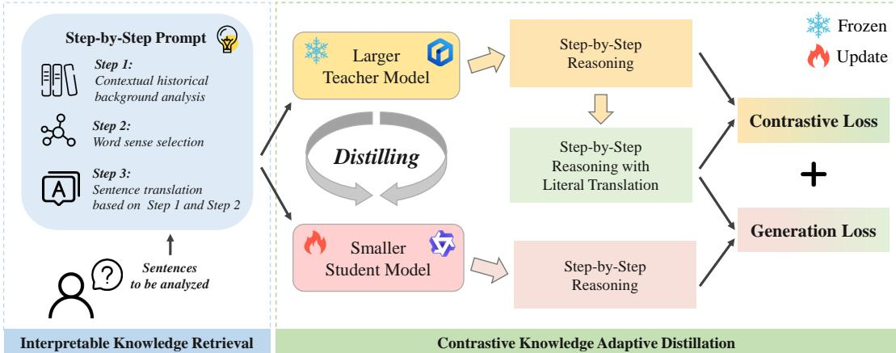
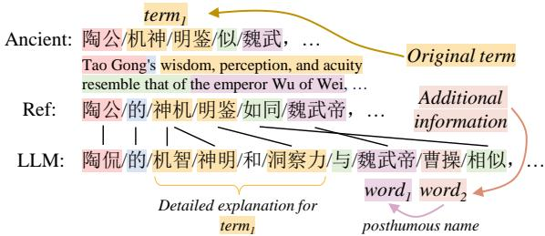
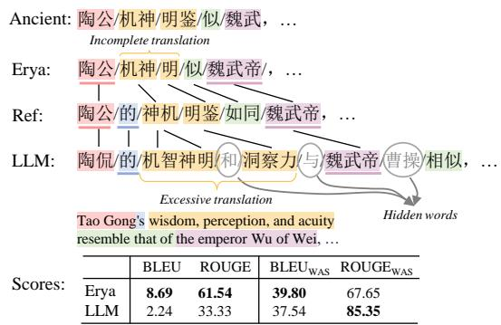
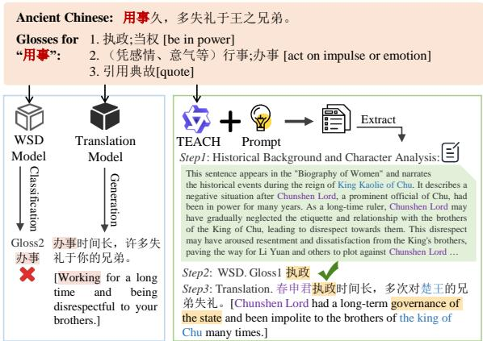
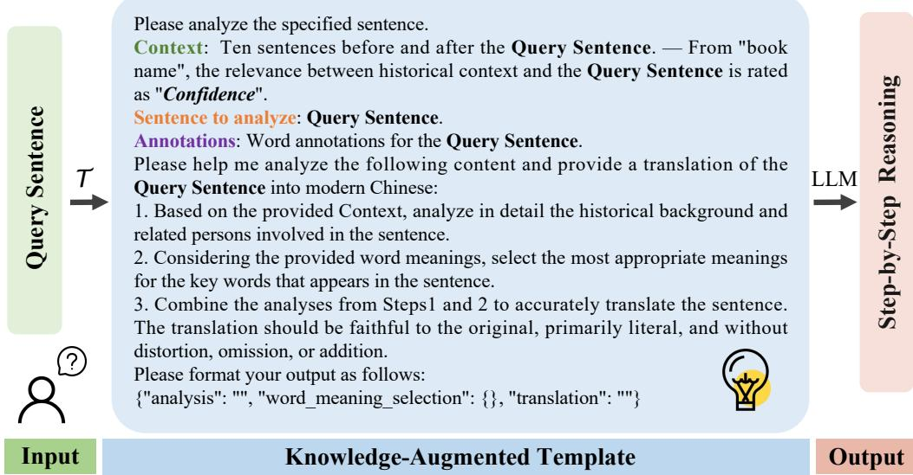
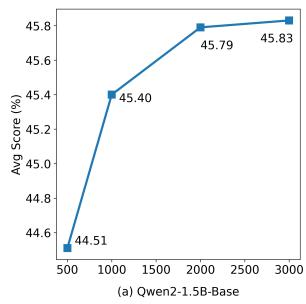
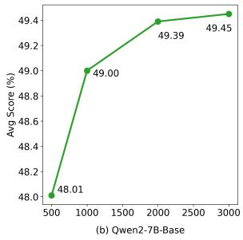

# TEACH: A Contrastive Knowledge Adaptive Distillation Framework for Classical Chinese Understanding

Yuting Wei, Qi Meng, Yuanxing Xu, Bin Wu

Beijing Key Laboratory of Intelligent Telecommunication Software and Multimedia, Beijing University of Posts and Telecommunications {yuting\_wei, mikemeng09, xyx, wubin}@bupt.edu.cn

## Abstract

Traditional methods for processing classical Chinese typically segment language understanding into discrete tasks, which overlook crucial background information and reduce user engagement. Large language models (LLMs) provide integrated solutions, yet they entail high computational costs and risks of generating inaccurate historical information. To tackle these challenges, we propose a novel framework, TEACH (conTrastive knowlEdge Adaptive distillation with enhanCed Historical interpretability), which focuses on classical Chinese understanding by integrating word sense disambiguation with sentence translation. This integration leverages a confidenceannotated knowledge base and a step-by-step Chain-of-Thought prompting mechanism to minimize hallucinations and improve semantic analysis. Moreover, TEACH employs contrastive distillation learning to efficiently transfer capabilities from larger models to smaller ones (e.g., Qwen2-1.5B), addressing overly liberal translations. Additionally, we introduce an innovative generation evaluation metric using iterative word alignment, enhancing LLM performance assessments by distinguishing ad ditional information and addressing excessive translation issues. Experiments conducted on real-world datasets validate TEACH’s efficacy in classical Chinese educational scenarios.1

## 1 Introduction

Classical Chinese literature, as a crucial carrier of millennia-old cultural heritage, plays an irreplaceable role in historical understanding and cultural transmission. However, understanding classical Chinese poses numerous challenges, such as scarce corpora, complex linguistic structures, variable word meanings, and rich historical and cultural contexts, all of which increase the difficulty of comprehension (Zhang et al., 2024; Wei et al., 2024b). With the rapid development of natural language processing technologies, more researchers are focusing on classical Chinese to address these challenges (Li et al., 2022; Liu et al., 2022; Xiang et al., 2024).

The key tasks in understanding classical Chinese include word sense disambiguation (WSD) and translation. The WSD aims to select the most fitting meaning of a polysemous word within its context (Shu et al., 2021; Pan et al., 2022). For translation, traditional methods employ encoderdecoder approaches to achieve literal translation of sentences (Chang et al., 2021; Wang et al., 2023). However, the segmentation of these tasks hinders holistic analysis. Furthermore, traditional models frequently suffer from semantic inaccuracies due to inadequate historical background. Additionally, these models typically require coding skills, limiting their accessibility and reducing their suitability for educational applications.

LLMs (Wei et al., 2022a; Zhao et al., 2023; Wei et al., 2022b) can easily engage with users and enhance language understanding by providing rich historical context, thereby improving sentence interpretability. This capability extends beyond basic word sense analysis and sentence translation, potentially increasing their interest in classical Chinese and historical studies (Wei et al., 2024a). Despite their strong generative capabilities and broad knowledge coverage, LLMs face challenges such as the occasional generation of hallucinations (Chang et al., 2024). This misleads users in educational scenarios. Additionally, LLMs entail high inference costs and substantial computational resources for training and deployment (Yang et al., 2024b). Consequently, it is a significant challenge to develop a smaller model that requires less data while ensuring efficient inference speed (Hu et al., 2022; Ding et al., 2023).

To address these problems, we propose TEACH, a novel framework for classical Chinese understanding that integrates conTrastive knowlEdge Adaptive distillation with enhanCed Historical interpretability. This framework unifies word sense analysis and sentence comprehension, facilitating the transfer of historical knowledge and reasoning abilities from large to smaller models. Specifically, we first construct a confidence-annotated knowledge base including historical information and word annotations for retrieval augmentation. Then we design a step-by-step Chain-of-Thought (CoT) prompt to guide the large model in minimizing hallucinations and generating comprehensive contextual and semantic analysis. Through the distillation process, the small student model, with only 0.8-4% of the parameters of the large teacher model, acquires step-by-step thinking capabilities and becomes a proficient classical Chinese interpreter. To address the tendency of large models to produce liberal translations, we employ contrastive learning to train the model in the precise and literal style essential for classical Chinese understanding. Moreover, we introduce a generation evaluation metric based on iterative word alignment for LLMs, enabling a more accurate assessment of their performance by distinguishing additional information and addressing excessive translation issues. Our key contributions are as follows:

• To the best of our knowledge, it is the first educational model for classical Chinese that combines word sense disambiguation and sentence translation tasks, while also providing historical interpretability.

• We propose TEACH, a novel contrastive knowledge adaptive distillation framework, which transfers reasoning capabilities from large to small models by step-by-step CoT prompting, significantly reducing hallucinations and liberal translations.

• We improve a generation evaluation metric based on iterative word alignment for LLMs, which considers the additional information and excessive translation.

• Experiments on real datasets demonstrate the effectiveness of our model, showing that it generates high-quality historical context analysis while also accurately understanding classical Chinese semantics.

## 2 Related Work

## 2.1 Classical Chinese Understanding

Classical Chinese WSD and translation are two crucial tasks for understanding classical Chinese texts (Pan et al., 2022; Shu et al., 2021). WSD is typically approached as a classification challenge, where traditional methodologies deploy word embeddings that integrate contextual or annotated data, utilizing algorithms such as KNN to deduce word meanings (Loureiro and Jorge, 2019). Regarding translation, methods often leverage pretrained models specific to classical Chinese, such as SikuBERT (Wang et al., 2022) and AnchiB-ERT (Tian et al., 2021), which employ various encoder-decoder frameworks. For example, Guo et al. (2023) features the translation task by dualsyllable alignment substitution and dual-mask language modeling. Evidently, existing research isolates the two tasks. Moreover, traditional methods provide only answers, lacking interpretability, which is crucial for educational applications. Consequently, we leverage the extensive knowledge and robust reasoning abilities of LLMs to simultaneously address both tasks, generating interpretable historical background and semantic analyses.

## 2.2 LLMs with RAG

LLMs have demonstrated significant potential in downstream tasks such as recommendation systems (Zhu et al., 2024) and question answering (Li et al., 2024), thanks to their advanced reasoning capabilities. However, their deployment in sensitive areas is not without risks, notably the propensity to generate misleading or incorrect information, often referred to as "hallucinations". To address these challenges, Retrieval-Augmented Generation (RAG) technology has been employed to enhance the reliability of LLM outputs by incorporating domain-specific knowledge directly into the generation process (Lewis et al., 2020; Gao et al., 2023; Zhao et al., 2024). Further advancements in RAG technology include the development of graph-based approaches (Peng et al., 2024), which enhance the model’s ability to handle complex datasets with interlinked information. For instance, in healthcare, RAG can leverage up-todate research findings and patient-specific data to produce accurate diagnostic recommendations.

For classical Chinese understanding, LLMs also face hallucinations, such as incorrect historical information and the misinterpretation of archaic terms. Hence, we propose a straightforward method for constructing a knowledge base to efficiently address this problem.

  
Figure 1: The overview of the proposed framework.

## 2.3 Generation Evaluation Metrics

Evaluating the generative capabilities of large models is crucial for assessing their effectiveness. Metrics utilized to assess the quality of generated content generally fall into three categories: those based on word overlap, word embeddings, and language models (Lee et al., 2023). Word overlapbased metrics such as BLEU (Papineni et al., 2002; Chen and Cherry, 2014) and ROUGE (Lin, 2004) measure quality by assessing the n-gram overlap between candidate and reference texts. Word embedding-based metrics convert sentences into vector representations and compare these within low-dimensional semantic spaces, using techniques such as Greedy Matching (Rus and Lintean, 2012) and Vector Extrema (Forgues et al., 2014). Language model-based metrics utilize pre-trained models to evaluate semantic and syntactic congruence between translated and reference texts (Zhang et al., 2020; Shin et al., 2024). Despite advancements, traditional metrics face challenges with LLM-generated classical Chinese translations, notably the inclusion of useful yet additional information and overly detailed explanations of original words. To overcome these issues, an iterative selflabeled word alignment method is employed to refine evaluation metrics.

## 3 Methodology

In this section, we introduce TEACH, an innovative contrastive knowledge adaptive distillation framework tailored for classical Chinese education.

This approach integrates the reasoning capabilities of LLMs into classical Chinese language comprehension while enhancing historical explainability and optimizing resource efficiency. An overview of the framework is provided in Figure 1.

## 3.1 Interpretable Knowledge Construction

LLMs often suffer from hallucination problems, which can undermine their utility in educational applications. To mitigate this, we construct a knowledge base that integrates confidence-annotated historical information and authoritative annotations of classical Chinese word meanings, which assists in accurate and interpretable analysis and reasoning.

## 3.1.1 Historical Information

To obtain relevant historical information for a given sentence, we extract its surrounding context, defined as the ten sentences before and after the target sentence. Specifically, we utilize the complete text version of the Twenty-Four Histories, supplemented by novels, poetry, and other genres, to construct a retrieval database powered by Milvus. Details of this database are provided in Appendix A.1.

To prevent misleading the model’s analysis, we introduce a confidence metric for historical information:

$$
C o n f i d e n c e = 1 - \mathbf { B P } ( t , q ) \cdot \frac { L 2 ( t , q ) } { \sqrt { d } } ,\tag{1}
$$

$$
\begin{array} { r } { \mathsf { B P } ( t , q ) = \left\{ \begin{array} { l l } { 1 , } & { l _ { t } > l _ { q } } \\ { \exp ( 1 - l _ { q } / l _ { t } ) , } & { l _ { t } \le l _ { q } } \end{array} , \right. } \end{array}\tag{2}
$$

where BP is length penalty factor, $l _ { t }$ and $l _ { q }$ denote the lengths of the retrieved sentence t and the query q, respectively. L2 is the Euclidean distance, d represents the dimension of the vectors.

## 3.1.2 Word Sense Annotation

Despite significant changes in the meanings of classical Chinese words compared to modern Chinese, annotations provide a bridge between them. We extract all words with a frequency greater than five from the classical Chinese corpus and collect their annotations from Handian2, ultimately obtaining 169, 742 annotated classical words (see Appendix A.2 for details).

## 3.2 Contrastive Knowledge Adaptive Distillation

Our contrastive distillation strategy comprises two steps. First, it leverages CoT prompts enriched with interpretable knowledge to guide the LLM (the teacher) through step-by-step reasoning. Its multi-granularity reasoning strategy—ranging from macro-level historical and cultural context to micro-level linguistic features—further enhances the model’s understanding and generalization. Then, contrastive learning with negative samples is employed for adaptive knowledge transfer, enabling the smaller models (the student) to effectively approximate the reasoning capabilities of the teacher. Beyond reasoning, TEACH uniquely incorporates style-preservation constraints tailored to the stylistic characteristics of classical Chinese translations, ensuring that the distilled model retains key cultural and literary features.

## 3.2.1 Generating Step-by-step Reasoning by the Teacher

We utilize zero-shot CoT prompting to elicit reasoning information from LLMs. Specifically, given the sentence s to be analyzed, we obtain the corresponding historical information and its related annotated word set from the constructed knowledge base. Then, we design a prompt template $\tau$ consisting of three progressive steps as follows:

• Step1. Analyze the historical background and persons based on the given historical information  with the relevance Confidence.

• Step2. Select the most appropriate word sense from the provided annotations .

• Step3. Provide a literal translation by combining the analyses from Steps1 and 2.

The template starts with a macro-level paragraph perspective and gradually zooms into a micro-level word perspective, guiding LLMs in a step-by-step thinking process (see Figure 5 for details). Subsequently, we extract a very small sentence subdataset $S ^ { \prime }$ from the training set by random sampling, where ${ \mathcal { S } } ^ { \prime } \subset { \mathcal { S } }$ and $\left| S ^ { \prime } \right| \ll \left| S \right|$ . We further fill the template $\tau$ with $S ^ { \prime }$ to generate corresponding CoT prompts $\mathcal { P } = \{ p _ { s } | s \in  { S } ^ { \prime } \}$ for the teacher models. With these knowledge-augmented prompts $\mathcal { P } _ { : }$ LLMs will generate corresponding step-by-step interpretable analysis $O _ { s }$ for each input $p _ { s }$

## 3.2.2 Training the student by contrastive distillation

High-quality analysis can be generated from LLMs. However, their extensive computational demands make them unsuitable for low-latency educational applications. Additionally, LLMs often produce liberal translations that do not suit the needs for literal translations essential in understanding classical Chinese texts. To overcome these challenges, we employ contrastive knowledge distillation, adaptively transferring the comprehension and reasoning capabilities of larger teacher models to more computationally efficient smaller student models.

Specifically, we fine-tune a small model using the same prompts $p _ { s }$ as input. For the output, we have two types: 1) the original response $O _ { S } .$ , which includes the liberal translation $t _ { \mathrm { l i b e r a l } } .$ and 2) the expected literal response $\boldsymbol { e } _ { s } ,$ where $t _ { b }$ is replaced with the standard literal translation $t _ { \mathrm { l i t e r a l } }$ . Our goal is to generate outputs that align more closely with the latter.

The training comprises two parts. First, we use $e _ { s }$ as the output labels and optimize the negative log-likelihood of the conditional language modeling objective:

$$
\mathcal { L } _ { d i s } = \sum _ { i = 1 } ^ { \left| e \right| } \log \left( P _ { \theta } \left( e _ { s , i } \mid p _ { s } , e _ { s , < i } \right) \right) ,\tag{3}
$$

where $e _ { s , i }$ is the i-th token of $e _ { s }$ , and $e _ { s , < i }$ represents the tokens before $e _ { s , i }$ . To conserve resources, we employ LoRA (Hu et al., 2022) for parameterefficient model fine-tuning with parameters θ. Second, we adopt a contrastive learning-based adaptive distillation technique. We utilize $O _ { s }$ as negative samples and $e _ { s }$ as the positive sample. Similar to Zeng et al. (2024), we directly tune the language model using a token-level contrastive loss:

$$
\mathcal { L } _ { c o n } = \frac { 1 } { N - M } \sum _ { m = M } ^ { N } \operatorname* { m a x } ( 0 , - f _ { \beta } ( { h } _ { m } ^ { e _ { s } } ) + f _ { \beta } ( { h } _ { m } ^ { o _ { s } } ) + 1 ) ,\tag{4}
$$

where N is the maximum length of two sequences, and $h _ { m } ^ { e _ { s } }$ and $h _ { m } ^ { o _ { s } }$ are the hidden states of the mth token of the preferred literal output $e _ { s }$ and the comparison liberal output $o _ { s } ,$ respectively. M is the index starting from the segments that differ $( \mathrm { i . e . }$ translation parts) between $e _ { s }$ and $o _ { s } . \ f _ { \beta }$ is a linear head that takes the hidden state of the top layer and returns a scalar.

The overall loss function for tuning the model is:

$$
\mathcal { L } = - \sum _ { s \in \cal { S } ^ { \prime } } ( \mathcal { L } _ { d i s } + \mathcal { L } _ { c o n } ) .\tag{5}
$$

## 4 Refined Evaluation Metric for LLMs

When evaluating the generated translations of LLMs, traditional metrics often overlook two key aspects: the overly detailed explanation of original terms $( t e r m _ { 1 } )$ and the useful but additional information $( w o r d _ { 2 } )$ , as shown in Figure 2. These issues frequently arise in LLMs. To address them, we develop an iterative self-labeled word alignment method to refine BLEU and ROUGE, enabling more accurate assessments of translation quality.

## 4.1 Word Alignment Self-Labeling (WAS)

The goal of WAS is to establish word alignment between a reference text $R = ( r _ { 1 } , r _ { 2 } , \ldots , r _ { n } )$ and a candidate text $C = ( c _ { 1 } , c _ { 2 } , \ldots , c _ { m } ) $ . We define the alignment relationship between R and $C$ as $A _ { i j }$ , which represents the probability of alignment between $r _ { i }$ and $c _ { j }$ . The word alignment challenge is formulated as identifying matrix A that maximizes sentence similarity:

$$
\operatorname* { m a x } _ { A } \sum _ { i = 1 } ^ { n } \sum _ { j = 1 } ^ { m } A _ { i j } f _ { s i m } ( \boldsymbol { r } _ { i } , \boldsymbol { c } _ { j } ) ,\tag{6}
$$

where $f _ { s i m } ( \cdot )$ denotes the similarity function. To solve this equation, we reformulate it as an optimal transport problem, referencing Peyré et al. (2019) and Chi et al. (2021). Then, we obtain the solved initial matrix A0. For the detailed solving process, please refer to Appendix B.

The alignment labels $B _ { i j }$ are extracted using the following formula:

$$
\mathcal { B } _ { i j } = \left\{ \begin{array} { l l } { 1 } & { i = ( \arg \operatorname* { m a x } _ { k } A _ { i k } ^ { \prime } ) \cap ( j = \arg \operatorname* { m a x } _ { k } A _ { k j } ^ { \prime } ) } \\ { 0 } & { \mathrm { o t h e r w i s e } } \end{array} \right.\tag{7}
$$

To maximize the identification of alignment labels, we employ an iterative approach to update $A ^ { \prime }$ and $B ,$ following Sabet et al. (2020). Initially, $A ^ { \prime }$ is

  
Figure 2: An example of translation outputs from LLMs.

updated according to the initial state of $\boldsymbol { B }$ using the following formula:

$$
A _ { i j } ^ { \prime } = \left\{ \begin{array} { l l } { 0 , } & { \mathcal { B } _ { i j } = 1 } \\ { \alpha A _ { i j } ^ { \prime } , } & { \exists k \ : ( \mathcal { B } _ { i k } = 1 \vee \mathcal { B } _ { k j } = 1 ) , } \\ { A _ { i j } ^ { \prime } , } & { \mathrm { o t h e r w i s e } } \end{array} \right.\tag{8}
$$

where $\alpha$ is a discount factor. Then, is updated according to Eq.equation 7 for those entries where preceding $B _ { i j } = 0$ . After multiple iterations, this method yields high-precision self-labeled alignment labels .

To address both one-to-many and many-to-one alignments, we implement a merging strategy. Specifically, when a token $j$ in the translated text C aligns with multiple consecutive tokens in the reference text $R ,$ or vice versa, these tokens are merged. Furthermore, tokens in $C$ without correspondences in R are considered additional information and are thus concealed $( \mathrm { e . g . , } w o r d _ { 2 } )$ . This process results in the merged token sequences $C ^ { \prime }$ and $R ^ { \prime }$ , alongside one-to-one alignment labels $B ^ { \prime }$

## 4.2 Refined BLEU based on WAS

In the adaptation of the BLEU metric for the WAS text, we introduce BLEUWAS defined as follows:

$$
{ \mathrm { B L E U } } _ { \mathrm { W A S } } { = } { \mathrm { B P } } ( C ^ { \prime } , R ^ { \prime } ) \cdot { \exp } \left( \sum _ { n { = 1 } } ^ { N } { \frac { 1 } { N } } \log p _ { n } \right) ,\tag{9}
$$

$$
p _ { n } = \frac { \displaystyle \sum _ { c \in C ^ { \prime } } \mathbf { C o u n t } ( c , R ^ { \prime } , B ^ { \prime } , n ) } { \displaystyle | C ^ { \prime } | - ( n - 1 ) } ,\tag{10}
$$

$$
{ \tt B P } ( C ^ { \prime } , R ^ { \prime } ) = \exp ( 1 - \frac { \operatorname* { m a x } ( l _ { C ^ { \prime } } , l _ { R ^ { \prime } } ) } { \operatorname* { m i n } ( l _ { C ^ { \prime } } , l _ { R ^ { \prime } } ) } ) ,\tag{11}
$$

where, $\mathrm { B P } ( C ^ { \prime } , R ^ { \prime } )$ represents the sentence length penalty factor, which penalizes both overly short (incomplete translation) and overly long (excessive translation) sentences. $\mathrm { C o u n t } ( c , R ^ { \prime } , B ^ { \prime } , n )$ quantifies the occurrences of the n-gram of c within $R ^ { \prime }$ as dictated by the alignment labels $B ^ { \prime }$

## 4.3 Refined ROUGE based on WAS

The ROUGE metric is designed to assess recall in translation evaluations. In our adaptation, we introduce ROUGE-NWAS, which is formulated as follows:

$$
\operatorname { R O U G E } - \operatorname { N w a s } = \frac { \displaystyle \sum _ { c \in C ^ { \prime } , r \in R ^ { \prime } } \operatorname { B P } ( c , r ) \cdot \operatorname { C o u n t } ( c , r , \mathcal { B ^ { \prime } } , n ) } { | R ^ { \prime } | - ( N - 1 ) } ,\tag{12}
$$

where $\boldsymbol { \mathrm { B P } } ( \boldsymbol { c } , \boldsymbol { r } )$ represents the token length penalty factor, calculated similar to Eq. equation 11. Coun $\left( c , r , B ^ { \prime } , n \right)$ quantifies the occurrences where the n-grams of c and r coincide, as dictated by the alignment labels $B ^ { \prime }$

## 5 Experiments

## 5.1 Experiment Settings

## 5.1.1 Datasets

Despite the absence of datasets that jointly address translation and semantic analysis, the accuracy of translations can indirectly reflect the precision of WSD. Therefore, we focus on the Erya dataset, which is the largest dataset for classical Chinese translation tasks. It covers a comprehensive range of historical periods and genres, including poetry, prose, philosophy works, and literary criticism.

## 5.1.2 Baselines

We compare against two types of baseline models: the classical classical Chinese translation model Erya, and various LLMs. Specifically, Erya is the most advanced classical Chinese translation model available. For large models, we select popular Chinese large models in both base and chat versions, such as Yi1.5-6B (Young et al., 2024), ChatGLM3- 6B (Du et al., 2022; Zeng et al., 2023), GLM-4- 9B (GLM et al., 2024), Qwen2-1.5B/7B (Yang et al., 2024a). We also evaluate Xunzi-Qwen23 which is finetuned on the Qwen2 model using classical Chinese corpus.

## 5.1.3 Evaluation Metrics

We employ three categories of evaluation metrics to comprehensively assess translation quality. First, classic token-based metrics, including BLEU and ROUGE-N, focus on surface-form overlap. Second, semantic-based metrics, such as BERTScore and METEOR, evaluate the preservation of meaning and semantic similarity. Third, we use refined metrics $\mathrm { \mathbf { B L E U _ { W A S } } }$ and $\mathrm { R O U G E - N _ { W A S } }$ , which incorporate contextual word alignment signals to better align with human judgment. Specifically, we set N = 4 for BLEU and ${ \tt B L E U } _ { \mathrm { W A S } }$ , while $N = 1$ for ROUGE-N, ROUGE-NWAS. Human evaluation is also provided in Table 4 to further analyze the quality of word sense selection and translation.

## 5.1.4 Implementation Details

For the teacher model, we employ the ERNIE-Bot44 API from Baidu, which has been demonstrated by Wei et al. (2024a) to achieve state-ofthe-art performance in classical Chinese language understanding. We randomly select 3, 000 entries from the training dataset to generate high-quality reasoning data using a zero-shot, step-by-step CoT, as proven optimal in Appendix C.1. This data is further refined and corrected by experts to ensure its accuracy. For the student model, we select 10, 000 entries from the validation set for testing. All models are fine-tuned for 10 epochs with a batch size of 64, a maximum input length of 1024, and an output length of 512. The learning rate is set at $5 e - 5$ for LoRA. Fine-tuning is conducted on 1 A100 GPU with 40G of memory. For comparison, we also employ the minimal prompt template as the Normal method: "Translate from classical Chinese to modern Chinese. Classical Chinese: src. Modern Chinese:," extracting trg from their outputs using regular expressions. Both training and testing set sizes are consistent with those used for TEACH. For the refined evaluation metric, aligning 10,000 sentence pairs using AnchiBERT takes approximately 2–3 minutes on an NVIDIA 3090 GPU, with a batch size of 8 and 2 iterations, without any additional pre-training.

Additionally, Appendix C.2 offers a detailed comparison of the teacher and student models, focusing on model size, deployment complexity, cost, and functionality to assess their real-world applicability.

## 5.2 Main Results

Our TEACH framework is highly flexible and can be seamlessly integrated with any LLM backbone. To validate the effectiveness of TEACH, we first present the results from classic translation models and LLM trained with Normal prompt as baselines for comparison. Then, we evaluate the performance of TEACH across various LLMs. Results are shown in Table 1. Based on these evaluations, we make the following observations: (1) TEACH significantly outperforms Normal prompts, achieving performance improvements ranging from 4-

<table><tr><td rowspan="2">Model</td><td rowspan="2">Type</td><td rowspan="2">Method</td><td colspan="6">Metrics</td><td rowspan="2">Avg</td></tr><tr><td>BLEU</td><td>ROUGE</td><td>BERTScore</td><td>METEOR</td><td>BLEUWAS</td><td>ROUGEWAS</td></tr><tr><td>Erya</td><td></td><td></td><td>18.39</td><td>50.15</td><td>76.11</td><td>42.39</td><td>39.68</td><td>71.18</td><td>49.65</td></tr><tr><td rowspan="4">Yi1.5-6B</td><td rowspan="4">Base</td><td>Normal</td><td>16.81</td><td>47.96</td><td>73.97</td><td>41.36</td><td>42.69</td><td>74.13</td><td>49.49</td></tr><tr><td>TEACH</td><td>19.23 (14.40%)</td><td>51.91 (8.24%)</td><td>76.80 (3.83%)</td><td>45.62 (10.30%)</td><td>44.06 (3.21%)</td><td>74.82 (0.93%)</td><td>51.77 (4.61%)</td></tr><tr><td>Normal</td><td>15.71</td><td>46.68</td><td>73.32</td><td>40.09</td><td>40.81</td><td>73.31</td><td>48.49</td></tr><tr><td>TEACH</td><td>17.70 (12.67%)</td><td>50.44 (8.05%)</td><td>76.01 (3.67%)</td><td>43.81 (9.28%)</td><td>42.21 (3.43%)</td><td>73.89 (0.79%)</td><td>50.76 (4.69%)</td></tr><tr><td rowspan="4">ChatGLM3-6B</td><td>Base</td><td>Normal</td><td>15.62</td><td>46.55</td><td>73.32</td><td>39.66</td><td>40.11</td><td>72.93</td><td>47.92</td></tr><tr><td></td><td>TEACH</td><td>18.77 (20.17%)</td><td>51.25 (10.08%)</td><td>76.10 (3.79%)</td><td>44.43 (12.03%)</td><td>42.93 (7.03%)</td><td>74.01 (1.48%)</td><td>50.86 (6.14%)</td></tr><tr><td>Chat</td><td>Normal</td><td>14.27</td><td>44.59</td><td>72.37</td><td>37.48</td><td>37.48</td><td>71.36</td><td>46.33</td></tr><tr><td></td><td>TEACH</td><td>16.90 (18.43%)</td><td>48.72 (9.26%)</td><td>75.59 (4.45%)</td><td>39.83 (6.27%)</td><td>39.88 (6.40%)</td><td>73.15 (2.51%)</td><td>49.29 (6.39%)</td></tr><tr><td rowspan="4">GLM-4-9B</td><td>Base</td><td>Normal</td><td>17.99</td><td>49.56</td><td>74.82</td><td>42.77</td><td>43.06</td><td>74.35</td><td>50.43</td></tr><tr><td></td><td>TEACH</td><td>20.46 (13.73%)</td><td>53.15 (7.24%)</td><td>76.86 (2.73%)</td><td>46.78 (9.38%)</td><td>46.41 (7.78%)</td><td>75.98 (2.19%)</td><td>52.94 (4.99%)</td></tr><tr><td>Chat</td><td>Normal</td><td>17.11</td><td>49.22</td><td>74.74</td><td>42.11</td><td>42.82</td><td>73.99</td><td>49.83</td></tr><tr><td></td><td>TEACH</td><td>19.73 (15.31%)</td><td>50.59 (2.78%)</td><td>75.12 (0.51%)</td><td>44.50 (5.68%)</td><td>43.03 (0.49%)</td><td>73.64 (0.48%)</td><td>52.37 (5.10%)</td></tr><tr><td rowspan="4">Qwen2-1.5B</td><td>Base</td><td>Normal</td><td>14.98</td><td>46.04</td><td>72.84</td><td>37.93</td><td>36.53</td><td>70.35</td><td>48.50</td></tr><tr><td></td><td>TEACH</td><td>18.08 (20.69%)</td><td>50.26 (9.17%)</td><td>75.65 (3.86%)</td><td>43.38 (14.37%)</td><td>41.32 (13.10%)</td><td>71.49 (1.62%)</td><td>51.67 (6.54%)</td></tr><tr><td>Chat</td><td>Normal</td><td>14.16</td><td>44.23</td><td>71.82</td><td>37.20</td><td>37.39</td><td>71.49</td><td>46.33</td></tr><tr><td></td><td>TEACH</td><td>17.76 (25.42%)</td><td>50.02 (13.09%)</td><td>75.47 (5.08%)</td><td>43.16 (16.02%)</td><td>41.32 (10.51%)</td><td>73.19 (2.38%)</td><td>49.77 (7.44%)</td></tr><tr><td rowspan="4">Qwen2-7B</td><td>Base</td><td>Normal</td><td>17.06</td><td>48.35</td><td>74.29</td><td>41.86</td><td>43.13</td><td>74.31</td><td>50.40</td></tr><tr><td></td><td>TEACH</td><td>21.88 (28.25%)</td><td>54.41 (12.53%)</td><td>77.45 (4.25%)</td><td>47.87 (14.36%)</td><td>45.93 (15.75%)</td><td>75.59 (1.72%)</td><td>53.74 (6.64%)</td></tr><tr><td>Chat</td><td>Normal</td><td>17.13</td><td>48.39</td><td>74.28</td><td>41.84</td><td>43.10</td><td>74.45</td><td>49.64</td></tr><tr><td></td><td>TEACH</td><td>20.09 (17.28%)</td><td>52.66 (8.82%)</td><td>76.74 (3.31%)</td><td>46.07 (10.11%)</td><td>45.00 (4.41%)</td><td>75.19 (0.99%)</td><td>52.40 (5.56%)</td></tr><tr><td rowspan="3">Xunzi-Qwen2-1.5B</td><td>Base</td><td>Normal</td><td>14.75</td><td>44.94</td><td>72.32</td><td>38.13</td><td>38.63</td><td>71.86</td><td>46.57</td></tr><tr><td></td><td>TEACH</td><td>19.70 (33.56%)</td><td>51.88 (15.44%)</td><td>76.22 (5.39%)</td><td>44.93 (17.83%)</td><td>43.04 (11.42%)</td><td>73.76 (2.64%)</td><td>51.76 (11.16%)</td></tr><tr><td>Base</td><td>Normal</td><td>18.78</td><td>50.21</td><td>75.13</td><td>43.72</td><td>44.48</td><td>74.91</td><td>51.51</td></tr><tr><td>Xunzi-Qwen2-7B</td><td></td><td>TEACH</td><td>23.23 (23.70%)</td><td>55.51 (10.56%)</td><td>78.14 (4.01%)</td><td>49.25 (12.65%)</td><td>46.31 (4.11%)</td><td>75.75 (1.12%)</td><td>54.70 (6.19%)</td></tr></table>

Table 1: Comparison of performance among different backbones fine-tuning with Normal/TEACH method. “Avg” indicates the average of four metrics, while “()” show the relative improvement of TEACH compared to Normal.

11% in average metrics. This substantial increase validates the efficacy of our framework. (2) While LLMs with Normal prompts generally do not surpass classic models in traditional metrics, they perform competitively or even better on refined metrics. This suggests that despite different from expected literal translations, LLMs can accurately interpret sentence meanings. (3) Our refined metrics outperform both token-based and semanticbased ones, showing stronger ability to assess additional knowledge conveyed by LLMs. (4) Base models usually outperform chat models, as the former are more tailored to specific tasks. (5) The Qwen series models exhibit superior performance. Among them, the Qwen-1.5B-Base with TEACH, which has a smaller parameter size for easier deployment, remains competitive across all metrics. (6) While Xunzi-Qwen2-7B benefits from pretraining on classical Chinese corpus, our TEACH framework further improves its performance by leveraging a macro-to-micro prompting strategy, enabling more accurate and interpretable outputs. (7) Beyond mere translation outputs, LLMs with TEACH offer macro historical and micro word sense analyses. This enhances interpretability and practicality, making LLMs particularly suitable for educational scenarios.

## 5.3 Analysis

To comprehensively examine our framework and mitigate the effects of data leakage from the Xunzi-LLMs, we utilize its original Qwen2 as backbones.

<table><tr><td>ID</td><td>Model Type</td><td>Trad. Avg</td><td>Refined Avg</td></tr><tr><td>1</td><td>Qwen2-7B (TEACH CoT, trained)</td><td>37.95</td><td>61.09</td></tr><tr><td>2</td><td>Qwen2-7B (TEACH CoT, untrained)</td><td>29.97</td><td>55.97</td></tr><tr><td>3</td><td>Qwen2-7B (Normal CoT, trained)</td><td>31.36</td><td>57.44</td></tr><tr><td>4</td><td>Qwen2-7B (Normal CoT, untrained)</td><td>34.40</td><td>57.08</td></tr><tr><td>5</td><td>ERNIE-Bot4 (TEACH CoT)</td><td>32.61</td><td>65.82</td></tr><tr><td>6</td><td>ERNIE-Bot4 (Normal CoT)</td><td>35.14</td><td>64.30</td></tr></table>

Table 2: Comparison of prompting and training strategies. Models are evaluated on both traditional and refined metrics.

## 5.3.1 Ablation Study I: Training and Prompting Strategies

To examine the overall effectiveness of our TEACH framework, we evaluate the individual and joint contributions of TEACH-style CoT prompting and fine-tuning. Table 2 presents results on 500 entries from validation set using both traditional metrics (BLEU, ROUGE, BERTScore, METEOR) and our refined metrics (BLEUWAS, ROUGEWAS).

The results in Table 2 reveal three key findings. First, the untrained Qwen2-7B model with TEACH CoT (ID 2) yields the lowest scores, confirming the necessity of TEACH framework for effective semantic and stylistic generation. Second, among the trained models, TEACH CoT (ID 1) outperforms Normal CoT (ID 3), indicating that our step-bystep prompting provides more informative guidance. Third, on the teacher model (ERNIE-Bot4), TEACH prompts (ID 5) demonstrated superior performance in improved metrics but slightly lagged in traditional ones. This can be attributed to our metrics’ enhanced ability to process additional information, aligning more closely with human judg-

<table><tr><td>Method</td><td>B</td><td>R</td><td>BWAS</td><td>RWAS</td><td>Avg</td></tr><tr><td>TEACH</td><td>21.88</td><td>54.41</td><td>45.93</td><td>75.59</td><td>49.45</td></tr><tr><td>w/o H</td><td>18.86</td><td>51.19</td><td>43.46</td><td>74.26</td><td>46.94</td></tr><tr><td>w/o A</td><td>20.37</td><td>52.99</td><td>45.19</td><td>75.39</td><td>48.49</td></tr><tr><td>w/o H&amp;A</td><td>18.88</td><td>51.19</td><td>43.18</td><td>74.29</td><td>46.89</td></tr><tr><td>w/o  $\mathcal { L } _ { c o n }$ </td><td>20.59</td><td>53.16</td><td>47.13</td><td>76.51</td><td>49.35</td></tr><tr><td>Normal</td><td>17.06</td><td>48.35</td><td>43.13</td><td>74.31</td><td>45.71</td></tr></table>

Table 3: Component-wise ablation study on Qwen2-7B-Base.

ment.

## 5.3.2 Ablation Study II: Component Analysis

To further analyze the internal structure of the TEACH framework, we ablate specific components of the prompt and loss design: historical contextnt Chinese: WSD Model 办事Classification ( ), word-level annotations ( ), both & , and久，多失礼于王之兄弟。 Generation the style-preserving contrastive loss政 当权 $( \mathcal { L } _ { c o n } )$ . Table 3 reports results using BLEU, ROUGE, BLEUWAS,凭感情、意气等）行事 [act on impulse or [Working for a long time and being disrespectfulto your brothers.] ROUGEWAS, and their average.ion]

The results, detailed in Table 3, offer profound insights. The absence of historical contexts  sig-Historical Background and Character Analysis:：执政 nificantly impairs performance, underscoring their春申君执政时间长，多次对楚王的兄执掌国事，肯定对楚王 Translation: essential role in comprehending classical Chinese.[Chunshen Lord had a long-term governance of the The removing of word annotations decreasesing of Chu many times.] Chu many times.] performance, yet closely matching results of w/o ${ \mathcal { H } } \ \& \ A .$ . This indicates that combining and synergistically amplifies their effects, yielding a greater overall impact. Interestingly, removing $\mathcal { L } _ { c o n }$ results in a noticeable decline in traditional metrics; however, it achieves peak performance on refined metrics. This suggests that without the contrastive constraints imposed on translation style, while LLMs can translate sentences with higher semantic accuracy, there is a significant discrepancy between their formatting and the literal translation style required for classical texts. This highlights the effectiveness of $\mathcal { L } _ { c o n }$ in helping models learn translation styles specific to classical Chinese texts.

## 5.3.3 Metrics Evaluation

To validate our proposed evaluation metric, we present a comparative example in Figure 3. Based on traditional metrics, Erya clearly outperforms the LLM. However, from a more intuitive perspective, the LLM’s translations are more detailed and accurate, whereas Erya occasionally fails to translate certain parts. This discrepancy arises because, while the LLM’s output is semantically aligned, it does not match the reference at the character level.

Our refined metric takes semantic similarity into account and also addresses the LLM’s tendencies to over-translate and add extra information. Under this new metric, the performance gap between the LLM and Erya is noticeably reduced. Still, over-translation of LLM, such as turning "神机" into "机智神明", leads to a slightly lower overall score compared to Erya. In contrast, when measured by ROUGE, the improved metric surpasses the traditional one, reflecting the LLM’s higher recall-oriented accuracy.

  
Figure 3: Comparative evaluation of metric quality. Underlines in the same color indicate character-level alignment, and words in the same color box indicate semantic alignment. Greyed-out text represents elements hidden during computing $\mathrm { \mathbf { B L E U _ { W A S } } }$ and ROUGEWAS.

  
Figure 4: Case study. Comparing outputs from tra-件。描述的是春申君在楚国执政多年后的一个负面情况。春ditional WSD and translation Models, and TEACHtrained LLM.

## 5.3.4 Case Study

In Figure 4, we illustrate the inference results of traditional models compared to those trained with TEACH-trained Qwen-7B-Base. Traditional models process two tasks separately and misinterpret word meanings due to a lack of historical context. In contrast, for TEACH-trained LLM, users simply input a classical text sentence, and the model automatically provides an analysis of the relevant historical background, selections for word meanings, and the final sentence translation. This approach offers a multi-dimensional perspective compared to traditional translation methods. It enhances the user’s understanding of the details, making it ideal for educational settings where depth of knowledge is essential.

<table><tr><td>Metrics</td><td colspan="2">ERNIE-Bot4</td><td colspan="2">Qwen2-TEACH</td></tr><tr><td></td><td>w/o</td><td>w/</td><td>1.5B</td><td>7B</td></tr><tr><td>Hist. Comp.</td><td>2.97</td><td>4.40</td><td>3.67</td><td>3.96</td></tr><tr><td>Hist. Acc.</td><td>2.89</td><td>4.24</td><td>3.29</td><td>3.82</td></tr><tr><td>Word Anal. Acc.</td><td>3.61</td><td>4.85</td><td>4.06</td><td>4.37</td></tr><tr><td>Trans. Flu.</td><td>3.51</td><td>4.21</td><td>3.88</td><td>4.18</td></tr><tr><td>Trans. Acc.</td><td>3.44</td><td>4.41</td><td>3.82</td><td>4.15</td></tr><tr><td>Trans. Sty. Cons.</td><td>3.00</td><td>3.57</td><td>3.77</td><td>4.05</td></tr><tr><td>Avg</td><td>3.24</td><td>4.28</td><td>3.75</td><td>4.09</td></tr></table>

Table 4: Manual quality assessment of LLMs’ outputs.

## 5.3.5 Human Evaluation

Due to the limitations of automatic metrics, we conduct a manual quality assessment in Table 4. We select 100 random entries and gather their real labels. These are compared against outputs from ERNIE-Bot4 using the CoT template that w/ and w/o & , as well as outputs from TEACH-trained Qwenseries LLMs. We assess these outputs on a 5-point scale, focusing on the comprehensiveness and accuracy of historical information, word analysis accuracy, and the fluency, accuracy, and stylistic consistency of translations (see Appendix C.3 for more details). The results reveal that ERNIE-Bot4, w/o and , generally scores extremely lower compared to w/, demonstrating serious historical hallucinations which our template effectively mitigates. Meanwhile, the Qwen2-7B model approaches the performance of ERNIE-Bot4 w/ H & A, and even surpasses it in translation stylistic consistency. This underscores the effectiveness of our TEACH framework and external knowledge integration.

## 6 Conclusion

We introduce TEACH, a contrastive knowledge distillation approach with interpretability features tailored for training LLMs in classical Chinese educational scenarios. TEACH enhances the model’s ability to process historical and semantic information, applying a step-by-step CoT prompt that progresses from paragraph to character-level analysis. Additionally, we propose refined metrics to evaluate translation by LLMs, addressing overtranslation and unnecessary additions. Experimental results confirm the effectiveness of TEACH and our metrics. Future work could expand LLM capabilities to include more tasks related to classical Chinese, improving their educational utility.

## 7 Limitations

Although the TEACH framework significantly enhances classical Chinese understanding, extending it to other languages involves certain adaptations. In practice, this process focuses on two primary modifications: first, constructing a tailored corpus and lexical knowledge base; and second, adjusting the CoT prompts to match the linguistic characteristics of the target language.

For the first task, building a language-specific knowledge base and extracting related word meanings may require domain expertise, especially in cultures without well-established historical references. Fortunately, modern NLP techniques and large-scale web corpora can automate much of this data collection and annotation, thereby reducing the need for extensive manual efforts. As for the CoT prompts, while they may not transfer seamlessly due to differences in syntax and cultural context, only moderate prompt adjustments are generally needed to accommodate new grammatical structures and stylistic conventions. In sum, although some degree of careful customization is required, the availability of robust NLP resources and the inherent flexibility of prompt design greatly simplify the adaptation of TEACH to other languages.

## 8 Ethical Considerations

The corpora used for constructing our interpretable knowledge base are sourced exclusively from publicly available websites that offer free access for academic research purposes.

## Acknowledgment

This work is supported by the National Natural Science Foundations of China under Grant (62372060).

## References

Ernie Chang, Yow-Ting Shiue, Hui-Syuan Yeh, and Vera Demberg. 2021. Time-aware Ancient Chinese text translation and inference. In Proceedings of the 2nd International Workshop on Computational Approaches to Historical Language Change 2021, pages 1–6. Association for Computational Linguistics.

Yupeng Chang, Xu Wang, Jindong Wang, Yuan Wu, Linyi Yang, Kaijie Zhu, Hao Chen, Xiaoyuan Yi, Cunxiang Wang, Yidong Wang, et al. 2024. A survey on evaluation of large language models. ACM Transactions on Intelligent Systems and Technology, 15(3):1–45.

Boxing Chen and Colin Cherry. 2014. A systematic comparison of smoothing techniques for sentencelevel bleu. In Proceedings ofthe ninth workshop on statistical machine translation, pages 362–367.

Zewen Chi, Li Dong, Bo Zheng, Shaohan Huang, Xian-Ling Mao, He-Yan Huang, and Furu Wei. 2021. Improving pretrained cross-lingual language models via self-labeled word alignment. In Proceedings of the 59th Annual Meeting of the Association for Computational Linguistics and the 11th International Joint Conference on Natural Language Processing (Volume 1: Long Papers), pages 3418–3430.

Ning Ding, Yujia Qin, Guang Yang, Fuchao Wei, Zonghan Yang, Yusheng Su, Shengding Hu, Yulin Chen, Chi-Min Chan, Weize Chen, et al. 2023. Parameter-efficient fine-tuning of large-scale pretrained language models. Nature Machine Intelli gence, 5(3):220–235.

Zhengxiao Du, Yujie Qian, Xiao Liu, Ming Ding, Jiezhong Qiu, Zhilin Yang, and Jie Tang. 2022. Glm: General language model pretraining with autoregressive blank infilling. In Proceedings of the 60th Annual Meeting of the Association for Computational Linguistics (Volume 1: Long Papers), pages 320–335.

Gabriel Forgues, Joelle Pineau, Jean-Marie Larchevêque, and Réal Tremblay. 2014. Bootstrapping dialog systems with word embeddings. In Nips, modern machine learning and natural language processing workshop, volume 2, page 168.

Yunfan Gao, Yun Xiong, Xinyu Gao, Kangxiang Jia, Jinliu Pan, Yuxi Bi, Yi Dai, Jiawei Sun, and Haofen Wang. 2023. Retrieval-augmented generation for large language models: A survey. arXiv preprint arXiv:2312.10997.

Team GLM, Aohan Zeng, Bin Xu, Bowen Wang, Chenhui Zhang, Da Yin, Diego Rojas, Guanyu Feng, Hanlin Zhao, Hanyu Lai, et al. 2024. Chatglm: A family of large language models from glm-130b to glm-4 all tools. arXiv preprint arXiv:2406.12793.

Geyang Guo, Jiarong Yang, Fengyuan Lu, Jiaxin Qin, Tianyi Tang, and Wayne Xin Zhao. 2023. Towards effective ancient chinese translation: Dataset, model, and evaluation. In CCF International Conference on Natural Language Processing and Chinese Comput ing, pages 416–427.

Edward J Hu, Phillip Wallis, Zeyuan Allen-Zhu, Yuanzhi Li, Shean Wang, Lu Wang, Weizhu Chen, et al. 2022. Lora: Low-rank adaptation of large language models. In International Conference on Learning Representations.

Seungjun Lee, Jungseob Lee, Hyeonseok Moon, Chanjun Park, Jaehyung Seo, Sugyeong Eo, Seonmin Koo, and Heuiseok Lim. 2023. A survey on evaluation metrics for machine translation. Mathematics, 11(4):1006.

Patrick Lewis, Ethan Perez, Aleksandra Piktus, Fabio Petroni, Vladimir Karpukhin, Naman Goyal, Heinrich Küttler, Mike Lewis, Wen-tau Yih, Tim Rocktäschel, et al. 2020. Retrieval-augmented generation for knowledge-intensive nlp tasks. Advances in Neural Information Processing Systems, 33:9459–9474.

Yuqing Li, Yuxin Zhang, Bin Wu, Ji-Rong Wen, Ruihua Song, and Ting Bai. 2022. A multi-modal knowledge graph for classical Chinese poetry. In Findings of the Associationfor Computational Linguistics: EMNLP 2022, pages 2318–2326. Association for Computational Linguistics.

Zhenyu Li, Sunqi Fan, Yu Gu, Xiuxing Li, Zhichao Duan, Bowen Dong, Ning Liu, and Jianyong Wang. 2024. Flexkbqa: A flexible llm-powered framework for few-shot knowledge base question answering. In Proceedings of the AAAI Conference on Artificial Intelligence, volume 38, pages 18608–18616.

Chin-Yew Lin. 2004. ROUGE: A package for automatic evaluation of summaries. In Text Summarization Branches Out, pages 74–81, Barcelona, Spain. Association for Computational Linguistics.

Maofu Liu, Junyi Xiang, Xu Xia, and Huijun Hu. 2022. Contrastive learning between classical and modern chinese for classical chinese machine reading comprehension. ACM Trans. Asian Low-Resour. Lang. Inf. Process., 22(2).

Yutong Liu, Tao Xie, Bin Wu, and Bai Wang. 2019. New word detection in ancient chinese corpus (in Chinese). In Journal of Chinese Information Processing, pages 46–55.

Daniel Loureiro and Alípio Jorge. 2019. Language modelling makes sense: Propagating representations through WordNet for full-coverage word sense disambiguation. In Proceedings ofthe 57th Annual Meeting of the Association for Computational Linguistics, pages 5682–5691. Association for Computational Linguistics.

Xiaomeng Pan, Hongfei Wang, Teruaki Oka, and Mamoru Komachi. 2022. Zuo zhuan Ancient Chinese dataset for word sense disambiguation. In Proceedings ofthe 2022 Conference ofthe North American Chapter ofthe Associationfor Computational Linguistics: Human Language Technologies: Student Research Workshop, pages 129–135. Association for Computational Linguistics.

Kishore Papineni, Salim Roukos, Todd Ward, and Wei-Jing Zhu. 2002. Bleu: a method for automatic evaluation of machine translation. In Proceedings ofthe 40th annual meeting of the Association for Computational Linguistics, pages 311–318.

Boci Peng, Yun Zhu, Yongchao Liu, Xiaohe Bo, Haizhou Shi, Chuntao Hong, Yan Zhang, and Siliang Tang. 2024. Graph retrieval-augmented generation: A survey.

Gabriel Peyré, Marco Cuturi, et al. 2019. Computational optimal transport: With applications to data science. Foundations and Trends® in Machine Learning, 11(5-6):355–607.

Vasile Rus and Mihai Lintean. 2012. A comparison of greedy and optimal assessment of natural language student input using word-to-word similarity metrics. In Intelligent Tutoring Systems: 11th International Conference, ITS 2012, Chania, Crete, Greece, June 14-18, 2012. Proceedings 11, pages 675–676. Springer.

Masoud Jalili Sabet, Philipp Dufter, François Yvon, and Hinrich Schütze. 2020. Simalign: High quality word alignments without parallel training data using static and contextualized embeddings. In Findings ofthe Associationfor Computational Linguistics: EMNLP 2020, pages 1627–1643.

Jiho Shin, Hadi Hemmati, Moshi Wei, and Song Wang. 2024. Assessing evaluation metrics for neural test oracle generation. IEEE Transactions on Software Engineering, pages 1–13.

Lei Shu, Yiluan Guo, Huiping Wang, Xuetao Zhang, and Renfen Hu. 2021. The construction and application of Ancient Chinese corpus with word sense annotation. In Proceedings of the 20th Chinese National Conference on Computational Linguistics, pages 549– 563. (in Chinese).

Huishuang Tian, Kexin Yang, Dayiheng Liu, and Jiancheng Lv. 2021. Anchibert: a pre-trained model for ancient chinese language understanding and generation. In 2021 International Joint Conference on Neural Networks (IJCNN), pages 1–8.

Dongbo Wang, Litao Lin, Zhixiao Zhao, Wenhao Ye, Kai Meng, Wenlong Sun, Lianzhen Zhao, Xue Zhao, Si Shen, Wei Zhang, and Bin Li. 2023. EvaHan2023: Overview of the first international Ancient Chinese translation bakeoff. In Proceedings ofALT2023: Ancient Language Translation Workshop, pages 1–14, Macau SAR, China. Asia-Pacific Association for Machine Translation.

Dongbo Wang, Chang Liu, Zihe Zhu, Jiangfeng Liu, Haotian Hu, Si Shen, and Bin Li. 2022. Construction and application of pre-training model of “Si ku Quan shu” oriented to digital humanities (in Chinese). Library Tribune, 42(6):14.

Jason Wei, Yi Tay, Rishi Bommasani, Colin Raffel, Barret Zoph, Sebastian Borgeaud, Dani Yogatama, Maarten Bosma, Denny Zhou, Donald Metzler, et al. 2022a. Emergent abilities of large language models. Transactions on Machine Learning Research.

Jason Wei, Xuezhi Wang, Dale Schuurmans, Maarten Bosma, Fei Xia, Ed Chi, Quoc V Le, Denny Zhou,

et al. 2022b. Chain-of-thought prompting elicits reasoning in large language models. Advances in neural information processing systems, 35:24824–24837.

Yuting Wei, Yuanxing Xu, Xinru Wei, Simin Yang, Yangfu Zhu, Yuqing Li, Di Liu, and Bin Wu. 2024a. AC-EVAL: Evaluating Ancient Chinese language understanding in large language models. In Findings of the Association for Computational Linguistics: EMNLP 2024, pages 1600–1617. Association for Computational Linguistics.

Yuting Wei, Yangfu Zhu, Ting Bai, and Bin Wu. 2024b. A cross-temporal contrastive disentangled model for ancient chinese understanding. Neural Networks, 179:106559.

Junyi Xiang, Maofu Liu, Qiyuan Li, Chen Qiu, and Huijun Hu. 2024. A cross-guidance cross-lingual model on generated parallel corpus for classical chinese machine reading comprehension. Information Processing & Management, 61(2):103607.

An Yang, Baosong Yang, Binyuan Hui, Bo Zheng, Bowen Yu, Chang Zhou, Chengpeng Li, Chengyuan Li, Dayiheng Liu, Fei Huang, et al. 2024a. Qwen2 technical report. arXiv preprint arXiv:2407.10671.

Jingfeng Yang, Hongye Jin, Ruixiang Tang, Xiaotian Han, Qizhang Feng, Haoming Jiang, Shaochen Zhong, Bing Yin, and Xia Hu. 2024b. Harnessing the power of llms in practice: A survey on chatgpt and beyond. ACM Trans. Knowl. Discov. Data, 18(6).

Alex Young, Bei Chen, Chao Li, Chengen Huang, Ge Zhang, Guanwei Zhang, Heng Li, Jiangcheng Zhu, Jianqun Chen, Jing Chang, et al. 2024. Yi: Open foundation models by 01. ai. arXiv preprint arXiv:2403.04652.

Aohan Zeng, Xiao Liu, Zhengxiao Du, Zihan Wang, Hanyu Lai, Ming Ding, Zhuoyi Yang, Yifan Xu, Wendi Zheng, Xiao Xia, et al. 2023. Glm-130b: An open bilingual pre-trained model. In The Eleventh International Conference on Learning Representations.

Jiali Zeng, Fandong Meng, Yongjing Yin, and Jie Zhou. 2024. Teaching large language models to translate with comparison. In Proceedings ofthe AAAI Conference on Artificial Intelligence, volume 38, pages 19488–19496.

Shitou Zhang, Ping Wang, Zuchao Li, Jingrui Hou, and Qibiao Hu. 2024. Confidence-based syntax encoding network for better ancient chinese understanding. Information Processing & Management, 61(3):103616.

Tianyi Zhang, Varsha Kishore, Felix Wu, Kilian Q Weinberger, and Yoav Artzi. 2020. Bertscore: Evaluating text generation with bert. In International Conference on Learning Representations.

Penghao Zhao, Hailin Zhang, Qinhan Yu, Zhengren Wang, Yunteng Geng, Fangcheng Fu, Ling Yang, Wentao Zhang, and Bin Cui. 2024. Retrievalaugmented generation for ai-generated content: A survey. CoRR.

Wayne Xin Zhao, Kun Zhou, Junyi Li, Tianyi Tang, Xiaolei Wang, Yupeng Hou, Yingqian Min, Beichen Zhang, Junjie Zhang, Zican Dong, Yifan Du, Chen Yang, Yushuo Chen, Zhipeng Chen, Jinhao Jiang, Ruiyang Ren, Yifan Li, Xinyu Tang, Zikang Liu, Peiyu Liu, Jian-Yun Nie, and Ji-Rong Wen. 2023. A survey of large language models. arXiv preprint arXiv:2303.18223.

Yaochen Zhu, Liang Wu, Qi Guo, Liangjie Hong, and Jundong Li. 2024. Collaborative large language model for recommender systems. In Proceedings of the ACM on Web Conference 2024, pages 3162– 3172.

## A Knowledge-Augmented Template

The illustration of our knowledge-augmented template is shown in Figure 5, where the user only needs to input a query sentence to automatically retrieve relevant historical context and annotations, with the LLM providing a step-by-step reasoning analysis. Below, we detail the process of retrieving the context and annotations.

## A.1 Historical Database Construction

Our corpus of historical knowledge contains the complete classical text version of the Twenty-Four Histories, supplemented by novels, poetry, and other literary genres. We pre-process this corpus by cleaning, segmenting texts into sentences, and filtering out short and duplicate sentences. Utilizing the pre-trained classical Chinese model AnchiBERT, we vectorize all sentences and record their IDs along with the names of the books from which they originate. These vectors are then inserted into the Milvus vector database, which contains 4.32 million entries and boasts an average retrieval speed of 0.35 seconds.

For a query sentence, we vectorize it and apply a re-ranking method to retrieve the most relevant vector ID, along with its associated confidence score. We then extract the surrounding context—defined as the ten sentences before and after the matched ID—to obtain contextual information, with the corresponding book name cited as the source.

To evaluate the retrieval accuracy of queries in both Simplified and Traditional Chinese, we randomly selected 1,000 sentences for assessment. Our findings indicate that the database can accurately retrieve relevant contexts for both text forms. As demonstrated in Table 5, the accuracy rate for Traditional Chinese queries is slightly higher than that for Simplified Chinese. This discrepancy is likely due to a larger proportion of Traditional Chinese texts within our corpus. Moreover, the retrieval results encompass both Simplified and Traditional texts, confirming that our vector database is effectively adapted to both. Notably, even when faced with misspelled sentences, our database still manages to identify relevant contexts, albeit the relationships may be weaker.

<table><tr><td colspan="2">Query</td><td rowspan="2">Trad.</td><td rowspan="2">Simp.</td></tr><tr><td>Metrics</td><td></td></tr><tr><td>Accuracy</td><td></td><td>95.70%</td><td>95.20%</td></tr><tr><td>R to Trad.</td><td></td><td>58.60%</td><td>39.70%</td></tr><tr><td>R to Simp.</td><td></td><td>41.40%</td><td>60.30%</td></tr></table>

Table 5: Retrieval (R) Accuracy and Distribution for Traditional (Trad.) and Simplified (Simp.) Chinese Queries.

## A.2 Word Annotation Collection

We use the word segmentation algorithm in Liu et al. (2019) for classical Chinese to segment all classical texts, filter out low-frequency words, and crawl annotations from the Dictionary of Classical Chinese (ZDIC). If a classical Chinese word w has K annotated definitions, its corresponding annotation set is defined as $S _ { w } = \{ s _ { k } ~ | ~ k = 1 , \ldots , K \}$ , where each $s _ { k }$ denotes the annotation text associated with the k-th sense. Each annotation $s _ { k }$ can be further tokenized into a sequence of words $\{ s _ { k , i } \ | \ i \ = \ 1 , . . . , N _ { k } \}$ , where $N _ { k }$ denotes the number of tokens in $s _ { k }$ . The word w and its annotation set $S _ { w }$ are added to the candidate set $C = \{ ( w : S _ { w } ) \}$ . This process resulted in a total of 169, 742 annotated classical words.

For a given query sentence, we segment it and obtain all corresponding annotated words. In practical applications, annotations of certain common but politically related words can lead to erroneous outputs. Therefore, we excluded sensitive words (e.g., place names, kings, emperors, prime ministers, countries, generals, Qin Shi Huang, monarchs) to avoid such issues.

## B Solved initial matrix for word alignment

The word alignment challenge is formulated as identifying matrix A that maximizes sentence similarity:

$$
\operatorname* { m a x } _ { A } \sum _ { i = 1 } ^ { n } \sum _ { j = 1 } ^ { m } A _ { i j } f _ { \mathrm { s i m } } ( r _ { i } , c _ { j } ) ,\tag{13}
$$

  
Figure 5: The illustration of our knowledge-augmented template.

where $f _ { \mathrm { s i m } } ( \cdot )$ denotes the similarity function. To solve this equation, we reformulate it as an optimal transport problem, referencing Peyré et al. (2019) and Chi et al. (2021).

Specifically, an entropic regularization is added to A:

$$
\operatorname* { m a x } _ { A } \sum _ { i = 1 } ^ { n } \sum _ { j = 1 } ^ { m } A _ { i j } f _ { \mathrm { s i m } } ( \boldsymbol { r } _ { i } , \boldsymbol { c } _ { j } ) - \mu A _ { i j } \log A _ { i j } .\tag{14}
$$

Then, Eq. (14) has a unique solution $A ^ { \prime } { : }$

$$
\begin{array} { r } { A ^ { \prime } = \mathrm { d i a g } ( \pmb { u } ) K \mathrm { d i a g } ( \pmb { v } ) , } \end{array}\tag{15}
$$

$$
K _ { i j } = e ^ { f _ { \mathrm { s i m } } ( r _ { i } , c _ { j } ) / \mu } ,\tag{16}
$$

where $\pmb { u } \in \mathbb { R } _ { + } ^ { n } , \pmb { v } \in \mathbb { R } _ { + } ^ { m } , K \in \mathbb { R } _ { + } ^ { n \times m }$ . According to Sinkhorn’s algorithm (Peyré et al., 2019), the variables u and v can be calculated by the following iterations:

$$
\pmb { u } ^ { t + 1 } = \frac { \mathbf { 1 } _ { n } } { K \pmb { v } ^ { t } } , ~ \pmb { v } ^ { t + 1 } = \frac { \mathbf { 1 } _ { m } } { K ^ { \top } \pmb { u } ^ { t + 1 } } ,\tag{17}
$$

where ${ \boldsymbol { v } } ^ { t }$ can be initialized by $\mathbf { v } ^ { t = 0 } = \mathbf { 1 } _ { m }$

## C Analysis

## C.1 Effect of Training Corpus Size

We evaluate the performance of the Qwen2-series models across various sizes of high-quality training data. Figure 6 illustrates that as the corpus size increases, the model’s performance progressively improves but eventually stabilizes. Notably, even with as few as 1000 training entries, the model shows significant improvement. Considering the costs, we randomly select 3,000 high-quality entries to finetune the LLMs. The experiments reveal that with these entries, the model outperforms the traditional Erya model, which was trained on 300,000 entries. Additionally, it provides comprehensive historical context and semantic analysis. This highlights the effectiveness of our interpretable knowledge and the TEACH framework.

  
Figure 6: Compare the performance of finetuning student models with different corpus sizes. The average (avg) score is computed over four metrics: BLEU, ROUGE, $\mathrm { \mathbf { B L E U _ { W A S } } }$ , and ROUGEWAS.

## C.2 Efficiency and Applicability Compare

In Table 6, we examine the efficiency and applicability of TEACH-trained Qwen-series models in comparison to two baselines: the closed-source ERNIE-Bot4 and Erya. We focus on model size, deployment complexity, cost, and functionality.

Firstly, ERNIE-Bot4, with its larger parameter size, requires substantial resources for deployment or high API costs. In contrast, TEACH trains smaller models effectively on just one Nvidia A100 GPU, with capabilities for inference on a single Nvidia GeForce RTX 3090 GPU. Secondly, ERNIE-Bot4 experiences prolonged inference times due to API dependency, while smaller models like the 7B deliver results in less than onetenth of that time. Lastly, although TEACH may extend reasoning times compared to Erya, it substantially enriches outputs with detailed historical context and semantic analysis. This enhancement not only boosts user engagement but also strengthens its educational utility.

<table><tr><td rowspan="2"></td><td rowspan="2">Erya</td><td rowspan="2">ERNIE-Bot4</td><td colspan="2">Qwen2-TEACH</td></tr><tr><td>1.5B</td><td>7B</td></tr><tr><td>Model Size (B)</td><td>0.15</td><td>Closed</td><td>1.5</td><td>7</td></tr><tr><td>Training GPU</td><td>1 3090</td><td>Hard</td><td>1 A100</td><td>1 A100</td></tr><tr><td>Deployment GPU</td><td>1 3090</td><td>Hard</td><td>13090</td><td>1 3090</td></tr><tr><td>Retrieval Time (s)</td><td>×</td><td>0.35</td><td>0.35</td><td>0.35</td></tr><tr><td>Reasoning Time (s)</td><td>0.15</td><td>22.51</td><td>0.87</td><td>2.59</td></tr><tr><td>API Costs/Input</td><td>X</td><td>0.04</td><td>X</td><td>X</td></tr><tr><td>API Costs/Output</td><td>X</td><td>0.12</td><td>X</td><td>X</td></tr><tr><td>Historical Info</td><td>X</td><td>√</td><td>√</td><td>√</td></tr><tr><td>Word Analysis</td><td>X</td><td>√</td><td>√</td><td>√</td></tr></table>

Table 6: The comparison of efficiency and applicability. API Costs are denoted in ¥/1K tokens.
<table><tr><td rowspan=1 colspan=1>Metric</td><td rowspan=1 colspan=1>Description</td></tr><tr><td rowspan=1 colspan=1>Hist. Comp.</td><td rowspan=1 colspan=1>Assesses the exhaustiveness of thehistorical content, ensuring that allpertinent facts are thoroughly in-cluded.</td></tr><tr><td rowspan=1 colspan=1>Hist. Acc.</td><td rowspan=1 colspan=1>Evaluates the correctness of the his-torical content, verifying that all in-cluded facts are accurately depicted.</td></tr><tr><td rowspan=1 colspan=1>Word Anal.Acc.</td><td rowspan=1 colspan=1>Examines the precision in analyzingand interpreting individual words,focusing on their meanings and con-texts within the text.</td></tr><tr><td rowspan=1 colspan=1>Trans. Flu.</td><td rowspan=1 colspan=1>Assesses the smoothness and natu-ral flow of translations, checking fornatural readability and the absenceof awkward phrasing.</td></tr><tr><td rowspan=1 colspan=1>Trans. Acc.</td><td rowspan=1 colspan=1>Focuses on the correctness of trans-lations, particularly how faithfullythe text conveys the semantic intentof the original language.</td></tr><tr><td rowspan=1 colspan=1>Trans.Sty.Cons.</td><td rowspan=1 colspan=1>Evaluates how consistently thetranslation maintains the literalstyle of the answers.</td></tr></table>

Table 7: Definition of Evaluation Metrics Used to Assess Quality of Outputs

## C.3 Details of Human Evaluation

Evaluation Metrics Defined: We introduce six evaluation metrics used to assess the quality of outputs, detailed in Table 7. These metrics collectively help in providing a thorough evaluation of the linguistic and historical accuracy of our model outputs.

Expert Panel Composition and Reliability: To ensure the reliability and reduce individual biases in our assessment, we invite five experts in classical Chinese language, all holding either Master’s or Ph.D. degrees. The experts, ranging in age from 25 to 60, include three males and two females, representing diverse academic institutions and possessing extensive experience in historical linguistics. We average the ratings from all experts, and the Cronbach’s Alpha of these annotations is 0.89, indicating a high level of inter-annotator agreement.