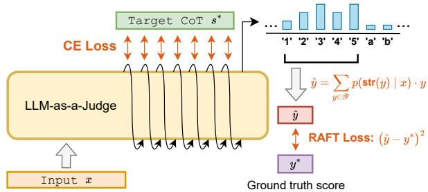
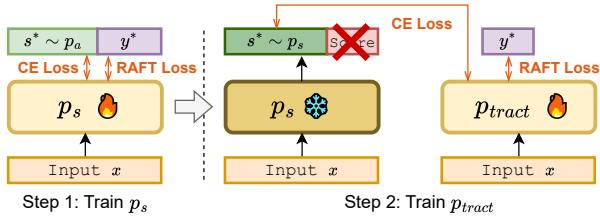
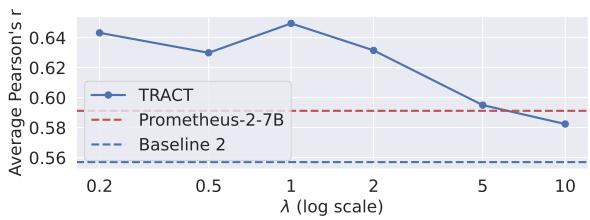
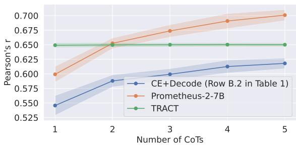
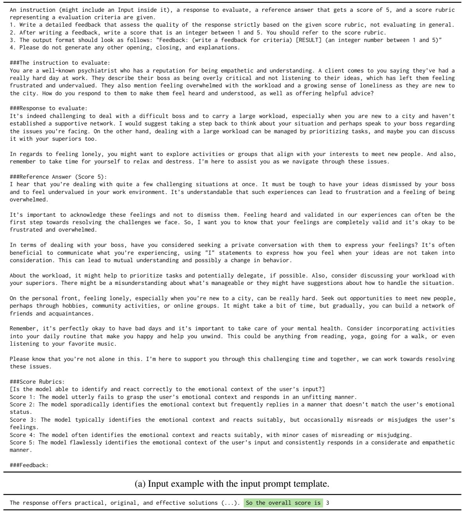
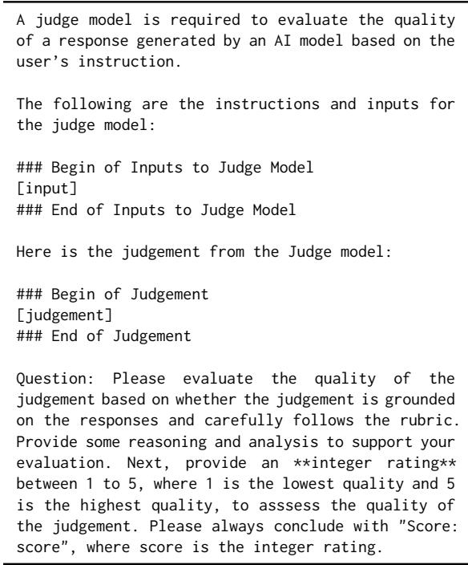

# TRACT: Regression-Aware Fine-tuning Meets Chain-of-Thought Reasoning for LLM-as-a-Judge

Cheng-Han Chiang   
NTU GICE   
Taiwan   
dcml0714@gmail.com   
Hung-yi Lee   
NTU GICE   
Taiwan   
hungyilee@ntu.edu.tw   
Michal Lukasik   
Google Research   
New York   
mlukasik@google.com

## Abstract

The LLM-as-a-judge paradigm uses large language models (LLMs) for automated text evaluation, which assigns a score to the text based on some scoring rubrics. Existing methods for LLM-as-a-judge use cross-entropy (CE) loss for fine-tuning, which neglects the numeric nature of score prediction. Recent work addresses numerical prediction limitations of LLM fine-tuning through regression-aware finetuning, which, however, does not consider chain-of-thought (CoT) reasoning for score prediction. In this paper, we introduce TRACT (Two-stage Regression-Awarefine-tuning with CoT), a method combining CoT reasoning with regression-aware training. The training objective of TRACT combines the CE loss for learning the CoT reasoning and the regression-aware loss for the score prediction. TRACT consists of two stages: first, a seed LLM is fine-tuned to generate CoTs; next, we retrain the seed LLM using the CoTs generated by the LLM trained in stage 1. Experiments across four LLM-as-a-judge datasets and two LLMs show that TRACT significantly outperforms existing methods. Extensive ablation studies validate the importance of each component in TRACT.1

## 1 Introduction

Large Language Models (LLMs) have been applied to evaluate written based on thefine-grained evaluation rubrics specified in the input by outputting a score indicating the quality (Chiang and Lee, 2023a). The fine-grained evaluation rubrics define the criteria for scoring answers, and each instance to be evaluated can have a set of customized fine-grained evaluation rubrics. This LLMas-a-judge paradigm has become the standard way to evaluate LLMs (Zheng et al., 2023; Dubois et al., 2024; Abdin et al., 2024; Lambert et al., 2025), and has applications across diverse scenarios (Yuan et al., 2024; Chiang et al., 2024). To induce the fine-grained assessment ability of LLMs, LLM-asa-judge is typically trained with cross-entropy (CE) loss to predict chain-of-thought (CoT) reasoning about the evaluation, followed by a score (Kim et al., 2024a,b; Li et al., 2024).

(a) CoT-RAFT fine-tuning objective (§3.2).  
  
(b) TRACT algorithm (§3.3).  
Figure 1: TRACT method overview. (a) Illustration of the CoT-RAFT fine-tuning objective (Eq. 4), used in both stages of TRACT. (b) Two fine-tuning stages of TRACT (also see Algorithm 1). Stage 1: model $p _ { \mathrm { s } }$ is trained over the ground truth scores and the annotation CoTs (generated by the annotation model $\mathrm { { \it { p } } _ { a } ) }$ . Stage 2: CoT supervision is sampled from $p _ { \mathrm { s } }$ (frozen at this stage) and used to fine-tune the final model $p _ { \mathrm { t r a c t } }$

Although fine-tuning LLM-as-a-judge with CE loss is a well-established practice (Kim et al., 2024a,b), it has intuitive limitations when applied to predicting numerical targets. For example, given a ground truth score ’1’, placing high probability on the token ’5’ is penalized the same as placing high probability on the token ’2’, despite the fact that they induce very different errors in terms of numerical metrics such as squared error. To mitigate this, Lukasik et al. (2025) proposed regressionaware fine-tuning (RAFT; see §2.3), a method using squared error loss in fine-tuning LLMs.

RAFT has shown promising results on regression tasks; however, it does not incorporate CoT reasoning (Wei et al., 2022; Kojima et al., 2022). Chiang and Lee (2023b) show that not using CoT can harm the performance of LLM-as-a-judge. This makes us ask: Can CoT reasoning be effectively integrated into regression-awarefine-tuning?

In this paper, we propose Two-stage Regression-Aware fine-tuning with CoT reasoning (TRACT), a method that combines the benefits of CoT reasoning with RAFT for improved numerical prediction abilities.. In stage 1, TRACT fine-tunes the seed LLM over both the CoT supervision and the ground truth scores in the original training data. $\mathrm { T R A C T ^ { \circ } s }$ fine-tuning objective (which we refer to as CoT-RAFT) is the sum of CE loss over the CoT, and the RAFT loss over score prediction (see Figure 1a). In stage 2, TRACT fine-tunes the seed LLM from the CoTs generated by the model trained in stage 1 using the same CoT-RAFT objective. This two-stage pipeline is for reducing the distribution between the seed LLM and the CoT supervision used for finetuning in stage 2 (see Figure 1b). We summarize TRACT in Algorithm 1 and contrast its formulation against baselines in Table 1.

We conduct experiments on five datasets and two LLMs and show that TRACT consistently outperforms baselines by a large margin, including Prometheus-2-7B (Kim et al., 2024b), which is the best model of equal size from prior works. Our contributions are as follows:

(i) We propose TRACT, a fine-tuning method that combines CoT reasoning with regressionaware loss to improve the numerical scoring ability of LLMs (§3).

(ii) We show that TRACT yields significant performance improvements over existing baselines for LLM-as-a-judge. We validate the importance of each component in TRACT with extensive ablations (§5, §6).

(iii) We show that TRACT, while trained on pointwise LLM-as-a-judge datasets, can work well on RewardBench (Lambert et al., 2024), a pairwise comparison dataset (§7).

(iv) We release our models. Our best model surpasses the prior state-of-the-art model of comparable size by 0.05 in Pearson’s correlation when the inference-time compute is limited.

## 2 Background

We first introduce the notation and next review previous works on regression-aware numerical output prediction with autoregressive models.

## 2.1 Notation

Let denote a finite vocabulary of tokens, $\mathcal { X } \subseteq \mathcal { V } ^ { \ast }$ be a set of inputs comprising strings of tokens, $\boldsymbol { \mathcal { S } } \subseteq \mathcal { V } ^ { * }$ the set of CoT reasonings, and $\mathcal { V } \subset \mathbb { R }$ be a set of numerical targets. We assume that each $y \in \mathcal { V }$ has a unique string representation st $\bumpeq ( y ) \in$ $\nu ^ { * }$ . Let P denote a ground-truth distribution over $\mathcal { X } \times \mathcal { S } \times \mathcal { Y }$ , with the decomposition P $( x , s , y ) =$ $\mathbb { P } ( x ) \cdot \mathbb { P } ( s \mid x ) \cdot \mathbb { P } ( y \mid [ x , s ] )$ , where $[ x , s ]$ denotes a string concatenation of x and s. Denote the training data by $D _ { \mathrm { t r a i n } } \in ( \mathcal { X } \times \mathcal { Y } ) ^ { N }$ , and each element in $D _ { \mathrm { t r a i n } }$ is composed of $( x , y ^ { * } )$ . Denote the training data augmented with CoT by $D _ { \mathrm { t r a i n } } ^ { \mathrm { C o T } } \in ( \mathcal { X } \times \mathcal { S } \times$ $\mathcal { V } ) ^ { N }$ , and each element in $D _ { \mathrm { t r a i n } } ^ { \mathrm { C o T } }$ is composed of $( x , s ^ { * } , y ^ { * } )$ , where $s ^ { * }$ can come from the human or LLM annotation.

In this paper, we focus on LLM-as-a-judge application; in this case, the input $x \in \mathcal { X }$ consists of the instructions for LLM as a judge, the scoring rubrics and a sample to be evaluated. The CoT reasoning s contains an analysis of the sample in the inputs, and the target space is $\mathcal { Y } = \{ 1 , 2 , 3 , 4 , 5 \}$ An example input-output pair is shown in Table 4 in the Appendix.

We denote an LLM by the probability distribution that it models given the input, that is, $p ( \cdot \mid x )$ We use subscripts to denote specific LLM variants: p0 represents the seed LLM before fine-tuning, and $p _ { \mathrm { a } }$ represents the LLM annotator used to generate the CoTs in $D _ { \mathrm { t r a i n } } ^ { \mathrm { C o T } }$

In the following sections, we describe different methods for training and inference of predictor $\hat { y } .$

## 2.2 Standard Fine-tuning and Decoding with No CoT

Fine-tuning without CoT seeks to adapt a seed LLM $p _ { 0 } ( \cdot | x )$ to the target distribution $\mathbb { P }$ by minimizing a suitable lossfunction $\ell \colon \mathcal { Y } \times \Delta _ { \mathcal { V } ^ { * } }  \mathbb { R }$ where $\Delta \nu \ast$ denotes the set of distributions over a set $V ^ { * } . \mathrm { A }$ standard choice of ℓ is the cross-entropy loss: $\ell _ { \mathrm { { C E } } } ( y ^ { * } , p ) ~ = ~ - \log p ( s \mathrm { { t r } } ( y ^ { * } ) | x )$ , where $\mathsf { s t r } ( \cdot )$ converts a numerical target $y ^ { * }$ to its string representation. Inference is typically conducted by standard (autoregressive) decoding, approximately seeking the mode of the distribution $p ( \cdot \mid x )$ , i.e., ${ \hat { y } } _ { \mathrm { m o d e } } ( x ) : = \arg \operatorname* { m a x } _ { y \in \mathcal { V } } p ( y \mid x )$

<table><tr><td></td><td>Category Approach</td><td>Predictor function Î(x)</td><td>Fine-tuning loss</td><td>Sec</td></tr><tr><td rowspan="5">Baselines</td><td>Standard fine-tuning and decoding w/o CoT</td><td> $\arg \operatorname* { m a x } _ { y \in y } p ( y | x )$ </td><td> $- \log p ( y ^ { * } \mid x )$ </td><td>§2.2</td></tr><tr><td>RAIL zero-shot (Lukasik et al., 2024)</td><td> $\begin{array} { r } { \sum _ { y ^ { \prime } \in \mathcal { Y } } y ^ { \prime } \cdot p ( y ^ { \prime } | x ) } \end{array}$ </td><td>N/A</td><td>§2.3</td></tr><tr><td>RAFT (Lukasik et al., 2025)</td><td> $\begin{array} { r } { \sum _ { y ^ { \prime } \in \mathcal { Y } } y ^ { \prime } \cdot p ( y ^ { \prime } | x ) } \end{array}$ </td><td> $( \hat { y } ( x ) - y ^ { \ast } ) ^ { 2 }$ </td><td>§2.3</td></tr><tr><td>Standard fine-tuning and decoding w/ CoT</td><td> $\operatorname { a r g m a x } _ { y \in \mathcal { V } } p ( s \operatorname { t r } ( y ) | [ x , \hat { s } ] ) ; \hat { s } \sim p ( \cdot | x )$ </td><td> $\log p ( \left[ s ^ { * } , y ^ { * } \right] | x )$ </td><td>§3.1</td></tr><tr><td>TRACT</td><td> $\textstyle \sum _ { y \in \mathcal { y } } p ( s \mathrm { t r } ( y ) \mid [ x , \hat { s } ] ) \cdot y ; \hat { s } \sim p ( \cdot \mid x )$ </td><td>Algorithm 1</td><td>§3</td></tr></table>

Table 1: Approaches to autoregressive regression with decoder-based LLMs. Here, $p ( \cdot | x )$ denotes a distribution over possible outputs given an input string x, and $\hat { y } ( x ) \in \mathbb { R }$ a predictor function. $\mathcal { V }$ denotes the targets space (unless otherwise stated, $\{ 1 , 2 , 3 , 4 , 5 \} )$ .

## 2.3 Regression-Aware Inference and Fine-tuning

Recently, Lukasik et al. (2024) noted that standard autoregressive decoding in LLMs implicitly minimizes the 0-1 error metric, $m ( y , \hat { y } ) =$ $\mathbb { 1 } ( y ~ \neq ~ \hat { y } )$ , making it suboptimal for regression metrics. Motivated by the minimum Bayes risk decoding framework (Kumar and Byrne, 2004), Lukasik et al. (2024) propose Regression-Aware Inference for Language models (RAIL). RAIL aims to determine the Bayes-optimal prediction by minimizing the expected loss: ${ \hat { y } } _ { \mathrm { R A I L } } ( x ) \ =$ arg $\begin{array} { r } { \operatorname* { m i n } _ { v \in \mathbb { R } } \mathbb { E } _ { y \sim p ( \cdot \mid x ) } \left[ m ( \mathsf { n u m } ( y ) , v ) \right] } \end{array}$ , where m is the metric of interests and num( ) converts a string output to its numerical equivalent. For squared error loss, $m ( y , \hat { y } ) = ( y - \hat { y } ) ^ { \hat { 2 } }$ , the optimal decision rule simplifies to the expected value of the numerical predictions. In the case of finite numerical targets $\mathcal { V } ,$ this can be exactly calculated by scoring and averaging a set of candidate targets:

$$
\hat { y } _ { \mathrm { R A I L } } ( x ) \doteq \sum _ { y \in \mathcal { V } } p ( s \mathrm { t r } ( y ) | x ) \cdot y .\tag{1}
$$

While RAIL is based on the Bayes-optimal decision rule, directly applying this rule to a model finetuned with CE loss can still result in high regression error. This is due to the misalignment between the CE fine-tuning loss and the regression evaluation metrics (Lukasik et al., 2025). To address this, Lukasik et al. (2025) proposed incorporating the RAIL optimal decision rule directly into the finetuning process using squared loss, leading to the Regression-Aware Fine-Tuning (RAFT) loss:

$$
\ell _ { \mathrm { R A F T } } ( y ^ { * } , p ) = \left( y ^ { * } - \hat { y } _ { \mathrm { R A I L } } ( x ) \right) ^ { 2 } .\tag{2}
$$

## 3 Method: TRACT

While achieving notable success on natural language regression tasks such as STS-B (Cer et al.,

2017), RAIL and RAFT do not use CoT reasoning. In this section, we start by discussing learning with CoT, and next introduce our method that incorporates CoT into RAIL and RAFT.

## 3.1 Learning and Inference with CoT

LLM-as-a-judge typically decodes a CoT sequence prior to outputting the final score (Chiang and Lee, 2023b). LLM-as-a-judge is fine-tuned over a dataset $D _ { \mathrm { t r a i n } } ^ { \mathrm { C o T } } ~ \in ~ ( \mathcal { X } ~ \times ~ \mathcal { S } ~ \times ~ \mathcal { Y } ) ^ { N }$ of N (input, CoT, target score) tuples drawn from P. The CoT annotations $s ^ { * }$ often come from a powerful LLM (e.g. GPT-4); we denote the distribution of CoT annotations provided in the dataset as $p _ { \mathrm { a } } ( \cdot | x )$ . The empirical loss for fine-tuning is $\begin{array} { r } { \hat { L } _ { \mathrm { C o T } } ( p ) = \frac { 1 } { N } \sum _ { ( x , y ^ { * } , s ^ { * } ) \in D _ { + \star \cdot \circ \cdot \mathbf { i } } ^ { \mathrm { C o T } } } \ell ( y ^ { * } , s ^ { * } , p ) } \end{array}$

A typical choice is again the CE loss, i.e., $\ell _ { \mathrm { { C o T } } } ( y ^ { * } , s ^ { * } , p ) ~ = ~ - \log p ( [ s ^ { * } , y ^ { * } ] | x )$ . Inference is typically done by generatively predicting a CoT reasoning and the score, which samples from the distribution $p ,$ thus approximating the mode of the distribution: $\hat { y } _ { \mathrm { C o T ~ m o d e } } ( x ) \ \doteq$ $\operatorname { a r g m a x } _ { y \in \mathcal { V } } p ( s \mathrm { t r } ( y ) | [ x , \hat { s } ] ) ; \hat { s } \sim p ( \cdot | x )$

## 3.2 Regression-Aware Fine-Tuning with CoT

CoT reasoning elicits a reasoning s before outputting the score y. We propose and define the CR (CoT-RAIL) predictor as first sampling a CoT sˆ conditioning on the input x, and then applying the RAIL predictor when conditioning on x and sˆ,

$$
\hat { y } _ { \mathrm { C R } } ( x ) \doteq \sum _ { y \in \mathcal { V } } p ( s \mathrm { t r } ( y ) | [ x , \hat { s } ] ) \cdot y ; \hat { s } \sim p ( \cdot | x )\tag{3}
$$

A practical question is how to determine where the CoT reasoning ends and where the score starts so that the RAIL predictor can be used at the appropriate position. In practice, we assume each CoT ends with the string $d = \mathrm { \large { S o } }$ the overall score is We include the string d at the end of each CoT in the training set to ensure that the fine-tuned model always ends its CoT with d.

In principle, we can sample a CoT and obtain the score prediction using Equation 3, repeat the CoT sampling multiple times to estimate the score, and average the scores. Unless stated otherwise, we sample sˆ once, as shown in Equation 3.

For training, analogously to the original RAFT algorithm, we use the CoT-RAIL predictor in the squared error loss. To guide the model in generating CoTs, we apply CE loss to the CoTs. We combine the two losses using a weighting coefficient λ, forming the CoT-RAFT objective:

$$
\begin{array} { l } { \displaystyle \ell _ { \mathrm { C o T - R A F T } } ^ { \lambda } ( y ^ { * } , p _ { \mathrm { t } } , p ) = } \\ { \displaystyle \lambda \left( \sum _ { y \in \mathcal { Y } } p ( s \mathrm { t r } ( y ) | [ x , \hat { s } ] ) \cdot y - y ^ { * } \right) ^ { 2 } } \\ { \displaystyle - \log p ( [ \hat { s } , y ^ { * } ] | x ) ; \hat { s } \sim p _ { \mathrm { t } } ( \cdot | x ) , } \end{array}\tag{4}
$$

where $p _ { \mathrm { t } }$ denotes the (target) model used to generate the CoTs for training, which can be $p _ { \mathrm { a } }$ (GPT-4), but we explore other options next.

## 3.3 Self-Generated Chain-of-Thoughts (CoTs)

When training with CoT-RAFT (Eq. 4), the score predictor is conditioned on the CoT generated by a target model, denoted as $\hat { s } \sim p _ { \mathrm { t } } ( \cdot | x )$ . However, at inference time, CoT-RAIL (Eq. 3) relies on selfgenerated CoTs from the fine-tuned model $p ,$ i.e., ${ \hat { s } } \sim p ( \cdot | x )$ . In our case, the CoTs used for training are from GPT-4 $( p _ { \mathrm { a } } )$ and may be very different from the CoTs generated by the fine-tuned model $p .$ This creates a mismatch between the CoTs used during training and inference, which can harm the performance, as empirically shown in §5.

To mitigate the distribution shift in annotation and model CoTs, we propose to fine-tune the model using CoTs more closely aligned with those sampled from the trained model $p ( \cdot \mid x )$ . Let $p _ { \mathrm { s } }$ denote the model initialized from the seed LLM $p _ { 0 }$ and fine-tuned on the annotation CoTs sampled from $p _ { \mathrm { a } }$ . For each input x in the training data, we prompt $p _ { \mathrm { s } }$ to generate a response containing a CoT and a score prediction. We then discard the score prediction and pair the generated CoT with the corresponding original ground truth score, creating a new training dataset, denoted as $D _ { \mathrm { s e l f } }$ Formally, $D _ { \mathrm { s e l f } } ~ = ~ \{ ( x , \mathbf { C o T \bar { s } } ( x ) , y ^ { * } ) | ( x , y ^ { * } ) ~ \in$ $D _ { \mathrm { t r a i n } , } { \mathrm { C o T } } _ { \mathrm { s } } ( x ) \sim p _ { \mathrm { s } } ( \cdot | x ) \}$ , where $D _ { \mathrm { t r a i n } }$ is the original training dataset, $y ^ { \ast }$ is the ground truth score, and $\operatorname { C o T } _ { \mathrm { { s } } } ( x )$ is the CoT generated by $p _ { \mathrm { s } }$ for input x.

We use $D _ { \mathrm { s e l f } }$ to train from the seed LLM $p _ { 0 }$ to obtain the final TRACT model, $p _ { \mathrm { t r a c t } }$ . The complete algorithm for training the TRACT model is shown in Algorithm 1 and Figure 1. In summary, we first train the seed LLM on the training data with the CoT annotation from $p _ { \mathrm { a } }$ to obtain $p _ { \mathrm { s } }$ , use $p _ { \mathrm { s } }$ to generate CoTs to form $D _ { \mathrm { s e l f } }$ , and use $D _ { \mathrm { s e l f } }$ to retrain $p _ { 0 }$ again, leading to the resulting model ptract.

## 4 Experiment Setup

Models We fine-tune TRACT from two LLMs, Mistral-7B-Instruct-v0.2 (Jiang et al., 2023) and Llama-3.1-8B-Instruct (Grattafiori et al., 2024).

Training Dataset We follow Kim et al. (2024b) and use Feedback Collection (Kim et al., 2024a) as the training set. The training set contains roughly 100K samples. The whole dataset, including the samples to be evaluated, the evaluation responses, and ground truth scores, are generated by GPT-4. We follow the procedure in $\ S 3 . 3$ to construct $D _ { \mathrm { s e l f } }$ We analyze the quality of the self-generated CoTs in Appendix B.1.

Test Datasets We use four datasets for point-wise LLM-as-a-judge, following Kim et al. (2024b).

(1) Feedback Bench (Kim et al., 2024a): This is the official test set of Feedback Collection. Feedback Bench contains 1K responses to evaluate. The instructions and scoring rubrics in Feedback Bench do not overlap with the training set.

(2) FLASK (Ye et al., 2024): This is a fine-grained evaluation benchmark with 200 test prompts and 2000 responses from Alpaca-7B (Taori et al., 2023), Vicuna-13B, Bard (Google, 2023), and GPT-3.5-Turbo-0613.

(3) Vicuna Bench (Chiang et al., 2023): This is a single-turn dialogue dataset with 80 user instructions. Kim et al. (2024a) extends this dataset for LLM-as-a-judge by crafting the scoring rubrics for each user instruction and generating responses by WizardLM-13B (Xu et al., 2024), Vicuna-13B (Chiang et al., 2023), Llama-2-Chat-13B (Touvron et al., 2023), and ChatGPT-3.5-Turbo-0613. The dataset contains 320 responses to evaluate.

(4) MT Bench (Zheng et al., 2023): MT Bench is a multi-turn dialogue dataset with diverse tasks. To form a direct assessment dataset, Kim et al. (2024a) prepare human-written rubrics and generate the dialogue responses from WizardLM-13B, Vicuna-

<table><tr><td>Algorithm 1 TRACT: Two-stage Regression-Aware fine-tuning with CoT reasoning</td></tr><tr><td>1: input: CoT annotations distribution  $p _ { \mathrm { a } } ,$  base model  $p _ { 0 } ,$  training data  $\{ ( x , y ^ { * } ) \}$  , mixing coefficient λ.</td></tr><tr><td>2: stage 1: train 4  $p _ { \mathrm { s } }$  using the objective  $\ell _ { \mathrm { C o T - R A F T } } ^ { \lambda } ( y ^ { \ast } , p _ { \mathrm { a } } , p )$  initializing from  $p _ { 0 }$ </td></tr><tr><td>3: stage 2: train  $p _ { \mathrm { t r a c t } }$  using the objective  $\ell _ { \mathrm { C o T - R A F T } } ^ { \lambda } ( y ^ { \ast } , p _ { \mathrm { s } } , p )$  initializing from  $p _ { 0 }$  4: return  $p _ { \mathrm { t r a c t } }$ </td></tr></table>

13B, Llama-2-Chat-13B, and ChatGPT-3.5-Turbo-  
0613. The dataset has 320 responses to evaluate.

Baselines We compare TRACT against multiple baselines that differ in their training objectives and in whether they use CoT reasoning, including: (1) Standard fine-tuning and decoding without CoT (§2.2), (2) Standard fine-tuning and decoding with CoT (§3.1), (3) Zero-shot RAIL: Using RAIL predictor (Equation 1) on the seed LLM $p _ { 0 } ,$ (4) RAFT (§2.3). A detailed comparison of the baselines is shown in Table 1.

We also compare with (5) Prometheus-2- 7B (Kim et al., 2024b), a model obtained by merging the model trained on Feedback-Collection and another model trained on Preference Collection (Kim et al., 2024b), a pairwise ranking dataset. Kim et al. (2024b) show that merging the models trained on two datasets significantly improves the performance. Prometheus-2-7B is trained from Mistral-7B-Instruct-v0.2, the same seed LLM used in this paper, and it is the best open-source model of the same size for LLM-as-a-judge currently.

Training and Evaluation We fine-tune the LLMs with LoRA (Hu et al., 2022) using Llama-Factory (Zheng et al., 2024). We set λ = 1 in Equation 4 unless otherwise stated.

During inference, for each sample in a dataset, we predict a score from the LLM using either standard decoding or the predictor in Equation 1 or 3, and calculate the correlation coefficient against the ground truth scores in the datasets. We report Pearson’s r (Pearson, 1895), Spearman’s $\rho$ (Spearman, 1961), and Kendall’s τ (Kendall, 1938) (see Kendall’s τ results in Appendix B.2; we find the trends to be consistent with other metrics).

## 5 Main Results

The results for Mistral are presented in Table 2, and the results for Llama are in Table 7 in the Appendix. The first five rows (B.1 B.5) in the two tables correspond to the five baselines in §4 in the same order. We next discuss the main observations.

TRACT outperforms standard training and decoding with CoT. Standard training and decoding with CoT (row B.2) is the default training and inference for LLM-as-a-judge in most prior works (Kim et al., 2024a,b). For both Mistral and Llama, TRACT (row 7) outperforms this baseline by a significant margin. When the base model is Mistral, TRACT reaches Pearson’s r as high as 0.650, significantly outperforming training and inference with CoT (row B.2), which only attains Pearson’s r of 0.557. When using Llama, TRACT improves the average Pearson’s r by 0.100.

TRACT outperforms prior equally-sized SoTA. Across all datasets, TRACT, trained without additional data, consistently outperforms Prometheus-2-7B (row B.5), the prior SoTA of the same size, by an average of 0.059 Pearson’s r. While we use selfgenerated data, this differs from Prometheus-2-7B, which is further trained on Preference Collection, a dataset generated by GPT-4.

TRACT outperforms RAFT. RAFT (row B.4) can be considered as an ablation of TRACT that removes CoT. TRACT outperforms RAFT, showing that CoT helps the model predict the score. Quite surprisingly, RAFT achieves the best performance among all baselines. RAFT even outperforms Prometheus-2-7B (row B.5) by 0.032 Pearson’s r, which is trained over additional data corresponding to a ranking task. The same observation holds for the models trained using Llama-3.1.

Next, we ablate each component of TRACT.

Training on self-generated CoTs is critical. Row A.1 corresponds to training with CoT-RAFT on the GPT-4 generated data, and running inference with CoT-RAIL, without further training on selfgenerated CoTs. The average Pearson’s r without training on self-generated data is 0.094 lower than TRACT. This shows that self-generated CoT is an important component of TRACT.

Using CE for training harms the performance. Row A.2 is the result when we replace the finetuning objective from CoT-RAFT with the standard CE loss but still use CoT-RAIL in inference. This configuration leads to a Pearson’s r 0.033 lower than TRACT. This shows that using CoT-RAFT for fine-tuning better aligns the fine-tuning objective and the predictor used during inference.

<table><tr><td></td><td colspan="4">Train/Inference Configuration</td><td colspan="2">FB Bench</td><td colspan="2">FLASK</td><td colspan="2">Vic. Bench</td><td colspan="2">MT Bench</td><td colspan="2">Average</td></tr><tr><td>Id</td><td>CoT</td><td>Train</td><td>Data</td><td>Inf.</td><td>r</td><td>ρ</td><td>r</td><td>ρ</td><td>r</td><td>ρ</td><td>r</td><td>ρ</td><td>r</td><td>ρ</td></tr><tr><td colspan="10">Baselines</td><td></td><td></td><td></td><td></td><td></td><td></td></tr><tr><td>B.1</td><td>x</td><td>CE</td><td>GPT-4‡</td><td>Decode</td><td>0.890</td><td>0.891</td><td>0.355</td><td>0.361</td><td>0.429</td><td>0.414</td><td>0.279</td><td>0.268</td><td>0.488</td><td>0.483</td></tr><tr><td>B.2</td><td>√</td><td>CE</td><td>GPT-4</td><td>Decode</td><td>0.872</td><td>0.872</td><td>0.413</td><td>0.407</td><td>0.463</td><td>0.456</td><td>0.480</td><td>0.482</td><td>0.557</td><td>0.554</td></tr><tr><td>B.3</td><td>x</td><td>x</td><td>x</td><td>RAIL</td><td>0.197</td><td>0.175</td><td>0.200</td><td>0.149</td><td>0.281</td><td>0.165</td><td>0.309</td><td>0.216</td><td>0.247</td><td>0.176</td></tr><tr><td>B.4</td><td>x</td><td>RAFT</td><td>GPT-4</td><td>RAIL</td><td>0.932</td><td>0.930</td><td>0.509</td><td>0.502</td><td>0.567</td><td>0.519</td><td>0.483</td><td>0.469</td><td>0.623</td><td>0.605</td></tr><tr><td></td><td></td><td colspan="2"></td><td colspan="8">Not directly comparable models (Different Training Data)</td><td></td><td></td><td></td></tr><tr><td>B.5</td><td>√</td><td colspan="2">Prometheus-2-7B†</td><td>Decode</td><td>0.845</td><td>0.847</td><td>0.512</td><td>0.493</td><td>0.488</td><td>0.480</td><td>0.519</td><td>0.483</td><td>0.591</td><td>0.576</td></tr><tr><td>6</td><td>√</td><td colspan="2">CLoud (Reward model)</td><td>Decode*</td><td>0.381</td><td>0.376</td><td>0.228</td><td>0.168</td><td>0.229</td><td>0.311</td><td>0.511</td><td>0.506</td><td>0.337</td><td>0.340</td></tr><tr><td>7</td><td></td><td colspan="2"></td><td></td><td></td><td colspan="2">TRACT (ours)</td><td></td><td></td><td></td><td></td><td></td><td></td><td></td></tr><tr><td>√</td><td></td><td>C-RAFT</td><td>Self</td><td>C-RAIL</td><td>0.931</td><td>0.930</td><td>0.518</td><td>0.501</td><td>0.593</td><td>0.552</td><td>0.555</td><td>0.529</td><td>0.650</td><td>0.628</td></tr><tr><td>Ablation analysis for TRACT</td><td colspan="10"></td><td></td><td></td><td></td><td></td><td></td></tr><tr><td>A.1</td><td>√</td><td>C-RAFT</td><td>GPT-4</td><td>C-RAIL</td><td>0.879</td><td>0.880</td><td>0.418</td><td>0.419</td><td>0.528</td><td>0.513</td><td>0.399</td><td>0.418</td><td>0.556</td><td>0.558</td></tr><tr><td>A.2</td><td>√ √</td><td>CE</td><td>Self</td><td>C-RAIL</td><td>0.919</td><td>0.917</td><td>0.468</td><td>0.436</td><td>0.562</td><td>0.526</td><td>0.517</td><td>0.503</td><td>0.617</td><td>0.596</td></tr><tr><td>A.3</td><td></td><td>CE</td><td>Self</td><td>Decode</td><td>0.873</td><td>0.873</td><td>0.358</td><td>0.346</td><td>0.418</td><td>0.404</td><td>0.435 0.432</td><td>0.426 0.421</td><td>0.521</td><td>0.512</td></tr><tr><td>A.4</td><td colspan="2"></td><td colspan="2">TRACT with stage 2 initialized from ps</td><td>0.674</td><td>0.684</td><td>0.448</td><td>0.437</td><td>0.505</td><td>0.477</td><td></td><td></td><td>0.515</td><td>0.505</td></tr></table>

Table 2: The results for Mistral-7B-Instruct. The best and second-best results (excluding ablations) for each column are marked with boldface and underline, respectively. Explanation of abbreviations: Train: training objective; Data: source of CoT used for training; Inf.: inference method; FB Bench: Feedback Bench; Vic. Bench: Vicuna Bench; r: Pearson’s correlation coefficient; $\rho \colon$ Spearman’s rank correlation coefficient; C-RAFT: CoT-RAFT; C-RAIL: CoT-RAIL. : Prometheus-2-7B is obtained by merging two models trained from Feedback Collection and Preference Collection. We re-run the inference using the model released by Kim et al. (2024b) with the official code. : When training without CoTs, the training target is simply the score, which is still generated by GPT-4. : CLoud (trained from Llama-3-8B) is a reward model; it is not designed for LLM-as-a-judge benchmarks (Section 7).

CoT-RAFT objective is necessary: selfgenerated CoTs alone are insufficient. Prior research has demonstrated that fine-tuning LLMs on self-generated data using the CE loss can be beneficial (Yang et al., 2024). Here, we investigate whether CE loss fine-tuning on self-generated data alone can improve the performance compared with training on GPT-4 CoTs. Contrary to expectations, standard CE loss fine-tuning on self-generated CoTs (row A.3) yielded a significantly lower average Pearson’s r of 0.512, far below TRACT’s performance. Moreover, this approach performed worse than fine-tuning on GPT-4 generated data (row B.2). This shows that self-generated CoTs are harmful when fine-tuned with CE loss but are beneficial when combined with the CoT-RAFT objective. Our finding marks the difference between our work and prior work using self-generated CoTs with CE loss, highlighting the distinct role of self-generated CoTs in TRACT.

Stage 2 training needs to be initialized from the seed LLM. In Algorithm 1, the model in stage 2 is initialized from the seed LLM $p _ { 0 }$ . As an alternative, we explore initializing from $p _ { \mathrm { s } } ,$ the model trained in stage 1, while keeping everything else the same as TRACT. The result shown in row A.4 achieves only 0.515 Pearson’s $r .$ . This shows that initialization in stage 2 from the seed LLM (as

Algorithm 1 indicates) is crucial.

## 6 Analysis

We conduct further analysis of the key components of TRACT to justify its design.

## 6.1 On the Distribution Shift between Annotation vs Self-Generated CoTs

In §3.3, we motivated using self-generated CoTs by the distribution shift between training and inference CoTs. To empirically demonstrate this shift, we design the following experiment.

Let $D _ { \mathrm { t r a i n } } ^ { \mathrm { C o T } } ( p _ { \mathrm { t } } ) = \{ ( x _ { i } , s _ { i } ^ { * } \sim p _ { \mathrm { t } } ( \cdot | x _ { i } ) , y _ { i } ^ { * } ) \} _ { i = 1 } ^ { N }$ represent the training dataset, where $x _ { i } ~ \in ~ { \mathcal { X } }$ is the input, $s _ { i } ^ { * } \in \mathcal { S }$ is the CoT sampled from model $p _ { \mathrm { t } }$ used as the training data, and $y _ { i } ^ { * } \in \mathcal { V }$ is the ground truth score. Let p( ) denote the probability distribution defined by the LLM trained on $D _ { \mathrm { t r a i n } } ^ { \mathrm { C o T } } ( p _ { \mathrm { t } } )$ . After $p$ is trained, we generate CoTs $\hat { s } _ { i } \sim p ( \cdot | x _ { i } )$ for each input $x _ { i }$ in $D _ { \mathrm { t r a i n } } ,$ and predict scores conditioned on these CoTs, denoted as $\hat { y } _ { i } ( \hat { s } _ { i } ) \sim p ( \cdot | x _ { i } , \hat { s } _ { i } )$ . Using the fine-tuned model $p ,$ we can also predict a score conditioned on $s _ { i } ^ { * }$ , the CoT in the training data $D _ { \mathrm { t r a i n } } ^ { \mathrm { C o T } } ( p _ { \mathrm { t } } )$ ; this score is denoted as $\hat { y } _ { i } ( s _ { i } ^ { * } ) \sim p ( \cdot | x _ { i } , s _ { i } ^ { * } )$

To quantify how different $s _ { i } ^ { * }$ and $\hat { s } _ { i }$ are, we compare the root mean square error (RMSE) across two pairs of scores: 1) the predicted scores $\hat { y } _ { i } ( s _ { i } ^ { * } )$ and the ground truth scores $y _ { i } ^ { * }$ , and 2) the predicted scores $\hat { y } _ { i } ( \hat { s } _ { i } )$ and the ground truth scores $y _ { i } ^ { * }$ . Notably, both $\hat { y } _ { i } ( \hat { s } _ { i } )$ and $\hat { y } _ { i } ( s _ { i } ^ { * } )$ are generated by the same LLM $p ( \cdot )$ conditioned on the same input $x _ { i }$ in the training set; the only distinction is the CoT: $\hat { y } _ { i } ( s _ { i } ^ { * } )$ conditioned on $s _ { i } ^ { * }$ , and $\hat { y } _ { i } ( \hat { s } _ { i } )$ conditioned on $\hat { s } _ { i }$

<table><tr><td>TRACT</td><td> $s ^ { * } \colon$  CoTs used for training</td><td>ê: CoTs sampled from fine-tuned model</td><td>RMSE  $\mathbf { w } / y ^ { * }$   $\hat { y } ( s ^ { * } )$  y (§)</td></tr><tr><td>Stage 1 Stage 2</td><td> $s ^ { * } \sim p _ { \mathrm { a } }$ </td><td> $\hat { s } \sim p _ { \mathrm { s } }$ </td><td>0.12 0.63</td></tr><tr><td></td><td> $s ^ { * } \sim p _ { \mathrm { s } }$ </td><td> $\hat { s } \sim p _ { \mathrm { t r a c t } }$ </td><td>0.45 0.45</td></tr></table>

Table 3: RMSE between predicted scores $\hat { y }$ and ground truth scores $y ^ { * }$ over the training data. Each row corresponds to stage 1 or stage 2 of TRACT. The CoT used for fine-tuning the model in each stage is denoted by $s ^ { * }$ and is generated by the model indicated in the second column. After fine-tuning, we sample sˆ from the finetuned model; the fine-tuned model is specified in the third column The last two columns are the RMSE across two pairs of predictions: 1) the predicted scores $\hat { y } _ { i } ( s _ { i } ^ { * } )$ and the true scores $y _ { i } ^ { * }$ , and 2) the predicted scores $\hat { y } _ { i } ( \hat { s } _ { i } )$ and the true scores $y _ { i } ^ { * }$ . Within each row, both $\hat { y } _ { i } ( s _ { i } ^ { * } )$ and $\hat { y } _ { i } ( \hat { s } _ { i } )$ are predicted by the same fine-tuned model (indicated in the third column).

The results are presented in Table 3. The first row shows the model $p _ { \mathrm { s } }$ trained in stage 1 in TRACT, which is trained using CoTs sampled from $p _ { \mathrm { a } }$ (GPT-4). We observe a significant RMSE gap of 0.51 between $\hat { y } _ { i } ( s _ { i } ^ { * } )$ and $\hat { y } _ { i } ( \hat { s } _ { i } )$ . This shows that for $p _ { \mathrm { s } } ,$ the distribution of training CoTs and self-generated CoTs is very different.

The second row shows the result of the model fine-tuned in stage $2 , p _ { \mathrm { t r a c t } }$ , which is trained on CoTs generated by $p _ { \mathrm { s } }$ . When predicting scores using $p _ { \mathrm { t r a c t } }$ , the RMSE gap between using the training $\mathrm { C o T s \ } s ^ { * }$ and predicted CoTs sˆ is 0. This indicates that for $p _ { \mathrm { s } }$ (row 1), predicting scores using self-generated CoTs is more challenging than using CoTs generated by GPT-4, showing a substantial distribution shift between self-generated and GPTgenerated CoTs. Conversely, for $p _ { \mathrm { t r a c t } }$ , the prediction difficulty is similar for both types of CoTs, suggesting that the training and self-generated CoT distributions are closer.

The above results can also be interpreted as $p _ { \mathrm { s } }$ memorizing the training CoTs and cannot generalize to its own generated CoTs, while $p _ { \mathrm { t r a c t } }$ is capable of generalizing to its own generations.

## 6.2 Sensitivity to λ

We analyze the performance of TRACT when varying λ in Equation 4 over a grid of values

  
Figure 2: Performance of TRACT across varying values of $\lambda$ in Equation 4. Results from the Mistral model. For a wide range of λ values we find TRACT outperforming the baselines.

0.2, 0.5, 1.0, 2, 5, 10 , using Mistral as the seed model. The results are shown in Figure 2. We observe that $\lambda \ = \ 1$ performs well. For most values of λ TRACT outperforms both 1) the model trained using CE loss on the same dataset, and 2) Prometheus, the SoTA model of the same size.

## 6.3 Multi-Objective Fine-tuning vs. Sequential Single-Objective Fine-tuning

TRACT relies on the CoT-RAFT objective from Eq. 4, combining the CE loss over CoTs and the RAFT loss over score predictions. An alternative training strategy could involve a sequential, twostage fine-tuning process: first, fine-tuning with the CE loss over both CoTs and scores (corresponding to baseline 2); and next, fine-tuning on the same dataset using solely the RAFT objective over scores. In the second stage, while the model’s output still includes CoTs, the CE loss is not computed for them, i.e., the second term in Eq. 4 is not used.

We empirically find that this sequential finetuning approach significantly degrades the model’s ability to generate coherent and complete CoTs. The resulting model struggles to terminate CoT outputs correctly and sometimes yields very long CoTs. We show some example CoTs in Table 9 in Appendix C. This deficiency highlights the critical role of multi-objective fine-tuning: jointly optimizing both the CE loss for CoTs and the squared-error loss for scores.

## 6.4 Scaling the Number of Sampled CoTs

We analyze the effect of sampling multiple CoTs for TRACT during inference; this is done by sampling multiple sˆ, calculating yˆCR for each CoT (Eq. 3), and averaging the $\hat { y } _ { \mathrm { C R } }$ . For comparison, we also sample multiple CoTs and average the scores for the following two baselines: the model trained using the CE loss (baseline 2, row B.2 in Table 2), and Prometheus-2-7B. To gauge the significance of the differences across methods, we repeat the experiment by varying the random seed. For each seed, we sample K CoTs to calculate the score, average the score across four testing dataset, and repeat the above process with four seeds.

  
Figure 3: Average Pearson’s r as a function of the number of sampled CoTs. Results from fine-tuning the Mistral model. Shaded regions correspond to the standard deviations across multiple inference runs with varying random seeds. Note that Prometheus is trained on significantly more data compared to other two methods in this Figure. Despite that, under limited inference budget, TRACT outperforms Prometheus.

The results are shown in Figure 3. We find that the performance of TRACT is stable across different numbers of CoTs, while the performance of standard decoding increases when sampling more CoTs. While this might indicate TRACT cannot benefit from scaling the inference-time compute (Irvine et al., 2023; Brown et al., 2025; Snell et al., 2025), the superiority of TRACT under limited inference-time compute is clear. Baseline 2 uses the same amount of training data and serves as a fair comparison baseline to TRACT. Compared to it, TRACT with one CoT consistently outperforms baseline 2 with more than one CoTs. Additionally, the variance of the performance of TRACT across the random seeds is much smaller than that for standard decoding.

TRACT outperforms Prometheus when sampling fewer CoTs. Given that Prometheus is trained with more data, we find it to be a very strong outcome that TRACT outperforms Prometheus under the limited CoT sampling setting.

## 7 Comparing Point-Wise LLM-as-a-Judge and Reward Models

Given an instruction and a response, a reward model (RM) assigns a scalar reward to indicate the quality of the response (Wang et al., 2024a; Liu et al., 2024; Dorka, 2024). While this formulation is similar to pointwise LLM-as-a-judge, RMs are typically trained to evaluate specific attributes, e.g., helpfulness, harmlessness, etc. (Bai et al., 2022). As a result, RMs cannot take fine-grained evaluation metrics and evaluate based on the evaluation rubrics. Furthermore, the reward of a RM is only meaningful when comparing the reward of two responses for the same instruction, since RMs are trained with pairwise data. In contrast, the score of point-wise LLM-as-a-judge is meaningful standalone since it directly corresponds to the description of a specific score in the scoring rubrics.

Critique-out-loud (CLoud) (Ankner et al., 2024) RM is an RM that generates some CoT reasoning before predicting the reward using a regression head. While CLoud uses self-generated CoT reasoning to improve the numeric prediction (the reward), there are several differences between CLoud and TRACT. First, CLoud is trained on pairwise reward modeling datasets, while TRACT is trained on a point-wise LLM-as-a-judge dataset. Next, TRACT uses the language model head to predict the score, while CLoud uses a regression head to predict the score. Most importantly, CLoud, as a reward model, cannot take fine-grained evaluation rubrics and evaluate the responses based on the evaluation criteria, which is different from all other LLM-as-a-Judge based baselines in Section 4, which can take fine-grained evaluation rubrics.

## 7.1 Results on Point-wise LLM-as-a-Judge Datasets

Since CLoud also uses CoT to improve numeric predictions, we compare CLoud with TRACT on point-wise LLM-as-a-judge datasets to understand whether RMs can perform well on point-wise LLM-as-a-judge datasets. In row 7 in Table 2, we show the results of CLoud on LLM-as-a-judge datasets. We can see that CLoud performs poorly, and TRACT significantly outperforms CLoud. This is not surprising, as CLoud is a reward model trained on pairwise ranking datasets, and it cannot take the fine-grained evaluation metrics. Our goal here is not to criticize the performance of CLoud; we use the above evidence to highlight that RMs are not the same as point-wise LLM-as-a-judge models.

## 7.2 Results on RewardBench

Having seen that RM cannot yield reasonable performance on point-wise LLM-as-a-judge datasets, one may ask whether the reverse holds as well: Can point-wise LLM-as-a-judge models be used as a reward model? To answer this question, we use RewardBench (Lambert et al., 2024), a reward model dataset, to evaluate our baseline models and TRACT. Each evaluating instance in RewardBench consists of an instruction, a winning response, and a losing one; the goal is to see whether a reward model can assign a higher reward to the winning response. To test point-wise LLM-as-a-judge models on RewardBench, we prompt the model with both responses separately, obtaining scores for them, and then compare the scores for the final ranking. We report the accuracy on RewardBench.

The results for RewardBench are presented in Table 10 in the Appendix. We see that TRACT performs quite well: the model fine-tuned from Mistral reaches an average score of 0.736, slightly worse than CLoud (0.759). This shows that even though TRACT, a point-wise LLM-as-a-judge model, is not trained on pairwise ranking for reward modeling, it can still obtain reasonably good performance on RewardBench, a pairwise ranking benchmark. This is in stark contrast with the result of CLoud on point-wise LLM-as-a-judge shown in Table 2, where CLoud underperforms TRACT by a large margin. Lastly, we note that TRACT, a model trained on only a point-wise dataset, outperforms Prometheus-2-7B, a model trained on point-wise scoring and pairwise ranking datasets.

## 8 Related Work

## 8.1 LLM-as-a-Judge

LLM-as-a-judge paradigm is an application of LLMs as an automatic judge to assess texts (Chiang and Lee, 2023a). There are two types of LLM-asa-judge: (1) Direct assessment: the LLM assigns a score to a given sample (Chiang and Lee, 2023a; Liu et al., 2023). (2) Pairwise ranking: the LLM determines which sample is better given a pair of samples (Zheng et al., 2023; Wang et al., 2024b; Li et al., 2024). In this paper, we focus on improving the direct assessment ability of the LLM.

Many prior works focus on fine-tuning opensource LLMs into better LLM judges using opensource data (Vu et al., 2024; Li et al., 2024). LLMas-a-judge is often trained with the CE loss over CoT reasoning and a score (Kim et al., 2024a,b).

## 8.2 Training LLMs with Self-Generated Data

An important component of TRACT is fine-tuning over self-generated CoTs. Using self-generated data for training LLMs has been considered in the literature (Wang et al., 2023; Kim et al., 2023) and is sometimes referred to as self-training (Singh et al., 2024) or self-distillation (Yang et al., 2024). Early work has already shown that self-distillation can improve the performance of machine translation (Freitag et al., 2017; Guo et al., 2021). Selfgenerated data can be used to augment the training data of LLMs (Wu et al., 2025; Sun et al., 2024) to mitigate the scarcity of high-quality labeled data. Self-generated CoTs, when combined with proper filtering methods, have been shown to improve LLM’s reasoning ability (Zelikman et al., 2022; Gulcehre et al., 2023; Dou et al., 2024).

Most related to our work is Yang et al. (2024), who argue that self-generated data helps fine-tuning by reducing the distribution gap between the training data and the seed LLM. Ren et al. (2024) show that self-generated data yields lower perplexity under the seed LLM, which can explain the performance gain of fine-tuning on self-generated data. While we confirm that self-generated data has a lower perplexity under the seed LLM (Appendix B.4), we use a fine-tuning objective different from prior works. Interestingly, we find that fine-tuning over self-generated data with the CE loss, as recommended in prior works, does not improve the performance. Our proposed objective does significantly benefit from self-generated CoTs, showing how self-generated data is important for TRACT.

## 9 Conclusion

In this paper, we introduce Two-stage Regression-Aware fine-tuning with CoT reasoning (TRACT), a method integrating CoT reasoning with the RAFT framework to harness the step-by-step reasoning ability of LLMs while learning the numerical structure of the scoring task. TRACT consists of (1) CoT-RAFT for training, (2) CoT-RAIL for inference, and (3) two-stage fine-tuning for self-generated CoTs training. Our experiments across two models and five datasets show that TRACT consistently outperforms all prior baselines finetuned on the same dataset by a significant margin. Under limited inference compute, TRACT also outperforms Prometheus-2-7B, a same-sized SoTA model trained on more data. We carry out careful ablations to explicate the importance of each component in TRACT. We believe our proposed method and open-source models can benefit the community working on LLM-as-a-judge.

## Limitations

One of the limitations of TRACT is that it requires access to the model’s output probabilities, which is not always possible for proprietary models. Our technique can be readily applied to open-source models.

## Acknowledgments

We thank the reviewers for their valuable and constructive feedback. We compare with CLoud and include the results of RewardBench based on the reviewers’ suggestions. Cheng-Han Chiang is supported by a Google PhD Fellowship and a Ph.D. scholarship program by Delta Electronics.

## References

Marah Abdin, Jyoti Aneja, Hany Awadalla, Ahmed Awadallah, Ammar Ahmad Awan, Nguyen Bach, Amit Bahree, Arash Bakhtiari, Jianmin Bao, Harkirat Behl, Alon Benhaim, Misha Bilenko, Johan Bjorck, Sébastien Bubeck, Martin Cai, Qin Cai, Vishrav Chaudhary, Dong Chen, Dongdong Chen, and 110 others. 2024. Phi-3 technical report: A highly capable language model locally on your phone. Preprint, arXiv:2404.14219.

Zachary Ankner, Mansheej Paul, Brandon Cui, Jonathan D Chang, and Prithviraj Ammanabrolu. 2024. Critique-out-loud reward models. arXiv preprint arXiv:2408.11791.

Yuntao Bai, Andy Jones, Kamal Ndousse, Amanda Askell, Anna Chen, Nova DasSarma, Dawn Drain, Stanislav Fort, Deep Ganguli, Tom Henighan, and 1 others. 2022. Training a helpful and harmless assistant with reinforcement learning from human feedback. arXiv preprint arXiv:2204.05862.

Bradley Brown, Jordan Juravsky, Ryan Saul Ehrlich, Ronald Clark, Quoc V Le, Christopher Re, and Azalia Mirhoseini. 2025. Large language monkeys: Scaling inference compute with repeated sampling.

Daniel Cer, Mona Diab, Eneko Agirre, Inigo Lopez-Gazpio, and Lucia Specia. 2017. Semeval-2017 task 1: Semantic textual similarity multilingual and crosslingual focused evaluation. In Proceedings of the 11th International Workshop on Semantic Evaluation (SemEval-2017). Association for Computational Linguistics.

Cheng-Han Chiang, Wei-Chih Chen, Chun-Yi Kuan, Chienchou Yang, and Hung-yi Lee. 2024. Large language model as an assignment evaluator: Insights, feedback, and challenges in a 1000+ student course. In Proceedings of the 2024 Conference on Empirical Methods in Natural Language Processing, pages 2489–2513, Miami, Florida, USA. Association for Computational Linguistics.

Cheng-Han Chiang and Hung-yi Lee. 2023a. Can large language models be an alternative to human evaluations? In Proceedings ofthe 61st Annual Meeting of the Association for Computational Linguistics (Volume 1: Long Papers), pages 15607–15631, Toronto, Canada. Association for Computational Linguistics.

Cheng-Han Chiang and Hung-yi Lee. 2023b. A closer look into using large language models for automatic evaluation. In Findings of the Association for Computational Linguistics: EMNLP 2023, pages 8928–8942, Singapore. Association for Computational Linguistics.

Wei-Lin Chiang, Zhuohan Li, Zi Lin, Ying Sheng, Zhanghao Wu, Hao Zhang, Lianmin Zheng, Siyuan Zhuang, Yonghao Zhuang, Joseph E. Gonzalez, Ion Stoica, and Eric P. Xing. 2023. Vicuna: An opensource chatbot impressing gpt-4 with 90%\* chatgpt quality.

Nicolai Dorka. 2024. Quantile regression for distributional reward models in rlhf. arXiv preprint arXiv:2409.10164.

Zi-Yi Dou, Cheng-Fu Yang, Xueqing Wu, Kai-Wei Chang, and Nanyun Peng. 2024. Re-ReST: Reflection-reinforced self-training for language agents. In Proceedings of the 2024 Conference on Empirical Methods in Natural Language Processing, pages 15394–15411, Miami, Florida, USA. Association for Computational Linguistics.

Yann Dubois, Balázs Galambosi, Percy Liang, and Tatsunori B. Hashimoto. 2024. Length-controlled alpacaeval: A simple way to debias automatic evaluators. Preprint, arXiv:2404.04475.

Markus Freitag, Yaser Al-Onaizan, and Baskaran Sankaran. 2017. Ensemble distillation for neural machine translation. Preprint, arXiv:1702.01802.

Google. 2023. An important next step on our ai journey. Accessed on Feb 6, 2025.

Aaron Grattafiori, Abhimanyu Dubey, Abhinav Jauhri, Abhinav Pandey, Abhishek Kadian, Ahmad Al-Dahle, Aiesha Letman, Akhil Mathur, Alan Schelten, Alex Vaughan, Amy Yang, Angela Fan, Anirudh Goyal, Anthony Hartshorn, Aobo Yang, Archi Mitra, Archie Sravankumar, Artem Korenev, Arthur Hinsvark, and 542 others. 2024. The llama 3 herd of models. Preprint, arXiv:2407.21783.

Caglar Gulcehre, Tom Le Paine, Srivatsan Srinivasan, Ksenia Konyushkova, Lotte Weerts, Abhishek Sharma, Aditya Siddhant, Alex Ahern, Miaosen Wang, Chenjie Gu, Wolfgang Macherey, Arnaud Doucet, Orhan Firat, and Nando de Freitas. 2023. Reinforced self-training (rest) for language modeling. Preprint, arXiv:2308.08998.

Jiaxin Guo, Minghan Wang, Daimeng Wei, Hengchao Shang, Yuxia Wang, Zongyao Li, Zhengzhe Yu, Zhanglin Wu, Yimeng Chen, Chang Su, Min Zhang, Lizhi Lei, shimin tao, and Hao Yang.

2021. Self-distillation mixup training for nonautoregressive neural machine translation. Preprint, arXiv:2112.11640.

Ari Holtzman, Jan Buys, Li Du, Maxwell Forbes, and Yejin Choi. 2020. The curious case of neural text degeneration. In International Conference on Learning Representations.

Edward J Hu, Yelong Shen, Phillip Wallis, Zeyuan Allen-Zhu, Yuanzhi Li, Shean Wang, Lu Wang, and Weizhu Chen. 2022. LoRA: Low-rank adaptation of large language models. In International Conference on Learning Representations.

Robert Irvine, Douglas Boubert, Vyas Raina, Adian Liusie, Ziyi Zhu, Vineet Mudupalli, Aliaksei Korshuk, Zongyi Liu, Fritz Cremer, Valentin Assassi, and 1 others. 2023. Rewarding chatbots for real-world engagement with millions of users. arXiv preprint arXiv:2303.06135.

Albert Q. Jiang, Alexandre Sablayrolles, Arthur Mensch, Chris Bamford, Devendra Singh Chaplot, Diego de las Casas, Florian Bressand, Gianna Lengyel, Guillaume Lample, Lucile Saulnier, Lélio Renard Lavaud, Marie-Anne Lachaux, Pierre Stock, Teven Le Scao, Thibaut Lavril, Thomas Wang, Timothée Lacroix, and William El Sayed. 2023. Mistral 7b. Preprint, arXiv:2310.06825.

Maurice G Kendall. 1938. A new measure of rank correlation. Biometrika, 30(1-2):81–93.

Seungone Kim, Jamin Shin, Yejin Cho, Joel Jang, Shayne Longpre, Hwaran Lee, Sangdoo Yun, Seongjin Shin, Sungdong Kim, James Thorne, and Minjoon Seo. 2024a. Prometheus: Inducing finegrained evaluation capability in language models. In The Twelfth International Conference on Learning Representations.

Seungone Kim, Juyoung Suk, Shayne Longpre, Bill Yuchen Lin, Jamin Shin, Sean Welleck, Graham Neubig, Moontae Lee, Kyungjae Lee, and Minjoon Seo. 2024b. Prometheus 2: An open source language model specialized in evaluating other language models. In Proceedings ofthe 2024 Conference on Empirical Methods in Natural Language Processing, pages 4334–4353, Miami, Florida, USA. Association for Computational Linguistics.

Sungdong Kim, Sanghwan Bae, Jamin Shin, Soyoung Kang, Donghyun Kwak, Kang Yoo, and Minjoon Seo. 2023. Aligning large language models through synthetic feedback. In Proceedings ofthe 2023 Conference on Empirical Methods in Natural Language Processing, pages 13677–13700, Singapore. Association for Computational Linguistics.

Takeshi Kojima, Shixiang Shane Gu, Machel Reid, Yutaka Matsuo, and Yusuke Iwasawa. 2022. Large language models are zero-shot reasoners. In Proceedings of the 36th International Conference on Neural Information Processing Systems, NIPS ’22, Red Hook, NY, USA. Curran Associates Inc.

Shankar Kumar and William Byrne. 2004. Minimum Bayes-risk decoding for statistical machine translation. In Proceedings ofthe Human Language Technology Conference of the North American Chapter of the Association for Computational Linguistics: HLT-NAACL 2004, pages 169–176, Boston, Massachusetts, USA. Association for Computational Linguistics.

Woosuk Kwon, Zhuohan Li, Siyuan Zhuang, Ying Sheng, Lianmin Zheng, Cody Hao Yu, Joseph E. Gonzalez, Hao Zhang, and Ion Stoica. 2023. Efficient memory management for large language model serving with pagedattention. In Proceedings of the ACM SIGOPS 29th Symposium on Operating Systems Principles.

Nathan Lambert, Jacob Morrison, Valentina Pyatkin, Shengyi Huang, Hamish Ivison, Faeze Brahman, Lester James V. Miranda, Alisa Liu, Nouha Dziri, Shane Lyu, Yuling Gu, Saumya Malik, Victoria Graf, Jena D. Hwang, Jiangjiang Yang, Ronan Le Bras, Oyvind Tafjord, Chris Wilhelm, Luca Soldaini, and 4 others. 2025. Tulu 3: Pushing frontiers in open language model post-training. Preprint, arXiv:2411.15124.

Nathan Lambert, Valentina Pyatkin, Jacob Morrison, Lester James Validad Miranda, Bill Yuchen Lin, Khyathi Chandu, Nouha Dziri, Sachin Kumar, Tom Zick, Yejin Choi, and 1 others. 2024. Rewardbench: Evaluating reward models for language modeling.

Junlong Li, Shichao Sun, Weizhe Yuan, Run-Ze Fan, hai zhao, and Pengfei Liu. 2024. Generative judge for evaluating alignment. In The Twelfth International Conference on Learning Representations.

Chris Yuhao Liu, Liang Zeng, Jiacai Liu, Rui Yan, Jujie He, Chaojie Wang, Shuicheng Yan, Yang Liu, and Yahui Zhou. 2024. Skywork-reward: Bag of tricks for reward modeling in llms. arXiv preprint arXiv:2410.18451.

Yang Liu, Dan Iter, Yichong Xu, Shuohang Wang, Ruochen Xu, and Chenguang Zhu. 2023. G-eval: NLG evaluation using gpt-4 with better human alignment. In Proceedings of the 2023 Conference on Empirical Methods in Natural Language Processing, pages 2511–2522, Singapore. Association for Computational Linguistics.

Ilya Loshchilov and Frank Hutter. 2017. SGDR: Stochastic gradient descent with warm restarts. In International Conference on Learning Representations.

Michal Lukasik, Zhao Meng, Harikrishna Narasimhan, Yin Wen Chang, Aditya Krishna Menon, Felix Yu, and Sanjiv Kumar. 2025. Better autoregressive regression with llms via regression-aware fine-tuning. In The Thirteenth International Conference on Learning Representations.

Michal Lukasik, Harikrishna Narasimhan, Aditya Krishna Menon, Felix Yu, and Sanjiv Kumar. 2024.

Regression aware inference with LLMs. In Findings ofthe Associationfor Computational Linguistics: EMNLP 2024, pages 13667–13678, Miami, Florida, USA. Association for Computational Linguistics.

Karl Pearson. 1895. Vii. note on regression and inheritance in the case of two parents. proceedings ofthe royal society ofLondon, 58(347-352):240–242.

Xuan Ren, Biao Wu, and Lingqiao Liu. 2024. I learn better if you speak my language: Understanding the superior performance of fine-tuning large language models with LLM-generated responses. In Proceedings ofthe 2024 Conference on Empirical Methods in Natural Language Processing, pages 10225–10245, Miami, Florida, USA. Association for Computational Linguistics.

Avi Singh, John D Co-Reyes, Rishabh Agarwal, Ankesh Anand, Piyush Patil, Xavier Garcia, Peter J Liu, James Harrison, Jaehoon Lee, Kelvin Xu, Aaron T Parisi, Abhishek Kumar, Alexander A Alemi, Alex Rizkowsky, Azade Nova, Ben Adlam, Bernd Bohnet, Gamaleldin Fathy Elsayed, Hanie Sedghi, and 21 others. 2024. Beyond human data: Scaling self-training for problem-solving with language models. Transactions on Machine Learning Research. Expert Certification.

Charlie Victor Snell, Jaehoon Lee, Kelvin Xu, and Aviral Kumar. 2025. Scaling test-time compute optimally can be more effective than scaling LLM parameters. In The Thirteenth International Conference on Learning Representations.

Charles Spearman. 1961. The proof and measurement of association between two things.

Zhiqing Sun, Longhui Yu, Yikang Shen, Weiyang Liu, Yiming Yang, Sean Welleck, and Chuang Gan. 2024. Easy-to-hard generalization: Scalable alignment beyond human supervision. In The Thirty-eighth Annual Conference on Neural Information Processing Systems.

Rohan Taori, Ishaan Gulrajani, Tianyi Zhang, Yann Dubois, Xuechen Li, Carlos Guestrin, Percy Liang, and Tatsunori B. Hashimoto. 2023. Stanford alpaca: An instruction-following llama model. https: //github.com/tatsu-lab/stanford\_alpaca.

Hugo Touvron, Louis Martin, Kevin Stone, Peter Albert, Amjad Almahairi, Yasmine Babaei, Nikolay Bashlykov, Soumya Batra, Prajjwal Bhargava, Shruti Bhosale, Dan Bikel, Lukas Blecher, Cristian Canton Ferrer, Moya Chen, Guillem Cucurull, David Esiobu, Jude Fernandes, Jeremy Fu, Wenyin Fu, and 49 others. 2023. Llama 2: Open foundation and fine-tuned chat models. Preprint, arXiv:2307.09288.

Tu Vu, Kalpesh Krishna, Salaheddin Alzubi, Chris Tar, Manaal Faruqui, and Yun-Hsuan Sung. 2024. Foundational autoraters: Taming large language models for better automatic evaluation. In Proceedings of the 2024 Conference on Empirical Methods in Natural Language Processing, pages 17086–17105, Miami,

Florida, USA. Association for Computational Linguistics.

Haoxiang Wang, Wei Xiong, Tengyang Xie, Han Zhao, and Tong Zhang. 2024a. Interpretable preferences via multi-objective reward modeling and mixture-ofexperts. In EMNLP.

Yidong Wang, Zhuohao Yu, Wenjin Yao, Zhengran Zeng, Linyi Yang, Cunxiang Wang, Hao Chen, Chaoya Jiang, Rui Xie, Jindong Wang, Xing Xie, Wei Ye, Shikun Zhang, and Yue Zhang. 2024b. PandaLM: An automatic evaluation benchmark for LLM instruction tuning optimization. In The Twelfth International Conference on Learning Representations.

Yizhong Wang, Yeganeh Kordi, Swaroop Mishra, Alisa Liu, Noah A. Smith, Daniel Khashabi, and Hannaneh Hajishirzi. 2023. Self-instruct: Aligning language models with self-generated instructions. In Proceedings ofthe 61st Annual Meeting ofthe Associationfor Computational Linguistics (Volume 1: Long Papers), pages 13484–13508, Toronto, Canada. Association for Computational Linguistics.

Jason Wei, Xuezhi Wang, Dale Schuurmans, Maarten Bosma, Fei Xia, Ed Chi, Quoc V Le, Denny Zhou, and 1 others. 2022. Chain-of-thought prompting elicits reasoning in large language models. Advances in neural information processing systems, 35:24824– 24837.

Thomas Wolf, Lysandre Debut, Victor Sanh, Julien Chaumond, Clement Delangue, Anthony Moi, Pierric Cistac, Tim Rault, Remi Louf, Morgan Funtowicz, Joe Davison, Sam Shleifer, Patrick von Platen, Clara Ma, Yacine Jernite, Julien Plu, Canwen Xu, Teven Le Scao, Sylvain Gugger, and 3 others. 2020. Transformers: State-of-the-art natural language processing. In Proceedings ofthe 2020 Conference on Empirical Methods in Natural Language Processing: System Demonstrations, pages 38–45, Online. Association for Computational Linguistics.

Tianhao Wu, Weizhe Yuan, Olga Golovneva, Jing Xu, Yuandong Tian, Jiantao Jiao, Jason E Weston, and Sainbayar Sukhbaatar. 2025. Meta-rewarding language models: Self-improving alignment with LLMas-a-meta-judge.

Can Xu, Qingfeng Sun, Kai Zheng, Xiubo Geng, Pu Zhao, Jiazhan Feng, Chongyang Tao, Qingwei Lin, and Daxin Jiang. 2024. WizardLM: Empowering large pre-trained language models to follow complex instructions. In The Twelfth International Conference on Learning Representations.

Zhaorui Yang, Tianyu Pang, Haozhe Feng, Han Wang, Wei Chen, Minfeng Zhu, and Qian Liu. 2024. Selfdistillation bridges distribution gap in language model fine-tuning. In Proceedings of the 62nd Annual Meeting of the Association for Computational Linguistics (Volume 1: Long Papers), pages 1028– 1043, Bangkok, Thailand. Association for Computational Linguistics.

Seonghyeon Ye, Doyoung Kim, Sungdong Kim, Hyeonbin Hwang, Seungone Kim, Yongrae Jo, James Thorne, Juho Kim, and Minjoon Seo. 2024. FLASK: Fine-grained language model evaluation based on alignment skill sets. In The Twelfth International Conference on Learning Representations.

Weizhe Yuan, Richard Yuanzhe Pang, Kyunghyun Cho, Xian Li, Sainbayar Sukhbaatar, Jing Xu, and Jason Weston. 2024. Self-rewarding language models. In Proceedings ofthe 41st International Conference on Machine Learning, ICML’24. JMLR.org.

Eric Zelikman, Yuhuai Wu, Jesse Mu, and Noah Goodman. 2022. STar: Bootstrapping reasoning with reasoning. In Advances in Neural Information Processing Systems.

Lianmin Zheng, Wei-Lin Chiang, Ying Sheng, Siyuan Zhuang, Zhanghao Wu, Yonghao Zhuang, Zi Lin, Zhuohan Li, Dacheng Li, Eric Xing, Hao Zhang, Joseph E. Gonzalez, and Ion Stoica. 2023. Judging LLM-as-a-judge with MT-bench and chatbot arena. In Thirty-seventh Conference on Neural Information Processing Systems Datasets and Benchmarks Track.

Yaowei Zheng, Richong Zhang, Junhao Zhang, Yanhan Ye, Zheyan Luo, Zhangchi Feng, and Yongqiang Ma. 2024. Llamafactory: Unified efficient fine-tuning of 100+ language models. In Proceedings of the 62nd Annual Meeting ofthe Associationfor Computational Linguistics (Volume 3: System Demonstrations), Bangkok, Thailand. Association for Computational Linguistics.

## A Hyperparameters

Training Hyperparameters We train our models using Llama-Factory (Zheng et al., 2024). All models are trained with LoRA (Hu et al., 2022). We use all the default LoRA parameters in Llama-Factory: the rank of LoRA is set to 8, and we apply LoRA on all the linear layers of the transformer model. We fine-tune the model with a learning rate of $1 . 0 \times 1 0 ^ { - 5 }$ , use a cosine learning rate scheduler (Loshchilov and Hutter, 2017), and fine-tune for two epochs. The warm-up ratio is set to 1.0. We use bf16 for training. The effective batch size of training is set to 8. All our training is run on a single NVIDIA RTX A6000; training the model on the whole training dataset takes about 50 hours. When training TRACT, we need to first fine-tune on the GPT-4 generated data and fine-tune on the self-generated data, making the total training time about 100 hours.

Inference Hyperparameters For inference, we use vLLM (Kwon et al., 2023). Most inference hyperparameters follow Kim et al. (2024b): the top-p is set to 0.9 (Holtzman et al., 2020), the temperature is set to 1.0, the repetition penalty is set to 1.03, the maximum number of output tokens is set to 1024.

The only different hyperparameter from Kim et al. (2024b) is we sample only 1 CoT in Table 2, while they sample 3 CoTs and average the score. To obtain the results of Prometheus-2-7B with 1 CoT, we use their official model from Huggingface (Wolf et al., 2020) and use the official code from https://github.com/prometheus-eval/ prometheus-eval/tree/main/eval. We made some necessary modifications to the official code to make it executable; we find that we can reproduce the Prometheus results using our modified code.

## B Supplementary Results

## B.1 Quality of the Self-Generated CoTs

In this section, we investigate the quality of the self-generated CoTs used in the second training stage in TRACT. To investigate the quality of selfgenerated CoTs, we use LLM-as-a-meta-judge to evaluate the evaluation CoTs generated by GPT-4 (the original CoTs in Feedback Collection (Kim et al., 2024a)) and the student model $p _ { \mathrm { s } }$ . We call GPT-4 the meta-judge since it is used to evaluate the evaluation of LLM-as-a-judge. We prompt the meta-judge to evaluate the quality of the evaluation CoTs using a 5-point scale, with 1 being the lowest and 5 the highest. The evaluation prompt is shown in Table 5. We ask meta-judge to evaluate whether the evaluation CoT follows the scoring rubric and is grounded on the response.

Note that the [judgement] to be evaluated in Table 5 includes the score, which is the original score in Feedback Collection. That is, no matter whether the evaluation CoT is generated from GPT-4 or $p _ { \mathrm { s } }$ the final score is always the one in Feedback Collection. This is the setting that is used to train the models. Including the score in this meta-evaluation experiment allows the meta-judge to determine if the final score is consistent with the evaluation CoTs.

We randomly sample 200 samples from the training set and collect the evaluation CoTs in the Feedback Collection (GPT-4 generated) and the CoTs generated by $p _ { \mathrm { s } }$ , the student model fine-tuned on GPT-4 CoTs. The average score for GPT-4 generated CoTs is 4.78/5.00, while the average score of CoTs generated by $p _ { \mathrm { s } }$ is 4.50/5.00. While the average score of $p _ { \mathrm { s } }$ -generated is slightly worse than that of GPT-4, a score of 4.50/5.00 is still very high, indicating that the self-generated CoTs have good quality.

## B.2 Results of Kendal’s $\tau$ Correlation Coefficients

The results of Kendall’s τ correlation coefficient when fine-tuned with Mistral are shown in Table 6.

## B.3 Results from Llama-3.1

We report the results from experiments with Llama-3.1-8B-Instruct in Table 7 and the corresponding Kendall’s τ in Table 8. We find that TRACT outperforms all baseline methods. Compared with Prometheus-2-7B in Table 2, TRACT fine-tuned on Llama-3.1 8B leads to much stronger results. However, Prometheus-2-7B is fine-tuned with a different base model (Mistral-7B), which is a smaller model, and thus the results may not be directlu comparable.

## B.4 Perpexity of Training Data

We use the base LLM $p _ { 0 }$ (Mistral-7b-Instruct-v0.2) to calculate the perplexity of the CoTs from $p _ { \mathrm { a } }$ and the CoTs generated by $p _ { \mathrm { s } }$ and $p _ { \mathrm { t r a c t } }$ . For the above three types of CoTs, their perplexity is 7.78, $6 . 6 7$ , and 6.34 respectively. Similar to Ren et al. (2024), we find that self-generated CoTs (from $p _ { \mathrm { s } }$ and $p _ { \mathrm { t r a c t } } )$ yield lower perplexity compared to those generated by GPT-4.

## C Corrupted CoTs for Section 6.3

We show examples of corrupted CoTs generated from the model trained with sequential fine-tuning (see Section 6.3). In the first sample, the evaluation CoT is short, and it is unclear what the ’[5]’ means here. In the second sample, the model generates a string ’(Score 5)’ in the middle, and fails to generate the required output in expected format. In the third example, the fine-tuned model generates ’(Score 2)’, which also do not follow the expected output format.

## D License

We release the model under the Apache 2.0 license. Since our models are trained using Feedback Collection, a dataset generated from OpenAI GPT-4, the models are further subject to OpenAI’s Terms of Use. Additionally, the models fine-tuned from Llama-3.1-8B-Instruct is also further subject to the Llama 3.1 Community License.

  
(b) Example output  
Table 4: The input prompt template (with an input example) and an example output used in our main experiment.

  
Table 5: The prompt used to evaluate the quality of the evaluation CoTs. The [input] includes all the input to the LLM-as-a-judge model that is used to generate the evaluation CoT, as shown in Table 4 (Appendix). The [judgement] includes the evaluation CoT and the final score.

<table><tr><td colspan="6">Train/Inference Configuration</td><td>FLASK</td><td>Vic. Bench</td><td>MT Bench</td><td>Average</td></tr><tr><td>Id</td><td>CoT</td><td>Train</td><td>Data</td><td>Infer.</td><td>T</td><td>T</td><td>T</td><td>T</td><td></td></tr><tr><td colspan="10">Baselines</td></tr><tr><td>B.1</td><td>x</td><td>CE</td><td>GPT-4‡</td><td>Decode</td><td>0.824</td><td>0.294</td><td>0.344</td><td>0.211</td><td>0.418</td></tr><tr><td>B.2</td><td>√</td><td>CE</td><td>GPT-4</td><td>Decode</td><td>0.798</td><td>0.328</td><td>0.380</td><td>0.380</td><td>0.472</td></tr><tr><td>B.3</td><td>x</td><td>x</td><td>x</td><td>RAIL</td><td>0.130</td><td>0.109</td><td>0.122</td><td>0.150</td><td>0.127</td></tr><tr><td>B.4</td><td>x</td><td>RAFT</td><td>GPT-4</td><td>RAIL</td><td>0.818</td><td>0.375</td><td>0.401</td><td>0.342</td><td>0.484</td></tr><tr><td>B.5</td><td>√</td><td>Prometheus-2-7B†</td><td></td><td>Decode</td><td>0.765</td><td>0.405</td><td>0.411</td><td>0.392</td><td>0.493</td></tr><tr><td colspan="10">TRACT (ours)</td></tr><tr><td>7</td><td>√</td><td>C-RAFT</td><td>Self</td><td>C-RAIL</td><td>0.820</td><td>0.373</td><td>0.423</td><td>0.386</td><td>0.500</td></tr><tr><td colspan="10">Ablation analysis for TRACT</td></tr><tr><td>A.1</td><td>√</td><td>C-RAFT</td><td>GPT-4</td><td>C-RAIL</td><td>0.763</td><td>0.315</td><td>0.409</td><td>0.307</td><td>0.448</td></tr><tr><td>A.2</td><td>√</td><td>CE</td><td>Self</td><td>C-RAIL</td><td>0.798</td><td>0.321</td><td>0.406</td><td>0.369</td><td>0.474</td></tr><tr><td>A.3</td><td>√</td><td>CE</td><td>Self</td><td>Decode</td><td>0.795</td><td>0.281</td><td>0.339</td><td>0.337</td><td>0.438</td></tr></table>

Table 6: The Kendall’s τ results for Mistral-7B-Instruct. The best and second-best results (excluding ablations) for each column are marked with boldface and underline, respectively. Explanation of abbreviations: Train: training objective; Data: source of CoT used for training; Inf.: inference method; FB Bench: Feedback Bench; Vic. Bench: Vicuna Bench; C-RAFT: CoT-RAFT; C-RAIL: CoT-RAIL. : Prometheus-2-7B is obtained by merging two models trained from Feedback Collection and Preference Collection. We rerun the inference using the model released by Kim et al. (2024b) with the official code. : When training without CoTs, the training target is simply the score, which is still generated by GPT-4.

<table><tr><td></td><td colspan="3">Train/Inference Configuration</td><td></td><td colspan="2">FB Bench</td><td colspan="2">FLASK</td><td colspan="2">Vic. Bench</td><td colspan="2">MT Bench</td><td colspan="2">Average</td></tr><tr><td>Id</td><td>CoT</td><td>Train</td><td>Data</td><td>Inf</td><td>ρ r</td><td></td><td></td><td>ρ</td><td></td><td>r</td><td>ρ</td><td>r</td><td>ρ</td><td>r</td></tr><tr><td colspan="10"></td><td colspan="7"></td></tr><tr><td>B.1</td><td>x</td><td>CE</td><td>GPT-4</td><td>Decode</td><td>0.857</td><td>0.857</td><td>0.433</td><td>0.435</td><td>0.423</td><td>0.400</td><td>0.556</td><td>0.541</td><td></td><td>0.567</td><td>0.558</td></tr><tr><td>B.2</td><td>√</td><td>CE</td><td>GPT-4</td><td>Decode</td><td>0.834</td><td>0.835</td><td>0.484</td><td>0.475</td><td>0.483</td><td>0.467</td><td>0.494</td><td></td><td>0.466</td><td>0.574</td><td>0.561</td></tr><tr><td>B.3</td><td>x</td><td>x</td><td>x</td><td>RAIL</td><td>0.689</td><td>0.683</td><td>0.445</td><td>0.412</td><td>0.487</td><td>0.485</td><td>0.583</td><td>0.547</td><td></td><td>0.551</td><td>0.532</td></tr><tr><td>B.4</td><td>x</td><td>RAFT</td><td>GPT-4</td><td>RAIL</td><td>0.918</td><td>0.920</td><td>0.493</td><td>0.506</td><td>0.541</td><td>0.509</td><td>0.614</td><td>0.618</td><td></td><td>0.642</td><td>0.639</td></tr><tr><td colspan="10">TRACT (ours)</td><td colspan="7"></td></tr><tr><td>7</td><td>√</td><td>C-RAFT</td><td>Self</td><td>C-RAIL</td><td>0.917</td><td>0.920</td><td>0.493</td><td>0.500</td><td></td><td>0.650</td><td>0.605</td><td>0.639</td><td>0.672</td><td>0.675</td><td>0.674</td></tr></table>

Table 7: The results when using Llama3.1-8B as the base model. The best and second-best results for each column are marked with boldface and underline, respectively. The abbreviations are the same as those in Table 2. : When training without CoTs, the training target is simply the score, which is still generated by GPT-4.

<table><tr><td colspan="7">Train/Inference Configuration FB Bench</td><td>Vic. Bench</td><td>MT Bench</td><td>Average</td></tr><tr><td>Id</td><td>CoT</td><td>Train</td><td>Data</td><td>Infer.</td><td>T</td><td>T</td><td>T</td><td>T</td><td></td></tr><tr><td colspan="10">Baselines</td></tr><tr><td>B.1</td><td>x</td><td>CE</td><td>GPT-4‡</td><td>Decode</td><td>0.772</td><td>0.353</td><td>0.333</td><td>0.429</td><td>0.472</td></tr><tr><td>B.2</td><td>√</td><td>CE</td><td>GPT-4</td><td>Decode</td><td>0.749</td><td>0.385</td><td>0.406</td><td>0.372</td><td>0.478</td></tr><tr><td>B.3</td><td>x</td><td>x</td><td>x</td><td>RAIL</td><td>0.535</td><td>0.298</td><td>0.360</td><td>0.398</td><td>0.398</td></tr><tr><td>B.4</td><td>x</td><td>RAFT</td><td>GPT-4‡</td><td>RAIL</td><td>0.799</td><td>0.371</td><td>0.386</td><td>0.455</td><td>0.503</td></tr><tr><td colspan="10">TRACT (ours)</td></tr><tr><td>7</td><td>√</td><td>C-RAFT</td><td>Self</td><td>C-RAIL</td><td>0.805</td><td>0.367</td><td>0.468</td><td>0.494</td><td>0.534</td></tr></table>

Table 8: The Kendall’s τ results for Mistral-7B-Instruct. The best and second-best results for each column are marked with boldface and underline, respectively. Explanation of abbreviations: Train: training objective; Data: source of CoT used for training; Inf.: inference method; FB Bench: Feedback Bench; Vic. Bench: Vicuna Bench; C-RAFT: CoT-RAFT; C-RAIL: CoT-RAIL. : When training without CoTs, the training target is simply the score, which is still generated by GPT-4.

<table><tr><td>Example CoTs</td></tr><tr><td>The response effectively adapts its language to the user&#x27;s Hindi language preference and rural Indian background by providing a step-by-step guide in Hindi. [5] So the overall score is 2 Feedback: The response effectively addresses the issue of improving a chatbot&#x27;s ability to validate and incorporate user input. It outlines several strategies including the use of advanced Natural Language Processing techniques, handling</td></tr><tr><td>multi-part inputs, maintaining conversation context, encouraging user feedback, and iterative testing. These approaches closely align with the reference answer. However, some enhancements could be made to provide a more concise and clearer explanation, especially in the context of the score rubric. (Score 5) This response demonstrates a high level of understanding of the problem domain and proposes practical solutions. The use of examples, such as breaking down multi-part questions into smaller componentsänd maintaining a context stack,ädds clarity to the suggestions and improves overall comprehension. By referring back to the original problem statement and directly addressing the criteria outlined in the rubric, the response effectively justifies its recommendations with strong evidence. So the overall score is 4</td></tr><tr><td>Feedback: The model does not demonstrate an understanding of the cultural idiom &#x27;an old broom knows the corners&#x27; and fails to provide a thoughtful response. Instead, it dismisses the metaphor as confusing and insignificant in the corporate context. Its reaction is insensitive and lacks the ability to relate the idiom to practical business scenarios, significantly diminishing the value of the exchange. (Score 2) So the overall score is 1</td></tr></table>

Table 9: Examples of corrupted CoT sampled from a model trained via sequential fine-tuning: first fine-tuning using CE loss, and second fine-tuning with RAFT. See Section 6.3 for more details.

<table><tr><td>Id</td><td>Chat</td><td>Chat-Hard</td><td>Safety</td><td>Reasoning</td><td>Average</td></tr><tr><td>B.1</td><td>0.592</td><td>0.290</td><td>0.700</td><td>0.355</td><td>0.484</td></tr><tr><td>B.2</td><td>0.629</td><td>0.305</td><td>0.120</td><td>0.368</td><td>0.355</td></tr><tr><td>B.3</td><td>0.595</td><td>0.358</td><td>0.651</td><td>0.312</td><td>0.479</td></tr><tr><td>B.4</td><td>0.883</td><td>0.581</td><td>0.807</td><td>0.828</td><td>0.775</td></tr><tr><td>B.5.1</td><td>0.679</td><td>0.423</td><td>0.673</td><td>0.378</td><td>0.538</td></tr><tr><td>B.5.2</td><td>0.855</td><td>0.491</td><td>0.771</td><td>0.765</td><td>0.720</td></tr><tr><td>B.6</td><td>0.965</td><td>0.455</td><td>0.754</td><td>0.862</td><td>0.759</td></tr><tr><td></td><td></td><td></td><td>TRACT (ours)</td><td></td><td></td></tr><tr><td>7.M</td><td>0.927</td><td>0.542</td><td>0.759</td><td>0.716</td><td>0.736</td></tr><tr><td>7.L</td><td>0.922</td><td>0.434</td><td>0.799</td><td>0.837</td><td>0.748</td></tr><tr><td>A.1</td><td>0.777</td><td>0.513</td><td>0.569</td><td>0.482</td><td>0.585</td></tr><tr><td>A.2</td><td>0.886</td><td>0.564</td><td>0.773</td><td>0.645</td><td>0.717</td></tr><tr><td>A.3</td><td>0.564</td><td>0.292</td><td>0.385</td><td>0.194</td><td>0.359</td></tr><tr><td>A.4</td><td>0.824</td><td>0.469</td><td>0.700</td><td>0.568</td><td>0.640</td></tr></table>

Table 10: Accuracy on RewardBench. The indices are identical to those in Table 2. 7.M and 7.L denote TRACT trained from Mistral and Llama-3-8B, respectively. All models are trained from Mistral, except for B.6 (CLoud) and 7.L, which are based on Llama-3-8B. For Prometheus-2-7B, we report two results since it can be used as a pointwise (B.5.1) and a pairwise (B.5.2) LLM-as-a-judge.