# Taming LLMs with Gradient Grouping

Siyuan Li1,2⋆, Juanxi Tian2,4⋆, Zedong Wang3⋆, Xin Jin2,

Zicheng Liu1,2†, Wentao Zhang4, Dan Xu3

1Zhejiang University, 2Westlake University,

3The Hong Kong University of Science and Technology, 4Peking University

## Abstract

Training large language models (LLMs) poses challenges due to their massive scale and heterogeneous architectures. While adaptive optimizers like AdamW help address gradient variations, they still struggle with efficient and effective parameter-wise learning rate estimation, resulting in training instability, slow convergence, and poor compatibility with parameter-efficient fine-tuning (PEFT) techniques. This work introduces Scaling with Gradient Grouping (SGG), an optimizer wrapper that improves adaptive learning rate estimation by dynamic grouping and group-specific scaling. SGG first groups gradient statistics in each layer into clusters and then applies cluster-specific scaling to calibrate learning rates for each parameter, thus imposing collective group-wise constraints while maintaining precise per-parameter adaptation. Experiments on diverse (M)LLM benchmarks show that SGG integrates seamlessly with existing optimizers, and offers consistent gains and faster convergence over baselines, with various model sizes. Its stability across varying batch sizes and learning rates establishes SGG as a robust choice for LLM optimization.

## 1 Introduction

Optimization algorithms have long been the cornerstone of deep learning systems. Among these, adaptive optimizers (Kingma and Ba, 2015; Loshchilov and Hutter, 2019; You et al., 2020) stand out for their ability to adjust individual learning rates for each parameter, enabling effective training of large language models (LLMs) with heterogeneous architecture (Liu et al., 2020b; Zhang et al., 2025b). Yet, their reliance on per-parameter statistics (e.g., first and second moments of gradient) incurs substantial memory overhead, which limits their application, especially in resource-constrained scenarios.

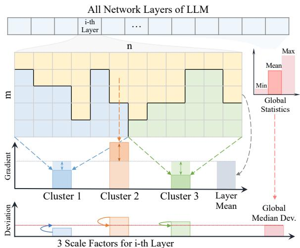  
Figure 1: Scaling with Gradient Grouping. Illustration of SGG with online grouping and group-specific learning rate (LR) scaling upon adaptive LR optimizers.

To address this, parameter-efficient fine-tuning (PEFT) (Hu et al., 2021; Dettmers et al., 2024) has garnered increasing attention, which reduces trainable parameters via low-rank updates. While memory-efficient, PEFT incurs performance degradation compared to full-rank training (Table 4) and requires architecture modification. In parallel, efforts have been made to compress optimizer states directly, e.g., by low-bit quantization or approximating gradient statistics (Shazeer and Stern, 2018; Luo et al., 2023; Zhu et al., 2024a). However, these generic approaches typically rely on heuristic priors that might discard crucial information, resulting in inconsistent efficacy across tasks (Table 5). This leaves practitioners at a deadlock: the compromise ofperformance in LLM training seems inevitable.

Recent studies light the way by revealing that different layers in LLMs (e.g., attention and MLP) exhibit distinct yet internally consistent optimization behaviors (Li et al., 2024c; Zhang et al., 2025b), suggesting potential redundancy in adaptive methods. Adam-mini (Zhang et al., 2024) thus partitions model parameters into pre-defined groups – each share an averaged learning rate, achieving minimal performance drop compared to previous attempts.

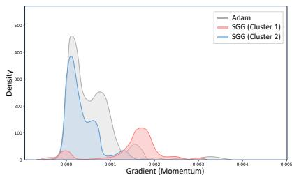  
(a) Gradiant Distribution

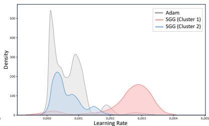  
(b) Learning Rate Distribution

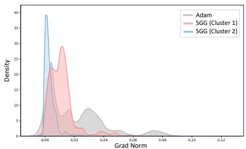  
(c) Grad Norm Distribution  
Figure 2: Clusters of gradient statistics with LLaMA-1B pre-training on C4. Distributions of (a) parameter-wise gradients $g ^ { t }$ and (b) learning rates $\alpha ^ { t }$ for 12-th FFN layer at 5k iterations. SGG identifies diverse clusters compared to Adam (in gray), introducing group constraints while maintaining parameter-wise adaptation. (c) Distribution of gradient $L _ { \mathrm { { 2 } } } \mathrm { { - n o r m s } }$ across layers, showcasing SGG’s ability to adapt to LLMs’ heterogeneity (Zhang et al., 2025b).

In this work, we propose to scale learning rates with grouping constraints rather than replace them. We first conduct pilot studies on LLaMA-1B pretraining to gain intuition. As shown in Figure 2, distinct clustering patterns are observed in layer-wise gradient statistics, which aligns with previous findings. However, they also exhibit noticeable characteristics (e.g., significant parameter-wise variations within each cluster, Sec. 2.2). This suggests that, while grouping is viable, retaining parameter-wise adaptation could still be beneficial for effective LLM training, especially in terms of performance, instead of replacing it with a single learning rate per group. Thus, we introduce Scaling with Gradient Grouping (SGG), an optimizer wrapper to bridge per-parameter and group-wise learning rate control. As illustrated in Figure 1 and Algorithm 1, SGG dynamically clusters gradient statistics (specifically momentum vectors $m _ { l } )$ in each layer l (Sec. 2.2) and then performs cluster-specific scaling according to their deviation relative to that layer’s and the entire model’s global statistics (Sec. 2.3), which thus imposes grouping constraints for homogenization while maintaining parameter-wise adaptability.

Experiments demonstrate that SGG consistently delivers performance gains and accelerates convergence across different LLM (Sec. 3.2) and MLLM (Sec. 3.3) benchmarks, such as pre-training on C4, supervised fine-tuning (SFT) on GLUE, PEFT on commonsense reasoning tasks, and Direct Preference Optimization (DPO). For instance, Adam combined with SGG could surpass recent optimizers on C4 pre-training across diverse model sizes (from 60M to 1B). More importantly, SGG enables low-rank pre-training to match full-rank performance without modifications to the training pipeline, yielding up to 30.4% lower validation perplexity over LoRA baselines – a huge step forward as previous low-rank optimizers often struggled.

Our contributions are as follows:

• We present SGG, a flexible optimizer wrapper that scales adaptive learning rates with online grouping constraints rather than replace them in pre-defined groups, balancing parameter-wise dynamics and collective optimization behavior.

• In practice, SGG integrates seamlessly with existing optimizers and PEFT techniques, requiring no changes to the training pipeline or model architectures. We also provide CPU, GPU, and hybrid implementations for different demands.

• SGG’s consistent superiority shows the potential of scaling adaptive learning rates with group-wise constraints. While SGG offers an effective instantiation of this scheme, different grouping and scaling strategies are conceivable and might inspire future studies along this line.

## 2 Methodology

## 2.1 Preliminaries and Problem Definition

To demonstrate the plug-and-play integration of our SGG, we first outline the essential steps in gradientbased optimizers, marked in blue in Algorithm 1.

The process typically begins with gradient computation. At iteration $t ,$ the gradient $g _ { l } ^ { t }$ of objective w.r.t. parameters $\theta _ { l } ^ { t - 1 }$ of layer l is calculated as:

$$
g _ { l } ^ { t } = \nabla _ { \theta _ { l } ^ { t - 1 } } \mathcal { L } ( \theta _ { l } ^ { t - 1 } , \mathcal { D } )\tag{1}
$$

where denotes the training dataset, and $\theta _ { l } ^ { t - 1 }$ is from previous iteration. Subsequently, historical gradient information is incorporated to stabilize the update, commonly referred to as momentum $m _ { l } ^ { t }$ While vanilla SGD (Sinha and Griscik, 1971) uses the current gradient instead $( m _ { l } ^ { t } = g _ { l } ^ { t } )$ , momentumbased methods often employ an exponential moving average (EMA) to smooth estimates over time:

$$
m _ { l } ^ { t } = \boldsymbol { \mathrm { M o m e n t u m E s t i m a t e } } ( g _ { l } ^ { t } , m _ { l } ^ { t - 1 } , \beta _ { 1 } )\tag{2}
$$

where $m _ { l } ^ { t - 1 }$ is from the last iteration, and the EMA decay $\beta _ { 1 }$ controls the retention of past gradients.

Table 1: Overview of typical optimizers (Opt.), PEFT techniques, and plug-and-play optimizer wrapper. We consider a neural net layer $W \in \mathbb { R } ^ { m \times n }$ $( m \leq n )$ with LoRA rank $r \ll$ m and SGG clusters $K \ll m$ . Both weights and optimizer states are included. (i) Optimization states. We compare the adaptive Learning Rate (LR) costs, i.e., the extra state for its estimation $( e . g .$ ., second moment, Non-negative Matrix Factorization (NMF), and SGG’s cluster indices). (ii) Different low-rank integration. (iii) Performance. We report the averaged PPL (%) for C4 pre-training in Table 4 as the illustration of performance gains with the relative GPU memory to Adam (full-rank) in PyTorch.
<table><tr><td>Category</td><td>Method|</td><td>Adaptive LR Basic State</td><td></td><td>Extra State</td><td>Low-Rank Plugin Extra Branch</td><td></td><td></td><td>C4↓</td><td>GPU Memory</td></tr><tr><td>Classical Opt.</td><td>SGD</td><td> $x$ </td><td>Weight &amp; Grad.</td><td> $\overline { x }$ </td><td>x</td><td> $x$ </td><td> $x$ </td><td></td><td>2mn</td></tr><tr><td>Adaptive LR Opt. Adam</td><td></td><td></td><td></td><td>Param-wise mn Weight &amp; Grad. 2ⁿd-Moment mn</td><td>x</td><td>x</td><td> $x$ </td><td>23.36</td><td>3mn</td></tr><tr><td>Efficient Opt.</td><td>CAME</td><td></td><td>Param-wise mn Weight &amp; Grad. NMF 2(m+n)</td><td></td><td>NMF</td><td>x</td><td> $x$ </td><td></td><td>-1.64 2mn+2(m+n)</td></tr><tr><td>PEFT</td><td>LoRA</td><td>x</td><td>Full-rank Grad.</td><td>x</td><td>LoRA</td><td>√</td><td> $\overline { { r ( m + n ) } }$ </td><td>+5.06</td><td> $\overline { { + 3 r ( m + n ) } }$ </td></tr><tr><td>Opt. Wrapper</td><td>SGG</td><td>Group-wise K</td><td>Base Opt.</td><td>Indices (mn+K)</td><td>Clustering</td><td> $\checkmark$ </td><td> $x$ </td><td>-1.99</td><td>+0</td></tr></table>

Algorithm 1 Scaling with Gradient Grouping   
Require: Parameters $\{ \theta _ { l } \} _ { l = 1 } ^ { L } ,$ global learning rate sched  
ule $\eta ,$ optimizer hyperparameters $( \beta _ { 1 } , \beta _ { 2 } )$ , objective ${ \mathcal { L } } ,$   
dataset . SGG hyperparameters: cluster number $K .$   
recluster interval $T , { \dot { } }$ scaling EMA decay $\beta _ { 3 }$   
Ensure: Optimized model parameters θ.   
1: Initialize:   
2: RandomIni $\mathrm { t } \big ( \{ \theta _ { l } ^ { 0 } \} _ { l = 1 } ^ { L } \big )$ ▷ Model parameters   
3: $\{ \alpha _ { l } ^ { 0 } \} _ { l = 1 } ^ { L }  \eta$ ▷ Adaptive learning rates   
4: $\{ { \mathcal C } _ { l } \} _ { l = 1 } ^ { L }  \mathbf { 0 }$ ▷ Cluster assignment   
5: $\{ S _ { l } \} _ { l = 1 } ^ { L }  \mathbf { 1 }$ ▷ Cluster scaling factor   
6: for each iteration $t = 1 , 2 , \dots$ . do   
7: $\eta ^ { t }  \mathrm { L R S c }$ heduler(η, t)   
8: for each layer $l = 1 , 2 , \ldots , L$ do   
9: // — Standard Gradient-based Update Steps —   
10: Gradient Computation   
11: $g _ { l } ^ { t } \gets \nabla _ { \theta _ { l } ^ { t - 1 } } \mathcal { L } ( \mathsf { \bar { \theta } } ^ { t - 1 } , \mathcal { D } )$   
12: Momentum Estimation   
13: mtl MomentumEstimate $( g _ { l } ^ { t } , m _ { l } ^ { t - 1 } , \beta _ { 1 } )$   
14: Adaptive Learning Rate Estimation   
15: αt LREstimate $\breve { ( \alpha _ { l } ^ { t - 1 } , m _ { l } ^ { t } , \beta _ { 2 } , \eta ^ { t } ) }$   
16: $/ / - S G G$ Specific Steps —   
17: if t mod $\dot { T } = = 0$ then ▷ Re-clutering   
18: Assign Gradient Clusters   
19: t GradCluster(mt, K)   
20: Update Cluster Scaling Factors   
21: Stl ← ScaleUpdate(Ctl , mtl , β3)   
22: end if   
23: Apply Learning Rate Scaling   
24: $\alpha _ { l } ^ { \hat { t } }  \alpha _ { l } ^ { t } \cdot S _ { l } ^ { t } [ \mathcal { C } _ { l } ^ { \hat { t } } ]$ ▷ Cluster-specific scaling   
25: Parameter Update   
26: $\ \theta _ { l } ^ { t } \gets \theta _ { l } ^ { t - 1 } - \mathbf { \bar { \alpha } } _ { l } ^ { t } \cdot m _ { l } ^ { t }$   
27: end for   
28: end for

Adaptive learning rate algorithms (e.g., Adam and AdaGrad) further refine the process by calculating parameter-wise or layer-wise second-moment estimates of gradients to calibrate step sizes:

$$
\alpha _ { l } ^ { t } = \tt L R E s t i m a t e  ( \alpha _ { l } ^ { t - 1 } , m _ { l } ^ { t } , \beta _ { 2 } , \eta ^ { t } )\tag{3}
$$

where $\eta _ { t }$ indicates the global learning rate set by scheduler at iteration $t ,$ and $\beta _ { 2 }$ is the EMA decay like $\beta _ { 1 }$ . Non-adaptive methods, in contrast, simply use the global one instead $( \alpha _ { l } ^ { t } = \eta ^ { t } )$ . Note that this learning rate adaptation typically increases memory overhead, particularly for large-scale models – a key challenge that most prior works aim to address.

In the last step, model parameters $\theta _ { l }$ are updated by the learning rate scaled momentum $( \alpha _ { l } ^ { t } \cdot m _ { l } ^ { t } )$

$$
\theta _ { l } ^ { t } = \theta _ { l } ^ { t - 1 } - \alpha _ { l } ^ { t } \cdot m _ { l } ^ { t }\tag{4}
$$

This paradigm is common in existing optimizers, mostly differing in how $m _ { l } ^ { t }$ and $\alpha _ { l } ^ { t }$ are derived. Notably, SGG (highlighted in green in Algorithm 1) builds upon this by leveraging these pre-computed states from the base optimizer to impose grouping constraints on parameter-wise $\alpha _ { l } ^ { t } ,$ , ensuring effortless integration with diverse optimizers, from SGD to APOLLO (Zhu et al., 2024a). In the following sections, we discuss the specific grouping and group-wise learning rate scaling strategies in SGG.

## 2.2 Gradient Grouping via Online Clustering

It has been observed that parameters in LLMs exhibit non-independent optimization behaviors, inherently forming intra-correlated groups (Li et al., ${ 2 0 2 4 \mathrm { c } } ;$ Zhang et al., 2025b). To build intuitions for this work, we first conduct an empirical analysis of gradient statistics with LLaMA pre-training on C4.

Pilot Studies. Figure 2 shows that gradient statistics, whether measured by layers or parameters, exhibit distinct clustering patterns, which aligns with previous findings. However, a crucial aspect of these clusters is their internal diversity – they exhibit considerable parameter-wise variations within each group. Second, subtle yet significant deviation can be identified in these cluster distributions when examining different statistics, such as gradients in Figure 2(a) and learning rates in Figure 2(b).

These findings lead to the following considerations: (i) Since the clustering patterns differ across optimization statistics (e.g., gradients vs. learning rates), methods relying on pre-defined fixed groups, such as Adam-mini (Zhang et al., 2024), might not effectively capture these distinct behaviors, suggesting the need for dynamic grouping strategies. (ii) While grouping has proven effective, replacing parameter-wise learning rates simply with a single, aggregated one per group (either pre-defined or dynamically derived) might not adapt to the observed parameter-wise variation, thus discarding essential optimization signals for effective LLM training.

To this end, we propose to scale learning rates through dynamic grouping rather than replace them in static groups, thereby imposing group constraint while maintaining parameter-wise adaptation.

Online Clustering. SGG begins with dynamic grouping as GradCluster $( m _ { l } ^ { t } , K )$ in Algorithm 1, which partitions momentum vectors $m _ { l } ^ { t }$ within each layer $l \in L$ into K groups with related indices $\mathcal { C } _ { l } ^ { t }$ according to their similarity. To achieve this, online clustering stands out as a straightforward solution, and the choice of specific clustering algorithms is then crucial for both effectiveness and efficiency. As such, we evaluate several potential strategies, including K-means, mini-batch K-means, Gaussian Mixture Models (GMM), and DBSCAN. Ablation studies in Figure 3 (perplexity versus training time) and Table 9 (hyper-parameters) show that minibatch K-means offer the most favorable trade-off between clustering quality and computational efficiency. Thus, we select this as the default clustering implementation of GradCluster $( m _ { l } ^ { t } , K )$ in SGG.

## 2.3 Cluster-specific Learning Rate Scaling

We introduce ScaleUpdate $( \mathcal { C } _ { l } ^ { t } , g _ { l } ^ { t } , \beta _ { 3 } )$ to calculate the scaling factor $S _ { l } ^ { t } [ c ]$ for each cluster $c \in K$ after grouping, which modulates learning rate $\alpha _ { l } ^ { t }$ . This involves two sub-tasks: (i) measuring the statistics for different levels of partitions (e.g., clusters, layers, and even the global one); (ii) updating clusterspecific scales $S _ { l } ^ { t } [ c ]$ based on above statistics. This contrasts with the previous Adam-mini (Zhang et al., 2024), which replaces per-parameter adaptive learning rates with their group-wise means directly.

Table 2: Group Statistics for SGG Scaling. Param. refers to Adam-like baselines. Validation PPL is reported with LLaMA on C4. MDA yields the best result.
<table><tr><td>Statistic Method</td><td>Var. Param.</td><td>Mean</td><td>Var. Sign(Var.) Mean</td><td>Grad. L2-norm</td><td>Grad. MAD</td><td>Grad. MDA</td></tr><tr><td>130M</td><td>25.08</td><td>22.76</td><td>22.67</td><td>22.58</td><td>24.62</td><td>22.18</td></tr><tr><td>1B</td><td>15.56</td><td>14.63</td><td>14.68</td><td>14.66</td><td>14.58</td><td>14.30</td></tr></table>

To determine an effective measure for each cluster c at layer $l \in L$ , we examine several candidates in Table 2. These include: (1) Within-cluster metrics: Mean in Adam-mini (Zhang et al., 2024), Variance, Sign of Variance in SignSGD (Bernstein et al., 2018), $L _ { 2 } .$ -norm in LARS (Ginsburg et al., 2018), and (2) Layer-aware metrics: Median Absolute Deviation (MAD). More importantly, recent studies show that severe discrepancies exist between the training dynamics of shallow and deep LLM layers, resulting in sudden loss spikes (Chowdhery et al., 2023; Molybog et al., 2023), exploding/vanishing gradients (Wang et al., 2024; Zhu et al., 2025), where the model’s performance deteriorate dramatically. This inspires us to incorporate a global perspective, beyond groups and layers, into SGG’s scaling process to promote training homogeneity.

To achieve this, we adopt Median ofDeviation to Average (MDA). For each cluster $c \in K$ in layer l at iteration $t ,$ its MDA, denoted $\mathcal { D } _ { l , c } ^ { t } .$ quantifies the median deviation of its constituent momentum $m _ { l } ^ { t } \cdot \mathcal { C } _ { l } ^ { t } [ c ]$ from the average of that layer, as:

$$
\mathcal { D } _ { l , c } ^ { t } = \mathrm { m e d i a n } \left( | m _ { l } ^ { t } \cdot \mathcal { C } _ { l } ^ { t } [ c ] - \mathrm { m e a n } ( m _ { l } ^ { t } ) | \right) ,\tag{5}
$$

where $\mathcal { C } _ { l } ^ { t } [ c ]$ denotes the selection mask for parameters in cluster c of layer l. To obtain a robust reference for homogenization, we compute a global MDA $\mathcal { D } ^ { t }$ which characterizes the typical parameterwise deviation throughout the model. The scaling factor $S _ { l } [ c ]$ of cluster c is then defined as the ratio of this global $\mathcal { D } ^ { t }$ to the cluster’s specific $\mathcal { D } _ { l , c } ^ { t }$ as:

$$
S _ { l } ^ { t } [ c ] = \frac { \mathcal { D } ^ { t } } { \mathcal { D } _ { l , c } ^ { t } + \epsilon } ,\tag{6}
$$

where $\epsilon = 1 0 ^ { - 8 }$ ensures numerical stability. Thus, clusters with a lower $\mathcal { D } _ { l , c } ^ { t }$ (more stable dynamics relative to global $\mathcal { D } ^ { t } )$ receive a proportionally larger factor $S _ { l } ^ { t } [ c ]$ . Conversely, clusters with higher, divergent MDAs are scaled down. Hence, this promotes learning homogeneity across layers and clusters, which mitigates discrepancies and suppresses divergent behavior that could lead to disruptive updates.

Table 3: Gains vs Costs. Relative gains in PPL and cost in training time and peak GPU memory increase for GPU, CPU, hybrid versions with LLaMA-1B on C4.
<table><tr><td>Method</td><td>PPL</td><td>Training Time Memory</td><td></td></tr><tr><td>Adam</td><td>15.56</td><td>110h</td><td>7.8G</td></tr><tr><td>Adam+SGG (GPU)</td><td>+6.5% (-1.00)</td><td>+1.8% (+2h)</td><td>+4.3G</td></tr><tr><td>Adam+SGG (CPU)</td><td>+6.5% (-1.00)</td><td>+8.2% (+9h)</td><td>+0.0G</td></tr><tr><td>Adam+SGG (Hybrid)</td><td></td><td>+6.5% (-1.00) +4.1% (+4h)</td><td>+2.1G</td></tr></table>

These factors are then clamped to [0.1, 10] and are updated periodically per $T$ iterations using an EMA to smooth out short-term fluctuations:

$$
S _ { l } ^ { t } [ c ] = \beta _ { 3 } \cdot S _ { l } ^ { t - 1 } [ c ] + ( 1 - \beta _ { 3 } ) \cdot \frac { \mathscr { D } ^ { t } } { \mathscr { D } _ { c , l } ^ { t } + \epsilon } ,\tag{7}
$$

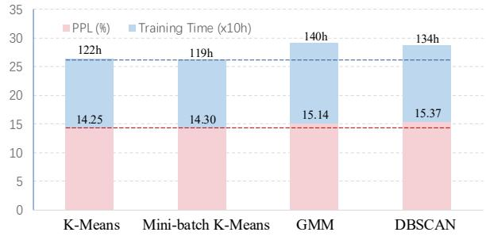  
Figure 3: Grouping Methods PPL-efficiency tradeoff with LLaMA-1B on C4. Blue bars show validation Perplexity (PPL ), and pink bars show training time. Mini-batch K-means achieves the best trade-off.

where $\beta _ { 3 }$ is the EMA decay rate. Subsequently, perparameter adaptive learning rates are multiplied by their corresponding group-wise scaling factors as $\alpha _ { l } ^ { t } \cdot S _ { l } ^ { t } [ \mathcal { C } _ { l } ^ { t } ]$ in Algorithm 1. Table 2 shows the effectiveness of using MDA for global homogenization while maintaining parameter-wise adaptation (e.g., 22.18 and 14.30 PPL for 130M and 1B models).

As for implementation, we consider two key trade-offs between performance and efficiency. (i) Clustering Strategies and Frequency: We evaluate four common approaches: K-means (Mac-Queen et al., 1967), mini-batch K-means (Sculley, 2010), GMM (Kambhatla and Leen, 1994), and DBSCAN (Ester et al., 1996). As shown in Figure 3, mini-batch K-means offer the best balance between accuracy and computational cost. We therefore adopt it as our default clustering strategy. We also empirically set the interval T as 10% of the total training iterations, as verified in Figure 6. (ii) Storage and Computation: As shown in Table 3, we compare the performance, training time, and GPU memory of putting them on the GPU or CPU. While keeping $\{ \mathcal { C } _ { l } \} _ { l = 1 } ^ { L }$ and $\{ \boldsymbol { S } _ { l } \} _ { l = 1 } ^ { L }$ in CPU would not slow the training, the peak GPU memory for online clustering is significant. Consequently, as stated in Table 1, we utilize the CPU implementation that stores additional optimization states on the CPU, which does not require extra GPU memory and increases the overall training time negligibly.

## 3 Experiments

## 3.1 Experimental Setup

Datasets and Tasks. To evaluate the effectiveness and versatility of SGG, we conducted experiments on 20 public datasets, including large-scale natural language datasets, Visual Question Answering (VQA), and multimodal LLM (MLLM) evaluation benchmarks. (1) Pre-training on C4: We used the en subset of C4 dataset, a large cleaned web corpus from Common Crawl filtered for safety (Köpf et al., 2023), to assess SGG in LLM pre-training. (2) SFT on GLUE: We fine-tuned RoBERTa-base models on GLUE benchmark. GLUE comprises a collection of NLP tasks, such as sentiment analysis, question answering, and textual entailment (Wang, 2018), providing a standard measurement of generalization in the understanding capabilities of common languages. (3) PEFT on Commonsense Reasoning: Leveraging the LLM-Adapters framework (Hu et al., 2023), we evaluated SGG’s compatibility and performance with PEFT methods on LLaMA architecture across 8 Commonsense Reasoning (CS) datasets: BoolQ (Clark et al., 2019), PIQA (Bisk et al., 2020), SIQA (Sap et al., 2019), HellaSwag (Zellers et al., 2019), WinoGrande (Sakaguchi et al., 2021), ARC (ARC-Easy and ARC-Challenge) (Clark et al., 2018), and OBQA (Mihaylov et al., 2018). (4) Direct Preference Optimization (DPO): To evaluate SGG in human preference alignment tasks, we implemented DPO using the TRL library. The Qwen2.5 0.5B model was trained on the ultrafeedback\_binarized dataset, which includes binary preference labels (von Werra et al., 2020). (5) MLLM Validation: (i) VQA benchmarks such as GQA (Hudson and Manning, 2019), TextVQA (Singh et al., 2019), SciVQAI (evaluation on the imageset of ScienceVQA) (Lu et al., 2022), VQAv2 (Goyal et al., 2017), and Vizwiz (Gurari et al., 2018). (ii) MLLM evaluation benchmarks including POPE (Li et al., 2023b), MMBench (Liu et al., 2025b), MMBench-Chinese (MMBenchCN) (Liu et al., 2025b), SEEDI (Li et al., 2023a), and MME (Perception) (Yin et al., 2023).

Table 4: C4 Pre-training with diverse LLaMA sizes (from 60M to 1B). Comparison of full-rank, memoryefficient, and low-rank optimizers. Validation Perplexity (PPL% : lower is better) is reported. Bold and green types denote the best results and gains of SGG (blue background) over related baselines (gray background). Note that denotes the results borrowed from GaLore, while the others were reimplemented in this work.
<table><tr><td>Method</td><td>Venue</td><td>60M</td><td>130M 350M</td><td>1B</td></tr><tr><td colspan="5">Pre-training with Full-Rank Optimizers</td></tr><tr><td>Adam†</td><td>ICLR&#x27;15</td><td>34.06 25.08</td><td></td><td>18.8015.56</td></tr><tr><td>NAdam</td><td>ICLR&#x27;18</td><td>35.86 28.88</td><td>19.24</td><td>15.78</td></tr><tr><td>RAdam</td><td>ICLR&#x27;20</td><td>30.43 25.17</td><td>19.13</td><td>15.65</td></tr><tr><td>LAMB</td><td>ICLR&#x27;20</td><td>33.04 24.37</td><td>18.26</td><td>15.84</td></tr><tr><td>Adan</td><td>TPAMI&#x27;23</td><td>32.01 23.14</td><td>17.32</td><td>14.70</td></tr><tr><td>Adam+SGG</td><td>Ours</td><td>30.31 22.18</td><td>17.28</td><td>8 14.30</td></tr><tr><td>∆ Gains</td><td></td><td>-3.75 -2.89</td><td>-1.52</td><td>-1.26</td></tr><tr><td colspan="5">Pre-training with Memory-efficient Optimizers</td></tr><tr><td>Adam-mini†</td><td>ICLR&#x27;25</td><td>34.10 24.85</td><td>19.05</td><td>16.07</td></tr><tr><td>Adafactor†</td><td>ICML&#x27;18</td><td>32.57 23.98</td><td>17.74</td><td>15.19</td></tr><tr><td>Low-Rank† CAME</td><td>arXiv&#x27;22</td><td>78.18 45.51</td><td>37.41</td><td>34.53</td></tr><tr><td>CAME+SGG</td><td>ACL&#x27;23</td><td>31.37 23.38</td><td></td><td>17.4514.68</td></tr><tr><td>∆ Gains</td><td>Ours</td><td>30.15 22.91</td><td>17.09</td><td>14.35</td></tr><tr><td></td><td></td><td>-1.22 -0.46</td><td>-0.36</td><td>-0.33</td></tr><tr><td>APOLLO†</td><td>MLSys&#x27;25</td><td>31.55 22.94</td><td></td><td>16.8514.20</td></tr><tr><td>APOLLO+SGG</td><td>Ours</td><td>30.18 22.52</td><td></td><td>16.54 13.95</td></tr><tr><td>∆ Gains</td><td></td><td>-1.37 -0.42</td><td>-0.31</td><td>-0.25</td></tr><tr><td colspan="5">Low-Rank Pre-training</td></tr><tr><td>LoRA†</td><td>ICLR&#x27;22</td><td>34.99 33.92 25.58 19.21</td><td></td><td></td></tr><tr><td>ReLoRA†</td><td>ICLR&#x27;23</td><td>37.04 29.37</td><td>29.08</td><td>18.33</td></tr><tr><td>GaLore†</td><td>ICML&#x27;24</td><td>34.88</td><td>25.36 18.95</td><td>15.64</td></tr><tr><td>LoRA+SGG</td><td>Ours</td><td>30.62 23.62</td><td></td><td>17.86 14.73</td></tr><tr><td>∆ Gains</td><td></td><td>-4.37</td><td>-10.30 -7.72</td><td>-4.48</td></tr><tr><td>Training Tokens</td><td></td><td>1.1B 2.2B</td><td>6.4B</td><td>13.1B</td></tr></table>

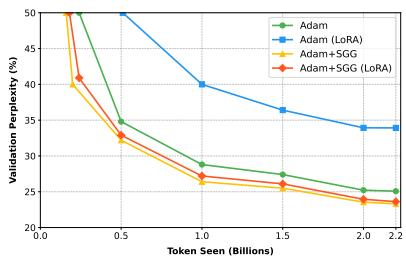  
(a) LLaMA-130M Pre-training

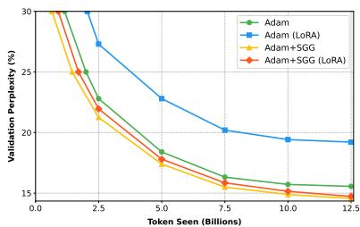  
(b) LLaMA-1B Pre-training

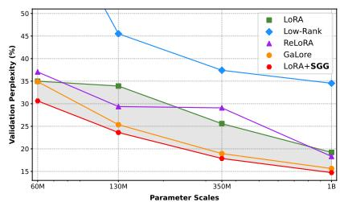  
(c) Parameter Scaling-up  
Figure 4: Convergence and Scaling-up on C4 Pre-training. Validation Perplexity (PPL% : lower is better) vs Training Tokens/Parameters. (a) LLaMA-130M and (b) LLaMA-1B training curves demonstrate faster convergence and lower PPL of SGG compared to baselines in both low-rank (Adam vs Adam+SGG) and full-rank (Adam vs Adam+SGG) settings. (c) LoRA+SGG consistently outperforms other low-rank methods as model size increases.

Implementation Details We implemented SGG in PyTorch, ensuring compatibility with standard optimizers through minimal code integration. Its key hyper-parameters were empirically tuned for optimal performance-efficiency trade-off as the default setups: cluster number K = 3, interval T = 500 (nearly 1 5% of total iterations), and decay coefficient $\beta _ { 3 } = 0 . 9 9 .$ . To minimize GPU memory demands, cluster indices and scaling factors can be optionally stored on the CPU. Table 3 confirms SGG’s negligible training time increase and preserved GPU memory footprint. Reproduced results are marked with gray and blue backgrounds, while the others are cited from their original papers. All experiments are conducted using NVIDIA A100-80G GPUs with three independent runs.

## 3.2 Comparison Results with LLMs

Across PT, SFT, PEFT, and DPO, SGG consistently improves performance with efficiency, highlighting its value as a versatile optimizer wrapper for LLMs.

Pre-training on C4. Following GaLore (Zhao et al., 2024a), we employ LLaMA-based architectures (60M to 1B) for both full-rank and low-rank pre-training. We keep consistent hyper-parameters, tuning learning rates within a fixed budget, and use BF16 precision for efficiency. Table 4 shows that applying SGG consistently reduces validation perplexity (-3.72% and -1.00% for AdamW in 60M and 1B; -10.30% and -4.48% for LoRA in 130M and 1B) and it accelerates convergence (Figure 4) compared to baselines. Notably, SGG for the first time enables low-rank pre-training (LoRA+SGG) to achieve performance comparable to full-rank training across model sizes (e.g., 14.73 vs 14.56 in 1B; 30.62 vs 30.34 in 60M), a huge step forward as previous low-rank optimizers typically lagged behind in performance. View Appendix A for details.

SFT on GLUE. We fine-tuned the pre-trained RoBERTa-base on various GLUE tasks. Table 5 shows that applying SGG yields consistent gains over baselines in both full-rank and low-rank (ranks 4 and 8) SFT scenarios. Notably, AdamW+SGG yields substantial average gains (+1.00% full-rank, +1.27% rank 4), with significant task-specific improvements (e.g., MRPC full-rank +1.35%, MNLI rank 4 +1.36%), demonstrating SGG’s versatility and robustness across different SFT constraints.

PEFT on Commonsense Reasoning. Following LLM-Adapters, we assess SGG in CS tasks with top-1 accuracy and GPU memory, where LLaMA-7B is fine-tuned by AdamW+LoRA (r = 32) on a unified training dataset, followed by evaluation on each specific subset. As shown in Table 6, SGG improves LoRA by an average of +2.9% across all tasks, with up to +4.2% gains on specific tasks like OBQA. It matches or surpasses PEFT baselines, such as Prefix (Li and Liang, 2021), Series(Houlsby et al., 2019), and Parallel (He et al., 2021), and more recent DoRA, GaLore, and Fira (Chen et al., 2024). View Table A4 and Appendix A for details.

DPO. We verify SGG’s effectiveness in aligning LLMs with human preferences using DPO, adhering to standard TRL library settings. SGG again demonstrates clear advantages. As shown in Ta-

Table 5: GLUE Benchmark Results with RoBERTa-base. Top-1 accuracy (% : higher is better) is reported. Comparison across both full-rank and low-rank (LoRA r = 4, r = 8) settings. Bold and green types denote the best results and performance gains of SGG (blue background) compared to related baselines (gray background).
<table><tr><td>Optimizer</td><td>Rank</td><td>CoLA</td><td>STS-B</td><td>MRPC</td><td>RTE</td><td>SST2</td><td>MNLI</td><td>QNLI</td><td>QQP</td><td>Average</td></tr><tr><td colspan="9">Full-Rank SFT</td><td></td></tr><tr><td>SGD</td><td>Full</td><td>62.12</td><td>90.73</td><td>87.74</td><td>79.06</td><td>94.26</td><td>87.53</td><td>92.29</td><td>92.22</td><td>85.74</td></tr><tr><td>AdamW</td><td>Full</td><td>62.24</td><td>90.92</td><td>91.30</td><td>79.42</td><td>94.57</td><td>87.18</td><td>92.33</td><td>92.28</td><td>86.24</td></tr><tr><td>LAMB</td><td>Full</td><td>62.09</td><td>90.59</td><td>88.72</td><td>75.45</td><td>94.72</td><td>87.71</td><td>92.42</td><td>91.46</td><td>85.40</td></tr><tr><td>CAME</td><td>Full</td><td>62.16</td><td>90.43</td><td>89.02</td><td>75.94</td><td>94.61</td><td>87.13</td><td>92.31</td><td>91.54</td><td>85.39</td></tr><tr><td>APOLLO</td><td>Full</td><td>62.45</td><td>90.70</td><td>90.36</td><td>77.53</td><td>94.58</td><td>87.57</td><td>92.40</td><td>92.12</td><td>85.96</td></tr><tr><td>AdamW+SGG</td><td>Full</td><td>63.36 +1.12</td><td>91.22 +0.30</td><td>92.65 +1.35</td><td>80.87 +1.45</td><td>95.58 +1.01</td><td>88.32 +1.14</td><td>92.88 +0.55</td><td>93.32 +1.04</td><td>87.28 +1.00</td></tr><tr><td>LAMB+SGG</td><td>Full</td><td>62.47 +0.38</td><td>90.90+0.31</td><td>89.46 +0.74</td><td>76.53 +1.08</td><td>94.95 +0.23</td><td>87.81 +0.10</td><td>92.89+0.47</td><td>91.78 +0.32</td><td> $8 5 . 8 5 ~ + 0 . 4 5$ </td></tr><tr><td colspan="9">Low-Rank SFT (rank 4)</td><td></td></tr><tr><td>SGD (LoRA)</td><td>4</td><td>60.32</td><td>90.31</td><td>87.75</td><td>79.06</td><td>94.27</td><td>87.39</td><td>92.16</td><td>91.89</td><td></td></tr><tr><td>AdamW (LoRA)</td><td>4</td><td>61.38</td><td>90.57</td><td>91.07</td><td>78.70</td><td>92.89</td><td>86.82</td><td>92.18</td><td>91.29</td><td>85.39</td></tr><tr><td>LAMB (LoRA)</td><td>4</td><td>61.51</td><td>90.33</td><td>89.46</td><td>74.73</td><td>94.27</td><td>87.51</td><td>92.48</td><td>91.57</td><td>85.61</td></tr><tr><td>DoRA</td><td>4</td><td>60.38</td><td>90.50</td><td>88.24</td><td>74.73</td><td>93.69</td><td></td><td>92.59</td><td></td><td>85.23</td></tr><tr><td>GaLore (LoRA)</td><td>4</td><td>60.35</td><td>90.73</td><td>92.25</td><td>79.42</td><td>94.04</td><td>87.00</td><td>92.24</td><td>91.06</td><td></td></tr><tr><td>AdamW+SGG</td><td>4</td><td>62.36 +0.98</td><td>91.10 +0.53</td><td>92.12 +1.05</td><td>80.51 +1.81</td><td></td><td></td><td></td><td></td><td>85.89</td></tr><tr><td>LAMB+SGG</td><td>4</td><td>62.47 +0.96</td><td>90.90+0.57</td><td>89.46 +0.30</td><td>75.53 +0.80</td><td>95.06 +2.17 94.95 +0.34</td><td>88.18 +1.36 87.73 +0.12</td><td>92.62 +0.44 92.92 +0.41</td><td>93.06 +1.77 91.78 +0.36</td><td>86.88 +1.27 85.72 +0.49</td></tr><tr><td colspan="9">Low-Rank SFT (rank 8)</td><td></td><td></td></tr><tr><td>SGD (LoRA)</td><td>8</td><td>60.57</td><td>90.29</td><td>88.48</td><td>79.42</td><td></td><td></td><td></td><td></td><td></td></tr><tr><td>AdamW (LoRA)</td><td>8</td><td>61.83</td><td>90.80</td><td>91.90</td><td>79.06</td><td>94.32</td><td>87.44</td><td>92.23</td><td>92.10</td><td>85.61</td></tr><tr><td>LAMB (LoRA)</td><td>8</td><td>61.89</td><td>90.78</td><td>89.21</td><td>79.42</td><td>93.46 94.61</td><td>86.94 87.61</td><td>92.25 92.51</td><td>91.22 91.42</td><td>85.93</td></tr><tr><td>DoRA</td><td>8</td><td>58.36</td><td>90.63</td><td>88.97</td><td>75.09</td><td>93.81</td><td></td><td>92.68</td><td></td><td>85.35</td></tr><tr><td>GaLore (LoRA)</td><td>8</td><td>60.06</td><td>90.82</td><td>92.01</td><td>79.78</td><td>94.38</td><td>87.17</td><td>92.20</td><td>91.11</td><td></td></tr><tr><td>AdamW+SGG</td><td>8</td><td>62.36 +0.53</td><td>91.10 +0.30</td><td>92.12 +0.22</td><td>80.51 +1.45</td><td>95.06 +1.60</td><td>88.17 +1.23</td><td>92.65 +0.40</td><td>92.85 +1.63</td><td>85.94</td></tr><tr><td>LAMB+SGG</td><td>8</td><td>62.47+0.58</td><td>90.90+0.12</td><td>89.46 +0.25</td><td>76.53 +1.80</td><td>94.95 +0.34</td><td>87.85 +0.24</td><td>92.87+0.36</td><td>91.78 +0.36</td><td>86.85 +0.92  $8 5 . 8 5 ~ + 0 . 5 0 ~ $ </td></tr></table>

Table 6: LLaMA-7B PEFT Results on Commonsense Reasoning. Comparison of LoRA+SGG (blue background) against baselines. Top-1 accuracy (% : higher is better) of selected tasks and all tasks on average (Avg.) are reported. Bold and green types denote the best results and gains compared to LoRA (gray background).
<table><tr><td>Method BoolQ</td><td colspan="4">PIQA SIQA WG Arc-E OBQA Avg.</td></tr><tr><td>Parallel</td><td>67.9 76.4</td><td>78.8 78.9</td><td>73.7 75.2</td><td></td><td>72.2</td></tr><tr><td>LoRA</td><td>68.9 80.7</td><td>77.4 78.8</td><td>77.8</td><td>74.8</td><td>74.7</td></tr><tr><td>DoRA GaLore</td><td>69.7 83.4</td><td>78.6 81.0</td><td>81.9</td><td>79.2</td><td>78.4</td></tr><tr><td>Fira</td><td>69.5 82.0 69.4 82.6</td><td>75.1 78.0 81.2</td><td>18.0 80.7 82.2</td><td>78.0 80.8</td><td>62.7 76.9</td></tr><tr><td>LoRA+SGG</td><td>70.3 83.6</td><td>78.8 80.9</td><td>81.5</td><td>79.0</td><td>77.6</td></tr><tr><td>∆ Gains</td><td>+1.4 +2.9</td><td>+1.4 +2.1</td><td>+3.7</td><td>+4.2</td><td>+2.9</td></tr><tr><td>DoRA+SGG</td><td>71.4 84.8</td><td>79.5 82.8</td><td>83.8</td><td>81.2</td><td>79.6</td></tr><tr><td>∆ Gains</td><td>+1.7 +1.4</td><td>+0.9</td><td>+1.8 +1.9</td><td>+2.0</td><td>+1.2</td></tr></table>

ble 7, AdamW+SGG achieves the highest accuracy (72.02%) under LoRA training, improving significantly (+1.80%) over AdamW and even surpassing its full rank counterpart (72.02% vs 71.85%), showcasing SGG’s potential to substantially improve alignment methods with favorable efficiency.

## 3.3 Comparison Results with MLLMs

We validate SGG’s effectiveness in MLLMs, following LLaVA-v1.5 with a pretrained Vicuna-v1.5- 7B (Chiang et al., 2023), pretrained 2 MLP, and a pretrained CLIP (Radford et al., 2021), supervised fine-tuned for one epoch with a batch size of 64. (i) Full-Rank SFT: AdamW, Adafactor, and LAMB are considered as baselines, with details of hyperparameters and settings provided in Table A5, and display results of mainstream MLLM methods. The results in Table 8 show that SGG boosts AdamW by +0.9% on average. When paired with Adafactor, SGG could offer +0.6% gains compared to baseline. Notably, SGG delivers an impressive +2.4% improvement on VizWiz. (ii) PEFT and Quantization: To rigorously evaluate SGG in resourceconstrained scenarios, we conduct PEFT (LoRA) and 8-bit Quantization LoRA (Q-LoRA (Dettmers et al., 2024)) with rank r = 128 and scaling factor $\alpha = 2 5 6$ . Table 8 shows that SGG achieves 65.1% average accuracy and yields +2.2% gains over LoRA on VizWiz. Furthermore, SGG also enhances QLoRA (8-bit) SFT by +0.6% on average. All these results demonstrate SGG’s versatility and effectiveness in boosting MLLM performance across SFT, PEFT, and quantized FT (Table A6).

Table 7: Qwen2.5-0.5B DPO Results with full-rank and LoRA setups. Top-1 accuracy(%) is reported. Bold and green types denote best results and relative gains.
<table><tr><td rowspan=1 colspan=1>Optimizer</td><td rowspan=1 colspan=1>Full-Rank</td><td rowspan=1 colspan=1>LoRA</td></tr><tr><td rowspan=1 colspan=1>SGD</td><td rowspan=1 colspan=1>70.10</td><td rowspan=1 colspan=1>69.73</td></tr><tr><td rowspan=1 colspan=1>AdamW</td><td rowspan=1 colspan=1>71.39</td><td rowspan=1 colspan=1>70.22</td></tr><tr><td rowspan=1 colspan=1>LAMB</td><td rowspan=1 colspan=1>70.82</td><td rowspan=1 colspan=1>70.39</td></tr><tr><td rowspan=1 colspan=1>SGD+SGG</td><td rowspan=1 colspan=1>70.82+0.72</td><td rowspan=1 colspan=1> $7 0 . 7 6 \ \pm 1 . 0 3$ </td></tr><tr><td rowspan=1 colspan=1>AdamW+SGG</td><td rowspan=1 colspan=1>71.85+0.47</td><td rowspan=1 colspan=1> $7 2 . 0 2 \ \mathrm { \Omega } + 1 . 8 0$ </td></tr><tr><td rowspan=1 colspan=1> $\mathbf { L A M B { + } S G G }$ </td><td rowspan=1 colspan=1>71.32+0.50</td><td rowspan=1 colspan=1> $7 1 . 2 8 + 0 . 8 9$ </td></tr></table>

## 3.4 Robustness to Learning Rate Scaling-up

Adam-like optimizers often struggle with the interplay between learning rate (LR) and batch size, leading to training instability (e.g., the surge phenomenon (Li et al., 2024b)) and meticulous tuning. In contrast, SGG shows exceptional robustness in this regard. During SFT on Alpaca (Taori et al., 2023) with Adam (Figure 5), SGG maintains stable validation loss across a wide spectrum of batch sizes (128 to 4096) and learning rates, even under extreme conditions like batch sizes of 4096 and LR of 0.1. This suggests that SGG effectively mitigates gradient outliers and dynamically adapts LRs, ensuring reliable training across diverse configurations. Please refer to Appendix C for details.

Table 8: MLLM performance comparison on diverse benchmarks with LLaVA variants and different optimizers. Top-1 accuracy (%) for selected tasks and all-task averaged (Avg.) results are reported. MMB and ${ \bf M M B } ^ { \mathrm { C N } }$ denote MMbench and MMbench (Chinese). Bold and green types denote the best results and gains of SGG (blue background) over related baselines (gray background). Please view Table A6 for the full results.
<table><tr><td rowspan="2">Optimizer</td><td colspan="4">Image Question Answering</td><td colspan="2">Benchmarks</td><td rowspan="2">Avg.</td></tr><tr><td colspan="3">GQA VizWiz SciVQA1 VQAT</td><td colspan="2">MMB MMBCN POPE</td></tr><tr><td>BLIP-2</td><td>41.0</td><td>19.6</td><td>61.0</td><td>42.5</td><td></td><td>85.3</td><td></td></tr><tr><td>InstructBLIP</td><td>49.2</td><td>34.5</td><td>60.5</td><td>50.1</td><td>36.0 23.7</td><td></td><td>79.847.7</td></tr><tr><td>Qwen-VL</td><td>59.3</td><td>35.2</td><td>67.1</td><td>63.8</td><td>38.2 7.4</td><td></td><td></td></tr><tr><td>TinyLLaVA</td><td>62.0</td><td></td><td>69.1</td><td>59.1</td><td>66.9 一</td><td>86.4</td><td></td></tr><tr><td>MoE-LLaVA</td><td>62.6</td><td>一</td><td>70.3</td><td>57.0 68.0</td><td>一</td><td>85.7</td><td></td></tr><tr><td>LLaVA-Phi</td><td></td><td></td><td>68.4</td><td>48.6 59.8</td><td></td><td>85.0</td><td></td></tr><tr><td>LLaVA-NeXT</td><td>64.2</td><td>57.6</td><td>70.1</td><td>64.9</td><td>67.4 60.6</td><td></td><td>86.5 67.3</td></tr><tr><td>LLaVA-MOD</td><td>58.7</td><td>39.2</td><td>68.0</td><td>58.5</td><td>66.3 61.9</td><td></td><td>87.0 62.8</td></tr><tr><td>LLaVA-KD-2B</td><td>62.3</td><td>44.7</td><td>64.7</td><td>53.4</td><td>64.0 63.7</td><td></td><td>86.3 62.7</td></tr><tr><td colspan="8">LLaVA-v1.5 Full-Rank SFT</td></tr><tr><td>AdamW</td><td>62.0 50.0</td><td></td><td>66.8</td><td>58.2 64.3</td><td>58.3</td><td></td><td>85.9 63.6</td></tr><tr><td>Adafactor</td><td>62.7</td><td>48.2</td><td>70.7</td><td>57.1</td><td>66.1</td><td>60.4</td><td>86.064.5</td></tr><tr><td>LAMB</td><td>43.8</td><td>53.3</td><td>61.5</td><td>43.4</td><td>43.2</td><td>41.8</td><td>81.2 52.6</td></tr><tr><td>AdamW+SGG</td><td>62.4</td><td>50.2</td><td>69.8</td><td>57.4</td><td>65.9</td><td>60.1</td><td>86.3 64.6</td></tr><tr><td>∆ Gains</td><td>+0.4</td><td>+0.2</td><td>+3.0</td><td>-0.8</td><td>+1.6</td><td>+1.8</td><td>+0.4 +1.0</td></tr><tr><td>Adafactor+SGG</td><td>62.8</td><td>50.6</td><td>71.6</td><td>57.3</td><td>66.3</td><td>60.8</td><td>86.065.1</td></tr><tr><td>∆ Gains</td><td>+0.1</td><td>+2.4</td><td>+0.9</td><td>+0.2</td><td>+0.2</td><td>+0.4</td><td>+0.0 +0.6</td></tr><tr><td>LAMB+SGG</td><td>44.0</td><td>53.3</td><td>61.8</td><td>43.5</td><td>43.3</td><td>41.9</td><td>81.3 52.7</td></tr><tr><td>∆ Gains</td><td>+0.2</td><td>+0.0</td><td>+0.3</td><td>+0.1</td><td>+0.1</td><td>+0.1</td><td>+0.1 +0.1</td></tr><tr><td colspan="8">LLaVA-v1.5 Low-Rank SFT (AdamW)</td></tr><tr><td>LoRA</td><td>63.0</td><td>47.8</td><td>68.4</td><td>58.2</td><td>66.1</td><td>58.9</td><td>86.4 64.1</td></tr><tr><td>LoRA+SGG</td><td>63.4</td><td>51.0</td><td>70.1</td><td>58.6</td><td>66.7</td><td>59.4</td><td>86.6 65.1</td></tr><tr><td>∆ Gains</td><td>+0.4 +2.2</td><td></td><td>+1.5</td><td>+0.4</td><td>+0.6</td><td>+0.5</td><td> $+ 0 . 2 \ + 1 . 0$ </td></tr><tr><td colspan="8">LLaVA-v1.5 8-bit Low-Rank SFT (AdamW)</td></tr><tr><td>Q-LoRA</td><td>54.3</td><td>50.7</td><td>66.4</td><td>52.5</td><td>56.0</td><td>49.8</td><td>82.9 58.9</td></tr><tr><td>Q-LoRA+SGG</td><td>55.1</td><td>51.3</td><td>66.7</td><td>53.0</td><td>56.1 51.0</td><td></td><td>83.4 59.5</td></tr><tr><td>∆ Gains</td><td>+0.8</td><td>+0.6</td><td>+0.3</td><td>+0.5 +0.1</td><td>+0.2</td><td></td><td>+0.5 +0.6</td></tr></table>

## 3.5 Ablation Studies

We analyze the three key hyper-parameters in SGG. (i) Cluster number: Table 9 shows that K can be easily set to {2,3} for diverse tasks according to the mini-batch K-means diagnostics. (ii) Interval: The interval T can be set as 5% of the total training iterations, e.g., T = 500 for LLaMA-60M yields strong results, as shown in Figure 6(a). (iii) LR scaling decay: Figure 6(b) demonstrates that SGG is insensitive to the precise value of scaling decay $\beta _ { 3 } .$ , with $\beta _ { 3 } = 0 . 9 9$ proving a robust choice.

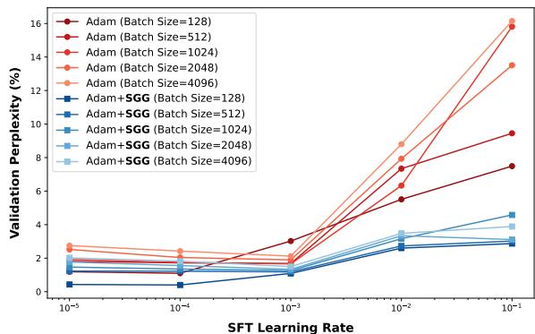

Figure 5: Learning Rate and Batch Size Scaling-up with Qwen2.5-0.5B SFT on Alpaca. Validation loss vs SFT Learning Rate for Adam and Adam+SGG across various batch sizes (128 to 4096). SGG offers consistent robustness over a wider range of hyper-parameters.  
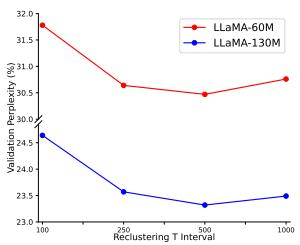  
(a) Recluster Interval T

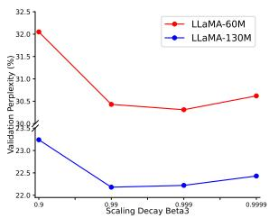  
(b) Scaling Decay $\beta _ { 3 }$  
Figure 6: Ablation of Hyperparameters with LLaMA-60M and LLaMA-130M pre-training on C4. Validation Perplexity (PPL % : lower is better) vs. (a) Recluster Interval T (% total iterations) and (b) EMA Decay $\beta _ { 3 }$ The results demonstrate that T 500 and $\beta _ { 3 } = 0 . 9 9$ are the most favorable settings for SGG upon Adam.

Table 9: Ablation studies of the number of SGG clusters K (task-relevant) across different tasks and models. ERR denotes the mini-batch K-means running errors.
<table><tr><td rowspan=1 colspan=2>Task</td><td rowspan=1 colspan=1>Model</td><td rowspan=1 colspan=1>K=1 (Adam)</td><td rowspan=1 colspan=1>K=2 K=3</td><td rowspan=1 colspan=1>K=4</td></tr><tr><td rowspan=3 colspan=2>C4↓C4↓GLUE (MNLI)↑</td><td rowspan=1 colspan=1>LLaMA-60M</td><td rowspan=1 colspan=1>34.1</td><td rowspan=1 colspan=1>30.3 30.8</td><td rowspan=1 colspan=1>ERR</td></tr><tr><td rowspan=2 colspan=1>E (MNLID)↑</td><td rowspan=2 colspan=1>LLaMA-130MRoBERT-Base</td><td rowspan=1 colspan=1>25.1</td><td rowspan=1 colspan=1>23.323.5</td><td rowspan=1 colspan=1>ERR</td></tr><tr><td rowspan=1 colspan=1>87.2</td><td rowspan=1 colspan=1>88.3 87.9</td><td rowspan=1 colspan=1>ERR</td></tr><tr><td rowspan=1 colspan=2>MLLM↑</td><td rowspan=1 colspan=1>LLaVA-1.5-7B</td><td rowspan=1 colspan=1>63.6</td><td rowspan=1 colspan=1>64.2 64.5</td><td rowspan=1 colspan=1>64.3</td></tr></table>

## 4 Related Work

Efficient Optimizers. Adaptive learning rate optimizers (Loshchilov and Hutter, 2019) are prevalent in training LLMs due to their balance of convergence speed and generalization. However, their effectiveness might diminish at scale because of the reliance on global gradient statistics, which overlook the inherent heterogeneity in LLMs (Zhao et al., 2024b; Zhang et al., 2025b). This heterogeneity, combined with the low-rank properties of LLMs, often leads to inefficient parameter updates and suboptimal convergence (Chen et al., 2024; Zhao et al., 2024a). Traditional methods like

Adam exhibit limitations in handling gradient dynamics under LLM low-rank constraints (Li et al., 2024a), prompting the development of memoryefficient optimizers such as BAdam (Luo et al., 2025) and LISA (Pan et al., 2025). Techniques like Adam-mini (Zhang et al., 2024) and APOLLO (Zhu et al., 2024a) further demonstrate that reduced learning rates or SGD-like memory footprints can achieve competitive performance. Nevertheless, challenges persist, particularly in scaling optimization for large models, as evidenced by the surge phenomenon in optimal learning rate and batch size scaling (Li et al., 2024b). Recent studies like SPAM (Huang et al., 2025) and CAME (Luo et al., 2023) introduce momentum reset and confidence-guided strategies to stabilize training. SGG addresses these issues by grouping gradients and applying groupspecific scaling, ensuring tailored learning rates.

Parameter-efficient Fine-tuning. Parameterefficient Fine-tuning (PEFT) has become essential for adapting LLMs to downstream tasks efficiently. LoRA (Hu et al., 2021) as a foundational PEFT technique significantly reduces the computational costs by training only a small number of low-rank perturbation matrices added to the pre-trained weights. Recent extensions like DoRA variants (Liu et al., 2024c; Nasiri and Garraghan, 2025) further improve adaptation efficiency while maintaining performance. Despite their success, LoRA-based methods exhibit limitations: reliance on Dropout for regularization can be ineffective, especially in short training regimes (Kamalakara et al., 2022). Suboptimal initialization can impede convergence in sparse data scenarios, and static scaling factors hinder adaptive tuning of learning rates (Dettmers et al., 2023). While recent efforts like LoRA+ (Hayou et al., 2024) and LoRA-XS (Bałazy et al., 2024) attempt to mitigate some of these issues, challenges persist, particularly in complex multi-modality perception tasks (Ma et al., 2024) and broader PEFT applications (Zhang et al., 2025a). These limitations underscore the need for low-rank optimization that is migratable and can adjust learning rates with the low-rank property, which could be addressed by the gradient grouping-based learning rate scaling in SGG.

## 5 Conclusion

This paper presents SGG, an optimizer wrapper to address the challenges in LLM training. SGG clusters momentum vectors in each layer and computes cluster-specific scaling factors to modulate parameter-wise learning rates. Experiments demonstrate SGG’s versatility and effectiveness with consistent performance gains and faster convergence when integrated with other optimizers and LoRA.

## 6 Discussion and Limitations

Border Impact. As LLM applications continue to expand, the development of efficient but effective optimization algorithms has become crucial. SGG offers a fresh perspective along this line. Unlike LoRA variants and several memory-efficient optimizers that may rely on techniques like Nonnegative Matrix Factorization (NMF) for parameter or gradient approximation, SGG employs gradient clustering within each network layer and performs cluster-specific scaling to parameter-wise adaptive learning rates. This makes SGG flexible and integrates seamlessly with general and memoryefficient optimizers, and LoRA techniques, with consistent performance gains across various LLM & MLLM applications with negligible extra cost.

Limitations and Discussion. While SGG shows great promise, its implementation highlights several avenues for further exploration along this line: (1) Grouping policies: SGG’s reliance on online clustering for dynamic grouping, though intuitive and effective, represents only one specific choice. Its framework of adaptive learning rate scaling is inherently flexible, which could include a broader spectrum of complex grouping strategies such as more precise online clustering, heuristicbased static partitioning, or even learned grouping functions, any of which might offer different performance-efficiency trade-offs for diverse scenarios and demands. (2) Computational Efficiency: While the CPU offloading mitigates GPU burden, the online clustering in SGG still brings significant cost, which presents a huge concern in resource-constrained scenarios. Future work could focus on lightweight grouping techniques or methods that could approximate grouping benefits without explicit clustering, further enhancing SGG’s applicability. (3) Evaluation Scope: Our validation covers diverse benchmarks, yet extending SGG’s evaluation to an even wider array of tasks, model architectures (e.g., Mixture-of-Experts), and data scales would provide deeper insights into its generalization capabilities and potentially uncover new avenues for effective LLM optimization.

## Acknowledgement

This research is supported in part by the Early Career Scheme of the Research Grants Council (RGC) of the Hong Kong SAR under grant No. 26202321 and HKUST Startup Fund No. R9253. This work was done when Juanxi Tian and Xin Jin interned at Westlake University and Peking University. The authors thank the Westlake University AI Station for supporting GPUs.

## References

Jinze Bai, Shuai Bai, Shusheng Yang, Shijie Wang, Sinan Tan, Peng Wang, Junyang Lin, Chang Zhou, and Jingren Zhou. 2023. Qwen-vl: A frontier large vision-language model with versatile abilities. arXiv preprint arXiv:2308.12966.

Klaudia Bałazy, Mohammadreza Banaei, Karl Aberer, and Jacek Tabor. 2024. Lora-xs: Low-rank adaptation with extremely small number of parameters. arXiv preprint arXiv:2405.17604.

Jeremy Bernstein, Yu-Xiang Wang, Kamyar Azizzadenesheli, and Anima Anandkumar. 2018. signsgd: compressed optimisation for non-convex problems. In International Conference on Machine Learning.

Yonatan Bisk, Rowan Zellers, Jianfeng Gao, Yejin Choi, et al. 2020. Piqa: Reasoning about physical commonsense in natural language. In Proceedings of the AAAI conference on artificial intelligence, pages 7432–7439.

Yuxuan Cai, Jiangning Zhang, Haoyang He, Xinwei He, Ao Tong, Zhenye Gan, Chengjie Wang, and Xiang Bai. 2024. Llava-kd: A framework of distilling multimodal large language models. arXiv preprint arXiv:2410.16236.

Xi Chen, Kaituo Feng, Changsheng Li, Xunhao Lai, Xiangyu Yue, Ye Yuan, and Guoren Wang. 2024. Fira: Can we achieve full-rank training of llms under lowrank constraint? arXiv preprint arXiv:2410.01623.

Xiangning Chen, Chen Liang, Da Huang, Esteban Real, Kaiyuan Wang, Hieu Pham, Xuanyi Dong, Thang Luong, Cho-Jui Hsieh, Yifeng Lu, and Quoc V Le. 2023. Symbolic discovery of optimization algorithms. In Thirty-seventh Conference on Neural Information Processing Systems.

Wei-Lin Chiang, Zhuohan Li, Zi Lin, Ying Sheng, Zhanghao Wu, Hao Zhang, Lianmin Zheng, Siyuan Zhuang, Yonghao Zhuang, Joseph E Gonzalez, et al. 2023. Vicuna: An open-source chatbot impressing gpt-4 with 90%\* chatgpt quality. See https://vicuna. lmsys. org (accessed 14 April 2023), 2(3):6.

Aakanksha Chowdhery, Sharan Narang, Jacob Devlin, Maarten Bosma, Gaurav Mishra, Adam Roberts, Paul

Barham, Hyung Won Chung, Charles Sutton, Sebastian Gehrmann, et al. 2023. Palm: Scaling language modeling with pathways. Journal ofMachine Learning Research, 24(240):1–113.

Christopher Clark, Kenton Lee, Ming-Wei Chang, Tom Kwiatkowski, Michael Collins, and Kristina Toutanova. 2019. Boolq: Exploring the surprising difficulty of natural yes/no questions. arXiv preprint arXiv:1905.10044.

Peter Clark, Isaac Cowhey, Oren Etzioni, Tushar Khot, Ashish Sabharwal, Carissa Schoenick, and Oyvind Tafjord. 2018. Think you have solved question answering? try arc, the ai2 reasoning challenge. arXiv preprint arXiv:1803.05457.

Wenliang Dai, Junnan Li, Dongxu Li, Anthony Meng Huat Tiong, Junqi Zhao, Weisheng Wang, Boyang Li, Pascale Fung, and Steven Hoi. 2023. Instructblip: Towards general-purpose vision-language models with instruction tuning. arXiv preprint arXiv:2305.06500.

Tim Dettmers, Artidoro Pagnoni, Ari Holtzman, and Luke Zettlemoyer. 2023. Qlora: Efficient finetuning of quantized llms. Advances in neural information processing systems, 36:10088–10115.

Tim Dettmers, Artidoro Pagnoni, Ari Holtzman, and Luke Zettlemoyer. 2024. Qlora: Efficient finetuning of quantized llms. Advances in Neural Information Processing Systems, 36.

Martin Ester, Hans-Peter Kriegel, Jörg Sander, and Xiaowei Xu. 1996. A density-based algorithm for discovering clusters in large spatial databases with noise. In Knowledge Discovery and Data Mining.

Boris Ginsburg, Igor Gitman, and Yang You. 2018. Large batch training of convolutional networks with layer-wise adaptive rate scaling. In International Conference on Learning Representations (ICLR).

Yash Goyal, Tejas Khot, Douglas Summers-Stay, Dhruv Batra, and Devi Parikh. 2017. Making the v in vqa matter: Elevating the role of image understanding in visual question answering. In Proceedings ofthe IEEE conference on computer vision and pattern recognition, pages 6904–6913.

Danna Gurari, Qing Li, Abigale J Stangl, Anhong Guo, Chi Lin, Kristen Grauman, Jiebo Luo, and Jeffrey P Bigham. 2018. Vizwiz grand challenge: Answering visual questions from blind people. In Proceedings of the IEEE conference on computer vision and pattern recognition, pages 3608–3617.

Soufiane Hayou, Nikhil Ghosh, and Bin Yu. 2024. Lora+: Efficient low rank adaptation of large models. arXiv preprint arXiv:2402.12354.

Junxian He, Chunting Zhou, Xuezhe Ma, Taylor Berg-Kirkpatrick, and Graham Neubig. 2021. Towards a unified view of parameter-efficient transfer learning. International Conference on Learning Representations (ICLR).

Neil Houlsby, Andrei Giurgiu, Stanislaw Jastrzebski, Bruna Morrone, Quentin de Laroussilhe, Andrea Gesmundo, Mona Attariyan, and Sylvain Gelly. 2019. Parameter-efficient transfer learning for nlp. ArXiv.

Edward J Hu, Yelong Shen, Phillip Wallis, Zeyuan Allen-Zhu, Yuanzhi Li, Shean Wang, Lu Wang, and Weizhu Chen. 2021. Lora: Low-rank adaptation of large language models. arXiv preprint arXiv:2106.09685.

Zhiqiang Hu, Lei Wang, Yihuai Lan, Wanyu Xu, Ee-Peng Lim, Lidong Bing, Xing Xu, Soujanya Poria, and Roy Ka-Wei Lee. 2023. Llm-adapters: An adapter family for parameter-efficient finetuning of large language models. arXiv preprint arXiv:2304.01933.

Tianjin Huang, Ziquan Zhu, Gaojie Jin, Lu Liu, Zhangyang Wang, and Shiwei Liu. 2025. Spam: Spike-aware adam with momentum reset for stable llm training. arXiv preprint arXiv:2501.06842.

Drew A Hudson and Christopher D Manning. 2019. Gqa: A new dataset for real-world visual reasoning and compositional question answering. In Proceedings of the IEEE/CVF conference on computer vision and pattern recognition, pages 6700–6709.

Siddhartha Rao Kamalakara, Acyr Locatelli, Bharat Venkitesh, Jimmy Ba, Yarin Gal, and Aidan N Gomez. 2022. Exploring low rank training of deep neural networks. arXiv preprint arXiv:2209.13569.

Nanda Kambhatla and Todd K. Leen. 1994. Classifying with gaussian mixtures and clusters. In Advances in Neural Information Processing Systems (NeurIPS), page 681–688, Cambridge, MA, USA. MIT Press.

Diederik P. Kingma and Jimmy Ba. 2015. Adam: A method for stochastic optimization. In International Conference on Learning Representations (ICLR).

Andreas Köpf, Yannic Kilcher, Dimitri Von Rütte, Sotiris Anagnostidis, Zhi Rui Tam, Keith Stevens, Abdullah Barhoum, Duc Nguyen, Oliver Stanley, Richárd Nagyfi, et al. 2023. Openassistant conversations-democratizing large language model alignment. Advances in Neural Information Processing Systems, 36:47669–47681.

Bohao Li, Rui Wang, Guangzhi Wang, Yuying Ge, Yixiao Ge, and Ying Shan. 2023a. Seed-bench: Benchmarking multimodal llms with generative comprehension. arXiv preprint arXiv:2307.16125.

Guangyan Li, Yongqiang Tang, and Wensheng Zhang. 2024a. Lorap: Transformer sub-layers deserve differentiated structured compression for large language models. arXiv preprint arXiv:2404.09695.

Junnan Li, Dongxu Li, Caiming Xiong, and Steven Hoi. 2022. Blip: Bootstrapping language-image pretraining for unified vision-language understanding and generation. In International conference on machine learning, pages 12888–12900. PMLR.

Shuaipeng Li, Penghao Zhao, Hailin Zhang, Xingwu Sun, Hao Wu, Dian Jiao, Weiyan Wang, Chengjun Liu, Zheng Fang, Jinbao Xue, et al. 2024b. Surge phenomenon in optimal learning rate and batch size scaling. arXiv preprint arXiv:2405.14578.

Siyuan Li, Juanxi Tian, Zedong Wang, Luyuan Zhang, Zicheng Liu, Weiyang Jin, Yang Liu, Baigui Sun, and Stan Z Li. 2024c. Unveiling the backbone-optimizer coupling bias in visual representation learning. arXiv preprint arXiv:2410.06373.

Xiang Lisa Li and Percy Liang. 2021. Prefix-tuning: Optimizing continuous prompts for generation. Proceedings of the 59th Annual Meeting of the Association for Computational Linguistics and the 11th International Joint Conference on Natural Language Processing, pages 4582–4597.

Yifan Li, Yifan Du, Kun Zhou, Jinpeng Wang, Xin Zhao, and Ji-Rong Wen. 2023b. Evaluating object hallucination in large vision-language models. In The 2023 Conference on Empirical Methods in Natural Language Processing.

Vladislav Lialin, Sherin Muckatira, Namrata Shivagunde, and Anna Rumshisky. 2023. Relora: Highrank training through low-rank updates. In The Twelfth International Conference on Learning Representations.

Bin Lin, Zhenyu Tang, Yang Ye, Jiaxi Cui, Bin Zhu, Peng Jin, Junwu Zhang, Munan Ning, and Li Yuan. 2024. Moe-llava: Mixture of experts for large visionlanguage models. arXiv preprint arXiv:2401.15947.

Haotian Liu, Chunyuan Li, Yuheng Li, Bo Li, Yuanhan Zhang, Sheng Shen, and Yong Jae Lee. 2024a. Llavanext: Improved reasoning, ocr, and world knowledge.

Haotian Liu, Chunyuan Li, Qingyang Wu, and Yong Jae Lee. 2024b. Visual instruction tuning. Advances in neural information processing systems, 36.

Jingyuan Liu, Jianlin Su, Xingcheng Yao, Zhejun Jiang, Guokun Lai, Yulun Du, Yidao Qin, Weixin Xu, Enzhe Lu, Junjie Yan, et al. 2025a. Muon is scalable for llm training. arXiv preprint arXiv:2502.16982.

Liyuan Liu, Haoming Jiang, Pengcheng He, Weizhu Chen, Xiaodong Liu, Jianfeng Gao, and Jiawei Han. 2020a. On the variance of the adaptive learning rate and beyond. In International Conference on Learning Representations.

Liyuan Liu, Xiaodong Liu, Jianfeng Gao, Weizhu Chen, and Jiawei Han. 2020b. Understanding the difficulty of training transformers. In Conference on Empirical Methods in Natural Language Processing.

Shih-Yang Liu, Chien-Yi Wang, Hongxu Yin, Pavlo Molchanov, Yu-Chiang Frank Wang, Kwang-Ting Cheng, and Min-Hung Chen. 2024c. Dora: Weightdecomposed low-rank adaptation. arXiv preprint arXiv:2402.09353.

Yuan Liu, Haodong Duan, Yuanhan Zhang, Bo Li, Songyang Zhang, Wangbo Zhao, Yike Yuan, Jiaqi Wang, Conghui He, Ziwei Liu, et al. 2025b. Mmbench: Is your multi-modal model an all-around player? In European conference on computer vision, pages 216–233. Springer.

Ilya Loshchilov and Frank Hutter. 2019. Decoupled weight decay regularization. In International Conference on Learning Representations (ICLR).

Pan Lu, Swaroop Mishra, Tanglin Xia, Liang Qiu, Kai-Wei Chang, Song-Chun Zhu, Oyvind Tafjord, Peter Clark, and Ashwin Kalyan. 2022. Learn to explain: Multimodal reasoning via thought chains for science question answering. Advances in Neural Information Processing Systems, 35:2507–2521.

Qijun Luo, Hengxu Yu, and Xiao Li. 2025. Badam: A memory efficient full parameter optimization method for large language models. Advances in Neural Information Processing Systems, 37:24926–24958.

Yang Luo, Xiaozhe Ren, Zangwei Zheng, Zhuo Jiang, Xin Jiang, and Yang You. 2023. Came: Confidence-guided adaptive memory efficient optimization. arXiv preprint arXiv:2307.02047.

Feipeng Ma, Hongwei Xue, Guangting Wang, Yizhou Zhou, Fengyun Rao, Shilin Yan, Yueyi Zhang, Siying Wu, Mike Zheng Shou, and Xiaoyan Sun. 2024. Visual perception by large language model’s weights. arXiv preprint arXiv:2405.20339.

James MacQueen et al. 1967. Some methods for classification and analysis of multivariate observations. In Proceedings of the fifth Berkeley symposium on mathematical statistics and probability, pages 281–297.

Todor Mihaylov, Peter Clark, Tushar Khot, and Ashish Sabharwal. 2018. Can a suit of armor conduct electricity? a new dataset for open book question answering. arXiv preprint arXiv:1809.02789.

Igor Molybog, Peter Albert, Moya Chen, Zachary De-Vito, David Esiobu, Naman Goyal, Punit Singh Koura, Sharan Narang, Andrew Poulton, Ruan Silva, Binh Tang, Diana Liskovich, Puxin Xu, Yuchen Zhang, Melissa Hall Melanie Kambadur, Stephen Roller, and Susan Zhang. 2023. A theory on adam instability in large-scale machine learning. ArXiv, abs/2304.09871.

Hamid Nasiri and Peter Garraghan. 2025. Edora: Efficient weight-decomposed low-rank adaptation via singular value decomposition. arXiv preprint arXiv:2501.12067.

Rui Pan, Xiang Liu, Shizhe Diao, Renjie Pi, Jipeng Zhang, Chi Han, and Tong Zhang. 2025. Lisa: layerwise importance sampling for memory-efficient large language model fine-tuning. Advances in Neural Information Processing Systems, 37:57018–57049.

Alec Radford, Jong Wook Kim, Chris Hallacy, Aditya Ramesh, Gabriel Goh, Sandhini Agarwal, Girish Sastry, Amanda Askell, Pamela Mishkin, Jack Clark, et al. 2021. Learning transferable visual models from natural language supervision. In International conference on machine learning, pages 8748–8763. PMLR.

Sashank J. Reddi, Satyen Kale, and Surinder Kumar. 2018. On the convergence of adam and beyond. In International Conference on Learning Representations.

Keisuke Sakaguchi, Ronan Le Bras, Chandra Bhagavatula, and Yejin Choi. 2021. Winogrande: An adversarial winograd schema challenge at scale. Communications ofthe ACM, 64(9):99–106.

Maarten Sap, Hannah Rashkin, Derek Chen, Ronan LeBras, and Yejin Choi. 2019. Socialiqa: Commonsense reasoning about social interactions. arXiv preprint arXiv:1904.09728.

D. Sculley. 2010. Web-scale k-means clustering. In International Conference on World Wide Web.

Noam M. Shazeer and Mitchell Stern. 2018. Adafactor: Adaptive learning rates with sublinear memory cost. ArXiv, abs/1804.04235.

Fangxun Shu, Yue Liao, Le Zhuo, Chenning Xu, Lei Zhang, Guanghao Zhang, Haonan Shi, Long Chen, Tao Zhong, Wanggui He, et al. 2024. Llava-mod: Making llava tiny via moe knowledge distillation. arXiv preprint arXiv:2408.15881.

Amanpreet Singh, Vivek Natarajan, Meet Shah, Yu Jiang, Xinlei Chen, Dhruv Batra, Devi Parikh, and Marcus Rohrbach. 2019. Towards vqa models that can read. In Proceedings ofthe IEEE/CVF conference on computer vision and pattern recognition, pages 8317–8326.

Naresh K. Sinha and Michael P. Griscik. 1971. A stochastic approximation method. IEEE Transactions on Systems, Man, and Cybernetics, SMC-1(4):338–344.

Rohan Taori, Ishaan Gulrajani, Tianyi Zhang, Yann Dubois, Xuechen Li, Carlos Guestrin, Percy Liang, and Tatsunori B Hashimoto. 2023. Stanford alpaca: An instruction-following llama model.

Leandro von Werra, Younes Belkada, Lewis Tunstall, Edward Beeching, Tristan Thrush, Nathan Lambert, Shengyi Huang, Kashif Rasul, and Quentin Gallouédec. 2020. Trl: Transformer reinforcement learning. https://github.com/huggingface/trl.

Nikhil Vyas, Depen Morwani, Rosie Zhao, Itai Shapira, David Brandfonbrener, Lucas Janson, and Sham M. Kakade. 2024. Soap: Improving and stabilizing shampoo using adam. ArXiv, abs/2409.11321.

Alex Wang. 2018. Glue: A multi-task benchmark and analysis platform for natural language understanding. arXiv preprint arXiv:1804.07461.

Hongyu Wang, Shuming Ma, Li Dong, Shaohan Huang, Dongdong Zhang, and Furu Wei. 2024. Deepnet: Scaling transformers to 1,000 layers. IEEE Transactions on Pattern Analysis and Machine Intelligence.

Qinghao Ye, Haiyang Xu, Jiabo Ye, Ming Yan, Anwen Hu, Haowei Liu, Qi Qian, Ji Zhang, and Fei Huang. 2024. mplug-owl2: Revolutionizing multimodal large language model with modality collaboration. In Proceedings ofthe IEEE/CVF Conference on Computer Vision and Pattern Recognition, pages 13040–13051.

Shukang Yin, Chaoyou Fu, Sirui Zhao, Ke Li, Xing Sun, Tong Xu, and Enhong Chen. 2023. A survey on multimodal large language models. arXiv preprint arXiv:2306.13549.

Yang You, Jing Li, Sashank Reddi, Jonathan Hseu, Sanjiv Kumar, Srinadh Bhojanapalli, Xiaodan Song, James Demmel, Kurt Keutzer, and Cho-Jui Hsieh. 2020. Large batch optimization for deep learning: Training BERT in 76 minutes. In International Conference on Learning Representations (ICLR).

Huizhuo Yuan, Yifeng Liu, Shuang Wu, Xun Zhou, and Quanquan Gu. 2025. Mars: Unleashing the power of variance reduction for training large models. In International Conference on Machine Learning (ICML).

Rowan Zellers, Ari Holtzman, Yonatan Bisk, Ali Farhadi, and Yejin Choi. 2019. Hellaswag: Can a machine really finish your sentence? arXiv preprint arXiv:1905.07830.

Dan Zhang, Tao Feng, Lilong Xue, Yuandong Wang, Yuxiao Dong, and Jie Tang. 2025a. Parameterefficient fine-tuning for foundation models. arXiv preprint arXiv:2501.13787.

Yushun Zhang, Congliang Chen, Tian Ding, Ziniu Li, Ruoyu Sun, and Zhiquan Luo. 2025b. Why transformers need adam: A hessian perspective. Advances in Neural Information Processing Systems, 37:131786–131823.

Yushun Zhang, Congliang Chen, Ziniu Li, Tian Ding, Chenwei Wu, Yinyu Ye, Zhi-Quan Luo, and Ruoyu Sun. 2024. Adam-mini: Use fewer learning rates to gain more. arXiv preprint arXiv:2406.16793.

Jiawei Zhao, Zhenyu Zhang, Beidi Chen, Zhangyang Wang, Anima Anandkumar, and Yuandong Tian. 2024a. Galore: Memory-efficient llm training by gradient low-rank projection. arXiv preprint arXiv:2403.03507.

Rosie Zhao, Depen Morwani, David Brandfonbrener, Nikhil Vyas, and Sham Kakade. 2024b. Deconstructing what makes a good optimizer for language models. arXiv preprint arXiv:2407.07972.

Baichuan Zhou, Ying Hu, Xi Weng, Junlong Jia, Jie Luo, Xien Liu, Ji Wu, and Lei Huang. 2024. Tinyllava: A framework of small-scale large multimodal models. arXiv preprint arXiv:2402.14289.

Hanqing Zhu, Zhenyu Zhang, Wenyan Cong, Xi Liu, Sem Park, Vikas Chandra, Bo Long, David Z Pan, Zhangyang Wang, and Jinwon Lee. 2024a. Apollo: Sgd-like memory, adamw-level performance. arXiv preprint arXiv:2412.05270.

Jiachen Zhu, Xinlei Chen, Kaiming He, Yann LeCun, and Zhuang Liu. 2025. Transformers without normalization. arXiv preprint arXiv:2503.10622.

Yichen Zhu, Minjie Zhu, Ning Liu, Zhiyuan Xu, and Yaxin Peng. 2024b. Llava-phi: Efficient multi-modal assistant with small language model. In Proceedings of the 1st International Workshop on Efficient Multimedia Computing under Limited, pages 18–22.

## Appendix

## A Implementation Details

SGG is implemented in PyTorch and seamlessly integrates with mainstream optimizers such as Adam variants (Kingma and Ba, 2015), requiring no modifications to the network architecture and only minimal changes to the optimization loop. Key hyperparameters include the number of clusters $K \in \{ 2 , 3 \}$ , the recluster interval $T \in [ 2 0 0 , 1 0 0 0 ]$ which is typically set to 1 5% of the total training iterations, and the scaling factor EMA decay $\beta _ { 3 } = 0 . 9 9$ . These hyperparameters are empirically tuned to balance computational efficiency and optimization performance. To ensure scalability, clustering indices, and scaling factors are stored in CPU memory, reducing GPU memory overhead while maintaining efficient access during training. This design choice allows SGG to handle large-scale models without significant memory bottlenecks.

The core of SGG involves grouping gradients into clusters and applying cluster-specific scaling factors to the learning rates. For optimizers like Adam (Kingma and Ba, 2015), the momentum estimates $m _ { l } ^ { t }$ (which provide a smoothed representation of the gradients) are flattened and clustered instead. The clustering is performed using the MiniBatchKMeans algorithm from the sklearn library, which is efficient and suitable for large datasets. During clustering, the flattened gradients or momentum estimates are reshaped into a 2D array of shape (N, 1), where N is the total number of elements in the gradient tensor. After clustering, each gradient element is assigned to a cluster, and the scaling factors $\boldsymbol { S _ { l } }$ are updated using an EMA of the median gradient magnitudes within each cluster. These scaling factors are then applied to the learning rates during the parameter update step, enabling adaptive and cluster-specific optimization. The immigration of SGG to other adaptive learning rate optimizers (Shazeer and Stern, 2018; You et al., 2020; Liu et al., 2025a; Luo et al., 2023) should be similar to this case. The entire process is overall computationally efficient, with the extra clustering performed on the CPU and only the final scaling factors transferred to the GPU for parameter updates (the costs are nearly ignorable). Moreover, the proposed scaling operations will not be employed on the scalar and vector parameters like normalization layers and bias, as Muon, because these parameters do not have low-rank properties and are scale sensitive.

Table A1: Hyperparameters of LLaMA models for pretraining and evaluation.
<table><tr><td>Model</td><td>60M</td><td>130M</td><td>350M</td><td>1B</td></tr><tr><td>Embedding dim. Intermediate dim.</td><td>512 1376</td><td>768 2048</td><td>1024 2736</td><td>2048 5461</td></tr><tr><td>Heads Layers</td><td>8 8</td><td>12 12</td><td>16 24</td><td>24 32</td></tr><tr><td>Steps</td><td>10K</td><td>20K</td><td>60K</td><td>100K</td></tr><tr><td></td><td></td><td></td><td></td><td></td></tr><tr><td>Warmup Data Amount</td><td>1K 1.3B</td><td>2K 2.6B</td><td>6K 7.8B</td><td>10K 13.1B</td></tr></table>

## B Experimental Setups and Results

## B.1 LLM Pre-training on C4

We conducted extensive pre-training experiments on LLaMA-based large language models using the C4 dataset. The C4 dataset, a meticulously cleaned and processed version of Common Crawl’s web corpus, serves as a benchmark for pre-training language models and learning word representations. To closely replicate real-world pre-training conditions, we implemented a no-repetition training protocol over a substantial data volume, scaling our experiments across model sizes up to 7 billion parameters. We provide a comprehensive overview of the LLaMA architecture and the specific hyperparameters employed during pre-training (Table A1). The hyperparameters are standardized across all model sizes, with a maximum sequence length of 256 tokens and a batch size of 131,000 tokens (i.e., the total batch size of 512 samples). For experiments of all optimizers, we implemented a learning rate warmup phase for the initial 10% of the total training steps, followed by a cosine annealing schedule that gradually reduces the learning rate to 10% of its initial value.

For each model size (ranging from 60 million to 1 billion parameters), we performed a systematic hyperparameter search to identify the optimal learning rate from the set {1e-2, 5e-3, 1e-3, 5e-4, 1e-4}, with selection criteria based on validation perplexity. Notably, SGG demonstrated remarkable robustness to hyperparameter variations, maintaining stable performance across different model sizes with a consistent learning rate. As shown in Table A2 and Figure A1, we provided full benchmark results for the C4 pre-training experiments. Note that we borrowed results of popular baselines from the previous paper, including Adam, Adam-mini (Zhang et al., 2024), APOLLO (Zhu et al., 2024a), Low-Rank (Kamalakara et al., 2022), LoRA (Hu et al., 2021), ReLoRA (Lialin et al.,

Table A2: Full Comparison Results of LLaMA Pre-training on C4 using full-rank and memory-efficient training with the model sizes ranging from 60M to 1B. The validation perplexity (PPL : lower is better) and GPU memory (Mem.) are reported, where only the weights and optimization states are considered. Bold and green types denote the best results and performance gains of SGG (blue background) over related baselines (gray background). Note that denotes results borrowed from previous papers, while others were reproduced by us.
<table><tr><td rowspan="2">Method</td><td rowspan="2">Venue</td><td colspan="2">60M</td><td colspan="2">130M</td><td colspan="2">350M</td><td colspan="2">1B</td></tr><tr><td>PPL</td><td>Mem.</td><td>PPL</td><td>Mem.</td><td>PPL</td><td>Mem.</td><td>PPL</td><td>Mem.</td></tr><tr><td>Adam†</td><td>ICLR&#x27;15</td><td>34.06</td><td>0.36G</td><td>25.08</td><td>0.76G</td><td>18.80</td><td>2.06G</td><td>15.56</td><td>7.80G</td></tr><tr><td>NAdam</td><td>ICLR&#x27;18</td><td>35.86</td><td>0.36G</td><td>28.88</td><td>0.76G</td><td>19.24</td><td>2.06G</td><td>15.78</td><td>7.80G</td></tr><tr><td>RAdam</td><td>ICLR&#x27;20</td><td>30.43</td><td>0.36G</td><td>25.17</td><td>0.76G</td><td>19.13</td><td>2.06G</td><td>15.65</td><td>7.80G</td></tr><tr><td>LAMB</td><td>ICLR&#x27;20</td><td>33.04</td><td>0.36G</td><td>24.37</td><td>0.77G</td><td>18.26</td><td>2.07G</td><td>15.84</td><td>7.81G</td></tr><tr><td>Adan</td><td>TPAMI&#x27;23</td><td>32.01</td><td>0.36G</td><td>23.14</td><td>0.77G</td><td>17.32</td><td>2.31G</td><td>14.70</td><td>15.78G</td></tr><tr><td>Muon</td><td>arXiv&#x27;24</td><td>28.93</td><td>0.36G</td><td>22.34</td><td>0.76G</td><td>17.09</td><td>2.06G</td><td>14.52</td><td>7.80G</td></tr><tr><td>Adam+SGG</td><td>Ours</td><td>30.34</td><td>0.36G</td><td>23.32</td><td>0.76G</td><td>17.34</td><td>2.06G</td><td>14.56</td><td>7.80G</td></tr><tr><td>∆Gain</td><td></td><td>-3.72</td><td>+0.00</td><td>-1.76</td><td>+0.00</td><td>-1.46</td><td>+0.00</td><td>-1.00</td><td>+0.00</td></tr><tr><td>Adafactor†</td><td>ICML&#x27;18</td><td>32.57</td><td>0.24G</td><td>23.98</td><td>0.61G</td><td>17.74</td><td>1.53G</td><td>15.19</td><td>6.65G</td></tr><tr><td>LION</td><td>arXiv&#x27;23</td><td>50.89</td><td>0.34G</td><td>30.67</td><td>0.73G</td><td>21.28</td><td>1.98G</td><td>15.72</td><td>5.51G</td></tr><tr><td>Low-Rank†</td><td>arXiv&#x27;22</td><td>78.18</td><td>0.26G</td><td>45.51</td><td>0.54G</td><td>37.41</td><td>1.08G</td><td>34.53</td><td>3.57G</td></tr><tr><td>Adam-mini†</td><td>ICLR&#x27;25</td><td>34.10</td><td>0.23G</td><td>24.85</td><td>0.48G</td><td>19.05</td><td>1.32G</td><td>16.07</td><td>4.75G</td></tr><tr><td>CAME</td><td>ACL&#x27;23</td><td>31.37</td><td>0.25G</td><td>23.38</td><td>0.62G</td><td>17.45</td><td>1.55G</td><td>14.68</td><td>6.70G</td></tr><tr><td>CAME+SGG</td><td>Ours</td><td>30.15</td><td>0.25G</td><td>22.91</td><td>0.62G</td><td>17.09</td><td>1.55G</td><td>14.35</td><td>6.70G</td></tr><tr><td>∆Gain</td><td></td><td>-1.22</td><td>+0.00</td><td>-0.46</td><td>+0.00</td><td>-0.36</td><td>+0.00</td><td>-0.33</td><td>+0.00</td></tr><tr><td>APOLLO†</td><td>MLSys&#x27;25</td><td>31.55</td><td>0.24G</td><td>22.94</td><td>0.52G</td><td>16.85</td><td>1.22G</td><td>14.20</td><td>4.38G</td></tr><tr><td>APOLLO+SGG</td><td>Ours</td><td>30.18</td><td>0.24G</td><td>22.52</td><td>0.52G</td><td>16.54</td><td>1.22G</td><td>13.95</td><td>4.38G</td></tr><tr><td>∆ Gain</td><td></td><td>-1.37</td><td>+0.00</td><td>-0.42</td><td>+0.00</td><td>-0.31</td><td>+0.00</td><td>-0.25</td><td>+0.00</td></tr><tr><td>LoRA† ReLoRA†</td><td>ICLR&#x27;22</td><td>34.99</td><td>0.36G</td><td>33.92</td><td>0.80G</td><td>25.58</td><td>1.76G</td><td>19.21</td><td>6.17G</td></tr><tr><td></td><td>ICLR&#x27;23</td><td>37.04</td><td>0.36G</td><td>29.37</td><td>0.80G</td><td>29.08</td><td>1.76G</td><td>18.33</td><td>6.17G</td></tr><tr><td>GaLore†</td><td>ICML&#x27;24</td><td>34.88</td><td>0.24G</td><td>25.36</td><td>0.52G</td><td>18.95</td><td>1.22G</td><td>15.64</td><td>4.38G</td></tr><tr><td>GaLore+SPAM†</td><td>ICLR&#x27;25</td><td>32.39</td><td>0.24G</td><td>23.98</td><td>0.52G</td><td>18.28</td><td>1.22G</td><td>14.73</td><td>6.17G</td></tr><tr><td>LoRA+SGG</td><td>Ours</td><td>30.62</td><td>0.36G</td><td>23.62</td><td>0.80G</td><td>17.86</td><td>1.76G</td><td>14.73</td><td>6.17G</td></tr><tr><td>∆ Gain</td><td></td><td>-4.37</td><td>+0.00</td><td>-10.30</td><td>+0.00</td><td>-7.72</td><td>+0.00</td><td>-4.48 13.1B</td><td>+0.00</td></tr><tr><td colspan="2">Training Tokens</td><td colspan="4">1.1B 2.2B</td><td colspan="3">6.4B</td></tr></table>

2023), GaLore (Zhao et al., 2024a), SPAM (Huang et al., 2025), while reproducing more popular optimizers with the aforementioned experiments setups, including Adafactor (Shazeer and Stern, 2018), NAdam (Reddi et al., 2018), RAdam (Liu et al., 2020a), LAMB (You et al., 2020), LION (Chen et al., 2023), CAME (Luo et al., 2023), and Muon (Liu et al., 2025a).

## B.2 LLM SFT on GLUE Benchmark

The GLUE benchmark, a widely used evaluation framework for NLP tasks such as sentiment analysis, question answering, and textual entailment (Wang, 2018), serves as a robust platform for assessing model performance. In this study, we finetuned the pre-trained RoBERTa-Base model on the GLUE benchmark using the Hugging Face implementation. The model was trained for 30 epochs with a batch size of 16 for all tasks except for CoLA, which utilized a batch size of 32. We meticulously tuned the learning rate and scale factor for the SGG optimization technique. Table A3 details the hyperparameters employed for fine-tuning RoBERTa-Base with SGG.

The results, as presented in Table 5, demonstrate the effectiveness of SGG in enhancing model performance across various GLUE sub-tasks. Notably, SGG consistently improves the top-1 accuracy when applied to different optimizers (AdamW and LAMB) with full-rank and low-rank settings. These enhancements underscore the advantage of SGG in stabilizing and accelerating the convergence of gradient-based optimization methods, particularly in low-rank settings where computational efficiency is crucial. The consistent performance gains across multiple tasks and optimizers highlight SGG’s potential as a robust technique for finetuning large-scale language models, making it a valuable addition to the NLP toolkit.

## B.3 LLM PEFT with Commonsense Reasoning Tasks

Following LLM-Adaptor (Hu et al., 2023), we evaluate eight Commonsense Reasoning tasks with top-1 accuracy (%) and GPU memory consumption, including BoolQ (Clark et al., 2019), PIQA (Bisk et al., 2020), SIQA (Sap et al., 2019), HellaSwag (Zellers et al., 2019), WinoGrande (Sakaguchi et al., 2021), ARC-Easy (ARC-E) and ARC-Challenge (ARC-C) (Clark et al., 2018), and OBQA (Mihaylov et al., 2018). As SFT setups in LLM-Adaptor, we combine the training datasets from all sub-tasks to fine-tune the pretrained LLaMA-7B for 3 epochs using AdamW optimizer with a basic learning rate of 1e-4, a batch size of 32, and the rank r = 32. Then, we evaluate each sub-task individually using its respective testing dataset. Three classical PEFT baselines, Prefix-tuning (Prefix) (Li and Liang, 2021), Series Adapter (Series) (Houlsby et al., 2019), and Parallel Adapter (Parallel) (He et al., 2021), and three popular PEFT methods, DoRA (Liu et al., 2024c), GaLore (Zhao et al., 2024a), and Fira (Chen et al., 2024), are compared in Table A4. Our SGG consistently improves eight sub-tasks over LoRA by +2.9% without extra GPU memory, achieving competitive performances with well-designed PEFT methods with LoRA+SGG.

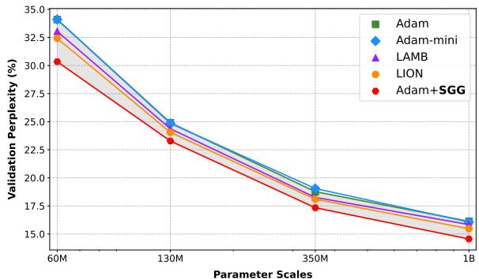  
(a) Full-Rank Optimizers

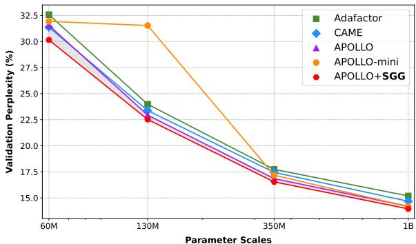  
(b) Memory-efficient Optimizers

Figure A1: Model Parameter Scaling-up Analysis on C4 pre-training with different optimization algorithms.  
Table A3: Hyperparameters of fine-tuning RoBERTa base on GLUE benchmark.
<table><tr><td></td><td>MNLI</td><td>SST-2</td><td>MRPC 16</td><td>CoLA 32</td><td>QNLI</td><td>QQP</td><td>RTE</td><td>STS-B</td></tr><tr><td>Batch Size # Epochs Learning Rate Rank Config. Max Seq. Len.</td><td>16 30 2e-05</td><td>16 30 1e-05</td><td>30 3e-05</td><td>30 3e-05 Full 512</td><td>16 30 1e-05</td><td>16 30 1e-05</td><td>16 30 1e-05</td><td>16 30 2e-05</td></tr><tr><td>Batch Size # Epochs Learning Rate Rank Config. Max Seq. Len.</td><td>16 30 2e-05</td><td>16 30 1e-05</td><td>16 30 3e-05</td><td>32 30 3e-05 r = 4 512</td><td>16 30 1e-05</td><td>16 30 1e-05</td><td>16 30 1e-05</td><td>16 30 2e-05</td></tr><tr><td>Batch Size # Epochs Learning Rate Rank Config. Max Seq. Len.</td><td>16 30 2e-05</td><td>16 16 30 2e-05</td><td>30 2e-05</td><td>32 30 3e-05 r = 8 512</td><td>16 30 1e-05</td><td>16 30 2e-05</td><td>16 30 2e-05</td><td>16 30 3e-05</td></tr></table>

## B.4 LLM RLHF with DPO

In our experiments, we employed the Direct Preference Optimization (DPO) approach to fine-tune the Qwen2.5-0.5B model using the ultrafeedback\_binarized dataset, which contains binary preference labels that facilitate the alignment of the model with human preferences (von Werra et al., 2020). The training process was conducted using both full-rank and LoRA strategies, with the latter being typically effective in reducing the number of trainable parameters while maintaining competitive performance. Hyperparameters include a learning rate of $5 . 0 \times 1 0 ^ { - 7 }$ for full-rank training and $5 . 0 \times 1 0 ^ { - 6 }$ for LoRA, with a single training epoch and a batch size of 2 per device. Gradient accumulation was set to 8 steps, and gradient checkpointing was enabled to optimize memory usage.

The optimization process utilized several optimizers, including SGD, AdamW, and LAMB, with and without the addition of the SGG (Stochastic

Table A4: Full Comparison Results of LLaMA PEFT on eight commonsense reasoning datasets with the accuracy (% : higher is better) and the GPU memory , where only the weights and optimization states are considered. ChatGPT results are obtained by Zero-shot CoT with gpt-3.5-turbo API. Bold and green types denote the best results and performance gains of SGG (blue background) compared to corresponding LoRA baselines (gray background).
<table><tr><td>Model</td><td>PEFT</td><td>Memory</td><td colspan="9">|BoolQ PIQA SIQA HellaSwag WinoGrande Arc-E Arc-C OBQA Average</td></tr><tr><td>ChatGPT</td><td></td><td></td><td>73.1</td><td>85.4</td><td>68.5</td><td>78.5</td><td>66.1</td><td>89.8</td><td>79.9</td><td>74.8</td><td>77.0</td></tr><tr><td rowspan="8">LLaMA-7B</td><td>Prefix</td><td>0.05G</td><td>64.3</td><td>76.8</td><td>73.9</td><td>42.1</td><td>72.1</td><td>72.9</td><td>54.0</td><td>60.6</td><td>64.6</td></tr><tr><td>Series</td><td>0.42G</td><td>63.0</td><td>79.2</td><td>76.3</td><td>67.9</td><td>75.7</td><td>74.5</td><td>57.1</td><td>72.4</td><td>70.8</td></tr><tr><td>Parallel</td><td>1.49G</td><td>67.9</td><td>76.4</td><td>78.8</td><td>69.8</td><td>78.9</td><td>73.7</td><td>57.3</td><td>75.2</td><td>72.2</td></tr><tr><td>LoRA</td><td>0.35G</td><td>68.9</td><td>80.7</td><td>77.4</td><td>78.1</td><td>78.8</td><td>77.8</td><td>61.3</td><td>74.8</td><td>74.7</td></tr><tr><td>DoRA</td><td>0.26G</td><td>69.7</td><td>83.4</td><td>78.6</td><td>87.2</td><td>81.0</td><td>81.9</td><td>66.2</td><td>79.2</td><td>78.4</td></tr><tr><td>GaLore</td><td>0.26G</td><td>69.5</td><td>82.0</td><td>75.1</td><td>32.2</td><td>18.0</td><td>80.7</td><td>65.8</td><td>78.0</td><td>62.7</td></tr><tr><td>Fira</td><td>0.26G</td><td>69.4</td><td>82.6</td><td>78.0</td><td>76.8</td><td>81.2</td><td>82.2</td><td>64.4</td><td>80.8</td><td>76.9</td></tr><tr><td>LoRA+SGG</td><td>0.35G</td><td>70.3</td><td>83.6</td><td>78.8</td><td>81.7</td><td>80.9</td><td>81.5</td><td>65.3</td><td>79.0</td><td>77.6</td></tr><tr><td></td><td>∆Gain</td><td>+0.00</td><td>+1.4</td><td>+2.9</td><td>+1.4</td><td>+3.6</td><td>+2.1</td><td>+3.7</td><td>+4.0</td><td>+4.2</td><td>+2.9</td></tr></table>

Gradient with Gain) technique. As shown in Table 7, the inclusion of SGG consistently improved the Top-1 accuracy across all optimizers. For instance, AdamW with SGG achieved a Top-1 accuracy of 71.85% in full-rank training, representing a gain of 0.47% over the baseline AdamW. Similarly, in LoRA training, AdamW with SGG reached 72.02%, a significant improvement of 1.80% compared to the baseline. These results underscore the advantage of SGG in enhancing the optimization process, particularly in scenarios where both computational efficiency and performance are critical.

The LoRA configuration used a rank (r) of 32 and alpha (α) of 16, which provided a balance between model complexity and performance. The evaluation strategy was set in steps, with evaluations conducted every 50 steps, and logging was performed every 25 steps to monitor the training progress. The output directory was designated as Qwen2-0.5B-DPO, and the no\_remove\_unused\_columns flag was enabled to retain all columns in the dataset during training.

## B.5 MLLM SFT with LLaVA Variants

To validate the generalization capability of the SGG-equipped optimizer, we also verify it on some variants of LLaVA (Liu et al., 2024b). i.e. LLaVAv1.5-7b, LLaVA-LoRA, LLaVA-v1.3. And we choose some mainstream multi-modal LLMs at Table 8, e.g. BLIP (Li et al., 2022), InstructBLIP (Dai et al., 2023), Qwen-VL (Bai et al., 2023), Qwen-VL-Chat, mPLUG-Owl2 (Ye et al., 2024), and some variant of LLaVA, Tiny-LLaVA (Zhou et al., 2024), MoE-LLaVA (Lin et al., 2024), LLaVA-Phi (Zhu et al., 2024b), LLaVA-NeXT (Liu et al., 2024a), LLaVA-MOD (Shu et al., 2024), and LLaVA-KD-2B (Cai et al., 2024).

Setup and Settings: Following the LLaVAv1.5, we use a pre-trained Vicuna-v1.5-7B (Chiang et al., 2023) as the language decoder. A pre-trained 2 MLP is used as the connector to align the visual tokens to text tokens. The connector was trained by the LCS-558K datasets for one epoch. For the visual encoder, CLIP (Radford et al., 2021) encodes and extracts the visual representation from the images. In our experiments, we validate three different optimizers: AdamW, Adafactor, and LAMB. We also reproduced results of popular optimizers like Muon, SOAP (Vyas et al., 2024), and MARS (Yuan et al., 2025) as the extension. The details of the optimizer hyperparameters and some training settings are shown in Table A5.

Table A5: Details of the hyperparameters for the included optimizers and experiment settings.
<table><tr><td>Method</td><td>AdamW</td><td>Adafactor</td><td>LAMB</td></tr><tr><td colspan="4">Modules and datasets</td></tr><tr><td>LLM</td><td colspan="3">Vicuan-v1.5-7B</td></tr><tr><td>Vision encoder</td><td colspan="3">CLIP-L-336px</td></tr><tr><td>Connector</td><td colspan="3">2×MLP</td></tr><tr><td>Pretrain data</td><td colspan="3">LCS-558K</td></tr><tr><td>SFT data</td><td colspan="3">1lava-v1.5-mix665k</td></tr><tr><td colspan="4">Basic SFT settings</td></tr><tr><td>Learning rate</td><td>2e -5</td><td>2e−5</td><td>2e−5</td></tr><tr><td>Batch size</td><td>64</td><td>64</td><td>64</td></tr><tr><td>Betas</td><td>(0.9, 0.999)</td><td>x</td><td>(0.9, 0.999)</td></tr><tr><td>Epsilon</td><td>1e−8</td><td>(1e−30, 1e−3)</td><td>1e−6</td></tr><tr><td>Weight decay</td><td>x</td><td>x</td><td>x</td></tr><tr><td>LR scheduler</td><td>Cosine</td><td>Cosine</td><td>Cosine</td></tr><tr><td>Warmup ratio</td><td>0.03</td><td>0.03</td><td>0.03</td></tr><tr><td>Clip threshold</td><td>x</td><td>1.0</td><td>x</td></tr><tr><td>Clamp value</td><td>x</td><td>x</td><td>10</td></tr><tr><td>Cluster number</td><td>3</td><td>3</td><td>2</td></tr><tr><td>Recluster interval</td><td>1,000</td><td>1,000</td><td>1,000</td></tr><tr><td>Decay rate</td><td>(0.95, 0.9)</td><td>(0.95, 0.9)</td><td>(0.95, 0.9)</td></tr><tr><td colspan="4">Low-Rank hyperparameters</td></tr><tr><td>LoRA (r=128, α=256)</td><td>√</td><td>x</td><td>x</td></tr><tr><td>8bit LoRA (r=128, α=256)</td><td>√</td><td>x</td><td>x</td></tr></table>

Supervised Fine-tuning: We keep the visual encoder frozen and update the parameters of the connector and LLM for training. For the Full-Rank Supervised Fine-Tuning (SFT), the learning rate was set to 2e-5, the batch size was 64, and training one epoch on llava-v1.5-mix665k dataset. To further validate the effectiveness of SGG in the light parameters and low-bit quantization scenario, we conducted an experiment to train the Low-Rank (LoRA) and 8-bit Quantization LoRA (Q-LoRA (Dettmers et al., 2024)) SFT method. These methods have unique advantages in parameter efficiency and training speed. For the LoRA and Q-LoRA SFT, the rank r of LoRA is 128, the learning rate scaling factor α is 256, the batch size set is 64, and training one epoch. These low-rank methods are based on the LLaVA-v1.5.

Results: Table 8 and Table A6 present the results of SGG on VQA and benchmark tasks. Table 8 shows the results of seven representative tasks, while Table A6 displays the full results of nine tasks. For the Full-Rank SFT, on the AdamW optimizer, SGG achieves 64.5 average performance on the 7 different tasks, which brings +0.9% performance compared to the AdamW baseline. On the Adafactor, SGG could get extra +0.5% performance compared to the vanilla Adafactor, especially on the VizWzi VQA task, SGG could bring +2.4% capability. With LAMB+SGG, our performance can reach 52.7. For the LoRA SFT, our SGG could achieve 65.1 scores, and on the VizWiz task, it brings additional performance gains of +2.2%. For the 8-bit experiments, Table 8 shows that SGG with AdamW could also bring some performance.

## C Empirical Analysis

## C.1 Analysis of Gradient Clustering

Figure 2 illustrates the gradient clustering phenomenon observed during the pre-training of the LLaMA-1B model on the C4 dataset, focusing on gradients, adaptive learning rates, and gradient norms. LLMs exhibit unique gradient dynamics due to their massive scale, sparse activations, and hierarchical structure. SGG leverages these characteristics to improve optimization efficiency and convergence. Gradients in LLMs often follow a heavy-tailed distribution, with a small fraction of parameters contributing disproportionately to the overall gradient magnitude. SGG addresses this by flattening gradients into high-dimensional vectors and applying clustering algorithms (e.g., k-means) to group parameters with similar behaviors. This results in two distinct clusters: one for parameters with large gradients (associated with salient features or rare tokens) and another for those with smaller gradients (associated with frequent but less informative tokens). Adaptive learning rates are then computed separately for each cluster, ensuring stability for parameters with large gradients and faster convergence for those with smaller gradients. This contrasts with baselines that apply uniform learning rates, failing to account for the heavytailed gradient distributions typical of LLMs.

Figure 4(c) depicts the layer-wise L -gradient norm distributions across all layers of the LLaMA-1B model. Gradient norms vary significantly across layers due to the hierarchical nature of LLMs. Earlier layers (e.g., embedding and low-level transformer layers) exhibit smaller gradient norms, as they focus on general syntactic and semantic patterns. In contrast, deeper layers (e.g., higher-level transformer layers) tend to have larger gradient norms, as they model complex, context-dependent relationships. SGG captures these patterns by grouping parameters based on gradient norms and applying layer-wise learning rate scaling. This ensures that earlier layers receive larger updates for faster learning of general patterns, while deeper layers receive smaller updates to maintain stability and prevent overfitting. Baseline methods, which lack such adaptive scaling, often struggle to optimize all layers simultaneously, leading to suboptimal convergence and poor generalization.

The clustering of gradients, adaptive learning rates, and gradient norms in LLMs are deeply interconnected phenomena. The heavy-tailed gradient distribution directly influences adaptive learning rates, as parameters with large gradients are assigned smaller learning rates to prevent instability. This, in turn, affects gradient norms, as learning rate scaling impacts the magnitude of parameter updates. SGG’s ability to capture these relationships and adaptively scale learning rates based on gradient clustering and norm distributions leads to more stable and efficient optimization compared to baseline methods. Furthermore, the hierarchical structure of LLMs introduces additional complexity, as different layers exhibit distinct gradient behaviors. SGG addresses this by leveraging layerwise clustering and scaling, ensuring each layer is optimized according to its specific role. This is particularly critical for LLMs, where the interplay between low-level and high-level features is essential for capturing the nuances of natural language. By preserving the inherent structure of the optimization landscape, SGG not only improves convergence but also enhances the model’s ability to generalize to unseen data.

Table A6: Full Comparison Results with Mainstream MLLMs. Compared with their counterparts, Top-1 accuracy (% : higher is better) is reported. AVG: The average of the nine benchmarks for comprehensive comparison, except for MME. †: reproduced results using the official code. Green types denote the performance gains of SGG (blue background) over related baselines (gray background). Most results are reported from LLaVA-KD (Cai et al., 2024).
<table><tr><td rowspan="2">Method</td><td rowspan="2">LLM</td><td rowspan="2">Optimizer</td><td colspan="5">Image Question Answering</td><td colspan="5">Benchmarks</td><td rowspan="2">-AVG</td></tr><tr><td>VQAv2 GQA VizWiz SciVQA TextVQA</td><td></td><td></td><td></td><td></td><td></td><td>MME MMBench MMBenchCN POPE SEED1</td><td></td><td></td><td></td></tr><tr><td>BLIP-2</td><td>Vicuna-13B</td><td>AdamW</td><td>65.0</td><td>41.0</td><td>19.6</td><td>61.0</td><td>42.5</td><td></td><td></td><td></td><td>85.3</td><td></td><td></td></tr><tr><td>InstructBLIP</td><td>Vicuna-7B</td><td>AdamW</td><td></td><td>49.2</td><td>34.5</td><td>60.5</td><td>50.1</td><td>一</td><td>36.0</td><td>23.7</td><td>79.8</td><td></td><td></td></tr><tr><td>Qwen-VL</td><td>Qwen-7B</td><td>AdamW</td><td>78.8</td><td>59.3</td><td>35.2</td><td>67.1</td><td>63.8</td><td></td><td>38.2</td><td>7.4</td><td>一</td><td></td><td></td></tr><tr><td>Qwen-VL-Chat</td><td>Qwen-7B</td><td>AdamW</td><td>78.2</td><td>57.5</td><td>38.9</td><td>68.2</td><td>61.5</td><td></td><td>60.6</td><td>56.7</td><td>一</td><td></td><td></td></tr><tr><td>mPLUG-Owl2</td><td>LLaMA2-7B</td><td>AdamW</td><td>79.4</td><td>56.1</td><td>54.5</td><td>68.7</td><td>54.3</td><td></td><td>66.5</td><td></td><td>85.8</td><td></td><td></td></tr><tr><td>TinyLLaVA†</td><td>Qwen1.5-4B</td><td>AdamW</td><td>79.9</td><td>63.4</td><td>46.3</td><td>72.9</td><td>59.0</td><td></td><td>67.9</td><td>67.1</td><td>85.2</td><td></td><td></td></tr><tr><td>TinyLLaVA</td><td>Phi2-2.7B</td><td>AdamW</td><td>79.9</td><td>62.0</td><td></td><td>69.1</td><td>59.1</td><td></td><td>66.9</td><td></td><td>86.4</td><td></td><td></td></tr><tr><td>Bunny</td><td>Phi2-2.7B</td><td>AdamW</td><td>79.8</td><td>62.5</td><td>43.8</td><td>70.9</td><td>56.7</td><td>一</td><td>68.6</td><td>37.2</td><td>一</td><td></td><td></td></tr><tr><td>Imp-3B</td><td>Phi2-2.7B</td><td>AdamW</td><td>一</td><td>63.5</td><td>54.1</td><td>72.8</td><td>59.8</td><td></td><td>72.9</td><td>46.7</td><td></td><td></td><td></td></tr><tr><td>MobileVLM</td><td>MLLaMA-2.7B</td><td>AdamW</td><td></td><td>59.0</td><td></td><td>61.0</td><td>47.5</td><td></td><td>59.6</td><td></td><td>84.9</td><td></td><td></td></tr><tr><td>MobileVLMv2 MLLaMA-2.7B</td><td></td><td>AdamW</td><td></td><td>61.1</td><td></td><td>70.0</td><td>57.5</td><td></td><td>63.2</td><td>一</td><td>84.7</td><td></td><td></td></tr><tr><td>MoE-LLaVA</td><td>Phi2-2.7B</td><td>AdamW</td><td>79.9</td><td>62.6</td><td></td><td>70.3</td><td>57.0</td><td></td><td>68.0</td><td></td><td>85.7</td><td></td><td></td></tr><tr><td>LLaVA-Phi</td><td>Phi2-2.7B</td><td>AdamW</td><td>71.4</td><td></td><td></td><td>68.4</td><td>48.6</td><td></td><td>59.8</td><td></td><td>85.0</td><td></td><td></td></tr><tr><td>LLaVA-NeXT</td><td>Vicuna-1.5-7B</td><td>AdamW</td><td>81.8</td><td>64.2</td><td>57.6</td><td>70.1</td><td>64.9</td><td>1519.0</td><td>67.4</td><td>60.6</td><td>86.5</td><td>70.2</td><td>69.3</td></tr><tr><td>LLaVA-NeXT</td><td>Vicuna-1.5-13B</td><td>AdamW</td><td>82.8</td><td>65.4</td><td>60.5</td><td>73.6</td><td>67.1</td><td>1575.0</td><td>70.0</td><td>64.4</td><td>86.2</td><td>71.9</td><td>71.3</td></tr><tr><td>MiniCPM-V</td><td>MiniCPM-2.4B</td><td>AdamW</td><td></td><td>51.5</td><td>50.5</td><td>74.4</td><td>56.6</td><td></td><td>64.0</td><td>62.7</td><td>79.5</td><td></td><td></td></tr><tr><td>MiniCPMv2</td><td>MiniCPM-2.4B</td><td>AdamW</td><td></td><td>52.1</td><td>60.2</td><td>76.3</td><td>73.2</td><td></td><td>68.5</td><td>67.2</td><td>86.3</td><td></td><td></td></tr><tr><td>LLaVA-MOD</td><td>Qwen1.5-1.8B</td><td>AdamW</td><td></td><td>58.7</td><td>39.2</td><td>68.0</td><td>58.5</td><td></td><td>66.3</td><td>61.9</td><td>87.0</td><td></td><td></td></tr><tr><td>LLaVA-KD-2B</td><td>Qwen1.5-1.8B</td><td>AdamW</td><td>79.0</td><td>62.3</td><td>44.7</td><td>64.7</td><td>53.4</td><td>一</td><td>64.0</td><td>63.7</td><td>86.3</td><td></td><td></td></tr><tr><td colspan="10">LLaVA-v1.5/1.6 Full-Rank SFT</td><td></td><td></td><td></td><td></td><td></td></tr><tr><td>LLaVA-v1.5</td><td>Vicuna-1.5-7B</td><td>AdamW</td><td>78.5</td><td>62.0</td><td>50.0</td><td>66.8</td><td>58.2</td><td>1510.7</td><td>64.3</td><td>58.3</td><td>85.9</td><td>66.2</td><td>65.6</td></tr><tr><td>LLaVA-v1.5</td><td>Vicuna-1.5-7B</td><td>Adafactor</td><td>79.0</td><td>62.7</td><td>48.2</td><td>70.7</td><td>57.1</td><td>1462.5</td><td>66.1</td><td>60.4</td><td>86.0</td><td>66.8</td><td>66.3</td></tr><tr><td>LLaVA-v1.5</td><td>Vicuna-1.5-7B</td><td>LAMB</td><td>63.9</td><td>43.8</td><td>53.3</td><td>61.5</td><td>43.4</td><td>1090.9</td><td>43.2</td><td>41.8</td><td>81.2</td><td>50.4</td><td>53.6</td></tr><tr><td>LLaVA-v1.5</td><td>Vicuna-1.5-7B</td><td>Muon</td><td>79.3</td><td>62.6</td><td>50.3</td><td>69.1</td><td>57.7</td><td>1461.7</td><td>67.1</td><td>59.8</td><td>85.9</td><td>67.0</td><td>66.5</td></tr><tr><td>LLaVA-v1.5</td><td>Vicuna-1.5-7B</td><td>SOAP</td><td>79.4</td><td>62.5</td><td>47.8</td><td>69.7</td><td>57.9</td><td>1457.1</td><td>66.6</td><td>60.1</td><td>86.2</td><td>67.4</td><td>66.4</td></tr><tr><td>LLaVA-v1.5</td><td>Vicuna-1.5-7B</td><td>MARS</td><td>79.3</td><td>62.8</td><td>49.2</td><td>69.1</td><td>56.4</td><td>1451.1</td><td>66.7</td><td>59.4</td><td>86.1</td><td>67.5</td><td>66.3</td></tr><tr><td>LLaVA-v1.5</td><td>Vicuna-1.5-7B</td><td>AdamW+SGG</td><td>79.1</td><td>62.4</td><td>50.2</td><td>69.8</td><td>57.4</td><td>1476.9</td><td>65.9</td><td>60.1</td><td>86.3</td><td>66.9</td><td>66.5</td></tr><tr><td>∆ Gains compared to AdamW</td><td></td><td></td><td>+0.6</td><td>+0.4</td><td>+0.2</td><td>+2.0</td><td>-0.8</td><td>-33.8</td><td>+1.6</td><td>+1.8</td><td>+0.4</td><td>+0.7</td><td>+0.9</td></tr><tr><td>LLaVA-v1.5</td><td>Vicuna-1.5-7B</td><td>Adafactor+SGG</td><td>79.2 +0.1</td><td>62.8 +0.1</td><td>50.6 +2.4</td><td>71.6 +0.9</td><td>57.3 +0.2</td><td>1477.2 +14.7</td><td>66.3 +0.2</td><td>60.8 +0.4</td><td>86.0 +0.0</td><td>67.3 +0.5</td><td>66.8 +0.5</td></tr><tr><td>∆ Gains compared to Adafactor LLaVA-v1.5 Vicuna-1.5-7B</td><td>LAMB+SGG</td></table>

## C.2 Analysis of Learning Rate Scaling

We analyze the impact of learning rate scaling on the validation perplexity of the Qwen2.5-0.5B model fine-tuned on the Alpaca dataset. The experiments were conducted with varying batch sizes {128, 512, 1024, 2048, 4096} and learning rates {1e-1, 1e-2, 1e-3, 1e-4, 1e-5}, using both the Adam optimizer and Adam with SGG. The model was trained for 3 epochs with LoRA (rank=8) and followed the official settings of the Alpaca framework.

The results, as depicted in Figure 5, demonstrate several key trends. First, as the batch size increases, the validation perplexity generally decreases, indicating that larger batch sizes contribute to more stable and efficient training. This effect is particularly pronounced when SGG is applied, suggesting that SGG enhances the model’s ability to generalize even under extreme batch size settings. Second, lower learning rates (e.g., 1e-4, 1e-5) consistently yield better performance, especially when combined with larger batch sizes, highlighting the importance of balancing these hyperparameters. Notably, SGG provides robust performance gains across all configurations, significantly reducing validation perplexity compared to standard Adam optimization. This improvement is attributed to SGG’s ability to guide the optimization process more effectively, particularly in scenarios with large batch sizes and varying learning rates. Overall, the results underscore the effectiveness of SGG in enhancing model performance, even in challenging training conditions, and emphasize the critical role of hyperparameter tuning in achieving optimal results.