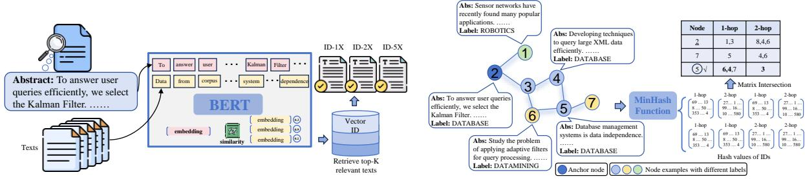
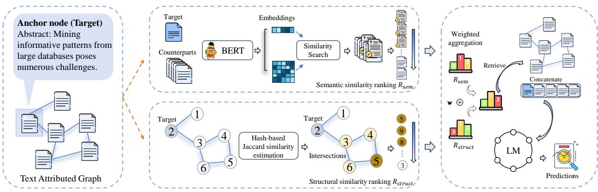
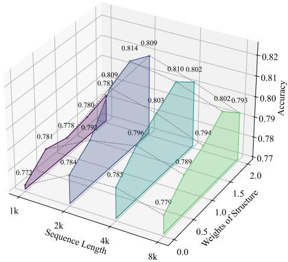
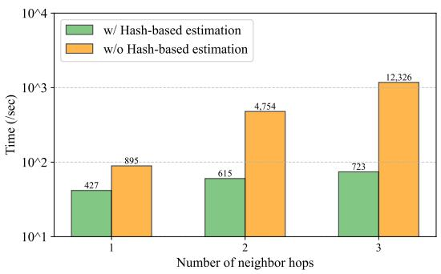

# Taming Language Models for Text-attributed Graph Learning with Decoupled Aggregation

Chuang Zhou1, Zhu Wang1, Shengyuan Chen1,\*, Jiahe Du1, Qiyuan Zheng1, Zhaozhuo Xu2, Xiao Huang1

1The Hong Kong Polytechnic University, China; 2Stevens Institute of Technology, USA 1{chuang-qqzj.zhou, juliazhu.wang, shengyuan.chen, jiahe.du, qiyuan.zheng} @connect.polyu.hk; xiaohuang@comp.polyu.edu.hk; 2zxu79@stevens.edu

## Abstract

Text-attributed graphs (TAGs) are prevalent in various real-world applications, including academic networks, e-commerce platforms, and social networks. Effective learning on TAGs requires leveraging both textual node fea tures and structural graph information. While language models (LMs) excel at processing text and graph neural networks (GNNs) effectively capture relational structures, their direct integration is computationally prohibitive due to the high cost of text and graph representation learning. Existing approaches address this challenge by adopting a two-step pipeline where LMs generate fixed node embeddings, which are then used for GNN training. However, this method neglects the interaction between textual and structural information, leading to suboptimal learning outcomes. To overcome these limitations, we propose SKETCH (Semantic Knowledge and Structure Enrichment), a novel framework that decouples node aggregation from graph convolution and integrates it into the text representation learning process. SKETCH enhances TAG learning by incorporating two key aggregation mechanisms: (1) Semantic aggregation, which retrieves semantically relevant node texts for contextual enrichment, and (2) Structural aggregation, which propagates textual features beyond immediate neighbors to capture broader graph relationships. Extensive experiments demonstrate that SKETCH outperforms stateof-the-art TAG learning methods while requiring fewer computational resources. By enabling a more efficient and effective fusion of textual and structural information, SKETCH provides new insights into TAG problems and offers a practical solution for real applications.

## 1 Introduction

Text-attributed graphs (TAGs) are common in realworld applications, such as academic networks, question answering (Zhang et al., 2024b), and social networks (He and McAuley, 2016; Jin et al., 2023). Effective learning on TAGs requires leveraging both textual node features and the graph’s structural information. Language models (LMs) excel at processing text, while graph neural networks (GNNs) effectively capture relational structures (Shengyuan et al., 2024; Chen et al., 2024b).

However, GNNs are often resource-demanding due to their high cost and memory-intensive nature (Liu et al., 2023b). The message-passing mechanism requires extensive computations, especially for large-scale graphs. Additionally, storing and processing large adjacency matrices or graph structures can consume significant memory, particularly for dense graphs. These challenges make GNNs less efficient for real-life applications, limiting their ability to be directly integrated with LMs in an endto-end manner. Therefore, current TAG learning methods adopt a two-step alternative approach (Wu et al., 2019; Huang et al., 2022; Chen et al., 2024c; Zhou et al., 2025a): first, LMs generate node text embeddings, which are then used as fixed features for GNN training. Such a cascaded approach neglects the interaction between textual content and graph structure (Zhou et al., 2025b; Zhang et al., 2025), leading to suboptimal integration of these modalities (Duan et al., 2023; Hong et al., 2025).

Besides, GNNs primarily depend on node-level aggregation via graph convolutions, which involve iteratively conducting node aggregation. Instead, we explore the potential of purely leveraging language models to enable token-level learning from the graph, achieving a more granular understanding. The emergence of long-context models provides a unique opportunity to integrate multiple separate corpora from various nodes into a unified long-text learning process. By decoupling node aggregation from graph convolution modules, we propose a more efficient and effective TAG learning strategy, moving beyond naive LM-GNN fusion.

To implement this, we introduce Semantic Knowledge and Structure Enrichment framework, namely SKETCH, a framework that applies a decoupled aggregation module before LM training. This module consists of two components: (1) Semantic aggregation: Retrieves semantically relevant node texts for contextual enrichment. (2) Structural aggregation: Propagates textual features beyond immediate neighbors to capture broader graph relationships. This two-stream enriched input is then processed by a long-context LM, improving predictive accuracy by providing a more comprehensive contextual understanding.

## Summary of Contributions:

• We propose a novel framework that separates node aggregation from graph convolution, enabling more efficient and effective TAG learning.

• We introduce SKETCH, a learning framework that integrates semantic and structural aggregation before LM training, improving contextual representation and predictive accuracy.

• Extensive experiments show that SKETCH outperforms all state-of-the-art TAG learning methods while requiring fewer computational resources, making it a lightweight component.

## 2 Preliminaries

Notations. Text-attributed graphs consider both text attributes and graph structure, unlike traditional text prediction and graph prediction tasks. A text-attributed graph is defined as $\mathcal { G } = ( \nu , \mathcal { E } , \mathcal { S } )$ , where represents text attributes for each node. denotes the set of nodes,  denotes edges between text nodes and $\mathcal { N } ^ { k } ( v )$ denotes the k-hop neighbors of node v. Ground truth labels for a given text-attributed graph are denoted as Y = $\{ \pmb { y } _ { 1 } , \cdots , \pmb { y } _ { | S | } \}$ , where S is the size of the nodes.

A text-attributed graph is a graph where each node is associated with textual attributes, and edges capture relationships between nodes. One of the key tasks in TAG learning is node classification, where the goal is to predict the category of a node based on both its textual features and structural connections. A common example is citation graphs, where academic papers are represented as nodes, citation links form edges, and paper abstracts provide textual attributes. The main focus in TAG learning lies in effectively integrating textual and structural information to improve classification accuracy.

## 3 Approach: SKETCH

Our primary objective is to examine each anchor node within the graph to effectively identify the content that is most relevant and beneficial in enhancing the understanding of the associated text. As mentioned in the introduction, the complexity and richness of information at both the node and relationship levels require a nuanced analytical approach. Textual attributes offer valuable semantic insights into the meaning and context of the nodes, while structural relationships demonstrate how these nodes interact within the graph’s topology. Therefore, our method leverages the inherent structure of the graph, treating all contained texts as valuable resources. In the following sections, we will detail our methodology for retrieving both semantically and structurally related corpora, enhancing our understanding of each anchor node and its context within the entire network. Here, we present a detailed illustration of the overall framework and its various components in Figure 3.

## 3.1 Semantic related retrieval

The structure of text-attributed graphs encompasses textual information from various nodes. Given the importance of contextual data, we propose integrating additional corpus during the training process. These supplementary texts can significantly enhance the model’s ability to make accurate predictions by providing essential context and knowledge. While some nodes are directly connected through edges, there are also nodes that, despite not being connected, may contain relevant information about the target node, referred to as the anchor node. Consider a research paper titled "Transfer Learning for Small Datasets in Medical Imaging." This paper addresses a specialized topic and is published in a niche journal, resulting in a limited number of direct citations. In this case, the text attributes of the paper, including its abstract, keywords, and methodology, contain critical insights about "transfer learning" and "medical imaging." For instance, the methodologies proposed in other non-connected papers may introduce existing algorithms or frameworks that could enhance the explanation of the proposed technique.

Accordingly, we employ a global embedding similarity technique to retrieve useful nodes. This approach allows us to identify and extract information from both directly linked and indirectly related nodes, enhancing the overall relevance and comprehensiveness of the information associated with the anchor node. In our retrieval process, we begin by using a sentence-transformer to embed each piece of textual information into vector representations, as shown in Figure 1. To identify the most relevant content, we leverage the FAISS engine, which enables high-speed searching based on cosine similarity. Notably, even with a dataset containing hundreds of thousands of points, we can obtain results in just a few minutes. This efficiency ensures that we can quickly retrieve the most closely matching texts, achieving the integration of relevant information into our system.

  
Figure 1: Overview of the semantic retrieval process. This figure illustrates in detail how we conduct a global search for similar nodes based on their embeddings, leveraging FAISS (Facebook AI Similarity Search) to efficiently identify and select the most similar items from the entire network.  
Figure 2: Process of transforming neighborhood IDs into hash values for enhanced structural retrieval. The figure illustrates that the number of common neighbors is a crucial indicator for determining node relatedness among the graph and can be efficiently computed using matrix operations.

## 3.2 Structural related retrieval

## 3.2.1 Defining structural relatedness

This section focuses on retrieving structurally related nodes. However, each anchor node has numerous k-hop neighbors, making it impractical to include all in our analysis. Thus, we need to rank the importance of neighbors and select the most relevant ones. Previous research suggests that in graph learning, nodes with many common neighbors are often more closely related for several reasons. Structural Similarity: Nodes with many shared neighbors tend to be structurally similar, indicating similar roles or functions, particularly in social or biological networks. Transitive Relationships: Transitivity implies that if node A is connected to B and B is connected to C, A and C may also be related. Common neighbors signify potential transitive relationships, suggesting that nodes are indeed related. Shared Context: Common neighbors indicate that nodes share similar contexts or environments. For instance, in a social network, two individuals with many mutual friends may tend to have shared interests or activities.

To better illustrate this pattern, we include a reallife example from our citation network dataset in Figure 2. The anchor node is labeled ’database’, focusing on Kalman Filters, which may lead to its misclassification as a ’Machine Learning’ algorithm. Here, additional context from cited papers is crucial. The neighboring node content, such as "applying adaptive filters for query processing in a distributed stream" and "techniques to query large data repositories efficiently", suggests that Kalman Filters are used to handle data streams and applied in the database field. In contrast, another connected node describing "Sensor networks have recently found many popular applications" serves a less relevant role. Analyzing their topological differences reveals that nodes with more common neighbors typically offer more relevant explanations. This aligns with the intuition that birds of a feather flock together and supports our previous experience that while many papers may be cited, some provide essential insights while others serve merely as supplementary information.

In light of this finding, we propose defining relatedness through intersection features using the Jaccard similarity coefficient, expressed as J(A, B) = N(A) N(B) |N(A)∩N(B)| . In this formula, J(A, B) represents the Jaccard similarity between nodes A and B, where N(A) denotes the set of neighbors of node A and N(B) the set of neighbors of node B. The numerator, N(A)  N(B) , indicates the number of common neighbors shared by the two nodes, while the denominator, $| N ( A ) \cup N ( B ) |$ , represents the total number of unique neighbors across both nodes. By employing the Jaccard similarity, we can effectively capture the connectivity patterns that reflect structural relationships between nodes. This measure provides valuable insights critical for downstream graph-related tasks within our retrieval processes, helping facilitate a more profound understanding of the underlying graph structure.

## 3.2.2 Hash-based Jaccard Similarity Estimate

As discussed in previous sections, the importance ranking of k-hop neighbors is determined by the proportion of common neighbors; more common neighbors indicate a closer relationship. This part formally presents our method for estimating k-hop Jaccard similarities for each pair of nodes. The typical approach involves recording each node’s neighbors and incrementally counting the Jaccard. However, this method is time-consuming due to the varying number of neighbors per node and the large overall number of nodes, resulting in extensive iterations. Calculating multi-hop Jaccard, e.g. the Jaccard between the one-hop neighbors of an anchor node and the two-hop neighbors of other nodes, will further complicate the computation. Monte Carlo simulation offers a solution but remains inefficient as it requires large samples for an estimate.

Similarity Estimation Using Minhash Functions. To properly address the inefficiency associated with direct similarity computation, we plan to map neighborhood IDs into dense sketches and estimate the Jaccard extent in a lower-dimensional space. We choose Minhash (Charikar, 2002) functions as the mapping functions based on their properties. In this technique, we formulate the k-hop neighbors of a node $v _ { q } \in \mathcal V$ as a set $\mathcal { N } ( v _ { q } )$ . Next, we randomly hash every $v \in \mathcal { N } ( v _ { q } )$ in the set to an integer $h ( v ) \in [ B ]$ . Here h is a universal hashing function (Carter and Wegman, 1977). Next, we take the minimum value of $h ( v )$ for all $v \in \mathcal { N } ( v _ { q } )$ as the hash signature of the k-hop neighbors $\mathcal { N } ( v _ { q } )$ Here, the Minhash function is shown to serve as an unbiased estimator of the Jaccard similarity between the k-hop neighborhoods of two nodes.

Definition 3.1 (Minhash for k-hop Neighbors Jaccard Estimation). Let  denote the nodes in a graph $\mathcal { G } = ( \nu , \mathcal { E } , \mathcal { S } )$ . Let $\mathcal { N } ^ { k } ( v )$ denote a set ofthe k-hop neighbors of node $v \in \mathcal { V } .$ Let $h : \mathcal { V } \to [ B ]$ denote a universal hashing function that maps a node $v \in \mathcal V$ to an integer in range [B], which effectively captures a compact signature of the neighborhood set by selecting the minimal hash value among all k-hop neighbors. We define a Minhash function Minhash on $\mathcal { N } ^ { k } ( v )$ asfollows: Minhash $( \mathcal { N } ^ { k } ( v ) ) = \operatorname* { m i n } h ( \mathcal { N } ^ { k } ( v ) )$

Moreover, given the propriety ofMinhashfunction (Charikar, 2002), we see thatfor $v _ { 1 } , v _ { 2 } \in \mathcal { V }$

$$
= \frac { | \mathcal { N } ^ { k } ( v _ { 1 } ) \cap \mathcal { N } ^ { k } ( v _ { 2 } ) | } { | \mathcal { N } ^ { k } ( v _ { 1 } ) \cup \mathcal { N } ^ { k } ( v _ { 2 } ) | } = \mathcal { I } ( \mathcal { N } ^ { k } ( v _ { 1 } ) , \mathcal { N } ^ { k } ( v _ { 2 } ) ) .
$$

As shown in the definition, Minhash is a locality-sensitive hashing function (Indyk and Motwani, 1998; Datar et al., 2004; Andoni et al., 2014; Andoni and Razenshteyn, 2015; Andoni et al., 2017). The collision probability of Minhash is equal to the Jaccard similarity of two k-hop neighbor sets. As a result, we use the collision of two Minhash signatures as an unbiased estimator to the Jaccard similarity between two k-hop neighbor sets $\mathcal { N } ^ { k } ( v _ { 1 } ) , \mathcal { N } ^ { k } ( v _ { 2 } )$

Algorithm 1 Hash-based Similarity Ranking   
Input: K-hop neighboring ID sequences, each   
containing V nodes, processed by R indepen  
dent MinHash functions $\{ h _ { 1 } , h _ { 2 } , \ldots , h _ { R } \}$ , each   
with a range of B.   
Output: ranked score of node IDs.   
for node $v \in V$ do   
for $h o p = 1  k$ do   
$\mathcal { N } ^ { k } ( v ) = \mathrm { G e t N e i g h b o r s } ( v , k )$   
end for   
end for   
Initialize: $H _ { v } \gets \mathbb { M } ^ { V \times ( R \cdot K ^ { 2 } ) }$   
Initialize: $\boldsymbol { C _ { v } } ^ { \prime } \gets \mathbb { M } ^ { V \times ( R \cdot K ^ { 2 } ) }$   
for $s \in \mathcal { N } ^ { k } ( v )$ do   
for $h o p = 1 \right. k , c _ { v } \left. [ ]$ do   
for $r = 1  R$ do   
Append $h _ { r } ( s )$ K times to $H _ { v }$   
Append $h _ { r } ( s )$ to $c _ { v }$   
end for   
Append $c _ { v } \ K$ times to $C _ { v }$   
end for   
end for   
for $s \in \mathcal { N } ^ { k } ( v )$ do   
$S c o r e _ { v } = S u m _ { v } [ h _ { v } = = C _ { v } ]$   
Rank $S c o r e _ { v }$ in descending order   
end for   
return Score

Multi-hop Similarity Estimation. Since we are required to estimate Jaccard across k hops instead of just one-hop neighbors, we extend the aforementioned method into k dimensions. Our algorithm (see Algorithm 1) begins by extracting $\mathcal { N } ^ { k } ( v )$ , the sets of k-hop neighbors of the anchor node v. Next, we apply R independent MinHash functions to generate R hash values for every $s _ { v , k } \in \mathcal { N } ^ { k } ( v )$ , repeating this process l times. This effectively transforms the neighbor ID sequences into a hash sequence of length l, which we denote as H. To simplify, we compute 2-hop intersections by examining the onehop and two-hop neighbors of each node, resulting in four combinations: one-hop with one-hop, onehop with two-hop, two-hop with one-hop, and twohop with two-hop neighbors. This approach can easily be extended to higher-hop manipulations.

  
Figure 3: The SKETCH method for text-attributed graphs comprises two components: the Semantic Retrieval Module, which uses embedding similarity, and the Structural Retrieval Module, which employs Jaccard similarity. Both modules identify content relevant to the anchor node from each perspective. A weighted-rank aggregation mechanism combines their outputs, ranking the text of nodes, which are then fed into a language model for training and predictions.

For each node, we repeat the hash sequences corresponding to each hop. For example, let $h _ { 1 , 1 } , \ h _ { 1 , 2 }$ represent the one-hop and two-hop neighbors of the first node, respectively. The concatenated vector for node 1 would be $[ h _ { 1 , 1 } , h _ { 1 , 1 } , h _ { 1 , 2 } , h _ { 1 , 2 } ]$ . We then arrange the hash vectors of all nodes according to the pattern $[ [ h _ { 1 , 1 } , h _ { 1 , 2 } , h _ { 1 , 1 } , h _ { 1 , 2 } ] , . . . , [ h _ { k , 1 } , h _ { k , 2 } , h _ { k , 1 } , h _ { k , 2 } ] ]$ By calculating the number of equal hash values present in each row, we effectively capture the cross-combinations that occur during multi-hop intersections. This process can be executed rapidly by leveraging the broadcasting capabilities of PyTorch in matrix operations. In contrast, common methods often require one-by-one iteration due to the irregularity in the number of neighbors, which significantly slows down the speed of computation. For simplicity, we previously set the hash sequence length for each vector to l, indicating equal importance among all four possible intersections. To control some weights over specific intersections, particularly the crucial one-hop intersections, we can shorten some other vectors to a length m, where $m \ < \ l .$ This adjustment decreases the frequency of "collision" for the corresponding k-th hop intersection. Lastly, we rank the importance of neighbors for each anchor node by its row-wise sum; a higher value indicates a greater likelihood of sharing more neighbors.

## 3.3 Aggregated learning of retrieved content

The combination of the two aforementioned modules aims to acquire relevant information from different dimensions, thereby enhancing the training effectiveness of the long-context model. Semantic retrieval focuses on identifying content that is semantically similar to the anchor node text, ensuring that we capture deep connections between texts. In contrast, structure retrieval emphasizes the links between texts, paying attention to the flow of information. After obtaining the relevant texts, we rank and filter them to select the most significant ones, which are then connected to the anchor node text to create a rich context for the long-context model. Specifically, we propose a weighted method to combine two different similarity metrics: semantic similarity ranking and structural similarity rankings. To create a unified scoring system, we introduce a hyperparameter w, which allows for the adjustment of weights of the overall score. The composite score is calculated using the formula $G = R _ { \mathrm { s e m } } + w \cdot R _ { \mathrm { s t r u c t } }$ , where $R _ { \mathrm { s e m } }$ is the semantic rank and $R _ { \mathrm { s t r u c t } }$ is the structural similarity ranking. This approach allows for greater flexibility and enhances the capability of our evaluation method. It is similar to the Retrieval-Augmented Generation pipeline, as our goal is to supplement information to improve model training.

Table 1: Performance comparison among state-of-the-art baselines on three benchmark datasets.
<table><tr><td rowspan="2">NLP Models</td><td rowspan="2">GNNs</td><td colspan="2">ACM</td><td colspan="2">Wikipedia</td><td colspan="2">Amazon</td></tr><tr><td>Val-Acc.</td><td>Test-Acc.</td><td>Val-Acc.</td><td>Test-Acc.</td><td>Val-Acc.</td><td>Test-Acc.</td></tr><tr><td colspan="8">Fine-tuned LMs +/- GNNs</td></tr><tr><td rowspan="4">BERT</td><td></td><td>74.4</td><td>73.2</td><td>69.5</td><td>68.8</td><td>86.2</td><td>87.0</td></tr><tr><td>GCN</td><td>77.6</td><td>77.1</td><td>69.4</td><td>68.4</td><td>92.3</td><td>92.8</td></tr><tr><td>GAT</td><td>77.9</td><td>78.0</td><td>70.5</td><td>69.8</td><td>92.5</td><td>92.4</td></tr><tr><td>GraphSAGE</td><td>77.3</td><td>76.8</td><td>73.1</td><td>72.7</td><td>92.0</td><td>92.3</td></tr><tr><td rowspan="4">RoBERTa</td><td></td><td>78.1</td><td>76.6</td><td>67.8</td><td>68.1</td><td>84.9</td><td>85.9</td></tr><tr><td>GCN</td><td>80.1</td><td>79.4</td><td>68.5</td><td>68.0</td><td>92.3</td><td>92.5</td></tr><tr><td>GAT</td><td>79.7</td><td>78.9</td><td>70.1</td><td>71.0</td><td>92.5</td><td>92.4</td></tr><tr><td>GraphSAGE</td><td>78.5</td><td>78.3</td><td>72.7</td><td>72.1</td><td>92.2</td><td>92.1</td></tr><tr><td colspan="8">Fine-tuned Large Language Models +/- GNNs</td></tr><tr><td>Llama3_8b</td><td></td><td>80.7</td><td>80.6</td><td>71.9</td><td>71.2</td><td>92.0</td><td>91.6</td></tr><tr><td>Llama3_8b</td><td>GraphSAGE</td><td>82.0</td><td>81.3</td><td>72.8</td><td>73.0</td><td>93.1</td><td>92.8</td></tr><tr><td colspan="8">Large Language Models</td></tr><tr><td>Llama2_7b</td><td></td><td></td><td>20.8</td><td></td><td>41.3</td><td></td><td>53.4</td></tr><tr><td>Llama2_13b</td><td></td><td></td><td>58.9</td><td></td><td>48.9</td><td></td><td>57.6</td></tr><tr><td>GPT-3.5</td><td></td><td></td><td>54.3</td><td></td><td>61.8</td><td></td><td>49.1</td></tr><tr><td>GPT-4</td><td></td><td></td><td>67.5</td><td></td><td>60.9</td><td></td><td>40.3</td></tr><tr><td colspan="8">Tailored Frameworks For TAG</td></tr><tr><td>MPAD</td><td></td><td>80.1</td><td>78.9</td><td>68.8</td><td>68.0</td><td>93.1</td><td>92.8</td></tr><tr><td>GLEM</td><td></td><td>81.4</td><td>79.8</td><td>72.6</td><td>71.2</td><td>92.5</td><td>93.3</td></tr><tr><td>LLAGA</td><td></td><td>77.2</td><td>77.5</td><td>71.7</td><td>72.0</td><td>90.1</td><td>90.8</td></tr><tr><td>GraphFormers</td><td></td><td>75.3</td><td>75.1</td><td>66.8</td><td>67.5</td><td>85.6</td><td>86.4</td></tr><tr><td>InstructGLM</td><td></td><td>76.7</td><td>75.6</td><td>72.2</td><td>71.2</td><td>94.2</td><td>94.0</td></tr><tr><td>Ours (Nomic)</td><td></td><td>81.4</td><td>81.1</td><td>74.1</td><td>73.6</td><td>93.3</td><td>93.5</td></tr><tr><td>Ours (Llama3_8b)</td><td></td><td>82.7</td><td>82.3</td><td>73.3</td><td>73.4</td><td>94.4</td><td>94.7</td></tr></table>

Our retrieval strategy draws inspiration from the fundamental principles of graph neural networks, where the core concept revolves around propagating information across edges to aggregate insights from spatially close and far elements. By retrieving content from these two perspectives, we enable the language model to effectively mimic the process of capturing both neighboring and broader contexts when processing aggregated information. This dual approach ensures a richer understanding of the data, enhancing the model’s ability to generate more accurate and contextually relevant outcomes.

## 4 Experiments

We conduct extensive experiments on three reallife datasets. Our study aims to address the following research questions: Q1: Can SKETCH achieve superior prediction performance than current state-of-the-art frameworks without utilizing graph neural networks? Q2: How effective are semantic retrieval and structure retrieval modules in selecting augmented textual information from other nodes, and how do they perform under different scenarios? Q3: What is SKETCH’s sensitivity to its hyperparameters, and how is the efficiency of hash simulation compared to the standard method? Implementation Details. We use a server with six 24 GB NVidia RTX 3090 GPUs. Our method utilizes the Adam optimizer with a learning rate of 0.001 and incorporates early stopping based on validation set accuracy. Main experiments are evaluated by the prediction accuracy of the testing set, with performance results on the validation dataset also included. Hyperparameters for length l and k hops are fine-tuned using a grid search to select the optimal values for each dataset. All baseline experiments follow the design outlined in their respective articles to ensure fairness. For detailed descriptions of the datasets and further explanations of the baselines, please refer to the appendix A.

## 4.1 Main Results

The comparison of prediction performance across three datasets between SKETCH and other baseline methods is presented in Table 1. The best result for each baseline group has been highlighted by underlying. We have categorized all benchmarks into four groups: (1) traditional fine-tuned BERT based models with GNN, (2) recent efficient parameter fine-tuning methods for LLMs, (3) lever aging powerful chat models like GPT-4 through in-context learning, and (4) existing tailored approaches using various techniques. Specifically, the traditional BERT-based method yields reasonable results thanks to the flexibility of fine-tuned embeddings. In today’s landscape of large language models, larger sizes indeed bring about improved quality. An interesting finding is that using prompts to guide LLMs in classification is unsatisfactory. Specifically, the Llama2 models struggle to follow instructions and often generate irrelevant content. It’s quite sensitive to the phrasing of prompts, and minor changes in words can lead to significantly different outputs. GPT-4 models perform better but remain inferior to specialized trained models. SKETCH surpasses all baselines in overall accuracy, reaching an average improvement of 1.2%. This achievement is attributed to the use of informative retrieved text and a long-context model, with the combined corpus enhancing performance from both semantic and structural perspectives. We have chosen two distinct language models as the back bone of our framework: Nomic, which has 137 million parameters, and Llama-3, with 8 billion parameters. The larger Llama-3 model demonstrates higher performance but demands significantly more time and memory. Training Nomic takes less than one hour per epoch, while Llama-3 requires over 9 hours on the ACM dataset. This trade-off reveals the importance of both factors, allowing researchers to choose based on actual circumstances.

Table 2: Comparisons across various settings. k-hop indicates the range of hops used to retrieve neighbors, while Selection refers to either random sampling or similarity ranking as the criterion.
<table><tr><td rowspan="2">Variant</td><td colspan="7">Retrieval Strategy</td></tr><tr><td>Original</td><td>Shuffled</td><td>Semantic</td><td>One-hop</td><td>Multi-hops</td><td>Combined</td><td>Ours</td></tr><tr><td>Semantic</td><td>X</td><td>X</td><td>√</td><td>X</td><td>X</td><td>V</td><td>√</td></tr><tr><td>Structural</td><td>X</td><td>X</td><td>X</td><td>√</td><td>√</td><td>√</td><td>√</td></tr><tr><td>K-hop</td><td></td><td></td><td></td><td>1</td><td>3</td><td>3</td><td>3</td></tr><tr><td>Selection</td><td>-</td><td>Random</td><td>Rank</td><td>Random</td><td>Random</td><td>Random</td><td>Rank</td></tr><tr><td>Accuracy</td><td>78.0</td><td>75.6</td><td>78.4</td><td>80.6</td><td>79.7</td><td>80.3</td><td>81.4</td></tr></table>

## 4.2 Effectiveness of Retrieval Modules

To evaluate the effectiveness of the retrieved content in improving performance, we analyze accuracy under various conditions. The baseline benchmark uses only the text from the anchor node. We then conduct the following experiments: (1)

randomly incorporating text from other nodes in the graph, (2) retrieving only semantically similar content, (3) retrieving structurally similar content with three variants, and (4) testing our proposed SKETCH model. The analysis results are presented in the table 2. Our findings reveal several key insights into the impact of content addition on model performance. First, we demonstrate that randomly incorporating unrelated material into the original text not only fails to improve performance but also leads to a noticeable degradation in results. This underlines the critical importance of retrieving information that is contextually relevant to the context. While we observed that texts with global similarities can provide some levels of positive influence, their impact is significantly weaker compared to one-hop neighboring texts. This suggests that local connectivity, as represented by connected edges in the graph, serves as a far more valuable reference for anchor nodes. Furthermore, our analysis highlights that the quality of added content plays a pivotal role in performance gains, emphasizing the need for careful selection and integration of supplementary information. These insights collectively demonstrate that strategic content addition, guided by both semantic relevance and structural proximity, is essential for optimizing model performance. Lastly, our experiments demonstrate that arbitrarily extending the range of neighbors does not provide additional benefits, which confirms the effectiveness of our similarity ranking scheme.

## 4.3 Hyperparameter & Efficiency Analysis

Hyperparameter Sensitivity. Our framework’s complexity mainly depends on three factors: the length of the tokenized sequence L for each concatenated paragraph and the weights of the semantic and structural retrieval modules. The ablation study evaluates classification accuracy across various configurations of these factors. Figure 5 indicates that while longer contexts can be beneficial, excessively lengthy sequences may diminish overall understanding and introduce noise that confuses the model. Additionally, for single-machine users, longer texts lead to smaller batch sizes, which can further decrease performance. Another finding is that increasing the weights of structure ranking generally enhances performance, emphasizing the importance and effectiveness of our intersectionbased retrieval strategy. Our model shows no significant drop in performance, indicating it is not excessively sensitive to hyperparameters.

  
Figure 4: Effects of hyperparameters on the performance, showing the impact of sequence length and structural weights.

Time Consumption. We also compare the time taken by our hash-based simulation with the standard computing method. Our experiments indicate that adding extra hops does not lead to a linear increase in time, as illustrated in figure 5. In contrast, the standard method requires exponentially more time due to the complex cross-combination of multiple hops. This distinction highlights the efficiency of our approach, which maintains time consumption even while considering extra ranges.

  
Figure 5: The comparison of computational efficiency between our hash-based similarity estimation and the traditional one. The time metrics have been logarithmically processed.

## 5 Related Work

LLMs for graph learning are widely applied in real-world scenarios. Large language models(LLMs) have shown increasingly powerful performance in text understanding, especially in large-scale texts. Therefore many recent researches apply LLMs to downstream tasks of TAGs (Li et al., 2024b; Zhang et al., 2024a), such as classification (Li et al., 2024c; Zhou et al., 2024), link prediction (Tan et al.), reasoning (Luo et al., 2024; Dong et al., 2024), graph generation (Yao et al., 2024; Zhou et al., 2023; Zhang et al., 2024c) etc. It is common to use prompts that combine graph descriptions. For instance, SimCSE (Li et al., 2024a) concatenates relevant generated information or similar neighbors to enhance representation learning. Additionally, (Pan et al., 2024) aligns the student model and interpreter model from semantics, structures, and prediction probabilities. (Guo et al., 2024) and (Tang et al., 2024) apply instruction-tuning, one by refining the graph structure, and the other with text-structure alignment. Many other models utilize the generation ability of LLMs under particular settings, including label-free tasks (Chen et al., 2024d,e), few-shot and zero-shot learning situations (Liu et al., 2023a).

Integrating LLMs with Graph Neural Networks is also gaining popularity. Cascaded LLMs with GNNs have emerged for classification tasks, categorized into LLM-as-enhancer, LLM-as-predictor, and LLM-GNN alignment (Li et al., 2024b). TAPE (He et al., 2024) exemplifies the first type by generating supplementary contexts. RoSE (Seo et al., 2024) decomposes relations by generator and discriminator by LLMs to provide structure information for multi-relational GNNs. In contrast, Dr.E (Liu et al., 2024) transfers GNNs output to the language decoder to decompose into features, edges, and labels. These two types have challenges of losing information or misunderstanding during transformation. ENGINE (Zhu et al., 2024) embeds a side structure of LLMs by simple neural network layers as ladders, and LinguGKD (Hu et al., 2024) aligns both using a contrastive distillation loss. This synergy combines neighborhood aggregation and semantic learning, but they find it difficult to address co-training problems. Furthermore, it is challenging to integrate new knowledge to LMs without harming existing knowledge (Fang et al., 2025a,b; Jiang et al., 2025; Feng et al., 2025).

## 6 Conclusion

Inspired by the potential of language models to manage text-attributed graphs, we introduce SKETCH, a new approach that simulates graph propagation through weighted token learning from selected node subsets. Our framework enhances the selection of informative data by retrieving nodes that are both semantically and structurally similar, thus enriching the textual information. To reduce the computational complexity of node intersection calculations, we implement a novel hashbased estimation technique. Extensive experiments demonstrate that our model outperforms all baseline methods while requiring less time and memory, eliminating the need for GNNs. Additionally, we conduct a thorough analysis of various settings to identify key components that positively impact textattributed graph learning. Our proposed framework demonstrates significant potential and offers valuable insights into the integration of large language models within graph-related applications.

## Limitations

Since our framework aggregates relevant content and concatenates paragraphs together, the number of retrieved nodes is constrained to the LLM’s token limit. We set the maximum token length to 8k, aligning with the word counts of current datasets. We are expanding our study to include long-sequence models like T5 for text-rich graphs. We aim to integrate state-of-the-art long-sequence models and maximize the potential of our method. Also, we have found that model complexity leads to increased inference time. In the future, we will explore quantization and other efficient fine-tuning methods to enable larger models to be utilized without requiring extra computational resources.

## Ethics Statement

We all comply with the ACL Ethics Policy1 during our study. All datasets used contain anonymized consumer data, ensuring strict privacy protections.

## References

Alexandr Andoni, Piotr Indyk, Huy L Nguyen, and Ilya Razenshteyn. 2014. Beyond locality-sensitive hashing. In Proceedings of the twenty-fifth annual ACM-SIAM symposium on Discrete algorithms, pages 1018–1028. SIAM.

1https://www.aclweb.org/portal/content/ acl-code-ethics

Alexandr Andoni, Thijs Laarhoven, Ilya Razenshteyn, and Erik Waingarten. 2017. Optimal hashing-based time-space trade-offs for approximate near neighbors. In Proceedings of the Twenty-Eighth Annual ACM-SIAM Symposium on Discrete Algorithms (SODA), pages 47–66. SIAM.

Alexandr Andoni and Ilya Razenshteyn. 2015. Optimal data-dependent hashing for approximate near neighbors. In Proceedings of the forty-seventh annual ACM symposium on Theory of computing (STOC), pages 793–801.

Shaked Brody, Uri Alon, and Eran Yahav. 2022. How attentive are graph attention networks? In International Conference on Learning Representations.

J Lawrence Carter and Mark N Wegman. 1977. Universal classes of hash functions. In Proceedings ofthe ninth annual ACM symposium on Theory ofcomputing, pages 106–112.

Moses S Charikar. 2002. Similarity estimation techniques from rounding algorithms. In Proceedings of the thiry-fourth annual ACM symposium on Theory of computing, pages 380–388.

Runjin Chen, Tong Zhao, Ajay Jaiswal, Neil Shah, and Zhangyang Wang. 2024a. Llaga: Large language and graph assistant. arXiv preprint arXiv:2402.08170.

Shengyuan Chen, Qinggang Zhang, Junnan Dong, Wen Hua, Jiannong Cao, and Xiao Huang. 2024b. Neurosymbolic entity alignment via variational inference. arXiv preprint arXiv:2410.04153.

Shengyuan Chen, Qinggang Zhang, Junnan Dong, Wen Hua, Qing Li, and Xiao Huang. 2024c. Entity alignment with noisy annotations from large language models. In The Thirty-eighth Annual Conference on Neural Information Processing Systems.

Shengyuan Chen, Qinggang Zhang, Junnan Dong, Wen Hua, Qing Li, and Xiao Huang. 2024d. Entity alignment with noisy annotations from large language models. arXiv preprint arXiv:2405.16806.

Zhikai Chen, Haitao Mao, Hongzhi Wen, Haoyu Han, Wei Jin, Haiyang Zhang, Hui Liu, and Jiliang Tang. 2024e. Label-free Node Classification on Graphs with Large Language Models (LLMS). Preprint, arXiv:2310.04668.

Mayur Datar, Nicole Immorlica, Piotr Indyk, and Vahab S Mirrokni. 2004. Locality-sensitive hashing scheme based on p-stable distributions. In Proceedings of the twentieth annual symposium on Computational geometry, pages 253–262.

Junnan Dong, Qinggang Zhang, Chuang Zhou, Hao Chen, Daochen Zha, and Xiao Huang. 2024. Cost-efficient knowledge-based question answering with large language models. arXiv preprint arXiv:2405.17337.

Keyu Duan, Qian Liu, Tat-Seng Chua, Shuicheng Yan, Wei Tsang Ooi, Qizhe Xie, and Junxian He. 2023. Simteg: A frustratingly simple approach improves textual graph learning. arXiv preprint arXiv:2308.02565.

Junfeng Fang, Houcheng Jiang, Kun Wang, Yunshan Ma, Shi Jie, Xiang Wang, Xiangnan He, and Tat-Seng Chua. 2025a. Alphaedit: Null-space constrained knowledge editing for language models. ICLR.

Junfeng Fang, Yukai Wang, Ruipeng Wang, Zijun Yao, Kun Wang, An Zhang, Xiang Wang, and Tat-Seng Chua. 2025b. Safemlrm: Demystifying safety in multi-modal large reasoning models. arXiv preprint arXiv:2504.08813.

Yujie Feng, Xujia Wang, Zexin Lu, Shenghong Fu, Guangyuan Shi, Yongxin Xu, Yasha Wang, Philip S Yu, Xu Chu, and Xiao-Ming Wu. 2025. Recurrent knowledge identification and fusion for language model continual learning. arXiv preprint arXiv:2502.17510.

Luciano Floridi and Massimo Chiriatti. 2020. GPT-3: Its Nature, Scope, Limits, and Consequences. Minds and Machines, 30(4):681–694.

Zirui Guo, Lianghao Xia, Yanhua Yu, Yuling Wang, Zixuan Yang, Wei Wei, Liang Pang, Tat-Seng Chua, and Chao Huang. 2024. GraphEdit: Large Language Models for Graph Structure Learning. Preprint, arXiv:2402.15183.

William L. Hamilton, Rex Ying, and Jure Leskovec. 2017. Inductive representation learning on large graphs. In Proceedings of the 31st International Conference on Neural Information Processing Systems, page 1025–1035.

Ruining He and Julian McAuley. 2016. Ups and downs: Modeling the visual evolution of fashion trends with one-class collaborative filtering. In Proceedings of the 25th International Conference on World Wide Web, page 507–517.

Xiaoxin He, Xavier Bresson, Thomas Laurent, Adam Perold, Yann LeCun, and Bryan Hooi. 2024. Harnessing Explanations: LLM-to-LM Interpreter for Enhanced Text-Attributed Graph Representation Learning. Preprint, arXiv:2305.19523.

Zijin Hong, Hao Wu, Su Dong, Junnan Dong, Yilin Xiao, Yujing Zhang, Zhu Wang, Feiran Huang, Linyi Li, Hongxia Yang, et al. 2025. Benchmarking large language models via random variables. arXiv preprint arXiv:2501.11790.

Shengxiang Hu, Guobing Zou, Song Yang, Yanglan Gan, Bofeng Zhang, and Yixin Chen. 2024. Large Language Model Meets Graph Neural Network in Knowledge Distillation. In KDD2024. arXiv.

Zhongyu Huang, Yingheng Wang, Chaozhuo Li, and Huiguang He. 2022. Going deeper into permutationsensitive graph neural networks. In International

Conference on Machine Learning, pages 9377–9409. PMLR.

Piotr Indyk and Rajeev Motwani. 1998. Approximate nearest neighbors: Towards removing the curse of dimensionality. In Proceedings of the Thirtieth Annual ACM Symposium on the Theory of Computing (STOC), pages 604–613, Dallas, TX.

Houcheng Jiang, Junfeng Fang, Ningyu Zhang, Guojun Ma, Mingyang Wan, Xiang Wang, Xiangnan He, and Tat-seng Chua. 2025. Anyedit: Edit any knowledge encoded in language models. ICML.

Bowen Jin, Yu Zhang, Yu Meng, and Jiawei Han. 2023. Edgeformers: Graph-empowered transformers for representation learning on textual-edge networks. In The Eleventh International Conference on Learning Representations.

Thomas N. Kipf and Max Welling. 2017. Semisupervised classification with graph convolutional networks. In International Conference on Learning Representations.

Rui Li, Jiwei Li, Jiawei Han, and Guoyin Wang. 2024a. Similarity-based Neighbor Selection for Graph LLMs. Preprint, arXiv:2402.03720.

Yuhan Li, Zhixun Li, Peisong Wang, Jia Li, Xiangguo Sun, Hong Cheng, and Jeffrey Xu Yu. 2024b. A Survey of Graph Meets Large Language Model: Progress and Future Directions. Preprint, arXiv:2311.12399.

Yuhan Li, Peisong Wang, Zhixun Li, Jeffrey Xu Yu, and Jia Li. 2024c. Zerog: Investigating cross-dataset zero-shot transferability in graphs. In Proceedings of the 30th ACM SIGKDD Conference on Knowledge Discovery and Data Mining, pages 1725–1735.

Hao Liu, Jiarui Feng, Lecheng Kong, Ningyue Liang, Dacheng Tao, Yixin Chen, and Muhan Zhang. 2023a. One for All: Towards Training One Graph Model for All Classification Tasks. Preprint, arXiv:2310.00149.

Zipeng Liu, Likang Wu, Ming He, Zhong Guan, Hongke Zhao, and Nan Feng. 2024. Dr.E Bridges Graphs with Large Language Models through Words. Preprint, arXiv:2406.15504.

Zirui Liu, Chen Shengyuan, Kaixiong Zhou, Daochen Zha, Xiao Huang, and Xia Hu. 2023b. Rsc: accelerate graph neural networks training via randomized sparse computations. In International Conference on Machine Learning, pages 21951–21968. PMLR.

Zihan Luo, Xiran Song, Hong Huang, Jianxun Lian, Chenhao Zhang, Jinqi Jiang, and Xing Xie. 2024. GraphInstruct: Empowering Large Language Models with Graph Understanding and Reasoning Capability. Preprint, arXiv:2403.04483.

Giannis Nikolentzos, Antoine Tixier, and Michalis Vazirgiannis. 2020. Message passing attention networks for document understanding. In Proceedings

of the AAAI Conference on Artificial Intelligence, volume 34, pages 8544–8551.

Bo Pan, Zheng Zhang, Yifei Zhang, Yuntong Hu, and Liang Zhao. 2024. Distilling Large Language Models for Text-Attributed Graph Learning. Preprint, arXiv:2402.12022.

Hyunjin Seo, Taewon Kim, June Yong Yang, and Eunho Yang. 2024. Unleashing the Potential of Text-attributed Graphs: Automatic Relation Decomposition via Large Language Models. Preprint, arXiv:2405.18581.

Chen Shengyuan, Yunfeng Cai, Huang Fang, Xiao Huang, and Mingming Sun. 2024. Differentiable neuro-symbolic reasoning on large-scale knowledge graphs. Advances in Neural Information Processing Systems, 36.

Yanchao Tan, Zihao Zhou, Hang Lv, Weiming Liu, and Carl Yang. WalkLM: A Uniform Language Model Fine-tuning Framework for Attributed Graph Embedding.

Jiabin Tang, Yuhao Yang, Wei Wei, Lei Shi, Lixin Su, Suqi Cheng, Dawei Yin, and Chao Huang. 2024. GraphGPT: Graph Instruction Tuning for Large Language Models. Preprint, arXiv:2310.13023.

Jie Tang, Jing Zhang, Limin Yao, Juanzi Li, Li Zhang, and Zhong Su. 2008. Arnetminer: Extraction and mining of academic social networks. In Proceedings ofthe 14th ACM SIGKDD International Conference on Knowledge Discovery and Data Mining, page 990–998.

Hugo Touvron, Thibaut Lavril, Gautier Izacard, Xavier Martinet, Marie-Anne Lachaux, Timothée Lacroix, Baptiste Rozière, Naman Goyal, Eric Hambro, Faisal Azhar, et al. 2023. Llama: Open and efficient foundation language models. arXiv preprint arXiv:2302.13971.

Felix Wu, Amauri Souza, Tianyi Zhang, Christopher Fifty, Tao Yu, and Kilian Weinberger. 2019. Simplifying graph convolutional networks. In International conference on machine learning, pages 6861–6871.

Junhan Yang, Zheng Liu, Shitao Xiao, Chaozhuo Li, Defu Lian, Sanjay Agrawal, Amit Singh, Guangzhong Sun, and Xing Xie. 2021. Graphformers: Gnn-nested transformers for representation learning on textual graph. Advances in Neural Information Processing Systems, 34:28798–28810.

Yang Yao, Xin Wang, Zeyang Zhang, Yijian Qin, Ziwei Zhang, Xu Chu, Yuekui Yang, Wenwu Zhu, and Hong Mei. 2024. Exploring the Potential of Large Language Models in Graph Generation. Preprint, arXiv:2403.14358.

Ruosong Ye, Caiqi Zhang, Runhui Wang, Shuyuan Xu, Yongfeng Zhang, et al. 2023. Natural language is all a graph needs. arXiv preprint arXiv:2308.07134, 4(5):7.

Qinggang Zhang, Shengyuan Chen, Yuanchen Bei, Zheng Yuan, Huachi Zhou, Zijin Hong, Junnan Dong, Hao Chen, Yi Chang, and Xiao Huang. 2025. A survey of graph retrieval-augmented generation for customized large language models. arXiv preprint arXiv:2501.13958.

Qinggang Zhang, Junnan Dong, Hao Chen, Wentao Li, Feiran Huang, and Xiao Huang. 2024a. Structure guided large language model for sql generation. arXiv preprint arXiv:2402.13284.

Qinggang Zhang, Junnan Dong, Hao Chen, Daochen Zha, Zailiang Yu, and Xiao Huang. 2024b. Knowgpt: Knowledge graph based prompting for large language models. Advances in Neural Information Processing Systems, 37:6052–6080.

Qinggang Zhang, Keyu Duan, Junnan Dong, Pai Zheng, and Xiao Huang. 2024c. Logical reasoning with relation network for inductive knowledge graph completion. In Proceedings of the 30th ACM SIGKDD Conference on Knowledge Discovery and Data Mining, pages 4268–4277.

Yin Zhang, Rong Jin, and Zhi-Hua Zhou. 2010. Understanding bag-of-words model: a statistical framework. International journal ofmachine learning and cybernetics, 1:43–52.

Jianan Zhao, Meng Qu, Chaozhuo Li, Hao Yan, Qian Liu, Rui Li, Xing Xie, and Jian Tang. 2023. Learning on large-scale text-attributed graphs via variational inference. In The Eleventh International Conference on Learning Representations.

Chuang Zhou, Junnan Dong, Xiao Huang, Zirui Liu, Kaixiong Zhou, and Zhaozhuo Xu. 2024. Quest: Efficient extreme multi-label text classification with large language models on commodity hardware. In Findings of the Association for Computational Linguistics: EMNLP 2024, pages 3929–3940.

Chuang Zhou, Jiahe Du, Huachi Zhou, Hao Chen, Feiran Huang, and Xiao Huang. 2025a. Textattributed graph learning with coupled augmentations. In Proceedings ofthe 31st International Conference on Computational Linguistics, pages 10865–10876.

Huachi Zhou, Hao Chen, Junnan Dong, Daochen Zha, Chuang Zhou, and Xiao Huang. 2023. Adaptive popularity debiasing aggregator for graph collaborative filtering. In Proceedings of the 46th international ACM SIGIR conference on research and development in information retrieval, pages 7–17.

Huachi Zhou, Jiahe Du, Chuang Zhou, Chang Yang, Yilin Xiao, Yuxuan Xie, and Xiao Huang. 2025b. Each graph is a new language: Graph learning with llms. arXiv e-prints, pages arXiv–2501.

Yun Zhu, Yaoke Wang, Haizhou Shi, and Siliang Tang. 2024. Efficient Tuning and Inference for Large Language Models on Textual Graphs. Preprint, arXiv:2401.15569.

## A Appendix

## A.1 Dataset

We assess the performance of SKTECH using three datasets: ACM, Wikipedia, and Amazon. All of these datasets are manually constructed using the raw corpus and corresponding descriptions. For each dataset, we divide the labels into training, validation, and testing sets. Statistics of these three datasets are shown in Table 3. The ratios are 8:1:1 for training, validation, and testing.

Wikipedia. The raw data consists of text from Wikipedia articles. We extract the main content of each article as document $d _ { v } .$ , which includes hyperlinked words. A directed graph is constructed using the hyperlink relationships between articles. The categories mentioned in the list of reference tables are assigned as labels to the nodes.

ACM. This dataset uses 48,579 papers from the Association for Computing Machinery (ACM) as instances (Tang et al., 2008). The paper abstracts serve as the document $d _ { v }$ for the nodes, and a directed graph is constructed using the citation links. The instances are collected from nine distinct domains, such as Artificial Intelligence and Data Mining, which are employed as labels.

Amazon. The dataset comprises product reviews and metadata from Amazon (He and McAuley, 2016). We construct the graph based on the browsing history, with each node v representing the textual description of the products denoted as $s _ { v }$

Table 3: Statistics of datasets in our experiment.
<table><tr><td>Datasets</td><td>#nodes</td><td>#edges</td><td>#classes</td></tr><tr><td>ACM</td><td>48,579</td><td>193,034</td><td>9</td></tr><tr><td>Wiki</td><td>36,501</td><td>1,190,369</td><td>10</td></tr><tr><td>Amazon</td><td>50,000</td><td>632,802</td><td>7</td></tr></table>

## A.2 Baselines

As our study focuses on integrating the corpus proceeding with the graph network, we adopt a variety of popular approaches in these two domains, i.e., text-embedding modules and GNN encoders. We made a cross combination of frontier methods in each field. Here are the detailed introductions:

• GCN (Kipf and Welling, 2017) aggregates information from neighboring nodes by summing over neighbors’ representations.

• GraphSAGE (Hamilton et al., 2017) samples and aggregates features from the neighborhood for inductive graph learning.

• GAT (Brody et al., 2022) introduces a dynamic graph attention mechanism, leveraging attention layers to learn the weights of neighbors.

• Bag of Words (BoW) (Zhang et al., 2010) describes the occurrence of words within a document and its size can be flexibly decided by the frequencies of different words.

• MPAD (Nikolentzos et al., 2020) represents corpus as networks based on word co-occurrence and applies a message-passing framework to draw the information from the graph.

• Fine-tuning a language model (LM-tune) allows for training on target texts to make the model more adept at performing the specific task.

• GLEM framework (Zhao et al., 2023) iteratively updates the language model and graph neural network (GNN).

• GraphFormers (Yang et al., 2021) integrate GNN components with transformer modules for joint training rather than a cascaded approach.

• LLAGA (Chen et al., 2024a) effectively integrates LLM capabilities to manage the complexities of graph-structured data.

• Llama (Touvron et al., 2023) is a family of largescale language models that are designed to understand and generate text across various tasks.

• GPT (Floridi and Chiriatti, 2020) is a set of stateof-the-art language processing AI models.

• InstructGLM (Ye et al., 2023) employs natural language to characterize the multi-scale geometric structure of graphs and fine-tunes a large language model (LLM) for graph tasks.

## A.3 Efficiency

The training was conducted over 2 epochs. For smaller nomic models, the batch size ranged from 8 to 12, depending on the sequence length, while for the Llama model, the batch size was set to 2. This difference in batch size also results in a significant increase in running time. The Nomic model requires around 40 minutes per epoch, while the Llama model necessitates over 12 hours, so when the performance gap is not obvious, Nomic is a more desirable recommendation.