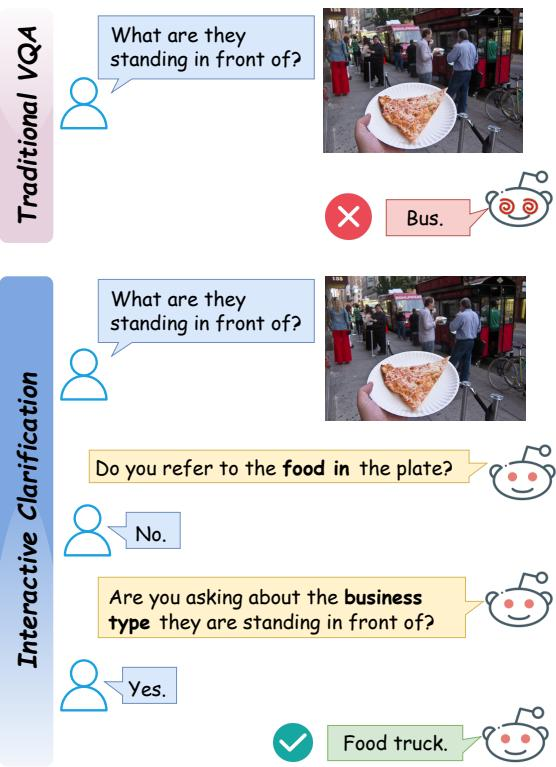
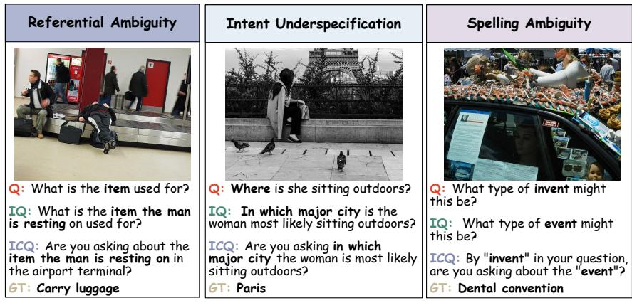
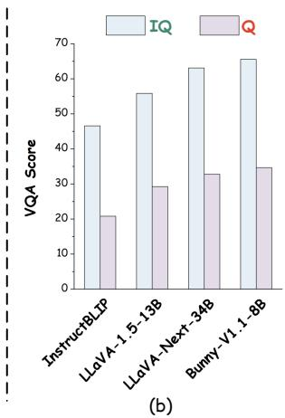
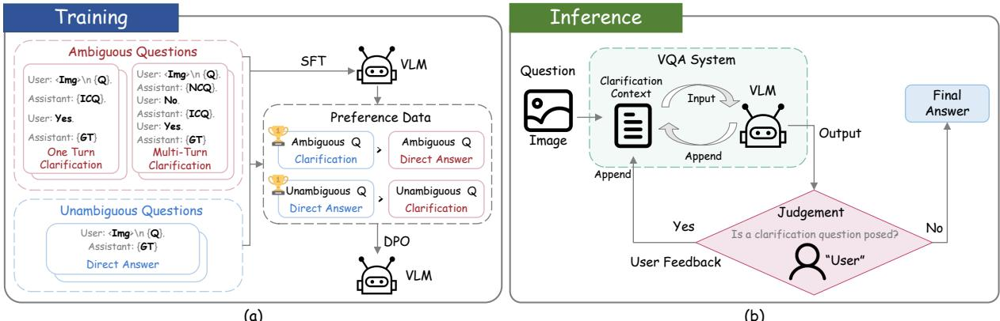
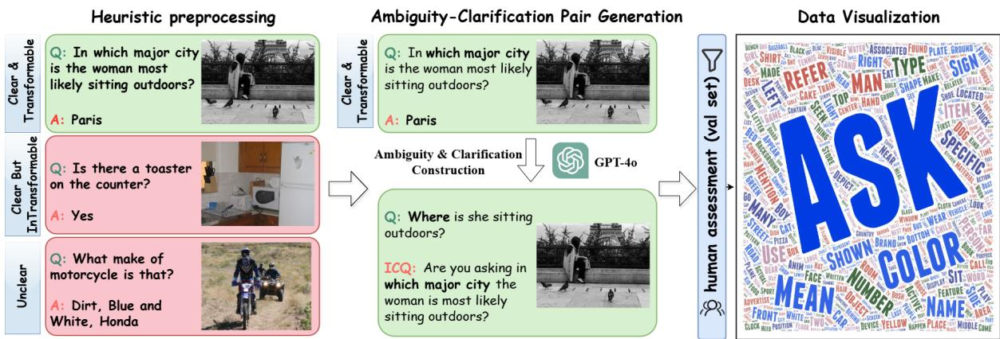
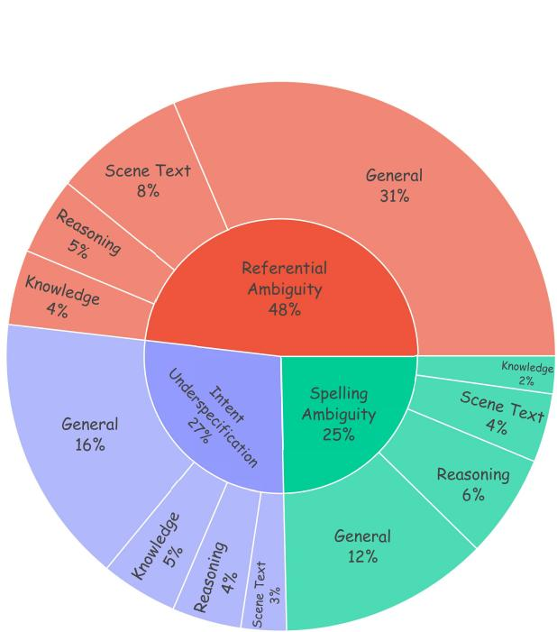
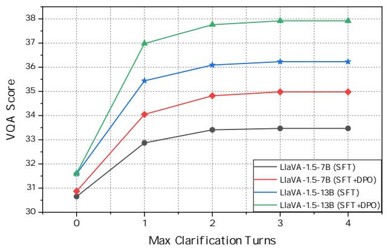
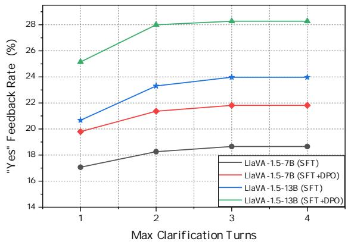
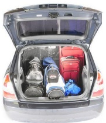
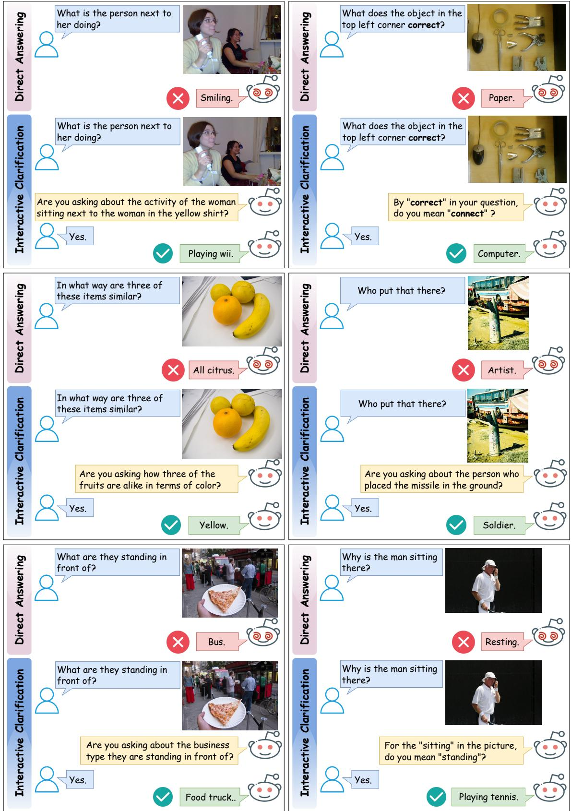

# Teaching Vision-Language Models to Ask: Resolving Ambiguity in Visual Questions

Pu Jian1,2, Donglei Yu1,2, Wen Yang1,2, Shuo Ren1, Jiajun Zhang1,2,3\*

1Institute of Automation, Chinese Academy of Sciences

2School of Artificial Intelligence, University of Chinese Academy of Sciences 3Wuhan AI Research

{jianpu2023, yudonglei2021, yangwen2023, shuo.ren}@ia.ac.cn jjzhang@nlpr.ia.ac.cn

## Abstract

In visual question answering (VQA) context, users often pose ambiguous questions to visual language models (VLMs) due to varying expression habits. Existing research addresses such ambiguities primarily by rephrasing questions. These approaches neglect the inherently interactive nature of user interactions with VLMs, where ambiguities can be clarified through user feedback. However, research on interactive clarification faces two major challenges: (1) Benchmarks are absent to assess VLMs’ capacity for resolving ambiguities through interaction; (2) VLMs are trained to prefer answering rather than asking, preventing them from seeking clarification. To overcome these challenges, we introduce ClearVQA benchmark1, which targets three common categories of ambiguity in VQA context, and encompasses various VQA scenarios. Furthermore, we propose an automated pipeline to generate ambiguity-clarification question pairs. Experimental results demonstrate that training based on the automated generated data enables VLMs to ask reasonable clarification questions, thereby generating more accurate and specific answers based on user feedback.

## 1 Introduction

The visual question answering (VQA) task aims to provide a natural language answer to a question based on a given image (Antol et al., 2015; Gao et al., 2022). Recent studies in VQA field (Stengel-Eskin et al., 2023; Prasad et al., 2023) highlight that users often pose ambiguous visual questions due to differences in language proficiency and expression habits. For example, the question in Figure 1 could be asking about the type of "vehicle" or "business" near the crowd, or it might refer to the "pizza" in the foreground. Since the prevailing assumption of VQA task is to return a single answer, when directly addressing ambiguous questions, even state-of-the-art large visual-language models (VLMs) (Liu et al., 2024a) that excel in visual understanding and cross-modal reasoning may generate undesired responses.

  
Figure 1: In the traditional VQA context, ambiguous questions may confuse VLMs and lead to undesired answers. In such cases, we emphasize that VLMs should pose clarification questions and generate desired answers based on user feedback.

Several studies have investigated how VLMs address ambiguous instructions or questions. Pezzelle (2023) emphasize that the ambiguity of instructions is a significant source of errors in visual-language tasks. One feasible solution to such ambiguity is additional pre-training to align ambiguous text with images better, enabling VLMs to interpret such questions in a more human-like manner (Sun et al.,

2024; Lu et al., 2023). However, this approach leads to significant computational costs. Stengel-Eskin et al. (2023) introduce a question generation model that rephrases ambiguous visual questions based on images to reduce ambiguity. Similarly, Prasad et al. (2023) leverage well-trained VLMs to extract visual details omitted from the questions and employ a large language model (LLM) to rephrase ambiguous questions in a zero-shot manner, thus improving VQA accuracy.

Despite their contributions, these studies focus solely on inferring possible user intents to address ambiguity. They overlook the interactive nature of real-world VLM applications, where ambiguity can be resolved more effectively through user feedback. By engaging in an interactive clarification, VLMs can generate more accurate and specific answers (Naszadi et al., 2023). However, adopting this interactive approach faces two major challenges: 1) How to comprehensively evaluate the ability of VLMs to eliminate ambiguity through interactive approaches and accurately quantify this capability using appropriate metrics; 2) Such interactive approach requires VLMs to pose clarification questions, but most VLMs are primarily trained to answering rather than asking.

To address the first challenge, we introduce ClearVQA benchmark. ClearVQA emphasizes that for ambiguous visual questions, VLMs should ask clarification questions based on given images, and generate desired answers in an interactive dialogue using user feedback. ClearVQA focuses on three common categories of ambiguity observed in VQA datasets and real-world scenes (Bhattacharya et al., 2019; Prasad et al., 2023; Pezzelle, 2023): referential ambiguity, intent underspecification, and spelling ambiguity, as shown in Figure 2. Additionally, ClearVQA spans various VQA scenarios, including visual understanding, cross-modal reasoning, fine-grained knowledge, and scene text.

To address the second challenge, we propose an automatic pipeline for generating ambiguityclarification question pairs. This automated pipeline makes it possible to conduct specialized training for interactive clarification capability. Experimental results demonstrate that training based on automatically generated data enables opensource VLMs to effectively handle ambiguous visual questions. It is worth noting that our work marks an initial step in the multimodal field toward resolving ambiguity through interactive methods.

## 2 ClearVQA Benchmark

## 2.1 Task Formulation

The primary setup for VQA requires VLMs to learn a function $f : X \mapsto { \mathcal { A } } .$ where $\pmb { x } = ( \pmb { v } , \pmb { q } ) \in X$ represents a question-image pair (Dancette et al., 2023). However, in real-world scenes, the input questions may exhibit ambiguity due to variations in users’ language abilities and expression habits. In such cases, we expect VLMs to ask clarification questions and, based on user feedback, generate more accurate and specific answers. Therefore, in the interactive clarification context, VLMs need to learn a function $h : \mathcal { X } \mapsto \mathcal { A } \cup \mathcal { C }$ , thus the input to VLMs becomes

$$
{ \pmb \sigma } _ { n } = ( { \pmb x } , { \pmb c } _ { 1 } , { \pmb \xi } _ { 1 } , { \pmb c } _ { 2 } , { \pmb \xi } _ { 2 } , \cdots , { \pmb c } _ { n } , { \pmb \xi } _ { n } ) \in \pmb { \chi } ,\tag{1}
$$

with $c _ { i }$ and $\pmb { \xi } _ { i } , i \in \{ 1 , \cdots , n \}$ representing the clarification question posed by the VLMs and the user’s feedback at the i-th turn, respectively, and $\scriptstyle \sigma _ { 0 } \ = \ x$ Additionally, the output space is expanded to include the option to pose clarification questions $c \in \mathcal { C }$ The function h can be decomposed into three functions: the VQA function $f : \mathcal X \mapsto \mathcal A .$ the clarification question generation function $g : \mathcal { X } \mapsto \mathcal { C }$ , and the ambiguity detection function $\phi : \mathcal { X } \mapsto \{ 0 , 1 \}$ . In the context of multiturn interactive clarification, the output at the i-th turn, $i \in \{ 1 , 2 , 3 , \dots \}$ is given by

$$
y _ { i } = h ( \pmb { \sigma } _ { i } ) = \left\{ { f ( \pmb { \sigma } _ { i } ) } \quad \mathrm { i f } \phi ( \pmb { \sigma } _ { i } ) = 1 \atop { g ( \pmb { \sigma } _ { i } ) } \quad \mathrm { i f } \phi ( \pmb { \sigma } _ { i } ) = 0  \right. .\tag{2}
$$

Ideally, the iteration terminates if the VLMs output an answer instead of a clarification question.

In ClearVQA benchmark, GPT-4 (Achiam et al., 2023) is used to simulate the "user" role, to provide user feedback $\xi _ { i } , i \in \{ 1 , \cdots , n \}$ when VLM poses a clarification question, as shown in Figure 3 (b). Notably, considering the principle that conversational systems should not expect users to provide complex feedback (Deng et al., 2023, 2024), and to facilitate the simulation of user responses for evaluation, we restrict the user feedback $\xi _ { i }$ in (1) to "yes" or "no".

## 2.2 Automatic Data Construction

In the VQA context, constructing ambiguous visual questions is challenging because it must simultaneously ensure that visual information matters in question answering (Goyal et al., 2017).

  
(a)

  
Figure 2: The ambiguity in visual questions emphasized in the ClearVQA Benchmark. (a) Ambiguity in ClearVQA is categorized into three types: referential ambiguity, intent underspecification, and spelling ambiguity. Q: question. IQ stands for the user’s intended question. ICQ represents the ideal clarification question. GT stands for the ground truth answer. (b) Experimental results on the test set show that, compared to explicitly intended IQ, existing VLMs struggle to handle the corresponding ambiguous question, leading to a significant drop in VQA accuracy.

Some works select examples with significant annotator disagreement from existing VQA datasets as ambiguous visual questions (Stengel-Eskin et al., 2023). However, the true intent of the questioner in these samples is unknown, making it impossible to simulate user judgment on the correctness of clarification questions posed by VLMs during evaluation. We take a different approach by blurring clearly stated questions with explicit answers from existing VQA datasets to ambiguous ones, with strategies to ensure that such ambiguity aligns with real-world scenes. Some details of the data construction process are provided in Appendix E.

Ambiguity Categories. One issue in automatic data construction is ensuring that the generated data aligns with real-world scenes (Guo and Chen, 2024). To address this issue, we focus on some common categories of ambiguity in real-world scenes, rather than allowing the LLM to generate freely. As illustrated in Figure 2, ClearVQA includes the following categories of ambiguity: 1) Referential ambiguity (Prasad et al., 2023) occurs when the referring expression does not uniquely specify the intended referent; 2) Intent underspecification (Bhattacharya et al., 2019) refers to questions with insufficient information to reveal users requirements, making it hard for VLMs to understand the core and provide a specific answer; 3) Spelling ambiguity (Ravichander et al., 2021) occurs when users misspell some key entities in their questions, potentially changing the meaning, and requiring visual information to disambiguate.

Heuristic preprocessing. As mentioned previously, we must first collect VQA samples without ambiguity to provide an explicit ground truth intent for evaluation. Previous work (Bhattacharya et al., 2019) has shown that discrepancies among annotators can partially reflect question ambiguity, thus we use this metric for filtering. Furthermore, for referential ambiguity and intent underspecification, we aim for the collected samples to be transformable through simple natural language processing (NLP) operations (e.g., removing descriptive clauses), facilitating automatic generation by LLMs. Thus we design some heuristic filtering methods, including question complexity filtering and non-wh-questions filtering. The filtering strategies are detailed in Appendix E.

LLM-based ambiguity-clarification question pair generation. We use in-context learning (ICL) with GPT-4 to generate ambiguous questions and corresponding clarification questions based on the VQA samples collected earlier. Given that current MLLMs exhibit limited multimodal ICL capabilities (Monajatipoor et al., 2023), we rely on VLMs to convert images into captions (Liu et al., 2024c). The construction of spelling error-based ambiguities is achieved by directly prompting GPT-4 with instructions like "Replace a named entity with a similar word or typo error." Constructing the other two categories of ambiguity is more challenging, as it may not be feasible for every collected VQA sample. For example, images with only one prominent entity do not allow for referential ambiguity. Therefore, for individual samples, we use a crafted prompt containing examples of the two categories, allowing GPT-4 to adaptively choose whether to generate a question with referential ambiguity or intent underspecification. Detailed prompts are provided in Appendix A.

  
Figure 3: Training process (a) for enabling interactive clarification capabilities and inference process (b). ICQ represents the ideal clarification question. GT stands for the ground truth answer. Q stands for question. NCQ is the clarification question that fails to reflect the true intent of "user".

Human verification and filtering. To further ensure the quality of the test set, we recruit 12 volunteers to manually select visual questions that exhibit ambiguity and align with real-world scenes, as detailed in Appendix C. The statistical results are shown in Appendix E, demonstrating the data diversity of ClearVQA.

## 3 Methodology

We expect the automatically constructed train set in ClearVQA to enable existing VLMs to seek clarification for ambiguous questions and generate answers based on the interactive clarification context. To this end, We implement a two-stage training process, as shown in Figure 3 (a).

Supervised Fine-Tuning (SFT). As mentioned earlier, the interactive clarification task in the VQA context we claimed involves a visual dialogue (Das et al., 2017) format. We construct SFT data based on the prompt formats of open-source VLMs that support visual dialogue. Meanwhile, since we expect VLMs to answer questions without ambiguity directly, a balanced proportion of unambiguous question-answer pairs is included in SFT data.

Direct Preference Optimization (DPO). Assuming that based on SFT, VLMs can acquire the ability to perform interactive clarification in the VQA context, we aim to use DPO (Rafailov et al., 2024) to encourage VLMs to seek clarification for ambiguous questions rather than directly answering them, while also avoiding unnecessary clarifications for clearly stated questions. Based on these principles, when constructing DPO preference pairs, the clarification questions annotated previously are preferred over VLMs’ direct answers for ambiguous questions. For unambiguous questions, we prompt the SFT-trained VLMs to generate clarification questions as negative samples by using prefixes like "Are you referring to", while the gold answer is used as a positive sample.

Inference. As shown in Figure 3 (b), the inference process involves multiple turns of interactive clarification. In each turn, the VLM receives clarification context (including the image and visual question) to either pose a clarification question or generate an answer. "User" (simulated by GPT-4) determines whether a clarification question is posed, and if so, provides user feedback to clarification context. Besides, if VLMs fail to capture the true intent of "User" within limited turns 2, all clarification context is discarded, and VLMs are prompted to generate an answer directly.

Detailed implementations are shown in Appendix D. This implementation is based on LLaVA-1.5 (Liu et al., 2024a). Thus the VLMs finetuned with SFT/DPO could be referred to as Ask-LLaVASFT/DPO.

## 4 Experiments

## 4.1 Experimental Setup

To comprehensively evaluate VLMs’ ability to handle ambiguity in VQA context through interactive clarification, we employ the following metrics.

<table><tr><td rowspan="2">VL Model</td><td rowspan="2">Base LLM</td><td rowspan="2">Refer</td><td rowspan="2">Intent</td><td rowspan="2">Spell</td><td colspan="2">Overall</td></tr><tr><td>VQA</td><td>EM</td></tr><tr><td colspan="8">General Visual Language Models</td></tr><tr><td>BLIP2 (Li et al., 2023)</td><td>Flan-T5-XXL</td><td>19.83</td><td>18.28</td><td>23.79</td><td>20.18</td><td>25.93</td></tr><tr><td>Qwen-VL-7B (Bai et al., 2023)</td><td>Qwen-7B</td><td>20.52</td><td>18.82</td><td>24.45</td><td>20.81</td><td>28.25</td></tr><tr><td>InstructBLIP (Dai et al., 2023)</td><td>Vicuna-13B</td><td>23.45</td><td>22.68</td><td>26.97</td><td>24.01</td><td>31.62</td></tr><tr><td>LLaVA-1.5-7B (Liu et al., 2024a)</td><td>Vicuna-7B</td><td>29.83</td><td>27.91</td><td>30.74</td><td>29.28</td><td>37.88</td></tr><tr><td>LLaVA-1.5-13B (Liu et al., 2024a)</td><td>Vicuna-13B</td><td>31.74</td><td>29.40</td><td>36.34</td><td>31.93</td><td>41.21</td></tr><tr><td>LLaVA-Next-34B (Liu et al., 2024b)</td><td>Hermes-2-Yi-34B</td><td>33.26</td><td>30.84</td><td>35.21</td><td>32.78</td><td>42.77</td></tr><tr><td>LLaVA-Next-13B (Liu et al., 2024b)</td><td>Vicuna-13B</td><td>33.81</td><td>31.12</td><td>38.38</td><td>33.87</td><td>43.60</td></tr><tr><td colspan="7">Ambiguity-Resolving Visual Language Models</td></tr><tr><td>Stengel-Eskin et al. (2023)</td><td>Vicuna-7B</td><td>29.93</td><td>28.14</td><td>31.39</td><td>29.57</td><td>38.41</td></tr><tr><td>Stengel-Eskin et al. (2023)</td><td>Vicuna 13B</td><td>31.81</td><td>29.52</td><td>36.68</td><td>32.09</td><td>41.28</td></tr><tr><td>REPARE (Prasad et al., 2023)</td><td>Vicuna-13B</td><td>34.04</td><td>32.21</td><td>38.45</td><td>34.40</td><td>41.87</td></tr><tr><td colspan="7">Our Model (Tuning on synthetic VQA data with ambiguity)</td></tr><tr><td>Ask-LLaVA-7B (SFT)</td><td>Vicuna-7B</td><td>33.57</td><td>31.06</td><td>37.23</td><td>33.47</td><td>42.34</td></tr><tr><td>Ask-LLaVA-7B (SFT+DPO)</td><td>Vicuna-7B</td><td>34.72</td><td>32.64</td><td>39.14</td><td>34.98</td><td>44.37</td></tr><tr><td>Ask-LLaVA-13B (SFT)</td><td>Vicuna-13B</td><td>35.25</td><td>32.75</td><td>43.28</td><td>36.23</td><td>45.19</td></tr><tr><td>Ask-LLaVA-13B (SFT+DPO)</td><td>Vicuna-13B</td><td>37.06</td><td>33.90</td><td>45.67</td><td>37.92</td><td>47.21</td></tr></table>

Table 1: The overall performance of our model, which is based on SFT and DPO using synthesized VQA data with ambiguity, compared with widely used general VLMs and VLMs that have ambiguity-resolving capability. "Refer", "Intent", and "Spell" stands for the VQA Score of VLMs on visual questions with referential ambiguity, intent underspecification, and spelling ambiguity, respectively. "EM" stands for the exact match metric.

VQA Accuracy. We evaluate the accuracy of VLMs’ responses to ambiguous questions based on the widely adopted VQA Score (Schwenk et al., 2022) and Exact Match (EM) (Rajpurkar et al., 2016) metrics. This experimental setup allows VLMs to pose clarification questions and generate answers based on user feedback. It is worth noting that user feedback is simulated using GPT-4 by comparing the posed clarification questions with reference, as shown in Appendix A. Furthermore, we report the VQA Score of VLMs on visual questions with referential ambiguity, intent underspecification, and spelling ambiguity, respectively.

Ambiguity discrimination accuracy. We evaluate the ability of VLMs to ask for clarification when handling ambiguous questions, while directly answering clearly stated ones. Therefore, we proportionally mix ambiguous questions (from ClearVQA test set) with clearly stated ones for evaluation, and compute the VLMs’ precision, recall, and F1 score (Schuff et al., 2020) based on whether clarification questions are posed.

Clarification question quality human assessment. The quality of clarification questions generated by VLMs is crucial, as it directly affects the reliability from user perspectives (Deng et al., 2023). We introduce the following criteria for human evaluation of VLMs generated clarification questions: 1) Faithfulness, which emphasizes that the clarification question must be relevant to the image and not refer to entities not present in the image. 2) Reasonableness, which requires that clarification questions reflect the potential intent of ambiguous questions. 3) Clarity, which stresses that clarification questions must specify a concrete intent or entity, avoiding vague concepts or unclear references. 4) Overall quality. We use the harmonic mean of the three metrics mentioned above to evaluate the overall quality of the clarification questions generated by the VLMs. More human assessment details are shown in Appendix B.

## 4.2 VQA Accuracy

Overall performance. In Table 1, we present the VQA accuracy of Ask-LLaVA after SFT and DPO, based on the automatically constructed training set from the ClearVQA benchmark. For comparison, we include mainstream open-source multimodal models such as InstructBLIP and LLaVA-Next (Dai et al., 2023; Liu et al., 2024b). According to experimental results, Ask-LLaVA surpasses the base model LLaVA by a significant margin in handling ambiguous questions through SFT, benefiting from the interactive clarification capability that opensource VLMs lack. After DPO, the performance of Ask-LLaVA on ambiguous questions improves further, surpassing the base models by 5.70 and 5.99 on the VQA Score the 7B and 13B scales, respectively. Additionally, Ask-LLaVA outperforms the best-performing open-source VLM, LLaVA-Next-13B, by 4.05 and 3.61 on the VQA and EM metrics on visual questions with ambiguity.

<table><tr><td>Model</td><td>VQA</td><td> $\mathbf { V Q A } _ { \mathrm { D } }$ </td><td> $\Delta$ </td><td> $\Delta \left( \% \right)$ </td><td>VQA</td><td> $\mathbf { V Q A } _ { \mathrm { C a p } }$ </td><td> $\Delta _ { \mathbf { C a p } }$ </td><td> $\Delta _ { \mathrm { C a p } } ( \% )$ </td></tr><tr><td>Ask-LLaVA-7B (SFT)</td><td>33.47</td><td>30.65</td><td>2.82</td><td>9.20</td><td>33.47</td><td>31.67</td><td>1.80</td><td>5.68</td></tr><tr><td>Ask-LLaVA-7B (SFT+DPO)</td><td>34.98</td><td>30.87</td><td>4.11</td><td>13.31</td><td>34.98</td><td>32.15</td><td>2.83</td><td>8.80</td></tr><tr><td>Ask-LLaVA-13B (SFT)</td><td>36.23</td><td>31.59</td><td>4.64</td><td>14.69</td><td>36.23</td><td>33.12</td><td>3.11</td><td>9.39</td></tr><tr><td>Ask-LLaVA-13B (SFT+DPO)</td><td>37.92</td><td>31.61</td><td>6.31</td><td>19.96</td><td>37.92</td><td>33.33</td><td>4.59</td><td>13.77</td></tr></table>

Table 2: Enhancement in VQA accuracy due to interactive clarification. $\Delta$ and $\Delta$ (%) represent relative and percentage improvement of VQA Score through interactive clarification compared to direct answering $\mathrm { ( V Q A _ { D } ) }$ $\mathrm { \Delta V Q A _ { C a p } }$ refers to VQA Score obtained by replacing interactive clarification contexts of Ask-LLaVA with image captions. $\Delta _ { \mathrm { C a p } }$ and $\Delta _ { \mathrm { C a p } }$ (%) are relative and percentage improvements in the VQA Score compared to $\mathrm { \Delta V Q A _ { C a p } . }$

<table><tr><td>Model</td><td>Precision</td><td>Recall</td><td>F1</td></tr><tr><td>LLaVA-1.5-13B GPT-4V</td><td>0.6923 0.8776</td><td>0.3316</td><td>一 0.4813</td></tr><tr><td>GPT-40</td><td>0.7061</td><td>0.4447</td><td>0.5457</td></tr><tr><td></td><td>Our Method</td><td></td><td></td></tr><tr><td> $\mathbf { A s k \mathbf { \mathrm { - } L L a V } A \mathbf { - } 7 B _ { \mathrm { S F T } } }$ </td><td>0.9205</td><td>0.3691</td><td>0.5269</td></tr><tr><td> $\mathbf { A s k { \mathrm { - } } L L a V } \mathbf { A } \mathbf { - } 7 \mathbf { B } _ { \mathbf { D P O } }$ </td><td>0.9362</td><td>0.4326</td><td>0.5918</td></tr><tr><td> $\mathbf { A s k - L L a V A - 1 3 B _ { S F T } }$ </td><td>0.9237</td><td></td><td></td></tr><tr><td> $\mathbf { A s k - L L a V A - 1 3 B _ { D P O } }$ </td><td>0.9389</td><td>0.4547 0.5408</td><td>0.6094 0.6862</td></tr></table>

Table 3: The quantitative results of the VLMs’ ability to distinguish whether a question is ambiguous, after performing SFT and DPO on the ClearVQA training set with ambiguous visual questions fully constructed in an automated manner.

Besides, as shown in Table 1, the performance of Ask-LLaVA on visual queries with referential ambiguity, intent underspecification, and spelling ambiguity significantly improves after SFT and DPO. Among these, the VQA Score for spelling ambiguity shows the most substantial improvement, indicating that this ambiguity is more easily clarified by combining text and visual information. In contrast, visual questions with referential ambiguity and intent underspecification often involve multiple possible interpretations of the user’s true intent and references. For example, the question in Figure 1 could refer to the type of "vehicle" or "business" near the crowd, or it might refer to the "pizza" in the foreground. Therefore, clarifying these two types of ambiguity is more challenging, and the VQA Score improvements obtained through interactive clarification are smaller than visual questions with spelling ambiguity.

We also compare Ask-LLaVA with existing ambiguity-resolving visual–language models. Stengel-Eskin et al. (2023) train a questiongeneration model that rewrites ambiguous visual questions. REPARE (Prasad et al., 2023) is a purpose-built VQA system that mitigates ambiguity through zero-shot question rephrasing and confidence-based answer selection. Experimental results show that the proposed ClearVQA benchmark remains challenging for current ambiguityresolving VLMs. With the crafted training data, Ask-LLaVA performs superior to existing ambiguity-resolving VLMs.

VQA Accuracy Enhancement. To confirm that the enhancement in VQA accuracy on ambiguous questions is indeed due to interactive clarification resolving the ambiguity, rather than simply an enhancement in baseline VQA capabilities from additional training, as described in Section 4.1, we prompt the VLMs to output answers directly without clarification to quantify the gains from interactive clarification. As shown in Table 2, the interactive clarification capability imparted by SFT and DPO significantly improves VQA accuracy compared to direct answering. For the 7B and 13B models, SFT results in a percentage improvement of 9.32% and 14.96% in VQA Score, respectively, while DPO further boosts the gains to 13.31% and 19.96%, respectively.

Furthermore, we replace the interactive clarification context of Ask-LLaVA with image captions in the form of "Are you asking about the image that <caption>", to analyze whether the improvement in VQA accuracy is due to interactive clarification rather than additional context is provided. The user’s feedback is fixed as "yes". The VQA Score under this experimental setup, denoted as ${ \mathrm { V Q A } } _ { \mathrm { C } } ,$ and the accuracy improvement $\Delta _ { \mathrm { C a p } }$ and $\Delta _ { \mathrm { C a p } }$ (%) for Ask-LLaVA relative to $\mathrm { \Delta V Q A _ { C } }$ are shown in Table 2. The experimental results indicate that the contribution of a faithful image description to the VQA Score is limited, and the primary performance improvement is still due to the VLM’s ability to infer the true intent of visual questions and incorporate user feedback.

## 4.3 Discrimination Accuracy of Ambiguity

As described in Section 4.1, we mix the test dataset in ClearVQA benchmark, which contains ambiguous questions, with an equal proportion of randomly sampled non-ambiguous questions to evaluate the ability of VLMs to detect ambiguity. For comparison, in addition to open-source VLMs, we also include large-scale close-source VLMs, GPT-4V (Yang et al., 2023), and GPT-4o (OpenAI, 2024), which achieve state-of-the-art performance across multiple cross-modal tasks. We use prompts such as "If feel ambiguous, please ask ... to clarify. Otherwise, you can answer directly." to guide the VLMs in identifying ambiguity in the visual questions. However, as shown in Table 3, even with crafted prompts, open-source models like LLaVA struggle to seek clarification for ambiguous questions. This limitation arises because, unlike close-source VLMs, they have not been pre-trained and preference-optimized on data with sufficiently diverse formats.

Based on the automatically constructed training set within ClearVQA benchmark, Table 3 quantifies Ask-LLaVA ’s ability to identify whether a question contains ambiguity. The experimental results show that even with simple SFT, owing to our well-designed data construction method, Ask-LLaVA is capable of recognizing ambiguity in visual questions, surpassing the performance of GPT-4V and even GPT-4o in this task. After DPO, this ability is further enhanced, with Ask-LLaVA-13BDPO achieving an F1 score of 0.6862, surpassing GPT-4o by 0.14.

## 4.4 Quality of Clarification Questions

In Section 4.3, the accuracy and recall of Ask-LLaVA in identifying ambiguous questions are analyzed. However, even if ambiguity is correctly identified, failing to generate appropriate clarification questions would still render the model unreliable from the user’s perspective. Therefore, we assess this reasonableness based on the human evaluation criteria proposed in Section 4.1 and detailed in Appendix B. For comparison, we employ large-scale closed-source VLMs, GPT-4V and GPT-4o. We prompt GPT-4V and GPT-4o to generate clarification questions for ambiguous visual questions using prompts like "The question is difficult to answer due to its ambiguity. Please generate a clarification question ..., like ...". We randomly sample 100 clarification questions generated by Ask-LLaVA, GPT-4V, and GPT-4o, and recruit volunteers to perform human assessment. The results are shown in Table 4.

The experimental results indicate that although Ask-LLaVA performs slightly below the welltrained GPT-4V and GPT-4o in terms of faithfulness to the image, it reaches a comparable level. More importantly, Ask-LLaVA significantly outperforms GPT-4V and GPT-4o in the metrics of reasonableness and clarity. This is because Ask-LLaVA generates outputs like "Are you asking in which major city the woman is most likely sitting outdoors?" in Figure 2, which provides a clear inference of the question’s potential intent. In contrast, since GPT-4V and GPT-4o have not been specifically trained, their outputs often include vague statements like "If there is any specific context or part of the image you are referring to, please let me know ...", which require users to provide lengthy clarifications themselves. Moreover, based on the reasonableness metric that comprehensively considers faithfulness, reasonableness, and clarity, we conclude that the training data, generated through our crafted automated data construction method, enables VLMs to maintain robustness in handling ambiguous visual questions from a human perspective. This capability even surpasses that of large-scale models like GPT-4V and GPT-4o.

## 4.5 Performance on Real-World Sences

We further evaluate the performance of Ask-LLaVA on real-world ambiguous questions posed by humans, rather than synthetic ambiguous questions. Specifically, the evaluation questions are derived from VQAv2 (Goyal et al., 2017), a widely used dataset comprising diverse human-posed questions. Following the manual filtering approach in (Ni et al., 2024), we sample 400 ambiguous questions from VQAv2 test set. As described in Section 4.1, GPT-4 simulates user feedback by comparing the clarification questions posed by VLMs with reference. For collected ambiguous questions in real-world scenes, we recruit volunteers to annotate clarification question references based on ground truth answers manually.

<table><tr><td>Model</td><td>Recall</td><td>Faithfulness</td><td>Reasonableness</td><td>Clarity</td><td>Overall Quality</td></tr><tr><td>GPT-4V (Yang et al., 2023)</td><td>0.3316</td><td>1.82</td><td>1.37</td><td>0.85</td><td>1.22</td></tr><tr><td>GPT-4o (OpenAI, 2024)</td><td>0.4447</td><td>1.79</td><td>1.29</td><td>1.03</td><td>1.30</td></tr><tr><td colspan="6">Our Method</td></tr><tr><td>Ask-LLaVA-7B (SFT+DPO)</td><td>0.4326</td><td>1.60</td><td>1.56</td><td>1.62</td><td>1.59</td></tr><tr><td>Ask-LLaVA-13B (SFT+DPO)</td><td>0.5408</td><td>1.65</td><td>1.61</td><td>1.68</td><td>1.65</td></tr></table>

Table 4: Human evaluation results of the clarification questions generated by VLMs, after SFT and DPO training based on the automatically constructed training set from ClearVQA benchmark, for ambiguous questions, along with a comparison against large-scale close-source VLMs.

<table><tr><td>Model</td><td>|VQA</td><td> $\mathbf { V Q A } _ { \mathrm { D } }$ </td><td> $\Delta$ </td><td> $\Delta \left( \% \right)$ </td><td>Recall</td><td>Overall Quality</td></tr><tr><td> $\mathrm { A s k - L L a V } \mathrm { A } { \cdot } \mathrm { 7 B } _ { \mathrm { D P O } }$ </td><td>36.91</td><td>33.74</td><td>3.17</td><td>9.39</td><td>0.3225</td><td>1.53</td></tr><tr><td> $\mathbf { A s k - L L a V A - 1 3 B _ { D P O } }$ </td><td>39.67</td><td>35.25</td><td>4.42</td><td>12.51</td><td>0.4125</td><td>1.56</td></tr></table>

Table 5: The performance of the VLM, after SFT and DPO, on ambiguous questions in real-world scenes derived from VQAv2. $\Delta$ and $\Delta \ : ( \% )$ represent relative and percentage improvement of VQA Score through interactive clarification compared to direct answering $\mathrm { ( V Q A _ { D } ) }$ . Overall quality: Clarification quality human assessment metric.

The experimental results in Table 5 show that even in real-world scenes, our method can identify ambiguity, generate reasonable clarifications, and improve the final VQA accuracy, with examples provided in Appendix G. This indicates that the data synthesized by our crafted automatic pipeline aligns well with real-world scenes. However, due to inevitable factors like ClearVQA benchmark cannot include all ambiguity categories, Ask-LLaVA’s recall for ambiguity and the improvement in VQA Score on real-world scenes are relatively lower compared to those on the ClearVQA test set.

## 5 Related Works

Visual Question Answering (VQA). The VQA task requires VLMs to generate a single answer to visual questions based on images. Early research focused on integrating multimodal features for answer generation (Wang et al., 2017; Anderson et al., 2018). Later, VLMs adopted a pre-training and fine-tuning approach (Liang et al., 2024; Jian et al., 2024; Jing and Zhao, 2024; Zhang et al., 2025; Guan et al., 2025), achieving promising results on various VQA benchmarks (Alayrac et al., 2022; Li et al., 2023). More recently, large VLMs or LLMs have shown advanced performance using prompt engineering like in-context learning, without extensive training (Shao et al., 2023; Sun et al., 2024). As the VQA field gradually evolves, datasets focusing on various real-world scenes are proposed, VQAv2 (Goyal et al., 2017) is the largest VQA dataset, including diverse VQA samples. OK-VQA (Marino et al., 2019) and A-OKVQA (Schwenk et al., 2022) emphasize VLMs’ ability to understand fine-grained knowledge beyond commonsense. A-OKVQA further focuses on knowledgebased reasoning. These efforts provide a broad and valuable resource for our research.

Question Ambiguity. Ambiguity in instructions or questions is extensively explored in NLP fields (Schutze, 1995; Min et al., 2020; Futeral et al., 2023). In multimodal and VQA context, Bhattacharya et al. (2019) claim that the underspecification of questions in VQA is a major contribution to discrepancies among annotators. (Pezzelle, 2023) highlights that ambiguity is a critical source of errors in visual language tasks. (Stengel-Eskin et al., 2023) collect ambiguous questions from existing VQA datasets and propose a rephrased model to mitigate ambiguity. Prasad et al. (2023) focuses on leveraging existing LLMs for VLMs, facilitating rephrasing in a zero-shot approach, making it applicable to real-world scenes, and achieving performance enhancements in several VQA datasets. Ni et al. (2024) constructs a multimodal, multi-turn reasoning framework that mimics human cognitive processes to handle ambiguity.

Selective Question Answering. Recent studies advocate for models to refuse questions they do not know, thereby enhancing their reliability (Srinivasan et al., 2024; Cheng et al., 2024b). In VQA context, Whitehead et al. (2022) employs a selection function, to make the first exploration of deep models with a rejection option. Khan and Fu (2024) employs a proxy model to rephrase visual questions and refuse answers when different rephrasings yield inconsistent outputs, implementing selective prediction in a black-box manner. These works inspire our investigation into how VLMs can selectively ask for clarification. However, our focus is more challenging, as it involves not only rejecting to answer but also emphasizing the reasonableness of clarification questions posed to users.

## 6 Conclusion

We propose ClearVQA benchmark, for evaluating VLMs’ ability to handle ambiguity in visual questions through interactive clarification. ClearVQA benchmark focuses on three common ambiguity categories in visual questions and involves several VQA scenarios. Furthermore, ClearVQA includes a training set constructed based on a crafted and automated pipeline. Experimental results show that VLMs trained on this synthetic data can generate reasonable clarification questions for ambiguous questions, thereby generating more accurate and specific answers based on user feedback.

## Limitations

Firstly, as the first attempt to address visual question ambiguity through an interactive approach, we focus on user responses limited to "yes" or "no" for simplicity, enabling simulating user feedback with intelligent agents like GPT-4. This may not fully capture the complexity of interactive clarification in real-world scenes. We plan to improve the evaluation process to support more diverse user feedback in future work. Secondly, although our approach grants VLMs interactive clarification ability from scratch, they seldom generate truly new clarification questions after misreading user intent. Future work might address this with reflection (Cheng et al., 2024a), Monte Carlo tree search (Chen et al., 2024), and other advanced reasoning techniques (Sun et al., 2025; Chen et al., 2025; Ren et al., 2025). Thirdly, due to computational constraints, we limited our exploration of VLMs’ interactive clarification capabilities to the 7B and 13B scales.

## Acknowledgments

We thank our colleagues Junhong Wu and Jianghao Chen for their helpful suggestions during the writing stage of the paper. We also gratefully acknowledge the volunteers who contributed to the data construction process. Finally, we thank all reviewers for their detailed reviews and insightful comments.

This work is supported by National Key R&D Program of China 2022ZD0160602 and the Strategic Priority Research Program of Chinese Academy of Sciences under Grant XDA04080400.

## References

Josh Achiam, Steven Adler, Sandhini Agarwal, Lama Ahmad, Ilge Akkaya, Florencia Leoni Aleman, Diogo Almeida, Janko Altenschmidt, Sam Altman, Shyamal Anadkat, et al. 2023. Gpt-4 technical report. arXiv preprint arXiv:2303.08774.

Jean-Baptiste Alayrac, Jeff Donahue, Pauline Luc, Antoine Miech, Iain Barr, Yana Hasson, Karel Lenc, Arthur Mensch, Katherine Millican, Malcolm Reynolds, Roman Ring, Rutherford, et al. 2022. Flamingo: a visual language model for few-shot learning. In Advances in Neural Information Processing Systems, volume 35, pages 23716–23736. Curran Associates, Inc.

Peter Anderson, Xiaodong He, Chris Buehler, Damien Teney, Mark Johnson, Stephen Gould, and Lei Zhang. 2018. Bottom-up and top-down attention for image captioning and visual question answering. In Proceedings of the IEEE conference on computer vision and pattern recognition, pages 6077–6086.

Stanislaw Antol, Aishwarya Agrawal, Jiasen Lu, Margaret Mitchell, Dhruv Batra, C Lawrence Zitnick, and Devi Parikh. 2015. Vqa: Visual question answering. In Proceedings ofthe IEEE international conference on computer vision, pages 2425–2433.

Jinze Bai, Shuai Bai, Shusheng Yang, Shijie Wang, Sinan Tan, Peng Wang, Junyang Lin, Chang Zhou, and Jingren Zhou. 2023. Qwen-vl: A frontier large vision-language model with versatile abilities. arXiv preprint arXiv:2308.12966.

Nilavra Bhattacharya, Qing Li, and Danna Gurari. 2019. Why does a visual question have different answers? In Proceedings ofthe IEEE/CVF International Conference on Computer Vision, pages 4271–4280.

Ali Furkan Biten, Ruben Tito, Andres Mafla, Lluis Gomez, Marçal Rusinol, Ernest Valveny, CV Jawahar, and Dimosthenis Karatzas. 2019. Scene text visual question answering. In Proceedings of the IEEE/CVF international conference on computer vision, pages 4291–4301.

Guoxin Chen, Minpeng Liao, Chengxi Li, and Kai Fan. 2024. Alphamath almost zero: process supervision without process. arXiv preprint arXiv:2405.03553.

Jianghao Chen, Zhenlin Wei, Zhenjiang Ren, Ziyong Li, and Jiajun Zhang. 2025. Lr2bench: Evaluating long-chain reflective reasoning capabilities of large language models via constraint satisfaction problems. arXiv preprint arXiv:2502.17848.

Kanzhi Cheng, Yantao Li, Fangzhi Xu, Jianbing Zhang, Hao Zhou, and Yang Liu. 2024a. Vision-language models can self-improve reasoning via reflection. arXiv preprint arXiv:2411.00855.

Qinyuan Cheng, Tianxiang Sun, Xiangyang Liu, Wenwei Zhang, Zhangyue Yin, Shimin Li, Linyang Li, Kai Chen, and Xipeng Qiu. 2024b. Can ai assistants know what they don’t know? arXiv preprint arXiv:2401.13275.

Wenliang Dai, Junnan Li, Dongxu LI, Anthony Tiong, Junqi Zhao, Weisheng Wang, Boyang Li, Pascale N Fung, and Steven Hoi. 2023. Instructblip: Towards general-purpose vision-language models with instruction tuning. In Advances in Neural Information Processing Systems, volume 36, pages 49250–49267. Curran Associates, Inc.

Corentin Dancette, Spencer Whitehead, Rishabh Maheshwary, Ramakrishna Vedantam, Stefan Scherer, Xinlei Chen, Matthieu Cord, and Marcus Rohrbach. 2023. Improving selective visual question answering by learning from your peers. In Proceedings of the IEEE/CVF Conference on Computer Vision and Pattern Recognition, pages 24049–24059.

Abhishek Das, Satwik Kottur, Khushi Gupta, Avi Singh, Deshraj Yadav, José MF Moura, Devi Parikh, and Dhruv Batra. 2017. Visual dialog. In Proceedings of the IEEE conference on computer vision and pattern recognition, pages 326–335.

Yang Deng, Lizi Liao, Liang Chen, Hongru Wang, Wenqiang Lei, and Tat-Seng Chua. 2023. Prompting and evaluating large language models for proactive dialogues: Clarification, target-guided, and noncollaboration. In Findings of the Association for Computational Linguistics: EMNLP 2023, pages 10602–10621, Singapore. Association for Computational Linguistics.

Yang Deng, Lizi Liao, Zhonghua Zheng, Grace Hui Yang, and Tat-Seng Chua. 2024. Towards humancentered proactive conversational agents. In Proceedings of the 47th International ACM SIGIR Conference on Research and Development in Information Retrieval, pages 807–818.

Matthieu Futeral, Cordelia Schmid, Ivan Laptev, Benoît Sagot, and Rachel Bawden. 2023. Tackling ambiguity with images: Improved multimodal machine translation and contrastive evaluation. In Proceedings ofthe 61st Annual Meeting ofthe Associationfor Computational Linguistics (Volume 1: Long Papers), pages 5394–5413, Toronto, Canada. Association for Computational Linguistics.

Feng Gao, Qing Ping, Govind Thattai, Aishwarya Reganti, Ying Nian Wu, and Prem Natarajan. 2022. Transform-retrieve-generate: Natural languagecentric outside-knowledge visual question answering. In Proceedings of the IEEE/CVF Conference on Computer Vision and Pattern Recognition, pages 5067–5077.

Yash Goyal, Tejas Khot, Douglas Summers-Stay, Dhruv Batra, and Devi Parikh. 2017. Making the v in vqa matter: Elevating the role of image understanding in visual question answering. In Proceedings ofthe IEEE conference on computer vision and pattern recognition, pages 6904–6913.

Boyu Guan, Yining Zhang, Yang Zhao, and Chengqing Zong. 2025. Trifine: A large-scale dataset of visionaudio-subtitle for tri-modal machine translation and benchmark with fine-grained annotated tags. In Proceedings of the 31st International Conference on Computational Linguistics, pages 8215–8231.

Xu Guo and Yiqiang Chen. 2024. Generative ai for synthetic data generation: Methods, challenges and the future. arXiv preprint arXiv:2403.04190.

Edward J Hu, Phillip Wallis, Zeyuan Allen-Zhu, Yuanzhi Li, Shean Wang, Lu Wang, Weizhu Chen, et al. 2021. Lora: Low-rank adaptation of large language models. In International Conference on Learning Representations.

Pu Jian, Donglei Yu, and Jiajun Zhang. 2024. Large language models know what is key visual entity: An llm-assisted multimodal retrieval for vqa. In Proceedings of the 2024 Conference on Empirical Methods in Natural Language Processing, pages 10939–10956.

Ye Jing and Xinpei Zhao. 2024. Dq-former: Querying transformer with dynamic modality priority for cognitive-aligned multimodal emotion recognition in conversation. In Proceedings of the 32nd ACM International Conference on Multimedia, pages 4795– 4804.

Zaid Khan and Yun Fu. 2024. Consistency and uncertainty: Identifying unreliable responses from blackbox vision-language models for selective visual question answering. In Proceedings of the IEEE/CVF Conference on Computer Vision and Pattern Recognition, pages 10854–10863.

Junnan Li, Dongxu Li, Silvio Savarese, and Steven Hoi. 2023. Blip-2: Bootstrapping language-image pretraining with frozen image encoders and large language models. In International conference on machine learning, pages 19730–19742. PMLR.

Yupu Liang, Yaping Zhang, Cong Ma, Zhiyang Zhang, Yang Zhao, Lu Xiang, Chengqing Zong, and Yu Zhou. 2024. Document image machine translation with dynamic multi-pre-trained models assembling. In Proceedings of the 2024 Conference of the North American Chapter of the Association for Computational Linguistics: Human Language Technologies (Volume 1: Long Papers), pages 7084–7095.

Haotian Liu, Chunyuan Li, Yuheng Li, and Yong Jae Lee. 2024a. Improved baselines with visual instruction tuning. In Proceedings of the IEEE/CVF Conference on Computer Vision and Pattern Recognition, pages 26296–26306.

Haotian Liu, Chunyuan Li, Yuheng Li, Bo Li, Yuanhan Zhang, Sheng Shen, and Yong Jae Lee. 2024b. Llavanext: Improved reasoning, ocr, and world knowledge.

Yexin Liu, Zhengyang Liang, Yueze Wang, Muyang He, Jian Li, and Bo Zhao. 2024c. Seeing clearly, answering incorrectly: A multimodal robustness benchmark for evaluating mllms on leading questions. arXiv preprint arXiv:2406.10638.

Junyu Lu, Ruyi Gan, Dixiang Zhang, Xiaojun Wu, Ziwei Wu, Renliang Sun, Jiaxing Zhang, Pingjian Zhang, and Yan Song. 2023. Lyrics: Boosting fine-grained language-vision alignment and comprehension via semantic-aware visual objects. arXiv preprint arXiv:2312.05278.

Kenneth Marino, Mohammad Rastegari, Ali Farhadi, and Roozbeh Mottaghi. 2019. Ok-vqa: A visual question answering benchmark requiring external knowledge. In Proceedings of the IEEE/cvf conference on computer vision and pattern recognition, pages 3195–3204.

Sewon Min, Julian Michael, Hannaneh Hajishirzi, and Luke Zettlemoyer. 2020. AmbigQA: Answering ambiguous open-domain questions. In Proceedings of the 2020 Conference on Empirical Methods in Natural Language Processing (EMNLP), pages 5783– 5797, Online. Association for Computational Linguistics.

Masoud Monajatipoor, Liunian Harold Li, Mozhdeh Rouhsedaghat, Lin Yang, and Kai-Wei Chang. 2023. MetaVL: Transferring in-context learning ability from language models to vision-language models. In Proceedings of the 61st Annual Meeting of the Association for Computational Linguistics (Volume 2: Short Papers), pages 495–508, Toronto, Canada. Association for Computational Linguistics.

Kata Naszadi, Putra Manggala, and Christof Monz. 2023. Aligning predictive uncertainty with clarification questions in grounded dialog. In Findings ofthe Association for Computational Linguistics: EMNLP 2023, pages 14988–14998, Singapore. Association for Computational Linguistics.

Minheng Ni, Yutao Fan, Lei Zhang, and Wangmeng Zuo. 2024. Visual-o1: Understanding ambiguous instructions via multi-modal multi-turn chain-of-thoughts reasoning. arXiv preprint arXiv:2410.03321.

OpenAI. 2024. GPT-4o.

Sandro Pezzelle. 2023. Dealing with semantic underspecification in multimodal NLP. In Proceedings of the 61st Annual Meeting of the Association for Computational Linguistics (Volume 1: Long Papers), pages 12098–12112, Toronto, Canada. Association for Computational Linguistics.

Archiki Prasad, Elias Stengel-Eskin, and Mohit Bansal. 2023. Rephrase, augment, reason: Visual grounding of questions for vision-language models. arXiv preprint arXiv:2310.05861.

Rafael Rafailov, Archit Sharma, Eric Mitchell, Christopher D Manning, Stefano Ermon, and Chelsea Finn. 2024. Direct preference optimization: Your language model is secretly a reward model. Advances in Neural Information Processing Systems, 36.

Pranav Rajpurkar, Jian Zhang, Konstantin Lopyrev, and Percy Liang. 2016. SQuAD: 100,000+ questions for machine comprehension of text. In Proceedings of the 2016 Conference on Empirical Methods in Natural Language Processing, pages 2383–2392, Austin, Texas. Association for Computational Linguistics.

Abhilasha Ravichander, Siddharth Dalmia, Maria Ryskina, Florian Metze, Eduard Hovy, and Alan W Black. 2021. NoiseQA: Challenge set evaluation for user-centric question answering. In Proceedings of the 16th Conference of the European Chapter of the Associationfor Computational Linguistics: Main Volume, pages 2976–2992, Online. Association for Computational Linguistics.

Shuo Ren, Pu Jian, Zhenjiang Ren, Chunlin Leng, Can Xie, and Jiajun Zhang. 2025. Towards scientific intelligence: A survey of llm-based scientific agents. arXiv preprint arXiv:2503.24047.

Hendrik Schuff, Heike Adel, and Ngoc Thang Vu. 2020. F1 is Not Enough! Models and Evaluation Towards User-Centered Explainable Question Answering. In Proceedings of the 2020 Conference on Empirical Methods in Natural Language Processing (EMNLP), pages 7076–7095, Online. Association for Computational Linguistics.

Hinrich Schutze. 1995. Ambiguity in language learning: computational and cognitive models. Stanford University.

Dustin Schwenk, Apoorv Khandelwal, Christopher Clark, Kenneth Marino, and Roozbeh Mottaghi. 2022. A-okvqa: A benchmark for visual question answering using world knowledge. In European conference on computer vision, pages 146–162. Springer.

Zhenwei Shao, Zhou Yu, Meng Wang, and Jun Yu. 2023. Prompting large language models with answer heuristics for knowledge-based visual question answering. In Proceedings ofthe IEEE/CVF Conference on computer vision and pattern recognition, pages 14974– 14983.

Tejas Srinivasan, Jack Hessel, Tanmay Gupta, Bill Yuchen Lin, Yejin Choi, Jesse Thomason, and Khyathi Chandu. 2024. Selective “selective prediction”: Reducing unnecessary abstention in visionlanguage reasoning. In Findings of the Association for Computational Linguistics ACL 2024, pages 12935–12948. Association for Computational Linguistics.

Elias Stengel-Eskin, Jimena Guallar-Blasco, Yi Zhou, and Benjamin Van Durme. 2023. Why did the chicken cross the road? rephrasing and analyzing ambiguous questions in VQA. In Proceedings of the 61st Annual Meeting of the Association for Computational Linguistics (Volume 1: Long Papers), pages 10220–10237, Toronto, Canada. Association for Computational Linguistics.

Quan Sun, Yufeng Cui, Xiaosong Zhang, Fan Zhang, Qiying Yu, Yueze Wang, Yongming Rao, Jingjing Liu, Tiejun Huang, and Xinlong Wang. 2024. Generative multimodal models are in-context learners. In Proceedings ofthe IEEE/CVF Conference on Computer Vision and Pattern Recognition, pages 14398– 14409.

Wei Sun, Wen Yang, Pu Jian, Qianlong Du, Fuwei Cui, Shuo Ren, and Jiajun Zhang. 2025. Ktae: A model-free algorithm to key-tokens advantage estimation in mathematical reasoning. arXiv preprint arXiv:2505.16826.

Peng Wang, Qi Wu, Chunhua Shen, Anthony Dick, and Anton Van Den Henge. 2017. Explicit knowledgebased reasoning for visual question answering. In Proceedings ofthe 26th International Joint Conference on Artificial Intelligence, pages 1290–1296.

Spencer Whitehead, Suzanne Petryk, Vedaad Shakib, Joseph Gonzalez, Trevor Darrell, Anna Rohrbach, and Marcus Rohrbach. 2022. Reliable visual question answering: Abstain rather than answer incorrectly. In European Conference on Computer Vision, pages 148–166. Springer.

Zhengyuan Yang, Linjie Li, Kevin Lin, Jianfeng Wang, Chung-Ching Lin, Zicheng Liu, and Lijuan Wang. 2023. The dawn of lmms: Preliminary explorations with gpt-4v (ision). arXiv preprint arXiv:2309.17421, 9(1):1.

Zhiyang Zhang, Yaping Zhang, Yupu Liang, Cong Ma, Lu Xiang, Yang Zhao, Yu Zhou, and Chengqing Zong. 2025. Understand layout and translate text: Unified feature-conductive end-to-end document image translation. IEEE Transactions on Pattern Analysis and Machine Intelligence.

## A Prompt Template

In this section, we provide detailed prompt templates for constructing questions with referential ambiguity, intent underspecification, and spelling ambiguity as follows.

## Prompt for Constructing Referential Ambiguity and Intent Underspecification

I’ll give you a question for an image,   
the corresponding answer, and a textual   
description of the image, please complete   
the following task for me: Blur the   
question so there is ambiguity in the   
question. You will also need to pose   
a clarification question that explains   
the ambiguity of the previously blurred   
question. You have the following options:   
1. blur the intent of the problem,   
e.g., a) and b) below; 2. replace the   
entities that appear in the problem with an   
ambiguous reference, e.g., c) and d) below.

Examples:   
a) Question: Why would we suspect that   
these bears are male and female?   
Caption: a couple of bears sitting on top   
of a rock   
Answer: kiss   
Blurred question: Why would we suspect   
these bears are different?   
Clarification question: Do you mean the   
reason we suspect these bears are male and   
female?   
Ambiguous Type: 1

b) Question: This type of bus can be found   
in what popular city?   
Caption: A trolley car traveling down a   
city street   
Answer: kiss   
Blurred question: Where this type of bus   
can be found?   
Clarification question: Do you want to know   
this type of bus can be found in what   
popular city?   
Ambiguous Type: 1

c) Question: Name the material used to make   
these umbrella shown in this picture?   
Caption: A group of people walking through   
a park with umbrellas hanging from the trees   
Answer: paper.   
Blurred question: What material used to   
make them?   
Clarification question: Are you referring   
to these colorful umbrellas in the picture?   
Ambiguous Type: 2

c) Question: What auction company is   
accessible only via the item featured in   
this photo?   
Caption: a person typing on a laptop   
computer at a desk.   
Answer: ebay   
Blurred question: What auction company is

accessible only via this method?   
Clarification question: Are you referring   
to the auction company accessible only via   
laptop computer?   
Ambiguous Type: 2   
Question: <Question>   
Caption: <Caption>   
Answer: <Answer>

## Prompt for Constructing VQA Samples with Spelling Ambiguity

I’ll give you a question for an image,   
please complete the following task for me:   
Replace a named entity in the question   
with a similar word. You also need to   
ask a question to clarify the misleading   
effect of the above modification.   
Examples:   
Question: Why would we suspect that these   
bears are male and female?   
Blurred question: Why would we suspect that   
these beers are male and female?   
Clarification question: For the "beers" in   
the picture, do you mean "bears"?   
Question: This type of bus can be found in   
what popular city?   
Blurred question: This type of bush can be   
found in what popular city?   
Clarification question: By "bush" in your   
question, do you mean "bus" in the picture?   
Question: <Question>

Additionally, we offer prompts used to evaluate the ability of VLMs to perform interactive clarification in VQA scenarios, where the LLM is instructed to assess whether the clarification question proposed by the VLM aligns with the user’s original intent and to simulate user feedback, based on reference clarification question.

Prompt for Constructing Simulate User   
Feedback   
Are these two sentences semantically   
similar (yes / no).   
Input:   
Sentence 1: Are you asking about the number   
on the front of the bus?   
Sentence 2: Are you asking for the 4-digit   
number visible on both the front of the   
bus?   
output:   
yes   
Input:   
Sentence 1: Are you asking which cow has   
the most leaves on its back?

1) Faithfulness: This metric evaluates   
whether the clarification question is   
relevant to the image. If the question   
involves entities not present in the image   
or refers to unrelated concepts, this   
score should be lower. Otherwise, assign a   
higher score.

Sentence 2: Are you asking about the tree   
that has the most branches with leaves?   
output:   
no   
Input:   
Sentence 1: For the "houses" in the picture,   
do you mean "horses"?   
Sentence 2: When you refer to "houses" in   
the question, are you instead referring to   
"horses" seen in the picture?   
output:   
yes   
Input:   
Sentence 1: When you mention "planting" in   
your question, are you referring to the   
"plant" on the counter?   
Sentence 2: For the "planting" in your   
question, do you mean "painting" that is   
on the counter?   
output:   
no   
Input:   
Sentence 1: <Clarification Question>   
Sentence 2: <Reference>   
Output:

Finally, we include prompts used to evaluate the impact of interactive clarification on VQA accuracy, designed to guide VLMs to directly answer questions without seeking clarification.

Prompt for Guide VLMs to Answer Directly   
USER: <image>\nGiven the image, answer the   
following question with no more than three   
words. <Question> ASSISTANT:

## B Questionnaire for Clarification Human Evaluation

We provide the questionnaire used for human evaluation of the reasonableness of clarification questions generated by VLMs as follows.

## Questionnaire for Clarification Question Human Assessment

This is a clarification question posed by   
the visual language model in response to the   
ambiguous visual question "<Question>":   
<Clarification>. Please assess the   
reasonableness of the clarification   
question based on the following criteria.   
(For each metric below, please select a   
score from 1, 2, 3, where 1 means poor, 2   
means acceptable, and 3 means good.)

This is the image corresponding to   
the Visual question: <image>

2) Reasonableness: This metric measures   
whether the clarification question   
reflects the potential intent of the   
original ambiguous question. Below are two   
positive examples with a score of 2 and   
one negative example with a score of 1.

Question with ambiguity: What are these little things called?

Positive example 1: Are you asking about the little things on the screen ofthe device on the left?

Positive example 2: Are you referring to the   
stationery in those cylindrical containers?   
Negative example: Are you referring to the two   
computers in the image?

3) Clarity: The clarification question   
must specify a concrete intent or entity,   
avoiding vague concepts or unclear   
references, such as "If there’s another   
specific detail you’re referring to,   
please let me know!" or "Could you please   
clarify the details or confirm the object   
of interest in the image?"

## C Data Quality Human Verification

We employed several human verification strategies to ensure the quality of data automatically constructed using models like GPT-4. The human data quality validation focuses on three key aspects.

• Ambiguity: The constructed ambiguous question should introduce actual ambiguity, making it harder to answer than the original clearly stated question.

• Clarification usefulness: The reference clarification question should be useful to eliminate the ambiguity of the constructed question.

• Reality. The constructed question must align with real-world scenes, i.e., those that might

<table><tr><td>Ambiguity Category</td><td>Ambiguity</td><td>Clarification Usefulness</td><td>Reality</td><td>Overall Acceptable</td></tr><tr><td>Referential Ambiguity</td><td>96.1%</td><td>94.9%</td><td>83.4%</td><td>82.1%</td></tr><tr><td>Intent Underspecification</td><td>92.8%</td><td>89.4%</td><td>81.3%</td><td>80.9%</td></tr><tr><td>Spelling Ambiguity</td><td>95.6%</td><td>94.3%</td><td>76.4%</td><td>75.8%</td></tr></table>

Table 6: Human evaluation and filtering of ClearVQA were conducted from three aspects: Whether ambiguity is introduced (ambiguity), whether the clarification question is helpful (clarification usefulness), and whether the data aligns with real-world scenes (reality). "Overall acceptable" refers to the proportion of data meeting all quality filtering criteria.

## be raised by the user.

Human data quality verification was performed at two stages of the proposed automated data construction process.

Human evaluation for prompt refinement. During the data construction prompt design stage, we first sample ambiguous-clarification question pairs, and manually assess whether their quality meets the requirements for ambiguity and clarification usefulness. If the requirements are not met, the prompt is adjusted.

Human verification of ClearVQA test set. To further ensure the quality of the test set, we recruited 12 volunteers to manually select visual questions of acceptable quality. Unlike the prompt refinement stage, this human quality validation stage not only focuses on ambiguity and clarification usefulness but also considers reality. This means that the ambiguous questions must align with real-world scenes. We designed the following questionnaire for human filtering of the test set. The three questions in the questionnaire correspond to the three aspects of data quality we focus on. The evaluation results are shown in Table 6. For a sample to be considered acceptable, the annotator must answer "yes" to the quality of all three questions in the questionnaire.

Questionnaire for Human Quality Filtering   
of Test Set in ClearVQA   
Image: <image>   
Ground Truth Answer: <GTA>   
Original Question: <OQ>   
Constructed Ambiguous Question: <CAQ>   
Reference Clarification Question: <RCQ>   
For the given image, original question,   
ground truth answer, constructed ambiguous   
question, and reference clarification   
question, please respond to the following:   
1) Ambiguity. Does the constructed   
ambiguous question introduce actual

ambiguity compared to the original   
question, making it impossible to provide   
an answer or suggest other reasonable   
answers beyond the ground truth answer?   
(Yes / No)   
2) Does the reference clarification   
question provide additional information   
that helps generate an answer to the   
constructed ambiguous question? (Yes / No)   
3) In real-world scenes, is it possible   
that the user could express the intent   
of the original question through the   
ambiguous question? (Yes / No)

The human evaluation results in Table 6 show that our crafted pipeline can automatically generate questions with actual ambiguity and useful clarification questions. Furthermore, most of these ambiguous questions align with real-world scenes, i.e., these questions could be raised by users.

## D Training Details

We selected the checkpoints LLaVA-1.5-7b-hf and LLaVA-1.5-13b-hf from Huggingface as the base models during training. Table 7 presents the training parameters for the SFT phase, where the learning rate is set to $2 \times 1 0 ^ { - 4 }$ , and specifically, the learning rate for the multimodal projector is $2 \times 1 0 ^ { - 5 }$ . We apply LoRA (Hu et al., 2021) for SFT and DPO. The LoRA training hyperparameters are Lora = 128 and Lora = 256. The DPO training parameters, applied after the SFT stage, are shown in Table 8, with a learning rate of $5 \times 1 0 ^ { - 7 }$ including the multimodal projector. In the SFT and DPO stages, we used 1 and 2 Nividia A100 GPU for training, respectively.

For VLMs with capabilities to pose clarification questions after SFT, we sample the incorrect clarification questions they generate that do not align with the reference (judged by GPT-4). Therefore, we can construct multi-turn dialogue data in the format of "Error clarification; ’No’ feedback; Reference clarification; ’Yes’ feedback; Answer" Data with such format enables VLMs to generate different clarification questions when the "user" responds with "No", thereby equipping VLMs with the ability for multi-turn interactive clarification.

<table><tr><td>Hyper-parameters</td><td>Value</td></tr><tr><td>Training steps</td><td>300</td></tr><tr><td>Batch size</td><td>64</td></tr><tr><td>Warmup ratio</td><td>0.03</td></tr><tr><td>Gradient accumulation</td><td>2</td></tr><tr><td>Learning rate scheduler</td><td>Cosine</td></tr><tr><td>Learning rate</td><td> $2 \times 1 0 ^ { - 4 }$ </td></tr><tr><td>Projector learning rate</td><td> $2 \times 1 0 ^ { - 5 }$ </td></tr><tr><td>Lorar</td><td>128</td></tr><tr><td>Loraα</td><td>256</td></tr><tr><td>GPUs</td><td>2</td></tr><tr><td>Optimizer</td><td>Adam</td></tr></table>

Table 7: The hyper-parameters used during SFT of VLMs using the training set in ClearVQA benchmark.
<table><tr><td>Hyper-parameters</td><td>Value</td></tr><tr><td>Training steps</td><td>200</td></tr><tr><td>Batch size</td><td>32</td></tr><tr><td>Warmup ratio</td><td>0.03</td></tr><tr><td>Gradient accumulation</td><td>2</td></tr><tr><td>Learning rate scheduler</td><td>Cosine</td></tr><tr><td>Learning rate</td><td> $5 \times 1 0 ^ { - 6 }$ </td></tr><tr><td>Lorar</td><td>128</td></tr><tr><td>Loraα</td><td>256</td></tr><tr><td>GPUs</td><td>1</td></tr><tr><td>Optimizer</td><td>Adam</td></tr></table>

Table 8: The hyper-parameters used during DPO of VLMs using the training set in ClearVQA benchmark.

It is worth noting that the prompt used to elicit direct answers from VLMs in Appendix A is frequently employed in the training and VQA capability assessment of VLMs like LLaVA (Liu et al., 2024a). We take additional training setup to further avoid any decline in VQA performance due to the use of this prompt after training with ClearVQA data, which could lead to unfair assessments of the accuracy improvements due to interactive clarification. specifically, we phrase VQA samples from datasets like VQAv2 with this prompt and incorporate them into the training data.

## E Data Details

We present an intuitive flowchart in Figure 4 for the automated data construction process introduced in Section 2.2. Using heuristic preprocessing, we filter clearly stated VQA samples that are easily transformable into ambiguous ones. For these VQA samples, we prompt GPT-4 to introduce ambiguity by removing or blurring key information through simple NLP operations. Meanwhile, a reference clarification question is generated based on the clearly stated original question. More specific details are provided below.

Detailed heuristic preprocessing. As described in Section 2.2, we first need to collect VQA samples without ambiguity to provide a clear, welldefined intent during evaluation. We select samples based on the degree of annotator disagreement. In many VQA datasets, the ground truth is derived from an answer list annotated by 10 individuals. If none of the answers appears more than three times, we exclude the sample. Additionally, for the two categories of ambiguity other than spelling errors, we aim for the collected samples to be achievable through simple NLP operations, making it easier for the LLM to annotate automatically. To achieve this, we designed several heuristic filtering methods: 1) Length filtering. Questions with more words typically provide more detail to express user intent clearly, and simply removing some key information can make the question ambiguous. Therefore, we apply a word count threshold to filter for the desired questions mentioned earlier. In this work, we exclude VQA samples with fewer than 13 words. 2) Non-special interrogative sentence filtering. Generally, open-ended questions like special interrogative sentences are more likely to involve ambiguity, while yes/no or multiple-choice questions have limited answering space and are less prone to ambiguity. We apply regularization strategies, such as filtering questions where the answers are "yes," "none," "no," to exclude yes/no or multiple-choice VQA samples, retaining only those that are special interrogative sentence. When designing the filtering strategy, we sample the filtered data to check if it meets the expected criteria. If not, we adjust the strategy accordingly.

Data without ambiguity in ClearVQA. In section 4.1, we use samples without ambiguity for evaluating VQA accuracy in abstain setup and ambiguity discriminative ability. It is worth noting that these non-ambiguous samples were derived from the data filtered based on discrepancies among annotators, as discussed in Section 2.2. We did not directly use the original questions that were ultimately employed to construct the ambiguous questions, because the heuristic preprocess described before tends to filter questions with fewer words. This approach helps prevent VLMs from performing well on certain metrics merely by identifying longer questions as unambiguous.

Figure 4: The automated construction process of ambiguity-clarification question pairs. Here, ICQ refers to the ideal clarification question generated by GPT-4, used for training and evaluation.
<table><tr><td>Ambiguity Category</td><td>General</td><td>Knowledge</td><td>Reasoning</td><td>Scene Text</td><td>Train</td><td>Test</td></tr><tr><td>Referential Ambiguity</td><td>4580</td><td>824</td><td>2188</td><td>1651</td><td>7305</td><td>1938</td></tr><tr><td>Intent Underspecification</td><td>3316</td><td>661</td><td>1276</td><td>635</td><td>4793</td><td>1095</td></tr><tr><td>Spelling Ambiguity</td><td>3120</td><td>531</td><td>1567</td><td>1011</td><td>5236</td><td>992</td></tr><tr><td>Overall</td><td>11016</td><td>2016</td><td>5031</td><td>3297</td><td>17334</td><td>4025</td></tr></table>

Table 9: ClearVQA Benchmark Data Statistics. The various VQA scenarios, like knowledge and scene text, are derived from different existing VQA datasets, as detailed in Appendix E.

  
Figure 5: The data diversity in ClearVQA, illustrated by data distribution in the ClearVQA test set. ClearVQA focuses on three common categories of ambiguity. Each ambiguity category includes a variety of VQA scenarios, including general, knowledge, reasoning, and scene text.

Diversity and data statistics. We collect original question samples from various existing VQA datasets, covering a wide range of VQA scenarios, to ensure the diversity of the ClearVQA benchmark. Specifically, the samples for the general VQA scenario in Table 9 are derived from the widely-used VQAv2 (Goyal et al., 2017), a dataset encompassing visual understanding, counting, and entity classification questions. To incorporate fine-grained knowledge beyond common sense, we sample from OK-VQA (Marino et al., 2019) for the knowledge VQA scenario. Additionally, we source reasoning VQA scenario samples from A-OKVQA (Schwenk et al., 2022), a dataset emphasizing reasoning based on commonsense or fine-grained knowledge in the image. Besides, scene text VQA scenario samples are collected from ST-VQA (Biten et al., 2019). The data distribution of ClearVQA across different ambiguity categories and VQA scenarios is shown in Table 9 and Figure 5. This statistical result demonstrates the significant data diversity of ClearVQA benchmark.

  
(a)

  
(b)  
Figure 6: The impact of clarification turns on the performance of interactive clarification. (a) VQA Score after different numbers of clarification turns. Turn 0 represents the VQA Score when VLMs are prompted to answer directly without clarification. (b) The proportion of test set samples whose ambiguity is successfully clarified ("user" feedback is "Yes") after different clarification turns.

## F The Impact of clarification turns.

We designed experiments to analyze how increasing clarification turns affects interactive clarification performance. Specifically, we recorded the VQA accuracy and the proportion of samples where the user’s intent was correctly inferred (feedback as "Yes") after different numbers of turns, as shown in Figure 6. The results indicate that the most significant improvements in VQA accuracy and the proportion of correctly inferred user intent occur in the first turn, with smaller gains from the second and third turns. This result demonstrates that accurately inferring user intent enhances VQA accuracy. However, no further performance improvement is observed when the number of clarification turns exceeds three. This suggests that, despite learning to handle ambiguity through interactive clarification, LLaVA’s reasoning ability remains limited.

## G Case Study

In Figure 7, we present cases from the ClearVQA benchmark across various VQA scenarios and ambiguity categories. Furthermore, examples in Figure 8 illustrate how VLMs handle visual question ambiguities in real-world scenes through the interactive clarification approach emphasized in our work. These examples are generated by LaVA-13B(SFT+DPO), which performs best in our experiments.

<table><tr><td></td><td>Referential Ambiguity</td><td>Intent Underspecification</td><td>Spelling Ambiguity</td></tr><tr><td>Genral</td><td> Q: What color is his hat? OQ: What color is the hat that the man with spectacles is wearing? ICQ: Are you asking about the color of</td><td> Q: What is they using with their meal? OQ: What type of cutlery is the person using with their meal? ICQ: Are you asking about the type of cutlery the person is using with their meal?</td><td> Q: Is there a gold bag in the trunk? OQ: Is there a golf bag in the trunk?</td></tr><tr><td>Kknodge</td><td> Q: What is the item used for? OQ: What is the item the man is resting on used for? ICQ: Are you asking about the item the man is resting on in the airport terminal? GT: Carry luggage</td><td> Q: This plane was inspired by who? OQ: This is a modern plane that was originally inspired by what two brothers? ICQ: Are you asking the two brothers originally inspiring design of modern plane? GT: Paris</td><td> Q: What type of cat behind the motorcycle? OQ: What type of car behind the motorcycle? ICQ: For the &quot;cat&quot; in the picture, do you mean &quot;car&quot;? GT: Mustang</td></tr><tr><td>Reaoning</td><td> Q: What are these little things called? OQ: What are the little things on the screen on the left called? ICQ: Are you asking about the little things on the screen on the left? GT: Shortcut icons</td><td> Q: Where is she sitting outdoors? OQ: In which major city is the woman most likely sitting outdoors? ICQ: Are you asking in which major city the woman is most likely sitting outdoors? GT: Paris</td><td> Q: What type of invent might this be? OQ: What type of event might this be? ICQ: By &quot;invent&quot; in your question, are you asking about the &quot;event&quot;? GT: Dental convention</td></tr><tr><td>SCcee xt</td><td> Q: What is the number of that bus? OQ: What is the number of bus which is going towards right? ICQ: Are you asking about the bus number for the one heading towards the right? GT:490</td><td> Q: What is connected to the black controller? OQ: What is the name of the gaming box for the black controller? ICQ: Are you asking about the name of the gaming box using the black controller? GT: PlayStation</td><td> Q: What does the sign instruct divers to wait for? OQ: What does the sign instruct drivers to wait for? ICQ: When you mention &quot;divers&quot; in your question, do you mean &quot;drivers&quot;? GT: Green light</td></tr></table>

Figure 7: Examples of different VQA scenarios and different ambiguity categories in ClearVQA benchmark. Q: question. IQ stands for the user’s intended question. ICQ represents the ideal clarification question. GT stands for the ground truth answer.

  
Figure 8: Examples demonstrating the performance of our emphasized interactive clarification in real-world scenes. These visual questions are posed by humans and derived from the VQAv2 dataset.