# The Hidden Attention of Mamba Models

Ameen Ali\*, Itamar Zimerman\*, Lior Wolf Blavatnik School of Computer Science and AI, Tel Aviv University {ameenali,zimerman1}@mail.tau.ac.il , wolf@cs.tau.ac.il

## Abstract

The Mamba layer offers an efficient selective state-space model (SSM) that is highly effective in modeling multiple domains, including NLP, long-range sequence processing, and computer vision. Selective SSMs are viewed as dual models, in which one trains in parallel on the entire sequence via an IO-aware parallel scan, and deploys in an autoregressive manner. We add a third view and show that such models can be viewed as attention-driven models. This new perspective enables us to empirically and theoretically compare the underlying mechanisms to that of the attention in transformers and allows us to peer inside the inner workings of the Mamba model with explainability methods. Our code is publicly available1.

## 1 Introduction

Recently, Selective State Space Layers (Gu and Dao, 2023) (S6), also known as Mamba models, have shown remarkable performance in diverse applications including large-scale language modeling (Lieber et al., 2024; Zuo et al., 2024), image processing (Liu et al., 2024b; Zhu et al., 2024), video processing (Li et al., 2025), medical imaging (Liu et al., 2024a), tabular data (Ahamed and Cheng, 2024), point-cloud analysis (Liang et al., 2024), graphs (Wang et al., 2024a) N-dimensional sequence modeling (Li et al., 2024) and more. Characterized by their linear complexity in sequence length during training and fast RNN-like computation during inference (left and middle panels of Figure 1), Mamba models offer a 5x increase in the throughput of Transformers for autoregressive generation and the ability to efficiently handle long-range dependencies.

Despite their growing success, the informationflow dynamics between tokens in Mamba models and the way they learn remain largely unexplored. Critical questions about their learning mechanisms, particularly how they capture dependencies and whether they resemble established layers, such as RNNs, CNNs, or attention mechanisms, remain unanswered. Additionally, the lack of interoperability methods for these models may pose a significant hurdle to debugging them and may also reduce their applicability in socially sensitive domains in which explainability is required.

Motivated by these gaps, our research aims to provide insights into the dynamics of Mamba models and develop methodologies for their interpretation. While the traditional views of SSMs are through the lens of convolutional or recurrent layers (Gu et al., 2021b), we show that S6 layers are a form of attention models. This is achieved through a novel reformulation of Mamba computation using a data-control linear operator, unveiling hidden attention matrices within the Mamba layer. This enables us to employ well-established interpretability and explainability techniques, commonly used in transformer realms, to devise the first set of tools for interpreting Mamba models. Furthermore, our analysis of implicit attention matrices offers a direct framework for comparing the properties and inner representations of transformers (Vaswani et al., 2017) and Mamba models.

Our main contributions encompass the following aspects: (i) We shed light on the fundamental nature of Mamba models, by showing that they rely on implicit attention, which is implemented by a unique data-control linear operator, as illustrated in Figure 1 (right). (ii) Our analysis reveals that Mamba models give rise to three orders of magnitude more attention matrices than transformers. (iii) We provide a set of explainability and interpretability tools based on these hidden attention matrices. (iv) For comparable model sizes, Mamba model-based attention shows comparable explainability metrics results to that of transformers. (v)

We present a theoretical analysis of the evolution of attention capabilities in SSMs and their expressiveness, offering a deeper understanding of the factors that contribute to Mamba’s effectiveness.

## 2 Background

Transformers The Transformer architecture is the dominant architecture in the recent NLP and Computer Vision literature. It relies on selfattention to capture dependencies between different tokens. Self-attention allows these models to dynamically focus on different parts of the input sequence, calculating the relevance of each part to others. It can be computed as follows:

$$
{ \mathrm { A t t e n t i o n } } ( Q , K , V ) = \alpha V , \quad \alpha = { \mathrm { S o f t m a x } } \left( { \frac { Q K ^ { T } } { \sqrt { d _ { k } } } } \right)\tag{1}
$$

where $Q , K$ , and V represent queries, keys, and values, respectively, and $d _ { k }$ is the dimension of the keys. Additionally, the Transformer utilizes H attention heads to process information in parallel, allowing the model to capture various dependencies. The attention matrix $\alpha$ enables the models to weigh the importance of tokens based on their contribution to the context, and they can also used for interpretability (Bahdanau et al., 2014), explainability (Chefer et al., 2021b), and improved classification (Touvron et al., 2021; Chefer et al., 2022).

State-Space Layers State-Space Layers were first introduced in (Gu et al., 2021b) and have seen significant improvements through the seminal work in (Gu et al., 2021a). These layers have demonstrated promising results across several domains, including NLP (Wang et al., 2023b; Mehta et al., 2022; Fu et al., 2022), audio generation (Goel et al., 2022), image processing (Baron et al., 2023; Nguyen et al., 2022), long video understanding (Wang et al., 2023a), RL (David et al., 2022; Lu et al., 2024),and more. Given one channel of the input sequence $x : = ( x _ { 1 } , \cdots , x _ { L } )$ such that $x _ { i } \in \mathbb { R }$ , these layers can be implemented using either recurrence or convolution. The recurrent view, which relies on the state $h _ { t } \in \mathbb { R } ^ { N }$ where N is the state size, is defined as follows: given the discretization functions $f _ { A } , f _ { B }$ , and parameters $A .$ $B , C$ and $\Delta ,$ the recurrent rule for the SSM is:

$$
\bar { A } = f _ { A } ( A , \Delta ) , \quad \bar { B } = f _ { B } ( B , \Delta ) ,
$$

$$
h _ { t } = { \bar { A } h _ { t - 1 } } + { \bar { B } x _ { t } } , \quad y _ { t } = C h _ { t } .\tag{2}
$$

(3)

This recurrent rule can be expanded as:

$$
h _ { t } = { \bar { A } } ^ { t } { \bar { B } } x _ { 0 } + { \bar { A } } ^ { t - 1 } { \bar { B } } x _ { 1 } + \cdot \cdot \cdot + { \bar { B } } x _ { t }\tag{4}
$$

$$
y _ { t } = C \bar { A } ^ { t } \bar { B } x _ { 0 } + C \bar { A } ^ { t - 1 } \bar { B } x _ { 1 } + \cdot \cdot \cdot + C \bar { B } x _ { t } .\tag{5}
$$

Since the recurrence is linear, Eq. 4 can also be expressed as a convolution, via a convolution kernel $K : = ( k _ { 1 } , \cdots , k _ { L } )$ , where $k _ { i } = C \bar { A } ^ { i - 1 } \bar { B }$ , thus allowing sub-quadratic complexity in sequence length. The equivalence between the recurrence and the convolution provides a versatile framework that enables parallel and efficient training with subquadratic complexity with the convolution view, alongside a faster recurrent view, facilitating the acceleration of autoregressive generation by decoupling step complexity from sequence length. As the layer defined as a map from $\mathbb { R } ^ { L } \mathrm { t o } \mathbb { R } ^ { L }$ , to process D channels the layer employs D independent copies of itself.

S6 Layers A recent development in state space layers is S6 (Gu and Dao, 2023), which show outstanding performance in large-scale NLP (Zuo et al., 2024; Waleffe et al., 2024), vision (Liu et al., 2024b; Zhu et al., 2024), graph classification (Wang et al., 2024a), and more. These models rely on time-variant SSMs, namely, the discrete matrices ${ \bar { A } } , { \bar { B } } .$ and C of each channel are modified over the L time steps depending on the input sequence. As opposed to traditional SSMs, which operate individually on each channel, S6 layers compute the SSM matrices $\bar { A } _ { i } , \bar { B } _ { i } , C _ { i }$ for all $i \leq L$ based on all the channels, and then apply the timevariant recurrent rule individually for each channel. Hence, we denote the entire input sequence by $\hat { x } : = ( \hat { x } _ { 1 } , \cdot \cdot \cdot , \hat { x } _ { L } ) \in \mathbb { R } ^ { L \times D }$ where $\hat { x } _ { i } \in { \mathbb { R } ^ { D } }$ The per-time matrices $\bar { A } _ { i } , \bar { B } _ { i }$ , and $C _ { i }$ are defined as follows:

$$
B _ { i } = { S } _ { \boldsymbol { B } } \left( \hat { x } _ { i } \right) , \quad C _ { i } = { S } _ { C } \left( \hat { x } _ { i } \right) , \quad \Delta _ { i } = { \mathrm { S p } } \left( { S } _ { \boldsymbol { \Delta } } \left( \hat { x } _ { i } \right) \right) ,\tag{6}
$$

$$
f _ { A } ( \Delta _ { i } , A ) = \exp ( \Delta _ { i } A ) , \quad f _ { B } ( \Delta _ { i } , B _ { i } ) = \Delta _ { i } B _ { i } ,\tag{7}
$$

$$
\bar { A } _ { i } = f _ { A } ( \Delta _ { i } , A ) , \quad \bar { B } _ { i } = f _ { B } ( \Delta _ { i } , B _ { i } ) ,\tag{8}
$$

where $f _ { A } , f _ { B }$ represents the discretization rule, $S _ { B } , S _ { C } , S _ { \Delta }$ are linear projection layers, and $\mathrm { S p }$ is the Softplus function that is a smooth approximation of ReLU. While previous SSMs employ complex-valued SSMs and non-diagonal matrices, Mamba employs real-diagonal parametrization.

The motivation for input-dependent time-variant layers is to make those recurrent layers more expressive, allowing them to capture more complex dependencies. While other input-dependent mechanisms have been proposed, Mamba significantly improves on these layers by presenting a flexible, yet still efficient, approach. This efficiency was achieved via the IO-aware implementation of associative scans, which can be parallelized on modern hardware via work-efficient parallel scanners (Blelloch, 1990; Martin and Cundy, 2017).

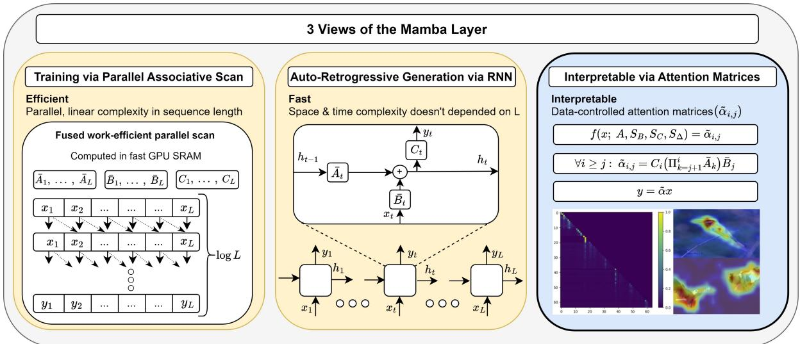  
Figure 1: Three Perspectives of the Selective State-Space Layer: (Left) Selective State-Space Models (S6) can be efficiently computed with linear complexity using parallel scans, allowing for effective parallelization on modern hardware, such as GPUs. (Middle) Similar to SSMs, the S6 layer can be computed via a recurrent rule. (Right) A new view of the S6 layer, showing that it uses attention similarly to transformers (see Eq. 13). Our view enables the generation of attention maps, offering valuable applications in areas such as XAI.

Mamba The Mamba block is built on top of the S6 layer, Conv1D and other elementwise operators. Inspired by Gated-MLP, given an input $\hat { x } ^ { \prime } : = ( \hat { x } _ { 1 } ^ { \prime } , \cdot \cdot \cdot \hat { x } _ { L } ^ { \prime } )$ it is defined as follows:

$$
\begin{array} { r } { \hat { x } = \mathrm { S i L U } ( \mathrm { C o n v } 1 \mathrm { D } ( \mathrm { L i n e a r } ( \hat { x } ^ { \prime } ) ) , \hat { z } = \mathrm { S i L U } ( \mathrm { L i n e a r } ( \hat { x } ^ { \prime } ) ) } \\ { \hat { y } ^ { \prime } = \mathrm { L i n e a r } \big ( \mathrm { S } 6 ( \hat { x } ) \otimes \hat { z } \big ) \big ) , \quad \hat { y } = \mathrm { L a y e r N o r m } ( \hat { y } ^ { \prime } + \hat { x } ^ { \prime } ) . ( 9 ) } \end{array}
$$

where is elementwise multiplication. Mamba models contain Λ stacked blocks and D channels per block, and we denote the tensors in the i-th block and j-th channel with a superscript, where the first index refers to the block number.

Inspired by the vision transformer (ViT) (Dosovitskiy et al., 2020), both (Liu et al., 2024b; Zhu et al., 2024) replace the standard self-attention mechanism by two Mamba layers, where each layer is applied in a bidirectional manner. The resulting model (ViM) achieves favorable results compared to the standard ViT in terms of both accuracy and efficiency, when comparing models with the same number of parameters.

Explainability Explainability methods have been extensively explored in the context of DNNs, particularly in domains of NLP (Arras et al., 2017; Yuan et al., 2021) and vision (Bach et al., 2015).

The contributions most closely aligned with ours are those specifically tailored for Transformer explainability. In (Abnar and Zuidema, 2020), the authors introduce the Attention-Rollout method, which aggregates attention matrices across different layers by analyzing paths in the inter-layer pairwise attention graph. Similar approaches were used in (Ali et al., 2022; Chefer et al., 2021b) and many other works that built their methods on top of the attention matrices of Transformers. Our work conducts a similar attention-based analysis, however, it leverages implicit attention matrices, which we demonstrate are embedded within the S6 layer.

## 3 Method

In this section, we detail our methodology. First, we reformulate S6 layers as self-attention, enabling the extraction of attention matrices from S6 layers. Subsequently, we demonstrate how these hidden attention matrices can be leveraged to develop classagnostic and class-specific tools for explainable AI of Mamba models.

## 3.1 Hidden Attention Matrices In S6

Given the per-channel time-variant system matrices $\bar { A } _ { 1 } , \cdot \cdot \cdot , \bar { A } _ { L } , \bar { B } _ { 1 } , \cdot \cdot \cdot , \bar { B } _ { L }$ , and $C _ { 1 } , \cdots , C _ { L }$ from Eq. 6 and 8, each channel within the S6 layers can be processed independently. Thus, for simplicity, the formulation presented in this section will proceed under the assumption that the input sequence x consists of a single channel.

By considering the initial conditions $h _ { 0 } = 0 ,$

unrolling Eq. 3 yields:

$$
h _ { 1 } = { \bar { B } } _ { 1 } x _ { 1 } , \quad y _ { 1 } = C _ { 1 } { \bar { B } } _ { 1 } x _ { 1 } ,\tag{10}
$$

$$
h _ { 2 } = { \bar { A } } _ { 2 } { \bar { B } } _ { 1 } x _ { 1 } + { \bar { B } } _ { 2 } x _ { 2 } , \quad y _ { 2 } = C _ { 2 } { \bar { A } } _ { 2 } { \bar { B } } _ { 1 } x _ { 1 } + C _ { 2 } { \bar { B } } _ { 2 } x _ { 2 } , \nonumber\tag{11}
$$

and in general:

$$
h _ { t } = \sum _ { j = 1 } ^ { t } \left( \Pi _ { k = j + 1 } ^ { t } { \bar { A } } _ { k } \right) { \bar { B } } _ { j } x _ { j } , y _ { t } = C _ { t } \sum _ { j = 1 } ^ { t } \left( \Pi _ { k = j + 1 } ^ { t } { \bar { A } } _ { k } \right) { \bar { B } } _ { j } x _ { j } .\tag{12}
$$

By converting Eq. 12 into a matrix form, we get:

$$
y = \tilde { \alpha } x ,\tag{13}
$$

where α˜ is defined by the following matrix:

$$
\left[ \begin{array} { c c c c c } { { C _ { 1 } \bar { B } _ { 1 } } } & { { \quad \quad } } & { { 0 \quad } } & { { \cdots \quad } } & { { 0 } } \\ { { C _ { 2 } \bar { A } _ { 2 } \bar { B } _ { 1 } } } & { { \quad \quad } } & { { C _ { 2 } \bar { B } _ { 2 } } } & { { \quad \cdots \quad } } & { { 0 } } \\ { { \quad \vdots \quad } } & { { \quad \vdots \quad } } & { { \ddots \quad } } & { { \quad 0 } } \\ { { C _ { L } \Pi _ { k = 2 } ^ { L } \bar { A } _ { k } \bar { B } _ { 1 } } } & { { \quad \quad } } & { { C _ { L } \Pi _ { k = 3 } ^ { L } \bar { A } _ { k } \bar { B } _ { 2 } } } & { { \quad \cdots \quad } } & { { C _ { L } \bar { B } _ { L } } } \end{array} \right]
$$

Hence, the S6 layer can be viewed as a datacontrolled linear operator (Poli et al., 2023), where the matrix $\tilde { \alpha } \in \mathbb { R } ^ { L \times L }$ is a function of the input and the parameters $A , S _ { B } , S _ { C } , S _ { \Delta }$ . The element at row i and column $j$ captures how $x _ { j }$ influences $y _ { i } .$ , and is computed by:

$$
\tilde { \alpha } _ { i , j } = { C _ { i } } \Big ( \Pi _ { k = j + 1 } ^ { i } \bar { A } _ { k } \Big ) \bar { B } _ { j } .\tag{14}
$$

Eq. 13 and 14 link α˜ to the conventional standard attention matrix $( \mathrm { E q . 1 } )$ , and highlight that S6 can be considered a variant of causal linear attention.

Simplifying and Interpreting Since ${ \bar { A } } _ { t }$ is a diagonal matrix, the different $N$ coordinates of the state $h _ { t }$ in Eq. 12 do not interact when computing $h _ { t + 1 }$ . Thus, Eq. 12 can be computed independently for each coordinate $m \in \{ 1 , 2 , \ldots , N \}$

$$
y _ { t } = \sum _ { m = 1 } ^ { N } C _ { t } [ m ] \Big ( \sum _ { j = 1 } ^ { t } \big ( \Pi _ { k = j + 1 } ^ { t } \bar { A } _ { k } [ m , m ] \big ) \bar { B } _ { j } [ m ] x _ { j } \Big ) ,\tag{15}
$$

where $C _ { t } [ m ] , A _ { k } [ m , m ] , B _ { j } [ m ] \in \mathbb { R }$ , plugging it into Eq. 14 yields:

$$
\tilde { \alpha } _ { i , j } = \sum _ { m = 1 } ^ { N } C _ { i } [ m ] \Bigl ( \Pi _ { k = j + 1 } ^ { i } \bar { A } _ { k } [ m , m ] \Bigr ) \bar { B } _ { j } [ m ] .\tag{16}
$$

An interesting observation arising from $\operatorname { E q } .$ . 16 is that a single channel of S6 produces N inner attention matrices ${ \cal C } _ { i } [ m ] \Big ( \Pi _ { k = j + 1 } ^ { i } \bar { A } _ { k } [ m , m ] \Big ) \bar { B } _ { j } [ m ]$ which are summed up over m to obtain α˜. In contrast, in the Transformer, a single attention matrix is produced by each of the H attention heads. Given that the number of channels in Mamba models D is typically a hundred times greater than the number of heads in a transformer (for example, Vision-Mamba-Tiny has D = 384 channels, compared to H = 3 heads in DeiT-Tiny), the Mamba layer generates approximately $\begin{array} { r } { \frac { D N } { H } \approx 1 0 0 N } \end{array}$ more attention matrices than the original self-attention layer.

To further understand the structure and characterization of these hidden attention matrices ${ \tilde { \alpha } } .$ , we will express them for each channel d as a direct function of the input xˆ. To do so, we first substitute Eq.6, 7 and Eq.8 into Eq. 14, and obtain:

$$
\tilde { \alpha } _ { i , j } = { S _ { C } ( \hat { x } _ { i } ) \exp \Big ( \sum _ { k = j + 1 } ^ { i } { S _ { \mathrm { P } } ( S _ { \Delta } ( \hat { x } _ { k } ) ) A } \Big ) } { S _ { \mathrm { P } } ( S _ { \Delta } ( \hat { x } _ { j } ) ) } { S _ { B } ( \hat { x } _ { j } ) } .\tag{17}
$$

For simplicity, we propose a simplification of Eq. 17 by substituting the Softplus function with the ReLU function denoted by R, and summing only over positive elements:

$$
\tilde { \alpha } _ { i , j } \approx { \cal S } _ { C } ( \hat { x } _ { i } ) ( \exp \Big ( \sum _ { \stackrel { k = j + 1 } { \cal S _ { \Delta } ( \hat { x } _ { k } ) > 0 } } ^ { i } S _ { \Delta } ( \hat { x } _ { k } ) { \cal A } \Big ) ) { \mathrm R } ( S _ { \Delta } ( \hat { x } _ { j } ) ) S _ { B } ( \hat { x } _ { j } ) .
$$

Consider the following query/key notation:

(18)

$$
\begin{array} { r l } { \tilde { Q } _ { i } : = S _ { C } ( \hat { x } _ { i } ) , \quad \tilde { K } _ { j } : = { \bf R } ( S _ { \Delta } ( \hat { x } _ { j } ) ) S _ { B } ( \hat { x } _ { j } ) , } & { } \\ { \tilde { H } _ { i , j } : = \exp \Big ( \displaystyle \sum _ { k = j + 1 } ^ { i } S _ { \Delta } ( \hat { x } _ { k } ) A \Big ) , \quad } & { } \end{array}\tag{19}
$$

Eq. 18 can be further simplified to:

$$
\tilde { \alpha } _ { i , j } \approx \tilde { Q } _ { i } \tilde { H } _ { i , j } \tilde { K } _ { j } .\tag{20}
$$

This formulation enhances our understanding of the Mamba’s attention mechanism. Whereas traditional self-attention captures the influence of $x _ { j }$ on $x _ { i }$ through the dot products between $Q _ { i }$ and $K _ { j }$ , Mamba’s approach correlates this influence with ${ \tilde { Q } } _ { i }$ and $\tilde { K } _ { j }$ , respectively. Additionally, $\tilde { H } _ { i , j }$ controls the significance of the recent $i - j$ tokens, encapsulating the continuous aggregated historical context spanning from $x _ { j }$ to xi.

This distinction between self-attention and Mamba, captured by ${ \tilde { H } } _ { i , j } .$ , could be a key factor in enabling Mamba models to understand and utilize continuous historical context within sequences more efficiently than attention.

Moreover, Eq. 20 offers further insights into the characterization of the hidden attention matrices by demonstrating that the only terms modified across channels are A and $\Delta _ { i } .$ which influence the values of $\tilde { H } _ { i , j }$ and ${ \tilde { K } } _ { j }$ through the discretization rule in

Eq. 7. Hence, all the attention maps follow a common pattern, distinguished by the keys $\tilde { K } _ { j }$ and the significance of the history $\tilde { H } _ { i , j }$ via $A$ and $\Delta _ { i }$

A distinct divergence between Mamba’s attention mechanism and traditional self-attention lies in the latter’s utilization of a per-row softmax. It is essential to recognize that various attention models have either omitted the softmax (Lu et al., 2021) or substituted it with elementwise neural activations (Hua et al., 2022; Wortsman et al., 2023; Ma et al., 2022), achieving comparable outcomes to the original framework.

## 3.2 Application to Attention Rollout

As our class-agnostic explainability technique for Mamba models, we built our method on top of the Attention-Rollout (Abnar and Zuidema, 2020). For simplicity, we assume that we are dealing with a ViM model which operates on sequences of size $L { + 1 }$ , where L is the sequence length obtained from the $\sqrt { L } \times \sqrt { L }$ image patches, with a classification (CLS) token appended to the end of the sequence.

To do $\mathbf { s o } ,$ for each sample, we first extract the hidden attention matrix $\tilde { \alpha } ^ { \bar { \lambda } , d }$ for any channel $d \in$ [D] and layer $\lambda \in \left[ \Lambda \right]$ according to the formulation in Eq. 13, such that $\bar { \alpha } ^ { \lambda , d } \in \mathbb { R } ^ { ( \breve { L } + 1 ) \times ( L + 1 ) }$ )

Attention-Rollout is then applied as follows:

$$
\forall \lambda \in [ \Lambda ] : \quad \tilde { \alpha } ^ { \lambda } = \mathbb { I } _ { L + 1 } + \mathbb { E } _ { d \in [ D ] } \big ( \tilde { \alpha } ^ { \lambda , d } \big ) ,\tag{21}
$$

where $\mathbb { I } _ { L + 1 }$ is an identity matrix utilized to incorporate the influence of skip connections.

Now, the per-layer global attention matrices $\tilde { \alpha } ^ { \lambda }$ are aggregated into the final map $\rho$ by:

$$
\rho = \Pi _ { \lambda = 1 } ^ { \Lambda } \widetilde { \alpha } ^ { \lambda } , \quad \rho \in \mathbb { R } ^ { ( L + 1 ) \times ( L + 1 ) } .\tag{22}
$$

Note that each row of $\rho$ corresponds to a relevance map for each token, given the other tokens. In the context of this study, which concentrates on classification models, our attention analysis directs attention exclusively to the CLS token. Thus, we derive the final relevance map from the row associated with the CLS token in the output matrix, denoted by $\rho _ { \mathrm { C L S } } \in \mathbb { R } ^ { L }$ , which contains the relevance scores evaluating each token’s influence on the classification token. Finally, to obtain the final explanation heatmap we reshape $\rho _ { \mathrm { C L S } } \in \mathbb { R } ^ { L }$ to $\sqrt { L } \times \sqrt { L }$ and upsample it back to the size of the original image using bilinear interpolation.

Although Mamba models are causal by definition, resulting in causal hidden attention matrices, our method can be extended to a bidirectional setting in a straightforward manner. This adaptation involves modifying Eq. 21 so that $\tilde { \alpha } ^ { \lambda , d }$ becomes the outcome of summing the (two) per-direction matrices of the λ-layer and the d-channel.

## 3.3 Attention-based Attribution

As our class-specific explainability method for Mamba models, we have tailored the Transformer-Attribution (Chefer et al., 2021b) explainability method, which is specifically designed for transformers, to suit Mamba models. This method relies on a combination of LRP scores and attention gradients to generate the relevance scores. Since each Mamba block includes several peripheral layers that are not included in transformers, such as Conv1D, additional gating mechanisms, and multiple linear projection layers, a robust mechanism must be designed carefully. For simplicity, we focus on ViM, with a grid of $\sqrt { L }$ patches in each row and column, as in the previous subsection.

The Transformer-Attribution method encompasses two stages: (i) generating a relevance map for each attention layer, followed by (ii) the aggregation of these relevance maps across all layers, using the aggregation rule specified in 22, to produce the final map $\rho .$

The difference from the attention rollout method therefore lies in how step (i) is applied to each Mamba layer $\lambda \in [ \Lambda ]$ . For the $\hat { h } \in [ t ]$ attention head at layer $\lambda ,$ the transformer method computes the following two maps: (1) LRP relevance scores map $R ^ { \lambda , \hat { h } }$ , and (2) the gradients $\nabla \tilde { \alpha } ^ { \lambda , \hat { h } }$ with respect to a target class of interest. Then, these two are fused by a Hadamard product:

$$
\begin{array} { r } { \beta ^ { \lambda } = \mathbb { I } _ { L } + \underset { \hat { h } \in [ \hat { H } ] } { \mathbb { E } } ( \nabla \alpha ^ { \lambda , \hat { h } } \odot R ^ { \lambda , \hat { h } } ) ^ { + } , \quad \mathbb { I } _ { L + 1 } \in \mathbb { R } ^ { ( L + 1 ) \times ( L + 1 ) } . } \end{array}\tag{23}
$$

Our method, Mamba-Attribution, depicted in Figure 6 at Appendix, deviates from this method by modifying Eq. 23 in the following aspects: (i) Instead of computing the gradients on the per-head attention matrices $\nabla \alpha ^ { \lambda , \hat { h } }$ , we compute the gradients of $\nabla \widehat { y } ^ { \prime \lambda , d }$ . The motivation for these modifications is to exploit the gradients of both the S6 mixer and the gating mechanism in Eq. 9 (left), to obtain strong class-specific maps. (ii) We simply replace $R ^ { \lambda , \hat { h } }$ with the attention matrices $\tilde { \alpha } ^ { \lambda , d }$ at layer λ and channel $d ,$ since we empirically observe that those attention matrices produce better relevance maps. Both of these modifications are manifested by the following form, which defines our method:

$$
\tilde { \beta } ^ { \lambda } = \mathbb { I } _ { L } + \Big ( \underset { d \in D } { \mathbb { E } } \big ( \nabla \hat { y } ^ { \prime \lambda , d } \big ) \odot \underset { d \in D } { \mathbb { E } } \big ( \tilde { \alpha } ^ { \lambda , d } \big ) \Big ) ^ { + } .\tag{24}
$$

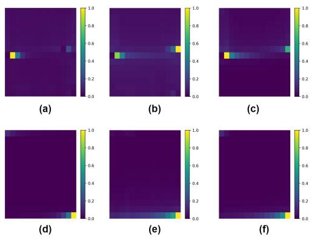  
Figure 2: Identifying Bias toward the CLS Token: Average influence of image patches on the CLS token in ViM models, with the CLS token placed either in the middle of the sequence (top row: a, b, c) or as the first token (bottom row: d, e, f). In each row, the first image (a, d) corresponds to the first layer, while the remaining images (b, c, e, f) correspond to the final two layers.

## 4 Experiments

In this section, we present an in-depth analysis of the hidden attention mechanism embedded within Mamba models, focusing on its semantic diversity and applicability in explainable AI frameworks. We start by visualizing the hidden attention matrices for both NLP and vision models in Sec. 4.1, followed by assessing our explainable AI techniques empirically, via perturbation and segmentation tests for vision domains in Sec. 4.2 and for NLP domains in Sec 4.3. Additionally, in Appendix D, we present a series of ablation studies to validate the design choices underlying our XAI techniques. Finally, we present a complexity analysis of our proposed method in Appendix F.

## 4.1 Visualization of Attention Matrices

The ViM comes in two versions: in one, the CLS token is last and in the other, the CLS token is placed in the middle. Figure 2 shows how this positioning influences the impact of the patches on the CLS, by averaging over the test set. Evidently, the patches near the CLS token are more influential. This phenomenon may suggest that a better strategy is to have a non-spatial/global CLS token (Farooq et al., 2021; Hatamizadeh et al., 2023).

Figure 3 compares the attention matrices in Mamba and Transformer on both vision and NLP tasks. For clearer visualization, we apply the Softmax function to each row of the attention matrices obtained from transformers and perform min-max normalization on the absolute values of the Mamba matrices. In all cases, we limit our focus to the first 64 tokens. In vision, we compare ViM and

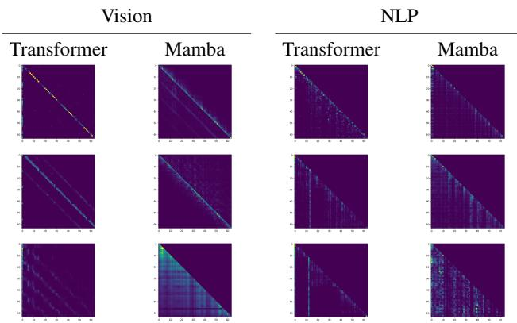  
Figure 3: Hidden Attention Matrices: Attention maps in vision and NLP. Each row represents a different layer within the models, showcasing the evolution of the attention maps at 25% (top), 50%, and 75% (bottom) of the layer depth.

ViT (DeiT), for models of a tiny size, trained on ImageNet-1K. The attention maps are extracted using examples from the test set. Each Mamba attention matrix is obtained by combining the two maps of the bidirectional channel. In NLP, we compare attention matrices extracted from Mamba (130m) and Transformer (Pythia-160m (Biderman et al., 2023)), trained on the Pile dataset for next token prediction. The attention maps are extracted using examples from the Lambada dataset.

As can be seen, the hidden attention matrices of Mamba appear to be similar to the attention matrices extracted from transformers. In both models, the dependencies between distant tokens are captured in the deeper layers of the model, as depicted in the lower rows.

Some of the attention maps demonstrate the ability of S6 and transformers to focus on parts of the input. In those cases, instead of the diagonal patterns, some columns seem to miss the diagonal element and the attention is more diffused (recall that we normalized the maps from Mamba for visualization purposes. In practice, these columns have little activity). Evidently, both the S6 and the transformer attention matrices possess similar properties and depict the two-dimensional structure within the data as bands with an offset of L.

## 4.2 Explainability Metrics

The explainable AI experiments include three types of explainability methods: (1) Raw-Attention, which employs raw attention scores as relevancies. Our findings indicate that averaging the attention maps across layers yields optimal results. (2) Attn-Rollou tfor Transformers, and its Mamba counterpart, as depicted in Sec. 3.2. Finally, (3) the proposed Transformer Attribution from (Chefer et al., 2021a) and its Mamba counterpart (see Sec. 3.3).

  
(a)

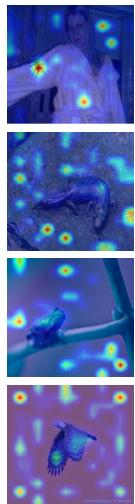  
(b)

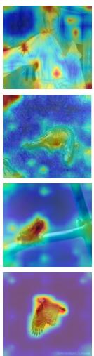  
(c)

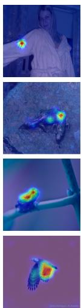  
(d)

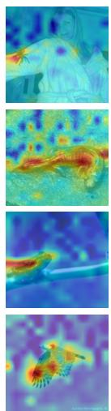  
(e)

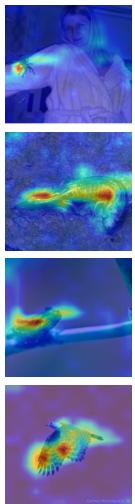  
(f)

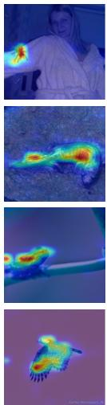  
(g)  
Figure 4: Qualitative results for various explanation methods applied to ViT and ViM (small models). (a) the original image, (b) Raw-Attention of ViT, (c) Attention Rollout for ViT, (d) Transformer-Attribution for ViT, (e) the Raw-Attention of ViM, (f) Attention-Rollout of ViM and (g) the Mamba-Attribution method for ViM.

Qualitative Results Figure 4 depicts the results of the six attribution methods on typical samples from the ImageNet test set. As can be seen, the Mamba-based heatmaps (e,f,g) are often more complete than their transformer-based counterparts. The raw attention of Mamba stands out compared to the other five heatmaps, since it depicts activity across the entire image. However, the relevant object is highlighted. Qualitative results for the NLP domain are presented in Figure 4 in the appendix.

Perturbation Tests In this framework, we employ an input perturbation scheme to assess the efficacy of various explanation methods. These experiments are conducted under two distinct settings: (i) In the positive perturbation scenario, a quality explanation involves an ordered list of pixels, arranged most-to-least relevant. Consequently, when gradually masking out the pixels of the input image, starting from the highest relevance to the lowest, and measuring the mean top-1 accuracy of the model, one anticipates a notable decrease in

Quantitative Results Next, we apply explainability evaluation metrics. These metrics allow one to compare different explainability methods that are applied to the same model. Applying them to compare different models is not meant to say that model X is more explainable than model Y. The main purpose is to show that the attention maps of Mamba are as useful as the maps of Transformers in terms of providing explainability.

performance. Conversely, (ii) in the negative perturbation setup, a robust explanation is expected to uphold the accuracy of the model while systematically removing pixels, starting from the lowest relevance to the highest. In both cases, the evaluation metrics consider the AUC, focusing on the erasure of 10% to 90% of the pixels.

The results of the perturbations are presented in Table 1, depicting the performance of different explanation methods under both positive and negative perturbation scenarios across the two models. In the positive perturbation scenario, where lower AUC values are indicative of better performance, we notice that for Raw-Attention, Mamba shows a better AUC compared to the ViT. For the Attn-Rollout method, Mamba outperforms the ViT, while the latter shows a better AUC under the Attribution method. In the negative perturbation scenario, where higher AUC values are better, the Transformer-based methods consistently outperform Mamba across all three methods. The tendency for lower AUC in both positive (where it is desirable) and negative perturbation (where it is undesirable) may indicate that the Mamba model is more sensitive to blacking out patches, and it would be interesting to add experiments in which the patches are blurred instead (Fong and Vedaldi, 2017). For additional NLP tasks, please refer Appendix A and Appendix G.

Segmentation Tests It is expected that an effective explainability method would produce reasonable foreground segmentation maps. This is assessed for ImageNet classifiers by comparing the obtained heatmap against the ground truth segmentation maps available in the ImageNet-Segmentation dataset (Guillaumin et al., 2014).

<table><tr><td rowspan="2"></td><td colspan="2">Positive Perturbation</td><td colspan="2">Negative Perturbation</td></tr><tr><td>Mamba</td><td>T</td><td>Mamba</td><td>T</td></tr><tr><td>Raw-Attn</td><td>17.27</td><td>20.69</td><td>34.03</td><td>40.77</td></tr><tr><td>Attn-Rollout</td><td>18.81</td><td>20.60</td><td>41.87</td><td>43.53</td></tr><tr><td>Attribution</td><td>16.62</td><td>15.35</td><td>39.63</td><td>48.09</td></tr></table>

Table 1: Positive and Negative perturbation AUC score (percentages) for the predicted class on ImageNet validation set. For positive perturbation lower is better, and for negative higher is better. ’T’ for Transformer.

<table><tr><td>Model</td><td>Method</td><td>Pix-acc</td><td>mAP</td><td>mIoU</td></tr><tr><td>T</td><td>Raw-Attention</td><td>59.69</td><td>77.25</td><td>36.94</td></tr><tr><td>Mamba</td><td>Raw-Attention</td><td>67.64</td><td>74.88</td><td>45.09</td></tr><tr><td>T</td><td>Attn-Rollout</td><td>66.84</td><td>80.34</td><td>47.85</td></tr><tr><td>Mamba</td><td>Attn-Rollout</td><td>71.01</td><td>80.78</td><td>51.51</td></tr><tr><td>T</td><td>Attribution</td><td>79.26</td><td>84.85</td><td>60.63</td></tr><tr><td>Mamba</td><td>Attribution (LRP)</td><td>71.19</td><td>77.04</td><td>49.98</td></tr><tr><td>Mamba</td><td>Attribution (Ours)</td><td>74.72</td><td>81.70</td><td>54.24</td></tr></table>

Table 2: Performance on the ImageNet-Segmentation dataset (percent). Higher is better. ’T’ for Transformer.

Evaluation is conducted based on pixel accuracy, mean-intersection-over-union (mIoU) and mean average precision (mAP) metrics, aligning with established benchmarks in the literature for explainability (Chefer et al., 2021a,b),

The results are outlined in Table 2. For Raw-Attention, Mamba demonstrates significantly higher pixel accuracy and mIoU compared to ViT, while the latter performs better in mAP. Under the Attn-Rollout and attributes methods, Mamba outperforms ViT in mAP, pixel accuracy and mIoU. Finally, among the attribution methods, the Transformer-Attribution achieves the highest scores across all evaluated metrics, and our method consistently surpasses the LRP-based method introduced by (Jafari et al., 2024).

These results underscore the potential of Mamba’s attention mechanism as approaching and sometimes surpassing the interoperability level of Transformer models, especially when the attention maps are taken as is. It also highlights the applicability of Mamba models for downstream tasks such as weakly supervised segmentation. It seems, however, that the Mamba-based attribution model, which is modeled closely after the transformer method in (Chefer et al., 2021b) may benefit from further adjustments.

<table><tr><td>Method</td><td>Positive (AUAC)</td><td>Negative (AU-MSE)</td></tr><tr><td>Mamba 1.3B (Ours)</td><td>0.915</td><td>1.765</td></tr><tr><td>Pythia 1.4B Trans-Attr</td><td>0.909</td><td>1.832</td></tr><tr><td>Mamba 2.7B (Ours)</td><td>0.918</td><td>1.239</td></tr><tr><td>Pythia 2.8B Trans-Attr</td><td>0.920</td><td>1.255</td></tr></table>

Table 3: XAI results for Large Mamba Models over The ARC-Easy Dataset. Higher is better for positive values, lower is better for negative values.

## 4.3 Zero-Shot NLP Pertubation Tests

We conduct experiments with large models on more complex tasks, such as zero-shot prediction on the ARC-Easy benchmark. Since we perform this task in the zero-shot regime with LLMs rather than finetuned classifiers, and because it measures reasoning capabilities, we consider it representative of realworld applications.

We evaluate our method on Mamba models with 1.3B and 2.8B parameters for activation analysis and pruning tasks. For reference, we also test Pythia Transformer models of similar size (1.4B and 2.8B parameters) trained on the same dataset (The Pile) using established Transformer XAI techniques. We note that these Transformer results are included only for context, as direct comparisons between architecture-specific XAI methods are not meaningful due to fundamental differences between model types. Table 3 shows that our Mamba XAI method performs comparably to SoTA Transformer XAI techniques. This is notable because Transformer XAI methods have been developed and refined over several years, while our approach is the first XAI technique specifically designed for Mamba models. The competitive performance indicates that our method effectively captures the interpretability patterns in Mamba architectures despite their different computational approach compared to attention-based Transformers.

## 5 Discussion: Attention in SSMs

A natural question to ask is whether the attention perspective we exposed is unique to S6 (the core block of Mamba), separating it from other SSMs. The answer is that S6, similar to transformers, contains a type of layer we call data-dependent nondiagonal mixer, which previous layers do not.

In their seminal work, Poli et al. (2023) claim that a crucial aspect of transformers is the existence of an expressive, data-controlled linear operator. Here, we focus on a more specific component, which is an expressive data-controlled linear non-diagonal mixer operator. This distinguishes between elementwise operators that act on the data associated with specific tokens (such as MLP and GLU activations) and mixer operations that pool information from multiple tokens.

The mixer components can further be divided into fixed, e.g., using pooling operators with fixed structure and coefficients, or data-dependent, in which the interactions between tokens are controlled by their input-dependent representations, e.g., self-attention. In Theorem 1 at Appendix C, we prove the following result, which sheds light on the gradual evolution of attention in SSM models.

Theorem 1. (i) S4, DSS, S5 havefixed mixing elements. (ii) GSS ,and Hyena have fixed mixing elements with diagonal data-control mechanism. (iii) S6 have data-controlled non-diagonal mixers.

Transformers are recognized for their superior in-context learning (ICL) capabilities, where the model adapts its function according to the input provided (Brown et al., 2020). Empirical evidence has demonstrated that S6 layers are the first SSMs to exhibit ICL capabilities on par with those of transformers (Grazzi et al., 2024; Park et al., 2024). Based on the intuition that the ability to focus on specific inputs is necessary for ICL, we hypothesize that the presence of data-controlled non-diagonal mixers in both transformers and S6 is crucial for achieving a high level of ICL.

A question then arises: which model is more expressive, attention or S6? While previous work has shown that Transformers are more expressive than traditional SSMs (Zimerman and Wolf, 2024), we show in Theorem 2 at Appendix B that the situation is reversed for S6, as follows:

Theorem 2. One channel of the S6 layer can express all functions that a single attention head can express. Conversely, a single attention cannot express allfunctions that a single S6 layer can.

## 6 Conclusions

In this work, we have established a significant link between Mamba and self-attention layers, illustrating that the Mamba layer can be reformulated as an implicit form of causal self-attention mechanism. This links the highly effective Mamba layers directly with the transformer layers.

The parallel perspective plays a crucial role in efficient training and the recurrent perspective is essential for effective causal generation. The attention perspective plays a role in understanding the inner representation of the Mamba model. While “Attention is not Explanation” (Jain and Wallace, 2019), attention layers have been widely used for transformer explainability. By leveraging the obtained attention matrices, we introduce the first explainability techniques for Mamba, for both taskspecific and task-agnostic regimes. This contribution equips the research community with novel tools for examining the performance, fairness, robustness, and weaknesses of Mamba, thereby paving the way for future improvements. Finally, the connection between Mamba and attention, first identified in this work, has also been explored in recent follow-up research, see Appendix H.

## 7 Limitations

Our work provides a novel and insightful perspective on the Mamba layer through attention maps, but it has certain limitations. A key challenge is the computational cost of generating these maps, which requires constructing a per-channel matrix with a quadratic number of elements relative to the sequence length. Future research could explore more efficient XAI methods that leverage the inherent linear attention structure of Mamba. Such methods could extract meaningful insights by designing mechanisms that utilize the benefits of attention maps without explicitly computing them.

Another limitation lies in the scale of the models tested. While our approach demonstrates effectiveness on a non-negligible scale, its applicability to significantly larger models, such as LLaMA-405B or GPT-4, remains unverified. At the time of this study, such larger Mamba-based models were unavailable, preventing direct evaluation.

## 8 Reproducibility Statement

All of our experiments are conducted using the Py-Torch framework on public datasets. Additionally, our code for some of the experiments is included as supplementary, along with a user-friendly interface and notebook demos. Therefore, we consider our empirical results to be reproducible.

## 9 Acknowledgments

This work was supported by a grant from the Tel Aviv University Center for AI and Data Science (TAD). This research was also supported by the Ministry of Innovation, Science & Technology ,Israel (1001576154) and the Michael J. Fox Foundation (MJFF-022407). The contribution of the first author is part of a PhD thesis research conducted at Tel Aviv University.

## References

Samira Abnar and Willem Zuidema. 2020. Quantifying attention flow in transformers. In Proceedings of the 58th Annual Meeting of the Association for Computational Linguistics, pages 4190–4197.

Md Atik Ahamed and Qiang Cheng. 2024. Mambatab: A plug-and-play model for learning tabular data. In 2024 IEEE 7th International Conference on Multimedia Information Processing and Retrieval (MIPR), pages 369–375. IEEE.

Ameen Ali, Thomas Schnake, Oliver Eberle, Grégoire Montavon, Klaus-Robert Müller, and Lior Wolf. 2022. Xai for transformers: Better explanations through conservative propagation. In International Conference on Machine Learning, pages 435–451. PMLR.

Leila Arras, Grégoire Montavon, Klaus-Robert Müller, and Wojciech Samek. 2017. Explaining recurrent neural network predictions in sentiment analysis. In Proceedings ofthe 8th Workshop on Computational Approaches to Subjectivity, Sentiment and Social Media Analysis, pages 159–168.

Sebastian Bach, Alexander Binder, Grégoire Montavon, Frederick Klauschen, Klaus-Robert Müller, and Wojciech Samek. 2015. On pixel-wise explanations for non-linear classifier decisions by layer-wise relevance propagation. PloS one, 10(7):e0130140.

Dzmitry Bahdanau, Kyunghyun Cho, and Yoshua Bengio. 2014. Neural machine translation by jointly learning to align and translate. arXiv preprint arXiv:1409.0473.

Ethan Baron, Itamar Zimerman, and Lior Wolf. 2023. A 2-dimensional state space layer for spatial inductive bias. In The Twelfth International Conference on Learning Representations.

Assaf Ben-Kish, Itamar Zimerman, Shady Abu-Hussein, Nadav Cohen, Amir Globerson, Lior Wolf, and Raja Giryes. 2025. Decimamba: Exploring the length extrapolation potential of mamba. In The Thirteenth International Conference on Learning Representations.

Aviv Bick, Kevin Li, Eric Xing, J Zico Kolter, and Albert Gu. 2024. Transformers to ssms: Distilling quadratic knowledge to subquadratic models. Advances in Neural Information Processing Systems, 37:31788–31812.

Stella Biderman, Hailey Schoelkopf, Quentin Gregory Anthony, Herbie Bradley, Kyle O’Brien, Eric Hallahan, Mohammad Aflah Khan, Shivanshu Purohit, USVSN Sai Prashanth, Edward Raff, et al. 2023. Pythia: A suite for analyzing large language models across training and scaling. In International Conference on Machine Learning, pages 2397–2430. PMLR.

Guy E Blelloch. 1990. Prefix sums and their applications. Technical Report.

Filippo Botti, Alex Ergasti, Leonardo Rossi, Tomaso Fontanini, Claudio Ferrari, Massimo Bertozzi, and Andrea Prati. 2025. Mamba-st: State space model for efficient style transfer. In 2025 IEEE/CVF Winter Conference on Applications ofComputer Vision (WACV), pages 7797–7806. IEEE.

Tom Brown, Benjamin Mann, Nick Ryder, Melanie Subbiah, Jared D Kaplan, Prafulla Dhariwal, Arvind Neelakantan, Pranav Shyam, Girish Sastry, Amanda Askell, et al. 2020. Language models are few-shot learners. Advances in neural information processing systems, 33:1877–1901.

Hila Chefer, Shir Gur, and Lior Wolf. 2021a. Generic attention-model explainability for interpreting bimodal and encoder-decoder transformers. In Proceedings ofthe IEEE/CVF International Conference on Computer Vision, pages 397–406.

Hila Chefer, Shir Gur, and Lior Wolf. 2021b. Transformer interpretability beyond attention visualization. In Proceedings of the IEEE/CVF conference on computer vision and pattern recognition, pages 782–791.

Hila Chefer, Idan Schwartz, and Lior Wolf. 2022. Optimizing relevance maps of vision transformers improves robustness. Advances in Neural Information Processing Systems, 35:33618–33632.

Edo Cohen-Karlik, Itamar Zimerman, Liane Galanti, Ido Atad, Amir Globerson, and Lior Wolf. 2025. On the expressivity of selective state-space layers: A multivariate polynomial approach. arXiv preprint arXiv:2502.02209.

Jemma Daniel, Ruan de Kock, Louay Ben Nessir, Sasha Abramowitz, Omayma Mahjoub, Wiem Khlifi, Claude Formanek, and Arnu Pretorius. 2024. Multiagent reinforcement learning with selective statespace models. arXiv preprint arXiv:2410.19382.

Tri Dao and Albert Gu. 2024. Transformers are ssms: Generalized models and efficient algorithms through structured state space duality. arXiv preprint arXiv:2405.21060.

Shmuel Bar David, Itamar Zimerman, Eliya Nachmani, and Lior Wolf. 2022. Decision s4: Efficient sequence-based rl via state spaces layers. In The Eleventh International Conference on Learning Representations.

Alexey Dosovitskiy, Lucas Beyer, Alexander Kolesnikov, Dirk Weissenborn, Xiaohua Zhai, Thomas Unterthiner, Mostafa Dehghani, Matthias Minderer, Georg Heigold, Sylvain Gelly, et al. 2020. An image is worth 16x16 words: Transformers for image recognition at scale. arXiv preprint arXiv:2010.11929.

Ammarah Farooq, Muhammad Awais, Sara Ahmed, and Josef Kittler. 2021. Global interaction modelling in vision transformer via super tokens. arXiv preprint arXiv:2111.13156.

Ruth C Fong and Andrea Vedaldi. 2017. Interpretable explanations of black boxes by meaningful perturbation. In Proceedings of the IEEE international conference on computer vision, pages 3429–3437.

Daniel Y Fu, Tri Dao, Khaled K Saab, Armin W Thomas, Atri Rudra, and Christopher Ré. 2022. Hungry hungry hippos: Towards language modeling with state space models. arXiv preprint arXiv:2212.14052.

Karan Goel, Albert Gu, Chris Donahue, and Christopher Ré. 2022. It’s raw! audio generation with state-space models. In International Conference on Machine Learning, pages 7616–7633. PMLR.

Riccardo Grazzi, Julien Siems, Simon Schrodi, Thomas Brox, and Frank Hutter. 2024. Is mamba capable of in-context learning? arXiv preprint arXiv:2402.03170.

Albert Gu and Tri Dao. 2023. Mamba: Linear-time sequence modeling with selective state spaces. arXiv preprint arXiv:2312.00752.

Albert Gu, Karan Goel, and Christopher Ré. 2021a. Efficiently modeling long sequences with structured state spaces. arXiv preprint arXiv:2111.00396.

Albert Gu, Isys Johnson, Karan Goel, Khaled Saab, Tri Dao, Atri Rudra, and Christopher Ré. 2021b. Combining recurrent, convolutional, and continuous-time models with linear state space layers. Advances in neural information processing systems, 34:572–585.

Matthieu Guillaumin, Daniel Küttel, and Vittorio Ferrari. 2014. Imagenet auto-annotation with segmentation propagation. International Journal ofComputer Vision, 110:328–348.

Jintao Guo, Lei Qi, Yinghuan Shi, and Yang Gao. 2024. Start: A generalized state space model with saliencydriven token-aware transformation. arXiv preprint arXiv:2410.16020.

Ankit Gupta, Albert Gu, and Jonathan Berant. 2022a. Diagonal state spaces are as effective as structured state spaces. Advances in Neural Information Processing Systems, 35:22982–22994.

Ankit Gupta, Harsh Mehta, and Jonathan Berant. 2022b. Simplifying and understanding state space models with diagonal linear rnns. arXiv preprint arXiv:2212.00768.

Ali Hatamizadeh, Hongxu Yin, Greg Heinrich, Jan Kautz, and Pavlo Molchanov. 2023. Global context vision transformers. In International Conference on Machine Learning, pages 12633–12646. PMLR.

Weizhe Hua, Zihang Dai, Hanxiao Liu, and Quoc Le. 2022. Transformer quality in linear time. In International Conference on Machine Learning, pages 9099–9117. PMLR.

Farnoush Rezaei Jafari, Grégoire Montavon, Klaus-Robert Müller, and Oliver Eberle. 2024. Mambalrp: Explaining selective state space sequence models. arXiv preprint arXiv:2406.07592.

Sarthak Jain and Byron C Wallace. 2019. Attention is not explanation. In Proceedings ofNAACL-HLT, pages 3543–3556.

Federico Arangath Joseph, Jerome Sieber, Melanie N Zeilinger, and Carmen Amo Alonso. 2024. Lambdaskip connections: the architectural component that prevents rank collapse. arXiv preprint arXiv:2410.10609.

Satyapriya Krishna, Jiaqi Ma, Dylan Slack, Asma Ghandeharioun, Sameer Singh, and Himabindu Lakkaraju. 2023. Post hoc explanations of language models can improve language models. Advances in Neural Information Processing Systems, 36:65468–65483.

Kunchang Li, Xinhao Li, Yi Wang, Yinan He, Yali Wang, Limin Wang, and Yu Qiao. 2025. Videomamba: State space model for efficient video understanding. In European Conference on Computer Vision, pages 237–255. Springer.

Shufan Li, Harkanwar Singh, and Aditya Grover. 2024. Mamba-nd: Selective state space modeling for multidimensional data. arXiv preprint arXiv:2402.05892.

Dingkang Liang, Xin Zhou, Xinyu Wang, Xingkui Zhu, Wei Xu, Zhikang Zou, Xiaoqing Ye, and Xiang Bai. 2024. Pointmamba: A simple state space model for point cloud analysis. arXiv preprint arXiv:2402.10739.

Opher Lieber, Barak Lenz, Hofit Bata, Gal Cohen, Jhonathan Osin, Itay Dalmedigos, Erez Safahi, Shaked Meirom, Yonatan Belinkov, Shai Shalev-Shwartz, et al. 2024. Jamba: A hybrid transformer-mamba language model. arXiv preprint arXiv:2403.19887.

Jiarun Liu, Hao Yang, Hong-Yu Zhou, Yan Xi, Lequan Yu, Yizhou Yu, Yong Liang, Guangming Shi, Shaoting Zhang, Hairong Zheng, et al. 2024a. Swinumamba: Mamba-based unet with imagenet-based pretraining. arXiv preprint arXiv:2402.03302.

Yue Liu, Yunjie Tian, Yuzhong Zhao, Hongtian Yu, Lingxi Xie, Yaowei Wang, Qixiang Ye, and Yunfan Liu. 2024b. Vmamba: Visual state space model. arXiv preprint arXiv:2401.10166.

Chris Lu, Yannick Schroecker, Albert Gu, Emilio Parisotto, Jakob Foerster, Satinder Singh, and Feryal Behbahani. 2024. Structured state space models for in-context reinforcement learning. Advances in Neural Information Processing Systems, 36.

Jiachen Lu, Jinghan Yao, Junge Zhang, Xiatian Zhu, Hang Xu, Weiguo Gao, Chunjing Xu, Tao Xiang, and Li Zhang. 2021. Soft: Softmax-free transformer with linear complexity. Advances in Neural Information Processing Systems, 34:21297–21309.

Xuezhe Ma, Chunting Zhou, Xiang Kong, Junxian He, Liangke Gui, Graham Neubig, Jonathan May, and Luke Zettlemoyer. 2022. Mega: moving average equipped gated attention. arXiv preprint arXiv:2209.10655.

Eric Martin and Chris Cundy. 2017. Parallelizing linear recurrent neural nets over sequence length. arXiv preprint arXiv:1709.04057.

Harsh Mehta, Ankit Gupta, Ashok Cutkosky, and Behnam Neyshabur. 2022. Long range language modeling via gated state spaces. arXiv preprint arXiv:2206.13947.

Eric Nguyen, Karan Goel, Albert Gu, Gordon Downs, Preey Shah, Tri Dao, Stephen Baccus, and Christopher Ré. 2022. S4nd: Modeling images and videos as multidimensional signals with state spaces. Advances in neural information processing systems, 35:2846– 2861.

Jongho Park, Jaeseung Park, Zheyang Xiong, Nayoung Lee, Jaewoong Cho, Samet Oymak, Kangwook Lee, and Dimitris Papailiopoulos. 2024. Can mamba learn how to learn? a comparative study on in-context learning tasks. arXiv preprint arXiv:2402.04248.

Michael Poli, Stefano Massaroli, Eric Nguyen, Daniel Y Fu, Tri Dao, Stephen Baccus, Yoshua Bengio, Stefano Ermon, and Christopher Ré. 2023. Hyena hierarchy: Towards larger convolutional language models. arXiv preprint arXiv:2302.10866.

David W Romero, Anna Kuzina, Erik J Bekkers, Jakub M Tomczak, and Mark Hoogendoorn. 2021. Ckconv: Continuous kernel convolution for sequential data. arXiv preprint arXiv:2102.02611.

Arnab Sen Sharma, David Atkinson, and David Bau. 2024. Locating and editing factual associations in mamba. arXiv preprint arXiv:2404.03646.

Jerome Sieber, Carmen Amo Alonso, Alexandre Didier, Melanie Zeilinger, and Antonio Orvieto. 2024. Understanding the differences in foundation models: Attention, state space models, and recurrent neural networks. Advances in Neural Information Processing Systems, 37:134534–134566.

Jimmy TH Smith, Andrew Warrington, and Scott W Linderman. 2022. Simplified state space layers for sequence modeling. arXiv preprint arXiv:2208.04933.

Hugo Touvron, Matthieu Cord, Matthijs Douze, Francisco Massa, Alexandre Sablayrolles, and Hervé Jé- gou. 2021. Training data-efficient image transformers & distillation through attention. In International conference on machine learning, pages 10347–10357. PMLR.

Asher Trockman, Hrayr Harutyunyan, J Zico Kolter, Sanjiv Kumar, and Srinadh Bhojanapalli. 2024. Mimetic initialization helps state space models learn to recall. arXiv preprint arXiv:2410.11135.

Ashish Vaswani, Noam Shazeer, Niki Parmar, Jakob Uszkoreit, Llion Jones, Aidan N Gomez, Ł ukasz Kaiser, and Illia Polosukhin. 2017. Attention is all you need. In Advances in Neural Information Processing Systems, volume 30.

Roger Waleffe, Wonmin Byeon, Duncan Riach, Brandon Norick, Vijay Korthikanti, Tri Dao, Albert Gu, Ali Hatamizadeh, Sudhakar Singh, Deepak Narayanan, et al. 2024. An empirical study of mamba-based language models. arXiv preprint arXiv:2406.07887.

Chloe Wang, Oleksii Tsepa, Jun Ma, and Bo Wang. 2024a. Graph-mamba: Towards long-range graph sequence modeling with selective state spaces. arXiv preprint arXiv:2402.00789.

Jue Wang, Wentao Zhu, Pichao Wang, Xiang Yu, Linda Liu, Mohamed Omar, and Raffay Hamid. 2023a. Selective structured state-spaces for long-form video understanding. In Proceedings of the IEEE/CVF Conference on Computer Vision and Pattern Recognition, pages 6387–6397.

Junxiong Wang, Daniele Paliotta, Avner May, Alexander Rush, and Tri Dao. 2024b. The mamba in the llama: Distilling and accelerating hybrid models. Advances in Neural Information Processing Systems, 37:62432–62457.

Junxiong Wang, Jing Yan, Albert Gu, and Alexander M Rush. 2023b. Pretraining without attention. In Findings ofthe Associationfor Computational Linguistics: EMNLP 2023, pages 58–69.

Mitchell Wortsman, Jaehoon Lee, Justin Gilmer, and Simon Kornblith. 2023. Replacing softmax with relu in vision transformers. arXiv preprint arXiv:2309.08586.

Donghang Wu, Yiwen Wang, Xihong Wu, and Tianshu Qu. 2025. Cross-attention inspired selective state space models for target sound extraction. In ICASSP 2025-2025 IEEE International Conference on Acoustics, Speech and Signal Processing (ICASSP), pages 1–5. IEEE.

Tingyi Yuan, Xuhong Li, Haoyi Xiong, Hui Cao, and Dejing Dou. 2021. Explaining information flow inside vision transformers using markov chain. In eXplainable AI approachesfor debugging and diagnosis.

Lianghui Zhu, Bencheng Liao, Qian Zhang, Xinlong Wang, Wenyu Liu, and Xinggang Wang. 2024. Vision mamba: Efficient visual representation learning with bidirectional state space model. arXiv preprint arXiv:2401.09417.

Itamar Zimerman, Ameen Ali Ali, and Lior Wolf. 2025. Explaining modern gated-linear RNNs via a unified implicit attention formulation. In The Thirteenth International Conference on Learning Representations.

Itamar Zimerman and Lior Wolf. 2024. Viewing transformers through the lens of long convolutions layers. In Forty-first International Conference on Machine Learning.

Jingwei Zuo, Maksim Velikanov, Dhia Eddine Rhaiem, Ilyas Chahed, Younes Belkada, Guillaume Kunsch, and Hakim Hacid. 2024. Falcon mamba: The first competitive attention-free 7b language model. arXiv preprint arXiv:2410.05355.

## A NLP Experiments

In this experiment, our aim is to extend the utilization of the proposed methods to the domain of NLP. To achieve this, we conduct a comparative analysis between the Mamba-160M model and BERT-large, drawing upon established literature in the field (Chefer et al., 2021b). Two settings are considered : (1) activation task, in this task, a good explanation involves listing tokens in order of their relevance, from most to least. When these tokens are added to an initially empty sentence, they should activate the network output as much and as quickly as possible. We evaluate the quality of explanations by observing the output probability $p _ { c } ( x )$ for the ground-truth class c. (2) pruning task, the pruning task involves removing tokens from the original sentence, starting with those deemed least relevant and progressing to the most relevant. We assess the impact of this pruning, by measuring the difference between the unpruned model’s output logits $y _ { 0 }$ and $y _ { m t }$ of the pruned output. In the activation task, we begin with a sentence containing "<UNK>" tokens and gradually replace them with the original tokens in order of highest to lowest relevance. Conversely, in the pruning task, we remove tokens from lowest to highest relevance by replacing them with "<UNK>" tokens.

The dataset employed in our study is the IMDb movie review sentiment classification dataset, consisting of 25,000 samples for training and an equal number for testing, with binary labels indicating sentiment polarity. We utilize the Mamba-130M2 and $\mathrm { B E R T } ^ { \bar { 3 } }$ models fine-tuned on the IMDB dataset for classification. BERT stands out as our baseline choice, benefiting from a readily available implementation of the Transformer-Attr method4. Notably, both models exhibit comparable accuracy levels on the downstream task of IMDB movie review sentiment classification. The results, depicted in Figure 5, illustrate that in both the pruning and activation tasks, Mamba-Attr exhibits comparable or occasionally superior performance to the Transformer-Attr method. We present the results of each method in separate graphs, as the two models are not directly comparable due to differences in the logit scale and the behavior on random changes to the prompt.

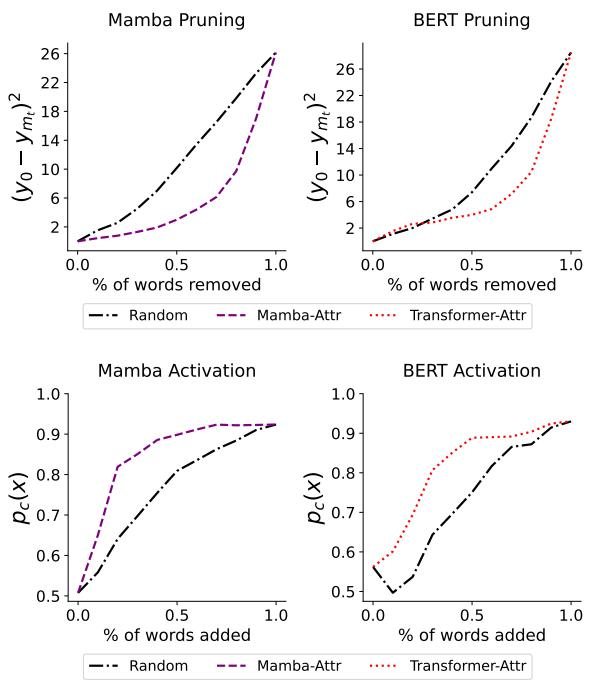  
Figure 5: Evaluation of explanations using input perturbations for the IMDb dataset, top row shows the results for the pruning task in which the words of least absolute relevance are replaced with <UNK> first and the bottom row shows the results for the activation task in which the most relevant words are added first, in both tasks we show the results for Mamba-Attr and Transformer-Attr separately.

In Table 4 at the Appendix, we provide qualitative results for the different explanation methods (Mamba-Attr and Transformer-Attr) on the IMDb dataset, for both positive (green) and negative (red) sentiments. Evidently, Mamba-Attr tends to generate more sparse explanations in comparison to its Transformer-Attr counterpart. For instance, in the analysis of the first negative sample, our method emphasizes the rating of "1" as the most salient feature along with other negative terms. Conversely, the transformer attribution method yields a less sparse explanation, focusing primarily on the relevant word while also encompassing other nonrelevant terms. Similarly, in the assessment of the third negative example, our method exhibits a comparable behavior, placing emphasis on the ratings alongside other relevant negative terms. Conversely, while the salient words identified by the transformer attribution method remain valid, its explanation is comparatively less sparse. We observe a similar trend across positive sentiments as well (depicted in green). For instance, in the final positive review, Mamba-Attr distinctly highlights the phrase "Greatest Movie which ever made, " serving as clear evidence of a positive sentiment. In contrast, the explanation provided by Trans-Attr appears more broad and encompassing.

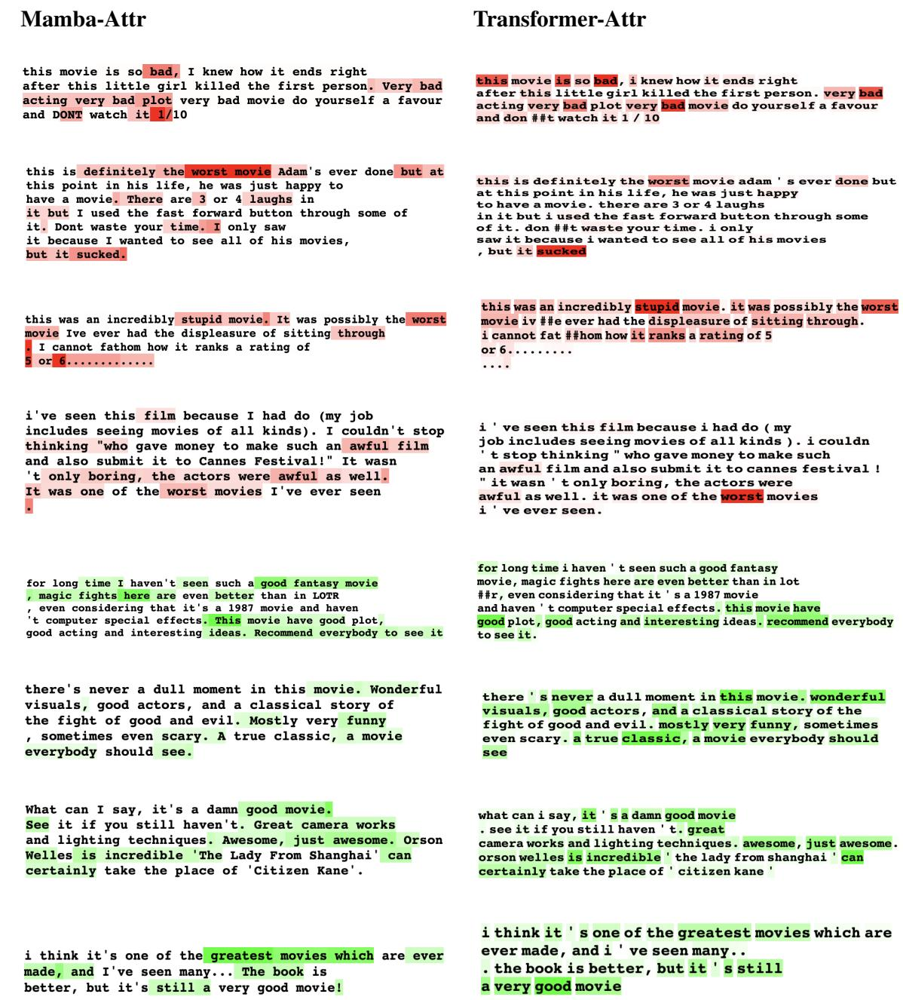  
Table 4: Qualitative Results in NLP  
B Expressiveness of Mamba Models

Theorem 2. One channel of the selective statespace layer can express allfunctions that a single transformer head can express. Conversely, a single Transformer layer cannot express allfunctions that a single selective SSM layer can. Assumptions:

1. For simplicity, we will disregard the discretization, as it has been shown to be unnecessary in previous work (Gupta et al., 2022b).

2. As our regime focuses on real elements (xi R), the hidden dimension of the transformer is 1. Thus, the parameters of both the selfattention mechanism and the Mamba are scalars (namely $A _ { i } , B _ { i } , C _ { i } , W ^ { Q } , W ^ { V } , W ^ { K } \in$ R).

Motivation and Intuition: The motivation for this proof relies on $\tilde { H } _ { i , j }$ in Eq. 20, which enables Mamba to utilize continuous historical context within sequences more efficiently than traditional attention mechanisms. To exploit this capability, we focus on a problem involving input-dependent control over the entire input, a task that cannot be captured by relying solely on pairwise interactions at single layer, which constitute the foundation of self-attention. At its essence, the count-in-row problem is selected because the impact of each bit in the input sequence on the output is potentially determined by all preceding bits in the sequence (in cases where all of them are 1). This makes the task significantly more challenging for models based on pairwise interactions. In contrast, since the problem is a simple case of counting with resets, it can be efficiently performed by a single S6 channel.

Proof. Given the definition of the count in row function, our proof straightforwardly arises from the following lemmas:

Definition 1. The count in row problem: Given a binary sequence $x _ { 1 } , x _ { 2 } , \dots , x _ { L } ,$ , the "count in row" function f is defined to produce an output sequence $y _ { 1 } , y _ { 2 } , \ldots , y _ { L }$ , where each yi is determined based on the contiguous subsequence of 1s to which $x _ { i }$ belongs. Formally:

$$
y _ { i } = f ( x _ { 1 } , \dots , x _ { i } ) =\tag{25}
$$

$$
\operatorname* { m a x } _ { 0 \leq j \leq i } \{ i - j + 1 \mid \prod _ { k = j } ^ { i } [ x _ { k } > 0 ] = 1 \}
$$

where $[ x _ { k } > 0 ]$ is the Iverson bracket, equaling 1 if $x _ { k } > 0$ and 0 otherwise.

Lemma 1. One channel of Mamba can express the count in rowfunctionfor sequences ofany length.

Proof. Assumption 1 defines the following recurrence rule:

$$
\bar { B } _ { i } = S _ { B } ( \hat { x } _ { i } ) , \quad C _ { i } = S _ { C } ( \hat { x } _ { i } ) , \quad \bar { A } _ { i } = S _ { A } ( \hat { x } _ { i } ) + A\tag{26}
$$

$$
h _ { t } = \bar { A } _ { t } h _ { t - 1 } + \bar { B } _ { t } x _ { t } , \quad y _ { t } = C _ { t } h _ { t }\tag{27}
$$

By substituting $S _ { B } , S _ { C } , S _ { A } = 1 , A = 0$ into Eq. 27, we obtain the following results:

$$
h _ { t } = h _ { t - 1 } + x _ { t } , \quad y _ { t } = h _ { t }\tag{28}
$$

Now, there are two cases: (i) If $x _ { i } = 0$ , it’s clear that both the state $h _ { t }$ and the output $y _ { t }$ receive zero values. (ii) Otherwise (if $x _ { i } = 1 )$ ), we see that both $h _ { t }$ and $y _ { t }$ increase by one, clearly demonstrating that the entire mechanism exactly solves the count in row problem.

Lemma 2. One transformer head cannot express the count in row function for sequences with more than two elements.

Proof. The self-attention mechanism computes the output as follows

$$
O = \mathrm { S o f t m a x } \left( \frac { ( X W ^ { Q } ) ( X W ^ { K } ) ^ { T } } { \sqrt { d _ { k } } } \right) \cdot ( X W ^ { V } )\tag{29}
$$

Consider the count in row problem for a binary sequence of length 3, the i-th coordinate in the output can be computed by:

$$
O _ { i } = \sum _ { j = 1 } ^ { 3 } \left( \frac { \exp \left( \left( W ^ { Q } \cdot x _ { i } \right) \cdot \left( W ^ { K } \cdot x _ { j } \right) \right) } { \sum _ { k = 1 } ^ { 3 } \exp \left( \left( W ^ { Q } \cdot x _ { i } \right) \cdot \left( W ^ { K } \cdot x _ { k } \right) \right) } \right) \cdot \left( W ^ { V } \cdot x _ { j } \right)\tag{30}
$$

where we omitted the scale factor $\sqrt { d _ { k } }$ (which can be incorporated into the $W ^ { Q }$ matrix).

For the sake of contradiction, we will assume that there are weights for the key, query, and value matrices that solve this problem. Furthermore, recall that $W ^ { Q } , W ^ { K } , W ^ { \hat { V } } ~ \in ~ \mathbb { R }$ , according to Assumption 2. Hence:

1. For $( x _ { 1 } , x _ { 2 } , x _ { 3 } ) = ( 0 , 1 , 1 )$ , the output $y _ { 3 } =$ 2. Plugging it into Eq. 30 yields:

$$
O _ { 3 } = W ^ { V } \Big ( \frac { 2 \exp ( W ^ { Q } W ^ { K } ) } { 1 + 2 \exp ( W ^ { Q } W ^ { K } ) } \Big ) = 2\tag{31}
$$

2. For $( x _ { 1 } , x _ { 2 } , x _ { 3 } ) = ( 0 , 0 , 1 )$ , the output $y _ { 3 } =$ 1. Plugging it into Eq. 30 yields:

$$
O _ { 3 } = W ^ { V } \Big ( \frac { \exp ( W ^ { Q } W ^ { K } ) } { 2 + \exp ( W ^ { Q } W ^ { K } ) } \Big ) = 1\tag{32}
$$

Dividing Eq.31 by Eq.32 results in the following:

$$
2 \frac { 2 + \exp ( W ^ { Q } W ^ { K } ) } { 1 + 2 \exp ( W ^ { Q } W ^ { K } ) } = 2 \quad  \quad \exp ( W ^ { Q } W ^ { K } ) = 1\tag{33}
$$

Upon plugging it into the eq. 31, we obtained:

$$
O _ { 3 } = W ^ { V } { \frac { 2 } { 3 } } = 2 \quad  \quad W ^ { V } = 3
$$

However, for $( x _ { 1 } , x _ { 2 } , x _ { 3 } ) = ( 1 , 0 , 1 )$ , the output $y _ { 3 }$ is 1, by plugging it to eq. 30, and substituting the values of $W ^ { \bar { V } }$ and $\exp ( \hat W ^ { Q } W ^ { K } )$ , we obtain:

$$
O _ { 3 } = 3 { \frac { 2 \exp ( W ^ { Q } W ^ { K } ) } { 1 + 2 \exp ( W ^ { Q } W ^ { K } ) } } = 2 \neq 1
$$

As requested. Please note that the same technique also works when omitting the Softmax function. □

Lemma 3. One channel of the selective state-space layer can express all functions that a single transformer head can express.

Proof. For simplicity, we consider a causal attention variant without Softmax, as the Softmax is designed to normalize values rather than improve expressiveness. According to Assumption 1, we omit the discretization. Thus, we can simply set the value of $A _ { i }$ to I which is the identity, by substitute $A = \mathbb { I }$ and $S _ { A } = 0$ . Hence, it is clear that Eq. 13 and Eq. 14 become identical to causal attention, except for the Softmax function. □

## C Expressiveness of SSMs and Long-Convolution Layers

In this section we provide the proof of Theorem 1 from Sec. 5.

Theorem 1. (i) S4 (Gu et al., 2021a), DSS (Gupta et al., 2022a), S5 (Smith et al., 2022) have fixed mixing elements. (ii) GSS (Mehta et al., 2022),and Hyena (Poli et al., 2023) have fixed mixing elements with diagonal data-control mechanism. (iii) Selective SSM have data-controlled non-diagonal mixers.

Proof. We will prove this theorem separately per each layer:

S4, DSS: Both layers implicitly parametrize a convolution kernel $\dot { \bar { K } }$ via the A, B¯ and $\bar { C }$ matrices as follows:

$$
\bar { K } = ( C \bar { B } , C \bar { A } \bar { B } , \cdot \cdot \cdot , C \bar { A } ^ { L - 1 } \bar { B } )
$$

This kernel does not depend on the input, and it is the only operation that captures interactions between tokens. Therefore, both layers have fixed elements.

S5: The S5 layer extend S4 such that it map multi-input to multi-output rather than mapping single-input to single-output. It use the following recurrent rule:

$$
h _ { t } = \bar { A } h _ { t - 1 } + \bar { B } x _ { t } , \quad y _ { t } = C h _ { t } , \quad \bar { A } \in \mathbb { R } ^ { P \times P }
$$

$$
\bar { B } \in \mathbb { R } ^ { P \times H } , C \in \mathbb { R } ^ { H \times P } , x _ { t } , y _ { t } \in \mathbb { R } ^ { H }\tag{34}
$$

which can be computed by

$$
y _ { t } = C \sum _ { i = 1 } ^ { t } \bar { A } ^ { t - i } \bar { B } x _ { t }\tag{35}
$$

However, in contrast to S4 and DSS, now $C \bar { A } ^ { i } \bar { B }$ $\mathrm { i n } \mathbb { R } ^ { H \times H }$ instead of in R. Hence, we can conclude that the mechanism mixes tokens in a fixed pattern, which is captured by $C \textstyle \sum _ { i = 1 } ^ { t } { \bar { A } } ^ { t - i } { \bar { B } } x _ { t }$

GSS: GSS enhances the DSS framework, which utilizes fixed mixing elements, by incorporating an elementwise gating mechanism. Hence, the entire layer can be viewed as a composition of two operators, a mixer that isn’t data-dependent (DSS), and an elementwise data-dependent gating, which is equivalent to a diagonal data-control linear operator.

Hyena: The Hyena layer is defined by the recurrence of two components: long implicit convolution and elementwise gating. For simplicity, we consider single recurrence steps to constitute the entire layer, since any layer can benefit from such a recurrent-based extension. Additionally, single recurrence is the most common application of the Hyena layer. Hence, similar to GSS, the layer can be viewed as a composition of a mixer that isn’t data-dependent (based on CKConv (Romero et al., 2021)) and a diagonal data-control operator, which is implemented through elementwise datadependent gating.

Selective SSM: As can be seen in Eq. 12 and 19, the selective SSM can be represented by:

$$
y = \tilde { \alpha } x , \quad \tilde { \alpha } _ { i , j } = \tilde { Q } _ { i } \tilde { H } _ { i , j } \tilde { K } _ { j }\tag{36}
$$

Thus, it’s clear that the linear operator, which relies on ${ \tilde { \alpha } } .$ , is a data-controlled, non-diagonal mixer.

## D Ablation Studies

We conducted several ablations to justify our design choices. First, we evaluated various aggregation methods for maps extracted from different channels, including aggregations based on max, min, element-wise head product, and mean operators, with varying rates of discarding5 minimal attention scores. As shown in Table 5, the proposed mean head aggregation method performed on par with the other methods.

<table><tr><td>Variant</td><td>Pixel acc.</td><td>mAP</td><td>mIoU</td></tr><tr><td>Mean Head Aggregation</td><td>71.01</td><td>80.78</td><td>51.51</td></tr><tr><td>Max Head Aggregation</td><td>69.96</td><td>79.41</td><td>48.73</td></tr><tr><td>Min Head Aggregation</td><td>63.02</td><td>66.31</td><td>34.71</td></tr><tr><td>Element-wise Head Prod</td><td>74.04</td><td>74.16</td><td>50.46</td></tr><tr><td>Mean Fusion + Discard=0.2</td><td>70.23</td><td>80.55</td><td>50.86</td></tr><tr><td>Mean Fusion + Discard=0.4</td><td>69.59</td><td>80.57</td><td>50.45</td></tr><tr><td>Mean Fusion + Discard=0.6</td><td>70.17</td><td>79.22</td><td>50.66</td></tr><tr><td>Mean Fusion + Discard=0.8</td><td>70.23</td><td>78.96</td><td>48.95</td></tr></table>

Table 5: Ablations studies of aggregation techniques for Attention-Rollout on the ImageNet-Segmentation dataset, Higher is better.
<table><tr><td>Variant</td><td>Pixel acc.</td><td>mAP</td><td>mIoU</td></tr><tr><td>Ours</td><td>74.72</td><td>81.70</td><td>54.24</td></tr><tr><td>without clamp</td><td>68.15</td><td>80.95</td><td>48.71</td></tr><tr><td>With absolute values</td><td>69.82</td><td>81.12</td><td>48.16</td></tr></table>

Table 6: Ablation studies for our Mamba attribution (Eq. 24), results are reported on the ImageNet-Segmentation dataset. Higher is better.

Furthermore,we conducted ablation studies on the design choice of ignoring negative scores in the Rollout process (which use in our Attribution method). The original choice of clamping negative scores to zero, as suggested by (Chefer et al., 2021b), was tested against using the original scores without clamping and applying absolute values. As shown in Table 6, clamping negative scores yielded the best results, demonstrating the effectiveness of this design choice.

## E Visualization of Our Attribution Method

In Sec. 3.3, we describe our proposed attribution method for Mamba models. To aid clarity, we provide a schematic visualization of this method, closely tied to Eq. 24. Figure 6 offers a comparative illustration: the left panel depicts the attribution method for transformers by (Chefer et al., 2021b) that served as our inspiration, while the right panel showcases our proposed approach, tailored specifically for Mamba models and built on top of implicit attention matrices. This visual comparison highlights the differences and innovations introduced by our method.

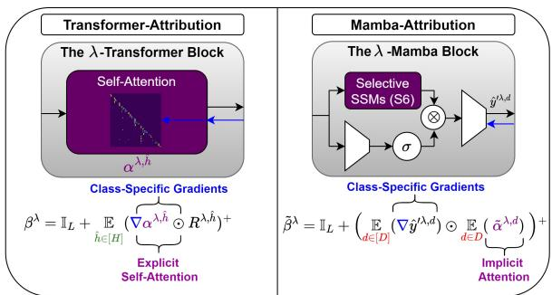  
Figure 6: Comparative Visualization of Transformer-Attribution and our Mamba-Attribution, both classspecific methods.

## F Complexity

Our method can be divided into two main stages: computing the attention rows associated with the CLS token (or the last token for zero-shot experiments) and aggregating them over the D channels and Λ layers to produce the final explanation map. The first stage is the most computationally intensive, dominating time complexity.

For the first stage, at each layer and for each of the D Mamba channels, the naive computation of the relevant attention row involves iterating over all positions in the vector, which is of size L. The computation for each position is dominated by the term $\textstyle \prod _ { k = i } ^ { j } A _ { k }$ , requiring L N operations. Consequently, the total complexity for a single layer is $O ( D L ^ { 2 } N )$ , and for all Λ layers, it becomes $O ( \Lambda D L ^ { 2 } N )$

A more sophisticated approach leverages the linear recurrent form to reuse intermediate values when computing subsequent elements. Using this cumulative product optimization, the term $\textstyle \prod _ { k = j + 1 } ^ { i } { \bar { A } } _ { k }$ can be computed efficiently via $\begin{array} { r } { \bar { A } _ { j + 1 } \prod _ { k = j + 2 } ^ { i } \bar { A } _ { k } } \end{array}$ . This reduces the complexity by a factor of L, to O(DLN) for a single layer and O(ΛDLN) for the entire model.

For space-complexity, assuming $L \gg N$ , the naive approach requires O(ΛDL) storage to materialize all attention matrices across Λ layers. However, in the Rollout and Raw attention methods, this can be optimized by performing the aggregation layer-by-layer, without materializing the attention matrices of all layers in parallel. With this optimization, the space complexity is reduced by a factor of Λ, to O(DL). Similarly, in some cases, one can further optimize space complexity by iterating over the channels (avoiding the materialization of matrices obtained from all channels in parallel).

However, this is less practical when using parallel accelerations like GPUs. These optimizations reduce both time and space requirements, making our XAI method scalable for large models and long sequences.

## G Additional Experiments in NLP

To further assess our method, we conduct experiments built upon our attribution tools to improve ICL and perform additional ablation studies.

XAI-Based Performance-Enhancement We adopt the AMPLIFY framework (Krishna et al., 2023), a method for automatic prompt engineering in few-shot in-context learning based on post hoc explanation methods. Here, we use the Mamba-790m model as a proxy. The explanations provided by this proxy are used by the AMPLIFY framework to automatically enhance the prompt. We follow the same evaluation procedure as in (Krishna et al., 2023) and denote the results obtained using the AMPLIFY method with our XAI technique as ‘A-XAI’. As shown in table 7, using our XAI method within the AMPLIFY framework improves the baseline by around 10% on Snarks, 1% on CommonsenseQA, and more than 4% on Formal Fallacies, demonstrating the effectiveness of our XAI technique. Providing evidence that our XAI techniques can be used for model improvement through insightful explanations.

<table><tr><td>Model</td><td>Snarks</td><td>CommonsenseQA</td><td>Formal Fallacies</td></tr><tr><td>Vanilla Score</td><td>44.54%</td><td>52.12%</td><td>40.13%</td></tr><tr><td>A-XAI Score (ours)</td><td>53.11%</td><td>53.55%</td><td>44.28%</td></tr></table>

Table 7: XAI-based Prompt Engineering for Few-Shot In-Context learning. Higher is better.

Beyond standard Mamba models, we demonstrate the versatility of our method by showing that it also works for Mamba-2. Similar to Table 3, we conduct experiments on the ARC-Easy dataset with smaller models. The results are quite lower than those in Table 3 because the models are smaller, leading to slightly reduced performance, which negatively impacts the XAI metrics.

Additional Ablations We conduct additional ablations in NLP (using a Mamba model with 1.3B parameters), extending Table 5 and Table 6, which were originally examined in the vision domain. These experiments in Table 9 show that our choices in the aggregation method and clamping of nonpositive values outperform other approaches, further justifying our design decisions.

<table><tr><td>Method</td><td>Positive (AUAC)</td><td>Negative (AU-MSE)</td></tr><tr><td>Mamba-2-130m (Ours)</td><td>0.872</td><td>2.456</td></tr><tr><td>Mamba-2 790m (Ours)</td><td>0.885</td><td>2.103</td></tr></table>

Table 8: XAI Results for Mamba-2 over the ARC-Easy Dataset. Higher is better for positive values, lower is better for negative values.

<table><tr><td>Method</td><td>Positive (AUAC)</td><td>Negative (AU-MSE)</td></tr><tr><td>Ours</td><td>0.915</td><td>1.765</td></tr><tr><td>Mean Head Aggregation</td><td>0.8813</td><td>2.102</td></tr><tr><td>Max Head Aggregation</td><td>0.8420</td><td>1.899</td></tr><tr><td>Min Head Aggregation</td><td>0.7611</td><td>2.344</td></tr><tr><td>Without clamp</td><td>0.7564</td><td>2.421</td></tr></table>

Table 9: Additional Ablations. Higher is better for positive values, lower is better for negative values.

## H The Relationship Between Mamba and Attention

Our work (Eqs. 13,14) was the first to formalize S6 layers as linear causal self-attention layers. This formulation led to two main contributions. First, it enabled the development of the first explainability (XAI) tools for Mamba. Second, it provided a foundation for analyzing the expressive power of S6 layers, including a proof that they are more expressive than causal linear attention and not strictly less expressive than Softmax attention (see Lemma.2).

The connection between S6 layers and causal linear attention was later expanded in (Dao and Gu, 2024) using a state-space duality framework that describes many linear attention variants through semiseparable matrices. Building on this, (Sieber et al., 2024) studied the relationship from the perspective of dynamical systems theory, and (Cohen-Karlik et al., 2025) investigated the polynomial expressivity gap between the models."

These connections have allowed techniques originally developed for attention mechanisms to be applied effectively to Mamba. For example, crossattention-like variants of S6 have been used for multimodal learning (Wu et al., 2025; Botti et al., 2025; Daniel et al., 2024). Theoretical insights into rank collapse in self-attention have motivated similar studies in state space models, leading to new Mamba variants that reduce this issue (Joseph et al., 2024). Techniques from attention have also been adapted to explore length generalization in S6 layers (Ben-Kish et al., 2025), and attention-based model editing methods have been modified to work with Mamba (Sharma et al., 2024).

Seeing Mamba through the lens of attention has also enabled several practical advances. Finetuning methods have shown that transformer models can be effectively distilled into SSMs by using attention-based initialization strategies and custom loss functions, even for large-scale models (Wang et al., 2024b; Bick et al., 2024). New initialization techniques have also been proposed to improve recall by making Mamba’s implicit attention matrices resemble standard attention more closely (Trockman et al., 2024). Additionally, this perspective has been used to measure token saliency for domain generalization (Guo et al., 2024), and to extend our explainability tools to account for other components such as convolutions, normalization layers, and activation functions (Zimerman et al., 2025).