# The Impact of Auxiliary Patient Data on Automated Chest X-Ray Report Generation and How to Incorporate It

Aaron Nicolson, Shengyao Zhuang, Jason Dowling, & Bevan Koopman Australian e-Health Research Centre, CSIRO Health and Biosecurity, Brisbane, Australia aaron.nicolson@csiro.au

## Abstract

This study investigates the integration of diverse patient data sources into multimodal language models for automated chest X-ray (CXR) report generation. Traditionally, CXR report generation relies solely on data from a patient’s CXR exam, overlooking valuable information from patient electronic health records. Utilising the MIMIC-CXR and MIMIC-IV-ED datasets, we investigate the use of patient data from emergency department (ED) records — such as vital signs measured and medicines reconciled during an ED stay — for CXR report generation, with the aim of enhancing diagnostic accuracy. We also investigate conditioning CXR report generation on the clinical history section of radiology reports, which has been overlooked in the literature. We introduce a novel approach to transform these heterogeneous data sources into patient data embeddings that prompt a multimodal language model (CXRMate-ED). Our comprehensive evaluation indicates that using a broader set of patient data significantly enhances diagnostic accuracy. The model, train ing code, and dataset are publicly available.1,2

## 1 Introduction

Chest X-ray (CXR) exams, which consist of multiple images captured during an imaging session, are essential for diagnosing and managing a wide range of conditions, playing a significant role in patient care. Radiologists interpret these exams and produce a written report with their findings. However, timely reporting is hindered by a multitude of issues, including high patient volumes and limited availability of radiologists (Bailey et al., 2022).

Automated CXR report generation using multimodal language models is a promising solution (Jones et al., 2021). Potential benefits include enhanced radiologist effectiveness, streamlining report writing, and improved patient outcomes (Shen,

<table><tr><td rowspan=8 colspan=14>MIMIC-CXR examRadiologist reportINDICATION: Evaluate for pneumonia.HISTORY: Asthma and wheezing for two days.         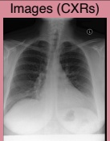COMPARISONS: Chest radiographFINDINGS: The lungs are clear. There is nopleural effusion or pneumothorax. There is nofocal airspace consolidation to suggestpneumonia. Accounting for technique, the heartsize is normal. The mediastinal contours are           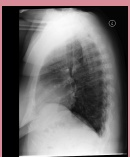unremarkable.IMPRESSION: No acute intrathoracic process.Metadata table                   Ground truthdicom_id                            Columns2ca11...                  PA   3056 2544 21430703918b4...                        3056StudyTime ProcedureCode...   ViewCode... PatientOrientation...CHEST (PA AND LAT)CHEST (PA AND LAT)   lateral       Erect</td></tr><tr><td rowspan=1 colspan=1>dicom_ic</td><td rowspan=1 colspan=4>PerformedProcedure...</td><td rowspan=1 colspan=2>ViewPosition</td><td rowspan=1 colspan=2>Rows</td><td rowspan=1 colspan=2>Columns</td><td rowspan=1 colspan=1>StudyDate</td></tr><tr><td rowspan=1 colspan=1>2ca11...</td><td rowspan=1 colspan=4>CHEST (PA AND LAT)</td><td rowspan=1 colspan=2>PA</td><td rowspan=1 colspan=2>3056</td><td rowspan=1 colspan=2>2544</td><td rowspan=1 colspan=1>21430703</td></tr><tr><td rowspan=1 colspan=1>918b4...</td><td rowspan=1 colspan=4>CHEST (PA AND LAT)</td><td rowspan=1 colspan=2>LATERAL</td><td rowspan=1 colspan=2>3056</td><td rowspan=1 colspan=2>2544</td><td rowspan=1 colspan=1>21430703</td></tr><tr><td rowspan=1 colspan=2></td><td rowspan=1 colspan=2>__</td><td rowspan=1 colspan=1>_</td><td rowspan=1 colspan=2>_</td></tr><tr><td rowspan=3 colspan=2></td><td rowspan=1 colspan=2>StudyTime</td><td rowspan=1 colspan=5>ProcedureCode...</td><td rowspan=1 colspan=3>ViewCode...</td><td rowspan=1 colspan=1>PatientOrientation...</td></tr><tr><td rowspan=1 colspan=2>150237</td><td rowspan=1 colspan=5>CHEST (PA AND LAT)</td><td rowspan=1 colspan=3>postero-anterior</td><td rowspan=1 colspan=1>Erect</td></tr><tr><td rowspan=1 colspan=2>150237</td><td rowspan=1 colspan=5>CHEST (PA AND LAT)</td><td rowspan=1 colspan=3>lateral</td><td rowspan=1 colspan=1>Erect</td></tr><tr><td rowspan=1 colspan=14>MIMIC-IV-ED tables</td></tr><tr><td rowspan=21 colspan=1></td><td rowspan=12 colspan=13>ED staysintime         genderCHINESETriageheartrate          sbpdbppain98   16      13081Aperiodic vital signsresprateo2satsbpdbprhythmReconciled medicines</td></tr><tr><td rowspan=1 colspan=2>intime</td><td rowspan=1 colspan=2>outtime</td><td rowspan=1 colspan=1>gender</td><td rowspan=1 colspan=2>race</td><td rowspan=1 colspan=4>arrival_transport</td><td rowspan=1 colspan=1>disposition</td></tr><tr><td rowspan=1 colspan=2>2143-07-03</td><td rowspan=1 colspan=2>2143-07-033</td><td rowspan=1 colspan=1></td><td rowspan=1 colspan=2>ASIAN -</td><td rowspan=1 colspan=4>WALK IN</td><td rowspan=1 colspan=1>ADMITTED</td></tr><tr><td rowspan=1 colspan=2>Triage</td><td rowspan=1 colspan=5></td></tr><tr><td rowspan=1 colspan=2>temperature</td><td rowspan=1 colspan=1>neartrate</td><td rowspan=1 colspan=2>resprate</td><td rowspan=1 colspan=1>o2sat</td><td rowspan=1 colspan=1>sbp</td><td rowspan=1 colspan=2>dbp</td><td rowspan=1 colspan=1>pain</td><td rowspan=1 colspan=2>acuity</td><td rowspan=1 colspan=1>chiefcomplain</td></tr><tr><td rowspan=1 colspan=2>97.5</td><td rowspan=1 colspan=1>98</td><td rowspan=1 colspan=2>16</td><td rowspan=1 colspan=1>Null</td><td rowspan=1 colspan=1>130</td><td rowspan=1 colspan=2>81</td><td rowspan=1 colspan=1>8</td><td rowspan=1 colspan=2>3</td><td rowspan=1 colspan=1>ABD PAIN</td></tr><tr><td rowspan=1 colspan=2>Aperiodic vita</td><td rowspan=1 colspan=4></td><td rowspan=1 colspan=4></td></tr><tr><td rowspan=1 colspan=2>charttime</td><td rowspan=1 colspan=2>temperature</td><td rowspan=1 colspan=2>heartrate</td><td rowspan=1 colspan=2>resprate</td><td rowspan=1 colspan=2>o2sat</td><td rowspan=1 colspan=1>sbp</td><td rowspan=1 colspan=1>pain</td></tr><tr><td rowspan=1 colspan=2>2143-07-03</td><td rowspan=1 colspan=2></td><td rowspan=1 colspan=2></td><td rowspan=1 colspan=2>16</td><td rowspan=1 colspan=2>Null</td><td rowspan=1 colspan=1>130</td><td rowspan=1 colspan=1></td></tr><tr><td rowspan=1 colspan=2>2143-07-03</td><td rowspan=1 colspan=2></td><td rowspan=1 colspan=2></td><td rowspan=1 colspan=2>15</td><td rowspan=1 colspan=2>99</td><td rowspan=1 colspan=1>121</td><td rowspan=1 colspan=1></td></tr><tr><td rowspan=1 colspan=2></td><td rowspan=1 colspan=2></td><td rowspan=1 colspan=2></td><td rowspan=1 colspan=2></td><td rowspan=1 colspan=2></td><td rowspan=1 colspan=1></td><td rowspan=1 colspan=1></td></tr><tr><td rowspan=1 colspan=2>Reconciled n</td><td rowspan=1 colspan=2>edicines</td></tr><tr><td rowspan=1 colspan=2>charttime</td><td rowspan=1 colspan=2>name</td><td rowspan=1 colspan=2>gsn</td><td rowspan=1 colspan=4>ndc</td><td rowspan=1 colspan=1>etc_rn</td><td></td><td rowspan=1 colspan=1>etccode</td><td rowspan=1 colspan=1>etcdescription</td></tr><tr><td rowspan=1 colspan=2>2143-07-0313:39:00</td><td rowspan=1 colspan=2>Dilaudid</td><td rowspan=1 colspan=2>004110</td><td rowspan=1 colspan=4>13107010701</td><td rowspan=1 colspan=1>1</td><td></td><td rowspan=1 colspan=1>00000583</td><td rowspan=1 colspan=1></td></tr><tr><td rowspan=1 colspan=2>2143-07-0313:39:00</td><td rowspan=1 colspan=2>fluticasone</td><td rowspan=1 colspan=2>019319</td><td rowspan=1 colspan=4>35356049401</td><td rowspan=1 colspan=1>1</td><td></td><td rowspan=1 colspan=1>00000371</td><td rowspan=1 colspan=1></td></tr><tr><td rowspan=1 colspan=2>….</td><td rowspan=1 colspan=2></td><td rowspan=1 colspan=2>:</td><td rowspan=1 colspan=4>…</td><td rowspan=1 colspan=1>….</td><td></td><td rowspan=1 colspan=1>….</td><td rowspan=1 colspan=1></td></tr><tr><td rowspan=1 colspan=13>Administered medicines</td></tr><tr><td rowspan=1 colspan=3>charttime</td><td rowspan=1 colspan=2>med_rn</td><td rowspan=1 colspan=7>name</td><td rowspan=1 colspan=1>gsn</td></tr><tr><td rowspan=1 colspan=3>2143-07-03 14:27:00</td><td rowspan=1 colspan=2>1</td><td rowspan=1 colspan=7>Ondansetron</td><td rowspan=1 colspan=1>061716</td></tr><tr><td rowspan=1 colspan=3>2143-07-03 14:27:00</td><td rowspan=1 colspan=2>2</td><td rowspan=1 colspan=7>HYDROmorphone (Dilaudid)</td><td rowspan=1 colspan=1>062823</td></tr><tr><td rowspan=1 colspan=3></td><td rowspan=1 colspan=2>..</td><td rowspan=1 colspan=7>…</td><td rowspan=1 colspan=1>…</td></tr></table>

Figure 1: The patient data from a MIMIC-IV-ED stay and its associated MIMIC-CXR exam. The exam was taken during the ED stay. This includes the exam’s images, the corresponding radiology report, and the associated image metadata. The findings and impression sections of the radiology report form the ground truth for CXR report generation. Emergency-specific data, such as reconciled medicines and aperiodic vital signs, are also available for the patient.

2021; Irmici et al., 2023). Early methods produced a separate report for each image within an exam (Wang et al., 2018). Later methods improved on this by considering all images of an exam to generate a single report (Miura et al., 2021; Nicolson et al., 2024a), and incorporating prior exams for a patient (Wu et al., 2022; Nicolson et al., 2024a). Including the reason for the exam (the indication section in Figure 1) offered a further improvement (Nguyen et al., 2023). This indicates that CXR report generation benefits from the inclusion of a more comprehensive set of patient data.

Incorporating clinical information, including electronic health record (EHR) data, enhanced the interpretation accuracy, clinical relevance, and reporting confidence of radiologists’ findings (Castillo et al., 2021). A growing push to integrate EHR systems into radiology workflows highlights the potential for CXR report generation models to leverage patient data directly (Geeslin and Gaskin, 2016). In this study, we aim to empirically investigate if such data can also improve CXR report generation. To facilitate this, we combine CXR exams from MIMIC-CXR (Johnson et al., 2019) with emergency department (ED) patient records from MIMIC-IV-ED (Johnson et al., 2023). This provides a wide variety of multimodal data per exam, as shown in Figure 1. From MIMIC-CXR, we utilise the images, their metadata, and several sections of the radiology reports. Notably, we incorporate the (clinical) history section of the report, which has not been investigated previously. From MIMIC-IV-ED, we incorporate triage data, aperiodic vital signs, medicines, and other data to provide a wider clinical context.

We also investigate how to harmonise these heterogeneous data into patient data embeddings to prompt a multimodal language model. In doing so, we develop methods to transform tabular and aperiodic time series data into embeddings that can be used alongside token and image embeddings. We evaluate our model using metrics shown to closely correlate with radiologists’ assessments of reporting (Yu et al., 2023). Through our evaluation, we demonstrate that complementary information from different data sources can improve the diagnostic accuracy of CXR report generation. The main contributions of this work are:

• An investigation demonstrating how integrating diverse patient data sources, such as medicines, vital signs, and clinical history, enhances CXR report generation and improves diagnostic accu-

racy.

• Introducing methods to convert numerical, categorical, text, temporal, and image data into patient data embeddings for a multimodal language model, termed CXRMate-ED.

• The following are made publicly available: the dataset linking MIMIC-CXR exams with MIMIC-IV-ED stays, the CXRMate-ED Hugging Face model, and the training code.3,4

## 2 Background and Related Work

Incorporating more patient data has improved diagnostic accuracy in radiology reporting. Initial improvements came from using multiple images per exam, like EMNLI; CXR exams often include complementary frontal and lateral views of the patient (Miura et al., 2021; Gaber et al., 2005). Methods such as CXRMate enhance diagnostic accuracy by incorporating a patient’s prior exams to identify changes over time (Nicolson et al., 2024a; Wu et al., 2022; Kelly, 2012; Bannur et al., 2023; Hou et al., 2023). Including the indication section of the radiology report to provide clinical context also provides an improvement (Nguyen et al., 2023). Our investigation focuses on leveraging a more comprehensive set of patient data to improve diagnostic accuracy.

ED records contain a wide range of data, as shown in Figure 1. The reconciled medicines may include furosemide, a diuretic administered to manage fluid overload associated with pulmonary edema or congestive heart failure. Elevated blood pressure observed in a patient’s vital signs may be associated with findings such as cardiomegaly or aortic knob calcification. Vital signs such as high temperature, elevated respiratory rate, and low oxygen saturation, along with chief complaints such as cough and shortness of breath, are often indicative of respiratory infections such as pneumonia. Incorporating such data could complement radiographic evidence and provide additional context to support better predictions. Our findings demonstrate that ED patient data can indeed improve CXR report generation.

Recent advancements in integrating multimodal patient data have improved diagnostic and predictive healthcare tasks. A Transformer encoder combining imaging and non-imaging data outperformed single-modality models in diagnosing multiple conditions (Khader et al., 2023b). Similarly, the MeTra architecture, integrating CXRs and clinical parameters, outperformed CXR-only models in predicting in-hospital survival (Khader et al., 2023a). ETHOS, with zero-shot learning, surpassed single-modality models in predicting mortality, ICU length of stay, and readmission rate (Renc et al., 2024). These studies underscore the value of multimodal data, and our work demonstrates its benefits for CXR report generation.

Multi-task learning has enhanced biomedical models by leveraging shared knowledge across tasks. Med-PaLM M, a generalist biomedical model, excels in classification, question answering, VQA, report summarisation, report generation, and genomic variant calling, using diverse modalities like images, text, and genomics, often outperforming specialised models (Tu et al., 2024). Similarly, MIMIC-CXR has been utilised in multi-task learning with models like MedXChat, which integrates instruction-tuning and Stable Diffusion for tasks like CXR report generation, VQA, and report-to-CXR generation, surpassing other LLM multi-task learners (Yang et al., 2025). RaDialog combines visual features and pathology findings to generate accurate radiology reports and enable interactive tasks, improving clinical efficacy. CXR-LLaVA, a multimodal LLM, outperformed models such as GPT-4 Vision and Gemini Pro Vision in CXR report generation (Lee et al., 2024).

Determining the state-of-the-art in CXR report generation is challenging due to model unavailability and limited comparisons with recent methods. The 2024 Shared Task on Large-Scale Radiology Report Generation (RRG24) aimed to address this by benchmarking models on a common leaderboard. The winning model, CXRMate-RRG24 (Nicolson et al., 2024b), a derivative of CXRMate, emerged as a strong contender for state-of-theart. In this work, we compare our model to established models (e.g., EMNLI) and recent benchmarks (e.g., CXRMate-RRG24, CXRMate, CXR-LLaVA, MedXChat, and RaDialog). We ensure a fair comparison by using available code or obtaining generated reports directly from the authors. Our evaluation indicates that our model represents a statistically significant improvement over these.

## 3 Dataset

We construct a dataset of 46 106 patients by linking individual patient information from two separate sources: (1) CXR exams from MIMIC-CXR and (2) emergency records from MIMIC-IV-ED. We consider MIMIC-CXR exams that occurred during an ED stay from MIMIC-IV-ED. Both datasets are publicly available and originate from the Beth Israel Deaconess Medical Center in Boston, MA.

MIMIC-CXR was formed by first extracting patient identifiers for exams performed in the ED between 2011–2016, and then extracting all exams for this set of patients from all departments between 2011–2016. Each exam includes a semi-structured free-text radiology report (Figure 1) written by a practising radiologist contemporaneously during routine clinical care. Models are often trained to generate the findings and impression sections of a radiology report, where the former details the interpretation of a patient’s exam and the latter summarises the most important findings. All images and reports were de-identified to protect privacy. Sections from the radiologist reports were extracted using a modification of the official text extraction tool in order to obtain the findings, impression, indication, history, and comparison sections.5

MIMIC-IV-ED consists of de-identified data from ED stays between 2011–2019. The data was converted into a denormalised relational database with six primary tables: ED stays, diagnosis, reconciled medicines, administered medicines, triage, and aperiodic vital signs. We do not consider the diagnosis table in this work, as it indicates the outcome of a patient’s ED stay. The patients of MIMIC-CXR can be linked to MIMIC-IV-ED via an identifier, allowing an ED-specific dataset to be formed.

Example tables for a patient’s exam are shown in Figure 1. The dataset was formed by extracting patient exams that occurred within the ‘intime’ and ‘outtime’ of one of the patient’s ED stays (the ‘StudyDate’ and ‘StudyTime’ columns of the metadata table indicate when the exam was conducted).6 Only the ED stay corresponding to the exam was provided to the model; the patient’s prior ED stays were not considered. Events during an ED stay that occurred after the exam were removed to maintain causality. Exams with either a missing findings or impression section were not considered. Using the official splits of MIMIC-CXR, this gave a train/validation/test split of 45 527/343/236 patients, 76 398/556/958 exams, and 151 818/1 137/1 812 CXRs. Further details are provided in Appendix A.

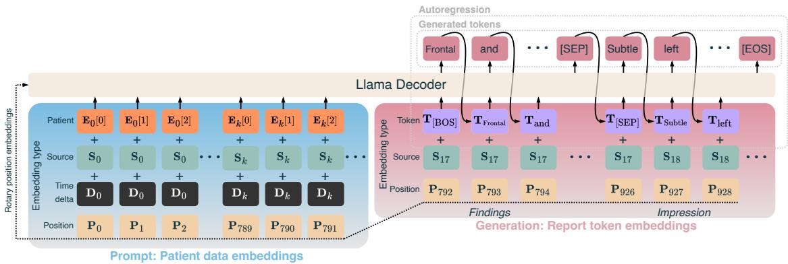  
Figure 2: CXRMate-ED; a multimodal language model that leverages auxiliary patient data for CXR report generation. The patient data embeddings prompt the decoder to generate the findings and impression sections of a radiology report.

## 4 Methods

We develop a novel approach to transform different sources of patient data from MIMIC-CXR and MIMIC-IV-ED into embeddings; these are then used to prompt a multimodal language model (CXRMate-ED) to generate the findings and impression sections of the radiology report, as illustrated in Figure 2. Each embedding of the prompt is the summation of a patient data embedding, a source embedding, a position embedding, and a time delta embedding. Source embeddings differentiate the source of the datum, for example, the ‘chief complaint’ column of the triage table, the indication section, or an image. A time delta embedding represents the time difference between an event and the exam. The patient data embeddings originate from three main groups: the tables of MIMIC-IV-ED; the report, images, and metadata of the current exam from MIMIC-CXR; and the patient’s prior exams (also originating from MIMIC-CXR). The prior exam and image embeddings are described in Appendix Section B and Appendix Subsection D.2, respectively.

## 4.1 Time, Position, & Source Embeddings

Events from the patient data are more relevant as they occur closer to the exam time (Ben Abacha et al., 2023). Hence, time delta embeddings are used to indicate this to the model. The time delta is the event time subtracted from the exam time, converted to hours, and mapped using D = $1 / \sqrt { \Delta + 1 }$ , emphasising recent events. These mapped time deltas are processed via a feedforward neural network (FNN), f(DW1)W2, where $\pmb { W } _ { 1 } \in \mathbb { R } ^ { 1 , 2 0 4 8 } , \pmb { W } _ { 2 } \in \mathbb { R } ^ { 2 0 4 8 , H } , f ( \cdot )$ is the SiLU activation (Hendrycks and Gimpel, 2016), and H is the decoder’s hidden size. As shown in Figure 2, these embeddings are applied only to the prompt.

The position embeddings are ordered by the time delta (Figure 3). This is due to the rotary position embeddings of the decoder; tokens that are closer together are given more importance. Hence, the smaller the time delta, the closer the patient data embedding’s position is to the report token embeddings. Following Nicolson et al. (2024a), each unique patient data source is given its own source embedding. This includes the images, each report section, each table’s text column and valuecategory columns (described in the next section), prior images, and prior report sections.

## 4.2 Patient Data Embeddings: Tabular Data

An example table and its conversion to embeddings is shown in Figure 3. The columns of each table were designated as value, category, text, or time columns. Value columns contained numeric data, while category columns contained categorical data. To convert an exam’s tabular data to embeddings, data from value and category columns were grouped by their time delta, where each group formed a feature vector. The feature vector initially consisted of zeros. Values and categories from the group were then used to set its values based on indices determined by a lookup table. For value columns, the lookup table determined the index where the numeric value was placed. For category columns, it determined which indices were activated (set to 1).

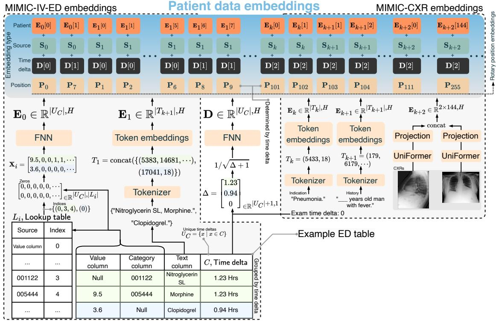  
Figure 3: Proposed patient data embeddings from the multiple heterogeneous data types taken from MIMIC-IV-ED and MIMIC-CXR. The embeddings are formed from numerical, categorical, textual, temporal, and image data.

Next, the feature vector was passed through an FNN $f ( \pmb { X } _ { i } \pmb { W } _ { 1 } ) \pmb { W } _ { 2 }$ to form the embedding, where $X _ { i } \ \in \ \mathbb { R } ^ { | U _ { C } | , | L _ { i } | }$ are the grouped features, $U _ { C }$ is the set of unique time deltas, $\mathbf { \hat { W } } _ { 1 } \in \mathbb { R } ^ { | L _ { i } | , 2 0 4 8 }$ and $W _ { 2 } \in \mathbb { R } ^ { 2 0 4 8 , H } , L _ { i }$ is a lookup table, and i designates the table. Each table has a unique FNN and lookup table. Rows for a value column always had a unique time, preventing multiple values from the same column in a group. We investigated alternatives to form the value-category embeddings in Section 6. The described framework was found to be the most efficient. Columns with a high cardinality were set as text columns. Text embeddings were formed via the decoder’s tokenizer and token embeddings. Text embeddings were given the time delta embedding from their respective row. The column designation for each table in Figure 1 is described in the Appendix C.

## 4.3 Patient Data Embeddings: Report Sections

We consider five sections of the radiology report: the findings, impression, indication, history, and comparison sections. The findings and impression sections serve as the ground truth to be generated. The remainder form part of the patient data embeddings. The indication section explains the reason for the exam, such as symptoms or suspected conditions. The history section provides relevant clinical history, such as past conditions and treatments. The comparison section mentions any prior exams, which are used to capture disease progression. These sections provide context that guides the interpretation of the exam, influencing the content of the findings and impression sections. The embeddings were formed via the decoder’s tokenizer and token embeddings. Of these, the history and comparison sections have not been investigated for CXR report generation. The comparison section was used only when prior exams were considered.

## 5 Experiment Setup

Our multimodal language model, illustrated in Figure 2, is based on CXRMate-RRG24; it features a Llama decoder and the UniFormer as the image encoder. The training procedure for our model involved three stages: (1) initial training on the MIMIC-CXR training set using only images as input with Teacher Forcing (TF) (Williams and Zipser, 1989), (2) further training on the dataset described in Section 1 with the inputs detailed in Table 1, again using TF, and (3) reinforcement learning on the same dataset through self-critical sequence training (SCST) (Rennie et al., 2017) (only for Table 2). Our evaluation metrics included four that capture the semantics of radiology reporting — RadGraph-F1 (RG), CheXbert-F1 (CX), CXR-BERT (CB), and GREEN (G) — as well as three natural language generation metrics: BERTScore-F1 (BS), ROUGE-L (R-L), and BLEU-4 (B4). We also propose a metric that measures n-gram repetition rate, namely the absence of repeated n-grams (ARN). Comprehensive details on ARN and the other metrics, the model architecture, training procedure, significance testing, and comparison methods are provided in Appendix D.

Table 1: Results of the various patient data sources on the test set described in Section 3. Results were calculated over ten training runs (n = 9 580 exams; 958 10 runs). Underlined scores indicate a significant difference to the scores of ‘Images’. Evaluation is performed on both the findings and impression sections.
<table><tr><td rowspan=1 colspan=9>Patient data sources                               RG    CX    CB    G      BS    R-L   B4   [ε[:, 0]</td></tr><tr><td rowspan=1 colspan=9>Images only</td></tr><tr><td rowspan=1 colspan=1>Images</td><td rowspan=1 colspan=5>24.54  30.10  59.25  35.1624.26</td><td rowspan=1 colspan=1>25.91</td><td rowspan=1 colspan=2>4.75  272.4</td></tr><tr><td rowspan=1 colspan=1>Patient emer</td><td rowspan=1 colspan=2>gency department</td><td rowspan=1 colspan=2>data (MIMIC-IV-ED)</td><td rowspan=1 colspan=1></td><td rowspan=1 colspan=1></td><td rowspan=1 colspan=2></td></tr><tr><td rowspan=1 colspan=1>Images + ED stays</td><td rowspan=1 colspan=1>24.20</td><td rowspan=1 colspan=1>29.55</td><td rowspan=1 colspan=1>58.37</td><td rowspan=1 colspan=1>34.64</td><td rowspan=1 colspan=1>24.06</td><td rowspan=1 colspan=1>25.77</td><td rowspan=1 colspan=2>4.66   273.4</td></tr><tr><td rowspan=1 colspan=1>Images + triage</td><td rowspan=1 colspan=1>24.59</td><td rowspan=1 colspan=1>31.33</td><td rowspan=1 colspan=1>62.79</td><td rowspan=1 colspan=1>35.78</td><td rowspan=1 colspan=1>24.40</td><td rowspan=1 colspan=1>25.96</td><td rowspan=1 colspan=2>4.76  278.9</td></tr><tr><td rowspan=1 colspan=1>Images + vital signs</td><td rowspan=1 colspan=1>24.23</td><td rowspan=1 colspan=1>30.61</td><td rowspan=1 colspan=1>60.61</td><td rowspan=1 colspan=1>35.15</td><td rowspan=1 colspan=1>24.04</td><td rowspan=1 colspan=1>25.86</td><td rowspan=1 colspan=2>4.70  274.7</td></tr><tr><td rowspan=1 colspan=1>Images + reconciled medicines</td><td rowspan=1 colspan=1>25.10</td><td rowspan=1 colspan=1>32.05</td><td rowspan=1 colspan=1>64.70</td><td rowspan=1 colspan=1>36.32</td><td rowspan=1 colspan=1>24.71</td><td rowspan=1 colspan=1>26.29</td><td rowspan=1 colspan=2>4.93  355.6</td></tr><tr><td rowspan=1 colspan=1>Images + administered medicines</td><td rowspan=1 colspan=1>24.22</td><td rowspan=1 colspan=1>30.40</td><td rowspan=1 colspan=1>60.13</td><td rowspan=1 colspan=1>34.85</td><td rowspan=1 colspan=1>23.97</td><td rowspan=1 colspan=1>25.61</td><td rowspan=1 colspan=2>4.58  273.0</td></tr><tr><td rowspan=1 colspan=1>Patien</td><td rowspan=1 colspan=1>t radiol</td><td rowspan=1 colspan=1>ogy data</td><td rowspan=1 colspan=1>(MIMIC-CX</td><td rowspan=1 colspan=1>R)</td><td rowspan=1 colspan=1></td><td rowspan=1 colspan=1></td><td rowspan=1 colspan=2></td></tr><tr><td rowspan=1 colspan=1>Images + indication</td><td rowspan=1 colspan=1>25.01</td><td rowspan=1 colspan=1>32.78</td><td rowspan=1 colspan=1>65.49</td><td rowspan=1 colspan=1>35.88</td><td rowspan=1 colspan=1>24.73</td><td rowspan=1 colspan=1>26.32</td><td rowspan=1 colspan=1>5.15</td><td rowspan=1 colspan=1>279.5</td></tr><tr><td rowspan=1 colspan=1>Images + history</td><td rowspan=1 colspan=1>24.88</td><td rowspan=1 colspan=1>31.66</td><td rowspan=1 colspan=1>63.91</td><td rowspan=1 colspan=1>35.76</td><td rowspan=1 colspan=1>24.91</td><td rowspan=1 colspan=1>26.70</td><td rowspan=1 colspan=1>5.54</td><td rowspan=1 colspan=1>277.0</td></tr><tr><td rowspan=1 colspan=1>Images + metadata</td><td rowspan=1 colspan=1>24.07</td><td rowspan=1 colspan=1>30.42</td><td rowspan=1 colspan=1>59.75</td><td rowspan=1 colspan=1>34.79</td><td rowspan=1 colspan=1>23.86</td><td rowspan=1 colspan=1>25.59</td><td rowspan=1 colspan=1>4.58</td><td rowspan=1 colspan=1>273.4</td></tr><tr><td rowspan=1 colspan=1></td><td rowspan=1 colspan=1>Prior</td><td rowspan=1 colspan=1>exams</td><td rowspan=1 colspan=1></td><td rowspan=1 colspan=1></td><td rowspan=1 colspan=1></td><td rowspan=1 colspan=1></td><td rowspan=1 colspan=1></td><td rowspan=1 colspan=1></td></tr><tr><td rowspan=1 colspan=1>Images + h = 1</td><td rowspan=1 colspan=1>24.71</td><td rowspan=1 colspan=1>30.98</td><td rowspan=1 colspan=1>62.60</td><td rowspan=1 colspan=1>35.81</td><td rowspan=1 colspan=1>24.38</td><td rowspan=1 colspan=1>26.00</td><td rowspan=1 colspan=1>4.82</td><td rowspan=1 colspan=1>603.0</td></tr><tr><td rowspan=1 colspan=1>Images + h = 2</td><td rowspan=1 colspan=1>24.56</td><td rowspan=1 colspan=1>31.43</td><td rowspan=1 colspan=1>62.09</td><td rowspan=1 colspan=1>35.43</td><td rowspan=1 colspan=1>24.04</td><td rowspan=1 colspan=1>25.80</td><td rowspan=1 colspan=1>4.84</td><td rowspan=1 colspan=1>878.1</td></tr><tr><td rowspan=1 colspan=1>Images + h = 3</td><td rowspan=1 colspan=1>24.50</td><td rowspan=1 colspan=1>30.73</td><td rowspan=1 colspan=1>59.89</td><td rowspan=1 colspan=1>35.21</td><td rowspan=1 colspan=1>24.03</td><td rowspan=1 colspan=1>25.82</td><td rowspan=1 colspan=1>4.70</td><td rowspan=1 colspan=1>1134.3</td></tr><tr><td rowspan=3 colspan=1>Images + h = 1 + comparisonImages + h = 2 + comparisonImages + h = 3 + comparison</td><td rowspan=1 colspan=1>24.92</td><td rowspan=1 colspan=1>31.46</td><td rowspan=1 colspan=1>62.93</td><td rowspan=1 colspan=1>35.84</td><td rowspan=1 colspan=1>24.34</td><td rowspan=1 colspan=1>26.03</td><td rowspan=1 colspan=1>4.89</td><td rowspan=1 colspan=1>607.4</td></tr><tr><td rowspan=1 colspan=1>24.52</td><td rowspan=1 colspan=1>31.01</td><td rowspan=1 colspan=1>61.36</td><td rowspan=1 colspan=1>34.89</td><td rowspan=1 colspan=1>23.90</td><td rowspan=1 colspan=1>25.62</td><td rowspan=1 colspan=1>4.72</td><td rowspan=1 colspan=1>882.6</td></tr><tr><td rowspan=1 colspan=1>24.31</td><td rowspan=1 colspan=1>30.93</td><td rowspan=1 colspan=1>60.10</td><td rowspan=1 colspan=1>34.35</td><td rowspan=1 colspan=1>23.31</td><td rowspan=1 colspan=1>25.39</td><td rowspan=1 colspan=1>4.72</td><td rowspan=1 colspan=1>1138.8</td></tr><tr><td rowspan=1 colspan=1>All effective sources (tr</td><td rowspan=1 colspan=1>iage, recon</td><td rowspan=1 colspan=1>ciled med</td><td rowspan=1 colspan=1>icines, in</td><td rowspan=1 colspan=1>dication,</td><td rowspan=1 colspan=1>and history)</td><td rowspan=1 colspan=1></td><td rowspan=1 colspan=1></td><td rowspan=1 colspan=1></td></tr><tr><td rowspan=3 colspan=1>Images + effective sources (h = 0)Images + effective sources (h = 1)Images + effective sources (h = 1 + comparison)</td><td rowspan=1 colspan=1>25.52</td><td rowspan=1 colspan=1>32.49</td><td rowspan=1 colspan=1>65.93</td><td rowspan=1 colspan=1>36.26</td><td rowspan=1 colspan=1>25.16</td><td rowspan=1 colspan=1>26.81</td><td rowspan=1 colspan=1>5.34</td><td rowspan=1 colspan=1>373.9</td></tr><tr><td rowspan=1 colspan=1>25.11</td><td rowspan=1 colspan=1>31.14</td><td rowspan=1 colspan=1>61.19</td><td rowspan=1 colspan=1>35.80</td><td rowspan=1 colspan=1>24.95</td><td rowspan=1 colspan=1>26.45</td><td rowspan=1 colspan=1>5.21</td><td rowspan=1 colspan=1>704.5</td></tr><tr><td rowspan=1 colspan=1>25.05</td><td rowspan=1 colspan=1>30.68</td><td rowspan=1 colspan=1>60.99</td><td rowspan=1 colspan=1>35.94</td><td rowspan=1 colspan=1>24.94</td><td rowspan=1 colspan=1>26.48</td><td rowspan=1 colspan=1>5.24</td><td rowspan=1 colspan=1>709.0</td></tr><tr><td rowspan=6 colspan=1>Ablation fr- triage- reconciled medicines- indication- history- time delta</td><td rowspan=1 colspan=1>om Images</td><td rowspan=1 colspan=1>+ effecti</td><td rowspan=1 colspan=1>ve sourc</td><td rowspan=1 colspan=1>es (h = 0)</td><td rowspan=1 colspan=1></td><td rowspan=1 colspan=1></td><td rowspan=1 colspan=1></td><td rowspan=1 colspan=1></td></tr><tr><td rowspan=1 colspan=1>25.65</td><td rowspan=1 colspan=1>32.85</td><td rowspan=1 colspan=1>65.38</td><td rowspan=1 colspan=1>36.33</td><td rowspan=1 colspan=1>25.25</td><td rowspan=1 colspan=1>26.75</td><td rowspan=1 colspan=1>5.33</td><td rowspan=1 colspan=1>367.4</td></tr><tr><td rowspan=1 colspan=1>25.43</td><td rowspan=1 colspan=1>32.48</td><td rowspan=1 colspan=1>65.63</td><td rowspan=1 colspan=1>36.42</td><td rowspan=1 colspan=1>25.23</td><td rowspan=1 colspan=1>26.86</td><td rowspan=1 colspan=1>5.40</td><td rowspan=1 colspan=1>290.7</td></tr><tr><td rowspan=1 colspan=1>25.46</td><td rowspan=1 colspan=1>32.92</td><td rowspan=1 colspan=1>65.69</td><td rowspan=1 colspan=1>36.41</td><td rowspan=1 colspan=1>25.21</td><td rowspan=1 colspan=1>26.79</td><td rowspan=1 colspan=1>5.36</td><td rowspan=1 colspan=1>366.7</td></tr><tr><td rowspan=1 colspan=1>25.41</td><td rowspan=1 colspan=1>32.53</td><td rowspan=1 colspan=1>65.82</td><td rowspan=1 colspan=1>36.65</td><td rowspan=1 colspan=1>25.12</td><td rowspan=1 colspan=1>26.72</td><td rowspan=1 colspan=1>5.37</td><td rowspan=1 colspan=1>369.2</td></tr><tr><td rowspan=1 colspan=1>25.31</td><td rowspan=1 colspan=1>33.03</td><td rowspan=1 colspan=1>65.72</td><td rowspan=1 colspan=1>36.17</td><td rowspan=1 colspan=1>25.10</td><td rowspan=1 colspan=1>26.75</td><td rowspan=1 colspan=1>5.34</td><td rowspan=1 colspan=1>373.9</td></tr></table>

## 6 Results & Discussion

The impact of different patient data sources on the performance of CXR report generation is summarised in Table 1. This analysis identifies which patient data sources outperform an image-only baseline. Significant improvements were observed by incorporating either triage data or reconciled medicines. Notably, this data markedly improved scores on the radiology report metrics (RG, CX, CB, and G). These findings demonstrate that ED patient data can improve the diagnostic accuracy of CXR report generation. Aperiodic vital sign and administered medicine data did not significantly improve the scores overall, likely due to their frequency of occurrence in the exams (62% and 37%, respectively). However, as shown in Table F.1, a significant improvement in performance was attained when evaluated solely on exams that include an aperiodic vital sign table.

Incorporating the indication or history section led to significant score improvements. This demonstrates the substantial influence these sections have on the findings and impression sections. Conversely, adding the metadata table did not result in significant score improvements, indicating it lacks valuable information for CXR report generation. While previous studies have established that the indication section boosts CXR report generation (Nguyen et al., 2023), our findings demonstrate that the history section is equally important.

When examining the impact of prior exams, we considered a maximum history size h of up to three, incorporating the findings and impression sections, and images from prior exams. A history size of one or two significantly increased the scores, which is consistent with previous findings (Wu et al., 2022). However, performance gradually degraded as the history size increased, which contradicts earlier studies. We suspect this is due to the size of the prompt increasing as h grows, combined with the limitations of our model architecture. $\overline { { | \pmb { \mathscr { E } } [ : , 0 ] | } }$ in Table 1 is the average prompt length over the test set, where $\pmb { \mathcal { E } } = [ \mathbf { E } _ { 0 } , \mathbf { E } _ { 1 } , \cdots ]$ . It can be seen that $\overline { { | \pmb { \mathscr { E } } [ : , 0 ] | } }$ increases substantially as h increases. fiSince we provide all inputs to the decoder’s selfattention, a large input size may cause attention dilution (Qin et al., 2022). With more inputs, the attention weights must be distributed across a larger number of inputs, resulting in each input receiving a smaller share of the attention, making it harder for the model to focus on the most relevant inputs.

Table 2: Comparison to benchmark models on the test set described in Section 3 (n = 958). Evaluation is on the findings section only. Underlined indicates statistical significance to the top scoring benchmark model $( p < 0 . 0 5 )$ In the ‘Train samples’ column, ‘images’ means the model generates reports per image, while ‘exams’ means a report generated per exam.
<table><tr><td>Model</td><td>Train samples</td><td>RG</td><td>CX</td><td>CB</td><td>G</td><td>BS</td><td>R-L</td><td>B4</td><td>ARN</td></tr><tr><td>EMNLI (Miura et al., 2021)</td><td>152 173 exams</td><td>29.1</td><td>28.9</td><td>66.6</td><td>41.5</td><td>24.4</td><td>29.3</td><td>4.1</td><td>95.1</td></tr><tr><td>CMN (Chen et al., 2021)</td><td>270 790 images</td><td>23.6</td><td>24.3</td><td>49.4</td><td>36.6</td><td>19.7</td><td>27.8</td><td>4.0</td><td>99.3</td></tr><tr><td>TranSQ (Kong et al., 2022)</td><td>368 960 images</td><td>28.7</td><td>30.4</td><td>62.3</td><td>38.2</td><td>20.4</td><td>23.3</td><td>4.1</td><td>98.5</td></tr><tr><td>RGRG (Tanida et al., 2023)</td><td>166 512 images</td><td>22.9</td><td>22.8</td><td>37.9</td><td>31.1</td><td>23.4</td><td>22.0</td><td>3.7</td><td>96.5</td></tr><tr><td>CvT2DistilGPT2 (Nicolson et al., 2023)</td><td>270 790 images</td><td>23.9</td><td>29.3</td><td>59.8</td><td>37.0</td><td>24.8</td><td>28.6</td><td>5.4</td><td>99.0</td></tr><tr><td>RaDialog (Pellegrini et al., 2023)</td><td>276778 images</td><td>24.4</td><td>38.4</td><td>60.7</td><td>34.9</td><td>26.2</td><td>26.7</td><td>4.8</td><td>94.4</td></tr><tr><td>MedXChat (Yang et al., 2025)</td><td>270 790 images</td><td>21.0</td><td>13.1</td><td>21.3</td><td>31.4</td><td>19.3</td><td>23.8</td><td>4.0</td><td>97.9</td></tr><tr><td>CXR-LLaVA-v2 (Lee et al., 2024)</td><td>193 513 images</td><td>19.4</td><td>20.7</td><td>44.1</td><td>24.0</td><td>23.6</td><td>21.1</td><td>1.7</td><td>99.7</td></tr><tr><td>CXRMate (Nicolson et al., 2024a)</td><td>125 395 exams</td><td>26.5</td><td>33.9</td><td>71.3</td><td>40.3</td><td>30.5</td><td>29.1</td><td>7.5</td><td>98.2</td></tr><tr><td>CXRMate-RRG24 (Nicolson et al., 2024b)</td><td>550 395 exams</td><td>28.9</td><td>31.2</td><td>58.2</td><td>40.2</td><td>31.0</td><td>28.7</td><td>6.6</td><td>97.7</td></tr><tr><td>Images + effective sources (h = 0)</td><td>76 398 exams</td><td>25.1</td><td>29.6</td><td>66.0</td><td>36.9</td><td>29.4</td><td>27.8</td><td>5.8</td><td>98.5</td></tr><tr><td>+ RL (CXR-BERT + BERTScore reward)</td><td>76 398 exams</td><td>30.4</td><td>35.7</td><td>79.1</td><td>41.6</td><td>37.2</td><td>31.6</td><td>8.7</td><td>93.5</td></tr><tr><td>+ reward per section</td><td>76398 exams</td><td>30.1</td><td>33.7</td><td>78.3</td><td>41.6</td><td>37.5</td><td>32.2</td><td>8.4</td><td>94.6</td></tr><tr><td>+ ARN reward (CXRMate-ED)</td><td>76 398 exams</td><td>30.2</td><td>33.6</td><td>78.0</td><td>40.7</td><td>37.3</td><td>31.9</td><td>7.6</td><td>99.3</td></tr></table>

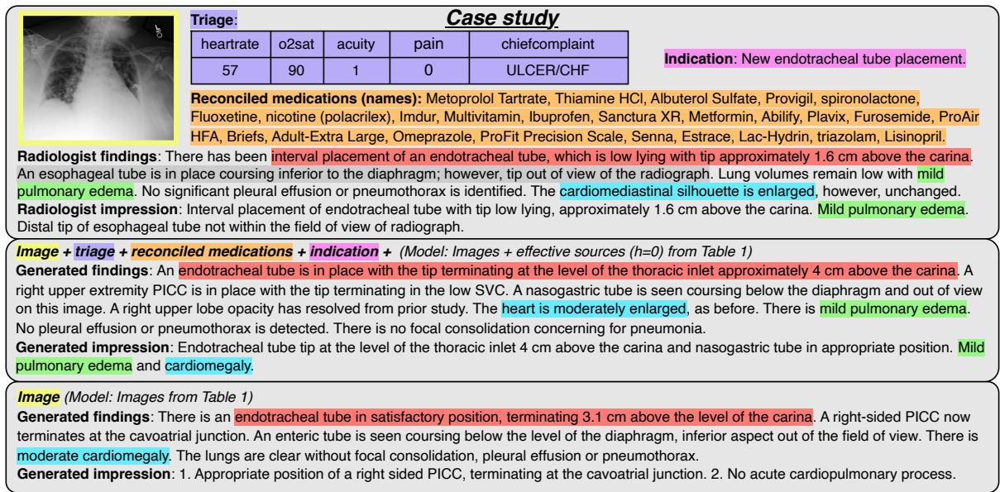  
Figure 4: Case study demonstrating how incorporating auxiliary patient data can aid with report generation.

Next, we combined all effective sources of patient data (those providing a significant improvement). This included ‘triage’, ‘reconciled medicines’, ‘indication’, and ‘history’. The best performance was observed with no prior exams $( h = 0 )$ , indicating that using any prior exams in combination with other sources is detrimental with our model, possibly due to attention dilution. With h = 0, the combination of all effective sources outperformed each individual source. We then conducted an ablation study using ‘Images + effective sources $( h = 0 ) '$ , which demonstrated that removing any individual patient data source did not result in a significant change in performance.

Following this, we further trained ‘Images + effective sources $( h = 0 ) '$ with reinforcement learning (RL), as described in Subsection 5. Its performance is shown in Table 2; a CXR-BERT and BERTScore composite reward was used, which demonstrates a marked improvement for each metric, except ARN. The low ARN indicates that this reward introduced repetitions. We also propose to calculate the reward separately for the findings and impression section, as described in Appendix E. While this produces similar results for the findings section as shown in Table 2, this significantly improves the scores on the impression section as shown in Table E.1. Finally, we incorporate ARN into the composite reward. This effectively reduces repetitions, as evidenced by the improved ARN, albeit with a slight trade-off in the other metrics. Compared to other benchmark CXR report generation models in the literature that included MIMIC CXR in their training data, our model significantly outperformed them on multiple metrics in Table 2, despite having substantially fewer training samples. This demonstrates the impact of incorporating auxiliary patient data on CXR report generation.

Figure 4 provides an example of how auxiliary patient data enhances CXR report generation. Mild pulmonary edema was identified by the model only when the auxiliary patient data was incorporated. The patient’s low oxygen saturation, chief complaint of congestive heart failure (CHF) — a common cause of pulmonary edema — and reconciled medicines (Furosemide, Metoprolol Tartrate, Lisinopril, Spironolactone) indicate active management of fluid overload. Although the low oxygen saturation and these medicines alone are not definitive for pulmonary edema, together they provide corroborative evidence of mild pulmonary oedema.

In Appendix G, we perform an error analysis to assess the influence of auxiliary patient data on the generated reports. Our findings show that incorporating auxiliary patient data increases the AUC for 10 out of the 14 CheXpert labels (Figure G.1), demonstrating its utility across multiple pathologies. Additionally, we analysed its impact on the generated reports for eight exams, with the following key observations:

True positives $( n = 2 ) $ : The model utilised supportive auxiliary patient data effectively. (See Appendix G.2.1 and G.2.2.)

False positives $( n = 2 ) \colon$ The model was misled by confounding auxiliary patient data. (See Appendix G.2.3 and G.2.4.)

Table 3: Patient data embedding strategies. Underlined indicates a stat. sig. difference to ‘Baseline $( p < 0 . 0 5 )$
<table><tr><td>Embeddings</td><td>RG</td><td>CX</td><td>CB</td><td>BS</td></tr><tr><td colspan="5">Images</td></tr><tr><td>Baseline</td><td>29.00</td><td></td><td>25.81 59.04</td><td>23.85</td></tr><tr><td colspan="5">Images + triage + reconciled medicines</td></tr><tr><td>Grouped embeddings</td><td>31.69</td><td>26.72</td><td>64.01</td><td>24.38</td></tr><tr><td>Separate embeddings</td><td>25.28</td><td>25.32</td><td>46.29</td><td>23.51</td></tr><tr><td>Values-to-text, categories- to-embeddings</td><td>30.70</td><td>26.46</td><td>58.62</td><td>24.58</td></tr></table>

True negatives $( n = 2 ) \colon$ The model correctly ignored confounding auxiliary patient data. (See Appendix G.2.5 and G.2.6.)

False negatives (n = 2): The model failed to leverage supportive auxiliary patient data. (See Appendix G.2.7 and G.2.8.)

Auxiliary patient data sources—including the indication and history sections, triage data, and reconciled medicines—collectively contributed to the model’s predictions. No single source consistently dominated in providing evidence, with the interplay between these sources frequently complementing one another. A critical challenge for the model lies in its ability to appropriately balance the auxiliary patient data evidence with radiographic evidence, particularly when conflicting signals are present. To address this limitation, we propose two key improvements: increasing the size of the training dataset, which is currently relatively small, and adopting an LLM-based decoder. LLMs offer advanced reasoning capabilities, enabling them to better synthesise and prioritise evidence from diverse sources.

Table 3 compares different methods for converting value and category columns into embeddings using the triage and reconciled medicines table, as these contain multiple value and category columns. The aforementioned method of producing embeddings by grouping data from value and category columns (‘Grouped embeddings’) is compared to two other methods. The first is separate embeddings for each datum, where each value column datum is separately transformed using the previously described FNN, while each category column datum is converted to an embedding using a learnable weight matrix, akin to how token embeddings are produced (‘Separate embeddings’). The second method modifies ‘Separate embeddings’ by instead converting the value column data to text and using the decoder’s tokenizer and token embeddings (‘Values-to-text, categories-to-tokens’). The results indicate that the grouped embeddings method was the best representation of heterogeneous patient data for a multimodal language model.

Table 4: Results on exams from the MIMIC-CXR test set not associated with an ED stay (n = 666).
<table><tr><td>Model</td><td>G</td><td>CB</td><td>BS</td><td>B4</td></tr><tr><td>CXRMate-RRG24</td><td>31.99</td><td>72.48</td><td>25.88</td><td>3.37</td></tr><tr><td>CXRMate-ED (ours)</td><td>32.56</td><td>78.76</td><td>31.13</td><td>4.80</td></tr></table>

To evaluate the generalisability and robustness of CXRMate-ED, we evaluated it on 666 exams from the MIMIC-CXR test set not associated with an ED stay, explicitly excluding ED patient data. As shown in the results presented in Table 4, our model consistently outperformed the next-best performing model from Table 2, CXRMate-RRG24, despite the absence of ED patient data. The dynamic nature of the attention mechanism, enables the model to be robust to missing data. This indicates that CXRMate-ED is able to generalise to departments other than emergency.

## 7 Conclusion

This paper demonstrates the value of incorporating diverse patient data into automated CXR report generation. By integrating patient data from the MIMIC-CXR and MIMIC-IV-ED datasets, we have shown significant improvements in the diagnostic accuracy of generated radiology reports. Our empirical evaluation uncovers new sources of patient information that enhance CXR report generation, including triage data, reconciled medicines, and the history section of radiology reports. We present specific methods to convert multimodal patient data into embeddings for a language model, encompassing numerical, categorical, textual, temporal, and image data. We encourage further research and experimentation with our released dataset, code, and model checkpoint to further explore methods for multimodal patient data language modelling, with the ultimate goal of enhancing diagnostic accuracy and patient care.

## 8 Limitations

Despite the promising results demonstrated in this study, several limitations must be acknowledged. Firstly, the generalisability of our findings may be constrained by the datasets utilised, specifically MIMIC-CXR and MIMIC-IV-ED, which are derived from a single institution, the Beth Israel Deaconess Medical Center. This could introduce biases unique to the demographic and clinical practices of this institution, potentially limiting the applicability of our model to other healthcare settings with different patient populations or clinical workflows. Our reliance on these datasets is due to the fact that they are the only publicly available sources that link CXR exams with ED stays.

This study currently lacks subjective evaluation by radiologists, which is essential for assessing the quality of generated reports. We plan to address this by conducting a retrospective evaluation with a private dataset and radiologist evaluators. To facilitate this, we are securing agreements and ethics approval for access to patient data and radiologist time. However, this process is extensive and beyond the scope of this study, and will instead be used to subjectively evaluate future models.

Another limitation pertains to the completeness and quality of the patient data. Despite incorporating a wide range of data sources, the datasets still contain missing or incomplete information, which can affect model performance. For example, not all exams include a history section, and not all ED patient records have administered medicines available, leading to potential gaps in the data that the model can utilise. However, this reflects the nature of real patient records where issues of data quality and completeness are to be expected.

Our model’s architecture, while effective, has certain limitations. It struggles with large input sizes, especially when incorporating multiple prior exams, likely due to attention dilution. It also at times struggles with supportive or confounding evidence from the auxiliary patient data, introducing false positive or false negative predictions. Future work should explore advanced attention mechanisms, hierarchical models, and LLMs to better manage large input sequences and to better balance auxiliary patient data evidence with radiographic evidence.

The interpretability of the model also poses a challenge. While our model shows improved diagnostic accuracy, the decision-making process within the multimodal language model remains a black box. Developing methods to enhance the interpretability and explainability of the model’s outputs would be beneficial, especially in clinical settings where understanding the rationale behind a diagnosis is critical.

Finally, while we provide a comprehensive set of metrics to evaluate our model’s performance, these metrics focus primarily on the diagnostic accuracy and quality of the generated reports. Broader evaluations considering clinical outcomes, such as the impact on patient management or reduction in radiologist workload, would offer a more holistic view of the benefits and limitations of CXR report generation models in general. Conducting such assessments could help to better understand the practical implications of deploying these models in a clinical setting.

In summary, while our study provides valuable insights into the integration of multimodal patient data for CXR report generation, addressing these limitations will be crucial for further advancements and broader adoption of such models in clinical practice. Future research should explore alternative architectures and training strategies, find alternative datasets to evaluate generalisability, improve model interpretability, and comprehensively assess the practical impact on patient care and radiologist workflow.

## 9 Ethical Considerations

In this research, we used real-world patient data from the MIMIC-CXR and MIMIC-IV-ED datasets. Since these datasets are de-identified, we consider privacy leakage risks to be minimal. Our method employs a language model to generate medical reports from patient data. However, we acknowledge that language models can exhibit bias and produce hallucinations, which may result in incorrect content in the generated reports.

## References

Christopher R. Bailey, Allison M. Bailey, Anna Sophia McKenney, and Clifford R. Weiss. 2022. Understanding and Appreciating Burnout in Radiologists. RadioGraphics, 42(5):E137–E139.

Shruthi Bannur, Stephanie Hyland, Qianchu Liu, Fernando Pérez-García, Maximilian Ilse, Daniel C. Castro, Benedikt Boecking, Harshita Sharma, Kenza Bouzid, Anja Thieme, Anton Schwaighofer, Maria Wetscherek, Matthew P. Lungren, Aditya Nori, Javier Alvarez-Valle, and Ozan Oktay. 2023. Learning to Exploit Temporal Structure for Biomedical Vision-Language Processing. In CVPR, pages 15016– 15027.

Asma Ben Abacha, Wen-wai Yim, George Michalopoulos, and Thomas Lin. 2023. An investigation of evaluation methods in automatic medical note generation. In Findings of the ACL, pages 2575–2588, Toronto, Canada.

Benedikt Boecking, Naoto Usuyama, Shruthi Bannur, Daniel C. Castro, Anton Schwaighofer, Stephanie Hyland, Maria Wetscherek, Tristan Naumann, Aditya Nori, Javier Alvarez-Valle, Hoifung Poon, and Ozan Oktay. 2022. Making the Most of Text Semantics to Improve Biomedical Vision–Language Processing. In ECCV, pages 1–21.

Chelsea Castillo, Tom Steffens, Lawrence Sim, and Liam Caffery. 2021. The effect of clinical information on radiology reporting: A systematic review. Journal ofMedical Radiation Sciences, 68(1):60–74.

Zhihong Chen, Yaling Shen, Yan Song, and Xiang Wan. 2021. Cross-modal Memory Networks for Radiology Report Generation. In IJCNLP, pages 5904–5914.

Jean-Benoit Delbrouck, Pierre Chambon, Christian Bluethgen, Emily Tsai, Omar Almusa, and Curtis Langlotz. 2022. Improving the Factual Correctness of Radiology Report Generation with Semantic Rewards. In EMNLP, pages 4348–4360.

Mohamed Elgendi, Muhammad Umer Nasir, Qunfeng Tang, David Smith, John-Paul Grenier, Catherine Batte, Bradley Spieler, William Donald Leslie, Carlo Menon, Richard Ribbon Fletcher, Newton Howard, Rabab Ward, William Parker, and Savvas Nicolaou. 2021. The Effectiveness of Image Augmentation in Deep Learning Networks for Detecting COVID-19: A Geometric Transformation Perspective. Frontiers in Medicine, 8.

Khalid A Gaber, Clive R McGavin, and Irving P Wells. 2005. Lateral Chest X-Ray for Physicians. Journal ofthe Royal Society ofMedicine, 98(7):310–312.

Matthew G. Geeslin and Cree M. Gaskin. 2016. Electronic Health Record–Driven Workflow for Diagnostic Radiologists. Journal ofthe American College of Radiology, 13(1):45–53.

Dan Hendrycks and Kevin Gimpel. 2016. Gaussian Error Linear Units (GELUs). arXiv:1606.08415 [cs.LG].

Wenjun Hou, Yi Cheng, Kaishuai Xu, Wenjie Li, and Jiang Liu. 2023. RECAP: Towards Precise Radiology Report Generation via Dynamic Disease Progression Reasoning. In Findings ofthe ACL: EMNLP, pages 2134–2147.

Giovanni Irmici, Maurizio Cè, Elena Caloro, Natallia Khenkina, Gianmarco Della Pepa, Velio Ascenti, Carlo Martinenghi, Sergio Papa, Giancarlo Oliva, and Michaela Cellina. 2023. Chest X-ray in Emergency Radiology: What Artificial Intelligence Applications Are Available? Diagnostics, 13(2):216.

Alistair Johnson, Lucas Bulgarelli, Tom Pollard, Leo Anthony Celi, Roger Mark, and Steven Horng. 2023. MIMIC-IV-ED (version 2.2). PhysioNet.

Alistair E. W. Johnson, Tom J. Pollard, Nathaniel R. Greenbaum, Matthew P. Lungren, Chih-ying Deng, Yifan Peng, Zhiyong Lu, Roger G. Mark, Seth J.

Berkowitz, and Steven Horng. 2019. MIMIC-CXR-JPG, a large publicly available database of labeled chest radiographs. PhysioNet.

Catherine M Jones, Quinlan D Buchlak, Luke Oakden-Rayner, Michael Milne, Jarrel Seah, Nazanin Esmaili, and Ben Hachey. 2021. Chest radiographs and machine learning – Past, present and future. Journal of Medical Imaging and Radiation Oncology, 65(5):538–544.

Barry Kelly. 2012. The chest radiograph. The Ulster Medical Journal, 81(23620614):143–148.

Firas Khader, Jakob Nikolas Kather, Gustav Müller-Franzes, Tianci Wang, Tianyu Han, Soroosh Tayebi Arasteh, Karim Hamesch, Keno Bressem, Christoph Haarburger, Johannes Stegmaier, Christiane Kuhl, Sven Nebelung, and Daniel Truhn. 2023a. Medical transformer for multimodal survival prediction in intensive care: integration of imaging and non-imaging data. Scientific Reports, 13(1):10666.

Firas Khader, Gustav Müller-Franzes, Tianci Wang, Tianyu Han, Soroosh Tayebi Arasteh, Christoph Haarburger, Johannes Stegmaier, Keno Bressem, Christiane Kuhl, Sven Nebelung, Jakob Nikolas Kather, and Daniel Truhn. 2023b. Multimodal Deep Learning for Integrating Chest Radiographs and Clinical Parameters: A Case for Transformers. Radiology, 309(1):e230806.

Ming Kong, Zhengxing Huang, Kun Kuang, Qiang Zhu, and Fei Wu. 2022. TranSQ: Transformer-Based Semantic Query for Medical Report Generation. In MICCAI, volume 13438, pages 610–620.

Seowoo Lee, Jiwon Youn, Hyungjin Kim, Mansu Kim, and Soon Ho Yoon. 2024. CXR-LLAVA: a multimodal large language model for interpreting chest X-ray images. European Radiology.

Kunchang Li, Yali Wang, Junhao Zhang, Peng Gao, Guanglu Song, Yu Liu, Hongsheng Li, and Yu Qiao. 2023. UniFormer: Unifying Convolution and Self-Attention for Visual Recognition. IEEE Transactions on Pattern Analysis and Machine Intelligence, 45(10):12581–12600.

Chin-Yew Lin and Eduard Hovy. 2003. Automatic evaluation of summaries using N-gram co-occurrence statistics. In NAACL, volume 1, pages 71–78.

Ilya Loshchilov and Frank Hutter. 2022. Decoupled Weight Decay Regularization. In ICLR.

Yasuhide Miura, Yuhao Zhang, Emily Tsai, Curtis Langlotz, and Dan Jurafsky. 2021. Improving Factual Completeness and Consistency of Image-to-Text Radiology Report Generation. In NAACL, pages 5288– 5304.

Dang Nguyen, Chacha Chen, He He, and Chenhao Tan. 2023. Pragmatic Radiology Report Generation. In Proceedings of the 3rd Machine Learning for Health Symposium, pages 385–402. PMLR. ISSN: 2640- 3498.

Aaron Nicolson, Jason Dowling, Douglas Anderson, and Bevan Koopman. 2024a. Longitudinal data and a semantic similarity reward for chest X-ray report generation. Informatics in Medicine Unlocked, 50:101585.

Aaron Nicolson, Jason Dowling, and Bevan Koopman. 2023. Improving chest X-ray report generation by leveraging warm starting. Artificial Intelligence in Medicine, 144:102633.

Aaron Nicolson, Jinghui Liu, Jason Dowling, Anthony Nguyen, and Bevan Koopman. 2024b. e-Health CSIRO at RRG24: Entropy-Augmented Self-Critical Sequence Training for Radiology Report Generation. In The 23rd Workshop on Biomedical Natural Language Processing and BioNLP Shared Tasks.

Sophie Ostmeier, Justin Xu, Zhihong Chen, Maya Varma, Louis Blankemeier, Christian Bluethgen, Arne Edward Michalson Md, Michael Moseley, Curtis Langlotz, Akshay S Chaudhari, and Jean-Benoit Delbrouck. 2024. GREEN: Generative radiology report evaluation and error notation. In Findings of the ACL: EMNLP, pages 374–390, Miami, Florida, USA.

Kishore Papineni, Salim Roukos, Todd Ward, and Wei-Jing Zhu. 2001. BLEU: a method for automatic evaluation of machine translation. In ACL, page 311.

Chantal Pellegrini, Ege Özsoy, Benjamin Busam, Nassir Navab, and Matthias Keicher. 2023. RaDialog: A Large Vision-Language Model for Radiology Report Generation and Conversational Assistance. ArXiv:2311.18681 [cs].

Zhen Qin, Xiaodong Han, Weixuan Sun, Dongxu Li, Lingpeng Kong, Nick Barnes, and Yiran Zhong. 2022. The Devil in Linear Transformer. In EMNLP, pages 7025–7041.

Pawel Renc, Yugang Jia, Anthony E. Samir, Jaroslaw Was, Quanzheng Li, David W. Bates, and Arkadiusz Sitek. 2024. A Transformer-Based Model for Zero-Shot Health Trajectory Prediction. MedRxiv.

Steven J. Rennie, Etienne Marcheret, Youssef Mroueh, Jerret Ross, and Vaibhava Goel. 2017. Self-Critical Sequence Training for Image Captioning. In CVPR, pages 1179–1195.

Dinggang Shen. 2021. Grand Challenges in Radiology. Frontiers in Radiology, 1.

Akshay Smit, Saahil Jain, Pranav Rajpurkar, Anuj Pareek, Andrew Ng, and Matthew Lungren. 2020. Combining Automatic Labelers and Expert Annotations for Accurate Radiology Report Labeling Using BERT. In EMNLP, pages 1500–1519.

Tim Tanida, Philip Müller, Georgios Kaissis, and Daniel Rueckert. 2023. Interactive and Explainable Regionguided Radiology Report Generation. In CVPR, pages 7433–7442.

Hugo Touvron, Thibaut Lavril, Gautier Izacard, Xavier Martinet, Marie-Anne Lachaux, Timothée Lacroix, Baptiste Rozière, Naman Goyal, Eric Hambro, Faisal Azhar, Aurelien Rodriguez, Armand Joulin, Edouard Grave, and Guillaume Lample. 2023. LLaMA: Open and Efficient Foundation Language Models. arXiv:2302.13971 [cs].

Tao Tu, Shekoofeh Azizi, Danny Driess, Mike Schaekermann, Mohamed Amin, Pi-Chuan Chang, Andrew Carroll, Charles Lau, Ryutaro Tanno, Ira Ktena, Anil Palepu, Basil Mustafa, Aakanksha Chowdhery, Yun Liu, Simon Kornblith, David Fleet, Philip Mansfield, Sushant Prakash, Renee Wong, Sunny Virmani, Christopher Semturs, S. Sara Mahdavi, Bradley Green, Ewa Dominowska, Blaise Aguera y Arcas, Joelle Barral, Dale Webster, Greg S. Corrado, Yossi Matias, Karan Singhal, Pete Florence, Alan Karthikesalingam, and Vivek Natarajan. 2024. Towards Generalist Biomedical AI. NEJM AI, 1(3):AIoa2300138.

Changhan Wang, Kyunghyun Cho, and Jiatao Gu. 2020. Neural machine translation with byte-level subwords. In AAAI, pages 9154–9160.

Xiaosong Wang, Yifan Peng, Le Lu, Zhiyong Lu, and Ronald M. Summers. 2018. TieNet: Text-Image Embedding Network for Common Thorax Disease Classification and Reporting in Chest X-Rays. In CVPR.

Ronald J. Williams and David Zipser. 1989. A Learning Algorithm for Continually Running Fully Recurrent Neural Networks. Neural Computation, 1(2):270– 280.

Xian Wu, Shuxin Yang, Zhaopeng Qiu, Shen Ge, Yangtian Yan, Xingwang Wu, Yefeng Zheng, S. Kevin Zhou, and Li Xiao. 2022. DeltaNet: Conditional Medical Report Generation for COVID-19 Diagnosis. In ICCL, pages 2952–2961.

Ling Yang, Zhanyu Wang, Zhenghao Chen, Xinyu Liang, and Luping Zhou. 2025. MedXChat: A unified multimodal large language model framework towards CXRs understanding and generation. In ISBI, pages 1–5.

Feiyang Yu, Mark Endo, Rayan Krishnan, Ian Pan, Andy Tsai, Eduardo Pontes Reis, Eduardo Kaiser Ururahy Nunes Fonseca, Henrique Min Ho Lee, Zahra Shakeri Hossein Abad, Andrew Y. Ng, Curtis P. Langlotz, Vasantha Kumar Venugopal, and Pranav Rajpurkar. 2023. Evaluating progress in automatic chest X-ray radiology report generation. Patterns, page 100802.

Tianyi Zhang, Varsha Kishore, Felix Wu, Kilian Q. Weinberger, and Yoav Artzi. 2020. BERTScore: Evaluating Text Generation with BERT. In ICLR.

## A Dataset Details

Each of the exams for the dataset described in Section 3 had one ED stay and triage row; 53% had at least one reconciled medicines row with up to 106 rows; 62% had at least one vital signs row with up to 69 rows; and 37% had at least one administered medicines row with up to 52 rows. Exams had an indication section 66% of the time with a maximum of 75 words, a history section 34% of the time with a maximum of 74 words, and a comparison section 97% of the time with a maximum of 129 words. Only one exam had both an indication and a history section.

## B Prior Exam Embeddings

The images, findings section, and impression section from previous exams were considered. For prior exams, the time delta was positive, calculated by subtracting the time of the prior exam from the current exam. The images, findings section, and impression section from prior exams were given distinct source embeddings, separate from the current exam, to enhance differentiation. The comparison section from the current exam was also investigated, anticipating that it would prompt the model to reference the prior exam in the generated report. We explored prior exams with a history size h of up to three. Note that all exams from MIMIC-CXR were considered for the priors (train/validation/test 222 758/1 808/3 269 exams), including those that did not occur during an ED stay and those that did not have a findings and/or impression section.

## C Table Column Determination

The columns from the tables described in Figure 1 were given the following designations:

• For the ED stay table, the patients ‘intime’ was used as the event time. Gender (e.g., ‘F’), race (e.g., ‘HISPANIC OR LATINO’), and arrival transport (e.g., ‘AMBULANCE’) were designated as category columns. The disposition column was not considered.

• For the triage table, the ‘intime’ from the ED stay table was used. Temperature (e.g., ‘100.6’), heart rate (e.g., ‘93’), respiratory rate (e.g., ‘16’), O2 saturation (e.g., ‘94’), systolic blood pressure (SBP) (e.g., ‘110’), diastolic blood pressure (DBP) (e.g., ‘56’), and acuity (e.g., ‘2’) were designated as value columns. Pain (e.g., ‘6-9’ and ‘yes.’) and the chief complaint (e.g., ‘BILATERAL FOOT PAIN’) were designated as text columns.

• The column designations for the aperiodic vital signs table were identical to the triage table, except for the rhythm column (e.g., ‘Normal Sinus Rhythm’), which was treated as a category column. The aperiodic vital signs table also had no chief complaint column and the ‘charttime’ column was used as the event time.

• For the reconciled medicines table, the ‘intime’ from the ED stay table was used as the event time, as it pertains to the patient’s medicine history prior to the ED stay. The name column was designated as a text column, while the gsn, ndc, etc\_rn, and etccode columns were designated as category columns. The etcdescription column was not considered, as it is a description of the etccode column.

• For the administered medicines (pyxis) table, ‘charttime’ was used as the event time. The med\_rn, name, gsn\_rn, and gsn columns were all treated as category columns. The name column for the administered medicines column did not have as high of a cardinality as the name column from the reconciled medicines column, allowing it to be considered as a category column.

• For the metadata table, the ‘PerformedProcedureStepDescription’, ‘ViewPosition’, ‘ProcedureCodeSequence\_CodeMeaning’, ‘View-CodeSequence\_CodeMeaning’, and ‘PatientOrientationCodeSequence\_CodeMeaning’ columns were considered, and designated as category columns.

## D Detailed Experiment Setup

## D.1 Metrics

We perform evaluation with GREEN (Ostmeier et al., 2024), CheXbert-F1 (Smit et al., 2020), RadGraph-F1 (Delbrouck et al., 2022), BLEU-4 (Papineni et al., 2001), BERTScore-F1 (roberta-large\_L17\_no-idf\_rescaled) (Zhang et al., 2020), CXR-BERT (Boecking et al., 2022; Nicolson et al., 2024a), and ROUGE-L (Lin and Hovy, 2003). Ostmeier et al. (2024) found that several of these were moderately correlated with radiologists’ pairwise preferences: GREEN (0.63), ROUGE-L (0.53), RadGraph-F1 (0.47), BERTScore (0.44), and BLEU (0.33). Yu et al. (2023) presented similar results on radiologists’ error analysis for RadGraph-F1 (0.53), CheXbert (0.54), BERTScore (0.51), and BLEU (0.41). Hence, these metrics can be used as approximate measures of clinical semantic similarity to radiologists’ evaluations.

We also propose a new metric that measures n-gram repetition rate, namely the absence of repeated n-grams (ARN). It is calculated as:

$$
\begin{array} { r } { \mathrm { A R N } = \left\{ \begin{array} { l l } { 1 . 0 } & { \mathrm { i f ~ } L < n , } \\ { 1 . 0 - \frac { \sum _ { i = 1 } ^ { M } \left( \mathrm { C o u n t } ( g _ { i } ) - 1 \right) } { M } } & { \mathrm { i f ~ } L \ge n , } \end{array} \right. } \end{array}\tag{1}
$$

where L is the total number of tokens in the generated report, n is the n-gram size, $M = L - n + 1$ is the total number of n-grams in the report, $g _ { i }$ is the $i ^ { t h }$ unique n-gram in the report, ${ \mathrm { C o u n t } } ( g _ { i } )$ is the n-gram frequency in the report. The tokenizer described in Appendix D.2 was used with an n-gram size of three.

For the models in Table 2 that generate a report for each image in an exam, the average score was taken across all reports for an exam. Following this, the final average score was computed across all exams for both models that generate a report per image and those that generate a report per exam.

For CheXbert, the macro-averaged F1 was computed between the 14 CheXbert observations extracted from the generated and radiologist reports. “No mention”, “negative”, and “uncertain” were considered negative, while “positive” was considered positive. The true positives, false positives, and false negatives were averaged over the reports of each exam for the models that generate a report per image.

We also perform statistical testing; first, a Levene’s test was conducted to reveal if the variances across model scores was homogeneous or not. If the assumption of equal variances was upheld, a one-way ANOVA was conducted to determine if there was a significant difference between models. Finally, pairwise Tukey-HSD post-hoc tests were used for pairwise testing. If the assumption of equal variances was violated, a one-way Welch’s ANOVA was conducted to determine if there was a significant difference between models. Finally, Games-Howell post hoc tests were used for pairwise testing. A p-value of 0.05 was used for all significance testing. Statistical testing was not performed for CheXbert, as it is a classification metric.

## D.2 Model

Our model is illustrated in Figure 2; following Nicolson et al. (2024b), we utilised UniFormer as the image encoder (in particular, the 384 384 base model warm started with its token labelling fine-tuned checkpoint) (Li et al., 2023). The image embeddings are formed by processing each image in the exam separately with the image encoder and then projecting its last hidden state to match the decoder’s hidden size using a learnable weight matrix. Each image was resized using bicubic interpolation so that its smallest side had a length of 384 and its largest side maintained the aspect ratio. Next, the resized image was cropped to a size of R3×384×384. The crop location was random during training and centred during testing. Following (Elgendi et al., 2021), the image was rotated around its centre during training, where the angle of rotation was sampled from $\mathcal { U } [ - 5 ^ { \circ } , 5 ^ { \circ } ]$ . Finally, the image was standardised using the statistics provided with the UniFormer checkpoint. A maximum of five images per exam were used during training. If more were available, five were randomly sampled uniformly without replacement from the exam for each epoch.

Again following (Nicolson et al., 2024b), we employed the Llama architecture for the decoder, which is notable for features such as its rotary positional encoding (RoPE), root mean square normalisation (RMSNorm), and SwiGLU activation function (Touvron et al., 2023). A byte-level byte pair encoding tokenizer (Wang et al., 2020) was trained with a vocabulary size of 30 000. It was trained on the findings, impression, indication, and history sections (not the comparison section) of the entire MIMIC-CXR training set, as well as the ‘pain’ and ‘chiefcomplaint’ columns from the triage table, the ‘name’ column of the reconciled medicines table, and the ‘pain’ column from the vital signs table (from the entire MIMIC-IV-ED dataset). Newline, tab, repeated whitespaces, and leading and trailing whitespaces were removed from any text before tokenization.

The hyperparameters of the Llama decoder were six hidden layers, a hidden size of 768, 12 attention heads per layer, and an intermediate size of 3 072. The maximum number of position embeddings was set to 2 048 to accommodate all the patient data embeddings and the report tokens. The maximum number of tokens that could be generated was set to 256, which was also the limit for the radiologist reports during training. During testing, a beam size of four was utilised. The Llama decoder allows a custom attention mask to be provided in current implementations.7 This enabled non-causal masking to be utilised for the prompt and causal masking for the report token embeddings, as shown in Figure D.1. This ensured that the self-attention heads were able to attend to all of the patient data embeddings at each position.

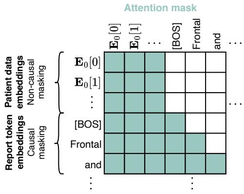  
Figure D.1: Attention mask for the decoder. Non-causal masking was used for the patient data embeddings and causal masking for the report token embeddings.

## D.3 Training

Three stages of training were performed. Each stage used AdamW (Loshchilov and Hutter, 2022) for mini-batch gradient descent optimisation and gradient clipping with a maximum norm of 1.0 to prevent exploding gradients and maintain training stability. Training and evaluation was performed on a 94GB NVIDIA H100 GPU. The three stages were as follows:

1. Teacher forcing (TF) (Williams and Zipser, 1989) was performed on the MIMIC-CXR dataset with only the images for each exam as input, and exams that contained both a findings and impression section. This gave a training/validation split of 232 855/1 837 images, 125 417/991 exams, and 57 102/436 patients. Training was performed with an initial learning rate of 5e-5, a mini-batch size of 8, a maximum of 32 epochs, and with float16 automatic mixed precision. All model parameters were trainable during this stage. The validation macro-averaged CheXbert-F1 was the monitored metric for checkpoint selection. This stage was necessary, as the language model struggled to learn to generate reports from multiple patient data sources without first learning generating reports solely from images.

2. TF was used in the second stage of training, with the MIMIC-CXR & MIMIC-IV-ED dataset described in Section 3 with the inputs described in Table 1. The training strategy was identical to the previous stage, except that a maximum of 16 epochs was performed, and the image encoder’s parameters were frozen (except for its projection). The models featured in Table 1 were trained using only the first two stages.

3. Reinforcement learning using self-critical sequence training (SCST) (Rennie et al., 2017) was performed with the rewards described in Appendix E in the final stage of training. The sample report for SCST was generated with top-k sampling (k = 50). Training was performed with an initial learning rate of 5e-6, a mini-batch size of 32, a maximum of 32 epochs, and with float32 precision. A warmup phase of 5 000 training steps was used for the learning rate, linearly increasing from zero. The image encoder’s parameters were frozen during this stage (except for its projection). The validation BERTScore-F1 was the monitored metric for checkpoint selection. This stage of training was only applied to the best model from Table 1, ‘Images + effective sources $( h = 0 )$ ’, with the results presented in Table 2.

## D.4 Comparison Models

The generated reports for the models in Table 2 were attained as follows:

• EMNLI reports were generated following https://github.com/ysmiura/ifcc (Miura et al., 2021).

• CMN reports were generated following https://github.com/zhjohnchan/ R2GenCMN (Chen et al., 2021).

• TranSQ reports were kindly provided by the authors (Kong et al., 2022).

• RGRG reports were generated following https://github.com/ttanida/rgrg (Tanida et al., 2023).

• CvT2DistilGPT2 reports were generated following https://github.com/aehrc/ cvt2distilgpt2 (Nicolson et al., 2023).

• RaDialog reports were kindly provided by the authors (Pellegrini et al., 2023).

• MedXChat reports were kindly provided by the authors (Yang et al., 2025).

• CXR-LLaVA-v2 reports were generated following https://huggingface.co/ECOFRI/ CXR-LLAVA-v2 (Lee et al., 2024).

• CXRMate reports were generated following https://huggingface.co/aehrc/cxrmate (Nicolson et al., 2024a).

• CXRMate-RRG24 reports were generated following https://huggingface.co/aehrc/ cxrmate-rrg24 (Nicolson et al., 2024b).

CXRMate-RRG24 was trained on five datasets, including MIMIC-CXR. RGRG was trained on the ImaGenome dataset derived from MIMIC-CXR — which may have some overlap with our test set.

## E Reinforcement Learning Rewards

The separate reward per section was calculated as:

$$
\begin{array} { r l } & { { r _ { s } } ( \hat { \mathbf { w } } _ { f } , \mathbf { w } _ { f } , \hat { \mathbf { w } } _ { i } , \mathbf { w } _ { i } ) = \alpha _ { 1 } \cdot r _ { f } ( \hat { \mathbf { w } } _ { f } , \mathbf { w } _ { f } ) + } \\ & { ~ \alpha _ { 2 } \cdot r _ { i } ( \hat { \mathbf { w } } _ { i } , \mathbf { w } _ { i } ) , } \end{array}\tag{2}
$$

where $r _ { s } ( \cdot )$ is the composite reward for the sections of the report, $r _ { f } ( \cdot )$ is the reward for the findings section, and $r _ { i } ( \cdot )$ is the reward for the impression section, $\hat { \mathbf { w } } _ { f }$ is the generated findings section, $\mathbf { w } _ { f }$ is the radiologist findings section, $\hat { \mathbf { w } } _ { i }$ is the generated impression section, $\mathbf { w } _ { i }$ is the radiologist impression section, and $\alpha _ { 1 }$ and $\alpha _ { 2 }$ are weights. Normally, $r _ { r } \big ( \hat { \mathbf { w } } _ { r } , \mathbf { w } _ { r } \big )$ is calculated, where $\hat { \mathbf { w } } _ { r }$ and ${ \bf w } _ { r }$ are the generated and radiologist reports, which include both the findings and impression sections.

The reward $r _ { f } ( \cdot ) , r _ { i } ( \cdot )$ , or $r _ { r } ( \cdot )$ is calculated as:

$$
\begin{array} { r } { r ( \hat { \mathbf { w } } , \mathbf { w } ) = \lambda _ { 1 } \cdot \mathbf { C X R - B E R T } ( \hat { \mathbf { w } } , \mathbf { w } ) + } \\ { \lambda _ { 2 } \cdot \mathbf { B E R T S c o r e } ( \hat { \mathbf { w } } , \mathbf { w } ) + } \\ { \lambda _ { 3 } \cdot \mathbf { A R N } ( \hat { \mathbf { w } } , \mathbf { w } ) , \qquad } \end{array}\tag{3}
$$

where $\lambda _ { 1 } , \lambda _ { 2 }$ , and $\lambda _ { 3 }$ are weights. For ‘Images + effective source $( h = 0 ) + { \tt R I }$ with CXR-BERT + BERTScore reward’, $\lambda _ { 1 } = 0 . 5 , \lambda _ { 2 } = 0 . 5 .$ , and $\lambda _ { 3 } = 0 . 0 .$ . For ‘Images + effective source $( h =$ ${ 0 ) + \ R L }$ with CXR-BERT + BERTScore reward per sect $\mathrm { i o n } ^ { \prime } , \alpha _ { 1 } = 0 . 7 5 , \alpha _ { 2 } = 0 . 2 5 , \lambda _ { 1 } = 0 . 5 .$ $\lambda _ { 2 } = 0 . 5$ , and $\lambda _ { 3 } ~ = ~ 0 . 0$ . A higher weight was used for the findings section, as it is longer on average than the impression section. For ‘Images + effective source $( h = 0 ) + \mathbb { R } \mathbb { I }$ with CXR-BERT + BERTScore + ARN reward per section’, $\alpha _ { 1 } =$ $0 . 7 5 , \alpha _ { 2 } = 0 . 2 5 , \lambda _ { 1 } = 0 . 4 5 , \lambda _ { 2 } = 0 . 4 5$ , and $\lambda _ { 3 } = 0 . 1$ . Only a weak contribution of the ARN was required to prevent repetitions.

The improvement that separating the reward per section has on the findings section is negligible, as seen in Table 2. However, separating the reward per section improves the scores for the impression section, as shown in Table E.1. Separating the reward likely enables the model to better optimise for the concise and summarised nature of the impression section, which was previously overshadowed by the dominance of the findings section’s requirement for comprehensive detail when both were jointly considered.

## F Ancillary Results

In Figure F.1, the F1-scores for each CheXbert label are shown. The ‘Images + effective sources $( h \ : = \ : 0 ) \ :$ model from Table 1 attained a higher score than the ‘Images’ model for 11 of the 14 labels. This suggests that incorporating auxiliary patient data from MIMIC-IV-ED and MIMIC-CXR provides a general improvement, rather than benefiting any specific pathology.

Further improvements can be seen for most labels when reinforcement learning (RL) is used (i.e., our model from Table 2). However, there are performance decreases for ‘enlarged cardiomediastinum’, ‘pneumothorax’, and ‘fracture’. This might be due to these pathologies being underrepresented in the MIMIC-CXR dataset, leading the model to optimise for more common pathologies during reinforcement learning.

The results for exams that include an aperiodic vital signs table are shown in Table F.1. Adding it produced a significant improvement in the scores for CXR-BERT, indicating that it should be considered if available. The results for exams that include an administered medicines table are shown in Table F.2. Adding did not produce a significant improvement in the scores, indicating that it is not useful for CXR report generation.

## G Error analysis

## G.1 Impact of Auxiliary Patient Data on the CheXpert Labels

Figure G.1 demonstrates the impact of incorporating auxiliary patient data for different CheXpert labels. The GREEN score for the ‘Images + effective sources (h=0)’ model is compared to the ‘Images’ model from Table 1 for each exam. Note that the generated and radiologist report for each exam will often include findings other than the CheXpert label. Hence, the GREEN scores do not exclusively represent a particular CheXpert label, rather, they represent exams with that label present. The horizontal dashed line where $\Delta = 0$ divides exams where auxiliary patient data improved performance from those where it decreased performance. CheXpert labels with a higher area under the curve (AUC) above the horizontal dashed line suggest that there is a stronger overall benefit from leveraging auxiliary patient data.

Leveraging auxiliary patient data yielded a higher AUC for 10 out of the 14 CheXpert labels, indicating that it is beneficial for many pathologies. For certain CheXpert labels, the influence of auxiliary patient data is less clear, particularly for those associated with smaller sample sizes, such as enlarged cardiomediastinum $( n = 1 0 )$ , consolidation $( n = 1 0 )$ , fracture $( n = 1 5 )$ , pneumothorax $( n = 5 )$ , and lung lesion $( n = 3 5 )$ . The no findings AUC of 6.85 for $\Delta > 0$ being lower than the AUC of 7.72 for $\Delta < 0$ suggests that the auxiliary patient data increases the false positive rate for this model.

## G.2 Impact of Auxiliary Patient Data on the Generated Reports

To gain a better understanding of how the auxiliary patient data impacts the generated reports, we analyse multiple case studies where it contributes to either true positive, false positive, true negative, or false negative findings in the generated report:

• A true positive is where the model has identified a positive occurrence of a pathology that is also identified as positive in the radiologist’s report.

• A false positive is where the model has incorrectly identified a positive occurrence of a pathology that is not identified as positive in the radiologist’s report.

Table E.1: Impact of the reward on the impression section of the test set described in Section 3 (n = 9 580 exams; 958 10 runs for ‘Images + effective sources $( h = 0 ) '$ $n = 1 9 1 6$ exams; $9 5 8 \times 3$ runs for the remaining models). Evaluation is on the impression section only.
<table><tr><td>Model</td><td>RG</td><td>CX</td><td>CB</td><td>G</td><td>BS</td><td>R-L</td><td>B4</td><td>ARN</td></tr><tr><td>Images + effective sources  $( h = 0 )$ </td><td>20.21</td><td>26.81</td><td>57.61</td><td>28.71</td><td>27.90</td><td>25.02</td><td>4.77</td><td>99.59</td></tr><tr><td>+ RL (CXR-BERT + BERTScore reward)</td><td>23.96</td><td>28.07</td><td>62.85</td><td>30.58</td><td>31.58</td><td>28.48</td><td>7.84</td><td>99.89</td></tr><tr><td>+ reward per section</td><td>24.89</td><td>31.08</td><td>71.12</td><td>30.89</td><td>36.27</td><td>30.27</td><td>6.70</td><td>99.33</td></tr><tr><td>+ ARN reward</td><td>24.87</td><td>32.88</td><td>71.12</td><td>32.14</td><td>36.31</td><td>30.61</td><td>6.84</td><td>99.83</td></tr></table>

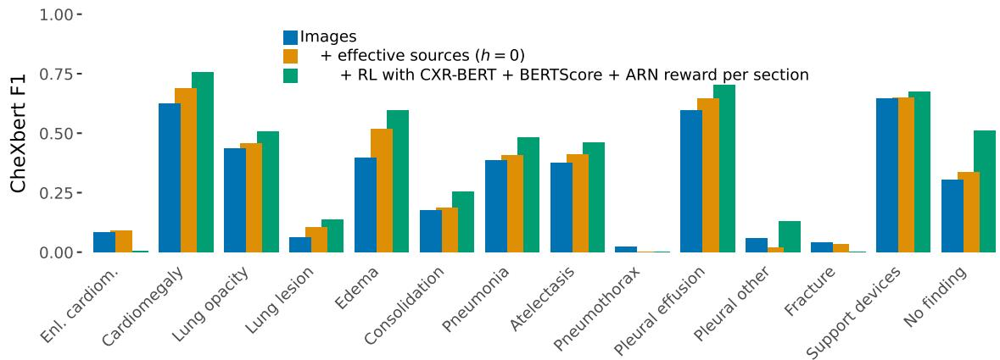  
Figure F.1: F1-score for each CheXbert label. $( n = 9 5 8 0$ exams; $9 5 8 \times 1 0$ runs for ‘Images’ and ‘Images + effective sources $( h = 0 ) '$ and $n = 2 8 7 4$ exams; $9 5 8 \times 3$ runs for ‘Images + effective sources $( h = 0 ) + { \tt R I }$ with CXR-BERT + BERTScore + ARN reward per section’.

• A true negative occurs when a pathology is omitted or absent in the radiologist’s report and this is correctly reflected in the generated report, either implicitly through omission or explicitly by stating its absence.

• A false negative is where a pathology is positively identified in the radiologist’s report but is not positively identified in the generated report.

Exams with a high ∆ from Figure G.1 were selected for true positive and true negative examples, while those with a low ∆ were chosen for false positive and false negative examples.8 This analysis, though based on only eight exams, exemplifies how auxiliary patient data can both enhance and hinder the CXR report generation process, providing valuable insights into its impact. A more comprehensive analysis would be required to fully characterise the influence of auxiliary patient data across diverse exams and pathologies.

## G.2.1 True Positive: Example 1

Table G.1 demonstrates how auxiliary patient data contributed to the true positive detection of increased interstitial markings, which are suggestive of pulmonary fibrosis. The model not using auxiliary patient data failed to detect the interstitial markings. The patient’s triage data included a respiratory rate consistent with tachypnoea and a chief complaint of dyspnoea, both consistent with pulmonary fibrosis. Additionally, the patient’s history of pulmonary fibrosis and worsening shortness of breath provided further context supporting the observed increase in interstitial markings. In this case, the inclusion of auxiliary patient data facilitated a true positive detection.

## G.2.2 True Positive: Example 2

Table G.2 demonstrates how auxiliary patient data contributed to the true positive detection of pulmonary edema, which was not detected by the model that does not use auxiliary patient data. Recorded in the patient’s triage data was a respiratory rate consistent with tachypnoea and a chief complaint of dyspnoea (also documented in the history section), both of which are indicative of pulmonary edema. Additionally, furosemide was listed in the patient’s reconciled medicines, which is commonly used to manage pulmonary edema. This example underscores how incorporating auxiliary patient data can enhance true positive detection in CXR report generation.

Table F.1: Results for exams that have an aperiodic vital sign table $( n = 5 2 5 0 ;$ studies $5 2 5 \times 1 0$ runs). Underlined scores indicate a significant difference to the scores of ‘Images’ $( p < 0 . 0 5 )$
<table><tr><td>Model</td><td>RG</td><td>CX</td><td>CB</td><td>G</td><td>BS</td><td>R-L</td><td>B4</td></tr><tr><td>Images</td><td>24.73</td><td>29.41</td><td>58.63</td><td>35.11</td><td>24.33</td><td>25.85</td><td>4.89</td></tr><tr><td>Images + vital signs</td><td>24.55</td><td>29.73</td><td>60.32</td><td>35.21</td><td>24.17</td><td>25.97</td><td>4.87</td></tr></table>

Table F.2: Results for exams that have a administered medicines table $( n = 3 5 2 0$ ; studies $3 5 2 \times 1 0 ~ \mathrm { r u n s } )$ Underlined scores indicate a significant difference to the scores of ‘Images $( p < 0 . 0 5 )$
<table><tr><td>Model</td><td>RG</td><td>CX</td><td>CB</td><td>G</td><td>BS</td><td>R-L</td><td>B4</td></tr><tr><td>Images</td><td>25.19</td><td>28.29</td><td>59.24</td><td>36.13</td><td>24.81</td><td>26.61</td><td>5.15</td></tr><tr><td>Images + administered medicines</td><td>24.70</td><td>29.53</td><td>59.53</td><td>35.82</td><td>24.46</td><td>26.38</td><td>4.85</td></tr></table>

## G.2.3 False Positive: Example 1

Table G.3 provides an example of where the model leveraging auxiliary patient data introduced a false positive prediction into the generated report. It incorrectly specifies that there are streaky opacities in the lung bases, which are reflective of atelectasis. The model that does not leverage auxiliary patient data did not produce this false positive. Atelectasis is often asymptomatic or, when extensive, may present with mild dyspnoea or cough, whereas tachypnoea and wheezing are uncommon except in severe cases; none of these features were documented in the indication section or triage data. Although codeine — listed among the patient’s reconciled medicines — can cause hypoventilation and impaired cough, thereby indirectly increasing the risk of secretion retention, there was no clinical evidence of respiratory depression or overdose in this case. This example suggests that weak or ambiguous evidence in the auxiliary data may have influenced the false positive prediction. Further refinement is needed to improve the model’s ability to appropriately weigh auxiliary patient data evidence against radiographic evidence.

## G.2.4 False Positive: Example 2

Table G.4 illustrates a case in which the model incorporating auxiliary patient data produced false positives for mild pulmonary vascular congestion and cardiomegaly, whereas the model without these data correctly omitted those findings. The patient’s presenting symptoms — shortness of breath and wheezing, with a history of pneumonia — are highly non-specific and do not reliably indicate either vascular congestion or cardiac enlargement. Triage vitals showed a high respiratory rate and a high systolic blood pressure, the latter representing isolated systolic hypertension, a long-term risk factor for cardiac remodelling but not acute cardiomegaly. Furosemide on the reconciled medication list denotes prescribed management of fluid overload but does not confirm current pulmonary congestion, and antihypertensives such as lisinopril and diltiazem reflect chronic blood pressure control rather than definitive evidence of cardiomegaly. In this instance, reliance on weak or ambiguous auxiliary data skewed the model’s interpretation, underscoring the need for improved calibration between auxiliary patient and imaging findings to avoid such false positives.

## G.2.5 True Negative: Example 1

Table G.5 illustrates an exam in which the model incorporating auxiliary patient data still produced a true-negative report despite confounding clinical information. The patient’s history of renal failure and right upper-quadrant pain could raise suspicion for pleural effusion secondary to fluid overload or ascites. Diuretic therapy with furosemide and metolazone supports active fluid management, while antihypertensives such as lisinopril and amlodipine denote underlying cardiovascular disease that might be associated with pulmonary congestion or cardiomegaly. Hypotension noted at triage further complicates the clinical picture, as it can mask signs of volume overload. Nonetheless, the model correctly prioritised the radiographic evidence and avoided false-positive findings. This case exemplifies the model’s ability to appropriately balance auxiliary patient data against radiographic evidence, maintaining high diagnostic specificity.

Table G.1: True positive example for exam 51707133. The triage data and the history section provide additional evidence supporting increased interstitial markings. Only the patient data that Images + effective sources (h=0) utilises is shown.
<table><tr><td colspan="8"></td></tr><tr><td>Image</td><td colspan="8">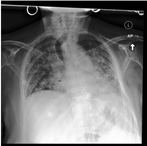</td></tr><tr><td>History</td><td colspan="8">-year-old female with pulmonary fibrosis and CHF with worsening shortness of breath.</td></tr><tr><td>medicines; name</td><td colspan="8">succinate, multivitamin, glucosamine sulfate [Glucosamine], acetaminophen, ferrous sulfate [Feosol], torsemide, pantoprazole, lidocaine, ketotifen fumarate.</td></tr><tr><td rowspan="2">Triage</td><td>temperature</td><td>heartrate</td><td>resprate</td><td>o2sat</td><td>sbp</td><td>dbp pain</td><td>acuity</td><td>chiefcomplaint</td><td></td></tr><tr><td>99.7</td><td>90.0</td><td>36.0</td><td>100.0</td><td>118.0</td><td>70.0</td><td>2.0</td><td>Dyspnea</td><td></td></tr><tr><td colspan="8"></td></tr><tr><td>Findings</td><td colspan="8">Radiologist AP and lateral views of the chest. Low lung volumes are seen compatible with patient&#x27;s history of fibrosis. Diffusely increased interstitial markings are seen throughout the lungs, but these appear overall slightly worse</td></tr><tr><td>Impression</td><td colspan="8">when compared to prior. Cardiomediastinal silhouette is grossly unchanged. No acute osseous abnormality is detected. Findings compatible with pulmonary fibrosis with likely superimposed edema. Please note that infection cannot</td></tr><tr><td colspan="8">be excluded and clinical correlation is necessary. Images + effective sources (h = 0) (GREEN = 0.375)</td></tr><tr><td>Findings</td><td colspan="8">Frontal and lateral views of the chest. Low lung volumes are again noted. Increased interstitial markings seen more extensive on the left than on the right. There is no evidence of overt consolidation nor effusion. The cardiomediastinal silhouette is stable. No acute osseous abnormality is identified. Degenerative changes are seen at the shoulders.</td></tr><tr><td></td><td colspan="8">Impression Increased interstitial markings throughout the lungs which could be due to chronic lung disease and possible chronic lung disease. No definite superimposed acute process, although clinical correlation suggested.</td></tr><tr><td colspan="8">Images (GREEN = 0.091) Findings Assessment is limited due to patient rotation and patient rotation. Lung volumes are low. Heart size appears mildly</td></tr><tr><td></td><td colspan="8">enlarged. The aorta appears to be calcified. Perihilar haziness and vascular indistinctness is compatible with mild pulmonary edema. Streaky opacities in the lung bases likely reflect areas of atelectasis. No large pleural effusion or pneumothorax is seen. Multilevel degenerative changes are noted in the thoracic spine.</td></tr><tr><td>Impression</td><td colspan="8">Mild pulmonary edema and bibasilar atelectasis</td></tr></table>

Impression Mild pulmonary edema and bibasilar atelectasis.

## G.2.6 True Negative: Example 2

Table G.6 illustrates an exam in which the model incorporating auxiliary patient data still produced a true-negative report, despite potential confounders in the auxiliary patient data. The indication section

— with a request for evaluation for fluid overload or pneumonia in a woman presenting with chest pain — could have biased the model towards findings such as pulmonary edema, pneumonia, pleural effusion or cardiomegaly. Likewise, the reconciled medicines of furosemide and nitroglycerin suggest management of heart failure or ischaemic chest pain, both of which can be associated with pleural effusion or an enlarged cardiac silhouette. Nevertheless, the model that uses auxiliary patient data correctly prioritised the radiographic evidence — reporting clear lungs, normal pulmonary vascularity and an unremarkable cardiac contour — and thus avoided false-positive predictions.

## G.2.7 False Negative: Example 1

Table G.7 is an example where the model failed to leverage auxiliary patient data to detect trace bilateral pleural effusions and the increased opacity in the right mid-to-lower lung (concerning for pneumonia). The history section notes dyspnoea and hypoxia, which are a symptom and a sign, respectively, of pleural effusion and pneumonia, among other conditions, although “trace” bilateral pleural effusions seldom cause dyspnoea or hypoxia. The indication section requests evaluation for fluid overload or pneumonia, both of which should prompt the model to assess for pleural effusion and opacities. The significantly reduced oxygen saturation recorded in the triage data indicates severe hypoxaemia (also noted in the history section), which can be caused by pleural effusion or pneumonia. Despite evidence from the auxiliary patient data to support pleural effusion and the opacity, the model failed to combine this with the radiographic evidence to make the correct predictions.

Table G.2: True positive example for exam 52841174. The triage data and reconciled medicines provide additional evidence indicative of pulmonary edema. Only the patient data that Images + effective sources (h=0) utilises is shown.
<table><tr><td colspan="8"></td></tr><tr><td>Image</td><td colspan="6">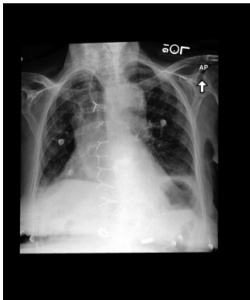</td><td colspan="3"></td></tr><tr><td>History</td><td colspan="9">-year-old with dyspnea.</td></tr><tr><td rowspan="2">medicines; levothyroxine, docusate sodium. name</td><td colspan="9"></td></tr><tr><td>temperature</td><td>heartrate</td><td>resprate</td><td>o2sat</td><td>sbp</td><td>dbp</td><td>pain acuity</td><td>chiefcomplaint</td><td></td></tr><tr><td rowspan="2">Triage</td><td>97.0</td><td>81.0</td><td>22.0</td><td>100.0</td><td>102.0</td><td>58.0</td><td>2.0</td><td>DYSPNEA</td><td></td></tr><tr><td></td><td></td><td></td><td>Radiologist</td><td></td><td></td><td></td><td></td><td></td></tr><tr><td>Findings</td><td colspan="9">AP upright and lateral views of the chest were provided. Midline sternotomy wires are again noted. Patient is rotated somewhat limiting the evaluation of the cardiomediastinal silhouette, though cardiomediastinal silhouette appears grossly stable. There are small layering bilateral effusions with mild interstitial edema. Overall, there has</td></tr><tr><td></td><td colspan="9">been no significant change from prior study. Bony structures are intact. Impression Mild interstitial edema, stable cardiomegaly with small bilateral effusions. Images + effective sources (h = 0) (GREEN = 0.375)</td></tr><tr><td>Findings</td><td colspan="9">AP upright and lateral views of the chest were provided. Midline sternotomy wires and mediastinal clips as well as a prosthetic cardiac valve. Low lung volumes limit evaluation. There is hilar congestion and mild pulmonary edema. Small bilateral pleural effusions persist. There is left basilar atelectasis. The heart is mildly enlarged. Bony structures appear intact. No free air below the right hemidiaphragm.</td></tr><tr><td></td><td colspan="9">Impression Pulmonary edema, small bilateral pleural effusions, left greater than right. Images (GREEN = 0.222)</td></tr><tr><td>Findings</td><td colspan="9">The patient is status post median sternotomy and CABG. Large hiatal hernia is present. The cardiac silhouette size is mildly enlarged. The aorta is tortuous. Crowding of bronchovascular structures is present with probable mild pulmonary vascular congestion. Small right pleural effusion is present. Patchy opacities in the lung bases may</td></tr><tr><td>Impression</td><td colspan="9">reflect atelectasis. No pneumothorax is demonstrated. There are moderate multilevel degenerative changes seen in the thoracic spine. 1. Small right pleural effusion and bibasilar opacities likely reflect atelectasis. Infection at the lung bases cannot</td></tr><tr><td></td><td colspan="9">be completely excluded. 2. Mild pulmonary vascular congestion. 3. Moderate cardiomegaly.</td></tr></table>

## G.2.8 False Negative: Example 2

Table G.8 illustrates a false-negative case for the model that incorporates auxiliary patient data: it failed to detect a new right lower lobe opacity indicative of pneumonia. The patient’s history of dyspnoea and right lower lobe infiltrate should have heightened the suspicion for consolidation, yet the model neglected this. Although the chief complaint of pneumonia signifies a working diagnosis rather than a confirmed finding, it nonetheless provides the model with strong evidence. The patient’s triage vitals (normal temperature and heart rate) do not reliably exclude pneumonia and should not have down-weighted its likelihood. The patient is on a systemic antibiotic (erythromycin); however, it is unclear whether this was prescribed for the pneumonia. Despite the evidence from the auxiliary patient data, the model failed to leverage it alongside the radiographic evidence to detect pneumonia.

Table G.3: False positive example for exam 51274564. This example demonstrates how weak auxiliary patient data evidence may have misled the model. Only the patient data that Images + effective sources (h=0) utilises is shown.
<table><tr><td colspan="8">Patient data</td></tr><tr><td>Image</td><td colspan="2">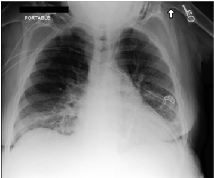</td><td colspan="7"></td></tr><tr><td>Indication</td><td colspan="8">Status post new central line placement. Reconciled colchicine, Aspirin, nifedipine, blood sugar diagnostic [OneTouch Ultra Test], labetalol, calcitriol, insulin needles</td></tr><tr><td>medicines; name</td><td colspan="8">(disposable) [BD Insulin Pen Needle UF Mini], fluticasone, codeine-guaifenesin, lisinopril, insulin lispro [Humalog KwikPen], insulin glargine [Lantus Solostar], prednisone, acetaminophen, torsemide, albuterol sulfate [ProAir HFA], mycophenolate mofetil, Multivitamin, tacrolimus, Vitamin E, allopurinol, ferrous sulfate.</td></tr><tr><td rowspan="2">Triage</td><td>temperature 98.1</td><td>heartrate 72.0</td><td>resprate 16.0</td><td>o2sat 0.0</td><td>sbp 95.0</td><td>dbp 46.0</td><td>pain 8</td><td>acuity 2.0</td><td>chiefcomplaint</td></tr><tr><td></td><td></td><td></td><td></td><td>Radiologist</td><td></td><td></td><td>rhea</td><td>Abnormal labs, Weakness, Diar-</td></tr><tr><td>Findings</td><td colspan="8"></td></tr><tr><td></td><td colspan="8">A new central venous catheter terminates in the left brachiocephalic vein. There is no pneumothorax. Otherwise, there has been no significant short-term change.</td></tr><tr><td colspan="8">Impression Status post placement of new left internal jugular central venous catheter; no pneumothorax identified.</td></tr><tr><td>Findings</td><td colspan="8">Images + effective sources (h = 0) (GREEN = 0.143) There is interval placement of a left internal jugular central venous catheter with tip terminating in the lower SVC. Lung volumes are low. This accentuates the size of the cardiac silhouette which appears mildly enlarged. Mediastinal and hilar contours are unchanged. There is crowding of the bronchovascular structures without overt pulmonary edema. Streaky opacities are noted in the lung bases, likely reflective of atelectasis. No large pleural effusion or pneumothorax is demonstrated. Mild degenerative changes are noted in the thoracic spine.</td></tr><tr><td></td><td colspan="8">Impression Interval placement of a left internal jugular central venous catheter with tip in the lower SVC. Low lung volumes with streaky bibasilar opacities, likely atelectasis. Images (GREEN = 0.25)</td></tr><tr><td colspan="8"></td></tr><tr><td>Findings</td><td colspan="8">A PICC line terminates in the mid-to-lower SVC. The cardiomediastinal and hilar contours are within normal limits. The lung fields are clear. There is no pneumothorax, fracture or dislocation. Limited assessment of the abdomen is unremarkable.</td></tr><tr><td>Impression Left PICC terminates in the mid-to-lower SVC.</td><td colspan="8"></td></tr></table>

Pleural Other (n = 10)  
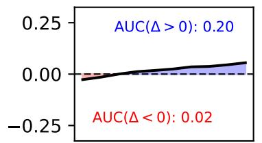

Edema (n = 176)  
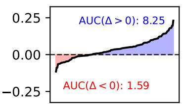

Atelectasis (n = 121)  
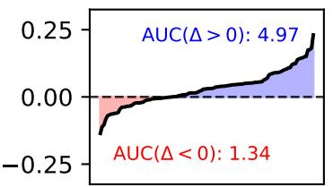  
Pneumonia (n = 79)  
Cardiomegaly (n = 139)

Pleural Effu. (n = 165)  
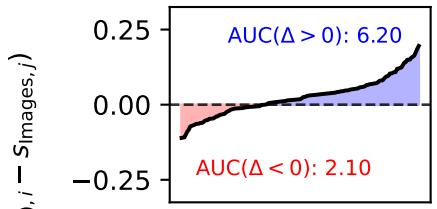  
Lung Opacity (n = 245)

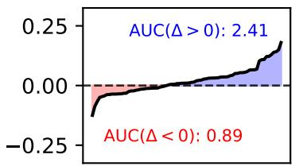

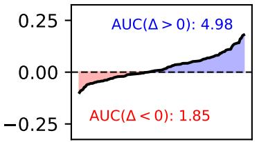  
Enlarged Car. (n = 10)

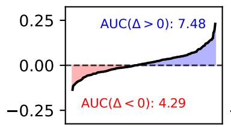

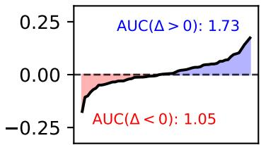  
Consolidation (n = 41)

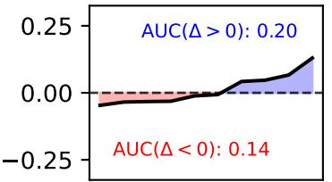

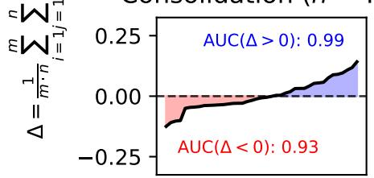

Fracture (n = 15)  
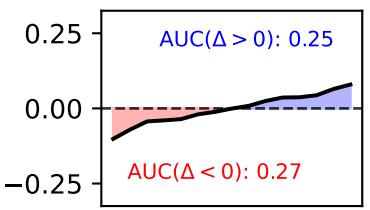

No Finding (n = 276)  
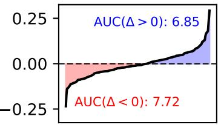

Pneumothorax (n = 5)  
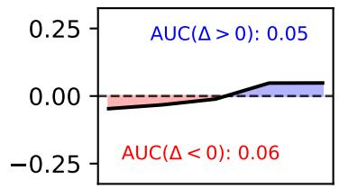

Lung Lesion (n = 35)  
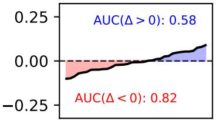  
Studies sorted by  
Figure G.1: The mean pairwise difference GREEN score for the generated report (findings and impression sections) of each exam from the test set between 10 training runs of the “Images” model and the “Images + effective sources $\mathrm { ( h { = } 0 ) } ^ { \prime }$ model. This illustrates the performance change (increase or decrease) over the exams resulting from incorporating auxiliary patient data for different CheXpert labels. ∆, m and n are the number of training runs for each model $( m = n = 1 0 )$ and s is the GREEN score for one of the models. The subplots are sorted in descending order based on the ratio of $\mathrm { A U C } ( \Delta > 0 )$ to $\mathrm { A U C } ( \Delta < 0 )$

Table G.4: False positive example for exam 54082940. This example demonstrates how the model failed to balance auxiliary patient data evidence with radiographic evidence. Only the patient data that Images + effective sources (h=0) utilises is shown.
<table><tr><td colspan="8">Patient data</td></tr><tr><td>Image</td><td colspan="2">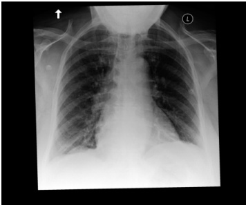</td><td colspan="2">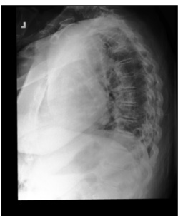</td><td colspan="4"></td></tr><tr><td>Indication</td><td colspan="8">Shortness of breath and wheezing, previously diagnosed with pneumonia or infectious process.</td></tr><tr><td>medicines; name</td><td colspan="8">Reconciled prednisolone acetate, albuterol sulfate [ProAir HFA], gabapentin, Humulin 70/30, cholecalciferol (vitamin D3), sennosides [senna], furosemide, Trusopt, lisinopril, AERO CHAMBER, levobunolol, insulin aspart, insulin aspart [Novolog], fluticasone-salmeterol [Advair Diskus], latanoprost, dorzolamide [Trusopt], aspirin [Enteric Coated Aspirin], diltiazem HCl [DILT-XR], blood sugar diagnostic [FreeStyle Lite Strips], magnesium hydroxide</td></tr><tr><td>Triage</td><td>compressor, olanzapine [Zyprexa]. temperature</td><td>heartrate</td><td>resprate</td><td>o2sat sbp</td><td></td><td>dbp pain</td><td>acuity</td><td>chiefcomplaint</td></tr><tr><td rowspan="2"></td><td>98.0</td><td>81.0</td><td>24.0</td><td>100.0</td><td>151.0</td><td>66.0 0</td><td>2.0</td><td>SHORTNESS OF BREATH</td></tr><tr><td></td><td></td><td></td><td>Radiologist</td><td></td><td></td><td></td><td></td></tr><tr><td>Findings</td><td colspan="8">There is no evidence of focal consolidation. There is left lower lobe atelectasis. There is no pleural effusion or</td></tr><tr><td></td><td colspan="8">pneumothorax. The cardiac and mediastinal contours are normal.</td></tr><tr><td colspan="9">Impression No acute cardiopulmonary process. Images + effective sources (h = 0) (GREEN = 0.429)</td></tr><tr><td>Findings</td><td colspan="8">There is mild pulmonary vascular congestion. No definite focal consolidation is seen. No pleural effusion or pneumothorax is seen. Cardiac silhouette is mildly enlarged. The cardiac and mediastinal silhouettes are grossly stable with the cardiac silhouette possibly slightly enlarged compared to prior.</td></tr><tr><td rowspan="2">Impression Mild pulmonary vascular congestion. Cardiomegaly.</td><td colspan="8"></td></tr><tr><td colspan="8">Images (GREEN = 0.8) Findings There is no confluent consolidation. No pulmonary edema or pleural effusions are identified. Cardiomediastinal</td></tr><tr><td>Impression No acute cardiopulmonary process.</td><td colspan="8">and hilar contours are within normal limits. No pneumothorax is evident.</td></tr><tr><td></td><td colspan="8"></td></tr></table>

Table G.5: True negative example for exam 52428322. This demonstrates how the model can avoid false positives despite confounding evidence from the auxiliary patient data. Only the patient data that Images + effective sources (h=0) utilises is shown.
<table><tr><td colspan="8">Patient data</td></tr><tr><td>Image</td><td colspan="7">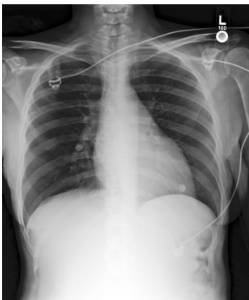</td></tr><tr><td></td><td colspan="8"></td></tr><tr><td>History -year-old female with renal failure and right upper quadrant pain. Hypotension. medicines;</td><td colspan="8">Reconciled aspirin, FreeStyle Lite Strips, metolazone, furosemide, omeprazole, oxycodone-acetaminophen [Endocet], prochlor- perazine maleate, calcitriol, fentanyl, insulin glargine [Lantus], sevelamer HCl [Renagel], clonidine [Catapres-</td></tr><tr><td>name</td><td colspan="8">TTS-1], Humulin R, Colace, insulin lispro [Humalog], potassium chloride [Klor-Con M20], FreeStyle Lite Meter, ferrous sulfate, lisinopril, BD Insulin Syringe Ultra-Fine, Glucose Meter, Disp &amp; Strips, Lipitor, amlodipine. temperature heartrate resprate o2sat sbp | dbp | pain acuity chiefcomplaint</td></tr><tr><td>Triage</td><td>0.0</td><td>0.0</td><td>0.0</td><td>0.0</td><td>0.0</td><td>0.0</td><td>None 1.0</td><td>GI BLEED</td><td></td></tr><tr><td>Findings</td><td></td><td></td><td></td><td>Radiologist</td><td></td><td></td><td></td><td></td><td></td></tr><tr><td></td><td colspan="8">Single portable view of the chest is compared to previous exam from. The lungs are clear. Cardiomediastinal silhouette is normal. Osseous and soft tissue structures are unremarkable. No visualized free intraperitoneal air is</td></tr><tr><td></td><td colspan="8">seen below the diaphragm. Impression No acute cardiopulmonary process.</td></tr><tr><td>Findings</td><td colspan="8">Images + effective sources (h = 0) (GREEN = 1.0) PA and lateral views of the chest were provided. The lungs are clear bilaterally without focal consolidation, effusion, or pneumothorax. The heart and mediastinal contours are normal. The imaged osseous structures are</td></tr><tr><td></td><td colspan="8">intact. There is no free air below the right hemidiaphragm.</td></tr><tr><td>Impression No acute findings in the chest.</td><td colspan="9">Images (GREEN = 0.5)</td></tr><tr><td>Findings</td><td colspan="9">Single portable frontal chest radiograph demonstrates unremarkable cardiomediastinal and hilar contours. Lungs are clear. No pleural effusion or pneumothorax evident.</td></tr><tr><td>Impression No acute intrathoracic process.</td><td colspan="9"></td></tr></table>

Table G.6: True negative example for exam 52169517. This demonstrates how the model can avoid false positives despite confounding evidence from the auxiliary patient data. Only the patient data that Images + effective sources (h=0) utilises is shown.
<table><tr><td colspan="8">Patient data</td></tr><tr><td>Image</td><td>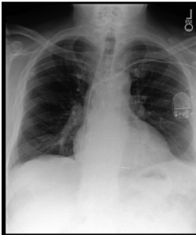</td><td colspan="3">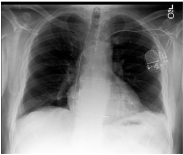</td><td colspan="4">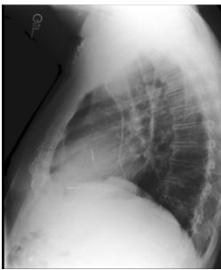</td></tr><tr><td>Indication</td><td colspan="8">-year-old woman with chest pain. Evaluate for fluid overload or pneumonia.</td></tr><tr><td>Reconciled Humalog, atorvastatin, aspirin, gabapentin, nitroglycerin, methylprednisolone, valsartan [Diovan], insulin glargine medica- tions; name</td><td colspan="8">[Lantus], One Touch Ultra Test, metoprolol tartrate, isosorbide mononitrate, cephalexin, colchicine [Colcrys], furosemide</td></tr><tr><td rowspan="2">Triage</td><td>temperature</td><td>heartrate</td><td>resprate</td><td>o2sat</td><td>sbp</td><td>dbp</td><td>pain acuity</td><td>chiefcomplaint</td><td></td></tr><tr><td>0.0</td><td>0.0</td><td>0.0</td><td>0.0</td><td>0.0 0.0 Radiologist</td><td>None</td><td>2.0</td><td>CHEST PAIN</td><td></td></tr><tr><td>Findings</td><td colspan="8">The lungs are clear. The hilar and cardiomediastinal contours are normal. There is no pneumothorax or pleural</td></tr><tr><td></td><td colspan="8">effusion. Pulmonary vascularity is normal. A dual-lead pacemaker is present.</td></tr><tr><td colspan="9">Impression No acute cardiopulmonary process. Images + effective sources (h = 0) (GREEN = 0.833)</td></tr><tr><td>Findings</td><td colspan="8">The lungs are clear without focal consolidation. No pleural effusion or pneumothorax is seen. The cardiac and mediastinal silhouettes are unremarkable. Dual lead left-sided pacemaker is stable in position. Patient is status post median sternotomy and CABG.</td></tr><tr><td>Impression No acute cardiopulmonary process.</td><td colspan="8">Images (GREEN = 0.25)</td></tr><tr><td colspan="9">Findings PA and lateral views of the chest provided demonstrate a left chest wall pacer device with leads extending to the region of the right atrium and right ventricle. Midline sternotomy wires and mediastinal clips are again noted. Mild left basal atelectasis is noted. No convincing signs of pneumonia, effusion, or pneumothorax. The</td></tr><tr><td>Impression No acute findings in the chest.</td><td colspan="8">cardiomediastinal silhouette is stable. Bony structures are intact. No free air below the right hemidiaphragm.</td></tr></table>

Table G.7: False negative example for exam 55715754. The model failed to identify the pleural effusions despite evidence from the auxiliary patient data. Only the patient data that Images + effective sources (h=0) utilises is shown.
<table><tr><td colspan="9"></td></tr><tr><td colspan="9">Patient data</td></tr><tr><td>Image</td><td colspan="6">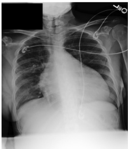</td><td colspan="4"></td></tr><tr><td>History</td><td colspan="9">Dyspnea and hypoxia, assess for fluid overload or pneumonia.</td></tr><tr><td>Triage</td><td>temperature</td><td>heartrate</td><td>resprate</td><td>o2sat sbp</td><td>dbp</td><td>pain</td><td>acuity</td><td>chiefcomplaint</td><td></td></tr><tr><td></td><td>96.4</td><td>83.0</td><td>20.0 76.0</td><td>145.0 Radiologist</td><td>70.0</td><td>10</td><td>1.0</td><td>SORE THROAT</td><td></td></tr><tr><td colspan="2"></td><td colspan="9">Semi-upright portable AP view of the chest provided. The heart is massively enlarged. There are trace pleural</td></tr><tr><td>Findings</td><td colspan="9">effusions. Increased opacity in the right mid-to-lower lung is concerning for pneumonia. The left lung appears essentially clear. No pneumothorax. The mediastinal contour appears normal. Bony structures are intact.</td></tr><tr><td>Impression</td><td colspan="9">Massive cardiomegaly with trace bilateral pleural effusions. Opacity within the right mid-to-lower lung is concerning for pneumonia.</td></tr><tr><td>Images + effective sources (h = 0) (GREEN = 0.2) Findings</td><td colspan="9">Single portable radiograph of the chest demonstrates moderate enlargement of the cardiac silhouette, not sig- nificantly changed compared to the prior examination. There is mild pulmonary vascular congestion. No focal</td></tr><tr><td></td><td colspan="9">consolidation, pleural effusion or pneumothorax is seen. The visualized upper abdomen is unremarkable. Impression Persistent enlargement of the cardiac silhouette, not significantly changed compared to. Unchanged mild</td></tr><tr><td></td><td colspan="9">pulmonary vascular congestion and stable enlargement of the cardiac silhouette. Images (GREEN = 0.333)</td></tr><tr><td>Findings</td><td colspan="9">There is moderate enlargement of the cardiac silhouette. The aorta is unfolded. Mediastinal and hilar contours are otherwise unremarkable. Pulmonary vasculature is not engorged. Hazy opacity in the right lung is compatible with pneumonia. Right midlung linear opacity may be due to atelectasis. No pleural effusion or pneumothorax is</td></tr><tr><td>Impression</td><td colspan="9">identified. No acute osseous abnormalities seen. 1. Moderate enlargement of the cardiac silhouette, compatible with pneumonia. 2. Moderate enlargement of the cardiac silhouette. 3. Right lung base opacity, likely scarring. No definite evidence of pneumonia.</td></tr><tr><td></td><td colspan="9"></td></tr></table>

Table G.8: False negative example for exam 53964812. Despite strong evidence from the auxiliary patient data supporting pleural effusion, the model failed to detect it. Only the patient data that Images + effective sources (h=0) utilises is shown.
<table><tr><td colspan="7">Patient data</td></tr><tr><td>Image</td><td colspan="3">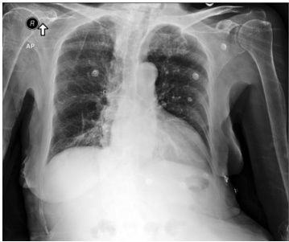</td><td colspan="4">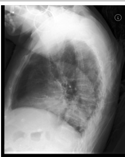</td></tr><tr><td>History</td><td colspan="9">Asthma, coronary disease, myocardial infarction, diabetes, presenting with dyspnoea and right lower lobe infiltrate.</td></tr><tr><td>name</td><td colspan="8">Reconciled metformin, acetaminophen, erythromycin, fluticasone-salmeterol [Advair Diskus], Boost Diabetic, bupropion medicines; HCl, diltiazem HCl, albuterol sulfate, losartan [Cozaar], lorazepam, sennosides [senna], gabapentin, aspirin, tiotropium bromide [Spiriva with HandiHaler], tobramycin-dexamethasone [TobraDex], atorvastatin, tramadol, nut.tx.gluc.intol,lac-free,soy [Glucerna], clopidogrel, ReliOn Ultra Thin Plus Lancets, melatonin, lidocaine, cal- cium carbonate-vitamin D3 [Calcium 600 + D(3)], furosemide, compression socks, medium, sertraline, L.acidoph &amp; sali-B.bif-S.therm [Acidophilus], travoprost [Travatan Z], montelukast [Singulair], Multivitamin with Iron- Mineral, fluticasone.</td></tr><tr><td rowspan="2">Triage</td><td>temperature</td><td>heartrate</td><td>resprate</td><td>o2sat</td><td>sbp</td><td>dbp</td><td>pain</td><td>acuity</td><td>chiefcomplaint</td></tr><tr><td>98.2</td><td>83.0 18.0</td><td>98.0</td><td>162.0 Radiologist</td><td>100.0</td><td>0</td><td>2.0</td><td>PNEUMONIA</td><td></td></tr><tr><td>Findings</td><td colspan="6">T0he cardiac, mediastinal and hilar contours appear stable. There is no pleural effusion or pneumothorax. Since the very recent prior studies, there is a substantial new opacity in the right lower lobe concerning for pneumonia.</td><td colspan="2"></td></tr><tr><td></td><td colspan="6">The bones appear demineralized. There is mild-to-moderate rightward convex curvature again centered along the lower thoracic spine with incompletely characterized lumbar compression deformities. Moderate degenerative changes are again noted along lower thoracic levels.</td><td colspan="2"></td></tr><tr><td colspan="9">Impression Findings consistent with pneumonia in the right lower lobe. Depending on clinical circumstances, the possibility of aspiration could also be considered.</td></tr><tr><td>Findings</td><td colspan="8">Images + effective sources (h = 0) (GREEN = 0.0) Frontal and lateral views of the chest. Right apical scarring is again seen. The lungs are otherwise clear without consolidation or effusion. Mild cardiomegaly is again noted. Slightly tortuous descending thoracic aorta is similar</td></tr><tr><td></td><td colspan="9">to prior. No acute osseous abnormality is identified.</td></tr><tr><td>Impression No acute cardiopulmonary process.</td><td colspan="9">Images (GREEN = 0.333)</td></tr><tr><td>Findings</td><td colspan="9">There is bibasilar atelectasis without definite focal consolidation. No pleural effusion or pneumothorax is seen. The cardiac and mediastinal silhouettes are stable. Mild loss of height anteriorly of a lower thoracic vertebral body is unchanged. Evidence of DISH is seen along the spine.</td></tr><tr><td></td><td colspan="7">Impression No acute cardiopulmonary process. No significant interval change.</td></tr></table>