# Tree-of-Evolution: Tree-Structured Instruction Evolution for Code Generation in Large Language Models

♠Ziyang Luo , ♢Kaixin Li , ♠Hongzhan Lin , ♠Yuchen Tian ♢Mohan Kankanhalli , ♠Jing Ma∗

♠Hong Kong Baptist University, ♢National University of Singapore {cszyluo,majing}@comp.hkbu.edu.hk

## Abstract

Data synthesis has become a crucial research area in large language models (LLMs), especially for generating high-quality instruction fine-tuning data to enhance downstream performance. In code generation, a key application of LLMs, manual annotation of code instruction data is costly. Recent methods, such as Code Evol-Instruct and OSS-Instruct, leverage LLMs to synthesize large-scale code instruction data, significantly improving LLM coding capabilities. However, these approaches face limitations due to unidirectional synthesis and randomness-driven generation, which restrict data quality and diversity. To overcome these challenges, we introduce Tree-of-Evolution (ToE), a novel framework that models code instruction synthesis process with a tree structure, exploring multiple evolutionary paths to alleviate the constraints of unidirectional gen eration. Additionally, we propose optimizationdriven evolution, which refines each generation step based on the quality of the previous iteration. Experimental results across five widely-used coding benchmarks—HumanEval, MBPP, EvalPlus, LiveCodeBench, and Big-CodeBench—demonstrate that base models fine-tuned on just 75k data synthesized by our method achieve comparable or superior performance to the state-of-the-art open-weight Code LLM, Qwen2.5-Coder-Instruct, which was finetuned on millions of samples.

## 1 Introduction

Recently, data synthesis has become a focal point in large language model (LLM) research (Liu et al., 2024). In the post-training phase (Ouyang et al., 2022), LLMs rely heavily on high-quality instruction fine-tuning data to align with user needs and improve their performance across various downstream tasks (Zhou et al., 2023; Xu et al., 2023).

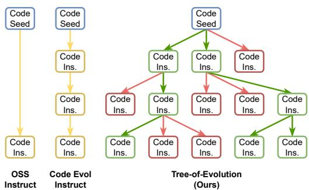  
Figure 1: Comparison between our Tree-of-Evolution method and previous unidirectional code instruction synthesis approaches. Yellow indicates randomness-driven generation in prior methods, while Green and Red highlight our optimization-driven evolution, denoting "go" and "stop" decisions, respectively.

Among these, code generation is a particularly important application (Li et al., 2023a; Rozière et al., 2023; Guo et al., 2024). However, obtaining highquality code instruction data by human programming expert annotation is often prohibitively expensive (Conover et al., 2023). To address this, recent studies have leveraged data synthesis methods, using LLMs such as GPT-4 (OpenAI, 2023) to generate large-scale code instruction datasets (Wei et al., 2023; Luo et al., 2024c). These methods have proven highly effective in enhancing the coding capabilities of LLMs.

As depicted in Figure 1, the two most widely used methods for code instruction synthesis are Code Evol-Instruct (Luo et al., 2024c) and OSS-Instruct (Wei et al., 2023). Code Evol-Instruct employs heuristic prompts to iteratively generate more complex code instructions from existing ones, while OSS-Instruct utilizes pre-designed prompts to create new instructions inspired by random code snippets from GitHub. Both methods can be viewed within an unified framework: starting with a seed input, either a code instruction or a code snippet, the data synthesis model applies predefined strategies to generate new instructions. However, these methods for code instruction synthesis face two key limitations: (1) Unidirectional synthesis: These methods predominantly adopt an unidirectional synthesis approach, expanding seed data along a single trajectory. However, effective data synthesis requires a more thorough exploration (Zeng et al., 2024). By not fully exploring multiple evolutionary paths, these methods limit the diversity of the generated data, which is a key factor in improving LLM performance (Bukharin et al., 2024). (2) Randomness-driven generation: Existing approaches rely on code seeds or pre-defined methods in the prompts to randomly generate new code instructions. This randomnessdriven approach fails to consistently ensure highquality outputs. As highlighted in LIMA (Zhou et al., 2023), the quality of data is crucial during the instruction fine-tuning phase, as low-quality data can degrade model performance.

In this work, we propose Tree-of-Evolution (ToE) for code instruction synthesis. To address the limitations of unidirectional synthesis, we introduce a tree-based synthesis that explores multiple evolutionary directions at each node, all originating from the same code snippet as a seed. Each generated instruction is evaluated using a quality scoring function that considers both challenge and diversity. Challenge is assessed based on instruction complexity, driving the generation of instructions that require deeper reasoning and more sophisticated decision-making, thus improving the model’s ability to handle harder code generation tasks (Luo et al., 2024c). Diversity is encouraged by measuring distance between the candidate and existing instructions, preventing repetitive outputs that hinder generalization, as emphasized in prior work (Wei et al., 2023; Bukharin et al., 2024).

Inspired by Optimization by Prompting (Yang et al., 2024), we introduce an optimization-driven evolution process to enhance the quality of synthesized instructions. This process employs the Beam Search algorithm (Freitag and Al-Onaizan, 2017), which retains only the top-n nodes based on their quality scores and ensures that only nodes surpassing the scores of their parent nodes continue to evolve. The optimization target of the iterative evolution process is to continuously improve the scores of previous generated instructions, guiding the synthesis toward higher-quality outputs while mitigating the randomness-driven limitations inher-

ent in previous methods.

To evaluate the effectiveness of our proposed method, we applied it to synthesize code instruction data for fine-tuning base LLMs. Experimental results across 5 widely-used coding benchmarks—HumanEval (Chen et al., 2021), MBPP (Austin et al., 2021), EvalPlus (Liu et al., 2023), LiveCodeBench (Jain et al., 2024), and Big-CodeBench (Zhuo et al., 2024)—demonstrate that with only 75k instruction samples, fine-tuned on the same open-source LLMs, our approach achieves performance comparable to or better than the state-of-the-art (SOTA) open weight Code LLM, Qwen2.5-Coder-Instruct (Hui et al., 2024), across various model sizes, which was fine-tuned on millions of closed-source instruction samples.

Our contributions can be summarized as follows:

• We introduce the Tree-of-Evolution framework for code instruction synthesis, which addresses the limitations of unidirectional synthesis and randomness-driven generation present in previous methods.

• We present an optimization-driven evolution process in our ToE that enhances the synthesis procedure, ensuring the consistent generation of high-quality data.

• We demonstrate the effectiveness of our approach through extensive experiments across multiple coding tasks, achieving performance on par with, or surpassing, SOTA open-weight Code LLMs while using significantly fewer training samples.

## 2 Related Work

Recent research has extensively explored the application of LLMs to code-related tasks, focusing on code understanding and generation. Notable contributions include Codex (Chen et al., 2021), Santacoder (Allal et al., 2023), CodeGemma (Google, 2024), CodeGen-Series (Nijkamp et al., 2023b,a), CodeT5&Plus (Wang et al., 2021, 2023), CodeGeeX (Zheng et al., 2023b), Star-Coder1&2 (Li et al., 2023a; Lozhkov et al., 2024), CodeLlama (Rozière et al., 2023), DeepSeek-Coder (Guo et al., 2024), Codestral (Mistral, 2024), Granite (Mishra et al., 2024), YiCoder (01.AI, 2024), OpenCoder (Huang et al., 2024), and QwenCoder-Series (Hui et al., 2024). These advancements highlight the increasing trend of leveraging powerful base LLMs to enhance code generation capabilities.

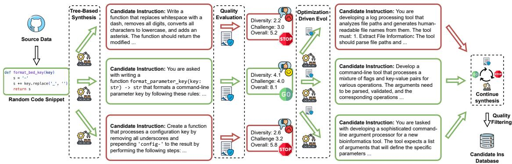  
Figure 2: The pipeline of our Tree-of-Evolution framework for code instruction synthesis, encompassing tree-based synthesis, quality evaluation, and optimization-driven evolution, aims to generate high-quality instruction data starting from random code snippets.

To enhance the capabilities of open-source LLMs for code generation in the post-training phase, recent works have leveraged data synthesis methods to generate large-scale code instruction data for supervised fine-tuning (Chen et al., 2023b; Zheng et al., 2024a; Li et al., 2024; Yuan et al., 2024; Luo et al., 2024a; Zeng et al., 2024). For instance, Chaudhary (2023) employs the self-instruct method (Wang et al., 2022) to generate training data, while Magicoder (Wei et al., 2023) leverages code snippets from GitHub. SelfCodeAlign (Wei et al., 2024) demonstrates the potential of directly utilizing the base model for data synthesis. WizardCoder (Luo et al., 2024c) introduces the Code Evol-Instruct approach to progressively increase the complexity of coding tasks. As discussed in the introduction, these prior methods often rely on randomness-driven and unidirectional synthesis, limiting the quality and diversity of synthesized instructions. In contrast, our Tree-of-Evolution models code instruction synthesis with a tree structure, employing an optimization-driven approach to mitigate these limitations.

## 3 Tree-of-Evolution

## 3.1 Overview

An overview of our Tree-of-Evolution framework is provided in Figure 4. ToE is an novel approach to code instruction synthesis, modeling the process as a tree structure. Starting with an initial code seed, $s _ { 0 }$ , sourced from a random code snippet on GitHub, the framework employs tree-based synthesis to explore multiple evolutionary paths in parallel. The quality of each leaf node (synthesized instruction) is evaluated systematically using a scoring function $V ( s )$ , enabling an optimization-driven evolution process in subsequent iterations.

## 3.2 Tree-Based Synthesis

In our framework, the synthesis process is structured as a hierarchical tree $T = ( S , E )$ , where S denotes the set of nodes (code instructions) and E represents the directed edges corresponding to evolutionary transformations. Each node $s \in S$ represents a specific code instruction, and each edge $( s _ { i } , s _ { j } ) ~ \in ~ E$ represents a transformation $f : s _ { i } \to s _ { j }$ that derives a new instruction.

The synthesis begins with the root node $s _ { 0 }$ , initialized as a random code snippet. At each evolutionary round r, a data synthesis model $G ( p _ { \theta } , s _ { r } , k )$ generates k candidate instructions for each node $s _ { r } \in S _ { r }$ , where $S _ { r }$ is the set of active nodes at round r. Formally, the candidate instructions are sampled as:

$$
\{ s ^ { ( 1 ) } , s ^ { ( 2 ) } , \ldots , s ^ { ( k ) } \} \sim G ( p _ { \theta } , s _ { r } , k ) ,
$$

where $p _ { \theta }$ denotes the parameters of the data synthesis model. These candidate instructions are then added to the tree as child nodes, forming edges $( s _ { r } , s ^ { ( i ) } )$ for $i = 1 , \ldots , k$ . This process continues iteratively until a termination criterion is met, such as reaching a maximum tree depth $d _ { \mathrm { m a x } }$ or when the generated instructions fail to meet quality standards.

## 3.3 Quality Evaluation

The quality of synthesized instructions in previous randomness-driven methods lacks systematic evaluation and control. To address this, our ToE framework employs a quality scoring function $V ( s )$ to assess the quality of each node s. The overarching goal is to synthesize high-quality instruction data for Code LLM post-training, thereby enhancing its code generation capabilities. Ideally, the scoring function $V ( s )$ should correlate with the model’s final code generation performance. However, directly predicting the impact of a single instruction on overall performance is challenging. Drawing inspiration from prior work on Code LLM posttraining, we identify challenge and diversity as two critical factors for instruction fine-tuning data (Wei et al., 2023; Yu et al., 2023; Luo et al., 2024c).

Challenge is important, as overly simplistic data fails to prepare the model for handling complex code generation tasks. Diversity is equally crucial to prevent overfitting and to preserve the model’s generalization capabilities, as similar or redundant data can hinder its adaptability to new tasks. Based on these insights, our scoring function $V ( s )$ is designed to evaluate each node s by quantifying its challenge and diversity level, ensuring the synthesis process consistently produces high-quality and impactful instructions. For challenge, the complexity of a given code instruction is assessed using the LLM-as-a-Judge paradigm (Zheng et al., 2023a; Luo et al., 2024b). A complexity evaluation agent is employed to assign a challenge score to each instruction, with a scale ranging from 1 (minimal challenge) to 10 (exceptionally challenging). Formally, the challenge score is defined as:

$$
V _ { \mathrm { c o m p } } ( s ) = C ( p _ { \theta } , s ) ,
$$

where $C ( p _ { \theta } , s )$ represents the evaluation function implemented by the agent.

For diversity, it is assessed by comparing the candidate instruction s against a database of instructions selected from the current round. This database contains the most challenging instruction from each tree, excluding the tree to which s belongs. By avoiding comparisons within the same tree, we address the inherent similarity of instructions derived from the same seed, which could otherwise distort the evaluation of $s \mathrm { ^ { \circ } s }$ contribution to overall diversity. The diversity score $V _ { \mathrm { d i v } } ( s )$ is defined as the distance between s and its closest match in this external database:

$$
V _ { \mathrm { d i v } } ( s ) = \operatorname* { m i n } _ { s _ { e } \in \mathrm { D B } } \mathrm { D } ( s , s _ { e } ) ,
$$

where DB denotes the database of top-challenging instructions from other trees in the current round, and $\operatorname { D } ( \cdot , \cdot )$ is a similarity metric. The similarity metric first transforms the code instructions into vectors using embedding models and then calculates the cosine distance. This approach ensures that diversity is evaluated globally, fostering a dataset that spans a wide range of topics and avoids redundancy within the synthesized instructions. The overall quality score combines them:

$$
V ( s ) = V _ { \mathrm { c o m p } } ( s ) + V _ { \mathrm { d i v } } ( s ) ,
$$

where challenge and diversity are considered equally important.

## 3.4 Optimization-Driven Evolution

Unlike the randomness-driven generation approaches of previous methods (Wei et al., 2023; Luo et al., 2024c), our ToE framework introduces optimization-driven evolution. In each synthesis round, the quality scoring function $V ( s )$ evaluates each active node s based on its challenge and diversity levels. To determine which nodes advance to the next round of tree-based evolution, we employ the Beam Search algorithm (Freitag and Al-Onaizan, 2017), retaining only the top-n nodes based on their quality scores:

$$
S _ { \mathrm { n e x t } } = \{ s \in S _ { \mathrm { a c t i v e } } \mid V ( s ) \geq V _ { ( n ) } \} ,
$$

where $V _ { ( n ) }$ denotes the n-th highest score in $S _ { \mathrm { a c t i v e } } .$ To further guide the data synthesis model in generating higher-quality instructions, the scores of parent nodes $V ( s _ { \mathrm { p a r e n t } } )$ , including their challenge $V _ { \mathrm { c o m p } } ( s _ { \mathrm { p a r e n t } } )$ and diversity $V _ { \mathrm { d i v } } ( s _ { \mathrm { p a r e n t } } )$ components, are communicated as explicit optimization objectives. The synthesis model is tasked with generating new instructions $s _ { \mathrm { c h i l d } }$ that satisfy the condition:

$$
V ( s _ { \mathrm { c h i l d } } ) \geq V ( s _ { \mathrm { p a r e n t } } ) .
$$

If a newly synthesized instruction $s _ { \mathrm { c h i l d } }$ fails to meet this criterion, its corresponding branch is stopped. By iteratively incorporating feedback and optimizing for both challenge and diversity levels, the framework can systematically evolve a dataset of code instructions.

## 3.5 Data Collection and Training

Using our ToE framework, we iteratively synthesize a large volume of high-quality code instructions. However, the synthesis process must terminate to balance efficiency and quality. The process halts when the tree reaches a predefined maximum depth, effectively managing computational costs and avoiding excessive complexity. Additionally, as described in the optimization-driven evolution, branches are pruned if newly generated nodes are not among the top-n nodes or fail to surpass their parent nodes in quality. These termination criteria ensure both efficiency and the production of high-quality synthesized instructions.

After completing the tree-based synthesis process, we collect data from each tree using a straightforward, round-by-round method, similar to Code Evol-Instruct (Luo et al., 2024c). We begin by ranking the nodes in each round based on their quality scores, selecting them from highest to lowest. For each node, we calculate the similarity distance between it and the previously selected nodes from the same round within the same tree. To address intratree similarity issues, only nodes with a distance greater than a predefined threshold are retained.

Upon generating the code instruction data, we follow previous methods (Wei et al., 2023; Luo et al., 2024c) by using the same data synthesis models to generate code responses for each instruction. While more sophisticated methods (Chen et al., 2023a; Luo et al., 2024a), such as execution-based verification (Wei et al., 2024), could improve response quality, they fall outside the scope of this work, which focuses primarily on the synthesis of code instructions. Furthermore, the data synthesis models employed are SOTA LLMs that are capable of producing high-quality responses to a reasonable extent. After obtaining the instruction-response pairs, we fine-tune the base LLMs using causal language modeling loss, masking the prediction of instructions, in line with prior works (Chiang et al., 2023; Xu et al., 2023).

## 4 Experiment

## 4.1 Setup

We randomly select 5k code snippets as the initial seed data, sourced from the Stack v1 dataset (Kocetkov et al., 2023), which is derived from GitHub repositories. For the main experiments, we use the SOTA proprietary LLM gpt-4o-2024-08-06 as the data synthesis model. To manage computational costs, each node is allowed to explore up to 3 different evolutionary paths through random sampling and undergo 3 rounds of evolution. All prompts are provided in Appendix A. Using our ToE framework, we generate approximately 75k code instructions, with responses synthesized using the same model. Data examples are shown in Appendix B. We then follow the approach outlined in Qwen2.5-Coder (Hui et al., 2024), employing a 10-gram overlap method to avoid contamination. For instruction fine-tuning, we employ the SOTA Code LLM base models, Qwen2.5-Coder-Base, in our main experiments, using model sizes of 1.5B, 7B, and 14B parameters. Further implementation details can be found in Appendix C.

## 4.2 Main Results

HumanEval, MBPP and EvalPlus. To evaluate the effectiveness of our method, we assess its performance on several popular coding benchmarks: HumanEval (HE) (Chen et al., 2021), MBPP (Austin et al., 2021), and their augmented versions, EvalPlus (Liu et al., 2023). HE consists of 164 problems, each with an average of 9.6 test cases. HE-Plus significantly increases the number of test cases, with an average of 774.8 test cases per problem. In contrast, MBPP contains 378 programming problems, each with three automated test cases, while MBPP-Plus expands this by over 35 times the number of test cases. For comparison, we include 10 open-weight Code LLMs with different sizes, such as WizardCoder (Luo et al., 2024c), StarCoder2-Instruct (Lozhkov et al., 2024), CodeLlama-Instruct (Rozière et al., 2023), MagiCoder-S (Wei et al., 2023), OpenCodeInterpreter (Zheng et al., 2024b), Yi-Coder-Chat (01.AI, 2024), Qwen2.5-Coder-Instruct (Hui et al., 2024), CodeQwen1.5-Chat (Bai et al., 2023), OpenCoder-Instruct (Huang et al., 2024), and DeepseekCoder-Instruct (Guo et al., 2024). Additionally, we include 5 SOTA proprietary models for reference, including o1-mini/preview (OpenAI, 2024), GPT-4o/mini (OpenAI, 2023), and Claude-3.5- Sonnet (Anthropic, 2023). Following previous works, all models generate responses using greedy decoding, and we report the pass@1 scores.

In Table 1, we compare various proprietary and open-weight Code LLMs. Since our method is based on the SOTA base model Qwen2.5- Coder-Base, the most fair comparison is with the SOTA open-weight instruction-based Code LLM, Qwen2.5-Coder-Instruct, which is highlighted in orange. Across three different model sizes—1.5B, 7B, and 14B—our method achieves performance comparable to or better than the SOTA open-weight models. Specifically, for the 1.5B model, we achieve a 4.3-point higher score on HE, and for the 14B model, we achieve 2 points higher on MBPP-Plus. Notably, we only use 75k instruction finetuning data, much smaller than the millions of data used by Qwen2.5-Coder-Instruct. When compared to the proprietary GPT-4o, our 14B model even outperforms it on both MBPP and MBPP-Plus.

<table><tr><td>Model</td><td>Size</td><td>SFT Data HE</td><td>HE-Plus</td><td>MBPP</td><td>MBPP-Plus</td></tr><tr><td colspan="6">Proprietary Models</td></tr><tr><td>o1-mini</td><td></td><td>Closed 97.6</td><td>90.2</td><td>93.9</td><td>78.3</td></tr><tr><td>o1-preview</td><td></td><td>Closed 95.1</td><td>88.4</td><td>93.4</td><td>77.8</td></tr><tr><td>GPT-40</td><td></td><td>Closed 92.1</td><td>86.0</td><td>86.8</td><td>72.5</td></tr><tr><td>GPT-4o-mini</td><td>Closed</td><td>87.8</td><td>84.8</td><td>86.0</td><td>72.2</td></tr><tr><td>Claude-3.5-Sonnet</td><td>Closed</td><td>89.0</td><td>81.1</td><td>87.6</td><td>72.0</td></tr><tr><td colspan="6">Open-Weight 1B+ Code LLMs</td></tr><tr><td>DS-Coder-Instruct</td><td>Closed</td><td>65.9</td><td>60.4</td><td>65.3</td><td>54.8</td></tr><tr><td>Yi-Coder-Chat</td><td>1.3B 1.5B</td><td>Closed 69.5</td><td>64.0</td><td>65.9</td><td>57.7</td></tr><tr><td>Qwen2.5-Coder-Instruct</td><td>1.5B</td><td>Closed 70.7</td><td>66.5</td><td>69.2</td><td>59.4</td></tr><tr><td>Tree-of-Evolution (Ours)</td><td>1.5B</td><td>Open 75.0</td><td>66.5</td><td>69.6</td><td>59.3</td></tr><tr><td colspan="6"></td></tr><tr><td>DS-Coder-Instruct</td><td>Open-Weight 6B+ Code LLMs</td><td>74.4</td><td>71.3</td><td>74.9</td><td></td></tr><tr><td>CodeLlama-Instruct</td><td>6.7B 7B</td><td>Closed Closed</td><td>40.9</td><td></td><td>65.6</td></tr><tr><td>Qwen2.5-Coder-Instruct</td><td>7B</td><td>Closed 88.4</td><td>33.5 84.1</td><td>54.0 83.5</td><td>44.4 71.7</td></tr><tr><td>CodeQwen1.5-Chat</td><td>7B</td><td>Closed 83.5</td><td>78.7</td><td>77.7</td><td>67.2</td></tr><tr><td>Yi-Coder-Chat</td><td>9B</td><td>Closed 82.3</td><td>74.4</td><td>82.0</td><td>69.0</td></tr><tr><td>OpenCodeInterpreter</td><td>6.7B</td><td>Open 76.2</td><td>72.0</td><td>73.9</td><td>63.7</td></tr><tr><td>MagiCoder-S</td><td>6.7B</td><td>Open 76.8</td><td>70.7</td><td>75.7</td><td>64.4</td></tr><tr><td>OpenCoder-Instruct</td><td></td><td>83.5</td><td>78.7</td><td>79.1</td><td></td></tr><tr><td>Tree-of-Evolution (Ours)</td><td>8B 7B</td><td>Open Open 87.2</td><td>80.5</td><td>83.3</td><td>69.0 69.8</td></tr><tr><td colspan="6"></td></tr><tr><td>CodeLlama-13B-Instruct</td><td>13B</td><td>Open-Weight 13B+ Code LLMs Closed</td><td>40.2</td><td>32.3</td><td>60.3</td></tr><tr><td>Qwen2.5-Coder-Instruct</td><td>14B</td><td>Closed 89.6</td><td>87.2</td><td>86.2</td><td>51.1 72.8</td></tr><tr><td>WizardCoder-v1.0</td><td>15B</td><td></td><td>51.2</td><td>63.5</td><td>52.1</td></tr><tr><td>Starcoder2-15B-Instruct-v0.1</td><td></td><td>Closed</td><td>57.3</td><td>78.0</td><td></td></tr><tr><td>Tree-of-Evolution (Ours)</td><td>15B 14B</td><td>Open</td><td>67.7 88.4</td><td>60.4 82.3 88.1</td><td>65.1 74.9</td></tr><tr><td></td><td></td><td>Open</td><td></td><td></td><td></td></tr></table>

Table 1: Comparison of various proprietary and open-weight Code LLMs on HE, MBPP, and EvalPlus (HE/MBPP-Plus). Our Tree-of-Evolution framework achieves results comparable to or surpassing the SOTA open-weight Code LLM, Qwen2.5-Coder-Instruct, across different model sizes. Notably, our approach uses only 75k synthesized training samples, in contrast to the millions of samples used by Qwen2.5-Coder-Instruct.

LiveCodeBench. To further assess the performance of our method, we evaluate it using Live-CodeBench (Jain et al., 2024), a comprehensive and contamination-free benchmark designed to evaluate the coding capabilities of LLMs. Live-CodeBench continuously collects new problems from leading competitive programming platforms, including LeetCode,<sup>1</sup> AtCoder,<sup>2</sup> and CodeForces,<sup>3</sup> ensuring a diverse and up-to-date set of challenges. As of now, it contains over 711 high-quality coding problems, published between May 2023 and October 2024. Following the standard settings, we use n=10 and temperature=0.2 for response generation, and we report the pass@1 scores.

As shown in Table 2, our method achieves comparable or even superior performance to the SOTA open-weight Code LLM, Qwen2.5-Coder-Instruct, which is trained on millions of data points, across different model sizes. Notably, for the 1.5B model, we achieve a 4.3 higher pass@1 score with only

<table><tr><td rowspan="3">Model</td><td rowspan="3">Size</td><td rowspan="3">SFT Data</td><td>LiveCodeBench</td><td colspan="2">BigCodeBench</td></tr><tr><td>Pass@1</td><td>Full</td><td>Hard</td></tr><tr><td></td><td></td><td></td></tr><tr><td colspan="7">Proprietary Models</td></tr><tr><td>o1-mini</td><td></td><td>Closed</td><td>72.0</td><td>46.3</td><td>23.0</td></tr><tr><td>01-preview</td><td></td><td>Closed</td><td>56.5</td><td>49.3</td><td>27.7</td></tr><tr><td>GPT-40</td><td></td><td>Closed</td><td>45.7</td><td>50.1</td><td>25.0</td></tr><tr><td>GPT-40-mini</td><td></td><td>Closed</td><td>39.0</td><td>46.9</td><td>23.6</td></tr><tr><td>Claude-3.5-Sonnet</td><td></td><td>Closed</td><td>50.8</td><td>45.3</td><td>25.7</td></tr><tr><td colspan="6">Comparing with SOTA Open Weights Code Models</td></tr><tr><td>Qwen2.5-Coder-Instruct</td><td>1.5B</td><td>Closed</td><td>13.0</td><td>32.5</td><td>6.8</td></tr><tr><td>Tree-of-Evolution (ours)</td><td>1.5B</td><td>Open</td><td>17.3</td><td>34.2</td><td>8.1</td></tr><tr><td>Qwen2.5-Coder-Instruct</td><td>7B</td><td>Closed</td><td>34.1</td><td>41.0</td><td>18.2</td></tr><tr><td>Tree-of-Evolution (ours)</td><td>7B</td><td>Open</td><td>34.4</td><td>41.4</td><td>20.3</td></tr><tr><td>Qwen2.5-Coder-Instruct</td><td>14B</td><td>Closed</td><td>43.4</td><td>48.4</td><td>22.2</td></tr><tr><td>Tree-of-Evolution (ours)</td><td>14B</td><td>Open</td><td>43.1</td><td>45.5</td><td>22.3</td></tr></table>

Table 2: Comparison of various proprietary and SOTA open-weight Code LLMs on LiveCodeBench and Big-CodeBench Instruct. Our Tree-of-Evolution framework achieves performance comparable to or exceeding the SOTA open-weight Code LLM, Qwen2.5-Coder-Instruct, across different model sizes. Notably, our approach leverages only 75k synthesized training samples, in contrast to the millions of samples used by Qwen2.5-Coder-Instruct.

75k training samples. When compared to proprietary models, our 14B model delivers performance similar to OpenAI’s GPT-4o. These results further demonstrate the effectiveness of our method.

BigCodeBench. Unlike previous benchmarks that focus on algorithmic code generation, Big-CodeBench (Zhuo et al., 2024) is a challenging benchmark designed to evaluate models on their ability to handle complex instructions and make accurate function calls across diverse external libraries. Comprising 1,140 full tasks and 148 hard tasks, BigCodeBench provides models with instructions to generate appropriate code, accompanied by the unit tests to verify its correctness. The benchmark covers a wide range of practical programming tasks, assessing models’ ability to tackle real-world scenarios involving complex, task-specific libraries. Following previous works, all models generate responses using greedy decoding, and we report the pass@1 scores.

As shown in Table 2, a similar trend emerges when comparing our method with SOTA openweight Code Models. With only 75k instruction fine-tuning samples, our method achieves performance comparable to, or even surpassing, that of Qwen2.5-Coder-Instruct across different model sizes. Notably, for the 1.5B model, our method achieves approximately 2 points higher performance. When compared to proprietary models, our 14B model demonstrates performance on par with OpenAI’s o1-mini. These results, particularly on practical programming tasks, further validate the effectiveness of our approach.

<table><tr><td>Model</td><td>HE-Plus</td><td>MBPP-Plus</td></tr><tr><td>Baseline</td><td></td><td></td></tr><tr><td>QW2.5-Coder-7B-Ins.</td><td>84.1</td><td>71.7</td></tr><tr><td>Data synthesis model</td><td></td><td></td></tr><tr><td>GPT-40</td><td>80.5</td><td>69.8</td></tr><tr><td>QW2.5-72B-Ins.</td><td>82.3</td><td>72.2</td></tr></table>

Table 3: Conducting the data synthesis process with the open-weight LLM, Qwen2.5-72B-Instruct, can even yield better performance (QW = Qwen).

## 4.3 Analysis

Synthesis using Open LLMs. In the main experiments, all data were synthesized using the proprietary LLM gpt-4o-2024-08-06. One limitation of utilizing an API-based LLM for our treestructured instruction evolution is that for each code seed, we must conduct the tree-based synthesis, which requires multiple API calls. This can lead to significant money costs, making it less feasible for those with limited budgets. To address this, we explore the possibility of replacing the APIbased synthesis model with an open-weight LLM, enabling users to directly download the model and perform the ToE process on their own machines, thereby eliminating API costs. In this experiment, we use the SOTA open-weight LLM, Qwen2.5- 72B-Instruct, as the data synthesis model and replicate the same ToE process.

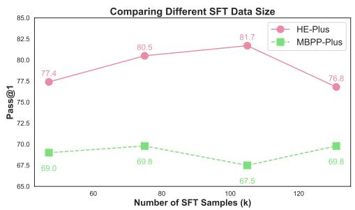  
Figure 3: Comparison of performance across different numbers of instruction fine-tuning samples synthesized by our ToE framework.

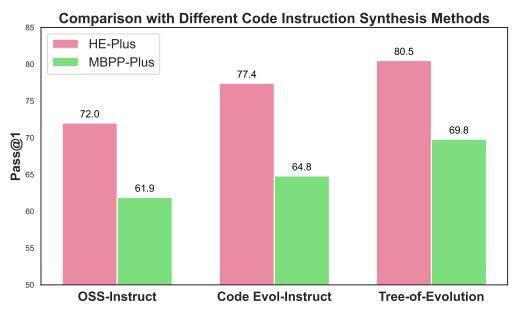  
Figure 4: Comparison of performance with the unidirectional code instruction synthesis methods.

As shown in Table 3, employing the open-weight LLM, Qwen2.5-72B-Instruct, in our ToE process achieves superior performance on HE-Plus (+1.8) and MBPP-Plus (+2.4) compared to the proprietary LLM, GPT-4o. These results demonstrate that our ToE framework does not require a proprietary LLM for data synthesis; in fact, using an open-weight LLM can yield even better outcomes. Moreover, this approach eliminates API costs entirely, making it a cost-effective solution.

Comparing Different SFT Data Size. In our ToE framework, the intra-similarity threshold can be adjusted to control the number of code instructions during the round-by-round data collection. A lower threshold allows for more samples but reduces diversity, as more similar nodes are collected within the same tree. Conversely, a higher threshold results in fewer samples but increases diversity. As shown in Figure 3, increasing the number of samples up to a certain point improves performance on HE-Plus. However, as the sample size continues to grow, performance on HE-Plus begins to decline, possibly due to the inclusion of more similar samples. For MBPP-Plus, performance remains relatively stable. Consequently, we select 75k samples to achieve the best overall performance.

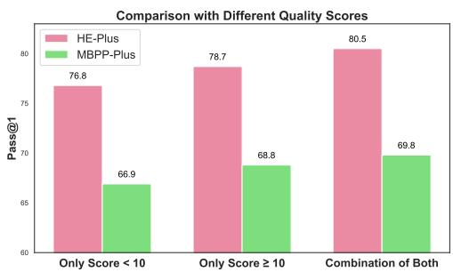  
Figure 5: Comparison of performance across different quality scores.

Comparing with Unidirectional Synthesis. In Figure 4, we compare the performance of our ToE framework with unidirectional code instruction synthesis methods, OSS-Instruct and Code Evol-Instruct. All methods use the same seed data, the same data synthesis model, and fine-tune on the same Qwen2.5-Coder-7B-Base models. As shown, our method outperforms the others on the HE-Plus and MBPP-Plus benchmarks, demonstrating the effectiveness of our approach.

## Comparison of Performance Across Different

Quality Scores. In Figure 5, we present experiments analyzing the correlation between quality scores and model performance. From our 75k data, we include only instructions with scores lower than 10 or no less than 10. Training the model with instructions scoring no less than 10 yields better performance compared to using instructions scoring below 10. This result highlights the relationship between quality scores and final performance, demonstrating the effectiveness of our scoring strategy. The mixed 75k data, results in better performance. This finding is supported by Figure 3, which shows that increasing the amount of data improves performance to a certain extent.

## 5 Conclusion

In this work, we introduce the Tree-of-Evolution framework for synthesizing high-quality code instruction data using a tree structure and optimization-driven evolution. Experimental results on five popular code generation benchmarks, across different model sizes, show that models fine-tuned on just 75k synthesized instructions outperform or match SOTA open-weight models, Qwen2.5-Coder-Instruct, which are fine-tuned on millions of samples.

## Limitations

Although our framework achieves performance comparable to, or even better than, SOTA openweight models, it still has some limitations:

• One limitation of our ToE framework is that it requires more time compared to unidirectional synthesis methods. This is due to the need for a tree-based synthesis process that explores multiple evolutionary paths and evaluates the quality of each node. While this approach improves performance, it comes with a time cost as a trade-off.

• Whether our ToE framework can generalize to non-code generation domains remains uncertain. The framework is primarily designed to extend existing code instruction synthesis methods, such as OSS-Instruct and Code Evol-Instruct, which initiate the data synthesis process with code snippets. This starting point may not easily translate to other domains. Additionally, the quality standards, challenges, and diversity levels necessary for optimal performance in code generation are domain-specific, as demonstrated in previous works on Code LLMs (Wei et al., 2023; Luo et al., 2024c).

• Our ToE framework focuses on code instruction synthesis, utilizing a data synthesis model to generate code responses for the given instructions. Improving the quality of these responses is beyond the scope of this work. As discussed in prior research (Luo et al., 2024a; Wei et al., 2024), refining the quality of code responses could potentially further enhance performance. However, given that our approach already achieves comparable or even superior performance to SOTA open-weight Code LLMs, we leave this orthogonal avenue for future exploration.

## Acknowledgments

This work is partially supported by Tencent Rhino-Bird Focused Research Program (Value-aligned Credible Large Language Model) and RMGS

project (Artificial Intelligence and Big Data Analytics for Social Good).

## References

01.AI. 2024. Meet yi-coder: A small but mighty llm for code.

Loubna Ben Allal, Raymond Li, Denis Kocetkov, Chenghao Mou, Christopher Akiki, Carlos Muñoz Ferrandis, Niklas Muennighoff, Mayank Mishra, Alex Gu, Manan Dey, Logesh Kumar Umapathi, Carolyn Jane Anderson, Yangtian Zi, Joel Lamy-Poirier, Hailey Schoelkopf, Sergey Troshin, Dmitry Abulkhanov, Manuel Romero, Michael Lappert, Francesco De Toni, Bernardo García del Río, Qian Liu, Shamik Bose, Urvashi Bhattacharyya, Terry Yue Zhuo, Ian Yu, Paulo Villegas, Marco Zocca, Sourab Mangrulkar, David Lansky, Huu Nguyen, Danish Contractor, Luis Villa, Jia Li, Dzmitry Bahdanau, Yacine Jernite, Sean Hughes, Daniel Fried, Arjun Guha, Harm de Vries, and Leandro von Werra. 2023. Santacoder: don’t reach for the stars! CoRR, abs/2301.03988.

Anthropic. 2023. Claude: A family of large language models. https://www.anthropic. com/claude.

Jacob Austin, Augustus Odena, Maxwell I. Nye, Maarten Bosma, Henryk Michalewski, David Dohan, Ellen Jiang, Carrie J. Cai, Michael Terry, Quoc V. Le, and Charles Sutton. 2021. Program synthesis with large language models. CoRR, abs/2108.07732.

Jinze Bai, Shuai Bai, Yunfei Chu, Zeyu Cui, Kai Dang, Xiaodong Deng, Yang Fan, Wenbin Ge, Yu Han, Fei Huang, Binyuan Hui, Luo Ji, Mei Li, Junyang Lin, Runji Lin, Dayiheng Liu, Gao Liu, Chengqiang Lu, Keming Lu, Jianxin Ma, Rui Men, Xingzhang Ren, Xuancheng Ren, Chuanqi Tan, Sinan Tan, Jianhong Tu, Peng Wang, Shijie Wang, Wei Wang, Shengguang Wu, Benfeng Xu, Jin Xu, An Yang, Hao Yang, Jian Yang, Shusheng Yang, Yang Yao, Bowen Yu, Hongyi Yuan, Zheng Yuan, Jianwei Zhang, Xingxuan Zhang, Yichang Zhang, Zhenru Zhang, Chang Zhou, Jingren Zhou, Xiaohuan Zhou, and Tianhang Zhu. 2023. Qwen technical report. arXiv preprint arXiv:2309.16609.

Alexander Bukharin, Shiyang Li, Zhengyang Wang, Jingfeng Yang, Bing Yin, Xian Li, Chao Zhang, Tuo Zhao, and Haoming Jiang. 2024. Data diversity matters for robust instruction tuning. In Findings of the Associationfor Computational Linguistics: EMNLP 2024, pages 3411–3425, Miami, Florida, USA. Association for Computational Linguistics.

Sahil Chaudhary. 2023. Code alpaca: An instruction-following llama model for code generation. https://github.com/sahil280114/ codealpaca.

Bei Chen, Fengji Zhang, Anh Nguyen, Daoguang Zan, Zeqi Lin, Jian-Guang Lou, and Weizhu Chen. 2023a. Codet: Code generation with generated tests. In The Eleventh International Conference on Learning Representations, ICLR 2023, Kigali, Rwanda, May 1-5, 2023. OpenReview.net.

Hailin Chen, Amrita Saha, Steven C. H. Hoi, and Shafiq Joty. 2023b. Personalised distillation: Empowering open-sourced llms with adaptive learning for code generation. CoRR, abs/2310.18628.

Mark Chen, Jerry Tworek, Heewoo Jun, Qiming Yuan, Henrique Pondé de Oliveira Pinto, Jared Kaplan, Harrison Edwards, Yuri Burda, Nicholas Joseph, Greg Brockman, Alex Ray, Raul Puri, Gretchen Krueger, Michael Petrov, Heidy Khlaaf, Girish Sastry, Pamela Mishkin, Brooke Chan, Scott Gray, Nick Ryder, Mikhail Pavlov, Alethea Power, Lukasz Kaiser, Mohammad Bavarian, Clemens Winter, Philippe Tillet, Felipe Petroski Such, Dave Cummings, Matthias Plappert, Fotios Chantzis, Elizabeth Barnes, Ariel Herbert-Voss, William Hebgen Guss, Alex Nichol, Alex Paino, Nikolas Tezak, Jie Tang, Igor Babuschkin, Suchir Balaji, Shantanu Jain, William Saunders, Christopher Hesse, Andrew N. Carr, Jan Leike, Joshua Achiam, Vedant Misra, Evan Morikawa, Alec Radford, Matthew Knight, Miles Brundage, Mira Murati, Katie Mayer, Peter Welinder, Bob McGrew, Dario Amodei, Sam McCandlish, Ilya Sutskever, and Wojciech Zaremba. 2021. Evaluating large language models trained on code. CoRR, abs/2107.03374.

Wei-Lin Chiang, Zhuohan Li, Zi Lin, Ying Sheng, Zhanghao Wu, Hao Zhang, Lianmin Zheng, Siyuan Zhuang, Yonghao Zhuang, Joseph E. Gonzalez, Ion Stoica, and Eric P. Xing. 2023. Vicuna: An opensource chatbot impressing gpt-4 with 90%\* chatgpt quality.

Mike Conover, Matt Hayes, Ankit Mathur, Jianwei Xie, Jun Wan, Sam Shah, Ali Ghodsi, Patrick Wendell, Matei Zaharia, and Reynold Xin. 2023. Free dolly: Introducing the world’s first truly open instructiontuned llm.

Matthijs Douze, Alexandr Guzhva, Chengqi Deng, Jeff Johnson, Gergely Szilvasy, Pierre-Emmanuel Mazaré, Maria Lomeli, Lucas Hosseini, and Hervé Jégou. 2024. The faiss library. CoRR, abs/2401.08281.

Markus Freitag and Yaser Al-Onaizan. 2017. Beam search strategies for neural machine translation. In Proceedings of the First Workshop on Neural Machine Translation, NMT@ACL 2017, Vancouver, Canada, August 4, 2017, pages 56–60. Association for Computational Linguistics.

Google. 2024. Codegemma: Open code models based on gemma. https://storage. googleapis.com/deepmind-media/ gemma/codegemma\_report.pdf.

Daya Guo, Qihao Zhu, Dejian Yang, Zhenda Xie, Kai Dong, Wentao Zhang, Guanting Chen, Xiao Bi,

Y. Wu, Y. K. Li, Fuli Luo, Yingfei Xiong, and Wenfeng Liang. 2024. Deepseek-coder: When the large language model meets programming - the rise of code intelligence. CoRR, abs/2401.14196.

Siming Huang, Tianhao Cheng, J. K. Liu, Jiaran Hao, Liuyihan Song, Yang Xu, J. Yang, J. H. Liu, Chenchen Zhang, Linzheng Chai, Ruifeng Yuan, Zhaoxiang Zhang, Jie Fu, Qian Liu, Ge Zhang, Zili Wang, Yuan Qi, Yinghui Xu, and Wei Chu. 2024. Opencoder: The open cookbook for top-tier code large language models.

Binyuan Hui, Jian Yang, Zeyu Cui, Jiaxi Yang, Dayiheng Liu, Lei Zhang, Tianyu Liu, Jiajun Zhang, Bowen Yu, Kai Dang, An Yang, Rui Men, Fei Huang, Xingzhang Ren, Xuancheng Ren, Jingren Zhou, and Junyang Lin. 2024. Qwen2.5-coder technical report. CoRR, abs/2409.12186.

Naman Jain, King Han, Alex Gu, Wen-Ding Li, Fanjia Yan, Tianjun Zhang, Sida Wang, Armando Solar-Lezama, Koushik Sen, and Ion Stoica. 2024. Livecodebench: Holistic and contamination free evaluation of large language models for code. CoRR, abs/2403.07974.

Denis Kocetkov, Raymond Li, Loubna Ben Allal, Jia Li, Chenghao Mou, Yacine Jernite, Margaret Mitchell, Carlos Muñoz Ferrandis, Sean Hughes, Thomas Wolf, Dzmitry Bahdanau, Leandro von Werra, and Harm de Vries. 2023. The stack: 3 TB of permissively licensed source code. Trans. Mach. Learn. Res., 2023.

Kaixin Li, Qisheng Hu, Xu Zhao, Hui Chen, Yuxi Xie, Tiedong Liu, Qizhe Xie, and Junxian He. 2024. Instructcoder: Instruction tuning large language models for code editing.

Raymond Li, Loubna Ben Allal, Yangtian Zi, Niklas Muennighoff, Denis Kocetkov, Chenghao Mou, Marc Marone, Christopher Akiki, Jia Li, Jenny Chim, et al. 2023a. Starcoder: may the source be with you! arXiv preprint arXiv:2305.06161.

Zehan Li, Xin Zhang, Yanzhao Zhang, Dingkun Long, Pengjun Xie, and Meishan Zhang. 2023b. Towards general text embeddings with multi-stage contrastive learning. CoRR, abs/2308.03281.

Jiawei Liu, Chunqiu Steven Xia, Yuyao Wang, and Lingming Zhang. 2023. Is your code generated by chatgpt really correct? rigorous evaluation of large language models for code generation. CoRR, abs/2305.01210.

Ruibo Liu, Jerry Wei, Fangyu Liu, Chenglei Si, Yanzhe Zhang, Jinmeng Rao, Steven Zheng, Daiyi Peng, Diyi Yang, Denny Zhou, and Andrew M. Dai. 2024. Best practices and lessons learned on synthetic data for language models. CoRR, abs/2404.07503.

Anton Lozhkov, Raymond Li, Loubna Ben Allal, Federico Cassano, Joel Lamy-Poirier, Nouamane Tazi, Ao Tang, Dmytro Pykhtar, Jiawei Liu, Yuxiang Wei, Tianyang Liu, Max Tian, Denis Kocetkov, Arthur Zucker, Younes Belkada, Zijian Wang, Qian Liu,

Dmitry Abulkhanov, Indraneil Paul, Zhuang Li, Wen-Ding Li, Megan Risdal, Jia Li, Jian Zhu, Terry Yue Zhuo, Evgenii Zheltonozhskii, Nii Osae Osae Dade, Wenhao Yu, Lucas Krauß, Naman Jain, Yixuan Su, Xuanli He, Manan Dey, Edoardo Abati, Yekun Chai, Niklas Muennighoff, Xiangru Tang, Muhtasham Oblokulov, Christopher Akiki, Marc Marone, Chenghao Mou, Mayank Mishra, Alex Gu, Binyuan Hui, Tri Dao, Armel Zebaze, Olivier Dehaene, Nicolas Patry, Canwen Xu, Julian J. McAuley, Han Hu, Torsten Scholak, Sébastien Paquet, Jennifer Robinson, Carolyn Jane Anderson, Nicolas Chapados, and et al. 2024. Starcoder 2 and the stack v2: The next generation. CoRR, abs/2402.19173.

Ziyang Luo, Xin Li, Hongzhan Lin, Jing Ma, and Lidong Bing. 2024a. Amr-evol: Adaptive modular response evolution elicits better knowledge distillation for large language models in code generation. In Proceedings of the 2024 Conference on Empirical Methods in Natural Language Processing, EMNLP 2024, Miami, FL, USA, November 12-16, 2024, pages 1143–1166. Association for Computational Linguistics.

Ziyang Luo, Haoning Wu, Dongxu Li, Jing Ma, Mohan Kankanhalli, and Junnan Li. 2024b. Videoautoarena: An automated arena for evaluating large multimodal models in video analysis through user simulation.

Ziyang Luo, Can Xu, Pu Zhao, Qingfeng Sun, Xiubo Geng, Wenxiang Hu, Chongyang Tao, Jing Ma, Qingwei Lin, and Daxin Jiang. 2024c. Wizardcoder: Empowering code large language models with evolinstruct. In The Twelfth International Conference on Learning Representations.

Mayank Mishra, Matt Stallone, Gaoyuan Zhang, Yikang Shen, Aditya Prasad, Adriana Meza Soria, Michele Merler, Parameswaran Selvam, Saptha Surendran, Shivdeep Singh, Manish Sethi, Xuan-Hong Dang, Pengyuan Li, Kun-Lung Wu, Syed Zawad, Andrew Coleman, Matthew White, Mark Lewis, Raju Pavuluri, Yan Koyfman, Boris Lublinsky, Maximilien de Bayser, Ibrahim Abdelaziz, Kinjal Basu, Mayank Agarwal, Yi Zhou, Chris Johnson, Aanchal Goyal, Hima Patel, S. Yousaf Shah, Petros Zerfos, Heiko Ludwig, Asim Munawar, Maxwell Crouse, Pavan Kapanipathi, Shweta Salaria, Bob Calio, Sophia Wen, Seetharami Seelam, Brian Belgodere, Carlos A. Fonseca, Amith Singhee, Nirmit Desai, David D. Cox, Ruchir Puri, and Rameswar Panda. 2024. Granite code models: A family of open foundation models for code intelligence. CoRR, abs/2405.04324.

Mistral. 2024. Codestral: Hello, world! empowering developers and democratising coding with mistral ai.

Erik Nijkamp, Hiroaki Hayashi, Caiming Xiong, Silvio Savarese, and Yingbo Zhou. 2023a. Codegen2: Lessons for training llms on programming and natural languages. CoRR, abs/2305.02309.

Erik Nijkamp, Bo Pang, Hiroaki Hayashi, Lifu Tu, Huan Wang, Yingbo Zhou, Silvio Savarese, and Caiming

Xiong. 2023b. Codegen: An open large language model for code with multi-turn program synthesis. In The Eleventh International Conference on Learning Representations.

OpenAI. 2023. GPT-4 technical report. CoRR, abs/2303.08774.

OpenAI. 2024. Openai o1 system card.

Long Ouyang, Jeffrey Wu, Xu Jiang, Diogo Almeida, Carroll Wainwright, Pamela Mishkin, Chong Zhang, Sandhini Agarwal, Katarina Slama, Alex Ray, et al. 2022. Training language models to follow instructions with human feedback. Advances in Neural Information Processing Systems, 35:27730–27744.

Baptiste Rozière, Jonas Gehring, Fabian Gloeckle, Sten Sootla, Itai Gat, Xiaoqing Ellen Tan, Yossi Adi, Jingyu Liu, Tal Remez, Jérémy Rapin, Artyom Kozhevnikov, Ivan Evtimov, Joanna Bitton, Manish Bhatt, Cristian Canton-Ferrer, Aaron Grattafiori, Wenhan Xiong, Alexandre Défossez, Jade Copet, Faisal Azhar, Hugo Touvron, Louis Martin, Nicolas Usunier, Thomas Scialom, and Gabriel Synnaeve. 2023. Code llama: Open foundation models for code. CoRR, abs/2308.12950.

Yizhong Wang, Yeganeh Kordi, Swaroop Mishra, Alisa Liu, Noah A Smith, Daniel Khashabi, and Hannaneh Hajishirzi. 2022. Self-instruct: Aligning language model with self generated instructions. arXiv preprint arXiv:2212.10560.

Yue Wang, Hung Le, Akhilesh Deepak Gotmare, Nghi D. Q. Bui, Junnan Li, and Steven C. H. Hoi. 2023. Codet5+: Open code large language models for code understanding and generation. CoRR, abs/2305.07922.

Yue Wang, Weishi Wang, Shafiq R. Joty, and Steven C. H. Hoi. 2021. Codet5: Identifier-aware unified pre-trained encoder-decoder models for code understanding and generation. In Proceedings ofthe 2021 Conference on Empirical Methods in Natural Language Processing, EMNLP 2021, Virtual Event / Punta Cana, Dominican Republic, 7-11 November, 2021, pages 8696–8708. Association for Computational Linguistics.

Yuxiang Wei, Federico Cassano, Jiawei Liu, Yifeng Ding, Naman Jain, Zachary Mueller, Harm de Vries, Leandro von Werra, Arjun Guha, and Lingming Zhang. 2024. Selfcodealign: Self-alignment for code generation. CoRR, abs/2410.24198.

Yuxiang Wei, Zhe Wang, Jiawei Liu, Yifeng Ding, and Lingming Zhang. 2023. Magicoder: Source code is all you need. CoRR, abs/2312.02120.

Can Xu, Qingfeng Sun, Kai Zheng, Xiubo Geng, Pu Zhao, Jiazhan Feng, Chongyang Tao, and Daxin Jiang. 2023. Wizardlm: Empowering large language models to follow complex instructions. arXiv preprint arXiv:2304.12244.

Chengrun Yang, Xuezhi Wang, Yifeng Lu, Hanxiao Liu, Quoc V. Le, Denny Zhou, and Xinyun Chen. 2024. Large language models as optimizers. In The Twelfth International Conference on Learning Representations, ICLR 2024, Vienna, Austria, May 7-11, 2024. OpenReview.net.

Zhaojian Yu, Xin Zhang, Ning Shang, Yangyu Huang, Can Xu, Yishujie Zhao, Wenxiang Hu, and Qiufeng Yin. 2023. Wavecoder: Widespread and versatile enhanced instruction tuning with refined data generation. CoRR, abs/2312.14187.

Lifan Yuan, Ganqu Cui, Hanbin Wang, Ning Ding, Xingyao Wang, Jia Deng, Boji Shan, Huimin Chen, Ruobing Xie, Yankai Lin, Zhenghao Liu, Bowen Zhou, Hao Peng, Zhiyuan Liu, and Maosong Sun. 2024. Advancing llm reasoning generalists with preference trees.

Weihao Zeng, Can Xu, Yingxiu Zhao, Jian-Guang Lou, and Weizhu Chen. 2024. Automatic instruction evolving for large language models. In Proceedings ofthe 2024 Conference on Empirical Methods in Natural Language Processing, pages 6998–7018, Miami, Florida, USA. Association for Computational Linguistics.

Lianmin Zheng, Wei-Lin Chiang, Ying Sheng, Siyuan Zhuang, Zhanghao Wu, Yonghao Zhuang, Zi Lin, Zhuohan Li, Dacheng Li, Eric P. Xing, Hao Zhang, Joseph E. Gonzalez, and Ion Stoica. 2023a. Judging llm-as-a-judge with mt-bench and chatbot arena. In Advances in Neural Information Processing Systems 36: Annual Conference on Neural Information Processing Systems 2023, NeurIPS 2023, New Orleans, LA, USA, December 10 - 16, 2023.

Qinkai Zheng, Xiao Xia, Xu Zou, Yuxiao Dong, Shan Wang, Yufei Xue, Zihan Wang, Lei Shen, Andi Wang, Yang Li, Teng Su, Zhilin Yang, and Jie Tang. 2023b. Codegeex: A pre-trained model for code generation with multilingual evaluations on humaneval-x. CoRR, abs/2303.17568.

Tianyu Zheng, Ge Zhang, Tianhao Shen, Xueling Liu, Bill Yuchen Lin, Jie Fu, Wenhu Chen, and Xiang Yue. 2024a. Opencodeinterpreter: Integrating code generation with execution and refinement. CoRR, abs/2402.14658.

Tianyu Zheng, Ge Zhang, Tianhao Shen, Xueling Liu, Bill Yuchen Lin, Jie Fu, Wenhu Chen, and Xiang Yue. 2024b. OpenCodeInterpreter: Integrating code generation with execution and refinement. In Findings of the Association for Computational Linguistics: ACL 2024, pages 12834–12859, Bangkok, Thailand. Association for Computational Linguistics.

Chunting Zhou, Pengfei Liu, Puxin Xu, Srinivasan Iyer, Jiao Sun, Yuning Mao, Xuezhe Ma, Avia Efrat, Ping Yu, Lili Yu, Susan Zhang, Gargi Ghosh, Mike Lewis, Luke Zettlemoyer, and Omer Levy. 2023. LIMA: less is more for alignment. In Advances in Neural Information Processing Systems 36: Annual Conference on Neural Information Processing Systems 2023,

NeurIPS 2023, New Orleans, LA, USA, December 10 - 16, 2023.

Terry Yue Zhuo, Minh Chien Vu, Jenny Chim, Han Hu, Wenhao Yu, Ratnadira Widyasari, Imam Nur Bani Yusuf, Haolan Zhan, Junda He, Indraneil Paul, Simon Brunner, Chen Gong, Thong Hoang, Armel Randy Zebaze, Xiaoheng Hong, Wen-Ding Li, Jean Kaddour, Ming Xu, Zhihan Zhang, Prateek Yadav, Naman Jain, Alex Gu, Zhoujun Cheng, Jiawei Liu, Qian Liu, Zijian Wang, David Lo, Binyuan Hui, Niklas Muennighoff, Daniel Fried, Xiaoning Du, Harm de Vries, and Leandro von Werra. 2024. Bigcodebench: Benchmarking code generation with diverse function calls and complex instructions. CoRR, abs/2406.15877.

## A Prompts

Figure 6, 7, and˜reffig:prompt3 display the prompts for code instruction generation using a random code snippet, challenge level evaluation, and optimization-driven evolution, respectively.

## B Examples

Figure 9 provides an example of a synthesized code instruction based on the given random code snippet. Figures 10, 11, and 12 show three examples of different synthesized code instructions based on the same instruction as in Figure 9. Notably, the data synthesis model generates diverse code instructions from the same initial input, supporting our claim in the introduction that multiple evolutionary paths are necessary to explore different synthesis directions, as the unidirectional synthesis used in prior work is suboptimal. Additionally, the challenge and diversity level scores are included, demonstrating that these three synthesized instructions achieve higher overall quality scores than their parent node, highlighting the effectiveness of our optimizationdriven evolution process. In Figures 13, 14, and 15, we also present examples of challenge-level judging, showcasing the careful evaluation process.

## C Implementation Details

For the entire data synthesis process, we use OpenAI’s gpt-4o-2024-08-06 as the data synthesis model. The temperature is set to 1.0 for code instruction generation, and to 0.0 for both challenge level judging and response generation. For diversity evaluation, we utilize gte-large-en-v1.5 (Li et al., 2023b), a SOTA embedding model, to embed each instruction into vectors. We use FAISS (Douze et al., 2024) for distance calculation, employing the IndexIVFFlat to build the index and perform approximate nearest neighbor searching. The diversity score is calculated as 10 times the distance of the recall top-1 data point.

The ToE process conducts three rounds of evolution, with each node exploring up to three different evolutionary paths. Starting with 5k random code snippets, the first round can synthesize up to 15k code instructions, the second round up to 45k, and the third up to 135k. For the beam search and higher-than-parent node strategies, the top 75% of nodes are retained for the second and third rounds. For the final 75k data collection, we use a roundby-round method. Nodes are ranked within each round based on their quality scores and selected from highest to lowest. For each node, we calculate the similarity distance between it and previously selected nodes from the same round within the same tree. To address intra-tree similarity issues, only nodes with a distance greater than 6.0 and a higher quality score than their parent nodes are retained. All base models are fine-tuned using 8 A800 GPUs with a maximum sequence length of 4096, a batch size of 256, 2 epochs, a learning rate of 5.0e-6, a cosine learning rate scheduler, and a warmup ratio of 0.01.

The license of HumanEval is MIT.<sup>4</sup> The license of MBPP is cc-by-4.0.<sup>5</sup> The license of EvalPlus is Apache-2.0.<sup>6</sup> The license of LiveCodeBench is MIT.<sup>7</sup> The license of BigCodeBench is Apache-2.0.<sup>8</sup> Our data will be open-sourced under the Apache 2.0 license.

## D Broader Impact

Our research introduces a novel framework for code instruction synthesis. While our approach demonstrates comparable or even superior performance to open-weight Code LLMs, it does not guarantee that these models will solve all coding tasks. Additionally, the synthesized data may contain errors, as it is limited by the capabilities of the data synthesis models. Therefore, it is crucial to filter out any erroneous data before deploying Code LLMs in real-world applications to mitigate the risk of misuse.

## E Use Of AI Assistants

The AI assistant, GPT-4o, is used solely for refining the writing of our paper.

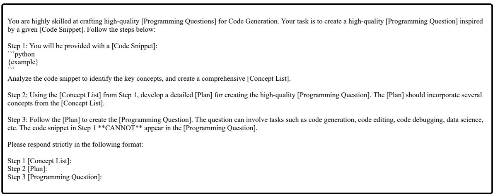  
Figure 6: The prompt for synthesizing code instructions using the given random code snippet.

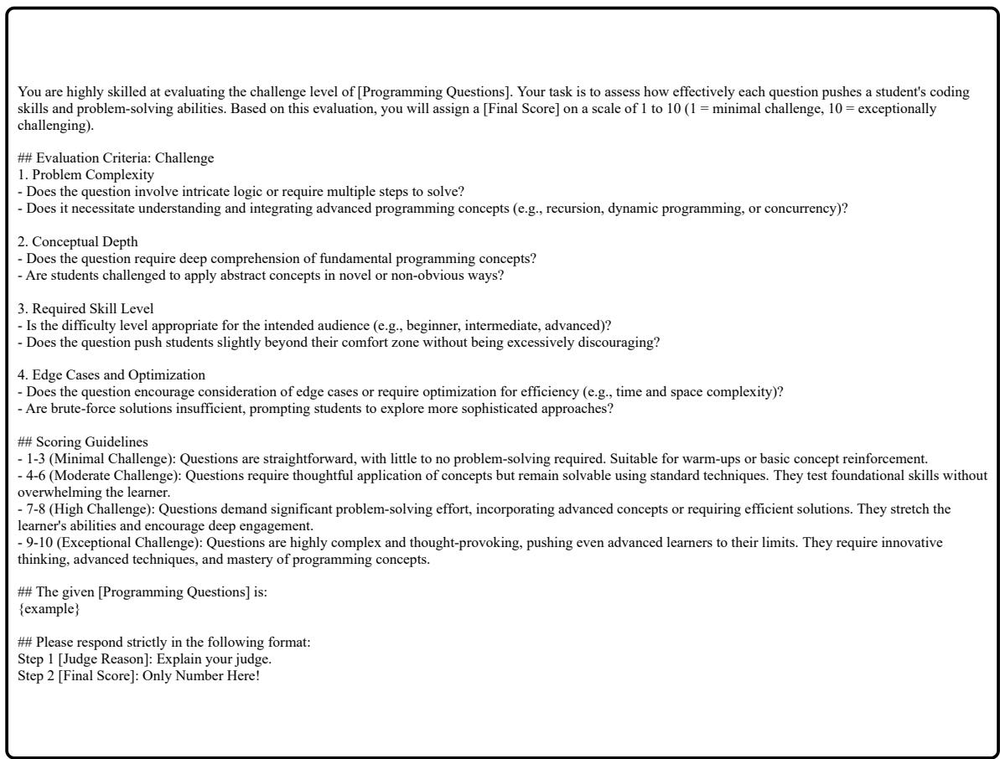  
Figure 7: The prompt for judging the challenge level of the given code instruction.

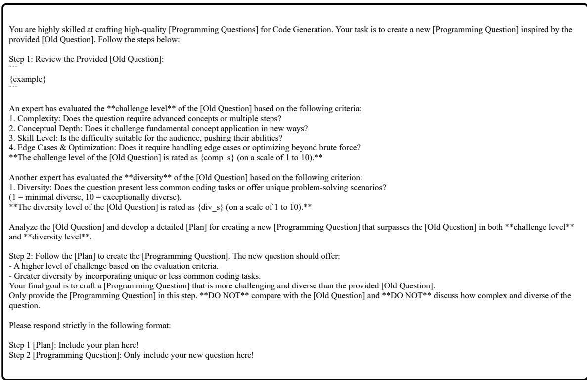  
Figure 8: The prompt for optimization-driven evolution

```julia
SEED:
def lerp(a,b,t):
""" Linear interpolation between from @a to @b as @t goes between 0 an 1. """
return (1-t)*a + t*b
Round1 Generation:
Title: Implementing Linear Interpolation for Gradient Generation
Description:
Linear interpolation is a common technique to generate smooth transitions between values. In this exercise, you will implement a function to create a gradient of colors
using linear interpolation.
Task:
1. Write a Python function `interpolate_color(start_color, end_color, t)` that linearly interpolates between two RGB colors. The function should take the following
parameters:
- `start_color`: a tuple of three integers representing the starting RGB color (e.g., (255, 0, 0) for red).
- `end_color`: a tuple of three integers representing the ending RGB color (e.g., (0, 0, 255) for blue).
- `t`: a floating-point number between 0 and 1 that represents the interpolation factor.
2. The function should return a tuple of three integers representing the interpolated RGB color.
3. You should validate the input to ensure that `t` is between 0 and 1, and the colors are valid RGB tuples with values between 0 and 255.
Example:
```python
def interpolate_color(start_color, end_color, t):
# Your code here
# Example usage
start = (255, 0, 0) # Red
end = (0, 0, 255) # Blue
t = 0.5
interpolated_color = interpolate_color(start, end, t)
print(interpolated_color) # Expected output is (127, 0, 127)
Notes:
- The function should perform interpolation separately for each of the R, G, and B components using the formula: `interpolated_value = (1 - t) * start_value + t *
end_value`.
- Ensure to round the interpolated values to the nearest integer before returning them.
Additional Task:
After writing your function, create a gradient array of 10 colors transitioning from red to blue and print the resulting colors. Use the `interpolate_color` function to
achieve this.
```python
start = (255, 0, 0) # Red
end = (0, 0, 255) # Blue
gradient = [interpolate_color(start, end, i / 9) for i in range(10)]
print(gradient)
# Expected output: List of 10 tuples representing the gradient colors
Challenge Level: 5.0
Diversity Level: 4.42
Overall: 9.42
```  
Figure 9: An example of a synthesized code instruction based on the given random code snippet, including its challenge and diversity scores.

Title: Procedural Terrain Generation using Perlin Noise   
Description:   
Procedural terrain generation is a fundamental technique in game development and procedural content generation. One of the algorithms used for generating realistic   
terrain features is Perlin noise. In this exercise, you will implement a function to generate a 2D terrain map using Perlin noise.   
Tasks:   
1. Write a Python function \`generate\_perlin\_noise(width, height, scale)\` to create a 2D array representing a Perlin noise map. The function should take the following   
parameters:   
- \`width\`: an integer representing the width of the map.   
- \`height\`: an integer representing the height of the map   
- \`scale\`: a float representing the scale of the noise.   
2. The function should generate Perlin noise values for each point in the 2D array. Use a Perlin noise algorithm to compute these values. Each value should be between   
0 and 1.   
3. Implement a function \`create\_terrain\_map(noise\_map, thresholds)\` that converts the noise map into a terrain map. Parameters:   
- \`noise\_map\`: a 2D array containing the Perlin noise values.   
- \`thresholds\`: a dictionary mapping terrain types to noise value ranges (e.g., {'water': 0.3, 'sand': 0.4, 'grass': 0.7, 'rock': 0.9}).   
4. The function should return a 2D array of terrain types based on the provided thresholds.   
5. Ensure the functions validate input parameters, such as positive dimensions and valid scale values.   
Example:   
\`\`\`python   
def generate\_perlin\_noise(width, height, scale):   
# Your code here   
def create\_terrain\_map(noise\_map, thresholds):   
# Your code here   
# Example usage:   
width = 50   
height = 50   
scale = 0.1   
thresholds = {'water': 0.3, 'sand': 0.4, 'grass': 0.7, 'rock': 0.9}   
noise\_map = generate\_perlin\_noise(width, height, scale)   
terrain\_map = create\_terrain\_map(noise\_map, thresholds)   
for row in terrain\_map:   
print(' '.join(row))   
Notes:   
- For generating Perlin noise, you can use libraries like \`noise\` in Python which provides a Perlin noise implementation.   
- After generating the noise map, classify each point based on the provided thresholds to create the terrain map.   
- Handle edge cases where \`width\` and \`height\` are zero or negative, or \`scale\` is non-positive.   
Additional Task:   
Visualize the terrain map using a gradient of characters or colors:   
- 'W' for water   
- 'S' for sand   
- 'G' for grass   
- 'R' for rock   
Modify the given example to print the terrain map such that each terrain type matches the corresponding character.   
\`\`\`python   
terrain\_map = create\_terrain\_map(noise\_map, thresholds)   
char\_map = {'water': 'W', 'sand': 'S', 'grass': 'G', 'rock': 'R'}   
for row in terrain\_map:   
print(' '.join(char\_map[cell] for cell in row))   
Challenge Level: 8.0   
Diversity Level: 5.60   
Overall: 13.60  
Figure 10: The first example of a synthesized code instruction based on the code instruction in Figure 9, including its challenge and diversity scores.

Title: Generating a Mandelbrot Set with Custom Color Map Scaling   
Description:   
The Mandelbrot set is a complex fractal defined in the complex plane, and it is a classic example of a set that can be used to create intricate and beautiful visual   
patterns. In this exercise, you will implement a function to generate the Mandelbrot set and apply a custom color map to visualize it.   
Task:   
1. Write a Python function \`mandelbrot\_set(width, height, max\_iter, color\_map)\` that generates an image of the Mandelbrot set. The function should take the following   
parameters:   
- \`width\`: an integer representing the width of the image in pixels.   
- \`height\`: an integer representing the height of the image in pixels.   
- \`max\_iter\`: an integer representing the maximum number of iterations to determine if a point is in the Mandelbrot set.   
- \`color\_map\`: a function that takes an integer (the iteration count) and returns a tuple of three integers representing the RGB color.   
2. The function should return a 2D list of RGB tuples representing the image of the Mandelbrot set.   
3. You should validate the input to ensure that \`width\` and \`height\` are positive integers, \`max\_iter\` is a positive integer, and \`color\_map\` is a callable function.   
4. Implement the \`color\_map\` function to map iteration counts to RGB colors using non-linear scaling (e.g., logarithmic) to enhance the visual appeal of the fractal.   
Example:   
\`\`\`python   
def mandelbrot\_set(width, height, max\_iter, color\_map):   
# Your code here   
def sample\_color\_map(iter\_count):   
# Custom color map logic (e.g., logarithmic scaling)   
# Your code here   
# Example usage   
width = 800   
height = 600   
max\_iter = 1000   
image = mandelbrot\_set(width, height, max\_iter, sample\_color\_map)   
# Expected output is a 2D list of (R, G, B) tuples representing the Mandelbrot set   
Notes:   
- The Mandelbrot set is defined by the iterative formula: \( z\_{n+1} = z\_n^2 + c \), where \( z\_0 = 0 \) and \( c \) is the complex coordinate corresponding to each pixel   
in the image.   
- A point \( c \) is in the Mandelbrot set if the sequence \( \{z\_n\} \) remains bounded. Typically, we consider a point to be outside the set if \( |z\_n| > 2 \) for any \( n \)   
less than \`max\_iter\`.   
- Use a complex plane range (e.g., real part between -2.0 and 1.0, imaginary part between -1.5 and 1.5).   
- Ensure to optimize the implementation for large images.   
- Test your function with different \`max\_iter\` values and color maps to observe the changes in the fractal patterns.   
Advanced Task:   
After writing your function, create an interactive visualization where the user can zoom into different parts of the Mandelbrot set and dynamically adjust the \`max\_iter\`   
and \`color\_map\` parameters. Use a GUI framework like Tkinter or a web-based interface to achieve this.   
\`\`\`python   
# Provide a basic structure for the interactive visualization   
# You don't need to implement the full GUI code here, just the essential parts to show the interaction   
import tkinter as tk   
def interactive\_mandelbrot():   
# GUI code to interactively adjust parameters   
# Your code here   
# Start the interactive application   
interactive\_mandelbrot()   
Challenge Level: 9.0   
Diversity Level: 6.35   
Overall: 15.35  
Figure 11: The second example of a synthesized code instruction based on the code instruction in Figure 9, including its challenge and diversity scores.

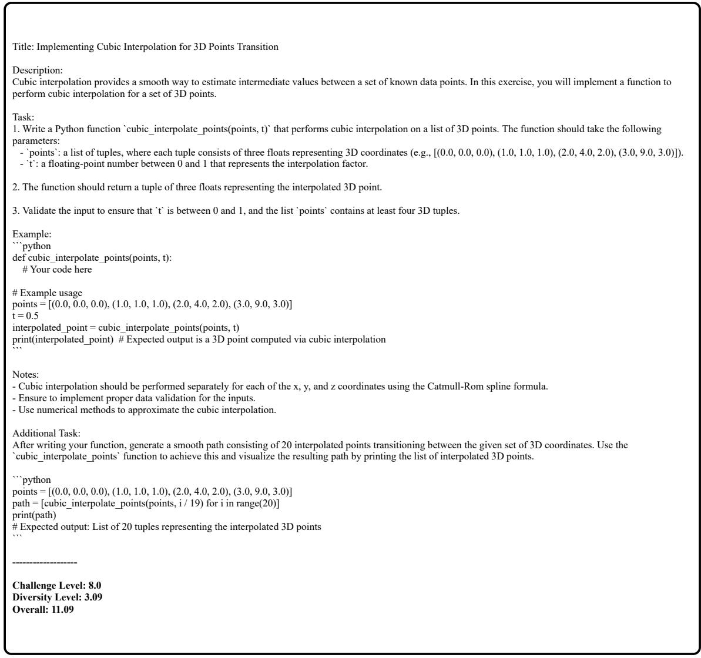  
Figure 12: The third example of a synthesized code instruction based on the code instruction in Figure 9, including its challenge and diversity scores.

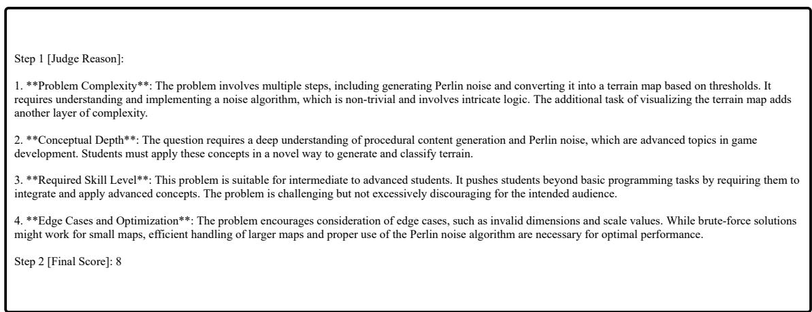  
Figure 13: The challenge level evaluation of the synthesized code instruction in Figure 10.

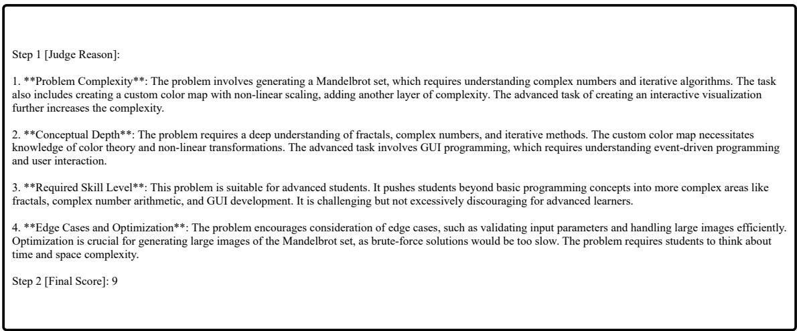  
Figure 14: The challenge level evaluation of the synthesized code instruction in Figure 11.

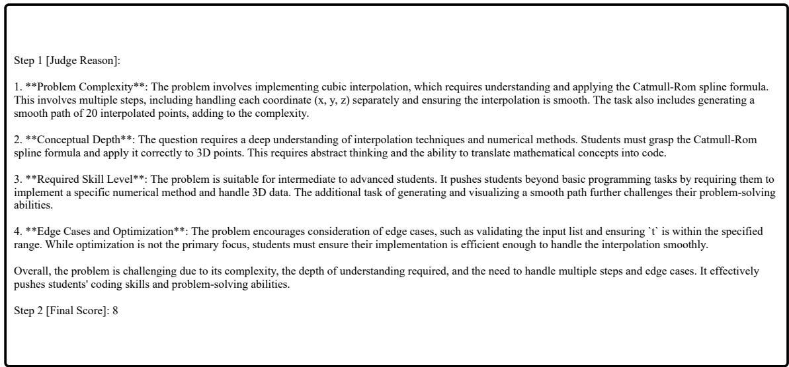  
Figure 15: The challenge level evaluation of the synthesized code instruction in Figure 12.