# Unraveling the Mechanics of Learning-Based Demonstration Selection for In-Context Learning

Hui Liu1, Wenya Wang2, Hao Sun3, Chris Xing Tian1,

Chenqi Kong2, Xin Dong4, Haoliang Li1

1City University of Hong Kong, Hong Kong 2Nanyang Technological University, Singapore

3Peking University, Beijing, China 4NVIDIA, America

{liuhui3-c, xingtian4-c, haoliang.li}@my.cityu.edu.hk

{wangwy, chenqi.kong}@ntu.edu.sg

sunhao@stu.pku.edu.cn, xind@nvidia.com

## Abstract

Large Language Models (LLMs) have demonstrated impressive in-context learning (ICL) capabilities from few-shot demonstration exemplars. Recent learning-based demonstration selection methods have proven beneficial to ICL by choosing more useful exemplars. While these methods generally assume they learn better similarity measurements between exemplars and test cases from the proxy task, what kinds of similarities are captured by them and are vital to performing ICL still need to be explored. To dive into this question, we analyze the working mechanism of learning-based demonstration selection methods and empirically identify two essential factors of their similarity measurements: 1) Integrating task-agnostic similarities of different levels between the input of exemplars and test cases; 2) Incorporating task-specific similarity between the output of exemplars and test cases. We validate these two findings through extensive quantitative analysis across ten datasets and various LLMs. Based on these insights, we introduce two simplified exemplar selection methods, MLSM and TTF, catering to task-agnostic and task-specific demands to eliminate costly data collection. The effectiveness of both methods evince our findings again and pave the way for future studies.

## 1 Introduction

In-context learning (ICL) has emerged as a promising paradigm that employs a sequence of demonstration exemplars as prompts to assist large language models (LLMs) in effectively performing unseen tasks (Brown et al., 2020; Su et al., 2023). However, the performance of ICL can be sensitive to the choice, format, and order of the in-context exemplar (Zhao et al., 2021; Zhou et al., 2023; Voronov et al., 2024; Lu et al., 2022). To mitigate this challenge, given a test case $x ^ { t }$ , the exemplar selection task assumes access to a demonstration set containing input-output pairs $( x , y )$ and focuses on selecting the most effective exemplar from  to inform the target output $y ^ { t }$

To address this task, it is the most common practice to select demonstration exemplars based on a similarity measurement between x and $x ^ { t }$ (Rubin et al., 2022; Ye et al., 2023; An et al., 2023; Tonglet et al., 2023; Li and Qiu, 2023; Milios et al., 2023). Some work utilizes task-agnostic similarity like term frequency-based similarity BM25 and semantic similarity computed by off-the-shelf text encoders (Liu et al., 2022; An et al., 2023). Recent learning-based studies (Rubin et al., 2022; Ye et al., 2023; Li et al., 2023), however, separately train a retriever to learn implicit similarity measurements using a contrastive leaning-based proxy task where positive exemplars $x ^ { + }$ and negative exemplars $x ^ { - }$ are labeled by interacting with LLMs. This data creation process often requires hundreds of thousands of queries to LLMs for each task to collect sufficient positive/negative data.

Although learning-based methods consistently exhibit significant performance improvements over task-agnostic similarity across various tasks, the implicit similarity they capture and their connection to the performance of ICL remain unclear. Through a detailed examination of previous works, we observe 1) While the low-level similarity like BM25 and semantic similarity excel in different tasks (e.g., Top-K BM25 outperforms Top-K BERT on Nl2Bash (Lin et al., 2018) and SWAG (Zellers et al., 2019) in Table 2 and Table 3), learning-based similarity generally performs well across all tasks. 2) In the proxy task, the input and output similarity between positive exemplars and test cases is higher than that of negative exemplars and test cases. Moreover, learning-based methods often suffer from poor generalization across different tasks, as corroborated by findings in (Ye et al., 2023). Based on these initial observations, we propose two hypotheses regarding learning-based methods:

$\mathcal { H } _ { 1 }$ : After training, the retriever acts as an ensemble model that adaptively integrates multi-level task-agnostic similarities between the exemplar input (x) and test cases $( x ^ { t } )$ for different tasks.

2: Beyond input similarities, the training process encourages selecting exemplars with similar output $( y )$ to the output of the test case $( y ^ { t } )$ , implicitly predicted during retrieval, enhancing the retriever’s discriminative power for a specific task.

Extensive quantitative experiments are designed to validate these hypotheses: 1) We take various layers of BERT as anchors for similarities of different levels and discover learning-based methods exhibiting varying preferences for these anchors before and after training, suggesting an adaptive combination of these similarities tailored to specific tasks. 2) We investigate the exemplar retrieved by learning-based methods and find these exemplars show a higher similarity in output to the test case than other task-agnostic similarity-based methods. This finding indicates that learning-based methods incorporate task-specific similarities between the outputs of exemplars and test cases during the exemplar selection process, potentially capturing the joint distribution of inputs and outputs between exemplars and test cases. Additionally, by connecting our findings with existing interpretative theories of ICL (Olsson et al., 2022; Kossen et al., 2023; Yan et al., 2023; Halawi et al., 2023; Wang et al., 2023), we further qualitatively validate our conclusions.

Drawing insights from these findings, we propose two cost-effective exemplar selection methods: 1) Multi-level Similarity Maximization (MLSM) retriever that maximizes agreement across different similarity levels represented by various layers of BERT in the inference of LLMs. 2) Test Task Fine-tuning (TTF) retriever, which uses labeled data from the demonstration set to finetune the retriever to learn task-specific information. Both retrievers eliminate the need for costly data collection for the proxy task, catering to crosstask and task-specific demands. To validate the effectiveness of these methods, we conduct experiments across five distinct LLMs and a range of tasks. These promising applications confirm our hypotheses and benefit future demonstration selection studies for more efficient LLM deployment.

## 2 Preliminary

## 2.1 Learning-based Demonstration Selection

Demonstration selection aims to identify a sequence of high-quality exemplars from the demonstration set as a prompt to enhance test case accuracy on LLMs. Prior studies (Liu et al., 2022; Gao et al., 2021) find that good exemplars exhibit similarities with the test case. They employ the pretrained text encoder like BERT (Devlin et al., 2019) as a retriever to encode inputs and take the average embedding of all tokens from the final layer of this encoder to represent test cases and exemplars. Subsequently, cosine similarity scores are computed between test cases and exemplars to retrieve the top-K most similar exemplars as prompts.

While the pipeline of learning-based demonstration selection methods (Rubin et al., 2022; Ye et al., 2023; Li et al., 2023) is similar to the above strategy, they further exploit LLMs to label positive and negative exemplars to construct a proxy task to fine-tune the retriever, aiming to learn a better similarity metric. Specifically, let denote the demonstration set. Given an exemplar $( x _ { i } , y _ { i } )$ in , Rubin et al. (2022) propose EPR to sample a sequence of candidate examples from , denoted as $S = \{ ( \overline { { x } } _ { 1 } , \overline { { y } } _ { 1 } ) , \dots , ( \overline { { x } } _ { m } , \overline { { y } } _ { m } ) \}$ and score them by $s ( \overline { { x } } , \overline { { y } } ) = P _ { \mathrm { L L M } } ( Y = y _ { i } | ( \overline { { x } } , \overline { { y } } ) , x _ { i } )$ , meaning the probability of producing correct output $y _ { i }$ for xi conditioned on $( { \overline { { x } } } , { \overline { { y } } } )$ using an LLM. Subsequently, x with the highest score is selected as the positive sample, denoted as $x ^ { + }$ and the lowest as the hard negative sample, denoted as $x ^ { - }$ for $x _ { i }$ These samples are then used to train the retriever by maximizing the similarity between x and $x ^ { + }$ and minimizing the similarity between x and x− via contrastive learning. In subsequent sections, without special note, we analyze EPR to unravel the mechanics of learning-based demonstration selection methods and adopt BERT1 consisting of twelve transformer layers as the retriever.

## 2.2 Layers of BERT as Anchors of Multi-level Similarities

Previous studies (Jawahar et al., 2019a; Ma et al., 2019; Jawahar et al., 2019b) have empirically shown that the intermediate layers of BERT encode a rich hierarchy of linguistic information with surface features at the bottom, syntactic features in the middle and semantic features at the top through probing tasks. Moreover, BERT has been pre-trained on a vast corpus capturing general linguistic features that can be utilized for various tasks. These inspire us to take different layers of the original BERT (i.e., BERT without task-specific fine-tuning) as anchors of multi-level similarities. Especially for a layer l, given two texts $s _ { 1 }$ and $s _ { 2 }$ we can extract all token embedding from this layer and compute their average pooling as the representation of both texts, denoted as $h _ { 1 } ^ { l }$ and $h _ { 2 } ^ { l }$ . Then, the similarity between $s _ { 1 }$ and $s _ { 2 }$ corresponding to layer l can be obtained by computing the cosine similarity between $h _ { 1 } ^ { l }$ and $h _ { 2 } ^ { l }$

## 3 Rethinking Learning-based Demonstration Selection

This section proposes two key hypotheses regarding the underlying similarity mechanism of learning-based exemplar selection methods: $( \mathcal { H } _ { 1 } )$ The learning-based retriever is analogous to an ensemble model which adaptively aggregates multilevel similarities computed by different BERT layers between the input of exemplar and test cases (x and $x ^ { t } )$ $( \mathcal { H } _ { 2 } )$ The learning-based retriever favors selecting exemplars with similar output $( y )$ to the test case output $( y ^ { t } )$ . Both hypotheses are validated through quantitative analysis as below and qualitative analysis in Appendix D.

## 3.1 Multi-level Similarity $( \mathcal { H } _ { 1 } )$

Although semantic similarity generally excels in text retrieval, our observations show that low-level similarity (e.g., BM25) can sometimes outperform semantic counterpart in the demonstration selection task, especially on Nl2Bash (Lin et al., 2018) and SWAG (Zellers et al., 2019). Thus, we speculate that a critical aspect that makes the learning-based exemplar retriever effective lies in its ability to potentially learn and automatically integrate taskagnostic similarities of different levels during training $( \mathcal { H } _ { 1 } )$ . In the following quantitative validation, we empirically find that the learning-based method EPR dynamically ensembles the similarity encoded by various layers of an off-the-shelf BERT encoder.

As the first step, we validate the assumption that different layers of BERT, representing various levels of similarities, can exhibit different behaviors for different tasks as a retriever. To do that, following EPR, which builds a positive set $\{ ( x _ { i } , x _ { i } ^ { + } ) \} _ { i } ^ { N }$ using an LLM (as described in Sec. 2.1), we treat each $x _ { i } ^ { + }$ as a gold exemplar to be retrieved for $x _ { i }$ . Then we utilize different layers of the original BERT to retrieve/rank exemplars (as discussed in Sec. 2.2) for each $x _ { i }$ and evaluate the Top-10 retrieval accuracy, representing the probability of retrieving the positive exemplar $x _ { i } ^ { + }$ in top 10 predictions. The results on four tasks are depicted in Fig. 1 when using GPT-Neo as the LLM, which reveals that different tasks exhibit distinct preferences towards specific layers, emphasizing different similarities levels. More information on these tasks can be found in Appendix B.1. Furthermore, while it is prevalent to employ the final layer of BERT for exemplar retrieval (Liu et al., 2022; Zhang et al., 2023a), it is not consistently optimal, likely due to the potential inclusion of irrelevant information caused by BERT’s pre-training tasks.

In the next step, we investigate what is encapsulated in the retriever learned by EPR. As this retriever utilizes the last layer of BERT to compute similarities, we extract the representations from this layer and compare those with representations from each layer of the original BERT to study the correlations between the EPR retriever and each original BERT layer. For this purpose, We introduce CKA (Kornblith et al., 2019), which effectively identifies correspondences between representations in different networks. Let $X ^ { a } \in \mathbb { R } ^ { n \times p _ { 1 } }$ denote a matrix of activations of $p _ { 1 }$ neurons for n examples and $X ^ { b } \in \mathbb { R } ^ { n \times p _ { 2 } }$ denote a matrix of activations of $p _ { 2 }$ neurons for the same n examples. The core insight of CKA lies in measuring the similarity between two matrices $X ^ { a }$ and $X ^ { b }$ by considering the inter-sample similarities. Specifically, CKA computes $K ^ { a }$ and $K ^ { b }$ to derive the inter-example similarity structures for $X ^ { a }$ and $X ^ { b }$ , where $K ^ { a } =$ $k ^ { a } ( X ^ { a } , X ^ { a } ) , K ^ { b } = k ^ { b } ( X ^ { b } , X ^ { b } )$ $k ^ { a }$ and $k ^ { b }$ represent two linear kernels (i.e., $k ( X , X ) = X X ^ { T } )$ Then, the CKA metric can be formulated as follows:

$$
\operatorname { C K A } ( K ^ { a } , K ^ { b } ) = { \frac { \operatorname { H S I C } ( \mathrm { K ^ { a } , K ^ { b } } ) } { \sqrt { \operatorname { H S I C } ( K ^ { a } , K ^ { a } ) \operatorname { H S I C } ( K ^ { b } , K ^ { b } ) } } } ,\tag{1}
$$

where HSIC $\begin{array} { l l l } { { ( K ^ { a } , K ^ { b } ) } } & { { = } } & { { \frac { 1 } { ( n - 1 ) ^ { 2 } } \mathrm { t r } ( K ^ { a } H K ^ { b } H ) } } \end{array}$ and HSIC is the aberration of Hilbert-Schmidt Independence Criterion. H is the centering matrix $\begin{array} { r } { H _ { n } = I _ { n } - \frac { 1 } { n } J _ { n } } \end{array}$ where $I _ { n }$ is the identity matrix of size n and $J _ { n }$ is a n-by-n all-ones matrix.

To measure the similarity between the last layer of the EPR retriever and each layer of the original BERT, we randomly sample $n = 2 0 0 0$ instances from the demonstration set $\mathcal { D } \ ( \mathrm { I f } \ | \mathcal { D } | < \ 2 0 0 0$ $n = | \mathcal { D } | )$ for each task. Denote $X ^ { \mathrm { E P R } }$ as the matrix composing n rows of last-layer representations from the EPR retriever, and $X ^ { l }$ as the matrix composing n rows of the lth-layer representations from the original BERT. Then we can calculate the CKA score $\mathrm { C K A } ( K ^ { \mathrm { E P R } } , K ^ { l } )$ for each task using Eq. 1.

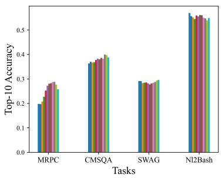

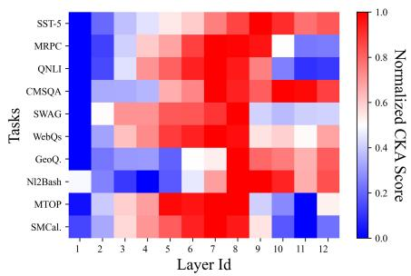

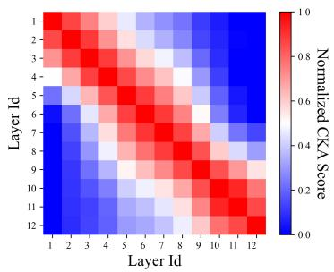  
Figure 1: Left: Top-10 retrieval accuracy using each of the twelve layers of the original BERT to retrieve positive exemplars to solve the proxy task of EPR across ten tasks. Different colors represent different layers. Top-10 accuracy refers to the probability of retrieving the positive exemplar in the top 10 predictions. Middle: CKA scores between twelve layers of original BERT (x-axis) and the final layer of BERT of EPR trained on ten tasks and the training-free BERT. Right: CKA scores between each layer of the original BERT. These CKA scores are min-max normalized for better visualization. We use GPT-Neo (Black et al., 2021) as the LLM.

The results are depicted in Fig. 1 (Middle). Each row reflects the CKA similarity between the EPR retriever and each layer of the original BERT for a specific task. The CKA distribution across various tasks exhibits significant diversity among different BERT layers. This finding supports $\mathcal { H } _ { 1 }$ that learning-based methods can adaptively aggregate multi-level (layer) similarities catering to different tasks. For instance, the results suggest that the exemplar retriever trained on Nl2Bash and SWAG tasks may prioritize low-level similarities, corroborating our experimental results where the BM25- based method outperforms higher-level semanticbased ones on these two datasets. Moreover, a similar validation using Llama 3 (Dubey et al., 2024) as the LLM is depicted in Fig. 5 to evince $\mathcal { H } _ { 1 }$ can generalize to more advanced LLMs.

## 3.2 Output Similarity ( 2)

When employing the learning-based paradigm to acquire better similarity measurements between exemplars and test cases for ICL, such mechanics are expected to perform well on unseen tasks, thus justifying the high cost of data collection. However, the sub-optimal generalization performance revealed by Ye et al. (2023) suggests that the exemplar retriever, trained on the proxy task, primarily learns task-specific information.

As data and training objectives can serve as a lens to analyze the behavior of neural network models, we first investigate the data generated for the proxy task involving positive and negative pairs, as shown in Fig. 2 (Left), which depicts the similarity between the input of positive/negative exemplars and the test case as well as the output of positive/negative exemplars and the test case. Specifically, for input similarity, we compute text similarity using sentence-transformers2 for all tasks, while we compute exact match for the first three classification tasks and text similarity for other tasks as output similarity. Let $( x , y ) , ( x ^ { + } , y ^ { + } ) , ( x ^ { - } , y ^ { - } )$ denote the test case and corresponding positive and negative exemplars. The results indicate that the similarity between $x ^ { + }$ and x is significantly higher than between x and x−, affirming the efficacy of input similarity-based exemplar selection methods. Moreover, it is noteworthy that the similarity between $y ^ { + }$ and $y$ is also markedly higher than that between y and $y ^ { \cdot }$ −.

Acknowledge that the training objective of the proxy task is to push the embedding of x and $x ^ { + }$ closer and push x and $x ^ { - }$ away through contrastive learning in the embedding space. As a result, during the training phase, demonstration exemplars with similar outputs will resemble each other in this space due to the strong correlation between $y$ and $y ^ { + }$ , which leads to a higher probability of selecting exemplars with outputs similar to the test case as prompts when the test case’s output is unknown. Therefore, we suggest that the success of learning-based approaches partly stems from the implicit prediction of the output of test cases during exemplar retrieval $( \mathcal { H } _ { 2 } )$ , which could be viewed as computing similarity of the joint distribution of input and output between the test case and exemplars.

After training on the proxy task, we utilize the EPR retriever to assess the similarity between the input of the test case and exemplars from the demonstration set to select top-K exemplars as prompts. To validate $\mathcal { H } _ { 2 }$ , we evaluate the retriever’s ability to learn the output similarity by computing the average similarity between the output of test cases and the retrieved exemplars. We compare

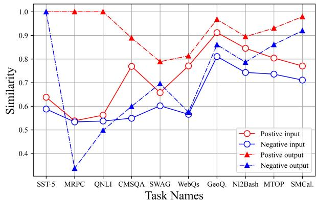

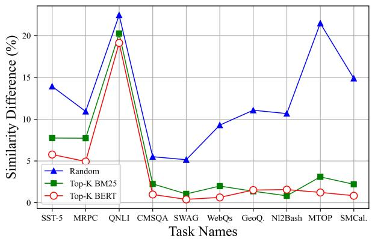  
Figure 2: Left: Comparison of similarity between the input/output of positive and negative demonstration examples and the input/output of the test case across ten tasks for EPR. Right: Difference between EPR and three taskagnostic demonstration exemplar selection methods in average similarity between the output of test case and retrieved exemplars. We use GPT-Neo (Black et al., 2021) as the LLM.

EPR trained using GPT-Neo against task-agostic methods (i.e., Random, Top-K BM25 and Top-K BERT), as depicted in Fig. 2 (Right). We compute the output similarity for all tasks in the same way as experiments in Fig. 2 (Left). The results show that the exemplar chosen by EPR has outputs more akin to the test case than other competitors, particularly in classification tasks where the output similarity can be well-captured by exact match. Similar validation is conducted for EPR with GPT2-XL and Llama 3 in Fig. 4 and Fig. 6, and these results align with the above findings obtained for GPT-Neo, thus providing consistent support for $\mathcal { H } _ { 2 }$

## 4 Methodology

Building on the above findings, we propose two simple yet effective alternatives for learning-based demonstration exemplar section methods, which do not require costly interaction with LLMs to construct the proxy task. Specially, we introduce 1) Multi-level Similarity Maximization (MLSM) leveraging an adaptive ensemble of task-agnostic layer-wise anchors from BERT to achieve better cross-task generalization given 1; 2) Test Task Fine-tuning (TTF) infusing task-specific information to the retriever to enhances performances for a specific task on the test task according to $\mathcal { H } _ { 2 }$

## 4.1 Multi-level Similarity Maximization (MLSM)

$\mathcal { H } _ { 1 }$ emphasizes that learning-based methods can adaptively integrate diverse similarities, which can be captured through different layers of a pretrained text encoder (e.g., BERT) from bottom to top. Inspired by ensemble learning (Polikar, 2009; Barber and Bishop, 1997; Zhang et al., 2022b), each layer can work as an expert for exemplar selection. The goal of MLSM is to integrate the insights from all experts by maximizing their agreement during the inference of LLMs.

However, as depicted in Fig. 1 (Right), each layer of BERT shows a high similarity to adjacent layers due to the residual design of transformers. Hence, we initially filter out redundant layers to avoid overfitting to the similarity of specific levels and reduce computational overhead. Specifically, given a task and its corresponding demonstration set , we sample a subset of unlabeled exemplars from and compute layer-wise CKA scores between every pair of BERT layers, forming a similarity matrix $\mathbf { S } \in \mathbb { R } ^ { 1 2 \times 1 2 }$ where $S _ { i , j }$ signifies the similarity between the i-th and j-th layers of BERT. We then employ an unsupervised K-means clustering algorithm to derive $n _ { l }$ clusters, maximizing the intra-cluster CKA score while minimizing the inter-cluster CKA score, and designate the central node in each cluster as the representative layer. Finally, we attain a set of refined layers, denoted as $L = \{ l _ { i } \} _ { i = 1 } ^ { n _ { l } }$ , as experts to represent the similarity at varying levels.

For a given test case $x ^ { t } ,$ , we first sample a mini training set $\mathcal { D } _ { p } ~ = ~ \{ x _ { j } \} _ { j = 1 } ^ { n _ { p } }$ and validation set $\mathcal { D } _ { v } = \{ x _ { j } \} _ { j = 1 } ^ { n _ { v } }$ from . Then, for each $l _ { i } \in L$ we compute the average of all token embeddings extracted from $l _ { i }$ as the representation of $x ^ { t }$ (denoted as $\mathbf { h } ^ { t } )$ and demonstration exemplars $x _ { j } \in \mathcal { D } _ { p }$ (denoted as $\mathbf { h } _ { j } )$ . Following this, we compute the cosine similarity between $x ^ { t }$ and each exemplar in $\mathcal { D } _ { p }$ as $\mathbf { r } _ { i } = [ \cos ( \mathbf { h } ^ { t } , \mathbf { h } _ { 1 } ) , . . . , \cos ( \mathbf { h } ^ { t } , \mathbf { h } _ { n _ { p } } ) ]$ , and normalize it to obtain the probability distribution of these exemplars via $\begin{array} { r } { \mathbf { y } _ { i } = \mathrm { s o f t x m a x } \big ( \frac { \mathbf { r } _ { i } } { \tau } \big ) } \end{array}$ for layer $l _ { i } ,$ where τ is the temperature parameter. Intuitively, such distribution can represent the ranking distribution of the demonstration exemplars when using the similarity level captured at $l _ { i }$ for retrieval. After collecting the output distribution of all experts in $L ,$ we aggregate them with learnable aggregation weights, denoted as $\textbf { w } \in \mathbb { R } ^ { n _ { l } }$ and get the ensembled prediction as $\hat { \mathbf { y } } = \operatorname { s o f t m a x } ( \frac { \sum _ { i = 1 } ^ { n _ { l } } w _ { i } \mathbf { r } _ { i } } { \tau } )$ where w is normalized before aggregation, i.e., $\begin{array} { r } { \sum _ { i } ^ { n _ { l } } w _ { i } = 1 } \end{array}$ . To encourage agreement among experts, we minimize the loss $\textstyle { \mathcal { L } } = - \sum _ { i = 1 } ^ { n _ { l } } { \hat { \mathbf { y } } } \cdot \mathbf { y } _ { i }$ The optimal w can be determined based on the loss on the validation set $\mathcal { D } _ { v }$ by an early stopping strategy to prevent overfitting.

While MLSM focuses on the online scenario, where only one test point is observed during inference to align with the real-world demand (Zhang et al., 2022a; VS et al., 2023; Zhang et al., 2022b), it can enable batch inference by updating w using a batch of test cases, thereby enhancing computational efficiency. Notably, MLSM focuses on general information regardless of specific tasks, thus catering to task-agnostic demands.

## 4.2 Test Task Fine-tuning (TTF)

$\mathcal { H } _ { 2 }$ posits that the learning-based demonstration retriever inherently acquires the output similarity between exemplars and test cases for one specific test task when training on the proxy task. However, this proxy task requires costly interactions with LLMs for each test task. To alleviate this issue, we propose TTF to infuse the output information to the retriever by fine-tuning it with additional modules customized for distinct tasks using labeled data from the demonstration set straightforwardly.

For convenience, let $f _ { \theta }$ denote the retriever and $q _ { \phi }$ denote the extra module, containing $\pmb \theta$ and $\phi$ as learnable paramters. For classification tasks, $q _ { \phi }$ will be instantiated through various classification heads. Given a test input x, assuming a linear classifier, the predication is derived by taking the argmax over the approximated probability distribution:

$$
\underset { y _ { i } } { \arg \operatorname* { m a x } } q _ { \phi } ( Y = y _ { i } | \mathbf { z } ) = \frac { \exp ( \mathbf { z } \cdot \phi _ { i } ) } { \sum _ { j } \exp ( \mathbf { z } \cdot \phi _ { \mathbf { j } } ) } ,\tag{2}
$$

where $\mathbf { z } = f _ { \pmb { \theta } } ( \boldsymbol { x } )$ and $\phi _ { i }$ is the i-th component of the weights $\phi$ corresponding to label $y _ { i }$ . As the prediction is determined by evaluating the distance between $\phi _ { i }$ and $\mathbf { z } ,$ test cases with a similar output are more likely to exhibit a smaller distance in the semantic space, as they are closer to their corresponding ϕ. Furthermore, previous research (Zhang et al., 2023b; Iwasawa and Matsuo, 2021) has leveraged z as a pseudo-prototype for each label to construct non-parameter classifiers, providing evidence that TTF can effectively encapsulate the input-output relationship in the wild classification application.

For generation tasks, while decoder-only frameworks are unsuitable for deriving sentence embeddings without prompting or fine-tuning (Muennighoff, 2022), we adopt the encoder-decoder architecture, where $q _ { \phi }$ is instantiated by the decoder and the retriever $f _ { \theta }$ works as the encoder. Since the decoder generates new tokens based on the encoder’s output, allowing the encoder’s output to capture pertinent input-output information naturally, we follow Ni et al. (2022) to use the average pooling of all token embeddings extracted from the last layer of the encoder to represent test cases and exemplars. Ultimately, TTF acquires the output similarity between demonstration exemplars and test cases by training the retriever on the demonstration set, thereby adapting to task-specific requirements.

## 5 Experiments

Datasets. We conduct experiments on ten datasets spanning seven categories of NLP tasks: sentiment analysis, paraphrase detection, natural language inference, commonsense reasoning, opendomain question answering, code generation and semantic parsing. As certain datasets lack a test set, we take the training split as the demonstration set and the validation split for evaluation across all datasets. The statistics of all datasets are listed in Table 1. A detailed description of these datasets and prompts to reproduce our experimental results are shown in Appendix B.1.

Baselines. In line with previous studies (Rubin et al., 2022; Ye et al., 2023; Li et al., 2023), we consider two baseline categories based on whether to use labeled data in the demonstration set: unsupervised and supervised methods. The unsupervised category includes RANDOM, which randomly selects exemplars from the demonstration set without repetition; TOP-K BM25, which employs BM25 (Robertson and Zaragoza, 2009) to retrieve the Top-K most similar exemplars based on low-level text similarity; TOP-K BERT, which generates text representations by averaging token embeddings from the final layer of BERT (Devlin et al., 2019) and retrieves the Top-K most similar exemplars based on semantic similarity; and TOP-K SBERT replaces BERT of TOP-K BERT with Sentence Bert (Reimers and Gurevych, 2019). The supervised category includes EPR (Rubin et al., 2022), which utilizes Top-K BM25 to generate demonstration candidates and scores them using LLMs to construct a proxy task, subsequently fine-tuning BERT in TOP-K BERT using this task; and CEIL (Ye et al., 2023), which employs EPR to generate demonstration sequence candidates, scores them using LLMs to construct a proxy task, and further fine-tunes BERT using this task. CEIL balances diversity and relevance using a trade-off parameter and searches for the optimal exemplar combination using Determinantal Point Processes (Kulesza and Taskar, 2011). While mainly utilizing BERT as the retriever of MLSM and TTF, we exploit T5 for TTF on the generation tasks because BERT-based encoder-decoder models cannot handle generation tasks effectively without sufficient training data due to the random initialization of external crossattention modules. The implementation detail of our methods and all baselines can be found in Appendix B.2.

Table 1: The statistics of ten datasets. We report the number of training instances after deduplicating.
<table><tr><td>Type</td><td>Dataset</td><td>Task</td><td>Train</td><td>Validation</td></tr><tr><td rowspan="5">Classification</td><td>SST-5 (Socher et al., 2013)</td><td>Sentiment Analysis</td><td>8,534</td><td>1,101</td></tr><tr><td>MRPC (Dolan et al., 2004)</td><td>Paraphrase Detection</td><td>3,668</td><td>408</td></tr><tr><td>QNLI (Wang et al., 2018)</td><td>Natural Language Inference</td><td>104,707</td><td>5,463</td></tr><tr><td>CMSQA (Talmor et al., 2019)</td><td>Commonsense Reasoning</td><td>9,740</td><td>1,221</td></tr><tr><td>HellaSwag (Zellers et al., 2019)</td><td>Commonsense Reasoning</td><td>52,611</td><td>20,006</td></tr><tr><td rowspan="5">Generation</td><td>WebQs (Berant et al., 2013)</td><td>Open-Domain QA</td><td>3,778</td><td>2,032</td></tr><tr><td>GeoQuery (Zelle and Mooney, 1996)</td><td>Code Generation</td><td>404</td><td>280</td></tr><tr><td>NI2Bash (Lin et al., 2018)</td><td>Code Generation</td><td>7,441</td><td>609</td></tr><tr><td>MTOP (Li et al., 2021)</td><td>Semantic Parsing</td><td>15,564</td><td>2,235</td></tr><tr><td>SMCalFlow (Andreas et al., 2020)</td><td>Semantic Parsing</td><td>102,491</td><td>14,751</td></tr></table>

Table 2: Main results on the classification task. indicates requiring costly interaction with LLMs, and denotes no such requirement.

<table><tr><td>Method</td><td>SST-5</td><td>MRPC</td><td>QNLI</td><td>CMSQA</td><td>SWAG</td><td> $\operatorname { A v g } .$ </td></tr><tr><td>Unsupervised</td><td></td><td></td><td></td><td></td><td></td><td></td></tr><tr><td>Random</td><td>28.61</td><td>65.93</td><td>55.08</td><td>42.34</td><td>41.39</td><td>46.67</td></tr><tr><td>Top-K BM25</td><td>32.06</td><td>65.93</td><td>60.11</td><td>35.79</td><td>43.35</td><td>47.45</td></tr><tr><td>Top-K SBERT</td><td>39.50</td><td>70.34</td><td>60.46</td><td>31.53</td><td>40.92</td><td>48.55</td></tr><tr><td>Top-K BERT</td><td>32.70</td><td>69.12</td><td>60.94</td><td>35.87</td><td>41.09</td><td>47.94</td></tr><tr><td>MLSM</td><td>33.15</td><td>69.87</td><td>65.02</td><td>37.26</td><td>41.49</td><td>49.36</td></tr><tr><td>Supervised</td><td></td><td></td><td></td><td></td><td></td><td></td></tr><tr><td>EPR</td><td>36.88</td><td>81.37</td><td>77.87</td><td>38.74</td><td>43.39</td><td>55.65</td></tr><tr><td> $\mathrm { C E I L ^ { \ast } }$ </td><td>37.69</td><td>77.94</td><td>80.58</td><td>38.90</td><td>43.84</td><td>55.79</td></tr><tr><td> $\mathrm { T T F ^ { \bullet } }$ </td><td>42.14</td><td>74.51</td><td>85.08</td><td>47.83</td><td>55.72</td><td>61.06</td></tr></table>

Experiment settings. Following Ye et al. (2023), we employ GPT-Neo (2.7B) (Black et al., 2021) as the main LLM in this study and conduct experiments on a smaller GPT-2 XL (Radford et al., 2019) (1.5B) and text-davinci-002 to verify the transferability of our methods. Furthermore, we extend our experiments to more advanced LLMs, including Llama 3 (8 B) and GPT-3.5, to support our hypotheses and findings in Appendix C. Due to computational constraints and different maximum context sizes among LMs, we restrict the number of in-context exemplars to 20. These exemplars are sorted based on their similarities to test cases in ascending order following prior practices (Rubin et al., 2022; An et al., 2023; Liu et al., 2022). For model evaluation, we compare the predicted output with ground truth for all methods and report Accuracy (Acc.) and Exact Match (EM) for classification and generation tasks, respectively.

Table 3: Main results on the generation tasks. indicates requiring costly interaction with LLMs, and  denotes no such requirement.
<table><tr><td>Method</td><td>WebQs</td><td>GeoQ.</td><td>NL2B.</td><td>MTOP</td><td>SMCal.</td><td>Avg.</td></tr><tr><td>Unsupervised</td><td></td><td></td><td></td><td></td><td></td><td></td></tr><tr><td>Random</td><td>3.79</td><td>25.36</td><td>31.27</td><td>3.98</td><td>3.70</td><td>13.62</td></tr><tr><td>Top-K BM25</td><td>14.17</td><td>65.71</td><td>58.81</td><td>49.66</td><td>44.02</td><td>46.48</td></tr><tr><td>Top-K BERT</td><td>14.17</td><td>64.64</td><td>52.45</td><td>51.36</td><td>44.76</td><td>45.48</td></tr><tr><td>Top-K SBERT</td><td>15.15</td><td>60.71</td><td>46.87</td><td>46.80</td><td>42.79</td><td>42.46</td></tr><tr><td>Top-K T5</td><td>16.24</td><td>70.35</td><td>43.29</td><td>53.02</td><td>42.83</td><td>45.14</td></tr><tr><td>MLSM</td><td>16.14</td><td>68.93</td><td>56.11</td><td>54.05</td><td>47.72</td><td>48.59</td></tr><tr><td>Supervised</td><td></td><td></td><td></td><td></td><td></td><td></td></tr><tr><td>EPR*</td><td>17.62</td><td>73.21</td><td>77.87</td><td>60.82</td><td>60.49</td><td>53.43</td></tr><tr><td> ${ \mathrm { C E I L } } ^ { \bullet }$ </td><td>17.08</td><td>70.71</td><td>53.66</td><td>63.40</td><td>56.30</td><td>52.23</td></tr><tr><td> $\mathrm { T T F } ^ { \bullet } ( \mathrm { T } 5 )$ </td><td>17.07</td><td>71.43</td><td>46.30</td><td>58.12</td><td>51.06</td><td>48.80</td></tr></table>

Main Results. We compare MLSM and TTF with existing unsupervised (using off-the-shelf models directly) and supervised learning-based baselines on classification tasks (Table 2) and generation tasks (Table 3). The results show that MLSM consistently outperforms all unsupervised baselines in most cases, achieving an average improvement of 1.42% over the best baseline, Top-K BERT (semantic similarity), on classification tasks, and an average improvement of 2.11% over the best baseline, Top-K BM25 (low-level similarity), on generation tasks. This suggests that while different similarities excel at different tasks, MLSM can adaptively integrate multi-level similarities for various tasks by updating the aggregation weight of the experts for each test case, thus providing evidence for $\mathcal { H } _ { 1 }$ . Moreover, supervised methods generally show a clear advantage over MLSM across all tasks, highlighting the benefit of incorporating task-specific information into the retriever. Notably, TTF, despite avoiding costly integration with LLMs, surpasses both EPR and CEIL, achieving over 5% absolute improvements on classification tasks, and consistently outperforms MLSM across all generation tasks except NL2Bash. It suggests that test task fine-tuning can be a more effective alternative to constructing proxy tasks in resourcelimited scenarios, further validating $\mathcal { H } _ { 2 } .$ . However, TTF underperforms compared to EPR and CEIL on some generation tasks likely due to inherent limitations of the encoder-decoder framework in retrieval tasks, particularly in identifying which parts of the model capture relevant input-output information. For instance, Top-K T5 performs worse than Top-K BERT regarding average accuracy across all generation tasks.

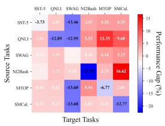

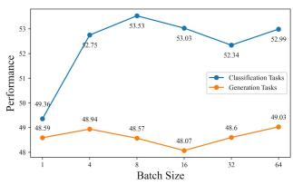  
Figure 3: Left: Comparison of transferability between EPR and MLSM. We show the absolute improvement of MLSM over EPR. Right: Comparisons of different batchsizes for MLSM.

Transfer across Tasks for MLSM. We compare EPR and MLSM on cross-task experiments, where EPR is trained on a source task and transferred to a target task, as depicted in Fig. 3 (Left). The results show that EPR generally performs worse than MLSM, particularly when transferring between classification and generation tasks. It suggests that learning-based exemplar selection methods overfit task-specific features when trained on the proxy task, making it challenging to justify the high cost of data collection. In contrast, MLSM is a practical solution for task-agnostic demands, as it only leverages information from the test case to adapt to different tasks during LLM inference.

Ablation of Batchsize for MLSM. While MLSM assumes only a single test case is available for learning the aggregation weight w of different similarity levels, we perform an ablation study to assess the impact of increasing batchsize in Fig.

Table 4: Results of cross-LLM transferability validation. We show the absolute improvement of TTF and MLSM over Top-K BERT.
<table><tr><td></td><td colspan="5">TTF</td><td colspan="5">MLSM</td></tr><tr><td>LLM</td><td>SST-5</td><td>MRPC</td><td>QNLI</td><td>CMSQA</td><td>Avg.</td><td>SST-5</td><td>MRPC</td><td>GeoQ.</td><td>NL2Bash</td><td>Avg.</td></tr><tr><td>GPT-2 XL (1.5B)</td><td>3.54</td><td>0.00</td><td>5.35</td><td>6.38</td><td>3.82</td><td>1.54</td><td>0.00</td><td>1.07</td><td>4.57</td><td>1.74</td></tr><tr><td>GPT NEO (2.7B)</td><td>9.45</td><td>5.39</td><td>24.14</td><td>11.96</td><td>12.73</td><td>0.05</td><td>0.75</td><td>4.29</td><td>3.66</td><td>2.29</td></tr><tr><td>text-davinci-002</td><td>3.27</td><td>1.51</td><td>18.52</td><td>1.15</td><td>6.11</td><td>1.82</td><td>1.47</td><td>3.21</td><td>3.02</td><td>2.38</td></tr></table>

3 (Right). The results indicate that MLSM generally benefits from a larger batch size, especially on classification tasks, showing over 4% average improvements when the batchsize equals 8. This improvement can be because test cases in the same batch tend to share similar patterns of multi-level analogs (i.e., similar w), further suggesting that multi-level analogs are versatile features for selecting good demonstration exemplars.

Transfer across LLMs. We validate the versatility of TTF and MLSM on GPT-2 XL, GPT-$\mathrm { N E O , }$ and text-davinci-002 in Table 4. The results indicate that both methods can enhance ICL performance across different LLMs. TTF consistently outperforms MLSM, verifying the effectiveness of acquiring task-specific output similarity between exemplars and test cases. However, TTF exhibits higher variance in performance across different LLMs than MLSM, suggesting different LLMs have varying abilities to exploit exemplars with similar outputs to the test case. Additionally, the better performance of TTF on GPT-NEO compared to text-davinci-002 implies that the latter’s stronger ability may make it more resilient to prompt choices.

## 6 Conclusion

In this work, we delve into the mechanism of learning-based demonstration exemplar selection methods. We speculate the advantages of these methods stem from their ability to integrate similarities of different levels for exemplar selection $( \mathcal { H } _ { 1 } )$ and their capacity to choose exemplars with similar outputs to the test case $( \mathcal { H } _ { 2 } )$ . Motivated by these hypotheses, we introduce two simple but effective exemplar section methods, MLSM and TTF, tailored to task-agnostic and task-specific demands without costly interactions with LLMs. Quantitative validations and the effectiveness of both methods provide substantial evidence for $\mathcal { H } _ { 1 }$ and $\mathcal { H } _ { 2 }$ In summary, our work offers insights into more efficient LLM deployment in practical applications and may benefit transparent research on exemplar selection methods and ICL.

## Limitations.

In this section, we discuss two technical limitations. Combination of MLSM and TTF: Based on our two findings related to the working mechanism of learning-based exemplar section methods, we propose two cost-effective selection approaches: MSLM maximizing the agreement across the similarities of different levels and TTF fine-tuning a retriever with labeled data from the demonstration set to learn task-specific similarity between the output of exemplars and test cases. While MSLM and TTF excel in task-agnostic and task-specific scenarios, combining them could potentially further enhance task-specific performance. To investigate this, we replace the original BERT in MSLM using the trained retriever in TTF and conduct experiments on five classification tasks using the same implementation detailed in Appendix B.2. As shown in Table 5, although the combination of both methods significantly outperforms MSLM, it falls short of TTF by over 6%. This performance drop suggests that the similarity between the output of exemplars and test cases is superior to similarities from other layers, and while $\mathrm { T F } \mathrm { s }$ final layer effectively captures such task-specific output similarity, integrating it with other sub-optimal ones could introduce noise, negatively impacting the exemplar selection for ICL.

Better Implementation of $\mathcal { H } _ { 2 }$ than TTF: In $\mathcal { H } _ { 2 }$ we empirically find that the success of learningbased methods partially stems from their ability to choose the demonstration exemplar with similar output to the test case. We propose TTF to simulate such output-based similarity by implicitly learning task-specific information from labeled demonstration exemplars using different task heads. Despite showing promise on classification tasks, TTF is ineffective for generation tasks compared to EPR and CEIL. We attribute this to 1) the difficulty in identifying model components that capture effective input-output relationships in a decoder-encoder framework and 2) the need for extensive data to fine-tune generation task heads or more advanced pre-trained models.

To further explore $\mathcal { H } _ { 2 } ,$ we try two approaches: First, akin to EPR, we select the exemplar with the most similar output to the test case as a positive pair and the most dissimilar one as a negative pair and then fine-tune a retriever. However, this led to a performance collapse, likely due to the complexity of modeling nuanced input-output similarities for generation tasks. Secondly, building upon TTF, we generate outputs using T5 for each test case and compute similarities between inputs and outputs of demonstration exemplars and test cases. Finally, we integrate these similarities with a predefined ratio (0.9 and 0.1), yielding an average improvement of 1% over TTF. However, this method requires first generating answers for test cases, making it less efficient than using input embedding for exemplar retrieval. Additionally, recent exemplar selection methods (An et al., 2023; Zhou et al., 2024; Sun et al., 2024) that use LLMs to briefly describe the reasoning process and compute the similarity between such descriptions of exemplars and test case for retrieval, can be seen as an instantiation of $\mathcal { H } _ { 2 }$ , as they also implicitly model the input-output relationship.

Table 5: Experimental results for the combination of MLSM and TTF
<table><tr><td>Method</td><td>SST-5</td><td>MRPC</td><td>QNLI</td><td>CMSQA</td><td>SWAG</td><td>Avg.</td></tr><tr><td>MLSM</td><td>33.15</td><td>69.87</td><td>65.02</td><td>37.26</td><td>41.49</td><td>49.36</td></tr><tr><td>TTF</td><td>42.14</td><td>74.51</td><td>85.08</td><td>47.83</td><td>55.72</td><td>61.06</td></tr><tr><td>TTF and MLSM</td><td>36.14</td><td>71.07</td><td>65.31</td><td>45.61</td><td>50.27</td><td>53.69</td></tr></table>

In summary, the main contribution of our work lies in suggesting and validating two hypotheses regarding learning-based exemplar selection methods. While MSLM and TTF show advantages over existing demonstration exemplar section methods, they are just two possible implementations of our findings. More advanced exemplar selection methods could be developed based on these insights. As a result, we advocate for further research in this area to enhance the efficient deployment and transparency of LLMs and ICL.

## Ethics Statement

This paper adheres to the ACM Code of Ethics and Professional Conduct. This work presents two key findings about the working mechanism of learningbased demonstration selection and two methods for low-cost exemplar selection, which do not pose any societal harm. All datasets used are publicly available. We will release our code following the licenses of any utilized artifacts.

## Acknowledgment

This research is supported by Sichuan Science and Technology Program 2025ZNSFSC0511, RGC-RMGS 9229106 and the University Grants Committee (UGC)’s Fund for Innovative Technologyin-Education (FITE)

## References

Shengnan An, Bo Zhou, Zeqi Lin, Qiang Fu, Bei Chen, Nanning Zheng, Weizhu Chen, and Jian-Guang Lou. 2023. Skill-based few-shot selection for in-context learning. In EMNLP, pages 13472–13492. Association for Computational Linguistics.

Jacob Andreas, John Bufe, David Burkett, Charles Chen Jr, Josh Clausman, Jean Crawford, Kate Crim, Jordan DeLoach, Leah Dorner, Jason Eisner, et al. 2020. Task-oriented dialogue as dataflow synthesis. Transactions of the Association for Computational Linguistics, 8:556–571.

David Barber and Christopher M. Bishop. 1997. Ensemble learning for multi-layer networks. In NIPS, pages 395–401. The MIT Press.

Jonathan Berant, Andrew Chou, Roy Frostig, and Percy Liang. 2013. Semantic parsing on Freebase from question-answer pairs. In Proceedings of the 2013 Conference on Empirical Methods in Natural Language Processing, pages 1533–1544, Seattle, Washington, USA. Association for Computational Linguistics.

Sid Black, Leo Gao, Phil Wang, Connor Leahy, and Stella Biderman. 2021. GPT-Neo: Large Scale Autoregressive Language Modeling with Mesh-Tensorflow.

Tom B. Brown, Benjamin Mann, Nick Ryder, Melanie Subbiah, Jared Kaplan, Prafulla Dhariwal, Arvind Neelakantan, Pranav Shyam, Girish Sastry, Amanda Askell, Sandhini Agarwal, Ariel Herbert-Voss, Gretchen Krueger, Tom Henighan, Rewon Child, Aditya Ramesh, Daniel M. Ziegler, Jeffrey Wu, Clemens Winter, Christopher Hesse, Mark Chen, Eric Sigler, Mateusz Litwin, Scott Gray, Benjamin Chess, Jack Clark, Christopher Berner, Sam McCandlish, Alec Radford, Ilya Sutskever, and Dario Amodei. 2020. Language models are few-shot learners. In NeurIPS.

Xuanting Chen, Junjie Ye, Can Zu, Nuo Xu, Rui Zheng, Minlong Peng, Jie Zhou, Tao Gui, Qi Zhang, and Xuanjing Huang. 2023. How robust is gpt-3.5 to predecessors? a comprehensive study on language understanding tasks. arXiv preprint arXiv:2303.00293.

Jacob Devlin, Ming-Wei Chang, Kenton Lee, and Kristina Toutanova. 2019. BERT: pre-training of deep bidirectional transformers for language understanding. In NAACL-HLT (1), pages 4171–4186. Association for Computational Linguistics.

William B Dolan, Chris Quirk, and Chris Brockett. 2004. Unsupervised construction of large paraphrase corpora: Exploiting massively parallel news sources. In COLING 2004: Proceedings of the 20th International Conference on Computational Linguistics, pages 350–356.

Abhimanyu Dubey, Abhinav Jauhri, Abhinav Pandey, Abhishek Kadian, Ahmad Al-Dahle, Aiesha Letman,

Akhil Mathur, Alan Schelten, Amy Yang, Angela Fan, et al. 2024. The llama 3 herd of models. arXiv preprint arXiv:2407.21783.

Tianyu Gao, Adam Fisch, and Danqi Chen. 2021. Making pre-trained language models better few-shot learners. In ACL/IJCNLP (1), pages 3816–3830. Association for Computational Linguistics.

Danny Halawi, Jean-Stanislas Denain, and Jacob Steinhardt. 2023. Overthinking the truth: Understanding how language models process false demonstrations. arXiv preprint arXiv:2307.09476.

Fabian Caba Heilbron, Victor Escorcia, Bernard Ghanem, and Juan Carlos Niebles. 2015. Activitynet: A large-scale video benchmark for human activity understanding. In 2015 IEEE conference on computer vision and pattern recognition (CVPR), pages 961– 970. IEEE.

Yusuke Iwasawa and Yutaka Matsuo. 2021. Test-time classifier adjustment module for model-agnostic domain generalization. In NeurIPS, pages 2427–2440.

Ganesh Jawahar, Benoît Sagot, and Djamé Seddah. 2019a. What does BERT learn about the structure of language? In ACL (1), pages 3651–3657. Association for Computational Linguistics.

Ganesh Jawahar, Benoît Sagot, and Djamé Seddah. 2019b. What does bert learn about the structure of language? In ACL 2019-57th Annual Meeting of the Association for Computational Linguistics.

Simon Kornblith, Mohammad Norouzi, Honglak Lee, and Geoffrey E. Hinton. 2019. Similarity of neural network representations revisited. In ICML, volume 97 of Proceedings of Machine Learning Research, pages 3519–3529. PMLR.

Jannik Kossen, Tom Rainforth, and Yarin Gal. 2023. In-context learning in large language models learns label relationships but is not conventional learning. CoRR, abs/2307.12375.

Alex Kulesza and Ben Taskar. 2011. k-dpps: Fixed-size determinantal point processes. In ICML.

Haoran Li, Abhinav Arora, Shuohui Chen, Anchit Gupta, Sonal Gupta, and Yashar Mehdad. 2021. Mtop: A comprehensive multilingual task-oriented semantic parsing benchmark. In Proceedings of the 16th Conference of the European Chapter of the Association for Computational Linguistics: Main Volume, pages 2950–2962.

Xiaonan Li, Kai Lv, Hang Yan, Tianyang Lin, Wei Zhu, Yuan Ni, Guotong Xie, Xiaoling Wang, and Xipeng Qiu. 2023. Unified demonstration retriever for in-context learning. In Proceedings of the 61st Annual Meeting of the Association for Computational Linguistics (Volume 1: Long Papers), pages 4644–4668, Toronto, Canada. Association for Computational Linguistics.

Xiaonan Li and Xipeng Qiu. 2023. Finding support examples for in-context learning. In EMNLP (Findings), pages 6219–6235. Association for Computational Linguistics.

Xi Victoria Lin, Chenglong Wang, Luke Zettlemoyer, and Michael D. Ernst. 2018. Nl2bash: A corpus and semantic parser for natural language interface to the linux operating system. In LREC. European Language Resources Association (ELRA).

Jiachang Liu, Dinghan Shen, Yizhe Zhang, Bill Dolan, Lawrence Carin, and Weizhu Chen. 2022. What makes good in-context examples for gpt-3? In DeeLIO@ACL, pages 100–114. Association for Computational Linguistics.

Yao Lu, Max Bartolo, Alastair Moore, Sebastian Riedel, and Pontus Stenetorp. 2022. Fantastically ordered prompts and where to find them: Overcoming fewshot prompt order sensitivity. In ACL (1), pages 8086–8098. Association for Computational Linguistics.

Xiaofei Ma, Zhiguo Wang, Patrick Ng, Ramesh Nallapati, and Bing Xiang. 2019. Universal text representation from BERT: an empirical study. CoRR, abs/1910.07973.

Aristides Milios, Siva Reddy, and Dzmitry Bahdanau. 2023. In-context learning for text classification with many labels. CoRR, abs/2309.10954.

Niklas Muennighoff. 2022. SGPT: GPT sentence embeddings for semantic search. CoRR, abs/2202.08904.

Jianmo Ni, Gustavo Hernández Ábrego, Noah Constant, Ji Ma, Keith B. Hall, Daniel Cer, and Yinfei Yang. 2022. Sentence-t5: Scalable sentence encoders from pre-trained text-to-text models. In ACL (Findings), pages 1864–1874. Association for Computational Linguistics.

Catherine Olsson, Nelson Elhage, Neel Nanda, Nicholas Joseph, Nova DasSarma, Tom Henighan, Ben Mann, Amanda Askell, Yuntao Bai, Anna Chen, Tom Conerly, Dawn Drain, Deep Ganguli, Zac Hatfield-Dodds, Danny Hernandez, Scott Johnston, Andy Jones, Jackson Kernion, Liane Lovitt, Kamal Ndousse, Dario Amodei, Tom Brown, Jack Clark, Jared Kaplan, Sam McCandlish, and Chris Olah. 2022. In-context learning and induction heads. CoRR, abs/2209.11895.

Robi Polikar. 2009. Ensemble learning. Scholarpedia, 4(1):2776.

Alec Radford, Jeff Wu, Rewon Child, David Luan, Dario Amodei, and Ilya Sutskever. 2019. Language models are unsupervised multitask learners.

Gautam Reddy. 2023. The mechanistic basis of data dependence and abrupt learning in an in-context classification task. CoRR, abs/2312.03002.

Nils Reimers and Iryna Gurevych. 2019. Sentence-bert: Sentence embeddings using siamese bert-networks. arXiv preprint arXiv:1908.10084.

Stephen Robertson and Hugo Zaragoza. 2009. The probabilistic relevance framework: Bm25 and beyond. Foundations and Trends in Information Retrieval, 3:333–389.

Anna Rohrbach, Atousa Torabi, Marcus Rohrbach, Niket Tandon, Christopher Pal, Hugo Larochelle, Aaron Courville, and Bernt Schiele. 2017. Movie description. International Journal of Computer Vision, 123:94–120.

Ohad Rubin, Jonathan Herzig, and Jonathan Berant. 2022. Learning to retrieve prompts for in-context learning. In NAACL-HLT, pages 2655–2671. Association for Computational Linguistics.

Richard Socher, Alex Perelygin, Jean Wu, Jason Chuang, Christopher D. Manning, Andrew Y. Ng, and Christopher Potts. 2013. Recursive deep models for semantic compositionality over a sentiment treebank. In EMNLP, pages 1631–1642. ACL.

Hongjin Su, Jungo Kasai, Chen Henry Wu, Weijia Shi, Tianlu Wang, Jiayi Xin, Rui Zhang, Mari Ostendorf, Luke Zettlemoyer, Noah A. Smith, and Tao Yu. 2023. Selective annotation makes language models better few-shot learners. In ICLR. OpenReview.net.

Hao Sun, Yong Jiang, Bo Wang, Yingyan Hou, Yan Zhang, Pengjun Xie, and Fei Huang. 2024. Retrieved in-context principles from previous mistakes. arXiv preprint arXiv:2407.05682.

Alon Talmor, Jonathan Herzig, Nicholas Lourie, and Jonathan Berant. 2019. CommonsenseQA: A question answering challenge targeting commonsense knowledge. In Proceedings of the 2019 Conference of the North American Chapter of the Association for Computational Linguistics: Human Language Technologies, Volume 1 (Long and Short Papers), pages 4149–4158, Minneapolis, Minnesota. Association for Computational Linguistics.

Jonathan Tonglet, Manon Reusens, Philipp Borchert, and Bart Baesens. 2023. SEER : A knapsack approach to exemplar selection for in-context hybridqa. In EMNLP, pages 13569–13583. Association for Computational Linguistics.

Anton Voronov, Lena Wolf, and Max Ryabinin. 2024. Mind your format: Towards consistent evaluation of in-context learning improvements. CoRR, abs/2401.06766.

Vibashan VS, Poojan Oza, and Vishal M Patel. 2023. Towards online domain adaptive object detection. In Proceedings of the IEEE/CVF Winter Conference on Applications of Computer Vision, pages 478– 488.

Alex Wang, Amanpreet Singh, Julian Michael, Felix Hill, Omer Levy, and Samuel Bowman. 2018. Glue: A multi-task benchmark and analysis platform for natural language understanding. In Proceedings of the 2018 EMNLP Workshop BlackboxNLP: Analyzing and Interpreting Neural Networks for NLP, pages 353–355.

Lean Wang, Lei Li, Damai Dai, Deli Chen, Hao Zhou, Fandong Meng, Jie Zhou, and Xu Sun. 2023. Label words are anchors: An information flow perspective for understanding in-context learning. In EMNLP, pages 9840–9855. Association for Computational Linguistics.

Adina Williams, Nikita Nangia, and Samuel R Bowman. 2017. A broad-coverage challenge corpus for sentence understanding through inference. arXiv preprint arXiv:1704.05426.

Tomer Wolfson, Mor Geva, Ankit Gupta, Matt Gardner, Yoav Goldberg, Daniel Deutch, and Jonathan Berant. 2020. Break it down: A question understanding benchmark. Transactions of the Association for Computational Linguistics, 8:183–198.

Jianhao Yan, Jin Xu, Chiyu Song, Chenming Wu, Yafu Li, and Yue Zhang. 2023. Understanding in-context learning from repetitions. CoRR, abs/2310.00297.

Jiacheng Ye, Zhiyong Wu, Jiangtao Feng, Tao Yu, and Lingpeng Kong. 2023. Compositional exemplars for in-context learning. In ICML, volume 202 of Proceedings of Machine Learning Research, pages 39818–39833. PMLR.

Peiwen Yuan, Shaoxiong Feng, Yiwei Li, Xinglin Wang, Yueqi Zhang, Chuyi Tan, Boyuan Pan, Heda Wang, Yao Hu, and Kan Li. 2024. Focused large language models are stable many-shot learners. arXiv preprint arXiv:2408.13987.

John M. Zelle and Raymond J. Mooney. 1996. Learning to parse database queries using inductive logic programming. In AAAI/IAAI, pages 1050–1055, Portland, OR. AAAI Press/MIT Press.

Rowan Zellers, Ari Holtzman, Yonatan Bisk, Ali Farhadi, and Yejin Choi. 2019. Hellaswag: Can a machine really finish your sentence? In Proceedings of the 57th Annual Meeting of the Association for Computational Linguistics.

Marvin Zhang, Sergey Levine, and Chelsea Finn. 2022a. Memo: Test time robustness via adaptation and augmentation. Advances in Neural Information Processing Systems, 35:38629–38642.

Shaokun Zhang, Xiaobo Xia, Zhaoqing Wang, Ling-Hao Chen, Jiale Liu, Qingyun Wu, and Tongliang Liu. 2023a. IDEAL: influence-driven selective annotations empower in-context learners in large language models. CoRR, abs/2310.10873.

Yifan Zhang, Bryan Hooi, Lanqing Hong, and Jiashi Feng. 2022b. Self-supervised aggregation of diverse experts for test-agnostic long-tailed recognition. In NeurIPS.

Yifan Zhang, Bryan Hooi, Lanqing Hong, and Jiashi Feng. 2022c. Self-supervised aggregation of diverse experts for test-agnostic long-tailed recognition. In Advances in Neural Information Processing Systems 35: Annual Conference on Neural Information Processing Systems 2022, NeurIPS 2022, New Orleans, LA, USA, November 28 - December 9, 2022.

Yifan Zhang, Xue Wang, Kexin Jin, Kun Yuan, Zhang Zhang, Liang Wang, Rong Jin, and Tieniu Tan. 2023b. Adanpc: Exploring non-parametric classifier for test-time adaptation. In ICML, volume 202 of Proceedings of Machine Learning Research, pages 41647–41676. PMLR.

Anhao Zhao, Fanghua Ye, Jinlan Fu, and Xiaoyu Shen. 2024. Unveiling in-context learning: A coordinate system to understand its working mechanism. arXiv preprint arXiv:2407.17011.

Zihao Zhao, Eric Wallace, Shi Feng, Dan Klein, and Sameer Singh. 2021. Calibrate before use: Improving few-shot performance of language models. In ICML, volume 139 of Proceedings of Machine Learning Research, pages 12697–12706. PMLR.

Han Zhou, Xingchen Wan, Lev Proleev, Diana Mincu, Jilin Chen, Katherine A. Heller, and Subhrajit Roy. 2023. Batch calibration: Rethinking calibration for in-context learning and prompt engineering. CoRR, abs/2309.17249.

Hanzhang Zhou, Junlang Qian, Zijian Feng, Hui Lu, Zixiao Zhu, and Kezhi Mao. 2024. Llms learn task heuristics from demonstrations: A heuristic-driven prompting strategy for documentlevel event argument extraction. In Proceedings of the 62nd Annual Meeting of the Association for Computational Linguistics (Volume 1: Long Papers), ACL 2024, Bangkok, Thailand, August 11-16, 2024, pages 11972–11990.

## A Outline of the Appendix

The appendix is organized as follows: Appendix B provides descriptions of the datasets used in our experiments, the prompts for reproducing our work, and the implementation details for all baselines as well as our proposed MLSM and TTF methods. Appendix C examines the generalization of our findings and methods to more advanced LLMs. Appendix D offers qualitative validation of $\mathcal { H } _ { 1 }$ and $\mathcal { H } _ { 2 }$ by connecting our results with existing explanatory work on ICL. Appendix E presents the statistical significance of our proposed methods. Appendix F outlines the theoretical foundation of MLSM and TTF, while Appendix G analyzes the aggregation weights in MLSM. Lastly, Appendix H discusses the running efficiency of both methods and Appendix I provide more ablation study of our methods.

## B Experimental Setup

## B.1 Datasets

Following existing work (Ye et al., 2023), we conduct experiments on five classification tasks and five generation tasks3. While we advise readers to refer to the detail of each dataset in the original work (Ye et al., 2023), we provide the prompts and examples for each dataset in Table 6 and offer a detailed description of each dataset below for completeness.

SST-5 (Socher et al., 2013) is a sentiment classification benchmark containing five fine-grained classes including ‘very positive’, ‘positive’ ‘neutral’, ‘negative’, and ‘very negative’.

MRPC (Dolan et al., 2004) is a corpus of sentence pairs automatically extracted from online news sources, with human annotations for whether the sentences in the pair are semantically equivalent.

MNLI (Williams et al., 2017) is a crowdsourced collection of sentence pairs with textual entailment annotations. Given a premise sentence and a hypothesis sentence, the task is to predict whether the premise entails the hypothesis (entailment), contradicts the hypothesis (contradiction), or neither (neutral).

QNLI (Wang et al., 2018) is a questionanswering dataset consisting of question-paragraph pairs, and the task is to determine whether the context sentence contains the answer to the question.

CMSQA (Talmor et al., 2019) (short for CommonsenseQA) is a multiple-choice questionanswering dataset that requires different types of commonsense knowledge. The task is to predict the correct answer out of five provided candidate answers.

HellaSwag (Zellers et al., 2019) is a large-scale dataset of grounded commonsense reasoning. Each question has four candidate answers: a video caption from ActivityNet Captions (Heilbron et al., 2015) and the Large Scale Movie Description Challenge (Rohrbach et al., 2017). The three incorrect answers are adversarially generated and humanvalidated to deceive machines. The correct answer is the actual video caption for the subsequent occurrence in the video.

WebQs (Berant et al., 2013) is question-answer pairs obtained from the web. The questions are selected using Google Suggest API, and the answers are entities in Freebase.

Nl2Bash (Lin et al., 2018) is a dataset for the problem of mapping English sentences to Bash commands. The corpus consists of text–command pairs, where each pair consists of a Bash command scraped from the web and an expert-generated natural language description.

GeoQuery (Zelle and Mooney, 1996) contains a parallel corpus of 880 English questions about US geography paired with Prolog queries.

Break (Wolfson et al., 2020) is a dataset that maps complex natural language questions into a language-based meaning representation. The question is decomposed into an ordered list of atomic steps used as the target sequence. We use the lowlevel Break subset following (Rubin et al., 2022).

MTOP (Li et al., 2021) is a multilingual taskoriented semantic parsing dataset covering six languages and 11 domains. The target commands are complex queries featuring nested intent-slot prediction. Similar to past work (Rubin et al., 2022), we use the English subset of MTOP.

SMCalFlow (Andreas et al., 2020) is a large dialogue dataset featuring natural conversations about tasks involving calendars, weather, places, and people. The meaning representation is an executable dataflow program featuring API calls, function composition, and complex constraints.

Table 6: Datasets with corresponding prompts and examples used in the experiments.
<table><tr><td>Dataset</td><td>Prompt</td><td>Example</td></tr><tr><td>SST-5</td><td>{input} It is {output}</td><td>Input: this is a stunning film , a one-of-a-kind tour de force Output: very positive</td></tr><tr><td>MRPC</td><td>{input1 } Can we say &quot;{input2} &quot;? {output}</td><td>Input1: The company didn &#x27;t detail the costs of the replacement and repairs. Input2: But company officials expect the costs of the replacement work to run into the millions of dollars . Output: No</td></tr><tr><td>MNLI</td><td>{input1 } Can we say &quot;{input2} &quot;? {output}</td><td>Input1: yeah i know and i did that all through college and it worked too Input2: I did that all through college but it never worked Output: No</td></tr><tr><td>QNLI</td><td>{input1 } Can we know &quot;{input2} &quot;? {output}</td><td>Input1: As of that day, the new constitution heralding the Second Republic came into force. Input2: What came into force after the new constitution was herald? Output: Yes</td></tr><tr><td>CMSQA</td><td>{input} {output}</td><td>Input: Sammy wanted to go to where the people were. Where might he go? Output: populated areas</td></tr><tr><td>HellaSwag</td><td>{input} {output}</td><td>Input: Members of the procession walk down the street holding small horn brass instruments. A drum line Output: passes by walking down the street playing their instruments</td></tr><tr><td>WebQs</td><td>{input} {output}</td><td>Input: what does jamaican people speak? Output: Jamaican Creole English Language</td></tr><tr><td>GeoQuery</td><td>{input}\t{output}</td><td>Input: what is the population of montana ? Output: answer(A,(population(B,A),const(B,stateid(montana))))</td></tr><tr><td>NL2Bash</td><td>{input}\t{output}</td><td>Input: find all executable files in /home directory. Output: find /home -type f -perm /a=x</td></tr><tr><td>Break</td><td>{input}\t{output}</td><td>Input: How many large metallic items are there? Output: 1#) return items 2#) return #1 that are large 3#) return #2 that are metallic 4#) return number of #3</td></tr><tr><td>Mtop</td><td>{input}\t{output}</td><td>Input: Resume the timer in 10 seconds Output: [IN:RESUME TIMER [SL:METHOD TIMER timer ] [SL:DATE TIME in 10 seconds ]]</td></tr><tr><td>SMCalFlow</td><td>{input}\t{output}</td><td>Input: Can you create me a new meeting on thursday morning? Output: (Yield (CreateCommitEventWrapper (CreatePreflightEventWrapper (Event.start_? (DateTimeConstraint (Morning) (NextDOW (Thursday)))))))</td></tr></table>

## B.2 Implementation Details

We employ the implementation4 from Ye et al. (2023) for all baselines. Specifically, for EPR and CEIL, we limit the maximum instances in the proxy task to $4 , 0 0 0 \left( \left| \mathcal { D } ^ { s } \right| = 4 , 0 0 0 \right)$ and sample 50 candidates for each instance to create positive and negative pairs. It is worth noting that collecting these data for both methods (i.e., 200,000 queries to LLMs) is pretty expensive and time-consuming, especially for CEIL, where each candidate sequence involves 16 exemplars.

For our proposed MLSM, we randomly sample 1,000 examples $( n _ { c } = 1 , 0 0 0 )$ from the demonstration set $\mathcal { D }$ to compute layer-wise CKA scores and obtain three representative layers through clustering $( n _ { l } = 3 )$ . Then, we randomly sample 256 and 64 examples $( n _ { t } ~ = ~ 2 5 6$ and $n _ { v } = 6 4 )$ for each test case from as mini training and validation sets, respectively. The temperature of the softmax function is set to 0.01 $( \tau = 0 . 0 1 )$ . We utilize Adam optimizer with batch size 32 and learning rate 0.1 to learn the aggregation weight w in fewer epochs.

For our proposed TTF, we instantiate $f _ { \theta }$ with BERT and $q _ { \phi }$ with different task heads for classification tasks. Concretely, for SST-5, MRPC and QNLI, we utilize the sequential classification head5 and train the model using Adam optimizer with batchsize 32, learning rate 5e-4 and weight decay 1e-4. For SWAG and CMSQA, we adopt the multichoice head6 and also train the model using Adam optimizer with batchsize 8, learning rate 5e-4 and weight decay 1e-4. Additionally, we instantiate $f _ { \theta }$ with BERT and $q _ { \phi }$ with decoder for generation tasks. We utilize Adam optimizer with batchsize 16 for all tasks, learning rate 5e-5. Especially for TTF (T5), we instantiate $f _ { \theta }$ and $q _ { \phi }$ using the encoder and decoder of $\mathrm { T } 5 ^ { 7 }$ and utilize to Adam optimizer with batchsize 8, learning rate 4e-5 and weight decay 0.01.

Furthermore, we conducted all experiments for EPR and CEIL on two NVIDIA A100 GPUs (40GB), while the remaining experiments were performed on two NVIDIA V100 GPUs (30GB). Each main experiment is repeated three times using different random seeds to mitigate the effects of randomness.

## C Experiments on Advanced LLMs

Table 7: Main results of MLSM and TTF on four datasets when using Llama 3 (8B) as the main LLM. Llama 3 (8B) performs worse on NL2Bash because of the repetitive generation
<table><tr><td>Method</td><td>MRPC</td><td>CMSQA</td><td>SWAG</td><td>NL2B.</td><td>Avg.</td><td>Avg. (w/o NL2B.)</td></tr><tr><td>Random</td><td>67.65</td><td>68.39</td><td>74.67</td><td>9.89</td><td>55.15</td><td>70.23</td></tr><tr><td>Top-K BERT</td><td>72.28</td><td>68.29</td><td>74.03</td><td>9.77</td><td>56.09</td><td>71.54</td></tr><tr><td>MLSM</td><td>71.32</td><td>68.88</td><td>76.69</td><td>15.67</td><td>58.13</td><td>72.30</td></tr><tr><td>EPR</td><td>72.30</td><td>66.77</td><td>74.14</td><td>9.87</td><td>55.77</td><td>71.07</td></tr><tr><td>TTF</td><td>72.79</td><td>68.80</td><td>76.77</td><td>12.37</td><td>57.67</td><td>72.79</td></tr></table>

Generalization of of $\mathcal { H } _ { 1 }$ and $\mathcal { H } _ { 2 } \colon$ In the main body of our paper, we validate $\mathcal { H } _ { 1 }$ and $\mathcal { H } _ { 2 }$ using GPT-Neo and GPT-2 XL. To extend this to more advanced LLMs, we utilize Llama 3 (8B) for the learning-based method EPR on four datasets $( \mathrm { i . e . , }$ MRPC, CMSQA, SWAG, and Nl2Bash) due to the high cost of data collection for EPR’s proxy task. As illustrated in Fig. 5 (Left), different tasks exhibit distinct preferences for specific layers, and the CKA distribution across various tasks shows significant diversity among different pre-trained layers of BERT in Fig. 5 (Right). These results support $\mathcal { H } _ { 1 } ,$ , indicating that learning-based methods can effectively aggregate multi-level (layer) linguistic similarities across tasks. Additionally, as depicted in Fig. 6 (Left), positive exemplars have consistently higher input-output similarities with test cases than negative ones. Furthermore, as shown in Fig. 6 (Right), the exemplars chosen by EPR have outputs more similar to the test case than those selected by unsupervised competitors, supporting $\mathcal { H } _ { 2 }$ . Thus, our findings can be generalized to more advanced LLMs.

Generalization of MLSM and TTF: We further verify the generalization capabilities of MLSM and TTF to more advanced LLMs using Llama 3 (8B) and GPT-3.5 on four tasks. First, we compared these methods against both supervised (EPR) and unsupervised approaches (Top-K BERT, Random) with Llama 3 (8B), as shown in Table 7. The results demonstrate that MLSM consistently surpasses Top-K BERT, while TTF achieves the highest performance overall. We also evaluated MLSM and TTF against Top-K BERT on Llama 3 (8B) and GPT-3.5 across varying shot numbers in Table 8. Both methods generally outperform Top-K BERT, except for TTF when using 20 shots. We speculate that GPT-3.5 may learn incorrect patterns from selected exemplars when it could answer correctly using its inherent knowledge, but the implicit prediction by TTF and EPR is wrong. Moreover, advanced LLMs are more sensitive to the instruction prompt choice rather than exemplar, particularly when the shot of exemplars reaches a certain threshold (e.g., 3 shots) (Chen et al., 2023; Yuan et al., 2024). In summary, our methods demonstrate strong generalization across advanced LLMs.

## D Connection with Explanatory Work of ICL

Our work presents two hypotheses regarding the types of similarity measurements acquired by learning-based demonstration selection methods: Integrating task-agnostic similarities of different levels between the input of exemplars and test cases $( \mathcal { H } _ { 1 } )$ , Incorporating task-specific similarity between the output of exemplars and test cases $( \mathcal { H } _ { 2 } )$ . While we have quantitatively validated both hypotheses in Sec. 3, we qualitatively support both hypotheses by demonstrating the exemplars selected based on the corresponding similarity measurements will contribute to the ICL performance based on the explanatory mechanisms of ICL.

Qualitative Validation of $\mathcal { H } _ { 1 } ; \mathcal { H } _ { 1 }$ argues learningbased exemplar selection methods retrieve exemplars with multi-level analogs to the test case. These exemplars are more likely to lead LLMs to correct predictions than dissimilar ones when they contain relevant patterns (i.e., token and token sequences that aid correct predictions) for the test case. For example, previous investigation (Olsson et al., 2022; Reddy, 2023) proposed a possible inner working of ICL that LLMs can learn from surface patterns in the demonstration sequence, such as copying tokens from contextual prompts. Furthermore, recent research (Yan et al., 2023) empirically demonstrated that increased contextual co-occurrences will strengthen the connection between two tokens during generation caused by the maximizing likelihood objective of LLMs. These insights suggest that influential demonstration exemplars may exhibit more token or phrase-level correspondence with the test case corresponding to the low-level similarities in the lower or middle layers of pre-trained BERT, significantly influencing LLM outputs and supporting $\mathcal { H } _ { 1 }$

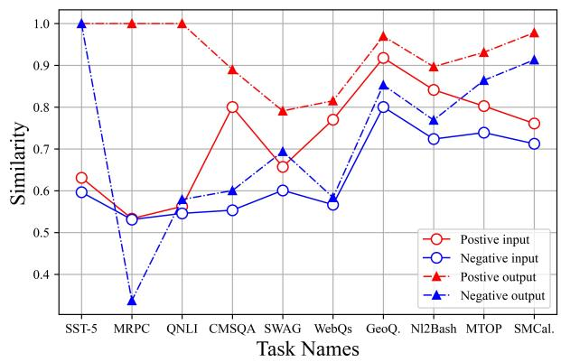

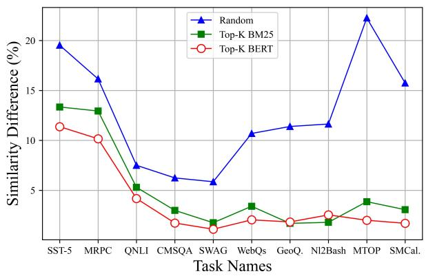  
Figure 4: Left: Comparison of similarity between the input/output of positive and negative demonstration examples and the input/output of the test case across ten tasks for EPR. Right: Difference between EPR and three taskagnostic demonstration exemplar selection methods in average similarity between the output of test case and retrieved exemplars. We use GPT-2 XL (Black et al., 2021) as the LLM.

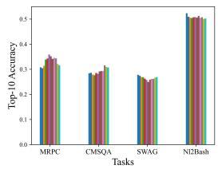

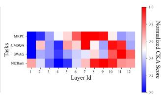  
Figure 5: Left: Top-10 retrieval accuracy using each of the twelve layers of the original BERT to retrieve positive exemplars to solve the proxy task of EPR across four tasks. Different colors represents different layers. Top-10 accuracy refers to the probability of retrieving the positive exemplar in the top 10 predictions. Middle: CKA scores between twelve layers of original BERT (x-axis) and the final layer of BERT of EPR trained on four tasks and the training-free BERT. We use Llama3 (8B) as the main LLM.

Qualitative Validation of $\mathcal { H } _ { 2 } \colon$ In line with the qualitative validation of $\mathcal { H } _ { 1 }$ , we illustrate the exemplar with similar input and output to test cases also contributes to the performance of ICL. Prior work has demonstrated that ICL typically learns input-output relation from exemplars even for a genuinely novel task the LLM cannot know from pre-training (Kossen et al., 2023; Halawi et al., 2023; Zhao et al., 2024). Moreover, Kossen et al. (2023) further proposed that LLMs prefer utilizing information closer to the query rather than treating all available information equally. Hence, if the exemplar selection method successfully learns the output similarity via the proxy task, it selects demonstration examples exhibiting useful inputoutput correlations for the test case due to their shared relevant input-output correlations and positions it closely to the test query in the prompt. These advantages align with the previously mentioned underlying working mechanisms of LLMs, thereby validating $\mathcal { H } _ { 2 }$

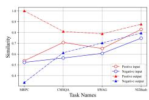

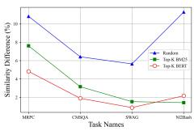  
Figure 6: Left: Comparison of similarity between the input/output of positive and negative demonstration examples and the input/output of the test case across four tasks for EPR. Right: Difference in average similarity between the output of test case and retrieved exemplars for EPR and each of the three learning-free prompt retrieval methods. We use Llama3 (8B) as the main LLM.

Table 8: Results of cross-LLM Transferability Validation of TTF and MLSM on Llama 3 8B and GPT 3.5 Turbo.
<table><tr><td colspan="8">TTF Verification</td></tr><tr><td>LLM</td><td>Shot</td><td>Method</td><td>SST-5</td><td>MRPC</td><td>QNLI</td><td>CMSQA</td><td>Avg.</td></tr><tr><td rowspan="5">GPT 3.5</td><td rowspan="5">3</td><td>Top-K BERT</td><td>48.50</td><td>70.34</td><td>78.13</td><td>63.05</td><td>65.00</td></tr><tr><td>TTF</td><td>48.68</td><td>70.83</td><td>77.96</td><td>63.55</td><td>65.26</td></tr><tr><td>Top-K BERT</td><td>49.41</td><td>71.32</td><td>77.25</td><td>60.52</td><td>64.63</td></tr><tr><td>TTF</td><td>47.96</td><td>66.91</td><td>77.34</td><td>60.94</td><td>63.29</td></tr><tr><td>EPR</td><td>49.14</td><td>64.22</td><td>77.03</td><td>59.79</td><td>62.55</td></tr><tr><td rowspan="2">Llama 3</td><td>20</td><td>Top-K BERT</td><td>72.28</td><td>71.28</td><td>73.73</td><td>68.29</td><td>71.40</td></tr><tr><td>TTF</td><td></td><td>72.79</td><td>72.79</td><td>77.72</td><td>68.80</td><td>73.03</td></tr><tr><td colspan="8">MLSM Verification</td></tr><tr><td>LLM</td><td>Shot</td><td>Method</td><td>SST-5</td><td>MRPC</td><td>GeoQ.</td><td>NL2Bash</td><td>Avg.</td></tr><tr><td rowspan="3">GPT 3.5</td><td> $^ 3$ </td><td>Top-K BERT</td><td>49.50</td><td>70.34</td><td>17.14</td><td>63.52</td><td>50.13</td></tr><tr><td rowspan="2">20</td><td>MLSM</td><td>49.32</td><td>70.59</td><td>18.00</td><td>64.56</td><td>50.62</td></tr><tr><td>Top-K BERT MLSM</td><td>49.41</td><td>71.32</td><td>4.64</td><td>60.52</td><td>46.47</td></tr><tr><td rowspan="2">Llama 3</td><td rowspan="2">20</td><td>Top-K BERT</td><td>50.23</td><td>74.02</td><td>5.36</td><td>68.24</td><td>49.46</td></tr><tr><td>MLSM</td><td>72.28 72.79</td><td>71.28 72.79</td><td>0.00 0.00</td><td>9.77 15.67</td><td>38.33 40.31</td></tr></table>

## E Statistical Significance

To strengthen our evaluation, we re-ran MLSM and TTF for the main experiments in Table 2 and Table 3 using GPT-Neo as the LLM. We report the average accuracy and standard deviation for both methods and statistical significance for the comparison between MLSM and Top-K BERT in Table 9. The results demonstrate the effectiveness of both methods, particularly MLSM, which shows stable performance improvements, which may be attributed to the used loss function.

Table 9: Main results of MLSM and TTF when using GPT Neo as the main LLM. represents the probability that the performance of MLSM exceeds that of Top-K BERT is over 95% by t-test. Org represents the performance reported in our original version.
<table><tr><td colspan="7">Main results on the classification task.</td></tr><tr><td>Method</td><td>SST-5</td><td>MRPC</td><td>QNLI</td><td>CMSQA</td><td>SWAG</td><td>AVG.</td></tr><tr><td>Top-K BERT</td><td>32.64</td><td>69.70</td><td>61.94</td><td>35.25</td><td>41.46</td><td>48.20</td></tr><tr><td>MLSM (Org)</td><td>33.15</td><td>69.87</td><td>65.02</td><td>37.26</td><td>41.49</td><td>49.36</td></tr><tr><td>MLSM</td><td>35.00 ± 1.77†</td><td>69.69 ± 0.29</td><td>65.10 ± 0.11†</td><td>38.07 ± 0.81†</td><td>41.82 ± 0.32</td><td>49.94 ± 0.60†</td></tr><tr><td>EPR (Org)</td><td>36.88</td><td>81.37</td><td>77.87</td><td>38.74</td><td>43.39</td><td>55.65</td></tr><tr><td>TTF</td><td>42.04 ± 1.50</td><td>74.18 ± 0.58</td><td>85.15 ± 1.00</td><td>46.39 ± 1.55</td><td>56.51 ± 0.69</td><td>60.85 ± 0.27</td></tr><tr><td colspan="7">Main results on the generation task.</td></tr><tr><td>Method</td><td>WebQs</td><td>GeoQ.</td><td>NL2B.</td><td>MTOP</td><td>SMCal.</td><td>AVG.</td></tr><tr><td>Top-K BERT</td><td>14.13</td><td>64.44</td><td>53.15</td><td>51.49</td><td>44.76</td><td>45.59</td></tr><tr><td>MLSM (Org)</td><td>16.14</td><td>68.93</td><td>56.11</td><td>54.05</td><td>47.72</td><td>48.59</td></tr><tr><td>MLSM</td><td>15.65 ± 0.47†</td><td>69.14 ± 0.19†</td><td>56.24 ± 1.27†</td><td>53.92 ± 0.20†</td><td>47.59 ± 0.19†</td><td>48.51 ± 0.17†</td></tr></table>

## F Theoretical Foundation Of MLSM and TTF

While MLSM and TTF are naturally supported by our findings $( { \mathcal { H } } _ { 1 }$ and $\mathcal { H } _ { 2 } )$ as they are two implementations of these findings, we provide a preliminary theoretical foundation for both methods. Specifically, MLSM treats different layers as experts and uses the loss function $\begin{array} { r } { \mathcal { L } = - \sum _ { i = 1 } ^ { n _ { l } } \hat { \mathbf { y } } \cdot \mathbf { y } _ { i } } \end{array}$ to ensemble them for demonstration selection. This approach is theoretically proportional to mutual information $I ( Y , { \hat { Y } } )$ and inversely proportional to selection entropy $H ( \hat { Y } )$ , maximizing expert agreement and ensuring stable selection. The detailed proof is available in (Zhang et al., 2022c). For TTF, we conduct preliminary theoretical analysis showing how features from layers before the final classification task heads can model input-output distribution in Section 4.

## G Analysis of aggregation weight

We analyze the probability density distribution of aggregation weights of MLSM on four datasets in Fig. 7. The results show that: 1) Different datasets exhibit varying weight probability density distributions and mean values, indicating that MLSM adaptively adjusts the weights of each layer to maximize agreement for demonstration retrieval. 2) The weights $w _ { 1 }$ and $w _ { 2 }$ are often higher than w3, suggesting that MLSM focuses more on lowerlevel features, possibly due to the greater similarity of features extracted from these layers. Although

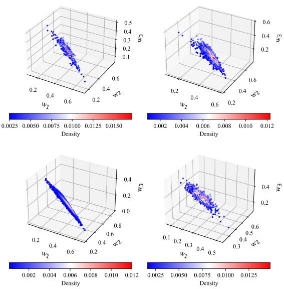  
Figure 7: Probability density distribution of aggregated weights for $n _ { l }$ layers of MLSM, with $n _ { l } = 3$ for MRPC, CMSQA, SWAG, and Nl2Bash, presented from top-left to bottom-right. The weights $w _ { 1 }$ $w _ { 2 } .$ $w _ { 3 }$ correspond to layers from low to high. The mean (standard deviation) of the weights are as follows: 0.35 (0.08), 0.43 (0.08), 0.21 (0.07) for MRPC, 0.34 (0.07), 0.48 (0.08), 0.17 (0.06) for CMSQA, 0.34 (0.07), 0.50 (0.08), 0.15 (0.06) for SWAG and 0.26 (0.06), 0.43 (0.07), 0.30 (0.07) for Nl2Bash.

MLSM’s performance is impressive, this method is just one possible instance of our proposed $\mathcal { H } _ { 1 }$ Other alternatives, such as integrating MLSM with training examples from the proxy task of learningbased methods, may also be viable, which we leave in future exploration.

## H Running Efficiency

Take the experiments on the QNLI dataset using a V100 GPU as an example. QNLI, a natural language inference task, comprises 5,463 test samples and 104,707 demonstration samples. For MLSM, in an online streaming scenario with a batch size of 1 (i.e., only one test point is observed during inference), this method processes approximately 1.6–1.7 data points per second. However, as indicated in Ablation of Batchsize for MLSM in Sec. 5, MLSM benefits significantly from larger batch sizes. In this case, with batch sizes of 8 and 64, MLSM can process approximately 4 and 32 data points per second, respectively. Additionally, the GPU memory overhead for MLSM is small (400–800 MB), enabling multi-process execution to accommodate deployment requirements. In comparison, TTF can process approximately 60 data points per second.

## I More Ablation Study

Ablation study of demonstration examples. To evaluate the effect of the number of demonstration examples on classification performance, we conducted an ablation study using GPT-NEO-2.7B on four classification tasks: SST-5, MRPC, QNLI, and CMSQA. We experimented with three different shot settings: 5, 10, and 20. The results are shown in Tables 10–12. As observed, performance generally improves with more demonstration examples. Notably, the exemplar selection methods MLSM and TTF exhibit consistent gains across tasks as the number of examples increases, supporting their efficacy in enhancing generalization. For instance, TTF outperforms all baselines at 20-shot with an average accuracy of 62.54%. These findings contrast with our observations on the GPT-3.5-Turbo model, discussed in the Appendix. C, where increasing the number of examples beyond a certain point did not yield further improvements due to its more advanced in-context learning capabilities.

Table 10: Performance on classification tasks when shot number = 5
<table><tr><td>Method</td><td>SST-5</td><td>MRPC</td><td>QNLI</td><td>CMSQA</td><td>Avg.</td></tr><tr><td>BERT</td><td>0.3179</td><td>0.6373</td><td>0.5792</td><td>0.3317</td><td>0.4665</td></tr><tr><td>MLSM</td><td>0.3224</td><td>0.6225</td><td>0.5938</td><td>0.3325</td><td>0.4678</td></tr><tr><td>EPR</td><td>0.3833</td><td>0.7206</td><td>0.7630</td><td>0.3161</td><td>0.5457</td></tr><tr><td>TTF</td><td>0.3851</td><td>0.7353</td><td>0.7505</td><td>0.3456</td><td>0.5541</td></tr></table>

Table 11: Performance on classification tasks when shot number = 10
<table><tr><td>Method</td><td>SST-5</td><td>MRPC</td><td>QNLI</td><td>CMSQA</td><td>Avg.</td></tr><tr><td>BERT</td><td>0.3442</td><td>0.6614</td><td>0.6136</td><td>0.3038</td><td>0.4808</td></tr><tr><td>MLSM</td><td>0.3488</td><td>0.6617</td><td>0.6282</td><td>0.3267</td><td>0.4913</td></tr><tr><td>EPR</td><td>0.3896</td><td>0.7083</td><td>0.7639</td><td>0.3227</td><td>0.5461</td></tr><tr><td>TTF</td><td>0.3896</td><td>0.7108</td><td>0.7827</td><td>0.3276</td><td>0.5527</td></tr></table>

Table 12: Performance on classification tasks when shot number = 20
<table><tr><td>Method</td><td>SST-5</td><td>MRPC</td><td>QNLI</td><td>CMSQA</td><td>Avg.</td></tr><tr><td>BERT</td><td>0.3270</td><td>0.6912</td><td>0.6094</td><td>0.3584</td><td>0.4965</td></tr><tr><td>MLSM</td><td>0.3315</td><td>0.6987</td><td>0.6502</td><td>0.3726</td><td>0.5133</td></tr><tr><td>EPR</td><td>0.3688</td><td>0.8137</td><td>0.7787</td><td>0.3874</td><td>0.5872</td></tr><tr><td>TTF</td><td>0.4274</td><td>0.7451</td><td>0.8508</td><td>0.4783</td><td>0.6254</td></tr></table>

Comparison with Universal Demonstration Set Methods. Our work focuses on understanding and improving learning-based demonstration selection in the context of input-dependent exemplar retrieval for in-context learning. This setting is distinct from approaches that construct a single, fixed set of demonstrations to serve multiple test queries, which is commonly explored in lowresource scenarios. Despite this conceptual difference, our method can be adapted to enhance methods designed for universal demonstration sets by providing a more effective similarity measure. To demonstrate this, we integrate our proposed TTF retriever into the IDEAL framework (Zhang et al., 2023a), which selects exemplars based on the maximum marginal gain with respect to a similaritybased influence measure. Specifically, we replace the original Sentence-BERT similarity metric used in IDEAL with our TTF retriever.

The results, presented in Table 13, show that this substitution leads to substantial performance gains on both the MRPC and SST-5 tasks. These results suggest that our model not only improves input-specific exemplar selection but also enhances the construction of universal demonstration sets.

Table 13: Comparison with IDEAL using a universal demonstration set.
<table><tr><td>Method</td><td>MRPC</td><td>SST-5</td></tr><tr><td>IDEAL</td><td>0.6300</td><td>0.4320</td></tr><tr><td> $\mathrm { I D E A L + T T F }$ </td><td>0.6914</td><td>0.5733</td></tr></table>

Explanation of Non-existence of strict alignment between two subfigures in Fig.1. We acknowledge that Fig. 1 (Left) and Fig. 1 (Middle) are conceptually related, as both aim to capture aspects of similarity modeling across different representation layers. However, we emphasize that there is no expectation of a quantitative correlation or strict alignment between them. This is due to several reasons outlined below. On the one hand, the behavior of the EPR retriever is governed not only by the input representation layers but also by the inductive biases of BERT and specific training dynamics such as fine-tuning objectives and hyperparameters. Therefore, rather than expecting an exact correlation between retrieval accuracy across layers and the similarity integration behavior of the EPR retriever, it is more meaningful to analyze how the retriever changes before and after fine-tuning on the proxy task. For example, the final layer of the original BERT-based retriever does not inherently prefer low-level similarities. However, after finetuning on proxy tasks where low-level similarities are more important (e.g., SWAG and NL2Bash), we observe that the CKA score between the final layer of the EPR retriever and BERT’s low-level layers increases significantly—from 0.2 to 0.5. This suggests that EPR adapts its similarity preference based on the proxy task, even if simple correlation metrics do not fully capture such changes. On the other hand, to further illustrate this point, we report Spearman’s rank correlation coefficients between layer-wise top-10 retrieval accuracy on the proxy task and CKA similarity scores between the final EPR layer and the original BERT layers. Re sults are shown in Table 14. While some tasks (e.g., MRPC) show high correlation for the EPR retriever, others (e.g., SWAG, NL2Bash) exhibit low or even negative correlations. This variability further supports the notion that accurate retrieval does not strictly align with layer-wise CKA patterns. Finally, there is no theoretical reason to expect that the EPR retriever must integrate various similarity levels in a way that strictly mirrors the distribution of retrieval accuracy across BERT layers. For example, if a proxy task benefits most from low-level similarities, the retriever may heavily weight those layers while largely ignoring middle- or high-level representations—even if they offer moderate utility. Thus, Fig. 1 (Left), which reflects raw retrieval accuracy per layer, and Fig. 1 (Middle), which reflects learned integration patterns, are related but not expected to be perfectly aligned. In summary, while both subfigures offer insights into the model’s similarity behavior, they capture different aspects of the system. The lack of strict alignment does not undermine our findings or the validation of Hy pothesis 1 (H1), and we make no such claim in the paper.

Table 14: Spearman’s rank correlation (ρ) between top-10 retrieval accuracy using BERT layers and CKA similarity scores between EPR and BERT layers.
<table><tr><td rowspan="2">Task</td><td colspan="2">EPR Retriever</td><td colspan="2">Original BERT</td></tr><tr><td>Coefficient</td><td>p-value</td><td>Coefficient</td><td>p-value</td></tr><tr><td>MRPC</td><td>0.8881</td><td>0.00011</td><td>0.3986</td><td>0.1993</td></tr><tr><td>CMSQA</td><td>0.6294</td><td>0.0283</td><td>0.4545</td><td>0.1377</td></tr><tr><td>SWAG</td><td>-0.8111</td><td>0.00136</td><td>0.4685</td><td>0.1245</td></tr><tr><td>NL2Bash</td><td>-0.1888</td><td>0.5567</td><td>-0.0629</td><td>0.8459</td></tr></table>