# Untie the Knots: An Efficient Data Augmentation Strategy for Long-Context Pre-Training in Language Models

Junfeng Tian1\*, Da Zheng1\*, Yang Chen2, Rui Wang3,

Colin Zhang1, Debing Zhang1†

1 Xiaohongshu Inc, 3 Decilion,

2 School of Computer Science and Technology, East China Normal University {tianjunfeng, zhengda, martin, dengyang}@xiaohongshu.com yangchen@stu.ecnu.edu.cn mars.wang@disiling.cn

## Abstract

Large language models (LLM) have focused on expanding the context window in order to incorporate more information effectively. However, training models to handle long contexts poses significant challenges. These include the scarcity of high-quality natural long-context data, the potential of performance degradation on short-context tasks, and the reduced train ing efficiency associated with attention mechanisms. In this paper, we introduce Untie the Knots (UtK), a novel data augmentation strategy employed during the continue pre-training phase, designed to efficiently enable LLMs to gain long-context capabilities without the need of modifying the existing data mixture. In particular, we chunk the documents, shuffle the chunks, and create a knotted structure of long texts; LLMs are then trained to untie these knots and identify relevant segments within seemingly chaotic token sequences. This approach substantially enhances the model’s performance by accurately attending to relevant information in long contexts, while also greatly improving the training efficiency. We conduct extensive experiments on models with 7B and 72B parameters, trained on 20 billion to kens, demonstrating that UtK achieves 75% and 84.5% accuracy on RULER at 128K context length, significantly outperforming other long-context strategies. The trained models and data processing code are open-sourced for further research. https://github.com/rgtjf/Untiethe-Knots

## 1 Introduction

For the past few years, large language models (LLM) research has focused on expanding the context window in order to incorporate more information effectively (Brown et al., 2020; Anthropic, 2023; OpenAI, 2023; Team et al., 2024). This emphasis stems from the recognition that a wider context window allows models to integrate more task-specific information that is not present in the training data during inference time, resulting in better performance across various natural language tasks (Caciularu et al., 2023; Bairi et al., 2023; Mazumder and Liu, 2024; Jiang et al., 2024; Gur et al., 2024).

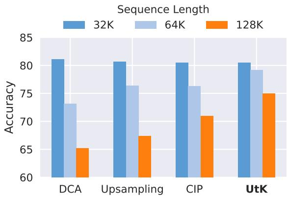  
Figure 1: Comparison of various long-context strategies based on the Qwen2-base (7B) model on the RULER benchmark. UtK more effectively maintains performance at the 128K context length.

However, training transformer-based models (Vaswani et al., 2017) to handle long contexts effectively poses significant challenges due to the lower training efficiency and the quadratic computational cost of attention mechanisms in long context models. As a result, many approaches treat long-context extension as a distinct stage. Training-free methods for length extrapolation, such as those that modify rotary position embedding (RoPE) (Su et al., 2021), often fail to deliver satisfactory performance. Continue pre-training approaches (Llama Team, 2024; ChatGLM, 2024; Gunter et al., 2024) aiming at improving long-context performance encounter a critical issue: the scarcity of naturally occurring long texts for training. Texts ranging from 32K to 128K tokens are rare and typically consist of books and code. To mitigate this issue, methods like LLama3.1 and GLM-Long use upsampling and artificially constructed long texts (e.g., concatenated similar documents) to increase the presence of long sequences in the training data. However, these approaches alter the distribution of the data, making it difficult to achieve a model that performs well in both long- and short-context tasks while maintaining efficiency (Fu et al., 2024).

In this paper, we introduce Untie the Knots (UtK), a novel data augmentation training strategy designed to enhance the long-context capabilities of LLMs without changing the existing data mixture. UtK employs an augmentation recipe that helps the model adapt to longer input sequences more effectively. Specifically, this strategy involves chunking, shuffling, and reconstructing the input documents, encouraging the model to learn to attend to relevant segments of the same documents while skipping unrelated intervening segments. Furthermore, we introduce a backtracing task that requires the model to explicitly locate all corresponding segments in the correct order, which significantly improves the accuracy of retrieving the original context over longer ranges. This strategy, illustrated in Figure 2, ensures that the model maintains a coherent understanding between and beyond documents, enhancing its ability to handle short and long contexts at the same time.

To assess the effectiveness of Untie the Knots, we have conducted continue pre-training of language models with 7B and 72B parameters on 20 billion tokens. Our results demonstrate that UtK outperforms the ABF baseline and other data strategies, such as upsampling, as shown in Figure 1. It also significantly exceeds the performance of training-free extrapolation methods like YaRN (Peng et al., 2023) and Dual Chunk Attention (DCA) (An et al., 2024). Specifically, our models show significant improvements on widely-used benchmarks, with a 15.0% performance increase on RULER and a 17.2% increase on LV-Eval for 128K tasks, while retaining over 90% of the performance achieved on 32K contexts. To support further research in this field, we will open-source the Qwen2-7B-UtK-128k and Qwen2-72B-UtK-128k base models.

## Our contributions are as follows:

1. We introduce Untie the Knots (UtK), an innovative data augmentation strategy designed to improve the long-context capabilities of large language models. This method enhances both training efficiency and model performance on long-context tasks.

2. We conduct extensive experiments on 7B and 72B models, trained on up to 20 billion tokens. Our results demonstrate that UtK significantly outperforms existing data strategies, such as length upsampling and DCA, across multiple widely-used benchmarks.

3. We will open source two well-trained models, Qwen2-UtK-7B-base 128K and Qwen2-UtK-72B-base 128K, to facilitate further research and development of the field of long-context language models.

## 2 Related Work

Long document continue pre-training has become a crucial step in enhancing long-context capabilities in foundational models. Plenty of leading foundational models (Team et al., 2024; Llama Team, 2024; Yang et al., 2024; ChatGLM, 2024; Gunter et al., 2024) have emphasized the importance of RoPE’s positional encoding (Su et al., 2021; Chen et al., 2023; bloc97, 2023; Peng et al., 2023; Xiong et al., 2023; Men et al., 2024) and the upsampling of lengthy data. LLaMA 3.1 (Llama Team, 2024) and Phi-3 (Abdin et al., 2024) leverage the Long RoPE method (Ding et al., 2024) to extend their context windows, while Qwen2 (Yang et al., 2024) utilizes the YARN and Dual Chunk Attention mechanisms (Peng et al., 2023; An et al., 2024) to increase the context length to 128k. Additionally, GLM Long (ChatGLM, 2024) and Apple’s AFM (Gunter et al., 2024) scale the RoPE base frequency (Men et al., 2024) to improve generalization across varying sequence lengths.

One series of works manipulates the order of training tokens to achieve similar goals. For instance, UL2 (Tay et al., 2022) designs mixture of denoisers (MoD) objective to adapt the model to different tasks. Similarly, T5 (Raffel et al., 2020) employs a deshuffling approach, where a sequence of tokens is first shuffled and then reconstructed to match the original ordered sequence. FIM (Bavarian et al., 2022) applied the data transformation by splitting documents into three random segments and rearranging them with sentinel tokens. FIM gives the model ability to generate content conditioned on both prefix and suffix, which is essential on tasks like code editing. In-context pre-training (Shi et al., 2024) proposed training on a sequence of related documents to explicitly encourage the model to read and reason across document boundaries.

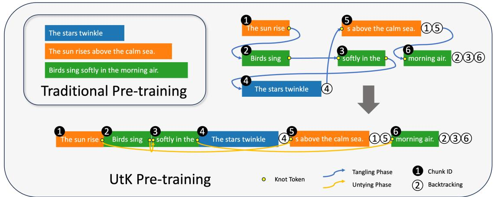  
Figure 2: Illustration of the UtK Pre-training process. In the Tangling phase, documents are split into chunks, which are then randomly tied together. Knot Tokens are inserted at the split points to guide the model in locating the partitions during the Untying phase. The Chunk IDs of each chunk are appended to the last chunk of the document to help the model learn to correctly backtrace the original document structure.

Another series of works, such as PoSE (Zhu et al., 2024), introduce large random gaps within the same document to help the model become familiar with out-of-distribution relative distances. LongSkywork (Zhao et al., 2024) proposed Chunk Interleaved Pre-training where documents are split into segments, which are then arranged in an interleaved fashion to form pseudo long-context pre-training samples. Our approach differs by employing a novel augmented training strategy that involves tangling, backtracing, and untying phases, thereby enhancing long-context capabilities through a more straightforward yet effective training process.

## 3 Method

Untie the Knots aims at effectively enhancing language models’ long-context abilities. UtK creates shuffled document chunks (Section 3.1) that the model must reconstruct (Section 3.2). The process is illustrated in Figure 2, and further details are provided in Appendix B.

## 3.1 Tangling Phase

In the tangling phase, documents are split into chunks that are randomly tied together. Combined with backtracing, this process helps the model learn to accurately reconstruct the original document.

Chunking We begin by chunking documents into segments that fit the target sequence length, To create variability, we choose split points randomly. Knot tokens are inserted before and after each split point, and a unique chunk ID is prepended to every chunk.

Tying The chunks are then shuffled and tied together, forming a complex, knotted structure of long texts. We experimented with two tying strategies: one that preserves the original chunk order and one that does not.

Backtracing After the final chunk of each document, we append the correct chunk IDs for that document as the learning target. This enhances the model’s capacity to retrieve relevant information across long-range sequences. A sentinel token is included to trigger the backtracing output, and the loss is masked on both knot tokens and the sentinel token to prevent generating these markers.

## 3.2 Untying Phase (Training)

In the untying phase, the model is incentivized to correctly identify and connect fragmented parts of the text. When the language model encounters a “head knot”, marking the start of the i-th fragment, it must search the context to find the unique corresponding “tail knot” that signifies the end of the (i  1)-th fragment. By accurately locating this match, the model can reconstruct the fragmented document and continue its usual language processing. Additionally, through backtracing, the model learns to connect all related knots, fully restoring the original context and thereby enhancing its ability to handle long contexts.

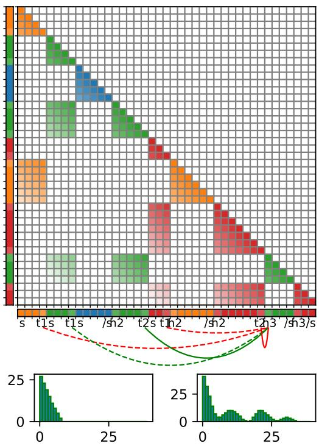  
Figure 3: The top panel shows the UtK-augmented expected conditional information for the same four documents, while the bottom panel displays the changes in the histogram of relative positional embedding distances from the original to the UtK-augmented.

## 3.3 Longer than claimed

Distances near the maximum sequence length are rare in training data. To address this, we propose using a slightly longer sequence length than the claimed maximum during training, thereby increasing the model’s exposure to the claimed context length. We illustrate this process and its explanation in Figure 3.

The upper part illustrates the expected attention pattern that should be learned after training with UtK-constructed data. The total sequence length is 41, comprising four text segments, each further divided into 1 to 3 sub-segments, which are shuffled and concatenated. On the x-axis, lighter markers indicate knot tokens, while darker markers represent original tokens. Without UtK, attention forms four lower triangular matrices over the sequence. With UtK, these matrices are shuffled along with subsegments, resulting in the observed pattern, while the model maintains performance. Achieving the expected pattern requires the model to search for relevant preceding text across the entire sequence, representing an additional long-sequence understanding ability that UtK helps develop.

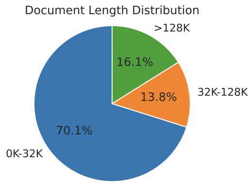  
Figure 4: Distribution of document lengths categorized by token counts. The ratios represent the number of tokens within each document length category proportional to the total number of tokens.

The lower part shows the distribution histogram of relative positional embeddings before and after using UtK. The left histogram (without UtK) has a different distribution than the right histogram (with UtK), where the model covers longer-range relative positional embeddings. This demonstrates that UtK influences the model’s positional encoding, improving its capacity to leverage long-context information.

## 4 Experimental Setting

## 4.1 Training Data

Following Touvron et al. (2023a,b); Llama Team (2024); Yang et al. (2024), who emphasize the influence of data quality and diversity in training models, our curated dataset incorporates sources such as Common Crawl, books, Wikipedia, code, and academic papers. To ensure safety, we applied filters to exclude data from websites likely to contain unsafe content or significant amounts of personally identifiable information (PII), as well as domains flagged as harmful by a safety classifier. Our dataset comprises 42% Chinese, 42% English, and 16% code data. For continued training, we employ a quality classifier to filter for high-quality data. After filtering, we randomly sampled 300 billion tokens for pre-training. Figure 4 illustrates the distribution of document lengths, with 70% of the data falling within the 0-32K token range.

## 4.2 Model Details

We continue pre-training the Qwen2 models with a sequence length of 128K tokens, up from their initial training sequence length of 32K tokens. We use the AdamW optimizer (Loshchilov and Hutter, 2017) with parameters $\beta _ { 1 } = 0 . 9$ and $\beta _ { 2 } = 0 . 9 5$ alongside a cosine learning rate schedule starting at 1e-5 and decaying to 1e-6, including 200 warmup steps. To reduce memory consumption with the models’ long context windows, we employ ring attention (Liu et al., 2023) and flash attention (Dao et al., 2022). Our training setup uses 128 H800 GPUs across 16 nodes, with a batch size of 4 million tokens. Training the 7B parameter models on 20B tokens takes 15 hours, while the 72B models require 5.5 days for the same amount of data.

For each document, with a certain probability p, we split it into n parts: Chunk1, Chunk2, , Chunk . This split occurs after tokenization, making it an on-the-fly solution that can be applied to other architectures (e.g., Mamba (Gu and Dao, 2024)). We conduct experiments using two UtK probabilities, 30%(low) and 80%(high), which means how many sequences are augmented by UtK. Moreover, we continue pre-training the LLama3.1 models which are already trained on sequence length of 128K tokens to see whether UtK could even improve the performance. We keep the LongRoPE (Ding et al., 2024) modification made in Llama3.1 128k during training and inference.

## 4.3 Comparison Methods

We compare UtK against the following methods:

CT In the naive continued pre-training experiment, we increased the training sequence length to 128K and trained on 20 billion tokens. Since the models were already pre-trained on 128K data, DCA was not applied during the inference stage for Qwen2 models.

ABF We increased the base frequency b of RoPE (Xiong et al., 2023) from 1e6 to 5e6, which is approximately the recommended base frequency as proposed by Men et al. (2024). Note that the 5e6 base frequency was used in all experiments except for the naive CT baseline in this paper.

Upsampling Following Fu et al. (2024), we applied per-source length upsampling to maintain a fixed domain mixture ratio. Documents longer than 32K tokens were upsampled fivefold, without altering the overall domain mixture ratio.

AttnMask As suggested by Llama Team (2024), an inter-document attention mask is essential during continued pre-training for long context. We applied this strategy in our experiment. Note that this strategy cannot be combined with UtK, as UtK requires the model to have full attention to locate the corresponding knots.

Synthetic Xiong et al. (2024) demonstrated that fine-tuning LLMs using specially designed synthetic data can significantly enhance long-context understanding. Inspired by their approach, we constructed five types of synthetic datasets focused on specific tasks: sorting, multi-hop reasoning, state tracking, similarity retrieval, and attribute inclusion. Each dataset had a context length of 128K tokens. In this experiment, 30% of the original data mixture was replaced with synthetic data, comprising 6B tokens of synthetic data and 12B tokens of original data. The detailed methodology for synthetic data construction is described in Appendix C.

CIP Following the optimal CIP-2 configuration from Zhao et al. (2024), each document was randomly split into two chunks, which were then interleaved in a pattern such as $D _ { 1 } ^ { 1 } , D _ { 2 } ^ { 1 } , D _ { 3 } ^ { 1 } , D _ { 1 } ^ { 2 } , D _ { 2 } ^ { 2 } , D _ { 3 } ^ { 2 }$

## 5 Results

## 5.1 Main Results

Datasets & Metrics To quantify the long context abilities, we mainly focus on evaluating longcontext language models on test sets with configurable sequence length. We use two widely recognized benchmarks: RULER (Hsieh et al., 2024) and LV-Eval (Yuan et al., 2024). In addition, we evaluate on real-world tasks from InfiniteBench (Zhang et al., 2024).

RULER generates synthetic examples to assess long-context capabilities beyond simple in-context recall, comprising 13 tasks across 4 categories (i.e, NIAH, VT, CWE+FWE, and QA). We use the base model prompt template and report the average score across these 13 tasks.

LV-Eval consists of two main tasks, single-hop QA and multi-hop QA, across 11 bilingual datasets. We report our results on 32K and 128K context lengths. We exclude the factrecall-en and factrecallzh datasets, as factrecall-en and factrecall-zh are designed to expect the model to find apparently wrong facts in the context, which is against the harmless principle. To better evaluate on base models, we use pseudo 3-shot format guidance (Appendix D).

InfiniteBench requires supervised finetuning models to follow instructions. Following ChatQA

2.0 (Xu et al., 2024), we leverage the long SFT dataset and the same data mix to enhance the model’s ability to handle extended context sequences of up to 128k tokens. Unlike ChatQA 2.0, we simplify the training process by employing a one-stage approach instead of the three-stage methodology. We adopt the same learning rate of 3e-5 as used in ChatQA 2.0.

RULER The results in Table 1 highlight our model’s effectiveness across various long-context evaluation benchmarks. On the RULER benchmark, our model, Qwen2-UtK-base (7B), consistently outperforms most other models at the 128K context length, achieving an average score of 75.0 —significantly higher than Qwen2-base by 15.0% and Llama3.1-base by 13.5%. This demonstrates that Qwen2-UtK-base is particularly robust in handling extended contexts, maintaining strong performance as context length increases. At the 32K context length, Qwen2-UtK-base (7B) performs just 0.6 points below Qwen2-base at 32K contexts, yet it surpasses Qwen2-CT (7B) by 2.3 points. This suggests that while the quality of our training data may not fully match that of Qwen2, the UtK strategy significantly enhances long-context capabilities by enabling the model to more accurately attend to relevant information. Furthermore, we applied our UtK method to Llama3.1-base which is already trained on 128k context length. UtK demonstrated an improvement of 11.6% in performance. Detailed values for different datasets are provided in Appendix F.

LV-Eval Table 2 show the results in the LV-Eval benchmark. Our model once again exhibits superior performance at 128K. Note that the Qwen2- Synthetic approach did not enhance performance at the 32K level on LV-Eval, but the UtK method demonstrated superior capability to maintain performance at 128K.

InfiniteBench The results are as shown in Table 3. Our model demonstrates excellent performance in question-answering tasks but shows relatively lower performance in summarization tasks. This discrepancy can be attributed to the limited amount of summarization data in the SFT dataset, consistent with the observations in ChatQA 2.0.

## 5.2 Standard Short-Context Results

Datasets & Metrics Previous research (Xiong et al., 2023; Llama Team, 2024) has identified a model performance trade-off between short and long tasks. To evaluate our models’ performance on short tasks, we conducted tests on a series of widely recognized benchmarks. Specifically, we assess our models using three categories of datasets: Understanding, Code, and Math. For Understanding, we assess 5-shot performance on Natural Questions (Kwiatkowski et al., 2019) and TriviaQA (Joshi et al., 2017), and 3-shot Chain-of-Thought performance on BIG-Bench Hard (Suzgun et al., 2022). In the Code category, we measure pass@1 on HumanEval (Chen et al., 2021) and 3-shot performance on the sanitized MPBB benchmark (Austin et al., 2021). For Math, we evaluate the top-1 accuracy in the 4-shot GSM8K dataset (Cobbe et al.,

<table><tr><td>Models</td><td>32K</td><td>64K</td><td>128K</td></tr><tr><td>API MODEL</td><td></td><td></td><td></td></tr><tr><td>Gemini-1.5-pro§</td><td>95.9</td><td>95.9</td><td>94.4</td></tr><tr><td>GPT-4-1106-preview§</td><td>93.2</td><td>87.0</td><td>81.2</td></tr><tr><td>INSTRUCT MODEL</td><td></td><td></td><td></td></tr><tr><td>Mistral (7B)§</td><td>75.4</td><td>49.0</td><td>13.8</td></tr><tr><td>LWM (7B)§</td><td>69.1</td><td>68.1</td><td>65.0</td></tr><tr><td>Llama3.1 (8B)§</td><td>87.4</td><td>84.7</td><td>77.0</td></tr><tr><td>BASE MODEL</td><td></td><td></td><td></td></tr><tr><td></td><td></td><td></td><td></td></tr><tr><td>Mistral-base (7B)§</td><td>77.2</td><td>52.3</td><td>8.0</td></tr><tr><td>LWM-base (7B)§</td><td>64.6</td><td>61.3</td><td>59.0</td></tr><tr><td>Qwen2-base (7B)‡</td><td>81.1</td><td>73.2</td><td>65.2</td></tr><tr><td>Llama3.1-base (8B)†</td><td>90.2</td><td>80.4</td><td>66.1</td></tr><tr><td>LONG-CONTEXT</td><td></td><td></td><td></td></tr><tr><td>Qwen2-CT (7B)</td><td>78.2</td><td>73.6</td><td>54.8</td></tr><tr><td>Qwen2-ABF (7B)</td><td>78.9</td><td>75.2</td><td>65.9</td></tr><tr><td>Qwen2-Upsampling (7B)</td><td>80.7</td><td>76.4</td><td>67.4</td></tr><tr><td>Qwen2-AttnMask (7B)</td><td>80.4</td><td>75.6</td><td>72.0</td></tr><tr><td>Qwen2-Synthetic (7B)</td><td>83.2</td><td>80.5</td><td>72.7</td></tr><tr><td>Qwen2-CIP (7B)</td><td>80.5</td><td>76.3</td><td>71.0</td></tr><tr><td>Qwen2-UtK-base (7B)</td><td>80.5</td><td>79.2</td><td>75.0</td></tr><tr><td>Llama3.1-UtK-base (8B)†</td><td>88.8</td><td>83.6</td><td>73.8</td></tr><tr><td>70B MODEL</td><td></td><td></td><td></td></tr><tr><td>Llama3.1 (70B)§</td><td>94.8</td><td>88.4</td><td>66.6</td></tr><tr><td>Qwen2 (72B)§</td><td>94.1</td><td>79.8</td><td>53.7</td></tr><tr><td>Llama3.1-base (70B)†</td><td>91.7</td><td>84.6</td><td>66.0</td></tr><tr><td>Qwen2-base (72B)‡</td><td>93.3</td><td>85.9</td><td>78.0</td></tr><tr><td></td><td></td><td></td><td></td></tr><tr><td>Qwen2-UtK-base (72B)</td><td>93.3</td><td>90.6</td><td>84.5</td></tr></table>

Table 1: Performance on the RULER benchmark. †Llama3.1-base was inferred with vLLM. ‡For Qwen2- base (7B, 72B), we used vLLM DCA branch for tasks over 32K tokens as suggested by Qwen Team. § results are sourced from RULER.

<table><tr><td>Models</td><td>32K</td><td>128K</td></tr><tr><td>Llama3.1-base (8B) Qwen2-base (7B) Qwen2-ABF (7B)</td><td>29.16 29.88</td><td>23.90 23.94 25.24</td></tr><tr><td>Qwen2-AttnMask (7B) Qwen2-Synthetic (7B)</td><td>29.54 29.48 29.14</td><td>25.91 25.89</td></tr><tr><td>Llama3.1-UtK-base (8B) Qwen2-UtK-base (7B)</td><td>29.63 29.36</td><td>26.89 28.06</td></tr><tr><td>Llama3.1-base (70B)</td><td>30.38</td><td>23.07</td></tr><tr><td>Qwen2-base (72B) Qwen2-UtK-base (72B)</td><td>32.37 32.24</td><td>27.40 32.10</td></tr></table>

Table 2: Performance on LV-Eval benchmark.

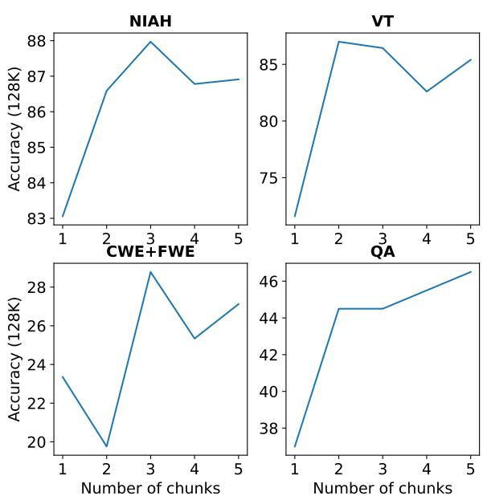  
Figure 5: Performance with varying numbers of chunks on the RULER 128K benchmark.

2021). These metrics provide a comprehensive assessment of the models’ capabilities across diverse tasks.

Results Table 4 presents the average scores across different model sizes. First, we analyze the impact of data on the model performance and find that using our data achieves a performance comparable to the base model, with a slight decrease (-1.5%). Second, after removing the impact of the data, we observe that our method’s metrics are similar to those of the CT baseline. These results suggest that UtK enables language models on long-context tasks while maintaining performance on standard short-context tasks.

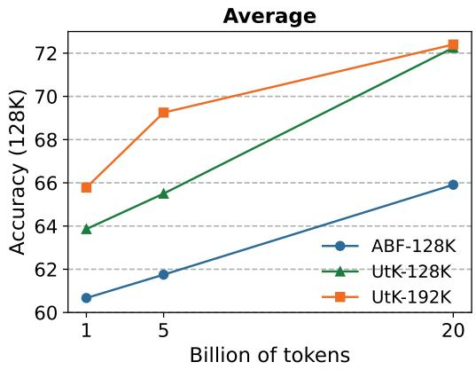  
Figure 6: Training Efficiency

## 5.3 Ablation Analysis

We have conducted ablation analyses on two key design choices in the training strategy: (1) the optimal number of chunks for long-context training, and (2) the effects of each designed component. We have performed the ablation study on 7B models with 20B training tokens and evaluated them with the RULER benchmark. The results are illustrated in Figure 5 and Table 5.

Number of Chunks When evaluating the number of chunks, we find that using 2 or 3 chunks yields the best performance on the NIAH, VT, and CWE+FWE datasets. For the QA dataset, we observe that increasing the number of chunks improves the model’s reasoning ability, suggesting that more complex training benefits QA tasks. We have also experimented with combining these approaches, which resulted in even better performance. We tried dividing the text into chunks of 1K tokens each, which resulted in an average score of 68.92. This indicates that a higher number of chunks can increase task complexity, potentially hindering the model’s learning process.

Training Strategy In comparing different training strategies, we observe that maintaining partial order and incorporating the tracing task are both essential for long-context learning. We reckon that keeping the partial order encourages the model to attend to longer but related chunks, while the tracing task requires the model to provide the "correct" untie solution, as later segments cannot typically correct errors in earlier ones. Finally, we find that a higher probability of UtK is also necessary to improve training efficiency.

<table><tr><td>Model</td><td>En.Avg.</td><td>En.Sum</td><td>En.QA</td><td>En.MC</td><td>En.Dia</td><td>Zh.QA</td></tr><tr><td>GPT-4-Turbo-2024-04-09</td><td>33.2</td><td>17.6</td><td>19.3</td><td>77.7</td><td>18.0</td><td></td></tr><tr><td>Kimi-Chat</td><td>29.6</td><td>18.0</td><td>16.5</td><td>72.5</td><td>11.5</td><td>17.9</td></tr><tr><td>Llama3.1-8B-Instruct</td><td>33.2</td><td>29.2</td><td>31.5</td><td>59.0</td><td>13.0</td><td>一</td></tr><tr><td>Llama3-ChatQA2-8B</td><td>35.6</td><td>17.1</td><td>43.5</td><td>64.2</td><td>17.5</td><td></td></tr><tr><td>Qwen2-ChatQA2-7B</td><td>22.5</td><td>14.1</td><td>35.9</td><td>31.4</td><td>8.5</td><td>34.4</td></tr><tr><td>Qwen2-ABF-ChatQA2-7B</td><td>29.7</td><td>16.2</td><td>34.3</td><td>59.2</td><td>9.0</td><td>34.4</td></tr><tr><td>Qwen2-Synthetic-ChatQA2-7B</td><td>23.0</td><td>13.7</td><td>29.3</td><td>35.8</td><td>13.0</td><td>31.0</td></tr><tr><td>Qwen2-UtK-ChatQA2-7B</td><td>33.3</td><td>21.2</td><td>42.6</td><td>61.1</td><td>8.5</td><td>37.6</td></tr><tr><td>Llama3.1-70B-Instruct</td><td>39.8</td><td>30.9</td><td>38.5</td><td>75.6</td><td>14.3</td><td>-</td></tr><tr><td>Qwen2-72B-Instruct</td><td>39.8</td><td>31.7</td><td>21.5</td><td>83.0</td><td>23.0</td><td></td></tr><tr><td>Llama3-ChatQA2-70B</td><td>41.0</td><td>16.1</td><td>48.2</td><td>80.4</td><td>19.5</td><td></td></tr><tr><td>Qwen2-ChatQA2-72B</td><td>31.8</td><td>14.7</td><td>40.5</td><td>48.9</td><td>23.0</td><td>40.5</td></tr><tr><td>Qwen2-UtK-ChatQA2-72B</td><td>47.3</td><td>18.2</td><td>55.9</td><td>83.8</td><td>31.0</td><td>45.2</td></tr></table>

Table 3: Performance on InfiniteBench includes real-world long-context understanding tasks.
<table><tr><td rowspan="2">Models</td><td colspan="3">Understanding</td><td colspan="2">Code</td><td rowspan="2">Math</td><td rowspan="2">Avg. ∆</td></tr><tr><td>BBH 3shot 5shot</td><td>NQ</td><td>TriviaQA 5shot</td><td>HumanEval Oshot</td><td>MBPP GSM8K 3shot 4shot</td></tr><tr><td>Llama3.1-base (8B)</td><td>63.9</td><td>33.5</td><td>80.2</td><td>35.4</td><td>54.5</td><td>58.0</td><td>54.2</td></tr><tr><td>Llama3.1-UtK-base (8B)</td><td>61.9</td><td>34.0</td><td>79.6</td><td>38.4</td><td>54.6</td><td>59.3</td><td>54.6 +0.7%</td></tr><tr><td>Qwen2-base (7B)</td><td>61.4</td><td>30.3</td><td>70.2</td><td>46.3</td><td>64.6</td><td>80.9</td><td>59.0</td></tr><tr><td>Qwen2-CT-base (7B)</td><td>61.1</td><td>29.6</td><td>70.3</td><td>44.5</td><td>66.2</td><td>77.6</td><td>58.1 -1.5%</td></tr><tr><td>Qwen2-UtK-base (7B)</td><td>61.6</td><td>29.5</td><td>70.2</td><td>45.1</td><td>64.2</td><td>78.1</td><td>58.2 -1.4%</td></tr><tr><td>Llama3.1-base (70B)</td><td>81.0</td><td>49.3</td><td>91.2</td><td>59.2</td><td>72.8</td><td>82.3</td><td>72.6 =</td></tr><tr><td>Qwen2-base (72B)</td><td>79.8</td><td>45.6</td><td>88.0</td><td>61.6</td><td>76.9</td><td>88.8</td><td>73.3</td></tr><tr><td>Qwen2-UtK-base (72B)</td><td>80.6</td><td>45.0</td><td>87.6</td><td>61.0</td><td>75.9</td><td>87.8</td><td>73.0 -0.4%</td></tr></table>

Table 4: Results on standard short-context benchmarks. ∆ represents the marginal effect of continued pre-training.

## 5.4 Training Efficiency

As illustrated in Figure 6, we compare the baseline and UtK training methods by progressively increasing the number of training tokens to determine the required amount for effective long-context extension. We also include experiments with a longer sequence length of 192K to assess whether even longer context would enhance performance when still evaluated on the 128K tasks.

Our findings indicate that: 1) Our approach UtK does have a higher training efficiency compared with the baseline regardless of how many training tokens are used, and the performance gains are steady. 2) Training on a 192K sequence length does increase the training efficiency at both the 1B and 5B token levels but the grains are diminishing when we reach 20B tokens. 3) Most significantly, with only 1B tokens, UtK-192K can already reach ABF’s performance after 20B tokens training.

## 5.5 Attention Visualization

To visually represent the changes in attention of the model trained with UtK at a length of 128k, we have plotted the attention maps before and after different training methods. Although the ABF-trained baseline can already accurately locate information within the same document, the model trained with UtK exhibits more attention on long-range dependencies within the same document, thereby performs better on using long-range contexts. Figure 7 gives the attention map of Qwen2-UtK-base 7B. A comprehensive collection of attention maps can be found in Figure 8 and Appendix A.3.

<table><tr><td>Models Average NIAH VT</td><td>CWE+ QA FWE</td></tr><tr><td>Qwen2-UtK-80% 75.0 - Disrupt order 73.0 - W/o backtracing 74.3 Qwen2-UtK-30% 73.1</td><td>90.3 97.6 29.9 48.0 90.4 97.8 17.4 46.0 91.3 94.8 23.546.5 88.8 94.8 28.5 44.0</td></tr></table>

Table 5: Ablation Study. UtK (30%) denotes applying UtK to 30% of the sequences. Disrupt order indicates that the sequential order of the chunks within the documents is not preserved. W/o backtracing signifies that backtracing is not applied during the process.

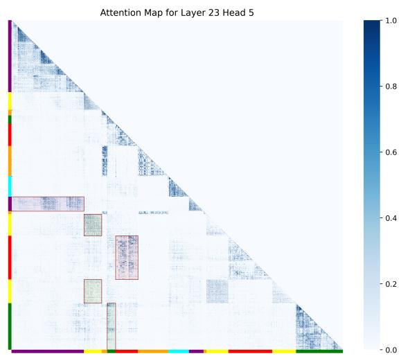  
Figure 7: Attention map of Qwen2-UtK-base 7B.

## 6 Conclusion

In this paper, we propose UtK, an augmentation recipe to adapt models to longer context more efficiently and effectively. UtK is an on-the-fly solution that enables models to better learn long-range dependencies and is applicable to other architectures (e.g., Mamba) and languages without changing the data mixture. We trained and open sourced Qwen2-7B-UtK-128k and Qwen2-72B-UtK-128k base models, which demonstrate superior performance compared to the base models and other longcontext enhancement strategies, including upsampling and DCA. In addition to the performance gain, our method also demonstrates a large increase of training efficiency. We will open-source our models and data processing code and hope to see our approach applied to more datasets and model training in the community.

## Limitations

Limited Functionality. Although being efficient among continue training methods, due to the limitation of training tokens and practice patterns. As a result, it can only perform adaptation or transfer learning based on the model’s original ability. Acquiring new abilities, such as solving complex problems within long context, is not feasible and may require further specialized training. Our experiments are also limited to the datasets we use. Our method applied to other datasets of different languages or genres might lead to different results.

Potential Risk. Like other LLMs, we have observed hallucination issue when testing the proposed our model. While this issue is more common in short-context models, addressing it in longcontext models can be even more pronounced due to the greater difficulty in the alignment process.

## References

Marah Abdin, Sam Ade Jacobs, Ammar Ahmad Awan, Jyoti Aneja, Ahmed Awadallah, Hany Awadalla, Nguyen Bach, et al. 2024. Phi-3 technical report: A highly capable language model locally on your phone. Preprint, arXiv:2404.14219.

Chenxin An, Fei Huang, Jun Zhang, Shansan Gong, Xipeng Qiu, Chang Zhou, and Lingpeng Kong. 2024. Training-free long-context scaling of large language models. Preprint, arXiv:2402.17463.

Anthropic. 2023. Model card and evaluations for claude models.

Jacob Austin, Augustus Odena, Maxwell I. Nye, Maarten Bosma, Henryk Michalewski, David Dohan, Ellen Jiang, Carrie J. Cai, Michael Terry, Quoc V. Le, and Charles Sutton. 2021. Program synthesis with large language models. arXiv:abs/2108.07732.

Ramakrishna Bairi, Atharv Sonwane, Aditya Kanade, Vageesh D C, Arun Iyer, Suresh Parthasarathy, Sriram Rajamani, B. Ashok, and Shashank Shet. 2023. Codeplan: Repository-level coding using llms and planning. Preprint, arXiv:2309.12499.

Mohammad Bavarian, Heewoo Jun, Nikolas Tezak, John Schulman, Christine McLeavey, Jerry Tworek, and Mark Chen. 2022. Efficient training of language models to fill in the middle. Preprint, arXiv:2207.14255.

bloc97. 2023. NTK-aware scaled RoPE allows LLaMA models to have extended (8k+) context size without any fine-tuning and minimal perplexity degradation.

Tom Brown, Benjamin Mann, Nick Ryder, Melanie Subbiah, Jared D Kaplan, Prafulla Dhariwal, Arvind Neelakantan, Pranav Shyam, Girish Sastry, Amanda Askell, et al. 2020. Language models are few-shot learners. Advances in neural information processing systems, 33:1877–1901.

Avi Caciularu, Matthew E. Peters, Jacob Goldberger, Ido Dagan, and Arman Cohan. 2023. Peek across: Improving multi-document modeling via cross-document question-answering. Preprint, arXiv:2305.15387.

ChatGLM. 2024. Glm long: Scaling pre-trained model contexts to millions. Accessed: 2024-08-10.

Mark Chen, Jerry Tworek, Heewoo Jun, Qiming Yuan, Henrique Ponde de Oliveira Pinto, Jared Kaplan, Harri Edwards, Yuri Burda, Nicholas Joseph, Greg Brockman, et al. 2021. Evaluating large language models trained on code. arXiv preprint arXiv:2107.03374.

Shouyuan Chen, Sherman Wong, Liangjian Chen, and Yuandong Tian. 2023. Extending context window of large language models via positional interpolation. arXiv preprint arXiv:2306.15595.

Karl Cobbe, Vineet Kosaraju, Mohammad Bavarian, Mark Chen, Heewoo Jun, Lukasz Kaiser, Matthias Plappert, Jerry Tworek, Jacob Hilton, Reiichiro Nakano, et al. 2021. Training verifiers to solve math word problems. arXiv preprint arXiv:2110.14168.

Tri Dao, Daniel Y. Fu, Stefano Ermon, Atri Rudra, and Christopher Ré. 2022. FlashAttention: Fast and memory-efficient exact attention with io-awareness. In NeurIPS.

Yiran Ding, Li Lyna Zhang, Chengruidong Zhang, Yuanyuan Xu, Ning Shang, Jiahang Xu, Fan Yang, and Mao Yang. 2024. Longrope: Extending llm context window beyond 2 million tokens. Preprint, arXiv:2402.13753.

Yao Fu, Rameswar Panda, Xinyao Niu, Xiang Yue, Hannaneh Hajishirzi, Yoon Kim, and Hao Peng. 2024. Data engineering for scaling language models to 128k context. Preprint, arXiv:2402.10171.

Albert Gu and Tri Dao. 2024. Mamba: Lineartime sequence modeling with selective state spaces. Preprint, arXiv:2312.00752.

Tom Gunter, Zirui Wang, Chong Wang, Ruoming Pang, Andy Narayanan, Aonan Zhang, Bowen Zhang, Chen Chen, Chung-Cheng Chiu, David Qiu, et al. 2024. Apple intelligence foundation language models. Preprint, arXiv:2407.21075.

Izzeddin Gur, Hiroki Furuta, Austin Huang, Mustafa Safdari, Yutaka Matsuo, Douglas Eck, and Aleksandra Faust. 2024. A real-world webagent with planning, long context understanding, and program synthesis. Preprint, arXiv:2307.12856.

Cheng-Ping Hsieh, Simeng Sun, Samuel Kriman, Shantanu Acharya, Dima Rekesh, Fei Jia, Yang Zhang, and Boris Ginsburg. 2024. Ruler: What’s the real context size of your long-context language models? arXiv preprint arXiv:2404.06654.

Ziyan Jiang, Xueguang Ma, and Wenhu Chen. 2024. Longrag: Enhancing retrieval-augmented generation with long-context llms. Preprint, arXiv:2406.15319.

Mandar Joshi, Eunsol Choi, Daniel S Weld, and Luke Zettlemoyer. 2017. Triviaqa: A large scale distantly supervised challenge dataset for reading comprehension. arXiv preprint arXiv:1705.03551.

Tom Kwiatkowski, Jennimaria Palomaki, Olivia Redfield, Michael Collins, Ankur Parikh, Chris Alberti, Danielle Epstein, Illia Polosukhin, Jacob Devlin, Kenton Lee, et al. 2019. Natural questions: a benchmark for question answering research. Transactions of the Association for Computational Linguistics, 7:453– 466.

Hao Liu, Matei Zaharia, and Pieter Abbeel. 2023. Ring attention with blockwise transformers for nearinfinite context. arXiv preprint arXiv:2310.01889.

AI @ Meta Llama Team. 2024. The llama 3 herd of models. Preprint, arXiv:2407.21783.

Ilya Loshchilov and Frank Hutter. 2017. Decoupled weight decay regularization. arXiv preprint arXiv:1711.05101.

Sahisnu Mazumder and Bing Liu. 2024. Lifelong and continual learning dialogue systems. Preprint, arXiv:2211.06553.

Xin Men, Mingyu Xu, Bingning Wang, Qingyu Zhang, Hongyu Lin, Xianpei Han, and Weipeng Chen. 2024. Base of rope bounds context length. arXiv preprint arXiv:2405.14591.

OpenAI. 2023. GPT4 technical report. arXiv preprint arXiv:2303.08774.

Bowen Peng, Jeffrey Quesnelle, Honglu Fan, and Enrico Shippole. 2023. YaRN: Efficient context window extension of large language models. arXiv preprint arXiv:2309.00071.

Colin Raffel, Noam Shazeer, Adam Roberts, Katherine Lee, Sharan Narang, Michael Matena, Yanqi Zhou, Wei Li, and Peter J Liu. 2020. Exploring the limits of transfer learning with a unified text-to-text transformer. The Journal of Machine Learning Research, 21(1):5485–5551.

Weijia Shi, Sewon Min, Maria Lomeli, Chunting Zhou, Margaret Li, Gergely Szilvasy, Rich James, Xi Victoria Lin, Noah A. Smith, Luke Zettlemoyer, Scott Yih, and Mike Lewis. 2024. In-context pretraining: Language modeling beyond document boundaries. Preprint, arXiv:2310.10638.

Jianlin Su, Yu Lu, Shengfeng Pan, Ahmed Murtadha, Bo Wen, and Yunfeng Liu. 2021. Roformer: Enhanced transformer with rotary position embedding. arXiv preprint arXiv:2104.09864.

Mirac Suzgun, Nathan Scales, Nathanael Schärli, Sebastian Gehrmann, Yi Tay, Hyung Won Chung, Aakanksha Chowdhery, Quoc V Le, Ed H Chi, Denny Zhou, et al. 2022. Challenging big-bench tasks and whether chain-of-thought can solve them. arXiv preprint arXiv:2210.09261.

Yi Tay, Mostafa Dehghani, Vinh Q Tran, Xavier Garcia, Jason Wei, Xuezhi Wang, Hyung Won Chung, Siamak Shakeri, Dara Bahri, Tal Schuster, et al. 2022. Ul2: Unifying language learning paradigms. arXiv preprint arXiv:2205.05131.

Gemini Team, Petko Georgiev, Ving Ian Lei, Ryan Burnell, Libin Bai, Anmol Gulati, Garrett Tanzer, Damien Vincent, Zhufeng Pan, Shibo Wang, et al. 2024. Gemini 1.5: Unlocking multimodal understanding across millions of tokens of context. Preprint, arXiv:2403.05530.

Hugo Touvron, Thibaut Lavril, Gautier Izacard, Xavier Martinet, Marie-Anne Lachaux, Timothée Lacroix, Baptiste Rozière, Naman Goyal, Eric Hambro, Faisal Azhar, Aurelien Rodriguez, Armand Joulin, Edouard Grave, and Guillaume Lample. 2023a. Llama: Open and efficient foundation language models. Preprint, arXiv:2302.13971.

Hugo Touvron, Louis Martin, Kevin Stone, Peter Albert, Amjad Almahairi, Yasmine Babaei, Nikolay Bashlykov, Soumya Batra, Prajjwal Bhargava, Shruti Bhosale, Dan Bikel, Lukas Blecher, Cristian Canton-Ferrer, Moya Chen, Guillem Cucurull, David Esiobu, Jude Fernandes, Jeremy Fu, Wenyin Fu, Brian Fuller, Cynthia Gao, Vedanuj Goswami, Naman Goyal, Anthony Hartshorn, Saghar Hosseini, Rui Hou, Hakan Inan, Marcin Kardas, Viktor Kerkez, Madian Khabsa, Isabel Kloumann, Artem Korenev, Punit Singh Koura, Marie-Anne Lachaux, Thibaut Lavril, Jenya Lee, Diana Liskovich, Yinghai Lu, Yuning Mao, Xavier Martinet, Todor Mihaylov, Pushkar Mishra, Igor Molybog, Yixin Nie, Andrew Poulton, Jeremy Reizenstein, Rashi Rungta, Kalyan Saladi, Alan Schelten, Ruan Silva, Eric Michael Smith, Ranjan Subramanian, Xiaoqing Ellen Tan, Binh Tang, Ross Taylor, Adina Williams, Jian Xiang Kuan, Puxin Xu, Zheng Yan, Iliyan Zarov, Yuchen Zhang, Angela Fan, Melanie Kambadur, Sharan Narang, Aurélien Rodriguez, Robert Stojnic, Sergey Edunov, and Thomas Scialom. 2023b. Llama 2: Open foundation and fine-tuned chat models. Preprint, arXiv:2307.09288.

Ashish Vaswani, Noam Shazeer, Niki Parmar, Jakob Uszkoreit, Llion Jones, Aidan N Gomez, Łukasz Kaiser, and Illia Polosukhin. 2017. Attention is all you need. Advances in neural information processing systems, 30.

Wenhan Xiong, Jingyu Liu, Igor Molybog, Hejia Zhang, Prajjwal Bhargava, Rui Hou, Louis Martin, Rashi

Rungta, Karthik Abinav Sankararaman, Barlas Oguz, Madian Khabsa, Han Fang, Yashar Mehdad, Sharan Narang, Kshitiz Malik, Angela Fan, Shruti Bhosale, Sergey Edunov, Mike Lewis, Sinong Wang, and Hao Ma. 2023. Effective long-context scaling of foundation models. Preprint, arXiv:2309.16039.

Zheyang Xiong, Vasilis Papageorgiou, Kangwook Lee, and Dimitris Papailiopoulos. 2024. From artificial needles to real haystacks: Improving retrieval capabilities in llms by finetuning on synthetic data. Preprint, arXiv:2406.19292.

Peng Xu, Wei Ping, Xianchao Wu, Zihan Liu, Mohammad Shoeybi, and Bryan Catanzaro. 2024. Chatqa 2: Bridging the gap to proprietary llms in long context and rag capabilities. arXiv preprint arXiv:2407.14482.

An Yang, Baosong Yang, Binyuan Hui, Bo Zheng, Bowen Yu, Chang Zhou, Chengpeng Li, Chengyuan Li, Dayiheng Liu, Fei Huang, et al. 2024. Qwen2 technical report. arXiv preprint arXiv:2407.10671.

Tao Yuan, Xuefei Ning, Dong Zhou, Zhijie Yang, Shiyao Li, Minghui Zhuang, Zheyue Tan, Zhuyu Yao, Dahua Lin, Boxun Li, Guohao Dai, Shengen Yan, and Yu Wang. 2024. Lv-eval: A balanced longcontext benchmark with 5 length levels up to 256k. Preprint, arXiv:2402.05136.

Xinrong Zhang, Yingfa Chen, Shengding Hu, Zihang Xu, Junhao Chen, Moo Hao, Xu Han, Zhen Thai, Shuo Wang, Zhiyuan Liu, and Maosong Sun. 2024. Bench: Extending long context evaluation beyond 100K tokens. In Proceedings of the 62nd Annual Meeting of the Association for Computational Linguistics (Volume 1: Long Papers), pages 15262– 15277, Bangkok, Thailand. Association for Computational Linguistics.

Liang Zhao, Tianwen Wei, Liang Zeng, Cheng Cheng, Liu Yang, Peng Cheng, Lijie Wang, Chenxia Li, Xuejie Wu, Bo Zhu, et al. 2024. Longskywork: A training recipe for efficiently extending context length in large language models. arXiv preprint arXiv:2406.00605.

Dawei Zhu, Nan Yang, Liang Wang, Yifan Song, Wenhao Wu, Furu Wei, and Sujian Li. 2024. PoSE: Efficient Context Window Extension of LLMs via Positional Skip-wise Training. arXiv preprint. ArXiv:2309.10400 [cs].

## A Attention Visualization at 128k Lengths

Visualizing attention at 128k lengths presents some challenges. This is because at a length of 128k, with 28 layers and each layer having 28 attention heads, the attention scores would require $2 \times 2 8 \times 2 8 \times 1 2 8 k \times 1 2 8 k = 2 5 \mathrm { T B }$ (bf16) of memory. Therefore, during the forward pass, we only saved the Q and K for each layer to the disk. We then computed the attention score for each head of each layer offline, with each computation requiring only $2 \times 1 2 8 k \times 1 2 8 k = 3 2 \mathrm { G B }$ of memory. Due to the vast number of data points in the attention maps, we performed a pooling operation before plotting, retaining only the highest attention score within each 16x16 block. To emphasize the attention distribution, we multiplied each attention score by 100 and clipped the values to range between 0 and 1, resulting in an 8k x 8k attention map.

## A.1 Selection of Layers and Attention Heads

Since most heads focus more on local attention, we needed to identify the layers and heads that represent long-range attention more effectively. We computed the sum of attention scores for distances greater than 1000 for each layer and attention head. Across multiple model calculations, we found that the head with the highest sum was the 5th head of the 23rd layer. Thus, we used the attention score of the 5th head of the 23rd layer for plotting.

## A.2 Document Splitting

We selected six documents and concatenated them, resulting in a total of 147,917 tokens. We truncated any part exceeding 128k tokens. Each document was randomly split into three pieces, making a total of 18 chunks. Since the parts exceeding 128k tokens were truncated, only the first 16 chunks were used for computation. The coordinate axes in the plots display only 13 different slices because some slices from the same document remain adjacent even after shuffling.

## A.3 Explanation of Figures

(a) The Qwen2-base 7B model is the original opensource model. During plotting, the support of DCA+YaRN in vLLM and HuggingFace caused out-of-memory (OOM) issues, so we did not include the YaRN+DCA strategy in the plot. It can be observed that for content beyond 32k tokens, the model shows very little attention score, indicating that the original model does not have the capability beyond 32k tokens.

(b) The Qwen2-ABF-base 7B is a model trained with the ABF strategy on 20B tokens. The ABFtrained baseline can accurately locate information within the same document.

(c) The Qwen2-UtK-base 7B is a model trained with the UtK strategy on 20B tokens. The plot shows that the UtK-trained model also accurately locates information within the same document.

(d) To compare the Qwen2-ABF-base 7B and Qwen2-UtK-base 7B models, we subtracted one attention score from the other and plotted the difference in figure (d). Red indicates higher attention scores for Qwen2-UtK-base, while blue indicates higher scores for Qwen2-ABF-base. The comparison reveals that the model trained with UtK shows more attention on long-range dependencies within the same document, thereby reducing the loss of long-range information.

## B UtK Algorithm

Suppose n documents represent a sampled set of training data of length l (e.g., 128k), the ith document is represented as $\mathcal { D } _ { i }$ , which contains $\mathcal { L } _ { i }$ tokens. $\begin{array} { r } { \sum _ { i = 1 } ^ { n } \mathcal { L } _ { i } > = l . } \end{array}$

UtK rearranges the training data in the following procedures:

1. For each document $\mathcal { D } _ { i }$ which $\begin{array} { r l } { { \mathcal { L } } _ { i } } & { { } > = } \end{array}$ min\_split, we split it into $h _ { i }$ chunks, $\mathcal { D } _ { i } ^ { 1 }$ to $\mathcal { D } _ { i } ^ { h _ { i } } , h _ { i } \sim \mathcal { P } , \mathcal { P }$ is a custom discrete distribution, $2 * \left( h _ { i } - 1 \right)$ split points are randomly chosen from $( 0 , \mathcal { L } _ { i } )$

2. Prepend chunk label $C L _ { i } ^ { j }$ for each chunk. Chunk labels are randomly generated characters, and are treated as normal words when doing tokenization. Each chunk label is surrounded by special tokens ${ \mathrm { \ k C L > } }$ and </CL>.

3. For $\mathcal { D } _ { i } ^ { j }$ with $j > 1$ , prepend head knot token $< h _ { j } >$

4. For $\mathcal { D } _ { i } ^ { j }$ with $j < h _ { i }$ , add tail knot token ${ < } t _ { j } >$ at the end of this chunk.

5. Shuffle all $\mathcal { D } _ { i } ^ { j } \mathrm { { s } }$ , when PreserveOrder constraint is enabled, we adjust the position of chunks of the same documents to preserve the order within each document.

(b) Qwen2-UtK-base 7B  
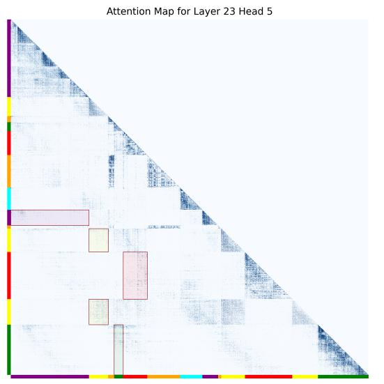

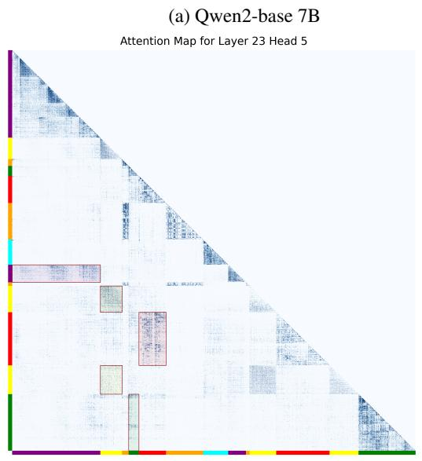  
(c) Qwen2-ABF-base 7B

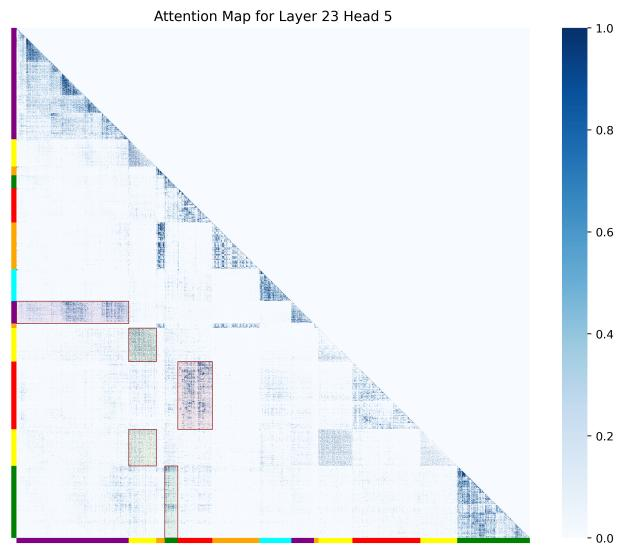

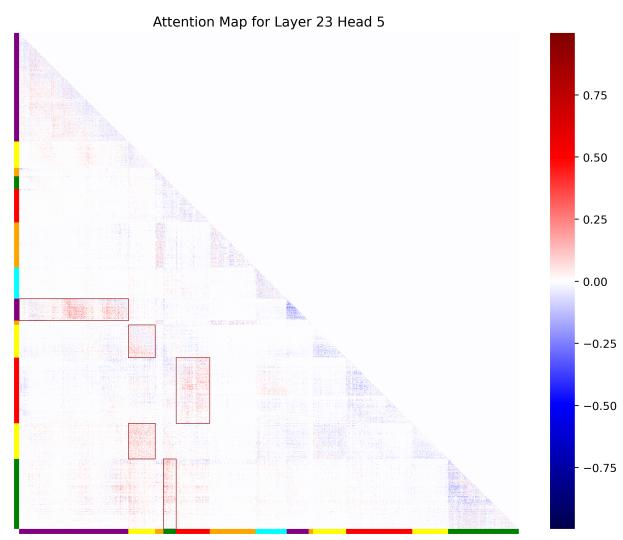  
(d) Qwen2-ABF-base v.s. Qwen2-UtK-base  
Figure 8: Attention Visualization

6. Add unique label at the last chunk of each document for backtracing, $< \mathrm { S } > C L _ { i } ^ { 1 } < \mathrm { s } > C L _ { i } ^ { 2 }$ $\mathrm { < s > . . . < s > } C L _ { i } ^ { h _ { i } } < / \mathrm { S > }$

See Algorithm 1 for pseudo code implementation of UtK and Figure 9 for illustration of the UtK algorithm applied to an example document.

## C Synthetic Dataset

We described the methodology used to create synthetic data in Table 6.

## D LV-Eval Evaluation Details

We report the average F1 score or ROUGE score across the remaining 9 datasets. For all tasks except dureader-mixup and cmrc-mixup, we use a keyword-recall-based F1 metric, utilizing annotated answer keywords and a word blacklist. For cmrc-mixup, we apply the F1 metric with a word blacklist, and for dureader-mixup, we use the ROUGE-L metric with a word blacklist.

In order to evaluate the base model without adding other questions as context and risk getting a long. We developed a novel method called pseudo few-shot format guidance. This method primes the model with a series of simple, contextually relevant questions and their corresponding answers, which can be easily extracted using regular expressions. These preliminary questions guide the model towards the desired output format without introducing extraneous information, see Table 7 for a pseudo format guidance example.

Algorithm 1 UtK algorithm   
Require: n > 0   
Ensure: doci > seq\_len   
1: procedure BUILDUTK(docs)   
2: for $i  1 , n$ do ▷ Randomly split doci into h parts   
3: $s  \mathbb { I }$   
4: parts  [doci]   
5: if length(doc) min\_split\_len then   
6: h random.choice([1..maxh, 1], ]) ▷ Number of hops   
7: s random.choice([1..length(doc )), h) ▷ Split position   
8: s.sort()   
9: par $\iota s _ { i } \gets [ d o c _ { i } [ : s _ { 1 } ] , d o c _ { i } [ s _ { 1 } : s 2 ] , . . . , d o c _ { i } [ s _ { h - 1 } : ] ]$   
10: for j 1, h do ▷ Add Knot tokens before/after each doc   
11: if $j > 1$ then   
12: partsij ["<hj>"] + partsij   
13: if $\cdot \ : j < h$ then   
14: $p a r t s _ { i j } \gets p a r t s _ { i j } + [ " < t _ { j } > " ]$   
15: partsij <ID> + rand\_idi + </ID> + partsij ▷ Add random id   
16: if ${ \mathit { \dot { \mathbf { \rho } } } } _ { j } = h$ then ▷ Add label for backtracing   
17: partsij partsij + <ID> + rand\_id1 + ... + rand\_ $ { i } d _ { h } +  { < }  { I }  { \mathrm { I D } } >$   
18: total\_parts $ \sum$ length(partsi)   
19: all\_indices  random.permutation(total\_parts)   
20: start 0   
21: results list of size total\_parts   
22: for i 1, n do ▷ Gather parts of docs into a full sequence   
23: this\_part\_indices  all\_indices[start : start + length(partsi)]   
24: this\_part\_indices.sort()   
25: for j  1, length(parts\_i) do   
26: idx this\_part\_indices[j]   
27: result $\mathfrak { i } d x \gets p a r t s _ { i j }$   
28: start  starts + length(partsi)   
return results

## E Open Source

We are publicly releasing the Qwen2-UtK and Llama3.1-UtK base models to the research community under the Apache License. These base models are specifically designed for long-context modeling (128K) and have been tested on both English and Chinese datasets. We hope this release will contribute to advancing the capabilities of language models in handling longer contexts.

## F Additional Results

We present detailed results for the RULER benchmarks in Table 8, Table 9, Table 10, and LV-Eval benchmarks in Table 13, Table 14, Table 15.

## F.1 VT Task Output Truncation

There is a degradation in Multi-hop Tracing (VT) tasks at 4K–8K context length in Table 8. This degradation at shorter context lengths is primarily due to output truncation, rather than an inherent limitation of UtK. The VT task requires the model to enumerate all variable names associated with a value V , but the RULER dataset restricts the generated output to 30 tokens for these settings. As a result, truncated predictions at a 4K context length often miss the final variables. For example:

• Prediction: “1. VAR KRUSV 2. VAR XZNXP 3. VAR RCLWE 4. VAR GILIW 5” (missing “HYKVM”)

• Prediction: “1. PUFNL, 2. LWZHQ, 3.

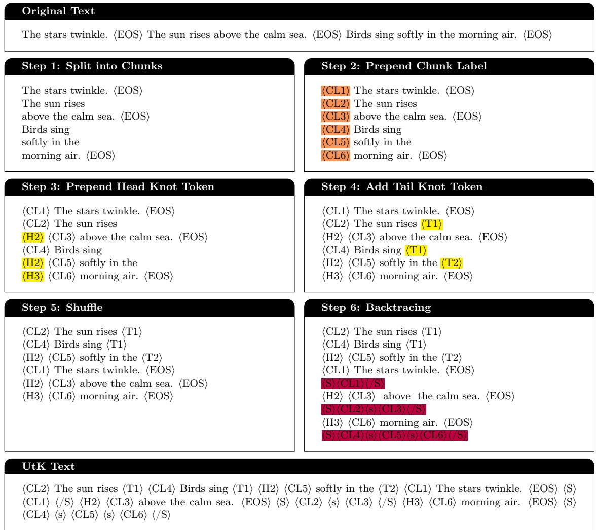  
Figure 1: Illustration of the UtK algorithm applied to an example document.Figure 9: Illustration of the UtK algorithm applied to an example document. CLi is a hash string enclosed by two special tokens. Hi , Ti , S , s , and /S are special tokens.

## PTYFF, 4. REEBA, 5.” (missing “LPHGS”)

In contrast, at a 128K context length, the model is able to provide complete responses. For example:

• Prediction: “VAR IWPYM, VAR SDXPW, VAR PAOLE, VAR IRPTX, VAR SFSVD.”

These findings indicate that the observed performance drop is caused by the format constraints imposed on shorter contexts, rather than a fundamental issue with UtK. Consequently, aggregate metrics—including those in Table 8 for overall RULER results—are affected by this artifact. To ensure a fair comparison with prior work, we strictly follow RULER’s default settings for all evaluations.

## F.2 Result Analysis with respect to Language

our proposed approach is applicable to other language mixtures as well, and, importantly, it does not require modifying the language proportions.

We analyze the language performance comparison on InfiniteBench and LV-Eval. Table 11 reports the breakdown of model performance on the English (En.QA) and Chinese (Zh.QA) subsets of InfiniteBench. The results demonstrate that our method yields consistent improvements across both languages. Table 12 summarizes this analysis on LV-Eval at 32K and 128K contexts. The results consistently indicate that the UtK strategy achieves superior performance at 128K, demonstrating language-agnostic improvements.

<table><tr><td>Dataset</td><td>Size</td><td>Objective</td></tr><tr><td>sorting</td><td>1B</td><td>We provide the model with a list of entities, each possessing multiple attributes represented by integer values. We then ask it to identify the maximum or minimum value of a specific attribute, as well as the name of the corresponding</td></tr><tr><td>multi-hop reasoning 5B</td><td></td><td>entity. This task resembles entity linking in the field of knowledge graphs. We provide the model with numerous triplets, such as (Alice, likes, Bob), and ask it to identify the end_entity based on the given start_entity and relationships. The num- ber of hops is a hyperparameter, and we have constructed</td></tr><tr><td>state tracking</td><td>1B</td><td>datasets ranging from 1 to 5 hops in total. We have constructed a virtual trading scenario and provide the model with daily transaction details. The model is required to determine which trader ultimately possesses a</td></tr><tr><td>similarity retrieval1B</td><td></td><td>specific initial item from a particular trader. We provide the model with numerous objects, each asso- ciated with a list of multiple random strings. The task for the model is to identify, from the context, the object that</td></tr><tr><td>attribute inclusion</td><td>3B</td><td>contains all of these given strings. We provide the model with numerous entities, each con- taining 5 inherent attributes and 15 optional attributes. The task is for the model to identify the corresponding entity based on the given attributes. There are three task variants: in the first variant, the attributes in the query match the attributes of the answer entity exactly; in the second variant, the attributes in the query are a subset of the attributes of the answer entity; and in the third variant, the attributes of the answer entity are a subset of the attributes in the query.</td></tr></table>

Table 6: The methodology used to create synthetic data.

<table><tr><td>Model</td><td>En.QA Zh.QA</td></tr><tr><td>Qwen2-ChatQA2-7B 35.9</td><td>34.4</td></tr><tr><td>Qwen2-UtK-ChatQA2-7B 42.6</td><td>37.6</td></tr><tr><td>Qwen2-ChatQA2-72B 40.5</td><td>40.5</td></tr><tr><td>Qwen2-UtK-ChatQA2-72B 55.9</td><td>45.2</td></tr></table>

Table 11: Performance on InfiniteBench’s English En.QA and Chinese Zh.QA subsets.

<table><tr><td>Model</td><td>Avg.En 32K</td><td>Avg.Zh 32K</td><td>Avg.En 128K</td><td>Avg.Zh 128K</td></tr><tr><td>Qwen2-base (7B)</td><td>27.90</td><td>32.35</td><td>21.97</td><td>26.40</td></tr><tr><td>Qwen2-UtK-base (7B)</td><td>27.41</td><td>30.17</td><td>26.44</td><td>31.53</td></tr><tr><td>Qwen2-base (72B)</td><td>31.22</td><td>33.80</td><td>26.52</td><td>28.50</td></tr><tr><td>Qwen2-UtK-base (72B)</td><td>31.11</td><td>33.66</td><td>31.45</td><td>32.93</td></tr></table>

Table 12: Comparison of average English (Avg.En) and Chinese (Avg.Zh) performance on LV-Eval at different context lengths.

  
Table 7: An illustration of 3-shot pseudo format guidance example in LV-Eval hotpotwikiqa dataset

<table><tr><td>Model</td><td>4K</td><td>8K</td><td>16K</td><td>32K</td><td>64K</td><td>128K</td></tr><tr><td>Llama3.1-UtK-base (8B)</td><td>94.64</td><td>92.19</td><td>91.73</td><td>88.83</td><td>83.60</td><td>73.79</td></tr><tr><td>Llama3.1-base (70B)</td><td>95.78</td><td>94.54</td><td>93.04</td><td>91.66</td><td>84.64</td><td>66.02</td></tr><tr><td>Llama3.1-base (8B)</td><td>94.35</td><td>92.06</td><td>92.31</td><td>90.17</td><td>80.40</td><td>66.10</td></tr><tr><td>Qwen2-ABF (7B)</td><td>99.78</td><td>98.53</td><td>82.46</td><td>78.94</td><td>75.21</td><td>65.91</td></tr><tr><td>Qwen2-AttnMask (7B)</td><td>90.57</td><td>84.9</td><td>82.74</td><td>80.38</td><td>75.59</td><td>71.97</td></tr><tr><td>Qwen2-CIP (7B)</td><td>90.5</td><td>85.38</td><td>82.21</td><td>80.50</td><td>76.26</td><td>71.04</td></tr><tr><td>Qwen2-CT-base (7B)</td><td>92.82</td><td>85.79</td><td>83.12</td><td>78.16</td><td>73.64</td><td>54.75</td></tr><tr><td>Qwen2-Synthetic (7B)</td><td>99.72</td><td>99.16</td><td>85.55</td><td>83.21</td><td>80.45</td><td>72.68</td></tr><tr><td>Qwen2-Upsampling (7B)</td><td>91.75</td><td>87.32</td><td>82.76</td><td>80.69</td><td>76.38</td><td>67.41</td></tr><tr><td>Qwen2-UtK-base (72B)</td><td>95.0</td><td>93.78</td><td>94.67</td><td>93.26</td><td>90.57</td><td>84.45</td></tr><tr><td>Qwen2-UtK-base (7B)</td><td>90.59</td><td>85.01</td><td>82.01</td><td>80.50</td><td>79.20</td><td>75.03</td></tr><tr><td>Qwen2-base (72B)</td><td>96.91</td><td>95.69</td><td>94.53</td><td>93.31</td><td>85.87</td><td>78.00</td></tr><tr><td>Qwen2-base (7B)</td><td>90.81</td><td>84.78</td><td>82.33</td><td>81.05</td><td>73.16</td><td>65.22</td></tr></table>

Table 8: Performance of the reported base models across length 4K to 128K by averaging 13 task scores of RULER.

<table><tr><td rowspan="2">Model</td><td colspan="5">NIAH</td><td colspan="2"></td><td colspan="5">VT</td></tr><tr><td>4K</td><td>8K</td><td>16K</td><td>32K</td><td>64K</td><td>128K</td><td>4K</td><td>8K</td><td>16K</td><td>32K</td><td>64K</td><td>128K</td></tr><tr><td>Llama3.1-UtK-base (8B)</td><td>99.88</td><td>99.88</td><td>99.59</td><td>98.19</td><td>97.34</td><td>88.25</td><td>93.6</td><td>90.6</td><td>91.8</td><td>94.4</td><td>89.2</td><td>65.0</td></tr><tr><td>Llama3.1-base (70B)</td><td>100.0</td><td>99.62</td><td>99.59</td><td>97.56</td><td>95.09</td><td>74.88</td><td>94.4</td><td>94.0</td><td>94.8</td><td>85.4</td><td>83.6</td><td>75.0</td></tr><tr><td>Llama3.1-base (8B)</td><td>99.88</td><td>100.0</td><td>99.72</td><td>99.03</td><td>94.66</td><td>81.53</td><td>95.8</td><td>92.4</td><td>94.6</td><td>92.4</td><td>88.8</td><td>31.0</td></tr><tr><td>Qwen2-ABF (7B)</td><td>99.78</td><td>98.53</td><td>98.16</td><td>95.53</td><td>93.72</td><td>83.06</td><td>78.4</td><td>80.2</td><td>71.8</td><td>66.2</td><td>65.6</td><td>71.6</td></tr><tr><td>Qwen2-AttnMask (7B)</td><td>98.38</td><td>98.09</td><td>97.38</td><td>96.69</td><td>92.09</td><td>86.34</td><td>72.4</td><td>60.4</td><td>58.0</td><td>48.4</td><td>46.6</td><td>76.4</td></tr><tr><td>Qwen2-CIP (7B)</td><td>99.38</td><td>99.31</td><td>98.22</td><td>95.97</td><td>93.50</td><td>86.12</td><td>63.8</td><td>65.4</td><td>65.0</td><td>69.0</td><td>72.4</td><td>90.4</td></tr><tr><td>Qwen2-CT-base (7B)</td><td>99.84</td><td>99.09</td><td>98.50</td><td>94.88</td><td>93.12</td><td>66.72</td><td>91.6</td><td>71.2</td><td>63.4</td><td>61.4</td><td>66.2</td><td>68.4</td></tr><tr><td>Qwen2-Synthetic (7B)</td><td>99.72</td><td>99.16</td><td>98.75</td><td>96.91</td><td>96.09</td><td>89.97</td><td>98.4</td><td>99.6</td><td>93.8</td><td>96.0</td><td>96.4</td><td>92.4</td></tr><tr><td>Qwen2-Upsampling (7B)</td><td>99.47</td><td>99.12</td><td>98.66</td><td>97.44</td><td>95.78</td><td>87.28</td><td>71.4</td><td>70.8</td><td>62.4</td><td>60.8</td><td>57.0</td><td>61.6</td></tr><tr><td>Qwen2-UtK-base (72B)</td><td>99.34</td><td>98.69</td><td>99.78</td><td>98.69</td><td>98.59</td><td>96.59</td><td>89.6</td><td>92.0</td><td>95.0</td><td>98.4</td><td>98.6</td><td>97.6</td></tr><tr><td>Qwen2-UtK-base (7B)</td><td>99.78</td><td>99.0</td><td>98.25</td><td>97.38</td><td>95.19</td><td>90.25</td><td>55.8</td><td>57.8</td><td>60.2</td><td>63.4</td><td>80.2</td><td>97.6</td></tr><tr><td>Qwen2-base (72B)</td><td>100.0</td><td>99.69</td><td>99.50</td><td>98.66</td><td>91.50</td><td>84.81</td><td>96.2</td><td>97.8</td><td>98.0</td><td>98.6</td><td>95.6</td><td>94.2</td></tr><tr><td>Qwen2-base (7B)</td><td>99.62</td><td>98.94</td><td>97.97</td><td>95.22</td><td>86.78</td><td>78.31</td><td></td><td>47.6 53.6</td><td>48.2</td><td>76.0</td><td>69.0</td><td>62.0</td></tr><tr><td rowspan="2">Model</td><td colspan="6">CWE+FWE</td><td colspan="6">QA</td></tr><tr><td>4K</td><td>8K</td><td>16K</td><td>32K</td><td>64K</td><td>128K</td><td>4K</td><td>8K</td><td>16K3</td><td>32K</td><td>64K</td><td>128K</td></tr><tr><td>Llama3.1-UtK-base (8B)</td><td>95.84</td><td>90.44</td><td>90.00</td><td>73.44</td><td>49.95</td><td>43.14</td><td>73.0</td><td>64.0</td><td>62.0</td><td>64.0</td><td>59.5</td><td>51.0</td></tr><tr><td>Llama3.1-base (70B)</td><td>99.84</td><td>97.5</td><td>97.98</td><td>98.38</td><td>74.52</td><td>43.62</td><td>75.5</td><td>71.5</td><td>61.0</td><td>64.5</td><td>53.5</td><td>48.5</td></tr><tr><td>Llama3.1-base (8B)</td><td>96.36</td><td>91.72</td><td>92.85</td><td>83.76</td><td>47.05</td><td>38.56</td><td>69.5</td><td>60.5</td><td>61.0</td><td>60.0</td><td>52.5</td><td>49.5</td></tr><tr><td>Qwen2-ABF (7B)</td><td>89.65</td><td>68.48</td><td>52.95</td><td>49.89</td><td>38.71</td><td>23.35</td><td>69.0</td><td>59.0</td><td>54.5</td><td>48.0</td><td>42.5</td><td>37.0</td></tr><tr><td>Qwen2-AttnMask (7B)</td><td>85.98</td><td>61.3</td><td>53.28</td><td>50.98</td><td>41.68</td><td>43.26</td><td>73.0</td><td>68.0</td><td>66.0</td><td>60.5</td><td>58.0</td><td>41.0</td></tr><tr><td>Qwen2-CIP (7B)</td><td>86.3</td><td>62.05</td><td>51.50</td><td>50.86</td><td>43.98</td><td>33.55</td><td>72.5</td><td>63.0</td><td>57.5</td><td>54.0</td><td>41.5</td><td>38.5</td></tr><tr><td>Qwen2-CT-base (7B)</td><td>90.18</td><td>67.68</td><td>56.58</td><td>47.84</td><td>33.58</td><td>16.31</td><td>68.0</td><td>58.0</td><td>58.0</td><td>50.0</td><td>39.5</td><td>38.5</td></tr><tr><td>Qwen2-Synthetic (7B)</td><td>94.82</td><td>79.05</td><td>57.16</td><td>54.74</td><td>44.85</td><td>31.82</td><td>64.5</td><td>60.0</td><td>57.0</td><td>50.5</td><td>45.5</td><td>34.5</td></tr><tr><td>Qwen2-Upsampling (7B)</td><td>90.8</td><td>75.2</td><td>55.58</td><td>53.35</td><td>39.35</td><td>21.74</td><td>72.0</td><td>60.5</td><td>56.5</td><td>51.0</td><td>45.5</td><td>36.5</td></tr><tr><td>Qwen2-UtK-base (72B)</td><td>99.34</td><td>97.78</td><td>96.25</td><td>95.20</td><td>77.54</td><td>58.25</td><td>76.0</td><td>71.0</td><td>72.5</td><td>67.0</td><td>67.5</td><td>55.5</td></tr><tr><td>Qwen2-UtK-base (7B)</td><td>88.84</td><td>65.68</td><td>53.98</td><td>50.56</td><td>44.94</td><td>29.92</td><td>73.0</td><td>62.0</td><td>56.0</td><td>51.5</td><td>49.0</td><td>48.0</td></tr><tr><td>Qwen2-base (72B)</td><td>99.84</td><td>97.85</td><td>94.42</td><td>95.58</td><td>80.37</td><td>70.16</td><td>82.0</td><td>76.5</td><td>73.0</td><td>67.0</td><td>64.0</td><td>50.5</td></tr><tr><td>Qwen2-base (7B)</td><td>94.46</td><td>66.54</td><td>58.66</td><td>55.96</td><td></td><td>48.9040.71</td><td>73.5</td><td>62.0</td><td>60.5</td><td>52.0</td><td>45.0</td><td>39.0</td></tr></table>

Table 9: Performance of RULER’s Retrieval (NIAH) and Multi-hop Tracing (VT) tasks across context lengths from 4K to 128K, averaged over 8 task scores for NIAH and 1 task score for VT.

Table 10: Performance of RULER’s aggregation (CWE+FWE) and question answering (QA) tasks across context lengths from 4K to 128K, averaged over 2 task scores for CWE+FWE and 2 task scores for QA.

<table><tr><td>Models</td><td>cmrc</td><td>dureader</td><td>hotpot wikiqa</td><td>lic</td><td>CR</td><td>loogle loogle MIR</td><td>SD</td><td>loogle mfqa mfqa en</td><td>zh</td><td>Avg. F1</td></tr><tr><td>Llama3.1-base (8B)</td><td>39.15</td><td>13.55</td><td>22.60</td><td>16.77</td><td>14.93</td><td>13.31</td><td>45.25</td><td>20.95</td><td>28.59</td><td>23.90</td></tr><tr><td>Qwen2-base (7B)</td><td>48.88</td><td>15.76</td><td>22.67</td><td>15.36</td><td>11.34</td><td>8.68</td><td>40.93</td><td>26.22</td><td>25.60</td><td>23.94</td></tr><tr><td>Qwen2-ABF (7B)</td><td>51.28</td><td>17.08</td><td>19.82</td><td>21.40</td><td>10.77</td><td>13.79</td><td>40.32</td><td>23.08</td><td>29.60</td><td>25.24</td></tr><tr><td>Qwen2-AttnMask (7B)</td><td>51.80</td><td>17.26</td><td>24.18</td><td>21.05</td><td>12.67</td><td>13.67</td><td>41.93</td><td>26.96</td><td>23.71</td><td>25.91</td></tr><tr><td>Qwen2-Synthetic (7B)</td><td>48.68</td><td>16.72</td><td>22.68</td><td>18.83</td><td>12.76</td><td>13.64</td><td>43.83</td><td>25.40</td><td>30.51</td><td>25.89</td></tr><tr><td>Llama3.1-UtK-base (8B)</td><td>47.99</td><td>14.42</td><td>24.63</td><td>22.40</td><td>14.74</td><td>14.48</td><td>48.44</td><td>27.65</td><td>27.30 26.89</td><td></td></tr><tr><td>Qwen2-UtK-base (7B)</td><td>55.85</td><td>18.88</td><td>25.94</td><td>24.42</td><td>15.77</td><td>14.34</td><td>43.96</td><td>32.17</td><td>26.98</td><td>28.70</td></tr><tr><td>LLama3.1-base (70B)</td><td>31.82</td><td>13.46</td><td>21.08</td><td>17.08</td><td>18.92</td><td>13.02</td><td>44.01</td><td>20.47</td><td>27.76</td><td>23.07</td></tr><tr><td>Qwen2-base (72B)</td><td>44.64</td><td>20.76</td><td>24.68</td><td>18.68</td><td>16.37</td><td>16.62</td><td>48.78</td><td>26.17</td><td></td><td>29.91 27.40</td></tr><tr><td>Qwen2-UtK-base (72B)</td><td>55.46</td><td>21.04</td><td>35.18</td><td>21.08</td><td>19.03</td><td>16.94</td><td>56.96</td><td></td><td>29.13 34.12 32.10</td><td></td></tr><tr><td>Models</td><td>cmrc</td><td>dureader</td><td>hotpot wikiqa</td><td>lic</td><td>CR</td><td>loogle loogle 1 MIR</td><td>SD</td><td>loogle mfqa mfqa en</td><td>zh</td><td>Avg. F1</td></tr><tr><td>Llama3.1-base (8B)</td><td>53.79</td><td>14.52</td><td>20.23</td><td>23.05</td><td>17.83</td><td>14.09</td><td>59.03</td><td>28.61</td><td>31.30</td><td>29.16</td></tr><tr><td>Qwen2-base (7B)</td><td>58.85</td><td>17.90</td><td>29.79</td><td>21.32</td><td>13.16</td><td>15.86</td><td>54.17</td><td>26.54</td><td>31.32</td><td>29.88</td></tr><tr><td>Qwen2-ABF (7B)</td><td>55.66</td><td>20.59</td><td>27.22</td><td>22.5</td><td>16.78</td><td>16.05</td><td>51.56</td><td>24.74</td><td>30.72</td><td>29.54</td></tr><tr><td>Qwen2-AttnMask (7B)</td><td>58.42</td><td>18.81</td><td>29.67</td><td>22.92</td><td>14.58</td><td>13.86</td><td>49.91</td><td>25.87</td><td>31.31</td><td>29.48</td></tr><tr><td>Qwen2-Synthetic (7B)</td><td>56.12</td><td>19.17</td><td>28.59</td><td>20.34</td><td>14.77</td><td>14.08</td><td>52.35</td><td>29.35</td><td>27.53</td><td>29.14</td></tr><tr><td>Llama3.1-UtK-base (8B)</td><td>61.27</td><td>15.55</td><td>21.81</td><td>24.50</td><td>18.31</td><td>13.10</td><td>56.82</td><td>28.52</td><td>26.82</td><td>29.63</td></tr><tr><td>Qwen2-UtK-base (7B)</td><td>55.35</td><td>17.10</td><td>32.24</td><td>23.18</td><td>13.84</td><td>14.43</td><td>48.86</td><td>27.69</td><td>25.03</td><td>28.64</td></tr><tr><td>LLama3.1-base (70B)</td><td>53.07</td><td>14.83</td><td>29.67</td><td>19.35</td><td>22.84</td><td>18.00</td><td>55.02</td><td>29.12</td><td>31.54</td><td>30.38</td></tr><tr><td>Qwen2-base (72B)</td><td>57.58</td><td>20.86</td><td>32.48</td><td>21.06</td><td>21.46</td><td>18.54</td><td>58.52</td><td></td><td>25.08 35.71</td><td>32.37</td></tr><tr><td>Qwen2-UtK-base (72B)</td><td>58.09</td><td>22.54</td><td>31.97</td><td>22.49</td><td>19.69</td><td>19.33</td><td>58.37</td><td>26.17</td><td>31.52 32.24</td><td></td></tr></table>

Table 13: Performance of LV-Eval at 128K context length, averaged across 9 question answering task scores.

Table 14: Performance of LV-Eval at 32K context length, averaged across 9 question answering task scores.

<table><tr><td rowspan="2">Models</td><td colspan="3">32K</td><td colspan="3">128K</td></tr><tr><td>Average Single-hop Multi-hop Average Single-hop Multi-hop</td><td></td><td></td><td></td><td></td><td></td></tr><tr><td>Llama3.1-base (8B)</td><td>29.16</td><td>43.18</td><td>17.94</td><td>23.90</td><td>33.49</td><td>16.23</td></tr><tr><td>Qwen2-base (7B)</td><td>29.88</td><td>42.72</td><td>19.61</td><td>23.94</td><td>35.41</td><td>14.76</td></tr><tr><td>Qwen2-ABF (7B)</td><td>29.54</td><td>40.67</td><td>20.63</td><td>25.24</td><td>36.07</td><td>16.57</td></tr><tr><td>Qwen2-AttnMask (7B)</td><td>29.48</td><td>41.38</td><td>19.97</td><td>25.91</td><td>36.10</td><td>17.77</td></tr><tr><td>Qwen2-Synthetic (7B)</td><td>29.14</td><td>41.34</td><td>19.39</td><td>25.89</td><td>37.11</td><td>16.93</td></tr><tr><td>Llama3.1-UtK-base (8B)</td><td>29.63</td><td>43.36</td><td>18.65</td><td>26.89</td><td>37.85</td><td>18.13</td></tr><tr><td>Qwen2-UtK-base (7B)</td><td>29.36</td><td>39.79</td><td>21.02</td><td>28.06</td><td>38.99</td><td>19.32</td></tr><tr><td>Llama3.1-base (70B)</td><td>30.38</td><td>42.19</td><td>20.94</td><td>23.07</td><td>31.02</td><td>16.71</td></tr><tr><td>Qwen2-base (72B)</td><td>32.37</td><td>44.22</td><td>22.88</td><td>27.40</td><td>37.38</td><td>19.42</td></tr><tr><td>Qwen2-UtK-base (72B)</td><td>32.24</td><td>43.54</td><td>23.20</td><td>32.10</td><td>43.92</td><td>22.65</td></tr></table>

Table 15: Performance on LV-Eval benchmark.