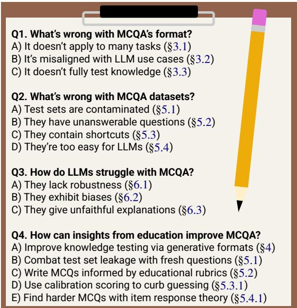
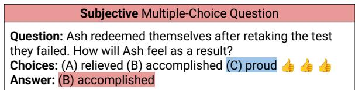
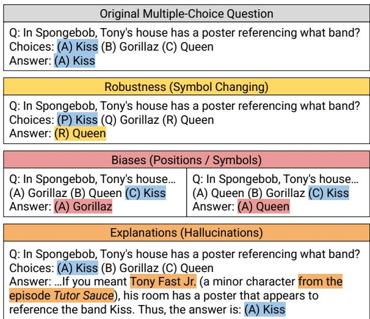

# Which of These Best Describes Multiple Choice Evaluation with LLMs? A) Forced B) Flawed C) Fixable D) All of the Above

Nishant Balepur University of Maryland nbalepur@umd.edu

Rachel Rudinger University of Maryland rudinger@umd.edu

Jordan Boyd-Graber University of Maryland jbg@umiacs.umd.edu

## Abstract

Multiple choice question answering (MCQA) is popular for LLM evaluation due to its simplicity and human-like testing, but we argue for its reform. We first reveal flaws in MCQA’s format, as it struggles to: 1) test generation/subjectivity; 2) match LLM use cases; and 3) fully test knowledge. We instead advocate for generative formats based on human testing—where LLMs construct and explain answers—better capturing user needs and knowledge while remaining easy to score. We then show even when MCQA is a useful format, its datasets suffer from: leakage; unanswerability; shortcuts; and saturation. In each issue, we give fixes from education, like rubrics to guide MCQ writing; scoring methods to bridle guessing; and Item Response Theory to build harder MCQs. Lastly, we discuss LLM errors in MCQA—robustness, biases, and unfaithful explanations—showing how our prior solutions better measure or address these issues. While we do not need to desert MCQA, we encourage more efforts in refining the task based on educational testing, advancing evaluations.

## 1 Questioning Multiple Choice Questions

Multiple choice question answering (MCQA) is the standard for large language model (LLM) evaluations, prized for simplicity and similarity to human testing (Robinson and Wingate, 2023). When designing new benchmarks, MCQA seems easy to implement (Guo et al., 2023), and when selecting new LLMs to use, MCQA leaderboards inform our decisions (Fourrier et al., 2024). If you want to build a popular dataset, prove your LLM is smart, or even publish a position paper, it is hard to avoid MCQA.

Standardized testing groups have long explored ways to better use MCQA for student testing (Angoff, 1971). But despite years of use in NLP (Turney et al., 2003), few have asked: 1) should MCQA be a standard model evaluation format; and 2) are its datasets well-designed? This position paper argues: Evaluating LLMs with MCQA has flaws in both its inherent format and dataset construction. We state our position in three points (Fig 1).

  
Figure 1: Overview of this paper. We show many problems in formats (§3), datasets (§5), and LLMs (§6) when using MCQA. Along the way, we propose solutions and ideas for future work, drawing from educational testing.

We first argue MCQA is not an ideal standardized format for LLM evaluations, showing its goal of “pick the best answer” cannot optimally test generation or subjectivity (§3.1), misaligns with LLM use cases (§3.2), and poorly tests knowledge (§3.3). Drawing from education, we advocate two generative improvements to MCQA’s format for future exploration: 1) providing short, constructed-response answers without using choices (§4.1); and 2) evaluating explanations for model answers (§4.2). These formats capture generation or subjectivity, match LLM use cases, and improve knowledge testing, all while mostly preserving MCQA’s simple scoring.

Next, we argue even when MCQA is a useful format, its datasets suffer from: dataset leakage (§5.1), unanswerable MCQs (§5.2), shortcuts (§5.3), and saturation (§5.4), degrading MCQA’s utility. To enhance NLP dataset design, we offer solutions for each issue based on best practices in human testing, like rubrics to flag MCQ errors (§5.2), metrics to curb guessing from shortcuts (§5.3.1), and Item Response Theory (Baker, 2001) to cull shoddy MCQs and make the ones left more challenging (§5.4.1).

Lastly, we show many errors of LLMs in MCQA directly relate to MCQA’s flaws (§6). These issues, like brittleness to perturbations (§6.1), bias toward certain options, cultures, and languages (§6.2), and generating unfaithful explanations (§6.3), can all be better measured or addressed with our proposed improvements to MCQA’s format and datasets.

Many promising improvements to MCQA draw from education, a field dedicated to effective assessment (Haladyna et al., 2002), but these practices are rarely used in NLP. Adopting them demands more effort—MCQA is popular as it seems simple—but this effort is worth it to improve evaluations. To encourage researchers to take on these challenges, we conclude with guidelines for designing meaningful evaluations whether or not you use MCQA (§7).

## 2 Background: A Brief History of MCQA

A multiple-choice question (MCQ) is a question q and set of choices .1 One choice a is the gold answer, while others are plausible-sounding but incorrect distractors ${ \mathcal { D } } = { \mathcal { C } } \backslash \{ a \}$ meant to test misunderstandings.2 MCQA’s simple goal—picking the best answer a—is popular for LLM evaluation, but it has flaws. Before naming them, we first review its history in human testing (§2.1) and NLP (§2.2).

## 2.1 Why MCQA is the Standard for Humans

The MCQA format originated in 1914 with Frederick Kelley’s Kansas Silent Reading Test (Kelly, 1916), proposed as an efficient measure of student reading comprehension (Monroe, 1917). Soon after, MCQA was attempted at scale, notably with Robert Yerkes’ Army Alpha and Beta tests (Yerkes, 1918) in 1917 to assess U.S. Army intelligence. An initial bottleneck in MCQA was the manual effort needed for scoring, which researchers like Benjamin Wood and Reynold Johnson tackled by designing automated grading systems (Brennan and Clark, 1971; Wood and Johnson, 2001) with IBM.

Automatic scoring eventually enabled MCQA’s popularity in primary/secondary education (Butler, 2018), college admissions (Daneman and Hannon, 2001), language proficiency (Jamieson et al., 2000), and even common tasks like driver’s permit exams (Beanland et al., 2013) or employee training (Puhakainen and Siponen, 2010). Parallel to this, education researchers began exploring the best practices for writing high-quality MCQs (Morrison and Free, 2001; Campbell, 2011), authoring distractors (Pho et al., 2015; Gierl et al., 2017), and designing test settings (Rakes, 2008; Shute, 2013).

Despite MCQA’s simplicity and popularity, organizations still critically assess its use in standardized testing. In the United States, the SAT removes unsound MCQ types,3 and France’s Baccalauréat uses long essay tasks over MCQA.4 We argue LLM evaluation needs similar scrutiny and should draw from education to refine MCQA’s format and data.

## 2.2 How MCQA Became Popular for LLMs

NLP first used MCQs from human exams; solving these with models that used external sources was considered part of an “AI grand challenge” (Reddy, 1988), as it required semantic (Turney et al., 2003; Veale, 2004) and factual understanding (Strickland, 2013; Clark et al., 2013). Other early MCQs from Winograd (Levesque et al., 2012) or COPA (Roemmele et al., 2011) tested commonsense reasoning over events and ambiguity in premises. Soon after, Richardson et al. (2013) designed MCTest for machine reading comprehension (MRC) via fiction text and MCQs. All tasks challenged models, but most MCQA work studied MRC (Lai et al., 2017).

With the advent of larger, neural LMs (Devlin et al., 2019), MCQA needed to become harder. Researchers expanded MRC to test numerical reasoning (Dua et al., 2019) and uncertainty (Rogers et al., 2020), and successfully scaled existing commonsense MCQs (Sakaguchi et al., 2021). New MCQs testing LM pre-training knowledge also grew popular, often using commonsense in daily tasks (Talmor et al., 2019; Bisk et al., 2020) and science exams (Mihaylov et al., 2018; Clark et al., 2018).

As LLMs improved in generation (Brown et al., 2020), MCQA evaluation changed; models usually scored MCQA choices independently, but Robinson and Wingate (2023) showed prompting LLMs with the question and all choices was easy to score and matched human testing. It soon became standard to test LLMs with MCQs; companies used the task to parade their models (Achiam et al., 2023), some equating it to intelligence (Anthropic, 2024). This industry adoption incentivized researchers to write more MCQs across topics (Rein et al., 2024), languages, and modalities (Zhang et al., 2023).

  
Figure 2: Commonsense MCQ from Palta et al. (2024) where the choice rated most plausible by users is not the same as the gold answer; both are subjectively correct in varied contexts.

Recent work critiques LLM evaluations generally, discussing reproducibility issues (Laskar et al., 2024), how it should be a distinct discipline (Chang et al., 2024), and its failure to predict deployment settings (Saxon et al., 2024). We similarly argue that while MCQA is simple and popular, the task has flaws in its format and datasets, many of which can be fixed using insights from education research.

## 3 MCQA is Flawed as a Standard Format

MCQA is a simple format for student testing, but educators find tradeoffs: it may not predict student success (Moneta-Koehler et al., 2017) or evaluate knowledge (Simkin and Kuechler, 2005). We argue that the same issues apply to NLP and thus, MCQA should not be considered a gold standard for LLM evaluation. Specifically, we discuss MCQA’s rigid goal (§3.1), misalignment with real LLM use cases (§3.2), and limited testing of knowledge (§3.3).

## 3.1 “Pick the Best Answer” is Too Rigid

One of MCQA’s key issues is its rigid goal: pick the best answer from a set of choices. While easy to score, both designs—the use of 1) one gold answer; and 2) input choices—limit MCQA’s applicability.

First, one gold answer hinders MCQA’s use for evaluating subjectivity (Finetti, 1965). Still, we use this format for commonsense (Bisk et al., 2020), morals (Yu et al., 2024b; Scherrer et al., 2023), and culture (§6.2), where many choices can be subjectively right (Figure 2). Palta et al. (2024) find users rate distractors in commonsense MCQs as the most plausible choice in over 20% of cases. Thus, extra care is needed to write MCQs for subjective tasks.

Second, picking from choices means MCQs test validation, useful in tasks like LLM-as-a-judge or re-ranking which must compare answers (Gu et al., 2024), but inhibiting tasks like writing and coding that require generation (Yu et al., 2022). One may argue MCQA proxies generation (if you pick good answers, you generate good ones), but LLMs lack validation/generation consistency (Li et al., 2024f; West et al., 2023; Balepur et al., 2025). Validation and generation are thus separate skills, so MCQA is a poor format for evaluating generation ability.

In all, MCQA best tests LLMs in objective validation, struggling with subjectivity and generation.

## 3.2 Users Rarely Ask LLMs to Solve MCQs

Many leaderboards aim to rank LLMs by their overall abilities, helping users select the best model for their needs (Xia et al., 2024). Hence, they should adopt tasks that mirror the popularity of user needs, giving higher ranks to models that can actually help users (Balepur et al., 2024c; Mozannar et al., 2025).

MCQA is over-represented versus how LLMs are used; 32% of the tasks in HELM (Perlitz et al., 2024), 71% in GPT-4’s card (Achiam et al., 2023), and 79% in OpenLLM (Fourrier et al., 2024, Big Bench has 21 MCQA tasks) are MCQA. In contrast, Ouyang et al. (2023) find in ShareGPT’s set of ChatGPT queries that nearly all user queries ask for free-form text; we estimate 7.2% are validation (4.3% evaluation and 2.9% comparison). Similarly, WildChat notes just 6.3% of their LLM queries are factual QA (Zhao et al., 2024).5 Thus, over 90% of queries are likely generative tasks (code, writing, or explanations), which MCQs struggle to test (§3.1).

Informative evaluation suites must reflect LLM use cases. This is precisely why MCQA exams are waning in graduate admissions criteria: they cannot fully predict graduate school success (Sampson and Boyer, 2001). Similarly, over-representing MCQA in evaluations obscures which LLMs best aid users.

## 3.3 MCQA Does Not Fully Test Knowledge

While MCQA fails to match real user needs (§3.2), we hope the format tests basic skills for such needs, justifying its usage. MCQA is meant to test knowledge (Moss, 2001), and with input texts, comprehension (Farr et al., 1990), but work in education shows MCQA may be suboptimal for these goals.

MCQs mainly assess the basic knowledge levels in Bloom’s Taxonomy of educational goals (Krathwohl, 2002): recalling, understanding, and applying knowledge (Simkin and Kuechler, 2005; Shin et al., 2024); it is hard to write MCQs for the higher levels requiring reasoning (Stupans, 2006; Palmer and Devitt, 2007; Lin and Singh, 2012): analyzing, evaluating, and creating knowledge. As evidence, students can solve MCQs without full understanding, exposed in free-response answers (McKenna, 2019). MCQs with passages generally test comprehension, but some doubt this; Ozuru et al. (2013) find MCQA scores correlate with prior knowledge of the passage, overestimating true comprehension.

<table><tr><td>Traditional Multiple-Choice Question Answering</td></tr><tr><td>Question: Heat, light, and sound are all different forms of what? Choices: (A) fuel (B) energy (C) matter (D) electricity Answer:(B) Energy</td></tr><tr><td>Constructed Response Question Answering (§4.1)</td></tr><tr><td>Question: Heat, light, and sound are all different forms of what?</td></tr><tr><td>Answer:Energy</td></tr><tr><td>Explanation Multiple-Choice Question Answering (§4.2)</td></tr><tr><td>Question: Heat, light, and sound are all different forms of what? Choices: (A) fuel (B) energy (C) matter (D) electricity Answer:(A) fuel Explanation: Heat, light, and sound are all different forms of</td></tr></table>

Figure 3: Example of adapting typical MCQs to our generative formats: Constructed Response and Justified MCQA.

We believe these same insights can apply to NLP: MCQA may be apt for comprehension, but rewards LLMs for basic recall versus in-depth knowledge.

## 4 Generative MCQA Tasks are Promising

MCQA is flawed, so how should its role change? Standardized LLM evaluations must 1) proxy LLM use cases; and 2) test skills for (1). MCQA is unfit for (1), so evaluations need more tasks matching LLM needs (§3.2). Writing/explanation tasks are harder to score (Charney, 1984; Chakrabarty et al., 2022; Balepur et al., 2023a), but it is still odd they are often omitted, as they are typical needs (§3.2).

This limits MCQA to (2), but it is best for comprehension or validating objective facts (§3.1), not generation, subjectivity, or knowledge (§3.3). Validation/comprehension are valuable, which is why we discuss MCQA datasets in §5, but we need better formats for the other skills. Thus, we give two generative versions of MCQA to better test LLMs (Figure 3): Constructed Response (§4.1), answering sans choices, and Explanation MCQA (§4.2), justifying predictions. We ensure the formats only slightly increase evaluation complexity, mostly preserving MCQA’s simplicity of scoring. We now describe the formats and future work to realize them.

## 4.1 Constructed Response Questions

Having LLMs solve MCQs without choices, called Constructed Response (CR) in education (Livingston, 2009) or short-form QA in NLP (Krishna et al., 2021), is one better format. CRQs test answer generation unlike MCQs (§3.1), better mirroring LLM needs (§3.2), and it is easier to write CRQs testing all skills in Bloom’s Taxonomy (Krathwohl, 2002), so they better expose knowledge gaps (§3.3). Thus, students find CRQs harder than MCQs (Hancock, 1994), which can also delay saturation (§5.4).

Instead of writing CRQs to replace our vast existing MCQA data, a promising solution is to convert MCQs into CRQs by omitting choices and tasking LLMs to give a short-form answer aˆ for question q, comparing it to gold answer $a \in { \mathcal { C } }$ (Bhakthavatsalam et al., 2021). Myrzakhan et al. (2024) show two hurdles in this: finding MCQs to convert6 and scoring aˆ with a. Recent efforts in flagging MCQ errors (Moore et al., 2023, 2024) and judging shortform answer correctness (Li et al., 2024g; Moore et al., 2022) showcase that we can realistically overcome these challenges. Thus, we believe combining this work with best practices for creating CRQs (Snow, 2012) can successfully implement the task.

## 4.2 Explanation Multiple Choice Questions

Constructed Response is promising (§4.1), but using one short answer is unfit for subjectivity (Lin et al., 2021) and conflicts user preferences for long outputs (Zheng et al., 2024b). We thus propose Explanation MCQA (E-MCQA) as another MCQA alternative from education (Lau et al., 2011): for a question q and choices , models give an answer ${ \hat { a } } \in { \mathcal { C } }$ and explanation for why aˆ is right. This format tests generation (§3.1), matches the use case of explanations (§3.2), and has shown to test more knowledge levels over MCQA (Lee et al., 2011).

We envision E-MCQA being treated like reasoning tasks (Cobbe et al., 2021), checking if LLMs pick a like MCQA’s simple scoring, but also studying . If models select a but justify it poorly, it exposes knowledge gaps like in student assessments (Jonassen and Kim, 2010), and when models give strong explanations for wrong answers, it enables partial credit for subjective tasks (Lau et al., 2011).

E-MCQA has many benefits, but needs metrics to score “good” explanations over many facets (Xu et al., 2023), like factuality to curb hallucinations (Min et al., 2023; Balepur et al., 2023b), plausibility for convincingness (Liu et al., 2023), and faithfulness to verify supports a (Paul et al., 2024). We believe these goals could be achieved by merging ongoing efforts in building verifiers for LLM reasoning (Ling et al., 2023) with educational best practices for grading justifications (Jonassen and Kim, 2010), yielding reliable metrics that realize E-MCQA’s potential. Kim et al. (2025) have made notable progress for this goal—building LLM judges to score justifications across various benchmarks— showing that implementing E-MCQA is feasible.

## 5 MCQA Datasets are Flawed but Fixable

MCQA is not always the best format (§3), but we still need high-quality MCQs for comprehension/- validation as well as tasks like LLM-as-a-judge (Gu et al., 2025) and re-ranking (Ma et al., 2023) which require comparing answers. Further, our generative MCQA formats (§4) still use MCQs as inputs.

However, like most NLP tasks, MCQA datasets have quality issues that impede their utility: leakage (§5.1), unanswerability (§5.2), shortcuts (§5.3), and saturation (§5.4). We now show how educators solutions to these issues can inform NLP datasets.

## 5.1 LLMs Peek at MCQA Answer Keys

To build an MCQA dataset, we first need sources to write or collect MCQs. But as many sources end up being leaked7 in LLM training data (Magar and Schwartz, 2022), such MCQs may confuse generalization abilities for memorization (Lewis et al., 2021). Private test sets (Sap et al., 2019) and decontamination (Zhou et al., 2023) help, but LLMs tuned on newer data can overlap with (1), and opacity in LLM data (Soldaini et al., 2024) blocks (2).

An ambitious solution to test set leakage is live MCQs that update over time to stay unseen (White et al., 2025), like how educators rewrite exams to impede cheating. Trivia (Jennings, 2007) and standardized testing groups frequently write new questions, making them ideal partners. To aid both parties, researchers could offer these groups tools for tutoring (Siyan et al., 2024), MCQ validation (Yu et al., 2024a), or answer scoring (Yang et al., 2020).

Test set leakage would be easier to fix if model designers released training data, but as we all know, most do not. While it is harder to design solutions for leakage that do not need training data, we hope researchers view it as a challenging, impactful research problem in evaluation and generalization.

<table><tr><td rowspan=1 colspan=1>Unanswerable Multiple Choice Question</td></tr><tr><td rowspan=1 colspan=1>Question: Thenumberofenergy levels for the 55Mn nuclideare:</td></tr><tr><td rowspan=1 colspan=1>Choices:(A) 3 (B) 5 (C) 8(D) 4Answer:(A) 3</td></tr><tr><td rowspan=1 colspan=1>Rubric Errors</td></tr><tr><td rowspan=1 colspan=1>5.Use good grammar, punctuation, and spelling consistently X13.Avoid over specific knowledge when developing the item X24.Place options in logical or numerical order X37.Make sure there is one and only one correct option X</td></tr></table>

Figure 4: Example unanswerable MCQ from MMLU (Gema et al., 2025), along with rubric criteria from Haladyna and Downing (1989) flagged by OpenAI’s o1 (Jaech et al., 2024).

## 5.2 Some MCQs Have No Correct Answer

Once a source is found (§5.1), researchers collect or write MCQs, but errors often arise rendering them unanswerable, like mislabeling (Explained, 2023), multiple correct choices (Palta et al., 2024), ambiguity (Gema et al., 2025), missing contexts (Wang et al., 2024b), and grammar errors (Chen, 2023).

Educators write MCQs with rigorous protocols, and we must meet similar standards in NLP (Boyd-Graber and Börschinger, 2020); we should use educators’ rubrics (Figure 4) for writing and validating MCQs (Haladyna and Downing, 1989). Such guidelines also specifically exist for distractors (Haladyna et al., 2002)—the part of MCQs that discern testees’ skills—ensuring they are truly wrong, shortcut-proof (§5.3), and not too easy to rule out (§5.4). Beyond MCQ writing, rubrics can form data cards (Pushkarna et al., 2022) to help researchers record errors in their data and how they fixed them.

Recent work in LLM checklist evaluation (Cook et al., 2024), MCQ metrics (Moon et al., 2022), and MCQ generation (Feng et al., 2024) show parts of this workflow can be automated (Figure 4). Wang et al. (2024b) fix errors in MMLU by using LLMs to detect issues and write new choices. LLM judges can be inaccurate and biased (Xu et al., 2024b), so human-AI collaboration, like model-assisted refinement (Shankar et al., 2024) and task routing (Miranda et al., 2024), may be more promising. Errors will arise in MCQ writing, but educators’ rubrics can help find and fix them, ensuring answerability.

## 5.3 MCQA Shortcuts May Let LLMs “Cheat”

Answerable MCQs (§5.2) are not always high quality, as shortcuts may let LLMs guess the answers to MCQs without knowing the answers (Du et al., 2023), overestimating model accuracy (Wiegreffe and Marasovic, 2021). Shortcuts arise from annotator artifacts (Gururangan et al., 2018), spurious patterns (Zhou et al., 2024b), or bypassed reasoning steps (Chen and Durrett, 2019). If LLMs best random guessing via partial inputs (Richardson and Sabharwal, 2020, e.g., choices only), they exist.

Below, we discuss how scoring (§5.3.1) and data collection methods (§5.3.2) can mitigate shortcuts.

## 5.3.1 Calibrated Scoring Can Deter Guessing

While rare in human testing,8 scoring methods can penalize wrong guesses (Lau et al., 2011): 1) Probability scoring: elicit confidence scores for each choice (Finetti, 1965); 2) Negative marking: subtract points for wrong answers with abstention allowed (Holt, 2006); and 3) Elimination scoring: students iteratively remove wrong choices until unsure (Ben-Simon et al., 1997). Confidence (Li et al., 2024c), abstention (Góral et al., 2024), and elimination (Ma and Du, 2023) have been studied in LLMs, so they may be easy to use for MCQA evaluation.

Calibration methods deter guessing, but also reward models that know their knowledge gaps (Guo et al., 2017). Such scoring methods are often ignored in evaluation (Bommasani et al., 2023), but it could let MCQA better test decision-making (Liu et al., 2025) and enable partial credit for subjective tasks where many choices may be tenable (§3.3).

## 5.3.2 We Can Design Shortcut-Proof MCQs

Data designers should limit shortcuts; an easy way is uniform design. When solving MCQs with only choices, Balepur et al. (2024b) find LLMs may exploit distributional differences, so like educators do (§5.2), we should write parts of MCQs consistently: via the same agent, source, and decoding method. HellaSwag (Zellers et al., 2019) leads to the highest known choices-only accuracy, where user-written answers and model-written distractors are inconsistent, showing the necessity of uniform data design.

Contrast sets are another tool that detects if models ignore inputs and use shortcuts (Gardner et al., 2020). In MCQA, they are entry pairs differing by some inputs (e.g., question) that change the answer (Figure 5), ensuring models attend to the perturbed input (Elazar et al., 2024). Balepur and Rudinger (2024) use contrast sets in commonsense MCQA to ensure none of their LLMs rely on shortcuts in choices to rank highly. Contrast sets are often made manually (Kaushik et al., 2020), so future work can test automatic ways to build them (Li et al., 2020).

Studying how users and models “cheat” (Saxon et al., 2023) in MCQs also finds shortcuts. In reading comprehension, Pang et al. (2021) give users ctrl+F to detect MCQs quickly solvable without using the full text, while Malaviya et al. (2022) flag MCQs where users can use simple heuristics. We can also train models to cheat; adversarial filtering trains simple models (e.g., bag-of-words) and omits MCQs they can solve (Zellers et al., 2018). Extending this, we believe having strong LLMs reason to cheat—similar to safety work in alignment faking (Greenblatt et al., 2024)—can help find shortcuts.

<table><tr><td>MCQ Paired Example A</td></tr><tr><td>Question: Some aerosols can decrease temperatures by blocking what? Choices: (A) the sun (B) rain Answer:(A) the sun</td></tr><tr><td>MCQ Paired Example B</td></tr><tr><td>Question: Which of the following increases moisture? Choices: (A) the sun (B) rain Answer:(B) rain</td></tr></table>

Figure 5: Example MCQ pair for a contrast set from Balepur and Rudinger (2024). The choices are identical, but the question swaps the answer, testing if models ignore the question.

## 5.4 LLMs Inevitably Ace MCQA Datasets

Even if we fix all of these issues, MCQs become too easy over time (i.e., saturated), no longer tracking LLM progress (Li et al., 2024d). To still use “easy” MCQA datasets, we need to make them harder for models. Below, we show how understanding which MCQs are hard (§5.4.1) and helping users author hard, interpretable MCQs (§5.4.2) delay saturation.

## 5.4.1 IRT Reveals Challenging MCQs

When LLMs excel in MCQA datasets, some MCQs remain hard; finding them and why they are hard informs data design (Sugawara et al., 2018, 2022). One MCQ difficulty metric is success rate (SR)— the number of models answering correctly (Gupta et al., 2025b)—but SR omits which models succeed. MCQs solved by just the worst or best model have equally low success rates, but the former suggests MCQ errors (§5.2)—as a weaker model besting all others is rare—while the latter matches our expectation. As SR conflates these cases, it cannot separate flawed MCQs from those discerning model ability.

Item Response Theory (IRT)—a tool used in education (Lord and Novick, 2008)—is a more robust way to find hard MCQs. While SR treats all models equally, IRT learns the skill of models to then estimate every MCQ’s difficulty (how hard it is) and discriminability (how well it discerns between weak/strong models). IRT can then be used to filter high-difficulty, high-discriminability MCQs as harder data splits (Polo et al., 2024), flag saturation if all MCQs have low difficulty/discriminability (Vania et al., 2021), and omit faulty MCQs with negative discriminability (Rodriguez et al., 2021).

<table><tr><td>Obscure MCQ</td></tr><tr><td>Q: In Spongebob, Tony&#x27;s house has a poster referencing what band? (A) Queen (B) Gorillaz(C) Kiss Answer:(A) Queen</td></tr><tr><td>Adversarial MCQ</td></tr><tr><td>Q: How many non-pet characters live in SpongeBob&#x27;s neighborhood? (A) 3(B) 4 (C) 5 Answer:(B) 4</td></tr></table>

Figure 6: Obscure and adversarial MCQs for Spongebob Squarepants inspired by Sung et al. (2025). GPT-4o answers both wrong (answer in blue). The former tests niche knowledge, but the latter is easy for those who have seen the show.

While IRT-based filtering finds harder MCQs, it does not give new MCQs, limiting its long-term use. However, we can extend IRT to multi-dimensional IRT (Reckase, 2006, MIRT) to capture many latent skills, offering more insights into model abilities; by interpreting these skill dimensions, we can pinpoint model issues that inform future data efforts (§5.4.2). Gor et al. (2024) reveal LLM errors in abductive reasoning via a variant of MIRT—an issue confirmed by abduction research (Del and Fishel, 2023; Nguyen et al., 2023). MIRT could similarly find difficult MCQA topics, distractor patterns, or reasoning types for models (Benedetto et al., 2021).

Overall, IRT can find which MCQs are hard but also why, informing future data collection efforts.

## 5.4.2 A Good MCQ is Hard and Interpretable

A popular way to write harder MCQs is requiring obscure knowledge (Figure 6, left), sourcing from experts (Rein et al., 2024; Phan et al., 2025) and global competitions (Fang et al., 2024). These challenge models and humans, which is useful for AI safety work in scalable oversight (Bowman et al., 2022). However, this makes them uninterpretable for non-experts diagnosing model errors, especially when studying model rationales (§6.3). If LLMs err on obscure MCQs, it is hard for non-experts to find if errors are from faulty reasoning, misunderstandings, or knowledge gaps (Anderson et al., 2025).

While authors know which MCQs elude humans, writing ones that surface model errors while staying human-interpretable needs support. This is adversarial data collection’s goal (Kiela et al., 2021)— building UIs to help authors write examples hard for models but easy for humans (Figure 6, right). Rather than using niche knowledge, authors must write MCQs with spurious patterns, misleading distractors (§5.2), or reasoning traps that trick LLMs but not humans (Xu et al., 2024c). As a result, these MCQs better expose robustness (§6.1) and logical reasoning (§6.3) errors, less clouded by knowledge.

  
Figure 7: LLMs err with robustness (e.g. inconsistent after shuffling), biases (e.g. favor symbols), and explanations (e.g. fail to justify answers) in MCQA. Correct answers are blue.

Adversarial MCQs are useful, but finding users to write high-quality ones is tough. Gamification— making the task fun—helps, used in building adversarial commonsense (Talmor et al., 2021), QA (Wallace et al., 2019; Sung et al., 2025), and factchecking (Wallace et al., 2019) data. Wallace et al. (2022) use gamification to get adversarial NLI data and show it has long-term difficulty, delaying saturation. For more engagement, researchers can stir users to author MCQs exposing shocking failures, inspired by jailbreaking, where provocative outputs are naturally fun to elicit (Schulhoff et al., 2023).

Obscure and adversarial MCQs can both make MCQA harder: the former tests niche knowledge, while the latter better find reasoning or consistency failures that are uneclipsed by knowledge gaps.

## 6 Fixing MCQA Can Help Us Fix LLMs

Fixing issues in MCQA’s format (§3) and datasets (§5) will not just improve evaluation quality; they can also improve our understanding of LLM weaknesses. This section outlines three persistent issues of LLMs in MCQA (Figure 7)—robustness (§6.1), bias (§6.2), and explanations (§6.3)—and how our prior solutions can better address or evaluate them.

## 6.1 New Prompts Lead to New MCQA Scores

On specific prompts, LLMs score highly in MCQA, but now crumble after prompts change, sensitive to:

choice symbols (Alzahrani et al., 2024), choice ordering (Zheng et al., 2024a), and phrasing (Wiegreffe et al., 2023). This brittleness degrades MCQA leaderboard reproducibility, as different evaluation setups yield conflicting rankings (Gu et al., 2025)

LLM robustness varies by task setup. In MCQA, early LLMs with poor instruction following (Zhang et al., 2022) used probability-based scoring, while instruction-tuning enabled LLMs to generate answers (Longpre et al., 2023); while logically equivalent, these give varying answers (Lyu et al., 2024). Probability scoring seems more at fault—more sensitive to prompts (Wang et al., 2024a)—doubting if LLMs can aid decision-making tasks that need accurate confidence scores (Liu et al., 2025). To track this progress in LLMs, researchers can use MCQA scoring protocols that measure calibration (§5.3.1).

As accuracy often drops post-perturbation (Zhou et al., 2024a), these errors in generalization could indicate dataset leakage (§5.1) or over-reliance on biases (discussed in §6.2). Another proposed explanation is symbol binding error: LLMs “know” the answer but cannot link it to the right choice (Wiegreffe et al., 2024; Xue et al., 2024). These failures weaken MCQA’s ability to evaluate knowledge, obscured by memorization and symbol binding.9 Our proposed solutions—like curating live MCQs for data leakage (§5.1) and generative MCQA formats to expose knowledge gaps without needing symbol binding (§4)—can more reliably assess knowledge.

## 6.2 LLMs are Biased MCQA Test-Takers

Like most NLP tasks (Baumler and Rudinger, 2022; Chu et al., 2024), LLMs show biases in MCQA, grouped into two main types. The first are MCQAspecific biases—selecting answers based on symbols (Zheng et al., 2024a), positions (Li et al., 2024e; Wei et al., 2024), or phrases such as “none of the above” (Xu et al., 2024a; Wang et al., 2025) rather than MCQ content. This degrades robustness (§6.1), masking model knowledge. We believe they likely stem from shortcuts (§5.3); LLMs tuned on data where choices with patterns are often correct will manifest these biases (Pacchiardi et al., 2024). Our safeguards—uniform design, contrast sets, and “cheating” (§5.3.2)—can reduce these biases, and more work in shortcuts may be key to quash them.

The second bias type stems from general training, like cultural/linguistic bias (Myung et al., 2024;

Li et al., 2024a); LLMs often err on non-Western cultural MCQs (Acquaye et al., 2024; Azime et al., 2025) and non-English MCQs (Son et al., 2025; Li et al., 2024b). MCQs are popular for assessing bias (Guo et al., 2023), but if they use subjective commonsense (Seo et al., 2024), they are subpar (§3.1). Thus, we advise writing MCQs with rubrics to limit ambiguity and correct distractors (§5.2), ensuring bias is more objectively tested. If subjectivity persists, evaluators should consider strategies to manage it like Explanation MCQA (§4.2) or calibration scoring (§5.3.1), aiding bias testing and for E-MCQA, better matching how bias presents downstream (Seshadri and Goldfarb-Tarrant, 2025).

Lastly, to construct non-English MCQs, we discover researchers typically either: 1) collect MCQs in the desired target language (Son et al., 2025); or 2) translate English ones (Achiam et al., 2023); However, (1) may be infeasible for languages that are low-resource or where MCQA is rarely used,10 while (2) may introduce error propagation during translation (Singh et al., 2024)—showing neither method is perfect on its own. Thus, researchers can adopt our prior solutions for both methods—like using rubrics during translation (§5.2) or collecting non-English MCQs from unseen sources (§5.1)— improving evaluations of multilingual abilities.

## 6.3 LLMs Struggle to “Explain Their Work”

Even if LLMs get the right answer to an MCQ, they may justify their selection unfaithfully—failing to mirror their true reasoning—whether via chainof-thought (Lyu et al., 2023; Turpin et al., 2024) or self-explanations (Kim et al., 2024; Madsen et al., 2024). However, they are convincing, besting crowdworkers in judged quality (Mishra et al., 2024) and misleading users when wrong (Si et al., 2024), likely as standard alignment strategies tend to optimize LLMs for user preferences over helpfulness (Balepur et al., 2024c; Wen et al., 2025).

LLM explanation flaws are even clearer after logical consistency checks. Kawabata and Sugawara (2023) show LLMs often inaccurately explain answers to subquestions in reading comprehension, even when answering the higher-level question correctly. Similarly, Balepur et al. (2024a) find LLMs struggle to reason why distractors are wrong. These issues likely stem from broader LLM logical inconsistencies (Liu et al., 2024; Varshney et al., 2024).

Explanations are popular LLM use cases (§3.2), highlighting the need for improved MCQA formats such as Explanation MCQA (§4.2) which explicitly test explanation skills. Further, LLMs’ logically inconsistent explanations offer a path toward harder datasets (§5.4); tools like MIRT (§5.4.1) can identify logical error types (negation, decomposition) that elude LLMs, while adversarial collection can curate MCQs to excise these errors while staying easy for humans (§5.4.2). In all, LLMs’ poor explanation abilities give an opportunity to design harder MCQA evaluations better aligned with user needs.

## 7 Call to Action: Benchmarking 101

If you want to make the best benchmark ever, where do you begin? First, define the ability you want to test and decide if MCQA is the right format (§3). If the ability matches a downstream task (e.g., coding), just use that task (Saxon et al., 2024). If the ability is fundamental (e.g., knowledge), consult education research to weigh alternative formats (§4).

If MCQA is the best format, find a data source to curb leakage—one with fresh content (§5.1). When curating MCQs from your source, follow educators rubrics to ensure answerability (§5.2), and release the rubric as a data card to record errors (Pushkarna et al., 2022). Consistent design choices will limit shortcuts (§5.3), and providing a contrast set could help researchers check if their models over-rely on shortcuts (Gardner et al., 2020). As another safeguard, your benchmark can use calibration scoring beyond accuracy to discourage guessing (§5.3.1).

Post-release, models will hill-climb and saturate your data over time (§5.4). If you want to delay saturation, you may restart with an obscure knowledge source, but if you want your data to better diagnose errors, aim for interpretability. Use IRT (§5.4.1) to find which of your MCQs are hard and why, then design an engaging, adversarial dataset collection protocol (§5.4.2) guided by these insights, yielding a new dataset hard for models but easy for humans.

By using even some of educators’ insights, we can refine the utility of MCQA—or any task. This approach takes more effort than the simple MCQA practices that initially attracted researchers, but if we do not address the flaws of MCQA, what model abilities can our MCQA benchmarks even test?

## Acknowledgments

We wish to thank the CLIP lab at the University of Maryland and external collaborators for their help.

In particular, we thank Paiheng Xu, Dang Nguyen, Shi Feng, Ioana Baldini, Vipul Gupta, and the Google Translate Reading Group for general discussions; Yu Hou, Dayeon Ki, and Connor Baumler for discussions of culture/biases; Maharshi Gor for feedback on IRT; Yoo Yeon Sung for feedback on IRT and adversarial data collection; Matthew Shu for feedback on best practices in educational testing; Atrey Desai for helping us test MCQ checklist evaluation; and Naina Balepur for brainstorming our excellent title. We sincerely appreciate Michael Saxon, Yi Ting Huang, Fumeng Yang, and Andrew Lan for their reviews of earlier versions of this paper. This material is based upon work supported by the National Science Foundation under Grant No. IIS-2403436 (Boyd-Graber), IIS-2339746 (Rudinger), and DGE-2236417 (Balepur). Any opinions, findings, and conclusions or recommendations expressed in this material are those of the author(s) and do not necessarily reflect the views of the National Science Foundation.

## 8 Limitations

Inspired by Saxon et al. (2024), we organize our limitations section as potential counterarguments:

I Do Not Work on MCQA: Our approach to MCQA can apply to all tasks; it is important to question if your format effectively evaluates your intended ability. Educators have long studied the best formats for different tasks, but we are not using these insights to guide our benchmark design. As an example beyond MCQA, in human math assessments, students are often required to “show their work” to verify understanding and diagnose misconceptions (Choy, 2016). However, math datasets like GSM8k (Cobbe et al., 2021) often ignore intermediate computations in their metrics. Similarly, our dataset quality issues are universal; it is always important to ensure datasets are not contaminated or saturated, as well as free from errors and shortcuts. Thus, we advise all researchers—regardless of task or domain—to consult education research to see if they can improve their evaluations’ efficacy.

Other modalities, languages, etc. are different: Our critiques of MCQA’s rigid goals (§3.1), misalignment with user needs (§3.2), and failure to fully assess knowledge (§3.3), along with our proposed generative task alternatives (§4), are applicable regardless of modality and language. Further, the MCQA dataset quality concerns (§5) we discuss are still relevant to these domains; for example, in some multi-modal QA datasets, models can answer questions without using the input image (Goyal et al., 2017), showing shortcuts exist (§5.3).

Why not abandon MCQA? Indeed, other formats have grown in popularity, such as prompting LLMs on real user queries and using annotators/- models to judge model responses (Chiang et al., 2024; Lin et al., 2025). These efforts are exciting and directly reflect LLM use cases, but are difficult to scale for every domain we currently use MCQA for, their subjective scoring lacks reproducibility, and these metrics are easy to game (Zheng et al., 2025). In contrast, MCQA and our proposed generative formats include scoring using “pick the best answer”, forming a more efficient and objective metric. Thus, we should still aim to advance both of these threads for more reliable evaluations.

This is All Way Too Much Work: We have proposed many directions for future research, but our objective is not to have every MCQA dataset designer engage with each of these efforts. We hope that by pointing out these issues in MCQA, dataset designers will start to consider how using MCQA will affect their datasets’ reliability in the long term, and researchers will further study ways to improve MCQA evaluation. Even adopting just one of our proposals could greatly enhance the quality and effectiveness of MCQA datasets. Over time, these small, incremental improvements across the evaluation community will drive meaningful progress.

Generation is too Hard: While generative versions of MCQA are harder to implement, such efforts are warranted to improve the utility of evaluations: generation tasks better test knowledge (§3.3) and mirror LLM use cases (§3.2). We believe the difficulty of implementation should not preclude the adoption or at least exploration of these threads.

We agree MCQA is attractive as it is easy, but this is not the most important property of evaluations; evaluations should measure how the system will behave in deployment (Saxon et al., 2024). LLMs are used to generate text that helps users, so we argue researchers should strive for tasks that measure generation, not just those that are easy to implement. Many fields have also faced difficulty when evaluating their newest systems, like Information Retrieval and Machine Translation, and have thus made progress as a community toward new evaluation datasets (Voorhees, 2001, e.g., TREC), and metrics (Rei et al., 2020, e.g., COMET); we should thus do the same for LLMs with MCQA.

Our proposed shift from validation to generation evaluations is also not totally new. NLP saw a similar trend in summarization, where efforts switched from evaluating if systems could extract sentences within an input text to generating abstractive summaries (Mehta, 2016). Abstractive summarization is harder to evaluate, but we made this change as a community as it better captured the downstream summarization needs of users (Lin and Ng, 2019).

## 9 Ethical Considerations

Flawed evaluations can mislead both researchers and users; researchers may misinterpret model abilities due to quality issues in datasets, while users may struggle to identify the best models for their needs. This paper outlines several potential solutions to mitigate these risks in MCQA, ensuring more reliable evaluations for researchers and users.

## References

Josh Achiam, Steven Adler, Sandhini Agarwal, Lama Ahmad, Ilge Akkaya, Florencia Leoni Aleman, Diogo Almeida, Janko Altenschmidt, Sam Altman, Shyamal Anadkat, et al. 2023. Gpt-4 technical report. arXiv preprint arXiv:2303.08774.

Christabel Acquaye, Haozhe An, and Rachel Rudinger. 2024. Susu box or piggy bank: Assessing cultural commonsense knowledge between ghana and the us. In Conference on Empirical Methods in Natural Language Processing.

Chirag Agarwal, Sree Harsha Tanneru, and Himabindu Lakkaraju. 2024. Faithfulness vs. plausibility: On the (un) reliability of explanations from large language models. arXiv preprint arXiv:2402.04614.

Norah Alzahrani, Hisham Alyahya, Yazeed Alnumay, Sultan AlRashed, Shaykhah Alsubaie, Yousef Almushayqih, Faisal Mirza, Nouf Alotaibi, Nora Al-Twairesh, Areeb Alowisheq, M Saiful Bari, and Haidar Khan. 2024. When benchmarks are targets: Revealing the sensitivity of large language model leaderboards. In Proceedings of the 62nd Annual Meeting of the Association for Computational Linguistics (Volume 1: Long Papers), pages 13787– 13805, Bangkok, Thailand. Association for Computational Linguistics.

Carolyn Jane Anderson, Joydeep Biswas, Aleksander Boruch-Gruszecki, Federico Cassano, Molly Q Feldman, Arjun Guha, Francesca Lucchetti, and Zixuan Wu. 2025. Phd knowledge not required: A reasoning challenge for large language models.

William H Angoff. 1971. The college board admissions testing program: A technical report on research and development activities relating to the scholastic aptitude test and achievement tests.

Anthropic. 2024. Introducing the next generation of claude.

Israel Abebe Azime, Atnafu Lambebo Tonja, Tadesse Destaw Belay, Yonas Chanie, Bontu Fufa Balcha, Negasi Haile Abadi, Henok Biadglign Ademtew, Mulubrhan Abebe Nerea, Debela Desalegn Yadeta, Derartu Dagne Geremew, Assefa Atsbiha Tesfu, Philipp Slusallek, Thamar Solorio, and Dietrich Klakow. 2025. ProverbEval: Exploring LLM evaluation challenges for low-resource language understanding. In Findings ofthe Association for Computational Linguistics: NAACL 2025, pages 6250–6266, Albuquerque, New Mexico. Association for Computational Linguistics.

Frank B Baker. 2001. The basics of item response theory. ERIC.

Nishant Balepur, Feng Gu, Abhilasha Ravichander, Shi Feng, Jordan Lee Boyd-Graber, and Rachel Rudinger. 2025. Reverse question answering: Can an LLM write a question so hard (or bad) that it can‘t answer? In Proceedings ofthe 2025 Conference ofthe Nations ofthe Americas Chapter ofthe Association for Computational Linguistics: Human Language Technologies (Volume 2: Short Papers), pages 44–64, Albuquerque, New Mexico. Association for Computational Linguistics.

Nishant Balepur, Jie Huang, and Kevin Chang. 2023a. Expository text generation: Imitate, retrieve, paraphrase. In Proceedings of the 2023 Conference on Empirical Methods in Natural Language Processing, pages 11896–11919, Singapore. Association for Computational Linguistics.

Nishant Balepur, Jie Huang, and Kevin Chang. 2023b. Text fact transfer. In Proceedings of the 2023 Conference on Empirical Methods in Natural Language Processing, pages 4745–4764, Singapore. Association for Computational Linguistics.

Nishant Balepur, Shramay Palta, and Rachel Rudinger. 2024a. It‘s not easy being wrong: Large language models struggle with process of elimination reasoning. In Findings of the Association for Computational Linguistics: ACL 2024, pages 10143–10166, Bangkok, Thailand. Association for Computational Linguistics.

Nishant Balepur, Abhilasha Ravichander, and Rachel Rudinger. 2024b. Artifacts or abduction: How do llms answer multiple-choice questions without the question? In Annual Meeting ofthe Associationfor Computational Linguistics.

Nishant Balepur and Rachel Rudinger. 2024. Is your large language model knowledgeable or a choicesonly cheater? In Proceedings of the 1st Workshop on Towards Knowledgeable Language Models

(KnowLLM 2024), pages 15–26, Bangkok, Thailand. Association for Computational Linguistics.

Nishant Balepur, Matthew Shu, Alexander Hoyle, Alison Robey, Shi Feng, Seraphina Goldfarb-Tarrant, and Jordan Lee Boyd-Graber. 2024c. A SMART mnemonic sounds like “glue tonic”: Mixing LLMs with student feedback to make mnemonic learning stick. In Proceedings of the 2024 Conference on Empirical Methods in Natural Language Processing, pages 14202–14225, Miami, Florida, USA. Association for Computational Linguistics.

Connor Baumler and Rachel Rudinger. 2022. Recognition of they/them as singular personal pronouns in coreference resolution. In Proceedings of the 2022 Conference of the North American Chapter of the Associationfor Computational Linguistics: Human Language Technologies, pages 3426–3432.

Vanessa Beanland, Natassia Goode, Paul M Salmon, and Michael G Lenné. 2013. Is there a case for driver training? a review of the efficacy of pre-and postlicence driver training. Safety science, 51(1):127– 137.

Anat Ben-Simon, David V Budescu, and Baruch Nevo. 1997. A comparative study of measures of partial knowledge in multiple-choice tests. Applied Psychological Measurement, 21(1):65–88.

Luca Benedetto, Giovanni Aradelli, Paolo Cremonesi, Andrea Cappelli, Andrea Giussani, and Roberto Turrin. 2021. On the application of transformers for estimating the difficulty of multiple-choice questions from text. In Proceedings ofthe 16th Workshop on Innovative Use ofNLPfor Building Educational Applications, pages 147–157, Online. Association for Computational Linguistics.

Sumithra Bhakthavatsalam, Daniel Khashabi, Tushar Khot, Bhavana Dalvi Mishra, Kyle Richardson, Ashish Sabharwal, Carissa Schoenick, Oyvind Tafjord, and Peter Clark. 2021. Think you have solved direct-answer question answering? try arcda, the direct-answer ai2 reasoning challenge. arXiv preprint arXiv:2102.03315.

Yonatan Bisk, Rowan Zellers, Jianfeng Gao, Yejin Choi, et al. 2020. Piqa: Reasoning about physical commonsense in natural language. In Proceedings of the AAAI conference on artificial intelligence, volume 34, pages 7432–7439.

Rishi Bommasani, Percy Liang, and Tony Lee. 2023. Holistic evaluation of language models. Annals ofthe New York Academy ofSciences, 1525(1):140–146.

Samuel R Bowman, Jeeyoon Hyun, Ethan Perez, Edwin Chen, Craig Pettit, Scott Heiner, Kamile Lukoši ̇ ut¯ e,̇ Amanda Askell, Andy Jones, Anna Chen, et al. 2022. Measuring progress on scalable oversight for large language models. arXiv preprint arXiv:2211.03540.

Jordan Boyd-Graber and Benjamin Börschinger. 2020. What question answering can learn from trivia nerds. In Proceedings ofthe 58th Annual Meeting ofthe Association for Computational Linguistics, pages 7422– 7435, Online. Association for Computational Linguistics.

Jean Ford Brennan and HK Clark. 1971. The IBM Watson laboratory at Columbia university: a history. International Business Machines Corporation Armonk, NY.

Tom Brown, Benjamin Mann, Nick Ryder, Melanie Subbiah, Jared D Kaplan, Prafulla Dhariwal, Arvind Neelakantan, Pranav Shyam, Girish Sastry, Amanda Askell, et al. 2020. Language models are few-shot learners. Advances in neural information processing systems, 33:1877–1901.

Andrew C Butler. 2018. Multiple-choice testing in education: Are the best practices for assessment also good for learning? Journal ofApplied Research in Memory and Cognition, 7(3):323–331.

Dianne E Campbell. 2011. How to write good multiplechoice questions. Journal ofpaediatrics and child health, 47(6):322–325.

Tuhin Chakrabarty, Vishakh Padmakumar, and He He. 2022. Help me write a poem: Instruction tuning as a vehicle for collaborative poetry writing. In Proceedings ofthe 2022 Conference on Empirical Methods in Natural Language Processing, pages 6848–6863, Abu Dhabi, United Arab Emirates. Association for Computational Linguistics.

Yupeng Chang, Xu Wang, Jindong Wang, Yuan Wu, Linyi Yang, Kaijie Zhu, Hao Chen, Xiaoyuan Yi, Cunxiang Wang, Yidong Wang, et al. 2024. A survey on evaluation of large language models. ACM Transactions on Intelligent Systems and Technology, 15(3):1–45.

Davida Charney. 1984. The validity of using holistic scoring to evaluate writing: A critical overview. Research in the Teaching ofEnglish, 18(1):65–81.

E Chen. 2023. Hellaswag or hellabad? 36% of this popular llm benchmark contains errors. Surge AI. Retrieved July, 8:2024.

Jifan Chen and Greg Durrett. 2019. Understanding dataset design choices for multi-hop reasoning. In Proceedings of the 2019 Conference of the North American Chapter of the Association for Computational Linguistics: Human Language Technologies, Volume 1 (Long and Short Papers), pages 4026–4032, Minneapolis, Minnesota. Association for Computational Linguistics.

Wei-Lin Chiang, Lianmin Zheng, Ying Sheng, Anastasios Nikolas Angelopoulos, Tianle Li, Dacheng Li, Hao Zhang, Banghua Zhu, Michael Jordan, Joseph E. Gonzalez, and Ion Stoica. 2024. Chatbot arena: An open platform for evaluating llms by human preference.

Ban Heng Choy. 2016. Snapshots of mathematics teacher noticing during task design. Mathematics Education Research Journal, 28(3):421–440.

Zhibo Chu, Zichong Wang, and Wenbin Zhang. 2024. Fairness in large language models: A taxonomic survey. ACM SIGKDD explorations newsletter, 26(1):34–48.

Peter Clark, Isaac Cowhey, Oren Etzioni, Tushar Khot, Ashish Sabharwal, Carissa Schoenick, and Oyvind Tafjord. 2018. Think you have solved question answering? try arc, the ai2 reasoning challenge. arXiv preprint arXiv:1803.05457.

Peter Clark, Philip Harrison, and Niranjan Balasubramanian. 2013. A study of the knowledge base requirements for passing an elementary science test. In Proceedings ofthe 2013 Workshop on Automated Knowledge Base Construction, AKBC ’13, page 37–42, New York, NY, USA. Association for Computing Machinery.

Karl Cobbe, Vineet Kosaraju, Mohammad Bavarian, Mark Chen, Heewoo Jun, Lukasz Kaiser, Matthias Plappert, Jerry Tworek, Jacob Hilton, Reiichiro Nakano, et al. 2021. Training verifiers to solve math word problems. arXiv preprint arXiv:2110.14168.

Jonathan Cook, Tim Rocktäschel, Jakob Foerster, Dennis Aumiller, and Alex Wang. 2024. Ticking all the boxes: Generated checklists improve llm evaluation and generation. arXiv preprint arXiv:2410.03608.

Meredyth Daneman and Brenda Hannon. 2001. Using working memory theory to investigate the construct validity of multiple-choice reading comprehension tests such as the sat. Journal of Experimental Psychology: General, 130(2):208.

Maksym Del and Mark Fishel. 2023. True detective: A deep abductive reasoning benchmark undoable for GPT-3 and challenging for GPT-4. In Proceedings of the 12th Joint Conference on Lexical and Computational Semantics (\*SEM 2023), pages 314–322, Toronto, Canada. Association for Computational Linguistics.

Jacob Devlin, Ming-Wei Chang, Kenton Lee, and Kristina Toutanova. 2019. BERT: Pre-training of deep bidirectional transformers for language understanding. In Proceedings of the 2019 Conference of the North American Chapter of the Association for Computational Linguistics: Human Language Technologies, Volume 1 (Long and Short Papers), pages 4171–4186, Minneapolis, Minnesota. Association for Computational Linguistics.

Mengnan Du, Fengxiang He, Na Zou, Dacheng Tao, and Xia Hu. 2023. Shortcut learning of large language models in natural language understanding. Commun. ACM, 67(1):110–120.

Dheeru Dua, Yizhong Wang, Pradeep Dasigi, Gabriel Stanovsky, Sameer Singh, and Matt Gardner. 2019.

DROP: A reading comprehension benchmark requiring discrete reasoning over paragraphs. In Proceedings ofthe 2019 Conference ofthe North American Chapter of the Association for Computational Linguistics: Human Language Technologies, Volume 1 (Long and Short Papers), pages 2368–2378, Minneapolis, Minnesota. Association for Computational Linguistics.

Yanai Elazar, Bhargavi Paranjape, Hao Peng, Sarah Wiegreffe, Khyathi Chandu, Vivek Srikumar, Sameer Singh, and Noah A. Smith. 2024. Measuring and improving attentiveness to partial inputs with counterfactuals. In Findings ofthe Associationfor Computational Linguistics: EMNLP 2024, pages 3603–3623, Miami, Florida, USA. Association for Computational Linguistics.

AI Explained. 2023. Smart gpt: Major benchmark broken—89.0% on mmlu+ exam’s many errors.

Meng Fang, Xiangpeng Wan, Fei Lu, Fei Xing, and Kai Zou. 2024. Mathodyssey: Benchmarking mathematical problem-solving skills in large language models using odyssey math data. arXiv preprint arXiv:2406.18321.

Roger Farr, Robert Pritchard, and Brian Smitten. 1990. A description of what happens when an examinee takes a multiple-choice reading comprehension test. Journal of Educational Measurement, 27(3):209– 226.

Wanyong Feng, Jaewook Lee, Hunter McNichols, Alexander Scarlatos, Digory Smith, Simon Woodhead, Nancy Ornelas, and Andrew Lan. 2024. Exploring automated distractor generation for math multiple-choice questions via large language models. In Findings ofthe Associationfor Computational Linguistics: NAACL 2024, pages 3067–3082, Mexico City, Mexico. Association for Computational Linguistics.

Bruno de Finetti. 1965. Methods for discriminating levels of partial knowledge concerning a test item. British Journal ofMathematical and Statistical Psychology, 18(1):87–123.

Clémentine Fourrier, Nathan Habib, Alina Lozovskaya, Konrad Szafer, and Thomas Wolf. 2024. Open llm leaderboard v2. https://huggingface.co/ spaces/open-llm-leaderboard/open\_ llm\_leaderboard.

Matt Gardner, Yoav Artzi, Jonathan Berant, Ben Bogin, Sihao Chen, Dheeru Dua, Yanai Elazar, Ananth Gottumukkala, Nitish Gupta, Hannaneh Hajishirzi, Gabriel Ilharco, Daniel Khashabi, Kevin Lin, Jiangming Liu, Nelson F. Liu, Phoebe Mulcaire, Qiang Ning, Sameer Singh, Noah A. Smith, Sanjay Subramanian, Eric Wallace, Ally Zhang, and Ben Zhou. 2020. Evaluating models’ local decision boundaries via contrast sets. In Findings.

Aryo Pradipta Gema, Joshua Ong Jun Leang, Giwon Hong, Alessio Devoto, Alberto Carlo Maria Mancino, Rohit Saxena, Xuanli He, Yu Zhao, Xiaotang Du, Mohammad Reza Ghasemi Madani, Claire Barale, Robert McHardy, Joshua Harris, Jean Kaddour, Emile Van Krieken, and Pasquale Minervini. 2025. Are we done with MMLU? In Proceedings of the 2025 Conference of the Nations of the Americas Chapter of the Association for Computational Linguistics: Human Language Technologies (Volume 1: Long Papers), pages 5069–5096, Albuquerque, New Mexico. Association for Computational Linguistics.

Mark J Gierl, Okan Bulut, Qi Guo, and Xinxin Zhang. 2017. Developing, analyzing, and using distractors for multiple-choice tests in education: A comprehensive review. Review of educational research, 87(6):1082–1116.

Maharshi Gor, Hal Daumé Iii, Tianyi Zhou, and Jordan Lee Boyd-Graber. 2024. Do great minds think alike? investigating human-AI complementarity in question answering with CAIMIRA. In Proceedings of the 2024 Conference on Empirical Methods in Natural Language Processing, pages 21533–21564, Miami, Florida, USA. Association for Computational Linguistics.

Gracjan Góral, Emilia Wisnios, Piotr Sankowski, and´ Paweł Budzianowski. 2024. Wait, that’s not an option: Llms robustness with incorrect multiple-choice options. arXiv preprint arXiv:2409.00113.

Yash Goyal, Tejas Khot, Douglas Summers-Stay, Dhruv Batra, and Devi Parikh. 2017. Making the v in vqa matter: Elevating the role of image understanding in visual question answering. In Proceedings of the IEEE conference on computer vision and pattern recognition, pages 6904–6913.

Ryan Greenblatt, Carson Denison, Benjamin Wright, Fabien Roger, Monte MacDiarmid, Sam Marks, Johannes Treutlein, Tim Belonax, Jack Chen, David Duvenaud, et al. 2024. Alignment faking in large language models. arXiv preprint arXiv:2412.14093.

Jiawei Gu, Xuhui Jiang, Zhichao Shi, Hexiang Tan, Xuehao Zhai, Chengjin Xu, Wei Li, Yinghan Shen, Shengjie Ma, Honghao Liu, et al. 2024. A survey on llm-as-a-judge. arXiv preprint arXiv:2411.15594.

Yuling Gu, Oyvind Tafjord, Bailey Kuehl, Dany Haddad, Jesse Dodge, and Hannaneh Hajishirzi. 2025. OLMES: A standard for language model evaluations. In Findings of the Association for Computational Linguistics: NAACL 2025, pages 5005–5033, Albuquerque, New Mexico. Association for Computational Linguistics.

Chuan Guo, Geoff Pleiss, Yu Sun, and Kilian Q Weinberger. 2017. On calibration of modern neural networks. In International conference on machine learning, pages 1321–1330. PMLR.

Zishan Guo, Renren Jin, Chuang Liu, Yufei Huang, Dan Shi, Linhao Yu, Yan Liu, Jiaxuan Li, Bojian Xiong, Deyi Xiong, et al. 2023. Evaluating large language models: A comprehensive survey. arXiv preprint arXiv:2310.19736.

Vipul Gupta, David Pantoja, Candace Ross, Adina Williams, and Megan Ung. 2025a. Changing answer order can decrease MMLU accuracy. In Workshop on Datasets and Evaluators ofAI Safety.

Vipul Gupta, Candace Ross, David Pantoja, Rebecca J. Passonneau, Megan Ung, and Adina Williams. 2025b. Improving model evaluation using SMART filtering of benchmark datasets. In Proceedings ofthe 2025 Conference of the Nations of the Americas Chapter of the Association for Computational Linguistics: Human Language Technologies (Volume 1: Long Papers), pages 4595–4615, Albuquerque, New Mexico. Association for Computational Linguistics.

Suchin Gururangan, Swabha Swayamdipta, Omer Levy, Roy Schwartz, Samuel Bowman, and Noah A. Smith. 2018. Annotation artifacts in natural language inference data. In Proceedings ofthe 2018 Conference of the North American Chapter ofthe Associationfor Computational Linguistics: Human Language Technologies, Volume 2 (Short Papers), pages 107–112, New Orleans, Louisiana. Association for Computational Linguistics.

Thomas M Haladyna and Steven M Downing. 1989. A taxonomy of multiple-choice item-writing rules. Applied measurement in education, 2(1):37–50.

Thomas M Haladyna, Steven M Downing, and Michael C Rodriguez. 2002. A review of multiplechoice item-writing guidelines for classroom assessment. Applied measurement in education, 15(3):309– 333.

Gregory R Hancock. 1994. Cognitive complexity and the comparability of multiple-choice and constructedresponse test formats. The Journal of experimental education, 62(2):143–157.

Alan Holt. 2006. An analysis of negative marking in multiple-choice assessment. In 19th Annual Conference ofthe National Advisory Committee on Computing Qualifications (NACCQ 2006), pages 115–118.

Aaron Jaech, Adam Kalai, Adam Lerer, Adam Richardson, Ahmed El-Kishky, Aiden Low, Alec Helyar, Aleksander Madry, Alex Beutel, Alex Carney, et al. 2024. Openai o1 system card. arXiv preprint arXiv:2412.16720.

Joan Jamieson, Stan Jones, Irwin Kirsch, Peter Mosenthal, and Carol Taylor. 2000. Toefl 2000 framework. Princeton, NJ: Educational Testing Service.

Ken Jennings. 2007. Brainiac: adventures in the curious, competitive, compulsive world of trivia buffs. Villard.

David H Jonassen and Bosung Kim. 2010. Arguing to learn and learning to argue: Design justifications and guidelines. Educational Technology Research and Development, 58:439–457.

Divyansh Kaushik, Eduard Hovy, and Zachary Lipton. 2020. Learning the difference that makes a difference with counterfactually-augmented data. In International Conference on Learning Representations.

Akira Kawabata and Saku Sugawara. 2023. Evaluating the rationale understanding of critical reasoning in logical reading comprehension. In Proceedings ofthe 2023 Conference on Empirical Methods in Natural Language Processing, pages 116–143.

Frederick James Kelly. 1916. The kansas silent reading tests. Journal ofEducational Psychology, 7(2):63.

Aisha Khatun and Daniel G Brown. 2024. A study on large language models’ limitations in multiple-choice question answering. arXiv preprint arXiv:2401.07955.

Douwe Kiela, Max Bartolo, Yixin Nie, Divyansh Kaushik, Atticus Geiger, Zhengxuan Wu, Bertie Vidgen, Grusha Prasad, Amanpreet Singh, Pratik Ringshia, Zhiyi Ma, Tristan Thrush, Sebastian Riedel, Zeerak Waseem, Pontus Stenetorp, Robin Jia, Mohit Bansal, Christopher Potts, and Adina Williams. 2021. Dynabench: Rethinking benchmarking in NLP. In Proceedings of the 2021 Conference of the North American Chapter of the Association for Computational Linguistics: Human Language Technologies, pages 4110–4124, Online. Association for Computational Linguistics.

Kyungha Kim, Sangyun Lee, Kung-Hsiang Huang, Hou Pong Chan, Manling Li, and Heng Ji. 2024. Can llms produce faithful explanations for fact-checking? towards faithful explainable fact-checking via multiagent debate. arXiv preprint arXiv:2402.07401.

Seungone Kim, Juyoung Suk, Ji Yong Cho, Shayne Longpre, Chaeeun Kim, Dongkeun Yoon, Guijin Son, Yejin Cho, Sheikh Shafayat, Jinheon Baek, Sue Hyun Park, Hyeonbin Hwang, Jinkyung Jo, Hyowon Cho, Haebin Shin, Seongyun Lee, Hanseok Oh, Noah Lee, Namgyu Ho, Se June Joo, Miyoung Ko, Yoonjoo Lee, Hyungjoo Chae, Jamin Shin, Joel Jang, Seonghyeon Ye, Bill Yuchen Lin, Sean Welleck, Graham Neubig, Moontae Lee, Kyungjae Lee, and Minjoon Seo. 2025. The BiGGen bench: A principled benchmark for finegrained evaluation of language models with language models. In Proceedings ofthe 2025 Conference ofthe Nations of the Americas Chapter of the Association for Computational Linguistics: Human Language Technologies (Volume 1: Long Papers), pages 5877– 5919, Albuquerque, New Mexico. Association for Computational Linguistics.

DR Krathwohl. 2002. A revision bloom’s taxonomy: An overview. Theory into Practice.

Kalpesh Krishna, Aurko Roy, and Mohit Iyyer. 2021. Hurdles to progress in long-form question answering. In Proceedings ofthe 2021 Conference ofthe North American Chapter of the Association for Computational Linguistics: Human Language Technologies, pages 4940–4957, Online. Association for Computational Linguistics.

Guokun Lai, Qizhe Xie, Hanxiao Liu, Yiming Yang, and Eduard Hovy. 2017. RACE: Large-scale ReAding comprehension dataset from examinations. In Proceedings of the 2017 Conference on Empirical Methods in Natural Language Processing, pages 785– 794, Copenhagen, Denmark. Association for Computational Linguistics.

Md Tahmid Rahman Laskar, Sawsan Alqahtani, M Saiful Bari, Mizanur Rahman, Mohammad Abdullah Matin Khan, Haidar Khan, Israt Jahan, Amran Bhuiyan, Chee Wei Tan, Md Rizwan Parvez, Enamul Hoque, Shafiq Joty, and Jimmy Huang. 2024. A systematic survey and critical review on evaluating large language models: Challenges, limitations, and recommendations. In Proceedings ofthe 2024 Conference on Empirical Methods in Natural Language Processing, pages 13785–13816, Miami, Florida, USA. Association for Computational Linguistics.

Paul Ngee Kiong Lau, Sie Hoe Lau, Kian Sam Hong, and Hasbee Usop. 2011. Guessing, partial knowledge, and misconceptions in multiple-choice tests. Journal of Educational Technology & Society, 14(4):99–110.

Hee-Sun Lee, Ou Lydia Liu, and Marcia C Linn. 2011. Validating measurement of knowledge integration in science using multiple-choice and explanation items. Applied Measurement in Education, 24(2):115–136.

Hector Levesque, Ernest Davis, and Leora Morgenstern. 2012. The winograd schema challenge. In Thirteenth international conference on the principles of knowledge representation and reasoning.

Patrick Lewis, Pontus Stenetorp, and Sebastian Riedel. 2021. Question and answer test-train overlap in opendomain question answering datasets. In Proceedings of the 16th Conference of the European Chapter of the Associationfor Computational Linguistics: Main Volume, pages 1000–1008, Online. Association for Computational Linguistics.

Bryan Li, Samar Haider, and Chris Callison-Burch. 2024a. This land is Your, My land: Evaluating geopolitical bias in language models through territorial disputes. In Proceedings of the 2024 Conference of the North American Chapter of the Association for Computational Linguistics: Human Language Technologies (Volume 1: Long Papers), pages 3855–3871, Mexico City, Mexico. Association for Computational Linguistics.

Chuanrong Li, Lin Shengshuo, Zeyu Liu, Xinyi Wu, Xuhui Zhou, and Shane Steinert-Threlkeld. 2020. Linguistically-informed transformations (LIT): A

method for automatically generating contrast sets. In Proceedings ofthe Third BlackboxNLP Workshop on Analyzing and Interpreting Neural Networksfor NLP, pages 126–135, Online. Association for Computational Linguistics.

Haonan Li, Yixuan Zhang, Fajri Koto, Yifei Yang, Hai Zhao, Yeyun Gong, Nan Duan, and Timothy Baldwin. 2024b. CMMLU: Measuring massive multitask language understanding in Chinese. In Findings of the Associationfor Computational Linguistics: ACL 2024, pages 11260–11285, Bangkok, Thailand. Association for Computational Linguistics.

Moxin Li, Wenjie Wang, Fuli Feng, Fengbin Zhu, Qifan Wang, and Tat-Seng Chua. 2024c. Think twice before trusting: Self-detection for large language models through comprehensive answer reflection. In Findings ofthe Associationfor Computational Linguistics: EMNLP 2024, pages 11858–11875, Miami, Florida, USA. Association for Computational Linguistics.

Ruizhe Li and Yanjun Gao. 2024. Anchored answers: Unravelling positional bias in gpt-2’s multiple-choice questions. ArXiv, abs/2405.03205.

Tianle Li, Wei-Lin Chiang, Evan Frick, Lisa Dunlap, Tianhao Wu, Banghua Zhu, Joseph E Gonzalez, and Ion Stoica. 2024d. From crowdsourced data to highquality benchmarks: Arena-hard and benchbuilder pipeline. arXiv preprint arXiv:2406.11939.

Wangyue Li, Liangzhi Li, Tong Xiang, Xiao Liu, Wei Deng, and Noa Garcia. 2024e. Can multiple-choice questions really be useful in detecting the abilities of LLMs? In Proceedings of the 2024 Joint International Conference on Computational Linguistics, Language Resources and Evaluation (LREC-COLING 2024), pages 2819–2834, Torino, Italia. ELRA and ICCL.

Xiang Lisa Li, Vaishnavi Shrivastava, Siyan Li, Tatsunori Hashimoto, and Percy Liang. 2024f. Benchmarking and improving generator-validator consistency of language models. In The Twelfth International Conference on Learning Representations.

Zongxia Li, Ishani Mondal, Huy Nghiem, Yijun Liang, and Jordan Lee Boyd-Graber. 2024g. PEDANTS: Cheap but effective and interpretable answer equivalence. In Findings ofthe Associationfor Computational Linguistics: EMNLP 2024, pages 9373–9398, Miami, Florida, USA. Association for Computational Linguistics.

Bill Yuchen Lin, Yuntian Deng, Khyathi Chandu, Abhilasha Ravichander, Valentina Pyatkin, Nouha Dziri, Ronan Le Bras, and Yejin Choi. 2025. Wildbench: Benchmarking LLMs with challenging tasks from real users in the wild. In The Thirteenth International Conference on Learning Representations.

Bill Yuchen Lin, Haitian Sun, Bhuwan Dhingra, Manzil Zaheer, Xiang Ren, and William Cohen. 2021. Differentiable open-ended commonsense reasoning. In

Proceedings of the 2021 Conference of the North American Chapter of the Association for Computational Linguistics: Human Language Technologies, pages 4611–4625, Online. Association for Computational Linguistics.

Hui Lin and Vincent Ng. 2019. Abstractive summarization: A survey of the state of the art. In Proceedings of the AAAI conference on artificial intelligence, volume 33, pages 9815–9822.

Shih-Yin Lin and Chandralekha Singh. 2012. Can multiple-choice questions simulate free-response questions? In AIP Conference Proceedings, volume 1413, pages 47–50. American Institute of Physics.

Zhan Ling, Yunhao Fang, Xuanlin Li, Zhiao Huang, Mingu Lee, Roland Memisevic, and Hao Su. 2023. Deductive verification of chain-of-thought reasoning. In Advances in Neural Information Processing Systems, volume 36, pages 36407–36433. Curran Associates, Inc.

Jiacheng Liu, Wenya Wang, Dianzhuo Wang, Noah Smith, Yejin Choi, and Hannaneh Hajishirzi. 2023. Vera: A general-purpose plausibility estimation model for commonsense statements. In Proceedings of the 2023 Conference on Empirical Methods in Natural Language Processing, pages 1264–1287, Singapore. Association for Computational Linguistics.

Ollie Liu, Deqing Fu, Dani Yogatama, and Willie Neiswanger. 2025. DeLLMa: Decision making under uncertainty with large language models. In The Thirteenth International Conference on Learning Representations.

Yinhong Liu, Zhijiang Guo, Tianya Liang, Ehsan Shareghi, Ivan Vulic, and Nigel Collier. 2024. Align-´ ing with logic: Measuring, evaluating and improving logical consistency in large language models. arXiv preprint arXiv:2410.02205.

Samuel A Livingston. 2009. Constructed-response test questions: Why we use them; how we score them. r&d connections. number 11. Educational Testing Service.

Do Xuan Long, Ngoc-Hai Nguyen, Tiviatis Sim, Hieu Dao, Shafiq Joty, Kenji Kawaguchi, Nancy F. Chen, and Min-Yen Kan. 2025. LLMs are biased towards output formats! systematically evaluating and mitigating output format bias of LLMs. In Proceedings ofthe 2025 Conference ofthe Nations ofthe Americas Chapter of the Association for Computational Linguistics: Human Language Technologies (Volume 1: Long Papers), pages 299–330, Albuquerque, New Mexico. Association for Computational Linguistics.

Shayne Longpre, Le Hou, Tu Vu, Albert Webson, Hyung Won Chung, Yi Tay, Denny Zhou, Quoc V Le, Barret Zoph, Jason Wei, et al. 2023. The flan collection: Designing data and methods for effective instruction tuning. In International Conference on Machine Learning, pages 22631–22648. PMLR.

Frederic M Lord and Melvin R Novick. 2008. Statistical theories ofmental test scores. IAP.

Chenyang Lyu, Minghao Wu, and Alham Aji. 2024. Beyond probabilities: Unveiling the misalignment in evaluating large language models. In Proceedings ofthe 1st Workshop on Towards Knowledgeable Language Models (KnowLLM 2024), pages 109–131, Bangkok, Thailand. Association for Computational Linguistics.

Qing Lyu, Shreya Havaldar, Adam Stein, Li Zhang, Delip Rao, Eric Wong, Marianna Apidianaki, and Chris Callison-Burch. 2023. Faithful chain-ofthought reasoning. In Proceedings of the 13th International Joint Conference on Natural Language Processing and the 3rd Conference ofthe Asia-Pacific Chapter of the Association for Computational Linguistics (Volume 1: Long Papers), pages 305–329, Nusa Dua, Bali. Association for Computational Linguistics.

Chenkai Ma and Xinya Du. 2023. POE: Process of elimination for multiple choice reasoning. In Proceedings of the 2023 Conference on Empirical Methods in Natural Language Processing, pages 4487–4496, Singapore. Association for Computational Linguistics.

Yubo Ma, Yixin Cao, Yong Hong, and Aixin Sun. 2023. Large language model is not a good few-shot information extractor, but a good reranker for hard samples! In Findings of the Association for Computational Linguistics: EMNLP 2023, pages 10572–10601, Singapore. Association for Computational Linguistics.

Andreas Madsen, Sarath Chandar, and Siva Reddy. 2024. Are self-explanations from large language models faithful? In Findings of the Association for Computational Linguistics ACL 2024, pages 295–337.

Inbal Magar and Roy Schwartz. 2022. Data contamination: From memorization to exploitation. In Proceedings of the 60th Annual Meeting of the Association for Computational Linguistics (Volume 2: Short Papers), pages 157–165, Dublin, Ireland. Association for Computational Linguistics.

Chaitanya Malaviya, Sudeep Bhatia, and Mark Yatskar. 2022. Cascading biases: Investigating the effect of heuristic annotation strategies on data and models. ArXiv, abs/2210.13439.

Peter McKenna. 2019. Multiple choice questions: answering correctly and knowing the answer. Interactive Technology and Smart Education, 16(1):59–73.

Parth Mehta. 2016. From extractive to abstractive summarization: A journey. In ACL (student research workshop), pages 100–106. Springer.

Todor Mihaylov, Peter Clark, Tushar Khot, and Ashish Sabharwal. 2018. Can a suit of armor conduct electricity? a new dataset for open book question answering. In Proceedings ofthe 2018 Conference on Empirical Methods in Natural Language Processing,

pages 2381–2391, Brussels, Belgium. Association for Computational Linguistics.

Sewon Min, Kalpesh Krishna, Xinxi Lyu, Mike Lewis, Wen-tau Yih, Pang Koh, Mohit Iyyer, Luke Zettlemoyer, and Hannaneh Hajishirzi. 2023. FActScore: Fine-grained atomic evaluation of factual precision in long form text generation. In Proceedings ofthe 2023 Conference on Empirical Methods in Natural Language Processing, pages 12076–12100, Singapore. Association for Computational Linguistics.

Lester James V Miranda, Yizhong Wang, Yanai Elazar, Sachin Kumar, Valentina Pyatkin, Faeze Brahman, Noah A Smith, Hannaneh Hajishirzi, and Pradeep Dasigi. 2024. Hybrid preferences: Learning to route instances for human vs. ai feedback. arXiv preprint arXiv:2410.19133.

Aditi Mishra, Sajjadur Rahman, Kushan Mitra, Hannah Kim, and Estevam Hruschka. 2024. Characterizing large language models as rationalizers of knowledgeintensive tasks. In Findings of the Association for Computational Linguistics: ACL 2024, pages 8117– 8139, Bangkok, Thailand. Association for Computational Linguistics.

Liane Moneta-Koehler, Abigail M Brown, Kimberly A Petrie, Brent J Evans, and Roger Chalkley. 2017. The limitations of the gre in predicting success in biomedical graduate school. PloS one, 12(1):e0166742.

Walter S Monroe. 1917. A report on the use of the kansas silent reading tests with over one hundred thousand children. Journal ofEducational Psychology, 8(10):600.

Hyeongdon Moon, Yoonseok Yang, Hangyeol Yu, Seunghyun Lee, Myeongho Jeong, Juneyoung Park, Jamin Shin, Minsam Kim, and Seungtaek Choi. 2022. Evaluating the knowledge dependency of questions. In Proceedings of the 2022 Conference on Empirical Methods in Natural Language Processing, pages 10512–10526, Abu Dhabi, United Arab Emirates. Association for Computational Linguistics.

Steven Moore, Eamon Costello, Huy A Nguyen, and John Stamper. 2024. An automatic question usability evaluation toolkit. In International Conference on Artificial Intelligence in Education, pages 31–46. Springer.

Steven Moore, Huy A Nguyen, Norman Bier, Tanvi Domadia, and John Stamper. 2022. Assessing the quality of student-generated short answer questions using gpt-3. In European conference on technology enhanced learning, pages 243–257. Springer.

Steven Moore, Huy A Nguyen, Tianying Chen, and John Stamper. 2023. Assessing the quality of multiplechoice questions using gpt-4 and rule-based methods. In European Conference on Technology Enhanced Learning, pages 229–245. Springer.

Susan Morrison and Kathleen Walsh Free. 2001. Writing multiple-choice test items that promote and measure critical thinking. Journal ofNursing Education, 40(1):17–24.

Edward Moss. 2001. Multiple choice questions: their value as an assessment tool. Current Opinion in Anesthesiology, 14(6):661–666.

Hussein Mozannar, Valerie Chen, Mohammed Alsobay, Subhro Das, Sebastian Zhao, Dennis Wei, Manish Nagireddy, Prasanna Sattigeri, Ameet Talwalkar, and David Sontag. 2025. The realhumaneval: Evaluating large language models’ abilities to support programmers. Transactions on Machine Learning Research. Expert Certification.

Aidar Myrzakhan, Sondos Mahmoud Bsharat, and Zhiqiang Shen. 2024. Open-llm-leaderboard: From multi-choice to open-style questions for llms evaluation, benchmark, and arena. arXiv preprint arXiv:2406.07545.

Junho Myung, Nayeon Lee, Yi Zhou, Jiho Jin, Rifki Afina Putri, Dimosthenis Antypas, Hsuvas Borkakoty, Eunsu Kim, Carla Perez-Almendros, Abinew Ali Ayele, Victor Gutierrez Basulto, Yazmin Ibanez-Garcia, Hwaran Lee, Shamsuddeen Hassan Muhammad, Kiwoong Park, Anar Sabuhi Rzayev, Nina White, Seid Muhie Yimam, Mohammad Taher Pilehvar, Nedjma Ousidhoum, Jose Camacho-Collados, and Alice Oh. 2024. BLEnd: A benchmark for LLMs on everyday knowledge in diverse cultures and languages. In The Thirty-eight Conference on Neural Information Processing Systems Datasets and Benchmarks Track.

Ha-Thanh Nguyen, Randy Goebel, Francesca Toni, Kostas Stathis, and Ken Satoh. 2023. How well do sota legal reasoning models support abductive reasoning? In ICLP Workshops.

Siru Ouyang, Shuohang Wang, Yang Liu, Ming Zhong, Yizhu Jiao, Dan Iter, Reid Pryzant, Chenguang Zhu, Heng Ji, and Jiawei Han. 2023. The shifted and the overlooked: A task-oriented investigation of user-GPT interactions. In Proceedings ofthe 2023 Conference on Empirical Methods in Natural Language Processing, pages 2375–2393, Singapore. Association for Computational Linguistics.

Yasuhiro Ozuru, Stephen Briner, Christopher A Kurby, and Danielle S McNamara. 2013. Comparing comprehension measured by multiple-choice and openended questions. Canadian Journal of Experimental Psychology/Revue canadienne de psychologie expérimentale, 67(3):215.

Lorenzo Pacchiardi, Marko Tesic, Lucy G Cheke, and José Hernández-Orallo. 2024. Leaving the barn door open for clever hans: Simple features predict llm benchmark answers. arXiv preprint arXiv:2410.11672.

Matthew J Page, Joanne E McKenzie, Patrick M Bossuyt, Isabelle Boutron, Tammy C Hoffmann, Cynthia D Mulrow, Larissa Shamseer, Jennifer M Tetzlaff, Elie A Akl, Sue E Brennan, et al. 2021. The prisma 2020 statement: an updated guideline for reporting systematic reviews. bmj, 372.

Edward J Palmer and Peter G Devitt. 2007. Assessment of higher order cognitive skills in undergraduate education: modified essay or multiple choice questions? research paper. BMC medical education, 7:1–7.

Shramay Palta, Nishant Balepur, Peter Rankel, Sarah Wiegreffe, Marine Carpuat, and Rachel Rudinger. 2024. Plausibly problematic questions in multiplechoice benchmarks for commonsense reasoning. In Conference on Empirical Methods in Natural Language Processing.

Richard Yuanzhe Pang, Alicia Parrish, Nitish Joshi, Nikita Nangia, Jason Phang, Angelica Chen, Vishakh Padmakumar, Johnny Ma, Jana Thompson, He He, and Sam Bowman. 2021. Quality: Question answering with long input texts, yes! In North American Chapter of the Association for Computational Linguistics.

Debjit Paul, Robert West, Antoine Bosselut, and Boi Faltings. 2024. Making reasoning matter: Measuring and improving faithfulness of chain-of-thought reasoning. In Findings ofthe Associationfor Computational Linguistics: EMNLP 2024, pages 15012– 15032, Miami, Florida, USA. Association for Computational Linguistics.

Yotam Perlitz, Elron Bandel, Ariel Gera, Ofir Arviv, Liat Ein-Dor, Eyal Shnarch, Noam Slonim, Michal Shmueli-Scheuer, and Leshem Choshen. 2024. Efficient benchmarking (of language models). In Proceedings ofthe 2024 Conference ofthe North American Chapter ofthe Associationfor Computational Linguistics: Human Language Technologies (Volume 1: Long Papers), pages 2519–2536, Mexico City, Mexico. Association for Computational Linguistics.

Pouya Pezeshkpour and Estevam Hruschka. 2024. Large language models sensitivity to the order of options in multiple-choice questions. In Findings ofthe Associationfor Computational Linguistics: NAACL 2024, pages 2006–2017, Mexico City, Mexico. Association for Computational Linguistics.

Long Phan, Alice Gatti, Ziwen Han, Nathaniel Li, Josephina Hu, Hugh Zhang, Sean Shi, Michael Choi, Anish Agrawal, Arnav Chopra, et al. 2025. Humanity’s last exam. arXiv preprint arXiv:2501.14249.

Van-Minh Pho, Anne-Laure Ligozat, and Brigitte Grau. 2015. Distractor quality evaluation in multiple choice questions. In Artificial Intelligence in Education: 17th International Conference, AIED 2015, Madrid, Spain, June 22-26, 2015. Proceedings 17, pages 377– 386. Springer.

Felipe Maia Polo, Lucas Weber, Leshem Choshen, Yuekai Sun, Gongjun Xu, and Mikhail Yurochkin. 2024. tinybenchmarks: evaluating llms with fewer examples. In Proceedings of the 41st International Conference on Machine Learning, ICML’24. JMLR.org.

Petri Puhakainen and Mikko Siponen. 2010. Improving employees’ compliance through information systems security training: an action research study. MIS quarterly, pages 757–778.

Mahima Pushkarna, Andrew Zaldivar, and Oddur Kjartansson. 2022. Data cards: Purposeful and transparent dataset documentation for responsible ai. In Proceedings of the 2022 ACM Conference on Fairness, Accountability, and Transparency, pages 1776–1826.

Glenda C Rakes. 2008. Open book testing in online learning environments. Journal ofInteractive Online Learning, 7(1):1–9.

Leonardo Ranaldi and Fabio Massimo Zanzotto. 2023. Hans, are you clever? clever hans effect analysis of neural systems. In STARSEM.

Mark D Reckase. 2006. 18 multidimensional item response theory. Handbook of statistics, 26:607–642.

Raj Reddy. 1988. Foundations and grand challenges of artificial intelligence: Aaai presidential address. AI magazine, 9(4):9–9.

Ricardo Rei, Craig Stewart, Ana C Farinha, and Alon Lavie. 2020. COMET: A neural framework for MT evaluation. In Proceedings ofthe 2020 Conference on Empirical Methods in Natural Language Processing (EMNLP), pages 2685–2702, Online. Association for Computational Linguistics.

David Rein, Betty Li Hou, Asa Cooper Stickland, Jackson Petty, Richard Yuanzhe Pang, Julien Dirani, Julian Michael, and Samuel R. Bowman. 2024. GPQA: A graduate-level google-proof q&a benchmark. In First Conference on Language Modeling.

Kyle Richardson and Ashish Sabharwal. 2020. What does my qa model know? devising controlled probes using expert knowledge. Transactions ofthe Associationfor Computational Linguistics, 8:572–588.

Matthew Richardson, Christopher JC Burges, and Erin Renshaw. 2013. Mctest: A challenge dataset for the open-domain machine comprehension of text. In Proceedings of the 2013 conference on empirical methods in natural language processing, pages 193– 203.

Joshua Robinson and David Wingate. 2023. Leveraging large language models for multiple choice question answering. In The Eleventh International Conference on Learning Representations.

Pedro Rodriguez, Joe Barrow, Alexander Miserlis Hoyle, John P. Lalor, Robin Jia, and Jordan Boyd-Graber. 2021. Evaluation examples are not equally

informative: How should that change NLP leaderboards? In Proceedings of the 59th Annual Meeting ofthe Associationfor Computational Linguistics and the 11th International Joint Conference on Natural Language Processing (Volume 1: Long Papers), pages 4486–4503, Online. Association for Computational Linguistics.

Melissa Roemmele, Cosmin Adrian Bejan, and Andrew S Gordon. 2011. Choice of plausible alternatives: An evaluation of commonsense causal reasoning. In 2011 AAAI spring symposium series.

Anna Rogers, Olga Kovaleva, Matthew Downey, and Anna Rumshisky. 2020. Getting closer to ai complete question answering: A set of prerequisite real tasks. In Proceedings ofthe AAAI conference on artificial intelligence, volume 34, pages 8722–8731.

Oscar Sainz, Jon Campos, Iker García-Ferrero, Julen Etxaniz, Oier Lopez de Lacalle, and Eneko Agirre. 2023. NLP evaluation in trouble: On the need to measure LLM data contamination for each benchmark. In Findings of the Association for Computational Linguistics: EMNLP 2023, pages 10776–10787, Singapore. Association for Computational Linguistics.

Keisuke Sakaguchi, Ronan Le Bras, Chandra Bhagavatula, and Yejin Choi. 2021. Winogrande: An adversarial winograd schema challenge at scale. Communications ofthe ACM, 64(9):99–106.

Charles Sampson and Patricia G Boyer. 2001. Gre scores as predictors of minority students’success in graduate study: An argument for change. College Student Journal, 35(2):271–271.

Maarten Sap, Hannah Rashkin, Derek Chen, Ronan Le Bras, and Yejin Choi. 2019. Social IQa: Commonsense reasoning about social interactions. In Proceedings of the 2019 Conference on Empirical Methods in Natural Language Processing and the 9th International Joint Conference on Natural Language Processing (EMNLP-IJCNLP), pages 4463– 4473, Hong Kong, China. Association for Computational Linguistics.

Michael Saxon, Ari Holtzman, Peter West, William Yang Wang, and Naomi Saphra. 2024. Benchmarks as microscopes: A call for model metrology. In First Conference on Language Modeling.

Michael Saxon, Xinyi Wang, Wenda Xu, and William Yang Wang. 2023. PECO: Examining single sentence label leakage in natural language inference datasets through progressive evaluation of cluster outliers. In Proceedings of the 17th Conference of the European Chapter of the Association for Computational Linguistics, pages 3061–3074, Dubrovnik, Croatia. Association for Computational Linguistics.

Nino Scherrer, Claudia Shi, Amir Feder, and David Blei. 2023. Evaluating the moral beliefs encoded in llms. Advances in Neural Information Processing Systems, 36:51778–51809.

Sander Schulhoff, Michael Ilie, Nishant Balepur, Konstantine Kahadze, Amanda Liu, Chenglei Si, Yinheng Li, Aayush Gupta, HyoJung Han, Sevien Schulhoff, et al. 2024. The prompt report: A systematic survey of prompting techniques. arXiv preprint arXiv:2406.06608.

Sander Schulhoff, Jeremy Pinto, Anaum Khan, Louis-François Bouchard, Chenglei Si, Svetlina Anati, Valen Tagliabue, Anson Kost, Christopher Carnahan, and Jordan Boyd-Graber. 2023. Ignore this title and hackaprompt: Exposing systemic vulnerabilities of llms through a global prompt hacking competition. In Proceedings of the 2023 Conference on Empirical Methods in Natural Language Processing, pages 4945–4977.

Jaehyung Seo, Jaewook Lee, Chanjun Park, SeongTae Hong, Seungjun Lee, and Heuiseok Lim. 2024. Ko-CommonGEN v2: A benchmark for navigating Korean commonsense reasoning challenges in large language models. In Findings of the Association for Computational Linguistics: ACL 2024, pages 2390– 2415, Bangkok, Thailand. Association for Computational Linguistics.

Preethi Seshadri and Seraphina Goldfarb-Tarrant. 2025. Who does the giant number pile like best: Analyzing fairness in hiring contexts. arXiv preprint arXiv:2501.04316.

Shreya Shankar, JD Zamfirescu-Pereira, Björn Hartmann, Aditya Parameswaran, and Ian Arawjo. 2024. Who validates the validators? aligning llm-assisted evaluation of llm outputs with human preferences. In Proceedings ofthe 37th Annual ACM Symposium on User Interface Software and Technology, pages 1–14.

Donghyeon Shin, Seungpil Lee, Klea Lena Kovacec, and Sundong Kim. 2024. From generation to selection: Findings of converting analogical problemsolving into multiple-choice questions. In Findings of the Association for Computational Linguistics: EMNLP 2024, pages 6696–6708, Miami, Florida, USA. Association for Computational Linguistics.

Valerie J Shute. 2013. A comparison of learning environments: All that glitters. . . . In Computers as cognitive tools, pages 47–74. Routledge.

Chenglei Si, Navita Goyal, Tongshuang Wu, Chen Zhao, Shi Feng, Hal Daumé Iii, and Jordan Boyd-Graber. 2024. Large language models help humans verify truthfulness – except when they are convincingly wrong. In Proceedings of the 2024 Conference of the North American Chapter ofthe Associationfor Computational Linguistics: Human Language Technologies (Volume 1: Long Papers), pages 1459–1474, Mexico City, Mexico. Association for Computational Linguistics.

Mark G Simkin and William L Kuechler. 2005. Multiple-choice tests and student understanding: What is the connection? Decision Sciences Journal ofInnovative Education, 3(1):73–98.

Shivalika Singh, Angelika Romanou, Clémentine Fourrier, David I Adelani, Jian Gang Ngui, Daniel Vila-Suero, Peerat Limkonchotiwat, Kelly Marchisio, Wei Qi Leong, Yosephine Susanto, et al. 2024. Global mmlu: Understanding and addressing cultural and linguistic biases in multilingual evaluation. arXiv preprint arXiv:2412.03304.

Li Siyan, Teresa Shao, Zhou Yu, and Julia Hirschberg. 2024. EDEN: Empathetic dialogues for English learning. In Findings of the Association for Computational Linguistics: EMNLP 2024, pages 3492–3511, Miami, Florida, USA. Association for Computational Linguistics.

Richard E Snow. 2012. Construct validity and constructed-response tests. In Construction versus choice in cognitive measurement, pages 45–60. Routledge.

Luca Soldaini, Rodney Kinney, Akshita Bhagia, Dustin Schwenk, David Atkinson, Russell Authur, Ben Bogin, Khyathi Chandu, Jennifer Dumas, Yanai Elazar, Valentin Hofmann, Ananya Jha, Sachin Kumar, Li Lucy, Xinxi Lyu, Nathan Lambert, Ian Magnusson, Jacob Morrison, Niklas Muennighoff, Aakanksha Naik, Crystal Nam, Matthew Peters, Abhilasha Ravichander, Kyle Richardson, Zejiang Shen, Emma Strubell, Nishant Subramani, Oyvind Tafjord, Evan Walsh, Luke Zettlemoyer, Noah Smith, Hannaneh Hajishirzi, Iz Beltagy, Dirk Groeneveld, Jesse Dodge, and Kyle Lo. 2024. Dolma: an open corpus of three trillion tokens for language model pretraining research. In Proceedings ofthe 62nd Annual Meeting ofthe Associationfor Computational Linguistics (Volume 1: Long Papers), pages 15725–15788, Bangkok, Thailand. Association for Computational Linguistics.

Guijin Son, Hanwool Lee, Sungdong Kim, Seungone Kim, Niklas Muennighoff, Taekyoon Choi, Cheonbok Park, Kang Min Yoo, and Stella Biderman. 2025. KMMLU: Measuring massive multitask language understanding in Korean. In Proceedings ofthe 2025 Conference of the Nations of the Americas Chapter of the Association for Computational Linguistics: Human Language Technologies (Volume 1: Long Papers), pages 4076–4104, Albuquerque, New Mexico. Association for Computational Linguistics.

Eliza Strickland. 2013. Can an ai get into the university of tokyo? IEEE Spectrum, 50(9):13–14.

Ieva Stupans. 2006. Multiple choice questions: Can they examine application of knowledge? Pharmacy Education, 6(1).

Saku Sugawara, Kentaro Inui, Satoshi Sekine, and Akiko Aizawa. 2018. What makes reading comprehension questions easier? In Proceedings of the 2018 Conference on Empirical Methods in Natural Language Processing, pages 4208–4219, Brussels, Belgium. Association for Computational Linguistics.

Saku Sugawara, Nikita Nangia, Alex Warstadt, and Sam Bowman. 2022. What makes reading comprehen-

sion questions difficult? In Annual Meeting of the Associationfor Computational Linguistics.

Yoo Yeon Sung, Maharshi Gor, Eve Fleisig, Ishani Mondal, and Jordan Lee Boyd-Graber. 2025. Is your benchmark truly adversarial? AdvScore: Evaluating human-grounded adversarialness. In Proceedings of the 2025 Conference ofthe Nations ofthe Americas Chapter of the Association for Computational Linguistics: Human Language Technologies (Volume 1: Long Papers), pages 623–642, Albuquerque, New Mexico. Association for Computational Linguistics.

Alon Talmor, Jonathan Herzig, Nicholas Lourie, and Jonathan Berant. 2019. CommonsenseQA: A question answering challenge targeting commonsense knowledge. In Proceedings of the 2019 Conference ofthe North American Chapter ofthe Associationfor Computational Linguistics: Human Language Technologies, Volume 1 (Long and Short Papers), pages 4149–4158, Minneapolis, Minnesota. Association for Computational Linguistics.

Alon Talmor, Ori Yoran, Ronan Le Bras, Chandra Bhagavatula, Yoav Goldberg, Yejin Choi, and Jonathan Berant. 2021. CommonsenseQA 2.0: Exposing the limits of AI through gamification. In Thirty-fifth Conference on Neural Information Processing Systems Datasets and Benchmarks Track (Round 1).

Polina Tsvilodub, Hening Wang, Sharon Grosch, and Michael Franke. 2024. Predictions from language models for multiple-choice tasks are not robust under variation of scoring methods. arXiv preprint arXiv:2403.00998.

Peter D Turney, Michael L Littman, Jeffrey Bigham, and Victor Shnayder. 2003. Combining independent modules to solve multiple-choice synonym and analogy problems. arXiv preprint cs/0309035.

Miles Turpin, Julian Michael, Ethan Perez, and Samuel Bowman. 2024. Language models don’t always say what they think: unfaithful explanations in chain-ofthought prompting. Advances in Neural Information Processing Systems, 36.

Jef Vanderoost, Rianne Janssen, Jan Eggermont, Riet Callens, and Tinne De Laet. 2018. Elimination testing with adapted scoring reduces guessing and anxiety in multiple-choice assessments, but does not increase grade average in comparison with negative marking. PloS one, 13(10):e0203931.

Clara Vania, Phu Mon Htut, William Huang, Dhara Mungra, Richard Yuanzhe Pang, Jason Phang, Haokun Liu, Kyunghyun Cho, and Samuel R. Bowman. 2021. Comparing test sets with item response theory. In Proceedings of the 59th Annual Meeting ofthe Associationfor Computational Linguistics and the 11th International Joint Conference on Natural Language Processing (Volume 1: Long Papers), pages 1141–1158, Online. Association for Computational Linguistics.

Neeraj Varshney, Satyam Raj, Venkatesh Mishra, Agneet Chatterjee, Ritika Sarkar, Amir Saeidi, and Chitta Baral. 2024. Investigating and addressing hallucinations of llms in tasks involving negation. arXiv preprint arXiv:2406.05494.

Tony Veale. 2004. Wordnet sits the sat a knowledgebased approach to lexical analogy. In Proceedings ofthe 16th European Conference on Artificial Intelligence, pages 606–610.

Ellen M Voorhees. 2001. The trec question answering track. Natural Language Engineering, 7(4):361–378.

Eric Wallace, Pedro Rodriguez, Shi Feng, Ikuya Yamada, and Jordan Boyd-Graber. 2019. Trick me if you can: Human-in-the-loop generation of adversarial examples for question answering. Transactions of the Associationfor Computational Linguistics, 7:387– 401.

Eric Wallace, Adina Williams, Robin Jia, and Douwe Kiela. 2022. Analyzing dynamic adversarial training data in the limit. In Findings ofthe Associationfor Computational Linguistics: ACL 2022, pages 202– 217, Dublin, Ireland. Association for Computational Linguistics.

Haochun Wang, Sendong Zhao, Zewen Qiang, Nuwa Xi, Bing Qin, and Ting Liu. 2025. Llms may perform mcqa by selecting the least incorrect option. In Proceedings ofthe 31st International Conference on Computational Linguistics, pages 5852–5862.

Xinpeng Wang, Chengzhi Hu, Bolei Ma, Paul Rottger, and Barbara Plank. 2024a. Look at the text: Instruction-tuned language models are more robust multiple choice selectors than you think. In First Conference on Language Modeling.

Yubo Wang, Xueguang Ma, Ge Zhang, Yuansheng Ni, Abhranil Chandra, Shiguang Guo, Weiming Ren, Aaran Arulraj, Xuan He, Ziyan Jiang, Tianle Li, Max Ku, Kai Wang, Alex Zhuang, Rongqi Fan, Xiang Yue, and Wenhu Chen. 2024b. MMLU-pro: A more robust and challenging multi-task language understanding benchmark. In The Thirty-eight Conference on Neural Information Processing Systems Datasets and Benchmarks Track.

Sheng-Lun Wei, Cheng-Kuang Wu, Hen-Hsen Huang, and Hsin-Hsi Chen. 2024. Unveiling selection biases: Exploring order and token sensitivity in large language models. In Findings of the Association for Computational Linguistics: ACL 2024, pages 5598– 5621, Bangkok, Thailand. Association for Computational Linguistics.

Jiaxin Wen, Ruiqi Zhong, Akbir Khan, Ethan Perez, Jacob Steinhardt, Minlie Huang, Samuel R. Bowman, He He, and Shi Feng. 2025. Language models learn to mislead humans via RLHF. In The Thirteenth International Conference on Learning Representations.

Peter West, Ximing Lu, Nouha Dziri, Faeze Brahman, Linjie Li, Jena D Hwang, Liwei Jiang, Jillian Fisher, Abhilasha Ravichander, Khyathi Chandu, et al. 2023. The generative ai paradox:“what it can create, it may not understand”. In The Twelfth International Conference on Learning Representations.

Colin White, Samuel Dooley, Manley Roberts, Arka Pal, Benjamin Feuer, Siddhartha Jain, Ravid Shwartz-Ziv, Neel Jain, Khalid Saifullah, Sreemanti Dey, Shubh-Agrawal, Sandeep Singh Sandha, Siddartha Venkat Naidu, Chinmay Hegde, Yann LeCun, Tom Goldstein, Willie Neiswanger, and Micah Goldblum. 2025. Livebench: A challenging, contamination-free LLM benchmark. In The Thirteenth International Conference on Learning Representations.

Sarah Wiegreffe, Matthew Finlayson, Oyvind Tafjord, Peter Clark, and Ashish Sabharwal. 2023. Increasing probability mass on answer choices does not always improve accuracy. In Conference on Empirical Methods in Natural Language Processing.

Sarah Wiegreffe and Ana Marasovic. 2021. Teach me to explain: A review of datasets for explainable natural language processing. In Thirty-fifth Conference on Neural Information Processing Systems Datasets and Benchmarks Track (Round 1).

Sarah Wiegreffe, Oyvind Tafjord, Yonatan Belinkov, Hanna Hajishirzi, and Ashish Sabharwal. 2024. Answer, assemble, ace: Understanding how transformers answer multiple choice questions. ArXiv, abs/2407.15018.

Ben Wood and Reynold Johnson. 2001. Columbia university professor ben wood.

Chunqiu Steven Xia, Yinlin Deng, and LINGMING ZHANG. 2024. Top leaderboard ranking = top coding proficiency, always? evoeval: Evolving coding benchmarks via LLM. In First Conference on Language Modeling.

Fangyuan Xu, Yixiao Song, Mohit Iyyer, and Eunsol Choi. 2023. A critical evaluation of evaluations for long-form question answering. In Proceedings ofthe 61st Annual Meeting ofthe Associationfor Computational Linguistics (Volume 1: Long Papers), pages 3225–3245, Toronto, Canada. Association for Computational Linguistics.

Hanzi Xu, Renze Lou, Jiangshu Du, Vahid Mahzoon, Elmira Talebianaraki, Zhuoan Zhou, Elizabeth Garrison, Slobodan Vucetic, and Wenpeng Yin. 2024a. Llms’ classification performance is overclaimed. arXiv preprint arXiv:2406.16203.

Wenda Xu, Guanglei Zhu, Xuandong Zhao, Liangming Pan, Lei Li, and William Wang. 2024b. Pride and prejudice: LLM amplifies self-bias in self-refinement. In Proceedings of the 62nd Annual Meeting of the Association for Computational Linguistics (Volume 1: Long Papers), pages 15474–15492, Bangkok, Thailand. Association for Computational Linguistics.

Xilie Xu, Keyi Kong, Ning Liu, Lizhen Cui, Di Wang, Jingfeng Zhang, and Mohan Kankanhalli. 2024c. An LLM can fool itself: A prompt-based adversarial attack. In The Twelfth International Conference on Learning Representations.

Mengge Xue, Zhenyu Hu, Liqun Liu, Kuo Liao, Shuang Li, Honglin Han, Meng Zhao, and Chengguo Yin. 2024. Strengthened symbol binding makes large language models reliable multiple-choice selectors. In Proceedings of the 62nd Annual Meeting of the Associationfor Computational Linguistics (Volume 1: Long Papers), pages 4331–4344, Bangkok, Thailand. Association for Computational Linguistics.

Ruosong Yang, Jiannong Cao, Zhiyuan Wen, Youzheng Wu, and Xiaodong He. 2020. Enhancing automated essay scoring performance via fine-tuning pre-trained language models with combination of regression and ranking. In Findings ofthe Associationfor Computational Linguistics: EMNLP 2020, pages 1560–1569, Online. Association for Computational Linguistics.

Robert M Yerkes. 1918. Psychology in relation to the war. Psychological Review, 25(2):85.

Chen-Jui Yu, Wen Hung Lee, Lin Tse Ke, Shih-Wei Guo, and Yao-Chung Fan. 2024a. Automating true-false multiple-choice question generation and evaluation with retrieval-based accuracy differential. In Proceedings of the 17th International Natural Language Generation Conference, pages 198–212, Tokyo, Japan. Association for Computational Linguistics.

Linhao Yu, Yongqi Leng, Yufei Huang, Shang Wu, Haixin Liu, Xinmeng Ji, Jiahui Zhao, Jinwang Song, Tingting Cui, Xiaoqing Cheng, Liutao Liutao, and Deyi Xiong. 2024b. CMoralEval: A moral evaluation benchmark for Chinese large language models. In Findings ofthe Associationfor Computational Linguistics: ACL 2024, pages 11817–11837, Bangkok, Thailand. Association for Computational Linguistics.

Wenhao Yu, Chenguang Zhu, Zaitang Li, Zhiting Hu, Qingyun Wang, Heng Ji, and Meng Jiang. 2022. A survey of knowledge-enhanced text generation. ACM Comput. Surv., 54(11s).

Rowan Zellers, Yonatan Bisk, Roy Schwartz, and Yejin Choi. 2018. SWAG: A large-scale adversarial dataset for grounded commonsense inference. In Proceedings ofthe 2018 Conference on Empirical Methods in Natural Language Processing, pages 93–104, Brussels, Belgium. Association for Computational Linguistics.

Rowan Zellers, Ari Holtzman, Yonatan Bisk, Ali Farhadi, and Yejin Choi. 2019. HellaSwag: Can a machine really finish your sentence? In Proceedings of the 57th Annual Meeting ofthe Associationfor Computational Linguistics, pages 4791–4800, Florence, Italy. Association for Computational Linguistics.

Susan Zhang, Stephen Roller, Naman Goyal, Mikel Artetxe, Moya Chen, Shuohui Chen, Christopher Dewan, Mona Diab, Xian Li, Xi Victoria Lin, et al. 2022. Opt: Open pre-trained transformer language models. arXiv preprint arXiv:2205.01068.

Wenxuan Zhang, Mahani Aljunied, Chang Gao, Yew Ken Chia, and Lidong Bing. 2023. M3exam: A multilingual, multimodal, multilevel benchmark for examining large language models. Advances in Neural Information Processing Systems, 36:5484–5505.

Wenting Zhao, Xiang Ren, Jack Hessel, Claire Cardie, Yejin Choi, and Yuntian Deng. 2024. Wildchat: 1m chatGPT interaction logs in the wild. In The Twelfth International Conference on Learning Representations.

Chujie Zheng, Hao Zhou, Fandong Meng, Jie Zhou, and Minlie Huang. 2024a. Large language models are not robust multiple choice selectors. In The Twelfth International Conference on Learning Representations.

Lianmin Zheng, Wei-Lin Chiang, Ying Sheng, Siyuan Zhuang, Zhanghao Wu, Yonghao Zhuang, Zi Lin, Zhuohan Li, Dacheng Li, Eric Xing, et al. 2024b. Judging llm-as-a-judge with mt-bench and chatbot arena. Advances in Neural Information Processing Systems, 36.

Xiaosen Zheng, Tianyu Pang, Chao Du, Qian Liu, Jing Jiang, and Min Lin. 2025. Cheating automatic LLM benchmarks: Null models achieve high win rates. In The Thirteenth International Conference on Learning Representations.

Kun Zhou, Yutao Zhu, Zhipeng Chen, Wentong Chen, Wayne Xin Zhao, Xu Chen, Yankai Lin, Ji-Rong Wen, and Jiawei Han. 2023. Don’t make your llm an evaluation benchmark cheater. arXiv preprint arXiv:2311.01964.

Wenjie Zhou, Qiang Wang, Mingzhou Xu, Ming Chen, and Xiangyu Duan. 2024a. Revisiting the selfconsistency challenges in multi-choice question formats for large language model evaluation. In Proceedings ofthe 2024 Joint International Conference on Computational Linguistics, Language Resources and Evaluation (LREC-COLING 2024), pages 14103– 14110, Torino, Italia. ELRA and ICCL.

Yuhang Zhou, Paiheng Xu, Xiaoyu Liu, Bang An, Wei Ai, and Furong Huang. 2024b. Explore spurious correlations at the concept level in language models for text classification. In Proceedings of the 62nd Annual Meeting ofthe Associationfor Computational Linguistics (Volume 1: Long Papers), pages 478–492, Bangkok, Thailand. Association for Computational Linguistics.

Yongshuo Zong, Tingyang Yu, Ruchika Chavhan, Bingchen Zhao, and Timothy M. Hospedales. 2024. Fool your (vision and) language model with embarrassingly simple permutations. In Forty-first International Conference on Machine Learning, ICML 2024, Vienna, Austria, July 21-27, 2024. OpenReview.net.

## A Appendix

## A.1 Initial Paper Selection Process

To identify relevant papers for our initial reading list, we follow PRISMA (Page et al., 2021), a systematic methodology for paper review. We start by curating 25 keywords related to MCQA evaluation:

• multiplechoice

• multiple-choice

• multiplechoicequestionanswering

• multiple-choice question-answering

• multiple choice

• multiplce choice question answering

• multiple choice evaluation

• multiple choice benchmarks

• multiple choice benchmarking

• multiple choice reasoning

• multiple choice limitations

• multiple choice weaknesses

• multiple choice issues

• multiple choice large language models

• multiple choice llms

• mcqa

• mcqa evaluation

• mcqa benchmarks

• mcqa benchmarking

• mcqa reasoning

• mcqa large language models

• mcqa llms

• mcqa limitations

• mcqa weaknesses

• mcqa issues

We use these keywords to search ArXiv, Semantic Scholar, and ACL Anthology, resulting in 1476 total papers and 1250 unique papers. To help automate the filtering process, we follow Schulhoff et al. (2024) and use gpt-4o to classify irrelevant papers. The LLM labels if a paper is “highly relevant”, “somewhat relevant”, “neutral”, “somewhat irrelevant”, or “highly irrelevant” by its abstract and title (Prompt A.1). We only keep “highly relevant”, “somewhat relevant”, or “neutral” papers. We validate the classifier on 200 sampled papers, achieving 92% recall. This filtered 42% of papers.

Post-filtering, we manually screen the remaining 734 papers, excluding 612 studies that only introduce new MCQA benchmarks without providing new findings on model evaluation or focus exclusively on multi-modal MCQA. While we mainly discuss text-only MCQA, many findings are also applicable to multi-modal settings (§8). In total, we used 122 papers to form the initial reading list of this survey, which helped us form our initial arguments. While writing our arguments, we searched for more papers to supplement each of the points we discussed, often from education research.

## A.2 Prompts for Examples

On the next page, we provide the prompts used to produce the LLM outputs for all of our figures.

## A.3 Additional Related Works

There are several works that expose LLM issues in MCQA (§6), many of which came out around the same time. Due to space constraints, we are unable to include all of them in the main body of the paper. To ensure they are still recognized, we cite these works here. There are several works showing LLM robustness issues in MCQA, studying shuffling option order and formatting perturbations (Zong et al., 2024; Pezeshkpour and Hruschka, 2024; Ranaldi and Zanzotto, 2023; Zheng et al., 2024a; Li and Gao, 2024; Gupta et al., 2025a; Alzahrani et al., 2024; Long et al., 2025; Lyu et al., 2024; Tsvilodub et al., 2024; Khatun and Brown, 2024). Similarly, there are many works showing that LLMs provide unfaithful explanations in MCQA (Agarwal et al., 2024; Kim et al., 2024; Madsen et al., 2024; Lyu et al., 2023; Paul et al., 2024; Turpin et al., 2024).

## Prompt A.1: Paper Classifier Prompt

You are a lab assistant, helping with a systematic review on using LLMs to perform MCQA (Multiple Choice Question Answering). Your task is to rate the relevance of a paper to the topic of MCQA, particularly focusing on research related to:

\- Format (e.g., limitations of the MCQA format, connection to real-world tasks, assumption of a single best answer).

\- Dataset Quality (e.g., saturation, test set leakage, incorrect answers, artifacts and shortcuts).

\- Models (e.g., robustness, logical reasoning challenges).

We are not interested in papers related to generating multiple-choice questions.

## To clarify:

\- Papers focusing explicitly on MCQA methodologies, evaluations, or related challenges are considered highly relevant.

\- Papers on closely related topics (e.g., general question answering, NLP datasets, or evaluation methods) may still be relevant if they address concepts transferable to MCQA.

\- Papers that solely discuss unrelated NLP tasks, such as translation or summarization, without mentioning MCQA or related issues, are irrelevant.

\- Papers focusing on training a model from scratch or using entirely different evaluation paradigms (e.g., open-ended text generation) are also considered irrelevant unless they explicitly tie back to MCQA.

Be aware that a paper might not explicitly spell out "MCQA" but could still use a multiple-choice format or discuss related issues under different terminology. In such cases, use your judgment to evaluate its relevance.

Provide a response in JSON format with two fields:

\- ’reasoning’: A single sentence justifying your decision.

\- ’rating’: A string that is one of the following categories:

\- ’highly relevant’

\- ’somewhat relevant’

\- ’neutrally relevant’

\- ’somewhat irrelevant’

\- ’highly irrelevant’

## Prompt A.2: Typical MCQA (Figure 3, top)

Just give the letter of the answer

Question: Heat, light, and sound are all different forms of what?

Choices: (A) fuel (B) energy (C) matter (D) electricity Answer: (B) energy

## Prompt A.3: Constructed Response (Figure 3, middle)

Just give a short form answer

Question: Heat, light, and sound are all different forms of what?

Answer: Energy

## Prompt A.4: Justified MCQA (Figure 3, bottom)

Give the letter of the answer and a justification Question: Heat, light, and sound are all different forms of what?

Choices: (A) fuel (B) energy (C) matter (D) electricity Answer:

Justification:

## Answer: B

Justification: Heat, light, and sound are all different forms of energy. Energy is the ability to do work or produce change. Heat is thermal energy, light is electromagnetic energy, and sound is mechanical energy traveling through a medium. Therefore, the correct answer is B) energy.

## Prompt A.5: Checklist Evaluation Prompt (Figure 4)

## Here is an MCQ

Question: The number of energy levels for the 55Mn nuclide are:

Choices: (A) 3 (B) 5 (C) 8 (D) 4

Answer: (A)

## =====

Go through all of the checklist items and find where the MCQ failed or succeeded:

[ pasted checklist from Haladyna and Downing (1989) ]

## Prompt A.6: Obscure MCQ Prompt (Figure 6, left)

Just give the answer without using the web

Q: In Spongebob, Tony’s house has a poster referencing what band?

(A) Queen (B) Gorillaz (C) Kiss

Answer: (A) Queen

## Prompt A.7: Adversarial MCQ Prompt (Figure 6, right)

Just give the answer without using the web

Q: How many non-pet characters live in SpongeBob’s neigh borhood?

(A) 3 (B) 4 (C) 5

Answer: (B) 4

## Prompt A.8: LLM Issues — Original (Figure 7, row 1)

Just give the letter of the answer

Question: In Spongebob, Tony’s house has a poster referencing what band?

Choices: (A) Kiss (B) Gorillaz (C) Queen

Answer: A

## Prompt A.9: LLM Issues — Robustness (Figure 7, row 2)

Just give the letter of the answer

Question: In Spongebob, Tony’s house has a poster referencing what band?

Choices: (P) Kiss (Q) Gorillaz (R) Queen

Answer: R

## Prompt A.10: LLM Issues — Bias (Figure 7, row 3, left)

Just give the letter of the answer

Question: In Spongebob, Tony’s house has a poster referencing what band?

Choices: (A) Gorillaz (B) Queen (C) Kiss

Answer: A

Just give the letter of the answer   
Question: In Spongebob, Tony’s house has a poster refer   
encing what band?   
Choices: (A) Queen (B) Gorillaz (C) Kiss   
Answer: A

## Prompt A.12: LLM Issues — Explanations (Figure 7, row 4)

Question: In Spongebob, Tony’s house has a poster referencing what band?

Thus, the answer is:

## (A) Kiss

I chose this because Kiss is known for their iconic face paint, and the poster in the episode features a character with similar stylized makeup, which aligns with the band’s aesthetic.