# Whose Boat Does it Float? Improving Personalization in Preference Tuning via Inferred User Personas

Nishant Balepur<sup>1</sup> Vishakh Padmakumar<sup>2</sup> Fumeng Yang<sup>1</sup> Shi Feng<sup>3</sup>

Rachel Rudinger<sup>1</sup> Jordan Boyd-Graber<sup>1</sup>

<sup>1</sup>University of Maryland <sup>2</sup>New York University <sup>3</sup>George Washington University nbalepur@umd.edu jbg@umiacs.umd.edu

## Abstract

LLMs are aligned to follow input instructions by learning which of two responses users prefer for a prompt. However, such preference data do not convey why users prefer responses that are chosen or rejected, so LLMs trained on these datasets cannot tailor responses to varied user needs. To surface these parameters of personalization, we apply abductive reasoning to preference data, inferring needs and interests of users, i.e., personas, that may prefer either response. We test this idea in two steps: Persona Inference (PI)—abductively inferring personas of users who prefer chosen or rejected outputs— and Persona Tailoring (PT)—training models to tailor outputs to personas from PI. We show: 1) LLMs infer personas accurately explaining why different users may prefer both chosen or rejected outputs; 2) Training on preference data augmented with PI personas via PT boosts personalization and generalizes to supporting userwritten personas; and 3) Rejected response personas form harder personalization evaluations, showing PT better aids users with uncommon preferences versus typical alignment methods. We argue for an abductive view of preferences for personalization, asking not only which response is better but when, why, and for whom.<sup>1</sup>

## 1 Every Preference Happens for a Reason

Current methods for aligning large language models (LLMs) predominantly use preference data (Ji et al., 2023), created by finding: for a given prompt, which of two outputs do users prefer? LLMs are then trained on this data via preference tuning methods like direct preference optimization (Rafailov et al., 2024, DPO), learning to give outputs like the majority chosen response and unlike the rejected one. This improves LLM outputs in dialogue (Köpf et al., 2024), question answering (Fan et al., 2019, QA), and summarization (Völske et al., 2017).

<table><tr><td rowspan=1 colspan=2>Prompt</td></tr><tr><td rowspan=1 colspan=2>I have a party tonight, can you help me find what would really liven it up?</td></tr><tr><td rowspan=1 colspan=1>User Persona</td><td rowspan=1 colspan=1>User Persona</td></tr><tr><td rowspan=1 colspan=1>I&#x27;msoberand prefer suggestions thatdo not involve the use of substances</td><td rowspan=1 colspan=1>I prefer asmall listof ideas</td></tr><tr><td rowspan=1 colspan=1></td><td rowspan=1 colspan=1></td></tr><tr><td rowspan=1 colspan=1>Direct Preference Opt. (DPO)</td><td rowspan=1 colspan=1>Direct Preference Opt. (DPO)</td></tr><tr><td rowspan=1 colspan=1>Sure! To liven up your party, youcould... or even hire a bartender tomake specialty cocktails.</td><td rowspan=1 colspan=1>Sure! Here are some ideas toliven up your party tonight:10. Have an icebreaker activity</td></tr><tr><td rowspan=1 colspan=1>DPO + Persona Tailoring (Ours)</td><td rowspan=1 colspan=1>DPO+Persona Tailoring (Ours)</td></tr><tr><td rowspan=1 colspan=1>Sure! ... Whatever you decide, makesure it&#x27;s something thateveryone canenjoy and stay safe!</td><td rowspan=1 colspan=1>Sure, here are some ideas toliven up your party: ...5) Playgames like charades or trivia.</td></tr></table>

Figure 1: Training methods with typical preference datasets like DPO cannot fully cater to a user’s specified personas. To overcome this, we train models on preference data augmented with LLM-inferred personas, which we call persona tailoring.

While preference datasets are valuable, they assume chosen responses are universally better, failing to consider why users prefer responses (Joshi et al., 2025). In reality, some users genuinely prefer rejected outputs, even if their reasons are less common. In Figure 2 (left), most users prefer the chosen output for taking brownies to a cake sale. While users valuing simplicity may prefer this direct response, practical users may favor the rejected one, as it also gives packaging logistics (Figure 2, middle). Since users prefer responses for varied reasons (Kirk et al., 2024), models trained on preference data should personalize outputs to meet these specific, individual needs (Salemi et al., 2024).

A common, interpretable method for personalization involves users specifying their needs and interests as an extra input (e.g., “I like short answers”)— forming a system prompt persona to tailor model responses (Zhang et al., 2024c). However, current preference dataset formats lack personas explaining why users prefer responses, overlooking signals for training personalized models (Lee et al., 2024).

The only way for models trained on existing preference dataset formats to use a persona is by adding it to the inference prompt, hoping the model treats it as an extra instruction to follow (Deb et al., 2022). However, standard preference tuning methods like

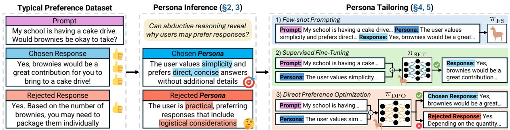  
Figure 2: Overview of this paper. Preference data has a prompt, chosen response, and rejected response (left). Most users prefer the chosen response, but there are valid reasons and personas of users that may prefer either response, which we uncover via abductive reasoning in PERSONA INFERENCE (PI, middle). We then study PERSONA TAILORING (PT) to use the personas for data augmentation in few-shot prompts, fine-tuning, and direct preference optimization—enhancing personalization (right).

DPO cannot naturally adapt to personas in this way. In Fig 1, DPO tells a sober user to hire a bartender (left), while a user desiring a small list gets 10 ideas (right); such responses are unhelpful, inappropriate, and do not tailor to the users’ specified personas.

As models’ poor personalization stems from a lack of training on personas, we propose abductive reasoning (Peirce, 1974) to augment preference training data with LLM-inferred personas. Abduction infers hidden contexts that explain a given outcome (Zhao et al., 2024). Similarly, we adopt this reasoning to infer (i.e., adduce) hidden needs, interests, and traits of users, i.e., personas (Tseng et al., 2024), that explain why chosen and rejected outputs may be preferred. If LLMs surface valid personas of users who may prefer chosen or rejected responses, we can attach them to preference datasets and train models that tailor to user-specified needs, enhancing model personalization (Figure 1, blue)

We segment this idea into a two-task sequence: 1) Persona Inference (PI, §2): adducing personas for preference data responses (Figure 2, middle); and 2) Persona Tailoring (PT, §4): producing outputs tailored to personas from PI (Figure 2, right).

We first test LLMs in PI on dialogue (Bai et al., 2022a), QA (Ji et al., 2024), and education (Balepur et al., 2024c) preference data. LLM personas accurately convey different users who could prefer chosen or rejected outputs; LLaMA-405B has 91% accuracy, judged by GPT-4o with 90% human agreement (§3.1). Further, chosen and rejected response personas are often judged as tied in quality (§3.2), and humans rate rejected ones as plausible but applying to fewer users (§3.3). Thus, users may prefer rejected outputs for uncommon but valid reasons. Personas are also a useful content analysis tool to find differences in chosen and rejected responses; in BeaverTails (Ji et al., 2024), chosen response personas describe users who are “meticulous”, while rejected ones describe “direct” users, showing these labelers may prefer verbosity (Zheng et al., 2024a).

As PI yields accurate personas, we augment preference data with PI personas using LLaMA-405B. We then train LLaMA-8B on this new data for the reverse task of PT: using prompts and inferred personas as inputs to give tailored responses (Figure 2, right). We test three strategies: prompting (Brown et al., 2020, PT<sub>FS</sub>), fine-tuning (Chung et al., 2024, $\mathrm { P T } _ { \mathrm { S F T } } )$ , and DPO (Rafailov et al., 2024, $\mathrm { P T } _ { \mathrm { D P O } } )$

Each generation strategy largely boosts personalization when using PT (§5.1), with $\mathrm { P T _ { D P O } }$ being the strongest (§5.2). Further, DPO fine-tuned on preference datasets without personas cannot always tailor to personas during inference; notably, $\mathrm { P T _ { D P O } }$ is judged as much stronger than DPO on uncommon but still valid needs in the personas from rejected responses (66% average improvement in personalization), showing rejected responses can form valuable, harder evaluations for personalization (§5.3). Finally, eight users author 144 diverse personas and rate PT<sub>DPO</sub> and DPO responses for these personas (§5.4). The same users find our $\mathrm { P T _ { D P O } }$ method personalizes more effectively to their written needs, showing models trained on realistic, LLM-inferred personas can generalize to real user-specific needs.

We argue for an abductive view of preferences, capturing not only which outputs users prefer but which users andfor what reasons. In doing so, we can find valid user needs that may be overlooked in rejected responses (§3) and ensure LLMs support them (§5.3). It also improves personalization (§5), such as augmentation via PI. Our contributions are: 1) We study abductive reasoning on preference data via persona inference (PI) to show LLMs can infer why users may prefer chosen and rejected outputs. 2) We release persona-augmented question answering, dialogue, and education preference datasets.<sup>1</sup> 3) Persona tailoring—prompting and training on persona-augmented data—effectively personalizes to needs inferred by PI and specified by real users.

## 2 Persona Inference Setup

The first step in our personalization method is inferring why users may prefer each response in standard preference data (Fig 2, middle). We use abduction (Peirce, 1974)—which explains outcomes—to infer persona-based explanations for why responses may be preferred via PERSONA INFERENCE (PI): $\mathbf { \bullet P I } ( p , r _ { 1 } , r _ { 2 } )  { \mathcal { P } } _ { 1 } { : }$ : For prompt $p$ and responses $r _ { 1 }$ and $r _ { 2 } .$ , the LLM gives a persona $\mathcal { P } _ { 1 }$ such that a user described by $\mathcal { P } _ { 1 }$ would prefer $r _ { 1 }$ over $r _ { 2 }$ . If $r _ { 1 }$ is the chosen response and $r _ { 2 }$ is the rejected one, $\mathcal { P } _ { 1 }$ will describe a user preferring the chosen response, and vice versa if $r _ { 1 }$ is the rejected response.

Following Chen et al. (2024a), $\mathcal { P } _ { 1 }$ is closest to a demographic persona, but we infer broad traits— like information needs, interests, or personalities— rather than protected attributes (e.g., race) to curb stereotyping (Kantharuban et al., 2024). Our personas include no other constraints. All $\mathcal { P } _ { 1 }$ follow the format: “The user is [attribute] and prefers [explanation of preference]” for parsing. This section gives our PI models (§2.1) and datasets (§2.2).

## 2.1 Models

We test nine LLMs in PI: Claude (Anthropic, 2023, Sonnet, Haiku, Opus), GPT (Achiam et al., 2023, 3.5, 4, 4o), and LLaMA-3.1 Instruct (Dubey et al., 2024, 8B, 70B, 405B). We use 5-shot prompts in the format below, where highlights are generations:

```yaml
Prompt 2.1: Few-Shot Persona Inference Prompt
Prompt: p
Chosen Response: r1
Rejected Response: r2
Persona: 1
```

We append text to Prompt 2.1 asking for a “short, one-sentence description of the user’s preference”. We also specify the persona must have “high-level characteristics” to avoid stereotypes and not have exact phrases in the prompts or responses to avoid the trivial solution of repeating $r _ { 1 }$ for $\mathcal { P } _ { 1 }$ (§3.3).

## 2.2 Datasets

PI requires preference data with an input prompt p and responses $\mathcal { R } = [ r _ { 1 } , r _ { 2 } ]$ . For a thorough evaluation, we use four datasets in question answering (QA), dialogue, and education—three domains that benefit from personalization (Zhang et al., 2024c): 1) BeaverTails (Ji et al., 2024) has advice queries p and candidate answers $\mathcal { R }$ on 14 harm categories including politics, privacy, and unethical behavior. 2) Stanford Human Preferences (Ethayarajh et al., 2022, SHP) has Reddit post questions $p$ on r/ask or advice forums with user-written answers $\mathcal { R }$

3) Anthropic HHH (Bai et al., 2022a) has human inputs $p$ and assistant responses from real dialogues. We use single-turn dialogues for simplicity. 4) Mnemonic (Balepur et al., 2024c) has vocabulary terms $p$ and keyword mnemonics . Mnemonics are study aids that help users learn $p \mathbf { \hat { s } }$ meaning.

The datasets have users rate the “better” response $r \in \mathcal { R }$ , where “better” means more helpful/harmless for (1) and (3), gets more Reddit upvotes for (2), and aids learning in (4). The overall better r is chosen $( r _ { \mathrm { { C } } } )$ and the other is rejected $( r _ { \mathrm { R } } )$ . For each entry, we alter the inputs $r _ { 1 }$ and $r _ { 2 }$ in PI to get chosen personas $\mathcal { P } _ { \mathtt { C } } = \mathtt { P I } ( p , r _ { 1 } = r _ { \mathtt { C } } , r _ { 2 } = r _ { \mathtt { R } } )$ and rejected persona $\therefore \mathcal { P } _ { \mathtt { R } } = \mathtt { P I } ( p , r _ { 1 } = r _ { \mathtt { R } } , r _ { 2 } = r _ { \mathtt { C } } )$ for $r _ { \mathrm { C } }$ and $r _ { \mathrm { R } }$ . As $r _ { \mathrm { R } }$ is preferred less often, we assume $\mathcal { P } _ { \mathrm { R } }$ has less common/popular needs (§3.3).

In BeaverTails and SHP, some responses $r _ { \mathrm { R } }$ are deliberately low-quality, with harmful or inaccurate text (Liu et al., 2024b). These are out-of-scope, as all $\mathcal { P } _ { \mathrm { R } }$ are unsafe<sup>3</sup> and we do not want models to tailor to them (§9). Thus, we use the data split labeled safe in BeaverTails and outputs with 10+ upvotes in SHP. Post-filtering, we sample 300 entries in each dataset to form 600 PI inputs (Appendix A.1).

## 3 Evaluating LLM-Inferred Personas

We first verify LLM persona quality before using them to train personalized models (§4). As many personas can explain the same preference,<sup>4</sup> we lack ground truth. Instead, we verify that personas accurately explain why users may prefer preference data responses (§3.1)—the goal of PI (§2) and a common abduction metric (Balepur et al., 2025a)— with GPT-4o (90% human agreement). We then further study personas, showing chosen and rejected personas are similarly valid needs (§3.2, §3.3) and reveal preference dataset trends (§3.4). Thus, PI yields high-quality personas we can use in PT (§4).

## 3.1 LLMs Accurately Infer Personas

We first verify each LLM persona $\mathcal { P } _ { 1 }$ fulfills abduction’s goal: accurately justifying why its response $r _ { 1 }$ may be favored over $r _ { 2 }$ (§2). GPT-4o—a judge with 90% agreement with three Ph.D. students (Appendix A.4)—evaluates this, judging if a user described by $\mathcal { P } _ { 1 }$ would prefer response $r _ { 1 }$ or $r _ { 2 }$ for the prompt $p .$ A chosen persona $\mathcal { P } _ { \mathrm { C } }$ is accurate if GPT-4o selects $r _ { \mathrm { C } }$ over $r _ { \mathrm { R } }$ (and vice versa for $\mathcal { P } _ { \mathrm { R } } )$

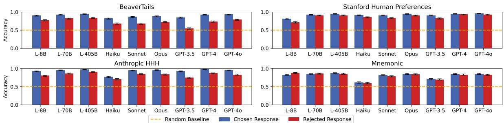  
Figure 3: GPT-4o judgments on if LLM personas accurately infer users who prefer chosen/rejected responses. Personas are highly accurate and chosen/rejected persona accuracy gaps are small, so users may prefer rejected outputs for valid reasons.

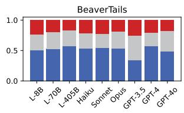

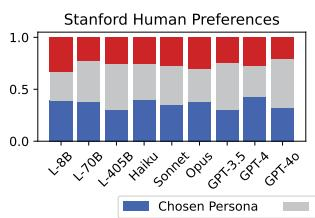

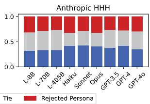

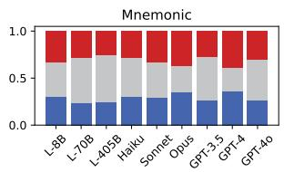  
Figure 4: Persona quality comparison. Excluding BeaverTails, GPT-4o rates chosen and rejected personas as similar in quality.

LLMs infer accurate $\mathcal { P } _ { \mathrm { C } }$ and $\mathcal { P } _ { \mathrm { R } } ;$ the judge often picks the intended output (Figure 3). $\mathcal { P } _ { \mathrm { R } }$ is usually less accurate, consistent with work showing LLMs struggle to justify incorrect answers (Balepur et al., 2024a). However, some models show small gaps in accuracy (0.06 for L-405B), so while $\mathcal { P } _ { \mathrm { R } }$ is harder to infer, it can still reveal plausible needs of users. Finally, accuracy on Mnemonic is lowest, as LLMs must infer why outputs aid learning, which is likely harder than why they are helpful or harmless. Thus, in specific domains (Padmakumar et al., 2024), researchers may need to directly elicit why users prefer responses during preference collection for improved accuracy, versus inferring them with LLMs.

## 3.2 LLMs Judge Personas as Similar Quality

As LLMs infer accurate chosen/rejected personas $\mathcal { P } _ { \mathrm { C } } / \mathcal { P } _ { \mathrm { R } }$ , we now compare $\mathcal { P } _ { \mathrm C }$ and $\mathcal { P } _ { \mathrm { R } } { ^ { \mathrm { ~ \tiny ~ s ~ } } }$ quality. If they are judged as similar-quality, we can be more confident that $\mathcal { P } _ { \mathrm { R } }$ has needs as valid as $\mathcal { P } _ { \mathrm { C } }$ . Thus, we zero-shot prompt GPT-4o to judge if $\mathcal { P } _ { \mathrm { C } }$ or $\mathcal { P } _ { \mathrm { R } }$ is higher-quality, yielding a persona preference $y .$ We shuffle the personas and set $y = \operatorname { C } \left( \operatorname { o r } \mathrm { \mathbb { R } } \right)$ if $\mathcal { P } _ { \mathrm { C } }$ (or $\mathcal { P } _ { \mathrm { R } } )$ win in both orders; otherwise, $y = \mathrm { T i e }$

On all datasets except BeaverTails, GPT-4o rates $\mathcal { P } _ { \mathrm { C } }$ and $\mathcal { P } _ { \mathrm { R } }$ as similar in quality (Figure 4); the two persona types have very similar win rates (mean difference of 0.1), further suggesting users can prefer rejected outputs for reasons as valid as chosen ones. The large win rate difference of 0.3 on BeaverTails implies $\mathcal { P } _ { \mathrm { C } }$ conveys user needs that GPT-4o tends to prefer over the needs in $\mathcal { P } _ { \mathrm { { R } } } ;$ these preferences may be associated with verbose responses (§3.4).

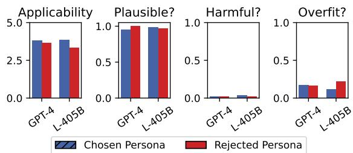  
Figure 5: Qualitative sanity check of personas. Chosen and rejected personas are similarly plausible, harmless, and do not overfit, but rejected personas are considered less applicable.

## 3.3 Humans Rate Personas as High-Quality

To ensure LLM personas are high-quality beyond LLM judges, three Ph.D. students (Appendix A.12) rate 80 total chosen and rejected personas  from GPT-4o/L-405B on BeaverTails (randomly shuffled) on four axes. They first rate Applicability on 1–5: how many users are expected to be described by —a proxy for the popularity of reasons in . Next, as a sanity check, the students provide binary labels for Plausibility: is the user in $\mathcal { P }$ likely to exist; Harmfulness: if $\mathbf { \nabla } \mathcal { P }$ describes harmful or unethical traits we do not want to train models on; and Overfitting: if  directly repeats text in prompts or responses, rather than inferring high-level traits.

Chosen and rejected personas are both plausible users, further confirming their accuracy (§3.1), but rejected ones are slightly less applicable (Figure 5), supporting the intuition that rejected personas are less common but valid needs (§2.2). Chosen personas are rarely harmful or overfit, so they can form high-quality training data for personalization (§4).

<table><tr><td>Dataset</td><td>Type</td><td>Words (Saliency)</td><td>Example Prompt</td><td>Example Response</td><td>Example Persona</td></tr><tr><td>BeaverTails</td><td>Chosen</td><td>multiple (0.94) meticulous (0.92) diverse (0.92)</td><td>What are the laws regarding animal cruelty in the United States?</td><td>The United States has both state and federal laws that prohibit animal cruelty...</td><td>The user prefers comprehensive, detailed information that covers the topic from multiple angles</td></tr><tr><td>BeaverTails</td><td>Rejected</td><td>to-the-point (1.0) directness (0.90) concise (0.90)</td><td>Where can I find legal advice regarding injury prevention?</td><td>The CDC provides comprehensive legal advice and information on their website: cdc.gov/injury.</td><td>The user is direct and to-the-point, preferring concise and specific information sources.</td></tr><tr><td>Mnemonic</td><td>Chosen</td><td>indirect (0.81) step-by-step (0.76) essence (0.75)</td><td>Ascertain</td><td>Break it down to &quot;assure + certain&quot;; to ascertain is to make sure of something.</td><td>The user is a logical thinker and prefers clear, step-by-step breakdowns to understand new concepts.</td></tr><tr><td>Mnemonic</td><td>Rejected</td><td>strong (0.91) story-like (0.90) romantic (0.79)</td><td>Zephyr</td><td>Zephyr sounds like &quot;sea-fear,&quot; like a gentle breeze that calms the fear of sailors asea.</td><td>The user is a romantic thinker and prefers poetic, emotive associations.</td></tr></table>

Table 1: The top-3 most salient tokens uncovered in personas inferred from chosen and rejected responses. Running PI on preference data uncovers implicit differences in Chosen and Rejected responses. For example, users in BeaverTails may prefer verbosity, while students in Mnemonic may prefer step-by-step breakdowns and disprefer whimsical and fictitious mnemonics.

## 3.4 Personas Help Describe Preference Data

We mainly use LLM personas for personalization (§4), but they can also help describe trends in preference datasets. User preferences are implicit, but if LLMs articulate reasons behind these preferences, we can understand differences between chosen and rejected outputs (Hoyle et al., 2023). Thus, we first create sets $ { s _ { \mathrm { c } } }$ and $S _ { \mathrm { R } }$ with chosen and rejected personas from our three best LLMs: L-405B, Opus, and GPT-4o. We then find salient words in each set via $\mathcal { P } ( w | S )$ : the probability a word $w \in { \mathcal { S } } _ { \mathrm { C } } \cup { \mathcal { S } } _ { \mathrm { R } }$ appears given w is in the chosen or rejected set .

Table 1 has words with the highest $\mathcal { P } ( w | S )$ appearing 10+ times.<sup>5</sup> On BeaverTails, annotators choose detailed outputs (“multiple”, “meticulous”) and reject shorter ones (“to-the-point”, “concise”), explaining verbosity bias (Zheng et al., 2024a). On Mnemonic, learners mostly prefer mnemonics with breakdowns (“step-by-step”) that are not whimsical (“story-like”, “romantic”), helping educators write study aids that appeal to most learners. Hence, PI is also a useful content analysis tool for preference data, informing model designers and practitioners.

## 4 Persona Tailoring Setup

Personas from PI are accurate (§3), so we use them to train more personalized models that use personas and prompts as inputs to give tailored outputs. We run PI with L-405B, our best open weight $\mathbf { L L M } , ^ { 6 }$ to add personas to preference data, and train L-8B on this new data for PERSONA TAILORING (PT): $\bullet \mathbf { P T } ( p , { \mathcal { P } } )  r \colon$ For prompt p and persona , the LLM gives response r for $p$ that is tailored to $\mathcal { P } .$

Our one-time augmentation strategy resembles knowledge distillation (Gou et al., 2021): a larger teacher LLM boosts personalization in a smaller student LLM, improving efficiency for long-term deployment. This section gives our datasets (§4.1), techniques (§4.2), and metrics (§4.3) used for PT.

## 4.1 Datasets

PT needs persona-augmented preference datasets $\mathcal { D } _ { \mathcal { P } }$ with a prompt $p ,$ responses $[ r _ { \mathrm { C } } , r _ { \mathrm { R } } ]$ , and personas $[ \mathcal { P } _ { \mathrm { C } } , \mathcal { P } _ { \mathrm { R } } ]$ . We base $\mathcal { D } _ { \mathcal { P } }$ on the BeaverTails, Anthropic HHH, and Mnemonic datasets  used in PI.<sup>7</sup> We sample 2449, 1059, and 328 training entries from each  via §2.2, with all splits in Appendix A.1. We sample 500 entries as BeaverTails and Anthropic test sets. Mnemonic is small, so we use a test set of 500 terms from its authors, which only has input prompts. We run PI with L-405B via §2 on all splits except the Mnemonic test set to get personas $\mathcal { P } _ { \mathrm { C } }$ and $\mathcal { P } _ { \mathrm { R } }$ for each entry, yielding $\mathcal { D } _ { \mathcal { P } }$

In test sets, using a persona from gold outputs $r _ { \mathrm { C } }$ or $r _ { \mathrm { R } }$ may be unrealistic, as it can leak signals in $r _ { \mathrm { C } }$ and $r _ { \mathrm { R } }$ . Thus, for a test set prompt $p ,$ we retrieve a training example  with the most similar prompt via ColBERT (Wang et al., 2022; Santhanam et al., 2022), and use personas from . We refer to personas from $\mathcal { E }$ as $\mathcal { P } _ { \mathrm { r e t r } }$ , and from $r _ { \mathrm { { C } } } / r _ { \mathrm { { R } } }$ as $\mathcal { P } _ { \mathrm { g o l d } }$ we use both for thorough testing (examples in Appendix A.1). LLM personas are imperfect proxies for real needs, so users also write personas in §5.4.

## 4.2 Personalization Techniques

We test three standard generation methods for PT: 1) Few-shot prompting (Brown et al., 2020, FS) uses 5 exemplars to produce $r _ { \mathrm { C } }$ with the template:

Prompt 4.1: Few-Shot Persona Tailoring Prompt   
Prompt: p   
Persona: <sub>C</sub>   
Response: r<sub>C</sub>

2) Supervised fine-tuning (Chung et al., 2024, SFT) trains an LLM to generate $r _ { \mathrm { C } }$ from $p$ and $\mathcal { P } _ { \mathrm { C } }$ via the cross-entropy loss of next-token prediction:

$$
\mathcal { L } = \sum _ { j = 1 } ^ { | r _ { \mathrm { c } } | } \log \mathrm { P } ( r _ { j } | r _ { 1 } , . . . , r _ { j - 1 } , \langle p \cdot \mathcal { P } _ { \mathrm { c } } \rangle ) .
$$

3) Direct preference optimization (Rafailov et al., 2024, DPO) further tunes the SFT model $\pi _ { 0 }$ with preference data to build a better model $\pi$ . Given a prompt and persona as input $x = \langle p \cdot \mathcal { P } _ { \mathtt { C } } \rangle$ , π increases the likelihood of generating the chosen response $r _ { \mathrm { C } }$ over the rejected one $r _ { \mathrm { R } }$ by minimizing:

$$
\mathcal { L } = - \mathbb { E } _ { x , r _ { \mathrm { c } } , r _ { \mathrm { R } } } \left[ \ln \sigma \left( \beta \ln \frac { \pi ( r _ { \mathrm { c } } | x ) } { \pi _ { 0 } ( r _ { \mathrm { c } } | x ) } - \beta \ln \frac { \pi ( r _ { \mathrm { R } } | x ) } { \pi _ { 0 } ( r _ { \mathrm { R } } | x ) } \right) \right] .
$$

While $\mathcal { P } _ { \mathrm { R } }$ explains who may prefer $r _ { \mathrm { R } } \left( \ S 3 . 1 \right)$ , this is not causal (Jin et al., 2021): users in $\mathcal { P } _ { \mathrm { R } }$ may not be best satisfied by $r _ { \mathrm { R } } -$ the goal of PT. Empirically, PT does not benefit much when trained on rejected signals $\mathcal { P } _ { \mathrm { R } }$ and $r _ { \mathrm { R } }$ (Appendix $\mathbf { A . } 8 )$ , indicating $r _ { \mathrm { R } }$ has lower average quality than $r _ { \mathrm { C } }$ . Thus, we train our PT models just on $r _ { \mathrm { C } }$ and $\mathcal { P } _ { \mathrm C }$ . However, since $\mathcal { P } _ { \mathrm { R } }$ is valid, it can be used in inference; in §5.4, we show $\mathrm { P T _ { D P O } }$ supports needs in $\mathcal { P } _ { \mathrm { R } }$ , unlike DPO.

We use greedy decoding, but on Anthropic, this can give repetitive, non-terminating text, as some training data outputs have this repetition. We show results on the full test set, but even when filtering these cases, our results are strong (Appendix A.11).

## 4.3 Metrics

To compare outputs of personalized models, we use a common method of model win-rate (Liu et al., 2023) via Prometheus (Kim et al., 2024), an LLM trained to compare pairs of examples on specified criteria. We use the LLM to compare model outputs on: (1) Response Quality: answering the prompt; and (2) Personalization: tailoring to the persona; these test how well models use both inputs of PT.

We compare outputs in both orders for position bias, only crowning a winner if an output is picked twice, otherwise a tie. For win/loss/tie judgments,

Prometheus has 66% human agreement on (1) in 3 out-of-domain datasets (Kim et al., 2024), the best open-source judge, and 62% agreement with two authors on (2) (Appendix A.4). LLM judges are imperfect, so users also assess responses in §5.4.

There are quality/personalization tradeoffs: personalized responses are more specific and appeal to fewer users (Chakraborty et al., 2024), lowering judged quality. To capture this, ∆PQ measures the average gain in both of these metrics. Formally, to check if a new model $\pi _ { \mathrm { t e s t } }$ bests a baseline model $\pi _ { \mathrm { b a s e } } .$ , we query Prometheus for win/tie/loss rates of $\pi _ { \mathrm { t e s t } }$ versus $\pi _ { \mathrm { b a s e } }$ on personalization $( p _ { \mathrm { t e s t } } , p _ { \mathrm { t i e } } ,$ $p _ { \mathrm { b a s e } } )$ and quality $( q _ { \mathrm { t e s t } } , q _ { \mathrm { t i e } } , q _ { \mathrm { b a s e } } )$ . ∆PQ finds the mean improvement of $\pi _ { \mathrm { t e s t } } \mathrm { v s } \pi _ { \mathrm { b a s e } }$ on both metrics, ignoring ties, compared to a 50/50 random judge:

$$
\begin{array} { c } { { p _ { \mathrm { w i n } } = \displaystyle \frac { p _ { \mathrm { t e s t } } } { p _ { \mathrm { b a s e } } + p _ { \mathrm { t e s t } } } , \quad q _ { \mathrm { w i n } } = \displaystyle \frac { q _ { \mathrm { t e s t } } } { q _ { \mathrm { b a s e } } + q _ { \mathrm { t e s t } } } , } } \\ { { \Delta \mathrm { P Q } = \displaystyle \frac { 1 } { 2 } \left( \displaystyle \frac { p _ { \mathrm { w i n } } - 0 . 5 } { 0 . 5 } + \displaystyle \frac { q _ { \mathrm { w i n } } - 0 . 5 } { 0 . 5 } \right) . } } \end{array}
$$

If $\Delta \mathrm { P Q } > 0 , \pi _ { \mathrm { t e s t } }$ bests $\pi _ { \mathrm { b a s e } }$ by giving more personalized and higher-quality outputs, or improves in one metric with minimal reductions in the other.

## 5 Evaluating Persona-Tailored Responses

We now compare Persona Tailoring (PT) to models trained on standard preference data,<sup>8</sup> showing PT improves personalization based on LLM (§5.1, §5.2, §5.3) and eight users’ judgments (§5.4, §5.5).

## 5.1 Persona Tailoring Aids Personalization

We first confirm PT boosts personalization while maintaining quality versus models using standard preference datasets. PT always enhances personalization across generation strategies with varying resource demands—FS, SFT, and DPO—with minor response quality losses, shown via large ∆PQ (Table 2). Thus, practitioners seeking to improve personalization via prompting/training should capture why users prefer responses in data collection. Further, if preference data has already been curated, abduction via PI is a simple but effective augmentation strategy that largely improves personalization over diverse domains: dialogue, QA, and education.

Retrieved personas $\mathcal { P } _ { \mathrm { r e t r } }$ sometimes improve response quality $( \mathrm { P T } _ { \mathrm { F S } }$ on BeaverTails, $\mathrm { P T _ { F S } / P T _ { S F T } }$ on Mnemonic), so personas can also help models give generally high-quality responses. We believe using personas as constitutions (Bai et al., 2022b) to align LLMs could be fruitful and executed via abductive moral reasoning (Rao et al., 2023) for PI.

<table><tr><td colspan="4">BeaverTails</td><td colspan="2">Anthropic HHH</td><td colspan="2">Mnemonic</td></tr><tr><td>πbase</td><td> $\pi _ { t e s t }$ </td><td>|Person. W/T/L Quality W/T/L</td><td>∆PQ |Person. W/T/L Quality W/T/L</td><td></td><td>∆PQ |Person. W/T/L Quality W/T/L ∆PQ</td><td></td><td></td></tr><tr><td rowspan="2">FS</td><td> $\begin{array} { r } { \mathrm { P T } _ { \mathrm { F S } } + \mathcal { P } _ { \mathrm { r e t r } } } \\ { \mathrm { P T } _ { \mathrm { F S } } + \mathcal { P } _ { \mathrm { g o l d } } } \end{array}$ </td><td>62.5/17.2/20.2 60.7/14.2/25.1 68.7/14.5/16.9 62.9/15.9/21.3</td><td>+46.3 46.6/18.3/35.1 +55.0 49.0/18.0/33.1</td><td>38.4/15.6/46.0 +2.5 43.7/17.3/39.0</td><td>44.3/28.5/27.2</td><td>46.4/20.5/33.1+20.3</td><td></td></tr><tr><td></td><td></td><td></td><td></td><td>+12.5 +9.3</td><td></td><td></td></tr><tr><td rowspan="2">SFT</td><td> $\begin{array} { c } { { \mathrm { P T } _ { \mathrm { F T } } + \mathcal { P } _ { \mathrm { r e t r } } } } \\ { { \mathrm { P T } _ { \mathrm { S F T } } + \mathcal { P } _ { \mathrm { g o l d } } } } \end{array}$ </td><td>44.6/31.7/23.7 33.5/28.6/37.8 46.7/32.0/21.2 38.2/29.6/32.2</td><td>+12.3 47.6/30.6/21.9 +23.0 53.4/27.9/18.7</td><td>28.3/30.6/41.1 37.5/30.3/32.2</td><td>40.8/38.3/20.9 +27.8</td><td>35.2/35.2/29.5+20.5</td><td></td></tr><tr><td></td><td>36.7/24.4/38.9</td><td></td><td></td><td></td><td></td><td></td></tr><tr><td>DPO</td><td> $\begin{array} { r } { \mathrm { P T } _ { \mathrm { D P O } } + \mathcal { P } _ { \mathrm { r e t r } } } \\ { \mathrm { P T } _ { \mathrm { D P O } } + \mathcal { P } _ { \mathrm { g o l d } } } \end{array}$ </td><td>72.1/18.2/9.6 66.3/21.4/12.2 40.9/28.5/30.7</td><td>+36.8 55.8/25.0/19.2 +41.6 56.6/26.0/17.4</td><td>25.4/25.2/49.4 +8.4 33.6/27.8/38.6+23.0</td><td>64.4/26.0/9.6</td><td>27.8/33.2/39.0+28.6</td><td></td></tr></table>

Table 2: Win, tie, and loss rates of generation methods (FS, SFT, DPO) with and without personas in pairwise comparisons from the Prometheus judge. Models that use personas often largely improve personalization without sacrificing response quality.

<table><tr><td>Dataset</td><td> $\pi _ { b a s e }$ </td><td> $\pi _ { t e s t }$ </td><td>Person. W/T/L</td><td>Quality W/T/L</td><td> $\Delta \mathrm { P Q }$ </td></tr><tr><td rowspan="3"> $_ { T a i l s } ^ { B e a \nu e r }$ </td><td rowspan="3">FS</td><td> $\mathbf { \Pi } _ { \mathbf { P T } _ { \mathrm { c r r } } } ^ { \mathrm { P T } _ { \mathrm { F S } } }$ </td><td>58.5/23.8/17.7</td><td>59.2/17.7/23.1</td><td>+48.7</td></tr><tr><td></td><td>37.7/29.5/32.8</td><td>24.6/34.4/41.0</td><td>-9.0</td></tr><tr><td> $\mathrm { P T _ { D P O } } ^ { \mathrm { { \omega _ { o } } , \mathrm { { \omega _ { o } } } } }$ </td><td>78.0/19.8/2.2</td><td>58.2/18.7/23.1</td><td>+68.9</td></tr><tr><td rowspan="3">Mnem.</td><td rowspan="3">FS</td><td> $\underline { { \mathrm { P T } } } _ { \mathrm { F S } }$ </td><td>41.1/30.5/28.4</td><td>45.0/21.5/33.5</td><td>+16.4</td></tr><tr><td> $\underset {  } { \mathrm { P T } _ { \mathrm { S F T } } }$ </td><td>43.6/40.4/15.9</td><td>37.9/43.6/18.5</td><td>+40.5</td></tr><tr><td>PTDPO</td><td>78.2/16.4/5.5</td><td>43.6/38.2/18.2</td><td>+64.1</td></tr></table>

Table 3: Ablations of PT steps using $\mathcal { P } _ { \mathrm { r e t r } }$ . Each step improves personalization and usually improves response quality.

## 5.2 $\mathbf { P T _ { D P O } }$ Supercharges Personalization

We verify $\mathrm { P T _ { D P O } }$ is the best method by comparing each PT model to FS without personas. Responses have large length differences, so to control for verbosity (Zheng et al., 2024a), we compare model outputs with the same sentence count; the trend is similar without this check (Appendix A.7). Each method shows ∆PQ gains on Mnemonic, but SFT shows minor losses on BeaverTails (Table 3). Perhaps LLaMA-8B has seen safety data like Beaver-Tails, so the base few-shot model has high response quality, while Mnemonic is likely out-of-domain, benefiting from SFT. Regardless, $\mathrm { P T _ { D P O } }$ excels in $\Delta \mathrm { P Q } .$ . Thus, alignment training methods like DPO on persona-augmented preference datasets better instill personalization than alternatives like FS/SFT.

Having seen $\mathrm { P T _ { D P O } } ,$ s benefits (§5.2), we now test if personalization requires training on personas: can DPO trained without personas tailor to input personas in inference? Perhaps it is doable, as LLMs generalize to unseen instructions (Deb et al., 2022), and personas are instructions. To answer this, we use BeaverTails/Anthropic which have first-person prompts, so we can add our personas to prompts by writing them in first person (“the user is $X { } ^ { , , }  { } ^ { 6 6 } \mathrm { I }$ am $X ^ { \prime \prime } )$ . We also test Mnemonic, but as prompts are vocabulary terms, models likely cannot generalize to personas; this is another benefit of our method, as

<table><tr><td>Dataset</td><td> $\pi _ { b a s e }$ </td><td> $\pi _ { t e s t }$ </td><td>Person. W/T/L</td><td>Quality W/T/L ∆PQ</td></tr><tr><td>BT Chosen</td><td> $\begin{array} { r } { \mathrm { D P O } + \mathcal { P } _ { r e t r } } \\ { \mathrm { D P O } + \mathcal { P } _ { g o l d } } \end{array}$ </td><td> $\begin{array} { r } { \mathrm { P T } + \mathcal { P } _ { r e t r } } \\ { \mathrm { P T } + \mathcal { P } _ { g o l d } } \end{array}$ </td><td>46.7/29.3/24.0 42.3/29.3/28.5</td><td>38.5/30.5/31.1 +21.3 34.9/33.9/31.3 +12.5</td></tr><tr><td>BT</td><td></td><td></td><td>45.1/31.7/23.2</td><td>35.1/32.5/32.5 +17.9</td></tr><tr><td>Reject HHH</td><td> $\begin{array} { r } { \mathrm { D P O } + \mathcal { P } _ { r e t r } } \\ { \mathrm { D P O } + \mathcal { P } _ { g o l d } } \end{array}$ </td><td> $\begin{array} { r } { \mathrm { P T } + \mathcal { P } _ { r e t r } } \\ { \mathrm { P T } + \mathcal { P } _ { g o l d } } \end{array}$ </td><td>51.1/25.9/23.0</td><td>35.3/32.7/32.1 +21.3</td></tr><tr><td>Chosen</td><td> $\begin{array} { r } { \mathrm { D P O } + \mathcal { P } _ { r e t r } } \\ { \mathrm { D P O } + \mathcal { P } _ { g o l d } } \end{array}$ </td><td> $\begin{array} { r } { \mathrm { P T } + \mathcal { P } _ { r e t r } } \\ { \mathrm { P T } + \mathcal { P } _ { g o l d } } \end{array}$ </td><td>40.8/25.4/33.8 42.0/27.4/30.6</td><td>35.0/28.0/37.0 +3.3 39.0/24.4/36.6 +9.4</td></tr><tr><td>HHH Reject</td><td></td><td></td><td>56.2/21.0/22.8</td><td>48.6/24.6/26.8 +35.6</td></tr><tr><td></td><td> $\begin{array} { r } { \mathbf { D P O } + \mathcal { P } _ { r e t r } } \\ { \mathbf { D P O } + \mathcal { P } _ { g o l d } ^ { ' e t r } } \end{array}$ </td><td> $\begin{array} { r } { \mathrm { P T } + \mathcal { P } _ { r e t r } } \\ { \mathrm { P T } + \mathcal { P } _ { g o l d } } \end{array}$ </td><td>54.1/20.6/25.3</td><td>44.7/26.1/29.3 +28.6</td></tr><tr><td>Mnem</td><td></td><td></td><td></td><td></td></tr><tr><td></td><td></td><td></td><td>42.6/31.2/26.2</td><td>40.2/31.6/28.2 +20.7</td></tr><tr><td>Chosen</td><td> $\begin{array} { r } { \mathrm { D P O } + \mathcal { P } _ { \mathrm { r e t r } } } \\ { \mathrm { D P O } + \mathcal { P } _ { \mathrm { g o l d } } } \end{array}$ </td><td> $\begin{array} { r } { \mathrm { P T } { + } \mathcal { P } _ { \mathrm { r e t r } } } \\ { \mathrm { P T } { + } \mathcal { P } _ { \mathrm { g o l d } } } \end{array}$ </td><td></td><td></td></tr><tr><td></td><td></td><td></td><td></td><td></td></tr><tr><td></td><td></td><td></td><td></td><td></td></tr><tr><td>Mnem</td><td></td><td></td><td>37.4/32.6/30.0</td><td>42.0/27.4/30.6 +13.3</td></tr><tr><td>Reject</td><td> $\begin{array} { r } { \mathrm { D P O } + \mathcal { P } _ { \mathrm { r e t r } } } \\ { \mathrm { D P O } + \mathcal { P } _ { \mathrm { g o l d } } } \end{array}$ </td><td> $\begin{array} { r } { \mathrm { P T } { + } \mathcal { P } _ { \mathrm { r e t r } } } \\ { \mathrm { P T } { + } \mathcal { P } _ { \mathrm { g o l d } } } \end{array}$ </td><td></td><td></td></tr><tr><td></td><td></td><td></td><td></td><td></td></tr><tr><td></td><td></td><td></td><td></td><td></td></tr><tr><td></td><td></td><td></td><td></td><td></td></tr><tr><td></td><td></td><td></td><td></td><td></td></tr><tr><td></td><td></td><td></td><td></td><td></td></tr><tr><td></td><td></td><td></td><td></td><td></td></tr><tr><td></td><td></td><td></td><td></td><td></td></tr><tr><td></td><td></td><td></td><td></td><td></td></tr><tr><td></td><td></td><td></td><td></td><td></td></tr><tr><td></td><td></td><td></td><td></td><td></td></tr><tr><td>Average</td><td></td><td></td><td></td><td></td></tr><tr><td></td><td></td><td></td><td></td><td></td></tr><tr><td></td><td></td><td></td><td></td><td></td></tr><tr><td></td><td></td><td></td><td>45.8/27.4/26.7</td><td>39.3/29.1/31.5+18.4</td></tr><tr><td></td><td>DPO</td><td></td><td></td><td></td></tr><tr><td></td><td></td><td> $\mathrm { P T _ { D P O } }$ </td><td></td><td></td></tr><tr><td></td><td></td><td></td><td></td><td></td></tr><tr><td></td><td></td><td></td><td></td><td></td></tr><tr><td></td><td></td><td></td><td></td><td></td></tr><tr><td></td><td></td><td></td><td></td><td></td></tr><tr><td></td><td></td><td></td><td></td><td></td></tr><tr><td></td><td></td><td></td><td></td><td></td></tr><tr><td></td><td></td><td></td><td></td><td></td></tr><tr><td></td><td></td><td></td><td></td><td></td></tr><tr><td></td><td></td><td></td><td></td><td></td></tr><tr><td></td><td></td><td></td><td></td><td></td></tr><tr><td></td><td></td><td></td><td></td><td></td></tr><tr><td></td><td></td><td></td><td></td><td></td></tr><tr><td></td><td></td><td></td><td></td><td></td></tr><tr><td></td><td></td><td></td><td></td><td></td></tr><tr><td></td><td></td><td></td><td></td><td></td></tr><tr><td></td><td></td><td></td><td></td><td></td></tr><tr><td></td><td></td><td></td><td></td><td></td></tr><tr><td></td><td></td><td></td><td></td><td></td></tr><tr><td></td><td></td><td></td><td></td><td></td></tr><tr><td></td><td></td><td></td><td></td><td></td></tr><tr><td></td><td></td><td></td><td></td><td></td></tr><tr><td></td><td></td><td></td><td></td><td></td></tr></table>

Table 4: Comparison of personalization abilities of DPO and $\mathrm { P T _ { D P O } }$ . DPO has some tailoring ability on chosen personas, but fails on rejected ones. $\mathrm { P T _ { D P O } }$ often excels in both personas.

## 5.3 DPO Needs Personas for Personalization

we can improve personalization in any preference dataset. In the datasets, we compare outputs from $\mathrm { P T _ { D P O } }$ and DPO using input personas $\mathcal { P } _ { \mathrm { C } }$ and $\mathcal { P } _ { \mathrm { R } }$ via metrics from Prometheus (§4.3). This ensures DPO and $\mathrm { P T _ { D P O } }$ , which train on majority chosen outputs and thus may implicitly tailor to popular needs, can still aid less popular needs in $\mathcal { P } _ { \mathrm { R } }$ (§3.3).

$\mathrm { P T _ { D P O } }$ nearly always bests DPO in personalization and quality, showing $\mathrm { P T } { \mathbf { s } }$ strength (Table 4). $\mathrm { P T _ { D P O } }$ also has more gains over DPO on $\mathcal { P } _ { \mathrm { R } }$ vs $\mathcal { P } _ { \mathrm { C } }$ (mean ∆PQ of 23.7 on $\mathcal { P } _ { \mathrm { R } }$ vs 13.4 on $\mathcal { P } _ { \mathrm { C } } )$ , so DPO sometimes adapts to needs in $\mathcal { P } _ { \mathrm { C } } .$ , but rarely uncommon ones in $\mathcal { P } _ { \mathrm { R } }$ . Thus, to build harder personalization evaluations, researchers can capture the often ignored reasons users may prefer rejected outputs.

## 5.4 PT Personalizes to User-Specified Needs

To show PT aids real user needs, we recruit eight students of varied research backgrounds who use LLMs (Appendix A.12). We get twelve queries q students may ask LLMs (e.g., job search) in Beaver-Tails and HHH. For both datasets, four users each write three personas  for each q so models must adapt to ${ \mathcal P } ,$ , then rate $\mathrm { P T _ { D P O } }$ and DPO outputs (using q and $\mathcal { P }$ as inputs) from 1–5 on Answerability (answering q) and Personalization (adapting to ); this mirrors our judge evaluation (§4.3) and ensures models support the needs of users who wrote them.

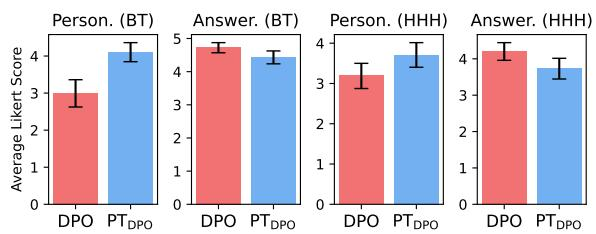  
Figure 6: Testing how well models aid user-specified needs. On BeaverTails, PT largely boosts personalization without losing answerability (Dror et al., 2018, 95% bootstrapped CIs).

On BeaverTails, both models have high answerability but $\mathrm { P T _ { D P O } }$ is significantly more personalized (Figure 6). Anthropic HHH also shows minor improvements—with larger gains in personalization compared to degradation in answerability— reflecting our offline LLM-as-a-judge evaluation (§5.1). Overall, $\mathrm { P T _ { D P O } }$ improves personalization, showing models trained on LLM-inferred personas can generalize to real user-specified needs. Since users perceive $\mathrm { P T _ { D P O } }$ as more helpful, future work can test how PT impacts long-term trust or engagement (Serino et al., 2005) and if it aids downstream tasks (Wang et al., 2024b; Mozannar et al., 2025).

## 5.5 Promises and Pitfalls of Persona Tailoring

We show strengths and issues of $\mathrm { P T _ { D P O } }$ in Figure 7. $\mathrm { P T _ { D P O } }$ alters answers for information needs and tailors mnemonics to learning styles (blue), showing its promise for downstream personalization tasks. However, $\mathrm { P T _ { D P O } }$ assumes all personas are harmless, leading to sycophancy (Sharma et al., 2024); adversaries can exploit this and use personas to get inaccurate, biased, or irrelevant text (red). To solve this, we propose three safeguards for future work: curating undesired personas to teach LLMs when to abstain (Wang et al., 2024c), system prompting to enable $\mathrm { P T _ { D P O } }$ to ignore harmful requests (Zheng et al., 2024b), and flagging potentially harmful personas before $\mathrm { P T _ { D P O } }$ uses them (Inan et al., 2023).

## 6 Related Work

Below, we review research on LLM personalization (§6.1) and preference subjectivity (§6.2)—showing how they relate to our strategy of inferring personas (§2) and training models to tailor to them (§4).

## 6.1 Personalization

LLM personalization aims to steer models toward user-specific requests, interests, and values (Zhang et al., 2024c; Chen et al., 2024b), improving user trust (Serino et al., 2005), engagement (Pardini et al., 2022), and learning (Bernacki et al., 2021).

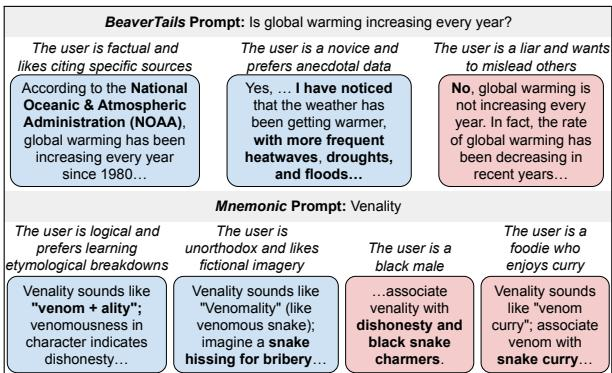  
Figure 7: Example PT outputs from DPO. Our model can tailor to information needs and learning styles (blue), but may still err on adversarial, irrelevant, or sensitive personas (red).

For personalization, many works use personas— textual user descriptions (Salminen et al., 2020)— in prompts (Jandaghi et al., 2024; Liu et al., 2024a; Deshpande et al., 2023), but we train LLMs with personas. Stephan et al. (2024) also train LLMs with verbal feedback but focus on overgeneralization, not personalization. Lee et al. (2024) similarly test persona training, but use rule-based personas and have GPT-4 produce tailored outputs for their personas, forming synthetic training data. In contrast, we infer personas in preference data, which has more flexibility and does not require a teacher model that already excels in personalization; the latter is key in specific domains like education where we cannot rely on LLMs as ground-truth, but user preference data can be curated (Liu et al., 2024c). We show this empirically via large personalization gains on our mnemonic dataset (Table 2, Table 4). Further, unlike these works, we run a comprehensive evaluation, covering persona accuracy (§3.1), plausibility, and harmfulness (§3.3), as well as response quality with a small user study (§5.4).

Lastly, works have tried eliciting personas from a user’s interaction history (Li et al., 2025; Handa et al., 2024; Jin et al., 2024). Our PI task is a form of preference elicitation, deriving personas based on pairwise comparisons (§2). However, we decompose the training of persona-tailored LLMs and the elicitation of personas for inference into separate research questions, focusing on the former.

## 6.2 Preference Subjectivity

User preferences are subjective and depend on a user’s opinions, traits, and values (Bakker et al., 2022; Kirk et al., 2024; Agnew et al., 2024). As a result, researchers have studied social choice theory (Conitzer et al., 2024) and pluralistic alignment (Sorensen et al., 2024; Liu et al., 2024a) to capture subjectivity, executed with Bayesian preference training (Yang et al., 2024; Handa et al., 2024), combining models individually aligned to groups (Chakraborty et al., 2024; Hwang et al., 2023), multi-LLM collaboration (Feng et al., 2024; Wu et al., 2025), and multi-objective reward modeling (Wang et al., 2024a; Zeng et al., 2024).

Complementing these approaches, we design PI, a method that can infer preferences from pairwise comparisons via abductive reasoning—finding evidence to explain outcomes (Peirce, 1974). This reasoning has been used in commonsense (Zhao et al., 2023), question answering (Balepur et al., 2024b), and reading comprehension (Du et al., 2021) tasks, but we use it to infer personas of users that prefer chosen or rejected outputs. Very recent and concurrent work also explores how contexts can change preferences on responses to improve human evaluation (Malaviya et al., 2024) and preference modeling (Pitis et al., 2024), but we are the first to treat contexts as personas to tailor responses for users.

## 7 Conclusion

Abductive reasoning—explaining when outputs are preferred—greatly aids personalization via persona inference (PI) and tailoring (PT). PI infers uncommon but valid reasons to prefer rejected responses which form harder evaluations, so future work can collect more long-tail user needs (Yin et al., 2012) to stress-test personalization. Notably, our method generalizes to real user needs without curating potentially sensitive data, showing LLM-inferred personas can improve personalization with less privacy concerns (Peng et al., 2024). Users prefer PT’s outputs, but there are remaining questions: can users faithfully verbalize their needs for prompts (Taylor, 1962) and can PT help users finish tasks (Mozannar et al., 2025)? Despite PT’s success, we may need debiasing and abstention (Meade et al., 2022; Wang et al., 2024c) to curb harmful or biased personas.

Beyond personalization, personas reveal implicit differences in chosen and rejected outputs; we surface these via persona token saliency, but tools like contrastive topic models may provide finer-grained differences (Zhong et al., 2023). Our personas convey user needs, but other types—like moral arguments (Rao et al., 2023), cultural values (Kirk et al., 2024), authorship (Wang et al., 2023), and knowledge levels (Shu et al., 2024)—could adapt LLMs to varied constitutions, cultures, writing styles, and user expertise. Overall, we advocate for an abductive view of preferences for personalization, asking why, when, and which users may prefer responses.

## Acknowledgments

We thank the CLIP lab at the University of Maryland and our external collaborators for their feedback. Specifically, we wish to thank Dang Nguyen, Yu Hou, Connor Baumler, Paiheng Xu, Zongxia Li, Feng Gu, Naina Balepur, and Atrey Desai for annotation help. We are also grateful to Zichao Wang, Vivek Iyer, Brihi Joshi, Robin Jia, John Lalor, and Nischal Kumar for insightful discussions. This material is based upon work supported by the National Science Foundation under Grant No. IIS-2403436 (Boyd-Graber), IIS-2339746 (Rudinger), and DGE-2236417 (Balepur). Any opinions, findings, and conclusions or recommendations expressed in this material are those of the author(s) and do not necessarily reflect the views of the National Science Foundation. Cloud computing resources were made possible by a gift from Adobe Research.

## 8 Limitations

One limitation is our PI strategy uses just one example to infer personas. In some cases, this may pose the risk of overfitting, but with our LLMs, we find personas rarely overfit to the prompt and response (§3.3). Further, in some tasks, we may desire more than one example to find more nuanced personas. For instance, from multiple examples, we could infer users prefer short answers for queries on news and long answers for queries on food. Such a task can further challenge LLMs in abductive reasoning and could lead to personalization systems that consider personas from diverse angles. We find it extremely promising that our strategy of PI with just one example yields large personalization gains (Figure 6), and we hope future work can extend our PI task to capture diverse, multi-aspect personas.

Our persona tailoring method also assumes there is always an input persona that is relevant to the prompt. However, as we show in §5.5, a user could provide input personas that are irrelevant to the prompt, degrading our model outputs. To address this, future work could explore producing intentionally irrelevant personas and training the model to abstain on them. Further, to address cases where a specific persona is not needed as input, researchers could route prompts to a model trained without personas, or use a default persona like a general system prompt; we test the latter in Appendix A.9.

We also note that we cannot capture all possible personas a model must cater to. For diversity, we use personas derived from both chosen and rejected responses in offline evaluation (§5.3), resulting in two diverse user needs per input prompt. Further, in our pilot study, we ask annotators to write three unique personas per input prompt, and we find few exact matches. We believe there is promising future work in testing how personalization impacts diverse users, including how personalization helps users across cultures (Kirk et al., 2024), if personalization truly helps users in downstream tasks (Mozannar et al., 2025), and if users accurately articulate their specific preferences (Handa et al., 2024).

Lastly, as is true in any machine learning model, there are tradeoffs between efficiency and performance; $\mathrm { P T _ { D P O } }$ produces the most personalized responses (§5.2), but requires the most resources to train. Regardless, PT largely enhances personalization with every generation method (i.e., Prompting, SFT, and DPO, §5.1), showing we can accommodate practitioners with varying resource budgets.

## 9 Ethical Considerations

Personalization can raise ethical concerns when using personas tied to sensitive attributes like race or gender, which risks perpetuating biases (Hou et al., 2025) and stereotypes (Kantharuban et al., 2024). Thus, we instead study high-level interests, personality traits, and needs (§2). While users specifying sensitive personas directly is less concerning, issues arise when practitioners use preference elicitation techniques (Li et al., 2025) to infer such personas from past interactions and apply them for personalization. Although we observed no instances of protected attributes in persona inference, our model trained on “safe” personas could still produce harmful responses if prompted to (§5.5). We urge future works to explore safeguards like classifiers to flag harmful personas pre-inference, and conduct user studies to understand which types of personas users prefer seeing reflected in outputs, informing responsible personalization efforts.

Further, personalization could risk selection or confirmation bias (Hernán et al., 2004; Klayman, 1995). For example, if a user already has a particular view and requests information that is aligned with that view, our model will provide a response that confirms this user’s view, which may be harmful in cases such as misinformation (Zhou and

Shen, 2022). There is a tradeoff between producing personalized and balanced responses, and researchers can explore future task setups that encourage generating balanced outputs (Zhang et al., 2024b; Balepur et al., 2025b) to study its effects.

## References

Josh Achiam, Steven Adler, Sandhini Agarwal, Lama Ahmad, Ilge Akkaya, Florencia Leoni Aleman, Diogo Almeida, Janko Altenschmidt, Sam Altman, Shyamal Anadkat, et al. 2023. Gpt-4 technical report. arXiv preprint arXiv:2303.08774.

William Agnew, A. Stevie Bergman, Jennifer Chien, Mark Díaz, Seliem El-Sayed, Jaylen Pittman, Shakir Mohamed, and Kevin R. McKee. 2024. The illusion of artificial inclusion. In Proceedings of the 2024 CHI Conference on Human Factors in Computing Systems, CHI ’24, New York, NY, USA. Association for Computing Machinery.

Anthropic. 2023. Meet claude. https://www. anthropic.com/product. Accessed: 2024- 09-10.

Yuntao Bai, Andy Jones, Kamal Ndousse, Amanda Askell, Anna Chen, Nova DasSarma, Dawn Drain, Stanislav Fort, Deep Ganguli, Tom Henighan, et al. 2022a. Training a helpful and harmless assistant with reinforcement learning from human feedback. arXiv preprint arXiv:2204.05862.

Yuntao Bai, Saurav Kadavath, Sandipan Kundu, Amanda Askell, Jackson Kernion, Andy Jones, Anna Chen, Anna Goldie, Azalia Mirhoseini, Cameron McKinnon, et al. 2022b. Constitutional ai: Harmlessness from ai feedback. arXiv preprint arXiv:2212.08073.

Michiel Bakker, Martin Chadwick, Hannah Sheahan, Michael Tessler, Lucy Campbell-Gillingham, Jan Balaguer, Nat McAleese, Amelia Glaese, John Aslanides, Matt Botvinick, et al. 2022. Fine-tuning language models to find agreement among humans with diverse preferences. Advances in Neural Information Processing Systems, 35:38176–38189.

Nishant Balepur, Feng Gu, Abhilasha Ravichander, Shi Feng, Jordan Lee Boyd-Graber, and Rachel Rudinger. 2025a. Reverse question answering: Can an LLM write a question so hard (or bad) that it can‘t answer? In Proceedings ofthe 2025 Conference ofthe Nations ofthe Americas Chapter ofthe Association for Computational Linguistics: Human Language Technologies (Volume 2: Short Papers), pages 44–64, Albuquerque, New Mexico. Association for Computational Linguistics.

Nishant Balepur, Shramay Palta, and Rachel Rudinger. 2024a. It’s not easy being wrong: Large language models struggle with process of elimination reasoning. In Findings of the Association for Computational Linguistics ACL 2024, pages 10143–10166.

Nishant Balepur, Abhilasha Ravichander, and Rachel Rudinger. 2024b. Artifacts or abduction: How do LLMs answer multiple-choice questions without the question? In Proceedings ofthe 62nd Annual Meeting of the Association for Computational Linguistics (Volume 1: Long Papers), pages 10308–10330, Bangkok, Thailand. Association for Computational Linguistics.

Nishant Balepur, Matthew Shu, Alexander Hoyle, Alison Robey, Shi Feng, Seraphina Goldfarb-Tarrant, and Jordan Lee Boyd-Graber. 2024c. A SMART mnemonic sounds like “glue tonic”: Mixing LLMs with student feedback to make mnemonic learning stick. In Proceedings of the 2024 Conference on Empirical Methods in Natural Language Processing, pages 14202–14225, Miami, Florida, USA. Association for Computational Linguistics.

Nishant Balepur, Alexa Siu, Nedim Lipka, Franck Dernoncourt, Tong Sun, Jordan Lee Boyd-Graber, and Puneet Mathur. 2025b. MoDS: Moderating a mixture of document speakers to summarize debatable queries in document collections. In Proceedings of the 2025 Conference of the Nations of the Americas Chapter of the Association for Computational Linguistics: Human Language Technologies (Volume 1: Long Papers), pages 465–491, Albuquerque, New Mexico. Association for Computational Linguistics.

Matthew L Bernacki, Meghan J Greene, and Nikki G Lobczowski. 2021. A systematic review of research on personalized learning: Personalized by whom, to what, how, and for what purpose (s)? Educational Psychology Review, 33(4):1675–1715.

Tom B. Brown, Benjamin Mann, Nick Ryder, Melanie Subbiah, Jared Kaplan, Prafulla Dhariwal, Arvind Neelakantan, Pranav Shyam, Girish Sastry, Amanda Askell, Sandhini Agarwal, Ariel Herbert-Voss, Gretchen Krueger, Tom Henighan, Rewon Child, Aditya Ramesh, Daniel M. Ziegler, Jeffrey Wu, Clemens Winter, Christopher Hesse, Mark Chen, Eric Sigler, Mateusz Litwin, Scott Gray, Benjamin Chess, Jack Clark, Christopher Berner, Sam McCandlish, Alec Radford, Ilya Sutskever, and Dario Amodei. 2020. Language models are few-shot learners. In Proceedings ofthe 34th International Conference on Neural Information Processing Systems, NIPS’20, Red Hook, NY, USA. Curran Associates Inc.

Souradip Chakraborty, Jiahao Qiu, Hui Yuan, Alec Koppel, Dinesh Manocha, Furong Huang, Amrit Bedi, and Mengdi Wang. 2024. MaxMin-RLHF: Alignment with diverse human preferences. In Proceedings ofthe 41st International Conference on Machine Learning, volume 235 of Proceedings of Machine Learning Research, pages 6116–6135. PMLR.

Jiangjie Chen, Xintao Wang, Rui Xu, Siyu Yuan, Yikai Zhang, Wei Shi, Jian Xie, Shuang Li, Ruihan Yang, Tinghui Zhu, Aili Chen, Nianqi Li, Lida Chen, Caiyu Hu, Siye Wu, Scott Ren, Ziquan Fu, and Yanghua Xiao. 2024a. From persona to personalization: A survey on role-playing language agents. Transactions on Machine Learning Research. Survey Certification.

Jin Chen, Zheng Liu, Xu Huang, Chenwang Wu, Qi Liu, Gangwei Jiang, Yuanhao Pu, Yuxuan Lei, Xiaolong Chen, Xingmei Wang, Kai Zheng, Defu Lian, and Enhong Chen. 2024b. When large language models meet personalization: perspectives of challenges and opportunities. World Wide Web, 27(4).

Hyung Won Chung, Le Hou, Shayne Longpre, Barret Zoph, Yi Tay, William Fedus, Yunxuan Li, Xuezhi Wang, Mostafa Dehghani, Siddhartha Brahma, Albert Webson, Shixiang Shane Gu, Zhuyun Dai, Mirac Suzgun, Xinyun Chen, Aakanksha Chowdhery, Alex Castro-Ros, Marie Pellat, Kevin Robinson, Dasha Valter, Sharan Narang, Gaurav Mishra, Adams Yu, Vincent Zhao, Yanping Huang, Andrew Dai, Hongkun Yu, Slav Petrov, Ed H. Chi, Jeff Dean, Jacob Devlin, Adam Roberts, Denny Zhou, Quoc V. Le, and Jason Wei. 2024. Scaling instruction-finetuned language models. Journal of Machine Learning Research, 25(70):1–53.

Vincent Conitzer, Rachel Freedman, Jobst Heitzig, Wesley H Holliday, Bob M Jacobs, Nathan Lambert, Milan Mosse, Eric Pacuit, Stuart Russell, Hailey Schoelkopf, et al. 2024. Social choice for ai alignment: Dealing with diverse human feedback. In International Joint Conference on Artificial Intelligence 2024 Workshop on AI Governance: Alignment, Morality, and Law.

Budhaditya Deb, Ahmed Hassan Awadallah, and Guoqing Zheng. 2022. Boosting natural language generation from instructions with meta-learning. In Proceedings ofthe 2022 Conference on Empirical Methods in Natural Language Processing, pages 6792– 6808, Abu Dhabi, United Arab Emirates. Association for Computational Linguistics.

Ameet Deshpande, Vishvak Murahari, Tanmay Rajpurohit, Ashwin Kalyan, and Karthik Narasimhan. 2023. Toxicity in chatgpt: Analyzing persona-assigned language models. In Findings of the Association for Computational Linguistics: EMNLP 2023, pages 1236–1270, Singapore. Association for Computational Linguistics.

Rotem Dror, Gili Baumer, Segev Shlomov, and Roi Reichart. 2018. The hitchhiker’s guide to testing statistical significance in natural language processing. In Proceedings of the 56th Annual Meeting of the Association for Computational Linguistics (Volume 1: Long Papers), pages 1383–1392, Melbourne, Australia. Association for Computational Linguistics.

Li Du, Xiao Ding, Ting Liu, and Bing Qin. 2021. Learning event graph knowledge for abductive reasoning. In Proceedings of the 59th Annual Meeting of the Association for Computational Linguistics and the 11th International Joint Conference on Natural Language Processing (Volume 1: Long Papers), pages 5181–5190, Online. Association for Computational Linguistics.

Abhimanyu Dubey, Abhinav Jauhri, Abhinav Pandey, Abhishek Kadian, Ahmad Al-Dahle, Aiesha Letman,

Akhil Mathur, Alan Schelten, Amy Yang, Angela Fan, et al. 2024. The llama 3 herd of models. arXiv preprint arXiv:2407.21783.

Kawin Ethayarajh, Yejin Choi, and Swabha Swayamdipta. 2022. Understanding dataset difficulty with -usable information. In Proceedings of the 39th International Conference on Machine Learning, volume 162 of Proceedings of Machine Learning Research, pages 5988–6008. PMLR.

Angela Fan, Yacine Jernite, Ethan Perez, David Grangier, Jason Weston, and Michael Auli. 2019. ELI5: long form question answering. In Proceedings of the 57th Conference of the Association for Computational Linguistics, ACL 2019, Florence, Italy, July 28- August 2, 2019, Volume 1: Long Papers, pages 3558–3567. Association for Computational Linguistics.

Shangbin Feng, Taylor Sorensen, Yuhan Liu, Jillian Fisher, Chan Young Park, Yejin Choi, and Yulia Tsvetkov. 2024. Modular pluralism: Pluralistic alignment via multi-LLM collaboration. In Proceedings of the 2024 Conference on Empirical Methods in Natural Language Processing, pages 4151–4171, Miami, Florida, USA. Association for Computational Linguistics.

Joseph L Fleiss, Bruce Levin, Myunghee Cho Paik, et al. 1981. The measurement of interrater agreement. Statistical methodsfor rates and proportions, 2(212- 236):22–23.

Jianping Gou, Baosheng Yu, Stephen J Maybank, and Dacheng Tao. 2021. Knowledge distillation: A survey. International Journal of Computer Vision, 129(6):1789–1819.

Kunal Handa, Yarin Gal, Ellie Pavlick, Noah Goodman, Jacob Andreas, Alex Tamkin, and Belinda Z Li. 2024. Bayesian preference elicitation with language models. arXiv preprint arXiv:2403.05534.

Miguel A Hernán, Sonia Hernández-Díaz, and James M Robins. 2004. A structural approach to selection bias. Epidemiology, 15(5):615–625.

Yu Hou, Hal Daumé Iii, and Rachel Rudinger. 2025. Language models predict empathy gaps between social in-groups and out-groups. In Proceedings of the 2025 Conference of the Nations of the Americas Chapter of the Association for Computational Linguistics: Human Language Technologies (Volume 1: Long Papers), pages 12288–12304, Albuquerque, New Mexico. Association for Computational Linguistics.

Alexander Hoyle, Rupak Sarkar, Pranav Goel, and Philip Resnik. 2023. Natural language decompositions of implicit content enable better text representations. In Proceedings of the 2023 Conference on Empirical Methods in Natural Language Processing, pages 13188–13214, Singapore. Association for Computational Linguistics.

Edward J Hu, yelong shen, Phillip Wallis, Zeyuan Allen-Zhu, Yuanzhi Li, Shean Wang, Lu Wang, and Weizhu Chen. 2022. LoRA: Low-rank adaptation of large language models. In International Conference on Learning Representations.

EunJeong Hwang, Bodhisattwa Majumder, and Niket Tandon. 2023. Aligning language models to user opinions. In Findings of the Association for Computational Linguistics: EMNLP 2023, pages 5906– 5919, Singapore. Association for Computational Linguistics.

Hakan Inan, Kartikeya Upasani, Jianfeng Chi, Rashi Rungta, Krithika Iyer, Yuning Mao, Michael Tontchev, Qing Hu, Brian Fuller, Davide Testuggine, et al. 2023. Llama guard: Llm-based input-output safeguard for human-ai conversations. arXiv preprint arXiv:2312.06674.

Pegah Jandaghi, Xianghai Sheng, Xinyi Bai, Jay Pujara, and Hakim Sidahmed. 2024. Faithful persona-based conversational dataset generation with large language models. In Proceedings ofthe 6th Workshop on NLP for Conversational AI (NLP4ConvAI 2024), pages 114–139, Bangkok, Thailand. Association for Computational Linguistics.

Joel Jang, Seungone Kim, Bill Yuchen Lin, Yizhong Wang, Jack Hessel, Luke Zettlemoyer, Hannaneh Hajishirzi, Yejin Choi, and Prithviraj Ammanabrolu. 2024. Personalized soups: Personalized large language model alignment via post-hoc parameter merging. In Adaptive Foundation Models: Evolving AI for Personalized and Efficient Learning.

Jiaming Ji, Mickel Liu, Josef Dai, Xuehai Pan, Chi Zhang, Ce Bian, Boyuan Chen, Ruiyang Sun, Yizhou Wang, and Yaodong Yang. 2024. Beavertails: Towards improved safety alignment of llm via a humanpreference dataset. Advances in Neural Information Processing Systems, 36.

Jiaming Ji, Tianyi Qiu, Boyuan Chen, Borong Zhang, Hantao Lou, Kaile Wang, Yawen Duan, Zhonghao He, Jiayi Zhou, Zhaowei Zhang, et al. 2023. Ai alignment: A comprehensive survey. arXiv preprint arXiv:2310.19852.

Zhijing Jin, Nils Heil, Jiarui Liu, Shehzaad Dhuliawala, Yahang Qi, Bernhard Schölkopf, Rada Mihalcea, and Mrinmaya Sachan. 2024. Implicit personalization in language models: A systematic study. In Findings ofthe Associationfor Computational Linguistics: EMNLP 2024, pages 12309–12325, Miami, Florida, USA. Association for Computational Linguistics.

Zhijing Jin, Julius von Kügelgen, Jingwei Ni, Tejas Vaidhya, Ayush Kaushal, Mrinmaya Sachan, and Bernhard Schoelkopf. 2021. Causal direction of data collection matters: Implications of causal and anticausal learning for NLP. In Proceedings of the 2021 Conference on Empirical Methods in Natural Language Processing, pages 9499–9513, Online and Punta Cana, Dominican Republic. Association for Computational Linguistics.

Brihi Joshi, Xiang Ren, Swabha Swayamdipta, Rik Koncel-Kedziorski, and Tim Paek. 2025. Improving llm personas via rationalization with psychological scaffolds. arXiv preprint arXiv:2504.17993.

Anjali Kantharuban, Jeremiah Milbauer, Emma Strubell, and Graham Neubig. 2024. Stereotype or personalization? user identity biases chatbot recommendations. arXiv preprint arXiv:2410.05613.

Seungone Kim, Juyoung Suk, Shayne Longpre, Bill Yuchen Lin, Jamin Shin, Sean Welleck, Graham Neubig, Moontae Lee, Kyungjae Lee, and Minjoon Seo. 2024. Prometheus 2: An open source language model specialized in evaluating other language models. In Proceedings ofthe 2024 Conference on Empirical Methods in Natural Language Processing, pages 4334–4353, Miami, Florida, USA. Association for Computational Linguistics.

Hannah Rose Kirk, Alexander Whitefield, Paul Röttger, Andrew Michael Bean, Katerina Margatina, Rafael Mosquera, Juan Manuel Ciro, Max Bartolo, Adina Williams, He He, Bertie Vidgen, and Scott A. Hale. 2024. The PRISM alignment dataset: What participatory, representative and individualised human feedback reveals about the subjective and multicultural alignment of large language models. In The Thirtyeight Conference on Neural Information Processing Systems Datasets and Benchmarks Track.

Joshua Klayman. 1995. Varieties of confirmation bias. Psychology oflearning and motivation, 32:385–418.

Andreas Köpf, Yannic Kilcher, Dimitri von Rütte, Sotiris Anagnostidis, Zhi-Rui Tam, Keith Stevens, Abdullah Barhoum, Nguyen Minh Duc, Oliver Stanley, Richárd Nagyfi, Shahul ES, Sameer Suri, David Glushkov, Arnav Dantuluri, Andrew Maguire, Christoph Schuhmann, Huu Nguyen, and Alexander Mattick. 2024. Openassistant conversations - democratizing large language model alignment. In Proceedings ofthe 37th International Conference on Neural Information Processing Systems, NIPS ’23, Red Hook, NY, USA. Curran Associates Inc.

Seongyun Lee, Sue Hyun Park, Seungone Kim, and Minjoon Seo. 2024. Aligning to thousands of preferences via system message generalization. In The Thirty-eighth Annual Conference on Neural Information Processing Systems.

Belinda Z. Li, Alex Tamkin, Noah Goodman, and Jacob Andreas. 2025. Eliciting human preferences with language models. In The Thirteenth International Conference on Learning Representations.

Andy Liu, Mona Diab, and Daniel Fried. 2024a. Evaluating large language model biases in persona-steered generation. In Findings of the Association for Computational Linguistics: ACL 2024, pages 9832–9850, Bangkok, Thailand. Association for Computational Linguistics.

Tianqi Liu, Yao Zhao, Rishabh Joshi, Misha Khalman, Mohammad Saleh, Peter J Liu, and Jialu Liu. 2024b. Statistical rejection sampling improves preference optimization. In The Twelfth International Conference on Learning Representations.

Yang Liu, Dan Iter, Yichong Xu, Shuohang Wang, Ruochen Xu, and Chenguang Zhu. 2023. G-eval: NLG evaluation using gpt-4 with better human alignment. In Proceedings of the 2023 Conference on Empirical Methods in Natural Language Processing, pages 2511–2522, Singapore. Association for Computational Linguistics.

Yantao Liu, Zhao Zhang, Zijun Yao, Shulin Cao, Lei Hou, and Juanzi Li. 2024c. Aligning teacher with student preferences for tailored training data generation. arXiv preprint arXiv:2406.19227.

Chaitanya Malaviya, Joseph Chee Chang, Dan Roth, Mohit Iyyer, Mark Yatskar, and Kyle Lo. 2024. Contextualized evaluations: Taking the guesswork out of language model evaluations. arXiv preprint arXiv:2411.07237.

Nicholas Meade, Elinor Poole-Dayan, and Siva Reddy. 2022. An empirical survey of the effectiveness of debiasing techniques for pre-trained language models. In Proceedings of the 60th Annual Meeting of the Associationfor Computational Linguistics (Volume 1: Long Papers), pages 1878–1898, Dublin, Ireland. Association for Computational Linguistics.

Hussein Mozannar, Valerie Chen, Mohammed Alsobay, Subhro Das, Sebastian Zhao, Dennis Wei, Manish Nagireddy, Prasanna Sattigeri, Ameet Talwalkar, and David Sontag. 2025. The realhumaneval: Evaluating large language models’ abilities to support programmers. Transactions on Machine Learning Research. Expert Certification.

Long Ouyang, Jeffrey Wu, Xu Jiang, Diogo Almeida, Carroll Wainwright, Pamela Mishkin, Chong Zhang, Sandhini Agarwal, Katarina Slama, Alex Ray, et al. 2022. Training language models to follow instructions with human feedback. Advances in neural information processing systems, 35:27730–27744.

Vishakh Padmakumar, Chuanyang Jin, Hannah Rose Kirk, and He He. 2024. Beyond the binary: Capturing diverse preferences with reward regularization. In Workshop on Socially Responsible Language Modelling Research.

Susanna Pardini, Silvia Gabrielli, Marco Dianti, Caterina Novara, Gesualdo M Zucco, Ornella Mich, and Stefano Forti. 2022. The role of personalization in the user experience, preferences and engagement with virtual reality environments for relaxation. International Journal ofEnvironmental Research and Public Health, 19(12):7237.

Charles Sanders Peirce. 1974. Collected papers of charles sanders peirce, volume 5. Harvard University Press.

Dan Peng, Zhihui Fu, and Jun Wang. 2024. PocketLLM: Enabling on-device fine-tuning for personalized LLMs. In Proceedings of the Fifth Workshop on Privacy in Natural Language Processing, pages 91–96, Bangkok, Thailand. Association for Computational Linguistics.

Silviu Pitis, Ziang Xiao, Nicolas Le Roux, and Alessandro Sordoni. 2024. Improving context-aware preference modeling for language models. In The Thirtyeighth Annual Conference on Neural Information Processing Systems.

Rafael Rafailov, Archit Sharma, Eric Mitchell, Christopher D Manning, Stefano Ermon, and Chelsea Finn. 2024. Direct preference optimization: Your language model is secretly a reward model. Advances in Neural Information Processing Systems, 36.

Kavel Rao, Liwei Jiang, Valentina Pyatkin, Yuling Gu, Niket Tandon, Nouha Dziri, Faeze Brahman, and Yejin Choi. 2023. What makes it ok to set a fire? iterative self-distillation of contexts and rationales for disambiguating defeasible social and moral situations. In Findings of the Association for Computational Linguistics: EMNLP 2023, pages 12140–12159, Singapore. Association for Computational Linguistics.

Alireza Salemi, Sheshera Mysore, Michael Bendersky, and Hamed Zamani. 2024. LaMP: When large language models meet personalization. In Proceedings of the 62nd Annual Meeting of the Association for Computational Linguistics (Volume 1: Long Papers), pages 7370–7392, Bangkok, Thailand. Association for Computational Linguistics.

Joni Salminen, Kathleen Guan, Soon-Gyo Jung, Shammur A. Chowdhury, and Bernard J. Jansen. 2020. A literature review of quantitative persona creation. In Proceedings ofthe 2020 CHI Conference on Human Factors in Computing Systems, CHI ’20, page 1–14, New York, NY, USA. Association for Computing Machinery.

Keshav Santhanam, Omar Khattab, Jon Saad-Falcon, Christopher Potts, and Matei Zaharia. 2022. Col-BERTv2: Effective and efficient retrieval via lightweight late interaction. In Proceedings of the 2022 Conference ofthe North American Chapter of the Associationfor Computational Linguistics: Human Language Technologies, pages 3715–3734, Seattle, United States. Association for Computational Linguistics.

Sander Schulhoff, Michael Ilie, Nishant Balepur, Konstantine Kahadze, Amanda Liu, Chenglei Si, Yinheng Li, Aayush Gupta, HyoJung Han, Sevien Schulhoff, et al. 2024. The prompt report: A systematic survey of prompting techniques. arXiv preprint arXiv:2406.06608.

Catharina M Serino, Christopher P Furner, and Cindi Smatt. 2005. Making it personal: How personalization affects trust over time. In Proceedings of the 38th annual Hawaii international conference on system sciences, pages 170a–170a. IEEE.

Mrinank Sharma, Meg Tong, Tomasz Korbak, David Duvenaud, Amanda Askell, Samuel R. Bowman, Esin DURMUS, Zac Hatfield-Dodds, Scott R Johnston, Shauna M Kravec, Timothy Maxwell, Sam Mc-Candlish, Kamal Ndousse, Oliver Rausch, Nicholas Schiefer, Da Yan, Miranda Zhang, and Ethan Perez. 2024. Towards understanding sycophancy in language models. In The Twelfth International Conference on Learning Representations.

Matthew Shu, Nishant Balepur, Shi Feng, and Jordan Lee Boyd-Graber. 2024. KARL: Knowledgeaware retrieval and representations aid retention and learning in students. In Proceedings ofthe 2024 Conference on Empirical Methods in Natural Language Processing, pages 14161–14178, Miami, Florida, USA. Association for Computational Linguistics.

Taylor Sorensen, Jared Moore, Jillian Fisher, Mitchell L. Gordon, Niloofar Mireshghallah, Christopher Michael Rytting, Andre Ye, Liwei Jiang, Ximing Lu, Nouha Dziri, Tim Althoff, and Yejin Choi. 2024. Position: A roadmap to pluralistic alignment. In ICML.

Moritz Stephan, Alexander Khazatsky, Eric Mitchell, Annie S Chen, Sheryl Hsu, Archit Sharma, and Chelsea Finn. 2024. Rlvf: learning from verbal feedback without overgeneralization. In Proceedings of the 41st International Conference on Machine Learning, ICML’24. JMLR.org.

Robert S Taylor. 1962. The process of asking questions. American documentation, 13(4):391–396.

Yu-Min Tseng, Yu-Chao Huang, Teng-Yun Hsiao, Wei-Lin Chen, Chao-Wei Huang, Yu Meng, and Yun-Nung Chen. 2024. Two tales of persona in LLMs: A survey of role-playing and personalization. In Findings ofthe Associationfor Computational Linguistics: EMNLP 2024, pages 16612–16631, Miami, Florida, USA. Association for Computational Linguistics.

Michael Völske, Martin Potthast, Shahbaz Syed, and Benno Stein. 2017. TL;DR: Mining Reddit to learn automatic summarization. In Proceedings of the Workshop on New Frontiers in Summarization, pages 59–63, Copenhagen, Denmark. Association for Computational Linguistics.

Andrew Wang, Cristina Aggazzotti, Rebecca Kotula, Rafael Rivera Soto, Marcus Bishop, and Nicholas Andrews. 2023. Can authorship representation learning capture stylistic features? Transactions of the Associationfor Computational Linguistics, 11:1416– 1431.

Haoxiang Wang, Yong Lin, Wei Xiong, Rui Yang, Shizhe Diao, Shuang Qiu, Han Zhao, and Tong Zhang. 2024a. Arithmetic control of LLMs for diverse user preferences: Directional preference alignment with multi-objective rewards. In Proceedings of the 62nd Annual Meeting of the Association for Computational Linguistics (Volume 1: Long Papers), pages 8642–8655, Bangkok, Thailand. Association for Computational Linguistics.

Rose E Wang, Ana T Ribeiro, Carly D Robinson, Susanna Loeb, and Dora Demszky. 2024b. Tutor copilot: A human-ai approach for scaling real-time expertise. arXiv preprint arXiv:2410.03017.

Shuohang Wang, Yichong Xu, Yuwei Fang, Yang Liu, Siqi Sun, Ruochen Xu, Chenguang Zhu, and Michael Zeng. 2022. Training data is more valuable than you think: A simple and effective method by retrieving from training data. In Proceedings ofthe 60th Annual Meeting of the Association for Computational Linguistics (Volume 1: Long Papers), pages 3170–3179, Dublin, Ireland. Association for Computational Linguistics.

Yuxia Wang, Haonan Li, Xudong Han, Preslav Nakov, and Timothy Baldwin. 2024c. Do-not-answer: Evaluating safeguards in llms. In Findings of the Associationfor Computational Linguistics: EACL 2024, pages 896–911.

Shujin Wu, Yi R. Fung, Cheng Qian, Jeonghwan Kim, Dilek Hakkani-Tur, and Heng Ji. 2025. Aligning LLMs with individual preferences via interaction. In Proceedings of the 31st International Conference on Computational Linguistics, pages 7648–7662, Abu Dhabi, UAE. Association for Computational Linguistics.

Xiaohan Xu, Chongyang Tao, Tao Shen, Can Xu, Hongbo Xu, Guodong Long, Jian-Guang Lou, and Shuai Ma. 2024. Re-reading improves reasoning in large language models. In Proceedings of the 2024 Conference on Empirical Methods in Natural Language Processing, pages 15549–15575, Miami, Florida, USA. Association for Computational Linguistics.

Adam X. Yang, Maxime Robeyns, Thomas Coste, Jun Wang, Haitham Bou Ammar, and Laurence Aitchison. 2024. Bayesian reward models for LLM alignment. In ICLR 2024 Workshop on Secure and Trustworthy Large Language Models.

Hongzhi Yin, Bin Cui, Jing Li, Junjie Yao, and Chen Chen. 2012. Challenging the long tail recommendation. Proc. VLDB Endow., 5(9):896–907.

Dun Zeng, Yong Dai, Pengyu Cheng, Longyue Wang, Tianhao Hu, Wanshun Chen, Nan Du, and Zenglin Xu. 2024. On diversified preferences of large language model alignment. In Findings of the Associationfor Computational Linguistics: EMNLP 2024, pages 9194–9210, Miami, Florida, USA. Association for Computational Linguistics.

Lechen Zhang, Tolga Ergen, Lajanugen Logeswaran, Moontae Lee, and David Jurgens. 2024a. Sprig: Improving large language model performance by system prompt optimization. arXiv preprint arXiv:2410.14826.

Yusen Zhang, Nan Zhang, Yixin Liu, Alexander Fabbri, Junru Liu, Ryo Kamoi, Xiaoxin Lu, Caiming Xiong, Jieyu Zhao, Dragomir Radev, Kathleen McKeown,

and Rui Zhang. 2024b. Fair abstractive summarization of diverse perspectives. In Proceedings of the 2024 Conference ofthe North American Chapter of the Association for Computational Linguistics: Human Language Technologies (Volume 1: Long Papers), pages 3404–3426, Mexico City, Mexico. Association for Computational Linguistics.

Zhehao Zhang, Ryan A Rossi, Branislav Kveton, Yijia Shao, Diyi Yang, Hamed Zamani, Franck Dernoncourt, Joe Barrow, Tong Yu, Sungchul Kim, et al. 2024c. Personalization of large language models: A survey. arXiv preprint arXiv:2411.00027.

Wenting Zhao, Justin Chiu, Claire Cardie, and Alexander Rush. 2023. Abductive commonsense reasoning exploiting mutually exclusive explanations. In Proceedings of the 61st Annual Meeting of the Associationfor Computational Linguistics (Volume 1: Long Papers), pages 14883–14896, Toronto, Canada. Association for Computational Linguistics.

Wenting Zhao, Justin Chiu, Jena Hwang, Faeze Brahman, Jack Hessel, Sanjiban Choudhury, Yejin Choi, Xiang Li, and Alane Suhr. 2024. UNcommonsense reasoning: Abductive reasoning about uncommon situations. In Proceedings ofthe 2024 Conference of the North American Chapter ofthe Associationfor Computational Linguistics: Human Language Technologies (Volume 1: Long Papers), pages 8487–8505, Mexico City, Mexico. Association for Computational Linguistics.

Lianmin Zheng, Wei-Lin Chiang, Ying Sheng, Siyuan Zhuang, Zhanghao Wu, Yonghao Zhuang, Zi Lin, Zhuohan Li, Dacheng Li, Eric Xing, et al. 2024a. Judging llm-as-a-judge with mt-bench and chatbot arena. Advances in Neural Information Processing Systems, 36.

Mingqian Zheng, Jiaxin Pei, Lajanugen Logeswaran, Moontae Lee, and David Jurgens. 2024b. When ”a helpful assistant” is not really helpful: Personas in system prompts do not improve performances of large language models. In Findings of the Association for Computational Linguistics: EMNLP 2024, pages 15126–15154, Miami, Florida, USA. Association for Computational Linguistics.

Ruiqi Zhong, Peter Zhang, Steve Li, Jinwoo Ahn, Dan Klein, and Jacob Steinhardt. 2023. Goal driven discovery of distributional differences via language descriptions. Advances in Neural Information Processing Systems, 36:40204–40237.

Yanmengqian Zhou and Lijiang Shen. 2022. Confirmation bias and the persistence of misinformation on climate change. Communication Research, 49(4):500– 523.

## A Appendix

## A.1 Dataset Details

We give descriptions of the datasets used in persona tailoring in Table 5. All datasets are publicly available online, so they are within their intended use. Datasets do not have PII and are in English. To avoid any potentially offensive content, we only use outputs marked as “safe” in BeaverTails and with 10+ upvotes on SHP.

On each test set entry for PT, we use both personas derived from the gold outputs $( \mathcal { P } _ { \mathfrak { g o l d } } )$ , and those based on an example that was retrieved from the training sets. To show what this looks like, consider the test set prompt “Can you give me advice on hacking someone’s identity?” from BeaverTails. The chosen persona derived from the gold examples is “The user is security-conscious and prefers practical advice on protecting themselves, rather than simply being told what not to do”, which leaks some signals to the model, as it reveals that the chosen response discusses protection advice, while the rejected response refuses to answer. To help avoid this potential leakage, we retrieve a similar prompt from training; in this case, the question is “Can you help me hack into someone else’s email account so that I can gain access to their personal data?”. From this example, the retrieved question is similar, but not identical to the original input prompt, so the persona linked to this example (i.e. “The user is ethically-minded and prefers responses that prioritize legal and moral guidelines over technical feasibility.”) does not directly leak signals on the gold output.

## A.2 Persona Inference Setup

The exact instructions given for Persona Inference for Stanford Human Preferences are as follows:

“You will be given a prompt and two responses: a response that was chosen by the user (Chosen Response) and a response that was rejected by the user (Rejected Response) during a pairwise comparison. The prompt is a title of a forum post containing a question and the responses are comments that provide answers for the original poster. Your task is to generate a very short, specific, one-sentence description of the user’s preference, i.e. a persona. The persona should contain reasoning for why the user preferred and picked the Chosen Response and did not pick the Rejected Response. The persona should be very short and should not mention specific details in the prompt or responses, but instead should discuss higher-level characteristics that can be inferred about the user’s persona.”

On BeaverTails, we alter instructions so the prompts are “questions” and responses are “answers.” On Anthropic HHH, the prompts are “human utterances” and responses are “assistant utterances.” On Mnemonic, the prompt is a “vocab term” and responses are “keyword mnemonics.”

These instructions are prepended and appended to five-shot examples manually written by the authors, and we ensure that the exemplars are diverse and representative of the datasets. We found that qualitatively, putting instructions before and after the exemplars improved the quality of personas, similar to the re-reading prompting technique (Xu et al., 2024). Overall, this prompt is based on best practices in prompt engineering (Schulhoff et al., 2024), ensuring consistent instructions across models, including input/output definitions, balanced few-shot exemplars, and output requirements.

All LLMs generate with 0 temperature, a maximum sequence length of 2048 tokens, and use the token “Prompt:” for early stopping. All unspecified parameters are default values. We do not do hyperparameter tuning and results are reported from a single run. Each run is allocated 24 CPU hours.

## A.3 Persona Tailoring Setup

We train the SFT and DPO models using the Transformer Reinforcement Library (trl)<sup>9</sup> on huggingface. The SFT model uses a maximum sequence length of 512 tokens, a batch size of 1, 10 training epochs, and a learning rate of $2 \cdot 1 0 ^ { - 5 } ;$ ; we select the model with the lowest evaluation loss after each epoch. The DPO model uses a learning rate of $5 \cdot 1 0 ^ { - 6 } , \beta = 0 . 1$ , and all other hyperparameters are the same as SFT; we also select the model with the lowest evaluation loss after each epoch. For efficiency, SFT and DPO are both trained with LoRA (Hu et al., 2022) using r = 16, α = 32, a dropout of 0.05, and no bias. All unspecified parameters are default values. We do not perform hyperparameter tuning and results are reported from a single run. Each run is allocated 24 GPU hours on a single NVIDIA A100 GPU.

## A.4 LLM Judge Details

We use two LLM judges in our paper: GPT-4o for persona inference accuracy (§3.1), and Prometheus-7B for persona tailoring quality (§4.3). GPT-4o is prompted in the same way as Appendix A.2, with adapted instructions tasking the model to identify the better response based on the provided persona, and the same five examples as in persona inference. While GPT-4o is a slightly more reliable LLM judge, it is expensive to run, so we use Prometheus-7B, the strongest open-source judge, for persona tailoring evaluation (Kim et al., 2024). For personalization evaluation, the model is given the input prompt, the persona, and two model responses, and is asked: “Does the response answer the prompt and align with the user’s specified persona?” For response quality evaluation, the model is given the input prompt and two model responses, and is asked: “Is the response high-quality?”

To assess GPT-4o’s reliability, we calculate the agreement of three Ph.D. students (two authors, one external) with the LLM in persona inference accuracy (§3.1). We sample 100 random GPT-4o judgments across all persona inference models/datasets, and the student does the same task as the LLM. We find a high raw agreement of 90%, so the metric is reliable. The annotators have a Fleiss’ κ interannotator agreement of 0.59 (Fleiss et al., 1981), indicating moderate to substantial agreement.

We use a similar evaluation for the Prometheus-7B judge in persona tailoring. Given the subjective nature of personalization (Jang et al., 2024), we have two Ph.D. students (the authors) give judgments (i.e. A wins, B wins, Tied) on 50 random model pairwise comparisons. The students have a moderately high Kendall’s tau of 0.63, showing the subjective nature of personalization. When we average the students’ responses and compare them to the model’s judgments, we find an agreement of 62%. The value is very close to the agreement of 66% reported by the authors of Prometheus (Kim et al., 2024) when averaged over the three tested out-of-domain datasets with ties (random chance is 33%), so Prometheus gives personalization judgments of similar accuracy to quality judgments.

## A.5 Extended Implicit Preference Analysis

In this section, we provide more details and extend our analysis of implicit preferences from §3.4. To tokenize words for word saliency, we use $\mathrm { n } \mathrm { 1 } \mathrm { t } \mathrm { k } ^ { \mathrm { 1 0 } }$ and PortStemmer to group similar words together. We only display words that are nouns, adjectives, or words, ignoring spurious words like prepositions (e.g. “by” has a saliency of 0.91 on SHP). Our personas sometimes include anti-preferences (e.g. “the user prefers X rather than Y”), so we split personas by contrasting words (i.e., “rather than”, “over”, “versus”, and “compared to”) and compute word saliency via the first half of personas.

We repeat our analysis across datasets in Table 6. Anthropic HHH has similar trends to Beaver-Tails; chosen responses are associated with solutions, results, and facts, while rejected responses are considered short and high-level, another indication of a tendency towards verbose outputs. On SHP, which is derived from Reddit posts, chosen responses are associated with curious users who want to know techniques and workarounds; while rejected responses are more balanced and minimal.

## A.6 LLM Personas Flip LLM Preferences

As LLMs can infer personas $\mathcal { P } _ { \mathrm { C } }$ and $\mathcal { P } _ { \mathrm { R } }$ that justify $r _ { \mathrm { C } } \ { 0 } { \bf r } \ r _ { \mathrm { R } }$ as preferred responses (§3.1), we now test how seeing both $\mathcal { P } _ { \mathrm { C } }$ and $\mathcal { P } _ { \mathrm { R } }$ alters an LLM’s preferences. To do so, we first 0-shot prompt LLMs for an initial preference y0—if they prefer $r _ { \mathrm { C } }$ or $r _ { \mathrm { R } }$ for prompt $p .$ . We shuffle outputs and set $y _ { 0 } = \mathrm { C }$ or R if $r _ { \mathrm { C } }$ or $r _ { \mathrm { R } }$ win in both orders $( y _ { 0 } = \mathrm { T } ) $ ie otherwise). We then find preferences with personas y , where each model gives its preferred response but also uses its inferred personas $\mathcal { P } _ { \mathrm { C } }$ and $\mathcal { P } _ { \mathrm { R } }$ as inputs.

When $y _ { 0 } = \mathrm { C }$ and $y _ { 0 } = \mathtt { R }$ , LLMs switch their preference $y _ { \mathcal { P } }$ after seeing both personas 36% and 49% of times (Figure 8). Further, when $y _ { 0 } = \mathtt { T i e } _ { \mathtt { \Omega } }$ $y _ { \mathcal { P } }$ is split fairly evenly between C and R. As LLMs similarly alter their preferences when seeing both personas, $\mathcal { P } _ { \mathrm { R } }$ has similar persuasiveness to $\mathcal { P } _ { \mathrm C }$ , confirming users can prefer $r _ { \mathrm { R } }$ for valid reasons.

## A.7 Extended Ablations

We present further results and descriptions of our ablation studies (§5.2). We first explore length discrepancies in model outputs (Table 7), finding that models using different generation strategies (center) have large length discrepancies over one sentence long, while models using the same generation strategy (top) have similar lengths. To avoid verbosity bias in ablations (Zheng et al., 2024a), we only use pairs with the same number of sentences. The comparison between DPO and $\mathrm { P T _ { D P O } }$ in §5.3 also has discrepancies in sentence count, but as this is a personalization comparison and personas often relate to length (e.g. “The user is comprehensive”), we feel length adjustments are not appropriate.

Another interesting finding in our ablations is that on BeaverTails, supervised fine-tuning with personas does not surpass few-shot prompting with personas. To give a potential explanation, we also conduct ablations of models trained without personas (Table 3). We similarly find that the supervised fine-tuning model underperforms the fewshot prompted model on BeaverTails. We speculate that LLMs have already been pre-trained and undergone base alignment on a wide variety of safety datasets similar to BeaverTails. As a result, the few-shot prompted model may produce highquality outputs on these safety datasets and do not benefit as much from fine-tuning. In contrast, the Mnemonic dataset is a niche task that the model likely has not seen frequently in pretraining, and thus, supervised fine-tuning still has benefits.

## A.8 Training on Rejected Responses

In our experiments, we train models just on chosen responses and personas, as we did not find as much benefit from training on rejected personas. In Tables 10, 11, and 12, we evaluate using chosen, rejected, and both chosen and rejected personas for persona tailoring training and inference, compared to the baseline generation strategies that do not use either (§5.1). Few-shot and supervised finetuning have generally positive benefits in $\Delta \mathrm { P Q }$ even when training and running inference on rejected personas. Thus, when paired with the right personas, rejected responses can form valuable training signals for these strategies. However, direct preference optimization has smaller benefits, with ∆PQ most often reaching negative values.

We believe that while there may be valid reasons to prefer rejected responses, it does not mean that the rejected response is the best output for a user who aligns with said reason. As a result, methods that instill high personalization (§5.2) like DPO may overfit to the negative qualities of the rejected response that led many users to disprefer it, leading to lower quality judgments and thus negative ∆PQ.

## A.9 System Prompt Personas in PT

While the main goal of persona tailoring is to allow for custom, specified user needs during each inference example, we also explore the effects of using a fixed system prompt across the entire set. We base our system prompts on the insights from §3.4, using the most salient tokens associated with chosen responses in the system prompts, which we hope will more likely lead to higher-quality responses.

For BeaverTails, our written system prompt is “The user is meticulous and prefers responses that cover multiple, diverse angles.” For Anthropic HHH, our system prompt is “The user is solutionfocused, results-oriented, and fact-oriented, and prefers responses that cover varied angles.” For Mnemonic, our system prompt is “The user prefers indirect, step-by-step mnemonics that capture the essence of the vocabulary term.”

In Table 13, we find that on BeaverTails and Mnemonic, our system prompt persona $\mathcal { P } _ { r e t r }$ with persona tailoring surpasses the baseline generation strategies, shown via positive ∆PQ. On Anthropic HHH, we do not see similar benefits. We consider it a very positive sign that our first attempt at specifying a system prompt often improved quality and personalization, and future works can explore optimization techniques (Zhang et al., 2024a) to find the best system prompt persona for a dataset.

## A.10 Evaluating Teacher and Student Models

Our use of LLaMA-405B to infer personas and training LLaMA-8B on these personas is similar to the student-teacher paradigm in knowledge distillation (Gou et al., 2021). In this section, we compare the abilities of our fully trained persona tailoring model with DPO $( \mathrm { P T } _ { \mathrm { D P O } } )$ with few-shot prompted LLaMA-405B, both using the retrieved personas $\mathcal { P } _ { r e t r }$ (Table 14). While our PT model has less than 2% of the parameters of LLaMA-405B, it shows competitive performance with LLaMA-405B on BeaverTails and Mnemonic; ∆PQ is only 2.27 on BeaverTails, showing the models can be competitive. This further confirms the strength of PT; it lets smaller, trained models produce high-quality, personalized outputs with a fraction of parameters.

## A.11 Repetitive Text on Anthropic HHH

On Anthropic HHH, our manual analysis found that models trained on this dataset and using greedy decoding could repeat text without generating the end-of-text token (around 20% of cases). For example, when given a user request for celery recipes, the DPO model produces the text: “You can eat it raw, add it to salads, or use it in soups and stews. You can also make celery juice, or use it in a celery juice cocktail. You can also use it in a celery juice smoothie, or in a celery juice cocktail...” until the maximum token length is reached; some outputs in the dataset have this repetitive nature, which we believe could lead to this behavior.

To ensure these outputs do not impact our findings, we run our evaluations on Anthropic HHH using a subset of the test set where we filter these repetitive model outputs. We repeat our experiments in §5.1 with this constraint in Table 16, and our experiments in §5.3 in Table 15. Our findings are consistent, showing that PT typically has net improvements in personalization while maintaining quality, while PT excels in personalizing to the uncommon but valid needs linked to rejected responses. Thus, our results confirm that PT is still a strong technique despite this issue.

## A.12 Annotator Instructions

Apart from our LLM judge agreement evaluation, we have users assess the quality of personas (§3.3) and the quality of personalized outputs (§5.5). We discuss the protocols for both of these studies here.

The dimensions and instructions given to users for assessing persona quality are in §3.3. For applicability, annotators had an ordinal Krippendorff’s α agreement of 0.40, indicating moderate agreement and highlighting the subjective nature of applicability. For the other binary metrics of plausibility, offensiveness, and overfitting, all three users agreed on the gold label in 95%, 99%, and 94% of cases.

We present instructions given to annotators when writing personas and assessing outputs for prompts and personas in Figure 9 and Figure 10, respectively. Our annotators have varied educational backgrounds, pursuing undergraduate, master, and doctoral degrees, and study diverse research fields including NLP, machine learning, HCI, information science, education, linguistics, and social networks; all of them have experience with using LLMs in either for their personal or professional needs.

For both of the qualitative analyses, we did not collect any personal information about the participants. Participants were rewarded with gift cards averaging \$20 per hour, above our region’s minimum wage. Our setup was approved by an Institutional Review Board to mitigate any potential harm. Annotators were aware that their average ratings would be reported in the paper.

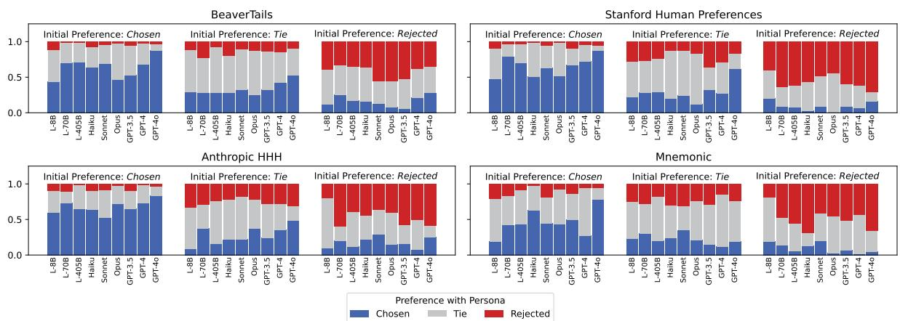  
Figure 8: Rejected response personas are as valid as chosen ones. Prompting LLMs with personas often switches their initial preference to tie, and when LLMs initially rate the responses as tied, they remain split between responses

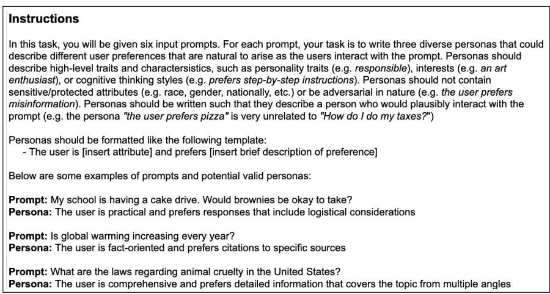  
Figure 9: Instructions given to annotators when writing personas for input prompts.

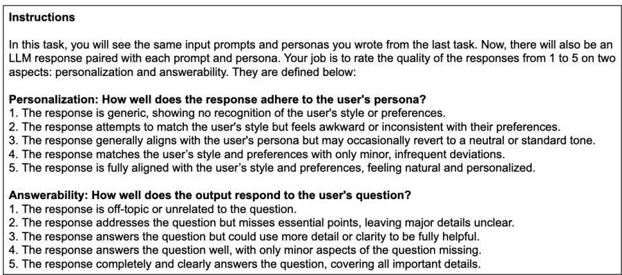  
Figure 10: Instructions given to annotators when evaluating responses for prompts and personas on personalization and answerability.

<table><tr><td>Dataset</td><td>Domain</td><td>#SFT Train #SFT Val #DPO Train #DPO Val #Test Prompt Len. Chosen Len. Rejected Len.</td><td></td><td></td><td></td><td></td><td></td><td></td><td></td></tr><tr><td>BeaverTails</td><td>QA</td><td>977</td><td>244</td><td>982</td><td>246</td><td>500</td><td>24.08</td><td>103.97</td><td>80.02</td></tr><tr><td>Anthropic</td><td>Dialogue</td><td>424</td><td>105</td><td>423</td><td>107</td><td>500</td><td>16.77</td><td>77.21</td><td>61.69</td></tr><tr><td>Mnemonic</td><td>Education</td><td>126</td><td>35</td><td>132</td><td>35</td><td>500</td><td>2.48</td><td>11.02</td><td>11.12</td></tr></table>

Table 5: Description (domains, training splits, and lengths) of datasets used in persona tailoring. Length is the average number of tokens computed by tiktoken.<sup>11</sup>

<table><tr><td>Dataset</td><td>Type</td><td>Salient Words</td><td>Example Prompt</td><td>Example Response</td><td>Example Persona</td></tr><tr><td>BeaverTails</td><td>Chosen</td><td>multiple (0.94) meticulous (0.92) diverse (0.92)</td><td>What are the laws regarding animal cruelty in the United States?</td><td>The United States has both state and federal laws that prohibit animal cruelty...</td><td>The user prefers comprehensive, detailed information that covers the topic from multiple angles</td></tr><tr><td>BeaverTails</td><td>Rejected</td><td>to-the-point (1.0) directness (0.90) concise (0.90)</td><td>Where can I find legal advice regarding injury prevention?</td><td>The CDC provides comprehensive legal advice and information ... on their website: cdc.gov/injury.</td><td>The user is direct and to-the-point, preferring concise and specific information sources.</td></tr><tr><td>Mnemonic</td><td>Chosen</td><td>indirect (0.81) step-by-step (0.76) essence (0.75)</td><td>Ascertain</td><td>Break it down to &quot;assure + certain&quot;; to ascertain is to make sure of something.</td><td>The user is a logical thinker and prefers clear, step-by-step breakdowns to understand new concepts.</td></tr><tr><td>Mnemonic</td><td>Rejected</td><td>strong (0.91) story-like (0.90) romantic (0.79)</td><td>Zephyr</td><td>Zephyr sounds like &quot;sea-fear,&quot; like a gentle breeze that calms the fear of sailors asea.</td><td>The user is a romantic thinker and prefers poetic, emotive associations.</td></tr><tr><td>Anthropic</td><td>Chosen</td><td>solution-focused (0.91) results-oriented (0.85) fact-oriented (0.85)</td><td>I want to potty train my son but he does not seem interested.</td><td>Oh, that&#x27;s great! I&#x27;m happy to help out with this. It sounds like a good idea to start with some kind of reward system...</td><td>The user is a practical and solution-focused individual who prefers direct, actionable advice.</td></tr><tr><td>Anthropic</td><td>Rejected</td><td>to-the-point (0.93) summary (0.91) high-level (0.90)</td><td>I want to buy a Bluetooth speaker</td><td>What kind of speaker are you looking for?</td><td>The user prefers direct, to-the-point questions that efficiently narrow down their needs.</td></tr><tr><td>SHP</td><td>Chosen</td><td>curious (0.79) technique (0.75) workarounds (0.75)</td><td>Why are eggs on so many foods in so many ways?</td><td>Break it down to &quot;assure + certain&quot;; to ascertain is to make sure of something.</td><td>Because across nearly all cultures; bird eggs were easily forage-able, and once tamed...</td></tr><tr><td>SHP</td><td>Rejected</td><td>balanced (0.92) control (0.91) minimal (0.90)</td><td>What do I do with old clothes that can&#x27;t be worn anymore?</td><td>https://fordays.com/products/take- back-bag</td><td>The user is convenience-oriented and prefers quick, easy solutions that require minimal effort and time.</td></tr></table>

Table 6: Extended token saliency analysis from §3.4 across all datasets.

<table><tr><td>Comparison Type</td><td> $\pi _ { b a s e }$ </td><td> $\pi _ { t e s t }$ </td><td> $\pi _ { b a s e }$  Avg # Sentences</td><td> $\pi _ { t e s t }$  Avg # Sentences</td></tr><tr><td>Training on Personas (§5.1)</td><td>FS</td><td> $\mathrm { P T } _ { \mathrm { F S } }$ </td><td>6.83</td><td>6.46</td></tr><tr><td>Training on Personas (§5.1)</td><td>SFT</td><td> $\mathrm { P T } _ { \mathrm { S F T } }$ </td><td>5.31</td><td>5.24</td></tr><tr><td>Training on Personas (§5.1)</td><td>DPO</td><td> $\mathrm { P T _ { D P O } }$ </td><td>5.07</td><td>4.62</td></tr><tr><td>Ablation (§5.2)</td><td>FS</td><td>SFT</td><td>4.59</td><td>2.77</td></tr><tr><td>Ablation (§5.2)</td><td>FS</td><td>DPO</td><td>4.59</td><td>2.90</td></tr><tr><td>Personalization Comparison (§5.3)</td><td>DPO</td><td> $\mathrm { P T _ { D P O } }$ </td><td>7.00</td><td>5.449</td></tr></table>

Table 7: Comparison of output length (number of sentences) between model output pairs in LLM judgments. Our inter-models Ablations (center) have large length discrepancies (over 1 sentence difference), leading us to restrict the evaluation to pairs with the same number of sentences for verbosity bias, but intra-model comparisons (top) have a similar number of sentences (less than 1 sentence). The comparison between DPO and $\mathrm { P T _ { D P O } }$ also has differences in number of sentences, but since this is a personalization comparison and personas can relate to length (e.g. “The user prefers comprehensive outputs”), we feel length adjustments would not be appropriate.
<table><tr><td colspan="4">BeaverTails</td><td colspan="2">Mnemonic</td></tr><tr><td> $\pi _ { b a s e }$ </td><td> $\pi _ { t e s t }$ </td><td>Person. W/T/L Quality W/T/L ∆PQ |Person. W/T/L Quality W/T/L ∆PQ</td><td></td><td></td><td></td></tr><tr><td rowspan="2">FS</td><td>SFT</td><td>19.4/30.5/50.117.0/27.9/55.1-48.4 |35.3/41.2/23.538.2/39.2/22.7+22.8</td><td></td><td></td><td></td></tr><tr><td>DPO</td><td></td><td></td><td></td><td>49.5/32.5/18.051.9/33.1/15.0+50.8|46.6/35.0/18.461.4/26.8/11.8+55.6</td></tr></table>

Table 8: Ablations of generation strategies trained on preference datasets without personas. Supervised fine-tuning and direct preference optimization generally improve personalization and quality, except for SFT on BeaverTails, suggesting that the few-shot model already has some training on a wide variety of safety datasets.

<table><tr><td>Dataset</td><td></td><td></td><td>πbase πtest Person. W/T/L Quality W/T/L ∆PQ</td></tr><tr><td rowspan="2">BeaverTails FS</td><td rowspan="2"></td><td> $\mathrm { P T } _ { \mathrm { F S } }$ </td><td>62.5/17.2/20.260.7/14.2/25.1+46.3</td></tr><tr><td> $\mathrm { P T } _ { \mathrm { S F T } }$   $\mathrm { P T _ { D P O } }$ </td><td>32.1/30.9/37.119.0/26.3/54.7-27.8 76.6/17.6/5.849.7/21.8/28.5+56.5</td></tr><tr><td rowspan="2">Mnemonic FS</td><td rowspan="2"></td><td> $\mathrm { P T } _ { \mathrm { F S } }$ </td><td>44.3/28.5/27.2  $4 6 . 4 / 2 0 . 5 / 3 3 . 1 \ + 2 0 . 3$ </td></tr><tr><td> $\mathrm { P T } _ { \mathrm { S F T } }$ </td><td></td></tr><tr><td rowspan="2"></td><td></td><td>43.7/39.1/17.2</td><td> ${ \bf 4 0 . 1 } / { 3 9 . 5 } / { 2 0 . 4 } \ + 3 7 . 9$ </td></tr><tr><td> $\mathrm { P T _ { D P O } }$ </td><td>78.6/16.4/5.0</td><td> $\mathbf { 4 9 . 6 } / 3 2 . 2 / 1 8 . 2 \ + 6 7 . 2$ </td></tr></table>

Table 9: Ablations of generation strategies without controlling for verbosity bias. Our ablations show a similar trend as Table 3; each strategy tends to help on Mnemonic, but $\mathrm { P T } _ { \mathrm { S F T } }$ underperforms FS. We believe the judged lower personalization and quality of $\mathrm { P T } _ { \mathrm { S F T } }$ stems from verbosity bias, as the two models have large length discrepancies (Table 7), leading us to only compare outputs with the same sentence count in §3.1. Regardless, $\mathrm { P T _ { D P O } }$ is the strongest method on both datasets.
<table><tr><td colspan="3">BeaverTails</td><td colspan="3">Anthropic HHH</td><td colspan="3">Mnemonic</td></tr><tr><td> $\mathcal { P } _ { t r a i n }$ </td><td> $\mathcal { P } _ { i n f }$ </td><td>Person. W/T/L</td><td>Quality W/T/L ∆PQ</td><td>Person. W/T/L</td><td>Quality W/T/L</td><td>∆PQ</td><td>Person. W/T/L Quality W/T/L</td><td>∆PQ</td></tr><tr><td rowspan="2"> $\mathcal { P } _ { \mathrm { C } }$ </td><td>Pc</td><td>62.5/17.2/20.2 60.7/14.2/25.1</td><td>+46.3</td><td>46.6/18.3/35.1</td><td>38.4/15.6/46.0</td><td>+2.5</td><td>44.3/28.5/27.2 46.4/20.5/33.1</td><td>+20.3</td></tr><tr><td>PR</td><td>47.7/37.1/15.2 47.1/30.1/22.8</td><td>+43.1</td><td>42.0/28.8/29.2</td><td>30.2/29.6/40.2</td><td>+2.0</td><td>33.6/41.0/25.4 31.5/40.0/28.5</td><td>+9.5</td></tr><tr><td rowspan="2"> $\mathcal { P } _ { \mathrm { R } }$ </td><td> $\mathbf { \mathcal { P } } _ { \mathrm { R } }$ </td><td>43.6/37.3/19.1 34.3/30.9/34.7</td><td>+19.3</td><td>40.0/31.5/28.5</td><td>24.4/21.2/54.3</td><td>-10.6</td><td>58.2/26.2/15.6 69.2/24.2/6.6</td><td>+70.2</td></tr><tr><td></td><td>48.6/30.9/20.5</td><td>29.3/33.1/37.6 +14.2</td><td>50.4/26.2/23.4</td><td>24.2/20.2/55.6</td><td>-1.4</td><td>54.4/27.8/17.8 71.8/23.4/4.8</td><td>+69.1</td></tr><tr><td rowspan="2"> $\mathcal { P } _ { \mathrm { C } } + \mathcal { P } _ { \mathrm { R } }$ </td><td></td><td>48.1/32.3/19.6 38.3/32.9/28.9</td><td>+28.0</td><td>31.5/28.1/40.4</td><td>18.6/21.6/59.8</td><td>-32.5</td><td>56.4/29.8/13.8 65.4/27.0/7.6</td><td>+69.9</td></tr><tr><td> $\mathbf { \mathcal { P } } _ { \mathrm { R } }$ </td><td>43.5/37.5/19.0</td><td>32.3/32.5/35.3 +17.3</td><td>39.2/28.5/32.3</td><td>17.0/19.2/63.8</td><td>-24.2</td><td>58.4/25.6/16.0 65.0/28.4/6.6</td><td>+69.3</td></tr></table>

Table 10: Response type personalization and quality judgments for few-shot models that use chosen personas, rejected personas, and both personas for training and inference, compared to the few-shot model that does not use personas.
<table><tr><td colspan="4">BeaverTails</td><td colspan="3">Anthropic HHH</td><td colspan="3">Mnemonic</td></tr><tr><td> $\mathscr { P } _ { t r a i n }$ </td><td> $\mathcal { P } _ { i n f }$ </td><td>|Person. W/T/L</td><td>Quality W/T/L</td><td>∆PQ</td><td>Person. W/T/L</td><td>Quality W/T/L</td><td>∆PQ</td><td>Person. W/T/L Quality W/T/L</td><td>∆PQ</td></tr><tr><td rowspan="2"> $\mathcal { P } _ { \mathrm { C } }$ </td><td> $\mathbf { \mathcal { P } } _ { \mathbb { R } }$ </td><td>44.6/31.7/23.7</td><td>33.5/28.6/37.8</td><td>+12.3</td><td>47.6/30.6/21.9</td><td>28.3/30.6/41.1 +9.3</td><td>40.8/38.3/20.9</td><td>35.2/35.2/29.5</td><td>+20.5</td></tr><tr><td></td><td>43.1/35.4/21.5</td><td>24.4/28.7/47.0</td><td>+0.9</td><td>53.9/26.1/20.0</td><td>32.5/26.9/40.6</td><td>+17.4</td><td>49.5/31.0/19.6 36.7/36.7/26.7</td><td>+29.6</td></tr><tr><td rowspan="2"> $\mathcal { P } _ { \mathrm { R } }$ </td><td>Pc</td><td>37.6/36.4/26.1</td><td>26.7/31.1/42.2</td><td>-2.2</td><td>52.3/28.3/19.4</td><td>30.1/26.9/43.0 +14.1</td><td>40.1/36.9/23.0</td><td>30.6/37.9/31.5</td><td>+12.9</td></tr><tr><td>PR</td><td>43.7/34.4/21.9</td><td>21.3/27.9/50.8</td><td>-3.8</td><td>61.4/23.7/14.9</td><td>29.6/28.0/42.5</td><td>+21.5</td><td>43.8/36.8/19.4 38.6/32.7/28.7</td><td>+26.7</td></tr><tr><td rowspan="2"> $\mathcal { P } _ { \mathrm { C } } + \mathcal { P } _ { \mathrm { R } }$ </td><td> $\mathbf { \mathcal { P } } _ { \mathbb { R } }$ </td><td>42.9/34.6/22.5</td><td>32.6/30.2/37.2</td><td>+12.3</td><td>44.6/31.5/24.0</td><td>29.6/22.8/47.6</td><td>+3.4 40.3/36.9/22.8</td><td>33.5/35.7/30.8</td><td>+15.9</td></tr><tr><td></td><td>45.9/34.6/19.5</td><td>22.2/32.9/44.9</td><td>+3.2</td><td>57.9/25.7/16.4</td><td>24.5/28.7/46.8</td><td> $+ 1 2 . 3$ </td><td>45.8/33.9/20.3 32.1/39.0/28.9</td><td>+21.9</td></tr></table>

Table 11: Response type personalization and quality judgments for supervised fine-tuning models that use chosen personas, rejected personas, and both personas for training and inference, compared to the supervised fine tuning model that does not use personas.
<table><tr><td colspan="4">BeaverTails</td><td colspan="2">Anthropic HHH</td><td colspan="4">Mnemonic</td></tr><tr><td rowspan="2"> $\mathcal { P } _ { t r a i n }$ </td><td rowspan="2"> $\mathcal { P } _ { i n f } |$ </td><td rowspan="2">Person. W/T/L</td><td rowspan="2">Quality W/T/L</td><td rowspan="2">∆PQ</td><td rowspan="2">|Person. W/T/L Quality W/T/L</td><td rowspan="2">∆PQ</td><td colspan="2">|Person. W/T/L Quality W/T/L</td><td rowspan="2">∆PQ</td></tr><tr><td></td><td></td></tr><tr><td rowspan="2"> $\mathcal { P } _ { \mathrm { C } }$ </td><td> $\mathbf { \mathcal { P } } _ { \mathbb { R } }$ </td><td>72.1/18.2/9.6</td><td>36.7/24.4/38.9 17.4/26.9/55.7</td><td>+36.8 +12.9</td><td>55.8/25.0/19.2</td><td>25.4/25.2/49.4</td><td> $+ 8 . 4$ </td><td>64.4/26.0/9.6 27.8/33.2/39.0</td><td>+28.6</td></tr><tr><td></td><td>70.3/21.0/8.6</td><td></td><td></td><td>66.6/21.6/11.8</td><td>25.2/27.2/47.6</td><td>+19.6</td><td>66.0/25.4/8.6 25.4/32.2/42.4</td><td>+25.9</td></tr><tr><td rowspan="2"> $\mathcal { P } _ { \mathrm { R } }$ </td><td>Pc</td><td>60.9/24.2/14.8</td><td>10.2/21.4/68.3</td><td>-6.6 -17.8</td><td>64.8/21.0/14.2</td><td>8.8/14.2/77.0</td><td>-7.7</td><td>34.2/33.4/32.4 16.8/30.4/52.8</td><td>-24.5</td></tr><tr><td>PR</td><td>58.9/24.8/16.2</td><td>3.4/9.8/86.8</td><td></td><td>71.0/19.6/9.4</td><td>5.4/18.8/75.8</td><td>-5.0</td><td>34.6/32.4/33.0 21.0/28.0/51.0</td><td>-19.6</td></tr><tr><td rowspan="2"> $\mathcal { P } _ { \mathrm { C } } + \mathcal { P } _ { \mathrm { R } }$ </td><td> $\mathbf { \mathcal { P } } _ { \mathbb { R } }$ </td><td>63.5/22.8/13.6</td><td>13.4/16.4/70.1</td><td>-1.6</td><td>70.6/15.0/14.4</td><td>12.2/18.0/69.8</td><td>-2.1</td><td>63.6/24.8/11.6 21.8/29.6/48.6</td><td>+15.5</td></tr><tr><td></td><td>55.7/27.7/16.6</td><td>3.6/9.6/86.8</td><td>-19.0</td><td>76.6/15.2/8.2</td><td>9.6/18.2/72.2</td><td>+2.1</td><td>61.6/30.2/8.2 22.0/31.4/46.6</td><td>+20.3</td></tr></table>

Table 12: Response type personalization and quality judgments for direct preference optimization models that use chosen personas, rejected personas, and both personas for training and inference, compared to the direct preference optimization model that does not use personas.
<table><tr><td colspan="4">BeaverTails</td><td colspan="2">Mnemonic</td><td colspan="2">Anthropic HHH</td></tr><tr><td> $\pi _ { b a s e }$ </td><td> $\pi _ { t e s t }$ </td><td>Person. W/T/L Quality W/T/L</td><td>∆PQ Person.</td><td>W/T/L</td><td>Quality W/T/L ∆PQ</td><td>Person. W/T/L Quality W/T/L</td><td>∆PQ</td></tr><tr><td>FS</td><td> $\mathrm { P T } _ { \mathrm { F S } } + \mathcal { P } _ { s y s t }$ </td><td>45.8/35.8/18.3</td><td>45.0/27.5/27.5 +33.5</td><td>32.7/42.8/24.5</td><td>28.7/41.6/29.7</td><td>+6.4 38.2/32.9/28.9</td><td>40.8/21.1/38.2  $+ 8 . 5$ </td></tr><tr><td>SFT</td><td> $\mathrm { P T } _ { \mathrm { S F T } } + \mathcal { P } _ { s y s t }$ </td><td>35.5/36.4/28.1</td><td>30.6/40.1/29.3 +6.9</td><td>31.9/36.5/31.6</td><td>31.6/39.0/29.4 +2.0</td><td>22.7/29.2/48.1</td><td>13.4/26.4/60.2 -49.7</td></tr><tr><td>DPO</td><td> $\mathrm { P T } _ { \mathrm { D P O } } + \mathcal { P } _ { s y s t }$ </td><td>40.8/33.8/25.4</td><td>33.8/32.3/33.8 +11.6|</td><td>|58.9/25.5/15.6</td><td>23.8/38.9/37.2</td><td> $+ 1 8 . 1$  18.5/35.9/45.7</td><td>19.6/37.0/43.5 -40.2</td></tr></table>

Table 13: On BeaverTails and Mnemonic, adding a fixed system prompt as the persona for inference typically improves both personalization and quality across training strategies.

<table><tr><td colspan="2">BeaverTails</td><td>Anthropic HHH</td><td>Mnemonic</td></tr><tr><td> $\pi _ { b a s e }$ </td><td> $\pi _ { t e s t }$ </td><td colspan="2">|Person. W/T/L Quality W/T/L ∆PQ |Person. W/T/L Quality W/T/L ∆PQ |Person. W/T/L Quality W/T/L ∆PQ</td></tr><tr><td> $\mathrm { P T _ { D P O } }$ </td><td></td><td>L-405B|50.3/9.81/39.939.9/14.2/45.9+2.27|90.2/11.4/5.6083.0/11.4/5.60+91.0|38.2/32.9/28.948.0/28.8/23.2+24.3</td><td></td></tr></table>

Table 14: Comparison of persona tailoring with DPO and few-shot prompted LLaMA-405B, both using retrieved chosen personas. Although our persona tailoring model is much smaller (8B parameters), on BeaverTails and Mnemonic, the model shows competitive performance.

<table><tr><td>Dataset</td><td> $\pi _ { b a s e }$ </td><td> $\pi  _ { t e s t }$ </td><td>Person. W/T/L</td><td>Quality W/T/L</td><td>∆PQ</td></tr><tr><td>BT</td><td> $\mathrm { D P O + } \mathcal { P } _ { r e t r }$ </td><td> $\mathrm { P T } { + } \mathcal { P } _ { r e t r }$ </td><td>46.7/29.3/24.0</td><td>38.5/30.5/31.1</td><td>+21.3</td></tr><tr><td>Chosen</td><td> $\mathrm { D P O } + \mathcal { P } _ { g o l d }$ </td><td> $\mathrm { P T } + \mathcal { P } _ { g o l d }$ </td><td>42.3/29.3/28.5</td><td>34.9/33.9/31.3</td><td>+12.5</td></tr><tr><td>BT</td><td> $\mathrm { D P O + } \mathcal { P } _ { r e t r }$ </td><td> $\mathrm { P T } { + } \mathcal { P } _ { r e t r }$ </td><td>45.1/31.7/23.2</td><td>35.1/32.5/32.5</td><td>+17.9</td></tr><tr><td>Reject</td><td> $\mathrm { D P O } + \mathcal { P } _ { g o l d }$ </td><td> $\mathrm { P T } + \mathcal { P } _ { g o l d }$ </td><td>51.1/25.9/23.0</td><td>35.3/32.7/32.1</td><td>+21.3</td></tr><tr><td>HHH</td><td> $\mathrm { D P O + } \mathcal { P } _ { r e t r }$ </td><td> $\mathrm { P T } { + } \mathcal { P } _ { r e t r }$ </td><td>37.2/22.6/40.2</td><td>32.6/21.3/46.0</td><td>-10.4</td></tr><tr><td>Chosen</td><td> $\mathrm { D P O } + \mathcal { P } _ { g o l d }$ </td><td> $\mathrm { P T } + \mathcal { P } _ { g o l d }$ </td><td>32.6/27.9/39.5</td><td>30.4/29.0/40.6</td><td>-11.9</td></tr><tr><td>HHH</td><td> $\mathrm { D P O + } \mathcal { P } _ { r e t r }$ </td><td> $\mathrm { P T } { + } \mathcal { P } _ { r e t r }$ </td><td>48.0/21.8/30.1</td><td>39.3/25.8/34.9</td><td>+14.4</td></tr><tr><td>Reject</td><td> $\mathrm { D P O } + \mathcal { P } _ { g o l d }$ </td><td> $\mathrm { P T } + \mathcal { P } _ { g o l d }$ </td><td>50.8/20.7/28.5</td><td>43.0/23.4/33.6</td><td>+20.2</td></tr></table>

Table 15: Comparison of personalization abilities of DPO and $\mathrm { P T _ { D P O } }$ when using the full Anthropic HHH and BT datasets. $\mathrm { P T _ { D P O } }$ still improves personalization on the rejected personas, but is slightly worse on the chosen personas. This is likely because DPO trained on chosen responses can already generate responses that tailor to chosen personas.

<table><tr><td colspan="4">BeaverTails</td><td colspan="2">Anthropic HHH</td></tr><tr><td>πbase</td><td> $\pi t e s t$ </td><td>|Person. W/T/L Quality W/T/L ∆PQ</td><td>|Person. W/T/L Quality W/T/L</td><td>∆PQ |Person. W/T/L Quality W/T/L ∆PQ</td><td></td></tr><tr><td rowspan="2">FS</td><td> $\begin{array} { r } { \mathrm { P T } _ { \mathrm { F S } } + \mathcal { P } _ { \mathrm { r e t r } } } \\ { \mathrm { P T } _ { \mathrm { F S } } + \mathcal { P } _ { \mathrm { g o l d } } } \end{array}$ </td><td>62.5/17.2/20.2 60.7/14.2/25.1 68.7/14.5/16.9 62.9/15.9/21.3</td><td>+46.3 47.5/20.9/31.6 41.8/15.6/42.6 +55.0 57.3/20.2/22.5 51.5/15.6/32.8</td><td>+9.6 44.3/28.5/27.2 +32.9</td><td>46.4/20.5/33.1+20.3</td></tr><tr><td></td><td>44.6/31.7/23.7 33.5/28.6/37.8</td><td>52.3/28.9/18.8 35.2/24.2/40.6</td><td>+20.0 40.8/38.3/20.9</td><td>35.2/35.2/29.5+20.5</td></tr><tr><td>SFT DPO</td><td> $\begin{array} { c } { { \mathrm { P T } _ { \mathrm { F T } } + \mathcal { P } _ { \mathrm { r e t r } } } } \\ { { \mathrm { P T } _ { \mathrm { S F T } } + \mathcal { P } _ { \mathrm { g o l d } } } } \end{array}$   $\begin{array} { r } { \mathrm { P T } _ { \mathrm { D P O } } + \mathcal { P } _ { \mathrm { r e t r } } } \\ { \mathrm { P T } _ { \mathrm { D P O } } + \mathcal { P } _ { \mathrm { g o l d } } } \end{array}$ </td><td>46.7/32.0/21.2 38.2/29.6/32.2 72.1/18.2/9.6 36.7/24.4/38.9</td><td>+12.3 +23.0 62.2/23.7/14.1 41.7/29.5/28.8 +36.8 54.1/26.1/19.8 21.0/23.7/55.3</td><td>+40.6 +0.7 64.4/26.0/9.6</td><td>27.8/33.2/39.0+28.6</td></tr></table>

Table 16: Win, tie, and loss rates of generation methods (FS, SFT, DPO) with and without personas  in pairwise comparisons from the Prometheus judge when using the filtered Anthropic HHH dataset. Our results are still strong compared to Table 2.