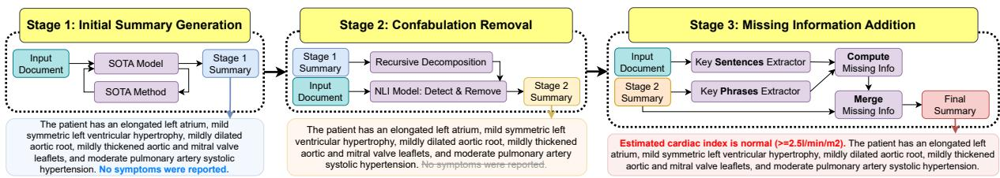
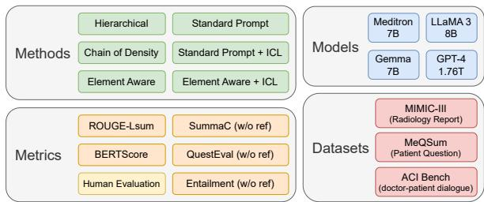
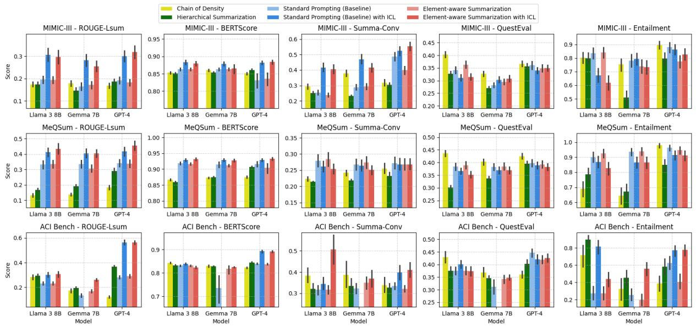

# uMedSum: A Unified Framework for Clinical Abstractive Summarization

Aishik Nagar1\* Yutong Liu1 Andy T. Liu1 Viktor Schlegel4 † Vijay Prakash Dwivedi1 Arun-Kumar Kaliya-Perumal2 Guna Pratheep Kalanchiam3 Yili Tang1 Robby T. Tan1

1ASUS Intelligent Cloud Services (AICS), Singapore 2Rehabilitation Research Institute of Singapore, Lee Kong Chian School of Medicine, Nanyang Technological University, Singapore 3Division of Spine, Department of Orthopaedic Surgery, Tan Tock Seng Hospital, Singapore 2Imperial College London, Imperial Global Singapore

## Abstract

Clinical abstractive summarization struggles to balance faithfulness and informativeness, sacri ficing key information or introducing confabulations. Techniques like in-context learning and fine-tuning have improved overall summary quality orthogonally, without considering the above issue. Conversely, methods aimed at im proving faithfulness and informativeness, such as model reasoning and self-improvement, have not been systematically evaluated in the clinical domain. We address this gap by first performing a comprehensive benchmark and study of six advanced abstractive summarization meth ods across three datasets using five referencebased and reference-free metrics, with the latter specifically assessing faithfulness and informativeness. Based on its findings we then develop uMedSum, a modular hybrid framework introducing novel approaches for sequential confabulation removal and key information addition. Our work outperforms previous GPT-4-based state-of-the-art (SOTA) methods in both quantitative metrics and expert evaluations, achieving an 11.8% average improvement in dedicated faithfulness metrics over the previous SOTA. Doctors prefer uMedSum’s summaries 6 times more than previous SOTA in difficult cases containing confabulations or missing information. These results highlight uMedSum’s effectiveness and generalizability across various datasets and metrics, marking a significant advancement in clinical summarization. uMedSum toolkit is made available on GitHub.

## 1 Introduction

Large Language Models (LLMs) have shown exceptional performance in generative tasks, including zero-shot and out-of-the-box applications in specialized areas like summarization (Lei et al.,

2023; Van Veen et al., 2024). In the clinical field, document summarization holds promise for greatly improving the efficiency of clinical staff in reviewing lengthy documents, such as clinical exam reports or patient histories. However, the stochastic nature of LLMs and their lack of formal guarantees (Li et al., 2023; Schlegel et al., 2023) often lead to summaries that deviate from input documents, limiting their practical usability.

This is particularly problematic in the clinical domain, where accurate and complete information is crucial for effective decision-making. Doctors rely on summaries that capture all relevant details without introducing erroneous information, emphasizing two critical aspects of clinical summarization: faithfulness and informativeness. Lack of faithfulness can cause ‘confabulations’, where parts of a summary include information that wasn’t in the original document (Maynez et al., 2020). On the other hand, ‘insufficient informativeness’ happens when relevant details from the input document are left out (Mao et al., 2020). Such summaries can provide doctors with incomplete evidence or inaccurate information, potentially leading to misdiagnoses or inappropriate treatment decisions, ultimately impacting patient outcomes.

In recent benchmarks (Van Veen et al., 2024), task and domain adaptation approaches such as in-context learning (ICL) (Brown, 2020) and parameter-efficient fine-tuning like QLoRA (Dettmers et al., 2024) show promising results for advancing medical summarization. These benchmarks, however, focus their evaluation on reference-based metrics such as ROUGE (Lin, 2004). While helpful in comparing outputs to ground truth references, these metrics do not explicitly capture the quality dimensions of faithfulness and informativeness of summaries (Maynez et al., 2020). Additionally, these benchmarks also neglect recent methods which leverage model reasoning(Chang et al., 2024) to overall improve summary quality. As such, it is unclear whether the best-performing approaches found in such benchmarks improve summaries along the dimensions of faithfulness and informativeness or take full advantage of the model’s reasoning abilities.

  
Figure 1: Overview of the proposed three-stage framework - uMedSum. The process is illustrated with example outputs at each stage when using uMedSum with Element Aware Summarization and GPT-4. Blue text indicates confabulated information (information not grounded in the input document), while red text highlights added key information previously missing from the summary.

Existing efforts in enhancing faithfulness and informativeness for summarization face several limitations: While techniques exist to address confabulations and missing information, they do so in isolation and often rely on either abstractive or extractive techniques. Thus, they impede achieving a balance of informativeness and faithfulness, as removing purported confabulations may lead to omissions of otherwise important information. Existing hybrid approaches inherit the limitations from their parts like Constrained Abstractive Summarization (CAS) (Mao et al., 2020), where confabulations in the initial abstractive summary persist in the final summary. Furthermore, to the best of our knowledge, these efforts have not been systematically evaluated in the clinical domain, which limits the understanding of their efficacy therein.

In light of these considerations, we present a comprehensive clinical summarization benchmark and a large-scale study of previous SOTA summarization methods with a focus on methods that improve the faithfulness and informativeness of summaries, which have received little attention in the medical domain thus far. We introduce a unified summarization framework, uMedSum, which improves summaries along these dimensions through a hybrid abstractive and extractive approach, including novel techniques for jointly removing confabulated information and adding missing information to balance faithfulness and informativeness, thus effectively addressing the shortcomings of existing methods. By sequentially removing confabulated information followed by adding missing information, uMedSum avoids the issue of overzealous removal of information during faithfulness checks, while ensuring that no confabulated information is added during informativeness improvements by relying on a purely extractive approach.

Specifically, our contributions are: (1) A comprehensive benchmark to investigate advanced techniques leveraging model reasoning for summarization by comparing six recent methods across three diverse datasets using five standardized metrics, including both reference-based and reference-free metrics, and human evaluation by clinicians (Figure 2). Our findings complement those of (Van Veen et al., 2024) to obtain a new SOTA on our benchmark. (2) A novel three-stage framework, uMedSum (Figure 1), that improves current summarization methods and models, consisting of (a) initial summary generation using the bestperforming method-LLM combination from our benchmark, (b) NLI-based confabulation detection and removal, and (c) a hybrid abstractive-extractive approach for incorporating missing key information. (3) Significant improvements in faithfulness and informativeness of clinical summarisation compared to previous GPT-4-based SOTA methods (Van Veen et al., 2024), while maintaining competitive performance on reference-based metrics. (4) Human evaluation which show that domain experts prefer our framework’s summary six times more than previous SOTA in difficult cases, with equal preference in straightforward cases. (5) A complete benchmarking toolkit to facilitate further research in clinical summarization.

## 2 Related Work

Summarization is usually approached by extractive and abstractive approaches (Nenkova et al., 2011; Luo et al., 2024). Extractive summarization selects key sentences or phrases directly from the input document, with recent works increasingly relying on embedding similarity with pretrained models (Zhong et al., 2020; Sammet and Krestel, 2023; Song et al., 2023). Abstractive summarization, conversely, aims to rephrase content for more concise and readable summaries. More recent advancements over traditional sequence-to-sequence approaches (Lewis et al., 2020; Zhang et al., 2020) include reasoning-based approaches such as elementaware steering of summary content (Wang et al., 2023). The effectiveness of such advanced methods in the clinical domain has not been extensively evaluated, with Van Veen et al. (2024) merely evaluating the adoption of with standard ICL techniques, which we address with our proposed clinical summarization benchmark. Notably, most existing work applies either extractive or abstractive techniques in isolation. With uMedSum we aim to leverage both techniques to address challenges pertaining to confabulations (Maynez et al., 2020) (by filtering abstractive summaries) and incompleteness (Mao et al., 2020) (by adding content using extractive approaches).

Confabulated Information Detection. Confabulation detection, or identifying information not grounded in the input document, is a major challenge in clinical summarization. While existing methods typically provide a general factuality score for generated summaries (Maynez et al., 2020; Liu et al., 2024; Ji et al., 2023), they often fail to systematically remove confabulated information. Some techniques attempt to address epistemic uncertainty by leveraging internal logit-level data (Yadkori et al., 2024; Manakul et al., 2023; Chen et al., 2024; Farquhar et al., 2024), but these are generally limited to question-answering scenarios with clear ground truths and require access to internal model states, making them less scalable and compatible with proprietary models. Inspired by Maynez et al. (2020) and Lei et al. (2023), our framework uses entailment-based metrics for removing confabulated spans in summaries, employing sentences and atomic facts for more accurate removal (Thirukovalluru et al., 2024). We also address the common issue of overzealous removal by detecting and reintegrating key missing information afterward.

Missing Information Addition. Missing information in summaries is addressed by extractive or hybrid techniques which rely on extractions to identify key missing details. Despite improving key phrase identification, extractive summaries often struggle with verbosity and low fluency (Nathan et al., 2023). Hybrid approaches like Constrained Abstractive Summarization (CAS) (Mao et al., 2020) address missing information but do not consider confabulations in the generated summary. In contrast, our work proposes a novel approach that effectively combines extractive and abstractive methods to address both confabulations and key missing information. We show both quantitatively and qualitatively, that this integration achieves a delicate balance, leveraging both approaches’ strengths while mitigating their weaknesses.

## 3 uMedSum: Faithful and Informative Clinical Summarization

Summarization Benchmark. To address the lack of a systematic benchmark for summarization methods in clinical summarization, we first evaluate four recent methods: Standard Prompting (baseline), Element-Aware Summarization with Large Language Models (Wang et al., 2023), Chain of Density (Addams et al., 2023), and Hierarchical Summarization (Chang et al., 2024). Each technique offers distinct benefits and drawbacks, as discussed in the appendix section A.1. We then combine the top-performing methods with task adaptation strategies, particularly In-Context Learning, which outperforms QLoRA for similar tasks (Van Veen et al., 2024). This benchmark serves as a means to understand the capabilities of advanced reasoning methods for clinical summarisation. This step ensures the highest possible quality for the initial summary, laying a strong foundation for uMedSum. The complete details are provided in figure 2 in the appendix.

  
Figure 2: Overview of the proposed clinical summarization benchmark for fair comparison.

uMedSum. The uMedSum pipeline is designed to produce high-quality, faithful, and comprehensive clinical summaries through a three-stage process, visualized in Figure 1: Initial Summary Generation, Confabulation Removal, and Missing Information

Addition. Each stage of uMedSum is a modular, selfcontained component that can be independently updated and tuned, providing flexibility and efficiency with minimal computational overhead.

## 3.1 Stage 1: Initial Summary Generation

The combination of best-performing methods and models from the benchmark is selected for further evaluation and enhancement using the stages of uMedSum. In the first stage, we generate an initial abstractive summary given the input document.

## 3.2 Stage 2: Confabulation Removal (Faithfulness)

The uMedSum pipeline takes a novel approach by repurposing Natural Language Inference (NLI) models to not just evaluate the factuality of generated summaries but to directly detect and remove discrete confabulated information from generated summaries. This approach differs from existing methods, which typically focus on sentencelevel entailment or entity-based splitting (Lei et al., 2023), by introducing a more granular decomposition based on atomic facts (Thirukovalluru et al., 2024; Nawrath et al., 2024; Stacey et al., 2023). Specifically, we propose a two-step process: (1) summary decomposition into smaller, manageable units, and (2) pairwise NLI-based confabulation detection and removal.

Summary Decomposition. We begin by decomposing the summary generated in Stage 1 into smaller units called Summary Content Units (SCUs) (Nawrath et al., 2024) or Decomposed Summary Units (DSUs). We propose Recursive Threshold-based Text Segmentation to further split sentences into clause-level atomic facts. Unlike previous works that stop at sentence-level decomposition or rely on entity-based splitting for further decomposition (Lei et al., 2023), our approach aims to create self-contained units that encapsulate atomic facts. Atomic facts encapsulate the smallest meaningful statements that can stand alone as true or false propositions. This aligns well with the NLI task, where the goal is to determine the logical relationship (entailment, contradiction, or neutrality) between two statements. This atomic view of facts allows us to detect confabulations precisely.

Formally, let $D _ { k }$ represent a decomposed summary unit (DSU) from summary $S _ { i }$ , where k indexes the specific unit. The NLI model computes the entailment score $E ( D _ { k } )$ for each DSU, where the score $E ( D _ { k } )$ represents the probability distribution over entailment labels (entailment, neutral, contradiction).

Recursive Threshold-Based Text Segmentation (RTB-TS). Initial Segmentation: We begin by decomposing the summary $S _ { i }$ into DSUs $D _ { k }$ using a sentence boundary disambiguation technique: $S _ { i } ~  ~ \{ D _ { 1 } , D _ { 2 } , . . . , D _ { k } \}$ . This initial step provides a coarse segmentation based on sentence boundaries.

Pairwise NLI Scoring: For each DSU $D _ { k }$ , we compute the entailment score $E ( D _ { k } )$ using a finetuned NLI model: $E ( D _ { k } ) ~ = ~ P ($ (entailment $I , D _ { k } ) , \ N ( D _ { k } ) = \ P ( \mathrm { n e u t r a l } | I , D _ { k } )$ , and $C ( D _ { k } ) = P$ (contradiction $\mid I , D _ { k } )$

Thresholding and Segmentation: We apply a threshold to the entailment score to find the initial classification: $\mathrm { C l a s s } _ { \mathrm { E n t a i l e d } } ( D _ { k } ) : E ( D _ { k } ) > T _ { e }$ $\mathrm { C l a s s } _ { \mathrm { C o n f a b } } ( D _ { k } ) : N ( D _ { k } ) + C ( D _ { k } ) > T _ { c } ,$ and $\mathrm { C l a s s _ { U n c e r t a i n } } ( D _ { k } )$ : otherwise, where $T _ { e }$ is the entailment threshold and $T _ { c }$ is the confabulation threshold. If $D _ { k }$ is classified as "uncertain," further segmentation is necessary.

Recursive Decomposition: For DSUs in the "uncertain" category, we recursively apply segmentation based on the identification of atomic facts within the DSU. This involves breaking down $D _ { k }$ into finer sub-units $D _ { k , a }$ where a indexes each atomic fact: $D _ { k }  \{ D _ { k , 1 } , D _ { k , 2 } , . ~ . ~ . , D _ { k , a } \}$ . We recompute the entailment score for each atomic fact sub-unit $D _ { k , a }$ as $E ( D _ { k , a } ) = P ( { \mathrm { e n t a i l m e n t } } \mid$ $I , D _ { k , a } )$ . and retain only those atomic facts where the value of $E ( D _ { k , a } )$ is greater than a chosen threshold.

Aggregation of Faithful DSUs: After recursive segmentation and filtering, we concatenate ( ) the remaining faithful DSUs to form the refined summary: $S _ { i } ^ { \mathrm { { \bar { r e f i n e d } } } } = \oplus _ { k } D _ { k } ^ { \mathrm { { f a i t h f u l } } }$ . The final refined summary $S _ { i } ^ { \mathrm { r e f i n e d } }$ has suppressed the confabulated atomic facts according to the NLI model.

## 3.3 Stage 3: Missing Information Addition (Informativeness)

Hybrid methods like (Mao et al., 2020) risk confabulated initial summaries. Our approach separates confabulation removal (Stage 2) before adding missing key information (Stage 3), reducing the chance of new confabulations in the final summary. To capture key information from the input document, we identify key sentences in the document and key phrases in the Stage 2 summary. We introduce a novel approach to measure coverage of key information in the summary and integrate missing information into the appropriate sections of the summary to maintain consistency and readability.

Key Information Extraction. Our extracted key information from either the input document or the summary is described as follows. Let $K _ { \mathrm { d o c } } ~ =$ $\{ k _ { \mathrm { d o c } } ^ { i } \ | \ i \leq \mathrm { t o p _ { M } } \}$ for the source document, and $K _ { \mathrm { s u m m } } ^ { - } = \{ k _ { \mathrm { s u m m } } ^ { i } \mid i \leq \mathrm { t o p } _ { \mathrm { N } } \}$ for the generated summary. Where $K _ { \mathrm { d o c } }$ are key sentences from the input document; $K _ { \mathrm { s u m m } }$ are key phrases from our summary; top and top are the thresholds for the number of key sentences and key phrases, respectively.

For the input document, we use sentences as the minimum unit of granularity for extraction. For the summary generated in Stage 2, we apply a key phrase extraction method, such as the one used by Grootendorst (2020), which extracts n-grams as key phrases. We then iteratively rank the sentences or phrases using MMR (Bennani-Smires et al., 2018) and select the top-K as key sentences or key phrases. The complete algorithm for this process is described in the Appendix.

Missing Key Information Detection. Given $K _ { \mathrm { d o c } }$ and $K _ { \mathrm { s u m m } }$ extracted from the input document and generated summary respectively, we calculate coverage scores $\mathrm { c o v } _ { \mathrm { s c o r e } } ^ { i }$ for each $k _ { \mathrm { d o c } } ^ { i }$ based on $K _ { \mathrm { s u m m } }$ . Specifically, we compute the embedding matrices for key sentences and key phrases (Reimers and Gurevych, 2019). Let $\mathrm { E m b e d _ { d o c } }$ represent the matrix formed by stacking the embeddings of the key sentences from the input document, and ${ \mathrm { E m b e d } } _ { \mathrm { s u m m } }$ represent the matrix formed by stacking the embeddings of the key phrases from the Stage 2 summary. Here, $\mathrm { E m b e d _ { d o c } }$ is of size $m \times d ,$ where m is the number of key sentences in the input document, and d is the embedding dimension. Similarly, $\mathrm { E m b e d _ { s u m m } }$ is of size $n \times d ,$ where n is the number of key phrases in the Stage 2 summary.

The similarities between $K _ { \mathrm { d o c } }$ and $K _ { \mathrm { s u m m } }$ are computed as the dot product of the document and summary embedding matrices, yielding a similarity matrix $\big [ \mathrm { s i m } ^ { i , j } \big ] _ { m \times n }$ . Coverage scores for key sentences in the document are then determined by taking the maximum similarity for each sentence across the key phrases from summary, resulting in a vector $\mathbf { C o v _ { s c o r e } }$ of size $m \times 1$

We define the coverage score of the i-th sentence as $\mathrm { c o v } _ { \mathrm { s c o r e } } ^ { i } = \mathrm { m a x } _ { j \leq n } \{ \mathrm { s i m } ^ { i , j } \}$ and introduce a threshold parameter $\mathrm { c o v } _ { \operatorname* { m i n } } .$ Any $k _ { \mathrm { d o c } } ^ { i }$ with a coverage score below $\mathrm { c o v } _ { \operatorname* { m i n } }$ is considered missing information. The set of potential missing information is represented as:

$$
K _ { \mathrm { m i s s i n g } } = \{ k _ { \mathrm { d o c } } ^ { i } \ | \ i \leq m , \mathrm { c o v } _ { \mathrm { s c o r e } } ^ { i } \leq \mathrm { c o v } _ { \mathrm { m i n } } \} .
$$

Merging Missing Information to Summary. We use perplexity (PPL) to select the best location to insert a missing key sentence $k _ { \mathrm { m i s s i n g } } ^ { i } \in$ $K _ { \mathrm { m i s s i n g } }$ into our summary (Sharma et al., 2024):

$$
l ^ { * } = \underset { l \in \mathrm { l o c s } } { \mathrm { a r g m i n } } \mathrm { P P L } _ { \mathrm { L M } } ( k _ { \mathrm { m i s s i n g } } ^ { i } , \mathrm { s u m m a r y } , l ) ,\tag{1}
$$

where summary is the summary obtained from Stage 2. We employ a greedy algorithm to dynamically insert the missing information. The complete algorithm is provided in Appendix A.3.

## 4 Evaluation

We compare state-of-the-art approaches to clinical summarization and improve the best-performing ones using uMedSum. We demonstrate the improvements both through quantitative measurements and qualitative insights from a study conducted by domain experts.

Dataset and Tasks Figure 2 describes the datasets, models and techniques chosen for our experimental setup. We make use of three clinical datasets for summarization tasks: MIMIC III for Radiology Report Summarization (Johnson et al., 2016), MeQSum for Patient Question Summarization (Abacha and Demner-Fushman, 2019), and ACI-Bench for doctor-patient dialogue summarization (Yim et al., 2023). These provide a diverse range of clinical summarization task settings, with varying document lengths, requirement for background knowledge as well as the need for domainspecific vocabulary and understanding.

Evaluation Metrics Maynez et al. (2020) found that reference-based metrics by themselves do not align with human perception of faithfulness and factuality in abstractive summarization tasks and should be combined with reference-free metrics. We thus make use of two reference-based metrics, ROUGE-LSum (Lin, 2004) and BERTScore (Zhang et al., 2019) which assess content overlap and semantic similarity with the reference summary, in combination with three reference-free metrics, SummaC (Laban et al., 2022), QuestEval (Scialom et al., 2021), and Entailment Scores (Liu et al., 2024) which evaluate factual consistency, informativeness, and entailment relative to the source document for purposes of our evaluation. We also report an aggregate evaluation score: For a summary $S _ { i }$ generated by a specific method it is determined by aggregating its rank across all metrics: $\begin{array} { r } { \mathrm { R a n k } _ { i } ~ = ~ \sum _ { j = 1 } ^ { n } \mathrm { R a n k } ( M _ { j } ( S _ { i } ) ) } \end{array}$ , where $\operatorname { R a n k } ( M _ { j } ( S _ { i } ) )$ is the rank of the method based on metric $M _ { j }$ , and n is the total number of metrics used. The method with the lowest Rank is considered the most effective.

  
Figure 3: Benchmark of different Summarization Techniques across datasets on selected metrics. ROUGE-LSum and BertScore are reference-based metrics, while SummaC, QuestEval, and Entailment are used as reference-free metrics.

Experiment Setup We benchmark the performance of four models: LLaMA3 (8B) (Meta, 2024), Gemma (7B) (Team et al., 2024), Meditron (7B) (Chen et al., 2023a,b), and GPT-4 (Achiam et al., 2023), combined with the state-of-the-art summarization methods as described in section A.1. We select the best-performing models and investigate the impact of uMedSum on their performance. The modular setup of uMedSum also allows us to conduct comprehensive ablations for comparing the impact of each stage’s impact and also compare NLI with LLM-based techniques such as Self-Reflection (Ji et al., 2023). For complete implementation details, consult Appendix A.6.

## 5 Results and Discussion

## 5.1 Summarization Techniques Benchmark

Figure 3 presents the benchmark results of different summarization techniques. Table 1 presents the full set of results for the benchmark, as well as results of uMedSum based experiments. The benchmark results are structured into three key areas: the performance of methods, the influence of datasets, and the comparative evaluation of models.

Methods. The Standard Prompting method was selected as the baseline. We first compare the different summarization techniques in zero-shot settings without task adaptation. Chain of Density particularly improves the performance of the QuestEval metric, which aims to measure the factual information retention between input documents and summaries. This can be attributed to its nature of creating the most information-dense summaries, albeit at the cost of readability and conciseness. The Hierarchical method demonstrates noticeable performance in summarizing longer documents, effectively mitigating the “lost-in-the-middle” effect (Ravaut et al., 2023). This is evidenced by consistent improvements across all models when employing hierarchical summarization, particularly for lengthy inputs like those in ACI Bench. The approach enhances faithfulness to the input document of summaries by decomposing documents into manageable blocks. While these methods excel in specific areas, Element Aware Summarization outperforms them by leveraging model reasoning to extract the most relevant information, summarize it effectively, and achieve the best rank across all models.

<table><tr><td rowspan="2"></td><td rowspan="2">Dataset: Metric:</td><td colspan="4">MIMIC-III</td><td colspan="6">ACI Bench</td><td colspan="4">MeQSum</td><td colspan="2">Ranking</td></tr><tr><td>R-Ls</td><td>B.S.</td><td>S-C</td><td>Q.E.</td><td>Ent.</td><td>R-Ls B.S.</td><td>S-C</td><td>Q.E.</td><td>Ent.</td><td>R-Ls</td><td>B.S.</td><td>S-C</td><td>Q.E.</td><td>Ent.</td><td>w/ Ent.</td><td>w/o Ent.</td></tr><tr><td rowspan="3">Standard Prompting (Baseline)</td><td>Meditron 7B</td><td>0.09</td><td>0.81</td><td>0.47</td><td>0.33 0.61</td><td>0.10</td><td>0.65</td><td>0.51</td><td>0.25</td><td>0.30 0.25</td><td>0.04</td><td>0.80</td><td>0.27</td><td>0.26</td><td>0.60</td><td>24 23</td><td>22</td></tr><tr><td>Gemma 7B</td><td>0.16</td><td>0.86</td><td>0.29</td><td>0.28</td><td>0.78</td><td>0.13</td><td>0.74 0.32</td><td>0.31</td><td></td><td>0.34</td><td>0.92</td><td>0.27</td><td>0.38</td><td>0.94</td><td></td><td>23</td></tr><tr><td>Llama 3 8B</td><td>0.20</td><td>0.86 0.25</td><td>0.34</td><td>0.83</td><td>0.23</td><td>0.83</td><td>0.32</td><td>0.38</td><td>0.27</td><td>0.33</td><td>0.92</td><td>0.28</td><td>0.38</td><td>0.90</td><td>16</td><td>15</td></tr><tr><td rowspan="3"></td><td>GPT-4</td><td>0.19</td><td>0.83</td><td>0.49</td><td>0.36</td><td>0.88 0.28</td><td>0.84</td><td>0.33</td><td>0.45</td><td>0.63</td><td>0.34</td><td>0.92</td><td>0.27</td><td>0.40</td><td>0.96</td><td>8</td><td>10</td></tr><tr><td>Gemma 7B</td><td>0.18</td><td>0.86</td><td>0.38</td><td>0.33</td><td>0.75</td><td>0.17</td><td>0.83 0.39</td><td>0.37</td><td>0.32</td><td>0.14</td><td>0.87</td><td>0.24</td><td>0.40</td><td>0.65</td><td>21</td><td>20</td></tr><tr><td>Llama 3 8B</td><td>0.17</td><td>0.85</td><td>0.29</td><td>0.40 0.80</td><td>0.28</td><td>0.84</td><td>0.38</td><td>0.43</td><td>0.71</td><td>0.13</td><td>0.87</td><td>0.22</td><td>0.44</td><td>0.69</td><td>15</td><td>16</td></tr><tr><td rowspan="3">Hierarchical</td><td>GPT-4</td><td>0.17</td><td>0.85</td><td>0.32</td><td>0.37</td><td>0.90 0.12</td><td>0.82</td><td>0.34</td><td>0.36</td><td>0.38</td><td>0.18</td><td>0.88</td><td>0.26</td><td>0.42</td><td>0.98</td><td>19</td><td>21</td></tr><tr><td>Gemma 7B</td><td>0.15</td><td>0.85</td><td>0.23</td><td>0.27</td><td>0.51</td><td>0.19</td><td>0.83 0.33</td><td>0.35</td><td>0.45</td><td>0.19</td><td>0.87</td><td>0.22</td><td>0.34</td><td>0.67</td><td>25</td><td>25</td></tr><tr><td>Llama 3 8B</td><td>0.17</td><td>0.85 0.25</td><td>0.33</td><td>0.80</td><td>0.29</td><td>0.83</td><td>0.32</td><td>0.38</td><td>0.90</td><td>0.17</td><td>0.86</td><td>0.21</td><td>0.30</td><td>0.79</td><td>21</td><td>24</td></tr><tr><td rowspan="3">Element Aware</td><td>GPT-4</td><td>0.19</td><td>0.86</td><td>0.30</td><td>0.36 0.80</td><td>0.37</td><td>0.84</td><td>0.33</td><td>0.40</td><td>0.58</td><td>0.29</td><td>0.91</td><td>0.23</td><td>0.40</td><td>0.85</td><td>13</td><td>13</td></tr><tr><td>Gemma 7B</td><td>0.17</td><td>0.86</td><td>0.29</td><td>0.29 0.74</td><td>0.17</td><td>0.82</td><td>0.35</td><td>0.34</td><td>0.20</td><td>0.31</td><td>0.91</td><td>0.27</td><td>0.38</td><td>0.94</td><td>20</td><td>19</td></tr><tr><td>Llama 3 8B</td><td>0.19</td><td>0.86 0.24</td><td>0.36</td><td>0.84</td><td>0.23</td><td>0.83</td><td>0.32</td><td>0.38</td><td>0.27</td><td>0.33</td><td>0.92</td><td>0.28</td><td>0.39</td><td>0.93</td><td>16</td><td>16</td></tr><tr><td rowspan="3">Element Aware + uMedSum (Ours)</td><td>GPT-4</td><td>0.18</td><td>0.84 0.40</td><td></td><td>0.35 0.78</td><td>0.29</td><td>0.84</td><td>0.32</td><td>0.42</td><td>0.41</td><td>0.34</td><td>0.90</td><td>0.27</td><td>0.39</td><td>0.95</td><td>14</td><td>14</td></tr><tr><td>Llama 3 8B GPT-4</td><td>0.19</td><td>0.86</td><td>0.44</td><td>0.39</td><td>0.86 0.15</td><td></td><td>0.81 0.53</td><td>0.44</td><td>0.67</td><td>0.31</td><td>0.91</td><td>0.35</td><td>0.41</td><td>0.93</td><td>10</td><td>11</td></tr><tr><td></td><td>0.19</td><td>0.86 0.53</td><td>0.39</td><td>0.89</td><td>0.15</td><td>0.82</td><td>0.51</td><td>0.47</td><td>0.86</td><td>0.33</td><td>0.91</td><td>0.33</td><td>0.41</td><td>0.97</td><td>6</td><td>7</td></tr><tr><td rowspan="3">Standard Prompting (Baseline) + ICL</td><td>Gemma 7B</td><td>0.28</td><td>0.88</td><td>0.47</td><td>0.30</td><td>0.79</td><td>0.17</td><td>0.72 0.33</td><td>0.30</td><td>0.40</td><td>0.41</td><td>0.93</td><td>0.26</td><td>0.37</td><td>0.87</td><td>18</td><td>18</td></tr><tr><td>Llama 3 8B</td><td>0.31</td><td>0.88</td><td>0.42</td><td>0.31</td><td>0.67</td><td>0.30</td><td>0.84 0.34</td><td>0.40</td><td>0.82</td><td>0.41</td><td>0.93</td><td>0.26</td><td>0.37</td><td>0.87</td><td>9</td><td>9</td></tr><tr><td>GPT-4</td><td>0.30</td><td>0.88 0.52</td><td>0.34</td><td>0.86</td><td>0.56</td><td>0.89</td><td>0.40</td><td>0.42</td><td>0.77</td><td>0.42</td><td>0.93</td><td>0.27</td><td>0.39</td><td>0.91</td><td>4</td><td>4</td></tr><tr><td rowspan="3">Element Aware + ICL</td><td>Gemma 7B</td><td>0.25</td><td>0.87</td><td>0.41</td><td>0.31 0.73</td><td>0.26</td><td>0.83</td><td>0.37</td><td>0.35</td><td>0.56</td><td>0.40</td><td>0.93</td><td>0.25</td><td>0.37</td><td>0.86</td><td>12</td><td>12</td></tr><tr><td>Llama 3 8B</td><td>0.30</td><td>0.88</td><td>0.41</td><td>0.31</td><td>0.62</td><td>0.31</td><td>0.82 0.51</td><td>0.37</td><td>0.44</td><td>0.43</td><td>0.93</td><td>0.25</td><td>0.35</td><td>0.83</td><td>11</td><td>8</td></tr><tr><td>GPT-4</td><td>0.32</td><td>0.88 0.55</td><td>0.35</td><td>0.83</td><td>0.56</td><td>0.89</td><td>0.41</td><td>0.43</td><td>0.78</td><td>0.46</td><td>0.93</td><td>0.27</td><td>0.38</td><td>0.91</td><td>3</td><td>3</td></tr><tr><td rowspan="2">Standard Prompting + ICL + uMedSum (Ours)</td><td>Llama 3 8B</td><td>0.25</td><td>0.87</td><td>0.56 0.61</td><td>0.37 0.74 0.39 0.89</td><td>0.16 0.44</td><td>0.82 0.86</td><td>0.57 0.48</td><td>0.45 0.45</td><td>0.96 0.91</td><td>0.42 0.38</td><td>0.92 0.92</td><td>0.36 0.35</td><td>0.38 0.41</td><td>0.84 0.89</td><td>5 2</td><td>5 2</td></tr><tr><td>GPT-4 Element Aware + ICL + Llama 3 8B</td><td>0.25 0.25</td><td>0.87 0.87 0.58</td></table>

Table 1: Quantitative experiments showing the full performance and aggregated ranking of the evaluated methods and uMedSum pipeline on the three datasets. The ranking column represents two ranking aggregating all metrics— with and without entailment consideration, for an objective comparison, as our framework optimises for entailment in Stage 2. Red and underlined red indicates best and second-best column-wise scores, and blue and underlined blue highlights the worst and second-worst column-wise scores, respectively. uMedSum and ICL methods perform well across most metrics, models, and datasets, with most of the relatively worse performances coming from existing summarization methods without the use of ICL.

Task adaptation using ICL consistently improves both reference-based and reference-free metrics across all datasets. Our findings align with Van Veen et al. (2024), confirming GPT-4 Standard Prompting with ICL as the previous SOTA for medical summarization. However, our benchmark reveals that Element Aware Summarization with ICL-based task adaptation surpasses this previously established SOTA. This demonstrates that task adaptation complements model reasoning techniques in enhancing summary quality.

Datasets. Figure 3 suggests that for MIMIC-III, models perform worse on phrase overlap metrics such as ROUGE-LSum while maintaining relatively high scores in reference-free and referencebased semantic metrics such as BERTScore and SummaC, indicating that the models tend to paraphrase or compress the information in the input document while staying consistent and faithful to the inputs for MIMIC-III.

MeQSum contains the shortest input documents and involves summarizing patient questions, which requires less background knowledge but a clear understanding of the query. The models perform the best on MeQSum across most metrics, particularly in reference-free metrics like QuestEval and Entailment, reflecting the models’ ability to handle content low on domain-specific jargon. Notably, the shorter and less technical nature of MeQSum allows smaller models like Gemma 7B and Llama 3 8B to perform competitively with GPT-4, as the task requires a clear understanding of short queries rather than extensive domain knowledge or information extraction capabilities.

Due to its conversational nature and length, ACI Bench requires the summarization of long context documents that might include more redundant or less structured information. Task adaptation using ICL particularly helps in this dataset, where giving the models examples of the kind of information to focus on in the input significantly improves performance. The models suffer in all reference-free metrics, indicating that the ACI bench is particularly difficult for the models in extracting and relaying key information in the summary while staying faithful to the source document.

Models. As shown in Table 1, Meditron 7B exhibits the lowest performance across most metrics and datasets when using Standard Prompting. Due to its limited instruction-following capabilities, we only consider Meditron for Standard Prompting. Gemma 7B shows weak performance in metrics like RougeLSum and SummaC. It particularly struggles with Entailment across all datasets, showing poor ability to maintain logical consistency and faithfulness in summaries. Llama 3 8B performs the best among the open-source models, often showing competitive performance to GPT-4 for the given tasks. Llama 3 8B also benefits more from ICL than Gemma, which highlights its strong ability to adapt to tasks. Consistent with the findings of Van Veen et al. (2024), we find that unsurprisingly, GPT-4 performs best across all summarization tasks. Overall, we find that GPT-4 performs best, with Llama3 8B being the bestperforming open-source model. Based on these findings, we select the two models: Llama 3 8B and GPT-4, and two methods: the previously established SOTA of Standard Prompting as well as the best-performing technique based on our experiments, Element Aware Summarization, for the next stage of experiments using uMedSum.

## 5.2 Analysis of uMedSum Results

Table 1 demonstrates that uMedSum consistently outperforms the above-mentioned benchmark results, with seven out of the top ten ranked methods utilizing uMedSum. We especially see significant improvement in reference-free metrics that assess the factual consistency and completeness of the summaries, such as SummaC, QuestEval, and Entailment, while being competitive or improving performance in reference-based metrics. This indicates that uMedSum improves faithfulness and informativeness of the summaries, while staying grounded to the input document. uMedSum’s impact is most pronounced when combined with Element Aware Summarization and ICL, suggesting that it can be used in combination with methods leveraging model reasoning as well as task adaptation techniques to produce summaries that utilize the key benefits of all the methods.

For all datasets, uMedSum helps improve ROUGE-LSum, particularly with Llama 3 8B. uMedSum also maintains a high BertScore across datasets, particularly with GPT-4. This suggests that the additional stages of confabulated information removal and missing information addition preserve and even enhance semantic similarity between generated and reference summaries by focusing on error correction and gap-filling. Notably, SummaC and Entailment scores significantly improve for all models when using uMedSum. These metrics directly benefit from the confabulation detection and removal stage, as they ensure that the final summary is factually consistent and faithful to the source information. QuestEval scores show marked improvements as well. The missing information addition stage (Stage 3) proves particularly beneficial, ensuring comprehensive coverage of key aspects of the input document. Lastly, we point out that uMedSum significantly improves summarization quality for smaller models. For instance, Llama3 8B with uMedSum and ICL outperforms GPT-4’s Standard Prompting baseline and remains competitive with GPT-4 across all metrics, despite starting from a lower baseline performance.

Ablation Studies. We conducted ablation studies by removing individual stages and comparing performance against the complete framework. Results show that Stages 2 and 3 complement each other, with net gains across both reference-based and reference-free metrics, leading to more comprehensive and faithful summaries. Additional ablations explored different NLI models (Gu et al., 2021; Laurer, 2023) and LLM-based hallucination removal methods like self-reflection (Ji et al., 2023). Stage 2, using a DeBERTa-based finetuned NLI model (Laurer, 2023) performed best across datasets and models. Full ablation results are provided in Appendix A.2.

## 5.3 Clinician Evaluation

We perform a human evaluation by two orthopaedic surgeons for the radiology report summarization task, who are provided with related summaries generated using the previous SOTA (Standard Prompting ICL + GPT-4), and our best performing method (Element Aware + ICL uMedSum + GPT-4). Doctors performed pairwise selections based on overall summary quality and annotated difficult cases with confabulations or missing key information, without knowing the methods which generated the summaries. Our results show that when there were no confabulations or missing information, doctors showed equal preference between the previous SOTA and uMedSum. However, in difficult cases involving confabulations or missing key information, doctors preferred uMedSum 46% of the time, citing its effectiveness in resolving issues, compared to only 8% for the previous SOTA. Both summaries were considered inadequate 23% of the time, acceptable 15%, and undecidable in 8% of cases.

<table><tr><td rowspan=1 colspan=2>Example 1 (Low QuestEval Score = 0.22)</td></tr><tr><td rowspan=1 colspan=1>Input Text</td><td rowspan=1 colspan=1>S: Right internal jugular Swan-Ganz catheter, endotracheal tube, nasogastric tube, mediastinal and pleuraldrains are visualized, overall minimally changed. However, the nasogastric tube has been retracted andthe sideport now lies within the esophagus, this tube should be advanced. Lung volumes are low and leftbasilar retrocardiac opacity is increased from the study taken approximately eight hours earlier suggestiveof atelectasis. Fibronodular density at the right lung apex is unchanged. Small right apical pneumothoraxis also unchanged. Blunting of the right costophrenic angle is new. The cardiomediastinal and hilarcontours are unchanged. Note is made of epicardial pacing wires as well as of a mitral valve prosthesis.</td></tr><tr><td rowspan=1 colspan=2>STAGE 1: Initial Summary Generation</td></tr><tr><td rowspan=1 colspan=1>GeneratedSummary</td><td rowspan=1 colspan=1>Interval advancement of right Swan-Ganz catheter, now with tip presumably coiled in the right ventricle.The house staff caring for the patient was advised at the time of interpretation to repeat the study withbetter penetration to confirm this suspicion. No pneumothorax. Left basilar atelectasis.</td></tr><tr><td rowspan=1 colspan=2>STAGE 2: Confabulation Detection</td></tr><tr><td rowspan=1 colspan=1>EntailmentScores   (cor-respondingextractedatomic fact inbold)</td><td rowspan=1 colspan=1>• Interval advancement of right Swan-Ganz catheter, now with tip presumably coiled in the rightventricle. → CONFABULATED (5.2% entailed, 88.3% neutral)• The house staff caring for the patient was advised at the time of interpretation to repeat the study withbetter penetration to confirm this suspicion. → CONFABULATED (0% entailed, 100% neutral)• No pneumothorax. → CONFABULATED (0% entailed, 99.9% contradicted)• Left basilar atelectasis. → FAITHFUL (91.3% entailed)</td></tr><tr><td rowspan=1 colspan=2>STAGE 3: Missing Information Addition</td></tr><tr><td rowspan=1 colspan=1>Source   Doc-ument   KeySentences</td><td rowspan=1 colspan=1>• Right internal jugular swan-ganz catheter, endotracheal tube, nasogastric tube, mediastinal and pleuraldrains are visualized, overall minimally changed.• However, the nasogastric tube has been retracted and the sideport now lies within the esophagus, thistube should be advanced.</td></tr><tr><td rowspan=1 colspan=1>GeneratedSummaryKeyphrases</td><td rowspan=1 colspan=1>No key phrases found</td></tr><tr><td rowspan=1 colspan=1>Missing Infor-mation</td><td rowspan=1 colspan=1>No missing information found</td></tr><tr><td rowspan=1 colspan=1>Final OutputSummary</td><td rowspan=1 colspan=1>Left basilar atelectasis.</td></tr></table>

Figure 4: End-to-end example of uMedSum processing pipeline showing low QuestEval performance case. The table illustrates the three-stage process: initial summary generation using Element Aware summarization, confabulation detection with entailment scoring, and missing information addition through key phrase comparison.

This preference underscores the critical importance of uMedSum in minimizing errors in clinical summaries, as the impact of resolving confabulations or missing information far outweighs the benefit of matching previous methods in straightforward cases when considering patient care. Full clinical study details are provided in Appendix A.4.

## 6 End-To-End Examples and Qualitative Analysis

We provide three end-to-end examples for uMed-Sum, one each for low, medium and high scores on the QuestEval Metric. Figure 4 presents a case of a sample with low quest eval, with success cases and further analysis in Appendix B. The low questeval score (0.22) in this case can be attributed to the high rate of confabulation removal leading to overly concise output after removal of confabulated DSU’s. Additionally, the threshold based missing information computation results in no missing information being added into the overly concise summary. This can potentially be overcome by adaptive addition of missing information which can use the confabulated-to-faithful DSU ratio or summary length as a signal to determine the number of missing information to be added, rather than using a threshold. Appendix B provides examples of recursive decomposition during the confabulation removal step as well as analysis of success cases with high questeval score.

## 7 Conclusion

We introduce uMedSum, a novel framework for faithful and informative clinical summarization. We conduct a comprehensive benchmark on model reasoning based summarisation using both referencebased and reference-free metrics and integrate the findings with uMedSum to surpass recent SOTA on clinical summarization. We achieved an 11.8% improvement in reference-free metrics, which focus on faithfulness and informativeness. Clinicians preferred uMedSum six times more than the previous SOTA in the presence of confabulations or the absence of key information, setting a new standard for faithful and informative clinical summarization.

## 8 Limitations

While our proposed framework, uMedSum, demonstrates significant improvements in clinical summarization, several limitations warrant discussion.

Scope of Models and Domain-Specific Variants. The study focuses on the majorly adopted set of models, predominantly large-scale, generalpurpose LLMs. While we included the major opensource models, the inclusion of more diverse and domain-specific models, such as Med-PaLM (Singhal et al., 2023) or BioGPT (Luo et al., 2022), could provide deeper insights into the effectiveness of specialized architectures for medical summarization.

Evaluation Metrics. Our evaluation employs established reference-based metrics like ROUGE-LSum and BERTScore, as well as reference-free metrics such as SummaC, QuestEval, and Entailment scores. However, recent advancements in evaluation metrics, such as GPTScore (Fu et al., 2023), which allows for more nuanced assessments of generated text quality, were not utilized. Incorporating these metrics in future evaluations could provide a more comprehensive understanding of model performance, even though they are unlikely to change the trends observed in our evaluations.

Dataset Limitations. The datasets used—MIMIC-III (Johnson et al., 2016), MeQSum (Abacha and Demner-Fushman, 2019), and ACI-Bench (Yim et al., 2023)—while diverse, may not cover the full spectrum of clinical subdomains or account for all variability in clinical narratives. Expanding the dataset variety and size could help assess the robustness of uMedSum across different clinical contexts, albeit difficult to achieve due to the inaccessibility of textual clinical datasets.

Human Evaluation Constraints. The human evaluation involved two orthopaedic surgeons assessing summaries related to radiology reports. This limited pool may introduce bias and affect the reliability of the evaluation (Belz et al., 2020). Furthermore, the evaluation focused on a specific clinical speciality, which may not reflect the framework’s effectiveness across other medical fields. Future studies will include a larger and more diverse group of medical professionals to enhance evaluation robustness.

Potential Risks. While uMedSum offers significant advancements in clinical summarization, it also introduces potential risks that warrant careful consideration. Despite the suppression of confabulations and adding in key missing information, it is not guaranteed that the generated summary will be completely free of confabulations or contain all key information required for clinical diagnosis. A primary concern is the possibility of healthcare professionals’ overreliance on automated summaries, which could lead to the oversight of nuanced patient information not captured by the system. To mitigate these risks, it is essential to maintain human-in-the-loop frameworks where clinical professionals critically evaluate and validate all automated summaries.

## Acknowledgements

Viktor is supported by the National Research Foundation, Prime Minister’s Office, Singapore under its Campus for Research Excellence and Technological Enterprise (CREATE) programme.

## References

Asma Ben Abacha and Dina Demner-Fushman. 2019. On the summarization of consumer health questions. In Proceedings of the 57th Annual Meeting of the Associationfor Computational Linguistics, pages 2228– 2234.

Josh Achiam, Steven Adler, Sandhini Agarwal, Lama Ahmad, Ilge Akkaya, Florencia Leoni Aleman, Diogo Almeida, Janko Altenschmidt, Sam Altman, Shyamal Anadkat, et al. 2023. Gpt-4 technical report. arXiv preprint arXiv:2303.08774.

G Addams, A Fabbri, F Ladhak, E Lehman, and N Elhadad. 2023. From sparse to dense: Gpt-4 summarization with chain of density prompting. arxiv.

Anya Belz, Simon Mille, and David M. Howcroft. 2020. Disentangling the properties of human evaluation methods: A classification system to support comparability, meta-evaluation and reproducibility testing. In Proceedings ofthe 13th International Conference on Natural Language Generation, pages 183–194, Dublin, Ireland. Association for Computational Linguistics.

Kamil Bennani-Smires, Claudiu Musat, Andreea Hossmann, Michael Baeriswyl, and Martin Jaggi. 2018. Simple unsupervised keyphrase extraction using sentence embeddings. arXiv preprint arXiv:1801.04470.

Tom B Brown. 2020. Language models are few-shot learners. arXiv preprint arXiv:2005.14165.

Yapei Chang, Kyle Lo, Tanya Goyal, and Mohit Iyyer. 2024. Booookscore: A systematic exploration of book-length summarization in the era of llms. ICLR.

Harrison Chase. 2022. Langchain.

Chao Chen, Kai Liu, Ze Chen, Yi Gu, Yue Wu, Mingyuan Tao, Zhihang Fu, and Jieping Ye. 2024. Inside: Llms’ internal states retain the power of hallucination detection. arXiv preprint arXiv:2402.03744.

Zeming Chen, Alejandro Hernández-Cano, Angelika Romanou, Antoine Bonnet, Kyle Matoba, Francesco Salvi, Matteo Pagliardini, Simin Fan, Andreas Köpf, Amirkeivan Mohtashami, Alexandre Sallinen, Alireza Sakhaeirad, Vinitra Swamy, Igor Krawczuk, Deniz Bayazit, Axel Marmet, Syrielle Montariol, Mary-Anne Hartley, Martin Jaggi, and Antoine Bosselut. 2023a. Meditron-70b: Scaling medical pretraining for large language models. Preprint, arXiv:2311.16079.

Zeming Chen, Alejandro Hernández-Cano, Angelika Romanou, Antoine Bonnet, Kyle Matoba, Francesco Salvi, Matteo Pagliardini, Simin Fan, Andreas Köpf, Amirkeivan Mohtashami, Alexandre Sallinen, Alireza Sakhaeirad, Vinitra Swamy, Igor Krawczuk, Deniz Bayazit, Axel Marmet, Syrielle Montariol, Mary-Anne Hartley, Martin Jaggi, and Antoine Bosselut. 2023b. Meditron-70b: Scaling medical pretraining for large language models.

Tim Dettmers, Artidoro Pagnoni, Ari Holtzman, and Luke Zettlemoyer. 2024. QLoRA: Efficient finetuning of quantized LLMs. In Proceedings of the 37th International Conference on Neural Information Processing Systems, NIPS ’23, Red Hook, NY, USA. Curran Associates Inc.

Sebastian Farquhar, Jannik Kossen, Lorenz Kuhn, and Yarin Gal. 2024. Detecting hallucinations in large language models using semantic entropy. Nature, 630(8017):625–630.

Jinlan Fu, See-Kiong Ng, Zhengbao Jiang, and Pengfei Liu. 2023. Gptscore: Evaluate as you desire. arXiv preprint arXiv:2302.04166.

Maarten Grootendorst. 2020. Keybert: Minimal keyword extraction with bert.

Yu Gu, Robert Tinn, Hao Cheng, Michael Lucas, Naoto Usuyama, Xiaodong Liu, Tristan Naumann, Jianfeng Gao, and Hoifung Poon. 2021. Domain-specific language model pretraining for biomedical natural language processing. ACM Transactions on Computing for Healthcare, 3(1):1–23.

Pengcheng He, Xiaodong Liu, Jianfeng Gao, and Weizhu Chen. 2021. Deberta: Decoding-enhanced bert with disentangled attention. In International Conference on Learning Representations.

Ziwei Ji, Tiezheng Yu, Yan Xu, Nayeon Lee, Etsuko Ishii, and Pascale Fung. 2023. Towards mitigating hallucination in large language models via selfreflection. arXiv preprint arXiv:2310.06271.

Alistair EW Johnson, Tom J Pollard, Lu Shen, Li-wei H Lehman, Mengling Feng, Mohammad Ghassemi, Benjamin Moody, Peter Szolovits, Leo Anthony Celi, and Roger G Mark. 2016. Mimic-iii, a freely accessible critical care database. Scientific data, 3(1):1–9.

Philippe Laban, Tobias Schnabel, Paul N Bennett, and Marti A Hearst. 2022. Summac: Re-visiting nlibased models for inconsistency detection in summarization. Transactions of the Association for Computational Linguistics, 10:163–177.

Moritz Laurer. 2023. Deberta-v3-large-mnli-feveranli-ling-wanli. https://huggingface.co/ MoritzLaurer/DeBERTa-v3-large-mnli-feveranli-ling-wanli. Last accessed: August 10, 2024.

Deren Lei, Yaxi Li, Mingyu Wang, Vincent Yun, Emily Ching, Eslam Kamal, et al. 2023. Chain of natural language inference for reducing large language model ungrounded hallucinations. arXiv preprint arXiv:2310.03951.

Mike Lewis, Yinhan Liu, Naman Goyal, Marjan Ghazvininejad, Abdelrahman Mohamed, Omer Levy, Veselin Stoyanov, and Luke Zettlemoyer. 2020. BART: Denoising sequence-to-sequence pre-training for natural language generation, translation, and comprehension. In Proceedings ofthe 58th Annual Meeting of the Association for Computational Linguistics, pages 7871–7880, Online. Association for Computational Linguistics.

Hao Li, Yuping Wu, Viktor Schlegel, Riza Batista-Navarro, Thanh-Tung Nguyen, Abhinav Ramesh Kashyap, Xiao-Jun Zeng, Daniel Beck, Stefan Winkler, and Goran Nenadic. 2023. Team:PULSAR at ProbSum 2023:PULSAR: Pre-training with Extracted Healthcare Terms for Summarising Patients’ Problems and Data Augmentation with Black-box Large Language Models. In The 22nd Workshop on Biomedical Natural Language Processing and BioNLP Shared Tasks, pages 503–509, Stroudsburg, PA, USA. Association for Computational Linguistics.

lighteternal. 2023. Biomednlp-pubmedbertbase-uncased-abstract-fulltext-finetuned-mnli. https://huggingface.co/lighteternal/ BiomedNLP-PubMedBERT-base-uncasedabstract-fulltext-finetuned-mnli. Last accessed: August 10, 2024.

Chin-Yew Lin. 2004. Rouge: A package for automatic evaluation of summaries. In Text summarization branches out, pages 74–81.

Wei Liu, Wanyao Shi, Zijian Zhang, and Hui Huang. 2024. Hit-mi&t lab at semeval-2024 task 6: Debertabased entailment model is a reliable hallucination detector. In Proceedings of the 18th International Workshop on Semantic Evaluation (SemEval-2024), pages 1788–1797.

Mengqi Luo, Bowen Xue, and Ben Niu. 2024. A comprehensive survey for automatic text summarization:

Techniques, approaches and perspectives. Neurocomputing, page 128280.

Renqian Luo, Liai Sun, Yingce Xia, Tao Qin, Sheng Zhang, Hoifung Poon, and Tie-Yan Liu. 2022. Biogpt: generative pre-trained transformer for biomedical text generation and mining. Briefings in bioinformatics, 23(6):bbac409.

Potsawee Manakul, Adian Liusie, and Mark JF Gales. 2023. Selfcheckgpt: Zero-resource black-box hallucination detection for generative large language models. arXiv preprint arXiv:2303.08896.

Yuning Mao, Xiang Ren, Heng Ji, and Jiawei Han. 2020. Constrained abstractive summarization: Preserving factual consistency with constrained generation. arXiv preprint arXiv:2010.12723.

Joshua Maynez, Shashi Narayan, Bernd Bohnet, and Ryan McDonald. 2020. On faithfulness and factuality in abstractive summarization. In Proceedings of the 58th Annual Meeting of the Association for Computational Linguistics, pages 1906–1919, Online. Association for Computational Linguistics.

AI Meta. 2024. Introducing meta llama 3: The most capable openly available llm to date, 2024. URL https://ai. meta. com/blog/meta-llama-3/. Accessed on April, 26.

Varun Nathan, Ayush Kumar, and Jithendra Vepa. 2023. Investigating the role and impact of disfluency on summarization. In Proceedings of the 2023 Conference on Empirical Methods in Natural Language Processing: Industry Track, pages 541–551.

Marcel Nawrath, Agnieszka Nowak, Tristan Ratz, Danilo C Walenta, Juri Opitz, Leonardo FR Ribeiro, João Sedoc, Daniel Deutsch, Simon Mille, Yixin Liu, et al. 2024. On the role of summary content units in text summarization evaluation. arXiv preprint arXiv:2404.01701.

Ani Nenkova, Kathleen McKeown, et al. 2011. Automatic summarization. Foundations and Trends® in Information Retrieval, 5(2–3):103–233.

Ollama. 2024. Ollama: Large language models. https: //ollama.com. Accessed: 2024-08-20.

Adam Paszke, Sam Gross, Francisco Massa, Adam Lerer, James Bradbury, Gregory Chanan, Trevor Killeen, Zeming Lin, Natalia Gimelshein, Luca Antiga, et al. 2019. Pytorch: An imperative style, high-performance deep learning library. Advances in neural information processing systems, 32.

Alec Radford, Jeffrey Wu, Rewon Child, David Luan, Dario Amodei, Ilya Sutskever, et al. 2019. Language models are unsupervised multitask learners. OpenAI blog, 1(8):9.

Mathieu Ravaut, Shafiq Joty, Aixin Sun, and Nancy F Chen. 2023. On context utilization in summarization with large language models. arXiv e-prints, pages arXiv–2310.

Nils Reimers and Iryna Gurevych. 2019. Sentence-bert: Sentence embeddings using siamese bert-networks. In Proceedings ofthe 2019 Conference on Empirical Methods in Natural Language Processing. Association for Computational Linguistics.

Nipun Sadvilkar and Mark Neumann. 2020. Pysbd: Pragmatic sentence boundary disambiguation. arXiv preprint arXiv:2010.09657.

Jill Sammet and Ralf Krestel. 2023. Domain-specific keyword extraction using bert. In Proceedings of the 4th Conference on Language, Data and Knowledge, pages 659–665.

Viktor Schlegel, Hao Li, Yuping Wu, Anand Subramanian, Thanh-Tung Nguyen, Abhinav Ramesh Kashyap, Daniel Beck, Xiaojun Zeng, Riza Theresa Batista-Navarro, Stefan Winkler, and Goran Nenadic. 2023. PULSAR at MEDIQA-Sum 2023: Large Language Models Augmented by Synthetic Dialogue Convert Patient Dialogues to Medical Records. In Proceedings ofthe 14th International Conference of the CLEF Association (CLEF 2023), Thessaloniki. Springer Lecture Notes in Computer Science LNCS.

Thomas Scialom, Paul-Alexis Dray, Patrick Gallinari, Sylvain Lamprier, Benjamin Piwowarski, Jacopo Staiano, and Alex Wang. 2021. Questeval: Summarization asks for fact-based evaluation. arXiv preprint arXiv:2103.12693.

Vasu Sharma, Karthik Padthe, Newsha Ardalani, Kushal Tirumala, Russell Howes, Hu Xu, Po-Yao Huang, Shang-Wen Li, Armen Aghajanyan, Gargi Ghosh, and Luke Zettlemoyer. 2024. Text quality-based pruning for efficient training of language models. Preprint, arXiv:2405.01582.

Karan Singhal, Shekoofeh Azizi, Tao Tu, S Sara Mahdavi, Jason Wei, Hyung Won Chung, Nathan Scales, Ajay Tanwani, Heather Cole-Lewis, Stephen Pfohl, et al. 2023. Large language models encode clinical knowledge. Nature, 620(7972):172–180.

Mingyang Song, Yi Feng, and Liping Jing. 2023. A survey on recent advances in keyphrase extraction from pre-trained language models. Findings of the Association for Computational Linguistics: EACL 2023, pages 2153–2164.

Joe Stacey, Pasquale Minervini, Haim Dubossarsky, Oana-Maria Camburu, and Marek Rei. 2023. Logical reasoning for natural language inference using generated facts as atoms. arXiv preprint arXiv:2305.13214.

Gemma Team, Thomas Mesnard, Cassidy Hardin, Robert Dadashi, Surya Bhupatiraju, Shreya Pathak, Laurent Sifre, Morgane Rivière, Mihir Sanjay Kale, Juliette Love, et al. 2024. Gemma: Open models based on gemini research and technology. arXiv preprint arXiv:2403.08295.

Raghuveer Thirukovalluru, Yukun Huang, and Bhuwan Dhingra. 2024. Atomic self-consistency for

better long form generations. arXiv preprint arXiv:2405.13131.

Dave Van Veen, Cara Van Uden, Louis Blankemeier, Jean-Benoit Delbrouck, Asad Aali, Christian Bluethgen, Anuj Pareek, Malgorzata Polacin, Eduardo Pontes Reis, Anna Seehofnerová, et al. 2024. Adapted large language models can outperform medical experts in clinical text summarization. Nature medicine, 30(4):1134–1142.

Wenhui Wang, Furu Wei, Li Dong, Hangbo Bao, Nan Yang, and Ming Zhou. 2020. Minilm: Deep self-attention distillation for task-agnostic compression of pre-trained transformers. Preprint, arXiv:2002.10957.

Yiming Wang, Zhuosheng Zhang, and Rui Wang. 2023. Element-aware summarization with large language models: Expert-aligned evaluation and chain-ofthought method. arXiv preprint arXiv:2305.13412.

Thomas Wolf, Lysandre Debut, Victor Sanh, Julien Chaumond, Clement Delangue, Anthony Moi, Pierric Cistac, Tim Rault, Rémi Louf, Morgan Funtowicz, Joe Davison, Sam Shleifer, Patrick von Platen, Clara Ma, Yacine Jernite, Julien Plu, Canwen Xu, Teven Le Scao, Sylvain Gugger, Mariama Drame, Quentin Lhoest, and Alexander M. Rush. 2020. Transformers: State-of-the-art natural language processing. In Proceedings of the 2020 Conference on Empirical Methods in Natural Language Processing: System Demonstrations, pages 38–45, Online. Association for Computational Linguistics.

Yasin Abbasi Yadkori, Ilja Kuzborskij, András György, and Csaba Szepesvári. 2024. To believe or not to believe your llm. arXiv preprint arXiv:2406.02543.

Wen-wai Yim, Yujuan Fu, Asma Ben Abacha, Neal Snider, Thomas Lin, and Meliha Yetisgen. 2023. Acibench: a novel ambient clinical intelligence dataset for benchmarking automatic visit note generation. Scientific Data, 10(1):586.

Jingqing Zhang, Yao Zhao, Mohammad Saleh, and Peter Liu. 2020. Pegasus: Pre-training with extracted gap-sentences for abstractive summarization. In International conference on machine learning, pages 11328–11339. PMLR.

Tianyi Zhang, Varsha Kishore, Felix Wu, Kilian Q Weinberger, and Yoav Artzi. 2019. Bertscore: Evaluating text generation with bert. arXiv preprint arXiv:1904.09675.

Ming Zhong, Pengfei Liu, Yiran Chen, Danqing Wang, Xipeng Qiu, and Xuanjing Huang. 2020. Extractive summarization as text matching. arXiv preprint arXiv:2004.08795.

## A Appendix

## A.1 Benchmark Details

The goal of the benchmark was to extend the work by (Van Veen et al., 2024) to investigate the impact of techniques which leverage model reasoning in generating the summary, and can be used along with task adaptation strategies investigated in their work.

Each technique used offers distinct benefits and drawbacks. For instance, Element-Aware Summarization improves content relevance by targeting domain-specific elements, while Chain of Density produces information-dense but less readable summaries. Hierarchical Summarization effectively addresses the “lost-in-the-middle” issue in long contexts (Ravaut et al., 2023).

## A.2 Algorithms

## A.2.1 Algorithm 1

In Algorithm 1, top represents the threshold for the number of key sentences or key phrases to extract. K is a list of key sentences extracted from input document or key phrases extracted from Stage 2 summary, and len(K) represents the number of extracted key sentences or key phrases in the K.

Algorithm 1 Key Information Extraction   
1: input document or Stage 2 summary   
2: $K \gets \{ \}$   
3: if input = document then   
4: candidates each sentence in document   
5: else   
6: candidates each phrase in summary   
7: end if   
8: while len $( K ) \le \mathrm { t o p } _ { K }$ do   
9: candidate∗ :=   
argmaxx candidates MMR(input,K, x)   
10: K K + candidate∗   
11: end while   
12: return K

## A.3 Algorithm 2

In Algorithm 2, top represents the thresholds for the number of missing information to merge, $\mathrm { P P L _ { L M } } ( k _ { \mathrm { m i s s i n g } } ^ { i } , \mathrm { s u m m _ { o u t } } , l )$ represents the perplexity of the text formed by inserting i-th missing information $k _ { \mathrm { m i s s i n g } } ^ { i }$ after l-th sentence of (updated) Stage 2 summary summout, and insert $( k _ { \mathrm { m i s s i n g } } ^ { i } , \mathrm { s u m m } _ { \mathrm { o u t } } , l ^ { \ast } )$ represents inserting i-th missing information $k _ { \mathrm { m i s s i n g } } ^ { i }$ after l-th sentence of (updated) Stage 2 summary summout.

Algorithm 2 Merge Missing Information to Sum  
mary   
1: summout Stage 2 summary   
2: i  0   
3: while $i <  { \mathrm { t o p } } _ { K }$ do   
4: s  number of sentences in summout   
5: locs $: = \{ l \ | \ 0 \leq l \leq s \}$   
6: l∗ := argminl locs PPLLM(kimissing,   
summout, l)   
7: summout insert $( k _ { \mathrm { m i s s i n g } } ^ { i } .$ , summout, l∗)   
8: i i + 1   
9: end while   
10: return summout

## A.4 Clinical Evaluation

Our evaluators include two orthopaedic surgeons, who are provided with related summaries generated using 2 methods:

1. Standard Prompting ICL + GPT-4 (Previous SOTA)

2. Element Aware + ICL uMedSum + GPT-4 (overall best performing method)

We specifically selected summaries relevant to the clinicians in order to fully utilize their expertise during evaluation. Thus, from the subset of MIMIC-III (Johnson et al., 2016) which was used for the experiments, we selected a subset of 60 samples filtered using the following keywords: Arthritis, Bone, Clavicle, Deformity, Dislocation, Femur, Fibula, Fracture, Humerus, Intervertebral Disc, Joint, Ligament, Malunion, Non-union, Osteophyte, Patella, Radius, Sacrum, Scapula, Scoliosis, Sondylolisthesis, Spondylosis, Spine, Spur, Tibia, Ulna, Union.

The clinicians were asked to select the preferred summary in a pairwise fashion. This meant that for each input document, they would be provided 2 summaries: A summary generated by method 1 and another by method 2. The clinicians would not be aware of the model or technique which generated the summaries, in order to avoid any bias. The clinicians were asked to evaluate both the summaries according to the following criteria:

1. Which summary do they prefer between the two summaries?

<table><tr><td rowspan="2">Method</td><td rowspan="2">Dataset Metric Model</td><td rowspan="2">R-Ls</td><td rowspan="2">B.S.</td><td rowspan="2">S-C Q.E. Ent.</td><td colspan="2">MIMIC-III</td><td colspan="2"></td><td colspan="2">ACI Bench</td><td colspan="2"></td><td rowspan="2" colspan="2"></td><td rowspan="2">MeQSum</td><td colspan="2">Rank 1</td><td rowspan="2">Rank 2</td></tr><tr><td></td><td></td><td>R-Ls</td><td>B.S.</td><td>S-C</td><td>Q.E. Ent.</td><td></td><td>R-Ls B.S.</td><td>S-C</td><td>Q.E. Ent.</td><td></td></tr><tr><td>Standard Prompting + ICL + Stage 2 (Deberta) + Stage 3</td><td>Llama 3 8B GPT-4</td><td>0.25 0.25</td><td>0.87 0.87</td><td>0.56 0.61</td><td>0.37 0.39</td><td>0.74 0.16 0.89 0.44</td><td></td><td>0.82 0.57 0.86</td><td>0.45 0.48 0.45</td><td>0.91</td><td>0.96 0.38</td><td>0.42</td><td>0.92 0.36 0.92 0.35</td><td>0.38 0.41</td><td>0.84 0.89</td><td>8.00 3.00</td><td></td><td>7.00 5.00</td></tr><tr><td>Standard Prompting + ICL + Stage 2 (Reflection) + Stage 3</td><td>Llama 38B GPT-4</td><td>0.25 0.26</td><td>0.87 0.87</td><td>0.59 0.62</td><td>0.38 0.38</td><td>0.70 0.88</td><td>0.27 0.91</td><td>0.83 0.93</td><td>0.44 0.40</td><td>0.42 0.41</td><td>0.75 0.81</td><td>0.33 0.38</td><td>0.90 0.92</td><td>0.38 0.35</td><td>0.38 0.40</td><td>0.68 0.89</td><td>13.00 6.00</td><td>6.00</td><td>11.00</td></tr><tr><td>Element Aware</td><td>Llama 3 8B GPT-4</td><td>0.19 0.18</td><td>0.86 0.84</td><td>0.24 0.40</td><td>0.36 0.35</td><td>0.84 0.78</td><td>0.23 0.29</td><td>0.83 0.84</td><td>0.32</td><td>0.32</td><td>0.38 0.42</td><td>0.27 0.41</td><td>0.33 0.34</td><td>0.92 0.90</td><td>0.28 0.27</td><td>0.39 0.39</td><td>0.93 0.95</td><td>22.00 22.00</td><td>21.00 22.00</td></tr><tr><td>Element Aware + Stage 2 (Deberta) + Stage 3</td><td>Gemma 7B Llama 3 8B GPT-4</td><td>0.17 0.19 0.19</td><td>0.86 0.86</td><td>0.29 0.44</td><td>0.29 0.39</td><td>0.74 0.86</td><td>0.17 0.15</td><td>0.82 0.81</td><td>0.35 0.53</td><td>0.34 0.44</td><td>0.20 0.67</td><td>0.31 0.31</td><td></td><td>0.91 0.27 0.91 0.35</td><td>0.38 0.41</td><td>0.94 0.93</td><td>24.00 16.00</td><td></td><td>24.00 17.00</td></tr><tr><td>Element Aware + Stage 2 (Reflection) + Stage 3</td><td>Llama 3 8B GPT-4</td><td>0.19 0.19</td><td>0.86 0.86</td><td>0.53 0.48</td><td>0.39 0.40</td><td>0.89 0.86</td><td>0.15 0.21</td><td>0.82 0.82</td><td>0.51 0.47</td><td>0.47 0.43</td><td></td><td>0.86 0.38</td><td>0.33 0.28</td><td>0.91 0.90</td><td>0.33 0.40</td><td>0.41 0.40</td><td>0.97 0.76</td><td>10.00 20.00</td><td>14.00 18.00</td></tr><tr><td>Element Aware + ICL</td><td>Llama 3 8B GPT-4</td><td>0.30 0.32</td><td>0.86 0.88 0.88</td><td>0.52 0.41 0.55</td><td>0.39 0.31</td><td>0.83 0.62</td><td>0.30 0.31</td><td>0.83 0.82</td><td>0.37 0.51</td><td>0.45 0.37</td><td>0.44</td><td>0.65</td><td>0.32 0.43</td><td>0.91 0.93</td><td>0.32 0.25</td><td>0.41 0.35</td><td>0.96 0.83</td><td>11.00 18.00</td><td>13.00 16.00 9.00</td></tr><tr><td>Element Aware + ICL + Stage 2 (Deberta)</td><td>Gemma 7B Llama 3 8B</td><td>0.25 0.19</td><td>0.87 0.86</td><td>0.41 0.24</td><td>0.35 0.31 0.36</td><td>0.83 0.73 0.87</td><td>0.56 0.26 0.12</td><td>0.89 0.83 0.82</td><td>0.41 0.37 0.39</td><td>0.43 0.35 0.38</td><td>0.78 0.56 0.67</td><td></td><td>0.46 0.40 0.33</td><td>0.93 0.93 0.92</td><td>0.27 0.25 0.28</td><td>0.38 0.37 0.39</td><td>0.91 0.86 0.94</td><td>9.00 17.00 21.00</td><td>19.00 23.00</td></tr><tr><td>Element Aware + ICL + Stage 3</td><td>GPT-4 Llama 3 8B</td><td>0.30 0.19</td><td>0.88 0.86</td><td>0.57 0.44</td><td>0.35 0.39</td><td>0.88 0.85</td><td>0.42 0.25</td><td>0.87 0.82</td><td>0.46 0.42</td><td>0.42 0.42</td><td>0.35</td><td>0.93</td><td>0.44 0.31</td><td>0.93 0.91</td><td>0.27 0.35</td><td>0.38 0.40</td><td>0.92 0.92</td><td>7.00 19.00</td><td>10.00 19.00</td></tr><tr><td>Element Aware + ICL + Stage 2 (Deberta) + Stage 3</td><td>GPT-4 Llama 3 8B</td><td>0.27 0.25</td><td>0.87 0.87</td><td>0.64 0.58</td><td>0.39 0.37</td><td>0.84</td><td>0.88</td><td>0.92</td><td>0.42</td><td>0.41 0.42</td><td>0.83 0.77</td><td>0.41 0.39</td><td></td><td>0.92 0.92</td><td>0.34 0.40 0.35</td><td>0.37</td><td>0.90 2.00 0.81</td><td>13.00</td><td>4.00 14.00</td></tr><tr><td>Element Aware + ICL + Stage 2 (PubMedBERT) + Stage 3</td><td>GPT-4 Llama 3 8B</td><td>0.25 0.27</td><td>0.87 0.87</td><td>0.64</td><td>0.39</td><td>0.71 0.88</td><td>0.17 0.42</td><td>0.81 0.86</td><td>0.63 0.49</td><td>0.45</td><td>0.92</td><td></td><td>0.41</td><td>0.92</td><td>0.34</td><td>0.40</td><td>0.89 1.00 0.81</td><td></td><td>1.00 8.00</td></tr><tr><td></td><td>GPT-4</td><td>0.27</td><td>0.87</td><td>0.56 0.64</td><td>0.37 0.39</td><td>0.62 0.83</td><td>0.29 0.90</td><td>0.81 0.92</td><td>0.54 0.41</td><td>0.42 0.42</td><td>0.59</td><td>0.80</td><td>0.39 0.41</td><td>0.92 0.92</td><td>0.36 0.34</td><td>0.37 0.39</td><td>0.90</td><td>11.00 3.00</td><td>2.00</td></tr><tr><td>Element Aware + ICL + Stage 2 (Reflection) + Stage 3</td><td>Llama 3 8B GPT-4</td><td>0.24 0.27</td><td>0.87 0.87</td><td>0.60 0.65</td><td>0.39 0.39</td><td>0.64 0.84</td><td>0.27 0.88</td><td>0.81 0.92</td><td>0.58</td><td>0.42 0.42</td><td>0.42</td><td>0.49 0.80</td><td>0.32 0.40</td><td>0.90 0.92</td><td>0.39 0.34</td><td>0.37 0.39</td><td>0.65 0.88</td><td>15.00 5.00</td><td>11.00 2.00</td></tr></table>

Table A.2: Quantitative experiments showing the full performance and aggregated ranking of ablation studies on the uMedSum pipeline on the three datasets. The base LLM and the method used are also included. The ranking column represents the aggregated ranks for all the metrics. The table contains two rankings—with and without entailment consideration—for an objective comparison, as our framework directly optimizes entailment metrics in stage 2. Numbers in red + underlined represent the best performance for the column, and those in red indicate the second-best performance. Numbers in blue + underlined represent the worst performance for the column, and those in blue represent the second worst performance. The best-performing combination of all the datasets was used for the main set of experiments provided in the paper. We see here that Element Aware + ICL + Stage 3 using the DeBERTA NLI Model + Stage 3 is the best-performing model based on the ablation studies.

2. Is there any information that should be removed from either of the summaries?

3. Is there any key information missing from either of the summaries?

This allowed us to measure the general quality of the summary, confabulations in generated summaries, and missing key information in the generated summaries. We only selected cases where the clinicians had a consensus on the preference between both summaries. We classify difficult cases as cases where either of the summaries contains confabulations or missing information according to any of the clinicians based on their annotations. If not, the summaries are considered straightforward.

The clinician evaluation methodology can be summarised as follows:

• We provided the same set of pairwise comparison samples to both clinicians.

• The clinicians:

– Compared two summaries of the same input document from different methods and provided their preference (quantitative measure).

– Optionally provided subjective comments if they perceived the sample as difficult, along with their reasoning (qualitative measure).

• The clinicians initially gave their own preference ratings independently and annotated the difficulty of samples where necessary.

• In cases of disagreement in the quantitative preference rating, they discussed to reach a consensus for that specific sample.

• There is no agreement required on the difficulty label (hard vs. easy), as it is subjective. Any sample marked as difficult by either clinician was considered a hard case; all others were considered easy.

## A.5 Correlation of Human Judgement vs Automated Metrics

In order to gauge the alignment of automated metrics with clinician judgement, we conduct correlation analysis of each metric with both the reference free and the reference based metrics. We provide the correlation statistics for all the evaluation cases, and also consider the "Hard" cases as described in section A.4 The spearman correlation of all cases and each metric with clinician preference is given in table A.3.

<table><tr><td>Metric</td><td>Correlation</td></tr><tr><td>Human and Entailment</td><td>-0.1685</td></tr><tr><td>Human and BERTScore</td><td>-0.1512</td></tr><tr><td>Human and QuestEval Human and ROUGE-Lsum</td><td>0.3906 0.0690</td></tr><tr><td>Human and SummaC</td><td>0.1495</td></tr></table>

Table A.3: Spearman correlation of Human Judgement vs Automated Metrics (All Cases)

QuestEval shows the strongest alignment with human judgments, suggesting it is a relatively reliable metric in this context. RougeLsum and SummaC shows some alignment but is not strongly indicative of human preferences. Both these metrics measure the amount of consistency of the generated summary with the text in the input document/ reference summary. This might be indicative of a human bias towards finding similar words or phrases from the input document in the generated summary, which would lead to a generally lower preference for summaries containing paraphrases of key information in the original document. It is also important to note that for entailment and BERTScore, the correlation values are negative but might not be totally indicative of the alignment since the values for these two metrics do not show much variance and are extremely close for generated summaries. The table for correlations of human ratings with automated metrics on "Hard" cases is given in table A.4.

<table><tr><td>Metric</td><td>Correlation</td></tr><tr><td>Human and Entailment</td><td>-0.1581</td></tr><tr><td>Human and BERTScore</td><td>-0.0598</td></tr><tr><td>Human and QuestEval</td><td>0.0598</td></tr><tr><td>Human and ROUGE-Lsum</td><td>0.1581</td></tr><tr><td>Human and SummaC</td><td>0.0598</td></tr></table>

Table A.4: Spearman correlation of Human Judgement vs Automated Metrics (Hard Cases)

Hard Cases are particularly challenging for all metrics, highlighting the need for advanced or specialized metrics tailored to clinical summarization. None of the metrics perform well in hard cases, with correlations close to zero or negative. QuestEval, which was the most reliable in "All Cases," drops significantly in alignment, suggesting that harder cases require deeper understanding or different metrics. In challenging scenarios, evaluators might rely more on personal judgment or experience, introducing subjectivity. This subjectivity can result in less consistent evaluations across different individuals, thereby reducing the overall correlation with objective metrics like QuestEval. Additionally, Complex cases likely present complex or ambiguous information which may exacerbate cognitive demands and inherent biases, such as confirmation bias or anchoring, where evaluators might favor information that aligns with their expectations or be unduly influenced by initial impressions ("Cognitive bias in clinical medicine”, O’Sullivan et al.). These biases can further diminish the alignment between human judgments and automated metrics. On the flip side, QuestEval’s reduced alignment with human evaluations in challenging scenarios may also indicate that the metric may struggle to capture the nuanced information present in complex clinical texts. This suggests that QuestEval might not fully account for the intricacies inherent in more difficult cases. RougeLsum shows a slight improvement but still does not correlate strongly with human judgment. This also validates the reference summaries in the datasets as being reliable even for hard cases. It is important to note here that for the hard cases the sample size is small and less statistically significant as compared to all the cases.

## A.6 Implementation Details

In Stage 2, we use two NLI models for our experiments, DeBERTa v3 finetuned on NLI datasets (He et al., 2021; Laurer, 2023), as well as biomedical finetuned PubMedBERT NLI model (Gu et al., 2021; lighteternal, 2023). To obtain the DSU’s, sentence level decomposition is performed using PySBD (Sadvilkar and Neumann, 2020) and atomic fact decomposition is obtained from the model used in Stage 1. Additionally, the modular setup of uMedSum allows us to compare the confabulation detection of dedicated NLI models with LLMbased techniques such as Self-Reflection (Ji et al., 2023) as an ablation study.

For Stage 3, we use all-MiniLM-L6-v2 (Wang et al., 2020) as the encoder for key information extraction and missing information detection, following the Sentence-BERT (Reimers and Gurevych, 2019) framework. Additionally, we set covmin to 0.4; this parameter can be tuned based on the specific coverage metrics or models employed. When merging missing information, we use GPT-2 (Radford et al., 2019) to calculate the perplexity and rearrange the added sentences to improve fluency and coherence (Sharma et al., 2024).

Formally, let $S _ { i }$ represent the summary generated by the i-th summarization technique. The quality of this summary is evaluated using a set of metrics $M _ { j }$ , where $j$ denotes the specific metric used (e.g., ROUGE-L, BERTScore, SummaC). The score for a given metric $M _ { j }$ applied to a summary $S _ { i }$ is denoted as $M _ { j } ( S _ { i } )$ . The final evaluation score for a summary $S _ { i }$ generated by a specific method is determined by aggregating its rank across all metrics:

$$
\mathrm { R a n k } _ { i } = \sum _ { j = 1 } ^ { n } \mathrm { R a n k } ( M _ { j } ( S _ { i } ) ) ,\tag{2}
$$

where Rank $( M _ { j } ( S _ { i } ) )$ is the rank of the method based on metric $M _ { j }$ , and n is the total number of metrics used. The method with the lowest $\mathrm { R a n k } _ { i }$ is considered the most effective. Since NLI is used directly in confabulation detection in Stage 2, we provide two separate rankings for a more objective comparison: one considering entailment and one without. Similar to Van Veen et al. (2024), we use 250 sampled examples for each dataset in our evaluations due to time and resource constraints.

## A.7 Hyperparameter Search

For Stage 2 and Stage 3 of uMedSum, we perform a qualitative analysis of threshold values. For Stage 2, we perform grid search for Entailment $( T _ { e } )$ , Contradiction $( T _ { c } )$ , Atomic Fact Entailment $( T _ { a } )$ , while for stage 3, we perform grid search for Number of Key Sentences to Extract $( \mathrm { t o p } _ { \mathrm { M } } )$ and Minimum Coverage Score $( \mathrm { c o v } _ { \operatorname* { m i n } } )$ thresholds. This analyis is performed on a subset of all the datasets used for evaluation, but sample non-intersecting, separate data points from each dataset for fixing thresholds so as to not overfit on the test sample. 40 such data points from each dataset are used for fixing the thresholds. We used summaries generated by GPT-4 + ICL + uMedSum for the threshold selection process.

For Stage 2, in order to optimize the process of selecting the optimal thresholds, we first start with $T _ { e }$ and $T _ { c }$ fixed to their most extreme values to maximise the condition for "uncertain" DSU’s to be split into atomic fact. In this setting, we then find the optimal $T _ { a }$ which can be reasonably used without overzealous removal or retention of information presented in atomic facts. Next, We fix

Table A.5: Summary of prompts
<table><tr><td>Key</td><td>Description</td></tr><tr><td>MIMIC-III</td><td>Summarize the radi- ology report findings into an impression in 35 words or less</td></tr><tr><td>MeQSum</td><td>Summarize the patient health query into one question of 15 words or less</td></tr><tr><td>ACI-Bench</td><td>Summarize the pa- tient/doctor dialogue into an assessment and plan</td></tr></table>

$T _ { e }$ and $T _ { a }$ and find the optimal values for $T _ { c } .$ , and finally use the same process to find the optimal values for $T _ { e }$ . The final thresholds used for Stage 2 are provided below:

$$
T _ { e } = 0 . 9 ,
$$

$$
T _ { c } = 0 . 8 ,\tag{3}
$$

(4)

$$
\begin{array} { l l l } { { T _ { a } } } & { { = } } & { { 0 . 5 . } } \end{array}\tag{5}
$$

Similar results were found using both the NLI models used in the ablation studies, which can be attributed to almost bimodal distribution of entailed and contradicting facts in the generated summaries.

For Stage 3, in order to optimize the process of selecting the optimal thresholds, we first keep $\mathrm { c o v } _ { \operatorname* { m i n } }$ fixed to higher bound to maximise the chance that $k _ { \mathrm { d o c } } ^ { i }$ is selected as missing information and find the optimal $\mathrm { { \ t o p _ { M } } }$ . Next, we fix topM to find optimal values for $\mathrm { c o v } _ { \operatorname* { m i n } }$ . The final tuned thresholds used for Stage 3 are provided below:

$$
\begin{array} { l c l } { \displaystyle \mathrm { t o p _ { M } } } & { = } & { 2 , } \end{array}\tag{6}
$$

$$
\begin{array} { r l r } { \mathrm { c o v } _ { \operatorname* { m i n } } } & { { } = } & { 0 . 4 . } \end{array}\tag{7}
$$

## A.8 Prompts

Table A.5 provides the dataset specific prompts used for the experiments. These prompts were used as-is for the Standard Prompting experiments. For other methods, these prompts were combined with method specific instructions and logic, which can be found in the relevant implementations. Each dataset ensures the protection of personal information in the case of patient data.

## A.9 Ablation Study

Table A.2 presents the full ablation study performed. We start from the best-performing summarization method from the benchmark - Element Aware summarization and first add each stage of uMedSum separately. Finally, we test on separate configurations of confabulation removal on the endto-end uMedSum pipeline. We first conduct an ablation study using Standard Prompting + ICL, which was established as the previous SOTA and compare the impact of LLM-based techniques, such as self-reflection, with our proposed Stage-2 using DeBERTa. We find that for standard prompting, self-reflection performs better.

We then conduct a full ablation study using our best-performing technique (Element Aware summarization). In this ablation, we begin with the base Element Aware method, and incrementally add different stages of uMedSum to the generated summary. Thus, in the next step, we implement Stage 2 with DeBERTa as well as Self-reflection, followed by task adaptation using ICL. Since the results suggest that NLI-based Stage 2 performs better than self-reflection-based stage 2, we use DeBERTa-based stage 2 and evaluate the impact of Element Aware + ICL with stage 2 and stage 3 separately.

Finally, we implement ablations on the final framework, where we again implement 2 different NLI models as well as self-reflection and evaluate the impact on the final uMedSum results. The ablation results suggest that the final uMedSum gives the most balanced results, with all 5 ablations using the full framework achieving 5 out of the top 6 ranks. Additionally, using Stage 2 and Stage 3 together complements performance, as seen from the fact that there is an improvement in both referencebased as well as reference-free metrics in Element Aware + ICL + Stage 2 (DeBERTa) + Stage 3 as compared to Element Aware + ICL + Stage 2 (De-BERTa) and Element Aware + ICL + Stage 3.

We also confirm that Element Aware outperforms Standard Prompting (Previous SOTA) for both NLI-based as well as self-reflection-based methods for Stage 2, further reinforcing the benchmark results.

The results show that the best rank is obtained by uMedSum using DeBERTa as the NLI module for confabulation detection in Stage 2 achieves the best performance. The experiments with Stage 3 are ranked high since they directly optimize for the reference-based metrics, which might not always necessarily lead to better abstractive summaries but do improve the reference-based metrics.

Considering a holistic improvement across both reference-based and reference-free metrics, the endto-end pipeline for uMedSum still performs the best.

## A.10 Compute Details

1. We used Google Cloud for running our experiments. More specifically, The g2-standard-48 machine type was used for running all experiments. It includes 4 NVIDIA L4 GPUs, with a total GPU memory of 96 GB VRAM, and CPU memory of 192 GB. Ollama (Ollama, 2024) was used to deploy and use a standard interface for using all the open source models.

2. Our core implementation ourtside of the modules mentioned in the main paper used the Transformers (Wolf et al., 2020), Pytorch (Paszke et al., 2019) and LangChain (Chase, 2022) frameworks.

## B End-To-End Examples and Qualitative Analysis

We provide examples of Medium and High performing based on QuestEval in the following examples.

## B.1 Example 2 (Medium QuestEval)

## Input Text

S: Study is being compared to prior exam from [2188-7-10]. No changes are seen compared to prior examination. White and [\*\*Doctor Last Name \*\*] matter differentiation is normal. No intraaxial or extraaxial masses or hemorrhages are identified. No midline shift or mass effect is seen. Ventricles and subarachnoid spaces, as well as basal cisterns are within nromal limits. Patchy areas of hypodensity are seen in the periventricular and deep white matter of both cerebral hemispheres, most likely consistent with chronic microvascular infarction. Calcification of the basal ganglia is seen bilaterally, which is stable. Posterior fossa is within normal limits. Surrounding osseous structures are unremarkable. s consistent with chronic microvascular infarction. If clinically indicated, MRI is more sensitive for acute infarction.

Initial Generated Summary (Stage 1) No changes from prior exam. Normal white matter differentiation. No masses or hemorrhages. Chronic microvascular infarction and calcification of basal ganglia observed. MRI recommended if clinically indicated.

Entailment Scores (Stage 2) Entailment scores are given in table B.6.

<table><tr><td>DSU</td><td>Ent.</td><td>Neut.</td><td>Contr.</td></tr><tr><td>No changes from prior exam.</td><td>7.2</td><td>1.9</td><td>90.8</td></tr><tr><td>Normal white matter differ- entiation.</td><td>4.6</td><td>0.5</td><td>94.8</td></tr><tr><td>No masses or hemorrhages.</td><td>84.1</td><td>0.5</td><td>15.4</td></tr><tr><td>Chronic infarction and BG calcification.</td><td>99.9</td><td>0.1</td><td>0.1</td></tr><tr><td>MRI recommended if indi- cated.</td><td>0.3</td><td>99.6</td><td>0.0</td></tr></table>

Table B.6: Entailment Scores (Stage 2)

## Recursive Decomposition and Atomic DSU’s

• DSU: No masses or hemorrhages.

– Faithful Atomic DSUs:

\* No masses

\* No hemorrhages

– Confabulated Atomic DSUs: None

Confabulated DSU (Stage 2)

[’No changes from prior exam. ’, ’Normal white matter differentiation. ’, ’MRI recommended if clinically indicated.’]

Faithful DSU (Stage 2)

[’No masses’, ’No hemorrhages’, ’Chronic microvascular infarction and calcification of basal ganglia observed. ’]

## Source Document Key Sentences (Stage 3)

[’patchy areas of hypodensity are seen in the periventricular and deep white matter of both cerebral hemispheres, most likely consistent with chronic microvascular infarction.’, ’calcification of the basal ganglia is seen bilaterally, which is stable.’]

## Generated Summary Keyphrases (Stage 3)

[’microvascular infarction and calcification of basal ganglia observed’, ’no masses no hemorrhages chronic microvascular infarction and’, ’no hemorrhages chronic microvascular infarction and calcification’]

Missing Info (Stage 3)

[]

## Final Output Summary

No masses, No hemorrhages. Chronic microvascular infarction and calcification of basal ganglia observed.

## B.1.1 Qualitative and Error Analysis

This summary recieved a questeval score of 0.34. In this case there is some excessive removal of faithful information (such as ’No prior changes from previous exam’, which is faithful to the source document). Additionally, this example demonstrates our recursive decomposition, where the unit ’No masses or haemorrhages’ does not cross the entailment threshold and is further broken down into atomic units for further checks. No missing information is found since the key sentences found from the original document are covered in the generated summary. Implementing an adaptive computation of missing information as discussed before could improve the summary quality

## B.2 Example 3 (High QuestEval)

Input Text S: A supine portable chest radiograph is compared to the immediately preceding chest film obtained earlier the same day at 6:06 hours. The lung volumes are now mildly increased. Heart size is normal. The chest film remains slightly rotated. There is a mild ground-glass appearance of the lung parenchyma bilaterally, not significantly changed compared to the prior study. There is currently no radiographic evidence of pneumothorax.

Initial Generated Summary (Stage 1) Mildly increased lung volumes with mild ground-glass appearance of lung parenchyma bilaterally, and slightly rotated chest film.

Entailment Scores (Stage 2) Entailment scores are given in table B.7.

<table><tr><td>DSU</td><td>Ent.</td><td>Neut.</td><td>Contr.</td></tr><tr><td>Mildly increased lung vol- umes, ground-glass lungs, rotated chest film.</td><td>99.9</td><td>0.0</td><td>0.0</td></tr></table>

Table B.7: Entailment Scores (Example Case)

## Confabulated DSU (Stage 2)

[]

Faithful DSU (Stage 2)

[’Mildly increased lung volumes with mild ground-glass appearance of lung parenchyma bilaterally, and slightly rotated chest film.’]

Source Document Key Sentences (Stage 3)

[’there is a mild ground-glass appearance of the lung parenchyma bilaterally, not significantly changed compared to the prior study.’, ’a supine portable chest radiograph is compared to the immediately preceding chest film obtained earlier the same day at 6.06 hours.’]

## Generated Summary Keyphrases (Stage 3)

[’lung parenchyma bilaterally and slightly rotated chest film’, ’mild ground glass appearance of lung parenchyma’, ’increased lung volumes with mild ground glass’, ’glass appearance of lung’]

## Missing Info (Stage 3)

[’a supine portable chest radiograph is compared to the immediately preceding chest film obtained earlier the same day at 6.06 hours.’]

## Final Output Summary

a supine portable chest radiograph is compared to the immediately preceding chest film obtained earlier the same day at 6.06 hours. Mildly increased lung volumes with mild ground-glass appearance of lung parenchyma bilaterally, and slightly rotated chest film.

## B.2.1 Qualitative and Error Analysis

This summary recieved a questeval score of 0.52. The high score is a combination of effective addition of key missing information, along with a high-quality initial summary which contains no confabulations.